## 目 录

第一章 广义逆矩阵与 Kronecker 积 1

1.1 基本概念与符号 1

1.1.1 矩阵符号与基本矩阵运算 1

1.1.2 独立性、子空间、基与维数 5

1.1.3 值域、零空间与秩 5

1.1.4 向量内积与外积 6

1.2 范数 7

1.2.1 向量范数 7

1.2.2 向量范数作 Lyapunov 函数 8

1.2.3 矩阵范数 10

1.2.4 Hankel 算子的范数 11

1.3 逆矩阵 13

1.3.1 逆矩阵 13

1.3.2 矩阵求逆引理 14

1.4 特征值问题与广义特征值问题 16

1.4.1 特征值问题 16

1.4.2 广义特征值问题 19

1.5 广义逆矩阵 20

1.5.1 Moore-Penrose 逆矩阵 20

1.5.2 最小二乘解 21

1.5.3 最小范数解 22

1.5.4 广义逆矩阵的阶数递推计算 23

1.5.5 超定二维超越方程的求解 25

1.6 Kronecker 积 27

1.6.1 Kronecker 积及其性质 27

1.6.2 Kronecker 积的应用 31

参考文献 34

第二章 特殊矩阵 36

2.1 对称矩阵与循环矩阵 36

2.2 交换矩阵与置换矩阵 40

2.3 正交矩阵与酉矩阵 42

2.4 Hermitian 矩阵 43

2.5 带型矩阵 47

2.6 Vandermonde 矩阵 48

2.7 Hankel 矩阵 52

参考文献 55

第三章 矩阵的变换与分解 56

3.1 正交投影 56

3.2 Householder 变换 57

3.2.1 保范数性与协方差不变 58

3.2.2 Householder 变换算法 60

3.3 Givens 旋转 62

3.3.1 Givens 旋转 63

3.3.2 快速 Givens 旋转 64

3.3.3 Kogbetliantz 算法 66

3.4 相似变换与矩阵的标准型 67

3.4.1 相似变换 67

3.4.2 矩阵的标准型 68

3.5 矩阵分解的分类 69

3.6 对角化分解 70

3.7 Cholesky 分解与 ${LU}$ 分解 72

3.7.1 Cholesky 分解 72

${3.7.2}\mathrm{\;L}U$ 分解 73

${3.8QR}$ 分解及其应用 75

${3.8.1QR}$ 分解的性质 75

3.8.2 采用修正 Gram-Schmidt 法的 ${QR}$ 分解 76

3.8.3 采用 Householder 变换的 ${QR}$ 分解 78

3.8.4 采用 Givens 旋转的 ${QR}$ 分解 78

3.8.5 基于 ${QR}$ 分解的参数估计问题 79

3.8.6 基于 Householder 变换的快速时变参数估计 81

3.8.7 基于 Givens 旋转的时变参数估计 83

3.9 三角-对角化分解 85

${3.9.1LD}{M}^{T}$ 和 ${LD}{L}^{T}$ 分解 85

3.9.2 相似变换 87

3.9.3 Schur 分解 88

3.10 三对角化分解 90

3.11 矩阵束的分解 92

参考文献 93

第四章 Toeplitz 矩阵 95

4.1 半正定性 95

4.2 特征值与特征向量 96

4.3 Toeplitz 线性方程组的 Levinson 递推求解 99

4.3.1 经典 Levinson 递推 100

4.3.2 分基 Levinson 算法 101

4.3.3 分基 Schur 算法 106

4.3.4 Hermitian Levinson 递推 107

4.3.5 多信道 Toeplitz 线性方程组的 Levinson 递推求解 111

4.4 求解 Toeplitz 线性方程组的快速算法 112

4.4.1 循环镶嵌 112

4.4.2 Toeplitz 矩阵的部分求逆 113

4.4.3 Toeplitz 线性方程组求解 119

4.5 Toeplitz 矩阵的快速余弦变换 121

4.5.1 Toeplitz 矩阵的快速余弦变换 121

4.5.2 应用 124

参考文献 125

第五章 向量空间 126

5.1 内积空间及其性质 126

5.2 Hilbert 空间 129

5.2.1 $n$ 维 Hilbert 向量空间 129

5.2.2 无限维 Hilbert 向量空间 131

5.2.3 ${L}_{2}$ 空间 132

5.3 投影定理与均方估计 132

5.3.1 投影定理 133

5.3.2 均方估计 134

5.4 新息过程与 Kalman 滤波 138

5.4.1 新息定理 138

5.4.2 Kalman 滤波 139

5.5 正交集与正交基 141

5.6 正交投影矩阵及其应用 144

5.6.1 投影矩阵和正交投影矩阵 144

5.6.2 更新公式 146

5.6.3 利用正交投影矩阵设计 LS 格型滤波器 149

5.6.4 投影矩阵的导数 152

5.7 横向滤波器算子及其应用 153

5.7.1 横向滤波器算子及其递推 153

5.7.2 快速横向滤波器更新 155

参考文献 159

第六章 奇异值分解 160

6.1 数值稳定性与条件数 160

6.2 奇异值分解 163

6.2.1 奇异值分解及其几何意义 163

6.2.2 奇异值的性质 165

6.2.3 秩亏缺最小二乘解 168

6.2.4 奇异值分解的数值计算 172

6.3 乘积奇异值分解 173

6.3.1 三角矩阵的奇异值分解 175

6.3.2 矩阵乘积的奇异值分解 176

6.3.3 乘积奇异值分解算法的实现 177

6.4 广义奇异值分解 179

6.4.1 对称正定问题 179

6.4.2 广义奇异值分解 181

6.4.3 广义奇异值分解的实际算法 186

6.4.4 二次型不等式约束最小二乘 189

6.5 约束奇异值分解 191

6.5.1 约束奇异值 192

6.5.2 约束奇异值分解 193

6.6 结构奇异值 198

6.6.1 结构奇异值的定义与性质 198

6.6.2 结构奇异值的计算 199

6.7 奇异值分解的应用 202

6.7.1 静态系统的奇异值分解 202

6.7.2 系统辨识 205

6.7.3 阶数确定 206

6.7.4 系统的可控性 209

6.8 广义奇异值分解的应用 210

参考文献 212

第七章 总体最小二乘方法 215

7.1 最小二乘方法 215

7.1.1 矩阵方程解的可辨识性 215

7.1.2 Gauss-Markov 定理 217

7.2 总体最小二乘: 理论与方法 219

7.2.1 总体最小二乘解 219

7.2.2 总体最小二乘解的性能 223

7.3 总体最小二乘: 应用 228

7.3.1 ARMA 建模的总体最小二乘法 228

7.3.2 频率估计的总体最小二乘法 229

7.3.3 FIR 自适应滤波的总体最小二乘算法 234

7.4 约束总体最小二乘 236

7.4.1 约束总体最小二乘方法 237

7.4.2 约束总体最小二乘与极大似然的关系 241

7.4.3 约束总体最小二乘解的扰动分析 243

7.4.4 应用 245

7.5 结构总体最小二乘 247

7.5.1 结构总体最小二乘解 247

7.5.2 结构总体最小二乘解的性质 250

7.5.3 逆迭代算法 251

7.5.4 秩亏缺 Hankel 矩阵逼近 252

7.5.5 有噪声的实现问题 253

7.6 全局总体最小二乘 256

7.6.1 静态总体最小二乘 257

7.6.2 全局总体最小二乘 258

7.6.3 状态表示 259

7.6.4 系统的最优逼近 262

7.6.5 最优性条件 263

参考文献 265

第八章 极大似然法与推广的最小二乘方法 268

8.1 极大似然法 268

8.1.1 极大似然准则 268

8.1.2 基于特征结构的极大似然估计子 270

8.1.3 迭代二次型极大似然 (IQML) 算法 273

8.2 广义最小二乘方法 275

8.3 渐近最小方差估计 279

8.4 加权最小二乘方法 283

8.4.1 最优加权最小二乘估计 284

8.4.2 渐近最优加权最小二乘估计 285

参考文献 288

第九章 辅助变量方法 289

9.1 基本的辅助变量方法 289

9.1.1 基本辅助变量方法 290

9.1.2 辅助变量的选择方法 291

9.2 最优辅助变量方法 296

9.2.1 扩展的辅助变量方法 296

9.2.2 最优辅助变量估计 297

9.2.3 一致性与精度分析 298

9.2.4 $Q\left( {q}^{-1}\right)$ 的最优选择 300

9.3 超定的递推辅助变量方法 301

9.3.1 超定的递推辅助变量方法 301

9.3.2 双曲变换 304

9.3.3 平方根超定递推辅助变量算法 307

9.4 阶数递推的辅助变量方法 311

9.5 辅助变量方法在模型阶数确定中的应用 314

9.5.1 最小描述长度 (MDL) 准则 314

9.5.2 综合 MDL 准则与辅助变量方法的模型定阶 316

9.5.3 与奇异值分解定阶方法的关系 318

参考文献 319

第十章 特征子空间分析方法 322

10.1 特征子空间 322

10.1.1 特征子空间的性质 322

10.1.2 子空间的比较 326

10.2 噪声子空间分析方法 328

10.2.1 Pisarenko 谐波分解 328

10.2.2 极小范数方法 330

10.3 多重信号分类 (MUSIC) 334

10.3.1 白噪声情况下的 MUSIC 334

10.3.2 有色噪声情况下的 MUSIC 336

10.4 基于修正信号子空间的波束形成器 337

10.4.1 基于特征子空间的波束形成器 338

10.4.2 基于修正信号子空间的波束形成器 339

10.4.3 波束形成器的权重向量简化 343

10.5 ESPRIT 方法 344

10.5.1 基本 ESPRIT 方法 344

10.5.2 ESPRIT 方法的拓广 347

10.5.3 广义特征值分解的 SVD-TLS 实现 349

10.6 子空间拟合法 350

10.6.1 子空间拟合问题 350

10.6.2 子空间拟合方法 351

10.7 广义相关分析 354

10.7.1 问题的描述 354

10.7.2 广义相关分解 356

10.7.3 广义 Hermitian 矩阵与特征投影算子 358

10.7.4 特征空间的渐近性质 360

10.7.5 在到达波方向估计中的应用 362

10.8 子空间约束与时频综合 365

10.8.1 子空间约束综合 366

10.8.2 诱导的自相关函数域子空间 367

10.8.3 时频综合算法 370

10.8.4 Karhunen-Loeve 展开 371

10.8.5 无基综合方法 373

参考文献 374

第十一章 子空间跟踪与更新 378

11.1 引言 378

11.2 基于 ${URV}$ 分解的噪声子空间跟踪 379

11.2.1 URV 分解 380

11.2.2 平面旋转 381

11.2.3 压缩映射与细化 382

11.2.4 更新 ${URV}$ 分解 384

11.3 基于秩显露 ${QR}$ 分解的噪声子空间更新 386

11.3.1 更新问题 387

11.3.2 秩显露分解方法 388

11.3.3 噪声子空间的更新 391

11.4 基于一阶扰动的自适应特征值分解 393

11.4.1 秩 1 更新与扰动 394

11.4.2 一阶扰动分析 395

11.4.3 自适应特征值分解算法 396

11.5 修正特征值分解及其递推更新 401

11.5.1 修正特征值问题 402

11.5.2 秩 1 修正 406

11.5.3 秩 2 修正 407

11.6 特征子空间估计的随机梯度法 408

11.6.1 特征子空间计算的最优化理论框架 408

11.6.2 LMS 型算法 411

11.7 共轭梯度特征结构跟踪 413

11.7.1 共轭梯度法简述 413

11.7.2 代价函数 414

11.7.3 特征值分解迭代的共轭梯度算法 415

11.7.4 特征结构跟踪的共轭梯度算法 417

11.8 投影逼近子空间跟踪 420

11.8.1 信号子空间的新解释 420

11.8.2 子空间跟踪 421

11.9 快速子空间分解 424

11.9.1 Rayleigh-Ritz 逼近 424

11.9.2 基于三 Lanczos 迭代的快速子空间分解 427

11.9.3 基于双 Lanczos 迭代的快速子空间分解 428

11.10 基于 ${QR}$ 分解的奇异值分解更新 430

11.10.1 奇异值分解更新 430

11.10.2 包括重新正交化的 SVD 更新 432

参考文献 433

索 引 436

-1.2964

## 第一章 广义逆矩阵与 Kronecker 积

线性代数是描述许多工程问题中的数学关系所不可缺少的工具. 范数、逆矩阵、特征值问题和广义逆矩阵更是信号处理和系统理论中最基本的数学工具. 本章 1.1~1.5 节将简要地归纳和介绍这些常用的矩阵代数概念和结果, 它们在全书中将反复、经常地用到. 其中, 我们将重点介绍矩阵求逆引理、广义特征值问题、广义逆矩阵的阶数递推计算以及基于广义逆矩阵的超定二维超越方程的求解. 在 1.6 节, 我们还将介绍在信号处理和系统理论中极为重要的一种矩阵乘积 ——Kronecker 积.

### 1.1 基本概念与符号

先给出本书中最经常使用的基本概念与符号, 其中包括基本矩阵运算, 独立性、子空间、基与维数, 值域、零空间与秩, 以及向量内积与外积.

#### 1.1.1 矩阵符号与基本矩阵运算

令 $R$ 表示实数集合, $C$ 表示复数集合. 一个复矩阵定义为按照长方阵列排列的复数集合，记作

$$
A \in  {C}^{m \times  n} \Leftrightarrow  A = \left\{  {a}_{ij}\right\}   = \left\lbrack  \begin{matrix} {a}_{11} & \cdots & {a}_{1n} \\  \vdots & & \vdots \\  {a}_{m1} & \cdots & {a}_{mn} \end{matrix}\right\rbrack  ,\;{a}_{ij} \in  C \tag{1.1.1}
$$

式中, ${C}^{m \times  n}$ 代表所有 $m \times  n$ 复矩阵的向量空间. 类似地,一个实矩阵记作

$$
A \in  {R}^{m \times  n} \Leftrightarrow  A = \left\{  {a}_{ij}\right\}  ,\;{a}_{ij} \in  R
$$

在本书中,我们经常会用到矩阵符号 $A\left( {{i}_{1} : {i}_{p},{j}_{1} : {j}_{q}}\right)$ ,它代表由 $A$ 的第 ${i}_{1} \sim  {i}_{p}$ 行和第 ${j}_{1} \sim  {j}_{q}$ 列组成的一个子矩阵. 例如

$$
A\left( {3 : 6,2 : 4}\right)  = \left\lbrack  \begin{array}{lll} {a}_{32} & {a}_{33} & {a}_{34} \\  {a}_{42} & {a}_{43} & {a}_{44} \\  {a}_{52} & {a}_{53} & {a}_{54} \\  {a}_{62} & {a}_{63} & {a}_{64} \end{array}\right\rbrack
$$

特别地,当 $m = 1$ 和 $n = 1$ 时,式 (1.1.1) 分别给出复行向量

$$
x \in  {C}^{1 \times  n} \Leftrightarrow  x = \left\lbrack  {{x}_{1},\cdots ,{x}_{n}}\right\rbrack
$$

和复列向量

$$
x \in  {C}^{m} \Leftrightarrow  x = \left\lbrack  \begin{matrix} {x}_{1} \\  \vdots \\  {x}_{m} \end{matrix}\right\rbrack  ,\;{x}_{i} \in  C
$$

在本书中,我们将复列向量空间 ${C}^{m \times  1}$ 和实列向量空间 ${R}^{m \times  1}$ 分别简记为 ${C}^{m}$ 和 ${R}^{m}$ .

分块矩阵是一个以矩阵作元素的矩阵:

$$
A = \left\{  {A}_{ij}\right\}   = \left\lbrack  \begin{matrix} {A}_{11} & \cdots & {A}_{1n} \\  \vdots & & \vdots \\  {A}_{m1} & \cdots & {A}_{mn} \end{matrix}\right\rbrack
$$

矩阵的基本运算包括转置、加法、标量与矩阵的乘法 $C = {\alpha A}$ 、矩阵与矩阵的乘法以及共轭转置 $\left( {{C}^{m \times  n} \rightarrow  {C}^{n \times  m}}\right)$

$$
C = {A}^{H} \Rightarrow  {c}_{ij} = {a}_{ji}^{ * }
$$

其中 * 代表复数共轭. 共轭转置又叫 Hermitian 伴随、Hermitian 转置或 Hermitian 共轭. 上述基本运算是矩阵计算的积木块.

除了这些矩阵基本运算外, 还有一些特殊形式的矩阵和与矩阵乘积.

具有形式为

$$
A = \left\lbrack  \begin{array}{llll} {A}_{11} & & & 0 \\   & {A}_{22} & & \\   & &  \ddots  & \\  0 & & & {A}_{nn} \end{array}\right\rbrack
$$

的矩阵称为分块对角矩阵. 形式上,这种矩阵常常用 $A = {A}_{11} \oplus  {A}_{22} \oplus  \cdots  \oplus  {A}_{nn}$ 表示, 或简记作 $\oplus  \mathop{\sum }\limits_{{i = 1}}^{n}{A}_{ii}$ ,并称 $A$ 是矩阵 ${A}_{11},{A}_{22},\cdots ,{A}_{nn}$ 的直和.

一个特别简单、形式上又自然的矩阵 “乘法” 是按对应分量相乘. $n \times  n$ 矩阵 $A = \left\lbrack  {a}_{ij}\right\rbrack$ 和 $B = \left\lbrack  {b}_{ij}\right\rbrack$ 的 Hadamard 积记作 $A \circ  B$ ,定义为 $A \circ  B = \left\lbrack  {{a}_{ij}{b}_{ij}}\right\rbrack$ ,它仍然是一个 $n \times  n$ 矩阵. Hadamard 积也叫 Schur 积. 像矩阵加法一样, Hadamard 积是可交换的, 因此比普通的矩阵乘法要简单得多. 有关 Hadamard 积的详细讨论可参考文献 [1] 中的 7.5 节.

另一种重要的矩阵乘积是 Kronecker 积, 我们将在 1.6 节专门讨论它.

容易证明

$$
{\left( A + B\right) }^{H} = {A}^{H} + {B}^{H}
$$

$$
{\left( AB\right) }^{H} = {B}^{H}{A}^{H}
$$

共轭转置 $H$ 换成一般的转置 $T$ 后,上述二式仍然成立.

一个 $m \times  n$ 分块矩阵 $A$ 的共轭转置是一个由 $A$ 的元素的共轭转置组成的 $n \times  m$ 分块矩阵:

$$
{A}^{H} = \left\lbrack  \begin{matrix} {A}_{11}^{H} & \cdots & {A}_{m1}^{H} \\  \vdots & & \vdots \\  {A}_{1n}^{H} & \cdots & {A}_{mn}^{H} \end{matrix}\right\rbrack
$$

如果矩阵 $A$ 的元素 ${a}_{ij}$ 都是参数 $t$ 的函数,则矩阵的导数定义为

$$
\frac{\mathrm{d}A}{\mathrm{\;d}t} = \dot{A} = \left\lbrack  \begin{matrix} \frac{\mathrm{d}{a}_{11}}{\mathrm{\;d}t} & \frac{\mathrm{d}{a}_{12}}{\mathrm{\;d}t} & \cdots & \frac{\mathrm{d}{a}_{1n}}{\mathrm{\;d}t} \\  \frac{\mathrm{d}{a}_{21}}{\mathrm{\;d}t} & \frac{\mathrm{d}{a}_{22}}{\mathrm{\;d}t} & \cdots & \frac{\mathrm{d}{a}_{2n}}{\mathrm{\;d}t} \\  \vdots & \vdots & & \vdots \\  \frac{\mathrm{d}{a}_{m1}}{\mathrm{\;d}t} & \frac{\mathrm{d}{a}_{m2}}{\mathrm{\;d}t} & \cdots & \frac{\mathrm{d}{a}_{mn}}{\mathrm{\;d}t} \end{matrix}\right\rbrack
$$

同样可定义矩阵的高阶导数.

矩阵的积分定义为

$$
\int A\mathrm{\;d}t = \left\lbrack  \begin{matrix} \int {a}_{11}\mathrm{\;d}t & \int {a}_{12}\mathrm{\;d}t & \cdots & \int {a}_{1n}\mathrm{\;d}t \\  \int {a}_{21}\mathrm{\;d}t & \int {a}_{22}\mathrm{\;d}t & \cdots & \int {a}_{2n}\mathrm{\;d}t \\  \vdots & \vdots & & \vdots \\  \int {a}_{m1}\mathrm{\;d}t & \int {a}_{m2}\mathrm{\;d}t & \cdots & \int {a}_{mn}\mathrm{\;d}t \end{matrix}\right\rbrack
$$

同样也可定义矩阵的多重积分.

下面是矩阵函数的计算:

(1)指数矩阵函数

$$
{\mathrm{e}}^{At} = I + {At} + \frac{{A}^{2}{t}^{2}}{2!} + \frac{{A}^{3}{t}^{3}}{3!} + \cdots
$$

(2)指数矩阵函数的导数

$$
\frac{\mathrm{d}}{\mathrm{d}t}{\mathrm{e}}^{At} = A{\mathrm{e}}^{At} = {\mathrm{e}}^{At}A
$$

(3)矩阵乘积的导数

$$
\frac{\mathrm{d}}{\mathrm{d}t}\left( {AB}\right)  = \frac{\mathrm{d}A}{\mathrm{\;d}t}B + A\frac{\mathrm{d}B}{\mathrm{\;d}t}
$$

(4) 向量函数的导数

令 $x = {\left\lbrack  {x}_{1},\cdots ,{x}_{n}\right\rbrack  }^{T}, a = {\left\lbrack  {a}_{1},\cdots ,{a}_{n}\right\rbrack  }^{T}$ 和 $A \in  {R}^{n \times  n}$ ,则

$$
\frac{\mathrm{d}\left( {{a}^{T}x}\right) }{\mathrm{d}x} = a \tag{1.1.2}
$$

和

$$
\frac{\mathrm{d}\left( {{x}^{T}{Ax}}\right) }{\mathrm{d}x} = {Ax} + {A}^{T}x \tag{1.1.3}
$$

(5) 矩阵函数的偏导数 ${}^{\lbrack 9\rbrack }$

则令 $P\left( x\right)  \in  {R}^{M \times  M}$ 是复向量 $x = {\left\lbrack  {x}_{1},\cdots ,{x}_{N}\right\rbrack  }^{T}$ 的矩阵实函数,且 $y = {\left\lbrack  {y}_{1},\cdots ,{y}_{M}\right\rbrack  }^{T}$ ,

$$
\frac{\partial P{\left( x\right) }^{-1}}{\partial {x}_{i}} =  - P{\left( x\right) }^{-1}\frac{\partial P\left( x\right) }{\partial {x}_{i}}P{\left( x\right) }^{-1} \tag{1.1.4}
$$

$$
\frac{\partial P\left( x\right) }{\partial {x}_{i}}y = \left\lbrack  \begin{matrix} \mathop{\sum }\limits_{{j = 1}}^{M}\frac{\partial {P}_{1j}\left( x\right) }{\partial {x}_{i}}{y}_{j} \\  \vdots \\  \mathop{\sum }\limits_{{j = 1}}^{M}\frac{\partial {P}_{Mj}\left( x\right) }{\partial {x}_{i}}{y}_{j} \end{matrix}\right\rbrack   = \left\lbrack  \begin{matrix} \mathop{\sum }\limits_{{j = 1}}^{M}{p}_{1ji}{y}_{j} \\  \vdots \\  \mathop{\sum }\limits_{{j = 1}}^{M}{p}_{Mji}{y}_{j} \end{matrix}\right\rbrack \tag{1.1.5}
$$

和

$$
\frac{\partial P\left( x\right) }{\partial x}y = \mathop{\sum }\limits_{{j = 1}}^{M}{p}_{mjn}{y}_{j},\;m = 1,\cdots , M;n = 1,\cdots , N \tag{1.1.6}
$$

其中

$$
{p}_{mjn} = \frac{\partial {P}_{mj}}{\partial {x}_{n}} \tag{1.1.7}
$$

式 (1.1.2) 和式 (1.1.3) 是重要的, 因为在信号处理和系统理论的许多问题中, 往往需要使某个代价函数 (成本函数) 极小化, 而这一代价函数就包含了式 (1.1.2) 和式 (1.1.3) 的形式.

例 1.1.1 最小均方 (LMS) 自适应滤波器如图 1.1.1 所示. 图中, 滤波器输出是输入加权后的线性组合:

$$
y\left( k\right)  = \mathop{\sum }\limits_{{i = 1}}^{n}{w}_{i}x\left( {k - i}\right)
$$

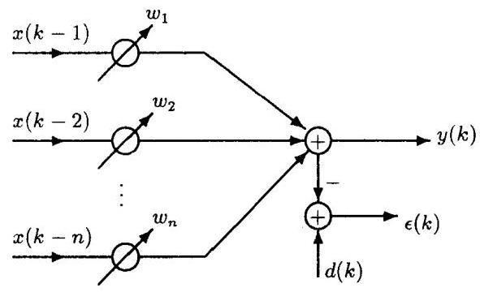

图 1.1.1 LMS 自适应滤波器

$d\left( k\right)$ 代表 “期望响应”，输出误差定义为

$$
\epsilon \left( k\right)  = d\left( k\right)  - y\left( k\right)  = d\left( k\right)  - \mathop{\sum }\limits_{{i = 1}}^{n}{w}_{i}x\left( {k - i}\right)
$$

$$
= d\left( k\right)  - {w}^{T}x = d\left( k\right)  - {x}^{T}w
$$

式中, $w = {\left\lbrack  {w}_{1},\cdots ,{w}_{n}\right\rbrack  }^{T}$ ,且 $x = {\left\lbrack  x\left( 1\right) ,\cdots , x\left( n\right) \right\rbrack  }^{T}$ . 考虑均方误差

$$
E\left\{  {{\epsilon }^{2}\left( k\right) }\right\}   = E\left\{  {{d}^{2}\left( k\right) }\right\}   - {2E}\left\{  {d\left( k\right) {x}^{T}}\right\}  w + {w}^{T}E\left\{  {x{x}^{T}}\right\}  w
$$

定义互相关函数向量 ${r}_{dx} = E\{ d\left( k\right) x\}$ 和自相关函数矩阵 ${R}_{xx} = E\left\{  {x{x}^{T}}\right\}$ ,则均方误差可表述为

$$
E\left\{  {{\epsilon }^{2}\left( k\right) }\right\}   = E\left\{  {{d}^{2}\left( k\right) }\right\}   - 2{r}_{dx}^{T}w + {w}^{T}{R}_{xx}w
$$

利用式 (1.1.2) 和式 (1.1.3) 以及均方误差的最小化条件，则有

$$
\frac{\partial E\left\{  {{\epsilon }^{2}\left( k\right) }\right\}  }{\partial w} =  - 2{r}_{dx} + 2{R}_{xx}w = 0
$$

其中，我们使用了 ${R}_{xx}$ 是对称矩阵这一事实，即 ${R}_{xx}w = {R}_{xx}^{T}w$ . 因此，可求出最佳权系数向量

$$
{w}_{\text{ opt }} = {R}_{xx}^{-1}{r}_{dx}
$$

这一方程式在信号处理中被称作 Wiener-Hopf 方程.

矩阵函数的偏导数在矩阵函数的极小化问题中起着关键作用, 有关式 (1.1.4) </n.17) 的具体应用例子将在第十章 10.4 节介绍.

#### 1.1.2 独立性、子空间、基与维数

域 $F$ 上的向量空间是一些对象 (称为向量) 的集合. 向量空间 $S$ 的子空间 ${S}_{i}$ 是 $S$ 的非空子集, 而该子集本身是同一个纯量域上的向量空间.

定义 1.1.1 ${C}^{m}$ 内的向量组 $\left\{  {{x}_{1},\cdots ,{x}_{k}}\right\}$ 称为线性独立的,若

$$
{\alpha }_{1}{x}_{1} + \cdots  + {\alpha }_{k}{x}_{k} = 0
$$

意味着 ${\alpha }_{1} = \cdots  = {\alpha }_{k} = 0$ . 反之,若 ${x}_{i}$ 的一个非平凡的组合等于零,就称 $\left\{  {{x}_{1},\cdots ,{x}_{k}}\right\}$ 线性相关.

定义 1.1.2 给定一向量组 ${x}_{1},\cdots ,{x}_{n} \in  {C}^{m}$ ,则这些向量的所有线性组合的集合是一个子空间,并称作 $\left\{  {{x}_{1},\cdots ,{x}_{k}}\right\}$ 的张成:

$$
\operatorname{span}\left\{  {{x}_{1},\cdots ,{x}_{n}}\right\}   = \left\{  {\mathop{\sum }\limits_{{j = 1}}^{n}{\beta }_{j}{x}_{j} : {\beta }_{j} \in  C}\right\} \tag{1.1.8}
$$

在任何情况下 $\operatorname{span}\left( S\right)$ 都是子空间,即使 $S$ 不是一个子空间. 若 $\operatorname{span}\left( S\right)  = V$ ,则称集合张成向量空间 $V$ . 如果 $\left\{  {{x}_{1},\cdots ,{x}_{n}}\right\}$ 是独立的,并且 $b \in  \operatorname{span}\left\{  {{x}_{1},\cdots ,{x}_{n}}\right\}$ ,那么 $b$ 就是 ${x}_{j}$ 的唯一线性组合.

如果 ${S}_{1},\cdots ,{S}_{k}$ 是 ${C}^{m}$ 的子空间,那么它们的和就是由 $S = \left\{  {{x}_{1} + {x}_{2} + \cdots  + {x}_{k} : {x}_{i} \in  }\right. \; \left. {{S}_{i}, i = 1,\cdots , k}\right\}$ 定义的子空间. 若每一个 $v \in  S$ 都具有唯一的表达式 $v = {x}_{1} + \cdots  + {x}_{k}$ , 且 ${x}_{i} \in  {S}_{i}$ ,则称 $S$ 为直和,记作

$$
S = {S}_{1} \oplus  \cdots  \oplus  {S}_{k}
$$

另外, ${S}_{i}$ 的交集也是子空间,记作

$$
S = {S}_{1} \cap  {S}_{2} \cap  \cdots  \cap  {S}_{k}
$$

若子集 $\left\{  {{x}_{{i}_{1}},\cdots ,{x}_{{i}_{k}}}\right\}$ 是线性独立的,且不包含在 $\left\{  {{x}_{1},\cdots ,{x}_{n}}\right\}$ 的任何其它线性独立子集内,则称子集 $\left\{  {{x}_{{i}_{1}},\cdots ,{x}_{{i}_{k}}}\right\}$ 是 $\left\{  {{x}_{1},\cdots ,{x}_{n}}\right\}$ 的最大线性独立子集. 如果 $\left\{  {{x}_{{i}_{1}},\cdots ,{x}_{{i}_{k}}}\right\}$ 是 $\left\{  {{x}_{1},\cdots ,{x}_{n}}\right\}$ 的最大线性独立子集,则 $\operatorname{span}\left\{  {{x}_{1},\cdots ,{x}_{n}}\right\}   = \operatorname{span}\left\{  {{x}_{{i}_{1}},\cdots ,{x}_{{i}_{k}}}\right\}$ ,并称线性独立组 $\left\{  {{x}_{{i}_{1}},\cdots ,{x}_{{i}_{k}}}\right\}$ 是 $\operatorname{span}\left\{  {{x}_{1},\cdots ,{x}_{n}}\right\}$ 的一个基.

基不是唯一的,但是它非常有用. 如果 $S \subseteq  {C}^{m}$ 是一个子空间,则可以找到线性独立的基向量 ${x}_{1},\cdots ,{x}_{k} \in  S$ 使得 $S = \operatorname{span}\left\{  {{x}_{1},\cdots ,{x}_{k}}\right\}$ .

如果向量空间 $S$ 的某些基由有限个元素组成,那么所有这些基将具有相同的元素个数,该共同个数称为向量空间 $S$ 的维数,并记作 $\dim \left( S\right)$ . 在这种情况下,我们称 $S$ 是有限维的; 否则,就说 $S$ 是无限维的.

#### 1.1.3 值域、零空间与秩

有两类重要的子空间与一个 $m \times  n$ 矩阵 $A$ 密切相关,它们是矩阵的值域和零空间. 矩阵 $A$ 的值域定义为

$$
\text{ range }A = \left\{  {y \in  {C}^{m} : y = {Ax}\text{ ,对某个 }x \in  {C}^{n}}\right\} \tag{1.1.9}
$$

而 $A$ 的零空间用

$$
\text{ null }A = \left\{  {x \in  {C}^{n} : {Ax} = 0}\right\} \tag{1.1.10}
$$

定义.

如果 $A = \left\lbrack  \begin{array}{lll} {a}_{1} & \cdots & {a}_{n} \end{array}\right\rbrack$ 是一个列分块矩阵,则

$$
\text{ range }A = \operatorname{span}\left\{  {{a}_{1},\cdots ,{a}_{n}}\right\} \tag{1.1.11}
$$

矩阵 $A$ 的秩定义为 $A$ 的值域的维数,即

$$
\text{ rank }A = \dim \left( {\text{ range }A}\right) \tag{1.1.12}
$$

关于矩阵 $A$ 的秩的下列叙述等价,每一叙述在不同的场合有用.

1) rank $A = k$ ;

2) 存在 $A$ 的 $k$ 列且不多于 $k$ 列组成一线性独立组;

3) 存在 $A$ 的 $k$ 行且不多于 $k$ 行组成一线性独立组;

4) 存在 $A$ 的一个 $k \times  k$ 子矩阵具有非零行列式,而且 $A$ 的所有 $\left( {k + 1}\right)  \times  \left( {k + 1}\right)$ 子矩阵都具有零行列式;

5) $A$ 的值域的维数等于 $k$ ;

6) 存在 $k$ 组而且不多于 $k$ 组的线性独立向量 $b$ 使得线性方程组 ${Ax} = b$ 是一致的;

7) $k = n - \left( {A\text{ 的零空间维数 }}\right)$ .

秩等式 矩阵的秩满足以下等式:

1) 若 $A \in  {C}^{m \times  n}$ ,则 $\operatorname{rank}{A}^{H} = \operatorname{rank}{A}^{T} = \operatorname{rank}{A}^{ * } = \operatorname{rank}A$ .

2) 若 $A \in  {C}^{m \times  m}$ 和 $C \in  {C}^{n \times  n}$ 均非奇异,则对于任一矩阵 $B \in  {C}^{m \times  n}$ 有 $\operatorname{rank}\left( {AB}\right)  = \; \operatorname{rank}B = \operatorname{rank}\left( {BC}\right)  = \operatorname{rank}\left( {ABC}\right)$ . 即是说,矩阵 $B$ 左乘与/或右乘一个非奇异矩阵后, $B$ 的秩保持不变. 更一般地,矩阵 $B$ 左乘一个满列秩矩阵与/或右乘一个满行秩矩阵后, $B$ 的秩不变.

3) 如果 $A, B \in  {C}^{m \times  n}$ ,则 $\operatorname{rank}A = \operatorname{rank}B$ 当且仅当存在非奇异矩阵 $X \in  {C}^{m \times  m}$ 和 $Y \in  {C}^{n \times  n}$ 使得 $B = {XAY}$ .

秩不等式 下面是矩阵的秩满足的不等式:

1) 对于任意 $m \times  n$ 矩阵 $A$ 均有 $\operatorname{rank}A \leq  \min \left( {m, n}\right)$ .

2) 若 $A \in  {C}^{m \times  k}$ 和 $B \in  {C}^{k \times  n}$ ,则

$$
\left( {\operatorname{rank}A + \operatorname{rank}B}\right)  - k \leq  \operatorname{rank}\left( {AB}\right)  \leq  \min \left( {\operatorname{rank}A,\operatorname{rank}B}\right)
$$

3) 若 $A, B \in  {C}^{m \times  n}$ ,则 $\operatorname{rank}\left( {A + B}\right)  \leq  \operatorname{rank}A + \operatorname{rank}B$ .

4) 如果从任意矩阵中删去某些行与/或某些列, 则所得子矩阵的秩不可能大于原矩阵的秩.

#### 1.1.4 向量内积与外积

定义 1.1.3 令 $V$ 是域 $F\left( R\right.$ 或 $\left. C\right)$ 上的向量空间. 函数 $\langle  \cdot  , \cdot  \rangle  : V \times  V \rightarrow  F$ 称为内积,若对所有 $x, y, z \in  V$ ,以下公理满足:

$$
\text{ 1) }\langle x, x\rangle  \geq  0
$$

(非负性)

1a) $\langle x, x\rangle  = 0$ ,当且仅当 $x = 0$ (正性)

2) $\langle x + y, z\rangle  = \langle x, z\rangle  + \langle y, z\rangle$ (可加性)

3) $\langle {cx}, y\rangle  = {c}^{ * }\langle x, y\rangle$ ,对所有纯量 $c \in  F$ 成立 (齐次性)

4) $\langle x, y\rangle  = \overline{\langle y, x\rangle }$ (Hermitian 性)

其中, 横杠表示复数共轭.

根据以上定义,两个 $m \times  1$ 向量

$$
w = \left\lbrack  \begin{matrix} {w}_{1} \\  \vdots \\  {w}_{m} \end{matrix}\right\rbrack  ,\;v = \left\lbrack  \begin{matrix} {v}_{1} \\  \vdots \\  {v}_{m} \end{matrix}\right\rbrack
$$

的内积 (或叫点积) 定义为

$$
\langle w, v\rangle  = {w}^{H}v = \mathop{\sum }\limits_{{i = 1}}^{m}{w}_{i}^{ * }{v}_{i} \tag{1.1.13}
$$

若 $x \in  {C}^{m}$ ,则非负的标量 $\langle x, x{\rangle }^{1/2}$ 称为向量 $x$ 的 Euclidean 长度. Euclidean 长度为 1 的向量叫做归一化 (或标准化) 向量. 对于任何不为零的向量 $x \in  {C}^{m}$ ,向量 $x/\langle x, x{\rangle }^{1/2}$ 都是归一化的,并且它与 $x$ 同方向.

内积的一些重要性质以及两个向量之间的 “夹角” 和正交性将留待第五章中详细讨论.

向量 $w$ 和 $v$ 的外积 (又叫叉积) 记作 $w{v}^{H}$ ,定义为

$$
w{v}^{H} = \left\lbrack  \begin{matrix} {w}_{1}{v}_{1}^{ * } & \cdots & {w}_{1}{v}_{m}^{ * } \\  \vdots & & \vdots \\  {w}_{m}{v}_{1}^{ * } & \cdots & {w}_{m}{v}_{m}^{ * } \end{matrix}\right\rbrack \tag{1.1.14}
$$

### 1.2 范数

如果有在 ${C}^{m}$ 内的几个列向量或在 ${C}^{m \times  n}$ 内的几个矩阵,我们能否说其中一些 “小”, 另外一些 “大”? 在什么样的情况下，我们可以说两个向量是 “彼此接近” 或 “远离” 的？

此时,我们很自然地会联想到一个实向量 $z \in  {R}^{m}$ 的 Euclidean 长度:

$$
{\left( {z}^{T}z\right) }^{1/2} = {\left( \mathop{\sum }\limits_{{i = 1}}^{m}{z}_{i}^{2}\right) }^{1/2}
$$

并且当该长度值小时,称向量 ${z}^{\prime \prime }$ 小; 而如果两个向量 $x$ 和 $y$ 之差 $z = x - y$ 的 Euclidean 长度小,则称 $x$ 和 $y$ 是 “接近的”.

更一般地，我们用范数作为向量和矩阵 “大小” 的测度.

#### 1.2.1 向量范数

定义 1.2.1 令 $S$ 是域 $F$ (实域 $R$ 或复域 $C$ ) 上的一个向量空间. 函数 $\parallel  \cdot  \parallel  : S \rightarrow  R$ 为向量范数,若对所有 $x, y \in  S$ 有

1) $\parallel x\parallel  \geq  0$ (非负性)

1a) $\parallel x\parallel  = 0$ ,当且仅当 $x = 0$ (正性)

2) $\parallel {cx}\parallel  = \left| c\right| \parallel x\parallel$ ,对所有纯量 $c \in  F$ 成立 (齐次性)

3) $\parallel x + y\parallel  \leq  \parallel x\parallel  + \parallel y\parallel$ (三角不等式)

上述公理是平面上的 Euclidean 长度的熟知性质. 满足公理 1), 2), 3), 但不一定满足公理 $1\mathrm{a})$ 的函数称为向量半范数.

下面是几种常用的向量范数.

(1) ${L}_{1}$ 范数 ${C}^{n}$ 上的和范数 (或 ${L}_{1}$ 范数) 定义为

$$
\parallel x{\parallel }_{1} = \left| {x}_{1}\right|  + \cdots  + \left| {x}_{n}\right| \tag{1.2.1}
$$

上述范数有时也叫 1 范数.

(2) ${L}_{2}$ 范数 令 $x = {\left\lbrack  {x}_{1},\cdots ,{x}_{n}\right\rbrack  }^{T} \in  {C}^{n}$ ,则向量 $x$ 的 Euclidean 范数 (或 ${L}_{2}$ 范数) 记作 $\parallel x{\parallel }_{2}$ ,并定义为

$$
\parallel x{\parallel }_{2} = {\left( {\left| {x}_{1}\right| }^{2} + \cdots  + {\left| {x}_{n}\right| }^{2}\right) }^{1/2} \tag{1.2.2}
$$

这是一个最为人们所共知的向量范数定义,因为 $\parallel x - y{\parallel }_{2}$ 度量向量 $x, y \in  {C}^{n}$ 两端点 $x, y$ 之间的标准 Euclidean 距离.

范数 $\parallel  \cdot  \parallel$ 称为酉不变的,若 $\parallel {Ux}\parallel  = \parallel x\parallel$ 对所有向量 $x \in  {C}^{n}$ 和所有酉矩阵 $U \in  {C}^{n \times  n}$ 恒成立.

命题 ${1.2}.{1}^{\left\lbrack  1\right\rbrack  }$ Euclidean 范数 $\parallel  \cdot  {\parallel }_{2}$ 是酉不变的.

(3) ${L}_{\infty }$ 范数 ${C}^{n}$ 上的极大范数 (或称 ${L}_{\infty }$ 范数,无穷范数) 定义为

$$
\parallel x{\parallel }_{\infty } = \max \left( {\left| {x}_{1}\right| ,\cdots ,\left| {x}_{n}\right| }\right) \tag{1.2.3a}
$$

(4) ${L}_{p}$ 范数 ${C}^{n}$ 上的 ${L}_{p}$ 范数定义为

$$
\parallel x{\parallel }_{p} = {\left( \mathop{\sum }\limits_{{i = 1}}^{n}{\left| {x}_{i}\right| }^{p}\right) }^{1/p},\;p \geq  1 \tag{1.2.4}
$$

${L}_{p}$ 范数也叫 Hölder 范数 ${}^{\left\lbrack  {14}\right\rbrack  }$ . 因此,无穷范数也定义为

$$
\parallel x{\parallel }_{\infty } = \mathop{\lim }\limits_{{p \rightarrow  \infty }}{\left( \mathop{\sum }\limits_{{i = 1}}^{n}{\left| {x}_{i}\right| }^{p}\right) }^{1/p} \tag{1.2.3b}
$$

#### 1.2.2 向量范数作 Lyapunov 函数

Lyapunov 直接法是分析和构造线性和非线性控制系统最成功的工具之一.

定理 1.2.1 (Lyapunov 稳定性定理) 若对连续系统 $\dot{x} = f\left( x\right)$ 或离散系统 ${x}_{k + 1} = \; f\left( {x}_{k}\right)$ 存在一个函数 $V\left( x\right)$ 具有平衡点 $x = 0$ ,且 $V$ 在整个 ${R}^{n}$ 内满足条件:

1) $V$ 是正定和径向无界函数,

2) 对 $x \neq  0$

$$
{DV} = \mathop{\lim }\limits_{{{\Delta t} \rightarrow  0}}\sup \frac{V\left( {x\left( {t + {\Delta t}}\right) }\right)  - V\left( {x\left( t\right) }\right) }{\Delta t} < 0\;\text{ (连续系统) }
$$

或

$$
{\Delta V} = V\left( {x}_{k + 1}\right)  - V\left( {x}_{k}\right)  < 0\;\text{ (离散系统) }
$$

则平衡点 $x = 0$ 是全局渐近稳定的.

在向量 $x$ 的 $n$ 维空间内,考虑用向量范数

$$
V\left( x\right)  = \parallel {Wx}\parallel
$$

作定理 1.2.1 中的函数 $V\left( x\right)$ ,其中 $W = \left\lbrack  \begin{array}{lll} {w}_{1} & \cdots & {w}_{n} \end{array}\right\rbrack$ 是 $m \times  n$ 矩阵,且 $m \geq  n$ 和 $\operatorname{rank}\left( W\right)  = n$ .

${L}_{p}$ 范数 (Hölder 范数) 构成了一类特殊的向量范数,其中 Euclidean 范数

$$
V\left( x\right)  = \parallel {Wx}{\parallel }_{2} = {\left( \mathop{\sum }\limits_{i}{\left| {w}_{i}^{T}x\right| }^{2}\right) }^{1/2} \tag{1.2.5}
$$

和无穷范数

$$
V\left( x\right)  = \parallel {Wx}{\parallel }_{\infty } = \mathop{\lim }\limits_{{p \rightarrow  \infty }}{\left( \mathop{\sum }\limits_{i}{\left| {w}_{i}^{T}x\right| }^{p}\right) }^{1/p} = \mathop{\max }\limits_{i}\left\{  {{w}_{i}^{T}x}\right\} \tag{1.2.6}
$$

用作 Lyapunov 函数是特别重要的.

定理 ${1.2.2}^{\left\lbrack  {15}\right\rbrack  }$ 函数 $V\left( x\right)  = \parallel {Wx}\parallel$ (其中 $W$ 是 $m \times  n$ 矩阵,且 $\operatorname{rank}W = n$ ) 是系统 $\dot{x} = {Ax}$ 的 Lyapunov 函数,当且仅当矩阵 $W$ 是矩阵方程

$$
{WA} - {QW} = 0 \tag{1.2.7}
$$

的解,假定矩阵 $Q$ 满足条件

$$
\mu \left( Q\right)  < 0 \tag{1.2.8}
$$

其中

$$
\mu \left( Q\right)  = \mathop{\lim }\limits_{{{\Delta t} \rightarrow  0 + }}\frac{\parallel I + {\Delta tQ}\parallel  - 1}{\Delta t} \tag{1.2.9}
$$

$\mu \left( Q\right)$ 有时称为 $Q$ 的对数矩阵范数 ${}^{\left\lbrack  {16}\right\rbrack  }$ . 注意,对数矩阵范数可以是负数,这一点实际上与矩阵范数非负的性质相违背.

如果函数 (1.2.5) 是 Lyapunov 函数, 那么它的平方

$$
V\left( x\right)  = \parallel {Wx}{\parallel }_{2}^{2} = \mathop{\sum }\limits_{{i = 1}}^{n}{\left( {w}_{i}^{T}x\right) }^{2} = {x}^{T}{W}^{T}{Wx} \tag{1.2.10}
$$

也是 Lyapunov 函数. 函数 (1.2.10) 为二次型 ${x}^{T}{Rx}$ ,其中

$$
R = {W}^{T}W \tag{1.2.11}
$$

由文献 [17] 知,这样的二次型函数变成系统 $\dot{x} = {Ax}$ 的 Lyapunov 函数,当且仅当

$$
{A}^{T}R + {RA} =  - \widetilde{Q} \tag{1.2.12}
$$

导致 $\widetilde{Q} > 0$ ,即导致一个正定对称矩阵 $\widetilde{Q}$ .

另一方面, 定理 1.2.2 表明, 式 (1.2.5) 定义的函数是 Lyapunov 函数, 从而函数 (1.2.10) 也是 Lyapunov 函数, 当且仅当矩阵方程式 (1.2.7) 产生一个满足条件式 (1.2.8) 的矩阵 $Q$ . 这就证明了,具有条件 $\widetilde{Q} > 0$ 的 Lyapunov 方程与具有条件式 (1.2.8) 的矩阵方程式 (1.2.7) 二者等价. 更严格地, 可以用下面的定理来叙述二者的等价性.

定理 1.2.3 下面两个集合等价:

$$
{L}_{1} = \left\{  {R \in  {R}^{n \times  n} \mid  {A}^{T}R + {RA} =  - \widetilde{Q}\text{ ,其中 }\widetilde{Q}, R > 0\text{ ,且 }\widetilde{Q}\text{ 对称 }}\right\} \tag{1.2.13}
$$

$$
{L}_{2} = \left\{  {R \in  {R}^{n \times  n} \mid  R = {W}^{T}W,{WA} - {QW} = 0\text{ ,其中 }{\mu }_{2}\left( Q\right)  < 0\text{ , rank }W = n}\right\}
$$

(1.2.14)

#### 1.2.3 矩阵范数

由于经常进行矩阵的乘法运算 ${AB}$ ，因此建立 ${AB}$ 的 “大小” 与 $\mathrm{A}$ ， $\mathrm{B}$ 各自的 “大小” 之间的关系常常是有用的. 矩阵 $A \in  {C}^{m \times  n}$ 本身是一个 ${mn}$ 维的向量空间这一事实使得我们可以利用在 ${C}^{mn}$ 的任何向量范数来度量一个矩阵的 “大小”.

定义 1.2.2 我们称函数 $\parallel  \cdot  \parallel$ 为矩阵范数,若对所有矩阵 $A, B \in  {C}^{m \times  n}$ ,该函数满足以下五条公理:

1) $\parallel A\parallel  \geq  0$ (非负性)

1a) $\parallel A\parallel  = 0$ ,当且仅当 $A = 0$ (正性)

2) $\parallel {cA}\parallel  = \left| c\right| \parallel A\parallel$ ,对所有纯量 $c \in  F$ 成立 (齐次性)

3) $\parallel A + B\parallel  \leq  \parallel A\parallel  + \parallel B\parallel$ (三角不等式)

4) $\parallel {AB}\parallel  \leq  \parallel A\parallel \parallel B\parallel$ (次乘性)

很明显,矩阵范数的公理 1) $\sim  3$ ) 与向量范数的公理 1) $\sim  3$ ) 相同. 下面是几种常用的矩阵范数.

( 1 )极大列求和矩阵范数 $A \in  {C}^{m \times  n}$ 的极大列求和范数定义为

$$
\parallel A{\parallel }_{1} = \mathop{\max }\limits_{{1 \leq  j \leq  n}}\mathop{\sum }\limits_{{i = 1}}^{m}\left| {a}_{ij}\right| \tag{1.2.15}
$$

(2) Frobenius 范数 矩阵 $A \in  {C}^{m \times  n}$ 的 Frobenius 范数或 ${L}_{2}$ 范数定义为

$$
\parallel A{\parallel }_{F} = \parallel A{\parallel }_{2} = \sqrt{\mathop{\sum }\limits_{{i = 1}}^{m}\mathop{\sum }\limits_{{j = 1}}^{n}{\left| {a}_{ij}\right| }^{2}} \tag{1.2.16}
$$

这一矩阵范数有时也叫 Euclidean 范数, Schur 范数或 Hilbert-Schmidt 范数. 注意, 若 $A = \left\lbrack  \begin{array}{lll} {a}_{1} & \cdots & {a}_{n} \end{array}\right\rbrack   \in  {C}^{m \times  n}$ ,则矩阵的 Frobenius 范数可以用它的列向量 ${a}_{i} \in  {C}^{m}$ 的 ${L}_{2}$ 范数写作

$$
\parallel A{\parallel }_{2}^{2} = {\begin{Vmatrix}{a}_{1}\end{Vmatrix}}_{2}^{2} + \cdots  + {\begin{Vmatrix}{a}_{n}\end{Vmatrix}}_{2}^{2} \tag{1.2.17}
$$

命题 1.2.2 定义在 ${C}^{m \times  n}$ 上的 Frobenius 范数或 ${L}_{2}$ 范数是酉不变的矩阵范数.

证明 由命题 1.2.1,定义在 ${C}^{n}$ 上的 ${L}_{2}$ 向量范数是酉不变的. 所以,我们有重要事实:

$\parallel {UA}{\parallel }_{2}^{2} = {\begin{Vmatrix}U{a}_{1}\end{Vmatrix}}_{2}^{2} + \cdots  + {\begin{Vmatrix}U{a}_{n}\end{Vmatrix}}_{2}^{2} = {\begin{Vmatrix}{a}_{1}\end{Vmatrix}}_{2}^{2} + \cdots  + {\begin{Vmatrix}{a}_{n}\end{Vmatrix}}_{2}^{2} = \parallel \mathbf{A}{\parallel }_{2}^{2},\;\forall$ 酉矩阵 $U$

由于对所有 $B \in  {C}^{n \times  n}$ 都有 ${\begin{Vmatrix}{B}^{H}\end{Vmatrix}}_{2} = \parallel B{\parallel }_{2}$ ,所以每当 $U, V \in  {C}^{n \times  n}$ 是酉矩阵时,恒有

$$
\parallel {UAV}{\parallel }_{2} = \parallel {AV}{\parallel }_{2} = {\begin{Vmatrix}{V}^{H}{A}^{H}\end{Vmatrix}}_{2} = {\begin{Vmatrix}{A}^{H}\end{Vmatrix}}_{2} = \parallel A{\parallel }_{2}
$$

因此,定义在 ${C}^{n \times  n}$ 的 ${L}_{2}$ 范数是酉不变的.

(3) ${L}_{p}$ 矩阵范数 矩阵的 ${L}_{p}$ 范数由

$$
\parallel A{\parallel }_{p} = {\left( \mathop{\sum }\limits_{{i = 1}}^{m}\mathop{\sum }\limits_{{j = 1}}^{n}{\left| {a}_{ij}\right| }^{p}\right) }^{1/p},\;p \geq  1 \tag{1.2.18}
$$

定义.

(4)极大行求和矩阵范数 矩阵 $A$ 的极大行求和范数定义为

$$
\parallel A{\parallel }_{\infty } = \mathop{\max }\limits_{{1 \leq  i \leq  m}}\mathop{\sum }\limits_{{j = 1}}^{n}\left| {a}_{ij}\right| \tag{1.2.19}
$$

以上四种范数都是矩阵范数, 因为它们均满足定义 1.2.2 中的各个公理. 注意,

$$
\parallel A{\parallel }_{\infty } = \mathop{\max }\limits_{{1 \leq  i \leq  m,1 \leq  j \leq  n}}\left| {a}_{ij}\right|
$$

不是一种矩阵范数. 例如对于矩阵 $J = \left\lbrack  \begin{array}{ll} 1 & 1 \\  1 & 1 \end{array}\right\rbrack$ ,由计算知, ${J}^{2} = {2J},\parallel J\parallel  = 1$ ,而 $\begin{Vmatrix}{J}^{2}\end{Vmatrix} = \; \parallel {2J}\parallel  = 2\parallel J\parallel  = 2$ ,不满足 $\begin{Vmatrix}{J}^{2}\end{Vmatrix} \leq  \parallel J{\parallel }^{2}$ ,即不满足次乘性公理,故它不是一种矩阵范数.

#### 1.2.4 Hankel 算子的范数

在模型化简、鲁棒控制、系统辨识和系统参数化等问题范围内, 线性系统起着重要的作用, 而且我们需要知道两个系统是靠近的还是远离的? 算子的范数可以起到这一作用.

令 ${h}_{k} = C{A}^{k - 1}b, k = 1,2,\cdots$ 表示系统的 Markov 参数. 一个系统的 Hankel 算子可以定义如下:

1) 在离散时间情况下, Hankel 算子为无穷阶 Hankel 矩阵

$$
H = \left\lbrack  \begin{matrix} {h}_{1} & {h}_{2} & {h}_{3} & \cdots \\  {h}_{2} & {h}_{3} & {h}_{4} & \cdots \\  {h}_{3} & {h}_{4} & {h}_{5} & \cdots \\  \vdots & \vdots & \vdots & \cdots  \end{matrix}\right\rbrack \tag{1.2.20}
$$

(关于 Hankel 矩阵, 将在第二章 2.7 节中专题讨论)

2) 在连续时间情况下, Hankel 算子为积分算子 $H$ ,它具有核

$$
k\left( {t, s}\right)  = c{\mathrm{e}}^{A\left( {t + s}\right) }b \tag{1.2.21}
$$

由函数 $f$ 产生或诱导的 Hankel 算子记作 ${H}_{f}$ . 为了避免某些数学病态,通常需要约定 ${H}_{f}$ 是紧致的,也就是说, ${H}_{f}$ 的谱是离散的,原点是唯一可允许的聚点. 根据 Hartman 的结果 ${}^{\left\lbrack  {18}\right\rbrack  },{H}_{f}$ 是紧致的,当且仅当存在函数 $h \in  {H}^{\infty }$ 使得 $f + h$ 是连续的.

用 ${L}_{2}$ 范数和 ${L}_{\infty }$ 范数定义的 Hankel 算子范数分别称为 ${H}^{2}$ 范数和 ${H}^{\infty }$ 范数. 除了以上两种范数外, 还有另外两种 Hankel 算子范数: Hankel 范数和 Hilbert-Schmidt 范数.

令 $A$ 为一有界算子,算子 $A$ 的谱记作 $\operatorname{spec}\left( A\right)$ . 有界算子 $A$ 的谱范数 $\parallel A\parallel$ 定义为算子 ${A}^{ * }A$ 的谱上确界的平方根,即

$$
\parallel A\parallel  = {\left( \sup \operatorname{spec}\left( {A}^{H}A\right) \right) }^{1/2} \tag{1.2.22}
$$

其中 ${A}^{ * }$ 是 $A$ 的伴随. 若 $A$ 紧致,则 $\parallel A\parallel  = {\sigma }_{0}\left( A\right)$ ,这里 ${\sigma }_{0}\left( A\right)$ 是 $A$ 的最大奇异值 (有关奇异值的详细讨论将在第六章进行).

在 $f$ 紧致的情况下，函数 $f$ 的 Hankel 范数 $\parallel f{\parallel }_{H}$ 定义为由 $f$ 诱导的 Hankel 算子的谱范数:

$$
\parallel f{\parallel }_{H} = \begin{Vmatrix}{H}_{f}\end{Vmatrix} \tag{1.2.23}
$$

${H}^{\infty }$ 范数和 Hankel 范数的共同缺点是没有任何与之相关联的内积. 一种既具有对应的内积,又与 ${H}^{\infty }$ 范数和 Hankel 范数等价的 Hankel 算子范数叫做 Hilbert-Schmidt 范数. Hankel 算子的 Hilbert-Schmidt 范数也叫 Hilbert-Schmidt-Hankel 范数, 简称 HSH 范数, 它是由 Hanzon 提出的 ${}^{\left\lbrack  {19}\right\rbrack  }$ .

所有有限维输入输出稳定系统的集合可以视为一线性向量空间, 它具有下列标量乘法和加法的定义.

若 ${\sum }_{1}$ 是用 $\left( {{A}_{1},{b}_{1},{c}_{1}}\right)$ 表示的系统, ${\sum }_{2}$ 是用 $\left( {{A}_{2},{b}_{2},{c}_{2}}\right)$ 表示的系统,则 $\lambda {\sum }_{1}$ 是用诸如 $\left( {{A}_{1},\lambda {b}_{1},{c}_{1}}\right)$ 表示的系统,而 ${\sum }_{1} + {\sum }_{2}$ 是用

$$
\left\lbrack  {\left( \begin{matrix} {A}_{1} & 0 \\  0 & {A}_{2} \end{matrix}\right) ,\left( \begin{matrix} {b}_{1} \\  {b}_{2} \end{matrix}\right) ,\left( {{c}_{1},{c}_{2}}\right) }\right\rbrack \tag{1.2.24}
$$

表示的 (可能非最小) 系统. 等价地, 我们可以用传递函数或 Hankel 算子来表示系统.

若 ${T}_{1}$ 和 ${T}_{2}$ 分别是 ${\sum }_{1}$ 和 ${\sum }_{2}$ 的传递函数,则 $\lambda {\sum }_{1}$ 具有传递函数 $\lambda {T}_{1}$ ,而 ${\sum }_{1} + {\sum }_{2}$ 具有传递函数 ${T}_{1} + {T}_{2}$ . 如果 ${\sum }_{1}$ 和 ${\sum }_{2}$ 分别有 Hankel 算子 ${H}_{1}$ 和 ${H}_{2}$ ,那末 $\lambda {\sum }_{1}$ 将有 Hankel 算子 $\lambda {H}_{1}$ ,而 ${\sum }_{1} + {\sum }_{2}$ 有 Hankel 算子 ${H}_{1} + {H}_{2}$ .

Hankel 算子的 Hilbert-Schmidt 范数即 HSH 范数可以视为输入输出稳定系统的线性空间上的范数. 在离散时间情况下， $\mathrm{{HSH}}$ 范数定义为

$$
\parallel \sum {\parallel }_{\mathrm{{HSH}}}^{2} = \operatorname{trace}\left( {H{H}^{T}}\right)  = \mathop{\sum }\limits_{{k = 1}}^{\infty }k{h}_{k}^{2} \tag{1.2.25}
$$

其中 $\operatorname{trace}\left( A\right)$ 是矩阵 $A$ 的迹 (其定义将在 1.4.1 节给出).

在连续时间情况下, HSH 范数定义为

$$
\parallel \sum {\parallel }_{\mathrm{{HSH}}}^{2} = {\int }_{0}^{\infty }{\int }_{0}^{\infty }k{\left( \tau ,\sigma \right) }^{2}\mathrm{\;d}\tau \mathrm{d}\sigma \tag{1.2.26}
$$

HSH 范数具有以下有趣的性质 ${}^{\left\lbrack  {19}\right\rbrack  }$ .

性质 1 在离散时间和连续时间两种情况下, HSH 范数的平方等于 Hankel 算子奇异值的平方和.

性质 2 输入输出稳定、严格真系统 $\sum$ 的 HSH 范数的平方等于被系统的有向 Nyquist 图所围面积的 ${\pi }^{-1}$ 倍 (参见图 1.2.1)，即

$$
\parallel \sum {\parallel }_{\mathrm{{HSH}}}^{2} = \frac{1}{\pi }{A}_{c}\left( \gamma \right) \tag{1.2.27}
$$

式中

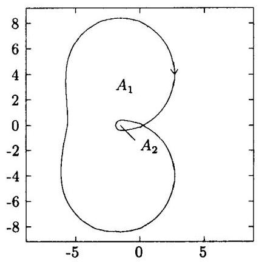

图 1.2.1 $A\left( \gamma \right)  = {A}_{1} + 2{A}_{2} = \pi \parallel \sum {\parallel }_{\mathrm{{HSH}}}^{2}$

i) $\gamma \left( \theta \right)  = T\left( {e}^{j\theta }\right)$ ,其中 $\theta  \in  \lbrack 0,{2\pi })$ 从 0 变到 ${2\pi }$ (离散时间情况),或

ii) $\gamma \left( \theta \right)  = T\left( {j\omega }\right)$ ,其中 $\omega  \in  R$ 从 $- \infty$ 变到 $+ \infty$ (连续时间情况).

性质 3 对于一个输入输出稳定的 $n$ 阶严格真系统,其 HSH 范数等于系统阶数 $n$ :

$$
\parallel \sum {\parallel }_{\mathrm{{HSH}}}^{2} = n \tag{1.2.28}
$$

性质 4 对于一个传递函数为 $T\left( z\right)$ 的离散时间系统 ${\sum }_{1}$ ,若用 ${\sum }_{k}$ 表示具有传递函数 $T\left( {z}^{k}\right) , k = 1,2,\cdots$ 的系统,则

$$
{\begin{Vmatrix}{\sum }_{k}\end{Vmatrix}}_{\mathrm{{HSH}}}^{2} = k{\begin{Vmatrix}{\sum }_{1}\end{Vmatrix}}_{\mathrm{{HSH}}}^{2} \tag{1.2.29}
$$

### 1.3 逆矩阵

除了 1.1 节介绍的矩阵基本运算外, 矩阵的求逆也是一种经常遇到的重要运算. 特别地, 矩阵求逆引理在自适应信号处理中经常用到.

#### 1.3.1 逆矩阵

为了引出逆矩阵的定义,有必要先介绍单位矩阵. 一个 $n \times  n$ 单位矩阵 ${I}_{n}$ 由列分块矩阵

$$
{I}_{n} = \left\lbrack  \begin{array}{lll} {e}_{1} & \cdots & {e}_{n} \end{array}\right\rbrack
$$

定义,其中 ${e}_{k}$ 是第 $k$ 个 “典型” 向量 ${}^{1)}$

$$
{e}_{k} = {\left\lbrack  0,\cdots ,0,1,0,\cdots ,0\right\rbrack  }^{T}
$$

即第 $k$ 个元素等于 1,其余元素为 0 .

一线性变换或正方矩阵 $A$ 称为非奇异的,若它只对零输入产生零输出. 否则,它是奇异的. 如果一个矩阵非奇异, 那么它必定存在逆矩阵. 反之, 一奇异矩阵肯定不存在逆矩阵. 当一个 $n \times  n$ 的正方矩阵 ${A}^{-1}$ 满足 ${A}^{-1}A = A{A}^{-1} = I$ 时,就称矩阵 ${A}^{-1}$ 是矩阵 $A$ 的逆矩阵.

一个 $n \times  n$ 矩阵的奇异性的另外一种常用表示是行列式.

若 $A = \{ a\}  \in  {C}^{1 \times  1}$ ,则它的行列式由 $\det \left( A\right)  = a$ 给出. 一个 $n \times  n$ 矩阵的行列式用 $\left( {n - 1}\right)  \times  \left( {n - 1}\right)$ 矩阵的行列式定义,即

$$
\det \left( A\right)  = \mathop{\sum }\limits_{{j = 1}}^{n}{\left( -1\right) }^{j + 1}{a}_{1j}\det \left( {A}_{1j}\right)
$$

其中, ${A}_{1j}$ 是除去 $A$ 的第 1 行和第 $j$ 列后得到的 $\left( {n - 1}\right)  \times  \left( {n - 1}\right)$ 矩阵. 行列式的有用性质包括

$$
\det \left( {AB}\right)  = \det \left( A\right) \det \left( B\right) ,\;A, B \in  {C}^{n \times  n}
$$

$$
\det \left( {A}^{T}\right)  = \det \left( A\right) ,\;A \in  {C}^{n \times  n}
$$

$$
\det \left( {cA}\right)  = {c}^{n}\det \left( A\right) ,\;c \in  C, A \in  {C}^{n \times  n}
$$

$$
\det \left( A\right)  \neq  0 \Leftrightarrow  A\text{ 是非奇异的, }\;A \in  {C}^{n \times  n}
$$

---

1) 也叫标准正交基向量, 详见第五章 5.5 节.

---

一个 $n \times  n$ 矩阵 $A$ 是奇异的,当且仅当 $\det \left( A\right)  = 0$ . 因此,如果 $\det \left( A\right)  \neq  0$ ,则该矩阵是可逆的. 更一般地,关于矩阵 $A \in  {C}^{n \times  n}$ 的下列叙述等价 ${}^{\left\lbrack  1\right\rbrack  }$ :

1) $A$ 非奇异;

2) ${A}^{-1}$ 存在;

3) rank $A = n$ ;

4) $A$ 的行线性独立;

5) $A$ 的列线性独立;

6) $\det \left( A\right)  \neq  0$ ;

7) $A$ 的值域的维数是 $n$ ;

8) $A$ 的零空间的维数是 0 ;

9) ${Ax} = b$ 对每一个 $b \in  {C}^{n}$ 是一致的;

10) ${Ax} = b$ 对每一个 $b$ 有唯一的解;

11) ${Ax} = 0$ 的唯一解是 $x = 0$ ;

12) 0 不是 $A$ 的特征值 (见 1.4 节).

如果 $A, B, C$ 均非奇异,则

$$
{\left( ABC\right) }^{-1} = {C}^{-1}{B}^{-1}{A}^{-1}
$$

#### 1.3.2 矩阵求逆引理

下面是两个重要的矩阵求逆引理.

引理 1.3.1 (增广矩阵求逆引理) 若 $A$ 是非奇异的 $n \times  n$ 矩阵, $C$ 是非奇异的 $m \times  m$ 矩阵, $B$ 是 $n \times  m$ 矩阵, $D$ 是 $m \times  n$ 矩阵,则增广矩阵 $A + {BCD}$ 具有逆矩阵:

$$
{\left( A + BCD\right) }^{-1} = {A}^{-1} - {A}^{-1}B{\left( D{A}^{-1}B + {C}^{-1}\right) }^{-1}D{A}^{-1} \tag{1.3.1}
$$

假定 $D{A}^{-1}B + {C}^{-1}$ 有逆矩阵. 特别地,若 $v, w$ 均为 $n \times  1$ 列向量,则

$$
{\left( A + v{w}^{H}\right) }^{-1} = {A}^{-1} - \frac{{A}^{-1}v{w}^{H}{A}^{-1}}{1 + {w}^{H}{A}^{-1}v} \tag{1.3.2}
$$

引理 1.3.2 (分块矩阵求逆引理) 令 $n \times  n$ 矩阵 $Y$ 被子矩阵 $A, B, C, D$ 分块为

$$
Y = \left\lbrack  \begin{array}{ll} A & D \\  C & B \end{array}\right\rbrack \tag{1.3.3a}
$$

式中 $A$ 是 $m \times  m$ 矩阵, $B$ 是 $\left( {n - m}\right)  \times  \left( {n - m}\right)$ 矩阵, $C$ 是 $\left( {n - m}\right)  \times  m$ 矩阵,而 $D$ 是 $m \times  \left( {n - m}\right)$ 矩阵. 矩阵 $Y$ 的逆矩阵由下式给出:

$$
{Y}^{-1} = \left\lbrack  \begin{matrix} {A}^{-1} + {A}^{-1}D{\Delta }^{-1}C{A}^{-1} &  - {A}^{-1}D{\Delta }^{-1} \\   - {\Delta }^{-1}C{A}^{-1} & {\Delta }^{-1} \end{matrix}\right\rbrack \tag{1.3.3b}
$$

$$
= \left\lbrack  \begin{matrix} {\Lambda }^{-1} &  - {\Lambda }^{-1}D{B}^{-1} \\   - {B}^{-1}C{\Lambda }^{-1} & {B}^{-1} + {B}^{-1}C{\Lambda }^{-1}D{B}^{-1} \end{matrix}\right\rbrack \tag{1.3.3c}
$$

假定 $A$ 和 $\Delta  = B - C{A}^{-1}D$ 的逆矩阵存在,或 $B$ 和 $\Lambda  = A - D{B}^{-1}C$ 的逆矩阵存在. 式中,矩阵 $\Delta$ 和 $\Lambda$ 称为矩阵 $A$ 的 Schur 补. 特别地,若矩阵 $Y$ 具有分块形式:

$$
Y = \left\lbrack  \begin{matrix} A & v \\  {w}^{H} & \alpha  \end{matrix}\right\rbrack \tag{1.3.4a}
$$

其中, $A$ 是 $\left( {n - 1}\right)  \times  \left( {n - 1}\right)$ 矩阵, $\alpha$ 为标量, $v$ 和 $w$ 均为 $\left( {n - 1}\right)  \times  1$ 列向量,则

$$
{Y}^{-1} = \left\lbrack  \begin{matrix} {A}^{-1} + \beta {A}^{-1}v{w}^{H}{A}^{-1} &  - \beta {A}^{-1}v \\   - \beta {w}^{H}{A}^{-1} & \beta  \end{matrix}\right\rbrack \tag{1.3.4b}
$$

式中,标量 $\beta  = {\left( \alpha  - {w}^{H}{A}^{-1}v\right) }^{-1}$ .

利用逆矩阵的定义, 不难验证上述两个引理的正确性.

如式 (1.3.2) 和式 (1.3.4b)所示, 一个矩阵由原矩阵加上一行和一列 (或减去一行和一列) 构成时, 其逆矩阵可以简单地进行计算. 用这种方式构成的矩阵称为加边矩阵.

矩阵求逆引理在信号处理、自动控制和系统理论等中最具代表性的应用当属递推最小二乘 (RLS) 参数估计算法.

例 1.3.1 令 $x\left( k\right)  = s\left( k\right)  + n\left( k\right)$ 为观测数据. 现在让该数据通过一个 $M$ 阶的滤波器 $W$ ,并欲使其输出为信号 $s\left( k\right)$ 的预测 $\widehat{s}\left( k\right)$ . 设

$$
{w}_{k} = {\left\lbrack  {w}_{k}\left( 1\right) ,{w}_{k}\left( 2\right) ,\cdots ,{w}_{k}\left( M\right) \right\rbrack  }^{T}
$$

$$
{x}_{k} = {\left\lbrack  x\left( k - 1\right) , x\left( k - 2\right) ,\cdots , x\left( k - M\right) \right\rbrack  }^{T}
$$

则有

$$
\widehat{s}\left( k\right)  = {w}_{k}^{T}{x}_{k}
$$

定义预测误差

$$
e\left( k\right)  = x\left( k\right)  - {w}_{k}^{T}{x}_{k} \tag{1.3.5}
$$

并考虑

$$
\varepsilon \left( {k, w}\right)  = \mathop{\sum }\limits_{{i = 1}}^{k}{\lambda }^{k - i}{\left| e\left( k\right) \right| }^{2}
$$

的最小化. 由 $\frac{\partial \varepsilon \left( {k, w}\right) }{\partial w} = 0$ ,并利用式 (1.1.2) 即可证明 (例如参见文献 [3] 或 [4]),滤波器系数可以用

$$
{w}_{k} = {w}_{k - 1} + {R}_{k}^{-1}{x}_{k}e\left( k\right) \tag{1.3.6}
$$

递推估计之, 其中

$$
{R}_{k} = \mathop{\sum }\limits_{{i = 1}}^{k}{\lambda }^{k - i}{x}_{i}{x}_{i}^{T} = {R}_{k - 1} + {x}_{k}{x}_{k}^{T} \tag{1.3.7}
$$

式 (1.3.6) 描述了一个滤波器系数受其输入误差 $e\left( k\right)$ 控制的自适应滤波算法,称为递推最小二乘 (RLS) 算法. 在有些文献中, 也称之为扩展最小二乘或扩展矩阵算法等. 由于 ${x}_{k}$ 是观测数据向量,而 $e\left( k\right)$ 又是可以由式 (1.3.5) 计算的预测误差,所以只要解决 ${R}_{k}^{-1}$ 的递推计算问题, 即可实现自适应的 RLS 算法. 对式 (1.3.7) 应用矩阵求逆引理 1.3.1, 可得到 ${R}_{k}^{-1}$ 的递推算法如下:

$$
{R}_{k}^{-1} = {R}_{k - 1}^{-1} - \frac{{R}_{k - 1}^{-1}{x}_{k}{x}_{k}^{T}{R}_{k - 1}^{-1}}{1 + {x}_{k}^{T}{R}_{k - 1}^{-1}{x}_{k}} \tag{1.3.8}
$$

最后, 式 (1.3.5)、式 (1.3.8) 和式 (1.3.6) 即构成了完整的 RLS 自适应算法.

关于 RLS 自适应算法的性能分析可参见文献 $\left\lbrack  3\right\rbrack   \sim  \left\lbrack  5\right\rbrack$ ,一种鲁棒化的 RLS 算法可在文献 $\left\lbrack  6\right\rbrack$ 中找到 (也见文献 $\left\lbrack  4\right\rbrack$ ).

下列 $n \times  n$ 非奇异矩阵及其逆矩阵可以用来检验大矩阵求逆的计算机程序的性能 ${}^{\left\lbrack  7\right\rbrack  }$ :

$$
A = \left\lbrack  \begin{matrix} \frac{n + 2}{{2n} + 2} &  - \frac{1}{2} & 0 & 0 & \cdots & 0 & \frac{1}{{2n} + 2} \\   - \frac{1}{2} & 1 &  - \frac{1}{2} & 0 & \cdots & 0 & 0 \\  0 & \frac{1}{2} & 1 &  - \frac{1}{2} & \cdots & 0 & 0 \\  \vdots & \vdots & \vdots & \vdots & & \vdots & \vdots \\  0 & \cdots & \cdots & \cdots &  - \frac{1}{2} & 1 &  - \frac{1}{2} \\  \frac{1}{{2n} + 2} & 0 & \cdots & \cdots & \cdots &  - \frac{1}{2} & \frac{n + 2}{{2n} + 2} \end{matrix}\right\rbrack
$$

$$
{A}^{-1} = \left\lbrack  \begin{matrix} n & n - 1 & n - 2 & \cdots & 2 & 1 \\  n - 1 & n & n - 1 & \cdots & 3 & 2 \\  \vdots & \vdots & \vdots & & \vdots & \vdots \\  2 & 3 & 4 & \cdots & n & n - 1 \\  1 & 2 & 3 & \cdots & n - 1 & n \end{matrix}\right\rbrack
$$

### 1.4 特征值问题与广义特征值问题

在工程中,矩阵理论最重要的应用之一是求单个矩阵 $A$ 的特征值及其对应的特征向量. 这类问题叫做矩阵的特征值问题. 例如在信号处理中, 谐波恢复的 Pisarenko 分解方法和多重信号分类 (MUSIC) 算法的核心就是对称矩阵的特征值问题. 另外一方面, 现代信号处理的发展使得我们还对两个矩阵组成的矩阵束的特征值问题感到浓厚的兴趣. 这类问题叫做广义特征值问题.

#### 1.4.1 特征值问题

定义 1.4.1 令 $A \in  {C}^{n \times  n}$ 和 $x \in  {C}^{n}$ . 若标量 $\lambda$ 和非零向量 $x$ 满足方程:

$$
{Ax} = {\lambda x},\;x \neq  0 \tag{1.4.1}
$$

则称 $\lambda$ 是矩阵 $A$ 的特征值,称 $x$ 是矩阵 $A$ (与特征值 $\lambda$ 相对应) 的特征向量. 更准确地说,若 ${Ax} = {\lambda x}$ ,则称 $x$ 是与 $\lambda$ 对应的右特征向量; 若 ${x}^{H}A = \lambda {x}^{H}$ ,则称 $x$ 是与 $\lambda$ 对应的左特征向量. 以后除非另有声明，否则 “特征向量” 泛指 “右特征向量”.

式 (1.4.1) 常称为特征值 - 特征向量方程式. 特征值 $\lambda$ 和特征向量 $x$ 二者总是成对出现, $\left( {\lambda , x}\right)$ 称为矩阵 $A$ 的特征对. 虽然特征值可能为零,但是特征向量不可以是零向量.

定义 1.4.2 矩阵 $A \in  {C}^{n \times  n}$ 的所有特征值 $\lambda  \in  C$ 的集合称为 $A$ 的谱,记作 $\lambda \left( A\right)$ . 矩阵 $A$ 的谱半径是非负实数，定义为

$$
\rho \left( A\right)  = \max \left| \lambda \right|  : \lambda  \in  \lambda \left( A\right) \tag{1.4.2}
$$

注意, $\rho \left( A\right)$ 是包含 $A$ 的所有特征值在圆内或圆上的最小圆盘的半径,圆心在复平面的原点, 故名谱半径.

特征值 - 特征向量方程式 (1.4.1) 可以等价地写作

$$
\left( {{\lambda I} - A}\right) x = 0,\;x \neq  0 \tag{1.4.3}
$$

显然,当且仅当 ${\lambda I} - A$ 是奇异的正方矩阵即

$$
\det \left( {{\lambda I} - A}\right)  = 0 \tag{1.4.4}
$$

时,才有 $\lambda  \in  \lambda \left( A\right)$ . 于是,我们有以下的定义.

定义 1.4.3 矩阵 $A \in  {C}^{n \times  n}$ 的特征多项式定义为

$$
p\left( z\right)  = \det \left( {{zI} - A}\right) \tag{1.4.5}
$$

且 $A$ 的特征值等价是 $\mathbf{A}$ 的特征多项式的 $n$ 个根.

令 $\lambda \left( A\right)  = \left\{  {{\lambda }_{1},\cdots ,{\lambda }_{n}}\right\}$ ,我们可得出结论:

$$
\det \left( A\right)  = {\lambda }_{1}\cdots {\lambda }_{n} \tag{1.4.6}
$$

显然,若 $A$ 具有零特征值,则 $\det \left( A\right)  = 0$ ,即矩阵 $A$ 奇异; 反之,若 $A$ 的所有特征值都不等于零,则 $\det \left( A\right)  \neq  0$ ,即矩阵 $A$ 非奇异.

另外一方面,矩阵 $A$ 的迹记作 $\operatorname{trace}\left( A\right)$ 或简记作 $\operatorname{tr}\left( A\right)$ ,其定义为

$$
\operatorname{trace}\left( A\right)  = \mathop{\sum }\limits_{{i = 1}}^{n}{a}_{ii} \tag{1.4.7}
$$

下面是矩阵的迹的几个性质 (证明见文献 [1]).

1) 迹等于特征值之和:

$$
\operatorname{trace}\left( A\right)  = {\lambda }_{1} + \cdots  + {\lambda }_{n} \tag{1.4.8}
$$

这一结论可以通过观察特征多项式中 $z$ 的系数得出.

2) 迹是相似不变量, 即有

$$
\operatorname{trace}\left( {AB}\right)  = \operatorname{trace}\left( {BA}\right) \tag{1.4.9}
$$

3) 对于任何正整数 $k$ ,有

$$
\operatorname{trace}\left( {A}^{k}\right)  = \mathop{\sum }\limits_{{i = 1}}^{n}{\lambda }_{i}^{k} \tag{1.4.10}
$$

式右的和称为 $A$ 的诸特征值的 $k$ 次矩.

4) 矩阵 ${A}^{H}A$ 和 $A{A}^{H}$ 的迹相等,且有

$$
\operatorname{trace}\left( {{A}^{H}A}\right)  = \operatorname{trace}\left( {A{A}^{H}}\right)  = \mathop{\sum }\limits_{{i = 1}}^{n}{\left| {a}_{ii}\right| }^{2} \tag{1.4.11}
$$

性质 2) 和 4) 由矩阵的乘法及迹的定义易知.

特征向量定义一个一维空间,它相对于用 $A$ 左乘是不变的. 更一般地,一个具有性质

$$
x \in  S \Rightarrow  {Ax} \in  S
$$

的子空间称为(对 $A$ )不变的. 注意，若

$$
{AX} = {XB},\;B \in  {C}^{k \times  k}, X \in  {C}^{n \times  k}
$$

则 $A$ 的值域 range $A$ 是不变的,而且

$$
{By} = {\lambda y} \Rightarrow  A\left( {Xy}\right)  = {\lambda Xy}
$$

因此,若 $X$ 具有满列秩 (即矩阵的秩等于其列数),则 ${AX} = {XB}$ 意味着 $\lambda \left( B\right)  \subseteq  \lambda \left( A\right)$ . 如果 $X$ 是正方的和非奇异的,则 $\lambda \left( A\right)  = \lambda \left( B\right)$ ,并且我们称 $A$ 和 $B = {X}^{-1}{AX}$ 是 “相似” 的. 在这一意义上, $X$ 称作一 “相似变换”.

矩阵 $A$ 的特征值具有下面一些明显可看出的性质. 令矩阵 $A \in  {C}^{n \times  n}$ 的特征值为 ${\lambda }_{i}, i = 1,\cdots , n$ ,则矩阵 ${kA}$ (其中 $k$ 系标量) 具有特征值 $k{\lambda }_{i}$ . 如果 $A$ 是非奇异的,那么 ${A}^{-1}$ 具有特征值 $1/{\lambda }_{i}$ .

矩阵 $A + {kI}$ 的特征值为 ${\lambda }_{i} + k$ . 举一个典型的信号处理问题为例. 假定实值的观测数据由

$$
y\left( n\right)  = x\left( n\right)  + w\left( n\right)
$$

得出,其中 $x\left( n\right)$ 为零均值的信号, $w\left( n\right)$ 是与 $x\left( n\right)$ 统计独立的加性白噪声,其均值为零. 方差为 ${\sigma }^{2}$ . 令 ${R}_{y}\left( \tau \right)  = E\{ y\left( n\right) y\left( {n + \tau }\right) \}$ 代表观测过程的自相关函数,并注意到 $w\left( n\right)$ 为白噪声，我们便很容易证明下列关系成立:

$$
{r}_{y}\left( \tau \right)  = {r}_{x}\left( \tau \right)  + {r}_{w}\left( \tau \right)
$$

$$
= {r}_{x}\left( \tau \right)  + {\sigma }^{2} \times  \delta \left( \tau \right)
$$

换言之, 观测过程的自相关矩阵是一个实的对称矩阵:

$$
{R}_{y} = {R}_{x} + {R}_{w} = \left\lbrack  \begin{matrix} {r}_{x}\left( 0\right) & {r}_{x}\left( 1\right) & \cdots & {r}_{x}\left( n\right) \\  {r}_{x}\left( 1\right) & {r}_{x}\left( 0\right) & \cdots & {r}_{x}\left( {n - 1}\right) \\  \vdots & \vdots & & \vdots \\  {r}_{x}\left( n\right) & {r}_{x}\left( {n - 1}\right) & \cdots & {r}_{x}\left( 0\right)  \end{matrix}\right\rbrack   + \left\lbrack  \begin{matrix} {\sigma }^{2} & 0 & \cdots & 0 \\  0 & {\sigma }^{2} & \cdots & 0 \\  \vdots & \vdots & & \vdots \\  0 & 0 & \cdots & {\sigma }^{2} \end{matrix}\right\rbrack
$$

如果信号 $x\left( n\right)$ 服从一个 $\mathrm{{AR}}\left( p\right)$ 模型,则信号的自相关矩阵 ${R}_{x}$ 具有秩 $p$ . 于是,观测过程的自相关矩阵 ${R}_{y}$ 的特征值 ${\lambda }_{i}\left( y\right)$ 与信号自相关矩阵 ${R}_{x}$ 的特征值 ${\lambda }_{i}\left( x\right)$ 及加性噪声的方差之间存在下列关系:

$$
{\lambda }_{i}\left( y\right)  = \left\{  \begin{array}{ll} {\lambda }_{i}\left( x\right)  + {\sigma }^{2}, & i = 1,\cdots , p \\  {\sigma }^{2}, & i = p + 1,\cdots , n \end{array}\right.
$$

在合适的信噪比下， ${\sigma }^{2}$ 比 ${\lambda }_{i}\left( x\right)  + {\sigma }^{2}$ 小得多. 在信号处理中，经常把那些占主导作用的大特征值称作主特征值, 而把另外那些明显小的特征值称为次特征值; 与主特征值对应的特征向量则称作矩阵的主特征向量, 而与次特征值对应的特征向量则叫做次特征向量. 特别有意义的是，主特征向量组成信号子空间，次特征向量构成噪声子空间. 这启迪我们，如果求出样本自相关矩阵 ${\widehat{R}}_{y}$ 的所有特征值，就能够把信号子空间同噪声子空间区别开. 这就是特征子空间分析方法的基本思想. 特征子空间分析方法在很多典型的信号处理问题 (如信号的建模、谐波恢复等) 中有着重要的应用, 我们将在第十章予以专题讨论与分析.

在许多特征值计算中，常常将原问题分解为几个更小的特征值问题. 下面的结果是这种特征值简化的基础.

引理 1.4.1 若 $T \in  {C}^{n \times  n}$ 分块为

$$
T = \left\lbrack  \begin{matrix} {T}_{11} & {T}_{12} \\  0 & {T}_{22} \end{matrix}\right\rbrack  p
$$

则 $\lambda \left( T\right)  = \lambda \left( {T}_{11}\right)  \cup  \lambda \left( {T}_{22}\right)$ .

证明 设

$$
{Tx} = \left\lbrack  \begin{matrix} {T}_{11} & {T}_{12} \\  0 & {T}_{22} \end{matrix}\right\rbrack  \left\lbrack  \begin{array}{l} {x}_{1} \\  {x}_{2} \end{array}\right\rbrack   = \lambda \left\lbrack  \begin{array}{l} {x}_{1} \\  {x}_{2} \end{array}\right\rbrack
$$

其中 ${x}_{1} \in  {C}^{p}$ 和 ${x}_{2} \in  {C}^{q}$ . 若 ${x}_{2} \neq  0$ ,则 ${T}_{22}{x}_{2} = \lambda {x}_{2}$ ,从而 $\lambda  \in  \lambda \left( {T}_{22}\right)$ . 若 ${x}_{2} = 0$ , 则 ${T}_{11}{x}_{1} = \lambda {x}_{1}$ ,从而 $\lambda  \in  \lambda \left( {T}_{11}\right)$ . 于是, $\lambda \left( T\right)  \in  \lambda \left( {T}_{11}\right)  \cup  \lambda \left( {T}_{22}\right)$ . 但是,由于 $\lambda \left( T\right)$ 和 $\lambda \left( {T}_{11}\right)  \cup  \lambda \left( {T}_{22}\right)$ 具有相同的基数,所以两个集合相等.

#### 1.4.2 广义特征值问题

令 $A$ 和 $B$ 是两个 $n \times  n$ 正方矩阵. 具有形式 $A - {\lambda B}$ (其中 $\lambda  \in  C$ ) 的所有矩阵组称为矩阵束 (matrix pencil) 或矩阵对 (matrix pair). 矩阵束的特征值叫做广义特征值, 记作 $\lambda \left( {A, B}\right)$ ,定义为

$$
\lambda \left( {A, B}\right)  = \{ z \in  C : \det \left( {A - {zB}}\right)  = 0\} \tag{1.4.12}
$$

若 $\lambda  \in  \lambda \left( {A, B}\right)$ ,并且

$$
{Ax} = {\lambda Bx},\;x \neq  0 \tag{1.4.13}
$$

则称 $x$ 是矩阵束 $A - {\lambda B}$ 的特征向量 (广义特征向量).

如果矩阵 $B$ 是非满秩的,那么 $\lambda \left( {A, B}\right)$ 就有可能是取零值、有限值或任意值 (即无穷多个特征值). 例如

$$
A = \left\lbrack  \begin{array}{ll} 1 & 2 \\  0 & 3 \end{array}\right\rbrack  \;B = \left\lbrack  \begin{array}{ll} 1 & 0 \\  0 & 0 \end{array}\right\rbrack  \; \rightarrow  \;\lambda \left( {A, B}\right)  = \{ 1\}
$$

$$
A = \left\lbrack  \begin{array}{ll} 1 & 2 \\  0 & 0 \end{array}\right\rbrack  \;B = \left\lbrack  \begin{array}{ll} 0 & 0 \\  1 & 0 \end{array}\right\rbrack  \; \rightarrow  \;\lambda \left( {A, B}\right)  = \{ 0\}
$$

$$
A = \left\lbrack  \begin{array}{ll} 1 & 2 \\  0 & 0 \end{array}\right\rbrack  \;B = \left\lbrack  \begin{array}{ll} 1 & 0 \\  0 & 0 \end{array}\right\rbrack  \; \rightarrow  \;\lambda \left( {A, B}\right) \text{ 任意 }
$$

### 1.5 广义逆矩阵

1.2 节介绍了非奇异的正方矩阵 $A$ 的逆矩阵 ${A}^{-1}$ ,它是唯一定义的,而且具有 $A{A}^{-1} = \; {A}^{-1}A = I$ 的性质. 将正方矩阵的逆矩阵推广到长方形矩阵或奇异的正方矩阵,我们将得到所谓的广义逆矩阵. 广义逆矩阵的一大应用就是利用它对线性最小二乘方法可作出统一的理论解释.

#### 1.5.1 Moore-Penrose 逆矩阵

令 $A$ 是任意 $m \times  n$ 矩阵,我们称矩阵 $G$ 是 $A$ 的 Moore-Penrose 广义逆矩阵 (generalized inverse),若 $G$ 满足以下四个条件:(2)

$$
\left. \begin{aligned} {AGA} &  = A \\  {\left( AG\right) }^{H} &  = {AG} \\  {GAG} &  = G \\  {\left( GA\right) }^{H} &  = {GA} \end{aligned}\right\} \tag{1.5.1}
$$

广义逆矩阵也叫伪逆矩阵 (pseudo inverse). 常用符号 ${A}^{ \dagger  }$ 表示矩阵 $A$ 的广义逆矩阵.

显而易见， $n \times  n$ 正方非奇异矩阵的逆矩阵也满足以上四个条件. 从这个意义上讲， 逆矩阵可以看作是 Moore-Penrose 广义逆矩阵的一个特例.

更一般地,如果矩阵 $G$ 不满足全部四个条件,只满足其中的条件 $\left( i\right) ,\left( j\right) ,\left( k\right)$ ,则我们称 $G$ 是矩阵 $A$ 的 $\{ i, j, k\}$ 逆矩阵 ${}^{\left\lbrack  8\right\rbrack  }$ . 例如,若矩阵 $G$ 满足条件 $\left( 1\right) ,\left( 2\right)$ 和 $\left( 3\right)$ ,但不满足条件 (4),我们就称其为矩阵 $A$ 的 $\{ 1,2,3\}$ 逆矩阵. 有关这种逆矩阵,我们将在第六章 6.4 节具体讨论.

下面介绍在工程中应用最广泛的两个 Moore-Penrose 广义逆矩阵.

## 1. 左伪逆矩阵

考察 $m > n$ 并且 $A$ 具有满列秩 (rank $A = n$ ) 的情况. 此时, $n \times  n$ 矩阵 ${A}^{H}A$ 是可逆的. 容易验证,

$$
{A}^{ \dagger  } = {\left( {A}^{H}A\right) }^{-1}{A}^{H} \tag{1.5.2}
$$

满足式 (1.5.1) 所示四个条件,因此,它是一种 Moore-Penrose 广义逆矩阵. 由于 ${\left( {A}^{H}A\right) }^{-1}$ 处于左乘的位置, 所以常常把式 (1.5.2) 定义的广义逆矩阵称作左伪逆矩阵 (left pseudo inverse) ${}^{\left\lbrack  {10}\right\rbrack  }$ .

## 2. 右伪逆矩阵

再考察 $m < n$ 并且 $A$ 具有满行秩 (rank $A = m$ ) 的情况. 此时, $m \times  m$ 矩阵 $A{A}^{H}$ 是可逆的. 定义

$$
{A}^{ \dagger  } = {A}^{H}{\left( A{A}^{H}\right) }^{-1} \tag{1.5.3}
$$

不难验证, 它满足式 (1.5.1) 所示四个条件, 因此是另外一种 Moore-Penrose 广义逆矩阵. 由于 ${\left( A{A}^{H}\right) }^{-1}$ 右乘的缘故,式 (1.5.3) 定义的广义逆矩阵常称作右伪逆矩阵 (right pseudo inverse) ${}^{\left\lbrack  {10}\right\rbrack  }$ .

正如下面即将看到的那样, 左伪逆矩阵与超定方程的最小二乘解, 右伪逆矩阵与欠定方程的最小二乘最小范数解密切联系在一起.

#### 1.5.2 最小二乘解

考察线性方程组 ${Ax} = y$ ,其中 $A$ 是一个 $m \times  n$ 矩阵,且 $m > n$ . 由于这类方程组的方程个数比未知数个数多, 因此它不可能有任何 “严格” 的解. 我们称这类方程为超定方程. 然而, 如果增加一个约束条件:

$$
\parallel {Ax} - y{\parallel }^{2} = \text{ 最小 } \tag{1.5.4}
$$

超定方程就具有唯一的解. 这就是所谓的最小二乘问题. 最小二乘问题的解就是利用系数矩阵 $A$ 确定一个 $n \times  m$ 矩阵 $G$ ,使得对于任意的 $y$ ,由

$$
{x}^{o} = {Gy} \tag{1.5.5}
$$

给出的解在所有解 $x$ 中具有最小的误差平方和,即满足不等式

$$
\parallel {Ax} - y{\parallel }^{2} - {\begin{Vmatrix}A{x}^{o} - y\end{Vmatrix}}^{2} \geq  0 \tag{1.5.6}
$$

我们称这种解 ${x}^{ \circ  }$ 为最小二乘解.

令式 (1.5.5) 中的 $G$ 由系数矩阵 $A$ 的左伪逆矩阵 ${A}^{ \dagger  }$ 给定,即解为

$$
{x}^{o} = {\left( {A}^{H}A\right) }^{-1}{A}^{H}y \tag{1.5.7}
$$

我们容易证明, 它就是满足不等式 (1.5.6) 的最小二乘解.

证明

$$
\parallel {Ax} - y\parallel  = \begin{Vmatrix}{A\left( {x - {x}^{o}}\right)  + A{x}^{o} - y}\end{Vmatrix}
$$

$$
= \begin{Vmatrix}{A\left( {x - {x}^{o}}\right)  + \left\lbrack  {A{\left( {A}^{H}A\right) }^{-1}{A}^{H} - {I}_{m}}\right\rbrack  y}\end{Vmatrix}
$$

$$
= \begin{Vmatrix}{A\left( {x - {x}^{o}}\right) }\end{Vmatrix} + \begin{Vmatrix}{\left\{  {A{\left( {A}^{H}A\right) }^{-1}{A}^{H} - {I}_{m}}\right\}  y}\end{Vmatrix}
$$

$$
+ 2{\left\lbrack  A\left( x - {x}^{o}\right) \right\rbrack  }^{H}\left\lbrack  {A{\left( {A}^{H}A\right) }^{-1}{A}^{H} - {I}_{m}}\right\rbrack  y \tag{1.5.8}
$$

但是最后一个等式的第三项等于零, 即

$$
{\left\lbrack  A\left( x - {x}^{o}\right) \right\rbrack  }^{H}\left\lbrack  {A{\left( {A}^{H}A\right) }^{-1}{A}^{H} - {I}_{m}}\right\rbrack  y
$$

$$
= {\left( x - {x}^{o}\right) }^{H}\left\lbrack  {{A}^{H}A{\left( {A}^{H}A\right) }^{-1}{A}^{H} - {A}^{H}}\right\rbrack  y
$$

$$
= {\left( x - {x}^{o}\right) }^{H}\left( {{A}^{H} - {A}^{H}}\right) y = 0
$$

因此, 式 (1.5.8) 简化为

$$
\parallel {Ax} - y\parallel  = \begin{Vmatrix}{A\left( {x - {x}^{o}}\right) }\end{Vmatrix} + \begin{Vmatrix}{A{\left( {A}^{H}A\right) }^{-1}{A}^{H}y - y}\end{Vmatrix}
$$

$$
= \begin{Vmatrix}{A\left( {x - {x}^{o}}\right) }\end{Vmatrix} + \begin{Vmatrix}{A{x}^{o} - y}\end{Vmatrix} \tag{1.5.9}
$$

由于

$$
\begin{Vmatrix}{A\left( {x - {x}^{o}}\right) }\end{Vmatrix} \geq  0
$$

故式 (1.5.9) 给出下列结果:

$$
\parallel {Ax} - y\parallel  \geq  \begin{Vmatrix}{A{x}^{o} - y}\end{Vmatrix}
$$

即是说, ${x}^{o}$ 确实是最小二乘解.

#### 1.5.3 最小范数解

现在考虑另外一种情况: 线性方程组 ${Ax} = y$ 的方程个数比未知数的个数少,亦即 $m < n$ . 这种方程称为欠定方程,具有无穷多组解.

举一个简单的例子, 假定线性代数方程为

$$
{x}_{1} + 2{x}_{2} = {10} \tag{1.5.10}
$$

如图 1.5.1 所示，直线 ${x}_{1} + 2{x}_{2} = {10}$ 上的所有点 $\left( {{x}_{1},{x}_{2}}\right)$ 都是方程 (1.5.10) 的解. 如果希望确定唯一的解, 我们就必须增加某个约束条件, 求满足该条件的唯一解. 作为约束条件, 我们要求解 $x$ 的范数为最小. 这样得出的唯一解称为最小范数解. 由于 $x$ 的范数最小等同于向量 $x$ 的端点与原点的距离最小，故最小范数解又称最短距离解.

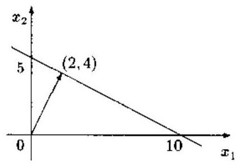

图 1.5.1 方程 (1.5.10) 的解

现在考虑方程式 (1.5.10) 中 “与原点的距离最短的解”, 则该解点为 (2,4), 见图 1.5.1.

更一般地,我们来考虑欠定方程 ${Ax} = y$ 的最小范数解,即由 ${x}^{o} = {Gy}$ 给出的解在欠定方程的所有解中具有最小的范数:

$$
\parallel x\parallel  \geq  \begin{Vmatrix}{x}^{o}\end{Vmatrix} \tag{1.5.11}
$$

假定 $G$ 由右伪逆矩阵给出,即解由

$$
{x}^{o} = {A}^{H}{\left( A{A}^{H}\right) }^{-1}y \tag{1.5.12}
$$

决定. 下面证明, 这一解就是满足不等式 (1.5.11) 的最小二乘最小范数解, 简称最小范数解. 首先注意到

$$
\parallel x\parallel  = \begin{Vmatrix}{{x}^{o} + x - {x}^{o}}\end{Vmatrix}
$$

$$
= \begin{Vmatrix}{x}^{o}\end{Vmatrix} + \begin{Vmatrix}{x - {x}^{o}}\end{Vmatrix} + 2{\left( {x}^{o}\right) }^{H}\left( {x - {x}^{o}}\right) \tag{1.5.13}
$$

$$
{x}^{ \circ  } = {A}^{H}{\left( A{A}^{H}\right) }^{-1}{Ax}
$$

及

$$
{\left( {x}^{o}\right) }^{H}\left( {x - {x}^{o}}\right)  = {y}^{H}{\left( A{A}^{H}\right) }^{-1}A\left\lbrack  {I - {A}^{H}{\left( A{A}^{H}\right) }^{-1}A}\right\rbrack  x
$$

$$
= {y}^{H}\left\lbrack  {{\left( A{A}^{H}\right) }^{-1}A - {\left( A{A}^{H}\right) }^{-1}A}\right\rbrack  x = 0
$$

于是,式 (1.5.13) 可简化为

$$
\parallel x\parallel  = \begin{Vmatrix}{x}^{o}\end{Vmatrix} + \begin{Vmatrix}{x - {x}^{o}}\end{Vmatrix}
$$

因向量范数 $\begin{Vmatrix}{x - {x}^{o}}\end{Vmatrix}$ 不可能为负，故由上式得

$$
\parallel x\parallel  \geq  \begin{Vmatrix}{x}^{ \circ  }\end{Vmatrix}
$$

即 ${x}^{\alpha }$ 确实是最小范数解.

#### 1.5.4 广义逆矩阵的阶数递推计算

在系统辨识中, 一个时间序列通常表示成一个自回归 - 移动平均 (ARMA) 模型的输出. 然而,在许多实际的情况下, $\operatorname{ARMA}\left( {p, q}\right)$ 过程的阶数 $\left( {p, q}\right)$ 是未知的,因此系统辨识需要估计对应于不同可能阶次的 ARMA 模型的 AR 和 MA 参数、并确定最优阶数 $\left( {p, q}\right)$ . 这说明, 一种阶数递推的系统辨识方法是非常有吸引力的. 下面介绍本书作者等人提出的左、右伪逆矩阵的阶数递推计算方法 ${}^{\left\lbrack  {11},{12}\right\rbrack  }$ .

## 1. 左伪逆矩阵的阶数递推 $\left\lbrack  {{11},{12}}\right\rbrack$

考虑 $n \times  m$ 矩阵 ${F}_{m}$ ,并设 ${F}^{ \dagger  } = {\left( {F}_{m}^{T}{F}_{m}\right) }^{-1}{F}_{m}^{T}$ 是 ${F}_{m}$ 的左伪逆矩阵.

定理 1.5.1 令

$$
{F}_{m} = \left\lbrack  \begin{array}{ll} {F}_{m - 1} & {f}_{m} \end{array}\right\rbrack \tag{1.5.14}
$$

式中 ${f}_{m}$ 是矩阵 ${F}_{m}$ 的第 $m$ 列,且 $\operatorname{rank}\left( {F}_{m}\right)  = m$ ,则计算 ${F}_{m}^{ \dagger  }$ 的阶数递推公式由下式给出:

$$
{F}_{m}^{ \dagger  } = \left\lbrack  \begin{matrix} {F}_{m - 1}^{ \dagger  } &  - {F}_{m - 1}^{ \dagger  }{f}_{m}{e}_{m}^{T}{\Delta }_{m}^{-1} \\   & {e}_{m}^{T}{\Delta }_{m}^{-1} \end{matrix}\right\rbrack \tag{1.5.15}
$$

式中

$$
{e}_{m} = \left\lbrack  {{I}_{n} - {F}_{m - 1}{F}_{m - 1}^{ \dagger  }}\right\rbrack  {f}_{m} \tag{1.5.16}
$$

$$
{\Delta }_{m}^{-1} = {\left\lbrack  {f}_{m}^{T}{e}_{m}\right\rbrack  }^{-1} \tag{1.5.17}
$$

且初始值为

$$
{F}_{1}^{ \dagger  } = {f}_{1}^{T}/\left( {{f}_{1}^{T}{f}_{1}}\right) \tag{1.5.18}
$$

证明 由矩阵 ${F}_{m}$ 的分块形式,我们有

$$
{F}_{m}^{T}{F}_{m} = \left\lbrack  \begin{matrix} {F}_{m - 1}^{T}{F}_{m - 1} & {F}_{m - 1}^{T}{f}_{m} \\  {f}_{m}^{T}{F}_{m - 1} & {f}_{m}^{T}{f}_{m} \end{matrix}\right\rbrack
$$

令

$$
{\left( {F}_{m}^{T}{F}_{m}\right) }^{-1} = \left\lbrack  \begin{matrix} X & Y \\  Z & W \end{matrix}\right\rbrack
$$

由逆矩阵的定义, 立即有

$$
\left\lbrack  \begin{matrix} {F}_{m - 1}^{T}{F}_{m - 1} & {F}_{m - 1}^{T}{f}_{m} \\  {f}_{m}^{T}{F}_{m - 1} & {f}_{m}^{T}{f}_{m} \end{matrix}\right\rbrack  \left\lbrack  \begin{matrix} X & Y \\  Z & W \end{matrix}\right\rbrack   = {I}_{m}
$$

上式即是

$$
{F}_{m - 1}^{T}{F}_{m - 1}X + {F}_{m - 1}^{T}{f}_{m}Z = {I}_{m - 1}
$$

$$
{F}_{m - 1}^{T}{F}_{m - 1}Y + {F}_{m - 1}^{T}{f}_{m}W = 0
$$

$$
{f}_{m}^{T}{F}_{m - 1}X + {f}_{m}^{T}{f}_{m}Z = 0
$$

$$
{f}_{m}^{T}{F}_{m - 1}Y + {f}_{m}^{T}{f}_{m}W = 1
$$

上述矩阵方程的解为

$$
X = {\left\lbrack  {F}_{m - 1}^{T}{F}_{m - 1}\right\rbrack  }^{-1}\left\lbrack  {{I}_{m - 1} - {F}_{m - 1}^{T}{f}_{m}Z}\right\rbrack
$$

$$
Y =  - {F}_{m - 1}^{ \dagger  }{f}_{m}{\Delta }_{m}^{-1}
$$

$$
Z =  - {f}_{m}^{T}{\left( {F}_{m - 1}\right) }^{T}{\Delta }_{m}^{-1}
$$

$$
W = {\left\lbrack  {f}_{m}^{T}\left( {I}_{n} - {F}_{m - 1}{F}_{m - 1}^{ \dagger  }\right) {f}_{m}\right\rbrack  }^{-1} = {\Delta }_{m}^{-1}
$$

根据左伪逆矩阵的定义, 得到

$$
{F}_{m}^{ \dagger  } = \left\lbrack  \begin{matrix} X & Y \\  Z & W \end{matrix}\right\rbrack  \left\lbrack  \begin{matrix} {F}_{m - 1}^{T} \\  {f}_{m}^{T} \end{matrix}\right\rbrack   = \left\lbrack  \begin{matrix} X{F}_{m - 1}^{T} + Y{f}_{m}^{T} \\  Z{F}_{m - 1}^{T} + W{f}_{m}^{T} \end{matrix}\right\rbrack
$$

将 $X, Y, Z, W$ 值代入上式，立即得到式 (1.5.15).

左伪逆矩阵的递推 (定理 1.5.1) 在系统辨识中的应用例子将在第八章广义最小二乘 (8.2 节) 中介绍.

## 2. 右伪逆矩阵的阶数递推 ${}^{\left\lbrack  {11}\right\rbrack  }$

考虑矩阵 ${F}_{m} \in  {C}^{n \times  m}$ ,其中 $n < m$ .

定理 1.5.2 记 ${F}_{m} = \left\lbrack  {{F}_{m - 1},{f}_{m}}\right\rbrack$ ,则右伪逆矩阵 ${F}_{m}^{ \dagger  } = {F}_{m}^{T}{\left( {F}_{m}{F}_{m}^{T}\right) }^{-1}$ 具有以下阶数递推公式:

$$
{F}_{m}^{ \dagger  } = \left\lbrack  \begin{matrix} {F}_{m - 1}^{ \dagger  } &  - {\Delta }_{m}{F}_{m - 1}^{ \dagger  }{f}_{m}{c}_{m} \\   & {\Delta }_{m}{c}_{m}^{T} \end{matrix}\right\rbrack \tag{1.5.19}
$$

式中

$$
{c}_{m}^{T} = {f}_{m}^{T}\left( {{I}_{n} - {F}_{m - 1}{F}_{m - 1}^{ \dagger  }}\right) \tag{1.5.20a}
$$

$$
{\Delta }_{m} = {c}_{m}^{T}{f}_{m} \tag{1.5.20b}
$$

递推的初始值为 ${F}_{1}^{ \dagger  } = {f}_{1}^{T}/\left( {{f}_{1}^{T}{f}_{1}}\right)$ .

证明 与定理 1.5.1 的证明完全类似, 略.

上述左伪逆矩阵的阶数递推算法也可进一步推广到辅助变量矩阵的阶数递推, 从而得到阶数递推的辅助变量方法 ${}^{\left\lbrack  {13}\right\rbrack  }$ ,详见第九章.

#### 1.5.5 超定二维超越方程的求解

作为广义逆矩阵的另一重要应用, 我们来考查二维信号处理中的一个基本问题: 辨识二维自回归 - 移动平均 (ARMA) 模型的移动平均 (MA) 参数.

令 $\operatorname{ARMA}\left( {{p}_{1},{p}_{2};{q}_{1},{q}_{2}}\right)$ 模型为

$$
\mathop{\sum }\limits_{{i = 0}}^{{p}_{1}}\mathop{\sum }\limits_{{j = 0}}^{{p}_{2}}{a}_{ij}x\left( {{n}_{1} - i,{n}_{2} - j}\right)  = \mathop{\sum }\limits_{{i = 0}}^{{q}_{1}}\mathop{\sum }\limits_{{j = 0}}^{{q}_{2}}{b}_{ij}e\left( {{n}_{1} - i,{n}_{2} - j}\right) \tag{1.5.21}
$$

不失一般性,假定 ${a}_{00} = 1,{q}_{1} \leq  {p}_{1},{q}_{2} \leq  {p}_{2}$ ,且不可观测的输入激励 $e\left( {{n}_{1},{n}_{2}}\right)$ 为二维正态白噪声，其均值为零，方差等于 ${\sigma }^{2}$ . 二维 ARMA 过程 $\left\{  {x\left( {{n}_{1},{n}_{2}}\right) }\right\}$ 的功率谱密度由下式给出:

$$
P\left( {{z}_{1},{z}_{2}}\right)  = {\left. \frac{B\left( {{z}_{1},{z}_{2}}\right) B\left( {{z}_{1}^{-1},{z}_{2}^{-1}}\right) }{A\left( {{z}_{1},{z}_{2}}\right) A\left( {{z}_{1}^{-1},{z}_{2}^{-1}}\right) }{\sigma }^{2}\right| }_{{z}_{1} = {\mathrm{e}}^{\mathrm{j}{2\pi }{\omega }_{1}},{z}_{2} = {\mathrm{e}}^{\mathrm{j}{2\pi }{\omega }_{2}}} \tag{1.5.22}
$$

式中

$$
A\left( {{z}_{1},{z}_{2}}\right)  = \mathop{\sum }\limits_{{i = 0}}^{{p}_{1}}\mathop{\sum }\limits_{{j = 0}}^{{p}_{2}}{a}_{ij}{z}_{1}^{i}{z}_{2}^{j},\;B\left( {{z}_{1},{z}_{2}}\right)  = \mathop{\sum }\limits_{{i = 0}}^{{p}_{1}}\mathop{\sum }\limits_{{j = 0}}^{{p}_{2}}{b}_{ij}{z}_{1}^{i}{z}_{2}^{j}
$$

注意,多项式 $B\left( {{z}_{1},{z}_{2}}\right) B\left( {{z}_{1}^{-1},{z}_{2}^{-1}}\right)$ 中的 ${z}_{1}^{k}{z}_{2}^{m}$ 和 ${z}_{1}^{-k}{z}_{2}^{-m}$ 项的系数相同, ${z}_{1}^{k}{z}_{2}^{-m}$ 和 ${z}_{1}^{-k}{z}_{2}^{m}$ 的系数相同, 故总可以将式 (1.5.22) 的分子写作

$$
B\left( {{z}_{1},{z}_{2}}\right) B\left( {{z}_{1}^{-1},{z}_{2}^{-1}}\right) {\sigma }^{2} = C\left( {{z}_{1},{z}_{2}}\right)  + D\left( {{z}_{1},{z}_{2}^{-1}}\right)  + D\left( {{z}_{1}^{-1},{z}_{2}}\right)  + C\left( {{z}_{1}^{-1},{z}_{2}^{-1}}\right) \tag{1.5.23}
$$

式中

$$
C\left( {{z}_{1},{z}_{2}}\right)  = \mathop{\sum }\limits_{{i = 0}}^{{q}_{1}}\mathop{\sum }\limits_{{j = 0}}^{{q}_{2}}{c}_{ij}{z}_{1}^{i}{z}_{2}^{j},\;D\left( {{z}_{1},{z}_{2}^{-1}}\right)  = \mathop{\sum }\limits_{{i = 0}}^{{q}_{1}}\mathop{\sum }\limits_{{j = 0}}^{{q}_{2}}{d}_{ij}{z}_{1}^{i}{z}_{2}^{-j}
$$

比较式 (1.5.23) 两边相同幂次的系数, 容易得到

$$
{c}_{00} = \frac{{\sigma }^{2}}{2}\mathop{\sum }\limits_{{i = 0}}^{{q}_{1}}\mathop{\sum }\limits_{{j = 0}}^{{q}_{2}}{b}_{ij}^{2} \tag{1.5.24a}
$$

$$
{c}_{km} = {\sigma }^{2}\mathop{\sum }\limits_{{i = 0}}^{{q}_{k}}\mathop{\sum }\limits_{{j = 0}}^{{q}_{2}}{b}_{ij}{b}_{i + k, j + m},\;k = 0,1,\cdots ,{q}_{1};m = 0,1,\cdots ,{q}_{2};
$$

$$
\text{ 但 }\left( {k, m}\right)  \neq  \left( {0,0}\right) \tag{1.5.24b}
$$

$$
{d}_{km} = {\sigma }^{2}\mathop{\sum }\limits_{{i = 0}}^{{q}_{1}}\mathop{\sum }\limits_{{j = 0}}^{{q}_{2}}{b}_{ij}{b}_{i - k, j + m},\;k = 1,\cdots ,{q}_{1};m = 1,\cdots ,{q}_{2} \tag{1.5.24c}
$$

上述方程称为超定二维超越方程. 二维 ARMA 模型的 MA 参数辨识问题的提法是: 已知二维 MA 谱参数 ${c}_{km}$ 和 ${d}_{km}$ (这些参数的计算方法详见文献 [20]),求解超定二维超越方程式 (1.5.24) 对 MA 参数 ${b}_{ij}$ 进行辨识. 这一问题是本书作者提出并解决的 ${}^{\left\lbrack  {20}\right\rbrack  }$ .

为了求解超定二维超越方程 (1.5.24), 引入估计误差

$$
{f}_{00} = \mathop{\sum }\limits_{{i = 0}}^{{q}_{1}}\mathop{\sum }\limits_{{j = 0}}^{{q}_{2}}{b}_{ij}^{2} - 2{c}_{00} \tag{1.5.25a}
$$

$$
{f}_{km} = \mathop{\sum }\limits_{{i = 0}}^{{{q}_{1} - k}}\mathop{\sum }\limits_{{j = 0}}^{{{q}_{2} - m}}{b}_{ij}{b}_{i + k, j + m} - {c}_{km}
$$

$$
k = 0,1,\cdots ,{q}_{1};m = 0,1,\cdots ,{q}_{2},\text{ 但 }\left( {k, m}\right)  \neq  \left( {0,0}\right) \tag{1.5.25b}
$$

$$
{f}_{{q}_{1} + k,{q}_{2} + m} = \mathop{\sum }\limits_{{i = 0}}^{{{q}_{1} - k}}\mathop{\sum }\limits_{{j = 0}}^{{q}_{2}}{b}_{ij}{b}_{i + k, j - m} - {d}_{km},\;k = 1,\cdots ,{q}_{1};m = 1,\cdots ,{q}_{2} \tag{1.5.25c}
$$

记 $f = {\left\lbrack  {f}_{00},\cdots ,{f}_{{q}_{1}{q}_{2}},{f}_{{q}_{1} + 1,{q}_{2} + 1},\cdots ,{f}_{2{q}_{1},2{q}_{2}}\right\rbrack  }^{T}$ 和 $b = {\left\lbrack  {b}_{00},\cdots ,{b}_{0{q}_{2}},\cdots ,{b}_{{q}_{1}0},\cdots ,{b}_{{q}_{1}{q}_{2}}\right\rbrack  }^{T}$ ,并定义矩阵:

$$
F = \frac{\partial f}{\partial {b}^{T}} = \left\lbrack  \begin{matrix} \frac{\partial {f}_{00}}{\partial {b}_{00}} & \ldots & \frac{\partial {f}_{00}}{\partial {b}_{{0}_{{q}_{2}}}} & \ldots & \frac{\partial {f}_{00}}{\partial {b}_{{q}_{{1}_{q}}{q}_{2}}} & \ldots & \frac{\partial {f}_{00}}{\partial {b}_{{q}_{{1}_{q}}{q}_{2}}} \\  \vdots & \vdots & \vdots & \vdots & \vdots & \vdots & \vdots \\  \frac{\partial {f}_{{q}_{1}{q}_{{q}_{2}}}}{\partial {b}_{00}} & \ldots & \frac{\partial {f}_{{q}_{{1}_{q}}{q}_{2}}}{\partial {b}_{00}} & \ldots & \frac{\partial {f}_{{q}_{{1}_{q}}{q}_{2}}}{\partial {b}_{00}} & \ldots & \frac{\partial {f}_{{q}_{{1}_{q}}{q}_{2}}}{\partial {b}_{01}} \\  \vdots & \vdots & \vdots & \vdots & \vdots & \vdots & \vdots \\  \frac{\partial {f}_{{q}_{{1}_{1}} + {q}_{{1}_{2}} + 1}}{\partial {b}_{00}} & \ldots & \frac{\partial {f}_{{q}_{{1}_{1}} + {q}_{{1}_{2}} + 1}}{\partial {b}_{00}} & \ldots & \frac{\partial {f}_{{q}_{{1}_{1}} + {q}_{{2}_{q}} + 1}}{\partial {b}_{01}} & \ldots & \frac{\partial {f}_{{q}_{{1}_{1}} + {q}_{{2}_{q}} + 1}}{\partial {b}_{01}} \\  \vdots & \vdots & \vdots & \vdots & \vdots & \vdots & \vdots \\  \frac{\partial {f}_{{q}_{{1}_{1}} + {q}_{{2}_{1}} + {q}_{{2}_{2}} + 1}}{\partial {b}_{11}} & \ldots & \frac{\partial {f}_{{q}_{{1}_{1}} + {q}_{{2}_{1}} + 1}}{\partial {b}_{11}} & \ldots & \frac{\partial {f}_{{q}_{{1}_{1}} + {q}_{{2}_{1}} + 1}}{\partial {b}_{11}} & \ldots & \frac{\partial {f}_{{q}_{{1}_{1}} + {q}_{{2}_{1}} + 1}}{\partial {b}_{11}} \end{matrix}\right\rbrack
$$

(1.5.26)

$$
{B}_{i} = \left\lbrack  \begin{matrix} {b}_{i0} & {b}_{i1} & \cdots & {b}_{i{q}_{2}} \\  {b}_{i1} & \cdots & {b}_{i{q}_{2}} & \\  \vdots & \cdots & & \\  {b}_{i{q}_{n}} & & & 0 \end{matrix}\right\rbrack \tag{1.5.27a}
$$

$$
{\bar{B}}_{i} = \left\lbrack  \begin{matrix} {b}_{i0} & {b}_{i1} & \cdots & {b}_{i{q}_{2}} \\   & {b}_{i0} & \cdots & {b}_{i{q}_{2} - 1} \\   & &  \ddots  & \vdots \\  0 & & & {b}_{i{q}_{2}} \end{matrix}\right\rbrack \tag{1.5.27b}
$$

$$
{A}_{i} = \left\lbrack  \begin{matrix} 0 & {b}_{i0} & {b}_{i1} & \cdots & {b}_{i,{q}_{2} - 1} \\  0 & 0 & {b}_{i0} & \cdots & {b}_{i,{q}_{2} - 2} \\   & & &  \ddots  & \vdots \\  0 & & & & {b}_{i0} \end{matrix}\right\rbrack \tag{1.5.27c}
$$

$$
{\bar{A}}_{i} = \left\lbrack  \begin{matrix} {b}_{i1} & {b}_{i2} & \cdots & {b}_{i,{q}_{2}} & 0 \\  {b}_{i2} & \cdots & {b}_{i,{q}_{2}} & 0 & 0 \\  \vdots & \cdots & & & \\  {b}_{i{q}_{2}} & & & & 0 \end{matrix}\right\rbrack \tag{1.5.27d}
$$

经过直接运算,并应用分块矩阵,不难证明,矩阵 $F$ 具有下面更加紧凑的形式:

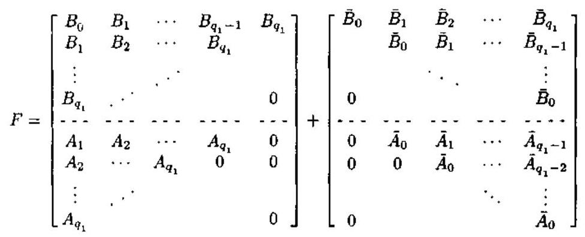

这样一来, 我们就可以运用 Newton-Raphson 算法求解超定的二维超越方程 (1.5.24). 若第 $i$ 步迭代估计的 MA 参数向量记为 ${b}^{\left( i\right) }$ ,则第 $\left( {i + 1}\right)$ 步的估计 ${b}^{\left( i + 1\right) }$ 由下式给出:

$$
{b}^{\left( i + 1\right) } = {b}^{\left( i\right) } - {F}^{ \dagger  }f \tag{1.5.29}
$$

式中 ${F}^{ \dagger  }$ 是矩阵 $F$ 的广义逆矩阵.

算法 1.5.1 (二维 MA 参数估计)

步骤 1: 取初始值 ${b}_{00} = \sqrt{2{c}_{00}}$ 和 ${b}_{ij} = 0,\left( {i, j}\right)  \neq  \left( {0,0}\right)$ .

步骤 2: 利用式 (1.5.25) 计算误差 ${f}_{km}$ ,并利用式 (1.5.27) 和 (1.5.28) 构造矩阵 $F$ .

步骤 3: 根据式 (1.5.29) 更新二维 MA 参数向量估计 ${b}^{\left( i + 1\right) }$ .

步骤 4:返回步骤 2，并重复上述步骤，直至所有 MA 参数估计值 ${b}_{km}$ 都收敛为止， 例如满足收敛条件:

$$
\left| \frac{{b}_{km}^{\left( i + 1\right) } - {b}_{km}^{\left( i\right) }}{{b}_{km}^{\left( i + 1\right) }}\right|  \leq  {0.05},\;\text{ 对所有 }k = 0,\cdots ,{q}_{1};m = 0,\cdots ,{q}_{2} \tag{1.5.30}
$$

上述算法第一次成功地估计出了 9 个二维正弦波信号的二维 ARMA 模型, 其功率谱密度清楚地显示了 9 条线谱, 详见文献 [20].

### 1.6 Kronecker 积

矩阵的 Kronecker 积是一种重要的矩阵乘积, 它是信号处理与系统理论中的随机静态分析、随机向量和随机向量过程分析等的一种基本分析工具.

#### 1.6.1 Kronecker 积及其性质

定义 1.6.1 (Kronecker 积) ${}^{\left\lbrack  {21}\right\rbrack  }p \times  q$ 矩阵 $A$ 和 $m \times  n$ 矩阵 $B$ 的 Kronecker 积记作 $A \otimes  B$ ,它是一个 ${pm} \times  {qn}$ 矩阵,定义为

$$
A \otimes  B = \left\lbrack  \begin{matrix} {a}_{11}B & \cdots & {a}_{1q}B \\  \vdots & & \vdots \\  {a}_{p1}B & \cdots & {a}_{pq}B \end{matrix}\right\rbrack \tag{1.6.1}
$$

定义 1.6.2 (Kronecker 和) ${}^{\left\lbrack  {21}\right\rbrack  }m \times  m$ 矩阵 $A$ 和 $n \times  n$ 矩阵 $B$ 的 Kronecker 和记作 $A \oplus  B$ ,它是一个 ${mn} \times  {mn}$ 矩阵,定义为

$$
A \oplus  B = A \otimes  {I}_{n} + {I}_{m} \otimes  B \tag{1.6.2}
$$

为了更方便地表示 Kronecker 积, 我们引入以下符号.

符号: 若 $c$ 是一个具有 ${p}^{k}$ 个元素的向量,我们就令 $c\left\lbrack  {{i}_{1},{i}_{2},\cdots ,{i}_{k}}\right\rbrack$ 表示向量 $c$ 的第 $\left\lbrack  {\left( {{i}_{1} - 1}\right) {p}^{k - 1} + \left( {{i}_{2} - 1}\right) {p}^{k - 2} + \cdots  + {i}_{k}}\right\rbrack$ 个元素,其中 ${i}_{1},\cdots ,{i}_{k} = 1,\cdots , p$ . 这样一来, ${p}^{k}$ 个元素的向量便可以当作一个 $k$ 维阵列来处理. 类似地,若 $M$ 是一个 ${p}^{k} \times  {p}^{k}$ 矩阵,也可以用 $M\left( {\left\lbrack  {{i}_{1},\cdots ,{i}_{k}}\right\rbrack  ,\left\lbrack  {{j}_{1},\cdots ,{j}_{k}}\right\rbrack  }\right)$ 表示矩阵 $M$ 的第 $\left\lbrack  {\left( {{i}_{1} - 1}\right) {p}^{k - 1} + \left( {{i}_{2} - 1}\right) {p}^{k - 2} + \cdots  + {i}_{k},\left( {{j}_{1} - }\right. }\right.$ 1) ${p}^{k - 1} + \left( {{j}_{2} - 1}\right) {p}^{k - 2} + \cdots  + {j}_{k}\rbrack$ 个元素,其中 ${i}_{1},\cdots ,{i}_{k},{j}_{1},\cdots ,{j}_{k} = 1,\cdots , p$ .

例 1.6.1 假定 $p = 2$ 和 $k = 2$ ,则

$$
c\left\lbrack  {1,1}\right\rbrack   = c\text{ 的第 }\left\lbrack  {\left( {1 - 1}\right) {2}^{2 - 1} + 1}\right\rbrack  \text{ 元素 } = c\text{ 的第 1 个元素 }
$$

$$
c\left\lbrack  {1,2}\right\rbrack   = c\text{ 的第 }\left\lbrack  {\left( {1 - 1}\right) {2}^{2 - 1} + 2}\right\rbrack  \text{ 元素 } = c\text{ 的第 2 个元素 }
$$

$$
c\left\lbrack  {2,1}\right\rbrack   = c\text{ 的第 }\left\lbrack  {\left( {2 - 1}\right) {2}^{2 - 1} + 1}\right\rbrack  \text{ 元素 } = c\text{ 的第 3 个元素 }
$$

$$
c\left\lbrack  {2,2}\right\rbrack   = c\text{ 的第 }\left\lbrack  {\left( {2 - 1}\right) {2}^{2 - 1} + 2}\right\rbrack  \text{ 元素 } = c\text{ 的第 4 个元素 }
$$

因此,可以将向量 $c$ 表示为 $c = \operatorname{col}\left( {c\left\lbrack  {1,1}\right\rbrack  , c\left\lbrack  {1,2}\right\rbrack  , c\left\lbrack  {2,1}\right\rbrack  , c\left\lbrack  {2,2}\right\rbrack  }\right)$ . 类似地,若 $p = 2$ 和 $k = 3$ , 则 $c = \operatorname{col}\left( {c\left\lbrack  {1,1,1}\right\rbrack  , c\left\lbrack  {1,2,1}\right\rbrack  , c\left\lbrack  {1,2,2}\right\rbrack  , c\left\lbrack  {2,1,1}\right\rbrack  , c\left\lbrack  {2,1,2}\right\rbrack  , c\left\lbrack  {2,2,1}\right\rbrack  , c\left\lbrack  {2,2,2}\right\rbrack  }\right)$ .

使用以上符号后, $A \otimes  B$ 的第 $\left\lbrack  {\left( {{i}_{1} - 1}\right) m + {i}_{2},\left( {{j}_{1} - 1}\right) n + {j}_{2}}\right\rbrack$ 个元素为 $a\left( {{i}_{1},{j}_{1}}\right) b\left( {{i}_{2},{j}_{2}}\right)$ , 其中 ${i}_{1} = 1,\cdots , p,{j}_{1} = 1,\cdots , q;{i}_{2} = 1,\cdots , m,{j}_{2} = 1,\cdots , n$ .

定义 1.6.3 若 $A$ 是一个 $m \times  n$ 矩阵,则 $A$ 的向量化函数 $\operatorname{vec}\left( A\right)$ 是一个 ${mn} \times  1$ 向量,其元素是 $A$ 的元素的字典式排序 (或叫按列堆栈); 相反,向量的矩阵化函数 ${\operatorname{unvec}}_{m, n}$ 是一个将 ${mn}$ 个元素的向量转化为 $m \times  n$ 矩阵的算子. 矩阵化算子和向量化算子有以下关系:

$$
{\operatorname{unvec}}_{m, n}\left( x\right)  = {X}_{m \times  n} \Rightarrow  \operatorname{vec}\left\lbrack  {X}_{m \times  n}\right\rbrack   = x \tag{1.6.3}
$$

例如,若 $A = \left\lbrack  {{a}_{1},\cdots ,{a}_{n}}\right\rbrack$ ,则 $\operatorname{vec}\left( A\right)  = \left\lbrack  {{a}_{1}^{T},\cdots ,{a}_{n}^{T}}\right\rbrack$ .

Kronecker 积具有以下性质 ${}^{\left\lbrack  {22}\right\rbrack  }$ .

性质 1.1

$$
\left( {A + B}\right)  \otimes  \left( {C + D}\right)  = A \otimes  C + A \otimes  D + B \otimes  C + B \otimes  D \tag{1.6.4}
$$

因此

$$
\left\lbrack  {\mathop{\sum }\limits_{{i = 1}}^{m}A\left( i\right) }\right\rbrack   \otimes  \left\lbrack  {\mathop{\sum }\limits_{{j = 1}}^{n}B\left( j\right) }\right\rbrack   = \mathop{\sum }\limits_{{i = 1}}^{m}\mathop{\sum }\limits_{{j = 1}}^{n}\left\lbrack  {A\left( i\right)  \otimes  B\left( j\right) }\right\rbrack \tag{1.6.5}
$$

性质 1.2

$$
\left( {A \otimes  B}\right) \left( {C \otimes  D}\right)  = {AC} \otimes  {BD} \tag{1.6.6}
$$

因此

$$
\mathop{\prod }\limits_{{i = 1}}^{n}\left\lbrack  {A\left( i\right)  \otimes  B\left( i\right) }\right\rbrack   =  \otimes  \left\lbrack  {\mathop{\prod }\limits_{{i = 1}}^{n}A\left( i\right) }\right\rbrack  \left\lbrack  {\mathop{\prod }\limits_{{i = 1}}^{n}B\left( i\right) }\right\rbrack \tag{1.6.7}
$$

和

$$
\left\lbrack  {{ \otimes  }_{i = 1}^{n}A\left( i\right) }\right\rbrack  \left\lbrack  {{ \otimes  }_{i = 1}^{n}B\left( i\right) }\right\rbrack   = { \otimes  }_{i = 1}^{n}A\left( i\right) B\left( i\right) \tag{1.6.8}
$$

性质 1.3

$$
\left( {A \otimes  B}\right)  \otimes  \left( {C \otimes  D}\right)  = A \otimes  B \otimes  C \otimes  D \tag{1.6.9}
$$

性质 1.4

$$
{\left( A \otimes  B\right) }^{T} = {A}^{T} \otimes  {B}^{T} \tag{1.6.10}
$$

性质 1.5 若矩阵 $A$ 和 $B$ 分别有伪逆矩阵 ${A}^{ \dagger  }$ 和 ${B}^{ \dagger  }$ ,则

$$
{\left( A \otimes  B\right) }^{ \dagger  } = {A}^{ \dagger  } \otimes  {B}^{ \dagger  } \tag{1.6.11a}
$$

特别地,若 $A$ 和 $B$ 是可逆的方矩阵,则

$$
{\left( A \otimes  B\right) }^{-1} = {A}^{-1} \otimes  {B}^{-1} \tag{1.6.11b}
$$

性质 1.6

$$
\operatorname{rank}\left( {A \otimes  B}\right)  = \operatorname{rank}\left( A\right) \operatorname{rank}\left( B\right) \tag{1.6.12}
$$

性质 1.7 若 $A$ 是 $m \times  m$ 矩阵, $B$ 是 $n \times  n$ 矩阵,则

$$
\det \left( {A \otimes  B}\right)  = {\left( \det A\right) }^{n}{\left( \det B\right) }^{m} \tag{1.6.13}
$$

性质 1.8

$$
\operatorname{trace}\left( {A \otimes  B}\right)  = \operatorname{trace}A\operatorname{trace}B \tag{1.6.14}
$$

性质 1.9

$$
\exp \left( {A \otimes  B}\right)  = \exp \left( A\right)  \otimes  \exp \left( B\right) \tag{1.6.15}
$$

性质 1.10 若 ${\alpha }_{i}$ 是矩阵 $A$ 与特征值 ${\lambda }_{i}$ 对应的特征向量, ${\beta }_{i}$ 是矩阵 $B$ 与特征值 ${\mu }_{i}$ 对应的特征向量,则 ${\alpha }_{i} \otimes  {\beta }_{i}$ 是矩阵 $A \otimes  B$ 与特征值 ${\lambda }_{i}{\mu }_{i}$ 对应的特征向量,也是与特征值 ${\lambda }_{i} + {\mu }_{i}$ 对应的特征向量.

性质 1.11 若 $A$ 是 $p \times  q$ 矩阵, $B$ 为 $m \times  n$ 矩阵,则

$$
B \otimes  A = {U}_{m \times  p}\left( {A \otimes  B}\right) {U}_{q \times  n} \tag{1.6.16}
$$

其中 ${U}_{m \times  p}$ 是 $m \times  p$ 维的置换矩阵

$$
{U}_{m \times  p} = \mathop{\sum }\limits_{{i = 1}}^{m}\mathop{\sum }\limits_{{k = 1}}^{p}{E}_{ik}^{\left( m \times  p\right) } \otimes  {E}_{ki}^{\left( p \times  m\right) }
$$

特别地,若 $A$ 和 $B$ 为列向量 (即 $q = n = 1$ ),则 $B \otimes  A = {U}_{m \times  p}\left( {A \otimes  B}\right)$ .

性质 1.12

$$
\operatorname{vec}\left( {ADB}\right)  = \left( {{B}^{T} \otimes  A}\right) \operatorname{vec}\left( D\right) \tag{1.6.17}
$$

例 1.6.2 考查矩阵方程

$$
{LX} + {XN} = Y \tag{1.6.18}
$$

其中矩阵 $X$ 未知. 假定式 (1.6.18) 中的所有矩阵都是 $n \times  n$ 矩阵. 随机动态系统的稳定性理论和静态分析都可归结为此矩阵方程. 由性质 1.12 知

$$
\left( {{I}_{n} \otimes  L}\right)  + \left( {{N}^{T} \otimes  {I}_{n}}\right) \operatorname{vec}\left( X\right)  = \operatorname{vec}\left( Y\right)
$$

故

$$
\operatorname{vec}\left( X\right)  = {\left( {N}^{T} \oplus  L\right) }^{-1}\operatorname{vec}\left( Y\right) \tag{1.6.19}
$$

若 ${N}^{T} \oplus  L$ 非奇异. 由谱表示原理 ${}^{\left\lbrack  {23}\right\rbrack  }$ 和性质 1.10 可得到

$$
{\left( {N}^{T} \oplus  L\right) }^{-1} = \mathop{\sum }\limits_{{i = 1}}^{n}\mathop{\sum }\limits_{{j = 1}}^{n}\frac{\left( {{b}_{k} \otimes  {w}_{i}}\right) {\left( {\beta }_{k} \otimes  {v}_{i}\right) }^{T}}{{\mu }_{k} + {\gamma }_{i}} \tag{1.6.20}
$$

其中 ${b}_{k},{w}_{i},{\beta }_{k}$ 和 ${v}_{i}$ 分别是 ${N}^{T}, L, N$ 和 ${L}^{T}$ 的特征向量. 综合式 (1.6.19)、式 (1.6.20) 以及性质 1.2,1.4 和性质 1.12 , 即可得到解为

$$
X = \mathop{\sum }\limits_{{i = 1}}^{n}\mathop{\sum }\limits_{{k = 1}}^{n}\frac{{w}_{i}{v}_{i}^{T}Y{\beta }_{k}{b}_{k}^{T}}{{\mu }_{k} + {\gamma }_{1}} \tag{1.6.21}
$$

定义矩阵 $A$ 的 Kronecker 平方

$$
{A}^{\left\lbrack  2\right\rbrack  } = A \otimes  A \tag{1.6.22}
$$

类似地,可以定义 Kronecker 乘幂 ${A}^{\left\lbrack  k\right\rbrack  }$ .

如果 $G$ 是 $t \times  u$ ,而 $F$ 是 $q \times  u$ 矩阵,即 $G$ 和 $F$ 有相同的列数,则 Khatri-Rao 积记为 $F \odot  G$ ,并定义为 ${}^{\left\lbrack  {24}\right\rbrack  }$

$$
F \odot  G = \left\lbrack  {{F}_{1} \otimes  {G}_{1},{F}_{2} \otimes  {G}_{2},\cdots ,{F}_{u} \otimes  {G}_{u}}\right\rbrack \tag{1.6.23}
$$

下面是向量化函数、Kronecker 乘幂和 Khatri-Rao 积的性质 ${}^{\left\lbrack  {21}\right\rbrack  }$ .

性质 2.1

$$
\operatorname{vec}\left( {A + B}\right)  = \operatorname{vec}\left( A\right)  + \operatorname{vec}\left( B\right) \tag{1.6.24}
$$

性质 2.2

$$
\operatorname{vec}\left( {A}^{T}\right)  = {U}_{p \times  q}\operatorname{vec}\left( A\right) \tag{1.6.25}
$$

性质 2.3

$$
\operatorname{vec}\left( {AD}\right)  = \left( {{I}_{s} \otimes  A}\right) \operatorname{vec}\left( D\right)  = \left( {{D}^{T} \otimes  {I}_{p}}\right) \operatorname{vec}\left( A\right)  = \left( {{D}^{T} \otimes  A}\right) \operatorname{vec}\left( {I}_{q}\right) \tag{1.6.26}
$$

性质 2.4

$$
{A}^{\left\lbrack  k + 1\right\rbrack  } = A \otimes  {A}^{\left\lbrack  k\right\rbrack  } \tag{1.6.27}
$$

性质 2.5

$$
{\left( AD\right) }^{\left\lbrack  k\right\rbrack  } = {A}^{\left\lbrack  k\right\rbrack  }{D}^{\left\lbrack  k\right\rbrack  } \tag{1.6.28}
$$

性质 2.6

$$
\operatorname{trace}\left( {ADW}\right)  = {\left( \operatorname{vec}A\right) }^{T}\left( {{I}_{p} \otimes  D}\right) \operatorname{vec}\left( W\right) \tag{1.6.29}
$$

性质 2.7

$$
\operatorname{trace}\left( {{A}^{T}D}\right)  = {\left( \operatorname{vec}A\right) }^{T}\operatorname{vec}\left( D\right) \tag{1.6.30}
$$

性质 2.8

$$
A \odot  \left( {{D}^{T} \odot  {F}^{T}}\right)  = \left( {A \odot  {D}^{T}}\right)  \odot  {F}^{T} \tag{1.6.31}
$$

性质 2.9

$$
A \odot  B = {U}_{n \times  n}\left( {B \odot  A}\right) \tag{1.6.32}
$$

性质 2.10

$$
\left( {A \otimes  B}\right) \left( {F \odot  G}\right)  = {AF} \odot  {BG} \tag{1.6.33}
$$

#### 1.6.2 Kronecker 积的应用

Kronecker 积最具有代表性的应用莫过于在信号处理与系统理论中的多变元时间序列的高阶统计量理论与方法中的应用. 可以这样说, Kronecker 积乃是多变元时间序列的高阶统计量分析的基本数学工具之一. 正是由于 Kronecker 积的使用, 才使得多变元时间序列的高阶累积量、高阶谱 (多谱) 和描述输入、输出与多信道系统冲激响应三者关系的数学公式变得非常的简洁, 直观上与单变元情况下的对应表示极其相似.

## 1. 向量过程的累积量

考查观测过程 $y\left( n\right)$ ,它是一个 $p$ 维随机向量,即 $y\left( n\right)  = {\left\lbrack  {y}_{1}\left( n\right) ,\cdots ,{y}_{p}\left( n\right) \right\rbrack  }^{T}$ . 随机向量的累积量 (cumulants) 定义有两种选择. 一种定义方式是模仿概率论中的第二特征函数 (又叫累积量生成函数) 定义,令向量 ${\omega }_{i} = {\left\lbrack  {\omega }_{i1},\cdots ,{\omega }_{ip}\right\rbrack  }^{T}, i = 1,\cdots , k$ 和 $y = \; \left\lbrack  {{y}^{T}\left( n\right) ,{y}^{T}\left( {n + {\tau }_{1}}\right) ,\cdots ,{y}^{T}\left( {n + {\tau }_{k - 1}}\right) }\right\rbrack$ (现在 ${\omega }_{i}$ 和 $y$ 均为 ${pk}$ 维向量),并产生累积量生成函数 $\ln E\left\{  {\exp \left( {\mathrm{j}{\omega }_{i}y}\right) }\right\}$ ,再用该生成函数的 Taylor 级数展开系数定义随机向量 $y$ 的高阶累积量. 但是, 这种定义最后的表达式太复杂, 并且难于推导出其它很多有用的公式. 相比之下，另外一种定义方式具有很多明显的优点. 这种方式是定义向量元素的互累积量, 例如

$$
{c}_{{y}_{i},{y}_{j},{y}_{l}}\left( {n;{\tau }_{1},{\tau }_{2}}\right)  = E\left\{  {{y}_{i}\left( n\right) {y}_{j}\left( {n + {\tau }_{1}}\right) {y}_{l}\left( {n + {\tau }_{2}}\right) }\right\}
$$

是 ${y}_{i}\left( n\right) ,{y}_{j}\left( n\right)$ 和 ${y}_{l}\left( n\right)$ 的三阶累积量. 这样一种定义能更加方便地表示 ${p}^{k}$ 个元素的随机向量的 $k$ 阶累积量. 再利用 Kronecker 积,于是随机向量的累积量可以定义如下.

定义 ${1.6.4}^{\left\lbrack  {25},{26}\right\rbrack  }$ 假定随机向量 ${x}_{1},{x}_{2},\cdots ,{x}_{k - 1}$ 分别具有 $p$ 个元素, ${x}_{1},{x}_{2},\cdots ,{x}_{k}$ 的累积量 $\operatorname{cum}\left( {{x}_{1},{x}_{2},\cdots ,{x}_{k}}\right)$ 是一个 ${p}^{k}$ 元素的向量,其第 $\left\lbrack  {{i}_{1},{i}_{2},\cdots ,{i}_{k}}\right\rbrack$ 个元素为互累积量 $\operatorname{cum}\left( {{x}_{1,{i}_{1}},{x}_{2,{i}_{2}},\cdots ,{x}_{k,{i}_{k}}}\right)$ ,其中 ${i}_{1},\cdots ,{i}_{k} = 1,\cdots , p$ . 特别地,随机向量 $y\left( n\right)$ 的 $k$ 阶累积量定义为

$$
{c}_{ky}\left( {n;{\tau }_{1},\cdots ,{\tau }_{k - 1}}\right)  = \operatorname{cum}\left\{  {y\left( n\right) , y\left( {n + {\tau }_{1}}\right) ,\cdots , y\left( {n + {\tau }_{k - 1}}\right) }\right\} \tag{1.6.34}
$$

其第 $\left\lbrack  {{i}_{0},{i}_{1},\cdots ,{i}_{k - 1}}\right\rbrack$ 个元素为 $\operatorname{cum}\left\{  {{y}_{{i}_{0}}\left( n\right) ,{y}_{{i}_{1}}\left( {n + {\tau }_{1}}\right) ,\cdots ,{y}_{{i}_{k - 1}}\left( {n + {\tau }_{k - 1}}\right) }\right\}$ ,其中 ${i}_{0},{i}_{1},\cdots$ , ${i}_{k - 1} = 1,\cdots , p.$

将累积量表示为 ${p}^{k}$ 个元素的向量而不是 $k$ 维阵列有两个主要原因: (1) 它使我们在运算中能够使用向量和矩阵代数; (2) 它使我们能够使用 Kronecker 积的代数得到相当直观的向量过程的累积量公式.

业已证明 ${}^{\left\lbrack  {25}\right\rbrack  }$ ，一个零均值的 $p$ 元素非平稳向量过程 $y\left( n\right)$ 的 $k$ 阶累积量由 ${p}^{k}$ 个元素的向量 ${c}_{ky}$ 给出:

$$
{c}_{2y}\left( {n;\tau }\right)  = E\{ y\left( n\right)  \otimes  y\left( {n + \tau }\right) \} \tag{1.6.35a}
$$

$$
{c}_{3y}\left( {n;{\tau }_{1},{\tau }_{2}}\right)  = E\left\{  {y\left( n\right)  \otimes  y\left( {n + {\tau }_{1}}\right)  \otimes  y\left( {n + {\tau }_{2}}\right) }\right\} \tag{1.6.35b}
$$

$$
{c}_{4y}\left( {n;{\tau }_{1},{\tau }_{2},{\tau }_{3}}\right)  = E\left\{  {y\left( n\right)  \otimes  y\left( {n + {\tau }_{1}}\right)  \otimes  y\left( {n + {\tau }_{2}}\right)  \otimes  y\left( {n + {\tau }_{3}}\right) }\right\}
$$

$$
- E\left\{  {y\left( n\right)  \otimes  y\left( {n + {\tau }_{1}}\right) }\right\}   \otimes  E\left\{  {y\left( {n + {\tau }_{2}}\right)  \otimes  y\left( {n + {\tau }_{3}}\right) }\right\}
$$

$$
- {P}_{p}^{T}E\left\{  {y\left( n\right)  \otimes  y\left( {n + {\tau }_{2}}\right) }\right\}   \otimes  E\left\{  {y\left( {n + {\tau }_{3}}\right)  \otimes  y\left( {n + {\tau }_{1}}\right) }\right\}
$$

$$
- {P}_{p}E\left\{  {y\left( n\right)  \otimes  y\left( {n + {\tau }_{3}}\right) }\right\}   \otimes  E\left\{  {y\left( {n + {\tau }_{1}}\right)  \otimes  y\left( {n + {\tau }_{2}}\right) }\right\} \tag{1.6.35c}
$$

其中 ${P}_{p}$ 是一个 ${p}^{4} \times  {p}^{4}$ 置换矩阵,由下式给出:

$$
{P}_{p} = I \otimes  {U}_{{p}^{2} \times  p} \tag{1.6.36}
$$

${U}_{{p}^{2} \times  p}$ 是一个 ${p}^{3} \times  {p}^{3}$ 置换矩阵,它的第 $\left\lbrack  {\left( {i - 1}\right) p + k,\left( {k - 1}\right) {p}^{2} + i}\right\rbrack$ 个元素 $\left( {i = 1,\cdots ,{p}^{2};k = }\right. \; 1,\cdots , p)$ 为 1,而其它元素均等于零.

如果 $y\left( n\right)$ 为标量随机过程,则只要将式 (1.6.35) 中的 Kronecker 积换成一般的数乘, 置换矩阵换成 1 即可. 换句话说, 向量过程的累积量与标量过程的累积量具有惊人的相似形式.

再以随机向量的累积量的一个重要性质为例. 若 ${\Lambda }_{i}\left( {i = 1,\cdots , k}\right)$ 为 $r \times  p$ 常数矩阵, 且 ${x}_{i}\left( {i = 1,\cdots , k}\right)$ 为 $p$ 元素随机向量,则

$$
\operatorname{cum}\left( {{\Lambda }_{1}{x}_{1},\cdots ,{\Lambda }_{k}{x}_{k}}\right)  = \left\lbrack  {{\Lambda }_{1} \otimes  \cdots  \otimes  {\Lambda }_{k}}\right\rbrack  \operatorname{cum}\left( {{x}_{1},\cdots ,{x}_{k}}\right) \tag{1.6.37}
$$

证明 令 ${y}_{i} = {\Lambda }_{i}{x}_{i}\left( {i = 1,\cdots , k}\right)$ ,矩阵 ${\Lambda }_{i}$ 的第 $\left( {j, l}\right)$ 个元素为 ${\lambda }_{i, j, l}$ . 于是,由标量随机过程的累积量性质 (例如参见文献 [6] 的第一章), 我们有

$$
\operatorname{cum}\left( {{y}_{1},\cdots ,{y}_{k}}\right) \left\lbrack  {{i}_{1},\cdots ,{i}_{k}}\right\rbrack   = \operatorname{cum}\left( {{y}_{1,{i}_{1}},\cdots ,{y}_{k,{i}_{k}}}\right)
$$

$$
= \operatorname{cum}\left( {\mathop{\sum }\limits_{{{j}_{1} = 1}}^{p}{\lambda }_{1;{i}_{1},{j}_{1}}{x}_{1,{j}_{1}},\cdots ,\mathop{\sum }\limits_{{{j}_{k} = 1}}^{p}{\lambda }_{k;{i}_{k},{j}_{k}}{x}_{k,{j}_{k}}}\right)
$$

$$
= \mathop{\sum }\limits_{{{j}_{1} = 1}}^{p}\cdots \mathop{\sum }\limits_{{{j}_{k} = 1}}^{p}{\lambda }_{1;{i}_{1},{j}_{1}}\cdots {\lambda }_{k;{i}_{k},{j}_{k}}\operatorname{cum}\left( {{x}_{1,{j}_{1}},\cdots ,{x}_{k,{j}_{k}}}\right)
$$

(1.6.38)

另一方面,根据 Kronecker 积的定义,又可得到式 (1.6.37) 右边的第 $\left\lbrack  {{i}_{1},\cdots ,{i}_{k}}\right\rbrack$ 个元素为

$$
\left( {{A}_{1} \otimes  \cdots  \otimes  {A}_{k}}\right) \operatorname{cum}\left( {{x}_{1},\cdots ,{x}_{k}}\right) \left\lbrack  {{i}_{1},\cdots ,{i}_{k}}\right\rbrack
$$

$$
= \mathop{\sum }\limits_{{{j}_{1} = 1}}^{p}\cdots \mathop{\sum }\limits_{{{j}_{k} = 1}}^{p}{\lambda }_{1;{i}_{1},{j}_{1}}\cdots {\lambda }_{k;{i}_{k},{j}_{k}}\operatorname{cum}\left( {{x}_{1},\cdots ,{x}_{k}}\right) \left\lbrack  {{i}_{1},\cdots ,{i}_{k}}\right\rbrack
$$

$$
= \mathop{\sum }\limits_{{{j}_{1} = 1}}^{p}\cdots \mathop{\sum }\limits_{{{j}_{k} = 1}}^{p}{\lambda }_{1;{i}_{1},{j}_{1}}\cdots {\lambda }_{k;{i}_{k},{j}_{k}}\operatorname{cum}\left( {{x}_{1,{j}_{1}},\cdots ,{x}_{k,{j}_{k}}}\right) \tag{1.6.39}
$$

比较式 (1.6.38) 和式 (1.6.39) 立即可知, 两式完全相同, 故式 (1.6.37) 为真.

假设多输入 - 多输出 (MIMO) 系统可以用下面的状态空间描述:

$$
x\left( {n + 1}\right)  = \Phi \left( n\right) x\left( n\right)  + B\left( n\right) e\left( n\right) \tag{1.6.40}
$$

$$
y\left( n\right)  = \Psi \left( n\right) x\left( n\right)  + v\left( n\right) \tag{1.6.41}
$$

则状态过程 $x\left( n\right)$ 的累积量向量 ${c}_{kx}\left( {n;{\tau }_{1},\cdots ,{\tau }_{k - 1}}\right)$ 可以递推计算,而且输出过程 $y\left( n\right)$ 的累积量向量 ${c}_{ky}\left( {n;{\tau }_{1},\cdots ,{\tau }_{k - 1}}\right)$ 与状态过程的累积量向量之间有下列关系:

$$
{c}_{ky}\left( {n;{\tau }_{1},\cdots ,{\tau }_{k - 1}}\right)  = \left\lbrack  {\Psi \left( n\right)  \otimes  \Psi \left( {n + {\tau }_{1}}\right)  \otimes  \cdots  \otimes  \Psi \left( {n + {\tau }_{k - 1}}\right) }\right\rbrack
$$

$$
\times  {c}_{kx}\left( {n;{\tau }_{1},\cdots ,{\tau }_{k - 1}}\right)  + {c}_{kc}\left( {n;{\tau }_{1},\cdots ,{\tau }_{k - 1}}\right) \tag{1.6.42}
$$

对以上递推公式的建立和式 (1.6.42) 的证明感兴趣的读者可参阅文献 [25] 或 [26] 的第九章.

## 2. 多信道 BBR 公式

除了使用状态空间模型外，随机向量过程 $y\left( n\right)$ 也可以看作是一个线性多信道系统的输出,该系统的冲激响应矩阵为 $H\left( {n, k}\right)$ ,输入为随机向量 $e\left( n\right)$ . 具体地说, $y\left( n\right)$ 可表述为

$$
y\left( n\right)  = \mathop{\sum }\limits_{{k =  - \infty }}^{\infty }H\left( {n, k}\right) e\left( n\right) \tag{1.6.43}
$$

其中 $y\left( n\right)  \in  {R}_{{n}_{\nu }}, e\left( n\right)  \in  {R}^{{n}_{e}}$ 和 $H\left( {n, k}\right)  \in  {R}^{{n}_{\nu }} \times  {R}^{{n}_{e}}$ ,且 $X \times  Y$ 表示非空经典集 $X$ 与 $Y$ 的积集: $\;X \times  Y = \{ \left( {x, y}\right)  : x \in  X, y \in  Y\}$ .

假定 $e\left( n\right)$ 与 $e\left( m\right) , n \neq  m$ 独立,即其累积量为多维 Kronecker $\delta$ 函数:

$$
{c}_{ke}\left( {n;{\tau }_{1},\cdots ,{\tau }_{k - 1}}\right)  = \operatorname{cum}\left\{  {e\left( n\right) , e\left( {n + {\tau }_{1}}\right) ,\cdots , e\left( {n + {\tau }_{k - 1}}\right) }\right\}
$$

$$
= {\Gamma }_{ke}\left( n\right) \delta \left( {\tau }_{1}\right) \cdots \delta \left( {\tau }_{k - 1}\right) \tag{1.6.44}
$$

式中,输入累积量 ${\Gamma }_{ke}\left( n\right)$ 是一个有 ${n}_{e}^{k}$ 元素的向量.

描述多信道系统 $H\left( {n, k}\right)$ 与它的输入累积量、输出累积量三者之间关系的数学式称为多信道 Bartlett-Brillinger-Rosenblatt (BBR) 公式, 它可以叙述如下.

定理 1.6.1 (多信道 BBR 公式) 对于由式 (1.6.43) 定义的线性向量过程 $y\left( n\right)$ ,若输入满足式 (1.6.44),且冲激响应矩阵 $H\left( {n, k}\right)$ 是绝对可和的:

$$
\mathop{\sum }\limits_{{n = 0}}^{\infty }\mathop{\sum }\limits_{{k =  - \infty }}^{\infty }\left| {H\left( {n, k}\right) }\right|  < \infty
$$

则输出向量过程的 $k$ 阶累积量由下列 BBR 公式给出:

$$
{c}_{ky}\left( {n;{\tau }_{1},\cdots ,{\tau }_{k - 1}}\right)
$$

$$
= \mathop{\sum }\limits_{{i =  - \infty }}^{\infty }\left\lbrack  {H\left( {n, i}\right)  \otimes  H\left( {n + {\tau }_{1}, i}\right)  \otimes  \cdots  \otimes  H\left( {n + {\tau }_{k - 1}, i}\right) }\right\rbrack  {\Gamma }_{ke}\left( i\right)
$$

(1.6.45)并且当系统是时不变即 $H\left( {n, k}\right)  = H\left( {n - k}\right)$ 以及 ${\Gamma }_{ke}\left( n\right)  = {\Gamma }_{ke}$ 时,式 (1.6.45) 简化为

$$
{c}_{ky}\left( {{\tau }_{1},\cdots ,{\tau }_{k - 1}}\right)
$$

$$
= \mathop{\sum }\limits_{{i =  - \infty }}^{\infty }\left\lbrack  {H\left( i\right)  \otimes  H\left( {i + {r}_{1}}\right)  \otimes  \cdots  \otimes  H\left( {i + {\tau }_{k - 1}}\right) }\right\rbrack  {\Gamma }_{ke}
$$

$$
= \mathop{\sum }\limits_{{i =  - \infty }}^{\infty }\left\lbrack  {{ \otimes  }_{l = 0}^{k - 1}H\left( {i + {\tau }_{l}}\right) }\right\rbrack  {\Gamma }_{ke} \tag{1.6.46}
$$

其中 ${\tau }_{0} = 0$ .

在证明定理之前, 我们指出, 利用 Kronecker 积还容易推导出多信道 ARMA 过程的累积量与多信道 AR 参数之间的线性法方程 ——多信道修正 Yule-Walker (MYW) 方程, 而多信道 MYW 方程是辨识多信道 ARMA 模型的关键方程、对其细节感兴趣的读者可参考文献 [26] 中的第九章.

定理 1.6.1 的证明 令 ${\tau }_{0} = 0$ ,则

$$
{c}_{ky}\left( {n;{\tau }_{1},\cdots ,{\tau }_{k - 1}}\right)
$$

$$
= \operatorname{cum}\left\{  {y\left( n\right) , y\left( {n + {\tau }_{1}}\right) ,\cdots , y\left( {n + {\tau }_{k - 1}}\right) }\right\}
$$

$$
= \operatorname{cum}\left\{  {\mathop{\sum }\limits_{{t}_{0}}H\left( {n + {\tau }_{0},{t}_{0}}\right) e\left( {t}_{0}\right) ,\cdots ,\mathop{\sum }\limits_{{t}_{k - 1}}H\left( {n + {\tau }_{k - 1},{t}_{k - 1}}\right) e\left( {t}_{k - 1}\right) }\right\}
$$

$$
= \mathop{\sum }\limits_{{t}_{0}}\cdots \mathop{\sum }\limits_{{t}_{k - 1}}\operatorname{cum}\left\{  {H\left( {n + {\tau }_{0},{t}_{0}}\right) e\left( {t}_{0}\right) ,\cdots , H\left( {n + {\tau }_{k - 1},{t}_{k - 1}}\right) e\left( {t}_{k - 1}\right) }\right\}
$$

$$
= \mathop{\sum }\limits_{{t}_{0}}\cdots \mathop{\sum }\limits_{{t}_{k - 1}}\left\lbrack  {H\left( {n + {\tau }_{0},{t}_{0}}\right)  \otimes  \cdots  \otimes  H\left( {n + {\tau }_{k - 1},{t}_{k - 1}}\right\rbrack  \operatorname{cum}\left\{  {e\left( {t}_{0}\right) ,\cdots , e\left( {t}_{k - 1}\right) }\right\}  }\right.
$$

(1.6.47)

利用式 (1.6.44), 上式可进一步简化为

$$
{c}_{ky}\left( {n;{\tau }_{1},\cdots ,{\tau }_{k - 1}}\right)
$$

$$
= \mathop{\sum }\limits_{{t}_{0}}\cdots \mathop{\sum }\limits_{{t}_{k - 1}}\left\lbrack  {H\left( {n + {\tau }_{0},{t}_{0}}\right)  \otimes  \cdots  \otimes  H\left( {n + {\tau }_{k - 1},{t}_{k - 1}}\right) }\right\rbrack
$$

$$
\times  {\Gamma }_{ke}\delta \left( {{t}_{0} - {t}_{1}}\right) \cdots \delta \left( {{t}_{0} - {t}_{k - 1}}\right) \tag{1.6.48}
$$

注意到 $\delta \left( {{t}_{0} - {t}_{1}}\right)  = 1$ 若 ${t}_{i} = {t}_{0};\delta \left( {{t}_{0} - {t}_{i}}\right)  = 0$ 若 ${t}_{i} \neq  {t}_{0}$ ,故式 (1.6.48) 可简化为式 (1.6.45) 在时不变的情况下 $H\left( {n, t}\right)  = H\left( {n - t}\right)$ ,且 ${\Gamma }_{ke}\left( n\right)  = {\Gamma }_{ke}$ ,所以式 (1.6.46) 可由式 (1.6.45) 直接得出.

## 参考文献

[1] R. A. Horn and C. R. Johnson, Matrix Analysis, Cambridge: Cambridge University Press, 1990.

[2] G. H. Golub and C. F. Van Loan, Matrix Computation, Baltimore: The John Hopkins University Press, 1989.

[3] G. C. Goodwin and K. S. Sin, Adaptive Filtering Prediction and Control, New York: Prentice-Hall, 1984.

[4] 张贤达，现代信号处理，北京:清华大学出版社，1995.

[5] O. M. Macchi and N. J. Bershad, Adaptive recovery of a chirped sinusoid in noise, Part I: Performance of the RLS algorithm, IEEE Trans. Signal Processing, Vol.39, 583~594, 1991.

[6] M. M. Chansarkar and U. B. Desai, A robust recursive least squares algorithm, In: Proc. IEEE ICASSP, Vol.III, 432~435, 1993.

[7] 《数学手册》编写组，数学手册，北京:高等教育出版社，1979.

[8] H. Ben-Israel and T. N. E. Greville, Generalized Inverses: Theory and Applicationd, New York: Wiley-Interscience, 1974.

[9] D. H. Brandwood, A complex gradient operator and its application in adaptive array theory, Proc. Inst. Elec. Eng., Vol.130, 11~16, 1983.

[10] 成田诚之助著。张贤达译，数字系统控制理论及应用，北京:机械工业出版社，1984.

[It] 张贤达，左、右伪证矩阵的数值计算，科学通报，Vol.27，No.2，126, 1982.

[12] X. D. Zhang (张贤达) and H. Takeda, An order recursive generalized least squares algorithm for system identification, IFEE Trans. Automatic Control, Vol.30, 1224~1227, 1985.

[13] X. D. Zhang (张贤达) and H. Takeda, Order-recursive methods for instrumental variable estimates and instrumental variable inverses, Int. J. Systems Sci., Vol.18, 1943~1951, 1987.

[14] P. Lancaster and M. Tismenetsky, The Theory of Matrices, New York: Academic, 1985.

[15] H. Kiendl, J. Adamy and P. Stelzner, Vector norms as Lyapunov functions for linear systems, IEEE Trans. Automatic Control, Vol.37, 839~842, 1992.

[16] E. Deutsch, On matrix norms and logarithmic norms, Numer. Math., Vol.24, 49~51,1975.

[17] W. Hahn, Stability of Motion, Springer-Verlag, 1967.

[18] P. Hartman, On completely continous Hankel matrices, Proc. Amer. Math. Soc., 1958, Vol.9, 862~866, 1958.

[19] B. Hanzon, The area enclosed by the (oriented) Nyquist diagram and the Hilbert-Schmidt-Hankel norm of a linear system, IEEE Trans. Automatic Control, Vol.37, 835~839, 1992.

[20] X. D. Zhang (张贤达), On the estimation of two-dimensional moving average parameters, IEEE Trans. Automatic Control, Vol.36, 1196 , 1199, 1991.

[21] R. Bellman, Introduction to Matrix Analysis, New York: McGraw/Hill, 1960, ch.20.

[22] J. W. Brewer, Kronecker products and matrix calculus in system theory, IEEE Trans. Circuits and Systems, Vol.25, 772~781, 1978.

[23] L. A. Zadeh and C. A. Desoer, Linear System Theory: The State Space Approach, New York: McGraw-Hill, 1963.

[24] C. G. Khatri and C. R. Rao, Solutions to some functional equations and their applications to characterization of probability distributions, Sankhya: The Indian J. Stat., Series A, Vol.30, ${167} \sim  {180},{1968}$ .

[25] A. Swami and J. M. Mendel, Time and lag recursive computation of cumulants from a state space model, IEEE Trans. Automatic Control, Vol.35, 4~17, 1990.

[26] 张贤达, 时间序列分析 —— 高阶统计量方法, 北京: 清华大学出版社, 1996.

## 第二章 特殊矩阵

在信号处理中经常遇到一些具有特殊结构的向量和矩阵, 这些矩阵具有特殊的性质. 为便于读者参考, 本章对这些特殊矩阵予以重点介绍. 为了使读者进一步加深理解, 我们将通过一些信号处理的典型问题对其中一些特殊矩阵加以详细解说.

先看两个特殊的向量.

一个 $m \times  1$ 零向量定义为

$$
{0}_{m} = \left\lbrack  \begin{matrix} 0 \\  \vdots \\  0 \end{matrix}\right\rbrack
$$

序列 $\{ \exp \left( {\mathrm{j}{2\pi fm}}\right) \}$ 是一个以单位时间间隔被采样的频率为 $f$ 的正弦波. 复正弦波向量 ${e}_{m}\left( f\right)$ 定义为 $\left( {m + 1}\right)  \times  1$ 向量:

$$
{e}_{m}\left( f\right)  = \left\lbrack  \begin{matrix} \frac{1}{{\mathrm{e}}^{\mathrm{j}\left( \frac{2\pi }{m + 1}\right) f}} \\  \vdots \\  \frac{1}{{\mathrm{e}}^{\mathrm{j}\left( \frac{2\pi }{m + 1}\right) {mf}}} \end{matrix}\right\rbrack
$$

这样一来, $N$ 个数据样本 $x\left( n\right) , n = 0,\cdots , N - 1$ 的离散 Fourier 变换 (DFT) 就可以表示为向量的内积:

$$
X\left( f\right)  = \mathop{\sum }\limits_{{n = 0}}^{{N - 1}}x\left( n\right) {\mathrm{e}}^{-\mathrm{j}\left( \frac{2\pi }{N}\right) {nf}} = {e}_{N - 1}^{H}x
$$

其中 $x = {\left\lbrack  x\left( 0\right) , x\left( 1\right) ,\cdots , x\left( N - 1\right) \right\rbrack  }^{T}$ .

从下一节起, 我们具体介绍在信号处理中经常用到的特殊矩阵, 它们是对称矩阵和循环矩阵、交换矩阵和置换矩阵、正交矩阵和酉矩阵、Hermitian矩阵、带型矩阵 (Hessenberg 矩阵和三对角矩阵)、Vandermonde 矩阵和 Hankel 矩阵. 鉴于 Toeplitz 矩阵是信号处理中应用最广泛的特殊矩阵, 而且其性质和计算方法等内容十分丰富, 所以我们将在第四章专题讨论它.

### 2.1 对称矩阵与循环矩阵

一个正方矩阵

$$
A = \left\lbrack  \begin{matrix} {a}_{11} & \cdots & {a}_{1n} \\  \vdots & & \vdots \\  {a}_{n1} & \cdots & {a}_{nn} \end{matrix}\right\rbrack
$$

的元素 ${a}_{11},{a}_{22},\cdots ,{a}_{nn}$ 位于的对角线叫做主对角线,而元素 ${a}_{1n},{a}_{2, n - 1},\cdots ,{a}_{n1}$ 位于的对角线叫交叉对角线.

对称矩阵 $A$ 是一个其元素 ${a}_{ij}$ 关于主对角线对称的实方阵,即有

$$
{A}^{T} = A\;\text{ 或 }\;{a}_{ij} = {a}_{ji} \tag{2.1.1}
$$

对称矩阵具有以下性质:

若 $A$ 和 $B$ 都是对称矩阵,则 ${A}^{T} = A$ ,且其逆矩阵 ${A}^{-1}\text{ 、 }{A}^{m}\left( \mathrm{m}\right)$ 为正整数) 和 $A + B$ 仍是对称矩阵.

实对称矩阵按其特征值可分为正定矩阵、半正定矩阵、负定矩阵、半负定矩阵和不定矩阵, 它们的定义和充分必要条件如下:

<table><tr><td>名称</td><td>定 义</td><td>充分必要条件</td></tr><tr><td>正定矩阵</td><td>特征值都大于零的实对称矩阵</td><td>所有主子式都大于零，即   ${A}_{i} > 0\left( {i = 1,\cdots , n}\right)$</td></tr><tr><td>半正定矩阵</td><td>特征值都不小于零的实对称矩阵</td><td>$\det \left( A\right)  = 0$   ${A}_{i} \geq  0\left( {i = 1,\cdots , n - 1}\right)$</td></tr><tr><td>负定矩阵</td><td>特征值都小于零的实对称矩阵</td><td>${A}_{i}\left\{  \begin{array}{ll}  < 0 & \text{ (i为奇数) } \\   > 0 & \text{ (i为偶数) } \end{array}\right.$   $\left( {i = 1,\cdots , n}\right)$</td></tr><tr><td>半负定矩阵</td><td>特征值都不大于零的实对称矩阵</td><td>$\det \left( A\right)  = 0$   ${A}_{i}\left\{  \begin{array}{ll}  \leq  0 & \left( {i\text{ 为奇数 }}\right) \\   \geq  0 & \left( {i\text{ 为偶数 }}\right)  \end{array}\right.$   $\left( {i = 1,\cdots , n - 1}\right)$</td></tr><tr><td>不定矩阵</td><td>特征值既有大于零, 也有小于零的实对称矩阵</td><td>或有 ${A}_{2k} = 0$   或有 ${A}_{{2i} + 1} > 0,{A}_{{2j} + 1} < 0, i \neq  j$</td></tr></table>

矩阵 $F$ 称为幂等矩阵,若 ${F}^{2} = F$ .

命题 ${2.1.1}^{\left\lbrack  1\right\rbrack  }$ 任何一个幂等矩阵都是半正定的.

满足条件 ${A}^{T} =  - A$ 的正方矩阵称为反对称矩阵或斜对称矩阵. 显然,为满足反对称性, 主对角线上的元素必定等于零, 即反对称矩阵的元素具有形式:

$$
{a}_{ij} = \left\{  \begin{array}{ll} 0, & i = j \\   - {a}_{ji}, & i \neq  j \end{array}\right. \tag{2.1.2}
$$

反对称矩阵具有以下性质:

1) 若 $A$ 和 $B$ 都是反对称矩阵,则 ${A}^{-1}\text{ 、 }A + B$ 仍是反对称矩阵,而且 ${A}^{k}$ 为对称矩阵 ( $k$ 为偶数时) 或反对称矩阵 ( $k$ 为奇数时).

2) 任意正方矩阵 $A$ 都可以分解为一个对称矩阵 $\frac{1}{2}\left( {A + {A}^{ * }}\right)$ 和一个反对称矩阵 $\frac{1}{2}(A - \; \left. {A}^{ * }\right)$ 之和.

对称矩阵的最简单的两个例子是零矩阵和对角矩阵. 零矩阵就是元素 ${a}_{ij}$ 全为零的矩阵,常简记作 $0 = \left\lbrack  0\right\rbrack$ . 对角矩阵就是主对角线以外的元素全部为零的矩阵 (主对角线上的元素可以部分为零):

$$
D = \left\lbrack  \begin{matrix} {d}_{1} & 0 & \cdots & 0 \\  0 & {d}_{2} & \cdots & 0 \\  \vdots & \vdots &  \ddots  & \vdots \\  0 & 0 & \cdots & {d}_{n} \end{matrix}\right\rbrack \tag{2.1.3}
$$

对角矩阵常常缩写为 $D = \operatorname{diag}\left( {{d}_{1},\cdots ,{d}_{n}}\right)$ . 显然,单位矩阵就是主对角线上的元素全部为 1 的对角矩阵. 符号 ${I}_{n}$ 表示 $n \times  n$ 单位矩阵. 对于任意 $m \times  n$ 矩阵 $A$ ,

$$
{I}_{m}A = A{I}_{n} = A
$$

类似地,一个仅第 $k$ 个元素为 1,而其它元素均为零的 $p \times  1$ 维向量称为单位向量, 记作 ${e}_{k}^{\left( p\right) }$ . 基本矩阵

$$
{E}_{ik}^{\left( p \times  q\right) } = {e}_{i}^{\left( p\right) }{e}_{k}^{\left( q\right) }
$$

是一个 $p \times  q$ 维,仅 $\left( {i, k}\right)$ 元素为 1,其它元素均等于零的矩阵. 为了简便,单位向量的维数在许多情况下将略去.

对角矩阵具有以下性质.

1) 左乘 $A$

$$
{DA} = \left\lbrack  \begin{matrix} {d}_{1} & & & 0 \\   & {d}_{2} & & \\   & &  \ddots  & \\  0 & & & {d}_{n} \end{matrix}\right\rbrack  \left\lbrack  \begin{matrix} {b}_{11} & {b}_{12} & \cdots & {b}_{1n} \\  {b}_{21} & {b}_{22} & \cdots & {b}_{2n} \\  \vdots & \vdots & & \vdots \\  {b}_{n1} & {b}_{n2} & \cdots & {b}_{nn} \end{matrix}\right\rbrack
$$

$$
= \left\lbrack  \begin{matrix} {d}_{1}{b}_{11} & {d}_{1}{b}_{12} & \cdots & {d}_{1}{b}_{1n} \\  {d}_{2}{b}_{21} & {d}_{2}{b}_{22} & \cdots & {d}_{2}{b}_{2n} \\  \vdots & \vdots & & \vdots \\  {d}_{n}{b}_{n1} & {d}_{n}{b}_{n2} & \cdots & {d}_{n}{b}_{nn} \end{matrix}\right\rbrack  .
$$

$$
= \left\lbrack  {{d}_{i}{b}_{ij}}\right\rbrack
$$

2) 右乘 $A$

$$
{AD} = \left\lbrack  \begin{matrix} {b}_{11} & {b}_{12} & \cdots & {b}_{1n} \\  {b}_{21} & {b}_{22} & \cdots & {b}_{2n} \\  \vdots & \vdots & & \vdots \\  {b}_{n1} & {b}_{n2} & \cdots & {b}_{nn} \end{matrix}\right\rbrack  \left\lbrack  \begin{matrix} {d}_{1} & & & 0 \\   & {d}_{2} & & \\   & &  \ddots  & \\  0 & & & {d}_{n} \end{matrix}\right\rbrack
$$

$$
= \left\lbrack  \begin{matrix} {d}_{1}{b}_{11} & {d}_{2}{b}_{12} & \cdots & {d}_{n}{b}_{1n} \\  {d}_{1}{b}_{21} & {d}_{2}{b}_{22} & \cdots & {d}_{n}{b}_{2n} \\  \vdots & \vdots & & \vdots \\  {d}_{1}{b}_{n1} & {d}_{2}{b}_{n2} & \cdots & {d}_{n}{b}_{nn} \end{matrix}\right\rbrack
$$

$$
= \left\lbrack  {{d}_{j}{b}_{ij}}\right\rbrack
$$

3) 两个对角矩阵的和、差、积仍为对角矩阵.

特别地, 对角元素均相同的对角矩阵叫做数量矩阵, 记作

$$
D = \left\lbrack  \begin{array}{llll} d & & & 0 \\   & d & & \\   \cdot  & &  \ddots  & \\  0 & & & d \end{array}\right\rbrack   = {dI}
$$

显然, ${DA} = {AD} = {dA}$ .

交叉对称或斜对称矩阵 (persymmetric matrix) $P$ 是一个其元素关于交叉对角线对称的正方阵. 以 $4 \times  4$ 交叉对称矩阵为例,我们有

$$
P = \left\lbrack  \begin{array}{llll} {p}_{11} & {p}_{12} & {p}_{13} & {p}_{14} \\  {p}_{21} & {p}_{22} & {p}_{23} & {p}_{13} \\  {p}_{31} & {p}_{32} & {p}_{22} & {p}_{12} \\  {p}_{41} & {p}_{31} & {p}_{21} & {p}_{11} \end{array}\right\rbrack
$$

注意,交叉对称矩阵 $P$ 的元素可以写作

$$
{p}_{ij} = {p}_{n - j + 1, n - i + 1} \tag{2.1.4}
$$

中央对称矩阵 (也叫共轭对称矩阵) $R$ 是一个元素满足对称性 ${r}_{ij} = {r}_{n - i + 1, n - j + 1}^{ * }$ 的 $n \times  n$ 方阵. 中央对称矩阵的一特殊类是双重对称的矩阵,它既是关于主对角线对称的 Hermitian 矩阵, 又是关于交叉对角线对称的交叉对称矩阵, 例如

$$
R = \left\lbrack  \begin{array}{llll} {r}_{11} & {r}_{21}^{ * } & {r}_{31}^{ * } & {r}_{41}^{ * } \\  {r}_{21} & {r}_{22} & {r}_{32}^{ * } & {r}_{31}^{ * } \\  {r}_{31} & {r}_{32} & {r}_{22} & {r}_{21}^{ * } \\  {r}_{41} & {r}_{31} & {r}_{21} & {r}_{11} \end{array}\right\rbrack
$$

在这种特殊情况下 ${r}_{ij} = {r}_{ji}^{ * } = {r}_{n - j + 1, n - i + 1} = {r}_{n - i + 1, n - j + 1}^{ * }$ .

循环矩阵 $C$ 是仅由 $n$ 个复值元素经过适当移位而组成的 $n \times  n$ 正方矩阵. 如果在范围 $1 \leq  i, j \leq  n$ 内矩阵元素具有关系:

$$
{c}_{R}\left( {i, j}\right)  = \left\{  \begin{array}{ll} {c}_{R}\left( {j - i}\right) , & j - i \geq  0 \\  {c}_{R}\left( {n - j + 1}\right) , & j - i < 0 \end{array}\right. \tag{2.1.5}
$$

则称这样的循环矩阵为右循环矩阵,并记作 ${C}_{R}$ . 例如

$$
{C}_{R} = \left\lbrack  \begin{array}{llll} {c}_{R}\left( 0\right) & {c}_{R}\left( 1\right) & {c}_{R}\left( 2\right) & {c}_{R}\left( 3\right) \\  {c}_{R}\left( 3\right) & {c}_{R}\left( 0\right) & {c}_{R}\left( 1\right) & {c}_{R}\left( 2\right) \\  {c}_{R}\left( 2\right) & {c}_{R}\left( 3\right) & {c}_{R}\left( 0\right) & {c}_{R}\left( 1\right) \\  {c}_{R}\left( 1\right) & {c}_{R}\left( 2\right) & {c}_{R}\left( 3\right) & {c}_{R}\left( 0\right)  \end{array}\right\rbrack
$$

观察知, 每一行是由上一行的元素向右移一位, 并把最右边的元素移到最左边构成的. 类似地,我们可以定义左循环矩阵 ${C}_{L}$ :

$$
{C}_{L}\left( {i, j}\right)  = \left\{  \begin{array}{ll} {c}_{L}\left( {n + 1 - i - j}\right) , & j + i \leq  n + 1 \\  {c}_{L}\left( {{2n} + 1 - i - j}\right) , & j + i > n + 1 \end{array}\right. \tag{2.1.6}
$$

下面是 $4 \times  4$ 左循环矩阵的一个例子:

$$
{C}_{L} = \left\lbrack  \begin{array}{llll} {c}_{L}\left( 3\right) & {c}_{L}\left( 2\right) & {c}_{L}\left( 1\right) & {c}_{L}\left( 0\right) \\  {c}_{L}\left( 2\right) & {c}_{L}\left( 1\right) & {c}_{L}\left( 0\right) & {c}_{L}\left( 3\right) \\  {c}_{L}\left( 1\right) & {c}_{L}\left( 0\right) & {c}_{L}\left( 3\right) & {c}_{L}\left( 2\right) \\  {c}_{L}\left( 0\right) & {c}_{L}\left( 3\right) & {c}_{L}\left( 2\right) & {c}_{L}\left( 1\right)  \end{array}\right\rbrack
$$

也就是说，左循环矩阵的每一行是将上一行的元素向左移一位，并将最左边的元素移到该行的最右边组成的.

### 2.2 交换矩阵与置换矩阵

与单位矩阵密切相关的是交换矩阵、移位矩阵和置换矩阵.

交换矩阵又叫反射矩阵,通常用符号 $J$ 表示,并定义为

$$
J = \left\lbrack  \begin{matrix} 0 & \cdots & 0 & 1 \\  0 & \cdots & 1 & 0 \\  \vdots &  \ddots  & \vdots & \vdots \\  1 & \cdots & 0 & 0 \end{matrix}\right\rbrack \tag{2.2.1}
$$

它仅在交叉对角线上具有元素 1,而所有其它元素全等于零. $J$ 矩阵将使一矩阵的行或列的顺序反转 (互换). 具体说来,用 ${J}_{m}$ 左乘 $m \times  n$ 矩阵 $A$ 将使 $A$ 的行的顺序反转 (相对于中心水平轴反射):

$$
{J}_{m}A = \left\lbrack  \begin{matrix} {a}_{m1} & {a}_{m2} & \cdots & {a}_{mn} \\  \vdots & \vdots & & \vdots \\  {a}_{21} & {a}_{22} & \cdots & {a}_{2n} \\  {a}_{11} & {a}_{12} & \cdots & {a}_{1n} \end{matrix}\right\rbrack \tag{2.2.2}
$$

而用 ${J}_{n}$ 右乘 $A$ 则使 $A$ 的列序反转 (相对于中心垂直轴反射):

$$
A{J}_{n} = \left\lbrack  \begin{matrix} {a}_{1n} & \cdots & {a}_{12} & {a}_{11} \\  {a}_{2n} & \cdots & {a}_{22} & {a}_{21} \\  \vdots & & \vdots & \vdots \\  {a}_{m1n} & \cdots & {a}_{m2} & {a}_{m1} \end{matrix}\right\rbrack \tag{2.2.3}
$$

在维数可以清楚看出时,我们将省去 $J$ 矩阵的维数下标. 与矩阵相类似, ${Jc}$ 将使列向量 $c$ 的元素顺序反转,而 ${c}^{T}J$ 使行向量 ${c}^{T}$ 的顺序反转. 容易验证, ${J}^{T} = J$ 和 ${J}^{2} = {JJ} = I$ . 特别地, ${JJ} = I$ 称为交换矩阵的对合性质 (involuntary property).

容易证明,交叉对称矩阵可以写作 ${P}^{T} = {JPJ}$ 和 $P = J{P}^{T}J$ .

另外一方面,若中央对称矩阵 $R$ 是实的,则 $R = {JRJ}$ ; 若 $R$ 有复数元素,则 $R = J{R}^{ * }J$ .

当中央对称矩阵的维数是偶数 $\left( {n = {2r}}\right)$ 时,它可以分块为下列形式:

$$
{R}_{\text{ even }} = \left\lbrack  \begin{matrix} A & B \\  J{B}^{ * }J & J{A}^{ * }J \end{matrix}\right\rbrack
$$

其中 $A$ 和 $B$ 是无特殊结构的一般 $r \times  r$ 矩阵. 类似地,当维数是奇数 $\left( {n = {2r} + 1}\right)$ 时,中央对称矩阵可以分块为

$$
{R}_{\text{ odd }} = \left\lbrack  \begin{matrix} A & x & B \\  {x}^{H} & \alpha & {x}^{H}J \\  J{B}^{ * }J & {Jx} & J{A}^{ * }J \end{matrix}\right\rbrack
$$

式中 $A$ 和 $B$ 是一般的 $r \times  r$ 矩阵, $J$ 是 $r \times  r$ 反射矩阵, $x$ 是 $r \times  1$ 向量, $\alpha$ 为标量.

$n \times  n$ 移位矩阵定义为

$$
P = \left\lbrack  \begin{matrix} 0 & 1 & 0 & \cdots & 0 \\  0 & 0 & 1 & \cdots & 0 \\  \vdots & \vdots & \vdots &  \ddots  & \vdots \\  0 & 0 & 0 & \cdots & 1 \\  1 & 0 & 0 & \cdots & 0 \end{matrix}\right\rbrack \tag{2.2.4}
$$

换言之,移位矩阵的元素 ${p}_{i, i + 1} = 1\left( {1 \leq  i \leq  n - 1}\right)$ 及 ${p}_{n1} = 1$ ,其余皆为零.

下面是置换矩阵和广义置换矩阵的定义.

定义 2.2.1 一个正方矩阵称为置换矩阵, 若它的每一行和每一列有一个且仅有一个元素等于 1 . 一个正方矩阵称为广义置换矩阵 (简称 $g$ 矩阵),若其每行和每列有一个并且仅有一个非零元素.

容易证明,一个正方矩阵是 $g$ 矩阵,当且仅当它可以分解为一个置换矩阵和一个非奇异的对角矩阵之积. 利用 2.1 节的基本矩阵, 可以将置换矩阵定义为

$$
{U}_{p \times  q} = \mathop{\sum }\limits_{{i = 1}}^{p}\mathop{\sum }\limits_{{j = 1}}^{q}{E}_{ij}^{\left( p \times  q\right) } \otimes  {E}_{ji}^{\left( p \times  q\right) } \tag{2.2.5}
$$

其中 $A \otimes  B$ 表示矩阵 $A$ 和 $B$ 的 Kronecker 积.

引入 Kronecker $\delta$ 函数

$$
{\delta }_{ik} = \left\{  \begin{array}{ll} 1, & i = k \\  0, & \text{ 其它 } \end{array}\right. \tag{2.2.6}
$$

单位向量、基本矩阵和置换矩阵有下列性质 ${}^{\left\lbrack  6\right\rbrack  }$ .

性质 $1{\left( {e}_{i}^{\left( p\right) }\right) }^{T}{e}_{k}^{\left( p\right) } = {\delta }_{ik}$

性质 $2{E}_{ik}^{\left( p \times  q\right) }{E}_{mn}^{\left( q \times  r\right) } = {\delta }_{km}{E}_{in}^{\left( p \times  r\right) }$

性质 ${3A} = \mathop{\sum }\limits_{{i = 1}}^{p}\mathop{\sum }\limits_{{j = 1}}^{q}a\left( {i, k}\right) {E}_{ik}^{\left( p \times  q\right) }$

性质 $4{E}_{ik}^{\left( s \times  p\right) }A{E}_{mn}^{\left( q \times  r\right) } = {A}_{km}{E}_{in}^{\left( s \times  r\right) }$

性质 $5{\left( {U}_{p \times  q}\right) }^{T} = {U}_{q \times  p}$

性质 $6{U}_{p \times  q}^{-1} = {U}_{q \times  p}$

性质 $7{\left( {E}_{ik}^{\left( p \times  q\right) }\right) }^{T} = {E}_{ki}^{\left( q \times  p\right) }$

性质 $8{U}_{p \times  1} = {U}_{1 \times  p} = {I}_{p}$

性质 $9{U}_{n \times  n} = {U}_{n \times  n}^{\mathrm{T}} = {U}_{n \times  n}^{-1}$

为了说明广义置换矩阵在信号处理中的应用, 我们列举信号处理中的一个典型问题.

例 2.2.1 (盲信号源分离问题)

假定有 $M$ 个信号照射到一具有 $L$ 个传感器的阵列上,其中 $L > M$ . 信号可以是统计相关或独立的. 由第 $m$ 个源发射的信号 ${s}_{m}\left( t\right)$ 一般为零均值的非高斯复随机变量. 不同时间(由相同源或不同源)发射的信号假定是统计独立的. 令无噪声时接收信号向量由

$$
x\left( t\right)  = {As}\left( t\right) \tag{2.2.7}
$$

给出,其中 $s\left( t\right)  = {\left\lbrack  {s}_{1}\left( t\right) ,\cdots ,{s}_{M}\left( t\right) \right\rbrack  }^{T}$ 是信号源向量, $A$ 是反映信号传递的系统矩阵. 通常, 接收信号在噪声中被观测, 观测向量为

$$
y\left( t\right)  = x\left( t\right)  + w\left( t\right)  = {As}\left( t\right)  + w\left( t\right)
$$

盲信号源分离问题的提法是，在不知道系统矩阵 $A$ 的情况下恢复各信号源. 为了解决这一问题,我们考虑一逆滤波器 ${P}^{-1}$ ,并以观测信号 $y\left( t\right)$ 作为其输入,欲得到的输出为 $x\left( t\right)$ . 于是, 我们可以写出矩阵方程:

$$
y\left( t\right)  = {Px}\left( t\right) \tag{2.2.8}
$$

其中 $P$ 叫做处理矩阵. 由式 (2.2.7) 和式 (2.2.8),立即得到组合方程:

$$
y\left( t\right)  = {Px}\left( t\right)  = {PAx}\left( t\right)  = {Qs}\left( t\right) \tag{2.2.9}
$$

显然,若上式中的 $Q$ 为 $g$ 矩阵,源信号 $s\left( t\right)$ 就可以由 $s\left( t\right)  = {Q}^{-1}y\left( t\right)$ 恢复,所恢复出的信号与原信号只相差一个标量比例因子. 当然, 信号的排列顺序与原来可能不一致, 但是从信号分离的角度看, 这是无关紧要的.

因此,盲信号源分离问题的关键就是设计滤波器 $P$ 使得 $Q$ 是一个 $g$ 矩阵.

### 2.3 正交矩阵与酉矩阵

向量 ${x}_{1},\cdots ,{x}_{k} \in  {C}^{n}$ 组成一正交组,若 ${x}_{i}^{H}{x}_{j} = 0\left( {1 \leq  i < j \leq  k}\right)$ . 此外,若向量还是归一化的,即 ${x}_{i}^{H}{x}_{i} = 1, i = 1,\cdots , k$ ,则该正交组称为标准正交的.

定理 2.3.1 一组正交的非零向量是线性独立的.

证明 假设 $\left\{  {{x}_{1},\cdots {x}_{k}}\right\}$ 是正交组,并假定 $0 = {\alpha }_{1}{x}_{1} + \cdots  + {\alpha }_{k}{x}_{k}$ . 于是有 $0 = {0}^{H}0 = \; \mathop{\sum }\limits_{{i = 1}}^{k}\mathop{\sum }\limits_{{j = 1}}^{k}{\alpha }_{i}^{ * }{\alpha }_{j}{x}_{i}^{H}{x}_{j} = \mathop{\sum }\limits_{{i = 1}}^{k}{\left| {\alpha }_{i}\right| }^{2}{x}_{i}^{H}{x}_{i}$ ,因为向量是正交的; 又因 ${x}_{i}^{H}{x}_{i} > 0$ ,故 $\mathop{\sum }\limits_{{i = 1}}^{k}{\left| {\alpha }_{i}\right| }^{2}{x}_{i}^{H}{x}_{i} =$ 0 的条件是所有 ${\left| {a}_{i}\right| }^{2} = 0$ 即所有 ${\alpha }_{i} = 0$ ,从而 $\left\{  {{x}_{1},\cdots ,{x}_{k}}\right\}$ 是线性独立的.

定义 2.3.1 一实的方阵 $Q \in  {R}^{n \times  n}$ 称为正交矩阵,若 ${Q}^{T}Q = I$ . 一复值方阵 $U \in \; {C}^{n \times  n}$ 称为酉矩阵,若 ${U}^{H}U = I$ .

由于正交矩阵事实上就是实的酉矩阵, 所以下面只讨论酉矩阵.

定理 2.3.2 (酉矩阵的性质) 若 $U \in  {C}^{n \times  n}$ ,则下列叙述等价:

1) $U$ 是酉矩阵;

2) $U$ 是非奇异的,并且 ${U}^{H} = {U}^{-1}$ ;

3) $U{U}^{H} = I$

4) ${U}^{H}$ 是酉矩阵;

5) $U$ 的列组成标准正交组;

6) $U$ 的行组成标准正交组;

7) 对所有 $x \in  {C}^{n}, y = {Ux}$ 的 Euclidean 长度与 $x$ 的 Euclidean 长度相同,即 ${y}^{H}y = \; {x}^{H}x$ .

证明 叙述 1) 意味着 2),因为 ${U}^{-1}$ 是用它左乘 $U$ 产生单位矩阵 $I$ 的唯一矩阵,酉矩阵的定义保证了 ${U}^{H}$ 是这样的矩阵. 由于当且仅当 ${AB} = I\left( {A, B \in  {C}^{n \times  n}}\right)$ 时 ${BA} = I$ , 所以 2) 意味着 3). 因为 ${\left( {U}^{H}\right) }^{H} = U$ ,故 3) 意味着 ${U}^{H}$ 满足是酉矩阵的必要条件,即 3) 意味着 4). 由于以上每个推理都可以反推回去,所以 1) %4) 等价. 根据矩阵乘法的技巧, 若设 ${u}^{\left( i\right) }$ 表示 $U$ 的第 $i$ 列,那么 ${U}^{H}U = I$ 就意味着

$$
{u}^{\left( i\right) H}{u}^{\left( j\right) } = \left\{  \begin{array}{ll} 0, & \text{ 若 }j \neq  i \\  1, & \text{ 若 }j = i \end{array}\right.
$$

因此, ${U}^{H}U = I$ 的另外一种解释是, $U$ 的各列是标准正交组. 这就证明了 1) 与 5) 等价. 同理可证 1) 与 6) 等价. 1) 与 7) 的等价关系的证明比较复杂, 总兴趣的读者可参考文献 [1].

定义 2.3.2 一个满足 $B = {U}^{H}{AU}$ 的矩阵 $B \in  {C}^{n \times  n}$ 被称为是与 $A \in  {C}^{n \times  n}$ 酉等价的. 如果 $U$ 可以取实数 (因而是实正交的),则称 $B$ 是与 $A$ (实) 正交等价的.

定理 2.3.3 若 $n \times  n$ 矩阵 $A = \left\lbrack  {a}_{ij}\right\rbrack$ 和 $B = \left\lbrack  {b}_{ij}\right\rbrack$ 是酉等价的,则

$$
\mathop{\sum }\limits_{{i = 1}}^{n}\mathop{\sum }\limits_{{j = 1}}^{n}{\left| {b}_{ij}\right| }^{2} = \mathop{\sum }\limits_{{i = 1}}^{n}\mathop{\sum }\limits_{{j = 1}}^{n}{\left| {a}_{ij}\right| }^{2}
$$

证明 利用矩阵乘法知 $\mathop{\sum }\limits_{{i = 1}}^{n}\mathop{\sum }\limits_{{j = 1}}^{n}{\left| {a}_{ij}\right| }^{2} = \operatorname{trace}\left( {{A}^{H}A}\right)$ . 因此,只要证明 $\operatorname{trace}\left( {{B}^{H}B}\right)  = \; \operatorname{trace}\left( {{A}^{H}A}\right)$ 即可. 由于矩阵的迹是相似不变量,所以若 $A$ 和 $B$ 是酉等价的,即 $B = {U}^{H}{AU}$ , 则有 $\operatorname{trace}\left( {{B}^{H}B}\right)  = \operatorname{trace}\left( {{U}^{H}{A}^{H}U{U}^{H}{AU}}\right)  = \operatorname{trace}\left( {{U}^{H}{A}^{H}{AU}}\right)  = \operatorname{trace}\left( {{A}^{H}A}\right)$ ,从而定理得证.

定理 2.3.3 说明 $\operatorname{trace}\left( {{A}^{H}A}\right)$ 是酉相似不变量.

对称矩阵的正交变换 (第三章) 和奇异值分解 (第六章) 就是具有酉等价性质的典型线性变换.

### 2.4 Hermitian 矩阵

在介绍 Hermitian 矩阵之前,我们先看一个例子. 令 $f : D \rightarrow  R$ 是在某个域 $D \subset  {R}^{n}$ 内可二次连续微分的函数，则实矩阵

$$
H\left( x\right)  = \left\lbrack  {{h}_{ij}\left( x\right) }\right\rbrack   = \left\lbrack  \frac{{\partial }^{2}f\left( x\right) }{\partial {x}_{i}\partial {x}_{j}}\right\rbrack   \in  {R}^{n \times  n}
$$

称为函数 $f$ 的 Hessian 矩阵,它是 $x$ 的函数,在最优化理论中起着重要的作用,因为它可以用于确定一个临界点是否为一相对极大或极小?

令人感兴趣的是，混合偏导相等，即

$$
\frac{{\partial }^{2}f}{\partial {x}_{i}\partial {x}_{j}} = \frac{{\partial }^{2}f}{\partial {x}_{j}\partial {x}_{i}},\;\forall i, j = 1,2,\cdots , n
$$

构成 Hessian 矩阵 $H = \left\lbrack  {h}_{ij}\right\rbrack$ ,上式意味着,对所有 $i, j = 1,2,\cdots , n$ 均有 ${h}_{ij} = {h}_{ji}$ ,即 $H = {H}^{T}$ . 因此,一实值可二次连续微分函数的 Hessian 矩阵总是实对称矩阵. 现在,让我们讨论对称矩阵在复数域的推广.

定义 2.4.1 矩阵 $A = \left\lbrack  {a}_{ij}\right\rbrack   \in  {C}^{n \times  n}$ 称为 Hermitian 矩阵,若 $A = {A}^{H}$ ,其中 ${A}^{H} = \; {\left( {A}^{ * }\right) }^{T} = \left\lbrack  {a}_{ji}^{ * }\right\rbrack$ . 矩阵 $A$ 称为斜 Hermitian 的或反 Hermitian 的,若 $A =  - {A}^{H}$ .

Hermitian 矩阵具有以下性质:

1) 对所有 $A \in  {C}^{n \times  n}$ ,矩阵 $A + {A}^{H}\text{ 、 }A{A}^{H}$ 和 ${A}^{H}A$ 均是 Hermitian 的.

2) 若 $A$ 是 Hermitian 的,则 ${A}^{k}$ 对所有 $k = 1,2,3,\cdots$ 都是 Hermitian 的. 若 $A$ 还是非奇异的，则 ${A}^{-1}$ 是 Hermitian 的.

3) 若 $A$ 和 $B$ 是 Hermitian 的,则 ${aA} + {bB}$ 对所有实数 $a$ 和 $b$ 均是 Hermitian 的.

4) $A - {A}^{H}$ 对所有 $A \in  {C}^{n \times  n}$ 是反 Hermitian 的.

5) 若 $A$ 和 $B$ 是反 Hermitian 的,则 ${aA} + {bB}$ 对所有实数 $a$ 和 $b$ 均是反 Hermitian 的.

6) 若 $A$ 是 Hermitian 的,则 $\mathrm{j}A$ (其中 $\mathrm{j} = \sqrt{-1}$ ) 是反 Hermitian 的.

7) 若 $A$ 是反 Hermitian 的,则 $\mathrm{j}A$ 是 Hermitian 的.

假定 $n \times  n$ 矩阵 $Q$ 由 $n \times  n$ 矩阵 $A$ 的 $n$ 个特征向量 ${q}_{1},\cdots ,{q}_{n}$ 构造,而且 $n \times  n$ 对角矩阵 $A = \operatorname{diag}\left( {{\lambda }_{1},\cdots ,{\lambda }_{n}}\right)$ 由 $A$ 的 $n$ 个不同的特征值组成. 于是,矩阵 $A$ 会有 $n$ 个特征向量的线性独立组,当且仅当 $A$ 可以表示成

$$
A = {Q\Lambda }{Q}^{-1},\;\Lambda  = {Q}^{-1}{AQ}
$$

其中 $Q$ 和 $A$ 是非奇异的.

如果非奇异矩阵 $A$ 也具有 Hermitian 对称性,则 $A$ 有唯一的分解:

$$
A = {Q\Lambda }{Q}^{-1} = {A}^{H} = {\left( {Q}^{-1}\right) }^{H}{\Lambda }^{H}{Q}^{H}
$$

为了得到上述等式,必须 ${Q}^{-1} = {Q}^{H}$ 和 $\Lambda  = {\Lambda }^{H}$ . 这意味着,一个 Hermitian 矩阵具有实的特征值,而且若特征值各异,则特征向量组成一正交基,因为 $Q{Q}^{H} = \sum {q}_{i}{q}_{i}^{H} = I$ . 这就是说, $Q$ 是酉矩阵. 因此, Hermitian矩阵可以利用酉变换实现对角化,即 $A = {U\Lambda }{U}^{H}$ , 这里 $U$ 表示酉矩阵. 由于这一结论的重要性,我们用下面的定理予以归纳与强调.

定理 2.4.1 (Hermitian 矩阵的谱定理) 令 $A \in  {C}^{n \times  n}$ 为已知,则 $A$ 是 Hermitian 矩阵,当且仅当存在一个酉矩阵 $U \in  {C}^{n \times  n}$ 和一个实的对角矩阵 $\Lambda  \in  {R}^{n \times  n}$ 使得

$$
A = {UA}{U}^{H} \tag{2.4.1}
$$

且 $A$ 是实 Hermitian (实对称) 矩阵,当且仅当存在一个实的正交矩阵 $P \in  {R}^{n \times  n}$ 和一个实的对角矩阵 $\Lambda  \in  {R}^{n \times  n}$ 使得 $A = {P\Lambda }{P}^{T}$ .

式 (2.4.1) 的另一种表示形式是下面的向量外积分解:

$$
A = \mathop{\sum }\limits_{{i = 1}}^{n}{\lambda }_{i}{q}_{i}{q}_{i}^{H} \tag{2.4.2}
$$

式 (2.4.2) 常称作矩阵 $A$ 的 “谱分解”.

根据关系式

$$
{A}^{-1} = {\left( {U}^{H}\right) }^{-1}{\Lambda }^{-1}{U}^{-1} = U{\Lambda }^{-1}{U}^{H}
$$

我们有

$$
{A}^{-1} = \mathop{\sum }\limits_{{i = 1}}^{n}\frac{1}{{\lambda }_{i}}{q}_{i}{q}_{i}^{H} \tag{2.4.3}
$$

这里假定所有的特征值都不等于零.

与 Hermitian 矩阵 $A$ 相关联的二次型是实标量 $\langle x,{Ax}\rangle  = {x}^{H}{Ax} = \mathop{\sum }\limits_{i}\mathop{\sum }\limits_{j}{a}_{ij}{x}_{i}^{ * }{x}_{j}$ . 二次型称作是正定的,若对所有非零向量 $x$ 恒有 $\langle x,{Ax}\rangle  > 0$ ; 二次型是半正定的,若 $\langle x,{Ax}\rangle  \geq \; 0\forall x$ . 矩阵 $A$ 称为正定的或半正定的,如果相应的二次型是正定的或半正定的. 当且仅当所有的特征值都为正时, Hermitian 矩阵是正定的; 当且仅当所有的特征值非负时, Hermitian 矩阵是半正定的.

与 Hermitian 矩阵的二次型密切相关的是 Hermitian 矩阵的 Rayleigh 商 (有时也叫 Rayleigh-Ritz 比).

定义 2.4.2 Hermitian 矩阵 $A \in  {C}^{n \times  n}$ 的 Rayleigh 商或 Rayleigh-Ritz 比 $R\left( x\right)$ 是一个标量，定义为

$$
R\left( x\right)  = \frac{{x}^{H}{Ax}}{{x}^{H}x} \tag{2.4.4}
$$

其中 $x$ 是 $A$ 的特征向量.

关于 Hermitian 矩阵的特征值与 Rayleigh 商之间的关系, 我们有以下定理.

定理 2.4.2 (Rayleigh-Ritz 定理) 令 $A \in  {C}^{n \times  n}$ 是 Hermitian 的,并令 $A$ 的特征值按递增次序

$$
{\lambda }_{\min } = {\lambda }_{1} \leq  {\lambda }_{2} \leq  \cdots  \leq  {\lambda }_{n - 1} \leq  {\lambda }_{n} = {\lambda }_{\max } \tag{2.4.5}
$$

排列, 则

$$
{\lambda }_{1}{x}^{H}x \leq  {x}^{H}{Ax} \leq  {\lambda }_{n}{x}^{H}x,\;\forall x \in  {C}^{n}
$$

$$
{\lambda }_{\max } = {\lambda }_{n} = \mathop{\max }\limits_{{x \neq  0}}\frac{{x}^{H}{Ax}}{{x}^{H}x} = \mathop{\max }\limits_{{{x}^{H}x = 1}}{x}^{H}{Ax}
$$

$$
{\lambda }_{\min } = {\lambda }_{1} = \mathop{\min }\limits_{{x \neq  0}}\frac{{x}^{H}{Ax}}{{x}^{H}x} = \mathop{\min }\limits_{{{x}^{H}x = 1}}{x}^{H}{Ax}
$$

证明 因为 $A$ 是 Hermitian 的,所以存在一个酉矩阵,使得 $A = {U\Lambda }{U}^{H}$ ,其中 $A = \; \operatorname{diag}\left( {{\lambda }_{1},\cdots ,{\lambda }_{n}}\right)$ . 对于任一列向量 $x \in  {C}^{n}$ ,我们有

$$
{x}^{H}{Ax} = {x}^{H}{U\Lambda }{U}^{H}x = {\left( {U}^{H}x\right) }^{H}\Lambda \left( {{U}^{H}x}\right)
$$

$$
= \mathop{\sum }\limits_{{i = 1}}^{n}{\lambda }_{i}{\left| {\left( {U}^{H}x\right) }_{i}\right| }^{2}
$$

由于每一项 $\left| {\left( {U}^{H}x\right) }_{i}\right|$ 都是非负的,故有

$$
{\lambda }_{\min }\mathop{\sum }\limits_{{i = 1}}^{n}{\left| {\left( {U}^{H}x\right) }_{i}\right| }^{2} \leq  {x}^{H}{Ax} = \mathop{\sum }\limits_{{i = 1}}^{n}{\lambda }_{i}{\left| {\left( {U}^{H}x\right) }_{i}\right| }^{2}
$$

$$
\leq  {\lambda }_{\min }\mathop{\sum }\limits_{{i = 1}}^{n}{\left| {\left( {U}^{H}x\right) }_{i}\right| }^{2}
$$

注意到 $U$ 是酉矩阵，又有

$$
\mathop{\sum }\limits_{{i = 1}}^{n}{\left| {\left( {U}^{H}x\right) }_{i}\right| }^{2} = \mathop{\sum }\limits_{{i = 1}}^{n}{\left| {x}_{i}\right| }^{2} = {x}^{H}x
$$

这样, 我们就证明了

$$
{\lambda }_{1}{x}^{H}x = {\lambda }_{\min }{x}^{H}x \leq  {x}^{H}{Ax} \leq  {\lambda }_{\max }{x}^{H}x = {\lambda }_{n}{x}^{H}x \tag{2.4.6}
$$

其中的等式成立乃是因为,当 $x$ 是 $A$ 的对应于特征值 ${\lambda }_{1}$ 的特征向量时,有

$$
{x}^{H}{Ax} = {x}^{H}{\lambda }_{1}x = {\lambda }_{1}{x}^{H}x
$$

而且对 ${\lambda }_{n}$ 也有类似的结果. 剩余的结论容易从式 (2.4.6) 得出. 若 $x \neq  0$ ,我们则有 Rayleigh 商的不等式

$$
\frac{{x}^{H}{Ax}}{{x}^{H}x} \leq  {\lambda }_{n}
$$

其中等式成立的条件是: $x$ 是 $A$ 与 ${\lambda }_{n}$ 对应的特征向量,所以

$$
\mathop{\max }\limits_{{x \neq  0}}\frac{{x}^{H}{Ax}}{{x}^{H}x} = {\lambda }_{n} \tag{2.4.7}
$$

最后,若 $x \neq  0$ ,我们还有

$$
\frac{{x}^{H}{Ax}}{{x}^{H}x} = {\left( \frac{x}{\sqrt{{x}^{H}x}}\right) }^{H}A\left( \frac{x}{\sqrt{{x}^{H}x}}\right)
$$

和

$$
{\left( \frac{x}{\sqrt{{x}^{H}x}}\right) }^{H}\left( \frac{x}{\sqrt{{x}^{H}x}}\right)  = 1
$$

于是, 条件 (2.4.7) 等价于条件

$$
\mathop{\max }\limits_{{{x}^{H}x = 1}}{x}^{H}{Ax} = {\lambda }_{n} \tag{2.4.8}
$$

对 ${\lambda }_{1}$ 也可作类似证明.

在信号处理中,常常需要计算一个 Hermitian 矩阵 $\mathbf{A}$ 的最大或最小特征值. 乘幂法 (power method) 是求这些特征值的一种方法. 例如,若选择某初始向量 ${x}_{0}$ ,就可迭代地使用线性方程

$$
{y}_{k + 1} = A{x}_{k} \tag{2.4.9}
$$

求出 ${y}_{k + 1}$ ,再将其归一化得到

$$
{x}_{k + 1} = \frac{{y}_{k + 1}}{{\sigma }_{k + 1}},\;{\sigma }_{k + 1} = {y}_{k + 1}^{H}{y}_{k + 1} \tag{2.4.10}
$$

迭代过程持续直到 ${x}_{k}$ 收敛. 在最后一步得到的 ${\sigma }_{k}$ 将是最大特征值, ${x}_{k}$ 是对应的特征向量. 即便初始向量 ${x}_{0}$ 不与最大特征值对应的特征向量正交,收敛也是有保证的.

为了得到最小特征值以及与之对应的特征向量, 我们仿照式 (2.4.9) 有

$$
{y}_{k + 1} = {A}^{-1}{x}_{k} \tag{2.4.11}
$$

即迭代的线性方程为

$$
A{y}_{k + 1} = {x}_{k} \tag{2.4.12}
$$

乘幂法和压缩映射过程相结合,可以求出矩阵 $A$ 的所有特征值及对应的特征向量. 其方法如下: 假定用乘幂法求出了 $A$ 的某个特征值 $\sigma$ (第一步对应为 $A$ 的最大特征值), 我们就用一压缩映射过程除去此特征值,即将一个秩 $k$ 矩阵 ${A}_{k}$ 变换成秩 $k - 1$ 的矩阵 ${A}_{k - 1} \cdot  {A}_{k - 1}$ 的最大特征值就是矩阵 ${A}_{k}$ 的小于 $\sigma$ 值的最大剩余特征值. 应用这一思想和谱分解公式 (2.4.2), 我们便得到新的矩阵:

$$
\left( {{A}_{k} - {\sigma x}{x}^{H}}\right)  \rightarrow  {A}_{k - 1} \tag{2.4.13}
$$

重复以上方法,即可求出矩阵 $A$ 的所有特征值.

定义 2.4.3 令 $A \in  {C}^{n \times  n}$ 是一个 Hermitian 矩阵. $A$ 的惯性 $i\left( A\right)$ 定义为三元组

$$
i\left( A\right)  = \left( {{i}_{ + }\left( A\right) ,{i}_{ - }\left( A\right) ,{i}_{0}\left( A\right) }\right)
$$

其中 ${i}_{ + }\left( A\right)$ 是 $A$ 的正特征值的个数, ${i}_{ - }\left( A\right)$ 是 $A$ 的负特征值的个数, ${i}_{0}\left( A\right)$ 是零特征值的个数 (多重特征值全部计算多重数在内). 另外,量 ${i}_{ + }\left( A\right)  - {i}_{ - }\left( A\right)$ 叫做 $A$ 的符号差 (signature).

显然, Hermitian 矩阵 $A$ 的秩由 $\operatorname{rank}\left( A\right)  = {i}_{ + }\left( A\right)  + {i}_{ - }\left( A\right)$ 决定.

压缩映射在特征子空间的跟踪与更新中有着重要的应用, 我们将在第十一章对它作详细介绍.

### 2.5 带型矩阵

满足条件 ${a}_{ij} = 0,\left| {i - j}\right|  > k$ 的矩阵 $A \in  {C}^{m \times  n}$ 称为带型矩阵. 若 ${a}_{ij} = 0,\forall i > j + p$ , 就称 $A$ 具有下带宽 $p$ ; 若 ${a}_{ij} = 0,\forall j > i + q$ ,则称矩阵 $A$ 具有上带宽 $q$ . 下面是一个 $8 \times  5$ 带型矩阵的例子, 它具有下带宽 1 和上带宽 2:

$$
\left\lbrack  \begin{matrix}  \times  &  \times  &  \times  & 0 & 0 \\   \times  &  \times  &  \times  &  \times  & 0 \\  0 &  \times  &  \times  &  \times  &  \times  \\  0 & 0 &  \times  &  \times  &  \times  \\  0 & 0 & 0 &  \times  &  \times  \\  0 & 0 & 0 & 0 &  \times  \\  0 & 0 & 0 & 0 & 0 \\  0 & 0 & 0 & 0 & 0 \end{matrix}\right\rbrack
$$

其中 $\times$ 表示任意非零元素.

带型矩阵的一种特殊形式是令我们特别感兴趣的,它就是三对角矩阵. $A \in  {C}^{n \times  n}$ 矩阵是三对角矩阵,若每当 $\left| {i - j}\right|  > 1$ 时 ${a}_{ij} = 0$ . 下面是一个 $6 \times  6$ 三对角矩阵的例子:

$$
\left\lbrack  \begin{array}{llllll}  \times  &  \times  & 0 & 0 & 0 & 0 \\   \times  &  \times  &  \times  & 0 & 0 & 0 \\  0 &  \times  &  \times  &  \times  & 0 & 0 \\  0 & 0 &  \times  &  \times  &  \times  & 0 \\  0 & 0 & 0 &  \times  &  \times  &  \times  \\  0 & 0 & 0 & 0 &  \times  &  \times   \end{array}\right\rbrack
$$

显然，三对角矩阵就是上、下带宽各为 1 的带型方阵. 另外一方面，三对角矩阵也是下述 Hessenberg 矩阵的一个特例.

$n \times  n$ 正方矩阵 $A$ 称为上 Hessenberg 矩阵,若它具有形式:

$$
A = \left\lbrack  \begin{matrix} {a}_{11} & {a}_{12} & {a}_{13} & \cdots & \cdots & {a}_{1n} \\  {a}_{21} & {a}_{22} & {a}_{23} & \cdots & \cdots & {a}_{2n} \\  0 & {a}_{32} & {a}_{33} & \cdots & \cdots & {a}_{3n} \\  0 & 0 & {a}_{43} & \cdots & \cdots & {a}_{4n} \\  \vdots & \vdots &  \ddots  &  \ddots  & \cdots & \vdots \\  0 & 0 & \cdots & 0 & {a}_{m, n - 1} & {a}_{mn} \end{matrix}\right\rbrack
$$

矩阵 $A$ 称作下 Hessenberg 矩阵,若 ${A}^{T}$ 是上 Hessenberg 矩阵.

事实上, 三对角矩阵就是一个既是上 Hessenberg, 又是下 Hessenberg 的正方矩阵.

满足条件 ${a}_{ij} = 0, i > j$ 的正方矩阵 $A = \left\lbrack  {a}_{ij}\right\rbrack$ 称为上三角矩阵,其一般形式为

$$
A = \left\lbrack  \begin{matrix} {a}_{11} & {a}_{12} & \cdots & {a}_{1n} \\   & {a}_{22} & \cdots & {a}_{2n} \\   & &  \ddots  & \vdots \\  0 & & & {a}_{nn} \end{matrix}\right\rbrack
$$

满足条件 ${a}_{ij} = 0, i < j$ 的正方矩阵 $A = \left\lbrack  {a}_{ij}\right\rbrack$ 称为下三角矩阵,一般形式为

$$
A = \left\lbrack  \begin{matrix} {a}_{11} & & & 0 \\  {a}_{12} & {a}_{22} & & \\  \vdots & \vdots &  \ddots  & \\  {a}_{n1} & {a}_{n2} & \cdots & {a}_{nn} \end{matrix}\right\rbrack
$$

特别地, 若对角线元素均为 1, 则上 (下) 三角矩阵叫做单位上 (下) 三角矩阵. 若对角线元素均等于零，我们就称上 (下) 三角矩阵为严格上 (下) 三角矩阵.

上(或下)三角矩阵的和、差与数乘仍是上(或下)三角矩阵.

当且仅当对角线元素均不等于零时, 三角矩阵是可逆的. 因此, 严格三角矩阵是不可逆的. 下面是有关三角矩阵和单位三角矩阵的积与逆的几个性质:

1) 上 (或下) 三角矩阵的逆是上 (或下) 三角矩阵.

2) 两个上 (或下) 三角矩阵的积是上 (或下) 三角矩阵.

3) 单位上 (或下) 三角矩阵的逆是单位上 (或下) 三角矩阵.

4) 两个单位上 (或下) 三角矩阵的积是单位上 (或下) 三角矩阵.

给定一个上 Hessenberg 矩阵,可以很容易地对它进行 ${QR}$ 分解,这就是所谓的 Hes-senberg ${QR}$ 分解. 另外,给定矩阵 $A$ 和 $B$ ,我们需要将 $A$ 变换成上 Hessenberg 矩阵, $B$ 变换为上三角矩阵,这就是 Hessenberg 三角化简即 ${QZ}$ 分解. 这些分解在矩阵的计算中起着十分重要的作用，我们将在下一章具体讨论之.

### 2.6 Vandermonde 矩阵

$n \times  n$ 维 Vandermonde 矩阵是取以下形式的矩阵:

$$
A = \left\lbrack  \begin{matrix} 1 & {x}_{1} & {x}_{1}^{2} & {x}_{1}^{3} & \cdots & {x}_{1}^{n - 1} \\  1 & {x}_{2} & {x}_{2}^{2} & {x}_{2}^{3} & \cdots & {x}_{2}^{n - 1} \\  \vdots & \vdots & \vdots & \vdots & & \vdots \\  1 & {x}_{n} & {x}_{n}^{2} & {x}_{n}^{3} & \cdots & {x}_{n}^{n - 1} \end{matrix}\right\rbrack \tag{2.6.1}
$$

即是说, $A = \left\lbrack  {a}_{ij}\right\rbrack$ 的元素取 ${a}_{ij} = {x}_{i}^{j - 1}$ 的形式.

对于 Vandermonde 矩阵, 由于

$$
\det \left( A\right)  = \mathop{\prod }\limits_{\substack{{i, j = 1} \\  {i > j} }}^{n}\left( {{x}_{i} - {x}_{j}}\right)
$$

所以当且仅当 $n$ 个参数 ${x}_{1},{x}_{2},\cdots ,{x}_{n}$ 各异时, Vandermonde 矩阵非奇异.

形如式 (2.6.1) 的 Vandermonde 矩阵发生在插值问题中. 这类问题求最高阶次为 $n - 1$ 次的多项式 $p\left( x\right)  = {a}_{n - 1}{x}^{n - 1} + {a}_{n - 2}{x}^{n - 2} + \cdots  + {a}_{1}x + {a}_{0}$ ,并要求它满足

$$
\left. \begin{aligned} p\left( {x}_{1}\right) &  = {a}_{0} + {a}_{1}{x}_{1} + {a}_{2}{x}_{1}^{2} + \cdots  + {a}_{n - 1}{x}_{1}^{n - 1} = {y}_{1} \\  p\left( {x}_{2}\right) &  = {a}_{0} + {a}_{1}{x}_{2} + {a}_{2}{x}_{2}^{2} + \cdots  + {a}_{n - 1}{x}_{2}^{n - 1} = {y}_{2} \\   & \vdots \\  p\left( {x}_{n}\right) &  = {a}_{0} + {a}_{1}{x}_{n} + {a}_{2}{x}_{n}^{2} + \cdots  + {a}_{n - 1}{x}_{n}^{n - 1} = {y}_{n} \end{aligned}\right\} \tag{2.6.2}
$$

其中 ${x}_{1},{x}_{2},\cdots ,{x}_{n}$ 和 ${y}_{1},{y}_{2},\cdots ,{y}_{n}$ 为已知. 插值条件 (2.6.2) 是一组线性方程,共有 $n$ 个方程和 $n$ 个未知系数 ${a}_{0},{a}_{1},\cdots ,{a}_{n - 1}$ . 方程组可以写作 ${Aa} = y$ ,其中 $a = {\left\lbrack  {a}_{0},{a}_{1},\cdots ,{a}_{n - 1}\right\rbrack  }^{T}$ , $y = {\left\lbrack  {y}_{1},{y}_{2},\cdots ,{y}_{n}\right\rbrack  }^{T}$ ,且矩阵 $A$ 是如式 (2.6.1) 所示的 Vandermonde 矩阵. 若数据点 ${x}_{1},{x}_{2}$ , $\cdots ,{x}_{n}$ 各不相同,则插值问题总有一个解,因为 $A$ 在这种情况下是非奇异的.

在信号处理中经常遇到是另外形式的 Vandermonde 矩阵.

例 2.6.1 (扩展 Prony 方法) 在谐波恢复的扩展 Prony 方法中，信号模型假定是一组 $p$ 个指数函数的叠加,这组指数函数有任意的辐值、相位、频率和阻尼因子. 于是,离散时间函数

$$
{\widehat{x}}_{n} = \mathop{\sum }\limits_{{i = 1}}^{p}{b}_{i}{z}_{i}^{n},\;n = 0,1,\cdots , N - 1 \tag{2.6.3}
$$

被用作近似测量数据 ${x}_{0},{x}_{1},\cdots ,{x}_{N - 1}$ 的数学模型. 通常, ${b}_{i}$ 和 ${z}_{i}$ 假定为复数,并且

$$
{b}_{i} = {A}_{i}\exp \left( {\mathrm{j}{\theta }_{i}}\right)
$$

$$
{z}_{i} = \exp \left\lbrack  {\left( {{\alpha }_{i} + \mathrm{j}{2\pi }{f}_{i}}\right) {\Delta t}}\right\rbrack
$$

其中 ${A}_{i}$ 是幅值, ${\theta }_{i}$ 是相位 (弧度), ${\alpha }_{i}$ 为阻尼因子, ${f}_{i}$ 为振荡频率 (Hz), ${\Delta t}$ 代表采样间隔 (秒). 式 (2.6.3) 的矩阵形式是

$$
{\Phi b} = \widehat{x}
$$

其中

$$
\Phi  = \left\lbrack  \begin{matrix} 1 & 1 & 1 & \cdots & 1 \\  {z}_{1} & {z}_{2} & {z}_{3} & \cdots & {z}_{p} \\  {z}_{1}^{2} & {z}_{2}^{2} & {z}_{3}^{2} & \cdots & {z}_{p}^{2} \\  \vdots & \vdots & \vdots & & \vdots \\  {z}_{1}^{N - 1} & {z}_{2}^{N - 1} & {z}_{3}^{N - 1} & \cdots & {z}_{p}^{N - 1} \end{matrix}\right\rbrack \tag{2.6.4}
$$

$$
b = {\left\lbrack  {b}_{0},{b}_{1},\cdots ,{b}_{p}\right\rbrack  }^{T}
$$

$$
\widehat{x} = {\left\lbrack  {\widehat{x}}_{0},{\widehat{x}}_{1},\cdots ,{\widehat{x}}_{N - 1}\right\rbrack  }^{T}
$$

显然,当且仅当 ${z}_{1},{z}_{2},\cdots ,{z}_{p}$ 各不相同时,式 (2.6.4) 的 Vandermonde 矩阵 $\Phi$ 是满列秩的,即 $\operatorname{rank}\left( A\right)  = p$ (通常 $N \gg  p$ ).

使平方误差

$$
\epsilon  = \mathop{\sum }\limits_{{n = 1}}^{{N - 1}}{\left| {x}_{n} - {\widehat{x}}_{n}\right| }^{2}
$$

最小，即给出众所周知的最小二乘解

$$
b = {\left\lbrack  {\Phi }^{H}\Phi \right\rbrack  }^{-1}{\Phi }^{H}x \tag{2.6.5}
$$

容易证明,式 (2.6.5) 中的 ${\Phi }^{H}\Phi$ 的计算可以大大简化,使得我们无需作 Vandermonde 矩阵的乘法运算, 就能够直接利用

$$
{\Phi }^{H}\Phi  = \left\lbrack  \begin{matrix} {\gamma }_{11} & \cdots & {\gamma }_{1p} \\  \vdots & & \vdots \\  {\gamma }_{p1} & \cdots & {\gamma }_{pp} \end{matrix}\right\rbrack \tag{2.6.6}
$$

计算出 ${\Phi }^{H}\Phi$ ,其中

$$
{\gamma }_{ij} = \frac{{\left( {z}_{i}^{ * }{z}_{j}\right) }^{N} - 1}{\left( {{z}_{i}^{ * }{z}_{j}}\right)  - 1} \tag{2.6.7}
$$

式 (2.6.4) 所示的 $N \times  p$ 矩阵 $\Phi$ 是在信号处理中广泛应用的 Vandermonde 矩阵之一. 还有另外一种与式 (2.6.4) 类似的 Vandermonde 矩阵, 它就是在第十章介绍的多重信号分类 (MUSIC) 算法中出现的下列形式的矩阵:

$$
\Phi  = \left\lbrack  \begin{matrix} 1 & 1 & \ldots & 1 \\  {\mathrm{e}}^{{\lambda }_{1}} & {\mathrm{e}}^{{\lambda }_{2}} & \ldots & {\mathrm{e}}^{{\lambda }_{d}} \\  \vdots & \vdots & & \vdots \\  {\mathrm{e}}^{{\lambda }_{1}\left( {N - 1}\right) } & {\mathrm{e}}^{{\lambda }_{2}\left( {N - 1}\right) } & \ldots & {\mathrm{e}}^{{\lambda }_{d}\left( {N - 1}\right) } \end{matrix}\right\rbrack
$$

信号重构、系统辨识和其它一些信号处理问题需要对 Vandermonde 矩阵求逆. 下面介绍 Vandermonde 矩阵的求逆公式 [7].

考虑下列 $n \times  n$ 复 Vandermonde 矩阵:

$$
A = \left\lbrack  \begin{matrix} 1 & 1 & \cdots & 1 \\  {a}_{1} & {a}_{2} & \cdots & {a}_{n} \\  \vdots & \vdots & \vdots & \vdots \\  {a}_{1}^{n - 1} & {a}_{2}^{n - 1} & \cdots & {a}_{n}^{n - 1} \end{matrix}\right\rbrack  ,\;{a}_{k} \in  C \tag{2.6.8}
$$

定义

$$
\text{ det }A = {V}_{n}\left( {{a}_{1},\cdots ,{a}_{n}}\right) \tag{2.6.9}
$$

则

$$
{V}_{n}\left( {{a}_{1},\cdots ,{a}_{n}}\right)  = \mathop{\prod }\limits_{{1 \leq  j \leq  i \leq  n}}\left( {{a}_{i} - {a}_{j}}\right) \tag{2.6.10}
$$

对于 $1 \leq  k \leq  n - 1$ ,考虑行列式

$$
{V}_{n}^{k}\left( {{a}_{1},\cdots ,{a}_{n}}\right)  = \left| \begin{matrix} 1 & 1 & \cdots & 1 \\  {a}_{1} & {a}_{2} & \cdots & {a}_{n} \\  \vdots & \vdots & & \vdots \\  {a}_{1}^{k - 1} & {a}_{2}^{k - 1} & \cdots & {a}_{n}^{k - 1} \\  {a}_{1}^{k + 1} & {a}_{2}^{k + 1} & \cdots & {a}_{n}^{k + 1} \\  \vdots & \vdots & \vdots & \vdots \\  {a}_{1}^{n} & {a}_{2}^{n} & \cdots & {a}_{n}^{n} \end{matrix}\right| \tag{2.6.11}
$$

若 $k = 0$ ,则定义

$$
{V}_{n}^{0}\left( {{a}_{1},\cdots ,{a}_{n}}\right)  = \left| \begin{matrix} {a}_{1} & {a}_{2} & \cdots & {a}_{n} \\  {a}_{1}^{2} & {a}_{2}^{2} & \cdots & {a}_{n}^{2} \\  \vdots & \vdots & \vdots & \vdots \\  {a}_{1}^{n} & {a}_{2}^{n} & \cdots & {a}_{n}^{n} \end{matrix}\right| \tag{2.6.12}
$$

当 $k = n$ 时,我们定义

$$
{V}_{n}^{n}\left( {{a}_{1},\cdots ,{a}_{n}}\right)  = \left| \begin{matrix} 1 & 1 & \cdots & 1 \\  {a}_{1} & {a}_{2} & \cdots & {a}_{n} \\  \vdots & \vdots & \vdots & \vdots \\  {a}_{1}^{n - 1} & {a}_{2}^{n - 1} & \cdots & {a}_{n}^{n - 1} \end{matrix}\right| \tag{2.6.13}
$$

根据以上定义，显然有

$$
{V}_{n}^{n}\left( {{a}_{1},\cdots ,{a}_{n}}\right)  = {V}_{n}\left( {{a}_{1},\cdots ,{a}_{n}}\right) \tag{2.6.14}
$$

进一步地,我们来考虑 $\left( {n + 1}\right)  \times  \left( {n + 1}\right)$ Vandermonde 矩阵:

$$
{V}_{n + 1}\left( {{a}_{1},\cdots ,{a}_{n}, z}\right)  = \left| \begin{matrix} 1 & 1 & \cdots & 1 & 1 \\  {a}_{1} & {a}_{2} & \cdots & {a}_{n} & z \\  \vdots & \vdots & \vdots & \vdots & \vdots \\  {a}_{1}^{n} & {a}_{2}^{n} & \cdots & {a}_{n}^{n} & {z}^{n} \end{matrix}\right| \tag{2.6.15}
$$

其中 $z$ 为一复变量.

容易证明

$$
{V}_{n + 1}\left( {{a}_{1},\cdots ,{a}_{n}, z}\right)  = {V}_{n}\left( {{a}_{1},\cdots ,{a}_{n}}\right)  \times  \mathop{\prod }\limits_{{i = 1}}^{n}\left( {z - {a}_{i}}\right) \tag{2.6.16}
$$

另一方面，对最后一列应用 Laplace 展开，则有

$$
{V}_{n + 1}\left( {{a}_{1},\cdots ,{a}_{n}, z}\right)  = {V}_{n}^{n}\left( {{a}_{1},\cdots ,{a}_{n}}\right) {z}^{n} - {V}_{n}^{{n}_{1}}\left( {{a}_{1},\cdots ,{a}_{n}}\right) {z}^{n - 1} + \cdots
$$

$$
+ {\left( -1\right) }^{n}{V}_{n}^{0}{V}_{n}^{0}\left( {{a}_{1},\cdots ,{a}_{n}}\right) \tag{2.6.17}
$$

考虑 $k\left( {0 \leq  k \leq  n}\right)$ 阶多项式,它们具有变量 ${a}_{1},\cdots ,{a}_{n}$ ,即

$$
\left\{  \begin{matrix} {\sigma }_{0}\left( {{a}_{1},\cdots ,{a}_{n}}\right)  = 1 \\  {\sigma }_{1}\left( {{a}_{1},\cdots ,{a}_{n}}\right)  = {a}_{1} + \cdots  + {a}_{n} \\  {\sigma }_{2}\left( {{a}_{1},\cdots ,{a}_{n}}\right)  = {a}_{1}{a}_{2} + \cdots  + {a}_{1}{a}_{n} + {a}_{2}{a}_{3} + \cdots  + {a}_{2}{a}_{n} + \cdots  + {a}_{n - 1}{a}_{n} \\  \vdots \\  {\sigma }_{n}\left( {{a}_{1},\cdots ,{a}_{n}}\right)  = {a}_{1}{a}_{2}\cdots {a}_{n} \end{matrix}\right. \tag{2.6.18}
$$

于是

$$
\mathop{\prod }\limits_{{i = 1}}^{n}\left( {z - {a}_{i}}\right)  = {\sigma }_{0}\left( {{a}_{1},\cdots ,{a}_{n}}\right) {z}^{n} - {\sigma }_{1}\left( {{a}_{1},\cdots ,{a}_{n}}\right) {z}^{n - 1} + \cdots
$$

$$
+ {\left( -1\right) }^{n}{\sigma }_{n}\left( {{a}_{1},\cdots ,{a}_{n}}\right) \tag{2.6.19}
$$

综合式 (2.6.16) $\sim$ 式 (2.6.19) 得到

$$
{V}_{n}^{k}\left( {{a}_{1},\cdots ,{a}_{n}}\right)  = {V}_{n}\left( {{a}_{1},\cdots ,{a}_{n}}\right) {\sigma }_{n - k}\left( {{a}_{1},\cdots ,{a}_{n}}\right) ,\;0 \leq  k \leq  n \tag{2.6.20}
$$

记 ${A}_{ij}\left( {1 \leq  j \leq  n,1 \leq  i \leq  n}\right)$ 是 Vandermonde 矩阵 $A$ 与元素 ${a}_{j}^{i - 1}$ 对应的余子式,则有

$$
{A}_{ij} = {\left( -1\right) }^{i + j}{V}_{n - 1}^{i - 1}\left( {{a}_{1},\cdots ,{a}_{j - 1},{a}_{j + 1},\cdots ,{a}_{n}}\right) \tag{2.6.21}
$$

将式 (2.6.20) 代入式 (2.6.21)，我们有

$$
{A}_{ij} = {\left( -1\right) }^{i + j}{V}_{n - 1}\left( {{a}_{1},\cdots ,{a}_{j - 1},{a}_{j + 1},\cdots ,{a}_{n}}\right) {\sigma }_{n - i}\left( {{a}_{1},\cdots ,{a}_{j - 1},{a}_{j + 1},\cdots ,{a}_{n}}\right) \tag{2.6.22}
$$

因而

$$
\frac{{A}_{ij}}{{V}_{n}\left( {{a}_{1},\cdots ,{a}_{n}}\right) } = {\left( -1\right) }^{i + j}\frac{{\sigma }_{n - i}\left( {{a}_{1},\cdots ,{a}_{j - 1},{a}_{j + 1},\cdots ,{a}_{n}}\right) }{\mathop{\prod }\limits_{{k = 1}}^{{j - 1}}\left( {{a}_{j} - {a}_{k}}\right) \mathop{\prod }\limits_{{k = j + 1}}^{n}\left( {{a}_{k} - {a}_{j}}\right) } \tag{2.6.23}
$$

于是, Vandermonder 矩阵 $A$ 的逆矩阵的第 $\left( {i, j}\right)$ 个元素可以表示为

$$
\begin{matrix} {A}^{-1}\left( {i, j}\right)  = {\left( -1\right) }^{i + j}\frac{{\sigma }_{n - i}\left( {{a}_{1},\cdots ,{a}_{j - 1},{a}_{j + 1},\cdots ,{a}_{n}}\right) }{\mathop{\prod }\limits_{{k = 1}}^{{j - 1}}\left( {{a}_{j} - {a}_{k}}\right) \mathop{\prod }\limits_{{k = j + 1}}^{n}\left( {{a}_{k} - {a}_{j}}\right) },\;i, j = 1,\cdots , n \end{matrix} \tag{2.6.24}
$$

显然, 式 (2.6.24) 也可以等价写作

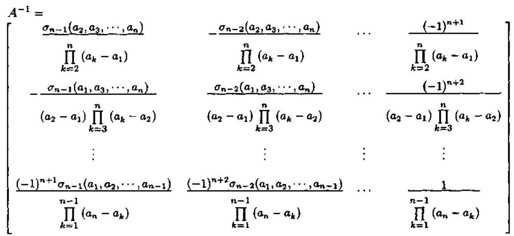

(2.6.25)

这表明,我们可以根据 Vandermonde 矩阵 $A$ 的元素直接计算逆矩阵 ${A}^{-1}$ .

### 2.7 Hankel 矩阵

正方矩阵 $A \in  {C}^{\left( {n + 1}\right)  \times  \left( {n + 1}\right) }$ 称为 Hankel 矩阵,若

$$
A = \left\lbrack  \begin{matrix} {a}_{0} & {a}_{1} & {a}_{2} & \cdots & {a}_{n} \\  {a}_{1} & {a}_{2} & {a}_{3} & \cdots & {a}_{n + 1} \\  {a}_{2} & {a}_{3} & {a}_{4} & \cdots & {a}_{n + 2} \\  \vdots & \vdots & \vdots & & \vdots \\  {a}_{n} & {a}_{n + 1} & {a}_{n + 2} & \cdots & {a}_{2n} \end{matrix}\right\rbrack \tag{2.7.1}
$$

显然,只要序列 ${a}_{0},{a}_{1},\cdots ,{a}_{{2n} - 1},{a}_{2n}$ 给定, Hankel 矩阵的一般项就由 ${a}_{ij} = {a}_{i + j - 2}$ 规定. 事实上, Hankel 矩阵是一个交叉对角线上具有相同元素的矩阵.

假定给出了一列复数 ${s}_{0},{s}_{1},{s}_{2},\cdots$ ,它们定义了一个无穷阶对称矩阵:

$$
S = \left\lbrack  \begin{matrix} {s}_{0} & {s}_{1} & {s}_{2} & \cdots \\  {s}_{1} & {s}_{2} & {s}_{3} & \cdots \\  {s}_{2} & {s}_{3} & {s}_{4} & \cdots \\  \vdots & \vdots & \vdots & \vdots  \end{matrix}\right\rbrack \tag{2.7.2}
$$

我们称矩阵 $S$ 为无穷阶 Hankel 矩阵,并简记作 $S = {\left\lbrack  {s}_{i + k}\right\rbrack  }_{0}^{\infty }$ . 在 1.2.4 小节中讨论的 Hankel 算子实际上就是无穷阶 Hankel 矩阵.

下面的定理给出了无穷阶 Hankel 矩阵具有有限秩的充分必要条件.

定理 ${2.7}.{1}^{\left\lbrack  3\right\rbrack  }$ 无穷阶 Hankel 矩阵 $S = {\left\lbrack  {s}_{i + k}\right\rbrack  }_{0}^{\infty }$ 具有有限秩 $r$ ,当且仅当存在 $r$ 个常数 ${\alpha }_{1},\cdots ,{\alpha }_{r}$ 使得

$$
{s}_{l} = \mathop{\sum }\limits_{{i = 1}}^{r}{\alpha }_{i}{s}_{l - i},\;l = r, r + 1,\cdots \tag{2.7.3}
$$

成立,其中 $r$ 是具有该性质的最小整数.

证明 如果矩阵 $S = {\left\lbrack  {s}_{i + k}\right\rbrack  }_{0}^{\infty }$ 具有有限秩 $r$ ,那么该矩阵的前 $r + 1$ 行 ${\gamma }_{1},{\gamma }_{2},\cdots ,{\gamma }_{r + 1}$ 是线性相关的. 因此,存在一个正整数 $h \leq  r$ 使得行 ${\gamma }_{1},{\gamma }_{2},\cdots ,{\gamma }_{h}$ 是线性独立的. 但行 ${\gamma }_{h + 1}$ 是这些行的线性组合:

$$
{\gamma }_{h + 1} = \mathop{\sum }\limits_{{i = 1}}^{h}{\alpha }_{i}{\gamma }_{h - i + 1}
$$

现在考虑行 ${\gamma }_{l + 1},{\gamma }_{l + 2},\cdots ,{\gamma }_{l + h + 1}$ ,其中 $l$ 是一任意非负整数. 由 Hankel 矩阵 $S$ 的结构显而易见,这些行可以通过 “压缩” 前面的 $h + 1$ 行得到. 具体说来,就是删去它们前 $l + 1$ 列的元素. 因此,

$$
{\gamma }_{l + h + 1} = \mathop{\sum }\limits_{{i = 1}}^{h}{\alpha }_{i}{\gamma }_{l + h - i + 1},\;l = 0,1,2,\cdots
$$

这样一来,矩阵 $S$ 第 $h$ 行以后的任意行都可以表示为其前面 $h$ 行的线性组合,直至最前面 $h$ 行的线性组合. 注意,最前面 $h$ 行是线性独立的. 由此可以得出结论: 矩阵的秩 $r$ 是 $h$ . 如果 $h$ 用 $r$ 代替,并详细写出线性关系 ${\gamma }_{l + h + 1} = \mathop{\sum }\limits_{{i = 1}}^{h}{\alpha }_{i}{\gamma }_{l + h - i + 1}$ 的话,则得到结果 (2.7.3) 式.

反之,若条件 (2.7.3) 满足,则矩阵 $S$ 的任意行 (或列) 就是 $S$ 前 $r$ 行 (或列) 的线性组合. 因此,矩阵 $S$ 的所有阶数大于 $r$ 的余子式均等于零,并且矩阵 $A$ 有秩 $h \leq  r$ . 然而,这一秩不可能小于 $r$ ,因为这意味着,式 (2.7.3) 的关系对一个比 $r$ 小的值也成立,而这是与定理的假定条件相矛盾的.

推论 2.7.1 如果无穷阶 Hankel 矩阵 $S$ 具有有限秩 $r$ ,则

$$
{D}_{r} = \det {\left\lbrack  {s}_{i + k}\right\rbrack  }_{0}^{r - 1} \neq  0
$$

事实上，从关系式 (2.7.3) 可以得出结论:矩阵 $S$ 的任意行 (或列) 都是最前面 $r$ 行 (或列) 的线性组合. 因此,阶数为 $r$ 的任意余子式都可以用形式 $\alpha {D}_{r}$ 表示,其中 $\alpha$ 是某个常数. 由此可得不等式 ${D}_{r} \neq  0$ .

注意,对于一个秩 $r$ 的有穷阶 Hankel 矩阵, ${D}_{r} \neq  0$ 有可能不成立. 例如,元素 ${s}_{0} = {s}_{1} = 0$ ,但 ${s}_{2} \neq  0$ 的矩阵

$$
{S}_{2} = \left\lbrack  \begin{array}{ll} {s}_{0} & {s}_{1} \\  {s}_{1} & {s}_{2} \end{array}\right\rbrack
$$

的秩等于 1,但是同时 ${D}_{1} = {s}_{0} = 0$ .

下面讨论无穷阶 Hankel 矩阵与有理式函数之间的联系.

假定存在一本征有理式函数 $R\left( z\right)  = g\left( z\right) /h\left( z\right)$ ,其中

$$
h\left( z\right)  = {a}_{0}{z}^{m} + {a}_{1}{z}^{m - 1} + \cdots {a}_{m - 1}z + {a}_{m}
$$

$$
g\left( z\right)  = {b}_{0}{z}^{m} + {b}_{1}{z}^{m - 1} + \cdots  + {b}_{m - 1}z + {b}_{m}
$$

现在将函数 $R\left( z\right)$ 写作 $z$ 的负次幂的幂级数:

$$
R\left( z\right)  = \frac{g\left( z\right) }{h\left( z\right) } = {s}_{0} + {s}_{1}{z}^{-1} + {s}_{2}{z}^{-2} + \cdots
$$

如果函数 $R\left( z\right)$ 的所有极点也就是满足 $R\left( z\right)  \rightarrow  \infty$ 的所有 $z$ 值都位于半径为 $a$ 的圆内: $\left| z\right|  \leq  a$ ,则上述级数对于 $\left| z\right|  > a$ 收敛. 用分母 $h\left( z\right)$ 同乘上式的两边,得到

$$
\left( {{a}_{0}{z}^{m} + {a}_{1}{z}^{m - 1} + \cdots  + {a}_{m - 1}z + {a}_{m}}\right) \left( {{s}_{0} + {s}_{1}{z}^{-1} + {s}_{2}{z}^{-2} + \cdots }\right)
$$

$$
= {b}_{0}{z}^{m} + {b}_{1}{z}^{m - 1} + \cdots  + {b}_{m - 1}z + {b}_{m}
$$

比较上式两边 $z$ 的同次幂项的系数,便得到下列的一组关系:

$$
\left. \begin{aligned} {a}_{0}{s}_{0} &  = {b}_{0} \\  {a}_{0}{s}_{1} + {a}_{1}{s}_{0} &  = {b}_{1} \\   & \vdots \\  {a}_{0}{s}_{m} + {a}_{1}{s}_{m - 1} + \cdots  + {a}_{m}{s}_{0} &  = {b}_{m} \end{aligned}\right\} \tag{2.7.4}
$$

$$
{a}_{0}{s}_{l} + {a}_{1}{s}_{l - 1} + \cdots  + {a}_{m}{s}_{l - m} = 0,\;l = m, m + 1,\cdots
$$

$\left( {2.7.4}^{\prime }\right)$

令 ${\alpha }_{i} =  - {a}_{i}/{a}_{0}\left( {i = m, m + 1,\cdots }\right)$ ,我们就可以用式 (2.7.3) 书写关系式 (2.7.4'),其中 $r = m$ . 因此,根据定理 2.7.1,具有系数 ${s}_{0},{s}_{1},{s}_{2},\cdots$ 的无穷 Hankel 矩阵 $S = {\left\lbrack  {s}_{i + k}\right\rbrack  }_{0}^{\infty }$ 的秩为有限大 $\left( { \leq  m}\right)$ .

相反,如果矩阵 $S$ 具有有限的秩,则式 (2.7.3) 成立,这些方程可以用式 (2.7.4') 重写, 其中 $m = r$ . 于是,如果利用式 (2.7.4) 定义一组数 ${b}_{0},{b}_{1},\cdots ,{b}_{m}$ ,我们就得到关系式:

$$
\frac{{b}_{0}{z}^{m} + {b}_{1}{z}^{m - 1} + \cdots  + {b}_{m}}{{a}_{0}{z}^{m} + {a}_{1}{z}^{m - 1} + \cdots  + {a}_{m}} = {s}_{0} + {s}_{1}{z}^{-1} + {s}_{2}{z}^{-2} + \cdots
$$

此关系式得以成立时的分母最小阶数 $m$ 就是式 (2.7.3) 成立的最小数 $m$ . 据定理 2.7.1,这个最小的 $m$ 值等于矩阵 $S$ 的秩. 上述结果可以用下面的定理来表述.

定理 ${2.7.2}^{\left\lbrack  3\right\rbrack  }$ 矩阵 $S = {\left\lbrack  {s}_{i + k}\right\rbrack  }_{0}^{\infty }$ 具有有限大的秩,当且仅当级数

$$
R\left( z\right)  = {s}_{0} + {s}_{1}{z}^{-1} + {s}_{2}{z}^{-2} + \cdots
$$

是变量 $z$ 的有理式函数. 当这种情况发生时,矩阵 $S$ 的秩等于函数 $R\left( z\right)$ 的极点个数,其中包括极点的多重度在内.

定理 2.7.2 在应用 ARMA 模型进行系统辨识时是非常有用的.

ARMA 模型的冲激响应 Hankel 矩阵 令一线性时不变的因果 ARMA 过程由

$$
\mathop{\sum }\limits_{{i = 0}}^{p}a\left( i\right) x\left( {n - i}\right)  = \mathop{\sum }\limits_{{j = 0}}^{q}b\left( j\right) e\left( {n - j}\right) \tag{2.7.5}
$$

产生,其中 $e\left( n\right)$ 是一个激励白噪声序列. 不失一般性,假定 $a\left( 0\right)  = 1$ ,并且 $\mathrm{{MA}}$ 阶数 $q$ 小于或等于 AR 阶数 $p$ ,即 $q \leq  p$ . ARMA 模型的传递函数 $H\left( z\right)$ 定义为

$$
H\left( z\right)  = \mathop{\sum }\limits_{{i = 0}}^{\infty }h\left( i\right) {z}^{-i} = \frac{b\left( 0\right)  + b\left( 1\right) {z}^{-1} + \cdots  + b\left( q\right) {z}^{-q}}{a\left( 0\right)  + a\left( 1\right) {z}^{-1} + \cdots  + a\left( p\right) {z}^{-p}} \tag{2.7.6}
$$

在定理 2.7.2 中作变量代换 $m = p$ 以及

$$
{a}_{i} = a\left( {p - i}\right) ,\;i = 0,1,\cdots , p
$$

$$
{b}_{i} = \left\{  \begin{array}{ll} b\left( {q - i}\right) , & i = 0,1,\cdots , q \\  0, & i = q + 1,\cdots , p \end{array}\right.
$$

显然,对 $\operatorname{ARMA}\left( {p, q}\right)$ 模型 (2.7.5) 应用定理 2.7.2,我们立即有重要结论: ARMA 模型的冲激响应 $h\left( i\right)$ 的 Hankel 矩阵的秩等于 $p$ ,即

$$
\operatorname{rank}\left( H\right)  = \operatorname{rank}\left\lbrack  \begin{matrix} h\left( 0\right) & h\left( 1\right) & h\left( 2\right) & \cdots \\  h\left( 1\right) & h\left( 2\right) & h\left( 3\right) & \cdots \\  h\left( 2\right) & h\left( 3\right) & h\left( 3\right) & \cdots \\  \vdots & \vdots & \vdots & \vdots  \end{matrix}\right\rbrack   = p
$$

这一结果在分析 ARMA 建模时 AR 参数的唯一可辨识性起着关键的作用.

## 参考文献

[1] R. A. Horn and C. R. Johnson, Matrix Analysis, Cambridge: Cambridge University Press, 1990.

[2] G. H. Golub and C. F. Van Loan, Matrix Computation, Baltimore: The John Hopkins University Press, 1989.

[3] F. R. Gantmacher, Applications of the Theory of Matrices, New York: Interscience, 1959.

[4] 张贤达，现代信号处理，北京:清华大学出版社，1995.

[5] S. L. Marple, Digital Spectral Analysis with Applications, Englewood Cliffs: Prentice-Hall, 1987.

[6] J. W. Brewer, Kronecker products and matrix calculus in system theory, IEEE Trans. Circuits and Systems, Vol.25, 772~781, 1978.

[7] V. E. Neagoe, Inversion of the Van der Monde Matrix, IEEE Signal Processing Letters, Vol.3, 119~120, 1996.

## 第三章 矩阵的变换与分解

在求解线性代数方程、进行模型参数估计等许多典型的信号处理问题中, 常常需要将矩阵分解为二或三个特殊矩阵的乘积或和. 因此, 矩阵的分解特别是奇异值分解 (SVD) 和特征值分解 (EVD) 在信号处理中起着关键的作用.

在有关线性代数或矩阵理论与计算的现有专著中, 矩阵的各种分解是分开论述的, 有时难免给人以矩阵分解似乎零乱、很难归类的感觉. 本章将尝试对矩阵的分解进行分类, 并按类介绍各种矩阵分解.

矩阵分解的目的是通过矩阵的线性变换来实现的, 这种变换能够将原矩阵某些特定位置上的元素变换为零. 由于反射与旋转是实现线性变换的两种基本手段，所以本章先从反射与旋转入手，然后再展开对矩阵分解的集中讨论.

### 3.1 正交投影

在信号处理中, 许多矩阵计算的目的是计算子空间. 此时, 我们需要能够度量两个子空间之间的 “距离”. 这一距离与矩阵的投影密切相关.

向量 $x$ 到向量 $y$ 上的投影记作 ${P}_{y}\left( x\right)$ ,它是一个与 $y$ 同方向的向量,而且其长度等于 $x$ 在 $y$ 方向上的长度. 此投影用

$$
{P}_{y}\left( x\right)  = y\frac{\langle y, x\rangle }{\parallel y{\parallel }^{2}} \tag{3.1.1}
$$

表示.

考虑将一向量分解为两个正交的分向量. 如图 3.1.1 所示，我们有两个向量 $\mathbf{x}$ 和 $b$ . 先将 $x$ 投影到 $b$ ，产生投影 ${P}_{b}\left( x\right)$ . 然后将 $x$ 投影到与 $b$ 垂直的超平面 ${b}^{ \bot  }$ 上，产生另外一个投影 ${P}_{b}^{ \bot  }\left( x\right)$ . 投影 ${P}_{b}^{ \bot  }\left( x\right)$ 称为向量 $x$ 到向量 $b$ 的正交投影. 于是，这两个投影就构成了对角线为 $x$ 的矩形的两个边. 根据向量加法的规则， $x$ 可以表示为这两个投影的向量之和 (合成向量), 即

$$
x = {P}_{b}\left( x\right)  + {P}_{b}^{ \bot  }\left( x\right) \tag{3.1.2}
$$

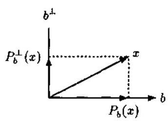

图 3.1.1 向量的分解

在上述二维的例子中, ${b}^{ \bot  }$ 是一直线,而 ${P}_{b}^{ \bot  }\left( x\right)$ 为一向量. 在更高维的情况下， ${b}^{ \bot  }$ 变成一多维目标 (超平面),而 ${P}_{b}^{ \bot  }\left( x\right)$ 仍然为包含在 ${b}^{ \bot  }$ 内部的一向量.

更一般地, 我们有到一子空间的正交投影.

定义 3.1.1 (正交投影) 令 $S \subseteq  {R}^{n}$ 表示一子空间. 若 $\operatorname{range}\left( P\right)  = S,{P}^{2} = P$ 和 ${P}^{T} = P$ ,则称 $P \in  {R}^{n \times  n}$ 是到子空间 $S$ 上的正交投影.

根据上述定义容易证明,若 $x \in  {R}^{n}$ ,则 ${Px} \in  S$ 和 $\left( {I - P}\right) x \in  {S}^{ \bot  }$ ,其中 ${S}^{ \bot  }$ 是 $S$ 的正交子空间.

如果 ${P}_{1}$ 和 ${P}_{2}$ 都是正交投影,则对任意 $z \in  {R}^{n}$ ,我们有

$$
{\begin{Vmatrix}\left( {P}_{1} - {P}_{2}\right) z\end{Vmatrix}}_{2}^{2} = {\left( {P}_{1}z\right) }^{T}\left( {I - {P}_{2}}\right) z + {\left( {P}_{2}z\right) }^{T}\left( {I - {P}_{1}}\right) z
$$

进一步地,若 $\operatorname{range}\left( {P}_{1}\right)  = \operatorname{range}\left( {P}_{2}\right)  = S$ ,则上式右边等于零. 这表明,到一个子空间的正交投影是唯一的.

如果 $V = \left\lbrack  {{v}_{1},\cdots ,{v}_{k}}\right\rbrack$ 的列是子空间 $S$ 的一组正交基,则 $P = V{V}^{T}$ 就是到 $S$ 上的唯一正交投影. 当 $V$ 退化为一向量即 $v \in  {R}^{n}$ 时, $P = v{v}^{T}/{v}^{T}v$ 是到 $S = \operatorname{span}\{ v\}$ 上的正交投影.

子空间与正交投影之间的一对一对应关系使得我们可以定义两个子空间的距离. 设 ${S}_{1}$ 和 ${S}_{2}$ 是 ${R}^{n}$ 的子空间,并且它们的维数相同,即 $\dim \left( {S}_{1}\right)  = \dim \left( {S}_{2}\right)$ . 这两个子空间的距离用

$$
\operatorname{dist}\left( {{S}_{1},{S}_{2}}\right)  = {\begin{Vmatrix}{P}_{1} - {P}_{2}\end{Vmatrix}}_{2} \tag{3.1.3}
$$

定义,其中 ${P}_{i}$ 是到 ${S}_{i}$ 上的正交投影.

子空间距离的几何解释 ${}^{\left\lbrack  1\right\rbrack  }$ 假定 ${S}_{1} = \operatorname{span}\{ x\}$ 和 ${S}_{2} = \operatorname{span}\{ y\}$ ,而且

$$
x = \left\lbrack  \begin{matrix} \cos \left( {\theta }_{1}\right) \\  \sin \left( {\theta }_{1}\right)  \end{matrix}\right\rbrack  ,\;y = \left\lbrack  \begin{matrix} \cos \left( {\theta }_{2}\right) \\  \sin \left( {\theta }_{2}\right)  \end{matrix}\right\rbrack
$$

其中 ${\theta }_{1}$ 和 ${\theta }_{2}$ 在 $\left\lbrack  {0,{2\pi }}\right\rbrack$ 内取值. 定义正交矩阵

$$
U = \left\lbrack  \begin{matrix} \cos \left( {\theta }_{1}\right) &  - \sin \left( {\theta }_{1}\right) \\  \sin \left( {\theta }_{1}\right) & \cos \left( {\theta }_{1}\right)  \end{matrix}\right\rbrack  ,\;V = \left\lbrack  \begin{matrix} \cos \left( {\theta }_{2}\right) &  - \sin \left( {\theta }_{2}\right) \\  \sin \left( {\theta }_{2}\right) & \cos \left( {\theta }_{2}\right)  \end{matrix}\right\rbrack
$$

则

$$
{U}^{T}y = \left\lbrack  \begin{matrix} \cos \left( {{\theta }_{2} - {\theta }_{1}}\right) \\  \sin \left( {{\theta }_{2} - {\theta }_{1}}\right)  \end{matrix}\right\rbrack  ,\;{V}^{T}x = \left\lbrack  \begin{matrix} \cos \left( {{\theta }_{1} - {\theta }_{2}}\right) \\  \sin \left( {{\theta }_{1} - {\theta }_{2}}\right)  \end{matrix}\right\rbrack
$$

计算得

$$
{U}^{T}\left( {x{x}^{T} - y{y}^{T}}\right) V = \left\lbrack  \begin{matrix} 0 & \sin \left( {{\theta }_{1} - {\theta }_{2}}\right) \\  \sin \left( {{\theta }_{1} - {\theta }_{2}}\right) & 0 \end{matrix}\right\rbrack
$$

所以 ${\begin{Vmatrix}x{x}^{T} - y{y}^{T}\end{Vmatrix}}_{2} = {\begin{Vmatrix}{U}^{T}\left( x{x}^{T} - y{y}^{T}\right) V\end{Vmatrix}}_{2} = \left| {\sin \left( {{\theta }_{1} - {\theta }_{2}}\right) }\right|$ . 结果有 $\operatorname{dist}\left( {{S}_{1},{S}_{2}}\right)  =  \mid  \sin \left( {{\theta }_{1} - }\right. \; \left. {\theta }_{2}\right)  \mid$ ,也就是说,两个子空间 ${S}_{1}$ 和 ${S}_{2}$ 的距离等于这两个子空间夹角余弦的幅值.

利用投影 ${P}_{b}\left( x\right)$ 和 ${P}_{b}^{ \bot  }\left( x\right)$ 可以构造 Householder 变换 (详见下一节).

### 3.2 Householder 变换

Householder 变换是由 Householder 在 50 年代末提出的一类线性变换 (见文献 [3] 或 [4]), 它们是数据自适应的变换.

如果我们不是像图 3.1.1 那样构造两个投影 ${P}_{b}\left( x\right)$ 与 ${P}_{b}^{ \bot  }\left( x\right)$ 之和,而是构造二者之差, 就会得到一个新向量,如图 3.2.1 所示. 这一向量称为向量 $x$ 相对于向量 $b$ 的 Householder 变换, 记作

$$
{Q}_{b}\left( x\right)  = {P}_{b}^{ \bot  }\left( x\right)  - {P}_{b}\left( x\right) \tag{3.2.1}
$$

图中, $x = \left\lbrack  {2,4}\right\rbrack  , b = \left\lbrack  {2,1}\right\rbrack$ ,因此 $- {P}_{b}\left( x\right)  = \left\lbrack  {-\frac{18}{5}, - \frac{8}{5}}\right\rbrack$ 和 ${P}_{b}^{ \bot  }\left( x\right)  = \left\lbrack  {-\frac{6}{5},\frac{12}{5}}\right\rbrack$ ,它们给出 ${Q}_{b}\left( x\right)  = \left\lbrack  {-\frac{22}{5},\frac{4}{5}}\right\rbrack  .$

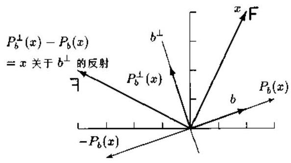

图 3.2.1 向量的 Householder 变换

如图 3.2.1 所示， ${Q}_{b}\left( x\right)$ 与 $x$ 的差别仅表现在它们在向量 $b$ 上的投影的方向不同而已； 我们还可看到, ${Q}_{b}\left( x\right)$ 是向量 $x$ 关于与 $b$ 垂直的超平面的一个反射 (镜像). 所以, Householder 变换又叫镜像变换.

#### 3.2.1 保范数性与协方差不变

值得强调的是, Householder变换是一类对某个向量进行反射的保范数算子(或保长度算子). 为了看出这一点,不妨把图 3.2.1 中的向量 $x$ 想像成从原点指向到标有 “ $\mathrm{F}$ ” 点的一有向线段. 如果将此向量相对于超平面 ${b}^{ \bot  }$ 作反射,那么目标 “ $\mathrm{F}$ ” 就有一个镜像,即反 "F".

如果两个向量具有相同的镜像, 则它们的内积(或范数)将保持不变. 用数学语言表述, 即是

Householder 变换的范数不变性定理 给定任意三个向量 $x, y$ ,和 $b$ ,则下述关系式总是满足:

$$
\left\langle  {{Q}_{b}\left( x\right) ,{Q}_{b}\left( y\right) }\right\rangle   = \langle x, y\rangle \tag{3.2.2}
$$

注意，由于协方差 (相关) 项利用乘积的求和组成，所以式 (3.2.2) 建立了 ${Q}_{b}$ 的协方差不变性. 这一点是几乎所有 Householder 变换应用的关键.

令 ${e}_{k}$ 代表位于典型坐标轴上具有单位范数的向量. 如图 3.2.2 所示，我们先将 $x$ 反射到 ${e}_{k}$ 上，得到一个新的(稀疏)向量，它具有单位长度，仅有一个非零元素. 通过选择满足

$$
b = x + \parallel x\parallel {e}_{k} \tag{3.2.3}
$$

的向量 $b$ ,我们就可以实现给出稀疏数据的这种 Householder 变换. 其证明如下: 由于 $b$ 是两个相同长度的向量 $x$ 和 $\parallel x\parallel {e}_{k}$ 的合成向量,因此,该合成向量是菱形即等边平行四边形的一条对角线，而另一条对角线由 $x$ 的端点到 $\parallel x\parallel {e}_{k}$ 的端点. 菱形的对角线总是相互垂直的. 故它们在中点相交. 于是,

$$
{P}_{b}\left( x\right)  = b/2 \rightarrow  {P}_{b}^{ \bot  }\left( x\right)  = x - b/2 \rightarrow  {Q}_{b}\left( x\right)  =  - \parallel x\parallel {e}_{k}
$$

这就证明了: 向量 $x$ 关于向量 $b = x + \parallel x\parallel {e}_{k}$ (菱形对角线) 的反射 $\parallel x\parallel {e}_{k}$ 就是 $x$ 关于 $b$ 的 Householder 变换 ${Q}_{b}\left( x\right)$ .

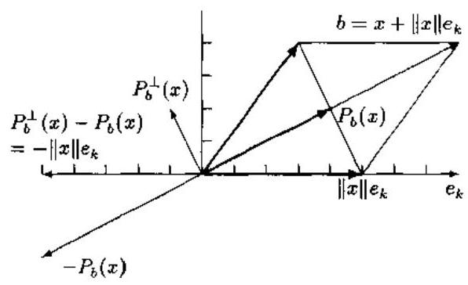

图 3.2.2 产生稀疏数据的 Householder 变换

在图 3.2.2 的二维例子中, ${e}_{k} = \left\lbrack  {1,0}\right\rbrack  , x = \left\lbrack  {3,4}\right\rbrack  , b = \left\lbrack  {8,4}\right\rbrack  ,{P}_{b}\left( x\right)  = \left\lbrack  {4,2}\right\rbrack  ,{P}_{b}^{ \bot  }\left( x\right)  = \left\lbrack  {-1,2}\right\rbrack$ 以及 ${Q}_{b}\left( x\right)  =  - \left\lbrack  {5,0}\right\rbrack$ . Householder 变换对于形成协方差不变的稀疏数据是非常有用的.

令 $\Phi  = \operatorname{diag}\left( {{\phi }_{1},\cdots ,{\phi }_{n}}\right)$ ,则加权形式的向量内积 (范数) 为

$$
\langle x, y\rangle  = \mathop{\sum }\limits_{{i = 1}}^{n}{x}_{i}{\phi }_{i}{y}_{i} \tag{3.2.4}
$$

图 3.2.1 和 3.2.2 的例子假定的是均匀加权，即 ${\phi }_{i} \equiv  1$ . 在信号处理中，更多地采用非均匀的加权.

(1) 逐点指数加权

内积加权函数取

$$
{\phi }_{i} = {\lambda }^{n - i} \tag{3.2.5}
$$

其中 $0 < \lambda  < 1$ . 显然,在现时刻 $n,{\lambda }^{0} = 1$ ,即现时刻的数据 ${x}_{n}$ 以权系数 1 起作用,而最早的数据 ${x}_{1}$ 则被一个最小的数 ${\lambda }^{n - 1}$ 加权. 因此, $\lambda$ 常被称为遗忘因子.

(2) 分块指数加权

此时, 加权系数取

$$
{\phi }_{i} = \left\{  \begin{array}{ll} \lambda , & i \leq  {n}_{0} \\  1, & i > {n}_{0} \end{array}\right. \tag{3.2.6}
$$

就是说，数据现在是以“块”的形式被遗忘，而不是逐点被遗忘的. 当要求针对几个数据而不是单个数据进行更新时, 常采用这种加权形式.

(3) 双曲线加权

假定需要从协方差矩阵中精确地删去旧的数据, 而不是像式 (3.2.5) 和式 (3.2.6) 那样只是衰减旧数据. 此时, 如果采用加权系数

$$
\phi  = \left\{  \begin{array}{ll} 1, & i \leq  {n}_{0} \\   - 1, & i > {n}_{0} \end{array}\right. \tag{3.2.7}
$$

我们就把数据块 ${x}_{1},\cdots ,{x}_{{n}_{0}}$ 拷贝到了向量 $x$ 的最后 $n - {n}_{0}$ 个元素中,因而就从协方差矩阵中删掉了这些样本. 针对所有的 ${x}_{i}$ ，我们可以只扔掉那些不想要的数据. 当 ${x}_{1},\cdots ,{x}_{{n}_{0}}$ 欲被它们的稀疏对应部分取代时, 式 (3.2.7) 的权系数形式是有用的.

有必要指出, 在现代数学物理的相对论中, 就用到四维空间的 Householder 变换的双曲线形式,此时 ${n}_{0} = n - 1$ . 不过,这一变换被物理学家称为 Lorentz 变换 ${}^{\left\lbrack  6\right\rbrack  }$ .

图 3.2.3 画出了使用不同加权系数的 Householder 反射轨迹.

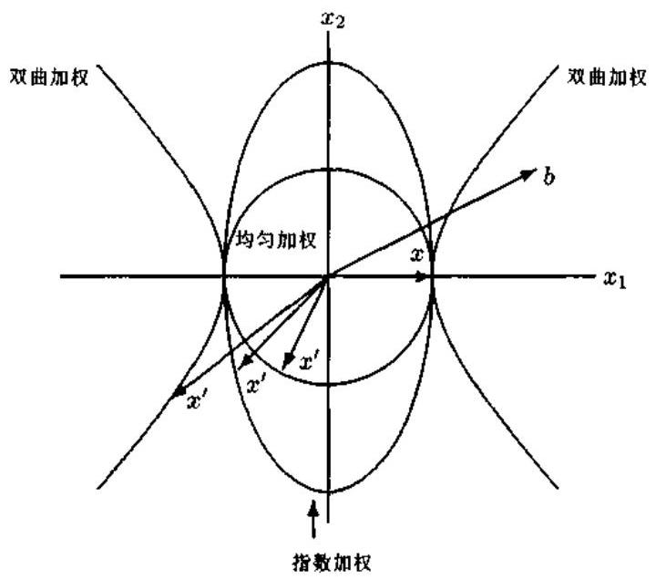

图 3.2.3 使用不同加权系数时向量 $x$ 的 Householder 反射轨迹

如图所示, 对于均匀加权, Householder 反射轨迹为圆; 对于指数加权, 反射轨迹为椭圆; 而双曲线加权的反射轨迹为双曲线.

#### 3.2.2 Householder 变换算法

正如 2.3 节所述,一个 $n \times  n$ 矩阵 $Q$ 是正交的,若 ${Q}^{T}Q = I$ . 正交矩阵在最小二乘和特征值问题中起着重要的作用. 求正交矩阵的有效方法之一就是 Householder 反射.

令 $v \in  {R}^{n}$ 为非零向量. 考虑 $n \times  n$ 矩阵

$$
H = I - {2v}{v}^{T}/{v}^{T}v \tag{3.2.8}
$$

利用式 (3.1.1),(3.1.2) 和 (3.2.1), 不难验证

$$
{Hx} = x - {2v}\langle v, x\rangle /{v}^{T}v = x - 2{P}_{v}\left( x\right)  = {Q}_{v}\left( x\right) \tag{3.2.9}
$$

因此, $n \times  n$ 矩阵 $H$ 称为 Householder 反射 (又叫 Householder 矩阵、Householder 变换). 向量 $v$ 称为 Householder 向量. 易证明, Householder 矩阵 $H$ 是对称的和正交的.

Householder 矩阵既能使一向量的某些元素变为零, 又能保持该向量范数不变. 假定我们有一已知非零向量 $x = {\left\lbrack  {x}_{1},\cdots ,{x}_{n}\right\rbrack  }^{T} \in  {R}^{n}$ ,并试图使 ${Px}$ 变成 ${e}_{1} = {\left\lbrack  1,0,\cdots ,0\right\rbrack  }^{T}$ 的某个常数倍. 此时,我们可以令 $v = x + \alpha {e}_{1}$ ,从而得到

$$
{v}^{T}x = {x}^{T}x + \alpha {x}_{1} \tag{3.2.10}
$$

和

$$
{v}^{T}v = {x}^{T}x + {2\alpha }{x}_{1} + {\alpha }^{2} \tag{3.2.11}
$$

将式 (3.2.10) 和式 (3.2.11) 代入式 (3.2.9)，则有

$$
{Hx} = \left( {1 - 2\frac{{x}^{T}x + \alpha {x}_{1}}{{x}^{T} + {2\alpha }{x}_{1} + {\alpha }^{2}}}\right) x - {2\alpha }\frac{{v}^{T}x}{{v}^{T}v}{e}_{1}
$$

为了使 $x$ 的系数为零,我们只需要令 $\alpha  =  \pm  \parallel x{\parallel }_{2}$ . 这样一来,

$$
v = x \pm  \parallel x{\parallel }_{2}{e}_{1} \Rightarrow  \;{Px} = \left( {I - 2\frac{v{v}^{T}}{{v}^{T}v}}\right) x =  \mp  \parallel x{\parallel }_{2}{e}_{1}
$$

因此,为了使 $x$ 变成 ${e}_{1}$ 的某倍数,我们可以利用

$$
v = x + \operatorname{sign}\left( {x}_{1}\right) \parallel x{\parallel }_{2}{e}_{1} \tag{3.2.12}
$$

计算 Householder 向量 $v$ .

后面将介绍的基于 Householder 反射的矩阵分解的大部分应用等价于使用 Householder 矩阵:

$$
H = {H}_{r}{H}_{r - 1}\cdots {H}_{1} \tag{3.2.13a}
$$

其中

$$
{H}_{k} = I - 2\frac{{v}^{\left( k\right) }{v}^{{\left( k\right) }^{T}}}{{v}^{{\left( k\right) }^{T}}{v}^{\left( k\right) }} \tag{3.2.13b}
$$

且 $r \leq  n$ ,每一个 ${v}^{\left( k\right) }$ 具有下面的形式:

$$
{v}^{\left( k\right) } = {\left\lbrack  0,\cdots ,0,1,{v}_{k + 1}^{\left( k\right) },\cdots ,{v}_{n}^{\left( k\right) }\right\rbrack  }^{T}
$$

一般说来,我们并不需要求出 Householder 矩阵 $H$ ,而只是对 $H$ 作用于某个矩阵 $A$ 的最后结果 ${HA}$ 感兴趣. 令 ${A}^{\left( k - 1\right) } = A\left( {k \neq  1}\right)$ 和 ${H}_{k}{A}^{\left( k - 1\right) } = {A}^{\left( k\right) }$ ,则其任何中间变换结果 ${H}_{k}{A}^{\left( k - 1\right) }$ 可由

$$
{A}^{\left( k\right) } = {H}_{k}{A}^{\left( k - 1\right) } = \left( {I - 2\frac{{v}^{\left( k\right) }{v}^{{\left( k\right) }^{T}}}{{v}^{{\left( k\right) }^{T}}{v}^{\left( k\right) }}}\right) {A}^{\left( k - 1\right) }
$$

$$
= {A}^{\left( k - 1\right) } + {v}^{\left( k\right) }{w}^{{\left( k\right) }^{T}} \tag{3.2.14a}
$$

$$
{w}^{\left( k\right) } = \beta {A}^{{\left( k\right) }^{T}}{v}^{\left( k\right) },\;\beta  =  - 2/{v}^{{\left( k\right) }^{T}}{v}^{\left( k\right) } \tag{3.2.14b}
$$

直接计算. 最后的 Householder 变换结果即是 ${HA} = {H}_{r}{A}^{\left( r - 1\right) }$ .

下面是 Householder 变换的 MATLAB 算法 ${}^{\left\lbrack  1\right\rbrack  }$ .

算法 3.2.1 (Householder 向量的计算) 给定 $n \times  1$ 向量 $x$ ,下面的函数计算 $n$ 维 Householder 列向量 $v$ ,其第一个元素 $v\left( 1\right)  = 1$ ,并且该向量能够使得 $\left( {I - {2v}{v}^{T}/{v}^{T}v}\right) x$ 除第一个元素非零外, 其它元素皆等于零.

function: $v =$ house $\left( x\right)$

$n = \operatorname{length}\left( x\right) ;\mu  = \parallel x{\parallel }_{2};v = x$

if $\mu  \neq  0$

$\beta  = x\left( 1\right)  + \operatorname{sign}\left( {x\left( 1\right) }\right) \mu$

$v\left( {2 : n}\right)  = v\left( {2 : n}\right) /\beta$

end

$v\left( 1\right)  = 1$

end house

算法 3.2.2 (Householder 左乘) 给定一个 $m \times  n$ 矩阵 $A$ 和一个 $v\left( 1\right)  = 1$ 的 $m \times  1$ 向量 $v$ ,本算法用 ${PA}$ 重写 $A$ ,其中 $P = I - {2v}{v}^{T}/{v}^{T}v$ .

function : $A =$ row.house $\left( {A, v}\right)$

$$
\beta  =  - 2/{v}^{T}v
$$

$$
w = \beta {A}^{T}v
$$

$$
A = A + v{w}^{T}
$$

end row.house

算法 3.2.3 (Householder 右乘) 给定一个 $m \times  n$ 矩阵 $A$ 和一个 $v\left( 1\right)  = 1$ 的 $m \times  1$ 向量 $v$ ,本算法用 ${AP}$ 重写 $A$ ,其中 $P = I - {2v}{v}^{T}/{v}^{T}v$ .

function : $A = \operatorname{col.house}\left( {A, v}\right)$

$$
\beta  =  - 2/{v}^{T}v
$$

$$
w = {\beta Av}
$$

$$
A = A + w{v}^{T}
$$

end col.house

在 3.8 节,我们将具体介绍如何利用 Householder 变换实现矩阵的 ${QR}$ 分解及其在自适应信号处理中的应用.

### 3.3 Givens 旋转

使某个向量的任意元素为零，而同时又保持该向量的范数或协方差不变的方法除了卜一节介绍过的反射算子 Householder 变换外，还有本节要叙述的旋转算子 Givens 旋转 (有时也叫 Jacobi 旋转).

一个 $2 \times  2$ 正交矩阵 $Q$ 是一反射,若它具有形式:

$$
Q = \left\lbrack  \begin{matrix} \cos \left( \theta \right) & \sin \left( \theta \right) \\  \sin \left( \theta \right) &  - \cos \left( \theta \right)  \end{matrix}\right\rbrack \tag{3.3.1}
$$

一个 $2 \times  2$ 正交矩阵 $Q$ 是一旋转,若

$$
Q = \left\lbrack  \begin{matrix} \cos \left( \theta \right) & \sin \left( \theta \right) \\   - \sin \left( \theta \right) & \cos \left( \theta \right)  \end{matrix}\right\rbrack \tag{3.3.2}
$$

为了比较反射与旋转的作用, 我们来看一个例子.

例 3.3.1 假定 $x = {\left\lbrack  \sqrt{3},1\right\rbrack  }^{T}$ . 如果令

$$
Q = \left\lbrack  \begin{matrix} \cos \left( {30}^{ \circ  }\right) & \sin \left( {30}^{ \circ  }\right) \\  \sin \left( {30}^{ \circ  }\right) &  - \cos \left( {30}^{ \circ  }\right)  \end{matrix}\right\rbrack   = \left\lbrack  \begin{matrix} \sqrt{3}/2 & 1/2 \\  1/2 &  - \sqrt{3}/2 \end{matrix}\right\rbrack
$$

则 ${Q}^{T}x = {\left\lbrack  2,0\right\rbrack  }^{T}$ . 即是说,通过关于 ${30}^{ \circ  }$ 直线的反射,我们可以使向量 $x$ 的第二个元素置为零. 另一方面, 若令

$$
Q = \left\lbrack  \begin{matrix} \cos \left( {-{30}^{ \circ  }}\right) & \sin \left( {-{30}^{ \circ  }}\right) \\   - \sin \left( {-{30}^{ \circ  }}\right) & \cos \left( {-{30}^{ \circ  }}\right)  \end{matrix}\right\rbrack   = \left\lbrack  \begin{matrix} \sqrt{3}/2 &  - 1/2 \\  1/2 & \sqrt{3}/2 \end{matrix}\right\rbrack
$$

则 ${Q}^{T}x = {\left\lbrack  2,0\right\rbrack  }^{T}$ . 因此,我们也可以利用 $- {30}^{ \circ  }$ 的旋转使 $x$ 的第二个元素置成零.

#### 3.3.1 Givens 旋转

Givens 旋转是一种对单位矩阵的秩 2 修正:

$$
G\left( {i, j,\theta }\right)  = \left\lbrack  \begin{matrix} 1 & \cdots & 0 & \cdots & 0 & \cdots & 0 \\  \vdots &  \ddots  & \vdots & & \vdots & & \vdots \\  0 & \cdots & c & \cdots & s & \cdots & 0 \\  \vdots & & \vdots &  \ddots  & \vdots & & \vdots \\  0 & \cdots &  - s & \cdots & c & \cdots & 0 \\  \vdots & & \vdots & & \vdots &  \ddots  & \vdots \\  0 & \cdots & 0 & \cdots & 0 & \cdots & 1 \end{matrix}\right\rbrack  i \tag{3.3.3}
$$

其中 $c = \cos \left( \theta \right)$ 和 $s = \sin \left( \theta \right)$ . 显然, Givens 旋转 $G\left( {i, j,\theta }\right)$ 是正交矩阵.

给定一向量 $x = {\left\lbrack  a, b\right\rbrack  }^{T}$ , Givens 旋转的参数 $c = \cos \left( \theta \right)$ 和 $s = \sin \left( \theta \right)$ 由

$$
{\left\lbrack  \begin{matrix} c & s \\   - s & c \end{matrix}\right\rbrack  }^{T}\left\lbrack  \begin{array}{l} a \\  b \end{array}\right\rbrack   = \left\lbrack  \begin{array}{l} r \\  0 \end{array}\right\rbrack
$$

决定, 由此得到

$$
c = a/r,\;s = b/r \tag{3.3.4a}
$$

其中

$$
r = \sqrt{{a}^{2} + {b}^{2}} \tag{3.3.4b}
$$

上述结果构成了计算 Givens 旋转

$$
{\left\lbrack  \begin{matrix} c & s \\   - s & c \end{matrix}\right\rbrack  }^{T}\left\lbrack  \begin{array}{l} a \\  b \end{array}\right\rbrack   = \left\lbrack  \begin{array}{l} r \\  0 \end{array}\right\rbrack
$$

的 MATLAB 函数:

function $: \left\lbrack  {c, s}\right\rbrack   = \operatorname{givens}\left( {a, b}\right)$

if $b = 0$

$c = 1;s = 0$

else

if $\left| b\right|  > \left| a\right|$

$\tau  =  - a/b;s = 1/\sqrt{1 + {\tau }^{2}};c = {s\tau }$

else

$\tau  =  - b/a;c = 1/\sqrt{1 + {\tau }^{2}};s = {c\tau }$

end

end

end givens

在对矩阵 $A \in  {R}^{2 \times  q}$ 应用 Givens 旋转时,计算矩阵 ${\left\lbrack  \begin{matrix} c & s \\   - s & c \end{matrix}\right\rbrack  }^{T}A$ 的 MATLAB 函数如下: ${}^{1)}$ :

---

function : $A =$ row.rot $\left( {A, c, s}\right)$

$$
q = \operatorname{cols}\left( A\right)
$$

$$
\text{ for }j = 1 : q
$$

$$
{\tau }_{1} = A\left( {1, j}\right)
$$

$$
{\tau }_{2} = A\left( {2, j}\right)
$$

$$
A\left( {1, j}\right)  = c{\tau }_{1} - s{\tau }_{2}
$$

$$
A\left( {2, j}\right)  = s{\tau }_{1} + c{\tau }_{2}
$$

	end

end row.rot

---

通常,我们称上述 Givens 旋转为行旋转. 对应地,还有计算 $A \in  {R}^{q \times  2}$ 的列旋转 $A\left\lbrack  \begin{matrix} c & s \\   - s & c \end{matrix}\right\rbrack$ ,如下所述:

function : $A = \operatorname{col.rot}\left( {A, c, s}\right)$

$q = \operatorname{rows}\left( A\right)$

for $i = 1 : q$

$$
{\tau }_{1} = A\left( {i,1}\right)
$$

$$
{\tau }_{2} = A\left( {i,2}\right)
$$

$$
A\left( {i,1}\right)  = c{\tau }_{1} - s{\tau }_{2}
$$

$$
A\left( {i,2}\right)  = s{\tau }_{1} + c{\tau }_{2}
$$

end

end col.rot

应用 Givens 旋转,可以对任意矩阵 $A$ 进行 ${QR}$ 分解,即分解为一正交矩阵与一上三角矩阵之积, 详见 3.8.3 节.

令人感兴趣的是,如果 $n \times  n$ 矩阵 $A$ 是对称矩阵,并对 $A$ 应用 Givens 旋转 $G\left( {i, j,\theta }\right)$ , 则可以将矩阵 $A$ 的元素 ${a}_{ij}$ 和 ${a}_{ji}$ 同时变为零. 为此,根据

$$
{G}^{T}\left( {i, j,\theta }\right) {AG}\left( {i, j,\theta }\right)  = \left\lbrack  \begin{matrix} \cos \left( \theta \right) &  - \sin \left( \theta \right) \\  \sin \left( \theta \right) & \cos \left( \theta \right)  \end{matrix}\right\rbrack  \left\lbrack  \begin{array}{ll} {a}_{ii} & {a}_{ij} \\  {a}_{ij} & {a}_{jj} \end{array}\right\rbrack  \left\lbrack  \begin{matrix} \cos \left( \theta \right) & \sin \left( \theta \right) \\   - \sin \left( \theta \right) & \cos \left( \theta \right)  \end{matrix}\right\rbrack
$$

$$
= \left\lbrack  \begin{matrix} {a}_{ii}^{\prime } & 0 \\  0 & {a}_{jj}^{\prime } \end{matrix}\right\rbrack
$$

可以求得 Givens 旋转的参数为

$$
\tan \left( {2\theta }\right)  = \frac{2{a}_{ij}\left( {{a}_{ii} + {a}_{jj}}\right) }{{a}_{jj}^{2} - {a}_{ii}^{2}} \tag{3.3.5}
$$

上述讨论表明,利用一系列 Givens 旋转,就可以将一个对称矩阵 $A$ 对角化,这便构成了对称矩阵奇异值分解的 Givens 方法 (或 Jacobi 方法), 我们将在第六章中具体讨论这种方法.

#### 3.3.2 快速 Givens 旋转

以一种可选择的方式引入零的能力使得 Givens 旋转在一些结构化的问题中成了一种重要的置零工具. 下面考察 Givens 旋转的快速算法.

快速 Givens 旋转分两种类型:“1 型” 快速变换具有形式:

$$
{\mathbf{F}}_{1}\left( {i, j,\alpha ,\beta }\right)  = \left\lbrack  \begin{matrix} 1 & \cdots & 0 & \cdots & 0 & \cdots & 0 \\  \vdots &  \ddots  & \vdots & & \vdots & & \vdots \\  0 & \cdots & \beta & \cdots & 1 & \cdots & 0 \\  \vdots & & \vdots &  \ddots  & \vdots & & \vdots \\  0 & \cdots & 1 & \cdots & \alpha & \cdots & 0 \\  \vdots & & \vdots & & \vdots &  \ddots  & \vdots \\  0 & \cdots & 0 & \cdots & 0 & \cdots & 1 \end{matrix}\right\rbrack  i \tag{3.3.6}
$$

“2 型”快速变换的结构为

$$
{F}_{2}\left( {i, j,\alpha ,\beta }\right)  = \left\lbrack  \begin{matrix} 1 & \cdots & 0 & \cdots & 0 & \cdots & 0 \\  \vdots &  \ddots  & \vdots & & \vdots & & \vdots \\  0 & \cdots & 1 & \cdots & \alpha & \cdots & 0 \\  \vdots & & \vdots &  \ddots  & \vdots & & \vdots \\  0 & \cdots & \beta & \cdots & 1 & \cdots & 0 \\  \vdots & & \vdots & & \vdots &  \ddots  & \vdots \\  0 & \cdots & 0 & \cdots & 0 & \cdots & 1 \end{matrix}\right\rbrack  i \tag{3.3.7}
$$

记假定 ${F}_{1}\left( {i, j,\alpha ,\beta }\right)$ 作用于向量 $x = {\left\lbrack  {x}_{1},\cdots ,{x}_{n}\right\rbrack  }^{T}$ ,且 $2 \times  2$ 对角矩阵 $D = \operatorname{diag}\left( {{d}_{1},{d}_{2}}\right)$ .

$$
{M}_{1} = \left\lbrack  \begin{matrix} {\beta }_{1} & 1 \\  1 & {\alpha }_{1} \end{matrix}\right\rbrack \tag{3.3.8}
$$

我们观察

$$
{M}_{1}\left\lbrack  \begin{array}{l} {x}_{i} \\  {x}_{j} \end{array}\right\rbrack   = \left\lbrack  \begin{array}{l} {\beta }_{1}{x}_{i} + {x}_{j} \\  {x}_{i} + {\alpha }_{1}{x}_{j} \end{array}\right\rbrack
$$

和

$$
{M}_{1}^{T}D{M}_{1} = \left\lbrack  \begin{matrix} {d}_{2} + {\beta }_{1}^{2} & {d}_{1}{\beta }_{1} + {d}_{2}{\alpha }_{1} \\  {d}_{1}{\beta }_{1} + {d}_{2}{\alpha }_{1} & {d}_{1} + {\alpha }_{1}^{2}{d}_{2} \end{matrix}\right\rbrack
$$

如果 ${x}_{j} \neq  0$ ,并取 ${\alpha }_{1} =  - {x}_{i}/{x}_{j}$ 和 ${\beta }_{1} =  - {\alpha }_{1}{d}_{2}/{d}_{1}$ ,则

$$
{M}_{1}^{T}\left\lbrack  \begin{matrix} {x}_{i} \\  {x}_{j} \end{matrix}\right\rbrack   = \left\lbrack  \begin{matrix} {x}_{j}\left( {1 + {\gamma }_{1}}\right) \\  0 \end{matrix}\right\rbrack
$$

$$
{M}_{1}^{T}D{M}_{1} = \left\lbrack  \begin{matrix} {d}_{2}\left( {1 + {\gamma }_{1}}\right) & 0 \\  0 & {d}_{1}\left( {1 + {\gamma }_{1}}\right)  \end{matrix}\right\rbrack   = {D}_{1}
$$

其中 ${\gamma }_{1} =  - {\alpha }_{1}{\beta }_{1} = \left( {{d}_{2}/{d}_{1}}\right) {\left( {x}_{i}/{x}_{j}\right) }^{2}$ .

类似地,若 ${x}_{1} \neq  0$ ,并定义

$$
{M}_{2} = \left\lbrack  \begin{matrix} 1 & {\alpha }_{2} \\  {\beta }_{2} & 1 \end{matrix}\right\rbrack \tag{3.3.9}
$$

其中 ${\alpha }_{2} =  - {x}_{j}/{x}_{i}$ 和 ${\beta }_{2} =  - \left( {{d}_{1}/{d}_{2}}\right) {\alpha }_{2}$ ,则

$$
{M}_{2}\left\lbrack  \begin{array}{l} {x}_{i} \\  {x}_{j} \end{array}\right\rbrack   = \left\lbrack  \begin{matrix} {x}_{i}\left( {1 + {\gamma }_{2}}\right) \\  0 \end{matrix}\right\rbrack
$$

和

$$
{M}_{2}^{T}D{M}_{2} = \left\lbrack  \begin{matrix} {d}_{1}\left( {1 + {\gamma }_{2}}\right) & 0 \\  0 & {d}_{2}\left( {1 + {\gamma }_{2}}\right)  \end{matrix}\right\rbrack   = {D}_{2}
$$

其中 ${\gamma }_{2} =  - {\alpha }_{2}{\beta }_{2} = \left( {{d}_{1}/{d}_{2}}\right) {\left( {x}_{j}/{x}_{i}\right) }^{2}$ .

容易证明,无论对于 $k = 1$ 或 2,矩阵 $J = {D}_{k}^{1/2}{M}_{k}{D}_{k}^{-1/2}$ 都是正交的,而且都能将 ${M}_{k}\left\lbrack  \begin{array}{l} {x}_{i} \\  {x}_{j} \end{array}\right\rbrack$ 的第二个元素置成零. 因此,我们称 $J$ 为一种旋转,虽然 $J$ 也可以是一反射.

Givens 旋转和快速 Givens 旋转之间的主要区别在于, 后者避免了平方根运算, 因此要比前者快速.

#### 3.3.3 Kogbetliantz 算法

在 3.3.1 节, 我们讨论了 Givens 旋转作用于对称矩阵的结果. 现在分析如何将 Givens 旋转应用于非对称的一般矩阵. Givens 旋转的推广有几种不同的形式, 这里介绍一种由 Kogbetliantz ${}^{\left\lbrack  {20}\right\rbrack  }$ 提出的算法,习惯上称之为 Kogbetliantz 算法. 这种算法的分析是后来由 Forsythe 与 Henrici ${}^{\left\lbrack  {21}\right\rbrack  }$ 给出的.

对于 $i < j$ ,我们定义矩阵 ${A}_{k}$ 的 $\left( {i, j}\right)$ 约化是作用于第 $i$ 行和第 $j$ 行的 Givens 旋转 $J\left( {i, j,\theta }\right)$ ,另外一个 Givens 旋转 $J\left( {i, j,\phi }\right)$ 则作用于第 $i$ 列和第 $j$ 列,并且希望所得到的新矩阵 ${A}_{k + 1}$ 在位置 $\left( {i, j}\right)$ 和 $\left( {j, i}\right)$ 处的元素均为零,亦即

$$
\left\lbrack  \begin{matrix} \cos \theta &  - \sin \theta \\  \sin \theta & \cos \theta  \end{matrix}\right\rbrack  \left\lbrack  \begin{array}{ll} {\alpha }_{ii} & {\alpha }_{ij} \\  {\alpha }_{ji} & {\alpha }_{jj} \end{array}\right\rbrack  \left\lbrack  \begin{matrix} \cos \phi & \sin \phi \\   - \sin \phi & \cos \phi  \end{matrix}\right\rbrack   = \left\lbrack  \begin{matrix} {\alpha }_{ii}^{\prime } & 0 \\  0 & {\alpha }_{jj}^{\prime } \end{matrix}\right\rbrack \tag{3.3.10}
$$

从上式不难得知,旋转角度 $\theta$ 和 $\phi$ 可以由公式

$$
\tan {2\theta } = \frac{2\left( {{\alpha }_{ji}{\alpha }_{ii} + {\alpha }_{jj}{\alpha }_{ij}}\right) }{{\alpha }_{jj}^{2} + {\alpha }_{ji}^{2} - {\alpha }_{ii}^{2} - {\alpha }_{ij}^{2}} \tag{3.3.11a}
$$

$$
\tan \phi  =  - \frac{{\alpha }_{ij} - {\alpha }_{jj}\tan \theta }{{\alpha }_{ii} - {\alpha }_{ji}\tan \theta } = \frac{{\alpha }_{ji} + {\alpha }_{ii}\tan \theta }{{\alpha }_{jj} + {\alpha }_{ij}\tan \theta } \tag{3.3.11b}
$$

确定, 或等价地, 由公式

$$
\tan {2\phi } = \frac{2\left( {{\alpha }_{ij}{\alpha }_{ii} + {\alpha }_{jj}{\alpha }_{ji}}\right) }{{\alpha }_{jj}^{2} + {\alpha }_{ij}^{2} - {\alpha }_{ii}^{2} - {\alpha }_{ji}^{2}} \tag{3.3.12a}
$$

$$
\tan \theta  =  - \frac{{\alpha }_{ij} + {\alpha }_{ii}\tan \phi }{{\alpha }_{jj} - {\alpha }_{ji}\tan \phi } = \frac{{\alpha }_{ji} - {\alpha }_{jj}}{{\alpha }_{ii} - {\alpha }_{ij}}\frac{\tan \phi }{\tan \phi } \tag{3.3.12b}
$$

确定.

从稳定性考虑，在式 (3.3.11b) 和式 (3.3.12b) 中总是取绝对值比较大的商. 如果式 (3.3.11b) 中的商为 $\frac{0}{0}$ ,则对应的 $2 \times  2$ 矩阵将是零矩阵,在这种情况下两个旋转都应跳过去不做.

比较式 (3.3.5) 与式 (3.3.11a) 知、如果矩阵 $A$ 是对称的,并且取 $\theta  = \phi$ ,那么式 (3.3.11a) 或式 (3.3.12a) 将简化为式 (3.3.5), 也就是说, 此时 Kogbetliantz 算法简化为一般的 Givens 旋转.

有关 Kogbetliantz 算法的具体应用，将在第六章结合广义奇异值分解等介绍之.

上节的 Householder 变换与本节的 Givens 旋转在矩阵的分解中是两种基本的工具, 我们将在以后的各节看到它们的应用. 这两种基本工具通常适用于正定或半正定矩阵的分解. 如果遇到不定矩阵, 则需要使用双曲变换对它们进行分解, 我们称之为不定矩阵的 $J$ 分解,并将在第九章 9.3 节中讨论它.

### 3.4 相似变换与矩阵的标准型

在矩阵的线性变换中, 相似变换起着十分重要的作用. 通常, 根据应用目的的不同, 我们需要规定相似变换后的矩阵具有不同的规范形式, 这种规范形式简称矩阵的标准型. 在这些标准型中, 矩阵的一些性质显得直观明了. 矩阵标准型选择不同, 基于相似变换的矩阵分解也就各异. 因此, 在详细介绍矩阵分解之前, 我们先来讨论矩阵的相似变换与矩阵的标准型.

#### 3.4.1 相似变换

定义 3.4.1 (相似矩阵与相似变换) 矩阵 $B \in  {C}^{n \times  n}$ 称作与矩阵 $A \in  {C}^{n \times  n}$ 相似, 若存在一非奇异矩阵 $S \in  {C}^{n \times  n}$ 使得 $B = {S}^{-1}{AS}$ . 此时,矩阵 $S$ 称为相似矩阵,变换 $A \rightarrow  {S}^{-1}{AS}$ 称为借助相似矩阵 $S$ 的相似变换. 关系 “ $B$ 与 $A$ 相似” 常简写作 $B \sim  A$ .

相似性是一种等价关系, 它具有以下性质:

1) 自反性: $A \sim  A$ ;

2) 对称性: $B \sim  A$ 意味着 $A \sim  B$ ;

3) 传递性: 如果 $C \sim  B$ 和 $B \sim  A$ ,则 $C \sim  A$ .

定理 3.4.1 令 $A, B \in  {C}^{n \times  n}$ . 若 $B$ 与 $A$ 相似,则 $B$ 的特征多项式 $\det \left( {B - {zI}}\right)$ 与 $A$ 的特征多项式 $\det \left( {A - {zI}}\right)$ 相同.

证明 对任意 $z$ ,我们有

$$
\det \left( {B - {zI}}\right)  = \det \left( {{S}^{-1}{AS} - z{S}^{-1}S}\right)
$$

$$
= \det \left( {{S}^{-1}\left( {A - {zI}}\right) S}\right)
$$

$$
= \det \left( {S}^{-1}\right) \det \left( {A - {zI}}\right) \det \left( S\right)
$$

$$
= {\left( \det S\right) }^{-1}\left( {\det S}\right) \det \left( {A - {zI}}\right)
$$

$$
= \det \left( {A - {zI}}\right)
$$

即定理得证.

在相似性中最为重要的是所谓的酉相似性. 如果矩阵 $A$ 经过一个酉矩阵相似变换为 $B$ ,我们就称 $A$ 和 $B$ 是酉相似的.

推论 3.4.1 若 $A, B \in  {C}^{n \times  n}$ ,并且 $A$ 和 $B$ 相似,则它们具有相同的特征值 (包括多重特征值在内).

上述推论是几种矩阵分解尤其是特征值分解的基础.

定义 3.4.2 (可对角化) 如果矩阵 $A \in  {C}^{n \times  n}$ 与一个对角矩阵相似,我们就称 $A$ 是可对角化的 (有时也使用术语 “可对角的”).

定义 3.4.3 两个可对角化的矩阵 $A, B \in  {C}^{n \times  n}$ 称为同时可对角化的,若存在单个相似矩阵 $S \in  {C}^{n \times  n}$ 使得 ${S}^{-1}{AS}$ 和 ${S}^{-1}{BS}$ 都是对角的.

矩阵的可对角化是矩阵的奇异值分解、特征值分解和 ${CS}$ 分解的基础. 两个矩阵的同时可对角化是矩阵束分解 (广义特征值分解, 广义 Schur 分解等) 的基础.

下面再引入一个与矩阵分解密切相关的概念.

定义 3.4.4 $\left( {A\text{ 不变 }}\right)$ 一个子空间 $W \subseteq  {C}^{n}$ 称为 $A$ 不变的,若对每一个 $w \in  W$ 有 ${Aw} \in  W$ ,其中 $A \in  {C}^{n \times  n}$ .

#### 3.4.2 矩阵的标准型

Jordan 标准型是一组 “几乎对角的"(almost diagonal) 矩阵, 称作 Jordan 矩阵. 对角矩阵是一种最简单的 Jordan 矩阵. 一个与给定矩阵 $A$ 相似的 Jordan 矩阵称为 $A$ 的 Jordan 标准型. 一旦我们已知某个矩阵的 Jordan 标准型, 那么有关该矩阵的所有线性代数信息 (即线性变换) 也就已知.

定义 3.4.5 (Jordan 块矩阵) 一个 Jordan 块矩阵 ${J}_{k}\left( \lambda \right)$ 是一个具有以下形式的 $k \times  k$ 上三角矩阵:

$$
{J}_{k}\left( \lambda \right)  = \left\lbrack  \begin{matrix} \lambda & 1 & & & 0 \\   & \lambda & 1 & & \\   & &  \ddots  &  \ddots  & \\   & & &  \ddots  & 1 \\  0 & & & & \lambda  \end{matrix}\right\rbrack \tag{3.4.1}
$$

而 Jordan 矩阵是 Jordan 块矩阵的直 (接) 和:

$$
J = \left\lbrack  \begin{matrix} {J}_{{n}_{1}}\left( {\lambda }_{1}\right) & & & 0 \\   & {J}_{{n}_{2}}\left( {\lambda }_{2}\right) & & \\   & &  \ddots  & \\  0 & & & {J}_{{n}_{k}}\left( {\lambda }_{k}\right)  \end{matrix}\right\rbrack  ,\;{n}_{1} + \cdots  + {n}_{k} = n \tag{3.4.2}
$$

其中阶数 ${n}_{i}$ 可以相同,而 $\lambda$ 值不一定不同.

下面的定理叫做 Jordan 标准型定理.

定理 3.4.2 (Jordan 标准型定理) 令 $A \in  {C}^{n \times  n}$ 为一已知复矩阵,则存在一个非奇异矩阵 $S \in  {C}^{n \times  n}$ 满足:

$$
\begin{aligned} A &  = S\left\lbrack  \begin{matrix} {J}_{{n}_{1}}\left( {\lambda }_{1}\right) & & & 0 \\   & {J}_{{n}_{2}}\left( {\lambda }_{2}\right) & & \\   & &  \ddots  & \\  0 & & & {J}_{{n}_{k}}\left( {\lambda }_{k}\right)  \end{matrix}\right\rbrack  {S}^{-1} \\   &  = {SJ}{S}^{-1},\;{n}_{1} + \cdots  + {n}_{k} = n \end{aligned} \tag{3.4.3}
$$

$A$ 的 Jordan 矩阵是唯一的 (对角 Jordan 块的排列次序允许不同). 式中,特征值 ${\lambda }_{i}(i = \; 1,\cdots , k)$ 不一定不同. 如果 $A$ 是具有实特征值的实矩阵,则相似矩阵 $S$ 可取作实的.

证明见文献 [2].

与矩阵分解密切相关的其它常用矩阵标准型有三角矩阵和三对角矩阵, 我们将在以后各节结合相似变换和矩阵标准型详细解说矩阵的各种分解.

### 3.5 矩阵分解的分类

所谓矩阵的分解 (decomposition 或 factorization) 就是通过线性变换，将某个给定或已知的矩阵分解为二或三个矩阵标准型的乘积 (个别情况下分解为两个矩阵标准型之和).

虽然矩阵的分解有十几种之多，看似零乱，但是它们之间实则有着明显的类属. 在这里, 我们主要根据矩阵分解后得到的矩阵的标准型以及是对单个矩阵还是两个矩阵组成的矩阵束 (matrix pencil) 或矩阵对 (matrix pair) 进行分解来划分矩阵的分解类别.

## 1. 单个矩阵的分解

根据矩阵 $A$ 分解后的矩阵的标准型,可分为以下四大类.

(1)对角化分解

这类分解是通过正交变换,将矩阵 $A$ 对角化的,包括

奇异值分解 (SVD): $A = {U\sum }{V}^{H}$ 或 ${U}^{H}{AV} = \sum$ ,其中 $U$ 和 $V$ 二者为酉矩阵, $\sum$ 为对角矩阵 (针对一般矩阵的对角化分解);

特征值分解 (EVD): ${A}^{H}A = V{\sum }^{2}{V}^{H}$ 或 $A{A}^{H} = U{\sum }^{2}{U}^{H}$ (针对对称矩阵的对角化分解);

${CS}$ 分解: 可看作是正交矩阵分块的同时对角化分解.

(2)三角化分解

这类分解将矩阵 $A$ 分解为正交矩阵与三角矩阵之积,或分解为一个上三角矩阵与一个下三角矩阵之积, 主要有以下三种形式:

Cholesky 分解: $A = G{G}^{T}$ ,其中 $G$ 为下三角矩阵 (针对对称正定矩阵的三角化分解);

${QR}$ 分解: $A = {QR}$ 或 ${Q}^{T}A = R$ ,其中 $Q$ 是正交矩阵, $R$ 是上三角矩阵 (针对一般矩阵的三角化分解);

${LU}$ 分解: $A = {LU}$ ,其中 $L$ 是单位下三角矩阵, $U$ 是上三角矩阵. (针对非奇异矩阵的三角化分解).

(3) 三角 - 对角化分解

将矩阵分解为三个矩阵标准型 (两个三角矩阵和一个对角矩阵) 之积, 或分解为两个矩阵标准型 (对角矩阵和上三角矩阵) 之和. 这类分解有

${LD}{M}^{T}$ 分解: $A = {LD}{M}^{T}$ ,其中 $L$ 和 $M$ 二者为单位下三角矩阵, $D$ 为对角矩阵 (针对非对称矩阵的三角 - 对角化分解);

${LD}{L}^{T}$ 分解: $A = {LD}{L}^{T}$ (针对对称矩阵的三角 - 对角化分解);

Schur 分解: ${Q}^{H}{AQ} = D + N$ ,其中 $Q$ 是酉矩阵, $D$ 是对角矩阵, $N$ 是严格上三角矩阵 (针对复矩阵的三角 - 对角化分解).

(4) 三对角化分解

Householder 三对角化分解: $T = {H}^{T}{AH}$ ,其中 $H = {H}_{1}\cdots {H}_{n - 2}$ 为 Householder 变换之积, $T$ 是三对角矩阵.

## 2. 矩阵束的分解

矩阵束的分解主要用于求解矩阵束广义特征值分解 (GEVD) 问题 ${Ax} = {\lambda Bx}\left( {x \neq  0}\right)$ 的 QZ 方法中, 它涉及两个矩阵的同时分解, 主要有广义 Schur 分解.

广义 Schur 分解: ${Q}^{H}{AZ} = T$ 和 ${Q}^{H}{BZ} = S$ ,其中 $Q$ 和 $Z$ 为酉矩阵,而 $T$ 和 $S$ 为上三角矩阵.

实现广义 Schur 分解需要先使用 Hessenberg 三对角化分解: ${Q}^{T}{AZ} = H$ 和 ${Q}^{T}{BZ} = \; T$ ,其中 $Q$ 和 $Z$ 为正交矩阵, $H$ 为上 Hessenberg 矩阵, $T$ 是上三角矩阵.

更形象些，我们可以把矩阵分解的上述各种类型画成图 3.5.1 所示的矩阵分解树 (呈平躺形式).

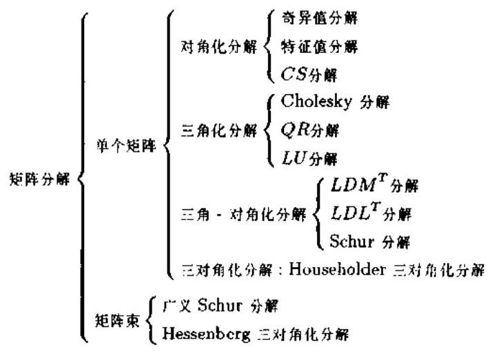

图 3.5.1 矩阵的分解树

从下节起, 我们将分类具体介绍矩阵的各种分解.

### 3.6 对角化分解

任意矩阵的奇异值分解和对称矩阵的特征值分解是信号处理中应用最广泛的两种矩阵分解. 奇异值分解有多种推广, 例如两个矩阵乘积的奇异值分解和矩阵束的广义奇异值分解等, 特征值分解也有一种以矩阵束为对象的推广即广义特征值分解. 我们将在第六章专题解说奇异值分解及其推广的定义、性质、计算方法与应用. 由于特征值分解的主要应用是特征子空间分析方法, 所以我们将在第十章中详细讨论之. 本节只介绍对角化分解类中的 ${CS}$ 分解.

定理 3.6.1 $\left( {{CS}\text{ 分解 }}\right)$ 若 $\left( {k + j}\right)  \times  \left( {k + j}\right)$ 矩阵

$$
Q = \left\lbrack  \begin{array}{ll} {Q}_{11} & {Q}_{12} \\  {Q}_{21} & {Q}_{22} \end{array}\right\rbrack
$$

是正交的,其中 ${Q}_{11}$ 是 $k \times  k$ 矩阵,并且 $k \geq  j$ ; 则存在正交矩阵 ${U}_{1},{V}_{1} \in  {R}^{k \times  k}$ 和正交矩阵 ${U}_{2},{V}_{2} \in  {R}^{j \times  j}$ 使得

$$
\left\lbrack  \begin{matrix} {U}_{1} & 0 \\  0 & {U}_{2} \end{matrix}\right\rbrack  \left\lbrack  \begin{array}{ll} {Q}_{11} & {Q}_{12} \\  {Q}_{21} & {Q}_{22} \end{array}\right\rbrack  \left\lbrack  \begin{matrix} {V}_{1} & 0 \\  0 & {V}_{2} \end{matrix}\right\rbrack   = \left\lbrack  \begin{matrix} {I}_{k - j} & 0 & 0 \\  0 & C & S \\  0 &  - S & C \end{matrix}\right\rbrack \tag{3.6.1}
$$

其中

$$
C = \operatorname{diag}\left( {{c}_{1},\cdots ,{c}_{j}}\right) ,\;{c}_{i} = \cos \left( {\theta }_{i}\right)
$$

$$
S = \operatorname{diag}\left( {{s}_{1},\cdots ,{s}_{j}}\right) ,\;{s}_{i} = \sin \left( {\theta }_{i}\right)
$$

且 $0 \leq  {\theta }_{1} \leq  {\theta }_{2} \leq  \cdots  \leq  {\theta }_{j} \leq  \pi /2$ .

证明详见文献 [7].

相略地讲, ${CS}$ 分解相当于将一个正交矩阵的各个分块同时对角化.

推论 3.6.1 令 $U = \left\lbrack  {{U}_{1},{U}_{2}}\right\rbrack$ 和 $V = \left\lbrack  {{V}_{1},{V}_{2}}\right\rbrack$ 是正交矩阵,其中 ${U}_{1},{V}_{1} \in  {R}^{n \times  k}$ 和 ${U}_{2},{V}_{2} \in  {R}^{n \times  \left( {n - k}\right) }$ . 若 ${S}_{1} = \operatorname{range}\left( {U}_{1}\right)$ 和 ${S}_{2} = \operatorname{range}\left( {V}_{1}\right)$ ,则

$$
\operatorname{dist}\left( {{S}_{1},{S}_{2}}\right)  = \sqrt{1 - {\sigma }_{\min }^{2}\left( {{U}_{1}^{T}{V}_{1}}\right) }
$$

证明 令 $Q = {U}^{T}V$ ,并假定 $k \geq  j = n - k$ . 设 $Q$ 的 ${CS}$ 分解由式 (3.1.2) 给出,其中 ${Q}_{pq} = {U}_{p}^{T}{V}_{q}$ . 于是,

$$
{\begin{Vmatrix}{U}_{1}^{T}{V}_{2}\end{Vmatrix}}_{2} = {\begin{Vmatrix}{U}_{2}^{T}{V}_{1}\end{Vmatrix}}_{2} = {s}_{j} = \sqrt{1 - {c}_{j}^{2}} = \sqrt{1 - {\sigma }_{\min }^{2}\left( {{U}_{1}^{T}{V}_{1}}\right) }
$$

因为 ${U}_{1}{U}_{1}^{T}$ 和 ${V}_{1}{V}_{1}^{T}$ 分别是到 ${S}_{1}$ 和 ${S}_{2}$ 上的正交投影,所以

$$
\operatorname{dist}\left( {{S}_{1},{S}_{2}}\right)  = {\begin{Vmatrix}{U}_{1}{U}_{1}^{T} - {V}_{1}{V}_{1}^{T}\end{Vmatrix}}_{2} = {\begin{Vmatrix}{U}^{T}\left( {U}_{1}{U}_{1}^{T} - {V}_{1}{V}_{1}^{T}\right) V\end{Vmatrix}}_{2}
$$

$$
= {\begin{Vmatrix}\left\lbrack  \begin{matrix} 0 & {U}_{1}^{T}{V}_{2} \\   - {U}_{2}^{T}{V}_{1} & 0 \end{matrix}\right\rbrack  \end{Vmatrix}}_{2} = {s}_{j}
$$

如果 $k < j$ ,则上述证明仍然成立,只需要令 $Q = {\left\lbrack  {U}_{2},{U}_{1}\right\rbrack  }^{T}\left\lbrack  {{V}_{2},{V}_{1}}\right\rbrack$ ,并注意到 ${\sigma }_{\max }\left( {{U}_{2}^{T}{V}_{1}}\right)  = \; {\sigma }_{\max }\left( {{U}_{1}^{T}{V}_{2}}\right)  = {s}_{j}$ 即可.

例 3.6.1 矩阵

$$
Q = \left\lbrack  \begin{matrix}  - {0.761} &  - {0.698} &  - {0.006} \\  {0.548} &  - {0.555} &  - {0.626} \\  {0.433} &  - {0.451} & {0.780} \end{matrix}\right\rbrack
$$

是正交的. 因此选择正交矩阵

$$
U = \left\lbrack  \begin{matrix} {0.999} &  - {0.010} & {0.000} \\   - {0.010} &  - {0.999} & {0.000} \\  {0.000} & {0.000} & {1.000} \end{matrix}\right\rbrack
$$

和

$$
V = \left\lbrack  \begin{matrix}  - {0.721} &  - {0.692} & {0.000} \\   - {0.692} & {0.721} & {0.000} \\  {0.000} & {0.000} & {1.000} \end{matrix}\right\rbrack
$$

则有

$$
{U}^{T}{QV} = \left\lbrack  \begin{matrix} {1.000} & {0.000} & {0.000} \\  {0.000} & {0.780} & {0.625} \\  {0.000} &  - {0.625} & {0.780} \end{matrix}\right\rbrack
$$

换言之,在定理 3.6.1 中相当于取 $k = 2, j = 1$ ,并且 ${c}_{1} = {0.780}$ 和 ${s}_{1} = {0.625}$ .

### 3.7 Cholesky 分解与 ${LU}$ 分解

本节讨论三角化分解中的两种形式: Cholesky 分解和 ${LU}$ 分解. 由于 ${QR}$ 分解在信号处理中的应用非常广泛, 所以我们将在下一节专题讨论它.

#### 3.7.1 Cholesky 分解

设 $A = \left\lbrack  {a}_{ij}\right\rbrack   \in  {R}^{n \times  n}$ 是对称正定矩阵, $A = G{G}^{T}$ 称为 Cholesky 分解,其中 $G \in  {R}^{n \times  n}$ 是一个具有正的对角线元素的下三角矩阵:

$$
G = \left\lbrack  \begin{matrix} {g}_{11} & & & 0 \\  {g}_{21} & {g}_{22} & & \\  \vdots & \vdots &  \ddots  & \\  {g}_{n1} & {g}_{n2} & \cdots & {g}_{nn} \end{matrix}\right\rbrack \tag{3.7.1}
$$

比较 $A = G{G}^{T}$ 两边,易得

$$
{a}_{ij} = \mathop{\sum }\limits_{{k = 1}}^{j}{g}_{jk}{g}_{ik}
$$

从而有

$$
{g}_{jj}{g}_{ij} = {a}_{ij} - \mathop{\sum }\limits_{{k = 1}}^{{j - 1}}{g}_{jk}{g}_{ik} \equiv  v \tag{3.7.2}
$$

如果我们知道了 $G$ 的前 $j - 1$ 列,那么 $v$ 就是可计算的. 由式 (3.7.2) 得知, ${g}_{ij} = v\left( i\right) /\sqrt{v\left( j\right) }$ . 于是, 我们就有计算 Cholesky 分解的下述 MATLAB 算法:

$$
\left. \begin{matrix} \text{ for }j = 1 : n \\  \text{ for }i = j : n \\  v\left( i\right)  = {a}_{ij}; \\  \text{ for }k = 1 : j - 1 \\  v\left( i\right)  = v\left( i\right)  - {g}_{jk}{g}_{ki}; \\  \text{ end } \\  {g}_{ij} = v\left( i\right) /\sqrt{v\left( j\right) }; \\  \text{ end } \end{matrix}\right\} \tag{3.7.3}
$$

这一算法叫做 Gaxpy Cholesky 算法. Gaxpy 意即广义的 saxpy, 而 "saxpy" 是在软件包 LINPACK 中被定义的术语，它是 “标量 ${\alpha x} + y$ ” 的英文 (scalar alpha x plus y) 缩写, saxpy 运算定义为

$$
z = {\alpha x} + y \Rightarrow  {z}_{i} = \alpha {x}_{i} + {y}_{i}
$$

而 Gaxpy 运算系指矩阵运算 $z = {Ax} + y$ .

以上分析结果可以归纳为

定理 3.7.1 (Cholesky 分解) 如果 $A \in  {R}^{n \times  n}$ 是对称正定矩阵,则 Cholesky 分解 $A = G{G}^{T}$ 是唯一的,其中下三角矩阵 $G \in  {R}^{n \times  n}$ 的非零元素由式 (3.7.3) 决定.

下三角矩阵 $G$ 称为 Cholesky 三角. 另外, Cholesky 分解也谓之平方根方法,因为下三角矩阵 $G$ 可以视为矩阵 $A$ 的 “平方根”.

一个非奇异矩阵 $A$ 的逆矩阵 ${A}^{-1}$ 可以通过 Cholesky 分解求得,即

$$
{A}^{-1} = {G}^{-T}{G}^{-1}
$$

其中 ${G}^{-T} = {\left( {G}^{T}\right) }^{-1}$ .

例 3.7.1 考虑利用 Cholesky 分解求解矩阵方程 ${Ax} = b$ . 由于

$$
{G}^{-1}{Ax} = {G}^{-1}b \Rightarrow  {G}^{T}x = h
$$

其中 $h = {G}^{-1}b$ 或等价为 ${Gh} = b$ . 比较 ${Gh} = b$ 两边的向量元素,易得向量 $h$ 的元素 ${h}_{i}$ 的递推计算公式如下:

$$
\left. \begin{array}{l} {h}_{1} = {b}_{1}/{g}_{11} \\  {h}_{i} = \frac{1}{{g}_{ii}}\left( {{b}_{i} - \mathop{\sum }\limits_{{k = 1}}^{{i - 1}}{g}_{ki}{h}_{k}}\right) ,\;i = 2,3,\cdots , n \end{array}\right\} \tag{3.7.4}
$$

现在,方程 ${Ax} = b$ 的解等价为 ${G}^{T}x = h$ 的解. 注意到 ${G}^{T}$ 为上三角矩阵,因此 $x$ 可以利用熟知的回代法求出:

$$
\left. \begin{array}{l} {x}_{n} = {h}_{n}/{g}_{nn} \\  {x}_{i} = \frac{1}{{g}_{ii}}\left( {{h}_{i} - \mathop{\sum }\limits_{{k = 1}}^{{n - 1}}{g}_{i + k, i}{x}_{i + k}}\right) ,\;i = n - 1, n - 2,\cdots ,1 \end{array}\right\} \tag{3.7.5}
$$

#### 3.7.2 LU 分解

与保持向量或矩阵范数不变的 Householder 变换和 Jacobi 旋转不同，Gauss 变换是一种非保范数的矩阵变换.

令 $x \in  {R}^{n}$ 是一个 $n \times  1$ 向量,并且其第 $k$ 个元素不为零,即 ${x}_{k} \neq  0$ . 记

$$
{\tau }^{T} = \left\lbrack  {0,\cdots ,0,{\tau }_{k + 1},\cdots ,{\tau }_{n}}\right\rbrack  ,\;\text{ 其中 }{\tau }_{i} = \frac{{x}_{i}}{{x}_{k}},\;i = k + 1,\cdots , n \tag{3.7.6}
$$

若定义

$$
{M}_{k} = I - \tau {e}_{k}^{T} \tag{3.7.7}
$$

则

$$
{M}_{k}x = \left\lbrack  \begin{matrix} 1 & \cdots & 0 & 0 & \cdots & 0 \\  \vdots &  \ddots  & \vdots & \vdots & & \vdots \\  0 & \cdots & 1 & 0 & \cdots & 0 \\  0 & \cdots &  - {\tau }_{k + 1} & 1 & \cdots & 1 \\  \vdots & & \vdots & \vdots &  \ddots  & \vdots \\  0 & \cdots &  - {\tau }_{n} & 0 & \cdots & 1 \end{matrix}\right\rbrack  \left\lbrack  \begin{matrix} {x}_{1} \\  \vdots \\  {x}_{k} \\  {x}_{k + 1} \\  \vdots \\  {x}_{n} \end{matrix}\right\rbrack   = \left\lbrack  \begin{matrix} {x}_{1} \\  \vdots \\  {x}_{k} \\  0 \\  \vdots \\  0 \end{matrix}\right\rbrack
$$

矩阵 ${M}_{k}$ 称为 Gauss 变换,这是一种初等矩阵变换. Gauss 变换矩阵 ${M}_{k}$ 是一个单位下三角矩阵, ${\tau }_{k + 1},\cdots ,{\tau }_{m}$ 称为乘子,向量 $\tau$ 叫做 Gauss 向量. 不难验证, ${M}_{k} = I - {\tau }^{\left( k\right) }{e}_{k}^{T}$ . 其中 ${e}_{k}$ 是一个仅第 $k$ 个元素为 1,而其它元素均等于零的列向量. 于是, ${M}_{k}$ 的逆矩阵由下式给出:

$$
{M}_{k}^{-1} = I - {\tau }^{\left( k\right) }{e}_{k}^{T} \tag{3.7.8}
$$

Gauss 变换的目的是使变换对象 (向量 $x$ ) 的一部分元素变为零,但范数不能保持不变. 如果对一个非奇异矩阵的各列(或各行)应用 Gauss 变换，并使变换结果为单位矩阵， 即 ${M}_{n}\cdots {M}_{2}{M}_{1}A = I$ ,我们就能得到逆矩阵 ${A}^{-1} = {M}_{n}\cdots {M}_{2}{M}_{1}$ . 这就是求逆矩阵的 Gauss 消去法.

然而,如果通过 Gauss 变换. 使 $n \times  n$ 矩阵 $A$ 变为上三角矩阵 $U$ 的话. 我们就得到另外一种矩阵分解: ${M}_{n - 1}\cdots {M}_{2}{M}_{1}A = U$ 或等价为

$$
A = {LU} \tag{3.7.9}
$$

其中

$$
L = {M}_{1}^{-1}\cdots {M}_{n - 1}^{-1} \tag{3.7.10}
$$

很明显, $L$ 是一个单位下三角矩阵,因为每一个 ${M}_{k}^{-1}$ 都是单位下三角的. 式 (3.7.9) 所示的矩阵分解称为 $A$ 的 ${LU}$ 分解.

定理 ${3.7.2}\left( {{LU}\text{ 分解 }}\right)$ 如果 $A \in  {R}^{n \times  n}$ 非奇异,并且其 ${LU}$ 分解存在的话,则 $A$ 的 ${LU}$ 分解是唯一的,且 $\det \left( A\right)  = {u}_{11}\cdots {u}_{nn}$ .

证明 令 $A = {L}_{1}{U}_{1}$ 和 $A = {L}_{2}{U}_{2}$ 是非奇异矩阵 $A$ 的两个 ${LU}$ 分解,则 ${L}_{1}{U}_{1} = {L}_{2}{U}_{2}$ . 由于 ${L}_{2}^{-1}{L}_{1}$ 是单位下三角矩阵,并且 ${U}_{2}{U}_{1}^{-1}$ 是上三角矩阵,所以这两个矩阵必定都等于单位矩阵,否则它们不可能相等. 这就是说, ${L}_{1} = {L}_{2},{U}_{1} = {U}_{2}$ ,即 ${LU}$ 分解是唯一的. 如果 $A = {LU}$ ,则 $\det \left( A\right)  = \det \left( {LU}\right)  = \det \left( L\right) \det \left( U\right)  = \det \left( U\right)  = {u}_{11}\cdots {u}_{nn}$ .

例 3.7.2 考虑线性矩阵方程 ${Ax} = b$ 的求解. 我们可以将该问题分成两个三角矩阵方程的求解, 具体算法如下:

计算 $A = {LU}$ ；

求解 ${Ly} = b$ ;

求解 ${Ux} = y$ ;

由于 ${Ly} = b$ 是一个单位下三角矩阵方程,可以直接计算

$$
\left. \begin{array}{l} {y}_{1} = {b}_{1} \\  {y}_{i} = {b}_{i} - \mathop{\sum }\limits_{{k = 1}}^{{i - 1}}{l}_{ik}{y}_{k},\;i = 2,\cdots , n \end{array}\right\} \tag{3.7.11}
$$

而另一个下三角矩阵方程 ${Ux} = y$ 则可以用前面介绍的回代法求解.

例 3.7.3 考虑线性矩阵方程 ${AX} = B$ 的求解,其中 $A \in  {R}^{n \times  n}$ 非奇异, $B, X \in  {R}^{n \times  p}$ . 记 $X = \left\lbrack  {{x}_{1},\cdots ,{x}_{p}}\right\rbrack$ 和 $B = \left\lbrack  {{b}_{1},\cdots ,{b}_{p}}\right\rbrack$ ,则以下算法可用于求出未知的矩阵 $X$ :

$$
\left. \begin{array}{l} \text{ 计算 }{JA} = {LU} \\  \text{ for }k = 1 : p \\  \text{ 求解 }{Ly} = J{b}_{k} \\  \text{ 求解 }U{x}_{k} = y \end{array}\right\} \tag{3.7.12}
$$

其中 $J$ 是 $n \times  n$ 反射矩阵,即 $J = \left\lbrack  {{e}_{n},{e}_{n - 1},\cdots ,{e}_{2},{e}_{1}}\right\rbrack$ .

## ${3.8QR}$ 分解及其应用

矩阵的 ${QR}$ 分解是在信号处理中应用最广泛的一种矩阵分解. 我们先来看 ${QR}$ 分解的性质.

#### 3.8.1 ${QR}$ 分解的性质

定理 3.8.1 $\left( {QR}\right.$ 分解) 若 $A \in  {R}^{m \times  n}$ ,且 $m \geq  n$ ,则存在列正交的矩阵 $Q \in  {R}^{m \times  m}$ 和上三角矩阵 $R \in  {R}^{m \times  n}$ 使得 $A = {QR}$ . 若 $m = n$ ,则 $Q$ 是正交矩阵; 若 $A$ 还是非奇异的, 则 $R$ 的所有对角线元素均为正,并且在这种情况下 $Q$ 和 $R$ 二者是唯一的. 若 $A$ 是复矩阵,则 $Q$ 和 $R$ 取复值.

证明详见文献 $\left\lbrack  2\right\rbrack$ .

除了上述分解的唯一性外, ${QR}$ 分解还具有以下性质.

定理 3.8.2 若 $A = {QR}$ 是一个满列秩矩阵 $A \in  {R}^{m \times  n}$ 的 ${QR}$ 分解,并且 $A = \; \left\lbrack  {{a}_{1},\cdots ,{a}_{n}}\right\rbrack$ 和 $Q = \left\lbrack  {{q}_{1},\cdots ,{q}_{m}}\right\rbrack$ 是列分块的,则

$$
\operatorname{span}\left\{  {{a}_{1},\cdots ,{a}_{k}}\right\}   = \operatorname{span}\left\{  {{q}_{1},\cdots ,{q}_{k}}\right\}  ,\;k = 1,\cdots , n
$$

特别地,若 $Q = \left\lbrack  {{Q}_{1},{Q}_{2}}\right\rbrack$ ,其中 ${Q}_{1}$ 是 $Q$ 的前 $n$ 列组成的分块, ${Q}_{2}$ 是 $Q$ 的其它列组成的分块, 则

$$
\operatorname{range}\left( A\right)  = \operatorname{range}\left( {Q}_{1}\right)
$$

$$
\operatorname{range}{\left( A\right) }^{ \bot  } = \operatorname{range}\left( {Q}_{2}\right)
$$

并且 $A = {Q}_{1}{R}_{1}$ 和 ${R}_{1} = R\left( {1 : n,1 : n}\right)$ ,即 ${R}_{1}$ 是 $R$ 的左上方 $n \times  n$ 方块.

证明 比较 $A = {QR}$ 左右两边的第 $k$ 列,可以得出结论:

$$
{a}_{k} = \mathop{\sum }\limits_{{i = 1}}^{k}{r}_{ik}{q}_{i} \in  \operatorname{span}\left\{  {{q}_{1},\cdots ,{q}_{k}}\right\}
$$

因此, $\operatorname{span}\left\{  {{a}_{1},\cdots ,{a}_{k}}\right\}   \subseteq  \operatorname{span}\left\{  {{q}_{1},\cdots ,{q}_{k}}\right\}$ . 然而,由于 $\operatorname{rank}\left( A\right)  = n$ ,故知 $\operatorname{span}\left\{  {{a}_{1},\cdots ,{a}_{k}}\right\}$ 具有维数 $k$ ,从而必然等于 $\operatorname{span}\left\{  {{q}_{1},\cdots ,{q}_{k}}\right\}$ . 定理的剩余部分可以直接得出.

注意到 ${A}^{T}A = {\left( QR\right) }^{T}\left( {QR}\right)  = {R}^{T}R$ ,因此我们可以得出结论: $G = {R}^{T}$ 是 ${A}^{T}A$ 的下三角 Cholesky 因子. 由于这个原因,在关于估计的文献中, $R$ 常称为平方根滤波器.

下面介绍三种主要的 ${QR}$ 分解算法 (采用修正 Gram-Schmidt 法的 ${QR}$ 分解、采用 Householder 变换的 ${QR}$ 分解和采用 Givens 旋转的 ${QR}$ 分解) 以及它们在自适应信号处理中的典型应用.

#### 3.8.2 采用修正 Gram-Schmidt 法的 ${QR}$ 分解

首先介绍利用 Gram-Schmidt 正交化，对矩阵 $A$ 进行 QR 分解的方法. Gram-Schmidt 正交化方法原本是一种由 $n$ 个向量 ${a}_{1},{a}_{2},\cdots ,{a}_{n}$ 构造互相正交,且范数为 1 的向量 ${q}_{1},{q}_{2}$ , $\cdots ,{q}_{n}$ 的方法. 首先,将 ${a}_{1}$ 标准正交化的结果取作 ${q}_{1}$ ,即

$$
\left. \begin{aligned} {R}_{11} &  = \begin{Vmatrix}{a}_{1}\end{Vmatrix} \\  {q}_{1} &  = {q}_{1}/{R}_{11} \end{aligned}\right\} \tag{3.8.1}
$$

然后,从 ${a}_{2}$ 中除去与 ${a}_{1}$ 平行的分量,再进行标准正交化,并将结果取作 ${q}_{2}$ :

$$
\left. \begin{aligned} {R}_{12} &  = {q}_{1}^{H}{a}_{2} \\  {R}_{22} &  = \begin{Vmatrix}{{a}_{2} - {q}_{1}{R}_{12}}\end{Vmatrix} \\  {q}_{2} &  = \left( {{a}_{2} - {q}_{1}{R}_{12}}\right) /{R}_{22} \end{aligned}\right\} \tag{3.8.2}
$$

进而,又从 ${a}_{3}$ 除去与 ${a}_{1}$ 和 ${a}_{2}$ 平行的分量,再进行标准正交化,该结果即取作 ${q}_{3}$ ;

$$
\left. \begin{aligned} {R}_{13} &  = {q}_{1}^{H}{a}_{3} \\  {R}_{23} &  = {q}_{2}^{H}{a}_{3} \\  {R}_{33} &  = \begin{Vmatrix}{{a}_{3} - {q}_{1}{R}_{13} - {q}_{2}{R}_{23}}\end{Vmatrix} \\  {q}_{3} &  = \left( {{a}_{3} - {q}_{1}{R}_{13} - {q}_{2}{R}_{23}}\right) /{R}_{23} \end{aligned}\right\} \tag{3.8.3}
$$

如此继续,则对于 ${q}_{k}\left( {2 \leq  k \leq  n}\right)$ 有

$$
\left. \begin{aligned} {R}_{jk} &  = {q}_{j}^{H}{a}_{k},\;1 \leq  j \leq  k - 1 \\  {R}_{kk} &  = \begin{Vmatrix}{{a}_{k} - \mathop{\sum }\limits_{{j = 1}}^{{k - 1}}{q}_{j}{R}_{jk}}\end{Vmatrix} \\  {q}_{k} &  = \left( {{a}_{k} - \mathop{\sum }\limits_{{j = 1}}^{{k - 1}}{q}_{j}{R}_{jk}}\right) /{R}_{33} \end{aligned}\right\} \tag{3.8.4}
$$

容易验证, ${q}_{i}$ 是标准正交基,即满足:

$$
{q}_{i}^{H}{q}_{j} = {\delta }_{ij} \tag{3.8.5}
$$

其中 ${\delta }_{ij}$ 为 Kronecker $\delta$ 函数. 如果令 $m \times  n$ 矩阵 $A$ 的列向量为 ${a}_{1},{a}_{2},\cdots ,{a}_{n}$ ,则以 ${q}_{1},{q}_{2},\cdots ,{q}_{n}$ 为列向量的矩阵 $Q$ 与 $A$ 之间有下列关系:

$$
A = {QR} \tag{3.8.6}
$$

又由于 ${q}_{i}$ 组成标准正交基，所以

$$
{Q}^{H}Q = {I}_{n}
$$

将 $A$ 和 $Q$ 重写在同一矩阵,应用以上 Gram-Schmidt 正交化的方法叫做经典 Gram-Schmidt 正交化法, 其过程可以用图 3.8.1 说明.

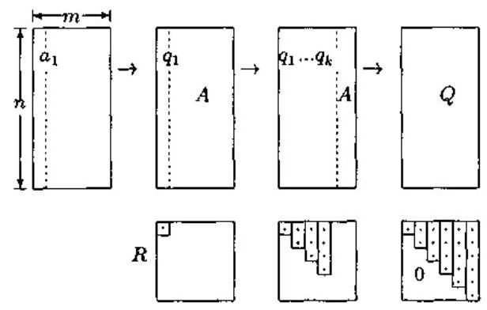

图 3.8.1 经典 Gram-Schmidt 正交化法

Brörk ${}^{\left( {30}\right) }$ 发现,对经典 Gram-Schmidt 正交化法加以修正,使上三角矩阵 $R$ 的元素不是按列, 而是按行计算时, 舍入误差将变小. 这样一种修正方法叫做修正 Gram-Schmidt 法. 具体说来, ${a}_{1}$ 的标准正交化结果取作 ${q}_{1}$ (这与经典 Gram-Schmidt 正交化法相同),但同时需要从 ${a}_{2},\cdots ,{a}_{n}$ 预先减去与 ${a}_{1}$ 平行的分量,即

$$
\left. \begin{array}{l} {R}_{11} = \begin{Vmatrix}{a}_{1}\end{Vmatrix},\;{q}_{1} = {a}_{1}/{R}_{11} \\  {R}_{1j} = {q}_{1}^{H}{a}_{j},\;{a}_{j}^{\left( 1\right) } = {a}_{j} - {q}_{1}{R}_{1j},\;2 \leq  j \leq  n \end{array}\right\} \tag{3.8.7}
$$

经过以上运算, ${a}_{2}^{\left( 1\right) },\cdots ,{a}_{n}^{\left( 1\right) }$ 与 ${q}_{1}$ 正交.

然后，将 ${a}_{2}^{\left( 1\right) }$ 标准正交化，并从 ${a}_{3}^{\left( 1\right) },\cdots ,{a}_{n}^{\left( 1\right) }$ 减去与 ${a}_{2}^{\left( 1\right) }$ 平行的分量:

$$
\left. \begin{array}{l} {R}_{22} = \begin{Vmatrix}{a}_{2}^{\left( 1\right) }\end{Vmatrix},\;{q}_{2} = {a}_{2}/{R}_{22} \\  {R}_{2j} = {q}_{2}^{H}{a}_{j}^{\left( 1\right) },\;{a}_{j}^{\left( 2\right) } = {a}_{j}^{\left( 1\right) } - {q}_{2}{R}_{2j},\;3 \leq  j \leq  n \end{array}\right\} \tag{3.8.8}
$$

这样构造的 ${a}_{3}^{\left( 2\right) },\cdots ,{a}_{n}^{\left( 2\right) }$ 与 ${q}_{1},{q}_{2}$ 均正交. 重复这一过程,我们就可以将 $A$ 和 $Q$ 重写在同一矩阵. 图 3.8.2 示出了修正 Gram-Schmidt 法的正交化过程.

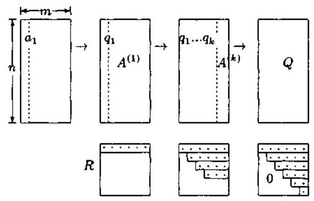

图 3.8.2 修正 Gram-Schmidt 法

为了分析误差的情况,我们假定 ${q}_{2}$ 包含有少量与 ${q}_{1}$ 平行的分量,为 ${q}_{2} + \epsilon {q}_{1}$ . 应用经典 Gram-Schmidt 法时,求 ${q}_{2}$ 和 ${a}_{3}$ 内积 ${R}_{23}$ 的计算为

$$
\left( {{q}_{2}^{H} + \epsilon {q}_{1}^{H}}\right) {a}_{3} = {q}_{2}^{H}{a}_{3} + \epsilon {q}_{1}^{H}{a}_{3} \tag{3.8.9}
$$

而在修正 Gram-Schmidt 法中,求 ${R}_{23}$ 时计算的是 ${q}_{2}$ 和 ${a}_{2}^{\left( 1\right) } = {a}_{3} - {R}_{13}{q}_{1}$ 的内积,即

$$
\left( {{q}_{2}^{H} + \epsilon {q}_{1}^{H}}\right) \left( {{a}_{3} - {R}_{13}{q}_{1}}\right)  = {q}_{2}^{H}{a}_{3} + \epsilon {q}_{1}^{H}{a}_{3} - \epsilon {R}_{13} = {q}_{2}^{H}{a}_{3} \tag{3.8.10}
$$

比较式 (3.8.9) 与式 (3.8.10) 可以看出，经典方法比修正方法多第二项误差. 尤其是当 $\left| {R}_{23}\right|  \ll  \left| {R}_{13}\right|$ 时,修正 Gram-Schmidt 法减小误差的效果将更明显.

#### 3.8.3 采用 Householder 变换的 ${QR}$ 分解

现在分析如何利用 Householder 变换实现任意 $m \times  n$ 矩阵 $A$ 的 ${QR}$ 分解. 为了讨论的方便,假定矩阵 $A$ 经过 $k - 1$ 次 Householder 变换后,已变成 ${A}^{\left( k - 1\right) }$ ,即

$$
{A}^{\left( k - 1\right) } = {H}_{k - 1}{A}^{\left( k - 2\right) } = {H}_{k - 1}\cdots {H}_{1}A
$$

$$
= \left\lbrack  {{a}_{1}^{\left( k - 1\right) },{a}_{2}^{\left( k - 1\right) },\cdots ,{a}_{n}^{\left( k - 1\right) }}\right\rbrack  ,\;k = 2,3,\cdots
$$

并且其前 $k - 1$ 列具有以下变换结果:

$$
{a}_{j}^{\left( k - 1\right) } = {\left\lbrack  {a}_{1j}^{\left( k - 1\right) },\cdots ,{a}_{jj}^{\left( k - 1\right) },0,\cdots ,0\right\rbrack  }^{T},\;j = 1,\cdots , k - 1
$$

因此,第 $k$ 次 Householder 变换的目的就是保持前 $k - 1$ 列不变,实现 ${A}^{\left( k - 1\right) }$ 的第 $k$ 列的下述变换:

$$
{\widetilde{H}}_{k}\left\lbrack  \begin{matrix} {a}_{k, k}^{\left( k - 1\right) } \\  {a}_{k + 1, k}^{\left( k - 1\right) } \\  \vdots \\  {a}_{m - k}^{\left( k - 1\right) } \end{matrix}\right\rbrack   = \left\lbrack  \begin{matrix} {a}_{k, k}^{\left( k\right) } \\  0 \\  \vdots \\  0 \end{matrix}\right\rbrack
$$

这相当于对矩阵 ${A}^{\left( k - 1\right) }$ 进行 Householder 变换 ${H}_{k}{A}^{\left( k - 1\right) }$ 时取

$$
{H}_{k} = \left\lbrack  \begin{matrix} {I}_{k - 1} & 0 \\  0 & {\widetilde{H}}_{k} \end{matrix}\right\rbrack  \begin{matrix} k - 1 \\  m - k \\  \end{matrix}
$$

虽然我们分别叙述了修正 Gram-Schmidt 法和 Householder 法两种 ${QR}$ 分解方法,但是两者在数学上是等价的. 除了存在 $Q$ 的第 $j$ 列和 $R$ 的第 $j$ 行的符号可同时反转的自由度以外, 两者是相同的 (证明留给读者).

#### 3.8.4 采用 Givens 旋转的 ${QR}$ 分解

Givens 旋转也可以用来计算 ${QR}$ 分解. 我们以 $4 \times  3$ 矩阵为例说明 Givens ${QR}$ 分解的思想:

$$
\left\lbrack  \begin{matrix}  \times  &  \times  &  \times  \\   \times  &  \times  &  \times  \\   \otimes  &  \times  &  \times  \\   \otimes  &  \times  &  \times   \end{matrix}\right\rbrack  \overset{\left( 3,4\right) }{ \rightarrow  }\left\lbrack  \begin{matrix}  \times  &  \times  &  \times  \\   \otimes  &  \times  &  \times  \\   \otimes  &  \times  &  \times  \\  0 &  \times  &  \times   \end{matrix}\right\rbrack  \overset{\left( 2,3\right) }{ \rightarrow  }\left\lbrack  \begin{matrix}  \otimes  &  \times  &  \times  \\   \odot  &  \times  &  \times  \\  0 &  \times  &  \times  \\  0 &  \times  &  \times   \end{matrix}\right\rbrack  \overset{\left( 1,2\right) }{ \rightarrow  }\left\lbrack  \begin{matrix}  \times  &  \times  &  \times  \\  0 &  \times  &  \times  \\  0 &  \otimes  &  \times  \\  0 &  \otimes  &  \times   \end{matrix}\right\rbrack  \overset{\left( 3,4\right) }{ \rightarrow  }
$$

$$
\left\lbrack  \begin{matrix}  \times  &  \times  &  \times  \\  0 &  \otimes  &  \times  \\  0 &  \otimes  &  \times  \\  0 & 0 &  \times   \end{matrix}\right\rbrack  \overset{\left( 2,3\right) }{ \rightarrow  }\left\lbrack  \begin{matrix}  \times  &  \times  &  \times  \\  0 &  \times  &  \times  \\  0 & 0 &  \otimes  \\  0 & 0 &  \otimes   \end{matrix}\right\rbrack  \overset{\left( 3,4\right) }{ \rightarrow  }\left\lbrack  \begin{matrix}  \times  &  \times  &  \times  \\  0 &  \times  &  \times  \\  0 & 0 &  \times  \\  0 & 0 & 0 \end{matrix}\right\rbrack
$$

其中 $\otimes$ 表示用 Givens 旋转进行变换的元素.

从上述说明图中易得出结论: 如果令 ${G}_{j}$ 代表约化过程中的第 $j$ 次 Givens 旋转,则 ${Q}^{T}A = R$ 是上三角矩阵,其中 $Q = {G}_{t}\cdots {G}_{1}, t$ 是总的旋转次数.

#### 3.8.5 基于 ${QR}$ 分解的参数估计问题

考虑形如 ${y}_{i} = {\phi }_{i}^{T}\theta  + {r}_{i}, i = 1,\cdots , k$ 的一组线性方程,其中 ${y}_{i}$ 是标量输出, ${r}_{i}$ 为残差. 未知参数向量 ${\theta }^{ * }$ 可以通过求解最小二乘问题

$$
\mathop{\min }\limits_{\theta }\parallel {A\theta } - y{\parallel }_{2}^{2} \tag{3.8.11}
$$

得到,其中 ${A}^{T} = \left\lbrack  {{\phi }_{1},{\phi }_{2},\cdots ,{\phi }_{n}}\right\rbrack$ . 假定 $k \geq  n$ . 若 $A$ 有满列秩,则式 (3.8.1) 的唯一极小化变量 ${\theta }^{ * }$ 由众所周知的 “法方程” 确定:

$$
{A}^{T}A{\theta }^{ * } = {A}^{T}y \tag{3.8.12}
$$

上式又可写作 $R{\theta }^{ * } = r$ ,其中 $R = {A}^{T}A$ 和 $r = {A}^{T}y$ 的元素对应于输出数据的协方差. 直接求解式 (3.8.12) 的方法叫做协方差方法,例如计算协方差矩阵 $R$ 的 Cholesky 分解: $R = G{G}^{T}$ ,然后利用回代法解三角矩阵方程 ${G}^{\mathrm{T}}{\theta }^{ * } = {G}^{-1}r$ . 然而,由于 $R = {A}^{T}A$ 的条件数是 $A$ 的条件数的平方,因此,直接计算式 (3.8.12) 得到的解有可能是严重病态的 (即条件数很大),即使 $A$ 本身的条件数不大,不是严重病态的.

在系统参数 ${\theta }^{ * }$ 的自适应递推辨识中,标准的递推最小二乘 (RLS) 法 (第一章已作简单说明,更详细的讨论可参见文献 [12] 或 [29]) 和 ${U}^{T}{DU}$ 分解法 [13] 都是针对协方差矩阵 $R$ 进行更新的. 虽然 ${U}^{T}{DU}$ 分解 (其中 $U$ 为上三角, $D$ 为对角矩阵) 在数值上比较稳定, 但是这些递推辨识方法也同样存在条件数变大的毛病.

相比之下， $A$ 的 ${QR}$ 分解保持了原问题的条件数不变. 不妨令

$$
{Q}^{T}A = \left\lbrack  \begin{array}{l} R \\  0 \end{array}\right\rbrack \tag{3.8.13}
$$

其中 $Q$ 是 $k \times  k$ 正交矩阵, $R$ 是 $n \times  n$ 上三角矩阵.

由于 Euclidean 长度或 ${L}_{2}$ 范数可由正交变换保持不变,所以式 (3.8.1) 等价于

$$
\mathop{\min }\limits_{\theta }{\begin{Vmatrix}{Q}^{T}A\theta  - {Q}^{T}y\end{Vmatrix}}_{2}^{2} \tag{3.8.14}
$$

或

$$
\mathop{\min }\limits_{\theta }\parallel {R\theta } - \widetilde{y}{\parallel }_{2}^{2} + \parallel \widetilde{y}{\parallel }_{2}^{2} \tag{3.8.15}
$$

其中 ${Q}^{T}y = \left\lbrack  \begin{matrix} \bar{y} \\  \widetilde{y} \end{matrix}\right\rbrack$ . 如果 $\widetilde{y}$ 也已知的话,式 (3.8.11) 的极小化变量就可以利用求解 $R{\theta }^{ * } = \bar{y}$ 得到,解此方程需要 $n\left( {n + 1}\right) /2$ 次运算. 最小残差值等于 $\parallel \widetilde{y}{\parallel }_{2}^{2}$ .

利用指数加权,我们可以写出式 (3.8.11) 在 $\left( {k + 1}\right)$ 时刻的形式:

$$
\mathop{\min }\limits_{\theta }{\begin{Vmatrix}\left\lbrack  \begin{array}{l} \lambda {A}_{k} \\  {\phi }_{k + 1}^{T} \end{array}\right\rbrack  \theta  - \left\lbrack  \begin{matrix} {\lambda y} \\  {y}_{k + 1} \end{matrix}\right\rbrack  \end{Vmatrix}}_{2}^{2} \tag{3.8.16}
$$

乍看起来, 上式似乎没有什么特别吸引人的, 其实不然. 这是因为, 如同下面的引理 ${}^{\left\lbrack  {14}\right\rbrack  }$ 所述, 式 (3.8.16) 的极小化变量等价为下述式 (3.8.17) 的极小化变量, 而后者非常适合于递推更新.

引理 3.8.1 若 $A = Q\left\lbrack  \begin{matrix} {R}_{k} \\  0 \end{matrix}\right\rbrack$ 和 ${Q}^{T}y = \left\lbrack  \begin{matrix} {\widetilde{y}}_{k} \\  \widetilde{y} \end{matrix}\right\rbrack$ ,其中 $Q$ 是正交矩阵, ${R}_{k}$ 是上三角矩阵, 则式 (3.8.6) 的极小化变量等同于下式的极小化变量:

$$
\mathop{\min }\limits_{\theta }{\begin{Vmatrix}\left\lbrack  \begin{matrix} \lambda {R}_{k} \\  {\phi }_{k + 1}^{T} \end{matrix}\right\rbrack  \theta  - \left\lbrack  \begin{matrix} \lambda \bar{y} \\  {y}_{k + 1} \end{matrix}\right\rbrack  \end{Vmatrix}}_{2}^{2} \tag{3.8.17}
$$

证明 记

$$
\bar{A} = \left\lbrack  \begin{matrix} \lambda {A}_{k} \\  {\phi }_{k + 1}^{T} \end{matrix}\right\rbrack
$$

$$
\bar{R} = \left\lbrack  \begin{matrix} \lambda {R}_{k} \\  {\phi }_{k + 1}^{T} \end{matrix}\right\rbrack
$$

则

$$
{\bar{A}}^{T}\bar{A} = {\lambda }^{2}{A}_{k}^{T}{A}_{k} + {\phi }_{k + 1}{\phi }_{k + 1}^{T} = {\lambda }^{2}{R}_{k}^{T}{R}_{k} + {\phi }_{k + 1}{\phi }_{k + 1}^{T} = {\bar{R}}^{T}\bar{R} \tag{3.8.18}
$$

和

$$
{\bar{A}}^{T}\left\lbrack  \begin{matrix} {\lambda y} \\  {y}_{k + 1} \end{matrix}\right\rbrack   = {\lambda }^{2}{A}_{k}^{T}y + {\phi }_{k + 1}{y}_{k + 1}
$$

$$
= {\lambda }^{2}{\left\lbrack  \begin{matrix} {R}_{k}^{T} \\  0 \end{matrix}\right\rbrack  }^{T}{Q}^{T}y + {\phi }_{k + 1}{y}_{k + 1}
$$

$$
= {\lambda }^{2}{R}_{k}^{T}{\bar{y}}_{k} + {\phi }_{k + 1}{y}_{k + 1}
$$

$$
= {\bar{R}}^{T}\left\lbrack  \begin{matrix} \lambda \bar{y} \\  {y}_{k + 1} \end{matrix}\right\rbrack \tag{3.8.19}
$$

注意到式 (3.8.16) 是法方程 ${\overrightarrow{A}}^{T}\overrightarrow{A}{\theta }^{ * } = {\overrightarrow{A}}^{T}y$ 的最小二乘问题的表示,而式 (3.8.17) 是法方程 ${\widetilde{R}}^{T}\widetilde{R}{\theta }^{ * } = {\widetilde{R}}^{T}y$ 的最小二乘问题的表示，由式 (3.8.18) 和式 (3.8.19) 立即得到本引理.

如果将式 (3.8.17) 的极小化变量记作 ${\theta }_{k + 1}$ ,那么为了能够用递推方式得到 ${\theta }_{k + 1}$ ,我们就只需要对因子 $\left\lbrack  \begin{matrix} \lambda {R}_{k} \\  {\phi }_{k + 1}^{T} \end{matrix}\right\rbrack$ 进行更新,以形成 ${R}_{k + 1}$ ,然后再求解三角矩阵方程 ${R}_{k + 1}{\theta }_{k + 1} = \; {\dot{y}}_{k + 1}$ 即可.

因此，时变系统参数的自适应估计的 ${QR}$ 分解法的关键是 ${QR}$ 分解的递推算法. 下而分别介绍利用递推的 Householder ${QR}$ 分解和递推的 Givens ${QR}$ 分解构成的时变参数估计.

#### 3.8.6 基于 Householder 变换的快速时变参数估计

令 ${H}_{n}$ 是 $\left( {n + 1}\right)  \times  \left( {n + 1}\right)$ Householder 矩阵,它将矩阵 ${A}_{n}$ 变换为上三角矩阵 ${A}_{n}^{ * }$ ,即

$$
{A}_{n}^{ * } = {H}_{n}{A}_{n} = \left\lbrack  \begin{matrix} {a}_{11}^{ * } & {a}_{12}^{ * } & \cdots & {a}_{1m}^{ * } & \vdots & {a}_{1, m + 1}^{ * } \\   & {a}_{22}^{ * } & \cdots & {a}_{2m}^{ * } & \vdots & {a}_{2, m + 1}^{ * } \\   & &  \ddots  & \vdots & \vdots & \vdots \\   & & & {a}_{mm}^{ * } & \vdots & {a}_{{mm} + 1}^{ * } \\  \cdots & \cdots & \cdots & \vdots & \vdots & \cdots \cdots \\   & & & & {a}_{m + 1, m + 1}^{ * } & \\   & & & & \vdots & 0 \\   & & & & \vdots & 0 \end{matrix}\right\rbrack   = \left\lbrack  \begin{matrix} {R}_{n} & \vdots & {z}_{n} \\  \cdots & \cdots & \cdots \\  0 & \vdots & {z}_{n} \end{matrix}\right\rbrack \tag{3.8.20}
$$

其中 ${R}_{n}$ 为 $m \times  m$ 上三角矩阵,它是 ${A}_{n}^{ * }$ 的左上角的块矩阵, ${z}_{n}$ 为 $m \times  1$ 向量.

为了得到式 (3.8.20) 所示的 ${QR}$ 分解,应选择 ${H}_{n}$ 为 $m$ 个 Householder 变换矩阵之积 ${}^{\lbrack 8\rbrack }$

$$
{H}_{n} = {H}_{n}\left( m\right) {H}_{n}\left( {m - 1}\right) \cdots {H}_{n}\left( 1\right) \tag{3.8.21}
$$

并使得

$$
{D}_{n}^{\left( i + 1\right) } = {H}_{n}\left( i\right) {D}_{n}^{\left( i\right) },\;i = 1,2,\cdots , m \tag{3.8.22a}
$$

其中

$$
{D}_{n}^{\left( 1\right) } = \left\lbrack  \begin{matrix} w{D}_{n - 1}^{ * } \\  {\psi }_{n}^{ * } \end{matrix}\right\rbrack \tag{3.8.22b}
$$

和

$$
{D}_{n}^{\left( m + 1\right) } = {D}_{n}^{ * } \tag{3.8.22c}
$$

根据 Householder 矩阵的构造方法, ${H}_{n}\left( i\right)$ 由

$$
{H}_{n}\left( i\right)  = I - {u}^{\left( i\right) }{u}^{{\left( i\right) }^{T}}/{\sigma }_{i} \tag{3.8.23}
$$

决定,其元素的选择方法为 ${}^{\left\lbrack  9\right\rbrack  }$

$$
\left. \begin{matrix} {\alpha }_{i} = \sqrt{\mathop{\sum }\limits_{{j = i}}^{n}{\left\lbrack  {a}_{ji}^{\left( i\right) }\right\rbrack  }^{2}} \\  {\sigma }_{i} = {\alpha }_{i}\left( {{\alpha }_{i} +  \mid  {a}_{ii}^{\left( i\right) }}\right) \\  {u}_{j}^{\left( i\right) } = \left\{  \begin{array}{ll} 0, & j < i \\  {a}_{ii}^{\left( i\right) } + \operatorname{sign}\left( {a}_{ii}^{\left( i\right) }\right) {\alpha }_{i}, & j = i \\  {u}_{j}^{\left( i\right) }, & j > i \end{array}\right.  \end{matrix}\right\}  ,\;i = 1,\cdots , m \tag{3.8.24}
$$

值得指出的是,矩阵 ${H}_{n}$ 的计算可以简化. 注意到

$$
{A}_{n}^{\left( i + 1\right) } = {A}_{n}^{\left( i\right) } - {u}^{\left( i\right) }{q}_{i}^{T} \tag{3.8.25}
$$

式中

$$
{q}_{i}^{T} = {u}^{{\left( i\right) }^{T}}{A}_{n}^{\left( i\right) }/{\sigma }_{i} \tag{3.8.26}
$$

由于 ${u}^{\left( i\right) }$ 的前 $\left( {i - 1}\right)$ 个分量为零,且 ${a}_{ji}^{\left( i\right) } = 0\left( {j = i + 1,\cdots , n - 1}\right)$ ,所以式 (3.8.24) 和式 (3.8.26) 可以简化为

$$
{\alpha }_{i} = \sqrt{{\left( {a}_{ii}^{\left( i\right) }\right) }^{2} + {\left( {a}_{ni}^{\left( i\right) }\right) }^{2}} \tag{3.8.27a}
$$

$$
{\sigma }_{i} = {\alpha }_{i}\left( {{\alpha }_{i} + {\left| {a}_{ii}^{\left( i\right) }\right| }^{2}}\right) \tag{3.8.27b}
$$

$$
{u}_{j}^{\left( i\right) } = \left\{  \begin{array}{ll} {a}_{ii}^{\left( i\right) } + \operatorname{sign}\left( {a}_{ii}^{\left( i\right) }\right) {\alpha }_{i} = {\eta }_{i}, & j = i \\  {a}_{ni}^{\left( i\right) }, & j = n \\  0, & \text{ 其它 } \end{array}\right. \tag{3.8.27c}
$$

和

$$
{q}_{i}^{T} = {u}^{{\left( i\right) }^{T}}{A}_{n}^{\left( i\right) }/{\sigma }_{i}
$$

$$
= \frac{1}{{\sigma }_{i}}\left\lbrack  {0,\cdots ,0,{\tau }_{i},{\tau }_{i + 1},\cdots ,{\tau }_{m + 1}}\right\rbrack \tag{3.8.28}
$$

其中 $i = 1,2,\cdots$ ,且

$$
{\tau }_{j} = {\eta }_{i}{a}_{ij}^{\left( i\right) } + {a}_{ni}^{\left( i\right) }{a}_{nj}^{\left( i\right) },\;j = i, i + 1,\cdots , m \tag{3.8.29}
$$

分别用式 (3.8.27) 和式 (3.8.28) 代替式 (3.8.25) 中的 ${u}^{\left( i\right) }$ 和 ${q}_{i}$ ,就得到了递推的 Householder ${QR}$ 分解算法 ${}^{\left\lbrack  {10}\right\rbrack  }$ :

for $j = 1 : m$

$$
\text{ for }j = i : m + 1\text{ ; } \tag{3.8.30}
$$

$$
{\tau }_{j} = {\eta }_{i}{a}_{ij}^{\left( i\right) } + {a}_{ni}^{\left( i\right) }{a}_{nj}^{\left( i\right) },
$$

$$
{a}_{ij}^{\left( i + 1\right) } = {a}_{ij}^{\left( i\right) } - {\eta }_{i}^{\prime }{\tau }_{j}
$$

$$
{a}_{nj}^{\left( i + 1\right) } = {a}_{nj}^{\left( i\right) } - {\mu }_{i}^{\prime }{\tau }_{j};
$$

end

过去十多年，已提出不少基于 ${QR}$ 分解的自适应参数估计算法，例如参见文献 $\left\lbrack  {22}\right\rbrack   \sim$ [26] 与文献 [11]. 这些算法的共同点是,它们都由两个分开的过程组成: 1) 递推更新 ${QR}$ 分解 ${Q}^{T}A = R$ 中的上三角矩阵 $R;2)$ 用回代法求解三角矩阵方程. 由于直接的回代需要 $O\left( {m}^{2}\right)$ 次运算 $\left( {m\text{ 为数据长度 }}\right)$ ,因此,即便 Householder 变换再快速,整个自适应算法也至少需要 $O\left( {m}^{2}\right)$ 次运算. 文献 [10] 将上述快速 Householder ${QR}$ 分解算法和求解三角矩阵方程的回代法综合起来考虑,提出了只具有 $O\left( m\right)$ 复杂度的快速自适应算法,具体如下所述.

% 1. 初始化

$$
n = 0;\theta  = {\theta }_{0};s = \theta ;f = \lbrack 1,\cdots ,1{\} }^{T};
$$

% 2. 递推运算

$$
f = {wf};{f}^{\prime } =  - {ws};{f}^{\prime \prime } = {\psi }_{n};
$$

% Householder 变换

$$
{II} = 1;{\Pi }^{\prime } = {f}_{m + 1,1};
$$

$$
\text{ for }i = 1 : m
$$

$$
{\Pi }^{\prime \prime } = {\Pi }^{\prime 2};\alpha  = \sqrt{{f}_{ii}^{2} + {\Pi }^{\prime \prime }};
$$

$$
\sigma  = \alpha \left( {\alpha  + \left| {f}_{ii}\right| }\right) ;\rho  = 1 - {\Pi }^{\prime \prime }/\sigma ;
$$

$$
\eta  = {f}_{1i} + \operatorname{sign}\left( {f}_{ii}\right) \alpha ;{\delta }_{i} =  - \operatorname{sign}\left( {f}_{ii}\right) \Pi {\Pi }^{\prime }/\alpha ;
$$

$$
{f}_{ii} =  - \operatorname{sign}\left( {f}_{ii}\right) \alpha ;\tau  = \left( {\eta {f}_{i, m + 1} + I{I}^{\prime }{f}_{m + 1, m + 1}}\right) /\sigma
$$

$$
{f}_{i, m + 1} = {f}_{i, m + 1} - {\eta \tau };{f}_{m + 1, m + 1} = {f}_{m + 1, m + 1} - {\Pi }^{\prime }\tau ;
$$

$$
\Pi  = {\Pi \rho };{\Pi }^{\prime } = \Pi {f}_{m + 1, i + 1};
$$

end

$\%$ ___回代

$$
\gamma  = 0;{s}_{m} =  - {f}_{m, m + 1};{\theta }_{m} = {s}_{m}/{f}_{m, m};
$$

$$
\text{ for }i = m - 1 :  - 1 : 1
$$

$$
\gamma  = \gamma  + {f}_{m + 1, i + 1}{\theta }_{i + 1}
$$

$$
{s}_{i} =  - {f}_{i, m + 1} - {\delta }_{i}\gamma ;{\theta }_{i} = {s}_{i}/{f}_{ii};
$$

end

% 3. 终止控制

if T.Flag = True

Stop

else

goto 2

end

其中 T.Flag 是程序的终止标志.

#### 3.8.7 基于 Givens 旋转的时变参数估计

现在考虑另外一种递推方法: 递推求解 ${\theta }_{k}$ 的变化量 ${\delta }_{k}$ ,而不是直接递推求 ${\theta }_{k + 1}$ 本身. 换句话说, 我们利用式 (3.8.17) 求解

$$
{\theta }_{k + 1} = {\theta }_{k} + {\delta }_{k} \tag{3.8.31}
$$

中的 ${\delta }_{k}$ .

假定正交矩阵 $\widetilde{Q}$ 为已知,它满足:

$$
\widetilde{Q}\left\lbrack  \begin{matrix} \lambda {R}_{k} \\  {\phi }_{k + 1}^{T} \end{matrix}\right\rbrack   = \left\lbrack  \begin{matrix} {R}_{k + 1} \\  0 \end{matrix}\right\rbrack \tag{3.8.32}
$$

由式 (3.8.17),(3.8.31) 和 (3.8.32) 易知, ${\delta }_{k}$ 是下式的极小化变量:

$$
\mathop{\min }\limits_{\theta }\begin{Vmatrix}{\widetilde{Q}\left\lbrack  \begin{matrix} \lambda {R}_{k} \\  {\phi }_{k + 1}^{T} \end{matrix}\right\rbrack  \delta  - \widetilde{Q}\left\{  {\left\lbrack  \begin{matrix} \lambda {\bar{y}}_{k} \\  {y}_{k + 1} \end{matrix}\right\rbrack   - \left\lbrack  \begin{matrix} \lambda {R}_{k} \\  {\phi }_{k + 1}^{T} \end{matrix}\right\rbrack  {\theta }_{k}}\right\}  }\end{Vmatrix}
$$

此式又可简化为

$$
\mathop{\min }\limits_{\theta }\begin{Vmatrix}{\left\lbrack  \begin{matrix} {R}_{k + 1} \\  0 \end{matrix}\right\rbrack  \delta  - \widetilde{Q}\left\lbrack  \begin{matrix} 0 \\  {u}_{k + 1} \end{matrix}\right\rbrack  }\end{Vmatrix} \tag{3.8.33}
$$

式中 ${u}_{k + 1} = {y}_{k + 1} - {\phi }_{k + 1}^{T}{\theta }_{k}$ . 因此, ${\delta }_{k}$ 可以从三角矩阵方程

$$
{R}_{k + 1}{\delta }_{k} = {\bar{y}}_{k + 1} \tag{3.8.34}
$$

解出,其中 ${\widetilde{y}}_{k + 1}$ 满足

$$
\left\lbrack  \begin{matrix} {\bar{y}}_{k + 1} \\  {r}_{k + 1} \end{matrix}\right\rbrack   = \widetilde{Q}\left\lbrack  \begin{matrix} 0 \\  {u}_{k + 1} \end{matrix}\right\rbrack \tag{3.8.35}
$$

为了求出满足式 (3.8.32) 的 $\widetilde{Q}$ ，可以使用 Givens 平面旋转进行扫除，以扫除掉式 (3.8.32) 中的 ${\phi }_{k + 1}^{T}$ 项. 由于 $\widetilde{Q}$ 必须左乘式 (3.8.35),所以我们对增广的矩阵

$$
\left\lbrack  \begin{matrix} \lambda {R}_{k} & 0 \\  {\phi }_{k + 1}^{T} & {u}_{k + 1} \end{matrix}\right\rbrack \tag{3.8.36}
$$

执行所需要的扫除.

综合以上分析, 在每一步递推更新中需要的步骤如下:

(1)计算预测误差 ${y}_{k + 1} - {\phi }_{k + 1}^{T}{\theta }_{k}$ (子程序 “lspr”);

(2)形成式 (3.8.36) 中的 $\left( {n + 1}\right)  \times  \left( {n + 1}\right)$ 矩阵 (子程序 "newqr");

(3)利用一系列 Givens 旋转将上述矩阵最底一行的左边 $n$ 个元素扫除为零(子程序 "sweep" 和 "givens");

(4) 解上三角矩阵方程 (3.8.34) 得到 ${\delta }_{k}$ (子程序 "solve").

下面是利用 Givens 旋转求解线性矩阵方程 ${A\theta } = y$ 的递推最小二乘算法的 MATLAB 程序 ${}^{\left\lbrack  {14}\right\rbrack  }$ .

function $X = \operatorname{lspr}\left( {A, y,\lambda }\right)$

$$
\left\lbrack  {m, n}\right\rbrack   = \operatorname{size}\left( A\right) ;x = \operatorname{zeros}\left( {n,1}\right) ;{dx} = \operatorname{zeros}\left( {n,1}\right) ;
$$

for $k = 1 : m$

$\phi  = A{\left( k, : \right) }^{\prime };e = y\left( k\right)  - {\phi }^{\prime } * x;$

$$
\left\lbrack  {R,{yb}}\right\rbrack   = \operatorname{newqr}\left( {R,\phi , e,\lambda }\right) ;{dx} = \operatorname{solve}\left( {R,{yb}}\right) ;
$$

$$
x = x + {dx};X\left( {k, : }\right)  = {x}^{\prime };
$$

end

function $\left\lbrack  {R,{yb}}\right\rbrack   = \operatorname{newqr}\left( {R,\phi , e,\lambda }\right)$

$\left\lbrack  {m, n}\right\rbrack   = \operatorname{size}\left( R\right) ;\operatorname{Big}R = \left\lbrack  \begin{array}{lll} R & \operatorname{zeros}\left( {n,1}\right) ;{\phi }^{\prime } & e \end{array}\right\rbrack  ;$

for $i = 1 : n$

$$
\operatorname{BigR} = \operatorname{sweep}\left( {\operatorname{BigR}, i,\lambda }\right) ;
$$

end

$$
R = \operatorname{BigR}\left( {1 : n,1 : n}\right) ;{yb} = \operatorname{BigR}\left( {1 : n, n + 1}\right) ;
$$

---

function $A = \operatorname{sweep}\left( {A, i,\lambda }\right)$

$\left\lbrack  {m, n}\right\rbrack   = \operatorname{size}\left( A\right) ;\left\lbrack  {c, s}\right\rbrack   = \operatorname{givens}\left( {A\left( {i, i}\right)  * \lambda , A\left( {n, i}\right) }\right) ;$

$A\left( {i, i}\right)  = r;A\left( {n, i}\right)  = {0.0};$ clam $= c * \lambda ;$ slam $= s * \lambda ;$

for $k = i + 1 : n$

	$a = A\left( {i, k}\right)  * \operatorname{clam} + A\left( {n, k}\right)  * s;$

	$A\left( {n, k}\right)  =  - A\left( {i, k}\right)  * \operatorname{slam} + A\left( {n, k}\right)  * c;A\left( {i, k}\right)  = a;$

end

function $x = \operatorname{solve}\left( {R, b}\right)$

$\left\lbrack  {m, n}\right\rbrack   = \operatorname{size}\left( R\right)$

for $k = n :  - 1 : 1$

	sum $= {0.0}$ ;

	for $j = k + 1 : n$

		sum = sum $+ R\left( {k, j}\right)  * x\left( {j,1}\right)$ ;

	end

	$x\left( {k,1}\right)  = \left( {b\left( k\right)  - \text{ sum }}\right) /R\left( {k, k}\right) ;$

end

---

在上面的算法中，同时对矩阵 $A$ 和向量 $y$ 应用 Givens 旋转，因此无需存储正交矩阵 $\widetilde{Q}$ .

### 3.9 三角一对角化分解

现在，我们来建立矩阵的另一种分解，即矩阵 $A$ 分解为三个矩阵的乘积，三个矩阵中至少有一个三角矩阵和一个对角矩阵. 我们先介绍 ${LD}{M}^{T}$ 和 ${LD}{L}^{T}$ 两种分解. 其中, ${LD}{M}^{T}$ 分解可以看作是 ${LU}$ 分解的一种变型,而 ${LD}{L}^{T}$ 分解则是 ${LD}{M}^{T}$ 分解在对称矩阵情况下的一个特例.

#### 3.9.1 ${LD}{M}^{T}$ 和 ${LD}{L}^{T}$ 分解

定理 3.9.1 $\left( {{LD}{M}^{T}}\right.$ 分解) 若 $A \in  {R}^{n \times  n}$ 的所有子矩阵都是非奇异的,则存在两个唯一的单位下三角矩阵 $L$ 和 $M$ 以及一个唯一的对角矩阵 $D = \operatorname{diag}\left( {{d}_{1},\cdots ,{d}_{n}}\right)$ 使得 $A = {LD}{M}^{T}$ .

证明 由定理 3.7.2 知,矩阵 $A$ 有 ${LU}$ 分解 $A = {LU}$ . 令 $D = \operatorname{diag}\left( {{d}_{1},\cdots ,{d}_{n}}\right)$ ,其中 ${d}_{i} = {u}_{ii}, i = 1,\cdots , n$ . 注意到 $D$ 是非奇异的,并且 ${M}^{T} = {D}^{-1}U$ 是单位上三角矩阵,因此 $A = {LU} = {LD}\left( {{D}^{-1}U}\right)  = {LD}{M}^{T}$ . 分解的唯一性可以从定理 3.7.2 所述 ${LU}$ 分解的唯一性得到.

上面的证明表明,矩阵的 ${LD}{M}^{T}$ 分解可以利用 ${LU}$ 分解得出,但是另一种更令我们感兴趣的是 $L, D$ 和 $M$ 三矩阵的直接计算方法.

假定矩阵 $L$ 的前 $j - 1$ 列、对角矩阵 $D$ 的对角线元素 ${d}_{1},\cdots ,{d}_{j - 1}$ 以及矩阵 $M$ 的前 $j - 1$ 行已知 (其中 $1 \leq  j \leq  n$ ). 为了找到计算 $L\left( {j + 1 : n, j}\right) , M\left( {j, j - 1}\right)$ 和 ${d}_{j}$ 的诀窍, 我们令 $A = {LD}{M}^{T}$ 两边的第 $j$ 列相等. 特别地,我们有

$$
A\left( {1 : n, j}\right)  = {Lv} \tag{3.9.1}
$$

式中, $v = D{M}^{T}{e}_{j}$ . 式 (3.9.1) 的上半部分定义 $v\left( {1 : j}\right)$ 为已知下三角矩阵方程

$$
L\left( {1 : j,1 : j}\right) v\left( {1 : j}\right)  = A\left( {1 : j, j}\right) \tag{3.9.2}
$$

的解, 下半部分则给出方程:

$$
L\left( {j + 1 : n,1 : j}\right) v\left( {1 : j}\right)  = A\left( {j + 1 : n, j}\right)
$$

它又可以改写作

$$
L\left( {j + 1 : n, j}\right) v\left( j\right)  = A\left( {j + 1 : n, j}\right)  - L\left( {j + 1 : n,1 : j - 1}\right) v\left( {1 : j - 1}\right) \tag{3.9.3}
$$

一旦从式 (3.9.2) 解出 $v$ ,我们就可以求出:

$$
d\left( j\right)  = v\left( j\right)
$$

$$
m\left( {j, i}\right)  = v\left( i\right) /d\left( i\right) ,\;i = 1,\cdots , j - 1
$$

然后,又可以从式 (3.9.3) 解出 $L$ 的第 $j$ 列. 具体算法如下 ${}^{\left\lbrack  1\right\rbrack  }$ .

算法 3.9.1 $\left( {{LD}{M}^{T}}\right.$ 分解) 若 $A \in  {R}^{n \times  n}$ 存在 ${LU}$ 分解,则下面的算法计算单位下三角矩阵 $L$ 和 $M$ 以及对角矩阵 $D = \operatorname{diag}\left( {{d}_{1},\cdots ,{d}_{n}}\right)$ ,并使得 $A = {LD}{M}^{T}$ . 作为输出结果, ${a}_{ij}$ 分别存放 ${l}_{ij}\left( {i > j}\right) ,{d}_{j}\left( {i = j}\right)$ 和 ${m}_{ji}\left( {i < j}\right)$ .

for $j = 1 : n$

$\% \;$ 求解 $L\left( {1 : j,1 : j}\right) v\left( {1 : j}\right)  = A\left( {1 : j, j}\right)$

$v\left( {1 : j}\right)  = A\left( {1 : j, j}\right)$

for $k = 1 : j - 1$

$v\left( {k + 1 : j}\right)  = v\left( {k + 1 : j}\right)  - v\left( k\right) A\left( {k + 1 : j, k}\right) ;$

end

$\%$ 计算 $M\left( {j,1 : j - 1}\right)$ ,并存储在 $A\left( {1 : j - 1, j}\right)$

for $i = 1 : j - 1$

$$
A\left( {i, j}\right)  = v\left( i\right) /A\left( {i, i}\right) ;
$$

end

$\%$ 存储 $d\left( j\right)$ 在 $A\left( {j, j}\right)$

$A\left( {j, j}\right)  = v\left( j\right)$

$\%$ 计算 $L\left( {j + 1 : n, j}\right)$ ,存储在 $A\left( {j + 1 : n, j}\right)$

for $k = 1 : j - 1$

$$
A\left( {j + 1 : n, j}\right)  = A\left( {j + 1 : n, j}\right)  - v\left( k\right) A\left( {j + 1 : n, k}\right) ;
$$

end

$$
A\left( {j + 1 : n, j}\right)  = A\left( {j + 1 : n, j}\right) /v\left( j\right) ;
$$

end

如果 $A$ 是对称矩阵,则 ${LD}{M}^{T}$ 分解简化为 ${LD}{L}^{T}$ 分解.

定理 3.9.2 若 $A = {LD}{M}^{T}$ 是非奇异的对称矩阵 $A$ 的 ${LD}{M}^{T}$ 分解,则 $L = M$ .

证明 矩阵 ${M}^{-1}A{M}^{-T} = {M}^{-1}{LD}$ 既是对称的,又是下三角的,因此是对角矩阵. 由于 $D$ 是非奇异的,所以这意味着 ${M}^{-1}L$ 也是对角的. 但是, ${M}^{-1}L$ 是单位下三角的, 所以 ${M}^{-1}L = I$ .

#### 3.9.2 相似变换

问题第一章,如果 $\lambda  \in  \lambda \left( A\right)$ ,则任何满足

$$
{Ax} = {\lambda x}
$$

的非零向量 $x \in  {C}^{n}$ 称作矩阵 $A$ 的一个特征向量.

特征向量定义了相对于左乘矩阵 $A$ 不变的一维子空间. 更一般地，具有性质

$$
x \in  S \Rightarrow  {Ax} \in  S
$$

的子空间 $S \subseteq  {C}^{n}$ 称为 (相对于 $A$ ) 不变的. 如果

$$
{AX} = {XB},\;\text{ 其中 }B \in  {C}^{k \times  k},\;X \in  {C}^{n \times  k}
$$

则值域 $\operatorname{range}\left( X\right)$ 是不变的,并且

$$
{By} = {\lambda y}\; \Rightarrow  \;A\left( {Xy}\right)  = \lambda \left( {Xy}\right)
$$

因此,如果 $X$ 具有满列秩,那么 ${AX} = {XB}$ 就意味着 $\lambda \left( B\right)  \subseteq  \lambda \left( A\right)$ . 进一步地,若 $X$ 是正方矩阵和非奇异的,则 $\lambda \left( A\right)  = \lambda \left( B\right)$ ,并称 $A$ 和 $B = {X}^{-1}{AX}$ 是相似的. 在这个意义上,我们将 $X$ 称为相似变换.

利用相似变换, 能够把一个给定的矩阵简化为几种标准型之一. 从数值稳定性考虑, 利用酉矩阵的相似变换自然是最有吸引力的.

引理 3.9.1 若 $A \in  {C}^{n \times  n}, B \in  {C}^{p \times  p}$ 和 $X \in  {C}^{n \times  p}$ 满足:

$$
{AX} = {XB},\;\operatorname{rank}\left( X\right)  = p \tag{3.9.4}
$$

则存在一酉矩阵 $U \in  {C}^{n \times  n}$ 使得

$$
{U}^{H}{AU} = T = \left\lbrack  \begin{matrix} {T}_{11} & {T}_{12} \\  0 & {T}_{22} \end{matrix}\right\rbrack  \begin{matrix} p \\  n - p \\  p \end{matrix} \tag{3.9.5}
$$

其中 $\lambda \left( {T}_{11}\right)  = \lambda \left( A\right)  \cap  \lambda \left( B\right)$ .

证明 设

$$
{Tx} = \left\lbrack  \begin{matrix} {T}_{11} & {T}_{12} \\  0 & {T}_{22} \end{matrix}\right\rbrack  \left\lbrack  \begin{array}{l} {x}_{1} \\  {x}_{2} \end{array}\right\rbrack   = \lambda \left\lbrack  \begin{array}{l} {x}_{1} \\  {x}_{2} \end{array}\right\rbrack
$$

其中 ${x}_{1} \in  {C}^{p}$ 和 ${x}_{2} \in  {C}^{n - p}$ . 如果 ${x}_{2} \neq  0$ ,则 ${T}_{22}{x}_{2} = \lambda {x}_{2}$ ,因此 $\lambda  \in  \lambda \left( {T}_{22}\right)$ . 如果 ${x}_{2} = 0$ , 则 ${T}_{11}{x}_{1} = \lambda {x}_{1}$ ,从而 $\lambda  \in  \lambda \left( {T}_{11}\right)$ . 于是, $\lambda \left( T\right)  \in  \lambda \left( {T}_{11}\right)  \cup  \lambda \left( {T}_{22}\right)$ . 但是,由于 $\lambda \left( T\right)$ 和 $\lambda \left( {T}_{11}\right)  \cup  \lambda \left( {T}_{22}\right)$ 二者具有相同的基数性,所以它们相等,即

$$
\lambda \left( T\right)  = \lambda \left( {T}_{11}\right)  \cup  \lambda \left( {T}_{22}\right) \tag{3.9.6}
$$

另外一方面，令

$$
X = U\left\lbrack  \begin{matrix} R \\  0 \end{matrix}\right\rbrack  ,\;\text{ 其中 }U \in  {C}^{n \times  n}, R \in  {R}^{p \times  p}
$$

是 $X$ 的 ${QR}$ 分解,将此式代入式 (3.9.4),并予以重排,便得到

$$
\left\lbrack  \begin{array}{ll} {T}_{11} & {T}_{12} \\  {T}_{21} & {T}_{22} \end{array}\right\rbrack  \left\lbrack  \begin{array}{l} R \\  0 \end{array}\right\rbrack   = \left\lbrack  \begin{array}{l} R \\  0 \end{array}\right\rbrack  B
$$

其中

$$
{U}^{H}{AU} = \left\lbrack  \begin{array}{ll} {T}_{11} & {T}_{12} \\  {T}_{21} & {T}_{22} \end{array}\right\rbrack
$$

利用 $R$ 的非奇异性以及等式 ${T}_{21}R = 0$ 和 ${T}_{11}R = {RB}$ ,可以得出结论: ${T}_{21} = 0$ 和 $\lambda \left( {T}_{11}\right)  = \; \lambda \left( B\right)$ . 又由式 (3.9.6) 有 $\lambda \left( A\right)  = \lambda \left( T\right)  = \lambda \left( {T}_{11}\right)  \cup  \lambda \left( {T}_{22}\right)$ . 综合这两个结论即得 $\lambda \left( {T}_{11}\right)  = \; \lambda \left( A\right)  \cap  \lambda \left( B\right)$ .

#### 3.9.3 Schur 分解

Schur 于 1909 年提出的矩阵分解 ${}^{\left\lbrack  {15}\right\rbrack  }$ 是一种典型的酉相似变换，而且利用引理 3.8.1 可以证明 Schur 分解的下述性质.

定理 3.9.3 (Schur 分解) 若 $A \in  {C}^{n \times  n}$ ,则存在一个酉矩阵 $U \in  {C}^{n \times  n}$ 使得

$$
{U}^{H}{AU} = T = D + N \tag{3.9.7}
$$

其中 $D = \operatorname{diag}\left( {{\lambda }_{1},\cdots ,{\lambda }_{n}}\right)$ ,且 $N$ 是严格上三角矩阵.

证明 当 $n = 1$ 时,定理显然成立. 假定定理对 $n - 1$ 阶成立. 若 ${Ax} = {\lambda x}\left( {x \neq  0}\right)$ , 则由引理 3.9.1(令 $B = \left\lbrack  \lambda \right\rbrack$ ) 知,存在一个酉矩阵 ${\bar{U}}^{H}A\bar{U}$ 满足:

$$
{\bar{U}}^{H}A\bar{U} = \left\lbrack  \begin{matrix} \lambda & {w}^{H} \\  0 & C \end{matrix}\right\rbrack  \frac{1}{n - 1}
$$

由归纳法知,存在酉矩阵 $\widetilde{U}$ 使得 ${\widetilde{U}}^{H}C\widetilde{U}$ 是上三角矩阵. 因此,若 $U = \bar{U}\operatorname{diag}\left( {1,\widetilde{U}}\right)$ ,则 ${U}^{H}{AU}$ 是上三角矩阵.

若 $U = \left\lbrack  {{u}_{1},\cdots ,{u}_{n}}\right\rbrack$ 是酉矩阵 $U$ 的列分块,则 ${u}_{i}$ 称为 Schur 向量. 令 ${AU} = {UT}$ 两边的列向量相等，由式 (3.9.7) 即可看到 Schur 向量满足关系式:

$$
A{u}_{k} = {\lambda }_{k}{u}_{k} + \mathop{\sum }\limits_{{i = 1}}^{{k - 1}}{n}_{ik}{u}_{i},\;k = 1,\cdots , n \tag{3.9.8}
$$

由此得出结论: 子空间

$$
{S}_{k} = \operatorname{span}\left\{  {{u}_{1},\cdots ,{u}_{k}}\right\}  ,\;k = 1,\cdots , n
$$

是不变的. 假定已知 $A \in  {C}^{n \times  n}$ 和一个酉矩阵 ${U}_{0} \in  {C}^{n \times  n}$ . 考虑下面的迭代:

$$
\left. \begin{array}{l} {T}_{0} = {U}_{0}^{H}A{U}_{0} \\  \text{ for }k = 1,2,\cdots \\  {T}_{k - 1} = {U}_{k}{R}_{k}\;\text{ ( }{QR}\text{ 分解) } \\  {T}_{k} = {R}_{k}{U}_{k} \\  \text{ end } \end{array}\right\} \tag{3.9.9}
$$

由于 ${T}_{k} = {R}_{k}{U}_{k} = {U}_{k}^{T}\left( {{U}_{k}{R}_{k}}\right) {U}_{k} = {U}_{k}^{T}{T}_{k - 1}{U}_{k}$ ,所以由归纳法知,

$$
{T}_{k} = {\left( {U}_{0}{U}_{1}\cdots {U}_{k}\right) }^{H}A\left( {{U}_{0}{U}_{1}\cdots {U}_{k}}\right) \tag{3.9.10}
$$

因此,每一个 ${T}_{k}$ 与 $A$ 是酉相似的. 这表明, ${T}_{k}$ 几乎总是收敛为上三角矩阵. 即是说,式 (3.9.10) 几乎总是 “收敛” 为矩阵 $A$ 的 Schur 分解.

迭代式 (3.9.9) 叫做 ${QR}$ 迭代,它是计算 Schur 分解的最有效的方法. 除了 ${QR}$ 迭代外, 还有几种常用的迭代方法 - 乘幂迭代和正交迭代等, 对此有兴趣的读者可参阅文献 [1, pp.351~357].

定理 3.9.4 (实值 Schur 分解) 若 $A \in  {R}^{n \times  n}$ ,则存在一正交矩阵 $Q \in  {R}^{n \times  n}$ 使得

$$
{Q}^{T}{AQ} = \left\lbrack  \begin{matrix} {R}_{11} & {R}_{12} & \cdots & {R}_{1m} \\  0 & {R}_{22} & \cdots & {R}_{2m} \\  \vdots & \vdots &  \ddots  & \vdots \\  0 & 0 & \cdots & {R}_{mm} \end{matrix}\right\rbrack \tag{3.9.11}
$$

其中 ${R}_{ii}$ 是具有复共轭特征值的 $1 \times  1$ 矩阵或 $2 \times  2$ 矩阵.

证明见文献 $\left\lbrack  1\right\rbrack$ .

一旦实值 Schur 分解 ${Q}^{T}{AQ} = T$ 计算出来后,我们就可以求出对应的特征向量.

令 ${q}^{\left( 0\right) } \in  {C}^{n}$ 是给定的单位 2 范数向量,并假定 $A - {\mu I} \in  {R}^{n \times  n}$ 非奇异. 下面的算法称作反迭代 (inverse iteration):

$$
\left. \begin{matrix} \text{ for }k = 1,2,\cdots \\  \text{ 求解 }\left( {A - {\mu I}}\right) {z}^{\left( k\right) } = {q}^{\left( k - 1\right) } \\  {q}^{\left( k\right) } = {z}^{\left( k\right) }/{\begin{Vmatrix}{z}^{\left( k\right) }\end{Vmatrix}}_{2} \\  {\lambda }^{\left( k\right) } = {\left\lbrack  {q}^{\left( k\right) }\right\rbrack  }^{H}A{q}^{\left( k\right) } \end{matrix}\right\} \tag{3.9.12}
$$

反迭代法就是对 ${\left( A - \mu I\right) }^{-1}$ 应用的乘幂迭代方法.

反迭代可以和 QR 算法一起使用，以求出特征值和相应的特征向量:

1) 计算 Hessenberg 分解 ${U}_{0}^{T}A{U}_{0} = H$ ;

2) 对 $H$ 应用算法 3.9.3(无需求变换的累积);

3) 设已计算出的特征值 $\lambda$ 相对应的特征向量 $x$ 是要计算的,令 $A = H$ 和 $\mu  = \lambda$ ,并应用式 (3.9.12) 产生满足 ${Hz} \approx  {\mu z}$ 的向量 $z$ ;

4) 令 $x = {U}_{0}z$ .

对于实对称矩阵,我们有

定理 3.9.5 (对称实 Schur 分解) 若 $A$ 是一个实的 $n \times  n$ 对称矩阵,则存在一个实的正交矩阵 $Q$ 满足:

$$
{Q}^{T}{AQ} = \operatorname{diag}\left( {{\lambda }_{1},\cdots ,{\lambda }_{n}}\right)
$$

证明 令 ${Q}^{T}{AQ} = T$ 是矩阵 $A$ 的实值 Schur 分解. 由于 $T$ 也是对称的,所以 $T$ 必定是 $1 \times  1$ 矩阵和 $2 \times  2$ 矩阵的直和. 然而,容易验证, $2 \times  2$ 对称矩阵不可能有复值的特征值,故 $T$ 在其对角线上不可能有 $2 \times  2$ 子矩阵块.

求实对称矩阵的特征值的实际算法常采用对称 ${QR}$ 分解,详见下节.

### 3.10 三对角化分解

3.8 节叙述的 ${QR}$ 分解是针对一般矩阵的. 下面我们将会看到,对称矩阵的 ${QR}$ 分解能够进一步简化. 简化的基本思想是先将对称矩阵三对角化，然后再将三对角矩阵对角化.

1. Householder 三对角化分解

假定 Householder 矩阵 ${H}_{1},\cdots ,{H}_{k - 1}$ 已经确定,并已使得

$$
{A}_{k - 1} = {\left( {H}_{1}\cdots {H}_{k - 1}\right) }^{T}A\left( {{H}_{1}\cdots {H}_{k - 1}}\right)
$$

$$
\begin{array}{l}  = \left\lbrack  \begin{matrix} {B}_{11} & {B}_{12} & 0 \\  {B}_{21} & {B}_{22} & {B}_{23} \\  0 & {B}_{32} & {B}_{33} \end{matrix}\right\rbrack  \begin{matrix} k - 1 \\  1 \\  n - k \end{matrix} \\  k - 1\;1\;n - k \\  \end{array}
$$

中的子矩阵 ${B}_{1 : 1}$ 是三对角矩阵. 现在,令 ${\bar{H}}_{k}$ 是一个 $\left( {n - k}\right)  \times  \left( {n - k}\right)$ Householder 矩阵, 它使得 ${\bar{H}}_{k}{B}_{32}$ 是 $\left( {n - k}\right)  \times  1$ 向量 ${e}_{1}$ 的某个倍数,并使得若 ${H}_{k} = \operatorname{diag}\left( {{I}_{k},{\bar{H}}_{k}}\right)$ ,则矩阵

$$
{A}_{k} = {H}_{k}^{T}{A}_{k - 1}{H}_{k} = \left\lbrack  \begin{matrix} {B}_{11} & {B}_{12} & 0 \\  {B}_{21} & {B}_{22} & {B}_{23}{\bar{H}}_{k} \\  0 & {\bar{H}}_{k}^{T}{B}_{32} & {\bar{H}}_{k}^{T}{B}_{33}{\bar{H}}_{k} \\  k - 1 & 1 & n - k \end{matrix}\right\rbrack  \begin{matrix} k - 1 \\  1 \\  n - k \end{matrix}
$$

的左上角的 $k \times  k$ 子矩阵为三对角矩阵. 显然,若 $k = n - 2$ ,则 ${\left( {H}_{1}\cdots {H}_{n - 2}\right) }^{T}A\left( {{H}_{1}\cdots }\right. \; \left. {H}_{n - 2}\right)  = T$ 是三对角矩阵. 令 ${\bar{H}}_{k}$ 具有形式:

$$
{\bar{H}}_{k} = I - \frac{2}{{v}^{T}v}v{v}^{T},\;0 \neq  v \in  {R}^{n - k} \tag{3.10.1}
$$

注意，若

$$
p = \frac{2}{{v}^{T}v}{B}_{33}v\;\text{ 和 }\;w = p - \frac{{p}^{T}v}{{v}^{T}v}v
$$

则

$$
{\bar{H}}_{k}^{T}{B}_{33}{\bar{H}}_{k} = {B}_{33} - v{w}^{T} - w{v}^{T}
$$

以上分析表明,若选择 $H = {H}_{1}\cdots {H}_{n - 2}$ ,其中 ${H}_{k} = \operatorname{diag}\left( {{I}_{k},{\bar{H}}_{k}}\right)$ ,且 ${\bar{H}}_{k}$ 由式 (3.10.1) 确定,则 $T = {H}^{T}{AH}$ 为三对角矩阵.

## 2. 对称 ${QR}$ 分解

令人感兴趣的是,当使用一种单一移位 ${QR}$ 分解时,对称的三对角带型矩阵的结构可以保持不变. 单一移位 ${QR}$ 分解是一种迭代的过程,我们称之为单一移位 ${QR}$ 迭代. 应用于对称矩阵的单一移位 ${QR}$ 迭代如下:

$$
\left. \begin{array}{l} T = {H}^{T}{AH}\;\text{ (三对角化分解) } \\  \text{ for }k = 0,1,\cdots \\  \text{ 确定实的移位 }\mu ;T - {\mu I} = {UR}\left( {{QR}\text{ 分解); }T = {RU} + {\mu I};}\right) \\  \text{ end } \end{array}\right\} \tag{3.10.2}
$$

单一移位 ${QR}$ 迭代的关键是移位参数 $\mu$ 的选择. 记

$$
T = \left\lbrack  \begin{matrix} {a}_{1} & {b}_{1} & \cdots & \cdots & 0 \\  {b}_{1} & {a}_{2} &  \ddots  & & \vdots \\  \vdots &  \ddots  &  \ddots  &  \ddots  & \vdots \\  \vdots & &  \ddots  & {a}_{n - 1} & {b}_{n - 1} \\  0 & \cdots & \cdots & {b}_{n - 1} & {a}_{n} \end{matrix}\right\rbrack
$$

显然,移位参数可以选取 $\mu  = {a}_{n}$ . 但是,存在一种更有效的选择,那就是选择 $\mu$ 为 $2 \times  2$ 矩阵

$$
T\left( {n - 1 : n, n - 1 : n}\right)  = \left\lbrack  \begin{matrix} {a}_{n - 1} & {b}_{n - 1} \\  {b}_{n - 1} & {a}_{n} \end{matrix}\right\rbrack
$$

的特征值. 利用特征值的定义知, $\mu$ 由

$$
\det \left( {T\left( {n - 1 : n, n - 1 : n}\right)  - \mu {I}_{2}}\right)  = \left\lbrack  \begin{matrix} {a}_{n - 1} - \mu & {b}_{n - 1} \\  {b}_{n - 1} & {a}_{n} - \mu  \end{matrix}\right\rbrack   = 0
$$

决定，由此得到

$$
\mu  = {a}_{n} + d - \operatorname{sign}\left( d\right) \sqrt{{d}^{2} + {b}_{n - 1}^{2}} \tag{3.10.3}
$$

其中 $d = \left( {{a}_{n - 1} - {a}_{n}}\right) /2$ . 式(3.10.3) 给出的 $\mu$ 值由 Wilkinson ${}^{\left\lbrack  {17}\right\rbrack  }$ 提出,常称为 Wilkinson 移位. 当迭代收敛时, $\mu  \rightarrow  {a}_{n}$ . Wilkinson 还证明,无论是选择 $\mu  = {a}_{n}$ 还是式 (3.10.3), ${QR}$ 迭代式 (3.10.2) 都是三次方收敛，但是经验表明，式 (3.10.3) 的选择更好.

下面是具有 Wilkinson 移位的对称 ${QR}$ 迭代算法.

算法 3.10.1 给定一个未简化的对称三对角矩阵 $T \in  {R}^{n \times  n}$ ,下面的算法计算 ${Z}^{T}{TZ}$ , 其中 ${Z}^{T}\left( {T - {\mu I}}\right)$ 为上三角矩阵, $\mu$ 是 $T$ 右下角 $2 \times  2$ 子矩阵的特征值 (接近 ${t}_{nn}$ ),而 $Z = {G}_{1}\cdots {G}_{n - 1}$ 是 Givens 旋转之积.

$$
d = \left( {{t}_{n - 1, n - 1} - {t}_{nn}}\right) /2
$$

$$
\mu  = {t}_{nn} - {t}_{n, n - 1}^{2}/\left( {d + \operatorname{sign}\left( d\right) \sqrt{{d}^{2} + {t}_{n, n - 1}^{2}}}\right) ;
$$

$$
x = {t}_{11} - \mu
$$

$$
z = {t}_{21}
$$

$$
\text{ for }k = 1 : n - 1
$$

$$
\left\lbrack  {c, s}\right\rbrack   = \operatorname{givens}\left( {x, z}\right)
$$

$$
T = {G}_{k}^{T}T{G}_{k}
$$

$$
{G}_{k} = G\left( {k, k + 1,\theta }\right)
$$

$$
\text{ if }k < n - 1
$$

$$
x = {t}_{k + 1, k};
$$

$$
z = {t}_{k + 2, k};
$$

end

end

上述算法构成了对称 ${QR}$ 矩阵分解算法的基础. 这种对称 ${QR}$ 矩阵分解算法是计算对称矩阵的 Schur 分解的标准方法 ${}^{\left\lbrack  1\right\rbrack  }$ .

### 3.11 矩阵束的分解

令 $A$ 和 $B$ 是两个 $n \times  n$ 矩阵. 所有形式取 $A - {\lambda B}$ (其中 $\lambda  \in  C$ ) 的矩阵组合 $\left( {A, B}\right)$ 称为矩阵束或矩阵对. 矩阵束的特征值记作 $\lambda \left( {A, B}\right)$ ,定义为

$$
\lambda \left( {A, B}\right)  = \{ z \in  C : \det \left( {A - {\lambda B}}\right)  = 0\} \tag{3.11.1}
$$

如果 $\lambda  \in  \lambda \left( {A, B}\right)$ ,并且

$$
{Ax} = {\lambda Bx},\;x \neq  0 \tag{3.11.2}
$$

则 $x$ 称作矩阵束 $A - {\lambda B}$ 与 $\lambda$ 对应的特征向量. 矩阵束的特征值和特征向量又常常分别简称为广义特征值和广义特征向量.

考虑广义特征值问题的等价表述. 基本想法是,寻找两个无病态矩阵 $Q$ 和 $Z$ 使

$$
{A}_{1} = {Q}^{-1}{AZ}\;\text{ 和 }\;{B}_{1} = {Q}^{-1}{BZ} \tag{3.11.3}
$$

均为标准型. 注意到

$$
{Ax} = {\lambda Bx}\; \Leftrightarrow  \;{A}_{1}y = \lambda {B}_{1}y,\;x = {Zy}
$$

这表明, $\lambda \left( {A, B}\right)  = \lambda \left( {{A}_{1},{B}_{1}}\right)$ . 我们称具有相同特征值的两个矩阵束 $A - {\lambda B}$ 和 ${A}_{1} - \lambda {B}_{1}$ 是等价的. 显然,等价的条件是存在非奇异的 $Q$ 和 $Z$ 使得式 (3.11.3) 成立.

从数值计算角度看,由 Moler 与 Stewart 叙述的下列分解 ${}^{\left\lbrack  {18}\right\rbrack  }$ 是有吸引力的.

定理 3.11.1 (广义 Schur 分解) 若 $A, B \in  {C}^{n \times  b}$ ,则存在酉矩阵 $Q$ 和 $Z$ 使得 ${Q}^{H}{AZ} = \; T$ 和 ${Q}^{H}{BZ} = S$ 均为上三角矩阵. 如果对于某个 $k$ 值, ${t}_{kk}$ 和 ${s}_{kk}$ 二者都等于零,则 $\lambda \left( {A, B}\right)$ 有无穷多个解. 在其它情况下,

$$
\lambda \left( {A, B}\right)  = \left\{  {{t}_{ii}/{s}_{ii} : {s}_{ii} \neq  0}\right\}
$$

证明 令 $\left\{  {B}_{k}\right\}$ 是收敛为 $B$ 的非奇异矩阵列. 对每一个 $k$ ,令 ${Q}_{k}^{H}\left( {A{B}_{k}^{-1}}\right) {Q}_{k} = {R}_{k}$ 是 $A{B}_{k}^{-1}$ 的 Schur 分解,并令 ${Z}_{k}$ 为一酉矩阵,它使得 ${Z}_{k}^{H}\left( {{B}_{k}^{-1}{Q}_{k}}\right)  \equiv  {S}_{k}^{-1}$ 也是上三角矩阵. 于是, ${Q}_{k}^{H}A{Z}_{k} = {R}_{k}{S}_{k}$ 和 ${Q}_{k}^{H}B{Z}_{k} = {S}_{k}$ 也都是上三角矩阵. 利用 Bolzano-Weierstrass 定理知,有界的序列 $\left\{  \left( {{Q}_{k},{Z}_{k}}\right) \right\}$ 有一个收敛的子序列 $\lim \left( {{Q}_{k},{Z}_{k}}\right)  = \left( {Q, Z}\right)$ . 容易证明, $Q$ 和 $Z$ 都是酉矩阵,并且 ${Q}^{H}{AZ}$ 和 ${Q}^{H}{BZ}$ 都是上三角的. 有关 $\lambda \left( {A, B}\right)$ 的结论可以由等式

$$
\det \left( {A - {\lambda B}}\right)  = \det \left( {Q{Z}^{H}}\right) \mathop{\prod }\limits_{{i = 1}}^{n}\left( {{t}_{ii} - \lambda {s}_{ii}}\right)
$$

直接得出.

特别地,对于实矩阵束 $\left( {A, B}\right)$ ,有以下分解.

定理 3.11.2 (广义实 Schur 分解) 若 $A, B \in  {R}^{n \times  n}$ ,则存在正交矩阵 $Q$ 和 $Z$ 使得 ${Q}^{T}{AZ}$ 和 ${Q}^{T}{BZ}$ 均为上三角矩阵.

证明参见文献 [19].

实现计算广义特征值 $A - {\lambda B}$ 的广义实 Schur 分解可在文献 [1] 找到.

## 参考文献

[1] G. H. Golub and C. F. Van Loan, Matrix Computations, Baltimore: The John Hopkins University Press, 1989.

[2] R. A. Horn and C. R. Johnson, Matrix Analysis, Cambridge: Cambridge University Press, 1990.

[3] A. S. Householder, Unitary triangularization of a non-symmetric matrix, J. Ass. Comp. Mach., Vol.5, 1958.

[4] A. S. Householder, The Theory of Matrices in Numerical Analysis, London: Dover, 1964.

[5] A. O. Steinhardt, Householder transforms in signal processing, IEEE ASSP Mag., Vol.5, No.3, $4 \sim  {12},{1988}$ .

[6] W. Pauli, The Theory of Relativity, New York: McMillan, 1958.

[7] C. Davis and W. M. Kahan, The rotation of eigenvectors by a perturbation III, SIAM J. Nume. Anal., Vol.7, 1 <46, 1970.

[8] R. J. Hanson and C. L. Lawson, Extension and applications of the Householder algorithm for solving linear least squares problems, Math. Comput., Vol.108, 787~812, 1969.

[9] J. J. H. Vilkinson, Householder's method for symmetric matrices, Nume. Math., Vol.4, 354~361, 1962.

[10] Z. S. Liu, QR methods of $O\left( N\right)$ complexity in adaptive parameter estimation, IEEE Trans. Signal Processing, Vol.43, 720~729, 1995.

[it] Z. S. Liu, On-Line parameter identification algorithms based on Householder transformation, IEEE Trans. Signal Processing, Vol.41, 2863~2871, 1993.

[12] C. C. Goodwin and K. S. Sin, Adaptive Filtering Prediction and Control, Englewood Cliffs: Prentice-Hall. 1984.

[13] G. J. Bierman, Factorization Methods for Discrete Sequential Estimation, New York: Academic, 1977.

[14] J. E. Bobrow and W. Murray, An algorithm for RLS identification of parameters that vary quickly with time, IEEE Trans. Automatic Control, Vol.38, 351,~354, 1993.

[15] I. Schur, On the characteristic roots of a linear substitution with an application to the theory of integral equations, Math. Ann., Vol.66, 488~510 (German), 1909.

[16] J. G. F. Francis, The QR transformation: A unitary analogue to the LR transformation, Parts I and II, Comp. J., Vol.4, 265~272, 332~345, 1961.

[17] J. H. Wilkinson, Global convergence of tridiagonal QR algorithm with origin shifts, Linear Alg. and Its Applic., Vol.1, 409~420, 1968.

[18] C. B. Moler and G. W. Stewart, An algorithm for generalized matrix eigenvalue problem, SIAM J. Num. Anal., Vol.10, 241/205. 1973.

[19] G. W. Stewart, On the sensitivity of the eigenvalue problem ${Ax} = {\lambda Bx}$ , SIAM J. Num. Anal., Vol.9, 669~686, 1972.

[20] E. G. Kogbetliantz, Solution of linear equations by diagonalization of coefficients matrix, Quart. Appl. Math., Vol.13, 123~132, 1955.

[21] C. E. Forsythe and P. Henrici, The cycle Jacobi method for computing the principal values of a complex matrix, Trans. Amer. Math. Soc., Vol.94, 1~23, 1960.

[22] S. Ljung and L. Ljung, Error propagation properties of recursive least squares adaption algorithms, Automation, Vol.21, 157~167, 1985.

[23] J. M. Cioff, Limited precision effects in adaptive filtering, IEEE Trans. Circuits and Systems, Vol.34, 821 803, 1987.

[24] J. M. Cioff, The fast Householder filters RLS adaptive filter, In: Proc. IEEE ICASSP, New Mexico, 1619 $\sim  {1622},{1990}$ .

[25] J. M. Cioff, The fast adaptive ROTOR's RLS algorithm, IEEE Trans. Acoust., Speech, Signal Processing, Vol.38, 631~653, 1990.

[26] P. A. Regalia and M. G. Bellanger, On the quality between fast QR methods and lattice methods in least squares adaptive filtering, IEEE Trans. Signal Processing, Vol.39, 879~891, 1991.

[27] C. M. Rader and A. O. Steinhardt, Hyperbolic Householder transformations, SIAM J. Matrix Anal. Appl., Vol.9, 269~290, 1988.

[28] F. Businger and G. H. Golub, Linear least squares solutions by Householder trnsformations, Nume. Math., Vol.7, 269~276, 1965.

[29] 张贤达, 现代信号处理, 北京: 清华大学出版社, 1995.

[30] A. A. Brörck, Solving linear least-squares problems by Gram-Schmidt orthogonalization, BIT, Vol.7, $1 \sim  {21},{1967}$ .

## 第四章 Toeplitz 矩阵

Toeplitz 矩阵是信号处理中应用最广泛的特殊矩阵之一. 因此, 有必要重点讨论这种矩阵的性质(半正定性及特征值、特征向量). 由于参数估计等典型问题涉及 Toeplitz 线性方程组的求解. 所以还有必要就 Toeplitz 线性方程组的求解进行详细分析. 利用 Toeplitz 矩阵具有的非常特殊的结构. 可以推导递推求解及快速求解的一些方法. 本章将对其中的几种典型算法予以重点阐述. 最后一节将介绍 Toeplitz 矩阵的快速余弦变换.

### 4.1 半正定性

在信号处理与系统理论等许多工程问题中,常常需要求解线性方程组 ${Ax} = b$ ,其中

$$
A = \left\lbrack  \begin{matrix} {a}_{0} & {a}_{-1} & {a}_{-2} & \cdots & {a}_{-n} \\  {a}_{1} & {a}_{0} & {a}_{-1} & \cdots & {a}_{-n + 1} \\  {a}_{2} & {a}_{1} & {a}_{0} &  \ddots  & \vdots \\  \vdots & \vdots &  \ddots  &  \ddots  & {a}_{-1} \\  {a}_{n} & {a}_{n - 1} & \cdots & {a}_{1} & {a}_{0} \end{matrix}\right\rbrack   = {\left\lbrack  {a}_{i - j}\right\rbrack  }_{i, j = 0}^{n} \tag{4.1.1}
$$

这种形式取 $A = {\left\lbrack  {a}_{i - j}\right\rbrack  }_{i, j = 0}^{n}$ 的矩阵称为 Toeplitz 矩阵. 因此,任何一个主对角线元素相同, 并且与主对角线平行的每个对角线上的元素相同的矩阵都是 Toeplitz 矩阵. 观察矩阵的结构, 我们会发现, Toeplitz 矩阵是关于其交叉对角线对称的, 这种对称叫做斜对称. 注意, Toeplitz 矩阵一般不是对称矩阵,但它一定是斜对称矩阵.

最常见的 Toeplitz 矩阵为对称 Toeplitz 矩阵 $A = {\left\lbrack  {a}_{\left| i - j\right| }\right\rbrack  }_{i, j = 0}^{n}$ ,即其元素还满足对称关系 ${a}_{-i} = {a}_{i}, i = 1,\cdots , n$ . 可见,对称 Toeplitz 矩阵仅由其第一行元素就可以完全描述, 因此,常将对称 Toeplitz 矩阵 $A$ 简记作 $A = \operatorname{Toep}\left\lbrack  {{a}_{0},{a}_{1},\cdots ,{a}_{n}}\right\rbrack$ .

例 4.1.1 考虑一实的自回归 (AR) 模型:

$$
x\left( t\right)  + \mathop{\sum }\limits_{{i = 1}}^{p}x\left( {t - i}\right)  = \epsilon \left( t\right) \tag{4.1.2}
$$

其中 $e\left( t\right)$ 为零均值、方差 ${\sigma }^{2}$ 的高斯白噪声、用 $x\left( {t - l}\right)$ 同乘上式两边,并取数学期望后, 则有

$$
\mathop{\sum }\limits_{{i = 0}}^{p}{a}_{i}{r}_{l - i} = E\left\{  {e\left( t\right) \left\lbrack  {e\left( {t - l}\right)  - \mathop{\sum }\limits_{{i = 1}}^{p}{a}_{i}x\left( {t - l - i}\right) }\right\rbrack  }\right\}
$$

$$
= {\sigma }^{2}\delta \left( l\right)  - \mathop{\sum }\limits_{{i = 1}}^{p}E\{ e\left( i\right) x\left( {t - l - i}\right) \}
$$

其中 ${r}_{k} = E\{ x\left( t\right) x\left( {t + k}\right) \}$ 为 AR 过程 $\{ x\left( t\right) \}$ 的协方差函数,而 $\delta \left( l\right)$ 为 Kronecker $\delta$ 函数. 注意到 $E\{ e\left( t\right) x\left( {t - k}\right) \}  = 0,\forall k > 0$ ,故由上式得到

$$
\mathop{\sum }\limits_{{i = 0}}^{p}{a}_{i}{r}_{l - i} = {\sigma }^{2}\delta \left( l\right) \tag{4.1.3}
$$

若取 $l = 0,1,\cdots , p$ ,则有

$$
\left\lbrack  \begin{matrix} {r}_{0} & {r}_{-1} & \cdots & {r}_{-p} \\  {r}_{1} & {r}_{0} & \cdots & {r}_{-p + 1} \\  \vdots & \vdots &  \ddots  & \vdots \\  {r}_{p} & {r}_{p - 1} & \cdots & {r}_{0} \end{matrix}\right\rbrack  \left\lbrack  \begin{matrix} 1 \\  {a}_{1} \\  \vdots \\  {a}_{p} \end{matrix}\right\rbrack   = \left\lbrack  \begin{matrix} {\sigma }^{2} \\  0 \\  \vdots \\  0 \end{matrix}\right\rbrack \tag{4.1.4}
$$

显然,矩阵方程 ${Rx} = b$ 的协方差矩阵 $R = {\left\lbrack  {r}_{i - j}\right\rbrack  }_{i, j = 0}^{p}$ 就是 Toeplitz 矩阵. 由于实协方差函数为偶函数,即 ${r}_{-k} = {r}_{k}, k = 1,2,\cdots$ ,故 AR 模型的协方差矩阵 $R$ 是一对称 Toeplitz 矩阵.

考查式 (4.1.1) 所示对称 Toeplitz 矩阵, 令其主子式为

$$
{D}_{k} = \left| {A}_{k}\right| ,\;k = 0,1,\cdots , n \tag{4.1.5}
$$

${A}_{k}$ 是正定的,当且仅当 ${D}_{k} > 0\left( {0 \leq  k \leq  n}\right)$ . 然而,值得指出的是,类似的结论对于对称 Toeplitz 矩阵 ${A}_{k}$ 的半正定性却不一定成立. 更具体地说, ${D}_{k} \geq  0\left( {0 \leq  k \leq  n}\right)$ 这一事实对于 ${A}_{k}$ 的半正定性并不是充分条件. 请看一个反例 ${}^{\left\lbrack  1\right\rbrack  \text{ : }}$

$$
{A}_{2} = \left\lbrack  \begin{array}{lll} 0 & 0 & a \\  0 & 0 & 0 \\  a & 0 & 0 \end{array}\right\rbrack \tag{4.1.6}
$$

在这个例子中, ${D}_{0} = {D}_{1} = {D}_{2} = 0$ . 但是,删去矩阵的第二行和第二列组成的主子式等于 $- {a}^{2}$ . 因此 ${A}_{2}$ 不是半正定的. 严格说来,当且仅当所有的主子式都大于或等于零时,对称 Toeplitz 矩阵才是半正定的. 显然, 这一条件的判断比较麻烦. 下面的定理给出了对称 Toeplitz 矩阵半正定性的一种简单检验方法, 它不需要计算任何主子式.

定理 4.1.1 令 ${R}_{p} = {r}_{\left| i - j\right| }, i, j = 0,\cdots , p$ 是一个对称 Toeplitz 矩阵. 若 $m$ 是满足 ${R}_{m - 1}$ 正定和 ${D}_{m} = 0$ 条件的最小正整数,则矩阵 ${R}_{p}, p \geq  m$ 是半正定的,当且仅当系数 $\left\{  {{r}_{i}, i > m}\right\}$ 服从递归方程:

$$
{r}_{i} =  - \mathop{\sum }\limits_{{k = 1}}^{m}{a}_{m}\left( k\right) {r}_{i - k},\;i = m + 1,\cdots , p \tag{4.1.7}
$$

其中 $\left\{  {{a}_{m}\left( k\right) }\right\}  ,1 \leq  k \leq  m$ 为 $\operatorname{AR}\left( m\right)$ 模型的系数.

证明参见文献 [1].

### 4.2 特征值与特征向量

由于在信号处理等工程中遇到的 Toeplitz 矩阵大多数是对称的, 而且许多问题的分析与解决都离不开对称 Toeplitz 矩阵的特征值与特征向量, 所以有必要就对称 Toeplitz 矩阵的特征值问题进行专门讨论.

为了方便讨论,本节假定 $B \in  {R}^{N \times  N}$ 为对称 Toeplitz 矩阵, $C \in  {R}^{N \times  N}$ 为非对称 Toeplitz 矩阵,并令 $J \in  {R}^{N \times  N}$ 为交换矩阵. 根据第二章 2.2 节所述交换矩阵之定义易知,对于对称矩阵 $B$ 有

$$
{JBJ} = B.I = {JB} = B \tag{4.2.1}
$$

而对于非对称矩阵 $C$ ,则有

$$
{C}^{T} = {JCJ}\;\text{ 与 }\;{C}^{T}J = {JC} \tag{4.2.2}
$$

注意, ${JC}$ 使 $C$ 的行序互相交换, ${C}^{T}J$ 使 ${C}^{T}$ 的列序互相交换,而 $C$ 的行就是 ${C}^{T}$ 的列, 故有 ${C}^{T}J = {JC}$ .

令 $R$ 是一个实的对称 Toeplitz 矩阵,下面分两种情况进行讨论.

## 1. 偶数维情况

根据结构,任何一个 ${2N} \times  {2N}$ 的 Toeplitz 矩阵 ${R}_{2N}$ 都可以作如下分块:

$$
{R}_{2N} = \left\lbrack  \begin{matrix} B & {C}^{T} \\  C & B \end{matrix}\right\rbrack \tag{4.2.3}
$$

定理 4.2.1 考虑式 (4.2.3) 所示对称 Toeplitz 矩阵 ${R}_{2N}$ 的特征值分解.

1) 若 $\left( {{\lambda }_{i},{u}_{i}}\right)$ 是 $N \times  N$ 维矩阵 $B + {JC}$ 的特征对,则 $\left( {{\lambda }_{i},{\left\lbrack  \frac{1}{\sqrt{2}}{u}_{i}^{T},\frac{1}{\sqrt{2}}{\left( J{u}_{i}\right) }^{T}\right\rbrack  }^{T}}\right)$ 是 ${R}_{2N}$ 的特征对.

2) 若 $\left( {{\mu }_{i},{v}_{i}}\right)$ 是 $N \times  N$ 矩阵 $B - {JC}$ 的特征对,则 $\left( {{\lambda }_{i},{\left\lbrack  \frac{1}{\sqrt{2}}{u}_{i}^{T}, - \frac{1}{\sqrt{2}}{\left( J{u}_{i}\right) }^{T}\right\rbrack  }^{T}}\right)$ 是 ${R}_{2N}$ 的特征对.

证明 两部分的证明完全类似, 因此下面只证明第一部分的结果. 由假设条件及特征值 - 特征向量之定义, 我们有

$$
\left( {B + {JC}}\right) {u}_{i} = {\lambda }_{i}{u}_{i} \tag{4.2.4}
$$

利用式 (4.2.1) 和式 (4.2.2),并注意到 ${J}^{2} = J$ ,容易得到

$$
\left\lbrack  \begin{array}{ll} B & {C}^{T} \end{array}\right\rbrack  \left\lbrack  \begin{matrix} \frac{1}{\sqrt{2}}{u}_{i} \\  \frac{1}{\sqrt{2}}J{u}_{i} \end{matrix}\right\rbrack   = \frac{1}{\sqrt{2}}\left( {B + {C}^{T}J}\right) {u}_{i} = \frac{1}{\sqrt{2}}\left( {B + {JC}}\right) {u}_{i} = \frac{1}{\sqrt{2}}{\lambda }_{i}{u}_{i} \tag{4.2.5a}
$$

$$
\left\lbrack  \begin{array}{ll} C & B \end{array}\right\rbrack  \left\lbrack  \begin{matrix} \frac{1}{\sqrt{2}}{u}_{i} \\  \frac{1}{\sqrt{2}}J{u}_{i} \end{matrix}\right\rbrack   = \frac{1}{\sqrt{2}}\left( {{BJ} + C}\right) {u}_{i} = \frac{1}{\sqrt{2}}J\left( {{JBJ} + {JC}}\right) {u}_{i} = \frac{1}{\sqrt{2}}J\left( {B + {JC}}\right) {u}_{i}
$$

$$
= \frac{1}{\sqrt{2}}{\lambda }_{i}J{u}_{i} \tag{4.2.5b}
$$

综合式 (4.2.5a) 和式 (4.2.5b), 立即有

$$
\left\lbrack  \begin{matrix} B & {C}^{T} \\  C & B \end{matrix}\right\rbrack  \left\lbrack  \begin{matrix} \frac{1}{\sqrt{2}}{u}_{i} \\  \frac{1}{\sqrt{2}}J{u}_{i} \end{matrix}\right\rbrack   = {\lambda }_{i}\left\lbrack  \begin{matrix} \frac{1}{\sqrt{2}}{u}_{i} \\  \frac{1}{\sqrt{2}}J{u}_{i} \end{matrix}\right\rbrack \tag{4.2.6a}
$$

下面证明向量 $\left\lbrack  \begin{matrix} \frac{1}{\sqrt{2}}{u}_{i} \\  \frac{1}{\sqrt{2}}J{u}_{i} \end{matrix}\right\rbrack$ 的正交性. 由于 ${u}_{i}$ 是特征向量,故 ${u}_{i}^{T}{u}_{i} = 1$ 和 ${u}_{i}^{T}{u}_{j} = \; 0\left( {i \neq  j}\right)$ ,从而有

$$
\left\lbrack  {\frac{1}{\sqrt{2}}{u}_{i}^{T}\frac{1}{\sqrt{2}}{\left( J{u}_{i}\right) }^{T}}\right\rbrack  \left\lbrack  \begin{matrix} \frac{1}{\sqrt{2}}{u}_{i} \\  \frac{1}{\sqrt{2}}J{u}_{i} \end{matrix}\right\rbrack   = \frac{1}{2}{u}_{i}^{T}{u}_{i} + \frac{1}{2}{u}_{i}^{T}{J}^{T}J{u}_{i} = 1 \tag{4.2.6b}
$$

和

$$
\left\lbrack  {\frac{1}{\sqrt{2}}{u}_{i}^{T}\frac{1}{\sqrt{2}}{\left( J{u}_{i}\right) }^{T}}\right\rbrack  \left\lbrack  \begin{matrix} \frac{1}{\sqrt{2}}{u}_{j} \\  \frac{1}{\sqrt{2}}J{u}_{j} \end{matrix}\right\rbrack   = \frac{1}{2}{u}_{i}^{T}{u}_{j} + \frac{1}{2}{u}_{i}^{T}{J}^{T}J{u}_{j} = 0 \tag{4.2.6c}
$$

式 (4.2.6) 表明, $\left( {{\lambda }_{i},{\left\lbrack  \frac{1}{\sqrt{2}}{u}_{i}^{T},\frac{1}{\sqrt{2}}{\left( J{u}_{i}\right) }^{T}\right\rbrack  }^{T}}\right)$ 确实是 ${R}_{2N}$ 的特征对.

定理 4.2.1 的意义是: 任何一个 ${2N} \times  {2N}$ 维对称 Toeplitz 矩阵 ${R}_{2N}$ 的特征值分解都可以通过两个 $N \times  N$ 维 Toeplitz 矩阵的特征值分解得到.

## 2. 奇数维情况

根据结构,任何一个 $\left( {{2N} + 1}\right)  \times  \left( {{2N} + 1}\right)$ 维对称 Toeplitz 矩阵 ${R}_{{2N} + 1}$ 都可以分块为

$$
{R}_{{2N} + 1} = \left\lbrack  \begin{matrix} B & x & {C}^{T} \\  {x}^{T} & {r}_{0} & {x}^{T}J \\  C & {Jx} & B \end{matrix}\right\rbrack \tag{4.2.7}
$$

其中 $x \in  {R}^{N \times  1}$ .

在这一分块形式下，我们有下面的特征值分解结果.

定理 4.2.2 令对称 Toeplitz 矩阵 ${R}_{{2N} + 1}$ 按照式 (4.2.7) 分块.

1) 若 $\left( {{\lambda }_{i},{\left\lbrack  {u}_{i}^{T},{\alpha }_{i}\right\rbrack  }^{T}}\right)$ 是 $\left( {N + 1}\right)  \times  \left( {N + 1}\right)$ 矩阵

$$
{A}_{1} = \left\lbrack  \begin{matrix} B + {JC} & \sqrt{2}x \\  \sqrt{2}{x}^{T} & {r}_{0} \end{matrix}\right\rbrack
$$

的特征对 (其中 ${\alpha }_{i}$ 为标量),则 $\left( {{\lambda }_{i},{\left\lbrack  \frac{1}{\sqrt{2}}{u}_{i}^{T},{\alpha }_{i},\frac{1}{\sqrt{2}}{\left( J{u}_{i}\right) }^{T}\right\rbrack  }^{T}}\right)$ 是 ${R}_{{2N} + 1}$ 的特征对.

2) 若 $\left( {{\mu }_{i},{v}_{i}}\right)$ 是 ${A}_{2} = B - {JC}$ 的特征对,则 $\left( {{\mu }_{i},{\left\lbrack  \frac{1}{\sqrt{2}}{\left( {v}_{i}\right) }^{T},0, - \frac{1}{\sqrt{2}}{\left( J{v}_{i}\right) }^{T}\right\rbrack  }^{T}}\right)$ 是 ${R}_{{2N} + 1}$ 的特征对.

证明 我们只证明前一部分, 因为后一部分的证明完全类似. 由假设条件有

$$
\left\lbrack  \begin{matrix} B + {JC} & \sqrt{2}x \\  \sqrt{2}{x}^{T} & {r}_{0} \end{matrix}\right\rbrack  \left\lbrack  \begin{array}{l} {u}_{i} \\  {\alpha }_{i} \end{array}\right\rbrack   = {\lambda }_{i}\left\lbrack  \begin{array}{l} {u}_{i} \\  {\alpha }_{i} \end{array}\right\rbrack
$$

即

$$
B{u}_{i} + {JC}{u}_{i} + \sqrt{2}x{\alpha }_{i} = {\lambda }_{i}{u}_{i} \tag{4.2.8a}
$$

$$
\sqrt{2}{x}^{T}{u}_{i} + {r}_{0}{\alpha }_{i} = {\lambda }_{i}{\alpha }_{i} \tag{4.2.8b}
$$

利用式 (4.2.2) 的结果 ${JC} = {C}^{T}J$ 及式 (4.2.8a),我们有

$$
\left\lbrack  \begin{array}{lll} B & x & {C}^{T} \end{array}\right\rbrack  \left\lbrack  \begin{matrix} \frac{1}{\sqrt{2}}{u}_{i} \\  \frac{1}{\sqrt{2}}J{u}_{i} \end{matrix}\right\rbrack   = \frac{1}{\sqrt{2}}\left( {B{u}_{i} + x{\alpha }_{i} + {C}^{T}J{u}_{i}}\right)
$$

$$
= \frac{1}{\sqrt{2}}\left( {B{u}_{i} + x{\alpha }_{i} + {JC}{u}_{i}}\right)  = \frac{1}{\sqrt{2}}{\lambda }_{i}{u}_{i} \tag{4.2.9a}
$$

$$
\left\lbrack  \begin{array}{lll} C & {Jx} & B \end{array}\right\rbrack  \left\lbrack  \begin{matrix} \frac{1}{\sqrt{2}}{u}_{i} \\  \frac{1}{\sqrt{2}}J{u}_{i} \end{matrix}\right\rbrack   = \frac{1}{\sqrt{2}}\left( {C{u}_{i} + \sqrt{2}{Jx}{\alpha }_{i} + {BJ}{u}_{i}}\right)
$$

$$
= \frac{1}{\sqrt{2}}J\left( {{JBJ}{u}_{i} + {Jx}{\alpha }_{i} + {JC}{u}_{i}}\right)
$$

$$
= \frac{1}{\sqrt{2}}{\lambda }_{i}J{u}_{i} \tag{4.2.9b}
$$

又由式 (4.2.8b) 得到

$$
\left\lbrack  \begin{array}{lll} {x}^{T} & {r}_{0} & {x}^{T}J \end{array}\right\rbrack  \left\lbrack  \begin{matrix} \frac{1}{\sqrt{2}}{u}_{i} \\  \frac{1}{\sqrt{2}}J{u}_{i} \end{matrix}\right\rbrack   = \frac{1}{2}\left( {\sqrt{2}{x}^{T}{u}_{i} + 2{r}_{0}{\alpha }_{i} + \sqrt{2}{x}^{T}{J}^{2}{u}_{i}}\right)
$$

$$
= {\lambda }_{i}{\alpha }_{i} \tag{4.2.9c}
$$

式中使用了结果 ${J}^{2} = I$ . 综合式 (4.2.9a) $\sim  \left( {{4.2.9}\mathrm{c}}\right)$ ,立即得到

$$
\left\lbrack  \begin{matrix} B & x & {C}^{T} \\  {x}^{T} & {r}_{0} & {x}^{T}J \\  C & {Jx} & B \end{matrix}\right\rbrack  \left\lbrack  \begin{matrix} \frac{1}{\sqrt{2}}{u}_{i} \\  {\alpha }_{i} \\  \frac{1}{\sqrt{2}}J{u}_{i} \end{matrix}\right\rbrack   = {\lambda }_{i}\left\lbrack  \begin{matrix} \frac{1}{\sqrt{2}}{u}_{i} \\  {\alpha }_{i} \\  \frac{1}{\sqrt{2}}J{u}_{i} \end{matrix}\right\rbrack
$$

这就证明了, $\left( {{\lambda }_{i},{\left\lbrack  \frac{1}{\sqrt{2}}{u}_{i}^{T},{\alpha }_{i},\frac{1}{\sqrt{2}}{\left( J{u}_{i}\right) }^{T}\right\rbrack  }^{T}}\right)$ 是 ${R}_{{2N} + 1}$ 的特征对,因为利用 ${\left\lbrack  {u}_{i}^{T},{\alpha }_{i}\right\rbrack  }^{T}$ 是正交向量这一假设还很容易验证: 向量 ${\left\lbrack  \frac{1}{\sqrt{2}}{u}_{i}^{T},{\alpha }_{i},\frac{1}{\sqrt{2}}{\left( J{u}_{i}\right) }^{T}\right\rbrack  }^{T}$ 是正交向量.

定理 4.2.2 表明,任何一个 $\left( {{2N} + 1}\right)  \times  \left( {{2N} + 1}\right)$ 对称 Toeplitz 矩阵 ${R}_{{2N} + 1}$ 的特征值分解都可以通过 $\left( {N + 1}\right)  \times  \left( {N + 1}\right)$ 矩阵 ${A}_{1}$ 和 $N \times  N$ 矩阵 ${A}_{2} = B - {JC}$ 两个较小的特征值分解求出.

### 4.3 Toeplitz 线性方程组的 Levinson 递推求解

在统计信号处理和其它相关领域,经常需要求解线性方程组 ${Ax} = b$ ,其中,系数矩阵 $A$ 为对称 Toeplitz 矩阵. 这类方程称为 Toeplitz 线性方程组. 自然地,我们对求解 Toeplitz 线性方程组的快速算法感兴趣. 快速算法本质上应该是递推的. 而且与在单位圆上正交的多项式 (称为 Levinson 多项式或 Szegö 多项式 ${}^{\left\lbrack  2\right\rbrack  }$ ) 的递推计算密切相关,算法的复杂度为 $O\left( {n}^{2}\right)$ ,其中 $n + 1$ 为对称 Toeplitz 矩阵的维数.

递推算法的基础在于 Toeplitz 矩阵具有非常特殊的结构可加利用. Levinson 递推是求解 Toeplitz 线性方程组的一类有效算法. 由于计算与实的正定 Toeplitz 矩阵相关的预测多项式 (Levinson 多项式) 的经典 Levinson 递推 ${}^{\left\lbrack  3\right\rbrack  }$ 在计算上存在很大的冗余, Delsarte 与 Genin ${}^{\left\lbrack  4\right\rbrack  }$ 提出了一种 “分基 Levinson 算法”. 随后,他们又提出了一种分基 Schur算法 ${}^{\left\lbrack  5\right\rbrack  }$ . 后来, Krishna 和 Morgera ${}^{\left\lbrack  6\right\rbrack  }$ 将分基 Levinson 递推从实 Toeplitz 线性方程组推广到复 Toeplitz 线性方程组.

本节先介绍经典 Levinson 递推, 然后介绍实数情况下的分基 Levinson 递推和分基 Schur 算法, 最后阐述复数情况下的分基 Levinson 算法.

#### 4.3.1 经典 Levinson 递推

考虑前向 $m$ 阶线性预测

$$
\widehat{x}\left( n\right)  =  - \mathop{\sum }\limits_{{i = 1}}^{m}{a}_{i}^{\left( m\right) }x\left( {n - i}\right) \tag{4.3.1a}
$$

和后向 $m$ 阶线性预测

$$
\widehat{x}\left( {n - m}\right)  =  - \mathop{\sum }\limits_{{i = 1}}^{m}{a}_{i}^{*\left( m\right) }x\left( {n - m + i}\right) \tag{4.3.1b}
$$

这里 ${a}_{i}^{\left( m\right) }$ 代表 $m$ 阶预测器的第 $i$ 个系数， $*$ 表示复数共轭.

定义前向预测误差

$$
f\left( n\right)  = x\left( n\right)  - \widehat{x}\left( n\right)
$$

则使前向预测误差平方和极小化, 可得到预测方程 (即有名的 Yule-Walker 方程) ${}^{\left\lbrack  7\right\rbrack  }$ :

$$
\left\lbrack  \begin{matrix} R\left( 0\right) & R\left( {-1}\right) & \cdots & R\left( {-m}\right) \\  R\left( 1\right) & R\left( 0\right) & \cdots & R\left( {-m + 1}\right) \\  \vdots & \vdots & & \vdots \\  R\left( m\right) & R\left( {m - 1}\right) & \cdots & R\left( 0\right)  \end{matrix}\right\rbrack  \left\lbrack  \begin{matrix} 1 \\  {a}_{1}^{\left( m\right) } \\  \vdots \\  {a}_{m}^{\left( m\right) } \end{matrix}\right\rbrack   = \left\lbrack  \begin{matrix} {E}_{m} \\  0 \\  \vdots \\  0 \end{matrix}\right\rbrack \tag{4.3.2}
$$

式中 $R\left( i\right)$ 是 $x\left( n\right)$ 的协方差函数,而 ${E}_{m}$ 是 $m$ 阶预测误差滤波器的误差输出功率. 简写式 (4.3.2), 前向预测误差滤波器的 Yule-Walker 方程为

$$
\mathop{\sum }\limits_{{i = 0}}^{m}{a}_{i}^{\left( m\right) }R\left( {k - i}\right)  = \left\{  \begin{array}{ll} {E}_{m}, & k = 0 \\  0, & k = 1,\cdots , m \end{array}\right. \tag{4.3.3a}
$$

在上式中取复数共轭,并注意到 ${R}^{ * }\left( {k - i}\right)  = R\left( {i - k}\right)$ ,可得后向预测误差滤波器的 Yule-Walker 方程为

$$
\mathop{\sum }\limits_{{i = 0}}^{m}{a}_{m - i}^{*\left( m\right) }R\left( {k - i}\right)  = \left\{  \begin{array}{ll} 0, & k = 0,1,\cdots , m - 1 \\  {E}_{m}, & k = m \end{array}\right. \tag{4.3.3b}
$$

类似地,对于 $m - 1$ 阶前、后向预测误差滤波器,它们的 Yule-Walker 方程分别为

$$
\mathop{\sum }\limits_{{i = 0}}^{{m - 1}}{a}_{i}^{\left( m - 1\right) }R\left( {k - i}\right)  = \left\{  \begin{array}{ll} {E}_{m - 1}, & k = 0 \\  0, & k = 1,\cdots , m - 1 \end{array}\right. \tag{4.3.4a}
$$

和

$$
\mathop{\sum }\limits_{{i = 0}}^{{m - 1}}{a}_{m - 1 - i}^{*\left( {m - 1}\right) }R\left( {k - i}\right)  = \left\{  \begin{array}{ll} 0, & k = 0,1,\cdots , m - 2 \\  {E}_{m}, & k = m - 1 \end{array}\right. \tag{4.3.4b}
$$

令

$$
\mathop{\sum }\limits_{{i = 0}}^{{m - 1}}{a}_{i}^{\left( m - 1\right) }R\left( {m - i}\right)  =  - {\beta }_{m}{E}_{m - 1} \tag{4.3.5a}
$$

式中 ${\beta }_{m}$ 是待确定的系数,称为反射系数或偏相关 (partial correlation) 系数. 上式的共轭形式为

$$
\mathop{\sum }\limits_{{i = 0}}^{{m - 1}}{a}_{i}^{*\left( {m - 1}\right) }R\left( {i - m}\right)  =  - {\beta }_{m}^{ * }{E}_{m - 1} \tag{4.3.5b}
$$

于是,综合式 (4.3.2) $\sim  \left( {4.3.5}\right)$ ,则有

$$
\left\lbrack  \begin{matrix} R\left( 0\right) & R\left( {-1}\right) & \cdots & R\left( {-m + 1}\right) \\  R\left( 1\right) & R\left( 0\right) & \cdots & R\left( {-m + 1}\right) \\  \vdots & \vdots & & \vdots \\  R\left( {m - 1}\right) & R\left( {m - 2}\right) & \cdots & R\left( 1\right) \\  R\left( m\right) & R\left( {m - 1}\right) & \cdots & R\left( 0\right)  \end{matrix}\right\rbrack  \left( {\left\lbrack  \begin{matrix} 1 \\  {a}_{1}^{\left( m - 1\right) } \\  \vdots \\  {a}_{m - 1}^{\left( m - 1\right) } \\  0 \end{matrix}\right\rbrack   + {\beta }_{m}\left\lbrack  \begin{matrix} 0 \\  {u}_{m - 1}^{*\left( {m - 1}\right) } \\  \vdots \\  {a}_{1}^{*\left( {m - 1}\right) } \\  1 \end{matrix}\right\rbrack  }\right)
$$

$$
= \left\lbrack  \begin{matrix} {E}_{m - 1} \\  0 \\  \vdots \\  0 \end{matrix}\right\rbrack   + {\beta }_{m}\left\lbrack  \begin{matrix}  - {\beta }_{m}^{ * }{E}_{m - 1} \\  0 \\  \vdots \\  0 \\  {E}_{m - 1} \end{matrix}\right\rbrack \tag{4.3.6}
$$

比较式 (4.3.2) 与式 (4.3.6), 显然有

$$
{a}_{i}^{\left( m\right) } = {a}_{i}^{\left( m - 1\right) } + {\beta }_{m}{a}_{m - i}^{*\left( {m - 1}\right) },\;i = 0,1,\cdots , m \tag{4.3.7a}
$$

$$
{\beta }_{m} = {a}_{m}^{\left( m\right) } \tag{4.3.7b}
$$

$$
{E}_{m} = \left( {1 - {\left| {\beta }_{m}\right| }^{2}}\right) {E}_{m - 1} \tag{4.3.7c}
$$

这就是求解 Toeplitz 线性方程组 (4.3.2) 的经典 Levinson 递推 (也叫 Levinson-Durbin 递推). 注意. 由于预测误差能量 ${E}_{k}$ 恒大于零,所以式 (4.3.7c) 给出了反射系数的主要性质: 它是有界的,即 $\left| {\beta }_{m}\right|  < 1$ .

#### 4.3.2 分基 Levinson 算法

上一小节推导了复数情况下的 Levinson 递推. 现在考虑实数情况,即 $x\left( n\right)$ 和滤波器系数 ${a}_{i}^{\left( m\right) }$ 都是实数时的 Levinson 递推. 此时, Levinson 递推的乘法运算可以减少一半. 这样一种算法称为分基 Levinson 递推, 下面用两种不同的方法推导之.

## 1. 矩阵方法

在实数情况下, Yule-Walker 方程式 (4.3.3a) 和 (4.3.3b) 可以分别写作

$$
{T}^{\left( m\right) }\left\lbrack  \begin{matrix} 1 \\  {a}^{\left( m\right) } \end{matrix}\right\rbrack   = \left\lbrack  \begin{matrix} {E}_{m} \\  0 \\  \vdots \\  0 \end{matrix}\right\rbrack \tag{4.3.8a}
$$

$$
{T}^{\left( m\right) }\left\lbrack  \begin{matrix} {i}^{\left( m\right) } \\  1 \end{matrix}\right\rbrack   = \left\lbrack  \begin{matrix} 0 \\  \vdots \\  0 \\  {E}_{m} \end{matrix}\right\rbrack \tag{4.3.8b}
$$

式中 ${T}^{\left( m\right) } \in  {R}^{\left( {m + 1}\right)  \times  \left( {m + 1}\right) }$ ,且

$$
{a}^{\left( m\right) } = {\left\lbrack  {a}_{1}^{\left( m\right) },\cdots ,{a}_{m}^{\left( m\right) }\right\rbrack  }^{T}
$$

$$
{\check{a}}^{\left( m\right) } = {\left\lbrack  {a}_{m}^{\left( m\right) },\cdots ,{a}_{1}^{\left( m\right) }\right\rbrack  }^{T}
$$

为了简便,令 ${T}^{\left( m\right) }$ 第一行元素为 $\left\lbrack  {{c}_{0},{c}_{1},\cdots ,{c}_{m}}\right\rbrack$ ,即令 ${c}_{i} = R\left( i\right)$ .

令 $J$ 为交换矩阵. 由 ${JTJ} = T$ (对称 Toeplitz 矩阵的交换不变性) 及 ${JJ} = I$ (交换矩阵的对合性质) 容易证明, 两个线性方程组 (4.3.8a) 和 (4.3.8b) 只是同一问题的等价表达. 它们相加得到

$$
{T}^{\left( m\right) }\left( {\left\lbrack  \begin{matrix} 1 \\  {a}^{\left( m\right) } \end{matrix}\right\rbrack   + \left\lbrack  \begin{matrix} {\dot{a}}^{\left( m\right) } \\  1 \end{matrix}\right\rbrack  }\right)  = {\left\lbrack  {E}_{m},0,\cdots ,0,{E}_{m}\right\rbrack  }^{T} \tag{4.3.9}
$$

或简写为

$$
{T}^{\left( m\right) }{p}^{\left( m\right) } = {\left\lbrack  {\tau }_{m},0,\cdots ,0,{\tau }_{m}\right\rbrack  }^{T} \tag{4.3.10}
$$

式中,标量 ${\tau }_{m}$ 称为 “分基残差能量”,而 ${p}^{\left( m\right) } \in  {R}^{m + 1}$ 称为 “分基横向预测参数向量”,定义为

$$
{p}^{\left( m\right) } = {\left\lbrack  {p}_{0}^{\left( m\right) },{p}_{1}^{\left( m\right) },\cdots ,{p}_{m}^{\left( m\right) }\right\rbrack  }^{T}
$$

容易验证, ${p}^{\left( m\right) }$ 是对称的,因为

$$
{p}^{\left( m\right) } = \left\lbrack  \begin{matrix} 1 \\  {a}^{\left( m\right) } \end{matrix}\right\rbrack   + \left\lbrack  \begin{matrix} {\check{a}}^{\left( m\right) } \\  1 \end{matrix}\right\rbrack   = \left\lbrack  \begin{matrix} 1 + {a}_{m}^{\left( m\right) } \\  {a}_{1}^{\left( m\right) } + {a}_{m - 1}^{\left( m\right) } \\  \vdots \\  {a}_{m - 1}^{\left( m\right) } + {a}_{1}^{\left( m\right) } \\  {a}_{1}^{\left( m\right) } + 1 \end{matrix}\right\rbrack \tag{4.3.11a}
$$

即

$$
{p}_{i}^{\left( m\right) } = {a}_{i}^{\left( m\right) } + {a}_{m - i}^{\left( m\right) },\;i = 0,1,\cdots , m \tag{4.3.11b}
$$

由此可以看出, 式 (4.3.10) 与 (4.3.8) 的主要不同在于: 一般的 Yule-Walker 方程和 ${a}^{\left( m\right) }$ 是非对称的,而 ${p}^{\left( m\right) }$ 则是对称的向量. ${p}^{\left( m\right) }$ 的对称意味着只需要估计 $m/2$ 个横向参数. 这就是 “分基” 的涵义.

由式 (4.3.10) 的第一行得到

$$
{\tau }_{m} = \left\lbrack  {{c}_{0},{c}_{1},\cdots ,{c}_{m}}\right\rbrack  {p}^{\left( m\right) } \tag{4.3.12}
$$

利用 ${p}^{\left( m\right) }$ 的对称性,式 (4.3.12) 的计算可减少一半的乘法:

$$
{r}_{m} = \mathop{\sum }\limits_{{i = 0}}^{{\left( {m - 1}\right) /2}}\left( {{c}_{i} + {c}_{m - i}}\right) {p}_{i}^{\left( m\right) },\;m = \text{ 奇数 } \tag{4.3.13a}
$$

$$
{\tau }_{m} = {c}_{m/2}{p}_{m/2}^{\left( m\right) } + \mathop{\sum }\limits_{{i = 0}}^{{\left( {m - 2}\right) /2}}\left( {{c}_{i} + {c}_{m - i}}\right) {p}_{i}^{\left( m\right) },\;m = \text{ 偶 } \tag{4.3.13b}
$$

上述二式实际上是分基协方差的内积.

下面推导分基横向预测参数向量 ${p}^{\left( m\right) }$ 的递推公式. 很明显,这种递推必须是对称性可保持的,即要求能够保持更新后的 ${p}^{\left( m\right) }$ 仍然具有对称性. 因此,自然会想到下面的递推形式:

$$
{p}^{\left( m + 1\right) } = \left\lbrack  \begin{matrix} {p}^{\left( m\right) } \\  0 \end{matrix}\right\rbrack   + \left\lbrack  \begin{matrix} 0 \\  {p}^{\left( m\right) } \end{matrix}\right\rbrack   - {\alpha }_{m}\left\lbrack  \begin{matrix} 0 \\  {p}^{\left( m - 1\right) } \\  0 \end{matrix}\right\rbrack \tag{4.3.14}
$$

这就是所谓的 “分基 Levinson 递推”. 将分基 Levinson 递推公式 (4.3.14) 与经典 Levinson 递推 (4.3.7) 的第一个式子作一比较,不难看出二者的明显差别: 由于 ${p}^{\left( m + 1\right) }$ 的对称性, 分基递推的乘法是经典递推的一半. 比较还说明,分基 Levinson 递推中的系数 ${\alpha }_{m}$ 起着与 Levinson 递推中的反射系数 (或偏相关系数) ${\beta }_{m}$ 相同的作用,故将 ${\alpha }_{m}$ 称为 “分基反射系数”(或分基偏相关系数) 是合适的.

分基 Levinson 算法的最后一个需要解决的问题是分基反射系数 ${\alpha }_{m}$ 的计算. 为此,我们对式 (4.3.14) 左乘对称 Toeplitz 矩阵 ${T}^{\left( m + 1\right) }$ . 注意到

$$
{T}^{\left( m + 1\right) }\left\lbrack  \begin{matrix} {p}^{\left( m\right) } \\  0 \end{matrix}\right\rbrack   = {\left\lbrack  {\tau }_{m - 1},0,\cdots ,0,{\tau }_{m - 1},{\gamma }_{m - 1}\right\rbrack  }^{T} \tag{4.3.15a}
$$

$$
{T}^{\left( m + 1\right) }\left\lbrack  \begin{matrix} 0 \\  {p}^{\left( m\right) } \end{matrix}\right\rbrack   = {\left\lbrack  {\gamma }_{m - 1},{\tau }_{m - 1},0,\cdots ,0,{\tau }_{m - 1}\right\rbrack  }^{T} \tag{4.3.15b}
$$

$$
{T}^{\left( m + 1\right) }\left\lbrack  \begin{matrix} 0 \\  {p}^{\left( m - 1\right) } \\  0 \end{matrix}\right\rbrack   = {\left\lbrack  {\gamma }_{m - 2},{\tau }_{m - 2},0,\cdots ,0,{\tau }_{m - 2},{\gamma }_{m - 2}\right\rbrack  }^{T} \tag{4.3.15c}
$$

于是,用 ${T}^{\left( m + 1\right) }$ 左乘式 (4.3.14) 所得的最后结果如下:

$$
\left\lbrack  \begin{matrix} {\tau }_{m} \\  0 \\  \vdots \\  0 \\  {\tau }_{m} \end{matrix}\right\rbrack   = \left\lbrack  \begin{matrix} {\tau }_{m - 1} \\  0 \\  \vdots \\  0 \\  {\tau }_{m - 1} \\  {\gamma }_{m - 1} \end{matrix}\right\rbrack   + \left\lbrack  \begin{matrix} {\gamma }_{m - 1} \\  {\tau }_{m - 1} \\  0 \\  \vdots \\  0 \\  {\tau }_{m - 1} \end{matrix}\right\rbrack   - {\alpha }_{m}\left\lbrack  \begin{matrix} {\gamma }_{m - 2} \\  {\tau }_{m - 2} \\  0 \\  \vdots \\  0 \\  {\tau }_{m - 2} \\  {\tau }_{m - 1} \end{matrix}\right\rbrack \tag{4.3.16}
$$

由于我们只对 ${\alpha }_{m}$ 感兴趣,故由式 (4.3.16) 的第二行立即得到

$$
{\alpha }_{m} = {\tau }_{m - 1}/{\tau }_{m - 2} \tag{4.3.17}
$$

综上所述, 分基 Levinson 算法主要由分基 Levinson 递推公式 (4.3.14), 分基协方差的内积公式 (4.3.13a) 和 (4.3.13b), 以及分基反射系数计算公式 (4.3.17) 三部分组成.

## 2. 多项式方法

前面用矩阵的方法推导了分基 Levinson 递推公式. 现在介绍推导递推公式的另外一种主要方法——多项式方法.

考查任意 $\left( {m + 1}\right)$ 维列向量 ${x}^{\left( m\right) } = {\left\lbrack  {x}_{0}^{\left( m\right) },{x}_{1}^{\left( m\right) },\cdots ,{x}_{m}^{\left( m\right) }\right\rbrack  }^{T}$ . 有趣的是,向量 ${x}^{\left( m\right) }$ 可以表示为一个 $m$ 阶多项式 ${x}_{m}\left( z\right)  = \mathop{\sum }\limits_{{i = 0}}^{m}{x}_{i}^{\left( m\right) }{z}^{i}$ ,反之亦然. 对于一个给定的多项式 ${x}_{m}\left( z\right)  = \; \mathop{\sum }\limits_{{i = 0}}^{m}{x}_{i}^{\left( m\right) }{z}^{i}$ ,令 ${\dot{x}}_{m}\left( z\right)$ 表示 ${x}_{m}\left( z\right)$ 的互反多项式,即

$$
{\dot{x}}_{m}\left( z\right)  = {z}^{m}{x}_{m}\left( {z}^{-1}\right)  = \mathop{\sum }\limits_{{i = 0}}^{m}{\dot{x}}_{i}^{\left( m\right) }{z}^{i} = \mathop{\sum }\limits_{{i = 0}}^{m}{x}_{m - i}^{\left( m\right) }{z}^{i} \tag{4.3.18}
$$

利用交换矩阵 $J$ 和向量符号,可得多项式 ${x}_{m}\left( z\right)$ 与它的互反多项式 ${\check{x}}_{m}\left( z\right)$ 之间的下列关系: ${\dot{x}}_{m} = J{x}_{m}$ .

若 ${x}^{\left( m\right) } = {\check{x}}^{\left( m\right) }$ ,向量 ${x}^{\left( m\right) }$ 称为对称向量; 若 ${x}^{\left( m\right) } =  - {\check{x}}^{\left( m\right) }$ ,向量 ${x}^{\left( m\right) }$ 称为反对称向量. 类似地,若 ${x}_{m}\left( z\right)  = {\dot{x}}_{m}\left( z\right)$ ,多项式 ${x}_{m}\left( z\right)$ 称为对称多项式; 若 ${x}_{m}\left( z\right)  =  - {\dot{x}}_{m}\left( z\right)$ ,多项式 ${x}_{m}\left( z\right)$ 称为反对称多项式.

利用以上符号,多项式 ${a}_{k}\left( z\right)$ 的系数向量 ${a}^{\left( k\right) } = {\left\lbrack  {a}_{0}^{\left( k\right) },{a}_{1}^{\left( k\right) },\cdots ,{a}_{k}^{\left( k\right) }\right\rbrack  }^{T}$ 是对称 Toeplitz 线性方程组

$$
{T}^{\left( k\right) }{a}^{\left( k\right) } = {\left\lbrack  {E}_{k},0,\cdots ,0\right\rbrack  }^{T} \tag{4.3.19}
$$

的解.

Levinson 递推公式 (4.3.7a) 也可以用多项式写作

$$
{a}_{k}\left( z\right)  = {a}_{k - 1}\left( z\right)  + {\beta }_{k}z{\check{a}}_{k - 1}\left( z\right) \tag{4.3.20}
$$

反射系数 ${\beta }_{k}$ 在数学文献中常称为 Schur-Szegö 参数; 在信号处理的文献中,式 (4.3.20) 被称为预测多项式; 而在数学文献中, 则称之为 Levinson-Szegö 公式.

现在考虑新的预测多项式集合

$$
{p}_{k}\left( z\right)  = {a}_{k - 1}\left( z\right)  + z{\widetilde{a}}_{k - 1}\left( z\right) ,\;k = 1,2,\cdots , n + 1 \tag{4.3.21}
$$

注意，上式是式 (4.3.11b) 的对应多项式表示. 根据上述构造知， ${p}_{k}\left( z\right)$ 是对称多项式，因为它满足 ${p}_{k}\left( z\right)  = {z}^{k}{p}_{k}\left( {z}^{-1}\right)$ . 另外,式 (4.3.20) 与式 (4.3.21) 的比较表明， ${p}_{k}\left( z\right)$ 可以解释为在式 (4.3.20) 中强令 ${\beta }_{k} = 1$ 得到的. 由于反射系数具有 $\left| {\beta }_{k}\right|  < 1$ 的性质,所以很自然地,我们把 ${\beta }_{k} = 1$ 视为一种奇异情况. 鉴于此,以后将多项式 ${p}_{k}\left( z\right)$ 称作奇异预测多项式.

利用式 (4.3.20) 与式 (4.3.21) 易得关系式:

$$
{\lambda }_{k}{p}_{k}\left( z\right)  = {a}_{k}\left( z\right)  + {\check{a}}_{k}\left( z\right) ,\;{\lambda }_{k} = 1 + {\beta }_{k} \tag{4.3.22}
$$

令 ${p}^{\left( k\right) } = {\left\lbrack  {p}_{0}^{\left( k\right) },{p}_{1}^{\left( k\right) },\cdots ,{p}_{k}^{\left( k\right) }\right\rbrack  }^{T}$ 表示奇异预测多项式 ${p}_{k} = \mathop{\sum }\limits_{{i = 0}}^{k}{p}_{i}^{\left( k\right) }{z}^{i}$ 的系数向量. 由式 (4.3.19),式 (4.3.21) 与式 (4.3.22) 可得结论: 向量 ${p}^{\left( k\right) }$ 是对称 Toeplitz 方程组

$$
{T}^{\left( k\right) }{p}^{\left( k\right) } = {\left\lbrack  {\tau }_{k},0,\cdots ,0,{\tau }_{k}\right\rbrack  }^{T},\;{\tau }_{k} = {E}_{k}/{\lambda }_{k} \tag{4.3.23}
$$

的解. 式 (4.3.23) 直接给出:

$$
{\tau }_{k} = \mathop{\sum }\limits_{{i = 0}}^{k}{c}_{i}{p}_{i}^{\left( k\right) } \tag{4.3.24}
$$

由于我们求解原 Toeplitz 线性方程组的目的是要得到预测滤波器参数 ${a}^{\left( k\right) }$ 和反射系数 ${\beta }_{k}$ ,所以如果它们不能由分基预测参数 ${p}^{\left( k\right) }$ 和分基反射系数 ${\alpha }_{k}$ 恢复的话,那么分基 Levinson 递推便失去意义. 幸运的是,式 (4.3.21) 表明，预测多项式 ${a}_{k}\left( z\right)$ 有可能从 ${p}_{k + 1}\left( z\right)$ 得到. 令我们更加惊异的是， ${a}_{k}\left( z\right)$ 还可以利用两个相邻的奇异预测多项式的线性组合确定. 为了看出这一点,在式 (4.3.21) 中用 $k + 1$ 代替 $k$ ,然后借助式 (4.3.22) 消去 ${\dot{a}}_{k}\left( z\right)$ . 于是. 我们有下面的结果:

$$
\left( {1 - z}\right) {a}_{k}\left( z\right)  = {p}_{k + 1}\left( z\right)  - {\lambda }_{k}z{p}_{k}\left( z\right) \tag{4.3.25}
$$

上式直接给出下面的恢复公式:

$$
{a}_{i}^{\left( k\right) } = {a}_{i - 1}^{\left( k\right) } + {p}_{i}^{\left( k + 1\right) } - {\lambda }_{k}{p}_{i - 1}^{\left( k\right) },\;i = 1,\cdots , k \tag{4.3.26}
$$

这一公式提供了分基 Levinson 算法与经典 Levinson 算法之间的联系.

下面推导奇异预测多项式三项之间的递推关系. 为此,先借助式 (4.3.25),用 ${p}_{k}\left( z\right)$ 和 ${p}_{k + 1}\left( z\right)$ 表示 ${a}_{k}\left( z\right)$ ; 类似地,也用 ${p}_{k - 1}\left( z\right)$ 和 ${p}_{k}\left( z\right)$ 表示 ${a}_{k - 1}\left( z\right)$ ; 然后,将这些结果代入 Levinson-Szegö 公式 (4.3.20), 立即有

$$
{p}_{k + 1}\left( z\right)  - \left( {1 + z}\right) {p}_{k}\left( z\right)  + {\alpha }_{k}z{p}_{k - 1}\left( z\right)  = 0,\;{\alpha }_{k} = {\lambda }_{k - 1}\left( {2 - {\lambda }_{k}}\right) \tag{4.3.27}
$$

观察 ${\lambda }_{k}$ 的定义式 (4.3.22) 和 ${\tau }_{k}$ 的定义式 (4.3.23),由式 (4.3.7c) 知,式 (4.3.27) 中的分基反射系数 ${\alpha }_{k}$ 可以写作

$$
{\alpha }_{k} = {\tau }_{k}/{\tau }_{k - 1},\;k \geq  2 \tag{4.3.28}
$$

注意，由于 ${\tau }_{k}$ 可以利用式 (4.3.24) 从 ${p}_{k}\left( z\right)$ 求出，故我们可以得出结论: 多项式 ${p}_{k}\left( z\right) , k = \; 1,2,\cdots , m + 1$ 可以迭代使用式 (4.3.28) 与式 (4.3.27) 连续求出. 递推公式 (4.3.27) 和 (4.3.28) 的合适初始值由下式给出:

$$
{p}_{0}\left( z\right)  = 2,\;{p}_{1}\left( z\right)  = 1 + z,\;{\tau }_{0} = {c}_{0} \tag{4.3.29}
$$

综合式 (4.3.24),(4.3.27) $\sim  \left( {4.3.29}\right)$ 可以得到下面的完整分基 Levinson 算法.

算法 4.3.1 (分基 Levinson 算法)

输入:协方差函数 ${c}_{0},{c}_{1},\cdots ,{c}_{n}$

步骤 1: 初始化 ${p}^{\left( 0\right) } = \left\lbrack  2\right\rbrack  ;\;{p}^{\left( 1\right) } = {\left\lbrack  1,1\right\rbrack  }^{T};\;{\tau }_{0} = {c}_{0};\;k = 2$

步骤 2: 计算

$$
{\tau }_{k} = \mathop{\sum }\limits_{{i = 0}}^{{\left( {k - 1}\right) /2}}\left( {{c}_{i} + {c}_{k - i}}\right) {p}_{i}^{\left( k\right) },\;k = \text{ 奇数 }
$$

$$
{\tau }_{k} = {c}_{k/2}{p}_{k/2}^{\left( k\right) } + \mathop{\sum }\limits_{{i = 0}}^{{\left( {k - 2}\right) /2}}\left( {{c}_{i} + {c}_{k - i}}\right) {p}_{i}^{\left( k\right) },\;k = \text{ 偶数 }
$$

步骤 3: 利用式 (4.3.28) 计算 ${\alpha }_{k}$ .

步骤 4: 利用式 (4.3.27) 中的第一式计算 ${p}_{i}^{\left( k + 1\right) }$ :

$$
{p}_{i}^{\left( k + 1\right) } = {p}_{i}^{\left( k\right) } + {p}_{i - 1}^{\left( k\right) } - {\alpha }_{k}{p}_{i - 1}^{\left( k - 1\right) }
$$

其中 $i = 1,\cdots ,\left( {k - 1}\right) /2\left( {k = \text{ 奇数 }}\right)$ 或 $\left( {k - 2}\right) /2(k =$ 偶数).

步骤 5: 利用式 (4.3.27) 的第二式计算 ${\lambda }_{k}$ :

$$
{\lambda }_{k} = 2 - {\alpha }_{k}/{\lambda }_{k - 1}
$$

步骤 6: 利用式 (4.3.26) 计算预测参数 ${a}_{i}^{\left( k\right) }$ .

步骤 $7 : k \leftarrow  k + 1$ . 并重复以上步骤,进行高一阶递推,直至 $k = n$ .

我们看到, 矩阵方法和多项式方法得到的递推公式是完全相同的. 在 4.3.4 节中, 将使用多项式推导复数情况下的 Levinson 递推.

算法 4.3.1 是一种对称形式的分基 Levinson 递推. 现在，取式 (4.3.21) 的对偶形式:

$$
{\dot{p}}_{k}\left( z\right)  = {a}_{k - 1}\left( z\right)  - z{\check{a}}_{k - 1}\left( z\right) ,\;k = 1,2,\cdots , n + 1 \tag{4.3.30}
$$

易知 ${\check{p}}_{k}\left( z\right)$ 是反对称的,即满足 ${\check{p}}_{k}\left( z\right)  =  - {z}^{k}{\check{p}}_{k}\left( {z}^{-1}\right)$ . 利用反对称多项式 ${\check{p}}_{k}\left( z\right)$ ,与对称形式的分基 Levinson 算法的推导完全类似, 可以导出算法 4.3.1 的对偶形式 —— 反对称形式的分基 Levinson 算法. 对此感兴趣的读者可自行推导, 或参考文献 [4].

#### 4.3.3 分基 Schur 算法

观察分基 Levinson 算法与经典 Levinson 算法的关系式 (4.3.26), 不难想到, 在递推预测参数 ${a}_{i}^{\left( k\right) }$ 时,有可能避免使用分基横向预测参数 ${p}_{i}^{\left( k\right) }$ ,只用分基反射系数 ${\alpha }_{k}$ ,因为 ${p}_{i}^{\left( k\right) }$ 与 ${\alpha }_{k}$ 之间存在关系式 (4.3.11). 分基 Schur 算法就是这样一种算法,其关键是引入 “广义分基协方差”，定义为

$$
{\tau }_{j}^{\left( k\right) } = \mathop{\sum }\limits_{{i = 0}}^{k}{c}_{i - j}{p}_{i}^{\left( k\right) } \tag{4.3.31}
$$

注意，分基 Levinson 递推式 (4.3.11) 可以用紧凑的形式写作

$$
{p}_{i}^{\left( k\right) } = {p}_{i}^{\left( k - 1\right) } + {p}_{k - i}^{\left( k - 1\right) } - {\alpha }_{k}{p}_{i - 1}^{\left( k - 2\right) } \tag{4.3.32}
$$

将式 (4.3.32) 代入到广义分基协方差式 (4.3.31), 则得到广义分基协方差的递推公式:

$$
{\tau }_{j}^{\left( k\right) } = {\tau }_{j}^{\left( k - 1\right) } + {\tau }_{j - 1}^{\left( \kappa  - 1\right) } - {\alpha }_{k}{\tau }_{j - 1}^{\left( k - 2\right) } \tag{4.3.33}
$$

容易验证，分基反射系数也可以利用广义分基协方差表示:

$$
{\alpha }_{k + 1} = \frac{{\tau }_{k}^{\left( k\right) }}{{\tau }_{k - 1}^{\left( k - 1\right) }} \tag{4.3.34}
$$

于是，就得到了下面的算法 ${}^{\left\lbrack  5\right\rbrack  }$ .

算法 4.3.2 (分基 Schur 算法)

输入:协方差函数 ${c}_{0},{c}_{1},\cdots ,{c}_{n}$

初始化: ${\alpha }_{2} = {c}_{0} + {c}_{1};\;{\beta }_{1} = {a}_{1}^{\left( 1\right) } - {c}_{1}/{c}_{0};\;k = 2$

$$
{\tau }_{i}^{\left( 0\right) } = 2{c}_{i};\;{\tau }_{i}^{\left( 1\right) } = {c}_{i} + {c}_{i - 1},\;i = 0,1,\cdots , n + 1
$$

步骤 1: 利用式 (4.3.33) 计算 ${\tau }_{i}^{\left( k\right) }, i = n, n - 1,\cdots , k$ .

步骤 2: 利用式 (4.3.34) 计算分基反射系数 ${\alpha }_{k + 1}$ .

步骤 3: 计算

$$
{\beta }_{k} = {a}_{k}^{\left( k\right) } = 1 - \frac{{\alpha }_{k + 1}}{1 + {\beta }_{k - 1}}
$$

步骤 4: 恢复预测参数:

$$
{a}_{i}^{\left( k\right) } = {a}_{i}^{\left( k - 1\right) } + {\beta }_{k}{a}_{k - 1 - i}^{\left( k - 1\right) },\;i = 1,\cdots , k - 1
$$

步骤 5: $k \leftarrow  k + 1$ ,并重复步骤 $1 \sim  4$ ,直至 $k = n$ .

#### 4.3.4 Hermitian Levinson 递推

现在, 让我们来考虑复数情况下的分基 Levinson 递推.

令 $T$ 是一个 $\left( {n + 1}\right)  \times  \left( {n + 1}\right)$ 共轭对称的 Toeplitz 矩阵,我们称之为 Hermitian Toeplitz 矩阵. 假定矩阵 $T$ 的第一列为 ${c}_{i} \in  C, i = 0,1,\cdots , n$ . 由于 $T$ 是 Hermitian 矩阵,所以 ${c}_{-i} = {c}_{i}^{ * }, i = 0,1,\cdots , n$ . 令 ${T}_{k}$ 表示矩阵 $T$ 的 $\left( {k + 1}\right)  \times  \left( {k + 1}\right)$ 子矩阵,其中 ${T}_{n} = T$ .

令 ${x}_{k} = {\left\lbrack  {x}_{0}^{\left( k\right) },{x}_{1}^{\left( k\right) },\cdots ,{x}_{k}^{\left( k\right) }\right\rbrack  }^{T}$ 为一复列向量, ${x}_{k}$ 表示一个 $k$ 阶复多项式 ${x}_{k}\left( z\right)  = \; \mathop{\sum }\limits_{{i = 0}}^{k}{x}_{i}^{\left( k\right) }{z}^{i}$ . 与实数情况类似,令 ${\widetilde{x}}_{k}\left( z\right)$ 表示 ${x}_{k}\left( z\right)$ 的互反多项式,即

$$
{\widetilde{x}}_{k}\left( z\right)  = {z}^{k}{x}_{k}^{ * }\left( {z}^{-1}\right)  = \mathop{\sum }\limits_{{i = 0}}^{k}{x}_{k - i}^{*\left( k\right) }{z}^{i} \tag{4.3.35}
$$

利用交换矩阵 $J$ 和向量符号,则有 ${\check{x}}_{k} = J{x}_{k}^{ * }$ .

向量 ${x}_{k}$ 称为 Hermitian 向量,若 ${x}_{k} = {\check{x}}_{k}$ ; 类似地,多项式 ${x}_{k}\left( z\right)$ 称为 Hermitian 多项式,若 ${x}_{k}\left( z\right)  = {\check{x}}_{k}\left( z\right)$ .

向量 ${x}_{k}$ 称为反 Hermitian 向量,若 ${x}_{k} =  - {\check{x}}_{k}$ ; 类似地,多项式 ${x}_{k}\left( z\right)$ 称为反 Hermitian 多项式,若 ${x}_{k}\left( z\right)  =  - {\check{x}}_{k}\left( z\right)$ .

Hermitian Toeplitz 矩阵 $T$ 属于一个矩阵大类,它们统称为 Hermitian- 中心 Hermitian 矩阵,并具有以下性质: 1) ${T}^{H} = T$ 和 2) ${JTJ} = {T}^{ * }$ . 类似地,一个实对称 Toeplitz 矩阵属于对称 - 中心对称矩阵类,这类矩阵具有性质: 1) ${T}^{T} = T$ 和 2) ${JTJ} = T$ .

对于 Hermitian Toeplitz 矩阵 $T$ ,令 ${D}_{k}$ 是子矩阵 ${T}_{k}$ 的行列式. 根据 4.3.2 节的分析, Levinson 多项式满足下面的 “一步递推关系”:

$$
{a}_{k}\left( z\right)  = {a}_{k - 1}\left( z\right)  + z{\beta }_{k}{\check{a}}_{k - 1}\left( z\right) ,\;k = 1,\cdots , n \tag{4.3.36a}
$$

其中

$$
{\beta }_{k} =  - {\left( {D}_{k - 1}/{D}_{k - 2}\right) }^{-1}\left( {\mathop{\sum }\limits_{{i = 0}}^{{k - 1}}{c}_{k - i}{a}_{i}^{\left( k - 1\right) }}\right) \tag{4.3.36b}
$$

$$
\left( {{D}_{k}/{D}_{k - 1}}\right)  = \left( {{D}_{k - 1}/{D}_{k - 2}}\right) \left( {1 - {\left| {\beta }_{k}\right| }^{2}}\right) \tag{4.3.36c}
$$

且 ${D}_{-1} = 1,{a}_{0}\left( z\right)  = 1$ .

为了减少 Levinson 递推的计算量,有必要利用 Hermitian Toeplitz 矩阵 $T$ 固有的结构. 令 ${P}_{n}$ 表示 $z$ 的 $k \leq  n$ 阶复多项式空间. 用 Levinson 多项式定义 Hermitian 多项式 ${s}_{k}\left( z\right)  \in  {P}_{n}$ 和反 Hermitian 多项式 ${\widetilde{s}}_{k}\left( z\right)  \in  {P}_{n}$ :

$$
{s}_{k}\left( z\right)  = \frac{1}{2}\left\lbrack  {{a}_{k}\left( z\right)  + {\dot{a}}_{k}\left( z\right) }\right\rbrack \tag{4.3.37a}
$$

$$
{\bar{s}}_{k}\left( z\right)  = \frac{1}{2}\left\lbrack  {{a}_{k}\left( z\right)  - {\dot{a}}_{k}\left( z\right) }\right\rbrack \tag{4.3.37b}
$$

这样定义的多项式 ${s}_{k}\left( z\right)$ 和 ${\widetilde{s}}_{k}\left( z\right)$ 分别称为 Hermitian Levinson 多项式和反 Hermitian Levinson 多项式. 然而,利用式 (4.3.37) 的定义,并不能够使 ${s}_{k}\left( z\right)$ 或 ${\widetilde{s}}_{k}\left( z\right)$ 的递推计算简化.

Levinson 多项式满足线性方程组:

$$
{T}_{k}{a}_{k} = \left( {{D}_{k}/{D}_{k - 1}}\right) {\left\lbrack  1,0,\cdots ,0\right\rbrack  }^{T},\;k = 1,\cdots , n \tag{4.3.38a}
$$

利用式 (4.3.37) 和式 (4.3.38a) 容易验证,多项式 ${s}_{k}\left( z\right)$ 和 ${\widetilde{s}}_{k}\left( z\right)$ 分别满足:

$$
{T}_{k}{s}_{k} = {\alpha }_{k}\left( {{D}_{k}/{D}_{k - 1}}\right) {\left\lbrack  1,0,\cdots ,0,1\right\rbrack  }^{T},\;k = 1,\cdots , n \tag{4.3.38b}
$$

和

$$
{T}_{k}{\widetilde{s}}_{k} = {\alpha }_{k}\left( {{D}_{k}/{D}_{k - 1}}\right) {\left\lbrack  1,0,\cdots ,0, - 1\right\rbrack  }^{T},\;k = 1,\cdots , n \tag{4.3.38c}
$$

注意，式 (4.3.38a) $\sim  \left( {4.3.38c}\right)$ 的右边均是实的，并且式 (4.3.38b) 右边是对称的，式 (4.3.38c) 右边是反对称的.

现在考虑 Hermitian Levinson 多项式 ${s}_{k}\left( z\right)$ 的递推. 利用 ${a}_{k - 1}\left( z\right)$ 表示 ${s}_{k}\left( z\right)$ 的最常见形式为

$$
{s}_{k}\left( z\right)  = {x}_{k - 1}{a}_{k - 1}\left( z\right)  + z{x}_{k - 1}^{ * }{\check{a}}_{k - 1}\left( z\right) \tag{4.3.39}
$$

其中 ${x}_{k - 1}$ 是一个复标量. 观察易知、 ${s}_{k}\left( z\right)  = {\dot{s}}_{k}\left( z\right)$ ,因此,式 (4.3.39) 的定义满足 ${s}_{k}\left( z\right)$ 是 Hermitian Levinson 多项式的要求; 还容易验证:

$$
{s}_{k}\left( z\right)  = {\alpha }_{k}{a}_{k}\left( z\right)  + {\alpha }_{k}^{ * }{\dot{a}}_{k}\left( z\right) ,\;k = 1,2,\cdots \tag{4.3.40a}
$$

其中

$$
{\alpha }_{k} = \left( {{x}_{k - 1} - {x}_{k - 1}^{ * }{\beta }_{k}^{ * }}\right) /\left( {1 - {\left| {\beta }_{k}\right| }^{2}}\right) \tag{4.3.40b}
$$

这一表达式建立了相同阶次的多项式 ${s}_{k}\left( z\right)$ 与 ${a}_{k}\left( z\right)$ 之间的联系. 注意，将式 (4.3.39) 代入 ${T}_{k}{s}_{k}$ ，并使用式 (4.3.38a)，则得到式 (4.3.38b) 所示的关系. 因此，式 (4.3.38b) 的定义是合适的.

为了建立 ${s}_{k}\left( z\right)$ 的递推，将式 (4.3.40a) 后向迭代一步，并联合求解该表达式与式 (4.3.39) 得到 ${a}_{k - 1}\left( z\right)$ 和 ${\breve{a}}_{k - 1}\left( z\right)$ . 将这些值连同用 ${s}_{k + 1}\left( z\right)$ 和 ${s}_{k}\left( z\right)$ 表示的 ${a}_{k}\left( z\right)$ 一起代入式(4.3.36a)，便得到

$$
\frac{{s}_{k + 1} - z{\mu }_{k}^{ * }{s}_{k}\left( z\right) }{{x}_{k} - z{x}_{k}^{ * }{\rho }_{k}} = \left\lbrack  \frac{{s}_{k}\left( z\right)  - z{\mu }_{k - 1}^{ * }{s}_{k - 1}\left( z\right) }{{x}_{k - 1} - z{x}_{k - 1}^{ * }{\rho }_{k - 1}}\right\rbrack   + z{\beta }_{k}\left\lbrack  \frac{{s}_{k}\left( z\right)  - z{\mu }_{k - 1}{s}_{k - 1}\left( z\right) }{z{x}_{k - 1}^{ * } - {x}_{k - 1}{\rho }_{k - 1}^{ * }}\right\rbrack
$$

(4.3.41a)

其中

$$
{\rho }_{k} = {\alpha }_{k}/{\alpha }_{k}^{ * },\;{\mu }_{k} = {x}_{k}/{\alpha }_{k} \tag{4.3.41b}
$$

选择复标量 ${x}_{k} = {\alpha }_{k}, k = 1,2,\cdots$ ,则式 (4.3.41) 简化为

$$
\frac{{s}_{k + 1} - z{s}_{k}\left( z\right) }{{x}_{k} - z{x}_{k}} = \left\lbrack  \frac{{s}_{k}\left( z\right)  - z{s}_{k - 1}\left( z\right) }{{x}_{k - 1} - z{x}_{k - 1}}\right\rbrack   + z{\beta }_{k}\left\lbrack  \frac{{s}_{k}\left( z\right)  - {s}_{k - 1}\left( z\right) }{z{x}_{k - 1}^{ * } - {x}_{k - 1}^{ * }}\right\rbrack \tag{4.3.42}
$$

由式 (4.3.40b),对 ${x}_{k}$ 的上述选择还将迫使下列关系式成立:

$$
{x}_{k} = \left( {{x}_{k - 1} - {x}_{k - 1}^{ * }{\beta }_{k}^{ * }}\right) /\left( {1 - {\left| {\alpha }_{k}\right| }^{2}}\right) \tag{4.3.43}
$$

从式 (4.3.42) 解出 ${s}_{k + 1}\left( z\right)$ ,并利用式 (4.3.43) 进行简化,便得到 ${s}_{k}\left( z\right)$ 的 “二步递推”:

$$
{s}_{k + 1}\left( z\right)  = \left( {{p}_{k} + {p}_{k}^{ * }z}\right) {s}_{k}\left( z\right)  - {q}_{k}z{s}_{k - 1}\left( z\right) \tag{4.3.44a}
$$

式中

$$
{p}_{k} = {x}_{k}/{x}_{k - 1}\text{ 和 }{q}_{k} = {\left| {x}_{k}/{x}_{k - 1}\right| }^{2}\left( {1 - {\left| {\beta }_{k}\right| }^{2}}\right) \tag{4.3.44b}
$$

式 (4.3.44) 可以进一步简化,方法是定义一个新的多项式 ${\bar{s}}_{k}\left( z\right) , \Downarrow  {s}_{k}\left( z\right)  = {l}_{k}{\bar{s}}_{k}\left( z\right)$ , $k = 1,2,\cdots$ ,其中 ${l}_{k}$ 为实的标量. 这样一来,式 (4.3.44) 就变成

$$
{\bar{s}}_{k}\left( z\right)  = \left( {{l}_{k}/{l}_{k + 1}}\right) \left( {{p}_{k} + {p}_{k}^{ * }z}\right) {\bar{s}}_{k}\left( z\right)  - \left( {{l}_{k - 1}/{l}_{k + 1}}\right) {q}_{k}z{\bar{s}}_{k - 1}\left( z\right) \tag{4.3.45}
$$

选择 ${l}_{k - 1},{l}_{k}$ 和 ${l}_{k + 1}$ ,使得式 (4.3.45) 中 ${\bar{s}}_{k - 1}\left( z\right)$ 的实系数等于 1,即

$$
{l}_{k + 1}^{-1} = {\left( {l}_{k - 1}{q}_{k}\right) }^{-1} = {l}_{k - 1}^{-1}\left( {\left| {x}_{k - 1}/{x}_{k}\right| }^{2}\right) {\left( 1 - {\left| {\beta }_{k}\right| }^{2}\right) }^{-1} \tag{4.3.46}
$$

将式 (4.3.46) 代入式 (4.3.45), 则有

$$
{\bar{s}}_{k + 1} = \frac{{l}_{k}}{{l}_{k - 1}\left( {1 - {\left| {\beta }_{k}\right| }^{2}}\right) }\left( {{p}_{k}^{* - 1} + {p}_{k}^{-1}z}\right) {\bar{s}}_{k}\left( z\right)  - z{\bar{s}}_{k - 1}\left( z\right) \tag{4.3.47}
$$

现在定义复标量 ${\tau }_{k}$ :

$$
{T}_{k}{s}_{k} = {\left\lbrack  {\tau }_{k},0,\cdots ,0,{\tau }_{k}^{ * }\right\rbrack  }^{T} \tag{4.3.48a}
$$

比较式 (4.3.48a) 与式 (4.3.38b) 知 ${\tau }_{k} = {\alpha }_{k}\left( {{D}_{k}/{D}_{k - 1}}\right)$ . 于是,再利用式 (4.3.40b),便得到

$$
{\tau }_{k} = {\alpha }_{k}\left( {{D}_{k}/{D}_{k - 1}}\right)
$$

$$
= \left( {{x}_{k - 1} - {x}_{k - 1}^{ * }{p}_{k}^{ * }}\right) \left( {{D}_{k}/{D}_{k - 1}}\right) {\left( 1 - {\left| {\rho }_{k}\right| }^{2}\right) }^{-1} \tag{4.3.48b}
$$

将式 (4.3.44b) 和式 (4.3.48b) 代入式 (4.3.47)，即求得 ${\widetilde{s}}_{k}\left( z\right)$ 的递推公式:

$$
{\bar{s}}_{k + 1}\left( z\right)  = \left( {\frac{{\overline{\tau }}_{k - 1}^{ * }}{{\overline{\tau }}_{k}^{ * }} + \frac{{\overline{\tau }}_{k - 1}}{{\overline{\tau }}_{k}}z}\right) {\bar{s}}_{k}\left( z\right)  - z{\widetilde{s}}_{k - 1}\left( z\right) \tag{4.3.49a}
$$

其中

$$
{\overline{\tau }}_{k} = {\tau }_{k}/{l}_{k} \tag{4.3.49b}
$$

这是因为 ${s}_{k}\left( z\right)  = {l}_{k}{\bar{s}}_{k}\left( z\right)$ 意味着 ${\tau }_{k} = {l}_{k}{\overline{\tau }}_{k}$ .

式 (4.3.49) 是 Hermitian Levinson 多项式递推的关键, 它是 Krishan 与 Morgera 得到的 ${}^{\left\lbrack  6\right\rbrack  }$ . 很显然,式 (4.3.49) 与分基 (实)Levinson 递推公式 (4.3.27) 在形式上非常相似. 因此, 式 (4.3.49) 可以视为式 (4.3.27) 在复数情况下的推广与修正.

在利用式 (4.3.49) 递推出 ${\bar{s}}_{k}\left( z\right)$ 之后,立即可得到原多项式 ${s}_{k}\left( z\right)  = {l}_{k}{\bar{s}}_{k}\left( z\right)$ ,因为 ${l}_{k}$ 可以由式 (4.3.46) 直接计算.

为了由 ${s}_{k}\left( z\right)$ 恢复 ${a}_{k}\left( z\right)$ ,我们来考查式 (4.3.39) 的前向一步迭代. 将此结果与式 (4.3.40) 综合起来, 则有

$$
{a}_{k}\left( z\right)  = \frac{{s}_{k + 1}\left( z\right)  - z{s}_{k}\left( z\right) }{{x}_{k} - z{x}_{k}} \tag{4.3.50}
$$

它实质上就是式 (4.3.41) 的左边. 预测参数多项式 ${a}_{k}\left( z\right)$ 的恢复如此简单,主要得益于在式 (4.3.38) 中引入了复标量 ${x}_{k - 1}$ ,并作了一个非常好的选择 ${x}_{k} = {\alpha }_{k}, k = 1,2,\cdots , n$ . 现察式 (4.3.50),可以得到一个非常有趣的结果,即 ${s}_{k + 1}\left( 1\right)  = {s}_{k}\left( 1\right) , k = 0,1,\cdots , n$ . 选择 ${x}_{k} = {\alpha }_{k}, k = 1,2,\cdots , n$ 带来的另外一个有趣的关系是

$$
{\tau }_{k} = {x}_{k}\left( {{D}_{k}/{D}_{k - 1}}\right) \tag{4.3.51}
$$

此式由式 (4.3.42) 和式 (4.3.48b) 直接可得.

另外,由式 (4.3.48b) 和式 (4.3.49b),又可得到恢复反射系数 ${\beta }_{k}$ 的公式:

$$
{\beta }_{k} = \frac{{x}_{k - 1}^{ * }}{{x}_{k - 1}}\left( {1 - \frac{{\overline{\tau }}_{k}^{ * }}{{\overline{\tau }}_{k - 1}^{ * }} \times  \frac{{l}_{k}}{{l}_{k - 1}}}\right) \tag{4.3.52}
$$

综合以上结果,可以总结出下面的 Hermitian Levinson 算法 ${}^{\left\lbrack  6\right\rbrack  }$ .

算法 4.3.3 (Hermitian Levinson 算法)

步骤 1: (初始化)

$$
{s}_{0}\left( z\right)  = 1 = {\bar{s}}_{0}\left( z\right) ;\;{s}_{1}\left( z\right)  = {0.5}\left( {1 + z}\right)  = {\bar{s}}_{1}\left( z\right) ;
$$

$$
{\overline{\tau }}_{0} = {c}_{0}/2;\;{x}_{0} = {0.5};\;{l}_{0} = {l}_{1} = 1;\;k = 1
$$

步骤 2: (系数计算)

$$
{\widetilde{\tau }}_{k} = \mathop{\sum }\limits_{{i = 0}}^{k}{c}_{i}^{ * }{\bar{s}}_{k, i}
$$

$$
{r}_{k} = {\overline{\tau }}_{k - 1}/{\overline{\tau }}_{k}
$$

步骤 3: (多项式更新)

$$
{\bar{s}}_{k + 1}\left( z\right)  = \left( {{r}_{k}^{ * } + {r}_{k}z}\right) {\bar{s}}_{k}\left( z\right)  - z{\bar{s}}_{k - 1}\left( z\right) ,\;\text{ 存储 }{\bar{s}}_{k + 1}\left( z\right) ,{\bar{s}}_{k}\left( z\right)
$$

步骤 4: (辅助递推)

$$
{\beta }_{k} = \frac{{x}_{k - 1}^{ * }}{{x}_{k - 1}}\left( {1 - \frac{{\overline{\tau }}_{k}^{ * }}{{\overline{\tau }}_{k - 1}^{ * }} \times  \frac{{l}_{k}}{{l}_{k - 1}}}\right) \text{ (反射系数) }
$$

$$
{\delta }_{k} = {\left( 1 - {\left| {\beta }_{k}\right| }^{2}\right) }^{-1}
$$

$$
{x}_{k} = \left( {{x}_{k - 1} - {x}_{k - 1}^{ * }{\beta }_{k}^{ * }}\right) {\delta }_{k}
$$

$$
{l}_{k + 1}^{-1} = {\left( {l}_{k - 1}{q}_{k}\right) }^{-1} = {l}_{k - 1}^{-1}\left( {\left| {x}_{k - 1}/{x}_{k}\right| }^{2}\right) {\delta }_{k}
$$

步骤 5: (高一阶递推)

$k \leftarrow  k + 1$ ,返回步骤 2,并重复以上步骤,直至 $k = n$ .

步骤 6: (Levinson 恢复)

$$
{a}_{n}\left( z\right)  = \left( {1/{x}_{n}}\right) \left\lbrack  {{l}_{n + 1}{\bar{s}}_{n + 1}\left( z\right)  - z{l}_{n}{\bar{s}}_{n}\left( z\right) }\right\rbrack  \left( {1 - z}\right)
$$

由于 ${s}_{k}\left( z\right)$ 的 Hermitian 对称性, ${s}_{k}\left( z\right)$ 的计算 (包括 Levinson 恢复) 共需要 $O\left( {{n}^{2}/2}\right)$ 次乘法和 $O\left( {{1.5}{n}^{2}}\right)$ 次加法.

与 Hermitian Levinson 算法的推导相类似, 可以导出反 Hermitian Levinson 算法. 在这种情况下, 我们有

$$
{\widetilde{s}}_{k}\left( z\right)  = {x}_{k - 1}{a}_{k - 1}\left( z\right)  - z{x}_{k - 1}^{ * }{\dot{a}}_{k - 1}\left( z\right)
$$

$$
= {\alpha }_{k}{a}_{k}\left( z\right)  - {\alpha }_{k}^{ * }{\check{a}}_{k}\left( z\right)
$$

$$
=  - {\bar{s}}_{k}\left( z\right) \tag{4.3.53a}
$$

其中

$$
{\alpha }_{k} = \left( {{x}_{k - 1} + {x}_{k - 1}^{ * }{\beta }_{k}^{ * }}\right) /\left( {1 - {\left| {\beta }_{k}\right| }^{2}}\right) \tag{4.3.53b}
$$

对反 Hermitian Levinson 算法推导有兴趣的读者可进一步参考文献 [6].

#### 4.3.5 多信道 Toeplitz 线性方程组的 Levinson 递推求解

现在讨论多信道 Toeplitz 线性方程组的递推求解.

在多维信号处理的二维 AR 模型辨识和谱估计中, 下面的多信道 Yule-Walker 方程 (推导及涵义详见文献 [7,13]) 起着关键的作用:

$$
\left\lbrack  {I,{A}_{1},\cdots ,{A}_{n}}\right\rbrack  \Gamma  = \left\lbrack  {{A}_{n},0,\cdots ,0}\right\rbrack \tag{4.3.54}
$$

其中 ${A}_{1},\cdots ,{A}_{n}$ 为参数矩阵, $\Gamma$ 是 $\left( {n + 1}\right) \left( {K + 1}\right)  \times  \left( {n + 1}\right) \left( {K + 1}\right)$ 维 Toeplitz - 块 Toeplitz 矩阵, 即

$$
\Gamma  = \left\lbrack  \begin{matrix} R\left( 0\right) & R\left( 1\right) & \cdots & R\left( n\right) \\  R\left( {-1}\right) & R\left( 0\right) & \cdots & R\left( {n - 1}\right) \\  \vdots & \vdots & & \vdots \\  R\left( {-n}\right) & R\left( {-n + 1}\right) & \cdots & R\left( 0\right)  \end{matrix}\right\rbrack \tag{4.3.55}
$$

分块矩阵 $R\left( l\right) , l = 0,1,\cdots , n$ 为 Toeplitz 矩阵:

$$
R\left( l\right)  = \left\lbrack  \begin{matrix} r\left( {l,0}\right) & r\left( {l, - 1}\right) & \cdots & r\left( {l, - K}\right) \\  r\left( {l,1}\right) & r\left( {l,0}\right) & \cdots & r\left( {l, - K + 1}\right) \\  \vdots & \vdots & & \vdots \\  r\left( {l, K}\right) & r\left( {l, K - 1}\right) & \cdots & r\left( {l,0}\right)  \end{matrix}\right\rbrack \tag{4.3.56}
$$

其元素 $r\left( {i, j}\right)$ 为二维相关函数.

Kimura 与 Honoki ${}^{\left\lbrack  {13}\right\rbrack  }$ 提出了求解 Toeplitz - 块 Toeplitz 矩阵方程 (4.3.54) 的 Levinson 递推算法.

算法 4.3.4 (多信道 Levinson 递推算法)

1) 初始化:

$$
{A}_{0} = R\left( 0\right) ,\;{A}_{0}^{\left( 0\right) } = I \tag{4.3.57}
$$

2) 阶数更新:

$$
{\Delta }_{n + 1} = \mathop{\sum }\limits_{{i = 0}}^{n}{A}_{i}^{\left( n\right) }R\left( {n - i + 1}\right) \tag{4.3.58a}
$$

$$
{A}_{n + 1}^{\left( n + 1\right) } =  - {\Delta }_{n + 1}J{A}_{n}^{-1}J \tag{4.3.58b}
$$

$$
{A}_{i}^{\left( n + 1\right) } = {A}_{i}^{\left( n\right) } + {A}_{n + 1}^{\left( n + 1\right) }J{A}_{n - i + 1}^{\left( n\right) }J,\;i = 1,\cdots , n \tag{4.3.58c}
$$

$$
{A}_{0}^{\left( n + 1\right) } = I \tag{4.3.58d}
$$

$$
{\Lambda }_{n + 1} = {\Lambda }_{n} + {A}_{n + 1}^{\left( n + 1\right) }{\Delta }_{n + 1}^{T} \tag{4.3.58e}
$$

其中 $J$ 表示交换矩阵.

### 4.4 求解 Toeplitz 线性方程组的快速算法

4.3 节推导了求解 Toeplitz 线性方程组 ${Tx} = b\left( {\text{ 其中 }T = {\left\lbrack  {\mu }_{i - j}\right\rbrack  }_{i, j = 0}^{n}}\right)$ 的几种递推算法, 它们的计算复杂度为 $O\left( {n}^{2}\right)$ . 除了 Levinson 递推外,也可以利用快速 Fourier 变换 (FFT) 求解 Toeplitz 线性方程组,而且这类算法只需要 $O\left( {n{\log }^{2}n}\right)$ 的计算复杂度,所以多数文献称之为快速算法 (如文献 [9],[10]等),个别文献 ${}^{\left\lbrack  {11}\right\rbrack  }$ 称这类 $O\left( {n{\log }^{2}n}\right)$ 算法为超快速算法. 本节介绍 Kumar 的快速算法 ${}^{\left\lbrack  9\right\rbrack  }$ . 这种算法的基本思想是将 Toeplitz 矩阵先镶嵌成一个大的循环矩阵, 并对该循环矩阵部分求逆 (由于循环矩阵的逆矩阵仍是循环矩阵, 所以只需要求其逆矩阵的第一行和第一列), 然后利用循环矩阵逆矩阵的第一行和第一列再对原 Toeplitz 矩阵部分求逆, 即也只求 Toeplitz 矩阵的逆矩阵的第一行和第一列, 最后只用这部分逆矩阵求解原 Toeplitz 线性方程组.

#### 4.4.1 循环镶嵌

令 Toeplitz 矩阵 $P = {\left\lbrack  {\mu }_{i - j}\right\rbrack  }_{i, j = 0}^{n}$ . 这个 $\left( {n + 1}\right)  \times  \left( {n + 1}\right)$ 矩阵可以镶嵌成一个 $({2n} +$ 1) $\times  \left( {{2n} + 1}\right)$ 维矩阵,它既是 Toeplitz 的,又是循环 (右移位) 矩阵:

$$
\bar{P} = \left\lbrack  \begin{matrix} {\mu }_{0} & {\mu }_{-1} & {\mu }_{-2} & \cdots & {\mu }_{-n} & {\mu }_{n} & {\mu }_{n - 1} & {\mu }_{n - 2} & \cdots & {\mu }_{1} \\  {\mu }_{1} & {\mu }_{0} & {\mu }_{-1} & \cdots & {\mu }_{-n + 1} & {\mu }_{-n} & {\mu }_{n} & {\mu }_{-1} & \cdots & {\mu }_{2} \\  {\mu }_{2} & {\mu }_{1} & {\mu }_{0} & \cdots & {\mu }_{-n + 2} & {\mu }_{-n + 1} & {\mu }_{-n} & {\mu }_{n} & \cdots & {\mu }_{3} \\  \vdots & \vdots & \vdots & & \vdots & \vdots & \vdots & \vdots & & \vdots \\  {\mu }_{-1} & {\mu }_{-2} & {\mu }_{-3} & \cdots & {\mu }_{n} & {\mu }_{n - 1} & {\mu }_{n - 2} & {\mu }_{n - 3} & \cdots & {\mu }_{0} \end{matrix}\right\rbrack
$$

(4.4.1)

这一过程称为循环镶嵌 (cyclic embedding). 用 ${\bar{P}}_{\left( 1\right) }$ 表示循环矩阵 $\bar{P}$ 的第一行,则

$$
{\bar{P}}_{\left( 1\right) } = \left\{  {{\mu }_{0},{\mu }_{-1},\cdots ,{\mu }_{-n},{\mu }_{n},{\mu }_{n - 1},\cdots ,{\mu }_{1}}\right\}
$$

类似地,我们用 ${\bar{P}}^{\left( 1\right) }$ 表示 $\bar{P}$ 的第一列. 假定循环矩阵 $\bar{P}$ 是非奇异的,则它的逆矩阵 $\bar{Q}$ 也是循环矩阵. 因此,矩阵 $\bar{Q}$ 的不同列 (行) 是它的第一列 (行) 的循环移位. 有意思的是, $\bar{Q}$ 的第一行可以用 $N{\log }_{2}N\left( {N = {2n} + 1}\right)$ 次运算求出.

乘积矩阵 $Z = \bar{P}\bar{Q}$ 的第一行 ${Z}_{\left( 1\right) }$ 的第 $j$ 个元素是 ${\bar{P}}_{\left( 1\right) }$ 的元素与 ${\bar{Q}}^{\left( j\right) }$ 的元素的乘积,但由于 ${\widetilde{Q}}^{\left( j\right) }$ 是 ${\widetilde{Q}}^{\left( 1\right) }$ 的 $k$ 次循环移位,故

$$
{Z}_{\left( 1\right) }\left( j\right)  = \mathop{\sum }\limits_{{k = 0}}^{{N - 1}}{\bar{P}}_{\left( 1\right) }\left( k\right) {\bar{Q}}^{\left( 1\right) }\left( {k - j}\right) ,\;j = 0,1,\cdots , N - 1 \tag{4.4.2a}
$$

即 ${Z}_{\left( 1\right) }\left( j\right)$ 是 ${\bar{P}}_{\left( 1\right) }$ 的元素与 ${\bar{Q}}^{\left( 1\right) }$ 的元素的循环相关. 在上述表达式中,不同阵列 (行或列) 的元素序号位于 0 与 $N - 1$ 之间,以便与 FFT 的符号规定一致,而且 ${\bar{Q}}^{\left( 1\right) }\left( {-i}\right)  = \; {\bar{Q}}^{\left( 1\right) }\left( {N - i}\right)$ . 考虑到矩阵 $\bar{Q}$ 的循环移位性质,其第一行 ${\bar{Q}}_{\left( 1\right) }$ 的元素与它的第一列 ${\bar{Q}}^{\left( 1\right) }$ 的元素之间有以下关系:

$$
{\bar{Q}}_{\left( 1\right) }\left( j\right)  = {\bar{Q}}^{\left( 1\right) }\left( {N - j}\right) ,\;j = 0,1,\cdots , N - 1 \tag{4.4.3}
$$

利用这一关系, 式 (4.4.2a) 又可以写作

$$
{Z}_{\left( 1\right) }\left( j\right)  = \mathop{\sum }\limits_{{k = 0}}^{{N - 1}}{\bar{P}}_{\left( 1\right) }\left( k\right) {\bar{Q}}_{\left( 1\right) }\left( {j - k}\right) ,\;j = 0,1,\cdots , N - 1 \tag{4.4.2b}
$$

注意到根据定义, $Z = \widetilde{P}\widetilde{Q}$ 应该为单位矩阵,故 ${Z}_{\left( 1\right) } = \left\lbrack  {1,0,\cdots ,0}\right\rbrack$ . 分别用 $U$ 和 $V$ 表示 ${\bar{P}}_{\left( 1\right) }$ 和 ${\bar{Q}}_{\left( 1\right) }$ 的离散 Fourier 变换 (DFT),则 ${\bar{Q}}_{\left( 1\right) }$ 是 $V$ 的离散 Fourier 反变换 (IDFT). 对式 (4.4.2b) 进行 DFT, 可得

$$
V\left( k\right)  = 1/U\left( k\right) ,\;k = 0,1,\cdots , N - 1
$$

由于假定了 $\widetilde{P}$ 的可逆性,所以 $U\left( k\right)  \neq  0,\forall k$ ,即所有元素 $V\left( k\right)$ 都是有限大的. 在求出 $V\left( k\right)$ 后， ${\widetilde{Q}}_{\left( 1\right) }$ 显然可以通过 $V$ 的 IDFT 得到.

第一步的计算可以归纳如下.

## 算法 4.4.1 (镶嵌算法)

步骤 1: 计算镶嵌序列 $\left\{  {{\mu }_{0},{\mu }_{-1},\cdots ,{\mu }_{-n},{\mu }_{n},\cdots ,{\mu }_{1}}\right\}$ 的 $\left( {{2n} + 1}\right)$ 点 FFT,得到 $U\left( k\right) , k = \; 0,1,\cdots ,{2n}$ .

步骤 2: 计算 $V\left( k\right)  = 1/U\left( k\right) , k = 0,1,\cdots ,{2n}$ .

步骤 3: 求 $V\left( k\right)$ 的 IDFT,即得到循环矩阵 $\bar{P}$ 的逆矩阵 $\bar{Q}$ 的第一行.

步骤 4: 利用式 (4.4.3),对 $\bar{Q}$ 的第一行进行移位,直接得到 $\bar{Q}$ 的第一列.

#### 4.4.2 Toeplitz 矩阵的部分求逆

虽然求出了循环矩阵的逆矩阵 $\bar{Q}$ ,但是我们的目的是求原 Toeplitz 矩阵 $P$ 的逆矩阵 $Q$ . 这个问题有两种解决方法,一种是直接除法,另外一种为快速除法.

## 1. 直接除法

假定 $\left( {n + q}\right)  \times  \left( {n + q}\right)$ 维 Toeplitz 矩阵 ${P}_{n + q}$ 是强非奇异的,并进行如下分块:

$$
{P}_{n + q} = \left\lbrack  \begin{array}{ll} {P}_{11} & {P}_{12} \\  {P}_{21} & {P}_{22} \end{array}\right\rbrack  ,\;{Q}_{n + q} = \left\lbrack  \begin{array}{ll} {Q}_{11} & {Q}_{12} \\  {Q}_{21} & {Q}_{22} \end{array}\right\rbrack \tag{4.4.4}
$$

其中 ${P}_{11}$ 和 ${P}_{22} = {P}_{n}$ 分别为 $q$ 和 $n$ 维正方矩阵,其它分块矩阵具有相应的维数. 由于 Toeplitz 矩阵 $P$ 是斜对称的,所以其逆矩阵 $Q$ 也是斜对称的. Toeplitz 矩阵的逆矩阵的斜对称性在 Toeplitz 矩阵的求逆中将起到重要的作用.

求解 ${P}_{n + q}{Q}_{n + q} = I$ 易得

$$
{Q}_{11}^{-1} = {P}_{11} - {P}_{12}{P}_{22}^{-1}{P}_{21} \tag{4.4.5a}
$$

$$
{Q}_{22} = {P}_{22}^{-1} - {Q}_{21}{Q}_{11}^{-1}{Q}_{12} \tag{4.4.5b}
$$

由于 $P$ 的强非奇异性,因此 ${P}_{22}$ 非奇异,从而保证了 ${Q}_{11}^{-1}$ 的存在.

将式 (4.4.5b) 代入式 (4.4.4)，然后用交换矩阵 ${J}_{n + q}$ 左乘和右乘代入后的结果，并使用 ${Q}_{n + q}$ 的斜对称性,我们就可以得到 ${Q}_{n + q}$ 的下列分块:

$$
{Q}_{n + q} = \left\lbrack  \begin{matrix} {J}_{n}\left( {{P}_{22}^{-T} + {Q}_{12}^{T}{Q}_{11}^{-T}{Q}_{21}^{T}}\right) {J}_{n} & {J}_{n}{Q}_{12}^{T}{J}_{q} \\  {J}_{q}{Q}_{21}^{T}{J}_{n} & {J}_{q}{Q}_{11}^{T}{J}_{q} \end{matrix}\right\rbrack \tag{4.4.6}
$$

式中 ${A}^{-T} = {\left( {A}^{-1}\right) }^{T}$ . 由分块形式 (4.4.6) 容易观察到

$$
{\left( {P}_{22}^{-1}\right) }_{ij} = {\left( {Q}_{n + q}\right) }_{ij} - {\left( {J}_{n}{Q}_{12}^{T}{Q}_{11}^{-T}{Q}_{21}^{T}{J}_{n}\right) }_{ij},\;1 \leq  i, j \leq  n \tag{4.4.7}
$$

推导中,使用了 Toeplitz 矩阵 ${P}_{22}$ 的斜对称性质.

注意,式 (4.4.7) 是一种由 ${Q}_{n + q}$ 求 ${P}_{n}^{-1}$ 的算法. 与文献 [12] 中的由 ${P}_{n}^{-1}$ 求 ${Q}_{n + 1}$ 的 Trench 算法比较, 式 (4.4.7) 是一种反向 Trench 算法.

当 $q = 1$ 时，式 (4.4.7) 简化为

$$
{\left( {P}_{n}^{-1}\right) }_{ij} = {\left( {Q}_{n + 1}\right) }_{ij} - {Q}_{11}^{-1}{\left( {\check{Q}}_{12}^{T}{\check{Q}}_{21}^{T}\right) }_{ij},\;1 \leq  i, j \leq  n \tag{4.4.8}
$$

其中 ${\check{Q}}_{12}$ 和 ${\check{Q}}_{21}$ 分别是行向量 ${Q}_{12}$ 和列向量 ${Q}_{21}$ 的元素反转形式.

用 $\left\lbrack  {{f}_{n,0},{f}_{n,1},\cdots ,{f}_{n, n}}\right\rbrack$ 和 $\left\lbrack  {{g}_{n,0},{g}_{n,1},\cdots ,{g}_{n, n}}\right\rbrack$ 分别表示 ${Q}_{n + 1}$ 的第一行和第一列,其中 ${f}_{n,0} = {g}_{n,0}$ ,则相邻矩阵 ${P}_{m}\left( {m = n, n - 1,\cdots }\right)$ 的第一行和第一列可以通过下面的多项式除法求出.

令 ${f}_{n}\left( z\right)$ 和 ${g}_{n}\left( z\right)$ 为 $n$ 次多项式:

$$
{f}_{n}\left( z\right)  = \mathop{\sum }\limits_{{i = 0}}^{n}{f}_{n, i}{z}^{i},\;{g}_{n}\left( z\right)  = \mathop{\sum }\limits_{{i = 0}}^{n}{g}_{n, i}{z}^{i};\;{f}_{n,0},{g}_{n,0} \neq  0 \tag{4.4.9}
$$

并令 ${\dot{f}}_{n}\left( z\right)$ 和 ${\dot{g}}_{n}\left( z\right)$ 分别为 ${f}_{n}\left( z\right)$ 和 ${g}_{n}\left( z\right)$ 的互反多项式,即

$$
{\check{f}}_{n}\left( z\right)  = \mathop{\sum }\limits_{{i = 0}}^{n}{f}_{n, i}{z}^{n - i},\;{\check{g}}_{n}\left( z\right)  = \mathop{\sum }\limits_{{i = 0}}^{n}{g}_{n, i}{z}^{n - i} \tag{4.4.10}
$$

考虑 ${f}_{n}\left( z\right)$ 被 ${\dot{g}}_{n}\left( z\right)$ 长除的余项多项式 ${f}_{n - 1}\left( z\right)$ 和 ${g}_{n}\left( z\right)$ 被 ${\dot{f}}_{n}\left( z\right)$ 长除的余项多项式 ${g}_{n - 1}\left( z\right)$ . 两个余项多项式各自的 $n$ 个系数分别表示 ${P}_{n}^{-1}$ 的第一行和第一列,即

$$
{\left( {P}_{n}^{-1}\right) }_{1,1} = {f}_{n - 1,0} = {g}_{n,0},\;{\left( {P}_{n}^{-1}\right) }_{1, j + 1} = {f}_{n - 1, j}
$$

$$
{\left( {P}_{n}^{-1}\right) }_{j + 1,1} = {g}_{n - 1, j},\;j = 1,\cdots , n - 1
$$

而且,由 ${P}_{n}$ 的非奇异性有 ${f}_{n - 1,0} \neq  0$ 和 ${g}_{n - 1,0} \neq  0$ .

多项式除法可以迭代进行. 由于 ${Q}_{n + 1}$ 的分块可以表示成

$$
{Q}_{11}^{-1} = {f}_{n,0} = {g}_{n,0},\;{Q}_{12} = \left\lbrack  {{f}_{n,1},\cdots ,{f}_{n, n}}\right\rbrack  ,\;{Q}_{21}^{T} = \left\lbrack  {{g}_{n,1},\cdots ,{g}_{n, n}}\right\rbrack
$$

所以由式 (4.4.8)知, ${P}_{n}^{-1}$ 的第一行 ${\left( {P}_{n}^{-1}\right) }_{\left( 1\right) }$ 可以计算如下:

$$
{\left( {P}_{n}^{-1}\right) }_{\left( 1\right) } = \left\lbrack  {{f}_{n - 1,0},{f}_{n - 1,1},\cdots ,{f}_{n - 1, n - 1},0}\right\rbrack
$$

$$
= \left\lbrack  {{f}_{n,0},{f}_{n,1},\cdots ,{f}_{n, n}}\right\rbrack   - {g}_{n,0}^{-1}{f}_{n, n}\left\lbrack  {{g}_{n, n},\cdots ,{g}_{n,1},{g}_{n,0}}\right\rbrack
$$

因此, ${\left( {P}_{n}^{-1}\right) }_{\left( 1\right) }$ 的元素等于多项式长除所得余项多项式的系数 (按 $z$ 的升次幂排列). 类似的结果对 ${P}_{n}^{-1}$ 的第一列也成立.

一般说来,矩阵 ${P}_{n + 1}$ 的分块形式

$$
{P}_{n + 1} = \left\lbrack  \begin{array}{ll} {P}_{11} & {P}_{12} \\  {P}_{21} & {P}_{22} \end{array}\right\rbrack
$$

中的矩阵 ${P}_{m} = {P}_{22}\left( {m \leq  n}\right)$ 的第一行和第一列的计算简化为 $\left( {n + 1 - m}\right)$ 次多项式除法迭代.

由 $\left( {{2n} + 1}\right)  \times  \left( {{2n} + 1}\right)$ 循环矩阵 $\bar{Q}$ 的第一行和第一列求 Toeplitz 矩阵的逆矩阵 $Q$ 的第一行和第一列的过程如下.

Toeplitz 矩阵求逆的直接除法: 令 $\bar{n} = {2n}$ ,且

$$
\left\lbrack  {{f}_{\bar{n},0},{f}_{\bar{n},1},\cdots ,{f}_{\bar{n},\bar{n}}}\right\rbrack  \text{ 和 }\left\lbrack  {{g}_{\bar{n},0},{g}_{\bar{n},1},\cdots ,{g}_{\bar{n},\bar{n}}}\right\rbrack
$$

分别代表 $\bar{Q}$ 的第一行和第一列; 定义多项式 ${f}_{\bar{n}}\left( z\right) ,{g}_{\bar{n}}\left( z\right)$ 以及它们的互反多项式 ${\check{f}}_{\bar{n}}\left( z\right)$ , ${\check{g}}_{\bar{n}}\left( z\right)$ . 与所期望的逆矩阵 $Q$ 对应的多项式 ${f}_{n}\left( z\right)$ 和 ${g}_{n}\left( z\right)$ 等可以用下面的迭代方法求出:

$$
\left. \begin{array}{l} {f}_{\bar{n} - i - 1}\left( z\right)  = \text{ 多项式除法 }{f}_{\bar{n} - i}\left( z\right) /{\check{g}}_{\bar{n} - i}\left( z\right) \text{ 的余项 } \\  {g}_{\bar{n} - i - 1}\left( z\right)  = \text{ 多项式除法 }{g}_{\bar{n} - i}\left( z\right) /{\check{f}}_{\bar{n} - i}\left( z\right) \text{ 的余项 } \end{array}\right\}  i = 0,1,\cdots ,\bar{n} - n - 1
$$

多项式 ${f}_{n}\left( z\right)$ 和 ${g}_{n}\left( z\right)$ 的系数组成逆矩阵 $Q$ 的第一行和第一列.

但是，上述方法需要 $\frac{1}{4}\left( {3{n}^{2} + {8n} + 5}\right)$ 次实运算. 下面的算法只需要 $O\left( {n{\log }^{2}n}\right)$ 次运算, 称之为快速除法.

## 2. 快速除法

令 ${T}_{n}$ 是在 $n + 1$ 维向量空间的一线性算子,定义为 ${T}_{n}{\alpha }_{n} = {\check{\alpha }}_{n}$ ,其中 ${\alpha }_{n} = \left\lbrack  {{\alpha }_{n,0},{\alpha }_{n,1}}\right.$ , ${\left. \cdots ,{\alpha }_{n, n}\right\rbrack  }^{T}$ 和 ${\check{\alpha }}_{n} = {\left\lbrack  {\alpha }_{n, n},{\alpha }_{n, n - 1},\cdots ,{\alpha }_{n,0}\right\rbrack  }^{T}$ . 由于算子的作用是使 ${\alpha }_{n}$ 系数的顺序反转, 所以称 ${T}_{n}$ 为反转算子是恰当的. 等价地,若 ${\alpha }_{n}$ 表示某个多项式 ${\alpha }_{n}\left( z\right)  = \mathop{\sum }\limits_{{i = 0}}^{n}{\alpha }_{n, i}{z}^{i}$ ,则定义 ${T}_{n}{\alpha }_{n}\left( z\right)  = {\dot{\alpha }}_{n}\left( z\right)$ ,其中 ${\dot{\alpha }}_{n}\left( z\right)  = \mathop{\sum }\limits_{{i = 0}}^{n}{\alpha }_{n, i}{z}^{n - i}$ . 还定义算子 ${T}_{m}\left( {m \leq  n}\right)$ 也在 $n + 1$ 维空间:

$$
{T}_{m}{\alpha }_{m} = {\left\lbrack  {\alpha }_{n, m},{\alpha }_{n, m - 1},\cdots ,{\alpha }_{n,0},0,\cdots ,0\right\rbrack  }^{T},\;m \leq  n \tag{4.4.11}
$$

应用这些符号, ${f}_{j}\left( z\right) /{\widetilde{g}}_{j}\left( z\right)$ 的余项 ${f}_{j - 1}\left( z\right)$ 和 ${g}_{j}\left( z\right) /{\widetilde{f}}_{j}\left( z\right)$ 的余项 ${g}_{j - 1}\left( z\right)$ 可以表示为

$$
\left\lbrack  \begin{array}{l} {f}_{j - 1}\left( z\right) \\  {g}_{j - 1}\left( z\right)  \end{array}\right\rbrack   = \left\lbrack  \begin{matrix} 1 &  - {p}_{j}{T}_{j} \\   - {q}_{j}{T}_{j} & 1 \end{matrix}\right\rbrack  \left\lbrack  \begin{array}{l} {f}_{j}\left( z\right) \\  {g}_{j}\left( z\right)  \end{array}\right\rbrack \tag{4.4.12}
$$

其中 ${p}_{j}$ 和 ${q}_{j}$ 是上述除法的商.

于是，多项式除法就简化为

$$
\left\lbrack  \begin{array}{l} {f}_{m}\left( z\right) \\  {g}_{m}\left( z\right)  \end{array}\right\rbrack   = \mathop{\prod }\limits_{{i = m + 1}}^{n}\left\lbrack  \begin{matrix} 1 &  - {p}_{j}{T}_{j} \\   - {q}_{j}{T}_{j} & 1 \end{matrix}\right\rbrack  \left\lbrack  \begin{array}{l} {f}_{n}\left( z\right) \\  {g}_{n}\left( z\right)  \end{array}\right\rbrack  ,\;1 \leq  m < n \tag{4.4.13}
$$

有趣的是,式中的矩阵乘积 $\mathop{\prod }\limits_{{i = m + 1}}^{n}{L}_{i}$ 可以利用 FFT 计算. 为此,定义移位算子 $S$ 为 $S{f}_{n}\left( z\right)  = \left\lbrack  {{f}_{n}\left( z\right) /z}\right\rbrack$ ,即 $S{f}_{n}\left( z\right)$ 等于多项式 ${f}_{n}\left( z\right)$ 除以 $z$ 所得的商,或等价写作 $S{f}_{n}^{T} = \; \left\lbrack  {{f}_{n,1},{f}_{n,2},\cdots ,{f}_{n, n - 1},0}\right\rbrack$ . 类似地,定义 $S$ 的伪逆矩阵 ${S}^{-1}{f}_{n}^{T} = \left\lbrack  {0,{f}_{n,0},{f}_{n,1},\cdots ,{f}_{n, n - 1}}\right\rbrack$ .

移位算子 $S$ 和反转算子 ${T}_{j}$ 的性质: 线性算子 $S$ 和 ${T}_{j}$ 是非交换算子,但服从结合律, 即有

$$
\text{ 1) }{T}_{n}{T}_{n} = I,\;{T}_{m}{T}_{m} = {I}_{n}^{\left( n - m\right) },\;{T}_{m - 1} = S{T}_{m},\;{T}_{m - j} = {S}^{j}{T}_{m}\;\left( {1 \leq  j < m \leq  n}\right)
$$

$$
\text{ 2) }S{T}_{m} = {T}_{m}{S}^{-1},\;{S}^{j}{T}_{m} = {T}_{m}{S}^{-j}\;\left( {j < m \leq  n}\right) \text{ ; }
$$

$$
{S}^{-j}{T}_{n} = {T}_{n}{S}^{j},\;{S}^{j}{S}^{-j} = {I}_{n}^{\left( j\right) },\;{S}^{-j}{S}^{j} = {\widetilde{I}}_{n}^{\left( j\right) }\;\left( {j < n}\right)
$$

3) ${T}_{m - 1}{T}_{m} = S{I}_{n}^{\left( n - m\right) },\;{T}_{m - 2}{T}_{m - 1}{T}_{m} = S{T}_{m}^{\left( 1\right) }\left( {m \leq  n}\right)$

其中 ${T}_{m}^{\left( j\right) }$ 和 ${I}_{n}^{\left( j\right) }$ 定义如下:

$$
{\mathcal{T}}_{m}^{\left( j\right) }{f}_{n} = \left\lbrack  {{f}_{n, m},{f}_{n, m - 1},\cdots ,{f}_{n, j},0,\cdots ,0}\right\rbrack  ,\;1 \leq  j < m \leq  n
$$

$$
{I}_{n}^{\left( j\right) }{f}_{n} = \left\lbrack  {{f}_{n,0},{f}_{n,1},\cdots ,{f}_{n, n - j},0,\cdots ,0}\right\rbrack  ,\;j < n
$$

$$
{\widetilde{I}}_{n}^{\left( j\right) }{f}_{n} = \left\lbrack  {0,\cdots ,0,{f}_{n, j},\cdots ,{f}_{n, n}}\right\rbrack  ,\;j < n
$$

下面分析如何应用移位算子 $S$ 和反转算子 ${T}_{j}$ 的性质及 FFT 计算式 (4.4.13) 的解. 将式 (4.4.13) 中的矩阵乘积记作

$$
{\Phi }_{m, n} = \mathop{\prod }\limits_{{i = m + 1}}^{n}{L}_{i}
$$

显然, 下列关系成立:

$$
{\Phi }_{m, n} = {\Phi }_{m,{n}_{1}}{\Phi }_{{n}_{1},{n}_{2}}\cdots {\Phi }_{{n}_{r}, n};\;{\Phi }_{m, m} = I;\;m \leq  {n}_{1} < \cdots  \leq  {n}_{r} < n
$$

因此, ${\Phi }_{m, n}$ 可以用嵌套算法计算. 例如,对于 $n = {10}, m = 2$ ,算子 ${\Phi }_{2,{10}}$ 可以求作

$$
{\Phi }_{2,{10}} = \left( {\left( {{L}_{2}{L}_{3}}\right) \left( {{L}_{3}{L}_{4}}\right) \left( {{L}_{5}{L}_{6}}\right) \left( {{L}_{7}{L}_{8}}\right) \left( {{L}_{9}{L}_{10}}\right) }\right)  = {\Phi }_{2,6}{\Phi }_{6,{10}}
$$

为了能够用 FFT 计算每一个乘积 ${\Phi }_{{n}_{i},{n}_{j}}$ ,下面引入等效算子.

定义 4.4.1 令两个算子 ${\widetilde{\Phi }}_{{n}_{i},{n}_{j}}\left( {{n}_{j} > {n}_{i}}\right)$ 与 ${\Phi }_{{n}_{i},{n}_{j}}$ 作用于同一多项式,即

$$
{\left\lbrack  {f}_{{n}_{i}}\left( z\right) ,{g}_{{n}_{i}}\left( z\right) \right\rbrack  }^{T} = {\Phi }_{{n}_{i},{n}_{j}}{\left\lbrack  {f}_{{n}_{j}}\left( z\right) ,{g}_{{n}_{j}}\left( z\right) \right\rbrack  }^{T}
$$

$$
{\left\lbrack  {\bar{f}}_{{n}_{i}}\left( z\right) ,{\bar{g}}_{{n}_{i}}\left( z\right) \right\rbrack  }^{T} = {\widetilde{\Phi }}_{{n}_{i},{n}_{j}}{\left\lbrack  {f}_{{n}_{j}}\left( z\right) ,{g}_{{n}_{j}}\left( z\right) \right\rbrack  }^{T}
$$

若 ${f}_{{n}_{i}}\left( z\right)$ 与 ${\bar{f}}_{{n}_{i}}\left( z\right)$ 的前 $m + 1$ 个系数相同,并且 ${g}_{{n}_{i}}\left( z\right)$ 与 ${\bar{g}}_{{n}_{i}}\left( z\right)$ 的前 $m + 1$ 个系数相同,则称 ${\widetilde{\Phi }}_{{n}_{i},{n}_{j}}$ 与 ${\Phi }_{{n}_{i},{n}_{j}}$ 等效.

等效算子有一种简单的计算方法: ${\widetilde{\Phi }}_{m, n} = {\widehat{\Phi }}_{m, n} \otimes  {T}_{n}$ ,其中 ${\widehat{\Phi }}_{m, n}$ 可以利用下面的半除算法递推计算,而 $\otimes$ 是一种特殊的矩阵运算 (详见下述).

算法 4.4.2 (半除算法) ${}^{\left\lbrack  9\right\rbrack  }$

假定 ${a}_{0}\left( z\right)$ 和 ${a}_{1}\left( z\right)$ 是最高为 $n$ 阶的多项式,它们每一个都有 $n + 1$ 个项. 所有项 (常数项除外) 可以等于零. 下面的算法用递推的方法给出算子 ${\widehat{\Phi }}_{n,\nu }$ ,其中 $\left\lfloor  \frac{n + 1}{2}\right\rfloor   \leq  \nu  + 1 \leq  n$ (符号 $\{  \cdot  \}$ 表示取整数部分).

if $n = 1;{a}_{0}\left( z\right)  = {a}_{0,1}z + {a}_{0,0};{a}_{1}\left( z\right)  = {a}_{1,1}z + {a}_{1,0}$ then

$$
\widehat{\psi } \leftarrow  \operatorname{HD}\left( {{a}_{0},{a}_{1}, n,\nu }\right)  = \left\lbrack  \begin{matrix} 1 &  - {a}_{0,1}/{a}_{1,0} \\   - {a}_{1,1}/{a}_{0,0} & 1 \end{matrix}\right\rbrack  \text{ , return }\widehat{\psi }
$$

else

begin

${a}_{0} = {b}_{0}{z}^{n - m + 1} + {c}_{0}{x}^{m} + {d}_{0}$

$$
{a}_{1} = {b}_{1}{z}^{n - m + 1} + {c}_{1}{z}^{m} + {d}_{1}
$$

$$
m = \min \left\lbrack  {\left\lfloor  \frac{n + 1}{3}\right\rfloor  ,\left( {n - \nu }\right) }\right\rbrack
$$

${e}_{0} = {b}_{0}{z}^{m} + {d}_{0}$

${e}_{1} = {b}_{1}{z}^{m} + {d}_{1}$

$\widehat{\psi } \leftarrow  \operatorname{HD}\left( {{e}_{0},{e}_{1},{2m} - 1, m - 1}\right)$

if $m = \left( {n - \nu }\right)$ then return $\widehat{\psi }$

else

begin

$$
\left\lbrack  \begin{array}{l} {f}_{0} \\  {f}_{1} \end{array}\right\rbrack   \leftarrow  \left( {\widehat{\psi } \otimes  {T}_{n}}\right) \left\lbrack  \begin{array}{l} {a}_{0} \\  {a}_{1} \end{array}\right\rbrack
$$

$\bar{m} = \left( {n + 1 - m}\right)  - \left( {\nu  + 1}\right)$

${f}_{0} = {q}_{0}{z}^{\bar{n} - \bar{m} + 1} + {r}_{0}{z}^{\bar{m}} + {s}_{0},\;\bar{n} = n - m$

${f}_{1} = {q}_{1}{z}^{\bar{m} - \bar{m} + 1} + {r}_{1}{z}^{\bar{m}} + {s}_{1}$

${g}_{0} = {q}_{0}{z}^{\bar{m}} + {s}_{0}$

${g}_{1} = {q}_{1}{z}^{\bar{m}} + {s}_{1}$

$\widehat{S} \leftarrow  \operatorname{HD}\left( {{g}_{0},{g}_{1},2\bar{m} - 1,\bar{m} - 1}\right)$

$\widehat{\Phi } = \widehat{S} \odot  \widehat{\psi }$

return $\widehat{\Phi }$

end

end

在上述算法中, $\widehat{\psi } \otimes  {T}_{n}$ 表示在 $\widehat{\psi }$ 的交叉对角线元素插入反转算子 ${T}_{n}$ ,即

$$
\widehat{\psi } \otimes  {T}_{n} = \left\lbrack  \begin{matrix} 1 & {\psi }_{12}{T}_{n} \\  {\psi }_{21}{T}_{n} & 1 \end{matrix}\right\rbrack
$$

而 $\widehat{S} \odot  \widehat{\psi }$ 等价为在矩阵 $\widehat{S}$ 的交叉对角线元素插入移位算子 $S$ 后与矩阵 $\widehat{\psi }$ 相乘，即

$$
\widehat{S} \odot  \widehat{\psi } = \left\lbrack  \begin{matrix} 1 & {s}_{12}S \\  {s}_{21}S & 1 \end{matrix}\right\rbrack  \left\lbrack  \begin{matrix} 1 & {\psi }_{12} \\  {\psi }_{21} & 1 \end{matrix}\right\rbrack
$$

例 4.4.1 令 $n = 3,\nu  = 1$ ,且

$$
{a}_{0}\left( z\right)  = {f}_{3}\left( z\right)  = {z}^{3} + 2{z}^{2} + {2z} + 1
$$

$$
{a}_{1}\left( z\right)  = {g}_{3}\left( z\right)  = 2{z}^{3} + {z}^{2} + z + 1
$$

则

$$
m = \min \left\lbrack  {\left\lfloor  \frac{n + 1}{3}\right\rfloor  ,\left( {n - \nu }\right) }\right\rbrack   = 1,\;n - m + 1 = 3
$$

$$
{b}_{0} = 1,{c}_{0} = {2z} + 2,{d}_{0} = 1
$$

$$
{b}_{1} = 2,{c}_{1} = z + 1,{d}_{1} = 1
$$

因此

$$
{e}_{0}\left( z\right)  = z + 1,\;{e}_{1}\left( z\right)  = {2z} + 1
$$

$$
\widehat{\psi } = \mathbf{{HD}}\left( {{e}_{0},{e}_{1},1,0}\right)  = \left\lbrack  \begin{matrix} 1 &  - 1 \\   - 2 & 1 \end{matrix}\right\rbrack
$$

多项式 ${f}_{0}\left( z\right)$ 和 ${f}_{1}\left( z\right)$ 计算为

$$
\left\lbrack  \begin{array}{l} {f}_{0} \\  {f}_{1} \end{array}\right\rbrack   = \left\lbrack  \begin{matrix} 1 &  - {T}_{3} \\   - 2{T}_{3} & 1 \end{matrix}\right\rbrack  \left\lbrack  \begin{array}{l} {a}_{0} \\  {a}_{1} \end{array}\right\rbrack   = \left\lbrack  \begin{matrix} {z}^{2} + z - 1 \\   - 3{z}^{2} - {3z} - 1 \end{matrix}\right\rbrack
$$

且

$$
\widetilde{m} = n + 1 - m - \left( {\nu  + 1}\right)  = 1
$$

$$
\bar{n} = n - m = 2,\;\bar{n} - \bar{m} + 1 = 2
$$

$$
{q}_{0} = 1,\;{r}_{0} = 1,\;{s}_{0} =  - 1,\;{q}_{1} =  - 3,\;{s}_{1} =  - 1
$$

$$
{g}_{0}\left( z\right)  = z - 1,\;{g}_{1}\left( z\right)  =  - {3z} - 1
$$

$$
\widehat{S} = \mathrm{{HD}}\left( {{g}_{0},{g}_{1},1,0}\right)  = \left\lbrack  \begin{matrix} 1 & 1 \\   - 3 & 1 \end{matrix}\right\rbrack
$$

$$
{\widehat{\Phi }}_{3,1} = \left\lbrack  \begin{matrix} 1 & 1 \\   - 3 & 1 \end{matrix}\right\rbrack   \odot  \left\lbrack  \begin{matrix} 1 &  - 1 \\   - 2 & 1 \end{matrix}\right\rbrack   = \left\lbrack  \begin{matrix} 1 - {2S} &  - 1 + S \\   - {3S} - 2 & {3S} + 1 \end{matrix}\right\rbrack
$$

于是,等效算子 ${\widetilde{\Phi }}_{3,1}$ 可以通过在多项式矩阵 ${\widehat{\Phi }}_{3,1}$ 中插入 ${T}_{3}$ 求得

$$
{\widetilde{\Phi }}_{3,1} = {\widehat{\Phi }}_{3,1} \otimes  {T}_{3} = \left\lbrack  \begin{matrix} 1 - {2S} & \left( {-1 + S}\right) {T}_{3} \\   - \left( {{3S} + 2}\right) {T}_{3} & {3S} + 1 \end{matrix}\right\rbrack
$$

最后,等效算子 ${\widetilde{\Phi }}_{3,1}$ 作用于原多项式 ${\left\lbrack  {a}_{0}\left( z\right) ,{a}_{1}\left( z\right) \right\rbrack  }^{T} = {\left\lbrack  {f}_{3}\left( z\right) ,{g}_{3}\left( z\right) \right\rbrack  }^{T}$ 便给出所希望的结果,即 ${f}_{3}\left( z\right) /{\dot{g}}_{3}\left( z\right)$ 的余项多项式 ${f}_{1}\left( z\right)$ 和 ${g}_{3}\left( z\right) /{\bar{f}}_{3}\left( z\right)$ 的余项多项式 ${g}_{1}\left( z\right)$ 为

$$
\left\lbrack  \begin{array}{l} {f}_{1}\left( z\right) \\  {g}_{1}\left( z\right)  \end{array}\right\rbrack   = \left\lbrack  \begin{matrix} 1 - {2S} & \left( {-1 + S}\right) {T}_{3} \\   - \left( {{3S} + 2}\right) {T}_{3} & {3S} + 1 \end{matrix}\right\rbrack  \left\lbrack  \begin{matrix} {z}^{3} + 2{z}^{2} + {2z} + 1 \\  2{z}^{3} + {z}^{2} + z + 1 \end{matrix}\right\rbrack
$$

$$
= \left\lbrack  \begin{array}{l}  - {2z} - 4 \\   - {6z} - 4 \end{array}\right\rbrack
$$

综上, 第二步 (Toeplitz 矩阵部分求逆) 可归纳如下.

算法 4.4.3 (Toeplitz 矩阵部分求逆算法)

步骤 1: 用算法 4.4.1 求 $\widetilde{Q}$ 的第一行 $\left\lbrack  {{f}_{\widehat{n},0},{f}_{\widetilde{n},1},\cdots ,{f}_{\widetilde{n},\widehat{n}}}\right\rbrack$ 和第一列 $\left\lbrack  {{g}_{\widehat{n},0},{g}_{\widetilde{n},1},\cdots ,{g}_{\widetilde{n}, n}}\right\rbrack$ .

步骤 2: 利用算法 4.4.2 计算 ${\widehat{\Phi }}_{\widetilde{n}, n} = \operatorname{HD}\left( {{f}_{\widetilde{n}}\left( z\right) ,{g}_{\widetilde{n}}\left( z\right) ,\widetilde{n}, n}\right)$ .

步骤 3: 计算 $Q = {P}^{-1}$ 的第一行 ${\bar{f}}_{n}\left( z\right)$ 和第一列 ${\bar{g}}_{n}\left( z\right)$ :

$$
\left\lbrack  \begin{array}{l} {\bar{f}}_{n}\left( z\right) \\  {\bar{g}}_{n}\left( z\right)  \end{array}\right\rbrack   = \left( {{\widehat{\Phi }}_{\bar{n}, n} \otimes  {T}_{\bar{n}}}\right) \left\lbrack  \begin{array}{l} {f}_{\bar{n}}\left( z\right) \\  {g}_{\bar{n}}\left( z\right)  \end{array}\right\rbrack
$$

#### 4.4.3 Toeplitz 线性方程组求解

Toeplitz 线性方程组 ${Px} = b$ 的解由 $x = {P}^{-1}b = {Qb}$ 给出,其中 $b = {\left\lbrack  {b}_{0},{b}_{1},\cdots ,{b}_{n}\right\rbrack  }^{T}$ 为已知. 由式 (4.4.4) 知,当 $q = 1$ 时有 ${\left( {Q}_{22}\right) }_{i, j} = {\left( {Q}_{n + 1}\right) }_{i + 1, j + 1}$ . 将式 (4.4.5b) 中的 ${P}_{22}^{-1}$ 代入式 (4.4.8),则得到一个构造逆矩阵 ${Q}_{n + 1}$ (或 ${Q}_{n}$ ) 的自重生 (self-regenerative) 算法 ${}^{\left\lbrack  {12}\right\rbrack  }$ :

$$
{\left( {Q}_{n + 1}\right) }_{i + 1, j + 1} = {\left( {Q}_{n + 1}\right) }_{i, j} + {\left( {Q}_{11}^{-1}{Q}_{21}{Q}_{12} - {Q}_{12}^{-1}{\dot{Q}}_{12}^{T}{\dot{Q}}_{21}^{T}\right) }_{i, j},\;1 \leq  i, j \leq  n \tag{4.4.14}
$$

然而,我们下面将看到,只用 $Q$ 的第一行和第一列就可以获得解 $x$ ,而无需利用式 (4.4.14) 求出全部 $Q$ .

令 ${f}^{T} = \left\lbrack  {{\bar{f}}_{0},{\bar{f}}_{1},\cdots ,{\bar{f}}_{n}}\right\rbrack$ 和 ${g}^{T} = \left\lbrack  {{\bar{g}}_{0},{\bar{g}}_{1},\cdots ,{\bar{g}}_{n}}\right\rbrack$ 分别是逆矩阵 ${Q}_{n + 1}$ 的第一行和第一列 (为了简便,我们简记 ${\widetilde{f}}_{i} = {\bar{f}}_{n, i}$ 和 ${\widetilde{g}}_{i} = {\ddot{g}}_{n, i}$ ). 于是,我们有

$$
{f}^{T} = \left\lbrack  {{f}_{0},{Q}_{12}}\right\rbrack  ,\;{g}^{T} = \left\lbrack  {{g}_{0},{Q}_{21}}\right\rbrack  ,\;{f}_{0} = {g}_{0}
$$

定义下列 $\left( {{2n} + 1}\right)$ 维向量:

$$
{h}^{T} = \left\lbrack  {{g}_{n},\cdots ,{g}_{1},{f}_{0},{f}_{1},\cdots ,{f}_{n}}\right\rbrack
$$

$$
{\widetilde{f}}^{T} = \left\lbrack  {0,\cdots ,0,{\widetilde{f}}_{1},{\widetilde{f}}_{2},\cdots {\widetilde{f}}_{n}}\right\rbrack  \text{ ,其中 }{\widetilde{f}}_{i} = {f}_{i}/{f}_{0},\;1 \leq  i \leq  n
$$

$$
{\widetilde{g}}^{T} = \left\lbrack  {0,\cdots ,0,{\widetilde{g}}_{1},{\widetilde{g}}_{2},\cdots ,{\widetilde{g}}_{n}}\right\rbrack  \text{ ,其中 }{\widetilde{g}}_{i} = {g}_{i}/{g}_{0},\;1 \leq  i \leq  n
$$

$$
{\widetilde{b}}^{T} = \left\lbrack  {0,\cdots ,0,{b}_{0},{b}_{1},\cdots ,{b}_{n}}\right\rbrack \tag{4.4.15a}
$$

用 ${S}_{c}$ 表示右循环移位算子. 于是,矩阵 $Q$ 由下列 $\left( {n + 1}\right)  \times  \left( {{2n} + 1}\right)$ 矩阵 $\widetilde{Q}$ 的最右边 $\left( {n + 1}\right)$ 列组成:

$$
\widetilde{Q} = \left\lbrack  \begin{matrix} {h}^{T} \\  {S}_{c}{h}^{T} + {g}_{1}{\bar{f}}^{T} - {\bar{f}}_{n}{\dot{g}}^{T} \\  {S}_{c}^{2}{h}^{T} + \left( {{\bar{g}}_{1}{S}_{c} + {\bar{g}}_{2}}\right) {\dot{f}}^{T} - \left( {{\bar{f}}_{n}{S}_{c} + {\bar{f}}_{n - 1}}\right) {\widetilde{g}}^{T} \\  {S}_{c}^{3}{h}^{T} + \left( {{\bar{g}}_{1}{S}_{c}^{2} + {\bar{g}}_{2}{S}_{c} + {\bar{g}}_{3}}\right) {\dot{f}}^{T} - \left( {{\bar{f}}_{n}{S}_{c}^{2} + {\bar{f}}_{n - 1}{S}_{c} + {\bar{f}}_{n - 2}}\right) {\widetilde{g}}^{T} \\  \vdots  \end{matrix}\right\rbrack \tag{4.4.15b}
$$

用 $\widetilde{u},\widetilde{v},\widetilde{w}$ 分别表示 $\widetilde{b}$ 与 $h,\widetilde{f},\widetilde{g}$ 的循环相关. 注意， $b$ 与 $h$ 之间的循环相关对应于 $\bar{b}$ 与 $\widetilde{h}$ 之间的循环卷积,其中 $\widetilde{h}$ 是 $h$ 元素的反转形式,即 $\bar{h}\left( 0\right)  = h\left( 0\right) ,\bar{h}\left( i\right)  = h\left( {n - i}\right) , i = \; 1,\cdots , n - 1$ . 用 $u$ 表示 $\bar{u}$ 的前 $n + 1$ 个元素, $v$ 和 $w$ 分别表示 $\bar{v}$ 和 $\bar{w}$ 的前 $n$ 个元素,则解 $\therefore$ 由 $x = {Qb} = \widehat{Q}b$ 给出,即有

$$
x = \left\lbrack  \begin{matrix} {u}_{1} + {g}_{1}{v}_{0} - {f}_{n}{w}_{0} \\  {u}_{2} + {g}_{1}{v}_{1} + {g}_{2}{v}_{2} - \left( {{f}_{n}{w}_{1} + {f}_{n - 1}{w}_{0}}\right) \\  {u}_{3} + {g}_{1}{v}_{2} + {g}_{2}{v}_{1} + {g}_{3}{v}_{0} - \left( {{f}_{n}{w}_{2} + {f}_{n - 1}{w}_{1} + {f}_{n - 2}{w}_{0}}\right. \\  \vdots  \end{matrix}\right\rbrack \tag{4.4.16}
$$

定义 $\widetilde{v}$ 和 $\widetilde{w}$ 分别是向量 $v$ 和 $w$ 经过补零的 $\left( {{2n} + 1}\right)$ 维增广向量,即 ${\widetilde{v}}^{T} = \lbrack 0,\cdots ,0$ , $\left. {{v}_{0},\cdots ,{v}_{n - 1}}\right\rbrack$ 和 ${\widehat{w}}^{T} = \left\lbrack  {0,\cdots ,0,{w}_{0},\cdots ,{w}_{n - 1}}\right\rbrack$ ,并用 $\overline{\xi }$ 和 $\overline{\eta }$ 表示循环相关 $\overline{\xi } = \widehat{g} * \widetilde{v}$ 和 $\widetilde{\eta } = \widetilde{f} * \widetilde{w}$ ,即 $\widetilde{\xi }$ 的第 $j$ 个元素 $\widetilde{\xi }\left( j\right)$ 由下式给出:

$$
\overline{\xi }\left( j\right)  = \mathop{\sum }\limits_{{i = 0}}^{{n - 1}}\widetilde{g}\left( i\right) \bar{v}\left( {i - j}\right) ,\;\widetilde{v}\left( i\right)  = \widetilde{v}\left( {n - i}\right) ,\;j = 0,1,\cdots , n - 1
$$

$$
\overline{\eta }\left( j\right)  = \mathop{\sum }\limits_{{i = 0}}^{{n - 1}}\bar{f}\left( i\right) \widetilde{w}\left( {i - j}\right) ,\;\widetilde{w}\left( i\right)  = \widetilde{w}\left( {n - i}\right) ,\;j = 0,1,\cdots , n - 1
$$

直接计算相关项得

$$
\overline{\xi }\left( n\right)  = 0,\;\overline{\xi }\left( j\right)  = \left( {{\widetilde{g}}_{n - i}{v}_{0} + {\widetilde{g}}_{n - i + 1}{v}_{1} + \cdots  + {\widetilde{g}}_{1}{v}_{n - j - 1}}\right) ,\;0 \leq  j \leq  n - 1
$$

$$
\overline{\eta }\left( n\right)  = 0,\;\overline{\eta }\left( j\right)  = \left( {{\widetilde{f}}_{n - i}{w}_{0} + {\widetilde{f}}_{n - i + 1}{w}_{1} + \cdots  + {\widetilde{f}}_{1}{w}_{n - j - 1}}\right) ,\;0 \leq  j \leq  n - 1
$$

容易验证, ${Px} = b$ 的解直接由

$$
x = u + \left( {\widehat{\xi } - \widehat{\eta }}\right) {\bar{f}}_{0} \tag{4.4.17}
$$

给出,其中 $\widehat{\xi }$ 和 $\widehat{\eta }$ 分别表示 $\overline{\xi }$ 和 $\overline{\eta }$ 的前 $\left( {n + 1}\right)$ 个元素,并按照 $\overline{\xi }$ 和 $\overline{\eta }$ 的相反顺序排列, 即 $\widehat{\xi } = \left\lbrack  {{\overline{\xi }}_{n},{\overline{\xi }}_{n - 1},\cdots ,{\overline{\xi }}_{1},{\overline{\xi }}_{0}}\right\rbrack$ 和 $\widehat{\eta } = \left\lbrack  {{\overline{\eta }}_{n},{\overline{\eta }}_{n - 1},\cdots ,{\overline{\eta }}_{1},{\overline{\eta }}_{0}}\right\rbrack$ .

下面是第三步 (Toeplitz 线性方程组求解) 的具体算法.

算法 4.4.4 (Toeplitz 线性方程组 ${Px} = b$ 求解)

步骤 1: 用算法 4.4.1 $\sim  {4.4.3}$ 计算出逆矩阵 $Q = {P}^{-1}$ 的第一行 ${\bar{f}}_{n}\left( z\right)$ 和第一列 ${\bar{g}}_{n}\left( z\right)$ .

步骤 2: 利用 ${\bar{f}}_{n}\left( z\right)$ 和 ${\bar{g}}_{n}\left( z\right)$ 的系数和式 (4.4.15a) 定义 $\left( {{2n} + 1}\right)$ 维向量 $h,\widetilde{f},\widetilde{g}$ .

步骤 3: 计算循环相关

$$
\bar{u} = \bar{b} * h;\;\bar{v} = \bar{b} * \bar{f};\;\bar{w} = \bar{b} * \widetilde{g}
$$

步骤 4: 令 $u$ 表示 $\bar{u}$ 的前 $n + 1$ 个元素组成的向量, $v$ 和 $w$ 分别表示 $\bar{v}$ 和 $\bar{w}$ 的前 $n$ 个元素组成的向量; 定义

$$
{\widetilde{v}}^{T} = \left\lbrack  {0,\cdots ,0,{v}_{0},\cdots ,{v}_{n - 1}}\right\rbrack
$$

$$
{\widetilde{w}}^{T} = \left\lbrack  {0,\cdots ,0,{w}_{0},\cdots ,{w}_{n - 1}}\right\rbrack
$$

步骤 5: 计算循环相关 $\overline{\xi } = \widetilde{g} * \widetilde{v},\overline{\eta } = \bar{f} * \widetilde{w}$ ,并定义

$$
\widehat{\xi } = \left\lbrack  {{\overline{\xi }}_{n},{\overline{\xi }}_{n - 1},\cdots ,{\overline{\xi }}_{0}}\right\rbrack
$$

$$
\widehat{\eta } = \left\lbrack  {{\overline{\eta }}_{n},{\overline{\eta }}_{n - 1},\cdots ,{\overline{\eta }}_{0}}\right\rbrack
$$

步骤 6: 计算 ${Px} = b$ 的解 $x = u + \left( {\widehat{\xi } - \widehat{\eta }}\right) {\bar{f}}_{0}$ .

除了镶嵌方法外，也可以利用广义 Schur 算法求解 Toeplitz 线性方程组，这种算法的计算复杂度与 Kumar 算法一样,也是 $O\left( {n{\log }^{2}n}\right)$ . 具体算法可参考文献 [11].

Kumar 算法最近已被推广为 Toeplitz - 块 Toeplitz 线性方程组的快速求解 ${}^{\left\lbrack  {10}\right\rbrack  }$ .

### 4.5 Toeplitz 矩阵的快速余弦变换

#### 4.5.1 Toeplitz 矩阵的快速余弦变换

$N$ 阶离散余弦变换可以用一个 $N \times  N$ 矩阵 $T$ 表示,其中 $T = {\left\lbrack  {t}_{m, l}\right\rbrack  }_{m, l = 0}^{N - 1}$ 的元素定义为

$$
{t}_{m, l} = {\tau }_{m}\cos \left( {\frac{\pi }{2N}m\left( {{2l} + 1}\right) }\right) ,\;m, l = 0,1,\cdots , N - 1 \tag{4.5.1}
$$

且

$$
{\tau }_{m} = \left\{  \begin{array}{ll} \sqrt{\frac{1}{N}}, & m = 0 \\  \sqrt{\frac{2}{N}}, & m = 1,\cdots , N - 1 \end{array}\right. \tag{4.5.2}
$$

根据上述定义,显然 ${T}^{-1} = {T}^{T}$ ,所以 $T$ 是正交矩阵. 因此,对于任意矩阵 $A$ ,矩阵 $T$ 与 ${TA}{T}^{T}$ 具有相同的特征值.

现在考虑一 $N \times  N$ 实 Toeplitz 矩阵 $A$ :

$$
A = \left\lbrack  \begin{matrix} {a}_{0} & {a}_{1} & \cdots & {a}_{N - 1} \\  {a}_{-1} & {a}_{0} & \cdots & {a}_{N - 2} \\  \vdots & \vdots &  \ddots  & \vdots \\  {a}_{-N + 1} & {a}_{-N + 2} & \cdots & {a}_{0} \end{matrix}\right\rbrack   = {\left\lbrack  {a}_{l, k}\right\rbrack  }_{l, k = 0}^{N - 1} = {\left\lbrack  {a}_{k - l}\right\rbrack  }_{l, k = 0}^{N - 1} \tag{4.5.3}
$$

考虑 Toeplitz 矩阵 $A$ 的离散余弦变换 $\widehat{A} = {TA}{T}^{T}$ . 令 $\widehat{A} = \left\lbrack  {\widehat{a}}_{m, n}\right\rbrack$ 和 ${c}_{m, n} = \; \cos \left( {\frac{\pi }{2N}m\left( {{2n} + 1}\right) }\right)$ ,立即有

$$
{\widehat{a}}_{m, n} = {\tau }_{m}\left( {\mathop{\sum }\limits_{{k = 0}}^{{N - 1}}\mathop{\sum }\limits_{{l = 0}}^{{N - 1}}{c}_{m, l}{a}_{l, k}{c}_{n, k}}\right) {\tau }_{n} \tag{4.5.4}
$$

建立离散余弦变换快速算法的关键是利用离散 Fourier 变换表示离散余弦变换. 为此, 引入中间量

$$
{x}_{m, k} = \mathop{\sum }\limits_{{l = 0}}^{{N - 1}}{w}^{m\left( {{2l} + 1}\right) }{a}_{l, k} \tag{4.5.5}
$$

利用 $w = \exp \left( {-\mathrm{j}\frac{\pi }{2N}}\right)$ ,并注意到 $A$ 是实矩阵,则有

$$
{\widehat{a}}_{m, n} = {\tau }_{m}{\tau }_{n}\left( {\mathop{\sum }\limits_{{k = 0}}^{{N - 1}}\operatorname{Re}\left\lbrack  {x}_{m, n}\right\rbrack  {c}_{n, k}}\right) \tag{4.5.6}
$$

其中 $\operatorname{Re}\left\lbrack  \cdot \right\rbrack$ 表示取复数的实部. 再引入量 ${y}_{m, n}$ :

$$
{y}_{m, n} = \mathop{\sum }\limits_{{k = 0}}^{{N - 1}}{x}_{m, k}{w}^{2nk} \tag{4.5.7}
$$

由于

$$
{\widehat{a}}_{m, n} = {\tau }_{m}{\tau }_{n}\left( {\mathop{\sum }\limits_{{k = 0}}^{{N - 1}}\operatorname{Re}\left\lbrack  {x}_{m, k}\right\rbrack  \operatorname{Re}\left\lbrack  {w}^{n\left( {{2k} + 1}\right) }\right\rbrack  }\right)  = {\tau }_{m}{\tau }_{n}\operatorname{Re}\left\lbrack  {{w}^{n}\mathop{\sum }\limits_{{k = 0}}^{{N - 1}}\operatorname{Re}\left\lbrack  {x}_{m, k}\right\rbrack  {w}^{2nk}}\right\rbrack
$$

和

$$
{y}_{m, n} + {y}_{m, - n}^{ * } = \mathop{\sum }\limits_{{k = 0}}^{{N - 1}}\left\lbrack  {{w}^{2nk}{x}_{m, k} + {\left( {w}^{-{2nk}}\right) }^{ * }{x}_{m, k}^{ * }}\right\rbrack   = \mathop{\sum }\limits_{{k = 0}}^{{N - 1}}{w}^{2nk}\left( {{x}_{m, k} + {x}_{m, k}^{ * }}\right)
$$

$$
= \mathop{\sum }\limits_{{k = 0}}^{{N - 1}}\operatorname{Re}\left\lbrack  {x}_{m, k}\right\rbrack  {w}^{{2n}, k}
$$

故有

$$
{\widehat{a}}_{m, n} = {\tau }_{m}{\tau }_{n}\operatorname{Re}\left\lbrack  {{w}^{n}\frac{{y}_{m, n} + {y}_{m, - n}^{ * }}{2}}\right\rbrack \tag{4.5.8}
$$

式 (4.5.7) 和式 (4.5.8) 表明，Toeplitz 矩阵的离散余弦变换的计算取决于 ${x}_{m, n}$ 和 ${y}_{m, n}$ 的计算. 考虑

$$
{w}^{2m}{x}_{m, k} + {w}^{m}\left( {{a}_{k + 1} - {\left( -1\right) }^{m}{a}_{1 - N + k}}\right)
$$

$$
= {w}^{2m}\mathop{\sum }\limits_{{l = 0}}^{{N - 1}}{w}^{m\left( {{2l} + 1}\right) }{a}_{k - l} + {w}^{m}\left( {{a}_{k + 1} - {\left( -1\right) }^{m}{a}_{1 - N + k}}\right)
$$

$$
= {w}^{2m}\mathop{\sum }\limits_{{l = 1}}^{N}{w}^{m\left( {{2l} - 1}\right) }{a}_{k - l + 1} + {w}^{m}\left( {{a}_{k + 1} - {\left( -1\right) }^{m}{a}_{1 - N - k}}\right)
$$

$$
= \mathop{\sum }\limits_{{l = 1}}^{N}{w}^{m\left( {{2l} + 1}\right) }{a}_{k - l + 1} + {w}^{m}\left( {{a}_{k + 1} - {\left( -1\right) }^{m}{a}_{l - N + k}}\right)
$$

$$
= \mathop{\sum }\limits_{{l = 0}}^{{N - 1}}{w}^{m\left( {{2l} + 1}\right) }{a}_{k - l + 1} + {w}^{m\left( {{2N} + 1}\right) }{a}_{k - N + 1} - {w}^{m}{\left( -1\right) }^{m}{a}_{1 - N + k}
$$

利用

$$
{x}_{m, k + 1} = \mathop{\sum }\limits_{{l = 0}}^{{N - 1}}{w}^{m\left( {{2l} + 1}\right) }{a}_{k + 1 - l}
$$

和 ${w}^{2N} =  - 1$ ,则得

$$
{x}_{m, k + 1} = {w}^{2m}{x}_{n, k} + {w}^{m}\left( {{a}_{k + 1} - {\left( -1\right) }^{m}{a}_{1 - N + k}}\right)
$$

$$
k = 0,1,\cdots , N - 2,\;m = 0,\cdots , N - 1 \tag{4.5.9}
$$

定义

$$
{X}_{m}\left( z\right)  = \mathop{\sum }\limits_{{k = 0}}^{{N - 1}}{x}_{m, k}{z}^{m},\;{y}_{m, k} = {X}_{m}\left( {w}^{2n}\right) \tag{4.5.10}
$$

于是，式 (4.5.9) 左边的有限长度 $z$ 变换为

$$
\mathop{\sum }\limits_{{k = 0}}^{{N - 1}}{x}_{m, k + l}{z}^{k} = \mathop{\sum }\limits_{{k =  - 1}}^{{N - 2}}{x}_{m, k + 1}{z}^{k} - {x}_{m,0}{z}^{-1} + {x}_{m, N}{z}^{N - 1}
$$

$$
= \mathop{\sum }\limits_{{k = 0}}^{{N - 1}}{x}_{m, k}{z}^{k - 1} - {x}_{m,0}{z}^{-1} + {x}_{m, N}{z}^{N - 1}
$$

$$
= {z}^{-1}{X}_{m}\left( z\right)  - {x}_{m,0}{z}^{-1} + {x}_{m, N}{z}^{N - 1}
$$

右边的 $z$ 变换为

$$
{w}^{2m}{X}_{m}\left( z\right)  + {w}^{m}\mathop{\sum }\limits_{{k = 0}}^{{N - 1}}{z}^{k}{a}_{k + 1} - {w}^{m}{\left( -1\right) }^{m}\mathop{\sum }\limits_{{k = 0}}^{{N - 1}}{z}^{k}{a}_{1 - N + k}
$$

故得

$$
{X}_{m}\left( z\right) \left( {{z}^{-1} - {w}^{2m}}\right)  = {x}_{m,0}{z}^{-1} - {x}_{m, N}{z}^{N - 1} + {w}^{m}\mathop{\sum }\limits_{{k = 0}}^{{N - 1}}{z}^{k}{a}_{k + 1}
$$

$$
- {w}^{m}{\left( -1\right) }^{m}\mathop{\sum }\limits_{{k = 0}}^{{N - 1}}{z}^{k}{a}_{1 - N + k} \tag{4.5.11}
$$

需要指出的是,量 ${x}_{m, N}$ 由扩展 (4.5.9) 式在 $k = N - 1$ 时的递推关系定义,这一扩展需要计算 $k = N$ 时的 ${a}_{k}$ 值,而它未包含在原来的矩阵 $A$ 内. 任何一个值都可用作 ${a}_{N}$ ,因为它对 ${y}_{m, n}$ 值不会有任何影响. 从数值角度看,取 ${a}_{N} = 0$ 更好一些.

另外一方面，若引入

$$
{v}_{1}\left( n\right)  = \mathop{\sum }\limits_{{k = 0}}^{{N - 1}}{w}^{2nk}{a}_{k + 1}\text{ 和 }{v}_{2}\left( n\right)  = \mathop{\sum }\limits_{{k = 0}}^{{N - 1}}{w}^{2nk}{a}_{1 - N + k} \tag{4.5.12}
$$

则有

$$
{y}_{m, n}\left( {{w}^{-{2n}} - {w}^{2m}}\right)  = {x}_{m,0}{w}^{-{2n}} - {x}_{m, N}{w}^{{2n}\left( {N - 1}\right) } + {w}^{m}\left( {{v}_{1}\left( n\right)  - {\left( -1\right) }^{m}{v}_{2}\left( n\right) }\right) \tag{4.5.13}
$$

式 (4.5.13) 是关键结果,可以用两种方式构造快速离散余弦变换. 首先对 $n =  - m;m = \; 0,\cdots , N - 1$ 计算式 (4.5.13),得到

$$
{x}_{m, N} = {w}^{-{2n}\left( {N - 1}\right) }\left( {{x}_{m,0}{w}^{-{2n}} + {w}^{m}\left( {{v}_{1}\left( n\right)  - {\left( -1\right) }^{m}{v}_{2}\left( n\right) }\right) }\right.
$$

$$
= {w}^{{2m}\left( {N - 1}\right) }\left( {{x}_{m,0}{w}^{2m} + {w}^{m}\left( {{v}_{1}\left( n\right)  - {\left( -1\right) }^{m}{v}_{2}\left( n\right) }\right) }\right.
$$

利用 ${w}^{2N} =  - 1$ ,则上式变作

$$
{x}_{m, N} = {\left( -1\right) }^{m}{x}_{m,0} + {w}^{-m}\left( {{\left( -1\right) }^{m}{v}_{1}\left( n\right)  - {v}_{2}\left( n\right) }\right) \tag{4.5.14}
$$

此式提供了计算 ${x}_{m, N}, m = 0,1,\cdots , N - 1$ 的公式. 这些计算出来的值连同式 (4.5.12) 一起用于计算 $m \neq   - n$ 的 ${y}_{m, n}$ 值,得到

$$
{y}_{m, n} = \frac{1}{{w}^{-{2n}} - {w}^{2m}}\left( {{x}_{m,0}{w}^{-{2n}} - {x}_{m, N}{w}^{-{2n}}{\left( -1\right) }^{n} + {w}^{m}\left( {{v}_{1}\left( n\right)  - {\left( -1\right) }^{m}{v}_{2}\left( n\right) }\right) }\right. \tag{4.5.15}
$$

这一结果使得我们可以计算出 $\widehat{A}$ 的对角线以外的元素. 当 $m =  - n$ 时,我们得到不定式 $0/0$ . 为了计算 ${y}_{m, - m}$ ,展开式 (4.5.11) 得到

$$
{X}_{m}\left( z\right)  = \frac{{x}_{m,0}{z}^{-1} - {x}_{m, N}{z}^{N - 1} + {w}^{m}\left( {\mathop{\sum }\limits_{{k = 0}}^{{N - 1}}{z}^{k}{a}_{k + 1} - {\left( -1\right) }^{m}\mathop{\sum }\limits_{{k = 0}}^{{N - 1}}{z}^{k}{a}_{1 - N + k}}\right) }{{z}^{-1} - {w}^{2m}}
$$

上式对 $z$ 求导,并计算在 ${z}_{0} = {w}^{2n} = {w}^{-{2m}}$ 的值,则给出结果:

$$
{X}_{m}\left( {z}_{0}\right)
$$

$$
= \frac{-{x}_{m,0}{z}_{0}^{-2} - \left( {N - 1}\right) {x}_{m, N}{z}_{0}^{N - 2} + {w}^{m}\left( {\mathop{\sum }\limits_{{k = 0}}^{{N - 1}}k{z}_{0}^{k - 1}{a}_{k + 1} - {\left( -1\right) }^{m}\mathop{\sum }\limits_{{k = 0}}^{{N - 1}}k{z}_{0}^{k - 1}{a}_{1 - N + k}}\right) }{-{z}_{0}^{-2}}
$$

即

$$
{X}_{m}\left( {z}_{0}\right)  =  - {x}_{m,0} - \left( {N - 1}\right) {x}_{m, N}{z}_{0}^{N} - {w}^{m}{z}_{0}\left( {\mathop{\sum }\limits_{{k = 0}}^{{N - 1}}k{z}_{0}^{k}{a}_{k + 1} - {\left( -1\right) }^{m}\mathop{\sum }\limits_{{k = 0}}^{{N - 1}}k{z}_{0}^{k}{a}_{1 - N + k}}\right)
$$

代入 ${z}_{0} = {w}^{2n} = {w}^{-{2m}}$ ,上式即给出计算 ${y}_{m, - m}$ 的下列公式:

$$
{y}_{m, - m} = {x}_{m,0} + \left( {N - 1}\right) {\left( -1\right) }^{m}{x}_{m, N} - {w}^{-m}\left( {{u}_{1}\left( {-m}\right)  - {\left( -1\right) }^{m}{u}_{2}\left( {-m}\right) }\right) \tag{4.5.16}
$$

其中

$$
{u}_{1} = \mathop{\sum }\limits_{{k = 0}}^{{N - 1}}k{w}^{2nk}{a}_{k + 1}\text{ 和 }{u}_{2}\left( n\right)  = \mathop{\sum }\limits_{{k = 0}}^{{N - 1}}k{w}^{2nk}{a}_{1 - N + k} \tag{4.5.17}
$$

式 (4.5.16) 使得我们可以计算 $\widehat{A}$ 的对角线元素. 综上,计算 $\widehat{A}$ 的完整算法如下 ${}^{\left\lbrack  {14}\right\rbrack  }$ .

算法 4.5.1 (Toeplitz 矩阵的快速离散余弦变换)

步骤 1: 在式 (4.5.5) 中令 $k = 0$ ,并计算 ${x}_{m,0}, m = 0,1,\cdots , N - 1$ . (计算复杂度: 一次 ${2N}$ 点 DFT)

步骤 2: 利用式 (4.5.12) 计算 ${v}_{1}\left( n\right) ,{v}_{2}\left( n\right) , n =  - \left( {N - 1}\right) ,\cdots ,\left( {N - 1}\right)$ . (计算复杂度: 两次 ${2N}$ 点 DFT)

步骤 3: 利用式 (4.5.14) 计算 ${x}_{m, N}, m = 0,1,\cdots , N - 1$ . (计算复杂度: $N$ 次乘法)

步骤 4: 利用式 (4.5.17) 计算 ${u}_{1}\left( n\right) ,{u}_{2}\left( n\right) , n =  - \left( {N - 1}\right) ,\cdots ,\left( {N - 1}\right)$ . (计算复杂度: 两次 ${2N}$ 点 DFT)

步骤 5: 利用式 (4.5.15) 和 (4.5.16) 计算 ${y}_{m, n}$ . (计算复杂度: 对每个值为若干乘法)

步骤 6: 利用式 (4.5.8) 计算 ${\widehat{a}}_{mn}$ . (计算复杂度: 对每个值为若干乘法)

由于 DFT 的计算复杂度为 $O\left( {N\log N}\right)$ ,所以计算 $M$ 个 ${y}_{m, n}$ 需要 $O\left( M\right)  + O\left( {N\log N}\right)$ 次运算和 $O\left( N\right)$ 次辅助存储.

#### 4.5.2 应用

计算 Toeplitz 矩阵 $A$ 的特征值的通常做法是: 利用变换方法 (如 Givens 旋转等) 将 $A$ 的非对角线元素转换成零,即对 $A$ 进行对角化. 如前所述,由于 $T$ 为正交矩阵, $\widehat{A} = {TA}{T}^{T}$ 与 $A$ 具有相同的特征值,所以在求 $A$ 的特征值时可以对 $A$ 的离散余弦变换 $\widehat{A}$ 实施对角化,而且这比直接对角化 $A$ 更好,因为大多数的化简工作已经用离散余弦变换做过了. 因此，离散余弦变换可以用作一快速特征值预致条件器. 况且，在某些情况下，变换后的矩阵 $\widehat{A}$ 已是 $A$ 的足够精确的特征值估计 ${}^{\left\lbrack  {15}\right\rbrack  }$ .

一些例子表明 ${}^{\left\lbrack  {14}\right\rbrack  }$ , Toeplitz 矩阵 $A$ 的快速余弦变换 $\widehat{A}$ 还可用作 $A$ 的逼近，因为 $\widehat{A}$ 的主要分量集中在一个小得多的矩阵分块里,它相当于 $A$ 的稳定部分. 从秩的判断出发,

$\widehat{A}$ 的秩可明显看出,而 $A$ 的秩则不容易看出. 注意,由于 $A$ 和 $\widehat{A}$ 具有相同的特征值, 所以二者的秩相同.

## 参考文献

[1] J. Makhoul, Toeplitz determinants and positive semidefiniteness, IEEE Trans. Signal Processing, Vol.39, 743~746, 1991.

[2] T. Kailath, A. Vieira and M. Morf, Inverses of Toeplitz operators, innovations, and orthogonal polymials. SIAM Rev., Vol.20, 106~119, 1978.

[3] N. Levinson, The Wiener RMS (root-mean-square) error criterion in filter sedign and prediction, J. Math. Phys., Vol.25, 261~278, 1947.

[4] P. Delsarte and Y. Genin, The split Levinson algorithm, IEEE Trans. Acoust., Speech, Signal Processing, Vol.34, 47 <478, 1986.

[5] P. Delsarte and Y. Genin, On the splitting of classical algorithms in linear prediction theory, IEEE Trans. Acoust., Speech, Signal Processing, Vol.35, 645~653, 1987.

[6] H. Krishna and S. D. Morgera, The Levinson recurrence and fast algorithms for solving Toeplitz systems of linear equations, IEEE Trans. Acoust., Speech, Signal Processing, Vol.35, 839~847, 1987.

[7] 张贤达，现代信号处理，北京:清华大学出版社，1995.

[8] P. Strobach, New forms of Levinson and Schur algorithms, IEEE Signal Processing Magazine, Vol.8, 12~36, 1991.

[9] R. Kumar, A fast algorithm for solving a Toeplitz system of equations, IEEE Trans. Acoust., Speech, Signal Processing, Vol.33, 254~267, 1985.

[10] G. Davis, A fast algorithm for inversion of block Toeplitz matrices, IEEE Trans. Signal Processing, Vol.43, 3022~3025, 1995.

[11] G. S. Ammar and W. B. Gragg, Superfast solution of real position definite Toeplitz systems, In: Linear Algebra in Signals, Systems and Control (Eds. P. N. Datta et al.), SIAM, 107~125, 1988.

[12] W. F. Trench, An algorithm for the inversion of finite Toeplitz matrices, J. SIAM, Vol.12, 515~522,1964.

[13] H. Kimura and Y. Honoki, A hybrid approach to high resolution two-dimensional spectrum analysis, IEEE Trans. Acoust., Speech, Signal Processing, Vol.35, 1024~1036, 1987.

[14] M. Ohsmann, Fast cosine transform of Toeplitz matrices, algorithm and applications, IEEE Trans. Signal Processing, Vol.41, 3057~3061, 1993.

[15] R. M. Gray, On the asymptotic eigenvalue distribution of Toeplitz matrices, IEEE Trans. Information Theory, Vol.18, No.6, 267~271, 1972.

## 第五章 向量空间

虽然时间序列分析和信号处理也可以不使用向量空间进行研究, 但是向量空间的表述却可以带来诸多的方便. 有些问题 (例如自适应滤波中的非对称格型滤波器和快速横向滤波器的设计) 如果不使用向量空间, 则很难设想它们会有什么其它更好的有效解决方法.

Eucldean 几何特别是二维和三维空间的正交和正交投影的概念是我们比较熟悉的, 但是, 这些概念在更高维甚至可能是无限维的向量空间内的合适推广却可以在解决信号与系统中的许多问题 (例如具有有穷二阶矩的随机变量分析, 特别是平稳信号的预测理论和时变信号的自适应滤波) 中发挥关键的作用.

本章系统地介绍向量空间理论，并将侧重点放在解决信号处理问题 (尤其是复杂问题) 所需要的几何意义的理解以及向量空间理论的巧妙应用上. 5.1 节定义内积空间, 并讨论它们的性质; 5.2 节介绍 Hilbert 空间的概念. 投影定理与均方估计理论将在 5.3 节中论述; 而 5.4 节则详细分析如何应用投影定理来分析 Kalman 滤波器. 5.5 节的讨论对象是正交基；在 5.6 节我们将引出在 Hilbert 空间的投影概念——投影矩阵和正交投影矩阵; 接着在 5.7 节介绍横向滤波器 (矩阵) 算子. 值得强调的是，应用正交投影矩阵和横向滤波器算子设计自适应滤波器有着事半功倍的效果, 它们是自适应信号处理中非常有效的数学工具.

### 5.1 内积空间及其性质

考虑空间 $H$ ,其元素 ${x}_{1}\left( {t,\omega }\right) ,{x}_{2}\left( {t,\omega }\right) ,\cdots \left( {\omega  \in  \Omega }\right)$ 为随机函数,其中 $\Omega$ 为样本空间. 我们要求空间 $H$ 是线性空间,即如果 ${x}_{i}\left( t\right)  \in  H$ 和 ${x}_{j}\left( t\right)  \in  H$ ,则 $\alpha {x}_{i}\left( t\right)  + \beta {x}_{j}\left( t\right)$ 也在空间 $H$ 内. 对于空间 $H$ ,我们假定以下公理:

A. $1{x}_{i}\left( t\right)  + {x}_{j}\left( t\right)  = {x}_{j}\left( t\right)  + {x}_{i}\left( t\right) \;$ (交换律)

A. $2\left( {{x}_{i}\left( t\right)  + {x}_{j}\left( t\right) }\right)  + {x}_{k}\left( t\right)  = {x}_{i}\left( t\right)  + \left( {{x}_{j}\left( t\right)  + {x}_{k}\left( t\right) }\right) \;$ (结合律)

A. 3 存在一个零元素 $\theta  \in  H$ 使得

${x}_{i}\left( t\right)  + \theta  = {x}_{i}\left( t\right)$ ,对所有 ${x}_{i} \in  H$

A. ${4\alpha }\left( {{x}_{i}\left( t\right)  + {x}_{j}\left( t\right) }\right)  = \alpha {x}_{i}\left( t\right)  + \alpha {x}_{j}\left( t\right)$

A. $5\left( {\alpha  + \beta }\right) {x}_{i}\left( t\right)  = \alpha {x}_{i}\left( t\right)  + \beta {x}_{i}\left( t\right) \;$ (分配律)

A. $6\left( {\sigma \beta }\right) {x}_{i}\left( t\right)  = \sigma \left( {\beta {x}_{i}\left( t\right) }\right)$

A. ${70}{x}_{i}\left( t\right)  = 0,\;1{x}_{i}\left( t\right)  = {x}_{i}\left( t\right)$

和

B. 1 对所有 ${x}_{i}\left( t\right)  \in  H$ 恒有 $\begin{Vmatrix}{{x}_{i}\left( t\right) }\end{Vmatrix} \geq  0$ ,并且若 $\begin{Vmatrix}{{x}_{i}\left( t\right) }\end{Vmatrix} = 0$ ,则 ${x}_{i}\left( t\right)  = 0$ ;

B. $2\begin{Vmatrix}{{x}_{i}\left( t\right)  + {x}_{j}\left( t\right) }\end{Vmatrix} \leq  \begin{Vmatrix}{{x}_{i}\left( t\right) }\end{Vmatrix} + \begin{Vmatrix}{{x}_{j}\left( t\right) }\end{Vmatrix}$ ,对所有 ${x}_{i}\left( t\right) ,{x}_{j}\left( t\right)  \in  H$ 为真;

B. $3\begin{Vmatrix}{\alpha {x}_{i}\left( t\right) }\end{Vmatrix} = \left| \alpha \right| \begin{Vmatrix}{{x}_{i}\left( t\right) }\end{Vmatrix}$ ,对所有复数量 $\alpha$ 和 ${x}_{i}\left( t\right)  \in  H$ 均成立.

$H$ 空间称为线性向量空间，若它满足公理 A.1~A.7. 进一步地，若 $H$ 空间满足公理 A.1~A.7 和 B.1~B.3，则称 $H$ 空间为赋范线性空间 (normed linear space).

定义 5.1.1 (内积空间) 一个复 $H$ 空间被称作内积空间,若对每个在 $H$ 内的元素对 $\left( {x, y}\right)$ ,存在一个复数 $\langle x, y\rangle$ 满足以下公理:

C. $1\langle x, y\rangle  = \overline{\langle y, x\rangle }$ ,横杠代表复数共轭;

C. $2\langle x, y + z\rangle  = \langle x, y\rangle  + \langle x, z\rangle$ ,对所有 $x, y, z \in  H$ ;

C. $3\langle {\alpha x}, y\rangle  = \alpha \langle x, y\rangle$ ,对所有 $x, y \in  H$ 及复数 $\alpha$ ;

C. $4\langle x, x\rangle  \geq  0$ ,对所有 $x \in  H$ ;

C. $5\langle x, x\rangle  = 0$ ,当且仅当 $x = 0$ ;

并称 $\langle x, y\rangle$ 为内积.

例 5.1.1 在 $n$ 维线性空间 ${H}_{n}$ 中,若规定

$$
\langle x, y\rangle  = \mathop{\sum }\limits_{{i = 1}}^{k}{x}_{i}{y}_{i}^{ * } \tag{5.1.1}
$$

其中 * 为复数共轭, 并且

$$
x = \left\lbrack  \begin{matrix} {x}_{1} \\  {x}_{2} \\  \vdots \\  {x}_{n} \end{matrix}\right\rbrack  ,\;y = \left\lbrack  \begin{matrix} {y}_{1} \\  {y}_{2} \\  \vdots \\  {y}_{n} \end{matrix}\right\rbrack
$$

则 ${H}_{n}$ 是一个内积空间,因为我们很容易检验 ${H}_{n}$ 空间满足公理 $\mathrm{C}{.1} \sim  \mathrm{C}{.5}$ .

对内积空间我们有以下注释.

内积空间又称酉 (U) 空间, 它可以是无限维的.

一个实 $H$ 空间是内积空间,若对于每一对 $x, y \in  H$ ,存在一实数 $\langle x, y\rangle$ 满足条件 C.1 $\sim$ C.5. 自然,条件 C.1 此时简化为 $\langle x, y\rangle  = \langle y, x\rangle$ ,即内积是可交换的.

$n$ 维实内积空间用符号 ${R}^{n}$ 表示,而 $n$ 维复内积空间则记作 ${C}^{n}$ . 特别地,有限维实内积空间称为 Euclidean 空间.

定义 5.1.2 (范数) 内积空间的元素 $x$ 的范数定义为

$$
\parallel x\parallel  = \sqrt{\langle x, x\rangle } \tag{5.1.2}
$$

特别地,在 $n$ 维 Euclidean 空间 ${R}^{n}$ 内,向量的范数直接是它的长度,即

$$
\parallel x\parallel  = {\left( \mathop{\sum }\limits_{{i = 1}}^{k}{x}_{i}^{2}\right) }^{1/2}
$$

下面介绍内积空间的几个性质.

(1) Cauchy-Schwartz 不等式 如果 $H$ 是内积空间,则

$$
\left| {\langle x, y\rangle }\right|  \leq  \parallel x\parallel \parallel y\parallel ,\;\forall x, y \in  H \tag{5.1.3}
$$

等式成立,当且仅当 $y = x\langle x, y\rangle /\langle x, x\rangle$ .

证明 令 $a = \parallel x{\parallel }^{2}, b = \left| {\langle x, y\rangle }\right|$ 及 $c = \parallel y{\parallel }^{2}$ . 则 $\langle x, y\rangle$ 可以用指数形式表示为

$$
\langle x, y\rangle  = b{\mathrm{e}}^{\mathrm{j}\theta },\;\text{ 对某个 }\theta  \in  (\pi ,\pi \rbrack
$$

显然,对所有实数 $r$ ,有

$$
\left\langle  {r{\mathrm{e}}^{\mathrm{j}\theta }x - y, r{\mathrm{e}}^{\mathrm{j}\theta }x - y}\right\rangle   = {r}^{2}\langle x, x\rangle  - r{e}^{-{j\theta }}\langle x, y\rangle  - r{\mathrm{e}}^{\mathrm{j}\theta }\langle x, y\rangle  + \langle y, y\rangle
$$

$$
= a{r}^{2} - {2br} + c
$$

$$
= f\left( r\right)  \geq  0 \tag{5.1.4}
$$

由式 (5.1.4) 取最小值的条件 $\frac{\mathrm{d}f\left( r\right) }{\mathrm{d}r} = 0$ 得 $r = b/a$ ,与之对应的 $f\left( r\right)$ 最小值为 $c - {b}^{2}/a$ . 此时,式 (5.1.4) 变成 $c - {b}^{2}/a \geq  0$ ,即 ${\left| \langle x, y\rangle \right| }^{2} \leq  \parallel x{\parallel }^{2}\parallel y{\parallel }^{2}$ ,简化后就是不等式 (5.1.3). 在式 (5.1.4) 中令 $r = b/a$ ,则有

$$
\left\langle  {\frac{b}{a}{\mathrm{e}}^{\mathrm{j}\theta }x - y,\frac{b}{a}{\mathrm{e}}^{\mathrm{j}\theta }x - y}\right\rangle   \geq  0
$$

由内积性质 C. 5 可知,当且仅当 $y = \frac{b}{a}{\mathrm{e}}^{\mathrm{j}\theta }x$ ,即 $y = x\left( {x, y}\right) /\langle x, x\rangle$ 时,上式等于零,也就是不等式 (5.1.3) 取等式.

(2)三角不等式 若 $H$ 是一内积空间，则

$$
\parallel x + y\parallel  \leq  \parallel x\parallel  + \parallel y\parallel ,\;\forall x, y \in  H \tag{5.1.5}
$$

证明 注意到

$$
\parallel x + y{\parallel }^{2} = \langle x + y, x + y\rangle
$$

$$
= \langle x, x\rangle  + \langle x, y\rangle  + \langle y, x\rangle  + \langle y, y\rangle
$$

$$
= \parallel x{\parallel }^{2} + 2\parallel x\parallel \parallel y\parallel  + \parallel y{\parallel }^{2}
$$

利用 Cauchy-Schwartz 不等式, 即可直接得到式 (5.1.5).

定义 5.1.3 (范数的收敛) 若当 $n \rightarrow  \infty$ 时 $\begin{Vmatrix}{{x}_{n} - x}\end{Vmatrix} \rightarrow  0$ ,则称内积空间 $H$ 的元素序列 $\left\{  {x}_{n}\right\}  , n = 1,2,\cdots$ 依范数收敛为 $x \in  H$ ,并记作 $\begin{Vmatrix}{x}_{n}\end{Vmatrix} \rightarrow  \parallel x\parallel$ .

命题 5.1.1 (内积的连续性) 如果 $\left\{  {x}_{n}\right\}$ 和 $\left\{  {y}_{n}\right\}$ 是内积空间 $H$ 的元素序列,并且满足条件 $\begin{Vmatrix}{{x}_{n} - x}\end{Vmatrix} \rightarrow  0$ 和 $\begin{Vmatrix}{{y}_{n} - y}\end{Vmatrix} \rightarrow  0$ ,则

$$
\left\langle  {{x}_{n},{y}_{n}}\right\rangle   \rightarrow  \langle x, y\rangle
$$

证明

$$
\left| {\left\langle  {{x}_{n},{y}_{n}}\right\rangle  -\langle x, y\rangle }\right|  = \left| {\left\langle  {{x}_{n},{y}_{n} - y}\right\rangle   + \left\langle  {{x}_{n} - x, y}\right\rangle  }\right|
$$

$$
\leq  \left| \left\langle  {{x}_{n},{y}_{n} - y}\right\rangle  \right|  + \left| \left\langle  {{x}_{n} - x, y}\right\rangle  \right|
$$

$$
\leq  \begin{Vmatrix}{x}_{n}\end{Vmatrix}\begin{Vmatrix}{{y}_{n} - y}\end{Vmatrix} + \begin{Vmatrix}{{x}_{n} - x}\end{Vmatrix}\parallel y\parallel
$$

在得到最后一行的不等式时, 我们使用了 Cauchy-Schwartz 不等式. 利用命题中的假定条件, 上式右边趋于零, 因此

$$
\left| {\left\langle  {{x}_{n},{y}_{n}}\right\rangle  -\langle x, y\rangle }\right|  \rightarrow  0,\;\text{ 当 }n \rightarrow  \infty
$$

这就证明了本命题.

### 5.2 Hilbert 空间

在引出 Hilbert 空间的定义之前, 我们先给出完备性的概念.

定义 5.2.1 (完备性) 称内积空间 (酉空间) $V$ 为完备的,若 $V$ 中每个基本序列依范数收敛于 $V$ 中一个元素 $x \in  V$ :

$$
\begin{Vmatrix}{{x}_{n} - x}\end{Vmatrix} \rightarrow  0\text{ ,当 }n \rightarrow  \infty
$$

即若对于每一个 $\epsilon  > 0$ ,存在一个正整数 $N\left( \epsilon \right)$ 使得

$$
\begin{Vmatrix}{{x}_{n} - x}\end{Vmatrix} < \epsilon \text{ ,对所有 }n > N\left( \epsilon \right)
$$

利用完备性, 我们可以引出 Banach 空间和 Hilbert 空间的定义.

定义 5.2.2 (Banach 空间) 一个满足公理 A.1~A.5 和 B.1~B.3 的线性空间 (即赋范线性空间) 如果是完备的, 则称为 Banach 空间.

定义 5.2.3 (Hilbert 空间) 一个满足公理 C.1<C.5 的完备 Banach 空间称为 Hilbert 空间.

满足条件

$$
\begin{Vmatrix}{{x}_{n} - {x}_{m}}\end{Vmatrix} \rightarrow  0,\text{ 当 }m, n \rightarrow  \infty
$$

即

$$
\begin{Vmatrix}{{x}_{n} - {x}_{m}}\end{Vmatrix} < \epsilon \text{ ,对所有 }m, n > N\left( \epsilon \right)
$$

的内积空间的元素序列 $\left\{  {{x}_{n}, n = 1,2,\cdots }\right\}$ 常称为 Cauchy 序列.

例 5.2.1 $n$ 维实内积空间 (Euclidean 空间) ${R}^{n}$ 的完备性可以验证如下. 若 ${x}_{n} = \left\lbrack  {x}_{n1}\right.$ , ${\left. {x}_{n2},\cdots ,{x}_{nn}\right\rbrack  }^{T} \in  {R}^{n}$ 满足条件:

$$
{\begin{Vmatrix}{x}_{n} - {x}_{m}\end{Vmatrix}}^{2} = \mathop{\sum }\limits_{{i = 1}}^{n}{\left| {x}_{ni} - {x}_{mi}\right| }^{2} \rightarrow  0,\;m, n \rightarrow  \infty
$$

则每一个分量必定满足:

$$
\left| {{x}_{ni} - {x}_{mi}}\right|  \rightarrow  0,\;m, n \rightarrow  \infty
$$

由实数域 $R$ 的完备性,存在 ${x}_{i} \in  R$ 使得

$$
\left| {{x}_{ni} - {x}_{i}}\right|  \rightarrow  0,\;n \rightarrow  \infty
$$

因此,若 $\mathbf{x} = {\left\lbrack  {x}_{1},{x}_{2},\cdots ,{x}_{n}\right\rbrack  }^{T}$ ,则

$$
\begin{Vmatrix}{{x}_{n} - x}\end{Vmatrix} \rightarrow  0,\;n \rightarrow  \infty
$$

即 ${R}^{n}$ 是完备的,故 Euclidean 空间是 Hilbert 空间. 有限维复内积空间的完备性也可以用同样方法检验,因此 ${C}^{n}$ 和 ${R}^{n}$ 一样是 Hilbert 空间.

#### 5.2.1 $n$ 维 Hilbert 向量空间

考虑其元素均为向量的 $n$ 维 Hilbert 实向量空间. 在这种空间中,每一个实向量 ${x}_{i}\left( t\right)$ 是 $n$ 个实数 ${x}_{i1}\left( t\right) ,{x}_{i2}\left( t\right) ,\cdots ,{x}_{in}\left( t\right)$ 的全体,即

$$
{x}_{i}\left( t\right)  = {\left\lbrack  {x}_{i1}\left( t\right) ,{x}_{i2}\left( t\right) ,\cdots ,{x}_{in}\left( t\right) \right\rbrack  }^{T}
$$

其中 $T$ 代表向量的转置. 我们定义 $n$ 维 Hilbert 向量空间的内积和范数分别为

$$
\left\langle  {{x}_{i}\left( t\right) ,{x}_{j}\left( t\right) }\right\rangle   = E\left\{  {{x}_{i}^{T}\left( t\right) {x}_{j}\left( t\right) }\right\} \tag{5.2.1}
$$

和

$$
{\begin{Vmatrix}{x}_{i}\left( t\right) \end{Vmatrix}}^{2} = E\left\{  {{x}_{i}^{T}\left( t\right) {x}_{i}\left( t\right) }\right\}   \geq  0 \tag{5.2.2}
$$

为了表述的方便,我们记 ${x}_{i}\left( t\right)  = x$ 和 ${y}_{j}\left( t\right)  = y$ . 下面是有关 $n$ 维向量范数和内积的几个重要结论.

引理 5.2.1 (Cauchy-Schwartz 不等式) ${\left| \langle x, y\rangle \right| }^{2} \leq  \parallel x\parallel \parallel y\parallel$ . 等式成立,若 $x = {\lambda y}$ 或 $y = 0$ ,其中 0 为零向量.

证明 由公理 B. 1 知

$$
\langle x - {\lambda y}, x - {\lambda y}\rangle  \geq  0
$$

其中 $\lambda  \neq  0$ 是一个标量. 注意到

$$
\langle x - {\lambda y}, x - {\lambda y}\rangle  = \langle x, x\rangle  - \lambda \langle y, x\rangle  - \lambda \langle x, y\rangle  + {\lambda }^{2}\langle y, y\rangle
$$

这里,应用了 B.1~B.3 和 C.1~C5 中的公理. 若选择

$$
\lambda  = \langle x, y\rangle {\left\lbrack  \parallel y\parallel \right\rbrack  }^{2}
$$

则

$$
\langle x - {\lambda y}, x - {\lambda y}\rangle  = \langle x, x\rangle  - {\left| \langle x, x\rangle \right| }^{2}{\left( \parallel y\parallel \right) }^{-2}
$$

$$
= \langle x, x\rangle  - {\left| \langle x, y\rangle \right| }^{2}/\langle y, y\rangle
$$

$$
\geq  0
$$

于是得到本引理.

引理 5.2.2 (平行四边形法则) $\parallel x + y\parallel  + \parallel x - y\parallel  = 2\parallel x{\parallel }^{2} + 2\parallel y{\parallel }^{2}$ .

证明 利用公理 $\mathrm{C}{.1}$ 即 $\langle x, y\rangle  = \langle y, x\rangle$ ,我们有

$$
\parallel x + y{\parallel }^{2} = \langle x + y, x + y\rangle  = \langle x, x\rangle  + 2\langle x, y\rangle  + \langle y, y\rangle
$$

$$
\parallel x - y{\parallel }^{2} = \langle x - y, x - y\rangle  = \langle x, x\rangle  - 2\langle x, y\rangle  + \langle y, y\rangle
$$

综合以上二式, 即可得到

$$
\parallel x + y{\parallel }^{2} + \parallel x - y{\parallel }^{2} = 2\langle x, x\rangle  + 2\langle y, y\rangle  = 2\left( {\parallel x{\parallel }^{2} + \parallel y{\parallel }^{2}}\right)
$$

定义 5.2.4 (向量范数的收敛) 称向量 ${x}_{n}$ 以范数收敛于常数向量 $x$ ,若 $\begin{Vmatrix}{{x}_{n} - x}\end{Vmatrix} \rightarrow \; 0\left( {n \rightarrow  \infty }\right)$ .

引理 5.2.3 (向量范数的连续性) 若向量 ${x}_{n} \rightarrow  x$ 与 ${y}_{n} \rightarrow  y$ ,则 $\left\langle  {{x}_{n},{y}_{n}}\right\rangle   \rightarrow  \langle x, y\rangle$ .

证明 若 ${x}_{n} \rightarrow  x$ 和 ${y}_{n} \rightarrow  y$ ,则有

$$
\begin{Vmatrix}{x}_{n}\end{Vmatrix} \leq  \alpha ,\;\begin{Vmatrix}{y}_{n}\end{Vmatrix} \leq  \beta \;\left( {\alpha \text{ 和 }\beta \text{ 为标量 }}\right)
$$

和

$$
\begin{Vmatrix}{{x}_{n} - x}\end{Vmatrix} \rightarrow  0,\;n \rightarrow  \infty
$$

$$
\begin{Vmatrix}{{y}_{n} - y}\end{Vmatrix} \rightarrow  0,\;n \rightarrow  \infty
$$

于是

$$
\langle x, y\rangle  = \left\langle  {x - {x}_{n} + {x}_{n}, y - {y}_{n} + {y}_{n}}\right\rangle
$$

$$
= \left\langle  {x - {x}_{n}, y - {y}_{n}}\right\rangle   + \left\langle  {x - {x}_{n},{y}_{n}}\right\rangle   + \left\langle  {{x}_{n}, y - {y}_{n}}\right\rangle   + \left\langle  {{x}_{n},{y}_{n}}\right\rangle \tag{5.2.3}
$$

但是

$$
{\left| \left\langle  x - {x}_{n},{y}_{n}\right\rangle  \right| }^{2} \leq  \begin{Vmatrix}{y}_{n}\end{Vmatrix}\begin{Vmatrix}{x - {x}_{n}}\end{Vmatrix} \leq  \beta \begin{Vmatrix}{x - {x}_{n}}\end{Vmatrix} \rightarrow  0,\;n \rightarrow  \infty
$$

$$
{\left| \left\langle  {x}_{n}, y - {y}_{n}\right\rangle  \right| }^{2} \leq  \begin{Vmatrix}{y}_{n}\end{Vmatrix}\begin{Vmatrix}{y - {y}_{n}}\end{Vmatrix} \leq  \alpha \begin{Vmatrix}{y - {y}_{n}}\end{Vmatrix} \rightarrow  0,\;n \rightarrow  \infty
$$

$$
{\left| \left\langle  x - {x}_{n}, y - {y}_{n}\right\rangle  \right| }^{2} \leq  \begin{Vmatrix}{x - {x}_{n}}\end{Vmatrix}\begin{Vmatrix}{y - {y}_{n}}\end{Vmatrix} \rightarrow  0,\;n \rightarrow  \infty
$$

其中，我们使用了引理 5.2.1 中的不等式. 将上述三式结果代入式 (5.2.3) 后，立即知，当 $n \rightarrow  \infty$ 时

$$
\left\langle  {{x}_{n},{y}_{n}}\right\rangle   \rightarrow  \langle x, y\rangle
$$

#### 5.2.2 无限维 Hilbert 向量空间

与 $n$ 维空间中的向量定义相仿,无限维 Hilbert 空间中的向量定义为 $t$ 从 $a$ 变到 $b$ 的函数 $f\left( t\right)$ . 因此,向量的加法与数乘分别定义为函数的加法与函数的数乘.

无限维 Hilbert 空间内两个向量的内积公式为

$$
\langle f, g\rangle  = {\int }_{a}^{b}f\left( t\right) g\left( t\right) \mathrm{d}t \tag{5.2.4}
$$

无限维 Hilbert 空间的向量的度量 设 $f\left( t\right)  \in  H$ ,则

$$
\sqrt{{\int }_{a}^{b}{f}^{2}\left( t\right) \mathrm{d}t}
$$

为向量 $f\left( t\right)$ 的长度. 在无限维 Hilbert 空间中的两个向量 $f\left( t\right)$ 和 $g\left( t\right)$ 之间的距离 $d$ 等于

$$
d = \sqrt{{\int }_{a}^{b}{\left\lbrack  f\left( t\right)  - g\left( t\right) \right\rbrack  }^{2}\mathrm{\;d}t} \tag{5.2.5}
$$

式 (5.2.5) 右边的表达式称为函数 $f\left( t\right)$ 与 $g\left( t\right)$ 的均方差. 换言之,无限维 Hilbert 空间 $H$ 中两向量的距离用它们的均方差作度量.

进一步地,在 Hilbert 空间中两向量 $f\left( t\right)$ 和 $g\left( t\right)$ 之间的角度 $\theta$ 定义为

$$
\cos \theta  = \frac{{\int }_{a}^{b}f\left( t\right) g\left( t\right) \mathrm{d}t}{\sqrt{{\int }_{a}^{b}{f}^{2}\left( t\right) \mathrm{d}t}\sqrt{{\int }_{a}^{b}{g}^{2}\left( t\right) \mathrm{d}t}} \tag{5.2.6}
$$

#### 5.2.3 ${L}_{2}$ 空间

在概率论中,常称 $\omega$ 为基本事件, $A\left( { \in  \mathcal{F}}\right)$ 为事件, $\mathcal{F}$ 是事件的全体, $P\left( A\right)$ 称为事件的概率.

考虑概率空间 $\left( {\Omega ,\mathcal{F}, P}\right)$ . 用 ${L}_{p} = {L}_{p}\left( {\Omega ,\mathcal{F}, P}\right)$ 表示随机变量 $\xi  = \xi \left( \omega \right)$ 的空间,其中 $E{\left| \xi \right| }^{p} = {\int }_{\Omega }{\left| \xi \right| }^{p}\mathrm{\;d}p < \infty$ ,我们称 ${L}_{p}\left( {p > 1}\right)$ 为 Banach 空间. 在 Banach 空间中,起重要作用的是空间 ${L}_{2} = {L}_{2}\left( {\Omega ,\mathcal{F}, P}\right)$ . 这种空间就是具有有限二阶矩 $E{\xi }^{2} < \infty$ 的随机变量的 Hilbert 空间，简称为 ${L}_{2}$ 空间.

对于 ${L}_{2}$ 空间中的任何两个随机变量 $X$ 和 $Y$ ,我们定义它们的内积为

$$
\langle X, Y\rangle  = E\{ {XY}\} \tag{5.2.7}
$$

容易验证, $\langle X, Y\rangle$ 满足 5.1 节所述内积性质中除最后一个性质 C. 5 以外的所有性质. 即是说,若 $\langle X, Y\rangle  = 0$ ,则不能得出 $X\left( \omega \right)  = 0$ 对所有 $\omega$ 恒成立的结论,只能说 $P\left( {X = 0}\right)  = 1$ . 因此,若 $P\left( {X = Y}\right)  = 1$ ,我们就称随机变量 $X$ 和 $Y$ 等价. 这一等价关系将定义在 $\Omega$ 上的所有随机变量的全体 $C$ 划分成若干随机变量类,使得同一类的任何两个随机变量都以概率 1 相等. 于是, ${L}_{2}$ 空间 (或更确切地说 ${L}_{2}\left( {\Omega ,\mathcal{F}, P}\right)$ 空间) 是具有内积定义式 (5.2.7) 的这些等价类的全体. 我们将用符号 $X, Y$ 表示 ${L}_{2}$ 空间中的元素,并称它们为随机变量 (或函数),虽然有时 $X$ 代表的是与 $X$ 等价的所有随机变量的全体.

式 (5.2.7) 的一个直接结果是,对于随机变量 $X \in  {L}_{2}$ ,有

$$
E\left\{  {X}^{2}\right\}   = \langle X, X\rangle  = \parallel X{\parallel }^{2} \tag{5.2.8}
$$

${L}_{2}$ 空间的元素序列 $\left\{  {X}_{n}\right\}$ 的范数收敛于极限 $X$ 意味着

$$
\begin{Vmatrix}{{X}_{n} - X}\end{Vmatrix} = E{\left| {X}_{n} - X\right| }^{2} \rightarrow  0,\;\text{ 当 }n \rightarrow  \infty
$$

在 ${L}_{2}$ 空间内 ${X}_{n}$ 依范数收敛于 $X$ 称为均方收敛,简记作 ${X}_{n}\overset{\text{ m.s. }}{ \rightarrow  }X$ . 可以证明 (例如参见文献 [1]), ${L}_{2}$ 空间是完备的,即若 ${\begin{Vmatrix}{X}_{m} - {X}_{n}\end{Vmatrix}}^{2} \rightarrow  0$ 当 $m, n \rightarrow  \infty$ ,则存在 $X \in  {L}_{2}$ 使得 ${X}_{n}\overset{\text{ m.s. }}{ \rightarrow  }X$ . 因此, ${L}_{2}$ 空间是一个 Hilbert 空间.

连同例 5.2.1,我们业已证明: Euclidean 空间 ${R}^{n}\text{ 、 }n$ 维复内积空间 ${C}^{n}$ 和 ${L}_{2}\left( {\Omega ,\mathcal{F}, P}\right)$ 空间都是 Hilbert 空间.

### 5.3 投影定理与均方估计

本节将建立一般 Hilbert 空间的投影定理, 并介绍投影定理在均方估计中的应用. 均方估计广泛存在于信号处理、控制与系统理论的许多问题中. 在建立投影定理之前, 有必要先引入几个术语.

#### 5.3.1 投影定理

定义 5.3.1 (闭子空间) Hilbert 空间 $H$ 的一个线性子空间 $M$ 称为 $H$ 的闭子空间, 若 $M$ 包含有它的所有极限点 (即若 $x \in  M$ 与 $\begin{Vmatrix}{{x}_{n} - x}\end{Vmatrix} \rightarrow  0$ 意味着 $x \in  M$ ).

定义 5.3.2 (正交) 在 Hilbert 空间 $H$ 的两个元素 $x$ 和 $y$ 是正交的,记作 $x \bot  y$ ,若 $\langle x, y\rangle  = 0$ . 在 $n$ 维 Hilbert 向量空间 $H$ 的两个向量 $x$ 和 $y$ 正交 (记作 $x \bot  y$ ),若

$$
\langle x, y\rangle  = E\left\{  {{x}^{T}y}\right\}   = 0
$$

引理 5.3.1 (Pythagorean 定理) 若 $x \bot  y$ ,则 $\parallel x + y{\parallel }^{2} = \parallel x{\parallel }^{2} + \parallel y{\parallel }^{2}$ .

证明 使用公理 A. 2 和 C. 2 得到

$$
\parallel x + y{\parallel }^{2} = \langle x + y, x + y\rangle  = \langle x, x\rangle  + \langle x, y\rangle  + \langle y, x\rangle  + \langle y, y\rangle
$$

由于 $x$ 和 $y$ 正交,故 $\langle x, y\rangle  = E\left\{  {{x}^{T}y}\right\}   = 0$ . 由这一结果和公理 A.1,立即得 $\langle x, y\rangle  = \langle y, x\rangle  =$ 0. 因此

$$
\parallel x + y{\parallel }^{2} = \langle x, x\rangle  + \langle y, y\rangle  = \parallel x{\parallel }^{2} + \parallel y{\parallel }^{2}
$$

定义 5.3.3 (正交补) Hilbert 空间 $H$ 的子空间 $M$ 的正交补 (记作 ${M}^{ \bot  }$ ) 定义为 $H$ 空间内与 $M$ 的每个元素都正交的所有元素的集合 ${M}^{ \bot  }$ .

根据正交补的定义，显然

$$
x \in  {M}^{ \bot  }\text{ ,当且仅当 }x \bot  y\text{ 对所有 }y \in  H\text{ 恒成立 } \tag{5.3.1}
$$

众所周知, 在初等几何中, 一个点到一直线的最短距离为垂直距离. 推而广之、从一个点到一子空间的最短距离是与该子空间正交的距离. 如果 $x \in  H$ ,而 $M$ 是 Hilbert 空间 $H$ 的子空间,并且 $x$ 不在子空间 $M$ 内,那么最短距离问题就是求向量 $m \in  M$ 使得向量 $x - m$ 最短. 如果 $\widehat{x}$ 使范数 $\parallel x - \widehat{x}\parallel$ 最小,则 $\widehat{x}$ 为 $x$ 在子空间 $M$ 上的投影.

定理 5.3.1 (Hilbert 空间的投影定理) 若 $M$ 是 Hilbert 空间 $H$ 的闭子空间,且 $x \in  M$ , 则

1) 存在一个唯一的元素 $\widehat{x} \in  M$ 使得

$$
\parallel x - \widehat{x}\parallel  = \mathop{\inf }\limits_{{y \in  M}}\parallel x - y\parallel \tag{5.3.2}
$$

2) $\widehat{x}$ 满足式 (5.3.2),当且仅当 $\widehat{x} \in  M$ 和 $\left( {x - \widehat{x}}\right)  \bot  M$ .

证明参见文献 $\left\lbrack  1\right\rbrack$ .

满足定理条件的元素 $\widehat{x}$ 称作 $x$ 到闭子空间 $M$ 上的 (正交) 投影,常用数学符号缩写为

$$
{P}_{M}x = \widehat{x},\;x \in  M \tag{5.3.3}
$$

其中 ${P}_{M}$ 代表到闭子空间 $M$ 上的投影映射. 如图 5.3.1 所示， $\left( {x - \widehat{x}}\right)$ 是从 $x$ 到 $M$ 的垂直线.

预测方程 给定一个 Hilbert 空间 $H$ ,一个闭子空间 $M$ 和一个元素 $x \in  M$ ,定理 5.3.1 表明, $M$ 内与 $x$ 最接近的元素 (即 $\widehat{x} \in  M$ ) 是唯一的,它满足:

$$
\langle x - \widehat{x}, y\rangle  = 0,\;\forall y \in  M \tag{5.3.4}
$$

式 (5.3.4) 给出了 $x$ 在子空间 $M$ 内的最佳 (均方) 预测子 $\widehat{x} = {P}_{M}x$ 应该满足的方程,我们称之为预测方程.

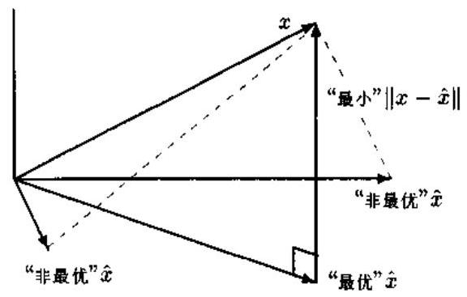

图 5.3.1 投影定理的几何解释

投影映射具有以下性质 ${}^{\left\lbrack  1\right\rbrack  }$ :

(P.1) ${P}_{M}\left( {{\alpha x} + {\beta y}}\right)  = \alpha {P}_{M}x + \beta {P}_{M}y,\;x, y \in  H;\;\alpha ,\beta  \in  C$ ;

(P.2) $\parallel x{\parallel }^{2} = {\begin{Vmatrix}{P}_{M}x\end{Vmatrix}}^{2} + {\begin{Vmatrix}\left( I - {P}_{M}\right) x\end{Vmatrix}}^{2}$ ;

(P.3) 每一个 $x \in  M$ 都具有以下的唯一表示:

$$
x = {P}_{M}x + \left( {I - {P}_{M}}\right) x \tag{5.3.5}
$$

即 $x$ 可以唯一分解成 $M$ 的元素与 ${M}^{ \bot  }$ 的元素之和;

(P.4) ${P}_{M}{x}_{n} \rightarrow  {P}_{M}x$ ,若 $\begin{Vmatrix}{{x}_{n} - x}\end{Vmatrix} \rightarrow  0$ ;

(P.5) $x \in  M$ 当且仅当 ${P}_{M}x = x$ ;

(P.6) $x \in  {M}^{ \bot  }$ 当且仅当 ${P}_{M}x = 0$ ;

(P.7) ${M}_{1} \subseteq  {M}_{2}$ ,当且仅当 ${P}_{{M}_{1}}{P}_{{M}_{2}}x = {P}_{{M}_{1}}x$ 对所有 $x \in  H$ 恒成立.

式 (5.3.5) 所示的分解称为 $x \in  M$ 的正交分解. 正交分解在信号处理、控制和系统理论等许多工程问题中是一种应用非常广泛的重要分解方法.

#### 5.3.2 均方估计

下面以 ${L}_{2}$ 空间为对象,详细分析投影定理和正交分解在均方估计中的应用.

一个集合 $M \subseteq  {L}_{2}$ 称为正交随机变量系,若对每个 $\xi ,\eta  \in  M\left( {\xi  \neq  \eta }\right)$ 均有 $\xi  \bot  \eta$ . 特别地,若对每一个 $\xi  \in  M$ 均有 $\parallel \xi \parallel  = 1$ ,则称 $M$ 是一标准正交系.

许多工程问题都可以归结为: 给定 $n$ 个数据 ${\eta }_{1},\cdots ,{\eta }_{n}$ ,希望找出 $n$ 个常数 ${a}_{1},\cdots ,{a}_{n}$ , 使得用线性组合 $\widehat{\xi } = \mathop{\sum }\limits_{{i = 1}}^{n}{a}_{i}{\eta }_{i}$ 拟合未知的随机变量 $\xi$ 时,拟合 (或估计) 误差

$$
\epsilon  = \xi  - \widehat{\xi } = \xi  - \mathop{\sum }\limits_{{i = 1}}^{n}{a}_{i}{\eta }_{i} \tag{5.3.6}
$$

的均方值

$$
P = E\left\{  {\left| \xi  - \mathop{\sum }\limits_{{i = 1}}^{n}{a}_{i}{\eta }_{i}\right| }^{2}\right\} \tag{5.3.7}
$$

为最小. 在参数估计理论中,称这样的估计值为 $\xi$ 的最佳线性均方估计 ${}^{\left\lbrack  2,3\right\rbrack  }$ .

定理 ${5.3.2}\left( {L}_{2}\right.$ 空间的投影定理) 若数据 ${\eta }_{1},\cdots ,{\eta }_{n}$ 组成标准正交系,则随机变量 $\xi$ 的最佳均方估计由

$$
\widehat{\xi } = \mathop{\sum }\limits_{{i = 1}}^{n}\left\langle  {\xi ,{\eta }_{i}}\right\rangle  {\eta }_{i} \tag{5.3.8}
$$

给出.

证明 注意到 $M = \left\{  {{\eta }_{1},\cdots ,{\eta }_{n}}\right\}$ 是一标准正交系,故

$$
\left\langle  {\mathop{\sum }\limits_{{i = 1}}^{n}{a}_{i}{\eta }_{i},\mathop{\sum }\limits_{{j = 1}}^{n}{a}_{j}{\eta }_{j}}\right\rangle   = \mathop{\sum }\limits_{{i = 1}}^{n}{a}_{i}^{2}
$$

另一方面,

$$
{a}_{i}^{2} - 2{a}_{i}\left\langle  {\xi ,{\eta }_{i}}\right\rangle   = {\left| {a}_{i} - \left\langle  \xi ,{\eta }_{i}\right\rangle  \right| }^{2} - {\left| \left\langle  \xi ,{\eta }_{i}\right\rangle  \right| }^{2}
$$

利用式 (5.3.6) 和上述二式, 直接计算得到

$$
P = E{\left( \xi  - \mathop{\sum }\limits_{{i = 1}}^{n}{a}_{i}{\eta }_{i}\right) }^{2} = {\begin{Vmatrix}\xi  - \mathop{\sum }\limits_{{i = 1}}^{n}{a}_{i}{\eta }_{i}\end{Vmatrix}}^{2}
$$

$$
= \left\langle  {\xi  - \mathop{\sum }\limits_{{i = 1}}^{n}{a}_{i}{\eta }_{i},\xi  - \mathop{\sum }\limits_{{j = 1}}^{n}{a}_{j}{\eta }_{j}}\right\rangle
$$

$$
= \parallel \xi {\parallel }^{2} - 2\mathop{\sum }\limits_{{i = 1}}^{n}{a}_{i}\left\langle  {\xi ,{\eta }_{i}}\right\rangle   + \left\langle  {\mathop{\sum }\limits_{{i = 1}}^{n}{a}_{i}{\eta }_{i},\mathop{\sum }\limits_{{j = 1}}^{n}{a}_{j}{\eta }_{j}}\right\rangle
$$

$$
= \parallel \xi {\parallel }^{2} - 2\mathop{\sum }\limits_{{i = 1}}^{n}{a}_{i}\left\langle  {\xi ,{\eta }_{i}}\right\rangle   + \mathop{\sum }\limits_{{i = 1}}^{n}{a}_{i}^{2}
$$

$$
= \parallel \xi {\parallel }^{2} - \mathop{\sum }\limits_{{i = 1}}^{n}{\left| {a}_{i} - \left\langle  \xi ,{\eta }_{i}\right\rangle  \right| }^{2} + \mathop{\sum }\limits_{{i = 1}}^{n}{\left| {a}_{i} - \left\langle  \xi ,{\eta }_{i}\right\rangle  \right| }^{2}
$$

$$
\geq  \parallel \xi {\parallel }^{2} - \mathop{\sum }\limits_{{i = 1}}^{n}{\left| \left\langle  \xi ,{\eta }_{i}\right\rangle  \right| }^{2}
$$

等号成立的条件是 ${a}_{i} = \left\langle  {\xi ,{\eta }_{i}}\right\rangle$ ,即 $\mathop{\sum }\limits_{{i = 1}}^{n}{\left| {a}_{i} - \left\langle  \xi ,{\eta }_{i}\right\rangle  \right| }^{2} = 0$ . 就是说,当 $\widehat{\xi }$ 取式 (5.3.8) 的形式时 $P$ 为最小,这就证明了 $\widehat{\xi }$ 是 $\xi$ 的最佳均方估计.

定义 5.3.4 (线性流形) 令 $M$ 是 $H$ 空间的子空间, $\mathcal{L}$ 代表 $M$ 内的有限个元素的所有线性组合的全体,即 $\mathcal{L} = \left\{  {\xi  : \xi  = \mathop{\sum }\limits_{{i = 1}}^{n}{a}_{i}{\eta }_{i},{\eta }_{i} \in  M}\right\}$ ,我们称 $\mathcal{L}$ 是由 $M$ 张成的线性流形.

下面解释最佳线性均方估计 (5.3.8) 式的几何意义. 考虑以下分解:

$$
\xi  = \widehat{\xi } + \left( {\xi  - \widehat{\xi }}\right) \tag{5.3.9}
$$

我们来证明,上述分解就是正交分解,即 $\widehat{\xi } \bot  \left( {\xi  - \widehat{\xi }}\right)$ . 为此,我们只要等价证明 $E\{ \widehat{\xi }\left( {\xi  - \widehat{\xi }}\right) \}  =$ 0 即可. 证明是简单的, 因为

$$
E\{ \widehat{\xi }\left( {\xi  - \widehat{\xi }}\right) \}  = E\left\{  {\left\lbrack  {\mathop{\sum }\limits_{{j = 1}}^{n}E\left( {\xi {\eta }_{j}}\right) {\eta }_{j}}\right\rbrack  \left\lbrack  {\xi  - \mathop{\sum }\limits_{{i = 1}}^{n}E\left( {\xi {\eta }_{i}}\right) {\eta }_{i}}\right\rbrack  }\right\}
$$

$$
= E\left\{  {\xi \mathop{\sum }\limits_{{j = 1}}^{n}E\left( {\xi {\eta }_{j}}\right) {\eta }_{j}}\right\}   - E\left\{  {\mathop{\sum }\limits_{{i = 1}}^{n}E\left( {\xi {\eta }_{i}}\right) {\eta }_{i}\mathop{\sum }\limits_{{j = 1}}^{n}E\left( {\xi {\eta }_{j}}\right) {\eta }_{j}}\right\}
$$

$$
= \mathop{\sum }\limits_{{j = 1}}^{n}{\left\lbrack  E\left( \xi {\eta }_{j}\right) \right\rbrack  }^{2} - \mathop{\sum }\limits_{{i = 1}}^{n}\mathop{\sum }\limits_{{j = 1}}^{n}E\left( {\xi {\eta }_{i}}\right) E\left( {\xi {\eta }_{j}}\right) E\left( {{\eta }_{i}{\eta }_{j}}\right)
$$

利用 ${\eta }_{1},\cdots ,{\eta }_{n}$ 的标准正交性 $E\left( {{\eta }_{i}{\eta }_{j}}\right)  = {\delta }_{ij}$ ,其中 ${\delta }_{ij}$ 为 Kronecker $\delta$ 函数,立即可知上式等于零.

图 5.3.2 画出了式 (5.3.9) 所示的正交分解. 很自然地,我们称 $\xi  - \widehat{\xi }$ 垂直于线性流形 $\mathcal{L}$ ,并称 $\widehat{\xi }$ 是 $\xi$ 在线性流形 $\mathcal{L}$ 上的投影. 因此,我们常用投影 $\operatorname{Proj}\left\{  {\xi  \mid  {\eta }_{1},\cdots ,{\eta }_{n}}\right\}$ 表示均方估计. 这就是为什么我们把定理 5.3.2 称为 ${L}_{2}$ 空间的投影定理的缘故. 此外,我们也常用符号 $\widehat{E}\left\{  {\xi  \mid  {\eta }_{1},\cdots ,{\eta }_{n}}\right\}$ 表示根据 $n$ 个样本数据 ${\eta }_{1},\cdots ,{\eta }_{n}$ 所作出的 $\xi$ 的均方估计.

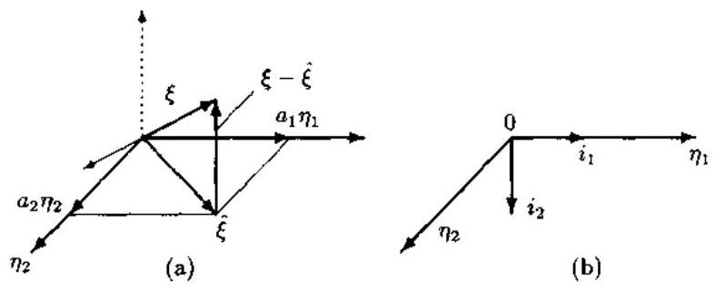

图 5.3.2 正交分解

${L}_{2}$ 空间的投影定理提供了求最佳线性均方估计的方法,但要求所给定的数据 ${\eta }_{1},\cdots$ , ${\eta }_{n}$ 是标准正交的. 当原数据正交,但不是标准正交时,我们只需要将原数据归一化即可. 然而, 原数据一般不是正交数据, 因此我们就需要先将数据转换成标准正交数据, 然后才能应用投影定理. 下面分两种情况讨论一组数据的标准正交化方法.

## 1. 线性独立的数据

令 ${\eta }_{1},{\eta }_{2},\cdots$ 是一在 ${L}_{2}$ 空间的线性独立的随机变量序列. Gram-Schmidt 正交法构造正交数据 ${\beta }_{1},{\beta }_{2},\cdots$ 的算法如下:

$$
{\beta }_{1} = {\eta }_{1}/\begin{Vmatrix}{\eta }_{1}\end{Vmatrix} \tag{5.3.10a}
$$

$$
{\beta }_{k} = \frac{{\eta }_{k} - {\widehat{\eta }}_{k}}{\begin{Vmatrix}{\eta }_{k} - {\widehat{\eta }}_{k}\end{Vmatrix}},\;k = 2,3,\cdots \tag{5.3.10b}
$$

其中 ${\widehat{\eta }}_{k}$ 是 ${\eta }_{k}$ 在由 ${\beta }_{1},\cdots ,{\beta }_{k - 1}$ 组成的线性子空间上的投影,由下式给出:

$$
{\widehat{\eta }}_{k} = \mathop{\sum }\limits_{{i = 1}}^{{k - 1}}\left\langle  {{\eta }_{i},{\beta }_{i}}\right\rangle  {\beta }_{i} \tag{5.3.10c}
$$

根据构造易知, $\begin{Vmatrix}{\beta }_{k}\end{Vmatrix} = 1\left( {k \geq  1}\right)$ ,并且 $\left\langle  {{\beta }_{k},{\beta }_{i}}\right\rangle   = 0$ (若 $i < k$ ). 因此,序列 ${\beta }_{1},\cdots ,{\beta }_{n}$ 是标准正交的.

## 2. 任意数据

如果 ${\eta }_{1},\cdots ,{\eta }_{n}$ 是任意数据,那么就需要先将它们转换成线性独立的. 再使用 Gram-Schmidt 方法转换成标准正交的. 但是，这不是一种实际的方法，因为从 $n$ 个数据中不容易找出 $r\left( { < n}\right)$ 个独立的数据. 实际的方法是对 Gram-Schmidt 正交法加以推广，直接对原任意数据进行标准正交化.

根据 Gram-Schmidt 法的构造原则, 我们可以用

$$
\left. \begin{array}{l} {i}_{1} = {\gamma }_{1}^{\left( 1\right) }{\eta }_{1} \\  {i}_{2} = {\gamma }_{1}^{\left( 2\right) }{\eta }_{1} + {\gamma }_{2}^{\left( 2\right) }{\eta }_{2} \\  {i}_{k} = \mathop{\sum }\limits_{{i = 1}}^{k}{\gamma }_{i}^{\left( k\right) }{\eta }_{i},\;k = 2,\cdots , n \end{array}\right\} \tag{5.3.11}
$$

构造 $n$ 个标准正交的随机变量. 问题是递推公式 (5.3.11) 中的系数 ${\gamma }_{i}^{\left( k\right) }, i = 1,\cdots , k;k = \; 2,\cdots , n$ 如何确定? 它并不像式 (5.3.10c) 那样简单. 令

$$
{R}_{ij} = E\left\{  {{\eta }_{i}{\eta }_{j}^{ * }}\right\}
$$

由标准正交化条件

$$
E\left\{  {i}_{1}^{2}\right\}   = {\left( {\gamma }_{1}^{\left( 1\right) }\right) }^{2}{R}_{11} = 1
$$

可以求出 ${\gamma }_{1}^{\left( 1\right) }$ . 一般地,在构造 ${i}_{k}$ 时,我们可以利用正交条件 ${i}_{k} \bot  {i}_{j}\left( {j < k}\right)$ 得到 $k - 1$ 个方程:

$$
E\left\{  {{i}_{k}{i}_{j}}\right\}   = {\gamma }_{1}^{\left( k\right) }{R}_{1j} + \cdots  + {\gamma }_{k}^{\left( k\right) }{R}_{kj} = 0,\;j = 1,\cdots , k - 1 \tag{5.3.12a}
$$

另从标准化条件又可以得到第 $k$ 个方程:

$$
E\left\{  {i}_{k}^{2}\right\}   = {\gamma }_{1}^{\left( k\right) }{R}_{1k} + \cdots  + {\gamma }_{k}^{\left( k\right) }{R}_{kk} = 1 \tag{5.3.12b}
$$

于是, $k$ 个系数 ${\gamma }_{1}^{\left( k\right) },\cdots ,{\gamma }_{k}^{\left( k\right) }$ 由方程 (5.3.12) 的解确定. 然而,这样的方法仍然不是很实际. 在参数估计和系统辨识中, 我们采用以下实际的方法.

事实上, 引入三角矩阵

$$
\Gamma  = \left\lbrack  \begin{matrix} {\gamma }_{1}^{\left( 1\right) } & {\gamma }_{1}^{\left( 2\right) } & \cdots & {\gamma }_{1}^{\left( n\right) } \\   & {\gamma }_{2}^{\left( 2\right) } & \cdots & {\gamma }_{2}^{\left( n\right) } \\   & &  \ddots  & \vdots \\  0 & & & {\gamma }_{n}^{\left( n\right) } \end{matrix}\right\rbrack
$$

$$
L = {\Gamma }^{-1} = \left\lbrack  \begin{matrix} {l}_{1}^{\left( 1\right) } & {l}_{1}^{\left( 2\right) } & \cdots & {l}_{1}^{\left( n\right) } \\   & {l}_{2}^{\left( 2\right) } & \cdots & {l}_{2}^{\left( n\right) } \\   & &  \ddots  & \vdots \\  0 & & & {l}_{n}^{\left( n\right) } \end{matrix}\right\rbrack
$$

后, 式 (5.3.11) 可简写作

$$
i = {h\Gamma } \tag{5.3.13}
$$

其中

$$
i = \left\lbrack  {{i}_{1},\cdots ,{i}_{n}}\right\rbrack  ,\;h = \left\lbrack  {{\eta }_{1},\cdots ,{\eta }_{n}}\right\rbrack
$$

这样一来,原数据向量 $h$ 可以表示为

$$
h = i{\Gamma }^{-1} = {iL} \tag{5.3.14}
$$

式 (5.3.13) 表明，矩阵 $\Gamma$ 相当于一白化滤波器，原任意数据通过该滤波器后，即变成了标准正交的数据 ${i}_{1},\cdots ,{i}_{n}$ . 由式 (5.3.11) 知， ${i}_{1},\cdots ,{i}_{n}$ 具有与 ${\eta }_{1},\cdots ,{\eta }_{n}$ 相同的信息 (子空间),因为前者是后者的线性变换结果. 因此,我们常将标准正交化的 ${i}_{1},\cdots ,{i}_{k}$ 称作原数据 ${\eta }_{1},\cdots ,{\eta }_{n}$ 的新息 (inovation). 反过来,式 (5.3.14) 则表明,矩阵 $L$ 相当于一新息滤波器,用新总 ${i}_{1},\cdots ,{i}_{n}$ 作新息滤波器的输入,滤波器的输出即是原数据. 白化滤波器和新息滤波器在信号处理的许多问题中起着重要的作用.

### 5.4 新息过程与 Kalman 滤波

#### 5.4.1 新息定理

上一节介绍了用白化滤波器产生新息的方法. 下面介绍另一种产生新息的方法. 重要的是, 用这种方法产生的新息过程具有三个重要的性质, 它们深刻地描述了新息过程的内涵 (新息过程与原过程之间的内在关系).

考虑一个在白噪声中观测的过程 $\{ x\left( n\right) \}$ :

$$
x\left( n\right)  = s\left( n\right)  + v\left( n\right)
$$

我们假定以下条件满足:

1) 对任一 $n$ ,信号 $s\left( n\right)$ 都具有有穷均值,即 $E\left\lbrack  {s\left( n\right) }\right\rbrack   < \infty$ ;

2) 噪声 $v\left( n\right)$ 是一个零均值的独立同分布过程,即有

$$
E\{ v\left( n\right) \}  = 0,\;E\{ v\left( m\right) v\left( n\right) \}  = {\sigma }_{v}^{2}{\delta }_{mn}
$$

3)噪声与信号不相关，即

$$
E\{ s\left( m\right) v\left( n\right) \}  = 0,\;\forall m, n
$$

令 $\widehat{s}\left( n\right)$ 是 $s\left( n\right)$ 的均方估计,即 $\widehat{s}\left( n\right)  = \widehat{E}\{ s\left( n\right)  \mid  x\left( 0\right) ,\cdots , x\left( n\right) \}$ ,让我们来建立均方估计与新总过程之间的关系. 如果用

$$
w\left( n\right)  = x\left( n\right)  - \widehat{s}\left( n\right) \tag{5.4.1}
$$

构造一个新过程 $\{ w\left( n\right) \}$ ,则可以证明 ${}^{\left\lbrack  3\right\rbrack  }$ ,在上述假设条件下 $w\left( n\right)$ 具有以下性质.

性质 $1\;w\left( n\right)$ 和 $v\left( n\right)$ 一样,也是一个独立同分布过程,即

$$
E\{ w\left( m\right) w\left( n\right) \}  = E\{ v\left( m\right) v\left( n\right) \}  = {\sigma }_{v}^{2}{\delta }_{mn} \tag{5.4.2}
$$

性质 ${2w}\left( n\right)$ 与 $m$ 时刻以前的数据 $x\left( n\right) , n < m$ 正交即不相关:

$$
E\{ w\left( m\right) x\left( n\right) \}  = 0,\;n < m \tag{5.4.3}
$$

性质 3 新过程 $\{ w\left( n\right) \}$ 与原观测过程 $\{ x\left( n\right) \}$ 所张成的线性流形相同，即

$$
\mathcal{L}\{ w\left( 0\right) ,\cdots , w\left( n\right) \}  = \mathcal{L}\{ x\left( 0\right) ,\cdots , x\left( n\right) \} \tag{5.4.4}
$$

性质 3 表明,原过程 $\{ x\left( n\right) \}$ 具有的所有信息也包含在新过程 $\{ w\left( n\right) \}$ 内,即是说: $N$ 时刻及其以前的原数据 $x\left( 0\right) ,\cdots , x\left( N\right)$ 具有的全部信息在 $w\left( 0\right) ,\cdots , w\left( N\right)$ 内无任何丢失. 然而, $w\left( n\right)$ 的独立性 (性质 1) 又意味着 $w\left( n\right)$ 的每一个新值都带来新的信息. 因此,我们称 $\{ w\left( n\right) \}$ 是 $\{ x\left( n\right) \}$ 的新息过程. 特别地,若这种新息过程具有方差 1,则称之为 Kalman 新息,并用 $\{ i\left( n\right) \}$ 示之. 性质 $1 \sim  3$ 可以看作是任何一个新息过程都必须具有的性质. 具体言之,若假设条件 $1) \sim  3)$ 满足,则新息过程 $\{ i\left( n\right) \}$ 具有性质 $1 \sim  3$ ,这一结论常称为新息定理.

根据上一节与本节上面介绍的两种新息构造方法,可以得到产生均方估计的两种不同方法,如图 5.4.1 所示. 图中,白化滤波器 $A\left( {t, s}\right)$ 、新息滤波器 $B\left( {t, s}\right)$ 和均方估计器 $C\left( {t, s}\right)$ 都是时变的.

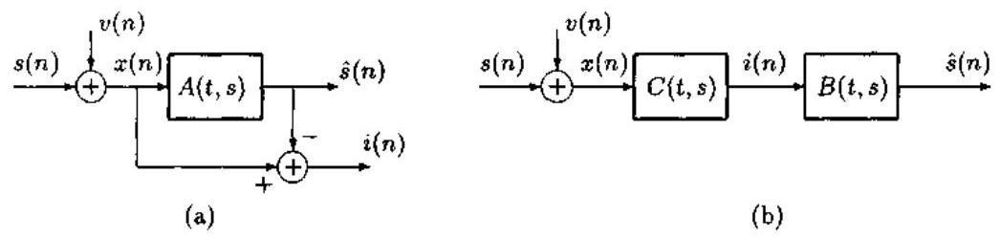

图 5.4.1 产生均方估计 $\widehat{s}\left( n\right)$ 的两种方法

#### 5.4.2 Kalman 滤波

新息过程和均方估计广泛应用于信号处理和系统理论中. 这里, 以 Kalman 滤波为例，介绍新息过程与均方估计的一个典型应用. Kalman 滤波的目的是用观测数据 $x\left( n\right)  = \; s\left( n\right)  + v\left( n\right)$ 对信号 $s\left( n\right)$ 作出预测 $\widehat{s}\left( {n + r}\right)$ . 为了方便讨论,我们先利用 5.3 节介绍的均方估计的两种表示, 引入以下记号.

${\widehat{s}}_{0}\left( n\right)$ : 信号 $s\left( n\right)$ 的均方估计,即观测数据 $x\left( n\right)$ 的纯滤波,记作

$$
{\widehat{s}}_{0}\left( n\right)  = \widehat{E}\{ s\left( n\right)  \mid  x\left( 0\right) , x\left( 1\right) ,\cdots , x\left( n\right) \}
$$

$$
= \operatorname{Proj}\{ s\left( n\right)  \mid  x\left( 0\right) , x\left( 1\right) ,\cdots , x\left( n\right) \}
$$

$\widehat{s}\left( {n + r}\right)$ : 信号 $s\left( n\right)$ 的 $r$ 步预测估计,记作

$$
{\widehat{s}}_{r}\left( {n + r}\right)  = \widehat{E}\{ s\left( {n + r}\right)  \mid  x\left( 0\right) , x\left( 1\right) ,\cdots , x\left( n\right) \}
$$

$$
= \operatorname{Proj}\{ s\left( {n + r}\right)  \mid  x\left( 0\right) , x\left( 1\right) ,\cdots , x\left( n\right) \}
$$

特别地,当 $r = 1$ 时,我们称 ${\widehat{s}}_{1}\left( {n + 1}\right)$ 为 $s\left( n\right)$ 的一步预测.

假设观测信号和噪声满足前述条件 $1) \sim  3$ ). 在这些假设下,我们可以建立两个有用的结果.

引理 5.4.1 在假设 $1) \sim  3$ ) 的条件下, $x\left( n\right)  - {\widehat{s}}_{0}\left( n\right)$ 与数据 $x\left( n\right)$ 的 Kalman 新息 $i\left( n\right)$ 成正比, 即

$$
x\left( n\right)  - {\widehat{s}}_{0}\left( n\right)  = {D}_{n}i\left( n\right) \tag{5.4.5}
$$

式中

$$
{D}_{n}^{2} = E{\left\{  x\left( n\right)  - {\widehat{s}}_{0}\left( n\right) \right\rbrack  }^{2} \tag{5.4.6}
$$

证明 由新总过程的性质 1 知, $w\left( n\right)  = x\left( n\right)  - {\widehat{s}}_{0}\left( n\right)$ 是一个具有方差 ${\sigma }_{v}^{2}$ 的新息,而 Kalman 新总 $i\left( n\right)$ 具有标准方差 1,故式 (5.4.5) 显然成立. 式 (5.4.6) 则是式 (5.4.5) 两边平方后再取数学期望的结果.

引理 5.4.2 在假设 1) 3) 下, $s\left( {n + r}\right)$ 的均方估计 ${\widehat{s}}_{r}\left( {n + r}\right)$ 等同于 $s\left( n\right)$ 的均方估计 ${\widehat{s}}_{0}\left( n\right)$ 的纯预测结果 ${\widehat{\widetilde{s}}}_{0}\left( {n + r}\right)  = \mathop{\sum }\limits_{{k = 0}}^{n}{h}_{r}\left( {n, k}\right) {\widehat{h}}_{0}\left( k\right)$ ,即

$$
{\widehat{s}}_{r}\left( {n + r}\right)  = {\widehat{\widehat{s}}}_{0}\left( {n + r}\right)  = \mathop{\sum }\limits_{{k = 0}}^{n}{h}_{r}\left( {n, k}\right) {\widehat{h}}_{0}\left( k\right) \tag{5.4.7}
$$

式中 ${h}_{r}\left( {n, k}\right)$ 为时变的 $r$ 步纯预测器的冲激响应,且

$$
{\widehat{\widetilde{s}}}_{0}\left( {n + r}\right)  = \widehat{E}\left\{  {{\widehat{s}}_{0}\left( {n + r}\right)  \mid  {\widehat{s}}_{0}\left( 0\right) ,{\widehat{s}}_{0}\left( 1\right) ,\cdots ,{\widehat{s}}_{0}\left( n\right) }\right\}
$$

$$
= \operatorname{Proj}\left\{  {{\widehat{s}}_{0}\left( {n + r}\right)  \mid  {\widehat{s}}_{0}\left( 0\right) ,{\widehat{s}}_{0}\left( 1\right) ,\cdots ,{\widehat{s}}_{0}\left( n\right) }\right\}
$$

证明 由新息过程的性质 3,新息 $x\left( n\right)  - {\widehat{s}}_{0}\left( n\right)$ 与 $x\left( n\right)$ 线性等价,这说明 ${\widehat{s}}_{0}\left( n\right)$ 与 $x\left( n\right)$ 线性等价. 由正交性原理知

$$
\left\lbrack  {{\widehat{s}}_{0}\left( {n + r}\right)  - {\widehat{\widehat{s}}}_{0}\left( {n + r}\right) }\right\rbrack   \bot  {\widehat{s}}_{0}\left( k\right) ,\;k \leq  n
$$

故根据 ${\widehat{s}}_{0}\left( k\right)$ 与 $x\left( k\right)$ 的线性等价,有

$$
\left\lbrack  {{\widehat{s}}_{0}\left( {n + r}\right)  - {\widehat{\widehat{s}}}_{0}\left( {n + r}\right) }\right\rbrack   \bot  x\left( k\right) ,\;k \leq  n
$$

另一方面,因 ${\widehat{s}}_{0}\left( {n + r}\right)$ 是用 $x\left( 0\right) , x\left( 1\right) ,\cdots , x\left( {n + r}\right)$ 对 ${s}_{0}\left( {n + r}\right)$ 作出的均方估计,因此正交性原理给出:

$$
\left\lbrack  {s\left( {n + r}\right)  - {\widehat{s}}_{0}\left( {n + r}\right) }\right\rbrack   \bot  x\left( k\right) ,\;k \leq  n + r
$$

综合上述二式,显然,对于 $k \leq  n$ 有

$$
\left\lbrack  {s\left( {n + r}\right)  - {\widehat{s}}_{0}\left( {n + r}\right) }\right\rbrack   + \left\lbrack  {{\widehat{s}}_{0}\left( {n + r}\right)  - {\widehat{\widehat{s}}}_{0}\left( {n + r}\right) }\right\rbrack   \downarrow  x\left( k\right)
$$

亦即

$$
s\left( {n + r}\right)  - {\widehat{\widehat{s}}}_{0}\left( {n + r}\right)  \bot  x\left( k\right) ,\;k \leq  n
$$

据正交性原理，上式意味着

$$
{\widehat{\widehat{s}}}_{0}\left( {n + r}\right)  = \operatorname{Proj}\{ s\left( {n + r}\right)  \mid  x\left( 0\right) , x\left( 1\right) ,\cdots , x\left( n\right) \}
$$

注意到 ${\widehat{s}}_{r}\left( {n + r}\right)$ 事实上是用 $x\left( 0\right) , x\left( 1\right) ,\cdots , x\left( n\right)$ 对 $s\left( {n + r}\right)$ 所作的均方估计,即

$$
{\widehat{s}}_{r}\left( {n + r}\right)  = \operatorname{Proj}\{ s\left( {n + r}\right)  \mid  x\left( 0\right) , x\left( 1\right) ,\cdots , x\left( n\right) \}
$$

因此,由投影的唯一性立即知 ${\widehat{s}}_{r}\left( {n + r}\right)  \equiv  {\widehat{\widehat{s}}}_{0}\left( {n + r}\right)$ .

上述两个引理表明,根据给定数据 $x\left( 0\right) , x\left( 1\right) ,\cdots , x\left( n\right)$ 实现 $r$ 步滤波与预测的 Kalman 滤波的混合问题可以分解为纯滤波器 ${h}_{i}^{0}\left( {n, k}\right)$ 与纯预测器 ${h}_{r}\left( {n, k}\right)$ 的级联,如图 5.4.2 所示.

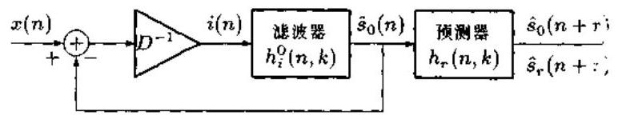

图 5.4.2 Kalman 滤波器的分解

有关 Kalman 滤波器的具体设计步骤可参见文献 [3].

### 5.5 正交集与正交基

上一节介绍了 Hilbert 空间内两个元素之间的正交，并讨论了标准正交的随机变量序列在投影定理中的作用. 本节的讨论对象是 Hilbert 空间中两个元素集合之间的正交 (即正交集) 和两个向量之间的正交 (即正交基).

先讨论 Hilbert 空间的元素为数量的情况.

定义 5.5.1 (闭生成) Hilbert 空间 $H$ 的任意子集合 $\left\{  {{x}_{t}, t \in  T}\right\}$ 的闭生成 (closed span) $\overline{\mathrm{{sp}}}\left\{  {x}_{t}\right\}$ 定义为包含了每个元素 ${x}_{t}\left( {t \in  T}\right)$ 的 $H$ 的最小闭子空间.

如果 $M = \overline{\mathrm{{sp}}}\left\{  {{x}_{1},\cdots ,{x}_{n}}\right\}$ ,那么对于任一给定的 $x \in  H,{P}_{M}$ 是唯一的,其形式为

$$
{P}_{M}x = {\alpha }_{1}{x}_{1} + \cdots  + {\alpha }_{n}{x}_{n}
$$

且满足

$$
\left\langle  {x - {P}_{M}x, y}\right\rangle   = 0,\;y \in  H
$$

或等价满足

$$
\left\langle  {{P}_{M}x,{x}_{j}}\right\rangle   = \left\langle  {x,{x}_{j}}\right\rangle  ,\;j = 1,\cdots , n \tag{5.5.1}
$$

式 (5.5.1) 可以用 ${\alpha }_{1},\cdots ,{\alpha }_{n}$ 的线性方程组形式写成

$$
\mathop{\sum }\limits_{{i = 1}}^{n}{\alpha }_{i}\left\langle  {{x}_{i},{x}_{j}}\right\rangle   = \left\langle  {x,{x}_{j}}\right\rangle  ,\;j = 1,\cdots , n \tag{5.5.2}
$$

据投影定理,线性方程组 (5.5.2) 至少有一组解 ${\alpha }_{1},\cdots ,{\alpha }_{n}$ . 投影的唯一性意味着,方程 (5.5.2) 的所有解必定给出相同的值 ${\alpha }_{1}{x}_{1} + \cdots  + {\alpha }_{n}{x}_{n}$ .

将 Hilbert 空间内两个元素的正交加以推广, 就得到了元素集合之间的正交.

定义 5.5.2 (正交集) 内积空间的元素集合 $\left\{  {{e}_{t}, t \in  T}\right\}$ 称为正交集,若对于每个 $t, s \in  \mathcal{T}$ 有

$$
\left\langle  {{e}_{s},{e}_{t}}\right\rangle   = \left\{  \begin{array}{ll} \alpha , & \text{ 若 }s = t \\  0, & \text{ 若 }s \neq  t \end{array}\right. \tag{5.5.3}
$$

其中 $\alpha$ 是一个非零的数. 特别地,若 $\alpha  = 1$ ,则称 $\left\{  {{e}_{t}, t \in  T}\right\}$ 为标准正交集.

例 5.5.1 任何一个独立同分布随机变量的序列 $\left\{  {{X}_{i}, i \in  Z}\right\}$ 都是 ${L}_{2}\left( {\Omega ,\mathcal{F}, P}\right)$ 空间的正交集,其中 $Z$ 代表整数域. 特别地,任何一个方差为 1 的独立同分布过程 (例如独立的标准正态分布过程等) 都是 ${L}_{2}\left( {\Omega ,\mathcal{F}, P}\right)$ 空间的标准正交集.

定义 5.5.3 (完备的标准正交集) 如果 $\left\{  {{e}_{t}, t \in  T}\right\}$ 是 Hilbert 空间 $H$ 的一个标准正大子集、并且 $H = \overline{\mathrm{{sp}}}\left\{  {{e}_{t}, t \in  T}\right\}$ ,那么我们就说 $\left\{  {{e}_{t}, t \in  T}\right\}$ 是 $H$ 的一个完备的标准正交集,简称为 $H$ 的标准正交基.

下面讨论 Hilbert 空间 $H$ 的元素为向量的情况. 我们将看到,向量的标准正交基定义与前述标量的标准正交基有所不同.

令 $\left\{  {{x}_{i}, i = 1,2,\cdots , n}\right\}$ 是一组向量. 如果满足

$$
\mathop{\sum }\limits_{{i = 1}}^{n}{\alpha }_{i}{x}_{i} = 0
$$

的所有常数恒等于零,即 ${\alpha }_{i} \equiv  0\left( {i = 1,\cdots , n}\right)$ ,则称向量组 $\left\{  {x}_{i}\right\}$ 是线性独立的.

进一步地,若 Hilbert 空间 $H$ 中的线性独立向量生成或张成 $H$ 空间,则称这些线性独立的向量为 $H$ 空间的基 (basis). 在 $n$ 维 Euclidean 空间 ${R}^{n}$ 内,基向量为

$$
{e}_{1} = {\left\lbrack  1,0,\cdots ,0\right\rbrack  }^{T},\;{e}_{2} = {\left\lbrack  0,1,\cdots ,0\right\rbrack  }^{T},\;\cdots \;,{e}_{n} = {\left\lbrack  0,0,\cdots ,1\right\rbrack  }^{T}
$$

之所以称 ${e}_{i}$ (第 $i$ 元素为 1,其余元素均为零的列向量) 为 $n$ 维 Euclidean 空间 ${R}^{n}$ 的基向量,乃是因为任何一个向量 $x = {\left\lbrack  x\left( 1\right) ,\cdots , x\left( n\right) \right\rbrack  }^{T} \in  {R}^{n}$ 都可以用 ${e}_{i}$ 向量表示为下述形式:

$$
x = \mathop{\sum }\limits_{{i = 1}}^{n}{e}_{i}{x}_{i} = {\left\lbrack  x\left( 1\right) , x\left( 2\right) ,\cdots , x\left( n\right) \right\rbrack  }^{T}
$$

定义 5.5.4 (正交基向量) 令 $\left\{  {x}_{i}\right\}$ 是基向量,若它满足正交条件:

$$
\left\langle  {{x}_{i},{x}_{j}}\right\rangle   = 0,\;i \neq  j \tag{5.5.4}
$$

则称这样的基向量为正交基向量.

定义 5.5.5 (标准正交基向量) 若正交基向量 $\left\{  {x}_{i}\right\}$ 的范数均等于 1,即

$$
\begin{Vmatrix}{x}_{i}\end{Vmatrix} = 1\text{ ,对所有 }i
$$

则基向量称为标准正交基向量 (orthonormal basis vectors).

例 5.5.2 (Fourier 级数的正交基) 如果一平滑的标量函数 $x\left( t\right)$ 为周期函数,其周期为 $T$ ,且函数是绝对平方可积分的:

$$
{\int }_{-\infty }^{\infty }{\left| x\left( t\right) \right| }^{2}\mathrm{\;d}t < \infty
$$

则函数 $x\left( t\right)$ 可以用 Fourier 展开表示为

$$
x\left( t\right)  = \mathop{\sum }\limits_{{n =  - \infty }}^{\infty }{c}_{i}\exp \left\lbrack  {\mathrm{j}{n2\pi }{f}_{0}t}\right\rbrack \tag{5.5.5}
$$

其中 ${f}_{0} = 1/T\text{ 、 }T$ 是周期函数 $x\left( t\right)$ 的周期. 因此,上述 Fourier 级数的正交基是

$$
1,{x}_{1},{x}_{2},{x}_{3},{x}_{4},\cdots
$$

式中 ${x}_{n} = \exp \left\lbrack  {\mathrm{j}{n2\pi }{f}_{0}t}\right\rbrack$ . 容易验证,它们是一组标准正交基向量.

例 5.5.3 为了将时变信号的不连续性隔离开, 实现信号的多分辨率分析, 小波变换通过平移和伸缩单个原像小波 $h\left( \cdot \right)$ ,即

$$
{h}_{a, b}\left( t\right)  = \frac{1}{\sqrt{a}}h\left( \frac{t - b}{a}\right) ,\;a \in  {R}^{ + }\text{ (正的实数集合) } \tag{5.5.6}
$$

构造持续时间很短的高频基函数和持续时间较长的低频基函数,其中 $a$ 和 $b$ 分别为伸缩和平移参数. 信号 $x\left( t\right)$ 的离散小波变换定义为

$$
{\mathrm{{WT}}}_{x}\left( {m, n}\right)  = {a}_{0}^{-m/2}{\int }_{-\infty }^{\infty }x\left( t\right) h\left( {{a}_{0}^{-m}t - n{b}_{0}}\right) \mathrm{d}t \tag{5.5.7}
$$

其标准正交基由Haar 基

$$
h\left( t\right)  = \left\{  \begin{matrix} 1, & 0 \leq  t < 1/2 \\   - 1, & 1/2 \leq  t < 1 \\  0, & \text{ 其它 } \end{matrix}\right. \tag{5.5.8}
$$

和 ${a}_{0} = 2,{b}_{0} = 1$ 给出.

如果 ${x}_{1},{x}_{2},\cdots$ 是任一基向量,那么我们总是可以利用 Gram-Schmidt 正交化方法由该基向量递推地构造标准正交基向量 ${c}_{1},{c}_{2},\cdots$ . 递推方法如下所述:

$$
{y}_{1} = {x}_{1}
$$

$$
{y}_{2} = {x}_{2} - {a}_{21}{x}_{1}
$$

$$
{y}_{n} = {x}_{n} - {a}_{n, n - 1}{x}_{n - 1} - \cdots  - {a}_{n1}{x}_{1}
$$

其中

$$
{a}_{n1} = \left\langle  {{x}_{n},{y}_{1}}\right\rangle  /\begin{Vmatrix}{y}_{1}\end{Vmatrix},\;n \geq  2
$$

$$
{a}_{n, n - 1} = \left( {{x}_{n},{y}_{n, - 1}}\right) /\begin{Vmatrix}{y}_{n - 1}\end{Vmatrix},\;n \geq  2
$$

将 ${y}_{n}$ 向量归一化,即得到标准基向量:

$$
{v}_{n} = {y}_{n}/\begin{Vmatrix}{y}_{n}\end{Vmatrix},\;\text{ 对所有 }n
$$

向量 ${r}_{1},{r}_{2},\cdots$ 组成出转向量 ${x}_{1},{x}_{2},\cdots$ 张成的线性空间的一个标准正交基.

### 5.6 正交投影矩阵及其应用

在 5.3 节，我们定义了到一闭子空间 $M$ 的投影映射算子 ${P}_{M}$ . 现在，我们把这种算子与最小二乘问题的求解联系起来, 其结果就是下面要介绍的投影矩阵和正交投影矩阵, 它们在信号处理的许多问题 (例如自适应滤波器的设计) 中有着重要的应用.

#### 5.6.1 投影矩阵和正交投影矩阵

在例 5.2.1 中,我们证明了 ${R}^{n}$ 是 Hilbert 空间,向量的内积为

$$
\langle x, y\rangle  = \mathop{\sum }\limits_{{i = 1}}^{n}{x}_{i}{y}_{i} \tag{5.6.1}
$$

对应的平方范数是

$$
\parallel x{\parallel }^{2} = \mathop{\sum }\limits_{{i = 1}}^{n}{x}_{i}^{2} \tag{5.6.2}
$$

向量 $x$ 和 $y$ 之间的夹角为

$$
\theta  = \arccos \left( \frac{\langle x, y\rangle }{\parallel x\parallel \parallel y\parallel }\right) \tag{5.6.3}
$$

由正交分解,每一个向量 $x \in  {R}^{n}$ 都可以唯一地表示成子空间 $M$ 和 ${M}^{ \bot  }$ 的两个向量之和, 即

$$
x = {P}_{M}x + \left( {I - {P}_{M}}\right) x \tag{5.6.4}
$$

定理 ${5.6}.{1}^{\left\lbrack  1\right\rbrack  }$ 若 ${x}_{i} \in  {R}^{n}, i = 1,\cdots , m$ ,且 $M = \overline{\mathrm{{sp}}}\left\{  {{x}_{1},\cdots ,{x}_{m}}\right\}$ ,则

$$
{P}_{M}x = {X\beta } \tag{5.6.5}
$$

式中 $X$ 为 $n \times  m$ 矩阵,其第 $j$ 列为 ${x}_{j}$ ,并且

$$
{X}^{T}{X\beta } = {X}^{T}x \tag{5.6.6}
$$

式 (5.6.6) 至少有一个解 $\beta$ ,但 ${X\beta }$ 对所有解都相同. 当且仅当 ${X}^{T}X$ 非奇异时,方程 (5.6.6) 有唯一的解, 此时

$$
{P}_{M}x = X{\left( {X}^{T}X\right) }^{-1}{X}^{T}x \tag{5.6.7}
$$

证明 因为 ${P}_{M}x \in  M$ ,所以我们可以写出:

$$
\widehat{x} = {P}_{M}x = \mathop{\sum }\limits_{{i = 1}}^{n}{\beta }_{i}{x}_{i} = {X\beta },\;\text{ 对某个 }\beta  = {\left\lbrack  {\beta }_{1},\cdots ,{\beta }_{m}\right\rbrack  }^{T} \in  {R}^{m} \tag{5.6.8}
$$

在这种情况下, 预测方程 (5.3.4) 等价为

$$
\left\langle  {x - \widehat{x},{x}_{j}}\right\rangle   = 0,\;\forall {x}_{j} \in  M
$$

或

$$
\left\langle  {{X\beta },{x}_{j}}\right\rangle   = \left\langle  {x,{x}_{j}}\right\rangle \tag{5.6.9}
$$

利用矩阵形式,式 (5.6.9) 又可以写作

$$
{X}^{T}{X\beta } = {X}^{T}x \tag{5.6.10}
$$

$\beta$ 至少有一个解存在的可能性可由投影 ${P}_{M}x$ 的存在性保证,而 ${X\beta }$ (注意它等于 ${P}_{M}x$ ) 对所有 $\beta$ 解皆相同这一事实则可以由投影 ${P}_{M}x$ 的唯一性来保证. 最后,式 (5.6.7) 可由式 (5.6.5) 和式 (5.6.6) 直接得出.

注释 1: 如果 $\left\{  {{x}_{1},\cdots ,{x}_{m}}\right\}$ 为正交集,则 ${X}^{T}X$ 是单位矩阵,于是式 (5.6.7) 简化为

$$
{P}_{M}x = X{X}^{T}x = \mathop{\sum }\limits_{{i = 1}}^{m}\left\langle  {x,{r}_{i}}\right\rangle  {x}_{i}
$$

这与投影定理的结论一致.

注释 2: 如果 $\left\{  {{x}_{1},\cdots ,{x}_{m}}\right\}$ 为线性独立集,则必然存在一个满足 ${P}_{M}x = {X\beta }$ 的唯一向量 3. 这意味着,式 (5.6.6) 必定有唯一解,从而进一步意味着 ${X}^{T}X$ 非奇异,并且

$$
{P}_{M}x = X{\left( {X}^{T}X\right) }^{-1}{X}^{T}x,\;\forall x \in  {R}^{n}
$$

换言之,矩阵 $X{\left( {X}^{T}X\right) }^{-1}{X}^{T}$ 必然对张成闭子空间 $M$ 的所有线性独立的向量集合都相同,因为 ${P}_{M}$ 是到 ${R}^{n}$ 上的映射,它是唯一定义的. 我们称

$$
{P}_{M} = X{\left( {X}^{T}X\right) }^{-1}{X}^{T} = X\langle X, X{\rangle }^{-1}{X}^{T} \tag{5.6.11}
$$

为投影矩阵. 正如下面将看到的那样, 这一结论在随机信号估计、辨识和滤波中是特别有用的.

投影矩阵有两个容易验证且非常有用的性质, 即有

$$
{P}_{M}{P}_{M} = {P}_{M} \tag{5.6.12a}
$$

和

$$
{P}_{M}^{T} = {P}_{M} \tag{5.6.12b}
$$

利用投影矩阵, 我们可以定义正交投影矩阵为

$$
{P}_{M}^{ \bot  } = I - {P}_{M} \tag{5.6.13}
$$

根据定义容易证明, 正交投影矩阵具有以下性质:

性质 1

$$
{\left\lbrack  {P}_{M}^{ \bot  }\right\rbrack  }^{T} = {P}_{M}^{ \bot  } \tag{5.6.14a}
$$

性质 2

$$
{P}_{M}^{ \bot  }{P}_{M}^{ \bot  } = {P}_{M}^{ \bot  } \tag{5.6.14b}
$$

性质 3

$$
{P}_{M}^{ \bot  }{P}_{M} = 0 \tag{5.6.14c}
$$

式中 0 是零矩阵. 性质 3 给出 ${P}_{M}^{ \bot  }$ 的正交投影矩阵名称.

#### 5.6.2 更新公式

考虑作时间 $n$ 及其以前采集的数据 ${x}_{1},{x}_{2},\cdots ,{x}_{n - 1},{x}_{n}$ ，它们一起构成一个数据向量:

$$
x\left( n\right)  = {\left\lbrack  {x}_{1},{x}_{2},\cdots ,{x}_{n - 1},{x}_{n}\right\rbrack  }^{T} \tag{5.6.15}
$$

不失一般性、假定时间起点为时刻 “ 1 ”. 而现在的采样在时刻 $n$ . 再定义时移向量

$$
{z}^{-j}\mathbf{r}\left( n\right)  = {\left\lbrack  0,\cdots ,0,{\mathbf{r}}_{1},\cdots ,{\mathbf{r}}_{n - j}\right\rbrack  }^{T} \tag{5.6.16}
$$

式中 ${z}^{-j}$ 代表一时间移位算子.

考察数据矩阵

$$
{X}_{t, m}\left( n\right)  = \left\lbrack  {{z}^{-1}x\left( n\right) ,{z}^{-2}x\left( n\right) ,\cdots ,{z}^{-m}x\left( n\right) }\right\rbrack
$$

$$
= \left\lbrack  \begin{matrix} 0 & 0 & \cdots & 0 \\  {x}_{1} & 0 & \cdots & 0 \\  {x}_{2} & {x}_{1} & \cdots & 0 \\  \vdots & \vdots & \vdots & \vdots \\  {x}_{n - 2} & {x}_{n - 3} & \cdots & {x}_{n - m - 1} \\  {x}_{n - 1} & {x}_{n - 2} & \cdots & {x}_{n - m} \end{matrix}\right\rbrack \tag{5.6.17}
$$

由于这一数据矩阵的列向量通常是线性独立的,所以 ${X}_{1, m}\left( n\right) {\left( {X}_{1, m}^{T}\left( n\right) {X}_{1, m}\left( n\right) \right) }^{-1}{X}_{1, m}^{T}\left( n\right)$ 对于所有独立的观测数据集合都相同. 利用前面的注释 2 可知, 在利用式 (5.6.6) 进行随机信号估计、辨识与滤波时，我们只需要有任意一组独立观测数据即可.

为了叙述的方便，下面假定数据矩阵为 $U$ 、它由独立的数据列向量组成，并将列向量生成的空间记作 $\{ U\}$ . 投影矩阵和正交投影矩阵分别记作 ${P}_{U}$ 和 ${P}_{U}^{1}$ ，其中投影矩阵为

$$
{P}_{U} = U\langle U, U{\rangle }^{-1}{U}^{T} \tag{5.6.18}
$$

假设现在有一个新的数据向量 $u$ 加到 $\{ U\}$ 的基向量组中,通常,向量 $u$ 将提供一些新的信息，它们是在原 $\{ U\}$ 的基向量组中未包含的，由于数据子空间从 $\{ U\}$ 扩大为 $\{ U.u\}$ ，所以我们需要寻找 “新” 投影矩阵 ${P}_{Un}$ 和正交投影矩阵 ${P}_{{U}^{\frac{1}{n}}u}$ ，以代替 “老的” 投影矩阵 ${P}_{l}$ . 和正交投影矩阵 ${P}_{{l}^{\prime }}^{ \bot  }$ . 这些更新很容易用正交分解来推导. 一般说来,向量 $u$ 与 $U$ 并不正交、引入向量 $u$ . 它是向量 $u$ 在 $\{ U\}$ 的正交投影，即

$$
w = {P}_{t}^{ \bot  }u \tag{5.6.19}
$$

这样一来,我们将得到了 $\{ U, u\}$ 的正交分解:

$$
{P}_{{l}^{\prime }u} = {P}_{l} + {P}_{m} \tag{5.6.29}
$$

图 5.6.1 示出了一维子空间情况下的正交分解.

显然，

$$
{P}_{w} = w{\left( w, w\right) }^{-1}{w}^{T}
$$

$$
= {P}_{U}^{ \bot  }u{\left\langle  {P}_{U}^{ \bot  }u,{P}_{U}^{ \bot  }u\right\rangle  }^{-1}{u}^{\mathcal{T}}{P}_{U}^{ \bot  } \tag{5.6.21}
$$

于是，新的”投影矩阵的更新公式如下:

$$
{P}_{Uu} = {P}_{U} + {P}_{U}^{\bot }u{\left\langle  {P}_{U}^{\bot }u,{P}_{U}^{\bot }u\right\rangle  }^{-1}{u}^{T}{P}_{U}^{\bot } \tag{5.6 2a}
$$

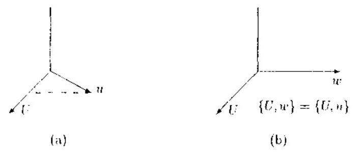

图 5.6.1 子空间 $\{ U, w\}  = \{ U, u\}$ 的构造

利用正交投影矩阵的定义，又可得正交投影矩阵的更新公式

$$
{P}_{l{l}_{H}}^{ \bot  } = {P}_{l{l}^{\prime }}^{ \bot  } - {P}_{l{l}^{\prime }}^{ \bot  }u{\left( {P}_{l}^{ \bot  }u,{P}_{{l}^{\prime }}^{ \bot  }u\right) }^{-1}{u}^{T}{P}_{{l}^{\prime }}^{ \bot  } \tag{5.6.22b}
$$

在最小二乘估计中,往往需要更新某个向量或标量. 用向量 $g$ 右乘式 (5.6.22) 两边, 我们就得到向量的更新公式:

$$
{P}_{Uu}y = {P}_{U}y + {P}_{U}^{\frac{1}{2}}u{\left\langle  {P}_{U}^{\frac{1}{2}}u,{P}_{U}^{\frac{1}{2}}u\right\rangle  }^{-1}\langle u,{P}_{U}^{\frac{1}{2}}y\rangle \tag{5.6.23a}
$$

$$
{P}_{{L}^{ + }u}^{ \bot  }y = {P}_{{L}^{\prime }}^{ \bot  }y - {P}_{{L}^{\prime }}^{ \bot  }u{\left\langle  {P}_{{L}^{\prime }}^{ \bot  }u,{P}_{{L}^{\prime }}^{ \bot  }u\right\rangle  }^{-1}\left\langle  {u,{P}_{{L}^{\prime }}^{ \bot  }y}\right\rangle \tag{5.6.23h}
$$

由于任一标量都可以用两个向量的内积来表示, 所以由上述向量的更新可直接得到标量的更新公式如下:

$$
\left\langle  {z,{P}_{U, u}y}\right\rangle   = \left\langle  {z,{P}_{U}y}\right\rangle   + \left\langle  {z,{P}_{U}^{ \bot  }u}\right\rangle  {\left\langle  {P}_{U}^{ \bot  }u,{P}_{U}^{ \bot  }u\right\rangle  }^{-1}\left\langle  {u,{P}_{U}^{ \bot  }y}\right\rangle \tag{5.6.24a}
$$

$$
\langle z,{P}_{I}u, y\rangle  = \langle z,{P}_{I}^{ \bot  }y\rangle  - \langle z,{P}_{U}^{ \bot  }u\rangle {\left\langle  {P}_{U}^{ \bot  }u,{P}_{U}^{ \bot  }u\right\rangle  }^{-1}\langle u,{P}_{U}^{ \bot  }y\rangle \tag{5.6.24b}
$$

在式 (5.6.23) 和 (5.6.24) 中巧妙地选择 $U\text{ 、 }u\text{ 、 }y$ 和 $z$ . 就可以直接推导出几种最小二乘滤波器所需要的全部时间更新和阶数更新的公式.

在应用递推公式 (5.6.23) 和 (5.6.24) 时, 为了简化结果, 我们需要用到以下向量和矩阵符号.

与矩阵 ${X}_{1, m}\left( n\right)$ 对应的投影矩阵和正交投影矩阵分别记作 ${P}_{1, m}\left( n\right)$ 和 ${P}_{1, m}^{ \bot  }\left( n\right)$ ,其中

$$
{P}_{1, m}\left( n\right)  = {X}_{1, m}\left( n\right) {\left\langle  {X}_{1, m}\left( n\right) ,{X}_{1, m}\left( n\right) \right\rangle  }^{-1}{X}_{1, m}^{T}\left( n\right) \tag{5.6.25}
$$

记

$$
{X}_{0, m - 1}\left( n\right)  = \left\lbrack  {{z}^{n}x\left( n\right) ,{z}^{-1}x\left( n\right) ,\cdots ,{z}^{-\left( {m - 1}\right) }x\left( n\right) }\right\rbrack
$$

$$
= \left\lbrack  \begin{matrix} {x}_{1} & {x}_{1} & \cdots & 0 \\  {x}_{2} & {x}_{1} & \cdots & 0 \\  \vdots & \vdots & \vdots & \vdots \\  {x}_{n - 1} & {x}_{n - 2} & \cdots & {x}_{n - m} \\  {x}_{n} & {x}_{n - 1} & \cdots & {x}_{n - m + 1} \end{matrix}\right\rbrack \tag{5.6.26}
$$

则与之对应的投影矩阵和正交投影矩阵分别用 ${P}_{0, m - 1}^{ \bot  }\left( n\right)$ 和 ${P}_{0, m - 1}^{ \bot  }\left( n\right)$ 表示.

下面是三个重要的公式, 它们在后面将经常用到:

$$
{z}^{-1}{X}_{0, m - 1}\left( n\right)  = {X}_{0, m - 1}\left( {n - 1}\right)  = {X}_{1, m}\left( n\right) \tag{5.6.27}
$$

$$
{z}^{-1}{P}_{0, m - 1}^{ \bot  }\left( n\right)  = {P}_{0, m - 1}^{ \bot  }\left( {n - 1}\right)  = {P}_{1, m}^{ \bot  }\left( n\right) \tag{5.6.28a}
$$

$$
{z}^{-1}{P}_{0, m - 1}^{ \bot  }\left( n\right) {z}^{-m} = {P}_{1, m}^{ \bot  }\left( n\right) {z}^{-m - 1} \tag{5.6.28b}
$$

证明 首先注意到, 由时间移位算子的定义, 我们有

$$
{z}^{-1}{X}_{0, m - 1}\left( n\right)  = {X}_{0, m - 1}\left( {n - 1}\right)
$$

根据 ${X}_{0, m - 1}\left( n\right)$ 的结构,显然

$$
{X}_{0, m - 1}\left( {n - 1}\right)  = \left\lbrack  {x\left( {n - 1}\right) ,{z}^{-1}x\left( {n - 1}\right) ,\cdots ,{z}^{-\left( {m - 1}\right) }x\left( {n - 1}\right) }\right\rbrack
$$

$$
= \left\lbrack  {{z}^{-1}x\left( n\right) ,{z}^{-2}x\left( n\right) ,\cdots ,{z}^{-m}x\left( n\right) }\right\rbrack
$$

$$
= {X}_{1, m}\left( n\right)
$$

这就证明了式 (5.6.27). 进一步地, 利用式 (5.6.27) 及投影矩阵的定义, 又立即有

$$
{z}^{-1}{P}_{0, m - 1}^{ \bot  }\left( n\right)  = {P}_{0, m - 1}^{ \bot  }\left( {n - 1}\right)
$$

$$
= I - {X}_{0, m - 1}\left( {n - 1}\right) {\left\langle  {X}_{0, m - 1}\left( n - 1\right) ,{X}_{0, m - 1}\left( n - 1\right) \right\rangle  }^{-1}{X}_{0, m - 1}^{T}\left( {n - 1}\right)
$$

$$
= I - {X}_{1, m}\left( n\right) {\left\langle  {X}_{1, m}\left( n\right) ,{X}_{1, m}\left( n\right) \right\rangle  }^{-1}{X}_{1, m}^{T}\left( n\right)
$$

$$
= {P}_{1, m}^{ \bot  }\left( n\right)
$$

这就是式 (5.6.28a). 另外,由时间移位算子 ${z}^{-i}$ 的定义以及式 (5.6.28),显然对任何一数据向量 $x\left( n\right)$ 有

$$
{z}^{-1}{P}_{0, m - 1}^{ \bot  }\left( n\right) {z}^{-m}x\left( n\right)  = {P}_{0, m - 1}^{ \bot  }\left( {n - 1}\right) {z}^{-m}x\left( {n - 1}\right)
$$

$$
= {P}_{1, m}^{ \bot  }\left( n\right) {z}^{-m - 1}x\left( n\right)
$$

就是说,对于任何一个数据向量 $x\left( n\right)$ 而言, ${z}^{-1}{P}_{0, m - 1}^{ \bot  }\left( n\right) {z}^{-m}x\left( n\right)$ 和 ${P}_{1, m}^{ \bot  }\left( n\right) {z}^{-m - 1}x\left( n\right)$ 表示完全相同的结果, 故式 (5.6.28b) 为真.

引入 $n$ 个分量的单位向量

$$
\pi \left( n\right)  = {\left\lbrack  0,\cdots ,0,1\right\rbrack  }^{T} \tag{5.6.29}
$$

我们就可以将任何一个向量

$$
a = {\left\lbrack  {a}_{1},\cdots ,{a}_{n}\right\rbrack  }^{T} \tag{5.6.30}
$$

的第 $n$ 个元素 ${a}_{n}$ 表示成

$$
{a}_{n} = \langle \pi \left( n\right) , a\rangle \tag{5.6.31}
$$

“1 然,变换单位向量中 1 的位置即使用不同的单位向量 $\pi \left( i\right)$ ,也可以将向量 $a$ 中任何一个元素 $a$ ，抽取出来.

当子空间由 $\{ U\}$ 扩大为 $\{ U,\pi \}$ 时,我们有以下的有用关系式:

$$
{P}_{U\pi }\left( n\right)  = \left\lbrack  \begin{matrix} {P}_{U}\left( {n - 1}\right) & 0 \\  0 & 1 \end{matrix}\right\rbrack \tag{5.6.32a}
$$

和

$$
{P}_{U\pi }^{ \bot  }\left( n\right)  = \left\lbrack  \begin{matrix} {P}_{U}^{ \bot  }\left( {n - 1}\right) & 0 \\  0 & 0 \end{matrix}\right\rbrack \tag{5.6.32b}
$$

式 (5.6.32a) 的证明比较繁琐, 感兴趣的读者可参阅文献 [4, pp.136~137].

#### 5.6.3 利用正交投影矩阵设计 LS 格型滤波器

作为正交投影矩阵的一个重要应用例子, 我们来考虑图 5.6.2 所示最小二乘 (LS) 格型滤波器的设计.

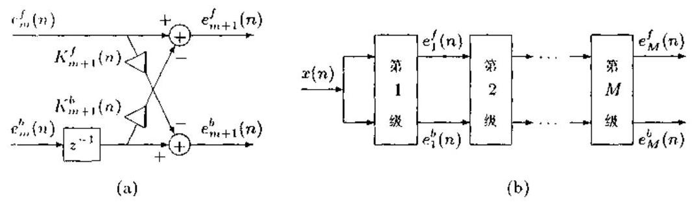

图 5.6.2 LS 格型滤波器

(a) 单级滤波器; (b) $M$ 阶 LS 格型滤波器

由图中滤波器的结构知,第 $m$ 级滤波器输出的前向预测误差 ${e}_{m + 1}^{f}\left( n\right)$ 和后向预测误差 ${c}_{m + 1}^{b}\left( n\right)$ 为

$$
{e}_{m + 1}^{f}\left( n\right)  = {e}_{m}^{f}\left( n\right)  - {K}_{m + 1}^{b}\left( n\right) {e}_{m + 1}^{b}\left( {n - 1}\right) \tag{5.6.33a}
$$

$$
{e}_{m + 1}^{b}\left( n\right)  =  - {K}_{m + 1}^{b}\left( n\right) {e}_{m}^{f}\left( n\right)  + {e}_{m + 1}^{b}\left( {n - 1}\right) \tag{5.6.33b}
$$

其中 ${K}_{m + 1}^{f}\left( n\right)$ 和 ${K}_{m + 1}^{b}\left( n\right)$ 分别称为前向和后向反射系数. 滤波器的设计目标是: 设计 ${K}_{m + 1}^{f}\left( n\right)$ 和 ${K}_{m + 1}^{b}\left( n\right)$ ,分别使前、后向预测残差 ${\epsilon }_{m}^{f}\left( n\right)$ 和 ${\epsilon }_{m}^{b}\left( n\right)$ 为最小.

## 1. 前、后向预测滤波器

山前向预测方程

$$
{\widehat{x}}_{t} = \mathop{\sum }\limits_{{i = 1}}^{m}{w}_{m}^{f}\left( i\right) {x}_{t - i} \tag{5.6.34}
$$

取 $t = 1,\cdots , n$ ,我们可以写出其向量 - 矩阵形式:

$$
\widehat{x}\left( n\right)  = {X}_{1, m}\left( n\right) {W}_{m}^{f}\left( n\right) \tag{5.6.35}
$$

式中

$$
\widehat{x}\left( n\right)  = {\left\lbrack  {\widehat{x}}_{1},\cdots ,{\widehat{x}}_{n}\right\rbrack  }^{T} \tag{5.6.36a}
$$

$$
{W}_{m}^{f}\left( n\right)  = {\left\lbrack  {w}_{m}^{f}\left( 1\right) ,\cdots ,{w}_{m}^{f}\left( m\right) \right\rbrack  }^{T} \tag{5.6.36b}
$$

且 ${X}_{1, m}\left( n\right)$ 如式 (5.6.17) 所示. 于是,前向预测误差向量为

$$
{E}_{m}^{f}\left( n\right)  = {\left\lbrack  {e}_{m}^{f}\left( 1\right) ,\cdots ,{e}_{m}^{f}\left( n\right) \right\rbrack  }^{T} = x\left( n\right)  - \widehat{x}\left( n\right) \tag{5.6.37}
$$

其中 ${\epsilon }_{m}^{f}\left( i\right)  = {x}_{i} - {\widehat{x}}_{i}$ ; 而前向预测残差为

$$
{\epsilon }_{m}^{f}\left( n\right)  = \left\langle  {{E}_{m}^{f}\left( n\right) ,{E}_{m}^{f}\left( n\right) }\right\rangle \tag{5.6.38a}
$$

$$
= {x}^{T}\left( n\right) x\left( n\right)  - {x}^{T}\left( n\right) {X}_{1, m}^{T}\left( n\right) {W}_{m}^{f}\left( n\right)  + {\left\lbrack  {W}_{m}^{f}\left( n\right) \right\rbrack  }^{T}{X}_{1, m}^{T}\left( n\right) x\left( n\right)
$$

$$
- {\left\lbrack  {W}_{m}^{f}\left( n\right) \right\rbrack  }^{T}{X}_{1, m}^{T}\left( n\right) {X}_{1, m}\left( n\right) {W}_{m}^{f}\left( n\right) \tag{5.6.38b}
$$

这里,使用了式 (5.6.35) 和式 (5.6.37). 现在,第 $m$ 阶前向预测滤波器的预测系数向量 ${W}_{m}^{f}\left( n\right)$ 由

$$
\frac{\partial {\epsilon }_{m}^{f}\left( n\right) }{\partial {W}_{m}^{f}\left( n\right) } = 0
$$

确定, 即得前向预测滤波器为

$$
{W}_{m}^{f}\left( n\right)  = {\left\lbrack  {X}_{1, m}^{T}\left( n\right) {X}_{1, m}\left( n\right) \right\rbrack  }^{-1}{X}_{1, m}^{T}\left( n\right) x\left( n\right)
$$

$$
= {\left\langle  {X}_{1, m}\left( n\right) ,{X}_{1, m}\left( n\right) \right\rangle  }^{-1}\left\langle  {{X}_{1, m}\left( n\right) , x\left( n\right) }\right\rangle \tag{5.6.38c}
$$

利用这一结果易得 $x\left( n\right)$ 的预测

$$
\widehat{x}\left( n\right)  = {X}_{1, m}\left( n\right) {W}_{m}^{f}\left( n\right)  = {P}_{1, m}\left( n\right) x\left( n\right) \tag{5.6.39}
$$

以及前向预测误差向量

$$
{E}_{m}^{f}\left( n\right)  = x\left( n\right)  - \widehat{x}\left( n\right)  = {P}_{1, m}^{ \bot  }\left( n\right) x\left( n\right) \tag{5.6.40}
$$

又出后向预测方程

$$
\widehat{x}\left( {n - m}\right)  = \mathop{\sum }\limits_{{i = 1}}^{m}{w}_{m}^{b}\left( i\right) x\left( {n - m + i}\right) \tag{5.6.41}
$$

得到对应的向量 - 矩阵形式:

$$
x\left( {n - m}\right)  = {X}_{0, m - 1}\left( n\right) {W}_{m}^{b}\left( n\right)
$$

于是，后向预测误差向量和后向预测残差分别为

$$
{E}_{m}^{b}\left( n\right)  = {\left\lbrack  {e}_{m}^{b}\left( 1\right) ,\cdots ,{e}_{m}^{b}\left( n\right) \right\rbrack  }^{T}
$$

$$
= x\left( {n - m}\right)  - \widehat{x}\left( {n - m}\right)
$$

$$
= x\left( {n - m}\right)  - {X}_{0, m - 1}\left( n\right) {W}_{m}^{b}\left( n\right)
$$

$$
{\epsilon }_{m}^{b}\left( n\right)  = \left\langle  {{E}_{m}^{b}\left( n\right) ,{E}_{m}^{b}\left( n\right) }\right\rangle
$$

其中 ${c}_{m}^{h}\left( i\right)  = {x}_{n - i} - {\widehat{x}}_{n - i}$ . 与前向预测滤波器相类似,由

$$
\frac{\partial {\epsilon }_{m}^{b}\left( n\right) }{\partial {W}_{m}^{b}\left( n\right) } = 0
$$

可得到后向预测系数向量

$$
{W}_{m}^{b}\left( n\right)  = {\left\langle  {X}_{0, m - 1}\left( n\right) ,{X}_{0, m - 1}\left( n\right) \right\rangle  }^{-1}{X}_{0, m - 1}^{T}\left( n\right) x\left( {n - m}\right) \tag{5.6.42a}
$$

$x\left( n\right)$ 的后向预测

$$
\widehat{x}\left( {n - m}\right)  = {P}_{0, m - 1}\left( n\right) x\left( {n - m}\right)  = {P}_{0, m - 1}\left( n\right) {z}^{-m}x\left( n\right)
$$

及后向预测误差向量

$$
{E}_{m}^{b}\left( n\right)  = {P}_{0, m - 1}^{ \bot  }\left( n\right) {z}^{-m}x\left( n\right) \tag{5.6.42b}
$$

### 2.LS 格型滤波器设计

由式 (5.6.40), 我们考虑前向预测误差

$$
{e}_{m + 1}^{f}\left( n\right)  = \left\langle  {\pi \left( n\right) ,{E}_{m + 1}^{f}\left( n\right) }\right\rangle   = \left\langle  {\pi \left( n\right) ,{P}_{1, m + 1}^{ \bot  }\left( n\right) x\left( n\right) }\right\rangle
$$

的更新. 比照递推公式 (5.6.24b) 左边,显然应该令 $z = \pi \left( n\right) , U = {X}_{1, m}\left( n\right) , u = {z}^{-m - 1}x\left( n\right)$ 和 $y = x\left( n\right)$ . 注意到

$$
\{ U, u\}  = \left\{  {{X}_{1, m}\left( n\right) ,{z}^{-m - 1}x\left( n\right) }\right\}   = \left\{  {{X}_{1, m + 1}\left( n\right) }\right\} \tag{5.6.43}
$$

具体计算式 (5.6.24b) 以及应用重要公式 (5.6.28b), 并经过化简运算得到

$$
{e}_{m + 1}^{f}\left( n\right)  = {e}_{m}^{f}\left( n\right)  - \frac{{e}_{m}^{b}\left( {n - 1}\right) \left\langle  {{z}^{-1}{E}_{m}^{b}\left( n\right) ,{E}_{m}^{f}\left( n\right) }\right\rangle  }{{\epsilon }_{m}^{b}\left( {n - 1}\right) } \tag{5.6.44}
$$

式中我们使用了

$$
{z}^{-1}{E}_{m}^{b}\left( n\right)  = {\left\lbrack  0,{e}_{m}^{b}\left( 1\right) ,\cdots ,{e}_{m}^{b}\left( n - 1\right) \right\rbrack  }^{T}
$$

及

$$
\left\langle  {\pi \left( n\right) ,{z}^{-1}{E}_{m}^{b}\left( n\right) }\right\rangle   = {e}_{m}^{b}\left( {n - 1}\right)
$$

如果定义偏相关系数

$$
{\Delta }_{m + 1}\left( n\right)  = \left\langle  {{E}_{m}^{f}\left( n\right) ,{z}^{-1}{E}_{m}^{b}\left( n\right) }\right\rangle \tag{5.6.45}
$$

并比较式 (5.6.44) 和式 (5.6.33a), 我们即可得到

$$
{K}_{m + 1}^{b}\left( n\right)  = \frac{{\Delta }_{m + 1}\left( n\right) }{{\epsilon }_{m}^{b}\left( {n - 1}\right) } \tag{5.6.46}
$$

这就是说,递推公式 (5.6.33a) 中的后向反射系数 ${K}_{m + 1}^{b}\left( n\right)$ 可以用式 (5.6.46) 直接计算.

对于后向预测误差

$$
{e}_{m + 1}^{b}\left( n\right)  = \left\langle  {\pi \left( n\right) ,{E}_{m + 1}^{b}\left( n\right) }\right\rangle   = \left\langle  {\pi \left( n\right) ,{P}_{0, m}^{ \bot  }\left( n\right) {z}^{-m - 1}x\left( n\right) }\right\rangle \tag{5.6.47}
$$

注意到 $\{ U, u\}  = \{ u, U\}$ . 显然在式 (5.6.24b) 中应该令 $z = \pi \left( n\right) , U = {X}_{1, m}\left( n\right) , u = x\left( n\right)$ 和 $y = {z}^{-m - 1}x\left( n\right)$ . 经过与式 (5.6.46) 类似的推导过程,不难得前向反射系数的计算公式:

$$
{K}_{m + 1}^{f}\left( n\right)  = \frac{{\Delta }_{m + 1}\left( n\right) }{{\epsilon }_{m}^{f}\left( n\right) } \tag{5.6.48}
$$

这样一来，我们就把前、后向反射系数的更新转换成了求偏相关系数 ${\Delta }_{m + 1}\left( n\right)$ 和前、 后向预测残差 ${\epsilon }_{m}^{f}\left( n\right) ,{\epsilon }_{m}^{b}\left( n\right)$ 的更新问题.

利用前向预测残差定义式 (5.6.38a)、式 (5.6.40) 以及正交投影矩阵的性质 1 和 2 , 我们可以求得

$$
{\epsilon }_{m + 1}^{f}\left( n\right)  = \left\langle  {{P}_{1, m + 1}^{ \bot  }\left( n\right) x\left( n\right) ,{P}_{1, m + 1}^{ \bot  }\left( n\right) x\left( n\right) }\right\rangle
$$

$$
= \left\langle  {x\left( n\right) ,{P}_{1, m + 1}^{ \bot  }\left( n\right) x\left( n\right) }\right\rangle \tag{5.6.49}
$$

类似地. 又可以推出后向预测残差

$$
{\epsilon }_{m + 1}^{h}\left( n\right)  = \left\langle  {{z}^{-m - 1}x\left( n\right) ,{P}_{0, m}^{ \bot  }\left( n\right) {z}^{-m - 1}x\left( n\right) }\right\rangle \tag{5.6.50}
$$

由式 (5.6.49) 和式 (5.6.24b),令 $z = y = x\left( n\right) , U = {X}_{1, m}$ 和 $u = {z}^{-m - 1}x\left( n\right)$ ,则有

$$
{\epsilon }_{m + 1}^{f}\left( n\right)  = {\epsilon }_{m}^{f}\left( n\right)  - \frac{{\Delta }_{m + 1}^{2}\left( n\right) }{{\epsilon }_{m}^{h}\left( {n - 1}\right) } \tag{5.6.51}
$$

在式 (5.6.24b) 中令 $z = y = {z}^{-m - 1}x\left( n\right) , U = {X}_{1, m}\left( n\right)$ 和 $u = x\left( n\right)$ ,由式 (5.6.50) 又有

$$
{\epsilon }_{m + 1}^{b}\left( n\right)  = {\epsilon }_{m}^{b}\left( {n - 1}\right)  - \frac{{\Delta }_{m + 1}^{2}\left( n\right) }{{\epsilon }_{m}^{f}\left( n\right) } \tag{5.6.52}
$$

最后,比较偏相关系数定义式 (5.6.45) 和 (5.6.24b) 知,应该令 $z = x\left( n\right) , y\left( n\right)  = \; {z}^{-m - 1}x\left( n\right) , U = {X}_{1, m}\left( n\right)$ 和 $u = \pi \left( n\right)$ . 于是,利用重要关系式 (5.6.32b) 可得

$$
{\Delta }_{m + 1}\left( n\right)  = {\Delta }_{m + 1}\left( {n - 1}\right)  + \frac{{e}_{m}^{f}\left( n\right) {e}_{m}^{b}\left( {n - 1}\right) }{{\gamma }_{m}\left( {n - 1}\right) } \tag{5.6.53}
$$

其中 ${\gamma }_{m}\left( {n - 1}\right)$ 称为角度参数,定义为

$$
{\gamma }_{m}\left( {n - 1}\right)  = \left\langle  {\pi \left( n\right) ,{P}_{1, m}^{ \bot  }\left( n\right) \pi \left( n\right) }\right\rangle \tag{5.6.54}
$$

在式 (5.6.24b) 中令 $z = y = \pi \left( n\right) , U = {X}_{1,{rn}}\left( n\right)$ 和 $u = {z}^{-{rn} - 1}x\left( n\right)$ ,则由式 (5.6.54) 可得到角度参数的更新公式:

$$
{\gamma }_{m + 1}\left( {n - 1}\right)  = {\gamma }_{m}\left( {n - 1}\right)  - \frac{{\left\lbrack  {\epsilon }_{m}^{b}\left( n - 1\right) \right\rbrack  }^{2}}{{\epsilon }_{m}^{b}\left( {n - 1}\right) } \tag{5.6.55}
$$

这样, 我们就利用式 (5.6.24b) 推导出了 LS 格型滤波器需要的全部更新公式. 由此可见, 正交投影矩阵确实是推导最小二乘更新关系的一种非常有效的数学工具.

#### 5.6.4 投影矩阵的导数

下雨我们推导投影矩阵 ${P}_{A}\left( \theta \right)  = A{\left( {A}^{H}A\right) }^{-1}{A}^{H} = A{A}^{ \dagger  }$ 相对于向量 $\theta$ 各元素的一阶与二阶导数. 这些结果是由 Golub 与 Pereyra 最早给出的 ${}^{\left\lbrack  6\right\rbrack  }$ . 为了表述的方便,我们将 ${P}_{A}\left( \theta \right)$ 简记作 $P$ .

考虑一阶导数

$$
{P}_{ij} = \frac{\mathrm{d}P}{\mathrm{\;d}{\theta }_{ij}} = {A}_{ij}{A}^{ \dagger  } + A{A}_{ij}^{ \dagger  } \tag{5.6.56}
$$

在经过某些代数运算后,可得伪逆矩阵 ${A}^{ \dagger  }$ 的一阶导数:

$$
{A}_{\eta }^{ \dagger  } = {\left( {A}^{H}A\right) }^{-1}{A}_{\eta }^{H}{P}^{ \bot  } - {A}^{ \dagger  }{A}_{\eta }{A}^{ \dagger  } \tag{5.6.57}
$$

综合式 (5.6.56) 与式 (5.6.57) 得到

$$
{P}_{\eta } = {P}^{ \bot  }{A}_{\eta }{A}^{ \dagger  } + {\left( {P}^{ \bot  }{A}_{\eta }{A}^{ \dagger  }\right) }^{H} \tag{5.6.58}
$$

由此式容易验证,正如所希望的那样,我们有 $\operatorname{trace}\left( {P}_{\eta }\right)  = 0$ ,因为一个投影矩阵的迹只与投影矩阵投影到的子空间的维数有关.

二阶导数为

$$
{P}_{\eta \xi } = {P}_{\xi }^{ \bot  }{A}_{\eta }{A}^{ \dagger  } + {P}^{ \bot  }{A}_{\eta \xi }{A}^{ \dagger  } + {P}^{ \bot  }{A}_{\eta }{A}_{\xi }^{H}
$$

$$
+ {\left( {P}_{\xi }^{ \bot  }{A}_{\eta }{A}^{ \dagger  } + {P}^{ \bot  }{A}_{\eta \xi }{A}^{ \dagger  } + {P}^{ \bot  }{A}_{\eta }{A}_{\xi }^{H}\right) }^{H} \tag{5.6.59}
$$

注意到 ${P}_{\xi }^{ \bot  } =  - {P}_{\xi }$ ,并利用式 (5.6.57),可以将上式结果表述为

$$
{P}_{\eta \xi } =  - {P}^{ \bot  }{A}_{\xi }{A}^{ \dagger  }{A}_{\eta }{A}^{ \dagger  } - {A}^{\dagger H}{A}_{\xi }^{H}{P}^{ \bot  }{A}_{\eta }{A}^{H} + {P}^{ \bot  }{A}_{\eta \xi }{A}^{ \dagger  }
$$

$$
+ {P}^{ \bot  }{A}_{\eta }{\left( {A}^{H}A\right) }^{-1}{A}_{\xi }^{H}{P}^{ \bot  } - {P}^{ \bot  }{A}_{\eta }{A}^{ \dagger  }{A}_{\xi }{A}^{ \dagger  }
$$

$$
+ \left\lbrack  {-{P}^{ \bot  }{A}_{\xi }{A}^{ \dagger  }{A}_{\eta }{A}^{ \dagger  } - {A}^{\dagger H}{A}_{\xi }^{H}{P}^{ \bot  }{A}_{\eta }{A}^{H} + {P}^{ \bot  }{A}_{\eta \xi }{A}^{ \dagger  }}\right.
$$

$$
+ {P}^{ \bot  }{A}_{\eta }{\left( {A}^{H}A\right) }^{-1}{A}_{\xi }^{H}{P}^{ \bot  } - {P}^{ \bot  }{A}_{\eta }{A}^{ \dagger  }{A}_{\xi }{A}^{ \dagger  }{\rbrack }^{H} \tag{5.6.60}
$$

投影矩阵的导数公式在涉及投影矩阵的某些估计子的统计性能分析时非常有用. 对此应用感兴趣的读者可参考文献 [7].

### 5.7 横向滤波器算子及其应用

在自适应信号处理中, 自适应滤波器可以分为两类. 一类叫做横向滤波器, 另一类称作格型滤波器. 典型的横向滤波器有递推最小二乘 (RLS) 滤波器和最小均方 (LMS) 滤波器. 它们结构简单, 易于实现, 但由于存在收敛问题, 所以只适用于变化比较慢的信号. 对于快速变化的信号，需要使用快速横向滤波器.

和上一节的 LS 格型滤波器一样, 快速横向滤波器也是一种最小二乘递推. LS 格型滤波器采用正交投影矩阵巧妙地解决了所需要的所有最小二乘更新公式. 然而, 快速横向滤波器与之不同，主要依靠另外一种算子来巧妙解决快速横向滤波器的复杂设计问题. 这种算子就是下雨要介绍的横向滤波器算子.

#### 5.7.1 横向滤波器算子及其递推

考虑一个一般的 $n \times  N$ 数据矩阵 $U$ ,横向滤波器算子 ${K}_{U}$ 定义为 ${}^{\left\lbrack  5\right\rbrack  }$

$$
{K}_{U} = \langle U, U{\rangle }^{-1}{U}^{T} \tag{5.7.1}
$$

它是一个 $N \times  n$ 矩阵. 我们指出,它与第一章的左伪逆矩阵 (即最小二乘逆矩阵) 具有完全相同的表达形式. 与第一章介绍的最小二乘逆矩阵的阶数递推不同, 这里考虑的是横向滤波器算子的时间递推.

假定 $u$ 是矩阵 $\left\lbrack  {U, u}\right\rbrack$ 中的最后一列. 我们用向量空间 $\{ U, u\}$ 的横向滤波器算子 ${K}_{Uu}$ 左乘投影矩阵递推公式 (5.6.22a) 的两边, 得到

$$
{K}_{Uu}{P}_{Uu} = {K}_{Uu}{P}_{U} + {K}_{Uu}{P}_{U}^{ \bot  }u{\left\langle  {P}_{U}^{ \bot  }u,{P}_{U}^{ \bot  }u\right\rangle  }^{-1}{u}^{T}{P}_{U}^{ \bot  } \tag{5.7.2}
$$

根据横向滤波器算子和正交投影矩阵的定义, 不难验证

$$
{K}_{Uu}{P}_{Uu} = {K}_{Uu} \tag{5.7.3}
$$

和

$$
{K}_{Uu}\left\lbrack  \begin{array}{ll} U & u \end{array}\right\rbrack   = I \tag{5.7.4}
$$

由于 ${K}_{Uu}$ 是一个 $\left( {N + 1}\right)  \times  n$ 矩阵, $U$ 是一个 $n \times  N$ 矩阵, $u$ 是 $n \times  1$ 向量,所以我们可以将式 (5.7.4) 写成两个分块形式:

$$
{K}_{Uu}U = \left\lbrack  \begin{matrix} {I}_{N} \\  {0}_{N}^{T} \end{matrix}\right\rbrack \tag{5.7.5}
$$

和

$$
{K}_{Uu}u = \left\lbrack  \begin{matrix} {0}_{N} \\  1 \end{matrix}\right\rbrack \tag{5.7.6}
$$

式中, ${I}_{NN}$ 是 $N \times  N$ 单位矩阵, ${0}_{N}$ 为 $N \times  1$ 零向量. 由于

$$
{K}_{Uu}{P}_{U} = {K}_{Uu}U\langle U, U{\rangle }^{-1}{U}^{T}
$$

所以由式 (5.7.5), 上式可改写作

$$
{K}_{Uu}{P}_{U} = \left\lbrack  \begin{matrix} {I}_{N} \\  {0}_{N}^{T} \end{matrix}\right\rbrack  {K}_{U} = \left\lbrack  \begin{matrix} {K}_{U} \\  {0}_{N}^{T} \end{matrix}\right\rbrack \tag{5.7.7}
$$

于是, 在式 (5.7.2) 中代入式 (5.7.3) 和式 (5.7.7), 便得到横向滤波器算子的递推公式:

$$
{K}_{Uu} = \left\lbrack  \begin{matrix} {K}_{U} \\  {0}_{N}^{T} \end{matrix}\right\rbrack   + \left\{  {\left\lbrack  \begin{matrix} {0}_{N} \\  1 \end{matrix}\right\rbrack   - \left\lbrack  \begin{matrix} {K}_{U}u \\  0 \end{matrix}\right\rbrack  }\right\}  {\left\langle  {P}_{U}^{ \bot  }u,{P}_{U}^{ \bot  }u\right\rangle  }^{-1}{u}^{T}{P}_{U}^{ \bot  } \tag{5.7.8a}
$$

类似地,对于矩阵 $\left\lbrack  {u, U}\right\rbrack$ ,我们不难证明 ${K}_{uU}$ 的递推公式为

$$
{K}_{uU} = \left\lbrack  \begin{matrix} {0}_{N}^{T} \\  {K}_{U} \end{matrix}\right\rbrack   + \left\{  {\left\lbrack  \begin{matrix} 1 \\  {0}_{N} \end{matrix}\right\rbrack   - \left\lbrack  \begin{matrix} 0 \\  {K}_{U}u \end{matrix}\right\rbrack  }\right\}  {\left\langle  {P}_{U}^{ \bot  }u,{P}_{U}^{ \bot  }u\right\rangle  }^{-1}{u}^{T}{P}_{U}^{ \bot  } \tag{5.7.8b}
$$

在式 (5.7.8) 中巧妙地选择矩阵 $U$ 和向量 $u$ ,就能够得到快速横向滤波器的各种时间更新关系.

记

$$
{X}_{1, N}\left( n\right)  = \left\lbrack  {{z}^{-1}x\left( n\right) ,{z}^{-2}x\left( n\right) ,\cdots ,{z}^{-N}x\left( n\right) }\right\rbrack \tag{5.7.9a}
$$

$$
{X}_{0, N - 1}\left( n\right)  = \left\lbrack  {{z}^{0}x\left( n\right) ,{z}^{-1}x\left( n\right) ,\cdots ,{z}^{-\left( {N - 1}\right) }x\left( n\right) }\right\rbrack \tag{5.7.9b}
$$

则我们有重要关系式:

$$
{z}^{-1}{K}_{0, N - 1}\left( n\right)  = {K}_{0, N - 1}\left( {n - 1}\right)  = {K}_{1, N}\left( n\right) \tag{5.7.10}
$$

证明 由时间移位算子的定义, ${z}^{-1}{K}_{0, N - 1}\left( n\right)  = {K}_{0, N - 1}\left( {n - 1}\right)$ 的关系显然成立. 又由横向滤波器算子的定义及式 (5.6.27)，易见

$$
{K}_{0, N - 1}\left( {n - 1}\right)  = {\left\langle  {X}_{0, N - 1}\left( n - 1\right) ,{X}_{0, N - 1}\left( n - 1\right) \right\rangle  }^{-1}{X}_{0, N - 1}^{T}\left( {n - 1}\right)
$$

$$
= {\left\langle  {X}_{1, N}\left( n\right) ,{X}_{1, N}\left( n\right) \right\rangle  }^{-1}{X}_{1, N}^{T}\left( n\right)
$$

$$
= {K}_{1, N}\left( n\right)
$$

例 5.7.1 考虑 ${K}_{0, N - 1}\left( n\right)$ 算子时,取 $\left\{  {{X}_{0, N - 1}\left( n\right) }\right\}$ 作为子空间 $\{ U\}$ ,若 $u = \pi \left( n\right)$ ,则向量空间

$$
\{ U, u\}  = \left\{  {{z}^{-0}x\left( n\right) ,{z}^{-1}x\left( n\right) ,\cdots ,{z}^{-N + 1}x\left( n\right) ,\pi \left( n\right) }\right\}
$$

可以简洁地写作

$$
\{ U, u\}  = \left\{  {{X}_{0, N - 1}\left( n\right) ,\pi \left( n\right) }\right\} \tag{5.7.11}
$$

于是

$$
{K}_{Uu} = {K}_{U\pi } = {K}_{0, N - 1,\pi }\left( n\right) \tag{5.7.12}
$$

$$
{P}_{Uu} = {P}_{U\pi } = {P}_{0, N - 1,\pi }\left( n\right) \tag{5.7.13}
$$

式中,符号 “ $0, N - 1,\pi$ ” 表示在 ${X}_{0, N - 1}\left( n\right)$ 的右侧追加一列向量 $\pi \left( n\right)$ . 直接使用式 (5.6.32a) 得到

$$
{P}_{0, N - 1,\pi }\left( n\right)  = \left\lbrack  \begin{matrix} {P}_{0, N - 1}\left( {n - 1}\right) & {0}_{N - 1} \\  {0}_{N - 1}^{T} & 1 \end{matrix}\right\rbrack \tag{5.7.14}
$$

将式 (5.7.14) 代入式 (5.7.3) 则有

$$
{K}_{0, N - 1,\pi }\left( n\right)  = \left\lbrack  \begin{matrix} {K}_{0, N - 1}\left( {n - 1}\right) & {0}_{N} \\  {y}^{T}\left( {N - 1}\right) & 1 \end{matrix}\right\rbrack \tag{5.7.15}
$$

式中, $y\left( {n - 1}\right)$ 表示一个未知的向量,它在后面不会被使用.

例 5.7.2 如果时间选择向量 $\pi \left( n\right)$ 加到矩阵 ${X}_{1, N}\left( n\right)$ 的右边,则利用与例 5.7.1 类似的运算, 可得到

$$
{K}_{1, N,\pi }\left( n\right)  = \left\lbrack  \begin{matrix} {K}_{1, N}\left( {n - 1}\right) & {0}_{N} \\  {b}^{T}\left( {n - 1}\right) & 1 \end{matrix}\right\rbrack \tag{5.7.16}
$$

其中 $b\left( {n - 1}\right)$ 也是一个以后不会用到的向量.

#### 5.7.2 快速横向滤波器更新

快速横向滤波器是一种固定阶数的横向最小二乘自适应滤波器,由四个分离的 $N$ 阶横向滤波器组合而成. 这四个滤波器是 1) 最小二乘预测滤波器 ${W}_{N}\left( n\right) ,2)$ 前向预测误差滤波器 ${f}_{N}\left( n\right) ,3)$ 后向预测误差滤波器 ${b}_{N}\left( n\right)$ ,以及 4) 增益滤波器 ${g}_{N}\left( n\right)$ .

## 1. 最小二乘预测滤波器 ${W}_{N}\left( n\right)$

我们希望用观测数据 ${x}_{n}$ 在最小二乘意义下最佳地预测 $n$ 时刻的期望信号 ${d}_{n}$ :

$$
{\widehat{d}}_{n} = {w}_{1}\left( n\right) {x}_{n} + \cdots  + {w}_{N}\left( n\right) {z}^{-N + 1}{x}_{n} \tag{5.7.17}
$$

定义 $E\left( {n \mid  n}\right)  = {\left\lbrack  e\left( 1 \mid  1\right) ,\cdots , e\left( n \mid  n\right) \right\rbrack  }^{T}$ 是用 $n$ 时刻的预测滤波器预测期望信号向量 $\mathbf{d}\left( n\right)  = \; {\left\lbrack  {d}_{1},\cdots ,{d}_{n}\right\rbrack  }^{T}$ 所产生的误差向量,于是有

$$
E\left( {n \mid  n}\right)  = d\left( n\right)  - \widehat{d}\left( n\right) \tag{5.7.18}
$$

令

$$
{X}_{0, N - 1}\left( n\right)  = \left\lbrack  \begin{matrix} {x}_{1} & 0 & \cdots & 0 \\  {x}_{2} & {x}_{1} & \cdots & 0 \\  \vdots & \vdots & \vdots & \vdots \\  {x}_{n} & {x}_{n - 1} & \cdots & {x}_{n - N + 1} \end{matrix}\right\rbrack \tag{5.7.19a}
$$

$$
{W}_{N}\left( n\right)  = {\left\lbrack  {w}_{1}\left( n\right) ,{w}_{2}\left( n\right) ,\cdots ,{w}_{N}\left( n\right) \right\rbrack  }^{T} \tag{5.7.19b}
$$

则期望信号的预测向量 $\widehat{d}\left( n\right)$ 可以表示为

$$
\widehat{d}\left( n\right)  = {X}_{0, N - 1}\left( n\right) {W}_{N}\left( n\right) \tag{5.7.20}
$$

求解最小二乘问题

$$
\frac{\partial }{\partial {W}_{N}\left( n\right) }\langle E\left( {n \mid  n}\right) , E\left( {n \mid  n}\right) \rangle  = 0
$$

得到

$$
{W}_{N}\left( n\right)  = {\left\lbrack  {X}_{0, N - 1}^{T}\left( n\right) {X}_{0, N - 1}\left( n\right) \right\rbrack  }^{-1}{X}_{0, N - 1}^{T}\left( n\right) d\left( n\right)  = {K}_{0, N - 1}\left( n\right) d\left( n\right) \tag{5.7.21a}
$$

利用正交投影矩阵的定义，由式 (5.7.20) 和式 (5.7.21a) 易知

$$
E\left( {n \mid  n}\right)  = {P}_{0, N - 1}^{ \bot  }\left( n\right) d\left( n\right) \tag{5.7.21b}
$$

于是、 $n$ 时刻的最小二乘预测误差 (标量) 可以用内积求出:

$$
e\left( {n \mid  n}\right)  = \langle \pi \left( n\right) , E\left( {n \mid  n}\right) \rangle  = \left\langle  {\pi \left( n\right) ,{P}_{0, N - 1}^{ \bot  }\left( n\right) d\left( n\right) }\right\rangle \tag{5.7.21c}
$$

## 2. 前向预测误差滤波器 ${f}_{N}\left( n\right)$

由式 (5.6.38) 知，前向预测误差滤波器为

$$
{f}_{N}\left( n\right)  = {\left\langle  {X}_{1, N}\left( n\right) ,{X}_{1, N}\left( n\right) \right\rangle  }^{-1}{X}_{1, N}^{T}\left( n\right) x\left( n\right)  = {K}_{1, N}\left( n\right) x\left( n\right) \tag{5.7.22a}
$$

$n$ 时刻的前向预测误差 (标量) ${e}^{f}\left( {n \mid  n}\right)$ 为

$$
{e}^{f}\left( {n \mid  n}\right)  = \left\langle  {\pi \left( n\right) ,{E}^{f}\left( {n \mid  n}\right) }\right\rangle   = \left\langle  {\pi \left( n\right) ,{P}_{1, N}^{ \bot  }\left( n\right) x\left( n\right) }\right\rangle \tag{5.7.22b}
$$

前向预测残差 (能量) 则为

$$
{\epsilon }^{f}\left( {n \mid  n}\right)  = \left\langle  {{E}^{f}\left( {n \mid  n}\right) ,{E}^{f}\left( {n \mid  n}\right) }\right\rangle   = \left\langle  {x\left( n\right) ,{P}_{1, N}^{ \bot  }\left( n\right) x\left( n\right) }\right\rangle \tag{5.7.22c}
$$

## 3. 后向预测误差滤波器 ${b}_{N}\left( n\right)$

由式 (5.6.42) 得到后向预测误差滤波器

$$
{b}_{N}\left( n\right)  = {\left\langle  {X}_{0, N - 1}\left( n\right) ,{X}_{0, N - 1}\left( n\right) \right\rangle  }^{-1}{X}_{0, N - 1}^{T}\left( n\right) x\left( {n - N}\right)
$$

$$
= {K}_{0.N - 1}\left( n\right) {z}^{-N}x\left( n\right) \tag{5.7.23a}
$$

和 $n$ 时刻的后向预测误差向量

$$
{E}^{b}\left( {n \mid  n}\right)  = {P}_{0, N - 1}^{ \bot  }\left( n\right) {z}^{-N}x\left( n\right)
$$

因此,易得 $n$ 时刻的预测误差

$$
{e}^{b}\left( {n \mid  n}\right)  = \left\langle  {\pi \left( n\right) ,{E}^{b}\left( {n \mid  n}\right) }\right\rangle   = \left\langle  {\pi \left( n\right) ,{P}_{0, N - 1}^{ \bot  }\left( n\right) {z}^{-N}x\left( n\right) }\right\rangle \tag{5.7.23b}
$$

和后向预测残差 (能量)

$$
{\epsilon }^{b}\left( {n \mid  n}\right)  = \left\langle  {{E}^{b}\left( {n \mid  n}\right) ,{E}^{b}\left( {n \mid  n}\right) }\right\rangle   = \left\langle  {{z}^{-N}x\left( n\right) ,{P}_{0, N - 1}^{ \bot  }\left( n\right) {z}^{-N}x\left( n\right) }\right\rangle \tag{5.7.23c}
$$

## 4. 增益横向滤波器 ${g}_{N}\left( n\right)$

可以证明 ${}^{\left\lbrack  3,4\right\rbrack  }$ . 增益横向滤波器实际上是 “利用数据矩阵 ${X}_{0, N - 1}\left( n\right)$ 预测 $\pi \left( n\right)$ 的最小二乘预测器”. 即

$$
{g}_{N}\left( n\right)  = {K}_{0, N - 1}\left( n\right) \pi \left( n\right) \tag{5.7.24}
$$

且角度参数可表示为

$$
{\gamma }_{N}\left( n\right)  = 1 - {x}_{N}^{T}\left( n\right) {g}_{N}\left( n\right) \tag{5.7.25}
$$

式中

$$
{x}_{N}\left( n\right)  = {\left\lbrack  {x}_{n},{x}_{n - 1},\cdots ,{x}_{n - N + 1}\right\rbrack  }^{T}
$$

现在，我们可以利用横向滤波器算子的更新公式推导以上四种滤波器的时间更新公式. 在式 (5.7.8a) 中令 $U = {X}_{0, N - 1}\left( n\right) , u = \pi \left( n\right)$ ,则有

$$
{K}_{0, N - 1,\pi }\left( n\right)  = \left\lbrack  \begin{matrix} {K}_{0, N - 1}\left( n\right) \\  0 \end{matrix}\right\rbrack   - \left\lbrack  \begin{matrix} {g}_{N}\left( n\right) \\   - 1 \end{matrix}\right\rbrack  \frac{\pi {\left( n\right) }^{T}{P}_{0,{N}_{1}}^{ \bot  }\left( n\right) }{{\gamma }_{N}\left( n\right) } \tag{5.7.26}
$$

在获得上式的过程中, 我们代入了式 (5.7.24) 以及

$$
\left\langle  {{P}_{l}^{ \bot  }u,{P}_{l}^{ \bot  }u}\right\rangle   = \left\langle  {{P}_{0, N - 1}^{ \bot  }\left( n\right) \pi \left( n\right) ,{P}_{0, N - 1}^{ \bot  }\left( n\right) \pi \left( n\right) }\right\rangle   = \left\langle  {\pi \left( n\right) ,{P}_{0, N - 1}^{ \bot  }\left( n\right) \pi \left( n\right) }\right\rangle   = {\gamma }_{N}\left( n\right)
$$

用向量 $d\left( n\right)$ 右乘式 (5.7.26),并代入式 (5.7.15),则有

$$
\left\lbrack  \begin{matrix} {K}_{0, N - 1}\left( {n - 1}\right) & {0}_{N} \\  {y}^{T}\left( {n - 1}\right) & 1 \end{matrix}\right\rbrack  \left\lbrack  \begin{matrix} d\left( {n - 1}\right) \\  d\left( n\right)  \end{matrix}\right\rbrack
$$

$$
= \left\lbrack  \begin{matrix} {K}_{0, N - 1}\left( n\right) \\  0 \end{matrix}\right\rbrack  d\left( n\right)  - \left\lbrack  \begin{matrix} {g}_{N}\left( n\right) \\   - 1 \end{matrix}\right\rbrack  \frac{\left\langle  \pi \left( n\right) ,{P}_{0, N - 1}^{ \bot  }\left( n\right) d\left( n\right) \right\rangle  }{{\gamma }_{N}\left( n\right) }
$$

注意到上式中的内积等于 $e\left( {n \mid  n}\right)$ ,再代入式 (5.7.21a),并移项后,则有

$$
{W}_{N}\left( n\right)  = {W}_{N}\left( {n - 1}\right)  + \frac{e\left( {n \mid  n}\right) }{{\gamma }_{N}\left( n\right) }{g}_{N}\left( n\right) \tag{5.7.27}
$$

这就是最小二乘滤波器 ${W}_{N}\left( n\right)$ 的时间更新公式.

在式 (5.7.21a) 中令 $U = {X}_{1, N}\left( n\right)$ 和 $u = \pi \left( n\right)$ ,我们有

$$
{K}_{1, N,\pi }\left( n\right)  = \left\lbrack  \begin{matrix} {K}_{1, N,\pi }\left( n\right) \\  0 \end{matrix}\right\rbrack   - \left\lbrack  \begin{matrix} {g}_{N}\left( {n - 1}\right) \\   - 1 \end{matrix}\right\rbrack  \frac{\pi {\left( n\right) }^{T}{P}_{1, N}^{ \bot  }\left( n\right) }{\left\langle  \pi \left( n\right) ,{P}_{1, N}^{ \bot  }\left( n\right) \pi \left( n\right) \right\rangle  } \tag{5.7.28}
$$

这里使用了下面的关系式:

$$
{g}_{N}\left( {n - 1}\right)  = {K}_{1, N}\left( n\right) \pi \left( n\right) \tag{5.7.29}
$$

式 (5.7.29) 的证明是简单的, 因为由式 (5.7.10) 立即有

$$
{K}_{1, N}\left( n\right) \pi \left( n\right)  = {z}^{-1}{K}_{0, N - 1}\left( n\right) \pi \left( n\right)  = {z}^{-1}{g}_{N}\left( n\right)  = {g}_{N}\left( {n - 1}\right)
$$

又利用式(5.6.28a)得到

$$
\left\langle  {\pi \left( n\right) ,{P}_{1, N}^{ \bot  }\left( n\right) \pi \left( n\right) }\right\rangle   = \left\langle  {\pi \left( n\right) ,{z}^{-1}{P}_{0, N - 1}\left( n\right) \pi \left( n\right) }\right\rangle   = {\gamma }_{N}\left( {n - 1}\right) \tag{5.7.30}
$$

用向量右乘式 (5.7.28), 并代入式 (5.7.30), 则有

$$
\left\lbrack  \begin{matrix} {K}_{1, N}\left( {n - 1}\right) & {0}_{N} \\  {b}^{T}\left( {n - 1}\right) & 1 \end{matrix}\right\rbrack  \left\lbrack  \begin{matrix} x\left( {n - 1}\right) \\  x\left( n\right)  \end{matrix}\right\rbrack   = \left\lbrack  \begin{matrix} {g}_{N}\left( {n - 1}\right) \\   - 1 \end{matrix}\right\rbrack  \frac{\left( \pi \left( n\right) ,{P}_{1, N}^{ \bot  }\left( n\right) x\left( n\right) \right) }{{\gamma }_{N}\left( {n - 1}\right) }
$$

注意到上式中的内积等于 ${e}^{f}\left( {n \mid  n}\right)$ ,并代入式 (5.7.22a),立即有

$$
{f}_{N}\left( n\right)  = {f}_{N}\left( {n - 1}\right)  + \frac{{e}^{f}\left( {n \mid  n}\right) }{{\gamma }_{N}\left( {n - 1}\right) }{g}_{N}\left( {n - 1}\right) \tag{5.7.31}
$$

这就是前向预测误差滤波器 ${f}_{N}\left( n\right)$ 的时间更新公式.

类似地,在式 (5.7.21a) 中令 $U = {X}_{0, N - 1}\left( n\right)$ 和 $u = \pi \left( n\right)$ ,则可得

$$
{b}_{N}\left( n\right)  = {b}_{N}\left( {n - 1}\right)  + {g}_{N}\left( n\right) \frac{{e}^{b}\left( {n \mid  n}\right) }{{\gamma }_{N}\left( n\right) } \tag{5.7.32}
$$

现在,在式 (5.7.21b) 中令 $U = {X}_{1, N}\left( n\right) , u = x\left( n\right)$ 使得 $\{ u, U\}  = \left\{  {{X}_{0, N}\left( n\right) }\right\}$ . 然后, 用 $\pi \left( n\right)$ 行乘式 (5.7.21b),使得到

$$
{K}_{0, N}\left( n\right) \pi \left( n\right)  = \left\lbrack  \begin{matrix} {0}_{N}^{T} \\  {K}_{1, N}\left( n\right)  \end{matrix}\right\rbrack  \pi \left( n\right)  + \left\lbrack  \begin{matrix} 1 \\   - {K}_{1, N}\left( n\right) x\left( n\right)  \end{matrix}\right\rbrack  \frac{{e}^{f}\left( {n \mid  n}\right) }{\epsilon \left( n\right) } \tag{5.7.33}
$$

由式 (5.7.24),上式的左边读作 “用 ${X}_{0, N}\left( n\right)$ 预测 $\pi \left( n\right)$ 的 $N + 1$ 阶最小二乘预测器”,即有 ${g}_{N + 1}\left( n\right)  = {K}_{0, N}\left( n\right) \pi \left( n\right)$ . 对 ${g}_{N + 1}\left( n\right)$ 作如下分块:

$$
{g}_{N + 1}\left( n\right)  = \left\lbrack  \begin{matrix} {m}_{N}\left( n\right) \\  m\left( n\right)  \end{matrix}\right\rbrack \tag{5.7.34}
$$

式中 ${m}_{N}\left( n\right)$ 是由 ${g}_{N + 1}\left( n\right)$ 的前 $N$ 个分量组成的向量,标量 $m\left( n\right)$ 是第 $N + 1$ 个分量. 将式 (5.7.29) 和 (5.7.34) 代入式 (5.7.33) 得到

$$
{g}_{N + 1}\left( n\right)  = \left\lbrack  \begin{matrix} {m}_{N}\left( n\right) \\  m\left( n\right)  \end{matrix}\right\rbrack
$$

$$
= \left\lbrack  \begin{matrix} 0 \\  {g}_{N}\left( {n - 1}\right)  \end{matrix}\right\rbrack   + \frac{{e}^{f}\left( {n \mid  n}\right) }{\epsilon \left( n\right) }\left\lbrack  \begin{matrix} 1 \\   - {f}_{N}\left( n\right)  \end{matrix}\right\rbrack \tag{5.7.35}
$$

在式 (5.7.21a) 中令 $U = {X}_{0, N - 1}\left( n\right) , u = {z}^{-N}x\left( n\right)$ 使得 $\{ U, u\}  = \left\{  {{X}_{0, N}\left( n\right) }\right\}$ ,然后用 $\pi \left( n\right)$ 右乘该结果, 则有

$$
\left\lbrack  \begin{matrix} {g}_{N}\left( n\right) \\  0 \end{matrix}\right\rbrack   = \left\lbrack  \begin{matrix} {m}_{N}\left( n\right) \\  m\left( n\right)  \end{matrix}\right\rbrack   + \left\lbrack  \begin{matrix} {b}_{N}\left( n\right) \\   - 1 \end{matrix}\right\rbrack  \frac{{e}^{b}\left( {n \mid  n}\right) }{{\epsilon }^{b}\left( n\right) }
$$

由此得

$$
{g}_{N}\left( n\right)  = {m}_{N}\left( n\right)  + m\left( n\right) {b}_{N}\left( n\right) \tag{5.7.36}
$$

式 (5.7.35) 和式 (5.7.36) 组成了增益滤波器的更新公式. 具体更新过程为: 先根据 ${g}_{N}\left( {n - 1}\right)$ 及式 (5.7.35) 计算 ${m}_{N}\left( n\right)$ ,然后由式 (5.7.36) 计算 ${g}_{N}\left( n\right)$ .

综上所述，快速横向滤波器的全部时间更新都可以利用横向滤波器算子的更新公式求出. 对快速横向滤波器的基本算法和增益归一化快速横向滤波器算法感兴趣的读者可参考文献 [3] 中的 5.5.4 节与 5.5.5 节. 通过增益归一化，可以进一步简化快速横向滤波器的计算.

## 参考文献

[1] P. J. Brockwell and R. A. Davis, Time Series: Theory and Methods, New York: Springer-Verlag, 1987.

[2] N. Mohanty, Random Signal Estimation and Identification, Van Nostrand Reinhold, 1986.

[3] 张贤达, 现代信号处理, 清华大学出版社, 1995.

[4] S. T. Alexander, Adaptive Signal Processing: Theory and Applications, New York: Springer-Verlag, 1986.

[5] J. Cioffi and T. Kalaith, Fast recursive least squares filters for adaptive filtering, IEEE Trans. Acoust., Speech, Signal Processing, Vol.32, 304~317, 1984.

[6] G. H. Golub and V. Pereyra, The differentiation of pseudoinverses and nonlinear least squares problems whose variables separate, SIAM J. Numer. Anal., Vol.10, 413~432, 1973.

[7] M. Viberg and B. Ottersten, Sensor array processing based on subspace fitting, IEEE Trans. Signal Processing, Vol.39, 1110~1121, 1991.

[8] S. T. Alexander, Fast adaptive filters: A geometrical approach, IEEE ASSP Mag., Vol.3, No.4, 18~28, 1986.

## 第六章 奇异值分解

奇异值分解 (SVD) 是一个在本世际初就已在线性代数中出现的古老概念 ${}^{\left\lbrack  1\right\rbrack  }$ ,自 60 年代以来，它成了数值线性代数中一个最热门的研究专题. 现在，奇异值分解(包括各种推广) 已是数值线性代数的最有用和最有效的工具之一, 它在统计分析、信号与图像处理、 系统理论和控制中被广泛地应用.

本章先在 6.1 节介绍数值算法的稳定性与数值条件概念, 以引出矩阵的奇异值分解的必要性; 然后在 6.2 节详细讨论奇异值分解 (定义、几何意义与唯一性), 奇异值的性质以及如何利用奇异值分解求解秩亏缺的最小二乘问题. 从数值性能考虑, 如果线性方程 ${Ax} = b$ 中的矩阵 $A$ 具有 $A = {BC}$ 的形式,则 $A$ 的奇异值分解应该利用两个矩阵乘积 ${BC}$ 的奇异值分解进行计算，这正是 6.3 节的讨论焦点. ${6.4} \sim  {6.6}$ 节介绍奇异值分解的几种重要推广: 6.4 节是矩阵对 $\left( {A, B}\right)$ 的广义奇异值分解,6.5 节是矩阵三元组 $\left( {A, B, C}\right)$ 的约束奇异伯分解，6.6 节则是结构奇异值. 6.7 节分别专题介绍奇异值分解在电子线路、 系统理论和信号处理中的几个典型应用. 最后, 6.8 节介绍广义奇异值分解的应用.

### 6.1 数值稳定性与条件数

在信号处理和系统理论等许多工程应用中, 必须考虑的重要问题之一是: 实际的观测数据存在某种程度的不确定性或误差，而且对数据进行的数值计算也总是伴随有误差. 因此，和数值分析一样，在信息、控制与系统等工程中下面两个概念是极其重要的:

(1)一种算法的数值稳定性；

(2)所涉及问题的条件或扰动分析.

假定用 $f$ 表示某个用数学定义的问题,此 $f$ 作用于数据 $d \in  D =$ 某个数据组,并产 * 一个解* $f\left( d\right)  \in  F =$ *某个解集. 给定 $d \in  D$ *，我们希望计算* $f\left( d\right)$ . 通常，只已知 $d$ 的某个近似 ${d}^{ * }$ ,我们所能够做的就是计算 $f\left( {d}^{ * }\right)$ . 如果 $f\left( {d}^{ * }\right)$ “接近” $f\left( d\right)$ ,那么问题就是 “良性” 的. 如果当 ${d}^{ * }$ 接近 $d$ 时 $f\left( {d}^{ * }\right)$ 有可能与 $f\left( d\right)$ 相差很大,我们就说问题是 “病态” 的. 如果没有有关问题的更详细的信息，概念 “接近” 就不可能准确地描述问题. 确定性条件可以根据扰动理论引出.

确定 $f\left( d\right)$ 的一算法是数值上稳定的,若它引入的对扰动的敏感度不会比原问题本身固有的敏感度更大. 稳定性可以保证计算得出的解接近稍有扰动时问题的解. 更确切地说,令 ${f}^{ * }$ 表示用于实现或近似 $f$ 的一算法,则 ${f}^{ * }$ 是稳定的,若对所有 $d \in  D$ ,存在一接近 $d$ 的 ${d}^{ * } \in  D$ 使得 $f\left( {d}^{ * }\right)$ (稍有扰动的问题的解) 接近计算出的解 ${f}^{ * }\left( d\right)$ .

当然，我们不可能期望一求解病态问题的稳定算法会具有比数据保险时更高的精确度. 然而, 一种不稳定的算法甚至会对良性问题给出差的结果. 因此, 在确定一计算的解的精度时有两个不同的因素必须考虑. 首先,若算法是稳定的,则 ${f}^{ * }\left( d\right)$ 应该接近 $f\left( {d}^{ * }\right)$ ; 其次,若问题是良性的,则 $f\left( {d}^{ * }\right)$ 应该接近 $f\left( d\right)$ . 这样, ${f}^{ * }\left( d\right)$ 就会接近 $f\left( d\right)$ .

下面，我们讨论数值稳定性的具体数学表示.

考虑以下情况: 利用一般的 $m \times  n$ 矩阵 $A$ 将 $n$ 维列向量 $x$ 映射为 $m$ 维列向量 $y = {Ax}$ , 其中 $m \geq  n$ . 令 $x$ 的变化 ${\delta x}$ 传播给 $y$ 而形成的变化为 ${\delta y} = {A\delta x}$ . 若变化的相对大小用范数之比来衡量,则对于非零向量 $x$ 和 $y$ ,我们有

$$
\frac{\parallel {\delta y}\parallel }{\parallel y\parallel }/\frac{\parallel {\delta x}\parallel }{\parallel x\parallel } = \frac{\parallel {A\delta x}\parallel }{\parallel {\delta x}\parallel }/\frac{\parallel {Ax}\parallel }{\parallel x\parallel }
$$

$$
\leq  \frac{\mathop{\max }\limits_{{\parallel u\parallel  = 1}}\parallel {Au}\parallel }{\mathop{\min }\limits_{{\parallel v\parallel  = 1}}\parallel {Av}\parallel } \tag{6.1.1}
$$

不等式右边叫做矩阵 $A$ 的条件数. 条件数常用符号 $\operatorname{cond}\left( A\right)$ 或 $\kappa \left( A\right)$ 表示,它给出了有关矩阵 $A$ 的计算稳定性的量度.

对于一个 $n \times  n$ 的正方矩阵 $A$ ,其条件数定义为

$$
\operatorname{cond}\left( A\right)  = \parallel A\parallel \begin{Vmatrix}{A}^{-1}\end{Vmatrix} \tag{6.1.2}
$$

条件数可以描述求解线性方程时舍入误差传播扩大为解的误差的程度. 为了更清楚地看出这一点,我们来观察 $n$ 元一次联立方程式

$$
{Ax} = b \tag{6.1.3}
$$

的求解. 假定用某种方法求解此方程时, 由于舍入误差的存在, 而使得

$$
\left( {A + {\delta A}}\right) \left( {x + {\delta x}}\right)  = b + {\delta b} \tag{6.1.4}
$$

下面分析 $b$ 的误差 ${\delta b}$ 和 $A$ 的误差 ${\delta A}$ 是如何分别传播给解 $x$ 的误差 ${\delta x}$ 的.

首先考虑 ${\delta b}$ 的影响. 由 $A\left( {x + {\delta x}}\right)  = b + {\delta b}$ 得到

$$
{\delta x} = {A}^{-1}{\delta b} \tag{6.1.5}
$$

因此，如果利用范数来评价上述各个量的大小，则由第一章 1.2 节所述矩阵范数定义应满足的次乘性公理知, 不等式

$$
\parallel {\delta x}\parallel  \leq  \begin{Vmatrix}{A}^{-1}\end{Vmatrix}\parallel {\delta b}\parallel \tag{6.1.6}
$$

成立. 另外, 由式 (6.1.3) 又有

$$
\parallel A\parallel \parallel x\parallel  \geq  \parallel b\parallel \tag{6.1.7}
$$

综合式 (6.1.6) 和式 (6.1.7) 得到

$$
\frac{\parallel {\delta x}\parallel }{\parallel x\parallel } \leq  \left( {\parallel A\parallel \begin{Vmatrix}{A}^{-1}\end{Vmatrix}}\right) \frac{\parallel {\delta b}\parallel }{\parallel b\parallel } \tag{6.1.8}
$$

就是说, ${Ax} = b$ 右边 $b$ 的相对误差对解 $x$ 的相对误差的影响是与条件数成正比的.

然后考虑 ${\delta A}$ 的影响. 由

$$
\left( {A + {\delta A}}\right) \left( {x + {\delta x}}\right)  = b \tag{6.1.9}
$$

可推导出

$$
{\delta x} = \left\lbrack  {{\left( A + \delta A\right) }^{-1} - {A}^{-1}}\right\rbrack  b
$$

$$
= \left\{  {{A}^{-1}\left\lbrack  {A - \left( {A + {\delta A}}\right) }\right\rbrack  {\left( A + \delta A\right) }^{-1}}\right\}  b
$$

$$
=  - {A}^{-1}{\delta A}{\left( A + \delta A\right) }^{-1}b
$$

$$
=  - {A}^{-1}{\delta A}\left( {x + {\delta x}}\right)
$$

因此有

$$
\parallel {\delta x}\parallel  \leq  \begin{Vmatrix}{A}^{-1}\end{Vmatrix}\parallel {\delta A}\parallel \parallel x + {\delta x}\parallel
$$

和

$$
\frac{\parallel {\delta x}\parallel }{\parallel x + {\delta x}\parallel } \leq  \left( {\parallel A\parallel \begin{Vmatrix}{A}^{-1}\end{Vmatrix}}\right) \frac{\parallel {\delta A}\parallel }{\parallel A\parallel }
$$

即

$$
\frac{\parallel {\delta x}\parallel }{\parallel x + {\delta x}\parallel } \leq  \operatorname{cond}\left( A\right) \frac{\parallel {\delta A}\parallel }{\parallel A\parallel } \tag{6.1.10}
$$

上式表明,矩阵 $A$ 的相对误差对于解 $x$ 的误差的影响也与条件数成正比.

进一步地, 我们来分析误差在线性最小二乘问题中对解的影响. 考虑超定的线性方程 ${Ax} = b$ 的求解,与前面的适定方程 (即方程的个数与未知数个数相同的方程) 不同, 这里 $A$ 是一个 $m \times  n$ 矩阵,且 $m > n$ (超定). 线性最小二乘解由

$$
{A}^{H}{Ax} = {A}^{H}b \tag{6.1.11}
$$

即 $x = {\left( {A}^{H}A\right) }^{-1}{A}^{H}b$ 给出. 容易证明 (详见后面的 6.2.2 小节):

$$
\operatorname{cond}\left( {{A}^{H}A}\right)  = {\left\lbrack  \operatorname{cond}\left( A\right) \right\rbrack  }^{2} \tag{6.1.12}
$$

由式 (6.1.8) 和式 (6.1.10) 可知, $b$ 的误差 ${\delta b}$ 和 $A$ 的误差 ${\delta A}$ 对超定方程式 (6.1.11) 的解 $x$ 的误差的影响分别与 $A$ 的条件数的平方成正比. 就是说,超定方程 (6.1.11) 的条件数将呈平方关系增大. 例如, 考虑

$$
A = \left\lbrack  \begin{array}{ll} 1 & 1 \\  \delta & 0 \\  0 & \delta  \end{array}\right\rbrack
$$

的情况,其中 $\delta$ 很小. $A$ 的条件数为 ${\delta }^{-1}$ 数量级. 由于

$$
B = {A}^{H}A = \left\lbrack  \begin{matrix} 1 + {\delta }^{2} & 1 \\  1 & 1 + {\delta }^{2} \end{matrix}\right\rbrack
$$

因而条件数变为 ${\delta }^{-2}$ 数量级.

另外一方面,如果我们利用 $A$ 的 ${QR}$ 分解来解超定方程 ${Ax} = b$ 的话,那么由于 ${Q}^{H}Q = I$ ,所以

$$
\operatorname{cond}\left( Q\right)  = 1 \tag{6.1.13}
$$

$$
\operatorname{cond}\left( R\right)  = \operatorname{cond}\left( {RQ}\right)  = \operatorname{cond}\left( A\right) \tag{6.1.14}
$$

此时, $b$ 和 $A$ 的误差的影响将分别如式 (6.1.8) 和式 (6.1.10) 所示,与 $A$ 的条件数成正比.

以上事实告诉我们，求解超定方程问题的 ${QR}$ 分解方法具有比最小二乘方法更好的数值稳定性 (更小的条件数).

线性方程问题称为 (相对于范数 $\parallel  \cdot  \parallel$ ) 病态的,若条件数 “很大”. 此时,对于一接近真实 $b$ 的 ${b}^{ * }$ ，由于条件数很大，所以与 ${b}^{ * }$ 对应的解就会远离对应于 $b$ 的解. 解决这类病态问题的一种比 ${QR}$ 分解更加有效的方法是在第七章将介绍的总体最小二乘法,它的基础就是下一节要讨论的矩阵的奇异值分解 (SVD). 事实上, 正如以后几节将看到的那样, 矩阵的奇异值分解已被广泛应用于解决信号处理和系统理论中的许多重要问题.

### 6.2 奇异值分解

现代数值分析 (尤其是数值线性代数) 的最基本和最重要的工具之一是奇异值分解 (SVD: Singular Value Decomposition). 奇异值分解最早是由 Beltrami 与 Jordan 在 18 世纪 70 年代对实正方矩阵提出来的 (参见 MacDuffee ${}^{\left\lbrack  1,\mathrm{p}.{78}\right\rbrack  }$ ); 后来, Autonne ${}^{\left\lbrack  2\right\rbrack  }$ 把它推广到复正方矩阵; Eckart 与 Young ${}^{\left\lbrack  3\right\rbrack  }$ 进一步把它推广到一般的长方形矩阵.

#### 6.2.1 奇异值分解及其几何意义

奇异值分解如下面的定理 (Autonee-Eckart-Young 定理) 所示, 对任何矩阵都是适用的.

定理 6.2.1 (矩阵的奇异值分解) 令 $A \in  {R}^{m \times  n}\left\lbrack  {\text{ 或 }{C}^{m \times  n}}\right\rbrack$ ,则存在正交 $\left\lbrack  \text{ 或酉 }\right\rbrack$ 矩阵 $U \in  {R}^{n \times  m}\left\lbrack  {\text{ 或 }{C}^{m \times  m}}\right\rbrack$ 和 $V \in  {R}^{n \times  n}\left\lbrack  {\text{ 或 }{C}^{n \times  n}}\right\rbrack$ 使得

$$
A = {U\sum }{V}^{T}\;\left\lbrack  {\text{ 或 }{U\sum }{V}^{H}}\right\rbrack \tag{6.2.1a}
$$

式中

$$
\sum  = \left\lbrack  \begin{array}{ll} S & 0 \\  0 & 0 \end{array}\right\rbrack \tag{6.2.2a}
$$

且 $S = \operatorname{diag}\left( {{\sigma }_{1},\cdots ,{\sigma }_{r}}\right)$ ,其对角元素按照

$$
{\sigma }_{1} \geq  {\sigma }_{2} \geq  \cdots  \geq  {\sigma }_{r} > 0,\;r = \operatorname{rank}\left( A\right) \tag{6.2.2b}
$$

顺序排列.

以上定理最早是 Eckart 与 Young ${}^{\left\lbrack  3\right\rbrack  }$ 于 1939 年证明的,但证明较繁. 下面采用的是 Klema 与 Laub ${}^{\left\lbrack  4\right\rbrack  }$ 的比较简单的证明.

证明 因为 ${A}^{T}A \geq  0$ ,所以 $\sigma \left( {{A}^{T}A}\right)  \subseteq  \lbrack 0, + \infty )$ . 记 $\sigma \left( {{A}^{T}A}\right)  = \left\{  {{\sigma }_{1}^{2},{\sigma }_{2}^{2},\cdots ,{\sigma }_{n}^{2}}\right\}$ ,并将它们的顺序安排成 ${\sigma }_{1} \geq  {\sigma }_{2} \geq  \cdots  \geq  {\sigma }_{r} > 0 = {\sigma }_{r + 1} = \cdots  = {\sigma }_{n}$ . 令 ${v}_{1},\cdots ,{v}_{n}$ 是对应的正交特征向量组, 而且

$$
{V}_{1} = \left\lbrack  \begin{array}{lll} {v}_{1} & \cdots & {v}_{r} \end{array}\right\rbrack
$$

$$
{V}_{2} = \left\lbrack  \begin{array}{lll} {v}_{r + 1} & \cdots & {v}_{n} \end{array}\right\rbrack
$$

于是,若 $S = \operatorname{diag}\left( {{\sigma }_{1},\cdots ,{\sigma }_{r}}\right)$ ,则有 ${A}^{T}A{V}_{1} = {V}_{1}{S}^{2}$ ,由此得到

$$
{S}^{-1}{V}_{1}^{T}{A}^{T}A{V}_{1}{S}^{-1} = I \tag{6.2.3}
$$

另付 ${A}^{T}A{V}_{2} = {V}_{2} \times  0$ 使得 ${V}_{2}^{T}{A}^{T}A{V}_{2} = 0$ ,因此 $A{V}_{2} = 0$ . 令 ${U}_{1} = A{V}_{1}{S}^{-1}$ ,则由式 (6.2.3), 我们有 ${U}_{1}^{T}{U}_{1} = I$ . 选择任意一 ${U}_{2}$ ,使得 $U = \left\lbrack  \begin{array}{ll} {U}_{1} & {U}_{2} \end{array}\right\rbrack$ 正交. 于是,

$$
{U}^{T}{AV} = \left\lbrack  \begin{array}{ll} {U}_{1}^{T}A{V}_{1} & {U}_{1}^{T}A{V}_{2} \\  {U}_{2}^{T}A{V}_{1} & {U}_{2}^{T}A{V}_{2} \end{array}\right\rbrack   = \left\lbrack  \begin{matrix} S & 0 \\  {U}_{2}^{T}{U}_{1}S & 0 \end{matrix}\right\rbrack   = \left\lbrack  \begin{array}{ll} S & 0 \\  0 & 0 \end{array}\right\rbrack   = \sum
$$

从而得到所希望的结果 $A = {U\sum }{V}^{T}$ .

数值 ${\sigma }_{1},\cdots ,{\sigma }_{r}$ 连同 ${\sigma }_{r + 1} = \cdots  = {\sigma }_{n} = 0$ 一起称作矩阵 $A$ 的奇异值,它们是 ${A}^{T}A$ [或 $\left. {{A}^{H}A}\right\rbrack$ 的特征值 (这些特征值是非负的) 的正平方根. $U$ 的列叫做 $A$ 的左奇异向量, 而 $V$ 的列叫做 $A$ 的右奇异向量 $\left( {{A}^{T}A}\right.$ [或 $\left. {{A}^{H}A}\right\rbrack$ 的正交特征向量). 矩阵 ${A}^{T}$ [或 ${A}^{H}$ ] 有 $m$ 个奇异值,它们是 $A{A}^{T}\left\lbrack  {\text{ 或 }A{A}^{H}}\right\rbrack$ 的特征值的正平方根. 当然,矩阵 ${A}^{T}\left\lbrack  {\text{ 或 }{A}^{H}}\right\rbrack$ 和 ${A}^{T}A\lbrack$ 或 $\left. {{A}^{H}A}\right\rbrack$ 的 $r\left( { = \operatorname{rank}A}\right)$ 个非零奇异值是相同的. 选择 ${A}^{T}A$ 还是 $A{A}^{T}$ 来定义奇异值完全是任意的, 它们并不影响非零奇异值的个数和大小, 只是零奇异值的个数有所不同罢了. 特别地,我们把矩阵 $A$ 的左奇异向量的某个子集生成的空间称为 $A$ 的左奇异子空间; 而把右奇异向量的某个子集生成的空间称为右奇异子空间.

如果利用左、右奇异向量书写 $A$ 的奇异值分解，便得到式 (6.2.1a) 的对应向量表达形式:

$$
A = \mathop{\sum }\limits_{{i = 1}}^{r}{\sigma }_{i}{u}_{i}{v}_{i}^{T} \tag{6.2.1b}
$$

这种表达方式有时称为矩阵 $A$ 的并向量 (奇异值) 分解 (dyadic decomposition) ${}^{\left\lbrack  9\right\rbrack  }$ .

顾名思义,矩阵 $A$ 的奇异值应该能够描述 $A$ 的奇异性质. 下面的定理从数学上严格地叙述了这一事实.

定理 ${6.2.2}^{\left\lbrack  9\right\rbrack  }$ 令 $A \in  {C}^{m \times  n}$ (其中 $m > n$ ) 的奇异值为

$$
{\sigma }_{1} \geq  {\sigma }_{2} \geq  \cdots  \geq  {\sigma }_{n} \geq  0
$$

则

$$
{\sigma }_{k} = \mathop{\min }\limits_{{E \in  {C}^{m \times  n}}}\left\{  {\parallel E{\parallel }_{2} : \operatorname{rank}\left( {A + E}\right)  \leq  k - 1}\right\}  ,\;k = 1,\cdots , n \tag{6.2.4}
$$

并且存在一满足 ${\begin{Vmatrix}{E}_{k}\end{Vmatrix}}_{2} = {\sigma }_{k}$ 的误差矩阵 $E$ 使得

$$
\operatorname{rank}\left( {A + {E}_{k}}\right)  = k - 1,\;k = 1,\cdots , n
$$

式 (6.2.4) 可以看作是奇异值的定义式. 上述定理表明，奇异值与使得原矩阵 $A$ 的秩减小 1 的误差矩阵 ${E}_{k}$ 的 ${L}_{2}$ 范数是等价的,从而刻画了矩阵 $A$ 的奇异值与 $A$ 的奇异性质之间的内在关系.

下面以矩阵方程 (6.1.1) 的求解为例, 考查奇异值分解的几何意义.

首先，我们可以把

$$
\widetilde{x} = {V}^{H}x,\;x = V\widetilde{x} \tag{6.2.5}
$$

看作是利用 $V$ 进行的一种正交变换 (也可认为是一种旋转),将 $x$ 上的各点旋转为 $\widetilde{x}$ 上的各点. 同样地,我们也可以利用 ${U}^{H}$ 对 $b$ 作正交变换:

$$
\widetilde{b} = {U}^{H}b \tag{6.2.6}
$$

即将坐标系 $b$ 上的各点旋转一定角度后变为 $\widetilde{b}$ 上的各点. 现在，将奇异值分解式 (6.2.1) 代入式 (6.1.1)，并利用式 (6.2.5) 和式 (6.2.6)，可得到

$$
\widetilde{b} = \sum \widetilde{x},\;\widetilde{x} = {\sum }^{-1}\widetilde{b}
$$

于是, 线性方程组 (6.1.1) 的求解过程可以解释为一系列的线性变换操作, 即

$$
b\overset{U}{ \rightarrow  }{U}^{H}b = \widetilde{b}\overset{\sum }{ \rightarrow  }{\sum }^{ \dagger  }\widetilde{b} = \widetilde{x}\overset{V}{ \rightarrow  }V\widetilde{x} = x
$$

注意， $\sum$ 的广义逆矩阵 ${\sum }^{ \dagger  }$ 可直接计算为

$$
{\sum }^{ \dagger  } = \left\lbrack  \begin{matrix} {S}^{-1} & 0 \\  0 & 0 \end{matrix}\right\rbrack \tag{6.2.7a}
$$

其中

$$
{S}^{-1} = \operatorname{diag}\left( {1/{\sigma }_{1},\cdots ,1/{\sigma }_{r}}\right) \tag{6.2.7b}
$$

把矩阵 $A$ 视作从 $n$ 维 (复数) 向量空间 ${X}_{n}$ 到 $m$ 维 (复数) 向量空间 ${Y}_{m}$ 的线性映射有时是很方便的. 此时,关于奇异值分解的唯一性,我们有以下结果 ${}^{\left\lbrack  5\right\rbrack  }$ .

(1)非零奇异值的个数 $r$ 和它们的值 ${\sigma }_{1},\cdots ,{\sigma }_{r}$ 相对于矩阵 $A$ 是唯一确定的.

(2)若 $\operatorname{rank}\left( A\right)  = r$ ，则满足 ${Ax} = 0$ 的 $x\left( { \in  {X}_{n}}\right)$ 的集合即 $A$ 的零空间 null $A\left( { \subseteq  {X}_{n}}\right)$ 是 $n - r$ 维的,因此可选择正交基 $\left\{  {{v}_{r + 1},\cdots ,{v}_{n}}\right\}$ 作为 $A$ 在 ${X}_{n}$ 内的零空间. 从这个意义上讲, $V$ 的列向量张成的 ${X}_{n}$ 的子空间 $\left( {\text{ null }A}\right)$ 是唯一确定的,但是各个向量只要能组成该子空间的正交基，它们就可以自由地选择.

(3)与(2)类似，可以表示成 $y = {Ax}$ 的 $y\left( { \in  {Y}_{m}}\right)$ 的集合组成 $A$ 的像空间 $\operatorname{Im}A$ ，它是 $r$ 维的，而 $\operatorname{Im}A$ 的正交补空间 ${\left( \operatorname{Im}A\right) }^{ \bot  }$ 是 $m - r$ 维的，因此可选择正交基 $\left\{  {{u}_{r + 1},\cdots ,{u}_{m}}\right\}$ 作为 $\operatorname{Im}A$ 在 ${Y}_{m}$ 内的正交补空间. 由 $U$ 的列向量 ${u}_{r + 1},\cdots ,{u}_{m}$ 张成的 ${Y}_{m}$ 的子空间 ${\left( \operatorname{Im}A\right) }^{ \bot  }$ 是唯一确定的.

(4)若 ${\sigma }_{i}$ 是单一的奇异值(即当 $i \neq  j$ 时 ${\sigma }_{i} \neq  {\sigma }_{j}$ )，则 ${v}_{i}$ 和 ${u}_{i}$ 除相差一偏角( $A$ 为实数矩阵时,相差一符号) 外是唯一确定的. 也就是说, ${v}_{i}$ 和 ${u}_{i}$ 可以同时乘以 ${\mathrm{e}}^{\mathrm{j}\theta }(\mathrm{j} = \sqrt{-1}$ , 且 $\theta$ 为实数).

(5) 当 $\sigma$ ,为 $k$ 重奇异值 (即 ${\sigma }_{i - 1} > {\sigma }_{i} = {\sigma }_{i - 1} = \cdots  = {\sigma }_{i + k - 1} > {\sigma }_{i + k}$ ,并约定 ${\sigma }_{0} = \; \left. {+\infty ,{\sigma }_{r + 1} = 0}\right)$ 时, $\left\{  {{v}_{i},\cdots ,{v}_{i + k - 1}}\right\}$ 张成的 ${X}_{n}$ 的子空间和 $\left\{  {{u}_{i},\cdots ,{u}_{i + k - 1}}\right\}$ 张成的 ${Y}_{m}$ 的子空间是唯一确定的. 注意,作为子空间的正交基, $\left\{  {{v}_{i},\cdots ,{v}_{i + k - 1}}\right\}$ 或 $\left\{  {{u}_{i},\cdots ,{u}_{i + k - 1}}\right\}$ 可以任意选择.

#### 6.2.2 奇异值的性质

## 1. 矩阵的变形与奇异值的变化

矩阵的变形与奇异值的变化有以下关系.

性质 ${1A}$ 的共轭转置 ${A}^{H}$ 的奇异值分解为

$$
{A}^{H} = V{\sum }^{T}{U}^{H} \tag{6.2.8}
$$

(显然).

性质 $2{A}^{H}A, A{A}^{H}$ 的奇异值分解分别为

$$
{A}^{H}A = V{\sum }^{T}\sum {V}^{H},\;A{A}^{H} = {U\sum }{\sum }^{T}{U}^{H} \tag{6.2.9}
$$

其中

$$
{\sum }^{T}\sum  = \operatorname{diag}\left( {{\sigma }_{1}^{2},{\sigma }_{2}^{2},\cdots ,{\sigma }_{r}^{2},\overset{n - r\text{ 个 }}{\overbrace{0,\cdots ,0}}}\right)
$$

$$
\sum {\sum }^{T} = \operatorname{diag}\left( {{\sigma }_{1}^{2},{\sigma }_{2}^{2},\cdots ,{\sigma }_{r}^{2},\overset{m - r\text{ 个 }}{\overbrace{0,\cdots ,0}}}\right)
$$

(显然).

注意, ${A}^{H}A$ 和 $A{A}^{H}$ 均为 Hermitian 矩阵. Hermitian 矩阵的奇异值分解与利用酉矩阵对其进行对角化是一致的.

性质 ${3P}$ 和 $Q$ 分别为 $m \times  m$ 和 $n \times  n$ 酉矩阵时, ${PA}{Q}^{H}$ 的奇异值分解由

$$
{PA}{Q}^{H} = \widetilde{U}\sum {\widetilde{V}}^{H},\;\widetilde{U} = {PU},\;\widetilde{V} = {QV} \tag{6.2.10}
$$

给出 (显然).

性质 $4\;m \times  n$ 矩阵 $A$ 的奇异值分解与 $n \times  m$ Moore-Penrose 型广义逆矩阵 ${A}^{ \dagger  }$ 之间存在下列关系:

$$
{A}^{ \dagger  } = V{\sum }^{ \dagger  }{U}^{H} \tag{6.2.11}
$$

其中 ${\sum }^{ \dagger  }$ 由式 (6.2.7) 给定.

证明 令 $G = V{\sum }^{ \dagger  }{U}^{H}$ ,则有

$$
{AGA} = \left( {{U\sum }{V}^{H}}\right) \left( {V{\sum }^{ \dagger  }{U}^{H}}\right) \left( {{U\sum }{V}^{H}}\right)
$$

$$
= {U\sum }{\sum }^{ \dagger  }\sum {V}^{H} = {U\sum }{V}^{H} = A
$$

$$
{GAG} = \left( {V{\sum }^{ \dagger  }{U}^{H}}\right) \left( {{U\sum }{V}^{H}}\right) \left( {V{\sum }^{ \dagger  }{U}^{H}}\right)
$$

$$
= V{\sum }^{ \dagger  }\sum {\sum }^{ \dagger  }{U}^{H} = V{\sum }^{ \dagger  }{U}^{H} = G
$$

$$
{AG} = {U\sum }{\sum }^{ \dagger  }{U}^{H} = {\left( AG\right) }^{H}
$$

$$
{GA} = V{\sum }^{ \dagger  }\sum {V}^{H} = {\left( GA\right) }^{H}
$$

即 $G$ 满足式 (1.5.1). 因此, $G$ 是 $A$ 的 Moore-Penrose 广义逆矩阵,即性质 4 成立.

虽然 $U$ 和 $V$ 相对于 $A$ 不是唯一确定的,但广义逆矩阵 ${A}^{ \dagger  }$ 是唯一确定的. 特别地, 若 $A$ 是一个方的非奇异矩阵,则 ${A}^{ \dagger  } = {A}^{-1}$ . 因此,在这一情况下,如果 $A$ 的奇异值是 ${\sigma }_{1},\cdots ,{\sigma }_{n}$ ,那么 ${A}^{-1}$ 的奇异值就是 $1/{\sigma }_{1},\cdots ,1/{\sigma }_{n}$ .

## 2. 与其它矩阵各量的关系

(1) 范数

山矩阵的奇异值分解定理,并注意到矩阵 $A$ 的 ${L}_{2}$ 范数 $\parallel A{\parallel }_{2}$ 是酉不变的 (命题 1.2.2), 故

$$
\parallel A{\parallel }_{2} = {\left\lbrack  \mathop{\sum }\limits_{{i = 1}}^{m}\mathop{\sum }\limits_{{j = 1}}^{n}{\left| {a}_{ij}\right| }^{2}\right\rbrack  }^{1/2}
$$

$$
= \begin{Vmatrix}{{U}^{H}{AV}}\end{Vmatrix} = \parallel \sum {\parallel }_{2}
$$

$$
= \sqrt{{\sigma }_{1}^{2} + \cdots  + {\sigma }_{r}^{2}} \tag{6.2.12}
$$

即是说,任何一个矩阵的 ${L}_{2}$ 范数等于该矩阵所有非零奇异值平方和的正平方根.

考虑矩阵 $A$ 的秩 $k$ 近似,并将其记作 ${A}_{k}$ ,其中 $k < r = \operatorname{rank}\left( A\right)$ . 定义 ${A}_{r}$ 如下:

$$
{A}_{r} = \mathop{\sum }\limits_{{i = 1}}^{k}{u}_{i} \times  {\sigma }_{i} \times  {v}_{i}^{H},\;k < r
$$

则 $A$ 与秩为 $k$ 的任一矩阵 $B$ 之差的 ${L}_{1}$ 和 ${L}_{2}$ 范数分别为

$$
\mathop{\min }\limits_{{\operatorname{rank}\left( B\right)  = k}}\parallel A - B{\parallel }_{1} = {\begin{Vmatrix}A - {A}_{k}\end{Vmatrix}}_{1} = {\sigma }_{k + 1} \tag{6.2.13}
$$

和

$$
\mathop{\min }\limits_{{\operatorname{rank}\left( B\right)  = k}}\parallel A - B{\parallel }_{2}^{2} = {\begin{Vmatrix}A - {A}_{k}\end{Vmatrix}}_{2}^{2} = {\sigma }_{k + 1}^{2} + \cdots  + {\sigma }_{r}^{2} \tag{6.2.14}
$$

这一重要结果是许多概念和应用(例如总体最小二乘、数据压缩、图像增强、动态系统实现理论,以及 ${Ax} = b$ 的求解需要用一个低秩矩阵近似 $A$ 的各类问题) 的基础.

(2)行列式

设 $A$ 是 $n \times  n$ 方矩阵. 由于酉矩阵的行列式之绝对值等于 1,所以由定理 6.2.1 有

$$
\left| {\det A}\right|  = \left| {\det \sum }\right|  = {\sigma }_{1}{\sigma }_{2}\cdots {\sigma }_{n} \tag{6.2.15}
$$

若所有 ${\sigma }_{i}$ 都不等于零,则 $\left| {\det A}\right|  \neq  0$ ,这意味着 $A$ 是非奇异的; 若至少有一个 ${\sigma }_{i}\left( {i > r}\right)$ 等于零. 则 $\det A = 0$ ,即 $A$ 是奇异的. 这就是之所以把全部 ${\sigma }_{i}$ 值统称为奇异值的原因. 综合式 (6.2.14) 和式 (6.2.15),对于一个 $n \times  n$ 矩阵 $A$ ,下列不等式成立:

$$
\left. \begin{matrix} n{\sigma }_{1} \geq  \parallel A{\parallel }_{2} \geq  {\sigma }_{1} \\  {\sigma }_{1}^{n} \geq  {\sigma }_{1}^{n - 1}{\sigma }_{n} \geq  \left| {\det A}\right|  \geq  {\sigma }_{n}^{n} \\  \parallel A{\parallel }_{2} \geq  {\sigma }_{1} \geq  {\left| \det A\right| }^{1/n} \\  \left| {\det A}\right| {}^{1/n} \geq  {\sigma }_{n} \geq  \left| {\det A}\right| /\parallel A{\parallel }_{2}^{n - 1} \\  \left| A\right| {}_{2}^{n}/\left| {\det A}\right|  \geq  {\sigma }_{1}/{\sigma }_{n} \geq  \max \left\{  {1,\frac{1}{2}}\right\}  {\left| A\right| }_{2}/\left| {\det A}\right| {}^{1/n} \end{matrix}\right\} \tag{6.2.16}
$$

这些不等式虽然是粗略的评价, 但有时是有用的.

(3) 条件数

对于 一个 $m \times  n$ 矩阵 $A$ ,其条件数也可以利用奇异值定义为

$$
\operatorname{cond}\left( A\right)  = {\sigma }_{1}/{\sigma }_{h},\;h = \min \left( {m, n}\right) \tag{6.2.17}
$$

由定义式 (6.2.17) 可以看出，条件数是一个大于或等于 1 的正数. 条件数小的矩阵叫做“良性”矩阵，反之叫做“病态”矩阵. 显然，一个奇异矩阵的条件数为无穷大，而条件数虽然不是无穷大，但却很大时，就称 $A$ 是接近奇异的；这意味着，在这种情况下 $A$ 的行向量域列向量的独立性很弱. 另由定义式 (6.1.2) 易知，正交或酉矩阵 $V$ 的条件数等于 1 . 从这个意义上讲,正交或酉矩阵是 “理想条件” 的. 式 (6.2.17) 也可用作 $\operatorname{cond}\left( A\right)$ 的评价式.

考虑 6.1 节讨论过的超定方程 ${Ax} = b$ . 此时,由于 ${A}^{H}A$ 的奇异值分解为

$$
{A}^{H}A = V{\sum }^{2}{V}^{H} \tag{6.2.18}
$$

即矩阵 ${A}^{H}A$ 的最大和最小奇异值分别是矩阵 $A$ 的最大和最小奇异值的二倍,故

$$
\operatorname{cond}\left( {{\mathbf{A}}^{H}\mathbf{A}}\right)  = \frac{{\sigma }_{1}^{2}}{{\sigma }_{n}^{2}} = {\left\lbrack  \operatorname{cond}\left( \mathbf{A}\right) \right\rbrack  }^{2} \tag{6.2.19}
$$

换言之,矩阵 ${A}^{H}A$ 的条件数是矩阵 $A$ 的条件数的平方倍.

(4) 特征值

设 $n \times  n$ 方矩阵 $A$ 的特征值为 ${\lambda }_{1},\cdots ,{\lambda }_{n}\left( {\left| {\lambda }_{1}\right|  \geq  \cdots  \geq  \left| {\lambda }_{n}\right| }\right)$ ,奇异值为 ${\sigma }_{1},\cdots ,{\sigma }_{n}\left( {{\sigma }_{1} \geq  }\right. \; \left. {\cdots {\sigma }_{n} \geq  0}\right)$ ,则

$$
{\sigma }_{1} \geq  \left| {\lambda }_{i}\right|  \geq  {\sigma }_{n},\;i = 1,\cdots , n
$$

$$
\operatorname{cond}\left( A\right)  \geq  \left| {\lambda }_{1}\right| /\left| {\lambda }_{n}\right|
$$

特别值得指出的是, 奇异值分解提供了在实际信号处理中发生的一些重要问题的定量答案.

问题 1: 一矩阵与低秩矩阵是如何接近的?

答案: 如果 $A \in  {C}^{m \times  n}$ 具有奇异值

$$
{\sigma }_{1} \geq  \cdots  \geq  {\sigma }_{r} > {\sigma }_{r + 1} = \cdots  = {\sigma }_{n} = 0
$$

则 $\operatorname{rank}\left( A\right)  = r$ ，且

$$
\mathop{\min }\limits_{{\operatorname{rank}\left( B\right)  \leq  r}}\parallel A - B{\parallel }_{2}^{2} = {\sigma }_{r + 1}^{2}
$$

特别地,若 $A \in  {C}^{n \times  n}$ 非奇异,则 ${\sigma }_{n}$ 是到奇异矩阵集合的距离. 因此, $1/\operatorname{cond}\left( A\right)  = {\sigma }_{n}/{\sigma }_{1} \; = {\sigma }_{n}/\parallel \mathbf{A}{\parallel }_{2}$ 是 $A$ 接近奇异的相对测度.

问题 2: 一矩阵的值域与零空间是什么?

答案: 如果 $U = \left\lbrack  \begin{array}{lll} {u}_{1} & \cdots & {u}_{m} \end{array}\right\rbrack$ 和 $V = \left\lbrack  \begin{array}{lll} {v}_{1} & \cdots & {v}_{n} \end{array}\right\rbrack$ 分别是左和右奇异向量矩阵的列分块,并且 $\operatorname{rank}\left( \mathbf{A}\right)  = r$ ,则 $\operatorname{null}\left( \mathbf{A}\right)  = \operatorname{span}\left\{  {{v}_{r + 1},\cdots ,{v}_{n}}\right\}$ 和 $\operatorname{range}\left( \mathbf{A}\right)  = \operatorname{span}\left\{  {{u}_{1},\cdots ,{u}_{r}}\right\}$ .

问题 3 : 怎样度量两个 ${C}^{n}$ 的 $k$ 维子空间的接近?

答案: 假定 $n \times  k$ 矩阵 $Y = \left\lbrack  \begin{array}{lll} {y}_{1} & \cdots & {y}_{k} \end{array}\right\rbrack$ 和 $Z = \left\lbrack  \begin{array}{lll} {z}_{1} & \cdots & {z}_{k} \end{array}\right\rbrack$ 具有正交列,并且 ${S}_{1} = \; \operatorname{range}\left( Y\right) ,{S}_{2} = \operatorname{range}\left( Z\right)$ . 若 ${\sigma }_{1} \geq  \cdots  \geq  {\sigma }_{k}$ 是 ${Y}^{H}Z$ 的奇异值,则

$$
\operatorname{dist}\left( {{S}_{1},{S}_{2}}\right)  = \mathop{\min }\limits_{{y \in  {S}_{1}, z \in  {S}_{2},\parallel z{\parallel }_{2} = 1}}\parallel y - z{\parallel }_{2} = \sqrt{1 - {\sigma }_{1}^{2}}
$$

问题 4: 具有共同零向量的两个矩阵是否接近?

答案: 如果 $A$ 和 $B$ 均为 $m \times  n$ 矩阵,并且 ${\sigma }_{1} \geq  \cdots  \geq  {\sigma }_{n}$ 是

$$
C = \left\lbrack  \begin{array}{l} A \\  B \end{array}\right\rbrack
$$

的奇异值,则存在矩阵 ${E}_{A}$ 和 ${E}_{B}$ ,它们具有以下性质: ${\begin{Vmatrix}{E}_{A}\end{Vmatrix}}_{2} \leq  {\sigma }_{n},{\begin{Vmatrix}{E}_{B}\end{Vmatrix}}_{2} \leq  {\sigma }_{n}$ ,并且

$$
\operatorname{null}\left( {A + {E}_{A}}\right)  \cap  \operatorname{null}\left( {B + {E}_{B}}\right)  \neq  \{ 0\}
$$

上述问题答案的证明可在文献 $\left\lbrack  9\right\rbrack$ 中找到.

#### 6.2.3 秩亏缺最小二乘解

在信号处理和系统理论中,最常见的线性方程组 ${Ax} = b$ 是超定的和非满秩即秩亏缺的,也就是说,矩阵 $A \in  {C}^{m \times  n}$ 的行数 $m$ 比列数 $n$ 大,且 $r = \operatorname{rank}\left( A\right)  < n$ . 令 $A$ 的奇异伯分解由式 $A = {U\sum }{V}^{H}$ 给出,其中 $\sum  = \operatorname{diag}\left( {{\sigma }_{1},\cdots ,{\sigma }_{r},0,\cdots ,0}\right)$ . 我们来考察

$$
G = V{\sum }^{ \dagger  }{U}^{H} \tag{6.2.20}
$$

式中 ${\sum }^{ \dagger  } = \operatorname{diag}\left( {1/{\sigma }_{1},\cdots ,1/{\sigma }_{r},0,\cdots ,0}\right)$ . 由奇异值的性质 4 知, $G$ 是 $A$ 的 Moore-Penrose 广义逆矩阵. 因此,

$$
\widehat{x} = {Gb} = V{\sum }^{ \dagger  }{U}^{H}b \tag{6.2.21}
$$

给出最小二乘最小范数解. 此时,解 $\widehat{x}$ 的误差矩阵由

$$
{\sum }_{\widehat{x}} = {\left( {A}^{H}A\right) }^{-1} = V{\left( {\sum }^{T}\sum \right) }^{ \dagger  }{V}^{H} \tag{6.2.22}
$$

给出. 式 (6.2.21) 可表示为

$$
{x}_{\mathrm{{LS}}} = \mathop{\sum }\limits_{{i = 1}}^{r}\left( {{u}_{i}^{H}b/{\sigma }_{i}}\right) {v}_{i}
$$

它是下列最小二乘问题的最小 ${L}_{2}$ 范数解:

$$
\min \parallel {Ax} - b{\parallel }_{2} \tag{6.2.23}
$$

相应的最小残差为

$$
{\rho }_{\mathrm{{LS}}} = {\begin{Vmatrix}A{x}_{\mathrm{{LS}}} - b\end{Vmatrix}}_{2} = {\begin{Vmatrix}{\left\lbrack  \begin{array}{lll} {u}_{r + 1} & \cdots & {u}_{m} \end{array}\right\rbrack  }^{H}b\end{Vmatrix}}_{2} \tag{6.2.24}
$$

通常, 我们把应用奇异值分解求解最小二乘问题的方法简称作奇异值分解方法. 虽然在理论上,当 $i > r$ 时奇异值 ${\sigma }_{i} = 0$ ,但是计算出来的奇异值 ${\widehat{\sigma }}_{i}, i > r$ 并不会等于零, 有时甚至表现出比较大的扰动. 因此，我们就需要有计算秩 $r$ 的估计值 $\widehat{r}$ 的方法. 在信号处理和系统理论中, 常将该估计值称为 “有效秩”.

有效秩确定有以下两种常用方法.

(1) 归一化奇异值方法

计算归一化奇异值

$$
{\widetilde{\sigma }}_{i} = \frac{{\widehat{\sigma }}_{i}}{{\widehat{\sigma }}_{1}} \tag{6.2.25}
$$

选择满足准则

$$
{\overline{\sigma }}_{i} \geq  \epsilon \tag{6.2.26}
$$

的最大整数作为有效秩的估计值 $\widehat{r}$ . 显然,这一准则等价于选择满足

$$
{\widehat{\sigma }}_{i} \geq  \epsilon  \cdot  {\widehat{\sigma }}_{1} \tag{6.2.27}
$$

的最大整数 $\widehat{r}$ . 在这种准则中, $\epsilon$ 是某个小的参数,它可以根据计算机精度与/或数据精度选取.

(2)范数比方法

假定矩阵 ${A}_{k}$ 是矩阵 $A$ 的秩 $k$ 近似,我们计算近似矩阵与原矩阵的 ${L}_{2}$ 范数比

$$
\nu \left( k\right)  = \frac{{\begin{Vmatrix}{A}_{k}\end{Vmatrix}}_{2}}{\parallel A{\parallel }_{2}} = \frac{\sqrt{{\sigma }_{1}^{2} + \cdots  + {\sigma }_{k}^{2}}}{\sqrt{{\sigma }_{1}^{2} + \cdots  + {\sigma }_{h}^{2}}},\;h = \min \left( {m, n}\right) \tag{6.2.28}
$$

并选择满足

$$
\nu \left( k\right)  \geq  \alpha \tag{6.2.29}
$$

的最大整数作为有效秩估计 $\widehat{r}$ ,其中 $\alpha$ 是一个接近于 I 的阈门值,例如 $\alpha  = {0.997}$ 等.

采用以上两种准则确定出有效秩 $\widehat{r}$ 后,

$$
{\widehat{x}}_{\mathrm{{LS}}} = \mathop{\sum }\limits_{{i = 1}}^{\widehat{r}}\left( {{\widehat{u}}_{i}^{H}b/{\widehat{\sigma }}_{i}}\right) {\widehat{v}}_{i} \tag{6.2.30}
$$

可以看作是真实最小二乘解 ${x}_{\mathrm{{LS}}}$ 的一个合理近似. 显而易见,这种解就是方程组 ${A}_{\widehat{r}}x = b$ 的最小二乘解, 其中

$$
{A}_{\widehat{r}} = \mathop{\sum }\limits_{{i = 1}}^{\widehat{r}}{\sigma }_{i}{u}_{i}{v}_{i}^{H} \tag{6.2.31}
$$

在最小二乘问题中,用 ${A}_{\text{ 齐 }}$ 代替 $A$ 相当于过滤掉小的奇异值. 当 $A$ 是从有噪声的观测数据得到时, 这种过滤能够起很大的作用, 然而, 我们容易观察出, 式 (6.2.30) 给出的最小二乘解 ${\widehat{x}}_{\mathrm{{LS}}}$ 仍然包含了 $n$ 个参数. 这与 ${Ax} = b$ 是秩亏缺的方程的事实相矛盾,因为秩亏缺意味着 $x$ 中只有 $r$ 个参数是独立的,其它参数是这 $r$ 个独立参数的重复作用或线性相关的结果. 在许多应用中，我们当然希望能够求出这 $r$ 个线性独立的参数，而不是包含了冗余因素的 $n$ 个参数. 这相当于只估计主要因素,而剔除掉次要因素. 在线性代数中,这相当于如何从矩阵 $\mathbf{A}$ 的 $n$ 列中挑选出 $r$ 个线性独立的列来. 怎样挑选这些线性独立的列称为子集选择问题.

在秩亏缺的情况下，利用 SVD 进行子集选择是必要的. Golub 等人曾提出过一种基于 SVD 的子集选择方法 ${}^{\left\lbrack  {27}\right\rbrack  }$ ，他们的主要步骤如下:

1) 计算 $A$ 的 SVD,并确定 $A$ 的有效秩 $\widehat{r}$ .

2) 计算置换矩阵 $P$ ,使得在 ${AP} = \left\lbrack  \begin{array}{ll} {B}_{1} & {B}_{2} \end{array}\right\rbrack$ 中的矩阵 ${B}_{1} \in  {C}^{m \times  \widehat{r}}$ 的列是 “足够独立的".

3) 将 ${Ax} = 0$ 的 LS 问题变换为求 ${AP}\left\lbrack  \begin{array}{l} z \\  0 \end{array}\right\rbrack   = b$ 的 LS 解 $z \in  {C}^{\widehat{r}}$ ,即求 ${\begin{Vmatrix}{B}_{1}z - b\end{Vmatrix}}_{2}$ 的极小化变量 $z$ .

由于

$$
\mathop{\min }\limits_{{z \in  {C}^{n}}}{\begin{Vmatrix}{B}_{1}z - b\end{Vmatrix}}_{2} \geq  \parallel {Ax} - b{\parallel }_{2}
$$

所以置换矩阵 $P$ 应选得使残差 $\left( {I - {B}_{1}{B}_{1}^{ \dagger  }}\right) b$ 的范数尽可能小. 但是,这有可能产生不稳定的解. 例如, 对于

$$
A = \left\lbrack  \begin{matrix} 1 & 1 & 0 \\  1 & 1 + \epsilon & 0 \\  0 & 0 & 1 \end{matrix}\right\rbrack  ,\;b = \left\lbrack  \begin{matrix} 1 \\   - 1 \\  0 \end{matrix}\right\rbrack
$$

若取 $\widehat{r} = 2, P = I$ ,则 $\min {\begin{Vmatrix}{B}_{1}z - b\end{Vmatrix}}_{2} = 0$ ,但 ${\begin{Vmatrix}{B}_{1}^{ \dagger  }b\end{Vmatrix}}_{2} = O\left( {1/\epsilon }\right)$ ,即 $\mathrm{{LS}}$ 解 $z = {B}_{1}^{ \dagger  }b$ 不稳定. 这个例子说明, 应该在选择列的线性独立性和它给出的残差范数 (即解的稳定性)之间取折衷. 考虑到这些因素, Golub 等人利用基于 SVD 的子集选择, 提出了求方程 ${Ax} = b$ 中 $x$ 的独立参数的最小二乘解的下述实际算法 ${}^{\left\lbrack  {27}\right\rbrack  }$ ，我们简称其为低秩 LS 方法.

算法 6.2.1 (低秩 LS 方法) 给定 $A \in  {R}^{m \times  n}, b \in  {R}^{m}$ ,下述算法计算 ${\begin{Vmatrix}AP\left\lbrack  \begin{array}{l} z \\  0 \end{array}\right\rbrack   - b\end{Vmatrix}}_{2}$ 的极小化变量 $z$ .

步骤 1: 计算 SVD 即 ${U}^{T}{AV} = \operatorname{diag}\left( {{\sigma }_{1},\cdots ,{\sigma }_{n}}\right)$ ,确定有效秩 $\widehat{r}$ ,并根据 $\widehat{r}$ 将 $V$ 分块为

$$
V = \left\lbrack  \begin{array}{ll} {V}_{11} & {V}_{12} \\  {V}_{21} & {V}_{22} \end{array}\right\rbrack
$$

其中 ${V}_{11} \in  {R}^{\widehat{r} \times  \widehat{r}}$ ,然后存储 ${V}_{11}$ 和 ${V}_{21}$ .

步骤 2: 利用列主元 ${QR}$ 算法 (算法 6.2.2) 计算

$$
{Q}^{T}\left\lbrack  \begin{array}{ll} {V}_{11}^{T} & {V}_{21}^{T} \end{array}\right\rbrack  P = \left\lbrack  \begin{array}{ll} {R}_{11} & {R}_{12} \end{array}\right\rbrack
$$

然后计算 ${AP} = \left\lbrack  \begin{array}{ll} {B}_{1} & {B}_{2} \end{array}\right\rbrack$ ,其中 ${B}_{1} \in  {R}^{m \times  \widehat{r}}$ .

步骤 3: 计算 $z = {\left( {B}_{1}^{T}{B}_{1}\right) }^{-1}{B}_{1}^{T}b$ .

下面是步骤 2 用到的列主元 ${QR}$ 算法.

算法 6.2.2 (列主元 ${QR}$ 分解) ${}^{\left\lbrack  9\right\rbrack  }$ 给定矩阵 $A \in  {R}^{m \times  n}$ ,其中 $m \geq  n$ . 下面的算法计算 $A$ 的 $r = \operatorname{rank}\left( A\right)$ 和列主元 ${QR}$ 分解:

$$
{Q}^{T}{AP} = \left\lbrack  \begin{matrix} {R}_{11} & {R}_{12} \\  0 & 0 \end{matrix}\right\rbrack
$$

其中 ${R}_{11} \in  {R}^{r \times  r}$ 是上三角的非奇异矩阵. 作为输出结果, $A$ 的上三角部分存放 $R$ 的上三角部分,置换矩阵 $P$ 用整数向量 ${piv}$ 编码 (若 ${piv}$ 的第 $j$ 个元素等于整数 $m$ ,则 $P$ 的第 $j$ 列仅第 $m$ 个元素为 1,而其它元素皆为零).

$$
\text{ for }j = 1,\cdots , n
$$

$$
c\left( j\right)  = A{\left( 1 : m, j\right) }^{T}A\left( {1 : m, j}\right)
$$

end

$$
r = 0;\tau  = \max \{ c\left( j\right) ,\cdots , c\left( n\right) \}
$$

求满足 $c\left( k\right)  = \tau$ 的最小整数 $k : 1 \leq  k \leq  n$

$$
\text{ while }\tau  > 0
$$

$$
r = r + 1
$$

$$
{piv}\left( r\right)  = k;A\left( {1 : m, r}\right)  \leftrightarrow  A\left( {1 : m, k}\right) ;c\left( \tau \right)  \leftrightarrow  c\left( k\right)
$$

$$
v\left( {r : m}\right)  = \operatorname{house}\left( {A\left( {r : m, r}\right) }\right)
$$

$A\left( {r : m, r : n}\right)  =$ row.house $\left( {A\left( {r : m, r : n}\right) , v\left( {r : m}\right) }\right)$

$$
A\left( {r + 1 : m, r}\right)  = v\left( {r + 1 : m}\right)
$$

for $i = r + 1 : n$

$$
c\left( i\right)  = c\left( i\right)  - A{\left( r, i\right) }^{2}
$$

end

if $r < n$

$\tau  = \max \{ c\left( {r + 1}\right) ,\cdots , c\left( n\right) \}$

求满足 $c\left( k\right)  = \tau$ 的最小整数 $k : r + 1 \leq  k \leq  n$

else

$\tau  = 0$

end

end

例 ${6.2.1}{}^{\left\lbrack  9\right\rbrack  }$ 假定

$$
A = \left\lbrack  \begin{matrix} 3 & 4 &  - 1 \\  7 & 4 &  - 3 \\  2 & 5 & 3 \\   - 1 & 4 & 5 \end{matrix}\right\rbrack  ,\;b = \left\lbrack  \begin{array}{l} 1 \\  1 \\  1 \\  1 \end{array}\right\rbrack
$$

得到 $\operatorname{rank}\left( A\right)  = 2$ 和

$$
{x}_{\mathrm{{LS}}} = \left\lbrack  \begin{array}{l} {0.0815} \\  {0.1545} \\  {0.0730} \end{array}\right\rbrack
$$

应用算法 6.2.1, 则得到

$$
P = \left\lbrack  \begin{array}{lll} 0 & 1 & 0 \\  1 & 0 & 0 \\  0 & 0 & 1 \end{array}\right\rbrack  ,\;x = \left\lbrack  \begin{array}{l} {0.0845} \\  {0.2275} \\  {0.0000} \end{array}\right\rbrack
$$

顺便指出, ${\begin{Vmatrix}b - A{x}_{\mathrm{{LS}}}\end{Vmatrix}}_{2} \approx  \parallel b - {Ax}{\parallel }_{2} = {0.1966}$ .

有必要指出, 上述最小二乘解只考虑了线性方程一边的误差, 它的数值性能比不上同时考虑方程两边误差的总体最小二乘方法 (详见第七章). 与低秩最小二乘方法一样, 也有低秩总体最小二乘方法, 但是它们的子集选择方法明显不同.

#### 6.2.4 奇异值分解的数值计算

前面，我们介绍了奇异值分解的定义、性质及求解线性方程的奇异值分解方法. 现在我们来看奇异值分解是如何求得的. 实际的奇异值分解的数值解法通常分两个阶段进行. 首先,应用 Householder 变换将矩阵 $A$ 变换为二重对角矩阵 (除对角元素和上对角元素外, 其它元素全为零). 然后, 保持二重对角矩阵的形式不变, 利用正交变换使上对角元素逐渐减小,使矩阵接近对角矩阵. 此时,需要具体构造正交矩阵 $V$ ,但 $U$ 可以不予保留.

应用 Householder 变换进行二重对角化时,第一步是使 $A$ 的第一列除 $\left( {1,1}\right)$ 元素以外的其它元素全部变换为零; 尔后,对除 $\left( {1,1}\right)$ 元素以外的第一行再作 Householder 变换，即使 $\left( {1,2}\right)$ 元素以右的其它元素全部变换为零. 第二步对除去第一行和第一列后剩下的其余部分进行与第一步类似的 Householder 变换,使得 $\left( {1,2}\right)$ 和 $\left( {2,2}\right)$ 以外的第二列元素和 $\left( {2,2}\right)$ 和 $\left( {2,3}\right)$ 以外的第二行元素全部变换为零. 如此重复,直到经过 $\left( {{2n} - 2}\right)$ 次 Householder 变换,实现矩阵 $A$ 的二重对角化 (图 6.2.1). 与此同时,对每行进行的 Householder 变换也同时对 $V\left( V\right.$ 的初始值为单位矩阵 $\left. I\right)$ 进行.

我们将对角元素记作 ${q}_{i}$ ,上对角元素记作 ${e}_{i}$ (定义 ${e}_{1} = 0$ ),并舍去二重对角矩阵下面的零元素,从而剩下一个 $n \times  n$ 的正方矩阵 $G$ .

在第二阶段,对 $G$ 应用 $\mathrm{{QR}}$ 方法进行对角化,即反复应用正交变换,使上对角元素逐渐减小. 利用 Givens 旋转矩阵 ${T}_{2}$ 右乘矩阵 $G$ 时, $G$ 的第一、二列将发生变化,原先为零的 $\left( {2,1}\right)$ 元素会有值. 由于它是多余出来的,所以我们要用 Givens 矩阵 ${S}_{2}^{T}$ 左乘, 以使 $\left( {2,1}\right)$ 元素变作零. 但是,由于 ${G}_{2}^{T}$ 是左乘,第一、二行将发生变化,原来等于零的 $\left( {1,3}\right)$ 元素会有值. 然后，为了消去 $\left( {1,3}\right)$ 元素，我们又需要右乘 Givens 矩阵 ${T}_{3}$ . 这样一来,又会产生非零的 $\left( {3,2}\right)$ 元素. 重复这样的 Givens 旋转过程,最后为了消去 $\left( {n, n - 1}\right)$ 元素而左乘 ${S}_{n}^{T}$ . 由于没有 $\left( {n + 1}\right)$ 列存在,所以最后仍然能够得到一个二重对角矩阵. 上述过程称作迫赶 (chasing) 过程. 图 6.2.2 示出了追赶法消零的顺序.

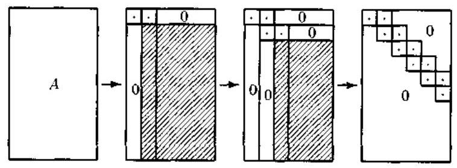

图 6.2.1 利用 Householder 变换进行二重对角化

在实际计算时，将矩阵 $G$ 分块成尽可能小的二重对角矩阵可以加快追赶过程的收敛. 因此,在利用 Givens 旋转进行追赶前,首先应分析全部的 ${q}_{i}$ 和 ${e}_{i}$ ,检查一下是否有等于零的元素. 例如,如果 ${e}_{i} = 0$ ,则可以将 $G$ 分块成两个独立的二重对角矩阵:

$$
G = \left\lbrack  \begin{matrix} {G}_{1} & 0 \\  0 & {G}_{2} \end{matrix}\right\rbrack
$$

这样,就可以对 ${G}_{1}$ 和 ${G}_{2}$ 分别进行独立的对角化.

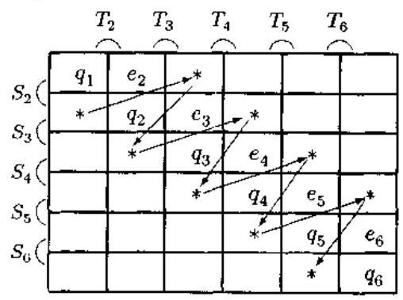

图 6.2.2 追赶法消零的顺序

上面介绍的奇异值分解的数值计算方法只是为了让读者能够更好地理解奇异值分解的原理, 实际中并没有必要编写奇异值分解的程序, 因为它不难在一些程序库中找到.

### 6.3 乘积奇异值分解

所谓乘积奇异值分解 (PSVD: Product SVD),顾名思义就是两个矩阵 ${B}^{H}$ 和 $C$ 的乘积 ${B}^{H}C$ 的奇异值分解. 从原理上讲,乘积奇异值分解等价于直接对矩阵的乘积进行普通的奇异值分解. 然而, 事先直接计算矩阵的乘积往往会使后面的奇异值分解的数值精确度下降. 为了说明这一点,我们引用一个典型的例子 ${}^{\left\lbrack  {15}\right\rbrack  }$ . 令

$$
A = \left\lbrack  \begin{array}{ll} 1 & 1 \\  \delta & 0 \\  0 & \delta  \end{array}\right\rbrack \tag{6.3.1}
$$

式中, ${\delta }^{2} < \epsilon  \ll  \delta$ ,而 $\epsilon$ 是计算机的浮点机器精度. 计算得到的浮点结果为

$$
{fl}\left( {{A}^{T}A}\right)  = \left\lbrack  \begin{array}{ll} 1 & 1 \\  1 & 1 \end{array}\right\rbrack \tag{6.3.2}
$$

式 (6.3.2) 的矩阵具有特征值 0 和 2,而 ${A}^{T}A$ 的真实特征值是 ${\delta }^{2}$ 和 $2 + {\delta }^{2}$ . 用数值稳定的算法 [15],由式 (6.3.1) 计算得到的矩阵 $A$ 的奇异值可以期望给出至少与 $\delta  + O\left( \epsilon \right)$ 和 ${\left( 2 + {\delta }^{2}\right) }^{1/2} + O\left( \epsilon \right)$ 一样好的精度,这种结果要比取式 (6.3.2) 的特征值的平方根得到的奇异伯满意得多. 推而广之,直接对两个矩阵的乘积 ${B}^{H}C$ 进行奇异值分解在数值上是不可取的. 因此, 有必要考虑一个更加困难的问题: 能否使得计算乘积

$$
A = {B}^{H}C
$$

的奇异值分解尽可能与给定的 $B$ 和 $C$ 具有接近的精度? 这就是所谓的 (矩阵) 乘积奇异值分解问题.

乘积奇异值分解是由 Fernando 与 Hammarling 于 1987 年首先提出来的 ${}^{\left\lbrack  {20}\right\rbrack  }$ ，它可以用下面的定理来表述.

定理 6.3.1 (乘积奇异值分解) 得 ${}^{\left\lbrack  {20}\right\rbrack  }$ 令 ${B}^{H} \in  {C}^{m \times  p}$ 和 $C \in  {C}^{p \times  n}$ ,则存在酉矩阵 $U \in  {C}^{m \times  m}, V \in  {C}^{n \times  n}$ 和非奇异矩阵 $Q \in  {C}^{p \times  p}$ 使得

$$
U{B}^{H}Q = \left\lbrack  \begin{array}{lll} I & & \\   & {0}_{B} & \\   & & {\sum }_{B} \end{array}\right\rbrack \tag{6.3.3}
$$

$$
{Q}^{-1}C{V}^{H} = \left\lbrack  \begin{array}{lll} {0}_{C} & & \\   & I & \\   & & {\sum }_{C} \end{array}\right\rbrack \tag{6.3.4}
$$

式中

$$
{\sum }_{B} = \operatorname{diag}\left( {{s}_{1},\cdots ,{s}_{r}}\right) ,\;{\sum }_{C} = \operatorname{diag}\left( {{t}_{1},\cdots ,{t}_{r}}\right)
$$

$$
1 > {s}_{1} \geq  \cdots  \geq  {s}_{r} > 0,\;1 > {t}_{1} \geq  \cdots  \geq  {t}_{r} > 0
$$

$$
{s}_{i}^{2} + {t}_{i}^{-2} = 1,\;i = 1,\cdots , r
$$

有关本定理的证明, 可参见文献 [20], 但我们将在 6.5 节介绍约束奇异值分解时给出一种更简单的证明方法. 根据定理 6.3.1, 我们不难验证:

$$
U{B}^{H}C{V}^{H} = \operatorname{diag}\left( {{0}_{C},{0}_{B},{\sum }_{B}{\sum }_{C}}\right)
$$

因此，矩阵乘积 ${B}^{H}C$ 的奇异值出零奇异值和非零奇异值两部分组成，其非零奇异值由 ${s}_{i}{t}_{i}\left( {i = 1,\cdots , r}\right)$ 给出.

定理 6.3.1 给出了乘积奇异值分解的严格形式. 值得指出的是, 在文献 [20] 给出这种严格定义之前,已由 Heath 等人 ${}^{\left\lbrack  {13}\right\rbrack  }$ 于 1986 年提出了矩阵乘积奇异值分解的一种松散形式, 而且 Heath 等人的方法直接给出了一种计算乘积奇异值的实际算法.

在阐述 Heath 等人的方法之前，更一般地，我们来考虑下列问题.

问题: 给定一个 $p \times  m$ 实矩阵 $B$ 和一个 $p \times  n$ 实矩阵 $C$ ,求 $m \times  m$ 正交矩阵 $U$ 和 $n \times  n$ 正交矩阵 $V$ ,使得

$$
\widetilde{B} = {BU}\;\text{ 和 }\;\widetilde{C} = {CV} \tag{6.3.5}
$$

的列向量构成双正交集. 这个问题的理论解决是简单的: 由奇异值分解

$$
A = {B}^{T}C = {U\sum }{V}^{T} \tag{6.3.6}
$$

可知

$$
{\widetilde{B}}^{T}\widetilde{C} = {U}^{T}{B}^{T}{CV} = {U}^{T}{AV} = \sum
$$

于是, 问题被解决. 这表明, 这一问题实质上与两个矩阵乘积的奇异值分解是等价的. 这种等价性就是 Heath 等人计算两个矩阵乘积的奇异值分解的基本思想. 下面讨论如何才能够构造计算两个矩阵乘积的奇异值分解的实际算法,使得它具有与给定的 $B$ 和 $C$ 接近的精度.

#### 6.3.1 三角矩阵的奇异值分解

Kogbetliantz 算法 ${}^{\left\lbrack  {12}\right\rbrack  }$ 是计算任意正方矩阵奇异值分解的一种最常用的有效方法. 这种算法的基本思想是将 $n \times  n$ 矩阵的奇异值分解问题转化为一系列 $2 \times  2$ 矩阵的奇异值分解,也就是用一个迭代的循环序列计算 $n \times  n$ 正方矩阵的奇异值分解. 以 $n = 4$ 为例, 在序列循环法的每一步,计算以对角线为中心的 $2 \times  2$ 矩阵的奇异值分解以消去对角线以外的矩阵元素，循环的顺序如下:

$$
\left\lbrack  \begin{array}{llll} 0 & 1 & 2 & 3 \\  1 & 0 & 4 & 5 \\  2 & 4 & 0 & 6 \\  3 & 5 & 6 & 0 \end{array}\right\rbrack \tag{6.3.7}
$$

我们称之为行排序, 当然也有列排序. 式中, 标 1 的元素第一个被消去, 标 2 的元素第二个被消去, 如此等等. 需要注意的是, 在消去标 2 的元素时, 原先已消去的标 1 元素可能会重新出现; 更一般地,在消去标 $k\left( { \geq  2}\right)$ 的元素时,原消去的标 $\left( {k - 1}\right)$ 元素有可能重新出现. 当然, 对角线上的元素 (标 0 ) 不被消去. 上述算法可以保证收敛为对角矩阵形式，实际中发现，算法至少是二次收敛的.

然而,计算矩阵 $A$ 的奇异值分解时,如果先通过正交变换把它变成三角矩阵形式,那么奇异值分解的数值有效性通常将增加 ${}^{\left\lbrack  {16}\right\rbrack  }$ . 下面讨论三角矩阵的奇异值分解.

对于一个三角矩阵, Kogbetliantz 算法将上三角矩阵变换为下三角矩阵, 或将下三角矩阵变换成上三角矩阵. 因此,随着迭代的进行,矩阵 ${\mathbf{A}}_{k}$ 在上三角和下三角形式之间来问变换. 而且,在每一循环中,只有一个矩阵元素被 $2 \times  2$ 奇异值分解消去. 以 $4 \times  4$ 上三角矩阵为例, 循环顺序如下所示:

$$
\begin{matrix}  \otimes  &  \times  &  \times  &  \times  \\   \times  &  \times  &  \times  & \\   &  \times  &  \times  & \\   & &  \times  &  \end{matrix} \rightarrow  \begin{matrix}  \times  &  \times  &  \times  &  \times  \\   \times  &  \times  &  \times  &  \times  \\   \times  &  \times  &  \times  &  \times  \\   \times  & & &  \times   \end{matrix} \rightarrow  \begin{matrix}  \times  &  \times  & & \\   + &  \times  &  \times  &  \times  \\   + &  \times  &  \times  &  \times  \\   \times  & & &  \times   \end{matrix}
$$

$$
\rightarrow  \begin{matrix}  \times  & & & &  \times  & & &  \times  & & & &  \times  & & & & \\   + &  \times  & &  \otimes  & &  + &  \times  & & & &  \times  & & & & & \\   + & &  \times  &  \times  & &  + &  + &  \times  &  \otimes  & &  + &  + &  + &  \times  & & \\   & & &  \times  & &  + &  + &  \times  &  \times  & &  + &  + &  \times  &  \times  & &  \end{matrix}
$$

图 6.3.1 利用...次封零将上三角矩阵变换为下三角矩阵

图中,原来的非零元素用 $\times$ 标注,新产生的非零元素用 + 表示,而标有 $\otimes$ 的元素则是下一步需要消去的. 这样, 经过一次扫零, 就得到了下三角形式. 下一次扫零使用完全相同的顺序, 并再一次产生上三角矩阵.

用数学归纳法可以证明,对一般的 $n$ 阶三角矩阵,也会发生相同的变换.

#### 6.3.2 矩阵乘积的奇异值分解

现在，我们来分析如何应用 Kogbetliantz 算法计算两个矩阵乘积 $A = {B}^{T}C$ 的奇异值分解. 如果在第 $k$ 步对矩阵 ${A}_{k}$ 应用 Kogbetliantz 算法,使矩阵的第 $\left( {i, j}\right)$ 和 $\left( {j, i}\right)$ 个元素变换为零, 则

$$
\left\lbrack  \begin{matrix} {c}_{1} &  - {s}_{1} \\   & \\  {s}_{1} & {c}_{1} \end{matrix}\right\rbrack  \left\lbrack  \begin{matrix} {\alpha }_{ii}^{\left( k\right) } & {\alpha }_{ij}^{\left( k\right) } \\   & \\  {\alpha }_{ji}^{\left( k\right) } & {\alpha }_{jj}^{\left( k\right) } \end{matrix}\right\rbrack  \left\lbrack  \begin{matrix} {c}_{2} &  - {s}_{2} \\   & \\  {s}_{2} & {c}_{2} \end{matrix}\right\rbrack   = \left\lbrack  \begin{matrix} {\alpha }_{ii}^{\left( k + 1\right) } & 0 \\   & \\  0 & {\alpha }_{jj}^{\left( k\right) } \end{matrix}\right\rbrack \tag{6.3.8a}
$$

或

$$
J\left( {i, j,{\theta }_{1}}\right) {A}_{k}J\left( {i, j,{\theta }_{2}}\right)  = {A}_{k + 1} \tag{6.3.8b}
$$

假定矩阵 $B$ 和 $C$ 未作任何初始的变换,在第 $k$ 步我们有 ${B}_{k}$ 和 ${C}_{k}$ ,并且式 (6.3.8) 中需要的矩阵 $A$ 的四个元素用

$$
{\alpha }_{ij}^{\left( k\right) } = {b}_{i}^{\left( k\right) }{c}_{j}^{\left( k\right) } \tag{6.3.9}
$$

计算. 式 (6.3.8b) 中的两个旋转分别加给 ${B}_{k}$ 和 ${C}_{k}$ ,得到

$$
{B}_{k + 1} = {B}_{k}J\left( {i, j,{\theta }_{1}}\right)
$$

和

$$
{C}_{k + 1} = {C}_{k}J\left( {i, j,{\theta }_{2}}\right)
$$

这样一种方法是 Heath 等人提出的 ${}^{\left\lbrack  {13}\right\rbrack  }$ . 通过观察这一方法,可以得出以下结果:

1) 由于这种算法理论上等价于对矩阵 ${A}_{k}$ 应用 Kogbertlianta 算法,所以理论上在每一步矩阵 $A$ 的非对角线元素都是减小的,并且最终将收敛为零值.

2) 在每一步，只涉及 ${B}_{k}$ 的两列和 ${C}_{k}$ 的两列 (被读取或被修正).

3) 在每一步,只计算 ${A}_{k}$ 的四个元素. 由于这四个元素的两个总是位于对角线上,它们可以从前一步知道,所以如果我们利用对 ${\alpha }_{ii}^{\left( k + 1\right) }$ 和 ${\alpha }_{jj}^{\left( k + 1\right) }$ 的了解,那么在设计 $\left( {1,2}\right)$ 元素化简时需要计算 4 次向量内积,但是对每一个 $\left( {1,3}\right) ,\cdots ,\left( {1, n}\right)$ 化简却只需要计算 3 次向量内积, 而对剩下的化简只计算 2 次向量内积.

4) 上述方法看起来有一个不太满意的地方,那就是在每一步实际上还是要计算 ${B}_{k}^{T}{C}_{k}$ , 而原来的出发点是要完全避免计算 ${B}^{T}C$ . 然而,这一缺陷并不严重,因为在设计旋转时只利用式 (6.3.9) 计算几个乘积,然后就将旋转分别加给 ${B}_{k}$ 和 ${C}_{k}$ . 因此,在计算这些 ${\alpha }_{ij}^{\left( k\right) }$ 时所造成的信息损失对收敛可能会有小的影响，但不会对计算结果有大的影响.

5) 当 $B = C$ 时,上述方法实质上就变成了计算 $A = {B}^{T}B$ 奇异值分解的算法 (只需要单边的 Jacobi 方法). 这样一种 “单边” 方法是 Hestenes 于 1958 年提出的 ${}^{\lbrack {17}\rbrack }$ . 因此, Heath 等人采用双边 Kogbetliantz 算法的 “双边” 奇异值分解方法可以看作是 Hestenes 单边奇异值分解方法的拓广.

#### 6.3.3 乘积奇异值分解算法的实现

如前所述，先将一个矩阵转换成三角矩阵，然后再进行奇异值分解，能够提高奇异值分解的数值性能. 下面讨论如何将 ${B}^{T}C$ 变换为三角矩阵形式. 假定 $B$ 是 $p \times  m$ 矩阵, $C$ 是 $p \times  n$ 矩阵,且 $m \geq  n$ . 分两种情况讨论.

情况 $1\left( {p \geq  n}\right)$ 选择 $p$ 阶正交矩阵 $Q$ 使得

$$
{Q}^{T}C = \left\lbrack  \begin{matrix} {C}_{1} \\  0 \end{matrix}\right\rbrack
$$

其中 ${C}_{1}$ 为 $n \times  n$ 上三角矩阵. 如果我们将 ${Q}^{T}B$ 分块为

$$
{Q}^{T}B = \left\lbrack  \begin{array}{l} \widehat{B} \\  \bar{B} \end{array}\right\rbrack
$$

则

$$
{B}^{T}Q{Q}^{T}C = \left\lbrack  \begin{array}{ll} {\widehat{B}}^{T} & {\bar{B}}^{T} \end{array}\right\rbrack  \left\lbrack  \begin{matrix} {C}_{1} \\  0 \end{matrix}\right\rbrack   = {\widehat{B}}^{T}{C}_{1}
$$

情况 $2\left( {n > p}\right)$ 选择 $n$ 阶正交矩阵 $Q$ 满足:

$$
{CQ} = \left\lbrack  \begin{array}{ll} {C}_{1} & 0 \end{array}\right\rbrack
$$

其中 ${C}_{1}$ 为 $p \times  p$ 上三角矩阵. 于是

$$
{B}^{T}{CQ} = \left\lbrack  \begin{array}{ll} {\widehat{B}}^{T}{C}_{1} & 0 \end{array}\right\rbrack
$$

在这种情况下,只需要取 $\widehat{B} = B$ 即可.

无论在哪一种情况,我们都只需要计算 ${\widehat{B}}^{T}{C}_{1}$ 的奇异值分解,因此可选择 $m$ 阶正交矩阵 $P$ 满足:

$$
{P}^{T}{\widehat{B}}^{T} = \left\lbrack  \begin{matrix} {B}_{1}^{T} \\  0 \end{matrix}\right\rbrack
$$

式中 ${B}_{1}^{T}$ 为 $n \times  n$ (情况 1) 或 $p \times  p$ (情况 2) 上三角矩阵. 这样一来,两种情况都归结为计算上三角矩阵

$$
{A}_{1} = {B}_{1}^{T}{C}_{1} \tag{6.3.10}
$$

的奇异值分解问题,其中 ${B}_{1}^{T}$ 和 ${C}_{1}$ 均为上三角矩阵. 所有三个矩阵要么都是 $n \times  n$ 矩阵,要么都是 $p \times  p$ 矩阵,取决于 $n$ 和 $p$ 谁小. 为了叙述的方便,下面假定 (6.3.8) 式中的 ${\mathcal{B}}_{1}^{T}$ 和 ${C}_{1}$ 都是 $n \times  n$ 矩阵.

现在讨论如何对 ${A}_{1} = {B}_{1}^{T}{C}_{1}$ 应用三角型 Kogbertliantz 算法使矩阵 ${A}_{1}$ 对角化. 首先使用 Kogbertliantz 算法使 ${A}_{1} = {B}_{1}^{T}{C}_{1} = \left\{  {J{\left( i, j,{\theta }_{1}\right) }^{T}{B}^{T}}\right\}  \left\{  {{CJ}\left( {i, j,{\theta }_{2}}\right) }\right\}$ 对角化. 不过, 遗憾的是,三角型算法依赖的三角性质对于三角因子 ${B}_{1}^{T}$ 和 ${C}_{1}$ 不一定成立. 因此,在每一步,我们要使用另外的旋转将两个因子恢复为三角形式. 假定在第 $k$ 步, $\left( {i, j}\right)$ 化简已经利用旋转 $J\left( {i, j,{\theta }_{1}}\right)$ 和 $J\left( {i, j,{\theta }_{2}}\right)$ 消去 ${\alpha }_{ij}^{\left( k\right) }$ 和 ${\alpha }_{ji}^{\left( k\right) }$ ,那么我们就需要选择第三个旋转 $J\left( {i, j,{\theta }_{3}}\right)$ 消去 $J{\left( i, j,{\theta }_{1}\right) }^{T}{B}_{k}^{T}$ 和 ${C}_{k}J\left( {i, j,{\theta }_{2}}\right)$ 两个矩阵的第 $\left( {i, j}\right)$ 个元素. 最后的纯结果是

$$
{A}_{k + 1} = \left\{  {J{\left( i, j,{\theta }_{1}\right) }^{T}{B}_{k}^{T}J{\left( i, j,{\theta }_{3}\right) }^{T}}\right\}  \left\{  {J\left( {i, j,{\theta }_{3}}\right) {C}_{k}J\left( {i, j,{\theta }_{2}}\right) }\right\}   = {B}_{k + 1}^{T}{C}_{k + 1} \tag{6.3.11}
$$

其中 ${B}_{k + 1}$ 和 ${C}_{k + 1}$ 像 ${A}_{k + 1}$ 一样,在整个扫零过程中都要求能够保持三角形状.

为了看清楚在应用 $J\left( {i, j,{\theta }_{1}}\right)$ 和 $J\left( {i, j,{\theta }_{2}}\right)$ 之后,单个旋转 $J\left( {i, j,{\theta }_{3}}\right)$ 就能够消去 ${B}_{1}$ 和 ${C}_{1}$ 二者的元素,我们来考虑图 6.3.2 的第一步. 虽然 $\left( {1,2}\right)$ 化简能消去 ${A}_{1}$ 的 $\left( {1,2}\right)$ 元素,但是 ${B}_{1}^{T}$ 和 ${C}_{1}$ 的 $\left( {1,2}\right)$ 元素一般会保持非零值,并且它们的 $\left( {2,1}\right)$ 元素也会变成非零值. 如果我们现在根据 ${C}_{1}$ 设计旋转 $J\left( {i, j,{\theta }_{3}}\right)$ 使 ${C}_{2}$ 的 $\left( {1,2}\right)$ 元素 ${\gamma }_{12}^{\left( 2\right) }$ 不为零, ${C}_{2}$ 的 $\left( {2,1}\right)$ 元素 ${\gamma }_{21}^{\left( 2\right) }$ 为零,因为

$$
\left\lbrack  \begin{matrix} {\alpha }_{11}^{\left( 2\right) } & 0 \\   & \\  0 & {\alpha }_{22}^{\left( 2\right) } \end{matrix}\right\rbrack   = \left\lbrack  \begin{matrix} {\beta }_{11}^{\left( 2\right) } & {\beta }_{21}^{\left( 2\right) } \\   & \\  {\beta }_{12}^{\left( 2\right) } & {\beta }_{22}^{\left( 2\right) } \end{matrix}\right\rbrack  \left\lbrack  \begin{matrix} {\gamma }_{11}^{\left( 2\right) } & {\gamma }_{12}^{\left( 2\right) } \\   & \\  0 & {\gamma }_{22}^{\left( 2\right) } \end{matrix}\right\rbrack
$$

所以 ${B}_{2}^{T}$ 的 $\left( {1,2}\right)$ 元素必然为零. 如果旋转是针对 ${B}_{1}$ 进行的,并设计成使 ${B}_{2}^{T}$ 的 $\left( {1,2}\right)$ 元素为零,并且 ${B}_{2}^{T}$ 的 $\left( {1,1}\right)$ 元素不为零,则 ${C}_{2}$ 的 $\left( {1,2}\right)$ 元素必然为零. 于是,我们可以通过比较可能得到的 ${\beta }_{11}$ 和 ${\gamma }_{22}$ 的大小选择针对 ${B}^{T}$ 还是 $C$ 设计旋转.

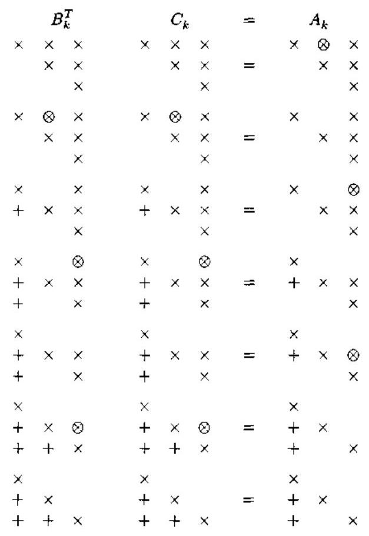

图 6.3.2 从上三角到下三角形式的变换

综上所述, 若

$$
{\left| {\beta }_{11}^{\left( 1\right) }\right| }^{2} + {\left| {\beta }_{21}^{\left( 1\right) }\right| }^{2} \geq  {\left| {\gamma }_{12}^{\left( 1\right) }\right| }^{2} + {\left| {\gamma }_{22}^{\left( 1\right) }\right| }^{2}
$$

我们可以针对 ${B}_{1}$ 设计旋转; 否则,就针对 ${C}_{1}$ 设计旋转. 这样,就可以保证 $J\left( {i, j,{\theta }_{3}}\right)$ 消去 $J{\left( i, j,{\theta }_{1}\right) }^{T}{B}_{k}^{T}$ 和 ${C}_{k}J\left( {i, j,{\theta }_{2}}\right)$ 二者的 $\left( {i, j}\right)$ 元素. 对更高维数的矩阵,可以利用数学归纳法证明.

由于 ${A}_{k},{B}_{k}$ 和 ${C}_{k}$ 的形式,所以对每一个 $\left( {i, j}\right)$ 化简,有

$$
\left\lbrack  \begin{matrix} {\alpha }_{ii}^{\left( k\right) } & {\alpha }_{ij}^{\left( k\right) } \\   & \\  0 & {\alpha }_{jj}^{\left( k\right) } \end{matrix}\right\rbrack   = \left\lbrack  \begin{matrix} {\beta }_{ii}^{\left( k\right) } & {\beta }_{ij}^{\left( k\right) } \\   & \\  0 & {\beta }_{jj}^{\left( k\right) } \end{matrix}\right\rbrack  \left\lbrack  \begin{matrix} {\gamma }_{ii}^{\left( k\right) } & {\gamma }_{ij}^{\left( k\right) } \\   & \\  0 & {\gamma }_{jj}^{\left( k\right) } \end{matrix}\right\rbrack \tag{6.3.12}
$$

这比计算三次 $p \times  1$ 向量的内积优越. 容易看出,在第 $k$ 步, $2 \times  2$ 子矩阵 ${A}_{ij}^{\left( k\right) } = {\left( {B}_{ij}^{\left( k\right) }\right) }^{T}{C}_{ij}^{\left( k\right) }$ 的元素恰好是矩阵 $A = {B}^{T}C$ 在第 $i, j$ 行和列上的元素. 另外一个重要的事实是,三个旋转 $J\left( {i, j,{\theta }_{1}}\right) , J\left( {i, j,{\theta }_{2}}\right)$ 和 $J\left( {i, j,{\theta }_{3}}\right)$ 都可以根据式 (6.3.10) 右边的 6 个元素设计. 它们一起将式 (6.3.12) 变换成

$$
\left\lbrack  \begin{matrix} {\alpha }_{ii}^{\left( k + 1\right) } & 0 \\   \cdot  & {\alpha }_{jj}^{\left( k + 1\right) } \end{matrix}\right\rbrack   = \left\lbrack  \begin{matrix} {\beta }_{ii}^{\left( k + 1\right) } & {\beta }_{ij}^{\left( k + 1\right) } \\  0 & {\beta }_{jj}^{\left( k + 1\right) } \end{matrix}\right\rbrack  \left\lbrack  \begin{matrix} {\gamma }_{ii}^{\left( k + 1\right) } & {\gamma }_{ij}^{\left( k + 1\right) } \\  0 & {\gamma }_{jj}^{\left( k + 1\right) } \end{matrix}\right\rbrack
$$

这样一来，三角型 Kogbertliantz 算法就可以应用于三角矩阵的乘积，而且两个矩阵因子的三角形式也可以保持. 注意,矩阵 ${B}_{k}^{T}$ 和 ${C}_{k}$ 一般并不收敛为对角矩阵,即使它们的积收敛为对角矩阵.

### 6.4 广义奇异值分解

6.2 节介绍了矩阵 $A$ 的奇异值分解. 矩阵的奇异值分解已有多种推广形式,6.3 节的矩阵乘积的奇异值分解只是其中之一. 从这节起, 我们将讨论其它形式的奇异值分解, 它们是矩阵束 $\left( {A, B}\right)$ 的奇异值分解 (广义奇异值分解),矩阵三元组 $\left( {A, B, C}\right)$ 的奇异值分解 (约束奇异值分解), 结构奇异值分解和 Takagi 奇异值分解. 由于奇异值分解有多种推广,所以有些文献把矩阵 $A$ 的奇异值分解称为普通奇异值分解 (OSVD: Ordinary SVD). 本节先讨论广义奇异值分解 (GSCD: Generalized SVD), 其它几种推广的奇异值分解则留待 6.5 节再介绍.

#### 6.4.1 对称正定问题

在广义特征值问题 ${Ax} = {\lambda Bx}$ (第一章 1.4节)中,大多数的情况是: $A$ 是对称的方矩阵, 且 $B$ 是对称和正定的方矩阵. 这种类型的矩阵束 $\left( {A, B}\right)$ 称作对称 - 正定矩阵束. 我们把满足广义特征值 - 特征向量方程

$$
{Ax} = {\lambda Bx}
$$

的标量 $\lambda$ 和非零向量 $x$ 分别称为矩阵束 $\left( {A, B}\right)$ 的广义特征值和广义特征向量.

求解广义特征值问题 ${Ax} = {\lambda Bx}$ 的方法之一是下面的全等变换:

$A - {\lambda B}$

$$
\left( {{X}^{T}{AX}}\right)  - \lambda \left( {{X}^{T}{BX}}\right)
$$

对称 - 正定对称 - 正定

并且希望寻求一种稳定的有效算法,它计算的 $X$ 能使得 ${X}^{T}{AX}$ 和 ${X}^{T}{BX}$ 二者都是 “标准型”的. 最明显的标准型就是对角矩阵.

定理 6.4.1 假定 $A$ 和 $B$ 为 $n \times  n$ 对称矩阵,并定义

$$
C\left( \mu \right)  = {\mu A} + \left( {1 - \mu }\right) B,\;\mu  \in  R \tag{6.4.1}
$$

若存在 $\mu  \in  \left\lbrack  {0,1}\right\rbrack$ 使得 $C\left( \mu \right)$ 是非负定的,并且

$$
\operatorname{null}\left( {C\left( \mu \right) }\right)  = \operatorname{null}\left( A\right)  \cap  \operatorname{null}\left( B\right) \tag{6.4.2}
$$

则存在一个非奇异矩阵 $Q$ 使得 ${Q}^{T}{AQ}$ 和 ${Q}^{T}{BQ}$ 二者都是对角形式的.

证明 选择 $\mu  \in  \left\lbrack  {0,1}\right\rbrack$ 使 $C\left( \mu \right)$ 非负定,并具有性质 (6.4.2) 式. 设

$$
{Q}_{1}C\left( \mu \right) {Q}_{1} = \left\lbrack  \begin{array}{ll} D & 0 \\  0 & 0 \end{array}\right\rbrack  ,\;D = \operatorname{diag}\left( {{d}_{1},\cdots ,{d}_{k}}\right) ,\;{d}_{i} > 0
$$

是 $C\left( \mu \right)$ 的 Schur 分解,并定义 ${Q}_{1} = {Q}_{2}\operatorname{diag}\left( {{D}^{-1/2},{I}_{n - k}}\right)$ . 如果 ${A}_{1} = {Q}_{1}^{T}A{Q}_{1},{B}_{1} = \; {Q}_{1}^{T}B{Q}_{1}$ 和 ${C}_{1} = {Q}_{1}^{T}C\left( \mu \right) {Q}_{1}$ ,则

$$
{C}_{1} = \left\lbrack  \begin{matrix} {I}_{k} & 0 \\  0 & 0 \end{matrix}\right\rbrack   = \mu {A}_{1} + \left( {1 - \mu }\right) {B}_{1}
$$

由于 $\operatorname{span}\left\{  {{e}_{k + 1},\cdots ,{e}_{n}}\right\}   = \operatorname{null}\left( {C}_{1}\right)  = \operatorname{null}\left( {A}_{1}\right)  \cap  \operatorname{null}\left( {B}_{1}\right)$ ,故知 ${A}_{1}$ 和 ${B}_{1}$ 具有以下结构:

$$
{A}_{1} = \left\lbrack  \begin{matrix} {A}_{11} & 0 \\  0 & 0 \end{matrix}\right\rbrack  ,\;{B}_{1} = \left\lbrack  \begin{matrix} {B}_{11} & 0 \\  0 & 0 \end{matrix}\right\rbrack
$$

其中 ${A}_{11}$ 和 ${B}_{11}$ 均是 $k \times  k$ 方阵,且 ${I}_{k} = \mu {A}_{11} + \left( {1 - \mu }\right) {B}_{11}$ .

假定 $\mu  \neq  0$ . 于是,若 ${Z}^{T}{B}_{11}Z = \operatorname{diag}\left( {{b}_{1},\cdots ,{b}_{k}}\right)$ 是 ${B}_{11}$ 的 Schur 分解,则可通过令 $Q = {Q}_{1}\operatorname{diag}\left( {Z,{I}_{n - k}}\right)$ ,得到

$$
{Q}^{T}{BQ} = \operatorname{diag}\left( {{b}_{1},\cdots ,{b}_{k},0,\cdots ,0}\right)  \equiv  {D}_{B}
$$

和

$$
{Q}^{T}{AQ} = \frac{1}{\mu }{Q}^{T}\left\lbrack  {C\left( \mu \right)  - \left( {1 - \mu }\right) B}\right\rbrack  Q
$$

$$
= \frac{1}{\mu }\left( {\left\lbrack  \begin{matrix} {I}_{k} & 0 \\  0 & 0 \end{matrix}\right\rbrack   - \left( {1 - \mu }\right) {D}_{B}}\right)  \equiv  {D}_{A}
$$

另外一方面,若 $\mu  = 0$ ,则令 ${Z}^{T}{A}_{11}Z = \operatorname{diag}\left( {{a}_{1},\cdots ,{a}_{k}}\right)$ 是 ${A}_{11}$ 的 Schur 分解,并令 $Q = {Q}_{1}\operatorname{diag}\left( {A,{I}_{n - k}}\right)$ . 容易验证,在这种情况下,矩阵 ${Q}^{T}{AQ}$ 和 ${Q}^{T}{BQ}$ 二者也都是对角的.

对于对称 - 正定的矩阵束, 上述定理给出下面的结果.

推论 6.4.1 若 $A - {\lambda B}$ 是对称 - 正定的,则存在一个非奇异矩阵 $Q = \left\lbrack  \begin{array}{lll} {q}_{1} & \cdots & {q}_{n} \end{array}\right\rbrack$ 使得

$$
{Q}^{T}{AQ} = \operatorname{diag}\left( {{\alpha }_{1},\cdots ,{\alpha }_{n}}\right) \;\text{ 和 }\;{Q}^{T}{BQ} = \operatorname{diag}\left( {{\beta }_{1},\cdots ,{\beta }_{n}}\right)
$$

且 $A{q}_{i} = {\lambda }_{i}B{q}_{i}, i = 1,\cdots , n$ ,其中 ${\lambda }_{i} = {\alpha }_{i}/{\alpha }_{i}$ 为广义特征值.

证明 在定理 6.4.1 中令 $\mu  = 0$ 后立即知,对称 - 正定矩阵束可以同时对角化. 推论的其它部分很容易建立.

#### 6.4.2 广义奇异值分解

上一小节的对称 - 正定问题实际上又可写作 ${A}^{T}A - \lambda {B}^{T}B$ 的形式,其中 $A \in  {R}^{m \times  n}$ 和 $B \in  {R}^{p \times  n}$ . 注意,由定理 5.4.1 知,存在一个非奇异矩阵 $Q \in  {R}^{n \times  n}$ 使得 ${Q}^{T}\left( {{A}^{T}A}\right) Q$ 和 ${Q}^{T}\left( {{B}^{T}B}\right) Q$ 二者都是对角的. 因此,无需事先计算 ${A}^{T}A$ 和 ${B}^{T}B$ ,就有可能直接由 $A$ 和 $B$ 求出广义特征值 $\lambda$ . 这就是所谓的广义奇异值分解 (GSVD) 方法,它是 Van Loan 于 1976 年最早提出来 ${}^{\left\lbrack  c\right\rbrack  }$ ,后来由 Paige 与 Saunders 加以推广的 ${}^{\left\lbrack  8\right\rbrack  }$ .

定理 6.4.2 (广义奇异值分解) ${}^{\left\lbrack  {6.8}\right\rbrack  }$ 若 $A \in  {C}^{m \times  n}, m \geq  n$ 和 $B \in  {C}^{p \times  n}$ ,则存在酉矩阵 $U \in  {C}^{m \times  m}$ 和 $V \in  {C}^{p \times  p}$ 以及非奇异矩阵 $Q \in  {C}^{n \times  n}$ ,使得

$$
{UAQ} = \left\lbrack  \begin{matrix} k & n - k \\  {\sum }_{A} & 0 \end{matrix}\right\rbrack  ,\;{\sum }_{A} = \left\lbrack  \begin{array}{lll} {I}_{r} & & \\   & {S}_{A} & \\   & & {0}_{A} \end{array}\right\rbrack \tag{6.4.3a}
$$

$$
{VBQ} = \left\lbrack  \begin{matrix} k & n - k \\  {\sum }_{B} & 0 \end{matrix}\right\rbrack  ,\;{\sum }_{B} = \left\lbrack  \begin{array}{lll} {0}_{B} & & \\   & {S}_{B} & \\   & & {I}_{k - r - s} \end{array}\right\rbrack \tag{6.4.3b}
$$

式中

$$
{S}_{A} = \operatorname{diag}\left( {{\alpha }_{r + 1},\cdots ,{\alpha }_{r + s}}\right) ,\;{S}_{B} = \operatorname{diag}\left( {{\beta }_{r + 1},\cdots ,{\beta }_{r + s}}\right)
$$

和

$$
\left. \begin{array}{r} 1 > {\alpha }_{r + 1} \geq  \cdots  \geq  {\alpha }_{r + s} > 0 \\  0 < {\beta }_{r + 1} \leq  \cdots  \leq  {\beta }_{r + s} < 1 \\  {\alpha }_{i}^{2} + {\beta }_{i}^{2} = 1,\;i = r + 1,\cdots , r + s \end{array}\right\} \tag{6.4.4}
$$

整数 $k, r$ 和 $s$ 分别为

$$
k = \operatorname{rank}\left\lbrack  \begin{array}{l} A \\  B \end{array}\right\rbrack  ,\;r = \operatorname{rank}\left\lbrack  \begin{array}{l} A \\  B \end{array}\right\rbrack   - \operatorname{rank}\left( B\right)
$$

和

$$
s = \operatorname{rank}\left( A\right)  + \operatorname{rank}\left( B\right)  - \operatorname{rank}\left\lbrack  \begin{array}{l} A \\  B \end{array}\right\rbrack
$$

证明 本定理有多种证明方法,例如参见 Van Loan ${}^{\left\lbrack  6\right\rbrack  }$ , Paige 与 Saunders ${}^{\left\lbrack  8\right\rbrack  }$ , Golub 与 Van Loan ${}^{\left\lbrack  9\right\rbrack  }$ 和 Zha ${}^{\left\lbrack  {18}\right\rbrack  }$ . 这里给出的是 Zha 的构造性证明,它由四步组成,每一步都是下列形式的变换:

$$
{A}^{\left( k + 1\right) } = {U}^{\left( k\right) }{A}^{\left( k\right) }{Q}^{\left( k\right) },\;{B}^{\left( k + 1\right) } = {V}^{\left( k\right) }{B}^{\left( k\right) }{Q}^{\left( k\right) }
$$

其中 ${U}^{\left( k\right) }$ 和 ${V}^{\left( k\right) }$ 为酉矩阵,且 ${Q}^{\left( k\right) }$ 非奇异. 在每一步,我们只要规定 ${U}^{\left( k\right) },{V}^{\left( k\right) },{Q}^{\left( k\right) }$ 以及变换后得到的矩阵 ${A}^{\left( k + 1\right) },{B}^{\left( k + 1\right) }$ . 令 ${A}^{\left( 1\right) } = A$ 和 ${B}^{\left( 1\right) } = B$ .

步骤 1: 令矩阵 $B$ 的奇异值分解为 ${U}_{1}B{V}_{1} = \operatorname{diag}\left( {0,{\sum }_{B}^{\left( 1\right) }}\right)$ ,其中 ${\sum }_{B}^{\left( 1\right) } = \operatorname{diag}\left( {{s}_{1},\cdots ,{s}_{t}}\right)$ , 并且 ${s}_{1} \geq  {s}_{2} \geq  \cdots  \geq  {s}_{t} > 0$ . 令

$$
{U}^{\left( 1\right) } = I,\;{V}^{\left( 1\right) } = {U}_{1},\;{Q}^{\left( 1\right) } = {V}_{1}\operatorname{diag}\left( {I,{\sum }_{B}^{-1}}\right)
$$

则

$$
{A}^{\left( 2\right) } = \left\lbrack  \begin{array}{ll} {A}_{1}^{\left( 2\right) } & {A}_{2}^{\left( 2\right) } \end{array}\right\rbrack  \text{ 和 }{B}^{\left( 2\right) } = \left\lbrack  \begin{array}{ll} 0 & 0 \\  0 & {I}_{t} \end{array}\right\rbrack
$$

步骤 2: 令矩阵 ${A}_{1}^{\left( 2\right) }$ 的奇异值分解为 ${U}_{2}{A}_{1}^{\left( 2\right) }{V}_{2} = \operatorname{diag}\left( {{\sum }_{A}^{\left( 2\right) },0}\right)$ ,其中 ${\sum }_{A}^{\left( 2\right) } = \operatorname{diag}\left( {{t}_{1}\text{ . }}\right. \; \left. {\cdots ,{t}_{r}}\right)$ ,且 ${t}_{1} \geq  {t}_{2} \geq  \cdots  \geq  {t}_{r} > 0$ . 设

$$
{U}^{\left( 2\right) } = {U}_{2},\;{V}^{\left( 2\right) } = I,\;{Q}^{\left( 2\right) } = \operatorname{diag}\left( {{V}_{2}, I}\right) \operatorname{diag}\left( {{\left( {\sum }_{A}^{\left( 2\right) }\right) }^{-1}, I}\right)
$$

则

$$
{A}^{\left( 3\right) } = \left\lbrack  \begin{matrix} r & n - r - t & t \\  {I}_{r} & 0 & {A}_{13}^{\left( 3\right) } \\  0 & 0 & {A}_{23}^{\left( 3\right) } \end{matrix}\right\rbrack  \begin{matrix} r \\  m - r \end{matrix}\text{ 和 }{B}^{\left( 3\right) } = {B}^{\left( 2\right) }
$$

步骤 3: 令矩阵 ${A}_{23}^{\left( 3\right) }$ 的奇异值分解为 ${U}_{3}{A}_{23}^{\left( 3\right) }{V}_{3} = \operatorname{diag}\left( {{\sum }_{A}^{\left( 3\right) },0}\right)$ ,其中 ${\sum }_{A}^{\left( 3\right) } = \operatorname{diag}\left( {w}_{1}\right.$ , $\left. {\cdots ,{w}_{ * }}\right)$ ,且 ${w}_{1} \geq  {w}_{2} \geq  \cdots  \geq  {w}_{s} > 0$ . 设 ${\alpha }_{i} = {w}_{i}{\left( 1 + {w}_{i}^{2}\right) }^{-1/2},{\beta }_{i} = {\left( 1 + {w}_{i}^{2}\right) }^{-1/2}, i = \; r + 1,\cdots , r + s$ ,且 ${S}_{A} = \operatorname{diag}\left( {{\alpha }_{r + 1},\cdots ,{\alpha }_{r + s}}\right) ,{S}_{B} = \operatorname{diag}\left( {{\beta }_{r + 1},\cdots ,{\beta }_{r + s}}\right)$ . 容易验证, ${\alpha }_{i}$ 和 ${\beta }_{i}\left( {i = r + 1,\cdots , r + s}\right)$ 满足式 (6.5.4). 令

$$
{U}^{\left( 3\right) } = \operatorname{diag}\left( {I,{U}_{3}}\right)
$$

$$
{V}^{\left( 3\right) } = \operatorname{diag}\left( {I,{V}_{3}^{H}}\right)
$$

$$
{Q}^{\left( 3\right) } = \left\lbrack  \begin{matrix} I &  - {A}_{13}^{\left( 3\right) } \\  0 & I \end{matrix}\right\rbrack  \operatorname{diag}\left( {I,{V}_{3}}\right) \operatorname{diag}\left( {I,{S}_{B}, I}\right)
$$

则

$$
{A}^{\left( 4\right) } = \left\lbrack  \begin{matrix} r & n - r - t & s & t - s \\  {I}_{r} & 0 & 0 & 0 \\  0 & 0 & {S}_{A} & 0 \\  0 & 0 & 0 & 0 \end{matrix}\right\rbrack  \begin{matrix} r \\  s \\  s \\  m - r - s \end{matrix}
$$

$$
{B}^{\left( 4\right) } = \left\lbrack  \begin{matrix} n - t & s & t - s \\  0 & 0 & 0 \\  0 & {S}_{B} & 0 \\  0 & 0 & {I}_{k - r - s} \end{matrix}\right\rbrack  \frac{n - k + r}{s}
$$

步骤 4: 经过适当的矩阵置换 ${P}_{1}$ 和 ${P}_{2}$ ,并令 $k = t + r$ 后,我们得到

$$
{A}^{\left( 5\right) } = {A}^{\left( 4\right) }{P}_{1} = \left\lbrack  \begin{array}{llll} {I}_{r} & & & \vdots \\   & {S}_{A} & & \vdots \\   & &  \ddots  & \\   & & & {0}_{r} \end{array}\right\rbrack
$$

$$
{B}^{\left( 5\right) } = {P}_{2}{B}^{\left( 4\right) }{P}_{1} = \left( \begin{matrix} {0}_{B} & & & \vdots \\   & {S}_{B} & & \vdots \\   & & {I}_{k - r - s} & \vdots  \end{matrix}\right)
$$

于是, 就得到了所需要的伪对角形式. 容易验证:

$$
\operatorname{rank}\left( A\right)  = r + s,\;\operatorname{rank}\left( B\right)  = k - r,\;\operatorname{rank}\left\lbrack  \begin{array}{l} A \\  B \end{array}\right\rbrack   = k
$$

根据文献 [6],式 (6.4.3) 的对角矩阵 ${\sum }_{A}$ 和 ${\sum }_{B}$ 的对角线上的元素组成广义奇异值对 $\left( {{\alpha }_{i},{\beta }_{i}}\right)$ . 由 ${\sum }_{A}$ 和 ${\sum }_{B}$ 的形式,前 $k$ 个广义奇异值对

$$
{\alpha }_{i} = 1,\;{\beta }_{i} = 0,\;i = 1,\cdots , r
$$

$$
{\alpha }_{i},{\beta }_{i}\;\left( {{S}_{A}\text{ 和 }{S}_{B}\text{ 的元素), }\;i = r + 1,\cdots , r + s}\right.
$$

和

$$
{\alpha }_{i} = 0,\;{\beta }_{i} = 1,\;i = r + s + 1,\cdots , k
$$

称为矩阵束 $\left( {A, B}\right)$ 的非平凡广义奇异值对; 而 ${\alpha }_{i}/{\beta }_{i}\left( {i = 1,\cdots , k}\right)$ 称为矩阵束 $\left( {A, B}\right)$ 的非平凡广义奇异值 (包括无穷大, 有限值和零). 反之, 对应于式 (6.4.3) 中零列向量的另外 $n - k$ 对广义奇异值则称为矩阵束 $\left( {A, B}\right)$ 的平凡广义奇异值对.

Paige 与 Saunders ${}^{\left\lbrack  8\right\rbrack  }$ 介绍了一种计算一般的 $m \times  n$ 矩阵 $A$ 和 $p \times  n$ 矩阵 $B$ 的广义奇异值分解的方法. 简单说来, 这一方法先计算

$$
\left\lbrack  \begin{array}{l} A \\  B \end{array}\right\rbrack   = {P}_{1}R{Q}_{1}^{H},\;{P}_{1} = \left\lbrack  \begin{array}{l} {P}_{11} \\  {P}_{21} \end{array}\right\rbrack \tag{6.4.5}
$$

的奇异值分解或相似酉分解,式中 $R$ 为非奇异的 $k \times  k$ 矩阵, ${P}_{1}^{H}{P}_{1} = {Q}_{1}^{H}{Q}_{1} = I$ ; 然后再计算 ${P}_{11}$ 和 ${P}_{21}$ 的 ${CS}$ 分解.

下面是实现广义奇异值分解的 Paige-Saunders 算法.

算法 6.4.1 (1 “义奇异值分解)

步骤 1: 计算 ${QR}$ 分解

$$
\left\lbrack  \begin{array}{l} A \\  B \end{array}\right\rbrack   = \left\lbrack  \begin{array}{l} {Q}_{1} \\  {Q}_{2} \end{array}\right\rbrack  R
$$

步骤 2: 计算 ${CS}$ 分解

$$
{Q}_{1} = {UC}{W}^{T}.\;{Q}_{2} = {VS}{W}^{T}
$$

并将 $C$ 和 $S$ 的对角元素重排,使之服从递减顺序:

$$
\sigma \left( {A, B}\right)  \equiv  \left\{  {{c}_{1}/{s}_{1},\cdots ,{c}_{k}/{s}_{k}}\right\}   = \left\{  {{c}_{{i}_{1}}/{s}_{{i}_{1}},\cdots ,{c}_{{i}_{k}}/{s}_{{i}_{k}}}\right\} \tag{6.4.6}
$$

步骤 3: 计算正交矩阵 $Z$ 和上三角矩阵 $T$ ,使得 ${TZ} = {W}^{T}R$ . 注意,若 ${Q}^{-1} = {W}^{T}R = \; {TZ}$ ,则 $Q = {Z}^{T}{T}^{-1}$ ,因此 $Z$ 的前 $k$ 行即是 $\operatorname{span}\left\{  {{q}_{1},\cdots ,{q}_{k}}\right\}$ 的一个正交基.

计算满足 ${TZ} = {W}^{T}R$ 的正交矩阵 $Z$ 和上三角矩阵 $T$ 的方法: 对 ${W}^{T}R$ 应用 Householder 变换,得到上三角矩阵 $T = {W}^{T}R{H}_{n}\cdots {H}_{2}$ ,然后计算正交矩阵 $Z = {\left( {H}_{n}\cdots {H}_{2}\right) }^{T}$ .

计算广义奇异值分解的上述两步法存在一些缺陷. 首先，这种方法没有利用对 $A$ 和 $B$ 分别作西变换的数值优点; 其次,在式 (5.4.5) 中必须确定矩阵的秩,故最好使用奇异估分解,但是这一秩确定可能受 $A$ 和 $B$ 相对维数的影响.

如果 ${\left\lbrack  {A}^{H}{B}^{H}\right\rbrack  }^{H}$ 是一个酉矩阵的列块,则 $A$ 和 $B$ 的广义奇异值分解将给出这一分块的 ${CS}$ 分解 ${}^{\left\lbrack  {10}\right\rbrack  }$ .

为了能够更加有效地处理一些常见情况，Paige 与 Saunders ${}^{\left\lbrack  8\right\rbrack  }$ 拓广了 Van Loan 的转本思想，并提出了一种更加适合于计算的广义奇异值分解形式. 由第一章, 广义特征值问题 ${A}^{T}A - \lambda {B}^{T}B$ 的解等价于求解 $\det \left( {{A}^{T}A - \lambda {B}^{T}B}\right)  = 0$ . 令矩阵 $A\left( {m \times  n}\right)$ 和 $B\left( {p \times  n}\right)$ 的奇异值对是 $\left( {\alpha ,\beta }\right)$ ,并代入 $\lambda  = \alpha /\beta$ ,则广义特征值问题又可进一步等价为求解 $\det \left( {{\beta }^{2}{A}^{H}A - {\alpha }^{2}{B}^{H}B}\right)  = 0$ . 当矩阵 $B$ 为方矩阵,并且非奇异时,则有

$$
\det \left( {{\beta }^{2}{A}^{H}A - {\alpha }^{2}{B}^{H}B}\right)  = 0\; \Leftrightarrow  \;\det \left\lbrack  {{\left( A{B}^{-1}\right) }^{H}A{B}^{-1} - {\alpha }^{2}/{\beta }^{2}}\right\rbrack   = 0
$$

这说明,当 $B$ 为非奇异的正方矩阵时,矩阵束 $\left( {A, B}\right)$ 的广义奇异值分解等价于矩阵 $A{B}^{-1}$ 的奇异值分解. 下面是有关广义奇异值分解的几点注释.

注释 1: 由 $\left( {A, B}\right)$ 的广义奇异值分解与 $A{B}^{-1}$ 的奇异值分解之间的等价性显见,若矩阵 $B$ 为单位矩阵 $\left( {B = I}\right)$ ,则广义奇异值分解简化为普通的奇异值分解. 这一观察结果也可从广义奇异值的定义 (6.4.6) 式直接得出. 这是因为, 单位矩阵的奇异值全部等于 1,从而矩阵束 $\left( {A, I}\right)$ 的广义奇异值与 $A$ 的奇异值等价.

注释 2: 由于 $A{B}^{-1}$ 具有类似于商的形式,以及广义奇异值本身就是矩阵 $A$ 和 $B$ 的奇异值之商，所以广义奇异值分解有时也被称作商奇异值分解 (QSVD: quotient singular value decomposition).

注释 3: 如果矩阵 $B$ 不是正方的,或者 $B$ 是奇异的正方矩阵,则 $A{B}^{ \dagger  }$ (其中 ${B}^{ \dagger  }$ 是 $B$ 的 Moore-Perrose 广义逆) 的奇异值不一定对应为矩阵束 $\left( {A, B}\right)$ 的广义奇异值. 更严格地, 我们有以下结论 ${}^{\left\lbrack  {18}\right\rbrack  }$ .

定理 6.4.3 定义

$$
{B}_{A}^{ \dagger  } = Q\left\lbrack  \begin{array}{lll} {0}_{B}^{H} & & \\   & {S}_{B}^{-1} & \\   & & I \end{array}\right\rbrack  V
$$

若 $\operatorname{rank}{\left\lbrack  \begin{array}{ll} {A}^{H} & {B}^{H} \end{array}\right\rbrack  }^{H} = n$ ,则 ${B}_{A}^{ \dagger  }$ 是唯一定义的,并且 $A{B}_{A}^{ \dagger  }$ 的奇异值包含了矩阵束 $\left( {A, B}\right)$ 的全部有限大的广义奇异值.

证明 由于 $\operatorname{rank}{\left\lbrack  \begin{array}{ll} {A}^{H} & {B}^{H} \end{array}\right\rbrack  }^{H} = n$ ,定理 6.4.2 中任何两组变换都满足下列关系:

$$
{Q}_{1} = {Q}_{2}\operatorname{diag}\left( {{U}_{11},{U}_{22},{V}_{23}}\right)
$$

$$
{U}_{1}^{H} = {U}_{2}^{H}\operatorname{diag}\left( {{U}_{11},{U}_{22},{V}_{23}}\right)
$$

$$
{V}_{1}^{H} = {V}_{2}^{H}\operatorname{diag}\left( {{U}_{11},{U}_{22},{V}_{23}}\right)
$$

因此

$$
{Q}_{1}\left\lbrack  \begin{matrix} {0}_{B}^{H} & & \\   & {S}_{B}^{-1} & \\   & & I \end{matrix}\right\rbrack  {V}_{1}
$$

$$
= {Q}_{2}\left\lbrack  \begin{array}{lll} {U}_{11} & & \\   & {U}_{22} & \\   & & {V}_{33} \end{array}\right\rbrack  \left\lbrack  \begin{array}{lll} {0}_{B}^{H} & & \\   & {S}_{B}^{-1} & \\   & & I \end{array}\right\rbrack  \left\lbrack  \begin{array}{lll} {V}_{11} & & \\   & {U}_{22} & \\   & & {V}_{33} \end{array}\right\rbrack  {V}_{2}
$$

$$
= {Q}_{2}\left\lbrack  \begin{matrix} {0}_{B}^{H} & & \\   & {S}_{B}^{-1} & \\   & & I \end{matrix}\right\rbrack  {V}_{1}
$$

这就证明了, ${B}_{A}^{ \dagger  }$ 不存在病态问题. 进一步地,我们观察

$$
{UA}{B}_{A}^{ \dagger  }{V}^{H} = \operatorname{diag}\left( {0,{S}_{A}{S}_{B}^{-1},0}\right)
$$

只有矩阵束 $\left( {A, B}\right)$ 的无穷大的广义奇异值变成了矩阵 $A{B}_{A}^{ \dagger  }$ 的零奇异值,而其它的所有广义奇异值保留在 $A{B}_{A}^{ \dagger  }$ 的奇异值内.

下面进一步分析 ${B}_{A}^{ \dagger  }$ 的性质. 容易验证, ${B}_{A}^{ \dagger  }$ 满足下列等式:

$$
B{B}_{A}^{ \dagger  }B = B \tag{6.4.7a}
$$

$$
{B}_{A}^{ \dagger  }B{B}_{A}^{ \dagger  } = {B}_{A}^{ \dagger  } \tag{6.4.7b}
$$

$$
{\left( B{B}_{A}^{ \dagger  }\right) }^{H} = B{B}_{A}^{ \dagger  } \tag{6.4.7c}
$$

根据第一章1.5节的符号, ${B}_{A}^{ \dagger  }$ 是矩阵 $B$ 的 $\{ 1,2,3\}$ 逆矩阵. 令我们感兴趣的是,如同左伪逆矩阵决定普通最小二乘问题的唯一解那样, ${B}_{A}^{ \dagger  }$ 则决定一种约束最小化问题的唯一解, 这可用下面的定理来叙述.

定理 6.4.4 若 ${\left\lbrack  \begin{array}{ll} {A}^{H} & {B}^{H} \end{array}\right\rbrack  }^{H}$ 是满列秩的,则 ${B}_{A}^{ \dagger  }$ 是下列约束极小化问题的唯一解:

$$
\mathop{\min }\limits_{{X \in  {\mathbb{C}}^{n \times  q}}}\parallel {AX}{\parallel }_{F} \tag{6.4.8}
$$

服从约束条件

$$
{BXB} = B \tag{6.4.9a}
$$

$$
{XBX} = X \tag{6.4.9b}
$$

$$
{\left( BX\right) }^{II} = {BX} \tag{6.4.9c}
$$

$\parallel {AX}{\parallel }_{F}$ 的极小化值为 $\sqrt{\mathop{\sum }\limits_{{i = r + 1}}^{{r + s}}{\left( {\alpha }_{i}/{\beta }_{i}\right) }^{2}}$ .

证明 令 $B$ 具有奇异值分解

$$
{VBQ} = \left\{  \begin{array}{l} \mathop{\sum }\limits_{B}0 \end{array}\right\}
$$

其中 ${\sum }_{B}$ 有 $k$ 列. 由于 $\operatorname{rank}{\left\lbrack  {A}^{H}{B}^{H}\right\rbrack  }^{H} = n$ ,所以 $k = n$ ,并且 $B = {V}^{H}{\sum }_{B}{Q}^{-1}$ . 作矩阵分块 ${Q}^{-1}X{V}^{H} = {\left( {X}_{ij}\right) }_{i, j = 1}^{3}$ ,并使之适应 ${\sum }_{A}$ 和 ${\sum }_{B}$ 的分块形式,则可证明,为了满足约束条件 $\left( {{6.4.9}\mathrm{a}}\right)  \sim  \left( {{6.4.9}\mathrm{c}}\right) , X$ 应具有以下形式:

$$
X = Q\left\lbrack  \begin{matrix} 0 & {X}_{12} & {X}_{13} \\  0 & {S}_{B}^{-1} & 0 \\  0 & 0 & {I}_{n - r - s} \end{matrix}\right\rbrack  V
$$

因为

$$
\parallel {AX}{\parallel }_{F}^{2} = {\begin{Vmatrix}UAQ{Q}^{-1}X{V}^{H}\end{Vmatrix}}_{F}^{2}
$$

$$
= {\begin{Vmatrix}\left\lbrack  \begin{array}{lll} {I}_{r} & & \\   & {S}_{A} & \\   & & 0 \end{array}\right\rbrack  \left\lbrack  \begin{matrix} 0 & {X}_{12} & {X}_{13} \\  0 & {S}_{B}^{-1} & 0 \\  0 & 0 & {I}_{n - r - s} \end{matrix}\right\rbrack  \end{Vmatrix}}_{F}^{2}
$$

$$
= {\begin{Vmatrix}\left\lbrack  {X}_{12}{X}_{13}\right\rbrack  \end{Vmatrix}}_{F}^{2} + {\begin{Vmatrix}{S}_{A}{S}_{B}^{-1}\end{Vmatrix}}_{F}^{2}
$$

$$
\geq  {\begin{Vmatrix}{S}_{A}{S}_{B}^{-1}\end{Vmatrix}}_{F}^{2}
$$

$$
= \mathop{\sum }\limits_{{i = r + 1}}^{{r + s}}{\left( \frac{{\alpha }_{i}}{{\beta }_{i}}\right) }^{2}
$$

等式成立当且仅当 ${X}_{12} = 0$ 和 ${X}_{13} = 0$ ,即 $X = {B}_{A}^{ \dagger  }$ .

#### 6.4.3 广义奇异值分解的实际算法

如果 $A$ 或 $B$ 相对于方程求解是病态的,那么计算 $A{B}^{-1}$ 通常会导致非常大的数值误差,所以对 $A{B}^{-1}$ 本身进行奇异值分解一般并不值得推荐采用. 一个自然会问的问题足,能否绕开计算 $A{B}^{-1}$ 这一步,而得到 $C = A{B}^{-1}$ 的奇异值分解? 这是完全可能的, 因为 $C = A{B}^{-1}$ 的奇异值分解实质上就是两个矩阵乘积的奇异值分解.

${\text{ Paige }}^{\left\lbrack  {11}\right\rbrack  }$ 根据 $C = A{B}^{-1}$ 的奇异值分解与矩阵乘积的奇异值分解形式上的一致,提出了一种实际的广义奇异值分解算法. 这种算法的关键是如何避免矩阵求逆 ${B}^{-1}$ 以及如何适用于矩阵 $B$ 奇异的一般情况.

先讨论矩阵 $B$ 非奇异的情况. 令 ${A}_{ij}$ 和 ${B}_{ij}$ 均代表 $2 \times  2$ 矩阵,它们的元素分别位于 $A$ 和 $B$ 的第 $i, j$ 行和第 $i, j$ 列. 如果选择酉矩阵 $U$ 和 $V$ 使得

$$
{U}^{H}{A}_{ij}{B}_{ij}^{-1}V = S \tag{6.4.10}
$$

是对角矩阵, 则

$$
{U}^{H}{A}_{ij} = S{V}^{H}{B}_{ij} \tag{6.4.11}
$$

结果是, ${U}^{H}{A}_{ij}$ 的第 1 行与 ${V}^{H}{B}_{ij}$ 的第 1 行平行, ${U}^{H}{A}_{ij}$ 的第 2 行与 ${V}^{H}{B}_{ij}$ 的第 2 行平行. 因此,如果 $Q$ 是使得 ${V}^{H}{B}_{ij}Q$ 为下三角矩阵的酉矩阵,即

$$
\left( {{V}^{H}{B}_{ij}}\right) Q = \left\lbrack  \begin{matrix}  \times  &  \otimes  \\   \times  &  \times   \end{matrix}\right\rbrack   = \left\lbrack  \begin{matrix}  \times  & \\   \times  &  \times   \end{matrix}\right\rbrack \tag{6.4.12}
$$

则 ${U}^{H}{A}_{ij}Q$ 也是下三角矩阵. 对于 $n \times  n$ 上三角矩阵 $C = A{B}^{-1}$ ,可以执行 $n\left( {n - 1}\right) /2$ 次 $2 \times  2$ Kogbetliantz 算法,使矩阵 $A, B$ 和 $C$ 在上三角和下三角形式之间来回变换,最后收敛为对角矩阵形式,它们的顺序如式 (6.3.5) 和图 6.3.1 所示.

在实现上述算法的时候, $2 \times  2$ 子矩阵 ${B}_{ij}$ 有可能是奇异的. 此时,就不能直接对 ${C}_{ij} = {A}_{ij}{B}_{ij}^{-1}$ 进行 Kogbetliantz 算法. 为了克服这一困难,只需要定义

$$
{A}_{ij} = \left\lbrack  \begin{array}{ll} {\alpha }_{ii} & {\alpha }_{ij} \\  {\alpha }_{ji} & {\alpha }_{jj} \end{array}\right\rbrack  ,\;{B}_{ij} = \left\lbrack  \begin{array}{ll} {\beta }_{ii} & {\beta }_{ij} \\  {\beta }_{ji} & {\beta }_{jj} \end{array}\right\rbrack  ,\;{C}_{ij} = \left\lbrack  \begin{array}{ll} {\gamma }_{ii} & {\gamma }_{ij} \\  {\gamma }_{ji} & {\gamma }_{jj} \end{array}\right\rbrack
$$

并使用

$$
{C}_{ij} = {A}_{ij}\operatorname{adj}\left( {B}_{ij}\right)  = {A}_{ij}\left\lbrack  \begin{matrix} {\beta }_{jj} &  - {\beta }_{ij} \\   - {\beta }_{ji} & {\beta }_{ii} \end{matrix}\right\rbrack \tag{6.4.13}
$$

即可, 式中

$$
\operatorname{adj}\left( {B}_{ij}\right)  = \left\lbrack  \begin{matrix} {\beta }_{jj} &  - {\beta }_{ij} \\   - {\beta }_{ji} & {\beta }_{ii} \end{matrix}\right\rbrack \tag{6.4.14}
$$

代表矩阵 ${B}_{ij}$ 的转置伴随 (也称伴随) 矩阵. 矩阵 $B$ 的转置伴随矩阵由 $B\operatorname{adj}\left( B\right)  = \det \left( B\right) I$ 定义. 于是, 式 (6.4.10) 可以代之以

$$
{U}^{H}{C}_{ij}V = S = \operatorname{diag}\left( {{\sigma }_{ii},{\sigma }_{jj}}\right) ,\;{\sigma }_{ii},{\sigma }_{jj} \geq  0 \tag{6.4.15}
$$

注意

$$
U = V = I\text{ ,当 }{C}_{ij} = 0\text{ 时 }
$$

这样一来,6.3 节所述两个矩阵乘积的奇异值分解算法就完全适用于 ${C}_{ij} = {A}_{ij}\operatorname{adj}\left( {B}_{ij}\right)$ .

有趣的是,上述方法对矩阵 $A$ 和 $B$ 的处理是完全平等的. 例如,如果定义

$$
K = \left\lbrack  \begin{matrix} 0 & 1 \\   - 1 & 0 \end{matrix}\right\rbrack
$$

则容易验证

$$
{B}_{ij}\operatorname{adj}\left( {A}_{ij}\right)  = {K}^{T}{C}_{ij}^{T}K = \operatorname{adj}\left( {C}_{ij}\right) \tag{6.4.16}
$$

比较式 (6.4.13) 和式 (6.4.16) 知，二者具有相同的元素 (除符号外)，因此有相同的奇异值和特征值.

以下是 Paige 的广义奇异值分解 (GSVD) 算法 ${}^{\left\lbrack  {11}\right\rbrack  }$ .

算法 6.4.2 (GSVD 算法 1)

初始化: $U = {I}_{n};V = {I}_{n};Q = {I}_{n}$ ; 如果需要的话

cycle=0;

若未收敛或cycle<10,则进行

cycle $=$ cycle +1;

for $i = 1$ to $n - 1$ do

for $j = i + 1$ to $n$ do

${U}_{ij}^{H}{A}_{ij}\operatorname{adj}\left( {B}_{ij}\right) {V}_{ij} = \operatorname{diag}\left( {{\sigma }_{1},{\sigma }_{2}}\right) ,\;{\sigma }_{1},{\sigma }_{2} \geq  0\;$ (注释 1) $A = {U}_{n}^{H}A{Q}_{n};\;B = {V}_{n}^{H}B{Q}_{n}\;$ (注释 2)

end for

end for

注释 1: 若 ${A}_{ij}\operatorname{adj}\left( {B}_{ij}\right)  = \operatorname{diag}\left( {{\sigma }_{1},{\sigma }_{2}}\right)$ ,则 ${U}_{ij} = {V}_{ij} = I$ .

注释 2: ${U}_{n},{V}_{n},{Q}_{n}$ 均为 $n \times  n$ 单位矩阵、并且其 $\left( {i, i}\right) ,\left( {i, j}\right) ,\left( {j, i}\right) ,\left( {j, j}\right)$ 元素分别由酉矩阵 ${U}_{ij},{V}_{ij},{Q}_{ij}$ 的 $\left( {1,1}\right) ,\left( {1,2}\right) ,\left( {2,1}\right) ,\left( {2,2}\right)$ 元素代替.

对推论 6.4.1 作适当改 ${\mathcal{T}}_{j}$ ,立即可得广义奇异值分解的另外一种等价叙述 ${}^{\left\lbrack  9\right\rbrack  }$ :

定理 6.4.5 若 $A \in  {C}^{{m}_{1} \times  n}\left( {{m}_{1} \geq  n}\right)$ 和 $B \in  {C}^{{m}_{2} \times  n}\left( {{m}_{2} \geq  n}\right)$ ,则存在一非奇异矩阵 $X \in  {C}^{n \times  n}$ 使得

$$
{X}^{H}\left( {{A}^{H}A}\right) X = {D}_{A} = \operatorname{diag}\left( {{\alpha }_{1},\cdots ,{\alpha }_{n}}\right) ,\;{\alpha }_{k} \geq  0
$$

和

$$
{X}^{H}\left( {{B}^{H}B}\right) X = {D}_{B} = \operatorname{diag}\left( {{\beta }_{1},\cdots ,{\beta }_{n}}\right) ,\;{\beta }_{k} \geq  0
$$

其中、 ${\sigma }_{k} = \sqrt{{\alpha }_{k}/{\beta }_{k}}$ 称为矩阵束 $\{ A, B\}$ 的广义奇异值,且 $X$ 的列 ${x}_{k}$ 称为与 ${\sigma }_{k}$ 对应的广义奇异向量.

定理 6.4.5 给出了多种计算矩阵束 $\{ A, B\}$ 的广义奇异值分解的算法. 特别地,我们对 $\overrightarrow{i}$ 求使 ${D}_{B}$ 为单位矩阵的广义奇异向量矩阵 $X$ 更加感兴趣. 因为在这一情况下,广义奇异值 ${\sigma }_{k}$ 由 $\sqrt{{\alpha }_{k}}$ 直接给出. 下面就是这样的两种实际算法 ${}^{\left\lbrack  {38}\right\rbrack  }$ .

算法 6.4.3 (GSVD 算法 2)

步骤 1: 计算矩阵的叉积 ${S}_{1} = {A}^{H}A$ 和 ${S}_{2} = {B}^{H}B$ .

步骤 2: 计算 ${S}_{2}$ 的特征值分解 ${U}_{2}^{H}{S}_{2}{U}_{2} = D = \operatorname{diag}\left( {{\gamma }_{1},\cdots ,{\gamma }_{n}}\right)$ .

步骤 3: 计算 $Y = {U}_{2}{D}^{-1/2}$ 和 $C = {Y}^{H}{S}_{1}Y$ .

步骤 4: 计算 $C$ 的特征值分解 ${Q}^{H}{CQ} = \operatorname{diag}\left( {{\alpha }_{1},\cdots ,{\alpha }_{n}}\right)$ ,其中 ${Q}^{H}Q = I$ .

步骤 5: 广义奇异向量矩阵为 $X = {YQ}$ ,且广义奇异值为 $\sqrt{{\alpha }_{k}}, k = 1,\cdots , n$ .

证明 直接计算给出:

$$
{X}^{H}\left( {{A}^{H}A}\right) X = {Q}^{H}{Y}^{H}{S}_{1}{YQ} = {Q}^{H}{CQ} = \operatorname{diag}\left( {{\alpha }_{1},\cdots ,{\alpha }_{n}}\right)
$$

由步骤 2 的结果, 我们有

$$
{Y}^{H}\left( {{B}^{H}B}\right) Y = {\left( {U}_{2}{D}^{-1/2}\right) }^{H}{S}_{2}\left( {{U}_{2}{D}^{-1/2}}\right)  = I
$$

由于 ${Q}^{H}Q = I$ ,所以上式分别左乘 ${Q}^{H}$ 和右乘 $Q$ 后,则有

$$
{X}^{H}\left( {{B}^{H}B}\right) X = {Q}^{H}{Y}^{H}\left( {{B}^{H}B}\right) {YQ} = I
$$

算法 6.4.4 (GSVD 算法 3)

步骤 1: 计算 $B$ 的奇异值分解 ${U}_{2}^{H}B{V}_{2} = D = \operatorname{diag}\left( {{\gamma }_{1},\cdots ,{\gamma }_{n}}\right)$ .

步骤 2: 计算 $Y = {V}_{2}{D}^{-1}{V}_{2} = \operatorname{diag}\left( {1/{\gamma }_{1},\cdots ,1/{\gamma }_{n}}\right)$ .

步骤 3: 计算 $C = {AY}$ .

步骤 4: 计算矩阵 $C$ 的奇异值分解 ${U}_{1}^{H}C{V}_{1} = {D}_{A} = \operatorname{diag}\left( {{\alpha }_{1},\cdots ,{\alpha }_{n}}\right)$ .

步骤 5: $X = Y{V}_{1}$ 为广义奇异向量矩阵,而 ${\alpha }_{k}, k = 1,\cdots , n$ 直接是矩阵束 $\{ A, B\}$ 的广义奇异值.

证明 根据算法各步骤的计算结果, 我们有

$$
{X}^{H}\left( {{A}^{H}A}\right) X = {V}_{1}^{H}{\left( AY\right) }^{H}\left( {AY}\right) {V}_{1} = {V}_{1}^{H}\left( {{C}^{H}C}\right) {V}_{1} = \operatorname{diag}\left( {{\alpha }_{1}^{2},\cdots ,{\alpha }_{n}^{2}}\right)
$$

对 ${Y}^{H}\left( {{B}^{H}B}\right) Y = I$ 左乘 ${V}_{1}^{H}$ 和右乘 ${V}_{1}$ 得到

$$
{X}^{H}\left( {{B}^{H}B}\right) X = {V}_{1}^{H}I{V}_{1} = I
$$

这就证明了 ${X}^{H}\left( {{A}^{H}A}\right) X$ 和 ${X}^{H}\left( {{B}^{H}B}\right) X$ 分别具有所希望的形式.

算法 6.4.3 与算法 6.4.4 的主要区别在于: 前者需要计算矩阵叉积 ${A}^{H}A$ 和 ${B}^{H}B$ ,而后者则避免了这一计算. 正如前面已说明的那样, 在计算两个矩阵乘积时会发生信息的丢失，并会使条件数变坏，因此，算法 6.4.4 具有比算法 6.4.3 更好的数值性能. 但是， 由于矩阵求逆或矩阵叉积的计算, 算法 6.4.2 <6.4.4 的性能或多或少会遭到损害.

一种可以避免任何矩阵求逆或矩阵叉积运算的广义奇异值分解算法由 Speiser 与 Van Loan ${}^{\left\lbrack  {39}\right\rbrack  }$ 提出 (也见文献 [38]):

算法 6.4.5 (GSVD 算法 4)

步骤 1: 计算 ${QR}$ 分解

$$
\left\lbrack  \begin{array}{l} A \\  B \end{array}\right\rbrack   = \left\lbrack  \begin{array}{l} {Q}_{1} \\  {Q}_{2} \end{array}\right\rbrack  R
$$

其中 ${Q}_{1}$ 和 ${Q}_{2}$ 分别与 $A$ 和 $B$ 具有相同的维数,且 $R \in  {C}^{n \times  n}$ 为上三角矩阵. 假定 $R$ 非奇异，即 $\operatorname{null}\left( A\right)  \cap  \operatorname{null}\left( B\right)  = \{ 0\}$ .

步骤 2: 计算 ${CS}$ 分解

$$
\left\lbrack  \begin{array}{l} {Q}_{1} \\  {Q}_{2} \end{array}\right\rbrack   = \left\lbrack  \begin{matrix} {U}_{1} & 0 \\  0 & {U}_{2} \end{matrix}\right\rbrack  \left\lbrack  \begin{array}{l} C \\  S \end{array}\right\rbrack  V
$$

其中 ${U}_{1},{U}_{2}$ 和 $V$ 为西矩阵, $C = \operatorname{diag}\left( {\cos \left( {\theta }_{k}\right) }\right)$ 和 $S = \operatorname{diag}\left( {\sin \left( {\theta }_{k}\right) }\right)$ ,且 $0 \leq  {\theta }_{1} \leq  \cdots  \leq \; {\theta }_{n} \leq  \pi /2$ . 由此可知,若 $X = {R}^{-1}V$ ,则 ${X}^{H}\left( {{A}^{H}A}\right)  - {\mu }^{2}{B}^{H}B)X = {C}^{H}C - \lambda {S}^{H}S$ ,因此, 广义奇异值由 ${\mu }_{k} = \operatorname{ctg}\left( {\theta }_{k}\right)$ 给出.

步骤 3: 利用 ${c}_{d} > \epsilon  + {c}_{n} \geq  {c}_{d + 1} \geq  \cdots  \geq  {c}_{n} \geq  0$ (其中 $\epsilon  > 0$ 为小的扰动),这里 ${c}_{k} = \cos \left( {\theta }_{k}\right) .$

步骤 4: 计算乘积 ${ZT} = {R}^{H}V$ 的 ${QR}$ 分解,其中 $Z = \left\lbrack  \begin{array}{lll} {z}_{1} & \cdots & {z}_{n} \end{array}\right\rbrack$ 为酉矩阵, $T \in  {C}^{n \times  n}$ 为上三角矩阵. 由于

$$
X = {R}^{-1}V = {\left( {V}^{H}R\right) }^{-1} = {\left( {R}^{H}V\right) }^{-H} = {\left( ZT\right) }^{-H} = Z{T}^{-H}
$$

${T}^{-H}$ 为下三角矩阵,故有 $\operatorname{span}\left\{  {{z}_{d + 1},\cdots ,{z}_{n}}\right\}   = \operatorname{span}\left\{  {{x}_{d + 1},\cdots ,{x}_{n}}\right\}$ .

定理 6.4.6 由算法 6.4.5 产生的向量 $\left\{  {{z}_{d + 1},\cdots ,{z}_{n}}\right\}$ 准确张成广义奇异值分解问题 ${\widetilde{A}}^{H}\widetilde{A} - \lambda {\widetilde{B}}^{H}\widetilde{B}$ 的最小奇异值子空间,其中

$$
{\begin{Vmatrix}\left\lbrack  \begin{array}{l} \widetilde{A} \\  \widetilde{B} \end{array}\right\rbrack   - \left\lbrack  \begin{array}{l} A \\  B \end{array}\right\rbrack  \end{Vmatrix}}_{2} \leq  \epsilon \parallel R{\parallel }_{2}
$$

( $R$ 由步骤 4 的 ${QR}$ 分解给出).

证明 定义 $\widetilde{C} = \operatorname{diag}\left( {\cos \left( {\widetilde{\theta }}_{k}\right) }\right)$ 和 $\widetilde{S} = \operatorname{diag}\left( {\sin \left( {\widehat{\theta }}_{k}\right) }\right)$ ,其中 ${\widetilde{\theta }}_{k} = {\theta }_{k}$ . 令 $\widetilde{A} = {U}_{1}\widetilde{C}{V}^{H}R$ 和 $B = {U}_{2}\widetilde{S}{V}^{H}R$ . 由于

$$
\widetilde{A} - A = {U}_{1}\left( {\widetilde{C} - C}\right) {V}^{H}R
$$

和

$$
\widetilde{B} - B = {U}_{2}\left( {\widetilde{S} - S}\right) {V}^{H}R
$$

所以

$$
{\begin{Vmatrix}\left\lbrack  \begin{array}{l} \widetilde{A} \\  \widetilde{B} \end{array}\right\rbrack   - \left\lbrack  \begin{array}{l} A \\  B \end{array}\right\rbrack  \end{Vmatrix}}_{2} = {\begin{Vmatrix}\left\lbrack  \begin{array}{l} \widetilde{C} - C \\  \widetilde{S} - S \end{array}\right\rbrack  {V}^{H}R\end{Vmatrix}}_{2} \leq  \epsilon \parallel R{\parallel }_{2}
$$

#### 6.4.4 二次型不等式约束最小二乘 ${}^{\left\lbrack  9\right\rbrack  }$

在最小二乘中,经常需要在 ${R}^{n}$ 的一个真子集内极小化 $\parallel {Ax} - b{\parallel }_{2}$ . 例如,当我们试图对有噪声的数据拟合一函数时，需要

$$
\text{ 在 }\parallel {Bx}{\parallel }_{2} \leq  \alpha \text{ 约束下,极小化 }\parallel {Ax} - b{\parallel }_{2} \tag{6.4.17}
$$

式中 $A \in  {R}^{m \times  n}, b \in  {R}^{m}, B \in  {R}^{n \times  n}$ (非奇异),且 $\alpha  \geq  0$ . 这样一种在二次型不等式约束下的最小二乘问题简称为二次型不等式约束最小二乘 (英文缩写为 LSQI) 问题.

更一般地，我们有下列问题:

$$
\text{ 在 }\parallel {Bx} - d{\parallel }_{2} \leq  \alpha \text{ 约束下,极小化 }\parallel {Ax} - b{\parallel }_{2} \tag{6.4.18}
$$

式中 $A \in  {R}^{m \times  n}\left( {m \geq  n}\right) , b \in  {R}^{m}, B \in  {R}^{p \times  n}, d \in  {R}^{p}$ 和 $\alpha  \geq  0$ . 广义奇异值分解清楚地表明了式 (6.4.18) 问题的可解性. 若

$$
\left. \begin{array}{ll} {U}^{T}{AX} = \operatorname{diag}\left( {{\alpha }_{1},\cdots ,{\alpha }_{n}}\right) , & {U}^{T}U = {I}_{m} \\  {V}^{T}{BX} = \operatorname{diag}\left( {{\beta }_{1},\cdots ,{\beta }_{q}}\right) , & {V}^{T}V = {I}_{p},\;q = \min \left( {p, n}\right)  \end{array}\right\} \tag{6.4.19}
$$

是 $\left( {A, B}\right)$ 的广义奇异值分解,则式 (6.4.18) 变换成

$$
\text{ 在 }{\begin{Vmatrix}{D}_{B}y - \widetilde{d}\end{Vmatrix}}_{2} \leq  \alpha \text{ 约束下,极小化 }{\begin{Vmatrix}{D}_{A}y - \widetilde{b}\end{Vmatrix}}_{2}
$$

式中 $\widetilde{b} = {U}^{T}b,\widetilde{d} = {V}^{T}d$ ,且 $y = {X}^{-1}x$ . 目标函数的直接形式为

$$
{\begin{Vmatrix}{D}_{A}y - \widetilde{b}\end{Vmatrix}}_{2}^{2} = \mathop{\sum }\limits_{{i = 1}}^{n}{\left( {\alpha }_{i}{y}_{i} - {\widetilde{b}}_{i}\right) }^{2} + \mathop{\sum }\limits_{{i = n + 1}}^{m}{\widetilde{b}}_{i}^{2} \tag{6.4.20}
$$

约束方程为

$$
{\begin{Vmatrix}{D}_{B}y - \widetilde{d}\end{Vmatrix}}_{2}^{2} = \mathop{\sum }\limits_{{i = 1}}^{r}{\left( {\beta }_{i}{y}_{i} - {\widetilde{d}}_{i}\right) }^{2} + \mathop{\sum }\limits_{{i = r + 1}}^{m}{\widetilde{d}}_{i}^{2} \leq  {\alpha }^{2} \tag{6.4.21}
$$

这就简化了 LSQI 问题的分析. 这里, $r = \operatorname{rank}\left( B\right)$ ,并假定 ${\beta }_{r + 1} = \cdots  = {\beta }_{q} = 0$ .

首先, 当且仅当

$$
\mathop{\sum }\limits_{{i = r + 1}}^{p}{\widetilde{d}}_{i}^{2} \leq  {\alpha }^{2}
$$

LSQI 问题有解. 如果我们在上式中取等号, 则式 (6.4.20) 和式 (6.4.21) 一并表明, 由

$$
{y}_{i} = \left\{  \begin{array}{ll} {\widetilde{d}}_{i}/{\beta }_{i}, & i = 1,\cdots , r \\  {\widetilde{b}}_{i}/{\alpha }_{i}, & i = r + 1,\cdots , n;\alpha  \neq  0 \\  0, & i = r + 1,\cdots , n;\alpha  = 0 \end{array}\right. \tag{6.4.22}
$$

定义的向量是 LSQI 问题的解. 而当

$$
\mathop{\sum }\limits_{{i = r + 1}}^{p}{\widetilde{\alpha }}_{i}^{2} < {\alpha }^{2} \tag{6.4.23}
$$

时, 向量

$$
{y}_{i} = \left\{  {\begin{array}{ll} {\widetilde{b}}_{i}/{\alpha }_{i}, & {\alpha }_{i} \neq  0 \\  {\widetilde{d}}_{i}/{\beta }_{i}, & {\alpha }_{i} = 0 \end{array}\;i = 1,\cdots , n}\right.
$$

是 ${\begin{Vmatrix}{D}_{A}y - \widetilde{b}\end{Vmatrix}}_{2}$ 的极小化变量. 如果这个向量也是可行的,则我们就得到了式 (6.4.18) 的解 (然而, 它不一定是最小范数解). 因此, 我们假定

$$
\mathop{\sum }\limits_{\substack{{i = 1} \\  {{\alpha }_{i} \neq  0} }}{\left( {\beta }_{i}\frac{{\widetilde{b}}_{i}}{{\alpha }_{i}} - {\widetilde{d}}_{i}\right) }^{2} + \mathop{\sum }\limits_{{i = q + 1}}^{p}{\widetilde{d}}_{i}^{2} > {\alpha }^{2} \tag{6.4.24}
$$

这意味着, LSQI 问题的解发生在可行集的边界. 剩下的目标就是

$$
\text{ 在 }{\begin{Vmatrix}{D}_{B}y - \widetilde{d}\end{Vmatrix}}_{2} = \alpha \text{ 约束下,极小化 }{\begin{Vmatrix}{D}_{A}y - \widetilde{b}\end{Vmatrix}}_{2}
$$

可以用 Lagrange 乘数法求解这一问题. 为此, 定义

$$
Q\left( {\lambda , y}\right)  = {\begin{Vmatrix}{D}_{A}y - \widetilde{b}\end{Vmatrix}}_{2}^{2} + \lambda \left( {{\begin{Vmatrix}{D}_{B}y - \widetilde{d}\end{Vmatrix}}_{2}^{2} - {\alpha }^{2}}\right)
$$

并令 $\partial Q/\partial {y}_{i} = 0, i = 1,\cdots , n$ ,则得线性方程组:

$$
\left( {{D}_{A}^{T}{D}_{A} + \lambda {D}_{B}^{T}{D}_{B}}\right) y = {D}_{B}^{T}\widetilde{b} + \lambda {D}_{B}^{T}\widetilde{d}
$$

假定系数矩阵是非奇异的,则上述方程有下列解 $y\left( \lambda \right)$ :

$$
{y}_{i}\left( {\lambda }_{i}\right)  = \left\{  \begin{array}{ll} \frac{{\alpha }_{i}{\widetilde{b}}_{i} + \lambda {\beta }_{i}{\widetilde{d}}_{i}}{{\alpha }_{i}^{2} + \lambda {\beta }_{i}^{2}}, & i = 1,\cdots , q \\  {\widetilde{b}}_{i}/{\alpha }_{i}, & i = q + 1,\cdots , n \end{array}\right.
$$

式中 Lagrange 乘数 $\lambda$ 由

$$
\phi \left( \lambda \right)  = {\begin{Vmatrix}{D}_{B}y\left( \lambda \right)  - \widetilde{d}\end{Vmatrix}}_{2}^{2} = \mathop{\sum }\limits_{{i = 1}}^{r}{\alpha }_{i}\frac{{\beta }_{i}{\widetilde{b}}_{i} - {\alpha }_{i}{\widetilde{d}}_{i}^{2}}{{\alpha }_{i}^{2} + \lambda {\beta }_{i}^{2}} + \mathop{\sum }\limits_{{r + 1}}^{p}{\widetilde{d}}_{i}^{2} = {\alpha }^{2}
$$

的解决定. 这类方程称为长期方程 (secular equations). 由式 (6.4.24) 可看出 $\phi \left( 0\right)  > {\alpha }^{2}$ . 义由于 $\phi \left( \lambda \right)$ 对于 $\lambda  > 0$ 是单调递减的,因此,式 (6.4.24) 意味着存在唯一的正 ${\lambda }^{ * }$ 满足 $\phi \left( {\lambda }^{ * }\right)  = {\alpha }^{2}$ . 可以利用任一种标准的求根方法求出这个根. 最后,原 LSQI 问题的解由 $x = {Xy}\left( {\lambda }^{ * }\right)$ 给出.

### 6.5 约束奇异值分解

前几节分别介绍了奇异值分解 (SVD)，矩阵乘积的奇异值分解 (PSVD) 和矩阵束 $\left( {A, B}\right)$ 的广义奇异值分解 (GSVD),并在上一节分析了三种奇异值分解之间的关系.

现在考虑一个新的问题: 假定矩阵

$$
{A}_{0} = \left\lbrack  \begin{matrix} 0 & 1 \\  {a}_{2} & {a}_{1} \end{matrix}\right\rbrack
$$

是从二阶常微分方程

$$
\frac{{d}^{2}x}{d{t}^{2}} - {a}_{2}\frac{dx}{dt} - {a}_{1}x = f
$$

得到的,则矩阵 ${A}_{0}$ 的四个元素中只有 ${a}_{1}$ 和 ${a}_{2}$ 有误差,元素 “ 0 ” 和 “ 1 ” 是精确的. 于是,矩阵 $A = {A}_{0} + E$ 的误差矩阵 $E$ 可以有三种情况:

情况 1 仅 ${a}_{2}$ 可变

$$
E = \left\lbrack  \begin{matrix} 0 & 0 \\  {e}_{21} & 0 \end{matrix}\right\rbrack   = \left\lbrack  \begin{array}{l} 0 \\  1 \end{array}\right\rbrack  {e}_{21}\left\lbrack  \begin{array}{ll} 1 & 0 \end{array}\right\rbrack
$$

情况 2 仅 ${a}_{1}$ 可变

$$
E = \left\lbrack  \begin{matrix} 0 & 0 \\  0 & {e}_{22} \end{matrix}\right\rbrack   = \left\lbrack  \begin{array}{l} 0 \\  1 \end{array}\right\rbrack  {e}_{22}\left\lbrack  \begin{array}{ll} 0 & 1 \end{array}\right\rbrack
$$

情况 $3{a}_{1}$ 和 ${a}_{2}$ 均可变

$$
E = \left\lbrack  \begin{matrix} 0 & 0 \\  {e}_{21} & {e}_{22} \end{matrix}\right\rbrack   = \left\lbrack  \begin{array}{l} 0 \\  1 \end{array}\right\rbrack  \left\lbrack  \begin{array}{ll} {e}_{21} & {e}_{22} \end{array}\right\rbrack
$$

观察知,上述三种形式的任何一种误差矩阵 $E$ 都不可能改变原矩阵 ${A}_{0}$ 的秩. 然而, 前面几节的三种奇异值分解都不能够得到并解释这一结果. 这说明, 需要有另外的奇异伯分解方法来分析这类问题. 本节介绍解决这类问题的约束奇异值分解方法. 约束奇异伯分解略写为 RSVD(Restricted SVD),它是由 Zha ${}^{\left\lbrack  {18}\right\rbrack  }$ 首先提出,并由 Moor 与 Golub ${}^{\left\lbrack  {19}\right\rbrack  }$ 进一步分析的.

#### 6.5.1 约束奇异值

在广义奇异值中,我们考虑的是矩阵束 $\left( {A, B}\right)$ 的奇异值. 正如情况 1 至情况 3 所示,误差矩阵一般可表示为三个矩阵的乘积,即 $E = {BDC}$ 的形式. 如果要考虑复矩阵 $A = {A}_{0} + E$ 的秩的确定,很自然地会使我们联想到应该考虑矩阵三元组 $\left( {A, B, C}\right)$ 的奇异值. 令 $A \in  {C}^{m \times  n}, B \in  {C}^{m \times  p}, D \in  {C}^{p \times  q}, C \in  {C}^{q \times  n}$ ,我们有以下定义 ${}^{\left\lbrack  {18}\right\rbrack  }$ .

定义 6.5.1 (约束奇异值) 矩阵三元组 $\left( {A, B, C}\right)$ 的约束奇异值定义为

$$
{\sigma }_{k}\left( {A, B, C}\right)  = \mathop{\min }\limits_{{D \in  {C}^{p \times  q}}}\left\{  {\parallel D{\parallel }_{2} \mid  \operatorname{rank}\left( {A + {BDC}}\right)  \leq  k - 1}\right\}  ,\;k = 1,\cdots , n \tag{6.5.1}
$$

关于上述定义,应注意以下几点.

注释 1: 如果对于某个 $k\left( {1 \leq  k \leq  n}\right)$ ,不存在满足 $\operatorname{rank}\left( {A + {BDC}}\right)  \leq  k - 1$ 的矩阵 $D$ , 则约束奇异值 ${\sigma }_{k}\left( {A, B, C}\right)$ 定义为无穷大.

注释 2: 如果 $m < n$ 和 $m < k \leq  n$ ,则 ${\sigma }_{k}\left( {A, B, C}\right)  = 0$ .

注释 3:从定义容易看出，约束奇异值按非减次序排列，即

$$
{\sigma }_{k}\left( {A, B, C}\right)  \geq  {\sigma }_{k + 1}\left( {A, B, C}\right) ,\;k = 1,\cdots , n - 1
$$

作为进一步的说明. 仍然以情况 $1 \sim  3$ 为例,它们的约束奇异值分别如下.

对于情况 1 ,

$$
A = \left\lbrack  \begin{matrix} 0 & 1 \\  {a}_{2} & {a}_{1} \end{matrix}\right\rbrack  ,\;B = \left\lbrack  \begin{array}{l} 0 \\  1 \end{array}\right\rbrack  ,\;C = \left\lbrack  \begin{array}{ll} 1 & 0 \end{array}\right\rbrack
$$

约束奇异值为

$$
{\sigma }_{1}\left( {A, B, C}\right)  = \infty ,\;{\sigma }_{2}\left( {A, B, C}\right)  = \left| {a}_{2}\right|
$$

对于情况 2 ,

$$
A = \left\lbrack  \begin{matrix} 0 & 1 \\  {a}_{2} & {a}_{1} \end{matrix}\right\rbrack  ,\;B = \left\lbrack  \begin{array}{l} 0 \\  1 \end{array}\right\rbrack  ,\;C = \left\lbrack  \begin{array}{ll} 0 & 1 \end{array}\right\rbrack
$$

约束奇异值为

$$
{\sigma }_{1}\left( {A, B, C}\right)  = \infty ,\;{\sigma }_{2}\left( {A, B, C}\right)  = \infty ,\;\text{ 若 }{a}_{2} \neq  0
$$

$$
{\sigma }_{1}\left( {A, B, C}\right)  = \infty ,\;{\sigma }_{2}\left( {A, B, C}\right)  = 0,\;\text{ 若 }{a}_{2} = 0
$$

对于情况 3 ,

$$
A = \left\lbrack  \begin{matrix} 0 & 1 \\  {a}_{2} & {a}_{1} \end{matrix}\right\rbrack  ,\;B = \left\lbrack  \begin{array}{l} 0 \\  1 \end{array}\right\rbrack  ,\;C = \left\lbrack  \begin{array}{ll} 1 & 0 \\  0 & 1 \end{array}\right\rbrack
$$

约束奇异值为

$$
{\sigma }_{1}\left( {A, B, C}\right)  = \infty ,\;{\sigma }_{2}\left( {A, B, C}\right)  = \left| {a}_{2}\right|
$$

以上是低阶矩阵三元组的情况, 它们的约束奇异值容易直接观察得出. 对于高阶的矩阵三元组, 约束奇异值需要有约束奇异值分解方法才能求出, 我们将在下一小节讨论之.

有趣的是, 前面几节介绍的奇异值和广义奇异值都可以看作是约束奇异值的特例.

1) 矩阵 $A$ 的奇异值可以通过令 $B = {I}_{m}$ 和 $C = {I}_{n}$ 从矩阵三元组 $\left( {A, B, C}\right)$ 的约束奇异值得到.

2) 矩阵束 $\left( {A, C}\right)$ 的广义奇异值就是矩阵三元组 $\left( {A,{I}_{m}, C}\right)$ 的约束奇异值.

更严格地，我们可以用下面的两个命题来叙述以上结论.

命题 ${6.5}.{1}^{\left\lbrack  {18}\right\rbrack  }$ 假定矩阵 $B \neq  0$ 和 $C \neq  0$ ,则

$$
{\sigma }_{k}\left( {A,{I}_{m},{I}_{n}}\right)  = {\sigma }_{k},\;k = 1,\cdots , n \tag{6.5.2}
$$

式中, ${\sigma }_{k}$ 是矩阵 $A$ 的奇异值.

命题 6.5.2 ${}^{\left\lbrack  {18}\right\rbrack  }$ 利用定义 6.5.1 和定理 5.3.1 的符号,约束奇异值和广义奇异值之间存在下列关系:

$$
{\sigma }_{i}\left( {A,{I}_{m}, C}\right)  = \left\{  \begin{array}{ll} \frac{{\alpha }_{i}}{{\beta }_{i}}, & i = 1,\cdots , k \\  0, & i = k + 1,\cdots , n \end{array}\right. \tag{6.5.3}
$$

命题 6.5.1 实际上是定理 6.2.2 的直接结果.

#### 6.5.2 约束奇异值分解

上一小节定义了约束奇异值，并分析了约束奇异值与奇异值、广义奇异值之间的关系. 现在，我们来讨论如何实现约束奇异值分解，以得到约束奇异值. 我们假定矩阵 $B$ 和 $C$ 为一般的矩阵. 实现约束奇异值分解的关键是下面的重要观察.

引理 6.5.1 令 $P \in  {C}^{m \times  n}$ 和 $Q \in  {C}^{n \times  n}$ 是非奇异的矩阵,并令 $U \in  {C}^{p \times  p}$ 和 $V \in  {C}^{q \times  q}$ 为酉矩阵, 则

$$
{\sigma }_{k}\left( {{PAQ},{PBU},{VCQ}}\right)  = {\sigma }_{k}\left( {A, B, C}\right) ,\;k = 1,\cdots , n \tag{6.5.4}
$$

上述引理规定了对矩阵 $A, B, C$ 进行的线性变换的类型,它们必须能够保持矩阵三元组的约束奇异值不改变. 因此, 约束奇异值分解的关键就是寻找这样的变换.

定理 6.5.1 (约束奇异值分解) ${}^{\left\lbrack  {18}\right\rbrack  }$ 令 $A \in  {C}^{m \times  n}, B \in  {C}^{m \times  p}$ 和 $C \in  {C}^{q \times  n}$ ,则存在非奇异矩阵 $P \in  {C}^{m \times  m}$ 和 $Q \in  {C}^{n \times  n}$ 以及酉矩阵 $U \in  {C}^{p \times  p}$ 和 $V \in  {C}^{q \times  q}$ 使得以下三式成立:

$$
n - {t}_{1}\;{t}_{1}
$$

$$
{PAQ} = \left\lbrack  \begin{matrix} {\sum }_{A} & \\   & {0}_{A}^{\left( 2\right) } \end{matrix}\right\rbrack  \begin{matrix} m - {t}_{1} \\  {t}_{2} \end{matrix} \tag{6.5.5}
$$

$$
{PBU} = \left\lbrack  \begin{matrix} {\sum }_{2} \\  {0}_{B}^{\left( 2\right) } \end{matrix}\right\rbrack  \begin{matrix} m \\  m - {t}_{2} \end{matrix} \tag{6.5.6}
$$

$$
n - {t}_{1}{t}_{1}
$$

$$
{VCQ} = \left\lbrack  \begin{array}{ll} {\sum }_{C} & {0}_{C}^{\left( 2\right) } \end{array}\right\rbrack \tag{6.5.7}
$$

$$
{\sum }_{A} = \left\lbrack  \begin{matrix} {I}_{j} & k & l & r & {s}_{1} \\  {I}_{j} & & & & \\   & {I}_{l} & & & \\   & & {I}_{l} & & \\   & & & {I}_{l} & r \\   & & & & {0}_{l} \end{matrix}\right\rbrack  \begin{matrix} j \\  k \\  l \\  l \\  r \\  {s}_{2} \end{matrix} \tag{6.5.8}
$$

$$
{\sum }_{B} = \left\lbrack  \begin{matrix} j & p - j - r - {s}_{2} & r & {s}_{2} \\  {I}_{j} & {0}_{B}^{\left( 1\right) } & & \\   & {S}_{B} & & {I}_{{s}_{2}} \end{matrix}\right\rbrack  \begin{matrix} j \\  k + l \\  r \\  {s}_{2} \end{matrix} \tag{6.5.9}
$$

$$
{\sum }_{C} = \left\lbrack  \begin{matrix} j + k & l & r & {s}_{1} \\  {0}_{C}^{\left( 1\right) } & & & \\   & {I}_{l} & & \\   & & {S}_{C} & \\   & & & {I}_{{s}_{1}} \end{matrix}\right\rbrack  \begin{matrix} q - l - r - {s}_{1} \\  l \\  r \\  {s}_{1} \end{matrix} \tag{6.5.10}
$$

式中 ${S}_{A} = \operatorname{diag}\left( {\alpha }_{i}\right) ,{S}_{B} = \operatorname{diag}\left( {\beta }_{i}\right) ,{S}_{C} = \operatorname{diag}\left( {\gamma }_{i}\right)$ ,并且

$$
{\alpha }_{i}^{2} + {\beta }_{i}^{2} + {\gamma }_{i}^{2} = 1,\;i = s + 1,\cdots , s + r \tag{6.5.11}
$$

$$
\left. \begin{array}{l} 1 > {\alpha }_{i} \geq  {\alpha }_{i + 1} > 0 \\  0 < {\beta }_{i} \leq  {\beta }_{i + 1} < 1 \\  1 > {\gamma }_{i} \geq  {\gamma }_{i + 1} > 0 \end{array}\right\} \tag{6.5.12}
$$

和

$$
\frac{{\alpha }_{i}}{{\beta }_{i}{\gamma }_{i}} \geq  \frac{{\alpha }_{i + 1}}{{\beta }_{i + 1}{\gamma }_{i + 1}},\;i = s + 1,\cdots , s + r - 1 \tag{6.5.13}
$$

其中 $s = j + k + l$ .

证明 证明是构造性的, 由四步组成. 每一步的变换都遵从引理 6.5.1 取以下形式:

$$
{A}^{\left( k + 1\right) } = {P}^{\left( k\right) }{A}^{\left( k\right) }{Q}^{\left( k\right) } \tag{6.5.14}
$$

$$
{B}^{\left( k + 1\right) } = {P}^{\left( k\right) }{B}^{\left( k\right) }{U}^{\left( k\right) } \tag{6.5.15}
$$

$$
{C}^{\left( k + 1\right) } = {V}^{\left( k\right) }{C}^{\left( k\right) }{Q}^{\left( k\right) } \tag{6.5.16}
$$

其中 ${P}^{\left( k\right) }$ 和 ${Q}^{\left( k\right) }$ 为非奇异矩阵, ${U}^{\left( k\right) }$ 和 ${V}^{\left( k\right) }$ 为酉矩阵. 在每一步,只需要规定 ${P}^{\left( k\right) },{Q}^{\left( k\right) }$ , ${U}^{\left( k\right) },{V}^{\left( k\right) }$ 以及所得到的 ${A}^{\left( k + 1\right) },{B}^{\left( k + 1\right) },{C}^{\left( k + 1\right) }$ . 设

$$
{A}^{\left( 1\right) } = A,\;{B}^{\left( 1\right) } = B,\;{C}^{\left( 1\right) } = C
$$

$$
j + {kl} + r{s}_{1}{t}_{1}
$$

$$
{U}_{1}{A}^{\left( 1\right) }{Q}_{1} = \left\lbrack  \begin{matrix} {I}_{j + k} & 0 & 0 & 0 \\  0 & {S}_{A}^{\left( 1\right) } & 0 & 0 \\  0 & 0 & 0 & 0 \end{matrix}\right\rbrack  \begin{matrix} j + k \\  l + r \\  m - j - k - l - r \end{matrix}
$$

$$
\begin{array}{l} j + {kl} + r{s}_{1}\;{s}_{1} \\  {V}_{1}{C}^{\left( 1\right) }{Q}_{1} = \left\lbrack  \begin{matrix} 0 & 0 & 0 & 0 \\  0 & 0 & 0 & 0 \\  0 & {S}_{C}^{\left( 1\right) } & 0 & 0 \\  0 & 0 & {I}_{{s}_{1}} & 0 \end{matrix}\right\rbrack  \begin{matrix} j + k \\  l + r \\  {s}_{1} \end{matrix} \end{array}
$$

设

$$
\begin{array}{l} {P}^{\left( 1\right) } = {U}_{1},\;{Q}^{\left( 1\right) } = {Q}_{1}\operatorname{diag}\left( {I,{\left( {S}_{C}^{\left( 1\right) }\right) }^{-1}, I}\right) \\  {U}^{\left( 1\right) } = I,\;{V}^{\left( 1\right) } = {V}_{1} \end{array}
$$

则

$$
{A}^{\left( 2\right) } = \left\lbrack  \begin{matrix} j + k & l + r & {s}_{1} & {t}_{1} \\  {I}_{j + k} & 0 & 0 & j + k \\  0 & {S}_{A}^{\left( 1\right) }{\left( {S}_{C}^{\left( 1\right) }\right) }^{-1} & 0 & 0 \\  0 & 0 & 0 & m - j - k - l - r \end{matrix}\right\rbrack
$$

$$
{B}^{\left( 2\right) } = \left\lbrack  \begin{matrix} {B}_{1}^{\left( 2\right) } \\  {B}_{2}^{\left( 2\right) } \end{matrix}\right\rbrack  \begin{matrix} j + k \\  m - j - k \end{matrix}
$$

$$
{C}^{\left( 2\right) } = \left\lbrack  \begin{matrix} j + k & l + r & {s}_{1} & {t}_{1} \\  0 & 0 & 0 & 0 \\  0 & {I}_{l + r} & 0 & 0 \\  0 & 0 & {I}_{{s}_{1}} & 0 \end{matrix}\right\rbrack  \begin{matrix} j + k \\  l + r \\  {s}_{1} \end{matrix}
$$

步骤 2: 令矩阵束

$$
\left\lbrack  {\left( \begin{matrix} {S}_{A}^{\left( 1\right) }{\left( {S}_{C}^{\left( 1\right) }\right) }^{-1} \\  0 \end{matrix}\right) ,{B}_{2}^{\left( 2\right) }}\right\rbrack
$$

的广义奇异值具有以下形式:

$$
{P}_{2}\left\lbrack  \begin{matrix} {S}_{A}^{\left( 1\right) }{\left( {S}_{C}^{\left( 1\right) }\right) }^{-1} \\  0 \end{matrix}\right\rbrack  {V}_{2} = \left\lbrack  \begin{matrix} l & r & l \\  {I}_{l} & 0 & 0 \\  0 & 0 & {s}_{2}^{\left( 2\right) } \\  0 & 0 & 0 \end{matrix}\right\rbrack  \begin{matrix} l \\  r \\  {s}_{2} + {t}_{2} \end{matrix}
$$

$$
{P}_{2}{B}_{2}^{\left( 2\right) }{U}_{2} = \left\lbrack  \begin{matrix} 0 & r & s & t \\  0 & 0 & 0 & 0 \\  0 & 0 & {B}_{2}^{\left( 2\right) } & 0 \\  0 & 0 & 0 & {I}_{{s}_{2}} \\  0 & 0 & 0 & 0 \end{matrix}\right\rbrack  \begin{array}{l} l \\  r \\  s \\  {t}_{2} \end{array}
$$

式中 ${S}_{A}^{\left( 2\right) } = \operatorname{diag}\left( {{s}_{1},\cdots ,{s}_{r}}\right) ,{S}_{B}^{\left( 2\right) } = \operatorname{diag}\left( {{t}_{1},\cdots ,{t}_{r}}\right)$ 和 ${s}_{i}^{2} + {t}_{i}^{2} = 1,1 > {s}_{1} \geq  \cdots  \geq  {s}_{r} > 0$ 和 $0 < {t}_{1} \leq  \cdots  \leq  {t}_{r} < 1$ . 令

$$
{P}^{\left( 2\right) } = \operatorname{diag}\left( {I,{P}_{2}}\right) ,\;{Q}^{\left( 2\right) } = \operatorname{diag}\left( {I,{V}_{2}, I}\right)
$$

$$
{U}^{\left( 2\right) } = {U}_{2},\;{V}^{\left( 2\right) } = \operatorname{diag}\left( {I,{V}_{2}^{H}, I}\right)
$$

则

$$
{A}^{\left( 3\right) } = \left\lbrack  \begin{matrix} j + k & l & r & {s}_{1} & {t}_{1} \\  {I}_{j + k} & 0 & 0 & 0 & 0 \\  0 & {I}_{l} & 0 & 0 & 0 \\  0 & 0 & {S}_{A}^{\left( 2\right) } & 0 & 0 \\  0 & 0 & 0 & 0 & 0 \end{matrix}\right\rbrack  \begin{matrix} j + k \\  l \\  j + k \\  r \\  m - j - k - l - r \end{matrix}
$$

$$
\begin{array}{l} p - r - {s}_{2}\;r\;{s}_{2} \\  {C}^{\left( 3\right) } = \left\lbrack  \begin{matrix} {B}_{1}^{\left( 3\right) } & {B}_{2}^{\left( 3\right) } & {B}_{3}^{\left( 3\right) } \\  0 & 0 & 0 \\  0 & {S}_{B}^{\left( 2\right) } & 0 \\  0 & 0 & {I}_{{s}_{2}} \end{matrix}\right\rbrack  r \\  {C}^{\left( 3\right) } = {C}^{\left( 2\right) } \end{array}
$$

步骤 3: 令

$$
{P}^{\left( 3\right) } = \left\lbrack  \begin{matrix} I & 0 &  - {B}_{2}^{\left( 3\right) }{\left( {S}_{B}^{\left( 2\right) }\right) }^{-1} &  - {B}_{3}^{\left( 3\right) } & 0 \\  0 & I & 0 & 0 & 0 \\  0 & 0 & I & 0 & 0 \\  0 & 0 & 0 & I & 0 \\  0 & 0 & 0 & 0 & I \end{matrix}\right\rbrack
$$

$$
{Q}^{\left( 3\right) } = \left\lbrack  \begin{matrix} I & 0 &  - {B}_{2}^{\left( 3\right) }{\left( {S}_{B}^{\left( 2\right) }\right) }^{-1}{S}_{A}^{\left( 2\right) } & 0 \\  0 & I & 0 & 0 \\  0 & 0 & I & 0 \\  0 & 0 & 0 & I \end{matrix}\right\rbrack
$$

$$
{U}^{\left( 3\right) } = I,\;{V}^{\left( 3\right) } = I
$$

则

$$
{B}^{\left( 4\right) } = \left\lbrack  \begin{matrix} {B}_{1}^{\left( 3\right) } & 0 & 0 \\  0 & 0 & 0 \\  0 & {S}_{B}^{\left( 2\right) } & 0 \\  0 & 0 & {I}_{{s}_{2}} \\  0 & 0 & 0 \end{matrix}\right\rbrack
$$

$$
{C}^{\left( 4\right) } = {C}^{\left( 3\right) }
$$

步骤 4: 令 ${B}_{1}^{\left( 3\right) }$ 的奇异值分解为

$$
{U}_{3}{B}_{1}^{\left( 3\right) }{V}_{3} = \left\lbrack  \begin{matrix} {\sum }_{B}^{\left( 2\right) } & 0 \\  0 & 0 \end{matrix}\right\rbrack  \begin{array}{l} j \\  k \end{array}
$$

其中 ${\sum }_{B}^{\left( 2\right) }$ 非奇异. 令 $s = j + k + l$ 和

$$
\left. \begin{array}{l} {\alpha }_{s + i} = \frac{{s}_{i}^{2}}{{\left( 1 + {s}_{i}^{2}\right) }^{1/2}} \\  {\beta }_{s + i} = {t}_{i} \\  {\gamma }_{s + i} = \frac{{s}_{i}}{{\left( 1 + {s}_{i}^{2}\right) }^{1/2}} \end{array}\right\}  \;i = 1,\cdots , r
$$

容易验证, ${\alpha }_{s + i},{\beta }_{s + i}$ 和 ${\gamma }_{s + i}$ 满足式 (6.5.12). 令 ${S}_{C} = \operatorname{diag}\left( {\gamma }_{s + i}\right) ,{S}_{A} = {S}_{A}^{\left( 2\right) }{S}_{C}$ 和 ${S}_{B} = \; {S}_{B}^{\left( 2\right) }$ ,并且令

$$
{P}^{\left( 4\right) } = \operatorname{diag}\left( {{\left( {\sum }_{B}^{\left( 2\right) }\right) }^{-1}, I}\right) \operatorname{diag}\left( {{U}_{3}, I}\right)
$$

$$
{Q}^{\left( 4\right) } = \operatorname{diag}\left( {I,{S}_{C}, I}\right) \operatorname{diag}{\left( {\sum }_{B}^{\left( 2\right) }\right) }^{-1}, I)\operatorname{diag}\left( {{U}_{3}^{H}, I}\right)
$$

$$
{U}^{\left( 4\right) } = \operatorname{diag}\left( {{V}_{3}, I}\right)
$$

$$
{V}^{\left( 4\right) } = I
$$

经过某些运算后, 即可得到式 (6.5.5) $\sim  \left( {6.5.7}\right)$ 所示的结果.

类似于广义奇异值, 我们定义

$$
{\alpha }_{i} = 1,\;{\beta }_{i} = 1,\;{\gamma }_{i} = 0,\;i = 1,\cdots , j
$$

$$
{\alpha }_{i} = 1,\;{\beta }_{i} = 0,\;{\gamma }_{i} = 0,\;i = j + 1,\cdots , j + k
$$

$$
{\alpha }_{i} = 1,\;{\beta }_{i} = 0,\;{\gamma }_{i} = 1,\;i = j + k + 1,\cdots , s
$$

$$
{\alpha }_{i},{\beta }_{i},{\gamma }_{i}\text{ 取 }{S}_{A},{S}_{B},{S}_{C}\text{ 中的值, }i = s + 1,\cdots , s + r
$$

$$
{\alpha }_{i} = 0,\;{\beta }_{i} = 1,\;{\gamma }_{i} = 1,\;i = s + r + 1,\cdots , s + r + \min \left( {{s}_{1},{s}_{2}}\right)
$$

是矩阵三元组 $\left( {A, B, C}\right)$ 的非平凡约束奇异值.

约束奇异值分解使得可以对矩阵 $A$ 计算一个低秩近似矩阵,方法是从矩阵 $A$ 减去一个矩阵,被减去的矩阵必须服从约束条件: 它的列位于 $B$ 的列空间,而行则位于 $C$ 的行空间.

有必要指出,对于矩阵 $A, B$ 和 $C$ 的某些特殊选择,约束奇异值分解 (RSVD) 将简化为普通奇异值分解 (OSVD), 乘积奇异值分解 (PSVD) 和广义奇异值分解 (GSVD). 我们用下面的定理 ${}^{\left\lbrack  {19}\right\rbrack  }$ 来严格叙述这些结果.

定理 6.5.2 (约束奇异值分解的特殊情况)

1) 矩阵三元组 $\left( {A,{I}_{m},{I}_{n}}\right)$ 的 RSVD 就是矩阵 $A$ 的 OSVD;

2) 矩阵三元组 $\left( {{I}_{m}, B, C}\right)$ 的 RSVD 就是 $\left( {{B}^{H}, C}\right)$ 的 PSVD;

3) 矩阵三元组 $\left( {A, B,{I}_{n}}\right)$ 的 RSVD 就是矩阵束 $\left( {A, B}\right)$ 的 GSVD;

4) 矩阵三元组 $\left( {A,{I}_{m}, C}\right)$ 的 RSVD 就是矩阵束 $\left( {A, C}\right)$ 的 GSVD.

证明

1) 令 $B = {I}_{m}$ 和 $C = {I}_{n}$ ,并考虑矩阵三元组 $\left( {A, B, C}\right)$ 的 RSVD. 根据定理 6.5.1 有 $I = {P}^{-1}{S}_{B}{U}^{H}$ 和 ${I}_{n} = V{S}_{C}{Q}^{-1}$ . 这意味着, $P = {S}_{B}{U}^{H}$ 和 $Q = V{S}_{C}$ . 因此,可以求得

$$
A = {V}_{B}\left( {{S}_{B}^{-1}{S}_{A}{S}_{C}^{-1}}\right) {U}^{H}
$$

这恰好就是矩阵 $A$ 的 OSVD.

2) 令 $A = {I}_{m}$ ,并考虑 $\left( {{I}_{m}, B, C}\right)$ 的 RSVD. 于是, ${I}_{m} = {P}^{-1}{S}_{A}{Q}^{-1}$ ,这意味着 ${Q}^{-1} = \; {S}_{A}^{-1}P$ . 因此, ${B}^{H} = {V}_{B}{S}_{B}^{T}{P}^{-1}, C = {U}_{C}\left( {{S}_{C}{S}_{1}^{-1}}\right) {P}^{H}$ ,这正是 $\left( {{B}^{H}, C}\right)$ 的 PSVD.

3) 令 $C = {I}_{n}$ ,并考虑 $\left( {A, B,{I}_{n}}\right)$ 对称矩阵 RSVD. 于是, ${I}_{n} = {U}_{C}{S}_{C}{Q}^{-1}$ ,从而 ${Q}^{-1} = \; {S}_{C}^{-1}{U}_{C}^{H}$ . 因此, $A = {P}^{-1}\left( {{S}_{A}{S}_{C}^{-1}}\right) {U}_{C}^{H}$ 和 $B = {P}^{-1}{S}_{B}{V}_{B}^{H}$ ,这就是矩阵束 $\left( {A, B}\right)$ 的 GSVD(相差一个对角线比例因子).

4) 令 $B = {I}_{m}$ . 证明与 3) 类似.

### 6.6 结构奇异值

作为具有结构不确定性的反馈系统的分析与综合的一种工具，Doyle 于 1982 年提出了结构奇异值 (structured singular value) 的概念 ${}^{\left\lbrack  {21}\right\rbrack  }$ . 结构奇异值在 ${H}^{\infty }$ 控制和系统特征的描述中有着重要的应用 ${}^{\left\lbrack  {22},{23}\right\rbrack  }$ . 本节介绍结构奇异值的几种定义以及如何将结构奇异值的计算转换成几个光滑最优化问题的求解.

#### 6.6.1 结构奇异值的定义与性质

给定任何一个正方的复矩阵 $M$ ,我们用 $\rho \left( M\right)$ 表示其谱半径,用 $\overline{\sigma }\left( M\right)$ 表示其最大的奇异值.

任何一个由正整数组成的 $m$ 元组 $\mathcal{K} = \left( {{k}_{1},\cdots ,{k}_{m}}\right)$ 称作尺度为 $m$ 的分块结构. 给定一个尺度 $m$ 的分块结构 $\mathcal{K}$ ,我们定义投影矩阵为

$$
{P}_{i} = \operatorname{diag}\left( {{0}_{{k}_{1}},\cdots ,{0}_{{k}_{i - 1}},{I}_{{k}_{i}},{0}_{{k}_{i + 1}},\cdots ,{0}_{{k}_{m}}}\right)
$$

块对角矩阵族为

$$
\mathcal{D} = \left\{  {\operatorname{diag}\left( {{d}_{1}{I}_{{k}_{1}},\cdots ,{d}_{m}{I}_{{k}_{m}}}\right)  \mid  {d}_{i} \in  \left( {0,\infty }\right) }\right\}
$$

和块酉矩阵族为

$$
\mathcal{U} = \left\{  {\operatorname{diag}\left( {{U}_{1},\cdots ,{U}_{m}}\right)  \mid  {U}_{i}\text{ 是 }{k}_{i} \times  {k}_{i}\text{ 酉矩阵 }}\right\}
$$

对于任意正标量 $\delta$ (有可能是 $\infty$ ),我们记块对角矩阵族

$$
{X}_{\delta } = \left\{  {\operatorname{diag}\left( {{\Delta }_{1},\cdots ,{\Delta }_{m}}\right)  \mid  {\Delta }_{i}}\right. \text{ 是满足条件 }\overline{\sigma }\left( {\Delta }_{i}\right)  \leq  \delta \text{ 的 }{k}_{i} \times  {k}_{i}\text{ 复矩阵 }\}
$$

所有以上矩阵都具有维数 $n \times  n$ ,其中

$$
n = \mathop{\sum }\limits_{{j = 1}}^{m}{k}_{j}
$$

定义 6.6.1 (结构奇异值) ${}^{\left\lbrack  {21}\right\rbrack  }$ 一个复值的 $n \times  n$ 矩阵 $M$ 相对于分块结构 $\mathcal{K}$ 的结构奇异值是具有以下性质的正数 $\mu$ :

$$
\det \left( {I + {M\Delta }}\right)  \neq  0,\;\forall \Delta  \in  {X}_{\delta }
$$

当且仅当

$$
{\mu \delta } < 1
$$

换言之,如果在 ${X}_{\infty }$ 内没有满足 $\det \left( {I + {M\Delta }}\right)  = 0$ 的 $\Delta$ 存在,则 $\mu \left( M\right)  = 0$ ; 否则,有 $\mu \left( M\right)  = {\left( \mathop{\min }\limits_{{\Delta  \in  {X}_{\infty }}}\{ \overline{\sigma }\left( \Delta \right)  \mid  \det \left( I + M\Delta \right)  = 0\} \right) }^{-1}.$

应当注意, ${P}_{i},\mathcal{D},\mathcal{U},{X}_{\delta }$ 和 $\mu \left( M\right)$ 均与分块结构有关,不过,在大多数情况下我们并不明显规定这种分块结构.

关于结构奇异值，容易验证以下事实 ${}^{\left\lbrack  {21}\right\rbrack  }$ .

事实 1 对于所有 $U \in  \mathcal{U}$ ,

$$
\mu \left( M\right)  = \mu \left( {MU}\right)  = \mu \left( {UM}\right)
$$

并且对于所有 $D \in  \mathcal{D}$ ,

$$
\mu \left( M\right)  = \mu \left( {{DM}{D}^{-1}}\right)
$$

事实 2

$$
\mu \left( M\right)  = \mathop{\max }\limits_{{U \in  \mathcal{U}}}\rho \left( {MU}\right)  = \mathop{\max }\limits_{{U \in  \mathcal{U}}}\rho \left( {UM}\right) \tag{6.6.1a}
$$

事实 3

$$
\mu \left( M\right)  \leq  \mathop{\inf }\limits_{{D \in  \mathcal{D}}}\overline{\sigma }\left( {{DM}{D}^{-1}}\right)
$$

并且对于尺度不超过 3 的分块结构,

$$
\mu \left( M\right)  = \mathop{\inf }\limits_{{D \in  \mathcal{D}}}\overline{\sigma }\left( {{DM}{D}^{-1}}\right) \tag{6.6.1b}
$$

其中 $\inf$ 代表下确界.

事实 2 和 3 提供了比定义 6.6.1 更适合于计算的结构奇异值定义. 然而, 下面的定义将结构奇异值同光滑 (smooth) 最优化问题建立了联系, 是一种更容易操作的定义.

定义 6.6.2 一个复值的 $n \times  n$ 矩阵 $M$ 相对于分块结构 $\mathcal{K}$ 的结构奇异值定义为

$$
\mu \left( M\right)  = \mathop{\max }\limits_{{x \in  {C}^{n}}}\left\{  {\parallel {Mx}\parallel  : \begin{Vmatrix}{{P}_{i}x}\end{Vmatrix}\parallel {Mx}\parallel  = \begin{Vmatrix}{{P}_{i}{Mx}}\end{Vmatrix}, i = 1,\cdots , m}\right\} \tag{6.6.2a}
$$

或

$$
\mu \left( M\right)  = \mathop{\max }\limits_{{x \in  {C}^{n}}}\left\{  {\parallel {Mx}\parallel  : \begin{Vmatrix}{{P}_{i}x}\end{Vmatrix}\parallel {Mx}\parallel  \leq  \begin{Vmatrix}{{P}_{i}{Mx}}\end{Vmatrix}, i = 1,\cdots , m}\right\} \tag{6.6.2b}
$$

上述定义是由 Fan 与 Tits ${}^{\left\lbrack  {23}\right\rbrack  }$ 以定理形式证明的结果. 他们还证明了,如果极大化被约束在单位球内 $\left\{  {x \in  {C}^{n}\left| {\;\parallel x\parallel  \leq  1}\right. }\right\}$ 抑或单位球面 $\left\{  {x \in  {C}^{n} \mid  \parallel x\parallel  = 1}\right\}$ 上,定义中的两个等式仍然成立.

式 (6.6.2a) 和式 (6.6.2b) 的极大化结果显然不是唯一的,因为如果 ${x}^{ * }$ 是一个极大化结果的话,那么对于任何幅值为 1 的复数 $\theta$ 而言, $\theta {x}^{ * }$ 也是一个极大化结果.

结构奇异值定义式 (6.6.1) 与 (6.6.2) 的主要区别是: 在后一表达式出现的目标函数和约束条件更方便计算; 在平方所有的范数后, 式 (6.6.2) 的目标函数和约束条件是光滑的.

#### 6.6.2 结构奇异值的计算 ${}^{\left\lbrack  {23}\right\rbrack  }$

现在考虑结构奇异值的计算问题. 给出任一矩阵 $M$ 和分块结构 $\mathcal{K}$ ,下面的算法可以构造一个简化矩阵 $\bar{M}$ ,它具有与 $M$ 相同的秩,且相应的简化分块结构 $\overline{\mathcal{K}}$ 的任一尺度都不会大于 $M$ 的秩.

算法 6.6.1 (简化矩阵的构造算法)

数据:

$$
M \in  {C}^{n \times  n},\;\mathcal{K} = \left( {{k}_{1},\cdots ,{k}_{m}}\right)
$$

步骤 1: 实现矩阵 $M$ 的奇异值分解. 令 $r = \operatorname{rank}\left( M\right)$ ,并对 $i = 1,\cdots , m$ 令 ${U}_{i}$ 和 ${V}_{i}$ 均是 ${k}_{i} \times  r$ 矩阵,而且

$$
\left\lbrack  \begin{matrix} {U}_{1} \\  \vdots \\  {U}_{m} \end{matrix}\right\rbrack  \;\text{ 和 }\;\left\lbrack  \begin{matrix} {V}_{1} \\  \vdots \\  {V}_{m} \end{matrix}\right\rbrack
$$

分别由 $M$ 的前 $r$ 个左奇异向量和右奇异向量组成. 于是,对于某个正定的对角矩阵 $\sum  = \; \operatorname{diag}\left( {{\sigma }_{1},\cdots ,{\sigma }_{r}}\right)$ ,我们有

$$
M = \left\lbrack  \begin{matrix} {U}_{1} \\  \vdots \\  {U}_{m} \end{matrix}\right\rbrack  \sum {\left\lbrack  \begin{matrix} {V}_{1} \\  \vdots \\  {V}_{m} \end{matrix}\right\rbrack  }^{H}
$$

步骤 2: 计算 ${W}^{U} = \operatorname{diag}\left( {{W}_{1}^{U},\cdots ,{W}_{m}^{U}}\right)$ 和 ${W}^{V} = \operatorname{diag}\left( {{W}_{1}^{V},\cdots ,{W}_{m}^{V}}\right)$ ,两个块对角矩阵都在块酉矩阵族 $\mathcal{U}$ 内,并且对于 $i = 1,\cdots , m$ ,矩阵 ${W}_{i}^{U}{U}_{i}$ 的最后 $\left( {{k}_{i} - {r}_{i}^{U}}\right)$ 行和 ${W}_{i}^{V}{V}_{i}$ 的最后 $\left( {{k}_{i} - {r}_{i}^{V}}\right)$ 行均等于零,其中 ${r}_{i}^{U}$ 和 ${r}_{i}^{V}$ 分别是 ${U}_{i}$ 和 ${V}_{i}$ 的秩.

步骤 3: 对于 $i = 1,\cdots , m$ ,令

$$
{\bar{k}}_{i} = \max \left( {{r}_{i}^{U},{r}_{i}^{V}}\right)
$$

并令 ${\bar{U}}_{i}$ 和 ${\bar{V}}_{i}$ 分别由 ${W}_{i}^{U}{U}_{i}$ 和 ${W}_{i}^{V}{V}_{i}$ 的前 ${\bar{k}}_{i}$ 行组成. 令

$$
\bar{M} = \left\lbrack  \begin{matrix} {\bar{U}}_{1} \\  \vdots \\  {\bar{U}}_{m} \end{matrix}\right\rbrack  \sum {\left\lbrack  \begin{matrix} {\bar{V}}_{1} \\  \vdots \\  {\bar{V}}_{m} \end{matrix}\right\rbrack  }^{H}
$$

并令

$$
\overline{\mathcal{K}} = \left( {{\bar{k}}_{1},\cdots ,{\bar{k}}_{m}}\right)
$$

应当注意的是,矩阵 ${W}^{U}$ 和 ${W}^{V}$ 都不是唯一的. 因此,我们只能够把 $\widetilde{M}$ 看做是对应于 $M$ 的一个简化矩阵. 将矩阵 $M$ 简化为 $\widetilde{M}$ 的运算可以看做是对 $M$ 进行一系列矩阵变换. 如下面的命题所述，结构奇异值在这些变换下可保持不变.

命题 6.6.1 对于由算法 6.6.1 构造的简化矩阵 $\widetilde{M}$ 和分块结构 $\widetilde{\mathcal{K}}$ ,下列结果成立:

$$
\mu \left( M\right)  = \overline{\mu }\left( \bar{M}\right)
$$

式中 $\overline{\mu }$ 表示相对于分块结构 $\overline{\mathcal{K}}$ 的结构奇异值.

作为算法 6.6.1 的一个特例,下面的定理给出了秩等于 1 的矩阵 $M$ 的结构奇异值的计算方法.

定理 6.6.1 (秩 1 矩阵的结构奇异值) 假定矩阵 $M$ 具有秩 1,即 $M = u{v}^{H}$ 对某个 $u, v \in  {C}^{n}$ . 令 $\bar{u},\bar{v} \in  {R}^{m}$ 定义为

$$
\bar{u} = {\left\lbrack  \begin{array}{lll} {\bar{u}}_{1} & \cdots & {\bar{u}}_{m} \end{array}\right\rbrack  }^{T}
$$

$$
\bar{v} = {\left\lbrack  \begin{array}{lll} {\bar{v}}_{1} & \cdots & {\bar{v}}_{m} \end{array}\right\rbrack  }^{T}
$$

其中

$$
{\widetilde{u}}_{i} = \begin{Vmatrix}{{P}_{i}u}\end{Vmatrix},\;i = 1,\cdots , m
$$

$$
{\bar{v}}_{i} = \begin{Vmatrix}{{P}_{i}v}\end{Vmatrix},\;i = 1,\cdots , m
$$

则

$$
\mu \left( M\right)  = {\bar{u}}^{T}\bar{v}
$$

将问题 (6.6.2b) 视为一个在实向量空间 ${R}^{2n}$ 的最优化问题. 令

$$
z = \left\lbrack  \begin{array}{l} \operatorname{Re}x \\  \operatorname{Im}x \end{array}\right\rbrack   \in  {R}^{2n}
$$

则式( 6.6.2b )中关于 $z$ 的约束条件可以写作

$$
{g}_{i}\left( z\right)  = {\begin{Vmatrix}{P}_{i}x\end{Vmatrix}}^{2}\parallel {Mx}{\parallel }^{2} - {\begin{Vmatrix}{P}_{i}Mx\end{Vmatrix}}^{2} \leq  0,\;i = 1,\cdots , m
$$

定义 6.6.3 (正则点) 对于任意 $x \in  {C}^{n}$ ,若与之对应的 $z \in  {R}^{2n}$ 使得 $\left\{  {\nabla {g}_{i}\left( z\right) , i = }\right. \; 1,\cdots , m\}$ 组成一个在整个实数域都线性独立的向量集合,则我们称该 $x$ 是式 (6.6.2a) 的一个正则点.

对于一般的矩阵, 其结构奇异值与最优化问题之间存在下列关系.

定理 6.6.2 考虑下面三个最优化问题 (定义 6.6.2, 事实 3, 事实 2):

(P1) $\mu \left( M\right)  = \mathop{\max }\limits_{{x \in  {C}^{n}}}\left\{  {\parallel {Mx}\parallel  : \begin{Vmatrix}{{P}_{i}x}\end{Vmatrix}\parallel {Mx}\parallel  = \begin{Vmatrix}{{P}_{i}{Mx}}\end{Vmatrix}, i = 1,\cdots , m}\right\}$

(P2) $\mathop{\inf }\limits_{{D \in  \mathcal{D}}}\delta \left( {{DM}{D}^{-1}}\right)$

(P3) $\mathop{\max }\limits_{{U \in  \mathcal{U}}}\rho \left( {MU}\right)$

并假定: (i) ${x}^{ * }$ 是形如 $\theta {x}^{ * }$ 的最优化问题 (P1) 的唯一全局解,其中 $\theta$ 是一个单位幅值的复数，而且 ${x}^{ * }$ 是 (P1) 的正则点；(ii) 式 (6.6.1b) 成立；(iii) (P2) 中的下确界 “inf” 能够达到. 在这些条件下，以下结果成立.

(1)假定 ${D}^{ * } \in  \mathcal{D}$ 是 (P2) 问题的解，则存在一个与 ${D}^{ * }M{D}^{* - 1}$ 的最大奇异值相对应的右奇异向量 (例如 $y$ ) 使得 $x = \left( {{D}^{* - 1}{y}^{ * }/\begin{Vmatrix}{{D}^{* - 1}{y}^{ * }}\end{Vmatrix}}\right.$ 是 (P1) 问题的解.

(2) 令 ${\lambda }^{ * } = {\left\lbrack  {\lambda }_{1}^{ * },\cdots ,{\lambda }_{m}^{ * }\right\rbrack  }^{T}$ 是与 ${x}^{ * }$ 相关联的 (唯一) 乘数向量,则块对角矩阵 $D = \; \operatorname{diag}\left( {\lambda }_{i}^{*1/2}\right)$ 属于 $\mathcal{D}$ ,并且 $D$ 是 (P2) 问题的唯一解 (除了相差一个标量乘数外).

(3) 对于 $i = 1,\cdots , m$ ,令 ${Q}_{i}$ 为 ${k}_{i} \times  n$ 矩阵,它由 ${P}_{i}$ 从 $\mathop{\sum }\limits_{{j = 1}}^{{i - 1}}{k}_{j} + 1$ 到 $\mathop{\sum }\limits_{{j = 1}}^{i}{k}_{j}$ 的所有行组成, 也就是说, ${Q}_{i}$ 是 ${P}_{i}$ 的第 $i$ 个行分块. 令 $U = \operatorname{diag}\left( {{U}_{1},\cdots ,{U}_{m}}\right)$ ,式中 ${U}_{i}\left( {i = 1,\cdots , m}\right)$ 是 ${k}_{i} \times  {k}_{i}$ 矩阵,并满足:

$$
{U}_{i} = {V}_{i}{W}_{i}^{H}
$$

其中 ${V}_{i}$ 和 ${W}_{i}$ 是两个酉矩阵,它们的第 1 列分别为 ${Q}_{i}{x}^{ * }/\begin{Vmatrix}{{Q}_{i}{x}^{ * }}\end{Vmatrix}$ 和 ${Q}_{i}M{x}^{ * }/\begin{Vmatrix}{{Q}_{i}M{x}^{ * }}\end{Vmatrix}$ , 若 ${Q}_{i}{x}^{ * } \neq  0$ . 此时, $U$ 是 $\left( {\mathrm{\;P}3}\right)$ 问题的解.

(4)假定 ${U}^{ * } \in  \mathcal{U}$ 是 $\left( {\mathrm{P}3}\right)$ 问题的解，则对于矩阵 $M{U}^{ * }$ 与幅值等于谱半径的特征值相对应的任一单位范数的特征向量 ${z}^{ * }$ ,向量 $\mathbf{x} = {U}^{ * }z$ 是 $\left( {\mathrm{P}1}\right)$ 问题的解.

现在假定定理 6.6.2 中的假设条件都满足,并假定已得到 (P1) 问题的一个候补解 ${x}^{ * }$ 或 (P3) 问题的一个候补解 ${U}^{ * }$ ,但是不能够肯定 $\mu \left( M\right)$ 是否已获得,也就是说,不能够肯定 ${x}^{ * }$ 或 ${U}^{ * }$ 是否就是全局极大化结果. 下面的算法提供了一种计算结构奇异值 $\mu \left( M\right)$ 的合理方法.

算法 6.6.2 (结构奇异值计算算法) ${}^{\left\lbrack  {23}\right\rbrack  }$

步骤 1: 如果 $M$ 具有秩 1,则按照定理 6.6.1 求 $\mu \left( M\right)$ ,算法成功完成. 若对某个 $i, M$ 的秩小于 ${k}_{i}$ ,就利用算法 6.6.1 计算 $M$ 的简化矩阵 $\bar{M}$ ,并再次用 $M$ 和 $K$ 表记简化后的矩阵和分块结构.

步骤 2: 求解问题 (P1),得到 (可能是局部的) 极大化变量 $\widehat{x}$ .

步骤 3: 按照定理 6.6.2 中的 (2) 由 $\widehat{x}$ 计算 $\widehat{D}$ . 如果 $\parallel M\widehat{x}\parallel  = \overline{\sigma }\left( {\widehat{D}M{\widehat{D}}^{-1}}\right)$ ,则取 $\mu \left( M\right)  = \parallel M\widehat{x}\parallel$ ,算法属成功完成 ${}^{1)}$ .

步骤 4: 求解 (P2) 问题,得到全局极小化变量 ${D}^{ * }{}^{2)}$ .

步骤 5: 如果 $\max \left( {\rho \left( M\right) ,\parallel M\widehat{x}\parallel }\right)  = \overline{\sigma }\left( {{D}^{ * }M{D}^{* - 1}}\right)$ ,则取 $\mu \left( M\right)  = \overline{\sigma }\left( {{D}^{ * }M{D}^{* - 1}}\right)$ ,算法成功完成 ${}^{3)}$ . 否则, $\mu \left( M\right)$ 的搜寻失败.

显然, 如果定理 6.6.2 的条件均满足, 而且算法 6.6.2 成功完成时, 算法将给出正确的结构奇异值.

前面几节介绍了奇异值分解及其各种推广. 最后再叙述一种奇异值分解. 它是 Takagi 奇异值分解. 早在 1925 年提出的对称复矩阵的奇异值分解 ${}^{\left\lbrack  {24}\right\rbrack  }$ ,现在习惯上称之为 Takagi 奇异值分解.

定理 6.6.3 (Takagi 奇异值分解) 若 $A$ 是一个对称复矩阵,则存在一个酉矩阵 $U$ 和一个非负对角矩阵 $\sum  = \operatorname{diag}\left( {{\sigma }_{1},\cdots ,{\sigma }_{n}}\right)$ 使得

$$
A = {U\sum }{U}^{H}
$$

其中 $U$ 的列是矩阵 ${AA}$ 的特征向量的正交集,并且与之对应的 $\sum$ 的对角线元素是 ${AA}$ 的对应特征值的非负平方根.

### 6.7 奇异值分解的应用

前面几节定义了奇异值分解以及各种推广的奇异值分解, 并分析了它们的性质. 从这一节开始, 我们介绍它们的一些重要应用.

奇异值分解已广泛应用于许多工程问题的解决中. 例如, 仅奇异值分解与信号处理的国际学术专题讨论会的论文集就有两部 ${}^{\left\lbrack  {26},{27}\right\rbrack  }$ . 本节选择系统辨识和信号处理中的几个典型例子介绍奇异值分解的应用.

#### 6.7.1 静态系统的奇异值分解

以电子器件为例,我们来考虑静态系统的奇异值分解. 假定某电子器件的电压 $v$ 和电流 $i$ 之间存在下列关系 (即静态系统模型为):

$$
\underset{F}{\underbrace{\left\lbrack  \begin{matrix} 1 &  - 1 & 0 & 0 \\  0 & 0 & 1 & 1 \end{matrix}\right\rbrack  }}\left\lbrack  \begin{matrix} {v}_{1} \\  {v}_{2} \\  {i}_{1} \\  {i}_{2} \end{matrix}\right\rbrack   = \left\lbrack  \begin{array}{l} 0 \\  0 \end{array}\right\rbrack \tag{6.7.1}
$$

---

1) 如果 $\widehat{D}$ 内的任一对角元素为 0,则用 $\epsilon$ 代替,并使用 $\widehat{D}\left( \epsilon \right) M\widehat{D}{\left( \epsilon \right) }^{-1}$ 代替 $\widehat{D}M{\widehat{D}}^{-1}$ .

2) 这里，0 和 $\infty$ 都被看做是 ${D}^{ * }$ 内元素的可接受的值.

3) 参见脚注 1). 如果 ${D}^{ * }$ 内的任何元素为无穷大,则用 $1/\epsilon$ 代替. 还需要注意,若式 (6.6.1b) 成立，但定理 6.6.2 中的其它条件之一不满足时,我们有 $\parallel M\widehat{x}\parallel  = \overline{\sigma }\left( {{D}^{ * }M{D}^{* - 1}}\right)$ .

---

矩阵 $F$ 的元素限定取 ${v}_{1},{v}_{2},{i}_{1},{i}_{2}$ 的允许值.

如果所用的电压和电流测量装置具有相同的精度 (比如 $1\%$ ),那么我们就可以很容易检测任何一组测量值是或不是式 (6.7.1) 在期望的精度范围内的解. 假定我们用各种方法得到另外一个矩阵表达式:

$$
\left\lbrack  \begin{matrix} 1 &  - 1 & {10}^{6} & {10}^{6} \\  0 & 0 & 1 & 1 \end{matrix}\right\rbrack  \left\lbrack  \begin{array}{l} {v}_{1} \\  {v}_{2} \\  {i}_{1} \\  {i}_{2} \end{array}\right\rbrack   = \left\lbrack  \begin{array}{l} 0 \\  0 \end{array}\right\rbrack \tag{6.7.2}
$$

显然,只有当电流非常精确测量时,一组 ${v}_{1},{v}_{2},{i}_{1},{i}_{2}$ 测量值才会以合适的精度满足式 (6.7.2); 而对于电流测量有 $1\%$ 的测量误差的一般情况,式 (6.7.2) 与静态系统模型 (6.7.1) 是大相径庭的:式 (6.7.1) 给出的电压关系为 ${v}_{1} - {v}_{2} = 0$ ，而式 (6.7.2) 给出的电压关系则是 ${v}_{1} - {v}_{2} + {10}^{4} = 0$ . 然而,从代数的角度看,式 (6.7.1) 和式 (6.7.2) 是完全等价的. 因此, 我们希望能够有某些手段来比较几种代数等价的模型表示, 以确定哪一个是我们所希望的、适用一般而不是特殊情况的通用静态系统模型. 解决这个问题的基本数学工具就是奇异值分解.

更一般地，我们考虑 $n$ 个电阻的静态系统方程 ${}^{\lbrack {25}\rbrack }$ :

$$
F\left\lbrack  \begin{matrix} v \\  i \end{matrix}\right\rbrack   = 0 \tag{6.7.3}
$$

式中 $F$ 是一个 $m \times  n$ 矩阵. 为了简化表示,我们将一些不变的补偿项撤去了. 这样一种表达式是非常通用的, 它可以来自某些物理装置 (例如线性化的物理方程) 和网络方程. 矩阵 $F$ 对数据的精确部分和非精确部分的作用可以利用奇异值分解来进行分析. 令 $F$ 的奇异值分解为

$$
F = {U}^{T}{\sum V} \tag{6.7.4}
$$

于是,精确部分和非精确部分的各个分量被矩阵 $F$ 的奇异值 ${\sigma }_{1},{\sigma }_{2},\cdots ,{\sigma }_{r},0,\cdots ,0$ 作不同的大小改变. 如果式 (6.7.3) 是物理装置设计的准确规格,那么矩阵 $F$ 的奇异值分解将提供一个代数等价,但在数值上却最可靠的设计方程. 注意到 $U$ 是一正交矩阵,所以由式 (6.7.3) 和式 (6.7.4) 有

$$
{\sum V}\left\lbrack  \begin{matrix} v \\  i \end{matrix}\right\rbrack   = 0 \tag{6.7.5}
$$

若将对角矩阵 $\sum$ 分块为

$$
\sum  = \left\lbrack  \begin{matrix} {\sum }_{1} & 0 \\  0 & 0 \end{matrix}\right\rbrack
$$

并将正交矩阵 $V$ 作相应的分块:

$$
V = \left\lbrack  \begin{array}{ll} A & B \\  C & D \end{array}\right\rbrack
$$

其中 $\left\lbrack  \begin{array}{ll} A & B \end{array}\right\rbrack$ 是 $V$ 最上面的 $r$ 行,则式 (6.7.5) 可以写作

$$
\left\lbrack  \begin{matrix} {\sum }_{1} & 0 \\  0 & 0 \end{matrix}\right\rbrack  \left\lbrack  \begin{array}{ll} A & B \\  C & D \end{array}\right\rbrack  \left\lbrack  \begin{array}{l} v \\  i \end{array}\right\rbrack   = 0
$$

从而，我们可以得到与式 (6.7.3) 在代数上等价，但在数值上却最可靠的表达式:

$$
\left\lbrack  \begin{array}{ll} A & B \end{array}\right\rbrack  \left\lbrack  \begin{matrix} v \\  i \end{matrix}\right\rbrack   = 0 \tag{6.7.6}
$$

如果式 (6.7.3) 是物理装置的不精确模型, 则对角矩阵的对角线上就不会出现零奇异值. 这时, 我们就不能够直接使用式 (6.7.6). 在这种情况下, 我们需要对模型进行修正, 方法是令所有奇异值 ${\sigma }_{s},{\sigma }_{s + 1},\cdots$ 等于零,其中 $s$ 是满足 ${\sigma }_{s}/{\sigma }_{1}$ 小于矩阵 $F$ 的元素所允许的精确度 (即物理装置的测量精确度) 的最小整数. 于是,式 (6.7.6) 中的 $\left\lbrack  \begin{array}{ll} A & B \end{array}\right\rbrack$ 修正为 $V$ 的最上面 $s - 1$ 行. 有关结果表明,这样一种修正可以使参数的变化限制在预先设定的误差范围内.

现在考虑一个电阻性的多端对 (电阻、电导、混合参数、传导和散射等) 的不同表达式,我们的目的是寻找一个尽可能最优的表达式. 例如,使用端对坐标 $x$ 和 $y$ ,电阻性多端对的显式表示则为 ${}^{\left\lbrack  {25}\right\rbrack  }$

$$
y = {Ax},\;\text{ 其中 }\;\left\lbrack  \begin{array}{l} y \\  x \end{array}\right\rbrack   = \Omega \left\lbrack  \begin{matrix} v \\  i \end{matrix}\right\rbrack \tag{6.7.7}
$$

通过选择合适的坐标变换 $\Omega$ ,我们就可以得到电阻、电导、任意混合参数或散射或传导的表达式. 于是,矩阵 $\Lambda$ 的条件数就代表从 $x$ 到 $y$ 的信噪比放大倍数的上限. 如果 $\Lambda$ 可逆,则该条件数也是从 $y$ 到 $x$ 的信噪比放大倍数的上限. 因此,不同的表达式就可以根据它们的条件数进行排队. 这就使得所有参数化表达式一目了然. 显然, 最佳的情况是条件数 $\operatorname{cond}\left( A\right)  = 1$ 或 $A$ 是一正交矩阵 (包含一比例因子). 一个自然会问的问题是,任何一个多端对的电阻器是否有一个最优的表达式? 也就是说,是否存在使得 $\operatorname{cond}\left( \Lambda \right)  = 1$ 的正交矩阵 $\Lambda$ ? 为此,我们来看一个 $n$ 维 $n$ 端对的电阻器的隐含表达式:

$$
F\left\lbrack  \begin{array}{l} v \\  i \end{array}\right\rbrack   = 0,\;\operatorname{rank}\left( F\right)  = n \tag{6.7.8}
$$

应用 $F$ 的奇异值分解 (6.7.4),我们可以得到式 (6.7.6),其中 $r = n$ . 选择正交坐标变换

$$
\left\lbrack  \begin{array}{l} y \\  x \end{array}\right\rbrack   = \underset{\Omega }{\underbrace{\left\lbrack  \begin{matrix} 1/\sqrt{2} & 1/\sqrt{2} \\   - 1/\sqrt{2} & 1/\sqrt{2} \end{matrix}\right\rbrack  }}\left\lbrack  \begin{array}{ll} A & B \\  C & D \end{array}\right\rbrack  \left\lbrack  \begin{array}{l} v \\  i \end{array}\right\rbrack \tag{6.7.9}
$$

这样一来,我们就可以利用 $\Omega$ 的正交性将隐含表达式 (6.7.6) 表示成

$$
\left\lbrack  \begin{array}{ll} A & B \end{array}\right\rbrack  \left\lbrack  \begin{array}{l} v \\  i \end{array}\right\rbrack   = \left\lbrack  \begin{array}{ll} {A}^{T} & {C}^{T} \\  {B}^{T} & {D}^{T} \end{array}\right\rbrack  \left\lbrack  \begin{matrix} 1/\sqrt{2} & 1/\sqrt{2} \\   - 1/\sqrt{2} & 1/\sqrt{2} \end{matrix}\right\rbrack  \left\lbrack  \begin{array}{l} y \\  x \end{array}\right\rbrack   = 0
$$

即

$$
\left\lbrack  \begin{array}{ll} 1/\sqrt{2} &  - 1/\sqrt{2} \end{array}\right\rbrack  \left\lbrack  \begin{array}{l} y \\  x \end{array}\right\rbrack   = 0 \tag{6.7.10}
$$

于是, 可以得出结论: 利用式 (6.7.4) 的奇异值分解可以得到式 (6.7.9) 所示的正交变换, 而通过此正交变换,即可得到一个在数值上最优的显式关系 $y = x$ .

#### 6.7.2 系统辨识

考虑时不变、线性离散时间的多变量系统, 它具有状态空间表示:

$$
\left. \begin{array}{r} x\left( {k + 1}\right)  = {Ax}\left( k\right)  + {Bu}\left( k\right) \\  y\left( k\right)  = {Cx}\left( k\right)  + {Du}\left( k\right)  \end{array}\right\} \tag{6.7.11}
$$

式中 $u\left( k\right) , y\left( k\right)$ 和 $x\left( k\right)$ 分别表示在时间 $k$ 的输入 ( $m$ 向量),输出 ( $l$ 向量) 和状态向量, 向量 $x\left( k\right)$ 的维数是最小的系统阶数 $n.A, B, C$ 和 $D$ 是待辨识的未知系统矩阵. 系统辨识问题的提法是,只利用记录的输入/输出数据 ${u}_{k},{u}_{k + 1},\cdots$ 和 ${y}_{k},{y}_{k + 1},\cdots$ 辨识系统矩阵 $A, B, C$ 和 $D$ .

Moonen 等人业已证明 ${}^{\left\lbrack  {26}\right\rbrack  }$ ,状态向量序列可以仅根据输入/输出测量计算如下: 令 ${H}_{1}$ 和 ${H}_{2}$ 定义为

$$
{H}_{1} = \left\lbrack  \begin{matrix} {u}_{k} & {u}_{k + 1} & \cdots & {u}_{k + j - 1} \\  {y}_{k} & {y}_{k + 1} & \cdots & {y}_{k + j - 1} \\  {u}_{k + 1} & {u}_{k + 2} & \cdots & {u}_{k + j} \\  {y}_{k + 1} & {y}_{k + 2} & \cdots & {y}_{k + j} \\  \vdots & \vdots & & \vdots \\  {u}_{k + i - 1} & {u}_{k + i} & \cdots & {u}_{k + j + i - 2} \\  {y}_{k + i - 1} & {y}_{k + i} & \cdots & {y}_{k + j + i - 2} \end{matrix}\right\rbrack
$$

$$
{H}_{2} = \left\lbrack  \begin{matrix} {u}_{k + i} & {u}_{k + i + 1} & \cdots & {u}_{k + i + j - 1} \\  {y}_{k + i} & {y}_{k + i + 1} & \cdots & {y}_{k + i + j - 1} \\  {u}_{k + i + 1} & {u}_{k + i + 2} & \cdots & {u}_{k + i + j} \\  {y}_{k + i + 1} & {y}_{k + i + 2} & \cdots & {y}_{k + i + j} \\  \vdots & \vdots & & \vdots \\  {u}_{k + {2i} - 1} & {u}_{k + {2i}} & \cdots & {u}_{k + {2i} + j - 2} \\  {y}_{k + {2i} - 1} & {y}_{k + {2i}} & \cdots & {y}_{k + {2i} + j - 2} \end{matrix}\right\rbrack
$$

其中 $j \geq  2\left( {m + l}\right) i$ ,并定义状态向量序列

$$
x = \left\lbrack  {{x}_{k + i},{x}_{k + i + 1},\cdots ,{x}_{k + i + j - 1}}\right\rbrack
$$

则在一定条件下, 有

$$
{\operatorname{span}}_{\text{ row }}\left( x\right)  = {\operatorname{span}}_{\text{ row }}\left( {H}_{1}\right)  \cap  {\operatorname{span}}_{\text{ row }}\left( {H}_{2}\right)
$$

因此,此交集的任何基都组成一个合适的状态向量序列 $x$ ,它具有与相邻行向量相同的基向量.

一旦 $x = \left\lbrack  {{x}_{k + i},{x}_{k + i + 1},\cdots ,{x}_{k + i + j - 1}}\right\rbrack$ 已知,则系统矩阵可以通过求解 (超定的) 线性方程组

$$
\left\lbrack  \begin{matrix} {x}_{k + i + 1} & \cdots & {x}_{k + i + j - 1} \\  {y}_{k + i} & \cdots & {y}_{k + i + j - 2} \end{matrix}\right\rbrack   = \left\lbrack  \begin{array}{ll} A & B \\  C & D \end{array}\right\rbrack  \left\lbrack  \begin{array}{lll} {x}_{k + i} & \cdots & {x}_{k + i + j - 2} \\  {u}_{k + i} & \cdots & {x}_{k + i + j - 2} \end{array}\right\rbrack
$$

辨识.

上述结果构成了两步辨识方法的核心.

第一步,由 ${H}_{1}$ 和 ${H}_{2}$ 张成的行空间的交集可以通过级联矩阵 $H = \left\lbrack  \begin{array}{l} {H}_{1} \\  {H}_{2} \end{array}\right\rbrack$ 的奇异值分解求出:

$$
H = {U}_{H}{\sum }_{H}{V}_{H}^{T} = \left\lbrack  \begin{array}{ll} {U}_{11} & {U}_{12} \\  {U}_{21} & {U}_{22} \end{array}\right\rbrack  \left\lbrack  \begin{matrix} {\sum }_{11} & 0 \\  0 & 0 \end{matrix}\right\rbrack  {V}_{H}^{T}
$$

其中

$$
\dim \left( {U}_{11}\right)  = \left( {{mi} + {li}}\right)  \times  \left( {{2mi} + n}\right)
$$

$$
\dim \left( {U}_{12}\right)  = \left( {{mi} + {li}}\right)  \times  \left( {{2li} - n}\right)
$$

$$
\dim \left( {U}_{21}\right)  = \left( {{mi} + {li}}\right)  \times  \left( {{2mi} + n}\right)
$$

$$
\dim \left( {U}_{22}\right)  = \left( {{mi} + {li}}\right)  \times  \left( {{2li} - n}\right)
$$

$$
\dim \left( {\sum }_{11}\right)  = \left( {{2mi} + n}\right)  \times  \left( {{2mi} + n}\right)
$$

根据

$$
{U}_{12}^{T}{H}_{1} =  - {U}_{22}^{T}{H}_{2}
$$

可以得出结论: ${U}_{12}^{T}{H}_{1}$ 等于所需要的交集. 然而, ${U}_{12}^{T}{H}_{1}$ 包含有 ${2li} - n$ 个行向量,其中只有 $n$ 个 (交集的维数) 是线性独立的. 因此,需要选择这些行向量的适当组合.

在第二步，由于 ${U}_{12}$ 和 ${U}_{22}$ 构成一个正交矩阵，所以它们可以奇异值分解为 ${}^{\left\lbrack  9\right\rbrack  }$

$$
{U}_{12} = \left\lbrack  \begin{array}{lll} {U}_{12}^{\left( 1\right) } & {U}_{12}^{\left( 2\right) } & {U}_{12}^{\left( 3\right) } \end{array}\right\rbrack  \left\lbrack  \begin{array}{lll} {I}_{\left( {{li} - n}\right)  \times  \left( {{li} - n}\right) } & & \\   & {C}_{n \times  n} & \\   & & {0}_{\left( {{li} - n}\right)  \times  \left( {{li} - n}\right) } \end{array}\right\rbrack  {V}_{ * }^{T}
$$

$$
{U}_{22} = \left\lbrack  \begin{array}{lll} {U}_{22}^{\left( 1\right) } & {U}_{22}^{\left( 2\right) } & {U}_{22}^{\left( 3\right) } \end{array}\right\rbrack  \left\lbrack  \begin{array}{lll} {0}_{\left( {{li} - n}\right)  \times  \left( {{li} - n}\right) } & & \\   & {S}_{n \times  n} & \\   & & {I}_{\left( {{li} - n}\right)  \times  \left( {{li} - n}\right) } \end{array}\right\rbrack  {V}_{ * }^{T}
$$

其中

$$
C = \operatorname{diag}\left( {{c}_{1},\cdots ,{c}_{n}}\right)
$$

$$
S = \operatorname{diag}\left( {{s}_{1},\cdots ,{s}_{n}}\right)
$$

$$
{I}_{n \times  n} = {C}^{2} + {S}^{2}
$$

于是, ${U}_{12}^{\left( 1\right) }$ 构成 ${H}_{1}$ 的 $\left( {{li} - n}\right)$ 维正交补. 显然,只有 ${U}_{12}^{\left( 2\right) }$ 组成交集计算的有用组合,因而可以取

$$
x = {\left( {U}_{12}^{\left( 2\right) }\right) }^{H}{H}_{1}
$$

上述两步方法是一种双重奇异值分解辨识算法: 所需要的交集先后简化为 $H$ 和 ${U}_{12}$ 两个矩阵的奇异值分解.

#### 6.7.3 阶数确定

考虑线性移不变的平稳随机 ARMA 过程 $\{ x\left( n\right) \}$ :

$$
x\left( n\right)  + \mathop{\sum }\limits_{{i = 1}}^{p}a\left( i\right) x\left( {n - i}\right)  = \mathop{\sum }\limits_{{j = 0}}^{q}b\left( j\right) e\left( {n - j}\right) \;e\left( n\right)  \sim  \operatorname{IID}\left( {0,{\sigma }_{e}^{2}}\right) \tag{6.7.12}
$$

其中, IID 表示独立同分布. 令 $R\left( \tau \right)  = E\left\{  {x\left( n\right) {x}^{ * }\left( {n + \tau }\right) }\right\}$ 是 $x\left( n\right)$ 的自相关函数. 我们的日的是只根据观测数据确定 ARMA 模型的 AR 阶次 $p$ 和 MA 阶次 $q$ .

确定 ARMA 模型阶次的方法已提出不少. 归纳起来, 可以分为两大类: 信息量准则法和线性代数法.

信息量准则法有著名的 AIC 准则，最终预测误差 (FPE) 准则，最小描述长度 (MDL) 准则，准则白问归传递 (CAT) 准则和 AIC 的改进——BIC 准则等，有关这些准则的详细综合介绍可在文献 [28] 中找到.

典型的线性代数定阶法有行列式检验算法 ${}^{\left\lbrack  {29}\right\rbrack  }$ 、Gram-Schmidt 正交法 ${}^{\left\lbrack  {30}\right\rbrack  }$ 和奇异值分解法 ${}^{\left\lbrack  {31} \sim  {33}\right\rbrack  }$ . 顾名思义,行列式检验法就是检验不同维数的行列式的值,以行列式等于零时的最小维数作为阶数的估计; Gram-Schmidt 正交法则检验与 ARMA 模型服从的法方程对应的矩阵的列之间的线性独立性. 从数值鲁棒性看, 这两种方法都明显比奇异值分解法 *.

对 J T 式 (6.7.12) 所示的 ARMA 模型, 下列著名的修正 Yule-Walker (MYW) 方程成立(例如参见文献 [28]):

$$
\mathop{\sum }\limits_{{i = 1}}^{p}a\left( i\right) R\left( {\tau  - i}\right)  = 0,\;i > q \tag{6.7.13}
$$

利用 MYW 方程, Cadzow 证明了以下结果 [31].

命题 6.7.1 记 $t \times  \left( {{p}_{c} + 1}\right)$ 矩阵:

$$
{R}_{c} = \left\lbrack  \begin{matrix} R\left( {{q}_{e} + 1}\right) & R\left( {q}_{e}\right) & \cdots & R\left( {{q}_{e} - {p}_{e} + 1}\right) \\  R\left( {{q}_{e} + 2}\right) & R\left( {{q}_{e} + 1}\right) & \cdots & R\left( {{q}_{e} - {p}_{e} + 2}\right) \\  \vdots & \vdots & & \vdots \\  R\left( {{q}_{e} + t}\right) & R\left( {{q}_{e} + t - 1}\right) & \cdots & R\left( {{q}_{e} - {p}_{e} + t}\right)  \end{matrix}\right\rbrack \tag{6.7.14}
$$

其中 $t \geq  {p}_{c}$ . 若 ${p}_{c} \geq  p,{q}_{c} \geq  q$ ,且 ${q}_{c} - {p}_{c} \geq  q - p$ ,则 $\operatorname{rank}\left( {R}_{e}\right)  = p$ .

这一结果给出了一种确定 ARMA 模型 (6.7.12) 的 AR 阶数 $p$ 的方法. 理论自相关函数 $R\left( \tau \right)$ 用其样本估计值 $\widehat{R}\left( \tau \right)  = \frac{1}{N}\mathop{\sum }\limits_{{n = 1}}^{{N - \tau }}x\left( n\right) x\left( {n + \tau }\right)$ 代替后,样本自相关矩阵 ${\widehat{R}}_{e}$ 的有效秩即给出 $\mathrm{{AR}}$ 阶数 $p$ 的估计,而 ${\widehat{R}}_{e}$ 的有效秩可以利用 ${\widehat{R}}_{e}$ 的奇异值分解来确定. 顺便指出,选择满足 ${p}_{c} \geq  p,{q}_{c} \geq  q$ 和 ${q}_{c} - {p}_{c} \geq  q - p$ 的扩展阶 ${p}_{c}$ 和 ${q}_{c}$ 并不困难,因为不失一般性,通常可以假定 $q \leq  p$ ,此时可以直接选择 ${p}_{e} = {q}_{e} \gg  p$ .

在确定出 AR 阶数 $p$ 后, MA 阶数 $q$ 也可以利用 SVD 确定. 利用 SVD 确定 ARMA 模型 (6.7.12) 的 MA 阶数有两种方法,它们都是由 Zhang (本书作者) 与 Zhang ${}^{\left\lbrack  {32} \sim  {34}\right\rbrack  }$ 提出的. 两种方法的主要区别在于第一种方法只需要使用 AR 阶次 $p$ ,而无需使用 ARMA 模型的任何其它参数; 第二种方法则要用到 AR 阶次 $p$ 和 AR 参数 $a\left( i\right) , i = 1,\cdots , p$ .

## 1. 搜索法

第一种方法 ${}^{\left\lbrack  {32}\right\rbrack  }$ 利用了这样一个事实: MA 阶数 $q$ 的信息隐含在另外一个自相关矩阵内,该矩阵可以看作是 ${R}_{c}$ 的增广矩阵. 更严格地,这一事实可叙述为

命题 ${6.7.2}^{\left\lbrack  {32}\right\rbrack  }$ 令 ${R}_{1}$ 是一个由下式定义的 $\left( {p + 1}\right)  \times  \left( {p + 1}\right)$ 维矩阵:

$$
{R}_{1} = \left\lbrack  \begin{matrix} R\left( q\right) & R\left( {q - 1}\right) & \cdots & R\left( {q - p}\right) \\  R\left( {q + 1}\right) & R\left( q\right) & \cdots & R\left( {q - p + 1}\right) \\  \vdots & \vdots & & \vdots \\  R\left( {q + p}\right) & R\left( {q + p - 1}\right) & \cdots & R\left( q\right)  \end{matrix}\right\rbrack \tag{6.7.15}
$$

若 ${a}_{p} \neq  0$ ,则 $\operatorname{rank}\left( {R}_{1}\right)  = p + 1$ .

上述结果应用起来是不方便的，因为它要用到待确定的 MA 阶次 $q$ 、幸运的是，我们很容易把它推广到具有扩展阶 ${q}_{e} > q$ 的矩阵去.

命题 ${6.7}.{3}^{\left\lbrack  {32}\right\rbrack  }$ 假定 $p$ 已经确定出,且 ${q}_{e} \geq  q$ ,并令 ${R}_{1e}$ 是一个 $\left( {p + 1}\right)  \times  \left( {p + 1}\right)$ 维矩阵:

$$
{R}_{1c} = \left\lbrack  \begin{matrix} R\left( {q}_{e}\right) & R\left( {{q}_{e} - 1}\right) & \cdots & R\left( {{q}_{e} - p}\right) \\  R\left( {{q}_{e} + 1}\right) & R\left( {q}_{e}\right) & \cdots & R\left( {{q}_{e} - p + 1}\right) \\  \vdots & \vdots & & \vdots \\  R\left( {{q}_{e} + p}\right) & R\left( {{q}_{e} + p - 1}\right) & \cdots & R\left( {q}_{e}\right)  \end{matrix}\right\rbrack \tag{6.7.16}
$$

则当 ${q}_{e} > q$ 时, $\operatorname{rank}\left( {R}_{1e}\right)  = p$ ,而且仅当 ${q}_{e} = q$ 时才有 $\operatorname{rank}\left( {R}_{1e}\right)  = p + 1$ .

显然,真实的 MA 阶数 $q$ 隐含在 ${R}_{1c}$ 内. 理论上,阶数 $q$ 可以这样来确定; 从某个阶数 $Q = {q}_{c} > q$ 开始. 用 SVD 检验 ${R}_{1c}$ 的秩,然后依次减小一阶 $\left( {Q \leftarrow  Q - 1}\right)$ 进行新的检验,秩从 $p$ 变为 $p + 1$ 的第一个转折点发生在 $Q = q$ 处. 然而,在实际应用中,由于只能使用样本白相关估计值,所以阶数从 $p$ 变为 $p + 1$ 的转折点往往不是很明显. 为了发展一种 $\mathrm{{MA}}$ 定阶的实际算法,可以使用 “超定的” 矩阵 ${R}_{2e}$ ,其中 ${R}_{2e}\left\lbrack  {i, j}\right\rbrack   = \widehat{R}\left( {{q}_{c} + i - j}\right) , i = \; 1,\cdots t;j = 1,\cdots ,{p}_{c} + 1\left( {t \gg  {p}_{c}}\right)$ ,这意味着使用更多的样本自相关函数. 容易验证

$$
\operatorname{rank}\left( {R}_{2e}\right)  = \operatorname{rank}\left( {R}_{1e}\right)
$$

因为 ${R}_{2c}$ 包含了整个 ${R}_{1c}$ ,另根据修正 Yule-Walker 方程 (7.6.13),任意第 $k\left( { \geq  p + 2}\right)$ 行 (或列) 与其上面 $p$ 行 (或左边 $p$ 列) 线性相关.

下面是 MA 定阶的搜索方法.

1) 用 SVD 确定 AR 阶次 $p$ ,并取 $Q = {q}_{e} > q$ .

2) $Q \leftarrow  Q - 1$ ,并利用样本自相关函数构造样本自相关矩阵 ${\widehat{R}}_{2e}$ ,计算其 SVD.

3) 如果第 $\left( {p + 1}\right)$ 个奇异值与上次计算结果相比,有一个明显的转折,则选取 $q = Q$ ; 否则返回 2 )，并重复以上步骤，直到 $q$ 被选出.

定阶算法的关键是在第 3) 步中选择第 $\left( {p + 1}\right)$ 个奇异值的转折点. 作为转折检验法则，可以采用检验该奇异值前后的相对变化率

$$
\alpha  = \frac{{\sigma }_{p + 1}^{Q} - {\sigma }_{p + 1}^{Q + 1}}{{\sigma }_{p + 1}^{Q + 1}}
$$

是否大于某个预先设定的阈门值的方法. 若 $\alpha$ 大于该阈门值,则接受此 $Q$ 值为转折点.

## 2. 拟合残差法

第二种 MA 定阶方法需要使用 AR 阶次 $p$ 和 AR 参数 $a\left( i\right) , i = 1,\cdots , p$ (有关 AR 参数估计的 SVD-TLS 方法, 将在下一章 7.2 节介绍). 构造拟合残差

$$
f\left( \tau \right)  = \mathop{\sum }\limits_{{i = 0}}^{p}a\left( i\right) R\left( {\tau  - i}\right) \tag{6.7.17}
$$

根据 MYW 方程易知

$$
f\left( \tau \right) \left\{  \begin{array}{ll}  \neq  0 & \tau  = 0,1,\cdots , q \\   = 0 & \tau  = q + 1, q + 2,\cdots  \end{array}\right. \tag{6.7.18}
$$

原理上, MA 阶次 $q$ 是满足 $f\left( \tau \right)  \equiv  0$ 的最小整数 $\tau$ . 然而,在实际应用中,由于根据 AR 参数估计值和样本自相关函数计算的 $\widehat{f}\left( \tau \right)$ 值存在比较大的误差,所以直接根据 $\widehat{f}\left( \tau \right)  \approx  0$ 确定 $q$ 是一种数值鲁棒性差的定阶方法. 文献 [34] 提出利用拟合残差构造一特殊矩阵, 该矩阵的秩直接给出 $q$ 、因此无需计算多个自相关矩阵的 SVD.

方法是简单的:容易看出三角矩阵

$$
{R}_{q} = \left\lbrack  \begin{matrix} f\left( q\right) & f\left( {q - 1}\right) & \cdots & f\left( 0\right) \\   & f\left( q\right) & \cdots & f\left( 1\right) \\   & &  \ddots  & \vdots \\  0 & & & f\left( q\right)  \end{matrix}\right\rbrack \tag{6.7.19}
$$

是满秩的,其秩等于 $q + 1$ ,因为对角线元素 $f\left( q\right)  \neq  0$ . 与方法 1 类似,我们也可以构造扩展阶矩阵,使它的元素不再含有未知的 $q$ ,但矩阵的秩却仍然等于 $q + 1.\left( {{q}_{c} + 1}\right)  \times  \left( {{q}_{e} + 1}\right)$ 维 $\left( {{q}_{c} > q}\right)$ 扩展阶矩阵如下:

$$
{R}_{qe} = \left\lbrack  \begin{matrix} f\left( {q}_{e}\right) & f\left( {{q}_{e} - 1}\right) & \cdots & f\left( 0\right) \\   & f\left( {q}_{e}\right) & \cdots & f\left( 1\right) \\   & &  \ddots  & \vdots \\  0 & & & f\left( {q}_{e}\right)  \end{matrix}\right\rbrack \tag{6.7.20}
$$

利用式 (6.7.18) 易证明, $\operatorname{rank}\left( {R}_{qc}\right)  = \operatorname{rank}\left( {R}_{q}\right)  = q + 1$ . 因此,利用 SVD 确定出相应的样本残差矩阵 ${\widetilde{R}}_{q, n}$ 的有效秩后,即可直接得到 MA 阶次 $q$ . 有趣的是,确定矩阵 ${R}_{qe}$ 的秩显然等价于检验对角线元素乘积 (PODE) 是否等于零:

$$
{f}^{\tau  + 1}\left( \tau \right) \left\{  \begin{array}{ll}  \neq  0, & \tau  = q \\   \equiv  0, & \tau  = q + 1, q + 2,\cdots  \end{array}\right.
$$

这种方法称为 PODE 试验. 具体说来, PODE 试验就是选择使 ${f}^{\tau  + 1}\left( \tau \right)  \equiv  0$ 的最小整数作 MA 阶次 $q$ . PODE 试验明显地比直接检验 (6.7.18) 式具有更好的数值鲁棒性. SVD 方法和 PODE 实验还可综合起来使用，这样可以进一步提高 MA 阶数确定的数值鲁棒性，详见文献 [33].

顺便指出，上述使用自相关函数确定 AR 和 MA 阶次的方法仅适用于因果最小相位的 ARMA 过程. 对于非最小相位系统，应该使用高阶累积量定阶和参数估计. 基于高阶累积量确定 AR 和 MA 阶数的 SVD 方法分别由 Giannakis 与 Mendel ${}^{\left\lbrack  {35}\right\rbrack  }$ 和 Zhang (本书作者)的 Khang [33] 提出. 对这两种方法感兴趣的读者也可参考文献 [36]. 在文献 [33] 和 [36] 中, 还介绍了使用 SVD 定阶方法进行高斯和非高斯过程识别, AR, MA 和 ARMA 模型辨别的应用.

#### 6.7.4 系统的可控性

假定有下列系统:

$$
\widehat{x}\left( t\right)  = {Ax}\left( t\right)  + {bu}\left( t\right) ,\;x\left( 0\right)  = {x}_{0}
$$

其中 $A \in  {R}^{n \times  n}, b \in  {R}^{n},{x}_{0} \in  {R}^{n}$ . 我们的问题是求控制函数 $u\left( t\right)$ ,使 $x\left( T\right)  = {x}_{T}$ (其中 $\left. {{r}_{T} \in  {R}^{n}}\right)$ 是某个希望的 “状态”,即我们希望系统在时间 $T > 0$ 时处于某种状态. 显然, 这有可能是不能实现的. 例如,若 $b = 0$ ,则将无法像希望的那样对 $x$ 向量加以控制. 更一般地,如果上述问题有解,则 $b$ 在可以用 $A$ 的特征系统定义的方向上不得是秩亏缺的. 有多种方法可以描述一个系统 $S$ 的 “可控性”，例如

(1)系统 $S$ 是可控的，当且仅当 ${W}_{1} = \left\lbrack  \begin{array}{lllll} b & A\;b & {A}^{2}b & \cdots & {A}^{n - 1}b \end{array}\right\rbrack$ 非奇异.

(2)系统 $S$ 是可控的，当且仅当 ${W}_{2} = {\int }_{0}^{t}{\mathrm{e}}^{At}b{b}^{T}{\mathrm{e}}^{{A}^{T}t}\mathrm{\;d}t$ 非奇异.

它们是 “ $0 - 1$ ” 或 “是非” 描述方法. 直觉告诉我们,如果 ${W}_{1}$ 或 ${W}_{2}$ 接近奇异,那么 $S$ 必然 “难于” 控制. 这种情况很容易用奇异值进行分析. 我们可以用 ${W}_{1}$ 或 ${W}_{2}$ 的最小奇异值作为系统 $S$ 非可控的测度. 在鲁棒系统的设计中,度量系统非可控的测度起着重要的作用. 关于数值线性代数在控制理论中的作用的精采解说可在文献 $\left\lbrack  {37}\right\rbrack$ 中找到.

### 6.8 广义奇异值分解的应用

仍然考虑系统 (6.7.11) 的辨识, 但是不同的是, 这里的输入/输出被有色噪声所污染. 假定级联矩阵

$$
H = \left\lbrack  \begin{array}{l} {H}_{1} \\  {H}_{2} \end{array}\right\rbrack
$$

的列存在零均值的独立同分布误差,它们之间的误差协方差矩阵为 $\Delta$ (包含一个比例因子), 其中

$$
\Delta  = {R}_{\Delta }{R}_{\Delta }^{H}
$$

是 $\Delta$ 的 Cholesky 分解,分解因子 ${R}_{\Delta }$ 是下三角矩阵,常称为矩阵 $\Delta$ 的平方根.

容易验证,变换后的矩阵 ${R}_{\Delta }^{-1}H$ 的列的误差协方差矩阵等于单位矩阵 (包含一比例因子). 因此,系统辨识的方法之一就是用 ${R}_{\Delta }^{-1}H$ 的奇异值分解代替 $H$ 的奇异值分解求出矩阵 $A, B, C$ 和 $D$ . 然而,如果 ${R}_{\Delta }$ 是奇异或病态的,那么 ${R}_{\Delta }^{-1}$ 将不能够直接计算. 回顾广义奇异值分解知,我们应该用矩阵束 $\left( {H,{R}_{\Delta }}\right)$ 的广义奇异值分解取代 ${R}_{\Delta }^{-1}H$ 的普通奇异值分解. 于是, 很容易将 6.7.2 小节的双重奇异值分解系统辨识方法推广成一种双重广义奇异伯分解的系统辨识方法.

令矩阵束 $\left( {H,{R}_{\Delta }}\right)$ 的广义奇异值分解

$$
{X}^{T}{HU} = {\sum }_{H}
$$

$$
{X}^{T}{R}_{\Delta }V = {\sum }_{{R}_{\Delta }}
$$

式中

$$
{\sum }_{H} = \operatorname{diag}\left( {{\alpha }_{1},\cdots ,{\alpha }_{{2li} + {2mi}}}\right)
$$

$$
{\sum }_{{R}_{\Delta }} = \operatorname{diag}\left( {{\beta }_{1},\cdots ,{\beta }_{{2li} + {2mi}}}\right)
$$

$$
\frac{{\alpha }_{1}}{{\beta }_{1}} > \frac{{\alpha }_{2}}{{\beta }_{2}} > \cdots \frac{{\alpha }_{{2li} + {2mi}}}{{\beta }_{{2li} + {2mi}}}
$$

现在的情况与 6.7.2 小节的情况非常类似,在那里, ${H}_{1}$ 和 ${H}_{2}$ 的行空间的交集是利用级联矩阵 $H = \left\lbrack  \begin{array}{l} {H}_{1} \\  {H}_{2} \end{array}\right\rbrack$ 的最小有向信号能量即 $\left\lbrack  \begin{array}{l} {U}_{12} \\  {U}_{22} \end{array}\right\rbrack$ (记住 ${U}_{12}^{T}{H}_{1} =  - {U}_{22}^{T}{H}_{2}$ )计算的. 因此,我们现在利用最小有向信噪比的方向即 $\left\lbrack  \begin{array}{l} {X}_{12} \\  {X}_{22} \end{array}\right\rbrack$ (其定义在后面给出) 计算 ${H}_{1}$ 和 ${H}_{2}$ 的行空间的交集.

先考虑无噪声的情况 (误差协方差与 $\Delta$ 成正比，但比例因子为零)、然后再说明推导的结果对于非零的误差分布仍然成立.

如果数据是无噪声的, 则根据上述广义奇异值分解知,

$$
{H}_{1} = \left\lbrack  \begin{array}{l} {H}_{1} \\  {H}_{2} \end{array}\right\rbrack   = {X}^{-T}{\sum }_{H}{U}^{T} = {\left\lbrack  \begin{array}{ll} {X}_{11} & {X}_{12} \\  {X}_{21} & {X}_{22} \end{array}\right\rbrack  }^{-1}\left\lbrack  \begin{matrix} {\sum }_{11} & 0 \\  0 & 0 \end{matrix}\right\rbrack  {U}^{T}
$$

其中, 各个分块矩阵的维数分别为

$$
\dim \left( {X}_{11}\right)  = \left( {{mi} + {li}}\right)  \times  \left( {{2mi} + n}\right)
$$

$$
\dim \left( {X}_{12}\right)  = \left( {{mi} + {li}}\right)  \times  \left( {{2li} - n}\right)
$$

$$
\dim \left( {X}_{21}\right)  = \left( {{mi} + {li}}\right)  \times  \left( {{2mi} + n}\right)
$$

$$
\dim \left( {X}_{22}\right)  = \left( {{mi} + {li}}\right)  \times  \left( {{2li} - n}\right)
$$

$$
\dim \left( {\sum }_{11}\right)  = \left( {{2mi} + n}\right)  \times  \left( {{2mi} + n}\right)
$$

山

$$
{X}_{12}^{T}{H}_{1} =  - {X}_{22}^{T}{H}_{2}
$$

时知, ${X}_{12}^{T}{H}_{1}$ 的行空间等于欲求的交集. 由于 ${X}_{12}^{T}{H}_{1}$ 包含 ${2li} - n$ 个行向量,而其中只有 $n$ 个 (交集的维数) 行向量线性独立,所以我们需要从 ${2li} - n$ 个行向量中选出 $n$ 个合适的向量来. 利用广义奇异值分解, 容易证明,

$$
{X}_{12} = \left\lbrack  \begin{array}{lll} {X}_{12}^{\left( 1\right) } & {X}_{12}^{\left( 2\right) } & {X}_{12}^{\left( 3\right) } \end{array}\right\rbrack  \left\lbrack  \begin{array}{lll} {I}_{\left( {{li} - n}\right)  \times  \left( {{li} - n}\right) } & & \\   & {C}_{n \times  n} & \\   & & {0}_{\left( {{li} - n}\right)  \times  \left( {{li} - n}\right) } \end{array}\right\rbrack  {Q}_{ * }^{T}
$$

$$
{X}_{22} = \left\lbrack  \begin{array}{lll} {X}_{22}^{\left( 1\right) } & {X}_{22}^{\left( 2\right) } & {X}_{22}^{\left( 3\right) } \end{array}\right\rbrack  \left\lbrack  \begin{array}{lll} {0}_{\left( {{li} - n}\right)  \times  \left( {{li} - n}\right) } & & \\   & {S}_{n \times  n} & \\   & & {I}_{\left( {{li} - n}\right)  \times  \left( {{li} - n}\right) } \end{array}\right\rbrack  {Q}_{ * }^{T}
$$

其中

$$
C = \operatorname{diag}\left( {{c}_{1},\cdots ,{c}_{n}}\right)
$$

$$
S = \operatorname{diag}\left( {{s}_{1},\cdots ,{s}_{n}}\right)
$$

$$
{I}_{n \times  n} = {C}^{2} + {S}^{2}
$$

显然,只有 ${X}_{12}^{\left( 2\right) }$ 提供计算交集的有用向量组合,故可以取

$$
x = {X}_{12}^{\left( 2\right) }{H}_{1}
$$

现在,系统矩阵可以通过下述简化的矩阵方程 (忽略共同的正交因子 $U$ ) 计算:

$$
\left\lbrack  \begin{array}{l} {\left( {X}_{12}^{\left( 2\right) }\right) }^{T}{X}^{-T}\left( {m + l + 1 : \left( {i + 1}\right) \left( {m + l}\right) ,1 : {2mi} + n}\right) {\sum }_{11} \\  {X}^{-T}\left( {{mi} + {li} + m + 1 : \left( {m + l}\right) \left( {i + 1}\right) ,1 : {2mi} + n}\right) {\sum }_{11} \end{array}\right\rbrack
$$

$$
= \left\lbrack  \begin{array}{ll} A & B \\  C & D \end{array}\right\rbrack  \left\lbrack  \begin{matrix} {\left( {X}_{12}^{\left( 2\right) }\right) }^{T}{X}^{-T}\left( {1 : {mi} + {li},1 : {2mi} + n}\right) {\sum }_{11} \\  {X}^{-T}\left( {{mi} + {li} + 1 : {mi} + {li} + m,1 : {2mi} + n}\right) {\sum }_{11} \end{matrix}\right\rbrack
$$

式中 ${X}^{-T}\left( {r : s, v : w}\right)$ 代表 ${X}^{-T}$ 的子矩阵,它具有 ${X}^{-T}$ 的第 $r, r + 1,\cdots , s$ 行和第 $v \cdot  v + 1,\cdots , w$ 列.

如果在 ${H}_{1}$ 和 ${H}_{2}$ 内的测量数据存在某种不精确度,则所有的广义奇异值都是非零的、我们就需要将最小的广义奇异值置成零. 应该指出的是,当 $H$ 的列数趋于无穷,且 $H$ 的各列是具有零均值和共同误差协方差矩阵 $\Delta$ (包含一比例因子) 的独立同分布误差时，广义奇异值分解中的矩阵 $X$ 可以一致计算. 由于系统矩阵只根据 $X$ 计算，所以系统模型的估计是一致的.

信号处理中著名的 MUSIC (多重信号分类) 方法等价为广义奇异值分解问题, 另一著名的 ESPRIT (借助旋转不变技术估计信号参数) 方法是广义特征值分解的巧妙应用. 我们将在第十章 10.3 和 10.5 节详细介绍这两种应用.

## 参考文献

[1] C. C. MacDuffee, The Theory of Matrices. Berlin: Springer, 1933.

[2] L. Autonne, Sur les groupes lineaires, reelles et orthogonaus, Bull. Soc. Math., France, Vol.30, 121~133, 1902.

[3] C. Eckart and G. Young, A Principal axis transformation for non-Hermitian matrices, Null Amer. Math. Soc. Vol.45, 118~121, 1939.

[4] V. C. Klema and A. J. Laub, The singular value decomposition: Its computation and some applications, IEEE Trans. Automatic Control, Vol.25, 164~176, 1980.

[5] 依理正大，见玉镇三、须田信英，特異值分解とそのシスデム制御への応用，計測と制御，Vol.21, 763~772, 1982.

[6] C. F. Van Loau, Generalizing the singular value decomposition, SIAM J. Numer. Anal., Vol.13, 76~83, 1976.

[7] C. Van Loan, Matrix computations and signal processing, In: Selected Topics in Signal Processing (Ed. S. Haykin), Englewood Cliffs: Prentice-Hall, 1989.

[8] C. C. Paige and N. A. Saunders, Towards a generalized singular value decomposition, SIAM J. Numer. Anal., Vol.18, 269~284, 1981.

[9] G. H. Golub and C. F. Van Loan, Matrix Computation. Baltimore: The John Hopkins University Press, 1989.

[10] G. W. Stewart, Computing the CS decomposition of a partitioned orthonomal matrix, Numer. Math., Vol.40, 297~306, 1982.

[11] C. C. Paige. Computing the generalized singular value decomposition. SIAM J. Sci. Stat. Comput.. Vol.7, 1126~1146, 1986.

[12] E. G. Kogbetliantz, Solution of linear equations by diagonalization of coefficients matrix, Quart. Appl. Math. Vol.13, 123~132, 1955.

[13] M. T. Heath. A. J. Laub, C. C. Paige and R. C. Ward, Computing the SVD of product of two matrices, SIAM J. Sci. Stat. Comput., Vol.7, 1147~1159, 1986.

[14] V. Hari and K. Veselic, On Jacobi methods for singular value decompositions, SIAM J. Sci. Stat. Comput., Vol.8, 741~754, 1987.

[15] G. H. Golub and C. Reinsch, Singular Value Decomposition and Least Squares Solutions, Nuner. Math., Vol.14, 403~420, 1970.

[16] T. F. Chan, An improved algorithm for computing the singular value decomposition, ACM Trans. Math. Software, Vol.8, 72~83, 1982.

[17] M. R. Hestenes, Inversion of matrices by biagonalization and related results, J. Soc. Indust. Appl. Math., Vol.6, 51~90, 1958.

[18] H. Zha, The restricted singular value decomposition of matrix triplets, SIAM J. Matrix Anal. Appl., Vol.12, 172~194, 1991.

[19] B. De Moor and G. H. Golub, The restricted singular value decomposition: Properties and Applications, SIAM J. Matrix Anal. Appl., 1991, Vol.12, 401~425, 1991.

[20] K. V. Fernando and S. J. Hammarling, A product induced singular value decomposition (PSVD) for two matrices and balanced relation, In: Proc. Conference on Linear Algebra in Signals, Systems and Controls, Society for Industrial and Applied Mathematics (SIAM), PA: Philadelphia, 128~140, 1988.

[21] J. C. Doyle, Analysis of feedback systems with structured uncertainties, Proc. IEE, Vol.129, ${242} \sim  {250},{1982}$ .

[22] J. C. Doyle, J. E. Walt and G. Stein, Performance and robustness analysis for structured uncertainty, In: Proc. 21st IEEE Conf. Decision Contr., 629~636, 1982.

[23] M. K. H. Fan and A. L. Tits, Characterization and efficient computation of the structed singular values, IEEE Trans. Automatic Control, Vol.31, 734~743, 1986.

[24] T. Takagi, On an algebraic problem related to an analytic theorem of Caratheodory and Fejer and on an allied theorem of Landau, Japanese J. Math., Vol.1, 83~93, 1925.

[25] L. O. Chua, Dynamic nonlinear networks: State-of-the-art, IEEE Trans. Circuits and Systems, Vol.27, 1024 1044, 1980.

[26] M. Moonen, B. De Moor, L. Vandenberghe and J. Vandewalle, On- and off-line identification of linear state space models, International J. Control, Vol.49, No.1, 219~232, 1989.

[27] G. H. Golub, V. Klema and G. W. Stewart, Rank degeneracy and least squares problems, Technical Report TR-456, Dept. Computer Science, University of Maryland, College Park, MD, 1986.

[28] 张贤达. 现代信号处理. 北京: 清华大学出版社, 1995.

[29] J. A. Chow, On estimating the orders of an ARMA process with uncertain observations, IEEE Trans. Automatic Control, Vol.17, 707~709, 1972.

[30] Y. T. Chan and J. C. Wood, A new order determination technique for ARMA processes, IEEE Trans. Acoust., Speech, Signal Processing, Vol.32, 517~521, 1984.

[31] J. A. Cadzow, Spectral estimation: An overdetermined rational model equation approach, Proc. IEEE, Vol.70, 907~938, 1982.

[32] X. D. Zhang (张贤达) and Y. S. Zhang, Determination of the MA order of an ARMA process using sample correlations, IEEE Trans. Signal Processing, Vol.41, 2277~2280, 1993.

[33] X. D. Zhang (张贤达) and Y. S. Zhang, Singular value decomposition-based MA order determin-nation of nan-Gaussian ARMA models, IEEE Trans. Signal Processing, Vol.41, 2657~2664, 1993.

[34] 张贤达. 确定 ARMA 模型 MA 阶数的一种方法, 自动化学报, Vol.20, No.1, 80~84, 1994.

[35] G. B. Giannakis and J. M. Mendel, Cumulant-based order determination of non-Gaussian ARMA models, IEEE Trans. Acoust., Speech, Signal Processing, Vol.38, 1411/1042, 1990.

[36] 张贤达，时间序列分析——高阶统计量方法，北京:清华大学出版社，1996.

[37] C. C. Paige, Properties of numerical algorithms related to computing controllability, IEEE Trans. Automatic Control, Vol.26, 130~138, 1981.

[38] C. Van Loan, Matrix computations and signal processing, In: Selected Topics in Signal Processing (Ed. S. Haykin), Englewood Cliffs: Prentice-Hall, 1989.

[39] J. Speiser and C. Van Loan, Signal processing computations using the generalized singular value decomposition, In: Proc. of SPIE, Vol.495, SPIE International Symposium, San Diego, 1984.

## 第七章 总体最小二乘方法

从高斯时代起, 最小二乘方法就用来对平面上的点拟合线, 对高维空间的点拟合超平面.

正如第一章 1.5 节所述,给定一数据向量 $b$ 和一数据矩阵 $A$ ,很多工程问题都需要求解超定方程 ${Ax} = b$ ,而最小二乘是解决这类问题最常用的方法. 然而,下面将看到,通常的最小二乘方法只在 $b$ 向量的噪声或误差是零均值的高斯白噪声的少数情况下才能保证误差的平方和为最小,最小二乘解 ${x}_{\mathrm{{LS}}}$ 才等价于极大似然法的解. 然而,当 $A$ 也存在噪声时, ${x}_{\mathrm{{LS}}} = {\left( {A}^{H}A\right) }^{-1}{A}^{H}b$ 从统计观点看不再是最优的,它将是有偏的,而且偏差的协方差将由于 ${A}^{H}A$ 的噪声误差的作用而增加. 因此,当 $A$ 也存在噪声时,我们就应该使用其它推广的最小二乘方法. 本章重点介绍总体最小二乘方法及其推广——约束总体最小二乘、 结构总体最小二乘方法和全局总体最小二乘. 广义最小二乘、加权最小二乘和辅助变量方法也是最小二乘的推广, 但它们将分别在第八章和第九章专题介绍.

### 7.1 最小二乘方法

在介绍总体最小二乘方法之前, 我们先来分析普通的最小二乘方法. 特别地, 我们将强调超定方程的解的可辨识性以及可辨识性问题在信号处理和系统理论中的重要性. 此外,我们还要详细分析最小二乘解的性能.

#### 7.1.1 矩阵方程解的可辨识性

给定数据向量 $b$ 和数据矩阵 $A$ ,我们希望求解矩阵方程 ${Ax} = b$ . 如果无噪声存在,则适定方程组 (矩阵 $A$ 正定) 是一致的. 然而,若矩阵 $A$ 和向量 $b$ 中存在噪声或方程组超定时, ${Ax} = b$ 将不再是一致的. 此时,我们会很自然地想到选择这样一种求解的准则: 使误差的平方和

$$
\phi  = \parallel {\Delta b}{\parallel }^{2} = {\left( \Delta b\right) }^{T}{\Delta b} = {\left( b - Ax\right) }^{T}\left( {b - {Ax}}\right) \tag{7.1.1}
$$

最小. 这样得到的解 $x$ 称为最小二乘解. 最小二乘方法等价于

$$
\text{ 在条件 }{Ax} = b + {\Delta b}\text{ 约束下， }\mathop{\min }\limits_{{x,{\Delta b}}}\parallel {\Delta b}\parallel \tag{7.1.2}
$$

因此,最小二乘方法的基本思想就是使校正项 ${\Delta b}$ 尽可能小,而同时通过强令 ${Ax} = b + {\Delta b}$ 补偿存在于 $b$ 中的噪声. 为了得到最小二乘解,我们展开式 (7.1.1) 得到

$$
\phi  = {b}^{T}b - {b}^{T}{Ax} - {x}^{T}{A}^{T}b + {x}^{T}{A}^{T}{Ax}
$$

利用式 (1.1.2) 和式 (1.1.3) 求 $\phi$ 相对于 $x$ 的导数,并令其结果等于零,则有

$$
\frac{\mathrm{d}\phi }{\mathrm{d}x} =  - 2{A}^{T}b + 2{A}^{T}{Ax} = 0
$$

也就是说,解 $x$ 必然满足:

$$
{A}^{T}{Ax} = {A}^{T}b \tag{7.1.3}
$$

这一方程有两类不同的解.

情况 1 $\operatorname{rank}\left( A\right)  = p$

由于 ${A}^{T}A$ 非奇异,所以方程有唯一的解:

$$
x = {\left( {A}^{T}A\right) }^{-1}{A}^{T}b \tag{7.1.4}
$$

这恰好就是我们在 1.5 节证明过的最小二乘解. 在参数估计理论中, 我们称这种可以唯一确定的未知参数 $x$ 是 (唯一) 可辨识的.

情况 $2\operatorname{rank}\left( A\right)  < p$

在这种情况下,由 $x$ 的不同解均得到相同的 ${Ax}$ 值. 显而易见,虽然数据向量 $b$ 可以提供有关 ${Ax}$ 的某些信息,但是我们却无法区别对应于相同 ${Ax}$ 值的各个不同的 $x$ 值. 因此,我们称这样的 $x$ 是不可辨识的. 更一般地,如果某参数的不同值给出在抽样空间上的相同分布,则称该参数是不可辨识的 ${}^{\left\lbrack  1\right\rbrack  }$ .

下面以信号处理中的三个典型例子说明可辨识性的重要性, 其中, 例 7.1.1 的可辨识性比较简单, 例 7.1.2 是一个缺乏可辨识性的典型例子, 而例 7.1.3 则介于它们之间.

例 7.1.1 (MYW 方程) 考虑一个平稳的离散 $\operatorname{ARMA}\left( {p, q}\right)$ 过程:

$$
\mathop{\sum }\limits_{{i = 0}}^{p}{a}_{i}x\left( {n - i}\right)  = \mathop{\sum }\limits_{{j = 0}}^{q}{b}_{j}e\left( {n - j}\right) \tag{7.1.5}
$$

其中，输入是一个正态分布的白噪声，即 $e\left( n\right)  \sim  N\left( {0,{\sigma }^{2}}\right)$ . 对于此模型，我们有下列著名的修正 Yule-Walker (MYW) 方程:

$$
\mathop{\sum }\limits_{{i = 0}}^{p}{a}_{i}{R}_{x}\left( {\tau  - i}\right)  = 0,\;\forall \tau  > q \tag{7.1.6}
$$

假定已知足够多的自相关函数 ${R}_{x}\left( \tau \right)  = E\{ x\left( n\right) x\left( {n + \tau }\right) \}$ ,问题是, MYW 方程有无穷多个,我们能否从有限个方程唯一地确定 $\mathrm{{AR}}$ 参数 ${a}_{i}, i = 1,\cdots , p$ ? 可以证明 (参见文献 [8], pp.89,90),若多项式 $A\left( z\right)  = \mathop{\sum }\limits_{{i = 0}}^{p}{a}_{i}{z}^{-i}$ 和 $B\left( z\right)  = \mathop{\sum }\limits_{{i = 0}}^{q}{b}_{i}{z}^{-i}$ 没有可对消的因子,即 ${a}_{p} \neq  0$ , 则 $\mathrm{{AR}}$ 参数 ${a}_{i}$ 可由

$$
\mathop{\sum }\limits_{{i = 0}}^{p}{a}_{i}{r}_{x}\left( {\tau  - i}\right)  = 0,\;\tau  = q + 1,\cdots , q + p \tag{7.1.7}
$$

唯一地确定或辨识. 在 AR 参数的可辨识性的证明中, 主要是证明式 (7.1.7) 的矩阵形式 ${Ra} =  - r$ 的自相关矩阵 $R$ 是满秩的.

例 7.1.2 (二维 MYW 方程) 对于一个平稳的二维线性 $\operatorname{ARMA}\left( {{p}_{1},{p}_{2};{q}_{1},{q}_{2}}\right)$ 过程

$$
\mathop{\sum }\limits_{{i = 0}}^{{p}_{1}}\mathop{\sum }\limits_{{j = 0}}^{{p}_{2}}{a}_{ij}x\left( {m - i, n - j}\right)  = \mathop{\sum }\limits_{{i = 0}}^{{q}_{1}}\mathop{\sum }\limits_{{j = 0}}^{{q}_{2}}{b}_{ij}e\left( {m - i, n - j}\right) \tag{7.1.8}
$$

其中 $e\left( {m, n}\right)$ 为零均值、方差为 ${\sigma }_{e}^{2}$ 的二维白噪声,我们有二维 MYW 方程:

$$
\mathop{\sum }\limits_{{i = 0}}^{{p}_{1}}\mathop{\sum }\limits_{{j = 0}}^{{p}_{2}}{a}_{ij}{R}_{x}\left( {r - i, s - j}\right)  = {\sigma }_{e}^{2}\delta \left( {r, s}\right) ,\;\left( {r, s}\right)  \in  B \tag{7.1.9}
$$

这里

$$
B = \left\{  {\left( {r, s}\right)  \mid  r > {q}_{1}\text{ 与 }/\text{ 或 }s > {q}_{2}}\right\}
$$

二维 AR 参数 ${a}_{ij}$ 不是唯一可辨识的,因为给定若干二维自相关函数 ${R}_{x}\left( {r, s}\right)$ ,虽然可以从二维 MYW 方程 (7.1.9) 确定一组二维 AR 参数 ${a}_{ij}$ ,但是却不能够保证它们是原来的二维 AR 参数. 这主要是因为, 求解二维 MYW 方程 (7.1.9) 所需要的二维自相关函数 ${R}_{x}\left( {r, s}\right)$ 的独立个数 (自相关函数是偶函数) 要比 ${a}_{ij}$ 的个数多,不能够满足所谓的二维自相关函数匹配原则, 详见文献 [8] 中的 8.4 节.

例 7.1.3 (高阶累积量 MYW 方程) 如果激励 ARMA 模型 (7.1.5) 的输入 $e\left( n\right)$ 是一个零均值的非高斯白噪声,则非高斯输出过程 $\{ x\left( n\right) \}$ 的高阶累积量 ${c}_{kx}\left( {{\tau }_{1},\cdots ,{\tau }_{k - 1}}\right)$ 服从下面的 MYW 方程:

$$
\mathop{\sum }\limits_{{i = 0}}^{p}{a}_{i}{c}_{kx}\left( {\tau  - i, m}\right)  = 0,\;\tau  > q, m\text{ 任意 } \tag{7.1.10}
$$

其中 ${c}_{kx}\left( {\tau , m}\right)  = {c}_{kx}\left( {\tau , m,0,\cdots ,0}\right)$ . 对于某个固定的 $m$ ,如果 MYW 方程存在唯一的解, 就称 ${c}_{kx}\left( {\tau , m}\right)$ 是一个满秩切片. 然而,对于某些 $m$ ,满秩切片有可能不存在. 例如,对于最大相位的 $\operatorname{ARMA}\left( {2,2}\right)$ 模型:

$$
H\left( z\right)  = \frac{\left( {z - {\alpha }_{1}^{-2}}\right) \left( {z - {\alpha }_{1}^{-1}{\alpha }_{2}^{-1}}\right) }{\left( {z - {\alpha }_{1}}\right) \left( {z - {\alpha }_{2}}\right) }
$$

其中 ${\alpha }_{1} \neq  {\alpha }_{2}$ , Swami 和 Mendel ${}^{\left\lbrack  {16}\right\rbrack  }$ 证明了,对任意 $m \neq  0$ ,以下递推关系均成立:

$$
{c}_{3x}\left( {-\tau , m}\right)  - {\alpha }_{2}{c}_{3x}\left( {1 - \tau , m}\right)  = 0,\;\tau  > 1
$$

这意味着,只要未包括 $m = 0$ 在内,无论使用多少一维切片 ${c}_{3x}\left( {\tau , m}\right) \left( {m \neq  0}\right)$ 都只能辨识极点 ${\alpha }_{2}$ ,而不可能辨识极点 ${\alpha }_{1}$ . 究竟需要多少切片以及哪些切片才能确保恢复出全部极点或真实的 AR 参数? 这就是利用高阶累积量估计非高斯 ARMA 模型 AR 参数的 (唯一) 可辨识性问题. 可以证明 (见文献 $\left\lbrack  {{16},{17}}\right\rbrack$ ,也可参见文献 $\left\lbrack  8\right\rbrack$ 或 $\left\lbrack  {18}\right\rbrack$ ),当取 $\tau  = q + 1,\cdots , q + p;m = q - p,\cdots , q$ 时,高阶累积量 MYW 方程 (7.1.10) 的解是唯一确定的, 即给出原 AR 参数.

#### 7.1.2 Gauss-Markov 定理

在参数的点估计理论中,我们称参数 $\theta$ 的估计值 $\widehat{\theta }$ 为无偏估计,若它的数学期望值等于该未知参数的真实值.

现在研究超定方程 ${A\theta } = b + \epsilon$ 的最小二乘解的无偏性. 下面的 Gauss-Markov 定理表明,只有当误差向量 $\epsilon$ 的各分量互不相关、而且具有相同的方差时,最小二乘解才是无偏的.

定理 7.1.1 (Gauss-Markov 定理) 令 $b$ 是一个可以表示为 $b = {A\theta } + \epsilon$ 的随机向量, 其中 $A$ 是 $N \times  p$ 矩阵,其秩为 $p;\theta$ 是一个未知参数向量, $\epsilon$ 为 $b$ 的误差向量. 考虑线性参数函数 $\beta  = {C}^{T}\theta$ 的无偏估计,其中 $C$ 是一个非零矩阵. 若 $E\left( \epsilon \right)  = 0$ 和 $\operatorname{var}\left( \epsilon \right)  = {\sigma }^{2}I$ , 则对 $\beta$ 的最小二乘估计 ${C}^{T}{\widehat{\theta }}_{\mathrm{{LS}}}$ 和任意一个无偏估计子 $\widetilde{\beta }$ ,恒有 $E\left( {{C}^{T}{\widehat{\theta }}_{\mathrm{{LS}}}}\right)  = \beta$ (即 ${C}^{T}{\widehat{\theta }}_{\mathrm{{LS}}}$ 是 ${C}^{T}\theta$ 的无偏估计),并且 ${C}^{T}{\widehat{\theta }}_{\mathrm{{LS}}}$ 具有最小方差,即 $\operatorname{var}\left( {{C}^{T}{\widehat{\theta }}_{\mathrm{{LS}}}}\right)  \leq  \operatorname{var}\left( \widetilde{\beta }\right)$ .

证明 因为 $E\left( \epsilon \right)  = 0$ 及 $\operatorname{var}\left( \epsilon \right)  = {\sigma }^{2}I$ ,所以可求得

$$
E\left( b\right)  = E\left( {A\theta }\right)  + E\left( \epsilon \right)  = {A\theta }
$$

和

$$
\operatorname{var}\left( b\right)  = \operatorname{var}\left( {{A\theta } + \epsilon }\right)  = \operatorname{var}\left( {A\theta }\right)  + \operatorname{var}\left( \epsilon \right)
$$

$$
= \operatorname{var}\left( \epsilon \right)  = {\sigma }^{2}I
$$

因此有

$$
E\left( {\widehat{\theta }}_{\mathrm{{LS}}}\right)  = E\left\lbrack  {{\left( {A}^{T}A\right) }^{-1}{A}^{T}b}\right\rbrack   = {\left( {A}^{T}A\right) }^{-1}{A}^{T}E\left( b\right)
$$

$$
= {\left( {A}^{T}A\right) }^{-1}{A}^{T}{A\theta } = \theta
$$

利用这一结果, 我们有

$$
E\left( {{C}^{T}{\widehat{\theta }}_{\mathrm{{LS}}}}\right)  = {C}^{T}E\left( {\widehat{\theta }}_{\mathrm{{LS}}}\right)  = {C}^{T}\theta  = \beta
$$

故 ${C}^{T}{\widehat{\theta }}_{\mathrm{{LS}}}$ 是 $\beta$ 的无偏估计. 由于 $\widetilde{\beta }$ 是一线性估计,因此它可以用 $\widetilde{\beta } = {a}^{T}b$ 的形式表征. 又出于 $\widetilde{\beta }$ 假设是 $\beta$ 的无偏估计,故对任意 $\theta$ 可得

$$
{a}^{T}{A\theta } = {a}^{T}E\left( b\right)  = E\left( {{a}^{T}b}\right)  = E\left( \widetilde{\beta }\right)  = {C}^{T}\theta
$$

结果有 ${a}^{T}A = {C}^{T}$ . 现在

$$
\operatorname{var}\left( \widetilde{\beta }\right)  = \operatorname{var}\left( {{a}^{T}b}\right)  = {a}^{T}\operatorname{var}\left( b\right) a = {\sigma }^{2}{a}^{T}a
$$

类似地, 有

$$
\operatorname{var}\left( {{C}^{T}{\widehat{\theta }}_{\mathrm{{LS}}}}\right)  = {\sigma }^{2}{C}^{T}{\left( {A}^{T}A\right) }^{-1}C
$$

$$
= {\sigma }^{2}{a}^{T}A{\left( {A}^{T}A\right) }^{-1}{A}^{T}a
$$

比较 $\operatorname{var}\left( {{C}^{T}{\widehat{\theta }}_{\mathrm{{LS}}}}\right)$ 和 $\operatorname{var}\left( \widetilde{\beta }\right)$ 知,为了证明本定理中的后一结论,必须证明

$$
{a}^{T}A{\left( {A}^{T}A\right) }^{-1}{A}^{T}a \leq  {a}^{T}a
$$

或等价证明 $I - A{\left( {A}^{T}A\right) }^{-1}{A}^{T}$ 是半正定的. 根据第二章 2.1 节所述幂等矩阵的定义,很容易验证 $I - A{\left( {A}^{T}A\right) }^{-1}{A}^{T}$ 是幂等矩阵,因此由命题 2.1.1 (任意幂等矩阵都是半正定的) 可知, $I - A{\left( {A}^{T}A\right) }^{-1}{A}^{T}$ 是半正定的.

定理中有关误差向量 $\epsilon$ 的条件实际上要求误差具有白噪声的性质. 在定理中令 $C = I$ , 则有结论: $E\left( {\widehat{\theta }}_{\mathrm{{LS}}}\right)  = \theta$ 和 $\operatorname{var}\left( \widehat{\theta }\right)  \leq  \operatorname{var}\left( \widetilde{\beta }\right)$ . 也就是说,只有当 $b$ 的误差具有白噪声的性质时, 普通的最小二乘方法才给出使拟合方差最小的最优估计.

### 7.2 总体最小二乘:理论与方法

尽管最初的称呼不同, 总体最小二乘 (TLS: Total Least Squares) 实际上已有相当长的历史了. 有关总体最小二乘最早的思想可追溯到 1901 年 ${}^{\left\lbrack  3\right\rbrack  }$ ,当时考虑的是 $A$ 和 $b$ 同时存在误差时矩阵方程 ${Ax} = b$ 的近似求解方法. 但是,只是在 1980 年才由 Golub 和 Van Loan [5] 从数值分析的观点首次对这种方法进行了整体分析, 并正式称之为总体最小二乘. 在数理统计中, 这种方法称为正交回归 (orthogonal regression) 或变量误差回归 (errors-in-variables regression) ${}^{\left\lbrack  4\right\rbrack  }$ . 在系统辨识中,总体最小二乘称为特征向量法或 Koopmans-Levin 方法 ${}^{\left\lbrack  7\right\rbrack  }$ . 现在,总体最小二乘方法已经广泛应用于谱分析、参数估计、系统辨识以及自适应滤波等信号处理问题中. 本节先从理论与方法的角度考查总体最小二乘. 从 7.3 节起, 我们将介绍它的应用以及各种推广的总体最小二乘方法.

假定数据矩阵 $A \in  {C}^{m \times  n}$ 和数据向量 $b \in  {C}^{m}$ 可以表示为

$$
A = {A}_{0} + {\Delta A},\;b = {b}_{0} + {\Delta b} \tag{7.2.1}
$$

其中 ${\Delta A}$ 和 ${\Delta b}$ 分别是满秩的一致线性方程组 ${A}_{0}{x}_{0} = {b}_{0}$ 的噪声扰动.

与前一节不同,现在数据矩阵 $A$ 的扰动 ${\Delta A} \neq  0$ . 这时, ${x}_{\mathrm{{LS}}}$ 一般是有偏的,不再与最小均方误差估计或极大似然法等价.

假定 ${\left( {A}_{0}^{H}{A}_{0}\right) }^{-1}\left( {\Delta {A}^{H}{A}_{0} + {A}_{0}^{H}{\Delta A} + \Delta {A}^{H}{\Delta A}}\right)$ 的特征值小于 1 . 此时,我们可以对 ${\left( {A}^{H}A\right) }^{-1}$ 进行展开,并得到 ${x}_{\mathrm{{LS}}}$ 的下列近似表达式 (最高至 ${\Delta A}$ 的一阶项) ${}^{\left\lbrack  2\right\rbrack  }$ :

$$
{x}_{\mathrm{{LS}}} \approx  {\left( {A}_{0}^{H}{A}_{0}\right) }^{-1}{A}_{0}{b}_{0} + {\left( {A}_{0}^{H}{A}_{0}\right) }^{-1}{A}_{0}^{H}{\Delta b}
$$

$$
+ {\left( {A}_{0}^{H}{A}_{0}\right) }^{-1}\Delta {A}^{H}\left\lbrack  {I - {A}_{0}{\left( {A}_{0}^{H}{A}_{0}\right) }^{-1}{A}_{0}^{H}}\right\rbrack  {b}_{0}
$$

$$
- {\left( {A}_{0}^{H}{A}_{0}\right) }^{-1}{A}_{0}^{H}{\Delta A}{\left( {A}_{0}^{H}{A}_{0}\right) }^{-1}{A}_{0}^{H}{b}_{0} \tag{7.2.2}
$$

从该表达式可以看出，如果 ${\Delta A}$ 的分量是零均值的、方差为 ${\sum }_{1}^{2}$ 的独立同分布噪声， ${\Delta b}$ 的分量是零均值、方差为 ${\sum }_{2}^{2}$ 的独立同分布噪声，而且 ${\Delta A}$ 和 ${\Delta b}$ 的分量相互独立，则 ${x}_{\mathrm{{LS}}}$ 的协方差与 ${\Delta A} = 0$ 的情况相比有明显增加. 可以证明 ${}^{\left\lbrack  2\right\rbrack  }$ ,协方差的增加因子等于

$$
1 + {\left( {\sigma }_{1}/{\sigma }_{2}\right) }^{2}{\begin{Vmatrix}{\left( {A}_{0}^{H}{A}_{0}\right) }^{-1}{A}_{0}^{H}{b}_{0}\end{Vmatrix}}^{2}
$$

#### 7.2.1 总体最小二乘解

普通最小二乘的基本思想是用一个范数平方为最小的扰动 $e$ 去干扰数据向量 $b$ ,以校正 $b$ 中存在的噪声. 与此类似,总体最小二乘的基本思想可以归纳为: 同时扰动数据矩阵 $A$ 和数据向量 $b$ ，以便校正在 $A$ 和 $b$ 二者内存在的噪声，并使扰动范数的平方保持最小. 换句话说, 在总体最小二乘中, 我们考虑的是矩阵方程

$$
\left( {A + E}\right) x = b + e \tag{7.2.3}
$$

的求解. 显然, 上式也可以改写作

$$
\left( {\left\lbrack  {-b\vdots A}\right\rbrack   + \left\lbrack  {-e\vdots E}\right\rbrack  }\right) \left\lbrack  \begin{array}{l} 1 \\  x \end{array}\right\rbrack   = 0 \tag{7.2.4a}
$$

或

$$
\left( {B + D}\right) z = 0 \tag{7.2.4b}
$$

式中

$$
B = \left\lbrack  {-b\vdots A}\right\rbrack  ,\;D = \left\lbrack  {-e\vdots E}\right\rbrack  ,\;z = \left\lbrack  \begin{array}{l} 1 \\  x \end{array}\right\rbrack
$$

于是,对齐次方程 (7.2.4) 的总体最小二乘解可以表示为: 求解向量 $x$ 使得

$$
\text{ 在约束条件 }\left( {b + e}\right)  \in  \operatorname{range}\left( {A + E}\right) \text{ 下, }\mathop{\min }\limits_{{D, x}}\parallel D{\parallel }_{F}^{2} \tag{7.2.5}
$$

式中, $\parallel D{\parallel }_{F}$ 是矩阵 $D$ 的 Fronenius 范数,即

$$
\parallel D{\parallel }_{F} = {\left( \mathop{\sum }\limits_{{i = 1}}^{m}\mathop{\sum }\limits_{{j = 1}}^{n}{d}_{ij}^{2}\right) }^{1/2}
$$

$$
= \operatorname{trace}\left( {{D}^{H}D}\right) \tag{7.2.6}
$$

且约束条件 $\left( {b + e}\right)  \in  \operatorname{range}\left( {A + E}\right)$ 的涵义为

$$
\left( {b + e}\right)  \in  {C}^{m} : b + e = \left( {A + E}\right) x,\;\text{ 对某个 }x \in  {C}^{n}
$$

式 (7.2.5) 表明，总体最小二乘问题可以归结为:求一具有最小范数平方的扰动矩阵 $D \in  {C}^{m \times  \left( {n + 1}\right) }$ 使得 $B + D$ 是非满秩的 (如果满秩,则只有平凡解 $z = 0$ ). 奇异值分解可用于实现这一目的. 令增广矩阵 $B$ 的奇异值分解为

$$
B = {U\sum }{V}^{H} \tag{7.2.7}
$$

当 $m < n + 1$ 时,方程 (7.2.5) 是欠定的,存在无穷多个解 $x$ ,而 TLS 方法可给出最小范数解. 下面重点研究超定方程 (即 $m > n$ ) 的总体最小二乘解.

在超定方程的总体最小二乘求解中, 有两种可能的情况.

情况 $1{\sigma }_{n}$ 明显比 ${\sigma }_{n + 1}$ 大,即最小的奇异值只有一个.

此时, 存在唯一的总体最小二乘解. 容易看出, 此唯一解由与最小奇异值对应的右奇异向量 (右奇异矩阵 $V$ 的最后一列) 决定,即由下式给出:

$$
{x}_{\mathrm{{TLS}}} = \frac{1}{v\left( {1, n + 1}\right) }\left\lbrack  \begin{matrix} v\left( {2, n + 1}\right) \\  \vdots \\  v\left( {n + 1, n + 1}\right)  \end{matrix}\right\rbrack \tag{7.2.8}
$$

其中 $v\left( {i, n + 1}\right)$ 是 $V$ 第 $n + 1$ 列的第 $i$ 个元素.

情况 2 最小奇异值多重 (最后面若干个奇异值是重复的或非常接近).

不妨令

$$
{\sigma }_{1} \geq  {\sigma }_{2} \geq  \cdots  \geq  {\sigma }_{p} > {\sigma }_{p + 1} \approx  \cdots  \approx  {\sigma }_{n + 1} \tag{7.2.9}
$$

且 ${v}_{\mathrm{i}}$ 是子空间

$$
S = \operatorname{span}\left\{  {{v}_{p + 1},\cdots ,{v}_{n + 1}}\right\}
$$

中的任一列向量,则上述任一右奇异向量 ${v}_{i}$ 都给出一组总体最小二乘解:

$$
x = {y}_{i}/{\alpha }_{i},\;i = p + 1,\cdots , n + 1
$$

其中 ${\alpha }_{i}$ 是向量 ${v}_{i}$ 的第一个元素,而其它的元素组成向量 ${y}_{i}$ ,也即 ${v}_{i} = \left\lbrack  \begin{matrix} {\alpha }_{i} \\  {y}_{i} \end{matrix}\right\rbrack$ . 因此,会有 $n + 1 - p$ 个总体最小二乘解. 然而,我们可以找出在某种意义下唯一的总体最小二乘解. 可能的唯一解有两种: 最小范数解和最优最小二乘近似解.

## 1. 最小范数解

计算总体最小二乘问题的最小范数解由 Golub 和 Van Loan ${}^{\left\lbrack  5\right\rbrack  }$ 给出,其算法如下.

算法 7.2.1 (最小范数解的 TLS 算法)

步骤 1: 计算增广矩阵 $B$ 的 SVD: ${U}^{H}{BV} = \operatorname{diag}\left( {{\sigma }_{1},\cdots ,{\sigma }_{n + 1}}\right)$ ,并产储矩阵 $V$ .

步骤 2: 决定主奇异值的个数 $p$ ,即利用 ${\sigma }_{p} > {\sigma }_{n + 1} + \epsilon  \geq  {\sigma }_{p + 1} \geq  \cdots  \geq  {\sigma }_{n + 1}$ 确定 $p$ , 其中 $\epsilon$ 是某个很小的正数.

步骤 3: 令 ${V}_{1} = \left\lbrack  \begin{array}{lll} {v}_{p + 1} & \cdots & {v}_{n + 1} \end{array}\right\rbrack$ 是 $V$ 的列分块形式,并计算 Householder 变换矩阵 $Q$ 使得

$$
{V}_{1}Q = \left\lbrack  \begin{matrix} \alpha & 0 & \cdots & 0 \\   - &  - &  - &  - \\  y &  - &  \times  &  \end{matrix}\right\rbrack
$$

其中 $\alpha$ 是一个标量，而 $\times$ 代表其数值在下一步不起作用的块.

步骤 4: 若 $\alpha  \neq  0$ ,则 ${x}_{\mathrm{{TLS}}} = y/\alpha$ ; 若 $\alpha  = 0$ ,则对原设定的 $p$ 无 TLS 解,应减小 $p$ ,即使用 $p \leftarrow  p - 1$ . 并重复以上步骤,直至求出唯一的 TLS 解.

步骤 4 表明,确定 ${x}_{\mathrm{{TLS}}}$ 只需要使用 ${\left\lbrack  \begin{array}{ll} \alpha & {y}^{T} \end{array}\right\rbrack  }^{T}$ ,因此在步骤 3,没有必要计算整个矩阵 $Q$ ,只需要计算出 $Q$ 的第 1 列即可. 具体说来, ${\left\lbrack  \begin{array}{ll} \alpha & {y}^{T} \end{array}\right\rbrack  }^{T}$ 可以通过使 $Q$ 的第 1 列取 ${V}_{1}$ 的第 1 行的复数共轭直接获得 (还有其它方法,但这是最简单的一种). 如果令向量 ${\bar{v}}_{1}$ 是矩阵 ${V}_{1}$ 的第 1 行,即对 ${V}_{1}$ 作如下分块:

$$
{V}_{1} = \left\lbrack  \begin{matrix} {\bar{v}}_{1} \\  \bar{V} \end{matrix}\right\rbrack \tag{7.2.10}
$$

那么我们就可以将 TLS 解最终写作

$$
{x}_{\text{ TLS }} = \frac{\bar{V}{\bar{v}}_{1}^{H}}{{\bar{v}}_{1}{\bar{v}}_{1}^{H}} = {\alpha }^{-1}\bar{V}{\bar{v}}_{1}^{H} \tag{7.2.11}
$$

显然, $\alpha  \approx  0$ 对应于 ${V}_{1}$ 的第 1 行均为数值很小的元素. 在这种情况下,应该减小 $p$ 即增加 ${V}_{1}$ 的维数,以便得到一个非零的 $\alpha  = {\bar{v}}_{1}{\bar{v}}_{1}^{H}$ .

应当注意的是，最小范数解 ${x}_{\mathrm{{TLS}}}$ 和原方程 ${Ax} = b$ 的未知参数向量 $x$ 一样，含有 $n$ 个参数. 由此可见,尽管 $B$ 的有效秩 $p$ 小于 $n$ ,但是最小范数解仍然假定在向量 $x$ 中的 $n$ 个未知参数是相互独立的. 事实上,由于增广矩阵 $B = \left\lbrack  \begin{array}{ll}  - b & A \end{array}\right\rbrack$ 与原数据矩阵 $A$ 具有相同的秩. 因此, $A$ 的秩也是 $p$ . 这意味着, $A$ 中仅有 $p$ 列是线性独立的,从而原方程 ${Ax} = b$ 中线性独立的待求参数的个数是 $p$ 而不是 $n$ . 概而言之,在 TLS 问题的最小范数解中包含了一些冗余的参数, 它们与另外一些参数是线性相关的. 在信号处理和系统理论中, 我们往往对另外一种不含冗余参数的唯一 TLS 解更加感兴趣, 这就是最优最小二乘近似解.

## 2. 最优最小二乘近似解

首先,令 $m \times  \left( {n + 1}\right)$ 矩阵 $\widehat{B}$ 是增广矩阵 $B$ 的一个秩 $p$ 的最佳逼近,即

$$
\widehat{B} = U{\sum }_{p}{V}^{H} \tag{7.2.12}
$$

式中 ${\sum }_{p} = \operatorname{diag}\left( {{\sigma }_{1},\cdots ,{\sigma }_{p},0,\cdots ,0}\right)$ .

再令 $m \times  \left( {p + 1}\right)$ 矩阵 ${\widehat{B}}_{j}^{\left( p\right) }$ 是 $m \times  \left( {n + 1}\right)$ 最佳逼近矩阵 $\widehat{B}$ 中的一个子矩阵,定义为

$$
{\widehat{B}}_{j}^{\left( p\right) } = \text{ [由 }\widehat{B}\text{ 的第 }j\text{ 列到第 }p + j\text{ 列组成的子矩阵] } \tag{7.2.13}
$$

显然,这样的子矩阵共有 $n + 1 - p$ 个,即 ${\widehat{B}}_{1}^{\left( p\right) },\cdots ,{\widehat{B}}_{n + 1 - p}^{\left( p\right) }$ .

如前所述， $B$ 的有效秩为 $p$ 意味着参数向量 $x$ 中只有 $p$ 个是线性独立的. 不妨令 $\left( {p + 1}\right)  \times  1$ 向量 $a = \left\lbrack  \begin{matrix} 1 \\  {x}^{\left( p\right) } \end{matrix}\right\rbrack$ ，其中 ${x}^{\left( p\right) }$ 是由向量 $x$ 中的 $p$ 个线性独立的未知参数组成的列向量. 这样一来,原总体最小二乘问题的求解就变成了下列 $n + 1 - p$ 个 TLS 问题的求解:

$$
{\widehat{B}}_{j}^{\left( p\right) }a = 0,\;j = 1,\cdots , n + 1 - p \tag{7.2.14a}
$$

或等价为合成的 TLS 问题的求解:

$$
\left\lbrack  \begin{matrix} \widehat{B}\left( {1 : p + 1}\right) \\  \widehat{B}\left( {2 : p + 2}\right) \\  \vdots \\  \widehat{B}\left( {n + 1 - p : n + 1}\right)  \end{matrix}\right\rbrack  a = 0 \tag{7.2.14b}
$$

其中 $\widehat{B}\left( {i : p + i}\right)$ 代表式 (7.2.13) 定义的 ${\widehat{B}}_{i}^{\left( p\right) }$ . 不难证明

$$
\widehat{B}\left( {i : p + i}\right)  = \mathop{\sum }\limits_{{k = 1}}^{p}{\sigma }_{k}{u}_{k}{\left( {v}_{k}^{i}\right) }^{H} \tag{7.2.15}
$$

式中 ${v}_{k}^{i}$ 是酉矩阵 $V$ 的第 $k$ 列向量的一个加窗段,其定义为

$$
{v}_{k}^{i} = {\left\lbrack  v\left( i, k\right) , v\left( i + 1, k\right) ,\cdots , v\left( i + p, k\right) \right\rbrack  }^{T} \tag{7.2.16}
$$

这里 $v\left( {i, k}\right)$ 是酉矩阵 $V$ 第 $i$ 行第 $k$ 列上的元素.

根据最小二乘原理, 求方程组 (7.2.14) 的最小二乘解等价于使测度 (或代价) 函数

$$
f\left( a\right)  = {\left\lbrack  \widehat{B}\left( 1 : p + 1\right) a\right\rbrack  }^{H}\widehat{B}\left( {1 : p + 1}\right) a + \cdots
$$

$$
+ {\left\lbrack  \widehat{B}\left( n + 1 - p : n + 1\right) a\right\rbrack  }^{H}\widehat{B}\left( {n + 1 - p : n + 1}\right) a
$$

$$
= {a}^{H}\left\lbrack  {\mathop{\sum }\limits_{{i = 1}}^{{n + 1 - p}}{\left\lbrack  \widehat{B}\left( i : p + i\right) \right\rbrack  }^{H}\widehat{B}\left( {i : p + i}\right) }\right\rbrack  a \tag{7.2.17}
$$

极小化.

定义 $\left( {p + 1}\right)  \times  \left( {p + 1}\right)$ 矩阵

$$
{S}^{\left( p\right) } = \mathop{\sum }\limits_{{i = 1}}^{{n + 1 - p}}{\left\lbrack  \widehat{B}\left( i : p + i\right) \right\rbrack  }^{H}\widehat{B}\left( {i : p + i}\right) \tag{7.2.18}
$$

则测度函数可简写为

$$
f\left( a\right)  = {a}^{H}{S}^{\left( p\right) }a \tag{7.2.19}
$$

$f\left( a\right)$ 的极小化变量 $a$ 由 $\partial f\left( a\right) /\partial a = 0$ 给出,其结果为

$$
{S}^{\left( p\right) }a = \alpha {e}_{1} \tag{7.2.20}
$$

其中 ${e}_{1} = {\left\lbrack  1,0,\cdots ,0\right\rbrack  }^{T}$ ,而归一化常数 $\alpha$ 应该使解向量 $a$ 的第一个元素等于 1 . 由定义式 (7.2.18) 和式 (7.2.15) 可以求得

$$
{S}^{\left( p\right) } = \mathop{\sum }\limits_{{j = 1}}^{p}\mathop{\sum }\limits_{{i = 1}}^{{n + 1 - p}}{\sigma }_{i}^{2}{v}_{j}^{i}{\left( {v}_{j}^{i}\right) }^{H} \tag{7.2.21}
$$

方程 (7.2.20) 的求解是很容易的,它与未知的归一化常数 $\alpha$ 无关. 如果我们令 ${S}^{-\left( p\right) }$ 为矩阵 ${S}^{\left( p\right) }$ 的逆矩阵,则解向量 $a$ 仅取决于逆矩阵 ${S}^{-\left( p\right) }$ 的第一列. 易知,欲求的 TLS 解 ${x}^{\left( p\right) } = {\left\lbrack  {x}_{\mathrm{{TLS}}}\left( 1\right) ,\cdots ,{x}_{\mathrm{{TLS}}}\left( p\right) \right\rbrack  }^{T}$ 由

$$
{x}_{\mathrm{{TLS}}}\left( i\right)  = {S}^{-\left( p\right) }\left( {i + 1,1}\right) /{S}^{-\left( p\right) }\left( {1,1}\right) ,\;i = 1,\cdots , p \tag{7.2.22}
$$

给出. 通常称这种解为最优最小二乘近似解. 由于这种解的参数个数与有效秩相同, 故又称为低阶模型或低秩总体最小二乘解 ${}^{\left\lbrack  9,{28}\right\rbrack  }$ .

归纳起来，求最优最小二乘近似解的具体算法如下.

算法 7.2.2 (SVD-TLS 算法)

步骤 1: 计算增广矩阵 $B$ 的 SVD,并存储右奇异矩阵 $V$ .

步骤 2: 确定 $B$ 的有效秩 $p$ .

步骤 3: 利用式 (7.2.21) 和式 (7.2.16) 计算 $\left( {p + 1}\right)  \times  \left( {p + 1}\right)$ 矩阵 ${S}^{\left( p\right) }$ .

步骤 4: 求 ${S}^{\left( p\right) }$ 的逆矩阵 ${S}^{-\left( p\right) }$ ,并由式 (7.2.22) 求最优最小二乘近似解.

上述算法的基本思想是由 Cadzow ${}^{\left\lbrack  7\right\rbrack  }$ 提出来的.

#### 7.2.2 总体最小二乘解的性能

总体最小二乘有两个非常有趣的解释 ${}^{\left\lbrack  5\right\rbrack  }$ . 一个是它的几何解释. 令 ${a}_{i}^{T}$ 是矩阵的第 $i$ 行, ${b}_{i}$ 是向量 $b$ 的第 $i$ 个元素,则总体最小二乘解 ${x}_{\mathrm{{TLS}}}$ 是使

$$
\mathop{\min }\limits_{x}\mathop{\sum }\limits_{{i = 1}}^{n}\frac{{\left| {a}_{i}^{T}x - {b}_{i}\right| }^{2}}{{x}^{T}x + 1} \tag{7.2.23}
$$

的极小化变量,其中 $\left| {{a}_{i}^{T} - {b}_{i}}\right| /\left( {{x}^{T}x + 1}\right)$ 是从点 $\left( \begin{array}{l} {a}_{i} \\  {b}_{i} \end{array}\right)  \in  {C}^{n + 1}$ 到子空间 ${P}_{x}$ 内的最近点的距离，且子空间 ${P}_{x}$ 定义为

$$
{P}_{x} = \left\{  \left. {\left( \begin{array}{l} a \\  b \end{array}\right)  \mid  a \in  {C}^{n \times  1}, b \in  C, b = {x}^{T}a}\right| \right\} \tag{7.2.24}
$$

因此,总体最小二乘解可以用子空间 ${P}_{x}$ 表征. 换言之,总体最小二乘问题等价于求到 $n$ 个二元组 $\left\lbrack  \begin{array}{l} {a}_{i} \\  {b}_{i} \end{array}\right\rbrack  , i = 1,\cdots , n$ 的最近的子空间 ${P}_{x}$ ,即解点 $\left( \begin{array}{l} {a}_{i} \\  {b}_{i} \end{array}\right)$ 到 ${P}_{x}$ 的距离的平方和为最小. 图 7.2.1 画出了一维情况下 LS 解和 TLS 解的比较. 图中, 虚线表示的是 LS 解, 它是 (与 $b$ 轴) 平行的竖直距离; 实线所示为 TLS 解,它始于点 $\left( {{a}_{i},{b}_{i}}\right)$ ,是到直线 $b = {xa}$ 的垂直距离. 从这一几何解释, 我们可以得出结论: 总体最小二乘方法比最小二乘方法好, 因为前者在曲线拟合中的残差小.

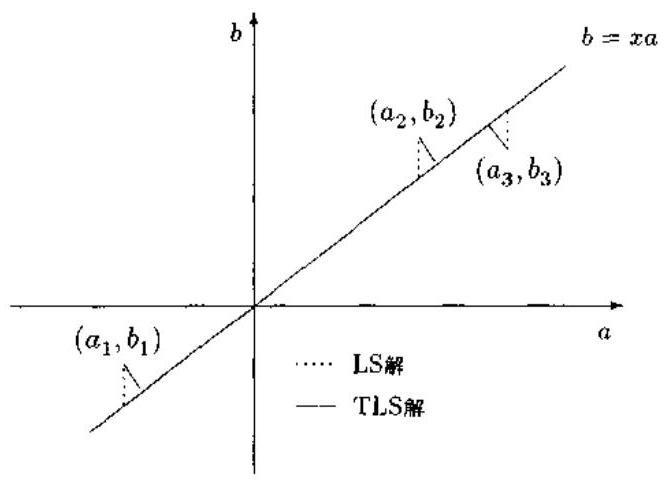

图 7.2.1 LS 解与 TLS 解

另外一个有趣的解释是总体最小二乘解的子空间解释 ${}^{\left\lbrack  {31}\right\rbrack  }$ . 总体最小二乘解可以表示为

$$
\left\lbrack  \begin{matrix} 1 \\  {\widehat{x}}_{\text{ TLS }} \end{matrix}\right\rbrack   = \mathop{\sum }\limits_{{i = p + 1}}^{{n + 1}}{\beta }_{i}{v}_{i} \tag{7.2.25}
$$

其中

$$
{\beta }_{i} = \frac{-{v}^{ * }\left( {i, p + 1}\right) }{\mathop{\sum }\limits_{{j = p + 1}}^{{n + 1}}{\left| v\left( j, p + 1\right) \right| }^{2}} = \frac{-{v}^{ * }\left( {i, p + 1}\right) }{{\alpha }^{2}} \tag{7.2.26}
$$

因此,解向量 $\left\lbrack  \begin{matrix} 1 \\  {\widehat{x}}_{\mathrm{{TLS}}} \end{matrix}\right\rbrack$ 是 $B = \left\lbrack  {-b, A}\right\rbrack$ 的零空间,即

$$
\left\{  \begin{matrix} 1 \\  {\widehat{x}}_{\text{ TLS }} \end{matrix}\right\}   \in  \operatorname{null}\left( B\right)  = \operatorname{span}\left\{  {{v}_{p + 1},\cdots ,{v}_{n + 1}}\right\} \tag{7.2.27}
$$

这表明,总体最小二乘解属于由增广矩阵 $B$ 最后 $n + 1 - p$ 个奇异向量 (特征向量) 张成的噪声子空间. 由于 $B$ 由 $\left\lbrack  {bA}\right\rbrack$ 给定，所以 $B$ 和 $A$ 的奇异值分解以一种复杂的方式联系在一起. 虽然 $B$ 和 $A$ 的特征值通过交织定理 ${}^{\left\lbrack  {32}\right\rbrack  }$ 联系在一起,但是它们的特征向量之间没有明显的关系. 幸运的是，我们可以利用下面的表达式:

$$
{B}^{H}B{v}_{i} = {\sigma }_{i}^{2}{v}_{i},\;i = p + 1,\cdots , n + 1\left( {\text{ 假定 }m - n \geq  n + 1}\right)
$$

由上式、 $B = \left\lbrack  {-{bA}}\right\rbrack$ 和 ${v}_{i} = \left\lbrack  \begin{matrix} {\bar{v}}_{i} \\  v\left( {n + 1, i}\right)  \end{matrix}\right\rbrack$ 不难得到

$$
\left\lbrack  \begin{matrix} {b}^{H}b & {b}^{H}A \\  {A}^{H}b & {A}^{H}A \end{matrix}\right\rbrack  \left\lbrack  \begin{matrix} {\bar{v}}_{i} \\  v\left( {n + 1, i}\right)  \end{matrix}\right\rbrack   = {\sigma }_{i}^{2}\left\lbrack  \begin{matrix} {\bar{v}}_{i} \\  v\left( {n + 1, i}\right)  \end{matrix}\right\rbrack
$$

经过直接运算, 由上式得下列关系式:

$$
\left( {{A}^{H}A - {\sigma }_{i}^{2}I}\right) {\bar{v}}_{i} + v\left( {n + 1, i}\right) {A}^{H}b = 0 \tag{7.2.28a}
$$

$$
{b}^{H}A{\bar{v}}_{\iota } + \left( {{b}^{H}b - {\sigma }_{i}^{2}}\right) v\left( {n + 1, i}\right)  = 0 \tag{7.2.28b}
$$

这里,我们假定 $A$ 是有噪声的数据矩阵,因而它是满秩的,即 $A$ 的所有奇异值都大于零. 容易证明 ${}^{\left\lbrack  {32}\right\rbrack  }$ ,若 $A$ 的奇异值由

$$
{\widehat{\sigma }}_{1} \geq  {\widehat{\sigma }}_{2} \geq  \cdots  \geq  {\widehat{\sigma }}_{n}
$$

给出,并且 $B$ 的奇异值为

$$
{\sigma }_{1} \geq  {\sigma }_{2} \geq  \cdots  \geq  {\sigma }_{n + 1}
$$

则

$$
{\sigma }_{1} \geq  {\widehat{\sigma }}_{1} \geq  \cdots  \geq  {\sigma }_{n} \geq  {\widehat{\sigma }}_{n} \geq  {\sigma }_{n + 1}
$$

如果我们假定 ${\sigma }_{i} \neq  {\widehat{\sigma }}_{i}$ ,那么 $\left( {{A}^{H}A - {\sigma }_{i}^{2}I}\right)$ 将是可逆的. 如果 ${\sigma }_{i} = {\widehat{\sigma }}_{1}$ ,则应该取伪逆矩阵 ${\left( {A}^{H}A - {\sigma }_{i}^{2}I\right) }^{ \dagger  }$ . 考虑到这一点,并综合 (7.2.28a) 和 (7.2.25) 两式,我们就可以将总体最小二乘解表示成

$$
{\widehat{x}}_{\mathrm{{TLS}}} = \frac{1}{{\alpha }^{2}}\mathop{\sum }\limits_{{i = p + 1}}^{{n + 1}}{v}^{ * }\left( {n + 1, i}\right) {\widetilde{v}}_{i}
$$

$$
= \frac{1}{{\alpha }^{2}}\mathop{\sum }\limits_{{i = p + 1}}^{{n + 1}}{\left| v\left( n + 1, i\right) \right| }^{2}{\left( {A}^{H}A - {\sigma }_{i}^{2}I\right) }^{ \dagger  }{A}^{H}b \tag{7.2.29}
$$

式中

$$
\frac{1}{{\alpha }^{2}}\mathop{\sum }\limits_{{i = p + 1}}^{{n + 1}}{\left| v\left( n + 1, i\right) \right| }^{2} = 1
$$

如果 ${\sigma }_{n + 1} + \epsilon  > {\sigma }_{p + 1} \geq  {\sigma }_{p + 2} \geq  \cdots  \geq  {\sigma }_{n + 1}$ ,并且 $\epsilon$ 很小,则

$$
{x}_{\mathrm{{TLS}}} = {\left( {A}^{H}A - {\sigma }_{n + 1}^{2}I\right) }^{-1}{A}^{H}b \tag{7.2.30}
$$

比较 ${x}_{\mathrm{{TLS}}}$ 与 ${x}_{\mathrm{{LS}}} = {\left( {A}^{H}A\right) }^{-1}{A}^{H}b$ 知,它们之间的唯一区别在于 ${x}_{\mathrm{{TLS}}}$ 中出现了因子 ${\sigma }_{n + 1}^{2}I$ . 正是这个因子起着减小 ${A}^{H}A = {A}_{0}^{H}{A}_{0} + \Delta {A}^{H}{A}_{0} + {A}_{0}^{H}{\Delta A} + \Delta {A}^{H}{\Delta A}$ 中的误差 ${\Delta A}$ 的作用. 对于某些噪声电平 ${\Delta A}$ ,这种作用非常明显. 例如,当 ${\Delta A}$ 是零均值的时候,如果 ${A}^{H}A \approx  {A}_{0}^{H}{A}_{0} + \Delta {A}^{H}{\Delta A} \approx  {A}_{0}^{H}{A}_{0} + M{\sigma }^{2}I$ ,并且 $\begin{Vmatrix}{{A}_{0}^{H}{A}_{0}}\end{Vmatrix}$ 与 $\begin{Vmatrix}{M{\sigma }^{2}I}\end{Vmatrix}$ 相差不大的话,则总体最小二乘方法是非常有效的. 在这些条件下, TLS 解比 LS 解更精确.

更一般地,我们将 ${Ax} = b$ 中的未知参数向量 $x$ 和数据向量 $b$ 推广为未知参数矩阵 $X$ 和数据矩阵 $B$ ,即考虑下述矩阵方程

$$
{AX} \approx  B,\;A \in  {R}^{m \times  n}, B \in  {R}^{m \times  d}, X \in  {R}^{n \times  d} \tag{7.2.31}
$$

的 TLS 解. 此时, TLS 解是集合

$$
\widehat{A}X = \widehat{B} \tag{7.2.32}
$$

的任意解,其中 $\widehat{A}$ 和 $\widehat{B}$ 系根据下面二式确定的:

$$
\operatorname{range}\left( \widehat{B}\right)  \subset  \operatorname{range}\left( \widehat{A}\right) \tag{7.2.33}
$$

$$
\parallel \left\lbrack  {\Delta \widehat{A}\Delta \widehat{B}}\right\rbrack  {\parallel }_{F} = \parallel \left\lbrack  {AB}\right\rbrack   - \left\lbrack  {\widehat{A}\widehat{B}}\right\rbrack  {\parallel }_{F}\text{ 极小化 } \tag{7.2.34}
$$

其中 $\parallel  \cdot  {\parallel }_{F}$ 表示 Frobenius 范数, $\operatorname{range}\left( M\right)$ 表示矩阵 $M$ 的值域. 求满足式 (7.2.33) 和式 (7.2.34) 的 $\left\lbrack  {\Delta \widehat{A}\Delta \widehat{B}}\right\rbrack$ 的问题称为 TLS 问题. 每当解不是唯一时, TLS 便给出最小范数解. 为了简便,我们将 $X$ 的 TLS 解记作 $\widehat{X}$ .

有意思的是，LS 问题事实上是在式 (7.2.31) (7.2.34) 中固定 $\widehat{A} = A$ 的附加条件下的 “约束” TLS 问题.

下面从奇异子空间对扰动的敏感度和一致性两个角度分析 TLS 解的性能 ${}^{\left| 8\right| }$ .

## 1. 奇异子空间对扰动的敏感度

式 (7.2.31) 中矩阵 $A$ 的奇异值分解可用并向量分解形式 (6.2.1 节) 写作

$$
A = \mathop{\sum }\limits_{{i = 1}}^{n}{\widetilde{\sigma }}_{i}^{\prime }{\widetilde{u}}_{i}^{\prime }{\left( {\widetilde{v}}_{i}^{\prime }\right) }^{T},\;{\widetilde{u}}_{i}^{\prime } \in  {R}^{m},\;{\widetilde{v}}_{i}^{\prime } \in  {R}^{n} \tag{7.2.35a}
$$

$$
{\widetilde{\sigma }}_{1}^{\prime } \geq  \cdots  \geq  {\widetilde{\sigma }}_{n}^{\prime } \geq  0 \tag{7.2.35b}
$$

类似地,式 (7.2.31) 中增广矩阵 $\left\lbrack  \begin{array}{ll} A & B \end{array}\right\rbrack$ 的奇异值分解也可以用下式表示:

$$
\left\lbrack  {AB}\right\rbrack   = \mathop{\sum }\limits_{{i = 1}}^{{n + d}}{\widetilde{\sigma }}_{i}{\widetilde{u}}_{i}{\widetilde{v}}_{i}^{T},\;{\widetilde{u}}_{i} \in  {R}^{m},\;{\widetilde{v}}_{i} \in  {R}^{n} \tag{7.2.36a}
$$

$$
{\widetilde{\sigma }}_{1} \geq  \cdots  \geq  {\widetilde{\sigma }}_{n} \geq  0 \tag{7.2.36b}
$$

在式 (7.2.35) 和式 (7.2.36) 中去掉 $\sim$ 后,可以分别得到无扰动矩阵 ${A}_{0}$ 和无扰动增广矩阵 $\left\lbrack  {{A}_{0}{B}_{0}}\right\rbrack$ 的奇异值分解.

任意两个子空间 ${S}_{1}$ 和 ${S}_{2}$ 之间的距离定义为

$$
\operatorname{dist}\left( {{S}_{1},{S}_{2}}\right)  = {\begin{Vmatrix}{P}_{1}^{ \bot  } - {P}_{2}^{ \bot  }\end{Vmatrix}}_{2} \tag{7.2.37}
$$

式中 ${P}_{i}^{ \bot  }$ 是到 ${S}_{i}$ 上的正交投影, $\parallel M{\parallel }_{2}$ 为 ${L}_{2}$ 范数. $\operatorname{dist}\left( {{S}_{1},{S}_{2}}\right)$ 描述了子空间 ${S}_{1}$ 和 ${S}_{2}$ 的接近度, 它恰好是最大典范角度的正弦.

从投影的角度看问题,最小二乘将数据 $A$ 和 $B$ 分别投影到矩阵 $A$ 的奇异子空间 $\operatorname{range}\left( \left\lbrack  \begin{array}{lll} {\widetilde{u}}_{1}^{\prime } & \cdots & {\widetilde{u}}_{r}^{\prime } \end{array}\right\rbrack  \right)$ 和 $\operatorname{range}\left( \left\lbrack  \begin{array}{lll} {\widetilde{v}}_{1}^{\prime } & \cdots & {\widetilde{v}}_{r}^{\prime } \end{array}\right\rbrack  \right)$ ,其中 $r = n$ 是 $A$ 的秩; 而总体最小二乘则将 $A$ 和 $B$ 分别投影到增广矩阵 $\left\lbrack  \begin{array}{ll} A & B \end{array}\right\rbrack$ 的奇异子空间 $\operatorname{range}\left( \left\lbrack  \begin{array}{lll} {\widetilde{u}}_{1} & \cdots & {\widetilde{u}}_{r} \end{array}\right\rbrack  \right)$ 和 $\operatorname{range}\left( \left\lbrack  \begin{array}{lll} {\widetilde{v}}_{1} & \cdots & {\widetilde{v}}_{r} \end{array}\right\rbrack  \right)$ 上. 从它们各自的定义,最小二乘解 ${X}^{\prime }$ 是方程组

$$
{A}_{r}X = {B}^{\prime } \tag{7.2.38a}
$$

的最小范数解, 其中

$$
{A}_{r} = \mathop{\sum }\limits_{{i = 1}}^{r}{\widetilde{\sigma }}_{i}^{\prime }{\widetilde{u}}_{i}^{\prime }{\widetilde{v}}_{i}^{\prime T}\;\text{ 和 }\;{B}^{\prime } = \mathop{\sum }\limits_{{i = 1}}^{r}{\widetilde{u}}_{i}^{\prime }{\widetilde{u}}_{i}^{\prime T}B \tag{7.2.38b}
$$

而总体最小二乘解 $\widehat{X}$ 则是方程组

$$
\widehat{A}X = \widehat{B} \tag{7.2.39a}
$$

的最小范数解, 其中

$$
\left\lbrack  \begin{array}{ll} \widehat{A} & \widehat{B} \end{array}\right\rbrack   = \mathop{\sum }\limits_{{i = 1}}^{r}{\widetilde{\sigma }}_{i}{\widetilde{u}}_{i}{\widetilde{v}}_{i}^{T}\;\text{ (TLS 逼近) } \tag{7.2.39b}
$$

上述奇异子空间的敏感度不同可以解释为什么存在扰动时 TLS 比 LS 具有更好的性能. 为此,先考虑无扰动的 TLS 问题 ${A}_{0}X \approx  {B}_{0}$ . 令 $m \times  \left( {n + d}\right)$ 矩阵 $\left\lbrack  \begin{array}{ll} {A}_{0} & {B}_{0} \end{array}\right\rbrack$ 被 $\left\lbrack  \begin{array}{ll} \Delta {A}_{0} & \Delta {B}_{0} \end{array}\right\rbrack$ 扰动,结果为 $\left\lbrack  \begin{array}{ll} A & B \end{array}\right\rbrack   = \left\lbrack  \begin{array}{ll} {A}_{0} & {B}_{0} \end{array}\right\rbrack   + \left\lbrack  \begin{array}{ll} \Delta {A}_{0} & \Delta {B}_{0} \end{array}\right\rbrack$ . 用 $r\left( { \leq  n}\right)$ 表示 TLS 逼近 $\left\lbrack  \begin{array}{ll} {\widehat{A}}_{0} & {\widehat{B}}_{0} \end{array}\right\rbrack$ 的秩,对 $\left\lbrack  \begin{array}{ll} {A}_{0} & {B}_{0} \end{array}\right\rbrack  ,\left\lbrack  \begin{array}{ll} A & B \end{array}\right\rbrack$ 应用 Wedin 的广义正弦定理 ${}^{\left\lbrack  {29}\right\rbrack  }$ 和 TLS 条件式 (7.2.33)(即 $\operatorname{range}\left( \widehat{A}\right)  = \operatorname{range}\left( \left\lbrack  \begin{array}{ll} \widehat{A} & \widehat{B} \end{array}\right\rbrack  \right)$

$$
\operatorname{dist}\left( {\operatorname{range}\widehat{A}\operatorname{range}{\widehat{A}}_{0}}\right)  \leq  {\begin{Vmatrix}\left\lbrack  \begin{array}{ll} {\Delta A} & {\Delta B} \end{array}\right\rbrack  \end{Vmatrix}}_{2}/\left( {{\widetilde{\sigma }}_{r} - {\sigma }_{r + 1}}\right) \tag{7.2.40}
$$

$$
\operatorname{dist}\left( {\operatorname{range}{\left\lbrack  \widehat{A}\widehat{B}\right\rbrack  }^{T},\operatorname{range}{\left\lbrack  {\widehat{A}}_{0}{\widehat{B}}_{0}\right\rbrack  }^{T}}\right)  \leq  \parallel \left\lbrack  {\Delta A\Delta B}\right\rbrack  {\parallel }_{2}/\left( {{\widetilde{\sigma }}_{r} - {\sigma }_{r + 1}}\right) \tag{7.2.41}
$$

如果 ${A}_{0}X = {B}_{0}$ 表示一种精确关系,则 $\left\lbrack  {{\widehat{A}}_{0}{\widehat{B}}_{0}}\right\rbrack   = \left\lbrack  {{A}_{0}{B}_{0}}\right\rbrack$ ,从而式 (7.2.40) 和式 (7.2.41) 中的 ${\sigma }_{r + 1} = 0$ . 如果考虑满秩问题,即 ${A}_{0}$ 有最大秩 $r = n$ ,则式 (7.2.40) 和式 (7.2.41) 简化为

$$
\operatorname{dist}\left( {\text{ range }\widehat{A}\text{ range }{\widehat{A}}_{0}}\right)  \leq  \parallel \left\lbrack  {\Delta A\Delta B}\right\rbrack  {\parallel }_{2}/{\widetilde{\sigma }}_{n} \tag{7.2.42}
$$

$$
\operatorname{dist}\left( {\operatorname{range}{\left\lbrack  \begin{array}{ll} \widehat{A} & \widehat{B} \end{array}\right\rbrack  }^{T},\operatorname{range}{\left\lbrack  \begin{array}{ll} {\widehat{A}}_{0} & {\widehat{B}}_{0} \end{array}\right\rbrack  }^{T}}\right)  \leq  {\begin{Vmatrix}\left\lbrack  \begin{array}{ll} {\Delta A} & {\Delta B} \end{array}\right\rbrack  \end{Vmatrix}}_{2}/{\widetilde{\sigma }}_{n} \tag{7.2.43}
$$

这意味着 TLS 解空间接近精确解,若扰动 ${\begin{Vmatrix}\left\lbrack  \begin{array}{ll} {\Delta A} & {\Delta B} \end{array}\right\rbrack  \end{Vmatrix}}_{2}$ 保持很小,而且 $\left\lbrack  \begin{array}{ll} A & B \end{array}\right\rbrack$ 第 $r$ 个和第 $r + 1$ 个奇异值之间的 “空隙” 大的话.

再考虑 LS 问题. 令 $m \times  n$ 矩阵 ${A}_{0}$ 有秩 $r$ (即 ${\sigma }_{r + 1}^{\prime } = 0$ ),并被 ${\Delta A}$ 扰动,使得 $A = {A}_{0} + {\Delta A}$ . 对 ${A}_{0}$ 和 $A$ 应用 Wedin 广义正弦定理,则有

$$
\operatorname{dist}\left( {\operatorname{range}A,\operatorname{range}{A}_{0}}\right)  \leq  \parallel {\Delta A}{\parallel }_{2}/{\sigma }_{r}^{\prime } \tag{7.2.44}
$$

$$
\operatorname{dist}\left( {\operatorname{range}{A}^{T},\operatorname{range}{A}_{0}^{T}}\right)  \leq  \parallel {\Delta A}{\parallel }_{2}/{\sigma }_{r}^{\prime } \tag{7.2.45}
$$

通常, $A$ 有最大秩 $r = n$ . 此时,式 (7.2.44) 变为

$$
\operatorname{dist}\left( {\operatorname{range}A,\operatorname{range}{A}_{0}}\right)  \leq  \parallel {\Delta A}{\parallel }_{2}/{\sigma }_{n}^{\prime } \tag{7.2.46}
$$

比较上述 LS 和 TLS 问题的奇异子空间的敏感度, 可得到以下重要观察.

(1)首先假定数据矩阵 $A$ 和 $B$ 是精确关系 ${A}_{0}X = {B}_{0}$ 的测量样本. 假定 $\parallel {\Delta A}{\parallel }_{2} \approx \; \parallel \left\lbrack  {\Delta A\Delta B}\right\rbrack  {\parallel }_{2}$ (例如当所有数据都一样被扰动时),测量误差 ${\Delta A}$ 和 ${\Delta B}$ 可以是任意扰动. 于是,利用奇异值的交织性质,即 ${\widetilde{\sigma }}_{i} \geq  {\widetilde{\sigma }}_{i}^{\prime }, i = 1,\cdots , n$ (参见文献 [9]),可以得出结论: 与 TLS 问题相关的奇异子空间对噪声的敏感度比与 LS 问题相关的奇异子空间对噪声的敏感度小. 这意味着, 前者可望 “更加接近” 它们对应的无扰动子空间. 因此, TLS 解可望比 $\mathrm{{LS}}$ 解更加精确. 对于 ${A}_{0}X \approx  {B}_{0}$ ,情况也如此.

(2)由于敏感度的不同取决于比率 $\left( {{\widetilde{\sigma }}_{r} - {\sigma }_{r + 1}}\right) /{\widetilde{\sigma }}_{r}^{\prime }$ ,所以当这一比率较大时, TLS 比 LS 具有更高精度这一点将更加明显. 这一比率主要受下列因素的影响: 长度 (Frobenius 范数),列的维数和观测矩阵 ${B}_{0}$ (或等价为解 $X$ ) 相对于 ${A}_{0}$ 的奇异向量的定向.

上述观察已为仿真实验所证实 ${}^{\left\lbrack  8\right\rbrack  }$ .

## 2. 一致性

TLS 和 LS 之间的精度差别也与方程个数 $m$ 有关. 由于 “变量误差” 回归估计子与 TLS 解一致, 故 Gleser 对变量误差回归估计的一致性分析 ${}^{\left\lbrack  4\right\rbrack  }$ 直接适用于 TLS 问题.

定理 7.2.1 (TLS 解的一致性) ${}^{\left\lbrack  4\right\rbrack  }$ 假定数据 $\left\lbrack  \begin{array}{ll} A & B \end{array}\right\rbrack   = \left\lbrack  {{A}_{0} + {\Delta A}\;{B}_{0} + {\Delta B}}\right\rbrack$ 是精确关系 ${A}_{0}X = {B}_{0}$ 的测量样本,而且误差矩阵 $\left\lbrack  {\Delta A\Delta B}\right\rbrack$ 的行是独立同分布的,其均值为零. 共同协方差矩阵为 ${s}^{2}I$ ( $s$ 是一未知尺度). 若 $\mathop{\lim }\limits_{{m \rightarrow  \infty }}\frac{1}{m}{A}_{0}^{T}{A}_{0}$ 存在,且正定的话,则 TLS 解 ${\widehat{X}}_{\mathrm{{TLS}}}$ 是强一致估计，即

$$
\mathop{\lim }\limits_{{m \rightarrow  \infty }}{\widehat{X}}_{\text{ TLS }} = X,\;\text{ w.p. }1
$$

上述定理表明,当 $m \rightarrow  \infty$ 时,由不可观测的精确关系 ${A}_{0}X = {B}_{0}$ 的 $m$ 个观测值求得的 TLS 解 ${\widehat{X}}_{\mathrm{{TLS}}}^{\left( m\right) }$ 以概率 $1\left( {\mathrm{w}.\mathrm{p}.1}\right)$ 收敛为真实参数值 $X$ . 然而,众所周知,在线性回归中,普通 LS 解 ${X}^{\prime }$ 在这种情况下总是不一致的.

### 7.3 总体最小二乘:应用

总体最小二乘已广泛应用于信号处理和系统辨识中, 本节介绍几个典型应用例子: ARMA 建模、频率估计及自适应 FIR 滤波的总体最小二乘算法.

#### 7.3.1 ARMA 建模的总体最小二乘法

考虑由式 (7.1.5) 定义的平稳离散 $\operatorname{ARMA}\left( {p, q}\right)$ 过程 $\{ x\left( n\right) \}$ . 由 MYW 方程式 (7.1.7), 我们用样本自相关函数 ${\widehat{R}}_{x}\left( \tau \right)$ 构造超定的线性方程:

$$
\mathop{\sum }\limits_{{i = 0}}^{{p}_{e}}{a}_{i}{\widehat{R}}_{x}\left( {\tau  - i}\right)  = 0,\;\tau  = {q}_{e} + 1,\cdots ,{q}_{c} + t \tag{7.3.1}
$$

其中 ${p}_{c} > p,{q}_{e} > q, t \gg  {p}_{e}$ . 于是,与总体最小二乘方法对应的矩阵方程为

$$
{\widehat{R}}_{e}\left\lbrack  \begin{matrix} 1 \\  {a}_{e} \end{matrix}\right\rbrack   = 0 \tag{7.3.2}
$$

其中

$$
{\widehat{R}}_{e} = \left\lbrack  \begin{matrix} {\widehat{R}}_{x}\left( {{q}_{e} + 1}\right) & {\widehat{R}}_{e}\left( {q}_{e}\right) & \cdots & {\widehat{R}}_{x}\left( {{q}_{e} + 1 - {p}_{e}}\right) \\  {\widehat{R}}_{x}\left( {{q}_{e} + 2}\right) & {\widehat{R}}_{x}\left( {{q}_{e} + 1}\right) & \cdots & {\widehat{R}}_{x}\left( {{q}_{e} + 2 - {p}_{e}}\right) \\  \vdots & \vdots & & \vdots \\  {\widehat{R}}_{x}\left( {{q}_{e} + t}\right) & {\widehat{R}}_{x}\left( {{q}_{e} + t - 1}\right) & \cdots & {\widehat{R}}_{x}\left( {{q}_{e} + t - {p}_{e}}\right)  \end{matrix}\right\rbrack \tag{7.3.3a}
$$

$$
{a}_{r} = {\left\lbrack  {a}_{1},{a}_{2},\cdots ,{a}_{{p}_{c}}\right\rbrack  }^{T} \tag{7.3.3b}
$$

根据第六章的命题 6.7.1,增广样本自相关矩阵 ${\widehat{R}}_{e}$ 的有效秩等于 $p$ . 因此,我们可以对方程 (7.3.2) 应用算法 7.2.2 (SVD-TLS 算法) 确定 ARMA 模型的 AR 阶数 $p$ ,并得到 AR 参数的总体最小二乘估计 ${\widehat{a}}_{i}, i = 1,\cdots , p$ . 这就是 ARMA 建模的总体最小二乘算法.

#### 7.3.2 频率估计的总体最小二乘法

考虑下列情况:接收信号是复正弦波与复值高斯白噪声的线性叠加:

$$
x\left( n\right)  = \mathop{\sum }\limits_{{k = 1}}^{M}{A}_{k}{\mathrm{e}}^{\mathrm{j}{2\pi }{f}_{k}n} + w\left( n\right) \tag{7.3.4}
$$

其中 $\{ x\left( n\right) \}$ 为观测数据, ${f}_{k}$ 与 ${A}_{k}$ 分别是第 $k$ 个正弦波的频率与振幅.

如果没有噪声存在,即 $w\left( n\right)  \equiv  0$ ,则 Prony 方法可以用来确定振幅和频率. 应用 Prony 方法时, 首先形成一线性差分方程:

$$
\mathop{\sum }\limits_{{i = 1}}^{M}{c}_{i}x\left( {M + n - i}\right)  = x\left( {M + n}\right) ,\;n = 0,1,\cdots , N - M - 1 \tag{7.3.5}
$$

式中 $\left\{  {c}_{i}\right\}$ 为下列特征多项式的系数:

$$
{z}^{M} - {c}_{1}{z}^{M - 1} - \cdots  - {c}_{M - 1}z - {c}_{M} = 0 \tag{7.3.6}
$$

因此,问题是如何估计系数 $\left\{  {c}_{i}\right\}$ . 一旦 $\left\{  {c}_{i}\right\}$ 估计出来,特征多项式 (7.3.3) 的根 ${z}_{i} = {\mathrm{e}}^{\pm \mathrm{j}{2\pi f}}$ . 即给出频率 ${f}_{i}$ . 得到频率之后,又可以利用线性方程 $y\left( n\right)  = \mathop{\sum }\limits_{{k = 1}}^{M}{A}_{k}{\mathrm{e}}^{\mathrm{j}{2\pi }{f}_{k}n}$ 求出谐波信号的幅值 ${\left\{  {A}_{k}\right\}  }_{k = 1}^{M}$ .

对于式 (7.3.4) 所示的有噪声情况, 式 (7.3.5) 不成立. 就是说, Prony 方法不适用于有加性白噪声的情况. 此时，我们考虑下列线性预测方程:

$$
\left\lbrack  \begin{matrix} x\left( 0\right) & x\left( 1\right) & \cdots & x\left( {L - 1}\right) \\  x\left( 1\right) & x\left( 2\right) & \cdots & x\left( L\right) \\  \vdots & \vdots & & \vdots \\  x\left( {N - L - 1}\right) & x\left( {N - L}\right) & \cdots & x\left( {N - 2}\right)  \end{matrix}\right\rbrack  \left\lbrack  \begin{matrix} {c}_{L} \\  {c}_{L - 1} \\  \vdots \\  {c}_{1} \end{matrix}\right\rbrack   \approx  \left\lbrack  \begin{matrix} x\left( L\right) \\  x\left( {L + 1}\right) \\  \vdots \\  x\left( {N - 1}\right)  \end{matrix}\right\rbrack \tag{7.3.7}
$$

或

$$
{Ac} \approx  b \tag{7.3.8}
$$

其中 $A$ 是线性预测数据矩阵, $c$ 为线性预测向量, $b$ 为观测向量,并且 $L > M$ . 显然,我们可以构造增广矩阵 $B = \left\lbrack  \begin{array}{ll}  - b & A \end{array}\right\rbrack$ ,应用 SVD-TLS 算法求解矩阵方程 (7.3.8) 确定线性预测器系数 ${\left\{  {c}_{i}\right\}  }_{i = 1}^{L}$ 的总体最小二乘解; 然后通过式 (7.3.6) 估计 $L$ 个“正弦波”，其中，单位模的 $M$ 个根给出真实正弦波的频率,其它根则对应为伪正弦波. 这种 TLS-Prony 方法是 Rahman 和 Yu 提出的 ${}^{\left\lbrack  {31}\right\rbrack  }$ . 该方法的缺点是，当数据长度较大时，数据矩阵 $A$ 的行数太大；而且为了得到预测系数好的结果，通常需要将线性预测器阶数取得很大，即 $L \approx  \frac{N}{3}$ . 结果是, 需要求解一个很大维数的增广矩阵的总体最小二乘解, 使计算量显得太大.

为了大大减少 TLS-Prony 方法的计算量, 一种合理的选择是在应用 TLS-Prony 方法之前进行所谓的数据抽取. 这种使用数据抽取的修正 TLS-Prony 方法是 Steedly 等人最近提出的 ${}^{\left\lbrack  {33}\right\rbrack  }$ 、下面介绍这一方法.

假定有数据向量 $y\left( t\right)$ 的 $N$ 个 “快拍”,每一个具有长度 $m$ :

$$
y\left( t\right)  = {\left\lbrack  {y}_{0}\left( t\right) ,{y}_{1}\left( t\right) ,\cdots ,{y}_{m - 1}\left( t\right) \right\rbrack  }^{T},\;t = 1,2,\cdots , N \tag{7.3.9}
$$

每个数据向量的数学模型都是噪声中的指数序列:

$$
{y}_{q}\left( t\right)  = \mathop{\sum }\limits_{{i = 1}}^{n}{x}_{i}\left( t\right) {p}_{i}^{q} + {e}_{q}\left( t\right) ,\;q = 0,1,\cdots , m - 1 \tag{7.3.10}
$$

在数据中有 $n$ 个各异的指数模态; $n$ 个极点 ${\left\{  {p}_{i}\right\}  }_{i = 1}^{n}$ 不随快拍改变,但幅值 ${x}_{i}\left( t\right)$ 可变. 这里,假设 $\left\{  {{e}_{q}\left( t\right) }\right\}$ 是不相关的零均值复高斯白噪声序列,其方差为 $\sigma$ . 方程 (7.3.10) 可以紧凑地写作

$$
y\left( t\right)  = {Ax}\left( t\right)  + e\left( t\right) \tag{7.3.11}
$$

其中

$$
e\left( t\right)  = {\left\lbrack  {e}_{0}\left( t\right) ,{e}_{1}\left( t\right) ,\cdots ,{e}_{m - 1}\left( t\right) \right\rbrack  }^{T}
$$

$$
x\left( t\right)  = {\left\lbrack  {x}_{0}\left( t\right) ,{x}_{1}\left( t\right) ,\cdots ,{x}_{m - 1}\left( t\right) \right\rbrack  }^{T}
$$

而 $A$ 是一个 $m \times  n$ 维 Vandermonde 矩阵:

$$
A = \left\lbrack  \begin{matrix} 1 & 1 & \cdots & 1 \\  {p}_{1} & {p}_{2} & \cdots & {p}_{n} \\  {p}_{1}^{2} & {p}_{2}^{2} & \cdots & {p}_{n}^{2} \\  \vdots & \vdots & & \vdots \\  {p}_{1}^{m - 1} & {p}_{2}^{m - 1} & \cdots & {p}_{n}^{m - 1} \end{matrix}\right\rbrack \tag{7.3.12}
$$

令 $K$ 是一个 $l$ 阶 FIR 滤波器,它对由式 (7.3.6) 定义的 $m \times  1$ 数据向量 $y\left( t\right)$ 进行滤波:

$$
{y}^{\prime }\left( t\right)  = {Ky}\left( t\right) \tag{7.3.13}
$$

其中, $K$ 是一个 $\left( {m - l}\right)  \times  m$ 矩阵:

$$
K = \left\lbrack  \begin{matrix} {k}_{l} & {k}_{l - 1} & {k}_{l - 2} & \cdots & {k}_{0} & 0 & 0 & \cdots & 0 \\  0 & {k}_{l} & {k}_{l - 1} & \cdots & {k}_{1} & {k}_{0} & 0 & \cdots & 0 \\  \vdots &  \ddots  &  \ddots  &  \ddots  & &  \ddots  &  \ddots  &  \ddots  & \vdots \\  0 & \cdots & 0 & {k}_{l} & {k}_{l - 1} & \cdots & {k}_{1} & {k}_{0} & 0 \\  0 & \cdots & 0 & 0 & {k}_{l} & \cdots & {k}_{2} & {k}_{1} & {k}_{0} \end{matrix}\right\rbrack \tag{7.3.14}
$$

这里, ${\left\{  {k}_{i}\right\}  }_{i = 0}^{l}$ 是 FIR 滤波器的冲激响应序列. 注意,得到的滤波后的序列长度为 $m - l$ , 它不包括前 $l$ 个瞬时点. 由 ${y}_{q}^{\prime }\left( t\right)$ 可以定义一组抽取序列:

$$
{y}_{q}^{\prime u}\left( t\right)  = {y}_{{qd} + u}^{\prime }\left( t\right) ,\;q = 0,1,\cdots ,{m}_{d}^{\prime } - 1;u = 0,1,\cdots , d - 1 \tag{7.3.15}
$$

其中 ${m}_{d}^{\prime } = \left\lfloor  \frac{m - l}{d}\right\rfloor$ 为整数. 指标 “ $u$ ” 给出了数据抽取中的起始点,因此,对于固定的 $t$ , 序列 $\left\{  {{y}_{q}^{\prime u}\left( t\right) }\right\}$ 表示从 ${y}^{\prime }\left( t\right)$ 抽取的一组交叉序列. 这些序列有时称为 “多相位分量” ${}^{\left\lbrack  {30}\right\rbrack  }$ . 由

式 (7.3.10) 和式 (7.3.15) 可以看出,每一个序列 $\left\{  {{y}_{q}^{\prime u}\left( t\right) }\right\}$ 都是一个噪声中的指数序列,其形式为

$$
{y}_{q}^{\prime u}\left( t\right)  = \mathop{\sum }\limits_{{i = 1}}^{n}{x}_{i}^{\prime u}\left( t\right) {\left( {p}_{i}^{\prime }\right) }^{q} + {e}_{q}^{\prime \prime u}\left( t\right) \tag{7.3.16}
$$

其中， $\left\{  {{e}_{q}^{\prime \prime \prime }\left( t\right) }\right\}$ 为 $e\left( t\right)$ 经滤波和抽取后的序列，且

$$
{p}_{i}^{\prime } = {\left( {p}_{i}\right) }^{d}
$$

和

$$
{x}_{i}^{\prime u}\left( t\right)  = {x}_{i}\left( t\right) {p}_{i}^{\left( u + l\right) }K\left( {p}_{i}\right) \tag{7.3.17}
$$

这里 $K\left( z\right)$ 是 FIR 滤波器多项式:

$$
K\left( z\right)  = {k}_{0} + {k}_{1}{z}^{-1} + {k}_{2}{z}^{-2} + \cdots  + {k}_{l}{z}^{-l} \tag{7.3.18}
$$

FIR 滤波在新模型中的影响是使原来的白噪声变成有色的. 通常,我们选择 $K$ 为带通滤波器. 通过仔细选择 FIR 滤波器, 我们可以明显地减少某些感兴趣的带宽以外的模态幅值系数. 在这种情况下，就可以假定滤波后的数据中的 “有效模态” 个数为 ${n}^{\prime }$ ，它小于 $n$ . 于是,我们有下列模型:

$$
{y}_{q}^{\prime u}\left( t\right)  = \mathop{\sum }\limits_{{i = 1}}^{{n}^{\prime }}{x}_{i}^{\prime u}\left( t\right) {\left( {p}_{i}^{\prime }\right) }^{q} + {e}_{q}^{\prime u}\left( t\right) \tag{7.3.19}
$$

其中

$$
{e}_{q}^{\prime u}\left( t\right)  = \mathop{\sum }\limits_{{i = {n}^{\prime } + 1}}^{n}{x}_{i}^{\prime u}\left( t\right) {\left( {p}_{i}^{\prime }\right) }^{q} + {e}_{q}^{\prime \prime u}\left( t\right) \tag{7.3.20}
$$

式 (7.3.19) 中的噪声 ${e}_{q}^{\prime u}\left( t\right)$ 包含了噪声 ${e}_{q}^{\prime \prime u}\left( t\right)$ 和 $n - {n}^{\prime }$ 个残余模态信号; 因此,它是高斯有色噪声,具有非零的均值,因为在感兴趣的频带以外的 $n - {n}^{\prime }$ 个模态依然存在,尽管它们已变弱. 非零均值的影响是在参数估计值中引入某些偏差.

交叉数据组可以丢弃不用,以便减少参数估计的计算量,即式 (7.3.15) 中的 $u$ 可以只取 1 . 从 Nyquist 理论的观点看, 如果理想的低通滤波器可以实现, 则丢弃交叉数据不会招致性能的任何损失. 然而, 对于实际应用而言, 由于非理想滤波器的缘故, 将会损失某些性能. 原则上, 可以通过保留所有的交叉数据补偿非理想滤波的影响. 不过, 这种性能补偿并不明显. 现在考虑只保留一组交叉数据, 因为只保留一组而丢弃所有其它的交叉数据组很容易并入到矩阵 $K$ 中.

现在只有 $N$ 个被抽取过的多快拍序列,因此, TLS-Prony 算法可以应用于式 (7.3.16) 以得到估计值 $\left\{  {\widehat{p}}_{i}^{\prime }\right\}$ 和 $\left\{  {{\widehat{x}}_{i}^{\prime 0}\left( t\right) }\right\}$ . 于是,数据抽取后的多快拍后向预测方程由下式给出:

$$
\left\lbrack  \begin{array}{ll} {y}^{\prime 0} & {Y}^{\prime 0} \end{array}\right\rbrack  \left\lbrack  \begin{matrix} 1 \\  {b}^{\prime } \end{matrix}\right\rbrack   \approx  0 \tag{7.3.21}
$$

其中

$$
{b}^{\prime } = {\left\lbrack  {b}_{1}^{\prime },{b}_{2}^{\prime },\cdots ,{b}_{L}^{\prime }\right\rbrack  }^{T} \tag{7.3.22}
$$

和

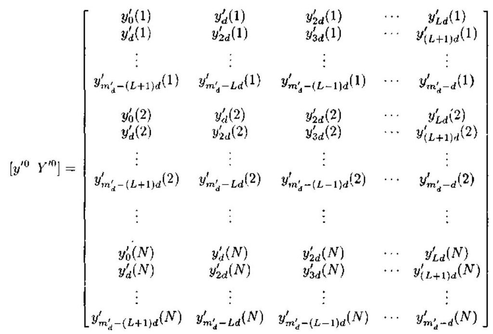

(7.3.23)

其中 $L$ 为预测阶数, ${b}^{\prime }$ 为多项式

$$
{B}^{\prime }\left( z\right)  = 1 + {b}_{1}^{\prime }z + {b}_{2}^{\prime }{z}^{2} + \cdots  + {b}_{L}^{\prime }{z}^{L} = 0 \tag{7.3.24}
$$

的系数向量. 注意, $L$ 的选择影响系数 ${b}_{i}^{\prime }$ 的精度.

TLS-Prony 方法考虑 ${Y}^{\prime 0}$ 和 ${y}^{\prime 0}$ 两者的噪声扰动的影响，而且 TLS 解试图使这些扰动对预测系数向量 ${b}^{\prime }$ 的影响极小化. 这一极小化是通过增广矩阵 $\left\lbrack  {{y}^{\prime 0}{Y}^{\prime 0}}\right\rbrack$ 的奇异值分解. 并将除前面 ${n}^{\prime }$ 个主要奇异值以外的其它奇异值截除,以得到估计值 $\left\lbrack  \begin{array}{ll} {\widehat{y}}^{\prime 0} & {\widehat{Y}}^{\prime 0} \end{array}\right\rbrack$ .

将 $\left\lbrack  \begin{array}{ll} {\widehat{y}}^{\prime 0} & {\widehat{Y}}^{\prime 0} \end{array}\right\rbrack$ 代入式 (7.3.18) 给出修正的预测方程:

$$
{\widehat{Y}}^{\prime 0}{\widehat{b}}^{\prime } \approx   - {\widehat{y}}^{\prime 0} \tag{7.3.25}
$$

由此得到线性预测系数向量的估计:

$$
{\widehat{b}}^{\prime } =  - {\left( {\widehat{Y}}^{\prime 0}\right) }^{ \dagger  }{\widehat{y}}^{\prime 0} \tag{7.3.26}
$$

最后, 抽取的极点的估计为

$$
{\widehat{p}}_{i}^{\prime } = {\widehat{B}}^{\prime }\left( z\right) \text{ 的第 }i\text{ 个零点, }\;i = 1,2,\cdots , L \tag{7.3.27}
$$

一般说来,由 ${\widehat{p}}_{i}^{\prime }$ 不能恢复 ${\widehat{p}}_{j}$ ,因为映射 ${p}_{i} \rightarrow  {p}_{i}^{d}$ 不是一对一的. 然而,如果对 ${p}_{i}$ 的区域作适当的限制,则映射可以做到一对一. 例如,若事先已知 $\angle {p}_{i} \in  \left( {-\frac{\pi }{d},\frac{\pi }{d}}\right)$ ,则 ${\widehat{p}}_{i}$ 可以由 ${\widehat{p}}_{i}^{\prime }$ 唯一恢复:

$$
{\widehat{p}}_{i} = {\left( {\widehat{p}}_{i}^{\prime }\right) }^{1/d} \tag{7.3.28}
$$

为了在没有任何先验信息的情况下满足区域限制要求，可以选择一个合适的 FIR 滤波器.

一旦极点求出后, 对应的振幅系数可以利用式 (7.3.19) 和式 (7.3.17), 根据抽取的极点估计值和抽取的数据进行估计. 注意, 根据抽取的极点估计值和抽取的数据进行振幅估计在计算上更有效, 因为这对应更短的数据长度和更少的极点数. 具体地说, 式 (7.3.19) 导致了下述振幅系数的线性方程:

$$
{\widehat{A}}_{L}^{\prime }{\widehat{K}}_{\mu }\widehat{X} = {Y}_{a}^{\prime 0} \tag{7.3.29}
$$

式中

$$
{\widehat{A}}_{L}^{\prime } = \left\lbrack  \begin{matrix} 1 & 1 & \cdots & 1 \\  {\widehat{p}}_{1}^{\prime } & {\widehat{p}}_{2}^{\prime } & \cdots & {\widehat{p}}_{L}^{\prime } \\  {\widehat{p}}_{1}^{\prime 2} & {\widehat{p}}_{2}^{\prime 2} & \cdots & {\widehat{p}}_{L}^{\prime 2} \\  \vdots & \vdots & & \vdots \\  {\widehat{p}}_{1}^{\prime \left( {{m}_{d}^{\prime } - 1}\right) 2} & {\widehat{p}}_{2}^{\prime \left( {{m}_{d}^{\prime } - 1}\right) } & \cdots & {\widehat{p}}_{L}^{\prime \left( {{m}_{d}^{\prime } - 1}\right) } \end{matrix}\right\rbrack
$$

$$
{\widehat{K}}_{p} = \operatorname{diag}\left( {{\widehat{p}}_{1}^{\prime l}K\left( {\widehat{p}}_{1}\right) ,{\widehat{p}}_{2}^{\prime l}K\left( {\widehat{p}}_{2}\right) ,\cdots ,{\widehat{p}}_{L}^{\prime l}K\left( {\widehat{p}}_{L}\right) }\right)
$$

$$
\widehat{X} = \left\lbrack  \begin{matrix} {\widehat{x}}_{1}\left( 1\right) & {\widehat{x}}_{1}\left( 2\right) & \cdots & {\widehat{x}}_{1}\left( N\right) \\  {\widehat{x}}_{2}\left( 1\right) & {\widehat{x}}_{2}\left( 2\right) & \cdots & {\widehat{x}}_{2}\left( N\right) \\  \vdots & \vdots & & \vdots \\  {\widehat{x}}_{L}\left( 1\right) & {\widehat{x}}_{L}\left( 2\right) & \cdots & {\widehat{x}}_{L}\left( N\right)  \end{matrix}\right\rbrack
$$

$$
{Y}_{a}^{\prime 0} = \left\lbrack  {{y}^{\prime 0}\left( 1\right) ,{y}^{\prime 0}\left( 2\right) ,\cdots ,{y}^{\prime 0}\left( N\right) }\right\rbrack \tag{7.3.30}
$$

于是，振幅系数可以由式 (7.3.29) 的最小二乘解求出:

$$
\widehat{X} = {\widehat{K}}_{p}^{-1}{\left( {\widehat{A}}_{L}^{\prime H}{\widehat{A}}_{L}^{\prime }\right) }^{-1}{\widehat{A}}_{L}^{\prime H}{Y}_{a}^{\prime 0} \tag{7.3.31}
$$

实际中,通常不用上式,而用某些数值上更好的方法 (例如 ${QR}$ 分解) 求解式 (7.3.29).

由于只有 ${\widehat{Y}}^{\prime 0}$ 的 ${n}^{\prime }$ 个奇异值不为零,所以至多可以有 ${n}^{\prime }$ 个极点估计与真实的数据模态相对应. 也就是说,只有 ${n}^{\prime }$ 个具有最大能量的极点被保留 ${}^{\left\lbrack  {34}\right\rbrack  }$ . 于是,可以再次估计这 ${n}^{\prime }$ 个极点,方法是: 删去矩阵 ${\widehat{A}}_{L}^{\prime }$ 中除 ${n}^{\prime }$ 个 “高能量极点” 列以外的所有列,然后重新计算最小二乘解 $\widehat{X}$ .

有必要指出, 式 (7.3.4) 所示复值噪声中的复正弦波的频率也可以用 ARMA 建模的总体最小二乘算法进行估计. 可以证明 ${}^{\left\lbrack  {28}\right\rbrack  }$ , 式 (7.3.4) 对应于下列特殊的 $\operatorname{ARMA}\left( {M, M}\right)$ 模型 (AR 和 MA 参数相同):

$$
\mathop{\sum }\limits_{{i = 0}}^{M}{a}_{i}y\left( {n - i}\right)  = \mathop{\sum }\limits_{{i = 0}}^{M}{a}_{i}w\left( {n - i}\right) \tag{7.3.32}
$$

其中 ${a}_{i} = 1$ ,而且 $\mathrm{{AR}}$ 参数 ${a}_{i}, i = 1,\cdots , M$ 的特征多项式

$$
A\left( z\right)  = {z}^{M} + {a}_{1}{z}^{M - 1} + \cdots  + {a}_{M - 1}z + {a}_{M} = 0 \tag{7.3.33}
$$

的 $M$ 个复根 ${z}_{i} = {\mathrm{e}}^{\mathrm{j}{2\pi }{f}_{i}}, i = 1,\cdots , M$ 给出复正弦波频率. 虽然 $\mathrm{{AR}}$ 和 $\mathrm{{MA}}$ 参数完全相同, 但是 ARMA 建模方法仍然适用于模型 (7.3.32), 参见文献 [28], p.119. 因此, 只要在式 (7.3.3) 中取 ${p}_{e} = {q}_{e}$ ,就可以用 SVD-TLS 算法求解式 (7.3.2) 得到 AR 系数 ${a}_{i}$ . 这就是谐波恢复的 ARMA 建模的 SVD-TLS 算法. 这种方法处理的自相关矩阵比 TLS-Prony 方法处理的数据矩阵继数小得多.

#### 7.3.3 FIR 自适应滤波的总体最小二乘算法

考虑输入向量噪声在自适应滤波应用(沖激响应估计)中发生的可能性. 在冲激响应估计中, 自适应滤波器试图根据系统的输入与输出估计未知系统的冲激响应. 冲激响应估计的应用包括: 根据目标对冲激或斜坡形状的电磁脉冲的响应确定雷达目标的特征 ${}^{\left\lbrack  {35},{36}\right\rbrack  }$ , 估计地壳的地质结构的反射地震仪 ${}^{\left\lbrack  {37},{38}\right\rbrack  }$ ，通信信道的冲激响应估计 ${}^{\left\lbrack  {39}\right\rbrack  }$ ，数字波形编码器的特征描述 ${}^{\left\lbrack  {40}\right\rbrack  }$ 等. 考虑图 7.3.1 所示的冲激响应估计结构. 未知的系统冲激响应假定为 $M \times  1$ 向量:

$$
{\theta }^{ * } = {\left\lbrack  {b}_{0}^{ * },{b}_{1}^{ * },\cdots ,{b}_{M - 1}^{ * }\right\rbrack  }^{T} \tag{7.3.34}
$$

这些量可以是时变的, 但下面假设它是时不变的. 所谓的 “期望” 信号由

$$
d\left( t\right)  = {\phi }_{t}^{T}{\theta }^{ * }{n}_{o}\left( t\right) \tag{7.3.35}
$$

给出,其中,观测噪声 ${n}_{o}\left( t\right)$ 为零均值、方差为 ${\sigma }_{o}^{2}$ 的白噪声过程,与输入向量独立. 输入向量 ${\phi }_{t}$ 为

$$
{\phi }_{t} = {\left\lbrack  x\left( t\right) , x\left( t - 1\right) ,\cdots , x\left( t - M + 1\right) \right\rbrack  }^{T} \tag{7.3.36}
$$

自适应滤波器的输入通常也取 ${\phi }_{t}$ . 由于未知系统的输入必须与期望信号一起采样和量化，因此会产生宽带的量化噪声，它将污染自适应滤波器输入. 这表明，在自适应滤波应用中，输入向量通常存在噪声.

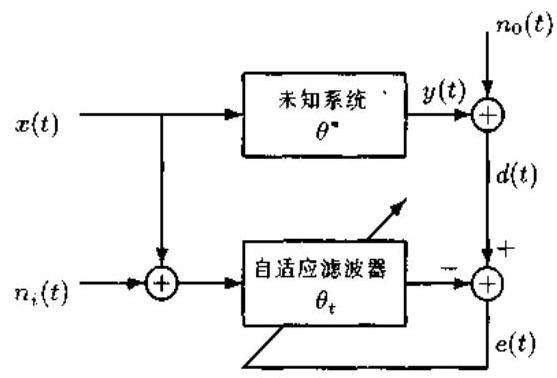

图 7.3.1 说明输入向量存在噪声 ${n}_{i}\left( t\right)$ 的冲激响应估计结构图

对于图 7.3.1,递推最小二乘 $t$ 时间的法方程为

$$
{R}_{t}{\theta }_{t} = {p}_{t} \tag{7.3.37}
$$

其中

$$
{R}_{t} = \frac{1}{t}\mathop{\sum }\limits_{{j = 1}}^{t}{y}_{j}{y}_{j}^{T} \tag{7.3.38}
$$

$$
{p}_{t} = \frac{1}{t}\mathop{\sum }\limits_{{j = 1}}^{t}d\left( j\right) {y}_{j} \tag{7.3.39}
$$

这里, ${y}_{j}$ 表示 $j$ 时间的有噪声自适应滤波器输入向量:

$$
{y}_{j} = {\left\lbrack  x\left( j\right)  + {n}_{i}\left( j\right) , x\left( j - 1\right)  + {n}_{i}\left( j - 1\right) ,\cdots , x\left( j - M + 1\right)  + {n}_{i}\left( j - M + 1\right) \right\rbrack  }^{T} \tag{7.3.40}
$$

而 $d\left( j\right)$ 是在时间 $j$ 的期望响应:

$$
d\left( j\right)  = {\phi }_{j}^{T}{\theta }^{ * }{n}_{o}\left( j\right) \tag{7.3.41}
$$

未知 FIR 系统冲激响应由式 (7.3.34) 表示, $j$ 时间的系统 (无噪声) 输入向量则为

$$
{\phi }_{j} = {\left\lbrack  x\left( j\right) , x\left( j - 1\right) ,\cdots , x\left( j - M + 1\right) \right\rbrack  }^{T} \tag{7.3.42}
$$

假定 $t$ 足够大,以致式 (7.3.38) 和式 (7.3.39) 的确定量可以分别用期望值代替:

$$
E\left\{  {{y}_{t}{y}_{t}^{T}}\right\}   = {R}_{\phi } + {\sigma }_{i}^{2}{I}_{M} \tag{7.3.43a}
$$

$$
E\left\{  {d\left( t\right) {y}_{t}}\right\}   \equiv  p = {R}_{\phi }{\theta }^{ * } \tag{7.3.43b}
$$

其中

$$
{R}_{\phi } = E\left\{  {{\phi }_{t}{\phi }_{t}^{T}}\right\} \tag{7.3.44}
$$

于是, 法方程 (7.3.37) 可以写作

$$
\left( {{R}_{\phi } + {\sigma }_{i}^{2}{I}_{M}}\right) {\theta }_{t} = {R}_{\phi }{\theta }^{ * } \tag{7.3.45}
$$

式 (7.3.45) 是令人感兴趣的. 如果没有输入向量噪声,即 ${\sigma }_{i}^{2} = 0$ ,则式 (7.3.45) 的最小二乘解为 ${\theta }_{t} = {\theta }^{ * }$ ,即它是无偏的. 一般情况下,式 (7.3.45) 的最小二乘解由下式给出:

$$
{\theta }_{t} = {\left( {R}_{\phi } + {\sigma }_{i}^{2}{I}_{M}\right) }^{-1}{R}_{\phi }{\theta }^{ * } \tag{7.3.46}
$$

${\theta }_{t}$ 可以用递推最小二乘算法自适应估计. 假定输入数据 $x\left( t\right)$ 是一个阶数至少为 $M$ 的持续激励随机过程,则 ${R}_{\phi }$ 是正定的. 因此,对 ${R}_{\phi } + {\sigma }_{i}^{2}{I}_{M}$ 应用矩阵求逆引理,则有

$$
{\left( {R}_{\phi } + {\sigma }_{i}^{2}{I}_{M}\right) }^{-1} = {R}_{\phi }^{-1} - {R}_{\phi }^{-1}{\left( {R}_{\phi }^{-1} + {\sigma }_{i}^{-2}{I}_{M}\right) }^{-1}{R}_{\phi }^{-1} \tag{7.3.47}
$$

将式 (7.3.47) 代人式 (7.3.46) 得到

$$
{\theta }_{t} = {\theta }^{ * } + {R}_{\phi }^{-1}{\left( {R}_{\phi }^{-1} + {\sigma }_{i}^{-2}{I}_{M}\right) }^{-1}{\theta }^{ * } \tag{7.3.48}
$$

显然, 这种递推最小二乘的偏差项为

$$
{\theta }_{\text{ bias }} = {R}_{\phi }^{-1}{\left( {R}_{\phi }^{-1} + {\sigma }_{i}^{-2}{I}_{M}\right) }^{-1}{\theta }^{ * }
$$

令 $\widetilde{D}$ 为一对称矩阵, ${\overline{\theta }}_{ \bot  } = {\left\lbrack  \begin{array}{ll} 1 &  - {\theta }^{T} \end{array}\right\rbrack  }^{T}$ ,其中

$$
\theta  = {\left\lbrack  {b}_{0},{b}_{1},\cdots ,{b}_{M - 1}\right\rbrack  }^{T} \tag{7.3.49}
$$

考虑下面的极小化问题:

$$
\mathop{\min }\limits_{\theta }\frac{1}{t}\mathop{\sum }\limits_{{j = 1}}^{t}\frac{{\overline{\theta }}_{ \bot  }^{T}{\bar{y}}_{j}{\bar{y}}_{j}^{T}{\overline{\theta }}_{ \bot  }}{{\overline{\theta }}_{ \bot  }^{T}\bar{D}{\overline{\theta }}_{ \bot  }} \tag{7.3.50}
$$

容易验证, 令

$$
\bar{D} = \left\lbrack  \begin{matrix} 1 & 0 \\  0 & 0 \end{matrix}\right\rbrack  \bar{M}
$$

极小化问题为最小二乘问题; 若令

$$
\bar{D} = \left\lbrack  \begin{matrix} 1 & 0 \\  0 & I \end{matrix}\right\rbrack  M
$$

则极小化问题为总体最小二乘问题.

令

$$
\bar{D} = \left\lbrack  \begin{matrix} \beta & 0 \\  0 & I \end{matrix}\right\rbrack  \bar{M} \tag{7.3.51}
$$

其中

$$
\beta  = \frac{{\sigma }_{o}^{2}}{{\sigma }_{i}^{2}} \tag{7.3.52}
$$

Davila 证明了下述定理 ${}^{\left\lbrack  {41}\right\rbrack  }$ .

定理 7.3.1 当滤波器输入含有零均值的加性白噪声时，由式 (7.3.50) $\sim  \left( {7.3.52}\right)$ 给出的总体最小二乘解 ${\theta }_{t}^{ * }$ 将给出渐近无偏和一致的 FIR 参数估计,并且与总体最小二乘估计对应的 “总体” 均方误差为 ${\lambda }_{\min }^{ * }\left( t\right)  = {\sigma }_{i}^{2}$ .

对上述总体最小二乘具体算法感兴趣的读者可进一步参阅文献 [41].

### 7.4 约束总体最小二乘

在求解方程 (7.2.4) 的总体最小二乘方法中,我们事实上假定了 $D = \left\lbrack  \begin{array}{ll}  - e & E \end{array}\right\rbrack$ 的噪声分量是线性独立的. 然而,在一些情况下, $D$ 的噪声分量可能是代数上相关的,即线性相关的、于是, 总体最小二乘不再给出最优的统计估计子. 当我们试图根据输入和输出估计系统的冲激响应时, $D$ 的噪声分量线性相关的情况便会发生. 假定 $y\left( t\right)$ 是系统的输出, $u\left( t\right)$ 是其输入. 我们现在试图根据下述近似方程 ${}^{\left\lbrack  9\right\rbrack  }$ 估计冲激响应函数 $h\left( t\right)$ :

$$
\left\lbrack  \begin{matrix} y\left( {t - m}\right) \\  y\left( {t + 1 - m}\right) \\  \vdots \\  y\left( t\right)  \end{matrix}\right\rbrack   \approx  \left\lbrack  \begin{matrix} u\left( {t - m}\right) & \cdots & u\left( {t - n - m}\right) \\  u\left( {t + 1 - m}\right) & \cdots & u\left( {t + 1 - n - m}\right) \\  \vdots & & \vdots \\  u\left( t\right) & \cdots & u\left( {t - n}\right)  \end{matrix}\right\rbrack  \left\lbrack  \begin{matrix} h\left( 0\right) \\  h\left( 1\right) \\  \vdots \\  h\left( n\right)  \end{matrix}\right\rbrack \tag{7.4.1a}
$$

或写成矩阵-向量方程:

$$
y = {Uh} \tag{7.4.1b}
$$

$U$ 的噪声分量显然是 Toeplitz 矩阵,但是这种信息并没有被总体最小二乘解所利用.

再看数据矩阵的噪声分量线性相关的另外一个重要的例子: 根据被白噪声污染的测量数据估计正弦波频率的前向线性预测 ${}^{\left\lbrack  {10} \sim  {12}\right\rbrack  }$ . 具体地，我们假定测量数据由

$$
{y}_{n} = \mathop{\sum }\limits_{{k = 1}}^{L}{S}_{k}{\mathrm{e}}^{\mathrm{j}{2\pi n}{f}_{k}} + {v}_{n},\;n = 1,\cdots , N \tag{7.4.2}
$$

给出,式中 $\left\{  {v}_{n}\right\}$ 是零均值的独立同分布噪声. 前向线性预测方程为

$$
C\left\lbrack  \begin{matrix} x \\   - 1 \end{matrix}\right\rbrack   = 0 \tag{7.4.3}
$$

其中

$$
C = \left\lbrack  \begin{matrix} {y}_{1} & {y}_{2} & \cdots & {y}_{L + 1} \\  {y}_{2} & {y}_{3} & \cdots & {y}_{L + 2} \\  \vdots & \vdots & & \vdots \\  {y}_{N - L} & {y}_{N - L + 1} & \cdots & {y}_{N} \\  \cdots & \cdots & \cdots & \cdots \\  {y}_{L + 1}^{ * } & {y}_{L}^{ * } & \cdots & {y}_{1}^{ * } \\  \vdots & \vdots & & \vdots \\  {y}_{N}^{ * } & {y}_{N - 1}^{ * } & \cdots & {y}_{N - L}^{ * } \end{matrix}\right\rbrack
$$

$$
x = \left\lbrack  \begin{matrix} {x}_{1} \\  \vdots \\  {x}_{L} \end{matrix}\right\rbrack
$$

这里, ${y}_{t}^{ * }$ 是 ${y}_{t}$ 的复数共轭.

观察知,矩阵 $C$ 上半部分具有 Hankel 结构,下半部分具有 Toeplitz 结构. 这种结构特征也没有被总体最小二乘方法所利用. 为了得到 $x$ 的更加精确的估计, Abatzoglou 等人提出了一种推广的总体最小二乘, 并称之为约束总体最小二乘 (CTLS: Constrained Total Least Squares) 方法 ${}^{\lbrack {10} \sim  {12}\rbrack }$ .

#### 7.4.1 约束总体最小二乘方法

令

$$
{\Delta C} = \left\lbrack  \begin{array}{lll} \Delta {C}_{1} & \cdots & \Delta {C}_{L + 1} \end{array}\right\rbrack
$$

其中向量 $\Delta {C}_{i} \in  {C}^{M \times  1}M$ 是矩阵 ${\Delta C}$ 的第 $i$ 列. 设 $\left\{  {{v}_{1},\cdots ,{v}_{K}}\right\}$ 是线性独立随机变量的最小代数集合, 并满足:

$$
\Delta {C}_{i} = {F}_{i}v,\;i = 1,\cdots , L + 1 \tag{7.4.4}
$$

其中 $v = {\left\lbrack  {v}_{1},\cdots ,{v}_{K}\right\rbrack  }^{T}$ ,且 ${F}_{i}$ 是 $M \times  K$ 矩阵. 如果 $v$ 不是白色的随机向量,则可以应用合适的变换使之白 (色) 化. 假定 $R = E\left\{  {v{v}^{H}}\right\}   = P{P}^{H}$ 是矩阵 $R$ 的 Cholesky 分解,于是可以利用

$$
u = {P}^{-1}v \tag{7.4.5}
$$

使 $v$ 变换成白噪声向量 $\mathbf{u}$ . 这样一来, $\Delta {C}_{i}$ 就可以表示为

$$
\Delta {C}_{i} = {F}_{i}{Pu} = {G}_{i}u,\;i = 1,\cdots , L + 1 \tag{7.4.6}
$$

式中 ${G}_{i} = {F}_{i}P \in  {C}^{M \times  K}$ .

用噪声列向量定义一新矩阵

$$
\overline{\Delta C} = \left\lbrack  \begin{matrix} \Delta {C}_{1} \\  \vdots \\  \Delta {C}_{L + 1} \end{matrix}\right\rbrack   = \left\lbrack  \begin{matrix} {G}_{1}u \\  \vdots \\  {G}_{L + 1}u \end{matrix}\right\rbrack   = \left\lbrack  \begin{matrix} {G}_{1} \\  \vdots \\  {G}_{L + 1} \end{matrix}\right\rbrack  u = \bar{G}u \tag{7.4.7}
$$

式中

$$
\bar{G} = \left\lbrack  \begin{matrix} {G}_{1} \\  \vdots \\  {G}_{L + 1} \end{matrix}\right\rbrack   \in  {C}^{\left( {L + 1}\right) M \times  K} \tag{7.4.8}
$$

由于 $u$ 具有维数 $K$ ,而且它的维数根据假定为最小,所以 $\widetilde{G}$ 的秩等于 $K$ .

定义 $\overline{\Delta C}$ 的加权范数

$$
\parallel \overline{\Delta C}{\parallel }_{Q}^{2} = {\overline{\Delta C}}^{H}Q\overline{\Delta C} \tag{7.4.9}
$$

并选择 $Q$ 使得 $u$ 的所有分量都被均匀加权.

均匀加权的方法如下: 令 $\widetilde{G}$ 的奇异值分解为

$$
\bar{G} = {U\sum }{V}^{H}
$$

则

$$
\parallel \overline{\Delta C}{\parallel }_{Q}^{2} = {u}^{H}{\bar{G}}^{H}Q\bar{G}u = {u}^{H}V{\sum }^{T}{U}^{H}{QU\sum }{V}^{H}u \tag{7.4.10}
$$

若选择加权矩阵 $Q$ 为

$$
Q = U{\left( \sum {\sum }^{T}\right) }^{ \dagger  }{U}^{H} \tag{7.4.11}
$$

则 $\parallel \overline{\Delta C}{\parallel }_{Q}^{2} = {u}^{H}u$ .

值得强调的是,虽然 $Q$ 是秩 $K$ 的半正定矩阵,但是它定义了噪声列向量的 $K$ 维子空间

$$
\{ \overline{\Delta C} \mid  \overline{\Delta C} = \bar{G}u\} \tag{7.4.12}
$$

上的 “真正的” 范数. 约束总体最小二乘问题可以叙述为: 确定一个解向量 $x$ 和最小扰动 $u$ ,使得

$$
\left( {C + \left\lbrack  \begin{array}{lll} {G}_{1}u & \cdots & {G}_{L + 1}u \end{array}\right\rbrack  }\right) \left\lbrack  \begin{matrix} x \\   - 1 \end{matrix}\right\rbrack   = 0 \tag{7.4.13}
$$

在数学上，约束总体最小二乘问题可以写作

$$
\text{ 在 }\left( {C + \left\lbrack  \begin{array}{lll} {G}_{1}u & \cdots & {G}_{L + 1}u \end{array}\right\rbrack  }\right) \left\lbrack  \begin{matrix} x \\   - 1 \end{matrix}\right\rbrack   = 0\text{ 约束条件下, }\;\mathop{\min }\limits_{{u, x}}\parallel u{\parallel }^{2} \tag{7.4.14}
$$

这是一个在二次型约束方程约束下的二次型极小化问题. 它可能没有闭式解, 但是在适当的条件下,极小化问题可以变换成一个对极小化变量 $x$ 的非约束极小化问题.

为了说明这一点,假定当 $C$ 的噪声等于零,则有一致方程 ${C}_{0}\left\lbrack  \begin{matrix} {x}_{0} \\   - 1 \end{matrix}\right\rbrack   = 0$ . 这就使得式 (7.4.13) 总有一个解. 注意到随机向量 $u$ 的维数 $K$ 必然小于 ${\Delta C}$ 的维数 $M\left( {L + 1}\right)$ ,而且 $K$ 越大,则 ${\Delta C}$ 的分量满足的代数关系的数量就越少. 下面的定理 ${}^{\left\lbrack  {12}\right\rbrack  }$ 具体描述了约束极小化问题如何变换为非约束极小化问题.

定理 7.4.1 令

$$
{W}_{x} = \mathop{\sum }\limits_{{i = 1}}^{L}{x}_{i}{G}_{i} - {G}_{L + 1} \tag{7.4.15}
$$

其中 ${W}_{x}^{ \dagger  }$ 是 ${H}_{x}$ 的伪逆矩阵,则约束总体最小二乘的解向量就是满足下列函数极小化的变量 $x$ :

$$
\mathop{\min }\limits_{x}{\left\lbrack  \begin{matrix} x \\   - 1 \end{matrix}\right\rbrack  }^{H}{C}^{H}{\left( {W}_{x}^{ \dagger  }\right) }^{H}{W}_{x}^{ \dagger  }C\left\lbrack  \begin{matrix} x \\   - 1 \end{matrix}\right\rbrack \tag{7.4.16}
$$

证明 注意到

$$
\left\lbrack  {{G}_{1}u\cdots {G}_{L + 1}u}\right\rbrack  \left\lbrack  \begin{matrix} x \\   - 1 \end{matrix}\right\rbrack   = \mathop{\sum }\limits_{{i = 1}}^{L}{x}_{i}{G}_{i}u - {G}_{L + 1}u
$$

$$
= \left( {\mathop{\sum }\limits_{{i = 1}}^{L}{x}_{i}{G}_{i} - {G}_{L + 1}}\right) u \tag{7.4.17}
$$

在代入式 (7.4.15) 之后，式 (7.4.17) 可以重新写作

$$
C\left\lbrack  \begin{matrix} x \\   - 1 \end{matrix}\right\rbrack   + {W}_{x}u = 0 \tag{7.4.18}
$$

现在，约束总体最小二乘解由满足式 (7.4.18) 的向量 $u$ 的范数平方的极小化

$$
\mathop{\min }\limits_{{u, x}}\parallel u{\parallel }^{2}
$$

给出. 对于满足式 (7.4.18) 的任何 $u$ 和 $x$ ,易知

$$
\parallel u{\parallel }^{2} \geq  \mathop{\min }\limits_{u}\parallel u{\parallel }^{2} = {\left\lbrack  \begin{matrix} x \\   - 1 \end{matrix}\right\rbrack  }^{H}{C}^{H}{\left( {W}_{x}^{ \dagger  }\right) }^{H}{W}_{x}^{ \dagger  }C\left\lbrack  \begin{matrix} x \\   - 1 \end{matrix}\right\rbrack
$$

因为在式 (7.4.18) 的约束条件下, $\mathop{\min }\limits_{u}\parallel u{\parallel }^{2}$ 的解为 $u =  - {W}_{x}^{ \dagger  }C\left\lbrack  \begin{matrix} x \\   - 1 \end{matrix}\right\rbrack$ . 于是,可以得到结论: 约束总体最小二乘解由

$$
F\left( x\right)  = \left\lbrack  \begin{matrix} x \\   - 1 \end{matrix}\right\rbrack  {C}^{H}{\left( {W}_{x}^{ \dagger  }\right) }^{H}{W}_{x}^{ \dagger  }C\left\lbrack  \begin{matrix} x \\   - 1 \end{matrix}\right\rbrack
$$

相对于 $x$ 的极小化给出.

值得指出的是,如果 $M \leq  K$ ,并且 ${H}_{x}$ 满秩,则 $F\left( x\right)$ 的表达式可以进一步简化.

(1) $K > M$ 时

由于

$$
{W}_{x}^{ \dagger  } = {W}_{x}^{H}{\left( {W}_{x}{W}_{x}^{H}\right) }^{-1}
$$

所以

$$
F\left( x\right)  = {\left\lbrack  \begin{matrix} x \\   - 1 \end{matrix}\right\rbrack  }^{H}{C}^{H}{\left( {W}_{x}{W}_{x}^{H}\right) }^{-1}{W}_{x}{W}_{x}^{H}{\left( {W}_{x}{W}_{x}^{H}\right) }^{-1}C\left\lbrack  \begin{matrix} x \\   - 1 \end{matrix}\right\rbrack
$$

$$
= {\left\lbrack  \begin{matrix} x \\   - 1 \end{matrix}\right\rbrack  }^{H}{C}^{H}{\left( {W}_{x}{W}_{x}^{H}\right) }^{-1}C\left\lbrack  \begin{matrix} x \\   - 1 \end{matrix}\right\rbrack
$$

(2) $M = K$ 时

因 ${W}_{x}^{ \dagger  } = {W}_{x}^{-1}$ ,故

$$
F\left( x\right)  = {\left\lbrack  \begin{matrix} x \\   - 1 \end{matrix}\right\rbrack  }^{H}{C}^{H}{\left( {W}_{x}^{H}\right) }^{-1}{W}_{x}^{-1}C\left\lbrack  \begin{matrix} x \\   - 1 \end{matrix}\right\rbrack
$$

如果 $M > K$ 或者 ${W}_{x}$ 秩亏缺,那么为了得到约束总体最小二乘解,就仍然需要进行式 (7.4.16) 的极小化. 有关这种情况下的极小化算法可参见文献 [12]. 下面将侧重在大多数应用中都能够满足的情况,即 $M \leq  K$ 和 ${H}_{x}$ 满秩的情况.

利用解析方法计算 $F\left( x\right)$ 的极小化是相当困难的 ${}^{\left\lbrack  {12}\right\rbrack  }$ . 下面考虑计算约束总体最小二乘解的 Newton方法. $F\left( x\right)$ 可以看作是 ${2L}$ 个实变量 (即 ${x}_{1},\cdots ,{x}_{L}$ 的实部和虚部) 的解析函数. 为了求 ${x}_{\mathrm{{CTLS}}}$ ,我们必须使 $F\left( x\right)$ 相对于这些 ${2L}$ 个变量极小化. 如果必须计算 $F\left( x\right)$ 的一阶和二阶偏导数,为了得到估计 $f\left( x\right)$ 极小化的递推方法,把 $F\left( x\right)$ 看作 ${2L}$ 个复变量 ${x}_{1},\cdots ,{x}_{L},{x}_{1}^{ * },\cdots ,{x}_{L}^{ * }$ 的函数将更加方便,其中 ${x}_{i}^{ * }$ 是 ${x}_{i}$ 的复数共轭. 根据文献 $\left\lbrack  {13}\right\rbrack$ ,在计算 $F$ 的一阶和二阶偏导数的时候,可以将 ${x}_{n}$ 和 ${x}_{m}^{ * }$ 视为独立的变量组.

对于任一函数的极小化, 最速下降法可能收敛不是很快, 因为在选择最优步长时存在不确定性. 如果被极小化的函数是二次可微分的, 则 Newton 方法是二次或更快速收敛的 314 . 文献 [12] 提出了一种复数形式的 Newton 方法,它利用 $F$ 的一阶和二阶偏导数递推确定 $F$ 的极小化变量 $x$ . Newton 递推公式如下:

$$
x = {x}_{0} + {\left( {A}^{ * }{B}^{-1}A - {B}^{ * }\right) }^{-1}\left( {{a}^{ * } - {A}^{ * }{B}^{-1}a}\right) \tag{7.4.19}
$$

其中

$$
\left. \begin{aligned} a &  = \frac{\partial {F}^{T}}{\partial x} \\   &  = {\left\lbrack  \frac{\partial F}{\partial {x}_{1}},\cdots ,\frac{\partial F}{\partial {x}_{L}}\right\rbrack  }^{T} = F\text{ 的复梯度 } \\  A &  = \frac{1}{2}\left( {\frac{{\partial }^{2}F}{\partial {x}^{2}} + \frac{{\partial }^{2}{F}^{T}}{\partial {x}^{2}}}\right) \\   &  = F\text{ 的无共轭 }\text{ 相连 } \\  B &  = \frac{{\partial }^{2}F}{\partial {x}^{H}\partial x} \\   &  = F\text{ 的无穷远 } \end{aligned}\right\} \tag{7.4.20}
$$

二阶偏导数定义为

$$
\frac{{\partial }^{2}F}{\partial {x}^{2}} = {\left( \frac{{\partial }^{2}F}{\partial {x}_{m}\partial {x}_{n}}\right) }_{m, n} = {\left\lbrack  \frac{1}{4}\left( \frac{\partial }{\partial {x}_{mR}} - \mathrm{j}\frac{\partial }{\partial {x}_{mI}}\right) \left( \frac{\partial }{\partial {x}_{nR}} - \mathrm{j}\frac{\partial }{\partial {x}_{nI}}\right) F\right\rbrack  }_{m,} \tag{7.4.21}
$$

$$
\frac{{\partial }^{2}F}{\partial {x}^{H}\partial x} = {\left( \frac{{\partial }^{2}F}{\partial {x}_{m}^{H}\partial {x}_{n}}\right) }_{m, n} = {\left\lbrack  \frac{1}{4}\left( \frac{\partial }{\partial {x}_{mR}} + \mathrm{j}\frac{\partial }{\partial {x}_{mI}}\right) \left( \frac{\partial }{\partial {x}_{nR}} - \mathrm{j}\frac{\partial }{\partial {x}_{nI}}\right) F\right\rbrack  }_{m,} \tag{7.4.22}
$$

令

$$
u = {\left( {W}_{x}{W}_{x}^{H}\right) }^{-1}C\left\lbrack  \begin{matrix} x \\   - 1 \end{matrix}\right\rbrack \tag{7.4.23}
$$

$$
\widetilde{B} = C{I}_{L + 1, L} - \left\lbrack  \begin{array}{lll} {G}_{1}{W}_{x}^{H}u & \cdots & {G}_{L}{W}_{x}^{H}u \end{array}\right\rbrack \tag{7.4.24}
$$

$$
\widetilde{G} = \left\lbrack  \begin{array}{lll} {G}_{1}^{H}u & \cdots & {G}_{L}^{H}u \end{array}\right\rbrack \tag{7.4.25}
$$

其中 ${I}_{L + 1, L}$ 是一个 $\left( {L + 1}\right)  \times  L$ 对角矩阵,其对角线元素为 1 . 于是, $a, A$ 和 $B$ 可以计算如下:

$$
a = {\left( {u}^{H}\widetilde{B}\right) }^{T} \tag{7.4.26}
$$

$$
A =  - {\widetilde{G}}^{H}{W}_{x}^{H}{\left( {W}_{x}{W}_{x}^{H}\right) }^{-1}\widetilde{B} - {\left( {\widetilde{G}}^{H}{W}_{x}^{H}{\left( {W}_{x}{W}_{x}^{H}\right) }^{-1}\widetilde{B}\right) }^{T} \tag{7.4.27}
$$

$$
B = {\left\lbrack  {\widetilde{B}}^{H}{\left( {W}_{x}{W}_{x}^{H}\right) }^{-1}\widetilde{B}\right\rbrack  }^{T} + {\widetilde{G}}^{H}\left\lbrack  {{W}_{x}^{H}{\left( {W}_{x}{W}_{x}^{H}\right) }^{-1}{W}_{x} - I}\right\rbrack  \widetilde{G} \tag{7.4.28}
$$

应当指出的是, 在无噪声情况下, 上述 Newton 方法的收敛区的大小和形状的精确估计仍然是个未解决的问题.

#### 7.4.2 约束总体最小二乘与极大似然的关系

下面证明, 约束总体最小二乘解可以根据约束的状态空间极大似然估计子求得. 令

$$
C = \left\lbrack  \begin{array}{llll} {A}_{1} & \cdots & {A}_{L} & b \end{array}\right\rbrack
$$

并利用

$$
{\widehat{A}}_{i} = {A}_{i} + {G}_{i}u,\;i = 1,\cdots , L \tag{7.4.29}
$$

定义状态向量 ${\widehat{A}}_{1},\cdots ,{\widehat{A}}_{L}$ . 于是,根据 $\left( {C + \left\lbrack  \begin{array}{lll} {G}_{1}u & \cdots & {G}_{L + 1}u \end{array}\right\rbrack  }\right) \left\lbrack  \begin{matrix} x \\   - 1 \end{matrix}\right\rbrack   = 0$ ,解向量 $x$ 满足方程:

$$
\widehat{A}x - b = {G}_{L + 1}u \tag{7.4.30}
$$

其中

$$
\widehat{A} = \left\lbrack  \begin{array}{lll} {\widehat{A}}_{1} & \cdots & {\widehat{A}}_{L} \end{array}\right\rbrack
$$

现在, 约束总体最小二乘问题可以重新叙述为

$$
\mathop{\min }\limits_{{u,\widehat{A}, x}}\parallel u{\parallel }^{2}
$$

式中

$$
\left\lbrack  \begin{matrix} {\widehat{A}}_{1} - {A}_{1} \\  \vdots \\  {\widehat{A}}_{L} - {A}_{L} \\  \widetilde{A}x - b \end{matrix}\right\rbrack   = \left\lbrack  \begin{matrix} {G}_{1}u \\  \vdots \\  {G}_{L + 1}u \end{matrix}\right\rbrack   = \widetilde{G}u \tag{7.4.31}
$$

由此可以解出 $u$ 为

$$
u = {\widetilde{G}}^{ \dagger  }\left\lbrack  \begin{matrix} {\widehat{A}}_{1} - {A}_{1} \\  \vdots \\  {\widehat{A}}_{L} - {A}_{L} \\  \widehat{A}x - b \end{matrix}\right\rbrack \tag{7.4.32}
$$

其中 ${\widetilde{G}}^{ \dagger  } = V{\sum }^{ \dagger  }{U}^{H}$ 是 $\widetilde{G}$ 的伪逆矩阵.

$$
U = \left\lbrack  \begin{array}{ll} {U}_{1} & {U}_{2} \end{array}\right\rbrack \tag{7.4.33}
$$

其中 ${U}_{1}$ 是 $\left( {L + 1}\right) M \times  K$ 矩阵.

于是,状态向量 ${\widehat{A}}_{1},\cdots ,{\widehat{A}}_{L}$ 和 $x$ 满足约束条件:

$$
{U}_{2}^{H}\left\lbrack  \begin{matrix} {\widehat{A}}_{1} - {A}_{1} \\  \vdots \\  {\widehat{A}}_{L} - {A}_{L} \\  \widehat{A}x - b \end{matrix}\right\rbrack   = 0 \tag{7.4.34}
$$

最后, 约束总体最小二乘解可以叙述为: 在式 (7.4.34) 所示约束条件下,

$$
\min {\begin{Vmatrix}{\widetilde{G}}^{ \dagger  }\left\lbrack  \begin{matrix} {\widehat{A}}_{1} - {A}_{1} \\  \vdots \\  {\widehat{A}}_{L} - {A}_{L} \\  \widehat{Ax} - b \end{matrix}\right\rbrack  \end{Vmatrix}}^{2} \tag{7.4.35}
$$

下面再考查状态空间极大似然参数估计问题. 考虑观测向量:

$$
\bar{C} = \left\lbrack  \begin{matrix} {A}_{1} \\  \vdots \\  {A}_{L} \\  b \end{matrix}\right\rbrack   = \left\lbrack  \begin{matrix} {A}_{10} \\  \vdots \\  {A}_{L0} \\  {A}_{0}x \end{matrix}\right\rbrack   + \widetilde{G}v \tag{7.4.36}
$$

其中 $v$ 是 $K$ 维高斯白噪声向量. 参数 ${A}_{10},\cdots ,{A}_{L0}$ 是 $M$ 维未知向量, $x$ 是 $L$ 维未知向量,而矩阵 ${A}_{0} = \left\lbrack  \begin{array}{lll} {A}_{10} & \cdots & {A}_{L0} \end{array}\right\rbrack$ .

令

$$
\left. \begin{matrix} z = {V}^{H}v \\  \sum  = \left\lbrack  \begin{matrix} {\sigma }_{1} & & 0 \\   &  \ddots  & \\   & & 0 \\   & & \vdots \\  0 & & 0 \end{matrix}\right\rbrack   = \left\lbrack  \begin{matrix} \widetilde{\sum } \\  0 \end{matrix}\right\rbrack   \end{matrix}\right\} \tag{7.4.37}
$$

用 ${U}^{H}$ 左乘矩阵 $\bar{C}$ . 则观测向量 $\bar{C}$ 可以分解为随机分量

$$
{U}_{1}^{H}\bar{C} = {U}_{1}^{H}\left\lbrack  \begin{matrix} {A}_{10} \\  \vdots \\  {A}_{L0} \\  {A}_{0}x \end{matrix}\right\rbrack   + \widetilde{\sum }z \tag{7.4.38}
$$

和确定性分量

$$
{U}_{2}^{H}\bar{C} = {U}_{2}^{H}\left\lbrack  \begin{matrix} {A}_{10} \\  \vdots \\  {A}_{L0} \\  {A}_{0}x \end{matrix}\right\rbrack \tag{7.4.39}
$$

对数似然函数变为

$$
{\left\lbrack  \begin{matrix} {A}_{1} - {A}_{10} \\  \vdots \\  {A}_{L} - {A}_{L0} \\  b - {A}_{0}x \end{matrix}\right\rbrack  }^{H}{U}_{1}{\left( {\sum }^{T}\sum \right) }^{-1}{U}_{1}^{H}\left\lbrack  \begin{matrix} {A}_{1} - {A}_{10} \\  \vdots \\  {A}_{L} - {A}_{L0} \\  b - {A}_{0}x \end{matrix}\right\rbrack \tag{7.4.40}
$$

约束条件为

$$
{U}_{2}^{H}\left\lbrack  \begin{matrix} {A}_{1} - {A}_{10} \\  \vdots \\  {A}_{L} - {A}_{L0} \\  b - {A}_{0}x \end{matrix}\right\rbrack   = 0 \tag{7.4.41}
$$

注意到

$$
{\left( {\widetilde{G}}^{ \dagger  }\right) }^{H}{\widetilde{G}}^{ \dagger  } = U{\left( {\sum }^{ \dagger  }\right) }^{T}{V}^{H}V{\sum }^{ \dagger  }{U}^{H}
$$

$$
= U{\left( {\sum }^{ \dagger  }\right) }^{T}{\sum }^{ \dagger  }{U}^{H}
$$

$$
= \left\lbrack  \begin{array}{ll} {U}_{1} & {U}_{2} \end{array}\right\rbrack  \left\lbrack  \begin{matrix} {\sigma }_{1}^{-1} & & \\  0 &  \ddots  & \\  \vdots & & {\sigma }_{K}^{-1} \\   &  \ddots  & \vdots \\   & & 0 \end{matrix}\right\rbrack  \left\lbrack  \begin{matrix} {\sigma }_{1}^{-1} & & & 0 \\   &  \ddots  & & \vdots \\   & & {\sigma }_{K}^{-1} & 0 \end{matrix}\right\rbrack  \left\lbrack  \begin{array}{l} {U}_{1}^{H} \\  {U}_{2}^{H} \end{array}\right\rbrack
$$

$$
= {U}_{1}{\left( {\sum }_{1}^{T}\sum \right) }^{-1}{U}_{1}^{H}
$$

这意味着，约束极大似然解由下式给出:在

$$
{U}_{2}^{H}\left\lbrack  \begin{matrix} {A}_{1} - {A}_{10} \\  \vdots \\  {A}_{L} - {A}_{L0} \\  b - {A}_{0}x \end{matrix}\right\rbrack   = 0
$$

的约束条件下,

$$
\min {\begin{Vmatrix}{\widetilde{G}}^{ \dagger  }\left\lbrack  \begin{matrix} {\widehat{A}}_{1} - {A}_{1} \\  \vdots \\  {\widehat{A}}_{L} - {A}_{L} \\  \widehat{A}x - b \end{matrix}\right\rbrack  \end{Vmatrix}}^{2}
$$

与约束总体最小二乘的公式完全相同. 换句话说, 约束总体最小二乘解与约束极大似然估计等价.

#### 7.4.3 约束总体最小二乘解的扰动分析

现在推导约束总体最小二乘解的小噪声扰动分析公式. 考查当 $K \geq  M$ 和 $H$ 满秩时式 (7.4.16) 所示约束总体最小二乘解的公式, 即

$$
\mathop{\min }\limits_{x}\left( {{\left\lbrack  \begin{matrix} x \\   - 1 \end{matrix}\right\rbrack  }^{H}{C}^{H}{\left( {W}_{x}{W}_{x}^{H}\right) }^{-1}C\left\lbrack  \begin{matrix} x \\   - 1 \end{matrix}\right\rbrack  }\right)
$$

假定当矩阵 $C$ 的噪声为零时存在一致解

$$
{C}_{0}\left\lbrack  \begin{matrix} {x}_{0} \\   - 1 \end{matrix}\right\rbrack   = 0 \tag{7.4.42}
$$

现在将一小噪声项加到 ${C}_{0}$ 上,并计算在约束总体最小二乘解中引起的相应扰动. 注意到函数

$$
F\left( x\right)  = \left( {{\left\lbrack  \begin{matrix} x \\   - 1 \end{matrix}\right\rbrack  }^{H}{C}^{H}{\left( {W}_{x}{W}_{x}^{H}\right) }^{-1}C\left\lbrack  \begin{matrix} x \\   - 1 \end{matrix}\right\rbrack  }\right) \tag{7.4.43}
$$

是复变量 ${x}_{1},\cdots ,{x}_{L}$ 的实的解析函数,因此, $F\left( x\right)$ 的极小化的必要条件是 ${}^{\left\lbrack  {13}\right\rbrack  }$

$$
\frac{\partial F}{\partial x} = \left\lbrack  \begin{array}{lll} \frac{\partial F}{\partial {x}_{1}} & \cdots & \frac{\partial F}{\partial {x}_{L}} \end{array}\right\rbrack   = 0 \tag{7.4.44}
$$

式中 $x = \left\lbrack  {{x}_{1},\cdots ,{x}_{L}}\right\rbrack$ . 根据第一章矩阵函数的偏导数公式 (1.1.4) (1.1.7),我们有

$$
\frac{\partial F{\left( x\right) }^{-1}}{\partial {x}_{i}} =  - F{\left( x\right) }^{-1}\frac{\partial F\left( x\right) }{\partial {x}_{i}}F{\left( x\right) }^{-1}
$$

$$
\frac{\partial F\left( x\right) }{\partial {x}_{i}}y = \left\lbrack  \begin{matrix} \mathop{\sum }\limits_{{j = 1}}^{M}\frac{\partial {F}_{1j}\left( x\right) }{\partial {x}_{i}}{y}_{j} \\  \vdots \\  \mathop{\sum }\limits_{{j = 1}}^{M}\frac{\partial {F}_{Mj}\left( x\right) }{\partial {x}_{i}}{y}_{j} \end{matrix}\right\rbrack   = \left\lbrack  \begin{matrix} \mathop{\sum }\limits_{{j = 1}}^{M}{f}_{1ji}{y}_{j} \\  \vdots \\  \mathop{\sum }\limits_{{j = 1}}^{M}{f}_{Mji}{y}_{j} \end{matrix}\right\rbrack
$$

和

$$
\frac{\partial F}{\partial x}y = \mathop{\sum }\limits_{{j = 1}}^{M}{f}_{njm}{y}_{j},\;n = 1,\cdots , M;m = 1,\cdots , L + 1
$$

式中

$$
{f}_{njm} = \frac{\partial {F}_{nj}}{\partial {x}_{m}}
$$

利用以上偏导数，可从式 (7.4.43) 得到

$$
\frac{\partial F}{\partial x} =  - {\left\lbrack  \begin{matrix} x \\   - 1 \end{matrix}\right\rbrack  }^{H}{C}^{H}{\left( {W}_{x}{W}_{x}\right) }^{-1}\frac{\partial {W}_{x}}{\partial x}{W}_{x}^{H}{\left( {W}_{x}{W}_{x}^{H}\right) }^{-1}C\left\lbrack  \begin{matrix} x \\   - 1 \end{matrix}\right\rbrack
$$

$$
+ \left\lbrack  \begin{matrix} x \\   - 1 \end{matrix}\right\rbrack  {C}^{H}{\left( {W}_{x}{W}_{x}^{H}\right) }^{-1}C{I}_{L + 1, L} \tag{7.4.45}
$$

令

$$
y = {\left( {W}_{x}{W}_{x}^{H}\right) }^{-1}C\left\lbrack  \begin{matrix} x \\   - 1 \end{matrix}\right\rbrack \tag{7.4.46}
$$

并注意到

$$
\frac{\partial {W}_{x}}{\partial x}{W}_{x}^{H}y = \left\lbrack  \begin{array}{llll} {G}_{1}{W}_{x}^{H}y & \cdots & {G}_{L}{W}_{x}^{H}y & 0 \end{array}\right\rbrack
$$

则 $\partial F/\partial x$ 的方程式可以写作

$$
\frac{\partial F}{\partial x} =  - {y}^{H}\left\lbrack  \begin{array}{llll} {G}_{1}{W}_{x}^{H}y & \cdots & {G}_{L}{W}_{x}^{H}y & 0 \end{array}\right\rbrack   + {y}^{H}C{I}_{L + 1, L} \tag{7.4.47}
$$

在式 (7.4.46) 中,观察由小噪声扰动 ${\Delta C}$ 引起的解向量 $x$ 的扰动 ${\Delta x}$ . 如果忽略 ${\Delta x}$ 或 ${\Delta C}$ 中的二阶和更高阶项,则

$$
{\left\lbrack  \begin{matrix} {\Delta x} \\  0 \end{matrix}\right\rbrack  }^{H}{C}_{0}^{H}{\left( {W}_{x}{W}_{x}^{H}\right) }^{-1}{C}_{0}{I}_{L + 1, L} + {\left\lbrack  \begin{matrix} {x}_{0} \\   - 1 \end{matrix}\right\rbrack  }^{H}\Delta {C}^{H}{\left( {W}_{x}{W}_{x}^{H}\right) }^{-1}{C}_{0}{I}_{L + 1, L} \approx  0
$$

其共轭转置为

$$
{I}_{L + 1, L}{C}_{0}^{H}{\left( {W}_{x}{W}_{x}^{H}\right) }^{-1}\left\lbrack  {{C}_{0}\left( \begin{matrix} {\Delta x} \\  0 \end{matrix}\right)  + {\Delta C}\left( \begin{matrix} {x}_{0} \\   - 1 \end{matrix}\right) }\right\rbrack   = 0
$$

若定义

$$
D = {I}_{L + 1, L}{C}_{0}^{H}{\left( {W}_{x}{W}_{x}^{H}\right) }^{-1} = {A}_{0}^{H}{\left( {W}_{x}{W}_{x}^{H}\right) }^{-1} \tag{7.4.48}
$$

则有

$$
D{C}_{0}\left\lbrack  \begin{matrix} {\Delta x} \\  0 \end{matrix}\right\rbrack   + {D\Delta C}\left\lbrack  \begin{matrix} {x}_{0} \\   - 1 \end{matrix}\right\rbrack   = {A}_{0}^{H}{\left( {W}_{x}{W}_{x}^{H}\right) }^{-1}{A}_{0}{\Delta x} + {D\Delta C}\left\lbrack  \begin{matrix} {x}_{0} \\   - 1 \end{matrix}\right\rbrack   \approx  0
$$

从而得到

$$
{\Delta x} =  - {\left\lbrack  {A}_{0}^{H}{\left( {W}_{x}{W}_{x}^{H}\right) }^{-1}{A}_{0}\right\rbrack  }^{-1}{D\Delta C}\left\lbrack  \begin{matrix} {x}_{0} \\   - 1 \end{matrix}\right\rbrack \tag{7.4.49}
$$

${\Delta x}$ 的协方差为

$$
E\left\{  {{\Delta x\Delta }{x}^{H}}\right\}   = {\left\lbrack  {\Lambda }_{0}^{H}{\left( {W}_{x}{W}_{x}^{H}\right) }^{-1}{A}_{0}\right\rbrack  }^{-1}{DE}\left\{  {{\Delta C}\left\lbrack  \begin{matrix} {x}_{0} \\   - 1 \end{matrix}\right\rbrack  {\left\lbrack  \begin{matrix} {x}_{0} \\   - 1 \end{matrix}\right\rbrack  }^{H}\Delta {C}^{H}}\right\}
$$

$$
\times  {D}^{H}{\left\lbrack  {\mathbf{A}}_{0}^{H}{\left( {W}_{x}{\mathbf{W}}_{x}^{H}\right) }^{-1}{\mathbf{A}}_{0}\right\rbrack  }^{-1} \tag{7.4.50}
$$

进而, 由式 (7.4.15) 和式 (7.4.17) 得到

$$
{\Delta C}\left\lbrack  \begin{matrix} {x}_{0} \\   - 1 \end{matrix}\right\rbrack   = {W}_{x}u
$$

故

$$
E\left\{  {{\Delta C}\left\lbrack  \begin{matrix} {x}_{0} \\   - 1 \end{matrix}\right\rbrack  {\left\lbrack  \begin{matrix} {x}_{0} \\   - 1 \end{matrix}\right\rbrack  }^{H}\Delta {C}^{H}}\right\}   = E\left\{  {{W}_{x}u{u}^{H}{W}_{x}^{H}}\right\}   = {W}_{x}E\left\{  {u{u}^{H}}\right\}  {W}_{x}^{H}
$$

$$
- {W}_{x}{\sigma }^{2}I{W}_{x}^{H} = {\sigma }^{2}{W}_{x}{W}_{x}^{H}
$$

将上式代入式(7.4.50)，最后得到

$$
E\left\{  {{\Delta x\Delta }{x}^{H}}\right\}   = {\sigma }^{2}{\left\lbrack  {A}_{0}^{H}{\left( {W}_{x}{W}_{x}^{H}\right) }^{-1}{A}_{0}\right\rbrack  }^{-1} \tag{7.4.51}
$$

这一公式对于在低信噪比情况下预测约束总体最小二乘估计子的精度是有用的. 换句话说，式 (7.4.51) 给出了当 $\mathrm{{SNR}} \rightarrow  \infty$ 时约束总体最小二乘估计子的协方差.

#### 7.4.4 应用

Abatzoglou 等人 ${}^{\left\lbrack  {12}\right\rbrack  }$ 以谐波信号的超分辨恢复为例,介绍了约束总体最小二乘的应用. 假定有 $L$ 个窄带波前信号照射到 $N$ 个线性均匀阵列上. 阵列信号满足下面的前向线性预测方程 ${}^{\left\lbrack  {15}\right\rbrack  }$ :

$$
{C}_{k}\left\lbrack  \begin{matrix} x \\   - 1 \end{matrix}\right\rbrack   = 0,\;k = 1,\cdots , M \tag{7.4.52}
$$

其中

$$
{C}_{k} = \left\lbrack  \begin{matrix} {y}_{k}\left( 1\right) & {y}_{k}\left( 2\right) & \cdots & {y}_{k}\left( {L + 1}\right) \\  {y}_{k}\left( 2\right) & {y}_{k}\left( 3\right) & \cdots & {y}_{k}\left( {L + 2}\right) \\  \vdots & \vdots & & \vdots \\  {y}_{k}\left( {N - L}\right) & {y}_{k}\left( {N - L + 1}\right) & \cdots & {y}_{k}\left( N\right) \\  \cdots & \cdots & \cdots & \cdots \\  {y}_{k}^{ * }\left( {L + 1}\right) & {y}_{k}^{ * }\left( L\right) & \cdots & {y}_{k}^{ * }\left( 1\right) \\  \vdots & \vdots & & \vdots \\  {y}_{k}\left( N\right) & {y}_{k}^{ * }\left( N\right) & \cdots & {y}_{k}^{ * }\left( N\right)  \end{matrix}\right\rbrack \tag{7.4.53}
$$

这里, ${y}_{k}\left( i\right)$ 是第 $k$ 个阵列在 $i$ 时刻的输出观测值. ${C}_{k}$ 称为第 $k$ 个快拍的数据矩阵. 将所有的数据矩阵合成一个数据矩阵 $C$ :

$$
C = \left\lbrack  \begin{matrix} {C}_{1} \\  \vdots \\  {C}_{M} \end{matrix}\right\rbrack \tag{7.4.54}
$$

于是，超分辨谐波恢复问题归结为利用约束总体最小二乘求解矩阵方程:

$$
C\left\lbrack  \begin{matrix} x \\   - 1 \end{matrix}\right\rbrack   = 0
$$

而 ${W}_{x}$ 的估计结果由下式给出:

$$
{\widehat{W}}_{x} = \left\lbrack  \begin{matrix} {W}_{1} & 0 \\  0 & {W}_{2} \end{matrix}\right\rbrack
$$

其中

$$
{W}_{1} = \left\lbrack  \begin{matrix} {x}_{1} & {x}_{2} & \cdots & {x}_{L} &  - 1 & & \\  0 &  \ddots  &  \ddots  & &  \ddots  &  \ddots  & 0 \\   & & {x}_{1} & {x}_{2} & \cdots & & {x}_{L} - 1 \end{matrix}\right\rbrack
$$

$$
{W}_{2} = \left\lbrack  \begin{matrix}  - 1 & & {x}_{L} & \cdots & & {x}_{1} & & \\  0 &  \ddots  & &  \ddots  & & &  \ddots  & 0 \\   & & & & & & & 0 \\   & & &  - 1 & & {x}_{L} & \cdots & {x}_{1} \end{matrix}\right\rbrack
$$

另外

$$
F\left( x\right)  = {\left\lbrack  \begin{matrix} x \\   - 1 \end{matrix}\right\rbrack  }^{H}{C}^{H}{\left( {W}_{x}{W}_{x}^{H}\right) }^{-1}C\left\lbrack  \begin{matrix} x \\   - 1 \end{matrix}\right\rbrack
$$

$$
= {\left\lbrack  \begin{matrix} x \\   - 1 \end{matrix}\right\rbrack  }^{H}\mathop{\sum }\limits_{{m = 1}}^{M}{C}_{m}^{H}{\left( {W}_{x}{W}_{x}^{H}\right) }^{-1}{C}_{m}\left\lbrack  \begin{matrix} x \\   - 1 \end{matrix}\right\rbrack \tag{7.4.55}
$$

为了估计相关的波数 ${\phi }_{i}$ ,约束总体最小二乘方法分为三步: 1) 利用 7.4.1 小节介绍的 Newton 方法求解 (7.4.55) 得到 $x;2$ ) 计算线性预测系数多项式

$$
\mathop{\sum }\limits_{{k = 1}}^{L}{x}_{k}{z}^{k - 1} - {z}^{L} = 0 \tag{7.4.56}
$$

3) 估计对应的角度 $\phi$ ;

$$
{\phi }_{i} = \arg \left( {z}_{i}\right) ,\;i = 1,\cdots , L \tag{7.4.57}
$$

### 7.5 结构总体最小二乘解

一个具有特殊结构的矩阵称为结构化矩阵 (structured matrix). 秩亏缺的结构化矩阵在信号处理、系统辨识和控制理论的许多应用中经常遇到.

令 $B\left( b\right)  = {B}_{0} + {b}_{1}{B}_{1} + \cdots  + {b}_{m}{B}_{m} \in  {R}^{p \times  q}$ ,其中 $p \geq  q$ ,而 ${b}_{i}$ 是参数向量 $b \in  {R}^{m}$ 的第 $i$ 个分量, ${B}_{i}, i = 1,\cdots , m$ 为固定的已知矩阵. 我们称 $B\left( b\right)$ 是参数向量 $\mathbf{b}$ 的分量 ${\mathbf{b}}_{i}$ 的仿射矩阵函数. 令 $a \in  {R}^{m}$ 为数据向量, $w$ 是一给定的权系数向量. 考虑下面的问题: 在仿射集合 $B\left( b\right)$ 中寻求一个秩亏缺的矩阵,使得参数 ${b}_{i}$ 的一给定二次型函数 ${\left\lbrack  a, b, w\right\rbrack  }_{2}^{2}$ 极小化. 这就是所谓的结构总体最小二乘 (STLS: Structured Total Least Squares) 问题. 它是曲 ${\text{ Moor }}^{\left\lbrack  {19.26}\right\rbrack  }$ 首先提出来的. 从逼近的观点看, STLS 问题就是一个用类似结构的秩亏缺矩阵去逼近仿射结构化矩阵 (即参数仿射的矩阵),并使 ${L}_{2}$ 误差准则极小化的问题,因此, STLS 问题也可以看作是仿射结构化矩阵的总体最小二乘问题.

#### 7.5.1 结构总体最小二乘解

下面详细考虑 STLS 问题的数学描述. 取二次型准则

$$
{\left\lbrack  a, b, w\right\rbrack  }_{2}^{2} = \mathop{\sum }\limits_{{i = 1}}^{m}{\left( {a}_{i} - {b}_{i}\right) }^{2}
$$

这里暂时先不考虑权系数. 下面的定理 ${}^{\left\lbrack  {20}\right\rbrack  }$ 建立起了结构总体最小二乘与约束奇异值分解之间的关系.

定理 7.5.1 考虑 STLS 问题

$$
\mathop{\min }\limits_{{b \in  {R}^{m}, y \in  {R}^{q}}}\mathop{\sum }\limits_{{i = 1}}^{m}{\left( {a}_{i} - {b}_{i}\right) }^{2}\;\text{ 服从约束条件 }\left\{  \begin{array}{l} B\left( b\right) y = 0 \\  {y}^{T}y = 1 \end{array}\right. \tag{7.5.1}
$$

其中 ${a}_{i}, i = 1,\cdots , m$ 是数据向量 $a \in  {R}^{m}$ 的分量, $B\left( b\right)  = {B}_{0} + {B}_{1}{b}_{1} + \cdots  + {B}_{m}{b}_{m}$ . 且 ${B}_{i}, i = 1,\cdots , m \in  {R}^{p \times  q}$ 为闭定的给定矩阵. STLS 问题的求解过程如下:

(1)求对应于最小标量 $\tau$ 的三元组 $\left( {u,\tau , v}\right) , u \in  {R}^{p}, v \in  {R}^{q},\tau  \in  R$ ,使得

$$
{Av} = {D}_{v}{u\tau },\;{u}^{T}{D}_{v}u = 1, \tag{7.5.2a}
$$

$$
{A}^{T}u = {D}_{u}{v\tau },\;{v}^{T}{D}_{u}v = 1 \tag{7.5.2b}
$$

其中 $A = {B}_{0} + \mathop{\sum }\limits_{{i = 1}}^{m}{a}_{i}{B}_{i}$ ; 而 ${D}_{n}$ 定义为

$$
\mathop{\sum }\limits_{{i = 1}}^{m}{B}_{i}^{T}\left( {{u}^{T}{B}_{i}v}\right) u = {D}_{u}v
$$

它是一个对称的正定或非负定矩阵,其元素是 $u$ 的分量的二次型; 类似地, ${D}_{v}$ 定义为

$$
\mathop{\sum }\limits_{{i = 1}}^{m}{B}_{i}^{T}\left( {{u}^{T}{B}_{i}v}\right) v = {D}_{v}u
$$

它是一个对称的正定或非负定矩阵,其元素是 $v$ 的分量的二次型.

(2) 利用 $y = v/\parallel v\parallel$ 构造向量 $y$ .

(3)计算 $b$ 的分量:

$$
{b}_{k} = {a}_{k} - {u}^{T}{B}_{k}{v\tau },\;k = 1,\cdots , m \tag{7.5.3}
$$

在证明本定理之前,先对其进行某些解释. 首先,如果 ${D}_{u}$ 和 ${D}_{v}$ 是正定或非负定的常数矩阵 (即与 $u$ 和 $v$ 独立),则对于某个给定的矩阵 $A$ ,定理中的方程会被矩阵三元组 $\left( {A,{D}_{v}^{1/2},{D}_{u}^{1/2}}\right)$ 的任一约束奇异值分解结果 $\left( {u,\tau , v}\right)$ 所满足,其中 ${D}_{v}^{1/2}$ 和 ${D}_{u}^{1/2}$ 分别是 ${D}_{v}$ 和 ${D}_{u}$ 的平方根. 在 ${D}_{u}$ 和 ${D}_{v}$ 为常数矩阵的假设下,式 (7.5.2) 是一广义特征值问题. 然而,“非线性”表现在: 权系数矩阵 ${D}_{u}$ 和 ${D}_{v}$ 与 $u$ 和 $v$ 的分量是明显相关的. 正如后面将看到的那样, 这些矩阵总是非负定的 (因此, 对应于 “正相关” 的内积), 而且它们的元素是 $u$ 和 $v$ 的分量的二次型.

定理 7.5.1 的证明 使用 Lagrange 乘数法, 取 Lagrange 乘数为

$$
\mathcal{L}\left( {b, y, l,\lambda }\right)  = \mathop{\sum }\limits_{{i = 1}}^{m}{\left( {a}_{i} - {b}_{i}\right) }^{2} + {l}^{T}\left( {{B}_{0} + {b}_{1}{B}_{1} + \cdots  + {b}_{m}{B}_{m}}\right) y + \lambda \left( {1 - {y}^{T}y}\right)
$$

其中 $l \in  {R}^{p}$ 是一个 Lagrange 乘数向量,而 $\lambda  \in  R$ 是 Lagrange 乘数 (标量). 证明是构造性的.

步骤 1 (求导): 令所有的导数为零, 并合并 Lagrange 乘数内无关系的常数, 则有

$$
\left. \begin{array}{l} {a}_{k} - {b}_{k} = {l}^{T}{B}_{k}y,\;\forall k > 0 \\  \left( {{B}_{0} + {b}_{1}{B}_{1} + \cdots  + {b}_{m}{B}_{m}}\right) y = 0 \\  \left( {{B}_{0}^{T} + {b}_{1}{B}_{1}^{T} + \cdots  + {b}_{m}{B}_{m}^{T}}\right) l = {y\lambda } \\  {y}^{T}y = 1 \end{array}\right\} \tag{7.5.4}
$$

1) ${l}^{T}B\left( b\right) y = 0$ 直接得 $\lambda  = 0$ .

步骤 $2\left( b\right.$ 的估计): 利用 ${b}_{k} = {a}_{k} - {l}^{T}{B}_{k}y$ 消去参数 $b$ 得到

$$
\left( {{B}_{0} + {b}_{1}{B}_{1} + \cdots  + {b}_{m}{B}_{m}}\right) y = \left\lbrack  {\left( {{l}^{T}{B}_{1}y}\right) {B}_{1} + \cdots  + \left( {{l}^{T}{B}_{m}y}\right) {B}_{m}}\right\rbrack  y \tag{7.5.5}
$$

$$
\left( {{B}_{0}^{T} + {b}_{1}{B}_{1}^{T} + \cdots  + {b}_{m}{B}_{m}^{T}}\right) l = \left\lbrack  {\left( {{l}^{T}{B}_{1}y}\right) {B}_{1}^{T} + \cdots  + \left( {{l}^{T}{B}_{m}y}\right) {B}_{m}^{T}}\right\rbrack  l \tag{7.5.6}
$$

观察以上两式的右边发现,式 (7.5.5) 的右边是 $y$ 的元素的二次型和 $l$ 的元素的线性形式; 而式 (7.5.6) 的右边是 $l$ 的元素二次型和 $y$ 的元素的线性形式. 不失一般性,取式 (7.5.5) 的右边第一项进行分析. 定义 ${\beta }_{ij}$ 是 ${B}_{1}$ 的第 $\left( {i, j}\right)$ 元素,并令 ${\bar{b}}_{i}^{T}$ 是 ${B}_{1}$ 的第一行. 于是

$$
{B}_{1}y\left( {{l}^{T}{B}_{1}y}\right) \text{ 的元素 }k = \mathop{\sum }\limits_{{j = 1}}^{q}{\beta }_{kj}{y}_{j}\mathop{\sum }\limits_{{r = 1}}^{p}\mathop{\sum }\limits_{{s = 1}}^{q}{\beta }_{rs}{l}_{r}{y}_{s} = \mathop{\sum }\limits_{{r = 1}}^{p}\left( {{y}^{T}{\bar{b}}_{r}^{T}}\right) \left( {{\bar{b}}_{r}^{T}y}\right) {l}_{r}
$$

因此

$$
{B}_{1}y\left( {{l}^{T}{B}_{1}y}\right)  = \left\lbrack  \begin{matrix} {y}^{T}{\bar{b}}_{1} \\  {y}^{T}{\bar{b}}_{2} \\  \vdots \\  {y}^{T}{\bar{b}}_{p} \end{matrix}\right\rbrack  \left\lbrack  {{\bar{b}}_{1}^{T}y,\cdots ,{\bar{b}}_{p}^{T}y}\right\rbrack  l
$$

式右边 $l$ 前面的两项构成的矩阵的秩等于 1,因为它是一向量与它自身的外积,并且是非负定的. 显然, 对式 (7.5.5) 的右边每一项都可重复以上处理, 从而可以将式 (7.5.5) 的右边写作

$$
\mathop{\sum }\limits_{{i = 1}}^{m}\left\lbrack  {{B}_{i}\left( {{l}^{T}{B}_{i}y}\right) }\right\rbrack  y = {D}_{y}l \tag{7.5.7}
$$

其中 ${D}_{y}$ 为对称矩阵,它是 $m$ 个秩 1 非负定矩阵之和,因此, ${D}_{y}$ 本身是非负定或正定的, 其元素是向量 $y$ 的分量的二次型函数. 类似地,式 (7.5.6) 的右边也可以写作

$$
\mathop{\sum }\limits_{{i = 1}}^{m}\left\lbrack  {{B}_{i}^{T}\left( {{l}^{T}{B}_{i}y}\right) }\right\rbrack  y = {D}_{l}y \tag{7.5.8}
$$

其中 ${D}_{l}$ 是对称的非负定或正定矩阵,其元素是向量 $l$ 的分量的二次型函数.

步骤 3 (归一化): 定义 $x = l/\parallel l\parallel$ 和 $\sigma  = \parallel l\parallel$ . 令 ${D}_{x}$ 与 ${D}_{l}$ 类似定义,只是将 $l$ 的每一个分量都换成 $x$ 的相应分量. 由于 ${D}_{l}$ 是 $l$ 的分量的二次型函数,故不难发现 ${D}_{l} = \sigma {D}_{x}$ . 再定义 $A \in  {R}^{p \times  q}$ 为 $A = {B}_{0} + \mathop{\sum }\limits_{{i = 1}}^{m}{B}_{i}{a}_{i}$ ,则由式 (7.5.5) $\sim  \left( {7.5.8}\right)$ 可得

$$
\left. \begin{matrix} {Ay} = {D}_{y}{x\sigma }, & {x}^{T}x = 1 \\  {A}^{T}x = {D}_{x}{y\sigma }, & {y}^{T}y = 1 \end{matrix}\right\} \tag{7.5.9}
$$

步骤 4 (目标函数的计算): 由式 (7.5.9) 直接可得到

$$
{x}^{T}{Ay} = {y}^{T}{A}^{T}x = {x}^{T}{D}_{y}{x\sigma } = {y}^{T}{D}_{x}{y\sigma } \tag{7.5.10}
$$

另外, 由式 (7.5.4) 又有

$$
\mathop{\sum }\limits_{{i = 1}}^{m}{\left( {a}_{i} - {b}_{i}\right) }^{2} = \mathop{\sum }\limits_{{i = 1}}^{m}{\left( {l}^{T}{B}_{i}y\right) }^{2} = \mathop{\sum }\limits_{{i = 1}}^{m}{\left( {x}^{T}{B}_{i}y\right) }^{2}{\sigma }^{2}
$$

$$
= {x}^{T}\mathop{\sum }\limits_{{i = 1}}^{m}\left\lbrack  {{B}_{i}y\left( {{x}^{T}{B}_{i}y}\right) }\right\rbrack  {\sigma }^{2} = {x}^{T}{D}_{y}x{\sigma }^{2}
$$

$$
= {x}^{T}{Ay}{\sigma }^{2} \tag{7.5.11}
$$

最后一个等式由式 (7.5.7) 和式 (7.5.10) 得出.

步骤 5 [式 (7.5.2) 意味着式 (7.5.9)]: 令三元组 $\left( {u,\tau , v}\right)$ 是式 (7.5.2) 的解,则

$$
{u}^{T}{Av} = \left( {{u}^{T}{D}_{v}u}\right) \tau  = \tau \tag{7.5.12}
$$

同时,通过对向量 $u$ 和 $v$ 进行归一化,并注意到 ${D}_{u}$ 和 ${D}_{v}$ 分别是 $u$ 和 $v$ 的二次型,所以有

$$
A\frac{v}{\parallel v\parallel } = \left( {{D}_{v}/\parallel v{\parallel }^{2}}\right) \frac{u}{\parallel u\parallel }\left( {\tau \parallel u\parallel \parallel v\parallel }\right)
$$

和

$$
{A}^{T}\frac{u}{\parallel u\parallel } = \left( {{D}_{u}/\parallel u{\parallel }^{2}}\right) \frac{v}{\parallel v\parallel }\left( {\tau \parallel u\parallel \parallel v\parallel }\right)
$$

如果令 $x = u/\parallel u\parallel , y = v\parallel v\parallel$ 和 $\sigma  = \tau \parallel u\parallel \parallel v\parallel$ ,则立即知,式 (7.5.2) 意味着式 (7.2.9).

步骤 6 [目标函数等于 ${\tau }^{2}$ ]: 由式 (7.2.11) 和式 (7.5.12) 得到

$$
{x}^{T}{Ay\sigma } = \frac{{u}^{T}}{\parallel u\parallel }A\frac{{v}^{T}}{\parallel v\parallel }\left( {\tau \parallel u\parallel \parallel v\parallel }\right)  = \frac{{u}^{T}}{\parallel u\parallel }\frac{{D}_{v}}{\parallel v\parallel }\frac{u}{\parallel u\parallel }{\left( \tau \parallel u\parallel \parallel v\parallel \right) }^{2} = {\tau }^{2} \tag{7.5.13}
$$

这就证明了,需要求极小化变量 $\tau$ ,同时验证了 $y = v/\parallel v\parallel$ . 对于 $b$ 的分量,由式 (7.5.4) 得到

$$
{b}_{k} = {a}_{k} - \frac{{u}^{T}}{\parallel u\parallel }{B}_{k}\frac{v}{\parallel v\parallel }\sigma  = {a}_{k} - {u}^{T}{B}_{k}{v\tau }
$$

步骤 7[式 (7.5.9) 与式 (7.5.2) 等价]: 由于步骤 5 证明了式 (7.5.2) 意味着式 (7.5.9), 所以只需要证明式 (7.5.9) 意味着式 (7.5.2) 即可. 令三元组 $\left( {x,\sigma , y}\right)$ 满足式 (7.5.9),并定义 $u = x/\alpha$ 和 $v = y/\beta$ ,其中 $\alpha$ 和 $\beta$ 是两个标量. 于是,由式 (7.5.9) 得到

$$
{Av\beta } = {D}_{v}{\beta }^{2}{u\alpha \sigma } \Leftrightarrow  {Av} = {D}_{v}u\left( {\sigma \alpha \beta }\right)
$$

$$
{A}^{T}{u\alpha } = {D}_{u}{\alpha }^{2}{v\beta \sigma } \Leftrightarrow  {A}^{T}u = {D}_{u}v\left( {\sigma \alpha \beta }\right)
$$

注意到对任意向量 $x$ 和 $y$ 均有 ${x}^{T}{D}_{y}x = {y}^{T}{D}_{x}y$ (见下一小节的性质 4),并定义 ${\gamma }^{2} = \; {x}^{T}{D}_{y}x = {y}^{T}{D}_{x}y$ ,则可以求得 ${u}^{T}{D}_{v}u = {v}^{T}{D}_{u}v = {\gamma }^{2}/\left( {{\alpha }^{2}{\beta }^{2}}\right)$ . 因此,如果选择 $\alpha$ 和 $\beta$ 满足 ${\gamma }^{2} = {\alpha }^{2}{\beta }^{2}$ ,则由式 (7.5.9) 得到式 (7.5.2).

#### 7.5.2 结构总体最小二乘解的性质

定理 7.5.1 给出的结构总体最小二乘解具有以下性质.

性质 1 (正交性): 残差向量 $a - b$ 与解向量 $b$ 正交,即 $a - b \bot  b$ .

证明 由式 (7.5.4) 得到

$$
{l}^{T}\left( {\mathop{\sum }\limits_{{i = 1}}^{m}{B}_{i}{b}_{i} + {B}_{0}}\right) y = 0\; \Rightarrow  \;\mathop{\sum }\limits_{{i = 1}}^{m}\left( {{a}_{i} - {b}_{i}}\right) {b}_{i} + {l}^{T}{B}_{0}y = 0
$$

如果 ${B}_{0} = 0$ (带有噪声的实现问题就是这种情况,详见 7.5.4 节),则 $\mathop{\sum }\limits_{{i = 1}}^{m}\left( {{a}_{i} - {b}_{i}}\right) {b}_{i} = 0$ ,即 $a - b \bot  b$ .

性质 2 (等价性): 若矩阵 ${D}_{y}$ 或等价地 ${D}_{v}$ 可逆,则约束总体最小二乘解等价于在条件

$$
{v}^{T}{D}_{u}v = 1 \tag{7.5.14}
$$

的约束下，使

$$
{\tau }^{2} = {v}^{T}{A}^{T}{D}_{v}^{-1}{Av} \tag{7.5.15}
$$

极小化.

证明 若 ${D}_{v}$ 可逆,则由式 (7.5.2) 易得

$$
{A}^{T}{D}_{v}^{-1}{Av} = {D}_{u}{v\tau },\;{v}^{T}{D}_{u}v = 1 \tag{7.5.16}
$$

这即是式 (7.5.14) 和式 (7.5.15) 的等价表示.

性质 3 (尺度不变性): 目标函数 (7.5.15) 具有尺度不变性,即若用 $w = v/\alpha$ 代替 $v$ ,则

$$
{v}^{T}{A}^{T}{D}_{v}^{-1}{Av} = {w}^{T}{A}^{T}{D}_{w}^{-1}{Aw}
$$

证明 注意到 ${D}_{v}$ 的元素是 $v$ 的分量的二次型函数,性质显然.

性质 4 (规范性): 若 ${D}_{u}$ 和 ${D}_{v}$ 如定理 7.5.1 定义,则对任意向量 $u$ 和 $v$ 恒有 ${u}^{T}{D}_{v}u = \; {v}^{T}{D}_{u}v$ .

证明显然.

性质 5 (向量 $u$ 和 $v$ 的非唯一性): 属于式 (7.5.2) 中相同 $\tau$ 值的向量 $u$ 和 $v$ 不是唯一的.

证明 用 $v/\beta$ 和 $u/\alpha$ (其中 ${\alpha \beta } = 1$ ) 分别代替向量 $v$ 和 $u$ ,则式 (7.5.2) 变作

$$
A\left( {v/\beta }\right)  = \left( {{D}_{v}/{\beta }^{2}}\right) \left( {u/\alpha }\right) \tau ,\;\left( {{v}^{T}/\beta }\right) \left( {{D}_{u}/{\alpha }^{2}}\right) \left( {v/\beta }\right)  = 1
$$

$$
{A}^{T}\left( {u/\alpha }\right)  = \left( {{D}_{u}/{\alpha }^{2}}\right) \left( {v/\beta }\right) \tau ,\;\left( {{u}^{T}/\alpha }\right) \left( {{D}_{v}/{\beta }^{2}}\right) \left( {v/\alpha }\right)  = 1
$$

这表明,三元组 $\left( {\left( {u/\alpha }\right) ,\tau ,\left( {v/\beta }\right) }\right)$ 也满足式 (7.5.2).

这一性质说明, $u$ 和 $v$ 的方向是唯一确定的,但是它们的范数不是唯一确定的. 因此,对于 $u$ 或 $v$ 的范数的额外约束存在多自由度.

#### 7.5.3 逆迭代算法

现在考虑求解非线性方程组 (7.5.2) 的算法.

假定 ${D}_{u}$ 和 ${D}_{v}$ 是与 $u$ 和 $v$ 独立的常数矩阵,最小特征值可以利用逆迭代求出. 所谓逆迭代,就是对于已给定的矩阵 ${D}_{u}$ 和 ${D}_{v}$ ,执行一步逆迭代,利用矩阵 $A$ 的 ${QR}$ 分解求 $u$ 和 $v$ 新的估计; 这些估计又用来更新 ${D}_{u}$ 和 ${D}_{v}$ . 下面,我们用方括号表示迭代步数,如 ${u}^{\left\lbrack  i\right\rbrack  }$ 表示 $u$ 的初始值, ${u}^{\left\lbrack  k\right\rbrack  }$ 代表第 $k$ 步迭代的 $u$ 值,等等. 矩阵 $A$ 的 ${QR}$ 分解记作

$$
A = \left\lbrack  \begin{array}{ll} {Q}_{1} & {Q}_{2} \\  \underset{p \times  q}{\underbrace{{Q}_{2}}} & p \times  \left( {p - q}\right)  \end{array}\right\rbrack  \left\lbrack  \begin{matrix} \underline{R} \\  q \times  q \\  0 \end{matrix}\right\rbrack \tag{7.5.17}
$$

并将 $u$ 分解为 $u = {Q}_{1}z + {Q}_{2}w$ ,其中 $z \in  {R}^{q}$ 和 $w \in  {R}^{p - q}$ . 由式 (7.5.2) 易得

$$
\left\lbrack  \begin{matrix} {R}^{T} & 0 & 0 \\  {Q}_{2}^{T}{D}_{v}{Q}_{1} & {Q}_{2}^{T}{D}_{v}{Q}_{2} & 0 \\  {Q}_{1}^{T}{D}_{v}{Q}_{1}\tau & {Q}_{1}^{T}{D}_{v}{Q}_{2}\tau &  - R \end{matrix}\right\rbrack  \left\lbrack  \begin{matrix} z \\  w \\  v \end{matrix}\right\rbrack   = \left\lbrack  \begin{matrix} {D}_{u}{v\tau } \\  0 \\  0 \end{matrix}\right\rbrack \tag{7.5.18}
$$

这个方程组有 $\left( {p + q}\right)$ 个方程和 $\left( {p + q}\right)$ 个未知数.

算法 7.5.1 (逆迭代算法)

初始化: 选择 ${u}^{\left\lbrack  0\right\rbrack  }$ 和 ${\tau }^{\left\lbrack  0\right\rbrack  }$ ,构造 ${D}_{{u}^{\left\lbrack  0\right\rbrack  }},{D}_{{v}^{\left\lbrack  0\right\rbrack  }}$ ,并进行归一化,以使得

$$
{\left( {v}^{\left\lbrack  0\right\rbrack  }\right) }^{T}{D}_{{u}^{\left\lbrack  0\right\rbrack  }}{v}^{\left\lbrack  0\right\rbrack  } = {\left( {u}^{\left\lbrack  0\right\rbrack  }\right) }^{T}{D}_{{v}^{\left\lbrack  0\right\rbrack  }}{u}^{\left\lbrack  0\right\rbrack  } = 1
$$

迭代: 从 $k = 1$ 到收敛

1. ${z}^{\left\lbrack  k\right\rbrack  } = {R}^{-T}{D}_{{u}^{\left\lbrack  k - 1\right\rbrack  }}{v}^{\left\lbrack  k - 1\right\rbrack  }{\tau }^{\left\lbrack  k - 1\right\rbrack  }$

2. ${w}^{\left\lbrack  k - 1\right\rbrack  } =  - {\left( {Q}_{2}^{T}{D}_{{v}^{\left\lbrack  k - 1\right\rbrack  }}{Q}_{2}\right) }^{-1}\left( {{Q}_{2}^{T}{D}_{{v}^{\left\lbrack  k - 1\right\rbrack  }}{Q}_{1}}\right) {z}^{\left\lbrack  k\right\rbrack  }$

3. ${u}^{\left\lbrack  k\right\rbrack  } = {Q}_{1}{z}^{\left\lbrack  k\right\rbrack  } + {Q}_{2}{w}^{\left\lbrack  k\right\rbrack  }$

4. ${v}^{\left\lbrack  k\right\rbrack  } = {R}^{-1}{Q}_{1}^{T}{D}_{{v}^{\left\lbrack  k - 1\right\rbrack  }}{u}^{\left\lbrack  k\right\rbrack  }$

5. ${v}^{\left\lbrack  k\right\rbrack  } = {v}^{\left\lbrack  k\right\rbrack  }/\begin{Vmatrix}{v}^{\left\lbrack  k\right\rbrack  }\end{Vmatrix}$

6. ${\gamma }^{\left\lbrack  k\right\rbrack  } = {\left( {\left( {u}^{\left\lbrack  k\right\rbrack  }\right) }^{T}{D}_{{v}^{\left\lbrack  k\right\rbrack  }}{u}^{\left\lbrack  k\right\rbrack  }\right) }^{1/4}$

7. ${u}^{\left\lbrack  k\right\rbrack  } = {u}^{\left\lbrack  k\right\rbrack  }/{\gamma }^{\left\lbrack  k\right\rbrack  };{v}^{\left\lbrack  k\right\rbrack  } = {v}^{\left\lbrack  k\right\rbrack  }/{\gamma }^{\left\lbrack  k\right\rbrack  }$

8. ${D}_{{u}^{\left\lbrack  k\right\rbrack  }} = {D}_{{u}^{\left\lbrack  k\right\rbrack  }}/{\left( {\gamma }^{\left\lbrack  k\right\rbrack  }\right) }^{2};{D}_{{v}^{\left\lbrack  k\right\rbrack  }} = {D}_{{v}^{\left\lbrack  k\right\rbrack  }}/{\left( {\gamma }^{\left\lbrack  k\right\rbrack  }\right) }^{2}$

9. ${\tau }^{\left\lbrack  k\right\rbrack  } = {\left( {u}^{\left\lbrack  k\right\rbrack  }\right) }^{T}A{v}^{\left\lbrack  k\right\rbrack  }$

10. 收敛试验: 利用式 (7.5.3) 计算 ${B}^{\left\lbrack  k\right\rbrack  }$ 和它的最大奇异值 ${\beta }_{1}^{\left\lbrack  k\right\rbrack  }$ 和最小奇异值 ${\beta }_{q}^{\left\lbrack  k\right\rbrack  }$ . 如果 ${\beta }_{q}^{\left\lbrack  k\right\rbrack  }/{\beta }_{1}^{\left\lbrack  k\right\rbrack  } \geq  {\epsilon }_{m}$ ,则返问步骤 1,否则停止迭代.

一步迭代相当于利用 ${QR}$ 分解求解具有常数矩阵 ${D}_{u}$ 和 ${D}_{v}$ 的线性方程组 (7.5.18).

步骤 5 的归一化是必要的. 没有它,算法会变得不稳定: 当 $k \rightarrow  \infty$ 时会有 $\begin{Vmatrix}{v}^{\left\lbrack  k\right\rbrack  }\end{Vmatrix} \rightarrow  0$ 和 $\begin{Vmatrix}{u}^{\left\lbrack  k\right\rbrack  }\end{Vmatrix} \rightarrow  \infty$ ,而 $\begin{Vmatrix}{u}^{\left\lbrack  k\right\rbrack  }\end{Vmatrix}\begin{Vmatrix}{v}^{\left\lbrack  k\right\rbrack  }\end{Vmatrix}$ 却保持为一常数. 因此,有必要在中间步骤通过归一化 $v$ 向量使算法 “规范化”. 这是完全可能的,因为前一小节的性质 5 可以保证这一点.

初始猜测的自然选择是矩阵 $A$ 对应于其最小奇异值 ${\tau }_{\min }$ 的奇异三元组 $\left( {u,{\tau }_{\min }, v}\right)$ . 如果矩阵 $A$ 是非结构化的,该三元组将提供最终的解. 然而,这一选择并不能保证收敛为全局极小值. 根据性质 4 , 向量 ${u}^{\left\lbrack  0\right\rbrack  }$ 和 ${v}^{\left\lbrack  0\right\rbrack  }$ 的初始归一化是很自然的选择.

注意,上述算法还远不是有效的. 例如,若 $p$ 比 $q$ 大得多,则 $\left( {p - q}\right)  \times  \left( {p - q}\right)$ 矩阵 $\left( {{Q}_{2}^{T}{D}_{v}{Q}_{2}}\right)$ 的求逆需要很大的计算量. 另外,算法还需要一个精确的收敛准则. 最后,算法的收敛性也是一个有待证明的问题.

#### 7.5.4 秩亏缺 Hankel 矩阵逼近

在第六章我们已看到,对一个已知矩阵 $A$ 的最佳的秩亏缺最小二乘逼近可以利用 $A$ 的奇异值分解得到. 当 $A$ 没有任何特殊结构时,结构总体最小二乘解 (7.5.2) 式中的矩阵 ${D}_{u}$ 和 ${D}_{u}$ 简化为单位矩阵,方程也简化为 ${Av} = {u\tau },{A}^{T}u = {v\tau },{v}^{T}v = 1$ 和 ${u}^{T}u = 1$ ,它恰好就是矩阵 $A$ 的普通奇异值分解.

现在假定矩阵 $A$ 具有某种特殊结构,即它是结构化的. 秩亏缺逼近的一般做法是, 将 $A$ 的并向量分解截尾到 $q - 1$ 项，但是，这样一来，逼近矩阵将不再具有所要求的结构，甚至于没有了任何结构. 于是，我们就会试图对得到的秩亏缺矩阵求最佳最小二乘拟合, 它具有所要求的结构. 例如, 对于 Hankel 矩阵, 交叉对角线上的所有元素用它们的平均值代替后, 就得到了一新的矩阵. 然而, 这种新的矩阵虽然是 Hankel 结构的, 但不再是秩亏缺的. 因此，我们需要再次使用奇异值分解求新矩阵的秩亏缺逼近，如此反复. 这样一种方法是 Cadzow ${}^{\left\lbrack  {22}\right\rbrack  }$ 提出的,其具体算法如下.

算法 7.5.2 (Cadzow 算法)

初始化: ${B}^{\left\lbrack  0\right\rbrack  } = A$

从 $k = 1$ 到收敛:

1. 略去并向量分解 (6.2.1b) 式中与最小奇异值对应的并向量,对 ${B}^{\left\lbrack  k - 1\right\rbrack  }$ 的奇异值分解进行截尾. 令所得到的秩亏缺矩阵为 ${C}^{\left\lbrack  k\right\rbrack  }$ (它将没有 Hankel 结构).

2. 对 ${C}^{\left\lbrack  k\right\rbrack  }$ 作最佳最小二乘拟合,得到 ${B}^{\left\lbrack  k\right\rbrack  }$ ,它具有 Hankel 结构 (它将不是秩亏缺的).

3. 收敛试验: 令 ${\beta }_{1}^{\left\lbrack  k\right\rbrack  }$ 和 ${\beta }_{q}^{\left\lbrack  k\right\rbrack  }$ 是 ${B}^{\left\lbrack  k\right\rbrack  }$ 的最大和最小奇异值,验证 ${\beta }_{q}^{\left\lbrack  k\right\rbrack  }/{\beta }_{1}^{\left\lbrack  k\right\rbrack  } \leq  \epsilon$ 是否满足? 若满足, 则停止, 否则返回步骤 1 , 并重复以上步骤, 直至收敛.

下面, 我们将秩亏缺 Hankel 矩阵逼近问题与有噪声的实现问题联系起来.

考虑用向量 $b \in  {R}^{p + q - 1}$ 逼近一数据向量 $a \in  {R}^{p + q - 1}$ 的问题,我们的目标是使逼近残差的平方和有条件地极小化 (即约束极小化):

$$
\text{ 极小化 }\mathop{\sum }\limits_{{i = 1}}^{{p + q - 1}}{\left( {a}_{i} - {b}_{i}\right) }^{2} \tag{7.5.19a}
$$

约束条件为

$$
{By} = 0\text{ 和 }{y}^{T}y = 1 \tag{7.5.19b}
$$

其中 $B$ 是一个由 $b$ 的元素构造的 Hankel 矩阵. Hankel 矩阵 $B$ 是秩亏缺的,这就保证了 $b$ 是有限维 (其阶数最高为 $q - 1$ ) 线性系统的冲激响应. 因此, Hankel 矩阵的列数 $q$ (它可以自由选择) 将定义逼近系统的最高阶数为 $q - 1$ 阶. 这样一来,表征逼近序列 $b$ 数学模型的系统特征多项式就可以用

$$
y\left( z\right)  = {y}_{q}{z}^{q - 1} + \cdots  + {y}_{2}z + {y}_{1} \tag{7.5.20}
$$

表示. 这意味着,序列 $b$ 的 $z$ 变换具有以下形式:

$$
b\left( z\right)  = t\left( z\right) /y\left( z\right) \tag{7.5.21}
$$

其中 $t\left( z\right)$ 是一个低于 $q$ 次的多项式. 如果序列 $a$ 本身是一个高维系统的冲激响应,那么这就是一个模型简化问题. 对于 $p \rightarrow  \infty$ 的情况,问题即成了 ${H}_{2}$ 模型简化问题 [21].

#### 7.5.5 有噪声的实现问题

现在考虑序列 $a$ 为一给定的数据序列 (它不是冲激响应，而是一个被噪声污染的数据序列)的情况. 通常，称这种情况下的逼近问题为有噪声的实现问题 (noisy realization problem).

有噪声的实现问题的 Lagrangean 函数为

$$
\mathcal{L}\left( {b, y, l}\right)  = \mathop{\sum }\limits_{{i = 1}}^{{p + q - 1}}{\left( {a}_{i} - {b}_{i}\right) }^{2} + {l}^{T}{By} + \lambda \left( {{y}^{T}y - 1}\right)
$$

其中 $B$ 为 Hankel 矩阵. 令所有导数为零,即可得到下列方程:

$$
{a}_{1} - {b}_{1} = {l}_{1}{y}_{1}
$$

$$
{a}_{2} - {b}_{2} = {l}_{1}{y}_{2} + {l}_{2}{y}_{1}
$$

$$
{a}_{3} - {b}_{3} = {l}_{1}{y}_{3} + {l}_{2}{y}_{2} + {l}_{3}{y}_{1}
$$

$$
{a}_{p + q - 1} - {b}_{p + q - 1} = {l}_{p}{y}_{q}
$$

以及

$$
{B}^{T}l = {y\lambda },\;{y}^{T}y = 1,\;{By} = 0
$$

注意,共有 $\left( {{2p} + {2q}}\right)$ 个未知数 (向量 $b, l, y$ 的元素和 $\lambda$ ) 和 $\left( {{2p} + {2q}}\right)$ 个方程. 直接运算可求得 $\lambda  = 0$ ,因为 ${l}^{T}{By} = \lambda  = 0$ . 令 $B$ 是一个由 $b$ 的元素构造的 $p \times  q$ Hankel 矩阵,则

$$
A - B = \left\lbrack  \begin{matrix} {l}_{1} & {l}_{2} & \cdots & \cdots & \cdots & {l}_{p} & 0 & \cdots & 0 & 0 & 0 \\  {l}_{2} & {l}_{3} & \cdots & \cdots & {l}_{p} & 0 & 0 & \cdots & 0 & 0 & {l}_{1} \\  {l}_{3} & {l}_{4} & \cdots & {l}_{p} & 0 & 0 & 0 & \cdots & 0 & {l}_{1} & {l}_{2} \\  \vdots & \vdots & & \vdots & \vdots & \vdots & \vdots & \vdots & \vdots & \vdots & \vdots \\  {l}_{p} & 0 & \cdots & \cdots & 0 & {L}_{1} & \cdots & \cdots & \cdots & {l}_{p - 2} & {l}_{p - 1} \end{matrix}\right\rbrack
$$

$$
\times  \left\lbrack  \begin{matrix} {y}_{1} & {y}_{2} & \cdots & {y}_{q} \\  0 & {y}_{1} & \cdots & {y}_{q - 1} \\  0 & 0 & \cdots & {y}_{q - 2} \\  \vdots & \vdots & & \vdots \\  0 & 0 & \cdots & {y}_{1} \\  {y}_{q} & 0 & \cdots & 0 \\  \vdots & \vdots & & \vdots \\  {y}_{q} & 0 & \cdots & 0 \\  {y}_{q - 1} & {y}_{q} & \cdots & 0 \\  \vdots & \vdots & & \vdots \\  {y}_{2} & {y}_{3} & \cdots & 0 \end{matrix}\right\rbrack \tag{7.5.22}
$$

这表明,若 $A - B$ 是一 Hankel 矩阵与一 Toeplitz 矩阵 (注意两个矩阵的 “循环” 结构) 之积. 式 (7.5.22) 的分解有一个有用性质. 为了看清楚这一点,我们以 $p = 4, q = 3$ 为例. 右乘一向量 $z$ ,则有

$$
\left\lbrack  \begin{array}{llllll} {l}_{1} & {l}_{2} & {l}_{3} & {l}_{4} & 0 & 0 \\  {l}_{2} & {l}_{3} & {l}_{4} & 0 & 0 & {l}_{1} \\  {l}_{3} & {l}_{4} & 0 & 0 & {l}_{1} & {l}_{2} \\  {l}_{4} & 0 & 0 & {l}_{1} & {l}_{2} & {l}_{3} \end{array}\right\rbrack  \left\lbrack  \begin{matrix} {y}_{1} & {y}_{2} & {y}_{3} \\  0 & {y}_{1} & {y}_{2} \\  0 & 0 & {y}_{1} \\  0 & 0 & 0 \\  {y}_{3} & 0 & 0 \\  {y}_{2} & {y}_{3} & 0 \end{matrix}\right\rbrack  \left\lbrack  \begin{array}{l} {z}_{1} \\  {z}_{2} \\  {z}_{3} \\  {z}_{4} \end{array}\right\rbrack
$$

$$
= \left\lbrack  \begin{matrix} {z}_{1} & {z}_{2} & {z}_{3} & 0 & 0 & 0 \\  0 & {z}_{1} & {z}_{2} & {z}_{3} & 0 & 0 \\  0 & 0 & {z}_{1} & {z}_{2} & {z}_{3} & 0 \\  0 & 0 & 0 & {z}_{1} & {z}_{2} & {z}_{3} \end{matrix}\right\rbrack  \left\lbrack  \begin{matrix} {y}_{1} & 0 & 0 & 0 \\  {y}_{2} & {y}_{1} & 0 & 0 \\  0 & {y}_{3} & {y}_{2} & {y}_{1} \\  0 & {y}_{3} & {y}_{2} & {y}_{1} \\  0 & 0 & {y}_{3} & {y}_{2} \\  0 & 0 & 0 & {y}_{3} \end{matrix}\right\rbrack  \left\lbrack  \begin{matrix} {l}_{1} \\  {l}_{2} \\  {l}_{3} \\  {l}_{4} \end{matrix}\right\rbrack
$$

$$
= {H}_{z}{H}_{y}^{T}l \tag{7.5.23}
$$

式中 ${H}_{z}$ 和 ${H}_{y}$ 是具有 $z$ 和 $x$ 的元素的有界矩阵. 这就证明了, Hankel-Toeplitz 向量乘积转换成了 Toeplitz-Toeplitz 向量乘积. 现在,利用这一性质消去矩阵 $B$ .

用 $y$ 右乘 $A - B$ 得到 ${By} = {D}_{y}l$ ,其中 ${D}_{y}$ 是一个 $p \times  p$ 的有界对称正定矩阵,形如 ${D}_{y} = {T}_{y}{T}_{y}^{T}$ . 因此,矩阵 ${D}_{y}$ 的元素是 $y$ 的分量的二次型函数. 类似地,用 $l$ 右乘 ${A}^{T} - {B}^{T}$ 得到 ${A}^{T}l = {D}_{l}y$ ,其中 ${D}_{l}$ 是 $q \times  q$ 对称的正定 Toeplitz 矩阵,即 ${D}_{l} = {H}_{l}{H}_{l}^{T}$ . 如果将 $l$ 规范化使得 $l/\parallel l\parallel  = x$ 和 $\parallel l\parallel  = \sigma$ ,则可得到与式 (7.5.9) 完全一样的方程. 然后,就可以归一化 $x$ 和 $y$ ,最后得到式 (7.5.2) 所示的方程.

下面考虑加权的秩亏缺 Hankel 逼近. 加权误差准则定义为使

$$
\text{ 在条件 }\left\{  \begin{array}{l} {By} = 0 \\  {y}^{T}y = 1 \end{array}\right. \text{ 约束下,极小化 }\mathop{\sum }\limits_{{i = 1}}^{{p + q - 1}}{\left( {a}_{i} - {b}_{i}\right) }^{2}{w}_{i} \tag{7.5.24}
$$

其中 $B$ 是 Hankel 矩阵, ${w}_{i} \in  {R}_{0}^{ + }$ 为正的权系数. 令 $W = \operatorname{diag}\left( {w}_{i}\right)$ ,则结构总体最小二乘解可以根据定理 7.5.1, 利用广义奇异值分解问题 (7.5.2) 式得到, 其中

$$
{D}_{u} = {H}_{u}{W}^{-1}{H}_{u}^{T},\;{D}_{v} = {H}_{v}{W}^{-1}{H}_{v}^{T}
$$

正交性现在变成

$$
{\left( a - b\right) }^{T}{Wb} = 0
$$

当时间趋于无穷 $\left( {p \rightarrow  \infty }\right)$ ,并且 ${w}_{i} = i, i = 1,2,\cdots$ 时,就得到了第一章 1.2 节介绍过的 Hilbert-Schmidt-Hankel 范数 (HSH 范数).

式 (7.5.15) 的极小化问题在文献 [23] 和 [24] 中已讨论过,并采用了关于 $v$ 的线性约束, 如要求其分量之一等于 1 , 即

$$
{v}_{q} = 1 \tag{7.5.25}
$$

然后, 使用一种迭代二次型极大似然 (IQML: iterative quadratic maximum likelihood) 方法, 并在每一步迭代中, 以式 (7.5.25) 作为线性约束条件, 使二次型 (7.5.15) 极小化, 其中 ${D}_{r}$ 假定不改变. 下面是文献 [23] 的基本算法.

定义 ${C}^{\left\lbrack  k - 1\right\rbrack  } \in  {R}^{\left( {q - 1}\right)  \times  \left( {q - 1}\right) },{c}^{\left\lbrack  k - 1\right\rbrack  } \in  {R}^{q}$ 和 ${\gamma }^{\left\lbrack  k - 1\right\rbrack  } \in  R$ 满足关系:

$$
\left\lbrack  \begin{matrix} {C}^{\{ k - 1\} } & {c}^{\lbrack k - 1\rbrack } \\  {\left( {c}^{\lbrack k - 1\rbrack }\right) }^{T} & {\gamma }^{\lbrack k - 1\rbrack } \end{matrix}\right\rbrack   = {A}^{T}{D}_{{v}^{\lbrack k - 1\rbrack }}^{-1}A
$$

将 ${v}^{\left\lbrack  k\right\rbrack  }$ 分块为

$$
{v}^{\left\lbrack  k\right\rbrack  } = \left\lbrack  \begin{matrix} {w}^{\left\lbrack  k\right\rbrack  } \\  1 \end{matrix}\right\rbrack
$$

于是, 在式 (7.5.25) 条件约束下, 式 (7.5.15) 的极小化结果是

$$
{w}^{\left\lbrack  k\right\rbrack  } =  - {\left( {C}^{\left\lbrack  k - 1\right\rbrack  }\right) }^{-1}{c}^{\left\lbrack  k - 1\right\rbrack  }
$$

和

$$
\left( {{A}^{T}{D}_{{v}^{\left\lbrack  k - 1\right\rbrack  }}^{-1}A}\right) {v}^{\left\lbrack  k\right\rbrack  } = \left\lbrack  \begin{matrix} {C}^{\left\lbrack  k - 1\right\rbrack  } & {c}^{\left\lbrack  k - 1\right\rbrack  } \\  {\left( {c}^{\left\lbrack  k - 1\right\rbrack  }\right) }^{T} & {\gamma }^{\left\lbrack  k - 1\right\rbrack  } \end{matrix}\right\rbrack  \left\lbrack  \begin{matrix} {w}^{\left\lbrack  k\right\rbrack  } \\  1 \end{matrix}\right\rbrack
$$

$$
= \left\lbrack  \begin{matrix} 0 \\  {\gamma }^{\left\lbrack  k - 1\right\rbrack  } - {\left( {c}^{\left\lbrack  k - 1\right\rbrack  }\right) }^{T}{C}^{\left\lbrack  k - 1\right\rbrack  }{c}^{\left\lbrack  k - 1\right\rbrack  } \end{matrix}\right\rbrack
$$

如果算法收敛，则上述算法对 ${v}^{\left\lbrack  \infty \right\rbrack  },{C}^{\left\lbrack  \infty \right\rbrack  },{c}^{\left\lbrack  \infty \right\rbrack  },{\gamma }^{\left\lbrack  \infty \right\rbrack  }$ 也满足,即有

$$
\left( {{A}^{T}{D}_{v \leftarrow  \rbrack }^{-1}A}\right) {v}^{\left\lbrack  \infty \right\rbrack  } = \left\lbrack  \begin{matrix} {C}^{\left\lbrack  \infty \right\rbrack  } & {c}^{\left\lbrack  \infty \right\rbrack  } \\  {\left( {c}^{\left\lbrack  \infty \right\rbrack  }\right) }^{T} & {\gamma }^{\left\lbrack  \infty \right\rbrack  } \end{matrix}\right\rbrack  \left\lbrack  \begin{matrix} {w}^{\left\lbrack  \infty \right\rbrack  } \\  1 \end{matrix}\right\rbrack
$$

$$
= \left\lbrack  \begin{matrix} 0 \\  {\gamma }^{\left\lbrack  \infty \right\rbrack  } - {\left( {c}^{\left\lbrack  \infty \right\rbrack  }\right) }^{T}{C}^{\left\lbrack  \infty \right\rbrack  }{c}^{\left\lbrack  \infty \right\rbrack  } \end{matrix}\right\rbrack \tag{7.5.26}
$$

注意，此式与广义特征值问题 (7.5.14) 本质上不等价.

另外一种方法是用二次型条件

$$
{v}^{T}v = 1 \tag{7.5.27}
$$

代替线性约束条件 (7.5.25). 如果在每一步仍然假定 ${D}_{v}$ 不变,那么在式 (7.5.27) 的约束下式 (7.5.15) 的极小化就需要计算最小特征值 ${\lambda }^{\left\lbrack  k\right\rbrack  }$ 和对应的特征向量 ${v}^{\left\lbrack  k\right\rbrack  }$ ,二者将满足:

$$
\left( {{A}^{T}{D}_{{v}^{\left\lbrack  k - 1\right\rbrack  }}^{-1}A}\right) {v}^{\left\lbrack  k\right\rbrack  } = {v}^{\left\lbrack  k\right\rbrack  }{\lambda }^{\left\lbrack  k\right\rbrack  },\;{\left( {v}^{\left\lbrack  k\right\rbrack  }\right) }^{T}{v}^{\left\lbrack  k\right\rbrack  } = 1
$$

上式一旦收敛, 则有

$$
\left( {{A}^{T}{D}_{{v}^{\left\lbrack  \infty \right\rbrack  }}^{-1}A}\right) {v}^{\left\lbrack  \infty \right\rbrack  } = {v}^{\left\lbrack  \infty \right\rbrack  }{\lambda }^{\left\lbrack  \infty \right\rbrack  },\;{\left( {v}^{\left\lbrack  \infty \right\rbrack  }\right) }^{T}{v}^{\left\lbrack  \infty \right\rbrack  } = 1 \tag{7.5.28}
$$

此方程与广义特征值问题 (7.5.14) 也不同. 比较式 (7.5.14) 和式 (7.5.28) 知, 在式 (7.5.14) 中有加权矩阵 ${D}_{n}$ ，而式 (7.5.28) 没有. 换句话说，两个特征值问题根本上是不同的.

Steiglitz-McBride 算法是计算一己知数据序列的有理式逼近的一种迭代方法. 这种方法原本是一种基于输入输出测量的系统辨识技术, 但也适用于有噪声的冲激响应实现问题. 令模型如式 (7.5.20) 所示. 在第 $k$ 次迭代,估计 ${t}^{\left\lbrack  k\right\rbrack  }\left( z\right)$ 和 ${y}^{\left\lbrack  k\right\rbrack  }\left( t\right)$ 是利用误差准则

$$
{e}^{\left\lbrack  k\right\rbrack  } = \mathop{\sum }\limits_{{i = 1}}^{{p + q - 1}}{\left\lbrack  {y}^{\left\lbrack  k\right\rbrack  }\left( z\right) \left( \frac{1}{{y}^{\left\lbrack  k - 1\right\rbrack  }\left( z\right) }\left\lbrack  a\left( t\right) \right\rbrack  \right)  - {t}^{\left\lbrack  k\right\rbrack  }\left( z\right) \left( \frac{1}{{y}^{\left\lbrack  k - 1\right\rbrack  }\left( z\right) }\left\lbrack  \delta \left( t\right) \right\rbrack  \right) \right\rbrack  }^{2}
$$

的极小化求解. 典型地,可以加一个诸如 ${y}_{q}^{\left\lbrack  k\right\rbrack  } = 1$ 的约束,以避免平凡的零解. 误差方程也可以转换成矩阵 - 向量形式:

$$
{e}^{\left\lbrack  k\right\rbrack  } = {\begin{Vmatrix}{C}^{\left\lbrack  k - 1\right\rbrack  }{y}^{\left\lbrack  k\right\rbrack  } - {H}^{\left\lbrack  k - 1\right\rbrack  }{t}^{\left\lbrack  k\right\rbrack  }\end{Vmatrix}}_{2}^{2} \tag{7.5.29}
$$

其中 ${C}^{\left\lbrack  k - 1\right\rbrack  }$ 和 ${H}^{\left\lbrack  k - 1\right\rbrack  }$ 是下三角 Toeplitz 矩阵,它们由数据序列 $a\left( k\right)$ 和全极点滤波器 $\frac{1}{{y}^{\left\lbrack  k - 1\right\rbrack  }\left( z\right) }$ 的冲激响应组成 (详见文献 [25]).

很明显,式 (7.5.29) 在关于 ${y}^{\left\lbrack  k\right\rbrack  }$ 的线性约束条件下的极小化是一个最小二乘问题. 业已证明 ${}^{\left\lbrack  {25}\right\rbrack  }$ ，在每一步迭代过程中，此问题的解与具有线性约束的迭代二次型极大似然法给出的解完个相同. 因此, 当应用于有噪声的实现问题时, Steiglitz-McBride 算法与线性约束的迭代二次型极大似然法是一致的.

上述秩亏缺 Hankel 矩阵逼近和有噪声的实现问题说明, Moor 为仿射结构化矩阵提出的结构总体最小二乘方法 ${}^{\left\lbrack  {20}\right\rbrack  }$ 在信号处理和系统理论中具有重要的应用.

### 7.6 全局总体最小二乘

时间序列建模的基本问题是求一个尽可能简单的模型, 该模型能够对已知数据作出足够精确的描述. 解决这一问题的方法因模型种类以及评价模型的复杂度和精确度的不同而各异.

考虑将一个给定的多变量时间序列 $w$ 分解为

$$
w = \widehat{w} + \widetilde{w} \tag{7.6.1}
$$

其中 $\widehat{w}$ 表示正则部分, $\widetilde{w}$ 表示相应的偏差. 建模的目的是在逼近时间序列 $\widehat{w}$ 足够正则的条件下使逼近误差尽可能小.

一个时间序列称为正则的,若它满足有限滞后的线性、时不变差分方程. 令 $q$ 表示系统变量的个数, $p$ 表示独立方程的个数, $n$ 为总的滞后即各个方程的滞后之和. 当 $m = p - q$ 和 $n$ 二者都比较小,也即它们满足的方程比较多,且初始条件比较少时,时间序列称为比较正则的. 用 $\left( {m, n}\right)$ 定义一线性时不变、有限维系统的复杂度,其中 $m$ 是系统输入个数, $n$ 为状态变量的最小个数. 一个系统称为不复杂的,若它具有比较少的输入 (不可解释的变量) 和比较少的状态数目 (初始自由度). 于是, 一时间序列是比较正则的, 若它可以用一个不复杂的系统产生.

假定时间序列是在无穷时间轴 $Z$ 上给出的,且平方可求和,即假定 $w \in  {L}_{2}^{q}$ . 用正则部分逼近一观测时间序列 $w$ 的误差使用偏差 $\widetilde{w} = w - \widehat{w}$ 的 ${L}_{2}$ 范数作测度,记作

$$
\parallel \widetilde{w}\parallel  = {\left\{  \mathop{\sum }\limits_{{t =  - \infty }}^{\infty }\widetilde{w}{\left( t\right) }^{T}\widetilde{w}\left( t\right) \right\}  }^{1/2} \tag{7.6.2}
$$

假定逼近时间序列 $\widehat{w}$ 所需要的正则度已事先规定好. 令系统存在可以保证逼近的复杂度上限. 用 ${B}^{q, m, n}$ 表示可以用 $m$ 个输入、 $q - m$ 个输出和 $n$ 个状态产生的所有时间序列的集合，即所有时间序列都满足 $q - m$ 个独立的线性、时不变差分方程，它们共有 $n$ 个滞后. 在这一限制条件下，我们希望使逼近误差极小化，即

$$
\min \left\{  {\parallel w - \widehat{w}\parallel ;\widehat{w} \in  {B}^{q, m, n}}\right\} \tag{7.6.3}
$$

求解此方程得到不同的 $\left( {m, n}\right)$ 值. 这些不同值可以使我们在所希望的正则度和最终的逼近误差之间进行折衷. 搜索一个可以接受的模型复杂度是完全可能的,因为增加 $\left( {m, n}\right)$ 将减小误差. 也就是说,如果 ${m}_{1} \leq  {m}_{2}$ 和 ${n}_{1} \leq  {n}_{2}$ ,则 ${B}^{q,{m}_{1},{n}_{2}} \subset  {B}^{q,{m}_{2},{n}_{2}}$ . 值得注意的是, 这一准则会给所有的系统变量都带来偏差.

解决逼近问题 (7.6.2) 的总体最小二乘方法分为静态总体最小二乘和全局总体最小二乘，二者的区别在于处理的对象不同.

#### 7.6.1 静态总体最小二乘

静态总体最小二乘用一个满足线性非动态关系的正则时间序列逼近一已知的时间序列,目的是使逼近误差尽可能小,也就是使 $\parallel w - \widehat{w}\parallel$ 极小化,其中 $w$ 代表观测的时间序列, $\widehat{w}$ 表示其逼近. 如果所希望的独立方程的个数记为 $p$ ,则逼近的正则性意味着对于某个秩 $p$ 的矩阵 $R$ 有 $R\widehat{w} = 0$ . 这说明,逼近 $\widehat{w}$ 至多有秩 $m = q - p$ ,利用式 (7.6.2),这一类正则时间序列用 ${B}^{q, m,0}$ 表示，其中 $n = 0$ 对应于动态方程排除在外的情况. 因此，这是一种静态关系的逼近.

定义 7.6.1 (静态总体最小二乘问题) 给出一个时间序列 $w \in  {L}_{2}^{q}$ ,并规定所要求的独立关系 $p = q - m$ 的极小值,确定分解 $w = \widehat{w} + \widetilde{w}$ ,其中 $\widehat{w} \in  {B}^{q, m,0}$ ,且 $\parallel \widetilde{w}\parallel$ 极小.

这个问题的解用奇异值分解给出. 用 $\left| \cdot \right|$ 表示 ${R}^{q}$ 上的普通 Euclidean 范数, $\parallel  \cdot  \parallel$ 表示 ${L}_{2}^{q}$ 上的诱导范数.

命题 7.6.1 $\left( {L}_{2}\right.$ 内的 SVD) 每一个 $w \in  {L}_{2}^{q}$ 都可以分解为 $w = \mathop{\sum }\limits_{{i = 1}}^{q}{\lambda }_{i}{u}_{i}{v}_{i}$ ,其中

1) ${\lambda }_{1} \geq  {\lambda }_{2} \geq  \cdots {\lambda }_{q} \geq  0$ 称为 $w$ 的奇异值.

2) ${u}_{i}$ 称为 $w$ 的左奇异向量,其中 $\left| {u}_{i}\right|  = 1,{u}_{i}^{T}{u}_{j} = 0\left( {i \neq  j}\right)$ .

3) ${v}_{i}$ 称为 $w$ 的右奇异向量,其中 $\left| {v}_{i}\right|  = 1,{v}_{i}^{T}{v}_{j} = 0\left( {i \neq  j}\right)$ .

证明 令 $\Pi$ 表示 $w$ 的经验协方差矩阵,即 $\Pi  = \mathop{\sum }\limits_{{t =  - \infty }}^{\infty }w\left( t\right) w{\left( t\right) }^{T}$ . 由于 $\Pi$ 对称,因此左奇异向量等于右奇异向量. 于是,可以令其奇异值分解为 $\Pi  = \mathop{\sum }\limits_{{i = 1}}^{q}{\mu }_{i}{u}_{i}{u}_{i}^{T}$ . 令 $U = \; \left\lbrack  \begin{array}{lll} {u}_{1} & \cdots & {u}_{q} \end{array}\right\rbrack$ ,则 ${U}^{T}w$ 的经验协方差矩阵由 $\operatorname{diag}\left( {{\mu }_{1},\cdots ,{\mu }_{q}}\right)$ 给出,故 ${U}^{T}w$ 由 $q$ 个正交的分量 $\sqrt{{\mu }_{i}}$ 组成. 容易验证, ${v}_{i} = \frac{1}{\sqrt{{\mu }_{i}}}{u}_{i}^{T}w,{\lambda }_{i} = \sqrt{{\mu }_{i}}$ 以及 $w = \mathop{\sum }\limits_{{i = 1}}^{q}{\lambda }_{i}{u}_{i}{v}_{i}$ 是 $w$ 的奇异值分解.

利用奇异值分解求解静态总体最小二乘问题的方法如下.

命题 7.6.2 (最优静态逼近) 令 $w = \mathop{\sum }\limits_{{i = 1}}^{q}{\lambda }_{i}{u}_{i}{v}_{i}$ 是 $w \in  {L}_{2}^{q}$ 的奇异值分解,则 $\widehat{w} = \mathop{\sum }\limits_{{i = 1}}^{m} \; {\lambda }_{i}{u}_{i}{v}_{i}$ 是 $w$ 在 ${B}^{q, m,0}$ 内满足静态方程 ${u}_{i}^{T}\widehat{w} = 0\left( {i = m + 1,\cdots , q}\right)$ 的最优逼近.

证明 这个结果可由有限矩阵的最优逼近直接得出.

#### 7.6.2 全局总体最小二乘

与上面的静态总体最小二乘不同, 现在考虑用满足线性动态关系 (即包含有状态变量) 的正则时间序列逼近一已知时间序列的问题.

定义 7.6.2 $\left( {{L}_{2}\text{ 系统 }}\right) \;{L}_{2}$ 系统是 ${L}_{2}^{q}$ 内的线性移不变的完备子空间.

定义 7.6.3 (复杂度) 一个 ${L}_{2}$ 系统的复杂度定义为 $c\left( \mathcal{B}\right)  = \left( {m, n}\right)$ ,其中 $m$ 表示 $\mathcal{B}$ 的秩, $n$ 为 $\mathcal{B}$ 的自由度.

令 ${B}^{q, m, n}$ 代表秩最大为 $m$ 和次数最高为 $n$ 的 ${L}_{2}$ 系统,则 ${B}^{q, m, n}$ 由至少包含 $q - m$ 个独立的线性、时不变差分方程 (它们的滞后之和最大等于 $n$ ) 的解集合构成,即 $w \in  {B}^{q, m, n}$ 当且仅当存在一个系统 $\mathcal{B} \in  {B}^{q, m, n}$ ,其中 $w \in  \mathcal{B}$ . 表 7.6.1 比较了不同的系统概念.

表 7.6.1 系统概念的比较

<table><tr><td>差分方程</td><td>${L}_{2}$ 性能</td><td>输入/输出映射</td></tr><tr><td>线性</td><td>线性子空间</td><td>线性</td></tr><tr><td>时不变</td><td>移不变</td><td>时不变</td></tr><tr><td>有限阶次</td><td>${L}_{2}$ 完备</td><td>有理式传递函数</td></tr><tr><td>$q - m$ 个独立方程</td><td>秩 $m$</td><td>$m$ 个输入 $q - m$ 个输出</td></tr><tr><td>滞后的最小和为 $n$</td><td>次数 $n$</td><td>McMilla 度 $n$</td></tr></table>

定义 7.6.4 (错拟合) ${L}_{2}$ 系统 $\mathcal{B}$ 相对于 ${L}_{2}$ 时间序列 $w$ 的错拟合定义为 $d\left( {w,\mathcal{B}}\right)  = \; \mathop{\inf }\limits_{{\widetilde{w} \in  \mathcal{B}}}\parallel w - \widehat{w}\parallel$

现在可以引出全局总体最小二乘 (GTLS: Global Total Least Squares) 的定义 ${}^{\left\lbrack  {26}\right\rbrack  }$ .

定义 7.6.5 (全局总体最小二乘) 对于观测时间序列 $w \in  {L}_{2}^{q}$ 和给定的扰动复杂度 $\left( {m, n}\right)$ ,确定一个 ${L}_{2}^{q}$ 系统 $\mathcal{B} \in  {B}^{q, m, n}$ 使得 $d\left( {w,{\mathcal{B}}^{ * }}\right)  = \mathop{\min }\limits_{{\mathcal{B} \in  {B}^{q, m, n}}}d\left( {w,\mathcal{B}}\right)$ .

全局总体最小二乘涉及二重极小化. 首先是内积极小化,即评价错拟合 $d\left( {w,\mathcal{B}}\right)$ ,亦等效于在整个线性空间内的最优化. 其次, 必须确定错拟合取最小值的系统, 这是一个在整个非凸集内的非线性最优化问题.

例 7.6.1 考虑一个简单的例子,它是一个在 ${B}^{2,1,1}$ 内的时间序列,并被白噪声污染. 正则部分 ${w}_{r}$ 由两个分量 ${u}_{r}$ 和 ${y}_{r}$ 组成,其中 ${u}_{r}$ 是方差为 1 的白噪声过程的实现, 而 ${y}_{r}$ 满足:

$$
{y}_{r}\left( t\right)  = \frac{2}{3}{y}_{r}\left( {t - 1}\right)  + 2{u}_{r}\left( t\right)  - 2{u}_{r}\left( {t - 1}\right) \tag{7.6.4}
$$

观测 $w$ 出两个分量 $u$ 和 $y$ 组成,且

$$
u\left( t\right)  = {u}_{r}\left( t\right)  + \eta \left( t\right) ,\;y\left( t\right)  = {y}_{r}\left( t\right)  + \epsilon \left( t\right) \tag{7.6.5}
$$

式中 $\eta$ 和 $\epsilon$ 分别是方差 0.25 的白噪声过程,相互独立,并且它们均与 ${u}_{r}$ 独立. 数据由长度为 100 的时间序列组成,它是由系统 (7.6.5) 产生的. 为了得到一个 ${L}_{2}$ 内的时间序列,观测值 $\left( {u, y}\right)$ 在观测区域外取作零.

当然，这个简单例子可以硬按照非线性参数最优化问题来求解，如果忽略该问题的任何系统理论解释的话. 但是, 在更复杂的情况下, 这种非线性参数最优化便难于求解. 然而, 如果采用系统理论方法, 将能够对该问题提供更加详细的观察.

#### 7.6.3 状态表示

基于系统理论的全局总体最小二乘建模方法是 Roorda 和 Hejj ${}^{\left\lbrack  {26}\right\rbrack  }$ 最近提出的,其关键问题之一是如何计算一个系统相对于一个给定的时间序列的错拟合. 显然, 这需要有系统的数伯表示. 等距状态表示就是这样一种极为有用的数值表示, 它们在构造最优模型中起着关键的作用. 在介绍等距状态表示之前, 有必要先引入一般的状态表示. 为了书写简便，令 $\sigma$ 代表移位算子，定义为 ${\sigma x}\left( t\right)  = x\left( {t + 1}\right)$ .

定义 7.6.6 (状态表示) 一个 ${L}_{2}$ 系统 $\mathcal{B}$ 的状态表示 $\left( {A, B, C, D}\right)$ 是一个形式取

$$
\mathcal{B} = \left\{  {w \in  {L}_{2}^{q};\exists x \in  {L}_{2}^{q}, v \in  {L}_{2}^{m}\text{ 使得 }{\sigma x} = {Ax} + {Bv}\text{ 和 }w = {Cx} + {Dv}}\right\} \tag{7.6.6}
$$

的数学描述,其中 $A \in  {R}^{n \times  n}, B \in  {R}^{n \times  m}, C \in  {R}^{q \times  n}, D \in  {R}^{q \times  m}$ 和 $n, m \in  N$ .

以上, $v$ 是辅助输入, $x$ 是状态轨道, $w$ 为系统轨道, $m$ 表示辅助输入个数, $n$ 代表状态变量的数目. 用式 (7.6.6) 定义的系统记作 $\left( {\mathcal{A},\mathcal{B},\mathcal{C},\mathcal{D}}\right)$ . 不失一般性,假定 $x$ 和 $v$ 是平方可求和的,因为可以证明,对每一个产生 $w \in  {L}_{2}^{q}$ 的 $\left( {x, v}\right)  : Z \rightarrow  {R}^{n} \times  {R}^{m - 1}$ ),也存在一个产生同一时间序列 $w$ 的 $\left( {{x}^{\prime },{v}^{\prime }}\right)  \in  {L}_{2}^{q} \times  {L}_{2}^{m}$ . 在 ${B}^{q, m, n}$ 内的系统 (即秩最大为 $m$ ,次数最大为 $n$ 的系统) 都是具有 $m$ 个辅助输入和 $n$ 个状态的状态表示 (见命题 7.6.3). 几个状态表示称为等效的, 若它们描述相同的系统. 一个表示称为最小的状态表示, 若状态变量的个数和辅助变量的个数二者都最小. 这两个量是可以同时极小化的. 因此, 对每一个系统，确实存在一个最小的状态表示. 从一个已知的状态表示，我们总可以得到它的等效状态表示，如下所述.

命题 7.6.3 (等效状态表示) 令已知的状态表示 $\left( {A, B, C, D}\right)$ 是一个 ${L}_{2}$ 系统 $\mathcal{B}$ ,则对于所有可逆矩阵 $S \in  {R}^{n \times  n}$ ,可逆矩阵 $R \in  {R}^{m \times  m}$ 和非正方矩阵 $F \in  {R}^{m \times  n}$ ,状态表示 $\left( {S\left( {A + {BF}}\right) {S}^{-1},{SBR},\left( {C + {DF}}\right) {S}^{-1},{DR}}\right)$ 也是 $\mathcal{B}$ 的一种状态表示. 而且,若 $\left( {A, B, C, D}\right)$ 是最小的状态表示,则 $\mathcal{B}$ 的所有最小状态表示都可以利用这一方法得到.

证明 根据定义, $w \in  {L}_{2}^{q}$ 包含在 $\mathcal{B}\left( {A, B, C, D}\right)$ ,当且仅当存在一个 $v$ 和 $x$ 满足 ${\sigma x} = \; {Ax} + {Bv}$ 和 $w = {Cx} + {Dv}$ . 这些方程等价于 $\sigma \left( {Sx}\right)  = S\left( {A + {BF}}\right) {S}^{-1}\left( {Sx}\right)  + {SBR}\left( {{R}^{-1}\left( {v - {Fx}}\right) }\right)$ 和 $w = \left( {C + {DF}}\right) {S}^{-1}\left( {Sx}\right)  + {DR}\left( {{R}^{-1}\left( {v - {Fx}}\right) }\right)$ ,假定 $S$ 和 $R$ 可逆的话. 这就证明了两种状态表示的等效性. 对于最小状态表示 $\left( {A, B, C, D}\right)$ ,其所有等效表示均可以用这种方法得到的证明见文献 $\left\lbrack  {{27}\text{ ,引理 IV.3-4 }}\right\rbrack$ .

---

1) 设 $X$ 和 $Y$ 是非空经典集. 则 $X \times  Y = \{ \left( {x, y}\right)  : x \in  X, y \in  Y\}$ 称为 $X$ 与 $Y$ 的直积 (或笛卡儿积).

---

观察知,对一个已知 ${L}_{2}$ 系统,其最小状态表示显然是非唯一的. 众所周知,状态空间表示是非唯一的，因为状态空间内与 $S$ 对应的基存在一个选择问题. 在 Roorda-Hejj 的建模理论框架内，辅助输入 $v$ 只是描述系统性能的一种工具而已，无需对它赋予另外的外在涵义. 这将使得辅助输入对应于 $R$ 的基可以变换.

一种状态表示的极小性可以用矩阵四元组 $\left( {A, B, C, D}\right)$ 的秩条件表示.

命题 7.6.4 $\left( {L}_{2}\right.$ 系统的最小状态表示) 状态表示 $\left( {A, B, C, D}\right)$ 是最小的,当且仅当

1) $\left( {A, B}\right)$ 是可逆的,

2) 对于所有 $F \in  {R}^{m \times  n},\left( {A + {BF}, C + {DF}}\right)$ 是可观测的,

3) $\ker D = 0$ .

如果消去状态,那么状态表示便成了 ${L}_{2}$ 系统的像表示 (image representation). $G$ 的像表示记作 $\mathrm{{im}}G$ . 每一个 ${L}_{2}$ 系统都有这样一种像表示.

命题 7.6.5 (像表示) 令 $\mathcal{B}$ 是在 ${B}^{q, m.n}$ 内的 ${L}_{2}^{q}$ 系统,其状态表示为 $\left( {A, B, C, D}\right)$ ,其中 $A$ 是渐近稳定的. 令 $G : {L}_{2}^{m} \rightarrow  {L}_{2}^{q}$ 定义为 $G = C{\left( \sigma I - A\right) }^{-1}B + D$ ,即 $\left( {Gv}\right) \left( t\right)  = {Dv}\left( t\right) \; + \mathop{\sum }\limits_{{k = 1}}^{\infty }C{A}^{k - 1}{Bv}\left( {t - k}\right)$ ,则 $\mathcal{B} = \operatorname{im}G$ .

证明 $G$ 是唯一定义的,因为 $A$ 渐近稳定. 容易验证,方程 ${\sigma x} = {Ax} + {Bv}$ 和 $w = \; {Cx} + {Dv}$ 意味着 ${Gv} = w$ .

例 7.6.2 仍考虑对应于式 (7.6.4) 的 ${L}_{2}$ 系统,即

$$
\mathcal{B} = \left\{  {w \in  {L}_{2}^{2};w = \left( {u, y}\right) \text{ ,其中 }y\left( t\right)  = \frac{2}{3}y\left( {t - 1}\right)  + {2u}\left( t\right)  - {2u}\left( {t - 1}\right) }\right\}
$$

这可以用输入/状态/输出形式写作

$$
x\left( {t + 1}\right)  = \frac{2}{3}x\left( t\right)  + u\left( t\right) ,\;y\left( t\right)  =  - \frac{2}{3}x\left( t\right)  + {2u}\left( t\right) \tag{7.6.7}
$$

若取辅助输入 $v$ 等于 $u$ ,则从这一表示容易得到下面的表示:

$$
{\mathcal{B}}_{ex} = \left( {2/3,1,\left\lbrack  \begin{matrix} 0 \\   - 2/3 \end{matrix}\right\rbrack  ,\left\lbrack  \begin{array}{l} 1 \\  2 \end{array}\right\rbrack  }\right) \tag{7.6.8}
$$

此状态表示是最小的. 对应的像表示 $G = \mathop{\sum }\limits_{{k = 0}}^{\infty } = {G}_{k}{\sigma }^{-k}$ 具有系数 ${G}_{0} = \left\lbrack  \begin{array}{l} 1 \\  2 \end{array}\right\rbrack$ 和 ${G}_{k} = \; \left\lbrack  \begin{matrix} 0 \\  {\left( -2/3\right) }^{k} \end{matrix}\right\rbrack$ . 与式 (7.6.8) 等效的状态表示为 $\left( {1,1/2,\left\lbrack  \begin{matrix} 1/3 \\  0 \end{matrix}\right\rbrack  ,\left\lbrack  \begin{matrix} 1/2 \\  1 \end{matrix}\right\rbrack  }\right)$ ,这可以由命题 7.6.3 得出 (只需取 $S = 1, R = \frac{1}{2}, F = \frac{1}{3}$ ). 注意,在这一状态表示中,辅助输入由 $y$ 给出. 这也说明, $A$ 的特征值对系统 $\mathcal{B}$ 不是内蕴的.

定义 7.6.7 (等距状态表示) 一状态表示 $\left( {A, B, C, D}\right)$ 称为等距的,若对满足 $z = \; {Ax} + {Bv}$ 和 $w = {Cx} + {Dv}$ 的所有 $x \in  {R}^{n}, v \in  {R}^{m}, w \in  {R}^{q}$ 和 $z \in  {R}^{n}$ ,下列关系式成立:

$$
{\left| v\right| }^{2} + {\left| x\right| }^{2} = {\left| w\right| }^{2} + {\left| z\right| }^{2} \tag{7.6.9}
$$

或等价地

$$
{\left\lbrack  \begin{array}{ll} A & B \\  C & D \end{array}\right\rbrack  }^{T}\left\lbrack  \begin{array}{ll} A & B \\  C & D \end{array}\right\rbrack   = \left\lbrack  \begin{matrix} {I}_{n} & 0 \\  0 & {I}_{m} \end{matrix}\right\rbrack \tag{7.6.10}
$$

最小等距状态表示可以根据任一最小状态表示构造, 方法如下.

命题 7.6.6 (等距状态表示的构造) 令 $\left( {A, B, C, D}\right)$ 为一最小状态表示,并令 $K \in \; {R}^{n \times  n}$ 是代数 Riccati 方程:

$$
K = {A}^{T}{KA} - {\left( {B}^{T}KA + {D}^{T}C\right) }^{T}{\left( {B}^{T}KB + {D}^{T}D\right) }^{-1}\left( {{B}^{T}{KD} + {D}^{T}C}\right)  + {C}^{T}C
$$

(7.6.11)

的唯一对称正定解,令矩阵 $S \in  {R}^{n \times  n}, F \in  {R}^{m \times  n}$ 和 $R \in  {R}^{m \times  m}$ 是方程

$$
{S}^{T}S = K
$$

$$
{R}^{T}R = {\left( {D}^{T}KB + {D}^{T}D\right) }^{-1}
$$

$$
F =  - {\left( {B}^{T}KB + {D}^{T}D\right) }^{-1}\left( {{B}^{T}{KA} + {D}^{T}C}\right)
$$

的解,则 $\left( {S\left( {A + {BF}}\right) {S}^{-1},{SBR},\left( {C + {DF}}\right) {S}^{-1},{DR}}\right)$ 是与 $\left( {A, B, C, D}\right)$ 等效的等距最小状态表示.

下面的命题给出了等距状态表示极小化的一个必要条件.

命题 7.6.7 (最小等距状态表示)

1) 如果 $\left( {A, B, C, D}\right)$ 是等距状态表示,则 $A$ 是稳定的. 如果表示是最小的,则 $A$ 是渐近稳定的.

2) 两个最小等距状态表示 $\left( {A, B, C, D}\right)$ 和 $\left( {{A}^{\prime },{B}^{\prime },{C}^{\prime },{D}^{\prime }}\right)$ 等效,当且仅当存在酉矩阵 $U$ 和 $V$ 使得

$$
\left( {{A}^{\prime },{B}^{\prime },{C}^{\prime }{D}^{\prime }}\right)  = \left( {{UA}{U}^{T},{UBV}, C{U}^{T},{DV}}\right)
$$

命题 7.6.6 和命题 7.6.7 的证明见文献 [26].

等距状态表示诱导出将 ${L}_{2}$ 系统描述为等距算子的像,如下所述.

命题 7.6.8 (等距像表示) 令 $\left( {A, B, C, D}\right)$ 是 ${L}_{2}$ 系统 $\mathcal{B}$ 的最小等距状态表示,则用 $G = C{\left( \sigma I - A\right) }^{-1}B + D$ 定义的像算子 $G : {L}_{2}^{m} \rightarrow  {L}_{2}^{q}$ 是等距的,即 $\parallel {Gv}\parallel  = \parallel v\parallel ,\forall v \in  {L}_{2}^{m}$ .

证明 若 $w = {Gv}$ ,则对 $x\left( t\right)  = {\left( \sigma I - C\right) }^{-1}{Bv}$ 有 $w\left( t\right)  = {Cx}\left( t\right)  + {Dv}\left( t\right)$ . 式 (7.6.9) 在 $t \in  Z$ 内的求和给出 $\parallel v{\parallel }^{2} + \parallel x{\parallel }^{2} = \parallel w{\parallel }^{2} + \parallel {\sigma x}{\parallel }^{2}$ ,显然 $\parallel x\parallel  = \parallel {\sigma x}\parallel$ ,从而命题得证.

概括地讲，每一个 ${L}_{2}$ 系统都可以表示成一个具有等距状态表示作其实现的等距 $q \times  m$ 传递函数的像. 在有些文献中, 一个等距算子也称作无损失算子. 而且, 如果它还是稳定的话, 则称其为内积. 所以, 一等距状态表示是内积传递函数的实现, 它以一局部方式, 用状态变量显示等距性.

例 7.6.3 将命题 7.6.6 的构造方法应用于 ${L}_{2}$ 系统 ${\mathcal{B}}_{cx}$ 的状态表示 (7.6.8) 式，即可得到 $K = \frac{4}{9}, S = \frac{2}{3}, R = \frac{3}{7}$ 和 $F = \frac{4}{21}$ ,最后得到等距状态表示:

$$
{\sigma x} = \frac{6}{7}x + \frac{2}{7}v;\;w = \left\lbrack  \begin{matrix} 2/7 \\   - 3/7 \end{matrix}\right\rbrack  x + \left\lbrack  \begin{matrix} 3/7 \\  6/7 \end{matrix}\right\rbrack  v
$$

根据命题 ${7.6.7},{\mathcal{B}}_{ex}$ 有唯一的最小等距状态表示.

#### 7.6.4 系统的最优逼近

考虑定义 7.6.5 描述的全局总体最小二乘问题. 如前所述，这涉及二重极小化. 先讨论错拟合的计算, 然后分析最优模型的选择.

令 ${G}^{ * }$ 是算子 $G : {L}_{2}^{m} \rightarrow  {L}_{2}^{q}$ 的伴随算子,即 ${G}^{ * }$ 是对所有 $v \in  {L}_{2}^{m}$ 和 $w \in  {L}_{2}^{q}$ 满足条件 $\langle w,{Gv}\rangle  = \left\langle  {{G}^{ * }w, v}\right\rangle$ 的算子,其中 $\langle  \cdot  , \cdot  \rangle$ 表示在 ${L}_{2}$ 上的内积. 由此可知,当且仅当 ${G}^{ * }G = I$ 时, $G$ 是等距的. 对于像算子 $G = C{\left( \sigma I - A\right) }^{-1}B + D$ ,其伴随算子 ${G}^{ * } = {B}^{T}{\left( {\sigma }^{-1}I - {A}^{T}\right) }^{-1}{C}^{T} + {D}^{T}$ ,也可写作 ${G}^{ * } = {\mathcal{R}}_{m}{G}^{T}{\mathcal{R}}_{q}$ ,其中 ${\mathcal{R}}_{k} : {L}_{2}^{k} \rightarrow  {L}_{2}^{k}$ 表示时间反转算子,定义为 ${\mathcal{R}}_{k}w\left( t\right)  = w\left( {-t}\right)$ . 另有 ${G}^{T} = {B}^{T}{\left( \sigma I - {A}^{T}\right) }^{-1}{C}^{T} + {D}^{T}$ .

定理 7.6.1 (系统的最优逼近) 令观测 $w \in  {L}_{2}^{q}$ 和 $\mathcal{B} \in  {B}^{q, m, n}$ 为已知, $G : {L}_{2}^{m} \rightarrow  {L}_{2}^{q}$ 是 $\mathcal{B}$ 的等距像表示,则最优逼近 $\widehat{w} \in  \mathcal{B}$ 由 $\widehat{w} = G{G}^{ * }w$ 给出,且错拟合 $d\left( {w,\mathcal{B}}\right)  = \parallel \left( {{I}_{q} - }\right. \; \left. {G{G}^{ * })w}\right\}$ .

证明 为清楚起见,应该在 $v \in  {L}_{2}^{m}$ 范围内对 $\parallel w - {Gv}\parallel$ 极小化. 令 ${v}^{\prime } = v - {G}^{ * }w$ , 则 $\parallel w - {Gv}{\parallel }^{2} = {\begin{Vmatrix}w - G{G}^{ * }w - G{v}^{\prime }\end{Vmatrix}}^{2} = {\begin{Vmatrix}w - G{G}^{ * }w\end{Vmatrix}}^{2} + {\begin{Vmatrix}G{v}^{\prime }\end{Vmatrix}}^{2}$ ,因为 $\left\langle  {w - G{G}^{ * }w, G{v}^{\prime }}\right\rangle   = \; \left\langle  {{G}^{ * }w - {G}^{ * }w,{v}^{\prime }}\right\rangle$ ,这里使用了事实: $G$ 是等距的,故 ${G}^{ * }G = {I}_{m}$ . 所以,极小化可以通过取 ${v}^{\prime } = 0$ 和 $\widehat{w} = G{G}^{ * }w$ 得到.

在系统 $\mathcal{B}$ 范围内的最优逼近导致分解 $w = \widehat{w} + \widetilde{w}$ ,其中 $\widehat{w} \in  \mathcal{B}$ 为正则部分, $\widetilde{w}$ 为相应的逼近误差. 因为 $\widetilde{w}$ 是作为 $w$ 在 $\mathcal{B}$ 上的投影得到的,故有

$$
\widetilde{w} \in  {\mathcal{B}}^{ \bot  } = \left\{  {w \in  {L}_{2};\left\langle  {w,{w}^{\prime }}\right\rangle   = 0\text{ ,对所有 }{w}^{\prime } \in  \mathcal{B}}\right\}
$$

此集合显然是线性的和移不变的. 因此, $\widetilde{w}$ 也显示正则性.

定理 7.6.2 (正交补) 令 $\mathcal{B}$ 是秩为 $m$ 和次数为 $n$ 的 ${L}_{2}$ 系统,下列结果为真:

1) $\mathcal{B}$ 的正交补 ${\mathcal{B}}^{ \bot  }$ 是一个 ${L}_{2}$ 系统;

2) $\mathcal{B} \oplus  {\mathcal{B}}^{ \bot  } = {L}_{2}^{q}$ ;

3) ${\mathcal{B}}^{ \bot  }$ 有秩 $q - m$ ,次数 $n$ ;

4) 令 $\left( {A, B, C, D}\right)$ 是 $\mathcal{B}$ 的最小等距状态表示,并令 $\widetilde{B}$ 和 $\widetilde{D}$ 满足 $\left\lbrack  \begin{array}{lll} A & B & \widetilde{B} \\  C & D & \widetilde{D} \end{array}\right\rbrack$ 为西矩阵,则 $\left( {A,\widetilde{B}, C,\widetilde{D}}\right)$ 是 ${\mathcal{B}}^{ \bot  }$ 的最小等距状态表示;

5) 令 $\widehat{w}$ 是 $w \in  {L}_{2}^{q}$ 在 $\mathcal{B}$ 的最优逼近,则逼近误差 $\widetilde{w} = w - \widehat{w}$ 是 $w$ 在 ${\mathcal{B}}^{ \bot  }$ 内的最优逼近.

证明见文献 $\left\lbrack  {26}\right\rbrack$ .

上述结果可以用图 7.6.1 的投影方法综合表示.

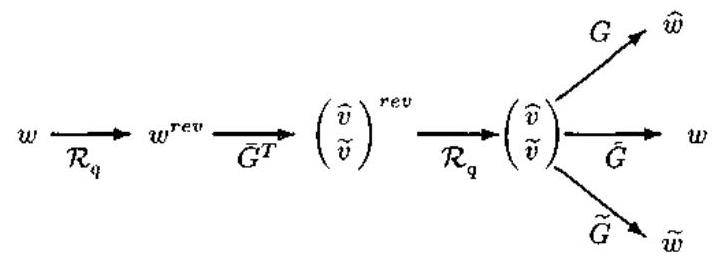

图 7.6.1 投影方法

图中, $G$ 和 $\widetilde{G}$ 分别表示与 $\left( {A, B, C, D}\right)$ 和 $\left( {A,\widetilde{B}, C,\widetilde{D}}\right)$ 对应的像表示,且 $\widetilde{G} = \left\lbrack  {G,\widetilde{G}}\right\rbrack$ . 在有些文献中， $\bar{G}$ 有时称为 $G$ 的无损失嵌入. $\widehat{v}$ 和 $\widetilde{v}$ 分别是与 $\widehat{w}$ 和 $\widetilde{w}$ 对应的辅助输入， 即 $\widehat{w} = G\widehat{v}$ 和 $\widetilde{w} = G\widetilde{v}$ . 根据定理 7.6.1 和定理 7.6.2 中的 (5)知, $\widehat{v} = {G}^{ * }w$ 和 $\widetilde{v} = {\widetilde{G}}^{ * }w$ ,如图 7.6.1 所示.

现在讨论全局总体最小二乘问题的第二部分: 确定一个相对于给定观测具有最小错拟合的 ${L}_{2}$ 系统. 利用状态表示,可以将这一部分概括如下.

定义 7.6.8 (用状态表示描述全局总体最小二乘) 对给定的观测 $w \in  {L}_{2}^{q}$ 和扰动复杂度 $\left( {m, n}\right)$ ,确定一具有 $m$ 个辅助输入、 $n$ 个状态以及辅助输入 $\widehat{v} \in  {L}_{2}^{q}$ 的状态表示 $\left( {A, B, C, D}\right)$ ,使得对于 $\widehat{w}\left( t\right)  = \left( {C{\left( \sigma I - A\right) }^{-1}B + D}\right) \widehat{v}$ ,误差 $\parallel w - \widehat{w}\parallel$ 为最小.

这个非线性问题可以用迭代方法来求解. 在每一步, 让某些参数固定以便使得到的子问题变得足够简单. 例如,固定 $\left( {A, B, C, D}\right)$ ,则问题就变成了以下几个子问题:

子问题 1 (求最优的 $C$ 和 $D$ ): 对给定的 $A, B$ 和 $\widehat{v}$ ,解全局总体最小二乘问题求 $C$ 和 $D$

子问题 2 (求最优的 $B$ 和 $D$ ): 对给定的 $A, C$ 和 $\widehat{v}$ ,解全局总体最小二乘问题求 $B$ 和 $D$ ;

子问题 3 (求等距状态表示中的最优 $B, D$ 和 $\widehat{v}$ ): 对满足 ${A}^{T}A + {C}^{T}C + {I}_{n}$ 的已知 $A$ 和 $C$ ,在 $\left( {A, B, C, D}\right)$ 为等距状态表示的条件约束下,解全局总体最小二乘问题求出 $B, D$ 和 $\widehat{v}$ .

上述子问题的解的构造方法如下面的定理所述.

定理 7.6.3 (模型的改善)

1) 构造 1 (逼近误差的投影): 用 $\sigma \widehat{x} = A\widehat{x} + B\widehat{v}$ 定义 $\widehat{x}$ ,并令

$$
\mathcal{W} = \left\{  {\widehat{w} \in  {L}_{2}^{q};\exists C \in  {R}^{q \times  n}, D \in  {R}^{q \times  m}\text{ ,使得 }\widehat{w} = C\widehat{x} + D\widehat{v}}\right\}
$$

令 $P\widehat{x} + Q\widehat{v}$ 代表 $w$ 在 $\mathcal{W}$ 上的正交投影,则 ${\mathcal{B}}_{1} = \mathcal{B}\left( {A, B, P, Q}\right)$ 是子问题 1 的解.

2) 构造 2 (构造 1 的对偶形式) 令

$$
\mathcal{F} = \left\{  {\widehat{w} \in  {L}_{2}^{q};\exists B \in  {R}^{n \times  m}, D \in  {R}^{q \times  m}\text{ ,使得 }\widehat{w} = \left( {C{\left( \sigma I - A\right) }^{-1}B + D}\right) \widehat{v}}\right\}
$$

令 $w$ 在 $\mathcal{F}$ 上的正交投影由 $\left( {C{\left( \sigma I - A\right) }^{-1}P + Q}\right) \widehat{v}$ 给出,则 ${\mathcal{B}}_{2} = \left( {A, P, C, Q}\right)$ 是子问题 2 的解.

3) 构造 3 (对辅助输入进行 SVD) 令 $\bar{B} \in  {R}^{n \times  q},\bar{D} \in  {R}^{q \times  q}$ 满足 $\left\lbrack  \begin{array}{ll} A & \bar{B} \\  C & \bar{D} \end{array}\right\rbrack$ 为酉矩阵的条件. 令 $\widehat{v} = \left( {{\bar{B}}^{T}{\left( {\sigma }^{-1}I - {A}^{T}\right) }^{-1}{C}^{T} + {\bar{D}}^{T}}\right) w$ 有奇异值分解 $\bar{v} = \mathop{\sum }\limits_{{i = 1}}^{q}{\lambda }_{i}{u}_{i}{z}_{i}$ ,并令 ${U}_{m} = \; \left\lbrack  {{u}_{1},\cdots ,{u}_{m}}\right\rbrack$ ,则 ${\mathcal{B}}_{3} = \mathcal{B}\left( {\mathbf{A},\bar{B}{U}_{m}, C,\bar{D}{U}_{m}}\right)$ 是子问题 3 的解.

证明 第 1 和第 2 部分可由 $\mathcal{W}$ 和 $\mathcal{F}$ 的定义立即得出. 至于第 3 部分,由观察知, $(A, B$ , $C, D)$ 为等距状态表示,当且仅当存在 $\bar{B},\bar{D}$ 和酉矩阵 $V$ 使得 $\left\lbrack  {B\bar{B}}\right\rbrack   = \bar{B}V$ 和 $\left\lbrack  {D\bar{D}}\right\rbrack   = \bar{D}V$ . 对于这一表示,投影方法给出 $\left\lbrack  \begin{matrix} \widehat{v} \\  \widetilde{v} \end{matrix}\right\rbrack   = {V}^{T}\bar{v}$ ,且错拟合为 $\parallel \widetilde{v}\parallel$ . 若取 $V = \left\lbrack  \begin{array}{lll} {u}_{1} & \cdots & {u}_{q} \end{array}\right\rbrack$ ,则此错拟合由 $\widehat{v}$ 的 $q - m$ 个最小奇异值决定,它是最小的.

上述结果可以用于全局总体最小二乘问题的迭代算法中. 在每一步, 使用三种构造之一改善模型. 所得到的模型参数转换成等距状态表示,它涉及 $A$ 矩阵的更新. 于是, 投影方法可用于这种更新. 由定理 7.6.2 可立即得出下列结论.

命题 7.6.9 上述方法可得到一序列错拟合单调减少的模型.

#### 7.6.5 最优性条件

从上一小节所述模型改善的构造方法, 我们可以推导出模型最优性的必要条件, 因为对于一个最优模型, 这些构造不再能够给出任何改善. 这里, 我们用经验协方差表示最优性条件. 对于两个序列 $a \in  {L}_{2}^{k}$ 和 $b \in  {L}_{2}^{l}$ ,经验协方差定义为 $\operatorname{cov}\left( {a, b}\right)  = \mathop{\sum }\limits_{{t =  - \infty }}^{\infty }a\left( t\right) b{\left( t\right) }^{T} \in \; {R}^{k \times  l}$ . 进而,用 $\operatorname{cov}\left( {\left\lbrack  {{a}_{1},{a}_{2}}\right\rbrack  ,\left\lbrack  {{b}_{1},{b}_{2}}\right\rbrack  }\right)$ 表示 ${\left\lbrack  {a}_{1}^{T},{a}_{2}^{T}\right\rbrack  }^{T}$ 和 ${\left\lbrack  {b}_{1}^{T},{b}_{2}^{T}\right\rbrack  }^{T}$ 的协方差矩阵.

定理 7.6.4 $\left( {L}_{2}\right.$ 最优性条件) 令 $\mathcal{B}$ 表示观测 $w \in  {L}_{2}^{q}$ 的全局总体最小二乘模型. 令 $\widehat{w} \in  \mathcal{B}$ 代表 $w$ 的最优逼近, $\widetilde{w} \in  {\mathcal{B}}^{ \bot  }$ 代表相应的逼近误差. 令 $\widehat{x}$ 和 $\widehat{v}$ 分别表示与 $\mathcal{B}$ 的最小状态表示中的 $\widehat{w}$ 相对应的状态和辅助输入，并令 $\widetilde{x}$ 和 $\widetilde{v}$ 与 $\widetilde{w}$ 相对应. 于是，下面的等效条件成立:

1) $\operatorname{cov}\left( {\widehat{v},\widetilde{v}}\right)  = 0,\operatorname{cov}\left( {\widehat{v},\widetilde{x}}\right)  = 0$ 和 $\operatorname{cov}\left( {\widehat{x},\widetilde{v}}\right)  = 0$ ;

2) $\operatorname{cov}\left( {\left\lbrack  {\widehat{v},\widehat{x}}\right\rbrack  ,\left\lbrack  {\widetilde{v},\widetilde{x}}\right\rbrack  }\right)  = 0$ ;

3) $\operatorname{cov}\left( {\left\lbrack  {\widehat{v},\widehat{x},\widehat{w},\sigma \widehat{x}}\right\rbrack  ,\widetilde{v},\widetilde{x},\widetilde{w},\sigma \widetilde{x}}\right) \}  = 0$ .

系统 $\mathcal{B}$ 称为观测 $w$ 的平稳点，若全局总体最小二乘错拟合 $\mathcal{B}\left( {A, B, C, D}\right)$ 相对于系统参数的偏差等于零,其中 $\mathcal{B}\left( {A, B, C, D}\right)$ 为最小状态表示. 由于 $\mathcal{B}$ 的所有最小状态表示都是线性相关的,所以这等价于条件: $\mathcal{B}$ 的所有极小状态表示都是平稳点.

定理 7.6.5 ${L}_{2}$ 系统 $\mathcal{B}$ 满足定理 7.6.4 中的最优性条件,当且仅当 $\mathcal{B}$ 是全局总体最小二乘准则的一个平稳点.

这表明, 全局总体最小二乘算法只能收敛到平稳点. 然而, 这并不是系统的收敛性.

前面的结果也可以用于分析一个给出的系统是否接近最优性. 也许评价最优性的最令人信服的方法是考虑 $\mathcal{B}$ 与全局总体最小二乘模型 ${\mathcal{B}}^{ * }$ 之间的距离. 然而,这是难于办到的,因为这会需要 ${\mathcal{B}}^{ * }$ 的知识. 从计算机编制程序的角度出发,我们来考虑到最近的平稳点的距离, 并定义它为

$$
\min \{ \parallel \bar{w}\parallel ;\mathcal{B}\text{ 对 }w - \bar{w}\text{ 是平稳的 }\} \tag{7.6.12}
$$

由于看起来很难准确计算这一距离, 因此很自然会联想到它的上限, 而上限要容易计算得多. 这就引出了下面的最优性边界 (optimality margin) 的定义.

定义 7.6.9 (最优性边界) 系统 $\mathcal{B}$ 相对于观测 $w$ 的最优性边界定义为

$$
\min \{ \parallel \bar{w}\parallel ;\bar{w} \in  {\mathcal{B}}^{ \bot  }\text{ ,且 }\mathcal{B}\text{ 对 }w - \bar{w}\text{ 是平稳的 }\} \tag{7.6.13}
$$

下面的结果表明,最优性边界的计算确实相当容易.

命题 7.6.10 (最优性边界的计算) 令 $\widehat{w}$ 代表 $w$ 在 $\mathcal{B}$ 内的最优逼近, $\widetilde{w} = w - \widehat{w}$ 表示对应的逼近误差. 定义 $\mathcal{Z} = \left\{  {z \in  {B}^{ \bot  };\mathcal{B}\text{ 对 }\widehat{w} + z\text{ 是平稳的 }}\right\}$ ,则 $\mathcal{Z}$ 是一线性空间,且最优性边界由 $\begin{Vmatrix}{\widetilde{w} - {\widetilde{w}}^{\prime }}\end{Vmatrix}$ 给出,其中 ${\widetilde{w}}^{\prime }$ 是 $\widetilde{w}$ 在 $\mathcal{Z}$ 上的正交投影.

定理 7.6.4、定理 7.6.5 和命题 7.6.10 的证明见文献 [26].

这些结果也可以用于确定最小可达到的错拟合. 这样, 就可以衡量一个得到的模型相对于最优模型的质量.

命题 7.6.11 (最小错拟合的边界) 假设观测 $w$ 为已知, ${e}^{ * }$ 是在某复杂度约束下最小可达到的错拟合. 令 $\mathcal{B}$ 是调节数据 $w - \bar{w}$ 的扰动复杂度的全局总体最小二乘模型,具有错拟合 $e = d\left( {w,\mathcal{B}}\right)$ ,则下式成立:

$$
e - 2\parallel \bar{w}\parallel  \leq  {e}^{ * } \leq  e \tag{7.6.14}
$$

证明 令 ${\mathcal{B}}^{ * }$ 表示原数据 $w$ 的全局总体最小二乘模型. 于是,上界可从 ${\mathcal{B}}^{ * }$ 的最优性得到. 利用错拟合的性质 $d\left( {w,\mathcal{B}}\right)  \leq  \parallel w\parallel$ 和 $d\left( {{w}_{1} + {w}_{2},\mathcal{B}}\right)  \leq  d\left( {{w}_{1},\mathcal{B}}\right)  + d\left( {{w}_{2},\mathcal{B}}\right)$ 可得下界

$$
e = d\left( {w,\mathcal{B}}\right)  \leq  d\left( {\bar{w},\mathcal{B}}\right)  + d\left( {w - \bar{w},\mathcal{B}}\right)
$$

$$
\leq  \parallel \bar{w}\parallel  + d\left( {w - \bar{w},{\mathcal{B}}^{ * }}\right)
$$

$$
\leq  \parallel \bar{w}\parallel  + d\left( {w,{\mathcal{B}}^{ * }}\right)  + d\left( {\bar{w},{B}^{ * }}\right)
$$

$$
\leq  2\parallel \bar{w}\parallel  + {e}^{ * }
$$

这里在第二个不等式中使用了 $\mathcal{B}$ 对 $w - \bar{w}$ 的最优性.

上述命题表明, 对于具有小的最优性边界的模型, 相应的错拟合接近最优.

Roorda 与 Hejj 还介绍了用全局总体最小二乘方法进行模型简化、非因果系统建模和具有多个输出的系统建模的仿真实验, 证实了全局总体最小二乘的优越性能.

有待解决以及进一步值得研究的问题是: 将全局总体最小二乘推广到时变系统和错拟合的时变范数, 方法本身的统计性能分析, 以及快速算法和递推方法的发展等.

## 参考文献

[1] S. D. Silvery, Statistical Inference, Penguin books, 1970.

[2] S. D. Hodges and P. G. Moore, Data uncertainties and least squares regression, Applied Statistics, Vol.21, 185~195, 1972.

[3] K. Pearson, On lines and planes of closest fit to points in space, Phil. Mag., 559~572, 1901.

[4] L. J. Gleser, Estimation in a multivariate "errors in variables" regression model: large sample results, Ann. Statist., Vol.9, 24<44, 1981.

[5] G. H. Golub and C. F. Van Loan, An analysis of the total least squares problem, SIAM J. Numer. Anal., Vol.17, 883~893, 1980.

[6] G. H. Golub and C. F. Van Loan, Matrix Computation. Baltimore: The John Hopkins University Press, 1989.

[7] S. Van Huffel and J. Vandewalle, Analysis and properties of the generalized total least squares problem ${AX} = B$ when some or all columns in $A$ are subject to error, SIAM J. Matrix Analysis Applic., Vol.10, 294 235, 1989.

[8] S. Van Huffel and J. Vandewalle, On the accuracy of total least squares and least squares techniques in the presence of errors on all data, Automatica, Vol.25, 765~769, 1989.

[9] J. A. Cadzow, Spectral estimation: An overdetermined rational model equation approach, Proc. IEEE, Vol.70, 907~938, 1982.

[10] T. J. Abatzoglou and J. M. Mendel, Constrained total least squares, In: Proc. 1987 IEEE ICASSP, TX: Dallas, 1485~1488, 1987.

[11] T. J. Abatzoglou and V. Soon, Constrained total least squares approach to frequency estimation of sinusoids, In: Proc. 4th IEEE ASSP Workshop on Spectrum Analysis Modeling, MN: Minneapolis, 250~252, 1988.

[12] T. J. Abatzoglos, J. M. Mendel and G. A. Harada, The constrained total least squares technique and its applications to harmonic superresolution, IEEE Trans. Signal Processing, Vol.39, 1070~1087, 1991.

[13] D. H. Brandwood, A complex gradient operator and its application in adaptive array theory, Proc. Inst. Elec. Eng., Vol.130, 11 10, 1983.

[14] D. Lueberger, An Introduction to Linear and Nonlinear Programming. MA: Addison-Wesley, 1973.

[15] R. Kunaresan and D. W. Tufts, Estimating the angle of arrival of multiple plane waves, IEEE Trans. Aerospace Electron. Syst., Vol.19, 134~139, 1983.

[16] A. Swami and J. M. Mendel, Identifiability of the AR parameters of an ARMA process using cumulants, IEEE Trans. Automatic Control, Vol.37, 268~273, 1992.

[17] G. B. Giannakis, On the identifiability of non-Gaussian ARMA models using cumulants, IEEE Trans. Automatic Control, Vol.35, 18 2:26, 1990.

[18] 张贤达，时间序列分析——高阶统计量方法、北京:清华大学出版社，1996.

[19] B. De. Moor, Structured total least squares and ${L}_{2}$ approxination problems, In: Linear Algebra and its Applications, Special Issue on Numerical Linear Algebra Methods in Control, Signal and Systems (Eds. Van Dooren et al.), Vol.188~189, 163~207, 1993.

[20] B. De. Moor, Total least squares for affine structured matrices and the noisy realization problem, IEEE Trans. Signal Processing, Vol.42, 3104~3113, 1994.

[21] B. De. Moor, P. V. Overschee and G. Schelfhout, H2-model reduction for SISO systems, In: Proc. 12th World Cong. Int. Fed. Automat. Contr., Australia: Sydney, Vol.II, 227~230, 1993.

[22] J. A. Cadzow, Signal enhancement: A composite property mapping algorithm, IEEE Trans. Acoust., Speech, Signal Processing, Vol.36, 49~62, 1988.

[23] Y. Bresler and A. Macovski, Exact maximum likelihood parameter estimation of superimposed exponential signals in noise, IEEE Trans. Acoust., Speech, Signal Processing, Vol.34, 1081~1089, 1986.

[24] M. P. Clark and L. L. Scharf, On the complexity of IQML algorithms. IEEE Trans. Signal Processing, Vol.40, 1811~1813, 1992.

[25] J. H. McClellan and D. Lee, Exact equivalence of the Steiglitz-McBride iteration and IQML, IEEE Trans. Signal Processing, Vol.39, 509~112, 1991.

[26] B. Roorda and C. Hejj, Głobal total least squares modeling of multivariable time series, IEEE Trans. Automatic Control, Vol.40, 50~63, 1995.

[27] C. Hejj, Deterministic Identification of Dynamical Systems (Lecture Notes in Control and Information Sciences), Vol.127, Berlin: Springer-Verlag, 1989.

[28] 张贤达、现代信号处理、北京:清华大学出版社，1995.

[29] P. A. Wedin, Perturbation bounds in connection with the singular value decomposition, BIT, Vol.12, 99~111, 1972.

[30] P. Vaidynathan, Multirate Systems and Filter Banks, Englewood Cliffs: Prentice Hall, 1993.

[31] M. A. Rahman and K. B. Yu, Total least squares approach for frequency estimation using linear prediction, IEEE Trans. Acoust., Speech, Signal Processing, Vol.35, 1440~1454, 1987.

[32] J. H. Wilkinson, The Algebraic Eigenvalue Problem. Oxford, England: Clarendon, 1965.

[33] W. M. Steedly, C. H. J. Ying and R. L. Moses, A modified TLS-Prony method using data decimation, IEEE Trnas. Signal Processing, Vol.42, 2292~2303, 1994.

[34] W. M. Steedly, C. H. J. Ying and R. L. Moses, Statistical analysis of TLS-based Prony techniques, Automatica (Special Issue on Statistical Signal Processing and Control), Vol.30, 115~129, 1994.

[35] D. L. Moffatt and R. K. Mains, Detection and discrimination of radar targets, IEEE Trans. Antennas Propagat., Vol.23, 358~367, 1975.

[36] U. Nickel, Radar target parameter estimation with anttena arrays, In: Radar Array Processing (Eds. S. Haykin, J. Litva, and T. J. Shephard), New York: Springer-Verlag, 1991.

[37] B. Widrow and S. D. Steams, Adaptive Signal Processing. Englewood Cliffts: Prentice Hall, 1985.

[38] J. M. Mendel, Some modeling problems in reflection seimology, IEEE ASSP Mag., Vol.3, No.1, 4~17, 1986.

[39] J. G. Proakis, Digital Communications. New York: McGraw-Hill, 1983.

[40] L. R. Rabiner, R. E. Crochine and J. B. Allen, FIR system modeling and identification in the presence of noise and with band-limited inputs, IEEE Trans. Acoust., Speech, Signal Processing, Vol.36, 319~333, 1987.

[41] C. E. Davila, An efficient recursive total least squares algorithm for FIR adaptive filtering, IEEE Trans. Signal Processing, Vol.42, 268~280, 1994.

## 第八章 极大似然法与推广的最小二乘方法

在上一章,我们分析了求解超定的线性方程组 ${Ax} = b$ 的最小二乘和总体最小二乘方法,并得出了结论: 最小二乘方法只在 $b$ 向量的误差具有高斯白噪声性质的少数情况下才能保证误差的平方和为最小; 而总体最小二乘法仅适用于矩阵 $A$ 和向量 $b$ 的误差均为高斯白噪声的情况. 现在，我们来讨论另外一些问题:1)求解方程组 $A\left( \lambda \right) x = b$ ，其中 $\lambda$ 和 $x$ 都是待求的未知参数; 2) 求解的线性方程组虽然还是 ${Ax} = b$ ,但是向量 $b$ 的误差 ${\Delta b}$ 不是白噪声，而是有色噪声. 对于前一种情况，我们需要采用极大似然法，对后一类情况， 我们则应该使用其它推广形式的最小二乘方法. 除了极大似然方法以外，本章还要重点介绍两种推广的最小二乘:广义最小二乘和加权最小二乘方法.

### 8.1 极大似然法

考虑信号处理中的一个典型模型:

$$
y\left( t\right)  = A\left( \theta \right) x\left( t\right)  + e\left( t\right) ,\;t = 1,\cdots , N \tag{8.1.1}
$$

其中, $y\left( t\right)  \in  {C}^{m \times  1}$ 是带噪声的观测数据列向量, $x\left( t\right)  \in  {C}^{n \times  1}$ 是信号幅值的列向量, $e\left( t\right)  \in \; {C}^{m \times  1}$ 代表加性噪声列向量,而矩阵 $A \in  {C}^{m \times  n}$ 具有下面的特殊结构:

$$
A\left( \theta \right)  = \left\lbrack  \begin{array}{llll} a\left( {\omega }_{1}\right) & a\left( {\omega }_{2}\right) & \cdots & a\left( {\omega }_{n}\right)  \end{array}\right\rbrack \tag{8.1.2}
$$

这里, $a\left( {\omega }_{i}\right)  \in  {C}^{m \times  1}$ 是第 $i$ 个信号与输出 $y\left( t\right)$ 之间的传递向量,且 $\theta  = {\left\lbrack  {\omega }_{1},\cdots ,{\omega }_{n}\right\rbrack  }^{T}$ . 对于模型 (8.1.1), 我们假定以下条件.

假设 $1\;N > m > n$ ,而且对应于不同 $\omega$ 值的向量 $a\left( \omega \right)$ 是线性独立的.

假设 2 对 $t \neq  s, E\left\{  {e\left( t\right) {e}^{H}\left( s\right) }\right\}   = E\left\{  {e\left( t\right) {e}^{T}\left( s\right) }\right\}   = 0$ ,并且 $e\left( t\right)$ 为正态分布.

假设 3 矩阵 $P = E\left\{  {x\left( t\right) {x}^{H}\left( t\right) }\right\}$ 非奇异 (即正定).

假设 2 意味着实验中的加性噪声是白色的, 而且任何两次不同实验时的加性噪声是不相关的. 这样的假设是合理的.

#### 8.1.1 极大似然准则

为方便计，我们用 $A$ 代表 $A\left( \theta \right)$ . 在假设 $1 \sim  3$ 下，观测向量 $y\left( t\right)$ 的似然函数为

$$
L\{ y\left( t\right) \}  = \frac{1}{{\left( 2\pi \right) }^{mN}{\left( \sigma /2\right) }^{mN}}\exp \left\{  {-\frac{1}{\sigma }\mathop{\sum }\limits_{{t = 1}}^{N}{\left\lbrack  y\left( t\right)  - Ax\left( t\right) \right\rbrack  }^{H}\left\lbrack  {y\left( t\right)  - {Ax}\left( t\right) }\right\rbrack  }\right\}
$$

鉴于似然函数 $L\left( \theta \right)$ 的性质，对数似然函数

$$
\ln L = \text{ const } - {mN}\ln \sigma  - \frac{1}{\sigma }\mathop{\sum }\limits_{{t = 1}}^{N}{\left\lbrack  y\left( t\right)  - Ax\left( t\right) \right\rbrack  }^{H}\left\lbrack  {y\left( t\right)  - {Ax}\left( t\right) }\right\rbrack \tag{8.1.3}
$$

令我们更感兴趣,此处 const 代表常数. 为了应用极大似然准则,下面计算 $\ln L$ 相对于 $\sigma ,\bar{x}\left( t\right)  = \operatorname{Re}\left\lbrack  {x\left( t\right) }\right\rbrack  ,\widetilde{x}\left( t\right)  = \operatorname{Im}\left\lbrack  {x\left( t\right) }\right\rbrack$ 和 $\theta$ 的各个偏导. 它们依次为

$$
\frac{\partial \ln L}{\partial \sigma } =  - \frac{mN}{\sigma } + \frac{1}{\sigma }\mathop{\sum }\limits_{{t = 1}}^{N}{e}^{H}\left( n\right) e\left( n\right)
$$

$$
\frac{\partial \ln L}{\partial \bar{x}\left( k\right) } = \frac{1}{\sigma }\left\lbrack  {{A}^{H}e\left( k\right)  + {A}^{T}{e}^{ * }\left( k\right) }\right\rbrack
$$

$$
= \frac{2}{\sigma }\operatorname{Re}\left\lbrack  {{A}^{H}e\left( k\right) }\right\rbrack  ,\;k = 1,\cdots , N
$$

$$
\frac{\partial \ln L}{\partial \widetilde{x}\left( k\right) } = \frac{1}{\sigma }\left\lbrack  {-\mathrm{j}{A}^{H}e\left( k\right)  + \mathrm{j}{A}^{T}{e}^{ * }\left( k\right) }\right\rbrack
$$

$$
= \frac{2}{\sigma }\operatorname{Im}\left\lbrack  {{A}^{H}e\left( k\right) }\right\rbrack  ,\;k = 1,\cdots , N
$$

$$
\frac{\partial \ln L}{\partial {\omega }_{i}} = \frac{2}{\sigma }\mathop{\sum }\limits_{{t = 1}}^{N}\operatorname{Re}\left\lbrack  {{x}^{H}\left( t\right) \frac{\mathrm{d}{A}^{H}}{\mathrm{\;d}{\omega }_{i}}e\left( t\right) }\right\rbrack
$$

$$
= \frac{2}{\sigma }\mathop{\sum }\limits_{{t = 1}}^{N}\operatorname{Re}\left\lbrack  {{x}^{H}\left( t\right) {d}^{H}\left( {\omega }_{i}\right) e\left( t\right) }\right\rbrack  ,\;i = 1,\cdots , n
$$

式中 $d\left( \omega \right)  = \mathrm{d}a\left( \omega \right) /\mathrm{d}\omega$ .

由 $\partial \ln L/\partial x\left( k\right)  = 0$ ,并稍作运算,便得到向量 $x\left( t\right)$ 的极大似然估计:

$$
\widehat{x}\left( t\right)  = {\left( {A}^{H}A\right) }^{-1}{A}^{H}y\left( t\right) \tag{8.1.4}
$$

由 $\partial \ln L/\partial \sigma  = 0$ ，并代入上式结果，则得 $\sigma$ 的极大似然估计:

$$
\widehat{\sigma } = \frac{1}{mN}\mathop{\sum }\limits_{{t = 1}}^{N}{\left\lbrack  y\left( t\right)  - \widehat{A}\widehat{x}\left( t\right) \right\rbrack  }^{H}\left\lbrack  {y\left( t\right)  - \widehat{A}\widehat{x}\left( t\right) }\right\rbrack
$$

$$
= \frac{1}{m}\operatorname{trace}\left\lbrack  {I - \widehat{A}{\left( {\widehat{A}}^{H}\widehat{A}\right) }^{-1}{\widehat{A}}^{H}}\right\rbrack  \widehat{R} \tag{8.1.5}
$$

其中, $\widehat{A}$ 代表 $A$ 的极大似然估计,即 $\widehat{A} = A\left( \widehat{\theta }\right)$ ,而 $\widehat{\theta }$ 是 $\theta$ 的极大似然估计,且

$$
\widehat{R} = \frac{1}{N}\mathop{\sum }\limits_{{t = 1}}^{N}y\left( t\right) {y}^{H}\left( t\right)
$$

将式 (8.1.4) 和式 (8.1.5) 代入式 (8.1.2),并用 $A$ 代替待求的 $\widehat{A}$ ,则有

$$
\ln L = \text{ const } - {mN}\ln F\left( \theta \right) \tag{8.1.6a}
$$

式中

$$
F\left( \theta \right)  = \operatorname{trace}\left\{  {\left\lbrack  {I - A{\left( {A}^{H}A\right) }^{-1}{A}^{H}}\right\rbrack  \widehat{R}}\right\} \tag{8.1.6b}
$$

定义 ${P}_{A\left( \theta \right) }$ 和 ${P}_{A\left( \theta \right) }^{ \bot  }$ 分别是到 $A\left( \theta \right)$ 的列空间上的投影矩阵和正交投影矩阵,即

$$
{P}_{A\left( \theta \right) } = A\left( \theta \right) {A}^{ \dagger  }\left( \theta \right)  = A{\left( {A}^{H}A\right) }^{-1}{A}^{H} \tag{8.1.7a}
$$

$$
{P}_{A\left( \theta \right) }^{ \bot  } = I - {P}_{A\left( \theta \right) } = I - A{\left( {A}^{H}A\right) }^{-1}{A}^{H} \tag{8.1.7b}
$$

于是,在高斯白噪声假设下,信号参数 $\theta$ 的极大似然估计为

$$
\widehat{\theta } = \arg \mathop{\min }\limits_{\theta }\operatorname{trace}\left\lbrack  {{P}_{A\left( \theta \right) }^{ \bot  }\widehat{R}}\right\rbrack \tag{8.1.8a}
$$

或

$$
\widehat{\theta } = \arg \mathop{\max }\limits_{\theta }\operatorname{trace}\left\lbrack  {{P}_{A\left( \theta \right) }\widehat{R}}\right\rbrack \tag{8.1.8bj}
$$

式中, arg min 和 arg max 分别表示极小化变量和极大化变量.

极大似然准则 (8.1.8) 式一般是多峰的，需要全局极值的多维搜索，计算复杂. 下面介绍两种计算比较简单的算法.

#### 8.1.2 基于特征结构的极大似然估计子

考虑一被动传感器阵列,它由 $p$ 个具有任意位置和任意指向特性的传感器组成. 令第 $i$ 个传感器的接收信号为

$$
{x}_{i}\left( t\right)  = \mathop{\sum }\limits_{{k = 1}}^{q}{a}_{i}\left( {\theta }_{k}\right) {s}_{k}\left( {t - {\tau }_{i}\left( {\theta }_{k}\right) }\right)  + {n}_{i}\left( t\right) \tag{8.1.9}
$$

其中 ${s}_{k}\left( \cdot \right)$ 是在阵列某个参考点观测到的第 $k$ 个波前信号, ${a}_{i}\left( {\theta }_{k}\right)$ 是第 $i$ 个传感器对照射角为 ${\theta }_{k}$ 的波前信号的幅值响应， ${\tau }_{i}\left( {\theta }_{k}\right)$ 是该参考点与照射角为 ${\theta }_{k}$ 的第 $i$ 个传感器之间的传输延迟. 式 (8.1.9) 的矩阵 - 向量形式为

$$
x\left( t\right)  = A\left( \theta \right) s\left( t\right)  + n\left( t\right) \tag{8.1.10}
$$

其中 $A\left( \theta \right)$ 是 $p \times  q$ 矩阵:

$$
A\left( \theta \right)  = \left\lbrack  \begin{array}{lll} a\left( {\theta }_{1}\right) & \cdots & a\left( {\theta }_{q}\right)  \end{array}\right\rbrack \tag{8.1.11a}
$$

$a\left( \theta \right)$ 为指向方向 $\theta$ 的调整向量:

$$
a{\left( \theta \right) }^{T} = \left\lbrack  {{a}_{1}\left( \theta \right) {\mathrm{e}}^{\mathrm{j}{\omega }_{0}{\tau }_{1}\left( \theta \right) },\cdots ,{a}_{p}\left( \theta \right) {\mathrm{e}}^{-\mathrm{j}{\omega }_{0}{\tau }_{p}\left( \theta \right) }}\right\rbrack \tag{8.1.11b}
$$

假定噪声 ${n}_{i}\left( \cdot \right)$ 为独立同分布的高斯过程,均值为零,方差为 ${\sigma }^{2}$ ,则式 (8.1.10) 定义的 $s\left( t\right)$ 的极大似然估计由式 (8.1.8b) 给出. 这意味着, ${\theta }_{1},\cdots ,{\theta }_{q}$ 可以通过对数似然函数

$$
L\left( {{\theta }_{1},\cdots ,{\theta }_{q}}\right)  = \operatorname{trace}\left\lbrack  {{P}_{A\left( \theta \right) }\widehat{R}}\right\rbrack \tag{8.1.12}
$$

的极大化求得,其中 $\widehat{R}$ 为样本协方差矩阵:

$$
\widehat{R} = \frac{1}{N}\mathop{\sum }\limits_{{t = 1}}^{N}x\left( t\right) {x}^{H}\left( t\right) \tag{8.1.13}
$$

表达式 (8.1.12) 的一个有趣的解释可以从样本协方差矩阵的特征结构得出. 令 ${\lambda }_{1},\cdots ,{\lambda }_{p}$ 和 ${u}_{1},\cdots ,{u}_{p}$ 分别表示 $\widehat{R}$ 的特征值和特征向量. 根据矩阵的谱表示定理,可以将 $\widehat{R}$ 表示为

$$
\widehat{R} = \mathop{\sum }\limits_{{i = 1}}^{p}{\lambda }_{i}{u}_{i}{u}_{i}^{H} \tag{8.1.14}
$$

将式 (8.1.14) 代入式 (8.1.12), 并利用矩阵迹算子的性质, 则有

$$
L\left( {{\theta }_{1},\cdots ,{\theta }_{q}}\right)  = \mathop{\sum }\limits_{{i = 1}}^{p}{\lambda }_{i}{\left| {P}_{A\left( \theta \right) }{u}_{i}\right| }^{2} \tag{8.1.15}
$$

这一表达式有一个非常有意思的几何解释. 为了看出这一点, 注意任何一组可能的信号参数 ${\theta }_{1},\cdots ,{\theta }_{q}$ 都定义一个子空间 $\operatorname{span}\left\{  {a\left( {\theta }_{1}\right) ,\cdots , a\left( {\theta }_{q}\right) }\right\}$ ,我们称之为 “信号” 子空间. 按照式 (8.1.15),参数 ${\theta }_{1},\cdots ,{\theta }_{q}$ 是利用样本协方差矩阵的特征向量 ${u}_{i}$ 到由这些参数定义的 “信号子空间” $A\left( \theta \right)$ 上的投影的平方范数的加权和来评价的. 加权意味着,特征值越大, 则对应的特征向量在 “信号” 子空间内的作用越大.

对于单个信号的特殊情况 (即 $q = 1$ ),对数似然函数简化为

$$
L\left( \theta \right)  = {\lambda }_{1}\frac{{\left| {a}^{H}\left( \theta \right) {u}_{1}\right| }^{2}}{{a}^{H}\left( \theta \right) a\left( \theta \right) } + \mathop{\sum }\limits_{{i = 2}}^{p}{\lambda }_{i}\frac{{\left| {a}^{H}\left( \theta \right) {u}_{i}\right| }^{2}}{{a}^{H}\left( \theta \right) a\left( \theta \right) } \tag{8.1.16}
$$

出于特征向量矩阵是酉矩阵, 故

$$
{u}_{1}{u}_{1}^{H} = I - \mathop{\sum }\limits_{{i = 2}}^{p}{u}_{i}{u}_{i}^{H} \tag{8.1.17}
$$

因此, 忽略常数项, 则由式 (8.1.16) 和式 (8.1.17) 有

$$
L\left( \theta \right)  =  - \mathop{\sum }\limits_{{i = 2}}^{p}\left( {{\lambda }_{1} - {\lambda }_{i}}\right) \frac{{\left| {a}^{H}\left( \theta \right) {u}_{i}\right| }^{2}}{{a}^{H}\left( \theta \right) a\left( \theta \right) } \tag{8.1.18}
$$

于是,极大似然估计 $\widehat{\theta }$ 即是式 (8.1.18) 的极大化变量,或等价为对数似然函数

$$
F\left( \theta \right)  = \mathop{\sum }\limits_{{i = 2}}^{p}\left( {{\lambda }_{1} - {\lambda }_{i}}\right) \frac{{\left| {a}^{H}\left( \theta \right) {u}_{i}\right| }^{2}}{{a}^{H}\left( \theta \right) a\left( \theta \right) } \tag{8.1.19}
$$

的极小化变量. 注意,式 (8.1.19) 是噪声特征向量 ${u}_{i}, i = 2,\cdots , p$ 到由调整向量 $a\left( \theta \right)$ 定义的 “信号” 子空间上的投影的平方范数的加权和. 加权意味着, 特征值越小, 则对应的特征向量与 “信号” 子空间正交的作用越大.

将以上单个信号的分析结果 (8.1.18) 式推广到 $q$ 个信号, Wax 与 Kailath ${}^{\left\lbrack  1\right\rbrack  }$ 定义了下述伪似然函数:

$$
{L}_{n}\left( \theta \right)  =  - \mathop{\sum }\limits_{{i = q + 1}}^{p}\left( {{\overline{\lambda }}_{s} - {\lambda }_{i}}\right) \frac{{\left| {a}^{H}\left( \theta \right) {u}_{i}\right| }^{2}}{{a}^{H}\left( \theta \right) a\left( \theta \right) } \tag{8.1.20}
$$

其中 ${\overline{\lambda }}_{s}$ 是 “信号” 特征值的平均值:

$$
{\overline{\lambda }}_{s} = \frac{1}{q}\mathop{\sum }\limits_{{t = 1}}^{q}{\lambda }_{i} \tag{8.1.21}
$$

加权意味着, 特征值越小, 则对应的特征向量与 “信号” 子空间的正交作用越大.

与式 (8.1.16) 相比，式 (8.1.21) 具有计算量明显减少的优点. 这不仅是因为不再需要计算投影矩阵 ${P}_{A\left( \theta \right) }$ ,而且更加重要的是,式 (8.1.20) 的极大化问题只涉及一维搜索,而式 (8.1.16) 则需要多维搜索. 对于 $q = 1$ 的单个信号情况,式 (8.1.20) 显然与式 (8.1.18) 完全相同，因此，式 (8.1.20) 的极大化结果与极大似然估计等同，是最优的. 如果信号个数多于一个,即 $q > 1$ ,那么式 (8.1.20) 的极大化估计子便与极大似然估计子明显不同, 它是次最优的.

式 (8.1.20) 所示的估计子实质是一种 “噪声” 子空间估计子. 类似地, 也可以推导出 “信号”子空间估计子. 为此, 将单个信号情况下的似然函数式 (8.1.18) 近似表示为

$$
L\left( \theta \right)  \approx  {\lambda }_{1}\frac{{\left| {a}^{H}\left( \theta \right) {u}_{1}\right| }^{2}}{{a}^{H}\left( \theta \right) a\left( \theta \right) } + {\widehat{\sigma }}^{2}\mathop{\sum }\limits_{{i = 2}}^{p}\frac{{\left| {a}^{H}\left( \theta \right) {u}_{i}\right| }^{2}}{{a}^{H}\left( \theta \right) a\left( \theta \right) } \tag{8.1.22a}
$$

其中 ${\widehat{\sigma }}^{2}$ 是 “噪声” 特征值的平均值:

$$
{\widehat{\sigma }}^{2} = \frac{1}{p - 1}\mathop{\sum }\limits_{{i = 2}}^{p}{\lambda }_{i} \tag{8.1.22b}
$$

利用式 (8.1.19), 可以将式 (8.1.22a) 简化成

$$
L\left( \theta \right)  = \left( {{\lambda }_{1} - {\widehat{\sigma }}^{2}}\right) \frac{{\left| {a}^{H}\left( \theta \right) {u}_{1}\right| }^{2}}{{a}^{H}\left( \theta \right) a\left( \theta \right) } \tag{8.1.23}
$$

类似于噪声子空间估计子的推导, 在多个信号情况下, 式 (8.1.23) 变作

$$
{L}_{s}\left( \theta \right)  = \mathop{\sum }\limits_{{i = 1}}^{q}\frac{{\left| {a}^{H}\left( \theta \right) {u}_{i}\right| }^{2}}{{a}^{H}\left( \theta \right) a\left( \theta \right) } \tag{8.1.24}
$$

使 ${L}_{s}\left( \theta \right)$ 极大化,就构成了未知参数 $\theta$ 的信号子空间估计子.

这种信号子空间估计子也有一个有趣的解释. 当 ${a}^{H}\left( \theta \right) a\left( \theta \right)$ 是与 $\theta$ 无关的常数时 (例) 如均匀线性阵列就属于这一情况), 式 (8.1.24) 的分母 (常数项) 即可从似然函数中略去, 从而得到

$$
{\bar{L}}_{s}\left( \theta \right)  = \mathop{\sum }\limits_{{i = 1}}^{q}\left( {{\lambda }_{i} - {\widehat{\sigma }}^{2}}\right) {\left| {a}^{H}\left( \theta \right) {u}_{i}\right| }^{2}
$$

使用特征向量的正交性

$$
\mathop{\sum }\limits_{{i = 1}}^{q}{u}_{i}{u}_{i}^{H} + \mathop{\sum }\limits_{{i = q + 1}}^{p}{u}_{i}{u}_{i}^{2} = I
$$

则有

$$
{\bar{L}}_{s}\left( \theta \right)  = {a}^{H}\left( \theta \right) \left\lbrack  {\mathop{\sum }\limits_{{i = 1}}^{q}\left( {{\lambda }_{i} - {\widehat{\sigma }}^{2}}\right) {u}_{i}{u}_{i}^{H} - {\widehat{\sigma }}^{2}I}\right\rbrack  a\left( \theta \right) \tag{8.1.25}
$$

事实上, 中括弧内的项就是仅有信号, 没有噪声时的样本协方差矩阵, 即

$$
\widehat{S} = \mathop{\sum }\limits_{{i = 1}}^{q}\left( {{\lambda }_{i} - {\widehat{\sigma }}^{2}}\right) {u}_{i}{u}_{i}^{H} - {\widehat{\sigma }}^{2}I
$$

因此，式 (8.1.25) 可以更紧凑地写作

$$
{\bar{L}}_{s}\left( \theta \right)  = {a}^{H}\left( \theta \right) A\left( \theta \right) \widehat{S}{A}^{H}\left( \theta \right) a\left( \theta \right) \tag{8.1.26}
$$

由于 ${a}^{H}\left( \theta \right) \widehat{R}a\left( \theta \right)$ 是经典 Fourier “谱”,所以表达式 (8.1.25) 可以解释为一种高分辨率的经典 Fourier 方法,它用仅有信号时的样本协方差矩阵 $\widehat{S}$ 代替了包含有噪声的样本协方差矩阵,即用 $A\left( \theta \right) \widehat{S}{A}^{H}\left( \theta \right)$ 取代了 ${a}^{H}\left( \theta \right) \widehat{R}a\left( \theta \right)$ .

#### 8.1.3 迭代二次型极大似然 (IQML) 算法

现在从 ARMA 模型的角度出发, 推导极大似然准则的精确表达式.

考虑模型 (8.1.1), 其中

$$
a\left( {\theta }_{i}\right)  = {\left\lbrack  1,{\mathrm{e}}^{\mathrm{j}{\theta }_{1}},\cdots ,{\mathrm{e}}^{\mathrm{j}{\theta }_{i}\left( {m - n - 1}\right) }\right\rbrack  }^{T}
$$

此时,模型 (8.1.1) 的观测过程 $y\left( t\right)$ 服从一个特殊的 ARMA 模型:

$$
{b}_{0}y\left( t\right)  + {b}_{1}y\left( {t - 1}\right)  + \cdots  + {b}_{n}y\left( {t - n}\right)  = {b}_{0}e\left( t\right)  + {b}_{1}e\left( {t - 1}\right)  + \cdots  + {b}_{n}e\left( {t - n}\right) \tag{8.1.27}
$$

其中 ${b}_{0} = 1$ ,并且特征多项式

$$
b\left( z\right)  = {b}_{0}{z}^{n} + {b}_{1}{z}^{n - 1} + \cdots  + {b}_{n - 1}z + {b}_{n}
$$

的根 ${z}_{i} = {\mathrm{e}}^{\mathrm{j}{\theta }_{i}}$ 给出频率 $\theta$ 的估计值.

为了建立 ARMA 模型参数 ${b}_{1},\cdots ,{b}_{n}$ 与极大似然准则之间的精确表达式,我们令 $B$ 是 $m \times  \left( {m - n}\right)$ 维 Toeplitz 矩阵:

$$
B = \left\lbrack  \begin{matrix} {b}_{n}^{ * } & 0 & \cdots & 0 \\  \vdots &  \ddots  &  \ddots  & \vdots \\  {b}_{0}^{ * } &  \ddots  &  \ddots  & 0 \\  0 &  \ddots  &  \ddots  & {b}_{0}^{ * } \\  \vdots &  \ddots  &  \ddots  & \vdots \\  0 & \ldots & 0 & {b}_{0}^{ * } \end{matrix}\right\rbrack \tag{8.1.28}
$$

下面证明,正交投影矩阵 ${P}_{A\left( \theta \right) }^{ \bot  }$ 可以用 $B$ 的投影矩阵表示,即有

$$
{P}_{A\left( \theta \right) }^{ \bot  } = {P}_{B} = B{\left( {B}^{H}B\right) }^{-1}{B}^{H} \tag{8.1.29}
$$

证明 对 $i = 1,\cdots , n$ ,我们有

$$
{B}^{H}a\left( \theta \right)  = b\left( {\mathrm{e}}^{\mathrm{j}{\theta }_{i}}\right) {\left\lbrack  1,{\mathrm{e}}^{\mathrm{j}{\theta }_{i}},\cdots ,{\mathrm{e}}^{\mathrm{j}{\theta }_{i}\left( {m - n - 1}\right) }\right\rbrack  }^{T} = 0
$$

这是因为 $b\left( {\mathrm{e}}^{\mathrm{j}{\theta }_{i}}\right)  = 0$ . 上式表明, $B$ 的列与 $A$ 的列 $a\left( {\theta }_{i}\right)$ 正交,即对任一 $b \neq  0$ ,矩阵 $B$ 均具有满秩 $m - n$ ，它的列张成 $A$ 的 $n$ 列子空间的正交补. 因此，到该子空间的投影矩阵 ${P}_{B}$ 等于 ${P}_{A\left( \theta \right) }$ .

这样, 式 (8.1.8a) 可以重新写作

$$
\mathop{\min }\limits_{{b \in  \Omega }}J\left( b\right) \tag{8.1.30a}
$$

式中 $b = {\left\lbrack  {b}_{1},\cdots ,{b}_{n}\right\rbrack  }^{T}$ ,并且

$$
J\left( b\right)  = \operatorname{trace}\left( {{P}_{B}\widehat{R}}\right)  = \operatorname{trace}\left\lbrack  {B{\left( {B}^{H}B\right) }^{-1}{B}^{H}\widehat{R}}\right\rbrack \tag{8.1.30b}
$$

这里暂时先留下约束集不作规定. 式 (8.1.30b) 可以进一步改写成一种便于运算的形式. 为此，定义 “数据矩阵”

$$
Y = \left\lbrack  \begin{matrix} y\left( {n + 1}\right) & y\left( n\right) & \cdots & y\left( 1\right) \\  y\left( {n + 2}\right) & y\left( {n + 1}\right) & \cdots & y\left( 2\right) \\  \vdots & \vdots & & \vdots \\  y\left( m\right) & y\left( {m - 1}\right) & \cdots & y\left( {m - n}\right)  \end{matrix}\right\rbrack   = \left\lbrack  \begin{matrix} {y}_{1} \\  {y}_{2} \\  \vdots \\  {y}_{m - n} \end{matrix}\right\rbrack \tag{8.1.31}
$$

其中，行向量 ${y}_{i}$ 定义为

$$
{y}_{i} = \left\lbrack  {y\left( {n + i}\right) , y\left( {n + i - 1}\right) ,\cdots , y\left( i\right) }\right\rbrack
$$

观察式 (8.1.28) 与式 (8.1.31), 容易得到下列恒等式:

$$
{B}^{H}{y}_{i} = {Yb} \tag{8.1.32}
$$

注意到样本协方差矩阵

$$
\widehat{R} = \frac{1}{N}\mathop{\sum }\limits_{{i = 1}}^{N}{y}_{i}{y}_{i}^{H} \tag{8.1.33}
$$

将式 (8.1.31) $\sim  \left( {8.1.33}\right)$ 代入式 (8.1.30b),则有

$$
N \times  J\left( b\right)  = \operatorname{trace}\left\lbrack  {\mathop{\sum }\limits_{{i = 1}}^{N}B{\left( {B}^{H}B\right) }^{-1}{B}^{H}{y}_{i}{y}_{i}^{H}}\right\rbrack
$$

$$
= {b}^{H}{Y}^{H}{\left( {B}^{H}B\right) }^{-1}{Yb}
$$

利用矩阵迹的性质, 极大似然估计 (8.1.30) 式便变成了下面的形式:

$$
\widehat{b} = \arg \mathop{\min }\limits_{{b \in  \Omega }}{b}^{H}{Y}^{H}{\left( {B}^{H}B\right) }^{-1}{Yb} \tag{8.1.34}
$$

式 (8.1.34) 是 $b$ 的二次型,但加权矩阵 $B$ 本身取决于未知参数 $b$ . 因此,该极大似然估计只能迭代地实现.

构造约束集 $\Omega$ 为两个约束子集的交集:

$$
\Omega  = {\Omega }_{0} \cap  {\Omega }_{r} \tag{8.1.35}
$$

其中

$$
{\Omega }_{0} = \{ b : b \neq  0\} \tag{8.1.36}
$$

而 ${\Omega }_{r}, r = 1,\cdots ,4$ 定义如下:

$$
\left. \begin{array}{l} {\Omega }_{1} = \{ b : b\left( z\right) \text{ 在单位圆内或单位圆上有根 }\} \\  {\Omega }_{2} = {\Omega }_{1} \cap  \left\{  {b : {b}_{1} = {b}_{n - i}^{ * }, i = 0,1,\cdots , n}\right\}  \\  {\Omega }_{3} = {\Omega }_{1} \cap  \{ b : \operatorname{Im}\left( b\right)  = 0\} \\  {\Omega }_{4} = {\Omega }_{2} \cap  {\Omega }_{3} \end{array}\right\} \tag{8.1.37}
$$

求极大似然估计 (8.1.34) 的迭代二次型极大似然算法如下 ${}^{\left\lbrack  2\right\rbrack  }$ .

算法 8.1.1 (迭代二次型极大似然算法)

(1)初始化: $k = 0$ 和 $b\left( 0\right)  = {b}_{0}$

(2)计算

$$
{C}_{Y}^{\left( k\right) } = {Y}^{H}{\left( {B}^{H}B\right) }^{-1}Y \tag{8.1.38}
$$

其中 $B$ 和 $Y$ 分别由式 (8.1.28) 和式 (8.1.31) 计算.

(3)求解二次型极小化问题:

$$
\mathop{\min }\limits_{{{b}_{\left( k + 1\right) } \in  \Omega }}{b}_{\left( k + 1\right) }^{H}{C}_{Y}^{\left( k\right) }{b}_{\left( k + 1\right) } \tag{8.1.39}
$$

(4) $k \leftarrow  k + 1$ .

(5) 若 $b$ 收敛，则结束迭代，否则返回 (2)，并重复以上步骤.

在求出参数向量 $b$ 之后，即可通过求 ${b}_{\left( k\right) }\left( z\right)$ 的根得到信号参数 ${\theta }_{i}$ .

注意,矩阵求逆 ${\left( {B}^{H}B\right) }^{-1}$ 是 Toeplitz 矩阵的求逆,因此,可以利用第四章中的递推或快速算法求 ${\left( {B}^{H}B\right) }^{-1}$ . 这将减少整个迭代算法的计算量.

### 8.2 广义最小二乘方法

考虑一个单输入 - 单输出的离散时间系统 (图 8.2.1a),其中,系统输出 $x\left( k\right)$ 被白色的观测噪声 $v\left( k\right)$ 污染:

$$
y\left( k\right)  = x\left( k\right)  + v\left( k\right)
$$

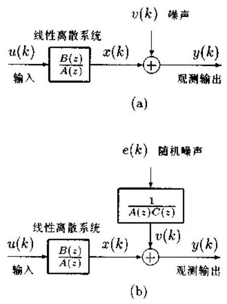

图 8.2.1 系统模型

并且 $r\left( k\right)$ 是一个输入可观测的 $\operatorname{ARMA}\left( {p, q}\right)$ 过程 (也称 $\mathrm{{ARX}}$ 过程):

$$
x\left( k\right)  + \mathop{\sum }\limits_{{i = 1}}^{p}{a}_{i}x\left( {k - i}\right)  = \mathop{\sum }\limits_{{j = 0}}^{q}{b}_{j}u\left( {k - j}\right)
$$

因此,观测输出 $y\left( k\right)$ 可以写作

$$
A\left( z\right) y\left( k\right)  = B\left( z\right) u\left( k\right)  + \epsilon \left( k\right) \tag{8.2.1}
$$

其中

$$
A\left( z\right)  = 1 + {a}_{1}{z}^{-1} + \cdots  + {a}_{p}{z}^{-p}
$$

$$
B\left( z\right)  = {b}_{0} + {b}_{1}{z}^{-1} + \cdots  + {b}_{q}{z}^{-q}
$$

$$
r\left( k\right)  = A\left( z\right) v\left( k\right)
$$

虽然观测噪声 $v\left( \mathbf{k}\right)$ 是白色的，但是残差 $\epsilon \left( k\right)$ 却是有色的 AR 过程.

假定有 $N$ 个输入 $u\left( k\right)$ 与输出 $y\left( k\right) , k = 1,\cdots , N$ 可以利用. 于是,式 (8.2.1) 可以用矩许方程写作

$$
y = {\Phi \theta } + \epsilon \tag{8.2.2}
$$

式中

$$
y = {\left\lbrack  y\left( 1\right) , y\left( 2\right) ,\cdots , y\left( N\right) \right\rbrack  }^{T}
$$

$$
\epsilon  = {\left\lbrack  \epsilon \left( 1\right) ,\epsilon \left( 2\right) ,\cdots ,\epsilon \left( N\right) \right\rbrack  }^{T}
$$

$$
{\Phi }^{T} = \left\lbrack  \begin{array}{llll} {\phi }_{1}^{T} & {\phi }_{2}^{T} & \cdots & {\phi }_{N}^{T} \end{array}\right\rbrack
$$

$$
\theta  = {\left\lbrack  {a}_{1},\cdots ,{a}_{p},{b}_{0},{b}_{1},\cdots ,{b}_{q}\right\rbrack  }^{T}
$$

及

$$
{\phi }_{i} = \left\lbrack  {-y\left( {i - 1}\right) ,\cdots , - y\left( {i - p}\right) , u\left( i\right) ,\cdots , u\left( {i - q}\right) }\right\rbrack
$$

由于残差 $\epsilon \left( k\right)$ 是一个有色的 AR 噪声过程,所以一般的最小二乘方法会给出有偏的估计. 为了得到渐近无偏和一致的参数估计, 应该采用推广的最小二乘方法. 许多研究表明，广义最小二乘 (GLS: generalized least squares) 方法对残差为 AR 噪声的情况是有效的.

求解超定矩阵方程 (8.2.2) 的广义最小二乘方法的基本思想是利用一滤波器 $C\left( z\right)$ 将有色 AR 残差 $\epsilon \left( k\right)$ 滤成白色的:

$$
e\left( k\right)  = C\left( z\right) \epsilon \left( k\right)
$$

其中 $e\left( k\right)$ 是零均值、方差有限的白噪声. 我们称这一过程为白化过程. 这相当于用滤波器传递函数 $C\left( z\right)$ 乘系统方程 (8.2.1) 的两边,得到

$$
A\left( z\right) C\left( z\right) y\left( k\right)  = B\left( z\right) C\left( z\right) u\left( k\right)  + e\left( k\right) \tag{8.2.3}
$$

其等价的系统模型如图 8.2.1b 所示. 注意,当输入 $u\left( k\right)$ 与输出 $y\left( k\right)$ 均可观测时,求解式 (8.2.3) 得到的系统参数是不能对消的 $A\left( z\right)$ 和 $B\left( z\right)$ ,而不是可部分对消的 $A\left( z\right) C\left( z\right)$ 和 $B\left( z\right) C\left( z\right)$ . 值得指出的是,方程式 (8.2.3) 的 “残差” $e\left( k\right)$ 是 $\mathrm{{AR}}$ 有色噪声. 因此,用 (一般的) 最小二乘方法估计系统参数 $A\left( z\right)$ 与 $B\left( z\right)$ 的关键在于对残差 $\epsilon \left( k\right)$ 进行白化滤波. 归纳之, 广义最小二乘方法是一种迭代的最小二乘算法: 先用最小二乘求解方程式 (8.2.2). 得到有偏的最小二乘估计 $\widehat{\theta }$ ; 然后计算其偏差,并对 $\widehat{\theta }$ 进行修正; 修正后的解仍然可能是有偏的,再次用其偏差的估计值对 $\widehat{\theta }$ 修正,如此反复,直至解 $\widehat{\theta }$ 收敛为止. 例如, ${\operatorname{Hsia}}^{\left\lbrack  3\right\rbrack  }$ 提出的下列算法就是一种比较有效的广义最小二乘方法.

算法 8.2.1 (广义最小二乘算法)

步骤 1: 计算最小二乘估计

$$
{\widehat{\theta }}_{\mathrm{{LS}}} = {\left( {\Phi }^{T}\Phi \right) }^{-1}{\Phi }^{T}y
$$

并令 $\widehat{\theta } = {\widehat{\theta }}_{\mathrm{{LS}}}$ 和 $\Gamma  = {\left( {\Phi }^{T}\Phi \right) }^{-1}{\Phi }^{T}$ .

步骤 2: 利用已求得的估计值 $\widehat{\theta }$ 产生残差的估计值 $\widehat{\epsilon }\left( k\right)$ :

$$
\widehat{\epsilon }\left( k\right)  = y\left( k\right)  - {\phi }_{i}\widehat{\theta }
$$

步骤 3: 计算

$$
\widehat{c} = {\left( {\Omega }^{T}\Omega \right) }^{-1}{\Omega }^{T}\epsilon
$$

$$
{\widehat{\theta }}_{\text{ bias }} = \Gamma \widehat{\Omega }\widehat{c}
$$

$$
{\Omega }^{T} = \left\lbrack  \begin{array}{llll} {\widehat{\omega }}_{1}^{T} & {\widehat{\omega }}_{2}^{T} & \cdots & {\widehat{\omega }}_{N}^{T} \end{array}\right\rbrack
$$

$$
{\widehat{\omega }}_{i} = \left\lbrack  {-\widehat{\epsilon }\left( {i - 1}\right) , - \widehat{\epsilon }\left( {i - 2}\right) ,\cdots , - \widehat{\epsilon }\left( {i - n}\right) }\right\rbrack
$$

步骤 4: 更新 $\widehat{\mathbf{\theta }}$ :

$$
\widehat{\theta } = {\widehat{\theta }}_{\mathrm{{LS}}} - {\widehat{\theta }}_{\text{ bias }}
$$

步骤 5: 返问步骤 2,并重复以上步骤,直至 $\widehat{\theta }$ 收敛.

白化滤波过程体现在步骤 3.

步骤 3 包含了两个左伪逆矩阵 (最小二乘逆矩阵) 的计算. 如果用第一章 1.5 节所述的阶数递推方法 (定理 1.5.1) 分别求这两个伪逆矩阵, 就可以得到对应于各种可能阶数组合 $\left( {p, q}\right)$ 的 ARMA 模型参数,从而构成一种阶数递推的广义最小二乘系统参数估计算法. 值得指出的是, 这种递推算法又可结合阶数确定的信息量准则 (如 AIC 准则等), 构成一种实际的系统辨识 (包含阶数确定与参数估计) 算法. 这种算法是 Zhang (本书作者) 5 Takeda 提出的 ${}^{\left\lbrack  4\right\rbrack  }$ .

下面考虑另外一个应用例子.

令观测过程由

$$
A\left( z\right) y\left( k\right)  = B\left( z\right) u\left( k\right)  + \frac{1}{C\left( z\right) }w\left( k\right) \tag{8.2.4}
$$

给出，如图 8.2.1(b) 所示. 式中， $w\left( k\right)$ 是一个与输入 $u\left( k\right)$ 独立的白噪声过程. 与前面不同的是，输入 $u\left( k\right)$ 现在是一个不可能观测的白噪声. 令

$$
\epsilon \left( k\right)  = \frac{1}{C\left( z\right) }w\left( n\right) \tag{8.2.5}
$$

下面推导模型 (8.2.4) 中 AR 参数的估计公式.

用 $y\left( {k - q - l}\right) , l \geq  1$ 同乘式 (8.2.4) 两边,并取数学期望,则有

$$
{R}_{y}\left( {q + l}\right)  + \mathop{\sum }\limits_{{i = 1}}^{p}{a}_{i}{R}_{y}\left( {q + l - i}\right)  = {R}_{y\epsilon }\left( {q + l}\right) ,\;l \geq  1 \tag{8.2.6}
$$

式中, ${R}_{y}\left( i\right)$ 是 $y\left( k\right)$ 的自协方差,而 ${R}_{y\epsilon }\left( i\right)$ 是 $y\left( k\right)$ 与 $\epsilon \left( k\right)$ 的互协方差,即 ${R}_{y\epsilon }\left( i\right)  = \; E\{ y\left( {k - i}\right) \epsilon \left( k\right) \}$ .

另一方面,用 $y\left( {n - q - l}\right) , l \geq  1$ 同乘式 (8.2.5) 两边,并取数学期望,又有

$$
{R}_{yt}\left( {q + l}\right)  + \mathop{\sum }\limits_{{i = 1}}^{m}{c}_{i}{R}_{yt}\left( {q + l - i}\right)  = 0,\;l \geq  1 \tag{8.2.7}
$$

式 (8.2.6) 与式 (8.2.7) 构成了 AR 有色噪声情况下 ARMA 模型 AR 参数估计的基础.

定义以下向量与矩阵:

$$
r = {\left\lbrack  {R}_{y}\left( q + 1\right) ,{R}_{y}\left( q + 2\right) ,\cdots ,{R}_{y}\left( q + M\right) \right\rbrack  }^{T}
$$

$$
{\phi }_{i} = \left\lbrack  {-{R}_{y}\left( {q + i - 1}\right) , - {R}_{y}\left( {q + i - 2}\right) ,\cdots , - {R}_{y}\left( {q + i - p}\right) }\right\rbrack
$$

$$
{\Phi }^{T} = \left\lbrack  \begin{array}{llll} {\phi }_{1}^{T} & {\phi }_{2}^{T} & \cdots & {\phi }_{M}^{T} \end{array}\right\rbrack
$$

$$
\epsilon  = {\left\lbrack  {R}_{y\epsilon }\left( q + 1\right) ,{R}_{y\epsilon }\left( q + 2\right) ,\cdots ,{R}_{y\epsilon }\left( q + M\right) \right\rbrack  }^{T}
$$

$$
\mathbf{\theta } = {\left\lbrack  {a}_{1},{a}_{2},\cdots ,{a}_{p}\right\rbrack  }^{T}
$$

$$
{\omega }_{i} = \left\lbrack  {-{R}_{y\epsilon }\left( {q + i - 1}\right) , - {R}_{y\epsilon }\left( {q + i - 2}\right) ,\cdots , - {R}_{y\epsilon }\left( {q + i - p}\right) }\right\rbrack
$$

$$
{\Omega }^{T} = \left\lbrack  \begin{array}{llll} {\omega }_{1}^{T} & {\omega }_{2}^{T} & \cdots & {\omega }_{M}^{T} \end{array}\right\rbrack
$$

$$
\mathbf{c} = {\left\lbrack  {c}_{1},{c}_{2},\cdots ,{c}_{m}\right\rbrack  }^{T}
$$

则式 (8.2.7) 可简写为

$$
\epsilon  = {\Omega c} \tag{8.2.8}
$$

而式 (8.2.6) 可用矩阵 - 向量符号表示为

$$
r = {\Phi \theta } + \epsilon \tag{8.2.9}
$$

令 ${\Phi }^{ \dagger  }$ 是 $\Phi$ 的左伪逆矩阵,即 ${\Phi }^{ \dagger  } = {\left( {\Phi }^{T}\Phi \right) }^{-1}{\Phi }^{T}$ . 现在用 ${\Phi }^{ \dagger  }$ 左乘式 (8.2.9),则有

$$
{\theta }_{\mathrm{{LS}}} = \theta  + {\Phi }^{ \dagger  }{\Omega c} \tag{8.2.10}
$$

其中， ${\theta }_{\mathrm{{LS}}} = {\Phi }^{ \dagger  }r$ 是不存在有色噪声 $v\left( k\right)$ 时 ARMA 模型的 AR 参数的最小二乘估计. 若将式 (8.2.10) 右边的第二项视为一偏差项, 即

$$
{\theta }_{\text{ bias }} = {\Phi }^{ \dagger  }{\Omega c} \tag{8.2.11}
$$

则 AR 参数的理想估计由

$$
\theta  = {\theta }_{\mathrm{{LS}}} - {\theta }_{\text{ bias }} \tag{8.2.12}
$$

给出.

Zhang (本书作者) 与 Takeda ${}^{\left\lbrack  5\right\rbrack  }$ 提出用一种自举方法从 AR 有色噪声下的修正 Yule-Walker 方程 (8.2.9) 估计 ARMA 模型 AR 参数的算法, 并称之为广义最小二乘 (GLS) 算法. 在下面的算法中,假定样本协方差 ${\widehat{R}}_{y}\left( l\right)  = \frac{1}{N}\mathop{\sum }\limits_{{k = 1}}^{N}y\left( k\right) y\left( {k + l}\right)$ 已估计出,并且阶数 $p, q$ 与 $m$ 已知.

算法 8.2.2 (ARMA 模型 AR 参数估计的 GLS 算法)

步骤 1: 假定 $\widehat{c} = 0$ ,并计算 ${\widehat{\theta }}_{\mathrm{{LS}}} = {\widehat{\Phi }}^{ \dagger  }\widehat{r}$ .

步骤 2: 利用式 (8.2.6) 计算互协方差 ${\widehat{R}}_{y\epsilon }\left( {q + l}\right)$ ,并计算 $\widehat{c} = {\Omega }^{ \dagger  }\epsilon$ . 然后,利用式 (8.2.7) 递推产生其它的互协方差:

$$
{R}_{y\epsilon }\left( {q + l - m}\right)  = \frac{1}{{c}_{m}}\mathop{\sum }\limits_{{i = 0}}^{{m - 1}}{c}_{i}{R}_{y\epsilon }\left( {q + l - i}\right) ,\;i = m, m - 1,\cdots ,1 \tag{8.2.13}
$$

步骤 3: 用式 (8.2.11) 计算 ${\widehat{\theta }}_{\text{ bias }}$ ,再用式 (8.2.12) 更新 $\widehat{\theta }$ ,并令 ${\widehat{\theta }}_{\text{ LS }} = \widehat{\theta }$ .

步骤 4: 返回步骤 2，并重复以上计算，直至 AR 参数估计值趋于收敛.

若对于所有 $i = 1,\cdots , p$ ，条件

$$
\left| \frac{{a}_{i}^{\left( k + 1\right) } - {a}_{i}^{\left( k\right) }}{{a}_{i}^{\left( k + 1\right) }}\right|  \leq  {0.05} \tag{8.2.14}
$$

均满足,则我们认为 $\mathrm{{AR}}$ 参数估计已收敛,其中 ${a}_{i}^{\left( k\right) }$ 表示第 $k$ 次迭代过程中参数 ${a}_{i}$ 的估计值.

### 8.3 渐近最小方差估计

在时间序列分析与信号处理中,利用高阶累积量 ${c}_{k}\left( {{\tau }_{1},\cdots ,{\tau }_{k - 1}}\right) , k \geq  3$ 进行系统辨识、高阶谱估计、时延估计、谐波恢复与滤波等具有一系列优点, 诸如自动抑制高斯有色噪声、可以辨识非最小相位系统、能够检测非线性与非高斯性等，详见文献 [6]. 本节讨论利用高阶矩 ${\mu }_{k}\left( {{\tau }_{1},\cdots ,{\tau }_{k - 1}}\right)$ 估计平稳时间序列参数的最小方差估计方法. 注意,对于一个零均值过程, 其三阶矩与三阶累积量相同, 但四阶以上的矩与累积量是不同的.

令 $\left\{  {y}_{t}\right\}$ 是一个平稳与遍志历经的线性过程,由下式给定:

$$
{y}_{t} = \mathop{\sum }\limits_{i}{h}_{i}{u}_{t - i} \tag{8.3.1}
$$

其中 $\left\{  {u}_{t}\right\}$ 是独立同分布的非高斯随机变量序列. 冲激响应序列 $\left\{  {h}_{i}\right\}$ 假定取决于固定维的参数向量 $\theta$ ,并假设它是绝对可求和的,即 $\mathop{\sum }\limits_{i}\left| {h}_{i}\right|  < \infty$ .

将 $\left\{  {u}_{l}\right\}$ 的 (中心) 矩表示为

$$
{\gamma }_{k} = E\left\{  {u}_{t}^{k}\right\}  ,\;k \geq  1, - \infty  < {\gamma }_{k} < \infty \tag{8.3.2}
$$

为方便计,假定 $\left\{  {u}_{t}\right\}$ 是零均值的,即 ${\gamma }_{1} = 0$ .

令 ${\mu }_{k}\left( {{\tau }_{1},\cdots ,{\tau }_{k - 1}}\right)$ 是 ${y}_{t}$ 的 $k$ 阶矩:

$$
{\mu }_{k}\left( {{\tau }_{1},\cdots ,{\mu }_{k - 1}}\right)  = E\left\{  {{y}_{t}{y}_{t + {\tau }_{1}}\cdots {y}_{t + {\tau }_{k - 1}}}\right\} \tag{8.3.3}
$$

在上述有关 ${u}_{t}$ 的假设下， ${y}_{t}$ 的各阶矩都是有限大的. ${y}_{t}$ 的 $k$ 阶样本矩定义为

$$
{\widehat{\mu }}_{k}\left( {{\tau }_{1},\cdots ,{\tau }_{k - 1}}\right)  = \frac{1}{N}\mathop{\sum }\limits_{{t = 1}}^{N}{y}_{t}{y}_{t + {\tau }_{1}}\cdots {y}_{t + {\tau }_{k - 1}} \tag{8.3.4}
$$

我们约定只有 $N$ 个观测数据 ${y}_{t}, t = 1,\cdots , N$ ,因此,在计算样本矩的公式 (8.3.4) 中 ${y}_{t} = \; 0\left( {t < 1, t > N}\right)$ .

每一阶样本矩都是对应真实矩的无偏估计, 而且还已知它们是均方一致和强一致的:

$$
\mathop{\lim }\limits_{{N \rightarrow  \infty }}E\left\{  {\left\lbrack  {\widehat{\mu }}_{k}\left( {\tau }_{1},\cdots ,{\tau }_{k - 1}\right)  - {\mu }_{k}\left( {\tau }_{1},\cdots ,{\tau }_{k - 1}\right) \right\rbrack  }^{2}\right\}   = 0 \tag{8.3.5a}
$$

$$
\mathop{\lim }\limits_{{N \rightarrow  \infty }}{\widehat{\mu }}_{k}\left( {{\tau }_{1},\cdots ,{\tau }_{k - 1}}\right) \overset{\text{ a.s. }}{ = }{\mu }_{k}\left( {{\tau }_{1},\cdots ,{\tau }_{k - 1}}\right) \tag{8.3.5b}
$$

式中 $=$ 表示等式几乎肯定 (或以概率 1) 成立.

令 $\widehat{s}$ 为一向量,它由式 (8.3.4) 定义的一组固定样本矩组成; 并令 $s$ 是由式 (8.3.3) 定义的相应阶的真实矩组成的向量. 我们感兴趣的问题是: 根据已求出的向量 $\widehat{s}$ 估计参数向量 $\theta$ ,即

$$
\widehat{\theta } = g\left( \widehat{s}\right) \tag{8.3.6}
$$

统计量 $\widehat{s}$ 要求对 $\theta$ 是渐近充分的,也就是说,在式 (8.3.6) 中用 $s$ 代替 $\widehat{s}$ 后,应该对每一个 $\theta$ 给出唯一的解 $\widehat{\theta } = \theta$ . 这类估计的渐近统计性能在文献 [7] 中被详细讨论,并证明了以下结果:

1) $\widehat{s}$ 的渐近标准化协方差矩阵由下式给出:

$$
\sum \left( \theta \right)  = \mathop{\lim }\limits_{{N \rightarrow  \infty }}N \cdot  \left\lbrack  {E\left\{  {\widehat{s}{\widehat{s}}^{T}}\right\}   - s{s}^{T}}\right\rbrack \tag{8.3.7}
$$

2) $\widehat{\theta }$ 的渐近协方差是有界的:

$$
\mathop{\lim }\limits_{{N \rightarrow  \infty }}N \times  \operatorname{cov}\left( \widehat{\theta }\right)  \geq  {\left\lbrack  {\left( \frac{\partial s\left( \theta \right) }{\partial \theta }\right) }^{T}{\sum }^{-1}\left( \theta \right) \left( \frac{\partial s\left( \theta \right) }{\partial \theta }\right) \right\rbrack  }^{-1} \tag{8.3.8}
$$

式 (8.3.8) 中的下界是渐近紧致的 (asymptotically tight),即存在一估计 $\widehat{\theta }$ ,其渐近标准化协方差矩阵满足式 (8.3.8) 中的等式.

3) 对每一个与 $\theta$ 具有相同维数的向量 $x$ ,若令

$$
V\left( x\right)  = {\left\lbrack  s\left( x\right)  - \widehat{s}\right\rbrack  }^{T}{\sum }^{-1}\left( x\right) \left\lbrack  {s\left( x\right)  - \widehat{s}}\right\rbrack \tag{8.3.9}
$$

并令 $\widehat{\theta }$ 是 $V\left( x\right)$ 达到全局最小 (如果全局最小存在的话) 时 $x$ 的值,则当 $N \rightarrow  \infty$ 时,该估计的渐近协方差达到式 (8.3.8) 的下界. 这一参数估计 $\widehat{\theta }$ 称作最小方差估计.

通过式 (8.3.9) 的极小化求最小方差估计是很难实现的. 困难的主要根源是在极小化的每一步迭代中需要计算矩阵 $\sum \left( \mathbf{x}\right)$ ,而它是过程参数的函数,通常是未知的.

在实际应用中,式 (8.3.9) 的矩阵 $\sum \left( x\right)$ 用其估计 $\widehat{\sum }$ 代替. 定义

$$
\widehat{V}\left( x\right)  = {\left\lbrack  s\left( x\right)  - \widehat{s}\right\rbrack  }^{T}{\widehat{\sum }}^{-1}\left\lbrack  {s\left( x\right)  - \widehat{s}}\right\rbrack \tag{8.3.10}
$$

令 $\widehat{\theta }$ 是 $\widehat{V}\left( x\right)$ 达到全局最小 (若存在一个全局最小值,否则估计问题为病态,以下结果不再成立) 时的 $x$ 值,并令 $\widehat{\sum }$ 是 $\sum \left( \theta \right)$ 的一致估计, $\theta$ 为真实参数向量.

关于矩阵 $\widehat{\sum }$ ,假定以下条件:

假设 1: 当 $N \rightarrow  \infty$ 时 $\widehat{\sum }$ 以概率 1 (或几乎肯定) 收敛为 $\sum \left( \theta \right)$ .

假设 $2 : \widehat{\sum } - \sum \left( \theta \right)$ 的二阶矩是 $O\left( {N}^{-1}\right)$ 数量级的,即

$$
- \infty  < \mathop{\lim }\limits_{{N \rightarrow  \infty }}N \times  E\left\{  {\left\lbrack  {{\widehat{\sum }}_{i, j} - {\sum }_{i, j}\left( \theta \right) }\right\rbrack  \left\lbrack  {{\widehat{\sum }}_{k, l} - {\sum }_{k, l}\left( \theta \right) }\right\rbrack  }\right\}   < \infty \tag{8.3.11}
$$

假设 3: $\widehat{\sum } - \sum \left( \theta \right)$ 的三阶和四阶矩是 $o\left( {N}^{-1}\right)$ 数量级的,即

$$
\mathop{\lim }\limits_{{N \rightarrow  \infty }}N \times  E\left\{  {\left\lbrack  {{\widehat{\sum }}_{i, j} - {\sum }_{i, j}\left( \theta \right) }\right\rbrack  \left\lbrack  {{\widehat{\sum }}_{k, l} - {\sum }_{k, l}\left( \theta \right) }\right\rbrack  \left\lbrack  {{\widehat{\sum }}_{m, n} - {\sum }_{m, n}\left( \theta \right) }\right\rbrack  }\right\}   = 0 \tag{8.3.12}
$$

$$
\mathop{\lim }\limits_{{N \rightarrow  \infty }}N \times  E\left\{  {\left\lbrack  {{\widehat{\sum }}_{i, j} - {\sum }_{i, j}\left( \theta \right) }\right\rbrack  \left\lbrack  {{\widehat{\sum }}_{k, l} - {\sum }_{k, l}\left( \theta \right) }\right\rbrack  \left\lbrack  {{\widehat{\sum }}_{m, n} - {\sum }_{m, n}\left( \theta \right) }\right\rbrack  \left\lbrack  {{\widehat{\sum }}_{g, h} - {\sum }_{g, h}\left( \theta \right) }\right\rbrack  }\right\}   = 0 \tag{8.3.13}
$$

Friedlander 与 Porat ${}^{\left\lbrack  8\right\rbrack  }$ 提出通过式 (8.3.10) 的全局极小化求参数向量 $\mathbf{\theta }$ 的估计 $\widehat{\mathbf{\theta }}$ ,并称之为渐近最小方差估计, 因为这一估计具有下面的渐近性能:

定理 8.3.1 在假设 $1 \sim  3$ 下,通过式 (8.3.10) 的全局极小化得到的估计 $\widehat{\theta }$ 具有式 (8.3.8) 右边给出的渐近协方差, 即

$$
\mathop{\lim }\limits_{{N \rightarrow  \infty }}N \times  \operatorname{cov}\left( \widehat{\theta }\right)  = {\left\lbrack  {\left( \frac{\partial s\left( \theta \right) }{\partial \theta }\right) }^{T}{\sum }^{-1}\left( \theta \right) \left( \frac{\partial s\left( \theta \right) }{\partial \theta }\right) \right\rbrack  }^{-1} \tag{8.3.14}
$$

证明见文献 [8].

为了得到渐近最小方差估计,必须先根据观测数据计算 $\sum \left( \theta \right)$ 的一致估计 $\widehat{\sum }$ . 注意到

$$
E\left\{  {\left( {\widehat{s} - s}\right) {\left( {\widehat{s}}^{T} - s\right) }^{T}}\right\}   = E\left\{  {\widehat{s}{\widehat{s}}^{T}}\right\}   - E\left\{  {\widehat{s}{s}^{T}}\right\}   - E\left\{  {{\widehat{s}}^{T}s}\right\}   + E\left\{  {s{s}^{T}}\right\}
$$

$$
= E\left\{  {\widehat{s}{\widehat{s}}^{T}}\right\}   - {2s}{s}^{T} + s{s}^{T}
$$

$$
= E\left\{  {\widehat{s}{\widehat{s}}^{T}}\right\}   - s{s}^{T}
$$

所以 $\sum \left( \theta \right)$ 的定义式 (8.3.7) 等价为

$$
\sum \left( \theta \right)  = \mathop{\lim }\limits_{{N \rightarrow  \infty }}N \times  E\left\{  {\left( {\widehat{s} - s}\right) {\left( \widehat{s} - s\right) }^{T}}\right\} \tag{8.3.15}
$$

其中 $E\left\{  {\left( {\widehat{s} - s}\right) {\left( \widehat{s} - s\right) }^{T}}\right\}$ 可视为 $\widehat{s}$ 的协方差矩阵,这就是 $\sum \left( \theta \right)$ 之所以被称为 $\widehat{s}$ 的渐近标准化协方差矩阵的原因.

由式 (8.3.15) 直接得到 $\sum \left( \theta \right)$ 的一致估计 $\widehat{\sum }$ 为

$$
\widehat{\sum } = N \times  E\left\{  {\left( {\widehat{s} - s}\right) {\left( \widehat{s} - s\right) }^{T}}\right\} \tag{8.3.16}
$$

出上式不难知道,矩阵 $\widehat{\sum }$ 的计算归结为其元素

$$
N \times  \operatorname{cov}\left\{  {{\widehat{\mu }}_{m}\left( {{\alpha }_{1},\cdots ,{\alpha }_{m - 1}}\right) ,{\widehat{\mu }}_{n}\left( {{\beta }_{1},\cdots ,{\beta }_{n - 1}}\right) }\right\}
$$

的计算. 下面推导其具体计算公式.

首先考虑 $\mathrm{{MA}}\left( q\right)$ 过程,即令 $\left\{  {y}_{t}\right\}$ 是一个 $\mathrm{{MA}}\left( q\right)$ 过程,而 ${\mu }_{m}\left( {{\alpha }_{1},\cdots ,{\alpha }_{m - 1}}\right)$ 和 ${\widehat{\mu }}_{m}\left( {\alpha }_{1}\right.$ , $\left. {\cdots ,{\alpha }_{m - 1}}\right)$ 分别是其真实 $m$ 阶矩和样本 $m$ 阶矩,它们分别定义为式 (8.3.3) 和式 (8.3.4). 于是, 我们有

$$
E\left\{  {{\widehat{\mu }}_{m}\left( {{\alpha }_{1},\cdots ,{\alpha }_{m - 1}}\right) {\widehat{\mu }}_{n}\left( {{\beta }_{1},\cdots ,{\beta }_{n - 1}}\right) }\right\}
$$

$$
= E\left\{  {\frac{1}{{N}^{2}}\mathop{\sum }\limits_{{s = 1}}^{N}\mathop{\sum }\limits_{{t = 1}}^{N}{y}_{s}{y}_{t}\left( {\mathop{\prod }\limits_{{i = 1}}^{{m - 1}}{y}_{s + {\alpha }_{i}}}\right) \left( {\mathop{\prod }\limits_{{j = 1}}^{{n - 1}}{y}_{t + {\beta }_{j}}}\right) }\right\}
$$

$$
= E\left\{  {\frac{1}{{N}^{2}}\mathop{\sum }\limits_{{s = 1}}^{N}\mathop{\sum }\limits_{{t = 1}}^{N}{y}_{0}{y}_{t - s}\left( {\mathop{\prod }\limits_{{i = 1}}^{{m - 1}}{y}_{{\alpha }_{i}}}\right) \left( {\mathop{\prod }\limits_{{j = 1}}^{{n - 1}}{y}_{t - s + {\beta }_{j}}}\right) }\right\}
$$

$$
= \frac{1}{N}\mathop{\sum }\limits_{{t =  - \left( {N - 1}\right) }}^{{N - 1}}\left( {1 - \frac{\left| t\right| }{N}}\right) E\left\{  {{y}_{0}{y}_{t}\left( {\mathop{\prod }\limits_{{i = 1}}^{{m - 1}}{y}_{{\alpha }_{i}}}\right) \left( {\mathop{\prod }\limits_{{j = 1}}^{{n - 1}}{y}_{t + {\beta }_{j}}}\right) }\right\} \tag{8.3.17}
$$

因此

$$
\operatorname{cov}\left\{  {{\widehat{\mu }}_{m}\left( {{\alpha }_{1},\cdots ,{\alpha }_{m - 1}}\right) ,{\widehat{\mu }}_{n}\left( {{\beta }_{1},\cdots ,{\beta }_{n - 1}}\right) }\right\}
$$

$$
= \frac{1}{N}\mathop{\sum }\limits_{{t =  - \left( {N - 1}\right) }}^{{N - 1}}\left( {1 - \frac{\left| t\right| }{N}}\right) E\left\{  \left\lbrack  {{y}_{0}{y}_{{\alpha }_{1}}\cdots {y}_{{\alpha }_{m - 1}} - {\mu }_{m}\left( {{\alpha }_{1},\cdots ,{\alpha }_{m - 1}}\right) }\right\rbrack  \right.
$$

$$
\times  \left\lbrack  {{y}_{t}{y}_{t + {\beta }_{1}}\cdots {y}_{t + {\beta }_{n - 1}} - {\mu }_{n}\left( {{\beta }_{1},\cdots ,{\beta }_{n - 1}}\right) }\right\rbrack  \} \tag{8.3.18}
$$

由于 $\left\{  {y}_{t}\right\}$ 是 $\operatorname{MA}\left( q\right)$ 过程,所以乘积 ${y}_{0}{y}_{{\alpha }_{1}}\cdots {y}_{{\alpha }_{m - 1}}$ 与乘积 ${y}_{t}{y}_{t + {\beta }_{1}}\cdots {y}_{t + {\beta }_{n - 1}}$ 对所有 $t > {\beta }_{1} + q, t <  - \left( {q + {\beta }_{1}}\right)$ 统计独立. 这样一来,式 (8.3.17) 便可以写作

$$
\operatorname{cov}\left\{  {{\widehat{\mu }}_{m}\left( {{\alpha }_{1},\cdots ,{\alpha }_{m - 1}}\right) ,{\widehat{\mu }}_{n}\left( {{\beta }_{1},\cdots ,{\beta }_{n - 1}}\right) }\right\}
$$

$$
= \frac{1}{N}\mathop{\sum }\limits_{{t =  - \left( {{\beta }_{1} + q}\right) }}^{{{\beta }_{1} + q}}\left( {1 - \frac{\left| t\right| }{N}}\right) E\left\{  \left\lbrack  {{y}_{0}{y}_{{\alpha }_{1}}\cdots {y}_{{\alpha }_{m - 1}} - {\mu }_{m}\left( {{\alpha }_{1},\cdots ,{\alpha }_{m - 1}}\right) }\right\rbrack  \right.
$$

$$
\left. {\times \left\lbrack  {{y}_{t}{y}_{t + {\beta }_{1}}\cdots {y}_{t + {\beta }_{n - 1}} - {\mu }_{n}\left( {{\beta }_{1},\cdots ,{\beta }_{n - 1}}\right) }\right\rbrack  }\right\} \tag{8.3.19}
$$

利用已知过程的平稳性和遍态历经性，我们可以用下式一致估计式 (8.3.19) 右边的数学期望项:

$$
E\left\{  {\left\lbrack  {{y}_{0}{y}_{{\alpha }_{1}}\cdots {y}_{{\alpha }_{m - 1}} - {\mu }_{m}\left( {{\alpha }_{1},\cdots ,{\alpha }_{m - 1}}\right) }\right\rbrack  \left\lbrack  {{y}_{t}{y}_{t + {\beta }_{1}}\cdots {y}_{t + {\beta }_{n - 1}} - {\mu }_{n}\left( {{\beta }_{1},\cdots ,{\beta }_{n - 1}}\right) }\right\rbrack  }\right\}
$$

$$
\approx  \frac{1}{N}\mathop{\sum }\limits_{{s = 1}}^{N}\left\lbrack  {{y}_{s}{y}_{s + {\alpha }_{1}}\cdots {y}_{s + {\alpha }_{m - 1}} - {\widehat{\mu }}_{m}\left( {{\alpha }_{1},\cdots ,{\alpha }_{m - 1}}\right) }\right\rbrack
$$

$$
\times  \left\lbrack  {{y}_{s + t}{y}_{s + t + {\beta }_{1}}\cdots {y}_{s + t + {\beta }_{n - 1}} - {\widehat{\mu }}_{n}\left( {{\beta }_{1},\cdots ,{\beta }_{n - 1}}\right) }\right\rbrack \tag{8.3.20}
$$

最后, 将式 (8.3.20) 代入式 (8.3.19) 得到下列估计公式:

$$
N \times  \operatorname{cov}\left\{  {{\widehat{\mu }}_{m}\left( {{\alpha }_{1},\cdots ,{\alpha }_{m - 1}}\right) ,{\widehat{\mu }}_{n}\left( {{\beta }_{1},\cdots ,{\beta }_{n - 1}}\right) }\right\}
$$

$$
\approx  \frac{1}{{N}^{2}}\mathop{\sum }\limits_{{t =  - \left( {{\beta }_{1} + q}\right) }}^{{{\beta }_{1} + q}}\left( {1 - \frac{\left| t\right| }{N}}\right) \mathop{\sum }\limits_{{s = 1}}^{N}\left\lbrack  {{y}_{s}{y}_{s + {\alpha }_{1}}\cdots {y}_{s + {\alpha }_{m - 1}} - {\widehat{\mu }}_{m}\left( {{\alpha }_{1},\cdots ,{\alpha }_{m - 1}}\right) }\right\rbrack
$$

$$
\times  \left\lbrack  {{y}_{s + t}{y}_{s + t + {\beta }_{1}}\cdots {y}_{s + t + {\beta }_{n - 1}} - {\widehat{\mu }}_{n}\left( {{\beta }_{1},\cdots ,{\beta }_{n - 1}}\right) }\right\rbrack \tag{8.3.21}
$$

这就是我们需要的估计公式,它适用于计算 $\mathrm{{MA}}\left( q\right)$ 过程的样本矩的协方差.

下面再将式 (8.3.21) 推广到一般的 ARMA 过程. 假定 $\left\{  {y}_{t}\right\}$ 是由式 (8.3.1) 定义的线性过程,且冲激响应 $\left\{  {h}_{i}\right\}$ 是指数稳定的,即

$$
\left| {h}_{i}\right|  < A{e}^{-\alpha \left| i\right| },\;A > 0,\alpha  > 0 \tag{8.3.22}
$$

在这种情况下,乘积 ${y}_{0}{y}_{{\alpha }_{1}}\cdots {y}_{{\alpha }_{m - 1}}$ 与 ${y}_{t}{y}_{t + {\beta }_{1}}\cdots {y}_{t + {\beta }_{n - 1}}$ 近似独立,其中 $t > {\alpha }_{1} + {q}_{0}$ 或 $t <  - \left( {{q}_{0} + {\beta }_{1}}\right)$ ,并且 ${q}_{0}$ 足够大. 换句话说,当 $q$ 用 ${q}_{0}$ 代替后,式 (8.3.21) 近似成立. 参数 ${q}_{0}$ 表示该过程的 “有效 MA 阶数”. Friedlander 与 Porat ${}^{\left\lbrack  8\right\rbrack  }$ 提出使用 $q$ 被 ${q}_{0}$ 代替的式 (8.3.21) 估计 ARMA 过程的样本矩的协方差.

为了使式 (8.3.21) 是一致估计,需要将 ${q}_{0}$ 作为 $N$ 的函数变化,使之满足:

$$
\mathop{\lim }\limits_{{N \rightarrow  \infty }}{q}_{0}\left( N\right)  = \infty ;\;\mathop{\lim }\limits_{{N \rightarrow  \infty }}\frac{{q}_{0}\left( N\right) }{N} = 0 \tag{8.3.23}
$$

一种合理的选择是取 ${q}_{0} = \log N$ .

如果 ${q}_{0}$ 是有效 $\mathrm{{MA}}$ 阶数,则观测过程的二阶矩 (即协方差) ${\widehat{\mu }}_{2}\left( {{q}_{0} + 1}\right)$ 为近似正态分布, 并且该分布具有零均值和方差:

$$
\operatorname{var}\left\{  {{\widehat{\mu }}_{2}\left( {{q}_{0} + 1}\right) }\right\}   \approx  \mathop{\sum }\limits_{{t =  - \left( {2{q}_{0} + 1}\right) }}^{{2{q}_{0} + 1}}\left( {1 - \frac{\left| t\right| }{N}}\right) \frac{1}{N}\mathop{\sum }\limits_{{s = 1}}^{N}\left\lbrack  {{y}_{s}{y}_{s + {q}_{0} + 1} - {\widehat{\mu }}_{2}\left( {{q}_{0} + 1}\right) }\right\rbrack
$$

$$
\times  \left\lbrack  {{y}_{s + t}{y}_{s + t + {q}_{0} + 1} - {\widehat{\mu }}_{2}\left( {{q}_{0} + 1}\right) }\right\rbrack \tag{8.3.24}
$$

因此,在利用式 (8.3.21) 计算样本协方差 $\operatorname{cov}\left\{  {{\widehat{\mu }}_{m}\left( {{\alpha }_{1},\cdots ,{\alpha }_{m - 1}}\right) ,{\widehat{\mu }}_{n}\left( {{\beta }_{1},\cdots ,{\beta }_{n - 1}}\right) }\right\}$ 之前, 应该用以下方法先确定 ${q}_{0}$ .

算法 8.3.1 (ARMA 过程有效 MA 阶数的确定) [8]

步骤 1: 令 ${q}_{0} = 0$ .

步骤 2: 用式 (8.3.4) 计算 ${\widehat{\mu }}_{2}\left( {{q}_{0} + 1}\right)$ ,并用式 (8.3.24) 计算 $\operatorname{var}\left\{  {{\widehat{\mu }}_{2}\left( {{q}_{0} + 1}\right) }\right\}$ .

步骤 3: 计算 $\tau  = {\widehat{\mu }}_{2}\left( {{q}_{0} + 1}\right) /\sqrt{\operatorname{var}\left\{  {{\widehat{\mu }}_{2}\left( {{q}_{0} + 1}\right) }\right\}  }$ ,并将它与阈门值 ${\tau }_{0}$ 比较. 阈门值由所要求的误差概率和标准正态分布确定.

步骤 4: 若 $\widehat{\tau } < {\tau }_{0}$ ,则停止; 否则, ${q}_{0} \leftarrow  {q}_{0} + 1$ ,并返回步骤 2 .

### 8.4 加权最小二乘方法

上节叙述的最小方差估计涉及非线性极小化. 本节介绍加权最小二乘方法, 它虽然在统计意义上有效性不如最小方差方法, 但由于只使用线性极小化, 因此具有计算简单、 易于实现的优点. 加权最小二乘方法的另外一个优点是, 它是非迭代的方法, 不需要初始条件, 因而也就没有收敛问题的困扰.

令观测数据向量为

$$
x = {A\theta } + \epsilon \tag{8.4.1}
$$

其中

$$
y = {\left\lbrack  {y}_{1},\cdots ,{y}_{N}\right\rbrack  }^{T}
$$

$$
\theta  = {\left\lbrack  {\theta }_{1},\cdots ,{\theta }_{m}\right\rbrack  }^{T}
$$

$$
\epsilon  = {\left\lbrack  {\epsilon }_{1},\cdots ,{\epsilon }_{N}\right\rbrack  }^{T}
$$

$$
A = {\left\lbrack  {a}_{ij}\right\rbrack  }_{i = 1, j = 1}^{N, m}
$$

在这里,我们允许加性噪声 $\epsilon$ 是 ARMA 有色噪声. 令输出数据 ${y}_{i}, i = 1,\cdots , N$ 是可观测的,而 $N \times  m$ 矩阵 $A$ 已知. 我们的问题是估计参数向量 $\theta$ .

如果 $\widehat{\theta }$ 是一线性估计子,则估计误差由下式给出:

$$
e = y - A\widehat{\theta } \tag{8.4.2}
$$

注意,估计误差与 $\epsilon$ 一样是有色噪声. 与广义最小二乘方法的思想相似,我们自然会想到用一加权矩阵 $W$ 使有色噪声向量 $e$ 变成白噪声向量. 为此,令加权矩阵 $W$ 为正定矩阵, 并令加权误差函数为

$$
Q\left( \theta \right)  = {e}^{T}{We} \tag{8.4.3}
$$

使加权误差函数 $Q\left( \theta \right)$ 相对于 $\theta$ 极小化,便构成了所谓的加权最小二乘问题,得到的 $\widehat{\theta }$ 称为加权最小二乘估计.

#### 8.4.1 最优加权最小二乘估计

为了求加权最小二乘问题的解,我们展开 $Q\left( \theta \right)$ 得到

$$
Q\left( \theta \right)  = {\left( x - A\theta \right) }^{T}W\left( {x - \theta }\right)
$$

$$
= {x}^{T}{Wx} - {\theta }^{T}{A}^{T}{Wx} - {x}^{T}{WA\theta } + {\theta }^{T}{A}^{T}{WA\theta }
$$

令 $Q\left( \theta \right)$ 相对于 $\theta$ 的一阶导数 (回顾第一章 1.1 节的矩阵与向量的求导公式) 等于零,便得到

$$
\frac{\mathrm{d}Q\left( \theta \right) }{\mathrm{d}\theta } =  - 2{A}^{T}{Wx} + 2{A}^{T}{WA\theta } = 0
$$

这就是说,加权最小二乘 (WLS) 估计 ${\widehat{\theta }}_{\text{ WLS }}$ 必定满足条件:

$$
{A}^{T}{WA}{\widehat{\theta }}_{\mathrm{{WLS}}} = {A}^{T}{Wx}
$$

假定 ${A}^{T}{WA}$ 是非奇异的,则我们可以用

$$
{\widehat{\theta }}_{\mathrm{{WLS}}} = {\left( {A}^{T}WA\right) }^{-1}{A}^{T}{Wx} \tag{8.4.4}
$$

直接计算加权最小二乘估计.

问题前章 7.1.2 节的 Gauss-Markov 定理: 当误差向量 $\epsilon$ 的各个分量不仅具有系统的方差,而且还互不相关时,最小二乘估计 ${\widehat{\theta }}_{\mathrm{{LS}}} = {\left( {A}^{T}A\right) }^{-1}{A}^{T}x$ 在 ${\widehat{\theta }}_{\mathrm{{LS}}}$ 具有最小方差的意义上是最优估计. 如果误差分量具有不同的方差,或者分量之间是相关的,那么 ${\widehat{\theta }}_{\mathrm{{LS}}}$ 便很明显不会是最优的. 于是,加权最小二乘问题的求解关键是任何选择加权矩阵 $W$ ,以使得 ${\widehat{\theta }}_{\mathrm{{WLS}}}$ 是最优的,即它在所有可能的解中具有最小的方差.

假定加性噪声 $\epsilon$ 的统计量为

$$
E\{ \epsilon \}  = 0\;\text{ 和 }\;E\left\{  {\epsilon {\epsilon }^{T}}\right\}   = R \tag{8.4.5}
$$

取式 (8.4.4) 两边的数学期望, 则有

$$
E\left\{  {\widehat{\theta }}_{\mathrm{{WLS}}}\right\}   = {\left( {A}^{T}WA\right) }^{-1}{A}^{T}{WE}\{ x\}
$$

$$
= {\left( {A}^{T}WA\right) }^{-1}{A}^{T}{WA\theta } = \theta \tag{8.4.6a}
$$

这里,使用了结果 $E\{ x\}  = E\{ {A\theta }\}  + E\{ \epsilon \}  = {A\theta }$ . 式 (8.4.6a) 又可等价叙述为: 如果加性噪声 $\epsilon$ 具有零均值，则加权最小二乘估计偏差 ${\overline{\theta }}_{\mathrm{{WLS}}} = {\widehat{\theta }}_{\mathrm{{WLS}}} - \theta$ 的数学期望等于零，即

$$
E\left\{  {\ddot{\theta }}_{\mathrm{{WLS}}}\right\}   = E\left\{  {{\widehat{\theta }}_{\mathrm{{WLS}}} - \theta }\right\}   = 0 \tag{8.4.6b}
$$

式 (8.4.6) 表明,若加性噪声为零均值,则加权最小二乘估计 ${\widehat{\theta }}_{\mathrm{{WLS}}}$ 是无偏估计.

下面分析如何使加权最小二乘估计具有最小的方差. 我们假定 $R$ 是正定矩阵. 在这一假设条件下,可以将 $R$ 表示成 $R = {C}^{T}C$ ,其中 $C$ 是非奇异矩阵. 令 $e = {C}^{-1}\epsilon$ 和 $y = {C}^{-1}x$ ,则原来的矩阵方程 $x = {A\theta } + \epsilon$ 可以表示成

$$
{Cy} = {A\theta } + {Ce}
$$

或

$$
y = {C}^{-1}{A\theta } + e = {B\theta } + e \tag{8.4.7}
$$

的形式, 其中

$$
B = {C}^{-1}A
$$

现在

$$
E\left\{  {e{e}^{T}}\right\}   = {C}^{-1}E\left\{  {\epsilon {\epsilon }^{T}}\right\}  {C}^{-T} = {\sigma }^{2}{C}^{-1} \times  C{C}^{T} \times  {C}^{-T} = {\sigma }^{2}I
$$

式中 ${C}^{-T} = {\left( {C}^{-1}\right) }^{T}$ . 换句话说,采用 $y, B$ 和 $e$ 后,模型 (8.4.7) 恰好变成了 7.1.2 节 Gauss-Markov 定理中的数学模型, 而且满足定理的条件. 据 Gauss-Markov 定理, 式 (8.4.7) 的最小二乘估计

$$
{\widehat{\theta }}_{\mathrm{{LS}}} = {\left( {B}^{T}B\right) }^{-1}{B}^{T}y
$$

$$
= {\left( {A}^{T}{C}^{-T}{C}^{-1}A\right) }^{-1}{A}^{T}{C}^{-T}{C}^{-1}x
$$

$$
= {\left( {A}^{T}{R}^{-1}A\right) }^{-1}{A}^{T}{R}^{-1}x \tag{8.4.8}
$$

在所有的估计中具有最小的方差, 即它是最优估计. 比较式 (8.4.4) 与式 (8.4.8) 知, 最优加权矩阵应选择满足条件:

$$
{W}_{\text{ opt }} = {R}^{-1} \tag{8.4.9}
$$

#### 8.4.2 渐近最优加权最小二乘估计

加权最小二乘方法可以应用于参数 $\theta$ 与某些统计量 (统计向量 $s$ 的分量) 函数之间存在线性关系的一般情况. 这种关系可以用以下形式表示:

$$
A\left( s\right) \theta  = b\left( s\right) \tag{8.4.10}
$$

其中，矩阵 $A\left( s\right)$ 与向量 $b\left( s\right)$ 分别是 $s$ 的函数. 通常，要求方程组 (8.4.10) 是超定的，即方程个数比参数向量 $\theta$ 的维数大，并要求 $A\left( s\right)$ 具有满列秩.

当关系式 (8.4.10) 成立时, 根据上节分析, 方程组的加权最小二乘解为

$$
{\widehat{\theta }}_{\mathrm{{WLS}}} = {\left\lbrack  {A}^{T}\left( \widehat{s}\right) WA\left( \widehat{s}\right) \right\rbrack  }^{-1}{A}^{T}\left( \widehat{s}\right) {Wb}\left( \widehat{s}\right) \tag{8.4.11}
$$

其中, $\widehat{s}$ 代表 $s$ 的估计.

令 $D\left( \theta \right)$ 为矩阵，其第 $i$ 列为

$$
{\left\lbrack  D\left( \theta \right) \right\rbrack  }_{i} = \frac{\partial b\left( s\right) }{\partial {s}_{i}} - \frac{\partial A\left( s\right) }{\partial {s}_{i}}\theta \tag{8.4.12}
$$

业已证明 (参见文献 [7] 中的定理 4]),最优加权矩阵 $W$ 由

$$
W = {\left\lbrack  D\left( \theta \right) \sum \left( \theta \right) {D}^{T}\left( \theta \right) \right\rbrack  }^{-1} \tag{8.4.13}
$$

给出.

和最小方差估计一样, 实现最优加权最小二乘估计的主要困难也在于需要计算矩阵 $\sum \left( \theta \right)$ . 但是,在利用 8.3 节介绍的 $\sum \left( \theta \right)$ 的一致估计 $\widehat{\sum }$ 代替式 (8.4.13) 中的 $\sum \left( \theta \right)$ 后,矩作 $W$ 仍然通过 $D\left( \theta \right)$ 取决于参数 $\theta$ . Friedlander 和 Porat ${}^{\left\lbrack  8\right\rbrack  }$ 提出用下面的三步法克服上述困难、并保持加权矩阵 $W$ 的逼近 $\widehat{W}$ 的统计一致性.

算法 8.4.1 (加权最小二乘的三步算法)

步骤 1: 在式 (8.4.11) 中代入 $W = I$ (单位矩阵),求出最小二乘解 ${\widehat{\theta }}_{\mathrm{{LS}}}$ ; 并利用 8.3 节的方法计算 $\widehat{\sum }$ .

步骤 2: 利用 ${\widehat{\theta }}_{\mathrm{{LS}}}$ 和式 (8.4.12) 计算矩阵 $\widehat{D}$ .

步骤 3: 计算 $\widehat{W} = {\left( \widehat{D}\widehat{\sum }{\widehat{D}}^{T}\right) }^{-1}$ ; 并使用这一加权矩阵与式 (8.4.11) 计算加权最小二乘估计 ${\widehat{\theta }}_{\text{ WLS }}$ .

可以得出结论 ${}^{\left\lbrack  8\right\rbrack  }$ : 算法 8.4.1 给出的加权最小二乘估计在式 (8.4.11) 的所有估计中是渐近最优的. 因此, 称这一估计为渐近最优加权最小二乘估计.

### 1.MA 模型参数的加权最小二乘估计

考虑 MA 模型

$$
{y}_{t} = \mathop{\sum }\limits_{{i = 0}}^{q}{b}_{i}{u}_{t - i}
$$

则可以建立下列法方程 \{9\}:

$$
\mathop{\sum }\limits_{{i = 1}}^{q}{b}_{i}{\mu }_{3}\left( {m - i, m + {m}_{0} - i}\right)  - {\epsilon }_{3}\mathop{\sum }\limits_{{i = 0}}^{q}{\beta }_{3}\left( {i,{m}_{0}}\right) {\mu }_{2}\left( {m - i}\right)
$$

$$
=  - {\mu }_{3}\left( {m, m + {m}_{0}}\right) ,\; - q \leq  m \leq  {2q} \tag{8.4.14}
$$

其中 ${\beta }_{3}\left( {i,{m}_{0}}\right)  = {b}_{i}{b}_{i + {m}_{0}}$ .

令

$$
\widehat{\sum } = Q\left\lbrack  \begin{array}{ll} A & 0 \\  0 & 0 \end{array}\right\rbrack  {Q}^{T} \tag{8.4.15}
$$

是 $\widehat{\sum }$ 的特征估分解. 于是,加权最小二乘 MA 估计算法如下 ${}^{\left\lbrack  8\right\rbrack  }$ .

算法 8.4.2 (加权最小二乘 MA 估计算法)

步骤 1: 利用观测数据 ${y}_{0},\cdots ,{y}_{N - 1}$ 和式 (8.3.4) 计算样本矩 ${\widehat{\mu }}_{2}\left( k\right) ,0 \leq  k \leq  q;{\widehat{\mu }}_{3}\left( {k, k}\right)$ , $- q \leq  k \leq  q.$

步骤 2: 利用式 (8.3.21) 计算样本协方差和样本协方差矩阵 $\widehat{\sum }$ ,并计算其特征值分解 (8.4.15). 得到 $Q$ 和 $\Lambda$ .

步骤 3: 求解法方程 (8.4.14) 得到初始估计 ${\widehat{\theta }}_{0}$ .

步骤 4: 计算

$$
{\left\lbrack  D\left( {\theta }_{0}\right) \right\rbrack  }_{i} = \frac{\partial b\left( \widehat{s}\right) }{\partial {\widehat{s}}_{i}} - \frac{\partial A\left( \widehat{s}\right) }{\partial {\widehat{s}}_{i}}{\widehat{\theta }}_{0} \tag{8.4.16}
$$

和最优加权矩阵

$$
W = {\left\lbrack  D\left( {\theta }_{0}\right) \widehat{\sum }D\left( {\theta }_{0}\right) \right\rbrack  }^{-1}\;\text{ 或 }\;W = {\left\lbrack  D\left( {\theta }_{0}\right) \widehat{\sum }D\left( {\theta }_{0}\right) \right\rbrack  }^{ \dagger  } \tag{8.4.17}
$$

其中

$$
{\left\lbrack  A\left( \widehat{s}\right) \right\rbrack  }_{i, j} = \left\{  \begin{array}{ll} {\widehat{\mu }}_{3}\left( {i - j - q - 1, i - j - q - 1}\right) , & 1 \leq  j \leq  q \\  {\widehat{\mu }}_{2}\left( {i - j}\right) , & q + 1 \leq  j \leq  {2q} + 1 \end{array}\right. \tag{8.4.18a}
$$

$$
{\left\lbrack  b\left( \widehat{s}\right) \right\rbrack  }_{i} =  - {\widehat{\mu }}_{3}\left( {i - q - 1, i - q - 1}\right) \tag{8.4.18b}
$$

步骤 5: 利用式 (8.4.11) 计算最优加权最小二乘估计 ${\widehat{\theta }}_{\mathrm{{WLS}}}$ ,前 $q$ 个元素给出 ${b}_{i}$ 的估计结果.

## 2. ARMA 模型参数的加权最小二乘估计

考虑下面的 ARMA 模型:

$$
{y}_{t} =  - \mathop{\sum }\limits_{{i = 1}}^{p}{a}_{i}{y}_{t - i} + {u}_{t} + \mathop{\sum }\limits_{{i = 1}}^{q}{b}_{i}{u}_{t - i} \tag{8.4.19}
$$

ARMA 参数的估计分为 AR 参数 ${a}_{i}, i = 1,\cdots , p$ 与 MA 参数 ${b}_{i}, i = 1,\cdots , q$ 的分离估计. 用三阶矩 (三阶累积量) 辨识 AR 参数的基础是下面的修正 Yule-Walker 方程 ${}^{\left\lbrack  {10}\right\rbrack  }$ :

$$
\mathop{\sum }\limits_{{i = 1}}^{p}{a}_{i}{\mu }_{3}\left( {m - i, n}\right)  =  - {\mu }_{3}\left( {m, n}\right) ,
$$

$$
m = q + 1,\cdots ,{q}_{0};n = q - p,\cdots , q \tag{8.4.20}
$$

AR 参数辨识出之后,可以利用 AR 多项式对观测数据 $\left\{  {y}_{t}\right\}$ 滤波,得到残差序列:

$$
{\widetilde{y}}_{t} = {y}_{t} + \mathop{\sum }\limits_{{i = 1}}^{p}{\widehat{a}}_{i}{y}_{t - i} \tag{8.4.21}
$$

$\left\{  {\widehat{y}}_{t}\right\}$ 可以视为一纯 $\operatorname{MA}\left( q\right)$ 模型.

下面是辨识 ARMA 参数的加权最小二乘估计算法 ${}^{\left\lbrack  8\right\rbrack  }$ .

算法 8.4.3 (加权最小二乘 ARMA 估计算法)

步骤 1: 利用观测数据 ${y}_{0},\cdots ,{y}_{N - 1}$ 和式 (8.3.4) 计算样本矩 ${\widehat{\mu }}_{2}\left( k\right) , q + 1 - p \leq  k \leq \; q;{\widetilde{\mu }}_{3}\left( {m, n}\right) , q - p \leq  m, n \leq  {q}_{0}.$

步骤 2: 用算法 8.3.1 估计 ARMA 模型的有效 MA 阶数 ${q}_{0}$ .

步骤 3: 计算 $\widehat{\sum }$ 的特征值分解,得到特征向量矩阵 $Q$ 和特征值对角矩阵 $A$ .

步骤 4: 求解式 (8.4.20) 得到 AR 参数的最小二乘估计 ${\widehat{\theta }}_{0}$ .

步骤 5: 利用式 (8.4.16) $\sim  \left( {8.4.18}\right)$ 计算 AR 参数估计的最优加权矩阵.

步骤 6: 用已求得的 $A\left( \widehat{s}\right) .b\left( \widehat{s}\right)$ 及最优矩阵 $W$ 计算 AR 参数的最优加权最小二乘估 if ${\widehat{\theta }}_{\mathrm{{WLS}}}$ .

步骤 7: 用 ${\widehat{\theta }}_{\text{ WLS }}$ 及式 (8.4.21) 求残差时间序列 $\left\{  {\widetilde{y}}_{t}\right\}$ .

步骤 8: 对残差时间序列 $\left\{  {\widetilde{y}}_{t}\right\}$ 应用算法 8.4.2,求出 MA 参数的最优加权最小二乘估小.

## 参考文献

[1] M. Wax and T. Kailath, Extending the threshold of the eigenstructure methods, In: Proc. IEEE ICASSP'85, Tampa, 556~559, 1985.

[2] Y. Bresler and A. Macovski, Exact maximum likelihood parameter estimation of superimposed exponential signals in noise, IEEE Trans. Acoust., Speech, Signal Processing, Vol.34, 1081~1089, 1986.

[3] T. C. Hsian, On least squares algorithms for system identification, IEEE Trans. Automatic Control, Vol.21, 104~108, 1976.

[4] X. D. Zhang (张贤达) and H. Takeda, An order recursive generalized least squares algorithm for system identification, IEEE Trans. Automatic Control, Vol.30, 1224~1227, 1985.

[5] X. D. Zhang (张贤达) and H. Takeda, An approach to time series analysis and ARMA spectral estimation, IEEE Trans. Acoust., Speech, Signal Processing, Vol.35, 1303~1313, 1987.

[6] 张贤达:时间序列分析 —— 高阶统计量方法:北京:清华大学出版社，1996.

[7] B. Porat and B. Friedlander, Performance analysis of parameter estimation algorithms based on higher-order moments, Int. J. Adaptive Control, Signal Processing, Vol.3, 191~229, 1989.

[8] B. Friedlander and B. Porat, Asymptotically optimal estimation of MA and ARMA parameters of non-Gaussian processes from high-order moments, IEEE Trans. Automatic Control, Vol.35, 27~35, 1989.

[9] G. B. Giannakis and J. M. Mendel, Identification of nonminimum phase systems using higher-order statistics, IEEE Trans. Acoust., Speech, Signal Processing, Vol.37, 360~377, 1989.

[10] 张贤达，现代信号处理，北京:清华大学出版社，1995.

## 第九章 辅助变量方法

辅助变量方法早在 1941 年就已提出 ${}^{\left( 1\right) }$ . 这种方法成为统计学领域内受欢迎的方法也有相当长的历史 ${}^{\left\lbrack  2\right\rbrack  }$ . 从 60 年代起,辅助变量方法就已广泛应用于经济学和控制工程 ${}^{\left\lbrack  3,4\right\rbrack  }$ , 有关这些应用的历史背景可通过文献 [5] 了解. 现在，在许多领域(例如控制工程、经济学和信号处理等), 辅助变量方法成了 “系统辨识” 特别是 “动态系统参数” 估计中最受欢迎的方法之一. 虽然不是非常精确, 但是辅助变量方法却相当稳健, 而且比其它更精确的方法较少受收敛问题的困扰.

本章将重点介绍基本的、扩展的和最优的辅助变量方法 (9.1 和 9.2 节), 辅助变量估计的时间递推 (9.3 节) 与阶数递推 (9.4 节), 以及辅助变量方法在模型阶数确定中的应用 (9.5 节).

### 9.1 基本的辅助变量方法

考虑下列线性模型中参数向量 $\theta$ 的估计问题:

$$
y\left( t\right)  = {\phi }^{T}\left( t\right) \theta  + v\left( t\right) \tag{9.1.1}
$$

其中 $y\left( t\right)$ 和 $v\left( t\right)$ 为标量, $\phi$ 和 $\theta$ 为 ${n\theta }$ 维列向量. 作为比较,我们先回顾最小二乘方法: $\theta$ 的最小二乘估计由目标函数

$$
V\left( \theta \right)  = \frac{1}{N}\mathop{\sum }\limits_{{t = 1}}^{N}{v}^{2}\left( t\right)  = \frac{1}{N}\mathop{\sum }\limits_{{t = 1}}^{N}{\left\lbrack  y\left( t\right)  - {\phi }^{T}\left( t\right) \theta \right\rbrack  }^{2} \tag{9.1.2}
$$

相对于 $\theta$ 的极小化变量给出，即

$$
\widehat{\theta } = {\left\lbrack  \frac{1}{N}\mathop{\sum }\limits_{{t = 1}}^{N}\phi \left( t\right) {\phi }^{T}\left( t\right) \right\rbrack  }^{-1}\left\lbrack  {\frac{1}{N}\mathop{\sum }\limits_{{t = 1}}^{N}\phi \left( t\right) y\left( t\right) }\right\rbrack \tag{9.1.3}
$$

令 ${\theta }^{ * }$ 为真实的参数向量,则由式 (9.1.1) 与式 (9.1.3) 易得

$$
\widehat{\theta } = {\left\lbrack  \frac{1}{N}\mathop{\sum }\limits_{{t = 1}}^{N}\phi \left( t\right) {\phi }^{T}\left( t\right) \right\rbrack  }^{-1}\left\lbrack  {\frac{1}{N}\mathop{\sum }\limits_{{t = 1}}^{N}\phi \left( t\right) \left( {{\phi }^{T}\left( t\right) {\theta }^{ * } + v\left( t\right) }\right) }\right\rbrack
$$

$$
= {\theta }^{ * } + {\left\lbrack  \frac{1}{N}\mathop{\sum }\limits_{{t = 1}}^{N}\phi \left( t\right) {\phi }^{T}\left( t\right) \right\rbrack  }^{-1}\left\lbrack  {\frac{1}{N}\mathop{\sum }\limits_{{t = 1}}^{N}\phi \left( t\right) v\left( t\right) }\right\rbrack \tag{9.1.4}
$$

显然,欲使最小二乘估计值为强一致估计,即 $\mathop{\lim }\limits_{{N \rightarrow  \infty }}\widehat{\theta } = {\theta }^{ * }$ 以概率 1 成立,则下列条件必须以概率 1 成立:

$$
\mathop{\lim }\limits_{{N \rightarrow  \infty }}\frac{1}{N}\mathop{\sum }\limits_{{t = 1}}^{N}\phi \left( t\right) {\phi }^{T}\left( t\right) \text{ 非奇异 } \tag{9.1.5}
$$

和

$$
\mathop{\lim }\limits_{{N \rightarrow  \infty }}\frac{1}{N}\mathop{\sum }\limits_{{t = 1}}^{N}\phi \left( t\right) v\left( t\right)  = 0 \tag{9.1.6a}
$$

式 (9.1.6a) 等价为

$$
E\{ \phi \left( t\right) v\left( t\right) \}  = 0 \tag{9.1.6b}
$$

由于 $\phi \left( t\right)$ 一般包含延迟的输出 $y\left( {t - m}\right) , m > 0$ ,所以式 (9.1.6b) 意味着扰动或加性噪声 $v\left( t\right)$ 必须是与输出不相关的序列 (白噪声). 这是最小二乘方法的主要缺陷. 为了克服这一缺陷，可以使用辅助变量方法.

#### 9.1.1 基本辅助变量方法

模型 (9.1.1) 中参数向量 $\mathbf{\theta }$ 的 (基本) 辅助变量估计值由

$$
\widehat{\theta } = {\left\lbrack  \frac{1}{N}\mathop{\sum }\limits_{{t = 1}}^{N}z\left( t\right) {\varphi }^{T}\left( t\right) \right\rbrack  }^{-1}\left\lbrack  {\frac{1}{N}\mathop{\sum }\limits_{{t = 1}}^{N}z\left( t\right) y\left( t\right) }\right\rbrack \tag{9.1.7}
$$

确定,式中 $z\left( t\right)$ 称为辅助变量向量、其元素称为辅助变量. 一种与式 (9.1.4) 类似的运算给出辅助变量估计 (9.1.7) 与真实参数向量 ${\mathbf{\theta }}^{ * }$ 之间的关系为

$$
\widehat{\theta } = {\theta }^{ * } + {\left\lbrack  \frac{1}{N}\mathop{\sum }\limits_{{t = 1}}^{N}z\left( t\right) {\phi }^{T}\left( t\right) \right\rbrack  }^{-1}\left\lbrack  {\frac{1}{N}\mathop{\sum }\limits_{{t = 1}}^{N}z\left( t\right) v\left( t\right) }\right\rbrack   = {\theta }^{ * } + {\theta }_{\text{ bias }} \tag{9.1.8}
$$

${\theta }_{\text{ bias }}$ 为偏差项. 为了得到强一致估计,我们需要选择辅助变量 $z\left( t\right)$ 、使它满足以下两个条件:

$$
R = E\left\{  {z\left( t\right) {\phi }^{T}\left( t\right) }\right\}  \;\text{ 非奇异 } \tag{9.1.9}
$$

$$
0 = E\{ z\left( t\right) v\left( t\right) \} \tag{9.1.10}
$$

粗略地讲，辅助变量应该与滞后的输入和输出强相关，而与干扰序列不相关，注意，选择 $E\{ z\left( t\right) v\left( t\right) \}  = 0$ 是为了使偏差项 ${\theta }_{\text{ bias }}$ 渐近等于零; 而式 (9.1.9) 则是为了保证式 (9.1.8) 中逆矩阵的存在.

下面分析一下辅助变量的线性变换对参数估计 $\widehat{\theta }$ 的影响. 考虑具有辅助变量矩阵 $z\left( t\right)$ 的辅助变量估计 (9 1.7) 式. 假设 $z\left( t\right)$ 用 ${Qz}\left( t\right)$ 代替,其中 $Q$ 为非奇异的变换矩阵. 利用新的辅助变量得到的估计变为

$$
\widehat{\theta } = {\left\lbrack  {Q}^{T}\frac{1}{N}\mathop{\sum }\limits_{{t = 1}}^{N}z\left( t\right) {\phi }^{T}\left( t\right) \right\rbrack  }^{-1}\left\lbrack  {{Q}^{T}\frac{1}{N}\mathop{\sum }\limits_{{t = 1}}^{N}z\left( t\right) y\left( t\right) }\right\rbrack
$$

$$
= {\left\lbrack  \frac{1}{N}\mathop{\sum }\limits_{{t = 1}}^{N}z\left( t\right) {\phi }^{T}\left( t\right) \right\rbrack  }^{-1}\left\lbrack  {\frac{1}{N}\mathop{\sum }\limits_{{t = 1}}^{N}z\left( t\right) y\left( t\right) }\right\rbrack \tag{9.1.11}
$$

显然,这样一种线性变换对参数估计结果 $\widehat{\theta }$ 没有任何影响. 辅助变量估计的这一性质在下列场合是有用的:当构造一种辅助变量估计方法时，我们可以利用线性变换尽可能简化辅助变量算法的计算.

#### 9.1.2 辅助变量的选择方法

下面通过例子说明基本辅助变量方法中辅助变量的几种选择方式.

例 9.1.1 输入与输出均可观测的 ARMA 模型

考虑下面的单输入 - 单输出系统模型:

$$
y\left( t\right)  + {a}_{1}y\left( {t - 1}\right)  + \cdots  + {a}_{p}y\left( {t - p}\right)  = {b}_{0}u\left( t\right)  + {b}_{1}u\left( {t - 1}\right)  + \cdots  + {b}_{q}u\left( {t - q}\right)  + v\left( t\right)
$$

(9.1.12)

假定输入 $u\left( t\right)$ 和输出 $y\left( t\right) , t = 1,\cdots , N$ 可以利用，并约定 $u\left( t\right)  = 0, y\left( t\right)  = 0, t \leq  0$ . 于是， 我们可以写出式 (9.1.12) 的矩阵形式:

$$
{\Phi \theta } = y - v \tag{9.1.13}
$$

其中

$$
\Phi  = \left\lbrack  \begin{matrix} 0 & 0 & \cdots & 0 & u\left( 1\right) & 0 & \cdots & 0 \\   - y\left( 1\right) & 0 & \cdots & 0 & u\left( 2\right) & u\left( 1\right) & \cdots & 0 \\  \vdots & \vdots & & \vdots & \vdots & \vdots & & \vdots \\   - y\left( {N - 1}\right) &  - y\left( {N - 2}\right) & \cdots & y\left( {N - p}\right) & u\left( N\right) & u\left( {N - 1}\right) & \cdots & u\left( {N - q}\right)  \end{matrix}\right\rbrack
$$

(9.1.14a)

且

$$
\theta  = {\left\lbrack  {a}_{1},\cdots ,{a}_{p},{b}_{0},{b}_{1},\cdots ,{b}_{\mathrm{q}}\right\rbrack  }^{T} \tag{9.1.14b}
$$

$$
y = {\left\lbrack  y\left( 1\right) , y\left( 2\right) ,\cdots , y\left( N\right) \right\rbrack  }^{T} \tag{9.1.14c}
$$

$$
v = {\left\lbrack  v\left( 1\right) , v\left( 2\right) ,\cdots , v\left( N\right) \right\rbrack  }^{T} \tag{9.1.14d}
$$

令辅助变量矩阵

$$
Z = {\left\lbrack  \begin{array}{llll} z\left( 1\right) & z\left( 2\right) & \cdots & z\left( N\right)  \end{array}\right\rbrack  }^{T} \tag{9.1.15}
$$

其中 $z\left( t\right) , t = 1,\cdots , N$ 为 $\left( {p + q + 1}\right)  \times  1$ 辅助变量向量.

首先考虑第一种辅助变量方法,简记为 IV-1,它是由 Finigan 与 Rowe 提出的 ${}^{\left\lbrack  8\right\rbrack  }$ . 在这种方法中, 辅助变量选择

$$
{z}_{1}\left( t\right)  = {\left\lbrack  -x\left( t - 1\right) ,\cdots , - x\left( t - p\right) , u\left( t\right) , u\left( t - 1\right) ,\cdots , u\left( t - q\right) \right\rbrack  }^{T} \tag{9.1.16}
$$

其中 $x\left( t\right)$ 是通过对输入进行滤波得到的:

$$
x\left( t\right)  + {d}_{1}x\left( {t - 1}\right)  + \cdots  + {d}_{nd}x\left( {t - {nd}}\right)  = {f}_{0}u\left( t\right)  + {f}_{1}u\left( {t - 1}\right)  + \cdots  + {f}_{nf}u\left( {t - {nf}}\right)
$$

(9.1.17)

很自然地,我们约定滤波器模型是不能约化的,即 ${d}_{nd} \neq  0$ 和 ${f}_{nf} \neq  0$ . 在大多数情况下, 直接选择 ${nd} = p$ 和 ${nf} = q$ .

Wong 与 Polak ${}^{\left\lbrack  3\right\rbrack  }$ 证明: 出于最优精确度的考虑,应该取 ${d}_{i} = {a}_{i}, i = 1.\cdots , p$ 和 ${f}_{i} = {b}_{i}, i = 0,1,\cdots , q$ ,并称这种辅助变量为强一致辅助变量. 但是,这种强一致辅助变量需要使用真实的系统参数，而它们正是我们要估计的，不过，这种思想还是非常有用。 因为我们可以用自适应的算法来实现这一最优选择 ${}^{\left\lbrack  3,{35}\right\rbrack  }$ .

IV-2 方法选择辅助变量为 [10]

$$
{z}_{2}\left( t\right)  = {\left\lbrack  u\left( t - 1\right) ,\cdots , u\left( t - p - q - 1\right) \right\rbrack  }^{T} \tag{9.1.18}
$$

为了能够看出这种选择的理由, 我们先来考虑下面的选择:

$$
z\left( t\right)  = K\left( {q}^{-1}\right) {\left\lbrack  -n\left( t - 1\right) ,\cdots , - n\left( t - p\right) , u\left( t\right) ,\cdots , u\left( t - q\right) \right\rbrack  }^{T} \tag{9.1.19}
$$

其中 $K\left( {q}^{-1}\right)  = {k}_{0} + {k}_{1}{q}^{-1} + \cdots  + {k}_{m}{q}^{-m}$ ,且 ${q}^{-i}$ 为后向移位算子: ${q}^{-i}x\left( n\right)  = x\left( {n - i}\right)$ ; 而 $n\left( t\right)$ 通过对输入滤波获得

$$
n\left( t\right)  + {d}_{1}n\left( {t - 1}\right)  + \cdots  + {d}_{nd}n\left( {t - {nd}}\right)  = {c}_{0}u\left( t\right)  + {c}_{1}u\left( {t - 1}\right)  + \cdots  + {c}_{nc}u\left( {t - {nc}}\right)
$$

(9.1.20)

假定 $K\left( {q}^{-1}\right)$ 和 $1/K\left( {q}^{-1}\right)$ 是渐近稳定的滤波器, $D\left( z\right)  = 1 + \mathop{\sum }\limits_{{i = 1}}^{{nd}}{d}_{i}{z}^{-i}$ 的零点全部位于单位圆内, $C\left( z\right)  = \mathop{\sum }\limits_{{i = 0}}^{{nc}}{c}_{i}{z}^{-i}$ 与 $D\left( z\right)$ 无对消的零点.

在大多数情况下选取 ${nc} = q,{nd} = p, K\left( {q}^{-1}\right)  = 1$ . Finigan 与 Rowe ${}^{\left\lbrack  8\right\rbrack  }$ 讨论和分析了这类情况，并将 ${z}_{2}\left( t\right)$ 称为强辅助变量. 应当指出的是，在此之前，Wong 与 Polak ${}^{\left\lbrack  3\right\rbrack  }$ 提出了这类方法的更加简单的形式,即取 $C\left( z\right)  = B\left( z\right)$ 和 $D\left( z\right)  = A\left( z\right)$ .

式 (9.1.19) 使用起来有些不太方便，故常将它改写成另外一种易于使用的形式 ${}^{\left\lbrack  9\right\rbrack  }$ . 假定 ${nc} = q$ 和 ${nd} = p$ . 则

$$
z\left( t\right)  = K\left( {q}^{-1}\right) \left\lbrack  \begin{matrix}  - n\left( {t - 1}\right) \\  \vdots \\   - n\left( {t - p}\right) \\  u\left( t\right) \\  \vdots \\  u\left( {t - q}\right)  \end{matrix}\right\rbrack   = \frac{K\left( {q}^{-1}\right) }{D\left( {q}^{-1}\right) }\left\lbrack  \begin{matrix}  - C\left( {q}^{-1}\right) u\left( {t - 1}\right) \\  \vdots \\   - C\left( {q}^{-1}\right) u\left( {t - p}\right) \\  D\left( {q}^{-1}\right) u\left( t\right) \\  \vdots \\  D\left( {q}^{-1}\right) u\left( {t - q}\right)  \end{matrix}\right\rbrack
$$

$$
= S\left( {-C, D}\right) \frac{K\left( {q}^{-1}\right) }{D\left( {q}^{-1}\right) }\left\lbrack  \begin{matrix} u\left( {t - 1}\right) \\  \vdots \\  u\left( {t - p - q - 1}\right)  \end{matrix}\right\rbrack \tag{9.1.21a}
$$

其中 $S\left( {-C, D}\right)$ 是由多项式 $- C$ 与 $D$ 组成的 Sylvester 矩阵:

$$
S\left( {-C, D}\right)  = \left\lbrack  \begin{matrix}  - {c}_{0} & \cdots & \cdots &  - {c}_{q} & & 0 \\   &  \ddots  & & &  \ddots  & \\  0 & &  - {c}_{0} & \cdots & \cdots &  - {c}_{q} \\  \cdots & \cdots & \cdots & \cdots & \cdots & \cdots \\  1 & {d}_{1} & \cdots & {d}_{{n}_{d}} & & 0 \\   &  \ddots  & & &  \ddots  & \\  0 & & 1 & {d}_{q} & \cdots & {d}_{{n}_{q}} \end{matrix}\right\rbrack
$$

当 $C\left( z\right)$ 和 $D\left( z\right)$ 无可对消的零点时,矩阵 $S\left( {-C, D}\right)$ 是非奇异的. 利用前述非奇异线性变换不影响辅助变量估计结果之性质知, $z\left( t\right)$ 将给出与下列 ${z}^{\prime }\left( t\right)$ 完全相同的估计结果:

$$
{z}^{\prime }\left( t\right)  = \frac{K\left( {q}^{-1}\right) }{D\left( {q}^{-1}\right) }{\left\lbrack  u\left( t - 1\right) ,\cdots , u\left( t - p - q - 1\right) \right\rbrack  }^{T} \tag{9.1.21b}
$$

上式给出一个有意义的启迪: 多项式 $C\left( {q}^{-1}\right)$ 对估计结果没有丝毫影响. 在实际应用中, 我们通常用式 (9.1.21) 代替式 (9.1.19), 这样可简化计算.

辅助变量的第三种选择即 IV-3 方法是取输入和延迟的输出作辅助变量 ${}^{\left\lbrack  6\right\rbrack  }$ ,即

$$
{z}_{3}\left( t\right)  = {\left\lbrack  -y\left( t - k - 1\right) ,\cdots , - y\left( t - k - p\right) , u\left( t\right) ,\cdots , u\left( t - q\right) \right\rbrack  }^{T} \tag{9.1.22}
$$

如果加性噪声 $v\left( t\right)$ 是一个阶次不高于 $k$ 的 MA 过程,则一致性的第二个条件 (9.1.10) 对于开环即无反馈的系统满足. 另外,若 $q = 0$ ,则这种辅助变量方法简化为 $\mathrm{{AR}}$ 模型的 Yule-Walker 方程 (参见文献 [4] 或文献 [7], 详细的说明将在后面的例 9.1.2 中给出).

IV-4 方法 ${}^{\left\lbrack  {20}\right\rbrack  }$ 是对 IV-3 的修正,即不仅输出延迟,而且输入也延迟:

$$
{z}_{4}\left( t\right)  = {\left\lbrack  -y\left( t - k - 1\right) ,\cdots , - y\left( t - k - p\right) , u\left( t - k\right) ,\cdots , u\left( t - k - q\right) \right\rbrack  }^{T} \tag{9.1.23}
$$

这种方法的优点是:第二个一致性条件 (9.1.10) 对所有实验条件 (开环与闭环系统) 都满足,若加性噪声 $v\left( t\right)$ 是一个阶次不高于 $k$ 的 MA 过程.

例 9.1.2 仅输出可观测的 ARMA 模型.

仍考虑式 (9.1.12) 的系统模型,但与例 9.1.1 不同,这里只有输出 $y\left( t\right)$ 是可观测的, 并令 $v\left( t\right)$ 为 $\operatorname{MA}\left( {n}_{v}\right)$ 过程. 众所周知 (例如参考文献 [7]),若 $v\left( t\right)  = 0$ ,则修正 Yule-Walker (MYW) 方程成立:

$$
\mathop{\sum }\limits_{{i = 1}}^{p}{a}_{i}{R}_{x}\left( {m - i}\right)  =  - {R}_{x}\left( m\right) ,\;m > q
$$

其中 ${R}_{x}\left( \tau \right)  = E\left\{  {x\left( t\right) {x}^{ * }\left( {t + \tau }\right) }\right\}$ ,而 $x\left( t\right)$ 是与 $v\left( t\right)  = 0$ 对应的系统输出 $y\left( t\right)$ . 注意到 $\operatorname{MA}\left( {n}_{v}\right)$ 噪声过程 $v\left( t\right)$ 的协方差具有截尾性质,即 ${R}_{v}\left( \tau \right)  = 0,\forall \tau  > {n}_{v}$ ,这意味着

$$
{R}_{y}\left( m\right)  = {R}_{x}\left( m\right)  + {R}_{v}\left( m\right)  = {R}_{x}\left( m\right) ,\;m > {n}_{v}
$$

综合以上两式给出结果:

$$
\mathop{\sum }\limits_{{i = 1}}^{p}{a}_{i}{R}_{y}\left( {m - i}\right)  =  - {R}_{y}\left( m\right) ,\;m > \max \left( {q,{n}_{v}}\right) \tag{9.1.24}
$$

对这一法方程,可以利用最小二乘估计 $\mathrm{{AR}}$ 参数向量 $\theta  = {\left\lbrack  {a}_{1},\cdots ,{a}_{p}\right\rbrack  }^{T}$ . 现在考虑利用辅助变量的估计方法. 假定样本协方差 $\widehat{R}\left( \tau \right)  = \frac{1}{N}\mathop{\sum }\limits_{{t = 1}}^{N}y\left( t\right) y\left( {t + \tau }\right)$ ,并且在式 (9.1.24) 中取 $m = k,\cdots , k + p - 1$ ,其中 $k > \max \left( {q,{n}_{v}}\right)$ ,则有

$$
\left\lbrack  \begin{matrix} {\widehat{R}}_{y}\left( {k - 1}\right) & {\widehat{R}}_{y}\left( {k - 2}\right) & \cdots & {\widehat{R}}_{y}\left( {k - p}\right) \\  {\widehat{R}}_{y}\left( k\right) & {\widehat{R}}_{y}\left( {k - 1}\right) & \cdots & {\widehat{R}}_{y}\left( {k - p + 1}\right) \\  \vdots & \vdots &  \ddots  & \vdots \\  {\widehat{R}}_{y}\left( {k + p - 2}\right) & {\widehat{R}}_{y}\left( {k + p - 3}\right) & \cdots & {\widehat{R}}_{y}\left( {k - 1}\right)  \end{matrix}\right\rbrack  \left\lbrack  \begin{matrix} {a}_{1} \\  {a}_{2} \\  \vdots \\  {a}_{p} \end{matrix}\right\rbrack   =  - \left\lbrack  \begin{matrix} {\widehat{R}}_{y}\left( k\right) \\  {\widehat{R}}_{y}\left( {k + 1}\right) \\  \vdots \\  {\widehat{R}}_{y}\left( {k + p - 1}\right)  \end{matrix}\right\rbrack
$$

(9.1.25)

$$
\frac{1}{N}{Z}^{T}{Y\theta } = \frac{1}{N}{Z}^{T}y \tag{9.1.26a}
$$

式中

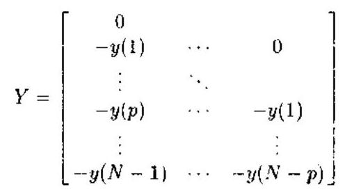

$$
Z = \left\lbrack  \begin{matrix} 0 & & & & \\  \vdots &  \ddots  & & & \\  0 & \cdots & & 0 & \\   - y\left( 1\right) & & & & \\  \vdots &  \ddots  & & & \\   - y\left( p\right) & \cdots & &  - y\left( 1\right) & \\   - y\left( 1\right) &  - y\left( 1\right) & \cdots &  - y\left( {N - p + 1}\right) &  \end{matrix}\right\rbrack \tag{9.1.26c}
$$

$$
y = \left\lbrack  {y\left( 1\right) , y\left( 2\right) ,\cdots , y\left( N\right) }\right\rbrack \tag{9.1.26d}
$$

不难验证, $E\left\{  {{Z}^{T}Y}\right\}   = {R}_{y}$ 非奇异,因此,式 (9.1.26a) 的解由下式给出:

$$
\widehat{\theta } = {\left( {Z}^{T}Y\right) }^{-1}{Z}^{T}y
$$

它显然与辅助变量估计式 (9.1.7) 是一致的. 另外,我们容易看出. 辅助变量矩阵 $Z$ 是第三种辅助变量选择 (9.1.22) 式在 $q = 0$ 时的特例,从而证明了这种辅助变量方法与 ARMA 模型的 MYW 方程方法的等价性. 将 MYW 方程转换成辅助变量方程求解有一个优点, 那就是超定的辅助变量方程很容易用一种有效的递推算法求解. 我们将在 9.3 节详细讨论之.

在得到 ARMA 模型的 AR 参数的估计后, 可以进一步得到输出过程的功率谱估计, 这就构成了功率谱估计的辅助变量方法 ${}^{\left\lbrack  {11}\right\rbrack  }$ .

例 9.1.3 仅输出可观测的 $\mathrm{{MA}}$ 模型. 令观测过程为

$$
y\left( t\right)  = u\left( t\right)  + \mathop{\sum }\limits_{{k = 1}}^{q}{b}_{k}u\left( {t - k}\right) \tag{9.1.27}
$$

其中 $\left\{  {u}_{t}\right\}$ 为零均值的非高斯白噪声. 定义

$$
{\sigma }^{2} = E\left\{  {u}_{t}^{2}\right\}  ,\;{\gamma }_{3} = E\left\{  {u}_{t}^{3}\right\}  ,\;\epsilon  = \frac{{\sigma }^{2}}{{\gamma }_{3}} \tag{9.1.28}
$$

并定义观测过程的协方差为

$$
r\left( m\right)  = E\left\{  {{y}_{t}{y}_{t + m}}\right\} \tag{9.1.29a}
$$

和三阶累积量为

$$
{c}_{3}\left( {{m}_{1},{m}_{2}}\right)  = E\left\{  {{y}_{t}{y}_{t + {m}_{1}}{y}_{t + {m}_{2}}}\right\} \tag{9.1.29b}
$$

特别地, 我们有所谓的累积量 “对角切片”:

$$
c\left( m\right)  = {c}_{3}\left( {m, m}\right)  = E\left\{  {{y}_{t}{y}_{t + m}^{2}}\right\} \tag{9.1.29c}
$$

业已证明 ${}^{\left\lbrack  {21}\right\rbrack  }$ ，协方差与三阶累积量的对角切片满足下面的线性关系:

$$
r\left( m\right)  + \mathop{\sum }\limits_{{k = 1}}^{q}{b}_{k}^{2}r\left( {m - k}\right)  = \epsilon \left\lbrack  {\dot{c}\left( m\right)  + \mathop{\sum }\limits_{{k = 1}}^{q}{b}_{k}c\left( {m - k}\right) }\right\rbrack  ,\; - q \leq  m \leq  {2q} \tag{9.1.30}
$$

与之对应的矩阵形式为

$$
\left\lbrack  \begin{matrix} c\left( {-q}\right) & & 0 & \vdots & 0 & \cdots & 0 \\  c\left( {-q + 1}\right) &  \ddots  & & \vdots & r\left( {-q}\right) &  \ddots  & \\  \vdots &  \ddots  & c\left( {-q}\right) & \vdots & \vdots &  \ddots  & 0 \\  c\left( q\right) & \cdots & c\left( {-q + 1}\right) & \vdots & r\left( q\right) & & r\left( {-q}\right) \\   &  \ddots  & \vdots & \vdots & &  \ddots  & \vdots \\  0 & & c\left( q\right) & \vdots & 0 & & r\left( q\right)  \end{matrix}\right\rbrack  \left\lbrack  \begin{matrix} \epsilon \\  \epsilon {b}_{1} \\  \vdots \\  \epsilon {b}_{q} \\   - {b}_{1}^{2} \\  \vdots \\   - {b}_{q}^{2} \end{matrix}\right\rbrack   = \left\lbrack  \begin{matrix} r\left( {-q}\right) \\  \vdots \\  r\left( q\right) \\  0 \\  \vdots \\  0 \end{matrix}\right\rbrack \tag{9.1.31a}
$$

由于协方差和三阶累积量的样本估计分别由

$$
\widehat{r}\left( m\right)  = \frac{1}{t}\mathop{\sum }\limits_{{i = 0}}^{t}{y}_{i}{y}_{i + m},\;\widehat{r}\left( {-m}\right)  = \widehat{r}\left( m\right)
$$

$$
\widehat{c}\left( m\right)  = \frac{1}{t}\mathop{\sum }\limits_{{i = 0}}^{t}{y}_{i}{y}_{i + m}^{2},\;m =  - q,\cdots ,0,\cdots , q
$$

给出，所以式 (9.1.31a) 的协方差和累积量分别用它们的样本估计值代替，并写成矩阵形式后，则可简记为

$$
\widehat{M}\theta  = \widehat{r} \tag{9.1.31b}
$$

其中 $\widehat{M}$ 是一个 $\left( {{3q} + 1}\right)  \times  \left( {{2q} + 1}\right)$ 矩阵,而 $\widehat{r}$ 是一个 $\left( {{3q} + 1}\right)  \times  1$ 向量,这一矩阵方程的最小二乘解给出参数向量 $\theta$ 的估计:

$$
\widehat{\mathbf{\theta }} = {\left( {\widehat{M}}^{T}\widehat{M}\right) }^{-1}{\widehat{M}}^{T}\widehat{\mathbf{r}} \tag{9.1.32}
$$

有趣的是, 可以将方程 (9.1.31b) 变成辅助变量矩阵方程. 为此, 令

$$
{Z}_{t} = \left\lbrack  \begin{matrix} {y}_{0} & & 0 \\  \vdots &  \ddots  & \\  {y}_{{3q} + 1} & \cdots & {y}_{0} \\  \vdots & & \vdots \\  {y}_{t} & \cdots & {y}_{t - {3q}} \end{matrix}\right\rbrack  ;\;{y}_{t} = \left\lbrack  \begin{matrix} 0 \\  \vdots \\  0 \\  {y}_{0} \\  \vdots \\  {y}_{t - q} \end{matrix}\right\rbrack
$$

$$
{U}_{t} = \left\lbrack  \begin{matrix} 0 & & & 0 \\  \vdots &  \ddots  & & \\  0 & \cdots & 0 & \\  {y}_{0}^{2} &  \ddots  & \vdots & \\  \vdots &  \ddots  & 0 & \\  {y}_{0}^{2} & \cdots & {y}_{0}^{2} & \\  \vdots & \vdots & & {y}_{0}^{2} \end{matrix}\right\rbrack  ;\;{W}_{t} = \left\lbrack  \begin{matrix} 0 & & & 0 \\  \vdots &  \ddots  & & \\  0 & \cdots & 0 & \\  {y}_{0} &  \ddots  & & \vdots \\  \vdots &  \ddots  & & 0 \\  {y}_{q} & \cdots & {y}_{0} & \\  \vdots &  \ddots  & & \vdots \\  {y}_{q - 1}^{2} & \cdots & {y}_{0}^{2} &  \end{matrix}\right\rbrack
$$

其中, ${Z}_{t} \in  {R}^{\left( {t + 1}\right)  \times  \left( {{3q} + 1}\right) },{y}_{t} \in  {R}^{\left( {t + 1}\right)  \times  1},{U}_{t} \in  {R}^{\left( {t + 1}\right)  \times  \left( {q + 1}\right) }$ 和 ${W}_{t} \in  {R}^{\left( {t + 1}\right)  \times  q}$ .

不难证明

$$
\widehat{M} = {Z}_{t}^{T}\left\lbrack  {{U}_{t},{W}_{t}}\right\rbrack  ,\;{X}_{t} = \left\lbrack  {{U}_{t},{W}_{t}}\right\rbrack  ,\;\widehat{r} = {Z}_{t}^{T}{y}_{t} \tag{9.1.33}
$$

将式 (9.1.33) 代入式 (9.1.32)，则有

$$
\widehat{\theta } = {\left( {X}_{t}^{T}{Z}_{t}{Z}_{t}^{T}{X}_{t}\right) }^{-1}{X}_{t}^{T}{Z}_{t}{Z}_{t}^{T}{y}_{t} \tag{9.1.34}
$$

X 就是基于高阶累积量的 MA 系统辨识的辅助变量方法, 它是由 Friedlander 与 Porat 推导的 ${}^{\{ {13}\} }$ .

式 (9.1.34) 通常采用超定方程形式, 即方程个数大于未知参数的个数. 这种典型的超定辅助变量方法适用于一般的情况,而且可以用递推算法自适应地给出参数向量 $\theta$ 的估汁结果，详见 9.3 节.

### 9.2 最优辅助变量方法

基本的辅助变量估计方法可以加以扩展, 得到扩展的辅助变量方法. 扩展的目的是为了在保持辅助变量方法稳健性的同时，能够提高估计精度. 使估计精度优化，又可设计出最优辅助变量方法.

#### 9.2.1 扩展的辅助变量方法

对辅助变量方法的主要扩展包括:

(1)对数据进行预滤波.

(2)使用 “增广” 的辅助变量矩阵，构造超定的辅助变量方程.

研究这些扩展的主要原因有两个:

(1)扩展的辅助变量更容易满足式 (9.1.9) 的一致性要求.

(2)预滤波与超定方程可以改善估计值的精度.

考虑扩展的辅助变量估计:

$$
\widehat{\theta } = \arg \mathop{\min }\limits_{\theta }{\begin{Vmatrix}\left\lbrack  \mathop{\sum }\limits_{{t = 1}}^{N}{Z}^{T}\left( t\right)  \cdot  F\left( {q}^{-1}\right) \Phi \left( t\right) \right\rbrack  \theta  - \left\lbrack  \mathop{\sum }\limits_{{t = 1}}^{N}{Z}^{T}\left( t\right)  \cdot  F\left( {q}^{-1}\right) y\left( t\right) \right\rbrack  \end{Vmatrix}}_{Q}^{2} \tag{9.2.1}
$$

式中 ${\begin{Vmatrix}X\end{Vmatrix}}_{Q}^{2} = {X}^{T}{QX}, Q$ 为一正定的加权矩阵,且 $F\left( {q}^{-1}\right)$ 为一渐近稳定的滤波器.

最优化问题 (9.2.1) 为二次型, 容易求解. 估计值可以写作

$$
\widehat{\theta } = {\left\{  {\left\lbrack  \mathop{\sum }\limits_{{t = 1}}^{N}{Z}^{T}\left( t\right)  \cdot  F\left( {q}^{-1}\right) \Phi \left( t\right) \right\rbrack  }^{T}Q\left\lbrack  \mathop{\sum }\limits_{{t = 1}}^{N}{Z}^{T}\left( t\right)  \cdot  F\left( {q}^{-1}\right) \Phi \left( t\right) \right\rbrack  \right\}  }^{-1}
$$

$$
\times  \left\{  {{\left\lbrack  \mathop{\sum }\limits_{{t = 1}}^{N}{Z}^{T} \times  F\left( {q}^{-1}\right) \Phi \left( t\right) \right\rbrack  }^{T}Q\left\lbrack  {\mathop{\sum }\limits_{{t = 1}}^{N}{Z}^{T}\left( t\right)  \times  F\left( {q}^{-1}\right) y\left( t\right) }\right\rbrack  }\right\} \tag{9.2.2}
$$

从数值计算的角度看, 式 (9.2.1) 比式 (9.2.2) 好, 但是后一表示式对于理论分析有用. 利用系统表示式 (9.1.1)，从式 (9.2.2) 可得到

$$
\widehat{\theta } = {\theta }^{ * } + {\left\lbrack  {R}_{N}^{T}Q{R}_{N}\right\rbrack  }^{-1}{R}_{N}^{T}Q\left\lbrack  {\frac{1}{N}\mathop{\sum }\limits_{{t = 1}}^{N}{Z}^{T}\left( t\right)  \times  F\left( {q}^{-1}\right) v\left( t\right) }\right\rbrack \tag{9.2.3}
$$

其中

$$
{R}_{N} = \frac{1}{N}\mathop{\sum }\limits_{{t = 1}}^{N}{Z}^{T}\left( t\right)  \times  F\left( {q}^{-1}\right) \Phi \left( t\right) \tag{9.2.4}
$$

于是, 一致性条件 (9.1.9) 与 (9.1.10) 现在变成

$$
\mathop{\lim }\limits_{{N \rightarrow  \infty }}{R}_{N} = R = E\left\{  {{Z}^{T}\left( t\right)  \times  F\left( {q}^{-\lambda }\right) \Phi \left( t\right) }\right\}  \;\text{ 具有秩 }{n\theta } \tag{9.2.5}
$$

$$
0 = E\left\{  {{Z}^{T}\left( t\right)  \times  F\left( {q}^{-1}\right) v\left( t\right) }\right\} \tag{9.2.6}
$$

其中 ${n\theta }$ 为列向量 $\theta$ 的维数.

当矩阵 $Z\left( t\right)$ 与 $\Phi \left( t\right)$ 具有相同维数时,表达式 (9.2.2) 可以简化,而且没有必要规定 $Q$ . 此时,估计值简化为

$$
\widehat{\theta } = {\left\lbrack  \mathop{\sum }\limits_{{t = 1}}^{N}{Z}^{T}\left( t\right)  \times  F\left( {q}^{-1}\right) \Phi \left( t\right) \right\rbrack  }^{-1}\left\lbrack  {\mathop{\sum }\limits_{{t = 1}}^{N}{Z}^{T}\left( t\right)  \times  F\left( {q}^{-1}\right) y\left( t\right) }\right\rbrack \tag{9.2.7}
$$

一致性条件 (9.2.5) 与 (9.2.6) 保持不变; 同时, $R$ 为正方矩阵,因此,式 (9.2.5) 意味着 $R$ 必须非奇异.

#### 9.2.2 最优辅助变量估计

考虑下述 $\operatorname{ARMA}\left( {{na},{nb}}\right)$ 过程:

$$
A\left( {q}^{-1}\right) y\left( t\right)  = B\left( {q}^{-1}\right) e\left( t\right) \tag{9.2.8}
$$

其中 $e\left( t\right)$ 为零均值、方差为 ${\sigma }_{c}^{2}$ 的白噪声过程,并且

$$
A\left( {q}^{-1}\right)  = 1 + {a}_{1}{q}^{-1} + \cdots  + {a}_{na}{q}^{-{na}}
$$

$$
B\left( {q}^{-1}\right)  = 1 + {b}_{1}{q}^{-1} + \cdots  + {b}_{nb}{q}^{-{nb}}
$$

假设以下条件满足:

假设 $1\;A\left( z\right)  = 0 \Rightarrow  \left| z\right|  > 1;B\left( z\right)  = 0 \Rightarrow  \left| z\right|  > 1$ ,也就是说, ARMA 表示式 (9.2.8) 是稳定和可逆的.

假设 $2\left( {{na},{nb}}\right)$ 是 ARMA 模型 (9.2.8) 的最小阶次.

令

$$
\left. \begin{aligned} \phi \left( t\right) &  = {\left\lbrack  -y\left( t - 1\right) ,\cdots , - y\left( t - na\right) \right\rbrack  }^{T} \\  \theta &  = {\left\lbrack  {a}_{1},\cdots ,{a}_{na}\right\rbrack  }^{T} \\  v\left( t\right) &  = B\left( {q}^{-1}\right) e\left( t\right)  \end{aligned}\right\} \tag{9.2.9}
$$

则式 (9.2.8) 可以重新写为式 (9.1.1) 的形式.

选择

$$
z\left( t\right)  = G\left( {q}^{-1}\right) \left\lbrack  \begin{matrix} y\left( {t - {nb} - 1}\right) \\  \vdots \\  y\left( {t - {nb} - m}\right)  \end{matrix}\right\rbrack  ,\;m \geq  {na} \tag{9.2.10}
$$

假设 ${3G}\left( {q}^{-1}\right)$ 是稳定和可逆的有理式滤波器,并且 $G\left( 0\right)  = 1$ .

令未知参数向量 $\theta$ 的估计值为下列最优化变量:

$$
\widehat{\theta } = \arg \mathop{\min }\limits_{\theta }{\begin{Vmatrix}\left\lbrack  \mathop{\sum }\limits_{{t = 1}}z\left( t\right) {\phi }^{T}\left( t\right) \right\rbrack  \theta  - \left\lbrack  \mathop{\sum }\limits_{{t = 1}}^{N}z\left( t\right) y\left( t\right) \right\rbrack  \end{Vmatrix}}_{Q}^{2} \tag{9.2.11}
$$

其中 $Q$ 是一正定矩阵, $\parallel x{\parallel }_{Q}^{2} = {x}^{T}{Qx}$ . 容易证明,式 (9.2.4) 的辅助变量估计可以由下列线性方程组的最小二乘解获得

$$
{Q}^{1/2}\left\lbrack  {\mathop{\sum }\limits_{{t = 1}}^{N}z\left( t\right) {\phi }^{T}\left( t\right) }\right\rbrack  \widehat{\theta } = {Q}^{1/2}\left\lbrack  {\mathop{\sum }\limits_{{t = 1}}^{N}z\left( t\right) y\left( t\right) }\right\rbrack \tag{9.2.12}
$$

该解可以直接写作

$$
\widehat{\theta } = {\left\lbrack  {R}_{N}^{T}Q{R}_{N}\right\rbrack  }^{-1}\left\lbrack  {{R}_{N}^{T}Q\left( {\frac{1}{N}\mathop{\sum }\limits_{{t = 1}}^{N}z\left( t\right) y\left( t\right) }\right) }\right\rbrack \tag{9.2.13}
$$

其中

$$
{R}_{N} = \frac{1}{N}\mathop{\sum }\limits_{{t = 1}}^{N}z\left( t\right) {\phi }^{T}\left( t\right) \tag{9.2.14}
$$

值得指出的是,式 (9.2.13) 可以简化为几种 $\mathrm{{AR}}$ 估计方法: 1) 当 $G\left( z\right)  = 1$ 和 $m = {na}$ (在这种情况下 $Q$ 是无关紧要的),我们就得到基本的修正 Yule-Walker 方程; 2) 当 $G\left( z\right)  = \; 1, m > {na}$ 和 $Q = I$ ,我们就得到超定的修正 Yule-Walker 方程; 3) 当 $G\left( z\right)  = 1, m > {na}$ 和 $Q \neq  I$ ,则得到超定的修正 Yule-Walker 方程的加权形式.

#### 9.2.3 一致性与精度分析

根据前面的分析，辅助变量估计 (9.2.13) 在下列条件下是一致的:

$$
\text{ rank }R = {na},\;\text{ 其中 }R = \mathop{\lim }\limits_{{N \rightarrow  \infty }}{R}_{N} \tag{9.2.15}
$$

$$
\mathop{\lim }\limits_{{N \rightarrow  \infty }}\frac{1}{N}\mathop{\sum }\limits_{{t = 1}}^{N}z\left( t\right) v\left( t\right)  = 0 \tag{9.2.16}
$$

在假设 $1 \sim  3$ 下，式 (9.2.15) 与式 (9.2.16) 的极限等于对应变量的期望值 ${}^{\left\lbrack  {12}\right\rbrack  }$ . 因此，条件 (9.2.16) 满足,因为 $z\left( t\right)$ 与 $v\left( t\right)$ 显然不相关. 当 $G\left( z\right)  = 1$ 时,式 (9.2.15) 也满足 ${}^{\left\lbrack  {14}\right\rbrack  }$ . 下面的引理 ${}^{\left\lbrack  {15}\right\rbrack  }$ 表明，对于 $G\left( z\right)  \neq  1$ 的情况，式 (9.2.15) 仍然满足.

引理 9.2.1 在假设 $l \sim  3$ 下，

$$
\operatorname{rank}\left( R\right)  = {na},\;\text{ 其中 }R = E\left\{  {z\left( t\right) {\phi }^{T}\left( t\right) }\right\} \tag{9.2.17}
$$

证明 令

$$
x = {\left\lbrack  {x}_{1},\cdots {x}_{na}\right\rbrack  }^{T}
$$

$$
X\left( z\right)  = \mathop{\sum }\limits_{{i = 1}}^{{na}}{x}_{i}{z}^{i}
$$

则有下列明显的等价关系:

$$
{Rr} = 0
$$

$$
\Leftrightarrow  E\left\{  {G\left( {q}^{-1}\right) y\left( {t - {nb} - i}\right)  \cdot  X\left( {q}^{-1}\right) y\left( t\right) }\right\}   = 0,\;i = 1,\cdots , m
$$

$$
\Leftrightarrow  \frac{1}{{2\pi }\mathrm{j}}\oint G\left( z\right) \frac{B\left( z\right) }{A\left( z\right) }{z}^{{nb} + 1}X\left( {z}^{-1}\right) \frac{B\left( {z}^{-1}\right) }{A\left( {z}^{-1}\right) }\frac{\mathrm{d}z}{z} = 0,\;i = 1,\cdots , m
$$

$$
\Leftrightarrow  \frac{1}{{2\pi }\mathrm{j}}\oint G\left( z\right) \frac{B\left( z\right) \left\lbrack  {{z}^{na}X\left( {z}^{-1}\right) }\right\rbrack  \left\lbrack  {{z}^{nb}B\left( {z}^{-1}\right) }\right\rbrack  }{A\left( z\right) \left\lbrack  {{z}^{na}A\left( {z}^{-1}\right) }\right\rbrack  }{z}^{i - 1}\mathrm{\;d}z = 0,
$$

$$
i = 1,\cdots , m\left( {m \geq  {na}}\right)
$$

由文献 [16] 的引理 1 知,除因子 ${z}^{i - 1}$ 以外,上式中的积分在单位圆内必然解析. 因此,在单位圆内部存在 ${na}$ 个极点,它们应该被 ${z}^{na}X\left( {z}^{-1}\right)$ 的零点对消. 然而,由于 ${z}^{na}X\left( {z}^{-1}\right)$ 为 ${na} - 1$ 阶多项式、所以积分等于零的唯一可能是 $X\left( z\right)  = 0$ . 于是,方程 ${Rx} = 0$ 的唯一解是 $x = 0$ ,由此可知 $R$ 满秩.

由于条件 (9.2.15) 与 (9.2.16) 均满足, 所以式 (9.2.13) 的辅助变量估计是一致估计.

下面的定理给出了由式 (9.2.12) 得到的辅助变量估计的精度分析.

定理 9.2.1 在假设 $1 \sim  3$ 条件下,归一化的辅助变量估计误差为渐近正态分布:

$$
\frac{\sqrt{N}}{\lambda }\left( {\widehat{\theta } - \theta }\right) \overset{\text{ dist }}{ \rightarrow  }N\left( {0, P}\right) \tag{9.2.18}
$$

其均值为零,协方差矩阵 $P$ 为

$$
P = {\left( {R}^{T}QR\right) }^{-1}{R}^{T}{QSQR}{\left( {R}^{T}QR\right) }^{-1} \tag{9.2.19}
$$

其中

$$
S = E\left\{  {\left\lbrack  {C\left( {q}^{-1}\right) z\left( t\right) }\right\rbrack  \left\lbrack  {C\left( {q}^{-1}\right) z{\left( t\right) }^{T}}\right. }\right\} \tag{9.2.20}
$$

而 $\widehat{\theta }$ 和 $R$ 分别由式 (9.2.12) 和式 (9.2.17) 定义.

证明参见文献 [9].

下面考虑估计精度的优化. 确定由式 (9.2.12) 定义的一大类估计中的最优辅助变量估计的步骤可以叙述如下. 求 ${Q}_{\mathrm{{opt}}},{m}_{\mathrm{{opt}}}$ 和 ${G}_{\mathrm{{opt}}}\left( {q}^{-1}\right)$ ,使得相应的协方差矩阵 ${P}_{\mathrm{{opt}}}$ 具有性质 $P \geq  {P}_{\mathrm{{opt}}}$ ,其中 $P$ 对应任意其它可能的 $Q, m$ 和 $G$ 选择. 在下一小节我们将看到, 相对于 $Q, m$ 和 $G\left( {q}^{-1}\right)$ 的最优化可以分三个不同的步骤进行. 先考虑式 (9.2.19) 相对于加权矩阵 $Q$ 的最优化,对此有下面的结果.

定理 9.2.2 考虑由式 (9.2.19) 定义的矩阵 $P$ ,则

$$
P \geq  {\left( {R}^{T}{S}^{-1}R\right) }^{-1} = {\widetilde{P}}_{m} \tag{9.2.21}
$$

等式 $P = {\widetilde{P}}_{m}$ 成立,当且仅当

$$
{SQR} = R{\left( {R}^{T}{S}^{-1}R\right) }^{-1}\left( {{R}^{T}{QR}}\right) \tag{9.2.22}
$$

证明 直接可证

$$
P - {\widetilde{P}}_{m} = \left\lbrack  {{\left( {R}^{T}QR\right) }^{-1}{R}^{T}Q - {\left( {R}^{T}{S}^{-1}R\right) }^{-1}{R}^{T}{S}^{-1}}\right\rbrack   \times  S
$$

$$
\times  {\left\lbrack  {\left( {R}^{T}QR\right) }^{-1}{R}^{T}Q - {\left( {R}^{T}{S}^{-1}R\right) }^{-1}{R}^{T}{S}^{-1}\right\rbrack  }^{T} \geq  0
$$

因为 $S > 0$ . 于是得到式 (9.2.21) 与式 (9.2.22).

定理 9.2.2 与 Gauss-Markov 定理 (定理 7.1.1) 有密切的关系. 满足式 (9.2.21) 的一种明显方式是令 $Q = {S}^{-1}$ ,此时 $P = {\widetilde{P}}_{m}$ .

然后考虑 ${\widetilde{P}}_{m}$ 相对于 $m$ 的最优化. 下一小节的引理 9.2.2 将证明,对于 $Q$ 的最优选择,估计精度是随 $m$ 的增加而单调增高的,即 ${\widetilde{P}}_{m}$ 对所有 $m \geq  {na}$ 是单调减小的: ${\widetilde{P}}_{m} \geq  {\widetilde{P}}_{m + 1},\forall m \geq  {na}$ . 注意,对 $Q$ 的任意选择,这一结果不成立.

在定理 9.2.2 的证明中,并没有涉及到矩阵 $R$ 和 $S$ 的详细结构. 对于 $\mathrm{{AR}}$ 系统,可以证明 ${\widetilde{P}}_{m + 1} = {\widetilde{P}}_{m}\left( {m \geq  {na}}\right)$ ; 但对于 ARMA 过程,一般说来 ${\widetilde{P}}_{m} > {\widetilde{P}}_{m + 1}$ .

由于 ${\widetilde{P}}_{m}$ 单调减，而且 ${\widetilde{P}}_{m} > 0$ ，所以当 $m$ 趋于无穷大时， ${\widetilde{P}}_{m}$ 将收敛到一极限. 业已证明 ${}^{\left\lbrack  {15}\right\rbrack  }$ ,该极限为

$$
{\widetilde{P}}_{\infty } = \mathop{\lim }\limits_{{m \rightarrow  \infty }}{\widetilde{P}}_{m} = {\lambda }^{2}{\left\lbrack  E\left\{  \phi \left( t\right) {\psi }^{T}\left( t\right) \right\}  E\left\{  \psi \left( t\right) {\phi }^{T}\left( t\right) \right\}  \right\rbrack  }^{-1} \tag{9.2.23}
$$

其中 $\psi \left( t\right)$ 是下列无穷维向量:

$$
\psi \left( t\right)  = \frac{1}{B\left( {q}^{-1}\right) }\left\lbrack  \begin{matrix} e\left( {t - {nb} - 1}\right) \\  e\left( {t - {nb} - 2}\right) \\  \vdots  \end{matrix}\right\rbrack \tag{9.2.24}
$$

式 (9.2.23) 表明, ${\widetilde{P}}_{\infty }$ 与 $G\left( z\right)$ 无关. 然而,下一小节将证明, $G\left( z\right)$ 的选择会影响 ${\widetilde{P}}_{{n}_{t}}$ 的 “收敛速率”.

#### 9.2.4 $Q\left( {q}^{-1}\right)$ 的最优选择

现在讨论 $Q\left( {q}^{-1}\right)$ 的最优选择. 对 $R, S$ 与 $z\left( t\right)$ 等将赋予下标 $m$ 以强调它们与辅助变量个数的关系.

引理 9.2.2 矩阵 $\left\{  {\widetilde{P}}_{m}\right\}$ 构成一个非增序列,即 ${\widetilde{P}}_{na} \geq  {\widetilde{P}}_{{na} + 1} \geq  \cdots  \geq  {\widetilde{P}}_{\infty }$ ,并且所有等式成立, 当且仅当

$$
{R}_{m}^{T}{S}_{m}^{-1}{x}_{m} = 0,\;m \geq  {na} \tag{9.2.25}
$$

其中 ${R}_{m}$ 和 ${S}_{m}$ 分别由式 (9.2.17) 和式 (9.2.21) 定义,且

$$
{x}_{m} = E\left\{  {{B}^{2}\left( {q}^{-1}\right) G\left( {q}^{-1}\right) \left\lbrack  \begin{matrix} e\left( {t - 1}\right) \\  \vdots \\  e\left( {t - m}\right)  \end{matrix}\right\rbrack  \frac{{B}^{2}\left( {q}^{-1}\right) G\left( {q}^{-1}\right) }{A\left( {q}^{-1}\right) }e\left( {t - m - 1}\right) }\right\} \tag{9.2.26}
$$

证明见文献 [9].

现在容易看出,选择 $G\left( {q}^{-1}\right)  = 1/{B}^{2}\left( {q}^{-1}\right)$ 将满足式 (9.2.25),因此是最优选择 (虽然不一定是唯一的最优选择). 这一结果可以用下面的定理严格叙述.

定理 9.2.3 令假设 $1 \sim  3$ 为真,并考虑辅助变量估计 (9.2.12),其中 $m = {na}, G\left( {q}^{-1}\right)  = \; 1/{B}^{2}\left( {q}^{-1}\right)$ (在这种情况下 $Q$ 是无关紧要的). 在这些条件下,从渐近协方差矩阵等于 ${\widetilde{P}}_{\infty }$ 的意义上讲, 辅助变量估计将是最优的.

证明 引理 9.2.2 的直接结果.

上面的分析表明, ARMA 模型式 (9.2.8) 中 AR 参数的最优辅助变量估计至少有两种方法.

第一种方法选择最优加权矩阵 $Q = {S}^{-1}$ ,并令辅助变量的个数 $m$ 增加到无穷. 在这种情况下，滤波器 $G\left( {q}^{-1}\right)$ 的选择变得不重要，因此可以取 $G\left( {q}^{-1}\right)  = 1$ (见定理 9.2.2).

第二种方法选择最优滤波器算子 $G\left( {q}^{-1}\right)  = 1/{B}^{2}\left( {q}^{-1}\right)$ . 在这种情况下,加权矩阵 $Q$ 的选择变得不重要 (见定理 9.2.3).

对以上两种算法的细节感兴趣的读者可参考文献 [17].

### 9.3 超定的递推辅助变量方法

和超定的最小二乘方法一样, 增加辅助变量向量的维数得到超定的线性方程组, 可以改善短数据情况下的参数估计精度. 这种超定方法称为超定的辅助变量方法, 而且超定的辅助变量方程可以在最小二乘意义下求解. 本节集中介绍超定辅助变量方法的递推实现, 它是为了满足自适应系统辨识与谱估计的需要而提出的 ${}^{\left\lbrack  {11},{13},{18},{19}\right\rbrack  }$ . 先推导一般的超定递推辅助变量算法, 然后介绍平方根超定递推辅助变量算法, 后者可以有效地改善超定递推辅助变量算法的数值性能.

#### 9.3.1 超定的递推辅助变量方法

考虑超定的辅助变量方程

$$
{Z}_{t}^{T}{X}_{t} = {Z}_{t}^{T}{Y}_{t}\theta \tag{9.3.1}
$$

其中 ${Z}_{t} \in  {R}^{\left( {t + 1}\right)  \times  k}$ ,并且 $t + 1 > K$ .

参数向量 $\theta$ 在 $t$ 时间的估计 ${\widehat{\theta }}_{t}$ 由式 (9.3.1) 的最小二乘解给出:

$$
{\widehat{\theta }}_{t} = {\left\lbrack  {Y}_{t}^{T}{Z}_{t}{Z}_{t}^{T}{Y}_{t}\right\rbrack  }^{-1}{Y}_{t}^{T}{Z}_{t}{Z}_{t}^{T}{X}_{t} \tag{9.3.2}
$$

这种估计已知是渐近一致的,虽然不一定是有效的 ${}^{\left\lbrack  {20}\right\rbrack  }$ . 我们来讨论超定方程 (9.3.2) 的递推求解. 令式中的矩阵 ${Y}_{t},{Z}_{t}$ 与向量 ${X}_{t}$ 具有下列更新形式:

$$
{Y}_{t + 1} = \left\lbrack  \begin{matrix} {Y}_{t} \\  {y}_{t + 1}^{T} \end{matrix}\right\rbrack  ,\;{Z}_{t + 1} = \left\lbrack  \begin{matrix} \lambda {Z}_{t} \\  {z}_{t + 1}^{T} \end{matrix}\right\rbrack  ,\;{X}_{t + 1} = \left\lbrack  \begin{matrix} {X}_{t} \\  {x}_{t + 1} \end{matrix}\right\rbrack \tag{9.3.3}
$$

其中 ${y}_{t - 1}^{T}$ 表示在 $t + 1$ 时刻加到 ${Y}_{t}$ 的 $1 \times  N$ 行向量, ${z}_{t + 1}^{T}$ 为加到 ${Z}_{t}$ 的 $1 \times  k$ 行向量,而 ${x}_{t + 1}$ 为一标量. 参数 $0 < \lambda  \leq  1$ 为一指数加权的 “遗忘因子”,它可以使算法跟踪时变参数. 遗忘因子的引入相当于式 (9.3.1) 左乘对角矩阵 $D = \operatorname{diag}\left( {{\lambda }^{t},{\lambda }^{t - 1},\cdots ,\lambda ,1}\right)$ .

引入记号

$$
{P}_{t} = {\left\lbrack  {Y}_{t}^{T}{Z}_{t}{Z}_{t}^{T}{Y}_{t}\right\rbrack  }^{-1} \tag{9.3.4}
$$

这一矩阵的逆矩阵可以更新如下:

$$
{P}_{t + 1}^{-1} = {Y}_{t + 1}^{T}{Z}_{t + 1}{Z}_{t + 1}^{T}{Y}_{t + 1}
$$

$$
= \left\lbrack  {\lambda {Y}_{t}^{T}{Z}_{t} + {y}_{t + 1}{z}_{t + 1}^{T}}\right\rbrack  \left\lbrack  {\lambda {Z}_{t}^{T}{Y}_{t} + {z}_{t + 1}{y}_{t + 1}^{T}}\right\rbrack
$$

$$
= {\lambda }^{2}{P}_{t}^{-1} + \lambda {w}_{t + 1}{y}_{t + 1}^{T} + \lambda {y}_{t + 1}{w}_{t + 1}^{T} + {y}_{t + 1}{z}_{t + 1}^{T}{z}_{t + 1}{y}_{t + 1}^{T} \tag{9.3.5}
$$

式中

$$
{w}_{t + 1} = {Y}_{t}^{T}{Z}_{t}{z}_{t + 1} \tag{9.3.6}
$$

式 (9.3.5) 可以更紧凑地写作

$$
{P}_{t + 1}^{-1} = {\lambda }^{2}{P}_{t}^{-1} + {\phi }_{t + 1}{\Lambda }_{t + 1}^{-1}{\phi }_{t + 1}^{T} \tag{9.3.7}
$$

其中

$$
{\phi }_{t + 1} = \left\lbrack  {{w}_{t + 1},{y}_{t + 1}}\right\rbrack \tag{9.3.8a}
$$

$$
{\Lambda }_{t + 1}^{-1} = \left\lbrack  \begin{matrix} 0 & \lambda \\  \lambda & {z}_{t + 1}^{T}{z}_{t + 1} \end{matrix}\right\rbrack  \text{ 或 }{\lambda }^{2}{\Lambda }_{t + 1} = \left\lbrack  \begin{matrix}  - {z}_{t + 1}^{T}{z}_{t + 1} & \lambda \\  \lambda & 0 \end{matrix}\right\rbrack \tag{9.3.8b}
$$

对式 (9.3.7) 求逆, 得到

$$
{P}_{t + 1} = \left\lbrack  {{P}_{t} - {P}_{t}{\phi }_{t + 1}{\left( {\lambda }^{2}{\Lambda }_{t + 1} + {\phi }_{t + 1}^{T}{P}_{t}{\phi }_{t + 1}\right) }^{-1}{\phi }_{t + 1}^{T}{P}_{t}}\right\rbrack  /{\lambda }^{2} \tag{9.3.9}
$$

为了推导 ${\widehat{\theta }}_{t}$ 的更新,定义

$$
{L}_{t} = {Z}_{t}^{T}{X}_{t},\;{S}_{t} = {Y}_{t}^{T}{Z}_{t} \tag{9.3.10}
$$

它们可以用下式递推更新:

$$
{L}_{t + 1} = \lambda {L}_{t} + {z}_{t + 1}{x}_{t + 1},\;{S}_{t + 1} = \lambda {S}_{t} + {y}_{t + 1}{z}_{t + 1}^{T} \tag{9.3.11}
$$

由式 (9.3.2) 有

$$
{\widehat{\theta }}_{t + 1} = {P}_{t + 1}{S}_{t + 1}{L}_{t + 1} = {P}_{t + 1}\left( {\lambda {S}_{t} + {y}_{t + 1}{z}_{t + 1}^{T}}\right) \left( {\lambda {L}_{t} + {z}_{t + 1}{x}_{t + 1}}\right)
$$

$$
= {\lambda }^{2}{P}_{t + 1}{P}_{t}^{-1}{\widehat{\theta }}_{t} + {P}_{t + 1}\left( {\lambda {y}_{t + 1}{z}_{t + 1}^{T}{L}_{t}}\right.
$$

$$
+ \lambda {w}_{t + 1}{x}_{t + 1} + {y}_{t + 1}{z}_{t + 1}^{T}{z}_{t + 1}{x}_{t + 1}\} \tag{9.3.12}
$$

曲式 (9.3.5) 又有

$$
{\lambda }^{2}{P}_{t + 1}{P}_{t}^{-1} = I - {P}_{t + 1}\left( {\lambda {w}_{t + 1}{y}_{t + 1}^{T} + \lambda {y}_{t + 1}{w}_{t + 1}^{T} + {y}_{t + 1}{z}_{t + 1}^{T}{z}_{t + 1}{y}_{t + 1}^{T}}\right) \tag{9.3.13}
$$

综合式 (9.3.12) 和式 (9.3.13) 得到

$$
{\widehat{\theta }}_{t + 1} = {\widehat{\theta }}_{t} + {P}_{t + 1}\left\lbrack  {\lambda {y}_{t + 1}\left( {{z}_{t + 1}^{T}{L}_{t} - {w}_{t + 1}^{T}{\widehat{\theta }}_{t}}\right) }\right.
$$

$$
\left. {+\left( {{y}_{t + 1}^{T}{z}_{t + 1}^{T}{z}_{t + 1} + \lambda {w}_{t + 1}}\right) \left( {{x}_{t + 1} - {y}_{t + 1}^{T}{\widehat{\theta }}_{t}}\right) }\right\rbrack
$$

这一结果可以更紧凑地写作

$$
{\widehat{\theta }}_{t + 1} = {\widehat{\theta }}_{t} + {P}_{t + 1}{\phi }_{t + 1}{\Lambda }_{t + 1}^{-1}\left( {{V}_{t + 1} - {\phi }_{t + 1}^{T}{\widehat{\theta }}_{t}}\right) \tag{9.3.14}
$$

式中

$$
{V}_{t + 1} = \left\lbrack  \begin{matrix} {z}_{t + 1}^{T}{L}_{t} \\  {x}_{t + 1} \end{matrix}\right\rbrack \tag{9.3.15}
$$

式 (9.3.6),(9.3.8),(9.3.9),(9.3.11),(9.3.14) 与式 (9.3.15) 一起给出了计算参数估计 ${\widehat{\theta }}_{t}$ 的完整递推公式.

作为算法的初始值,可以对前 $k$ 个数据点用离线方法精确求出:

$$
{S}_{k} = {Y}_{k}^{T}{Z}_{k},\;{L}_{k} = {Z}_{k}^{T}{X}_{k},\;{P}_{k} = {\left( {S}_{k}{S}_{k}^{T}\right) }^{-1},\;{\widehat{\theta }}_{k} = {P}_{k}{S}_{k}{L}_{k} \tag{9.3.16}
$$

也可以不作精确计算, 而使用下面的初始值:

$$
{S}_{k} = \mu \left\lbrack  {I,0}\right\rbrack  ,\;{P}_{k} = \frac{1}{{\mu }^{2}}I,\;{I}_{k} = 0,\;{\widehat{\theta }}_{k} = 0 \tag{9.3.17}
$$

其中 $\mu$ 是一个标量. 表 9.3.1 示出了完整的超定递推辅助变量算法.

表 9.3.1 超定递推辅助变量算法

<table><tr><td>计 算</td><td>维 数</td></tr><tr><td>初始化:</td><td></td></tr><tr><td>${S}_{k} = {Y}_{k}^{T}{Z}_{k},\;{L}_{k} = {Z}_{k}^{T}{X}_{k},\;{P}_{k} = {\left( {S}_{k}{S}_{k}^{T}\right) }^{-1},\;{\widehat{\theta }}_{k} = {P}_{k}{S}_{k}{L}_{k}$</td><td></td></tr><tr><td>或</td><td></td></tr><tr><td>${S}_{k} = \mu \left\lbrack  {I,0}\right\rbrack  ,\;{L}_{k} = 0,\;{P}_{k} = \frac{1}{{\mu }^{2}}I,\;{\widehat{\theta }}_{k} = 0$</td><td></td></tr><tr><td>for $t = k + 1, t + 2,\cdots$</td><td></td></tr><tr><td>${w}_{t + 1} = {S}_{t}{z}_{t + 1}$</td><td>$N \times  1$</td></tr><tr><td>${S}_{t + 1} = \lambda {S}_{t} + {y}_{t + 1}{z}_{t + 1}^{T}$</td><td>$N \times  k$</td></tr><tr><td>${\phi }_{t + 1} = \left\lbrack  {{w}_{t + 1},{y}_{t + 1}}\right\rbrack$</td><td>$N \times  2$</td></tr><tr><td>${\lambda }^{2}{\Lambda }_{t + 1} = \left\lbrack  \begin{matrix}  - {z}_{t + 1}^{T}{z}_{t + 1} & \lambda \\  \lambda & 0 \end{matrix}\right\rbrack$</td><td>$2 \times  2$</td></tr><tr><td>${K}_{t + 1} = {P}_{t}{\phi }_{t + 1}{\left( {\lambda }^{2}{\Lambda }_{t + 1} + {\phi }_{t + 1}^{T}{P}_{t}{\phi }_{t + 1}\right) }^{-1}$</td><td>$N \times  2$</td></tr><tr><td>${P}_{t + 1} = \left( {{P}_{t} - {K}_{t + 1}{\phi }_{t + 1}^{T}{P}_{t + 1}}\right) /{\lambda }^{2}$</td><td>$N \times  N$</td></tr><tr><td>${V}_{t + 1} = \left\lbrack  \begin{matrix} {z}_{t + 1}^{T}{L}_{t} \\  {x}_{t + 1} \end{matrix}\right\rbrack$</td><td>$2 \times  1$</td></tr><tr><td>${L}_{t + 1} = \lambda {L}_{t} + {z}_{t + 1}{x}_{t + 1}$</td><td>$k \times  1$</td></tr><tr><td>${\widehat{\theta }}_{t + 1} = {\widehat{\theta }}_{t} + {K}_{t + 1}\left( {{V}_{t + 1} - {\phi }_{t + 1}^{T}{\widehat{\theta }}_{t}}\right)$</td><td>$N \times  1$</td></tr><tr><td>end</td><td></td></tr></table>

然而，上述算法存在一些数值问题. 例如，在算法中出现的样本协方差矩阵 ${P}_{t} = \; {Y}_{t}^{T}{Z}_{t}{Z}_{t}^{T}{Y}_{t}$ 为四个数据矩阵的乘积,这会使 ${P}_{t}$ 的条件数变坏,成为病态矩阵. 又如,像很多递推算法一样,协方差矩阵 ${P}_{t}$ 需要利用矩阵求逆引理递推求逆矩阵,这在数值上是不稳定的,而且递推求逆矩阵会使矩阵 ${P}_{t}$ 丧失正定性. 此时,算法将会很快发散. 为了克服算法的上述缺陷，Porat 和 Friedlander ${}^{\left\lbrack  {19}\right\rbrack  }$ 提出了平方根超定递推辅助变量方法. 由干这种算法需要利用双曲变换来实现, 所以我们在推导这一算法之前先介绍双曲变换.

#### 9.3.2 双曲变换

从特征值分解的角度出发，一个具有全部正特征值的对称矩阵称为正定矩阵；而一个既有正特征值, 又有负特征值的对称矩阵称为不定矩阵 (第二章 2.1 节). 正定和不定矩阵等也可以利用二次型定义. 实对称矩阵 $A$ 称为正定的,若其二次型 ${x}^{T}{Ax} > 0$ 对所有非零向量 $x \neq  0$ 恒成立; $A$ 称为不定的,若 ${x}^{T}{Ax}$ 既可以取正,也可以取负; $A$ 是半正定的, 若 ${x}^{T}{Ax} \geq  0,\forall x \neq  0$ ; 等等.

回顾 Cholesky 分解定理: 若 $A \in  {R}^{n \times  n}$ 是对称的正定矩阵,则存在一个对角元素全部为正的唯一下三角矩阵 $G \in  {R}^{n \times  n}$ 使得 $A = G{G}^{T}$ . 下三角矩阵 $G$ 常称为矩阵 $A$ 的 “平方根”. 现在, 让我们来考查不定矩阵的分解.

以一个 $2 \times  2$ 矩阵为例:

$$
A = \left\lbrack  \begin{matrix}  - \alpha & \lambda \\  \lambda & 0 \end{matrix}\right\rbrack
$$

其中 $\alpha  > 0$ . 令 $\mathbf{x} = {\left\lbrack  {x}_{1},{x}_{2}\right\rbrack  }^{T}$ ,易知二次型

$$
{x}^{T}{Ax} =  - \alpha {x}_{1}\left( {{x}_{1} + 2\frac{\lambda }{\alpha }{x}_{2}}\right)
$$

既可取正,也可取负. 因此, $A$ 是一个不定矩阵. 显然,

$$
A = \left\lbrack  \begin{matrix}  - \alpha & \lambda \\  \lambda & 0 \end{matrix}\right\rbrack
$$

$$
= \left\lbrack  \begin{matrix} \alpha & 0 \\   - \lambda /\alpha & \lambda /\alpha  \end{matrix}\right\rbrack  \left\lbrack  \begin{matrix}  - 1 & 0 \\  0 & 1 \end{matrix}\right\rbrack  \left\lbrack  \begin{matrix} \alpha &  - \lambda /\alpha \\  0 & \lambda /\alpha  \end{matrix}\right\rbrack
$$

$$
= {GJ}{G}^{T} \tag{9.3.18}
$$

矩阵 $J$ 称为不定矩阵 $A$ 的标识矩阵 (signature matrix). 术语 “标识” 的涵义在于 $J$ 中的对角元素 -1 “标识” 或 “识别” 出了 $A$ 的不定性 (indefiniteness). 在这一意义上,术语标识矩阵要比其它文献中采用的译名 “符号差矩阵” 更确切. 式 (9.3.18) 表明，一个不定矩阵不能够进行 Cholesky 分解 $A = G{G}^{T}$ ,这意味着不定矩阵没有严格意义的平方根. 我们称 $A = {GJ}{G}^{T}$ (其中 $G$ 为下三角矩阵) 为 (不定) 矩阵 $A$ 的 $J$ 分解,并称下三角矩阵 $G$ 为 $A$ 的 $J$ 平方根. 注意,若 $A$ 正定,则 $J = I$ 为单位矩阵,式 (9.3.1) 即给出 Cholesky 分解. 在这个意义上, Cholesky 分解是 $J$ 分解的一个特例. 顺便指出,标识矩阵在矩阵的谱分解中也有重要的应用,这种分解称为矩阵的 $J$ 谱分解. $J$ 谱分解在 ${H}_{\infty }$ 中起着重要的作用,但是限于篇幅,本书对它将不予介绍,感兴趣的读者可参考文献 $\left\lbrack  {38}\right\rbrack   \sim  \left\lbrack  {40}\right\rbrack$ .

虽然更广义地讲, 任何一个由元素 1 和 -1 组成的对角矩阵都称为标识矩阵, 但我们在这一节只对 $2 \times  2$ 标识矩阵 $J = \operatorname{diag}\left( {-1,1}\right)$ 感兴趣. 现在,我们希望求一个 $\left( {N + 2}\right)  \times  \left( {N + 2}\right)$ 矩阵 $Q$ ,它能够满足:

$$
Q\left\lbrack  \begin{matrix} J & 0 \\  0 & {I}_{N} \end{matrix}\right\rbrack  {Q}^{T} = \left\lbrack  \begin{matrix} J & 0 \\  0 & {I}_{N} \end{matrix}\right\rbrack \tag{9.3.19}
$$

我们称这样的矩阵 $Q$ 为 $J$ 正交矩阵 (J-orthogonal matrix) 或超正规矩阵 (hypernormal matrix). 显而易见,正交矩阵是 $J$ 正交矩阵当 $J = I$ 时的特例,因此更确切地说,正交矩阵实质上是单位正交矩阵.

$J$ 正交矩阵具有以下性质.

引理 9.3.1 $J$ 正交矩阵 $Q$ 总是非奇异的.

证明 取式 (9.3.19) 两边的行列式:

$$
\det \left( Q\right) \det \left( J\right) \det \left( {I}_{N}\right) \det \left( {Q}^{T}\right)  = \det \left( J\right) \det \left( {I}_{N}\right)
$$

由于 $\det \left( {I}_{N}\right)  = 1$ ,且 $\det \left( J\right)  =  - 1$ ,所以有 $\det \left( Q\right) \det \left( {Q}^{T}\right)  = 1$ . 但是, $\det \left( Q\right)  = \det \left( {Q}^{T}\right)$ , 故 $\left| {\det \left( Q\right) }\right|  = 1$ ,即 $Q$ 非奇异.

引理 9.3.2 $Q$ 虽然不是对称的,但它满足 “双曲对称性”:

$$
{Q}^{T}{JQ} = {QJ}{Q}^{T}
$$

证明 容易验证 ${J}^{2} = I$ ,故利用 ${QJ}{Q}^{T} = J$ 有

$$
{QJ}\left( {{Q}^{T}{JQ}}\right)  = {J}^{2}Q = Q
$$

由于 $Q$ 非奇异,所以我们可以用 $J{Q}^{-1}$ 左乘上式两边,得到 ${Q}^{T}{JQ} = J$ ,从而有 ${Q}^{T}{JQ} = \; {QJ}{Q}^{T}$ .

$J$ 正交矩阵的特征值具有以下性质.

定理 9.3.1 由式 (9.3.19) 定义的 $J$ 正交矩阵 $Q$ 的特征值以共轭倒数对的形式出现,即如果 $\lambda$ 是 $Q$ 的一个特征值,则 $1/{\lambda }^{ * }$ 也一定是 $Q$ 的特征值; 并且 $\lambda$ 和 $1/{\lambda }^{ * }$ 具有相同的多重度.

证明见文献 $\left\lbrack  {37}\right\rbrack$ .

与正定矩阵的 Cholesky 分解可以用正交变换来实现相类似,不定矩阵的 $J$ 分解需要利用所谓的双曲变换 (hyperbolic transformation) 来实现.

问题第三章,与 $2 \times  2$ 单位矩阵对应的 Givens 正交变换为

$$
{Q}_{2}^{\left( O\right) } = \left\lbrack  \begin{matrix} \cos \left( \theta \right) &  - \sin \left( \theta \right) \\  \sin \left( \theta \right) & \cos \left( \theta \right)  \end{matrix}\right\rbrack   = \frac{1}{\sqrt{1 + {\gamma }^{2}}}\left\lbrack  \begin{matrix} 1 &  - \gamma \\  \gamma & 1 \end{matrix}\right\rbrack \tag{9.3.20}
$$

其中,上标 $O$ 表示正交变换. 为了消去 $X = \left\lbrack  \begin{array}{ll} {x}_{11} & {x}_{12} \\  {x}_{21} & {x}_{22} \end{array}\right\rbrack$ 的第 $\left( {1,2}\right)$ 个元素 ${x}_{12}$ ,参数 $\gamma$ 应该选择为

$$
\frac{1}{\sqrt{1 + {\gamma }^{2}}}\left\lbrack  \begin{array}{ll} {x}_{11} & {x}_{12} \\  {x}_{21} & {x}_{22} \end{array}\right\rbrack  \left\lbrack  \begin{matrix} 1 &  - \gamma \\  \gamma & 1 \end{matrix}\right\rbrack   = \left\lbrack  \begin{matrix}  \times  & 0 \\   \times  &  \times   \end{matrix}\right\rbrack   \Rightarrow  \gamma  = \frac{{x}_{21}}{{x}_{11}} \tag{9.3.21}
$$

类似地,与 $J = \operatorname{diag}\left( {-1,1}\right)$ 对应的双曲变换定义为

$$
{Q}_{2}^{\left( H\right) } = \left\lbrack  \begin{matrix} \cosh \left( \theta \right) &  - \sinh \left( \theta \right) \\   - \sinh \left( \theta \right) & \cosh \left( \theta \right)  \end{matrix}\right\rbrack   = \frac{1}{\sqrt{1 - {\gamma }^{2}}}\left\lbrack  \begin{matrix} 1 &  - \gamma \\   - \gamma & 1 \end{matrix}\right\rbrack  ,\;\left| \gamma \right|  < 1 \tag{9.3.22}
$$

式中,上标 ${}^{H}$ 表示双曲变换. 利用双曲函数的性质易知 ${c}^{2} - {s}^{2} = 1$ . 由于使用双曲函数作变换矩阵的元素，故 ${Q}_{2}^{\left( H\right) }$ 称为双曲变换. 容易验证 ${Q}_{2}^{\left( H\right) }J{Q}_{2}^{\left( H\right) } = J$ ，所以 ${Q}_{2}^{\left( H\right) }$ 是 $J$ 正交变换. 因此，常将双曲变换与 $J$ 正交变换等同起来 ${}^{1)}$ . 为了消去 $2 \times  2$ 矩阵 $X$ 的元素 ${x}_{12}$ ,参数 $\gamma$ 应选择满足:

$$
\frac{1}{\sqrt{1 - {\gamma }^{2}}}\left\lbrack  \begin{array}{ll} {x}_{11} & {x}_{12} \\  {x}_{21} & {x}_{22} \end{array}\right\rbrack  \left\lbrack  \begin{matrix} 1 &  - \gamma \\   - \gamma & 1 \end{matrix}\right\rbrack   = \left\lbrack  \begin{matrix}  \times  & 0 \\   \times  &  \times   \end{matrix}\right\rbrack   \Rightarrow  \gamma  = \frac{{x}_{21}}{{x}_{11}} \tag{9.3.23}
$$

回顾第三章, 矩阵

$$
Q = I - 2\frac{v{v}^{T}}{{v}^{T}v} \tag{9.3.24}
$$

称为 Householder(反射) 矩阵. 类似地, 我们称矩阵

$$
Q = J - 2\frac{v{v}^{T}}{{v}^{T}{Jv}} \tag{9.3.25}
$$

为双曲 Householder 矩阵. 这类矩阵是 Bunse-Gerstner ${}^{\left\lbrack  {36}\right\rbrack  }$ 在研究特征值计算时最先定义的.

引理 9.3.3 式 (9.3.25) 定义的双曲 Householder 矩阵 $Q$ 是 Hermitian 的和 $J$ 正交的,即有 ${QJ}{Q}^{T} = J$ .

证明

$$
{QJ}{Q}^{T} = \left( {J - 2\frac{v{v}^{T}}{{v}^{T}{Jv}}}\right) J\left( {J - 2\frac{v{v}^{T}}{{v}^{T}{Jv}}}\right)
$$

$$
= {J}^{3} - 4\frac{v{v}^{T}}{{v}^{T}{Jv}} + 4\frac{v\left( {{v}^{T}{Jv}}\right) {v}^{T}}{{\left( {v}^{T}Jv\right) }^{2}}
$$

$$
= {J}^{3} = J
$$

注意,若 $J = I$ ,则双曲 Householder 矩阵退化为普通的 Householder 矩阵.

双曲 Householder 矩阵的特征值由以下定理给出 (证明参见文献 [37]).

定理 9.3.2 令 $J$ 矩阵为 $N \times  N$ 对角矩阵. 若它有 $k$ 个对角元素等于 -1,另外 $N - k$ 个对角元素等于 1,则双曲 Householder 矩阵 $Q$ 有 $N - \left( {k + 1}\right)$ 个特征值等于 $1, k - 1$ 个特征值为 -1 , 其它两个特征值由下式决定:

$$
\lambda  =  - \zeta  \pm  \sqrt{{\zeta }^{2} - 1},\;\zeta  = \frac{{v}^{T}v}{{v}^{T}{Jv}}
$$

假定我们利用某种方法已将 $- N \times  M$ 矩阵 $X$ 变换成了一个相关等价的 $N \times  N$ 下三角矩阵 $\widehat{X}$ . 令 $Y$ 为 $N \times  L$ 矩阵, $Z$ 为 $N \times  P$ 矩阵,并且 $Y$ 代表增加的新数据, $Z$ 代表要删去的旧数据. 如果 $S$ 是反映与 $X, Y, Z$ 三矩阵综合作用的相关矩阵,则

$$
S = X{X}^{T} + Y{Y}^{T} - Z{Z}^{T}
$$

$$
= \widehat{X}{\widehat{X}}^{T} + Y{Y}^{T} - Z{Z}^{T}
$$

现在我们感兴趣的问题是利用 $\widehat{X}, Y, Z$ 计算 $S$ 的三角分解 $S = \widehat{C}{\widehat{C}}^{T}$ ,其中 $\widehat{C}$ 为 $N \times  N$ 下三角矩阵. 这种问题不能用 Householder 矩阵解决, 因为 Householder 矩阵是正交矩阵, 只能保持正的求和不变. 要想保持正和负两种求和不变，必须使用标识矩阵 $J$ “识别” 负求和这一特性. 为了能清楚看出这一点,我们令 $J$ 矩阵是一个 $\left( {N + L + P}\right)  \times  \left( {N + L + P}\right)$ 维对角矩阵, 且其对角元素为

$$
{\phi }_{ii} = \left\{  \begin{array}{ll} 1, & 1 \leq  i \leq  N + L \\   - 1, & N + L < i \leq  N + L + P \end{array}\right. \tag{9.3.26}
$$

---

1)复数情况下的双曲变换与 $J$ 西变换等同，详见第十一章 11.3.1 节.

---

构造矩阵 $C = \left\lbrack  {\widehat{X}, Y, Z}\right\rbrack$ ,则容易验证:

$$
{CJ}{C}^{T} = S \tag{9.3.27}
$$

利用 $J$ 正交矩阵 $Q$ 的定义 ${QJ}{Q}^{T} = J$ 知,若式 (9.3.27) 中的 $C$ 用 ${CQ}$ 代替,则该式仍然成立 ( $S$ 相对于双曲变换的 “不变性”),即

$$
\left( {CQ}\right) J\left( {{Q}^{T}{C}^{T}}\right)  = {CJ}{C}^{T} = S \tag{9.3.28}
$$

因此,三角分解 $S = \widehat{C}{\widehat{C}}^{T}$ 的问题变成了如何构造 $Q$ ,使得 ${CQ}$ 为下三角矩阵. 这种双曲变换称为双曲 Householder 三角分解,其具体算法如下 $\left| {3}^{7}\right|$ .

算法 9.3.1 (双曲 Householder 三角分解算法) 给定 $\widehat{X} \in  {R}^{N \times  N}, Y \in  {R}^{N \times  L}, Z \in \; {R}^{N \times  P}$ ,下面的算法计算 $S = \widehat{X}{\widehat{C}}^{T} + Y{Y}^{T} - Z{Z}^{T}$ 的三角分解的下三角因子 $\widehat{C}$ :

$C = \left\lbrack  {\widehat{X}, Y, Z}\right\rbrack$ ,用式 (9.3.26) 计算 $J$ .

$$
\text{ for }i = 1,\cdots , N
$$

$$
u = {\left\lbrack  0,\cdots ,0,{C}_{ij},0\ldots ,0,{C}_{i, N + 1},{C}_{i, N + 2},\cdots ,{C}_{i, N + L + P}\right\rbrack  }^{T}
$$

$$
v = {Ju} + \sigma {e}_{i}^{T},\sigma  = \left( {{u}_{i}/\left| {u}_{i}\right| }\right) \sqrt{{u}^{T}{Ju}}
$$

$$
Q = J - {2v}{v}^{T}/\left( {{v}^{T}{Jv}}\right)
$$

$$
C = {CQ}
$$

end

(注: ${e}_{i}$ 是第 $i$ 个元素为 1,其余元素均为 0 的列向量; 而 ${u}_{i}$ 是向量 $u$ 的第 $i$ 个元素)

双曲变换在求解一类包含增加/减少数据的最小二乘问题中有重要的应用, 参见文献 [37]. 下一小节介绍双曲变换在辅助变量估计问题中的一个典型应用——平方根超定递推辅助变量算法.

#### 9.3.3 平方根超定递推辅助变量算法

最小二乘估计的平方根算法是 Morf 和 Kailath 提出的 ${}^{\left\lbrack  {21}\right\rbrack  }$ . 这种算法的基础是 “平方根阵列的三角化". 平方根算法现在被广泛应用，因为它具有一个共同的重要性质，即通过递推更新某个半正定矩阵 ${A}_{t}$ 的下三角平方根 ${A}_{t}^{1/2}$ 来保持矩阵 ${A}_{t}$ 的半正定性.

与文献 $\left\lbrack  {21}\right\rbrack$ 中的平方根最小二乘算法不同的是,9.3.1 小节推导的超定递推辅助变量算法中的矩阵 ${A}_{t}$ 是不定的,因此我们无法更新该矩阵的平方根 (它不存在),只能利用双曲变换更新矩阵 ${A}_{t}$ 的 $J$ 平方根. 为了看出这一点,我们观察

$$
{A}_{t + 1} = \left\lbrack  \begin{matrix}  - {z}_{t + 1}^{T}{z}_{t + 1} & \lambda \\  \lambda & 0 \end{matrix}\right\rbrack
$$

$$
= \left\lbrack  \begin{matrix} \alpha & 0 \\   - \lambda /\alpha & \lambda /\alpha  \end{matrix}\right\rbrack  \left\lbrack  \begin{matrix}  - 1 & 0 \\  0 & 1 \end{matrix}\right\rbrack  \left\lbrack  \begin{matrix} \alpha &  - \lambda /\alpha \\  0 & \lambda /\alpha  \end{matrix}\right\rbrack
$$

$$
= {AJ}{A}^{T} \tag{9.3.29}
$$

式中 $\alpha  = {\left( {z}_{t + 1}^{T}{z}_{t + 1}\right) }^{1/2}$ . 因此,矩阵 ${\Lambda }_{t + 1}$ 是不定矩阵.

为了对不定矩阵 ${\Lambda }_{t + 1}$ 进行 $J$ 正交分解,以得到它的 $J$ 平方根 (下三角矩阵),我们令 $\left( {N + 2}\right)  \times  \left( {N + 2}\right)$ 矩阵 $Q$ 是满足式 (9.3.19) 的 $J$ 正交矩阵,并假定选择 $Q$ 满足:

$$
\left\lbrack  \begin{matrix} A & {\phi }_{t + 1}^{T}{P}_{t}^{1/2} \\  0 & {P}_{t}^{1/2} \end{matrix}\right\rbrack  Q = \left\lbrack  \begin{matrix} {L}_{1} & 0 \\  M & {L}_{2} \end{matrix}\right\rbrack \tag{9.3.30}
$$

式中 ${L}_{1}$ 和 ${L}_{2}$ 分别是 $2 \times  2$ 和 $N \times  N$ 维的下三角矩阵. 根据 $J$ 正交矩阵定义式 (9.3.19), 我们有

$$
\left\lbrack  \begin{matrix} A & {\phi }_{t + 1}^{T}{P}_{t}^{1/2} \\  0 & {P}_{t}^{1/2} \end{matrix}\right\rbrack  \left\lbrack  \begin{matrix} J & 0 \\  0 & {I}_{N} \end{matrix}\right\rbrack  \left\lbrack  \begin{matrix} {A}^{T} & 0 \\  {\left( {P}_{t}^{1/2}\right) }^{T}{\phi }_{t + 1} & {\left( {P}_{t}^{1/2}\right) }^{T} \end{matrix}\right\rbrack
$$

$$
= \left\lbrack  \begin{matrix} {L}_{1} & 0 \\  M & {L}_{2} \end{matrix}\right\rbrack  \left\lbrack  \begin{matrix} J & 0 \\  0 & {I}_{N} \end{matrix}\right\rbrack  \left\lbrack  \begin{matrix} {L}_{1}^{T} & {M}^{T} \\  0 & {L}_{2}^{T} \end{matrix}\right\rbrack \tag{9.3.31}
$$

因此

$$
{AJ}{A}^{T} + {\phi }_{t + 1}^{T}{P}_{t}{\phi }_{t + 1} = {\Lambda }_{t + 1} + {\phi }_{t + 1}^{T}{P}_{t}{\phi }_{t + 1} = {L}_{1}J{L}_{1}^{T} \tag{9.3.32a}
$$

$$
{P}_{t}{\phi }_{t + 1} = {MJ}{L}_{1}^{T} \tag{9.3.32b}
$$

$$
{P}_{t} = {MJ}{M}^{T} + {L}_{2}{L}_{2}^{T} \tag{9.3.32c}
$$

由式 (9.3.32b) 得到

$$
M = {P}_{t}{\phi }_{t + 1}{\left( {L}_{1}^{T}\right) }^{-1}J \tag{9.3.33}
$$

将此式代入式 (9.3.32c) 后，则

$$
{L}_{2}{L}_{2}^{T} = {P}_{t} - {MJ}{M}^{T} = {P}_{t} - {P}_{t}{\phi }_{t + 1}{\left( {L}_{1}^{T}\right) }^{-1}J{L}_{1}^{-1}{\phi }_{t + 1}^{T}{P}_{t}
$$

$$
= {P}_{t} - {P}_{t}{\phi }_{t + 1}{\left( {A}_{t + 1} + {\phi }_{t + 1}^{T}{P}_{t}{\phi }_{t + 1}\right) }^{-1}{\phi }_{t + 1}^{T}{P}_{t}
$$

$$
= {\lambda }^{2}{P}_{t + 1} \tag{9.3.34}
$$

由于 ${L}_{2}$ 是下三角矩阵,所以我们有

$$
{P}_{t}^{1/2} = {\lambda }^{-1}{L}_{2} \tag{9.3.35}
$$

另有

$$
M{L}_{1}^{-1} = {P}_{t}{\phi }_{t + 1}{\left( {L}_{1}^{T}\right) }^{-1}J{L}_{1}^{-1}
$$

$$
= {P}_{t}{\phi }_{t + 1}{\left( {\Lambda }_{t + 1} + {\phi }_{t + 1}^{T}{P}_{t}{\phi }_{t + 1}\right) }^{-1}
$$

$$
= {K}_{t + 1} \tag{9.3.36}
$$

式 (9.3.29),(9.3.30),(9.3.35) 和式 (9.3.36) 构成了平方根超定递推辅助变量算法的核心. 表 9.3.2 列出了平方根超定递推辅助变量算法的步骤.

一个可能会问的问题是,矩阵 ${A}_{t + 1} + {\phi }_{t + 1}^{T}{P}_{t}{\phi }_{t + 1}$ 是否与矩阵 ${A}_{t + 1}$ 具有相同的标识矩阵 $J$ ? 否则,式 (9.3.32a) 会是矛盾的. 为了回答这个问题,我们注意到由 9.3.1 小节有

$$
{\phi }_{t + 1} = \left\lbrack  {{S}_{t + 1}{z}_{t + 1},{y}_{t + 1}}\right\rbrack  ;\;{P}_{t} = {\left( {S}_{t}{S}_{t}^{T}\right) }^{-1};\;{S}_{t} = {Y}_{t}^{T}{Z}_{t} \tag{9.3.37}
$$

---

$$
{w}_{t + 1} = {S}_{t}{z}_{t + 1}
$$

$$
{S}_{t + 1} = \lambda {S}_{t} + {y}_{t + 1}{z}_{t + 1}^{T}
$$

$$
{\phi }_{t + 1} = \left\lbrack  {{w}_{t + 1},{y}_{t + 1}}\right\rbrack
$$

$$
\alpha  = {\left( {z}_{l + 1}^{T}{z}_{l + 1}\right) }^{1/2}
$$

$$
A = \left\lbrack  \begin{matrix} \alpha & 0 \\   - \lambda /\alpha & \lambda /\alpha  \end{matrix}\right\rbrack
$$

求 $Q$ 满足下式:

$$
R = \left\lbrack  \begin{matrix} \Lambda & {\phi }_{t + 1}^{T}{P}_{t}^{1/2} \\  0 & {P}_{t}^{1/2} \end{matrix}\right\rbrack  Q = \left\lbrack  \begin{matrix} {L}_{1} & 0 \\  M & {L}_{2} \end{matrix}\right\rbrack
$$

(详见表 9.3.3)

$$
{P}_{t + 1}^{1/2} = {\lambda }^{-1}{L}_{2}
$$

$$
{K}_{t + 1} = M{L}_{1}^{-1}
$$

$$
{v}_{t + 1} = \left\lbrack  \begin{matrix} {z}_{t + 1}^{T}{L}_{t} \\  {z}_{t + 1} \end{matrix}\right\rbrack
$$

$$
{L}_{t + 1} = \lambda {L}_{t} + {z}_{t + 1}{x}_{t + 1}
$$

$$
{\widehat{\theta }}_{t + 1} = {\widehat{\theta }}_{t} + {K}_{t + 1}\left( {{v}_{t + 1} - {\phi }_{t + 1}^{T}{\widehat{\theta }}_{t}}\right)
$$

---

因此

$$
{\Lambda }_{t + 1}{\phi }_{t + 1}^{T}{P}_{t}{\phi }_{t + 1}
$$

$$
= \left\lbrack  \begin{matrix}  - {z}_{t + 1}^{T}{z}_{t + 1} & \lambda \\  \lambda & 0 \end{matrix}\right\rbrack   + \left\lbrack  \begin{matrix} {z}_{t + 1}^{T}{S}_{t}^{T} \\  {y}_{t + 1}^{T} \end{matrix}\right\rbrack  {\left( {S}_{t}{S}_{t}^{T}\right) }^{-1}\left\lbrack  {{S}_{t}{z}_{t + 1},{y}_{t + 1}}\right\rbrack
$$

$$
= \left\lbrack  \begin{matrix}  - {z}_{t + 1}^{T}\left\lbrack  {I - {S}_{t}^{T}{\left( {S}_{t}{S}_{t}^{T}\right) }^{-1}{S}_{t}}\right\rbrack  {z}_{t + 1} & \lambda  + {z}_{t + 1}^{T}{S}_{t}^{T}{\left( {S}_{t}{S}_{t}^{T}\right) }^{-1}{y}_{t + 1} \\  \lambda  + {y}_{t + 1}^{T}{\left( {S}_{t}{S}_{t}^{T}\right) }^{-1}{S}_{t}{z}_{t + 1} & {y}_{t + 1}^{T}{y}_{t + 1} \end{matrix}\right\rbrack \tag{9.3.38}
$$

注意,矩阵 $I - {S}_{t}^{T}{\left( {S}_{t}{S}_{t}^{T}\right) }^{-1}{S}_{t}$ 是到 ${S}_{t}^{T}$ 各列的零空间上的正交投影矩阵,故它是半正定的,而且只要 ${z}_{t + 1}$ 不在 ${S}_{t}^{T}$ 的列空间,则式 (9.3.38) 右边的第 $\left( {1,1}\right)$ 个元素便严格为负. 除了这种奇异情况以外,矩阵 ${\Lambda }_{t + 1} + {\phi }_{t + 1}^{T}{P}_{t}{\phi }_{t + 1}$ 将具有下列形式:

$$
{\Lambda }_{t + 1} + {\phi }_{t + 1}^{T}{P}_{t}{\phi }_{t + 1} = \left\lbrack  \begin{matrix}  - 1 & b \\  b & c \end{matrix}\right\rbrack
$$

$$
= \left\lbrack  \begin{matrix} \sqrt{a} & 0 \\   - \frac{b}{\sqrt{a}} & \sqrt{c + \frac{{b}^{2}}{a}} \end{matrix}\right\rbrack  \left\lbrack  \begin{matrix}  - 1 & 0 \\  0 & 1 \end{matrix}\right\rbrack  \left\lbrack  \begin{matrix} \sqrt{a} &  - \frac{b}{\sqrt{a}} \\  0 & \sqrt{c + \frac{{b}^{2}}{a}} \end{matrix}\right\rbrack \tag{9.3.39}
$$

由于 $a > 0$ 和 $c \geq  0$ ,所以这一分解成立. 这就证明了,矩阵 ${\Lambda }_{t + 1} + {\phi }_{t + 1}^{T}{P}_{t}{\phi }_{t + 1}$ 与矩阵 ${\Lambda }_{t + 1}$ 具有相同的标识矩阵 $J$ . 注意,在奇异情况 (即当 ${z}_{t + 1}$ 不在 ${S}_{t}^{T}$ 的列空间时),平方根递推不能用一般的方法处理，需要加以修正.

剩下的问题是,如何实现满足式 (9.3.30) 的双曲变换矩阵 $\mathbf{Q}$ ? 以下述阵列为例 (其中 $N = 4) :$

$$
R = \left\lbrack  \begin{matrix} A & {\phi }_{t + 1}^{T}{P}_{t + 1}^{1/2} \\  0 & {P}_{t}^{1/2} \end{matrix}\right\rbrack  Q = \left\lbrack  \begin{matrix}  \times  & 0 &  \times  &  \times  &  \times  &  \times  \\   \times  &  \times  &  \times  &  \times  &  \times  &  \times  \\  0 & 0 &  \times  & 0 & 0 & 0 \\  0 & 0 &  \times  &  \times  & 0 & 0 \\  0 & 0 &  \times  &  \times  &  \times  & 0 \\  0 & 0 &  \times  &  \times  &  \times  &  \times   \end{matrix}\right\rbrack
$$

这里, $\times$ 表示可能非零的元素. 子矩阵 $R\left( {1,3 : N + 2}\right)$ 的元素可以利用式 (9.3.27) 所示的 $2 \times  2$ 双曲旋转 ${Q}_{2}^{\left( H\right) }$ 消去. 然后, $R\left( {2,3 : N + 2}\right)$ 的元素又可以用式 (9.3.25) 的 $2 \times  2$ Givens 旋转 ${Q}_{2}^{\left( O\right) }$ 消去.

综合以上结果,可以得到表 9.3.3 所示的 $J$ 正交变换与正交变换.

表 9.3.3 $J$ 正交变换与正交变换

---

$$
J\text{ 正交变换 (双曲变换) }
$$

$$
\text{ for }j = N + 2, N + 1,\cdots ,3
$$

$$
\gamma  = R\left( {1, j}\right) /R\left( {1,1}\right)
$$

$$
R\left( {1,1}\right)  = \left\lbrack  {R\left( {1,1}\right)  - {\gamma R}\left( {1, j}\right) }\right\rbrack  /\sqrt{1 - {\gamma }^{2}}
$$

$$
\text{ for }k = 2\text{ and }k = j,\cdots , N + 2
$$

$$
\alpha  = \left\lbrack  {R\left( {k,1}\right)  - {\gamma R}\left( {k, j}\right) }\right\rbrack  /\sqrt{1 - {\gamma }^{2}}
$$

$$
\beta  = \left\lbrack  {R\left( {k, j}\right)  - {\gamma R}\left( {k,1}\right) }\right\rbrack  /\sqrt{1 - {\gamma }^{2}}
$$

$$
R\left( {k,1}\right)  = \alpha
$$

$$
R\left( {k, j}\right)  = \beta
$$

	end

end

正交变换

$$
\text{ for }j = N + 2, N + 1,\cdots ,3
$$

$$
\gamma  = R\left( {2, j}\right) /R\left( {2,2}\right)
$$

$$
R\left( {2,2}\right)  = \left\lbrack  {R\left( {2,2}\right)  - {\gamma R}\left( {2, j}\right) }\right\rbrack  /\sqrt{1 + {\gamma }^{2}}
$$

	for $k = j,\cdots , N + 2$

$$
\alpha  = \left\lbrack  {R\left( {k,2}\right)  - {\gamma R}\left( {k, j}\right) }\right\rbrack  /\sqrt{1 + {\gamma }^{2}}
$$

$$
\beta  = \left\lbrack  {R\left( {k, j}\right)  - {\gamma R}\left( {k,2}\right) }\right\rbrack  /\sqrt{1 + {\gamma }^{2}}
$$

$$
R\left( {k,2}\right)  = \alpha
$$

$$
R\left( {k, j}\right)  = \beta
$$

	end

end

---

利用平方根超定递推辅助变量算法, 可以对 9.1 节所述的典型超定辅助变量矩阵方程 (9.1.37) 递推求解, 从而得到自适应的系统辨识与 ARMA 谱估计等, 详见文献 [11] 和 [13].

### 9.4 阶数递推的辅助变量方法

上一节介绍了时间递推的辅助变量方法, 现在讨论阶数递推的辅助变量方法. 在许多应用中，我们无法知道在辅助变量方法中未知参数的真实个数，因此需要进行阶数确定. 如第八章所述, 在应用信息量准则定阶时, 通常需要先估计对应于各种可能阶数组合的模型参数, 然后在这些模型中按照吝啬原则选择结构尽可能简单的最优模型. 这意味着, 在应用辅助变量方法时, 阶数递推的方法是重要的.

考虑下面的辅助变量估计:

$$
{\theta }_{m} = {\left( {Z}_{m}^{T}{\phi }_{m}\right) }^{-1}{Z}_{m}^{T}y \tag{9.4.1}
$$

其中 $Z$ 和 $\Phi$ 均是 $N \times  m$ 矩阵,现在需要递推地估计 ${\theta }_{m}, m = 1,\cdots , M$ ,其中 $M$ 选择得比末知参数的个数大.

命题 9.4.1 令 ${Z}_{m + 1} = \left\lbrack  {{Z}_{m},{z}_{m + 1}}\right\rbrack$ 和 ${\Phi }_{m + 1} = \left\lbrack  {{\Phi }_{m},{\phi }_{m + 1}}\right\rbrack$ ,其中 ${z}_{m + 1}$ 与 ${\phi }_{m + 1}$ 分别是 ${Z}_{m + 1}$ 和 ${\Phi }_{m + 1}$ 的最后一列. 定义

$$
{C}_{m + 1}^{-1} = {\left( {Z}_{m + 1}^{T}{\Phi }_{m + 1}\right) }^{-1} \tag{9.4.2a}
$$

$$
{R}_{m + 1} = {C}_{m + 1}^{-1}{Z}_{m}^{T}{\phi }_{m + 1} \tag{9.4.2b}
$$

$$
{P}_{m + 1} =  - {z}_{m + 1}^{T}{\Phi }_{m}{C}_{m}^{-1}{\Delta }_{m + 1} \tag{9.4.2c}
$$

$$
{\Delta }_{m + 1} = \frac{1}{{z}_{m + 1}^{T}{\phi }_{m + 1}{\Phi }_{m}{R}_{m + 1}} \tag{9.4.2d}
$$

则 ${C}_{m + 1}^{-1}$ 可以利用 $m$ 递推从 ${C}_{m}^{-1}$ 求出:

$$
{C}_{m + 1}^{-1} = \left\lbrack  \begin{matrix} {C}_{m}^{-1} - {R}_{m + 1}{P}_{m + 1} &  - {R}_{m + 1}{\Delta }_{m + 1} \\  {P}_{m + 1} & {\Delta }_{m + 1} \end{matrix}\right\rbrack \tag{9.4.3}
$$

递推的初始值为

$$
{C}_{1}^{-1} = \frac{1}{{z}_{1}^{T}{\phi }_{1}} \tag{9.4.4}
$$

证明 利用矩阵 ${Z}_{m + 1}$ 与 ${\Phi }_{m + 1}$ 的分块形式,我们有

$$
{C}_{m + 1} = {Z}_{m + 1}^{T}{\Phi }_{m + 1} = \left\lbrack  \begin{matrix} {Z}_{m}^{T} \\  {z}_{m + 1}^{T} \end{matrix}\right\rbrack  \left\lbrack  {{\Phi }_{m},{\phi }_{m + 1}}\right\rbrack   = \left\lbrack  \begin{matrix} {Z}_{m + 1}^{T}{\Phi }_{m} & {Z}_{m}^{T}{\phi }_{m + 1} \\  {z}_{m + 1}^{T}{\Phi }_{m} & {z}_{m + 1}^{T}{\phi }_{m + 1} \end{matrix}\right\rbrack
$$

令 ${C}_{m + 1}$ 的逆矩阵具有下列形式:

$$
{C}_{m + 1}^{-1} = \left\lbrack  \begin{array}{ll} X & Y \\  U & V \end{array}\right\rbrack \tag{9.4.5}
$$

则由逆矩阵的定义, 有

$$
\left\lbrack  \begin{matrix} {Z}_{m + 1}^{T}{\Phi }_{m} & {Z}_{m}^{T}{\phi }_{m + 1} \\  {z}_{m + 1}^{T}{\Phi }_{m} & {z}_{m + 1}^{T}{\phi }_{m + 1} \end{matrix}\right\rbrack  \left\lbrack  \begin{array}{ll} X & Y \\  U & V \end{array}\right\rbrack   = {I}_{m + 1}
$$

从而得到

$$
{Z}_{m}^{T}{\Phi }_{m}X + {Z}_{m}^{T}{\phi }_{m + 1}U = {I}_{m} \tag{9.4.6a}
$$

$$
{Z}_{m}^{T}{\phi }_{m}Y + {Z}_{m}^{T}{\phi }_{m + 1}V = 0 \tag{9.4.6b}
$$

$$
{z}_{m + 1}^{T}{\Phi }_{m}X + {z}_{m + 1}^{T}{\phi }_{m + 1}U = 0 \tag{9.4.6c}
$$

$$
{z}_{m + 1}^{T}{\Phi }_{m}Y + {z}_{m + 1}^{T}{\phi }_{m + 1}V = 1 \tag{9.4.6d}
$$

求解式 (9.4.6a) 与式 (9.4.6c) 得到

$$
X = {C}_{m}^{-1} - {R}_{m + 1}{P}_{m + 1}
$$

$$
U = {P}_{m + 1}
$$

类似地, 求解式 (9.4.6b) 与式 (9.4.6d), 又有

$$
Y =  - {R}_{m + 1}{\Delta }_{m + 1}
$$

$$
V = {\Delta }_{m + 1}
$$

将上述 $X, Y, U$ 和 $V$ 代入式 (9.4.5) 即给出递推公式 (9.4.3). 初始值公式 (9.4.4) 显然成立.

由以上命题, 很容易得出辅助变量估计的递推更新公式如下.

定理 9.4.1 考虑辅助变量估计式 (9.4.1),则 ${\theta }_{m + 1}$ 可以从 ${\theta }_{m}$ 递推求得

$$
{\theta }_{m + 1} = \left\lbrack  \begin{matrix} {\theta }_{m} - {R}_{m + 1}{\alpha }_{m + 1} \\  {\alpha }_{m + 1} \end{matrix}\right\rbrack \tag{9.4.7}
$$

式中

$$
{\alpha }_{m + 1} = \left( {{z}_{m + 1}^{T}y - {z}_{m + 1}^{T}{\Phi }_{m}{\theta }_{m}}\right) {\Delta }_{m + 1} \tag{9.4.8}
$$

初始值为

$$
{\theta }_{1} = \frac{{z}_{1}^{T}y}{{z}_{1}^{T}{\phi }_{1}} \tag{9.4.9}
$$

证明 直接计算给出:

$$
{\theta }_{m + 1} = \left\lbrack  \begin{matrix} {C}_{m}^{-1} - {R}_{m + 1}{P}_{m + 1} &  - {R}_{m + 1}{\Delta }_{m + 1} \\  {P}_{m + 1} & {\Delta }_{m + 1} \end{matrix}\right\rbrack  \left\lbrack  \begin{matrix} {Z}_{m}^{T} \\  {z}_{m + 1}^{T} \end{matrix}\right\rbrack  y
$$

$$
= \left\lbrack  \begin{matrix} {C}_{m}^{-1}{Z}_{m}^{T}y - {R}_{m + 1}\left( {{P}_{m + 1}{Z}_{m}^{T}y + {z}_{m + 1}^{T}y{\Delta }_{m + 1}}\right) \\  {P}_{m + 1}{Z}_{m}^{T}y + {z}_{m + 1}^{T}y{\Delta }_{m + 1} \end{matrix}\right\rbrack \tag{9.4.10}
$$

令

$$
{\alpha }_{m + 1} = {P}_{m + 1}{Z}_{m}^{T}y + {z}_{m + 1}^{T}y{\Delta }_{m + 1}
$$

于是

$$
{\alpha }_{m + 1} =  - {z}_{m + 1}^{T}{\Phi }_{m}{C}_{m}^{-1}{\Delta }_{m + 1}{Z}_{m}^{T}y + {z}_{m + 1}y{\Delta }_{m + 1}
$$

$$
= \left( {{z}_{m + 1}^{T}y - {z}_{m + 1}^{T}{\Phi }_{m}{\theta }_{m}}\right) {\Delta }_{m + 1}
$$

此即式 (9.4.8). 注意到

$$
{\theta }_{m} = {C}_{m}^{-1}{Z}_{m}^{T}y
$$

因此, 式 (9.4.10) 经化简后得到式 (9.4.7). 初始值 (9.4.9) 式显然成立.

推论 9.4.1 若 $Z = \Phi$ ,则定理 9.4.1 给出标准最小二乘解的阶数递推算法.

我们知道, 逆矩阵是伪逆矩阵或广义逆矩阵的特例. 下面引入一个涵义更广泛的逆矩阵.

定义 9.4.1 (辅助变量逆矩阵) 令 $Z$ 和 $\Phi$ 是 $N \times  M\left( {N \geq  M}\right)$ 矩阵,并且 $\operatorname{rank}\left( Z\right)  = \; \operatorname{rank}\left( \Phi \right)  = M$ . 我们称

$$
\Gamma  = {\left( {Z}^{T}\Phi \right) }^{-1}{Z}^{T} \tag{9.4.11}
$$

为辅助变量逆矩阵.

辅助变量逆矩阵具有以下明显的性质.

性质 1: 若 $Z = \Phi$ ,则辅助变量逆矩阵简化成最小二乘逆矩阵即左伪逆矩阵.

性质 2: 若 ${Z}_{M} = {\Phi }_{M} = {F}_{M}$ ,其中 ${F}_{M}$ 为 $M \times  M$ 非奇异矩阵,则辅助变量逆矩阵即为 (普通的) 逆矩阵.

考虑辅助变量逆矩阵的阶数递推, 则有以下定理.

定理 9.4.2 辅助变量逆矩阵 ${\Gamma }_{m} = {\left( {Z}_{m}^{T}{\Phi }_{m}\right) }^{-1}{Z}_{m}^{T}$ 有下列递推公式:

$$
{\Gamma }_{m + 1} = \left\lbrack  \begin{matrix} {\Gamma }_{m} - {\Gamma }_{m}{\phi }_{m + 1}{e}_{m + 1}{\Delta }_{m + 1} \\  {e}_{m + 1}{\Delta }_{m + 1} \end{matrix}\right\rbrack \tag{9.4.12}
$$

且初始值为

$$
{\Gamma }_{1} = \frac{{z}_{1}^{T}}{{z}_{1}^{T}\phi } \tag{9.4.13}
$$

其中

$$
{e}_{m + 1} = {z}_{m + 1}^{T}\left( {I - {\Phi }_{m}{\Gamma }_{m}}\right) \tag{9.4.14}
$$

和

$$
{\Delta }_{m + 1} = \frac{1}{{e}_{m + 1}{\phi }_{m + 1}} \tag{9.4.15}
$$

证明 由命题 9.4.1 有

$$
{\Gamma }_{m + 1} = \left\lbrack  \begin{matrix} {C}_{m}^{-1} - {R}_{m + 1}{P}_{m + 1} &  - {R}_{m + 1}{\Delta }_{m + 1} \\  {P}_{m + 1} & {\Delta }_{m + 1} \end{matrix}\right\rbrack  \left\lbrack  \begin{matrix} {Z}_{m}^{T} \\  {z}_{m + 1}^{T} \end{matrix}\right\rbrack
$$

其中 ${R}_{m + 1},{P}_{m + 1}$ 和 ${\Delta }_{m + 1}$ 分别如式 (9.4.2b) $\sim  \left( {{9.4.2}\mathrm{\;d}}\right)$ 所示,且 ${C}_{m}^{-1} = {\left( {Z}_{m}^{T}{\Phi }_{m}\right) }^{-1}$ . 显然, ${\Gamma }_{m + 1}$ 可以进一步写作

$$
{\Gamma }_{m + 1} = \left\lbrack  \begin{matrix} {C}_{m}^{-1}{Z}_{m}^{T} - {R}_{m + 1}\left( {{P}_{m + 1}{Z}_{m}^{T} + {z}_{m + 1}^{T}{\Delta }_{m + 1}}\right) \\  {P}_{m + 1}{Z}_{m}^{T} + {z}_{m + 1}^{T}{\Delta }_{m + 1} \end{matrix}\right\rbrack \tag{9.4.16}
$$

注意到

$$
{\Gamma }_{m} = {C}_{m}^{-1}{Z}_{m}^{T} \tag{9.4.17}
$$

$$
{R}_{m + 1} = {\Gamma }_{m}{\phi }_{m + 1} \tag{9.4.18}
$$

并使用式 (9.4.14), 则由式 (9.4.2d) 得到

$$
{\Delta }_{m + 1} = \frac{1}{{z}_{m + 1}^{T}{\phi }_{m + 1} - {z}_{m + 1}^{T}{\Phi }_{m}{\Gamma }_{m}{\phi }_{m + 1}}
$$

$$
= \frac{1}{{z}_{m + 1}^{T}\left( {I - {\Phi }_{m}{\Gamma }_{m}}\right) {\phi }_{m + 1}}
$$

$$
= \frac{1}{{e}_{m + 1}{\phi }_{m + 1}}
$$

这就是式(9.4.15). 另外一方面，由式(9.4.2c)又有

$$
{P}_{m + 1}{Z}_{m}^{T} + {z}_{m + 1}^{T}{\Delta }_{m + 1} =  - {z}_{m + 1}{\Phi }_{m}{C}_{m}^{-1}{\Delta }_{m + 1}{Z}_{m}^{T} + {z}_{m + 1}^{T}{\Delta }_{m + 1}
$$

或

$$
{P}_{m + 1}{Z}_{m}^{T} + {z}_{m + 1}^{T}{\Delta }_{m + 1} = {z}_{m + 1}^{T}\left( {I - {\Phi }_{m}{\Gamma }_{m}}\right) {\Delta }_{m + 1} = {e}_{m + 1}{\Delta }_{m + 1} \tag{9.4.19}
$$

将式 (9.4.17) $\sim$ 式 (9.4.19) 代入式 (9.4.16) 直接可得递推公式 (9.4.12). 递推的初始值 (9.4.13) 式显然成立.

本节内容主要取材自 Zhang (本书作者) 与 Takeda 的论文 ${}^{\left\lbrack  {22}\right\rbrack  }$ .

### 9.5 辅助变量方法在模型阶数确定中的应用

上一节介绍了阶数递推的辅助变量方法, 它提供的是信息量准则所需要的各种阶数组合的不同模型的参数估计结果. 现在, 我们来讨论直接用辅助变量方法构造一种定阶方法. 有趣的是, 这样一种定阶方法建立了奇异值分解定阶与信息量准则之一的最小描述长度准则之间的联系. 更具体地说, 奇异值分解定阶只是基于辅助变量矩阵的定阶方法的一种特例.

#### 9.5.1 最小描述长度 (MDL) 准则

考虑下面的模型:

$$
\mathop{\sum }\limits_{{i = 0}}^{p}{a}_{i}y\left( {n - i}\right)  = \mathop{\sum }\limits_{{i = 0}}^{q}{b}_{i}e\left( {n - i}\right) \tag{9.5.1}
$$

其中 ${a}_{0} = 1$ ,且 $y\left( n\right)$ 是观测数据, $e\left( n\right)$ 为输入数据序列. 如果 $e\left( n\right)$ 也被观测的话,就称此模型为 ARX 模型; 若 $e\left( n\right)$ 不能被观测,则称之为 ARMA 模型. 为了保证模型的唯一性, 我们约定模型 (9.5.1) 不存在零、极点对消 (否则, 模型本身就可以进一步简化). 假定数据长度为 $N$ ,即 $n = 1,2,\cdots , N$ . 当输入 $e\left( n\right)$ 不能被观测时,我们可以用一个阶数足够大的 AR 模型逼近 ARMA 模型,先估计出对应的 AR 参数 ${a}_{i}, i = 1,\cdots P\left( {P \gg  p}\right)$ ; 然后,利用观测数据 $y\left( n\right)$ 和 $\mathrm{{AR}}$ 参数估计值即可按下式递推计算出输入 $e\left( n\right)$ 的近似估计值:

$$
\widehat{e}\left( n\right)  = \mathop{\sum }\limits_{{i = 0}}^{P}{a}_{i}y\left( {n - i}\right) ,\;n = 1,\cdots , N
$$

其中 $y\left( n\right)  \equiv  0, n < 1$ . 因此,不失一般性,假定 $e\left( n\right)$ 也适用. 于是,我们可以将式 (9.5.1) 写

$$
\left\lbrack  \begin{matrix} y\left( 1\right) & 0 & \cdots & 0 & e\left( 1\right) & 0 & \cdots & 0 \\  y\left( 2\right) & y\left( 1\right) & \cdots & 0 & e\left( 2\right) & e\left( 1\right) & \cdots & 0 \\  \vdots & \vdots & & \vdots & \vdots & \vdots & & \vdots \\  y\left( N\right) & y\left( {N - 1}\right) & \cdots & y\left( {N - p}\right) & e\left( N\right) & e\left( {N - 1}\right) & \cdots & e\left( {N - q}\right)  \end{matrix}\right\rbrack  \left\lbrack  \begin{matrix} {a}_{0} \\  {a}_{1} \\  \vdots \\  {a}_{p} \\  {b}_{0} \\  {b}_{1} \\  \vdots \\  {b}_{q} \end{matrix}\right\rbrack   = \left\lbrack  \begin{matrix} v\left( 1\right) \\  v\left( 2\right) \\  \vdots \\  v\left( N\right)  \end{matrix}\right\rbrack
$$

(9.5.2)

其中 $v\left( n\right)$ 假定是零均值的高斯白噪声，它表示任意观测误差与/或建模误差(用 $\widehat{e}\left( n\right)$ 代替 $e\left( n\right)$ 的误差). 式 (9.5.2) 可以更紧凑地写作

$$
{D}_{p, q}{\theta }_{p, q} = v \tag{9.5.3}
$$

式中 ${D}_{p, q}$ 是 $N \times  \left( {p + q + 2}\right)$ 维数据矩阵, ${\theta }_{p, q}$ 为 $\left( {p + q + 2}\right)  \times  1$ 参数向量,而 $v$ 为 $N \times  1$ 误差向量.

定义 $\left( {p + q + 2}\right)  \times  \left( {p + q + 2}\right)$ 数据协方差矩阵:

$$
{R}_{p, q} = \frac{1}{N}{D}_{p, q}^{T}{D}_{p, q} \tag{9.5.4}
$$

注意 ${R}_{p, q}$ 是半正定的对称矩阵.

最小描述长度 (MDL: minimum description length) 准则是 1978 年由 Schwatz ${}^{\left\lbrack  {23}\right\rbrack  }$ 和 Rissanen ${}^{\left\lbrack  {24}\right\rbrack  }$ 独立提出的. 业已证明 ${}^{\left\lbrack  {25},{26}\right\rbrack  }$ ,这种准则可以提供阶数的一致估计. 这一准则有时也被称为 BIC (Bayesian 信息量准则). MDL 准则由

$$
{J}_{\mathrm{{MDL}}}\left( {p, q}\right)  =  - \log f\left( {y \mid  \widehat{\theta }}\right)  + \frac{1}{2}k\log N \tag{9.5.5}
$$

给出,其中 $y = {\left\lbrack  y\left( 1\right) ,\cdots , y\left( N\right) \right\rbrack  }^{T}, k$ 是模型中可以自由调节的参数个数 $(k = p + q +$ 1), $\widehat{\theta }$ 是对应于给定阶次 $\left( {p, q}\right)$ 的 $\theta$ 的估计值,而 $f\left( \cdot \right)$ 是观测噪声或建模误差向量 $v = \; {\left\lbrack  v\left( 1\right) ,\cdots , v\left( N\right) \right\rbrack  }^{T}$ 的概率密度函数. 由于 $v\left( n\right)$ 是零均值的高斯白噪声,所以我们有

$$
f\left( v\right)  = f\left( {y \mid  \theta }\right)  = \frac{1}{{\left( 2\pi {\sigma }^{2}\right) }^{N/2}}\exp \left\lbrack  {-\frac{1}{2{\sigma }^{2}}{v}^{T}v}\right\rbrack
$$

$$
= \frac{1}{{\left( 2\pi {\sigma }^{2}\right) }^{N/2}}\exp \left\lbrack  {-\frac{1}{2{\sigma }^{2}}{\theta }^{T}{R}_{p, q}\theta }\right\rbrack \tag{9.5.6}
$$

其中 ${\sigma }^{2}$ 是 $v\left( n\right)$ 的方差,即

$$
{\sigma }^{2} = \frac{1}{N}{v}^{T}v \tag{9.5.7}
$$

利用 $f\left( {y \mid  \theta }\right)$ 的这一定义,可以证明: ${J}_{\mathrm{{MDL}}}\left( {p, q}\right)$ 简化为

$$
{J}_{\mathrm{{MDL}}}\left( {p, q,\theta }\right)  = \frac{2}{N}\log {\sigma }^{2} + \frac{2}{N}\log {2\pi } + \frac{1}{2{\sigma }^{2}}{\theta }^{T}{R}_{p, q}\theta  + \frac{1}{2}\left( {p + q + 1}\right) \log N \tag{9.5.8}
$$

由式 (9.5.3),(9.5.4) 与式 (9.5.7), 我们有

$$
{\lambda }_{\min } = {\theta }_{\min }^{T}{R}_{p, q}{\theta }_{\min } = \frac{1}{N}{v}^{T}v = {\sigma }^{2} \tag{9.5.9}
$$

其中 ${\theta }_{\min }$ 是与真实的 $p$ 和 $q$ 对应的最优模型的参数向量、而 ${\lambda }_{\min }$ 是与真实模型对应的协方差矩阵 ${R}_{p, q}$ 的最小特征值.

将式 (9.5.9) 代入式 (9.5.6)，并消去与模型选择无关系的常数项，则 MDL 准则进一步简化为

$$
{J}_{\mathrm{{MDL}}}\left( {p, q}\right)  = \frac{2}{N}\log \left( {\lambda }_{\min }\right)  + \frac{1}{2}\left( {p + q}\right) \log N \tag{9.5.10}
$$

或

$$
\frac{2}{N}{J}_{\mathrm{{MDL}}}\left( {p, q}\right)  = \log \left\lbrack  {{\lambda }_{\min }{\left( {N}^{1/N}\right) }^{\left( p + q\right) }}\right\rbrack \tag{9.5.11}
$$

由于 $\log \left( \cdot \right)$ 为单调增函数,所以 $\mathrm{{MDL}}$ 准则 ${J}_{\mathrm{{MDL}}}\left( {p, q}\right)$ 又可等价写作

$$
J\left( {p, q}\right)  = {\lambda }_{\min }{\left( {N}^{1/N}\right) }^{\left( p + q\right) } \tag{9.5.12}
$$

这是因为 $J\left( {p, q}\right)$ 与 ${J}_{\mathrm{{MDL}}}\left( {p, q}\right)$ 在相同的 $\left( {p, q}\right)$ 位置处具有最小值.

上述结果表明了以下事实:

1) 模型阶数选择渐近简化为对不同的 $p$ 和 $q$ 值检验 ${R}_{p, q}$ 的最小特征值 ${\lambda }_{\min }$ .

2) 当 $N$ 变得非常大时, MDL 准则并不比协方差矩阵 ${R}_{p, q}$ 提供更多的信息. 换言之, 在最小描述长度与协方差矩阵的最小特征值之间存在着渐近等价性.

对于比较短的数据长度 $N$ ，基于 MDL 准则的 ARMA 模型定阶的方法的具体步骤如下: 1) 假定不同的阶数组合 $\left( {p, q}\right)$ ,并构造协方差矩阵 ${R}_{p, q}$ ; 2) 计算不同 ${R}_{p, q}$ 的特征值分解,得到各自的最小特征值; 3) 利用式 (9.5.12) 计算 $J\left( {p, q}\right)$ ; 4) 选择与最小 $J\left( {p, q}\right)$ 值对应的 $p$ 和 $q$ 作为最后的阶数确定结果. 这种定阶方法是 Liang 等人 ${}^{\left\lbrack  {27}\right\rbrack  }$ 提出的.

顺便指出，利用有效的递推特征子空间分解算法(例如递推迭代的自共轭特征空间分解 ${}^{\left\lbrack  {28},{29}\right\rbrack  }$ ),可以提高定阶方法的计算有效性. 此外,也可以利用比值

$$
\frac{J\left( {p, q}\right) }{J\left( {p - 1, q}\right) }\text{ 和 }\frac{J\left( {p, q}\right) }{J\left( {p, q - 1}\right) } \tag{9.5.13}
$$

二者的最小值分别确定 $p$ 和 $q$ ,详见文献 [25].

#### 9.5.2 综合 MDL 准则与辅助变量方法的模型定阶

使用 MDL 准则与超定的辅助变量方法的综合,可以发展一种确定 $\operatorname{ARMA}\left( {p, q}\right)$ 模型 (9.5.1) 的 AR 阶次 $p$ 的新方法 ${}^{\{ {30}\} }$ .

为了清晰起见,我们用 $\left( {{p}^{ * },{q}^{ * }}\right)$ 表示模型的真实阶次. 与 Liang 等人的方法 ${}^{\left\lbrack  {27}\right\rbrack  }$ 不同. 这里不使用不能观测的模型输入 $e\left( n\right)$ . 因此,对于具有未知 $\left( {p, q}\right)$ 的一般模型而言,式 (9.5.1) 的矩阵形式变为

$$
{Y}_{p}{\theta }_{p} = {W}_{p} \tag{9.5.14}
$$

其中

$$
{Y}_{p} = \left\lbrack  \begin{matrix} y\left( 1\right) & 0 & \cdots & 0 \\  y\left( 2\right) & y\left( 1\right) & \cdots & 0 \\  \vdots & \vdots & \vdots & \vdots \\  y\left( {p + 1}\right) & y\left( p\right) & \cdots & y\left( 1\right) \\  \vdots & \vdots & \vdots & \vdots \\  y\left( N\right) & y\left( {N - 1}\right) & \cdots & y\left( {N - p}\right)  \end{matrix}\right\rbrack \tag{9.5.15a}
$$

$$
{\theta }_{p} = {\left\lbrack  {a}_{0},{a}_{1},\cdots ,{a}_{p}\right\rbrack  }^{T} \tag{9.5.15b}
$$

和

$$
{W}_{p} = {\left\lbrack  w\left( 1\right) , w\left( 2\right) ,\cdots , w\left( N\right) \right\rbrack  }^{T},\;w\left( n\right)  = \mathop{\sum }\limits_{{i = 0}}^{q}{b}_{i}e\left( {n - i}\right) \tag{9.5.15c}
$$

式中 ${a}_{0} = 1$ . 为了发展一种新的 MDL 准则,定义一个增广的辅助变量矩阵:

$$
{Z}_{k} = \left\lbrack  \begin{matrix} z\left( 1\right) & 0 & \cdots & 0 \\  z\left( 2\right) & z\left( 1\right) & \cdots & 0 \\  \vdots & \vdots & \vdots & \vdots \\  z\left( {k + 1}\right) & z\left( k\right) & \cdots & z\left( 1\right) \\  \vdots & \vdots & \vdots & \vdots \\  z\left( N\right) & z\left( {N - 1}\right) & \cdots & z\left( {N - k}\right)  \end{matrix}\right\rbrack \tag{9.5.16}
$$

其中 $z\left( n\right)$ 是辅助变量序列. 根据 9.1 节的分析,辅助变量序列应该与观测序列 $\{ y\left( n\right) \}$ 强相关,而与噪声 $w\left( n\right)$ 不相关,即 1

$$
\mathop{\lim }\limits_{{N \rightarrow  \infty }}\frac{1}{N}{Z}_{p}^{T}{W}_{p} = 0,\;\mathop{\lim }\limits_{{N \rightarrow  \infty }}\frac{1}{N}{Z}_{p}^{T}{Y}_{p} = R,\;\det R \neq  0 \tag{9.5.17}
$$

注意,矩阵 ${Y}_{p}$ 的维数是 $N \times  \left( {p + 1}\right) ,{Z}_{k}$ 的维数是 $N \times  \left( {k + 1}\right)$ . 因此, ${Z}_{k}^{T}{Y}_{p}$ 是一个 $\left( {k + 1}\right)  \times  \left( {p + 1}\right)$ 矩阵. 由于增加 ${Z}_{k}^{T}{Y}_{p}$ 的行数意味着使用更多的信息,所以这里也采用超定的辅助变量方法,即使用 $k > p$ . 用 $\frac{1}{N}{Z}_{k}^{T}$ 左乘式 (9.5.14),并令 ${V}_{k} = \frac{1}{N}{Z}_{k}^{T}{W}_{p}$ ,则有下面的超定方程组:

$$
\frac{1}{N}{Z}_{k}^{T}{Y}_{p}{\theta }_{p} = {V}_{k} \tag{9.5.18}
$$

由文献 $\left\lbrack  {20}\right\rbrack$ 知, ${V}_{k}$ 为零均值的渐近正态分布. 记 ${V}_{k} = {\left\lbrack  v\left( 1\right) , v\left( 2\right) ,\cdots , v\left( k + 1\right) \right\rbrack  }^{T}$ ,我们可以把 ${v}_{i}$ 看作是一种描述辅助变量选择与/或数据长度有限影响的误差. 如果定义

$$
{D}_{p} = \frac{1}{N}{Z}_{k}^{T}{Y}_{p} \tag{9.5.19}
$$

则式 (9.5.18) 可以更紧凑地写作

$$
{D}_{p}{\theta }_{p} = {V}_{k} \tag{9.5.20}
$$

再定义一个 $\left( {p + 1}\right)  \times  \left( {p + 1}\right)$ 矩阵

$$
{R}_{p} = {D}_{p}^{T}{D}_{p} = \frac{1}{{N}^{2}}{Y}_{p}^{T}{Z}_{k}{Z}_{k}^{T}{Y}_{p} \tag{9.5.21}
$$

则 ${R}_{p}$ 是对称和半正定的矩阵，它包含了 AR 阶数 ${p}^{ * }$ 的信息. 由于矩阵具有的形式，我们称 ${R}_{p}$ 为超定辅助变量矩乘积 (OIVPM) 矩阵. Cadzow 与 Solomon ${}^{\left\lbrack  {31}\right\rbrack  }$ 证明,当 $p \geq  {p}^{ * }$ , 并且不存在任何观测噪声与 (或) 建模误差时, 数据矩阵至少有一个零特征值.

---

1) 这一结论对应于 $k = p$ 的情况,此时 $R$ 是一个 $\left( {p + 1}\right)  \times  \left( {p + 1}\right)$ 矩阵.

---

现在使用矩阵 ${R}_{p}$ 与 MDL 准则确定 ARMA 模型 (9.5.1) 的 AR 阶次 ${p}^{ * }$ . 与上一小节的推导相类似, 可知 MDL 准则为

$$
{J}_{\mathrm{{MDL}}}\left( p\right)  =  - \log f\left( {V}_{k}\right)  + \frac{1}{2}\left( {p + 1}\right) \log \left( {k + 1}\right) \tag{9.5.22}
$$

式中 $f\left( {V}_{k}\right)$ 是 ${V}_{k}$ 的概率密度函数. 由于 ${v}_{i}$ 是具有零均值和方差 ${\sigma }^{2}$ 的高斯白噪声,故

$$
f\left( {V}_{k}\right)  = \frac{1}{{\left( 2\pi {\sigma }^{2}\right) }^{\left( {k + 1}\right) /2}}\exp \left( {-\frac{1}{2{\sigma }^{2}}{V}_{k}^{T}{V}_{k}}\right)
$$

$$
= \frac{1}{{\left( 2\pi {\sigma }^{2}\right) }^{\left( {k + 1}\right) /2}}\exp \left( {-\frac{1}{2{\sigma }^{2}}{\theta }_{p}^{T}{R}_{p}{\theta }_{p}}\right) \tag{9.5.23}
$$

将 $f\left( {V}_{k}\right)$ 代入式 (9.5.22)，则 ${J}_{\mathrm{{MDL}}}\left( p\right)$ 简化为

$$
{J}_{\mathrm{{MDL}}}\left( {p,{\theta }_{p}}\right)  = \frac{k + 1}{2}\log {\sigma }^{2} + \frac{k + 1}{2}\log \left( {2\pi }\right)
$$

$$
+ \frac{1}{2{\sigma }^{2}}{\theta }_{p}^{T}{R}_{p}{\theta }_{p} + \frac{1}{2}\left( {p + 1}\right) \log \left( {k + 1}\right) \tag{9.5.24}
$$

考虑文献 [27] 的定阶方法 (上一小节) 取 $q = 0$ ,并且模型由式 (9.5.20) 定义的特殊情况, 则得到下列准则:

$$
J\left( p\right)  = {\lambda }_{\min }{\left\lbrack  {\left( k + 1\right) }^{1/\left( {k + 1}\right) }\right\rbrack  }^{p} \tag{9.5.25}
$$

其中 ${\lambda }_{\min }$ 现在是矩阵 ${R}_{p} = {D}_{k}^{T}{D}_{k} = \frac{1}{{N}^{2}}{Y}_{p}^{T}{Z}_{k}{Z}_{k}^{T}{Y}_{p}$ 的最小特征值.

当 $k \rightarrow  \infty$ 时， $J\left( p\right)$ 渐近简化为对于不同的 AR 阶次 $p$ 检验 OIVPM 矩阵 ${R}_{p}$ 的最小特征值. 因此,就得到了一种 AR 阶数确定的新方法: 选择与最小特征值相对应的 $p$ 作为模型的 AR 阶.

下一小节分析这种定阶方法的性能.

#### 9.5.3 与奇异值分解定阶方法的关系

正如 9.1 节介绍的那样,辅助变量矩阵有多种选择方法. 如果选择 $z\left( n\right)  = y\left( {n - l}\right)$ . 则由式 (9.5.1) 与式 (9.5.15c) 易知,应该选取 $l > {q}^{ * }$ 以使得 $z\left( n\right)$ 既与 $y\left( n\right)$ 强相关,又与 $w\left( n\right)$ 不相关.

当选择 $z\left( n\right)  = y\left( {n - l}\right)$ 和 $l > {q}^{ * }$ 时,我们有

$$
{D}_{p} = \frac{1}{N}{Z}_{k}^{T}{Y}_{p}
$$

$$
= \left\lbrack  \begin{matrix} \widehat{R}\left( l\right) & \widehat{R}\left( {l - 1}\right) & \cdots & \widehat{R}\left( {l - p}\right) \\  \widehat{R}\left( {l + 1}\right) & \widehat{R}\left( l\right) & \cdots & \widehat{R}\left( {l + 1 - p}\right) \\  \vdots & \vdots & \vdots & \vdots \\  \widehat{R}\left( {l + k}\right) & \widehat{R}\left( {l + k - 1}\right) & \cdots & \widehat{R}\left( {l + k - p}\right)  \end{matrix}\right\rbrack  ,\;l > {q}^{ * } \tag{9.5.26}
$$

其中 $\widehat{R}\left( i\right)$ 是 $y\left( n\right)$ 的样本协方差:

$$
\widehat{R}\left( i\right)  = \frac{1}{N}\mathop{\sum }\limits_{{t = i + 1}}^{N}{y}_{t - i}{y}_{t},\;i \geq  0 \tag{9.5.27}
$$

并且 $\widehat{R}\left( {-i}\right)  = \widehat{R}\left( i\right)$ . 于是,检验 OIVPM 矩阵 ${R}_{p}$ 的最小特征值等价于对不同 $p$ 值检验数据矩阵 ${D}_{p}$ 的最小奇异值. 回题 6.7.3 节叙述的 ARMA 模型 AR 定阶的奇异值分解方法. 由命题 6.7.1 知，协方差矩阵

$$
R = \left\lbrack  \begin{matrix} R\left( l\right) & R\left( {l - 1}\right) & \cdots & R\left( {l - p}\right) \\  R\left( {l + 1}\right) & R\left( l\right) & \cdots & R\left( {l + 1 - p}\right) \\  \vdots & \vdots & \vdots & \vdots \\  R\left( {l + k}\right) & R\left( {l + k - 1}\right) & \cdots & R\left( {l + k - p}\right)  \end{matrix}\right\rbrack  ,\;l > {q}^{ * } \tag{9.5.28}
$$

的秩等于真实 AR 阶 ${p}^{ * }$ . 显而易见,式 (9.5.26) 的矩阵 ${D}_{p}$ 恰好是对应于修正 Yule-Walker 方程 (6.7.13) 的协方差矩阵 $R$ 的样本估计. 因此,我们可以得出结论: 若选择延时的输出 $y\left( {n - l}\right) , l > {q}^{ * }$ 作辅助变量,则综合超定辅助变量和 MDL 准则两种方法的 AR 定阶与基于奇异值分解的 AR 定阶等价. 换句话说，AR 定阶的奇异值分解方法只是辅助变量与 MDL准则综合定阶方法的特例, 因为辅助变量还可以有其它几种选择方式. MDL 准则与奇异值分解方法的这种关系是肖创柏、张贤达和李衍达 ${}^{\left\lbrack  {30}\right\rbrack  }$ 首次建立的.

应用典型相关方法, Tsay 与 Tiao ${}^{\left\lbrack  {32}\right\rbrack  }$ 提出用样本矩阵

$$
\widehat{A}\left( {m, j}\right)  = {\widehat{\Gamma }}^{-1}\left( {m,0}\right) {\widehat{\Gamma }}^{T}\left( {m, j + 1}\right) {\widehat{\Gamma }}^{-1}\left( {m,0}\right) \widehat{\Gamma }\left( {m, j + 1}\right)
$$

$$
m = 0,1,\cdots M;j = 1,2,\cdots , L \tag{9.5.29a}
$$

的最小特征值对应的 $\left( {m, n}\right)$ 作为 ARMA 模型真实阶数 $\left( {{p}^{ * },{q}^{ * }}\right)$ 的估计,其中

$$
\widehat{\Gamma }\left( {m, i}\right)  = {N}^{-1}\mathop{\sum }\limits_{{t = i + m + 1}}^{N}Y\left( {m, t - i}\right) Y{\left( m, t\right) }^{T} \tag{9.5.29b}
$$

和

$$
{Y}_{m, t} = {\left\lbrack  y\left( t\right) , y\left( t - 1\right) ,\cdots , y\left( t - m\right) \right\rbrack  }^{T} \tag{9.5.29c}
$$

显然,式 (9.5.21) 的矩阵 ${R}_{p}$ 的计算比 $\widehat{A}\left( {m, j}\right)$ 的计算简单得多.

和 AIC 准则与 FPE 准则一样, MDL 准则也是一种穷举搜索法. 为了确定 $\left( {{p}^{ * } \cdot  {q}^{ * }}\right)$ , 这些方法需要在所有可能的阶数组合 $p = 0,1,\cdots , P;q = 0,1,\cdots , Q$ 即 $\left( {P + 1}\right)  \times  \left( {Q + 1}\right)$ 种不同的模型结构中寻找一个最优模型. 然而,综合 MDL 与辅助变量的定阶将 ${p}^{ * }$ 与 ${q}^{ * }$ 的选择分开,只需要搜索 $\left( {P + 1}\right)$ 种可能的 AR 阶数. 在 AR 阶数 ${p}^{ * }$ 确定之后,可以成用 6.7.3 节介绍的本书作者等人的奇异值分解方法 ${}^{\left| {33.3} - 4\right| }$ ，在 $Q + 1$ 种可能的 MA 阶数之间选择真实的 MA 阶次 ${q}^{ \star  }$ .

## 参考文献

[1] O. Reiersol, Confluence analysis by means of lag moments and other methods of confluence analysis, Econometrica, Vol.9, 1~23, 1941.

[2] M. G. Kendall and S. Stuart, The Advanced Theory of Statistics, Vol.II, London: Griffin, 1961.

[3] K. Y. Wong and E. Polak, Identification of linear discrete time systems using the instrumental variable approach, IEEE Trans. Automatic Control, Vol.12, 707~718, 1967.

[4] P. C. Young, Comments on "On-line identification of linear dynamic systems with applications to Kalman filtering", IEEE Trans. Automatic Control, Vol.17, 269~270, 1972.

[5] P. C. Young, Some observations on instrumental variable methods of time series analysis, Inter. J. Control, Vol.23, 593~612, 1976.

[6] S. Gentil, J. P. Sandraz and C. Foulard, Different methods for dynamic identification of all experimental paper machine, In: Proc. 3rd IFAC Symp. Identification and System Parameter Estimation, 1973.

[7] 张贤达、现代信号处理，北京:清华大学出版社，1995.

[8] B. M. Finigan and I. H. Rowe, Strongly consistent parameter estimation by the introduction of strong instrumental variables, IEEE Trans. Automatic Control, Vol.19, 825~830, 1974.

[9] T. Söderström and P. Stoica, Instrumental Variable Methods for System Identification, New York: Springer-Verlag, 1983.

[10] W. R. Wouters, On-line identification in an unknown stochastic environment, IEEE Trans. Systems, Man and Cybernetics, Vol.2, 666~668, 1972.

[11] B. Friendlander, Instrumental variable methods for ARMA spectral estimation, IEEE Trans. Acoust., Speech, Signal Processing, Vol.31, 404~415, 1983.

[12] T. Söderström, Ergodicity results for sample covariances, Problems Control Information Theory, Vol.4, 131~138, 1975.

[13] B. Friedlander and B. Porat, Adaptive IIR algorithms based on high-order statistics, IEEE Trans. Acoust., Speech, Signal Processing, Vol.37, 485~495, 1989.

[14] P. Stoica, On a procedure for testing the orders of time series, IEEE Trans. Automatic Control. Vol.26, 572~573, 1981.

[15] P. Stoica, T. Söderström and B. Friedlander, Optimal instrumental variable estimates of the AR parameters of an ARMA process, IEEE Trans. Automatic Control, Vol.30, 1066-1074, 1985.

[16] K. J. Aström and T. Söderström, Uniqueness of the maximum likelihood estimates of the parameters of an ARMA model, IEEE Trans. Automatic Control, Vol.19, 769~773, 1974.

[17] P. Stoica, B. Friedlander and T. Söderström, Optimal instrumental variable multistep algorithms for estimation of the AR parameters of an ARMA process, In: Proc. 24th IEEE Conf. Decision Contr., 1985.

[18] B. Friedlander, The overdetermined recursive instrumental variable method, IEEE Trans. Au-tonatic Control, Vol.29, 353~356, 1984.

[19] B. Porat and B. Friedlander, The square-root overdetermined recursive instrumental variable algorithm, IEEE Trans. Automatic Control, Vol.34, 656~658, 1989.

[20] T. Söderström and P. Stoica, Comparison of some instrumental variable methods — Consistency and accuracy aspects, Automatica, Vol.17, 101~115, 1981.

121 M. Morf and T. Kailath, Squres-root algorithms for least-squares estimation, IEEE Trans. Automatic Control, Vol.20, 487~497, 1975.

[22; X. D. Zhang (张贤达) and H. Takeda, Order-recursive methods for instrumental variable esti-mutes and instrumental variable inverses, Int. J. Systems Sci., Vol.18, 1943~1951, 1987.

[23] G. Schwatz, Estimation of the dimension of a model, Ann. Stat., Vol.6, 461~464, 1978.

[24] J. Rissanen, Modeling by shortest data description, Automatica, Vol.14, 465~471, 1978.

[25] J. Rissanen, A universal prior for integers and estimation by minimum description length, Ann. Stat., Vol.11, 416~431, 1983.

[26] F. J. Hannan and J. Rissanen, Recursive estimation of mixed autoregressive-moving average order, Biometrika, Vol.69, 81 ~94, 1982.

[27] G. Liang, D. M. Wilkes and J. A. Cadzow, ARMA model order estimation based on the eigenvalues of the covariance matrix, IEEE Trans. Signal Processing, Vol.41, 3003~3009, 1993.

[28] D. M. Wilkes, The RISE algorithm for recursive eigenspace decomposition, IEEE Trans. Signal Processing, Vol.40, 703~707. 1992.

[29] D. M. Wilkes, A reverse formulation of the RISE algorithm, IEEE Trans. Signal Processing, Vol.40, 2105~2108, 1992.

[30] C. B. Xiao (肖创柏), X. D. Zhang (张贤达) and Y. D. Li (李衍达), A method for AR order determination of an ARMA process, IEEE Trans. Signal Processing, Vol.44, 2900~2903, 1996.

[31] J. A. Cadzow and O. M. Solomon. Algebraic approach to system identification, IEEE Trans. Acoust., Speech, Signal Processing, Vol.34, 462~469, 1986.

[32] R. S. Tsay and G. C. Tiao, Use of canonical analysis in time series model identification, Bicauetrika, Vol.72, 299~315, 1985.

[33] X. D. Zhang (张贤达) and Y. S. Zhang (张远声), Determination of the MA order of an ARMA process using sample correlations, IEEE Trans. Signal Processing, Vol.41, 2277~2280, 1993.

[34] X. D. Zhang (张贤达) and Y. S. Zhang (张远声), Singular value decomposition-based MA order determination of non-Gaussian ARMA models, IEEE Trans. Signal Processing, Vol.41, 2657~2664, 1993.

[35] P. C. Young, An instrumental variable method for real time identification of a noisy process, Automatica, Vol.6, 271 2087, 1970.

[36] A. Bunse-Gertner, An analysis of the HR algorithm for computing the eigenvalues of a matrix, Linear Algebra and Its Applications, Vol.35, 155~173, 1981.

[37] C. M. Rader and A. O. Steinhardt, Hyperbolic Householder transforms, In: Linear Algebra in Signals, Systems and Control (Eds. P. N. Datta et al.), SIAM, 186/208, 1988.

[38] H. Kwakernaak and M. Sebek, Polynomial J-spectral factorization, IEEE Trans. Automatic Control, Vol.39, 315~328, 1994.

[39] M. Green, K. Glover, D. Linnerbeer and J. Doyle, A J-spectral factorization approach to ${H}_{ \sim  }$ control, SIAM J. Control Optim., Vol.28, 1350~1371, 1990.

[10] C. Shaked and I. Yaesh, A simple method for deriving J-spectral factors, IEEE Trans. Automatic Control, Vol.37, 891 809.

## 第十章 特征子空间分析方法

在信号处理的许多应用中, 有用的信息必须从一个在宽带噪声中观测的低秩向量过程抽取. 数据矩阵的奇异值分解或协方差矩阵的特征值分解可以用来揭开隐藏的低秩信总. 特别地, 利用奇异值或特征值的大小, 我们可以将数据矩阵或协方差矩阵的几何子空间即特征子空间分为信号子空间和噪声子空间两部分. 所谓的特征子空间方法 (有时业叫儿何子空间方法) 就是用信号或噪声子空间进行低秩信息的提取.

最近十几年，特征子空间方法广泛应用在高分辨率谱估计和 ARMA 建模、谐波恢复、传感器阵列处理、系统辨识、信号增强，甚至于滤波器设计和模式识别等许多问题中. 在这些典型问题中, 都需要从一个大的空间抽取出低维子空间. 这样一个步骤称为子空间分解.

在这一章里, 我们将首先详细地讨论特征子空间的性质 (10.1 节), 然后具体介绍信号处理中几种典型的特征子空间分析方法: 10.2 节讨论噪声子空间分析方法, 包括 Pisarenko 请波分解法与极小范数法; 10.3 节分析多重信号分类即 MUSIC 方法, 这种方法既有信号子空间形式, 也有噪声子空间形式, 有色噪声情况下的 MUSIC 方法则等价为数据矩阵求的广义奇异值分解; 10.4 节介绍波束形成器 (“修正” 信号子空间方法); 10.5 节讨论借助旋转不变技术估计信号参数的方法即 ESPRIT 方法, 它是矩阵束的信号子空间方法. 在 90.6 节，我们将从子空间拟合的观点讨论几种特征子空间分析方法(确定性极大似然法、 MUSIC 法与 ESPRIT 法). 它们都可以看作是子空间拟合法的不同形式. 10.7 节介绍广义相关分析, 它将提供特征空间结构的几种有趣的几何性质与渐近性质; 10.8 节则从子空间约束的观点讨论特征子空间分析方法.

### 10.1 特征子空间

在介绍各种特征子空间分析方法之前，有必要先对特征子空间进行一次比较详细的讨论. 本节将重点考查特征子空间的概念、性质以及几个子空间之间的比较 (例如子空间的旋转、距离、夹角与相交等).

#### 10.1.1 特征子空间的性质

在引出特征子空间的概念之前，我们先来考查一个典型的谐波恢复问题:估计在加性复噪声中的 $d$ 个复正弦波信号的个数与频率:

$$
x\left( t\right)  = \mathop{\sum }\limits_{{k = 1}}^{d}{P}_{k}\exp \left( {\mathrm{j}{2\pi }{f}_{k}t + {\theta }_{k}}\right)  + w\left( t\right) \tag{10.1.1}
$$

其中 ${\theta }_{k}$ 和 ${P}_{k}$ 分别是第 $k$ 个正弦波的初始相位和功率, ${\theta }_{k}$ 是在 $\left( {-\pi ,\pi }\right)$ 内服从均匀分布的随机变量; 加性噪声 $w\left( t\right)$ 则是零均值、方差 ${\sigma }^{2}$ 的高斯白噪声.

令 $M \times  M$ 维 Toeplitz 协方差矩阵为

$$
R = \left\lbrack  \begin{matrix} {r}_{x}\left( 0\right) & \cdots & {r}_{x}^{ * }\left( {M - 1}\right) \\  \vdots &  \ddots  & \vdots \\  {r}_{x}\left( {M - 1}\right) & \cdots & {r}_{x}\left( 0\right)  \end{matrix}\right\rbrack \tag{10.1.2}
$$

直接计算 $x\left( t\right)$ 的协方差函数，则由式 (10.1.1) 有

$$
R = \mathop{\sum }\limits_{{k = 1}}^{d}{P}_{k}{s}_{k}{s}_{k}^{H} + {\sigma }^{2}I \tag{10.1.3}
$$

式中 ${s}_{k}$ 是载有第 $k$ 个正弦波频率信息的向量

$$
{s}_{k} = \left\lbrack  \begin{matrix} 1 \\  \exp \left( {\mathrm{j}{2\pi }{f}_{k}}\right) \\  \vdots \\  \exp \left\lbrack  {\mathrm{j}{2\pi }{f}_{k}\left( {M - 1}\right) }\right\rbrack   \end{matrix}\right\rbrack \tag{10.1.4}
$$

于是,矩阵 $R$ 可以表示成信号协方差矩阵 $S$ 与噪声协方差矩阵 $W$ 之和:

$$
R = S + W \tag{10.1.5}
$$

其中

$$
S = \mathop{\sum }\limits_{{k = 1}}^{d}{P}_{k}{s}_{k}{s}_{k}^{H} \tag{10.1.6a}
$$

$$
W = {\sigma }^{2}I \tag{10.1.6b}
$$

均为 $M \times  M$ 矩阵. 如果协方差矩阵的维数 $M$ 大于复正弦波的个数 $d$ ,即 $M > d$ ,则信号协方差矩阵 $S$ 将具有秩 $d$ (因为每一个向量外积是秩 1 的矩阵),而噪声协方差矩阵将是满秩的,即 $\operatorname{rank}\left( W\right)  = M$ . 令 Toeplitz 信号协方差矩阵 $S$ 的特征值分解为

$$
S = \mathop{\sum }\limits_{{k = 1}}^{M}{\lambda }_{k}{v}_{i}{v}_{i}^{H} \tag{10.1.7}
$$

可以证明 [1],一个具有秩 $d < M$ 的 $M \times  M$ 矩阵只有 $M - d$ 个零特征值. 因此,式 (10.1.7) 的特征值分解可以写作

$$
S = \mathop{\sum }\limits_{{i = 1}}^{d}{\lambda }_{i}{v}_{i}{v}_{i}^{H} \tag{10.1.8}
$$

特征值 ${\lambda }_{1},\cdots ,{\lambda }_{d}$ 称为主特征值,特征向量 ${v}_{1},\cdots ,{v}_{d}$ 称为主特征向量. 主特征向量与信另向量 ${s}_{1},\cdots ,{s}_{d}$ 张成相同的信号子空间 ${}^{\left\lbrack  2 \sim  5\right\rbrack  }$ . 这意味着,任何一个主特征向量都可以表示成信号向量的线性组合:

$$
{v}_{i} = \mathop{\sum }\limits_{{k = 1}}^{d}{\beta }_{ik}{s}_{k},\;i = 1,\cdots , d \tag{10.1.9}
$$

另一方面，由于 ${v}_{i}$ 是矩阵 $S$ 的特征向量，故

$$
S{v}_{i} = {\lambda }_{i}{v}_{i} \tag{10.1.10}
$$

将式(10.1.6a)代入式(10.1.10)给出下列结果:

$$
\mathop{\sum }\limits_{{k = 1}}^{d}{P}_{k}{s}_{k}{s}_{k}^{H}{v}_{i} = {\lambda }_{i}{v}_{i} \tag{10.1.11}
$$

或

$$
{v}_{i} = \mathop{\sum }\limits_{{k = 1}}^{d}\left( {\frac{{P}_{k}}{{\lambda }_{i}}{s}_{k}^{H}{v}_{i}}\right) {s}_{k},\;i = 1,\cdots , d \tag{10.1.12}
$$

这意味着

$$
{\beta }_{ik} = \frac{{P}_{k}}{{\lambda }_{i}}{s}_{k}^{H}{v}_{i} \tag{10.1.13}
$$

因为 ${v}_{i}$ 是正交的特征向量,所以

$$
I = \mathop{\sum }\limits_{{i = 1}}^{M}{v}_{i}{v}_{i}^{H} \tag{10.1.14}
$$

将式 (10.1.8) 与式 (10.1.14) 代入式 (10.1.5),我们就得到协方差矩阵 $R$ 的特征值分解:

$$
R = \mathop{\sum }\limits_{{i = 1}}^{d}{\lambda }_{i}{v}_{i}{v}_{i}^{H} + {\sigma }^{2}\mathop{\sum }\limits_{{i = 1}}^{M}{v}_{i}{v}_{i}^{H}
$$

$$
= \mathop{\sum }\limits_{{i = 1}}^{d}\left( {{\lambda }_{i} + {\sigma }^{2}}\right) {v}_{i}{v}_{i}^{H} + \mathop{\sum }\limits_{{i = d + 1}}^{M}{\sigma }^{2}{v}_{i}{v}_{i}^{H} \tag{10.1.15}
$$

式(10.1.8)和式(10.1.15)清楚表明，协方差矩阵 $R$ 的特征值与特征向量具有以下性质 ${}^{\left\lbrack  2 \sim  5\right\rbrack  }$ :

1) $R$ 的最小特征值等于 ${\sigma }^{2}$ ,且多重度为 $M - d$ ,即非递增顺序排列的特征值由下式给出:

$$
{\lambda }_{1} \geq  {\lambda }_{2} \geq  \cdots  \geq  {\lambda }_{d} > {\lambda }_{d + 1} = \cdots  = {\lambda }_{M} = {\sigma }_{n}^{2} \tag{10.1.16a}
$$

2) 与最小特征值对应的特征向量与 $R$ 的列正交. 就是说,这些特征向量与信号向量正交:

$$
\left\{  {{v}_{d + 1},{v}_{d + 2},\cdots ,{v}_{M}}\right\}   \bot  \left\{  {{s}_{1},{s}_{2},\cdots ,{s}_{d}}\right\} \tag{10.1.16b}
$$

很自然地,我们把前 $d$ 个大的特征值称为主 (要) 特征值,其它的小特征值则统称为次 (要) 特征值. 与主特征值对应的特征向量 ${v}_{1},\cdots ,{v}_{d}$ 称为主特征向量,与次特征值对应的特征向量称为次特征向量. 用信号处理的术语,主特征对 $\left( {{\lambda }_{i},{v}_{i}}\right) , i = 1,\cdots , d$ 称为信号特征对 (信号特征值和信号特征向量),而 $\left( {{\lambda }_{i},{v}_{i}}\right) , i = d + 1,\cdots , M$ 则称为噪声特征对 (噪卢特征值和噪声特征向量).

另一方面,

$$
{V}_{s} = \left\lbrack  \begin{array}{lll} {v}_{1} & \cdots & {v}_{d} \end{array}\right\rbrack \tag{10.1.17a}
$$

均

$$
{V}_{n} = \left\lbrack  \begin{array}{lll} {v}_{d + 1} & \cdots & {v}_{M} \end{array}\right\rbrack \tag{10.1.17b}
$$

的列的张成

$$
\operatorname{span}\left\{  {V}_{s}\right\}   = \operatorname{span}\left\{  {{v}_{1},\cdots ,{v}_{d}}\right\} \tag{10.1.18a}
$$

称为信号子空间, 而

$$
\operatorname{span}\left\{  {V}_{n}\right\}   = \operatorname{span}\left\{  {{v}_{d + 1},\cdots ,{v}_{M}}\right\} \tag{10.1.18b}
$$

称作噪声子空间.

在谱估计、谐波恢复与到达波方向估计等信号处理问题中, 协方差矩阵的特征值分解式 (10.1.15) 可以有两种应用方式. 一种方式是只保留信号子空间的信息,构造对 $R$ 的一个低秩逼近. 这种方式可以有效地增强信噪比, 因为它略去了噪声子空间中噪声功率的作用. 这种应用方式常称为信号子空间方法. 注意, 特征向量彼此正交, 而主特征向量与信号向量 ${s}_{i}$ 张成同一个信号子空间. 因此,信号向量与噪声子空间内的所有向量包括它们的线性组合均正交, 即有

$$
{s}_{i}^{H}\left( {\mathop{\sum }\limits_{{k = d + 1}}^{M}{\alpha }_{k}{v}_{k}}\right)  = 0,\;i = 1,\cdots , d \tag{10.1.19}
$$

这一性质构成了式 (10.1.15) 的另外一种应用方式的基础. 通常称这种应用方式为噪声子空间方法. 我们将在后面几节具体介绍信号子空间法和噪声子空间法在信号处理中的典型应用.

下面的定理 ${}^{\left\lbrack  6\right\rbrack  }$ 进一步揭示了协方差矩阵 $R$ 的性质.

定理 10.1.1 (幂矩阵与幂基矩阵) 若协方差矩阵 $R$ 最小特征值的多重度等于 $M - d$ , 则具有任何幂 $l$ 的幂矩阵 ${R}^{l}$ 可以表示为有限个幂基矩阵 $\left\{  {I, R,\cdots ,{R}^{d}}\right\}$ 的线性组合,即

$$
{R}^{l} = {c}_{0}^{\left( l\right) }I + {c}_{1}^{\left( l\right) }R + \cdots  + {c}_{d}^{\left( l\right) }{R}^{d} \tag{10.1.20}
$$

证明 考虑矩阵 $R$ 的特征多项式:

$$
\phi \left( \lambda \right)  = {\lambda }^{M} - {h}_{1}{\lambda }^{M - 1} - {h}_{2}{\lambda }^{M - 2} - \cdots  - {h}_{M - 1}\lambda  - {h}_{M} \tag{10.1.21}
$$

其中 $\left\{  {{h}_{1},\cdots ,{h}_{M}}\right\}$ 是特征多项式的系数. 据 Caley-Hamilton 定理,每一个矩阵都满足它的特征方程 $\phi \left( \lambda \right)  = 0$ ,即

$$
\phi \left( R\right)  = {R}^{M} - {h}_{1}{R}^{M - 1} - {h}_{2}{R}^{M - 2} - \cdots  - {h}_{M - 1}R - {h}_{M} = 0 \tag{10.1.22}
$$

式右的 0 为零矩阵. 如果最小特征值的多重度大于 1,则特征多项式 (10.1.21) 有 $M - d$ 个重根. 于是,除去 $M - d - 1$ 个重根后,可以将特征多项式 (10.1.21) 重新写作

$$
\Psi \left( \lambda \right)  = {\lambda }^{d + 1} - {\widetilde{h}}_{1}{\lambda }^{d} - {\widetilde{h}}_{2}{\lambda }^{d - 1} - \cdots  - {\widetilde{h}}_{d}\lambda  - {\widetilde{h}}_{d + 1} = 0 \tag{10.1.23}
$$

式中 $\Psi \left( \lambda \right)$ 和 $\left\{  {{\widetilde{h}}_{1},{\widetilde{h}}_{2},\cdots ,{\widetilde{h}}_{d + 1}}\right\}$ 分别为矩阵 $R$ 的最小多项式和最小多项式系数. 如果最小特征值的多重度等于 1 , 则特征多项式本身与最小多项式一致. 对式 (10.1.23) 应用 Caley-Hamilton 定理, 便得到

$$
{R}^{d + 1} = {\widetilde{h}}_{1}{R}^{d} + {\widetilde{h}}_{2}{R}^{d - 1} + \cdots  + {\widetilde{h}}_{d}R + {\widetilde{h}}_{d + 1}I \tag{10.1.24}
$$

由式 (10.1.24) 可得结论: 对任一 $l > d$ ,矩阵 ${R}^{l}$ 都可以表示成幂基矩阵 $\left\{  {I, R,\cdots ,{R}^{d}}\right\}$ 的线性组合. 因此,对于任意幂 $l$ 和任一 $M \times  1$ 向量 $f$ ,都存在下面的有限幂向量基展开:

$$
{R}^{l}f = {c}_{0}^{\left( l\right) }f + {c}_{1}^{\left( l\right) }{Rf} + \cdots  + {c}_{d}^{\left( d\right) }{R}^{d}f \tag{10.1.25}
$$

在实际应用中,理想的协方差矩阵 $R$ 是未知的,并且无法得到. 假定所谓的样本协方差矩阵 $\widehat{R}$ 是利用有限个 $\left( {N\text{ 个 }}\right)$ 数据向量 $x\left( 1\right) ,\cdots , x\left( N\right)$ 计算得到的. 此时,我们总可以把 $\widehat{R}$ 写作 $N \times  M$ 数据矩阵 ${X}_{N} = {\left\lbrack  x\left( 1\right) ,\cdots , x\left( N\right) \right\rbrack  }^{H}$ 的共轭转置与 ${X}_{N}$ 自身的乘积,即

$$
\widehat{R} = \frac{1}{N}{X}_{N}^{H}{X}_{N} \tag{10.1.26}
$$

根据文献 [7] 第七章,当数据长度 $N$ 趋于无穷大时,样本协方差矩阵以概率 1 收敛 (或几乎肯定收敛，几乎处处收敛)为理想协方差矩阵，即

$$
\widehat{R}\overset{\mathrm{w}\mathrm{p}1}{ \rightarrow  }R,\;\text{ 当 }N \rightarrow  \infty \text{ 时 } \tag{10.1.27}
$$

若令样本协方差矩阵的特征值和特征向量为 $\left( {{\widehat{\lambda }}_{i},{\widehat{v}}_{i}}\right) , i = 1,\cdots , M$ ,则可以证明 ${}^{\left\lbrack  8\right\rbrack  }$ ,

$$
R - \widehat{R} = O\left( {N}^{-1/2}\right) \tag{10.1.28}
$$

$$
{v}_{k} - {\widehat{v}}_{k} = O\left( {N}^{-1/2}\right) ,\;k = 1,\cdots , d \tag{10.1.29}
$$

$$
{\lambda }_{k} - {\widehat{\lambda }}_{k} = O\left( {N}^{-1/2}\right) ,\;k = 1,\cdots , M \tag{10.1.30}
$$

因此

$$
\operatorname{span}\{ S\}  = \operatorname{span}\left\{  {{v}_{1},\cdots ,{v}_{d}}\right\}   = \operatorname{span}\left\{  {{\widehat{v}}_{1},\cdots ,{\widehat{v}}_{d}}\right\}   + O\left( {N}^{-1/2}\right) \tag{10.1.31}
$$

而且还可证明 (例如参见文献 [9]), $\operatorname{span}\left\{  {{\widehat{v}}_{1},\cdots ,{\widehat{v}}_{d}}\right\}$ 是信号子空间 $\operatorname{span}\{ S\}$ 的极大似然估计. 这一事实是很多方法 (例如 MUSIC 和 ESPRIT 等, 详见后面几节) 的基础.

令数据矩阵的奇异值分解为 ${X}_{N} = U{\sum }_{x}{V}^{H}$ ,其中 ${\sum }_{x} = \operatorname{diag}\left( {{\sigma }_{1},\cdots ,{\sigma }_{M}}\right)$ ,则因为 ${\sigma }_{i}^{2} = {\widehat{\lambda }}_{i}$ ,所以由式 (10.1.29) $\sim  \left( {10.1.31}\right)$ 有

$$
{v}_{k} - {\widehat{v}}_{k} = O\left( {N}^{-1/2}\right) ,\;k = 1,\cdots , d \tag{10.1.32}
$$

$$
\lambda  - {\sigma }_{i}^{2} = {\lambda }_{k} - {\widehat{\lambda }}_{k} = O\left( {N}^{-1/2}\right) ,\;k = 1,\cdots , M \tag{10.1.33}
$$

$$
\operatorname{span}\{ S\}  = \operatorname{span}\left\{  {{v}_{1},\cdots ,{v}_{d}}\right\}   + O\left( {N}^{-1/2}\right) \tag{10.1.34}
$$

#### 10.1.2 子空间的比较

在许多应用中, 经常需要分析两个已知子空间之间的关系. 例如, 它们是否接近? 接近程度如何? 它们是否相交? 一个子空间是否可以 “旋转” 到另外一个子空间等等.

## 1. 子空间的旋转

假定 $A, B \in  {R}^{m \times  p}$ 是分开执行同一实验得到的两个数据矩阵,显然 $A$ 和 $B$ 不会相同. 在正交替换问题中, $B$ 可以旋转到 $A$ 的可能性是用下面问题的解来说明的:

$$
\text{ 在条件 }{Q}^{T}Q = {I}_{p}\text{ 约束下,极小化 }\parallel A - {BQ}{\parallel }_{F} \tag{10.1.35}
$$

注意,若 $Q \in  {R}^{p \times  p}$ 是正交的,则

$$
\parallel A - {BQ}{\parallel }_{F} = \operatorname{trace}\left( {{A}^{T}A}\right)  + \operatorname{trace}\left( {{B}^{T}B}\right)  - 2\operatorname{trace}\left( {{Q}^{T}{B}^{T}A}\right)
$$

因此，式 (10.1.35) 等价为极大化 $\operatorname{trace}\left( {{Q}^{T}{B}^{T}A}\right)$ 的问题. 由于 $A$ 和 $B$ 是已知的，所以问题又等价于求极大化结果 $Q$ . 极大化的 $Q$ 可以通过计算 ${B}^{T}A$ 的奇异值分解求出. 如果 ${U}^{T}\left( {{B}^{T}A}\right) V = \sum  = \operatorname{diag}\left( {{\sigma }_{1},\cdots ,{\sigma }_{p}}\right)$ 是 ${B}^{T}A$ 的奇异值分解,我们即可用 $Z = {V}^{T}{Q}^{T}U$ 定义正交矩阵 $Z$ ,于是

$$
\operatorname{trace}\left( {{Q}^{T}{B}^{T}A}\right)  = \operatorname{trace}\left( {{Q}^{T}{U\sum }{V}^{T}}\right)  = \operatorname{trace}\left( {Z\sum }\right)  = \mathop{\sum }\limits_{{i = 1}}^{p}{z}_{ii}{\sigma }_{i} \leq  \mathop{\sum }\limits_{{i = 1}}^{p}{\sigma }_{i}
$$

显然,若令 $Q = U{V}^{T}$ 即 $Z = {I}_{p}$ ,则 $\operatorname{trace}\left( {{Q}^{T}{B}^{T}A}\right)$ 达到上界.

## 2. 子空间的距离

令 $S \subseteq  {R}^{n}$ 是一子空间. 若 $\operatorname{range}\left( P\right)  = S,{P}^{2} = P$ 和 ${P}^{T} = P$ ,则 ${P}^{ \bot  } \in  {R}^{n \times  n}$ 是到 $S$ 上的正交投影. 根据此定义容易证明,若 $x \in  {R}^{n}$ ,则 ${Px} \in  S$ 和 $\left( {I - P}\right) x \in  {S}^{ \bot  }$ .

如果 ${P}_{1}^{ \bot  }$ 和 ${P}_{2}^{ \bot  }$ 均为正交投影,那么对于每一个 $z \in  {R}^{n}$ 有

$$
{\begin{Vmatrix}\left( {P}_{1}^{ \bot  } - {P}_{2}^{ \bot  }\right) z\end{Vmatrix}}_{2}^{2} = {\left( {P}_{1}^{ \bot  }z\right) }^{T}\left( {I - {P}_{2}^{ \bot  }}\right) z + {\left( {P}_{2}^{ \bot  }z\right) }^{T}\left( {I - {P}_{1}^{ \bot  }}\right) z
$$

因此,如果 $\operatorname{range}\left( {P}_{1}^{ \bot  }\right)  = \operatorname{range}\left( {P}_{2}^{ \bot  }\right)  = S$ ,则上式式右等于零,这表明,到一个子空间的正交投影是唯一的.

如果 $V = \left\lbrack  {{v}_{1},\cdots ,{v}_{k}}\right\rbrack$ 的列是子空间 $S$ 的正交基,则可以得出结论: $P = V{V}^{T}$ 是到 $S$ 上的唯一正交投影. 注意,若 $v \in  {R}^{n}$ ,则 $P = v{v}^{T}/\left( {{v}^{T}v}\right)$ 是到 $S = \operatorname{span}\{ v\}$ 上的正交投影.

子空间和正交投影之间一对一的对应关系使得我们可以引出子空间的距离这一概念. 假设 ${S}_{1}$ 和 ${S}_{2}$ 是 ${R}^{n}$ 的子空间,并且 $\dim \left( {S}_{1}\right)  = \dim \left( {S}_{2}\right)$ . 这两个子空间之间的距离定义为

$$
\operatorname{dist}\left( {{S}_{1},{S}_{2}}\right)  = {\begin{Vmatrix}{P}_{1} - {P}_{2}\end{Vmatrix}}_{2} \tag{10.1.36}
$$

其中 ${P}_{i}$ 是到 ${S}_{i}$ 上的正交投影.

## 3. 子空间的夹角

第一章曾经定义过两个向量之间的夹角. 类似地，我们也可以定义两个子空间的夹角. 令 $F$ 和 $G$ 是 ${R}^{m}$ 内的子空间,它们的维数满足下列关系:

$$
p = \dim \left( F\right)  \geq  \dim \left( G\right)  = q \geq  1
$$

$F$ 和 $G$ 的主夹角 ${\theta }_{1},\cdots ,{\theta }_{q} \in  \left\lbrack  {0,\pi /2}\right\rbrack$ 可以递归地定义为

$$
\cos \left( {\theta }_{k}\right)  = \mathop{\max }\limits_{{u \in  F}}\mathop{\max }\limits_{{v \in  G}}{u}^{T}v = {u}_{k}^{T}{v}_{k}
$$

服从约束条件

$$
\parallel u\parallel  = \parallel v\parallel  = 1
$$

$$
{u}_{k}^{T}{u}_{i} = 0,\;i = 1,\cdots , k - 1
$$

$$
{v}_{k}^{T}{v}_{i} = 0,\;i = 1,\cdots , k - 1
$$

注意,主夹角满足 $0 \leq  {\theta }_{1} \leq  \cdots  \leq  {\theta }_{q} \leq  \pi /2$ . 向量 $\left\{  {{u}_{1},\cdots ,{u}_{q}}\right\}$ 和 $\left\{  {{v}_{1},\cdots ,{v}_{q}}\right\}$ 叫做子空间 $F$ 和 $G$ 之间的主向量.

如果 $F$ 和 $G$ 具有相同的维数,即 $p = q$ ,则最大的主夹角与等维子空间之间的距离存在下列关系: $\operatorname{dist}\left( {F, G}\right)  = \sqrt{1 - \cos {\left( {\theta }_{p}\right) }^{2}} = \sin \left( {\theta }_{p}\right)$ .

## 4. 子空间的相交

如果 $A \in  {R}^{m \times  p}$ 和 $B \in  {R}^{m \times  q}$ 是两个矩阵,则子空间 $\operatorname{range}\left( A\right)$ 相 range $\left( B\right)$ 的相交记作 $\operatorname{range}\left( A\right)  \cap  \operatorname{range}\left( B\right)$ . 子空间的相交可以计算如下.

定理 ${10.1}.{2}^{\left\lbrack  {10}\right\rbrack  }$ 令 ${\theta }_{k}$ 是 $\operatorname{range}\left( A\right)$ 和 $\operatorname{range}\left( B\right)$ 之间的主夹角, ${u}_{k}$ 和 ${v}_{k}$ 是与之对应的主向量. 如果指数 $s$ 由

$$
1 = \cos \left( {\theta }_{1}\right)  = \cdots  = \cos \left( {\theta }_{s}\right)  > \cos \left( {\theta }_{s + 1}\right)
$$

定义，则

$$
\operatorname{range}\left( A\right)  \cap  \operatorname{range}\left( B\right)  = \operatorname{span}\left\{  {{u}_{1},\cdots ,{u}_{s}}\right\}   = \operatorname{span}\left\{  {{v}_{1},\cdots ,{v}_{s}}\right\}
$$

## 5. 零空间的相交

令 $A \in  {R}^{m \times  n}$ 和 $B \in  {R}^{p \times  n}$ 为已知,我们来考查零空间的相交 $\operatorname{null}\left( A\right)  \cap  \operatorname{null}\left( B\right)$ 的正交基. 求此正交基的一种方法是计算矩阵

$$
C = \left\lbrack  \begin{array}{l} A \\  B \end{array}\right\rbrack
$$

的零空间,因为 ${Cx} = 0 \Leftrightarrow  x \in  \operatorname{null}\left( A\right)  \cap  \operatorname{null}\left( B\right)$ . 然而,更加简便的方法是利用下面的结果 $\left\lbrack  {10}\right\rbrack$ .

定理 10.1.3 假定 $A \in  {R}^{m \times  n}$ ,并令 $\left\{  {{z}_{1},\cdots ,{z}_{t}}\right\}$ 是 null $\left( A\right)$ 的正交基. 定义 $Z = \; \left\lbrack  {{z}_{1},\cdots ,{z}_{t}}\right\rbrack$ ,并令 $\left\{  {{w}_{1},\cdots ,{w}_{q}}\right\}$ 是 $\operatorname{null}\left( {BZ}\right)$ 的正交基,其中 $B \in  {R}^{p \times  n}$ . 若 $W = \left\lbrack  {{w}_{1},\cdots ,{w}_{q}}\right\rbrack$ , 则 ${ZW}$ 的列组成 $\operatorname{null}\left( A\right)  \cap  \operatorname{null}\left( B\right)$ 的正交基.

证明 由于 ${AZ} = 0$ 和 $\left( {BZ}\right) W = 0$ ,所以我们有 $\operatorname{range}\left( {ZW}\right)  \subset  \operatorname{null}\left( A\right)  \cap  \operatorname{null}\left( B\right)$ . 现在假定 $x$ 既在 $\operatorname{null}\left( A\right)$ ,也在 $\operatorname{null}\left( B\right)$ ,于是对某个 $0 \neq  a \in  {R}^{t}$ 有 $x = {Za}$ . 但是,因为 $0 = {Bx} = {BZa}$ ,所以对某个 $b \in  {R}^{q}$ 必然有 $a = {Wb}$ ,从而有 $x = {ZWb} \in  \operatorname{range}\left( {ZW}\right)$ .

### 10.2 噪声子空间分析方法

信号处理中的所有噪声子空间方法都以下列性质为基础: 数据或协方差矩阵的噪声子空间特征向量与信号特征向量 (或信号特征向量的线性组合) 正交、本节介绍信号处理中两个最典型的噪声子空间方法——Pisarenko 谐波分解与极小范数谱估计.

#### 10.2.1 Pisarenko 谐波分解

Pisarenko 谐波分解 ${}^{\left\lbrack  2\right\rbrack  }$ 是应用特征分析进行功率谱密度估计匀谐波恢复的最早方法.

考虑 $p$ 个实正弦波组成的确定性过程:

$$
x\left( n\right)  = \mathop{\sum }\limits_{{i = 1}}^{p}{A}_{i}\sin \left( {{2\pi }{f}_{i}n + {\theta }_{i}}\right) \tag{10.2.1}
$$

为了使 $\{ x\left( n\right) \}$ 是平稳信号,有必要假定初始相位 ${\theta }_{i}$ 是在 $\left( {-\pi ,\pi }\right)$ 内均匀分布的独立随机变量. 这样一个确定性过程的特征多项式为 $\left\lbrack  {7,{41}}\right\rbrack$

$$
\mathop{\prod }\limits_{{i = 1}}^{p}\left( {z - {z}_{i}}\right) \left( {z - {z}_{i}^{ * }}\right)  = \mathop{\sum }\limits_{{i = 0}}^{{2p}}{a}_{i}{z}^{{2p} - i} = 0 \tag{10.2.2a}
$$

或

$$
\mathop{\sum }\limits_{{k = 0}}^{{2p}}{a}_{k}{z}^{-k} = 0 \tag{10.2.2b}
$$

其根 ${z}_{k} = \exp \left( {\mathrm{j}{2\pi }{f}_{k}}\right)$ 决定正弦波的频率. 过程 $\{ x\left( n\right) \}$ 与式 (10.2.2b) 对应的差分方程是

$$
x\left( n\right)  + \mathop{\sum }\limits_{{i = 1}}^{{2p}}{a}_{i}x\left( {n - i}\right)  = 0 \tag{10.2.3}
$$

这样的过程叫可预测过程或退化的自回归 (AR) 过程,即 $A\left( {q}^{-1}\right) x\left( n\right)  = e\left( n\right)$ ,其中 $e\left( n\right)  =$ 0. 如果正弦波过程在零均值、方差 ${\sigma }_{w}^{2}$ 的加性白噪声 $w\left( n\right)$ 中被观测:

$$
y\left( n\right)  = x\left( n\right)  + w\left( n\right) \tag{10.2.4}
$$

其中 $x\left( n\right)$ 与 $w\left( n\right)$ 统计独立，则由式 (10.2.3) 和式 (10.2.4) 知

$$
y\left( n\right)  + \mathop{\sum }\limits_{{i = 1}}^{{2p}}{a}_{i}y\left( {n - i}\right)  = w\left( n\right)  + \mathop{\sum }\limits_{{i = 1}}^{{2p}}{a}_{i}w\left( {n - i}\right) \tag{10.2.5}
$$

即观测过程是一个 AR 与 MA 参数完全相同的特殊 ARMA $\left( {{2p},{2p}}\right)$ 模型.

为了推导 AR 系数 ${n}_{i}$ 满足的方程,我们令

$$
y = {\left\lbrack  y\left( n\right) , y\left( n - 1\right) ,\cdots , y\left( n - 2p\right) \right\rbrack  }^{T}
$$

$$
a = {\left\lbrack  1,{a}_{1},\cdots ,{a}_{2p}\right\rbrack  }^{T}
$$

$$
w = {\left\lbrack  w\left( n\right) , w\left( n - 1\right) ,\cdots , w\left( n - 2p\right) \right\rbrack  }^{T}
$$

则式(10.2.5)可以写作

$$
{y}^{T}a = {w}^{T}a \tag{10.2.6}
$$

出观测 (数据) 向量 $y$ 左乘上式两边,并取数学期望得到

$$
E\left\{  {y{y}^{T}}\right\}  a = E\left\{  {y{w}^{T}}\right\}  a \tag{10.2.7}
$$

注意到 $E\left\{  {x{w}^{T}}\right\}   = 0$ ,我们令

$$
{R}_{y} = E\left\{  {y{y}^{T}}\right\}   = \left\lbrack  \begin{matrix} {R}_{y}\left( 0\right) & {R}_{y}\left( {-1}\right) & \cdots & {R}_{y}\left( {-{2p}}\right) \\  {R}_{y}\left( 1\right) & {R}_{y}\left( 0\right) & \cdots & {R}_{y}\left( {-{2p} + 1}\right) \\  \vdots & \vdots & & \vdots \\  {R}_{y}\left( {2p}\right) & {R}_{y}\left( {{2p} - 1}\right) & \cdots & {R}_{y}\left( 0\right)  \end{matrix}\right\rbrack
$$

$$
E\left\{  {y{w}^{T}}\right\}   = E\left\{  {\left( {x + w}\right) {w}^{T}}\right\}   = E\left\{  {w{w}^{T}}\right\}   = {\sigma }_{w}^{2}I
$$

于是, 式 (10.2.7) 可以写成令我们感兴趣的形式:

$$
{R}_{y}a = {\sigma }_{w}^{2}a \tag{10.2.8}
$$

式 (10.2.8) 的意义在于:它清楚表明， ${\sigma }_{w}^{2}$ 是协方差矩阵 ${R}_{y}$ 的最小特征值，而 $a$ 是对应该特征值的特征向量. 因此，AR 系数向量可以利用 ${R}_{y}$ 的特征值分解求出，然后， 特征方程 (10.2.2) 式的特征根即给出正弦波频率，并且单位模的共轭特征根对的个数就是正弦波的个数. 这样一种谐波恢复方法称为 Pisarenko 谐波分解或谐波恢复法.

在实际应用中,正弦波个数 $p$ 是未知的. 这时，需要构造一个扩展阶矩阵:

$$
B = \left\lbrack  \begin{matrix} {R}_{y}\left( 0\right) & {R}_{y}\left( {-1}\right) & \cdots & {R}_{y}\left( {-m}\right) \\  {R}_{y}\left( 1\right) & {R}_{y}\left( 0\right) & \cdots & {R}_{y}\left( {-m + 1}\right) \\  \vdots & \vdots & & \vdots \\  {R}_{y}\left( m\right) & {R}_{y}\left( {m - 1}\right) & \cdots & {R}_{y}\left( 0\right)  \end{matrix}\right\rbrack  ,\;m > {2p} \tag{10.2.9}
$$

计算 $a$ 向量的一种方法如下 ${}^{\left\lbrack  {11}\right\rbrack  }$ : 求矩阵 $B$ 的最小特征值,将其值记作 ${\mu }_{0}$ ,其多重度记作 $k$ . 如果 $k > 1$ ,我们就考虑矩阵 $B - {\mu }_{0}I$ 的 $\left( {m - k + 1}\right)  \times  \left( {m - k + 1}\right)$ 主子矩阵 ${B}_{1}$ ; 若 $k = 1$ ,则记 ${B}_{1} = B - {\mu }_{0}I$ . 然后,计算矩阵 ${B}_{1}$ 的特征值分解,与零特征值对应的特征向量即为向量 $a$ (特征向量各元素都需要同除以第一个元素,以使 $a$ 的第一个元素等于 1 ).

如果定义观测过程的功率谱密度:

$$
{P}_{y}\left( f\right)  = {\sigma }_{w}^{2} + \mathop{\sum }\limits_{{i = 1}}^{p}\frac{{A}_{i}^{2}}{2}\left\lbrack  {\delta \left( {f + {f}_{i}}\right)  + \delta \left( {f - {f}_{i}}\right) }\right\rbrack \tag{10.2.10}
$$

则这种谱估计称为 Pisarenko 功率谱估计.

事实上,若令矩阵 $B$ 有特征值分解 $B = {V\Lambda }{V}^{H}$ ,并且与多重最小特征值 ${\mu }_{0}$ 对应的噪声子空间记作 ${V}_{n} = \left\lbrack  {{v}_{m - k + 1},\cdots ,{v}_{m}}\right\rbrack$ ,则 ${V}_{n}$ 内的任一向量都给出向量 $a$ 的估计. 为了确定唯一的解 $a$ ,我们可以使用与确定总体最小二乘唯一解 (7.2.1 节) 相同的方法求 $a$ 向量. 从这一点可以看到, Pisarenko 谐波恢复本质上是一种噪声子空间分析方法.

#### 10.2.2 极小范数方法

考虑具有 $d$ 个传感器的线性阵列,令阵列的接收信号可以表示为

$$
x\left( t\right)  = A\left( \theta \right) s\left( t\right)  + n\left( t\right) \tag{10.2.11a}
$$

其中 $x\left( t\right)  \in  {C}^{M}$ 是在第 $t$ 个快拍观测到的数据向量, $A\left( \theta \right)$ 是一个 $M \times  d$ 矩阵 (不失一般性,假定 $d$ 小于 $M$ ,通常 $d \ll  M$ ):

$$
A\left( \theta \right)  = \left\lbrack  \begin{array}{lll} a\left( {\theta }_{1}\right) & \cdots & a\left( {\theta }_{d}\right)  \end{array}\right\rbrack \tag{10.2.11b}
$$

它包含了与 $d$ 个到达波方向 (DOA: direction of arrival) $\left\{  {\theta }_{k}\right\}$ 相对应的阵列响应向量, $a\left( {\theta }_{i}\right)$ , $i = 1,\cdots , d$ 称为信号的调整向量; 向量

$$
s\left( t\right)  = {\left\lbrack  {s}_{1}\left( t\right) ,\cdots ,{s}_{d}\left( t\right) \right\rbrack  }^{T} \tag{10.2.11c}
$$

包含 $d$ 个信号的空间波形. 通常假定 $n\left( t\right)$ 是具有未知方差 ${\sigma }_{n}^{2}$ 的白噪声. 于是, $x\left( t\right)$ 的协方差矩阵 $R$ 可以写作

$$
R = E\left\{  {x\left( t\right) {x}^{H}\left( t\right) }\right\}   = A\left( \theta \right) {R}_{s}{A}^{H}\left( \theta \right)  + {\sigma }_{n}^{2} \tag{10.2.12a}
$$

式中 ${R}_{s} = E\left\{  {s\left( t\right) {s}^{H}\left( t\right) }\right\}$ 和 $E\left\{  {n\left( t\right) {n}^{H}\left( t\right) }\right\}   = {\sigma }_{n}^{2}I$ . 为方便计,在不致混淆的情况下,以后用 $A$ 记 $A\left( \theta \right)$ ，故式 (10.2.12a) 可简记为

$$
R = A{R}_{s}{A}^{H} + {\sigma }_{n}^{2}I \tag{10.2.12b}
$$

式 (10.2.11) 代表了一大类信号处理问题中的协方差矩阵形式, 它是一个对称的方矩阵. 令 ${\lambda }_{i}$ 和 ${u}_{i}\left( {i = 1,\cdots , M}\right)$ 分别是对称协方差矩阵 $R$ 的特征值及相对应的特征向量, 即

$$
R = \mathop{\sum }\limits_{{i = 1}}^{M}{\lambda }_{i}{u}_{i}{u}_{i}^{H} \tag{10.2.13}
$$

若

$$
a\left( {\theta }_{i}\right)  = {\left\lbrack  1,{\mathrm{e}}^{\mathrm{j}{\theta }_{i}},{\mathrm{e}}^{\mathrm{j}2{\theta }_{i}},\cdots ,{\mathrm{e}}^{\mathrm{j}\left( {M - 1}\right) {\theta }_{i}}\right\rbrack  }^{T},\;i = 1,\cdots , d \tag{10.2.14}
$$

则利用以下性质，就可以根据协方差矩阵 $R$ 的特征结构估计出到达波方向 ${\theta }_{i}$ (参见文献 [12]). 即: 如果一个向量 $w$

$$
w = {\left\{  {w}_{1},{w}_{2},\cdots ,{w}_{M}\right\}  }^{T} \tag{10.2.15}
$$

具有性质

$$
{a}^{H}\left( {\theta }_{k}\right) w = 0,\;k = 1,\cdots , d \tag{10.2.16}
$$

则多项式

$$
W\left( z\right)  = \mathop{\sum }\limits_{{k = 0}}^{{M - 1}}{w}_{k + 1}{z}^{-k} \tag{10.2.17}
$$

在 $\exp \left( {\mathrm{j}{\theta }_{k}}\right) , k = 1,\cdots , d$ 处有零点,由此可求出 ${\theta }_{k}$ .

我们希望向量 $w$ 为 $R$ 的噪声子空间 ${U}_{n} = \left\lbrack  {{u}_{d + 1},\cdots ,{u}_{M}}\right\rbrack$ 内的 $M - d$ 个特征向量的线性组合. 这将保证在理想的条件下 $W\left( z\right)$ 在 $\exp \left( {\mathrm{j}{\theta }_{k}}\right) , k = 1,\cdots , d$ 处有零点. 这些零点称为 “信号” 零点. 由于 $w$ 要求是噪声子空间特征向量的线性组合,所以它必定与信号子空间 ${U}_{s} = \left\lbrack  {{u}_{1},\cdots ,{u}_{d}}\right\rbrack$ 正交:

$$
{U}_{s}^{H}w = 0 \tag{10.2.18}
$$

另外,对向量 $w$ 还将赋以约束条件: 使第一个元素为 1,且 $w$ 的范数为最小. 将这一约束条件与式 (10.2.18) 综合, 即可将向量表示成下列极小化问题的解:

$$
\arg \min {w}^{H}w,\;{U}_{s}^{H}w = 0,\;{w}^{H}{e}_{1} = 1 \tag{10.2.19}
$$

其中 $\arg \min$ 代表极小化变量， ${e}_{1}$ 是一个向量:其第一个元素等于 1，其它元素皆为 0 . 式 (10.2.19) 习惯上称为极小范数方法. 在实际应用中，通常不用式 (10.2.16)，而以函数

$$
{P}_{\mathrm{{MN}}}\left( \theta \right)  = \frac{1}{{\left| {a}^{H}\left( \theta \right) w\right| }^{2}} \tag{10.2.20}
$$

的 $d$ 个最大峰值作为 DOA 估计, ${P}_{\mathrm{{MN}}}$ 称为极小范数谱估计. 上述极小范数方法是由 Kumaresan 与 Tufts 提出的 ${}^{\left\lbrack  {12}\right\rbrack  }$ . 由于 $w$ 综合了噪声子空间所有特征向量,所以极小范数方法是一种噪声子空间方法. 更清楚地, 极小范数谱估计可以表示成线性预测谱估计方法的噪声子空间形式 (证明见文献 $\left\lbrack  {{13},{14}}\right\rbrack$ ):

$$
{P}_{\mathrm{{MN}}}\left( \theta \right)  = \frac{1}{{\left| {a}^{H}\left( \theta \right) {U}_{n}{U}_{n}^{H}{e}_{1}\right| }^{2}} \tag{10.2.21}
$$

注意，式中省略了分子中的常数项 ${\left( {e}_{1}^{H}{U}_{n}{U}_{n}^{H}{e}_{1}\right) }^{2}$ ，因为它并不影响功率谱的形状.

容易看出, 极小化问题 (10.2.19) 的解的表达式 (10.2.21) 比文献 [12] 给出的式 (10.2.20) 更清晰，因为我们可以看到线性预测与极小范数两种方法之间的联系. 由 Ermolaev 与 Gershman 最近证明的下述定理 ${}^{\left\lbrack  {15}\right\rbrack  }$ 更清楚地描述了极小范数谱估计的性质.

定理 10.2.1 若 $\alpha$ 是样本协方差矩阵 $\widehat{R}$ 的信号与噪声子空间特征值之间的阈门值， 即若 ${\widehat{\lambda }}_{d + 1} < \alpha  < {\widehat{\lambda }}_{d}$ ,则

$$
\mathop{\lim }\limits_{{m \rightarrow  \infty }}{P}_{m}\left( \theta \right)  = {P}_{\mathrm{{MN}}}\left( \theta \right) \tag{10.2.22}
$$

式中

$$
{P}_{m}\left( \theta \right)  = \frac{1}{{\left| {a}^{H}\left( \theta \right) {\left( {\alpha }^{m}{\widehat{R}}^{m} + I\right) }^{-1}{e}_{1}\right| }^{2}} \tag{10.2.23}
$$

证明 考虑 $\widehat{R}$ 的特征值分解

$$
\widehat{R} = \mathop{\sum }\limits_{{i = 1}}^{M}{\widehat{\lambda }}_{i}{\widehat{u}}_{i}{\widehat{u}}_{i}^{H} \tag{10.2.24}
$$

其中 ${\widehat{\lambda }}_{1} \geq  {\widehat{\lambda }}_{2} \geq  \cdots  \geq  {\widehat{\lambda }}_{M}$ . 于是,由式 (10.2.24) 及向量 ${u}_{i}$ 的正交性有

$$
{\widehat{R}}^{m} = \mathop{\sum }\limits_{{i = 1}}^{M}{\widehat{\lambda }}_{i}^{m}{\widehat{u}}_{i}{\widehat{u}}_{i}^{H} \tag{10.2.25}
$$

从而得到

$$
{\alpha }^{-m}{\widehat{R}}^{m} + I = \mathop{\sum }\limits_{{i = 1}}^{M}\left\lbrack  {{\left( {\widehat{\lambda }}_{i}/\alpha \right) }^{m} + 1}\right\rbrack  {\widehat{u}}_{i}{\widehat{u}}_{i}^{H}
$$

其逆矩阵形式为

$$
{\left( {\alpha }^{-m}{\widehat{R}}^{m} + I\right) }^{-1} = \mathop{\sum }\limits_{{i = 1}}^{M}\frac{1}{{\left( {\widehat{\lambda }}_{i}/\alpha \right) }^{m} + 1}{\widehat{u}}_{i}{\widehat{u}}_{i}^{H} \tag{10.2.26}
$$

由式 (10.2.26) 及不等式 ${\widehat{\lambda }}_{d + 1} < \alpha  < {\widehat{\lambda }}_{d}$ 易得

$$
\mathop{\lim }\limits_{{m \rightarrow  \infty }}\left( {\frac{1}{{\left( {\widehat{\lambda }}_{i}/\alpha \right) }^{m} + 1}{\widehat{u}}_{i}{\widehat{u}}_{i}^{H}}\right)  = \left\{  \begin{array}{ll} 0, & i = 1,\cdots , d \\  {\widehat{u}}_{i}{\widehat{u}}_{i}^{H}, & i = d + 1,\cdots , M \end{array}\right. \tag{10.2.27}
$$

式(10.2.26)与式(10.2.27)一并给出结果:

$$
\mathop{\lim }\limits_{{m \rightarrow  \infty }}{\left( {\alpha }^{-m}{\widehat{R}}^{m} + I\right) }^{-1} = \mathop{\sum }\limits_{{i = d + 1}}^{M}{\widehat{u}}_{i}{\widehat{u}}_{i}^{H} = {\widehat{U}}_{n}{\widehat{U}}_{n}^{H} \tag{10.2.28}
$$

取式 (10.2.23) 的极限, 并代入式 (10.2.28) 与式 (10.2.21) 后, 立即得到式 (10.2.22).

定理 10.2.1 表明，对于任意 $m$ 值，函数 ${P}_{m}\left( \theta \right)$ 都是极小范数谱函数 ${P}_{\mathrm{{MN}}}$ 的近似表示. 当 $m$ 增加时,两个函数之间的差异减小.

利用函数 ${P}_{\mathrm{{MN}}}$ 的近似表示，可以推导出下面的快速极小范数算法 ${}^{\left\lbrack  {15}\right\rbrack  }$ . 算法的关键在于无需对 $M \times  M$ 矩阵求逆矩阵,即可计算 ${\left( {\alpha }^{-m}{\widehat{R}}^{m} + I\right) }^{-1}{e}_{1}$ .

将向量 ${\widehat{R}}^{d + 1}{e}_{1}$ 表示成有限幂展开 ${Bc}$ ,其中 $B$ 是一个 $M \times  \left( {d + 1}\right)$ 矩阵:

$$
B = \left\lbrack  \begin{array}{llll} {e}_{1} & \widehat{R}{e}_{1} & \cdots & {\widehat{R}}^{q}{e}_{1} \end{array}\right\rbrack \tag{10.2.29}
$$

而 $c = \left\lbrack  {{c}_{0},{c}_{1},\cdots ,{c}_{d}}\right\rbrack$ 是一个 $\left( {d + 1}\right)  \times  1$ 维的展开系数向量.

使范数 $\begin{Vmatrix}{{\widehat{R}}^{d + 1}{e}_{1} - {Bc}}\end{Vmatrix}$ 极小化的最小二乘解 $c$ 由下式给出:

$$
\widehat{c} = {\left( {B}^{H}B\right) }^{-1}{B}^{H}{\widehat{R}}^{d + 1}{e}_{1} \tag{10.2.30}
$$

现在求向量 ${\left( {\alpha }^{-m}{\widehat{R}}^{m} + I\right) }^{-1}{e}_{1}$ ,使它是有限幂的基展开 ${Be}$ ,其中 $e$ 是待求的 $\left( {d + 1}\right)  \times  1$ 展开系数向量:

$$
{\left( {\alpha }^{-m}{\widehat{R}}^{m} + I\right) }^{-1}{e}_{1} = {Be} \tag{10.2.31}
$$

注意, $M \times  \left( {d + 1}\right)$ 矩阵 $\widehat{R}B$ 可以表示为

$$
\widehat{R}B = \left\{  {\widehat{R}{e}_{1}{\widehat{R}}^{2}{e}_{1}\cdots {\widehat{R}}^{d + 1}{e}_{1}}\right\} \tag{10.2.32}
$$

用最小二乘逼近 $B\widehat{c}$ 代替式 (10.2.32) 中的 ${\widehat{R}}^{d + 1}{e}_{1}$ ,则有

$$
\widehat{R}B \approx  {BG} \tag{10.2.33a}
$$

其中 $G$ 是一个 $\left( {d + 1}\right)  \times  \left( {d + 1}\right)$ Frobenius 矩阵:

$$
G = \left\lbrack  \begin{matrix} 0 & 0 & \cdots & 0 & {\widehat{c}}_{0} \\  1 & 0 & \cdots & 0 & {\widehat{c}}_{1} \\  0 & 1 & \cdots & 0 & {\widehat{c}}_{2} \\  \vdots & \vdots &  \ddots  & \vdots & \vdots \\  0 & 0 & \cdots & 1 & {\widehat{c}}_{d} \end{matrix}\right\rbrack \tag{10.2.34}
$$

由式 (10.2.33a) 也可得到

$$
{\widehat{R}}^{m}B \approx  B{G}^{m} \tag{10.2.33b}
$$

式 (10.2.29) 给出结果:

$$
{e}_{1} = B{g}_{1}
$$

其中 ${g}_{1}$ 代表一个除第一个元素为 1,其它元素为 0 的 $\left( {d + 1}\right)  \times  1$ 向量. 利用上式和式 (10.2.33b), 则可以将式 (10.2.31) 的近似解写作

$$
e = {\left( {\alpha }^{-m}{G}^{m} + I\right) }^{-1}{g}_{1} \tag{10.2.35}
$$

因此，对于事先已知的参数 $d$ 和阈门值 $\alpha$ ，快速极小范数算法如下:

算法 10.2.1 (快速极小范数算法)

步骤 1: 计算向量 ${e}_{1},\widehat{R}{e}_{1},\cdots ,{\widehat{R}}^{d + 1}{e}_{1}$ .

步骤 2: 利用式 (10.2.30) 和式 (10.2.29) 计算向量 $\widehat{c}$ .

步骤 3: 取 $m = 1$ .

步骤 4: 利用式 (10.2.35) 和式 (10.2.33) 计算与现 $m$ 值对应的向量 $e$ .

步骤 5: 利用式 (10.2.31) 计算近似极小范数谱估计式 (10.2.23).

步骤 6: 比较现 $m$ 值和前 $m - 1$ 值的谱估计. 如果被比较的两个谱的细节明显不同, 则 $m \leftarrow  m + 1$ ,返回步骤 4，并重复以上步骤，直至被比较的两个谱估计接近.

### 10.3 多重信号分类 (MUSIC)

多重信号分类 (MUltiple SIgnal Classification) 简称 MUSIC, 是由 Schmidt 提出的一种著名方法 ${}^{\left\lbrack  3\right\rbrack  }$ .

信号处理中的几个重要问题 (例如: 到达波方向估计, 噪声中几个叠加指数信号的参数估计，以及重叠回波的分辨等) 都可以归结为估计下列模型的参数:

$$
y\left( t\right)  = A\left( \theta \right) x\left( t\right)  + e\left( t\right) ,\;t = 1,\cdots , N \tag{10.3.1}
$$

式中 $y\left( t\right)  \in  {C}^{m \times  1}$ 是带噪声的数据向量, $x\left( t\right)  \in  {C}^{d \times  1}$ 是 $d$ 个信号的幅值向量,而 $e\left( t\right)  \in \; {C}^{m \times  1}$ 代表加性噪声向量, $A\left( \theta \right)  \in  {C}^{m \times  d}$ 具有下面的特殊结构:

$$
A\left( \theta \right)  = \left\{  {a\left( {\omega }_{1}\right) a\left( {\omega }_{2}\right) \cdots a\left( {\omega }_{d}\right) }\right\} \tag{10.3.2}
$$

这里, $a\left( {\omega }_{i}\right)  \in  {C}^{m \times  1}$ 是第 $i$ 个信号与 $y\left( t\right)$ 之间的传输向量,且 $\theta  = {\left\lbrack  {\omega }_{1},\cdots ,{\omega }_{d}\right\rbrack  }^{T}$ . 对模型 (10.3.1) 作以下假设.

假设 1: $m > d$ ,且对应于不同 $\omega$ 值的向量 $a\left( \omega \right)$ 彼此线性独立.

假设 2: 矩阵 $P = E\left\{  {x\left( t\right) {x}^{H}\left( t\right) }\right\}$ 非奇异 (正定),且 $N > m$ .

当满足假设条件 1 和 2 时，观测向量 $y\left( t\right)$ 的协方差矩阵由

$$
{S}_{1} = E\left\{  {y\left( t\right) {y}^{H}\left( t\right) }\right\}   = A\left( \theta \right) {PA}\left( \theta \right)  + {S}_{2} \tag{10.3.3}
$$

给定,其中 ${S}_{2} = E\left\{  {e\left( t\right) {e}^{H}\left( t\right) }\right\}$ 为加性噪声的协方差矩阵. 为方便计,在不致于混淆的时候,我们将 $A\left( \theta \right)$ 简写为 $A$ . 若 $\widehat{\theta }$ 是 $\theta$ 的一个估计值,则将 $A\left( \widehat{\theta }\right)$ 简记为 $\widehat{A}$ .

#### 10.3.1 白噪声情况下的 MUSIC

先讨论加性噪声 $e\left( t\right)$ 为白噪声的情况，即我们有以下假设.

假设 $3 : e\left( t\right)$ 是白噪声向量过程,即有 $E\{ e\left( t\right) \}  = 0, E\left\{  {e\left( t\right) {e}^{H}\left( t\right) }\right\}   = {\sigma }^{2}I$ 和 $E\left\{  {e\left( t\right) {e}^{T}\left( t\right) }\right\} \; = 0$ .

此时,式 (10.3.3) 简化为

$$
R = E\left\{  {y\left( t\right) {y}^{H}\left( t\right) }\right\}   = A\left( \theta \right) {PA}\left( \theta \right)  + {\sigma }^{2}I \tag{10.3.4}
$$

在假设 1 条件下,矩阵 $A$ 显然是非奇异的,即 $\operatorname{rank}\left( A\right)  = d$ . 从而,在假设 2 的条件下 ${AP}{A}^{H}$ 的秩也为 $d$ ,故由上节的式 (10.1.16) 知,协方差矩阵 $R$ 的特征值必然满足下列关系:

$$
{\lambda }_{i} > {\sigma }^{2},\;i = 1,\cdots , d
$$

$$
{\lambda }_{i} = {\sigma }^{2},\;i = d + 1,\cdots , m
$$

令 ${s}_{1},\cdots ,{s}_{d}$ 是与特征值 ${\lambda }_{1},\cdots ,{\lambda }_{d}$ 对应的特征向量, ${g}_{1},\cdots ,{g}_{m - d}$ 是与特征值 ${\lambda }_{d + 1},\cdots$ , ${\lambda }_{m}$ 对应的特征向量. 定义

$$
S = \left\lbrack  \begin{array}{lll} {s}_{1} & \cdots & {s}_{d} \end{array}\right\rbrack
$$

$$
G = \left\lbrack  \begin{array}{lll} {g}_{1} & \cdots & {g}_{m - d} \end{array}\right\rbrack
$$

由于 $\left( {{\sigma }^{2},{g}_{i}}\right)$ 是 $R$ 的噪声特征对,故有

$$
{RG} = {\sigma }^{2}G \tag{10.3.5}
$$

另一方面,用 $G$ 右乘式 (10.3.4),又有

$$
{RG} = {AP}{A}^{H}G + {\sigma }^{2}G \tag{10.3.6}
$$

综合式 (10.3.5) 与式 (10.3.6) 给出:

$$
{AP}{A}^{H}G = 0
$$

从而有 ${G}^{H}{AP}{A}^{H}G = {\left( {A}^{H}G\right) }^{H}P\left( {{A}^{H}G}\right)  = 0$ . 由于 $P$ 非奇异,并且 ${t}^{H}{Pt} = 0$ 当且仅当 $t = 0$ ,所以有

$$
{A}^{H}G = 0
$$

或等价有

$$
{a}^{H}\left( \omega \right) G{G}^{H}a\left( \omega \right)  = 0,\;\omega  = {\omega }_{1},\cdots ,{\omega }_{d} \tag{10.3.7}
$$

由于 $U$ 为酉矩阵,所以

$$
U{U}^{H} = \left\lbrack  \begin{array}{ll} S & G \end{array}\right\rbrack  \left\lbrack  \begin{matrix} {S}^{H} \\  {G}^{H} \end{matrix}\right\rbrack   = I
$$

或

$$
S{S}^{H} + G{G}^{H} = I \tag{10.3.8}
$$

于是, 式 (10.3.7) 也可写作

$$
{a}^{H}\left( \omega \right) \left( {I - S{S}^{H}}\right) a\left( \omega \right)  = 0,\;\omega  = {\omega }_{1},\cdots ,{\omega }_{d} \tag{10.3.9}
$$

不难看出,真实参数值 $\left\{  {{\omega }_{1},\cdots ,{\omega }_{d}}\right\}$ 是式 (10.3.7) 或式 (10.3.9) 的唯一解. 用反证法可证明这一点. 假若有另一个解 ${\omega }_{d + 1}$ ,此时,由式 (10.3.9) 知,线性独立的 $d + 1$ 个向量 $a\left( {\omega }_{1}\right) ,\cdots , a\left( {\omega }_{d + 1}\right)$ 属于 $S$ 的列空间. 然而,这是不可能的,因为 $S$ 只是 $d$ 维的.

令样本协方差矩阵 $\widehat{R}$ 的特征向量为 $\left\{  {{\widehat{s}}_{1},\cdots ,{\widehat{s}}_{d},{\widehat{g}}_{1},\cdots ,{\widehat{g}}_{m - d}}\right\}$ ,并定义

$$
f\left( \omega \right)  = {a}^{H}\left( \omega \right) \widehat{G}{\widehat{G}}^{H}a\left( \omega \right) \tag{10.3.10a}
$$

或

$$
f\left( \omega \right)  = {a}^{H}\left( \omega \right) \left( {I - \widehat{S}{\widehat{S}}^{H}}\right) a\left( \omega \right) \tag{10.3.10h}
$$

下是 ${\omega }_{1},\cdots ,{\omega }_{d}$ 的 MUSIC 估计就是使 $f\left( \omega \right)$ 取最小值的 $d$ 个 $\omega$ 一般说来,若 $d > m - d$ , 则使用式 (10.3.10a) 比较方便,此时 MUSIC 是一种噪声子空间方法; 如果 $d < m - d$ ,则使用式 (10.3.10b) 更简单些, 此时 MUSIC 应理解为信号子空间方法. 对于有些特征子空间方法, 视应用情况的不同, 它们既可以是噪声子空间法, 也可以是信号子空间法.

MUSIC 算法有多种变型 [16]. 下面介绍其中的一种改进的 MUSIC 算法. 改进的 MUSIC 考虑下列函数的极小化:

$$
\alpha \left( \omega \right)  = f\left( \omega \right) /r\left( \omega \right) \tag{10.3.11a}
$$

其中 $f\left( \omega \right)$ 由式 (10.2.10) 给出，并且

$$
r\left( \omega \right)  = {a}^{H}\left( \omega \right) \widehat{U}a\left( \omega \right) \tag{10.3.11b}
$$

师

$$
\widehat{U} = \widehat{\sigma }\mathop{\sum }\limits_{{k = 1}}^{d}\frac{{\widehat{\lambda }}_{k}}{{\left( \widehat{\sigma } - {\widehat{\lambda }}_{k}\right) }^{2}}{\widehat{s}}_{k}{\widehat{s}}_{k}^{H} \tag{10.3.12}
$$

关于 MUSIC 方法的估计值性能, 已证明了以下结论 [17].

(1)估计误差 $\left( {{\widehat{s}}_{k} - {s}_{k}}\right)$ 为渐近 (对大 $N$ ) 联合正态分布，其均值为零.

(2)MUSIC 估计误差 $\left( {{\widehat{\omega }}_{k} - {\omega }_{k}}\right)$ 也为渐近联合正态分布，其均值为零.

(3) 假定式 (10.3.11b) 给出的函数 $r\left( \omega \right)$ 满足正则条件 $r\left( {\omega }_{i}\right)  \neq  0, i = 1,\cdots , d$ ,则使 $f\left( \omega \right)$ 极小与使 $\alpha \left( \omega \right)$ 极小所得到的估计值具有相同的渐近分布.

#### 10.3.2 有色噪声情况下的 MUSIC

现在考虑 $e\left( t\right)$ 为有色噪声的一般情况. 为了方便讨论,我们将式 (10.3.3) 简写作

$$
{S}_{1} = {AP}{A}^{H} + {S}_{2} \tag{10.3.13}
$$

MUSIC 方法的思想是: 在合理的假设条件下,我们可以用 ${S}_{1} - \lambda {S}_{2}$ 的广义特征值 $\lambda$ 来表征信号的个数 $d$ .

定理 10.3.1 令 ${S}_{2} \in  {C}^{n \times  n}$ 和 $P \in  {C}^{d \times  d}$ 为 Hermitian 正定矩阵,并假定 ${S}_{1} = \; {AP}{A}^{H} + {S}_{2}$ ,其中 $A \in  {C}^{n \times  d}$ 具有秩 $d$ ,则 $\lambda  = 1$ 是多项式 $p\left( \lambda \right)  = \det \left( {{S}_{1} - \lambda {S}_{2}}\right)$ 的最小零点 (即矩阵束 $\left\{  {{S}_{1},{S}_{2}}\right\}$ 的最小广义特征值),且其多重度为 $n - d$ .

证明 如果 ${S}_{1}z = \lambda {S}_{2}z$ ,其中 $0 \neq  z \in  {C}^{n}$ ,则

$$
{z}^{H}{S}_{1}z = {z}^{H}\left( {{S}_{2} + {AP}{A}^{H}}\right) z = \lambda {z}^{H}{S}_{2}z
$$

故 $\lambda  = 1 + {z}^{H}\left( {{AP}{A}^{H}}\right) z/\left( {{z}^{H}{S}_{2}z}\right)$ . 于是, $\lambda  = 1$ 当且仅当 ${A}^{H}z = 0$ . 由于 $\dim \left( {\operatorname{null}\left( {{A}^{H}A}\right) }\right)  = \; n - d$ ,所以 $\lambda  = 1$ 具有多重度 $n - d$ .

在信号个数 $d$ 确定出之后,信号参数 ${\omega }_{1},\cdots ,{\omega }_{d}$ 即可通过计算 ${A}^{H}\left\lbrack  {{z}_{d + 1},\cdots ,{z}_{n}}\right\rbrack   = 0$ 或 ${a}^{H}\left( \omega \right) \left\lbrack  {{z}_{d + 1},\cdots ,{z}_{n}}\right\rbrack   = 0$ 得出,其中 ${z}_{d + 1},\cdots ,{z}_{n}$ 是与最小广义特征值 ${\lambda }_{\min }$ 对应的广义特征向量，即

$$
\operatorname{span}\left\{  {{z}_{d + 1},\cdots ,{z}_{n}}\right\}   = \left\{  {z \mid  {S}_{1}z = {\lambda }_{\min }{S}_{2}z}\right\} \tag{10.3.14}
$$

在实际中，我们必须估计观测数据的协方差矩阵 ${S}_{1}$ 和噪声的协方差矩阵 ${S}_{2}$ . 假定 “信号 + 噪声”数据矩阵为 ${A}_{S}$ ，“噪声”数据矩阵为 ${A}_{N}$ ，它们满足关系式:

$$
{A}_{S}^{H}{A}_{S} \simeq  E\left\{  {x\left( t\right) {x}^{H}\left( t\right) }\right\}   = {AP}{A}^{H} + E\left\{  {e\left( t\right) {e}^{H}\left( t\right) }\right\}   \simeq  {AP}{A}^{H} + {A}_{N}^{H}{A}_{N} \tag{10.3.15}
$$

于是，协方差矩阵束 $\left\{  {{S}_{1},{S}_{2}}\right\}$ 的广义特征值计算变成了数据矩阵束 $\left\{  {{A}_{S},{A}_{N}}\right\}$ 的广义奇异值的计算. 特别地,我们必须计算正交集 $\left\{  {{z}_{d + 1},\cdots ,{z}_{n}}\right\}$ ,它们满足:

$$
\operatorname{span}\left\{  {{z}_{d + 1},\cdots ,{z}_{n}}\right\}   = \left\{  {z \mid  {A}_{S}^{H}{A}_{S}z \simeq  {\lambda }_{\min }{A}_{N}^{H}{A}_{N}z}\right\} \tag{103.16}
$$

其中 ${\lambda }_{\min }$ 是矩阵束 $\left\{  {{A}_{S}^{H}{A}_{S},{A}_{N}^{H}{A}_{N}}\right\}$ 的广义特征值,亦即矩阵束 $\left\{  {{A}_{S},{A}_{N}}\right\}$ 的广义奇异值 ${\sigma }_{\min }$ 的平方. 注意,“渐近相等”符号 $\simeq$ 是必要的。因为 ${A}_{S}^{H}{A}_{S} \simeq  {S}_{1}$ 和 ${A}_{N}^{H}{A}_{N} \simeq  {S}_{2}$ ,所以 ${\lambda }_{\min }$ 有可能不是重复的. 因此，我们可以将式 (10.3.16) 视为对式 (10.3.15) 的逼近.

问题第六章的广义奇异值分解定理 (定理 6.4.5),若 ${A}_{S} \in  {C}^{{m}_{1} \times  n}\left( {{m}_{1} \geq  n}\right)$ 和 ${A}_{N} \in \; {C}^{{m}_{2} \times  n}\left( {{m}_{2} \geq  n}\right)$ ,则存在一非奇异矩阵 $X \in  {C}^{n \times  n}$ 使得

$$
{X}^{H}\left( {{A}_{S}^{H}{A}_{S}}\right) X = \operatorname{diag}\left( {{\alpha }_{1},\cdots ,{\alpha }_{n}}\right)  = {D}_{S},\;{\alpha }_{k} \geq  0
$$

和

$$
{X}^{H}\left( {{A}_{N}^{H}{A}_{N}}\right) X = I = {D}_{N}
$$

其中， ${\sigma }_{k} = \sqrt{{\alpha }_{k}}$ ， $k = 1,\cdots , n$ 是矩阵束 $\left\{  {{A}_{S},{A}_{N}}\right\}$ 的广义奇异值， $X$ 为广义奇异向量矩阵.

式 (10.3.16) 所示 MUSIC 问题的求解方法如下:

(1)求矩阵束 $\left\{  {{A}_{\mathcal{S}},{A}_{\mathcal{N}}}\right\}$ 的广义奇异值 ${\sigma }_{k}$ (按照从大到小的次序排列)和非奇异的广义奇异向量矩阵 $X$ .

(2)对某个小的扰动 $\epsilon$ ,确定满足 ${\sigma }_{d} > {\sigma }_{n} + \epsilon  \geq  {\sigma }_{d + 1} \geq  \cdots  \geq  {\sigma }_{n} \geq  0$ 的整数 $d$ ,此即信号数目.

(3) 计算 $X$ 的 ${QR}$ 分解 $Z = {XR} = \left\lbrack  {{z}_{d + 1},\cdots ,{z}_{n}}\right\rbrack$ ,得到所希望的正交基 ${z}_{d + 1},\cdots ,{z}_{n}$ .

(4)由 ${A}^{H}Z = 0$ 即 ${a}^{H}\left( \omega \right) Z = 0$ 确定信号参数 $\omega$ .

上述步骤(1)~(3)可以用第六章的算法 6.4.5 计算. 这一算法避免了任何矩阵求逆和矩阵叉积运算,而且它对于特征向量 $\left\{  {{x}_{d + 1},\cdots ,{x}_{n}}\right\}$ 不敏感. 因此,即使特征向量不是良态的, 特征子空间也可以是良态的. 在特征子空间应用中, 我们需要的正是特征子空间, 而不是特征向量本身. 从数值观点看, 正交基通常比特征向量基更好, 这就是为什么在进行不变子空间计算时 Schur 分解要比 Jordan 分解更好的原因 [54].

与 MUSIC 方法分辨率、各种算法和应用有关的大量文献可参考文献 [7] 与 [17].

### 10.4 基于修正信号子空间的波束形成器

自适应波束形成是信号处理中的一类典型问题. 基于特征子空间的自适应波束形成器具有比其它波束形成器更好的收敛性能，而且对误差不敏感，因此在最近几年被广泛研究与应用 (见文献 [53] 及其中的有关参考文献). 本节介绍一种基于修正的信号子空间的波束形成器，它是 $\mathrm{{Yu}}$ 与 $\mathrm{{Yeh}}$ 最近提出的 ${}^{\left\lbrack  {53}\right\rbrack  }$ ，其特点是将基于特征子空间的波束形成器与线性约束最小方差波束形成器二者的优点综合在一起.

#### 10.4.1 基于特征子空间的波束形成器

考虑 $M$ 元的窄带天线阵列,它被一个期望信号与 $J$ 个不相关的干扰照射. 对阵列传感器的输入向量可以写作

$$
x\left( t\right)  = {As}\left( t\right)  + n\left( t\right) \tag{10.4.1}
$$

其中 $s\left( t\right)$ 代表期望信号与干扰的波形向量; $n\left( t\right)$ 为背景噪声,它假定是空间白噪声,与 $s\left( t\right)$ 不相关; 且

$$
A = \left\lbrack  \begin{array}{llll} {a}_{d} & {a}_{1} & \cdots & {a}_{J} \end{array}\right\rbrack \tag{10.4.2}
$$

${a}_{d}$ 代表期望信号的相位向量， ${a}_{i}, i = 1,\cdots , J$ 代表干扰对消的相位向量. 容易得到阵列输入向量的协方差矩阵为

$$
R = E\left\{  {x\left( t\right) {x}^{H}\left( t\right) }\right\}   = {ASA} + {\sigma }_{n}^{2}I \tag{10.4.3}
$$

式中 ${\sigma }_{n}^{2}$ 是背景噪声 $n\left( t\right)$ 的方差, $S$ 是向量 $s\left( t\right)$ 的协方差矩阵. 假定接收的 (信号与干扰) 源的个数小于阵列元的数目,即 $\left( {J + 1}\right)  < M$ ,于是协方差矩阵 $R$ 可作特征值分解:

$$
R = \mathop{\sum }\limits_{{i = 1}}^{M}{\lambda }_{i}{e}_{i}{e}_{i}^{H} \tag{10.4.4}
$$

其中 ${\lambda }_{1} \geq  \cdots  \geq  {\lambda }_{J + 1} \geq  {\lambda }_{J + 2} = \cdots  = {\lambda }_{M} = {\sigma }_{n}^{2}$ . 因此,向量 ${e}_{1},\cdots ,{e}_{J + 1}$ 张成信号子空间,而 ${e}_{J + 2},\cdots ,{e}_{M}$ 张成噪声子空间.

波束形成问题可以叙述为: 设计权重向量 ${w}_{c}$ ,它在单位增益的约束下能够使阵列输出功率最小 (这里,下标 $c$ 表示一般情况,以区别后面的基于特征子空间的权重向量 ${w}_{e}$ ). 此时，我们有 ${}^{\left\lbrack  {31}\right\rbrack  }$

$$
{w}_{c} = {\mu }_{c}{R}^{-1}{a}_{s} = {\mu }_{c}\left( {{E}_{s}{\Lambda }_{s}{E}_{s}^{H} + {E}_{n}{\Lambda }_{n}^{-1}{E}_{n}^{H}}\right) {a}_{s} \tag{10.4.5}
$$

其中 ${a}_{b}$ 为在观测方向的调整向量; ${\mu }_{c}$ 为标量,它等于 ${\left( {a}_{s}^{H}R{a}_{s}\right) }^{-1}$ ; 并且

$$
{\Lambda }_{s} = \operatorname{diag}\left( {{e}_{1},\cdots ,{e}_{J + 1}}\right)
$$

$$
{\Lambda }_{n} = \operatorname{diag}\left( {{e}_{J + 2},\cdots ,{e}_{M}}\right)
$$

$$
{E}_{s} = \left\lbrack  \begin{array}{lll} {e}_{1} & \cdots & {e}_{J + 1} \end{array}\right\rbrack
$$

$$
{E}_{n} = \left\lbrack  \begin{array}{lll} {e}_{J + 2} & \cdots & {e}_{M} \end{array}\right\rbrack
$$

由式 (10.4.5),信号子空间贡献的权重向量分量用 ${w}_{cs}$ 表示，而噪声子空间贡献的权重向量分量记为 ${w}_{cn}$ ,它们由下式给出:

$$
{w}_{cs} = {\mu }_{c}{E}_{s}{\Lambda }_{s}^{-1}{E}_{s}^{H}{a}_{s} \tag{10.4.6}
$$

$$
{w}_{cn} = {\mu }_{c}{E}_{n}{\Lambda }_{n}^{-1}{E}_{n}^{H}{a}_{s} \tag{10.4.7}
$$

理想情况下,调整向量等于期望信号的相位向量,并且由式 (10.4.5) 给出的 ${w}_{c}$ 使阵列输出的信号干扰噪声比 (信号与干扰 - 噪声之比) 为最大. 在这种情况下, ${w}_{cn}$ 为零向量,因为 ${E}_{n}^{H}{a}_{s} = {E}_{n}^{H}{a}_{d} = 0$ ,这意味着 ${w}_{c} = {w}_{cs}$ ,即 ${w}_{c}$ 位于协方差矩阵 $R$ 的信号子空间内. 毋庸 待言，由于有限样本、误差与阵列的不完善等， ${w}_{cn}$ 将不会是零向量，从而计算得到的 ${w}_{c}$ 不在信号子空间内. 输出信号干扰噪声比的降低主要受 ${w}_{cn}$ 的影响. 基于特征子空间的波束形成器忽略 ${w}_{cn}$ ,只用 ${w}_{cs}$ 作为权重向量 ${w}_{e}$ :

$$
{w}_{e} = {w}_{ce} = {\mu }_{c}{E}_{s}{\Lambda }_{s}^{-1}{E}_{s}^{H}{a}_{s} \tag{10.4.8}
$$

用 ${E}_{s}{E}_{s}^{H}$ 左乘式 (10.4.5) 两边,并注意到 ${E}_{s}^{H}{E}_{n} = 0$ ,式 (10.4.8) 又可以写作

$$
{w}_{e} = {E}_{s}{E}_{s}^{H}{w}_{c} \tag{104.9}
$$

事实上，由于基于特征子空间的波束形成器只使用信号子空间，所以这是一种信号子空间分析方法. 与之不同, 下一小节要讨论的波束形成器不仅使用信号子空间, 而且还使用反映线性约束条件的所谓约束矩阵的噪声子空间, 所以它是一种修正信号子空间分析方法.

#### 10.4.2 基于修正信号子空间的波束形成器

线性约束广泛用于自适应波束形成，以便规定期望阵列响应与/或对抗模型参数的失配问题. 线性约束最小方差波束形成器在线性约束条件 ${C}^{H}w = f$ 下使阵列输出功率最小, 从而得到权重向量:

$$
{w}_{\mathrm{c}} = {R}^{-1}C{\left( {C}^{H}{R}^{-1}C\right) }^{-1}f \tag{10.4.10}
$$

其中 $C$ 和 $f$ 分别为约束矩阵与响应向量. 式中的权重向量 ${w}_{c}$ 可以表示为两个正交分量之和:

$$
{w}_{c} = {E}_{s}{E}_{s}^{H}{w}_{c} + {E}_{n}{E}_{n}^{H}{w}_{c} \tag{10.4.11}
$$

式中 ${E}_{g}{E}_{g}{w}_{c}$ 在信号子空间， ${E}_{n}{E}_{n}^{H}{w}_{c}$ 在噪声子空间. 虽然 ${w}_{c}$ 的噪声子空间分量会对线性约束条件 ${C}^{H}w = f$ 起作用，但是它丝毫不会影响阵列对期望信号与干扰的响应，因为 ${a}_{i}^{H}{E}_{n}{E}_{n}^{H}{w}_{c} = 0, i = d,1,2,\cdots , J$ . 不过,它会使输出噪声的功率增加 ${\sigma }_{n}^{2}{\begin{Vmatrix}{E}_{n}{E}_{n}^{H}{w}_{c}\end{Vmatrix}}^{2}$ . 因此, 如果使用协方差矩阵的特征子空间设计波束形成器, 将会得到比线性约束最小方差波束形成器更高的信号干扰噪声比. 基于修正信号子空间的波束形成器的权重向量的计算分两步. 第一步计算线性约束最小方差波束形成器的权重向量 ${w}_{c}$ ,第二步将该权重向量投影到一个向量子空间. 第二步的投影运算不仅可以减小权重向量的范数，而且还能够使阵列对期望信号与干扰的响应保持不变. 通过适当构造投影矩阵, 基于修正信号子空间的波束形成器就可以根据设计者的愿望, 使线性约束条件保留或不保留.

## 1. 不保留线性约束的波束形成器

先考查不保留任何线性约束条件的基于修正信号子空间的波束形成器. 假定除了单位增益约束条件 ${a}_{s}^{H}w = 1$ 以外,我们不要求保留任何线性约束条件 ${C}_{u}^{H}w = {f}_{u}$ . 此时, 波束形成器首先计算线性约束最小方差波束形成器的权重向量:

$$
{w}_{cu} = {R}^{-1}\left\lbrack  \begin{array}{ll} {a}_{s} & {C}_{u} \end{array}\right\rbrack  {\left( {\left\lbrack  \begin{array}{ll} {a}_{s} & {C}_{u} \end{array}\right\rbrack  }^{H}{R}^{-1}\left\lbrack  \begin{array}{ll} {a}_{s} & {C}_{u} \end{array}\right\rbrack  \right) }^{-1}\left\lbrack  \begin{matrix} 1 \\  {f}_{u} \end{matrix}\right\rbrack \tag{10.4.12}
$$

然后,该波束形成器将 ${w}_{cu}$ 投影到一向量子空间,产生权重向量

$$
{w}_{u} = {P}_{u}{w}_{cu} \tag{10.4.13}
$$

其中 ${P}_{u}$ 为投影矩阵. 由于现在不保留任何线性约束条件,所以 ${P}_{u}$ 根据以下准则选择: 在 ${w}_{u}^{H}{a}_{i} = {w}_{cu}^{H}{a}_{i}, i = d,1,\cdots , J$ 约束下使 ${\begin{Vmatrix}{w}_{u}\end{Vmatrix}}^{2}$ 极小化,这将使 ${w}_{u}$ 和 ${w}_{cu}$ 具有相同的 (阵列) 对期望信号与干扰的响应, 并产生最低的输出噪声功率.

利用 ${a}_{d},{a}_{1},\cdots ,{a}_{f}$ 张成信号子空间之事实,期望的投影矩阵为 ${P}_{u} = {E}_{s}{E}_{s}^{H}$ ,并且式 (104.13) 变为

$$
{w}_{u} = {E}_{s}{E}_{s}^{H}{w}_{cu} \tag{10.4.14}
$$

注意,由于投影运算的作用,原被 ${w}_{cu}$ 满足的线性约束条件 ${a}_{s}w = 1$ 和 ${C}_{u}^{H}w = {f}_{u}$ 不再被 ${w}_{u}$ 满足. 为了保留单位增益约束 ${a}_{s}^{H}w = 1$ ,可以取

$$
{w}_{u} = \frac{1}{{a}_{s}^{H}{E}_{s}{E}_{s}^{H}{w}_{cu}}{E}_{s}{E}_{s}^{H}{w}_{cu} \tag{10.4.15}
$$

## 2. 保留线性约束的波束形成器

对于某些应用,我们可能希望保留线性约束条件. 考虑除了单位增益约束条件 ${a}_{\theta }^{H}w =$ 1 之外,还希望保留 $K$ 个线性约束条件 ${C}_{p}^{H}w = {f}_{p}$ . 此时,线性约束最小方差波束形成器的权重向量为

$$
{w}_{cp} = {R}^{-1}\left\lbrack  \begin{array}{ll} {a}_{s} & {C}_{p} \end{array}\right\rbrack  {\left( {\left\lbrack  \begin{array}{ll} {a}_{s} & {C}_{p} \end{array}\right\rbrack  }^{H}{R}^{-1}\left\lbrack  \begin{array}{ll} {a}_{s} & {C}_{p} \end{array}\right\rbrack  \right) }^{-1}\left\lbrack  \begin{array}{l} 1 \\  {f}_{p} \end{array}\right\rbrack \tag{10.4.16}
$$

为了讨论方便,先考虑响应向量 ${f}_{p}$ 为零向量的特殊情况. 于是,保留线性约束的广义修正信号子空间波束形成器的权重向量可以表示为

$$
{w}_{p} = {P}_{p}{w}_{cp} \tag{10.4.17}
$$

其中投影矩阵 ${P}_{p}$ 的构造准则是在

$$
\left. \begin{aligned} {a}_{i}^{H}{w}_{p} &  = {a}_{i}^{H}{w}_{cp},\;i = d,1,\cdots , J \\  {C}_{p}^{H}{w}_{p} &  = {C}_{p}^{H}{w}_{cp} = {f}_{p} = {0}_{K} \end{aligned}\right\} \tag{10.4.18a}
$$

约束条件下使 ${w}_{p}$ 的范数极小,即

$$
\min {\begin{Vmatrix}{w}_{p}\end{Vmatrix}}^{2} \tag{10.4.18b}
$$

式中 ${0}_{K}$ 代表 $K \times  1$ 维零向量.

注意,单位增益约束条件 ${a}_{s}^{H}w = 1$ 未包括在式 (10.4.18a) 中,因此由式 (10.4.17) 和式 (10.4.18) 求得的 ${w}_{p}$ 可作比例运算,以便既能够满足单位增益约束,又能够满足 ${C}_{p}w = {0}_{K}$ . 由式 (10.4.18),期望的投影矩阵范围应该是由 ${a}_{i}, i = d,1,\cdots , J$ 和 ${C}_{p}$ 的列张成的子空间, 我们称之为修正的信号子空间. 对 ${e}_{1},{e}_{2},\cdots ,{e}_{J + 1}$ 和 ${C}_{p}$ 的列进行 Gram-Schmidt 分解, 就可以得到这样的矩阵, 它包含了修正信号子空间

$$
{\widehat{E}}_{s} = \left\lbrack  \begin{array}{llllll} {e}_{1} & \cdots & {e}_{J + 1} & {\widehat{c}}_{1} & \cdots & {\widehat{c}}_{K}^{\prime } \end{array}\right\rbrack \tag{10.4.19}
$$

的正交基，其中 ${\widehat{c}}_{i}, i = 1,2,\cdots ,{K}^{\prime }$ 在噪声子空间内. 注意，若 ${C}_{p}$ 的某些列落在信号子空间,则 ${K}^{\prime }$ 小于 $K$ . 利用式 (10.4.19),我们可以把式 (10.4.17) 变作

$$
{w}_{p} = {\widehat{E}}_{s}{\widehat{E}}_{s}^{H}{w}_{cp} \tag{10.4.20}
$$

上式中的 ${w}_{p}$ 满足约束条件 ${C}_{p}^{H}w = 0$ . 此外,它还产生与线性约束最小方差波束形成器相同的输出信号与干扰功率谱, 但输出噪声功率比后者的低、为了满足单位增益约束条件 ${a}_{s}^{H}w = 1$ ,式 (10.4.20) 可除以一比列因子,即有

$$
{w}_{p} = \frac{1}{{a}_{s}^{H}{\widehat{E}}_{s}{\widehat{E}}_{s}^{H}{w}_{cp}}{\widehat{E}}_{s}{\widehat{E}}_{s}^{H}{w}_{cp} \tag{10.4.21}
$$

比例运算不会改变输出信号干扰噪声比,也不会破坏线性约束条件 ${C}_{p}^{H}w = 0$ . 因此,式 (10.4.21) 中的 ${w}_{p}$ 保留了所有的线性约束条件,并获得了一个比线性约束最小方差波束形成器更高的输出信号干扰噪声比.

对于 ${f}_{p} \neq  {0}_{K}$ 的一般情况,式 (10.4.20) 中的权重向量的比例运算会破坏线性约束条件 ${C}_{p}^{H}w = {f}_{p}$ . 为了对这种一般情况应用上面介绍的方法,可以将原线性约束条件 ${C}_{P}^{H}w = {f}_{p}$ 转换成新的约束条件:

$$
{C}_{p}^{\prime H}w = 0 \tag{10.4.22}
$$

其中

$$
{C}_{p}^{\prime } = {C}_{p} - {a}_{s}{f}_{p}^{H} \tag{10.4.23}
$$

容易验证,如果权重向量满足 ${a}_{s}^{H}w = 1$ 和 ${C}_{p}^{H}w = {f}_{p}$ ,那么它也满足 ${a}_{s}^{H}w = 1$ 和 ${C}_{p}^{\prime H}w = \; {\left( \right) }_{K}$ ; 反之亦然. 具有这一新约束条件的线性约束最小方差波束形成器的权重向量是

$$
{w}_{cp}^{\prime } = {R}^{-1}\left\lbrack  \begin{array}{ll} {a}_{s} & {C}_{p} \end{array}\right\rbrack  {\left( {\left\lbrack  \begin{array}{ll} {a}_{s} & {C}_{p} \end{array}\right\rbrack  }^{H}{R}^{-1}\left\lbrack  \begin{array}{ll} {a}_{s} & {C}_{p} \end{array}\right\rbrack  \right) }^{-1}\left\lbrack  \begin{matrix} 1 \\  {0}_{K} \end{matrix}\right\rbrack \tag{104.24}
$$

它与式 (10.4.16) 所示的线性约束最小方差波束形成器的权重向量相等. 对应的投影矩阵为

$$
{P}_{p} = {\widehat{E}}_{s}^{\prime }{\widehat{E}}_{s}^{\prime H} \tag{104.25}
$$

其中 ${\widehat{E}}_{s}^{\prime }$ 包含了由 ${e}_{1},\cdots ,{e}_{J + 1}$ 和 ${C}_{p}^{\prime }$ 的列张成的正交基. 利用式 (10.4.24) 和式 (10.4.25), 经过比例运算的权重向量为

$$
{w}_{P}^{\prime } = \frac{1}{{a}_{s}^{H}{\widehat{E}}_{s}^{\prime }{\widehat{E}}_{s}^{\prime H}{w}_{cp}^{\prime }}{\widehat{E}}_{s}^{\prime }{\widehat{E}}_{s}^{\prime H}{w}_{cp}^{\prime } \tag{104.26}
$$

它满足约束条件 ${a}_{s}^{H}w = 1$ 和 ${C}_{p}^{\prime H} = {0}_{K}$ .

对于一组给定的线性约束，保留线性约束的修正信号子空间波束形成器的输出噪声功率要高于没有线性约束的修正信号子空间波束形成器的输出噪声功率，因为投影矩阵 ${P}_{u}$ 的域是投影矩阵 ${P}_{p}$ 的域的子集. 对于只有单位增益约束条件的特殊情况, ${w}_{u}$ 和 ${w}_{p}$ 二者简化为特征子空间波束形成器的权重向量.

值得指出的是,单位增益约束 ${a}_{s}^{H}w = 1$ 不应该包含在式 (10.4.18) 中. 否则,保留约束条件的修正信号子空间波束形成器就有可能退化为线性约束最小方差波束形成器. 下面对这一点作详细的说明. 如果 ${a}_{s}^{H}u = 1$ 加到式 (10.1.18),则新的修正信号子空间由 ${a}_{s}$ 和 ${\widehat{E}}_{s}$ 的列张成,见式 (10.4.19). 由新的修正信号子空间的正交基组成的矩阵可以写作

$$
{\widetilde{E}}_{s} = \left\lbrack  {{\widehat{E}}_{s}{\widehat{a}}_{ns}}\right\rbrack \tag{10.4.27}
$$

其中

$$
{\widehat{a}}_{ns} = \frac{\left( {I - {\widehat{E}}_{s}{\widehat{E}}_{s}^{H}}\right) {a}_{s}}{\begin{Vmatrix}\left( I - {\widehat{E}}_{s}{\widehat{E}}_{s}^{H}\right) {a}_{s}\end{Vmatrix}}
$$

注意，如果 ${a}_{s}$ 在原来的修正信号子空间内，则 ${\widehat{a}}_{ns}$ 应该从式(10.4.27)中删去，而这一删除不会影响后面的讨论. 由式 (10.4.27), 修正信号子空间波束形成器新的权重向量由下式给出:

$$
{\widetilde{w}}_{p} = \frac{1}{{a}_{s}^{H}{\widehat{E}}_{s}{\widehat{E}}_{s}^{H}{w}_{cp}}{\widehat{E}}_{s}{\widehat{E}}_{s}^{H}{w}_{cp} \tag{10.4.28}
$$

由式 (10.4.16) 可以看出, ${w}_{cp}$ 是 ${a}_{s}$ 同两矩阵 ${C}_{p}$ 与 ${E}_{s}$ 的列的线性组合,这意味着 ${w}_{cp}$ 在由式 (10.4.27) 定义的矩阵 ${\widetilde{E}}_{s}$ 的列张成的修正信号子空间内. 因此,我们有

$$
{\widetilde{E}}_{s}{\widehat{E}}_{s}^{H}{w}_{cp} = {w}_{cp} \tag{10.4.29}
$$

而且 ${\widehat{w}}_{p}$ 和 ${w}_{cp}$ 产生相同的输出信号干扰噪声比.

## 3. 保留部分约束条件的波束形成器

上面分别讨论了两种极端情况: 除单位增益约束以外所有约束条件都不保留的情况和全部线性约束条件都保留的情况. 在某些应用中，我们会对中间情况感兴趣，即只想保留其中的一部分约束条件. 为了简化符号,我们用 ${C}_{u}^{H}w = {f}_{u}$ 和 ${C}_{p}^{H}w = {f}_{p}$ 分别表示一部分不保留的约束条件和其它保留的约束条件. 不失一般性,假定 ${f}_{p}$ 为零向量. 当两组约束条件与单位增益约束都应用时, 线性约束最小方差波束形成器的权重向量为

$$
{w}_{cg} = {R}^{-1}\left\lbrack  \begin{array}{lll} {a}_{s} & {C}_{u} & {C}_{p} \end{array}\right\rbrack  {\left( {\left\lbrack  \begin{array}{lll} {a}_{s} & {C}_{u} & {C}_{p} \end{array}\right\rbrack  }^{H}{R}^{-1}\left\lbrack  \begin{array}{lll} {a}_{s} & {C}_{u} & {C}_{p} \end{array}\right\rbrack  \right) }^{-1}\left\lbrack  \begin{matrix} 1 \\  {f}_{u} \\  {0}_{K} \end{matrix}\right\rbrack \tag{104.30}
$$

它满足所有的保留和不保留的约束条件,以及单位增益约束条件. 现在,对权重向量 ${w}_{cg}$ 进行投影，得到修正信号子空间波束形成器的权重向量:

$$
{w}_{g} = {P}_{g}{w}_{cg} \tag{10.4.31}
$$

其中，投影矩阵 ${P}_{g}$ 根据下列准则构造:

$$
\left. \begin{aligned} \text{ 极小化: } & {\begin{Vmatrix}{w}_{g}\end{Vmatrix}}^{2} \\  \text{ 约束条件: } & {a}_{i}^{H}{w}_{g} = {a}_{i}^{H}{w}_{cg},\;i = d,1,2,\cdots , J \\   & {C}_{p}^{H}{w}_{g} = {C}_{p}^{H}{w}_{cg} = {0}_{K} \end{aligned}\right\} \tag{10.4.32}
$$

由于式 (10.4.32) 中的线性约束条件与式 (10.4.18) 中的约束条件相同, 所以期望的投影矩阵为

$$
{P}_{g} = {\widehat{E}}_{s}{\widehat{E}}_{s}^{H} \tag{10.4.33}
$$

其中 ${\widehat{E}}_{s}$ 由式 (10.4.19) 给出. 利用式 (10.4.33) 与式 (10.4.31),修正子空间波束形成器的权重向量在经过归一化 (为满足 ${a}_{s}^{H}w = 1$ 之条件) 后由下式给出:

$$
{w}_{g} = \frac{1}{{a}_{s}^{H}{\widehat{E}}_{s}{\widehat{E}}_{s}^{H}{w}_{cg}}{\widehat{E}}_{s}{\widehat{E}}_{s}^{H}{w}_{cg} \tag{10.4.34}
$$

可以证明: (1) ${w}_{g}$ 退化为式 (10.4.15) 的 ${w}_{u}$ ,若只使用不保留的约束条件 ${C}_{u}^{H}w = {f}_{u}$ ; (2) ${w}_{g}$ 退化为式 (10.4.21) 的 ${w}_{p}$ ,若只使用保留的约束条件 ${C}_{p}^{H}w = {0}_{K}$ . 由于线性约束条件被保留, 其代价是增加了输出噪声功率, 因此, 对于一组给定的线性约束条件, 输出信号干扰噪声比将按照下列递减顺序排列:不保留任何约束条件的修正信号子空间波束形成器，只保留部分约束条件的修正信号子空间波束形成器，保留全部约束条件的修正信号子空间波束形成器，最后是线性约束最小方差波束形成器.

#### 10.4.3 波束形成器的权重向量简化

修正信号子空间波束形成器的权重向量的计算需要将事先求得的线性约束最小方差波束形成器的权重向量投影到一向量子空间上. 下面考虑表示修正信号子空间波束形成器的权重向量的另外一种方法, 它可以避免计算线性约束最小方差波束形成器的权重向量.

首先考虑式 (10.4.21) 示出的修正信号子空间波束形成器 (它保留了全部线性约束条件) 的权重向量 ${w}_{p}$ . 此时,式 (10.4.3) 的协方差矩阵可以表示为

$$
R = {\widehat{E}}_{s}{\widehat{\Lambda }}_{s}{\widehat{E}}_{s}^{H} + {\widehat{E}}_{n}{\widehat{\Lambda }}_{n}{\widehat{E}}_{n}^{H} \tag{10.4.35}
$$

其中 ${\widehat{E}}_{8}$ 由式 (10.4.19) 给出, ${\widehat{E}}_{n}$ 包含修正信号子空间正交补的正交基,而 ${\widehat{A}}_{g}$ 和 ${\widehat{A}}_{n}$ 分别为 $\left( {J + {K}^{\prime } + 1}\right)  \times  \left( {J + {K}^{\prime } + 1}\right)$ 和 $\left( {M - J - {K}^{\prime } - 1}\right)  \times  \left( {M - J - {K}^{\prime } - 1}\right)$ 对角矩阵,即有

$$
{\widehat{\Lambda }}_{s} = \operatorname{diag}\left( {{\lambda }_{1},\cdots ,{\lambda }_{J + 1},{\sigma }_{n}^{2},\cdots ,{\sigma }_{n}^{2}}\right) \tag{104.36}
$$

和

$$
{\widehat{\Lambda }}_{n} = {\sigma }_{n}^{2}{I}_{M - J - {K}^{\prime } - 1} \tag{104.37}
$$

由于 ${\widehat{E}}_{n}$ 与 ${C}_{p}$ 正交,故利用式 (10.4.35),可以将式 (10.4.21) 写作

$$
{w}_{p} = \frac{1}{{a}_{s}^{H}{\widehat{E}}_{s}{\widehat{E}}_{s}^{H}{w}_{cp}}{\widehat{E}}_{s}{\widehat{A}}_{s}^{-1}{\widehat{E}}_{s}^{H}\left\lbrack  {{a}_{s}{C}_{p}}\right\rbrack
$$

$$
\times  {\left\{  {\left\lbrack  \begin{array}{ll} {a}_{s} & {C}_{p} \end{array}\right\rbrack  }^{H}\left( {\widehat{E}}_{s}{\widehat{A}}_{s}^{-1}{\widehat{E}}_{s}^{H} + {\widehat{E}}_{n}{\widehat{A}}_{n}^{-1}{\widehat{E}}_{n}^{H}\right) \left\lbrack  \begin{array}{ll} {a}_{s} & {C}_{p} \end{array}\right\rbrack  \right\}  }^{-1}\left\lbrack  \begin{matrix} 1 \\  {0}_{K} \end{matrix}\right\rbrack \tag{10.4.38}
$$

式中, 花括弧内的项可以写作

$$
{\left\lbrack  {a}_{s}{C}_{p}\right\rbrack  }^{H}\left( {{\widehat{E}}_{s}{\widehat{A}}_{s}^{-1}{\widehat{E}}_{s}^{H} + {\widehat{E}}_{n}{\widehat{A}}_{n}^{-1}{\widehat{E}}_{n}^{H}}\right) \left\lbrack  {{a}_{s}{C}_{p}}\right\rbrack
$$

$$
= {\left\lbrack  \begin{array}{ll} {a}_{s} & {C}_{p} \end{array}\right\rbrack  }^{H}{\widehat{E}}_{s}{\widehat{A}}_{s}^{-1}{\widehat{E}}_{s}^{H}\left\lbrack  \begin{array}{ll} {a}_{s} & {C}_{p} \end{array}\right\rbrack   + \left\lbrack  \begin{matrix} {a}_{s}^{H}{\widehat{E}}_{n}{\widehat{A}}_{n}^{-1}{\widehat{E}}_{n}^{H}{a}_{s} & {0}_{1 \times  K} \\  {0}_{K} & {0}_{K \times  K} \end{matrix}\right\rbrack \tag{10.4.39}
$$

利用第一章的矩阵求逆引理求上式的逆矩阵, 我们就可以把式 (10.4.38) 简化为

$$
{w}_{p} = {\mu }_{p}^{\prime }{\widehat{E}}_{s}{\widehat{\Lambda }}_{s}^{-1}{\widehat{E}}_{s}^{H}\left\lbrack  \begin{array}{ll} {a}_{s} & {C}_{p} \end{array}\right\rbrack  {\left( {\left\lbrack  \begin{array}{ll} {a}_{s} & {C}_{p} \end{array}\right\rbrack  }^{H}{\widehat{E}}_{s}{\widehat{\Lambda }}_{s}^{-1}{\widehat{E}}_{s}^{H}\left\lbrack  \begin{array}{ll} {a}_{s} & {C}_{p} \end{array}\right\rbrack  \right) }^{-1}\left\lbrack  \begin{matrix} 1 \\  {0}_{K} \end{matrix}\right\rbrack \tag{10.4.40}
$$

式中 ${\mu }_{p}^{\prime }$ 为一标量. 根据约束条件 ${a}_{s}^{H}w = 1$ 和 ${C}_{p}^{H}w = {0}_{K}$ 不难证明 ${\mu }^{\prime } = 1$ . 注意,利用式 (10.4.40) 计算 ${w}_{p}$ 要比利用式 (10.4.21) 计算 ${\mu }_{p}$ 简单. 将式 (10.4.40) 与式 (10.4.16) 作一比较,可以看出 ${w}_{p}$ 与线性约束最小方差波束形成器的权重向量具有类似的形式,唯一的不同在于: 前者使用协方差矩阵的修正信号子空间, 而后者使用协方差矩阵本身. 至于式 (10.4.15) 和式 (10.4.34) 表示的其它两种修正信号子空间波束形成器的权重向量却不能够用与式 (10.4.40) 类似的方式描述. 对于这两个权重向量，它们可分别计算如下:

$$
{w}_{u} = {\mu }_{u}{E}_{s}{\Lambda }_{s}^{-1}{E}_{s}^{H}\left\lbrack  \begin{array}{ll} {a}_{s} & {C}_{u} \end{array}\right\rbrack  {\left( {\left\lbrack  \begin{array}{ll} {a}_{s} & {C}_{u} \end{array}\right\rbrack  }^{H}{R}^{-1}\left\lbrack  \begin{array}{ll} {a}_{s} & {C}_{u} \end{array}\right\rbrack  \right) }^{-1}\left\lbrack  \begin{matrix} 1 \\  {f}_{u} \end{matrix}\right\rbrack \tag{10.4.41}
$$

和

$$
{w}_{g} = {\mu }_{g}{\widehat{E}}_{s}{\widehat{\Lambda }}_{s}^{-1}{\widehat{E}}_{s}^{H}\left\lbrack  \begin{array}{lll} {a}_{s} & {C}_{u} & {C}_{p} \end{array}\right\rbrack  {\left( {\left\lbrack  \begin{array}{lll} {a}_{s} & {C}_{u} & {C}_{p} \end{array}\right\rbrack  }^{H}{R}^{-1}\left\lbrack  \begin{array}{lll} {a}_{s} & {C}_{u} & {C}_{p} \end{array}\right\rbrack  \right) }^{-1}\left\lbrack  \begin{matrix} 1 \\  {f}_{u} \\  {0}_{K} \end{matrix}\right\rbrack \tag{10.4.42}
$$

式中， ${\mu }_{u}$ 和 ${\mu }_{g}$ 为标量，它们分别使式 (10.4.41) 和式 (10.4.42) 中的权重向量满足单位增益约束条件.

### 10.5 ESPRIT方法

ESPRIT 是借助旋转不变技术估计信号参数 (Estimating Signal Parameters via Rotational Invariance Techniques) 的英文缩写. ESPRIT 方法最早是由 Roy 等人 ${}^{\left\lbrack  {18},{19}\right\rbrack  }$ 提出的, 它是广义特征值分解的一个典型应用.

#### 10.5.1 基本 ESPRIT 方法

考虑白噪声中的 $p$ 个复谐波

$$
{x}_{n} = \mathop{\sum }\limits_{{i = 1}}^{p}{s}_{i}{\mathrm{e}}^{\mathrm{j}n{\omega }_{i}} + {w}_{n} \tag{10.5.1}
$$

式中, ${\omega }_{i} \in  \left( {-\pi ,\pi }\right)$ 为频率, ${s}_{i}$ 是第 $i$ 个谐波的幅值. 假定加性噪声 ${w}_{n}$ 是一零均值、方差为 ${\sigma }_{w}^{2}$ 的复值白噪声过程,即

$$
E\left\{  {{w}_{k}{w}_{l}^{ * }}\right\}   = {\sigma }_{w}^{2}\delta \left( {k - l}\right) ,\;E\left\{  {{w}_{k}{w}_{l}}\right\}   = 0
$$

定义一个新过程 ${y}_{n} = {x}_{n + 1}$ . 若选择 $m > p$ ,并令

$$
x\left( n\right)  = {\left\lbrack  {x}_{n},{x}_{n + 1},\cdots ,{x}_{n + m - 1}\right\rbrack  }^{T}
$$

$$
w\left( n\right)  = {\left\lbrack  {w}_{n},{w}_{n + 1},\cdots ,{w}_{n + m - 1}\right\rbrack  }^{T}
$$

$$
y\left( n\right)  = {\left\lbrack  {y}_{n},{y}_{n + 1},\cdots ,{y}_{n + m - 1}\right\rbrack  }^{T}
$$

$$
= {\left\lbrack  {x}_{n + 1},{x}_{n + 2},\cdots ,{x}_{n + m}\right\rbrack  }^{T}
$$

$$
\alpha \left( {\omega }_{i}\right)  = {\left\lbrack  {\mathrm{e}}^{\mathrm{j}n{\omega }_{i}},{\mathrm{e}}^{\mathrm{j}\left( {n + 1}\right) {\omega }_{i}},\cdots ,{\mathrm{e}}^{\mathrm{j}\left( {n + m - 1}\right) {\omega }_{i}}\right\rbrack  }^{T}
$$

则式(10.5.1)可以用矩阵 - 向量形式写成

$$
x\left( n\right)  = {As} + w\left( n\right) \tag{10.5.2}
$$

并且

$$
y\left( n\right)  = {A\Phi s} + w\left( {n + 1}\right) \tag{10.5.3}
$$

上述两式中,

$$
A = \left\lbrack  \begin{array}{llll} a\left( {\omega }_{1}\right) & a\left( {\omega }_{2}\right) & \cdots & a\left( {\omega }_{p}\right)  \end{array}\right\rbrack \tag{10.5.4a}
$$

$$
s = {\left\lbrack  {s}_{1},{s}_{2},\cdots ,{s}_{p}\right\rbrack  }^{T} \tag{10.5.4b}
$$

$$
\Phi  = \operatorname{diag}\left( {{\mathrm{e}}^{\mathrm{j}{\omega }_{1}},{\mathrm{e}}^{\mathrm{j}{\omega }_{2}},\cdots ,{\mathrm{e}}^{\mathrm{j}{\omega }_{p}}}\right) \tag{10.5.4c}
$$

这里, $A$ 是 $m \times  p$ 维 Vandermonde 矩阵. 容易验证, $\Phi$ 是一个酉矩阵,它将空间的两个向量 $x\left( n\right)$ 与 $y\left( n\right)$ 联系在一起. 由于向量 $y\left( n\right)$ 可以看作是向量 $x\left( n\right)$ 经酉矩阵 $\Phi$ 旋转后得到的，故称 $\Phi$ 为旋转算符. 显然， $\Phi$ 包含了所有谐波信号的频率信息，因此，谐波恢复的关键在于求出这一旋转算符.

向量 $x\left( n\right)$ 的协方差矩阵

$$
{R}_{xx} = E\left\{  {x\left( n\right) {x}^{H}\left( n\right) }\right\}   = {AS}{A}^{H} + {\sigma }_{w}^{2}I \tag{10.5.5}
$$

式中 $S$ 是一个 $p \times  p$ 对角矩阵，其对角元素为各个谐波信号的功率，即

$$
S = \operatorname{diag}\left( {{\left| {s}_{1}\right| }^{2},{\left| {s}_{2}\right| }^{2},\cdots ,{\left| {s}_{p}\right| }^{2}}\right) \tag{10.5.6}
$$

矩阵 $S$ 之所以是对角的,乃是不同频率的余弦波在无穷区间内正交的缘故. 不过, ESPRIT 方法并不要求 $S$ 一定是对角矩阵,只要求它非奇异即可 (见后面的定理). 协方差矩阵的元素 ${\left\lbrack  {R}_{xx}\right\rbrack  }_{ij} = E\left\{  {x\left( i\right) {x}^{H}\left( j\right) }\right\}   = {r}_{j - i} = {r}^{ * }\left( {i - j}\right)$ ,由此得到

$$
{R}_{xx} = \left\lbrack  \begin{matrix} {r}_{0} & {r}_{1} & \cdots & {r}_{m - 1} \\  {r}_{1}^{ * } & {r}_{0} & \cdots & {r}_{m - 2} \\  \vdots & \vdots &  \ddots  & \vdots \\  {r}_{m - 1}^{ * } & {r}_{m - 2} & \cdots & {r}_{0} \end{matrix}\right\rbrack \tag{10.5.7}
$$

对于向量 $x\left( n\right)$ 和 $y\left( n\right)$ 的互协方差矩阵，则有

$$
{R}_{xy} = E\left\{  {x\left( n\right) {y}^{H}\left( n\right) }\right\}   = {AS}{\Phi }^{H}{A}^{H} + {\sigma }_{w}^{2}Z \tag{10.5.8}
$$

其中 ${\sigma }_{w}^{2}Z = E\left\{  {w\left( n\right) {w}^{H}\left( {n + 1}\right) }\right\}$ ,并且 $Z$ 是 $m \times  m$ 的特殊对角矩阵,定义为

$$
Z = \left\lbrack  \begin{matrix} 0 & & & 0 \\  1 & 0 & & \\   &  \ddots  &  \ddots  & \\  0 & & 1 & 0 \end{matrix}\right\rbrack \tag{10.5.9}
$$

利用 ${\left\lbrack  {R}_{xy}\right\rbrack  }_{ij} = E\left\{  {x\left( i\right) {x}^{ * }\left( {j + 1}\right) }\right\}   = {r}_{j + 1 - i}$ ,可得互协方差矩阵的具体表达式:

$$
{R}_{xy} = \left\lbrack  \begin{matrix} {r}_{1} & {r}_{2} & \cdots & {r}_{m} \\  {r}_{0} & {r}_{1} & \cdots & {r}_{m - 1} \\  \vdots & \vdots &  \ddots  & \vdots \\  {r}_{m - 2}^{ * } & {r}_{m - 3}^{ * } & \cdots & {r}_{1} \end{matrix}\right\rbrack \tag{10.5.10}
$$

现在的问题是: 给出协方差值 $\left\{  {{r}_{0},{r}_{1},\cdots ,{r}_{m}}\right\}$ ,如何估计谐波信号的个数 $p$ . 频率 ${\omega }_{i}, i = \; 1,\cdots , p$ 以及功率 ${\left| {s}_{i}\right| }^{2}, i = 1,\cdots , p$ .

ESPRIT 方法的基本思想是:向量 $x\left( n\right)$ 经 $\Phi$ 旋转得到 $y\left( n\right)$ ，这一旋转算符在与 ${R}_{xx}$ 和 ${R}_{xy}$ 有关的矩阵束的广义特征值分解中保持不变,即保留了信号子空间的不变性. 这一旋转不变性结果可以用下面的定理 ${}^{\left\lbrack  {18},{19}\right\rbrack  }$ 来叙述.

定理 10.5.1 (基本 ESPRIT) 定义 $\Gamma$ 为矩阵束 $\left\{  {{C}_{xx},{C}_{xy}}\right\}$ 的广义特征值矩阵,其中 ${C}_{xx} = {R}_{xx} - {\lambda }_{\min }I,{C}_{xy} = {R}_{xy} - {\lambda }_{\min }Z$ ,且 ${\lambda }_{\min }$ 是 ${R}_{xx}$ 的最小 (重复) 特征值. 若矩阵 $S$ 非奇异，则广义特征值矩阵 $\Gamma$ 完全保持了旋转算符 $\Phi$ 的信息:

$$
\Gamma  = \left\lbrack  \begin{array}{ll} \Phi & 0 \\  0 & 0 \end{array}\right\rbrack \tag{10.5.11}
$$

即 $\Gamma$ 只不过是 $\Phi$ 的各元素的一个排列 (顺序可能不同).

证明 当谐波信号频率不同时, Vandermonde 矩阵 $A$ 显然是满列秩的,又 $S$ 已假定非奇异,故 ${AS}{A}^{H}$ 的秩等于 $p$ . 因此,协方差矩阵 ${R}_{xx}$ 具有 $m - p$ 个重复的最小特征值, 它等于 ${\sigma }_{w}^{2}$ . 于是有

$$
{C}_{xx} = {R}_{xx} - {\lambda }_{\min } = {R}_{xx} - {\sigma }_{w}^{2}I = {AS}{A}^{H}
$$

类似地,

$$
{C}_{xy} = {R}_{xy} - {\lambda }_{\min }Z = {R}_{xy} - {\sigma }_{w}^{2}Z = {AS}{\Phi }^{H}{A}^{H}
$$

考虑矩阵束

$$
{C}_{xx} - \gamma {C}_{xy} = {AS}\left( {I - \gamma {\Phi }^{H}}\right) {A}^{H} \tag{10.5.12}
$$

根据矩阵秩的性质: 一个矩阵被左乘任一满行秩或被右乘任一满列秩矩阵时, 其秩均保持不变, 故由式 (10.5.12) 有

$$
\operatorname{rank}\left( {{C}_{xx} - \gamma {C}_{xy}}\right)  = \operatorname{rank}\left( {I - \gamma {\Phi }^{H}}\right) \tag{10.5.13}
$$

由于 $\Phi$ 是一个对角矩阵,其对角元素为 ${\mathrm{e}}^{\mathrm{j}{\omega }_{i}}$ ,因此,对于 $\gamma  \neq  {\mathrm{e}}^{\mathrm{j}{\omega }_{i}}$ 的一般情况, $p \times  p$ 对角矩阵 $\left( {I - {\gamma \Phi }}\right)$ 的任何对角元素都不可能等于零,这意味着

$$
\operatorname{rank}\left( {{C}_{xx} - \gamma {C}_{xy}}\right)  = p,\;\gamma  \neq  {\mathrm{e}}^{\mathrm{j}{\omega }_{i}} \tag{10.5.14}
$$

然而,每当 $\gamma  = {\mathrm{e}}^{\mathrm{j}{\omega }_{i}}$ 时,对角矩阵 $\left( {I - {\gamma \Phi }}\right)$ 的第 $i$ 行全部为零,其秩降低 1,即

$$
\operatorname{rank}\left( {{C}_{xx} - {\mathrm{e}}^{\mathrm{j}{\omega }_{i}}{C}_{xy}}\right)  = \operatorname{rank}\left( {I - {\mathrm{e}}^{\mathrm{j}{\omega }_{i}}{\Phi }^{H}}\right)  = p - 1 \tag{10.5.15}
$$

由式 (10.5.14) 与式 (10.5.15),并根据矩阵束的广义特征值定义,立即可知: $\gamma  = {\mathrm{e}}^{\mathrm{j}{\omega }_{\mathrm{i}}}$ 是矩阵束 $\left\{  {{C}_{xx},{C}_{xy}}\right\}$ 的广义特征值. 注意,使对角矩阵 $\left( {I - {\gamma \Phi }}\right)$ 奇异的 $\gamma$ 值只有 $p$ 个,即 $\gamma  = {\omega }_{1},\cdots ,{\omega }_{p}$ ,因此,矩阵束 $\left\{  {{C}_{xx},{C}_{xy}}\right\}$ 的非零广义特征值只有 $p$ 个,其它广义特征值均等于零. 就是说, $p$ 个广义特征值位于单位圆上,并等于旋转矩阵 $\Phi$ 的对角元素,而其余 $m - p$ 个广义特征值恒等于零.

下面考虑谐波功率的估计.

令 ${e}_{i}$ 是对应于广义特征值 ${\gamma }_{i}$ 的广义特征向量. 由定义, ${e}_{i}$ 满足下列关系式:

$$
{AS}\left( {I - {\gamma }_{i}{\Phi }^{H}}\right) {A}^{H}{e}_{i} = 0
$$

或等价为

$$
{e}_{i}^{H}A \cdot  S\left( {I - {\gamma }_{i}{\Phi }^{H}}\right)  \cdot  {A}^{H}{e}_{i} = 0 \tag{10.5.16}
$$

由于对角矩阵 $S\left( {I - {\gamma }_{i}{\Phi }^{H}}\right)$ 的第 $i$ 个对角元素等于零,而其它元素不为零 (用 $\mathrm{x}$ 示之),即

$$
S\left( {I - {\gamma }_{i}{\Phi }^{H}}\right)  = \operatorname{diag}\left( {\times ,\cdots ,\times ,0,\times ,\cdots , \times  }\right)
$$

故知, ${e}_{i}^{H}A$ 和 ${A}^{H}{e}_{i}$ 必然具有以下形式:

$$
{e}_{i}^{H}A = \left\lbrack  {0,\cdots ,0,{e}_{i}^{H}a\left( {\omega }_{i}\right) ,0,\cdots ,0}\right\rbrack \tag{10.5.17a}
$$

$$
{A}^{H}{e}_{i} = \left\lbrack  \begin{matrix} 0 \\  \vdots \\  0 \\  {a}^{H}\left( {\omega }_{i}\right) {e}_{i} \\  0 \\  \vdots \\  0 \end{matrix}\right\rbrack \tag{10.5.17b}
$$

即是说, ${e}_{i}$ 与所有向量 $a\left( {\omega }_{j}\right) , j \neq  i$ 正交. 另一方面,对角矩阵 ${\gamma }_{i}{\Phi }^{H}$ 第 $\left( {i, i}\right)$ 个元素等于 1 , 即

$$
{\gamma }_{i}{\Phi }^{H} = \operatorname{diag}\left( {{\mathrm{e}}^{-\mathrm{j}{\omega }_{1}},\cdots ,1,\cdots ,{\mathrm{e}}^{-\mathrm{j}{\omega }_{p}}}\right) \tag{10.5.18}
$$

将 ${C}_{xx} = {AS}{A}^{H}$ 代入式 (10.5.16),有

$$
{e}_{i}^{H}{AS}{\gamma }_{i}{\Phi }^{H}{A}^{H}{e}_{i} = {e}_{i}^{H}{C}_{xx}{e}_{i} \tag{10.5.19}
$$

将式 (10.5.17) 和式 (10.5.18) 代入式 (10.5.19),并注意到 $S$ 是对角矩阵,结果有

$$
{\left| {s}_{i}\right| }^{2}{\left| {e}_{i}^{H}a\left( {\omega }_{i}\right) \right| }^{2} = {e}_{i}^{H}{C}_{xx}{e}_{i}
$$

即

$$
{\left| {s}_{i}\right| }^{2} = \frac{{e}_{i}^{H}{C}_{xx}{e}_{i}}{{\left| {e}_{i}^{H}a\left( {\omega }_{i}\right) \right| }^{2}} \tag{10.5.20}
$$

这就是第 $i$ 个谐波信号功率 ${\left| {s}_{i}\right| }^{2}$ 的计算公式.

#### 10.5.2 ESPRIT 方法的拓广

在基本的 ESPRIT 算法中,必须先计算协方差矩阵 ${R}_{xx}$ 的特征值分解,求出最小特征值后,才能够构造矩阵束 $\left\{  {{C}_{xx},{C}_{xy}}\right\}$ ,而且 ESPRIT 算法只适用于加性白噪声. 最近, 本书作者等人 ${}^{\left\lbrack  {43}\right\rbrack  }$ 对 ESPRIT 算法进行了拓广. 这种拓广算法的主要优点是: 1) 适用于加性 MA 噪声,略加推广,还能适用于加性非高斯有色噪声; 2) 无需计算 ${R}_{xx}$ 的特征值分解; 3) 给出了一种只需要一次奇异值分解的 TLS-ESPRIT 算法.

考虑式 (10.5.1) 所示的观测过程模型,但加性噪声 ${w}_{n}$ 现在是一个 (高斯或非高斯)MA 过程, 即

$$
{w}_{n} = \mathop{\sum }\limits_{{i = 0}}^{q}{b}_{i}{e}_{n - i} \tag{10.5.21}
$$

其中 ${e}_{n}$ 为独立同分布的白噪声过程.

$$
{y}_{1}\left( n\right)  = {\left\lbrack  {x}_{n + m + q},{x}_{n + m + q + 1},\cdots ,{x}_{n + {2m} + q - 1}\right\rbrack  }^{T} \tag{10.5.22a}
$$

$$
{y}_{2}\left( n\right)  = {\left\lbrack  {x}_{n + m + q + 1},{x}_{n + m + q + 2},\cdots ,{x}_{n + {2m} + q}\right\rbrack  }^{T} \tag{10.5.22b}
$$

及

$$
s\left( n\right)  = {\left\lbrack  {s}_{1}{\mathrm{e}}^{\mathrm{j}n{\omega }_{1}},{s}_{2}{\mathrm{e}}^{\mathrm{j}n{\omega }_{2}},\cdots ,{s}_{p}{\mathrm{e}}^{\mathrm{j}n{\omega }_{p}}\right\rbrack  }^{T} \tag{10.5.22c}
$$

显然有

$$
s\left( {n + m + q + l}\right)  = {\Phi }^{m + q + l}s\left( n\right) ,\;l = 1,2 \tag{10.5.23}
$$

下是, 利用式 (10.5.1) 可以将式 (10.5.22a) 与式 (10.5.22b) 改写为

$$
{y}_{1}\left( n\right)  = A{\Phi }^{m + q}s\left( n\right)  + w\left( {n + m + q}\right) \tag{10.5.24a}
$$

$$
{y}_{2}\left( n\right)  = A{\Phi }^{m + q + 1}s\left( n\right)  + w\left( {n + m + q + 1}\right) \tag{10.5.24b}
$$

由于 ${w}_{n}$ 是一个 $\operatorname{MA}\left( q\right)$ 过程,所以

$$
E\left\{  {w\left( n\right) {w}^{H}\left( {n + m + q + \tau }\right) }\right\}   = 0,\;\tau  = 0,1 \tag{10.5.25}
$$

和基本 ESPRIT 方法不同,现在考虑两个互协方差矩阵 ${R}_{x{y}_{i}} = E\left\{  {x\left( n\right) {y}_{i}^{H}\left( n\right) }\right\}  , i =$ 1,2,则容易证明

$$
{R}_{x{y}_{1}} = E\left\{  {x\left( n\right) {y}_{1}^{H}\left( n\right) }\right\}   = {AS}{\left( {\Phi }^{m + q}\right) }^{H}{A}^{H} \tag{10.5.26a}
$$

$$
{R}_{x{y}_{2}} = E\left\{  {x\left( n\right) {y}_{2}^{H}\left( n\right) }\right\}   = {AS}{\left( {\Phi }^{m + q + 1}\right) }^{H}{A}^{H} \tag{10.5.26b}
$$

其中，对角矩阵 $\Phi$ 和 $S$ 分别由式 (10.5.4c) 和式 (10.5.6) 定义. 下面的定理 ${}^{\left\lbrack  {43}\right\rbrack  }$ 是定理 10.5.1 的拓广.

定理 10.5.2 (拓广的 ESPRIT) 定义 ${\Gamma }_{1}$ 是与矩阵束 $\left\{  {{R}_{x{y}_{1}},{R}_{x{y}_{2}}}\right\}$ 的广义特征值矩阵. 若 $S$ 非奇异，则 ${\Gamma }_{1}$ 与旋转矩阵 $\Phi$ 有以下关系:

$$
{\Gamma }_{1} = \left\lbrack  \begin{array}{ll} \Phi & 0 \\  0 & 0 \end{array}\right\rbrack \tag{10.5.27}
$$

证明 考虑矩阵束

$$
{R}_{x{y}_{1}} - \lambda {R}_{x{y}_{2}} = {AS}{\left( {\Phi }^{m + q}\right) }^{H}\left( {I - \gamma {\Phi }^{H}}\right) {A}^{H}
$$

利用矩阵秩的性质,与定理 10.5.1 的证明类似,我们知: 对于 $\gamma  \neq  {\mathrm{e}}^{\mathrm{i}{\omega }_{i}}$ 的一般情况,有

$$
\operatorname{rank}\left( {{R}_{x{y}_{1}} - \gamma {R}_{x{y}_{2}}}\right)  = \operatorname{rank}\left( {I - \gamma {\Phi }^{H}}\right)  = p
$$

同时,对于 $\gamma  = {\mathrm{e}}^{\mathrm{j}{\omega }_{i}}$ ,有

$$
\operatorname{rank}\left( {I - \gamma {\Phi }^{H}}\right)  = p - 1
$$

因此, $\gamma  = {\mathrm{e}}^{\mathrm{j}{\omega }_{1}}, i = 1,\cdots , p$ 是矩阵束 $\left\{  {{R}_{x{y}_{1}},{R}_{x{y}_{2}}}\right\}$ 的广义特征值,而且非零的广义特征值只有这 $p$ 个，即其它的广义特征值均等于零.

定理中虽然使用了加性噪声的未知 MA 阶数 $q$ ,但是容易看出,在 $q$ 用一扩展阶 $\bar{q} > q$ 代替后,定理依然成立. 事实上,矩阵束很容易与加性噪声过程 ${w}_{n}$ 的任何参数都无关, 只要取互协方差矩阵的具体形式为

$$
{R}_{x{y}_{1}} = \left\lbrack  \begin{matrix} r\left( {m + \bar{q}}\right) & r\left( {m + \bar{q} + 1}\right) & \cdots & r\left( {{2m} + \bar{q} - 1}\right) \\  r\left( {m + \bar{q} - 1}\right) & r\left( {m + \bar{q}}\right) & \cdots & r\left( {{2m} + \bar{q} - 2}\right) \\  \vdots & \vdots &  \ddots  & \vdots \\  r\left( {\bar{q} + 1}\right) & r\left( {\bar{q} + 2}\right) & \cdots & r\left( {m + \bar{q}}\right)  \end{matrix}\right\rbrack  ,\;\bar{q} > q \tag{10.5.28a}
$$

$$
{R}_{x{y}_{2}} = \left\lbrack  \begin{matrix} r\left( {m + \bar{q} + 1}\right) & r\left( {m + \bar{q} + 2}\right) & \cdots & r\left( {{2m} + \bar{q}}\right) \\  r\left( {m + \bar{q}}\right) & r\left( {m + \bar{q} + 1}\right) & \cdots & r\left( {{2m} + \bar{q} - 1}\right) \\  \vdots & \vdots &  \ddots  & \vdots \\  r\left( {\bar{q} + 2}\right) & r\left( {\bar{q} + 3}\right) & \cdots & r\left( {m + \bar{q} + 1}\right)  \end{matrix}\right\rbrack  ,\;\bar{q} > q \tag{10.5.28b}
$$

另外,拓广的 ESPRIT 方法很容易适用于更加一般的加性 $\operatorname{ARMA}\left( {p, q}\right)$ 噪声情况. 对此感兴趣的读者可进一步参阅文献 [43].

与基本 ESPRIT 方法相比，当加性噪声 ${w}_{n}$ 是白噪声时，拓广的 ESPRIT 方法不需要使用 ${\sigma }_{w}^{2}$ ,只需要在 ${R}_{x{y}_{1}}$ 和 ${R}_{x{y}_{2}}$ 中取 $\widetilde{q} > 0$ 即可. 这就避免了 ${\sigma }_{w}^{2}$ 的估计,也就避免了协方差矩阵 ${R}_{xx}$ 的特征值分解.

#### 10.5.3 广义特征值分解的 SVD-TLS 实现

以上介绍的基本 ESPRIT 和拓广的 ESPRIT 方法可以看作是一个 $m \times  m$ 算子的最小二乘估计子,其作用是将原观测空间约束到一个 $p$ 维子空间 (其中 $p < m$ ). Roy 和 Kailath 指出 ${}^{\left\lbrack  {19}\right\rbrack  }$ ，最小二乘算子会导致在求解广义特征问题时的某些潜在的数值困难. 因此,为了将病态的 $m \times  m$ 维广义特征问题转化为一个无病态的 $p \times  p$ 维广义特征问题, 必须使用奇异值分解 (SVD) 与总体最小二乘 (TLS).

TLS-ESPRIT 方法可以分为三类. 第一类需要使用 4 次独立的 SVD, 如 TLS-Pro-ESPRIT 方法 ${}^{\left\lbrack  {44},{45}\right\rbrack  }$ ; 第二类需要 2 次独立的 SVD,如 Roy 与 Kailath 的 TLS-ESPRIT ${}^{\left\lbrack  {19}\right\rbrack  }$ , 以及文献 [46] 中的直接矩阵束方法等; 第三类只需要 1 次 SVD, 是最简单的一种, 它是本书作者等人提出的 ${}^{\left\lbrack  {43}\right\rbrack  }$ . 更一般地说,这些方法实际上是广义特征值分解的 SVD-TLS 实现.

下面以文献 [19] 和 [43] 的方法说明比较大的 $m \times  m$ 维广义特征问题是如何转化成比较小的 $p \times  p$ 广义特征问题的.

考虑矩阵束 $\left\{  {{R}_{1},{R}_{2}}\right\}$ 的广义特征值分解. 计算下列矩阵的奇异值分解截尾:

$$
\left\lbrack  \begin{array}{ll} {R}_{1} & {R}_{2} \end{array}\right\rbrack   \approx  {\left\lbrack  \begin{array}{ll} {R}_{1} & {R}_{2} \end{array}\right\rbrack  }_{T} = {U}_{R}{\sum }_{R}{V}_{R}^{H} = {U}_{R}{\sum }_{R}\left\lbrack  \begin{array}{ll} {V}_{1}^{H} & {V}_{2}^{H} \end{array}\right\rbrack \tag{10.5.29}
$$

式中 ${\sum }_{R}$ 由 $p$ 个主奇异值构成, ${U}_{R}$ 和 ${V}_{R}$ 分别是与这 $p$ 个主奇异值对应的左、右奇异向量矩阵. 利用求出的 ${V}_{1}$ 和 ${V}_{2}$ 再计算下面的奇异值分解截尾:

$$
\left\lbrack  \begin{array}{ll} {V}_{1} & {V}_{2} \end{array}\right\rbrack   \approx  {\left\lbrack  \begin{array}{ll} {R}_{1} & {R}_{2} \end{array}\right\rbrack  }_{T} = {U}_{RV}{\sum }_{RV}\left\lbrack  \begin{array}{ll} {V}_{RV1}^{H} & {R}_{RV2}^{H} \end{array}\right\rbrack \tag{10.5.30}
$$

文献 [19] 的 TLS-ESPRIT 方法就是用矩阵束 $\left\{  {{V}_{RV1},{V}_{RV2}}\right\}$ 的广义特征值分解代替原矩阵束 $\left\{  {{R}_{1},{R}_{2}}\right\}$ 的广义特征值分解.

令 ${R}_{1}$ 的奇异值分解为

$$
{R}_{1} = {U\sum }{V}^{H} = \left\lbrack  \begin{array}{ll} {U}_{1} & {U}_{2} \end{array}\right\rbrack  \left\lbrack  \begin{matrix} {\sum }_{1} & 0 \\  0 &  - {\sum }_{2} \end{matrix}\right\rbrack  \left\lbrack  \begin{array}{l} {V}_{1}^{H} \\  {V}_{2}^{H} \end{array}\right\rbrack \tag{10.5.31}
$$

其中 ${\sum }_{1}$ 由 $p$ 个主特征值组成.

由于 ${U}_{1}^{H}$ 是一个满行秩矩阵, ${V}_{1}$ 是一个满列秩矩阵,因此,用 ${U}_{1}^{H}$ 左乘和用 ${V}_{1}$ 右乘矩阵束 ${R}_{1} - \gamma {R}_{2}$ 并不影响原矩阵束的秩性质. 这意味着,用 ${U}_{1}^{H}$ 左乘和用 ${V}_{1}$ 右乘矩阵束 ${R}_{1} - \gamma {R}_{2}$ 得到的新矩阵束

$$
{\sum }_{1} - \gamma {U}_{1}^{H}{R}_{2}{V}_{1} \tag{10.5.32}
$$

与原矩阵束具有相同的非零广义特征值. 将 $m \times  m$ 矩阵束 $\left\{  {{R}_{1},{R}_{2}}\right\}$ 的广义特征问题变成 $p \times  p$ 矩阵束 $\left\{  {{\sum }_{1},{U}_{1}^{H}{R}_{2}{V}_{1}}\right\}$ 的广义特征问题,这就是文献 [43] 中的方法.

无论是基本的 ESPRIT 还是拓广的 ESPRIT, 它们都是用矩阵束的非零广义特征值估计信号参数的. 从这一角度讲, 我们可以将非零广义特征值视为信号广义特征值, 而把零广义特征值视为噪声广义特征值. 因此, ESPRIT 实质上是一种信号子空间分析方法. 它与前面几节的信号子空间方法的区别是, MUSIC 法和信号子空间波束形成器是对应于数据矩阵或协方差矩阵的信号子空间方法, 而 ESPRIT 则是对应于协方差矩阵束的信号子空间方法.

对 10.2~10.5 节的特征子空间分析方法作一分类比较，我们有以下结果:

(1)Pisarenko 谐波分解和极小范数是(协方差矩阵的)噪声子空间分析方法.

(2) MUSIC 方法既可以是噪声子空间方法, 也可以是信号子空间方法.

(3)基于修正信号子空间的波束形成器是一种将协方差矩阵的信号子空间与约束矩阵的噪声子空间综合在一起的 “修正” 信号子空间分析方法.

(4) ESPRIT 是一种针对矩阵束的信号子空间方法.

下一节将从子空间拟合的角度讨论几种特征子空间分析方法. 给出一个不仅包含了 MUSIC 和 ESPRIT 方法在内, 而且包含了极大似然法在内的统一分析框架.

### 10.6 子空间拟合法

10.3 和 10.5 节分别介绍了 MUSIC 和 ESPRIT 方法. 作为到达波方向估计与谐波恢复的主要方法, 还有极大似然法. 本节从子空间拟合的角度出发, 将 MUSIC, ESPRIT 和极大似然三种方法统一在一个共同的理论框架内. 这种统一的方法称为子空间拟合法. 子空间拟合的理论框架对于分析 MUSIC, ESPRIT 和极大似然各种估计结果的渐近性能是十分方便的.

#### 10.6.1 子空间拟合问题

考虑线性方程组

$$
{B}_{0} = {C}_{0}{X}_{0} \tag{10.6.1}
$$

我们用 $\widetilde{B}$ 和 $\widetilde{C}$ 表示线性关联的矩阵 ${B}_{0}$ 和 ${C}_{0}$ 的带噪声的观测结果. 令 $\widehat{B}$ 和 $\widehat{C}$ 是下列最优化问题的解:

$$
\widehat{B},\widehat{C} = \arg \mathop{\min }\limits_{{B, C}}{\begin{Vmatrix}\widetilde{B}\widetilde{C}\end{Vmatrix}}_{F} \tag{10.6.2}
$$

约束条件为

$$
\widehat{B} - \widetilde{B} = \left( {\widehat{C} - \widetilde{C}}\right) X \tag{10.6.3}
$$

则任何满足 $\widehat{B} - \widetilde{B} = \left( {\widehat{C} - \widetilde{C}}\right) {X}_{\mathrm{{TLS}}}$ 的 ${X}_{\mathrm{{TLS}}}$ 都是 ${X}_{0}$ 的总体最小二乘解 ${}^{\left\lbrack  {10}\right\rbrack  }$ ,它可以等价写作

$$
\widehat{C},\widehat{X} = \arg \mathop{\min }\limits_{{C, X}}{\begin{Vmatrix}\left\lbrack  \begin{matrix} \widetilde{C} \\  \widetilde{B} \end{matrix}\right\rbrack   - \left\lbrack  \begin{matrix} C \\  {CX} \end{matrix}\right\rbrack  \end{Vmatrix}}_{F}^{2} \tag{10.6.4}
$$

这一公式又可统一写成以下形式:

$$
\widehat{A},\widehat{T} = \arg \mathop{\min }\limits_{{A, T}}\parallel M - {AT}{\parallel }_{F}^{2} \tag{10.6.5}
$$

式中 $m \times  q$ 矩阵 $M$ 表示已知矩阵 (例如数据矩阵,协方差矩阵等), $T$ 是任意 $p \times  q$ 矩阵. 对于一固定矩阵 $A$ ,式 (10.6.5) 的极小化变量 $\widehat{T}$ 代表一测度,它描述 $A$ 和 $M$ 的值域空间相互匹配的程度.

我们称极小化问题 (10.6.5) 为子空间拟合 ${}^{\left\lbrack  {47},{48}\right\rbrack  }$ . 子空间拟合问题可以具体表述为: 给定矩阵 $M$ ,选择 $\widehat{A}$ 和 $\widehat{T}$ 使 $\widehat{A}$ 的值域空间尽可能接近 $M$ 的值域空间. 通常,矩阵 $A$ 是某个被信号参数 $\theta$ 参数化的矩阵. 以式 (10.2.11) 所示的到达波方向 (DOA) 模型为例. 根据式 (10.2.12a), 协方差矩阵取形式:

$$
R = E\left\{  {x\left( t\right) {x}^{H}\left( t\right) }\right\}   = A\left( \theta \right) {R}_{s}{A}^{H}\left( \theta \right)  + {\sigma }_{n}^{2}
$$

$\theta$ 即是我们希望得到的 DOA 估计. 因此,参数 $\theta$ 可以从 $\widehat{A}\left( \theta \right)$ 的参数获得. 注意,除非必须使用 $A\left( \theta \right)$ ,否则我们在下面将用 $A$ 表示 $A\left( \theta \right)$ . 正如在 10.6.2 节将看到的那样,矩阵 $M$ 的大小、形式以及 $A$ 的参数化形式可以有不同的选择方式,从而得到信号参数的不同估计方法. 具体说来, 子空间拟合方法除包括总体最小二乘方法以外, 还可包括前几节介绍过的 MUSIC 和 ESPRIT 方法. 此外, 所谓的确定性极大似然法也是一种子空间拟合方法.

在介绍不同的选择方式之前,有必要指出,子空间拟合问题中的 $A$ 和 $T$ 是可分离的 ${}^{\left\lbrack  {49}\right\rbrack  }$ . 由式 (10.6.5) 知, $T$ 的最小二乘解为 $\widehat{T} = {\left( {A}^{H}A\right) }^{-1}{A}^{H}M = {A}^{ \dagger  }M$ ,将它反代回式 (10.6.5), 我们就得到子空间拟合问题的下列等价问题:

$$
\widehat{A} = \arg \mathop{\max }\limits_{A}\operatorname{trace}\left( {{P}_{A}M{M}^{H}}\right) \tag{10.6.6}
$$

式中 ${P}_{A}M = A{A}^{ \dagger  }$ 是 $M$ 到 $A$ 的列空间的投影矩阵.

#### 10.6.2 子空间拟合方法

下面分析子空间拟合方法与其它特征子空间方法之间的关系.

## 1. 确定性极大似然法

令 ${X}_{N},{S}_{N},{N}_{N} \in  {C}^{m \times  N}$ 分别定义为

$$
{X}_{N} = \left\lbrack  \begin{array}{llll} x\left( 1\right) & x\left( 2\right) & \cdots & x\left( N\right)  \end{array}\right\rbrack
$$

$$
{S}_{N} = \left\lbrack  \begin{array}{llll} s\left( 1\right) & s\left( 2\right) & \cdots & s\left( N\right)  \end{array}\right\rbrack
$$

$$
{N}_{N} = \{ n\left( 1\right) n\left( 2\right) \cdots n\left( N\right) \}
$$

则式 (10.2.11) 所示的 DOA 模型可以写作矩阵形式:

$$
{X}_{N} = A\left( {\theta }_{0}\right) {S}_{N} + {N}_{N} \tag{10.6.7}
$$

确定性极大似然法使数据矩阵 ${X}_{N}$ 的条件似然极大化. 这就导致了下面的公式 ${}^{\left\lbrack  {50}\right\rbrack  }$ :

$$
\mathop{\min }\limits_{{\theta ,{S}_{N}}}\operatorname{trace}\left\{  {{\left\lbrack  {X}_{N} - A\left( \theta \right) {S}_{N}\right\rbrack  }^{H}\left\lbrack  {{X}_{N} - A\left( \theta \right) {S}_{N}}\right\rbrack  }\right\}   = \mathop{\min }\limits_{{\theta ,{S}_{N}}}{\begin{Vmatrix}{X}_{N} - A\left( \theta \right) {S}_{N}\end{Vmatrix}}_{F}^{2} \tag{10.6.8}
$$

定义 ${\mathcal{A}}^{d}$ 为一矩阵集合,这些矩阵具有与不同的阵列流形向量相对应的 $d$ 列,即

$$
{\mathcal{A}}^{d} = \left\{  {A \mid  A = \left\lbrack  \begin{array}{lll} a\left( {\theta }_{1}\right) & \cdots & a\left( {\theta }_{d}\right)  \end{array}\right\rbrack  ,{\theta }_{1} < {\theta }_{2} < \cdots  < {\theta }_{d}}\right\} \tag{10.6.9}
$$

因此,在式 (10.6.5) 中选择 $M = {N}^{-1/2}{X}_{N}$ 和 $A \in  {\mathcal{A}}^{d}$ ,则式 (10.6.5) 给出确定性极大似然估计. 一旦 $A\left( \theta \right)$ 得到后,发射器波形 ${S}_{N}$ 即可由式 (10.6.8) 求出:

$$
{\widehat{S}}_{N} = {A}^{ \dagger  }\left( \theta \right) {X}_{N} \tag{10.6.10}
$$

将式 (10.6.10) 代入式 (10.6.9), 就得到了下列我们熟悉的最优化问题:

$$
\widehat{\theta } = \arg \mathop{\max }\limits_{\theta }\operatorname{trace}\left( {{P}_{A}\left( \theta \right) \widehat{R}}\right) \tag{10.6.11}
$$

其中 $\widehat{R}$ 是样本协方差矩阵:

$$
\widehat{R} = \frac{1}{N}{X}_{N}{X}_{N}^{H}
$$

其特征值分解定义为

$$
\widehat{R} = {\widehat{E}}_{s}{\widehat{\Lambda }}_{s}{\widehat{E}}_{s}^{H} + {\widehat{E}}_{n}{\widehat{\Lambda }}_{n}{\widehat{E}}_{n}^{H} \tag{10.6.12}
$$

式中 ${\widehat{\Lambda }}_{s}$ 和 ${\widehat{\Lambda }}_{n}$ 分别对应主 (即信号) 特征值和次 (即噪声) 特征值. 注意,由式 (10.6.6) 知,只要将 $M$ 取作 $\widehat{R}$ 的 $m \times  m$ Hermitian 平方根,即 $\widehat{R} = M{M}^{H} = {M}^{2}$ ,我们就可以从式 (10.6.6) 得到式 (10.6.11) 所示的方法. 因此, 确定性极大似然法就是对数据矩阵拟合由 $A\left( \theta \right)$ 的列张成的 $d$ 维子空间. 也就是说,确定性极大似然法是一种取 $M{M}^{H} = \widehat{R}$ 和 $A \in  {\mathcal{A}}^{d}$ 的子空间拟合法.

## 2. 多维 MUSIC 方法

10.3 节的 MUSIC 方法是一种一维搜索方法. MUSIC 算法拓广到多维搜索, 即构成所谓的多维 MUSIC 方法 ${}^{\left\lbrack  {51}\right\rbrack  }$ .

应用予空间拟合公式, 多维 MUSIC 方法可以写作

$$
\widehat{\theta } = \arg \mathop{\min }\limits_{{A \in  {\mathcal{A}}^{d}, T}}{\begin{Vmatrix}{\widehat{E}}_{s} - AT\end{Vmatrix}}_{F}^{2}
$$

$$
= \arg \mathop{\min }\limits_{{A \in  {\mathcal{A}}^{d}}}\operatorname{trace}\left( {{P}_{A}{\widehat{E}}_{s}{\widehat{E}}_{s}^{H}}\right) \tag{10.6.13}
$$

容易验证,这相当于在式 (10.6.6) 中取 $M = {\widehat{E}}_{s}$ (信号特征向量矩阵) 和 $A \in  {\mathcal{A}}^{d}$ . 和极大似然法一样, 多维 MUSIC 的多维最优化也是计算费时的.

## 3. ESPRIT 方法

假定阵列由两个完全相同的子阵列组成,每一个子阵列有 $m/2$ 个阵元. 两个子阵列相距一已知位置向量 $\Delta$ . 阵列输出的模型为

$$
x\left( t\right)  = \left\lbrack  \begin{matrix} \Gamma \\  {\Gamma \Phi } \end{matrix}\right\rbrack  s\left( t\right)  + \left\lbrack  \begin{array}{l} {n}_{1}\left( t\right) \\  {n}_{2}\left( t\right)  \end{array}\right\rbrack \tag{10.6.14}
$$

其中 $\frac{nt}{2} \times  d$ 矩阵包含了两个子阵列共同的阵列流形向量.

如前所述，在 ESPRIT 方法中假定信号协方差矩阵 $S$ 是满秩的，对应于真实 DOA 参数 ${\theta }_{1},\cdots ,{\theta }_{d}$ 的阵列流形向量张成信号子空间,即 $\operatorname{range}\left( {E}_{s}\right)  = \operatorname{range}\left\lbrack  \begin{array}{l} {E}_{1} \\  {E}_{2} \end{array}\right\rbrack$ . 由于矩阵 $\left\lbrack  \begin{array}{l} {E}_{1} \\  {E}_{2} \end{array}\right\rbrack$ 和 $\left\lbrack  \begin{matrix} \Gamma \\  {\Gamma \Phi } \end{matrix}\right\rbrack$ 具有相同的值域空间,所以总是存在一个 $d \times  d$ 满秩矩阵 $T$ 使得

$$
\left\lbrack  \begin{array}{l} {E}_{1} \\  {E}_{2} \end{array}\right\rbrack   = \left\lbrack  \begin{matrix} \Gamma \\  {\Gamma \Phi } \end{matrix}\right\rbrack  T \tag{10.6.15}
$$

上式的最优化问题即是式 (10.6.6) 描述的典型问题. 也就是说, 只要在式 (10.6.6) 中取 $M = {E}_{s}$ 和 $A = \left\lbrack  \begin{matrix} \Gamma \\  {\Gamma \Phi } \end{matrix}\right\rbrack$ ,即得到 ESPRIT 方法.

消去式 (10.6.15) 中的 $\Gamma$ ,我们就得到下面的表达式:

$$
{E}_{2} = {E}_{1}{T}^{-1}{\Phi T} = {E}_{1}\Psi \tag{10.6.16}
$$

当特征向量被噪声污染时,估计结果 ${\widehat{E}}_{1}$ 和 ${\widehat{E}}_{2}$ 一般将不张成相同的列空间,因此将没有任何矩阵 $\Psi$ 会满足关系式 (10.6.16). 此时，需要使用 TLS-ESPRIT 方法，从而 $\Psi$ 的总体最小二乘解由下式给出:

$$
{\widehat{\Psi }}_{\mathrm{{TLS}}} =  - {V}_{12}{V}_{22}^{-1} \tag{10.6.17}
$$

其中 ${V}_{12}$ 和 ${V}_{22}$ 由下列特征值分解隐含定义:

$$
\left\lbrack  \begin{matrix} {\widehat{E}}_{1}^{H} \\  {\widehat{E}}_{2}^{H} \end{matrix}\right\rbrack  \left\lbrack  {{\widehat{E}}_{1}\;{\widehat{E}}_{2}}\right\rbrack   = \left\lbrack  \begin{matrix} {V}_{11} & {V}_{12} \\  {V}_{21} & {V}_{22} \end{matrix}\right\rbrack  L\left\lbrack  \begin{matrix} {V}_{11}^{H} & {V}_{21}^{H} \\  {V}_{12}^{H} & {V}_{22}^{H} \end{matrix}\right\rbrack \tag{10.6.18}
$$

其中 $L$ 为对角矩阵,其元素为特征值.

TLS-ESPRIT 方法相当于在式 (10.6.6) 中取 $M = {\widehat{E}}_{s}$ 和 $A \in  \mathcal{M}$ ,即

$$
\mathop{\min }\limits_{{A \in  \mathcal{M}, T}}{\begin{Vmatrix}{\widehat{E}}_{s} - AT\end{Vmatrix}}_{F}^{2} \tag{10.6.19}
$$

其中集合 $\mathcal{M}$ 定义为

$$
\mathcal{M} = \left\{  {A \mid  A = \left\lbrack  \begin{matrix} \Gamma \\  {\Phi \Gamma } \end{matrix}\right\rbrack  ,\Gamma  \in  {C}^{m/2 \times  d},\Phi  = \operatorname{diag}\left( {{\gamma }_{1},\cdots ,{\gamma }_{d}}\right) ,{\gamma }_{i} \in  C}\right\} \tag{10.6.20}
$$

下面的引理建立了 TLS-ESPRIT 方法与子空间拟合方法之间的等价性.

引理 10.6.1 令 $\Psi$ 的 TLS-ESPRIT 估计由式 (10.6.17) 与式 (10.6.18) 定义,则式 (10.6.19) 中的极小化变量 $\Phi$ 可以由 ${\widehat{\Psi }}_{\mathrm{{TLS}}}$ 的特征向量求得.

证明见文献 [47].

从上面的讨论可以看到, 子空间拟合作为一种统一的理论框架, 包含了确定性极大似然、多维 MUSIC、ESPRIT 及 TLS-ESPRIT 等多种方法. 在这种理论框架下, 对这些方法得到的估计值进行渐近性能分析将变得容易, 对这些渐近结果分析感兴趣的读者可参考文献 [47] 和 [52].

### 10.7 广义相关分析

本节考虑在未知空间相关的噪声环境下信号的到达波方向估计问题. 为了解决这一问题, $\mathrm{{Wu}}$ 和 ${\mathrm{{Wong}}}^{\left\lbrack  {20}\right\rbrack  }$ 引入了两个阵列之间的互相关矩阵的广义相关分解. 广义相关分析得到了特征空间结构的几种有趣的几何性质与渐近性质.

#### 10.7.1 问题的描述

假定观测数据被两个分别有 ${M}_{1}$ 和 ${M}_{2}$ 个传感器的传感器阵列所接收. 图 10.7.1 示出了两个传感器阵列的两种可能结构. 由阵列得到的数据向量由平面波入射窄带信号组成. 用 ${\theta }_{1}$ 和 ${\theta }_{2}$ 分别表示 $K$ 个信号关于两个阵列的相对到达波方向:

$$
{\theta }_{i} = {\left\lbrack  {\theta }_{i1},{\theta }_{i2},\cdots ,{\theta }_{iK}\right\rbrack  }^{T} \tag{10.7.1}
$$

其中 ${\theta }_{ik}, i = 1,2;k = 1,\cdots , K$ 是以第 $i$ 个阵列的位置作参考点时第 $k$ 个信号的到达波方向. 在第 $n$ 个快拍,由阵列得到的两个输出向量可以写作

$$
\left. \begin{array}{l} {x}_{1}\left( n\right)  = {D}_{1}\left( {\theta }_{1}\right) {s}_{1}\left( n\right)  + {v}_{1}\left( n\right) \\  {x}_{2}\left( n\right)  = {D}_{2}\left( {\theta }_{2}\right) {s}_{2}\left( n\right)  + {v}_{2}\left( n\right)  \end{array}\right\}  ,\;n = 1,\cdots , N \tag{10.7.2}
$$

式中 ${x}_{1}\left( n\right)$ 和 ${x}_{2}\left( n\right)$ 分别是 ${M}_{1}$ 和 ${M}_{2}$ 维的向量, $N$ 为总快拍数, ${D}_{i}\left( {\theta }_{i}\right)$ 为信号相对于第 $i$ 个阵列几何的 ${M}_{i} \times  K$ 维单值方向矩阵, ${s}_{i}\left( n\right) , i = 1,2$ 是被两个阵列接收的 $K \times  1$ 信号向量. 噪声向量 ${v}_{1}\left( n\right)$ 和 ${v}_{2}\left( n\right)$ 分别是 ${M}_{1}$ 和 ${M}_{2}$ 维的,并假定是平稳的零均值高斯过程, 联合协方差由

$$
E\left\{  {\left\lbrack  \begin{array}{l} {v}_{1} \\  {v}_{2} \end{array}\right\rbrack  \left\lbrack  \begin{array}{ll} {v}_{1}^{H} & {v}_{2}^{H} \end{array}\right\rbrack  }\right\}   = \left\lbrack  \begin{matrix} {\sum }_{1v} & 0 \\  0 & {\sum }_{2v} \end{matrix}\right\rbrack \tag{10.7.3}
$$

表示,其中 ${\sum }_{1v}$ 和 ${\sum }_{2v}$ 是两个阵列中的未知噪声协方差矩阵. 换言之,噪声场假定只在有限距离内相关, 而且两个阵列隔得足够远, 以致于它们的噪声输出不相关.

式 (10.7.2) 中的接收数据的联合协方差矩阵可以写作

$$
\sum  = E\left\{  {\left\lbrack  \begin{array}{l} {x}_{1} \\  {x}_{2} \end{array}\right\rbrack  \left\lbrack  \begin{array}{ll} {x}_{1}^{H} & {x}_{2}^{H} \end{array}\right\rbrack  }\right\}   = \left\lbrack  \begin{array}{ll} {\sum }_{11} & {\sum }_{12} \\  {\sum }_{21} & {\sum }_{22} \end{array}\right\rbrack \tag{10.7.4}
$$

式中的分块矩阵如下:

$$
{\sum }_{ii} = {D}_{i}\left( {\theta }_{i}\right) {\sum }_{{s}_{i}}{D}_{i}^{H}\left( {\theta }_{i}\right)  + {\sum }_{iv},\;i = 1,2 \tag{10.7.5a}
$$

$$
{\sum }_{12} = {\sum }_{21}^{H} = {D}_{1}\left( {\theta }_{1}\right) {\sum }_{{s}_{12}}{D}_{2}^{H}\left( {\theta }_{2}\right) \tag{10.7.5b}
$$

其中 ${\sum }_{{s}_{1}}$ 和 ${\sum }_{{s}_{12}}$ 分别是信号的自相关和互相关矩阵,并满足 ${\sum }_{{s}_{1}} = E\left\{  {{s}_{i}{s}_{i}^{H}}\right\}$ 和 ${\sum }_{{s}_{12}} = \; E\left\{  {{s}_{1}{s}_{2}^{H}}\right\}$ ,它们都假定是满秩的.

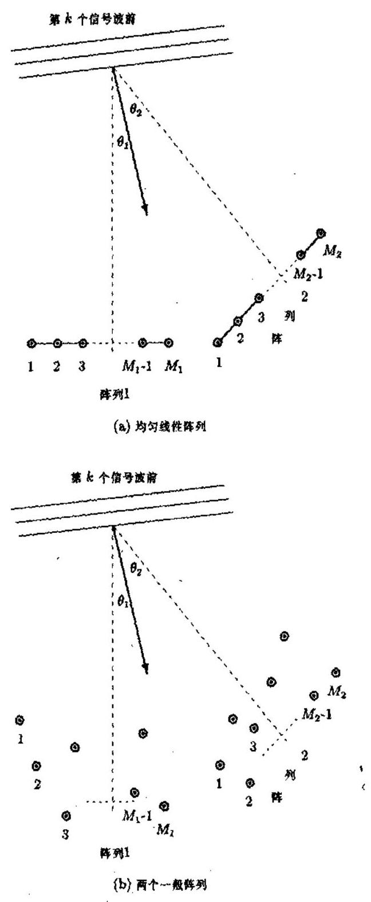

图 10.7.1 未知噪声中的到达波方向估计的两阵列结构图

在实际中， $\sum$ 的真实值是未知的. 因此，通常使用数据的外积平均作 $\sum$ 的估计，即

$$
\widehat{\sum } = \frac{1}{N}\mathop{\sum }\limits_{{n = 1}}^{N}\left\lbrack  \begin{array}{l} {x}_{1}\left( n\right) \\  {x}_{2}\left( n\right)  \end{array}\right\rbrack  \left\lbrack  \begin{array}{ll} {x}_{1}^{H}\left( n\right) & {x}_{2}^{H}\left( n\right)  \end{array}\right\rbrack   = \left\lbrack  \begin{array}{ll} {\widehat{\sum }}_{11} & {\widehat{\sum }}_{12} \\  {\widehat{\sum }}_{21} & {\widehat{\sum }}_{22} \end{array}\right\rbrack \tag{10.7.6}
$$

如果接收信号 ${s}_{i}\left( n\right)$ 是高斯的,则在某些正则条件下 $\widehat{\sum }$ 依概率收敛于 $\sum$ ,收敛速率为 $O\left( {N}^{-1/2}\right)$ ,参见文献 [22].

由于 ${\sum }_{12}$ 只包含信号信息,所以我们会想到,信号子空间 ${D}_{i}\left( {\theta }_{i}\right)$ 可以利用 ${\widehat{\sum }}_{12}$ 的诸如奇异值分解等方法进行估计. 然后，利用诸如 MUSIC 或子空间拟合等方法，我们就可以由估计的信号子空间求出到达波方向.

下面介绍基于广义相关分析估计到达波方向的方法 ${}^{\left\lbrack  {20}\right\rbrack  }$ .

#### 10.7.2 广义相关分解

令 ${\Pi }_{1}$ 和 ${\Pi }_{2}$ 分别是 ${M}_{1} \times  {M}_{1}$ 和 ${M}_{2} \times  {M}_{2}$ 维的正定 Hermitian 矩阵. 不失一般性, 假定 ${M}_{1} \leq  {M}_{2}$ . 于是,存在两个酉矩阵 ${U}_{1} \in  {C}^{{M}_{1} \times  {M}_{1}}$ 和 ${U}_{2} \in  {C}^{{M}_{2} \times  {M}_{2}}$ 使得

$$
{\Pi }_{1}^{-1/2}{\sum }_{12}{\Pi }_{2}^{-1/2} = {U}_{1}{\Gamma }_{0}{U}_{2}^{H} \tag{10.7.7}
$$

或

$$
{\Pi }_{1}^{-1}{\sum }_{12}{\Pi }_{2}^{-1} = {\Pi }_{1}^{-1/2}{U}_{1}{\Gamma }_{0}{U}_{2}^{H}{\Pi }_{2}^{-1/2} \tag{10.7.8}
$$

其中 ${U}_{1}$ 和 ${U}_{2}$ 分别是矩阵 ${\Pi }_{1}^{-1/2}{\sum }_{12}{\Pi }_{2}^{-1/2}$ 的左和右奇异向量矩阵, ${\Gamma }_{0}$ 是一个 ${M}_{1} \times  {M}_{2}$ 对角矩阵:

$$
{\Gamma }_{0} = \left\lbrack  \begin{array}{ll} \Gamma & 0 \\  0 & 0 \end{array}\right\rbrack \tag{10.7.9}
$$

且 $\Gamma  = \operatorname{diag}\left( {{\gamma }_{1},\cdots ,{\gamma }_{K}}\right)$ ,而 ${\gamma }_{k}, k = 1,\cdots , K$ 是实的正数,满足 ${\gamma }_{1} \geq  \cdots  \geq  {\gamma }_{K} > 0$ . 不失一般性,假定 ${\gamma }_{1},\cdots ,{\gamma }_{K}$ 各异. 注意,矩阵 $\Gamma$ 的维数等于 ${\sum }_{12}$ 的秩.

定义 10.7.1 (广义相关分解) 根据式 (10.7.8) 的分解, 令

$$
{L}_{1} = {\Pi }_{1}^{-1/2}{U}_{1},\;{L}_{2} = {\Pi }_{2}^{-1/2}{U}_{2} \tag{10.7.10}
$$

${L}_{1}$ 和 ${L}_{2}$ 分别称作 ${\sum }_{12}$ 和 ${\sum }_{21}$ 的广义相关向量矩阵. 参数 ${\gamma }_{k}$ 称作广义相关系数. 类似地, 令

$$
{R}_{1} = {\Pi }_{1}^{1/2}{U}_{1},\;{R}_{2} = {\Pi }_{2}^{1/2}{U}_{2} \tag{10.7.11}
$$

则 ${R}_{1}$ 和 ${R}_{2}$ 分别叫做 ${\sum }_{12}$ 和 ${\sum }_{21}$ 的互反广义相关向量矩阵 (reciprocal generalized correlation vector matrix).

显然,在广义相关分解中 ${\Pi }_{i}$ 的不同选择将得到不同的分解. 例如,为了得到 ${\sum }_{12}$ 的奇异值分解,可以直接选择 ${\Pi }_{1} = {I}_{{M}_{1}}$ 和 ${\Pi }_{2} = {I}_{{M}_{2}}$ ,其中 ${I}_{{M}_{i}}$ 是 ${M}_{i} \times  {M}_{i}$ 单位矩阵; 于是, ${L}_{i} = {R}_{i}, i = 1,2$ ,并且 ${L}_{1}$ 和 ${L}_{2}$ 分别是 ${\sum }_{12}$ 的左和右奇异向量矩阵.

如果选择 ${\Pi }_{i} = {\sum }_{ii}, i = 1,2$ ,则得到的分解称为标准相关分解 (canonical correlation decomposition) ${}^{\left\lbrack  {21},{22}\right\rbrack  },{\gamma }_{k}$ 叫做标准相关系数,而 ${L}_{i}$ 和 ${R}_{i}, i = 1,2$ 分别称作与数据 ${x}_{i}$ 对应的标准相关向量矩阵和互反标准相关向量矩阵.

另一个令人感兴趣的例子是选择 ${x}_{1} = {x}_{2},{\Pi }_{1} = I$ 和 ${\Pi }_{2} = I$ ,此时 ${\sum }_{12} = {\sum }_{21} = {\sum }_{11}$ , 而且 ${L}_{1} = {L}_{2}$ 是 ${\sum }_{11}$ 的特征向量矩阵. 另外,若选择 ${x}_{1} = {x}_{2},{\Pi }_{1} = {\sum }_{1v}$ 和 ${\Pi }_{2} = {\sum }_{2v}$ ,则 ${L}_{1}$ 是 ${\sum }_{11}$ 相对于 ${\sum }_{1v}$ 的广义特征向量矩阵. 从上述例子可以看到,广义相关分解包括了大多数的常用分解方法.

标准相关分解在多变元统计和时间序列分析中被广泛应用 ${}^{\left\lbrack  {21} \sim  {24}\right\rbrack  }$ . 当使用标准相关分解即选择 ${\Pi }_{i} = {\sum }_{ii}, i = 1,2$ 时,我们将用 ${\widetilde{L}}_{i},{\widetilde{R}}_{i}$ 和 $\widetilde{\Gamma }$ 分别表示 ${L}_{i},{R}_{i}$ 和 $\Gamma$ . 标准相关分解通过用两组新变量代替原来的两组变量 ${x}_{1}$ 和 ${x}_{2}$ ,旨在描述 ${x}_{1}$ 和 ${x}_{2}$ 之间的相关结构. 事实上,若令 $\left\{  {{\widetilde{I}}_{i1},\cdots ,{\widetilde{I}}_{i{M}_{i}}}\right\}$ 是 ${L}_{i}, i = 1,2$ 的列,则可以证明 ${}^{\left\lbrack  {23}\right\rbrack  },{\widetilde{\gamma }}_{k}$ 是方差为 1 的典型变量 ${\widetilde{I}}_{1k}^{H}{x}_{1}$ 和 ${\widetilde{I}}_{2k}^{H}{x}_{2}$ 之间的最大相关,它满足:

$$
{\widetilde{\gamma }}_{k} = \frac{{\widetilde{I}}_{1k}^{H}{\sum }_{12}{\widetilde{I}}_{2k}}{{\left( {\widetilde{I}}_{1k}^{H}{\sum }_{11}{\widetilde{I}}_{1k}{\widetilde{I}}_{2k}^{H}{\sum }_{22}{\widetilde{I}}_{2k}\right) }^{1/2}} = {\widetilde{I}}_{1k}^{H}{\sum }_{12}{\widetilde{I}}_{2k} \tag{10.7.12}
$$

并且对于 $k \neq  l, i, j = 1,2$ 而言, ${\widetilde{I}}_{ik}^{H}{x}_{i}$ 与 ${\widetilde{I}}_{jl}^{H}{x}_{j}$ 不相关.

令 $\bar{i}$ 表示指数 $i$ 的补,即若 $i = 1$ ,则 $\bar{i} = 2$ ; 反之,若 $i = 2$ ,则 $\bar{i} = 1$ . 记

$$
{X}_{i} = \left\lbrack  {{x}_{i}\left( 1\right) {x}_{i}\left( 2\right) \cdots {x}_{i}\left( N\right) }\right\rbrack \tag{10.7.13}
$$

和

$$
{\widehat{\sum }}_{ij} = \frac{1}{N}{X}_{i}{X}_{j}^{H},\;i, j = 1,2 \tag{10.7.14}
$$

Wu 和 Wong 推导了下面的标准相关分解算法 ${}^{\left\lbrack  {20}\right\rbrack  }$ .

算法 10.7.1 (标准相关分解算法)

步骤 1: 计算 ${X}_{i}$ 和 ${X}_{\bar{i}}$ 的 ${QR}$ 分解:

$$
\frac{1}{{N}^{1/2}}{X}_{i}^{H} = {\widehat{Q}}_{i}{\widehat{R}}_{i},\;i = 1,2 \tag{10.7.15a}
$$

$$
\frac{1}{{N}^{1/2}}{X}_{\bar{i}}^{H} = {\widehat{Q}}_{\bar{i}}{\widehat{R}}_{\bar{i}},\;\bar{i} = 2,1 \tag{10.7.15b}
$$

其中 ${\widehat{R}}_{i}$ 是 ${M}_{i} \times  {M}_{i}$ 上三角矩阵.

步骤 2: 计算矩阵 ${\widehat{Q}}_{i}^{H}{\widehat{Q}}_{i}$ 的奇异值分解:

$$
{\widehat{Q}}_{i}^{H}{\widehat{Q}}_{i} = {\widehat{\widetilde{V}}}_{i}\left\lbrack  \begin{array}{ll} \widetilde{\Gamma } & 0 \end{array}\right\rbrack  {\widehat{\widetilde{V}}}_{i}^{H} \tag{10.7.16}
$$

步骤 3: 计算标准相关向量矩阵 ${\widetilde{L}}_{i}$ 和互反标准相关向量矩阵 ${\widetilde{R}}_{i}$ 的估计值:

$$
{\widehat{\widetilde{L}}}_{i} = {\widehat{R}}_{i}^{-1}{\widehat{\widetilde{V}}}_{i},\;i = 1,2 \tag{10.7.17}
$$

$$
{\widehat{\widetilde{R}}}_{i} = {\widehat{\sum }}_{ii}{\widehat{\widetilde{L}}}_{i} = {\widehat{R}}_{i}^{H}{\widehat{\widetilde{V}}}_{i},\;i = 1,2 \tag{10.7.18}
$$

现在讨论 ${L}_{i}$ 和 ${R}_{i}$ 的列的几何解释. 对 ${L}_{i}$ 和 ${R}_{i}$ 进行矩阵分块:

$$
{L}_{i} = \left\lbrack  \begin{array}{ll} {L}_{is} & {L}_{iv} \end{array}\right\rbrack   = \left\lbrack  \begin{array}{ll} {\Pi }_{i}^{-1/2}{U}_{is} & {\Pi }_{i}^{-1/2}{U}_{iv} \end{array}\right\rbrack \tag{10.7.19a}
$$

$$
{R}_{i} = \left\lbrack  \begin{array}{ll} {R}_{is} & {R}_{iv} \end{array}\right\rbrack   = \left\lbrack  \begin{array}{ll} {\Pi }_{i}^{1/2}{U}_{is} & {\Pi }_{i}^{1/2}{U}_{iv} \end{array}\right\rbrack \tag{10.7.19b}
$$

其中 ${L}_{is}$ 和 ${L}_{iv}$ 分别是 ${L}_{i}$ 的前 $K$ 列和后 $\left( {{M}_{i} - K}\right)$ 列; ${R}_{is}$ 和 ${R}_{iv}$ 分别是 ${R}_{i}$ 的前 $K$ 列和后 $\left( {{M}_{i} - K}\right)$ 列; 类似地, ${U}_{i}$ 也分成 ${U}_{is}$ 和 ${U}_{iv}$ .

定理 10.7.1 若 ${\Pi }_{1}$ 和 ${\Pi }_{2}$ 分别是 ${M}_{1} \times  {M}_{1}$ 和 ${M}_{2} \times  {M}_{2}$ 正定矩阵,且 $\operatorname{rank}\left( {\sum }_{12}\right)  = K$ , 则下列关系成立:

$$
\operatorname{span}\left\{  {R}_{is}\right\}   = \operatorname{span}\left\{  {{D}_{i}\left( {\theta }_{i}\right) }\right\}  ,\;i = 1,2 \tag{10.7.20}
$$

$$
\operatorname{span}\left\{  {L}_{iv}\right\}   = \overline{\operatorname{span}}\left\{  {{D}_{i}\left( {\theta }_{i}\right) }\right\}  ,\;i = 1,2 \tag{10.7.21}
$$

其中 $\overline{\operatorname{span}}\left\{  {D}_{i}\right\}$ 表示 $\operatorname{span}\left\{  {D}_{i}\right\}$ 的正交补.

证明 由式 (10.7.7) 及式 (10.7.9) 有

$$
{\sum }_{i\bar{i}}{\Pi }_{\bar{i}}^{-1/2} = {\Pi }_{i}^{1/2}{U}_{i}{\Gamma }_{0}{U}_{\bar{i}}^{H} = {\Pi }_{i}^{1/2}{U}_{is}\Gamma {U}_{is}^{H} = {R}_{is}\Gamma {U}_{\bar{i}s}^{H} \tag{10.7.22}
$$

在式 (10.7.22) 中使用式 (10.7.5b), 则有

$$
{D}_{i}\left( {\theta }_{i}\right) {\sum }_{{s}_{i, i}}{D}_{i}^{H}\left( {\theta }_{i}\right) {\Pi }_{i}^{-1/2} = {R}_{is}\Gamma {U}_{is}^{H} \tag{10.7.23}
$$

由于 ${D}_{i}^{H}\left( {\theta }_{i}\right)$ 秩为 $K$ ,所以 ${D}_{i}^{H}\left( {\theta }_{i}\right) {\Pi }_{i}^{-1/2}$ 是 $K \times  {M}_{i}$ 矩阵,其伪逆矩阵 ${H}_{i}$ 为 ${M}_{i} \times  K$ 矩阵,秩等于 $K$ . 用伪逆矩阵 ${H}_{\bar{i}}$ 右乘式 (10.7.23) 两边,则有

$$
{D}_{i}\left( {\theta }_{i}\right) {\sum }_{{s}_{xi}} = {R}_{is}\Gamma {U}_{is}^{H}{H}_{\bar{i}} \tag{10.7.24}
$$

注意到 ${D}_{i}\left( {\theta }_{i}\right)$ 和 ${R}_{is}$ 各包含 $K$ 个线性独立向量作为列,而且式 (10.7.24) 的左边是秩 $K$ 的,所以 $\Gamma {U}_{is}^{H}{H}_{\bar{i}}$ 也是秩 $K$ 的. 就是说,式 (10.7.24) 的左、右两边分别表示对于 ${D}_{i}\left( {\theta }_{i}\right)$ 和 ${R}_{is}$ 内包含的 $K$ 个向量的线性变换. 因此, ${D}_{i}\left( {\theta }_{i}\right)$ 的向量和 ${R}_{is}$ 的向量必然张成相同的子空间,故式 (10.7.20) 为真. 又由于 ${U}_{1}$ 和 ${U}_{2}$ 为酉矩阵,所以利用定义式 (10.7.19) 则有

$$
{R}_{is}^{H}{L}_{iv} = {U}_{is}^{H}{\left( {\Pi }_{i}^{1/2}\right) }^{H}{\Pi }_{i}^{-1/2}{U}_{iv} = 0 \tag{10.7.25}
$$

从而得到式 (10.7.21).

下面的定理揭示了 ${L}_{i}$ 和 ${R}_{i}$ 的子矩阵之间更深刻的关系.

定理 10.7.2 式 (10.7.19) 中定义的 ${L}_{is},{L}_{iv},{R}_{is}$ 和 ${R}_{iv}$ 存在下列关系:

$$
{L}_{iv}^{H}{R}_{is} = {R}_{iv}^{H}{L}_{is} = 0,\;i = 1,2 \tag{10.7.26}
$$

$$
{L}_{iv}^{H}{R}_{iv} = {I}_{{M}_{i} - K},\;i = 1,2 \tag{10.7.27}
$$

$$
{L}_{is}^{H}{R}_{is} = {I}_{K},\;i = 1,2 \tag{10.7.28}
$$

换言之, ${L}_{i}$ 和 ${R}_{i}$ 的列组成逆集. 而且,

$$
{L}_{is}{R}_{is}^{H} + {L}_{iv}{R}_{iv}^{H} = {I}_{{M}_{i}},\;i = 1,2 \tag{10.7.29}
$$

证明 这些关系式可以利用式 (10.7.19) 中的定义直接得出.

#### 10.7.3 广义 Hermitian 矩阵与特征投影算子

为了在未知噪声的到达波方向估计中能够利用定理 10.7.1 和 10.7.2 的结果, 有必要引入广义 Hermitian 矩阵和特征投影算子的概念.

定义 10.7.2 (广义 Hermitian 矩阵) 一个 $M \times  M$ 矩阵 $H$ 称为广义 Hermitian 矩阵, 若 ${\Pi H}$ 是 Hermitian 矩阵,即若 ${\Pi H} = {H}^{H}{\Pi }^{H}$ ,其中, $\Pi$ 是一正定 Hermitian 矩阵. 广义 Hermitian 矩阵也称以 $\Pi$ 度量的 Hermitian 矩阵.

下面的引理表明， ${L}_{i}$ 和 ${R}_{i}$ 实际上是某些广义 Hermitian 矩阵的特征向量矩阵.

引理 10.7.1 矩阵 ${S}_{i} = \left( {{\Pi }_{i}^{-1}{\sum }_{i\bar{i}}{\Pi }_{\bar{i}}^{-1}{\sum }_{\bar{i}i}}\right) , i = 1,2$ 是广义 Hermitian 矩阵， ${S}_{i}^{H}$ 也是广义 Hermitian 矩阵; 又 ${S}_{i}$ 和 ${S}_{i}^{H}$ 具有相同的特征值: $\left\{  {{\gamma }_{1}^{2},\cdots ,{\gamma }_{K}^{2},0,\cdots ,0}\right\}$ ,并且 ${S}_{i}$ 和 ${S}_{i}^{H}$ 的特征向量分别是 ${L}_{i}$ 和 ${R}_{i}$ 的列.

证明 利用定义 10.7.2 以及 ${\Pi }_{i}^{-1} = {\left( {\Pi }_{i}^{-1}\right) }^{H}$ 和 ${\sum }_{12}^{H} = {\sum }_{21}$ 之事实,容易验证 ${S}_{i}$ 和 ${S}_{i}^{H}$ 都是广义 Hermitian 矩阵. 为了求 ${S}_{i}$ 的特征向量,由式 (10.7.7) 和式 (10.7.9) 得到

$$
{\Gamma }_{0}{\Gamma }_{0}^{H} = \left( {{U}_{1}^{H}{\Pi }_{1}^{-1/2}{\sum }_{12}{\Pi }_{2}^{-1/2}{U}_{2}}\right) \left( {{U}_{2}^{H}{\Pi }_{2}^{-1/2}{\sum }_{21}{\Pi }_{1}^{-1/2}{U}_{1}}\right) \tag{10.7.30a}
$$

$$
{\Gamma }_{0}{\Gamma }_{0}^{H} = {L}_{1}^{-1}\left( {{\Pi }_{1}^{-1}{\sum }_{12}{\Pi }_{2}^{-1}{\sum }_{21}}\right) {L}_{1} = {L}_{1}^{-1}{S}_{1}{L}_{1} \tag{10.7.30b}
$$

由于 ${\Gamma }_{0}{\Gamma }_{0}^{H} = \operatorname{diag}\left( {{\gamma }_{1}^{2},\cdots ,{\gamma }_{K}^{2},0,\cdots ,0}\right)$ 是一个 ${M}_{1} \times  {M}_{1}$ 对角矩阵,所以,式 (10.7.30b) 表示对 ${S}_{1}$ 的相似变换,且 ${S}_{1}$ 的特征值为 $\left\{  {{\gamma }_{1}^{2},\cdots ,{\gamma }_{K}^{2},0,\cdots ,0}\right\}$ ,对应的特征向量是 ${L}_{1}$ 的列. 最后, 由式 (10.7.10) 和式 (10.7.11) 可看出

$$
{R}_{1}^{H} = {L}_{1}^{-1} \tag{10.7.31}
$$

将式 (10.7.31) 代入式 (10.7.30b), 并取共轭转置, 则有

$$
{R}_{1}^{-1}{S}_{1}^{H}{R}_{1} = \operatorname{diag}\left( {{\gamma }_{1}^{2},\cdots ,{\gamma }_{K}^{2},0,\cdots ,0}\right) \tag{10.7.32}
$$

因此, ${S}_{1}^{H}$ 的特征值也是 $\left\{  {{\gamma }_{1}^{2},\cdots ,{\gamma }_{K}^{2},0,\cdots ,0}\right\}$ ,并且 ${R}_{1}$ 的列是对应的特征向量. 类似地, 由式 (10.7.30a) 可以证明引理的结果对 $i = 2$ 也成立.

注释: 定理 10.7.2 和引理 10.7.1 的等式对于 ${\widehat{L}}_{is},{\widehat{L}}_{iv},{\widehat{R}}_{is}$ 和 ${\widehat{R}}_{iv}$ 也成立. 为了得到这一结果,只要用 ${\widehat{\sum }}_{ij}$ 代替广义相关分解式 (10.7.7) 中的 ${\sum }_{ij}$ 即可. 与 ${S}_{i}$ 唯一的不同是, ${\widehat{S}}_{i}$ 的最后 ${M}_{i} - K$ 个特征值 $\left( {{\widehat{\gamma }}_{K + 1},\cdots ,{\widehat{\gamma }}_{{M}_{i}}}\right)$ 不等于零,它们是正的.

下面引出广义 Hermitian 矩阵的特征投影算子 ${}^{\left\lbrack  {25}\right\rbrack  }$ . 先介绍一个有关的概念: 若 ${L}_{i}$ 由式 (10.7.10) 定义,则称 ${L}_{i}$ 是以 ${\Pi }_{i}$ 度量的.

定义 10.7.3 (特征投影算子) 与特征值 ${\gamma }_{m}^{2}$ 相关联的 ${S}_{i}$ 的特征投影算子定义为到对应特征向量 ${I}_{im}$ 张成的子空间上的投影算子,其中 ${I}_{im}$ 是以 ${\Pi }_{i}$ 度量的 ${L}_{i}$ 的第 $m$ 列. 这样一种特征投影算子记作 ${I}_{im}{I}_{im}^{H}{\Pi }_{i}$ .

根据上述定义,构造与 ${S}_{i}$ 的 ${M}_{i} - K$ 个零特征值对应,并且投影到由相应的特征向量 ${I}_{im}, i = K + 1,\cdots ,{M}_{i}$ 张成的子空间上的特征投影算子,可得到

$$
{P}_{iv} = \mathop{\sum }\limits_{{m = K + 1}}^{{M}_{i}}{I}_{im}{I}_{im}^{H}{\Pi }_{i} = {L}_{iv}{L}_{iv}^{H}{\Pi }_{i} = {L}_{iv}{R}_{iv}^{H},\;i = 1,2 \tag{10.7.33}
$$

类似地,构造与 ${S}_{i}$ 的 $K$ 个非零特征值对应,并且投影到由 ${I}_{ik}, k = 1,\cdots , K$ 张成的子空间上的特征投影算子，则有

$$
{P}_{is} = \mathop{\sum }\limits_{{k = 1}}^{K}{I}_{ik}{I}_{ik}^{H}{\Pi }_{i} = {L}_{is}{L}_{is}^{H}{\Pi }_{i} = {L}_{is}{R}_{is}^{H},\;i = 1,2 \tag{10.7.34}
$$

容易验证, ${P}_{iv}$ 和 ${P}_{is}$ 二者都是广义 Hermitian 矩阵 (以 ${\Pi }_{i}$ 度量). 还可观察到: 特征投影算子 ${P}_{iv}, i = 1,2$ 由左因子 ${L}_{iv}$ 与右因子 ${R}_{iv}$ 组成,而 ${P}_{is}$ 由左因子 ${L}_{is}$ 和右因子 ${R}_{is}$ 组成. 类似地,可以证明,对应于矩阵 ${S}_{i}$ 同一特征值组的特征投影算子分别为 ${P}_{iv}^{H}$ 和 ${P}_{is}^{H}$ .

根据定理 10.7.1 与 10.7.2，可以得到有关特征投影算子的几何解释. 由式 (10.7.33) 可以看出,特征投影算子 ${P}_{iv}, i = 1,2$ 投影到由向量 ${\left\{  {I}_{im}\right\}  }_{m = K + 1}^{{M}_{i}}$ 张成的子空间上,但根据定理 10.7.1,这些向量张成信号子空间 $\operatorname{span}\left\{  {{D}_{i}\left( {\theta }_{i}\right) }\right\}$ 的正交补 $\overline{\operatorname{span}}\left\{  {{D}_{i}\left( \theta \right) }\right\}$ . 由此得出结论: ${P}_{iv}$ 投影到 $\overline{\operatorname{span}}\left\{  {{D}_{i}\left( \theta \right) }\right\}$ 上. 另由式 (10.7.34) 知,特征投影算子 ${P}_{is}$ 投影到由向量 ${\left\{  {I}_{ik}\right\}  }_{k = 1}^{K}$ 张成的子空间上. 由定理 10.7.1,这一子空间只是由 ${R}_{is}$ 张成的子空间,不一定是由 ${D}_{i}\left( {\theta }_{i}\right)$ 张成的信号子空间. 因此,可以得出结论: 特征投影算子 ${P}_{is}$ 不投影到信号子空间上. 与此相反,特征投影算子 ${P}_{is}^{H}$ 却投影到信号子空间上. 这是因为,由

$$
{P}_{is}^{H} = {R}_{is}{L}_{is}^{H} = {R}_{is}{R}_{is}^{H}{\Pi }_{i} = \mathop{\sum }\limits_{{k = 1}}^{K}{r}_{ik}{r}_{ik}^{H}{\Pi }_{i} \tag{10.7.35}
$$

(其中 ${r}_{ik}$ 是 ${R}_{is}$ 的第 $k$ 列) 知,特征投影算子 ${P}_{is}^{H}$ 投影到由 ${R}_{is}$ 张成从而由 ${D}_{i}\left( {\theta }_{i}\right)$ 张成的信号子空间上.

另外一方面,从定理 10.7.2 可看到, ${P}_{iv}$ 和 ${P}_{is}$ 存在下列关系:

$$
{P}_{iv} = {L}_{iv}{R}_{iv}^{H} = {I}_{{M}_{i}} - {L}_{is}{R}_{is}^{H} = {I}_{{M}_{i}} - {P}_{is},\;i = 1,2 \tag{10.7.36}
$$

还可观察到 ${P}_{iv}$ 和 ${P}_{is}$ 二者均为幂等矩阵,即

$$
{P}_{iv}{P}_{iv} = {P}_{iv} \tag{10.7.37a}
$$

$$
{P}_{is}{P}_{is} = {P}_{is} \tag{10.7.37b}
$$

然而,由于它们不是自伴随矩阵,即 ${P}_{iv} \neq  {P}_{iv}^{H},{P}_{is} \neq  {P}_{is}^{H}$ ,故投影不是正交的 ${}^{\left\lbrack  {26}\right\rbrack  }$ . 注意, 如果使用估计的矩阵 ${\widehat{L}}_{iv},{\widehat{L}}_{is},{\widehat{R}}_{iv}$ 和 ${\widehat{R}}_{is}$ ,根据式 (10.7.33) 和式 (10.7.34) 构造投影算子 ${\widehat{P}}_{iv}$ 和 ${\widehat{P}}_{is}$ 的话,则式 (10.7.36) 与式 (10.7.37) 依然成立,并且 ${\widehat{P}}_{iv}^{H}$ 和 ${\widehat{P}}_{iv}$ 将分别投影到估计的信号子空间和它的正交补上.

#### 10.7.4 特征空间的渐近性质

现在分析 ${\widehat{P}}_{iv}$ 和 ${\widehat{P}}_{is}$ 投影到的估计特征空间的渐近性质. 通常,估计的矩阵 ${\widehat{L}}_{iv},{\widehat{L}}_{is}$ , ${\widehat{R}}_{iv}$ 和 ${\widehat{R}}_{is}$ 不可避免存在扰动.

为了度量 ${\widehat{L}}_{iv}$ 的扰动，可以计算从子空间 $\widehat{\operatorname{span}}\left\{  {D}_{1}\right\}$ 到由 ${\widehat{L}}_{iv}$ 张成的子空间的投影误差. 令矩阵 ${Y}_{iv} \subseteq  \overline{\operatorname{span}}\left\{  {D}_{i}\right\}$ ,则这一投影误差可以表示为

$$
{Y}_{iv} - {\widehat{P}}_{iv}{Y}_{iv} = {\widehat{P}}_{is}{Y}_{iv} \tag{10.7.38a}
$$

这里使用了式 (10.7.36) 中的关系 ${\widehat{P}}_{is} = I - {\widehat{P}}_{iv}$ . 当 ${\widehat{P}}_{iv} = {P}_{iv}$ 时,该误差将等于零. 类似地, ${\widehat{R}}_{is}$ 的扰动可以表示为

$$
{Y}_{is} - {\widehat{P}}_{is}^{H}{Y}_{is} = {\widehat{P}}_{iv}^{H}{Y}_{is} \tag{10.7.38b}
$$

其中 ${Y}_{i * } \subseteq  \operatorname{span}\left\{  {D}_{i}\right\}$ .

下面的引理描述了 ${\widehat{P}}_{is}{Y}_{iv}$ 的一阶扰动.

引理 10.7.2 假定数据模型由式 (10.7.2) 给定. 对第 $i$ 个阵列,令 ${Y}_{iv} \subseteq  \overline{\operatorname{span}}\left\{  {D}_{i}\right\}$ ,并且 ${\Pi }_{i}$ 和 ${\Pi }_{\bar{i}}$ 为正定矩阵 (它们可以是依概率收敛的随机矩阵,其渐近收敛速率为 $O\left( {N}^{-1/2}\right)$ ), 则关系式

$$
{\widehat{P}}_{is}{Y}_{iv} = {L}_{is}{\Gamma }^{-1}{L}_{is}^{H}\Delta {\sum }_{ii}{Y}_{iv} + O\left( {N}^{-1}\right) ,\;i = 1,2 \tag{10.7.39}
$$

依概率成立,其中 $\Delta {\sum }_{ii} \equiv  {\widehat{\sum }}_{ii} - {\sum }_{ii}$ .

证明见文献 $\left\lbrack  {27}\right\rbrack$ .

上述引理的意义在于它提供了 ${\widehat{L}}_{iv}$ 和 ${\widehat{L}}_{is}$ 一阶扰动的严格表示,这将大大简化下面的渐近性能分析.

关于估计的特征空间与特征投影算子的收敛速率，可以建立以下结果.

引理 ${10.7.3}{\widehat{L}}_{is},{\widehat{R}}_{is},{\widehat{P}}_{is}$ 和 ${\widehat{P}}_{iv}$ 分别依概率收敛为 ${L}_{is},{R}_{is},{P}_{is}$ 和 ${P}_{iv}$ ,收敛速率为 $O\left( {N}^{-1/2}\right)$ .

证明 由 ${S}_{i}$ 的定义以及 ${\widehat{\sum }}_{ij}$ 以速率 $O\left( {N}^{-1/2}\right)$ 收敛为 ${\sum }_{ij}$ 之事实,因此, $\Delta {S}_{i}$ 以相同速率收敛. 由于 ${\widehat{L}}_{is}$ 和 ${\widehat{R}}_{is}$ 分别由与 ${\widehat{S}}_{i}$ 和 ${\widehat{S}}_{i}^{H}$ 前 $K$ 个特征值对应的特征向量组成 ${}^{\left\lbrack  {22}\right\rbrack  }$ ,所以 ${\widehat{L}}_{is}$ 与 ${\widehat{R}}_{is}$ 的收敛速率也为 $O\left( {N}^{-1/2}\right)$ . 对于 ${\widehat{P}}_{is}$ 和 ${\widehat{P}}_{iv}$ ,因 ${\widehat{P}}_{is} = {\widehat{L}}_{is}{\widehat{R}}_{is}^{H}$ 和 ${\widehat{R}}_{iv} = I - {\widehat{P}}_{is}$ , 故知 ${\widehat{P}}_{in}$ 和 ${\widehat{P}}_{tv}$ 的收敛速率与 $\Delta {S}_{i}$ 的收敛速率相同,也是 $O\left( {N}^{-1/2}\right)$ .

值得注意的是，一般说来， ${\widehat{L}}_{iv}$ 和 ${\widehat{R}}_{iv}$ 不会收敛到确定矩阵，只收敛到确定子空间，因为 ${L}_{iv}$ 和 ${R}_{iv}$ 不是唯一确定的. 但是,与 ${\widehat{L}}_{iv}$ 和 ${\widehat{R}}_{iv}$ 相关联的特征投影算子 ${\widehat{P}}_{iv}\left( { = {\widehat{L}}_{iv}{\widehat{R}}_{iv}^{H}}\right)$ 收敛到确定矩阵 ${P}_{iv}$ .

令矩阵 $A = \left\lbrack  {a}_{ij}\right\rbrack   \in  {C}^{m \times  n}$ 和 $B = \left\lbrack  {b}_{ij}\right\rbrack   \in  {C}^{p \times  q}$ . 我们定义 Kronecker 积 $A \otimes  B = \left\lbrack  {{a}_{ij}B}\right\rbrack$ 和向量化函数:

$$
\operatorname{vec}\left( A\right)  = {\left\lbrack  {a}_{11},\cdots ,{a}_{m1},{a}_{12},\cdots ,{a}_{m2},\cdots ,{a}_{1n},\cdots ,{a}_{mn}\right\rbrack  }^{T} \tag{10.7.40}
$$

由引理 10.7.2 和 10.7.3 可以推导出 ${\widehat{P}}_{is}{Y}_{iv}$ 的渐近分布,如下面的定理所述.

定理 10.7.3 对于第 $i\left( {i = 1,2}\right)$ 个阵列,若 ${Y}_{iv} \subseteq  \overline{\operatorname{span}}\left\{  {D}_{i}\right\}$ ,则随机向量 $\operatorname{vec}\left( {{\widehat{P}}_{is}{Y}_{iv}}\right)$ 是渐近复高斯分布，其均值为零、协方差矩阵为

$$
E\left\{  {\operatorname{vec}\left( {{\widehat{P}}_{is}{Y}_{iv}}\right) {\operatorname{vec}}^{H}\left( {{\widehat{P}}_{is}{Y}_{iv}}\right) }\right\}
$$

$$
= \frac{1}{N}{\left\lbrack  {Y}_{iv}^{H}{\sum }_{ii}{Y}_{iv}\right\rbrack  }^{T} \otimes  \left\lbrack  {{L}_{is}{\Gamma }^{-1}{L}_{is}^{H}{\sum }_{\bar{i}\bar{i}}{L}_{\bar{i}s}{\Gamma }^{-1}{L}_{is}^{H}}\right\rbrack \tag{10.7.41a}
$$

$$
E\left\{  {\operatorname{vec}\left( {{\widehat{P}}_{is}{Y}_{iv}}\right) {\operatorname{vec}}^{T}\left( {{\widehat{P}}_{is}{Y}_{iv}}\right) }\right\}   = 0 \tag{10.7.41b}
$$

而且

$$
E\left\{  {\operatorname{vec}\left( {{\widehat{P}}_{is}{Y}_{iv}}\right) {\operatorname{vec}}^{H}\left( {{\widehat{P}}_{is}{Y}_{iv}}\right) }\right\}   \rightarrow  0,\;N \rightarrow  \infty \tag{10.7.41c}
$$

证明见文献 [20].

注意, 如果使用标准相关分解, 则

$$
{\widetilde{L}}_{is}^{H}{\sum }_{ii}{\widetilde{L}}_{is} = {\widetilde{U}}_{is}^{H}{\widetilde{U}}_{is} = I \tag{10.7.42}
$$

且式 (10.7.41a) 简化为

$$
E\left\{  {\operatorname{vec}\left( {{\widehat{\widetilde{P}}}_{is}{Y}_{iv}}\right) {\operatorname{vec}}^{H}\left( {{\widehat{\widetilde{P}}}_{is}{Y}_{iv}}\right) }\right\}   = \frac{1}{N}{\left\lbrack  {Y}_{iv}^{H}{\sum }_{ii}{Y}_{iv}\right\rbrack  }^{T} \otimes  \left\lbrack  {{\widetilde{L}}_{is}{\widetilde{\Gamma }}^{-2}{\widetilde{L}}_{is}^{H}}\right\rbrack \tag{10.7.43}
$$

#### 10.7.5 在到达波方向估计中的应用

## 1. UN-MUSIC 算法

利用广义相关分解可以推导出未知噪声 (UN: Unknown Noise) 情况下的 MUSIC 算法, 简称为 UN-MUSIC 算法. 由于从方向流形到估计的信号子空间的投影误差可以证明为

$$
{d}_{i}\left( \theta \right)  - {\widehat{P}}_{is}^{H}{d}_{i}\left( \theta \right)  = {\widehat{P}}_{iv}^{H}{d}_{i}\left( \theta \right) ,\;i = 1,2
$$

故可以定义 UN-MUSIC 算法的空间谱或各阵列的空间谱为

$$
{S}_{i}\left( \theta \right)  = \frac{1}{{d}_{i}^{H}\left( \theta \right) {\widehat{P}}_{iv}^{H}{d}_{i}\left( \theta \right) }
$$

$$
= \frac{1}{{d}_{i}^{H}\left( \theta \right) {\widehat{L}}_{iv}{\widehat{R}}_{iv}^{H}{\widehat{R}}_{iv}{\widehat{L}}_{iv}^{H}{d}_{i}\left( \theta \right) },\;i = 1,2 \tag{10.7.44a}
$$

${S}_{i}\left( \theta \right)$ 在 $\theta  = {\theta }_{ik}, k = 1,\cdots , K$ 的 $K$ 个最高峰即取作信号相对于第 $i$ 个阵列的到达波方向估计值. 因此, UN-MUSIC 算法也可以写作

$$
{\widehat{\theta }}_{ik} = \arg \mathop{\min }\limits_{{\theta }_{k}}\left\{  {{d}_{i}^{H}\left( {\theta }_{k}\right) {\widehat{P}}_{iv}{\widehat{P}}_{iv}^{H}{d}_{i}\left( {\theta }_{k}\right) }\right\}  ,\;k = 1,\cdots , K;i = 1,2 \tag{10.7.44b}
$$

式中 $\arg \mathop{\min }\limits_{{\theta }_{k}}\left( \cdot \right)$ 表示使圆括号的函数极小化的变量. 式 (10.7.44b) 给出 UN-MUSIC 算法的两个空间谱, 每个空间谱对应一个阵列. 当两个阵列同口径, 并具有相同方向时, 则有 ${\theta }_{i} = {\theta }_{\bar{i}} = \theta$ . 为了同时利用包含在 ${\widehat{P}}_{iv}, i = 1,2$ 内的信息,文献 [20] 提出 UN-MUSIC 算法直接用下式确定到达波方向 ${\theta }_{k}$ :

$$
{\widehat{\theta }}_{k} = \arg \mathop{\min }\limits_{{\theta }_{k}}\left\{  {\mathop{\sum }\limits_{{i = 1}}^{2}{d}_{i}^{H}\left( {\theta }_{k}\right) {\widehat{P}}_{iv}{\widehat{P}}_{iv}^{H}{d}_{i}\left( {\theta }_{k}\right) }\right\}  ,\;k = 1,\cdots , K \tag{10.7.45}
$$

## 2. UN-CLE 算法

除了以上的 UN-MUSIC 算法外, 文献 [20] 还提出了到达波方向估计的未知噪声 (UN) 情况下的极大似然估计算法. 由于它采用广义相关分析和似然函数极大值的定位, 所以更确切地说, 它是未知噪声情况下的相关定位估计 (CLE: Correlation and Location Estimation) 算法、简称 UN-CLE 算法.

考虑外积 ${\widehat{R}}_{is}^{H}{L}_{iv}$ . 由式 (10.7.7) $\sim  \left( {10.7.10}\right)$ 可看出, ${L}_{iv}$ 是 ${\theta }_{i}$ 的隐含矩阵函数. 因此, 如果随机矩阵 ${\widehat{P}}_{iv}^{H}{L}_{iv}$ 的渐近分布可以推导出的话,那么估计值 ${\widehat{\theta }}_{i}$ 就可以通过定位所得到的似然函数的极大化获得. 下面推导 ${\widehat{P}}_{is}^{H}{L}_{iv}$ 的渐近分布. 首先注意到,由定理 10.7.2 知,对第 $i$ 个阵列有 ${\widehat{L}}_{is}^{H}{\widehat{R}}_{is} = {I}_{K}$ ; 另由引理 10.7.3 知

$$
{\widehat{R}}_{is} = {R}_{is} + O\left( {N}^{-1/2}\right) \tag{10.7.46}
$$

和

$$
{\widehat{L}}_{is}{\widehat{R}}_{is}^{H}{L}_{iv} = O\left( {N}^{-1/2}\right) \tag{10.7.47}
$$

二式依概率成立. 因此,用 ${R}_{is}$ 代替 ${\widehat{R}}_{is}$ 不会影响渐近分析,故而可省略掉 $O\left( {N}^{-1/2}\right)$ 项. 于是, 有

$$
\operatorname{vec}\left( {{\widehat{R}}_{is}^{H}{L}_{iv}}\right)  = \operatorname{vec}\left( {{\widehat{R}}_{is}^{H}{\widehat{L}}_{is}{\widehat{R}}_{is}^{H}{L}_{iv}}\right)  \simeq  \operatorname{vec}\left( {{R}_{is}^{H}{\widehat{L}}_{is}{\widehat{R}}_{is}^{H}{L}_{iv}}\right)
$$

$$
= \left( {{I}_{K} \otimes  {R}_{is}^{H}}\right) \operatorname{vec}\left( {{\widehat{L}}_{is}{\widehat{R}}_{is}^{H}{L}_{iv}}\right)
$$

$$
= \left( {{I}_{K} \otimes  {R}_{is}^{H}}\right) \operatorname{vec}\left( {{\widehat{P}}_{is}{L}_{iv}}\right) \tag{10.7.48}
$$

式中使用了公式

$$
\operatorname{vec}\left( {ABC}\right)  = \left( {{C}^{T} \otimes  A}\right) \operatorname{vec}\left( B\right) \tag{10.7.49}
$$

(第一章 1.6 节). 由定理 10.7.3,对于 ${Y}_{iv} \subseteq  \overline{\operatorname{span}}\left\{  {D}_{i}\right\}  ,\operatorname{vec}\left( {{\widehat{P}}_{is}{Y}_{iv}}\right)$ 是零均值的渐近复正态分布; 又因为 $\overline{\mathrm{{span}}}\left\{  {L}_{ir}\right\}   = \overline{\mathrm{{span}}}\left\{  {D}_{i}\right\}$ ,所以由式 (10.7.48) 可得结论: $\operatorname{vec}\left( {{\widehat{R}}_{is}^{H}{L}_{iv}}\right)$ 是零均值的复正态分布. 由式 (10.7.48) 及定理 10.7.3, 该正态分布的协方差矩阵可以求得为

$$
E\left\{  {\operatorname{vec}\left( {{\widehat{R}}_{is}^{H}{L}_{iv}}\right) {\operatorname{vec}}^{H}\left( {{\widehat{R}}_{is}^{H}{L}_{iv}}\right) }\right\}
$$

$$
= \frac{1}{N}{\left( {L}_{iv}^{H}{\sum }_{ii}{L}_{iv}\right) }^{T} \otimes  \left( {{\gamma }^{-1}{L}_{is}^{H}{\sum }_{\bar{i}\bar{i}}{L}_{\bar{i}s}{\Gamma }^{-1}}\right) ,\;i = 1,2 \tag{10.7.50}
$$

因此, $\operatorname{vec}\left( {{\widehat{R}}_{is}^{H}{L}_{iv}}\right)$ 的对数似然函数为

$$
L\left( {{\widehat{R}}_{is}^{H}{L}_{iv} \mid  {\theta }_{i},{\sum }_{ii},{\sum }_{ii},{\sum }_{ii}}\right)
$$

$$
\propto   - \log \left\{  {\det \left\lbrack  {{\left( {L}_{iv}^{H}{\sum }_{ii}{L}_{iv}\right) }^{T} \otimes  \left( {{\Gamma }^{-1}{L}_{is}^{H}{\sum }_{ii}^{ - }{L}_{is}{\Gamma }^{-1}}\right) }\right\rbrack  }\right\}
$$

$$
- N\operatorname{trace}\left\{  {{\operatorname{vec}}^{H}\left( {{\widehat{R}}_{is}^{H}{L}_{iv}}\right) \left\lbrack  {\left( {L}_{iv}^{H}{\sum }_{ii}{L}_{iv}\right) }^{T}\right. }\right.
$$

$$
\left. {{\left. \otimes \left( {\Gamma }^{-1}{L}_{is}^{H}{\sum }_{\bar{i}i}{L}_{\bar{i}s}{\Gamma }^{-1}\right) \right\rbrack  }^{-1}\operatorname{vec}\left( {{\widehat{R}}_{is}{L}_{iv}}\right) }\right\}
$$

$$
\simeq   - N\operatorname{trace}\left\{  {{\operatorname{vec}}^{H}\left( {{\widehat{R}}_{is}^{H}{L}_{iv}}\right) \left\lbrack  {\left( {L}_{iv}^{T}{\sum }_{ii}^{T}{L}_{iv}^{ * }\right) }^{-1}\right. }\right.
$$

$$
\left. {\otimes {\left( {\Gamma }^{-1}{L}_{is}^{H}{\sum }_{\bar{i}\bar{i}}{L}_{\bar{i}s}{\Gamma }^{-1}\right) }^{-1}\rbrack \operatorname{vec}\left( {{\widehat{R}}_{is}^{H}{L}_{iv}}\right) }\right\} \tag{10.7.51}
$$

式中使用了公式 ${\left( A \otimes  B\right) }^{-1} = {A}^{-1} \otimes  {B}^{-1}$ (第一章 1.6 节),并且省略了第 1 项 $\log \left( {\det \left( \cdot \right) }\right)$ , 因为对于一个大的 $N$ ,第 2 项占主导地位. 由结果

$$
E\left\{  {\operatorname{vec}\left( {\Delta {\sum }_{\overrightarrow{i}i}{\operatorname{vec}}^{H}\left( {\Delta {\sum }_{\overrightarrow{i}i}}\right\}   = \frac{1}{N}{\sum }_{ii}^{T} \otimes  {\sum }_{\overrightarrow{i}\overrightarrow{i}}}\right. }\right. \tag{10.7.52}
$$

(参见文献 [22], p.90), 我们有

$$
\operatorname{vec}\left( {{\widehat{R}}_{is}^{H}{L}_{iv}}\right)  = {L}_{iv}^{T} \otimes  {\widehat{R}}_{is}^{H}\operatorname{vec}\left( I\right) \tag{10.7.53}
$$

再利用 Kronecker 积的性质 (10.7.49) 式和

$$
\left( {A \otimes  B}\right) \left( {C \otimes  D}\right)  = {AC} \otimes  {BD} \tag{10.7.54}
$$

以及关系式 ${}^{\left\lbrack  {28}\right\rbrack  }$

$$
\operatorname{trace}\left\{  {\operatorname{vec}\left( I\right) {\operatorname{vec}}^{H}\left( A\right) }\right\}   = \operatorname{trace}\left( A\right) \tag{10.7.55}
$$

( $A$ 是 Hermitian 矩阵),则式 (10.7.51) 可以写作

$$
L\left( {{\widehat{R}}_{is}^{H}{L}_{iv} \mid  {\theta }_{i},{\sum }_{ii},{\sum }_{\bar{i}\bar{i}},{\sum }_{\bar{i}\bar{i}}}\right)
$$

$$
\propto   - \operatorname{trace}\left\{  {{\operatorname{vec}}^{H}\left( I\right) {\left\lbrack  {L}_{iv}^{H}{\left( {L}_{iv}^{H}{\sum }_{ii}{L}_{iv}\right) }^{-1}{L}_{iv}^{H}\right\rbrack  }^{ * }}\right.
$$

$$
\otimes  \left\lbrack  {{\widehat{R}}_{is}{\left( {\Gamma }^{-1}{L}_{is}^{H}{\sum }_{ii}{L}_{is}{\Gamma }^{-1}\right) }^{-1}{\widehat{R}}_{is}^{H}}\right\rbrack  \operatorname{vec}\left( I\right) \}
$$

$$
=  - \operatorname{trace}\left\{  {{L}_{iv}\left\lbrack  {{\left( {L}_{iv}^{T}{\sum }_{ii}{L}_{iv}\right) }^{-1}{L}_{iv}^{H}{\widehat{R}}_{is}{\left( {\Gamma }^{-1}{L}_{is}^{H}{\sum }_{ii}{L}_{is}{\Gamma }^{-1}\right) }^{-1}{\widehat{R}}_{is}^{H}}\right. }\right\} \tag{10.7.56}
$$

因此, 对于一种选定的广义相关分解方法, 未知噪声中到达波方向的极大似然估计即 UNCLE 算法由下式给出:

$$
{\widehat{\theta }}_{i} = \arg \mathop{\min }\limits_{\theta }L\left( {{\widehat{R}}_{is}^{H}{L}_{iv} \mid  {\theta }_{i},{\sum }_{ii},{\sum }_{ii},{\sum }_{ii}}\right)
$$

$$
= \arg \mathop{\min }\limits_{\theta }\operatorname{trace}\left\{  {{L}_{iv}{\left( {L}_{iv}^{T}{\sum }_{ii}{L}_{iv}\right) }^{-1}{L}_{iv}^{H}{\widehat{R}}_{is}}\right.
$$

$$
\left. {\times {\left( {\Gamma }^{-1}{L}_{is}^{H}{\sum }_{it}{L}_{is}{\Gamma }^{-1}\right) }^{-1}{\widehat{R}}_{is}^{H}}\right\}  \;i = 1,2 \tag{10.7.57}
$$

为了进一步考查 UN-CLE,利用 ${R}_{iv}^{H}{L}_{iv} = I$ 的事实,可以将式 (10.7.57) 的准则写作

$$
{\widehat{\theta }}_{i} = \arg \mathop{\min }\limits_{\theta }L\left( {{\widehat{R}}_{is}^{H}{L}_{iv} \mid  {\theta }_{i},{\sum }_{ii},{\sum }_{\widehat{i}\widehat{i}},{\sum }_{\widehat{i}\widehat{i}}}\right)
$$

$$
= \arg \mathop{\min }\limits_{\theta }\operatorname{trace}\left\{  {{L}_{iv}\left\lbrack  {{\left( {L}_{ir}^{T}{\sum }_{ii}{L}_{iv}\right) }^{-1}{L}_{iv}^{H}{R}_{iv}{L}_{iv}^{H}{\widehat{R}}_{is}}\right. }\right.
$$

$$
\left. {\times {\left( {\Gamma }^{-1}{L}_{\bar{i}s}^{H}{\sum }_{\bar{i}i}{L}_{\bar{i}s}{\Gamma }^{-1}\right) }^{-1}{\widehat{R}}_{is}^{H}}\right\}
$$

$$
= \arg \mathop{\min }\limits_{\theta }\operatorname{trace}\left\{  {{P}_{iv}{L}_{iv}{\left( {L}_{iv}^{H}{\sum }_{ii}{L}_{iv}\right) }^{-1}{L}_{iv}^{H}{P}_{iv}^{H}{\widehat{R}}_{is}}\right.
$$

$$
\left. {\times {\left( {\Gamma }^{-1}{L}_{is}^{H}{\sum }_{ij}{L}_{is}{\Gamma }^{-1}\right) }^{-1}{\widehat{R}}_{is}^{H}}\right\} \tag{10.7.58}
$$

定义

$$
{W}_{iv} = {L}_{iv}{\left( {L}_{iv}^{H}{\sum }_{ii}{L}_{iv}\right) }^{-1}{L}_{iv}^{H} \tag{10.7.59a}
$$

$$
{W}_{is} = {\left( {\Gamma }^{-1}{L}_{is}^{H}{\sum }_{\text{ barii }}{L}_{is}{\Gamma }^{-1}\right) }^{-1} \tag{10.7.59b}
$$

则式 (10.7.58) 简化为

$$
{\widehat{\theta }}_{i} = \arg \mathop{\min }\limits_{{\theta }_{i}}\operatorname{trace}\left\{  {{P}_{ir}{W}_{ir}{P}_{iv}^{H}{\widehat{R}}_{is}{W}_{is}{\widehat{R}}_{is}}\right\}
$$

$$
= \arg \mathop{\min }\limits_{{\theta }_{i}}f\left( {{\widehat{R}}_{is},{W}_{iv},{W}_{vs}}\right) ,\;i = 1,2 \tag{10.7.60}
$$

于是,我们看到,由于 ${P}_{iv}^{H}{\widehat{R}}_{is} = \left\lbrack  {I - {P}_{is}^{H}}\right\rbrack  {\widehat{R}}_{is}$ ,所以 UN-CLE 准则是一个从估计的信号子空间到真实信号子空间的投影误差的测度,它具有加权矩阵 ${W}_{iv}$ 和 ${W}_{is}$ . 这说明, UN-CLE 准则也可以用 10.6 节的子空间拟合方法的原理解释, 不同的是: 子空间拟合方法使用一个更复杂的加权矩阵而不是两个加权矩阵.

使 UN-CLE 准则便于应用的函数 $f\left( \cdot \right)$ 由下式给出 ${}^{\left\lbrack  {20}\right\rbrack  }$ : 对一般阵列,取

$$
f\left( {{\widehat{R}}_{is},{W}_{iv},{W}_{is}}\right)
$$

$$
= \operatorname{trace}\left\{  {\left\lbrack  {I - {\sum }_{ii}^{-1/2}{D}_{i}{\left( {D}_{i}^{H}{\sum }_{ii}{D}_{i}\right) }^{-1}{D}_{i}^{H}{\sum }_{ii}^{-1/2}}\right\rbrack  {\sum }_{ii}^{-1/2}{\widehat{R}}_{is}{W}_{is}{\widehat{R}}_{is}^{H}{\sum }_{ii}^{-1/2}}\right\}
$$

(10.7.61)或对均匀线性阵列, 取

$$
f\left( {{\widehat{R}}_{is},{W}_{iv},{W}_{is}}\right)  = \operatorname{trace}\left\{  {{B}_{iv}{\left( {B}_{iv}^{H}{\sum }_{ii}{B}_{iv}\right) }^{-1}{B}_{iv}^{H}{\widehat{R}}_{is}{\dot{W}}_{is}{\widehat{R}}_{is}^{H}}\right\} \tag{10.7.62}
$$

式中 ${B}_{1v}$ 可以是 ${\theta }_{i}$ 的任意矩阵显函数,而且对所有 ${\theta }_{i}$ 有 ${B}_{iv}^{H}{D}_{i} = 0$ . 矩阵 ${\widehat{\sum }}_{ii}$ 和 ${W}_{is}$ 可以用它们的估计值 ${\widehat{\sum }}_{ii}$ 和 ${\widehat{W}}_{is}$ 代替,而不会影响渐近性能. 因此,式 (10.7.61) 和式 (10.7.62) 可以相对于 ${\theta }_{i}$ 最优化,因为 ${D}_{i}$ 和 ${B}_{iv}$ 二者都是 ${\theta }_{i}$ 的显函数.

### 10.8 子空间约束与时频综合

统计特性随时间变化的随机过程称为非平稳或时变随机过程. 非平稳随机过程最令人感兴趣的解释是过程 “随时间改变其谱成分”. 通常, 这一解释与产生该过程的物理现象是很吻合的. 虽然非平稳过程的 “时变谱” 不是唯一的, 但是一种称作 Wigner-Ville 谱 (以后简称为 WV 谱) 的特殊定义非常有吸引力.

一个复值的非平稳随机过程 $x\left( t\right)$ 的 WV 谱定义为该过程的 Wigner-Ville 分布的数学期望或等价定义为 $\left\lbrack  {30}\right\rbrack$

$$
{\bar{W}}_{x}\left( {t, f}\right)  = {\int }_{\tau }{R}_{x}\left( {t + \frac{\tau }{2}, t - \frac{\tau }{2}}\right) {\mathrm{e}}^{-\mathrm{j}{2\pi f\tau }}\mathrm{d}\tau \tag{10.8.1}
$$

其中 ${R}_{x}\left( {{t}_{1},{t}_{2}}\right)  = E\left\{  {x\left( {t}_{1}\right) {x}^{ * }\left( {t}_{2}\right) }\right\}$ 是过程 $x\left( t\right)$ 的自相关函数, $t$ 和 $f$ 分别代表时间和频率.

WV 谱与自相关函数 ${R}_{x}\left( {{t}_{1},{t}_{2}}\right)$ 能够提供的信息完全相同，且 WV 谱可以利用式 (10.8.1) 由 ${R}_{x}\left( {{t}_{1},{t}_{2}}\right)$ 求得,而 ${R}_{x}\left( {{t}_{1},{t}_{2}}\right)$ 也可以利用

$$
{R}_{x}\left( {{t}_{1},{t}_{2}}\right)  = {\int }_{f}{\bar{W}}_{x}\left( {\frac{{t}_{1} + {t}_{2}}{2}, f}\right) {\mathrm{e}}^{\mathrm{j}{2\pi }\left( {{t}_{1} - {t}_{2}}\right) f}\mathrm{\;d}f \tag{10.8.2}
$$

Hi WV 谱求出. 然而, WV 谱给出的过程特性要比自相关函数得到的过程特性更清楚, 更容易解释，因为 WV 谱能够同时显示时间特性和谱特性.

下面考虑 “时频综合”. 令 $\widetilde{W}\left( {t, f}\right)$ 表示一实值时频函数 ("时频模型"). 注意,一个已知时频模型 $\widetilde{W}\left( {t, f}\right)$ 一般不是一个真 WV 谱,即是说,不存在一个非平稳过程 $x\left( t\right)$ 能够满足关系 ${\bar{W}}_{x}\left( {t, f}\right)  = \widetilde{W}\left( {t, f}\right)$ . 因此,很自然地,我们会考虑寻求这样一个过程 $\widehat{x}\left( t\right)$ ,它的 WV 谱在最小二乘意义下与给定的时频模型最逼近, 此过程即是下列极小化问题 (综合问题) 的解:

$$
\widehat{x}\left( t\right)  = \arg \mathop{\min }\limits_{x}{\epsilon }_{x} \tag{10.8.3}
$$

其中，综合误差由下式给定:

$$
{\epsilon }_{x}^{2} = {\begin{Vmatrix}\widetilde{W} - {\bar{W}}_{x}\end{Vmatrix}}^{2} = {\int }_{t}{\int }_{f}{\left\lbrack  \widetilde{W}\left( t, f\right)  - {\bar{W}}_{x}\left( t, f\right) \right\rbrack  }^{2}\mathrm{\;d}t\mathrm{\;d}f \tag{10.8.4}
$$

为了使综合误差 ${\epsilon }_{x}$ 的定义式 (10.8.4) 有意义,必须要求模型 $\widetilde{W}\left( {t, f}\right)$ 是平方可积分的, 即 $\widetilde{W}\left( {t, f}\right)  \in  {L}_{2}\left( {R}^{2}\right)$ .

由于 ${\bar{W}}_{x}\left( {t, f}\right)$ 与自相关函数 ${R}_{x}\left( {{t}_{1},{t}_{2}}\right)$ 包含完全相同的信息,显而易见,在自相关函数中未包含的 $x\left( t\right)$ 的性能也不会进入最优化准则 (即综合误差 ${\epsilon }_{x}$ ) 内.

#### 10.8.1 子空间约束综合

通过在综合问题的公式 (10.8.3) 中引入信号子空间约束，可以使随机过程的时频综合更可靠. 这里,要求过程 $x\left( t\right)$ 是平方可积分 (有限能量) 的确定性信号空间 ${L}_{2}{\left( R\right) }^{\left\lbrack  {31}\right\rbrack  }$ 内某个给定的线性信号子空间 $S \subseteq  {L}_{2}\left( R\right)$ 的元,简记作 $x\left( t\right)  \in  S$ . 于是,所得到的子空间约束综合问题可写作

$$
\widehat{x}\left( t\right)  = \arg \mathop{\min }\limits_{{x \in  S}}{\epsilon }_{x} \tag{10.8.5}
$$

子空间约束 $x\left( t\right)  \in  S$ 的优点是:它可以使我们强迫综合结果 $\widehat{x}\left( t\right)$ 具有某些性能. 例如， 选择信号子空间 $S$ 为带宽限制在某个频带 $B$ 内的信号空间的话,就可以保证综合结果 $\widehat{x}\left( t\right)$ 的带宽在 $B$ 内. 根据文献 [32],“时频子空间”可以用于迫使 $\widehat{x}\left( t\right)$ 的能量集中在时频平面的一定区域内. 这样就可得到具有隐含时频滤波的 “时频选择” 综合. 显然, 式 (10.8.3) 所示的没有子空间约束条件的综合 (常称为全局综合) 是子空间约束综合 (10.8.5) 式的一个特例. 对于全局综合, $S = {L}_{2}\left( R\right)$ .

条件 $x\left( t\right)  \in  {L}_{2}\left( R\right)$ 意味着综合得到的过程 $\widehat{x}\left( t\right)$ 具有有限能量. 综合问题 (10.8.3) 与 (10.8.5) 可以看作是下列时频信号综合问题 ${}^{\left\lbrack  {33} \sim  {35}\right\rbrack  }$ 的随机类型:

$$
\widehat{x}\left( t\right)  = \arg \mathop{\min }\limits_{{\mathbf{x} \in  S}}\begin{Vmatrix}{\widetilde{W}\left( {t, f}\right)  - {W}_{x}\left( {t, f}\right) }\end{Vmatrix} \tag{10.8.6}
$$

其中 $x\left( t\right)$ 是确定性信号, ${W}_{x}\left( {t, f}\right)$ 表示其 Wigner 分布. 这里, $\widehat{x}\left( t\right)$ 定义为确定性信号, 其 Wigner 分布与时频模型函数 $\widetilde{W}\left( {t, f}\right)$ 最逼近.

为了求解子空间约束综合问题 (10.8.5), 需要将问题变换到自相关函数域. 联系 WV 谱和自相关函数的式 (10.8.1) 与式 (10.8.2) 描述了一种酉映射. 这一映射将 “时频域” 与 “门相关函数域” 联系在一起,常称为 Weyl 对应 ${}^{\lbrack {36} \sim  {38}\rbrack }$ . 利用式 (10.8.1),时频模型 $\widetilde{W}\left( {t, f}\right)$ 可以用 WV 谱的形式写作

$$
\widetilde{W}\left( {t, f}\right)  = {\int }_{\tau }\widetilde{R}\left( {t + \frac{\tau }{2}, t - \frac{\tau }{2}}\right) {\mathrm{e}}^{-\mathrm{j}{2\pi f\tau }}\mathrm{d}\tau
$$

其中 $\widetilde{R}\left( {{t}_{1},{t}_{2}}\right)$ 是一 “自相关函数模型”,它可以从时频模型 $\widetilde{W}\left( {t, f}\right)$ 通过逆映射 (10.8.2) 得到, 即

$$
\widetilde{R}\left( {{t}_{1},{t}_{2}}\right)  = {\int }_{f}\widetilde{W}\left( {\frac{{t}_{1} + {t}_{2}}{2}, f}\right) {\mathrm{e}}^{\mathrm{j}{2\pi }\left( {{t}_{1} - {t}_{2}}\right) f}\mathrm{\;d}f \tag{10.8.7}
$$

对于一个实值时频模型 $\widetilde{W}\left( {t, f}\right)$ ,自相关函数模型 $\widetilde{R}\left( {{t}_{1},{t}_{2}}\right)$ 是 Hermitian 函数,即 ${\widetilde{R}}^{ * }\left( {{t}_{2},{t}_{1}}\right) \; = \widetilde{R}\left( {{t}_{1},{t}_{2}}\right)$ . 需要注意的是， $\widetilde{R}\left( {{t}_{1},{t}_{2}}\right)$ 一般不是一个真自相关函数. 当且仅当 $\widetilde{W}\left( {t, f}\right)$ 是一个真 WV 谱时,它才是一个真自相关函数.

由于时频域与自相关函数域之间的映射是酉映射,所以综合误差 ${\epsilon }_{x}$ 可以用自相关函数域表示如下:

$$
{\epsilon }_{x}^{2} = {\begin{Vmatrix}\widetilde{W}\left( t, f\right)  - {\widetilde{W}}_{x}\left( t, f\right) \end{Vmatrix}}^{2}
$$

$$
= {\begin{Vmatrix}\widetilde{R}\left( {t}_{1},{t}_{2}\right)  - {R}_{x}\left( {t}_{1},{t}_{2}\right) \end{Vmatrix}}^{2}
$$

$$
= {\int }_{{t}_{1}}{\int }_{{t}_{2}}{\left| \widetilde{R}\left( {t}_{1},{t}_{2}\right)  - {R}_{x}\left( {t}_{1},{t}_{2}\right) \right| }^{2}\mathrm{\;d}{t}_{1}\mathrm{\;d}{t}_{2}
$$

因此,子空间约束 $x\left( t\right)  \in  S$ 可以写作

$$
\widehat{x}\left( t\right)  = \arg \mathop{\min }\limits_{{x \in  S}}\begin{Vmatrix}{\widetilde{R}\left( {{t}_{1},{t}_{2}}\right)  - {R}_{x}\left( {{t}_{1} - {t}_{2}}\right) }\end{Vmatrix}
$$

这就证明了，综合问题 (10.8.5) 等价为用过程 $x\left( t\right)$ 的自相关函数 ${R}_{x}\left( {{t}_{1},{t}_{2}}\right)$ 最优逼近 Hermitian 函数 $\widetilde{R}\left( {{t}_{1},{t}_{2}}\right)$ ,其中 $x\left( t\right)$ 的实现属于给定的信号空间 $S$ .

假定线性信号空间 $S$ 的维数为 $N$ ,并且 $S$ 的一正交基 ${\left\{  {s}_{k}\left( t\right) \right\}  }_{k = 1}^{N}$ 可供使用. 此时, 子空间约束 $x\left( t\right)  \in  S$ 可以具体表示为

$$
x\left( t\right)  = \mathop{\sum }\limits_{{k = 1}}^{N}{a}_{k}{s}_{k}\left( t\right)  = {a}^{T}s\left( t\right) \tag{10.8.8}
$$

其中,系数向量 $\mathbf{a} = {\left\lbrack  {a}_{1},\cdots ,{a}_{N}\right\rbrack  }^{T}$ ,基向量 $\mathbf{s}\left( t\right)  = {\left\lbrack  {s}_{1}\left( t\right) ,\cdots ,{s}_{N}\left( t\right) \right\rbrack  }^{T}$ . 对一个给定的基 ${\left\{  {s}_{k}\left( t\right) \right\}  }_{k = 1}^{N}, x\left( t\right)$ 的性能现在由随机变量 ${a}_{k}$ 的性能所决定.

#### 10.8.2 诱导的自相关函数域子空间

线性信号子空间 $S \subseteq  {L}_{2}\left( R\right)$ 可以 “诱导” 出一线性自相关函数域子空间 ${S}_{R} \subseteq  {L}_{2}\left( {R}^{2}\right)$ . 相略地讲,自相关函数域子空间由信号 $x\left( t\right) , y\left( t\right)  \in  S$ 二者的外积 $x\left( {t}_{1}\right) {y}^{ * }\left( {t}_{2}\right)$ 的所有线性组合构成 ${}^{\left\lbrack  {34}\right\rbrack  }$ . 可以证明,所有正交基函数 ${s}_{k}\left( t\right)$ 的外积 ${R}_{kl}\left( {{t}_{1},{t}_{2}}\right)  = {s}_{k}\left( {t}_{1}\right) {s}_{l}^{ * }\left( {t}_{2}\right)$ 组成诱导的自相关函数域子空间 ${S}_{R}$ 的一正交基. 例如,自相关函数 ${R}_{x}\left( {{t}_{1},{t}_{2}}\right)$ 由

$$
{R}_{x}\left( {{t}_{1},{t}_{2}}\right)  = \mathop{\sum }\limits_{{k = 1}}^{N}\mathop{\sum }\limits_{{l = 1}}^{N}{R}_{a}\left( {k, l}\right) {s}_{k}\left( {t}_{1}\right) {s}_{l}^{ * }\left( {t}_{2}\right)  = {s}^{H}\left( {t}_{2}\right) {R}_{a}^{T}s\left( {t}_{1}\right) \tag{10.8.9}
$$

给定,式中 ${R}_{a} = E\left\{  {a{a}^{H}}\right\}   = \left\lbrack  {{R}_{a}\left( {k, l}\right) }\right\rbrack$ ,且 ${R}_{a}\left( {k, l}\right)  = E\left\{  {{a}_{k}{a}_{l}^{ * }}\right\}$ 是系数 ${a}_{k}$ 的相关矩阵. 事实上，由式 (10.8.9),我们可以用诱导的正交基 ${R}_{kl}\left( {{t}_{1},{t}_{2}}\right)$ 描述自相关函数 ${R}_{x}\left( {{t}_{1},{t}_{2}}\right)$ 的展开:

$$
{R}_{x}\left( {{t}_{1},{t}_{2}}\right)  = \mathop{\sum }\limits_{{k = 1}}^{N}\mathop{\sum }\limits_{{l = 1}}^{N}{R}_{a}\left( {k, l}\right) {R}_{kl}\left( {{t}_{1},{t}_{2}}\right) \tag{10.8.10}
$$

因此, $\mathrm{H}x\left( t\right)  \in  S$ 可得出结论: ${R}_{x}\left( {{t}_{1},{t}_{2}}\right)  \in  {S}_{R}$ ,即 ${R}_{x}\left( {{t}_{1},{t}_{2}}\right)$ 是诱导的自相关函数域子空间 ${S}_{R}$ 的元. 注意,自相关函数模型 $\widetilde{R}\left( {{t}_{1},{t}_{2}}\right)$ 一般不是 ${S}_{R}$ 的元. 不过,自相关函数模型可以进行下列 “正交分解”:

$$
\widetilde{R}\left( {{t}_{1},{t}_{2}}\right)  = {\widetilde{R}}_{S}\left( {{t}_{1},{t}_{2}}\right)  + {\widetilde{R}}_{ \bot  }\left( {{t}_{1},{t}_{2}}\right) \tag{10.8.11}
$$

如图 10.8.1 所示. 上式中,“投影的自相关函数模型” ${\widetilde{R}}_{S}\left( {{t}_{1},{t}_{2}}\right)$ 是 $\widetilde{R}\left( {{t}_{1},{t}_{2}}\right)$ 在 ${S}_{R}$ 上的正交投影，由下式决定:

$$
\widetilde{R}\left( {{t}_{1},{t}_{2}}\right)  = \mathop{\sum }\limits_{{k = 1}}^{N}\mathop{\sum }\limits_{{l = 1}}^{N}{\gamma }_{kl}{R}_{kl}\left( {{t}_{1},{t}_{2}}\right) \tag{10.8.12}
$$

其中

$$
{\gamma }_{kl} = \left\langle  {\widetilde{R},{R}_{kl}}\right\rangle   = {\int }_{{t}_{1}}{\int }_{{t}_{2}}\widetilde{R}\left( {{t}_{1},{t}_{2}}\right) {R}_{kl}^{ * }\left( {{t}_{1},{t}_{2}}\right) \mathrm{d}{t}_{1}\mathrm{\;d}{t}_{2}
$$

$$
= {\int }_{{t}_{1}}{\int }_{{t}_{2}}\widetilde{R}\left( {{t}_{1},{t}_{2}}\right) {s}_{k}^{ * }\left( {t}_{1}\right) {s}_{l}\left( {t}_{2}\right) \mathrm{d}{t}_{1}\mathrm{\;d}{t}_{2} \tag{10.8.13}
$$

并且 ${\widetilde{R}}_{ \bot  }\left( {{t}_{1},{t}_{2}}\right)$ 与 ${S}_{R}$ 正交.

下面考虑综合误差的分解. 根据 Pythagorean 定理 (引理 5.3.1), 综合误差的平方值讲以分解为 (参见图 10.8.1)

$$
{\epsilon }_{x}^{2} = {\begin{Vmatrix}\widetilde{R} - {R}_{x}\end{Vmatrix}}^{2} = {\begin{Vmatrix}\left( {\widetilde{R}}_{S} + {\widetilde{R}}_{ \bot  }\right)  - {R}_{x}\end{Vmatrix}}^{2}
$$

$$
= {\begin{Vmatrix}\left( {\widetilde{R}}_{S} - {R}_{x}\right)  + {\widetilde{R}}_{ \bot  }\end{Vmatrix}}^{2} = {\begin{Vmatrix}{\widetilde{R}}_{S} - {R}_{x}\end{Vmatrix}}^{2} + {\begin{Vmatrix}{\widetilde{R}}_{ \bot  }\end{Vmatrix}}^{2}
$$

$$
= {\epsilon }_{S, x}^{2} + {\epsilon }_{ \bot  }^{2} \tag{10.8.14}
$$

$$
{\epsilon }_{S, x}^{2} = {\begin{Vmatrix}{\widetilde{R}}_{S} - {R}_{x}\end{Vmatrix}}^{2}
$$

$$
= {\begin{Vmatrix}\mathop{\sum }\limits_{{k = 1}}^{N}\mathop{\sum }\limits_{{l = 1}}^{N}\left\lbrack  {\gamma }_{kl} - {R}_{a}\left( k, l\right) \right\rbrack  {R}_{kl}\end{Vmatrix}}^{2}
$$

$$
= \mathop{\sum }\limits_{{k = 1}}^{N}\mathop{\sum }\limits_{{l = 1}}^{N}{\left| {\gamma }_{ki} - {R}_{a}\left( k, l\right) \right| }^{2}
$$

$$
= {\begin{Vmatrix}\Gamma  - {R}_{n}\end{Vmatrix}}_{F}^{2} \tag{10.8.15}
$$

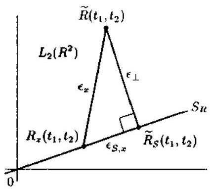

图 10.8.1 白相关函数模型 $\widetilde{R}\left( {{t}_{1},{t}_{2}}\right)$ 的正交分解与综合误差 ${\epsilon }_{x}$

由于 “正交” 误差分量 ${\epsilon }_{ \bot  } = \begin{Vmatrix}{\widetilde{R}}_{ \bot  }\end{Vmatrix}$ 与 $x\left( t\right)$ 无关，所以剩下的问题就是使误差分量 ${\epsilon }_{S, x} = \begin{Vmatrix}{{\widetilde{R}}_{S} - {R}_{x}}\end{Vmatrix}$ 极小化. 利用展开式 (10.8.11) 和式 (10.8.12), 可以在 “系数域” 将 ${\epsilon }_{S, x}$ 重新表示为式中 $\Gamma  = \left\lbrack  {\gamma }_{kl}\right\rbrack$ 为模型投影系数 ${\gamma }_{kl}$ 的矩阵.

容易验证,就一实值模型 $\widetilde{W}\left( {t, f}\right)$ 而言,“模型矩阵” $\Gamma$ 是 Hermitian 的. 另一方面,相关矩阵 ${R}_{\alpha }$ 是半正定的. 因此,式 (10.8.14) 即 ${\epsilon }_{x}^{2}$ 的极小 化问题等同于式 (10.8.15) 的极小化问题,即是说,如何用一个半正定的相关矩阵 ${R}_{\alpha }$ 去最优逼近 Hermitian “模型矩阵” $\Gamma$ . 下面的定理 ${}^{\left\lbrack  {40}\right\rbrack  }$ 给出了这个问题的解.

定理 10.8.1 (相关矩阵的最优化) 式 (10.8.15) 的极小化问题的解由

$$
{R}_{\lambda } = {\Gamma }_{ + } \tag{10.8.16}
$$

给出,其中 ${\Gamma }_{ + }$ 表示矩阵 $\Gamma$ 的正部分:

$$
{\Gamma }_{ + } = \mathop{\sum }\limits_{{k = 1}}^{{N}_{ + }}{\lambda }_{k}{v}_{k}{v}_{k}^{H} = V{\Lambda }_{ + }{V}^{H} \tag{10.8.17}
$$

这里 ${\lambda }_{k}$ 和 ${v}_{k}$ 分别是 Hermitian 矩阵 $\Gamma$ 的 (实值) 特征值和特征向量,且 ${N}_{ + }$ 为正特征值 ${\lambda }_{1} \geq  {\lambda }_{2} \geq  \cdots  \geq  {\lambda }_{N}$ 的个数, ${\Lambda }_{ + }$ 是对角特征值矩阵 (前 ${N}_{ + }$ 个对角元素为正特征值,其余元系等于零) 的正部分,并且 $V$ 是酉矩阵,其列为特征向量.

证明 式 (10.8.15) 的极小化变量为

$$
{R}_{\widehat{\alpha }} = \arg \mathop{\min }\limits_{{{R}_{\alpha } \geq  0}}{\begin{Vmatrix}\Gamma  - {R}_{\alpha }\end{Vmatrix}}_{F}^{2} \tag{10.8.18}
$$

其中 $\Gamma$ 为 Hermitian 矩阵, ${R}_{a}$ 被约束为半正定矩阵. 利用 ${R}_{a}$ 的谱表示式

$$
{R}_{a} = \mathop{\sum }\limits_{{k = 1}}^{N}{\rho }_{k}{r}_{k}{r}_{k}^{H}
$$

式中,特征值 ${\rho }_{k}$ 非负,特征向量 ${r}_{k}$ 正交. 式 (10.8.18) 中的平方误差范数可以写作

$$
{\begin{Vmatrix}\Gamma  - {R}_{a}\end{Vmatrix}}_{F}^{2} = \parallel \Gamma {\parallel }_{F}^{2} + {\begin{Vmatrix}{R}_{a}\end{Vmatrix}}_{F}^{2} - 2{\left\langle  \Gamma ,{R}_{a}\right\rangle  }_{F}
$$

$$
= \parallel \Gamma {\parallel }_{F}^{2} + {\begin{Vmatrix}\mathop{\sum }\limits_{{k = 1}}^{N}{\rho }_{k}{r}_{k}{r}_{k}^{H}\end{Vmatrix}}_{F}^{2} - 2\mathop{\sum }\limits_{{k = 1}}{\rho }_{k}{\left\langle  \Gamma ,{r}_{k}{r}_{k}^{H}\right\rangle  }_{F}
$$

$$
= \parallel F{\parallel }_{F}^{2} + \mathop{\sum }\limits_{{k = 1}}^{N}{\rho }_{k}^{2} - 2\mathop{\sum }\limits_{{k = 1}}^{N}{\rho }_{k}{r}_{k}^{H}F{r}_{k} \tag{10.8.19}
$$

其中

$$
\langle A, B{\rangle }_{F} = \mathop{\sum }\limits_{{i = 1}}^{N}\mathop{\sum }\limits_{{j = 1}}^{N}{A}_{ij}{B}_{ij}^{ * }
$$

首先,相对于特征向量 ${r}_{k}$ 最优化. 为此,必须在归一化约束条件 $\begin{Vmatrix}{r}_{k}\end{Vmatrix} = 1$ 或等价在 $1 - {\begin{Vmatrix}{r}_{k}\end{Vmatrix}}^{2} = 0$ 下使式 (10.8.19) 的最后一项极大化. 应用 Lagrange 乘数法,定义极大化目标函数

$$
{\sigma }_{r} = \mathop{\sum }\limits_{{k = 1}}^{N}{\rho }_{k}{r}_{k}^{H}\Gamma {r}_{k} + \mathop{\sum }\limits_{{k = 1}}^{N}{\mu }_{k}\left( {1 - {\begin{Vmatrix}{r}_{k}\end{Vmatrix}}^{2}}\right)
$$

由 $\partial {\sigma }_{r}/\partial {r}_{i} = 0$ 得到必要条件:

$$
\Gamma {r}_{i} = \frac{{\mu }_{i}}{{\rho }_{i}}{r}_{i}
$$

这就证明了, ${r}_{i}$ 必定是 $\Gamma$ 的特征向量. 记 $\Gamma$ 的特征向量为 ${v}_{k}$ ,则最优相关矩阵 ${R}_{\widehat{a}}$ 可以写作

$$
{R}_{\widehat{a}} = \mathop{\sum }\limits_{{k = 1}}{\rho }_{k}{v}_{k}{v}_{k}^{H} \tag{10.8.20}
$$

下面确定 ${R}_{A}$ 的最优特征值. 为此,由式 (10.8.17) 得到 $\Gamma$ 的谱表示式

$$
\Gamma  = \mathop{\sum }\limits_{{k = 1}}^{N}{\lambda }_{k}{v}_{k}{v}_{k}^{H} = {VA}{V}^{H} \tag{10.8.21}
$$

将式 (10.8.20) 和式 (10.8.21) 代入式 (10.8.18) 的误差项，并利用 $\Gamma$ 的特征向量 ${v}_{k}$ 的正交性、则有

$$
{\begin{Vmatrix}\Gamma  - {R}_{a}\end{Vmatrix}}_{F}^{2} = {\begin{Vmatrix}\mathop{\sum }\limits_{{k = 1}}^{N}\left( {\lambda }_{k} - {\rho }_{k}\right) {v}_{k}{v}_{k}^{H}\end{Vmatrix}}_{F}^{2} = \mathop{\sum }\limits_{{k = 1}}^{N}{\left( {\lambda }_{k} - {\rho }_{k}\right) }^{2} \tag{10.8.22}
$$

其中 ${\lambda }_{k}$ 是 $\Gamma$ 的 (实) 特征值. 误差式 (10.8.22) 必须在表示 ${R}_{\mathrm{d}}$ 的半正定性的约束条件 ${\rho }_{k} \geq  0$ 之下极小化. 显然,极小化问题的解为

$$
{\rho }_{k} = \left\{  \begin{array}{ll} {\lambda }_{k}, & \text{ 若 }1 \leq  k \leq  {N}_{ + } \\  0, & \text{ 若 }{N}_{ + } + 1 \leq  k \leq  N \end{array}\right. \tag{10.8.23}
$$

其中 ${N}_{ + }$ 是正特征值 ${\lambda }_{k}$ 的个数 (业已假定特征值 ${\lambda }_{k}$ 已排列为 ${\lambda }_{k} > 0$ ,其中 $1 \leq  k \leq  {N}_{ + }$ ). 利用式 (10.8.23),最后可求得最优化相关矩阵 ${R}_{\widehat{a}}$ 为

$$
{R}_{\widehat{a}} = \mathop{\sum }\limits_{{k = 1}}^{{N}_{ + }}{\lambda }_{k}{v}_{k}{v}_{k}^{H} = {\Gamma }_{ + }
$$

它称为 $\Gamma$ 的正部分.

#### 10.8.3 时频综合算法

前面已证明,子空间约束综合问题 (10.8.5) 式的解 $\widehat{x}\left( t\right)  \in  S$ 由

$$
\widehat{x}\left( t\right)  = \mathop{\sum }\limits_{{k = 1}}^{N}{\widehat{a}}_{k}{s}_{k}\left( t\right)  = {\widehat{a}}^{T}s\left( t\right) \tag{10.8.24}
$$

决定,其中 $s\left( t\right)$ 为约束子空间 $S$ 的一任意正交基. 最优系数 $\widehat{a}$ 的相关矩阵 ${R}_{\widehat{a}}$ 可以构造如下 ${}^{\left\lbrack  {40}\right\rbrack  }$ .

算法 10.8.1 (最优相关矩阵计算)

1) 利用式 (10.8.7) 和时频模型 $\widetilde{W}\left( {t, f}\right)$ 计算自相关函数模型 $\widetilde{R}\left( {{t}_{1},{t}_{2}}\right)$ .

2) 应用式 (10.8.11) 计算模型的投影系数矩阵 $\Gamma  = \left\lbrack  {\gamma }_{kl}\right\rbrack$ .

3) 进行 $\Gamma$ 的特征值分解,并确定其 ${N}_{ + }$ 个正的特征值及相应的特征向量 ${v}_{k}(k = \; \left. {1,\cdots ,{N}_{ + }}\right)$ .

4) 用式 (10.8.17) 计算 ${\Gamma }_{ + }$ 的正部分 (即由 $\Gamma$ 的正特征值及相应特征向量组成的部分),最优相关矩阵取 ${R}_{\widehat{a}} = {\Gamma }_{ + }$ .

从式 (10.8.24) 可以看出,产生过程 $\widehat{x}\left( t\right)$ 的问题简化成了产生 $N$ 个随机变量 ${\widehat{a}}_{k}$ 的问题. 算法 10.8.1 计算这些随机变量的相关矩阵 ${R}_{\widehat{a}}$ . 如式 (10.8.9) 所示,我们可以得到过程 $\widehat{x}\left( t\right)$ 的自相关函数. 为了使 $\widehat{x}\left( t\right)$ 是唯一确定的,我们还必须规定 $\widehat{x}\left( t\right)$ 的其它特征量, 如均值与概率密度函数. 在 10.8.4 小节, 我们将具体讨论这一问题, 即对一个已求得的系数相关矩阵 ${R}_{\widehat{a}}$ ,如何产生 $\widehat{x}\left( t\right)$ 的实现?

分析一下综合结果的能量和残差是有用的. 利用式 (10.8.16) 与式 (10.8.17) 容易证明, $\widehat{x}\left( t\right)$ 的平均能量

$$
{\bar{E}}_{\widehat{x}} = {\int }_{t}{R}_{x}\left( {t, t}\right) \mathrm{d}t
$$

由系数相关矩阵的迹决定,而该迹等于 $\Gamma$ 的正特征值之和,即

$$
{\bar{E}}_{\widehat{x}} = \mathop{\sum }\limits_{{k = 1}}^{N}E\left\{  {\left| {\bar{a}}_{k}\right| }^{2}\right\}   = \operatorname{trace}\left( {R}_{\widehat{\alpha }}\right)  = \operatorname{trace}\left( {\Gamma }_{ + }\right)  = \mathop{\sum }\limits_{{k = 1}}^{{N}_{ + }}{\lambda }_{k}
$$

可以看出,当且仅当正特征值 ${\lambda }_{k}$ 之和有限大时, ${\bar{E}}_{\widehat{x}}$ 才有限. 特别地,对于一个有限维的信号子空间 $S$ ,综合结果的能量 ${\bar{E}}_{\widehat{x}}$ 总是有限大的,因为 ${N}_{ + } \leq  N < \infty$ .

下面考虑综合残差. 由式 (10.8.14),(最小) 综合残差的平方为 ${\epsilon }_{x,\min }^{2} = {\epsilon }_{S, x}^{2} + {\epsilon }_{ \bot  }^{2}$ . “正交”误差分量 ${\epsilon }_{ \bot  } = \begin{Vmatrix}{\widetilde{R}}_{ \bot  }\end{Vmatrix}$ 为零,当且仅当自相关函数 $\widetilde{R}\left( {{t}_{1},{t}_{2}}\right)$ 属于诱导的自相关函数域子空间 ${S}_{R}$ . 这种情况很少发生,除非对无约束的综合 (也叫全局综合) 情况. 至于误差分量 ${\epsilon }_{S, F}$ ，由式 (10.8.15) $\sim  \left( {10.8.17}\right)$ 及酉矩阵 $V$ 的性质可得

$$
{\epsilon }_{S, x}^{2} = {\begin{Vmatrix}\Gamma  - {\Gamma }_{ + }\end{Vmatrix}}_{F}^{2} = {\begin{Vmatrix}V\left( A - {A}_{ + }\right) {V}^{H}\end{Vmatrix}}_{F}^{2}.
$$

$$
= {\begin{Vmatrix}A - {A}_{ + }\end{Vmatrix}}_{F}^{2} = \mathop{\sum }\limits_{{k = {N}_{ + } + 1}}^{N}{\lambda }_{k}^{2} \tag{10.8.25}
$$

其中 $\Gamma$ 的谱表示式如式 (10.8.21) 所示. 式 (10.8.25) 表明， ${t}_{S, r}^{2}$ 可视为矩阵 $\Gamma$ 的所有负特征值的平方和. 因此，误差分量 ${\epsilon }_{S, r}$ 等于零，当且仅当矩阵 $\Gamma$ 半正定，即 $\Gamma  = {\Gamma }_{\tau }$ . 就是说， $\Gamma$ 的半正定性可以看作是投影自相关函数模型 ${\widetilde{R}}_{S}\left( {{t}_{1},{t}_{2}}\right)$ 为真自相关函数，即 $\widetilde{R}\left( {{t}_{1},{t}_{2}}\right)  = {R}_{\widehat{x}}\left( {{t}_{1},{t}_{2}}\right)$ 的充分必要条件. 注意， $\widetilde{R}\left( {{t}_{1},{t}_{2}}\right)$ 的这种 “真实性” (对任意子空间 $S$ ) 将总是满足, 如果原时频模型是一个真 WV 谱.

“随机” 综合问题 (10.8.5) 式与 “确定性” 信号综合问题 (10.8.6) 式密切相关. 对后一问题的解是 ${}^{\lbrack {34}\rbrack }$

$$
\widehat{x}\left( t\right)  = \mathop{\sum }\limits_{{k = 1}}^{N}{\widehat{a}}_{k}{s}_{k}\left( t\right)  = {\widehat{a}}^{T}s\left( t\right)
$$

(确定性)系数向量 $\widehat{a}$ 为

$$
\widehat{a} = \sqrt{{\lambda }_{1}}{v}_{1} \tag{10.8.26}
$$

其中 ${\lambda }_{1}$ 是 $\Gamma$ 的最大特征值 $\left( {\lambda }_{1}\right.$ 假定是非负的), ${v}_{1}$ 是对应的正交特征向量. 因此,确定性综合问题可以视为随机综合问题的一种特殊情况: 若欲被综合的过程 $\mathbf{x}\left( t\right)$ 限定为确定性过程,则系数相关矩阵 ${R}_{a} = E\left\{  {a{a}^{H}}\right\}$ 等于并向量积 $a{a}^{H}$ ,而且式 (10.8.15) 的极小化简化为 ${\begin{Vmatrix}\Gamma  - a{a}^{H}\end{Vmatrix}}_{F}^{2}$ 相对于向量 $a$ 的极小化,即简化为用并向量积 $a{a}^{H}$ (秩 1 矩阵) 最优逼近 $\Gamma$ 的问题. 这个问题的解由 $\widehat{a}{\widehat{a}}^{H} = {\lambda }_{1}{v}_{1}{v}_{1}^{H}$ 决定,或等价为式 (10.8.26). 随机与确定性综合问题的解之间的主要区别是: 前者涉及 $\Gamma$ 的所有特征值和对应的特征向量,而后者只涉及最大的正特征值和与之对应的特征向量.

#### 10.8.4 Karhunen-Loeve 展开

前面已用约束子空间 $S$ 的任意正交基 $s\left( t\right)$ 表示子空间约束综合问题 (10.8.5) 式. 下面证明,若使用 $S$ 的一特殊模型相关基,则 $\widehat{x}\left( t\right)$ 变得特别简单. 这相当于系数相关矩阵 ${R}_{n}$ 的对角化,并将得到 $\widehat{x}\left( t\right)$ 的 Kathunen-Loeve 展开式. 这一新公式的实际优点是, $\widehat{x}\left( t\right)$ 的产生简化为不相关随机变量的产生.

定义 10.8.1 (Karhunen-Loeve 展开) ${}^{\left\lbrack  {41}\right\rbrack  }$ 若过程 $x\left( t\right)$ 展开为级数:

$$
\widehat{x}\left( t\right)  = \mathop{\sum }\limits_{{k = 1}}^{\infty }{c}_{k}{\phi }_{k}\left( t\right) ,\;0 < t < N \tag{10.8.27}
$$

式中 ${\phi }_{k}\left( t\right)$ 是区间 $\left( {0, N}\right)$ 上的标准正交函数集,并且 ${\phi }_{k}\left( t\right)$ 满足积分方程:

$$
{\int }_{{t}_{2}}{R}_{x}\left( {{t}_{1},{t}_{2}}\right) {\phi }_{k}\left( {t}_{2}\right) \mathrm{d}{t}_{2} = {\lambda }_{k}{\phi }_{k}\left( {t}_{1}\right) \tag{10.8.28}
$$

其中， ${R}_{x}\left( {{t}_{1},{t}_{2}}\right)$ 是 $x\left( t\right)$ 的自相关函数，则称式 (10.8.27) 为过程 $x\left( t\right)$ 的 Karhunen-Lovev 展开，简称 KL 展开. 另称 ${\phi }_{k}\left( {t}_{1}\right)$ 是由核 ${R}_{\dot{x}}\left( {{t}_{1},{t}_{2}}\right)$ 定义的积分算子的特征函数.

给定一个基 $s\left( t\right)$ ,令新基 $u\left( t\right)$ 是利用酉变换

$$
u\left( t\right)  = {V}^{T}s\left( t\right) \tag{10.8.29}
$$

产生的,其中 $V$ 是模型的投影系数矩阵 $\Gamma$ 的特征向量矩阵. 和 $s\left( t\right)$ 一样, $u\left( t\right)$ 也是 $S$ 的一正交基. 因此，利用式 (10.8.29) 与式 (10.8.24), $\widehat{x}\left( t\right)$ 可以展开为

$$
\widehat{x}\left( t\right)  = \mathop{\sum }\limits_{{k = 1}}^{N}{\widehat{c}}_{k}{u}_{k}\left( t\right)  = {\widehat{c}}^{T}u\left( t\right) \tag{10.8.30}
$$

其中

$$
\widehat{c} = {V}^{H}\widehat{a} \tag{10.8.31}
$$

由式 (10.8.31) 和式 (10.8.16) $\sim  \left( {10.8.17}\right)$ ,变换后的系数向量 $\widehat{c}$ 的相关矩阵即是 $\Gamma$ 的特征值矩阵的正部分, 即

$$
{R}_{c} = {V}^{H}{R}_{a}V = {V}^{H}{\Gamma }_{ + }V = {\Lambda }_{ + }
$$

这意味着相关矩阵 ${R}_{\widehat{c}}$ 是对角矩阵,即系数 ${\widehat{c}}_{k}$ 是正交的:

$$
{R}_{\widehat{c}}\left( {k, l}\right)  = E\left\{  {{\widehat{c}}_{k}{\widehat{c}}_{l}^{ * }}\right\}   = 0,\;k \neq  l \tag{10.8.32}
$$

$$
{R}_{\widehat{c}}\left( {k, k}\right)  = E\left\{  {\left| {\widehat{c}}_{k}\right| }^{2}\right\}   = \left\{  \begin{array}{ll} {\lambda }_{k}, & 1 \leq  k \leq  {N}_{ + } \\  0, & {N}_{ + } + 1 \leq  k \leq  N \end{array}\right. \tag{10.8.33}
$$

由于 $E\left\{  {\left| {\widehat{c}}_{k}\right| }^{2}\right\}   = 0,{N}_{ + } \leq  k \leq  N$ ,所以展开式 (10.8.30) 可以写作

$$
\widehat{x}\left( t\right)  = \mathop{\sum }\limits_{{k = 1}}^{{N}_{ + }}{\widehat{c}}_{k}{u}_{k}\left( t\right) \tag{10.8.34}
$$

这就证明了, $\widehat{x}\left( t\right)$ 的有限阶数为 ${N}_{ + }\left( \Gamma \right.$ 的正特征值个数). 注意, ${N}_{ + }$ 可小于子空间维数 $N$ .

利用 $\widehat{x}\left( t\right)  = {\widehat{c}}^{T}u\left( t\right)$ 和 ${R}_{\widehat{c}} = {\Lambda }_{ + }$ ,我们可以得到 $\widehat{x}\left( t\right)$ 的自相关函数 (参见式 (10.8.9)) 为

$$
{R}_{\dot{x}}\left( {{t}_{1},{t}_{2}}\right)  = {u}^{H}\left( {t}_{2}\right) {R}_{\dot{c}}^{T}u\left( {t}_{1}\right)  = {u}^{H}\left( {t}_{2}\right) {\Lambda }_{ + }u\left( {t}_{1}\right)
$$

$$
= \mathop{\sum }\limits_{{k = 1}}^{{N}_{ + }}{\lambda }_{k}{u}_{k}\left( {t}_{1}\right) {u}_{k}^{ * }\left( {t}_{2}\right) \tag{10.8.35}
$$

这就是自相关函数 ${R}_{\widehat{x}}\left( {{t}_{1},{t}_{2}}\right)$ 的谱表示 (或特征值分解),由此可以得出结论: 前 ${N}_{ + }$ 个基信号 ${u}_{k}\left( t\right)$ 是由核 ${R}_{\widetilde{x}}\left( {{t}_{1},{t}_{2}}\right)$ 定义的积分算子的特征函数:

$$
{\int }_{{t}_{2}}{R}_{\widehat{x}}\left( {{t}_{1},{t}_{2}}\right) {u}_{k}\left( {t}_{2}\right) \mathrm{d}{t}_{2} = {\lambda }_{k}{u}_{k}\left( {t}_{1}\right) ,\;1 \leq  k \leq  {N}_{ + } \tag{10.8.36}
$$

这表明,式 (10.8.34) 是 $\widehat{x}\left( t\right)$ 的 KL 展开式. 注意, KL 展开是展开系数正交情况下利用正交基信号所能够得到的唯一展开.

虽然前面推导了 $\widehat{x}\left( t\right)$ 的自相关函数，但尚未讨论 $\widehat{x}\left( t\right)$ 的实际产生. 下面将会看到，KL 展开式 (10.8.34) 对产生 $\widehat{x}\left( t\right)$ 是特别有用的.

出式 (10.8.34) 及式 (10.8.36) 易见, $\widehat{x}\left( t\right)$ 的产生简化为 ${N}_{ + }$ 个正交随机变量 ${\widehat{c}}_{k}$ 的产生,这些随机变量具有已知的二次均值 $E\left\{  {\left| {\widehat{c}}_{k}\right| }^{2}\right\}   = {\lambda }_{k}$ . (线性) 均值 $E\left\{  {\widehat{c}}_{k}\right\}$ 可以任意选择, 但需要服从约束条件: 使 $\widehat{x}\left( t\right)$ 的均值与自相关函数 ${R}_{\widehat{x}}\left( {{t}_{1},{t}_{2}}\right)$ 一致. 利用 KL 展开,不难得到这一约束,因为 KL 展开诱导出 $\widehat{x}\left( t\right)$ 的均值的一类似展开:

$$
{m}_{\widehat{x}}\left( t\right)  = E\{ \widehat{x}\left( t\right) \}  = \mathop{\sum }\limits_{{k = 1}}^{{N}_{ + }}{m}_{\widehat{c}}\left( k\right) {u}_{k}\left( t\right) \tag{10.8.37}
$$

其中 ${m}_{\widehat{c}}\left( k\right)  = E\left\{  {\widehat{c}}_{k}\right\}   = \left\langle  {{m}_{\widehat{x}},{u}_{k}}\right\rangle$ . 由式 (10.8.37) 可知, ${m}_{\widehat{x}}\left( t\right)$ 本身是 $S$ 的一元. ${m}_{\widehat{x}}\left( t\right)$ 与 ${R}_{\widehat{x}}\left( {{t}_{1},{t}_{2}}\right)$ 的一致性的定义要求自相关函数

$$
{C}_{\widehat{x}}\left( {{t}_{1},{t}_{2}}\right)  = E\left\{  {\left\lbrack  {\widehat{x}\left( {t}_{1}\right)  - {m}_{\widehat{x}}\left( {t}_{1}\right) }\right\rbrack  \left\lbrack  {\widehat{x}\left( {t}_{2}\right)  - {m}_{\widehat{x}}{\left( {t}_{2}\right) }^{ * }}\right\rbrack  }\right\}
$$

$$
= {R}_{\widehat{x}}\left( {{t}_{1},{t}_{2}}\right)  - {m}_{\widehat{x}}\left( {t}_{1}\right) {m}_{\widehat{x}}^{ * }\left( {t}_{2}\right) \tag{10.8.38}
$$

是半正定函数. 可以证明 ${}^{\left\lbrack  {40}\right\rbrack  }$ ,一致性的充分必要条件是

$$
\mathop{\sum }\limits_{{k = 1}}^{{N}_{ + }}\frac{{\left| {m}_{\widehat{c}}\left( k\right) \right| }^{2}}{{\lambda }_{k}} \leq  1 \tag{10.8.39}
$$

式 (10.8.30) 肯定满足的一种平凡但却特别重要的情况是零均值过程,即 ${m}_{\dot{x}}\left( t\right)  \equiv  0$ 或等价为 ${m}_{\dot{x}}\left( k\right)  = 0$ . 在这种情况下,系数 ${\widehat{c}}_{k}$ 除了正交外,还是彼此不相关的. 在任何其它情况下,都可以写出 ${\widehat{c}}_{k} = {\bar{c}}_{k} + {m}_{\widehat{c}}\left( k\right)$ ,其中 ${m}_{\widehat{c}}\left( k\right)$ 是希望的均值. 因此,在任何一种情况下，过程 $\widehat{x}\left( t\right)$ 的产生都简化为 ${N}_{ + }$ 个零均值的、具有所规定方差的不相关随机变量的产生.

上面介绍的过程综合是 “二阶” 的，因为过程 $\widehat{x}\left( t\right)$ 是由它的自相关函数与均值描述的,但对概率密度函数未作规定. 在许多情况下,我们对高斯过程感兴趣. $\widehat{x}\left( t\right)$ 的高斯性容易得到. 如果系数 ${\widehat{c}}_{k}$ 是高斯随机变量. 对其它概率密度函数,这样一种对应关系不能给出.

#### 10.8.5 无基综合方法

利用 KL 展开形式 (10.8.34) 导出的综合结果 $\widehat{x}\left( t\right)$ 仍然是以约束信号子空间 $S$ 的一初始 (任意) 正交基 $s\left( t\right)$ 为基础的. 虽然这种方法计算上可能很有效 (尤其当子空间 $S$ 的维数小时更有效), 但是从理论的角度, 一种 “无基” 的 KL 展开显然令我们感兴趣, 因为它能够提供 KL 基 $u\left( t\right)$ 的有用性质.

由式 (10.8.12), 投影的自相关函数模型可以表示为

$$
{\widetilde{R}}_{S}\left( {{t}_{1},{t}_{2}}\right)  = \mathop{\sum }\limits_{{k = 1}}^{N}\mathop{\sum }\limits_{{l = 1}}^{N}{\gamma }_{kl}{s}_{k}\left( {t}_{1}\right) {s}_{l}^{ * }\left( {t}_{2}\right)
$$

$$
= {s}^{H}\left( {t}_{2}\right) {\Gamma }^{T}s\left( {t}_{1}\right)  = {s}^{H}\left( {t}_{2}\right) {\left( V\Lambda {V}^{H}\right) }^{T}s\left( {t}_{1}\right)
$$

$$
= {u}^{H}\left( {t}_{2}\right) {\Lambda u}\left( {t}_{1}\right)  = \mathop{\sum }\limits_{{k = 1}}^{H}{\lambda }_{k}{u}_{k}\left( {t}_{1}\right) {u}_{k}^{ * }\left( {t}_{2}\right) \tag{10.8.40}
$$

这里使用了式 (10.8.21) 和式 (10.8.29). 注意，式 (10.8.40) 与 ${R}_{\dot{x}}\left( {{t}_{1},{t}_{2}}\right)$ 的表达式 (10.8.35) 类似. 唯一的不同是, ${\widetilde{R}}_{S}\left( {{t}_{1},{t}_{2}}\right)$ 一般还含有负的特征值. 由式 (10.8.40) 知

$$
{\int }_{{t}_{2}}{\widetilde{R}}_{S}\left( {{t}_{1},{t}_{2}}\right) {u}_{k}\left( {t}_{2}\right) \mathrm{d}{t}_{2} = {\lambda }_{k}{u}_{k}\left( {t}_{1}\right) ,\;1 \leq  k \leq  N \tag{10.8.41}
$$

它与式 (10.8.36) 类似,二者的唯一不同是,式 (10.8.41) 中可能有负的特征值 ${\lambda }_{k}$ .

综上所述,可以得出结论: 矩阵 $\Gamma$ 的特征值 ${\lambda }_{k}$ 和 KL 基信号 ${u}_{k}\left( t\right)$ 分别等于由核函数 ${\widetilde{R}}_{S}\left( {{t}_{1},{t}_{2}}\right)$ 定义的积分算子的特征值和特征向量.

假定约束子空间 $S$ 的正交基 $s\left( t\right)$ 不能利用，则 $S$ 可代之于使用其正交投影算子 ${P}_{S}$ 描述,其中,投影算子的核函数为 ${P}_{S}{\left( t,{t}^{\prime }\right) }^{\left\lbrack  {26.39}\right\rbrack  }$ . 于是,可以证明 ${}^{\left\lbrack  {42}\right\rbrack  }$ ,在诱导的自相关函数域子空间 ${S}_{R}$ 上的正交投影算子 ${P}_{{S}_{R}}$ 可以由原来的自相关函数模型 $\widetilde{R}\left( {{t}_{1},{t}_{2}}\right)$ 得到

$$
\widetilde{R}\left( {{t}_{1}.{t}_{2}}\right)  = {\int }_{{t}_{1}^{\prime }}{\int }_{{t}_{2}^{\prime }}{P}_{{S}_{R}}\left( {{t}_{1},{t}_{2};{t}_{1}^{\prime },{t}_{2}^{\prime }}\right) \widetilde{R}\left( {{t}_{1}^{\prime },{t}_{2}^{\prime }}\right) \mathrm{d}{t}_{1}^{\prime }\mathrm{d}{t}_{2}^{\prime }
$$

$$
= {\int }_{{t}_{1}^{\prime }}{\int }_{{t}_{2}^{\prime }}{P}_{S}\left( {{t}_{1},{t}_{1}^{\prime }}\right) {P}_{S}^{ * }\left( {{t}_{2},{t}_{2}^{\prime }}\right) \widetilde{R}\left( {{t}_{1}^{\prime },{t}_{2}^{\prime }}\right) \mathrm{d}{t}_{1}^{\prime }\mathrm{d}{t}_{2}^{\prime } \tag{10.8.42}
$$

现在，”无基”综合算法可以归纳如下 ${}^{\left\lbrack  {40}\right\rbrack  }$ .

算法 10.8.2 (无基综合算法)

1) 利用式 (10.8.7) 将时频模型 $\widetilde{W}\left( {{t}_{1},{t}_{2}}\right)$ 变换到自相关函数域.

2) 利用式 (10.8.42) 计算投影自相关函数模型 ${\widetilde{R}}_{S}\left( {{t}_{1},{t}_{2}}\right)$ .

3) 通过解特征值问题 (10.8.41) 求 $\widetilde{R}\left( {{t}_{1}{t}_{2}}\right)$ 的正特征值 ${\lambda }_{k}$ 和对应的归一化特征函数 ${u}_{k}\left( t\right)$ ,其中 $k = 1,\cdots ,{N}_{ + }$ .

4) 综合结果 $\widehat{x}\left( t\right)$ 由式 (10.8.34) 给出,其中 ${\widehat{c}}_{k}$ 的统计量由式 (10.8.32),(10.8.33) 和 (10.8.39) 描述.

全局综合即没有子空间约束的综合可以看作是具有 $S \in  {L}_{2}\left( R\right)$ 的子空间约束综合. 此时,计算比较费时的投影步骤 (10.8.42) 可以省略. 由于时频模型 $\widetilde{W}\left( {t, f}\right)$ 假定是平方可积分的,即 $\widetilde{W}\left( {t, f}\right)  \in  {L}_{2}\left( {R}^{2}\right)$ ,所以自相关函数模型 $\widetilde{R}\left( {{t}_{1},{t}_{2}}\right)$ 也是平方可积分的,即 $\widetilde{R}\left( {{t}_{1},{t}_{2}}\right)  \in  {L}_{2}\left( {R}^{2}\right)$ . 然而,可以证明 ${L}_{2}\left( {R}^{2}\right)$ 是具有 $S = {L}_{2}\left( R\right)$ 的诱导自相关函数域空间,即存在 ${S}_{R} = {L}_{2}\left( {R}^{2}\right)$ . 因此,有 $\widetilde{R}\left( {{t}_{1},{t}_{2}}\right)  \in  {S}_{R}$ ,进而得到 ${\widetilde{R}}_{S}\left( {{t}_{1},{t}_{2}}\right)  = \widetilde{R}\left( {{t}_{1},{t}_{2}}\right)$ .

前几小节推导的时频综合算法在数字计算机上实现时, 必须将时频综合问题离散化. 对离散时间的时频综合算法感兴趣的读者可进一步参考文献 [40].

## 参考文献

[1] B. Noble and J. W. Daniel, Applied Linear Algebra (2nd ed.), Englewood Cliffs: Prentice-Hall, 1977.

[2] V. F. Pisarenko, The retrieval of harmonics from a covariance fuction, Geophys. J. Roy. Astron. Soc., Vol.33, 247~266, 1973.

[3] R. O. Schmidt, Multiple emitter locstion snd signal parameter estimation, IEEE Trans. Antennas Propagat., Vol.34, 276~280, 1986.

[4] T. J. Shan, M. Wax and T. Kailath, On spatial smoothing for direction-of-arrival estimation of coherent signals, IEEE Trans. Acoust., Speech, Signal Processing, Vol.33, 806~811, 1985.

[5] S. L. Marple, Digital Spectral Analysis with Applications, Englewood Cliffs: Prentice-Hall, 1987.

[6] V. T. Ermolaev and A. B. Gershman, Fast algorithm for minimum-norm direction-of-arrival estimation, IEEE Trans. Signal Processing, Vol.42, 2389-2394, 1994.

[7] 张贤达，现代信号处理，北京:清华大学出版社，1995.

[8] T. W. Anderson, Asymptotic theory for principal component analysis, Ann Math. Stat., Vol.34, 122~148, 1963.

[9] D. N. Lawley, Test of significance of the latent roots of the covariance and correlation matrices, Biometrica, Vol.43. 128~136, 1956.

[10] G. II. Golub and C. F. Van Loan, Matrix Computations, Baltimore: The Johns Hopkins Univ. Press, 1989.

[1] N. Mohanty, Random Signals: Estimation and Identification, New York: Van Nostrand, 1986.

[12] R. Kumaresan and D. W. Tufts, Estimating the angles of arrival of multiple plane wavs, IEEE Trans. Aerosp. Electron. Syst., Vol.19, 134~139, 1983.

[13] U. Nickel, Algabratic formulation of Kumaresan-Tufts superresolution method, showing relation to ME and MUSIC methods, Proc. IEE, Pt.F, Vol.135, 7~10, 1986.

[14] H. Clergeot, S. Tressens and A. Ouamri, Performance of high resolution frequencies estimation methods compared to the Cramer-Rao bounds, IEEE Trans. Acoust., Speech, Signal Processing, Vol.37, 1703~1720, 1989.

[15] V. T. Ermolaev and A. B. Gershman, Fast algorithm for minimum-norm direction-of-arrival estimation, IEEE Trans. Signal Processing, Vol.42, 2389~2394, 1994.

[16] K. Sharman and T. S. Durrani, A comparative study of modern eigenstructure methods for bearing estimation $- \mathrm{A}$ new high performance approach, In: Proc. IEEE ICASSP-87, Greece: Athens, 1737~1742, 1987.

[17] P. Stoica and A. Nehorai, MUSIC, maximum likelihood, and Cramer-Rao bound, IEEE Trans. Acoust., Speech, Signal Processing, Vol.37, 720~741, 1989.

[18] R. Roy. A. Paulraj and T. Kailath, ESPRIT - A subspace rotation approach to estimation of parameters of cisoids in noise, IEEE Trans. Acoust., Speech, Signal Processing, Vol.34, ${1340} \sim  {1342},{1986}$ .

[19] R. Roy and T. Kailath, ESPRIT---- Estimation of signal parameters via rotational invariance techniques, IEEE Trans. Acoust., Speech, Signal Processing, Vol.37, 984~995, 1989.

[20] Q. Wu and K. M. Wong, UN-MUSIC and UN-CLE: An application of generalized correlation analysis to the estimation of the direction of arrival of signals in unknown correlated noise, IEEE Trans. Signal Processing, Vol.42, 2331~2343, 1994.

[21] M. G. Kendall and A. Stuart, The Advanced Theory of Statistics, Vol.2, London: Griffin, 1966.

[22] D. R. Brillinger, Time Series Data Analysis and Theory. San Francisco: Holden Day, 1981.

[23] R. J. Muirhead, Aspects of Multivariate Statistical Theory, New York: Wiley, 1982.

[24] T. W. Anderson, An Introduction to Multivariate Statistical Analysis, New York: Wiley, 1984.

[25] D. Tyler, Asymptotic inference of eigenvectors, Ann. Stat., Vol.9, 725~736, 1981.

[26] I. E. Franks, Signal Theory (rev. ed.), Dowden and Culver, 1981.

[27] K. M. Wong, Q. Wu and P. Stoica, Application of generalized correlation decomposition to array processing in unknown noise environments. In: Advances in Spectrum Estimation and Array Processing (Ed. S. Haykin), Englewood Cliffs: Prentice-Hall, Vol.III, 1994.

[28] A. Graham, Kronecker Products and Matrix Calculus with Applications. New York: Wiley, 1981.

[29] M. Viberg and B. Ottersten. Sensor array processing based on subspace fitting, IEEE Trans. Signal Processing, Vol.39, 1110~1121, 1991.

[30] W. Martin and P. Flandrin, Wigner-Ville spectral analysis of nonstationary processes, IEEE Trans. Acoust., Speech, Signal Processing, Vol.33, 1461~1470, 1985.

[31] S. P. Applehaum, Adaptive arrays, IEEE Trans. Antenn. Propagat., Vol.24, 585~598, 1976.

[32] F. Hlawatsch and W. Kozek, Time-frequency projection filters and time-frequency signal expansions, IEEE Trans. Signal Processing, Vol.42, 3321~3334, 1994.

[33] G. F. Boudreaux-Bartels and T. W. Parks, Time-varying filtering and signal estimation using Wigner distribution synthesis techniques. IEEE Trans. Acoust., Speech, Signal Processing. Vol.3-1, 442~451, 1986.

[34] F. Hlawatsch and W. Krattenthaler, Bilinear signal synthesis, IEEE Trans. Signal Processing, Vol.40, 352~363, 1992.

[35] G. F. Boudreaux-Bartels, Time-varying signal processing using Wigner distribution synthesis techniques, In: The Wigner Distribution - Theory and Applications in Signal Processing (Ed. W. Mocklenbrauker), The Netherlands: Elsevier, 1995.

[36] A. J. E. M. Janssen, Wigner weight functions and Weyl symbols of non-negative definite linear operators, Philips J. Res., Vol.44, 7~42, 1989.

[37] W. Kozek, Time-frequency signal processing based on the Wigner-Weyl framework, Signal Processing, Vol.29, 77~92, 1992.

[38] R. G. Shenoy and T. W. Parks, The Weyl correspondence and time-frequency analysis, IEEE Trans. Signal Processing, Vol.42, 318~332, 1994.

[39] A. W. Naylor and G. R. Sell, Linear Operator Theory in Engineering and Science, New York: Springer-Verlag, 1982.

[40] F. Hlawatsch and W. Kozek, Second-order time-frequency synthesis of nonstationary random processes, IEEE Trans. Inform. Theory, Vol.41, 235~266, 1995.

[11] A. Papoulis. Probability, Random Variables, and Stochastic Processes, New York: McGraw-Hill, 1984.

[42] F. Illawatsch. Regularity and unitarity of bilinear time-frequency signal representations, IEEE Trans. Information Theory, Vol.38, 82~94, 1992.

[43] X. D. Zhang (张贤达) and Y. C. Liang, Prefiltering-based ESPRIT for estimating parameters of sinusoids in non-Gaussian ARMA noise, IEEE Trans. Signal Processing, Vol.43, 349~353, 1995.

[44] M. Zoltowski, Novel techniques for the estimation of array signal parameters based on matrix pencil, subspace rotations, and total least squares, In: Proc. IEEF ICASSP-88, 2861~2864, 1986.

[45] M. Zoltowski and D. Stavrinides, Sensor array signal processing via a Procrustes rotation based eigen-analysis of the ESPRIT data pencil, IEEE Trans. Acoust., Speech, Signal Processing, Vol.37, 832~851, 1989.

[46] Y. Hua and T. K. Sarkar, Matrix pencil method for estimating parameters of exponentially damped/undamped sinusoids in noise, IEEE Trans. Acoust., Speech, Signal Processing, Vol.38, 814~824, 1990.

[47] M. Viberg and B. Ottersten, Sensor array processing based on subspace fitting, IEEE Trans. Signal Processing, Vol.39, 1110~1121, 1991.

[48] M. Viberg, P. Stoica and B. Ottersten, Array processing in correlated noise fields based on instrumental variables and subspace litting, IEEE Trans. Signal Processing, Vol.43, 1187~1199, 1995.

[49] G. Golub and V. Pereyra. The differentiation of pseudoinverses and nonlinear least squares problems whose variables separate, SIAM J. Numer. Anal., Vol.10, 413~432, 1973.

[50] J. F. Böhme, Estination of source parameters by maximum likelihood and nonlinear regression, In: Proc. IEEE ICASSP'84, 7.3.1~7.3.4, 1984.

[51] J. A. Cadzow, A high resolution direction-of-arrival algorithm for 11 arrow-band coherent and incoherent sources, IEEE Trans. Acoust., Speech, Signal Processing, Vol.36, 965~979, 1988.

[52] P. Stoica and K. C. Sharman, Maximum likelihood methods for direction-of-arrival estimation, IEEE Trans. Acoust., Speech, Signal Processing, Vol.38, 1132~1143, 1990.

[53] J. L. Yu and C. C. Ych. Generalized eigenspace-based beamformer, IEEE Trans. Signal Processing, Vol.43, 2453~2461, 1995.

[54] C. Van Loan, Matrix computations and signal processing, In: Selected Topics in Signal Processing (Ed. S. Haykin), Englewood Cliffs: Prentice-Hall, 1989.

## 第十一章 子空间跟踪与更新

上一章介绍了特征值分解以及特征子空间方法在信号处理和系统理论中的应用. 使用的方法都是所谓的批处理方法, 即在所有观测数据一齐获得后进行一次性处理. 显然, 批处理方法只适用于参数或统计特性不随时间变化的 (时不变) 系统和信号. 然而, 有一大类信号, 它们的统计特性是随时间变化的, 这类信号统称为时变或非平稳信号. 例如, 待估计的角度或频率可能是由正在移动的窄带信号源产生的. 如果要想对非平稳信号应用特征子空间方法，就必须要有当观测信号以采样速率增加时，能够对时变的数据或协方差矩阵的奇异值分解或特征值分解进行更新的方法. 这正是本章的讨论焦点.

### 11.1 引言

对一个极端 (最大或最小) 特征对 (特征值与特征向量) 进行迭代计算最早可以追溯到 1966年[1] 时隔十几年后, Thompson 于 1980 年提出了估计与样本协方差矩阵最小特征值相对应的特征向量的最小均方(LMS)型白适应方法, 并结合 Pisarenko 谱估计子提供了角度/频率的 (自适应)跟踪算法 ${}^{\left\lbrack  2\right\rbrack  }$ . Sarkar 等人 ${}^{\left\lbrack  3\right\rbrack  }$ 应用共轭梯度法,对与慢时变信号协方差矩阵的最小特征值相对应的极端特征向量的变化进行跟踪, 并证明他们的方法比 Thompson 的LMS方法收敛快得多. 这些方法只跟踪单个极端特征值和特征向量，虽然应用有限， 但是后来被推广成了特征子空间的跟踪和更新方法. 1990年，Comon 与 Golub ${}^{\left\lbrack  4\right\rbrack  }$ 提出了跟踪奇异值和奇异向量的极端对的 Lanczos方法. Lanczos 方法原是解决某些大的、稀疏的对称特征问题 ${Ax} = {\lambda x}$ 的一种常用方法 ${}^{\left\lbrack  5\right\rbrack  }$ .

最早的特征更新方法是由 Golub 于 1973 年提出的 ${}^{\left\lbrack  6\right\rbrack  }$ . 后来、Golub 的更新思想被 Bunch 和他的同事加以扩展 ${}^{\left\lbrack  7,8\right\rbrack  }$ . 推广后的基本思想就是在每次秩 1 修正后更新协方差矩阵的特征值分解; 然后交织定理 (interlacing theorem) 将矩阵的特征根定位, 用迭代求根方法吏新特征根的位置，继而更新特征向量. 在文献 [9] 中，Schreiber 引入一种变换，将大部分的复数算术运算变成实数运算,并使用 Karasalo 的子空间平均方法 ${}^{\left\lbrack  {10}\right\rbrack  }$ 进一步减少运算量. DeGroat ${}^{1}$ 与 Roberts 发展了一种基于两两 Gram-Schmidt 正交化的数值稳定的秩 1 特征结构更新方法 [14]、 $\mathrm{{Yu}}$ 则在文献 [12] 中将秩 1 特征结构更新推广到了块更新问题.

最早的自适应信号子空间跟踪方法是 Owsley 于 1978 年提出的 ${}^{\left\lbrack  {13}\right\rbrack  }$ . 这一方法可以扼要叙述如下: 1) 应用随机梯度法 (它将收敛到在第一时间通过后即进行投影的输入过程的主元), 2) 将输入过程投影到主元的正交补上, 并返回 1). 算法虽然实现起来不太复杂，但收敛比较慢. 为了加快收敛，Owsiey 同时提出了一种快速收敛的正交迭代方法. 这种方法在下列意义上类似于转置 ${QR}$ 分解方法 ${}^{\left\lbrack  5\right\rbrack  }$ . 前者在正交迭代方向上移动子空间, 而转置 ${QR}$ 分解方法在 ${QR}$ 迭代方向上移动子空间. Yang 与 ${\operatorname{Kaveh}}^{\left\lbrack  {14}\right\rbrack  }$ 利用随机梯度法提出了一种 LMS 型子空间跟踪算法, 推广了 Owsley 的方法和 Thompson 的方法. 这种 LMS型算法具有高并行结构和低计算复杂度. Karhunen ${}^{\left\lbrack  {15}\right\rbrack  }$ 则通过发展一种子空间计算的随机逼近法推广了 Owsley 的思想.

如同 Yang 'j Kaveh 推广 Thompson 思想以发展 LMS 型子空间跟踪算法一样. Fu 与 Dowling [16] 推广 Sarkar 等人的想法，给出了一种基于共轭梯度的子空间跟踪算法.

近十几年尤其是最近几年, 特征子空间的跟踪与更新成了一个非常活跃的研究领域. 特征子空间跟踪与更新方法可以分为以下四大类.

在一些特征子空间方法 (如 MUSIC) 的应用中, 只需要使用噪声子空间特征向量的正交基，而无需使用特征向量本身. 这一特点可以简化一类特征子空间的自适应跟踪问题. 我们把这种只跟踪噪声子空间的正交基的方法归为第一类, 并将在 11.2 和 11.3 节中介绍这类方法,它们分别基于矩阵的秩显露 ${URV}$ 分解 $\left\lbrack  {17}\right\rbrack$ 和秩显露 ${QR}$ 分解 $\left\lbrack  {18}\right\rbrack$ .

在同时解决特征值和特征子空间二者的跟踪或更新问题的方法中，有一类方法的共同视线是把非平稳信号在 $k$ 时刻的协方差矩阵看作是 $k - 1$ 时刻的协方差矩阵与另外一个秩等于 1 的矩阵 (它是观测向量的共轭转置与其本身的乘积) 之和. 因此, 协方差矩阵的特征值分解的跟踪与所谓的秩 1 更新密切相关. 11.4 节和 11.5 节将详细地介绍这类方法的两个典型代表 ${}^{\left\lbrack  {12},{19}\right\rbrack  }$ ，其中文献 $\left\lbrack  {19}\right\rbrack$ 的方法将秩 1 更新与一阶扰动问题联系起来，文献 [12] 的方法则包含了基于秩 1 和秩 2 修正的修正特征值分解的递推更新.

第三类方法则将特征子空间的确定当作一个最优化问题来求解:一种是约束最优化问题, 另一种是无约束最优化问题. 约束最优化问题可以利用随机梯度法 ${}^{\left\lbrack  {14}\right\rbrack  }$ 和共轭梯度法 ${}^{\left\lbrack  {16}\right\rbrack  }$ 来求解,它们将分别在 11.6 节和 11.7 节中重点讨论. 无约束最优化对特征子空间提出了一种新的解释, 相应的方法称为投影逼近子空间跟踪 ${}^{\left\lbrack  {20}\right\rbrack  }$ ,我们将在 11.8 节介绍它. 这类方法的另一典型代表以 Lanczos 算法为基础. 利用 Lanczos 型迭代和随机逼近的概念,可以进行时变数据矩阵的子空间计算 ${}^{\left\lbrack  {21}\right\rbrack  }$ . Xu 等人在文献 $\left\lbrack  {22}\right\rbrack$ 和 $\left\lbrack  {23}\right\rbrack$ 中分别提出了三 Lanczos 和双 Lanczos 子空间跟踪算法; 前者适用于协方差矩阵的特征值分解, 后者针对数据矩阵的奇异值分解; 而且, 在 Lanczos 递推过程中还能够对主特征值和主奇异值的个数进行检验估计. 由于 Lanczos 算法与共轭梯度法有密切的数学联系 ${}^{\left\lbrack  5\right\rbrack  }$ ,所以 11.9 节将介绍的这种方法虽然与最优化问题无直接联系, 但仍可归属为第三类方法.

第四类方法是将经典的特征值分解/奇异值分解的批处理方法 (如 ${QR}$ 分解算法、Jacobi 方法、乘幂迭代等) 加以修正和推广, 使之成为自适应的方法. 在 11.10 节里, 我们将介绍基于 ${QR}$ 更新和 Jacobi 型方法的奇异值分解更新算法 ${}^{\left\lbrack  {24}\right\rbrack  }$ .

### 11.2 基于 URV 分解的噪声子空间跟踪

数字信号处理中的许多问题都需要计算 $m \times  n$ 矩阵 $A$ 的近似零空间. 具体说来, 我们必须求四矩阵 $V = \left\lbrack  \begin{array}{ll} {V}_{1} & {V}_{2} \end{array}\right\rbrack$ 使得 1) $A{V}_{1}$ 没有任何小的奇异值; 2) $A{V}_{2}$ 的奇异值均很小. 在这种情况下,我们就说 $A$ 有近似秩或有效秩 $d$ ,其中 $d$ 是 ${V}_{1}$ 中的列数. 在应用中, 我们称 ${V}_{2}$ 的列张成的子空间为噪声或误差子空间.

随着信号变化, 噪声子空间也变化. 在自适应信号处理中, 由于噪声子空间的从头计算是费时的，所以希望能够进行噪声子空间的更新. 本节要考查的具体更新问题就是: 给出数据矩阵 $A$ 的噪声子空间，计算新的数据矩阵

$$
{A}_{z} = \left\lbrack  \begin{matrix} {\beta A} \\  {z}^{H} \end{matrix}\right\rbrack \tag{11.2.1}
$$

的噪声子空间. 其中， $z$ 是新的样本向量， $\beta  \leq  1$ 为 “遗忘因子”，它衰减前面样本的作用. 为了叙述的简便，本节将假定 $\beta  = 1$ .

计算任意矩阵 $A$ 的噪声子空间最常用的方法是奇异值分解和 ${QR}$ 分解. 本节将介绍介于这两种分解之间的另一种分解 ${URV}$ 分解. ${URV}$ 分解是由 Stewart 提出的，并且很容易推广成噪声子空间跟踪方法 ${}^{\left\lbrack  {17}\right\rbrack  }$ .

#### 11.2.1 URV 分解

暂时假定矩阵 $A$ 有秩 $d$ ,于是存在酉矩阵 $U$ 和 $V$ 使得 $A$ 可以分解为下列形式:

$$
A = U\left\lbrack  \begin{array}{ll} R & 0 \\  0 & 0 \end{array}\right\rbrack  {V}^{H} \tag{11.2.2}
$$

其中 $R$ 是 $d \times  d$ 上三角矩阵. 这种分解称为 ${URV}$ 分解. 与 SVD 不同, ${URV}$ 分解不是唯一的,虽然 SVD 本身事实上就是一种 ${URV}$ 分解 $\left( {R\text{ 为对角矩阵 }}\right)$ .

在实际应用中,大多数的情况是 $A$ 具有有效秩 $d$ ,也就是说, $A$ 的奇异值满足关系:

$$
{\sigma }_{1} \geq  \cdots {\sigma }_{d} > {\sigma }_{d + 1} \geq  \cdots  \geq  {\sigma }_{n}
$$

其中 ${\sigma }_{d}$ 比 ${\sigma }_{d + 1}$ 明显大. 容易证明,这时 $A$ 的 ${URV}$ 分解仍然存在,并取形式:

$$
A = U\left\lbrack  \begin{matrix} R & F \\  0 & G \end{matrix}\right\rbrack  {V}^{H} \tag{11.2.3}
$$

其中

1) $R$ 和 $G$ 为上三角矩阵;

2) $R$ 的下确界近似等于 ${\sigma }_{d}$ ,即 $\inf \left( R\right)  \approx  {\sigma }_{d}$ ;

3) $\sqrt{\parallel F{\parallel }^{2} + \parallel G{\parallel }^{2}} \approx  \sqrt{{\sigma }_{d + 1}^{2} + \cdots  + {\sigma }_{n}^{2}}$ .

${URV}$ 分解除了 SVD 这一特例外,还有很多其它的分解形式. 所有的有效秩明显的 ${URV}$ 分解统称为秩显露的 ${URV}$ 分解. 值得指出的是,从这样一种分解可以抽取出噪声子空间, 如同我们利用 SVD 可以做到的那样. 然而, 我们后面将看到, URV 分解比 SVD 更容易计算和更新.

在实际应用中， $A$ 的小奇异值来自噪声. 遗憾的是，噪声与小奇异值之间的关系并不简单. 为了简化讨论,这里采用一种非常简单的模型: 假定 $A$ 取形式:

$$
A = \widehat{A} + E \tag{11.2.4}
$$

式中 $\widehat{A}$ 具有准确的秩 $d$ ,并假定误差大体上是同等大小的 (例如 $\epsilon$ ),使得当考虑遗忘因子时, $E$ 具有形式 $E = {\left\lbrack  {\beta }^{m - 1}{\epsilon }_{1},{\beta }^{m - 2}{\epsilon }_{2},\cdots ,{\epsilon }_{m}\right\rbrack  }^{H}$ ,其中 ${\epsilon }_{i}$ 的各个分量的大小近似为 $\epsilon$ . 令 ${V}_{2}$ 的列构成 $\widehat{A}$ 的噪声子空间的一正交基，则扰动应该逼近 $A{V}_{2} = E{V}_{2}$ 的范数 (记住 $\left. {\widehat{A}{V}_{2} = 0}\right)$ . 现在, $E{V}_{2}$ 的第 $i$ 行由大小大致等于 ${\beta }_{m - 1}\epsilon$ 的 $n - d$ 个元素组成,因此

$$
{\begin{Vmatrix}E{V}_{2}\end{Vmatrix}}^{2} \approx  \left( {p - k}\right) {\epsilon }^{2}\mathop{\sum }\limits_{{i = 1}}^{m}{\beta }^{2\left( {m - i}\right) } < \frac{\left( {p - k}\right) \epsilon }{1 - {\beta }^{2}}
$$

这表明, 扰动 (我们将其记作 tol) 应该选择为

$$
\text{ tol } \geq  \sqrt{\frac{p - k}{1 - {\beta }^{2}}}\epsilon \tag{11.2.5}
$$

注意，最好选择 tol 稍大一些，而不要太小，如果太小，噪声子空间的维数将会欠估计. 反之, 如果扰动取得稍大一些, 而且有一个好的信噪比时, 扰动将位于信号与噪声的奇异值之间、噪声子空间的维数将能够正确估计.

#### 11.2.2 平面旋转

噪声子空间跟踪的 ${URV}$ 分解方法的主要计算工具是平面旋转,它的作用是有选择性地将零引入到待更新的矩阵中的合适位置上.

图 11.2.1 示出了对一矩阵应用平面旋转前后的两行元素的变化情况.

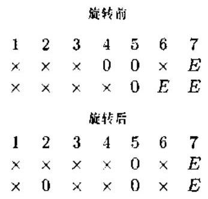

图 11.2.1 应用一次平面旋转

图中, $\times$ 表示非零元素,0 表示零元素, $E$ 表示小的元素. 选择平面旋转,在列2标 $\times$ 处引入零. 当应用旋转时，下列变化规则成立:

1) 一对 $\times$ 仍然保留为一对 $\times$ (列1和列3);

2) 一个 $\times$ 和一个 0 被一对 $\times$ 取代 (列 4);

3) 一对 0 仍然保留为一对 0 (列 5);

4) 一个 $\times$ 和一个 $E$ 被一对 $\times$ 取代 (列 6):

5) 一对 $E$ 仍然保留为一对 $E$ (列 7).

一对小的元素仍保持为小的元素 (列 7) 这一规则是根据下列事实得出的: 平面旋转是正交的, 它不会改变任何被旋转的向量的范数. 记住, 这是本节的重要观察之一, 因为更新算法的要点就是让小的元素保留小的值.

对长度为 $n$ 的两行应用一平面旋转需要大约 ${4n}$ 次乘法和 ${2n}$ 次加法. 利用所谓的快速旋转,可以减少乘法量,但是一般的平面旋转和快速平面旋转的计算复杂度都是 $O\left( n\right)$ .

左乘的平面旋转作用于矩阵 $A$ 的行,这种旋转称为左旋转. 右乘右旋转则作用于 $A$ 的列. 类似地, 对一个矩阵的两列应用右旋转时, 将作用于矩阵的这两列.

当旋转应用于 ${URV}$ 分解时,右旋转必须与 $V$ 相乘. 为了得到分解的一次完整更新, 还需要对 $U$ 左乘左旋转矩阵. 然而,在多数应用中, $U$ 是不需要的,这一步可以省略.

下而考查如何应用左旋转将 $\left\lbrack  \begin{matrix} R \\  {x}^{H} \end{matrix}\right\rbrack$ 化简为上三角矩阵. 这里假定 $R$ 本身是上三角矩阵. 化简过程如图 11.2.2 所示. 矩阵 $R$ 和向量 ${x}^{H}$ 的元素分别用 $r$ 和 $x$ 表示. 化简的第一步是利用作用于 ${x}^{H}$ 和 $R$ 第一行的左旋转消去 ${x}^{H}$ 的第一个元素. 欲被消去的元素用 $\otimes$ 标记,而被左旋转作用的两行则用右箭头 $\rightarrow$ 表示.

这一旋转的第二步是通过综合 $R$ 的第二行和 ${x}^{H}$ 消去 ${x}^{H}$ 的第二个元素. 注意,零元系 ${r}_{12}$ 与 ${x}^{H}$ 的第一个元素组成一对零,所以在第一步引入的零在第二步不会被破坏. 化简的第三、四步也与此相仿. 对于具有右旋转的列运算, 将使用类似的记号, 主要的区别在于箭头现在是从上向下指向被综合的列.

$$
\begin{array}{lllll}  \rightarrow  & r & r & r & r \\   & 0 & r & r & r \\   & 0 & 0 & r & r \\   & 0 & 0 & 0 & r \\   \rightarrow  &  \otimes  & x & x & x \\   & & & &  \end{array} \rightarrow  \begin{matrix}  & r & r & r & r & r \\   & 0 & r & r & r & \\   & 0 & 0 & r & r & \\   & 0 & 0 & r & r & \\   & 0 & 0 & 0 & r & \\   &  \rightarrow  &  \otimes  & x & x &  \rightarrow  \\   & 0 &  \otimes  & x & x &  \rightarrow   \end{matrix} \rightarrow  \begin{matrix}  & r & r & r & r & r \\   & 0 & r & r & r & \\   & 0 & 0 & r & r & \\   & 0 & 0 & 0 & r & \\   & 0 & 0 & 0 & r & \\   &  \rightarrow  & 0 & 0 &  \otimes  & x \end{matrix}
$$

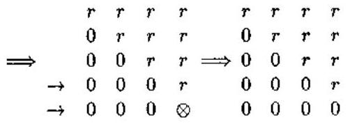

图 11.2.2 化简为三角矩阵形式

#### 11.2.3 压缩映射与细化

压缩映射在求解非线性方程组的迭代方法中起着重要的作用. 考虑非线性方程组

$$
F\left( x\right)  = 0 \tag{11.2.6}
$$

我们用符号 $F : D \subset  {R}^{n} \rightarrow  {R}^{n}$ 表示 $F$ 是定义在 $D \subset  {R}^{n}$ 上且取值于 ${R}^{n}$ 的向量值函数. $F$ 称为域 $D \subset  {R}^{n}$ 到 ${R}^{n}$ 的映射. 若存在 ${x}^{ * }$ 使方程组 (11.2.6) 精确成立,则称 ${x}^{ * }$ 为方程组 (11.2.6) 的解.

方程组可以改写为便于迭代的形式:

$$
x = G\left( x\right) \tag{11.2.7}
$$

其中 $G : D \subset  {R}^{n} \rightarrow  {R}^{n}$ .

定义 11.2.1 (压缩映射) 假定 $G : D \subset  {R}^{n} \rightarrow  {R}^{n}$ ,若存在常数 $\alpha  \in  \left( {0,1}\right)$ ,使得

$$
\parallel G\left( x\right)  - G\left( y\right) \parallel  \leq  \alpha \parallel x - y\parallel ,\;\forall x, y \in  {D}_{0} \subset  D \tag{11.2.8}
$$

成立,则称 $G$ 是在 ${D}_{0}$ 上的压缩映射, $\alpha$ 称为压缩系数.

注意,压缩映射与所取范数有关: $G$ 对一种范数是压缩映射,而对另外一种范数可能不是压缩映射.

以矩阵 $H$ 的三角化简为例,若在化简过程中有

$$
H = \left\lbrack  \begin{matrix} {H}_{11} & {H}_{12} \\  0 & {H}_{22} \end{matrix}\right\rbrack  \begin{matrix} p \\  n - p \\  p \end{matrix}
$$

其中 $1 \leq  p < n$ ,则 $H$ 的三角化简解耦为 ${H}_{11}$ 和 ${H}_{22}$ 两个较小矩阵的三角分解. 在这种情况下,我们称 $H$ 是压缩的 (通常 $p = n - 1$ 或 $n - 2$ ). 事实上,将一个矩阵的特征空间分为信号和噪声两个子空间, 并且只利用其中一个子空间来提取所需信息的特征子空间方法就是一种压缩映射思想的应用.

称 $k\left( { < n}\right)$ 维子空间 $S \subseteq  {R}^{n}$ 是矩阵束 $A - {\lambda B}$ 的压缩映射,若 $\{ {Ax} + {By} : x, y \in  S\}$ 具有 $k$ 维或更低的维数 ${}^{\left\lbrack  5\right\rbrack  }$ .

在应用平面旋转的过程中,矩阵 $A$ 的秩有可能会突然发生变化. 秩的增加通常会以明显的方式表现出来. 相反,秩的减少在 ${URV}$ 分解的矩阵 $R$ 中可能看不出来. 因此, 任何更新算法必须能够检测出 $R$ 中的秩退化,并采取相应的措施. 下面介绍计算任何一个 $d \times  d$ 上三角矩阵 $R$ 的秩显露 ${URV}$ 分解.

第一步是确定 $R$ 是否秩亏缺,也即确定 $\inf \left( R\right)$ 是否小于一预先设定的扰动. 为此, 首先对一个给定的上三角矩阵 $R$ 产生一个范数为 1 的向量 $w$ 使得 $b = {Rw}$ ,于是有

$$
\eta  = \parallel b\parallel  \approx  \inf \left( R\right) \tag{11.2.9}
$$

由于需要求解三角方程组,故需要 $O\left( {d}^{2}\right)$ 次运算.

下一步是确定旋转序列 ${V}_{1}^{H},{V}_{2}^{H},\cdots ,{V}_{d - 1}^{H}$ ,以消去 $w$ 的前 $d - 1$ 个分量,使 $w$ 除了最后一个分量为 1 外,其它分量均为零. 化简过程如图 11.2.3 所示. 令 ${Q}^{H} = {V}_{d - 1}^{H}{V}_{d - 2}^{H}\cdots {V}_{1}^{H}$ 表示这一步得到的旋转之乘积.

接下来确定一正交矩阵 $P$ ,以使 ${P}^{H}{RQ}$ 为上三角矩阵. 这可以通过对 $R$ 的右边应用旋转 ${V}_{1}\text{ 、 }{V}_{2}\text{ 、 }\cdots ,{V}_{d - 1}$ 来实现,如图 11.2.4 所示. 对 $R$ 的两列应用旋转 ${V}_{i}$ 的结果是将一个非零元素放入 $R$ 对角线下面. 然后，用一个左旋转消去该非零元素，并恢复矩阵的三角性. 矩阵 ${P}^{H}$ 为左旋转之积. 整个过程仅需要 $O\left( {d}^{2}\right)$ 次运算.

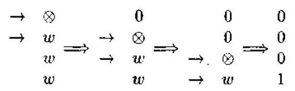

图 ${11.2.3}\;W$ 的化简

$$
\begin{array}{l}  \downarrow   \downarrow  \\  r\;r\;r\;r\; \rightarrow  \\  0\;r\;r\;r \Rightarrow  \\  0\;0\;r\;r\;0\;0\;r\;r \Rightarrow  \\  0\;0\;r\;r\;0\;0\;r\;r\;0\;0\;r\;r \\  0\;0\;0\;r\;r\;0\;0\;0\;r\;r\;0\;0\;0\;r\;r \\  \end{array}
$$

$$
\rightarrow  \begin{matrix} r & r & r & r \\  0 & r & r & r \\  0 & 0 & r & r \\  0 & 0 & 0 & r \end{matrix} \Rightarrow  \begin{matrix} r & r & r & r \\  0 & r & r & r \\  0 & r & r & r \\  0 & 0 & r & r \\  0 & 0 & 0 & r \end{matrix} \Rightarrow  \begin{matrix} r & r & r & r & r \\  0 & r & r & r & \\  0 & r & r & r & \\  0 & 0 & r & r & \\  0 & 0 & r & r & \\  0 & 0 & 0 & r &  \end{matrix} \rightarrow  \begin{matrix} r & r & r & r & r \\  0 & r & r & e & \\  0 & r & r & e & \\  0 & 0 & r & e & \\  0 & 0 & 0 & e &  \end{matrix}
$$

图 11.2.4 ${RQ}$ 的三角化

图 11.2.4 的最后一阵列中的量 $e$ 旨在指明在压缩映射过程结束时 $e$ 所处位置的元素值应很小. 事实上，最后一列的范数是由式 (11.2.9) 定义的值 $\eta$ . 为了看清楚这一点，由式 (11.2.9) 得到

$$
{b}^{\prime } = {P}^{H}b = \left( {{P}^{H}{RQ}}\right) \left( {{Q}^{H}w}\right)  = {R}^{\prime }{w}^{\prime }
$$

由于 ${w}^{\prime }$ 最后一个分量为 1,其它分量均为零,故我们看到 $R$ 的最后一列为 ${b}^{\prime }$ . 由于一个向量被酉矩阵相乘时，其范数不改变，所以有 $\begin{Vmatrix}{b}^{\prime }\end{Vmatrix} = \parallel b\parallel  = \eta$ .

因为 $\eta  \approx  \inf \left( R\right)$ ,所以我们就产生了 ${URV}$ 分解,它显露出 $R$ 有一个小的奇异值. 进一步地,我们可以以 ${R}^{\prime }$ 的 $d - 1$ 阶主矩阵块为对象继续压缩映射过程.

虽然这种方法解决了一个秩退化三角矩阵的压缩映射问题, 但是有可能进一步细化 ${URV}$ 分解,使 $R$ 更加接近对角矩阵. 细化的第一步是将 $R$ 最后一列的前 $d - 1$ 个元素约化为零. 这可以用一系列右旋转来实现，其过程如图 11.2.5 所示. 这一步再次仅需要 $O\left( {d}^{2}\right)$ 次运算. 不过,右旋转必须合并到 $V$ .

细化的第二步是通过图 11.2.6 所示的一系列左旋转将 $R$ 约化为上三角形式.

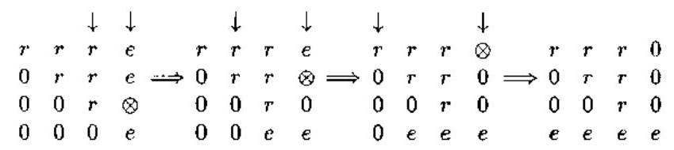

图 11.2.5 约化最后一列

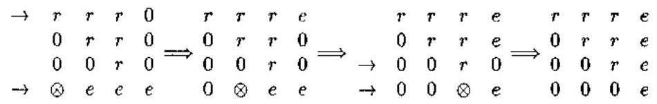

图 11.2.6 约化最后一行

在实际中, 细化步骤可以减小最后一列位于对角线上方部分的元素值, 使之与对角线元素相比可以忽略. 细化的作用是使噪声子空间的逼近更加完美. 细化是否值得必须由实验确定. 一些实验表明,当子空间跟踪与 MUSIC 方法一起使用时,细化的 ${URV}$ 分解比无细化的 ${URV}$ 分解更好.

#### 11.2.4 更新 URV 分解

现在讨论当增加一行数据 ${z}^{H}$ 时,如何更新秩显露的 ${URV}$ 分解. 具体地,我们将假定 $A$ 具有式 (11.2.3) 的 ${URV}$ 分解. 其中 $V$ 已知. 预先设定一扰动 tol,并设

$$
v = \sqrt{\parallel F{\parallel }^{2} + \parallel G{\parallel }^{2}} \leq  \text{ tol }
$$

如式 (11.2.4) 所示，扰动可能与 $A$ 和 $R$ 的维数以及遗忘因子的大小有关.

更新的第一步是计算 $\left( {{x}^{H}{y}^{H}}\right)  = {z}^{H}V$ ,其中 $x$ 是 $d$ 维向量 $\left( d\right.$ 是 $R$ 的阶数). 于是,问题便变成了更新下列矩阵的问题:

$$
\widehat{A} = \left\lbrack  \begin{matrix} R & F \\  0 & G \\  {x}^{H} & {y}^{H} \end{matrix}\right\rbrack
$$

有两种情况需要考虑. 第一种也即最简单的情况发生在

$$
\sqrt{{v}^{2} + \parallel y{\parallel }^{2}} \leq  \operatorname{tol} \tag{11.2.10}
$$

的时候. 在这种情况下，可以借助图 11.2.2 所示的一系列左旋转把 $\widehat{A}$ 约化为三角形式. 由于 $v$ 的新值将由式 (11.2.10) 的左边给出，所以可确认:在此扰动范围内秩不可能增加. 但是，秩有可能减小. 因此，必须检查并尽可能将 $R$ 约化为上一小节介绍的形式，这种情况的计算量为 $O\left( {n}^{2}\right)$ .

如果式 (11.2.10) 不满足, 则存在秩增加的可能性. 由于秩的增加最大为 1 , 所以关键问题是在将矩阵变换为上三角形式的同时不能破坏 $F$ 和 $G$ 中的所有小的数值. 此时,第一步是约化 ${y}^{H}$ ，使它只有一个非零元素，而且 $G$ 保留上三角形式，约化过程如图 11.2.7 所示.

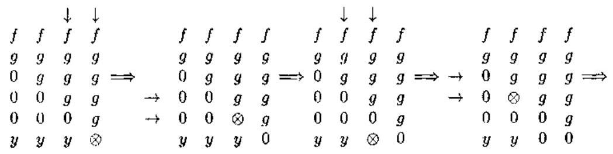

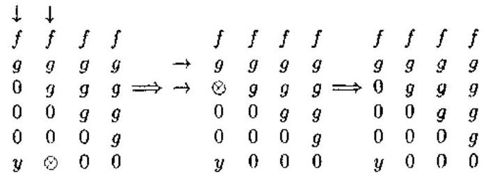

图 11.2.7 ${y}^{H}$ 的化简

由于 $R$ 和 ${x}^{H}$ 在这一步约化中未被涉及,故在图中只标出了 $F, G$ 和 ${y}^{H}$ (图中的 $f$ 表示 $F$ 的整个列). 最后,整个矩阵

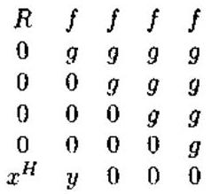

用普通的方式简化为三角形式, 最后的矩阵取形式:

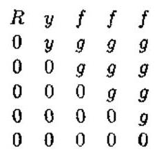

然后, $d$ 增加 1,并且检测新的 $R$ 是否退化。如有必要,则使用压缩映射和细化. 最后的结果即为更新的 ${URV}$ 分解.

上面的更新算法可以在一个 $n$ 处理器的阵列上实现,从而得到 $O\left( n\right)$ 算法,感兴趣的读者可参阅文献 [16].

### 11.3 基于秩显露 ${QR}$ 分解的噪声子空间更新

与上一节一样, 本节也不考虑奇异值分解或特征值分解本身的更新计算, 而只关心噪声子空间的更新. 与上节不同的是,这里使用的方法是秩显露的 ${QR}$ 分解.

首先证明在信号子空间方法中所需要的所有有关信息都可以利用数据矩阵 $X$ 的秩显露三角分解从 $X$ 中抽取.

问顾在 MUSIC 方法中, 矩阵

$$
A\left( \theta \right)  = \left\lbrack  \begin{array}{lll} a\left( {\theta }_{1}\right) & \cdots & a\left( {\theta }_{r}\right)  \end{array}\right\rbrack
$$

中的未知参数 ${\theta }_{j}$ 可以从 ${a}^{H}\left( \omega \right) Y{Y}^{H}a\left( \omega \right)  = 0$ 即

$$
D\left( z\right)  = \sqrt{{a}^{H}\left( z\right) Y{Y}^{H}a\left( z\right) } \tag{11.3.1}
$$

的根求得,其中 $Y$ 是 $x\left( t\right)  = A\left( \theta \right) s\left( t\right)  + w\left( t\right)$ 的自协方差矩阵 $R = E\left\{  {x{x}^{H}}\right\}$ 的噪声子空间,即 $Y$ 是 $S - W = R - E\left\{  {w{w}^{H}}\right\}$ 的零空间 (噪声子空间).

注意到样本自协方差矩阵 $\widehat{R} = \frac{1}{N}{X}^{H}X$ ,其中 $N$ 为数据长度, $X$ 是适当组成的数据矩阵,因此, MUSIC 方法的关键就是计算数据矩阵 $X$ 的噪声子空间 $Y$ . 为此,令

$$
{X\Pi } = {QR} \tag{11.3.2}
$$

是 $X$ 的 ${QR}$ 分解,其中 $Q \in  {C}^{n \times  m}$ 具有正交列, $R \in  {C}^{m \times  n}$ 为上三角矩阵, $\Pi$ 是 $m \times  m$ 置换矩阵. 令 $X$ 具有 $m - r$ 个 “小的” 奇异值,并将 $R$ 分块为

$$
R = \left\lbrack  \begin{matrix} {R}_{11} & {R}_{12} \\  0 & {R}_{22} \end{matrix}\right\rbrack \tag{11.3.3}
$$

其中 ${R}_{11}$ 为 $r \times  r,{R}_{12}$ 为 $r \times  \left( {m - r}\right) ,{R}_{22}$ 为 $\left( {m - r}\right)  \times  \left( {m - r}\right)$ 矩阵. ${QR}$ 分解式 (11.3.2) 称为矩阵 $X$ 的秩显露 ${QR}$ 分解,若 ${R}_{22}$ 具有小的范数,即 ${\begin{Vmatrix}{R}_{22}\end{Vmatrix}}_{2} \approx  {\sigma }_{m - r + 1}\left( X\right)$ . 注意, 小范数的分块 ${R}_{22}$ 是通过置换矩阵 $\Pi$ 作用于矩阵 $X$ 获得的. 换句话说,将 $X$ 的奇异值谱分离为 “大” 和 “小” 两组奇异值则会在 $R$ 内显露出一个小的 “拖尾块”.

基于列基交换的传统 ${QR}$ 分解常被用来计算秩显露的矩阵分解. 如果我们有这样的一种分解, 则

$$
\left\lbrack  \begin{matrix} {R}_{11} & {R}_{12} \\  0 & {R}_{22} \end{matrix}\right\rbrack  \left\lbrack  \begin{matrix} {R}_{11}^{-1}{R}_{12} \\   - I \end{matrix}\right\rbrack   = \left\lbrack  \begin{matrix} 0 \\   - {R}_{22} \end{matrix}\right\rbrack \tag{11.3.4}
$$

并且

$$
\widehat{Y} = \Pi \left\lbrack  \begin{matrix} {R}_{11}^{-1}{R}_{12} \\   - I \end{matrix}\right\rbrack  F \tag{11.3.5}
$$

是噪声子空间的基，其中 $F$ 为一对角矩阵，其对角线元素应选择使 $\widehat{Y}$ 的列具有单位范数.

注意, $\widehat{Y}$ 不是正交基. 利用 Gram-Schmidt 正交过程可以从 $\widehat{Y}$ 得到正交基. 然而, 在一般情况下并没有必要得到正交基. 这是因为，由式 (11.3.1) 知， $D\left( z\right)$ 的根对于噪声子空间的所有基 $\widehat{Y}$ 都相同. 因此,利用秩显露 ${QR}$ 分解,我们就可以得到有关的零空间信息，而无需计算比较费时的数据矩阵 $X$ 的奇异值分解或样本自协方差矩阵 $\widehat{R}$ 的特征值分解.

#### 11.3.1 更新问题

更新问题的提法是: 给定与数据矩阵 $X = {\left\lbrack  \begin{array}{llll} x\left( 1\right) & x\left( 2\right) & \cdots & x\left( n\right)  \end{array}\right\rbrack  }^{H}$ 相关联的噪声子空间的基 $Y$ ,我们希望计算与数据矩阵

$$
\widetilde{X} = {\left\lbrack  \begin{array}{llll} x\left( 2\right) & \cdots & x\left( n\right) & x\left( {n + 1}\right)  \end{array}\right\rbrack  }^{H} \tag{11.3.6}
$$

相关联的噪声子空间的基 $\widetilde{Y}$ . 矩阵 $\widetilde{X}$ 与 $X$ 相比，只是增加了一个新样本 $x\left( {n + 1}\right)$ ，减少了一个旧样本 $x\left( 1\right)$ .

更具体地，我们需要得到 $\widetilde{X}$ 的秩显露 ${QR}$ 分解

$$
\widetilde{X}\widetilde{\Pi } = \widetilde{Q}\widetilde{R} \tag{11.3.7}
$$

中的三角矩阵 $\widetilde{R}$ 和置换矩阵 $\widetilde{H}$ ，其中 $\widetilde{R}$ 具有类似于式 (11.3.3) 的秩显露结构. 有了这样的矩阵 $\widetilde{R}$ ,我们就可以用与式 (11.3.5) 相同的方式得到 $\widetilde{Y}$ . 注意,我们不需要存储 $Q$ ,只是借用它.

考虑更新前、后估计出来的协方差矩阵即 $S = \frac{1}{n}{X}^{H}X$ 和

$$
\widetilde{S} = \frac{1}{n}{\widetilde{X}}^{H}\widetilde{X} = \frac{1}{n}\left\lbrack  {{X}^{H}X + x\left( {n + 1}\right) {x}^{H}\left( {n + 1}\right)  - x\left( 1\right) {x}^{H}\left( 1\right) }\right\rbrack \tag{11.3.8}
$$

利用式 (11.3.2) 得到

$$
{\widetilde{S}}_{\pi } = {\Pi }^{T}\widetilde{S}\Pi  = \frac{1}{n}\left\lbrack  {{R}^{H}R + f{f}^{H} - g{g}^{H}}\right\rbrack \tag{11.3.9}
$$

式中 $f = {\Pi }^{T}x\left( {n + 1}\right)$ 和 $g = {\Pi }^{T}x\left( 1\right)$ . 由式 (11.3.7) 和式 (11.3.2) 还有

$$
{\widetilde{H}}^{T}{\widetilde{S}}_{\pi }\widetilde{H} = \frac{1}{n}{\widetilde{R}}^{H}\widetilde{R} \tag{11.3.10}
$$

所以需要计算非负定矩阵 ${\widetilde{\Pi }}^{T}{\widetilde{S}}_{\pi }\widetilde{\Pi }$ 的三角因子,其中 $\widetilde{\Pi }$ 应选择使 $\widetilde{R}$ 具有秩显露结构式 (11.3.3). 下面先讨论在假定 $\widetilde{\Pi }$ 已知的情况下,如何求 $\widetilde{R}$ ,然后介绍如何选择 $\widetilde{\Pi }$ .

这里介绍 Bischof 与 Shroff ${}^{\left\lbrack  {18}\right\rbrack  }$ 提出的更新三角矩阵 $R$ 的方法,这种方法使用 $J$ 酉变换代替酉变换从三角因子 $R$ 得到 $\widetilde{R}$ ; 此外,在更新中还使用置换矩阵 $\widetilde{\Pi }$ 以保持三角因子的秩显露结构. 将第九章 9.3.2 节的 $J$ 正交矩阵推广到复数情况,则有以下定义.

定义 11.3.1 $\left( {J\text{ 西矩阵 }}\right)$ 对任一满秩的矩阵 $J$ ,若矩阵 $M$ 满足 ${M}^{H}{JM} = J$ ,则称 $M$ 为 $J$ 西矩阵. 酉矩阵是 $J$ 西矩阵的特例 $\left( {J = I}\right)$ .

定义 $J$ 为

$$
J = \left\lbrack  \begin{matrix} I & 0 & 0 \\  0 & 1 & 0 \\  0 & 0 &  - 1 \end{matrix}\right\rbrack \tag{11.3.11}
$$

式中 $I$ 是合适维数的单位矩阵. 若定义 ${R}_{u}$

$$
{R}_{u} = \left\lbrack  \begin{matrix} R \\  {f}^{H} \\  {g}^{H} \end{matrix}\right\rbrack  \widetilde{\Pi } \tag{11.3.12}
$$

则 ${R}_{n}$ 的 “ $J$ 内积” 为

$$
{R}_{u}^{H}J{R}_{u} = {\widetilde{\Pi }}^{T}\left\lbrack  {{R}^{H}R + f{f}^{H} - g{g}^{H}}\right\rbrack  \widetilde{\Pi } = n{\widetilde{\Pi }}^{T}{\widetilde{S}}_{\pi }\widetilde{\Pi }
$$

即 ${R}_{u}$ 的 “ $J$ 内积” 是矩阵 ${\widetilde{\Pi }}^{T}{\widetilde{S}}_{\pi }\widetilde{\Pi }$ 的 $n$ 倍.

用 $J$ 酉矩阵左乘 ${R}_{u}$ 将能够保持 “ $J$ 内积” 不变. 所以,如果能够求出一个 $J$ 酉矩阵 $H$ 满足 $H{R}_{u}$ 是上三角矩阵之条件:

$$
H\left\lbrack  \begin{matrix} R \\  {f}^{H} \\  {g}^{H} \end{matrix}\right\rbrack  \widetilde{\Pi } = \left\lbrack  \begin{matrix} T \\  0 \\  0 \end{matrix}\right\rbrack
$$

其中 $T$ 为上三角矩阵,则 $T$ 就是式 (11.3.10) 的解 $\widetilde{R}$ .

构造这种 $J$ 西矩阵 $H$ 的算法是由 Rader 与 Steinhardt 提出的 ${}^{\left\lbrack  {26}\right\rbrack  }$ ,其中 $H$ 取 $J$ 酉矩阵 ${H}^{\left( 1\right) },{H}^{\left( 2\right) },\cdots ,{H}^{\left( m - 1\right) }$ 的乘积形式,它们依次将 ${R}_{u}$ 的列变换为 $\widetilde{R}$ 的列. 即

$$
{H}^{\left( m - 1\right) }\cdots {H}^{\left( 2\right) }{H}^{\left( 1\right) }{R}_{u} = \left\lbrack  \begin{matrix} \widetilde{R} \\  0 \\  0 \end{matrix}\right\rbrack
$$

假定 $u$ 是部分更新后的 ${R}_{u}$ 第 $k$ 列的次对角线上的元素组成的向量, ${e}_{1}$ 是标准单位向量 ${e}_{1} = {\left\lbrack  1,0,\cdots ,0\right\rbrack  }^{T}$ . 进一步地,需要求 $Z \in  {C}^{m - k + 2) \times  \left( {m - k + 2}\right) }$ 使

$$
{Zu} = \gamma {e}_{1} \tag{11.3.13}
$$

由于这些步骤与 Householder 变换的类似性, Rader 与 Steinhardt ${}^{\left\lbrack  {26}\right\rbrack  }$ 称这些矩阵为 “双曲 Householder 变换”. ${H}^{\left( k\right) }$ 的构造如下: 将单位矩阵尾部的 $\left( {m - r}\right)  \times  \left( {m - r}\right)$ 子矩阵用 $Z$ 代替. 已证明 ${}^{\left\lbrack  {26}\right\rbrack  }, Z$ 存在的必要条件是

$$
{u}^{H}{Ju} = \parallel \gamma {\parallel }^{2} > 0 \tag{11.3.14}
$$

对于非零的 $\gamma$ 值,矩阵 $Z$ 可以计算如下.

定理 ${11.3}.{1}^{\left\lbrack  3\right\rbrack  }$ 令 $b = {Ju} + \gamma {e}_{1}$ ,式中 $\gamma  = \frac{{u}_{1}}{\left| {u}_{1}\right| }\sqrt{{u}^{H}{Ju}}$ ,则

$$
Z = \frac{{2b}{b}^{H}}{{b}^{H}{Jb}} - J \tag{11.3.15}
$$

是式 (11.3.13) 的解.

使用式 (11.3.15) 的双曲 Householder 变换也称 $J$ 酉变换，即在复数情况下，常将双曲变换与 $J$ 西变换等同起来. 如果 ${\left| \gamma \right| }^{2} = {u}^{H}{Ju}$ 很小 (或为零),则 $J$ 酉变换将会不稳定 (或崩溃失效). 值得指出的是,若 $J$ 为单位矩阵,则不会发生方法不稳定或崩溃失效的问题,因为此时 $Z$ 退化为普通的 Householder 变换,并且 $\left| \gamma \right|  = 0$ 意味着变换是单位变换.

#### 11.3.2 秩显露分解方法

增量条件估计 ${}^{\left\lbrack  {27}\right\rbrack  }$ 是一种监视三角矩阵的最小奇异值的方法,同时是产生满足下列条件的置换矩阵 $\widetilde{\Pi }$ 的关键: $\widetilde{\Pi }$ 在更新过程中尽量保持 $R$ 的三角结构不变的同时,能够维持秩显露的结构不变. 为了产生一个秩显露的因子, 就应产生一个无病态的子矩阵 ${\widetilde{R}}_{11}$ ,并将 $R$ 中引起病态的那些列推到 $\widetilde{R}$ 后面的子矩阵中去. 于是,一个小的 ${\widetilde{R}}_{22}$ 披露这样一个事实: 这些列在数值上取决于与 ${\widehat{R}}_{11}$ 对应的列. 当使用双曲 Householder 变换时, $\widetilde{R}$ 每产生一列都应该维持 $\widetilde{R}$ 的首项子矩阵 ${\widetilde{R}}_{11}$ 无病态. 因而,常常会遇到下列问题: 给出一个无病态的上三角矩阵 $A$ 和一个新的列 $\left\lbrack  \begin{array}{l} v \\  \gamma  \end{array}\right\rbrack$ ,矩阵 ${A}^{\prime } = \left\lbrack  \begin{matrix} A & v \\  0 & \gamma  \end{matrix}\right\rbrack$ 是否仍然无病态?

问答上述问题的设想是, $A$ 将可能是 ${\widetilde{R}}_{11}$ 的部分. 如果 $A$ 确实是 ${\widetilde{R}}_{11}$ 的部分,那么 ${A}^{\prime }$ 也就应该是 ${\widetilde{R}}_{11}$ 的部分,否则 $\left\lbrack  \begin{array}{l} v \\  \gamma  \end{array}\right\rbrack$ 就会是其列向量接近相关的 $\left\lbrack  \begin{array}{l} {\widetilde{R}}_{12} \\  {\widetilde{R}}_{22} \end{array}\right\rbrack$ 的部分. 增量条件估计只用 $O\left( m\right)$ 次运算就可以回答这个问题,而且无需使用 ${A}^{\left\lbrack  {26}\right\rbrack  }$ . 为了具体介绍增量条件估计的思想，我们先来考查下三角矩阵，由于任一矩阵及其共轭转置具有相同的奇异值，故我们假定 $A = {L}^{H}$ ( $L$ 为了三角矩阵)，进一步假定我们已得到一个逼近奇异向量 $x$ ,它满足 ${\sigma }_{\min }\left( L\right)  \approx  1/\parallel x{\parallel }_{2}$ . 增量条件估计可以使得我们得到 ${L}^{\prime } = \left\lbrack  \begin{matrix} L & 0 \\  {v}^{ij} & \overline{\gamma } \end{matrix}\right\rbrack$ 的一个新的逼近奇异向量 $y$ ，使 ${\sigma }_{\min }\left( {L}^{\prime }\right)  \approx  1/{\begin{Vmatrix}y\end{Vmatrix}}_{2}$ ，这只需要 ${3m}$ 次运算，并且无需使用 $L$ . 利用这样一种方式, 增量条件估计使得我们可以控制一个正在产生的三角矩阵的条件数.

构成条件数估计算法 ${}^{\left\lbrack  {28.29}\right\rbrack  }$ 的共问思想是使用隐含关系:

$$
{Lx} = d \Rightarrow  \frac{1}{{\sigma }_{\min }\left( L\right) } = {\begin{Vmatrix}{L}^{-1}\end{Vmatrix}}_{2} \geq  \frac{{\begin{Vmatrix}{L}^{-1}d\end{Vmatrix}}_{2}}{\parallel d{\parallel }_{2}} = \frac{\parallel x{\parallel }_{2}}{\parallel d{\parallel }_{2}}
$$

通过对一个大小合适的 $d$ 产生一个大范数的解 $x$ ,然后用 ${\widehat{\sigma }}_{\min }\left( L\right)  = \frac{\parallel d{\parallel }_{2}}{\parallel x{\parallel }_{2}}$ 作 ${\sigma }_{\min }\left( L\right)$ 的估计.

增量条件估计对一个特定选择的 $d$ 求解 ${Lx} = d$ 的大范数解的方法如下.

给出满足 ${Lx} = d$ 的 $x$ ,其中 $\parallel d{\parallel }_{2} = 1$ 和 ${\sigma }_{\max }\left( L\right)  \approx  1/\parallel x{\parallel }_{2}$ ,求 $s = {\mathrm{e}}^{\mathrm{j}v}\sin \phi$ 和 $c = \cos \phi$ 使得 $\parallel y{\parallel }_{2}$ 极大化,其中 $y$ 满足

$$
\left\lbrack  \begin{matrix} L & 0 \\  {v}^{H} & \gamma  \end{matrix}\right\rbrack  y = \left\lbrack  \begin{matrix} {sd} \\  c \end{matrix}\right\rbrack \tag{11.3.16}
$$

定义

$$
\beta  = {\left| \gamma \right| }^{2}{x}^{H}x + 4{\left| \alpha \right| }^{2} - 1 \tag{11.3.17}
$$

和

$$
\mu  = \frac{2\alpha }{\sqrt{{\beta }^{2} + 4{\left| \alpha \right| }^{2} - \beta }} \tag{11.3.18}
$$

利用文献 [5] 中的方法可以证明:对于实数情况，有

$$
\left\lbrack  \begin{array}{l} s \\  c \end{array}\right\rbrack   =  - \frac{1}{\sqrt{{\left| \mu \right| }^{2} + 1}}\left\lbrack  \begin{matrix} \mu \\   - 1 \end{matrix}\right\rbrack \tag{11.3.19}
$$

对于 $\alpha  = 0$ 的特殊情况,则有

$$
\left\lbrack  \begin{array}{l} s \\  c \end{array}\right\rbrack   = \left\{  \begin{array}{ll} \left\lbrack  \begin{array}{l} 1 \\  0 \end{array}\right\rbrack  , & \text{ 若 }\left| \gamma \right|  \cdot  \parallel x{\parallel }_{2} > 1 \\  \left\lbrack  \begin{array}{l} 0 \\  1 \end{array}\right\rbrack  , & \text{ 其它 } \end{array}\right.
$$

向量 $y$ 为

$$
y = \left\lbrack  \begin{matrix} {sx} \\  \left( {r - {s\alpha }}\right) /\dot{\gamma } \end{matrix}\right\rbrack \tag{11.3.20}
$$

传统的列基交换方法以一种间接方式将一矩阵 “相关” 的列推到后面去, 而把 “独立” 的列交换到前面来. 其结果相当于引入一些中介的非零元素,从而破坏了 $R$ 的原三角结构.

下面考虑如何应用增量条件估计方法避免传统列基交换的这一缺陷. 先考查如何选择置换矩阵 $\widetilde{\Pi }$ . 假定在第 $k$ 步,我们已使用 $k$ 个双曲 Householder 变换 ${H}_{1},{H}_{2},\cdots ,{H}_{k}$ 计算出部分分解:

$$
{R}_{u}{\widetilde{\Pi }}^{\left( k\right) } = {Q}^{\left( k\right) }{R}_{u}^{\left( k\right) }
$$

式中

$$
{Q}^{\left( k\right) } = {H}_{1}{H}_{2}\cdots {H}_{k},\;{R}_{u}^{\left( k\right) } = \left\lbrack  \begin{matrix} {\widetilde{R}}_{11}^{\left( k\right) } & {\widetilde{R}}_{12}^{\left( k\right) } \\  0 & {\widetilde{R}}_{22}^{\left( k\right) } \end{matrix}\right\rbrack \tag{11.3.21}
$$

并且 ${\widetilde{R}}_{11}^{\left( k\right) }$ 的最小奇异值 ${\sigma }_{\min }\left( {\widetilde{R}}_{11}^{\left( k\right) }\right)$ 满足条件 ${\sigma }_{\min }\left( {\widetilde{R}}_{11}^{\left( k\right) }\right)  > \tau$ ,其中 $\tau$ 是阈门值. 反之,若低于它,我们就认为奇异值低于噪声电平. 通常选择 $\tau$ 为 $\sqrt{n}\sigma$ 的某个合适倍数.

考虑希望包含在 ${\widetilde{R}}_{11}^{\left( k + 1\right) }$ 内的新列向量 $\left\lbrack  \begin{array}{l} v \\  \gamma  \end{array}\right\rbrack$ . 当然,我们并不能够保证 ${\widetilde{R}}_{11}^{\left( k + 1\right) } = \; \left\lbrack  \begin{matrix} {\widetilde{R}}_{11}^{\left( k\right) } & v \\  0 & \gamma  \end{matrix}\right\rbrack$ 的最小奇异值仍然会比较大. 然而,增量条件估计可以给出 ${R}_{11}^{\left( k + 1\right) }$ 最小奇异值的一个简单估计 ${\widehat{\sigma }}_{\min }\left( {\widetilde{R}}_{11}^{\left( k + 1\right) }\right)$ . 如果 ${\widehat{\sigma }}_{\min }\left( {\widetilde{R}}_{11}^{\left( k + 1\right) }\right)  > \tau$ ,则候补的交换列可视为 ${\widetilde{R}}_{11}^{\left( k\right) }$ 中的一线性独立列,我们就接受它. 否则,该候补列应看作是相关的列,就把它交换到 ${R}_{u}^{\left( k\right) }$ 的后面去. 容易看出, 向左循环移位是实现这种列交换的最简单、合适的方法, 因为它可以在最大程度上维持后面的下三角矩阵的结构不变. 利用左循环移位将一相关列移到最后面只会增加右边分块矩阵对角线下面的多余带.

假定在 ${r}_{\text{ ice }}$ (ice 表示增量条件估计) 步后, ${\widehat{\sigma }}_{\min }\left( {\widetilde{R}}_{11}^{\left( \text{ ice }\right) }\right)  > \tau$ ,并且 $\left\lbrack  \begin{array}{l} {\widetilde{R}}_{12}^{\left( \text{ ice }\right) } \\  {\widetilde{R}}_{22}^{\left( \text{ ice }\right) } \end{array}\right\rbrack$ 中的所有列都已被拒绝. 现在应用传统的列基交换计算 ${\widetilde{R}}_{22}^{\left( \text{ ice }\right) }$ 的分解,并依此完成 ${R}_{u}$ 的分解. 从数值性能看, 在算法的这一阶段进行列基交换更可取. 与传统的列基交换相比, 基于增量条件估计的列基交换具有以下优点:传统方法在算法的早期阶段就进行列的交换，而通过使用增量条件估计, 列交换将被推迟, 这样能够尽可能久地维持矩阵的结构不变. 结果是, 使用增量条件估计的列基交换需要比较少的存储量和计算量.

例 11.3.1 考虑复矩阵

$$
R = \left\lbrack  \begin{matrix}  - {5.5889} & {2.3957} - \mathrm{j}{0.1108} & {3.4965} + \mathrm{j}{0.6803} &  - {5.3300} - \mathrm{j}{0.9688} \\  0 & {0.1277} - \mathrm{j}{1.9829} &  - {0.2176} + \mathrm{j}{1.6811} &  - {0.1039} + \mathrm{j}{0.5309} \\  0 & 0 &  - {0.0003} - \mathrm{j}{0.0000} &  - {0.0000} + \mathrm{j}{0.0000} \\  0 & 0 & 0 &  - {0.0002} + \mathrm{j}{0.0000}. \end{matrix}\right.
$$

其秩为 2 . 如果选择

$$
{f}^{H} = \left\lbrack  {{1.0222}, - {0.4532} + \mathrm{j}{0.2528}, - {0.6140} - \mathrm{j}{0.3215},{3.9479} + \mathrm{j}{0.4597}}\right\rbrack
$$

$$
{g}^{H} = \left\lbrack  {{0.9895}, - {0.4134} - \mathrm{j}{0.1479}, - {0.6374} + \mathrm{j}{0.0216},{0.9349} + \mathrm{j}{0.2164}}\right\rbrack
$$

则利用 $\widetilde{\Pi } = I$ 所得更新后的矩阵为

$$
\widetilde{R} = \left\lbrack  \begin{matrix} {5.5948} &  - {2.4029} + \mathrm{j}{0.1830} &  - {3.4922} - \mathrm{j}{0.7422} & {5.8803} + \mathrm{j}{1.0135} \\  0 &  - {0.1281} + \mathrm{j}{1.9882} & {0.2182} - \mathrm{j}{1.6855} & {0.4308} - \mathrm{j}{0.4943} \\  0 & 0 & {0.0003} + \mathrm{j}{0.0000} & {0.1578} + \mathrm{j}{0.0201} \\  0 & 0 & 0 & {2.9020} + \mathrm{j}{0.1851} \end{matrix}\right\rbrack
$$

如果使用

$$
{\widetilde{H}}_{1} = \left\lbrack  \begin{array}{llll} 0 & 0 & 0 & 1 \\  0 & 0 & 1 & 0 \\  0 & 1 & 0 & 0 \\  1 & 0 & 0 & 0 \end{array}\right\rbrack
$$

则更新后的矩阵为

$$
{\widetilde{R}}_{1} = \left\lbrack  \begin{matrix} {6.5645} + \mathrm{j}{1.1932} &  - {2.9637} - \mathrm{j}{0.7585} &  - {2.3247} + \mathrm{j}{0.2332} & {5.0034} + \mathrm{j}{0.0457} \\  0 & {0.3599} - \mathrm{j}{2.4792} &  - {0.0066} + \mathrm{j}{0.7397} &  - {0.0736} + \mathrm{j}{1.8750} \\  0 & 0 & {1.9362} - \mathrm{j}{0.1479} &  - {1.6404} + \mathrm{j}{0.2322} \\  0 & 0 & 0 &  - {0.0003} + \mathrm{j}{0.0000} \end{matrix}\right\rbrack
$$

若

$$
{\widetilde{\Pi }}_{2} = \left\lbrack  \begin{array}{llll} 1 & 0 & 0 & 0 \\  0 & 1 & 0 & 0 \\  0 & 0 & 0 & 1 \\  0 & 0 & 1 & 0 \end{array}\right\rbrack
$$

则得到

$$
{\widetilde{R}}_{2} = \left\lbrack  \begin{matrix} {5.5948} &  - {2.4029} + \mathrm{j}{0.1830} & {5.8803} + \mathrm{j}{1.0135} &  - {3.4922} - \mathrm{j}{0.7422} \\  0 &  - {0.1281} + \mathrm{j}{1.9882} & {0.4308} - \mathrm{j}{0.4943} & {0.2182} - \mathrm{j}{1.6855} \\  0 & 0 & {0.7804} - \mathrm{j}{2.8057} & {0.0000} - \mathrm{j}{0.0000} \\  0 & 0 & 0 &  - {0.0001} - \mathrm{j}{0.0003} \end{matrix}\right\rbrack
$$

显然, $\widetilde{\Pi } = I$ 未能产生一个秩显露的三角分解,而 ${\widetilde{\Pi }}_{1}$ 和 ${\widetilde{\Pi }}_{2}$ 均能产生秩显露的三角分解. 但是,使用增量条件估计的第二种方法 ${\widetilde{\Pi }}_{2}$ 没有交换矩阵 $R$ 前面的两列,因此只对比较少的元素进行了更新.

#### 11.3.3 噪声子空间的更新

前面介绍了如何应用增量条件估计选择 $\widetilde{\Pi }$ ，使之能够产生一个秩显露因子，并使我们在计算更新因子时能够利用前面已得到的三角因子. 一旦得到形式取 $\widetilde{R} = \left\lbrack  \begin{matrix} {\widetilde{R}}_{11} & {\widetilde{R}}_{12} \\  0 & {\widetilde{R}}_{22} \end{matrix}\right\rbrack$ 的秩显露因子 $\widetilde{R}$ ，并且 ${\sigma }_{\min }\left( {\widetilde{R}}_{11}\right)$ 大于某个阈门值 $\zeta \sqrt{n}\sigma$ (选择 $\zeta$ 使 $\zeta \sqrt{n}\sigma$ 位于数据矩阵 $X$ 的大和小两组奇异值之间) 之后,我们就可以计算出噪声子空间的基为

$$
\widetilde{Y} = \widetilde{\Pi }\left\lbrack  \begin{matrix} {\widetilde{R}}_{11}^{-1} & {\widetilde{R}}_{12} \\  0 &  - I \end{matrix}\right\rbrack  F \tag{11.3.22}
$$

式中 $F$ 是一个比例矩阵.

注意, ${\widetilde{R}}_{11}$ 存在病态的可能性,即条件数 $\operatorname{cond}\left( {\widetilde{R}}_{11}\right)  = {\sigma }_{\max }\left( {\widetilde{R}}_{11}\right) /{\sigma }_{\min }\left( {\widetilde{R}}_{11}\right)$ 有可能很大. 这时, 根据式 (11.3.22) 计算噪声子空间就会产生很大的误差. 虽然我们不愿意, 但是这种情况是有可能发生的, 特别是当被跟踪的信号之一比其它信号弱很多时, 这一情况更是无法避免. 因此, 有必要考查一下如何用增量条件估计所产生的信息来检测这一情况, 以及如何得到正确的解.

增量条件估计给予我们的是当 $\widetilde{R}$ 生成时 ${\widetilde{R}}_{11}$ 的最小奇异值. 因此,如果 ${\sigma }_{\min }\left( {\widetilde{R}}_{11}\right)$ 很小的话, 那么它在算法过程中就会实现出来.

如果这一情况确实发生,我们就继续使用增量条件估计处理包含在 $\left\lbrack  \begin{array}{l} {\widetilde{R}}_{12}^{\left( {r}_{\text{ ice }}\right) } \\  {\widetilde{R}}_{22}^{\left( {r}_{\text{ ice }}\right) } \end{array}\right\rbrack$ 内的相关列,以计算出左零向量 ${x}_{k}$ 和 ${\widetilde{R}}_{11}^{\left( k\right) }$ 的近似奇异值 ${\sigma }_{k}, k = {r}_{\text{ ice }},\cdots , m$ . 将 ${x}_{k}$ (经过范数归一化后) 收集在矩阵 $W$ 内,其中 $W$ 的第 $i$ 列 ${w}_{i}$ 的第一部分为 ${x}_{{r}_{\text{ ice }} + i}$ ,另一部分为 $m - {r}_{iro} - i$ 个 (补) 零. 因此 $W = \left\lbrack  \begin{array}{l} {W}_{1} \\  {W}_{2} \end{array}\right\rbrack$ 具有上梯形,其中 ${W}_{2}$ 为上三角矩阵.

一旦有了近似的左奇异向量矩阵 $W$ ,由奇异值分解立即知

$$
{\widetilde{R}}^{H}V \approx  W{\widetilde{\sum }}_{\left( {r}_{\text{ ice }} : m\right) }
$$

式中 $V$ 是近似的右奇异向量矩阵, ${\widetilde{\sum }}_{\left( {r}_{\text{ ice }};m\right) }$ 表示由 $\widetilde{\sum }$ 的对角线元素 ${\widetilde{\sigma }}_{{r}_{\text{ ice }},{r}_{\text{ ice }}},\cdots ,{\widetilde{\sigma }}_{m, n}$ 组成的对角矩阵.

于是,可以得到噪声子空间的一个很好的基 $\widehat{Y}$ ,方法是先用一次回代,后跟正交化 (利用修正 Gram-Schmidt 正交化方法):

$$
\widetilde{Y} \leftarrow  \widetilde{H}\operatorname{orth}\left( {{\widetilde{R}}^{-1}W{\widetilde{\sum }}_{\left( {r}_{\text{ ice }} : m\right) }}\right) \tag{11.3.23}
$$

式中 $\operatorname{orth}\left( A\right)$ 表示 $A$ 的各列的一正交基. 在 $\widetilde{R}$ 的对角元素有一个或多个非常小或零的情况下，我们在回代中就用机器精度的一个小倍数来代替这些对角元素.

令 tol 代表根据 ${\sigma }_{\max }\left( X\right)$ 的知识或 ${\sigma }_{\max }\left( {\widetilde{R}}_{11}\right)$ 的估计值 (如 $\sqrt{{\begin{Vmatrix}{\widetilde{R}}_{11}\end{Vmatrix}}_{2}{\begin{Vmatrix}{\widetilde{R}}_{11}\end{Vmatrix}}_{\infty }}$ ) 得出的机器精度的一合适倍数. 假定方法 Do. $k$ th_Update 是应用 $J$ 酉变换 (11.3.15) 式使 ${R}_{u}$ 的第 $k$ 行对角线以下的元素变成零. 还假定方法 $\left\lbrack  {{x}_{\text{ new }},\delta }\right\rbrack   =$ Inc_Cond_Est $\left( {R,{x}_{\text{ old }}, k}\right)$ ,它实现增量条件估计: 若 $R$ 为 $n \times  m$ 矩阵, $R\left( {1 : k,1 : k}\right)$ 为上三角矩阵, ${x}_{\text{ old }}$ 为 $R\left( {1 : k,1 : k}\right)$ 的左奇异向量的估计，则 ${\mathrm{{Inc}}}_{ - }\mathrm{{Cond}}\_ \mathrm{{Est}}$ 给出矩阵

$$
\left\lbrack  \begin{matrix} R\left( {1 : k,1 : k}\right) & R\left( {1 : k, k + 1}\right) \\  0 & \{ \parallel R\left( {k + 1 : n, k + 1}\right) {\parallel }_{J} \end{matrix}\right\rbrack
$$

的最小奇异值的估计值 $\delta$ ,并给出与 $\delta$ 对应的左奇异向量的估计 ${x}_{\text{ new }}$ ,且 ${\begin{Vmatrix}{x}_{\text{ new }}\end{Vmatrix}}_{2} = 1$ . 这里, $\parallel c{\parallel }_{J}$ 为向量 $c$ 的 “ $J$ 范数”,即 $\parallel c{\parallel }_{J} = {c}^{H}{Jc}$ .

更新噪声子空间的算法可以归纳如下. 其中，函数 $p = {\operatorname{Col}}_{ - }\operatorname{Piv}\left( {R, k}\right)$ 返回的是指标 $p$ ,它代表的是 $R\left( {k : n, p}\right)$ 在 $R\left( {k : n, k : m}\right)$ 列中具有最大 $J$ 范数的所在列的序号,符号 $x \leftrightarrow  y$ 代表 $x$ 和 $y$ 与换.

算法 $\widehat{Y} =$ Update_Noise_Subspace $\left( {R}_{u}^{\left( 0\right) }\right)$

$\left\lbrack  {n, m}\right\rbrack   \leftarrow  \operatorname{size}\left( {R}_{u}^{\left( n\right) }\right) ;k \leftarrow  1;i \leftarrow  1;$

$\widetilde{H} \leftarrow  {I}_{m};\;W \leftarrow  {I}_{m};\;{\delta }_{2} \leftarrow  \left| {{R}_{u}^{\left( 0\right) }\left( {1,1}\right) }\right| ;\;{x}_{1} \leftarrow  1/{\delta }_{1};$

while $i \leq  m$

${R}_{u}^{\left( k\right) } \leftarrow$ Do.. kth...Update $\left( {R}_{u}^{\left( k - 1\right) }\right)  : \;k \leftarrow  k + 1$ ;

$\left\lbrack  {{x}_{k + 1},{\delta }_{k + 1}}\right\rbrack   \leftarrow  {\operatorname{Inc}}_{ - }{\operatorname{Cond}}_{ - }\operatorname{Est}\left( {{R}_{u}^{\left( k\right) },{x}_{k}, k}\right) ;$

while $\left( {{\delta }_{k + 1} < \zeta \sqrt{n}\delta }\right)$ .

\{列 $\left( {k + 1 : m}\right)$ 的左循环移位\}

$$
\widetilde{H}\left( { : , k + 1 : m}\right)  \leftarrow  \left\lbrack  {\widetilde{H}\left( { : , k + 2 : m}\right) ,\widetilde{H}\left( { : , k + 1}\right) }\right\rbrack  ;
$$

$$
{R}_{u}^{\left( k\right) }\left( { : , k + 1 : m}\right)  \leftarrow  \left\lbrack  {{R}_{u}^{\left( k\right) }\left( {1 : m, k + 2 : m}\right) .{R}_{u}^{\left( k\right) }\left( { : , k + 1}\right) }\right\rbrack  ;
$$

$$
\left\lbrack  {{x}_{k + 1},{\delta }_{k + 1}}\right\rbrack   \leftarrow  {\operatorname{Inc}}_{ - }{\operatorname{Cond}}_{ - }\operatorname{Est}\left( {{R}_{u}^{\left( k\right) },{x}_{k}, k}\right) ;
$$

$$
i \leftarrow  i + 1
$$

end while

end while

$\widehat{r} \leftarrow  k - 1;\{$ 秩估计 $\}$

if $\left( {{\delta }_{\widehat{r}} < \text{ tol }}\right)$ then

illcond $\leftarrow$ true; 病态为真; ${\widetilde{R}}_{11}$ 是否病态?

end if

while $\left( {k \leq  m}\right)$

【利用传统列基交换方法变换 $\left( {k : m}\right)$ 各列

$p \leftarrow  {\operatorname{Col}}_{ - }\operatorname{Piv}\left( {{R}_{u}^{\left( k - 1\right) }, k}\right)$

$\widetilde{H}\left( { : , k}\right)  \leftrightarrow  \widetilde{H}\left( { : , p}\right) ;\;{R}_{u}^{\left( k - 1\right) }\left( { : , k}\right)  \leftrightarrow  {R}_{u}^{\left( k - 1\right) }\left( { : , p}\right) ;$

if (illcond = true) then \{ 维续跟踪奇异向量, 若需要的话\}

$\left\lbrack  {{x}_{k},{\delta }_{k}}\right\rbrack   \leftarrow  {\operatorname{Inc}}_{ - }{\operatorname{Cond}}_{ - }\operatorname{Est}\left( {{R}_{u}^{\left( k - 1\right) },{x}_{k - 1}, k - 1}\right) ; \; W\left( {1 : k, k}\right)  \leftarrow  {x}_{k}$

end if

if $\left( {{\begin{Vmatrix}{R}_{u}^{\left( k - 1\right) }\left( k : m + 2, k\right) \end{Vmatrix}}_{J} < \epsilon \} }\right.$ then

$$
{R}_{u}^{\left( k\right) }\left( {k : m, k : m}\right)  \leftarrow  0;\;k \leftarrow  m + 1;
$$

else

$$
{R}_{u}^{\left( k\right) } \leftarrow  {\operatorname{Do}}_{ - }k\text{ th\_Update }\left( {R}_{u}^{\left( k - 1\right) }\right) ;\;k \leftarrow  k + 1\text{ ; }
$$

end if

end while

$\widetilde{R} \leftarrow  {\widetilde{R}}_{u}^{\left( m\right) }\left( {1 : n,1 : n}\right)$

if (illcond = true) then

$$
\widehat{Y} \leftarrow  \widetilde{H}\operatorname{orth}\left( {{R}^{-1}W\left( { : ,\widehat{r} + 1 : m}\right) \Delta }\right) ;\{ \text{ 其中 }\Delta  = \operatorname{diag}\left( {{\delta }_{\widehat{r} + 1},\cdots ,{\delta }_{m}}\right) \}
$$

else

$\widehat{Y} \leftarrow  \widetilde{H}\left\lbrack  \begin{matrix} {\left( \widetilde{R}\left( 1 : \widehat{r},1 : \widehat{r}\right) \right) }^{-1}\widetilde{R}\left( {1 : \widehat{r},\widehat{r} + 1 : m}\right) \\   - I \end{matrix}\right\rbrack  F$

\{其中选择 $F$ 使得 $\widehat{Y}$ 的列归一化\}

end if

### 11.4 基于一阶扰动的自适应特征值分解

前面两节讨论了如何利用秩显露的矩阵分解实现噪声子空间的跟踪. 在信号处理和系统理论的许多问题中，我们不仅需要使用信号或噪声子空间，而且还往往需要用到特征值 (或奇异值). 从本节起, 我们介绍特征值/奇异值和特征子空间二者的跟踪或更新.

有两大类方法可以用来解决特征值和特征子空间二者的跟踪. 第一类方法基于特征问题的所谓秩 1 更新, 第二类方法则将特征子空间的确定转换成最优化问题求解. 本节和 11.5 节介绍第一类方法, 11.6~11.9 节将介绍第二类方法.

基于特征问题的秩 1 更新方法最早由 Golub ${}^{\left\lbrack  6\right\rbrack  }$ 提出,后由 Bunch 等人 ${}^{\left\lbrack  7\right\rbrack  }$ 加以改进. 最近，Champagne ${}^{\left\lbrack  {19}\right\rbrack  }$ 建立了秩 1 更新与扰动之间的关系，并提出了基于一阶扰动的特征值和特征子空间的跟踪方法. 本节的主题就是这种方法的有关理论和具体算法.

#### 11.4.1 秩 1 更新与扰动

考虑下列具有代表性的数学模型:

$$
x\left( k\right)  = A\left( k\right) s\left( k\right)  + n\left( k\right) \tag{11.4.1}
$$

其中 $A\left( k\right)$ 为 $L \times  M$ 矩阵， $x\left( k\right)$ 为 $L$ 维观测数据向量， $s\left( k\right)$ 是包含信号信息的 $M$ 维向量， $n\left( k\right)$ 系 $L$ 维观测噪声向量. 由前一章知,数据协方差矩阵为

$$
{R}_{x}\left( k\right)  = A\left( k\right) {R}_{s}\left( k\right) {A}^{H}\left( k\right)  + {\sigma }_{n}^{2}{I}_{L} \tag{11.4.2}
$$

式中 ${R}_{x}\left( k\right)  = E\left\{  {x\left( k\right) {x}^{H}\left( k\right) }\right\}  ,{R}_{s}\left( k\right)  = E\left\{  {s\left( k\right) {s}^{H}\left( k\right) }\right\}$ 和 ${R}_{n}\left( k\right)  = {\sigma }_{n}^{2}\left( k\right) {I}_{L}$ .

假定只有 $K$ 个观测数据向量 $x\left( k\right) , k = 1,\cdots , K$ 可以利用. 为了方便,假定样本协方差矩阵由

$$
\widehat{R}\left( k\right)  = \frac{1}{K}\frac{1}{K}\mathop{\sum }\limits_{{k = 1}}^{K}x\left( k\right) {x}^{H}\left( k\right) \tag{11.4.3}
$$

计算. 注意, 我们未对信号和噪声的平稳性作任何假设, 这意味着信号和噪声二者都是非平稳的 (即统计特性是时变的). 在实际中, 我们常利用下面的递推公式更新样本协方差矩阵:

$$
{\widehat{R}}_{x}\left( k\right)  = \alpha {\widehat{R}}_{x}\left( {k - 1}\right)  + \left( {1 - \alpha }\right) x\left( k\right) {x}^{H}\left( k\right) \tag{11.4.4}
$$

其中 $\alpha$ 是一个实的平滑因子,满足 $0 \leq  \alpha  \leq  1$ . 式 (11.4.4) 称为样本协方差矩阵的秩 1 更新，它等价于序列 $x\left( k\right) {x}^{H}\left( k\right)$ 的指数时间平均. 因子 $1/\left( {1 - \alpha }\right)$ 提供了指数窗有效长度的一个粗略测度.

值得指出的是, 秩 1 更新很容易与扰动问题建立起联系. 为了看出这一点, 我们将式 (11.4.4) 改写作

$$
{\widehat{R}}_{x}\left( k\right)  = {\widehat{R}}_{x}\left( {k - 1}\right)  + \epsilon \left\lbrack  {x\left( k\right) {x}^{H}\left( k\right)  - {\widehat{R}}_{x}\left( {k - 1}\right) }\right\rbrack \tag{11.4.5}
$$

式中 $\epsilon  = 1 - \alpha ,0 \leq  \epsilon  \leq  1$ . 对于足够小的 $\epsilon$ ,式 (11.4.5) 中的修正项 $\epsilon \left\lbrack  {x\left( k\right) {x}^{H}\left( k\right)  - {\widehat{R}}_{x}\left( {k - 1}\right) }\right\rbrack$ 可以解释为 ${\widehat{R}}_{x}\left( {k - 1}\right)$ 的一个小扰动. 进一步地,我们希望 ${\widehat{R}}_{x}\left( k\right)$ 的特征值分解与 ${\widehat{R}}_{x}\left( {k - 1}\right)$ 的特征值分解通过这一小的修正项联系起来.

首先注意到,式 (11.4.5) 中的 ${\widehat{R}}_{x}\left( k\right)$ 表示成了 $\epsilon$ 的幂级数,而且当 $\epsilon  \rightarrow  0$ 时 ${\widehat{R}}_{x}\left( k\right)$ 收敛为 ${\widehat{R}}_{r}\left( {k - 1}\right)$ . 假定 ${\widehat{R}}_{x}\left( 0\right)$ 是 Hermitian 矩阵,由式 (11.4.5) 知, ${\widehat{R}}_{x}\left( k\right)$ 对所有正整数 $k$ 和所有实的 $\epsilon$ 均为 Hermitan 矩阵. 根据 Hermitian 矩阵扰动理论的基本定理 ${}^{\left\lbrack  {30}\right\rbrack  }$ 知, ${\widehat{R}}_{x}\left( k\right)$ 的特征值与归一化的特征向量也可以用 $\epsilon$ 的幂级数展开，并且当 $\epsilon  \rightarrow  0$ 时，它们将分别收敛为 ${\widehat{R}}_{x}\left( {k - 1}\right)$ 的特征值和特征向量. 下面用数学公式更确切地叙述这一基本定理的涵义. 令 ${\gamma }_{i}\left( k\right)$ 和 ${u}_{i}\left( k\right)$ 表示 (11.4.5) 中的样本协方差矩阵 ${\widehat{R}}_{x}\left( k\right)$ 的特征值和特征向量,即

$$
{\widehat{R}}_{x}\left( k\right) {u}_{i}\left( k\right)  = {\gamma }_{i}\left( k\right) {u}_{i}\left( k\right) \tag{11.4.6}
$$

$$
{u}_{i}\left( k\right) {u}_{j}\left( k\right)  = {\delta }_{ij} \tag{11.4.7}
$$

式中 ${\delta }_{ij}$ 为 Kronecker $\delta$ 函数. 根据文献 [30] 第一章的定理 1,存在幂级数

$$
{\gamma }_{i}\left( k\right)  = {\gamma }_{i0} + {\gamma }_{i1}\epsilon  + {\gamma }_{i2}{\epsilon }^{2} + \cdots ,\;{\gamma }_{i0} = {\gamma }_{i}\left( {k - 1}\right) \tag{11.4.8}
$$

$$
{u}_{i}\left( k\right)  = {u}_{i0} + {u}_{i1}\epsilon  + {u}_{i2}{\epsilon }^{2} + \cdots ,\;{u}_{i0} = {u}_{i}\left( {k - 1}\right) \tag{11.4.9}
$$

它们均在 $\epsilon  = 0$ 的邻域内收敛. 上述两式满足式 (11.4.6) 和式 (11.4.7). 在式 (11.4.8) 和式 (11.4.9) 中, ${\gamma }_{i0} = {\gamma }_{i}\left( {k - 1}\right)$ 和 ${u}_{i0} = {u}_{i}\left( {k - 1}\right)$ 分别是 ${\widehat{R}}_{x}\left( {k - 1}\right)$ 的特征值和归一化特征向量,而 ${\gamma }_{ij}$ 和 ${u}_{ij}\left( {j \geq  1}\right)$ 是待定的未知系数.

不论无扰动的特征值 ${\gamma }_{i0}$ 是否多重,上述结果都是成立的. 然而,在重复特征值 (即多重度 $> 1)$ 的情况下,必须选择出无扰动特征向量 $\left\{  {{u}_{i0} : i = 1,\cdots , L}\right\}$ 的一特殊基,以使幂级数展开式 (11.4.8) 和式 (11.4.9) 存在.

在实际中, 式 (11.4.8) 和式 (11.4.9) 一类的扰动级数需要截尾, 以便得到容易使用的逼近公式. 特别地,对于一正整数 $n$ ,可以通过省略掉所有 $m\left( { > n}\right)$ 阶的扰动项 ${\epsilon }^{m}$ 得到 $n$ 阶逼近. 这类逼近的理论基础是扰动级数在 $\epsilon  = 0$ 的某个邻域收敛. 因此,如果 $\epsilon$ 足够小,则低阶逼近可以用来计算 ${\gamma }_{i}\left( k\right)$ 和 ${u}_{i}\left( k\right)$ ,并且有很好的精度. 下面讨论根据式 (11.4.8) 和式 (11.4.9) 的一阶扰动递推更新式 (11.4.5) 的样本协方差矩阵 ${\widehat{R}}_{x}\left( k\right)$ 的特征值分解.

#### 11.4.2 一阶扰动分析

首先推导式 (11.4.8) 和式 (11.4.9) 中的一阶系数 ${\gamma }_{i1}$ 和 ${u}_{i1}$ 的基本方程组. 为简化符号, 令

$$
{R}_{0} = {\widehat{R}}_{x}\left( {k - 1}\right) \tag{11.4.10}
$$

$$
{R}_{1} = x\left( k\right) {x}^{H}\left( k\right)  - {\widehat{R}}_{x}\left( {k - 1}\right) \tag{11.4.11}
$$

于是, 式 (11.4.5) 可以表示为

$$
{\widehat{R}}_{x}\left( k\right)  = {R}_{0} + \epsilon {R}_{1} \tag{11.4.12}
$$

在下面的推导中暂时假定零阶系数 ${\gamma }_{i0} = {\gamma }_{i}\left( {k - 1}\right)$ 和 ${u}_{i0} = {u}_{i}\left( {k - 1}\right)$ 分别是 ${R}_{0} = {\widehat{R}}_{x}\left( {k - 1}\right)$ 的精确特征值和特征向量. 进而还假定 (在重复特征值情况下) 集合 $\left\{  {{u}_{i0}, i = 1,\cdots , L}\right\}$ 已适当选取，使得幂级数展开式 (11.4.8) 和式 (11.4.9) 存在.

将式 (11.4.6)、式 (11.4.7) 和 (11.4.12) 代入式 (11.4.6)，并逐项相乘，则有

$$
{R}_{0}{u}_{i0} + \left( {{R}_{0}{u}_{i1} + {R}_{1}{u}_{i0}}\right) \epsilon  = {\gamma }_{i0}{u}_{i0} + \left( {{\gamma }_{i0}{u}_{i1} + {\gamma }_{i1}{u}_{i0}}\right) \epsilon  + O\left( {\epsilon }^{2}\right) \tag{11.4.13}
$$

其中 $O\left( {\epsilon }^{2}\right)$ 表示数量级 ${\epsilon }^{2}$ 的项. 由于式 (11.4.13) 对 $\epsilon  = 0$ 的邻域内的所有 $\epsilon$ 成立,故 $\epsilon$ 的对应幂项必然相等，这就给出结果

$$
{R}_{0}{u}_{i0} = {\gamma }_{i0}{u}_{i0} \tag{11.4.14}
$$

$$
{R}_{0}{u}_{i1} + {R}_{1}{u}_{i0} = {\gamma }_{i0}{u}_{i1} + {\gamma }_{i1}{u}_{i0} \tag{11.4.15}
$$

注意, 式 (11.4.14) 没有提供任何新的信息. 式 (11.4.15) 可以用一种更加方便的形式表示,方法是将它投影到正交基向量 ${u}_{j0}\left( {j = 1,\cdots , L}\right)$ 上. 用 ${u}_{i0}^{H}$ 左乘式 (11.4.15),并观察由式 (11.4.14) 有 ${u}_{i0}^{H}{R}_{0} = {\gamma }_{i0}{u}_{i0}^{H}$ ,然后再利用集合 $\left\{  {{u}_{i0}, i = 1,\cdots , L}\right\}$ 的正交性,即可得到

$$
{\gamma }_{i1} = {u}_{i0}^{H}{R}_{1}{u}_{i0} \tag{11.4.16}
$$

类似地,用 ${u}_{j0}^{H}\left( {j \neq  i}\right)$ 左乘式 (11.4.15) 得到

$$
\left( {{\gamma }_{j0} - {\gamma }_{i0}}\right) {u}_{j0}^{H}{u}_{i1} =  - {u}_{j0}^{H}{R}_{1}{u}_{i0},\;j \neq  i \tag{11.4.17}
$$

将式 (11.4.9) 代入式 (11.4.7)，并令 $\epsilon$ 的对应幂相等，则得到另一结果:

$$
{u}_{i1}^{H}{u}_{j0} + {u}_{i0}^{H}{u}_{j1} = 0 \tag{11.4.18}
$$

${\gamma }_{i1}$ 和 ${u}_{i1}$ 所希望的基本方程组由式 (11.4.16) $\sim  \left( {11.4.18}\right)$ 提供. 式 (11.4.16) 可用于直接确定 ${\gamma }_{i1}$ . 而由式 (11.4.17) 和式 (11.4.18) 可得到

$$
{b}_{ji} = {u}_{j0}^{H}{u}_{i1} \tag{11.4.19}
$$

式中 ${b}_{ji}$ 是 ${u}_{i1}$ 用基向量 $\left\{  {{u}_{i0}, i = 1,\cdots , L}\right\}$ 展开时的展开系数. 因此,一旦系数 ${b}_{ji}$ 已知, ${u}_{i1}$ 即可利用下面的重构公式得出:

$$
{u}_{i1} = \mathop{\sum }\limits_{{j = 1}}^{L}{b}_{ji}{u}_{j0} \tag{11.4.20}
$$

#### 11.4.3 自适应特征值分解算法

如果无扰动时的特征值 ${\gamma }_{i0}$ 的组成不同，则式 (11.4.16) $\sim  \left( {11.4.18}\right)$ 的解亦不同. 下面分三种情况讨论, 并介绍相应的三种自适应特征值分解算法.

## 1. 特征值各异

令无扰动特征值 ${\gamma }_{i0}$ 按递减顺序排列:

$$
{\gamma }_{10} > {\gamma }_{20} > \cdots  > {\gamma }_{L0} \tag{11.4.21}
$$

将式 (11.4.11) 和式 (11.4.10) 代入式 (11.4.16)，并使用式 (11.4.14) 及无扰动特征向量的正交性, 则有

$$
{\gamma }_{i1} = {\left| {y}_{i}\right| }^{2} - {\gamma }_{i0} \tag{11.4.22}
$$

式中

$$
{y}_{i} = {u}_{i0}^{H}x\left( k\right) \tag{11.4.23}
$$

是数据向量 $x\left( k\right)$ 在无扰动特征向量 ${u}_{i0}$ 上的正交投影系数.

与式 (11.4.18) 的处理相类似,并注意到在式 (11.4.21) 的假定下 ${\gamma }_{j0} - {\gamma }_{i0} \neq  0\left( {j \neq  i}\right)$ , 则出式 (11.4.17) 得到

$$
{b}_{ji} =  - {b}_{ij}^{ * } = \frac{{y}_{i}^{ * }{y}_{i}}{\left( {\gamma }_{i0} - {\gamma }_{j0}\right) },\;j \neq  i \tag{11.4.24}
$$

注意，式 (11.4.24) 与式 (11.4.18) 一致. 剩余的系数 ${b}_{ii}$ 可以这样来求:当 $j = i$ 时，式 (11.4.18) 简化为 $\operatorname{Re}\left( {b}_{ii}\right)  = 0$ ,这里 $\operatorname{Re}\left( \cdot \right)$ 和 $\operatorname{Im}\left( \cdot \right)$ 分别表示一系数的实部和虚部. 由于没有任何其它的假定,故 $\operatorname{Im}\left( {b}_{ii}\right)$ 可以任意选择. 最简单的选择便是 $\operatorname{Im}\left( {b}_{ii}\right)  = 0$ ,从而有

$$
{b}_{ij} = 0 \tag{11.4.25}
$$

根据式 (11.4.19) 知，式 (11.4.25) 意味着 ${u}_{i1}$ 与相应的特征向量 ${u}_{i0}$ 正交.

借助观测数据向量 $x\left( k\right)$ 以及无扰动的特征值分解 ${\gamma }_{i0} = {\gamma }_{i}\left( {k - 1}\right)$ 和 ${u}_{i0} = {u}_{i}\left( {k - 1}\right) , i = \; 1,\cdots , L$ . 式 (11.4.22) $\sim  \left( {11.4.25}\right)$ 连同式 (11.4.20) 一起清晰地定义了一阶扰动系数 ${\gamma }_{i1}$ 和 ${u}_{i1}$ . 于是,递推更新真实协方差矩阵的特征值分解估计 ${\gamma }_{i}\left( k\right)$ 和 ${u}_{i}\left( k\right)$ 的自适应算法可以设计如下: 将上述计算的 ${\gamma }_{i1}$ 和 ${u}_{i1}$ 代入幂级数展开式 (11.4.8) 和式 (11.4.9),并忽略 $n \geq  2$ 的所有 $O\left( {\epsilon }^{n}\right)$ 项. 具体的算法如下.

算法 11.4.1 (自适应特征值分解算法 PA)

$$
x\left( k\right)  \leftarrow  \sqrt{\epsilon }x\left( k\right)
$$

for $i = 1$ to $L$ :

$$
\eta  = {u}_{i}^{H}\left( {k - 1}\right) x\left( k\right)
$$

${y}_{i} = \left| \eta \right| \;\left( {y}_{i}\right.$ 现在是实的 $)$

$$
{u}_{i}\left( {k - 1}\right)  \leftarrow  \left( {\eta /{y}_{i}}\right) {u}_{i}\left( {k - 1}\right)
$$

end for

for $i = 1$ to $L$ :

${b}_{ii} = 0$

for $j = i + 1$ to $L$ :

$$
{b}_{ji} = {y}_{i}{y}_{j}/\max \left( {\delta {\gamma }_{i}\left( {k - 1}\right) ,{\gamma }_{i}\left( {k - 1}\right)  - {\gamma }_{j}\left( {k - 1}\right) }\right)
$$

$$
{b}_{ij} =  - {b}_{ji}
$$

end for

end for

for $i = 1$ to $L$ :

$$
{\gamma }_{i}\left( k\right)  = \left( {1 - \epsilon }\right) {\gamma }_{i}\left( {k - 1}\right)  + {y}_{i}^{2}
$$

$$
{u}_{i}\left( k\right)  = {u}_{i}\left( {k - 1}\right)  + \mathop{\sum }\limits_{{j = 1}}^{L}{b}_{ji}{u}_{j}\left( {k - 1}\right)
$$

$$
{u}_{i}\left( k\right)  \leftarrow  {u}_{i}\left( k\right) /\begin{Vmatrix}{{u}_{i}\left( k\right) }\end{Vmatrix}
$$

end for

## 2. 重复的噪声子空间特征值

在信号处理的应用中，由于噪声的作用，最小的特征值往往是多重的，即

$$
{\gamma }_{M + 1}\left( k\right)  = \cdots  = {\gamma }_{L}\left( k\right)  = \rho \left( k\right) ,\;\forall k \tag{11.4.26}
$$

其中 $\rho \left( k\right)$ 是噪声方差的估计.

虽然信号子空间的特征值也可能重复, 但多重特征值实际上极少完全相同. 为了简化讨论, 下面假定

$$
{\gamma }_{1}\left( k\right)  > \cdots  > {\gamma }_{M}\left( k\right)  > \rho \left( k\right) \tag{11.4.27}
$$

利用无扰动的特征值 ${\gamma }_{i0} = {\gamma }_{i}\left( {k - 1}\right)$ ,式 (11.4.26) 和式 (11.4.27) 变作

$$
{\gamma }_{i0} > \cdots  > {\gamma }_{M0} > {\gamma }_{M + 1,0} = \cdots  = {\gamma }_{L0} = {\rho }_{0} \tag{11.4.28}
$$

其中 ${\rho }_{0} = \rho \left( {k - 1}\right)$ 是无扰动的噪声方差.

于是,现在的问题是在式 (11.4.27) 的约束下求解式 (11.4.16) $\sim  \left( {11.4.18}\right)$ 得出 ${\gamma }_{i1}$ 和 ${u}_{i1}$ . 令整数集合 ${\Omega }_{1} = \{ 1,\cdots , M\}$ 和 ${\Omega }_{2} = \{ M + 1,\cdots , L\}$ ,并将 $\left\{  {{u}_{i0} : i \in  {\Omega }_{1}}\right\}$ 和 $\left\{  {{u}_{i0} : i \in  {\Omega }_{2}}\right\}$ 分别称作无扰动时的信号子空间和噪声子空间.

求解式 (11.4.16) $\sim  \left( {11.4.18}\right)$ 式的主要困难是式 (11.3.17) 引发的. 当 $i, j \in  {\Omega }_{2}$ 时,差 ${\gamma }_{j0} - {\gamma }_{i0}$ 等于零,因此不可能从式 (11.4.17) 直接解出 ${u}_{j0}^{H}{u}_{i1}$ . 在这种情况下,必须将式 (11.4.17) 解释为对于无扰动噪声子空间特征向量 $\left\{  {{u}_{i0} : i \in  {\Omega }_{2}}\right\}$ 的一个约束条件. 这一约束的必要性可以这样来理解: 由于 ${\gamma }_{L0}$ 具有多重度 $L - M > 1$ ,所以在选择无扰动噪声子空间特征向量时存在很大的自由度, 即这一子空间的任意正交基都可以用作该特征向量. 然而, 当一任意扰动加上时, 噪声子空间的特征值一般将变得不同, 因而相应的特征向量也就各不相同. 为了将这些扰动的特征向量表示成在无扰动特征向量附近的 $\epsilon$ 幂级数 (换言之, 建立两个集合的解析联系), 我们必须从无扰动特征向量中选出一特定的基. 具有 $i, j \in  {\Omega }_{2}$ 的式 (11.4.17) 的约束完全可以保证这一适当的选择.

当 $i, j \in  {\Omega }_{2}$ 和 $i \neq  j$ 时,式 (11.4.17) 简化为

$$
{y}_{i}^{ * }{y}_{i} = 0 \tag{11.4.29}
$$

其中 ${y}_{i}$ 由式 (11.4.23) 定义. 为了满足这一约束条件,可以按照下列方法选择无扰动特征向量 ${u}_{i0} : i \in  {\Omega }_{2}$ . 首先定义

$$
{x}_{s} = \mathop{\sum }\limits_{{i = 1}}^{M}{y}_{i}{u}_{i0},\;{x}_{n} = x\left( k\right)  - {x}_{s} \tag{11.4.30}
$$

向量 ${x}_{n}$ 和 ${x}_{n}$ 分别是数据向量 $x\left( k\right)$ 在无扰动信号子空间和噪声子空间上的正交投影. 根据结构，它们是正交的: ${u}_{n}^{H}{u}_{s} = 0$ . 现在，令

$$
{u}_{M + 1,0} = {x}_{n}/\begin{Vmatrix}{x}_{n}\end{Vmatrix} \tag{11.4.31}
$$

并在 $\left\{  {{u}_{i0} : i \in  {\Omega }_{2}}\right\}$ 构成无扰动噪声子空间的正交基的约束条件下,在该子空间内部任意选择 ${u}_{i0}, i = M + 2,\cdots , L$ . 于是,由式 (11.4.23) 容易验证:

$$
{y}_{i} = \left\{  \begin{array}{ll} \begin{Vmatrix}{x}_{n}\end{Vmatrix}, & i = M + 1 \\  0, & i = M + 2,\cdots , L \end{array}\right. \tag{11.4.32}
$$

并且式 (11.4.29) 自动满足.

一旦适当选择了 $\left\{  {{u}_{i0} : i \in  {\Omega }_{2}}\right\}$ 之后,式 (11.4.16) 和式 (11.4.18) 就可用来确定 ${\gamma }_{i1}$ 和 ${u}_{i1}$ . 由式 (11.4.16) 得到

$$
{\gamma }_{i1} = \left\{  \begin{array}{ll} {\left| {y}_{i}\right| }^{2}{\gamma }_{i0}, & i = 1,\cdots , M \\  {\begin{Vmatrix}{x}_{n}\end{Vmatrix}}^{2} - {\rho }_{0}, & i = M + 1 \\   - {\rho }_{0}, & i = M + 2,\cdots , L \end{array}\right. \tag{11.4.33}
$$

如果在一阶扰动展开中直接用式 (11.4.33) 更新满足式 (11.4.28) 的特征值 ${\gamma }_{i0} = {\gamma }_{i}(k - \; 1), i = 1,\cdots , L$ ,则最小特征值估计的多重度将减小 1,因为 ${\gamma }_{M + 1,1} > {\gamma }_{M + 2,1} = \cdots  = {\gamma }_{L1}$ . 结果是,条件 (11.4.28) 式在下一迭代将不再满足. 这一困难可以这样克服. 令 ${\rho }_{1}$ 代表 ${\gamma }_{i1}\left( {i = M + 1,\cdots , L}\right)$ 的算术平均,即

$$
{\rho }_{1} = \frac{1}{L - M}\mathop{\sum }\limits_{{i = M + 1}}^{L}{\gamma }_{i1} = \frac{{y}_{M + 1}^{2}}{L - M} - {\rho }_{0} \tag{11.4.34}
$$

现在,不再对 $i = M + 1,\cdots , L$ 更新各个 ${\gamma }_{i}\left( {k - 1}\right)$ ,而是利用下面的一阶展开更新噪声方差估计 $\rho \left( {k - 1}\right)$ :

$$
\rho \left( k\right)  = {\rho }_{0} + \epsilon {\rho }_{1} \tag{11.4.35}
$$

最后可以验证,当式 (11.4.19) 的系数 ${b}_{ji}$ 选择为

$$
{b}_{ji} =  - {b}_{ij}^{ * } = \left\{  \begin{array}{ll} {y}_{i}^{ * }{y}_{i}/\left( {{\gamma }_{i0} - {\gamma }_{j0}}\right) , & i, j \in  \{ 1,\cdots , M + 1\} \text{ 且 }i \neq  j \\  0, & \text{ 其它 } \end{array}\right. \tag{11.4.36}
$$

时, 式 (11.4.17) 和式 (11.4.18) 满足.

下面的算法总结了以上计算步骤.

算法 11.4.2 (自适应特征值分解算法 PB)

$$
x\left( k\right)  \leftarrow  \sqrt{\epsilon }x\left( k\right)
$$

for $i = 1$ to $M$ :

$$
\eta  = {u}_{i}^{H}\left( {k - 1}\right) x\left( k\right)
$$

${y}_{i} = \left| \eta \right| \;\left( {y}_{i}\right.$ 现在是实的 $)$

${u}_{i}\left( {k - 1}\right)  \leftarrow  \left( {\eta /{y}_{i}}\right) {u}_{i}\left( {k - 1}\right)$

end for

${x}_{n} = x\left( k\right)  - \mathop{\sum }\limits_{{i = 1}}^{M}{y}_{i}{u}_{i}\left( {k - 1}\right)$

${y}_{M + 1} = \begin{Vmatrix}{x}_{n}\end{Vmatrix}$

${u}_{M + 1}\left( {k - 1}\right)  = {x}_{n}/{y}_{M + 1}$

for $i = 1$ to $M + 1$ :

${b}_{ii} = 0$

for $j = i + 1$ to $M + 1$ :

${b}_{ji} = {y}_{i}{y}_{j}/\max \left( {\delta {\gamma }_{i}\left( {k - 1}\right) ,{\gamma }_{i}\left( {k - 1}\right)  - {\gamma }_{j}\left( {k - 1}\right) }\right)$

${b}_{ij} =  - {b}_{ji}$

end for

end for

for $i = 1$ to $M$ :

$$
{\gamma }_{i}\left( k\right)  = \left( {1 - \epsilon }\right) {\gamma }_{i}\left( {k - 1}\right)  + {y}_{i}^{2}
$$

$$
{u}_{i}\left( k\right)  = {u}_{i}\left( {k - 1}\right)  + \mathop{\sum }\limits_{{j = 1}}^{{M + 1}}{b}_{ji}{u}_{j}\left( {k - 1}\right)
$$

$$
{u}_{i}\left( k\right)  \leftarrow  {u}_{i}\left( k\right) /\begin{Vmatrix}{{u}_{i}\left( k\right) }\end{Vmatrix}
$$

end for

$$
{\gamma }_{M + 1}\left( k\right)  = \rho \left( k\right)  = \left( {1 - \epsilon }\right) \rho \left( {k - 1}\right)  + {y}_{M + 1}^{2}/\left( {L - M}\right)
$$

## 3. 利用大特征值比得到的逼近

如果假定相邻特征值之比 ${\gamma }_{i0}/{\gamma }_{i + 1,0}, i = 1,\cdots , M$ 远大于 1,或等价假定

$$
{\gamma }_{10} \gg  \cdots  \gg  {\gamma }_{M + 1,0} = \cdots  = {\gamma }_{L0} \tag{11.4.37}
$$

则算法 PB 可以大大简化. 首先注意到,此时式 (11.4.35) 的系数 ${b}_{ji}\left( {i, j \in  \{ 1,\cdots , M + 1\} }\right)$ 可以近似为

$$
{b}_{ji} \approx  {y}_{i}^{ * }{y}_{j}/{\gamma }_{i0},\;i < j \tag{11.4.38}
$$

且 ${b}_{ji} =  - {b}_{ij}^{ * }\left( {i > j}\right)$ 和 ${b}_{ii} = 0$ . 在算法 PB 中适当使用近似式 (11.4.37),就可得到大大简化的计算. 为了看出这一点, 定义正方矩阵

$$
B = \left\lbrack  {b}_{ji}\right\rbrack  ,\;i, j = 1,\cdots , M + 1 \tag{11.4.39}
$$

使用式 (11.4.38),矩阵 $B$ 可以分解为

$$
B = {YP}{Z}^{H} - Z{P}^{T}{Y}^{H} \tag{11.4.40}
$$

其中

$$
Y = \operatorname{diag}\left( {{y}_{1},\cdots ,{y}_{M + 1}}\right) \tag{11.4.41}
$$

$$
Z = \operatorname{diag}\left( {{z}_{1},\cdots ,{z}_{M + 1}}\right) ,\;{z}_{i} = {y}_{i}/{\gamma }_{i0} \tag{11.4.42}
$$

$$
P = \left\lbrack  {p}_{ji}\right\rbrack  ,\;{p}_{ji} = \left\{  \begin{array}{ll} 1, & i < j \\  0, & i \geq  j \end{array}\right. \tag{11.4.43}
$$

现在令

$$
{U}_{0} = \left\lbrack  {{u}_{10},\cdots ,{u}_{M + 1,0}}\right\rbrack \tag{11.4.44}
$$

$$
{U}_{1} = \left\{  {{u}_{11},\cdots ,{u}_{M + 1, l}}\right\} \tag{11.4.45}
$$

利用矩阵符号表示式 (11.4.20), 并使用式 (11.4.40), 则有

$$
{U}_{1} = {U}_{0}B = V{Z}^{H} - W{Y}^{H} \tag{11.4.46}
$$

其中

$$
V = \left\lbrack  {{v}_{1},\cdots ,{v}_{M + 1}}\right\rbrack   = {U}_{0}{YP} \tag{11.4.47}
$$

$$
W = \left\lbrack  {{w}_{1},\cdots ,{w}_{M + 1}}\right\rbrack   = {U}_{0}Z{P}^{T} \tag{11.4.48}
$$

由于式 (11.4.43) 的矩阵 $P$ 的特殊结构,式 (11.4.46) 的 ${U}_{1}$ 的计算可大大简化. 这是因为式 (11.4.47) 中的矩阵乘积 $V = {U}_{0}{YP}$ 只需要 $O\left( {LM}\right)$ 次运算即可递推求出:

$$
{v}_{i} = {v}_{i - 1} - {y}_{i}{u}_{i0},\;i = 1,\cdots , M + 1 \tag{11.4.49}
$$

初始条件由下式给出:

$$
{v}_{0} = \mathop{\sum }\limits_{{i = 1}}^{{M + 1}}{y}_{i}{u}_{i0} = {x}_{s} + {x}_{n} = x\left( k\right) \tag{11.4.50}
$$

其中使用了式 (11.4.30) $\sim  \left( {11.4.32}\right)$ 和 ${v}_{M} = {x}_{n}$ . 类似地,式 (11.4.49) 的矩阵 $W$ 也可以递推计算如下:

$$
{w}_{i + 1} = {w}_{i} + {z}_{i}{u}_{i0},\;i = 1,\cdots , M \tag{11.4.51}
$$

初始条件为 ${w}_{1} = {0}_{L \times  1}$ . 最后,根据式 (11.4.46),一阶系数向量 ${u}_{i1}$ 由

$$
{u}_{i1} = {z}_{i}^{ * }{v}_{i1} - {y}_{i}^{ * }{w}_{i1},\;i = 1,\cdots , M + 1 \tag{11.4.52}
$$

和 PB 算法中的一样, ${u}_{i1} = 0, i = M + 2,\cdots , L$ . 完整的算法如下.

算法 11.4.3 (自适应特征值分解算法 PC)

$x\left( k\right)  \leftarrow  \sqrt{\epsilon }x\left( k\right)$

for $i = 1$ to $M$ :

$$
\eta  = {u}_{i}^{H}\left( {k - 1}\right) x\left( k\right)
$$

${y}_{i} = \left| \eta \right| \;\left( {y}_{i}\right.$ 现在是实的 $)$

${z}_{i} = {y}_{i}/{\gamma }_{i}\left( {k - 1}\right)$

$$
{u}_{i}\left( {k - 1}\right)  \leftarrow  \left( {\eta /{y}_{i}}\right) {u}_{i}\left( {k - 1}\right)
$$

end for

for $i = 1$ to $M$ :

$$
{\gamma }_{i}\left( k\right)  = \left( {1 - \epsilon }\right) {\gamma }_{i}\left( {k - 1}\right)  + {y}_{i}^{2}
$$

end for

$v = x\left( k\right)$

$w = {0}_{L \times  1}$

for $i = 1$ to $M$ :

$$
v \leftarrow  v - {y}_{i}{u}_{i}\left( {k - 1}\right)
$$

${u}_{i}\left( k\right)  = {u}_{i}\left( {k - 1}\right)  + {z}_{i}v - {y}_{i}w$

${u}_{i}\left( k\right)  \leftarrow  {u}_{i}\left( k\right) /\begin{Vmatrix}{{u}_{i}\left( k\right) }\end{Vmatrix}$

$w \leftarrow  w + {z}_{i}{u}_{i}\left( {k - 1}\right)$

end for

${y}_{M + 1} = \parallel v\parallel$

$$
{\gamma }_{M + 1}\left( k\right)  = \rho \left( k\right)  = \left( {1 - \epsilon }\right) \rho \left( {k - 1}\right)  + {y}_{M + 1}^{2}/\left( {L - M}\right)
$$

三种算法的运算量如下: $\mathrm{{PA}} : \left( {1/2}\right) {L}^{3} + O\left( {L}^{2}\right)$ , $\mathrm{{PB}} : \left( {1/2}\right) L{M}^{2} + O\left( {LM}\right)$ , PC: ${5LM} + \; O\left( L\right)$ .

仿真实验表明 ${}^{\left\lbrack  {19}\right\rbrack  }$ ,甚至当信号子空间的某些特征值重复时,算法 $\mathrm{{PC}}$ 仍然可以使用.

### 11.5 修正特征值分解及其递推更新

更新协方差矩阵的最常用方法是式 (11.4.4) 所示的秩 1 更新. 我们把它重写如下:

$$
{\widehat{R}}_{x}\left( k\right)  = \mu {\widehat{R}}_{x}\left( {k - 1}\right)  + \left( {1 - \mu }\right) x\left( k\right) {x}^{H}\left( k\right) \tag{11.5.1}
$$

然而, 这种指数加窗的方法有几个缺点: 旧的数据的影响会持续很长时间, 指数遗忘因子 $\mu$ 必须预先选择.

现在考虑另一种更新方法: 使用一滑动窗. 这类似于短时 Fourier 变换的做法, 该变换把窗口内的非平稳信号视为平稳信号. 具体说来, 对数据矩阵加上一行和从数据矩阵减去一行对应于下面的协方差矩阵的秩 2 更新问题:

$$
{\widehat{R}}_{x}\left( k\right)  = {\widehat{R}}_{x}\left( {k - 1}\right)  + \alpha \left( k\right) {\alpha }^{H}\left( k\right)  - \beta \left( k\right) {\beta }^{H}\left( k\right) \tag{11.5.2}
$$

其中 $\alpha \left( k\right)$ 是要加上的数据向量,而 $\beta \left( k\right)$ 是要删去的数据向量. 秩 2 更新公式是由 DeGroat 与 Roberts ${}^{\left\lbrack  {31}\right\rbrack  }$ 提出的.

#### 11.5.1 修正特征值问题

所谓修正特征值问题就是在已知原 Hermitian 矩阵的特征对 (特征值与特征向量) 的情况下计算修正的 Hermitian 矩阵的特征对. 更一般地，我们来考虑下列加性修正:

$$
\widehat{R} = R \pm  E \tag{11.5.3}
$$

其中 $R$ 和 $\widehat{R} \in  {C}^{N \times  N}$ 分别是原来的和修正后的协方差矩阵,且 $E$ 是修正矩阵 (在最简单的情况下它包括了增加和删去的数据向量对应的两个秩 1 矩阵). 我们称由 $R$ 的特征对求 $\widehat{R} = R + E$ 的特征对的问题为更新 (updating),称求 $\widehat{R} = R - E$ 的特征对的问题为复旧 (downdating). 注意,矩阵 $R,\widehat{R}$ 和 $E$ 均是 Hermitian 矩阵; 而且修正矩阵 $E$ 一般是不定的,即它可能具有负的特征值 (正的特征值对应更新,负的特征值对应复旧). 假定 $E$ 是秩 $k$ 的,其中 $k$ 一般远小于 $N$ . 由于 $E$ 是 Hermitian 的,所以它具有下列加权外积展开:

$$
E = {US}{U}^{H} \tag{11.5.4}
$$

式中 $U \in  {C}^{N \times  k}$ 和 $S \in  {R}^{k \times  k}$ 为非奇异矩阵. 例如，式 (11.5.4) 可以求作 $E$ 的特征值和特征向量展开,其中 $S$ 是对角矩阵,其对角线元素为特征值,而 $U$ 则是对应的正交特征向量矩阵. 另一个例子是 $E$ 的分解直接用数据来表示,此时 $S$ 的对角线元素等于 1 或 -1 (对应于更新或复旧), $U$ 是具有相应数据向量的矩阵,并且 $U$ 不是正交的. 还假定 $R$ 的特征值分解如下:

$$
R = {QD}{Q}^{H} \tag{11.5.5}
$$

其中 $D \in  {R}^{N \times  N}, Q \in  {C}^{N \times  N}, D = \operatorname{diag}\left( {{d}_{1},\cdots ,{d}_{N}}\right)$ 是对角的特征值矩阵, $Q = \left\lbrack  {{q}_{1},\cdots ,{q}_{N}}\right\rbrack$ 是对应的特征向量矩阵. 注意 $Q{Q}^{H} = {Q}^{H}Q = I$ . 现在的问题是求修正的特征值与特征向量. 如果令 $\left( {\lambda , x}\right)$ 是 $\widehat{R}$ 的特征对,则有

$$
\left( {\widehat{R} - {\lambda I}}\right) x = 0 \tag{11.5.6}
$$

特征值 $\lambda$ 即可通过求解

$$
\det \left\lbrack  {\widehat{R} - {\lambda I}}\right\rbrack   = 0 \tag{11.5.7}
$$

得出. 将式 (11.5.3) 中的 $\widehat{R}$ 和式 (11.5.4) 中的 $E$ 代入式 (11.5.6) 得到

$$
\left( {R - {\lambda I}}\right) x + {US}{U}^{H}x = 0 \tag{11.5.8}
$$

将秩 $k$ 修正同问题的其它部分分割开,即由上式得下列方程组:

$$
\left( {R - {\lambda I}}\right) x + {Uy} = 0 \tag{11.5.9a}
$$

$$
{U}^{H}x - {S}^{-1}y = 0 \tag{11.5.9b}
$$

从式 (11.5.9a) 解出 $x$ ,并将它代入式 (11.5.9b) 得到

$$
W\left( \lambda \right) y = 0 \tag{11.5.10}
$$

其中

$$
W\left( \lambda \right)  = {S}^{-1} + {U}^{H}{\left( R - \lambda I\right) }^{-1}U \tag{11.5.11}
$$

注意， $W\left( \lambda \right)$ 可以辨识为下述矩阵 $M\left( \lambda \right)$ 中 $R - {\lambda I}$ 的 Schur 补 ${}^{\left\lbrack  5\right\rbrack  }$ :

$$
M\left( \lambda \right)  = \left\lbrack  \begin{matrix} R - {\lambda I} &  - U \\  {U}^{H} & {S}^{-1} \end{matrix}\right\rbrack \tag{11.5.12}
$$

$W\left( \lambda \right)$ 也称作 Weinstein-Aronszajn (W-A) 矩阵. 修正特征值现在可以通过求解 $\det \left\lbrack  {W\left( \lambda \right) }\right\rbrack \; = 0$ 而不是式 (11.5.7) 得到. 事实上, $\lambda$ 是 $\widehat{R}$ 的特征值即 $\lambda  \in  \lambda \left( \widehat{R}\right)$ 当且仅当 $\lambda$ 是 $\det \left\lbrack  {W\left( \lambda \right) }\right\rbrack   = 0$ 的解. 这一结论很容易通过对式 (11.5.12) 应用 Schur 公式 ${}^{\left\lbrack  {32}\right\rbrack  }$ 导出, 从而得到

$$
\det \left\lbrack  {\widehat{R} - {\lambda I}}\right\rbrack   = \frac{\det \left\lbrack  {M\left( \lambda \right) }\right\rbrack  }{\det \left\lbrack  {S}^{-1}\right\rbrack  } \tag{11.5.13}
$$

由于 $S$ 可逆,所以 $\det \left\lbrack  {\widehat{R} - {\lambda I}}\right\rbrack   = 0$ 将意味着 $\det \left\lbrack  {M\left( \lambda \right) }\right\rbrack   = 0$ . 另一方面, $\det \left\lbrack  {M\left( \lambda \right) }\right\rbrack$ 可以表示为

$$
\det \left\lbrack  {M\left( \lambda \right) }\right\rbrack   = {\left( -1\right) }^{k}\det \left\lbrack  {R - {\lambda I}}\right\rbrack  \det \left\lbrack  {W\left( \lambda \right) }\right\rbrack
$$

从而得到

$$
\det \left\lbrack  {W\left( \lambda \right) }\right\rbrack   = {\left( -1\right) }^{k}\frac{\det \left\lbrack  {M\left( \lambda \right) }\right\rbrack  }{\det \left\lbrack  {R - {\lambda I}}\right\rbrack  } = {\left( -1\right) }^{k}\frac{\mathop{\prod }\limits_{{i = 1}}^{N}\left( {{\widehat{\lambda }}_{i} - \lambda }\right) }{\mathop{\prod }\limits_{{i = 1}}^{N}\left( {{\lambda }_{i} - \lambda }\right) } \tag{11.5.14}
$$

其中 ${\widehat{\lambda }}_{i} \in  \lambda \left( \widehat{R}\right)$ 和 ${\lambda }_{i} \in  \lambda \left( R\right)$ . 因此, $\left\{  {\widehat{\lambda }}_{i}\right\}$ 和 $\left\{  {\lambda }_{i}\right\}$ 是有理多项式 $\det \left\lbrack  {W\left( \lambda \right) }\right\rbrack$ 的零点和极点. 注意,上述推导只适用于 $R$ 和 $\widehat{R}$ 的特征值各异的情况. 事实上,当 $\lambda$ 与 $R$ 的特征值之一相同时,式 (11.5.11) 中的 $R - {\lambda I}$ 将不是可逆的. 下面介绍 $\mathrm{{Yu}}$ 解决这一问题的方法、它可以分为以下三个步骤 ${}^{\left\lbrack  {12}\right\rbrack  }$ :

1)利用压缩映射将多重特征值压缩为单重特征值；

2)应用谱分割定理将各异的特征值定位到所希望的任一精度；

3) 计算与特征值对应的特征向量.

## 1. 压缩映射

假定 $R$ 具有多重的特征值. 分两种情况讨论.

情况 $1\;U$ 与 ${q}_{i}$ 正交

利用正交条件 ${U}^{H}{q}_{i} = 0$ 以及式 (11.5.3) (11.5.5),我们有 $\widehat{R}{q}_{i} = R{q}_{i}$ . 但是,由于 ${d}_{i}$ 和 ${q}_{i}$ 是 $R$ 的特征对即 $R{q}_{i} = {d}_{i}{q}_{i}$ ,故有 $\widehat{R}{q}_{i} = {d}_{i}{q}_{i}$ ,这表明, ${d}_{i}$ 和 ${q}_{i}$ 仍然是 $\widehat{R}$ 的特征对.

情况 2 原矩阵 $R$ 有多重特征值

令 $\lambda$ 是 $R$ 的特征值 (多重度为 $m$ ),其对应的特征向量集合为 $Q = \left\lbrack  \begin{array}{lll} {q}_{1} & \cdots & {q}_{m} \end{array}\right\rbrack$ . 对 $Q$ 进行 Householder 变换,使最后 $m - 1$ 的特征向量与 $U = \left\lbrack  \begin{array}{lll} {u}_{1} & \cdots & {u}_{k} \end{array}\right\rbrack$ 中的 ${u}_{1}$ 正交,即

$$
Q{H}_{1} = \left\lbrack  \begin{array}{lll} {q}_{1}^{\left( 1\right) } & \cdots & {q}_{m}^{\left( 1\right) } \end{array}\right\rbrack   = {Q}^{\left( 1\right) } \tag{11.5.15a}
$$

$$
{q}_{i}^{{\left( 1\right) }^{H}}{u}_{1} = 0,\;i = 2,\cdots , m \tag{11.5.15b}
$$

这样一来,根据情况 1 的有关结果易知, ${\left\{  {q}_{i}\right\}  }_{i = 2}^{m}$ 是与 ${\lambda }_{1} \in  \lambda \left( \widehat{R}\right)$ 对应的特征向量,而 ${\lambda }_{1}$ 的多重度为 $m - 1$ . 其中, Householder 矩阵 ${H}_{1}$ 为正交矩阵,由

$$
{H}_{1} = I - \frac{2\left( {{b}_{1}{b}_{1}^{H}}\right) }{{b}_{1}^{H}{b}_{1}} \tag{11.5.16}
$$

给定,并且 ${b}_{1} = z + \sigma {e}_{1}$ ,这里 $z = {Q}^{H}{u}_{1},\sigma  = \parallel z{\parallel }_{2}$ 和 ${e}_{1} = {\left\lbrack  1,0,\cdots ,0\right\rbrack  }^{H}$ . 令 ${\widehat{Q}}_{1}^{\left( 1\right) } = \; \left\lbrack  {{q}_{2}^{\left( 1\right) },\cdots ,{q}_{m}^{\left( 1\right) }}\right\rbrack$ ,类似地又可进行另外一次 Householder 变换得到

$$
{\widehat{Q}}_{1}^{\left( 1\right) }{H}_{2} = \left\lbrack  {{q}_{2}^{\left( 2\right) },{q}_{3}^{\left( 2\right) },\cdots ,{q}_{m}^{\left( 2\right) }}\right\rbrack
$$

$$
{q}_{i}^{\left( 2\right) }{u}_{2} = 0,\;i = 3,\cdots , m
$$

经过第 $k$ 次类似 Householder 变换后,就可以得到

$$
{\widehat{Q}}_{1}^{\left( k - 1\right) }{H}_{k} = \left\lbrack  {{q}_{k}^{\left( k\right) },{q}_{k + 1}^{\left( k\right) },\cdots ,{q}_{m}^{\left( k\right) }}\right\rbrack \tag{11.5.17a}
$$

$$
{q}_{i}^{\left( k\right) }{u}_{k} = 0,\;i = k + 1,\cdots , m \tag{11.5.17b}
$$

于是, ${\left\{  {q}_{i}^{\left( k\right) }\right\}  }_{i = k + 1}^{m}$ 现在是 $\widehat{R}$ 的多重度为 $m - k$ 的特征值. 经过以上的压缩映射,我们就可以把任何一个多重的特征值压缩为单重的特征值.

## 2. 谱分割

假定 $R$ 的所有多重特征值都经压缩映射后使所有的 ${d}_{i}$ 各不相同,并且 ${q}_{i}^{H}U = 0$ . 现在, 一种有效的算法就可以用来让这些各不相同的特征值定位在所希望的精度上. 这一算法的理论根据就是所谓的谱分割公式 (spectrum-slicing formula) ${}^{\left\lbrack  {33}\right\rbrack  }$ :

$$
{N}_{\widehat{R}}\left( \lambda \right)  = {N}_{R}\left( \lambda \right)  + {D}^{ + }\left\lbrack  {W\left( \lambda \right) }\right\rbrack   - {D}^{ + }\left\lbrack  S\right\rbrack \tag{11.5.18}
$$

式中, ${N}_{\widehat{R}}\left( \lambda \right)$ 和 ${N}_{R}\left( \lambda \right)$ 分别为 $\widehat{R}$ 和 $R$ 的小于 $\lambda$ 的特征值个数; ${D}^{ + }\left\lbrack  {W\left( \lambda \right) }\right\rbrack$ 是 $W\left( \lambda \right)$ 的正惯性,即 $W\left( \lambda \right)$ 的正特征值的个数; ${D}^{ + }\left\lbrack  S\right\rbrack$ 则是 $S$ 的正惯性. ${N}_{R}\left( \lambda \right)$ 的值很容易得到,因为我们知道 $R$ 的特征值分解; 而 ${D}^{ + }\left\lbrack  S\right\rbrack$ 也很容易从 $E$ 的特征值分解求得. 至于 ${D}^{ + }\left\lbrack  {W\left( \lambda \right) }\right\rbrack$ 的计算,我们可以利用式 (11.5.11) 直接计算出对应不同 $\lambda$ 的 $W\left( \lambda \right)$ 值,然后利用 ${LD}{L}^{H}$ 分解或对角基更换分解 (例如 LINPACK 中的现有程序) 求出 $W\left( \lambda \right)$ 的惯性, 从而得到正惯性 ${D}^{ + }\left\lbrack  {W\left( \lambda \right) }\right\rbrack$ . 特征值搜索算法如下:

1) 利用式 (11.5.18) 将特征值定位在不同的间隔内;

2) 利用二等分搜索 (bisection search) 取某间隔 $\left( {l, u}\right)$ 的中间点,即令 $\lambda  = \left( {l + u}\right) /2$ , 并利用式 (11.5.18) 进行检验，并重复这一步直至 $\lambda$ 收敛到所希望的精确度.

例 11.5.1 ${}^{\left\lbrack  {12}\right\rbrack  }$ 令原协方差矩阵为 $R = \operatorname{diag}\left( {{50},{45},{40},{35},{30},{25},{20},{15},{10},5}\right)$ . 因此, 原特征值就是该对角矩阵的对角线元素,而特征向量为单位向量 $\left\{  {e}_{i}\right\}  , i = 1,\cdots ,{10}$ . 现在假定协方差矩阵经过秩 3 修正, 即

$$
\widehat{R} = R + {u}_{1}{u}_{1}^{T} + {u}_{2}{u}_{2}^{T} + {u}_{3}{u}_{3}^{T}
$$

其中

$$
{u}_{1} = \lbrack {0.3563}. - {0.2105}, - {0.3559}, - {0.3566},{2.1652},
$$

$$
- {0.5062}, - {1.1989}, - {0.8823},{0.7211}, - {0.0067}{\rbrack }^{T}
$$

$$
{u}_{2} = \lbrack  - {0.5539}, - {0.4056}, - {0.3203}, - {1.0694}, - {0.5015}\text{ , }
$$

$$
{\left. {1.6070},{0.0628}, - {1.6116}, - {0.073}, - {0.5950}\right\}  }^{T}
$$

$$
{u}_{3} = {\left\lbrack  {0.6176}, - {1.1828},{0.3437}, - {0.3574}, - {0.4066},\right\rbrack  }^{T}
$$

$$
- {0.3664},{0.8533}, - {1.5147}, - {0.7389},{2.1763}{\rbrack }^{T}
$$

因此, $S = \operatorname{diag}\left( {1,1,1}\right)$ 和 ${D}^{ + }\left\lbrack  S\right\rbrack   = 3$ . 对于这个例子,最后的特征值为

$$
\lambda  = \lbrack {51.1439},{47.1839},{40.6324},{36.9239},{36.0696},
$$

$$
{27.6072},{22.1148},{20.0423},{11.0808},{8.6086}\rbrack
$$

下面说明式 (11.5.18) 是如何将特征值定位在所希望的精确度的. 考虑间隔 $\left( {{20} + \epsilon ,{25} - \epsilon }\right)$ , 其中 $\epsilon$ 表示所希望的精确度. 计算得 ${N}_{\widehat{R}}\left( {{25} - \epsilon }\right)  = 4$ 和 ${N}_{\widehat{R}}\left( {{20} + \epsilon }\right)  = 2$ ,这表明在间隔 $\left( {{20},{25}}\right)$ 内有两个特征值. 于是,我们将该间隔分为 $\left( {{20},{22.5}}\right)$ 和 $\left( {{22.5},{25}}\right)$ . 计算 $\left( {11.5.18}\right)$ 式得 ${N}_{\widehat{R}}\left( {{22.5} - \epsilon }\right)  = 3$ 和 ${N}_{\widehat{R}}\left( {{22.5} + \epsilon }\right)  = 4$ ,故在 $\left( {{20},{22.5}}\right)$ 和 $\left( {{22.5},{25}}\right)$ 内各有一个特征值. 然后，二分法即可用于将特征值计算到所要求的精确度. 表 11.5.1 示出了精确度为 ${10}^{-3}$ 时的迭代步骤,在第 12 步,特征值收敛为 20.0425 .

表 11.5.1 利用谱分割公式的特征值的二等分搜索

<table><tr><td>步骤</td><td>间 98</td><td>中间点</td><td>${N}_{R}\left( \lambda \right)$</td><td>${D}^{ + }\left\lbrack  {W\left( \lambda \right) }\right\rbrack$</td><td>${N}_{\widehat{R}}\left( \lambda \right)$</td></tr><tr><td>1</td><td>(20,21.25)</td><td>20.6250</td><td>4</td><td>2</td><td>3</td></tr><tr><td>2</td><td>(20, 20.625)</td><td>20.3125</td><td>4</td><td>2</td><td>3</td></tr><tr><td>3</td><td>(20, 20.3125)</td><td>20.1563</td><td>4</td><td>2</td><td>3</td></tr><tr><td>4</td><td>(20, 20.1563)</td><td>20.0782</td><td>4</td><td>2</td><td>3</td></tr><tr><td>5</td><td>(20,20.0782)</td><td>20.0391</td><td>4</td><td>1</td><td>2</td></tr><tr><td>6</td><td>(20.0391, 20.0782)</td><td>20.0587</td><td>4</td><td>2</td><td>3</td></tr><tr><td>7</td><td>(20.0391, 20.0587)</td><td>20.0489</td><td>4</td><td>2</td><td>3</td></tr><tr><td>8</td><td>(20.0391, 20.0489)</td><td>20.0440</td><td>4</td><td>2</td><td>3</td></tr><tr><td>9</td><td>(20.0391, 20.0440)</td><td>20.0416</td><td>4</td><td>1</td><td>2</td></tr><tr><td>10</td><td>(20.0416, 20.0440)</td><td>20.0428</td><td>4</td><td>2</td><td>3</td></tr><tr><td>1]</td><td>(20.0416, 20.0428)</td><td>20.0422</td><td>4</td><td>1</td><td>2</td></tr><tr><td>12</td><td>(20.0422, 20.0428)</td><td>20.0425</td><td>4</td><td>2</td><td>3</td></tr></table>

二等分特征值搜索方法的收敛最大步数取决于要搜索的间隔 $\left( {l, u}\right)$ 和所要求的精确度.

## 3. 特征向量的计算

一旦特征值获得,特征向量即可分两步计算. 第一步从 $k \times  k$ 齐次 Hermitian 矩阵方程式 (11.5.10) 求出中间向量 $y$ . 实际上, $y$ 可以作为 $W\left( \lambda \right)$ 的 ${LD}{L}^{H}$ 分解的副产品得到, 也就是说, $y$ 是 $W\left( \lambda \right)$ 的零向量,其中 $\lambda$ 是收敛的特征值. 第二步是利用式 (11.5.9a) 直接计算特征向量 $x$ . 这种二步法比直接求解原 $N \times  N$ 齐次方程组 (11.5.6) 更有效. $x$ 与 $y$ 的显式关系由下式给出:

$$
x =  - {\left( R - \lambda I\right) }^{-1}{Uy} =  - Q{\left( D - \lambda I\right) }^{-1}{Q}^{H}{Uy} =  - \mathop{\sum }\limits_{{i = 1}}^{N}\frac{{q}_{i}^{H}{Uy}}{\left( {d}_{i} - \lambda \right) }{q}_{i} \tag{11.5.19a}
$$

归一化的 $x$ 给出更新的特征向量 $\widehat{q}$ :

$$
\widehat{q} = \frac{x}{\parallel x{\parallel }_{2}} \tag{11.5.19b}
$$

#### 11.5.2 秩 1 修正

对于秩 1 修正 $\widehat{R} = R + \alpha {\alpha }^{H}$ ,修正矩阵 $E = \alpha {\alpha }^{H}$ ,且式 (11.5.4) 中 $U = \alpha$ 和 $S = 1$ . 此时, $W\left( \lambda \right)$ 为 $1 \times  1$ 矩阵,它与行列式 $w\left( \lambda \right)  = \det \left\lbrack  {W\left( \lambda \right) }\right\rbrack$ 相同,即

$$
w\left( \lambda \right)  = 1 + {\alpha }^{H}{\left( R - \lambda I\right) }^{-1}\alpha  = 1 + \mathop{\sum }\limits_{{i = 1}}^{N}\frac{{\left| {q}_{i}^{H}\alpha \right| }^{2}}{\left( {d}_{i} - \lambda \right) } \tag{11.5.20}
$$

这是一个有理多项式,有 $N$ 个根,它们对应于 $N$ 个特征值. 假定压缩映射已不再可能, 所有 ${d}_{i}$ 已经各异，且 ${q}_{i}^{H}\alpha  \neq  0$ . 在这些条件下，秩 1 修正 Hermitian 矩阵的特征值满足下列交织性质 ${}^{\left\lbrack  {34}\right\rbrack  }$ :

$$
{d}_{i} < {\lambda }_{i} < {d}_{i - 1},\;i = 1,2,\cdots , N \tag{11.5.21}
$$

其中 ${d}_{0} = {d}_{1} + {\left| \alpha \right| }^{2}$ . 因此,对每一个 ${\lambda }_{i}$ 的搜索间隔可以限定为 ${I}_{i} = \left( {{d}_{i},{d}_{i - 1}}\right) , i = \; 1,2,\cdots , N$ . 对于复旧的情况: $\widehat{R} = R - \beta {\beta }^{H}$ ,交织公式为

$$
{d}_{i + 1} < {\lambda }_{i} < {d}_{i},\;i = 1,2,\cdots , N \tag{11.5.22}
$$

其中 ${d}_{N + 1} = {d}_{N} - {\left| \beta \right| }^{2}$ . 对每一个 $\lambda$ 的相应搜索间隔可以限定为 ${I}_{i} = \left( {{d}_{i + 1},{d}_{i}}\right)$ . 于是,一种迭代搜索方法可用于 $w\left( \lambda \right)$ 以辨识被更新的特征值. 函数 $w\left( \lambda \right)$ 是一个在其两端点之间的单调增函数, 因为其微商

$$
{w}^{\prime }\left( \lambda \right)  = \mathop{\sum }\limits_{{i = 1}}^{N}\frac{{\left| {q}_{i}^{H}\alpha \right| }^{2}}{{\left( {d}_{i} - \lambda \right) }^{2}} > 0 \tag{11.5.23}
$$

因此,下面的Newton 法可用于迭代搜索以辨识第 $j$ 个特征值. 为方便计,将间隔的两端点记作 $l = {d}_{j}$ 和 $u = {d}_{j - 1}$ . 所有的特征值都可以用下面的迭代算法并行求出每一个特征值 ${}^{\lbrack {35}\rbrack }$ :

$$
{\lambda }_{ * }^{\left( k + 1\right) } = {\lambda }^{\left( k\right) } - \frac{w\left( {\lambda }^{\left( k\right) }\right) }{{w}^{\prime }\left( {\lambda }^{\left( k\right) }\right) } \tag{11.5.24}
$$

$$
{\lambda }^{\left( k + 1\right) } = \left\{  \begin{array}{ll} {\lambda }_{ * }^{\left( k + 1\right) }, & \text{ 若 }{\lambda }_{ * }^{\left( k + 1\right) } \in  {I}_{j} \\  \frac{{\lambda }^{\left( k\right) } + u}{2}, & \text{ 若 }{\lambda }_{ * }^{\left( k + 1\right) } > u,\;{\lambda }^{\left( k\right) }\text{ 代替 }l \\  \frac{{\lambda }^{\left( k\right) } + l}{2}, & \text{ 若 }{\lambda }_{ * }^{\left( k + 1\right) } < l,\;{\lambda }^{\left( k\right) }\text{ 代替 }u \end{array}\right. \tag{11.5.25}
$$

若 $\left| {{\lambda }^{\left( k + 1\right) } - {\lambda }^{\left( k\right) }}\right|  < \delta {\lambda }^{\left( k + 1\right) }$ ,则停止迭代,其中 $\delta$ 是收敛阈门值. 注意,当迭代跑出所规定的区域时, 由于梯度大于零, 所以它将表明, 该方向正是要找的解所在的方向. 这样, 迭代就可以重新规定一个间隔. Newton 法可以保证收敛，而且这一收敛在解附近是二次型收敛. 应当注意, Newton 法的基础是对函数 $w\left( \lambda \right)$ 的局部线性逼近. 由于 $w\left( \lambda \right)$ 是一有理式函数,所以如果直接使用有理多项式作局部逼近,则可望加快收敛速率 ${}^{\left\lbrack  7\right\rbrack  }$ .

一旦特征值足够精确, 特征向量就可用式 (11.5.19) 所述的方法求出, 其结果为

$$
x =  - \mathop{\sum }\limits_{{i = 1}}^{N}\frac{{q}_{i}^{H}\alpha }{\left( {d}_{i} - \lambda \right) }{q}_{i} \tag{11.5.26a}
$$

$$
\widehat{q} = \frac{x}{\parallel x{\parallel }_{2}} \tag{11.5.26b}
$$

#### 11.5.3 秩 2 修正

对于秩 2 修正问题, 式 (11.5.3) 可以表示为

$$
\widehat{R} = R + \left\lbrack  {\alpha ,\beta }\right\rbrack  \left\lbrack  \begin{matrix} 1 & 0 \\  0 &  - 1 \end{matrix}\right\rbrack  \left\lbrack  \begin{matrix} {\alpha }^{H} \\  {\beta }^{H} \end{matrix}\right\rbrack
$$

$$
= R + {US}{U}^{H} \tag{11.5.27}
$$

式中 $U = \left\lbrack  {\alpha ,\beta }\right\rbrack$ 和 $S = \operatorname{diag}\left( {1, - 1}\right)$ . Weinstein-Aronszajn 矩阵 $W\left( \lambda \right)$ 由下式给出:

$$
W\left( \lambda \right)  = {S}^{-1} + {U}^{H}Q{\left( D - \lambda I\right) }^{-1}{Q}^{H}U \tag{11.5.28}
$$

令 ${Q}^{H}U = \left\lbrack  {y, z}\right\rbrack$ ,且 $W\left( \lambda \right)$ 可以很容易计算,其行列式 $w\left( \lambda \right)$ 具有下列表达式:

$$
w\left( \lambda \right)  = \left( {1 + \mathop{\sum }\limits_{{i = 1}}^{N}\frac{{\left| {y}_{i}\right| }^{2}}{\left( {d}_{i} - \lambda \right) }}\right) \left( {1 - \mathop{\sum }\limits_{{i = 1}}^{N}\frac{{\left| {z}_{i}\right| }^{2}}{\left( {d}_{i} - \lambda \right) }}\right)  + \left( {\mathop{\sum }\limits_{{i = 1}}^{N}\frac{{y}_{i}^{H}{z}_{i}}{\left( {d}_{i} - \lambda \right) }}\right) \left( {\mathop{\sum }\limits_{{i = 1}}^{N}\frac{{z}_{i}^{H}{y}_{i}}{\left( {d}_{i} - \lambda \right) }}\right)
$$

(11.5.29)

假定所有的压缩映射步骤已执行,即所有的 ${d}_{i}$ 已各不相同,并且 ${q}_{i}^{H}\alpha  \neq  0,{q}_{i}^{H}\beta  \neq  0$ . 联系修正特征值与原特征值的交织性质将比秩 1 修正情况复杂得多. 综合秩 1 更新的交织公式 (11.5.21) 和秩 1 复旧的交织公式 (11.5.22), 我们就有秩 2 修正的下列广义交织公式:

$$
{d}_{i + 1} < {\lambda }_{i} < {d}_{i - 1} \tag{11.5.30}
$$

其中 ${d}_{N + 1} = {d}_{N} - {\left| \beta \right| }^{2}$ 和 ${d}_{0} = {d}_{1} + {\left| \alpha \right| }^{2}$ . 即是说,修正特征值以原协方差矩阵的上一个和下一个特征值为界. 这一性质由 DeGroat 与 Roberts ${}^{\left\lbrack  {11}\right\rbrack  }$ 讨论. 在这种情况下,每一间隔可能没有一个、只有一个或有两个特征值. 幸运的是, 我们可以使用谱分割公式将特征值分隔成互不交连的间隔. 一旦特征值被分隔, 我们就可以应用 Newton 方法进行特征值搜索. 这一非线性搜索可以用与秩 1 修正情况相同的方法并行实现.

特征向量的确定分两步. 首先,中间向量 $y$ 可以求作齐次方程组 (11.5.10) 的解,如同在式 (11.5.19) 中所做的那样. 因为 $k = 2$ ,所以我们可以规定齐次方程组的解为 $y = {\left\lbrack  1, v\right\rbrack  }^{H}$ . 解 $W\left( \lambda \right) y = 0$ 得到

$$
v =  - \frac{\left( 1 + a\right) }{b} \tag{11.5.31}
$$

其中

$$
a = 1 + \mathop{\sum }\limits_{{i = 1}}^{N}\frac{{\left| {y}_{i}\right| }^{2}}{\left( {d}_{i} - \lambda \right) }\;\text{ 和 }\;b = \mathop{\sum }\limits_{{i = 1}}^{N}\frac{{y}_{i}^{H}{z}_{i}}{\left( {d}_{i} - \lambda \right) }
$$

利用式 (11.5.19), 我们得到特征向量的下列显式表示:

$$
x =  - \mathop{\sum }\limits_{{i = 1}}^{N}\frac{{y}_{i} + v{z}_{i}}{\left( {d}_{i} - \lambda \right) }{q}_{i} \tag{11.5.32a}
$$

和

$$
q = \frac{x}{\parallel x{\parallel }_{2}} \tag{11.5.32b}
$$

上面介绍的特征值分解的递推更新很容易推广到信号子空间和噪声子空间的递推更新. 假定只有 $M$ 个信号源. 对于秩 1 更新的情况,前 $M + 1$ 个特征值和特征向量需要更新,后 $N - M - 1$ 个特征对保留不变. 为了符合 $M$ 个信号源的模型,我们有下列特征值更新公式:

$$
{\widehat{\lambda }}_{1} \geq  \cdots  \geq  {\widehat{\lambda }}_{M} > {\widehat{\sigma }}^{2} \tag{11.5.33}
$$

其中

$$
{\widehat{\sigma }}^{2} = \frac{{\widehat{\lambda }}_{M + 1} + \left( {N - M - 1}\right) {\sigma }^{2}}{\left( N - M\right) } \tag{11.5.34}
$$

类似地,对于秩 $k$ 更新,前 $M + k$ 个特征对需要修正,其它特征对保留不变. 因此,噪声特征值可以更新如下:

$$
{\widehat{\sigma }}^{2} = \frac{{\widehat{\lambda }}_{M + 1} + \cdots  + {\widehat{\lambda }}_{M + k} + \left( {N - M - k}\right) {\sigma }^{2}}{\left( N - M\right) } \tag{11.5.35}
$$

事实上,如果只有 $M$ 个信号源, ${\left\{  {\widehat{\lambda }}_{M + i}\right\}  }_{i = 1}^{k}$ 应该与 ${\sigma }^{2}$ 接近. 如不接近,就有可能存在另外一个信号源或目标. 这一观察可以用来检测新的信号源.

### 11.6 特征子空间估计的随机梯度法

除了秩显露的矩阵分解方法 (11.2 和 11.3 节) 与秩 $k\left( { = 1,2}\right)$ 修正方法 (11.4 和 11.5 节) 外, 特征子空间的计算也可以转化为最优化问题来求解. 本节至 11.8 节将从不同的最优化角度介绍三种特征子空间跟踪方法. 下面先介绍特征子空间计算的最优化理论框架.

#### 11.6.1 特征子空间计算的最优化理论框架

考虑图 11.6.1 所示的自适应特征子空间线性组合器. 信号或噪声子空间的自适应估计可以作为图中的权重向量 ${W}_{i} = {\left\lbrack  {W}_{i1},{W}_{i2},\cdots ,{W}_{iL}\right\rbrack  }^{T}, i = 1,2,\cdots , m$ 的正交基的张成. 在方向估计应用中,图中的 ${X}_{1},{X}_{2},\cdots ,{X}_{L}$ 分别是在第 $1,2,\cdots , L$ 个阵列传感器上的接收信号的复数幅值, 延迟元件应除去 (输入开关位于位置 1). 在时间序列的频率估计中, 延迟元件被包括 (输入开关位于位置 2), 时间序列数据作为输入. 对于平稳数据, 第 $i$ 个线性组合器的输出为

$$
{y}_{i}\left( k\right)  = {W}_{i}^{H}x\left( k\right) ,\;i = 1,2,\cdots , m \tag{11.6.1}
$$

其中 ${W}_{i}$ 为权重向量, $x\left( k\right)$ 为 $k$ 时刻的输入数据向量,且 $x = {\left\lbrack  {X}_{1},\cdots ,{X}_{L}\right\rbrack  }^{T}$ . 显然,对信号子空间估计,可以选择 $m = M$ ; 对噪声子空间估计,则选择 $m = L - M$ .

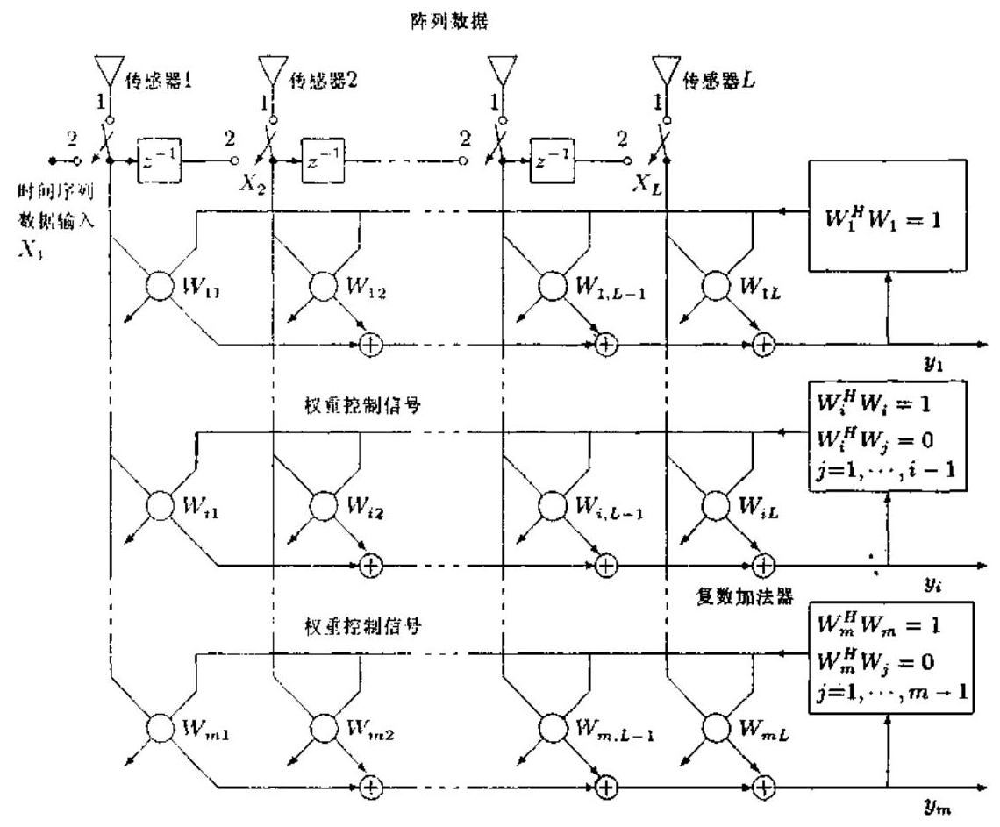

图 11.6.1 自适应特征子空间线性组合器

Yang 与 Kaveh ${}^{\left\lbrack  {14}\right\rbrack  }$ 第一个证明,在平稳情况下所希望的静态权重可以通过极小化 (对应干噪声子空间估计)或极大化(对应于信号子空间估计)线性组合器输出的均方值 $J$ 求得, 其中

$$
J = E\left\lbrack  {{y}^{H}y}\right\rbrack   = E\left\lbrack  {\operatorname{trace}\left( {y{y}^{H}}\right) }\right\rbrack
$$

$$
= E\left\lbrack  {\operatorname{trace}\left( {{W}^{H}x{x}^{H}W}\right) }\right\rbrack   = \operatorname{trace}\left( {{W}^{H}{RW}}\right) \tag{11.6.2}
$$

且极值化服从下列正交化约束条件:

$$
{W}^{H}W = I \tag{11.6.3}
$$

式中 $y = {\left\lbrack  {y}_{1},{y}_{2},\cdots ,{y}_{m}\right\rbrack  }^{T}$ 和 $W = \left\lbrack  \begin{array}{llll} {W}_{1} & {W}_{2} & \cdots & {W}_{m} \end{array}\right\rbrack$ 分别是输出向量和权重矩阵. 利用 $R$ 的奇异值分解 $R = {U}^{H}{AU}$ ,代价函数 $J$ 可以表示为

$$
J = \operatorname{trace}\left( {{V}^{H}{\Lambda V}}\right)  = \mathop{\sum }\limits_{{i = 1}}^{m}{V}_{i}^{H}\Lambda {V}_{i} = \mathop{\sum }\limits_{{i = 1}}^{m}{J}_{i} \tag{11.6.4}
$$

其中 $V = {UW}$ 服从正交化约束

$$
{V}^{H}V = I \tag{11.6.5}
$$

这里

$$
\Lambda  = \operatorname{diag}\left( {{\lambda }_{1},\cdots ,{\lambda }_{m}}\right)
$$

$$
V = {Q}^{H}W = \left\lbrack  \begin{array}{lll} {V}_{1} & \cdots & {V}_{m} \end{array}\right\rbrack
$$

和

$$
{J}_{i} = \operatorname{trace}\left( {{V}_{i}^{H}\Lambda {V}_{i}}\right)  = \mathop{\sum }\limits_{{j = 1}}^{L}{\left| {V}_{ij}\right| }^{2}{\lambda }_{j} \tag{11.6.6}
$$

而 ${V}_{ij}$ 是向量 ${V}_{i}$ 的第 $j$ 个元素,式中 $Q = \left\lbrack  \begin{array}{lll} {q}_{1} & \cdots & {q}_{L} \end{array}\right\rbrack$ 称为模型变换矩阵,它是酉矩阵.

图 11.6.1 所示的正交化约束可以利用 Gram-Schmidt 正交化方法实现. 然后, 极小化 (极大化) 代价函数 $J$ 等价于在 ${V}_{i}^{H}{V}_{i} = 1,{V}_{i}^{H}{V}_{j} = 0, j = 1,2,\cdots , i - 1$ 条件的约束下极小化 (极大化) 式 (11.6.6) 中的各个代价函数 ${J}_{i}$ .

显然,在 ${V}_{1}^{H}{V}_{1} = 1$ 约束下极小化 ${J}_{1}$ 所得结果为 ${V}_{1} = {\left\lbrack  0,\cdots ,0, + 1\right\rbrack  }^{T}$ (实际上,只有 +1 或 -1 可以接受),从而对应于 ${V}_{1}$ 的权重向量 ${W}_{1}$ 为 ${W}_{1} = Q{V}_{1} = {q}_{L}$ . 于是,使 ${J}_{1}$ 极小化的权重向量即是与 $R$ 的最小特征值对应的特征向量. 当使用一单头 $\left( {m = 1}\right)$ 组合器 (抽头延迟线处理器) 时, $J$ 的极小化最优解将是 ${q}_{L}$ . 这就是 Thompson 提出的自适应 Pisarenko 方法 ${}^{\left\lbrack  2\right\rbrack  }$ .

为了极小化 ${J}_{2}$ ,向量 ${V}_{2}$ 的第 $L$ 个元素必须为零,以便满足相对于 ${V}_{1}$ 的正交化约束条件. 根据前面的证明,使 ${J}_{2}$ 极小化的 ${V}_{2}$ 为 ${V}_{2} = {\left\lbrack  0,\cdots ,0, + 1,0\right\rbrack  }^{T}$ . 对所有 ${V}_{i}, i = 1,\cdots , m$ 使用相同推理,使 $J$ 极小化的最优矩阵变为

$$
V = \left\lbrack  \begin{matrix} 0 \\  {E}_{m} \end{matrix}\right\rbrack \tag{11.6.7}
$$

其中 ${E}_{m}$ 是一 $m \times  m$ 置换矩阵. 如果 $m = L - M$ ,则最优权重矩阵 $W$ 为

$$
W = {QV} = {Q}_{n} \tag{11.6.8}
$$

其中

$$
{Q}_{n} = \left\lbrack  \begin{array}{lll} {q}_{M + 1} & \cdots & {q}_{L} \end{array}\right\rbrack
$$

换言之,在关于权重系数的正交化条件的约束下极小化 $J$ 便得到了张成噪声子空间的权重向量,而且 ${J}_{i}$ 的最优值给出 ${\lambda }_{L - i + 1}, i = 1,2,\cdots ,\left( {L - M}\right)$ .

在 ${V}_{1}^{H}{V}_{1} = 1$ 约束下使 ${J}_{1}$ 极大化的最优向量为 ${V}_{1} = {\left\lbrack  +1,0,\cdots ,0\right\rbrack  }^{T}$ ; 使 ${J}_{2}$ 极大化的最优向量为 ${V}_{2} = {\left\lbrack  0, + 1,0,\cdots ,0\right\rbrack  }^{T}$ . 所以,当 $m = M$ 时,在关于权重向量的正交化约束条件下， $J$ 的极大化结果为

$$
V = \left\lbrack  \begin{matrix} {I}_{M} \\  0 \end{matrix}\right\rbrack
$$

最优化权重矩阵为 $W = {Q}_{0}$ ,其中

$$
{Q}_{s} = \left\{  \begin{array}{lll} {q}_{1} & \cdots & {q}_{M} \end{array}\right\}
$$

这就是说,在适当的约束条件下 $J$ 的极大化将得到与信号子空间特征向量相同的权重向量. 此外, ${J}_{i}$ 的最优解为 ${\lambda }_{i}, i = 1,\cdots , M.{J}_{i}$ 等于第 $i$ 个线性组合器输出功率的均值,它可以用作确定信号个数 $M$ 的自适应统计量 ${}^{\left\lbrack  {36}\right\rbrack  }$ .

模型变换矩阵 $Q$ 的性质之一是

$$
{Q}^{H}h\left( R\right) Q = \operatorname{diag}\left\lbrack  {h\left( {\lambda }_{1}\right) ,\cdots , h\left( {\lambda }_{L}\right) }\right\rbrack \tag{11.6.9}
$$

其中

$$
h\left( R\right)  = \mathop{\sum }\limits_{{i = {N}_{2}}}^{{N}_{1}}{c}_{i}{R}^{i}
$$

${c}_{i}$ 为实数, ${N}_{1} \geq  {N}_{2}$ 为正整数、零或负整数. 这意味着, $h\left( R\right)$ 与 $R$ 具有相同的特征向量, 但对应的特征值为 $h\left( {\lambda }_{i}\right)$ . 令 $h\left( {\lambda }_{i}\right)$ 是 ${\lambda }_{i}$ 的单调函数,则根据前面的推理,与 $h\left( R\right)$ 的最小 (最大) 特征值对应的特征向量可以通过 ${J}^{\prime }$ 的极小化 (极大化) 求出,其中

$$
{J}^{\prime } = \operatorname{trace}\left\lbrack  {{W}^{H}h\left( R\right) W}\right\rbrack \tag{11.6.10}
$$

约束条件为

$$
{W}^{H}W = I
$$

如果 $h\left( {\lambda }_{i}\right)$ 是 ${\lambda }_{i}$ 的增函数,则对应于 $h\left( R\right)$ 的 $m$ 个最小 (最大) 特征值的特征向量将等于 $R$ 的 $m$ 个最小 (最大) 特征值对应的特征向量. 反之,若 $h\left( {\lambda }_{i}\right)$ 是减函数,则与 $h\left( R\right)$ 的 $m$ 个最小 (最大) 特征值对应的特征向量将等于 $R$ 的 $m$ 个最大 (最小) 特征值对应的特征向量. 因此,适当地选择 $m$ 值, $R$ 的信号或噪声子空间的特征向量就可以由 ${J}^{\prime }$ 的约束极值化求解. 虽然适当选择的 ${J}^{\prime }$ 和 $J$ 的平稳最优解相同,但是这两种最优化问题的自适应和逼近公式的性能却可能明显不同. 因此,称 ${J}^{\prime }$ 为广义代价函数.

#### 11.6.2 LMS 型算法

广义代价函数 ${J}^{\prime }$ 的约束极值化可以借助约束的梯度搜寻法实现. 若收敛速率固定， 则权重矩阵按下式更新:

$$
{W}^{\prime }\left( k\right)  = W\left( {k - 1}\right)  \pm  {\mu \Delta }\left( k\right) \tag{11.6.11}
$$

其中 $\mu$ 是一个很小的正数,而

$W\left( k\right)  = {W}^{\prime }\left( k\right)$ 的列的 Gram-Schmidt 正交化结果

$\Delta \left( k\right)$ 是 ${J}^{\prime }$ 相对于 $W$ 的梯度的估计子. 显而易见,式 (11.6.11) 中的加号 (+) 用作使代价函数 ${J}^{\prime }$ 极大化,而减号 (-) 用作使 ${J}^{\prime }$ 极小化. 例如,若 $h\left( {\lambda }_{i}\right)$ 是 ${\lambda }_{i}$ 的非减函数,则极小化 ${J}^{\prime }$ 将使 $W\left( k\right)$ 收敛为噪声子空间. 在这种情况下，式 (11.6.11) 中就应该用减号 $\left( -\right)$ ， 以便得到噪声子空间. 当 $h\left( {\lambda }_{i}\right)$ 为 ${\lambda }_{i}$ 的减函数时,极大化 ${J}^{\prime }$ 将使 $W\left( k\right)$ 的列收敛为噪声特征向量. 此时, 在式 (11.6.11) 中应该采用减号 (-) 才能得到噪声子空间. 下面考虑两种特殊选择: $h\left( R\right)  = R$ 和 $h\left( R\right)  = {R}^{-1}$ .

选择 1: $h\left( R\right)  = R$

此时, ${J}^{\prime } = J$ ,且 $J$ 的梯度由下式给出:

$$
{\Delta J} = \frac{\partial }{\partial W}\left\lbrack  {\operatorname{trace}\left( {{W}^{H}{RW}}\right) }\right\rbrack   = {2RW} \tag{11.6.12}
$$

梯度的无偏估计可以在上式中用样本协方差矩阵 $\widehat{R}\left( k\right)$ 代替 $R$ 得到,即有

$$
{\Delta }_{1}\left( k\right)  = 2\widehat{R}\left( k\right) W\left( {k - 1}\right) \tag{11.6.13}
$$

在非平稳情况下, $\widehat{R}\left( k\right)$ 可以利用下式更新:

$$
\widehat{R}\left( k\right)  = \left( {1 - \alpha }\right) \widehat{R}\left( {k - 1}\right)  + {\alpha x}\left( k\right) {x}^{H}\left( k\right) \tag{11.6.14}
$$

其中 $0 < \alpha  < 1$ . 由前一小节知, $\widehat{R}\left( k\right)$ 的特征值 ${\lambda }_{i}$ 的估计为

$$
{\widehat{\lambda }}_{i}\left( k\right)  = {J}_{i}\left( k\right)  = \left( {1 - \alpha }\right) {J}_{i}\left( {k - 1}\right)  + \alpha {\left| {y}_{i}\left( k\right) \right| }^{2}
$$

这就是文献 [13] 中提出的随机梯度法. 梯度 ${\Delta J}$ 的最简单估计是在式 (11.6.14) 中取 $\alpha  = 1$ , 从而得到下面的最小均方 (LMS) 型梯度估计子:

$$
{\Delta }_{2}\left( k\right)  = {2x}\left( k\right) {y}^{H}\left( k\right) \tag{11.6.15}
$$

当 ${\Delta }_{2}\left( k\right)$ 用于信号子空间估计时,对权重向量的自适应采用不同的收敛因子 ${\mu }_{i}\left( k\right)$ , $i = 1,\cdots , M$ 能够得到更好的估计性能. 这是因为,由 ${J}_{i}\left( k\right)$ 估计的信号子空间特征值之间存在大的差异. 因此, 规范化的 LMS 型权重向量自适应算法如下:

$$
{W}_{i}\left( k\right)  = {W}_{i}\left( {k - 1}\right)  + 2{\mu }_{i}\left( k\right) x\left( k\right) {y}_{i}\left( k\right) ,\;i = 1,\cdots , M \tag{11.6.16a}
$$

其中

$$
{\mu }_{i}\left( k\right)  = \mu \sqrt{\frac{{J}_{M}\left( k\right) }{{J}_{i}\left( k\right) }} \tag{11.6.16b}
$$

选择 $2 : h\left( R\right)  = {R}^{-1}$

此时, ${J}^{\prime }$ 的梯度矩阵由

$$
\Delta {J}^{\prime } = \frac{\partial }{\partial W}\left\lbrack  {\operatorname{trace}\left( {{W}^{H}{R}^{-1}W}\right) }\right\rbrack   = 2{R}^{-1}W
$$

给出,我们对 ${J}^{\prime }$ 的梯度负值感兴趣. 类似于 ${\Delta }_{1}\left( k\right)$ 和 ${\Delta }_{2}\left( k\right)$ ,可以定义 ${\Delta }_{3}\left( k\right)$ 和 ${\Delta }_{4}\left( k\right)$ . 其中， ${\Delta }_{3}\left( k\right)$ 的无偏估计为

$$
{\Delta }_{3}\left( k\right)  =  - 2{\widehat{R}}^{-1}\left( k\right) W\left( {k - 1}\right)  =  - {2T}\left( k\right) W\left( {k - 1}\right) \tag{11.6.17}
$$

式中 $T\left( k\right)  = {\widehat{R}}^{-1}\left( k\right)$ 代表样本协方差矩阵的逆矩阵. 对式 (11.6.14) 应用矩阵求逆引理易得

$$
T\left( k\right)  = \frac{1}{1 - \alpha }\left\lbrack  {T\left( {k - 1}\right)  - \frac{z\left( k\right) {z}^{H}\left( k\right) }{\left( {1 - \alpha }\right) /\alpha  + {z}^{H}\left( k\right) x\left( k\right) }}\right\rbrack \tag{11.6.18}
$$

式中

$$
z\left( k\right)  = T\left( {k - 1}\right) x\left( k\right) \tag{11.6.19}
$$

遗憾的是， ${\Delta }_{3}\left( k\right)$ 的递推数值上可能不稳定，因为 $\widehat{R}\left( k\right)$ 可能病态，从而逆矩阵 $T\left( k\right)$ 的计算不稳定. 为此,与 ${\Delta }_{2}\left( k\right)$ 类似,可以采用下面的梯度估计:

$$
{\Delta }_{4}\left( k\right)  = \frac{x\left( k\right) {y}^{H}\left( k\right) }{{x}^{H}\left( k\right) x\left( k\right) }
$$

对应的权重矩阵更新为

$$
{W}^{\prime \prime }\left( k\right)  = W\left( {k - 1}\right)  \pm  {\mu }^{\prime }{\Delta }_{4}\left( k\right) \tag{11.6.20}
$$

其中 ${W}^{\prime \prime }\left( k\right)  = {W}^{\prime }\left( k\right) /\left( {1 \mp  {2\mu }}\right)$ 和 ${\mu }^{\prime } = {2\mu }/\left( {1 \mp  {2\mu }}\right) .{\Delta }_{2}\left( k\right)$ 和 ${\Delta }_{4}\left( k\right)$ 的主要区别在于 ${\Delta }_{4}\left( k\right)$ 中使用了归一化因子 ${\left\lbrack  {x}^{H}\left( k\right) x\left( k\right) \right\rbrack  }^{-1}$ .

文献 [14] 还分析了两种 LMS 型自适应信号和噪声子空间估计算法的收敛速率，并介绍了利用拉伸映射 (inflation) 的高并行算法.

### 11.7 共轭梯度特征结构跟踪

考虑如何极小化下列函数:

$$
\phi \left( x\right)  = \frac{1}{2}{x}^{T}{Ax} - {x}^{T}b
$$

式中 $b \in  {R}^{n}$ ,并假定 $A \in  {R}^{n \times  n}$ 为正定和对称矩阵. 令 $x = {A}^{-1}b$ ,则可得 $\phi$ 的极小值为 $- \frac{1}{2}{b}^{T}{A}^{-1}b$ . 因此,极小化 $\phi$ 和求解方程 ${Ax} = b$ 是两个等价的问题.

#### 11.7.1 共轭梯度法简述

极小化 $\phi$ 的最简单方法之一是最速下降法: 在现时刻 $k$ 点 ${x}_{k}$ ,函数 $\phi$ 在负梯度 $- {\Delta \phi }\left( {x}_{k}\right)  = {b}_{k} - A{x}_{k}$ 的方向上下降最快.

$$
{r}_{k} = {b}_{k} - A{x}_{k} \tag{11.7.1}
$$

称为 ${x}_{k}$ 的残差.

求解 ${Ax} = b$ 的最速下降法一般收敛缓慢. 为了克服这一缺陷,考虑函数 $\phi$ 沿一组方向 $\left\{  {{p}_{1},{p}_{2},\cdots }\right\}$ 上的连续极小化,并希望能有限步逼近真实解 ${x}^{ * }$ . 这组方向与残差 $\left\{  {{r}_{0},{r}_{1},\cdots }\right\}$ 不一定对应. 具体说来,我们希望选择方向向量 $\left\{  {{p}_{1},{p}_{2},\cdots }\right\}$ 使迭代值

$$
{x}_{k} = {x}_{k - 1} + {\alpha }_{k}{p}_{k},\;k = 0,1,\cdots
$$

能有限步逼近解 ${x}^{ * }$ .

令 ${P}_{k} = \left\lbrack  {{p}_{1},\cdots ,{p}_{k}}\right\rbrack   \in  {R}^{n \times  k}$ 为搜索方向矩阵. 若

$$
{P}_{k - 1}^{T}A{p}_{k} = 0 \tag{11.7.2}
$$

则称 ${p}_{k}$ 是 ${p}_{1},\cdots ,{p}_{k - 1}$ 的 $A$ 共轭 (A-conjugate) ${}^{\left\lbrack  5\right\rbrack  }$ .

如果选择新的搜索方向 ${p}_{k + 1}$ 为残差 ${r}_{k}$ 与以前的搜索方向之综合作用:

$$
{p}_{k + 1} = {r}_{k} - {q}_{k}{p}_{k} \tag{11.7.3}
$$

注意到残差 ${r}_{k}$ 为负梯度方向，如果选择 ${q}_{k}$ 使 ${p}_{k + 1}$ 是 $\left\{  {{p}_{1},\cdots ,{p}_{k}}\right\}$ 的 $A$ 共轭，则可望经过有限步使 ${x}_{k}$ 逼近 ${x}^{ * }$ . 这就是所谓的共轭梯度方法.

算法 11.7.1 (共轭梯度法) ${}^{\left\lbrack  5\right\rbrack  }$ 如果 $A \in  {R}^{n \times  n}$ 是一对称的正定矩阵,并且 $b \in  {R}^{n}$ , 则下面的算法计算满足 ${Ax} = b$ 的解 $x \in  {R}^{n}$ .

$k = 0;{x}_{0} = 0;{r}_{0} = b$

while ${r}_{k} \neq  0$

$k = k + 1$

if $k = 1$

${p}_{1} = {r}_{0}$

else

${\beta }_{k} = {r}_{k - 1}^{T}{r}_{k - 1}/\left( {{r}_{k - 2}^{T}{r}_{k - 2}}\right)$

${p}_{k} = {r}_{k - 1} + {\beta }_{k}{p}_{k - 1}$

end

${\alpha }_{k} = {r}_{k - 1}^{T}{r}_{k - 1}/\left( {{p}_{k}^{T}A{p}_{k}}\right)$

${x}_{k} = {x}_{k - 1} + {\alpha }_{k}{p}_{k}$

${r}_{k} = {r}_{k - 1} - {\alpha }_{k}A{p}_{k}$

end

$x = {x}_{k}$

共轭梯度法具有以下重要性质.

定理 ${11.7.1}^{\left\lbrack  5\right\rbrack  }$ 共轭梯度法在 $k$ 次迭代后有

$$
\operatorname{span}\left\{  {{p}_{1},\cdots ,{p}_{j}}\right\}   = \operatorname{span}\left\{  {{r}_{0},\cdots ,{r}_{j - 1}}\right\}   = \operatorname{span}\left\{  {b,{Ab},\cdots ,{A}^{j - 1}b}\right\} \tag{11.7.4}
$$

而且在 $k - 1$ 步迭代后,残差 ${r}_{0},\cdots ,{r}_{k - 1}$ 相互正交.

在现代数值分析中, 共轭梯度法是求解大型稀疏线性方程组的一种常用迭代方法. 共轭梯度法也可用于自适应滤波器的设计 ${}^{\left\lbrack  {39}\right\rbrack  }$ .

使用共轭梯度法迭代一个极端 (最大或最小) 特征对 (特征值与特征向量) 的做法最早可追溯到 1966 年 ${}^{\left\lbrack  1\right\rbrack  }$ . 为了求出其它特征对,文献 $\left\lbrack  1\right\rbrack$ 利用压缩映射将第一个极端特征对从原 Hermitian 矩阵中压缩掉, 然后求第二个极端特征对, 并重复压缩映射过程. 1986 年, Sarkar 等人则提出使用在前已求出的特征对的正交补开始下一个特征对的搜索. 虽然这些共轭梯度法对固定的协方差矩阵 (Hermitian 矩阵) 工作得很好, 但它们不适用在子空间跟踪问题中的时变协方差矩阵. 1987 年, 文献 [37] 报告了收敛到极端特征对或奇异三元组 (奇异值、无和右奇异向量) 集合的共轭梯度法, 该方法与文献 [1] 中的压缩映射方法 非常类似, 所不同的只是前者迭代奇异三元组, 后者迭代特征对. 文献 [37] 中的方法也不能很好地适用时变的数据矩阵. 1989 年, 文献 [38] 综合评述了对称矩阵极端特征对迭代的各种共轭梯度算法. 1992 年,共轭梯度法被用来设计自适应滤波器 ${}^{\left\lbrack  {39}\right\rbrack  }$ . 1995 年, Fu 与 Dowling ${}^{\left\lbrack  {16}\right\rbrack  }$ 发展了一种适合时变协方差矩阵特征结构跟踪的共轭梯度法. 下面介绍这种方法.

#### 11.7.2 代价函数

令观测过程 $y\left( k\right)$ 是慢时变的，而且噪声是平稳的，与信号不相关. 所谓慢时变，指的是 $y\left( k\right)$ 在 $\frac{1}{\left( 1 - \sqrt{\alpha }\right) }$ 时间单元的窗口内近似遍态历经的. 局部协方差矩阵利用指数衰减的窗进行估计，即

$$
{R}_{k} = \left( {1 - \alpha }\right) \mathop{\sum }\limits_{{j = 0}}^{k}{\alpha }^{k - j}{y}_{j}{y}_{j}^{H} = \alpha {R}_{k - 1} + \left( {1 - \alpha }\right) {y}_{k}{y}_{k}^{H} \tag{11.7.5}
$$

类似于 11.6 节介绍的代价函数 (11.6.2) 式, 现在定义代价函数为

$$
J\left( U\right)  = \operatorname{trace}\left( {{U}^{H}{RU}}\right) \tag{11.7.6}
$$

约束条件为

$$
{U}^{H}U = I \tag{11.7.7}
$$

为方便计,我们省略了协方差矩阵 ${R}_{k}$ 的时标 $k$ . 令 $R = {V\sum }{V}^{H}$ ,并记 $V = \left\lbrack  {{V}_{s},{V}_{n}}\right\rbrack$ ,即 ${V}_{s}$ 和 ${V}_{n}$ 分别对应为信号和噪声特征向量空间. 根据 11.6 节的分析,取 $U = {V}_{s}$ 相当于使 $J$ 极大化,而 $U = {V}_{n}$ 相当于使 $J$ 极小化. 令 ${Q}_{s} \in  {C}^{r \times  r}$ 和 ${Q}_{n} \in  {C}^{\left( {n - r}\right)  \times  \left( {n - r}\right) }$ 为任意正交矩阵,不难看出 ${U}_{s}^{\prime } = {V}_{s}{Q}_{s}$ 将使 $J\left( {U}_{s}^{\prime }\right)$ 极大化,并且任意 ${U}_{n}^{\prime } = {V}_{n}{Q}_{n}$ 将使 $J\left( {U}_{n}^{\prime }\right)$ 极小化. 因此,对于代价函数 $J\left( U\right)$ ,其变元 $U$ 为主子空间 (即信号子空间) 时 $J$ 被极大化,变元 $U$ 取次子空间 (噪声子空间) 时 $J$ 被极小化. 这表明, $J\left( U\right)$ 是一个子空间代价函数,而这正是基于共轭梯度的子空间跟踪方法所需要的. 注意

$$
J\left( U\right)  = \operatorname{trace}\left( {{U}^{H}{RU}}\right)  = \mathop{\sum }\limits_{{i = 1}}^{m}{u}_{i}^{H}R{u}_{i} = \mathop{\sum }\limits_{{i = 1}}^{m}{J}_{i}\left( {u}_{i}\right) \tag{11.7.8}
$$

其中

$$
{J}_{i}\left( {u}_{i}\right)  = {u}_{i}^{H}R{u}_{i} \tag{11.7.9}
$$

因此,如果使每一个 ${J}_{i}$ 在正交化条件

$$
{u}_{i}^{H}{u}_{i} = 1,\;{u}_{i}^{H}{u}_{j} = 0,\;i \neq  j \tag{11.7.10}
$$

约束下极大化，便得到信号特征向量集合；如果使每一个 ${J}_{i}$ 在正交化约束条件下极小化, 则得到噪声特征向量集合.

#### 11.7.3 特征值分解迭代的共轭梯度算法

令 $k$ 为迭代次数，显然在第 $k$ 次迭代中可以用

$$
{\lambda }_{i}\left( k\right)  = {J}_{i}\left( k\right)  = {u}_{i}^{H}\left( k\right) R{u}_{i}\left( k\right) \tag{11.7.11}
$$

逼近第 $i$ 个特征值. 另一方面,由于 ${\lambda }_{i}\left( k\right)$ 和 ${u}_{i}\left( k\right)$ 分别是 $R$ 的特征值和特征向量,故有

$$
{\lambda }_{i}\left( k\right) {u}_{i}\left( k\right)  = R{u}_{i}\left( k\right) \tag{11.7.12}
$$

因此，第 $k$ 次迭代的残差为

$$
{r}_{i}\left( k\right)  = {\lambda }_{i}\left( k\right) {u}_{i}\left( k\right)  - R{u}_{i}\left( k\right) \tag{11.7.13}
$$

它是函数 $J$ 相对于 ${u}_{i}\left( k\right)$ 的负梯度. 令 ${p}_{i}\left( k\right)$ 代表 ${u}_{i}$ 在第 $k$ 次迭代的搜索方向的向量, 其初始值设定为 ${p}_{i}\left( 0\right)  = {r}_{i}\left( 0\right)$ . 由式 (11.7.3),新搜索方向取残差 ${r}_{i}\left( k\right)$ 与前搜索方向 ${p}_{i}\left( k\right)$ 之综合:

$$
{p}_{i}\left( {k + 1}\right)  = {r}_{i}\left( k\right)  - {q}_{i}\left( k\right) {p}_{i}\left( k\right) \tag{11.7.14}
$$

共轭梯度法告诉我们特征向量的更新公式如下:

$$
{x}_{i}\left( {k + 1}\right)  = {u}_{i}\left( k\right)  + {t}_{i}\left( k\right) {p}_{i}\left( k\right) \tag{11.7.15}
$$

在上述公式中， ${t}_{i}\left( k\right)$ 为一参数，它决定是极大化还是极小化代价函数 ${J}_{i}\left( {k + 1}\right)$ .

根据共轭梯度法的原理,特征值分解的迭代是通过极大化或极小化每一个 ${J}_{i}$ 来实现的,极值化的约束条件是 ${u}_{i}$ 正交,并且式 (11.7.14) 中的 ${q}_{i}\left( k\right)$ 的选择必须使新搜索方向 ${p}_{i}\left( {k + 1}\right)$ 相对于 $R$ 共轭,即

$$
{p}_{i}^{H}\left( {k + 1}\right) R{p}_{i}\left( k\right)  = 0 \tag{11.7.16}
$$

由式 (11.7.14) 和式 (11.7.16) 有

$$
{p}_{i}^{H}\left( {k + 1}\right) R{p}_{i}\left( k\right)  = {\left\lbrack  {r}_{i}\left( k\right)  - {q}_{i}\left( k\right) {p}_{i}\left( k\right) \right\rbrack  }^{H}R{p}_{i}\left( k\right)  = 0 \tag{11.7.17}
$$

从而得到

$$
{q}_{i}^{ * }\left( k\right)  = \frac{{r}_{i}^{H}\left( k\right) R{p}_{i}\left( k\right) }{{p}_{i}^{H}\left( k\right) R{p}_{i}\left( k\right) } \tag{11.7.18}
$$

如果我们按照式 (11.7.15) 更新特征向量,则 ${x}_{i}\left( {k + 1}\right)$ 将不是正交的. 解决这一问题的方法是，在更新后用 ${QR}$ 分解将这些向量重新正交化. 问题是，式 (11.7.15) 中的 ${t}_{i}\left( k\right)$ 需要适当选择,以使得 ${J}_{i}\left( {k + 1}\right)$ 在 ${u}_{i}\left( {k + 1}\right)$ 正交的约束下极大化或极小化. 因此,正交化约束必须并入到最优化问题中. 为此, 我们需要既更新又正交化的特征向量的解析公式. 为了得到所希望的表达式, 现在用 Gram-Schmidt 正交化将式 (11.7.15) 重新写作

$$
{u}_{i}\left( {k + 1}\right)  = \frac{\left\lbrack  {I - \mathop{\sum }\limits_{{j = 1}}^{{i - 1}}{u}_{j}\left( {k + 1}\right) {u}_{j}^{H}\left( {k + 1}\right) }\right\rbrack  {x}_{i}\left( {k + 1}\right) }{{x}_{i}^{H}\left( {k + 1}\right) \left\lbrack  {I - \mathop{\sum }\limits_{{j = 1}}^{{i - 1}}{u}_{j}\left( {k + 1}\right) {u}_{j}\left( {k + 1}\right) }\right\rbrack  {x}_{i}\left( {k + 1}\right) } \tag{11.7.19}
$$

若定义

$$
{B}_{i} = I - \mathop{\sum }\limits_{{j = 1}}^{{i - 1}}{u}_{j}\left( {k + 1}\right) {u}_{j}^{H}\left( {k + 1}\right) \tag{11.7.20}
$$

则有

$$
{u}_{i}\left( {k + 1}\right)  = \frac{{B}_{i}{x}_{i}\left( {k + 1}\right) }{\sqrt{{x}_{i}^{H}\left( {k + 1}\right) {B}_{i}{x}_{i}\left( {k + 1}\right) }} \tag{11.7.21}
$$

其中 ${x}_{i}\left( {k + 1}\right)$ 是 ${t}_{i}\left( k\right)$ 的函数,如式 (11.7.15) 所示. 可以证明 ${}^{\left\lbrack  {16}\right\rbrack  }$ ,按照式 (11.7.15) 更新特征向量所需要的最优 ${t}_{i}\left( k\right)$ 由下式给出:

$$
{t}_{i}\left( k\right)  = \frac{-f \pm  \sqrt{{f}^{2} - {4hg}}}{2h} \tag{11.7.22}
$$

式中

$$
f = {be} - {\lambda d} + {a}^{ * }c - a{c}^{ * }
$$

$$
g = {a}^{ * }e - \lambda {c}^{ * }
$$

$$
h = {bc} - {ad}
$$

这里

$$
\lambda  = {u}_{i}^{H}\left( k\right) {A}_{i}{u}_{i}\left( k\right)
$$

$$
a = {u}_{i}^{H}\left( k\right) {A}_{i}{p}_{i}\left( k\right)
$$

$$
b = {p}_{i}^{H}\left( k\right) {A}_{i}{p}_{i}\left( k\right)
$$

$$
e = {u}_{i}\left( k\right) {B}_{i}{u}_{i}\left( k\right)
$$

$$
c = {u}_{i}^{H}\left( k\right) {B}_{i}{p}_{i}\left( k\right)
$$

$$
d = {p}_{i}^{H}\left( k\right) {B}_{i}{p}_{i}\left( k\right)
$$

一旦选定 ${t}_{i}\left( k\right)$ 后，即可将式 (11.7.15) 重写如下:

$$
{u}_{i}\left( {k + 1}\right)  = {u}_{i}\left( k\right)  + {t}_{i}\left( k\right) {p}_{i}\left( k\right) \tag{11.7.23}
$$

然而,必须注意这并不能保证 ${u}_{i}^{H}\left( {k + 1}\right) R{u}_{i}\left( {k + 1}\right)$ 总是大于或等于 ${u}_{i}^{H}\left( k\right) R{u}_{i}\left( k\right)$ . 因此, 我们还应该把 ${u}_{i}\left( k\right)$ 看作是一个可能的端点. 具体说来,对于极大化,若

$$
{u}_{i}^{H}\left( k\right) R{u}_{i}\left( k\right)  > {u}_{i}^{H}\left( {k + 1}\right) R{u}_{i}\left( {k + 1}\right) \tag{11.7.24}
$$

则应选取

$$
{x}_{i}\left( {k + 1}\right)  = {u}_{i}\left( k\right) \tag{11.7.25}
$$

归纳起来，便得到下列算法 [16].

算法 11.7.2 (特征值分解跟踪的共轭梯度算法)

初始化:

(1)令初始猜测 $U\left( 0\right)  = \left\lbrack  {{u}_{1},\cdots ,{u}_{r}}\right\rbrack$ ,其中 ${U}^{H}\left( 0\right) U\left( 0\right)  = I$ ;

(2)由 ${\lambda }_{i}\left( 0\right)  = {u}_{i}^{H}\left( 0\right) R{u}_{i}\left( 0\right)$ 计算逼近特征值;

(3)利用 ${r}_{i}\left( 0\right)  = {\lambda }_{i}\left( 0\right) {u}_{i}\left( 0\right)  - R{u}_{i}\left( 0\right)$ 计算残差;

(4)选择初始搜索方向 ${p}_{i}\left( 0\right)  = {r}_{i}\left( 0\right)$ .

对于 $k = 1,2,\cdots$

(1)利用式 (11.7.18) 计算 ${p}_{i}\left( {k + 1}\right)$ ，这需要 $O\left( {m}^{2}\right)$ 次运算；

(2)利用式 (11.7.16) 计算 ${p}_{i}\left( {k + 1}\right)$ ，这需要 $O\left( m\right)$ 次运算；

(3)由式 (11.7.22) 计算 ${t}_{i}\left( k\right)$ ，这需要 $O\left( {m}^{2}\right)$ 次运算；

(4) 利用式 (11.7.15) 和式 (11.7.21) 或式 (11.7.25) 计算 ${x}_{i}\left( {k + 1}\right)$ 或 ${u}_{i}\left( {k + 1}\right)$ ,这需要 $O\left( m\right)$ 和 $O\left( {m}^{2}\right)$ 次运算;

(5) 由式 (11.7.13) 计算 ${r}_{i}\left( {k + 1}\right)$ ,这需要 $O\left( {m}^{2}\right)$ 次运算;

(6) 用式 (11.7.11) 计算 ${\lambda }_{i}\left( {k + 1}\right)$ ，这需要 $O\left( {m}^{2}\right)$ 次运算.

每次迭代需要 $O\left( {r{m}^{2}}\right)$ 次运算.

#### 11.7.4 特征结构跟踪的共轭梯度算法

将特征值分解跟踪的共轭梯度算法中所有的数据协方差矩阵 $R$ 用式 (11.7.5) 更新, 即可得到特征结构跟踪的共轭梯度算法 1 (简记作 CGET1). CGET1 算法的主要步骤如下: 首先更新 ${R}_{k}$ ,接下来取前面已求出之特征对作为共轭梯度迭代的初始条件,计算一次共轭梯度迭代以更新 $r$ 个被跟踪的特征对. 此算法收敛很快，但需要 $O\left( {r{m}^{2}}\right)$ 次运算， 对于某些应用,这一计算量显得太大.

为了推广得到更加简单、只需要 $O\left( {{r}^{2}m}\right)$ 运算 $(r$ 比 $m$ 一般小很多) 的算法 CGET2, 需要作某些假设和近似. 第一个假设是噪声为白噪声. 如果噪声不是白的，但噪声的协方差矩阵可估计 ${}^{\left\lbrack  {10}\right\rbrack  }$ ,则可以将输入过程预白化 ${}^{\left\lbrack  {40}\right\rbrack  }$ ,使之符合白噪声假设. 一旦噪声为白噪声,就可以通过令所有的噪声特征值等于它们的平均值,并令协方差矩阵 $R = {R}_{s} + {R}_{n}$ 的噪声部分 ${R}_{n}$ 的所有对角线元素为零,将噪声子空间球面化 (sphericalize). 注意,令所有的噪声特征值等于它们的平均值, 这一过程会使得与噪声子空间相关联的 SVD 超椭圆体变成一个超球面. 这一逼近称为子空间平均 ${}^{\left\lbrack  {10}\right\rbrack  }$ . 一旦子空间平均并入到更新过程中, 压缩映射即可应用. 在特征结构的跟踪中，将强迫噪声特征值等于它们的平均值，并保持噪声子空间为球面. 让本来是超椭圆体的噪声子空间保持为球面的优点是:它能够使噪声子空间的基向量任意重新定方向. 这就提供了一个自由度, 使我们能够旋转噪声子空间，以使新的数据向量 $x\left( k\right)$ 到噪声子空间的整个投影落到噪声子空间的第一个基向量上，从而使 $\left( {m - r}\right)$ 维的噪声子空间计算简化为一维计算. 这个过程叫做压缩映射，它是将 CGET1 算法的 $O\left( {{m}^{2}r}\right)$ 次运算减小到 CGET2 算法的 $O\left( {m{r}^{2}}\right)$ 次运算的关键所在. 进一步地, 还可以利用这一思想得到一个平方根压缩映射算法. 为此, 定义两个数据矩阵:

$$
{A}_{k} = {\left\lbrack  \begin{array}{llll} \sqrt{{\alpha }^{k}}{x}_{0} & \sqrt{{\alpha }^{k - 1}}{x}_{1} & \cdots & \sqrt{{\alpha }^{0}}{x}_{k} \end{array}\right\rbrack  }^{H} \tag{11.7.26}
$$

和

$$
{A}_{k + 1} = \left\lbrack  \begin{matrix} \sqrt{\alpha }{A}_{k} \\  {x}_{k + 1}^{H} \end{matrix}\right\rbrack \tag{11.7.27}
$$

假定有基于随机逼近的所谓部分奇异值分解 ${Q}_{0}^{H}{A}_{k}V = R$ 或

$$
\left\lbrack  \begin{matrix} \sqrt{{\alpha }^{k}}{x}_{0}^{H} \\  \sqrt{{\alpha }^{k - 1}}{x}_{1}^{H} \\  \vdots \\  \sqrt{{\alpha }^{0}}{x}_{k}^{H} \end{matrix}\right\rbrack  \left\lbrack  \begin{array}{ll} {V}_{1} & {V}_{2} \end{array}\right\rbrack   = {Q}_{0}\left\lbrack  \begin{matrix} {R}_{r} & 0 \\  0 & {\sigma }_{n}^{2}I \end{matrix}\right\rbrack \tag{11.7.28}
$$

在这一分解中, ${R}_{r} \in  {C}^{r \times  r}$ 为上三角矩阵, ${V}_{1} \in  {C}^{m \times  r}$ 和 ${V}_{2} \in  {C}^{m \times  \left( {m - r}\right) }$ 为主/次子空间基的估计. 如果 ${R}_{r}$ 为对角矩阵,则式 (11.7.28) 即是奇异值分解. 因此,迭代过程必须将 ${R}_{r}$ 变成对角矩阵形式. 在此,主要是对 ${A}_{k}$ 加一行,并利用上述部分奇异值分解得到逼近的奇异值分解.

11.2 节介绍的 ${URV}$ 分解也是一种 “部分奇异值分解”. ${URV}$ 分解是秩固定的双边分解的一种模糊秩型的矩阵分解, 而 “随机逼近的部分奇异值分解” 则是一种 LMS 算法形式的逼近, 是以概率 1 收敛的. 这里的所谓逼近是指强迫所有的噪声奇异值 (它们理论上相同，但实际迭代时不相同)在每一步更新后相同.

更新的第一步是平方根压缩映射,即用 $\sqrt{\alpha }$ 乘 ${A}_{k}$ ,并加上 ${x}_{k + 1}^{H}$ 以得到 ${A}_{k + 1}$ ,即

$$
\left\lbrack  \begin{matrix} \sqrt{{\alpha }^{k}}{x}_{0}^{H} \\  \sqrt{{\alpha }^{k - 1}}{x}_{1}^{H} \\  \vdots \\  \sqrt{{\alpha }^{0}}{x}_{k}^{H} \end{matrix}\right\rbrack  \left\lbrack  \begin{array}{ll} {V}_{1} & {V}_{2} \end{array}\right\rbrack   = \left\lbrack  \begin{matrix} {Q}_{0} & 0 \\  0 & 1 \end{matrix}\right\rbrack  {Q}_{G}{Q}_{G}^{H}\left\lbrack  \begin{matrix} \sqrt{\alpha }{R}_{T} & 0 \\  0 & \sqrt{\alpha }{\sigma }_{n}I \\  {x}_{s}^{H} & \beta ,0,\cdots ,0 \end{matrix}\right\rbrack \tag{11.7.29}
$$

其中 ${x}_{s}^{H} = {x}_{k + 1}^{H}{V}_{1} \in  {C}^{1 \times  r}$ ,且 ${x}_{n}^{H} = {x}_{k + 1}^{H}{V}_{2} = \left\lbrack  {\beta ,0,\cdots ,0}\right\rbrack   \in  {C}^{1 \times  \left( {m - r}\right) }$ . 选择正交矩阵 ${Q}_{G}^{H}$ 为 $r + 1$ 个 Givens 旋转之乘积,其作用是将式 (11.7.29) 中的 ${x}_{s}^{H}$ 和 $\beta$ 项消去. 于是,式 (11.7.29) 可以写作

$$
{A}_{k + 1}\left\lbrack  \begin{array}{ll} {V}_{1} & {V}_{2} \end{array}\right\rbrack   = \left\lbrack  \begin{matrix} {Q}_{0} & 0 \\  0 & 1 \end{matrix}\right\rbrack  {Q}_{G}\left\lbrack  \begin{matrix} {R}_{r + 1} & 0 \\  0 & {\sigma }_{n}^{\prime }I \\  0 & 0 \end{matrix}\right\rbrack   = {U}_{0}\left\lbrack  \begin{matrix} {R}_{r + 1} & 0 \\  0 & {\sigma }_{n}^{\prime }I \\  0 & 0 \end{matrix}\right\rbrack \tag{11.7.30}
$$

下一步是在共轭梯度方向上走一步, 将式 (11.7.30) 变成奇异值分解. 下面集中讨论如何利用共轭梯度迭代将 ${R}_{r + 1}$ 移向奇异值分解. 为了便于数学理解,先将式 (11.7.30) 改写为

$$
{A}_{k + 1}V = {U}_{0}{R}_{0} \tag{11.7.31}
$$

注意, ${A}_{k + 1}$ 是协方差矩阵的平方根即数据矩阵,就是说 ${R}_{k + 1} = {A}_{k + 1}^{H}{A}_{k + 1}$ . 然而,若只关心变换后的数据因子 ${A}_{k + 1}V$ ，则可以写出 $V$ 变换的相关矩阵:

$$
{\left( {A}_{k + 1}V\right) }^{H}\left( {{A}_{k + 1}V}\right)  = {R}_{0}^{H}{U}_{0}^{H}{U}_{0}{R}_{0} = {R}_{0}^{H}{R}_{0} \tag{11.7.32}
$$

因此，用 $V$ 变换的坐标系可以写出:

$$
{R}_{k + 1}^{\left( V\right) } = {V}^{H}{A}_{k + 1}^{H}{A}_{k + 1}V = \left\lbrack  \begin{matrix} {R}_{r + 1}^{H}{R}_{r + 1} & 0 \\  0 & {\sigma }_{n}^{\prime }I \end{matrix}\right\rbrack \tag{11.7.33}
$$

这一结论是有趣的,因为在 $V$ 坐标系,所有的计算都是 $\left( {r + 1}\right)$ 维方程. 特征值分解算法可以用来求解这一关键的特征问题. 对 ${R}_{r + 1}^{H}{R}_{r + 1} \in  {C}^{\left( {r + 1}\right)  \times  \left( {r + 1}\right) }$ 进行特征值分解的共轭梯度迭代. 首先,取初始猜测 ${Q}_{0}^{\left( r + 1\right) } = I$ ,并计算一次特征值分解的共轭梯度迭代以得到特征向量的正交矩阵,将其记作 ${Q}_{R} \in  {C}^{\left( {r + 1}\right)  \times  \left( {r + 1}\right) }$ . 由于在一次或二次共轭梯度迭代之后, 矩阵

$$
\widetilde{R} = {Q}_{R}^{H}{R}_{r + 1}^{H}{R}_{r + 1}{Q}_{R} \tag{11.7.34}
$$

几乎是对角的, 所以直接取

$$
{\widetilde{R}}_{k + 1} = \sqrt{\widetilde{R}} \tag{11.7.35}
$$

并令对角线以外的元素为零. 这样一来, 就可以将式 (11.7.30) 写作

$$
{A}_{k + 1}V = {U}_{0}{\bar{Q}}_{L}{\bar{Q}}_{L}^{H}{R}_{0}{\bar{Q}}_{R}{\bar{Q}}_{R}^{H} \tag{11.7.36}
$$

式中 ${\bar{Q}}_{L} \in  {C}^{\left( {k + 1}\right)  \times  \left( {k + 1}\right) }$ 和 ${\bar{Q}}_{R} \in  {C}^{m \times  m}$ 分别具有 ${Q}_{L}$ 和 ${Q}_{R}$ 的 $\left( {r + 1}\right)  \times  \left( {r + 1}\right)$ 维主分块矩阵. 利用式 (11.7.30) 和式 (11.7.36) 可以写出:

$$
{A}_{k + 1}V = {U}_{0}{\bar{Q}}_{L}\left\lbrack  \begin{matrix} {\widetilde{R}}_{r + 1} & 0 \\  0 & {\sigma }_{n}^{\prime }I \end{matrix}\right\rbrack  {\bar{Q}}_{R}^{H} \tag{11.7.37}
$$

或

$$
{A}_{k + 1}\left\lbrack  \begin{array}{ll} {V}_{1} & {V}_{2} \end{array}\right\rbrack  {\bar{Q}}_{R} = {U}_{0}{\bar{Q}}_{L}\left\lbrack  \begin{matrix} {\widetilde{R}}_{r + 1} & 0 \\  0 & {\sigma }_{n}^{\prime }I \end{matrix}\right\rbrack \tag{11.7.38}
$$

它再一次是式 (11.7.28) 的形式. 当跟踪子空间 ${V}_{1}$ 时,既没有任何必要求出 ${U}_{2}$ 和 ${U}_{0}$ ,也没有必要求出 ${\widetilde{Q}}_{L}$ ,需要计算的仅是所要求的 $\left( {r + 1}\right)$ 维方程.

将上述分析结果加以归纳, 便得到下面的算法 ${}^{\left\lbrack  {16}\right\rbrack  }$ .

算法 11.7.3 (CGET2 算法)

1) 构造 ${x}_{n} = {V}_{1}^{H}{x}_{k + 1}$ 及

$$
\beta  = \sqrt{\left( {\begin{Vmatrix}{x}_{k + 1}\end{Vmatrix} - \begin{Vmatrix}{x}_{s}\end{Vmatrix}}\right) \left( {\begin{Vmatrix}{x}_{k + 1}\end{Vmatrix} + \begin{Vmatrix}{x}_{s}\end{Vmatrix}}\right) }\text{ ,需要 }O\left( {mr}\right) \text{ 次运算; }
$$

2) 形成 ${v}_{r + 1} = \left( {{x}_{k + 1} - {V}_{1}{x}_{s}}\right) /\beta$ ,需要 $O\left( m\right)$ 次运算;

3) 计算

$$
{Q}_{G}^{H}\left\lbrack  \begin{matrix} {R}_{r} & 0 \\  0 & {\sigma }_{n} \\  {x}_{s} & \beta  \end{matrix}\right\rbrack   = \left\lbrack  \begin{matrix} {R}_{r + 1} \\  0 \end{matrix}\right\rbrack
$$

只存储 ${R}_{r + 1}$ ,不存储 ${Q}_{G}^{H}$ ,需要 $O\left( {r}^{2}\right)$ 次运算;

4) 取初始条件 ${Q}_{R} = I$ ,并对 ${R}_{r + 1}^{H}{R}_{r + 1}$ 应用特征值分解的共轭梯度迭代,需要 $O\left( {r}^{3}\right)$ 次运算;

5) 计算 ${\widetilde{R}}_{r + 1} = \sqrt{\widetilde{R}}$ ,并令非对角线元素为零,需要 $O\left( r\right)$ 次运算;

6) 更新 $\left\lbrack  {{V}_{1}^{\prime },{v}_{r + 1}^{\prime }}\right\rbrack   = \left\lbrack  {{V}_{1},{v}_{r + 1}}\right\rbrack  {Q}_{R}$ ,但不用实际计算 ${v}_{r + 1}^{\prime }$ ,需要 $O\left( {m{r}^{2}}\right)$ 次运算;

7) 平均噪声奇异值

$$
{\sigma }_{n} = \sqrt{\frac{\left( {m - r - 1}\right) {\sigma }_{n}^{2} + {\sigma }_{x}^{2}}{m - r}}
$$

需要 7 次运算.

每次更新共需要 $O\left( {{r}^{2}m}\right)$ 次运算.

### 11.8 投影逼近子空间跟踪

前两节从约束最优化的角度分别给出了基于随机梯度法和共轭梯度法的特征子空间跟踪算法. 本节介绍跟踪信号子空间的另一种最优化方法, 其基础是对信号子空间的一种不同解释:子空间可以视为无约束最优化问题的解. 这种方法是由 Yang 于 1995 年提出的 ${}^{\left\lbrack  {20}\right\rbrack  }$ .

#### 11.8.1 信号子空间的新解释

令 $x \in  {C}^{n}$ 是一复值随机向量过程,其相关矩阵 $C = E\left\{  {x{x}^{H}}\right\}$ .

考虑下列标量函数

$$
J\left( W\right)  = E{\begin{Vmatrix}\mathbf{x} - W{W}^{H}\mathbf{x}\end{Vmatrix}}^{2}
$$

$$
= \operatorname{trace}\left( C\right)  - 2\operatorname{trace}\left( {{W}^{H}{CW}}\right)  + \operatorname{trace}\left( {{W}^{H}{CW} \times  {W}^{H}W}\right) \tag{11.8.1}
$$

其中,矩阵变元 $W \in  {C}^{m \times  r}\left( {r < m}\right)$ . 不失一般性,假定 $W$ 具有满秩 $r$ . 注意,如果 $W$ 的秩 $\widetilde{r} < r$ ,则式 (11.8.1) 中的 $W$ 总是可以用一个满足条件 $\widetilde{W}{\widetilde{W}}^{H} = W{W}^{H}$ 的 $m \times  \widetilde{r}$ 维的满秩矩阵 $\widetilde{W}$ 代替.

除了满秩的条件外,对 $W$ 未加任何其它约束条件. 特别地,对 $W$ 的范数未作约束. 由于当 $W$ 的元素趋于尤穷时 $J\left( W\right)$ 无界,故极大化 $J\left( W\right)$ 没有意义. 因此,下面只对 $J\left( W\right)$ 的极小化感兴趣. 最主要地,我们希望知道

是否存在 $J\left( W\right)$ 的全局极小值?

若存在,此极小值与 $C$ 的信号子空间之间有何关系?

$J\left( W\right)$ 是否存在任何其它局部极小值?

下面的定理回答了这些问题.

定理 11.8.1 ${}^{\left\lbrack  {20}\right\rbrack  }W$ 是 $J\left( W\right)$ 的平稳点,当且仅当 $W = {U}_{r}Q$ ,其中 ${U}_{r} \in  {C}^{m \times  r}$ 包含 $C$ 的任意 $r$ 个不同的特征向量,并且 $Q \in  {C}^{r \times  r}$ 是任意酉矩阵. 在每一个平稳点, $J\left( W\right)$ 等于所有不在 ${U}_{r}$ 内的其它特征向量所对应的特征值之和.

定理 11.8.2 ${}^{\left\lbrack  {20}\right\rbrack  }$ 除非 ${U}_{r}$ 包含 $C$ 的 $r$ 个主特征向量,否则 $J\left( W\right)$ 的所有平稳点均为鞍点. 当 ${U}_{r}$ 包含 $C$ 的 $r$ 个主特征向量时, $J\left( W\right)$ 达到全局极小值.

上述两个定理说明了以下几点:

(1)由于 $J\left( W\right)$ 有一个全局极小值，此时 $W$ 的张成等于信号子空间，而且没有任何其它局部极小值，故全局收敛是有保证的. 因此，求 $C$ 的信号子空间问题就变成了如何应用迭代方法使 $J\left( W\right)$ 极小化.

(2)对 $W$ 的列的正交性来作任何约束. 两个定理表明，使式 (11.8.1) 中的 $J\left( W\right)$ 极小化将得到具有正交列的解 $W$ . 这就得到了一种不同于前两节的信号子空间解释，从而得到一个无约束的最优化问题. 使用迭代算法极小化 $J\left( W\right)$ 总是收敛到信号子空间的正交基，在迭代过程中无需使用任何正交化运算.

(3)重要的是注意到，在 $J\left( W\right)$ 的全局极小值处， $W$ 未包含信号子空间. 相反，如定理 11.8.1 中的酉矩阵 $Q$ 所表明的那样，得到了信号子空间的一正交基. 这并不奇怪，因为 $J\left( W\right)$ 是相对于参数空间旋转不变的,即当 $Q{Q}^{H} = I$ 时有 $J\left( W\right)  = J\left( {WQ}\right)$ . 换句话说,极小化 $J\left( W\right)$ 时, $W$ 不是唯一确定的. 然而,外积 $W{W}^{H}$ 是唯一的,它等于信号子空间的投影矩阵.

#### 11.8.2 子空间跟踪

## 1. 梯度法

由于式 (11.8.1) 描述了一个欲极小化的无约束代价函数, 所以可直接应用梯度下降法进行子空间跟踪. $J\left( W\right)$ 相对于 $W$ 的梯度为

$$
{\Delta J} = \left( {-{2C} + {CW}{W}^{H} + W{W}^{H}C}\right) {W}^{\prime } \tag{11.8.2}
$$

于是, 子空间更新可以写作

$$
W\left( t\right)  = W\left( {t - 1}\right)  - \mu \left\lbrack  {-2\widehat{C}\left( t\right)  + \widehat{C}\left( t\right) W\left( {t - 1}\right) {W}^{H}\left( {t - 1}\right) }\right.
$$

$$
+ W\left( {t - 1}\right) {W}^{H}\left( {t - 1}\right) \widehat{C}\left( t\right) \rbrack W\left( {t - 1}\right) \tag{11.8.3}
$$

式中 $\mu  > 0$ 是一个需要适当选择的步长、 $\widehat{C}\left( t\right)$ 是相关矩阵 $C$ 在时间 $t$ 的估计值. 最简单的选择为 $\widehat{C}\left( t\right)  = x\left( t\right) {x}^{H}\left( t\right)$ ,如同自适应滤波器的 LMS 算法那样. 这样一来、最终的子空间更新公式为

$$
y\left( t\right)  = {W}^{H}\left( {t - 1}\right) x\left( t\right) \tag{11.8.4a}
$$

$$
W\left( t\right)  = W\left( {t - 1}\right)  + \mu \left\lbrack  {{2x}\left( t\right) {y}^{H}\left( t\right)  - x\left( t\right) {y}^{H}\left( t\right) {W}^{H}\left( {t - 1}\right) W\left( {t - 1}\right) }\right.
$$

$$
\left. {-W\left( {t - 1}\right) y\left( t\right) {y}^{H}\left( t\right) }\right\rbrack \tag{11.8.4b}
$$

此算法的计算复杂度为 $O\left( {mr}\right)$ .

在式 (11.8.4) 中用单位矩阵 $I$ 近似 ${W}^{H}\left( {t - 1}\right) W\left( {t - 1}\right)$ ,可以进一步将上述算法简化为

$$
W\left( t\right)  = W\left( {t - 1}\right)  + \mu \left\lbrack  {x\left( t\right)  - W\left( {t - 1}\right) y\left( t\right) }\right\rbrack  {y}^{H}\left( t\right) \tag{11.8.5}
$$

这一近似的根据是下列观察: $W\left( t\right)$ 将收敛为一具有正交 (当 $\mu  = \mu \left( t\right)  \rightarrow  0, t \rightarrow  \infty$ 时) 或接近正交 (当 $\mu  =$ 小的常数时) 的平稳信号的列. 如果考虑一个向量 $\left( {r = 1}\right)$ 的情况,则式 (11.8.5) 简化为

$$
w\left( t\right)  = w\left( {t - 1}\right)  + \mu \left\lbrack  {x\left( t\right)  - w\left( {t - 1}\right) y\left( t\right) }\right\rbrack  {y}^{ * }\left( t\right) \tag{11.8.6}
$$

其中 $y\left( t\right)  = {w}^{H}\left( {t - 1}\right) x\left( t\right)$ . 这一更新公式等于用单个线元神经网络抽取第一个主分量而设计的 Oja 学习规则 ${}^{\left\lbrack  {41},{42}\right\rbrack  }$ .

## 2. 投影逼近子空间跟踪 (PAST) 算法

用指数加权之和代替式 (11.8.1) 中的期望值, 则有

$$
J\left( {W\left( t\right) }\right)  = \mathop{\sum }\limits_{{i = 1}}^{t}{\beta }^{t - i}{\begin{Vmatrix}x\left( t\right)  - W\left( t\right) {W}^{H}\left( t\right) x\left( t\right) \end{Vmatrix}}^{2}
$$

$$
= \operatorname{trace}\left\lbrack  {C\left( t\right) }\right\rbrack   - 2\operatorname{trace}\left\lbrack  {{W}^{H}\left( t\right) C\left( t\right) W\left( t\right) }\right\rbrack
$$

$$
+ \operatorname{trace}\left\lbrack  {{W}^{H}\left( t\right) C\left( t\right) W\left( t\right) {W}^{H}\left( t\right) W\left( t\right) }\right\rbrack \tag{11.8.7}
$$

式中的 $J\left( {W\left( t\right) }\right)$ 显然等于式 (11.8.1) 中的 $J\left( W\right)$ ,所不同的只是在这里使用了指数加权的样本相关矩阵

$$
C\left( t\right)  = \mathop{\sum }\limits_{{i = 1}}^{t}{\beta }^{t - i}x\left( t\right) {x}^{H}\left( t\right)  = {\beta C}\left( {t - 1}\right)  + x\left( t\right) {x}^{H}\left( t\right) \tag{11.8.8}
$$

代替式 (11.8.1) 中的 $C = E\left( {x{x}^{H}}\right)$ . 因此,两个定理对于 $J\left( {W\left( t\right) }\right)$ 也成立. 换句话说,使 $J\left( {W\left( t\right) }\right)$ 极小化得到的 $W\left( t\right)$ 的列组成了由 $C\left( t\right)$ 的 $r$ 个主特征向量所张成的信号子空间的正交基.

$J\left( {W\left( t\right) }\right)$ 是 $W\left( t\right)$ 元素的四阶函数. 因此,需要用迭代算法极小化 $J\left( {W\left( t\right) }\right)$ . 投影逼近子空间跟踪方法的关键步骤是用表达式 $y\left( i\right)  = {W}^{H}\left( {i - 1}\right) x\left( i\right)$ 近似 $x\left( i\right)$ 到 $W\left( t\right)$ 的列上的未知投影即式 (11.8.7) 中的 ${W}^{H}\left( t\right) x\left( i\right)$ ,这就导致了修正的代价函数:

$$
{J}^{\prime }\left( {W\left( t\right) }\right)  = \mathop{\sum }\limits_{{i = 1}}^{t}{\beta }^{t - i}\parallel x\left( i\right)  - W\left( t\right) y\left( i\right) {\parallel }^{2} \tag{11.8.9}
$$

它是 $W\left( t\right)$ 元素的二次型函数.

这一投影逼近改变了 $J\left( {W\left( t\right) }\right)$ 的误差性能曲面. 然而,对于平稳或慢时变的信号, ${W}^{H}\left( t\right) x\left( i\right)$ 和 ${W}^{H}\left( {t - 1}\right) x\left( i\right)$ 之间的差别很小. 因此,可以期望 ${J}^{\prime }\left( {W\left( t\right) }\right)$ 是 $J\left( {W\left( t\right) }\right)$ 很好的逼近,从而使 ${J}^{\prime }\left( {W\left( t\right) }\right)$ 极小化得出的矩阵 $W\left( t\right)$ 是 $C\left( t\right)$ 的信号子空间很好的估计.

算法 11.8.1 (信号子空间跟踪的 PAST 算法)

适当选择 $P\left( 0\right)$ 和 $W\left( 0\right)$

for $t = 1,2,\cdots$ do

$$
y\left( t\right)  = {W}^{H}\left( {t - 1}\right) x\left( t\right)
$$

---

$$
h\left( t\right)  = P\left( {t - 1}\right) y\left( t\right)
$$

$$
g\left( t\right)  = h\left( t\right) /\left\lbrack  {\beta  + {y}^{H}\left( t\right) h\left( t\right) }\right\rbrack
$$

$$
P\left( t\right)  = \frac{1}{\beta }\operatorname{Tri}\left\lbrack  {P\left( {t - 1}\right)  - g\left( t\right) {h}^{H}\left( t\right) }\right\rbrack
$$

$$
e\left( t\right)  = x\left( t\right)  - W\left( {t - 1}\right) y\left( t\right)
$$

$$
W\left( t\right)  = W\left( {t - 1}\right)  + c\left( t\right) {g}^{H}\left( t\right)
$$

end for

---

算子 $\operatorname{Tri}\left\lbrack  \cdot \right\rbrack$ 表示只计算 $P\left( t\right)  = {C}_{yy}^{-1}\left( t\right)$ 的上(或下)三角部分，并且其 Hermitian 转置复制为另一下 (或上) 三角部分. 这种递推的最小二乘减少了迭代次数, 同时在有舍入误差的情况下能够保持 $P\left( i\right)$ 的 Hermitian 对称性.

初始值 $P\left( 0\right)$ 和 $W\left( 0\right)$ 必须适当选取. 其中, $P\left( 0\right)$ 必须是 Hermitian 正定矩阵, $W\left( 0\right)$ 应该包含 $r$ 个正定向量. 最简单的方法是令 $P\left( 0\right)$ 为 $r \times  r$ 单位矩阵,令 $W\left( 0\right)$ 的列为 $m \times  m$ 单位矩阵的前 $r$ 个单位向量. 这些初始值的选择影响暂态性能,但不影响算法的稳定性能.

PAST 算法是用极小化 (11.8.9) 式中的修正代价函数 ${J}^{\prime }\left( {W\left( t\right) }\right)$ 代替极小化 (11.8.7) 式中的 $J\left( {W\left( t\right) }\right)$ 导出的. 因此, $W\left( t\right)$ 的列不会完全正交. 正交性的偏离决定于信噪比 SNR 和遗忘因子 $\beta$ . 正交性的缺乏并不意味着在每次迭代之后需要对 $W\left( t\right)$ 重新正交化.

对 $r$ PAST 算法, $W\left( t\right)$ 的正交化的必要性只取决于后面是使用何种方法抽取信号子空间的信息. 如果使用 ESPRIT 方法由信号子空间计算到达波方向或频率, 则无需对 $W\left( t\right)$ 进行任何正交化. 如果使用 MUSIC 方法或极小范数估计子，出于它们要用到信号子空间的正交基，故 $W\left( t\right)$ 必须正交. 对块处理方式(例如参数估计与数据压缩)，我们只需要在最后一次更新之后正交化 $W\left( t\right)$ 即可，而无需在此之前对 $W\left( t\right)$ 进行任何正交化.

## 3. 基于压缩映射的PAST

压缩映射方法的基本思想是: 先用 $r = 1$ 的 PAST 算法更新最主要的特征向量 (即与最大特征值对应的特征向量); 然后从 $x\left( t\right)$ 本身除掉现数据向量 $x\left( t\right)$ 在该特征向量上的投影. 由于第二个主要的特征向量现在变成了更新后的数据矩阵的最主要的特征向量, 所以可以用与前面相同的方法抽取该特征向量. 重复应用这一方法, 就可以对所有希望的特征向量进行序贯估计. 下面是基于压缩映射的 PAST(简记为 PASTd) 算法.

算法 11.8.2 (PASTd 算法)

适当选择 ${d}_{i}\left( 0\right)$ 和 ${w}_{i}\left( 0\right)$

for $t = 1,2,\cdots$ do

$$
{x}_{1}\left( t\right)  = x\left( t\right)
$$

$$
\text{ for }i = 1,\cdots , r\text{ do }
$$

$$
{y}_{i}\left( t\right)  = {w}_{i}^{H}\left( {t - 1}\right) {x}_{i}\left( t\right)
$$

$$
{d}_{i}\left( t\right)  = \beta {d}_{i}\left( {t - 1}\right)  + {\left| {y}_{i}\left( t\right) \right| }^{2}
$$

$$
{e}_{i}\left( t\right)  = {x}_{i}\left( t\right)  - {w}_{i}\left( {t - 1}\right) {y}_{i}\left( t\right)
$$

$$
{w}_{i}\left( t\right)  = {w}_{i}\left( {t - 1}\right)  + {e}_{i}\left( t\right) \left\lbrack  {{y}_{i}^{ * }\left( t\right) /{d}_{i}\left( t\right) }\right\rbrack
$$

$$
{x}_{i + 1}\left( t\right)  = {x}_{i}\left( t\right)  - {w}_{i}\left( t\right) {y}_{i}\left( t\right)
$$

end for

end for

在第二个 for 循环内的主体对应为单向量情况 $\left( {r = 1}\right)$ 的 PAST 算法. 量 ${d}_{i}\left( t\right)$ 起着 ${}^{t}j$ PAST 算法中 $r \times  r$ 矩阵 ${C}_{y}y\left( t\right)  = {P}^{-1}\left( t\right)$ 相同的作用,并且 PAST 算法中的增益向量 $g\left( t\right)  = {C}_{yy}^{-1}\left( t\right) y\left( t\right)$ 变成了 PASTd 中的标量增益 ${y}_{i}\left( t\right) /{d}_{i}\left( t\right)$ . PASTd 算法中最后一式描述压缩映射步骤. 它从 ${x}_{i}\left( t\right)$ 中减去 ${y}_{i}\left( t\right)$ 沿第 $i$ 个特征向量 ${w}_{i}\left( t\right)$ 方向上的分量.

PAST 算法每次更新需要 ${3mr} + O\left( {r}^{2}\right)$ 次运算；而 PASTd 算法每次更新需要 ${4mr} + \; O\left( r\right)$ 次运算.

将 PAST 和 PASTd 两种算法同随机梯度法作一比较是有趣的. 为了方便,只考虑单个向量的情况 $\left( {r = 1}\right)$ . PAST 和 PASTd 都可以简化为

$$
w\left( t\right)  = w\left( {t - 1}\right)  + \frac{1}{d\left( t\right) }\left\lbrack  {x\left( t\right)  - w\left( {t - 1}\right) y\left( t\right) }\right\rbrack  {y}^{ * }\left( t\right) \tag{11.8.10}
$$

式中 $y\left( t\right)  = {w}^{tt}\left( {t - 1}\right) x\left( t\right)$ 和 $d\left( t\right)  = {\beta d}\left( {t - 1}\right)  + {\left| y\left( t\right) \right| }^{2}$ . 与式 (11.8.6) 中的 Oja 学习规则的比较表明，除了步长不同外，式 (11.8.10) 和式 (11.8.6) 相同. Oja 学习规则采用固定步长 $\mu$ ,它需要仔细进行调整; 而式 (11.8.10) 意味使用一个时变的自调整步长 $1/d\left( t\right)$ . 由于 $d\left( t\right)$ 是对应特征值的指数加权估计，故式 (11.8.10) 也可以解释为具有乘幂归一化步长的梯度法. 结果是收敛性能更好.

### 11.9 快速子空间分解

本节将从另外一个角度观察 Hermitian 矩阵 $A$ 的特征值分解. 这一观点的基本出发点是: 样本协方差矩阵 $\widehat{A}$ 的主特征向量的张成与 $\widehat{A}$ 的 Rayleigh-Ritz(RR) 向量的张成二者是 $A$ 的信号子空间的渐近等价估计; 前利用 Lanczos 算法,又可将 $\widehat{A}$ 变换为三对角矩阵 ${T}_{m}$ (其特征值分解简单),从而 $\widehat{A}$ 的 RR 向量可以由 ${T}_{m}$ 的主特征向量与 Lanczos 基直接求出. 换句话说, Hermitian矩阵 $A$ 的特征值分解可以利用 Lanczos 算法来求. 本节要介绍的快速子空间分解就是基于 Lanczos 迭代的主 $\mathrm{{RR}}$ 向量估计算法.

#### 11.9.1 Rayleigh-Ritz 逼近

和前几节一样,令 $A \in  {C}^{M \times  M}$ 为协方差矩阵,它是 Hermitian 的. 我们来考虑样本协方差矩阵 $\widehat{A}$ 的特征值和特征向量的所谓 Rayleigh-Ritz (RR) 逼近问题. 为此,先引入以下定义.

定义 11.9.1 对于一个 $m$ 维子空间 ${S}^{m}$ , Hermitian 矩阵 $A$ 的 Rayleigh-Ritz(RR) 值 ${\theta }_{i}^{\left( m\right) }$ 和 $\mathrm{{RR}}$ 向量 ${y}_{i}^{\left( m\right) }$ 定义为

$$
A{y}_{i}^{\left( m\right) } - {\theta }_{\iota }^{\left( m\right) }{y}_{i}^{\left( m\right) } \bot  {S}^{m} \tag{11.9.1}
$$

定义 11.9.2 Krylov 矩阵记作 ${K}^{m}\left( {A, f}\right)$ . 定义为

$$
{K}^{m}\left( {A, f}\right)  = \left\{  {{fAf}\cdots {A}^{m - 1}f}\right\} \tag{11.9.2}
$$

并将

$$
{\mathcal{K}}^{m}\left( {A, f}\right)  = \operatorname{span}\left\{  {f,{Af},\cdots ,{A}^{m - 1}f}\right\} \tag{11.9.3}
$$

称作 Krylov 子空间.

对于 RR 值和 RR 向量, 文献 [34] 证明了以下结果.

引理 11.9.1 令 $\left( {{\theta }_{i}^{\left( m\right) },{y}_{i}^{\left( m\right) }}\right) , i = 1,\cdots , m$ 为子空间 ${S}^{m}$ 的 RR 值和 RR 向量,且 $\theta  = \left\lbrack  {{q}_{1},\cdots ,{q}_{m}}\right\rbrack$ 为同一子空间的正交基. 如果 $\left( {{\alpha }_{i},{s}_{i}}\right)$ 是 $m \times  m$ 矩阵 ${Q}^{H}{AQ}$ 的第 $i$ 个特征对 (特征值与特征向量),其中 $i = 1,\cdots , m$ ,则

$$
{\theta }_{i}^{\left( m\right) } = {\alpha }_{i} \tag{11.9.4a}
$$

$$
{y}_{i}^{\left( m\right) } = Q{s}_{i} \tag{11.9.4b}
$$

推论 11.9.1 令 $\left( {{\theta }_{i}^{\left( m\right) },{y}_{i}^{\left( m\right) }}\right) , i = 1,\cdots , m$ 为子空间 ${\mathcal{K}}^{m}\left( {A, f}\right)$ 的 RR 对 (RR 值, RR 向量). 如果

$$
\pi \left( x\right)  = \mathop{\prod }\limits_{{i = 1}}^{m}\left( {x - {\theta }_{i}^{\left( m\right) }}\right) \;\text{ 和 }\;\mathop{\prod }\limits_{\substack{{i = 1} \\  {i \neq  k} }}\left( {x - {\theta }_{i}^{\left( m\right) }}\right) ,\;1 \leq  k \leq  m
$$

则

$$
{y}_{k}^{\left( m\right) } = {\pi }_{k}\left( A\right) f/\begin{Vmatrix}{{\pi }_{k}\left( A\right) f}\end{Vmatrix} \tag{11.9.5}
$$

对引理 11.9.1 和推论 11.9.1 的证明感兴趣的读者可分别参阅文献 [34] 中的 11-4 节和 12-3 节.

RR 值和 RR 向量与 Lanczos 算法密切相关. 特别地,如后所述, $\mathrm{{RR}}$ 值 $\left\{  {\theta }_{k}^{\left( m\right) }\right\}$ 和 $\mathrm{{RR}}$ 向量 $\left\{  {y}_{k}^{\left( m\right) }\right\}$ 可以在 Lanczos 算法的第 $m$ 步获得. Lanczos 算法分两种: 实现 Hermitian 矩阵的三对角化的三 Lanczos 迭代和实现任意矩阵双对角化的双 Lanczos 迭代. 下面先介绍三 Lanczos 迭代，双 Lanczos 迭代将在 11.9.3 节介绍.

算法 11.9.1 (三 Lanczos 迭代) ${}^{\left\lbrack  5\right\rbrack  }$

给定 $A;{r}_{0} = f$ (单位范数); ${\beta }_{0} = 1;j = 0$

while $\left( {{\beta }_{j} \neq  0}\right)$

$$
{q}_{j + 1} = {r}_{j}/{\beta }_{j};j = j + 1
$$

$$
{\alpha }_{j} = {q}_{j}^{II}A{q}_{j}
$$

$$
{r}_{j} = A{q}_{j} - {\alpha }_{j}{q}_{j} - {\beta }_{j - 1}{q}_{j - 1}
$$

$$
{\beta }_{j} = {\begin{Vmatrix}{r}_{j}\end{Vmatrix}}_{2}
$$

end

在三 Lanczos 迭代的第 $m$ 步 (即 $j = m$ ),将得到 $m$ 个正交向量 $\left\{  {{q}_{1},\cdots ,{q}_{m}}\right\}$ ,它们组成 Krylov 子空间 $\mathcal{K}\left( {A, f}\right)  = \operatorname{span}\left\{  {f,{Af}\ldots ,{A}^{m - 1}f}\right\}$ 的一组正交基 ${Q}_{m}$ ,常称之为 Lanczos 技.

令 Hermitian 矩阵 $A$ 的特征值分解为

$$
A = \mathop{\sum }\limits_{{k = 1}}^{M}{\lambda }_{k}{c}_{k}{e}_{k}^{H} \tag{11.9.6}
$$

其中 $\left( {{\lambda }_{k},{e}_{k}}\right)$ 为 $A$ 的第 $k$ 个特征值和特征向量,并假定 ${\lambda }_{1} > \cdots  > {\lambda }_{d} > {\lambda }_{d + 1} = \cdots  = \; {\lambda }_{M} = \sigma$ . 即是说, ${\left\{  {\lambda }_{k},{e}_{k}\right\}  }_{k = 1}^{d}$ 为信号特征值和信号特征向量.

$\mathrm{{RR}}$ 值和 $\mathrm{{RR}}$ 向量具有下列重要的渐近性质: 对 $m > d$

$$
{\theta }_{k}^{\left( m\right) } - {\widehat{\lambda }}_{k} = O\left( {N}^{-m - d}\right) ,\;k = 1,2,\cdots , d \tag{11.9.7}
$$

$$
{y}_{k}^{\left( m\right) } - {\widehat{e}}_{k} = O\left( {N}^{-\left( {m + d}\right) /2}\right) ,\;k = 1,2,\cdots , d \tag{11.9.8}
$$

因此,一旦 $m \geq  d + 2$ . 则有

$$
\mathop{\lim }\limits_{{N \rightarrow  \infty }}\sqrt{N}\left( {{y}_{k}^{\left( m\right) } - {e}_{k}}\right)  = \mathop{\lim }\limits_{{N \rightarrow  \infty }}\sqrt{N}\left( {{\widehat{e}}_{k} - {e}_{k}}\right) ,\;k = 1,2,\cdots , d \tag{11.9.9}
$$

换言之, $\operatorname{span}\left\{  {{y}_{1}^{\left( m\right) },\cdots ,{y}_{d}^{\left( m\right) }}\right\}$ 和 $\operatorname{span}\left\{  {{\widehat{c}}_{1},\cdots ,{\widehat{c}}_{d}}\right\}$ 是真实信号子空间 $\operatorname{span}\left\{  {{c}_{1},\cdots ,{c}_{d}}\right\}$ 的渐近等价的估计. 因此, Hermitian 矩阵 $A$ 的信号子空间的求解变成了 $A$ 的 RR 特征向量的求解.

进一步地, Lanczos 基通过 Hermitian 矩阵 $A$ 的三对角化,将 $A$ 的 RR 对 (RR 值和 RR 向量) 与三对角矩阵的特征对 (特征值和特征向量) 密切联系在一起.

令 $\widehat{A}$ 是 $A$ (Hermitian 矩阵) 的样本估计.

引理 11.9.2 对于样本协方差矩阵 $\widehat{A}$ 及其特征值 ${\widehat{\lambda }}_{k}$ ,下列关系以概率 1 成立:

$$
\widehat{A} - A = O\left( \sqrt{\frac{1}{N}\log \log N}\right) \tag{11.9.10}
$$

$$
{\widehat{\lambda }}_{k} - {\lambda }_{k} = O\left( \sqrt{\frac{1}{N}\log \log N}\right) ,\;k = 1,\cdots , M \tag{11.9.11}
$$

式 (11.9.10) 的证明可在文献 [43] 中找到, 而式 (11.9.11) 的证明见文献 [44].

令 ${Q}_{m} = \left\lbrack  {{q}_{1},{q}_{2},\cdots ,{q}_{m}}\right\rbrack$ 是 Lanczos 基，则由文献 [34] 知

$$
{Q}_{m}^{II}\widehat{A}{Q}_{m} = {T}_{m} = \left\lbrack  \begin{matrix} {\alpha }_{1} & {\beta }_{1} & & & \\  {\beta }_{1} & {\alpha }_{2} & {\beta }_{2} & & \\   &  \ddots  &  \ddots  &  \ddots  & \\   & &  \ddots  & {\alpha }_{m - 1} & {\beta }_{m - 1} \\   & & & {\beta }_{m - 1} & {\alpha }_{m} \end{matrix}\right\rbrack \tag{11.9.12}
$$

其中 ${T}_{m}$ 为 $m \times  m$ 实三角矩阵.

由于 ${Q}_{m}^{II}\widehat{A}{Q}_{m} = {T}_{m}$ ,故 RR 值和 RR 向量可以通过对 $m \times  m$ 三对角矩阵 ${T}_{m}$ 进行特征值分解求出. 于是, Krylov 子空间 ${\mathcal{K}}^{m}\left( {\widehat{A}, f}\right)$ 的 RR 值和 RR 向量可用来逼近样本协方差矩阵 $\widehat{A}$ 的期望特征值和特征向量. 这一过程称作 Rayleigh-Ritz 逼近,简称 RR 逼近. Lanczos 算法最吸引人的性质就是: 借助 Lauczos 基,可以把求原来 $M \times  M$ (复值) 样本协方差 (Hermitian) 矩阵 $\widehat{A}$ 的期望特征值和特征向量的较大的问题转变成计算 $m \times  m$ (实) 三对角矩阵的特征值分解的较小的问题,因为 $m$ 通常比 $M$ 小很多.

关于 RR 逼近，Xu 与 Kailath ${}^{\left\lbrack  {22}\right\rbrack  }$ 证明了下面的重要结果.

定理 11.9.1 令 ${\widehat{\lambda }}_{1} > {\widehat{\lambda }}_{2} > \cdots  > {\widehat{\lambda }}_{M}$ 和 ${\widehat{e}}_{1}\cdots ,{\widehat{e}}_{M}$ 分别是样本协方差矩阵 $\widehat{A}$ 的特征值和特征向量,其中 $\widehat{A}$ 是利用 $N$ 个独立同正态分布 $N\left( {0, A}\right)$ 的数据向量计算得到的, 且 $A$ 是一个结构化的矩阵 (秩 $d$ 矩阵 $+ {\sigma I}$ ). 令 ${\lambda }_{1} > \cdots  > {\lambda }_{d} > {\lambda }_{d + 1} = \cdots  = {\lambda }_{M} = \sigma$ 和 ${e}_{1},\cdots ,{e}_{M}$ 分别是理想协方差矩阵 $A$ 的特征值和特征向量. 用 ${\theta }_{1}^{\left( m\right) } \geq  {\theta }_{2}^{\left( m\right) } \geq  \cdots  \geq  {\theta }_{m}^{\left( m\right) }$ 和 ${y}_{i}^{\left( m\right) },\cdots ,{y}_{m}^{\left( m\right) }$ 表示从 Krylov 子空间 ${\mathcal{K}}^{m}\left( {A, f}\right)$ 获得的 RR 值和 RR 向量. 若选择 $f$ 满足 ${f}^{H}{\widehat{e}}_{i} \neq  0\left( {1 \leq  i \leq  d}\right)$ ,则对于 $k = 1,2,\cdots , d$ ,下列结果成立:

1) 若 $m \geq  d + 2$ ,则 $\mathrm{{RR}}$ 值 ${\theta }_{k}^{\left( m\right) }$ 逼近它们对应的特征值 ${\lambda }_{k}$ 的精度为 $O\left( {N}^{-\left( {m - d}\right) }\right)$ ,而 $\mathbb{R}\mathbb{R}$ 向量 ${y}_{k}^{\left( m\right) }$ 逼近它们对应的特征向量 ${\widehat{e}}_{k}$ 的精度为 $O\left( {N}^{\left( {m - d}\right) /2}\right.$ ,即

$$
{\theta }_{k}^{\left( m\right) } = {\widehat{\lambda }}_{k} + O\left( {N}^{-\left( {m - d}\right) }\right) \tag{11.9.13}
$$

$$
{y}_{k}^{\left( m\right) } = {\widehat{e}}_{k} + O\left( {N}^{-\left( {m - d}\right) /2}\right) \tag{11.9.14}
$$

2) 若 $m \geq  d + 1$ . 则 ${\theta }_{k}^{\left( m\right) }$ 和 ${\widehat{\lambda }}_{k}$ 是特征值 ${\lambda }_{k}$ 的渐近等价估计. 如果 $m \geq  d + 2$ ,则 ${y}_{k}^{\left( m\right) }$ 和 ${\widehat{e}}_{k}$ 也是特征向量 ${e}_{k}$ 的渐近等价估计.

#### 11.9.2 基于三 Lanczos 迭代的快速子空间分解

定理 11.9.1 表明，从三 Lanczos 迭代的第 $m\left( { \geq  d + 1}\right)$ 步得到的 $d$ 个比较大的 RR 值可以用来代替信号特征值. 但是,还需要先估计 $d$ . 构造检验统计量

$$
{\phi }_{d} = N\left( {M - \widehat{d}}\right) \log \left\lbrack  \frac{\sqrt{\frac{1}{M - \widehat{d}}\left( {\parallel \widehat{A}{\parallel }_{F}^{2} - \mathop{\sum }\limits_{{k = 1}}^{\widehat{d}}{\theta }_{k}^{{\left( m\right) }^{2}}}\right) }}{\frac{1}{M - \widehat{d}}\left( {\operatorname{trace}\left( \widehat{A}\right)  - \mathop{\sum }\limits_{{k = 1}}^{\widehat{d}}{\theta }_{k}^{\left( m\right) }}\right) }\right\rbrack \tag{11.9.15}
$$

其中

$$
\operatorname{trace}\left( \widehat{A}\right)  = \mathop{\sum }\limits_{{k = 1}}^{M}{\widehat{\lambda }}_{k}\;\text{ 和 }\;\parallel \widehat{A}{\parallel }_{F}^{2} = \mathop{\sum }\limits_{{k = 1}}^{M}{\widehat{\lambda }}_{k}^{2} \tag{11.9.16}
$$

下面的定理给出了在 ${H}_{0} : \widehat{d} = d$ 假设下 ${\phi }_{\widehat{d}}$ 的极限分布.

定理 ${11.9}.{2}^{\left\lbrack  {22}\right\rbrack  }$ 对于 $m > d + 1$ ,由式 (11.9.13) 定义的统计量 ${\phi }_{\widehat{d}}$ 在 ${H}_{0} : \widehat{d} = d$ 假设下为渐近 ${\chi }^{2}$ 分布,其自由度为 $\frac{1}{2}\left( {M - d}\right) \left( {M - d + 1}\right)  - 1$ ,若 $\widehat{A}$ 是实矩阵. 当 $\widehat{A}$ 为复矩阵时,则 $2{\phi }_{\widehat{d}}$ 是自由度为 ${\left( M - d\right) }^{2} - 1$ 的渐近 ${\chi }^{2}$ 分布.

根据以上分析，可以归纳出下面的算法 ${}^{\left\lbrack  {22}\right\rbrack  }$ .

算法 11.9.2 (有效秩检测算法)

1) 令 $\widehat{d} = 1$ ;

2) 取 ${H}_{G}$ 假设,即 ${H}_{0} : \widehat{d} = d$ ;

3) 根据自由度 $\frac{1}{2}\left( {M - \widehat{d}}\right) \left( {M - \widehat{d} - 1}\right)  - 1$ (对实矩阵 $\widehat{A}$ ) 或 ${\left( M - \widehat{d}\right) }^{2} - 1$ (对复矩阵 $\widehat{A}$ ) 的 ${\chi }^{2}$ 分布的拖尾大小，适当选择阈门值 ${\gamma }_{\widehat{d}}$ ；

4) 利用式 (11.9.15) 计算检验统计量 ${\phi }_{\widehat{d}}$ ;

5) 如果 ${\phi }_{\widehat{d}} \leq  {\gamma }_{\widehat{d}}c\left( N\right)$ (对实矩阵 $\widehat{A}$ ) 或 $2{\phi }_{\widehat{d}} \leq  {\gamma }_{\widehat{d}}c\left( N\right)$ (对复矩阵 $\widehat{A}$ ),则接受 ${H}_{0}$ 假设, 并停止;

6) 如果 ${\phi }_{\widehat{d}} > {\gamma }_{\widehat{d}}c\left( N\right)$ ,就拒绝 ${H}_{0}$ 假设; 若 $\widehat{d} < m - 2$ ,则取 $\widehat{d} = \widehat{d} + 1$ ,并返回步骤 2 . 否则，就令 $m = m + 1$ ，继续下一步 Lanczos 迭代.

下面的定理给出了有效秩检测算法强一致性的条件.

定理 11.9.3 ${}^{\left\lbrack  {22}\right\rbrack  }$ 对于由式 (11.9.13) 定义的检验统计量 ${\phi }_{\widehat{d}}$ ,算法 11.9.2 确定的 $d$ 的估计是强一致的,若 $c\left( N\right)$ 满足下列条件:

$$
\mathop{\lim }\limits_{{N \rightarrow  \infty }}\frac{c\left( N\right) }{N} = 0,\;\mathop{\lim }\limits_{{N \rightarrow  \infty }}\frac{c\left( N\right) }{\log \log N} = \infty \tag{11.9.17}
$$

一旦 $d$ 确定之后，就可计算式 (11.9.12) 中的三对角矩阵 ${T}_{in}$ 的特征值 ${\left\{  {\theta }_{k}^{\left( m\right) }\right\}  }_{k = 1}^{m}$ 和特征向量 ${\left\{  {s}_{k}^{\left( m\right) }\right\}  }_{k = 1}^{m}$ ,并选出与 $d$ 个最大特征值对应的 $d$ 个主特征向量 ${\left\{  {s}_{k}^{\left( m\right) }\right\}  }_{k = 1}^{d}$ . 期望求出的特征向量 ${\left\{  {y}_{k}^{\left( m\right) }\right\}  }_{k = 1}^{d}$ 可以用 ${y}_{k}^{\left( m\right) } = {Q}_{m}{s}_{k}^{\left( m\right) }$ 直接计算.

结合算法 11.9.2. 可以归纳出以下算法 ${}^{\left\lbrack  {22}\right\rbrack  }$ .

算法 11.9.3 (快速了空间分解算法)

1) 适当选择 ${r}_{0} = f$ ,它满足定理 11.9.1 中的条件. 令 $m = 1.{\beta }_{0} = \begin{Vmatrix}{r}_{0}\end{Vmatrix} = 1$ 和 $\widehat{d} = 1$ ;

2) 执行第 $m$ 次二 Lanczos 迭代 (算法 11.9.1);

3) 计算 RR 值 ${\theta }_{i}^{\left( m\right) }, i = 1,2,\cdots , m$ ;

4) 对 $\widehat{d} = 1,\cdots , m - 1$ 计算检验统计量 ${\phi }_{\widehat{d}}$ . 若 ${\phi }_{\widehat{d}} \leq  {\gamma }_{\widehat{d}}c\left( N\right)$ ,则令 $d = \widehat{d}$ (接受 ${H}_{0}$ 假设),并转到步骤 5 否则,令 $m = m + 1$ ,并返回步骤 2 :

5) 计算与 Krylov 子空间 ${\mathcal{K}}^{m}\left( {\widehat{A}, f}\right)$ 相关联的 $d$ 个主 $\mathrm{{RR}}$ 向量 ${y}_{k}^{\left( m\right) }$ . 最后的信号子空阅估计为 $\operatorname{span}\left\{  {{y}_{1}^{\left( m\right) },\cdots ,{y}_{d}^{\left( m\right) }}\right\}$ . 停止.

#### 11.9.3 基于双 Lanczos 迭代的快速子空间分解

三 Lauczos 迭代仅适用于 Hermitian 矩阵的三角化、它显然不能够用于非正方的矩阵. 由于样本协方差矩阵 $\widehat{A}$ 通常可写作

$$
\widehat{A} = \frac{1}{N}\mathop{\sum }\limits_{{t + 1}}^{N}{x}^{H}\left( t\right) x\left( t\right)  = \frac{1}{N}{X}_{N}^{H}{X}_{N} \tag{11.9.18}
$$

其中 ${X}_{N}$ 为数据矩阵、它一般是矩形的.

对于任意矩形的矩阵 ${X}_{N}$ ,可以利用双 Lanczos 迭代将其双对角化.

算法 11.9.4 (双 Lanczos 迭代) ${}^{\left\lbrack  5\right\rbrack  }$

给定 ${X}_{N};{p}_{0} = f;{\beta }_{0} = 1;{u}_{0} = 0;j = 0$

while ${\beta }_{j}^{\left( b\right) } \neq  0$

${r}_{j + 1} = {p}_{j}/{\beta }_{j}^{\left( b\right) };j = j + 1;$

${r}_{j} = {X}_{N}{v}_{j} - {\delta }_{j - 1}^{\left( b\right) }{u}_{j - 1};$

${\alpha }_{j}^{\left( b\right) } = \begin{Vmatrix}{r}_{j}\end{Vmatrix};$

${u}_{j} = {r}_{j}/{\alpha }_{j}^{\left( b\right) }.$

${p}_{j} = {X}_{N}^{H}{u}_{j} - {\alpha }_{j}^{\left( b\right) }{v}_{j}$

${j}_{j}^{\left( b\right) } = \begin{Vmatrix}{p}_{j}\end{Vmatrix};$

end

类似于 Elanczos 迭代,双 ${I}_{a}$ anczos 迭代给出左 Lanczos 基 ${U}_{j} = \left\lbrack  \begin{array}{lll} {u}_{1} & \cdots & {u}_{j} \end{array}\right\rbrack$ ,右 Lanczos 毕 ${V}_{j} = \left\{  \begin{array}{lll} {v}_{1} & \cdots & {v}_{j} \end{array}\right\}$ 以及双对角矩阵 ${B}_{j}$ :

$$
{B}_{j} = \left\lbrack  \begin{array}{llll} {\alpha }_{1}^{\left( b\right) } & {\beta }_{1}^{\left( b\right) } & & \\   & {\alpha }_{2}^{\left( b\right) } &  \ddots  & \\   & &  \ddots  & {\beta }_{j - 1}^{\left( b\right) } \\   & & & {\alpha }_{j}^{\left( b\right) } \end{array}\right\rbrack \tag{11.9.19}
$$

下面的定理表明,对矩形的数据矩阵 ${X}_{\mathcal{N}}$ 使用双 Lanczos 迭代等价于对样本协方差矩阵 $\widehat{A}$ 使用三 Lanczos 迭代.

定理 11.9.4 ${}^{\left\lbrack  {23}\right\rbrack  }$ 考查任一 $N \times  M$ 矩阵 ${X}_{N}$ . 对 ${X}_{N}^{H}{X}_{N}$ 应用三 Lanczos 迭代,并对 ${X}_{N}$ 使用双 Lanczos 迭代. 如果两个算法使用相同的初始值,即如果 ${q}_{1} = {v}_{1}$ ,则

1) ${Q}_{j} = {V}_{j},\;j = 1,\cdots , M$

2) ${T}_{j} = {B}_{j}^{H}{B}_{j},\;j = 1,\cdots , M$

根据这一定理, ${T}_{j} = {B}_{j}^{H}{B}_{j}$ ,因此 ${T}_{j}$ 的 RR 对或特征对就可以等价地利用 ${B}_{j}$ 的奇异值分解计算. 这表明，双 Lanczos 迭代完全可以用来取代快速子空间分解算法 1 中的三 Lanczos 迭代. 从算法 11.9.4 所示的双 Lanczos 迭代容易看出, 每一步的主要计算是矩阵 - 向量积 ${X}_{N}{v}_{j}$ 和 ${X}_{N}^{H}{u}_{j}$ ,计算量为 $O\left( {NMd}\right)$ . 现在剩下的问题是有效秩的检测算法. 在三 Lanczos 迭代中,检测方法依赖于 $\operatorname{trace}\left( {{X}_{N}^{H}{X}_{N}}\right)$ 和 ${\begin{Vmatrix}{X}_{N}^{H}{X}_{N}\end{Vmatrix}}_{F}^{2}$ . 由于 $\operatorname{trace}\left( {{X}_{N}^{H}{X}_{N}}\right)  = {\begin{Vmatrix}{X}_{N}\end{Vmatrix}}_{F}^{2}$ ,故可以用 ${NM}$ 次运算求出该矩阵迹. 然而, ${\begin{Vmatrix}{X}_{N}^{H}{X}_{N}\end{Vmatrix}}_{F}^{2}$ 至少需要 $O\left( {N{M}^{2}}\right)$ 次运算才能够求出. 为了减少有效秩检测的计算量,就必须寻求具有特殊结构的检验统计量.

$\mathrm{{Xu}}$ 等人 ${}^{\left\lbrack  {23}\right\rbrack  }$ 提出用

$$
{\phi }_{\widehat{d}} = \sqrt{N}\left| {\log \left( {{\widehat{\sigma }}_{\widehat{d}}/{\widehat{\sigma }}_{\widehat{d} + 1}}\right) }\right| \tag{11.9.20}
$$

作检验统计量，其中

$$
{\widehat{\sigma }}_{j} = \frac{1}{M - j}\left( {{\begin{Vmatrix}\frac{1}{\sqrt{N}}{X}_{N}\end{Vmatrix}}_{F}^{2} - \mathop{\sum }\limits_{{k = 1}}^{j}{\theta }_{k}^{{\left( m\right) }^{2}}}\right)
$$

这里 ${\theta }_{k}^{\left( m\right) }$ 是 $m \times  m$ 双对角矩阵的第 $k$ 个奇异值.

因此，取满足 ${\phi }_{\widehat{d}} < {\gamma }_{\widehat{d}}\sqrt{\log N}$ 的最小正整数 $\widehat{d}$ 作为 $d$ 的估计. 必须注意的是，三 Lanczos 迭代的统计量 ${\phi }_{\widehat{d}}$ 的极限分布是已知的， ${\gamma }_{\widehat{d}}$ 可以通过观察 ${\chi }^{2}$ 分布表得出. 但是， 式 (11.9.20) 定义的检验统计量的渐近分布未知，所以阈门值 ${\gamma }_{\widehat{d}}$ 必须利用某种试差法来确定. 事实上, 只要将算法 11.9.3 中的三 Lanczos 迭代换成双 Lanczos 迭代, 即可得到基于双 Lanczos 迭代的快速子空间分解算法.

下面分析 Lanczos 算法与共轭梯度法之间的关系. 为此,定义残差矩阵 ${R}_{k} = \left\lbrack  {{r}_{0},\cdots }\right.$ , $\left. {r}_{k\cdots 1}\right\rbrack   \in  {R}^{n \times  k}$ 和上双对角矩阵 ${B}_{k} \in  {R}^{k \times  k}$ :

$$
{B}_{k} = \left\lbrack  \begin{matrix} 1 &  - {\beta }_{2} & & & \\   & 1 &  - {\beta }_{3} & & \\   & &  \ddots  &  \ddots  & \\   & & &  \ddots  &  - {\beta }_{k} \\   & & & & 1 \end{matrix}\right\rbrack
$$

由关系式 ${p}_{j} = {r}_{j - 1} + {\beta }_{j}{p}_{j - 1}, j = 2,\cdots , k$ 和 ${p}_{1} = {r}_{0}$ 可得 ${R}_{k} = {P}_{k}{B}_{k}$ . 由于 ${P}_{k} = \; \left\lbrack  \begin{array}{lll} {p}_{1} & \cdots & {p}_{k} \end{array}\right\rbrack$ 的列是 $A$ 共轭的,所以 ${R}_{k}^{T}A{R}_{k} = {B}_{k}^{T}\operatorname{diag}\left( {{p}_{1}^{T}A{p}_{1},\cdots ,{p}_{k}^{T}A{p}_{k}}\right) {B}_{k}$ 为三对角矩阵. 由定理 11.7.1 知, 若

$$
\Delta  = \operatorname{diag}\left( {{\rho }_{0},\cdots ,{\rho }_{k - 1}}\right) ,\;{\rho }_{i} = {\begin{Vmatrix}{r}_{i}\end{Vmatrix}}_{2}
$$

则 ${R}_{k}{\Delta }^{-1}$ 的列构成子空间 $\operatorname{span}\left\{  {b,{Ab},\cdots ,{A}^{k - 1}b}\right\}$ 的正交基. 因此,矩阵 ${R}_{k}{\Delta }^{-1}$ 的列就是 Lanczos 基,即 ${q}_{i} =  \pm  {r}_{i - 1}/{\rho }_{i - 1}, i = 1,\cdots , k$ . 另一方面,与这些 Lanczos 基相关联的三对角矩阵由下式给出:

$$
{T}_{k} = {\Delta }^{-1}{B}_{k}^{T}\operatorname{diag}\left( {{p}_{i}^{T}{p}_{i}}\right) {B}_{k}{\Delta }^{-1} \tag{11.9.21}
$$

即是说, 此矩阵的对角线和次对角线包括了在共轭梯度迭代中很容易得到的那些量, 从而建立了 Lanczos 算法与共轭梯度法之间的数学联系 ${}^{\left\lbrack  5\right\rbrack  }$ .

### 11.10 基于 ${QR}$ 分解的奇异值分解更新

令实矩阵 $A \in  {R}^{m \times  n}\left( {m \geq  n}\right)$ 的奇异值分解为

$$
\underset{m \times  n}{\underbrace{A}} = \underset{m \times  n}{\underbrace{U}} \cdot  \underset{n \times  n}{\underbrace{\sum }} \cdot  \underset{n \times  n}{\underbrace{{V}^{T}}}
$$

在 $A$ 增加新的一行后更新奇异值分解就是利用原矩阵的奇异值分解计算下列修正矩阵的奇异值分解:

$$
{A}_{ + } = \left\lbrack  \begin{matrix} A \\  {a}^{T} \end{matrix}\right\rbrack   = \underset{\left( {m + 1}\right)  \times  n}{\underbrace{{U}_{ + }}} \cdot  \underset{n \times  n}{\underbrace{{\sum }_{ + }}} \cdot  \underset{n \times  n}{\underbrace{{V}_{ + }^{T}}}
$$

在在线应用中,一次新的更新通常必须在每个样本之后进行,在时刻 $k$ 的数据矩阵用递推形式定义 $\left( {k \geq  n}\right)$ :

$$
{A}_{k} = \left\lbrack  \begin{matrix} {\lambda }_{k} &  \cdot  {A}_{k - 1} \\  {a}_{k}^{T} &  \cdot   \end{matrix}\right\rbrack   = \underset{k \times  n}{\underbrace{{U}_{k}^{ \circ  }}} \cdot  \underset{n \times  n}{\underbrace{{\sum }_{k}^{ \circ  }}} \cdot  \underset{n \times  n}{\underbrace{{V}_{k}^{{ \circ  }^{T}}}}
$$

因子 ${\lambda }_{k}$ 为加权因子, ${a}_{k}$ 是在时刻 $k$ 的观测向量. 为了叙述的简洁起见,我们只考虑 ${\lambda }_{k}$ 为常数 $\lambda$ 的情况，然而所得结果容易推广到时变 ${\lambda }_{k}$ 的情况. 由于下面只考虑近似的奇异值分解, 所以这里用上标。表示精确的奇异值分解. 还需要注意的一点是, 在大多数的应用中,维数不断增加的 ${U}_{k}^{ \circ  }$ 矩阵无需进行计算,仅需要对 ${V}_{k}^{ \circ  }$ 和 ${\sum }_{k}^{ \circ  }$ 进行更新即可.

#### 11.10.1 奇异值分解更新

综合 ${QR}$ 更新与 Jacobi 型 SVD 对角化方法 (对三角矩阵修正为 Kogbetliantz 算法), 即可得到 SVD 更新.

假定在 $k - 1$ 步,通过矩阵 ${U}_{k - 1}$ 和 ${V}_{k - 1}$ 的作用, ${A}_{k - 1}$ 已被约化为上三角和几乎对角: ${A}_{k - 1} = {U}_{k - 1}{R}_{k - 1}{V}_{k - 1}^{T}$ . 在增加一新的行向量 ${a}_{k}^{T}$ 后,我们有下列形式的分解:

$$
{A}_{k} = \left\lbrack  \begin{matrix} \lambda {A}_{k - 1} \\  {a}_{k}^{T} \end{matrix}\right\rbrack   = \left\lbrack  \begin{matrix} {U}_{k - 1} & 0 \\  0 & 1 \end{matrix}\right\rbrack  \left\lbrack  \begin{matrix} \lambda {R}_{k - 1} \\  {a}_{k}^{T}{V}_{k - 1} \end{matrix}\right\rbrack  {V}_{k - 1}^{T} \tag{11.10.1}
$$

于是, 更新可以用以下三步实现.

(1)矩阵 - 向量乘与指数加权:三角因子与加权因子相乘，并利用 ${V}_{k - 1}$ 矩阵，将输入向量 ${\sigma }_{k}$ 变换为 ${\widetilde{a}}_{k}$ :

$$
{\widetilde{R}}_{k - 1} = \lambda {R}_{k - 1},\;{\widetilde{a}}_{k}^{T} = {a}_{k}^{T}{V}_{k - 1} \tag{11.10.2}
$$

(2) ${QR}$ 更新: 对 $\left\lbrack  \begin{matrix} {\widetilde{R}}_{k - 1} \\  {\widetilde{a}}_{k}^{T} \end{matrix}\right\rbrack$ 进行 ${QR}$ 更新,以恢复三角结构:

$$
{A}_{k} = \left\lbrack  \begin{matrix} {U}_{k - 1} & 0 \\  0 & 1 \end{matrix}\right\rbrack  \left\lbrack  \begin{matrix} {\widetilde{R}}_{k - 1} \\  {\widetilde{a}}_{k}^{T} \end{matrix}\right\rbrack  {V}_{k - 1}^{T}
$$

$$
= \left\lbrack  \begin{matrix} {U}_{k - 1} & 0 \\  0 & 1 \end{matrix}\right\rbrack  {Q}_{k}\left\lbrack  \begin{matrix} {\widehat{R}}_{k} \\  0 \end{matrix}\right\rbrack  {V}_{k - 1}^{T}
$$

$$
= \underset{{\widehat{U}}_{k}}{\underbrace{\left\lbrack  \begin{matrix} {U}_{k - 1} & 0 \\  0 & 1 \end{matrix}\right\rbrack  {Q}_{k}\left\lbrack  \begin{matrix} {I}_{n \times  n} \\  0 \end{matrix}\right\rbrack  }}{\widehat{R}}_{k}{V}_{k - 1}^{T} \tag{11.10.3}
$$

其中 ${QR}$ 更新可通过一系列 Givens 旋转来实现. 注意, ${QR}$ 更新不改变 $V$ 矩阵. 矩阵 $U$ 虽然改变,但它根本不用存储,因为我们只对 $R$ 和 $V$ 感兴趣.

(3) 奇异值分解:应用 SVD 获得对角矩阵. 对角化方法如下:应用一系列平面旋转得到

$$
{R}_{k} \Leftarrow  {\widehat{R}}_{k}
$$

$$
{V}_{k} \Leftarrow  {V}_{k - 1}
$$

for $j = 1,\cdots , r$

for $i = 1,\cdots , n - 1$

$$
{R}_{k} \Leftarrow  {\Theta }_{k - 1}^{T}{R}_{k}{\Phi }_{i, j, k}
$$

$$
{V}_{k} \Leftarrow  {V}_{k}{\Phi }_{i, j, k}
$$

end

end

参数 $i$ 叫做交换指数. 矩阵 ${\Theta }_{i, j, k}$ 和 ${\Phi }_{i, j, k}$ 表示在 $\left( {i, i + 1}\right)$ 平面的旋转,即

$$
{\Theta }_{i, j, k} = \left\lbrack  \begin{array}{llll} {I}_{i - 1} & & & \\   & \cos {\theta }_{i, j, k} & \sin {\theta }_{i, j, k} & \\   &  - \sin {\theta }_{i, j, k} & \cos {\theta }_{i, j, k} & \\   & & & {I}_{n - i - 1} \end{array}\right\rbrack
$$

$$
{\Phi }_{i, j, k} = \left\lbrack  \begin{array}{lllll} {I}_{i - 1} & & & & \\   & \cos {\phi }_{i, j, k} & \sin {\phi }_{i, j, k} & & \\   &  - \sin {\phi }_{i, j, k} & \cos {\phi }_{i, j, k} & & \\   & & & {I}_{n - i - 1} &  \end{array}\right\rbrack
$$

式中 ${I}_{l}$ 是 $l \times  l$ 单位矩阵. 旋转角度 ${\theta }_{i, j, k}$ 和 ${\phi }_{i, j, k}$ 应当选择能够消去 ${R}_{k}$ 中的第 $\left( {i, i + 1}\right)$ 元素，而又保持 ${R}_{k}$ 的上三角形式不变. 因此，每一次迭代就简化为对主对角线应用一次 $2 \times  2$ SVD. SVD 方法由 $r$ 个系列的 $n - 1$ 次平面旋转组成,其中,交换指数重复取值 $i = 1,\cdots , n - 1$ . 最后, ${R}_{k}$ 收敛为对角矩阵,即有

$$
{R}_{k} = {\sum }_{k}^{ \circ  },\;{V}_{k} = {V}_{k}^{ \circ  }
$$

#### 11.10.2 包括重新正交化的 SVD 更新

前一小节介绍的更新算法有一个缺陷. 被存储的矩阵 $V$ 是被正交的列变换按照 ${V}_{k} \Leftarrow \; {V}_{k}{\Phi }_{i, k}$ 方式迭代更新的. 虽然 ${V}_{0}$ 通过初始化是正交的,但是 ${V}_{k}\left( {k \gg  1}\right)$ 由于舍入误差的存在就可能不是正交的. 从误差传播的角度看,保持 ${V}_{k}$ 的正交性显然是重要的. 下面考虑将重新正交化与更新组合在一起的方法.

假设两个向量 ${x}_{p}$ 和 ${x}_{q}$ 在下列意义上是 “几乎正交的”:

$$
\left. \begin{array}{l} {\begin{Vmatrix}{x}_{p}\end{Vmatrix}}_{2} = 1 + O\left( \epsilon \right) \\  {\begin{Vmatrix}{x}_{q}\end{Vmatrix}}_{2} = 1 + O\left( \epsilon \right) \\  {x}_{p}^{T}{x}_{q} = O\left( \epsilon \right)  \end{array}\right\} \tag{11.10.4}
$$

其中 $\epsilon$ 是一个很小的数. 容易验证,(对称化的)Gram-Schmidt型变换

$$
\left\lbrack  {{\widetilde{x}}_{p},{\widetilde{x}}_{q}}\right\rbrack   = \left\lbrack  {{x}_{p},{x}_{q}}\right\rbrack  \left\lbrack  \begin{matrix} \frac{1}{\begin{Vmatrix}{x}_{p}\end{Vmatrix}} &  - \frac{{x}_{p}^{T}{x}_{q}}{2} \\   - \frac{{x}_{p}^{T}{x}_{q}}{2} & \frac{1}{\begin{Vmatrix}{x}_{q}\end{Vmatrix}} \end{matrix}\right\rbrack
$$

给出两个新的向量, 它们满足:

$$
{\begin{Vmatrix}{\widetilde{x}}_{p}\end{Vmatrix}}_{2} = 1 + O\left( {\epsilon }^{2}\right)
$$

$$
{\begin{Vmatrix}{\widetilde{x}}_{q}\end{Vmatrix}}_{2} = 1 + O\left( {\epsilon }^{2}\right)
$$

$$
{\widetilde{x}}_{p}^{T}{\widetilde{x}}_{q} = O\left( {\epsilon }^{2}\right)
$$

注意, 精确的 Gram-Schmidt 正交化计算复杂一些, 但只能够给出稍好一点的结果.

对于一个 $n \times  n$ 接近正交的矩阵 $X = \left\lbrack  \begin{array}{llll} {x}_{1} & {x}_{2} & \cdots & {x}_{n} \end{array}\right\rbrack$ ,可以以一种循环的方式直接应用 $2 \times  2$ 变换. 一次 (前向) 搜索由下列变换组成:

$$
\text{ for }p = 1,\cdots , n - 1
$$

$$
\text{ for }q = p + 1,\cdots , n
$$

$$
\left\lbrack  {{x}_{p},{x}_{q}}\right\rbrack   \Leftarrow  \left\lbrack  {{x}_{p},{x}_{q}}\right\rbrack  \left\lbrack  \begin{matrix} \frac{1}{\begin{Vmatrix}{x}_{p}\end{Vmatrix}} &  - \frac{{x}_{p}^{T}{x}_{q}}{2} \\   - \frac{{x}_{p}^{T}{x}_{q}}{2} & \frac{1}{\begin{Vmatrix}{x}_{q}\end{Vmatrix}} \end{matrix}\right\rbrack
$$

end for

end for

上述算法看上去是一种具有非酉变换的单边 Jacobi 型方法,如果考虑它对 ${X}^{T}X$ 的影响, 则可以把它看作是一双边 Jacobi 型方法.

文献 [21] 将重新正交化与更新两个过程交互在一起，提出了下面的 SVD 更新算法.

算法 11.10.1 (SVD 更新算法)

初始化

$$
{V}_{0} \Leftarrow  {I}_{n \times  n}
$$

$$
{R}_{0} \Leftarrow  {0}_{n \times  n}
$$

for $k = 1,2,\cdots$

(1) 输入新的观测向量 ${a}_{k}$

$$
{\widetilde{a}}_{k}^{T} \Leftarrow  {a}_{k}^{T}{V}_{k - 1}
$$

$$
{\widetilde{R}}_{k - 1} \Leftarrow  \lambda {R}_{k - 1}
$$

(2) ${QR}$ 更新

$$
\left\lbrack  \begin{matrix} {\widetilde{R}}_{k} \\  0 \end{matrix}\right\rbrack   \Leftarrow  {Q}_{k}^{T}\left\lbrack  \begin{matrix} {\widetilde{R}}_{k - 1} \\  {\widetilde{a}}_{k}^{T} \end{matrix}\right\rbrack
$$

$$
{R}_{k} \Leftarrow  {\widehat{R}}_{k}
$$

$$
{V}_{k} \Leftarrow  {V}_{k - 1}
$$

(3)SVD 步骤与重新正交化

令 ${V}_{k} = \left\{  {{v}_{1},{v}_{2},\cdots ,{v}_{n}}\right\}$

for $p = 1,\cdots , n - 1$

for $q = p + 1,\cdots , n$

$$
\left\lbrack  {{v}_{p},{v}_{q}}\right\rbrack   \Leftarrow  \left\lbrack  {{v}_{p},{v}_{q}}\right\rbrack  \left\lbrack  \begin{matrix} \frac{1}{\begin{Vmatrix}{v}_{p}\end{Vmatrix}} &  - \frac{{v}_{p}^{T}{v}_{q}}{2} \\   - \frac{{v}_{p}^{T}{v}_{q}}{2} & \frac{1}{\begin{Vmatrix}{v}_{q}\end{Vmatrix}} \end{matrix}\right\rbrack
$$

end for

end for

for $i = 1,\cdots , n - 1$

$$
{R}_{k} \Leftarrow  {\Theta }_{i, k}^{T}{R}_{k}{\Phi }_{i, k}
$$

$$
{V}_{k} \Leftarrow  {V}_{k}{\Phi }_{i, k}
$$

end for

end for

Ammann 最近证明 ${}^{\left\lbrack  {45}\right\rbrack  }$ ,对矩阵 ${A}^{T}A$ (其中 $A$ 是实值数据矩阵) 应用对称 ${QR}$ 分解等价于两个 ${QR}$ 分解的一次迭代 (称为转置 ${QR}$ 迭代). 在转置 ${QR}$ 迭代里,第一个 ${QR}$ 分解表示对数据矩阵的每一列进行最小二乘回归拟合,第二个 ${QR}$ 分解为数据矩阵相对于得到的阿归超平面定义的坐标系的一个旋转. 基于转置 ${QR}$ 迭代,也可构成自适应的奇异值分解, 详见文献 [25].

## 参考文献

[1] W. W. Bradbury and R. Fletcher, New iterative methods for solution of the eigenproblem, Numerische Mathematik, Vol.9, 259~266, 1966.

[2] P. A. Thompson, An adaptive spectral analysis technique for unbased frequency estimation in the present of white noise, In: Proc. 13th Asilomar Conf. Circuits, Syst., Comput., Pacific Grove, 1980.

[3] T. K. Sarkar, S. A. Dianat, H. Chen and J. D. Brule, Adaptive spectral estimation by the conjugate gradient method, IEEE Trans. Acoust., Speech, Signal Processing, Vol.34, 272~284, 1986.

[4] P. Comon and G. H. Golub, Tracking a few extreme singular values and vectors in signal processing. Proc. IEEE, Vol.78, 1327~1343. 1990.

[5] G. H. Golub and C. F. Van Loan, Matrix Computations (2nd ed.), Baltimore: Johns Hopkins Univ. Press, 1989.

[6] G. H. Golub, Some modified matrix eigenvalue problems, SIAM Rev., Vol.15, 318~334, 1973.

[7] J. R. Bunch, C. P. Nielsen and D. C. Sorensen, Rank-one modification of the the symmetric eigenproblem, Numer. Math., Vol.31, 31~48, 1978.

[8] J. R. Bunch and C. P. Nielsen, Updating the singular value decomposition, Numer. Math., Vol.31: 111 129, 1978.

[9] R. Schreiber, Implementation of adaptive array algorithms, IEEE Trans. Acoust., Speech, Signal Processing, Vol.34, 1038~1045, 1986.

[10] I. Karasalo, Estimating the covariance matrix by signal subspace averaging, IEEE Trans. Acoust., Speech, Signal Processing, Vol.34. 8~12, 1986.

[11] R. D. DeGroat and R. A. Roberts, Efficient, numerically stablized rank-one eigenstructure updating, IEEE Trans. Acoust., Speech, Signal Processing, Vol.38, 301~316. 1990.

[12] K. B. Yu, Recursive updating the eigenvalue decomposition of a covariance matrix, IEEE Trans. Signal Processing, Vol.39, 1136~1145, 1991.

[13] N. L. Owsley. Adaptive data orthogonalization, In: Proc. ICASSP-78, 1978.

[14] J. F. Yang and M. Kaveh, Adaptive eigensubspace algorithms for direction or frequency estimation and tracking, IEEE Trans. Acoust., Speech, Signal Processing, Vol.36, 241~251, 1988.

[15] J. Karhunen, Adaptive algorithms for estimating eigenvectors of covariance type matrices, In: Proc. ICASSP-84, 14.6.1~14.6.4, 1984.

[16] Z. Fu and E. M. Dowling, Conjugate gradient eigenstructure tracking for adaptive spectral estimation, IEEE Trans. Signal Processing, Vol.43, 1151~1160, 1995.

[17] G. W. Stewart, An updating algorithm for subspace tracking, IEEE Trans. Signal Processing, Vol.40, 1535~1541, 1992.

[18] C. H. Bischof and G. M. Shroff, On updating signal processing, IEEE Trans. Signal Processing, Vol.40, 96~105, 1992.

[19] B. Champagne, Adaptive eigendecomposition of data covariance matrices based on first-order perturbations, IEEE Trans. Signal Processing, Vol.42, 2758~2770. 1994.

[20] B. Yang, Projection approximation subspace tracking, IEEE Trans. Signal Processing, Vol.43, 95 107, 1995.

[21] D. R. Fuhrmann, An algorithm for subspace computation with applications in signal processing, SIAM J. Matrix Anal. Appl., Vol.9, 213~220, 1988.

[22] G. Xu and T. Kailath, Fast subspace decomposition, IEEE Trans. Signal Processing, Vol.42, 539~551, 1994.

[23] G. Xu, Y. Cho and T. Kailath, Application of fast subspace decomposition to signal processing and communication problems, IEEE Trans. Signal Processing, Vol.42. 1453~1461, 1994.

[24] M. Moonen, P. V. Dooren and J. Vandewalle, A singular value decomposition updating algorithm for subspace tracking, SIAM J. Matrix Anal. Appl. Vol.13, 1015~1038, 1992.

25, F. M. Lowing, L. P. Ammann and S. Shantsunder, A TQR-iteration based adaptive SVD for real time angle and frequency tracking, IEEE Trans. Signal Processing, Vol.42, 914~926, 1994

[26] C. M. Roder and A. O. Steinhardt, Hyperbolic Householder transforms, SIAM J. Matrix Anal. Apíl., Vol.9, 269-290, 1988.

[27] C. H. Bischof, Incremental condition estimation, SIAM J. Matrix Anal. Appl., Vol.11, 312~ 322, 1990.

[28] A. K. (Thue, C. B. Moler, G. W. Stewart and J. H. Wilkinson, An estimate for the condition number of a matrix, SIAM J. Numer. Anal., Vol.16, 368~375, 1979.

[29] N. J. Higharn, Efficient algorithms for computing the condition number of a tridiagonal matrix, SIAM J. Scientific Stat. Computing, Vol.7, 150~165, 1986.

[30] P. Rellich, Perturbation Theory of Eigenvalue Problems, New York: Gordon and Breach, 1969.

[31] R. D. DeGroat and R. A. Roberts, SVD update algorithms and spectral estimation application, In: Proc. 19th Asilomar Conf. Circuits, Syst., Comput., 601~605, 1995.

[32] F. R. Gartnacher, The Theory of Matrices. Chelsea Publishing, 1977.

[33] C. Brattie and D. Fox, Schur complements and the Weinstein-Aronszajn theory for modified matrix eigenvalue problems. Univ. Minnesota Supercomputer Institute, Texh. Rep., Feb. 1987.

[34] B. N. Parlett, The Symmetric Eigenvalue Problems, Engliwood Cliffs: Prentice-Hall, 1980.

[35] A. A. Beex, Fast recursive/iterative Toeplitz eigenspace decomposition, In: EURASIP (Ed. I. T. Young et al.), North-Holland, 1001 1004, 1986.

[36] M. Wax and T. Kailath, Determination of the number of signals by information theoretic criteria, IEEE Trans. Acoust., Speech, Sigual Processing, Vol.32, 817~827, 1985.

[37] R. Ifaimi-Cohen and A. Cohen, Gradient-type algorithms for partial singular value decomposition, IEEE Trans. Pattern Anal. Machine Intell., Vol.9, 137~142, 1987.

[38] T. K. Sarkar, X. Yang and E. Arvas, A survey of conjugate gradient algorithms for solution of extreme eigen-problems of a symmetric matrix, IEEE Trans. Acoust., Speech, Signal Processing, Vol.37, 1550~1556, 1989.

[39] G. K. Boray and M. D. Srinath, Conjugate gradient techniques for adaptive filtering, IEEE Jeans. Greuits and Systems, Vol.39, I/c10, 1992.

[40] J. P. Le Caltre, Parametric methods for spatial signal processing in the prosence of unknown colored noise fields, IEEE Trans. Acoust., Speech, Signal Processing, Vol.37, 965~983, 1989.

[11] E. Oja, A simplified neuron model as a principal component analyzer, J. Math. Bio., Vol.15, 267~273, 1982.

[42] S. Y. Kung, Digital Neural Processing, Englewood Cliffs: Prentice-Hall, 1993.

[43] K. V. Mardia, J. T. Kent and J. M. Bibby, Multivariate Analysis, London: Academic, 1979.

[14] L. C. Zhao, P. R. Krishnaiah and Z. D. Bai, On detection of the number of signals in presence of white noise, J. Multivarite Anal., Vol.20, 1~25, 1986.

[45] !.. P. Ammann, Robust singular value decompositions — A new approach to projection pursuit, J. Amer. Stat. Assoc., Vol.88, 505~514, 1993.

## 索 引

A

A 不变 68

A 共轭 413

AIC 准则 207, 319

AR 模型 19,96

ARMA 模型23,55,206,216,233,273,277, 278, 287, 291, 293, 294, 297, 298, 314, 329

ARX 模型 275

B

Banach 空间 129

BIC 准则 (Bayesian 信息量准则) 315

半除算法 116,117

保范数性 58

变量误差回归 219

标准相关分解 ${356} \sim  {358},{361}$

标准相关系数 356

标准正交 42

标准正交化 76,77

标准正交基向量13,76,142

标准正交组 42

闭生成 141

闭子空间 133

波束形成器

不定性 304

部分奇异值分解 418

C

Caley-Hamilton 定理 325

Cauchy-Schwartz 不等式 127,128,130

Cauchy 序列 129

Cholesky 三角 73

插值问题 49

长期方程 191

超定递推辅助变量方法 ${301} \sim  {310}$

超定二维超越方程 25

超定方程 21，162，220

超定辅助变量方法 296

超定辅助变量矩乘积 (OIVPM) 矩阵 318,319

乘积奇异值分解 (PSVD) 173~179

乘幂法 46

传递性 67

次乘性 10

次特征向量19,324

次特征值 19,324,352

错拟合 259

D

单位向量 38

到达波方向 (DOA) 331,351

到达波方向 (DOA) 估计 332,351,355,362

低秩 LS 方法 170

低秩总体最小二乘解 223

递推最小二乘 (RLS) 15, 16, 79

迭代二次型极大似然 (IQML) 法 255,256, 273~275

对称多项式 104

对称 ${QR}$ 迭代算法 91

对称向量 104

对称性 67

对称正定问题 179

对合性质 40

对角切片 295

对角线元素乘积 (PODE) 209

对数矩阵范数 9

对数似然函数268,270,271

多重信号分类 见: MUSIC

多维 MUSIC 352

多信道 BBR 公式 33

多信道 Levinson 递推算法 111

多信道 Toeplitz 线性方程组 111

多信道 Yule-Walker 方程 111

独立同分布 (IID)138,142,206,219,228,237, 270,279,347

E

ESPRIT 344~350,353

基本 ESPRIT 346

TLS-ESPRIT 349, 353

拓广 ESPRIT 348

Euclidean 长度 7

Euclidean 空间 129

二次型不等式约束最小二乘 (LSQI) ${189} \sim  {191}$

二次型不等式约束最小二乘 (LSQI) 问题 ${189} \sim  {191}$

二等分搜索 404

二维 ARMA 模型 25,216

二维 MA 参数估计 27

二维 MYW 方程 216

F

FFT 115

反 Hermitian 多项式 107

反 Hermitian Levinson 多项式 108

反 Hermitian Levinson 算法 111

反 Hermitian 向量 107

反迭代 89

反对称多项式 104

反对称向量 104

反射系数 101

后向反射系数149,151

前向反射系数149,151

反向 Trench 算法 114

反转算子 115,116

范数 7,127,166

范数的收敛 128

非负性 6,7,10

分基反射系数 (分基偏相关系数) 103

分基 Levinson 递推 101,103

多项式方法 103,106

矩阵方法 101~103

分基 Levinson 算法 100,101

分基 Schur 算法 106

分块结构 ${198} \sim  {200}$

分块指数加权 59

分配律 126

辅助变量 (IV) 方法 ${289} \sim  {293}$

IV-1 方法 291

IV-2 方法 292

IV-3 方法 293

IV-4 方法 293

辅助变量逆矩阵 313

阶数递推方法 313

辅助变量估计 311,312

阶数递推方法 311

符号差 47

复旧 402

赋范线性空间 126

G

Gauss 变换 74

Gauss 向量 74

Gauss 消去法 74

Gauss-Markov 定理 218, 284

Gaxpy 72

Gaxpy Cholesky 算法 72

Givens 旋转 (Jacobi 旋转) ${62} \sim  {64}$

快速 Givens 旋转 64~66

1 型快速 Givens 旋转 65

2 型快速 Givens 旋转 65

Givens 正交变换 305

Gram-Schmidt 型变换 432

Gram-Schmidt 正交化 76~78,136,137,143, 386, 410, 416

高阶累积量 MYW 方程 217

更新 402

共轭梯度法 $\;{413} \sim  {420}$

共轭转置(Hermitian 伴随) 2

惯性 46

光滑最优化 199

广义交织公式 407

广义逆矩阵 (伪逆矩阵) 20

广义奇异值 183,337

广义奇异值对 183

广义奇异值分解 (GSVD) 179~191

GSVD 算法 1 187

GSVD 算法 2 187, 188

GSVD 算法 3 188

GSVD 算法 4 188, 189

应用 ${210} \sim  {212}$

广义特征向量 $\;{19},{92},{179},{337},{346},{348} \sim  {350}$

广义特征值 19,92,179,337,346,348~350

广义特征值 - 特征向量方程 179

广义特征值分解 70,349

SVD-TLS 实现 349,350

广义相关分解 356

广义相关分析 354

广义最小二乘 (GLS) 275

广义最小二乘 (GLS) 算法 276,278

H

Hadamard 积 (Schur 积) 2

Harr 第 143

Hankel 算子 11

Hankel 算子范数 11

Hankel 范数 11

Hilbert-Schmidt-Hankel 范数 (HSH 范数)12,13,255

${H}^{2}$ 范数 11

${H}^{\infty }$ 范数 11

Hermitian 多项式 107

Hermitian Levinson 递推 107~111

Hermitian Levinson 多项式 108

Hermitian Levinson 算法 110

Hermitian 向量 107

Hermitian 性 7

Hilbert 空间126,129,141

Hilbert 向量空间 129

Householder 变换 ${57} \sim  {59},{81},{172},{388},{403}$ , 404

Householder 变换算法 ${60} \sim  {62}$

Householder 反射 60

Householder 反射轨迹 59

Householder 向量 60, 61

Householder 右乘 62

Householder 左乘 62

行列式13,51,167

横向滤波器算子 ${153} \sim  {155}$

递推公式 154

后向预测残差150,157

后向预测误差滤波器 156

后向预测误差151,157

方案积量 31

0.463 Ti

刷代法 73

I

$\{ i, j, k\}$ 逆矩阵 20

J

J 范数 392

J 分解 304

1 内积 387

J 平方根 304

$J$ 西变换388,392

$J$ 正交 306

$J$ 正交变换 306,310

$J$ 正交分解 308

Jacobi 旋转 62

Jordan 标准型 68

Jordan 标准型定理 68

迹 12,17

极大化变量 270

极大似然法 268

极大似然估计 269

极大似然准则 268

极小范数方法 331

极小范数谱估计 332

极小化变量 270,331

加权最小二乘估计 284

ARMA 模型参数估计 287

MA 模型参数估计 286

加权最小二乘问题 284

渐近标准化协方差矩阵 280

渐近紧致 280

新近相等 337

渐近协方差 280

渐近最小方差估计 280

渐近最优加权最小二乘估计 286

交叉对角线 36

交换律 126

交织公式 406

交织性质 406

阶数确定 206

拟合残差法 208

SVD 法 209

搜索法 207

结构奇异值 198

结构奇异值计算算法 202

结构总体最小二乘 (STLS) 247

结构总体最小二乘 (STLS) 问题 247

结构总体最小二乘解 ${247} \sim  {250}$

算法 248

性质 250

结合律 126

借助旋转不变技术估计信号参数 见:ESPRIT

静态总体最小二乘 257

静态总体最小二乘问题 257

镜像变换 58

矩阵 1

半负定矩阵 37

半正定矩阵 37

病态矩阵 167

标识矩阵 304

标准相关向量矩阵 356

不定矩阵 37

超正规矩阵 305

处理矩阵 42

带型矩阵 47

单位矩阵 13

单位上三角矩阵 48

单位下三角矩阵 48

对称矩阵 36

对称 - 中心对称矩阵 107

对角矩阵 37

Frobenius 矩阵 333

反对称矩阵 37

反 Hermitian(斜 Hermitian) 矩阵 43

反射矩阵 40,75

负定矩阵 37

Gauss 变换矩阵 74

广义 Hermitian 矩阵 359

广义相关向量矩阵 356

广义置换矩阵 ( $g$ 矩阵) 41

Hankel 矩阵 52

Hermitian 矩阵 43

Hermitian Toeplitz 矩阵 107

Hermitian - 中心 Hermitian 矩阵 107

Hessian 矩阵 43

Householder (变换) 矩阵 60

互反斩准相关向量矩阵 356

0.2 反广义相关向量矩阵 356

J 西矩阵 387

J 正交矩阵 305

Jordan 矩阵 68

Jordan 块矩阵 68

儿子对角矩阵 68

基本矩阵 38

父叉对称(斜对称)矩阵 38,39

交换矩阵40,97,102

结构化矩阵 247

Krylov 矩阵 424

理想条件矩阵 167

良性矩阵 167

零矩阵 37

幂等矩阵 37, 218

幂基矩阵 325

幂矩阵 325

Sylvester 矩阵 292

三对角矩阵 47

上三角矩阵 48

上 Hessenberg 矩阵 47

数量矩阵 38

双重对称矩阵 39

双曲 Householder 矩阵 306

Vandermonde 矩阵 ${48} \sim  {50},{230},{345}$

Weinstein-Aronszajn (W-A) 矩阵 403, 407

无穷阶 Hankel 矩阵 53

下三角矩阵 48

下 Hessenberg 矩阵 48

相似矩阵 67

循环矩阵 39

严格上三角矩阵 48

严格下三角矩阵 48

移位矩阵 40

酉矩阵 42

右循环矩阵 39

正定矩阵 37

正交矩阵 42

置换矩阵 29,41

中央对称(共轭对称)矩阵 39

转置伴随矩阵 186

左循环矩阵 39

矩阵标准型 68

矩阵导数 2

矩阵范数 10

Frobenius 范数 (Euclidean 范数, Schur 范数, Hilbert-Schmidt 范数) 10

公理 10

极大行求和范数 11

极大列求和范数 10

${L}_{p}$ 范数 11

矩阵分解 69

Cholesky 分解 69, 72, 73, 79, 304

CS 分解 69

对称 ${QR}$ 分解 91

对称实 Schur 分解 90

对角化分解 69,70

Givens ${QR}$ 分解 80

广义 Schur 分解 70,92

广义实 Schur 分解 93

Hessenberg 三对角化分解 70

Householder QR 分解 82

Householder 三对角化分解 90

${LD}{L}^{T}$ 分解 69,86

${LD}{M}^{T}$ 分解 69,85

${LU}$ 分解 69,74

QR 分解 69,75,89,357,386,430

Schur 分解 69, 88, 89, 92

三对角化分解 69,90

三角一对角化分解 69,90

三角化分解 69

实值 Schur 分解 89

${URV}$ 分解 380,384

秩显露 ${QR}$ 分解 386

秩显露 ${URV}$ 分解 383,384

矩阵分解树 70

矩阵乘积的导数 3

矩阵函数的偏导数 3

矩阵化函数 28

矩阵积分 3

矩阵平方根 73

矩阵求逆引理 ${14} \sim  {16}$

分块矩阵求逆引理 14

增广矩阵求逆引理 14

矩阵三元组 192, 193, 197

矩阵束 (矩阵对) ${19},{179},{346},{348} \sim  {350}$

对称 - 正定矩阵束 179,180

矩阵束分解 69,92

均方估计 134,135

长方收敛 132

K

Kalman 滤波 141

Karhunen-Loeve (KL) 展开 371

Khatri-Rao 积 30

Kogbetliantz 算法 66,175~177,186

Koopmans-Levin 方法 219

Kronecker $\delta$ 函数 41,136

Kronecker 乘幂 30

Kronecker 和 28

Kronecker 积 27,28,31~34,361,363

Kronecker 平方 30

Krylov 子空间 424

可辨识性 215~217

可对角化 67

可加性 7

可预测过程 329

快速除法 115

快速横向滤波器更新155~159

快速极小范数算法 333

快速离散余弦变换 ${121} \sim  {125}$

快速时变参数估计 ${83} \sim  {85}$

快速子空间分解 ${427} \sim  {430}$

块对角矩阵族 198

块酉矩阵族 198

扩展 Prony 方法 49

扩展辅助变量方法 296

扩展辅助变量估计 296

扩展矩阵算法, 扩展最小二乘 见: 递推最小二乘

L

${L}_{2}$ 系统 258

${L}_{2}$ 系统 258

${L}_{2}$ 最优性条件 264

Lagrange 乘数 191, 248

Lagrange 乘数法 190, 248

Lanczos 基 425

Levinson 递推 (Levinson-Durbin 递推) 99

Levinson 多项式 99

Levinson-Szegö公式 104,105

LINPACK 72, 404

LMS 自适应速度器 4

LMS 型算法 411

Lorentz 变换 59

LS 格型滤波器 149

Lyapunov 函数 9

Lyapunov 稳定性定理 8

累积量 ${31} \sim  {34},{217},{295}$

离散 Fourier 变换 (DFT) 16, 113, 121

离散 Fourier 反变换 (IDFT) 113

离散余弦变换 121

列基交换 390

列主元 ${QR}$ 分解 171

零空间 5

零空间相交 328

M

MATLAB 61~63, 72, 84

MA 模型 286,294

Moore-Penrose(广义) 逆矩阵 20，166

MUSIC 334, 336, 337

自信号源分离 41

模型改善 263

N

Newton 递推 240

Newton 法 240,406,407

Newton-Raphson 算法 27

内积 127

连续性 128

内积空间 127,129

逆迭代算法 251

逆矩阵 13

Vandermonde 矩阵的逆矩阵 52

P

Paige-Saunders 算法 183

Pisarenko 谐波分解328,330

Pythagorean 定理 133,368

偏相关系数 101,151

平方根超定递推辅助变量算法 309

平方根 (分解) 方法 73

平方根滤波器 75

平面旋转 381

平行四边形法则 130

谱 17

谱半径 17

谱表示定理 270

谱定理 44

请范数 12

谱分割公式 404

谱分解 44

Q

${QR}$ 更新 431

齐次性7,8,10

奇异向量163,164

右奇异向量 164

左奇异向量 163

奇异值 163

奇异值分解 (SVD) 69, 163, 357

并向量奇异值分解 164

儿何意义 164

静态系统的奇异值分解 202

数值计算 172

唯一性 165

Takagi 奇异值分解 202

奇异值分解更新 ${430} \sim  {433}$

奇异子空间 226

前向预测残差 150

前向预测误差 150

前向预测误差滤波器 156

强辅助变量 292

强一致估计 289,290

全局总体最小二乘 258

确定性过程 329

确定性极大似然法 351,352

$\mathbf{R}$

Rayleigh 商 (Rayleigh-Ritz 比) 44

Rayleigh 商不等式 46

Rayleigh-Ritz (RR) 逼近 426

Rayleigh-Ritz 定理 45

Rayleigh-Ritz (RR) 向量 424

Rayleigh-Ritz (RR) 值 424

扰动理论 394

S

saxpy 72

Schur 补 15

Schur 向量 88

Schur-Szegö 参数 104

Steiglitz-McBride 算法 256

Szegö多项式 见: Levinson 多项式

三 Lanczos 迭代 425

三角不等式 8,10

商奇异值分解 184

上带宽 47

时间移位算子 146

时频综合 365

时频综合算法 370

适定方程 162

数值稳定性 160

双曲变换 304,305

双曲 Householder 变换 388

双曲 Householder 三角分解 307

双曲线加权 59

双 Lanczos 迭代 428

算子谱11

算子谱范数 11

随机梯度法 412

$\mathbf{T}$

Toeplitz 矩阵 95,322

半正定性 96

Hermitian Toeplitz 矩阵 $\cdot  {107}$

快速余弦变换 ${121} \sim  {124}$

特征值分解 97,98

Toeplitz 矩阵部分求逆 ${113} \sim  {119}$

直接除法 115

快速除法 115

Toeplitz 线性方程组求解 120

Toeplitz - 块 Toeplitz 矩阵 111

特征多项式 325

特征结构跟踪 417~420

特征投影算子 359

特征向量16,335

特征向量法 219

特征值16,37,168,335

特征值分解69,323,324,352

特征值分解跟踪 417

特征值 - 特征向量方程式 17

特征子空间 322

梯度(下降)法 421

条件数 79,161,167,391

条件数估计 389

投影邁近子空间跟踪 422

投影定理 133,135,145

投影矩阵145,198,269,351

投影矩阵更新公式 147

投影矩阵的导数 153

投影映射 134

U

UN-CLE 算法 364

UN-CLE 准则 364

UN-MUSIC 算法 362

W

Wedin 广义正弦定理 227

Wiener-Hopf 方程 4

Wigner-Ville (WV) 分布 365

Wigner-Ville (WV) 谱 365

Wilkinson 移位 91

完备性 129

伪逆矩阵 20

伪似然函数 271

无基综合算法 374

无偏估计 217,218

无限维 Hilbert 向量空间 131

$\mathbf{X}$

系统复杂度 258

系统可控性 209

系统最优逼近 262

细化 384

下带宽 47

小波变换 143

线性独立 5

线性流形 135

线性相关 5

线性向量空间 126

相关定位估计 (CLE) 362

相似不变量 17

相似变换 18

相似性 67

镶嵌算法 113

向量 1

向量半范数 8

向量范数 7,8

公理 8

${L}_{1}$ 范数 8

${L}_{2}$ 范数 (Euclidean 范数) 8

${L}_{p}$ 范数 (Hölder 范数) 8,9

${L}_{\infty }$ 范数 (无穷范数,极大范数) 8

向量范数的连续性 130

向量范数的收敛 130

向量函数的导数 3

向量化函数 28

向量空间 1

向量空间的维数 5

向量内积(点积)6

向量外积(叉积)7.

向量外积分解 44

像表示 260

等距像表示 261

协方差不变 58

新息 138

新息定理 138

新息过程 138

信号干扰噪声比 338

信号特征对 324

信号子空间19,271,323,325,338

信号子空间 (分析) 方法 336,350

信号子空间估计子 272

修正 Gram-Schmidt 法 78

修正特征值问题 402

修正信号子空间 340

修正 Yule-Walker (MYW) 方程 207, 216, 228, 293, 298

旋转算符 345

循环镶嵌 112

Y

Yule-Walker 方程 100

压缩映射46,382,403,423

$\{ 1,2,3\}$ 逆矩阵20,185

一阶扰动分析 395

一致性 297,298

移位算子 116

以概率 1 收敛 228,326

有效秩 169,170

有效秩检测算法 427

有效秩确定 169

范数比方法 169

归一化奇异值方法 169

有噪声的实现问题 253

西不变 8,10

西等价 43

西变换 372

西相似 43,67

西映射 366

右伪逆矩阵 21,24

阶数递推 24

诱导的自相关函数域子空间 367

预测多项式100,104

奇异预测多项式 104

预测方程 134

约束极大似然解 243

约束奇异值 192

非平凡约束奇异值 197

约束奇异值分解 (RSVD) 193

约束总体最小二乘 (CTLS) 238

应用 245,246

约束总体最小二乘解 239

扰动分析 ${243} \sim  {245}$

Z

噪声特征对 324

噪声子空间19,325,338

噪声子空间分析方法 ${328} \sim  {334},{336},{350}$

噪声子空间跟踪 ${379} \sim  {385}$

噪声子空间更新 ${386} \sim  {393}$

噪声子空间估计子 272

增量条件估计 389

增益横向滤波器 157

张成 5,189

正交 133

正交变换 310

正交补 133,262,360

正交等价 43

正交分解 134,136,146,367,368

正交化约束 410

正交回归 219

正交基 141,328,367

Fourier 级数的正交基 143

正交基向量 142

正交集 142

正交投影 56

正交投影矩阵 145. 269

更新公式 147

正性 6,7,10

正则点 201

指数矩阵函数 3

直和 2

值域 5,18

秩 6

秩 1 更新 394

秩 1 修正 406

秩 2 度新 402

秩 2 修正 63,407

秩不等式 6

秩等式 6

秩亏缺 168

秩亏缺 Hankel 矩阵逼近 252

Cadzow 算法 252

秩亏缺最小二乘解 168<172

逐点指数加权 59

主对角线 36

主特征向量 19，323，324

主特征值 19，323，324，352

转置 ${QR}$ 迭代 433

状态表示 259

等距状态表示 260

等效状态表示 259

最小等距状态表示 261

最小状态表示 260

追赶法消零 172、173

追赶过程 172

子集选择 170

子空间 56,322

子空间夹角 327

子空间距离 57,327

子空间相交 328

子空间底转 326

子空间跟踪 378,421

子空间拟合方法 351

子空间拟合问题 351

子空间平均 418

子空间约束 366

子空间约束综合 366

子空间约束综合问题 366

自重生算法 119

自反性 67

自适应特征值分解算法 396 401

总体最小二乘 (TLS) 219

SVD-TLS 算法 223, 233

TLS 逼近 227

TLS-Prony 方法 229

修正 TLS-Prony 方法 229

总体最小二乘 (TLS) 解 223~228

几何解释 223,224

一致性 228

子空间解释 ${224} \sim  {228}$

总体最小二乘应用 ${228} \sim  {236}$

ARMA 建模 228

FIR 自适应滤波 ${234} \sim  {236}$

频率估计 229

最速下降法 413

最小错拟合边界 264

最小二乘 (LS) 方法 215

最小二乘 (LS) 解21,217,224

最小二乘预测滤波器 155

最小范数解 22,221,226

最小描述长度 (MDL) 准则 315

最优辅助变量估计 ${297} \sim  {301}$

最优化理论框架 ${408} \sim  {411}$

最优加权最小二乘估计 284,285

最优静态逼近 258

最优相关矩阵计算 370

最优性边界 264

最优最小二乘近似解 223

左伪逆矩阵 20,23

阶数递推 23