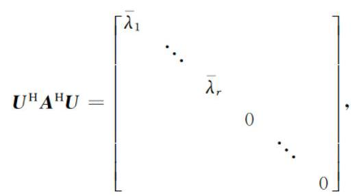

矩阵分析学习指导

孟品超 姜志侠 编著

清华大学出版社

[67]

# 矩阵分析学习指导

孟品超 姜志侠 编著

## 内容简介

本书是与姜志侠、孟品超、李延忠编著的《矩阵分析》(清华大学出版社，2015)配套的辅导教材，包含了线性空间与线性变换、内积空间、矩阵的相似标准形、矩阵分解、矩阵分析、矩阵函数等内容的基本要求、基本内容、典型例题和习题解析.

本书可作为理工类院校硕士研究生和高年级本科生学习矩阵论、矩阵分析课程的同步辅导书，也可供自学参考.

版权所有，侵权必究. 侵权举报电话:010-62782989 13701121993

## 图书在版编目(CIP)数据

矩阵分析学习指导/孟品超, 姜志侠编著. -北京:清华大学出版社，2015

ISBN 978-7-302-37303-2

I. ①矩... II. ①孟... ②姜... Ⅲ. ①矩阵分析-高等学校-教学参考资料 IV. ①O151. 21

中国版本图书馆 CIP 数据核字(2014)第 159950 号

责任编辑:陈明

封面设计:

责任校对:王淑云

责任印制:

出版发行:清华大学出版社

网 址: http://www.tup.com.cn, http://www.wqbook.com

地 址:北京清华大学学研大厦 A 座 邮 编:100084

社 总 机:010-62770175 邮购:010-62786544

投稿与读者服务:010-62776969, c-service@tup.tsinghua.edu.cn

质量反馈: 010-62772015, zhiliang@tup.tsinghua.edu.cn

印 装 者:

经 销: 全国新华书店

开 本:185mm×260mm 印 张:10.25 字 数字 数: 249 千字

版 次: 2015 年 1 月第 1 版印 次:2015 年 1 月第 1 次印刷

印 数: $1 \sim  {0000}$

定价:00.00 元

产品编号:060035-01

前言

本书是姜志侠、孟品超、李延忠编著的《矩阵分析》教材的配套辅导书，是为指导理工科研究生更好地学习 “矩阵论” 课程而编写. 全书力求使学生进一步加深对课程内容的理解，扩大课堂信息量，为研究生阶段的后续课程学习和论文写作打好坚实的数学基础.

作为数学的一个重要分支, 矩阵理论具有极为丰富的内容; 作为一种基本工具, 矩阵理论在数学学科以及其他科学技术领域都有非常广泛的应用. 本书对于学习矩阵论课程的研究生以及参加博士生入学考试中的“矩阵论”科目考试的学生会起到很好的辅助作用，对于从事“矩阵论”课程教学工作的教师也有一定的参考价值.

本书由与教材各章内容同步的基本要求、基本内容、典型例题和习题解析四部分组成. 基本要求部分主要针对教学大纲中要求学生对各章节知识的掌握程度编写；基本内容部分概述了各章节的主要定义、定理、解题方法，有助于学生对主要知识系统的把握; 典型例题部分是通过作者多年从事“矩阵论”课程、“高等代数”课程和“数值分析”课程教学所积累的宝贵经验, 同时借鉴了大量的参考文献, 精选了大量相关的典型题编写而成, 所有题目都给出了详细求解过程, 重点题目还给出了分析过程和评注, 借此来引导读者掌握并归纳解题技巧, 拓宽数学思维，提高应试能力；习题解析部分给出了《矩阵分析》教材中每章末的习题详细解答, 便于读者自学.

衷心感谢长春理工大学李延忠教授对本书编写的指导和帮助. 此外, 在多年的教学过程中, 许多老师和同学都对本书的原始讲义提出了宝贵意见和建议, 在此一并致谢.

由于时间仓促, 加之编者水平有限, 书中难免有疏漏与不妥之处, 敬请读者指正.

编者

2014 年 4 月

目 录

第 1 章 线性空间与线性变换 1

一、基本要求 1

二、基本内容 1

三、典型例题 4

四、习题解析 22

第 2 章 内积空间 31

一、基本要求 31

二、基本内容 31

三、典型例题 34

四、习题解析 56

第 3 章 矩阵的相似标准形 67

一、基本要求 67

二、基本内容 67

三、典型例题 68

四、习题解析 80

第 4 章 矩阵分解 86

一、基本要求 86

二、基本内容 86

三、典型例题 91

四、习题解析 109

第 5 章 矩阵分析 117

一、基本要求 117

二、基本内容 117

三、典型例题 121

四、习题解析 129

第 6 章 矩阵函数 133

一、基本要求 133

二、基本内容 133

三、典型例题 137

四、习题解析 152

参考文献 158

## 第 1 章线性空间与线性变换

## 一、基本要求

1. 理解线性空间的概念, 掌握向量组的线性表示、线性相关和线性无关的概念与性质.

2. 掌握线性空间的基、维数、向量的坐标的定义及求法, 掌握一些常用线性空间的基与维数.

3. 掌握基变换与坐标变换.

4. 理解线性子空间的概念, 重点理解生成子空间、矩阵的核 (零) 空间与值域的概念. 理解子空间的交与和, 了解子空间的直和.

5. 掌握线性变换的概念、线性变换的矩阵表示以及一个线性变换在不同基下矩阵之间的关系.

6. 会求线性变换 (矩阵) 的特征值及特征向量, 理解它们的性质.

7. 理解线性变换的不变子空间的定义及性质.

## 二、基本内容

## 1. 线性空间

线性空间的概念建立于非空集合 $V$ 与数域 $F$ 之上,其中的加法运算和数乘运算 (合称为线性运算) 不仅要满足封闭性, 即

(1)对于任意的 $x, y \in  V$ ,有 $x + y \in  V$ ;

(2)对于任意的 $x \in  V$ 及任意的 $k \in  F$ ，有 ${kx} \in  V$ .

而且还要满足相应的八条运算律. $n$ 维线性空间可记为 ${V}_{n}$ (或 ${V}^{n}$ ).

常用的线性空间有以下几类:

(1)数组向量空间:

实行向量空间 ${\mathbb{R}}^{n} = \left\{  {\left( {{a}_{1},{a}_{2},\cdots ,{a}_{n}}\right)  \mid  {a}_{i} \in  \mathbb{R}}\right\}$ ;

实列向量空间 ${\mathbb{R}}^{n} = \left\{  {{\left( {a}_{1},{a}_{2},\cdots ,{a}_{n}\right) }^{\mathrm{T}} \mid  {a}_{i} \in  \mathbb{R}}\right\}$ ;

复行向量空间 ${\mathbb{C}}^{n} = \left\{  {\left( {{a}_{1},{a}_{2},\cdots ,{a}_{n}}\right)  \mid  {a}_{i} \in  \mathbb{C}}\right\}$ ;

复列向量空间 ${\mathbb{C}}^{n} = \left\{  {{\left( {a}_{1},{a}_{2},\cdots ,{a}_{n}\right) }^{\mathrm{T}} \mid  {a}_{i} \in  \mathbb{C}}\right\}$ .

(2)矩阵空间:

实矩阵空间 ${\mathbb{R}}^{m \times  n} = \left\{  {{\left( {a}_{ij}\right) }_{m \times  n} \mid  {a}_{ij} \in  \mathbb{R}}\right\}$ ;

复矩阵空间 ${\mathbb{C}}^{m \times  n} = \left\{  {{\left( {a}_{ij}\right) }_{m \times  n} \mid  {a}_{ij} \in  \mathbb{C}}\right\}$ .

(3)多项式空间:

实多项式空间 $\mathbb{R}{\left\lbrack  t\right\rbrack  }_{n} = \left\{  {{a}_{0} + {a}_{1}t + \cdots  + {a}_{n - 1}{t}^{n - 1} \mid  {a}_{i} \in  \mathbb{R}}\right\}$ ;

复多项式空间 $\mathbb{C}{\left\lbrack  t\right\rbrack  }_{n} = \left\{  {{a}_{0} + {a}_{1}t + \cdots  + {a}_{n - 1}{t}^{n - 1} \mid  {a}_{i} \in  \mathbb{C}}\right\}$ .

## 2 子空间

设 $V$ 为数域 $F$ 上的线性空间, $W$ 是 $V$ 的非空子集,则 $W$ 是 $V$ 的子空间的充分必要条件是

(1) $\forall \alpha ,\beta  \in  W,\alpha  + \beta  \in  W$ (加法运算封闭);

(2) $\forall \alpha  \in  W,\forall k \in  F,{k\alpha } \in  W$ (数乘运算封闭).

常用的线性子空间有以下几类:

(1)生成子空间 $L\left( {{x}_{1},{x}_{2},\cdots ,{x}_{m}}\right)$ 或记为 $\operatorname{span}\left( {{x}_{1},{x}_{2},\cdots ,{x}_{m}}\right)$ :设 $V$ 是数域 $F$ 上的线性空间, ${x}_{i} \in  V\left( {i = 1,2,\cdots , m}\right)$ ,则

$$
L\left( {{x}_{1},{x}_{2},\cdots ,{x}_{m}}\right)  = \left\{  {{k}_{1}{x}_{1} + {k}_{2}{x}_{2} + \cdots  + {k}_{m}{x}_{m} \mid  {k}_{i} \in  F}\right\}  ;
$$

( 2 )矩阵的值域 $R\left( \mathbf{A}\right)$ :设 $\mathbf{A} \in  {\mathbb{C}}^{m \times  n}$ 的列向量组为 ${\mathbf{\beta }}_{1},{\mathbf{\beta }}_{2},\cdots ,{\mathbf{\beta }}_{n}$ ，则 $R\left( \mathbf{A}\right)  = L\left( {{\mathbf{\beta }}_{1},{\mathbf{\beta }}_{2},\cdots }\right.$ ， $\left. {\mathbf{\beta }}_{n}\right\}   = \left\{  {\mathbf{A}\mathbf{x} \mid  \mathbf{x} \in  {\mathbb{C}}^{n}}\right\}  ;$

(3)矩阵的零空间 $N\left( \mathbf{A}\right)$ :设 $\mathbf{A} \in  {\mathbb{C}}^{m \times  n}$ ，则

$$
N\left( \mathbf{A}\right)  = \left\{  {\mathbf{x} \mid  \mathbf{{Ax}} = \mathbf{0},\mathbf{x} \in  {\mathbb{C}}^{n}}\right\}  ,
$$

即为齐次线性方程组 $\mathbf{A}\mathbf{x} = \mathbf{0}$ 的解空间；

(4)线性变换的像集(或值域) $\sigma \left( V\right)$ (或 $R\left( \sigma \right) )$ :设 $\sigma$ 是线性空间 $V$ 的线性变换，则 $\sigma \left( V\right)  = \; \{ \sigma \left( x\right)  \mid  x \in  V\} ;$

(5)线性变换的核 ${\sigma }_{-1}\{ 0\}$ (或 $N\left( \sigma \right) )$ : 设 $\sigma$ 是线性空间 $V$ 的线性变换,则

$$
{\sigma }_{-1}\{ 0\}  = \{ x \mid  \sigma \left( x\right)  = 0, x \in  V\} ;
$$

(6)线性变换的特征子空间 ${V}_{\lambda }$ : 设 $\lambda$ 是线性空间 $V$ 中线性变换 $\sigma$ 的一个特征值，则

$$
{V}_{\lambda } = \{ x \mid  \sigma \left( x\right)  = {\lambda x}, x \in  V\} .
$$

线性子空间 ${V}_{1}$ 与 ${V}_{2}$ 的交与和仍为线性子空间,且有如下结论:

(1)维数公式

$$
\dim \left( {{V}_{1} + {V}_{2}}\right)  = \dim {V}_{1} + \dim {V}_{2} - \dim \left( {{V}_{1} \cap  {V}_{2}}\right) .
$$

(2)下面四种说法等价:

① ${V}_{1} + {V}_{2}$ 是直和；

② ${V}_{1} + {V}_{2}$ 中零元素的分解式唯一;

③ ${V}_{1} \cap  {V}_{2} = \{ 0\}$ ；

④ $\dim \left( {{V}_{1} + {V}_{2}}\right)  = \dim {V}_{1} + \dim {V}_{2}$ .

(3)若 ${V}_{1} + {V}_{2}$ 是直和，则将 ${V}_{1}$ 的基与 ${V}_{2}$ 的基拼接起来可构成 ${V}_{1} + {V}_{2}$ 的基.

(4) 若 ${V}_{1} = L\left( {{x}_{1},{x}_{2},\cdots ,{x}_{m}}\right) ,{V}_{2} = L\left( {{y}_{1},{y}_{2},\cdots ,{y}_{l}}\right)$ ,则

$$
{V}_{1} + {V}_{2} = L\left( {{x}_{1},{x}_{2},\cdots ,{x}_{m},{y}_{1},{y}_{2},\cdots ,{y}_{l}}\right) .
$$

(5) 设 $V$ 的一个基为 ${x}_{1},{x}_{2},\cdots ,{x}_{n}$ ,则 $V = L\left( {{x}_{1},{x}_{2},\cdots ,{x}_{n}}\right)$ .

## 3 线性空间的基

线性空间的基指线性空间 $V$ 中满足下列条件的向量组 ${x}_{1},{x}_{2},\cdots ,{x}_{n}$ :

① ${x}_{1}$ ， ${x}_{2}$ ， $\cdots$ ， ${x}_{n}$ 线性无关；

②任意 $x \in  V$ 都可由 ${x}_{1},{x}_{2},\cdots ,{x}_{n}$ 线性表示.

(1)向量空间 ${\mathbb{R}}^{n}\left( {\mathbb{C}}^{n}\right)$ 的简单基为 ${\mathbf{e}}_{1},{\mathbf{e}}_{2},\cdots ,{\mathbf{e}}_{n}$ ,其中 ${\mathbf{e}}_{i}$ 表示第 $i$ 个分量为 1,其余分量为 0 的 $n$ 维向量.

(2)矩阵空间 ${\mathbb{R}}^{m \times  n}\left( {\mathbb{C}}^{m \times  n}\right)$ 的简单基为 ${\mathbf{E}}_{11},{\mathbf{E}}_{12},\cdots ,{\mathbf{E}}_{1n},{\mathbf{E}}_{21},\cdots ,{\mathbf{E}}_{mn}$ ，其中 ${\mathbf{E}}_{ij}$ 表示第 $i$ 行第 $j$ 列元素为 1,其余元素为 0 的 $m \times  n$ 矩阵.

(3)多项式空间 ${P}_{n}\left\lbrack  t\right\rbrack$ 的简单基为 $1, t,\cdots ,{t}^{n - 1}$ .

(4)生成空间 $W = L\left( {{\alpha }_{1},{\alpha }_{2},\cdots ,{\alpha }_{m}}\right)$ 中，生成元 ${\alpha }_{1},{\alpha }_{2},\cdots ,{\alpha }_{m}$ 的一个极大无关组 ${\alpha }_{{i}_{1}},{\alpha }_{{i}_{2}},\cdots$ ， ${\alpha }_{{i}_{r}}$ 是 $W$ 的一组基.

(5)矩阵 $\mathbf{A}$ 的列向量组的一个极大无关组是 $R\left( \mathbf{A}\right)$ 的基.

(6)齐次线性方程组 $\mathbf{A}\mathbf{x} = \mathbf{0}$ 的一个基础解系是 $N\left( \mathbf{A}\right)$ 的基.

下面是求 $\sigma \left( V\right) ,{\sigma }_{-1}\{ 0\}$ 及 ${V}_{\lambda }$ 的基的方法.

设线性空间 $V$ 的一个基为 ${x}_{1},{x}_{2},\cdots ,{x}_{n}$ ,线性变换 $\sigma$ 在该基下的矩阵为 $\mathbf{A}$ ,记 $\operatorname{rank}\left( \mathbf{A}\right)  = \; r$ ,则有

(7)求出 $R\left( \mathbf{A}\right)$ 的一个基为 ${\mathbf{\alpha }}_{1},{\mathbf{\alpha }}_{2},\cdots ,{\mathbf{\alpha }}_{r}$ (列向量)，那么 $R\left( \sigma \right)$ 的一个基为

$$
{y}_{1} = \left( {{x}_{1},{x}_{2},\cdots ,{x}_{n}}\right) {\mathbf{\alpha }}_{1},\cdots ,{y}_{r} = \left( {{x}_{1},{x}_{2},\cdots ,{x}_{n}}\right) {\mathbf{\alpha }}_{r}.
$$

(8)求出 $N\left( \mathbf{A}\right)$ 的一个基为 ${\mathbf{\beta }}_{1},{\mathbf{\beta }}_{2},\cdots ,{\mathbf{\beta }}_{n - r}$ (列向量),那么 $N\left( \sigma \right)$ 的一个基为

$$
{z}_{1} = \left( {{x}_{1},{x}_{2},\cdots ,{x}_{n}}\right) {\mathbf{\beta }}_{1},\cdots ,{z}_{n - r} = \left( {{x}_{1},{x}_{2},\cdots ,{x}_{n}}\right) {\mathbf{\beta }}_{n - r}.
$$

(9)求出 $N\left( {\lambda \mathbf{E} - \mathbf{A}}\right)$ 的一个基为 ${\gamma }_{1},{\gamma }_{2},\cdots ,{\gamma }_{l}$ (列向量),那么 ${V}_{\lambda }$ 的一个基为

$$
{u}_{1} = \left( {{x}_{1},{x}_{2},\cdots ,{x}_{n}}\right) {\mathbf{\gamma }}_{1},\cdots ,{u}_{l} = \left( {{x}_{1},{x}_{2},\cdots ,{x}_{n}}\right) {\mathbf{\gamma }}_{l}.
$$

## 4. 基变换公式和坐标变换公式

过渡矩阵是以线性空间的一个基中各元素在另一个基下的坐标为列向量构成的方阵.

已知 $n$ 维线性空间 $V$ 的两个基为 $\left( \mathrm{I}\right) {x}_{1},{x}_{2},\cdots ,{x}_{n}$ ; (II) ${y}_{1},{y}_{2},\cdots ,{y}_{n}$ . 设 ${y}_{i}$ 在基 (I) 下的坐标为 ${\mathbf{\beta }}_{j}\left( {j = 1,2,\cdots , n}\right)$ ,则由基 (I) 变为基 (II) 的过渡矩阵为 $\mathbf{C} = \left( {{\mathbf{\beta }}_{1},{\mathbf{\beta }}_{2},\cdots ,{\mathbf{\beta }}_{n}}\right)$ ,基变换公式为

$$
\left( {{y}_{1},{y}_{2},\cdots ,{y}_{n}}\right)  = \left( {{x}_{1},{x}_{2},\cdots ,{x}_{n}}\right) \mathbf{C}, \tag{1.1}
$$

$$
\left( {{x}_{1},{x}_{2},\cdots ,{x}_{n}}\right)  = \left( {{y}_{1},{y}_{2},\cdots {y}_{n}}\right) {\mathbf{C}}^{-1}.
$$

设线性空间 $V$ 的一个基为 ${x}_{1},{x}_{2},\cdots ,{x}_{n}$ ,对于任意 $x \in  V$ ,有 $x = {a}_{1}{x}_{1} + {a}_{2}{x}_{2} + \cdots  + \; {a}_{n}{x}_{n}$ ,则 $x$ 在该基下的坐标为 ${\left( {a}_{1},{a}_{2},\cdots ,{a}_{n}\right) }^{\mathrm{T}}$ .

设基变换公式为 (1.1) 式, $x \in  V$ 在基 (I) 和基 (II) 下的坐标 (列向量) 分别为 $\mathbf{\alpha }$ 和 $\mathbf{\beta }$ ,则有坐标变换公式 $\mathbf{\alpha } = \mathbf{C}\mathbf{\beta }$ 或 $\mathbf{\beta } = {\mathbf{C}}^{-1}\mathbf{\alpha }$ .

## 5 线性变换的矩阵

线性变换的矩阵是以线性空间的基中各元素在线性变换下的像在该基下的坐标为列向量构成的方阵.

设线性空间 $V$ 的一个基为 ${x}_{1},{x}_{2},\cdots ,{x}_{n}$ ,线性变换为 $\sigma$ ,基像组 $\sigma \left( {x}_{1}\right) ,\sigma \left( {x}_{2}\right) ,\cdots ,\sigma \left( {x}_{n}\right)$ 在该基下的坐标依次为 ${\mathbf{\beta }}_{1},{\mathbf{\beta }}_{2},\cdots ,{\mathbf{\beta }}_{n}$ ,则 $\sigma$ 在该基下的矩阵为 $\mathbf{A} = \left( {{\mathbf{\beta }}_{1},{\mathbf{\beta }}_{2},\cdots ,{\mathbf{\beta }}_{n}}\right)$ ,且有

$$
\sigma \left( {{x}_{1},{x}_{2},\cdots ,{x}_{n}}\right) \overset{\text{ def }}{ = }\left( {\sigma \left( {x}_{1}\right) ,\sigma \left( {x}_{2}\right) ,\cdots ,\sigma \left( {x}_{n}\right) }\right)  = \left( {{x}_{1},{x}_{2},\cdots ,{x}_{n}}\right) \mathbf{A}.
$$

已知线性空间 $V$ 的两个基分别为 (I) ${x}_{1},{x}_{2},\cdots ,{x}_{n}$ ; (II) ${y}_{1},{y}_{2},\cdots ,{y}_{n}$ ,且由基 (I) 到基 ( II ) 的过渡矩阵为 $\mathbf{C}$ ,线性变换 $\sigma$ 在基 ( I ) 和基 ( II ) 下的矩阵分别为 $\mathbf{A}$ 和 $\mathbf{B}, x \in  V$ 在基 ( I )下的坐标为 $\mathbf{\alpha }$ ,则有

(1) $\dim \sigma \left( V\right)  = \operatorname{rank}\left( \mathbf{A}\right)$ . $\dim {\sigma }_{-1}\{ 0\}  = n - \operatorname{rank}\left( \mathbf{A}\right)$ .

(2) $\sigma \left( x\right)$ 在基(I)下的坐标为 $\mathbf{A}\mathbf{\alpha }$ .

(3) $\mathbf{B} = {\mathbf{C}}^{-1}\mathbf{A}\mathbf{C}$ .

(4) $\sigma$ 的特征值与 $\mathbf{A}$ 的特征值相同， $\sigma$ 的对应于特征值 $\lambda$ 的特征向量在基(I)下的坐标为 $\mathbf{A}$ 的对应于特征值 $\lambda$ 的特征向量，在基( II )下的坐标为 $\mathbf{B}$ 的对应于特征值 $\lambda$ 的特征向量。

(5)在 $V$ 中存在某个基使 $\sigma$ 在该基下的矩阵为对角矩阵 $\mathbf{\Lambda }$ 的充要条件是存在可逆矩阵 $\mathbf{P}$ 使 ${\mathbf{P}}^{-1}\mathbf{{AP}} = \mathbf{\Lambda }$ . 此时, $\mathbf{P}$ 是由基( I )变为这个基的过渡矩阵.

设 $\sigma ,\tau$ 是 $V$ 上的两个线性变换, $\forall \alpha  \in  V$ ,有如下定义:

(1)两个线性变换之和 $\sigma  + \tau  : \left( {\sigma  + \tau }\right) \left( \alpha \right)  = \sigma \left( \alpha \right)  + \tau \left( \alpha \right) ,\forall \alpha  \in  V$ .

(2)数乘线性变换 ${k\sigma } : \left( {k\sigma }\right) \left( \alpha \right)  = {k\sigma }\left( \alpha \right)$ .

(3)两线性变换之积 ${\sigma \tau } : \left( {\sigma \tau }\right) \left( \alpha \right)  = \sigma \left( {\tau \left( \alpha \right) }\right)$ .

(4) $\sigma$ 与 $\tau$ 互为可逆线性变换: ${\sigma \tau } = {\tau \sigma } = {1}^{ * }$ (1 ${}^{ * }$ 为恒等变换).

设线性变换 $\sigma ,\tau$ 在 $V$ 的基 ${\alpha }_{1},{\alpha }_{2},\cdots ,{\alpha }_{n}$ 下的矩阵分别为 $\mathbf{A},\mathbf{B}$ ,则

(1) $\sigma  + \tau  \Leftrightarrow  \mathbf{A} + \mathbf{B}$ ；

(2) ${k\sigma } \Leftrightarrow  k\mathbf{A}$ ；

(3) ${\sigma \tau } \Leftrightarrow  \mathbf{{AB}}$ ；

(4) ${\sigma \tau } = {\tau \sigma } = {1}^{ * } \Leftrightarrow  \mathbf{{AB}} = \mathbf{{BA}} = \mathbf{E}.$

## 6. 线性变换的不变子空间

设 $\sigma$ 是线性空间 $V$ 的线性变换,则有

(1) $\sigma \left( V\right)$ ， ${\sigma }_{-1}$ 和 $2\mathit{y}$ 及 ${V}_{\lambda }$ 都是 $\sigma$ 的不变子空间.

(2)若 ${V}_{1}$ 和 ${V}_{2}$ 都是 $\sigma$ 的不变子空间,则 ${V}_{1} \cap  {V}_{2}$ 与 ${V}_{1} + {V}_{2}$ 也是 $\sigma$ 的不变子空间.

(3)若 $V$ 可分解为 $\sigma$ 的不变子空间 ${V}_{i}\left( {i = 1,2,\cdots , m}\right)$ 的直和，则 $\sigma$ 在由 ${V}_{1},{V}_{2},\cdots ,{V}_{m}$ 的基拼接而构成 $V$ 的基下的矩阵为准对角矩阵.

(4)若 $\sigma$ 在 $V$ 的某个基下的矩阵为准对角矩阵 $\operatorname{diag}\left( {{\mathbf{A}}_{1},{\mathbf{A}}_{2},\cdots ,{\mathbf{A}}_{m}}\right)$ ，则 $V$ 可分解为 $\sigma$ 的 $m$ 个不变子空间的直和.

## 三、典型例题

例 1 设 $V$ 是数域 $F$ 上的线性空间,证明:

(1)对于任意的 $x \in  V$ ,有 ${0x} = 0$ ;

(2)对于任意的 $k \in  F$ ,有 ${k0} = 0$ ;

(3)对于任意的 $x \in  V$ ,有 $\left( {-1}\right) x =  - x$ .

证 根据 $V$ 中的线性运算规则,有

$$
{0x} = {0x} + \left\lbrack  {x + \left( {-x}\right) }\right\rbrack   = \left( {{0x} + x}\right)  + \left( {-x}\right)  = \left( {{0x} + {1x}}\right)  + \left( {-x}\right)
$$

$$
= \left( {0 + 1}\right) x + \left( {-x}\right)  = {1x} + \left( {-x}\right)  = x + \left( {-x}\right)  = 0\text{ ; }
$$

$$
{k0} = {k0} + \left\lbrack  {{kx} + \left( {-{kx}}\right) }\right\rbrack   = \left( {{k0} + {kx}}\right)  + \left( {-{kx}}\right)  = k\left( {0 + x}\right)  + \left( {-{kx}}\right)
$$

$$
= {kx} + \left( {-{kx}}\right)  = 0\text{ ; }
$$

$$
\left( {-1}\right) x = \left( {-1}\right) x + \left\lbrack  {x + \left( {-x}\right) }\right\rbrack   = \left\lbrack  {\left( {-1}\right) x + {1x}}\right\rbrack   + \left( {-x}\right)
$$

$$
= \left\lbrack  {\left( {-1}\right)  + 1}\right\rbrack  x + \left( {-x}\right)  = {0x} + \left( {-x}\right)  = 0 + \left( {-x}\right)  =  - x.
$$

例 2 判别下列集合对所指运算是否构成 $\mathbb{R}$ 上的线性空间.

(1)次数等于 $m\left( {m \geq  1}\right)$ 的实系数多项式的集合，对于多项式的加法和数与多项式的乘法;

(2)实对称矩阵的集合，对于矩阵的加法和实数与矩阵的乘法；

(3)平面上全体向量的集合，对于通常的加法和如下定义的数乘运算 $\mathbf{k} \cdot  \mathbf{x} = \mathbf{0}$ .

解(1)否. 因为两个 $m$ 次多项式相加不一定还是 $m$ 次多项式，所以对加法运算不封闭.

(2) 是.

(3) 否. 因为 $x \neq  0$ 时, $1 \cdot  x = 0 \neq  x$ .

例 3 设数域为 $\mathbb{R}$ ,集合为 $V = \left\{  {\mathbf{\alpha } \mid  \mathbf{\alpha } = \left( {{\xi }_{1},{\xi }_{2}}\right) ,{\xi }_{i} \in  \mathbb{R}}\right\}$ ,对于 $\mathbf{\alpha } = \left( {{\xi }_{1},{\xi }_{2}}\right) ,\mathbf{\beta } = \left( {{\eta }_{1},{\eta }_{2}}\right)$ 及 $k \in  \mathbb{R}$ ,指定线性运算如下:

加法运算 $\mathbf{\alpha } \oplus  \mathbf{\beta } = \left( {{\xi }_{1} + {\eta }_{1},{\xi }_{2} + {\eta }_{2} + {\xi }_{1}{\eta }_{1}}\right)$ ,

数乘运算 $k \odot  \mathbf{\alpha } = \left( {k{\xi }_{1}, k{\xi }_{2} + \frac{1}{2}k\left( {k - 1}\right) {\xi }_{1}^{2}}\right)$ ,

判断 $V$ 是否构成 $\mathbb{R}$ 上的线性空间.

解 易见, $\mathbf{\alpha } \oplus  \mathbf{\beta } \in  V, k \odot  \mathbf{\alpha } \in  V$ ,即线性运算封闭. 再设 $\mathbf{\gamma } = \left( {{t}_{1},{t}_{2}}\right)  \in  V$ 及 $l \in  \mathbb{R}$ ,则有

(1) $\mathbf{\alpha } \oplus  \left( {\mathbf{\beta } \oplus  \mathbf{\gamma }}\right)  = \left( {{\xi }_{1},{\xi }_{2}}\right)  \oplus  \left( {{\eta }_{1} + {t}_{1},{\eta }_{2} + {t}_{2} + {\eta }_{1}{t}_{1}}\right)$

$$
= \left( {{\xi }_{1} + \left( {{\eta }_{1} + {t}_{1}}\right) ,{\xi }_{2} + \left( {{\eta }_{2} + {t}_{2} + {\eta }_{1}{t}_{1}}\right)  + {\xi }_{1}\left( {{\eta }_{1} + {t}_{1}}\right) }\right)
$$

$$
= \left( {\left( {{\xi }_{1} + {\eta }_{1}}\right)  + {t}_{1},\left( {{\xi }_{2} + {\eta }_{2} + {\xi }_{1}{\eta }_{1}}\right)  + {t}_{2} + \left( {{\xi }_{1} + {\eta }_{1}}\right) {t}_{1}}\right) )
$$

$$
= \left( {{\xi }_{1} + {\eta }_{1},{\xi }_{2} + {\eta }_{2} + {\xi }_{1}{\eta }_{1}}\right)  \oplus  \left( {{t}_{1},{t}_{2}}\right)  = \left( {\mathbf{\alpha } \oplus  \mathbf{\beta }}\right)  \oplus  \gamma ;
$$

(2) $\mathbf{\alpha } \oplus  \mathbf{\beta } = \left( {{\xi }_{1} + {\eta }_{1},{\xi }_{2} + {\eta }_{2} + {\xi }_{1}{\eta }_{1}}\right)  = \left( {{\eta }_{1} + {\xi }_{1},{\eta }_{2} + {\xi }_{2} + {\eta }_{1}{\xi }_{1}}\right)  = \mathbf{\beta } \oplus  \mathbf{\alpha }$ ；

(3)对于任意的 $\mathbf{\alpha } \in  V$ ,由 $\mathbf{\alpha } \oplus  \mathbf{\beta } = \mathbf{\alpha }$ 可得

$$
\left( {{\xi }_{1} + {\eta }_{1},{\xi }_{2} + {\eta }_{2} + {\xi }_{1}{\eta }_{1}}\right)  = \left( {{\xi }_{1},{\xi }_{2}}\right) ,
$$

即 ${\xi }_{1} + {\eta }_{1} = {\xi }_{1},{\xi }_{2} + {\eta }_{2} + {\xi }_{1}{\eta }_{1} = {\xi }_{2}$ ,解得 ${\eta }_{1} = 0,{\eta }_{2} = 0$ ,于是 $\mathbf{0} = \left( {0,0}\right)$ 满足 $\mathbf{\alpha } \oplus  \mathbf{0} = \mathbf{\alpha }$ ;

(4)对于任意给定的 $\mathbf{\alpha } \in  V$ ,由 $\mathbf{\alpha } \oplus  \mathbf{\beta } = \mathbf{0}$ 可得

$$
\left( {{\xi }_{1} + {\eta }_{1},{\xi }_{2} + {\eta }_{2} + {\xi }_{1}{\eta }_{1}}\right)  = \left( {0,0}\right) ,
$$

即 ${\xi }_{1} + {\eta }_{1} = 0,{\xi }_{2} + {\eta }_{2} + {\xi }_{1}{\eta }_{1} = 0$ . 解得 ${\eta }_{1} =  - {\xi }_{1},{\eta }_{2} = {\xi }_{1}^{2} - {\xi }_{2}$ ,于是 $- \alpha  = \left( {-{\xi }_{1},{\xi }_{1}^{2} - {\xi }_{2}}\right)$ 满足 $\mathbf{\alpha } \oplus  \left( {-\mathbf{\alpha }}\right)  = \mathbf{0};$

(5) $\left( {k \odot  \mathbf{\alpha }}\right)  \oplus  \left( {k \odot  \mathbf{\beta }}\right)  = \left( {k{\xi }_{1}, k{\xi }_{2} + \frac{1}{2}k\left( {k - 1}\right) {\xi }_{1}^{2}}\right)  \oplus  \left( {k{\eta }_{1}, k{\eta }_{2} + \frac{1}{2}k\left( {k - 1}\right) {\eta }_{1}^{2}}\right)$

$$
= \left( {k{\xi }_{1} + k{\eta }_{1}, k{\xi }_{2} + \frac{1}{2}k\left( {k - 1}\right) {\xi }_{1}^{2} + k{\eta }_{2} + \frac{1}{2}k\left( {k - 1}\right) {\eta }_{1}^{2} + \left( {k{\xi }_{1}}\right) \left( {k{\eta }_{1}}\right) }\right)
$$

$$
= \left( {k\left( {{\xi }_{1} + {\eta }_{1}}\right) , k\left( {{\xi }_{2} + {\eta }_{2}}\right)  + \frac{1}{2}k\left( {k - 1}\right) \left( {{\xi }_{1}^{2} + {\eta }_{1}^{2}}\right)  + {k}^{2}{\xi }_{1}{\eta }_{1}}\right)
$$

$$
= \left( {k\left( {{\xi }_{1} + {\eta }_{1}}\right) , k\left( {{\xi }_{2} + {\eta }_{2} + {\xi }_{1}{\eta }_{1}}\right)  + \frac{1}{2}k\left( {k - 1}\right) {\left( {\xi }_{1} + {\eta }_{1}\right) }^{2}}\right)
$$

$$
= k \odot  \left( {{\xi }_{1} + {\eta }_{1},{\xi }_{2} + {\eta }_{2} + {\xi }_{1}{\eta }_{1}}\right)  = k \odot  \left( {\mathbf{\alpha } \oplus  \mathbf{\beta }}\right) ;
$$

(6) $\left( {k \odot  \mathbf{\alpha }}\right)  \oplus  \left( {l \odot  \mathbf{\alpha }}\right)  = \left( {k{\xi }_{1}, k{\xi }_{2} + \frac{1}{2}k\left( {k - 1}\right) {\xi }_{1}^{2}}\right)  \oplus  \left( {l{\xi }_{1}, l{\xi }_{2} + \frac{1}{2}l\left( {l - 1}\right) {\xi }_{1}^{2}}\right)$

$$
= \left( {k{\xi }_{1} + l{\xi }_{1}, k{\xi }_{2} + \frac{1}{2}k\left( {k - 1}\right) {\xi }_{1}^{2} + l{\xi }_{2} + \frac{1}{2}l\left( {l - 1}\right) {\xi }_{1}^{2} + \left( {k{\xi }_{1}}\right) \left( {l{\xi }_{1}}\right) }\right)
$$

$$
= \left( {\left( {k + l}\right) {\xi }_{1},\left( {k + l}\right) {\xi }_{2} + \frac{1}{2}\left( {k + l}\right) \left( {k + l - 1}\right) {\xi }_{1}^{2}}\right)  = \left( {k + l}\right)  \odot  \mathbf{\alpha };
$$

(7) $k \odot  \left( {l \odot  \mathbf{\alpha }}\right)  = k \odot  \left( {l{\xi }_{1}, l{\xi }_{2} + \frac{1}{2}l\left( {l - 1}\right) {\xi }_{1}^{2}}\right)$

$$
= \left( {\left( {{kl}{\xi }_{1}}\right. ,{kl}{\xi }_{2} + \frac{1}{2}{kl}\left( {l - 1}\right) {\xi }_{1}^{2} + \frac{1}{2}k\left( {k - 1}\right) {\left( l{\xi }_{1}\right) }^{2}}\right)
$$

$$
= \left( {\left( {kl}\right) {\xi }_{1},\left( {kl}\right) {\xi }_{2} + \frac{1}{2}\left( {kl}\right) \left( {{kl} - 1}\right) {\xi }_{1}^{2}}\right)  = \left( {kl}\right)  \odot  \mathbf{\alpha };
$$

(8) $1 \odot  \mathbf{\alpha } = \left( {1{\xi }_{1},1{\xi }_{2} + \frac{1}{2} \times  1 \times  \left( {1 - 1}\right) {\xi }_{1}^{2}}\right)  = \left( {{\xi }_{1},{\xi }_{2}}\right)  = \mathbf{\alpha }$ .

综上,八条运算律成立. 故 $V$ 构成 $\mathbb{R}$ 上的线性空间,记作 ${\mathbb{R}}^{2}\left( {\oplus , \odot  }\right)$ .

评注 给定了数域 $F$ 与集合 $V$ ,如果指定的线性运算方式不同,那么 $V$ 可构成 $F$ 上的线性空间,也可能不构成 $F$ 上的线性空间; 另外,对于一个具体的线性空间,如果指定的线性运算方式不是通常的, 那么相应的零元素和负元素可能与通常的形式不同, 例如本题给出的线性空间 ${\mathbb{R}}^{2}\left( {\oplus , \odot  }\right)$ 中的负元素形式与通常形式不同.

例 4 试证: 所有 $n$ 阶实对称矩阵组成 $\frac{n\left( {n + 1}\right) }{2}$ 维线性空间; 所有 $n$ 阶实反对称矩阵组成 $\frac{n\left( {n - 1}\right) }{2}$ 维线性空间.

证 用 ${\mathbf{E}}_{ii}\left( {i = 1,2,\cdots , n}\right)$ 表示 $n$ 阶矩阵中除第 $i$ 行,第 $i$ 列的元素为 1 外,其余元素全为 0 的矩阵. 用 ${\mathbf{E}}_{ij}\left( {i < j, i = 1,2,\cdots , n - 1}\right)$ 表示 $n$ 阶矩阵中除第 $i$ 行第 $j$ 列元素与第 $j$ 行第 $i$ 列元素为 1 外,其余元素全为 0 的矩阵.

显然, ${\mathbf{E}}_{ii},{\mathbf{E}}_{ij}$ 都是对称矩阵, ${\mathbf{E}}_{ii}$ 有 $n$ 个, ${\mathbf{E}}_{ij}$ 有 $\frac{n\left( {n - 1}\right) }{2}$ 个. 不难证明 ${\mathbf{E}}_{ii},{\mathbf{E}}_{ij}$ 是线性无关的,且任何一个对称矩阵都可用这 $n + \frac{n\left( {n - 1}\right) }{2} = \frac{n\left( {n + 1}\right) }{2}$ 个矩阵线性表示,即对称矩阵组成 $\frac{n\left( {n + 1}\right) }{2}$ 维线性空间.

同样可证所有 $n$ 阶反对称矩阵组成的线性空间的维数为 $\frac{n\left( {n + 1}\right) }{2}$ .

评注 求线性空间 (子空间) 的基的方法:

(1) 根据线性空间的构成规律, 找出其中的一组特殊元素, 使得线性空间的一般元素都可由这组元素线性表示.

(2)若这组元素线性无关，则它就是线性空间的基；若这组元素线性相关，则它的一个极大线性无关组就是线性空间的基.

例 5 (1) ${V}_{1} = \left\{  {\left( {{x}_{1},{x}_{2},{x}_{3}}\right)  \mid  2{x}_{1} - {x}_{2} = 0}\right\}$ ,求 ${V}_{1}$ 的基及维数.

(2) ${V}_{2} = \left\{  {\mathbf{X} \mid  \mathbf{A}\mathbf{X} = \mathbf{X}\mathbf{A},\mathbf{X} \in  {\mathbb{R}}^{3 \times  3}}\right\}  ,\mathbf{A} = \left\lbrack  \begin{array}{lll} 1 & 1 & 0 \\  0 & 1 & 1 \\  0 & 0 & 1 \end{array}\right\rbrack$ ,求 ${V}_{2}$ 的基及维数.

解 (1) $\forall \mathbf{\alpha } = \left( {{x}_{1},{x}_{2},{x}_{3}}\right)  \in  {V}_{1}$ ,有 $2{x}_{1} - {x}_{2} = 0$ ,则有

$$
\mathbf{\alpha } = \left( {{x}_{1},2{x}_{1},{x}_{3}}\right)  = {x}_{1}\left( {1,2,0}\right)  + {x}_{3}\left( {0,0,1}\right) ,
$$

这表明 ${V}_{1}$ 中任意 $\mathbf{\alpha }$ 可由 ${\mathbf{\alpha }}_{1} = \left( {1,2,0}\right) ,{\mathbf{\alpha }}_{2} = \left( {0,0,1}\right)$ 线性表示,且易见 ${\mathbf{\alpha }}_{1},{\mathbf{\alpha }}_{2}$ 线性无关,故 ${\mathbf{\alpha }}_{1},{\mathbf{\alpha }}_{2}$ 是 ${V}_{1}$ 的一组基, $\dim {V}_{1} = 2$ .

(2)令

$$
\mathbf{X} = \left\lbrack  \begin{array}{lll} {x}_{1} & {x}_{2} & {x}_{3} \\  {x}_{4} & {x}_{5} & {x}_{6} \\  {x}_{7} & {x}_{8} & {x}_{9} \end{array}\right\rbrack  ,
$$

由 $\mathbf{{AX}} = \mathbf{{XA}}$ 得

$$
\left\lbrack  \begin{matrix} {x}_{1} + {x}_{4} & {x}_{2} + {x}_{5} & {x}_{3} + {x}_{6} \\  {x}_{4} + {x}_{7} & {x}_{5} + {x}_{8} & {x}_{6} + {x}_{9} \\  {x}_{7} & {x}_{8} & {x}_{9} \end{matrix}\right\rbrack   = \left\lbrack  \begin{matrix} {x}_{1} & {x}_{1} + {x}_{2} & {x}_{2} + {x}_{3} \\  {x}_{4} & {x}_{4} + {x}_{5} & {x}_{5} + {x}_{6} \\  {x}_{7} & {x}_{7} + {x}_{8} & {x}_{8} + {x}_{9} \end{matrix}\right\rbrack  .
$$

由其对应关系解得

$$
{x}_{4} = {x}_{7} = {x}_{8} = 0,{x}_{1} = {x}_{5} = {x}_{9},{x}_{2} = {x}_{6},{x}_{3}\text{ 任意. }
$$

令 ${x}_{1} = {x}_{5} = {x}_{9} = a,{x}_{2} = {x}_{6} = b,{x}_{3} = c$ ,就有

$$
\mathbf{X} = \left\lbrack  \begin{array}{lll} a & b & c \\  0 & a & b \\  0 & 0 & a \end{array}\right\rbrack   = a\left\lbrack  \begin{array}{lll} 1 & 0 & 0 \\  0 & 1 & 0 \\  0 & 0 & 1 \end{array}\right\rbrack   + b\left\lbrack  \begin{array}{lll} 0 & 1 & 0 \\  0 & 0 & 1 \\  0 & 0 & 0 \end{array}\right\rbrack   + c\left\lbrack  \begin{array}{lll} 0 & 0 & 1 \\  0 & 0 & 0 \\  0 & 0 & 0 \end{array}\right\rbrack  .
$$

可以证明

$$
{\mathbf{A}}_{1} = \left\lbrack  \begin{array}{lll} 1 & 0 & 0 \\  0 & 1 & 0 \\  0 & 0 & 1 \end{array}\right\rbrack  ,\;{\mathbf{A}}_{2} = \left\lbrack  \begin{array}{lll} 0 & 1 & 0 \\  0 & 0 & 1 \\  0 & 0 & 0 \end{array}\right\rbrack  ,\;{\mathbf{A}}_{3} = \left\lbrack  \begin{array}{lll} 0 & 0 & 1 \\  0 & 0 & 0 \\  0 & 0 & 0 \end{array}\right\rbrack
$$

是线性无关的,故 ${\mathbf{A}}_{1},{\mathbf{A}}_{2},{\mathbf{A}}_{3}$ 是 ${V}_{2}$ 的基, $\dim {V}_{2} = 3$ .

例 6 设 ${\mathbf{x}}_{1},{\mathbf{x}}_{2},{\mathbf{x}}_{3}$ 是 ${\mathbb{R}}^{3}$ 的一个基,试求由 ${\mathbf{y}}_{1} = {\mathbf{x}}_{1} - 2{\mathbf{x}}_{2} + 3{\mathbf{x}}_{3},{\mathbf{y}}_{2} = 2{\mathbf{x}}_{1} + 3{\mathbf{x}}_{2} + 2{\mathbf{x}}_{3},{\mathbf{y}}_{3} = \; 4{x}_{1} + {13}{x}_{2}$ 生成的子空间 $L\left( {{y}_{1},{y}_{2},{y}_{3}}\right)$ 的基.

解 $L\left( {{y}_{1},{y}_{2},{y}_{3}}\right)$ 的基为 ${y}_{1},{y}_{2},{y}_{3}$ 的一个极大无关组. 在基 ${x}_{1},{x}_{2},{x}_{3}$ 下, ${y}_{1},{y}_{2},{y}_{3}$ 的坐标依次为 ${\left( 1, - 2,3\right) }^{\mathrm{T}},{\left( 2,3,2\right) }^{\mathrm{T}},{\left( 4,{13},0\right) }^{\mathrm{T}}$ ,该列向量组的一个极大无关组为 ${\left( 1, - 2,3\right) }^{\mathrm{T}}$ , ${\left( 2,3,2\right) }^{\mathrm{T}}$ . 因此, ${\mathbf{y}}_{1},{\mathbf{y}}_{2},{\mathbf{y}}_{3}$ 的一个极大无关组为 ${\mathbf{y}}_{1},{\mathbf{y}}_{2}$ ,即 $L\left( {{\mathbf{y}}_{1},{\mathbf{y}}_{2},{\mathbf{y}}_{3}}\right)$ 的一个基为 ${\mathbf{y}}_{1},{\mathbf{y}}_{2}$ .

例 7 求 ${\mathbb{R}}^{4}$ 的子空间

$$
{V}_{1} = \left\{  {\left( {{\xi }_{1},{\xi }_{2},{\xi }_{3},{\xi }_{4}}\right)  \mid  {\xi }_{1} - {\xi }_{2} + {\xi }_{3} - {\xi }_{4} = 0}\right\}  ,
$$

$$
{V}_{2} = \left\{  {\left( {{\xi }_{1},{\xi }_{2},{\xi }_{3},{\xi }_{4}}\right)  \mid  {\xi }_{1} + {\xi }_{2} + {\xi }_{3} + {\xi }_{4} = 0}\right\}
$$

的交 ${V}_{1} \cap  {V}_{2}$ 的基.

解 设 $\mathbf{x} = \left( {{\xi }_{1},{\xi }_{2},{\xi }_{3},{\xi }_{4}}\right)  \in  {V}_{1} \cap  {V}_{2}$ ,则 $\mathbf{x}$ 的分量满足

$$
\left\{  \begin{array}{l} {\xi }_{1} - {\xi }_{2} + {\xi }_{3} - {\xi }_{4} = 0, \\  {\xi }_{1} + {\xi }_{2} + {\xi }_{3} + {\xi }_{4} = 0. \end{array}\right.
$$

这一方程组的基础解系为 ${\left( 1,0, - 1,0\right) }^{\mathrm{T}},{\left( 0,1,0, - 1\right) }^{\mathrm{T}}$ ,从而 ${V}_{1} \cap  {V}_{2}$ 的一组基为 $(1,0$ , $- 1,0),\left( {0,1,0, - 1}\right)$ .

例 8 已知 ${\mathbf{\alpha }}_{1} = {\left( 1,2,1,0\right) }^{\mathrm{T}},{\mathbf{\alpha }}_{2} = {\left( -1,1,1,1\right) }^{\mathrm{T}},{\mathbf{\beta }}_{1} = {\left( 2, - 1,0,1\right) }^{\mathrm{T}},{\mathbf{\beta }}_{2} = {\left( 1, - 1,3,7\right) }^{\mathrm{T}}$ , 求 $\operatorname{span}\left( {{\mathbf{\alpha }}_{1},{\mathbf{\alpha }}_{2}}\right)$ 与 $\operatorname{span}\left( {{\mathbf{\beta }}_{1},{\mathbf{\beta }}_{2}}\right)$ 的和与交的基和维数.

解 $\operatorname{span}\left( {{\mathbf{\alpha }}_{1},{\mathbf{\alpha }}_{2}}\right)  + \operatorname{span}\left( {{\mathbf{\beta }}_{1},{\mathbf{\beta }}_{2}}\right)  = \operatorname{span}\left( {{\mathbf{\alpha }}_{1},{\mathbf{\alpha }}_{2},{\mathbf{\beta }}_{1},{\mathbf{\beta }}_{2}}\right)$ ,由于秩 $\left( {{\mathbf{\alpha }}_{1},{\mathbf{\alpha }}_{2},{\mathbf{\beta }}_{1},{\mathbf{\beta }}_{2}}\right)  = 3$ ,且 ${\mathbf{\alpha }}_{1}$ , ${\mathbf{\alpha }}_{2},{\mathbf{\beta }}_{1}$ 是向量 ${\mathbf{\alpha }}_{1},{\mathbf{\alpha }}_{2},{\mathbf{\beta }}_{1},{\mathbf{\beta }}_{2}$ 的一个极大线性无关组,所以和空间的维数是 3,基为 ${\mathbf{\alpha }}_{1},{\mathbf{\alpha }}_{2},{\mathbf{\beta }}_{1}$ .

下面求交空间的基和维数.

方法一 设 $\xi  \in  \operatorname{span}\left( {{\mathbf{\alpha }}_{1},{\mathbf{\alpha }}_{2}}\right)  \cap  \operatorname{span}\left( {{\mathbf{\beta }}_{1},{\mathbf{\beta }}_{2}}\right)$ ,于是由交空间定义可知

$$
\mathbf{\xi } = {k}_{1}{\mathbf{\alpha }}_{1} + {k}_{2}{\mathbf{\alpha }}_{2} = {l}_{1}{\mathbf{\beta }}_{1} + {l}_{2}{\mathbf{\beta }}_{2},
$$

即

$$
{k}_{1}\left\lbrack  \begin{array}{l} 1 \\  2 \\  1 \\  0 \end{array}\right\rbrack   + {k}_{2}\left\lbrack  \begin{array}{r}  - 1 \\  1 \\  1 \\  1 \end{array}\right\rbrack   - {l}_{1}\left\lbrack  \begin{array}{r} 2 \\   - 1 \\  0 \\  1 \end{array}\right\rbrack   - {l}_{2}\left\lbrack  \begin{array}{r} 1 \\   - 1 \\  3 \\  7 \end{array}\right\rbrack   = 0,
$$

解得

$$
{k}_{1} =  - {l}_{2},{k}_{2} = 4{l}_{2},{l}_{1} =  - 3{l}_{2}\left( {l}_{2}\right. \text{ 为任意数). }
$$

于是

$$
\mathbf{\xi } = {k}_{1}{\mathbf{\alpha }}_{1} + {k}_{2}{\mathbf{\alpha }}_{2} = {l}_{1}{\mathbf{\beta }}_{1} + {l}_{2}{\mathbf{\beta }}_{2} = {l}_{2}{\left( -5,2,3,4\right) }^{\mathrm{T}},
$$

所以交空间的维数为 1,基为 ${\left( -5,2,3,4\right) }^{\mathrm{T}}$ .

方法二 不难得知

$$
\operatorname{span}\left( {{\mathbf{\alpha }}_{1},{\mathbf{\alpha }}_{2}}\right)  = \operatorname{span}\left( {{\mathbf{\alpha }}_{1},{\mathbf{\alpha }}_{2}^{\prime }}\right) ,\operatorname{span}\left( {{\mathbf{\beta }}_{1},{\mathbf{\beta }}_{2}}\right)  = \operatorname{span}\left( {{\mathbf{\beta }}_{1},{\mathbf{\beta }}_{2}^{\prime }}\right) ,
$$

其中 ${\mathbf{\alpha }}_{2}^{\prime } = {\left( -2, - 1,0,1\right) }^{\mathrm{T}},{\mathbf{\beta }}_{2}^{\prime } = {\left( -\frac{13}{3},2,1,0\right) }^{\mathrm{T}}$ ,又 $\operatorname{span}\left( {{\mathbf{\alpha }}_{1},{\mathbf{\alpha }}_{2}^{\prime }}\right)$ 也是线性方程组

$$
\left\{  \begin{array}{l} {x}_{1} = {x}_{3} - 2{x}_{4} \\  {x}_{2} = 2{x}_{3} - {x}_{4} \end{array}\right.
$$

的解空间. $\operatorname{span}\left( {{\mathbf{\beta }}_{1},{\mathbf{\beta }}_{2}^{\prime }}\right)$ 是线性方程组.

$$
\left\{  \begin{array}{l} {x}_{1} =  - \frac{13}{3}{x}_{3} + 2{x}_{4}, \\  {x}_{2} = 2{x}_{3} - {x}_{4} \end{array}\right.
$$

的解空间, 所以所求的交空间就是线性方程组

$$
\left\{  \begin{array}{l} {x}_{1} = {x}_{3} - 2{x}_{4}, \\  {x}_{2} = 2{x}_{3} - {x}_{4}, \\  {x}_{1} =  - \frac{13}{3}{x}_{3} + 2{x}_{4}, \\  {x}_{2} = 2{x}_{4} - {x}_{4} \end{array}\right.
$$

的解空间,容易求出其基础解系为 ${\left( -5,2,3,4\right) }^{\mathrm{T}}$ ,所以交空间的维数为 1,基为 ${\left( -5,2,3,4\right) }^{\mathrm{T}}$ .

评注 本题有几个知识点是很重要的.

(1)span $\left( {{\mathbf{\alpha }}_{1},{\mathbf{\alpha }}_{2},\cdots ,{\mathbf{\alpha }}_{s}}\right)$ 的基底就是 ${\mathbf{\alpha }}_{1},{\mathbf{\alpha }}_{2},\cdots ,{\mathbf{\alpha }}_{s}$ 的极大线性无关组,其维数等于秩 $\left( {{\mathbf{\alpha }}_{1},{\mathbf{\alpha }}_{2},\cdots ,{\mathbf{\alpha }}_{s}}\right)$ .

(2) $\operatorname{span}\left( {{\mathbf{\alpha }}_{1},{\mathbf{\alpha }}_{2}}\right)  + \operatorname{span}\left( {{\mathbf{\beta }}_{1},{\mathbf{\beta }}_{2}}\right)  = \operatorname{span}\left( {{\mathbf{\alpha }}_{1},{\mathbf{\alpha }}_{2},{\mathbf{\beta }}_{1},{\mathbf{\beta }}_{2}}\right)$ .

(3) 方法一的思路: 求交 $\operatorname{span}\left( {{\mathbf{\alpha }}_{1},{\mathbf{\alpha }}_{2}}\right)  \cap  \operatorname{span}\left( {{\mathbf{\beta }}_{1},{\mathbf{\beta }}_{2}}\right)$ 就是求向量 $\mathbf{\xi }$ ,既可由 ${\mathbf{\alpha }}_{1},{\mathbf{\alpha }}_{2}$ 线性表示,又可由 ${\mathbf{\beta }}_{1},{\mathbf{\beta }}_{2}$ 线性表示的那部分向量.

(4)方法二的思路:借用“两个齐次线性方程组解空间的交空间就是联立方程组的解空间”, 将本题已知条件改造为齐次线性方程组来求解.

例 9 求 ${\mathbb{R}}^{3}$ 中向量 $\mathbf{x} = {\left( 3,7,1\right) }^{\mathrm{T}}$ 在基 ${\mathbf{x}}_{1} = {\left( 1,3,5\right) }^{\mathrm{T}},{\mathbf{x}}_{2} = {\left( 6,3,2\right) }^{\mathrm{T}},{\mathbf{x}}_{3} = {\left( 3,1,0\right) }^{\mathrm{T}}$ 下的坐标.

解 设 $\mathbf{x} = {k}_{1}{\mathbf{x}}_{1} + {k}_{2}{\mathbf{x}}_{2} + {k}_{3}{\mathbf{x}}_{3}$ ,比较等号两端向量的对应分量可得线性方程组

$$
\left\lbrack  \begin{array}{lll} 1 & 6 & 3 \\  3 & 3 & 1 \\  5 & 2 & 0 \end{array}\right\rbrack  \left\lbrack  \begin{array}{l} {k}_{1} \\  {k}_{2} \\  {k}_{3} \end{array}\right\rbrack   = \left\lbrack  \begin{array}{l} 3 \\  7 \\  1 \end{array}\right\rbrack
$$

其唯一解为 ${k}_{1} = {33},{k}_{2} =  - {82},{k}_{3} = {154}$ . 因此, $x$ 的坐标为 ${\left( {33}, - {82},{154}\right) }^{\mathrm{T}}$ .

例 10 求 $P{\left\lbrack  t\right\rbrack  }_{2}$ 中向量 $1 + t + {t}^{2}$ 在基 $1, t - 1,\left( {t - 2}\right) \left( {t - 1}\right)$ 下的坐标.

解 设 $1 + t + {t}^{2} = {k}_{1} \cdot  1 + {k}_{2}\left( {t - 1}\right)  + {k}_{3}\left( {t - 2}\right) \left( {t - 1}\right)$ ,比较等号两端关于 $t$ 的同次幂的系数可得

$$
\left\{  \begin{array}{l} {k}_{1} - {k}_{2} + 2{k}_{3} = 1, \\  {k}_{2} - 3{k}_{3} = 1, \\  {k}_{3} = 1, \end{array}\right.
$$

解得 ${k}_{3} = 1,{k}_{2} = 4,{k}_{1} = 3$ . 因此, $1 + t + {t}^{2}$ 的坐标为 ${\left( 3,4,1\right) }^{\mathrm{T}}$ .

例 11 在 ${\mathbb{R}}^{2 \times  2}$ 中求矩阵

$$
\mathbf{A} = \left\lbrack  \begin{array}{ll} 1 & 2 \\  0 & 3 \end{array}\right\rbrack
$$

在基 ${\mathbf{E}}_{1} = \left\lbrack  \begin{array}{ll} 1 & 1 \\  1 & 1 \end{array}\right\rbrack  ,{\mathbf{E}}_{2} = \left\lbrack  \begin{array}{ll} 1 & 1 \\  1 & 0 \end{array}\right\rbrack  ,{\mathbf{E}}_{3} = \left\lbrack  \begin{array}{ll} 1 & 1 \\  0 & 0 \end{array}\right\rbrack  ,{\mathbf{E}}_{4} = \left\lbrack  \begin{array}{ll} 1 & 0 \\  0 & 0 \end{array}\right\rbrack$ 下的坐标.

解 方法一 设 $\mathbf{A} = {x}_{1}{\mathbf{E}}_{1} + {x}_{2}{\mathbf{E}}_{2} + {x}_{3}{\mathbf{E}}_{3} + {x}_{4}{\mathbf{E}}_{4}$ ,即

$$
\left\lbrack  \begin{array}{ll} 1 & 2 \\  0 & 3 \end{array}\right\rbrack   = {x}_{1}\left\lbrack  \begin{array}{ll} 1 & 1 \\  1 & 1 \end{array}\right\rbrack   + {x}_{2}\left\lbrack  \begin{array}{ll} 1 & 1 \\  1 & 0 \end{array}\right\rbrack   + {x}_{3}\left\lbrack  \begin{array}{ll} 1 & 1 \\  0 & 0 \end{array}\right\rbrack   + {x}_{4}\left\lbrack  \begin{array}{ll} 1 & 0 \\  0 & 0 \end{array}\right\rbrack  ,
$$

故

$$
\left\lbrack  \begin{array}{ll} 1 & 2 \\  0 & 3 \end{array}\right\rbrack   = \left\lbrack  \begin{matrix} {x}_{1} + {x}_{2} + {x}_{3} + {x}_{4} & {x}_{1} + {x}_{2} + {x}_{3} \\  {x}_{1} + {x}_{2} & {x}_{1} \end{matrix}\right\rbrack  ,
$$

于是

$$
{x}_{1} + {x}_{2} + {x}_{3} + {x}_{4} = 1,\;{x}_{1} + {x}_{2} + {x}_{3} = 2,
$$

$$
{x}_{1} + {x}_{2} = 0,\;{x}_{1} = 3,
$$

解得

$$
{x}_{1} = 3,\;{x}_{2} =  - 3,\;{x}_{3} = 2,\;{x}_{4} =  - 1,
$$

即 $\mathbf{A}$ 在 ${\mathbf{E}}_{1},{\mathbf{E}}_{2},{\mathbf{E}}_{3},{\mathbf{E}}_{4}$ 下的坐标为 ${\left( 3, - 3,2, - 1\right) }^{\mathrm{T}}$ .

方法二 应用同构的概念, ${\mathbb{R}}^{2 \times  2}$ 是一个四维空间,并且可将矩阵 $\mathbf{A}$ 看作 ${\left( 1,2,0,3\right) }^{\mathrm{T}}$ ,将

${\mathbf{E}}_{1},{\mathbf{E}}_{2},{\mathbf{E}}_{3},{\mathbf{E}}_{4}$ 看作 ${\left( 1,1,1,1\right) }^{\mathrm{T}},{\left( 1,1,1,0\right) }^{\mathrm{T}},{\left( 1,1,0,0\right) }^{\mathrm{T}},{\left( 1,0,0,0\right) }^{\mathrm{T}}$ . 于是经过初等行变换有

$$
\left\lbrack  \begin{array}{lllll} 1 & 1 & 1 & 1 & 1 \\  1 & 1 & 1 & 0 & 2 \\  1 & 1 & 0 & 0 & 0 \\  1 & 0 & 0 & 0 & 3 \end{array}\right\rbrack   \rightarrow  \left\lbrack  \begin{array}{rrrrr} 1 & 0 & 0 & 0 & 3 \\  0 & 1 & 0 & 0 &  - 3 \\  0 & 0 & 1 & 0 & 2 \\  0 & 0 & 0 & 1 &  - 1 \end{array}\right\rbrack  ,
$$

因此, $\mathbf{A}$ 在 ${\mathbf{E}}_{1},{\mathbf{E}}_{2},{\mathbf{E}}_{3},{\mathbf{E}}_{4}$ 下的坐标为 ${\left( 3, - 3,2, - 1\right) }^{\mathrm{T}}$ .

方法三 应用中介基方法,选取 ${\mathbb{R}}^{2 \times  2}$ 的简单基

$$
{\mathbf{\varepsilon }}_{1} = \left\lbrack  \begin{array}{ll} 1 & 0 \\  0 & 0 \end{array}\right\rbrack  ,\;{\mathbf{\varepsilon }}_{2} = \left\lbrack  \begin{array}{ll} 0 & 1 \\  0 & 0 \end{array}\right\rbrack  ,\;{\mathbf{\varepsilon }}_{3} = \left\lbrack  \begin{array}{ll} 0 & 0 \\  1 & 0 \end{array}\right\rbrack  ,\;{\mathbf{\varepsilon }}_{4} = \left\lbrack  \begin{array}{ll} 0 & 0 \\  0 & 1 \end{array}\right\rbrack  ,
$$

则由基 ${\mathbf{\varepsilon }}_{1},{\mathbf{\varepsilon }}_{2},{\mathbf{\varepsilon }}_{3},{\mathbf{\varepsilon }}_{4}$ 到基 ${\mathbf{E}}_{1},{\mathbf{E}}_{2},{\mathbf{E}}_{3},{\mathbf{E}}_{4}$ 的过渡矩阵为

$$
\mathbf{B} = \left\lbrack  \begin{array}{llll} 1 & 1 & 1 & 1 \\  1 & 1 & 1 & 0 \\  1 & 1 & 0 & 0 \\  1 & 0 & 0 & 0 \end{array}\right\rbrack  .
$$

因为 $\mathbf{A} = \left\lbrack  \begin{array}{ll} 1 & 2 \\  0 & 3 \end{array}\right\rbrack$ 在基 ${\mathbf{\varepsilon }}_{1},{\mathbf{\varepsilon }}_{2},{\mathbf{\varepsilon }}_{3},{\mathbf{\varepsilon }}_{4}$ 下的坐标为 ${\left( 1,2,0,3\right) }^{\mathrm{T}}$ ,所以 $\mathbf{A}$ 在基 ${\mathbf{E}}_{1},{\mathbf{E}}_{2},{\mathbf{E}}_{3},{\mathbf{E}}_{4}$ 下的坐标为

$$
{\mathbf{B}}^{-1}\left\lbrack  \begin{array}{l} 1 \\  2 \\  0 \\  3 \end{array}\right\rbrack   = \left\lbrack  \begin{array}{r} 3 \\   - 3 \\  2 \\   - 1 \end{array}\right\rbrack
$$

例 12 设四维线性空间 $V$ 的基 $\left( \mathrm{I}\right) {x}_{1},{x}_{2},{x}_{3},{x}_{4}$ 和基 $\left( \mathrm{{II}}\right) {y}_{1},{y}_{2},{y}_{3},{y}_{4}$ 满足

$$
\left\{  \begin{array}{l} {x}_{1} + 2{x}_{2} = {y}_{3}, \\  {x}_{2} + 2{x}_{3} = {y}_{4}, \\  {y}_{1} + 2{y}_{2} = {x}_{3}, \\  {y}_{2} + 2{y}_{3} = {x}_{4}. \end{array}\right.
$$

(1)求由基(I)变为基(II)的过渡矩阵 $\mathbf{C}$ ;

(2)求向量 $x = 2{y}_{1} - {y}_{2} + {y}_{3} + {y}_{4}$ 在基(I)下的坐标.

解 (1) 解出 ${y}_{1},{y}_{2}$ ,可得

$$
{y}_{1} = 4{x}_{1} + 8{x}_{2} + {x}_{3} - 2{x}_{4},\;{y}_{2} =  - 2{x}_{1} - 4{x}_{2} + {x}_{4},
$$

又因为

$$
{y}_{3} = {x}_{1} + 2{x}_{2},\;{y}_{4} = {x}_{2} + 2{x}_{3},
$$

于是, 由基 (I) 改变为基 (II) 的过渡矩阵为

$$
\mathbf{C} = \left\lbrack  \begin{array}{rrrr} 4 &  - 2 & 1 & 0 \\  8 &  - 4 & 2 & 1 \\  1 & 0 & 0 & 2 \\   - 2 & 1 & 0 & 0 \end{array}\right\rbrack
$$

(2) $x$ 在基( II )下的坐标为 ${\left( 2, - 1,1,1\right) }^{\mathrm{T}}$ ，由坐标变换公式计算 $x$ 在基( I )下的坐标为

$$
\mathbf{C}\left\lbrack  \begin{array}{r} 2 \\   - 1 \\  1 \\  1 \end{array}\right\rbrack   = \left\lbrack  \begin{array}{r} {11} \\  {23} \\  4 \\   - 5 \end{array}\right\rbrack
$$

评注 设 $n$ 维线性空间 $V$ 的两个基分别为 (I) ${x}_{1},{x}_{2},\cdots ,{x}_{n}$ 和 (II) ${y}_{1},{y}_{2},\cdots ,{y}_{n}$ ,由基 ( I )变为基( II ) 的过渡矩阵为 $\mathbf{C}$ ,那么求过渡矩阵 $\mathbf{C}$ 有下述方法.

(1)直接法:

①计算 ${y}_{j}$ 在基(I)下的坐标 ${\mathbf{\beta }}_{j}\left( {j = 1,2,\cdots , n}\right)$ ；

②写出 $\mathbf{C} = \left( {{\mathbf{\beta }}_{1},{\mathbf{\beta }}_{2},\cdots ,{\mathbf{\beta }}_{n}}\right)$ .

(2)中介法:

①选取 $V$ 的简单基，使 $V$ 的元素在该基下的坐标能够直接写出；

②分别写出由简单基改变为基(I)和基(II)的过渡矩阵 ${\mathbf{C}}_{1}$ 和 ${\mathbf{C}}_{2}$ ；

③ 计算 $\mathbf{C} = {\mathbf{C}}_{1}^{-1}{\mathbf{C}}_{2}$ .

例 13 (1)设 ${\mathbf{\alpha }}_{1} = {\left( 1,1,0,1\right) }^{\mathrm{T}},{\mathbf{\alpha }}_{2} = {\left( 2,1,3,1\right) }^{\mathrm{T}},{\mathbf{\alpha }}_{3} = {\left( 1,1,0,0\right) }^{\mathrm{T}},{\mathbf{\alpha }}_{4} = {\left( 0,1, - 1, - 1\right) }^{\mathrm{T}}$ , 证明它们是 ${\mathbb{R}}^{4}$ 的基,并求 $\mathbf{\beta } = {\left( 2,2,4,1\right) }^{\mathrm{T}}$ 在此基下的坐标.

(2)证明 ${x}^{3},{x}^{2} + x,{x}^{2} + 1, x + 1$ 是多项式空间 ${P}_{4}\left\lbrack  x\right\rbrack$ 的一组基，并求 ${x}^{3} + {x}^{2} + {2x} + 3$ 在此基下的坐标.

解 (1) 设 $\mathbf{A} = \left( {{\mathbf{\alpha }}_{1},{\mathbf{\alpha }}_{2},{\mathbf{\alpha }}_{3},{\mathbf{\alpha }}_{4}}\right)$ ,有

$$
\left| \mathbf{A}\right|  = \left| \begin{array}{rrrr} 1 & 2 & 1 & 0 \\  1 & 1 & 1 & 1 \\  0 & 3 & 0 &  - 1 \\  1 & 1 & 0 &  - 1 \end{array}\right|  =  - 2 \neq  0,
$$

则 ${\mathbf{\alpha }}_{1},{\mathbf{\alpha }}_{2},{\mathbf{\alpha }}_{3},{\mathbf{\alpha }}_{4}$ 是线性无关的,它们是 ${\mathbb{R}}^{4}$ 的基.

令

$$
\mathbf{\beta } = {x}_{1}{\mathbf{\alpha }}_{1} + {x}_{2}{\mathbf{\alpha }}_{2} + {x}_{3}{\mathbf{\alpha }}_{3} + {x}_{4}{\mathbf{\alpha }}_{4},
$$

得非齐次方程组

$$
\left\lbrack  \begin{array}{rrrr} 1 & 2 & 1 & 0 \\  1 & 1 & 1 & 1 \\  0 & 3 & 0 &  - 1 \\  1 & 1 & 0 &  - 1 \end{array}\right\rbrack  \left\lbrack  \begin{array}{l} {x}_{1} \\  {x}_{2} \\  {x}_{3} \\  {x}_{4} \end{array}\right\rbrack   = \left\lbrack  \begin{array}{l} 2 \\  2 \\  4 \\  1 \end{array}\right\rbrack  ,
$$

解得 $\mathbf{X} = {\left( 1,2, - 3,2\right) }^{\mathrm{T}}$ ,即 $\mathbf{\beta } = {\mathbf{\alpha }}_{1} + 2{\mathbf{\alpha }}_{2} - 3{\mathbf{\alpha }}_{3} + 2{\mathbf{\alpha }}_{4}$ .

(2)选取标准基，使得各向量在标准基下用坐标来表示. 在标准基 $1, x,{x}^{2},{x}^{3}$ 下，向量 ${x}^{3},{x}^{2} + x,{x}^{2} + 1, x + 1$ 的坐标分别为 ${\mathbf{X}}_{1} = {\left( 0,0,0,1\right) }^{\mathrm{T}},{\mathbf{X}}_{2} = {\left( 0,1,1,0\right) }^{\mathrm{T}},{\mathbf{X}}_{3} = {\left( 1,0,1,0\right) }^{\mathrm{T}}$ , ${\mathbf{X}}_{4} = {\left( 1,1,0,0\right) }^{\mathrm{T}}$ 与 (1) 的证法一样,易知它们是 ${P}_{4}\left\lbrack  x\right\rbrack$ 的一组基. ${x}^{3} + {x}^{2} + {2x} + 3$ 在 $1, x$ , ${x}^{2},{x}^{3}$ 下的坐标为 $\mathbf{Y} = {\left( 3,2,1,1\right) }^{\mathrm{T}}$ ,则

$$
{k}_{1}{\mathbf{X}}_{1} + {k}_{2}{\mathbf{X}}_{2} + {k}_{3}{\mathbf{X}}_{3} + {k}_{4}{\mathbf{X}}_{4} = \mathbf{Y},
$$

即

$$
\left\lbrack  \begin{array}{llll} 0 & 0 & 1 & 1 \\  0 & 1 & 0 & 1 \\  0 & 1 & 1 & 0 \\  1 & 0 & 0 & 0 \end{array}\right\rbrack  \left\lbrack  \begin{array}{l} {k}_{1} \\  {k}_{2} \\  {k}_{3} \\  {k}_{4} \end{array}\right\rbrack   = \left\lbrack  \begin{array}{l} 3 \\  2 \\  1 \\  1 \end{array}\right\rbrack
$$

解得 $\mathbf{K} = {\left( 1,0,1,2\right) }^{\mathrm{T}}$ ,即为 ${x}^{3} + {x}^{2} + {2x} + 3$ 在基 ${x}^{3},{x}^{2} + x,{x}^{2} + 1, x + 1$ 下的坐标.

例 14 求下列矩阵 $\mathbf{A}$ 的列空间 $R\left( \mathbf{A}\right)$ 与核空间 $N\left( \mathbf{A}\right)$ .

(1) $\mathbf{A} = \left\lbrack  \begin{array}{lll} 1 & 1 & 6 \\  0 & 4 & 2 \\  1 & 1 & 6 \end{array}\right\rbrack$ ; (2) $\mathbf{A} = \left\lbrack  \begin{array}{rrr} 0 & 2 &  - 4 \\   - 1 &  - 4 & 5 \\  3 & 1 & 7 \\  0 & 5 &  - {10} \end{array}\right\rbrack$ .

解 (1) $\mathbf{A}$ 的列空间 $R\left( \mathbf{A}\right)$ 为

$$
R\left( \mathbf{A}\right)  = \operatorname{span}\left( {{\left( 1,0,1\right) }^{\mathrm{T}},{\left( 1,4,1\right) }^{\mathrm{T}},{\left( 6,2,6\right) }^{\mathrm{T}}}\right)
$$

$$
= \operatorname{span}\left( {{\left( 1,0,1\right) }^{\mathrm{T}},{\left( 1,4,1\right) }^{\mathrm{T}}}\right)
$$

$$
= \operatorname{span}\left( {{\left( 1,0,1\right) }^{\mathrm{T}},{\left( 0,1,0\right) }^{\mathrm{T}}}\right) .
$$

又由于 $\mathbf{A}$ 的核空间为 $\mathbf{{AX}} = \mathbf{0}$ 的解空间,其基础解系为 ${\left( {11},1, - 2\right) }^{\mathrm{T}}$ ,所以 $N\left( \mathbf{A}\right)  = \operatorname{span}(({11},1$ , $- 2{)}^{\mathrm{T}}$ ).

(2)A 的列空间 $R\left( \mathbf{A}\right)$ 为

$$
R\left( \mathbf{A}\right)  = \operatorname{span}\left( {{\left( 0, - 1,3,0\right) }^{\mathrm{T}},{\left( 2, - 4,1,5\right) }^{\mathrm{T}},{\left( -4,5,7, - {10}\right) }^{\mathrm{T}}}\right)
$$

$$
= \operatorname{span}\left( {{\left( 0, - 1,3,0\right) }^{\mathrm{T}},{\left( 2, - 4,1,5\right) }^{\mathrm{T}}}\right) .
$$

又由于 $\mathbf{A}$ 的核空间为 $\mathbf{{AX}} = \mathbf{0}$ 的解空间,其基础解系为 ${\left( -3,2,1\right) }^{\mathrm{T}}$ ,所以

$$
N\left( \mathbf{A}\right)  = \operatorname{span}\left( {\left( -3,2,1\right) }^{\mathrm{T}}\right) .
$$

例 15 给定矩阵 $\mathbf{P} \in  {\mathbb{R}}^{n \times  n}$ ,判断 ${\mathbb{R}}^{n \times  n}$ 的子集

$$
{V}_{1} = \left\{  {\mathbf{A} \mid  \mathbf{{AP}} = \mathbf{{PA}},\mathbf{A} \in  {\mathbb{R}}^{n \times  n}}\right\}
$$

是否构成子空间.

解 因为 ${O}_{n \times  n} \in  {V}_{1}$ ,所以 ${V}_{1}$ 非空. 设 $\mathbf{A},\mathbf{B} \in  {V}_{1}$ ,则有 $\mathbf{{AP}} = \mathbf{{PA}},\mathbf{{BP}} = \mathbf{{PB}}$ . 因为

$$
\left( {\mathbf{A} + \mathbf{B}}\right) \mathbf{P} = \mathbf{{AP}} + \mathbf{{BP}} = \mathbf{{PA}} + \mathbf{{PB}} = \mathbf{P}\left( {\mathbf{A} + \mathbf{B}}\right) ,
$$

$$
\left( {k\mathbf{A}}\right) \mathbf{P} = k\left( \mathbf{{PA}}\right)  = \mathbf{P}\left( {k\mathbf{A}}\right) ,\;k \in  \mathbb{R},
$$

所以 $\mathbf{A} + \mathbf{B} \in  {V}_{1}, k\mathbf{A} \in  {V}_{1}$ ,故 ${V}_{1}$ 是 ${\mathbb{R}}^{n \times  n}$ 的子空间.

例 16 判断 ${\mathbb{R}}^{2 \times  2}$ 的下列子集是否构成子空间.

(1) ${V}_{1} = \left\{  {\mathbf{A} \mid  \det \mathbf{A} = 0,\mathbf{A} \in  {\mathbb{R}}^{2 \times  2}}\right\}$ ;

(2) ${V}_{2} = \left\{  {\mathbf{A} \mid  {\mathbf{A}}^{2} = \mathbf{A},\mathbf{A} \in  {\mathbb{R}}^{2 \times  2}}\right\}$ .

分析 两个行列式为零的同阶方阵之和的行列式不一定为零. 两个同阶幂等矩阵之和不一定是幂等矩阵.

解 (1) 取 $\mathbf{A} = \left\lbrack  \begin{array}{ll} 1 & 0 \\  0 & 0 \end{array}\right\rbrack  ,\mathbf{B} = \left\lbrack  \begin{array}{ll} 0 & 0 \\  0 & 1 \end{array}\right\rbrack$ ,则有 $\det \mathbf{A} = 0,\det \mathbf{B} = 0$ ,从而 $\mathbf{A} \in  {V}_{1},\mathbf{B} \in  {V}_{1}$ , 因为

$$
\mathbf{A} + \mathbf{B} = \left\lbrack  \begin{array}{ll} 1 & 0 \\  0 & 1 \end{array}\right\rbrack  ,\;\det \left( {\mathbf{A} + \mathbf{B}}\right)  = 1 \neq  0,
$$

所以 $\mathbf{A} + \mathbf{B} \notin  {V}_{1}$ ,故 ${V}_{1}$ 不是子空间.

(2)取 $\mathbf{A} = \left\lbrack  \begin{array}{ll} 1 & 0 \\  0 & 0 \end{array}\right\rbrack$ ，则有 ${\mathbf{A}}^{2} = \mathbf{A}$ ，从而 $\mathbf{A} \in  {V}_{2}$ ，因为

$$
2\mathbf{A} = \left\lbrack  \begin{array}{ll} 2 & 0 \\  0 & 0 \end{array}\right\rbrack  ,\;{\left( 2\mathbf{A}\right) }^{2} = \left\lbrack  \begin{array}{ll} 4 & 0 \\  0 & 0 \end{array}\right\rbrack   \neq  2\mathbf{A},
$$

所以 $2\mathbf{A} \notin  {V}_{2}$ ,故 ${V}_{2}$ 不是子空间.

例 17 已知 $\mathbf{P} = \left\lbrack  \begin{array}{ll} 1 & 3 \\  0 & 2 \end{array}\right\rbrack$ 及 ${\mathbb{R}}^{2 \times  2}$ 的子空间 ${V}_{1} = \left\{  {\mathbf{A} \mid  \mathbf{{AP}} = \mathbf{{PA}},\mathbf{A} \in  {\mathbb{R}}^{2 \times  2}}\right\}$ .

(1)求 ${V}_{1}$ 的基与维数；

(2)写出 ${V}_{1}$ 中矩阵的一般形式.

解 (1) 设 $\mathbf{A} = \left\lbrack  \begin{array}{ll} {x}_{1} & {x}_{2} \\  {x}_{3} & {x}_{4} \end{array}\right\rbrack   \in  {V}_{1}$ ,则由 $\mathbf{{AP}} = \mathbf{{PA}}$ ,即

$$
\left\lbrack  \begin{array}{ll} {x}_{1} & {x}_{2} \\  {x}_{3} & {x}_{4} \end{array}\right\rbrack  \left\lbrack  \begin{array}{ll} 1 & 3 \\  0 & 2 \end{array}\right\rbrack   = \left\lbrack  \begin{array}{ll} 1 & 3 \\  0 & 2 \end{array}\right\rbrack  \left\lbrack  \begin{array}{ll} {x}_{1} & {x}_{2} \\  {x}_{3} & {x}_{4} \end{array}\right\rbrack  ,
$$

可得齐次线性方程组

$$
\left\{  \begin{array}{l}  - 3{x}_{3} = 0, \\  3{x}_{1} + {x}_{2} - 3{x}_{4} = 0, \\   - {x}_{3} = 0, \\  3{x}_{3} = 0. \end{array}\right.
$$

它的基础解系为 ${\left( 1, - 3,0,0\right) }^{\mathrm{T}},{\left( 1,0,0,1\right) }^{\mathrm{T}}$ ,从而 ${V}_{1}$ 的基为

$$
{\mathbf{A}}_{1} = \left\lbrack  \begin{array}{rr} 1 &  - 3 \\  0 & 0 \end{array}\right\rbrack  ,\;{\mathbf{A}}_{2} = \left\lbrack  \begin{array}{ll} 1 & 0 \\  0 & 1 \end{array}\right\rbrack  ,
$$

且 $\dim {V}_{1} = 2$ .

(2) ${V}_{1}$ 中矩阵的一般形式为

$$
\mathbf{A} = {k}_{1}{\mathbf{A}}_{1} + {k}_{2}{\mathbf{A}}_{2} = \left\lbrack  \begin{matrix} {k}_{1} + {k}_{2} &  - 3{k}_{1} \\  0 & {k}_{2} \end{matrix}\right\rbrack  ,\;{k}_{1},{k}_{2} \in  \mathbb{R}.
$$

例 18 设 ${W}_{1},{W}_{2}$ 为 ${V}_{n}$ 的子空间,且有

$$
{W}_{1} = \left\{  {\left. {\mathbf{\alpha } = {\left( {x}_{1},{x}_{2},\cdots ,{x}_{n}\right) }^{\mathrm{T}}}\right| \;\mathop{\sum }\limits_{{i = 1}}^{n}{x}_{i} = 0}\right\}  ,
$$

$$
{W}_{2} = \left\{  {\mathbf{X} = {\left( {x}_{1},{x}_{2}\cdots ,{x}_{n}\right) }^{\mathrm{T}} \mid  {x}_{1} = {x}_{2} = \cdots  = {x}_{n}}\right\}  ,
$$

证明 ${V}_{n} = {W}_{1} \oplus  {W}_{2}$ .

证 对于 ${W}_{1}$ ,由 ${x}_{1} + {x}_{2} + \cdots  + {x}_{n} = 0$ ,解得

$$
\mathbf{\alpha } = {k}_{1}{\left( -1,1,0,\cdots ,0\right) }^{\mathrm{T}} + {k}_{2}{\left( -1,0,1,0,\cdots ,0\right) }^{\mathrm{T}} + \cdots  + {k}_{n - 1}{\left( -1,0,\cdots ,0,1\right) }^{\mathrm{T}},
$$

则 ${\mathbf{\alpha }}_{1} = {\left( -1,1,0,\cdots ,0\right) }^{\mathrm{T}},{\mathbf{\alpha }}_{2} = {\left( -1,0,1,0,\cdots ,0\right) }^{\mathrm{T}},\cdots ,{\mathbf{\alpha }}_{n - 1} = {\left( -1,0,\cdots ,0,1\right) }^{\mathrm{T}}$ 为 ${W}_{1}$ 的基, $\dim {W}_{1} = n - 1$ .

对于 ${W}_{2}$ ,由 ${x}_{1} = {x}_{2} = \cdots  = {x}_{n}$ ,解得

$$
\mathbf{X} = k{\left( 1,1,\cdots ,1\right) }^{\mathrm{T}},
$$

${W}_{2}$ 的基为 $\mathbf{\beta } = {\left( 1,1,\cdots ,1\right) }^{\mathrm{T}}$ , $\dim {W}_{2} = 1$ . 于是有 ${W}_{1} + {W}_{2} = L\left( {{\mathbf{\alpha }}_{1},{\mathbf{\alpha }}_{2},\cdots ,{\mathbf{\alpha }}_{n - 1}}\right)  + L\left( \mathbf{\beta }\right)  = \; L\left( {{\mathbf{\alpha }}_{1},{\mathbf{\alpha }}_{2},\cdots ,{\mathbf{\alpha }}_{n - 1},\mathbf{\beta }}\right)$ .

又因为

$$
\left| {{\alpha }_{1},{\alpha }_{2},\cdots ,{\alpha }_{n - 1},\beta }\right|  = \left| \begin{array}{rrrrr}  - 1 &  - 1 & \cdots &  - 1 & 1 \\  1 & 0 & \cdots & 0 & 1 \\  0 & 1 & \cdots & 0 & 1 \\  \vdots & \vdots & & \vdots & \vdots \\  0 & 0 & \cdots & 1 & 1 \end{array}\right|  \neq  0,
$$

即 ${\alpha }_{1},{\alpha }_{2},\cdots ,{\alpha }_{n - 1},\beta$ 是 ${W}_{1} + {W}_{2}$ 的基, $\dim \left( {{W}_{1} + {W}_{2}}\right)  = n$ ,由维数定理知 $\dim \left( {{W}_{1} \cap  {W}_{2}}\right)  = 0$ , 故有

$$
{V}_{n} = {W}_{1} \oplus  {W}_{2}.
$$

例 19 设 $\mathbf{A}$ 与 $\mathbf{B}$ 分别为 $m \times  n, s \times  n$ 矩阵,齐次方程组 $\mathbf{A}\mathbf{X} = \mathbf{0}$ 和 $\mathbf{B}\mathbf{X} = \mathbf{0}$ 无公共解,且 $\operatorname{rank}\left( \mathbf{A}\right)  = r$ ,方程组 $\mathbf{B}\mathbf{X} = \mathbf{0}$ 的解空间的维数为 $r$ . 证明 $N\left( \mathbf{A}\right)  \oplus  N\left( \mathbf{B}\right)  = {\mathbb{R}}^{n}$ .

证 由

$$
N\left( \mathbf{A}\right)  = \{ \mathbf{X} \mid  \mathbf{{AX}} = \mathbf{0}\} ,\dim N\left( \mathbf{A}\right)  = n - r, N\left( \mathbf{B}\right)  = \{ \mathbf{X} \mid  \mathbf{{BX}} = \mathbf{0}\} ,\dim N\left( \mathbf{B}\right)  = r\text{ , }
$$

故

$$
\dim N\left( \mathbf{A}\right)  + \dim N\left( \mathbf{B}\right)  = n.
$$

又由于 $\mathbf{{AX}} = \mathbf{0}$ 和 $\mathbf{{BX}} = 0$ 无公共解,即

$$
N\left( \mathbf{A}\right)  \cap  N\left( \mathbf{B}\right)  = \{ \mathbf{0}\} ,\;\dim \left( {N\left( \mathbf{A}\right)  \cap  N\left( \mathbf{B}\right) }\right)  = 0.
$$

根据维数定理, 有

$$
\dim \left( {N\left( \mathbf{A}\right)  + N\left( \mathbf{B}\right) }\right)  = \dim N\left( \mathbf{A}\right)  + \dim N\left( \mathbf{B}\right)  = n,
$$

故

$$
N\left( \mathbf{A}\right)  \oplus  N\left( \mathbf{B}\right)  = {\mathbb{R}}^{n}.
$$

例 20 设 ${V}_{1}$ 与 ${V}_{2}$ 是线性空间 ${V}^{n}$ 的两个 $m$ 维子空间,且 $1 \leq  m < n$ ,证明: 存在 ${V}_{1} + {V}_{2}$ 的子空间 $W$ ,使得

$$
{V}_{1} + {V}_{2} = {V}_{1} \oplus  W = {V}_{2} \oplus  W.
$$

证 设 ${V}_{0} = {V}_{1} \cap  {V}_{2}$ 的基为 ${x}_{1},{x}_{2},\cdots ,{x}_{r}$ ,那么 $r \leq  m$ . 将 ${V}_{0}$ 的基分别扩充为 ${V}_{1}$ 与 ${V}_{2}$ 的基, 并设为

(I) ${x}_{1},{x}_{2},\cdots ,{x}_{r},{y}_{r + 1},\cdots ,{y}_{m}$ ,

( II ) ${x}_{1},{x}_{2},\cdots ,{x}_{r},{z}_{r + 1},\cdots ,{z}_{m}$ ,

那么, 元素组

(III) ${x}_{1},{x}_{2},\cdots ,{x}_{r},{y}_{r + 1},\cdots ,{y}_{m},{z}_{r + 1},\cdots ,{z}_{m}$ ,

线性无关 (参阅维数公式的证明过程), 且有

$$
{V}_{1} + {V}_{2} = L\left( {{x}_{1},{x}_{2},\cdots ,{x}_{r},{y}_{r + 1},\cdots ,{y}_{m},{z}_{r + 1},\cdots ,{z}_{m}}\right) .
$$

令 ${x}_{i} = {y}_{i} + {z}_{i}\left( {i = r + 1,\cdots , m}\right)$ ,则有

(1)元素组 ${x}_{1},{x}_{2},\cdots ,{x}_{r},{y}_{r + 1},\cdots ,{y}_{m},{x}_{r + 1},\cdots ,{x}_{m}$ 与元素组( III )等价，从而线性无关；

(2)元素组 ${x}_{1},{x}_{2},\cdots ,{x}_{r},{z}_{r + 1},\cdots ,{z}_{m},{x}_{r + 1},\cdots ,{x}_{m}$ 与元素组( III )等价，从而线性无关.

构造 ${V}_{1} + {V}_{2}$ 的子空间 $W = L\left( {{x}_{r + 1},\cdots ,{x}_{m}}\right)$ ,由 (1) 可得 ${V}_{1} \cap  W = \{ 0\} ,{V}_{1} + {V}_{2} = {V}_{1} \oplus \; W$ ,由 (2) 可得 ${V}_{2} \cap  W = \{ 0\} ,{V}_{1} + {V}_{2} = {V}_{2} \oplus  W$ ,故所证结论成立.

例 21 设 $\mathcal{A}$ 是 $n$ 维线性空间 $V$ 的一个线性变换,对某个 $\xi  \in  V$ 有 ${\mathcal{A}}^{k - 1}\left( \xi \right)  \neq  0,{\mathcal{A}}^{k}\left( \xi \right)  = 0$ , 试证: $\xi ,\mathcal{A}\left( \xi \right) ,{\mathcal{A}}^{2}\left( \xi \right) ,\cdots ,{\mathcal{A}}^{k - 1}\left( \xi \right)$ 线性无关.

证 设

$$
{l}_{0}\xi  + {l}_{1}\mathcal{A}\left( \xi \right)  + {l}_{2}{\mathcal{A}}^{2}\left( \xi \right)  + \cdots  + {l}_{k - 1}{\mathcal{A}}^{k - 1}\left( \xi \right)  = 0,
$$

(*)

用 ${\mathcal{A}}^{k - 1}$ 从左侧作用到 $\left( *\right)$ 式两端,由 ${\mathcal{A}}^{k}\left( \xi \right)  = 0$ 可得

$$
{l}_{0}{A}^{k - 1}\left( \xi \right)  = 0.
$$

因为 ${\mathcal{A}}^{k - 1}\left( \xi \right)  \neq  0$ ,所以 ${l}_{0} = 0$ ,代入 (*) 式可得

$$
{l}_{1}\mathcal{A}\left( \xi \right)  + {l}_{2}{\mathcal{A}}^{2}\left( \xi \right)  + \cdots  + {l}_{k - 1}{\mathcal{A}}^{k - 1}\left( \xi \right)  = 0.
$$

用 ${\mathcal{A}}^{k - 2}$ 从左侧作用到上式两端,由 ${\mathcal{A}}^{k}\left( \xi \right)  = 0$ 可得 ${l}_{1} = 0$ ,继续下去,可得 ${l}_{2} = \cdots  = {l}_{k - 1} = 0$ , 于是 $\xi ,\mathcal{A}\left( \xi \right) ,{\mathcal{A}}^{2}\left( \xi \right) ,\cdots ,{\mathcal{A}}^{k - 1}\left( \xi \right)$ 线性无关.

例 22 在 $\mathbb{R}{\left\lbrack  x\right\rbrack  }_{4}$ 中,已知线性变换

$$
\mathcal{D}f\left( x\right)  = \frac{\mathrm{d}f\left( x\right) }{\mathrm{d}x},\;f\left( x\right)  \in  \mathbb{R}{\left\lbrack  x\right\rbrack  }_{4}.
$$

求 $D$ 在下列基下的矩阵:

(1) $1, x - 2,{\left( x - 2\right) }^{2},{\left( x - 2\right) }^{3}$ ;

(2) $1,1 + x,1 + x + {x}^{2},1 + x + {x}^{2} + {x}^{3}$ .

解 $\left( 1\right) D\left( 1\right)  = 0, D\left( {x - 2}\right)  = 1$ ,

$$
\mathcal{D}{\left( x - 2\right) }^{2} = 2\left( {x - 2}\right) ,\mathcal{D}{\left( x - 2\right) }^{3} = 3{\left( x - 2\right) }^{2}.
$$

于是

$$
\Phi \left( {1, x - 2,{\left( x - 2\right) }^{2},{\left( x - 2\right) }^{3}}\right)  = \left( {0,1,2\left( {x - 2}\right) ,3{\left( x - 2\right) }^{2}}\right)
$$

$$
= \left( {1, x - 2,{\left( x - 2\right) }^{2},{\left( x - 2\right) }^{3}}\right) \left\lbrack  \begin{array}{llll} 0 & 1 & 0 & 0 \\  0 & 0 & 2 & 0 \\  0 & 0 & 0 & 3 \\  0 & 0 & 0 & 0 \end{array}\right\rbrack  .
$$

所以 $\varnothing$ 在基 $1, x - 2,{\left( x - 2\right) }^{2},{\left( x - 2\right) }^{3}$ 下的矩阵为

$$
\left\lbrack  \begin{array}{llll} 0 & 1 & 0 & 0 \\  0 & 0 & 2 & 0 \\  0 & 0 & 0 & 3 \\  0 & 0 & 0 & 0 \end{array}\right\rbrack
$$

(2) $D\left( 1\right)  = 0, D\left( {1 + x}\right)  = 1, D\left( {1 + x + {x}^{2}}\right)  = 1 + {2x}, D\left( {1 + x + {x}^{2} + {x}^{3}}\right)  = 1 + {2x} + 3{x}^{2},$ 于是

$$
D\left( {1,1 + x,1 + x + {x}^{2},1 + x + {x}^{2} + {x}^{3}}\right)
$$

$$
= \left( {0,1,1 + {2x},1 + {2x} + 3{x}^{2}}\right)
$$

$$
= \left( {1,1 + x,1 + x + {x}^{2},1 + x + {x}^{2} + {x}^{3}}\right) \left\lbrack  \begin{array}{rrrr} 0 & 1 &  - 1 &  - 1 \\  0 & 0 & 2 &  - 1 \\  0 & 0 & 0 & 3 \\  0 & 0 & 0 & 0 \end{array}\right\rbrack  .
$$

所以 $\varnothing$ 在基 $1,1 + x,1 + x + {x}^{2},1 + x + {x}^{2} + {x}^{3}$ 下的矩阵为

$$
\left\lbrack  \begin{array}{rrrr} 0 & 1 &  - 1 &  - 1 \\  0 & 0 & 2 &  - 1 \\  0 & 0 & 0 & 3 \\  0 & 0 & 0 & 0 \end{array}\right\rbrack  .
$$

评注 由线性变换 $\mathcal{A}$ 的矩阵表示定义式

$$
\mathcal{A}\left( {{\alpha }_{1},{\alpha }_{2},\cdots ,{\alpha }_{n}}\right)  = \left( {{\alpha }_{1},{\alpha }_{2},\cdots ,{\alpha }_{n}}\right) \mathbf{A}.
$$

可知,矩阵 $\mathbf{A}$ 的第 $i$ 个列向量实际上就是基的像 $\mathcal{A}\left( {\alpha }_{i}\right)$ 在基 ${\alpha }_{1},{\alpha }_{2},\cdots ,{\alpha }_{n}$ 下的坐标.

总结 求线性变换 $\mathcal{A}$ 在给定基 ${x}_{1},{x}_{2},\cdots ,{x}_{n}$ 下的矩阵通常采用下面三种方法:

(1)直接法:

① 计算 $A\left( {x}_{j}\right)$ ，并求出 $A\left( {x}_{j}\right)$ 在给定基下的坐标 ${\beta }_{j}\left( {j = 1,2,\cdots , n}\right)$ ；

②写出 $\mathcal{A}$ 在给定基下的矩阵 $\mathbf{A} = \left( {{\mathbf{\beta }}_{1},{\mathbf{\beta }}_{2},\cdots ,{\mathbf{\beta }}_{n}}\right)$ .

(2)中介法:

①选取 $V$ 的简单基，记作 ${\varepsilon }_{1}$ ， ${\varepsilon }_{2}$ ， $\cdots$ ， ${\varepsilon }_{n}$ ；

②写出由简单基改变为给定基的过渡矩阵 $\mathbf{C}$ ；

③计算 $A\left( {\varepsilon }_{j}\right)$ ，写出 $A\left( {\varepsilon }_{j}\right)$ 在简单基下的坐标 ${\beta }_{j}\left( {j = 1,2,\cdots , n}\right)$ ，得到 $A$ 在简单基下的矩阵 ${\mathbf{A}}_{0} = \left( {{\mathbf{\beta }}_{1},{\mathbf{\beta }}_{2},\cdots ,{\mathbf{\beta }}_{n}}\right)$ ;

④ 计算 $\mathcal{A}$ 在给定基下的矩阵 $\mathbf{A} = {\mathbf{C}}^{-1}{\mathbf{A}}_{0}\mathbf{C}$ .

(3)混合法:

①选取 $V$ 的简单基，记作 ${\varepsilon }_{1}$ ， ${\varepsilon }_{2}$ ， $\cdots$ ， ${\varepsilon }_{n}$ ；

②写出由简单基改变为给定基的过渡矩阵 $\mathbf{C}$ ；

③ 计算 $\mathcal{A}\left( {x}_{j}\right)$ ，写出 $\mathcal{A}\left( {x}_{j}\right)$ 在简单基下的坐标 ${\mathbf{\beta }}_{j}\left( {j = 1,2,\cdots , n}\right)$ ，得到矩阵 $\mathbf{B} = \left( {{\mathbf{\beta }}_{1},{\mathbf{\beta }}_{2},\cdots }\right.$ ， $\left. {\mathbf{\beta }}_{n}\right)$ ,即

$$
A\left( {{x}_{1},{x}_{2},\cdots ,{x}_{n}}\right)  = \left( {{\varepsilon }_{1},{\varepsilon }_{2},\cdots ,{\varepsilon }_{n}}\right) \mathbf{B};
$$

④ 计算 $\mathcal{A}$ 在给定基下的矩阵 $\mathbf{A} = {\mathbf{C}}^{-1}\mathbf{B}$ .

例 23 在实数域 $\mathbb{R}$ 上的线性空间 ${\mathbb{R}}^{2 \times  2}$ 上定义映射

$$
A : {\mathbb{R}}^{2 \times  2} \rightarrow  {\mathbb{R}}^{2 \times  2},\mathbf{X} \mapsto  \mathbf{{AX}} - \mathbf{{XA}},
$$

其中

$$
\mathbf{A} = \left\lbrack  \begin{array}{ll} a & b \\  c & d \end{array}\right\rbrack
$$

(1)证明: $A$ 是 ${\mathbb{R}}^{2 \times  2}$ 的一个线性变换.

(2)证明:对于任意的 $\mathbf{X},\mathbf{Y} \in  {\mathbb{R}}^{2 \times  2}$ ，都有

$$
A\left( {XY}\right)  = A\left( X\right) Y + {XA}\left( Y\right) .
$$

(3)求 $A$ 在基

$$
{\mathbf{E}}_{11} = \left\lbrack  \begin{array}{ll} 1 & 0 \\  0 & 0 \end{array}\right\rbrack  ,\;{\mathbf{E}}_{12} = \left\lbrack  \begin{array}{ll} 0 & 1 \\  0 & 0 \end{array}\right\rbrack  ,\;{\mathbf{E}}_{21} = \left\lbrack  \begin{array}{ll} 0 & 0 \\  1 & 0 \end{array}\right\rbrack  ,\;{\mathbf{E}}_{22} = \left\lbrack  \begin{array}{ll} 0 & 0 \\  0 & 1 \end{array}\right\rbrack
$$

下的矩阵表示.

(4) 设

$$
{\mathbf{E}}_{11}^{\prime } = {\mathbf{E}}_{11},{\mathbf{E}}_{12}^{\prime } = {\mathbf{E}}_{11} + {\mathbf{E}}_{12},
$$

$$
{\mathbf{E}}_{21}^{\prime } = {\mathbf{E}}_{11} + {\mathbf{E}}_{12} + {\mathbf{E}}_{21},
$$

$$
{\mathbf{E}}_{22}^{\prime } = {\mathbf{E}}_{11} + {\mathbf{E}}_{12} + {\mathbf{E}}_{21} + {\mathbf{E}}_{22},
$$

试证: ${\mathbf{E}}_{11}^{\prime },{\mathbf{E}}_{12}^{\prime },{\mathbf{E}}_{21}^{\prime },{\mathbf{E}}_{22}^{\prime }$ 也是 ${\mathbb{R}}^{2 \times  2}$ 的一个基,并求 $\mathcal{A}$ 在基 ${\mathbf{E}}_{11}^{\prime },{\mathbf{E}}_{12}^{\prime },{\mathbf{E}}_{21}^{\prime },{\mathbf{E}}_{22}^{\prime }$ 下的矩阵表示.

证 (1) 对任意的 $\mathbf{X},\mathbf{Y} \in  {\mathbb{R}}^{2 \times  2}, k, l \in  \mathbb{R}$ ,根据 $\mathcal{A}$ 的定义有

$$
\mathcal{A}\left( {k\mathbf{X} + l\mathbf{Y}}\right)  = \mathbf{A}\left( {k\mathbf{X} + l\mathbf{Y}}\right)  - \left( {k\mathbf{X} + l\mathbf{Y}}\right) \mathbf{A}
$$

$$
= k\left( {\mathbf{A}\mathbf{X} - \mathbf{X}\mathbf{A}}\right)  + l\left( {\mathbf{A}\mathbf{Y} - \mathbf{Y}\mathbf{A}}\right)
$$

$$
= k\mathcal{A}\left( \mathbf{X}\right)  + l\mathcal{A}\left( \mathbf{Y}\right) ,
$$

所以 $\mathcal{A}$ 是 ${\mathbb{R}}^{2 \times  2}$ 上的线性变换.

(2)对于任意的 $\mathbf{X},\mathbf{Y} \in  {\mathbb{R}}^{2 \times  2}$ ，有

$$
\mathbf{A}\left( \mathbf{{XY}}\right)  = \mathbf{A}\mathbf{{XY}} - \mathbf{{XYA}} = \mathbf{A}\mathbf{{XY}} - \mathbf{{XAY}} + \mathbf{{XAY}} - \mathbf{{XYA}}
$$

$$
= \left( {\mathbf{A}\mathbf{X} - \mathbf{X}\mathbf{A}}\right) \mathbf{Y} + \mathbf{X}\left( {\mathbf{A}\mathbf{Y} - \mathbf{Y}\mathbf{A}}\right)  = \mathcal{A}\left( \mathbf{X}\right) \mathbf{Y} + \mathbf{X}\mathcal{A}\left( \mathbf{Y}\right) .
$$

(3)根据 $A$ 的定义知

$$
\mathcal{A}\left( {\mathbf{E}}_{11}\right)  = \mathbf{A}{\mathbf{E}}_{11} - {\mathbf{E}}_{11}\mathbf{A} = \left\lbrack  \begin{array}{rr} 0 &  - b \\  c & 0 \end{array}\right\rbrack  ,
$$

$$
\mathcal{A}\left( {\mathbf{E}}_{12}\right)  = \mathbf{A}{\mathbf{E}}_{12} - {\mathbf{E}}_{12}\mathbf{A} = \left\lbrack  \begin{matrix}  - c & a - d \\  0 & c \end{matrix}\right\rbrack  ,
$$

$$
\mathcal{A}\left( {\mathbf{E}}_{21}\right)  = \mathbf{A}{\mathbf{E}}_{21} - {\mathbf{E}}_{21}\mathbf{A} = \left\lbrack  \begin{array}{rr} b & 0 \\  d - a &  - b \end{array}\right\rbrack  ,
$$

$$
\mathcal{A}\left( {\mathbf{E}}_{22}\right)  = \mathbf{A}{\mathbf{E}}_{22} - {\mathbf{E}}_{22}\mathbf{A} = \left\lbrack  \begin{array}{rr} 0 & b \\   - c & 0 \end{array}\right\rbrack  .
$$

$$
\mathcal{A}\left( {{\mathbf{E}}_{11},{\mathbf{E}}_{12},{\mathbf{E}}_{21},{\mathbf{E}}_{22}}\right)  = \left( {{\mathbf{E}}_{11},{\mathbf{E}}_{12},{\mathbf{E}}_{21},{\mathbf{E}}_{22}}\right) \left\lbrack  \begin{array}{rrrr} 0 &  - c & b & 0 \\   - b & a - d & 0 & b \\  c & 0 & d - a &  - c \\  0 & c &  - b & 0 \end{array}\right\rbrack
$$

$$
= \left( {{\mathbf{E}}_{11},{\mathbf{E}}_{12},{\mathbf{E}}_{21},{\mathbf{E}}_{22}}\right) {\mathbf{B}}_{0}.
$$

其中 ${\mathbf{B}}_{0} = \left\lbrack  \begin{array}{rrrr} 0 &  - c & b & 0 \\   - b & a - d & 0 & b \\  c & 0 & d - a &  - c \\  0 & c &  - b & 0 \end{array}\right\rbrack$ 便是 $\mathcal{A}$ 在基 ${\mathbf{E}}_{11},{\mathbf{E}}_{12},{\mathbf{E}}_{21},{\mathbf{E}}_{22}$ 下的矩阵.

(4)由已知条件可知

$$
\left( {{\mathbf{E}}_{11}^{\prime },{\mathbf{E}}_{12}^{\prime },{\mathbf{E}}_{21}^{\prime },{\mathbf{E}}_{22}^{\prime }}\right)  = \left( {{\mathbf{E}}_{11},{\mathbf{E}}_{12},{\mathbf{E}}_{21},{\mathbf{E}}_{22}}\right) \left\lbrack  \begin{array}{llll} 1 & 1 & 1 & 1 \\  0 & 1 & 1 & 1 \\  0 & 0 & 1 & 1 \\  0 & 0 & 0 & 1 \end{array}\right\rbrack  ,
$$

其中 $\mathbf{P} = \left\lbrack  \begin{array}{llll} 1 & 1 & 1 & 1 \\  0 & 1 & 1 & 1 \\  0 & 0 & 1 & 1 \\  0 & 0 & 0 & 1 \end{array}\right\rbrack$ 是可逆矩阵,所以 ${\mathbf{E}}_{11}^{\prime },{\mathbf{E}}_{12}^{\prime },{\mathbf{E}}_{21}^{\prime },{\mathbf{E}}_{22}^{\prime }$ 也是 ${\mathbb{R}}^{2 \times  2}$ 的一个基. $\mathcal{A}$ 在基 ${\mathbf{E}}_{11}^{\prime },{\mathbf{E}}_{12}^{\prime },{\mathbf{E}}_{21}^{\prime },{\mathbf{E}}_{22}^{\prime }$ 下的矩阵表示为

$$
\mathbf{B} = {\mathbf{P}}^{-1}{\mathbf{B}}_{0}\mathbf{P} = \left\lbrack  \begin{matrix} b & b + d - a - c & {2b} + d - a - c & b + d - a - c \\   - b - c & a - b - c - d & {2a} - {2d} - b - c & {2a} - {2d} \\  c & 0 & d + b - a & b + d - a - c \\  0 & c & c - b & c - b \end{matrix}\right\rbrack  .
$$

例 24 设线性空间 $V$ 的两个基为 ( I ) ${x}_{1},{x}_{2},{x}_{3}$ 和 ( II ) ${y}_{1},{y}_{2},{y}_{3}$ ,由基 ( I ) 变为基 ( II ) 的过渡矩阵为

$$
\mathbf{C} = \left\lbrack  \begin{array}{rrr} 1 & 0 & 1 \\  0 &  - 1 & 0 \\   - 1 & 0 & 1 \end{array}\right\rbrack
$$

线性变换 $T$ 满足

$$
T\left( {{x}_{1} + 2{x}_{2} + 3{x}_{3}}\right)  = {y}_{1} + {y}_{2},
$$

$$
T\left( {2{x}_{1} + {x}_{2} + 2{x}_{3}}\right)  = {y}_{2} + {y}_{3},
$$

$$
T\left( {{x}_{1} + 3{x}_{2} + 4{x}_{3}}\right)  = {y}_{1} + {y}_{3}.
$$

(1)求 $T$ 在基(II)下的矩阵 $\mathbf{A}$ ；

(2)求 $T{y}_{1}$ 在基(I)下的坐标.

解(1)将已知式写成矩阵形式，可得

$$
\left( {T{x}_{1}, T{x}_{2}, T{x}_{3}}\right) \left\lbrack  \begin{array}{lll} 1 & 2 & 1 \\  2 & 1 & 3 \\  3 & 2 & 4 \end{array}\right\rbrack   = \left( {{y}_{1},{y}_{2},{y}_{3}}\right) \left\lbrack  \begin{array}{lll} 1 & 0 & 1 \\  1 & 1 & 0 \\  0 & 1 & 1 \end{array}\right\rbrack  ,
$$

即 $T\left( {{x}_{1},{x}_{2},{x}_{3}}\right)  = \left( {{y}_{1},{y}_{2},{y}_{3}}\right) \mathbf{B}$ ,其中

$$
\mathbf{B} = \left\lbrack  \begin{array}{lll} 1 & 0 & 1 \\  1 & 1 & 0 \\  0 & 1 & 1 \end{array}\right\rbrack  {\left\lbrack  \begin{array}{lll} 1 & 2 & 1 \\  2 & 1 & 3 \\  3 & 2 & 4 \end{array}\right\rbrack  }^{-1} = \left\lbrack  \begin{array}{rrr}  - 1 &  - 2 & 2 \\   - 1 &  - 5 & 4 \\  2 & 5 &  - 4 \end{array}\right\rbrack  ,
$$

于是可得 $T\left( {{y}_{1},{y}_{2},{y}_{3}}\right)  = T\left( {{x}_{1},{x}_{2},{x}_{3}}\right) \mathbf{C} = \left( {{y}_{1},{y}_{2},{y}_{3}}\right) \mathbf{{BC}}$ ,即 $T$ 在基 ( $\mathrm{{II}}$ ) 下的矩阵为

$$
\mathbf{A} = \mathbf{{BC}} = \left\lbrack  \begin{array}{rrr}  - 3 & 2 & 1 \\   - 5 & 5 & 3 \\  6 &  - 5 &  - 2 \end{array}\right\rbrack  .
$$

(2) 因为

$$
T{y}_{1} = T\left( {{y}_{1},{y}_{2},{y}_{3}}\right) \left\lbrack  \begin{array}{l} 1 \\  0 \\  0 \end{array}\right\rbrack   = \left( {{y}_{1},{y}_{2},{y}_{3}}\right) \mathbf{A}\left\lbrack  \begin{array}{l} 1 \\  0 \\  0 \end{array}\right\rbrack
$$

$$
= \left( {{x}_{1},{x}_{2},{x}_{3}}\right) \mathbf{{CA}}\left\lbrack  \begin{array}{l} 1 \\  0 \\  0 \end{array}\right\rbrack   = \left( {{x}_{1},{x}_{2},{x}_{3}}\right) \left\lbrack  \begin{array}{l} 3 \\  5 \\  9 \end{array}\right\rbrack  ,
$$

所以 $T{y}_{1}$ 在基 $\left( \mathrm{I}\right)$ 下的坐标为 ${\left( 3,5,9\right) }^{\mathrm{T}}$ .

例 25 设实数域上的多项式空间 $P{\left\lbrack  t\right\rbrack  }_{4}$ 中的多项式

$$
f\left( t\right)  = {a}_{0} + {a}_{1}t + {a}_{2}{t}^{2} + {a}_{3}{t}^{3}
$$

在线性变换 $T$ 下的像为

$$
T\left( {f\left( t\right) }\right)  = \left( {{a}_{0} - {a}_{1}}\right)  + \left( {{a}_{1} - {a}_{2}}\right) t + \left( {{a}_{2} - {a}_{3}}\right) {t}^{2} + \left( {{a}_{3} - {a}_{0}}\right) {t}^{3},
$$

求 $T$ 的值域 $R\left( T\right)$ 和核 $N\left( T\right)$ 的基与维数.

解 方法一 取 $P{\left\lbrack  t\right\rbrack  }_{4}$ 的简单基 $1, t,{t}^{2},{t}^{3}$ ,计算得

$$
T\left( 1\right)  = 1 - {t}^{3},\;T\left( t\right)  =  - 1 + t,
$$

$$
T\left( {t}^{2}\right)  =  - t + {t}^{2},\;T\left( {t}^{3}\right)  =  - {t}^{2} + {t}^{3}.
$$

容易求得该基像组的一个极大无关组为 $T\left( 1\right) , T\left( t\right) , T\left( {t}^{2}\right)$ ,故 $R\left( T\right)$ 的基为

$$
T\left( 1\right)  = 1 - {t}^{3},\;T\left( t\right)  =  - 1 + t,\;T\left( {t}^{2}\right)  =  - t + {t}^{2},
$$

且 $\dim R\left( T\right)  = 3$ . 由 $T\left( {f\left( t\right) }\right)  = 0$ 可得

$$
{a}_{0} - {a}_{1} = 0,\;{a}_{1} - {a}_{2} = 0,\;{a}_{2} - {a}_{3} = 0,\;{a}_{3} - {a}_{0} = 0.
$$

该齐次线性方程组的基础解系为 ${\left( 1,1,1,1\right) }^{\mathrm{T}}$ ,故 $N\left( T\right)$ 的基为 $1 + t + {t}^{2} + {t}^{3}$ ,且 $\dim N\left( T\right)  = 1$ .

方法二 容易求得线性变换 $T$ 在 $P{\left\lbrack  t\right\rbrack  }_{4}$ 的简单基 $1, t,{t}^{2},{t}^{3}$ 下的矩阵为

$$
\mathbf{A} = \left\lbrack  \begin{array}{rrrr} 1 &  - 1 & 0 & 0 \\  0 & 1 &  - 1 & 0 \\  0 & 0 & 1 &  - 1 \\   - 1 & 0 & 0 & 1 \end{array}\right\rbrack  .
$$

因为 $\mathbf{A}$ 的列向量组的一个极大无关组为

$$
{\mathbf{\alpha }}_{1} = \left\lbrack  \begin{array}{r} 1 \\  0 \\  0 \\   - 1 \end{array}\right\rbrack  ,\;{\mathbf{\alpha }}_{2} = \left\lbrack  \begin{array}{r}  - 1 \\  1 \\  0 \\  0 \end{array}\right\rbrack  ,\;{\mathbf{\alpha }}_{3} = \left\lbrack  \begin{array}{r} 0 \\   - 1 \\  1 \\  0 \end{array}\right\rbrack  ,
$$

所以 $R\left( T\right)$ 的基为

$$
{f}_{1}\left( t\right)  = \left( {1, t,{t}^{2},{t}^{3}}\right) {\mathbf{\alpha }}_{1} = 1 - {t}^{3},
$$

$$
{f}_{2}\left( t\right)  = \left( {1, t,{t}^{2},{t}^{3}}\right) {\mathbf{\alpha }}_{2} =  - 1 + t,
$$

$$
{f}_{3}\left( t\right)  = \left( {1, t,{t}^{2},{t}^{3}}\right) {\mathbf{\alpha }}_{3} =  - t + {t}^{2},
$$

且 $\dim R\left( T\right)  = 3$ ,又齐次线性方程组 $\mathbf{{AX}} = \mathbf{0}$ 的基础解系为 $\mathbf{\beta } = {\left( 1,1,1,1\right) }^{\mathrm{T}}$ ,故 $N\left( T\right)$ 的基为

$$
g\left( t\right)  = \left( {1, t,{t}^{2},{t}^{3}}\right) \mathbf{\beta } = 1 + t + {t}^{2} + {t}^{3},
$$

且 $\dim N\left( T\right)  = 1$ .

例 26 设 ${W}_{1},{W}_{2}$ 是线性空间 ${V}_{n}\left( F\right)$ 的两个子空间,且 ${W}_{1} \cap  {W}_{2} = \{ 0\} ,\dim {W}_{1} + \dim {W}_{2} = n$ , 证明存在线性变换 $T$ ,使得

$$
R\left( T\right)  = {W}_{1},\;N\left( T\right)  = {W}_{2}.
$$

证 设 $\dim {W}_{1} = r,{\alpha }_{1},{\alpha }_{2},\cdots ,{\alpha }_{r}$ 为 ${W}_{1}$ 的基,因为

$$
\dim {W}_{1} + \dim {W}_{2} = n,\;{W}_{1} \cap  {W}_{2} = \{ 0\} ,
$$

必可在 ${W}_{2}$ 中找到 $n - r$ 个向量 ${\alpha }_{r + 1},{\alpha }_{r + 2},\cdots ,{\alpha }_{n}$ ,使得 ${\alpha }_{1},{\alpha }_{2},\cdots ,{\alpha }_{r},{\alpha }_{r + 1},{\alpha }_{r + 2},\cdots ,{\alpha }_{n}$ 为 ${V}_{n}\left( F\right)$ 的基, 于是

$$
{W}_{1} = L\left( {{\alpha }_{1},{\alpha }_{2},\cdots ,{\alpha }_{r}}\right) ,\;{W}_{2} = L\left( {{\alpha }_{r + 1},{\alpha }_{r + 2},\cdots ,{\alpha }_{n}}\right) ,\;\dim {W}_{2} = n - r.
$$

定义一个变换 $T$ :

$$
\left\{  \begin{matrix} T\left( {\alpha }_{1}\right)  = {\alpha }_{1}, \\  \vdots \\  T\left( {\alpha }_{r}\right)  = {\alpha }_{r}, \\  T\left( {\alpha }_{r + 1}\right)  = 0, \\  \vdots \\  T\left( {\alpha }_{n}\right)  = 0, \end{matrix}\right.
$$

那么 $T$ 是一个线性变换,且 $R\left( T\right)  = {W}_{1}, N\left( T\right)  = {W}_{2}$ .

例 27 设 $T$ 是 ${\mathbb{R}}^{3}$ 的线性变换, $x = \left( {{\xi }_{1},{\xi }_{2},{\xi }_{3}}\right)  \in  {\mathbb{R}}^{3}$ ,而 $T\left( x\right)  = \left( {0,{\xi }_{1},{\xi }_{2}}\right)$ ,求 ${T}^{2}$ 的像空间 $R\left( {T}^{2}\right)$ 的核空间 $N\left( {T}^{2}\right)$ 的基与维数.

解 由 ${T}^{2}\left( \mathbf{x}\right)  = T\left( {T\left( \mathbf{x}\right) }\right)  = T\left( {0,{\xi }_{1},{\xi }_{2}}\right)  = \left( {0,0,{\xi }_{1}}\right)$ ,可得

$$
R\left( {T}^{2}\right)  = \left\{  {\left( {0,0,{\xi }_{1}}\right)  \mid  {\xi }_{1} \in  \mathbb{R}}\right\}  ,
$$

$$
N\left( {T}^{2}\right)  = \left\{  {\left( {0,{\xi }_{2},{\xi }_{3}}\right)  \mid  {\xi }_{2},{\xi }_{3} \in  \mathbb{R}}\right\}  .
$$

因此, $\dim R\left( {T}^{2}\right)  = 1, R\left( {T}^{2}\right)$ 的一个基为 $\left( {0,0,1}\right) ,\dim N\left( {T}^{2}\right)  = 2, N\left( {T}^{2}\right)$ 的一个基为 $\left( {0,1,0}\right) ,\left( {0,0,1}\right)$ .

例 28 设 ${T}_{1}$ 与 ${T}_{2}$ 是线性空间 $V$ 的线性变换,且满足 ${T}_{1}^{2} = {T}_{1}$ 及 ${T}_{2}^{2} = {T}_{2}$ ,证明: $R\left( {T}_{1}\right)  = \; R\left( {T}_{2}\right)$ 的充要条件是 ${T}_{1}{T}_{2} = {T}_{2}$ 且 ${T}_{2}{T}_{1} = {T}_{1}$ .

证 必要性 对任意的 $y \in  V$ ,由 ${T}_{1}y \in  R\left( {T}_{1}\right)  = R\left( {T}_{2}\right)$ 知,存在 ${x}_{2} \in  V$ ,使得 ${T}_{1}y = \; {T}_{2}{x}_{2}$ ,从而有

$$
\left( {{T}_{2}{T}_{1}}\right) y = {T}_{2}\left( {{T}_{1}y}\right)  = {T}_{2}\left( {{T}_{2}{x}_{2}}\right)  = {T}_{2}^{2}{x}_{2} = {T}_{2}{x}_{2} = {T}_{1}y,
$$

故 ${T}_{2}{T}_{1} = {T}_{1}$ . 又由 ${T}_{2}y \in  R\left( {T}_{2}\right)  = R\left( {T}_{1}\right)$ 知,存在 ${x}_{1} \in  V$ ,使得 ${T}_{2}y = {T}_{1}{x}_{1}$ ,从而有

$$
\left( {{T}_{1}{T}_{2}}\right) y = {T}_{1}\left( {{T}_{2}y}\right)  = {T}_{1}\left( {{T}_{1}{x}_{1}}\right)  = {T}_{1}^{2}{x}_{1} = {T}_{1}{x}_{1} = {T}_{2}y,
$$

故 ${T}_{1}{T}_{2} = {T}_{2}$ .

充分性 由 ${T}_{1}{T}_{2} = {T}_{2}$ 知,对任意的 $y \in  R\left( {T}_{2}\right)$ ,存在 $x \in  V$ ,使得

$$
y = {T}_{2}x = \left( {{T}_{1}{T}_{2}}\right) x = {T}_{1}\left( {{T}_{2}x}\right)  \in  R\left( {T}_{1}\right) ,
$$

故 $R\left( {T}_{2}\right)  \subset  R\left( {T}_{1}\right)$ . 又由 ${T}_{2}{T}_{1} = {T}_{1}$ 知,对任意的 $y \in  R\left( {T}_{1}\right)$ ,存在 $x \in  V$ ,使得 $y = {T}_{1}x = \; \left( {{T}_{2}{T}_{1}}\right) x = {T}_{2}\left( {{T}_{1}x}\right)  \in  R\left( {T}_{2}\right)$ ,故 $R\left( {T}_{1}\right)  \subset  R\left( {T}_{2}\right)$ . 因此 $R\left( {T}_{1}\right)  = R\left( {T}_{2}\right)$ .

例 29 设 ${\alpha }_{1},{\alpha }_{2},\cdots ,{\alpha }_{n}$ 是线性空间 $V$ 的基, $T$ 是 $V$ 的一个线性变换,证明 $T$ 是可逆线性变换的充分必要条件是基像 $T\left( {\alpha }_{1}\right) , T\left( {\alpha }_{2}\right) ,\cdots , T\left( {\alpha }_{n}\right)$ 线性无关.

证 若 $T$ 是可逆的,则 $T$ 在基 ${\alpha }_{1},{\alpha }_{2},\cdots ,{\alpha }_{n}$ 的矩阵 $\mathbf{A}$ 为可逆, $\mathbf{A}$ 的 $n$ 个列线性无关,又

$$
\left( {T\left( {\alpha }_{1}\right) , T\left( {\alpha }_{2}\right) ,\cdots , T\left( {\alpha }_{n}\right) }\right)  = \left( {{\alpha }_{1},{\alpha }_{2},\cdots ,{\alpha }_{n}}\right) \mathbf{A},
$$

基像 $T\left( {\alpha }_{i}\right)$ 在基 ${\alpha }_{1},{\alpha }_{2},\cdots ,{\alpha }_{n}$ 下的坐标是 $\mathbf{A}$ 的第 $i$ 个列,故 $T\left( {\alpha }_{1}\right) , T\left( {\alpha }_{2}\right) ,\cdots , T\left( {\alpha }_{n}\right)$ 是线性无关的.

反之, $T\left( {\alpha }_{1}\right) , T\left( {\alpha }_{2}\right) ,\cdots , T\left( {\alpha }_{n}\right)$ 线性无关,则它们在基 ${\alpha }_{1},{\alpha }_{2},\cdots ,{\alpha }_{n}$ 的坐标组成的矩阵 $\mathbf{A}$ 是可逆的,于是 $\mathbf{A}$ 对应的线性变换 $T$ 是可逆的.

例 30 设 $T$ 是数域 $\mathbb{C}$ 上线性空间 ${V}^{3}$ 的线性变换,已知 $T$ 在 ${V}^{3}$ 的基 ${x}_{1},{x}_{2},{x}_{3}$ 下的矩阵为

$$
\mathbf{A} = \left\lbrack  \begin{array}{rrr} 3 & 1 & 0 \\   - 4 &  - 1 & 0 \\  4 &  - 8 &  - 2 \end{array}\right\rbrack
$$

求 $T$ 的特征值与特征向量.

解 求得 $\mathbf{A}$ 的特征值与特征向量分别为

$$
{\lambda }_{1} = {\lambda }_{2} = 1,\;k{\left( 3, - 6,{20}\right) }^{\mathrm{T}}\;\left( {k \neq  0}\right) ,
$$

$$
{\lambda }_{3} =  - 2,\;k{\left( 0,0,1\right) }^{\mathrm{T}}\;\left( {k \neq  0}\right) .
$$

故 $T$ 的特征值与特征向量分别为

$$
{\lambda }_{1} = {\lambda }_{2} = 1,\;k\left( {3{x}_{1} - 6{x}_{2} + {20}{x}_{3}}\right) \;\left( {k \neq  0}\right) ,
$$

$$
{\lambda }_{3} =  - 2,\;k{x}_{3}\;\left( {k \neq  0}\right) .
$$

例 31 设 $V$ 是复数域 $\mathbb{C}$ 上的线性空间, $A$ 是 $V$ 的一个线性变换,已知 $A$ 在基 ${\eta }_{1},{\eta }_{2},{\eta }_{3}$

下的矩阵为

$$
\mathbf{A} = \left\lbrack  \begin{array}{rrr} 2 & 2 &  - 2 \\  2 & 5 &  - 4 \\   - 2 &  - 4 & 5 \end{array}\right\rbrack
$$

求 $\mathcal{A}$ 的全部特征值与特征向量.

解 首先求出 $\mathcal{A}$ 的特征多项式为

$$
\left| {\lambda \mathbf{E} - \mathbf{A}}\right|  = \left| \begin{matrix} \lambda  - 2 &  - 2 & 2 \\   - 2 & \lambda  - 5 & 4 \\  2 & 4 & \lambda  - 5 \end{matrix}\right|  = {\left( \lambda  - 1\right) }^{2}\left( {\lambda  - {10}}\right) ,
$$

于是线性变换 $\mathcal{A}$ 的特征值为 ${\lambda }_{1} = {\lambda }_{2} = 1,{\lambda }_{3} = {10}$ ,

对于特征值 1,解齐次线性方程组 $\left( {\mathbf{E} - \mathbf{A}}\right) \mathbf{X} = \mathbf{0}$ ,得到一个基础解系 ${\left( -2,1,0\right) }^{\mathrm{T}},{\left( 2,0,1\right) }^{\mathrm{T}}$ . 令 ${\gamma }_{1} =  - 2{\eta }_{1} + {\eta }_{2},{\gamma }_{2} = 2{\eta }_{1} + {\eta }_{3}$ ,那么 $A$ 的属于特征值 1 的全部特征向量是

$$
\left\{  {{k}_{1}{\gamma }_{1} + {k}_{2}{\gamma }_{2} \mid  {k}_{1},{k}_{2} \in  \mathbb{C},{k}_{1},{k}_{2}\text{ 为不同时为零的任意数 }}\right\}  \text{ . }
$$

对于特征值 10,解齐次线性方程组 $\left( {{10}\mathbf{E} - \mathbf{A}}\right) \mathbf{X} = \mathbf{0}$ ,得到一个基础解系 ${\left( 1,2, - 2\right) }^{\mathrm{T}}$ . 令 ${\gamma }_{3} = {\eta }_{1} + 2{\eta }_{2} - 2{\eta }_{3}$ ,那么 $\mathcal{A}$ 的属于特征值 10 的全部特征向量是 $\left\{  {{k}_{3}{\gamma }_{3} \mid  {k}_{3} \in  \mathbb{C},{k}_{3} \neq  0}\right\}$ .

评注 求线性变换的特征值与特征向量的步骤如下:

(1)选取线性空间 ${V}^{n}$ 的一个基(通常是简单基) ${x}_{1}$ ， ${x}_{2}$ ， $\cdots$ ， ${x}_{n}$ ，并求出线性变换 $T$ 在该基下的矩阵 $\mathbf{A}$ .

(2)求出矩阵 $\mathbf{A}$ 的全体互异特征值 ${\lambda }_{1},{\lambda }_{2},\cdots ,{\lambda }_{s}\left( {1 \leq  s \leq  n}\right)$ .

(3)求出特征方程 $\left( {{\lambda }_{i}\mathbf{E} - \mathbf{A}}\right) \mathbf{x} = \mathbf{0}$ 的基础解系 ${\mathbf{\beta }}_{1}^{\left( i\right) },{\mathbf{\beta }}_{2}^{\left( i\right) },\cdots ,{\mathbf{\beta }}_{{l}_{i}}^{\left( i\right) }$ .

(4)写出线性变换 $T$ 的对应特征值 ${\lambda }_{i}$ 的全体线性无关的特征向量 ${y}_{1}^{\left( i\right) } = \left( {{x}_{1},{x}_{2},\cdots }\right.$ , $\left. {x}_{n}\right) {\mathbf{\beta }}_{1}^{\left( i\right) },\cdots ,{y}_{{l}_{i}}^{\left( i\right) } = \left( {{x}_{1},{x}_{2},\cdots ,{x}_{n}}\right) {\mathbf{\beta }}_{{l}_{i}}^{\left( i\right) }.$

那么, $T$ 的对应特征值 ${\lambda }_{i}$ 的全体特征向量为

$$
y = {k}_{1}{y}_{1}^{\left( i\right) } + {k}_{2}{y}_{2}^{\left( i\right) } + \cdots  + {k}_{{l}_{i}}{y}_{{l}_{i}}^{\left( i\right) }\;\left( {{k}_{1},{k}_{2},\cdots ,{k}_{{l}_{i}}\text{ 不全为 }0}\right) .
$$

例 32 设 $V$ 是复数域 $\mathbb{C}$ 上的 $n$ 维线性空间, $\phi ,\psi$ 是 $V$ 上的线性变换,并且 ${\phi \psi } = {\psi \phi }$ . 证明: $\phi$ 与 $\psi$ 至少有一个公共的特征向量.

证 首先证明 $\phi$ 的每一个特征子空间也是 $\psi$ 的不变子空间,在 $\phi$ 的特征子空间 ${V}_{{\lambda }_{0}}$ 中任取一个向量 $\alpha$ ,那么有 $\phi \left( \alpha \right)  = {\lambda }_{0}\alpha$ ,从而

$$
\phi \left( {\psi \alpha }\right)  = \left( {\phi \psi }\right) \alpha  = \left( {\psi \phi }\right) \alpha
$$

$$
= \psi \left( {\phi \alpha }\right)  = \psi \left( {{\lambda }_{0}\alpha }\right)  = {\lambda }_{0}\left( {\psi \alpha }\right) .
$$

这表明 ${\psi \alpha } \in  {V}_{{\lambda }_{0}}$ ,故 ${V}_{{\lambda }_{0}}$ 是 $\psi$ 的不变子空间.

由于 ${V}_{{\lambda }_{0}}$ 也是 $\psi$ 的不变子空间,那么可以定义另外一个线性变换 ${\psi }_{0} = \psi  \mid  {V}_{{\lambda }_{0}}$ ,在复数域 $\mathbb{C}$ 内, ${\psi }_{0}$ 必有特征值 $\eta$ 并且存在非零向量 $\alpha  \in  {V}_{{\lambda }_{0}}$ ,使得 ${\psi }_{0}\left( \alpha \right)  = {\eta \alpha }$ ,从而有 $\psi \left( \alpha \right)  = {\psi }_{0}\left( \alpha \right)  = {\eta \alpha }$ , 又 $\phi \left( \alpha \right)  = {\lambda }_{0}\alpha$ ,所以 $\alpha$ 即为 $\phi$ 与 $\psi$ 的公共特征向量.

例 33 设 $\mathbf{A},\mathbf{B}$ 为两个 $n$ 阶矩阵,试证 $\mathbf{{AB}}$ 与 $\mathbf{{BA}}$ 有相同的特征多项式.

证 一方面, 分块矩阵

$$
\left\lbrack  \begin{matrix} \mathbf{E} &  - \mathbf{A} \\  \mathbf{0} & \lambda \mathbf{E} \end{matrix}\right\rbrack  \left\lbrack  \begin{matrix} \mathbf{A} & \lambda \mathbf{E} \\  \mathbf{E} & \mathbf{B} \end{matrix}\right\rbrack   = \left\lbrack  \begin{matrix} \mathbf{0} & \lambda \mathbf{E} - \mathbf{{AB}} \\  \lambda \mathbf{E} & \lambda \mathbf{B} \end{matrix}\right\rbrack  ,
$$

上式两边取行列式得

$$
\left| \begin{matrix} \mathbf{E} &  - \mathbf{A} \\  \mathbf{0} & \lambda \mathbf{E} \end{matrix}\right| \left| \begin{matrix} \mathbf{A} & \lambda \mathbf{E} \\  \mathbf{E} & \mathbf{B} \end{matrix}\right|  = \left| \begin{matrix} \mathbf{0} & \lambda \mathbf{E} - \mathbf{{AB}} \\  \lambda \mathbf{E} & \lambda \mathbf{B} \end{matrix}\right| ,
$$

整理得

$$
\left| \mathbf{E}\right| \left| {\lambda \mathbf{E}}\right| \left| \begin{matrix} \mathbf{A} & \lambda \mathbf{E} \\  \mathbf{E} & \mathbf{B} \end{matrix}\right|  = {\left( -1\right) }^{n}\left| {\lambda \mathbf{E}}\right| \left| {\lambda \mathbf{E} - \mathbf{{AB}}}\right| ,
$$

$$
{\lambda }^{n}\left| \begin{array}{ll} \mathbf{A} & \lambda \mathbf{E} \\  \mathbf{E} & \mathbf{B} \end{array}\right|  = {\left( -1\right) }^{n}{\lambda }^{n}\left| {\lambda \mathbf{E} - \mathbf{{AB}}}\right| ,
$$

$$
\left| \begin{array}{ll} \mathbf{A} & \lambda \mathbf{E} \\  \mathbf{E} & \mathbf{B} \end{array}\right|  = {\left( -1\right) }^{n}\left| {\lambda \mathbf{E} - \mathbf{{AB}}}\right| .
$$

另一方面, 分块矩阵

$$
\left\lbrack  \begin{matrix} \mathbf{E} & \mathbf{0} \\   - \mathbf{B} & \lambda \mathbf{E} \end{matrix}\right\rbrack  \left\lbrack  \begin{matrix} \mathbf{A} & \lambda \mathbf{E} \\  \mathbf{E} & \mathbf{B} \end{matrix}\right\rbrack   = \left\lbrack  \begin{matrix} \mathbf{A} & \lambda \mathbf{E} \\   - \mathbf{{BA}} + \lambda \mathbf{E} & \mathbf{0} \end{matrix}\right\rbrack  .
$$

两边取行列式且类似上面过程整理得

$$
\left\lbrack  \begin{matrix} \mathbf{A} & \lambda \mathbf{E} \\  \mathbf{E} & \mathbf{B} \end{matrix}\right\rbrack   = {\left( -1\right) }^{n}\left| {\lambda \mathbf{E} - \mathbf{{BA}}}\right| ,
$$

因此 $\left| {\lambda \mathbf{E} - \mathbf{{AB}}}\right|  = \left| {\lambda \mathbf{E} - \mathbf{{BA}}}\right|$ .

## 四、习题解析

1. 检验下列集合对于指明的数域和指定的运算, 是否构成线性空间.

(1)集合:数域 $F$ 上的所有 5 次多项式；数域: $F$ ；运算:多项式的加法和数乘.

(2)集合: $n$ 阶实矩阵的全体; 数域:实数域 $\mathrm{R}$ ；运算:矩阵的加法及数乘.

(3)集合:数域 $F$ 上的 $n$ 阶对称矩阵的全体; 数域: $F$ ；运算:矩阵的加法及数乘.

(4)集合:全体整数；数域:实数域 $\mathbb{R}$ ；运算:数的加法及乘法.

(5)集合: $\left\lbrack  {a, b}\right\rbrack$ 上的全体连续函数；数域:实数域 $\mathbb{R}$ ；运算:函数的加法及数乘.

(6) 集合: $V = \left\{  {\left. \left\lbrack  \begin{array}{rr} a & b \\   - b & 0 \end{array}\right\rbrack  \right| \;a, b \in  \mathbb{R}}\right\}$ ; 数域: 实数域 $\mathbb{R}$ ; 运算:矩阵的加法及数乘.

(7) 集合: $V = \left\{  {\left. \left\lbrack  \begin{matrix} a & b \\   - b & 1 \end{matrix}\right\rbrack  \right| \;a, b \in  \mathbb{R}}\right\}$ ; 数域: 实数域 $\mathbb{R}$ ; 运算: 矩阵的加法及数乘.

解(1)不是，对加法不封闭；

(2)是；

(3)是；

(4)不是，对数乘运算(实数乘以整数未必是整数)不封闭；

(5) 是;

(6) 是;

(7)不是，无零元素.

2. 设 $V$ 是数域 $F$ 上的线性空间， ${\varepsilon }_{1}$ ， ${\varepsilon }_{2}$ ， $\cdots$ ， ${\varepsilon }_{n}$ 是 $V$ 的一组基. 证明:

(1)对于数域 $F$ 中任意非零的数 $k$ ,向量组 $k{\varepsilon }_{1}, k{\varepsilon }_{2},\cdots , k{\varepsilon }_{n}$ 是 $V$ 的一组基；

(2) ${\varepsilon }_{1},2{\varepsilon }_{2},\cdots , n{\varepsilon }_{n}$ 是 $V$ 的一组基；

(3)对于 $F$ 中任何一组全不为零的数 ${k}_{1},{k}_{2},\cdots ,{k}_{n}$ ，向量组 ${k}_{1}{\varepsilon }_{1},{k}_{2}{\varepsilon }_{2},\cdots ,{k}_{n}{\varepsilon }_{n}$ 是 $V$ 的一组基.

证 (1) 设存在 $F$ 中数 ${k}_{1},{k}_{2},\cdots ,{k}_{n}$ ,使得 ${k}_{1}k{\varepsilon }_{1} + {k}_{2}k{\varepsilon }_{2} + \cdots  + {k}_{n}k{\varepsilon }_{n} = 0$ ,则由 ${\varepsilon }_{1},{\varepsilon }_{2},\cdots$ , ${\varepsilon }_{n}$ 线性无关,有 ${k}_{1}k = {k}_{2}k = \cdots  = {k}_{n}k = 0$ ,因 $k \neq  0$ ,所以 ${k}_{1} = {k}_{2} = \cdots  = {k}_{n} = 0$ . 所以 $k{\varepsilon }_{1}, k{\varepsilon }_{2},\cdots$ , $k{\varepsilon }_{n}$ 线性无关,又它们共有 $n$ 个,所以是 $V$ 的一组基.

(2)因为 $\left( {{\varepsilon }_{1},2{\varepsilon }_{2},\cdots , n{\varepsilon }_{n}}\right)  = \left( {{\varepsilon }_{1},{\varepsilon }_{2},\cdots ,{\varepsilon }_{n}}\right) \mathbf{A}$ ，其中

$$
\mathbf{A} = \left\lbrack  \begin{array}{llll} 1 & & & \\   & 2 & & \\   & &  \ddots  & \\   & & & n \end{array}\right\rbrack  ,
$$

$\left| \mathbf{A}\right|  = n! \neq  0$ ,所以 $\mathbf{A}$ 为可逆矩阵,又因 ${\varepsilon }_{1},{\varepsilon }_{2},\cdots ,{\varepsilon }_{n}$ 为一组基,所以 ${\varepsilon }_{1},2{\varepsilon }_{2},\cdots , n{\varepsilon }_{n}$ 也为一组基.

(3)显然向量组 ${\varepsilon }_{1},{\varepsilon }_{2},\cdots ,{\varepsilon }_{n}$ 与 ${k}_{1}{\varepsilon }_{1},{k}_{2}{\varepsilon }_{2},\cdots ,{k}_{n}{\varepsilon }_{n}$ 能相互线性表示，也即这两个向量组等价,又因 ${\varepsilon }_{1},{\varepsilon }_{2},\cdots ,{\varepsilon }_{n}$ 线性无关,所以 ${k}_{1}{\varepsilon }_{1},{k}_{2}{\varepsilon }_{2},\cdots ,{k}_{n}{\varepsilon }_{n}$ 也线性无关,从而为 $V$ 的一组基.

3. 求出下列线性空间的维数和一组基.

(1)数域 $F$ 上所有 $n$ 阶上三角矩阵的集合 $V$ 对于通常的矩阵加法与数乘所成的数域 $F$ 上的线性空间.

(2)数域 $F$ 上所有 $n$ 阶对角矩阵的集合 $V$ 对于通常的矩阵加法与数乘所成的数域 $F$ 上的线性空间.

(3)复数域C上所有三元行向量的集合

$$
V = \left\{  {\left( {{a}_{1},{a}_{2},{a}_{3}}\right)  \mid  {a}_{1},{a}_{2},{a}_{3} \in  \mathbb{C}}\right\}
$$

对于通常的数组向量加法与数乘所成的实数域 $\mathbb{R}$ 上的线性空间.

(4)集合

$$
V = \left\{  {\left. \left\lbrack  \begin{array}{ll} a & b \\  b & 0 \end{array}\right\rbrack  \right| \;a, b \in  \mathbb{R}}\right\}
$$

对于通常的矩阵加法与数乘所成的实数域 $\mathbb{R}$ 上的线性空间.

解 (1) 维数为 $\frac{n\left( {n + 1}\right) }{2}$ ,一组基为 ${\mathbf{E}}_{ij}\left( {i = 1,2,\cdots , n;i \leq  j \leq  n}\right)$ . 这里 ${\mathbf{E}}_{ij}$ 为元素 ${a}_{ij}$ 为 1, 其他元素都为 0 的 $n$ 阶矩阵.

(2)维数为 $n$ ，一组基为 ${\mathbf{E}}_{ii}\left( {i = 1,2,\cdots , n}\right)$ .

(3)维数为 6，一组基为

$$
\left( {1,0,0}\right) ,\left( {0,1,0}\right) ,\left( {0,0,1}\right) ,\left( {\mathrm{i},0,0}\right) ,\left( {0,\mathrm{i},0}\right) ,\left( {0,0,\mathrm{i}}\right) \text{ . }
$$

(4) 维数为 2 , 一组基为

$$
\left\lbrack  \begin{array}{ll} 1 & 0 \\  0 & 0 \end{array}\right\rbrack  ,\;\left\lbrack  \begin{array}{ll} 0 & 1 \\  1 & 0 \end{array}\right\rbrack
$$

4. 已知线性空间 ${\mathbb{R}}^{3}$ 的两组基

$$
{\mathbf{\varepsilon }}_{1} = \left\lbrack  \begin{array}{l} 1 \\  0 \\  0 \end{array}\right\rbrack  ,\;{\mathbf{\varepsilon }}_{2} = \left\lbrack  \begin{array}{l} 0 \\  0 \\  1 \end{array}\right\rbrack  ,\;{\mathbf{\varepsilon }}_{3} = \left\lbrack  \begin{array}{l} 0 \\  0 \\  1 \end{array}\right\rbrack  ;\;{\mathbf{\varepsilon }}_{1}^{\prime } = \left\lbrack  \begin{array}{l} 1 \\  0 \\  0 \end{array}\right\rbrack  ,\;{\mathbf{\varepsilon }}_{2}^{\prime } = \left\lbrack  \begin{array}{l} 1 \\  1 \\  0 \end{array}\right\rbrack  ,\;{\mathbf{\varepsilon }}_{3}^{\prime } = \left\lbrack  \begin{array}{l} 1 \\  1 \\  1 \end{array}\right\rbrack  ,
$$

求 ${\mathbb{R}}^{3}$ 中向量 $\mathbf{\alpha } = {\left( {a}_{1},{a}_{2},{a}_{3}\right) }^{\mathrm{T}}$ 分别在两组基下的坐标.

解 因为 $\mathbf{\alpha } = {a}_{1}{\mathbf{\varepsilon }}_{1} + {a}_{2}{\mathbf{\varepsilon }}_{2} + {a}_{3}{\mathbf{\varepsilon }}_{3}$ ,所以 $\mathbf{\alpha }$ 在基 ${\mathbf{\varepsilon }}_{1},{\mathbf{\varepsilon }}_{2},{\mathbf{\varepsilon }}_{3}$ 下的坐标为 $\left\lbrack  \begin{array}{l} {a}_{1} \\  {a}_{2} \\  {a}_{3} \end{array}\right\rbrack$ . 又因为 $\left( {{\mathbf{\varepsilon }}_{1}^{\prime },{\mathbf{\varepsilon }}_{2}^{\prime }}\right.$ , $\left. {\mathbf{\varepsilon }}_{3}^{\prime }\right)  = \left( {{\mathbf{\varepsilon }}_{1},{\mathbf{\varepsilon }}_{2},{\mathbf{\varepsilon }}_{3}}\right) \left\lbrack  \begin{array}{lll} 1 & 1 & 1 \\  0 & 1 & 1 \\  0 & 0 & 1 \end{array}\right\rbrack$ ,所以 $\mathbf{\alpha }$ 在基 $\left( {{\mathbf{\varepsilon }}_{1}^{\prime },{\mathbf{\varepsilon }}_{2}^{\prime },{\mathbf{\varepsilon }}_{3}^{\prime },}\right)$ 下的坐标为

$$
{\left\lbrack  \begin{array}{lll} 1 & 1 & 1 \\  0 & 1 & 1 \\  0 & 0 & 1 \end{array}\right\rbrack  }^{-1}\left\lbrack  \begin{array}{l} {a}_{1} \\  {a}_{2} \\  {a}_{3} \end{array}\right\rbrack   = \left\lbrack  \begin{matrix} {a}_{1} - {a}_{2} \\  {a}_{2} - {a}_{3} \\  {a}_{3} \end{matrix}\right\rbrack
$$

5. 设

$$
{\mathbf{\varepsilon }}_{1} = {\left( 1,0,2,1\right) }^{\mathrm{T}},\;{\mathbf{\varepsilon }}_{2} = {\left( 0,1,0,1\right) }^{\mathrm{T}},\;{\mathbf{\varepsilon }}_{3} = {\left( 0,0,1,1\right) }^{\mathrm{T}},\;{\mathbf{\varepsilon }}_{4} = {\left( 0,0,0,1\right) }^{\mathrm{T}};
$$

$$
{\mathbf{\varepsilon }}_{1}^{\prime } = {\left( 1,0,0,0\right) }^{\mathrm{T}},\;{\mathbf{\varepsilon }}_{2}^{\prime } = {\left( 1,1,3,0\right) }^{\mathrm{T}},\;{\mathbf{\varepsilon }}_{3}^{\prime } = {\left( 1,0,1,0\right) }^{\mathrm{T}},\;{\mathbf{\varepsilon }}_{4}^{\prime } = {\left( 1,0,0,1\right) }^{\mathrm{T}}
$$

为 ${\mathbb{R}}^{4}$ 的两个基,且在线性变换 $\sigma$ 下有

$$
\sigma \left( {\mathbf{\varepsilon }}_{1}^{\prime }\right)  = {\left( 1,1,0,0\right) }^{\mathrm{T}},\sigma \left( {\mathbf{\varepsilon }}_{2}^{\prime }\right)  = {\left( 1,1,1,0\right) }^{\mathrm{T}},\sigma \left( {\mathbf{\varepsilon }}_{3}^{\prime }\right)  = {\left( 1,1,1,1\right) }^{\mathrm{T}},\sigma \left( {\mathbf{\varepsilon }}_{4}^{\prime }\right)  = {\left( 1,0,1,1\right) }^{\mathrm{T}},
$$

求 $\sigma$ 在基 ${\varepsilon }_{1},{\varepsilon }_{2},{\varepsilon }_{3},{\varepsilon }_{4}$ 下的矩阵.

解 设

$$
\left( {{\mathbf{\varepsilon }}_{1}^{\prime },{\mathbf{\varepsilon }}_{2}^{\prime },{\mathbf{\varepsilon }}_{3}^{\prime },{\mathbf{\varepsilon }}_{4}^{\prime }}\right)  = \left( {{\mathbf{\varepsilon }}_{1},{\mathbf{\varepsilon }}_{2},{\mathbf{\varepsilon }}_{3},{\mathbf{\varepsilon }}_{4}}\right) \mathbf{T},
$$

将两个基代入得

$$
\mathbf{T} = \left\lbrack  \begin{array}{rrrr} 1 & 1 & 1 & 1 \\  0 & 1 & 0 & 0 \\   - 2 & 1 &  - 1 &  - 2 \\  1 &  - 3 & 0 & 2 \end{array}\right\rbrack
$$

设 $\sigma \left( {{\varepsilon }_{1}^{\prime },{\varepsilon }_{2}^{\prime },{\varepsilon }_{3}^{\prime },{\varepsilon }_{4}^{\prime }}\right)  = \left( {{\varepsilon }_{1}^{\prime },{\varepsilon }_{2}^{\prime },{\varepsilon }_{3}^{\prime },{\varepsilon }_{4}^{\prime }}\right) B$ ,将 ${\varepsilon }_{1}^{\prime },{\varepsilon }_{2}^{\prime },{\varepsilon }_{3}^{\prime },{\varepsilon }_{4}^{\prime }$ 与 $\sigma \left( {\varepsilon }_{1}^{\prime }\right) ,\sigma \left( {\varepsilon }_{2}^{\prime }\right) ,\sigma \left( {\varepsilon }_{3}^{\prime }\right) ,\sigma \left( {\varepsilon }_{4}^{\prime }\right)$ 代入得

$$
\mathbf{B} = \left\lbrack  \begin{array}{rrrr} 3 & 2 & 1 &  - 1 \\  1 & 1 & 1 & 0 \\   - 3 &  - 2 &  - 2 & 1 \\  0 & 0 & 1 & 1 \end{array}\right\rbrack
$$

又设

$$
\sigma \left( {{\mathbf{\varepsilon }}_{1},{\mathbf{\varepsilon }}_{2},{\mathbf{\varepsilon }}_{3},{\mathbf{\varepsilon }}_{4}}\right)  = \left( {{\mathbf{\varepsilon }}_{1},{\mathbf{\varepsilon }}_{2},{\mathbf{\varepsilon }}_{3},{\mathbf{\varepsilon }}_{4}}\right) \mathbf{A}
$$

由定理 1.15 有

$$
\mathbf{A} = {\mathbf{{TBT}}}^{-1} = \left\lbrack  \begin{array}{rrrr} 1 & 0 & 0 & 0 \\  0 &  - 1 &  - 1 &  - 1 \\  1 &  - 1 & 2 & 1 \\  1 & 0 & 1 & 1 \end{array}\right\rbrack
$$

6. 设 ${\mathbb{R}}^{3}$ 中线性变换 $\sigma$ 将基

$$
{\mathbf{\alpha }}_{1} = \left\lbrack  \begin{array}{r} 1 \\  1 \\   - 1 \end{array}\right\rbrack  ,\;{\mathbf{\alpha }}_{2} = \left\lbrack  \begin{array}{r} 0 \\  2 \\   - 1 \end{array}\right\rbrack  ,\;{\mathbf{\alpha }}_{3} = \left\lbrack  \begin{array}{r} 1 \\  0 \\   - 1 \end{array}\right\rbrack
$$

变为基

$$
{\mathbf{\alpha }}_{1}^{\prime } = \left\lbrack  \begin{array}{r} 1 \\   - 1 \\  0 \end{array}\right\rbrack  ,\;{\mathbf{\alpha }}_{2}^{\prime } = \left\lbrack  \begin{array}{r} 0 \\  1 \\   - 1 \end{array}\right\rbrack  ,\;{\mathbf{\alpha }}_{3}^{\prime } = \left\lbrack  \begin{array}{r} 0 \\  3 \\   - 2 \end{array}\right\rbrack  .
$$

(1)求 $\sigma$ 在基 ${\mathbf{\alpha }}_{1},{\mathbf{\alpha }}_{2},{\mathbf{\alpha }}_{3}$ 下的矩阵 $\mathbf{A}$ ;

(2)求向量 $\mathbf{\xi } = {\left( 1,2,3\right) }^{\mathrm{T}}$ 及 $\sigma \left( \mathbf{\xi }\right)$ 在基 ${\mathbf{\alpha }}_{1},{\mathbf{\alpha }}_{2},{\mathbf{\alpha }}_{3}$ 下的坐标；

(3)求向量 $\xi$ 及 $\sigma \left( \xi \right)$ 在基 ${\mathbf{\alpha }}_{1}^{\prime },{\mathbf{\alpha }}_{2}^{\prime },{\mathbf{\alpha }}_{3}^{\prime }$ 下的坐标.

解(1)容易求出

$$
\sigma \left( {\mathbf{\alpha }}_{1}\right)  = {\mathbf{\alpha }}_{1}^{\prime } = {\mathbf{\alpha }}_{1} - {\mathbf{\alpha }}_{2},
$$

$$
\sigma \left( {\mathbf{\alpha }}_{2}\right)  = {\mathbf{\alpha }}_{2}^{\prime } =  - {\mathbf{\alpha }}_{1} + {\mathbf{\alpha }}_{2} + {\mathbf{\alpha }}_{3},
$$

$$
\sigma \left( {\mathbf{\alpha }}_{3}\right)  = {\mathbf{\alpha }}_{3}^{\prime } =  - {\mathbf{\alpha }}_{1} + 2{\mathbf{\alpha }}_{2} + {\mathbf{\alpha }}_{3},
$$

因此 $\sigma$ 在基 ${\mathbf{\alpha }}_{1},{\mathbf{\alpha }}_{2},{\mathbf{\alpha }}_{3}$ 下的矩阵为

$$
\mathbf{A} = \left\lbrack  \begin{array}{rrr} 1 &  - 1 &  - 1 \\   - 1 & 1 & 2 \\  0 & 1 & 1 \end{array}\right\rbrack
$$

(2) 设 $\mathbf{\xi } = \left( {{\mathbf{\alpha }}_{1},{\mathbf{\alpha }}_{2},{\mathbf{\alpha }}_{3}}\right) \left\lbrack  \begin{array}{l} {x}_{1} \\  {x}_{2} \\  {x}_{3} \end{array}\right\rbrack$ ,即

$$
\left\lbrack  \begin{array}{l} 1 \\  2 \\  3 \end{array}\right\rbrack   = \left\lbrack  \begin{array}{rrr} 1 & 0 & 1 \\  1 & 2 & 0 \\   - 1 &  - 1 &  - 1 \end{array}\right\rbrack  \left\lbrack  \begin{array}{l} {x}_{1} \\  {x}_{2} \\  {x}_{3} \end{array}\right\rbrack
$$

解得 ${x}_{1} = {10},{x}_{2} =  - 4,{x}_{3} =  - 9$ ,所以向量 $\mathbf{\xi } = {\left( 1,2,3\right) }^{\mathrm{T}}$ 在基 ${\mathbf{\alpha }}_{1},{\mathbf{\alpha }}_{2},{\mathbf{\alpha }}_{3}$ 下的坐标为 $({10}, - 4$ , $- 9{)}^{\mathrm{T}}$ . 因此 $\sigma \left( \xi \right)$ 在基 ${\mathbf{\alpha }}_{1},{\mathbf{\alpha }}_{2},{\mathbf{\alpha }}_{3}$ 下的坐标为

$$
\left\lbrack  \begin{array}{l} {y}_{1} \\  {y}_{2} \\  {y}_{3} \end{array}\right\rbrack   = \left\lbrack  \begin{array}{rrr} 1 &  - 1 &  - 1 \\   - 1 & 1 & 2 \\  0 & 1 & 1 \end{array}\right\rbrack  \left\lbrack  \begin{array}{r} {10} \\   - 4 \\   - 9 \end{array}\right\rbrack   = \left\lbrack  \begin{array}{r} {23} \\   - {32} \\   - {13} \end{array}\right\rbrack
$$

(3) 向量 $\mathbf{\xi }$ 在基 ${\mathbf{\alpha }}_{1}^{\prime },{\mathbf{\alpha }}_{2}^{\prime },{\mathbf{\alpha }}_{3}^{\prime }$ 下的坐标为

$$
{\mathbf{A}}^{-1}\left\lbrack  \begin{array}{r} {10} \\   - 4 \\   - 9 \end{array}\right\rbrack   = \left\lbrack  \begin{array}{rrr} 1 & 0 & 1 \\   - 1 &  - 1 & 1 \\  1 & 1 & 0 \end{array}\right\rbrack  \left\lbrack  \begin{array}{r} {10} \\   - 4 \\   - 9 \end{array}\right\rbrack   = \left\lbrack  \begin{array}{r} 1 \\   - {15} \\  6 \end{array}\right\rbrack  .
$$

$\sigma \left( \mathbf{\xi }\right)$ 在基 ${\mathbf{\alpha }}_{1}^{\prime },{\mathbf{\alpha }}_{2}^{\prime },{\mathbf{\alpha }}_{3}^{\prime }$ 下的坐标为

$$
{\mathbf{A}}^{-1}\left\lbrack  \begin{array}{r} {23} \\   - {32} \\   - {13} \end{array}\right\rbrack   = \left\lbrack  \begin{array}{rrr} 1 & 0 & 1 \\   - 1 &  - 1 & 1 \\  1 & 1 & 0 \end{array}\right\rbrack  \left\lbrack  \begin{array}{r} {23} \\   - {32} \\   - {13} \end{array}\right\rbrack   = \left\lbrack  \begin{array}{r} {10} \\   - 4 \\   - 9 \end{array}\right\rbrack  .
$$

7. 下述各题中线性空间 $V$ 的子集 ${V}_{1}$ 是否构成 $V$ 的子空间 (各题中的 $F$ 均为数域).

(1) $V = {F}^{3},{V}_{1} = \left\{  {\left( {{a}_{1},{a}_{2},{a}_{3}}\right)  \mid  {a}_{1} + {a}_{2} = 0}\right\}$ ；

(2) $V = {\mathbb{R}}^{3},{V}_{1} = \left\{  {\left( {{a}_{1},{a}_{2},{a}_{3}}\right)  \mid  {a}_{1}^{2} = {a}_{2}}\right\}$ ；

(3) $V = \mathbb{R}\left\lbrack  x\right\rbrack$ ， ${V}_{1}$ 是所有常数项为 0 的实系数多项式的集合；

(4) $V = F{\left\lbrack  x\right\rbrack  }_{5},{V}_{1} = F{\left\lbrack  x\right\rbrack  }_{3}$ ；

(5) $V = {F}^{2 \times  2},{V}_{1}$ 是 $V$ 中所有二阶可逆矩阵的集合;

(6) $V = {F}^{2 \times  2},{V}_{1}$ 是 $V$ 中所有右上角元素为 0 的矩阵的集合;

(7) $V = {F}^{2 \times  2},{V}_{1}$ 是 $V$ 中所有右上角元素为 1 的矩阵的集合;

(8) $V = {\mathbb{R}}^{n},{V}_{1}$ 是 $V$ 中所有第一个分量大于第二个分量的向量所成的集合.

解 (1) 是. 因为对任意的 $\left( {{a}_{1},{a}_{2},{a}_{3}}\right) ,\left( {{b}_{1},{b}_{2},{b}_{3}}\right)  \in  {V}_{1}$ ,对任意的 $k \in  F$ ,有

$$
\left( {{a}_{1},{a}_{2},{a}_{3}}\right)  + \left( {{b}_{1},{b}_{2},{b}_{3}}\right)  = \left( {{a}_{1} + {b}_{1},{a}_{2} + {b}_{2},{a}_{3} + {b}_{3}}\right)  \in  {V}_{1},
$$

$$
k\left( {{a}_{1},{a}_{2},{a}_{3}}\right)  = \left( {k{a}_{1}, k{a}_{2}, k{a}_{3}}\right)  \in  {V}_{1}.
$$

(2)不是. 对任意的 $\left( {{a}_{1},{a}_{2},{a}_{3}}\right) ,\left( {{b}_{1},{b}_{2},{b}_{3}}\right)  \in  {V}_{1}$ ,因为

$$
\left( {{a}_{1},{a}_{2},{a}_{3}}\right)  + \left( {{b}_{1},{b}_{2},{b}_{3}}\right)  = \left( {{a}_{1} + {b}_{1},{a}_{2} + {b}_{2},{a}_{3} + {b}_{3}}\right) ,
$$

且 ${a}_{1}^{2} = {a}_{2},{b}_{1}^{2} = {b}_{2}$ ,但 ${\left( {a}_{1} + {b}_{1}\right) }^{2} \neq  {a}_{2} + {b}_{2}$ ,所以和不属于 ${V}_{1}$ .

(3) 是.

(4) 是.

(5) 不是. 设 $\mathbf{A},\mathbf{B} \in  {F}^{2 \times  2}$ 均可逆,但 $\mathbf{A} + \mathbf{B}$ 未必可逆.

(6) 是.

(7) 不是. 若 $\mathbf{A} \in  {V}_{1}$ ,对 $k \neq  1 \in  F$ ,有 $k\mathbf{A}$ 右上角元素为 $k \neq  1$ ,故 $k\mathbf{A} \notin  {V}_{1}$ .

(8) 不是. 如 $\left( {-1, - 2,\cdots }\right)  \in  {V}_{1}$ ,对 $k < 0, k \in  \mathbb{R}$ ,有 $- k <  - {2k}, k\left( {-1, - 2,\cdots }\right)  = ( - k$ , $- {2k},\cdots ) \notin  {V}_{1}$ .

8. 设 $V$ 是实系数 $n$ 元齐次线性方程组 $\mathbf{A}\mathbf{x} = \mathbf{0}$ 的所有解向量的集合. 证明:

(1) $V$ 是线性空间 ${\mathbb{R}}^{n}$ 的一个子空间 (该线性空间称为齐次线性方程组 $\mathbf{A}\mathbf{x} = \mathbf{0}$ 的解空间);

(2) $\mathbf{A}\mathbf{x} = \mathbf{0}$ 的任一基础解系都是 $V$ 的一组基.

证(1)记 $V = \left\{  {\mathbf{x} \in  {\mathbb{R}}^{n} \mid  \mathbf{{Ax}} = \mathbf{0}}\right\}$ ，则任意的 $\mathbf{x},\mathbf{y} \in  V$ ，有

$$
\mathbf{A}\left( {\mathbf{x} + \mathbf{y}}\right)  = \mathbf{A}\mathbf{x} + \mathbf{A}\mathbf{y} = \mathbf{0} + \mathbf{0} = \mathbf{0}.
$$

对任意的 $k \in  \mathbb{R}$ ,有 $\mathbf{A}\left( {k\mathbf{x}}\right)  = k\mathbf{A}\mathbf{x} = \mathbf{0}$ ,所以 $\mathbf{x} + \mathbf{y}, k\mathbf{x} \in  \mathbf{V}$ ,故 $V$ 是 ${\mathbb{R}}^{n}$ 的一个子空间.

(2)任取 $\mathbf{A}\mathbf{x} = \mathbf{0}$ 的一组基础解系 ${\mathbf{\eta }}_{1},{\mathbf{\eta }}_{2},\cdots ,{\mathbf{\eta }}_{r}$ ,则 ${\mathbf{\eta }}_{1},{\mathbf{\eta }}_{2},\cdots ,{\mathbf{\eta }}_{r}$ 线性无关，且 $\mathbf{A}\mathbf{x} = \mathbf{0}$ 的任一个解都能由 ${\mathbf{\eta }}_{1},{\mathbf{\eta }}_{2},\cdots ,{\mathbf{\eta }}_{r}$ 线性表示,所以 ${\mathbf{\eta }}_{1},{\mathbf{\eta }}_{2},\cdots ,{\mathbf{\eta }}_{r}$ 为 $V$ 的一组基, $\dim V = r$ .

9. 求齐次线性方程组

$$
\left\{  \begin{array}{l} {x}_{2} - {x}_{3} + {x}_{4} = 0, \\  {x}_{1} + {x}_{3} + 2{x}_{4} = 0, \\  {x}_{1} + {x}_{2} + 3{x}_{4} = 0 \end{array}\right.
$$

的解空间的维数和一组基.

解 将系数矩阵使用初等行变换, 得

$$
\left\lbrack  \begin{array}{rrrr} 0 & 1 &  - 1 & 1 \\  1 & 0 & 1 & 2 \\  1 & 1 & 0 & 3 \end{array}\right\rbrack   \rightarrow  \left\lbrack  \begin{array}{rrrr} 1 & 0 & 1 & 2 \\  0 & 1 &  - 1 & 1 \\  0 & 0 & 0 & 0 \end{array}\right\rbrack  ,
$$

同解方程组

$$
\left\{  \begin{array}{l} {x}_{1} + {x}_{3} + 2{x}_{4} = 0, \\  {x}_{2} - {x}_{3} + {x}_{4} = 0 \end{array}\right.
$$

解空间的维数为 $n - r = 2$ ,令 $\left( {{x}_{3},{x}_{4}}\right)$ 分别为 $\left( {1,0}\right) ,\left( {0,1}\right)$ ,得一组基础解系 ${\mathbf{\eta }}_{1} = {\left( -1,1,1,0\right) }^{\mathrm{T}}$ , ${\mathbf{\eta }}_{2} = {\left( -2, - 1,0,1\right) }^{\mathrm{T}}$ ,即为解空间的一组基. (答案不唯一)

10. 求 ${\mathbb{R}}^{4}$ 中由向量

$$
{\mathbf{\alpha }}_{1} = \left\lbrack  \begin{array}{l} 2 \\  0 \\  1 \\  2 \end{array}\right\rbrack  ,\;{\mathbf{\alpha }}_{2} = \left\lbrack  \begin{array}{r}  - 1 \\  1 \\  0 \\  3 \end{array}\right\rbrack  ,\;{\mathbf{\alpha }}_{3} = \left\lbrack  \begin{array}{l} 0 \\  2 \\  1 \\  8 \end{array}\right\rbrack  ,\;{\mathbf{\alpha }}_{4} = \left\lbrack  \begin{array}{r} 5 \\   - 1 \\  2 \\  1 \end{array}\right\rbrack
$$

生成的子空间的维数和一组基.

解 因为 $L\left( {{\mathbf{\alpha }}_{1},{\mathbf{\alpha }}_{2},{\mathbf{\alpha }}_{3},{\mathbf{\alpha }}_{4}}\right)$ 的维数等于向量组 ${\mathbf{\alpha }}_{1},{\mathbf{\alpha }}_{2},{\mathbf{\alpha }}_{3},{\mathbf{\alpha }}_{4}$ 的秩, ${\mathbf{\alpha }}_{1},{\mathbf{\alpha }}_{2},{\mathbf{\alpha }}_{3},{\mathbf{\alpha }}_{4}$ 的一个极大无关组就是 $L\left( {{\mathbf{\alpha }}_{1},{\mathbf{\alpha }}_{2},{\mathbf{\alpha }}_{3},{\mathbf{\alpha }}_{4}}\right)$ 的一组基. 又因为

$$
\left\lbrack  \begin{array}{rrrr} 2 &  - 1 & 0 & 5 \\  0 & 1 & 2 &  - 1 \\  1 & 0 & 1 & 2 \\  2 & 3 & 8 & 1 \end{array}\right\rbrack   \rightarrow  \left\lbrack  \begin{array}{rrrr} 1 & 0 & 1 & 2 \\  0 & 1 & 2 &  - 1 \\  0 & 0 & 0 & 0 \\  0 & 0 & 0 & 0 \end{array}\right\rbrack  ,
$$

故维数为 $2,{\mathbf{\alpha }}_{1},{\mathbf{\alpha }}_{2}$ 为一组基(不唯一).

11. 证明: 在线性空间 $V$ 中,两个向量组生成相同子空间的充分必要条件是这两个向量组等价.

证 设 ${\alpha }_{1},{\alpha }_{2},\cdots ,{\alpha }_{s}$ 及 ${\beta }_{1},{\beta }_{2},\cdots ,{\beta }_{t}$ 是线性空间 $V$ 的两个向量组,如果

$$
L\left( {{\alpha }_{1},{\alpha }_{2},\cdots ,{\alpha }_{s}}\right)  = L\left( {{\beta }_{1},{\beta }_{2},\cdots ,{\beta }_{t}}\right)  = {V}_{1},
$$

此时,若视 ${V}_{1}$ 由 ${\alpha }_{1},{\alpha }_{2},\cdots ,{\alpha }_{s}$ 生成,则 ${\beta }_{1},{\beta }_{2},\cdots ,{\beta }_{t}$ 作为 ${V}_{1}$ 中的向量必可由 ${\alpha }_{1},{\alpha }_{2},\cdots ,{\alpha }_{s}$ 线性表示; 若视 ${V}_{1}$ 由 ${\beta }_{1},{\beta }_{2},\cdots ,{\beta }_{t}$ 生成,则 ${\alpha }_{1},{\alpha }_{2},\cdots ,{\alpha }_{s}$ 又可由 ${\beta }_{1},{\beta }_{2},\cdots ,{\beta }_{t}$ 线性表示. 于是 ${\alpha }_{1}$ , ${\alpha }_{2},\cdots ,{\alpha }_{s}$ 与 ${\beta }_{1},{\beta }_{2},\cdots ,{\beta }_{t}$ 等价.

反之,若 ${\alpha }_{1},{\alpha }_{2},\cdots ,{\alpha }_{s}$ 与 ${\beta }_{1},{\beta }_{2},\cdots ,{\beta }_{t}$ 等价,由于 $L\left( {{\alpha }_{1},{\alpha }_{2},\cdots ,{\alpha }_{s}}\right)$ 中的向量都可由 ${\alpha }_{1},{\alpha }_{2},\cdots$ , ${\alpha }_{s}$ 线性表示,而 ${\alpha }_{1},{\alpha }_{2},\cdots ,{\alpha }_{s}$ 又可由 ${\beta }_{1},{\beta }_{2},\cdots ,{\beta }_{t}$ 线性表示,于是 $L\left( {{\alpha }_{1},{\alpha }_{2},\cdots ,{\alpha }_{s}}\right)$ 中的向量都可由 ${\beta }_{1},{\beta }_{2},\cdots ,{\beta }_{t}$ 线性表示,即

$$
L\left( {{\alpha }_{1},{\alpha }_{2},\cdots ,{\alpha }_{s}}\right)  \subseteq  L\left( {{\beta }_{1},{\beta }_{2},\cdots ,{\beta }_{t}}\right) .
$$

同理可证

$$
L\left( {{\beta }_{1},{\beta }_{2},\cdots ,{\beta }_{t}}\right)  \subseteq  L\left( {{\alpha }_{1},{\alpha }_{2},\cdots ,{\alpha }_{s}}\right)
$$

所以 $L\left( {{\alpha }_{1},{\alpha }_{2},\cdots ,{\alpha }_{s}}\right)  = L\left( {{\beta }_{1},{\beta }_{2},\cdots ,{\beta }_{t}}\right)  = {V}_{1}$ .

12. 设线性空间 $V$ 的子空间 ${V}_{1},{V}_{2}$ 都是线性变换 $\sigma$ 的不变子空间,试证 ${V}_{1} \cap  {V}_{2}$ 及 ${V}_{1} + {V}_{2}$ 也是 $\sigma$ 的不变子空间.

证 对任意的 $\alpha  \in  {V}_{1} \cap  {V}_{2}$ ,则 $\sigma \left( \alpha \right)  \in  {V}_{1},\sigma \left( \alpha \right)  \in  {V}_{2}$ ,有 $\sigma \left( \alpha \right)  \in  {V}_{1} \cap  {V}_{2}$ ; 对任意的 $\alpha  \in  {V}_{1} + \; {V}_{2}$ ,有 $\alpha  = {\alpha }_{1} + {\alpha }_{2},{\alpha }_{1} \in  {V}_{1},{\alpha }_{2} \in  {V}_{2}$ ,则 $\sigma \left( {\alpha }_{1}\right)  \in  {V}_{1},\sigma \left( {\alpha }_{2}\right)  \in  {V}_{2}$ ,有

$$
\sigma \left( \alpha \right)  = \sigma \left( {\alpha }_{1}\right)  + \sigma \left( {\alpha }_{2}\right)  \in  {V}_{1} + {V}_{2}.
$$

13. 设 ${\varepsilon }_{1},{\varepsilon }_{2},{\varepsilon }_{3}$ 是线性空间 $V$ 的一组基,线性变换 $\sigma$ 使

$$
\sigma \left( {\varepsilon }_{1}\right)  = {\varepsilon }_{3},\;\sigma \left( {\varepsilon }_{2}\right)  = {\varepsilon }_{2},\;\sigma \left( {\varepsilon }_{3}\right)  = {\varepsilon }_{1},
$$

求 $\sigma$ 的所有特征根及全部特征向量.

解 $\sigma$ 在 ${\varepsilon }_{1},{\varepsilon }_{2},{\varepsilon }_{3}$ 下对应的矩阵为

$$
\mathbf{A} = \left\lbrack  \begin{array}{lll} 0 & 0 & 1 \\  0 & 1 & 0 \\  1 & 0 & 0 \end{array}\right\rbrack
$$

易求得 $\mathbf{A}$ 的也即 $\sigma$ 的特征根为 ${\lambda }_{1} =  - 1,{\lambda }_{2} = 1$ (二重).

当 ${\lambda }_{1} =  - 1$ 时,解 $\left( {-\mathbf{E} - \mathbf{A}}\right) \mathbf{X} = \mathbf{0}$ ,得一个基础解系 ${\mathbf{\xi }}_{1} = {\left( 1,0, - 1\right) }^{\mathrm{T}}$ ,所以 $\sigma$ 对应特征根 ${\lambda }_{1} =  - 1$ 的全部特征向量为

$$
{k}_{1}\left( {{\varepsilon }_{1},{\varepsilon }_{2},{\varepsilon }_{3}}\right) {\mathbf{\xi }}_{1} = {k}_{1}\left( {{\varepsilon }_{1} - {\varepsilon }_{3}}\right) ,
$$

其中 ${k}_{1}$ 为任意的非零数.

当 ${\lambda }_{2} = 1$ 时,解 $\left( {\mathbf{E} - \mathbf{A}}\right) \mathbf{X} = \mathbf{0}$ ,得一个基础解系 ${\mathbf{\xi }}_{2} = {\left( 0,1,0\right) }^{\mathrm{T}},{\mathbf{\xi }}_{3} = {\left( 1,0,1\right) }^{\mathrm{T}}$ ,所以 $\sigma$ 对应特征根 ${\lambda }_{2} = 1$ 的全部特征向量为

$$
{k}_{2}\left( {{\varepsilon }_{1},{\varepsilon }_{2},{\varepsilon }_{3}}\right) {\xi }_{2} + {k}_{3}\left( {{\varepsilon }_{1},{\varepsilon }_{2},{\varepsilon }_{3}}\right) {\xi }_{3} = {k}_{2}{\varepsilon }_{2} + {k}_{3}\left( {{\varepsilon }_{1} + {\varepsilon }_{3}}\right) ,
$$

其中 ${k}_{2},{k}_{3}$ 是不同时为 0 的任意数.

14. 判明下述规则 $\sigma ,\tau$ 是否成为各自线性空间 $V$ 的变换.

(1) $F$ 为数域， $V = {F}^{2 \times  2}$ ，对于任意的 $\mathbf{A} \in  V$ ，若 $\mathbf{A} = \left\lbrack  \begin{array}{ll} a & b \\  c & d \end{array}\right\rbrack$ ，则 $\sigma \left( \mathbf{A}\right)  = \left\lbrack  \begin{array}{ll} a & b \\  c & 0 \end{array}\right\rbrack$ ， $\tau \left( \mathbf{A}\right)  = \left\lbrack  \begin{array}{l} a \\  c \end{array}\right\rbrack$ ；

(2) $V = \mathbb{R}{\left\lbrack  x\right\rbrack  }_{3}$ ，对于任意的 $f\left( x\right)  = {a}_{0} + {a}_{1}x + {a}_{2}{x}^{2} \in  V$ ，则

$$
\sigma \left\lbrack  {f\left( x\right) }\right\rbrack   = \frac{\mathrm{d}}{\mathrm{d}x}f\left( x\right) ,\tau \left\lbrack  {f\left( x\right) }\right\rbrack   = {xf}\left( x\right) ;
$$

(3) $V = {\mathbb{R}}^{2}$ ，对于任意的 $\alpha  \in  V$ ，若 $\mathbf{\alpha } = {\left( a, b\right) }^{\mathrm{T}}$ ，则

$$
\sigma \left( \mathbf{\alpha }\right)  = {\left( a + 1, b + 1\right) }^{\mathrm{T}},\;\tau \left( \mathbf{\alpha }\right)  = {\left( \mathrm{i}a,\mathrm{i}b\right) }^{\mathrm{T}}.
$$

解 此题主要看 $\sigma ,\tau$ 的像是否属于 $V$ ,易知 $\left( 1\right) \text{ 、 }\left( 2\right) \text{ 、 }\left( 3\right)$ 中的 $\sigma$ 都是 $V$ 的变换, $\tau$ 都不是.

15. 设线性空间 ${F}^{3}$ 上的变换 $\sigma ,\tau$ 为: 对 $\mathbf{\alpha } = {\left( {a}_{1},{a}_{2},{a}_{3}\right) }^{\mathrm{T}} \in  {F}^{3}$ ,

$$
\sigma \left( \mathbf{\alpha }\right)  = \left\lbrack  \begin{matrix} {a}_{1} \\  {a}_{2} \\  {a}_{1} + {a}_{2} \end{matrix}\right\rbrack  ,\;\tau \left( \mathbf{\alpha }\right)  = \left\lbrack  \begin{matrix} {a}_{1} + {a}_{2} - {a}_{3} \\  0 \\  {a}_{3} - {a}_{1} - {a}_{2} \end{matrix}\right\rbrack  ,
$$

试求 $\sigma  + \tau ,{\sigma \tau }$ .

解

$$
\left( {\sigma  + \tau }\right) \left( \mathbf{\alpha }\right)  = \left\lbrack  \begin{matrix} 2{a}_{1} + {a}_{2} - {a}_{3} \\  {a}_{2} \\  {a}_{3} \end{matrix}\right\rbrack  ,\;\left( {\sigma \tau }\right) \left( \mathbf{\alpha }\right)  = \left\lbrack  \begin{matrix} {a}_{1} + {a}_{2} - {a}_{3} \\  0 \\  {a}_{1} + {a}_{2} - {a}_{3} \end{matrix}\right\rbrack  .
$$

16. 判断下面变换中哪些是线性变换，哪些不是.

(1)在 ${\mathbb{R}}^{3}$ 上，定义 $\sigma$ : 对

$$
\mathbf{\alpha } = \left\lbrack  \begin{array}{l} {a}_{1} \\  {a}_{2} \\  {a}_{3} \end{array}\right\rbrack   \in  {\mathbb{R}}^{3},\;\sigma \left( \mathbf{\alpha }\right)  = \left\lbrack  \begin{matrix} {a}_{1} \\  {a}_{2} \\  0 \end{matrix}\right\rbrack  ;
$$

(2)在 ${F}^{3}$ 上，定义 $\sigma$ :对

$$
\mathbf{\alpha } = \left\lbrack  \begin{array}{l} {a}_{1} \\  {a}_{2} \\  {a}_{3} \end{array}\right\rbrack   \in  {F}^{3},\;\sigma \left( \mathbf{\alpha }\right)  = \left\lbrack  \begin{matrix} {a}_{1}^{2} \\  {a}_{2} + {a}_{3} \\  {a}_{3} \end{matrix}\right\rbrack  ;
$$

(3) 在 ${F}^{4}$ 上,定义 $\sigma$ : 对

$$
\mathbf{\alpha } = \left\lbrack  \begin{array}{l} {a}_{1} \\  {a}_{2} \\  {a}_{3} \\  {a}_{4} \end{array}\right\rbrack   \in  {F}^{4},\;\sigma \left( \mathbf{\alpha }\right)  = \left\lbrack  \begin{matrix} {a}_{1} + {a}_{2} \\  {a}_{2} + {a}_{3} \\  {a}_{3} + {a}_{4} \\  {a}_{4} \end{matrix}\right\rbrack  ;
$$

(4)在线性空间 $V$ 上，定义 $\sigma  : \sigma \left( \alpha \right)  = {\alpha }_{0},\alpha  \in  V$ ，其中 ${\alpha }_{0}$ 为 $V$ 中一个固定的向量；

(5)在 ${\mathbb{R}}^{n \times  n}$ 上，合同变换 $\sigma  : \sigma \left( \mathbf{A}\right)  = {\mathbf{P}}^{\mathrm{T}}\mathbf{{AP}},\mathbf{A} \in  {\mathbb{R}}^{n \times  n}$ ，其中 $\mathbf{P}$ 为一个固定的 $n$ 阶实可逆矩阵;

(6) 在 $F\left\lbrack  x\right\rbrack$ 上,定义变换 $\sigma  : \sigma \left\lbrack  {f\left( x\right) }\right\rbrack   = {xf}\left( x\right) , f\left( x\right)  \in  F\left\lbrack  x\right\rbrack$ .

解(1)是；(2)不是；(3)是；(4)当 ${\alpha }_{0} = 0$ 时是，当 ${\alpha }_{0} \neq  0$ 时不是；(5)是；(6)是.

17. 对于线性空间上的线性变换的乘法不具备交换律,但是对某些特定的线性变换 $\sigma$ , $\tau$ ,有 ${\sigma \tau } = {\tau \sigma }$ ,此时称 $\sigma ,\tau$ 是可换的. 今设 $\mathbf{P}$ 是线性空间 ${F}^{n \times  n}$ 中的一个确定矩阵,定义 ${F}^{n \times  n}$ 的变换 $\sigma ,\tau$ 如下: 对于 ${F}^{n \times  n}$ 中的任意矩阵 $\mathbf{A},\sigma \left( \mathbf{A}\right)  = \mathbf{{PA}},\tau \left( \mathbf{A}\right)  = \mathbf{{AP}}$ ,试证:

(1) $\sigma$ ， $\tau$ 都是线性变换；

(2) $\sigma$ ， $\tau$ 是可换的.

证 对任意的 $\mathbf{A},\mathbf{B} \in  {F}^{n \times  n}$ ,任意的 $k \in  F$ ,因为

$$
\sigma \left( {\mathbf{A} + \mathbf{B}}\right)  = \mathbf{P}\left( {\mathbf{A} + \mathbf{B}}\right)  = \mathbf{P}\mathbf{A} + \mathbf{P}\mathbf{B} = \sigma \left( \mathbf{A}\right)  + \sigma \left( \mathbf{B}\right) ,
$$

$$
\sigma \left( {k\mathbf{A}}\right)  = \mathbf{P}\left( {k\mathbf{A}}\right)  = k\mathbf{{PA}} = {k\sigma }\left( \mathbf{A}\right) ,
$$

所以 $\sigma$ 是线性变换,同理可证 $\tau$ 也是线性变换. 又

$$
{\sigma \tau }\left( \mathbf{A}\right)  = \sigma \left( \mathbf{{AP}}\right)  = \mathbf{P}\left( \mathbf{{AP}}\right)  = \left( \mathbf{{PA}}\right) \mathbf{P} = {\tau \sigma }\left( \mathbf{A}\right) ,\mathbf{A} \in  {F}^{n \times  n},
$$

所以 $\sigma ,\tau$ 是可换的.

18. 设 $V \in  {\mathbb{R}}^{2 \times  2},\sigma$ 是 $V$ 上线性变换,对于任意的 $\mathbf{M} \in  V$ ,若 $\mathbf{M} = \left\lbrack  \begin{array}{ll} a & b \\  c & d \end{array}\right\rbrack$ ,则 $\sigma \left( \mathbf{M}\right)  = \left\lbrack  \begin{matrix} b & a + b \\  c & c + d \end{matrix}\right\rbrack  .$

(1)证明 $\sigma$ 是可逆线性变换；

(2)求出 ${\sigma }^{-1}$ ，即对上面的矩阵 $\mathbf{M}$ ，求出 ${\sigma }^{-1}\left( \mathbf{M}\right)$ .

证 (1) 取 $V$ 的一组基

$$
{\mathbf{E}}_{11} = \left\lbrack  \begin{array}{ll} 1 & 0 \\  0 & 0 \end{array}\right\rbrack  ,\;{\mathbf{E}}_{12} = \left\lbrack  \begin{array}{ll} 0 & 1 \\  0 & 0 \end{array}\right\rbrack  ,\;{\mathbf{E}}_{21} = \left\lbrack  \begin{array}{ll} 0 & 0 \\  1 & 0 \end{array}\right\rbrack  ,\;{\mathbf{E}}_{22} = \left\lbrack  \begin{array}{ll} 0 & 0 \\  0 & 1 \end{array}\right\rbrack  ,
$$

则

$$
\sigma \left( {\mathbf{E}}_{11}\right)  = \left\lbrack  \begin{array}{ll} 0 & 1 \\  0 & 0 \end{array}\right\rbrack  ,\;\sigma \left( {\mathbf{E}}_{12}\right)  = \left\lbrack  \begin{array}{ll} 1 & 1 \\  0 & 0 \end{array}\right\rbrack  ,
$$

$$
\sigma \left( {\mathbf{E}}_{21}\right)  = \left\lbrack  \begin{array}{ll} 0 & 0 \\  1 & 1 \end{array}\right\rbrack  ,\;\sigma \left( {\mathbf{E}}_{22}\right)  = \left\lbrack  \begin{array}{ll} 0 & 0 \\  0 & 1 \end{array}\right\rbrack  .
$$

所以 $\sigma$ 在基 ${\mathbf{E}}_{11},{\mathbf{E}}_{12},{\mathbf{E}}_{21},{\mathbf{E}}_{22}$ 下的矩阵为

$$
\mathbf{A} = \left\lbrack  \begin{array}{llll} 0 & 1 & 0 & 0 \\  1 & 1 & 0 & 0 \\  0 & 0 & 1 & 0 \\  0 & 0 & 1 & 1 \end{array}\right\rbrack
$$

因为 $\left| \mathbf{A}\right|  =  - 1 \neq  0$ ,所以 $\mathbf{A}$ 可逆,故 $\sigma$ 可逆.

(2)对 $\mathbf{M} \in  V$ ,令 ${\sigma }^{-1}\left( \mathbf{M}\right)  = \left\lbrack  \begin{array}{ll} x & y \\  z & w \end{array}\right\rbrack$ ,则

$$
\sigma \left\lbrack  \begin{array}{ll} x & y \\  z & w \end{array}\right\rbrack   = \left\lbrack  \begin{array}{ll} y & x + y \\  z & z + w \end{array}\right\rbrack   = \mathbf{M} = \left\lbrack  \begin{array}{ll} a & b \\  c & d \end{array}\right\rbrack  ,
$$

解得

$$
{\sigma }^{-1}\left( \mathbf{M}\right)  = \left\lbrack  \begin{matrix} b - a & a \\  c & d - c \end{matrix}\right\rbrack  .
$$

## 2 章 内积空间

## 一、基本要求

1. 掌握欧氏空间和酉空间的定义与性质, 掌握 Hermite 矩阵的定义, 理解欧氏 (酉) 空间中度量的概念.

2. 掌握线性无关组的 Schmidt 正交化与对角化方法, 理解标准正交基的性质.

3. 理解 Hermite 二次型的定义.

4. 掌握在一组基下的度量矩阵的概念, 掌握标准正交基下度量矩阵的性质及两组标准正交基下的度量矩阵的关系.

5. 了解欧氏子空间的定义.

6. 掌握正交矩阵与酉矩阵的定义与性质, 理解正交 (酉) 变换与正交 (酉) 矩阵的关系.

7. 掌握对称矩阵与 Hermite 矩阵的定义与性质, 理解对称(Hermite)变换与对称(Hermite) 矩阵的关系.

8. 掌握矩阵可对角化的条件, 会求一个正交 (酉) 矩阵把实对称 (Hermite) 矩阵化为对角形矩阵, 会求一组标准正交基使线性变换在该基下对应的矩阵是对角形矩阵.

## 二、基本内容

## 1. 内积空间

设数域 $F$ 上的线性空间 ${V}_{n}\left( F\right)$ ,若 ${V}_{n}\left( F\right)$ 中任意两个向量 $\alpha ,\beta$ 都有一个确定的数与之对应，记为 $\left( {\alpha ,\beta }\right)$ ，且满足下列三个条件:

(1)共轭对称性: $\left( {\alpha ,\beta }\right)  = \overline{\left( \beta ,\alpha \right) }$ ，其中 $\overline{\left( \beta ,\alpha \right) }$ 表示对数 $\left( {\beta ,\alpha }\right)$ 取共轭；

(2)线性性: $\left( {{k}_{1}{\alpha }_{1} + {k}_{2}{\alpha }_{2},\beta }\right)  = {k}_{1}\left( {{\alpha }_{1},\beta }\right)  + {k}_{2}\left( {{\alpha }_{2},\beta }\right)$ ;

(3) 正定性: $\left( {\alpha ,\alpha }\right)  \geq  0$ ，当且仅当 $\alpha  = 0$ 时， $\left( {\alpha ,\alpha }\right)  = 0$ ，

则称 $\left( {\alpha ,\beta }\right)$ 为向量 $\alpha$ 与 $\beta$ 的内积. 当 $F = \mathbb{R}$ 时，称 ${V}_{n}\left( \mathbb{R}\right)$ 为欧氏空间；当 $F = \mathbb{C}$ 时，称 ${V}_{n}\left( \mathbb{C}\right)$ 为酉空间.

注 在 ${\mathbb{R}}^{n}$ 中, $\left( {\alpha ,{k\beta }}\right)  = k\left( {\alpha ,\beta }\right)$ ; 在 ${\mathbb{C}}^{n}$ 中, $\left( {\alpha ,{k\beta }}\right)  = \bar{k}\left( {\alpha ,\beta }\right)$ .

下面给出通常使用的几个内积:

(1)在 ${\mathbb{R}}^{n}$ 中，有

$$
\left( {\mathbf{\alpha },\mathbf{\beta }}\right)  = \mathop{\sum }\limits_{{i = 1}}^{n}{x}_{i}{y}_{i} = {\mathbf{\alpha }}^{\mathrm{T}}\mathbf{\beta } = {\mathbf{\beta }}^{\mathrm{T}}\mathbf{\alpha };
$$

在 ${\mathbb{C}}^{n}$ 中,有

$$
\left( {\mathbf{\alpha },\mathbf{\beta }}\right)  = \mathop{\sum }\limits_{{i = 1}}^{n}{\bar{x}}_{i}{y}_{i} = {\mathbf{\alpha }}^{\mathrm{H}}\mathbf{\beta },
$$

其中 $\mathbf{\alpha } = {\left( {x}_{1},{x}_{2},\cdots ,{x}_{n}\right) }^{\mathrm{T}},\mathbf{\beta } = {\left( {y}_{1},{y}_{2},\cdots ,{y}_{n}\right) }^{\mathrm{T}}$ .

(2)在 ${\mathbb{R}}^{m \times  n}$ 中，若 $\mathbf{A} = {\left( {a}_{ij}\right) }_{m \times  n},\mathbf{B} = {\left( {b}_{ij}\right) }_{m \times  n}$ ，则

$$
\left( {\mathbf{A},\mathbf{B}}\right)  = \operatorname{tr}\left( {{\mathbf{A}}^{\mathrm{H}}\mathbf{B}}\right)  = \mathop{\sum }\limits_{{i = 1}}^{m}\mathop{\sum }\limits_{{j = 1}}^{n}\overline{{a}_{ij}}{b}_{ij}.
$$

(3)在实多项式空间 $P{\left\lbrack  x\right\rbrack  }_{n}$ 及 $\left\lbrack  {a, b}\right\rbrack$ 上连续函数空间 $C\left\lbrack  {a, b}\right\rbrack$ 中，函数 $f\left( x\right) , g\left( x\right)$ 的内积为

$$
\left( {f\left( x\right) , g\left( x\right) }\right)  = {\int }_{a}^{b}f\left( x\right) g\left( x\right) \mathrm{d}x.
$$

## 2 向量的长度、夹角、正交性

定义 $\left| \alpha \right|  = \sqrt{\left( \alpha ,\alpha \right) }$ ,称为 $\alpha$ 的长度,长度为 1 的向量称为单位向量, ${\alpha }^{0} = \frac{\alpha }{\left| \alpha \right| }$ 是 $\alpha$ 的单位向量.

长度有三个性质:

(1)非负性: $\left| \alpha \right|  \geq  0$ ,且 $\left| \alpha \right|  = 0 \Leftrightarrow  \alpha  = 0$ ;

(2)齐次性: $\left| {k\alpha }\right|  = \left| k\right| \left| \alpha \right| ,\left| k\right|$ 表示数 $k$ 的模；

(3)三角不等式: $\left| {\alpha  + \beta }\right|  \leq  \left| \alpha \right|  + \left| \beta \right|$ .

定理 (Cauchy-Schwarz 不等式) $\left| \left( {\alpha ,\beta }\right) \right|  \leq  \left| \alpha \right| \left| \beta \right|$ .

$\alpha$ 与 $\beta$ 的夹角 $\theta$ 定义为 $\theta  = \arccos \frac{\left( \alpha ,\beta \right) }{\left| \alpha \right| \left| \beta \right| }$ ,当 $\left( {\alpha ,\beta }\right)  = 0$ 时,称 $\alpha$ 与 $\beta$ 正交,记 $\alpha  \bot  \beta$ .

若非零向量组 ${\alpha }_{1},{\alpha }_{2},\cdots ,{\alpha }_{s}$ 两两正交,即 $\left( {{\alpha }_{i},{\alpha }_{j}}\right)  = 0\left( {i \neq  j}\right)$ ,则称 ${\alpha }_{1},{\alpha }_{2},\cdots ,{\alpha }_{s}$ 是一个正交组; 又若 $\left| {\alpha }_{i}\right|  = 1\left( {i = 1,2,\cdots , s}\right)$ ,则称 ${\alpha }_{1},{\alpha }_{2},\cdots ,{\alpha }_{s}$ 为标准正交组,即

$$
\left( {{\alpha }_{i},{\alpha }_{j}}\right)  = \left\{  \begin{array}{ll} 1, & i = j, \\  0, & i \neq  j. \end{array}\right.
$$

定理 (勾股定理) ${\left| \alpha  + \beta \right| }^{2} = {\left| \alpha \right| }^{2} + {\left| \beta \right| }^{2} \Leftrightarrow  \left( {\alpha ,\beta }\right)  = 0$ ,即 $\alpha  \bot  \beta$ .

## 3 标准正交基

标准正交基指欧氏(西)空间中由两两正交的单位向量构成的基.

构造方法:对欧氏(酉)空间的一个基进行 Schmidt 正交化可得正交基，再对正交基进行单位化可得标准正交基,具体步骤为

(1)把线性无关向量 ${\alpha }_{1},{\alpha }_{2},\cdots ,{\alpha }_{s}$ 正交化为 ${\beta }_{1},{\beta }_{2},\cdots ,{\beta }_{s}$ 正交向量组,其中

$$
{\beta }_{k} = {\alpha }_{k} - \mathop{\sum }\limits_{{i = 1}}^{{k - 1}}\frac{\left( {\alpha }_{k},{\beta }_{i}\right) }{\left( {\beta }_{i},{\beta }_{i}\right) }{\beta }_{i},\;k = 2,3,\cdots , s.
$$

(2)把 ${\beta }_{i}$ 单位化，得到 ${\varepsilon }_{i} = \frac{1}{\left| {\beta }_{i}\right| }{\beta }_{i}\left( {i = 1,2,\cdots , s}\right)$ ，则 ${\varepsilon }_{1}$ ， ${\varepsilon }_{2}$ ， $\cdots$ ， ${\varepsilon }_{s}$ 为标准正交组.

在标准正交组 ${\varepsilon }_{1},{\varepsilon }_{2},\cdots ,{\varepsilon }_{n}$ 下,向量可表为

$$
\alpha  = {x}_{1}{\varepsilon }_{1} + {x}_{2}{\varepsilon }_{2} + \cdots  + {x}_{n}{\varepsilon }_{n}
$$

$$
= \left( {\alpha ,{\varepsilon }_{1}}\right) {\varepsilon }_{1} + \left( {\alpha ,{\varepsilon }_{2}}\right) {\varepsilon }_{2} + \cdots  + \left( {\alpha ,{\varepsilon }_{n}}\right) {\varepsilon }_{n},
$$

坐标 ${x}_{i} = \left( {\alpha ,{\varepsilon }_{i}}\right)$ 表示 $\alpha$ 在 ${\varepsilon }_{i}$ 上的投影.

## 4. 基的度量矩阵

度量矩阵是以欧氏 (酉) 空间的基中第 $i$ 个元素与第 $j$ 个元素的内积为第 $i$ 行 $j$ 列元素构成的方阵.

设欧氏 (西) 空间 $V$ 的一个基为 ${x}_{1},{x}_{2},\cdots ,{x}_{n}$ ,令

$$
{a}_{ij} = \left( {{x}_{i},{x}_{j}}\right) ,\;i, j = 1,2,\cdots , n,
$$

则该基的度量矩阵为 $\mathbf{A} = {\left\lbrack  {a}_{ij}\right\rbrack  }_{n \times  n}$ .

基的度量矩阵是实对称 (Hermite) 正定矩阵, 它的阶数等于欧氏 (西) 空间的维数, 正交基的度量矩阵是对角矩阵, 标准正交基的度量矩阵是单位矩阵.

设酉空间 $V$ 的一个基为 ${x}_{1},{x}_{2},\cdots ,{x}_{n}$ ,该基的度量矩阵为 $\mathbf{A}, x, y \in  V$ 在该基下的坐标 (列向量) 分别为 $\mathbf{\alpha }$ 与 $\mathbf{\beta }$ ,那么 $x$ 与 $y$ 的内积 $\left( {x, y}\right)  = {\mathbf{\alpha }}^{\mathrm{T}}\mathbf{A}\overline{\mathbf{\beta }} = {\mathbf{\beta }}^{\mathrm{H}}\mathbf{A}\mathbf{\alpha }$ . 当 $V$ 为欧氏空间时, $\left( {x, y}\right)  = {\mathbf{\alpha }}^{\mathrm{T}}\mathbf{A}\mathbf{\beta }.$

当此基为标准正交基,酉空间 $V$ 的 $x$ 与 $y$ 的内积 $\left( {x, y}\right)  = {\mathbf{\alpha }}^{\mathrm{T}}\mathbf{\beta }$ ,欧氏空间 $V$ 的 $x$ 与 $y$ 的内积 $\left( {x, y}\right)  = {\mathbf{\alpha }}^{\mathrm{T}}\mathbf{\beta }$ .

设欧氏空间 ${V}^{n}$ 的两个基分别为 ( I ) ${x}_{1},{x}_{2},\cdots ,{x}_{n}$ 和 ( II ) ${y}_{1},{y}_{2},\cdots ,{y}_{n}$ ,且由基 ( I ) 改变为基 ( II ) 的过渡矩阵为 $\mathbf{C}$ ,基 ( I ) 的度量矩阵为 $\mathbf{A}$ ,基 ( II ) 的度量矩阵为 $\mathbf{B}$ ,则有

(1) $\mathbf{B} = {\mathbf{C}}^{\mathrm{T}}\mathbf{A}\mathbf{C}$ ；

(2)基(I)是标准正交基的充要条件是 $\mathbf{A} = \mathbf{E}$ ；

(3)若基(I)与基(II)都是标准正交基，则 $\mathbf{C}$ 是正交矩阵；

(4)若基(I)(或(II)是标准正交基)， $\mathbf{C}$ 是正交矩阵，则基(II)(或基(I))是标准正交基.

## 5 正交变换与对称变换

(1)关于正交变换，下面四种说法等价:

① $T$ 是欧氏空间 ${V}^{n}$ 的正交变换，即对于任意的 $x \in  {V}^{n}$ ，有

$$
\left( {{Tx},{Tx}}\right)  = \left( {x, x}\right) \text{ ; }
$$

②对于任意的 $x, y \in  {V}^{n}$ ，有 $\left( {{Tx},{Ty}}\right)  = \left( {x, y}\right)$ ；

③ $T$ 在 ${V}^{n}$ 的标准正交基下的矩阵为正交矩阵；

④ $T$ 将 ${V}^{n}$ 的标准正交基变换为标准正交基.

(2)关于对称变换，下面两种说法等价:

① $T$ 是欧氏空间 ${V}^{n}$ 的对称变换，即对于任意的 $x$ ， $y \in  {V}^{n}$ ，有

$$
\left( {{Tx}, y}\right)  = \left( {x,{Ty}}\right) ;
$$

② $T$ 在 ${V}^{n}$ 的标准正交基下的矩阵为对称矩阵.

(3)若 $T$ 是欧氏空间 ${V}^{n}$ 的对称变换，则 $T$ 在 ${V}^{n}$ 的某个标准正交基下的矩阵为对角矩阵.

(4)在欧氏空间 ${V}^{n}$ 中，若正交变换 $T$ 的特征值都是实数，则 $T$ 是对称变换.

## 6 相似矩阵

(1)任一 $\mathbf{A} \in  {\mathbb{C}}^{n \times  n}$ 相似于上(下)三角矩阵.

(2)任一 $\mathbf{A} \in  {\mathbb{C}}^{n \times  n}$ 相似于 Jordan 标准形矩阵.

(3)任一 $\mathbf{A} \in  {\mathbb{C}}^{n \times  n}$ 酉相似于上三角矩阵.

(4)设 $\mathbf{A} \in  {\mathbb{C}}^{n \times  n}$ ，则 ${\mathbf{A}}^{\mathrm{H}}\mathbf{A} = \mathbf{A}{\mathbf{A}}^{\mathrm{H}}$ 的充要条件是存在酉矩阵 $\mathbf{P}$ ，使得 ${\mathbf{P}}^{\mathrm{H}}\mathbf{{AP}} = \mathbf{\Lambda }$ (对角矩阵).

(5)设 $\mathbf{A} \in  {\mathbb{R}}^{n \times  n}$ 的特征值都是实数，则 ${\mathbf{A}}^{\mathrm{T}}\mathbf{A} = \mathbf{A}{\mathbf{A}}^{\mathrm{T}}$ 的充要条件是存在正交矩阵 $\mathbf{Q}$ ，使得 ${\mathbf{Q}}^{\mathrm{T}}\mathbf{A}\mathbf{Q} = \mathbf{\Lambda }.$

(6) 实对称矩阵正交相似于对角矩阵.

## 三、典型例题

例 1 在 ${\mathbb{R}}^{n}$ 中,设 $\mathbf{\alpha } = \left( {{\zeta }_{1},{\zeta }_{2},\cdots ,{\zeta }_{n}}\right) ,\mathbf{\beta } = \left( {{\eta }_{1},{\eta }_{2},\cdots ,{\eta }_{n}}\right)$ ,分别定义实数 $\left( {\mathbf{\alpha },\mathbf{\beta }}\right)$ 如下:

(1) $\left( {\mathbf{\alpha },\mathbf{\beta }}\right)  = {\left( \mathop{\sum }\limits_{{i = 1}}^{n}{\zeta }_{i}^{2}{\eta }_{i}^{2}\right) }^{1/2}$ ;

(2) $\left( {\mathbf{\alpha },\mathbf{\beta }}\right)  = \left( {\mathop{\sum }\limits_{{i = 1}}^{n}{\zeta }_{i}}\right) \left( {\mathop{\sum }\limits_{{j = 1}}^{n}{\eta }_{j}}\right)$ ,

判断它们是否为 ${\mathbb{R}}^{n}$ 中 $\mathbf{\alpha }$ 与 $\mathbf{\beta }$ 的内积.

解 (1) 设 $k \in  \mathbb{R}$ ,由

$$
\left( {k\mathbf{\alpha },\mathbf{\beta }}\right)  = {\left( \mathop{\sum }\limits_{{i = 1}}^{n}{\left( k{\zeta }_{i}\right) }^{2}{\eta }_{i}^{2}\right) }^{1/2} = \left| k\right| {\left( \mathop{\sum }\limits_{{i = 1}}^{n}{\zeta }_{i}^{2}{\eta }_{i}^{2}\right) }^{1/2} = \left| k\right| \left( {\mathbf{\alpha },\mathbf{\beta }}\right) ,
$$

知当 $k < 0$ 且 $\left( {\mathbf{\alpha },\mathbf{\beta }}\right)  \neq  0$ 时,有

$$
\left( {k\mathbf{\alpha },\mathbf{\beta }}\right)  \neq  k\left( {\mathbf{\alpha },\mathbf{\beta }}\right) .
$$

故该实数不是 ${\mathbb{R}}^{n}$ 中 $\mathbf{\alpha }$ 与 $\mathbf{\beta }$ 的内积.

(2)取 $\mathbf{\alpha } = \left( {1, - 1,0,\cdots ,0}\right)  \neq  \mathbf{0}$ ，有 $\mathop{\sum }\limits_{{i = 1}}^{n}{\zeta }_{i} = 0$ ，即 $\left( {\mathbf{\alpha },\mathbf{\alpha }}\right)  = 0$ ，故该实数不是 ${\mathbb{R}}^{n}$ 中 $\mathbf{\alpha }$ 与 $\mathbf{\beta }$ 的内积.

例 $2{\mathbb{R}}^{n}$ 中,向量组 ${\mathbf{\alpha }}_{1},{\mathbf{\alpha }}_{2},\cdots ,{\mathbf{\alpha }}_{n}$ 线性无关的充要条件是

$$
\left| \begin{matrix} \left( {{\mathbf{\alpha }}_{1},{\mathbf{\alpha }}_{1}}\right) & \left( {{\mathbf{\alpha }}_{1},{\mathbf{\alpha }}_{2}}\right) & \cdots & \left( {{\mathbf{\alpha }}_{1},{\mathbf{\alpha }}_{n}}\right) \\  \left( {{\mathbf{\alpha }}_{2},{\mathbf{\alpha }}_{1}}\right) & \left( {{\mathbf{\alpha }}_{2},{\mathbf{\alpha }}_{2}}\right) & \cdots & \left( {{\mathbf{\alpha }}_{2},{\mathbf{\alpha }}_{n}}\right) \\  \vdots & \vdots & & \vdots \\  \left( {{\mathbf{\alpha }}_{n},{\mathbf{\alpha }}_{1}}\right) & \left( {{\mathbf{\alpha }}_{n},{\mathbf{\alpha }}_{2}}\right) & \cdots & \left( {{\mathbf{\alpha }}_{n},{\mathbf{\alpha }}_{n}}\right)  \end{matrix}\right|  \neq  0.
$$

证 方法一 设 $\mathbf{A} = \left( {{\mathbf{\alpha }}_{1},{\mathbf{\alpha }}_{2},\cdots ,{\mathbf{\alpha }}_{n}}\right)$ ,则

$$
{\left| \left( {\mathbf{\alpha }}_{i},{\mathbf{\alpha }}_{j}\right) \right| }_{n \times  n} = {\left| {\mathbf{\alpha }}_{i}^{\mathrm{T}}{\mathbf{\alpha }}_{j}\right| }_{n \times  n} = \left| {{\mathbf{A}}^{\mathrm{T}}\mathbf{A}}\right|  = \left| {\mathbf{A}}^{\mathrm{T}}\right| \left| \mathbf{A}\right|  = {\left| \mathbf{A}\right| }^{2} \neq  0
$$

$$
\Leftrightarrow  \left| \mathbf{A}\right|  \neq  0 \Leftrightarrow  {\mathbf{\alpha }}_{1},{\mathbf{\alpha }}_{2},\cdots ,{\mathbf{\alpha }}_{n}\text{ 线性无关. }
$$

方法二 设 ${x}_{1}{\mathbf{\alpha }}_{1} + {x}_{2}{\mathbf{\alpha }}_{2} + \cdots  + {x}_{n}{\mathbf{\alpha }}_{n} = \mathbf{0}$ ,则

$$
\left( {{x}_{1}{\mathbf{\alpha }}_{1} + {x}_{2}{\mathbf{\alpha }}_{2} + \cdots  + {x}_{n}{\mathbf{\alpha }}_{n},{\mathbf{\alpha }}_{i}}\right)  = 0,\;i = 1,2,\cdots , n,
$$

即

$$
\left\{  \begin{matrix} {x}_{1}\left( {{\mathbf{\alpha }}_{1},{\mathbf{\alpha }}_{1}}\right)  + \cdots  + {x}_{n}\left( {{\mathbf{\alpha }}_{1},{\mathbf{\alpha }}_{n}}\right)  = 0, \\  {x}_{1}\left( {{\mathbf{\alpha }}_{2},{\mathbf{\alpha }}_{1}}\right)  + \cdots  + {x}_{n}\left( {{\mathbf{\alpha }}_{2},{\mathbf{\alpha }}_{n}}\right)  = 0, \\  \vdots \\  {x}_{1}\left( {{\mathbf{\alpha }}_{n},{\mathbf{\alpha }}_{1}}\right)  + \cdots  + {x}_{n}\left( {{\mathbf{\alpha }}_{n},{\mathbf{\alpha }}_{n}}\right)  = 0. \end{matrix}\right.
$$

齐次方程组仅有零解的充要条件是系数矩阵的行列式 $\left| \left( {{\mathbf{\alpha }}_{i},{\mathbf{\alpha }}_{j}}\right) \right|  \neq  0$ ,即 ${\mathbf{\alpha }}_{1},{\mathbf{\alpha }}_{2},\cdots ,{\mathbf{\alpha }}_{n}$ 线性无关.

例 3 设欧氏空间 $P{\left\lbrack  t\right\rbrack  }_{3}$ 中的内积为

$$
\left( {f, g}\right)  = {\int }_{-1}^{1}f\left( t\right) g\left( t\right) \mathrm{d}t,
$$

(1)求基 $1, t,{t}^{2}$ 的度量矩阵；

(2)采用矩阵乘法形式计算 $f\left( t\right)  = 1 - t + {t}^{2}$ 与 $g\left( t\right)  = 1 - {4t} - 5{t}^{2}$ 的内积.

解 (1)设基 $1, t,{t}^{2}$ 的度量矩阵为 $\mathbf{A} = {\left\lbrack  {a}_{ij}\right\rbrack  }_{3 \times  3}$ ,根据内积定义计算 ${a}_{ij}\left( {i \leq  j}\right)$ :

$$
{a}_{11} = \left( {1,1}\right)  = {\int }_{-1}^{1}\mathrm{\;d}t = 2,{a}_{12} = \left( {1, t}\right)  = {\int }_{-1}^{1}t\mathrm{\;d}t = 0,
$$

$$
{a}_{13} = \left( {1,{t}^{2}}\right)  = {\int }_{-1}^{1}{t}^{2}\mathrm{\;d}t = \frac{2}{3},{a}_{22} = \left( {t, t}\right)  = {\int }_{-1}^{1}{t}^{2}\mathrm{\;d}t = \frac{2}{3},
$$

$$
{a}_{23} = \left( {t,{t}^{2}}\right)  = {\int }_{-1}^{1}{t}^{3}\mathrm{\;d}t = 0,{a}_{33} = \left( {{t}^{2},{t}^{2}}\right)  = {\int }_{-1}^{1}{t}^{4}\mathrm{\;d}t = \frac{2}{5}.
$$

由度量矩阵的对称性可得 ${a}_{ij} = {a}_{ji}\left( {i > j}\right)$ ,于是有

$$
\mathbf{A} = \left\lbrack  \begin{matrix} 2 & 0 & \frac{2}{3} \\  0 & \frac{2}{3} & 0 \\  \frac{2}{3} & 0 & \frac{2}{5} \end{matrix}\right\rbrack  .
$$

(2) $f\left( t\right)$ 和 $g\left( t\right)$ 在基 $1, t,{t}^{2}$ 下的坐标分别为

$$
\mathbf{\alpha } = {\left( 1, - 1,1\right) }^{\mathrm{T}},\;\mathbf{\beta } = {\left( 1, - 4, - 5\right) }^{\mathrm{T}},
$$

那么

$$
\left( {f, g}\right)  = {\mathbf{\alpha }}^{\mathrm{T}}\mathbf{A}\mathbf{\beta } = \left( {1, - 1,1}\right) \left\lbrack  \begin{array}{rrr} 2 & 0 & \frac{2}{3} \\  0 & \frac{2}{3} & 0 \\  \frac{2}{3} & 0 & \frac{2}{5} \end{array}\right\rbrack  \left\lbrack  \begin{array}{r} 1 \\   - 4 \\   - 5 \end{array}\right\rbrack   = 0.
$$

例 4 欧氏空间 $\mathbb{R}{\left\lbrack  t\right\rbrack  }_{3}$ 中的多项式 $f\left( t\right)$ 和 $g\left( t\right)$ 的内积为

$$
\left( {f, g}\right)  = {\int }_{-1}^{1}f\left( t\right) g\left( t\right) \mathrm{d}t,
$$

取 ${f}_{1}\left( t\right)  = t$ ,记子空间 $W = L\left( {{f}_{1}\left( t\right) }\right)$ .

(1)求 ${W}^{ \bot  }$ 的一个正交基；

(2)将 ${W}^{ \bot  }$ 分解为两个正交的非零子空间的和.

解(1)设 $g\left( t\right)  = {k}_{0} + {k}_{1}t + {k}_{2}{t}^{2} \in  {W}^{ \bot  }$ ,则有 $\left( {{f}_{1}, g}\right)  = 0$ ,即

$$
{\int }_{-1}^{1}{f}_{1}\left( t\right) g\left( t\right) \mathrm{d}t = {\int }_{-1}^{1}t\left( {{k}_{0} + {k}_{1}t + {k}_{2}{t}^{2}}\right) \mathrm{d}t = 0,
$$

也就是 ${k}_{1} = 0$ ,于是可得

$$
{W}^{ \bot  } = \left\{  {g\left( t\right)  \mid  g\left( t\right)  = {k}_{0} + {k}_{2}{t}^{2},{k}_{0},{k}_{2} \in  \mathbb{R}}\right\}  .
$$

取 ${W}^{ \bot  }$ 的一个基为 $1,{t}^{2}$ ,并进行正交化可得

$$
{g}_{1}\left( t\right)  = 1,
$$

$$
{g}_{2}\left( t\right)  = {t}^{2} - \frac{\left( {t}^{2},{g}_{1}\right) }{\left( {g}_{1},{g}_{1}\right) }{g}_{1} = {t}^{2} - \frac{1}{3},
$$

那么, ${g}_{1}\left( t\right) ,{g}_{2}\left( t\right)$ 是 ${W}^{ \bot  }$ 的正交基.

(2)令 ${V}_{1} = L\left( {{g}_{1}\left( t\right) }\right) ,{V}_{2} = L\left( {{g}_{2}\left( t\right) }\right)$ ，则 ${V}_{1}$ 与 ${V}_{2}$ 正交，且

$$
{W}^{ \bot  } = {V}_{1} + {V}_{2}.
$$

例 5 设 ${\mathbf{\varepsilon }}_{1} = \left\lbrack  \begin{array}{l} 1 \\  0 \end{array}\right\rbrack  ,{\mathbf{\varepsilon }}_{2} = \left\lbrack  \begin{array}{l} 0 \\  \mathrm{i} \end{array}\right\rbrack  ;{\mathbf{\varepsilon }}_{1}^{\prime } = \left\lbrack  \begin{array}{l} 1 \\  1 \end{array}\right\rbrack  ,{\mathbf{\varepsilon }}_{2}^{\prime } = \left\lbrack  \begin{matrix} 1 \\  2\mathrm{i} \end{matrix}\right\rbrack$ (其中 $\mathrm{i} = \sqrt{-1}$ )为 ${\mathbb{C}}^{2}$ 的两个基,定义内积

$$
\left( {\mathbf{X},\mathbf{Y}}\right) \overset{\text{ def }}{ = }{\mathbf{Y}}^{\mathrm{H}}\mathbf{{DX}},\forall \mathbf{X},\mathbf{Y} \in  {\mathbb{C}}^{2},
$$

其中 $\mathbf{D} = \left\lbrack  \begin{array}{rr} 1 & \mathrm{i} \\   - \mathrm{i} & 1 \end{array}\right\rbrack$ ,求 $\left( {\mathbf{X},\mathbf{Y}}\right)$ 在这两个基下的矩阵.

解

$$
\left( {{\mathbf{\varepsilon }}_{1},{\mathbf{\varepsilon }}_{1}}\right)  = {\mathbf{\varepsilon }}_{1}{}^{\mathrm{H}}\mathbf{D}{\mathbf{\varepsilon }}_{1} = 1,\;\left( {{\mathbf{\varepsilon }}_{1},{\mathbf{\varepsilon }}_{2}}\right)  = {\mathbf{\varepsilon }}_{2}{}^{\mathrm{H}}\mathbf{D}{\mathbf{\varepsilon }}_{1} =  - 1,
$$

$$
\left( {{\mathbf{\varepsilon }}_{2},{\mathbf{\varepsilon }}_{1}}\right)  = {\mathbf{\varepsilon }}_{1}{}^{\mathrm{H}}\mathbf{D}{\mathbf{\varepsilon }}_{2} =  - 1,\;\left( {{\mathbf{\varepsilon }}_{2},{\mathbf{\varepsilon }}_{2}}\right)  = 1,
$$

于是 $\left( {\mathbf{X},\mathbf{Y}}\right)$ 在 ${\mathbf{\varepsilon }}_{1},{\mathbf{\varepsilon }}_{2}$ 下的矩阵为 $\mathbf{A} = \left\lbrack  \begin{array}{rr} 1 &  - 1 \\   - 1 & 1 \end{array}\right\rbrack$ ,又

$$
\left( {{\mathbf{\varepsilon }}_{1}^{\prime },{\mathbf{\varepsilon }}_{1}^{\prime }}\right)  = 2,\;\left( {{\mathbf{\varepsilon }}_{1}^{\prime },{\mathbf{\varepsilon }}_{2}^{\prime }}\right)  =  - 1 - \mathrm{i},\;\left( {{\mathbf{\varepsilon }}_{2}^{\prime },{\mathbf{\varepsilon }}_{1}^{\prime }}\right)  =  - 1 + \mathrm{i},\;\left( {{\mathbf{\varepsilon }}_{2}^{\prime },{\mathbf{\varepsilon }}_{2}^{\prime }}\right)  = 1,
$$

于是 $\left( {\mathbf{X},\mathbf{Y}}\right)$ 在 ${\mathbf{\varepsilon }}_{1}^{\prime },{\mathbf{\varepsilon }}_{2}^{\prime }$ 下的矩阵为 $\mathbf{B} = \left\lbrack  \begin{matrix} 2 &  - 1 - \mathrm{i} \\   - 1 + \mathrm{i} & 1 \end{matrix}\right\rbrack$ . 如果先导出 $\left( {{\mathbf{\varepsilon }}_{1}^{\prime },{\mathbf{\varepsilon }}_{2}^{\prime }}\right)  = \left( {{\mathbf{\varepsilon }}_{1},{\mathbf{\varepsilon }}_{2}}\right) \mathbf{T}$ 中的 $\mathbf{T} = \left\lbrack  \begin{array}{rr} 1 & 1 \\   - \mathrm{i} & 2 \end{array}\right\rbrack$ ,也可由公式 $\mathbf{B} = {\mathbf{T}}^{\mathrm{H}}\mathbf{A}\mathbf{T}$ 求出 $\mathbf{B}$ .

例 6 在欧氏空间中,定义 $\alpha$ 与 $\beta$ 的距离为 $d\left( {\alpha ,\beta }\right)  = \left| {\alpha  - \beta }\right|$ ,试问:保持距离不变的变换是否为正交变换?

答 不一定,例如 ${\mathbb{R}}^{2}$ 中向量的平移变换:

$$
\forall \mathbf{\alpha } = \left( {x, y}\right)  \in  {\mathbb{R}}^{2}, T\left( {x, y}\right)  = \left( {x + 1, y + 1}\right) ,
$$

$$
{\mathbf{\alpha }}_{1} = \left( {{x}_{1},{y}_{1}}\right) ,{\mathbf{\alpha }}_{2} = \left( {{x}_{2},{y}_{2}}\right)  \in  {\mathbb{R}}^{2}, T\left( {\mathbf{\alpha }}_{1}\right)  = \left( {{x}_{1} + 1,{y}_{1} + 1}\right) ,
$$

$$
T\left( {\mathbf{\alpha }}_{2}\right)  = \left( {{x}_{2} + 1,{y}_{2} + 1}\right) ,
$$

$$
d\left( {T\left( {\mathbf{\alpha }}_{1}\right) , T\left( {\mathbf{\alpha }}_{2}\right) }\right)  = \left| {T\left( {\mathbf{\alpha }}_{1}\right)  - T\left( {\mathbf{\alpha }}_{2}\right) }\right|  = \sqrt{{\left( {x}_{1} - {x}_{2}\right) }^{2} + {\left( {y}_{1} - {y}_{2}\right) }^{2}}
$$

$$
= \left| {{\mathbf{\alpha }}_{1} - {\mathbf{\alpha }}_{2}}\right|  = d\left( {{\mathbf{\alpha }}_{1},{\mathbf{\alpha }}_{2}}\right) .
$$

虽然平移变换保持距离不变，但它不是线性变换，更不是正交变换.

例 7 设 ${\alpha }_{1},{\alpha }_{2},\cdots ,{\alpha }_{n}$ 与 ${\beta }_{1},{\beta }_{2},\cdots ,{\beta }_{n}$ 是 $n$ 维欧氏空间的两个线性无关的向量组,证明存在正交变换 $T$ ,使 $T\left( {\alpha }_{i}\right)  = {\beta }_{i}\left( {i = 1,2,\cdots , n}\right)$ 的充要条件是

$$
\left( {{\alpha }_{i},{\alpha }_{j}}\right)  = \left( {{\beta }_{i},{\beta }_{j}}\right) ,\;i, j = 1,2,\cdots , n.
$$

证 必要性 因为 $T$ 是正交变换,所以

$$
\left( {T\left( {\alpha }_{i}\right) , T\left( {\alpha }_{j}\right) }\right)  = \left( {{\alpha }_{i},{\alpha }_{j}}\right) .
$$

又已知 $T\left( {\alpha }_{i}\right)  = {\beta }_{i}$ ,故有

$$
\left( {{\alpha }_{i},{\alpha }_{j}}\right)  = \left( {{\beta }_{i},{\beta }_{j}}\right) .
$$

充分性 定义变换 $T$ ,使得 $T\left( {\alpha }_{i}\right)  = {\beta }_{i}\left( {i = 1,2,\cdots , n}\right)$ ,则 $T$ 是线性变换,且是唯一的. 下证 $T$ 是正交变换. 已知

$$
\left( {{\alpha }_{i},{\alpha }_{j}}\right)  = \left( {{\beta }_{i},{\beta }_{j}}\right) ,
$$

则有 $\left( {T{\alpha }_{i}, T{\alpha }_{j}}\right)  = \left( {{\alpha }_{i},{\alpha }_{j}}\right)$ ,设

$$
\forall \alpha ,\beta  \in  {V}_{n},\alpha  = \mathop{\sum }\limits_{{i = 1}}^{n}{x}_{i}{\alpha }_{i},\beta  = \mathop{\sum }\limits_{{j = 1}}^{n}{y}_{j}{\alpha }_{j},
$$

则

$$
\left( {\alpha ,\beta }\right)  = \left( {\mathop{\sum }\limits_{{i = 1}}^{n}{x}_{i}{\alpha }_{i},\mathop{\sum }\limits_{{j = 1}}^{n}{y}_{j}{\alpha }_{j}}\right)  = \mathop{\sum }\limits_{{i = 1}}^{n}\mathop{\sum }\limits_{{j = 1}}^{n}{x}_{i}{y}_{j}\left( {{\alpha }_{i},{\alpha }_{j}}\right) ,
$$

$$
\left( {T\left( \alpha \right) , T\left( \beta \right) }\right)  = \left( {\mathop{\sum }\limits_{{i = 1}}^{n}{x}_{i}T\left( {\alpha }_{i}\right) ,\mathop{\sum }\limits_{{j = 1}}^{n}{y}_{j}T\left( {\alpha }_{j}\right) }\right)  = \mathop{\sum }\limits_{{i = 1}}^{n}\mathop{\sum }\limits_{{j = 1}}^{n}{x}_{i}{y}_{j}\left( {T\left( {\alpha }_{i}\right) , T\left( {\alpha }_{j}\right) }\right)
$$

$$
= \mathop{\sum }\limits_{{i = 1}}^{n}\mathop{\sum }\limits_{{j = 1}}^{n}{x}_{i}{y}_{j}\left( {{\alpha }_{i},{\alpha }_{j}}\right) ,
$$

即 $\forall \alpha ,\beta  \in  {V}_{n},\left( {T\left( \alpha \right) , T\left( \beta \right) }\right)  = \left( {\alpha ,\beta }\right)$ ,故 $T$ 是正交变换.

例 8 设 ${\alpha }_{1},{\alpha }_{2},{\alpha }_{3}$ 是欧氏空间 ${V}_{3}$ 的一组标准正交基,求出 ${V}_{3}$ 的一个正交变换 $T$ ,使得

$$
\left\{  \begin{array}{l} T\left( {\alpha }_{1}\right)  = \frac{1}{3}\left( {2{\alpha }_{1} + 2{\alpha }_{2} - {\alpha }_{3}}\right) , \\  T\left( {\alpha }_{2}\right)  = \frac{1}{3}\left( {2{\alpha }_{1} - {\alpha }_{2} + 2{\alpha }_{3}}\right) . \end{array}\right.
$$

解 方法一 设 $T\left( {\alpha }_{3}\right)  = {x}_{1}{\alpha }_{1} + {x}_{2}{\alpha }_{2} + {x}_{3}{\alpha }_{3}$ ,使得 $T\left( {\alpha }_{1}\right) , T\left( {\alpha }_{2}\right) , T\left( {\alpha }_{3}\right)$ 是标准正交的,因 $T\left( {\alpha }_{1}\right) , T\left( {\alpha }_{2}\right)$ 已标准正交,则只要满足 $\left( {T\left( {\alpha }_{3}\right) , T\left( {\alpha }_{1}\right) }\right)  = 0,\left( {T\left( {\alpha }_{3}\right) , T\left( {\alpha }_{2}\right) }\right)  = 0,\left| {T\left( {\alpha }_{3}\right) }\right|  = 1$ ,即

$$
\left\{  \begin{array}{l} 2{x}_{1} + 2{x}_{2} - {x}_{3} = 0, \\  2{x}_{1} - {x}_{2} + 2{x}_{3} = 0, \\  {x}_{1}^{2} + {x}_{2}^{2} + {x}_{3}^{2} = 1. \end{array}\right.
$$

解得 ${x}_{1} =  - \frac{1}{3},{x}_{2} = \frac{2}{3},{x}_{3} = \frac{2}{3}$ ,即

$$
T\left( {\alpha }_{3}\right)  = \frac{1}{3}\left( {-{\alpha }_{1} + 2{\alpha }_{2} + 2{\alpha }_{3}}\right) ,
$$

得 $T\left( {\alpha }_{1}\right) , T\left( {\alpha }_{2}\right) , T\left( {\alpha }_{3}\right)$ 是标准正交基. 因 $T$ 把标准正交基变为标准正交基,故 $T$ 是正交变换.

方法二 设 $T\left( {\alpha }_{3}\right)$ 的坐标为 ${\left( {x}_{1},{x}_{2},{x}_{3}\right) }^{\mathrm{T}}$ ,由

$$
\left( {T\left( {\alpha }_{1}\right) , T\left( {\alpha }_{2}\right) , T\left( {\alpha }_{3}\right) }\right)  = \left( {{\alpha }_{1},{\alpha }_{2},{\alpha }_{3}}\right) \left\lbrack  \begin{array}{rrr} \frac{2}{3} & \frac{2}{3} & {x}_{1} \\  \frac{2}{3} &  - \frac{1}{3} & {x}_{2} \\   - \frac{1}{3} & \frac{2}{3} & {x}_{3} \end{array}\right\rbrack   = \left( {{\alpha }_{1},{\alpha }_{2},{\alpha }_{3}}\right) \mathbf{A},
$$

又 $T$ 是正交变换 $\Leftrightarrow  \mathbf{A}$ 为正交阵. 由 ${\mathbf{A}}^{\mathrm{T}}\mathbf{A} = \mathbf{E}$ ,解得 ${x}_{1} =  - \frac{1}{3},{x}_{2} = {x}_{3} = \frac{2}{3}$ ,则 $T\left( {\alpha }_{3}\right)  = \frac{1}{3}\left( {-{\alpha }_{1} + }\right. \; \left. {2{\alpha }_{2} + 2{\alpha }_{3}}\right)$ .

例 9 设 ${x}_{0}$ 是欧氏空间 $V$ 中的单位元素,定义变换

$$
T\left( x\right)  = x - 2\left( {x,{x}_{0}}\right) {x}_{0},\;x \in  V.
$$

(1)验证 $T$ 是线性变换；

(2)验证 $T$ 既是正交变换，又是对称变换；

(3)验证是 ${x}_{0}$ 是 $T$ 的一个特征向量，并求其对应的特征值.

证 (1) 设 $x, y \in  V, k, l \in  \mathbb{R}$ ,则有

$$
T\left( {{kx} + {ly}}\right)  = \left( {{kx} + {ly}}\right)  - 2\left( {{kx} + {ly},{x}_{0}}\right) {x}_{0}
$$

$$
= k\left\lbrack  {x - 2\left( {x,{x}_{0}}\right) {x}_{0}}\right\rbrack   + l\left\lbrack  {y - 2\left( {y,{x}_{0}}\right) {x}_{0}}\right\rbrack
$$

$$
= k\left( {T\left( x\right) }\right)  + l\left( {T\left( y\right) }\right) ,
$$

故 $T$ 是线性变换.

(2)因为

$$
\left( {T\left( x\right) , T\left( x\right) }\right)  = \left( {x, x}\right)  - 4\left( {x,{x}_{0}}\right) \left( {x,{x}_{0}}\right)  + 4{\left( x,{x}_{0}\right) }^{2}\left( {{x}_{0},{x}_{0}}\right)  = \left( {x, x}\right) ,
$$

所以 $T$ 是正交变换.

设 $y \in  V$ ,则 $T\left( y\right)  = y - 2\left( {y,{x}_{0}}\right) {x}_{0}$ ,于是有

$$
\left( {T\left( x\right) , y}\right)  = \left( {x, y}\right)  - 2\left( {x,{x}_{0}}\right) \left( {{x}_{0}, y}\right) ,
$$

$$
\left( {x, T\left( y\right) }\right)  = \left( {x, y}\right)  - 2\left( {y,{x}_{0}}\right) \left( {x,{x}_{0}}\right)  = \left( {T\left( x\right) , y}\right) .
$$

故 $T$ 也是对称变换.

(3)直接计算可得

$$
T\left( {x}_{0}\right)  = {x}_{0} - 2\left( {{x}_{0},{x}_{0}}\right) {x}_{0} = {x}_{0} - 2{x}_{0} = \left( {-1}\right) {x}_{0}.
$$

故 ${x}_{0}$ 是 $T$ 的对应于特征值 $\lambda  =  - 1$ 的特征向量.

例 10 证明欧氏空间 ${V}^{n}$ 的线性变换 $T$ 为反对称变换,即 $\left( {T\left( x\right) , y}\right)  =  - \left( {x, T\left( y\right) }\right) (x$ , $y \in  {V}^{n}$ ) 的充要条件是 $T$ 在 ${V}^{n}$ 的标准正交基下的矩阵为反对称矩阵.

证 设 ${V}^{n}$ 的一个标准正交基为 ${x}_{1},{x}_{2},\cdots ,{x}_{n}$ ,线性变换 $T$ 在该基下的矩阵为 $\mathbf{A} = \; {\left\lbrack  {a}_{ij}\right\rbrack  }_{n \times  n}$ ,即

$$
T\left( {{x}_{1},{x}_{2},\cdots ,{x}_{n}}\right)  = \left( {{x}_{1},{x}_{2},\cdots ,{x}_{n}}\right) \mathbf{A}.
$$

则有

$$
T\left( {x}_{i}\right)  = {a}_{1i}{x}_{1} + {a}_{2i}{x}_{2} + \cdots  + {a}_{ni}{x}_{n},\;\left( {T\left( {x}_{i}\right) ,{x}_{j}}\right)  = {a}_{ji},
$$

$$
T\left( {x}_{j}\right)  = {a}_{1j}{x}_{1} + {a}_{2j}{x}_{2} + \cdots  + {a}_{nj}{x}_{n},\;\left( {{x}_{i}, T\left( {x}_{j}\right) }\right)  = {a}_{ij}.
$$

必要性 设 $T$ 是反对称变换,则有 $\left( {T\left( {x}_{i}\right) ,{x}_{j}}\right)  =  - \left( {{x}_{i}, T\left( {x}_{j}\right) }\right)$ ,即 ${a}_{ji} =  - {a}_{ij}(i, j = 1,2,\cdots$ , $n)$ ,故 ${\mathbf{A}}^{\mathrm{T}} =  - \mathbf{A}$ .

充分性 设 ${\mathbf{A}}^{\mathrm{T}} =  - \mathbf{A}$ ,则对任意的 $x, y \in  {V}^{n}$ ,有

$$
x = \left( {{x}_{1},\cdots ,{x}_{n}}\right) \left\lbrack  \begin{matrix} {\xi }_{1} \\  \vdots \\  {\xi }_{n} \end{matrix}\right\rbrack  ,\;T\left( x\right)  = \left( {{x}_{1},\cdots ,{x}_{n}}\right) \mathbf{A}\left\lbrack  \begin{matrix} {\xi }_{1} \\  \vdots \\  {\xi }_{n} \end{matrix}\right\rbrack  ,
$$

$$
y = \left( {{x}_{1},\cdots ,{x}_{n}}\right) \left\lbrack  \begin{matrix} {\eta }_{1} \\  \vdots \\  {\eta }_{n} \end{matrix}\right\rbrack  ,\;T\left( y\right)  = \left( {{x}_{1},\cdots ,{x}_{n}}\right) \mathbf{A}\left\lbrack  \begin{matrix} {\eta }_{1} \\  \vdots \\  {\eta }_{n} \end{matrix}\right\rbrack  .
$$

因为 ${x}_{1},{x}_{2},\cdots ,{x}_{n}$ 是标准正交基,所以

$$
\left( {T\left( x\right) , y}\right)  = \left( {{\xi }_{1},\cdots ,{\xi }_{n}}\right) {\mathbf{A}}^{\mathrm{T}} \cdot  \left\lbrack  \begin{matrix} {\eta }_{1} \\  \vdots \\  {\eta }_{n} \end{matrix}\right\rbrack   =  - \left( {{\xi }_{1},\cdots ,{\xi }_{n}}\right)  \cdot  \mathbf{A}\left\lbrack  \begin{matrix} {\eta }_{1} \\  \vdots \\  {\eta }_{n} \end{matrix}\right\rbrack   =  - \left( {x, T\left( y\right) }\right) .
$$

故 $T$ 是反对称变换.

例 11 设欧氏空间 ${V}^{n}$ 的正交变换 $T$ 的特征值都是实数,证明存在 ${V}^{n}$ 的标准正交基, 使得 $T$ 在该基下的矩阵为对角矩阵.

分析 正交矩阵是实的正规矩阵, 当它的特征值都是实数时, 它能够正交相似于对角矩阵.

证 设 ${V}^{n}$ 的一个标准正交基为 ${x}_{1},{x}_{2},\cdots ,{x}_{n}$ ,正交变换 $T$ 在该基下的矩阵为 $\mathbf{A}$ ,那么 $\mathbf{A}$ 是正交矩阵,也是实的正规矩阵. 因为 $T$ 的特征值都是实数,所以 $\mathbf{A}$ 的特征值都是实数. 于是存在正交矩阵 $\mathbf{Q}$ ,使得

$$
{\mathbf{Q}}^{\mathrm{T}}\mathbf{A}\mathbf{Q} = \operatorname{diag}\left( {{\lambda }_{1},{\lambda }_{2},\cdots ,{\lambda }_{n}}\right) \overset{\text{ def }}{ = }\mathbf{\Lambda },
$$

其中 ${\lambda }_{i}\left( {i = 1,2,\cdots , n}\right)$ 是 $\mathbf{A}$ 的特征值. 令

$$
\left( {{y}_{1},{y}_{2},\cdots ,{y}_{n}}\right)  = \left( {{x}_{1},{x}_{2},\cdots ,{x}_{n}}\right) Q,
$$

则 ${y}_{1},{y}_{2},\cdots ,{y}_{n}$ 是 ${V}^{n}$ 的标准正交基,且 $T$ 在该基下的矩阵为

$$
{\mathbf{Q}}^{-1}\mathbf{A}\mathbf{Q} = {\mathbf{Q}}^{\mathrm{T}}\mathbf{A}\mathbf{Q} = \mathbf{\Lambda }.
$$

评注 本例结果表明, 特征值都是实数的正交变换是对称变换.

例 12 设 $T$ 是欧氏空间 $V$ 的正交变换,构造子空间

$$
{V}_{1} = \{ x \mid  T\left( x\right)  = x, x \in  V\} ,\;{V}_{2} = \{ y \mid  y = x - T\left( x\right) , x \in  V\} ,
$$

证明 ${V}_{1} = {V}_{2}^{ \bot  }$ .

证 先证 ${V}_{1} \subset  {V}_{2}^{ \bot  }$ . 任取 ${x}_{0} \in  {V}_{1}$ ,则有 $T\left( {x}_{0}\right)  = {x}_{0}$ . 对于任意的 $y \in  {V}_{2}$ ,有

$$
\left( {{x}_{0}, y}\right)  = \left( {{x}_{0}, x - T\left( x\right) }\right)  = \left( {{x}_{0}, x}\right)  - \left( {{x}_{0}, T\left( x\right) }\right)
$$

$$
= \left( {{x}_{0}, x}\right)  - \left( {T\left( {x}_{0}\right) , T\left( x\right) }\right)  = \left( {{x}_{0}, x}\right)  - \left( {{x}_{0}, x}\right)  = 0.
$$

所以 ${x}_{0} \in  {V}_{2}^{ \bot  }$ ,故 ${V}_{1} \subset  {V}_{2}^{ \bot  }$ .

再证 ${V}_{2}^{ \bot  } \subset  {V}_{1}$ . 任取 ${x}_{0} \in  {V}_{2}^{ \bot  }$ ,那么 $\left( {{x}_{0} - T\left( {x}_{0}\right) }\right)  \in  {V}_{2}$ ,从而有

$$
\left( {{x}_{0},{x}_{0} - T\left( {x}_{0}\right) }\right)  = 0,
$$

$$
\left( {{x}_{0} - T\left( {x}_{0}\right) ,{x}_{0} - T\left( {x}_{0}\right) }\right)  = \left( {{x}_{0},{x}_{0}}\right)  - 2\left( {{x}_{0}, T\left( {x}_{0}\right) }\right)  + \left( {T\left( {x}_{0}\right) , T\left( {x}_{0}\right) }\right)
$$

$$
= \left( {{x}_{0},{x}_{0}}\right)  - 2\left( {{x}_{0}, T\left( {x}_{0}\right) }\right)  + \left( {{x}_{0},{x}_{0}}\right)
$$

$$
= 2\left( {{x}_{0},{x}_{0} - T\left( {x}_{0}\right) }\right)  = 0.
$$

所以 ${x}_{0} - T\left( {x}_{0}\right)  = 0$ ,即 $T\left( {x}_{0}\right)  = {x}_{0}$ ,也就是 ${x}_{0} \in  {V}_{1}$ ,故 ${V}_{2}^{ \bot  } \subset  {V}_{1}$ .

例 13 设 $\mathbf{A} \in  {\mathbb{C}}^{m \times  n}$ ，西空间 ${\mathbb{C}}^{m}$ 中的向量内积为通常的，证明:

$$
{\left\lbrack  R\left( \mathbf{A}\right) \right\rbrack  }^{ \bot  } = N\left( {\mathbf{A}}^{\mathrm{H}}\right) .
$$

分析 设 ${\mathbb{C}}^{m}$ 中的向量 $\mathbf{\alpha } = {\left( {\xi }_{1},{\xi }_{2},\cdots ,{\xi }_{m}\right) }^{\mathrm{T}}$ 与向量 $\mathbf{\beta } = {\left( {\eta }_{1},{\eta }_{2},\cdots ,{\eta }_{m}\right) }^{\mathrm{T}}$ 的内积为

$$
\left( {\mathbf{\alpha },\mathbf{\beta }}\right)  = {\xi }_{1}{\overline{\eta }}_{1} + {\xi }_{2}{\overline{\eta }}_{2} + \cdots  + {\xi }_{m}{\overline{\eta }}_{m} = {\alpha }^{\mathrm{T}}\overline{\mathbf{\beta }},
$$

则 ${\mathbf{\alpha }}^{\mathrm{T}}\overline{\mathbf{\beta }} = 0$ 的充要条件是 ${\mathbf{\alpha }}^{\mathrm{H}}\mathbf{\beta } = 0$ ,或者 ${\mathbf{\beta }}^{\mathrm{H}}\mathbf{\alpha } = 0$ .

证 划分 $\mathbf{A} = \left( {{\mathbf{a}}_{1},{\mathbf{a}}_{2},\cdots ,{\mathbf{a}}_{n}}\right)$ ,则有

$$
R\left( \mathbf{A}\right)  = L\left( {{\mathbf{a}}_{1},{\mathbf{a}}_{2},\cdots ,{\mathbf{a}}_{n}}\right) ,
$$

$$
{\left\lbrack  R\left( \mathbf{A}\right) \right\rbrack  }^{ \bot  } = \left\{  {\mathbf{\beta } \mid  \mathbf{\beta } \bot  \left( {{k}_{1}{\mathbf{a}}_{1} + \cdots  + {k}_{n}{\mathbf{a}}_{n}}\right) ,{k}_{j} \in  \mathbb{C},\mathbf{\beta } \in  {\mathbb{C}}^{m}}\right\}
$$

$$
= \left\{  {\mathbf{\beta } \mid  \mathbf{\beta } \bot  {\mathbf{a}}_{j}, j = 1,2,\cdots , n,\mathbf{\beta } \in  {\mathbb{C}}^{m}}\right\}
$$

$$
= \left\{  {\mathbf{\beta } \mid  {\mathbf{a}}_{j}^{\mathrm{H}}\mathbf{\beta } = 0, j = 1,2,\cdots , n,\mathbf{\beta } \in  {\mathbb{C}}^{m}}\right\}
$$

$$
= \left\{  {\mathbf{\beta } \mid  {\mathbf{A}}^{\mathrm{H}}\mathbf{\beta } = 0,\mathbf{\beta } \in  {\mathbb{C}}^{m}}\right\}   = N\left( {\mathbf{A}}^{\mathrm{H}}\right) .
$$

例 14 设 $\mathbf{A},\mathbf{B} \in  {\mathbb{C}}^{m \times  n}$ ,酉空间 ${\mathbb{C}}^{m}$ 中的内积为通常的,证明: $R\left( \mathbf{A}\right)$ 与 $R\left( \mathbf{B}\right)$ 正交的充要条件是 ${\mathbf{A}}^{\mathrm{H}}\mathbf{B} = \mathbf{0}$ .

证 划分 $\mathbf{A} = \left( {{\mathbf{a}}_{1},{\mathbf{a}}_{2},\cdots ,{\mathbf{a}}_{n}}\right) ,\mathbf{B} = \left( {{\mathbf{b}}_{1},{\mathbf{b}}_{2},\cdots ,{\mathbf{b}}_{n}}\right)$ ,则有

$$
R\left( \mathbf{A}\right)  = L\left( {{\mathbf{a}}_{1},{\mathbf{a}}_{2},\cdots ,{\mathbf{a}}_{n}}\right) ,\;R\left( \mathbf{B}\right)  = L\left( {{\mathbf{b}}_{1},{\mathbf{b}}_{2},\cdots ,{\mathbf{b}}_{n}}\right) .
$$

根据例 13 结果可得, $R\left( \mathbf{A}\right)$ 与 $R\left( \mathbf{B}\right)$ 正交的充要条件是

$$
R\left( \mathbf{B}\right)  \subset  {\left\lbrack  R\left( \mathbf{A}\right) \right\rbrack  }^{ \bot  } = N\left( {\mathbf{A}}^{\mathrm{H}}\right) ,
$$

即

$$
{\mathbf{b}}_{j} \in  R\left( \mathbf{B}\right)  \subset  N\left( {\mathbf{A}}^{\mathrm{H}}\right) ,\;j = 1,2,\cdots , n,
$$

或者

$$
{\mathbf{A}}^{\mathrm{H}}{\mathbf{b}}_{j} = \mathbf{0},\;j = 1,2,\cdots , n,
$$

也就是 ${\mathbf{A}}^{\mathrm{H}}\mathbf{B} = \mathbf{0}$ .

例 15 在 ${F}^{4}$ 中,求一单位向量与 $\left( {1,1, - 1,1}\right) ,\left( {1, - 1, - 1,1}\right)$ 及 $\left( {2,1,1,3}\right)$ 均正交.

解 设 $x = \left( {{\xi }_{1},{\xi }_{2},{\xi }_{3},{\xi }_{4}}\right)$ 和已知向量正交,即

$$
\left\{  \begin{array}{l} {\xi }_{1} + {\xi }_{2} - {\xi }_{3} + {\xi }_{4} = 0, \\  {\xi }_{1} - {\xi }_{2} - {\xi }_{3} + {\xi }_{4} = 0, \\  2{\xi }_{1} + {\xi }_{2} + {\xi }_{3} + 3{\xi }_{4} = 0. \end{array}\right.
$$

该齐次线性方程组的一个非零解为 $\mathbf{x} = \left( {4,0,1, - 3}\right)$ ,单位化可得 $\mathbf{y} = \frac{1}{\left| \mathbf{x}\right| }\mathbf{x} = \; \left( {\frac{4}{\sqrt{26}},0,\frac{1}{\sqrt{26}},\frac{-3}{\sqrt{26}}}\right)$ ,即 $\mathbf{y}$ 为所求的单位向量.

例 16 设 $\mathcal{A}$ 为 $n$ 维欧氏空间 $V$ 的一个线性变换,试证: $\mathcal{A}$ 为正交变换的充分必要条件是

$$
\left| {A\left( \alpha \right)  - A\left( \beta \right) }\right|  = \left| {\alpha  - \beta }\right| .
$$

证 必要性

$$
\left| {\mathcal{A}\left( \alpha \right)  - \mathcal{A}\left( \beta \right) }\right|  = \sqrt{\left( \mathcal{A}\left( \alpha \right)  - \mathcal{A}\left( \beta \right) ,\mathcal{A}\left( \alpha \right)  - \mathcal{A}\left( \beta \right) \right) }
$$

$$
= \sqrt{\left( {\alpha ,\alpha }\right)  - \left( {\beta ,\alpha }\right)  - \left( {\alpha ,\beta }\right)  + \left( {\beta ,\beta }\right) }
$$

$$
= \sqrt{\left( \alpha  - \beta ,\alpha  - \beta \right) } = \left| {\alpha  - \beta }\right| .
$$

充分性 取 $\beta  = 0$ ，于是有 $\left| {\mathcal{A}\left( \alpha \right) }\right|  = \left| \alpha \right|$ ，即 $\mathcal{A}$ 保持 $V$ 中的向量长度不变，所以 $\mathcal{A}$ 为正交变换.

例 17 对于矩阵 $\mathbf{A} = \left\lbrack  \begin{array}{rrr} 2 & 2 &  - 2 \\  2 & 5 &  - 4 \\   - 2 &  - 4 & 5 \end{array}\right\rbrack$ ,求正交 (酉) 矩阵 $\mathbf{P}$ ,使 ${\mathbf{P}}^{-1}\mathbf{{AP}} = {\mathbf{P}}^{\mathrm{T}}\mathbf{{AP}}$ 为对角矩阵.

解 可求得 $\det \left( {\lambda \mathbf{E} - \mathbf{A}}\right)  = {\left( \lambda  - 1\right) }^{2}\left( {\lambda  - {10}}\right)$ ,于是 $\mathbf{A}$ 的特征值为 ${\lambda }_{1} = {\lambda }_{2} = 1,{\lambda }_{3} = {10}$ . 对应 ${\lambda }_{1} = {\lambda }_{2} = 1$ 的特征向量为

$$
{\mathbf{x}}_{1} = {\left( -2,1,0\right) }^{\mathrm{T}},\;{\mathbf{x}}_{2} = {\left( 2,0,1\right) }^{\mathrm{T}}.
$$

正交化可得 ${\mathbf{y}}_{1} = {\left( -2,1,0\right) }^{\mathrm{T}},{\mathbf{y}}_{2} = {\left( \frac{2}{5},\frac{4}{5},1\right) }^{\mathrm{T}}$ ; 再单位化可得

$$
{\mathbf{p}}_{1} = {\left( -\frac{2}{\sqrt{5}},\frac{1}{\sqrt{5}},0\right) }^{\mathrm{T}},\;{\mathbf{p}}_{2} = {\left( \frac{2}{3\sqrt{5}},\frac{4}{3\sqrt{5}},\frac{5}{3\sqrt{5}}\right) }^{\mathrm{T}}.
$$

对应 ${\lambda }_{3} = {10}$ 的特征向量为 ${\mathbf{x}}_{3} = {\left( -\frac{1}{2}, - 1,1\right) }^{\mathrm{T}}$ ,单位化可得

$$
{\mathbf{p}}_{3} = {\left( -\frac{1}{3}, - \frac{2}{3},\frac{2}{3}\right) }^{\mathrm{T}}.
$$

故有正交矩阵

$$
\mathbf{P} = \left\lbrack  \begin{matrix}  - \frac{2}{\sqrt{5}} & \frac{2}{3\sqrt{5}} &  - \frac{1}{3} \\  \frac{1}{\sqrt{5}} & \frac{4}{3\sqrt{5}} &  - \frac{2}{3} \\  0 & \frac{5}{3\sqrt{5}} & \frac{2}{3} \end{matrix}\right\rbrack  ,
$$

使

$$
{\mathbf{P}}^{\mathrm{T}}\mathbf{{AP}} = \left\lbrack  \begin{array}{lll} 1 & & \\   & 1 & \\   & & {10} \end{array}\right\rbrack  .
$$

例 18 设 $\mathbf{A}$ 是 $n$ 阶实对称矩阵,且 ${\mathbf{A}}^{2} = \mathbf{A}$ (即 $\mathbf{A}$ 是幂等矩阵),证明: 存在正交矩阵 $\mathbf{Q}$ 使得

$$
{\mathbf{Q}}^{-1}\mathbf{A}\mathbf{Q} = \operatorname{diag}\left( {1,\cdots ,1,0,\cdots ,0}\right) .
$$

证 设 $\mathbf{A}$ 的属于特征值 $\lambda$ 的特征向量为 $\mathbf{x}$ ,即 $\mathbf{{Ax}} = \lambda \mathbf{x}$ ,则有

$$
{\mathbf{A}}^{2}\mathbf{x} = {\lambda }^{2}\mathbf{x}.
$$

因为 ${\mathbf{A}}^{2} = \mathbf{A}$ 且 $\mathbf{x} \neq  \mathbf{0}$ ,所以 ${\lambda }^{2} - \lambda  = 0$ ,即 $\lambda  = 0$ 或 1 . 再由 $\mathbf{A}$ 为实对称知,存在正交矩阵 $\mathbf{Q}$ 使得

$$
{\mathbf{Q}}^{-1}\mathbf{A}\mathbf{Q} = \operatorname{diag}\left( {1,\cdots ,1,0,\cdots ,0}\right) .
$$

例 19 设 ${V}_{1},{V}_{2}$ 是欧氏空间 $V$ 的两个子空间,证明:

$$
{\left( {V}_{1} + {V}_{2}\right) }^{ \bot  } = {V}_{1}^{ \bot  } \cap  {V}_{2}^{ \bot  },\;{\left( {V}_{1} \cap  {V}_{2}\right) }^{ \bot  } = {V}_{1}^{ \bot  } + {V}_{2}^{ \bot  }.
$$

证 先证第一式. 设 $x \in  {\left( {V}_{1} + {V}_{2}\right) }^{ \bot  }$ ,即 $x \bot  \left( {{V}_{1} + {V}_{2}}\right)$ . 于是 $x \bot  {V}_{1}$ 且 $x \bot  {V}_{2}$ ,或者 $x \in \; {V}_{1}^{ \bot  }$ 且 $x \in  {V}_{2}^{ \bot  }$ ,即 $x \in  {V}_{1}^{ \bot  } \cap  {V}_{2}^{ \bot  }$ ,故

$$
{\left( {V}_{1} + {V}_{2}\right) }^{ \bot  } \subset  \left( {{V}_{1}^{ \bot  } \cap  {V}_{2}^{ \bot  }}\right) .
$$

又设 $x \in  {V}_{1}^{ \bot  } \cap  {V}_{2}^{ \bot  }$ ,即 $x \in  {V}_{1}^{ \bot  }$ 且 $x \in  {V}_{2}^{ \bot  }$ . 于是 $x \bot  {V}_{1}$ 且 $x \bot  {V}_{2}$ 即 $x \bot  {V}_{1} + {V}_{2}$ . 故

$$
\left( {{V}_{1}^{ \bot  } \cap  {V}_{2}^{ \bot  }}\right)  \subset  {\left( {V}_{1} + {V}_{2}\right) }^{ \bot  },
$$

因此第一式成立.

对 ${V}_{1}^{ \bot  }$ 与 ${V}_{2}^{ \bot  }$ 应用第一式,有

$$
{\left( {V}_{1}^{ \bot  } + {V}_{2}^{ \bot  }\right) }^{ \bot  } = {\left( {V}_{1}^{ \bot  }\right) }^{ \bot  } \cap  {\left( {V}_{2}^{ \bot  }\right) }^{ \bot  } = {V}_{1} \cap  {V}_{2},
$$

故 ${\left( {V}_{1} \cap  {V}_{2}\right) }^{ \bot  } = {V}_{1}^{ \bot  } + {V}_{2}^{ \bot  }$ ,即第二式成立.

例 20 证明:(1) 若 $\mathbf{A}$ 为酉矩阵且是 Hermite 矩阵,则 $\mathbf{A}$ 的特征值为 1 或 -1 ;

(2)若 $\mathbf{A}$ 是正规矩阵,且 $\mathbf{A}$ 的特征值满足 $\left| \lambda \right|  = 1$ ，则 $\mathbf{A}$ 是酉矩阵.

证 (1) 因 $\mathbf{A}$ 为酉矩阵,则 $\mathbf{A}$ 的所有特征值 $\lambda$ 具有 $\left| \lambda \right|  = 1$ ; 又 $\mathbf{A}$ 是 Hermite 矩阵,则 $\mathbf{A}$ 的特征值皆为实数,故 $\mathbf{A}$ 的特征值为 1 或 -1 .

(2)因 $\mathbf{A}$ 是正规矩阵,且 $\mathbf{A}$ 的特征值 $\left| \lambda \right|  = 1$ ，则有酉矩阵 $\mathbf{U}$ ，使得

$$
{\mathbf{U}}^{\mathrm{H}}\mathbf{A}\mathbf{U} = \left\lbrack  \begin{array}{lll} {\lambda }_{1} & & \\   &  \ddots  & \\   & & {\lambda }_{n} \end{array}\right\rbrack  ,\;{\mathbf{U}}^{\mathrm{H}}{\mathbf{A}}^{\mathrm{H}}\mathbf{U} = \left\lbrack  \begin{array}{lll} {\overline{\lambda }}_{1} & & \\   &  \ddots  & \\   & & {\overline{\lambda }}_{n} \end{array}\right\rbrack  ,
$$

$$
{\mathbf{U}}^{\mathrm{H}}{\mathbf{A}}^{\mathrm{H}}\mathbf{A}\mathbf{U} = \left\lbrack  \begin{array}{lll} {\left| {\lambda }_{1}\right| }^{2} & & \\   &  \ddots  & \\   & & {\left| {\lambda }_{n}\right| }^{2} \end{array}\right\rbrack   = \left\lbrack  \begin{array}{lll} 1 & & \\   &  \ddots  & \\   & & 1 \end{array}\right\rbrack   = \mathbf{E}.
$$

故有 ${\mathbf{A}}^{\mathrm{H}}\mathbf{A} = \mathbf{E}$ ,即 $\mathbf{A}$ 是酉矩阵.

例 ${21}\mathbf{A}$ 为 $n$ 阶正规矩阵, ${\lambda }_{i}\left( {i = 1,2,\cdots , n}\right)$ 是 $\mathbf{A}$ 的特征值,证明 ${\mathbf{A}}^{\mathrm{H}}\mathbf{A}$ 与 $\mathbf{A}{\mathbf{A}}^{\mathrm{H}}$ 的特征值为 ${\left| {\lambda }_{i}\right| }^{2}\left( {i = 1,2,\cdots , n}\right)$ .

证 由 $\mathbf{A}$ 正规,则

$$
{\mathbf{U}}^{\mathrm{H}}\mathbf{A}\mathbf{U} = \left\lbrack  \begin{array}{lll} {\lambda }_{1} & & \\   &  \ddots  & \\   & & {\lambda }_{n} \end{array}\right\rbrack  ,\;{\mathbf{U}}^{\mathrm{H}}{\mathbf{A}}^{\mathrm{H}}\mathbf{U} = \left\lbrack  \begin{array}{lll} {\overline{\lambda }}_{1} & & \\   &  \ddots  & \\   & & {\overline{\lambda }}_{n} \end{array}\right\rbrack  ,
$$

$$
{\mathbf{U}}^{\mathrm{H}}{\mathbf{A}}^{\mathrm{H}}\mathbf{A}\mathbf{U} = \left\lbrack  \begin{array}{lll} {\left| {\lambda }_{1}\right| }^{2} & & \\   &  \ddots  & \\   & & {\left| {\lambda }_{n}\right| }^{2} \end{array}\right\rbrack   = {\mathbf{U}}^{\mathrm{H}}\mathbf{A}{\mathbf{A}}^{\mathrm{H}}\mathbf{U}.
$$

故 ${\mathbf{A}}^{\mathrm{H}}\mathbf{A}$ 与 $\mathbf{A}{\mathbf{A}}^{\mathrm{H}}$ 的特征值皆为 ${\left| {\lambda }_{1}\right| }^{2},{\left| {\lambda }_{2}\right| }^{2},\cdots ,{\left| {\lambda }_{n}\right| }^{2}$ .

例 22 设 $\mathbf{A}$ 为 $n$ 阶正规矩阵,证明:

(1)若对于正数 $m$ ，有 ${\mathbf{A}}^{m} = \mathbf{0}$ ，则 $\mathbf{A} = \mathbf{0}$ ；

(2)若 ${\mathbf{A}}^{2} = \mathbf{A}$ ，则 ${\mathbf{A}}^{\mathrm{H}} = \mathbf{A}$ ；

(3)若 ${\mathbf{A}}^{3} = {\mathbf{A}}^{2}$ ，则 ${\mathbf{A}}^{2} = \mathbf{A}$ .

证 (1)若 ${\mathbf{A}}^{m} = \mathbf{0}$ ，则 $\mathbf{A}$ 的特征值皆为零，又 $\mathbf{A}$ 是正规矩阵， $\mathbf{A}$ 可酉对角化，即有

$$
{\mathbf{U}}^{\mathrm{H}}\mathbf{A}\mathbf{U} = \left\lbrack  \begin{array}{llll} 0 & & & \\   & 0 & & \\   & &  \ddots  & \\   & & & 0 \end{array}\right\rbrack  ,
$$

故有 $\mathbf{A} = \mathbf{0}$ .

(2) ${\mathbf{A}}^{2} = \mathbf{A}$ ，则 $\mathbf{A}$ 的特征值为 1 或 0，假定 $\operatorname{rank}\left( \mathbf{A}\right)  = r$ ； $\mathbf{A}$ 可酉对角化为

$$
{\mathbf{U}}^{\mathrm{H}}\mathbf{A}\mathbf{U} = \left\lbrack  \begin{matrix} {\mathbf{E}}_{r} & \mathbf{0} \\  \mathbf{0} & \mathbf{0} \end{matrix}\right\rbrack  ,\;{\left( {\mathbf{U}}^{\mathrm{H}}\mathbf{A}\mathbf{U}\right) }^{\mathrm{H}} = {\left\lbrack  \begin{matrix} {\mathbf{E}}_{r} & \mathbf{0} \\  \mathbf{0} & \mathbf{0} \end{matrix}\right\rbrack  }^{\mathrm{H}},\;{\mathbf{U}}^{\mathrm{H}}{\mathbf{A}}^{\mathrm{H}}\mathbf{U} = \left\lbrack  \begin{matrix} {\mathbf{E}}_{r} & \mathbf{0} \\  \mathbf{0} & \mathbf{0} \end{matrix}\right\rbrack  ,
$$

可得 ${\mathbf{A}}^{\mathrm{H}} = \mathbf{A}$ .

(3) ${\mathbf{A}}^{3} = {\mathbf{A}}^{2}$ ，且

$$
{\mathbf{U}}^{\mathrm{H}}\mathbf{A}\mathbf{U} = \left\lbrack  \begin{array}{lll} {\lambda }_{1} & & \\   &  \ddots  & \\   & & {\lambda }_{n} \end{array}\right\rbrack  ,\;{\left( {\mathbf{U}}^{\mathrm{H}}\mathbf{A}\mathbf{U}\right) }^{2} = \left\lbrack  \begin{array}{lll} {\lambda }_{1}^{2} & & \\   &  \ddots  & \\   & & {\lambda }_{n}^{2} \end{array}\right\rbrack  ,
$$

$$
{\mathbf{U}}^{\mathrm{H}}{\mathbf{A}}^{2}\mathbf{U} = \left\lbrack  \begin{array}{lll} {\lambda }_{1}^{2} & & \\   &  \ddots  & \\   & & {\lambda }_{n}^{2} \end{array}\right\rbrack  ,\;{\mathbf{U}}^{\mathrm{H}}{\mathbf{A}}^{3}\mathbf{U} = \left\lbrack  \begin{array}{lll} {\lambda }_{1}^{3} & & \\   &  \ddots  & \\   & & {\lambda }_{n}^{3} \end{array}\right\rbrack  .
$$

由 ${\mathbf{A}}^{3} = {\mathbf{A}}^{2}$ ,得 ${\lambda }_{i}^{3} = {\lambda }_{i}^{2},{\lambda }_{i} = 0$ 或 ${\lambda }_{i} = 1$ ,不妨设 ${\mathbf{U}}^{\mathrm{H}}\mathbf{A}\mathbf{U} = \left\lbrack  \begin{matrix} {\mathbf{E}}_{r} & \mathbf{0} \\  \mathbf{0} & \mathbf{0} \end{matrix}\right\rbrack$ ,也有 ${\mathbf{U}}^{\mathrm{H}}{\mathbf{A}}^{2}\mathbf{U} = \; \left\lbrack  \begin{matrix} {\mathbf{E}}_{r} & \mathbf{0} \\  \mathbf{0} & \mathbf{0} \end{matrix}\right\rbrack$ ,故有 ${\mathbf{A}}^{2} = \mathbf{A}$ .

例 ${23}\mathbf{A}$ 为 $n$ 阶 Hermite 矩阵,设 $\mathbf{A}$ 的 $n$ 个特征值为 ${\lambda }_{1} \leq  {\lambda }_{2} \leq  \cdots  \leq  {\lambda }_{n}$ ,证明:

$$
\mathop{\max }\limits_{{\mathbf{X} \in  {\mathfrak{c}}^{n}}}\frac{{\mathbf{X}}^{\mathrm{H}}\mathbf{A}\mathbf{X}}{{\mathbf{X}}^{\mathrm{H}}\mathbf{X}} = {\lambda }_{n},\;\mathop{\min }\limits_{{\mathbf{X} \in  {\mathfrak{c}}^{n}}}\frac{{\mathbf{X}}^{\mathrm{H}}\mathbf{A}\mathbf{X}}{{\mathbf{X}}^{\mathrm{H}}\mathbf{X}} = {\lambda }_{1}.
$$

证 对于 Hermite 二次型 $f = {\mathbf{X}}^{\mathrm{H}}\mathbf{{AX}}$ ,必有酉变换 $\mathbf{X} = \mathbf{{UY}}$ ,使 $f$ 化为标准形

$$
{\mathbf{X}}^{\mathrm{H}}\mathbf{A}\mathbf{X}\overset{\mathbf{X} = \mathbf{U}\mathbf{Y}}{ = }{\lambda }_{1}{\left| {y}_{1}\right| }^{2} + {\lambda }_{2}{\left| {y}_{2}\right| }^{2} + \cdots  + {\lambda }_{n}{\left| {y}_{n}\right| }^{2},
$$

又 ${\left| \mathbf{X}\right| }^{2} = {\mathbf{X}}^{\mathrm{H}}\mathbf{X} = {\left| \mathbf{Y}\right| }^{2} = {\left| {y}_{1}\right| }^{2} + {\left| {y}_{2}\right| }^{2} + \cdots  + {\left| {y}_{n}\right| }^{2}$ ,则

$$
\frac{{\mathbf{X}}^{\mathrm{H}}\mathbf{{AX}}}{{\mathbf{X}}^{\mathrm{H}}\mathbf{X}} \leq  \frac{{\lambda }_{n}\left( {{\left| {y}_{1}\right| }^{2} + {\left| {y}_{2}\right| }^{2} + \cdots  + {\left| {y}_{n}\right| }^{2}}\right) }{{\left| {y}_{1}\right| }^{2} + {\left| {y}_{2}\right| }^{2} + \cdots  + {\left| {y}_{n}\right| }^{2}} = {\lambda }_{n}.
$$

设 ${\mathbf{X}}_{n}$ 为 $\mathbf{A}$ 对应于 ${\lambda }_{n}$ 的特征向量,即 $\mathbf{A}{\mathbf{X}}_{n} = {\lambda }_{n}{\mathbf{X}}_{n}$ ,则

$$
\frac{{\mathbf{X}}_{n}^{\mathrm{H}}\mathbf{A}{\mathbf{X}}_{n}}{{\mathbf{X}}_{n}^{\mathrm{H}}{\mathbf{X}}_{n}} = \frac{{\lambda }_{n}{\mathbf{X}}_{n}^{\mathrm{H}}{\mathbf{X}}_{n}}{{\mathbf{X}}_{n}^{\mathrm{H}}{\mathbf{X}}_{n}} = {\lambda }_{n},
$$

故有

$$
\mathop{\max }\limits_{{\mathbf{X} \in  {\mathbb{C}}^{n}}}\frac{{\mathbf{X}}^{\mathrm{H}}\mathbf{{AX}}}{{\mathbf{X}}^{\mathrm{H}}\mathbf{X}} = {\lambda }_{n}.
$$

同理有

$$
\mathop{\min }\limits_{{x \in  {\mathbb{C}}^{n}}}\frac{{\mathbf{X}}^{\mathrm{H}}\mathbf{{AX}}}{{\mathbf{X}}^{\mathrm{H}}\mathbf{X}} = {\lambda }_{1}.
$$

例 ${24}\mathbf{A}$ 是正规矩阵,证明:

(1)A 的特征向量也是 ${\mathbf{A}}^{\mathrm{H}}$ 的特征向量;

(2) $\forall \mathbf{X} \in  {\mathbb{C}}^{n},\mathbf{A}\mathbf{X}$ 与 ${\mathbf{A}}^{\mathrm{H}}\mathbf{X}$ 的长度相等.

证 (1) $\mathbf{A}$ 为正规矩阵,则有酉矩阵,使得

$$
{\mathbf{U}}^{\mathrm{H}}\mathbf{A}\mathbf{U} = \left\lbrack  \begin{array}{llll} {\lambda }_{1} & & & \\   & {\lambda }_{2} & & \\   & &  \ddots  & \\   & & & {\lambda }_{n} \end{array}\right\rbrack  ,\;{\mathbf{U}}^{\mathrm{H}}{\mathbf{A}}^{\mathrm{H}}\mathbf{U} = \left\lbrack  \begin{array}{llll} {\overline{\lambda }}_{1} & & & \\   & {\overline{\lambda }}_{2} & & \\   & &  \ddots  & \\   & & & {\overline{\lambda }}_{n} \end{array}\right\rbrack  ,
$$

其中 $\mathbf{U} = \left\lbrack  {{\mathbf{\alpha }}_{1},{\mathbf{\alpha }}_{2},\cdots ,{\mathbf{\alpha }}_{n}}\right\rbrack  ,{\mathbf{\alpha }}_{1},{\mathbf{\alpha }}_{2},\cdots ,{\mathbf{\alpha }}_{n}$ 为 $\mathbf{A}$ 的特征向量,由上两式可见 $\mathbf{A}{\mathbf{\alpha }}_{i} = {\lambda }_{i}{\mathbf{\alpha }}_{i}\;{\mathbf{A}}^{\mathrm{H}}{\mathbf{\alpha }}_{i} = \; {\overline{\lambda }}_{i}{\mathbf{\alpha }}_{i}$ ,故 $\mathbf{A}$ 与 ${\mathbf{A}}^{\mathrm{H}}$ 有相同的特征向量.

(2)由 ${\mathbf{A}}^{\mathrm{H}}\mathbf{A} = \mathbf{A}{\mathbf{A}}^{\mathrm{H}}$ ，

$$
{\left| {\mathbf{A}}^{\mathrm{H}}\mathbf{X}\right| }^{2} = {\left( {\mathbf{A}}^{\mathrm{H}}\mathbf{X}\right) }^{\mathrm{H}}\left( {{\mathbf{A}}^{\mathrm{H}}\mathbf{X}}\right)  = {\mathbf{X}}^{\mathrm{H}}\mathbf{A}{\mathbf{A}}^{\mathrm{H}}\mathbf{X}
$$

$$
= {\mathbf{X}}^{\mathrm{H}}{\mathbf{A}}^{\mathrm{H}}\mathbf{A}\mathbf{X} = {\left( \mathbf{A}\mathbf{X}\right) }^{\mathrm{H}}\left( {\mathbf{A}\mathbf{X}}\right)  = {\left| \mathbf{A}\mathbf{X}\right| }^{2},
$$

证得

$$
\left| {{\mathbf{A}}^{\mathrm{H}}\mathbf{X}}\right|  = \left| {\mathbf{A}\mathbf{X}}\right| .
$$

例 ${25A},\mathbf{B}$ 为 $n$ 阶实对称矩阵, $\mathbf{B}$ 为正定矩阵,证明存在同一可逆矩阵 $\mathbf{P}$ ,使

$$
{\mathbf{P}}^{\mathrm{T}}\mathbf{{BP}} = \mathbf{E},\;{\mathbf{P}}^{\mathrm{T}}\mathbf{{AP}} = \left\lbrack  \begin{array}{lll} {u}_{1} & & \\   &  \ddots  & \\   & & {u}_{n} \end{array}\right\rbrack   = \mathbf{\Lambda }.
$$

证 $\mathbf{B}$ 为正定矩阵,必有可逆矩阵 $\mathbf{Q}$ ,使

$$
{Q}^{\mathrm{T}}{BQ} = E.
$$

由 $\mathbf{A}$ 为对称矩阵,则 ${\mathbf{Q}}^{\mathrm{T}}\mathbf{A}\mathbf{Q}$ 也是对称矩阵,所以存在正交矩阵 $\mathbf{C}$ ,使得

$$
{\mathbf{C}}^{\mathrm{T}}{\mathbf{Q}}^{\mathrm{T}}\mathbf{A}\mathbf{Q}\mathbf{C} = \left\lbrack  \begin{array}{lll} {u}_{1} & & \\   &  \ddots  & \\   & & {u}_{n} \end{array}\right\rbrack  .
$$

令 $\mathbf{P} = \mathbf{{QC}}$ ,就有

$$
{\mathbf{P}}^{\mathrm{T}}\mathbf{{AP}} = \left\lbrack  \begin{array}{lll} {u}_{1} & & \\   &  \ddots  & \\   & & {u}_{n} \end{array}\right\rbrack   = \mathbf{\Lambda }.
$$

又 ${\mathbf{C}}^{\mathrm{T}}{\mathbf{Q}}^{\mathrm{T}}\mathbf{B}\mathbf{Q}\mathbf{C} = {\mathbf{C}}^{\mathrm{T}}\mathbf{E}\mathbf{C} = {\mathbf{C}}^{\mathrm{T}}\mathbf{C} = \mathbf{E}$ ,即有 ${\mathbf{P}}^{\mathrm{T}}\mathbf{B}\mathbf{P} = \mathbf{E}$ ,故存在同一可逆矩阵 $\mathbf{P}$ ,使 ${\mathbf{P}}^{\mathrm{T}}\mathbf{B}\mathbf{P} = \mathbf{E}$ , ${\mathbf{P}}^{\mathrm{T}}\mathbf{{AP}} = \mathbf{\Lambda }$ .

例 26 证明: (1) 设 $\mathbf{A} \in  {\mathbb{C}}^{n \times  n}$ ,则 $\mathbf{A} \in  {U}^{n \times  n}$ 的充要条件是 $\mathbf{A}$ 的 $n$ 个列 (或者行) 向量是标准正交的向量组;

(2) ${\mathbf{U}}_{1} \in  {U}_{r}^{n \times  r}$ 的充要条件是 ${\mathbf{U}}_{1}^{\mathrm{H}}{\mathbf{U}}_{1} = \mathbf{E}$ .

证 (1) 必要性 设

$$
\mathbf{A} = \left\lbrack  {{\mathbf{\alpha }}_{1},{\mathbf{\alpha }}_{2},\cdots ,{\mathbf{\alpha }}_{n}}\right\rbrack  ,{\mathbf{A}}^{\mathrm{H}} = \left\lbrack  \begin{matrix} {\mathbf{\alpha }}_{1}^{\mathrm{H}} \\  {\mathbf{\alpha }}_{2}^{\mathrm{H}} \\  \vdots \\  {\mathbf{\alpha }}_{n}^{\mathrm{H}} \end{matrix}\right\rbrack  .
$$

由于 ${\mathbf{A}}^{\mathrm{H}}\mathbf{A} = \mathbf{E}$ ,所以有

$$
\left\lbrack  \begin{matrix} {\mathbf{\alpha }}_{1}^{\mathrm{H}} \\  {\mathbf{\alpha }}_{2}^{\mathrm{H}} \\  \vdots \\  {\mathbf{\alpha }}_{n}^{\mathrm{H}} \end{matrix}\right\rbrack  \left\lbrack  {{\mathbf{\alpha }}_{1},{\mathbf{\alpha }}_{2},\cdots ,{\mathbf{\alpha }}_{n}}\right\rbrack   = \left\lbrack  \begin{matrix} {\mathbf{\alpha }}_{1}^{\mathrm{H}}{\mathbf{\alpha }}_{1} & {\mathbf{\alpha }}_{1}^{\mathrm{H}}{\mathbf{\alpha }}_{2} & \cdots & {\mathbf{\alpha }}_{1}^{\mathrm{H}}{\mathbf{\alpha }}_{n} \\  {\mathbf{\alpha }}_{2}^{\mathrm{H}}{\mathbf{\alpha }}_{1} & {\mathbf{\alpha }}_{2}^{\mathrm{H}}{\mathbf{\alpha }}_{2} & \cdots & {\mathbf{\alpha }}_{2}^{\mathrm{H}}{\mathbf{\alpha }}_{n} \\  \vdots & \vdots & & \vdots \\  {\mathbf{\alpha }}_{n}^{\mathrm{H}}{\mathbf{\alpha }}_{1} & {\mathbf{\alpha }}_{n}^{\mathrm{H}}{\mathbf{\alpha }}_{2} & \cdots & {\mathbf{\alpha }}_{n}^{\mathrm{H}}{\mathbf{\alpha }}_{n} \end{matrix}\right\rbrack   = \mathbf{E},
$$

于是可得

$$
\left\{  \begin{array}{ll} {\mathbf{\alpha }}_{i}^{\mathrm{H}}{\mathbf{\alpha }}_{j} = 0, & i \neq  j, \\  {\mathbf{\alpha }}_{i}^{\mathrm{H}}{\mathbf{\alpha }}_{j} = 1, & i = j. \end{array}\right.
$$

这表明矩阵 $\mathbf{A}$ 的 $n$ 个列向量是一个标准正交的向量组. 同样可以证明 $\mathbf{A}$ 的 $n$ 个行向量是一个标准正交的向量组.

充分性 设矩阵 $\mathbf{A}$ 的 $n$ 个列向量 ${\mathbf{\alpha }}_{1},{\mathbf{\alpha }}_{2},\cdots ,{\mathbf{\alpha }}_{n}$ 是一个标准正交的向量组,那么有

$$
\left\{  \begin{array}{ll} {\mathbf{\alpha }}_{i}^{\mathrm{H}}{\mathbf{\alpha }}_{j} = 0, & i \neq  j, \\  {\mathbf{\alpha }}_{i}^{\mathrm{H}}{\mathbf{\alpha }}_{j} = 1, & i = j. \end{array}\right.
$$

从而可知

$$
\left\lbrack  \begin{matrix} {\mathbf{\alpha }}_{1}^{\mathrm{H}} \\  {\mathbf{\alpha }}_{2}^{\mathrm{H}} \\  \vdots \\  {\mathbf{\alpha }}_{n}^{\mathrm{H}} \end{matrix}\right\rbrack  \left\lbrack  {{\mathbf{\alpha }}_{1},{\mathbf{\alpha }}_{2},\cdots ,{\mathbf{\alpha }}_{n}}\right\rbrack   = \left\lbrack  \begin{matrix} {\mathbf{\alpha }}_{1}^{\mathrm{H}}{\mathbf{\alpha }}_{1} & {\mathbf{\alpha }}_{1}^{\mathrm{H}}{\mathbf{\alpha }}_{2} & \cdots & {\mathbf{\alpha }}_{1}^{\mathrm{H}}{\mathbf{\alpha }}_{n} \\  {\mathbf{\alpha }}_{2}^{\mathrm{H}}{\mathbf{\alpha }}_{1} & {\mathbf{\alpha }}_{2}^{\mathrm{H}}{\mathbf{\alpha }}_{2} & \cdots & {\mathbf{\alpha }}_{2}^{\mathrm{H}}{\mathbf{\alpha }}_{n} \\  \vdots & \vdots & & \vdots \\  {\mathbf{\alpha }}_{n}^{\mathrm{H}}{\mathbf{\alpha }}_{1} & {\mathbf{\alpha }}_{n}^{\mathrm{H}}{\mathbf{\alpha }}_{2} & \cdots & {\mathbf{\alpha }}_{n}^{\mathrm{H}}{\mathbf{\alpha }}_{n} \end{matrix}\right\rbrack   = \mathbf{E},
$$

此即 ${\mathbf{A}}^{\mathrm{H}}\mathbf{A} = \mathbf{E}$ ,进一步也有 $\mathbf{A}{\mathbf{A}}^{\mathrm{H}} = \mathbf{E}$ ,这表明 $\mathbf{A}$ 为一个酉矩阵. 类似地可以证明行的情况.

(2)必要性 设矩阵 ${\mathbf{U}}_{1}$ 的 $r$ 个列向量 ${\mathbf{\alpha }}_{1},{\mathbf{\alpha }}_{2},\cdots ,{\mathbf{\alpha }}_{r}$ 是一个标准的正交向量组，那么有

$$
\left\{  \begin{array}{ll} {\mathbf{\alpha }}_{i}^{\mathrm{H}}{\mathbf{\alpha }}_{j} = 0, & i \neq  j, \\  {\mathbf{\alpha }}_{i}^{\mathrm{H}}{\mathbf{\alpha }}_{j} = 1, & i = j. \end{array}\right.
$$

由此可得

$$
{\mathbf{U}}_{1}^{\mathrm{H}}{\mathbf{U}}_{1} = \left\lbrack  \begin{matrix} {\mathbf{\alpha }}_{1}^{\mathrm{H}} \\  {\mathbf{\alpha }}_{2}^{\mathrm{H}} \\  \vdots \\  {\mathbf{\alpha }}_{r}^{\mathrm{H}} \end{matrix}\right\rbrack  \left\lbrack  {{\mathbf{\alpha }}_{1},{\mathbf{\alpha }}_{2},\cdots ,{\mathbf{\alpha }}_{r}}\right\rbrack   = \left\lbrack  \begin{matrix} {\mathbf{\alpha }}_{1}^{\mathrm{H}}{\mathbf{\alpha }}_{1} & {\mathbf{\alpha }}_{1}^{\mathrm{H}}{\mathbf{\alpha }}_{2} & \cdots & {\mathbf{\alpha }}_{1}^{\mathrm{H}}{\mathbf{\alpha }}_{r} \\  {\mathbf{\alpha }}_{2}^{\mathrm{H}}{\mathbf{\alpha }}_{1} & {\mathbf{\alpha }}_{2}^{\mathrm{H}}{\mathbf{\alpha }}_{2} & \cdots & {\mathbf{\alpha }}_{2}^{\mathrm{H}}{\mathbf{\alpha }}_{r} \\  \vdots & \vdots & & \vdots \\  {\mathbf{\alpha }}_{r}^{\mathrm{H}}{\mathbf{\alpha }}_{1} & {\mathbf{\alpha }}_{r}^{\mathrm{H}}{\mathbf{\alpha }}_{2} & \cdots & {\mathbf{\alpha }}_{r}^{\mathrm{H}}{\mathbf{\alpha }}_{r} \end{matrix}\right\rbrack   = {\mathbf{E}}_{r}.
$$

充分性 设

$$
{\mathbf{U}}_{1} = \left\lbrack  {{\mathbf{\alpha }}_{1},{\mathbf{\alpha }}_{2},\cdots ,{\mathbf{\alpha }}_{r}}\right\rbrack  ,\;{\mathbf{U}}_{1}^{\mathrm{H}} = \left\lbrack  \begin{matrix} {\mathbf{\alpha }}_{1}^{\mathrm{H}} \\  {\mathbf{\alpha }}_{2}^{\mathrm{H}} \\  \vdots \\  {\mathbf{\alpha }}_{r}^{\mathrm{H}} \end{matrix}\right\rbrack  .
$$

由于 ${\mathbf{U}}_{1}^{\mathrm{H}}{\mathbf{U}}_{1} = {\mathbf{E}}_{r}$ ,所以有

$$
\left\lbrack  \begin{matrix} {\mathbf{\alpha }}_{1}^{\mathrm{H}} \\  {\mathbf{\alpha }}_{2}^{\mathrm{H}} \\  \vdots \\  {\mathbf{\alpha }}_{r}^{\mathrm{H}} \end{matrix}\right\rbrack  \left\lbrack  {{\mathbf{\alpha }}_{1},{\mathbf{\alpha }}_{2},\cdots ,{\mathbf{\alpha }}_{r}}\right\rbrack   = \left\lbrack  \begin{matrix} {\mathbf{\alpha }}_{1}^{\mathrm{H}}{\mathbf{\alpha }}_{1} & {\mathbf{\alpha }}_{1}^{\mathrm{H}}{\mathbf{\alpha }}_{2} & \cdots & {\mathbf{\alpha }}_{1}^{\mathrm{H}}{\mathbf{\alpha }}_{r} \\  {\mathbf{\alpha }}_{2}^{\mathrm{H}}{\mathbf{\alpha }}_{1} & {\mathbf{\alpha }}_{2}^{\mathrm{H}}{\mathbf{\alpha }}_{2} & \cdots & {\mathbf{\alpha }}_{2}^{\mathrm{H}}{\mathbf{\alpha }}_{r} \\  \vdots & \vdots & & \vdots \\  {\mathbf{\alpha }}_{r}^{\mathrm{H}}{\mathbf{\alpha }}_{1} & {\mathbf{\alpha }}_{r}^{\mathrm{H}}{\mathbf{\alpha }}_{2} & \cdots & {\mathbf{\alpha }}_{r}^{\mathrm{H}}{\mathbf{\alpha }}_{r} \end{matrix}\right\rbrack   = {\mathbf{E}}_{r}.
$$

于是可得

$$
\left\{  \begin{array}{ll} {\mathbf{\alpha }}_{i}^{\mathrm{H}}{\mathbf{\alpha }}_{j} = 0, & i \neq  j, \\  {\mathbf{\alpha }}_{i}^{\mathrm{H}}{\mathbf{\alpha }}_{j} = 1, & i = j. \end{array}\right.
$$

这表明矩阵 ${\mathbf{U}}_{1}$ 的 $r$ 个列向量 ${\mathbf{\alpha }}_{1},{\mathbf{\alpha }}_{2},\cdots ,{\mathbf{\alpha }}_{r}$ 是一个标准正交的向量组.

例 27 已知

$$
\mathbf{A} = \left\lbrack  \begin{array}{rrr} 3 & 0 & 8 \\  3 &  - 1 & 6 \\   - 2 & 0 &  - 5 \end{array}\right\rbrack
$$

试求酉矩阵 $\mathbf{U}$ ,使得 ${\mathbf{U}}^{\mathrm{H}}\mathbf{A}\mathbf{U}$ 是上三角矩阵.

解 首先求出其特征多项式 $\left| {\lambda \mathbf{E} - \mathbf{A}}\right|  = {\left( \lambda  + 1\right) }^{3}$ .

当 $\lambda  =  - 1$ 时,求出属于特征值 -1 的一个单位特征向量

$$
{\mathbf{\eta }}_{1} = {\left\lbrack  -\frac{2}{\sqrt{6}},\frac{1}{\sqrt{6}},\frac{1}{\sqrt{6}}\right\rbrack  }^{\mathrm{T}}.
$$

解与 ${\mathbf{\eta }}_{1}$ 内积为零的方程

$$
- 2{x}_{1} + {x}_{2} + {x}_{3} = 0,
$$

求得一个单位解向量

$$
{\mathbf{\eta }}_{2} = {\left\lbrack  \frac{\sqrt{3}}{3},\frac{\sqrt{3}}{3},\frac{\sqrt{3}}{3}\right\rbrack  }^{\mathrm{T}}.
$$

解与 ${\mathbf{\eta }}_{1},{\mathbf{\eta }}_{2}$ 内积为零的方程组

$$
\left\{  \begin{array}{l}  - 2{x}_{1} + {x}_{2} + {x}_{3} = 0, \\  {x}_{1} + {x}_{2} + {x}_{3} = 0, \end{array}\right.
$$

又求得一个单位解向量

$$
{\mathbf{\eta }}_{3} = {\left\lbrack  0, - \frac{\sqrt{2}}{2},\frac{\sqrt{2}}{2}\right\rbrack  }^{\mathrm{T}}.
$$

于是取

$$
{\mathbf{U}}_{1} = \left\lbrack  \begin{matrix}  - \frac{2}{\sqrt{6}} & \frac{\sqrt{3}}{3} & 0 \\  \frac{1}{\sqrt{6}} & \frac{\sqrt{3}}{3} &  - \frac{\sqrt{2}}{2} \\  \frac{1}{\sqrt{6}} & \frac{\sqrt{3}}{3} & \frac{\sqrt{2}}{2} \end{matrix}\right\rbrack  ,
$$

经过计算可得

$$
{\mathbf{U}}_{1}^{\mathrm{H}}\mathbf{A}{\mathbf{U}}_{1} = \left\lbrack  \begin{array}{rrr}  - 1 &  - \frac{7\sqrt{2}}{2} &  - \frac{7\sqrt{2}}{3} \\  0 & 4 & \frac{5\sqrt{6}}{3} \\  0 &  - \frac{5\sqrt{6}}{2} &  - 6 \end{array}\right\rbrack  .
$$

记

$$
{\mathbf{A}}_{1} = \left\lbrack  \begin{matrix} 4 & \frac{5\sqrt{6}}{3} \\   - \frac{5\sqrt{6}}{2} &  - 6 \end{matrix}\right\rbrack  ,
$$

可得

$$
\left| {\lambda \mathbf{E} - {\mathbf{A}}_{1}}\right|  = {\left( \lambda  + 1\right) }^{2}.
$$

对于 $\lambda  =  - 1$ 时,求得一个单位特征向量

$$
{\gamma }_{1} = {\left\lbrack  -\frac{\sqrt{10}}{5},\frac{\sqrt{15}}{5}\right\rbrack  }^{\mathrm{T}},
$$

再求得一个与 ${\gamma }_{1}$ 正交的向量

$$
{\mathbf{\gamma }}_{2} = {\left\lbrack  \frac{\sqrt{15}}{5},\frac{\sqrt{10}}{5}\right\rbrack  }^{\mathrm{T}}.
$$

令

$$
{\mathbf{V}}_{1} = \left\lbrack  \begin{matrix}  - \frac{\sqrt{10}}{5} & \frac{\sqrt{15}}{5} \\  \frac{\sqrt{15}}{5} & \frac{\sqrt{10}}{5} \end{matrix}\right\rbrack  ,
$$

经计算可得

$$
{\mathbf{V}}_{1}^{\mathrm{H}}{\mathbf{A}}_{1}{\mathbf{V}}_{1} = \left\lbrack  \begin{array}{rr}  - 1 &  - \frac{{25}\sqrt{6}}{6} \\  0 &  - 1 \end{array}\right\rbrack  .
$$

令

$$
{\mathbf{U}}_{2} = \left\lbrack  \begin{array}{rrr} 1 & 0 & 0 \\  0 &  - \frac{\sqrt{10}}{5} & \frac{\sqrt{15}}{5} \\  0 & \frac{\sqrt{15}}{5} & \frac{\sqrt{10}}{5} \end{array}\right\rbrack
$$

记

$$
\mathbf{U} = {\mathbf{U}}_{1}{\mathbf{U}}_{2} = \left\lbrack  \begin{matrix}  - \frac{2}{\sqrt{6}} &  - \frac{\sqrt{30}}{15} & \frac{\sqrt{5}}{5} \\  \frac{1}{\sqrt{6}} &  - \frac{\sqrt{30}}{6} & 0 \\  \frac{1}{\sqrt{6}} & \frac{\sqrt{30}}{30} & \frac{2\sqrt{5}}{5} \end{matrix}\right\rbrack  ,
$$

则

$$
{\mathbf{U}}^{\mathrm{H}}\mathbf{A}\mathbf{U} = \left\lbrack  \begin{array}{rrr}  - 1 & \frac{\sqrt{30}}{15} &  - \frac{7\sqrt{15}}{20} \\  0 &  - 1 &  - \frac{{25}\sqrt{6}}{6} \\  0 & 0 &  - 1 \end{array}\right\rbrack  .
$$

例 28 设 $\mathbf{A},\mathbf{B}$ 均为 $n$ 阶正规矩阵,试证 $\mathbf{A}$ 与 $\mathbf{B}$ 相似的充要条件是 $\mathbf{A}$ 与 $\mathbf{B}$ 酉相似.

证 必要性 由于 $\mathbf{A}$ 与 $\mathbf{B}$ 均为正规矩阵,所以分别存在酉矩阵 ${\mathbf{U}}_{1},{\mathbf{U}}_{2}$ ,使得

$$
{\mathbf{U}}_{1}^{\mathrm{H}}\mathbf{A}{\mathbf{U}}_{1} = \left\lbrack  \begin{array}{llll} {\lambda }_{1} & & & \\   & {\lambda }_{2} & & \\   & &  \ddots  & \\   & & & {\lambda }_{n} \end{array}\right\rbrack  ,
$$

$$
{\mathbf{U}}_{2}^{\mathrm{H}}\mathbf{B}{\mathbf{U}}_{2} = \left\lbrack  \begin{array}{llll} {\mu }_{1} & & & \\   & {\mu }_{2} & & \\   & &  \ddots  & \\   & & & {\mu }_{n} \end{array}\right\rbrack  ,
$$

其中 ${\lambda }_{i}\left( {i = 1,2,\cdots , n}\right)$ 为 $\mathbf{A}$ 的特征值, ${\mu }_{i}\left( {i = 1,2,\cdots , n}\right)$ 为 $\mathbf{B}$ 的特征值. 又 $\mathbf{A}$ 与 $\mathbf{B}$ 相似,于是有 ${\lambda }_{i} = {\mu }_{i},{\mathbf{U}}_{1}^{\mathrm{H}}\mathbf{A}{\mathbf{U}}_{1} = {\mathbf{U}}_{2}^{\mathrm{H}}\mathbf{B}{\mathbf{U}}_{2}$ ,此时 ${\left( {\mathbf{U}}_{1}{\mathbf{U}}_{2}^{-1}\right) }^{\mathrm{H}}\mathbf{A}{\mathbf{U}}_{1}{\mathbf{U}}_{2}^{-1} = \mathbf{B}$ ,这表明 $\mathbf{A}$ 与 $\mathbf{B}$ 酉相似.

充分性 显然.

例 29 已知 $\mathbf{A}$ 为实矩阵,且有 ${\mathbf{A}}^{\mathrm{T}}\mathbf{A} = \mathbf{A}{\mathbf{A}}^{\mathrm{T}}$ ,证明 $\mathbf{A}$ 必为对称矩阵.

证 由 ${\mathbf{A}}^{\mathrm{T}}\mathbf{A} = \mathbf{A}{\mathbf{A}}^{\mathrm{T}}$ 可知, $\mathbf{A}$ 为正规矩阵,那么存在酉矩阵 $\mathbf{U}$ ,使得

$$
{\mathbf{U}}^{\mathrm{H}}\mathbf{A}\mathbf{U} = \left\lbrack  \begin{array}{lll} {\lambda }_{1} & & \\   &  \ddots  & \\   & & {\lambda }_{n} \end{array}\right\rbrack  ,\;{\mathbf{U}}^{\mathrm{H}}{\mathbf{A}}^{\mathrm{H}}\mathbf{U} = \left\lbrack  \begin{array}{lll} \overline{{\lambda }_{1}} & & \\   &  \ddots  & \\   & & \overline{{\lambda }_{n}} \end{array}\right\rbrack  ,
$$

从而有

$$
{\mathbf{U}}^{\mathrm{H}}{\mathbf{A}}^{\mathrm{T}}\mathbf{A}\mathbf{U} = \left\lbrack  \begin{array}{lll} {\left| {\lambda }_{1}\right| }^{2} & & \\   &  \ddots  & \\   & & {\left| {\lambda }_{n}\right| }^{2} \end{array}\right\rbrack  .
$$

又 ${\mathbf{A}}^{\mathrm{T}}\mathbf{A}$ 为实矩阵,由上式可知其特征值也是实数,从而矩阵 $\mathbf{U}$ 是一个正交矩阵,即 ${\mathbf{U}}^{\mathrm{H}} = {\mathbf{U}}^{\mathrm{T}} = \; {\mathbf{U}}^{-1}$ ,从而有

$$
{\mathbf{U}}^{-1}\mathbf{A}\mathbf{U} = \left\lbrack  \begin{array}{lll} {\lambda }_{1} & & \\   &  \ddots  & \\   & & {\lambda }_{n} \end{array}\right\rbrack  ,
$$

其中 ${\lambda }_{1},\cdots ,{\lambda }_{n}$ 一定为实数. 同样也有

$$
{\mathbf{U}}^{-1}{\mathbf{A}}^{\mathrm{T}}\mathbf{U} = \left\lbrack  \begin{array}{lll} {\lambda }_{1} & & \\   &  \ddots  & \\   & & {\lambda }_{n} \end{array}\right\rbrack  .
$$

由此可得 ${\mathbf{A}}^{\mathrm{T}} = \mathbf{A}$ ,即 $\mathbf{A}$ 为实对称矩阵.

例 30 设 $\mathbf{A},\mathbf{B}$ 均为正规矩阵,且有 $\mathbf{{AB}} = \mathbf{{BA}}$ ,证明:

(1) $\mathbf{A}$ ， $\mathbf{B}$ 至少有一个公共的特征向量；

(2) $\mathbf{A},\mathbf{B}$ 可同时酉相似于上三角矩阵,即存在酉矩阵 $\mathbf{W}$ ,使得 ${\mathbf{W}}^{\mathrm{H}}\mathbf{A}\mathbf{W}$ 以及 ${\mathbf{W}}^{\mathrm{H}}\mathbf{B}\mathbf{W}$ 均为上三角矩阵;

(3) $\mathbf{A}$ ， $\mathbf{B}$ 可同时酉相似于对角矩阵；

(4) $\mathbf{{AB}}$ 与 $\mathbf{{BA}}$ 均为正规矩阵.

证 (1) 设 ${V}_{\lambda }$ 是矩阵 $\mathbf{A}$ 的属于特征值 $\lambda$ 的特征子空间,若 $\mathbf{\alpha } \in  {V}_{\lambda }$ ,即 $\mathbf{A}\mathbf{\alpha } = \lambda \mathbf{\alpha }$ ,则 $\mathbf{B}\mathbf{A}\mathbf{\alpha } = \; \lambda \mathbf{B}\mathbf{\alpha }$ ,由于 $\mathbf{A}\mathbf{B} = \mathbf{B}\mathbf{A}$ ,所以有 $\mathbf{A}\left( {\mathbf{B}\mathbf{\alpha }}\right)  = \lambda \left( {\mathbf{B}\mathbf{\alpha }}\right)$ ,这表明 $\mathbf{B}\mathbf{\alpha } \in  {V}_{\lambda }$ ,从而 ${V}_{\lambda }$ 是 $\mathbf{B}$ 的不变子空间,故在 ${V}_{\lambda }$ 中存在 $\mathbf{B}$ 的特征向量 $\mathbf{\beta }$ ,它也是 $\mathbf{A}$ 的特征向量.

(2)对 $\mathbf{A},\mathbf{B}$ 的阶数用归纳法证明. 当 $\mathbf{A},\mathbf{B}$ 的阶数均为 1 时,结论显然成立. 设单位向量 ${\mathbf{\alpha }}_{1}$ 是 $\mathbf{A},\mathbf{B}$ 的一个公共特征向量,再适当选取 $n - 1$ 个单位向量 ${\mathbf{\alpha }}_{2},\cdots ,{\mathbf{\alpha }}_{n}$ ,使得 $\left\{  {{\mathbf{\alpha }}_{1},{\mathbf{\alpha }}_{2},\cdots }\right.$ , $\left. {\mathbf{\alpha }}_{n}\right\}$ 为标准正交基,于是 $\mathbf{U} = \left\lbrack  {{\mathbf{\alpha }}_{1},{\mathbf{\alpha }}_{2},\cdots ,{\mathbf{\alpha }}_{n}}\right\rbrack$ 为酉矩阵,且有

$$
\mathbf{B}{\mathbf{\alpha }}_{1} = b{\mathbf{\alpha }}_{1},\;\mathbf{B}\mathbf{U} = \left\lbrack  {b{\mathbf{\alpha }}_{1},\mathbf{B}{\mathbf{\alpha }}_{2},\cdots ,\mathbf{B}{\mathbf{\alpha }}_{n}}\right\rbrack  .
$$

进一步可得 ${\mathbf{U}}^{\mathrm{H}}\mathbf{B}\mathbf{U} = \left\lbrack  \begin{matrix} b & \mathbf{\beta } \\  \mathbf{0} & {\mathbf{B}}_{1} \end{matrix}\right\rbrack$ ,这里 $\mathbf{\beta }$ 是 $1 \times  \left( {n - 1}\right)$ 矩阵, ${\mathbf{B}}_{1}$ 是一个 $n - 1$ 阶矩阵. 另外也有 ${\mathbf{U}}^{\mathrm{H}}\mathbf{A}\mathbf{U} = \left\lbrack  \begin{matrix} a & \mathbf{\eta } \\  \mathbf{0} & {\mathbf{A}}_{1} \end{matrix}\right\rbrack$ ,这里 $\mathbf{\eta }$ 是 $1 \times  \left( {n - 1}\right)$ 矩阵, ${\mathbf{A}}_{1}$ 是一个 $n - 1$ 阶矩阵.

由 $\mathbf{{AB}} = \mathbf{{BA}}$ ,又有 $\left( {\mathbf{{UAU}}}^{\mathrm{H}}\right)  \cdot  \left( {\mathbf{{UBU}}}^{\mathrm{H}}\right)  = \left( {\mathbf{{UBU}}}^{\mathrm{H}}\right)  \cdot  \left( {\mathbf{{UAU}}}^{\mathrm{H}}\right)$ ,于是可得 ${\mathbf{A}}_{1}{\mathbf{B}}_{1} = {\mathbf{B}}_{1}{\mathbf{A}}_{1}$ . 故由归纳法假设,存在 $n - 1$ 阶酉矩阵 ${\mathbf{V}}_{1}$ ,使得 ${\mathbf{V}}_{1}^{\mathrm{H}}{\mathbf{B}}_{1}{\mathbf{V}}_{1} = \mathbf{\Delta }$ ,这里 $\mathbf{\Delta }$ 为一个上三角矩阵,记

$$
\mathbf{V} = \left\lbrack  \begin{matrix} 1 & \mathbf{0} \\  \mathbf{0} & {\mathbf{V}}_{1} \end{matrix}\right\rbrack  \;\mathbf{W} = \mathbf{{UV}}.
$$

于是有

$$
{\mathbf{W}}^{\mathrm{H}}\mathbf{{BW}} = {\mathbf{V}}^{\mathrm{H}}\left( {{\mathbf{U}}^{\mathrm{H}}\mathbf{{BU}}}\right) \mathbf{V} = \left\lbrack  \begin{matrix} 1 & \mathbf{0} \\  \mathbf{0} & {\mathbf{V}}_{1}^{\mathrm{H}} \end{matrix}\right\rbrack  \left\lbrack  \begin{matrix} b & \mathbf{\beta } \\  \mathbf{0} & {\mathbf{B}}_{1} \end{matrix}\right\rbrack  \left\lbrack  \begin{matrix} 1 & \mathbf{0} \\  \mathbf{0} & {\mathbf{V}}_{1} \end{matrix}\right\rbrack   = \left\lbrack  \begin{matrix} b & \mathbf{\beta }{\mathbf{V}}_{1} \\  \mathbf{0} & \mathbf{\Delta } \end{matrix}\right\rbrack  .
$$

显然 ${\mathbf{W}}^{\mathrm{H}}\mathbf{{BW}}$ 是一个上三角矩阵. 容易验证 $\mathbf{W}$ 是酉矩阵. 同样可得, ${\mathbf{W}}^{\mathrm{H}}\mathbf{{AW}}$ 也是一个上三角矩阵.

(3)由(2)可设 ${\mathbf{W}}^{\mathrm{H}}\mathbf{A}\mathbf{W} = \mathbf{R}$ ，这里 $\mathbf{R}$ 是一个上三角矩阵，那么 ${\mathbf{W}}^{\mathrm{H}}{\mathbf{A}}^{\mathrm{H}}\mathbf{W} = {\mathbf{R}}^{\mathrm{H}}$ ，从而可得

$$
{\mathbf{{AA}}}^{\mathrm{H}} = {\mathbf{{WRW}}}^{\mathrm{H}} \cdot  {\mathbf{{WR}}}^{\mathrm{H}}{\mathbf{W}}^{\mathrm{H}} = \mathbf{W}\left( {\mathbf{{RR}}}^{\mathrm{H}}\right) {\mathbf{W}}^{\mathrm{H}},
$$

$$
{\mathbf{A}}^{\mathrm{H}}\mathbf{A} = \mathbf{W}{\mathbf{R}}^{\mathrm{H}}{\mathbf{W}}^{\mathrm{H}} \cdot  \mathbf{W}\mathbf{R}{\mathbf{W}}^{\mathrm{H}} = \mathbf{W}\left( {{\mathbf{R}}^{\mathrm{H}}\mathbf{R}}\right) {\mathbf{W}}^{\mathrm{H}}.
$$

又 $\mathbf{A}{\mathbf{A}}^{\mathrm{H}} = {\mathbf{A}}^{\mathrm{H}}\mathbf{A}$ ,所以可得 $\mathbf{R}{\mathbf{R}}^{\mathrm{H}} = {\mathbf{R}}^{\mathrm{H}}\mathbf{R}$ ,从而知 $\mathbf{R}$ 为一个对角矩阵. 同样可证 ${\mathbf{W}}^{\mathrm{H}}\mathbf{B}\mathbf{W}$ 也是一个对角矩阵.

(4)由(3)可设

$$
{\mathbf{W}}^{\mathrm{H}}\mathbf{{AW}} = \left\lbrack  \begin{array}{lll} {\lambda }_{1} & & \\   &  \ddots  & \\   & & {\lambda }_{n} \end{array}\right\rbrack  ,\;{\mathbf{W}}^{\mathrm{H}}\mathbf{{BW}} = \left\lbrack  \begin{array}{lll} {u}_{1} & & \\   &  \ddots  & \\   & & {u}_{n} \end{array}\right\rbrack  ,
$$

于是有

$$
{\mathbf{W}}^{\mathrm{H}}\mathbf{{ABW}} = \left\lbrack  \begin{array}{lll} {\lambda }_{1}{u}_{1} & & \\   &  \ddots  & \\   & & {\lambda }_{n}{u}_{n} \end{array}\right\rbrack  .
$$

由正规矩阵结构定理可知 $\mathbf{{AB}}$ 为正规矩阵,那么 $\mathbf{{BA}}$ 也为正规矩阵.

例 31 已知下列正规矩阵,求酉矩阵 $\mathbf{U}$ ,使得 ${\mathbf{U}}^{\mathrm{H}}\mathbf{A}\mathbf{U}$ 为对角矩阵.

(1) $\mathbf{A} = \left\lbrack  \begin{array}{rrr} 0 &  - 1 & \mathrm{i} \\  1 & 0 & 0 \\  \mathrm{i} & 0 & 0 \end{array}\right\rbrack$ ;

(2) $\mathbf{A} = \left\lbrack  \begin{matrix} 4 + 3\mathrm{i} & 4\mathrm{i} &  - 6 - 2\mathrm{i} \\   - 4\mathrm{i} & 4 - 3\mathrm{i} &  - 2 - 6\mathrm{i} \\  6 + 2\mathrm{i} &  - 2 - 6\mathrm{i} & 1 \end{matrix}\right\rbrack$ ;

(3) $\mathbf{A} = \left\lbrack  \begin{array}{rr} 1 &  - 1 \\  1 & 1 \end{array}\right\rbrack$ .

解 (1) 首先求出矩阵 $\mathbf{A}$ 的特征多项式为 $\left| {\lambda \mathbf{E} - \mathbf{A}}\right|  = \lambda \left( {{\lambda }^{2} + 2}\right)$ ,所以 $\mathbf{A}$ 的特征值为 ${\lambda }_{1} = \; \sqrt{2}\mathrm{i},{\lambda }_{2} =  - \sqrt{2}\mathrm{i},{\lambda }_{3} = 0$ .

对于特征值 $\sqrt{2}\mathrm{i}$ ,求得一个特征向量 ${\mathbf{X}}_{1} = {\left\lbrack  \sqrt{2}, - \mathrm{i},1\right\rbrack  }^{\mathrm{T}}$ ; 对于特征值 $- \sqrt{2}\mathrm{i}$ ,求得一个特征向量 ${\mathbf{X}}_{2} = {\left\lbrack  -\sqrt{2}, - \mathrm{i},1\right\rbrack  }^{\mathrm{T}}$ ; 对于特征值 0,求得一个特征向量 ${\mathbf{X}}_{3} = {\left\lbrack  0,\mathrm{i},1\right\rbrack  }^{\mathrm{T}}$ .

由于 $\mathbf{A}$ 为正规矩阵,所以 ${\mathbf{X}}_{1},{\mathbf{X}}_{2},{\mathbf{X}}_{3}$ 是彼此正交的,只需分别将 ${\mathbf{X}}_{1},{\mathbf{X}}_{2},{\mathbf{X}}_{3}$ 单位化即可, 于是得

$$
{\mathbf{\alpha }}_{1} = {\left\lbrack  \frac{\sqrt{2}}{2}, - \frac{\mathrm{i}}{2},\frac{1}{2}\right\rbrack  }^{\mathrm{T}},{\mathbf{\alpha }}_{2} = {\left\lbrack  -\frac{\sqrt{2}}{2}, - \frac{\mathrm{i}}{2},\frac{1}{2}\right\rbrack  }^{\mathrm{T}},{\mathbf{\alpha }}_{3} = {\left\lbrack  0,\frac{\sqrt{2}\mathrm{i}}{2},\frac{\sqrt{2}}{2}\right\rbrack  }^{\mathrm{T}}\text{ . }
$$

取

$$
\mathbf{U} = \left\lbrack  {{\mathbf{\alpha }}_{1},{\mathbf{\alpha }}_{2},{\mathbf{\alpha }}_{3}}\right\rbrack   = \left\lbrack  \begin{matrix} \frac{\sqrt{2}}{2} &  - \frac{\sqrt{2}}{2} & 0 \\   - \frac{\mathrm{i}}{2} &  - \frac{\mathrm{i}}{2} & \frac{\sqrt{2}}{2}\mathrm{i} \\  \frac{1}{2} & \frac{1}{2} & \frac{\sqrt{2}}{2} \end{matrix}\right\rbrack  .
$$

则有

$$
{\mathbf{U}}^{\mathrm{H}}\mathbf{A}\mathbf{U} = \left\lbrack  \begin{array}{rrr} \sqrt{2}\mathrm{i} & 0 & 0 \\  0 &  - \sqrt{2}\mathrm{i} & 0 \\  0 & 0 & 0 \end{array}\right\rbrack  .
$$

(2)首先求出矩阵 $\mathbf{A}$ 的特征多项式为 $\left| {\lambda \mathbf{E} - \mathbf{A}}\right|  = \left( {{\lambda }^{2} + {81}}\right) \left( {\lambda  - 9}\right)$ 所以 $\mathbf{A}$ 的特征值为 ${\lambda }_{1} =  - 9\mathrm{i},{\lambda }_{2} = 9\mathrm{i},{\lambda }_{3} = 9.$

对于特征值 $- 9\mathrm{i}$ ,求得一个特征向量 ${\mathbf{X}}_{1} = {\left\lbrack  -\frac{\mathrm{i}}{2},1,1\right\rbrack  }^{\mathrm{T}}$ ; 对于特征值 $9\mathrm{i}$ ,求得一个特征向量 ${\mathbf{X}}_{2} = {\left\lbrack  \mathrm{i}, - \frac{1}{2},1\right\rbrack  }^{\mathrm{T}}$ ; 对于特征值 9,求得一个特征向量 ${\mathbf{X}}_{3} = {\left\lbrack  \mathrm{i},1, - \frac{1}{2}\right\rbrack  }^{\mathrm{T}}$ .

由于 $\mathbf{A}$ 为正规矩阵,所以 ${\mathbf{X}}_{1},{\mathbf{X}}_{2},{\mathbf{X}}_{3}$ 是彼此正交的,只需分别将 ${\mathbf{X}}_{1},{\mathbf{X}}_{2},{\mathbf{X}}_{3}$ 单位化即可, 于是得

$$
{\mathbf{\alpha }}_{1} = {\left\lbrack  -\frac{\mathrm{i}}{3},\frac{2}{3},\frac{2}{3}\right\rbrack  }^{\mathrm{T}},\;{\mathbf{\alpha }}_{2} = {\left\lbrack  \frac{2\mathrm{i}}{3}, - \frac{1}{3},\frac{2}{3}\right\rbrack  }^{\mathrm{T}},\;{\mathbf{\alpha }}_{3} = {\left\lbrack  \frac{2\mathrm{i}}{3},\frac{2}{3}, - \frac{1}{3}\right\rbrack  }^{\mathrm{T}}.
$$

取

$$
\mathbf{U} = \left\lbrack  \begin{array}{lll} {\mathbf{\alpha }}_{1} & {\mathbf{\alpha }}_{2} & {\mathbf{\alpha }}_{3} \end{array}\right\rbrack   = \left\lbrack  \begin{array}{rrr}  - \frac{\mathrm{i}}{3} & \frac{2\mathrm{i}}{3} & \frac{2\mathrm{i}}{3} \\  \frac{2}{3} &  - \frac{1}{3} & \frac{2}{3} \\  \frac{2}{3} & \frac{2}{3} &  - \frac{1}{3} \end{array}\right\rbrack  ,
$$

从而有

$$
{\mathbf{U}}^{\mathrm{H}}\mathbf{A}\mathbf{U} = \left\lbrack  \begin{array}{rrr}  - 9\mathrm{i} & 0 & 0 \\  0 & 9\mathrm{i} & 0 \\  0 & 0 & 9 \end{array}\right\rbrack  .
$$

(3)首先求出矩阵 $\mathbf{A}$ 的特征多项式为 $\left| {\lambda \mathbf{E} - \mathbf{A}}\right|  = {\lambda }^{2} - {2\lambda } + 2$ ，所以 $\mathbf{A}$ 的特征值为 ${\lambda }_{1} = 1 + \mathrm{i}$ ， ${\lambda }_{2} = 1 - \mathrm{i}$ .

对于特征值 $1 + \mathrm{i}$ ,求得一个特征向量 ${\mathbf{X}}_{1} = {\left\lbrack  \mathrm{i},1\right\rbrack  }^{\mathrm{T}}$ ; 对于特征值 $1 - \mathrm{i}$ ,求得一个特征向量 ${\mathbf{X}}_{2} = {\left\lbrack  -\mathrm{i},1\right\rbrack  }^{\mathrm{T}}$ .

由于 $\mathbf{A}$ 为正规矩阵,所以 ${\mathbf{X}}_{1},{\mathbf{X}}_{2}$ 是彼此正交的,只需分别将 ${\mathbf{X}}_{1},{\mathbf{X}}_{2}$ 单位化即可,于是得

$$
{\mathbf{\alpha }}_{1} = {\left\lbrack  \frac{\sqrt{2}}{2}\mathrm{i},\frac{\sqrt{2}}{2}\right\rbrack  }^{\mathrm{T}},\;{\mathbf{\alpha }}_{2} = {\left\lbrack  -\frac{\sqrt{2}}{2}\mathrm{i},\frac{\sqrt{2}}{2}\right\rbrack  }^{\mathrm{T}}.
$$

取

$$
\mathbf{U} = \left\lbrack  {{\mathbf{\alpha }}_{1},{\mathbf{\alpha }}_{2}}\right\rbrack   = \left\lbrack  \begin{matrix} \frac{\sqrt{2}}{2}\mathrm{i} &  - \frac{\sqrt{2}}{2}\mathrm{i} \\  \frac{\sqrt{2}}{2} & \frac{\sqrt{2}}{2} \end{matrix}\right\rbrack  ,
$$

从而有 ${\mathbf{U}}^{\mathrm{H}}\mathbf{A}\mathbf{U} = \left\lbrack  \begin{matrix} 1 + \mathrm{i} & 0 \\  0 & 1 - \mathrm{i} \end{matrix}\right\rbrack$ .

评注 这三个题目只需按照教材介绍的正规矩阵可对角化具体过程进行即可.

例 32 试举例说明: 可对角化矩阵不一定可酉对角化.

解 设 $\mathbf{X},\mathbf{Y}$ 是两个线性无关但不正交的向量,记 $\mathbf{P} = \left\lbrack  {\mathbf{X},\mathbf{Y}}\right\rbrack$ ,取

$$
\mathbf{D} = \left\lbrack  \begin{array}{ll} a & 0 \\  0 & b \end{array}\right\rbrack  ,\;a \neq  b,
$$

那么 $\mathbf{A} = {\mathbf{{PDP}}}^{-1}$ ,就是一个可对角化矩阵,但不是可酉对角化矩阵.

例 33 证明: (1) Hermite 矩阵的特征值为实数;

(2)反 Hermite 矩阵的特征值为零或纯虚数；

(3)酉矩阵特征值的模长为 1 .

证 (1) 设 $\mathbf{A}$ 为一个 Hermite 矩阵, $\lambda$ 是 $\mathbf{A}$ 的一个特征值, $\mathbf{X}$ 为对应于特征值为 $\lambda$ 的一个特征向量,即有 $\mathbf{A}\mathbf{X} = \lambda \mathbf{X}$ ,在此式两端取共轭转置可得

$$
{\mathbf{X}}^{\mathrm{H}}{\mathbf{A}}^{\mathrm{H}} = \overline{\lambda }{\mathbf{X}}^{\mathrm{H}},
$$

$$
{\mathbf{X}}^{\mathrm{H}}\mathbf{A} = \overline{\lambda }{\mathbf{X}}^{\mathrm{H}}.
$$

用 $\mathbf{X}$ 从右端乘上式两端有

$$
{\mathbf{X}}^{\mathrm{H}}\mathbf{{AX}} = \overline{\lambda }{\mathbf{X}}^{\mathrm{H}}\mathbf{X},
$$

于是有

$$
\lambda {\mathbf{X}}^{\mathrm{H}}\mathbf{X} = \overline{\lambda }{\mathbf{X}}^{\mathrm{H}}\mathbf{X}.
$$

由于 $\mathbf{X} \neq  \mathbf{0}$ ,所以 ${\mathbf{X}}^{\mathrm{H}}\mathbf{X} \neq  0$ ,从而有 $\lambda  = \overline{\lambda }$ ,这表明 $\lambda$ 是实数.

(2)设 $\mathbf{A}$ 为一个反 Hermite 矩阵， $\lambda$ 是 $\mathbf{A}$ 的一个特征值， $\mathbf{X}$ 为对应于特征值， $\lambda$ 的一个特征向量，即有 $\mathbf{A}\mathbf{X} = \lambda \mathbf{X}$ ，在此式两端取共轭转置可得

$$
{\mathbf{X}}^{\mathrm{H}}{\mathbf{A}}^{\mathrm{H}} = \overline{\lambda }{\mathbf{X}}^{\mathrm{H}},
$$

$$
- {\mathbf{X}}^{\mathrm{H}}\mathbf{A} = \overline{\lambda }{\mathbf{X}}^{\mathrm{H}}.
$$

用 $\mathbf{X}$ 从右端乘上式两端有

$$
- {\mathbf{X}}^{\mathrm{H}}\mathbf{{AX}} = \overline{\lambda }{\mathbf{X}}^{\mathrm{H}}\mathbf{X},
$$

于是有

$$
- \lambda {\mathbf{X}}^{\mathrm{H}}\mathbf{X} = \overline{\lambda }{\mathbf{X}}^{\mathrm{H}}\mathbf{X}.
$$

由于 $\mathbf{X} \neq  \mathbf{0}$ ,所以 ${\mathbf{X}}^{\mathrm{H}}\mathbf{X} \neq  0$ ,从而有 $- \lambda  = \overline{\lambda }$ ,这表明 $\lambda$ 为零或纯虚数.

(3)设 $\mathbf{A}$ 为一个酉矩阵， $\lambda$ 是 $\mathbf{A}$ 的一个特征值， $\mathbf{X}$ 为对应于特征值 $\lambda$ 的一个特征向量， 即有 $\mathbf{A}\mathbf{X} = \lambda \mathbf{X}$ ,在此式两端取共轭转置可得

$$
{\mathbf{X}}^{\mathrm{H}}{\mathbf{A}}^{\mathrm{H}} = \overline{\lambda }{\mathbf{X}}^{\mathrm{H}}.
$$

用 $\mathbf{{AX}}$ 从右端乘上式两端有

$$
{\mathbf{X}}^{\mathrm{H}}\mathbf{{EX}} = \overline{\lambda }\lambda {\mathbf{X}}^{\mathrm{H}}\mathbf{X},
$$

于是有

$$
\left( {1 - \overline{\lambda }\lambda }\right) {\mathbf{X}}^{\mathrm{H}}\mathbf{X} = \mathbf{0}.
$$

由于 $\mathbf{X} \neq  \mathbf{0}$ ,所以 ${\mathbf{X}}^{\mathrm{H}}\mathbf{X} \neq  0$ ,从而有 $\overline{\lambda }\lambda  = 1$ ,这表明 $\lambda$ 的模长为 1 .

例 34 设 $\mathbf{A}$ 与 $\mathbf{B}$ 均为 Hermite 矩阵,试证 $\mathbf{A}$ 与 $\mathbf{B}$ 西相似的充要条件是 $\mathbf{A}$ 与 $\mathbf{B}$ 的特征值相同.

证 必要性 由于相似矩阵有相同的特征值,所以 $\mathbf{A}$ 与 $\mathbf{B}$ 的特征值相同.

充分性 $\mathbf{A}$ 与 $\mathbf{B}$ 均为 Hermite 矩阵,所以分别存在酉矩阵 ${\mathbf{U}}_{1},{\mathbf{U}}_{2}$ ,使得

$$
{\mathbf{U}}_{1}^{\mathrm{H}}\mathbf{A}\mathbf{U} = \left\lbrack  \begin{array}{llll} {\delta }_{1} & & & \\   & {\delta }_{2} & & \\   & &  \ddots  & \\   & & & {\delta }_{n} \end{array}\right\rbrack  ,
$$

$$
{\mathbf{U}}_{2}^{\mathrm{H}}\mathbf{B}{\mathbf{U}}_{2} = \left\lbrack  \begin{array}{llll} {\eta }_{1} & & & \\   & {\eta }_{2} & & \\   & &  \ddots  & \\   & & & {\eta }_{n} \end{array}\right\rbrack  ,
$$

其中 ${\delta }_{i}\left( {i = 1,2,\cdots , n}\right)$ 为 $\mathbf{A}$ 的特征值, ${\eta }_{i}\left( {i = 1,2,\cdots , n}\right)$ 为 $\mathbf{B}$ 的特征值. 又 ${\delta }_{i} = {\eta }_{i}$ ,从而 ${\mathbf{U}}_{1}^{\mathrm{H}}\mathbf{A}{\mathbf{U}}_{1} = {\mathbf{U}}_{2}^{\mathrm{H}}\mathbf{B}{\mathbf{U}}_{2}$ ,此即 ${\left( {\mathbf{U}}_{1}{\mathbf{U}}_{2}^{\mathrm{H}}\right) }^{\mathrm{H}}\mathbf{A}\left( {{\mathbf{U}}_{1}{\mathbf{U}}_{2}^{\mathrm{H}}}\right)  = \mathbf{B}$ ,这表明 $\mathbf{A}$ 与 $\mathbf{B}$ 酉相似.

例 35 设 $\mathbf{A}$ 是 Hermite 矩阵,且 ${\mathbf{A}}^{2} = \mathbf{A}$ ,则存在酉矩阵,使得

$$
{\mathbf{U}}^{\mathrm{H}}\mathbf{A}\mathbf{U} = \left\lbrack  \begin{matrix} {\mathbf{E}}_{r} & \mathbf{0} \\  \mathbf{0} & \mathbf{0} \end{matrix}\right\rbrack  .
$$

证 由于 $\mathbf{A}$ 是 Hermite 矩阵,所以存在酉矩阵 $\mathbf{U}$ 使得

$$
{\mathbf{U}}^{\mathrm{H}}\mathbf{A}\mathbf{U} = \left\lbrack  \begin{array}{llll} {\lambda }_{1} & & & \\   & {\lambda }_{2} & & \\   & &  \ddots  & \\   & & & {\lambda }_{n} \end{array}\right\rbrack  .
$$

其中 ${\lambda }_{i}\left( {i = 1,2,\cdots , n}\right)$ 为 $\mathbf{A}$ 的特征值,又 $\mathbf{A}$ 为幂等矩阵,于是 ${\lambda }_{i} = 0$ 或 1 . 不妨设 $\mathbf{A}$ 的秩为 $r$ ,那么 ${\lambda }_{i}$ 中有 $r$ 个 $1, n - r$ 个 0 .

记 ${\lambda }_{1} = {\lambda }_{2} = \cdots  = {\lambda }_{r} = 1,{\lambda }_{r + 1} = {\lambda }_{r + 2} = \cdots  = {\lambda }_{n} = 0$ . 即

$$
{\mathbf{U}}^{\mathrm{H}}\mathbf{A}\mathbf{U} = \left\lbrack  \begin{matrix} {\mathbf{E}}_{r} & \mathbf{0} \\  \mathbf{0} & \mathbf{0} \end{matrix}\right\rbrack  .
$$

例 36 设 ${\mathbb{R}}^{3}$ 中的向量为 $\mathbf{\alpha } = \left( {{\xi }_{1},{\xi }_{2},{\xi }_{3}}\right)$ ,线性变换为

$$
T\left( \mathbf{\alpha }\right)  = \left( {-2{\xi }_{2} - 2{\xi }_{3}, - 2{\xi }_{1} + 3{\xi }_{2} - {\xi }_{3}, - 2{\xi }_{1} - {\xi }_{2} + 3{\xi }_{3}}\right) ,
$$

求 ${\mathbb{R}}^{3}$ 的一个基,使 $T$ 在该基下的矩阵为对角矩阵.

解 取 ${\mathbb{R}}^{3}$ 的简单基 ${\mathbf{e}}_{1},{\mathbf{e}}_{2},{\mathbf{e}}_{3}$ ,计算得

$$
T\left( {\mathbf{e}}_{1}\right)  = \left( {0, - 2, - 2}\right) ,\;T\left( {\mathbf{e}}_{2}\right)  = \left( {-2,3, - 1}\right) ,\;T\left( {\mathbf{e}}_{3}\right)  = \left( {-2, - 1,3}\right) ,
$$

那么, $T$ 在基 ${\mathbf{e}}_{1},{\mathbf{e}}_{2},{\mathbf{e}}_{3}$ 下的矩阵为

$$
\mathbf{A} = \left\lbrack  \begin{array}{rrr} 0 &  - 2 &  - 2 \\   - 2 & 3 &  - 1 \\   - 2 &  - 1 & 3 \end{array}\right\rbrack
$$

$\mathbf{A}$ 的特征值为 ${\lambda }_{1} = {\lambda }_{2} = 4,{\lambda }_{3} =  - 2$ ,与之对应的线性无关的特征向量依次为

$$
\left\lbrack  \begin{array}{r}  - 1 \\  2 \\  0 \end{array}\right\rbrack  ,\;\left\lbrack  \begin{array}{r}  - 1 \\  0 \\  2 \end{array}\right\rbrack  ,\;\left\lbrack  \begin{array}{l} 2 \\  1 \\  1 \end{array}\right\rbrack
$$

令

$$
\mathbf{P} = \left\lbrack  \begin{array}{rrr}  - 1 &  - 1 & 2 \\  2 & 0 & 1 \\  0 & 2 & 1 \end{array}\right\rbrack  ,\;\mathbf{\Lambda } = \left\lbrack  \begin{array}{lll} 4 & & \\   & 4 & \\   & &  - 2 \end{array}\right\rbrack  ,
$$

则有 ${\mathbf{P}}^{-1}\mathbf{{AP}} = \mathbf{\Lambda }$ ,由 $\left( {{\mathbf{\alpha }}_{1},{\mathbf{\alpha }}_{2},{\mathbf{\alpha }}_{3}}\right)  = \left( {{\mathbf{e}}_{1},{\mathbf{e}}_{2},{\mathbf{e}}_{3}}\right) \mathbf{P}$ 求得 ${\mathbb{R}}^{3}$ 的另一个基为

$$
{\mathbf{\alpha }}_{1} =  - {\mathbf{e}}_{1} + 2{\mathbf{e}}_{2} = \left( {-1,2,0}\right) ,
$$

$$
{\mathbf{\alpha }}_{2} =  - {\mathbf{e}}_{1} + 2{\mathbf{e}}_{3} = \left( {-1,0,2}\right) ,
$$

$$
{\mathbf{\alpha }}_{3} = 2{\mathbf{e}}_{1} + {\mathbf{e}}_{2} + {\mathbf{e}}_{3} = \left( {2,1,1}\right) .
$$

$T$ 在该基下的矩阵为 $\mathbf{\Lambda }$ .

例 37 已知 $\mathbf{B} = \left\lbrack  \begin{array}{ll} 1 & 1 \\  0 & 1 \end{array}\right\rbrack$ ,线性空间

$$
V = \left\{  {\mathbf{X} = {\left\lbrack  {x}_{ij}\right\rbrack  }_{2 \times  2} \mid  {x}_{11} + {x}_{22} = 0,{x}_{ij} \in  \mathbb{R}}\right\}
$$

的变换 $T$ 为

$$
T\left( \mathbf{X}\right)  = {\mathbf{B}}^{\mathrm{T}}\mathbf{X} - {\mathbf{X}}^{\mathrm{T}}\mathbf{B},\;\mathbf{X} \in  V.
$$

(1)验证 $T$ 是线性变换;

(2)求 $V$ 的一个基，使 $T$ 在该基下的矩阵为对角矩阵.

解 (1) 对任意的 $\mathbf{X},\mathbf{Y} \in  V$ 及 $k, l \in  \mathbb{R}$ ,有

$$
T\left( {k\mathbf{X} + l\mathbf{Y}}\right)  = {\mathbf{B}}^{\mathrm{T}}\left( {k\mathbf{X} + l\mathbf{Y}}\right)  - {\left( k\mathbf{X} + l\mathbf{Y}\right) }^{\mathrm{T}}\mathbf{B}
$$

$$
= k\left( {{\mathbf{B}}^{\mathrm{T}}\mathbf{X} - {\mathbf{X}}^{\mathrm{T}}\mathbf{B}}\right)  + l\left( {{\mathbf{B}}^{\mathrm{T}}\mathbf{Y} - {\mathbf{Y}}^{\mathrm{T}}\mathbf{B}}\right)
$$

$$
= {kT}\left( \mathbf{X}\right)  + {lT}\left( \mathbf{Y}\right)
$$

故 $T$ 是线性变换.

(2)取 $V$ 的简单基

$$
{\mathbf{X}}_{1} = \left\lbrack  \begin{array}{rr} 1 & 0 \\  0 &  - 1 \end{array}\right\rbrack  ,\;{\mathbf{X}}_{2} = \left\lbrack  \begin{array}{ll} 0 & 1 \\  0 & 0 \end{array}\right\rbrack  ,\;{\mathbf{X}}_{3} = \left\lbrack  \begin{array}{ll} 0 & 0 \\  1 & 0 \end{array}\right\rbrack  ,
$$

计算得

$$
T\left( {\mathbf{X}}_{1}\right)  = \left\lbrack  \begin{array}{rr} 0 &  - 1 \\  1 & 0 \end{array}\right\rbrack  ,\;T\left( {\mathbf{X}}_{2}\right)  = \left\lbrack  \begin{array}{rr} 0 & 1 \\   - 1 & 0 \end{array}\right\rbrack  ,\;T\left( {\mathbf{X}}_{3}\right)  = \left\lbrack  \begin{array}{rr} 0 &  - 1 \\  1 & 0 \end{array}\right\rbrack  .
$$

那么, $T$ 在基 ${\mathbf{X}}_{1},{\mathbf{X}}_{2},{\mathbf{X}}_{3}$ 下的矩阵为

$$
\mathbf{A} = \left\lbrack  \begin{array}{rrr} 0 & 0 & 0 \\   - 1 & 1 &  - 1 \\  1 &  - 1 & 1 \end{array}\right\rbrack
$$

$\mathbf{A}$ 的特征值为 ${\lambda }_{1} = {\lambda }_{2} = 0,{\lambda }_{3} = 2$ ,与之对应的线性无关的特征向量依次为

$$
\left\lbrack  \begin{array}{l} 1 \\  1 \\  0 \end{array}\right\rbrack  ,\;\left\lbrack  \begin{array}{l} 0 \\  1 \\  1 \end{array}\right\rbrack  ,\;\left\lbrack  \begin{array}{r} 0 \\  1 \\   - 1 \end{array}\right\rbrack
$$

令

$$
\mathbf{P} = \left\lbrack  \begin{array}{rrr} 1 & 0 & 0 \\  1 & 1 & 1 \\  0 & 1 &  - 1 \end{array}\right\rbrack  ,\;\mathbf{\Lambda } = \left\lbrack  \begin{array}{lll} 0 & & \\   & 0 & \\   & & 2 \end{array}\right\rbrack  ,
$$

则有 ${\mathbf{P}}^{-1}\mathbf{{AP}} = \mathbf{\Lambda }$ ,由 $\left( {{\mathbf{Y}}_{1},{\mathbf{Y}}_{2},{\mathbf{Y}}_{3}}\right)  = \left( {{\mathbf{X}}_{1},{\mathbf{X}}_{2},{\mathbf{X}}_{3}}\right) \mathbf{P}$ ,求得 $V$ 的另一个基为

$$
{\mathbf{Y}}_{1} = {\mathbf{X}}_{1} + {\mathbf{X}}_{2} = \left\lbrack  \begin{array}{rr} 1 & 1 \\  0 &  - 1 \end{array}\right\rbrack  ,\;{\mathbf{Y}}_{2} = {\mathbf{X}}_{2} + {\mathbf{X}}_{3} = \left\lbrack  \begin{array}{ll} 0 & 1 \\  1 & 0 \end{array}\right\rbrack  ,
$$

$$
{\mathbf{Y}}_{3} = {\mathbf{X}}_{2} - {\mathbf{X}}_{3} = \left\lbrack  \begin{array}{rr} 0 & 1 \\   - 1 & 0 \end{array}\right\rbrack  .
$$

$T$ 在该基下的矩阵为 $\mathbf{\Lambda }$ .

评注 求线性空间的基使线性变换的矩阵为对角矩阵的步骤如下:

(1)选取线性空间 ${V}^{n}$ 的一个基(通常是简单基) ${x}_{1},{x}_{2},\cdots ,{x}_{n}$ ，并求出线性变换 $T$ 在该基下的矩阵 $\mathbf{A}$ .

(2)求可逆矩阵 $\mathbf{P}$ ，使 ${\mathbf{P}}^{-1}\mathbf{{AP}} = \mathbf{\Lambda }$ (对角矩阵).

(3)构造 ${V}^{n}$ 的另一个基 ${y}_{1},{y}_{2},\cdots ,{y}_{n}$ ，使满足

$$
\left( {{y}_{1},{y}_{2},\cdots ,{y}_{n}}\right)  = \left( {{x}_{1},{x}_{2},\cdots ,{x}_{n}}\right) \mathbf{P},
$$

那么, $T$ 在基 ${y}_{1},{y}_{2},\cdots ,{y}_{n}$ 下的矩阵为 $\mathbf{\Lambda }$ .

例 38 已知 $n$ 阶矩阵 $\mathbf{A}$ 满足 ${\mathbf{A}}^{2} = k\mathbf{A}\left( {k \neq  0}\right)$ ,试证: $\mathbf{A}$ 相似于对角矩阵.

证 由 ${\mathbf{A}}^{2} = k\mathbf{A}\left( {k \neq  0}\right)$ 可知, $\mathbf{A}$ 的特征值满足 ${\lambda }^{2} = {k\lambda }$ ,所以 $\lambda  = 0$ 或 $\lambda  = k$ ,即 $\mathbf{A}$ 的特征值只能是 0 或 $k$ . 又由 ${\mathbf{A}}^{2} = k\mathbf{A}\left( {k \neq  0}\right)$ 知 $\mathbf{A}\left( {k\mathbf{E} - \mathbf{A}}\right)  = \mathbf{0}$ ,所以

$$
\text{ 秩 }\left( \mathbf{A}\right)  + \text{ 秩 }\left( {k\mathbf{E} - \mathbf{A}}\right)  \leq  n\text{ , }
$$

又

$$
\text{ 秩 }\left( \mathbf{A}\right)  + \text{ 秩 }\left( {k\mathbf{E} - \mathbf{A}}\right)  \geq  \text{ 秩 }\left( {\mathbf{A} + k\mathbf{E} - \mathbf{A}}\right)  = \text{ 秩 }\left( {k\mathbf{E}}\right)  = n\text{ , }
$$

因此

$$
\text{ 秩 }\left( \mathbf{A}\right)  + \text{ 秩 }\left( {k\mathbf{E} - \mathbf{A}}\right)  = n\text{ . }
$$

若设秩 $\left( \mathbf{A}\right)  = r$ ,秩 $\left( {k\mathbf{E} - \mathbf{A}}\right)  = n - r$ . 特征值 $\lambda  = 0$ 的特征矩阵 $\left( {-\mathbf{A}}\right)$ 的秩为 $r$ ,它所对应的线性无关的特征向量有 $n - r$ 个. 特征值 $\lambda  = k$ 的特征矩阵 $k\mathbf{E} - \mathbf{A}$ 的秩为 $n - r$ ,它所对应的线性无关的特征向量有 $r$ 个. 因此 $\mathbf{A}$ 共有 $n$ 个线性无关的特征向量,故 $\mathbf{A}$ 与对角矩阵相似.

评注 由 ${\mathbf{A}}^{2} = k\mathbf{A}\left( {k \neq  0}\right)$ 知 $\mathbf{A}$ 只可能有特征值 0 或 $k$ ,然后证明 $\mathbf{A}$ 有 $n$ 个线性无关的特征向量.

例 39 设矩阵 $\mathbf{A}$ 和 $\mathbf{B}$ 相似,其中

$$
\mathbf{A} = \left\lbrack  \begin{array}{rrr} 2 &  - 1 & 0 \\  0 & x & 0 \\  1 &  - 1 & 1 \end{array}\right\rbrack  ,\;\mathbf{B} = \left\lbrack  \begin{array}{rrr} 3 & 2 & 0 \\   - 1 & y & 0 \\   - 2 &  - 2 & 1 \end{array}\right\rbrack  .
$$

(1) 求 $x, y$ 的值;

(2)证明: $\mathbf{A}$ 和 $\mathbf{B}$ 均可相似对角化；

(3)求可逆矩阵 $\mathbf{P}$ 使得 ${\mathbf{P}}^{-1}\mathbf{{AP}} = \mathbf{B}$ .

解(1)根据相似矩阵有相同的迹, 有相同的行列式值, 可得

$$
\operatorname{tr}\left( \mathbf{A}\right)  = 3 + x,\;\operatorname{tr}\left( \mathbf{B}\right)  = 4 + y \Rightarrow  x = y + 1,
$$

$$
\left| \mathbf{A}\right|  = {2x},\;\left| \mathbf{B}\right|  = {3y} + 2 \Rightarrow  {2x} = {3y} + 2,
$$

解得

$$
x = 1,\;y = 0.
$$

于是

$$
\mathbf{A} = \left\lbrack  \begin{array}{rrr} 2 &  - 1 & 0 \\  0 & 1 & 0 \\  1 &  - 1 & 1 \end{array}\right\rbrack  ,\;\mathbf{B} = \left\lbrack  \begin{array}{rrr} 3 & 2 & 0 \\   - 1 & 0 & 0 \\   - 2 &  - 2 & 1 \end{array}\right\rbrack  .
$$

(2) $\mathbf{A}$ 的特征多项式 $\left| {\lambda \mathbf{E} - \mathbf{A}}\right|  = {\left( \lambda  - 1\right) }^{2}\left( {\lambda  - 2}\right)$ ，从而 $\mathbf{A}$ 的特征值为 ${\lambda }_{1} = {\lambda }_{2} = 1,{\lambda }_{3} = 2$ ， 对于特征值 ${\lambda }_{1} = {\lambda }_{2} = 1$ ,解齐次线性方程组 $\left( {1\mathbf{E} - \mathbf{A}}\right) \mathbf{X} = \mathbf{0}$ ,求得两个线性无关的特征向量为

$$
{\mathbf{\alpha }}_{1} = {\left( 1,1,0\right) }^{\mathrm{T}},\;{\mathbf{\alpha }}_{2} = {\left( 0,0,1\right) }^{\mathrm{T}}.
$$

对于特征值 ${\lambda }_{3} = 2$ ,解齐次线性方程组 $\left( {2\mathbf{E} - \mathbf{A}}\right) \mathbf{X} = \mathbf{0}$ ,求得一个线性无关的特征向量为 ${\mathbf{\alpha }}_{3} = \; {\left( 1,0,1\right) }^{\mathrm{T}}$ .

由此可知 $\mathbf{A}$ 可对角化. 令

$$
{\mathbf{P}}_{1} = \left\lbrack  \begin{array}{lll} 1 & 0 & 1 \\  1 & 0 & 0 \\  0 & 1 & 1 \end{array}\right\rbrack
$$

于是有

$$
{\mathbf{P}}_{1}^{-1}\mathbf{A}{\mathbf{P}}_{1} = \left\lbrack  \begin{array}{lll} 1 & 0 & 0 \\  0 & 1 & 0 \\  0 & 0 & 2 \end{array}\right\rbrack  .
$$

用同样方式可求得

$$
{\mathbf{P}}_{2} = \left\lbrack  \begin{array}{rrr}  - 1 & 0 &  - 2 \\  1 & 0 & 1 \\  0 & 1 & 2 \end{array}\right\rbrack
$$

且有

$$
{\mathbf{P}}_{2}^{-1}\mathbf{B}{\mathbf{P}}_{2} = \left\lbrack  \begin{array}{lll} 1 & 0 & 0 \\  0 & 1 & 0 \\  0 & 0 & 2 \end{array}\right\rbrack  .
$$

(3)由上可知 ${\mathbf{P}}_{2}^{-1}\mathbf{B}{\mathbf{P}}_{2} = {\mathbf{P}}_{1}^{-1}\mathbf{A}{\mathbf{P}}_{1}$ ，这样有

$$
{\left( {\mathbf{P}}_{1}{\mathbf{P}}_{2}^{-1}\right) }^{-1}\mathbf{A}\left( {{\mathbf{P}}_{1}{\mathbf{P}}_{2}^{-1}}\right)  = \mathbf{B}.
$$

记 $\mathbf{P} = {\mathbf{P}}_{1}{\mathbf{P}}_{2}^{-1}$ ,容易计算出

$$
\mathbf{P} = \left\lbrack  \begin{array}{lll} 0 & 1 & 0 \\  1 & 2 & 0 \\  1 & 1 & 1 \end{array}\right\rbrack
$$

且 ${\mathbf{P}}^{-1}\mathbf{{AP}} = \mathbf{B}$ .

## 四、习题解析

1. 设 $V$ 是实数域 $\mathbb{R}$ 上的 $n$ 维线性空间, ${\varepsilon }_{1},{\varepsilon }_{2},\cdots ,{\varepsilon }_{n}$ 是 $V$ 的一组基,对于 ${\varepsilon }_{1},{\varepsilon }_{2},\cdots ,{\varepsilon }_{n}$ 中向量

$$
\alpha  = {x}_{1}{\varepsilon }_{1} + {x}_{2}{\varepsilon }_{2} + \cdots  + {x}_{n}{\varepsilon }_{n},
$$

$$
\beta  = {y}_{1}{\varepsilon }_{1} + {y}_{2}{\varepsilon }_{2} + \cdots  + {y}_{n}{\varepsilon }_{n},
$$

定义内积为

$$
\left( {\alpha ,\beta }\right)  = {x}_{1}{y}_{1} + 2{x}_{2}{y}_{2} + \cdots  + n{x}_{n}{y}_{n},
$$

证明 $V$ 在此内积下构成一个内积空间.

证 设 $\gamma  = {z}_{1}{\varepsilon }_{1} + {z}_{2}{\varepsilon }_{2} + \cdots  + {z}_{n}{\varepsilon }_{n} \in  V, k \in  \mathbb{R}$ ,则有

$$
\left( {\alpha ,\beta }\right)  = \left( {\beta ,\alpha }\right)  = {y}_{1}{x}_{1} + 2{y}_{2}{x}_{2} + \cdots  + n{y}_{n}{x}_{n},
$$

$$
\left( {\alpha ,\beta  + \gamma }\right)  = {x}_{1}\left( {{y}_{1} + {z}_{1}}\right)  + 2{x}_{2}\left( {{y}_{2} + {z}_{2}}\right)  + \cdots  + n{x}_{n}\left( {{y}_{n} + {z}_{n}}\right)
$$

$$
= \left( {{x}_{1}{y}_{1} + 2{x}_{2}{y}_{2} + \cdots  + n{x}_{n}{y}_{n}}\right)  + \left( {{x}_{1}{z}_{1} + 2{x}_{2}{z}_{2} + \cdots  + n{x}_{n}{z}_{n}}\right)
$$

$$
= \left( {\alpha ,\beta }\right)  + \left( {\alpha ,\gamma }\right) ,
$$

$$
\left( {{k\alpha },\beta }\right)  = k{x}_{1}{y}_{1} + {2k}{x}_{2}{y}_{2} + \cdots  + {nk}{x}_{n}{y}_{n} = k\left( {\alpha ,\beta }\right) .
$$

当 $\alpha  = 0$ 时, $\left( {\alpha ,\alpha }\right)  = 0$ ; 当 $\alpha  \neq  0$ 时,至少有一个 ${x}_{{i}_{0}} \neq  0$ ,从而 $\left( {\alpha ,\alpha }\right)  = {i}_{0}{x}_{{i}_{0}}^{2} > 0$ ,因此,该实数是 $V$ 上的内积, $V$ 构成一个内积空间.

2. 设 $V$ 是实数域 $\mathbb{R}$ 上的 $n$ 维线性空间, ${\varepsilon }_{1},{\varepsilon }_{2},\cdots ,{\varepsilon }_{n}$ 是 $V$ 的一组基, $\mathbf{A}$ 是一个 $n$ 阶正定实对称矩阵. 定义 $V$ 的内积如下: 对于 $V$ 中向量 $\alpha ,\beta$ ,如果它们在基 ${\varepsilon }_{1},{\varepsilon }_{2},\cdots ,{\varepsilon }_{n}$ 下的坐标分别为 $x, y$ ,则

$$
\left( {\alpha ,\beta }\right)  = {\mathbf{x}}^{\mathrm{T}}\mathbf{{Ay}},
$$

证明 $V$ 是一个内积空间.

证 设 $\gamma  \in  V$ ,在基 ${\varepsilon }_{1},{\varepsilon }_{2},\cdots ,{\varepsilon }_{n}$ 下的坐标为 $z, k \in  \mathbb{R}$ ,则有

$$
\left( {\alpha ,\beta }\right)  = {\mathbf{x}}^{\mathrm{T}}\mathbf{A}\mathbf{y} = {\left( {\mathbf{x}}^{\mathrm{T}}\mathbf{A}\mathbf{y}\right) }^{\mathrm{T}} = {\mathbf{y}}^{\mathrm{T}}{\mathbf{A}}^{\mathrm{T}}\mathbf{x} = {\mathbf{y}}^{\mathrm{T}}\mathbf{A}\mathbf{x} = \left( {\beta ,\alpha }\right) ,
$$

$$
\left( {\alpha ,\beta  + \gamma }\right)  = {\mathbf{x}}^{\mathrm{T}}\mathbf{A}\left( {\mathbf{y} + \mathbf{z}}\right)  = {\mathbf{x}}^{\mathrm{T}}\mathbf{A}\mathbf{y} + {\mathbf{x}}^{\mathrm{T}}\mathbf{A}\mathbf{z} = \left( {\alpha ,\beta }\right)  + \left( {\alpha ,\gamma }\right) ,
$$

$$
\left( {{k\alpha },\beta }\right)  = {\left( k\mathbf{x}\right) }^{\mathrm{T}}\mathbf{A}\mathbf{y} = k{\mathbf{x}}^{\mathrm{T}}\mathbf{A}\mathbf{y} = k\left( {\alpha ,\beta }\right) .
$$

因为 $\mathbf{A}$ 为 $n$ 阶正定实对称矩阵,所以 $\left( {\alpha ,\alpha }\right)  = {\mathbf{x}}^{\mathrm{T}}\mathbf{A}\mathbf{x}$ 为正定二次型. $\alpha  \neq  0$ 时, $\left( {\alpha ,\alpha }\right)  > 0$ ; $\alpha  = 0$ 时, $\left( {\alpha ,\alpha }\right)  = 0$ ,因此 $V$ 是一个内积空间.

3. 在实内积空间 ${\mathbb{R}}^{4}$ (内积为实向量的普通内积) 中,已知

$$
{\mathbf{\beta }}_{1} = \left\lbrack  \begin{array}{l} 1 \\  1 \\  0 \\  0 \end{array}\right\rbrack  ,\;{\mathbf{\beta }}_{2} = \left\lbrack  \begin{array}{r} 1 \\  1 \\   - 1 \\   - 1 \end{array}\right\rbrack  ,\;{\mathbf{\beta }}_{3} = \left\lbrack  \begin{array}{r} 1 \\   - 1 \\  1 \\   - 1 \end{array}\right\rbrack  ,
$$

试求出与 ${\mathbf{\beta }}_{1},{\mathbf{\beta }}_{2},{\mathbf{\beta }}_{3}$ 都正交的单位向量.

解 设 $\mathbf{\alpha } = {\left( {x}_{1},{x}_{2},{x}_{3},{x}_{4}\right) }^{\mathrm{T}}$ 满足 $\left( {\mathbf{\alpha },{\mathbf{\beta }}_{i}}\right)  = 0\left( {i = 1,2,3}\right)$ ,有

$$
\left\{  \begin{array}{l} {x}_{1} + {x}_{2} = 0, \\  {x}_{1} + {x}_{2} - {x}_{3} - {x}_{4} = 0, \\  {x}_{1} - {x}_{2} + {x}_{3} - {x}_{4} = 0. \end{array}\right.
$$

可取 $\mathbf{\alpha } = {\left( 1, - 1, - 1,1\right) }^{\mathrm{T}}$ ,故单位向量为

$$
{\left( \frac{1}{2}, - \frac{1}{2}, - \frac{1}{2},\frac{1}{2}\right) }^{\mathrm{T}}\text{ 或 }{\left( -\frac{1}{2},\frac{1}{2},\frac{1}{2}, - \frac{1}{2}\right) }^{\mathrm{T}}\text{ . }
$$

4. 设内积空间 ${\mathbb{C}}^{3}$ 中向量 $\mathbf{\alpha },\mathbf{\beta }$ 的内积为

$$
\left( {\mathbf{\alpha },\mathbf{\beta }}\right)  = {\mathbf{\beta }}^{\mathrm{H}}\mathbf{\alpha },
$$

判断下述向量 $\mathbf{\alpha },\mathbf{\beta }$ 是否正交:

(1) $\mathbf{\alpha } = {\left( -1,\mathrm{i}, - \mathrm{i}\right) }^{\mathrm{T}},\mathbf{\beta } = {\left( 1 + \mathrm{i},1,2 - \mathrm{i}\right) }^{\mathrm{T}}$ ;

(2) $\alpha  = {\left( 1 - \mathrm{i},\mathrm{i},2 + \mathrm{i}\right) }^{\mathrm{T}},\beta  = {\left( 1,\mathrm{i},3 - \mathrm{i}\right) }^{\mathrm{T}}$ .

解 $\left( 1\right) \left( {\alpha ,\beta }\right)  = \left( {1 - \mathrm{i},1,2 + \mathrm{i}}\right) \left\lbrack  \begin{array}{r}  - 1 \\  \mathrm{i} \\   - \mathrm{i} \end{array}\right\rbrack   = 0$ ,故正交.

(2) $\left( {\alpha ,\beta }\right)  = \left( {1, - \mathrm{i},3 + \mathrm{i}}\right) \left\lbrack  \begin{matrix} 1 - \mathrm{i} \\  \mathrm{i} \\  2 + \mathrm{i} \end{matrix}\right\rbrack   = 7 + 4\mathrm{i} \neq  0$ ，故不正交.

5. 设 ${\alpha }_{1},{\alpha }_{2},\cdots ,{\alpha }_{n}$ 是 $n$ 维内积空间 $V$ 的一组基,如果 $V$ 中向量 $\beta$ 使 $\left( {\beta ,{\alpha }_{i}}\right)  = 0\left( {i = 1,2,\cdots , n}\right)$ ， 证明 $\beta  = 0$ .

证 令 $\beta  = {x}_{1}{\alpha }_{1} + {x}_{2}{\alpha }_{2} + \cdots  + {x}_{n}{\alpha }_{n}$ ,有

$$
\left( {\beta ,\beta }\right)  = \left( {\beta ,\mathop{\sum }\limits_{{i = 1}}^{n}{x}_{i}{\alpha }_{i}}\right)  = \mathop{\sum }\limits_{{i = 1}}^{n}{x}_{i}\left( {\beta ,{\alpha }_{i}}\right)  = 0,
$$

由内积定义,有 $\beta  = 0$ .

6. 设 $V$ 是实数域 $\mathbb{R}$ 上的内积空间, ${\varepsilon }_{1},{\varepsilon }_{2},{\varepsilon }_{3}$ 是 $V$ 的一组标准正交基. 证明

$$
{\eta }_{1} = \frac{1}{3}\left( {2{\varepsilon }_{1} + 2{\varepsilon }_{2} - {\varepsilon }_{3}}\right) ,\;{\eta }_{2} = \frac{1}{3}\left( {2{\varepsilon }_{1} - {\varepsilon }_{2} + 2{\varepsilon }_{3}}\right) ,\;{\eta }_{3} = \frac{1}{3}\left( {{\varepsilon }_{1} - 2{\varepsilon }_{2} - 2{\varepsilon }_{3}}\right)
$$

也是 $V$ 的一组标准正交基.

证

$$
\left( {{\eta }_{1},{\eta }_{2},{\eta }_{3}}\right)  = \left( {{\varepsilon }_{1},{\varepsilon }_{2},{\varepsilon }_{3}}\right) \left\lbrack  \begin{array}{rrr} \frac{2}{3} & \frac{2}{3} & \frac{1}{3} \\  \frac{2}{3} &  - \frac{1}{3} &  - \frac{2}{3} \\   - \frac{1}{3} & \frac{2}{3} &  - \frac{2}{3} \end{array}\right\rbrack  .
$$

记矩阵

$$
\mathbf{A} = \left\lbrack  \begin{array}{rrr} \frac{2}{3} & \frac{2}{3} & \frac{1}{3} \\  \frac{2}{3} &  - \frac{1}{3} &  - \frac{2}{3} \\   - \frac{1}{3} & \frac{2}{3} &  - \frac{2}{3} \end{array}\right\rbrack  ,
$$

因为 ${\mathbf{A}}^{\mathrm{T}}\mathbf{A} = \mathbf{E}$ ,所以 $\mathbf{A}$ 为正交矩阵,又因为 ${\varepsilon }_{1},{\varepsilon }_{2},{\varepsilon }_{3}$ 为标准正交基,所以 ${\eta }_{1},{\eta }_{2},{\eta }_{3}$ 也是标准正交基.

7. 设 ${\varepsilon }_{1},{\varepsilon }_{2},{\varepsilon }_{3},{\varepsilon }_{4},{\varepsilon }_{5}$ 是五维内积空间 $V$ 的一组标准正交基,

$$
{\alpha }_{1} = {\varepsilon }_{1} + {\varepsilon }_{5},\;{\alpha }_{2} = {\varepsilon }_{1} - {\varepsilon }_{2},\;{\alpha }_{3} = 2{\varepsilon }_{1} + {\varepsilon }_{2} + {\varepsilon }_{3}.
$$

求子空间 $L\left( {{\alpha }_{1},{\alpha }_{2},{\alpha }_{3}}\right)$ 的一组标准正交基.

解 设 ${k}_{1}{\alpha }_{1} + {k}_{2}{\alpha }_{2} + {k}_{3}{\alpha }_{3} = 0$ ,则

$$
\left( {{k}_{1} + {k}_{2} + 2{k}_{3}}\right) {\varepsilon }_{1} + \left( {-{k}_{2} + {k}_{3}}\right) {\varepsilon }_{2} + {k}_{3}{\varepsilon }_{3} + {k}_{1}{\varepsilon }_{5} = 0.
$$

因为 ${\varepsilon }_{1},{\varepsilon }_{2},{\varepsilon }_{3},{\varepsilon }_{5}$ 线性无关,则 ${k}_{1} = {k}_{2} = {k}_{3} = 0$ ,所以 ${\alpha }_{1},{\alpha }_{2},{\alpha }_{3}$ 线性无关,因此它们是 $L\left( {{\alpha }_{1},{\alpha }_{2},{\alpha }_{3}}\right)$ 的一组基. 将 ${\alpha }_{1},{\alpha }_{2},{\alpha }_{3}$ 正交化,单位化,即得 $L\left( {{\alpha }_{1},{\alpha }_{2},{\alpha }_{3}}\right)$ 的一组标准正交基.

$$
\text{ 记 }{\mathbf{x}}_{1} = \left( {1,0,0,0,1}\right) ,{\mathbf{x}}_{2} = \left( {1, - 1,0,0,0}\right) ,{\mathbf{x}}_{3} = \left( {2,1,1,0,0}\right) \text{ ,正交化有 }
$$

$$
{\mathbf{y}}_{1} = {\mathbf{x}}_{1}
$$

$$
{\mathbf{y}}_{2} = {\mathbf{x}}_{2} - \frac{\left( {\mathbf{x}}_{2},{\mathbf{y}}_{1}\right) }{\left( {\mathbf{y}}_{1},{\mathbf{y}}_{1}\right) }{\mathbf{y}}_{1} = \left( {\frac{1}{2}, - 1,0,0 - \frac{1}{2}}\right) ,
$$

$$
{\mathbf{y}}_{3} = {\mathbf{x}}_{3} - \frac{\left( {\mathbf{x}}_{3},{\mathbf{y}}_{1}\right) }{\left( {\mathbf{y}}_{1},{\mathbf{y}}_{1}\right) }{\mathbf{y}}_{1} - \frac{\left( {\mathbf{x}}_{3},{\mathbf{y}}_{2}\right) }{\left( {\mathbf{y}}_{2},{\mathbf{y}}_{2}\right) }{\mathbf{y}}_{2} = {\mathbf{x}}_{3} - {\mathbf{y}}_{1} = \left( {1,1,1,0, - 1}\right) .
$$

单位化有

$$
{\mathbf{z}}_{1} = \frac{\sqrt{2}}{2}{\mathbf{y}}_{1} = \frac{\sqrt{2}}{2}\left( {1,0,0,0,1}\right) ,
$$

$$
{\mathbf{z}}_{2} = \frac{\sqrt{6}}{3}{\mathbf{y}}_{2} = \frac{\sqrt{6}}{6}\left( {1, - 2,0,0, - 1}\right) ,
$$

$$
{z}_{3} = \frac{1}{2}\left( {1,1,1,0, - 1}\right)
$$

所以标准正交基为

$$
{\gamma }_{1} = \frac{\sqrt{2}}{2}\left( {{\varepsilon }_{1} + {\varepsilon }_{5}}\right) ,{\gamma }_{2} = \frac{\sqrt{6}}{6}\left( {{\varepsilon }_{1} - 2{\varepsilon }_{2} - {\varepsilon }_{5}}\right) ,
$$

$$
{\gamma }_{3} = \frac{1}{2}\left( {{\varepsilon }_{1} + {\varepsilon }_{2} + {\varepsilon }_{3} - {\varepsilon }_{5}}\right) .
$$

8. 已知线性空间 $\mathbb{R}{\left\lbrack  x\right\rbrack  }_{4}$ 对于内积

$$
\left( {f\left( x\right) , g\left( x\right) }\right)  = {\int }_{-1}^{1}f\left( x\right) g\left( x\right) \mathrm{d}x
$$

构成一个内积空间. 从基 $1, x,{x}^{2},{x}^{3}$ 出发,经正交单位化求一组标准正交基.

解 因为

$$
\left( {1,1}\right)  = {\int }_{-1}^{1}1 \cdot  1\mathrm{\;d}x = 2,\left( {x,1}\right)  = {\int }_{-1}^{1}x\mathrm{\;d}x = 0,\left( {x, x}\right)  = {\int }_{-1}^{1}{x}^{2}\mathrm{\;d}x = \frac{2}{3},
$$

$$
\left( {{x}^{2}, x}\right)  = 0,\left( {{x}^{2},1}\right)  = \frac{2}{3},\left( {{x}^{2},{x}^{2}}\right)  = \frac{2}{5},\cdots ,
$$

正交化有

$$
{\beta }_{1} = 1
$$

$$
{\beta }_{2} = x - \frac{\left( x,1\right) }{\left( 1,1\right) } \cdot  1 = x,
$$

$$
{\beta }_{3} = {x}^{2} - \frac{\left( {x}^{2},1\right) }{\left( 1,1\right) } \cdot  1 - \frac{\left( {x}^{2}, x\right) }{\left( x, x\right) } \cdot  x = {x}^{2} - \frac{1}{3},
$$

$$
{\beta }_{4} = {x}^{3} - \frac{3}{5}x
$$

单位化有

$$
{\eta }_{1} = \frac{{\beta }_{1}}{\sqrt{\left( 1,1\right) }} = \frac{\sqrt{2}}{2},\;{\eta }_{2} = \frac{{\beta }_{2}}{\sqrt{\left( x, x\right) }} = \frac{\sqrt{6}}{2}x,
$$

$$
{\eta }_{3} = \frac{3\sqrt{10}}{4}{x}^{2} - \frac{\sqrt{10}}{4},\;{\eta }_{4} = \frac{5\sqrt{14}}{4}{x}^{3} - \frac{3\sqrt{14}}{4}x.
$$

9. 对于实数域 $\mathbb{R}$ 上的线性空间 ${\mathbb{R}}^{m \times  n}$ ,规定内积如下: 对于 ${\mathbb{R}}^{m \times  n}$ 中任意元素 $\mathbf{A} = \left\lbrack  {a}_{ij}\right\rbrack$ , $\mathbf{B} = \left\lbrack  {b}_{ij}\right\rbrack$ ,则

$$
\left( {\mathbf{A},\mathbf{B}}\right)  = \operatorname{tr}\left( {{\mathbf{B}}^{\mathrm{T}}\mathbf{A}}\right)  = \mathop{\sum }\limits_{{i = 1}}^{n}\mathop{\sum }\limits_{{j = 1}}^{m}{a}_{ji}{b}_{ji}.
$$

证明 ${\mathbb{R}}^{m \times  n}$ 对此内积构成欧氏空间.

证 $\;\left( {\mathbf{A},\mathbf{B}}\right)  = \mathop{\sum }\limits_{{i = 1}}^{n}\mathop{\sum }\limits_{{j = 1}}^{m}{a}_{ji}{b}_{ji} = \mathop{\sum }\limits_{{j = 1}}^{m}\mathop{\sum }\limits_{{i = 1}}^{n}{b}_{ji}{a}_{ji} = \left( {\mathbf{B},\mathbf{A}}\right)$ .

对任意的 $k \in  \mathbb{R},\mathbf{C} = \left\lbrack  {c}_{ij}\right\rbrack   \in  {\mathbb{R}}^{m \times  n}$ ,有

$$
\left( {\mathbf{A},\mathbf{B} + \mathbf{C}}\right)  = \operatorname{tr}\left( {{\left( \mathbf{B} + \mathbf{C}\right) }^{\mathrm{T}}\mathbf{A}}\right)  = \operatorname{tr}\left( {{\mathbf{B}}^{\mathrm{T}}\mathbf{A} + {\mathbf{C}}^{\mathrm{T}}\mathbf{A}}\right)
$$

$$
= \operatorname{tr}\left( {{\mathbf{B}}^{\mathrm{T}}\mathbf{A}}\right)  + \operatorname{tr}\left( {{\mathbf{C}}^{\mathrm{T}}\mathbf{A}}\right)  = \left( {\mathbf{A},\mathbf{B}}\right)  + \left( {\mathbf{A},\mathbf{C}}\right) ,
$$

$$
\left( {k\mathbf{A},\mathbf{B}}\right)  = \operatorname{tr}\left( {{\mathbf{B}}^{\mathrm{T}}\left( {k\mathbf{A}}\right) }\right)  = \operatorname{tr}\left( {k{\mathbf{B}}^{\mathrm{T}}\mathbf{A}}\right)  = k\operatorname{tr}\left( {{\mathbf{B}}^{\mathrm{T}}\mathbf{A}}\right)  = k\left( {\mathbf{A},\mathbf{B}}\right) ,
$$

$$
\left( {\mathbf{A},\mathbf{A}}\right)  = \mathop{\sum }\limits_{{i = 1}}^{n}\mathop{\sum }\limits_{{j = 1}}^{m}{a}_{ji}^{2} \geq  0,
$$

当且仅当 ${a}_{ji} = 0$ (即 $\mathbf{A} = \mathbf{0}$ )时, $\left( {\mathbf{A},\mathbf{A}}\right)  = 0$ ,所以 ${\mathbb{R}}^{m \times  n}$ 对此内积构成欧氏空间.

10. 设欧氏空间 ${\mathbb{R}}^{4}$ (内积为普通实数组向量的点积)的一组基为

$$
{\mathbf{\alpha }}_{1} = \left\lbrack  \begin{array}{l} 1 \\  0 \\  0 \\  0 \end{array}\right\rbrack  ,\;{\mathbf{\alpha }}_{2} = \left\lbrack  \begin{array}{l} 1 \\  1 \\  0 \\  0 \end{array}\right\rbrack  ,\;{\mathbf{\alpha }}_{3} = \left\lbrack  \begin{array}{l} 1 \\  1 \\  1 \\  0 \end{array}\right\rbrack  ,\;{\mathbf{\alpha }}_{4} = \left\lbrack  \begin{array}{l} 1 \\  1 \\  1 \\  1 \end{array}\right\rbrack  ,
$$

求在这组基下的度量矩阵 $\mathbf{A}$ .

解 直接计算得

$$
\mathbf{A} = \left( \left( {{\mathbf{\alpha }}_{i},{\mathbf{\alpha }}_{j}}\right) \right)  = \left\lbrack  \begin{array}{llll} 1 & 1 & 1 & 1 \\  1 & 2 & 2 & 2 \\  1 & 2 & 3 & 3 \\  1 & 2 & 3 & 4 \end{array}\right\rbrack  .
$$

11. 在线性空间 ${\mathbb{R}}^{4}$ 上定义一种内积成为欧氏空间. 已知在基 ${\mathbf{e}}_{1} = {\left( 1,0,0,0\right) }^{\mathrm{T}},{\mathbf{e}}_{2} = \; {\left( 0,1,0,0\right) }^{\mathrm{T}},{\mathbf{e}}_{3} = {\left( 0,0,1,0\right) }^{\mathrm{T}},{\mathbf{e}}_{4} = {\left( 0,0,0,1\right) }^{\mathrm{T}}$ 下的度量矩阵为

$$
\mathbf{A} = \left\lbrack  \begin{array}{rrrr} 2 & 1 & 0 &  - 1 \\  1 & 2 &  - 1 & 0 \\  0 &  - 1 & 2 & 1 \\   - 1 & 0 & 1 & 3 \end{array}\right\rbrack
$$

(1) 求在基 ${\mathbf{\alpha }}_{1} = {\left( 1, - 1,0,0\right) }^{\mathrm{T}},{\mathbf{\alpha }}_{2} = {\left( -1,2,0,0\right) }^{\mathrm{T}},{\mathbf{\alpha }}_{3} = {\left( 0,1,2,1\right) }^{\mathrm{T}},{\mathbf{\alpha }}_{4} = {\left( 1,0,1,1\right) }^{\mathrm{T}}$ 下的度量矩阵 $\mathbf{B}$ .

(2)求实数 $a$ ，使向量 $\mathbf{\alpha } = {\left( 1, a,2, - 1\right) }^{\mathrm{T}}$ 与向量 $\mathbf{\beta } = {\left( 1, - 1,2,0\right) }^{\mathrm{T}}$ 正交.

解 (1) 由基 ${\mathbf{e}}_{1},{\mathbf{e}}_{2},{\mathbf{e}}_{3},{\mathbf{e}}_{4}$ 到基 ${\mathbf{\alpha }}_{1},{\mathbf{\alpha }}_{2},{\mathbf{\alpha }}_{3},{\mathbf{\alpha }}_{4}$ 的过渡矩阵为

$$
\mathbf{P} = \left\lbrack  \begin{array}{rrrr} 1 &  - 1 & 0 & 1 \\   - 1 & 2 & 1 & 0 \\  0 & 0 & 2 & 1 \\  0 & 0 & 1 & 1 \end{array}\right\rbrack  ,\;{\mathbf{P}}^{-1} = \left\lbrack  \begin{array}{rrrr} 2 & 1 & 1 &  - 3 \\  1 & 1 & 0 &  - 1 \\  0 & 0 & 1 &  - 1 \\  0 & 0 &  - 1 & 2 \end{array}\right\rbrack  .
$$

设向量 $\mathbf{\alpha }$ 在 ${\mathbf{e}}_{1},{\mathbf{e}}_{2},{\mathbf{e}}_{3},{\mathbf{e}}_{4}$ 下的坐标为 $\mathbf{x}$ ,则 $\mathbf{\alpha }$ 在 ${\mathbf{\alpha }}_{1},{\mathbf{\alpha }}_{2},{\mathbf{\alpha }}_{3},{\mathbf{\alpha }}_{4}$ 下的坐标为 ${\mathbf{P}}^{-1}\mathbf{x}$ ,如果在基 ${\mathbf{\alpha }}_{1},{\mathbf{\alpha }}_{2},{\mathbf{\alpha }}_{3},{\mathbf{\alpha }}_{4}$ 下的度量矩阵为 $\mathbf{B}$ ,则 $\left( {\mathbf{\alpha },\mathbf{\alpha }}\right)  = {\left( {\mathbf{P}}^{-1}\mathbf{x}\right) }^{\mathrm{T}}\mathbf{B}{\mathbf{P}}^{-1}\mathbf{x} = {\mathbf{x}}^{\mathrm{T}}\mathbf{A}\mathbf{x}$ ,所以

$$
{\left( {\mathbf{P}}^{-1}\right) }^{\mathrm{T}}\mathbf{B}{\mathbf{P}}^{-1} = \mathbf{A},\mathbf{B} = {\mathbf{P}}^{\mathrm{T}}\mathbf{{AP}} = \left\lbrack  \begin{array}{rrrr} 2 &  - 3 & 0 & 1 \\   - 3 & 6 & 0 &  - 1 \\  0 & 0 & {13} & 9 \\  1 &  - 1 & 9 & 7 \end{array}\right\rbrack  .
$$

(2) $\mathbf{\alpha },\mathbf{\beta }$ 在 ${\mathbf{e}}_{1},{\mathbf{e}}_{2},{\mathbf{e}}_{3},{\mathbf{e}}_{4}$ 下的坐标分别为 ${\left( 1, a,2, - 1\right) }^{\mathrm{T}}$ 和 ${\left( 1, - 1,2,0\right) }^{\mathrm{T}}$ ，所以 $\left( {\mathbf{\alpha },\mathbf{\beta }}\right)  = \; \left( {1, a,2, - 1}\right) \mathbf{A}{\left( 1, - 1,2,0\right) }^{\mathrm{T}} = 0$ ,则有 $a = \frac{10}{3}$ .

12. 设 ${\varepsilon }_{1},{\varepsilon }_{2},{\varepsilon }_{3}$ 是欧氏空间 $V$ 的一组基,内积在这组基下的度量矩阵为

$$
\mathbf{A} = \left\lbrack  \begin{array}{rrr} 1 &  - 1 & 2 \\   - 1 & 2 &  - 1 \\  2 &  - 1 & 6 \end{array}\right\rbrack
$$

已知 $V$ 的子空间 ${V}_{1}$ 的一组基为

$$
{\alpha }_{1} = {\varepsilon }_{1} + {\varepsilon }_{2},\;{\alpha }_{2} = {\varepsilon }_{1} + {\varepsilon }_{2} - {\varepsilon }_{3}.
$$

(1)证明 ${\alpha }_{1},{\alpha }_{2}$ 是 ${V}_{1}$ 的一组正交基；

(2)求 ${V}_{1}$ 的正交补 ${V}_{1}^{ \bot  }$ 的一组基.

证 (1)因为

$$
\left( {{\alpha }_{1},{\alpha }_{2}}\right)  = \left( {{\varepsilon }_{1},{\varepsilon }_{1}}\right)  + \left( {{\varepsilon }_{1},{\varepsilon }_{2}}\right)  - \left( {{\varepsilon }_{1},{\varepsilon }_{3}}\right)  + \left( {{\varepsilon }_{2},{\varepsilon }_{1}}\right)  + \left( {{\varepsilon }_{2},{\varepsilon }_{2}}\right)  - \left( {{\varepsilon }_{2},{\varepsilon }_{3}}\right)
$$

$$
= 1 + \left( {-1}\right)  - 2 + \left( {-1}\right)  + 2 - \left( {-1}\right)  = 0,
$$

故 ${\alpha }_{1},{\alpha }_{2}$ 正交,所以 ${\alpha }_{1},{\alpha }_{2}$ 是 ${V}_{1}$ 的一组正交基.

(2)只需再找到 $V$ 中向量 ${\alpha }_{3}$ 使 ${\alpha }_{1},{\alpha }_{2},{\alpha }_{3}$ 为 $V$ 的一组正交基，则 ${\alpha }_{3}$ 即为 ${V}_{1}^{ \bot  }$ 的一组基.

方法一 设 ${\alpha }_{3} = {x}_{1}{\varepsilon }_{1} + {x}_{2}{\varepsilon }_{2} + {x}_{3}{\varepsilon }_{3}$ ,利用正交条件

$$
\left\{  {\begin{array}{l} \left( {{\alpha }_{1},{\alpha }_{3}}\right)  = 0, \\  \left( {{\alpha }_{2},{\alpha }_{3}}\right)  = 0, \end{array}\text{ 即 }\left\{  \begin{array}{l} \left( {1,1,0}\right) \mathbf{A}\left\lbrack  \begin{array}{l} {x}_{1} \\  {x}_{2} \\  {x}_{3} \end{array}\right\rbrack   = 0, \\  \left( {1,1, - 1}\right) \mathbf{A}\left\lbrack  \begin{array}{l} {x}_{1} \\  {x}_{2} \\  {x}_{3} \end{array}\right\rbrack   = 0, \end{array}\right. }\right.
$$

可得一解为 ${x}_{1} = 7,{x}_{2} = 2,{x}_{3} =  - 2$ ,即得

$$
{\alpha }_{3} = 7{\varepsilon }_{1} + 2{\varepsilon }_{2} - 2{\varepsilon }_{3}.
$$

方法二 先将 ${\alpha }_{1},{\alpha }_{2}$ 扩充为 $V$ 的一组基 ${\alpha }_{1},{\alpha }_{2},{\xi }_{3}$ ,为此只需 ${\alpha }_{1},{\alpha }_{2},{\xi }_{3}$ 的坐标线性无关. 例如取 ${\xi }_{3} = {\varepsilon }_{1}$ 即可. 再将 ${\alpha }_{1},{\alpha }_{2},{\xi }_{3}$ 正交化. 因 ${\alpha }_{1},{\alpha }_{2}$ 已是正交组，正交化过程只需从第三个向量做起. 令

$$
{\alpha }_{3} = {k}_{1}^{\left( 3\right) }{\alpha }_{1} + {k}_{2}^{\left( 3\right) }{\alpha }_{2} + {\xi }_{3},
$$

算出

$$
{k}_{1}^{\left( 3\right) } =  - \frac{\left( {\xi }_{3},{\alpha }_{1}\right) }{\left( {\alpha }_{1},{\alpha }_{1}\right) } = 0,\;{k}_{2}^{\left( 3\right) } =  - \frac{\left( {\xi }_{3},{\alpha }_{2}\right) }{\left( {\alpha }_{2},{\alpha }_{2}\right) } = \frac{2}{5},
$$

即得

$$
{\alpha }_{3} = \frac{7}{5}{\varepsilon }_{1} + \frac{2}{5}{\varepsilon }_{2} - \frac{2}{5}{\varepsilon }_{3}.
$$

13. 设四维欧氏空间 $V$ 在基 ${\varepsilon }_{1},{\varepsilon }_{2},{\varepsilon }_{3},{\varepsilon }_{4}$ 下的度量矩阵为

$$
\mathbf{A} = \left\lbrack  \begin{array}{rrrr} 1 & 0 &  - 1 & 0 \\  0 & 1 & 2 & 0 \\   - 1 & 2 & 6 & 1 \\  0 & 0 & 1 & 1 \end{array}\right\rbrack
$$

已知 $V$ 中向量 ${\alpha }_{1} = {\varepsilon }_{1} + {\varepsilon }_{2},{\alpha }_{2} = {\varepsilon }_{1} + {\varepsilon }_{3},{\alpha }_{3} = {\varepsilon }_{2} - {\varepsilon }_{3}, V$ 的子空间 ${V}_{1} = L\left( {{\alpha }_{1},{\alpha }_{2},{\alpha }_{3}}\right)$ .

(1)试求 ${V}_{1}$ 的一组标准正交基；

(2)设有 ${V}_{1}$ 的线性变换 $\sigma$ ,使

$$
\sigma \left( {\alpha }_{1}\right)  = \left( {1 + \frac{\sqrt{6}}{3}}\right) {\alpha }_{1} - \frac{\sqrt{6}}{3}{\alpha }_{2},
$$

$$
\sigma \left( {\alpha }_{2}\right)  =  - \left( {1 + \frac{\sqrt{6}}{6}}\right) {\alpha }_{1} + \left( {2 - \frac{\sqrt{6}}{3}}\right) {\alpha }_{2},
$$

$$
\sigma \left( {\alpha }_{3}\right)  = \frac{\sqrt{6}}{2}{\alpha }_{1} + 2{\alpha }_{3}.
$$

请判明 $\sigma$ 是不是 ${V}_{1}$ 的正交变换或对称变换?

解 (1) 方法一 显然 ${\alpha }_{1},{\alpha }_{2},{\alpha }_{3}$ 线性相关,其极大无关组 ${\alpha }_{1},{\alpha }_{2}$ 即为 ${V}_{1}$ 的一组基,将 ${\alpha }_{1},{\alpha }_{2}$ 正交化、单位化便可得 ${V}_{1}$ 的一组标准正交基. 正交化得

$$
{\beta }_{1} = {\alpha }_{1},\;{\beta }_{2} =  - {\alpha }_{1} + {\alpha }_{2}.
$$

再单位化得

$$
{\gamma }_{1} = \frac{\sqrt{2}}{2}{\alpha }_{1},\;{\gamma }_{2} =  - \frac{\sqrt{3}}{3}{\alpha }_{1} + \frac{\sqrt{3}}{3}{\alpha }_{2}.
$$

方法二 如取 ${\alpha }_{1},{\alpha }_{3}$ 为 ${V}_{1}$ 的一组标准正交基,因为 ${\alpha }_{1},{\alpha }_{3}$ 已是正交基,只需单位化,便得 ${V}_{1}$ 的一组标准正交基

$$
{\eta }_{1} = \frac{{\alpha }_{1}}{\left| {\alpha }_{1}\right| } = \frac{\sqrt{2}}{2}{\alpha }_{1},\;{\eta }_{2} = \frac{{\alpha }_{3}}{\left| {\alpha }_{3}\right| } = \frac{\sqrt{3}}{3}{\alpha }_{3}.
$$

(2)由题设条件知

$$
\sigma \left( {{\alpha }_{1},{\alpha }_{2}}\right)  = \left( {{\alpha }_{1},{\alpha }_{2}}\right) \mathbf{B},\;\mathbf{B} = \left\lbrack  \begin{matrix} 1 + \frac{\sqrt{6}}{3} &  - 1 - \frac{\sqrt{6}}{6} \\   - \frac{\sqrt{6}}{3} & 2 - \frac{\sqrt{6}}{3} \end{matrix}\right\rbrack  .
$$

由 (1) 的结果知

$$
\left( {{\gamma }_{1},{\gamma }_{2}}\right)  = \left( {{\alpha }_{1},{\alpha }_{2}}\right) \mathbf{P},\;\mathbf{P} = \left\lbrack  \begin{array}{rr} \frac{\sqrt{2}}{2} &  - \frac{\sqrt{3}}{3} \\  0 & \frac{\sqrt{3}}{3} \end{array}\right\rbrack  .
$$

设对 ${V}_{1}$ 的标准正交基 ${\gamma }_{1},{\gamma }_{2}$ ,有

$$
\sigma \left( {{\gamma }_{1},{\gamma }_{2}}\right)  = \left( {{\gamma }_{1},{\gamma }_{2}}\right) \mathbf{C},
$$

则应有

$$
\mathbf{C} = {\mathbf{P}}^{-1}\mathbf{{BP}}
$$

$$
= \left\lbrack  \begin{matrix} \sqrt{2} & \sqrt{2} \\  0 & \sqrt{3} \end{matrix}\right\rbrack  \left\lbrack  \begin{array}{rr} 1 + \frac{\sqrt{6}}{3} &  - 1 - \frac{\sqrt{6}}{6} \\   - \frac{\sqrt{6}}{3} & 2 - \frac{\sqrt{6}}{3} \end{array}\right\rbrack  \left\lbrack  \begin{array}{rr} \frac{\sqrt{2}}{2} &  - \frac{\sqrt{3}}{3} \\  0 & \frac{\sqrt{3}}{3} \end{array}\right\rbrack
$$

$$
= \left\lbrack  \begin{array}{rr} 1 &  - 1 \\   - 1 & 2 \end{array}\right\rbrack  .
$$

因为 $\mathbf{C}$ 是对称矩阵但不是正交矩阵,所以 $\sigma$ 是对称变换但不是正交变换.

14. 设 $\mathbf{A},\mathbf{B}$ 都是 $\mathrm{H}$ -矩阵,证明 $\mathbf{{AB}}$ 也是 $\mathbf{H}$ -矩阵的充要条件是 $\mathbf{{AB}} = \mathbf{{BA}}$ 。

证 必要性 $\left( \mathbf{{AB}}\right)  = {\left( \mathbf{{AB}}\right) }^{\mathrm{H}} = {\mathbf{B}}^{\mathrm{H}}{\mathbf{A}}^{\mathrm{H}} = \mathbf{{BA}}$ .

充分性 ${\left( \mathbf{{AB}}\right) }^{\mathrm{H}} = {\mathbf{B}}^{\mathrm{H}}{\mathbf{A}}^{\mathrm{H}} = \mathbf{{BA}} = \mathbf{{AB}}$ ,所以 $\mathbf{A},\mathbf{B}$ 为 $\mathrm{H}$ -矩阵.

15. 若矩阵 $\mathbf{A}$ 满足 ${\mathbf{A}}^{\mathrm{H}} =  - \mathbf{A}$ ,则称 $\mathbf{A}$ 为一个反 Hermite 矩阵. 试证: 任一 $n$ 阶矩阵可表示为一个 Hermite 矩阵与一个反 Hermite 矩阵之和.

证 设 $\mathbf{A} = \mathbf{B} + \mathbf{C}$ ,且 ${\mathbf{B}}^{\mathrm{H}} = \mathbf{B},{\mathbf{C}}^{\mathrm{H}} =  - \mathbf{C}$ ,则 ${\mathbf{A}}^{\mathrm{H}} = {\mathbf{B}}^{\mathrm{H}} + {\mathbf{C}}^{\mathrm{H}} = \mathbf{B} - \mathbf{C}$ ,所以 $\mathbf{B} = \frac{1}{2}\left( {\mathbf{A} + {\mathbf{A}}^{\mathrm{H}}}\right)$ , $\mathbf{C} = \frac{1}{2}\left( {\mathbf{A} - {\mathbf{A}}^{\mathrm{H}}}\right)$ 为所求.

16. 判断下列各矩阵在所指明的数域上能否相似对角化? 若能,求出一个相似因子 $\mathbf{P}$ , 并给出相应的对角矩阵 $\mathbf{\Lambda }$ .

(1) $\mathbf{A} = \left\lbrack  \begin{array}{rrr} 4 & 6 & 0 \\   - 3 &  - 5 & 0 \\   - 3 &  - 6 & 1 \end{array}\right\rbrack$ ，实数域；

(2) $\mathbf{A} = \left\lbrack  \begin{array}{rrr} 2 &  - 1 & 2 \\  5 &  - 3 & 3 \\   - 1 & 0 &  - 2 \end{array}\right\rbrack$ ，复数域；

(3) $\mathbf{A} = \left\lbrack  \begin{array}{rrr} 3 & 3 & 2 \\  1 & 1 &  - 2 \\   - 3 &  - 1 & 0 \end{array}\right\rbrack$ ，实数域；

(4) $\mathbf{B} = \left\lbrack  \begin{matrix} 1 &  - 1 \\  2 &  - 1 \end{matrix}\right\rbrack$ ，复数域；

(5) $\mathbf{B} = \left\lbrack  \begin{array}{lll} 6 & 2 & 4 \\  2 & 3 & 2 \\  4 & 2 & 6 \end{array}\right\rbrack$ ,实数域.

解 (1) $\left| {\lambda \mathbf{E} - \mathbf{A}}\right|  = \left| \begin{matrix} \lambda  - 4 &  - 6 & 0 \\  3 & \lambda  + 5 & 0 \\  3 & 6 & \lambda  - 1 \end{matrix}\right|  = {\left( \lambda  - 1\right) }^{2}\left( {\lambda  + 2}\right)$ ,特征根 ${\lambda }_{1} = 1$ (二重), ${\lambda }_{2} =  - 2$ .

当 ${\lambda }_{1} = 1$ 时,解 $\left( {{\lambda }_{1}\mathbf{E} - \mathbf{A}}\right) \mathbf{X} = \mathbf{0}$ ,有

$$
\left\lbrack  \begin{array}{rrr}  - 3 &  - 6 & 0 \\  3 & 6 & 0 \\  3 & 6 & 0 \end{array}\right\rbrack   \rightarrow  \left\lbrack  \begin{array}{lll} 1 & 2 & 0 \\  0 & 0 & 0 \\  0 & 0 & 0 \end{array}\right\rbrack  .
$$

秩为 1,故基础解系中有 $n - r = 3 - 1 = 2$ 个线性无关特征向量,因 $\left( {{\lambda }_{1}\mathbf{E} - \mathbf{A}}\right) \mathbf{X} = \mathbf{0}$ 的同解方程组为 ${x}_{1} + 2{x}_{2} = 0,{x}_{3}$ 为任意实数. 则令 ${x}_{2} = 1,{x}_{3} = 0$ 有 ${\xi }_{1} = {\left( -2,1,0\right) }^{\mathrm{T}}$ ; 令 ${x}_{2} = 0$ , ${x}_{3} = 1$ 有 ${\mathbf{\xi }}_{2} = {\left( 0,0,1\right) }^{\mathrm{T}}$ .

当 ${\lambda }_{2} =  - 2$ ,解 $\left( {{\lambda }_{2}\mathbf{E} - \mathbf{A}}\right) \mathbf{X} = \mathbf{0}$ ,有

$$
\left\lbrack  \begin{array}{rrr}  - 3 &  - 6 & 0 \\  3 & 3 & 0 \\  3 & 6 &  - 3 \end{array}\right\rbrack   \rightarrow  \left\lbrack  \begin{array}{rrr} 1 & 1 & 0 \\  0 & 0 & 0 \\  0 & 3 &  - 3 \end{array}\right\rbrack   \rightarrow  \left\lbrack  \begin{array}{rrr} 1 & 1 & 0 \\  0 & 1 &  - 1 \\  0 & 0 & 0 \end{array}\right\rbrack  ,
$$

秩为 2,故基础解系中有 $n - r = 1$ 个线性无关的特征向量,其同解方程组为 $\left\{  \begin{array}{l} {x}_{1} + {x}_{2} = 0, \\  {x}_{2} - {x}_{3} = 0. \end{array}\right.$

令 ${x}_{2} = 1$ ,则得 ${\mathbf{\xi }}_{3} = {\left( -1,1,1\right) }^{\mathrm{T}}$ . 因 $\mathbf{A}$ 有 3 个线性无关的特征向量.

令

$$
\mathbf{P} = \left\lbrack  \begin{array}{rrr}  - 2 & 0 &  - 1 \\  1 & 0 & 1 \\  0 & 1 & 1 \end{array}\right\rbrack
$$

则 ${\mathbf{P}}^{-1}\mathbf{{AP}} = \left\lbrack  \begin{array}{lll} 1 & & \\   & 1 & \\   & &  - 2 \end{array}\right)  = \mathbf{\Lambda },\mathbf{P}$ 为相似因子.

(2) $\left| {\lambda \mathbf{E} - \mathbf{A}}\right|  = \left| \begin{matrix} \lambda  - 2 & 1 &  - 2 \\   - 5 & \lambda  + 3 &  - 3 \\  1 & 0 & \lambda  + 2 \end{matrix}\right|  = {\lambda }^{3} + 3{\lambda }^{2} + {3\lambda } + 1 = {\left( \lambda  + 1\right) }^{3} = 0$ ，特征根 $\lambda  =  - 1$ (三重).

当 $\lambda  =  - 1$ 时,解 $\left( {-\mathbf{E} - \mathbf{A}}\right) \mathbf{X} = \mathbf{0}$ ,有

$$
\left\lbrack  \begin{array}{rrr}  - 3 & 1 &  - 2 \\   - 5 & 2 &  - 3 \\  1 & 0 & 1 \end{array}\right\rbrack  \mathbf{X} = \mathbf{0}.
$$

因 $\left( {-\mathbf{E} - \mathbf{A}}\right)  \neq  \mathbf{0}$ ,故 $\operatorname{rank}\left( {-\mathbf{E} - \mathbf{A}}\right)  \geq  1$ ,所以基础解系有 $n - r \leq  2$ 个线性无关特征向量. 故 $\mathbf{A}$ 不能相似对角化

(3) $\left| {\lambda \mathbf{E} - \mathbf{A}}\right|  = \left| \begin{matrix} \lambda  - 3 &  - 3 &  - 2 \\   - 1 & \lambda  - 1 & 2 \\  3 & 1 & \lambda  \end{matrix}\right|  = {\lambda }^{3} - 4{\lambda }^{2} + {4\lambda } - {16} = \left( {\lambda  - 4}\right) \left( {{\lambda }^{2} + 4}\right)$ ，因其不能在实数域上分解成一次因式乘积,故 $\mathbf{A}$ 不能相似于对角形 (或 $\mathbf{A}$ 的特征根为复数).

(4) $\left| {\lambda \mathbf{E} - \mathbf{B}}\right|  = \left| \begin{matrix} \lambda  - 1 & 1 \\   - 2 & \lambda  + 1 \end{matrix}\right|  = {\lambda }^{2} + 1 = 0,{\lambda }_{1} = \mathrm{i},{\lambda }_{2} =  - \mathrm{i}$ .

当 ${\lambda }_{1} = \mathrm{i}$ 时, $\left( {\mathrm{i}\mathbf{E} - \mathbf{B}}\right) \mathbf{X} = \mathbf{0}$ ,有 $\left\lbrack  \begin{matrix} \mathrm{i} - 1 & 1 \\   - 2 & \mathrm{i} + 1 \end{matrix}\right\rbrack  \mathbf{X} = \mathbf{0}$ ,

$$
\left\lbrack  \begin{matrix} \mathrm{i} - 1 & 1 \\   - 2 & \mathrm{i} + 1 \end{matrix}\right\rbrack   \rightarrow  \left\lbrack  \begin{matrix} 1 &  - \frac{1}{2}\left( {\mathrm{i} + 1}\right) \\  0 & 0 \end{matrix}\right\rbrack  .
$$

同解方程组 ${x}_{1} - \frac{1}{2}\left( {\mathrm{i} + 1}\right) {x}_{2} = 0$ ,令 ${x}_{2} = 2$ ,则一个特征向量 ${\mathbf{\xi }}_{1} = \left\lbrack  \begin{matrix} \mathrm{i} + 1 \\  2 \end{matrix}\right\rbrack$ .

当 ${\lambda }_{2} =  - \mathrm{i}$ 时, $\left( {-\mathrm{i}\mathbf{E} - \mathbf{B}}\right) \mathbf{X} = \mathbf{0}$ ,有

$$
\left\lbrack  \begin{matrix}  - \mathrm{i} - 1 & 1 \\   - 2 &  - \mathrm{i} + 1 \end{matrix}\right\rbrack  \mathbf{X} = \mathbf{0},\;\left\lbrack  \begin{matrix}  - \mathrm{i} - 1 & 1 \\   - 2 &  - \mathrm{i} + 1 \end{matrix}\right\rbrack   \rightarrow  \left\lbrack  \begin{matrix} 1 & \frac{1}{2}\left( {\mathrm{i} - 1}\right) \\  0 & 0 \end{matrix}\right\rbrack  ,
$$

同解方程组 ${x}_{1} + \frac{1}{2}\left( {\mathrm{i} - 1}\right) {x}_{2} = 0$ ,令 ${x}_{2} = 2$ ,则得到一个基础解系 ${\xi }_{2} = \left\lbrack  \begin{matrix}  - \mathrm{i} + 1 \\  2 \end{matrix}\right\rbrack$ . 则一个相似因子为 $\mathbf{P} = \left\lbrack  \begin{matrix} \mathrm{i} + 1 &  - \mathrm{i} + 1 \\  2 & 2 \end{matrix}\right\rbrack$ ,且 ${\mathbf{P}}^{-1}\mathbf{{BP}} = \mathbf{\Lambda } = \left\lbrack  \begin{array}{ll} \mathrm{i} & \\   &  - \mathrm{i} \end{array}\right\rbrack$ .

(5) $\left| {\lambda \mathbf{E} - \mathbf{B}}\right|  = \left| \begin{matrix} \lambda  - 6 &  - 2 &  - 4 \\   - 2 & \lambda  - 3 &  - 2 \\   - 4 &  - 2 & \lambda  - 6 \end{matrix}\right|  = {\lambda }^{3} - {15}{\lambda }^{2} + {48\lambda } - {44} = {\left( \lambda  - 2\right) }^{2}\left( {\lambda  - {11}}\right)  = 0,{\lambda }_{1} =$ 2(二重)， ${\lambda }_{2} = {11}$ .

当 ${\lambda }_{1} = 2$ 时，有

$$
\left( {2\mathbf{E} - \mathbf{B}}\right) \mathbf{X} = \left\lbrack  \begin{array}{lll}  - 4 &  - 2 &  - 4 \\   - 2 &  - 1 &  - 2 \\   - 4 &  - 2 &  - 4 \end{array}\right\rbrack   \rightarrow  \left\lbrack  \begin{array}{lll} 2 & 1 & 2 \\  0 & 0 & 0 \\  0 & 0 & 0 \end{array}\right\rbrack  ,
$$

同解方程组 $2{x}_{1} + {x}_{2} + 2{x}_{3} = 0$ ,秩为 1,基础解系中有 $3 - 1 = 2$ 个线性无关特征向量. 令 $\left( {{x}_{2},{x}_{3}}\right)$ 分别取 $\left( {1,0}\right) ,\left( {0,1}\right)$ ,得

$$
{\mathbf{\xi }}_{1} = {\left( -\frac{1}{2},1,0\right) }^{\mathrm{T}},\;{\mathbf{\xi }}_{2} = {\left( -1,0,1\right) }^{\mathrm{T}}.
$$

当 ${\lambda }_{2} = {11}$ 时,有

$$
\left( {{11}\mathbf{E} - \mathbf{B}}\right) \mathbf{X} = \left\lbrack  \begin{array}{rrr} 5 &  - 2 &  - 4 \\   - 2 & 8 &  - 2 \\   - 4 &  - 2 & 5 \end{array}\right\rbrack   \rightarrow  \left\lbrack  \begin{array}{rrr} 1 & 0 &  - 1 \\  0 & 2 &  - 1 \\  0 & 0 & 0 \end{array}\right\rbrack  ,
$$

同解方程组

$$
\left\{  \begin{array}{l} {x}_{1} - {x}_{3} = 0, \\  2{x}_{2} - {x}_{3} = 0, \end{array}\right.
$$

秩为 2,基础解系中有 $3 - 2 = 1$ 个线性无关特征向量. 令 ${x}_{3} = 1$ ,有 ${\mathbf{\xi }}_{3} = {\left( 1,\frac{1}{2},1\right) }^{\mathrm{T}}$ ,得到一

个相似因子 $\mathbf{P} = \left\lbrack  \begin{array}{rrr}  - \frac{1}{2} &  - 1 & 1 \\  1 & 0 & \frac{1}{2} \\  0 & 1 & 1 \end{array}\right\rbrack$ ,且 ${\mathbf{P}}^{-1}\mathbf{{BP}} = \left\lbrack  \begin{array}{lll} 2 & & \\   & 2 & \\   & & {11} \end{array}\right\rbrack$ .

17. 对实对称矩阵 $\mathbf{A} = \left\lbrack  \begin{array}{rrr} 3 &  - 2 &  - 4 \\   - 2 & 6 &  - 2 \\   - 4 &  - 2 & 3 \end{array}\right\rbrack$ ,求正交矩阵 $\mathbf{Q}$ ,使 ${\mathbf{Q}}^{\mathrm{T}}\mathbf{A}\mathbf{Q}$ 为对角矩阵.

解 由

$$
\left| {\lambda \mathbf{E} - \mathbf{A}}\right|  = \left| \begin{matrix} \lambda  - 3 & 2 & 4 \\  2 & \lambda  - 6 & 2 \\  4 & 2 & \lambda  - 3 \end{matrix}\right|  = {\lambda }^{3} - {12}{\lambda }^{2} + {21\lambda } + {98}
$$

$$
= {\left( \lambda  - 7\right) }^{2}\left( {\lambda  + 2}\right)  = 0,
$$

得 ${\lambda }_{1} = 7$ (二重), ${\lambda }_{2} =  - 2$ .

当 ${\lambda }_{1} = 7$ 时, $\left( {7\mathbf{E} - \mathbf{A}}\right) \mathbf{X} = \left\lbrack  \begin{array}{lll} 4 & 2 & 4 \\  2 & 1 & 2 \\  4 & 2 & 4 \end{array}\right\rbrack  \mathbf{X}$ ,因

$$
\left\lbrack  \begin{array}{lll} 4 & 2 & 4 \\  2 & 1 & 2 \\  4 & 2 & 4 \end{array}\right\rbrack   \rightarrow  \left\lbrack  \begin{array}{lll} 2 & 1 & 2 \\  0 & 0 & 0 \\  0 & 0 & 0 \end{array}\right\rbrack
$$

有 $2{x}_{1} + {x}_{2} + 2{x}_{3} = 0$ ,令 $\left( {{x}_{2},{x}_{3}}\right)$ 分别取 $\left( {2,0}\right) ,\left( {0,1}\right)$ ,有一个基础解系

$$
{\mathbf{\xi }}_{1} = \left\lbrack  \begin{array}{r}  - 1 \\  2 \\  0 \end{array}\right\rbrack  ,\;{\mathbf{\xi }}_{2} = \left\lbrack  \begin{array}{r}  - 1 \\  0 \\  1 \end{array}\right\rbrack
$$

当 ${\lambda }_{2} =  - 2$ 时,有

$$
\left( {-2\mathbf{E} - \mathbf{A}}\right) \mathbf{X} = \left\lbrack  \begin{array}{rrr}  - 5 & 2 & 4 \\  2 &  - 8 & 2 \\  4 & 2 &  - 5 \end{array}\right\rbrack  \mathbf{X} = \mathbf{0},
$$

因 $\left\lbrack  \begin{array}{rrr}  - 5 & 2 & 4 \\  2 &  - 8 & 2 \\  4 & 2 &  - 5 \end{array}\right\rbrack   \rightarrow  \left\lbrack  \begin{matrix} 1 & 0 &  - 1 \\  0 & 2 &  - 1 \\  0 & 0 & 0 \end{matrix}\right\rbrack$ ,有 $\left\{  \begin{array}{l} {x}_{1} - {x}_{3} = 0, \\  2{x}_{2} - {x}_{3} = 0, \end{array}\right.$ 令 ${x}_{3} = 2$ ,得基础解系 ${\mathbf{\xi }}_{3} = \left\lbrack  \begin{array}{l} 2 \\  1 \\  2 \end{array}\right\rbrack$ .

将 ${\xi }_{1},{\xi }_{2}$ 正交化得

$$
{\mathbf{\eta }}_{1} = {\mathbf{\xi }}_{1} = {\left( -1,2,0\right) }^{\mathrm{T}},
$$

$$
{\mathbf{\eta }}_{2} = {\mathbf{\xi }}_{2} - \frac{\left( {\mathbf{\xi }}_{2},{\mathbf{\eta }}_{1}\right) }{\left( {\mathbf{\eta }}_{1},{\mathbf{\eta }}_{1}\right) }{\mathbf{\eta }}_{1} = \left( {-1,0,1}\right)  - \frac{1}{5}\left( {-1,2,0}\right)  = {\left( -\frac{4}{5}, - \frac{2}{5},1\right) }^{\mathrm{T}},
$$

单位化得

$$
{\mathbf{e}}_{1} = \frac{1}{\sqrt{5}}{\left( -1,2,0\right) }^{\mathrm{T}},\;{\mathbf{e}}_{2} = \frac{1}{15}{\left( -4\sqrt{5}, - 2\sqrt{5},5\sqrt{5}\right) }^{\mathrm{T}},
$$

再将 ${\mathbf{\xi }}_{3}$ 单位化得

$$
{\mathbf{e}}_{3} = \frac{1}{3}{\left( 2,1,2\right) }^{\mathrm{T}}.
$$

令 $\mathbf{Q} = \left\lbrack  \begin{matrix}  - \frac{1}{\sqrt{5}} &  - \frac{4\sqrt{5}}{15} & \frac{2}{3} \\  \frac{2}{\sqrt{5}} &  - \frac{2\sqrt{5}}{15} & \frac{1}{3} \\  0 & \frac{5\sqrt{5}}{15} & \frac{2}{3} \end{matrix}\right\rbrack$ ,则 $\mathbf{Q}$ 为正交矩阵,且

$$
{\mathbf{Q}}^{-1}\mathbf{A}\mathbf{Q} = {\mathbf{Q}}^{\mathrm{T}}\mathbf{A}\mathbf{Q} = \mathbf{\Lambda } = \left\lbrack  \begin{array}{lll} 7 & & \\   & 7 & \\   & &  - 2 \end{array}\right\rbrack  .
$$

18. 设 $V$ 是三维欧氏空间, ${\varepsilon }_{1},{\varepsilon }_{2},{\varepsilon }_{3}$ 是 $V$ 的一组标准正交基,线性变换 $\sigma$ 使

$$
\sigma \left( {\varepsilon }_{1}\right)  = 2{\varepsilon }_{1} + 2{\varepsilon }_{2} - 2{\varepsilon }_{3},
$$

$$
\sigma \left( {\varepsilon }_{2}\right)  = 2{\varepsilon }_{1} + 5{\varepsilon }_{2} - 4{\varepsilon }_{3},
$$

$$
\sigma \left( {\varepsilon }_{3}\right)  =  - 2{\varepsilon }_{1} - 4{\varepsilon }_{2} + 5{\varepsilon }_{3}.
$$

求 $V$ 的一组标准正交基 ${\eta }_{1},{\eta }_{2},{\eta }_{3}$ ,使 $\sigma$ 在基 ${\eta }_{1},{\eta }_{2},{\eta }_{3}$ 下的矩阵为对角矩阵.

解 由题设条件可得 $\sigma$ 在标准正交基 ${\varepsilon }_{1},{\varepsilon }_{2},{\varepsilon }_{3}$ 下的矩阵

$$
\mathbf{A} = \left\lbrack  \begin{array}{rrr} 2 & 2 &  - 2 \\  2 & 5 &  - 4 \\   - 2 &  - 4 & 5 \end{array}\right\rbrack
$$

对实对称矩阵 $\mathbf{A}$ ,可求出正交矩阵

$$
\mathbf{Q} = \left\lbrack  \begin{array}{rrr}  - \frac{2\sqrt{5}}{5} & \frac{2\sqrt{5}}{15} & \frac{1}{3} \\  \frac{\sqrt{5}}{5} & \frac{4\sqrt{5}}{15} & \frac{2}{3} \\  0 & \frac{\sqrt{5}}{3} &  - \frac{2}{3} \end{array}\right\rbrack  ,
$$

使 ${\mathbf{Q}}^{-1}\mathbf{A}\mathbf{Q} = \mathbf{\Lambda } = \operatorname{diag}\left( {1,1,1,0}\right)$ . 令 $\left( {{\eta }_{1},{\eta }_{2},{\eta }_{3}}\right)  = \left( {{\varepsilon }_{1},{\varepsilon }_{2},{\varepsilon }_{3}}\right) \mathbf{Q}$ ,即得所求之标准正交基

$$
{\eta }_{1} =  - \frac{2\sqrt{5}}{5}{\varepsilon }_{1} + \frac{\sqrt{5}}{5}{\varepsilon }_{2},
$$

$$
{\eta }_{2} = \frac{2\sqrt{5}}{15}{\varepsilon }_{1} + \frac{4\sqrt{5}}{15}{\varepsilon }_{2} + \frac{\sqrt{5}}{3}{\varepsilon }_{3},
$$

$$
{\eta }_{3} = \frac{1}{3}{\varepsilon }_{1} + \frac{2}{3}{\varepsilon }_{2} - \frac{2}{3}{\varepsilon }_{3}
$$

## 3 章 矩阵的相似标准形

## 一、基本要求

1. 理解 $\lambda$ -矩阵的定义、可逆的条件、初等变换及等价.

2. 会求 $\lambda$ -矩阵及数字矩阵的史密斯标准形、不变因子、初等因子组、行列式因子.

3. 掌握矩阵的若尔当标准形的定义, 会求矩阵的若尔当标准形及其相似变换矩阵.

4. 掌握哈密顿一凯莱 (Hamilton-Cayley) 定理的内容.

5. 理解最小多项式的定义, 会求矩阵的最小多项式.

6. 理解幂等矩阵的定义及性质.

## 二、基本内容

## 1. 求数字方阵的若尔当标准形

设 $\mathbf{A} \in  {\mathbb{C}}^{n \times  n}$ 的全体初等因子为 ${\left( \lambda  - {\lambda }_{i}\right) }^{{m}_{i}}\left( {i = 1,2,\cdots , s,{m}_{1} + {m}_{2} + \cdots  + {m}_{s} = n}\right)$ ,对应第 $i$ 个初等因子 ${\left( \lambda  - {\lambda }_{i}\right) }^{{m}_{i}}$ 的若尔当块为 ${\mathbf{J}}_{i}$ ,那么 $\mathbf{A}$ 的若尔当标准形为 $\mathbf{J} = \operatorname{diag}\left( {{\mathbf{J}}_{1},{\mathbf{J}}_{2},\cdots ,{\mathbf{J}}_{s}}\right)$ ,求 $\mathbf{A}$ 的全体初等因子常用下面三种方法.

(1)行列式因子法:

①计算 $\lambda \mathbf{E} - \mathbf{A}$ 的行列式因子 ${D}_{k}\left( \lambda \right) \left( {k = 1,2,\cdots , n}\right)$ ；

②计算 $\lambda \mathbf{E} - \mathbf{A}$ 的不变因子

$$
{d}_{k}\left( \lambda \right)  = \frac{{D}_{k}\left( \lambda \right) }{{D}_{k - 1}\left( \lambda \right) },\;k = 1,2,\cdots , n,{D}_{0}\left( \lambda \right)  = 1;
$$

③ 对 ${d}_{1}\left( \lambda \right) ,{d}_{2}\left( \lambda \right) ,\cdots ,{d}_{n}\left( \lambda \right)$ 分解因式，全体不可约因式(一次因式方幂)为 $\mathbf{A}$ 的全体初等因子.

(2)初等变换法:

① 用初等变换将 $\lambda \mathbf{E} - \mathbf{A}$ 化为对角矩阵

$$
\operatorname{diag}\left( {{f}_{1}\left( \lambda \right) ,{f}_{2}\left( \lambda \right) ,\cdots ,{f}_{n}\left( \lambda \right) }\right) ,
$$

其中 ${f}_{k}\left( \lambda \right) \left( {k = 1,2,\cdots , n}\right)$ 是项系数为首 1 的多项式;

②对 ${f}_{1}\left( \lambda \right) ,{f}_{2}\left( \lambda \right) ,\cdots ,{f}_{n}\left( \lambda \right)$ 分解因式，全体不可约因式为 $\mathbf{A}$ 的全体初等因子.

(3)特征多项式分析法:

① 计算 $\mathbf{A}$ 的特征多项式 $\varphi \left( \lambda \right)  = \det \left( {\lambda \mathbf{E} - \mathbf{A}}\right)$ ;

② 求出 $\varphi \left( \lambda \right)$ 的全体不可约因式

$$
{\left( \lambda  - {\lambda }_{i}\right) }^{{r}_{i}},\;i = 1,2,\cdots , l,{r}_{1} + {r}_{2} + \cdots  + {r}_{l} = n;
$$

③对于 $\varphi \left( \lambda \right)$ 的第 $i$ 个不可约因式 ${\left( \lambda  - {\lambda }_{i}\right) }^{{r}_{i}}$ ，当 ${r}_{i} = 1$ 时， $\lambda  - {\lambda }_{i}$ 是 $\mathbf{A}$ 的一个初等因子；当 ${r}_{i} > 1$ 时, ${\left( \lambda  - {\lambda }_{i}\right) }^{{r}_{i}}$ 是 $\mathbf{A}$ 的 $n - \operatorname{rank}\left( {{\lambda }_{i}\mathbf{E} - \mathbf{A}}\right)$ 个初等因子的乘积.

在特征多项式分析法中,当 ${r}_{i} \leq  3$ 时,一定能够确定出 ${\left( \lambda  - {\lambda }_{i}\right) }^{{r}_{i}}$ 是几个初等因子的乘积; 而当 ${r}_{i} > 3$ 时,不一定能够确定出 ${\left( \lambda  - {\lambda }_{i}\right) }^{{r}_{i}}$ 是几个初等因子的乘积,此时该方法可能失效.

## 2 求可逆矩阵 $\mathbf{P}$ ,使得 ${\mathbf{P}}^{-1}\mathbf{{AP}} = \mathbf{J}$

确定相似变换矩阵 $\mathbf{P}$ 一般比较困难 (尽管 $\mathbf{P}$ 是存在的). 在特殊情形下,可以通过求解一系列线性方程组来获得 $\mathbf{P}$ . 例如,在 $\mathbf{A}$ 的初等因子组中,当 ${\lambda }_{i} \neq  {\lambda }_{j}\left( {i \neq  j}\right)$ 时,划分

$$
\mathbf{P} = \left( {{\mathbf{P}}_{1}\vdots {\mathbf{P}}_{2}\vdots \cdots \vdots {\mathbf{P}}_{s}}\right) ,\;{\mathbf{P}}_{i} = \left( {{\mathbf{x}}_{1}^{\left( i\right) },{\mathbf{x}}_{2}^{\left( i\right) },\cdots ,{\mathbf{x}}_{{m}_{i}}^{\left( i\right) }}\right) ,
$$

那么, ${\mathbf{P}}_{i}$ 的列向量如下计算:

$$
\left( {{\lambda }_{i}\mathbf{E} - \mathbf{A}}\right) \mathbf{x} = \mathbf{0}\text{ 的一个非零解为 }{\mathbf{x}}_{1}^{\left( i\right) }\text{ ; }
$$

$$
\left( {{\lambda }_{i}\mathbf{E} - \mathbf{A}}\right) \mathbf{x} =  - {\mathbf{x}}_{1}^{\left( i\right) }\text{ 的一个解为 }{\mathbf{x}}_{2}^{\left( i\right) }\text{ ; }
$$

$\vdots$

$$
\left( {{\lambda }_{i}\mathbf{E} - \mathbf{A}}\right) \mathbf{x} =  - {\mathbf{x}}_{{m}_{i} - 1}^{\left( i\right) }\text{ 的一个解为 }{\mathbf{x}}_{{m}_{i}}^{\left( i\right) }\text{ . }
$$

## 3. 方阵的最小多项式

(1)方阵是其特征多项式的矩阵根.

(2)方阵的最小多项式整除它的零化多项式.

(3)方阵的最小多项式与它的特征多项式有相同的零点(不计重数).

(4)设 $n$ 阶方阵 $\mathbf{A}$ 的特征多项式为 $\varphi \left( \lambda \right)$ ，特征矩阵 $\lambda \mathbf{E} - \mathbf{A}$ 的 $n - 1$ 阶行列式因子为 ${D}_{n - 1}\left( \lambda \right)$ ,则 $\mathbf{A}$ 的最小多项式为 $m\left( \lambda \right)  = \frac{\varphi \left( \lambda \right) }{{D}_{n - 1}\left( \lambda \right) }$ .

(5)设 $n$ 阶方阵 $\mathbf{A}$ 的全体初等因子为

$$
{\left( \lambda  - {\lambda }_{1}\right) }^{{k}_{1}},\cdots ,{\left( \lambda  - {\lambda }_{1}\right) }^{{k}_{{t}_{1}}},\;1 \leq  {k}_{1} \leq  \cdots  \leq  {k}_{{t}_{1}},
$$

$$
{\left( \lambda  - {\lambda }_{2}\right) }^{{l}_{1}},\cdots ,{\left( \lambda  - {\lambda }_{2}\right) }^{{l}_{{t}_{2}}},\;1 \leq  {l}_{1} \leq  \cdots  \leq  {l}_{{t}_{2}},
$$

$\vdots$

$$
{\left( \lambda  - {\lambda }_{s}\right) }^{{r}_{1}},\cdots ,{\left( \lambda  - {\lambda }_{s}\right) }^{{r}_{{t}_{s}}},\;1 \leq  {r}_{1} \leq  \cdots  \leq  {r}_{{t}_{s}},
$$

其中 ${\lambda }_{1},{\lambda }_{2},\cdots ,{\lambda }_{s}$ 互不相同,则 $\mathbf{A}$ 的最小多项式为

$$
m\left( \lambda \right)  = {\left( \lambda  - {\lambda }_{1}\right) }^{{k}_{{t}_{1}}}{\left( \lambda  - {\lambda }_{2}\right) }^{{l}_{{t}_{2}}}\cdots {\left( \lambda  - {\lambda }_{s}\right) }^{{r}_{{t}_{s}}},
$$

也即 $\mathbf{A}$ 的第 $n$ 个不变因子 ${d}_{n}\left( \lambda \right)$ .

## 三、典型例题

例 1 设 $\mathbf{A}\left( \lambda \right)$ 为一个 5 阶 $\lambda$ -矩阵,其秩为 4,初等因子为

$$
\lambda ,{\lambda }^{2},{\lambda }^{2},\lambda  - 1,\lambda  - 1,\lambda  + 1,{\left( \lambda  + 1\right) }^{3},
$$

试求 $\mathbf{A}\left( \lambda \right)$ 的不变因子及其史密斯标准形.

解 因为 $\mathbf{A}\left( \lambda \right)$ 的秩为 4,所以可知其有四个不变因子

$$
{d}_{4}\left( \lambda \right)  = {\lambda }^{2}\left( {\lambda  - 1}\right) {\left( \lambda  + 1\right) }^{3},
$$

$$
{d}_{3}\left( \lambda \right)  = {\lambda }^{2}\left( {\lambda  - 1}\right) \left( {\lambda  + 1}\right) ,
$$

$$
{d}_{2}\left( \lambda \right)  = \lambda ,
$$

$$
{d}_{1}\left( \lambda \right)  = 1\text{ . }
$$

于是立即得到其史密斯标准形

$$
\mathbf{J} = \left\lbrack  \begin{array}{llll} 1 & & & \\   & \lambda & & \\   & & {\lambda }^{2}\left( {\lambda  - 1}\right) \left( {\lambda  + 1}\right) & \\   & & & {\lambda }^{2}\left( {\lambda  - 1}\right) {\left( \lambda  + 1\right) }^{3} \end{array}\right\rbrack  .
$$

例 2 设

$$
{\mathbf{A}}_{1} = \left\lbrack  \begin{array}{rrr} 3 & 2 &  - 5 \\  2 & 6 &  - {10} \\  1 & 2 &  - 3 \end{array}\right\rbrack  ,\;{\mathbf{A}}_{2} = \left\lbrack  \begin{array}{lll} 6 & {20} &  - {34} \\  6 & {32} &  - {51} \\  4 & {20} &  - {32} \end{array}\right\rbrack  ,
$$

分别求 $\lambda \mathbf{E} - {\mathbf{A}}_{1}$ 与 $\lambda \mathbf{E} - {\mathbf{A}}_{2}$ 的史密斯标准形以及 ${\mathbf{A}}_{1}$ 与 ${\mathbf{A}}_{2}$ 的不变因子、行列式因子.

解 首先求出 $\lambda \mathbf{E} - {\mathbf{A}}_{1}$ 的史密斯标准形为

$$
\left\lbrack  \begin{array}{lll} 1 & & \\   & \lambda  - 2 & \\   & & {\left( \lambda  - 2\right) }^{2} \end{array}\right\rbrack  ,
$$

再求出 $\lambda \mathbf{E} - {\mathbf{A}}_{2}$ 的史密斯标准形为

$$
\left\lbrack  \begin{array}{lll} 1 & & \\   & \lambda  - 2 & \\   & & {\left( \lambda  - 2\right) }^{2} \end{array}\right\rbrack  ,
$$

于是 ${\mathbf{A}}_{1}$ 的不变因子为 $1,\lambda  - 2,{\left( \lambda  - 2\right) }^{2},{\mathbf{A}}_{2}$ 的不变因子与 ${\mathbf{A}}_{1}$ 的相同. ${\mathbf{A}}_{1}$ 的行列式因子为 1, $\lambda  - 2,{\left( \lambda  - 2\right) }^{3},{\mathbf{A}}_{2}$ 的行列式因子与 ${\mathbf{A}}_{1}$ 的相同.

评注 由此题目可知不同矩阵的史密斯标准形、不变因子以及行列式因子可能相同.

例 3 已知 ${\mathbf{A}}^{k} = \mathbf{E}\left( {k\text{ 为正整数 }}\right)$ ,证明: $\mathbf{A}$ 与对角矩阵相似.

证 只要证明 $\mathbf{A}$ 的每一个若尔当块都是一阶的,那么 $\mathbf{A}$ 必与对角矩阵相似. 设 $\mathbf{A}$ 的若尔当标准形为

$$
\mathbf{J} = \left\lbrack  \begin{array}{llll} {\mathbf{J}}_{1} & & & \\   & {\mathbf{J}}_{2} & & \\   & &  \ddots  & \\   & & & {\mathbf{J}}_{s} \end{array}\right\rbrack  ,\;{\mathbf{J}}_{i} = {\left\lbrack  \begin{array}{llll} {a}_{i} & 1 & & \\   & {a}_{i} &  \ddots  & \\   & &  \ddots  & 1 \\   & & & {a}_{i} \end{array}\right\rbrack  }_{{n}_{i} \times  {n}_{i}}.
$$

那么存在相似变换矩阵 $\mathbf{P}$ 使得 ${\mathbf{P}}^{-1}\mathbf{{AP}} = \mathbf{J}$ ,因此 ${\mathbf{J}}^{k} = {\mathbf{P}}^{-1}{\mathbf{A}}^{k}\mathbf{P} = \mathbf{E}$ . 于是有

$$
{\mathbf{J}}_{i}^{k} = {\left\lbrack  \begin{matrix} {a}_{i}^{k} & k{a}_{i}^{k - 1} & \cdots & \frac{k\left( {k - 1}\right) \cdots \left( {k - n + 1}\right) {a}_{i}^{k - n + 1}}{\left( {n - 1}\right) !} \\   & {a}_{i}^{k} &  \ddots  & \vdots \\   & &  \ddots  & k{a}_{i}^{k - 1} \\   & & & {a}_{i}^{k} \end{matrix}\right\rbrack  }_{{n}_{i} \times  {n}_{i}} = {\mathbf{E}}_{{n}_{i}}.
$$

故 ${\mathbf{J}}_{i}$ 必为一阶子块,即 $s = n$ . 所以 $\mathbf{A}$ 与对角矩阵相似.

例 4 试写出若尔当标准形均为

$$
\mathbf{J} = \left\lbrack  \begin{array}{lll} 1 & 0 & 0 \\  0 & 2 & 1 \\  0 & 0 & 2 \end{array}\right\rbrack
$$

的两个矩阵 $\mathbf{A},\mathbf{B}$ .

解 方法一 利用相似变换矩阵. 对于任意一个可逆矩阵 $\mathbf{P}$ ,矩阵 $\mathbf{P}\mathbf{J}{\mathbf{P}}^{-1}$ 均与矩阵 $\mathbf{J}$ 相似,从而其若尔当标准形必为 $\mathbf{J}$ ,于是任取两个不同的可逆矩阵 $\mathbf{P}$ ,即可得到两个矩阵 $\mathbf{A},\mathbf{B}$ .

方法二 利用矩阵的秩. 设 $\mathbf{A}$ (或 $\mathbf{B}$ ) 的若尔当标准形为

$$
\left\lbrack  \begin{array}{lll} 1 & 0 & 0 \\  0 & 2 & 1 \\  0 & 0 & 2 \end{array}\right\rbrack
$$

从而 $\mathbf{A}$ (或 $\mathbf{B}$ )的史密斯标准形为

$$
\left\lbrack  \begin{array}{llll} 1 & & & \\   & 1 & & \\   & & {\left( \lambda  - 2\right) }^{2}\left( {\lambda  - 1}\right) &  \end{array}\right\rbrack
$$

由此可知 $\mathbf{A}\left( {\text{ 或 }\mathbf{B}}\right)$ 的行列式因子为

$$
{D}_{1}\left( \lambda \right)  = 1,\;{D}_{2}\left( \lambda \right)  = 1,\;{D}_{3}\left( \lambda \right)  = \left( {\lambda  - 1}\right) {\left( \lambda  - 2\right) }^{2}.
$$

这样的矩阵 $\mathbf{A}$ (或 $\mathbf{B}$ )有很多,取表达式较为简单的矩阵,下列任何一种矩阵都可以:

$$
\left\lbrack  \begin{matrix} 2 & 0 & 0 \\   * & 1 & 0 \\   * &  * & 2 \end{matrix}\right\rbrack  ,\;\left\lbrack  \begin{matrix} 1 & 0 & 0 \\   * & 2 & 0 \\   * &  * & 2 \end{matrix}\right\rbrack  ,\;\left\lbrack  \begin{matrix} 2 & 0 & 0 \\   * & 2 & 0 \\   * &  * & 1 \end{matrix}\right\rbrack  ,
$$

$$
\left\lbrack  \begin{array}{lll} 2 &  * &  * \\  0 & 1 &  * \\  0 & 0 & 2 \end{array}\right\rbrack  ,\;\left\lbrack  \begin{array}{lll} 1 &  * &  * \\  0 & 2 &  * \\  0 & 0 & 2 \end{array}\right\rbrack  ,\;\left\lbrack  \begin{array}{lll} 2 &  * &  * \\  0 & 2 &  * \\  0 & 0 & 1 \end{array}\right\rbrack  .
$$

下面分析 “ * ” 处元素取何值时才能保证以 1 为主对角元素的若尔当块只有一个，同时以 2 为主对角元的若尔当块也只有一个. 根据求矩阵若尔当标准形的方法, 只要使

$$
\operatorname{rank}\left( {\mathbf{A} - 2\mathbf{E}}\right)  = 2\text{ 或 }\operatorname{rank}\left( {\mathbf{B} - 2\mathbf{E}}\right)  = 2
$$

即可. 例如

$$
\left\lbrack  \begin{array}{lll} 2 & 0 & 0 \\  9 & 2 & 1 \\  0 & 0 & 1 \end{array}\right\rbrack  ,\left\lbrack  \begin{array}{rrr} 2 & 0 &  - 1 \\  0 & 1 & 0 \\  0 & 0 & 2 \end{array}\right\rbrack
$$

均可以. 但

$$
\left\lbrack  \begin{array}{lll} 2 & 0 & 0 \\  0 & 2 & 0 \\  0 & 5 & 1 \end{array}\right\rbrack  ,\left\lbrack  \begin{array}{rrr} 1 &  - 1 & 0 \\  0 & 2 & 0 \\  0 & 0 & 2 \end{array}\right\rbrack
$$

都不可以.

例 5 已知矩阵

$$
\mathbf{A} = \left\lbrack  \begin{array}{lll} 3 & 0 & 0 \\  a & 3 & 0 \\  c & b & 2 \end{array}\right\rbrack
$$

(1)求 $\mathbf{A}$ 的所有可能的标准形;

(2)给出 $\mathbf{A}$ 可对角化的条件.

解 首先计算特征多项式 $\left| {\lambda \mathbf{E} - \mathbf{A}}\right|  = {\left( \lambda  - 3\right) }^{2}\left( {\lambda  - 2}\right)$ .

当 $\lambda  = 3$ 时,有

$$
\lambda \mathbf{E} - \mathbf{A} = \left\lbrack  \begin{matrix} 0 & 0 & 0 \\   - a & 0 & 0 \\   - c &  - b & 1 \end{matrix}\right\rbrack  .
$$

若 $a = 0$ ,则 $\lambda \mathbf{E} - \mathbf{A}$ 的秩为 $1.\mathbf{A}$ 的属于 $\lambda  = 3$ 的线性无关的特征向量有两个,因此 $\mathbf{A}$ 的标准形为

$$
\mathbf{J} = \left\lbrack  \begin{array}{lll} 3 & & \\   & 3 & \\   & & 2 \end{array}\right\rbrack  .
$$

若 $a \neq  0$ ,则 $\lambda \mathbf{E} - \mathbf{A}$ 的秩为 $2.\mathbf{A}$ 的属于 $\lambda  = 3$ 的线性无关的特征向量有一个,因此 $\mathbf{A}$ 的标准形为

$$
\mathbf{J} = \left\lbrack  \begin{array}{lll} 3 & 1 & \\   & 3 & \\   & & 2 \end{array}\right\rbrack  .
$$

因此,当 $a = 0$ 时, $\mathbf{A}$ 可对角化.

例 6 设 $\mathbf{A}$ 和 $\mathbf{B}$ 都为 $n$ 阶幂等矩阵,且

$$
R\left( \mathbf{A}\right)  = R\left( \mathbf{B}\right) ,\;N\left( \mathbf{A}\right)  = N\left( \mathbf{B}\right) ,
$$

证明 $\mathbf{A} = \mathbf{B}$ .

证 因 $\mathbf{A}$ 和 $\mathbf{B}$ 都是幂等矩阵,则 $\mathbf{A}$ 和 $\mathbf{B}$ 的特征值都为 0 或 1,且 $\mathbf{A}$ 和 $\mathbf{B}$ 都可对角化. 又因为 $R\left( \mathbf{A}\right)  = R\left( \mathbf{B}\right)$ ,就有 $\operatorname{rank}\left( \mathbf{A}\right)  = \operatorname{rank}\left( \mathbf{B}\right)  = r$ .

当 $\lambda  = 1$ 时, $\mathbf{A}$ 与 $\mathbf{B}$ 有 $r$ 个线性无关的特征向量,设为 ${\mathbf{\alpha }}_{1},{\mathbf{\alpha }}_{2},\cdots ,{\mathbf{\alpha }}_{r}$ ;

当 $\lambda  = 0$ 时, $\mathbf{{AX}} = \mathbf{0},\mathbf{{BX}} = 0$ ,且因 $N\left( \mathbf{A}\right)  = N\left( \mathbf{B}\right)$ ,故 $\mathbf{A},\mathbf{B}$ 有 $n - r$ 个线性无关的特征向量 ${\mathbf{\alpha }}_{r + 1},{\mathbf{\alpha }}_{r + 2},\cdots ,{\mathbf{\alpha }}_{n}$ ,构成矩阵 $\mathbf{P} = \left( {{\mathbf{\alpha }}_{1},{\mathbf{\alpha }}_{2},\cdots ,{\mathbf{\alpha }}_{r},{\mathbf{\alpha }}_{r + 1},\cdots ,{\mathbf{\alpha }}_{n}}\right)$ ,使得

$$
{\mathbf{P}}^{-1}\mathbf{{AP}} = {\mathbf{P}}^{-1}\mathbf{{BP}} = \left\lbrack  \begin{array}{llllll} 1 & & & & & \\   & 1 & & & & \\   & &  \ddots  & & & \\   & & & 1 & & \\   & & & 0 & & \\   & & & &  \ddots  & \\   & & & & & 0 \end{array}\right\rbrack  ,
$$

故 $\mathbf{A} = \mathbf{B}$ .

例 $7\mathbf{A}$ 为 $n$ 阶方阵,证明 ${\mathbf{A}}^{\mathrm{T}}$ 与 $\mathbf{A}$ 有相同的若尔当标准形.

证 设有可逆矩阵 $\mathbf{P}$ ,使得

$$
{\mathbf{P}}^{-1}\mathbf{{AP}} = \mathbf{J} = \left\lbrack  \begin{array}{llll} {\mathbf{J}}_{1} & & & \\   & {\mathbf{J}}_{2} & & \\   & &  \ddots  & \\   & & & {\mathbf{J}}_{m} \end{array}\right\rbrack  ,
$$

$$
{\left( {\mathbf{P}}^{-1}\mathbf{{AP}}\right) }^{\mathrm{T}} = {\mathbf{P}}^{\mathrm{T}}{\mathbf{A}}^{\mathrm{T}}{\left( {\mathbf{P}}^{\mathrm{T}}\right) }^{-1} = {\mathbf{J}}^{\mathrm{T}} = \left\lbrack  \begin{array}{llll} {\mathbf{J}}_{1}^{\mathrm{T}} & & & \\   & {\mathbf{J}}_{2}^{\mathrm{T}} & & \\   & &  \ddots  & \\   & & & {\mathbf{J}}_{m}^{\mathrm{T}} \end{array}\right\rbrack  ,
$$

其中

$$
{\mathbf{J}}_{i} = {\left\lbrack  \begin{matrix} {\lambda }_{i} & 1 & & \\   & {\lambda }_{i} &  \ddots  & \\   & &  \ddots  & 1 \\   & & & {\lambda }_{i} \end{matrix}\right\rbrack  }_{{n}_{i} \times  {n}_{i}},{\mathbf{J}}_{i}^{\mathrm{T}} = {\left\lbrack  \begin{matrix} {\lambda }_{i} & & & \\  1 & {\lambda }_{i} & & \\   &  \ddots  &  \ddots  & \\   & & 1 & {\lambda }_{i} \end{matrix}\right\rbrack  }_{{n}_{i} \times  {n}_{i}}.
$$

令

$$
{\mathbf{Q}}_{i} = {\left\lbrack  \begin{matrix}  & & & 1 \\   & & 1 & \\   &  \cdot   \cdot  & & \\  1 & & &  \end{matrix}\right\rbrack  }_{{n}_{i}},
$$

有 ${\mathbf{Q}}_{i}^{\mathrm{T}} = {\mathbf{Q}}_{i} = {\mathbf{Q}}_{i}^{-1}$ ,且 ${\mathbf{Q}}_{i}^{\mathrm{T}}{\mathbf{J}}_{i}^{\mathrm{T}}{\mathbf{Q}}_{i} = {\mathbf{J}}_{i}$ ,再令

$$
\mathbf{Q} = \left\lbrack  \begin{array}{llll} {\mathbf{Q}}_{1} & & & \\   & {\mathbf{Q}}_{2} & & \\   & &  \ddots  & \\   & & & {\mathbf{Q}}_{m} \end{array}\right\rbrack  ,
$$

故

$$
{\mathbf{Q}}^{\mathrm{T}}{\mathbf{P}}^{\mathrm{T}}{\mathbf{A}}^{\mathrm{T}}{\left( {\mathbf{P}}^{\mathrm{T}}\right) }^{-1}{\left( {\mathbf{Q}}^{\mathrm{T}}\right) }^{-1} = {\mathbf{Q}}^{\mathrm{T}}{\mathbf{J}}^{\mathrm{T}}\mathbf{Q} = \mathbf{J},
$$

即 ${\left( \mathbf{{PQ}}\right) }^{\mathrm{T}}{\mathbf{A}}^{\mathrm{T}}{\left\lbrack  {\left( \mathbf{{PQ}}\right) }^{\mathrm{T}}\right\rbrack  }^{-1} = \mathbf{J}$ . 令 $\mathbf{C} = {\left\lbrack  {\left( \mathbf{{PQ}}\right) }^{\mathrm{T}}\right\rbrack  }^{-1}$ ,于是

$$
{\mathbf{C}}^{-1}{\mathbf{A}}^{\mathrm{T}}\mathbf{C} = \mathbf{J} = {\mathbf{P}}^{-1}\mathbf{{AP}},
$$

故 ${\mathbf{A}}^{\mathrm{T}}$ 与 $\mathbf{A}$ 相似于同一个矩阵 $\mathbf{J}$ .

例 8 举例说明,即使两个 $n$ 阶矩阵 $\mathbf{A},\mathbf{B}$ 有相同的特征多项式和相同的最小多项式,但 $\mathbf{A}$ 与 $\mathbf{B}$ 不一定相似.

解 例如矩阵

$$
\mathbf{A} = \left\lbrack  \begin{matrix} 0 & 1 & \cdots & 0 & 0 \\  0 & 0 & \cdots & 0 & 0 \\  \vdots & \vdots & & \vdots & \vdots \\  0 & 0 & \cdots & 0 & 1 \\  0 & 0 & \cdots & 0 & 0 \end{matrix}\right\rbrack  ,\;\mathbf{B} = \left\lbrack  \begin{matrix} 0 & 1 & \cdots & 0 & 0 \\  0 & 0 & \cdots & 0 & 0 \\  \vdots & \vdots & & \vdots & \vdots \\  0 & 0 & \cdots & 0 & 0 \\  0 & 0 & \cdots & 0 & 0 \end{matrix}\right\rbrack  ,
$$

则 $\left| {\lambda \mathbf{E} - \mathbf{A}}\right|  = \left| {\lambda \mathbf{E} - \mathbf{B}}\right|  = {\lambda }^{n},{\mathbf{A}}^{2} = \mathbf{0},{\mathbf{B}}^{2} = \mathbf{0}$ ,矩阵 $\mathbf{A}$ 和 $\mathbf{B}$ 的最小多项式 ${m}_{\mathbf{A}}\left( \lambda \right)  = {m}_{\mathbf{B}}\left( \lambda \right)  = {\lambda }^{2}$ , 但矩阵 $\mathbf{A}$ 和 $\mathbf{B}$ 不相似.

例 9 求下列各矩阵的若尔当标准形.

(1) $\mathbf{A} = \left\lbrack  \begin{array}{rrr} 1 & 2 & 0 \\  0 & 2 & 0 \\   - 2 &  - 1 &  - 1 \end{array}\right\rbrack$ ; (2) $\mathbf{A} = \left\lbrack  \begin{array}{rrr} 3 & 7 &  - 3 \\   - 2 &  - 5 & 2 \\   - 4 &  - {10} & 3 \end{array}\right\rbrack$ ;

(3) $\mathbf{A} = \left\lbrack  \begin{array}{rrrr} 3 & 1 & 0 & 0 \\   - 4 &  - 1 & 0 & 0 \\  7 & 1 & 2 & 1 \\   - 7 &  - 6 &  - 1 & 0 \end{array}\right\rbrack$ .

解 (1) $\det \left( {\lambda \mathbf{E} - \mathbf{A}}\right)  = \left( {\lambda  - 1}\right) \left( {\lambda  - 2}\right) \left( {\lambda  + 1}\right) ,\mathbf{A}$ 有 3 个不同的特征值,从而 $\mathbf{A}$ 的若尔当标准形为 $\left\lbrack  \begin{array}{lll} 1 & & \\   & 2 & \\   & &  - 1 \end{array}\right\rbrack$ .

(2) $\det \left( {\lambda \mathbf{E} - \mathbf{A}}\right)  = \left( {\lambda  - 1}\right) \left( {\lambda  - \mathrm{i}}\right) \left( {\lambda  + \mathrm{i}}\right) ,\mathbf{A}$ 有 3 个不同的特征值,从而 $\mathbf{A}$ 的若尔当标准形为 $\left\lbrack  \begin{array}{lll} 1 & & \\   & \mathrm{i} & \\   & &  - \mathrm{i} \end{array}\right\rbrack$ .

(3)写出特征矩阵

$$
\lambda \mathbf{E} - \mathbf{A} = \left\lbrack  \begin{matrix} \lambda  - 3 &  - 1 & 0 & 0 \\  4 & \lambda  + 1 & 0 & 0 \\   - 7 &  - 1 & \lambda  - 2 &  - 1 \\  7 & 6 & 1 & \lambda  \end{matrix}\right\rbrack  .
$$

容易求得 $\mathbf{A}$ 的行列式因子

$$
{D}_{1}\left( \lambda \right)  = 1,\;{D}_{2}\left( \lambda \right)  = 1,\;{D}_{4}\left( \lambda \right)  = {\left( \lambda  - 1\right) }^{4}.
$$

位于 $\lambda \mathbf{E} - \mathbf{A}$ 的第2,3,4行与第1,2,4列处的三阶子式为

$$
\left| \begin{matrix} 4 & \lambda  + 1 & 0 \\   - 7 &  - 1 &  - 1 \\  7 & 6 & \lambda  \end{matrix}\right|  = 7{\lambda }^{2} - {4\lambda } + {17}
$$

它与 ${D}_{4}\left( \lambda \right)$ 互质,所以 ${D}_{3}\left( \lambda \right)  = 1$ ,从而 $\mathbf{A}$ 的不变因子为 $1,1,1,{\left( \lambda  - 1\right) }^{4}$ . 于是 $\mathbf{A}$ 的初等因子为 ${\left( \lambda  - 1\right) }^{4},\mathbf{A}$ 的若尔当标准形为

$$
\mathbf{J} = \left\lbrack  \begin{array}{llll} 1 & 1 & & \\   & 1 & 1 & \\   & & 1 & 1 \\   & & & 1 \end{array}\right\rbrack  .
$$

例 10 已知 $\mathbf{A} = \left\lbrack  \begin{array}{rrr}  - 1 & 1 & 1 \\   - 5 & {21} & {17} \\  6 &  - {26} &  - {21} \end{array}\right\rbrack$ ,求可逆矩阵 $\mathbf{P}$ 使 ${\mathbf{P}}^{-1}\mathbf{{AP}} = \mathbf{J}$ .

解 采用行列式因子法求 $\mathbf{A}$ 的初等因子组. $\mathbf{A}$ 的特征矩阵为

$$
\lambda \mathbf{E} - \mathbf{A} = \left\lbrack  \begin{matrix} \lambda  + 1 &  - 1 &  - 1 \\  5 & \lambda  - {21} &  - {17} \\   - 6 & {26} & \lambda  + {21} \end{matrix}\right\rbrack  .
$$

易见 ${D}_{1}\left( \lambda \right)  = 1,\lambda \mathbf{E} - \mathbf{A}$ 的 1,2 行与 2,3 列处的二阶子式为

$$
\left| \begin{matrix}  - 1 &  - 1 \\  \lambda  - {21} &  - {17} \end{matrix}\right|  = \lambda  - 4
$$

而它的 2,3 行与 1,2 列处的二阶子式为

$$
\left| \begin{matrix} 5 & \lambda  - {21} \\   - 6 & {26} \end{matrix}\right|  = 2\left( {{3\lambda } + 2}\right) ,
$$

这两个多项式互质,故 ${D}_{2}\left( \lambda \right)  = 1$ . 直接计算可得 ${D}_{3}\left( \lambda \right)  = {\lambda }^{2}\left( {\lambda  + 1}\right)$ . 于是,不变因子为

$$
{d}_{1}\left( \lambda \right)  = \frac{{D}_{1}\left( \lambda \right) }{1} = 1,\;{d}_{2}\left( \lambda \right)  = \frac{{D}_{2}\left( \lambda \right) }{{D}_{1}\left( \lambda \right) } = 1,\;{d}_{3}\left( \lambda \right)  = \frac{{D}_{3}\left( \lambda \right) }{{D}_{2}\left( \lambda \right) } = {\lambda }^{2}\left( {\lambda  + 1}\right) .
$$

故 $\mathbf{A}$ 的初等因子组为 ${\lambda }^{2},\left( {\lambda  + 1}\right)$ ,从而 $\mathbf{A}$ 的若尔当标准形为

$$
\mathbf{J} = \left\lbrack  \begin{array}{lll} 0 & 1 & \\   & 0 & \\   & &  - 1 \end{array}\right\rbrack  .
$$

$\left( {0 \cdot  \mathbf{E} - \mathbf{A}}\right) \mathbf{x} = \mathbf{0}$ 的一个非零解为 ${\mathbf{x}}_{1}^{\left( 1\right) } = {\left( 1, - 3,4\right) }^{\mathrm{T}}$ ;

$\left( {0 \cdot  \mathbf{E} - \mathbf{A}}\right) \mathbf{x} =  - {\mathbf{x}}_{1}^{\left( 1\right) }$ 的一个解为 ${\mathbf{x}}_{2}^{\left( 1\right) } = {\left( -1, - 2,2\right) }^{\mathrm{T}}$ ;

$\left( {-1 \cdot  \mathbf{E} - \mathbf{A}}\right) \mathbf{x} = \mathbf{0}$ 的一个非零解为 ${\mathbf{x}}_{1}^{\left( 2\right) } = {\left( 1,1, - 1\right) }^{\mathrm{T}}$ .

于是可得

$$
\mathbf{P} = \left( {{\mathbf{x}}_{1}^{\left( 1\right) },{\mathbf{x}}_{2}^{\left( 1\right) },{\mathbf{x}}_{1}^{\left( 2\right) }}\right)  = \left\lbrack  \begin{array}{rrr} 1 &  - 1 & 1 \\   - 3 &  - 2 & 1 \\  4 & 2 &  - 1 \end{array}\right\rbrack  ,
$$

且有 ${\mathbf{P}}^{-1}\mathbf{{AP}} = \mathbf{J}$ .

例 11 求下列矩阵的若尔当标准形及其相似变换矩阵.

(1) $\left\lbrack  \begin{array}{rrr} 2 &  - 1 &  - 1 \\  2 &  - 1 &  - 2 \\   - 1 & 1 & 2 \end{array}\right\rbrack$ ; (2) $\left\lbrack  \begin{array}{rrrr} 2 & 1 & 0 &  - 1 \\  0 & 2 & 0 & 1 \\  0 & 0 & 2 & 1 \\  0 & 0 & 0 & 2 \end{array}\right\rbrack$ .

解 (1) 记

$$
\mathbf{A} = \left\lbrack  \begin{array}{rrr} 2 &  - 1 &  - 1 \\  2 &  - 1 &  - 2 \\   - 1 & 1 & 2 \end{array}\right\rbrack
$$

首先求 $\mathbf{A}$ 的若尔当标准形. 由

$$
\lambda \mathbf{E} - \mathbf{A} = \left\lbrack  \begin{matrix} \lambda  - 2 & 1 & 1 \\   - 2 & \lambda  + 1 & 2 \\  1 &  - 1 & \lambda  - 2 \end{matrix}\right\rbrack   \rightarrow  \left\lbrack  \begin{array}{lll} 1 & & \\   & \lambda  - 1 & \\   & & {\left( \lambda  - 1\right) }^{2} \end{array}\right\rbrack  ,
$$

那么 $\mathbf{A}$ 的初等因子为 $\left( {\lambda  - 1}\right) ,{\left( \lambda  - 1\right) }^{2}$ ,故 $\mathbf{A}$ 的若尔当标准形为

$$
\mathbf{J} = \left\lbrack  \begin{array}{lll} 1 & & \\   & 1 & \\   & 1 & 1 \end{array}\right\rbrack  .
$$

再设 $\mathbf{P} = \left\lbrack  {{\mathbf{X}}_{1},{\mathbf{X}}_{2},{\mathbf{X}}_{3}}\right\rbrack$ ,由 ${\mathbf{P}}^{-1}\mathbf{{AP}} = \mathbf{J}$ 得

$$
\mathbf{A}\left\lbrack  {{\mathbf{X}}_{1},{\mathbf{X}}_{2},{\mathbf{X}}_{3}}\right\rbrack   = \left\lbrack  {{\mathbf{X}}_{1},{\mathbf{X}}_{2},{\mathbf{X}}_{3}}\right\rbrack  \mathbf{J}.
$$

由此可得方程组

$$
\left\{  \begin{array}{l} \left( {\mathbf{E} - \mathbf{A}}\right) {\mathbf{X}}_{1} = \mathbf{0}, \\  \left( {\mathbf{E} - \mathbf{A}}\right) {\mathbf{X}}_{2} =  - {\mathbf{X}}_{3}, \\  \left( {\mathbf{E} - \mathbf{A}}\right) {\mathbf{X}}_{3} = \mathbf{0}, \end{array}\right.
$$

解第一个方程, 可得基础解系为

$$
{\mathbf{\xi }}_{1} = {\left( 1,1,0\right) }^{\mathrm{T}},\;{\mathbf{\eta }}_{2} = {\left( 1,0,1\right) }^{\mathrm{T}},
$$

不妨选取 ${\mathbf{X}}_{1} = {\left( 1,1,0\right) }^{\mathrm{T}}$ ,但是不能简单选取 ${\mathbf{X}}_{3} = {\left( 1,0,1\right) }^{\mathrm{T}}$ ,因为 ${\mathbf{X}}_{3}$ 还要保证非齐次线性方程组 $\left( {\mathbf{E} - \mathbf{A}}\right) {\mathbf{X}}_{2} =  - {\mathbf{X}}_{3}$ 有解. 又由于第三个方程组与第一个方程组是同解方程组,所以其的任意解具有形式

$$
{\mathbf{X}}_{3} = {c}_{1}{\mathbf{\xi }}_{1} + {c}_{2}{\mathbf{\eta }}_{2} = {\left( {c}_{1} + {c}_{2},{c}_{1},{c}_{2}\right) }^{\mathrm{T}}.
$$

为了使第二个方程组有解,可选 ${c}_{1},{c}_{2}$ 的值使下面的两个矩阵的秩相等:

$$
\mathbf{E} - \mathbf{A} = \left\lbrack  \begin{array}{rrr}  - 1 & 1 & 1 \\   - 2 & 2 & 2 \\  1 &  - 1 &  - 1 \end{array}\right\rbrack  ,\;\left\lbrack  \begin{matrix}  - 1 & 1 & 1 & {c}_{1} + {c}_{2} \\   - 2 & 2 & 2 & {c}_{1} \\  1 &  - 1 &  - 1 & {c}_{2} \end{matrix}\right\rbrack  ,
$$

只要选取 ${c}_{1} = 2,{c}_{2} =  - 1$ 即可. 于是 ${\mathbf{X}}_{3} = {\left( 1,2, - 1\right) }^{\mathrm{T}}$ ,将其代入第二个方程组,并解得 ${\mathbf{X}}_{2} = \; {\left( 1,1,1\right) }^{\mathrm{T}}$ . 容易验证 ${\mathbf{X}}_{1},{\mathbf{X}}_{2},{\mathbf{X}}_{3}$ 线性无关,所以取

$$
\mathbf{P} = \left\lbrack  \begin{array}{rrr} 1 & 1 & 1 \\  1 & 2 & 1 \\  0 &  - 1 & 1 \end{array}\right\rbrack
$$

则有 ${\mathbf{P}}^{-1}\mathbf{{AP}} = \mathbf{J}$ .

(2)记

$$
\mathbf{A} = \left\lbrack  \begin{array}{rrrr} 2 & 1 & 0 &  - 1 \\  0 & 2 & 0 & 1 \\  0 & 0 & 2 & 1 \\  0 & 0 & 0 & 2 \end{array}\right\rbrack
$$

首先求出 $\mathbf{A}$ 的若尔当标准形.

$$
\lambda \mathbf{E} - \mathbf{A} = \left\lbrack  \begin{matrix} \lambda  - 2 &  - 1 & 0 & 1 \\  0 & \lambda  - 2 & 0 &  - 1 \\  0 & 0 & \lambda  - 2 &  - 1 \\  0 & 0 & 0 & \lambda  - 2 \end{matrix}\right\rbrack   \rightarrow  \left\lbrack  \begin{array}{llll} 1 & & & \\   & 1 & & \\   & & \lambda  - 2 & \\   & & & {\left( \lambda  - 2\right) }^{3} \end{array}\right\rbrack  ,
$$

那么 $\mathbf{A}$ 的初等因子为 $\lambda  - 2,{\left( \lambda  - 2\right) }^{3}$ ,故 $\mathbf{A}$ 的若尔当标准形为

$$
\mathbf{J} = \left\lbrack  \begin{array}{llll} 2 & 1 & & \\   & 2 & 1 & \\   & & 2 & \\   & & & 2 \end{array}\right\rbrack  .
$$

再求相似变换矩阵 $\mathbf{P}$ ,设 $\mathbf{P} = \left\lbrack  {{\mathbf{X}}_{1},{\mathbf{X}}_{2},{\mathbf{X}}_{3},{\mathbf{X}}_{4}}\right\rbrack$ ,由 ${\mathbf{P}}^{-1}\mathbf{{AP}} = \mathbf{J}$ ,即

$$
\mathbf{A}\left\lbrack  {{\mathbf{X}}_{1},{\mathbf{X}}_{2},{\mathbf{X}}_{3},{\mathbf{X}}_{4}}\right\rbrack   = \left\lbrack  {{\mathbf{X}}_{1},{\mathbf{X}}_{2},{\mathbf{X}}_{3},{\mathbf{X}}_{4}}\right\rbrack  \left\lbrack  \begin{array}{llll} 2 & 1 & & \\   & 2 & 1 & \\   & & 2 & \\   & & & 2 \end{array}\right\rbrack  ,
$$

可得方程组

$$
\mathbf{A}{\mathbf{X}}_{1} = 2{\mathbf{X}}_{1},\;\mathbf{A}{\mathbf{X}}_{2} = {\mathbf{X}}_{1} + 2{\mathbf{X}}_{2},
$$

$$
\mathbf{A}{\mathbf{X}}_{3} = {\mathbf{X}}_{2} + 2{\mathbf{X}}_{3},\;\mathbf{A}{\mathbf{X}}_{4} = 2{\mathbf{X}}_{4}.
$$

先求解 $\mathbf{A}{\mathbf{X}}_{1} = 2{\mathbf{X}}_{1}$ 和 $\mathbf{A}{\mathbf{X}}_{4} = 2{\mathbf{X}}_{4}$ ,这是同解线性方程组,可得其全部解为 ${k}_{1}{\left( 1,0,0,0\right) }^{\mathrm{T}} + \; {k}_{2}{\left( 0,0,1,0\right) }^{\mathrm{T}},{k}_{1},{k}_{2}$ 不全为零. 为使 $\mathbf{A}{\mathbf{X}}_{2} = {\mathbf{X}}_{1} + 2{\mathbf{X}}_{2}$ 有解,取 ${\mathbf{X}}_{1} = {\left( 1,0,0,0\right) }^{\mathrm{T}}$ ,求出 $\left( {\mathbf{A} - 2\mathbf{E}}\right) {\mathbf{X}}_{2} = {\mathbf{X}}_{1}$ 的全部解为 ${\left( {l}_{1},1,{l}_{2},0\right) }^{\mathrm{T}}$ ,为了使 $\mathbf{A}{\mathbf{X}}_{3} = {\mathbf{X}}_{2} + 2{\mathbf{X}}_{3}$ 有解,取 ${l}_{1} = 0,{l}_{2} = 1$ ,再求解

$$
\left( {\mathbf{A} - 2\mathbf{E}}\right) {\mathbf{X}}_{3} = {\mathbf{X}}_{2} = {\left( 0,1,1,0\right) }^{\mathrm{T}},
$$

其全部解为 ${\left( 0,{m}_{1},0,{m}_{2}\right) }^{\mathrm{T}}$ . 于是取

$$
{\mathbf{X}}_{1} = {\left( 1,0,0,0\right) }^{\mathrm{T}},\;{\mathbf{X}}_{2} = {\left( 0,1,1,0\right) }^{\mathrm{T}},\;{\mathbf{X}}_{3} = {\left( 0,1,0,1\right) }^{\mathrm{T}},\;{\mathbf{X}}_{4} = {\left( 0,0,1,0\right) }^{\mathrm{T}},
$$

从而

$$
\mathbf{P} = \left\lbrack  \begin{array}{llll} 1 & 0 & 0 & 0 \\  0 & 1 & 1 & 0 \\  0 & 1 & 0 & 1 \\  0 & 0 & 1 & 0 \end{array}\right\rbrack
$$

且有 ${\mathbf{P}}^{-1}\mathbf{{AP}} = \mathbf{J}$ .

例 12 已知

$$
\mathbf{A} = \left\lbrack  \begin{array}{llll} 1 & 0 & 0 & 1 \\  1 & 1 & 0 & 2 \\  0 & 0 & 1 & 3 \\  0 & 0 & 0 & 2 \end{array}\right\rbrack
$$

求可逆矩阵 $\mathbf{P}$ ,使 ${\mathbf{P}}^{-1}\mathbf{{AP}} = \mathbf{J}$ .

解 采用两种方法求 $\mathbf{A}$ 的初等因子组.

(1)初等变换法.

$$
\lambda \mathbf{E} - \mathbf{A} = \left\lbrack  \begin{matrix} \lambda  - 1 & 0 & 0 &  - 1 \\   - 1 & \lambda  - 1 & 0 &  - 2 \\  0 & 0 & \lambda  - 1 &  - 3 \\  0 & 0 & 0 & \lambda  - 2 \end{matrix}\right\rbrack   \rightarrow  \left\lbrack  \begin{matrix}  - 1 & \lambda  - 1 & 0 &  - 2 \\  \lambda  - 1 & 0 & 0 &  - 1 \\  0 & 0 & \lambda  - 1 &  - 3 \\  0 & 0 & 0 & \lambda  - 2 \end{matrix}\right\rbrack
$$

$$
\rightarrow  \left\lbrack  \begin{matrix}  - 1 & \lambda  - 1 & 0 &  - 2 \\  0 & {\left( \lambda  - 1\right) }^{2} & 0 & 1 - {2\lambda } \\  0 & 0 & \lambda  - 1 &  - 3 \\  0 & 0 & 0 & \lambda  - 2 \end{matrix}\right\rbrack   \rightarrow  \left\lbrack  \begin{matrix}  - 1 & 0 & 0 & 0 \\  0 & {\left( \lambda  - 1\right) }^{2} & 0 & 1 - {2\lambda } \\  0 & 0 & \lambda  - 1 &  - 3 \\  0 & 0 & 0 & \lambda  - 2 \end{matrix}\right\rbrack
$$

$$
\rightarrow  \left\lbrack  \begin{matrix}  - 1 & 0 & 0 & 0 \\  0 & {\left( \lambda  - 1\right) }^{2} & 0 &  - 3 \\  0 & 0 & \lambda  - 1 &  - 3 \\  0 & 0 & 0 & \lambda  - 2 \end{matrix}\right\rbrack   \rightarrow  \left\lbrack  \begin{matrix} 1 & 0 & 0 & 0 \\  0 &  - 3 & 0 & {\left( \lambda  - 1\right) }^{2} \\  0 &  - 3 & \lambda  - 1 & 0 \\  0 & \lambda  - 2 & 0 & 0 \end{matrix}\right\rbrack
$$

$$
\rightarrow  \left\lbrack  \begin{matrix} 1 & 0 & 0 & 0 \\  0 &  - 3 & 0 & 0 \\  0 &  - 3 & \lambda  - 1 &  - {\left( \lambda  - 1\right) }^{2} \\  0 & \lambda  - 2 & 0 & \frac{1}{3}{\left( \lambda  - 1\right) }^{2}\left( {\lambda  - 2}\right)  \end{matrix}\right\rbrack
$$

$$
\rightarrow  \left\lbrack  \begin{matrix} 1 & 0 & 0 & 0 \\  0 &  - 3 & 0 & 0 \\  0 & 0 & \lambda  - 1 &  - {\left( \lambda  - 1\right) }^{2} \\  0 & 0 & 0 & \frac{1}{3}{\left( \lambda  - 1\right) }^{2}\left( {\lambda  - 2}\right)  \end{matrix}\right\rbrack
$$

$$
\rightarrow  \left\lbrack  \begin{matrix} 1 & 0 & 0 & 0 \\  0 & 1 & 0 & 0 \\  0 & 0 & \lambda  - 1 & 0 \\  0 & 0 & 0 & \frac{1}{3}{\left( \lambda  - 1\right) }^{2}\left( {\lambda  - 2}\right)  \end{matrix}\right\rbrack
$$

$$
\rightarrow  \left\lbrack  \begin{matrix} 1 & 0 & 0 & 0 \\  0 & 1 & 0 & 0 \\  0 & 0 & \lambda  - 1 & 0 \\  0 & 0 & 0 & {\left( \lambda  - 1\right) }^{2}\left( {\lambda  - 2}\right)  \end{matrix}\right\rbrack  ,
$$

故 $\mathbf{A}$ 的初等因子组为 $\lambda  - 1,{\left( \lambda  - 1\right) }^{2},\lambda  - 2$ .

(2)特征多项式分析法 容易求得 $\mathbf{A}$ 的特征多项式为

$$
\varphi \left( \lambda \right)  = \det \left( {\lambda \mathbf{E} - \mathbf{A}}\right)  = {\left( \lambda  - 1\right) }^{3}\left( {\lambda  - 2}\right) .
$$

因为 $\operatorname{rank}\left( {1 \cdot  \mathbf{E} - \mathbf{A}}\right)  = 2$ ,所以 $\varphi \left( \lambda \right)$ 的不可约因式 ${\left( \lambda  - 1\right) }^{3}$ 是 $\mathbf{A}$ 的 $4 - 2 = 2$ 个初等因子的乘积,这两个初等因子只能是 $\lambda  - 1$ 和 ${\left( \lambda  - 1\right) }^{2}$ ,因此 $\mathbf{A}$ 的初等因子组为 $\lambda  - 1,{\left( \lambda  - 1\right) }^{2}$ , $\lambda  - 2$ .

综上所述,可写出 $\mathbf{A}$ 的若尔当标准形为

$$
\mathbf{J} = \left\lbrack  \begin{array}{llll} 1 & & & \\   & 1 & 1 & \\   & & 1 & \\   & & & 2 \end{array}\right\rbrack  .
$$

下面计算相似变换矩阵 $\mathbf{P}.\mathbf{A}$ 的初等因子 $\lambda  - 1$ 和 ${\left( \lambda  - 1\right) }^{2}$ 有相同的零点 (不考虑重数), 容易求出齐次线性方程组

$$
\left( {1 \cdot  \mathbf{E} - \mathbf{A}}\right) \mathbf{x} = \mathbf{0}
$$

的一个基础解系为 ${\mathbf{p}}_{1} = {\left( 0,1,1,0\right) }^{\mathrm{T}},{\mathbf{p}}_{2} = {\left( 0, - 1,1,0\right) }^{\mathrm{T}}$ ,因为非齐次线性方程组

$$
\left( {1 \cdot  \mathbf{E} - \mathbf{A}}\right) x =  - {\mathbf{p}}_{i},\;i = 1,2
$$

无解, 所以选取齐次线性方程组的另一个非零解为

$$
{\mathbf{p}}_{3} = {k}_{1}{\mathbf{p}}_{1} + {k}_{2}{\mathbf{p}}_{2} = {\left( 0,{k}_{1} - {k}_{2},{k}_{1} + {k}_{2},0\right) }^{\mathrm{T}}\;\left( {{k}_{1},{k}_{2}\text{ 不全为零 }}\right) ,
$$

使得非齐次线性方程组

$$
\left( {1 \cdot  \mathbf{E} - \mathbf{A}}\right) x =  - {\mathbf{p}}_{3}
$$

(*)

有解,并由此求得 ${k}_{1} + {k}_{2} = 0$ . 取 ${k}_{1} = 1$ 时 ${k}_{2} =  - 1$ ,从而 ${\mathbf{p}}_{3} = {\left( 0,2,0,0\right) }^{\mathrm{T}}$ ,非齐次线性方程组 $\left( *\right)$ 的一个解为 ${\mathbf{p}}_{4} = {\left( 2,0,0,0\right) }^{\mathrm{T}}$ ,于是可得

$$
{\mathbf{X}}_{1}^{\left( 1\right) } = {\mathbf{p}}_{1},\;{\mathbf{X}}_{1}^{\left( 2\right) } = {\mathbf{p}}_{3},\;{\mathbf{X}}_{2}^{\left( 2\right) } = {\mathbf{p}}_{4}.
$$

而齐次线性方程组 $\left( {2\mathbf{E} - \mathbf{A}}\right) \mathbf{X} = \mathbf{0}$ 的一个非零解为 ${\mathbf{X}}_{1}^{\left( 3\right) } = {\left( 1,3,3,1\right) }^{\mathrm{T}}$ ,因此

$$
\mathbf{P} = \left( {{\mathbf{X}}_{1}^{\left( 1\right) },{\mathbf{X}}_{1}^{\left( 2\right) },{\mathbf{X}}_{2}^{\left( 2\right) },{\mathbf{X}}_{1}^{\left( 3\right) }}\right)  = \left\lbrack  \begin{array}{llll} 0 & 0 & 2 & 1 \\  1 & 2 & 0 & 3 \\  1 & 0 & 0 & 3 \\  0 & 0 & 0 & 1 \end{array}\right\rbrack  ,
$$

且有 ${\mathbf{P}}^{-1}\mathbf{{AP}} = \mathbf{J}$ .

例 13 求 $g\left( \mathbf{A}\right)  = {\mathbf{A}}^{7} - {\mathbf{A}}^{5} - {19}{\mathbf{A}}^{4} + {28}{\mathbf{A}}^{3} + 6\mathbf{A} - 4\mathbf{E}$ ,其中

$$
\mathbf{A} = \left\lbrack  \begin{array}{rrr}  - 1 & 1 & 0 \\   - 4 & 3 & 0 \\  1 & 0 & 2 \end{array}\right\rbrack
$$

解

$$
f\left( \lambda \right)  = \left| {\lambda \mathbf{E} - \mathbf{A}}\right|  = {\lambda }^{3} - 4{\lambda }^{2} + {5\lambda } - 2 = {\left( \lambda  - 1\right) }^{2}\left( {\lambda  - 2}\right) ,\;f\left( \mathbf{A}\right)  = \mathbf{0}.
$$

$$
g\left( \lambda \right)  = {\lambda }^{7} - {\lambda }^{5} - {19}{\lambda }^{4} + {28}{\lambda }^{3} + {6\lambda } - 4.
$$

令

$$
g\left( \lambda \right)  = f\left( \lambda \right) \varphi \left( \lambda \right)  + a{\lambda }^{2} + {b\lambda } + c,
$$

则

$$
g\left( \mathbf{A}\right)  = f\left( \mathbf{A}\right) \varphi \left( \mathbf{A}\right)  + a{\mathbf{A}}^{2} + b\mathbf{A} + c\mathbf{E} = a{\mathbf{A}}^{2} + b\mathbf{A} + c\mathbf{E}.
$$

用待定系数法求 $a, b, c$ 因 $f\left( 1\right)  = f\left( 2\right)  = 0$ ,有

$$
\left\{  \begin{array}{l} g\left( 1\right)  = a + b + c = {11}, \\  {g}^{\prime }\left( 1\right)  = {2a} + b = {16}, \\  g\left( 2\right)  = {4a} + {2b} + c = {24}. \end{array}\right.
$$

解得 $a =  - 3, b = {22}, c =  - 8$ ,故

$$
g\left( \mathbf{A}\right)  =  - 3{\mathbf{A}}^{2} + {22}\mathbf{A} - 8\mathbf{E} = \left\lbrack  \begin{array}{rrr}  - {21} & {16} & 0 \\   - {64} & {43} & 0 \\  {19} &  - 3 & {24} \end{array}\right\rbrack  .
$$

例 14 已知 $\mathbf{A}$ 相似于 $\mathbf{J}$ ,求 $\mathbf{A}$ 的最小多项式,其中

$$
\mathbf{J} = \left\lbrack  \begin{array}{llllll} 5 & & & & & \\   & 5 & 1 & 0 & & \\   & & 5 & 1 & & \\   & & & 5 & & \\   & & & & 2 & 1 \\   & & & & & 2 \end{array}\right\rbrack  .
$$

解 方法一 $f\left( \lambda \right)  = \left| {\lambda \mathbf{E} - \mathbf{A}}\right|  = \left| {\lambda \mathbf{E} - \mathbf{J}}\right|  = {\left( \lambda  - 5\right) }^{4}{\left( \lambda  - 2\right) }^{2}$ .

因为 ${\left( \mathbf{J} - 5\mathbf{E}\right) }^{2} \neq  \mathbf{0},{\left( \mathbf{J} - 5\mathbf{E}\right) }^{3} = \mathbf{0},{\left( \mathbf{J} - 2\mathbf{E}\right) }^{2} = \mathbf{0}$ ,故

$$
\varphi \left( \lambda \right)  = {\left( \lambda  - 5\right) }^{3}{\left( \lambda  - 2\right) }^{2},
$$

$$
\varphi \left( \mathbf{A}\right)  = {\left( \mathbf{A} - 5\mathbf{E}\right) }^{3}{\left( \mathbf{A} - 2\mathbf{E}\right) }^{2} = \mathbf{0},
$$

因此 ${m}_{A}\left( \lambda \right)  = {\left( \lambda  - 5\right) }^{3}{\left( \lambda  - 2\right) }^{2}$ 是 $\mathbf{J}$ 的最小多项式,也是 $\mathbf{A}$ 的最小多项式.

方法二 由 $\mathbf{A}$ 的最小多项式与 $\mathbf{J}$ 的关系知,特征值 $\lambda  = 5$ 对应的若尔当块最高阶数为 $3,\lambda  = 2$ 对应的若尔当块最高阶数为 2,故

$$
{m}_{\mathbf{A}}\left( \lambda \right)  = {\left( \lambda  - 5\right) }^{3}{\left( \lambda  - 2\right) }^{2}.
$$

例 15 在 ${\mathbb{C}}^{3}$ 中,线性变换 $T$ 在某一基下的矩阵为 $\mathbf{A}$ ,且 $\mathbf{A}$ 的特征多项式为

$$
\left| {\lambda \mathbf{E} - \mathbf{A}}\right|  = {m}_{\mathbf{A}}\left( \lambda \right)  = \left( {\lambda  - 2}\right) \left( {{\lambda }^{2} + 1}\right) ,
$$

令 ${W}_{1} = \{ \mathbf{\alpha } \mid  \left( {\mathbf{A} - 2\mathbf{E}}\right) \mathbf{\alpha } = \mathbf{0}\} ,{W}_{2} = \left\{  {\mathbf{\beta } \mid  \left( {{\mathbf{A}}^{2} + \mathbf{E}}\right) \mathbf{\beta } = \mathbf{0}}\right\}$ .

(1)证明 ${W}_{1},{W}_{2}$ 是 $\mathbf{A}$ 的不变子空间,且 ${\mathbb{C}}^{3} = {W}_{1} \oplus  {W}_{2}$ .

(2)在子空间 ${W}_{1}$ ， ${W}_{2}$ 选取适当的基，合并为 ${\mathbb{C}}^{3}$ 的一组基，使 $T$ 在此基下的矩阵为

$$
\mathbf{B} = \left\lbrack  \begin{array}{rrr} 2 & 0 & 0 \\  0 & 0 & 1 \\  0 &  - 1 & 0 \end{array}\right\rbrack
$$

证 (1) ${m}_{A}\left( \lambda \right)  = \left( {\lambda  - 2}\right) \left( {\lambda  - \mathrm{i}}\right) \left( {\lambda  + \mathrm{i}}\right)$ ,可见 ${W}_{1}$ 是 $\mathbf{A}$ 的特征值 $\lambda  = 2$ 的特征子空间, ${W}_{1}$ 是 $\mathbf{A}$ 的不变子空间.

当 $\lambda  = \mathrm{i}$ 时,存在 ${\mathbf{\beta }}_{1} \in  {W}_{2}$ ,使 $\mathbf{A}{\mathbf{\beta }}_{1} = \mathrm{i}{\mathbf{\beta }}_{1}$ ; 当 $\lambda  =  - \mathrm{i}$ 时,存在 ${\mathbf{\beta }}_{2} \in  {W}_{2}$ ,使 $\mathbf{A}{\mathbf{\beta }}_{2} =  - \mathrm{i}{\mathbf{\beta }}_{2}$ ,于是有

$$
{W}_{2} = L\left( {{\mathbf{\beta }}_{1},{\mathbf{\beta }}_{2}}\right) ,
$$

且 ${W}_{2}$ 是 $\mathbf{A}$ 的不变子空间, ${W}_{1} \cap  {W}_{2} = \{ \mathbf{0}\}$ ,故

$$
{\mathbb{C}}^{3} = {W}_{1} \oplus  {W}_{2}.
$$

(2)设 $\lambda  = 2$ 对应的特征向量为 $\mathbf{\alpha },\lambda  = \mathrm{i},\lambda  =  - \mathrm{i}$ 对应的特征向量为 ${\mathbf{\beta }}_{1},{\mathbf{\beta }}_{2}$ ，则有基 $\mathbf{\alpha },{\mathbf{\beta }}_{1}$ ， ${\mathbf{\beta }}_{2}$ ,使得 $T\left( {\mathbf{\alpha },{\mathbf{\beta }}_{1},{\mathbf{\beta }}_{2}}\right)  = \left( {\mathbf{\alpha },{\mathbf{\beta }}_{1},{\mathbf{\beta }}_{2}}\right) \widetilde{\mathbf{A}}$ ,其中

$$
\widetilde{\mathbf{A}} = \left\lbrack  \begin{array}{lll} 2 & & \\   & \mathrm{i} & \\   & &  - \mathrm{i} \end{array}\right\rbrack  .
$$

由 $T{\mathbf{\beta }}_{1} = \mathrm{i}{\mathbf{\beta }}_{1}$ ,令 ${\mathbf{\beta }}_{1} = \mathbf{X} + \mathrm{i}\mathbf{Y},\mathbf{X},\mathbf{Y}$ 为线性无关的实向量,则

$$
T{\mathbf{\beta }}_{1} = T\left( {\mathbf{X} + \mathrm{i}\mathbf{Y}}\right)  = T\mathbf{X} + \mathrm{i}T\mathbf{Y} = \mathrm{i}\mathbf{X} - \mathbf{Y},
$$

可得

$$
\left\{  \begin{array}{l} T\mathbf{X} =  - \mathbf{Y}, \\  T\mathbf{Y} = \mathbf{X}. \end{array}\right.
$$

故有

$$
T\left( {\mathbf{\alpha },\mathbf{X},\mathbf{Y}}\right)  = \left( {T\mathbf{\alpha }, T\mathbf{X}, T\mathbf{Y}}\right)  = \left( {2\mathbf{\alpha }, - \mathbf{Y},\mathbf{X}}\right)
$$

$$
= \left( {\mathbf{\alpha },\mathbf{X},\mathbf{Y}}\right) \left\lbrack  \begin{array}{rrr} 2 & 0 & 0 \\  0 & 0 & 1 \\  0 &  - 1 & 0 \end{array}\right\rbrack  ,
$$

即 $T$ 在基 $\mathbf{\alpha },\mathbf{X},\mathbf{Y}$ 下的矩阵为 $\mathbf{B} = \left\lbrack  \begin{array}{rrr} 2 & 0 & 0 \\  0 & 0 & 1 \\  0 &  - 1 & 0 \end{array}\right\rbrack$ .

例 16 用矩阵的若尔当标准形求解线性微分方程组

$$
\left\{  \begin{array}{l} \frac{\mathrm{d}{x}_{1}}{\mathrm{\;d}t} =  - {x}_{1} + {x}_{2}, \\  \frac{\mathrm{d}{x}_{2}}{\mathrm{\;d}t} =  - 4{x}_{1} + 3{x}_{2}, \\  \frac{\mathrm{d}{x}_{3}}{\mathrm{\;d}t} =  - 8{x}_{1} + 8{x}_{2} - {x}_{3}, \end{array}\right.
$$

这里 ${x}_{1},{x}_{2},{x}_{3}$ 都是 $t$ 的函数.

解 对方程组的系数矩阵 $\mathbf{A}$ 求出其若尔当标准形 $\mathbf{J}$ 以及相似变换矩阵 $\mathbf{P}$ ,且 ${\mathbf{P}}^{-1}\mathbf{{AP}} = \; \mathbf{J}$ ,其中

$$
\mathbf{A} = \left\lbrack  \begin{array}{rrr}  - 1 & 1 & 0 \\   - 4 & 3 & 0 \\   - 8 & 8 &  - 1 \end{array}\right\rbrack  ,\;\mathbf{J} = \left\lbrack  \begin{array}{rrr} 1 & 1 & 0 \\  0 & 1 & 0 \\  0 & 0 &  - 1 \end{array}\right\rbrack  ,\;\mathbf{P} = \left\lbrack  \begin{array}{lll} 1 & 0 & 0 \\  2 & 1 & 0 \\  4 & 2 & 1 \end{array}\right\rbrack  .
$$

作变量替换 $\left\lbrack  \begin{array}{l} {x}_{1} \\  {x}_{2} \\  {x}_{3} \end{array}\right\rbrack   = \mathbf{P}\left\lbrack  \begin{array}{l} {y}_{1} \\  {y}_{2} \\  {y}_{3} \end{array}\right\rbrack$ ,那么原方程组可化为

$$
\left\lbrack  \begin{matrix} \frac{\mathrm{d}{y}_{1}}{\mathrm{\;d}t} \\  \frac{\mathrm{d}{y}_{2}}{\mathrm{\;d}t} \\  \frac{\mathrm{d}{y}_{3}}{\mathrm{\;d}t} \end{matrix}\right\rbrack   = \mathbf{J}\left\lbrack  \begin{array}{l} {y}_{1} \\  {y}_{2} \\  {y}_{3} \end{array}\right\rbrack   = \left\lbrack  \begin{matrix} {y}_{1} + {y}_{2} \\  {y}_{2} \\   - {y}_{3} \end{matrix}\right\rbrack  ,
$$

即

$$
\left\{  \begin{array}{l} \frac{\mathrm{d}{y}_{1}}{\mathrm{\;d}t} = {y}_{1} + {y}_{2}, \\  \frac{\mathrm{d}{y}_{2}}{\mathrm{\;d}t} = {y}_{2}, \\  \frac{\mathrm{d}{y}_{3}}{\mathrm{\;d}t} =  - {y}_{3}. \end{array}\right.
$$

可求得 ${y}_{1} = {k}_{1}{\mathrm{e}}^{t} + {k}_{2}t{\mathrm{e}}^{t},{y}_{2} = {k}_{2}{\mathrm{e}}^{t},{y}_{3} = {k}_{3}{\mathrm{e}}^{-t}$ ,于是

$$
\left\{  \begin{array}{l} {x}_{1}\left( t\right)  = {k}_{1}{\mathrm{e}}^{t} + {k}_{2}t{\mathrm{e}}^{t}, \\  {x}_{2}\left( t\right)  = 2{k}_{1}{\mathrm{e}}^{t} + {k}_{2}\left( {{2t} + 1}\right) {\mathrm{e}}^{t}, \\  {x}_{3}\left( t\right)  = 4{k}_{1}{\mathrm{e}}^{t} + {k}_{2}\left( {{4t} + 2}\right) {\mathrm{e}}^{t} + {k}_{3}{\mathrm{e}}^{-t}, \end{array}\right.
$$

其中 ${k}_{1},{k}_{2},{k}_{3}$ 为任意常数.

## 四、习题解析

1. 用初等变换把下列 $\lambda$ -矩阵化为史密斯标准形.

(1) $\left\lbrack  \begin{matrix} {\lambda }^{3} - \lambda & 2{\lambda }^{2} \\  {\lambda }^{2} + {5\lambda } & {3\lambda } \end{matrix}\right\rbrack$ ; (2) $\left\lbrack  \begin{array}{lll} \lambda \left( {\lambda  + 1}\right) & & \\   & \lambda & \\   & & {\left( \lambda  + 1\right) }^{2} \end{array}\right\rbrack$ .

解 $\left( 1\right) \left\lbrack  \begin{matrix} {\lambda }^{3} - \lambda & 2{\lambda }^{2} \\  {\lambda }^{2} + {5\lambda } & {3\lambda } \end{matrix}\right\rbrack   \rightarrow  \left\lbrack  \begin{matrix} 2{\lambda }^{2} & {\lambda }^{3} - \lambda \\  {3\lambda } & {\lambda }^{2} + {5\lambda } \end{matrix}\right\rbrack   \rightarrow  \left\lbrack  \begin{matrix} {3\lambda } & {\lambda }^{2} + {5\lambda } \\  2{\lambda }^{2} & {\lambda }^{3} - \lambda  \end{matrix}\right\rbrack$

$$
\rightarrow  \left\lbrack  \begin{matrix} \lambda & {\lambda }^{2} + {5\lambda } \\  \frac{2}{3}{\lambda }^{2} & {\lambda }^{3} - \lambda  \end{matrix}\right\rbrack   \rightarrow  \left\lbrack  \begin{matrix} \lambda & {\lambda }^{2} + {5\lambda } \\  0 & \frac{\lambda }{3}\left( {{\lambda }^{2} - {10\lambda } - 3}\right)  \end{matrix}\right\rbrack
$$

$$
\rightarrow  \left\lbrack  \begin{matrix} \lambda & 0 \\  0 & \lambda \left( {{\lambda }^{2} - {10\lambda } - 3}\right)  \end{matrix}\right\rbrack  .
$$

(2) $\left\lbrack  \begin{matrix} \lambda \left( {\lambda  + 1}\right) & & \\   & \lambda & \\   & & {\left( \lambda  + 1\right) }^{2} \end{matrix}\right\rbrack   \rightarrow  \left\lbrack  \begin{matrix} \lambda \left( {\lambda  + 1}\right) & & \\   & \lambda & \lambda \\   &  - \lambda \left( {\lambda  + 2}\right) & 1 \end{matrix}\right\rbrack$

$$
\rightarrow  \left\lbrack  \begin{matrix} \lambda \left( {\lambda  + 1}\right) & 0 & 0 \\  0 & {\lambda }^{3} + 2{\lambda }^{2} + \lambda & 0 \\  0 &  - {\lambda }^{2} - {2\lambda } & 1 \end{matrix}\right\rbrack   \rightarrow  \left\lbrack  \begin{matrix} \lambda \left( {\lambda  + 1}\right) & & \\   & \lambda {\left( \lambda  + 1\right) }^{2} & \\   & & 1 \end{matrix}\right\rbrack
$$

$$
\rightarrow  \left\lbrack  \begin{array}{lll} 1 & & \\   & \lambda \left( {\lambda  + 1}\right) & \\   & & \lambda {\left( \lambda  + 1\right) }^{2} \end{array}\right\rbrack  .
$$

2. 求出下列矩阵的不变因子和行列式因子.

(1) $\left\lbrack  \begin{array}{lll} \lambda \left( {\lambda  + 1}\right) & & \\   & \lambda & \\   & & {\left( \lambda  + 1\right) }^{2} \end{array}\right\rbrack$ ; (2) $\left\lbrack  \begin{matrix} \lambda  - a & {b}_{1} & & & \\   & \lambda  - a & {b}_{2} & & \\   & &  \ddots  &  \ddots  & \\   & & &  \ddots  & {b}_{n - 1} \\   & & & & \lambda  - a \end{matrix}\right\rbrack$ ，其中 ${b}_{1},{b}_{2},\cdots ,{b}_{n - 1}$ 都是不为 0 的常数.

解 (1) 易知

$$
{D}_{1}\left( \lambda \right)  = 1,{D}_{2}\left( \lambda \right)  = \lambda \left( {\lambda  + 1}\right) ,{D}_{3}\left( \lambda \right)  = {\lambda }^{2}{\left( \lambda  + 1\right) }^{3},
$$

所以

$$
{d}_{1}\left( \lambda \right)  = 1,{d}_{2}\left( \lambda \right)  = \frac{{D}_{2}\left( \lambda \right) }{{D}_{1}\left( \lambda \right) } = \lambda \left( {\lambda  + 1}\right) ,{d}_{3}\left( \lambda \right)  = \frac{{D}_{3}\left( \lambda \right) }{{D}_{2}\left( \lambda \right) } = \lambda {\left( \lambda  + 1\right) }^{2}.
$$

(2)易知

$$
{D}_{1}\left( \lambda \right)  = {D}_{2}\left( \lambda \right)  = \cdots  = {D}_{n - 1}\left( \lambda \right)  = 1,{D}_{n}\left( \lambda \right)  = {\left( \lambda  - a\right) }^{n},
$$

所以

$$
{d}_{1}\left( \lambda \right)  = {d}_{2}\left( \lambda \right)  = \cdots  = {d}_{n - 1}\left( \lambda \right)  = 1,{d}_{n}\left( \lambda \right)  = {\left( \lambda  - a\right) }^{n}.
$$

3. 求下列矩阵的若尔当标准形.

(1) $\mathbf{A} = \left\lbrack  \begin{array}{rrr} 3 & 0 & 8 \\  3 &  - 1 & 6 \\   - 2 & 0 &  - 5 \end{array}\right\rbrack$ ; (2) $\mathbf{A} = \left\lbrack  \begin{array}{rrr} 0 & 1 & 0 \\   - 4 & 4 & 0 \\   - 2 & 1 & 2 \end{array}\right\rbrack$ ; (3) $\mathbf{A} = \left\lbrack  \begin{matrix} 5 &  - 3 & 2 \\  6 &  - 4 & 4 \\  4 &  - 4 & 5 \end{matrix}\right\rbrack$ ； (4) $\mathbf{A} = \left\lbrack  \begin{array}{rrr} 1 &  - 3 & 3 \\   - 2 &  - 6 & {13} \\   - 1 &  - 4 & 8 \end{array}\right\rbrack$ ； (5) $\mathbf{A} = \left\lbrack  \begin{matrix} 3 &  - 1 & 0 \\  6 &  - 3 & 2 \\  8 &  - 6 & 5 \end{matrix}\right\rbrack$ ; (6) $\mathbf{A} = \left\lbrack  \begin{array}{rrr} 1 &  - 2 & 2 \\  1 & 3 &  - 2 \\  1 & 1 & 0 \end{array}\right\rbrack$ ; (7) $\mathbf{A} = \left\lbrack  \begin{matrix} 4 &  - 5 & 2 \\  5 &  - 7 & 3 \\  6 &  - 9 & 4 \end{matrix}\right\rbrack$ ; (8) $\mathbf{A} = \left\lbrack  \begin{array}{rrrr} 3 & 1 & & \\   - 4 &  - 1 & & \\   & & 2 & 1 \\   & &  - 1 & 0 \end{array}\right\rbrack$ ; (9) $\mathbf{A} = \left\lbrack  \begin{array}{llll} 1 & 2 & 3 & 4 \\  0 & 1 & 2 & 3 \\  0 & 0 & 1 & 2 \\  0 & 0 & 0 & 1 \end{array}\right\rbrack$ .

解 (1) 先求 $\lambda \mathbf{E} - \mathbf{A}$ 的初等因子,使用初等变换得

$$
\lambda \mathbf{E} - \mathbf{A} = \left\lbrack  \begin{matrix} \lambda  - 3 & 0 &  - 8 \\   - 3 & \lambda  + 1 &  - 6 \\  2 & 0 & \lambda  + 5 \end{matrix}\right\rbrack   \rightarrow  \left\lbrack  \begin{matrix} \lambda  - 3 & 0 &  - 8 \\   - 3 & \lambda  + 1 &  - 6 \\   - 1 & \lambda  + 1 & \lambda  - 1 \end{matrix}\right\rbrack
$$

$$
\rightarrow  \left\lbrack  \begin{matrix} 1 & 0 & 0 \\  0 & \lambda  + 1 & 0 \\  0 & 0 & {\left( \lambda  + 1\right) }^{2} \end{matrix}\right\rbrack  .
$$

所以初等因子是 $\left( {\lambda  + 1}\right) ,{\left( \lambda  + 1\right) }^{2}$ ,因而 $\mathbf{A}$ 的若尔当标准形为

$$
\mathbf{J} = \left\lbrack  \begin{matrix}  - 1 & 1 & \\   &  - 1 & \\   & &  - 1 \end{matrix}\right\rbrack  \text{ 或 }\left\lbrack  \begin{matrix}  - 1 & & \\   &  - 1 & 1 \\   & &  - 1 \end{matrix}\right\rbrack  .
$$

(2) $\lambda \mathbf{E} - \mathbf{A} = \left\lbrack  \begin{matrix} \lambda &  - 1 & 0 \\  4 & \lambda  - 4 & 0 \\  2 &  - 1 & \lambda  - 2 \end{matrix}\right\rbrack   \rightarrow  \left\lbrack  \begin{matrix}  - 1 & \lambda & 0 \\  \lambda  - 4 & 4 & 0 \\   - 1 & 2 & \lambda  - 2 \end{matrix}\right\rbrack$

$$
\rightarrow  \left\lbrack  \begin{matrix}  - 1 & 0 & 0 \\  \lambda  - 4 & {\left( \lambda  - 2\right) }^{2} & 0 \\   - 1 & 2 - \lambda & \lambda  - 2 \end{matrix}\right\rbrack   \rightarrow  \left\lbrack  \begin{matrix} 1 & 0 & 0 \\  0 & {\left( \lambda  - 2\right) }^{2} & 0 \\  0 & 0 & \lambda  - 2 \end{matrix}\right\rbrack  .
$$

所以行列式因子为

$$
{D}_{1}\left( \lambda \right)  = 1,\;{D}_{2}\left( \lambda \right)  = \lambda  - 2,\;{D}_{3}\left( \lambda \right)  = {\left( \lambda  - 2\right) }^{3}.
$$

不变因子为 ${d}_{1}\left( \lambda \right)  = 1,{d}_{2}\left( \lambda \right)  = \lambda  - 2,{d}_{3}\left( \lambda \right)  = {\left( \lambda  - 2\right) }^{2}$ . 初等因子组为 $\lambda  - 2,{\left( \lambda  - 2\right) }^{2}$ . 若尔当标准形为

$$
\left\lbrack  \begin{array}{lll} 2 & & \\   & 2 & 1 \\   & & 2 \end{array}\right\rbrack  \text{ 或 }\left\lbrack  \begin{array}{lll} 2 & 1 & \\   & 2 & \\   & & 2 \end{array}\right\rbrack  .
$$

(3) $\left\lbrack  \begin{array}{lll} 1 & & \\   & 2 & \\   & & 3 \end{array}\right\rbrack$ (若尔当块次序可有不同). (4) $\left\lbrack  \begin{array}{lll} 1 & 1 & \\   & 1 & 1 \\   & & 1 \end{array}\right\rbrack$ . (5) $\left\lbrack  \begin{array}{lll} 1 & & \\   & 2 + \mathrm{i} & \\   & & 2 - \mathrm{i} \end{array}\right\rbrack$ .

(6) $\left\lbrack  \begin{array}{lll} 2 & & \\   & 1 & 1 \\   & & 1 \end{array}\right\rbrack$ . (7) $\left\lbrack  \begin{array}{lll} 1 & & \\   & 0 & 1 \\   & & 0 \end{array}\right\rbrack$ .

(8)将 $\mathbf{A}$ 写成分块形式

$$
\mathbf{A} = \left\lbrack  \begin{array}{ll} {\mathbf{A}}_{1} & \\   & {\mathbf{A}}_{2} \end{array}\right\rbrack  ,
$$

其中 ${\mathbf{A}}_{1} = \left\lbrack  \begin{array}{rr} 3 & 1 \\   - 4 &  - 1 \end{array}\right\rbrack  ,{\mathbf{A}}_{2} = \left\lbrack  \begin{array}{rr} 2 & 1 \\   - 1 & 0 \end{array}\right\rbrack$ .

分别求出 ${\mathbf{A}}_{1},{\mathbf{A}}_{2}$ 的初等因子,有

$$
\lambda \mathbf{E} - {\mathbf{A}}_{1} = \left\lbrack  \begin{matrix} \lambda  - 3 &  - 1 \\  4 & \lambda  + 1 \end{matrix}\right\rbrack   \rightarrow  \left\lbrack  \begin{array}{ll} 1 & \\   & {\left( \lambda  - 1\right) }^{2} \end{array}\right\rbrack  ,
$$

初等因子为 ${\left( \lambda  - 1\right) }^{2}$ .

$$
\lambda \mathbf{E} - {\mathbf{A}}_{2} = \left\lbrack  \begin{matrix} \lambda  - 2 &  - 1 \\  1 & \lambda  \end{matrix}\right\rbrack   \rightarrow  \left\lbrack  \begin{matrix} 1 & \\   & {\left( \lambda  - 1\right) }^{2} \end{matrix}\right\rbrack  ,
$$

初等因子为 ${\left( \lambda  - 1\right) }^{2}$ .

所以 $\mathbf{A}$ 的初等因子为 ${\left( \lambda  - 1\right) }^{2},{\left( \lambda  - 1\right) }^{2},$ 故若尔当标准形为

$$
\left\lbrack  \begin{array}{llll} 1 & 1 & & \\   & 1 & & \\   & & 1 & 1 \\   & & & 1 \end{array}\right\rbrack  .
$$

(9) $\left\lbrack  \begin{array}{llll} 1 & 1 & & \\   & 1 & 1 & \\   & & 1 & 1 \\   & & & 1 \end{array}\right\rbrack$ .

4. 求矩阵 $\mathbf{A} = \left\lbrack  \begin{array}{rrr} {17} & 0 &  - {25} \\  0 & 1 & 0 \\  9 & 0 &  - {13} \end{array}\right\rbrack$ 的若尔当标准形,并求变换矩阵 $\mathbf{P}$ .

解 $\lambda \mathbf{E} - \mathbf{A} \rightarrow  \left\lbrack  \begin{array}{lll} 1 & & \\   & 1 & \\   & & \left( {\lambda  - 1}\right) {\left( \lambda  - 2\right) }^{2} \end{array}\right\rbrack$ ,因此 $\mathbf{A} \sim  \left\lbrack  \begin{array}{lll} 1 & & \\   & 2 & 1 \\   & & 2 \end{array}\right\rbrack$ ,即

$$
{\mathbf{P}}^{-1}\mathbf{{AP}} = \mathbf{J} = \left\lbrack  \begin{array}{lll} 1 & & \\   & 2 & 1 \\   & & 2 \end{array}\right\rbrack  .
$$

由 $\mathbf{{AP}} = \mathbf{{PJ}}$ ,令 $\mathbf{P} = \left( {{\mathbf{x}}_{1},{\mathbf{x}}_{2},{\mathbf{x}}_{3}}\right)$ ,可得 $\mathbf{A}{\mathbf{x}}_{1} = {\mathbf{x}}_{1},\mathbf{A}{\mathbf{x}}_{2} = 2{\mathbf{x}}_{2},\mathbf{A}{\mathbf{x}}_{3} = {\mathbf{x}}_{2} + 2{\mathbf{x}}_{3}$ ,即

$$
\left( {\mathbf{E} - \mathbf{A}}\right) {\mathbf{x}}_{1} = \mathbf{0},\;\left( {2\mathbf{E} - \mathbf{A}}\right) {\mathbf{x}}_{2} = \mathbf{0},\;\left( {2\mathbf{E} - \mathbf{A}}\right) {\mathbf{x}}_{3} =  - {\mathbf{x}}_{2}.
$$

再由齐次线性方程组 $\left( {\mathbf{E} - \mathbf{A}}\right) {\mathbf{x}}_{1} = \mathbf{0}$ ,可求得 ${\mathbf{x}}_{1} = {\left( 0,1,0\right) }^{\mathrm{T}}$ ; 由齐次线性方程组 $\left( {2\mathbf{E} - \mathbf{A}}\right) \mathbf{x} =$ 0,可求得 ${\mathbf{x}}_{2} = {\left( 5,0,3\right) }^{\mathrm{T}}$ ; 把 ${\mathbf{x}}_{2}$ 代入 $\left( {2\mathbf{E} - \mathbf{A}}\right) \mathbf{x} =  - {\mathbf{x}}_{2}$ ,可求得 ${\mathbf{x}}_{3} = {\left( 2,0,1\right) }^{\mathrm{T}}$ . 所以 $\mathbf{P} = \left\lbrack  \begin{array}{lll} 0 & 5 & 2 \\  1 & 0 & 0 \\  0 & 3 & 1 \end{array}\right\rbrack$ .

5. 已知三阶矩阵 $\mathbf{A}$ 具有三重特征根 1,是否可以说 $\mathbf{A}$ 的若尔当标准形一定为

$$
\mathbf{J} = \left\lbrack  \begin{array}{lll} 1 & 1 & \\   & 1 & 1 \\   & & 1 \end{array}\right\rbrack
$$

如果不一定,请说出此时 $\mathbf{A}$ 的若尔当形有几种可能,并写出其形式.

解 不一定. 题设条件确定了 $\mathbf{A}$ 的特征多项式为 $f\left( \lambda \right)  = {\left( \lambda  - 1\right) }^{3}$ ,也就是说, $\mathbf{A}$ 的初等因子之积应为 ${\left( \lambda  - 1\right) }^{3}$ . 此时,初等因子组尚有如下一些可能:

① ${\left( \lambda  - 1\right) }^{3}$ ; ② $\left( {\lambda  - 1}\right) ,{\left( \lambda  - 1\right) }^{2}$ ; ③ $\left( {\lambda  - 1}\right) ,\left( {\lambda  - 1}\right) ,\left( {\lambda  - 1}\right)$ .

因此,相应的若尔当形也有三种可能,即

$$
\text{ ① }\left\lbrack  \begin{array}{lll} 1 & 1 & \\   & 1 & 1 \\   & & 1 \end{array}\right\rbrack  \text{ ; ② }\left\lbrack  \begin{array}{lll} 1 & & \\   & 1 & 1 \\   & & 1 \end{array}\right\rbrack  \text{ ; ③ }\left\lbrack  \begin{array}{lll} 1 & & \\   & 1 & \\   & & 1 \end{array}\right\rbrack  \text{ . }
$$

6. 求下列矩阵的最小多项式.

(1) $\mathbf{A} = \left\lbrack  \begin{array}{rrr} 0 &  - 4 & 0 \\  1 &  - 4 & 0 \\  1 &  - 2 &  - 2 \end{array}\right\rbrack$ ; (2) $\mathbf{A} = \left\lbrack  \begin{array}{rrr} 2 & 0 & 0 \\  1 & 1 & 1 \\  1 &  - 1 & 3 \end{array}\right\rbrack$ ；

(3) $\mathbf{A} = \left\lbrack  \begin{array}{rrr} 2 &  - 1 &  - 1 \\  2 &  - 1 &  - 2 \\   - 1 & 1 & 2 \end{array}\right\rbrack$ ; (4) $\mathbf{A} = \left\lbrack  \begin{array}{rrr} 3 & 1 &  - 2 \\   - 2 & 1 & 2 \\  1 & 1 & 0 \end{array}\right\rbrack$ ；

(5) $\mathbf{A} = \left\lbrack  \begin{array}{rrr} 7 & 4 &  - 1 \\  4 & 7 &  - 1 \\   - 4 &  - 4 & 4 \end{array}\right\rbrack$ .

解 (1) $\lambda \mathbf{E} - \mathbf{A} \rightarrow  \left\lbrack  \begin{array}{lll} 1 & & \\   & \lambda  + 2 & \\   & & {\left( \lambda  + 2\right) }^{2} \end{array}\right\rbrack$ ,故最小多项式为 ${d}_{3}\left( \lambda \right)  = {\left( \lambda  + 2\right) }^{2}$ .

(2) $\lambda \mathbf{E} - \mathbf{A} = \left\lbrack  \begin{matrix} \lambda  - 2 & 0 & 0 \\   - 1 & \lambda  - 1 &  - 1 \\   - 1 & 1 & \lambda  - 3 \end{matrix}\right\rbrack$ ，其行列式因子为

$$
{D}_{1}\left( \lambda \right)  = 1,\;{D}_{2}\left( \lambda \right)  = \left( {\lambda  - 2}\right) ,
$$

$$
{D}_{3}\left( \lambda \right)  = \left( {\lambda  - 2}\right) \left| \begin{matrix} \lambda  - 1 &  - 1 \\  1 & \lambda  - 3 \end{matrix}\right|  = {\left( \lambda  - 2\right) }^{3}.
$$

其不变因子为 ${d}_{1}\left( \lambda \right)  = 1,{d}_{2}\left( \lambda \right)  = \lambda  - 2,{d}_{3}\left( \lambda \right)  = {\left( \lambda  - 2\right) }^{2}$ . 故若尔当标准形为 $\left\lbrack  \begin{array}{lll} 2 & & \\   & 2 & 1 \\   & & 2 \end{array}\right\rbrack$ ,最小多项式 $m\left( \lambda \right)  = {\left( \lambda  - 2\right) }^{2}$ .

(3) $\lambda \mathbf{E} - \mathbf{A} = \left\lbrack  \begin{matrix} \lambda  - 2 & 1 & 1 \\   - 2 & \lambda  + 1 & 2 \\  1 &  - 1 & \lambda  - 2 \end{matrix}\right\rbrack$ ，因 ${D}_{1}\left( \lambda \right)  = 1,{D}_{2}\left( \lambda \right)  = \left( {\lambda  - 1}\right) ,{D}_{3}\left( \lambda \right)  = \left| {\lambda \mathbf{E} - \mathbf{A}}\right|  = \; {\left( \lambda  - 1\right) }^{3}$ ,故 ${d}_{1}\left( \lambda \right)  = 1,{d}_{2}\left( \lambda \right)  = \lambda  - 1,{d}_{3}\left( \lambda \right)  = {\left( \lambda  - 1\right) }^{2}$ ,因此 $\mathbf{J} = \left\lbrack  \begin{array}{lll} 1 & & \\   & 1 & 1 \\   & & 1 \end{array}\right\rbrack$ ,最小多项式 $m\left( \lambda \right)  = {\left( \lambda  - 1\right) }^{2}.$

(4) ${\left( \lambda  - 1\right) }^{2}\left( {\lambda  - 2}\right)$ . (5) $\left( {\lambda  - 3}\right) \left( {\lambda  - {12}}\right)$ .

7. 方阵 $\mathbf{A}$ 满足 ${\mathbf{A}}^{k} = 0$ ( $k$ 为正整数),试说明 $\mathbf{A}$ 的最小多项式取何种形式?

解 $\;m\left( \lambda \right)  = {\lambda }^{l}\left( {0 \leq  l \leq  k}\right)$ .

8. 设方阵 $\mathbf{A}$ 满足 ${\mathbf{A}}^{2} = \mathbf{E}$ ,能否说 $\varphi \left( \lambda \right)  = \left( {\lambda  + 1}\right) \left( {\lambda  - 1}\right)$ 一定是 $\mathbf{A}$ 的最小多项式? 如果已知 1 和 -1 都是 $\mathbf{A}$ 的特征根,情况又怎样呢?

解 不能说明. ${\lambda }^{2} - 1$ 是 $\mathbf{A}$ 的致零多项式,故最小多项式有三种可能: $\lambda  + 1,\lambda  - 1$ , $\left( {\lambda  + 1}\right) \left( {\lambda  - 1}\right)$ . 当 1 与 -1 均为 $\mathbf{A}$ 的特征根时,最小多项式就是 ${\lambda }^{2} - 1$ 。

9. 已知方阵 $\mathbf{A}$ 的特征多项式为 $f\left( \lambda \right)  = {\left( \lambda  + 1\right) }^{2}{\left( \lambda  - 1\right) }^{2},\mathbf{A}$ 的最小多项式为 $m\left( \lambda \right)  = \; {\lambda }^{3} - {\lambda }^{2} - \lambda  + 1$ . 请给出 $\mathbf{A}$ 的一个若尔当形,并简要说明原因.

解 特征多项式为 4 次多项式,故知 $\mathbf{A}$ 为 4 阶矩阵, $\mathbf{A}$ 的特征根为 ${\lambda }_{1} =  - 1$ (二重), ${\lambda }_{2} = 1$ (二重). 由最小多项式 $m\left( \lambda \right)  = \left( {\lambda  + 1}\right) {\left( \lambda  - 1\right) }^{2}$ ,可知 $\mathbf{A}$ 的若尔当形 $\mathbf{J}$ 中有两个若尔当小块为

$$
{\mathbf{J}}_{1} = \left\lbrack  \begin{array}{ll} 1 & 1 \\   & 1 \end{array}\right\rbrack  ,\;{\mathbf{J}}_{2} = \left\lbrack  {-1}\right\rbrack  .
$$

因为 $\mathbf{J}$ 的主对角线上应是 $\mathbf{A}$ 的全部特征根,所以 $\mathbf{J}$ 中还有另一个若尔当小块 ${\mathbf{J}}_{3} = \left( {-1}\right)$ . 于是, $\mathbf{A}$ 的一个若尔当形为

$$
\mathbf{J} = \left\lbrack  \begin{array}{llll} 1 & 1 & & \\   & 1 & & \\   & &  - 1 & \\   & & &  - 1 \end{array}\right\rbrack
$$

## 4 章 矩阵分解

## 一、基本要求

1. 掌握矩阵正交三角分解的定义及具体求解方法.

2. 掌握矩阵满秩分解的定义及具体求解方法.

3. 掌握矩阵谱分解的含义, 掌握可对角化矩阵及正规矩阵的谱分解方法.

4. 掌握矩阵的奇异值分解的定义及具体求解方法.

5. 理解广义逆的定义与性质, 会求广义逆矩阵.

6. 了解广义逆矩阵与线性方程组的解的关系.

## 二、基本内容

## 1. 矩阵的正交三角分解

正交三角分解是将方阵分解为正交矩阵与上三角矩阵的乘积.

(1)方阵的 QR 分解:对于方阵 $\mathbf{A}$ ，求正交(酉)矩阵 $\mathbf{Q}$ 和上三角矩阵 $\mathbf{R}$ ，使得 $\mathbf{A} = \mathbf{{QR}}$ .

(2)长方阵的 QR 分解:对于矩阵 ${\mathbf{A}}_{m \times  n}\left( {m \geq  n}\right)$ ，求列向量组单位正交的矩阵 ${\mathbf{Q}}_{m \times  n}$ 和上三角矩阵 ${\mathbf{R}}_{n \times  n}$ ,使得 $\mathbf{A} = \mathbf{{QR}}$ .

步骤 设 $\mathbf{A} \in  {\mathbb{R}}^{n \times  n}$ 是可逆矩阵. 用 Schmidt 正交化方法.

(1)对 $\mathbf{A}$ 的列向量组 ${\mathbf{a}}_{1},{\mathbf{a}}_{2},\cdots ,{\mathbf{a}}_{n}$ 正交化得正交向量组 ${\mathbf{b}}_{1},{\mathbf{b}}_{2},\cdots ,{\mathbf{b}}_{n}$ ，且有

$$
\left( {{a}_{1},{a}_{2},\cdots ,{a}_{n}}\right)  = \left( {{b}_{1},{b}_{2},\cdots ,{b}_{n}}\right) \mathbf{K},
$$

$$
\mathbf{K} = \left\lbrack  \begin{matrix} 1 & {k}_{21} & \cdots & {k}_{n1} \\   & 1 &  \ddots  & \vdots \\   & &  \ddots  & {k}_{n, n - 1} \\   & & & 1 \end{matrix}\right\rbrack  ;
$$

(2)构造正交矩阵 $\mathbf{Q} = \left( {{\mathbf{q}}_{1},{\mathbf{q}}_{2},\cdots ,{\mathbf{q}}_{n}}\right)$ ，其中

$$
{\mathbf{q}}_{j} = \frac{{\mathbf{b}}_{j}}{\left| {\mathbf{b}}_{j}\right| },\;j = 1,2,\cdots , n;
$$

(3)构造上三角矩阵 $\mathbf{R} = \operatorname{diag}\left( {\left| {\mathbf{b}}_{1}\right| ,\left| {\mathbf{b}}_{2}\right| ,\cdots ,\left| {\mathbf{b}}_{n}\right| }\right) \mathbf{K}$ ,那么

$$
\mathbf{A} = Q\mathbf{R}
$$

评注 求 QR 分解还有 Givens 变换方法, Householder 变换方法等.

## 2 矩阵的满秩分解

定义 设 $\mathbf{A} \in  {\mathbb{C}}^{m \times  n},\operatorname{rank}\left( \mathbf{A}\right)  = r$ ,若有分解式 $\mathbf{A} = {\mathbf{B}}_{m \times  r}{\mathbf{C}}_{r \times  n}$ ,其中 $\operatorname{rank}\left( {\mathbf{B}}_{m \times  r}\right)  = r$ , $\operatorname{rank}\left( {\mathbf{C}}_{r \times  n}\right)  = r$ ,则称此分解式为矩阵 $\mathbf{A}$ 的满秩分解. 满秩分解不是唯一的.

步骤 方法一 设 $\operatorname{rank}\left( \mathbf{A}\right)  = r$ ,将 $\mathbf{A}$ 经初等行变换化为简化阶梯形 (Hermite 形).

其阶梯形的非零行的第一个非零元为 1 , 其所在的列的其他元素都为零. 即这些列是标准列

$$
{\mathbf{e}}_{ik} = {\left( \underset{k - 1}{\underbrace{0,\cdots ,0}},1,0\cdots ,0\right) }^{\mathrm{T}},\;k = 1,2,\cdots , r.
$$

对应于 $\mathbf{H}$ 中这些标准列 ${\mathbf{e}}_{i1},{\mathbf{e}}_{i2},\cdots ,{\mathbf{e}}_{ir}$ ,取 $\mathbf{A}$ 的 $r$ 个列向量 ${\mathbf{a}}_{i1},{\mathbf{a}}_{i2},\cdots ,{\mathbf{a}}_{ir}$ 构成矩阵 $\mathbf{B}$ ,取 $\mathbf{H}$ 的前 $r$ 个行向量构成矩阵 $\mathbf{C}$ ,就有 $\mathbf{A} = \mathbf{{BC}}$ .

评注 方法一也称为 Hermite 标准形方法.

矩阵的 Hermite 标准形指满足下列条件的矩阵 $\mathbf{B} \in  {\mathbb{C}}_{r}^{m \times  n}\left( {r > 0}\right)$ :

(1)B 是阶梯形矩阵；

(2)B 中第 $i$ 行的第一个非零元素是 1，且位于第 ${j}_{i}$ 列 $\left( {i = 1,2,\cdots , r}\right)$ ；

(3) $\mathbf{B}$ 中的 ${j}_{1},{j}_{2},\cdots ,{j}_{r}$ 列是单位矩阵 ${\mathbf{E}}_{m}$ 的前 $r$ 列.

Hermite 标准形方法的步骤如下:

(1) $\mathbf{A}\xrightarrow[]{\text{ 行 }}\mathbf{B}$ ，其中 $\mathbf{B}$ 为 Hermite 标准形矩阵，且 $\mathbf{B}$ 的 ${j}_{1},{j}_{2},\cdots ,{j}_{r}$ 列为单位矩阵 ${\mathbf{E}}_{m}$ 的前 $r$ 列;

(2)取 $\mathbf{F}$ 为 $\mathbf{A}$ 的 ${j}_{1},{j}_{2},\cdots ,{j}_{r}$ 列构成的列满秩矩阵， $\mathbf{G}$ 为 $\mathbf{B}$ 的前 $r$ 行构成的行满秩矩阵,那么 $\mathbf{A} = \mathbf{F}\mathbf{G}$ .

评注 采用 Hermite 标准形方法求矩阵 $\mathbf{A}$ 的满秩分解时,对 $\mathbf{A}$ 的 Hermite 标准形矩阵 $\mathbf{B}$ 可以取消限制条件 ${j}_{1} < {j}_{2} < \cdots  < {j}_{r}$ .

方法二 通过初等行变换实现 $\left\lbrack  {\mathbf{A}\vdots \mathbf{E}}\right\rbrack   \rightarrow  \left\lbrack  {\mathbf{G}\vdots \mathbf{P}}\right\rbrack$ ,其中 $\mathbf{G}$ 为阶梯形矩阵,前 $r$ 行不全为 0, 计算 ${\mathbf{P}}^{-1}$ ,取 ${\mathbf{P}}^{-1}$ 的前 $r$ 列构成矩阵 ${\mathbf{B}}_{m \times  r},\mathbf{G}$ 的前 $r$ 行构成矩阵 $\mathbf{C}$ ,则有 $\mathbf{A} = {\mathbf{B}}_{m \times  r} \times  {\mathbf{C}}_{r \times  n}$ .

方法三 通过初等变换,将矩阵 $\left\lbrack  \begin{matrix} \mathbf{A} & {\mathbf{E}}_{m} \\  {\mathbf{E}}_{n} & \mathbf{0} \end{matrix}\right\rbrack$ 化为 $\left\lbrack  \begin{matrix} {\mathbf{E}}_{r} & & \\   & \mathbf{0} & {\mathbf{P}}_{1} \\   & {\mathbf{P}}_{2} & \mathbf{0} \end{matrix}\right\rbrack$ . 其中 $\left\lbrack  \begin{matrix} {\mathbf{E}}_{r} & \mathbf{0} \\  \mathbf{0} & \mathbf{0} \end{matrix}\right\rbrack$ 为 $\mathbf{A}$ 的标准形,计算 ${\mathbf{P}}_{1}^{-1},{\mathbf{P}}_{2}^{-1}$ ,取 ${\mathbf{P}}_{1}^{-1}$ 的前 $r$ 列构成矩阵 $\mathbf{B},{\mathbf{P}}_{2}^{-1}$ 的前 $r$ 行构成矩阵 $\mathbf{C}$ ,则有 $\mathbf{A} = \mathbf{{BC}}$ .

方法四 因为 $\operatorname{rank}\left( \mathbf{A}\right)  = r$ ,所以 $\mathbf{A}$ 有 $r$ 个线性无关的列向量 ${\mathbf{a}}_{{i}_{1}},{\mathbf{a}}_{{i}_{2}},\cdots ,{\mathbf{a}}_{{i}_{r}}$ ,记 $\mathbf{F} = \; \left( {{\mathbf{a}}_{{i}_{1}},{\mathbf{a}}_{{i}_{2}},\cdots ,{\mathbf{a}}_{{i}_{r}}}\right)$ ,而 $\mathbf{A}$ 的所有列向量均可由它们线性表示,即存在 $r \times  n$ 矩阵 $\mathbf{G}$ ,使得 $\mathbf{A} = \mathbf{F}\mathbf{G}$ .

## 3 矩阵的谱分解

矩阵 $\mathbf{A}$ 的谱分解是对可对角化的矩阵 $\mathbf{A}$ 而言的. $\mathbf{A}$ 的谱分解是唯一的.

步骤 方法一 设 $n$ 阶方阵 $\mathbf{A}$ 可对角化,即

$$
{\mathbf{P}}^{-1}\mathbf{{AP}} = \left\lbrack  \begin{array}{lll} {\lambda }_{1} & & \\   &  \ddots  & \\   & & {\lambda }_{n} \end{array}\right\rbrack  ,\;\mathbf{A} = \mathbf{P}\left\lbrack  \begin{array}{lll} {\lambda }_{1} & & \\   &  \ddots  & \\   & & {\lambda }_{n} \end{array}\right\rbrack  {\mathbf{P}}^{-1},
$$

其中 $\mathbf{P} = \left( {{\mathbf{x}}_{1},{\mathbf{x}}_{2},\cdots ,{\mathbf{x}}_{n}}\right)$ 的 $n$ 个列 ${\mathbf{x}}_{1},{\mathbf{x}}_{2},\cdots ,{\mathbf{x}}_{n}$ 是对应于特征值 ${\lambda }_{1},{\lambda }_{2},\cdots ,{\lambda }_{n}$ 的线性无关特征向量.

设 ${\mathbf{P}}^{-1} = {\left( {\mathbf{y}}_{1},{\mathbf{y}}_{2},\cdots ,{\mathbf{y}}_{n}\right) }^{\mathrm{T}}$ ,则

$$
\mathbf{A} = {\lambda }_{1}{\mathbf{x}}_{1}{\mathbf{y}}_{1}^{\mathrm{T}} + {\lambda }_{2}{\mathbf{x}}_{2}{\mathbf{y}}_{2}^{\mathrm{T}} + \cdots  + {\lambda }_{n}{\mathbf{x}}_{n}{\mathbf{y}}_{n}^{\mathrm{T}}.
$$

令

$$
f\left( \lambda \right)  = \left| {\lambda \mathbf{E} - \mathbf{A}}\right|  = {\left( \lambda  - {\lambda }_{1}\right) }^{{k}_{1}}{\left( \lambda  - {\lambda }_{2}\right) }^{{k}_{2}}\cdots {\left( \lambda  - {\lambda }_{t}\right) }^{{k}_{t}},
$$

其中 ${\lambda }_{1},{\lambda }_{2},\cdots ,{\lambda }_{t}$ 互不相同, $\mathop{\sum }\limits_{{i = 1}}^{t}{k}_{i} = n$ ,将 $\mathbf{P}$ 及 ${\mathbf{P}}^{-1}$ 分块为

$$
\mathbf{P} = \left\lbrack  {{\mathbf{X}}_{1},{\mathbf{X}}_{2},\cdots ,{\mathbf{X}}_{t}}\right\rbrack  ,\;{\mathbf{P}}^{-1} = {\left\lbrack  {\mathbf{Y}}_{1},{\mathbf{Y}}_{2},\cdots ,{\mathbf{Y}}_{t}\right\rbrack  }^{\mathrm{T}},
$$

其中 ${\mathbf{X}}_{i}$ 为 $n \times  {k}_{i}$ 矩阵, ${\mathbf{A}}_{i} = {\mathbf{X}}_{i}{\mathbf{Y}}_{i}^{\mathrm{T}}$ ,则有 $\mathbf{A}$ 的谱分解式

$$
\mathbf{A} = {\lambda }_{1}{\mathbf{X}}_{1}{\mathbf{Y}}_{1}^{\mathrm{T}} + {\lambda }_{2}{\mathbf{X}}_{2}{\mathbf{Y}}_{2}^{\mathrm{T}} + \cdots  + {\lambda }_{t}{\mathbf{X}}_{t}{\mathbf{Y}}_{t}^{\mathrm{T}}
$$

$$
= {\lambda }_{1}{\mathbf{A}}_{1} + {\lambda }_{2}{\mathbf{A}}_{2} + \cdots  + {\lambda }_{t}{\mathbf{A}}_{t},
$$

其中 ${\mathbf{A}}_{i}$ 为 $\mathbf{A}$ 的谱分解的第 $i$ 个投影矩阵.

评注 投影矩阵 ${\mathbf{A}}_{i}$ 即谱算子有如下性质:

(1) ${\mathbf{A}}_{i}^{2} = {\mathbf{A}}_{i}\left( {i = 1,2,\cdots , t}\right)$ ;

(2) ${\mathbf{A}}_{i} \cdot  {\mathbf{A}}_{j} = \mathbf{0}\left( {i \neq  j}\right)$ ；

(3) ${\mathbf{E}}_{n} = \mathop{\sum }\limits_{{i = 1}}^{t}{\mathbf{A}}_{i}$ .

若 $\mathbf{A}$ 为正规矩阵,则 $\mathbf{A}$ 的谱分解式有

$$
\mathbf{A} = {\lambda }_{1}{\mathbf{U}}_{1}{\mathbf{U}}_{1}^{\mathrm{H}} + {\lambda }_{2}{\mathbf{U}}_{2}{\mathbf{U}}_{2}^{\mathrm{H}} + \cdots  + {\lambda }_{n}{\mathbf{U}}_{n}{\mathbf{U}}_{n}^{\mathrm{H}},
$$

其中 ${\mathbf{U}}_{1},{\mathbf{U}}_{2},\cdots ,{\mathbf{U}}_{n}$ 是 $\mathbf{A}$ 的 $n$ 个特征值 ${\lambda }_{1},{\lambda }_{2},\cdots ,{\lambda }_{n}$ 对应的标准正交的特征向量.

方法二 (1) 求出 $\mathbf{A}$ 的全部互异特征值 ${\lambda }_{1},{\lambda }_{2},\cdots ,{\lambda }_{t}$ .

(2)令

$$
{\varphi }_{i}\left( \lambda \right)  = \mathop{\prod }\limits_{\substack{{j = 1} \\  {j \neq  i} }}^{t}\left( {\lambda  - {\lambda }_{j}}\right) .
$$

(3)计算 ${\varphi }_{i}\left( \mathbf{A}\right)$ 及 ${\varphi }_{i}\left( {\lambda }_{i}\right)$ ，则 ${\mathbf{A}}_{i} = \frac{{\varphi }_{i}\left( \mathbf{A}\right) }{{\varphi }_{i}\left( {\lambda }_{i}\right) }\left( {i = 1,2,\cdots , t}\right)$ 为谱算子，有 $\mathbf{A} = \mathop{\sum }\limits_{{i = 1}}^{t}{\lambda }_{i}{\mathbf{A}}_{i}$ .

## 4. 矩阵的奇异值分解

设 $\mathbf{A} \in  {\mathbb{C}}_{r}^{m \times  n}\left( {r > 0}\right)$ ,

(1)矩阵的奇异值:指 Hermite 矩阵 ${\mathbf{A}}^{\mathrm{H}}\mathbf{A}$ 的特征值的算术平方根.

(2)矩阵的奇异值分解:设 $\mathbf{A}$ 的非零奇异值为 ${\sigma }_{1},{\sigma }_{2},\cdots ,{\sigma }_{r}$ ，构造矩阵

$$
\mathbf{\sum } = \left\lbrack  \begin{array}{lll} {\sigma }_{1} & & \\   &  \ddots  & \\   & & {\sigma }_{r} \end{array}\right\rbrack  ,\;{S}_{m \times  n} = \left\lbrack  \begin{matrix} \mathbf{\sum } & \mathbf{0} \\  \mathbf{0} & \mathbf{0} \end{matrix}\right\rbrack  ,
$$

则存在酉矩阵 ${\mathbf{U}}_{m \times  m}$ 和 ${\mathbf{V}}_{n \times  n}$ ,使得 $\mathbf{A} = \mathbf{U}\mathbf{S}{\mathbf{V}}^{\mathrm{H}}.\mathbf{A}$ 的奇异值分解不是唯一的.

步骤 方法一(直接构造法)

(1)首先求出矩阵 ${\mathbf{A}}^{\mathrm{H}}\mathbf{A}$ 的 $n$ 个特征值以及 $r$ 个非零特征值,将它们记为 ${\mu }_{1} \geq  {\mu }_{2} \geq  \cdots  \geq \; {\mu }_{r} > {\mu }_{r + 1} = {\mu }_{r + 2} = \cdots  = {\mu }_{n} = 0$ ,从而求出矩阵 $\mathbf{A}$ 的 $r$ 个奇异值 ${\sigma }_{1},{\sigma }_{2},\cdots ,{\sigma }_{r}$ ,并得到一个 $m \times  n$ 矩阵 $\left\lbrack  \begin{matrix} \mathbf{\sum } & \mathbf{0} \\  \mathbf{0} & \mathbf{0} \end{matrix}\right\rbrack$ ,这里 $\mathbf{\sum } = \operatorname{diag}\left( {{\sigma }_{1},{\sigma }_{2},\cdots ,{\sigma }_{r}}\right)$ ;

(2)求出矩阵 ${\mathbf{A}}^{\mathrm{H}}\mathbf{A}$ 的分别属于特征值 ${\mu }_{1},{\mu }_{2},\cdots ,{\mu }_{r},0,\cdots ,0$ 的标准正交特征向量 ${\gamma }_{1}$ ， ${\gamma }_{2},\cdots ,{\gamma }_{n}$ ,于是得到矩阵 $\mathbf{V} = \left\lbrack  {{\gamma }_{1},{\gamma }_{2},\cdots ,{\gamma }_{n}}\right\rbrack   = \left\lbrack  {{\mathbf{V}}_{1},{\mathbf{V}}_{2}}\right\rbrack$ ,其中 ${\mathbf{V}}_{1}$ 是一个 $n \times  r$ 矩阵, ${\mathbf{V}}_{2}$ 是一个 $n \times  \left( {n - r}\right)$ 矩阵;

(3)写出矩阵 ${\mathbf{U}}_{1} = \mathbf{A}{\mathbf{V}}_{1}{\mathbf{\sum }}^{-1}$ ，它是一个 $m \times  r$ 的次酉矩阵(即部分酉阵)，再构造 ${\mathbf{U}}_{2}$ ，使得 $\mathbf{U} = \left\lbrack  {{\mathbf{U}}_{1},{\mathbf{U}}_{2}}\right\rbrack$ 为一个 $m$ 阶酉矩阵；

(4)写出矩阵 $\mathbf{A}$ 的奇异值分解表达式 $\mathbf{A} = \mathbf{U}\left\lbrack  \begin{matrix} \mathbf{\sum } & \mathbf{0} \\  \mathbf{0} & \mathbf{0} \end{matrix}\right\rbrack  {\mathbf{V}}^{\mathrm{H}}$ .

方法二 (利用 $\mathbf{A}{\mathbf{A}}^{\mathrm{H}}$ 的直接计算法)

(1)首先求出矩阵 $\mathbf{A}{\mathbf{A}}^{\mathrm{H}}$ 的 $m$ 个特征值以及 $r$ 个非零特征值,将它们记为 ${\lambda }_{1} \geq  {\lambda }_{2} \geq  \cdots  \geq \; {\lambda }_{r} > {\lambda }_{r + 1} = {\lambda }_{r + 2} = \cdots  = {\lambda }_{m} = 0$ ,从而求出矩阵 $\mathbf{A}$ 的 $r$ 个奇异值 ${\sigma }_{1},{\sigma }_{2},\cdots ,{\sigma }_{r}$ ,并得到一个 $m \times  n$ 矩阵 $\left\lbrack  \begin{matrix} \mathbf{\sum } & \mathbf{0} \\  \mathbf{0} & \mathbf{0} \end{matrix}\right\rbrack$ . 这里 $\mathbf{\sum } = \operatorname{diag}\left( {{\sigma }_{1},{\sigma }_{2},\cdots ,{\sigma }_{r}}\right)$ ;

(2)求出矩阵 $\mathbf{A}{\mathbf{A}}^{\mathrm{H}}$ 的分别属于特征值 ${\lambda }_{1},{\lambda }_{2},\cdots ,{\lambda }_{r},0,\cdots ,0$ 的标准正交特征向量 ${\mathbf{\eta }}_{1}$ ， ${\mathbf{\eta }}_{2},\cdots ,{\mathbf{\eta }}_{m}$ ,于是得到矩阵 $\mathbf{U} = \left\lbrack  {{\mathbf{\eta }}_{1},{\mathbf{\eta }}_{2},\cdots ,{\mathbf{\eta }}_{m}}\right\rbrack   = \left\lbrack  {{\mathbf{U}}_{1},{\mathbf{U}}_{2}}\right\rbrack$ ,其中 ${\mathbf{U}}_{1}$ 是一个 $m \times  r$ 矩阵, ${\mathbf{U}}_{2}$ 是一个 $m \times  \left( {m - r}\right)$ 矩阵;

(3)写出矩阵 ${\mathbf{V}}_{1} = {\mathbf{A}}^{\mathrm{H}}{\mathbf{U}}_{1}\mathbf{\sum }$ ，它是一个 $n \times  r$ 的次酉矩阵，再构造 ${\mathbf{V}}_{2}$ ，使得 $\mathbf{V} = \left\lbrack  {{\mathbf{V}}_{1},{\mathbf{V}}_{2}}\right\rbrack$ 为一个 $n$ 阶酉矩阵;

(4)写出矩阵 $\mathbf{A}$ 的奇异值分解表达式 $\mathbf{A} = \mathbf{U}\left\lbrack  \begin{matrix} \mathbf{\sum } & \mathbf{0} \\  \mathbf{0} & \mathbf{0} \end{matrix}\right\rbrack  {\mathbf{V}}^{\mathrm{H}}$ .

方法三(试算验证法)

(1)求酉矩阵 ${\mathbf{V}}_{n \times  n}$ 使得

$$
{\mathbf{V}}^{\mathrm{H}}\left( {{\mathbf{A}}^{\mathrm{H}}\mathbf{A}}\right) \mathbf{V} = \operatorname{diag}\left( {{\lambda }_{1},\cdots ,{\lambda }_{r},0,\cdots ,0}\right) ;
$$

(2)求酉矩阵 ${\mathbf{U}}_{m \times  m}$ 使得

$$
{\mathbf{U}}^{\mathrm{H}}\left( {\mathbf{A}{\mathbf{A}}^{\mathrm{H}}}\right) \mathbf{U} = \operatorname{diag}\left( {{\lambda }_{1},\cdots ,{\lambda }_{r},0,\cdots ,0}\right) ;
$$

(3)计算矩阵 $\mathbf{U}\left\lbrack  \begin{matrix} \mathbf{\sum } & \mathbf{0} \\  \mathbf{0} & \mathbf{0} \end{matrix}\right\rbrack  {\mathbf{V}}^{\mathrm{H}}$ ;

(4)若(3)中的矩阵等于 $\mathbf{A}$ ，则它是 $\mathbf{A}$ 的一个奇异值分解，若(3)中矩阵不等于 $\mathbf{A}$ ，需要重新调整 $\mathbf{V}$ 或 (和) $\mathbf{U}$ 的列向量，直至乘积等于 $\mathbf{A}$ .

评注 (1) 当 ${\mathbf{A}}^{\mathrm{H}}\mathbf{A}$ (或 $\mathbf{A}{\mathbf{A}}^{\mathrm{H}}$ ) 的非零特征值的重数为 1 时,只需调整 $\mathbf{V}$ 或 (和) $\mathbf{U}$ 中对应非零特征值的特征向量的正负号即可; 而当 ${\mathbf{A}}^{\mathrm{H}}\mathbf{A}$ (或 $\mathbf{A}{\mathbf{A}}^{\mathrm{H}}$ ) 的非零特征值的重数大于 1 时, 调整 $\mathbf{V}$ 或 (和) $\mathbf{U}$ 的列向量使得 $\mathbf{U}\left\lbrack  \begin{matrix} \mathbf{\sum } & \mathbf{0} \\  \mathbf{0} & \mathbf{0} \end{matrix}\right\rbrack  {\mathbf{V}}^{\mathrm{H}} = \mathbf{A}$ 是十分困难的.

(2)奇异值分解式可写成下面的紧凑式

$$
\mathbf{A} = {\mathbf{U}}_{1}\mathbf{\sum }{\mathbf{V}}_{1}^{\mathrm{H}},\;\mathbf{A} = \mathop{\sum }\limits_{{i = 1}}^{r}{\sigma }_{i}{\mathbf{u}}_{i}{\mathbf{\varepsilon }}_{i}^{\mathrm{T}},
$$

其中

$$
{\mathbf{V}}_{1} = \left( {{\mathbf{\varepsilon }}_{1},{\mathbf{\varepsilon }}_{2},\cdots ,{\mathbf{\varepsilon }}_{r}}\right) ,\;{\mathbf{U}}_{1} = \mathbf{A}{\mathbf{V}}_{1}{\mathbf{\sum }}^{-1} = \left( {{\mathbf{u}}_{1},{\mathbf{u}}_{2},\cdots ,{\mathbf{u}}_{r}}\right) .
$$

(3)设 $\mathbf{A}$ 的奇异值分解式中的矩阵 $\mathbf{U}$ 和 $\mathbf{V}$ 的列向量分别为 ${\mathbf{u}}_{1},{\mathbf{u}}_{2},\cdots ,{\mathbf{u}}_{m}$ 和 ${\mathbf{v}}_{1},{\mathbf{v}}_{2},\cdots ,{\mathbf{v}}_{n}$ ， 则有

$\text{ ① }N\left( \mathbf{A}\right)  = \operatorname{span}\left\{  {{\mathbf{v}}_{r + 1},{\mathbf{v}}_{r + 2},\cdots ,{\mathbf{v}}_{n}}\right\}$ ;

② $R\left( \mathbf{A}\right)  = \operatorname{span}\left\{  {{\mathbf{u}}_{1},{\mathbf{u}}_{2},\cdots ,{\mathbf{u}}_{r}}\right\}$ ;

③ $\mathbf{A} = {\sigma }_{1}{\mathbf{u}}_{1}{\mathbf{v}}_{1}^{\mathrm{H}} + {\sigma }_{2}{\mathbf{u}}_{2}{\mathbf{v}}_{2}^{\mathrm{H}} + \cdots  + {\sigma }_{r}{\mathbf{u}}_{r}{\mathbf{v}}_{r}^{\mathrm{H}}$ .

## 5 广义逆矩阵

(1)①线性方程组的极小范数解:方程组 $\mathbf{A}x = \mathbf{b}$ 有解时，求 ${x}_{0}$ 使得 ${\begin{Vmatrix}{x}_{0}\end{Vmatrix}}_{2} = \mathop{\min }\limits_{{\mathbf{A}x = \mathbf{b}}}\parallel \mathbf{x}{\parallel }_{2}$ .

②线性方程组的极小范数最小二乘解:方程组 $\mathbf{A}\mathbf{x} = \mathbf{b}$ 无解时，求 ${\mathbf{x}}_{0}$ 使得 ${\begin{Vmatrix}{\mathbf{x}}_{0}\end{Vmatrix}}_{2} = \; \mathop{\min }\limits_{{\min \parallel \mathbf{A}\mathbf{x} - \mathbf{b}{\parallel }_{2}}}\parallel \mathbf{x}{\parallel }_{2}.$

定义 设线性方程组 $\mathbf{A}\mathbf{x} = \mathbf{b}$ ,若存在 $\mathbf{u} \in  {\mathbb{C}}^{n}$ ,使得

$$
\parallel \mathbf{A}\mathbf{u} - \mathbf{b}{\parallel }_{2} \leq  \parallel \mathbf{A}\mathbf{x} - \mathbf{b}{\parallel }_{2},\;\forall \mathbf{x} \in  {\mathbb{C}}^{n},
$$

则称 $\mathbf{u}$ 是 $\mathbf{A}\mathbf{x} = \mathbf{b}$ 的最小二乘解. 又设 ${\mathbf{x}}_{0}$ 是 $\mathbf{A}\mathbf{x} = \mathbf{b}$ 的最小二乘解,且其范数最小,即 ${\begin{Vmatrix}{\mathbf{x}}_{0}\end{Vmatrix}}_{2} \leq \; \parallel \mathbf{u}{\parallel }_{2}$ ,则称 ${\mathbf{x}}_{0}$ 是 $\mathbf{A}\mathbf{x} = \mathbf{b}$ 的极小最小二乘解 (或最佳逼近解或最佳最小二乘解).

(2)设 $\mathbf{A} \in  {\mathbb{C}}^{m \times  n}$ ，满足 $\mathbf{A}\mathbf{X}\mathbf{A} = \mathbf{A}$ 的矩阵 $\mathbf{X} \in  {\mathbb{C}}^{n \times  m}$ 称为 $\mathbf{A}$ 的 $\{ 1\}$ -逆(或减号逆)，记为 ${\mathbf{A}}^{\left( 1\right) }$ (或 ${\mathbf{A}}^{ - }$ ). 矩阵 $\mathbf{A}$ 的 $\{ 1\}$ -逆总是存在的，但一般不是唯一的， $\mathbf{A}$ 的 $\{ 1\}$ -逆的全体记为 $\mathbf{A}\{ 1\}$ .

${\mathbf{A}}^{\left( 1\right) }$ 的求法: 设 $\mathbf{A} \in  {\mathbb{C}}^{m \times  n},\operatorname{rank}\left( \mathbf{A}\right)  = r$ ,存在可逆矩阵 ${\mathbf{P}}_{m \times  m},{\mathbf{Q}}_{n \times  n}$ 使得 $\mathbf{P}\mathbf{A}\mathbf{Q} = \left\lbrack  \begin{matrix} {\mathbf{E}}_{r} & \mathbf{0} \\  \mathbf{0} & \mathbf{0} \end{matrix}\right\rbrack$ ,则

$$
{\mathbf{A}}^{\left( 1\right) } = \mathbf{Q}\left\lbrack  \begin{matrix} {\mathbf{E}}_{r} & \mathbf{U} \\  \mathbf{V} & \mathbf{W} \end{matrix}\right\rbrack  \mathbf{P},
$$

其中 $\mathbf{U} \in  {\mathbb{C}}^{r \times  \left( {m - r}\right) },\mathbf{V} \in  {\mathbb{C}}^{\left( {n - r}\right)  \times  r},\mathbf{W} \in  {\mathbb{C}}^{\left( {n - r}\right)  \times  \left( {m - r}\right) }$ 是任意矩阵.

用 ${\mathbf{A}}^{\left( 1\right) }$ 解线性方程组有以下结论:

①非齐次线性方程组 $\mathbf{A}\mathbf{x} = \mathbf{b}$ 有解的充分必要条件 $\mathbf{b} = \mathbf{A}{\mathbf{A}}^{ - }\mathbf{b}$ ;

②非齐次线性方程组 $\mathbf{A}\mathbf{x} = \mathbf{b}$ 有解，则此方程组的一般解为 $\mathbf{X} = {\mathbf{A}}^{ - }\mathbf{b}$ ，其中 ${\mathbf{A}}^{ - }$ 是 $\mathbf{A}$ 的任意一个广义逆;

③ 数域 $F$ 上的 $n$ 元齐次线性方程组 $\mathbf{A}\mathbf{X} = \mathbf{0}$ 的解的表达式为 $\mathbf{X} = \left( {{\mathbf{E}}_{n \times  n} - {\mathbf{A}}^{ - }\mathbf{A}}\right) \mathbf{Z}$ ，其中 ${\mathbf{A}}^{ - }$ 是 $\mathbf{A}$ 的任意给定的一个广义逆, $\mathbf{Z}$ 取 ${F}^{n}$ 中的任意列向量;

④ 数域 $F$ 上的 $n$ 元齐次线性方程组 $\mathbf{{Ax}} = \mathbf{b}$ 有解,那么其一般解表达式为

$$
\mathbf{X} = {\mathbf{A}}^{ - }\mathbf{b} + \left( {{\mathbf{E}}_{n \times  n} - {\mathbf{A}}^{ - }\mathbf{A}}\right) \mathbf{Z},
$$

其中 ${\mathbf{A}}^{ - }$ 是 $\mathbf{A}$ 的任意给定的一个广义逆, $\mathbf{Z}$ 取 ${F}^{n}$ 中的任意列向量.

(3)设 $\mathbf{A} \in  {\mathbb{C}}^{m \times  n}$ ，满足 $\mathbf{A}\mathbf{X}\mathbf{A} = \mathbf{A}$ 和 ${\left( \mathbf{A}\mathbf{X}\right) }^{\mathrm{H}} = \mathbf{A}\mathbf{X}$ (或 ${\left( \mathbf{X}\mathbf{A}\right) }^{\mathrm{H}} = \mathbf{X}\mathbf{A}$ )的矩阵 $\mathbf{X} \in  {\mathbb{C}}^{n \times  m}$ 称为 $\mathbf{A}$ 的 $\{ 1,3\}$ -逆(或 $\{ 1,4\}$ -逆)，记为 ${\mathbf{A}}^{\{ 1,3\} }$ (或 ${\mathbf{A}}^{\{ 1,4\} }$ ). 矩阵 $\mathbf{A}$ 的 $\{ 1,3\}$ -逆(或 $\{ 1,4\}$ -逆)一般是不唯一的,其全体记为 $\mathbf{A}\{ 1,3\}$ (或 $\mathbf{A}\{ 1,4\}$ ). 利用 $\{ 1\}$ -逆可以求矩阵的 $\{ 1,3\}$ -逆和 $\{ 1,4\}$ -逆.

(4)设 $\mathbf{A} \in  {\mathbb{C}}^{m \times  n}$ ，满足下面四个矩阵方程

$$
\mathbf{{AXA}} = \mathbf{A},\;\mathbf{{XAX}} = \mathbf{X},\;{\left( \mathbf{{AX}}\right) }^{\mathrm{H}} = \mathbf{{AX}},\;{\left( \mathbf{{XA}}\right) }^{\mathrm{H}} = \mathbf{{XA}},
$$

的唯一矩阵 $\mathbf{X} \in  {\mathbb{C}}^{n \times  m}$ 称为 $\mathbf{A}$ 的 Moore-Penrose 逆 (或加号逆),记为 ${\mathbf{A}}^{ + }.{\mathbf{A}}^{ + }$ 的有些性质与普通意义下的逆矩阵的性质类似,而有些却完全不同. 由于 ${\mathbf{A}}^{ + }$ 同时是 $\mathbf{A}$ 的 $\{ 1\}$ -逆, $\{ 1,2\}$ -逆, $\{ 1,4\}$ -逆和 $\{ 1,3\}$ -逆,所以它与线性方程组的求解问题密切联系,而且有着非常整齐的结论: 设 $\mathbf{A} \in  {\mathbb{C}}^{m \times  n},\mathbf{b} \in  {\mathbb{C}}^{m}$ ,则有

①线性方程组 $\mathbf{A}\mathbf{x} = \mathbf{b}$ 相容的充要条件是 $\mathbf{A}{\mathbf{A}}^{ + }\mathbf{b} = \mathbf{b}$ ;

②相容线性方程组 $\mathbf{A}\mathbf{x} = \mathbf{b}$ 的通解,或矛盾线性方程组 $\mathbf{A}\mathbf{x} = \mathbf{b}$ 的最小二乘解的通式为

$$
\mathbf{x} = {\mathbf{A}}^{ + }\mathbf{b} + \left( {\mathbf{E} - {\mathbf{A}}^{ + }\mathbf{A}}\right) \mathbf{y},\;\mathbf{y} \in  {\mathbb{C}}^{n};
$$

③ 相容线性方程组 $\mathbf{A}\mathbf{x} = \mathbf{b}$ 的唯一极小范数解，或矛盾线性方程组 $\mathbf{A}\mathbf{x} = \mathbf{b}$ 的唯一极小范数最小二乘解为 ${\mathbf{x}}_{0} = {\mathbf{A}}^{ + }\mathbf{b}$ .

## ${\mathbf{A}}^{ + }$ 的求法

方法一 满秩分解法. 设 $\mathbf{A}$ 的满秩分解为 $\mathbf{A} = \mathbf{B}\mathbf{C},\operatorname{rank}\left( {\mathbf{B}}_{m \times  r}\right)  = r,\operatorname{rank}\left( {\mathbf{C}}_{r \times  n}\right)  = r$ ,则

$$
{\mathbf{A}}^{ + } = {\mathbf{C}}^{\mathrm{H}}{\left( \mathbf{C}{\mathbf{C}}^{\mathrm{H}}\right) }^{-1}{\left( {\mathbf{B}}^{\mathrm{H}}\mathbf{B}\right) }^{-1}{\mathbf{B}}^{\mathrm{H}}.
$$

特别地,若 $\mathbf{A}$ 是列满秩的,则 ${\mathbf{A}}^{ + } = {\mathbf{A}}_{\mathrm{L}}^{-1} = {\left( {\mathbf{A}}^{\mathrm{H}}\mathbf{A}\right) }^{-1}{\mathbf{A}}^{\mathrm{H}}\left( {\mathbf{A}}_{\mathrm{L}}^{-1}\right.$ 为 $\mathbf{A}$ 的左逆).

若 $\mathbf{A}$ 是行满秩的,则 ${\mathbf{A}}^{ + } = {\mathbf{A}}_{\mathrm{R}}^{-1} = {\mathbf{A}}^{\mathrm{H}}{\left( \mathbf{A}{\mathbf{A}}^{\mathrm{H}}\right) }^{-1}\left( {\mathbf{A}}_{\mathrm{R}}^{-1}\right.$ 为 $\mathbf{A}$ 的右逆).

方法二 $\mathbf{A}$ 的奇异值分解法. 设 $\mathbf{A}$ 的奇异值分解为

$$
\mathbf{A} = \mathbf{U}\left\lbrack  \begin{matrix} \mathbf{\sum } & \mathbf{0} \\  \mathbf{0} & \mathbf{0} \end{matrix}\right\rbrack  {\mathbf{V}}^{\mathrm{H}}.
$$

则

$$
{\mathbf{A}}^{ + } = \mathbf{V}\left\lbrack  \begin{matrix} {\mathbf{\sum }}^{-1} & \mathbf{0} \\  \mathbf{0} & \mathbf{0} \end{matrix}\right\rbrack  {\mathbf{U}}^{\mathrm{H}},\;\mathbf{\sum } = \left\lbrack  \begin{array}{llll} {\sigma }_{1} & & & \\   & {\sigma }_{2} & & \\   & &  \ddots  & \\   & & & {\sigma }_{r} \end{array}\right\rbrack  ,
$$

其中 $\mathbf{U},\mathbf{V}$ 为 $m, n$ 阶酉矩阵. $\mathbf{\sum }$ 是 $r$ 阶对角阵,对角元 ${\sigma }_{1},{\sigma }_{2},\cdots ,{\sigma }_{r}$ 为 $\mathbf{A}$ 的 $r$ 个正奇异值.

## 三、典型例题

例 1 用 Schmidt 正交化方法求矩阵

$$
\mathbf{A} = \left\lbrack  \begin{array}{lll} 0 & 1 & 1 \\  1 & 1 & 0 \\  1 & 0 & 1 \end{array}\right\rbrack
$$

的 QR 分解.

解 令 ${\mathbf{a}}_{1} = {\left( 0,1,1\right) }^{\mathrm{T}},{\mathbf{a}}_{2} = {\left( 1,1,0\right) }^{\mathrm{T}},{\mathbf{a}}_{3} = {\left( 1,0,1\right) }^{\mathrm{T}}$ ,正交化可得

$$
{\mathbf{b}}_{1} = {\mathbf{a}}_{1} = {\left( 0,1,1\right) }^{\mathrm{T}},
$$

$$
{\mathbf{b}}_{2} = {\mathbf{a}}_{2} - \frac{1}{2}{\mathbf{b}}_{1} = {\left( 1,\frac{1}{2}, - \frac{1}{2}\right) }^{\mathrm{T}},
$$

$$
{\mathbf{b}}_{3} = {\mathbf{a}}_{3} - \frac{1}{3}{\mathbf{b}}_{2} - \frac{1}{2}{\mathbf{b}}_{1} = {\left( \frac{2}{3}, - \frac{2}{3},\frac{2}{3}\right) }^{\mathrm{T}},
$$

构造矩阵

$$
\mathbf{Q} = \left\lbrack  \begin{matrix} 0 & \frac{2}{\sqrt{6}} & \frac{1}{\sqrt{3}} \\  \frac{1}{\sqrt{2}} & \frac{1}{\sqrt{6}} & \frac{-1}{\sqrt{3}} \\  \frac{1}{\sqrt{2}} & \frac{-1}{\sqrt{6}} & \frac{1}{\sqrt{3}} \end{matrix}\right\rbrack  ,\;\mathbf{R} = \left\lbrack  \begin{matrix} \sqrt{2} & \frac{1}{\sqrt{2}} & \frac{1}{\sqrt{2}} \\   & \frac{3}{\sqrt{6}} & \frac{1}{\sqrt{6}} \\   & & \frac{2}{\sqrt{3}} \end{matrix}\right\rbrack  ,
$$

则有 $\mathbf{A} = \mathbf{{QR}}$ .

例 2 求矩阵

$$
\mathbf{A} = \left\lbrack  \begin{array}{rrr} 1 & \frac{1}{2} & 5 \\  1 &  - \frac{1}{2} & 2 \\   - 1 & \frac{1}{2} &  - 2 \\  1 &  - \frac{3}{2} & 0 \end{array}\right\rbrack
$$

的 QR 分解.

解 $\mathbf{A}$ 是 $4 \times  3$ 矩阵. 令

$$
{\mathbf{\alpha }}_{1} = {\left( 1,1, - 1,1\right) }^{\mathrm{T}},\;{\mathbf{\alpha }}_{2} = {\left( \frac{1}{2}, - \frac{1}{2},\frac{1}{2} - \frac{3}{2}\right) }^{\mathrm{T}},\;{\mathbf{\alpha }}_{3} = {\left( 5,2, - 2,0\right) }^{\mathrm{T}},
$$

由 Schmidt 正交化方法得

$$
{\mathbf{\beta }}_{1} = {\mathbf{\alpha }}_{1} = {\left( 1,1, - 1,1\right) }^{\mathrm{T}},\left| {\mathbf{\beta }}_{1}\right|  = 2,{\mathbf{\varepsilon }}_{1} = \frac{1}{2}{\left( 1,1, - 1,1\right) }^{\mathrm{T}}.
$$

$$
\left( {{\mathbf{\varepsilon }}_{1},{\mathbf{\alpha }}_{2}}\right)  =  - 1,{\mathbf{\beta }}_{2} = {\mathbf{\alpha }}_{2} - \left( {{\mathbf{\varepsilon }}_{1},{\mathbf{\alpha }}_{2}}\right) {\mathbf{\varepsilon }}_{1} = {\left( 1,0,0, - 1\right) }^{\mathrm{T}},
$$

$$
\left| {\mathbf{\beta }}_{2}\right|  = \sqrt{2},{\mathbf{\varepsilon }}_{2} = \frac{1}{\sqrt{2}}{\left( 1,0,0, - 1\right) }^{\mathrm{T}}.
$$

$$
\left( {{\mathbf{\varepsilon }}_{1},{\mathbf{\alpha }}_{3}}\right)  = \frac{9}{2},\left( {{\mathbf{\varepsilon }}_{2},{\mathbf{\alpha }}_{3}}\right)  = \frac{5}{\sqrt{2}},
$$

$$
{\mathbf{\beta }}_{3} = {\mathbf{\alpha }}_{3} - \left( {{\mathbf{\varepsilon }}_{1},{\mathbf{\alpha }}_{3}}\right) {\mathbf{\varepsilon }}_{1} - \left( {{\mathbf{\varepsilon }}_{2},{\mathbf{\alpha }}_{3}}\right) {\mathbf{\varepsilon }}_{2} = \frac{1}{4}{\left( 1, - 1,1,1\right) }^{\mathrm{T}},\left| {\mathbf{\beta }}_{3}\right|  = \frac{1}{2},
$$

$$
{\mathbf{\varepsilon }}_{3} = \frac{1}{2}{\left( 1, - 1,1,1\right) }^{\mathrm{T}}.
$$

故得

$$
\mathbf{A} = \mathbf{{QR}} = \left\lbrack  \begin{matrix} \frac{1}{2} & \frac{1}{\sqrt{2}} & \frac{1}{2} \\  \frac{1}{2} & 0 &  - \frac{1}{2} \\   - \frac{1}{2} & 0 & \frac{1}{2} \\  \frac{1}{2} &  - \frac{1}{\sqrt{2}} & \frac{1}{2} \end{matrix}\right\rbrack  \left\lbrack  \begin{matrix} 2 &  - 1 & \frac{9}{2} \\  0 & \sqrt{2} & \frac{5}{\sqrt{2}} \\  0 & 0 & \frac{1}{2} \end{matrix}\right\rbrack  .
$$

例 3 求下列矩阵 $\mathbf{A}$ 的满秩分解表达式.

(1) $\mathbf{A} = \left\lbrack  \begin{array}{rrrrr} 1 & 4 &  - 1 & 5 & 6 \\  2 & 0 & 0 & 4 & 6 \\   - 1 & 2 &  - 4 &  - 4 &  - {19} \\  1 &  - 2 &  - 1 &  - 1 &  - 6 \end{array}\right\rbrack$ ;

(2) $\mathbf{A} = \left\lbrack  \begin{array}{rrrr} 1 &  - 1 & 1 & 1 \\   - 1 & 1 &  - 1 &  - 1 \\   - 1 &  - 1 & 1 & 1 \\  1 & 1 &  - 1 &  - 1 \end{array}\right\rbrack$ .

解 (1) 对矩阵 $\mathbf{A}$ 只作初等行变换得到行简化阶梯形矩阵

$$
\left\lbrack  \begin{array}{lllll} 1 & 0 & 0 & 2 & 3 \\  0 & 1 & 0 & 1 & 2 \\  0 & 0 & 1 & 1 & 5 \\  0 & 0 & 0 & 0 & 0 \end{array}\right\rbrack  .
$$

于是取

$$
\mathbf{B} = \left\lbrack  \begin{array}{rrr} 1 & 4 &  - 1 \\  2 & 0 & 0 \\   - 1 & 2 &  - 4 \\  1 &  - 2 &  - 1 \end{array}\right\rbrack  ,\;\mathbf{C} = \left\lbrack  \begin{array}{lllll} 1 & 0 & 0 & 2 & 3 \\  0 & 1 & 0 & 1 & 2 \\  0 & 0 & 1 & 1 & 5 \end{array}\right\rbrack  ,
$$

那么 $\mathbf{A} = \mathbf{{BC}}$ ,即为其满秩分解表达式.

(2) $\mathbf{A}\overset{\text{ 行 }}{ \rightarrow  }\left\lbrack  \begin{array}{rrrr} 1 & 0 & 0 & 0 \\  0 & 1 &  - 1 &  - 1 \\  0 & 0 & 0 & 0 \\  0 & 0 & 0 & 0 \end{array}\right\rbrack   = \mathbf{B},\operatorname{rank}\left( \mathbf{B}\right)  = 2$ 且 $\mathbf{B}$ 中的第 1 列和第 2 列为单位矩阵

的前两列, 故

$$
\mathbf{A} = \left\lbrack  \begin{array}{rr} 1 &  - 1 \\   - 1 & 1 \\   - 1 &  - 1 \\  1 & 1 \end{array}\right\rbrack  \left\lbrack  \begin{array}{rrrr} 1 & 0 & 0 & 0 \\  0 & 1 &  - 1 &  - 1 \end{array}\right\rbrack
$$

例 4 对矩阵 $\mathbf{A}$ 做满秩分解,这里

$$
\mathbf{A} = \left\lbrack  \begin{array}{rrrr}  - 1 & 0 & 1 & 2 \\  1 & 2 &  - 1 & 1 \\  2 & 2 &  - 2 &  - 1 \\   - 2 &  - 4 & 2 &  - 2 \end{array}\right\rbrack
$$

解 用满秩分解的方法二. 由 $\mathbf{{PA}} = \left\lbrack  \begin{array}{l} \mathbf{C} \\  \mathbf{0} \end{array}\right\rbrack  ,\left\lbrack  {\mathbf{A} \mid  \mathbf{E}}\right\rbrack$ 行变换 $\left\lbrack  \begin{array}{l} \mathbf{C} \\  \mathbf{0} \\  \mathbf{0} \end{array}\right\rbrack  \mathbf{P}$ ,求得 $\mathbf{P}$ 与 $\mathbf{C}$ .

$$
\left\lbrack  {\mathbf{A}\vdots \mathbf{E}}\right\rbrack   = \left\lbrack  \begin{array}{rrrrrrrr}  - 1 & 0 & 1 & 2 & 1 & 0 & 0 & 0 \\  1 & 2 &  - 1 & 1 & 0 & 1 & 0 & 0 \\  2 & 2 &  - 2 &  - 1 & 0 & 0 & 1 & 0 \\   - 2 &  - 4 & 2 &  - 2 & 0 & 0 & 0 & 1 \end{array}\right\rbrack   \rightarrow
$$

$$
\left\lbrack  \begin{array}{rrrrrrrr}  - 1 & 0 & 1 & 2 & 1 & 0 & 0 & 0 \\  0 & 2 & 0 & 3 & 1 & 1 & 0 & 0 \\  0 & 2 & 0 & 3 & 2 & 0 & 1 & 0 \\  0 &  - 4 & 0 &  - 6 &  - 2 & 0 & 0 & 1 \end{array}\right\rbrack   \rightarrow
$$

$$
\left\lbrack  \begin{matrix}  - 1 & 0 & 1 & 2 & 1 & 0 & 0 & 0 \\  0 & 2 & 0 & 3 & 1 & 1 & 0 & 0 \\  0 & 0 & 0 & 0 & 1 &  - 1 & 1 & 0 \\  0 & 0 & 0 & 0 & 1 &  - 1 & 1 & 0 \\  0 & 0 & 0 & 0 & 0 & 2 & 0 & 1 \end{matrix}\right\rbrack   = \left\lbrack  \begin{array}{l} \mathbf{C} \\  \mathbf{0} \\  \mathbf{0} \end{array}\right\rbrack  ,
$$

$$
\mathbf{P} = \left\lbrack  \begin{array}{rrrr} 1 & 0 & 0 & 0 \\  1 & 1 & 0 & 0 \\  1 &  - 1 & 1 & 0 \\  0 & 2 & 0 & 1 \end{array}\right\rbrack  ,{\mathbf{P}}^{-1} = \left\lbrack  \begin{array}{rrrr} 1 & 0 & 0 & 0 \\   - 1 & 1 & 0 & 0 \\   - 2 & 1 & 1 & 0 \\  2 &  - 2 & 0 & 1 \end{array}\right\rbrack  .
$$

取 ${\mathbf{P}}^{-1}$ 的前两列构成 $\mathbf{B}$ ,则

$$
\mathbf{A} = \left\lbrack  \begin{array}{rr} 1 & 0 \\   - 1 & 1 \\   - 2 & 1 \\  2 &  - 2 \end{array}\right\rbrack  \left\lbrack  \begin{array}{rrrr}  - 1 & 0 & 1 & 2 \\  0 & 2 & 0 & 3 \end{array}\right\rbrack   = \mathbf{{BC}}.
$$

满秩分解非唯一的,但不同的分解有如下关系.

例 5 设 $\mathbf{A}$ 的任两个分解为 $\mathbf{A} = \mathbf{B}\mathbf{C} = {\mathbf{B}}_{1}{\mathbf{C}}_{1}$ ,则它们之间的关系为

$$
\mathbf{B} = {\mathbf{B}}_{1}\mathbf{M},\mathbf{C} = {\mathbf{M}}^{-1}{\mathbf{C}}_{1},
$$

其中 $\mathbf{M}$ 是 $r \times  r$ 可逆矩阵.

证 $\operatorname{rank}\left( {\mathbf{C}}_{r \times  n}\right)  = r$ ,则 ${\mathbf{{CC}}}^{\mathrm{H}}$ 是可逆的,因 $\mathbf{{BC}} = {\mathbf{B}}_{1}{\mathbf{C}}_{1}$ ,两边右乘 ${\mathbf{C}}^{\mathrm{H}}$ ,得 $\mathbf{{BC}}{\mathbf{C}}^{\mathrm{H}} = {\mathbf{B}}_{1}{\mathbf{C}}_{1}{\mathbf{C}}^{\mathrm{H}}$ , 即 $\mathbf{B} = {\mathbf{B}}_{1}\left( {{\mathbf{C}}_{1}{\mathbf{C}}^{\mathrm{H}}}\right) {\left( \mathbf{C}{\mathbf{C}}^{\mathrm{H}}\right) }^{-1}$ . 令 $\mathbf{M} = \left( {{\mathbf{C}}_{1}{\mathbf{C}}^{\mathrm{H}}}\right) {\left( \mathbf{C}{\mathbf{C}}^{\mathrm{H}}\right) }^{-1}$ ,可得 $\mathbf{B} = {\mathbf{B}}_{1}\mathbf{M}$ .

同理 $\mathbf{C} = {\left( {\mathbf{B}}^{\mathrm{H}}\mathbf{B}\right) }^{-1}\left( {{\mathbf{B}}^{\mathrm{H}}{\mathbf{B}}_{1}}\right) {\mathbf{C}}_{1} = \widetilde{\mathbf{M}}{\mathbf{C}}_{1}$ ,其中

$$
\widetilde{\mathbf{M}} = {\left( {\mathbf{B}}^{\mathrm{H}}\mathbf{B}\right) }^{-1}{\mathbf{B}}^{\mathrm{H}}{\mathbf{B}}_{1}.
$$

由于 $\mathbf{{BC}} = {\mathbf{B}}_{1}{\mathbf{C}}_{1}$ ,于是

$$
\mathbf{{BC}} = {\mathbf{B}}_{1}\mathbf{M}{\mathbf{{MC}}}_{1} = {\mathbf{B}}_{1}{\mathbf{C}}_{1},
$$

上式后等式左乘 ${\mathbf{B}}_{1}^{\mathrm{H}}$ ，右乘 ${\mathbf{C}}_{1}^{\mathrm{H}}$ ，得

$$
{\mathbf{B}}_{1}^{\mathrm{H}}{\mathbf{B}}_{1}{\mathbf{C}}_{1}{\mathbf{C}}_{1}^{\mathrm{H}} = {\mathbf{B}}_{1}^{\mathrm{H}}{\mathbf{B}}_{1}\mathbf{M}\widetilde{\mathbf{M}}{\mathbf{C}}_{1}{\mathbf{C}}_{1}^{\mathrm{H}},
$$

由 ${\mathbf{B}}_{1}^{\mathrm{H}}{\mathbf{B}}_{1},{\mathbf{C}}_{1}{\mathbf{C}}_{1}^{\mathrm{H}}$ 皆可逆,即有 $\widetilde{\mathbf{M}}\mathbf{M} = \mathbf{E}$ ,故得 $\widetilde{\mathbf{M}} = {\mathbf{M}}^{-1}$ . 因而有 $\mathbf{B} = {\mathbf{B}}_{1}\mathbf{M},\mathbf{C} = {\mathbf{M}}^{-1}{\mathbf{C}}_{1}$ .

例 $\mathbf{6}\;\mathbf{A} \in  {\mathbb{R}}^{m \times  n},\operatorname{rank}\left( \mathbf{A}\right)  = r$ ,则存在矩阵 $\mathbf{W}$ 和矩阵 $\mathbf{R}$ ,使

$$
{\mathbf{A}}_{m \times  n} = {\mathbf{W}}_{m \times  r}{\mathbf{R}}_{r \times  n},
$$

其中 $\mathbf{R}$ 为行满秩矩阵, $\mathbf{W}$ 是 $r$ 个标准正交列向量组成的列满秩矩阵,称为正交满秩分解.

证 $\operatorname{rank}\left( \mathbf{A}\right)  = r,\mathbf{A}$ 的满秩分解为 $\mathbf{A} = \mathbf{B}\mathbf{C}$ ,其中 $\operatorname{rank}\left( {\mathbf{B}}_{m \times  r}\right)  = r,\operatorname{rank}\left( {\mathbf{C}}_{r \times  n}\right)  = r$ . 易证 ${\mathbf{B}}^{\mathrm{T}}\mathbf{B}$ 是正定矩阵,那么可证明存在 $r$ 阶正定矩阵 $\mathbf{S}$ ,使 ${\mathbf{B}}^{\mathrm{T}}\mathbf{B} = {\mathbf{S}}^{2}$ ,且

$$
{\left( \mathbf{B}{\mathbf{S}}^{-1}\right) }^{\mathrm{T}}\left( {\mathbf{B}{\mathbf{S}}^{-1}}\right)  = {\mathbf{S}}^{-1}{\mathbf{B}}^{\mathrm{T}}\mathbf{B}{\mathbf{S}}^{-1} = {\mathbf{S}}^{-1}{\mathbf{S}}^{2}{\mathbf{S}}^{-1} = {\mathbf{E}}_{r}.
$$

记 $\mathbf{W} = \mathbf{B}{\mathbf{S}}^{-1}$ ,则 ${\mathbf{W}}^{\mathrm{T}}\mathbf{W} = {\mathbf{E}}_{r}$ ,可见 $\mathbf{W}$ 的 $r$ 个列是标准正交的,另记 $\mathbf{R} = \mathbf{{SC}},\mathbf{R}$ 是 $r \times  n$ 行满秩矩阵,又 $\mathbf{C} = {\mathbf{S}}^{-1}\mathbf{R}$ ,于是

$$
\mathbf{A} = \mathbf{{BC}} = {\mathbf{{WSS}}}^{-1}\mathbf{R} = \mathbf{{WR}}.
$$

例 7 设 $\mathbf{B} \in  {\mathbb{R}}_{r}^{m \times  r}\left( {r > 0}\right)$ ,证明 ${\mathbf{B}}^{\mathrm{T}}\mathbf{B}$ 非奇异.

证 由 $\operatorname{rank}\left( \mathbf{B}\right)  = r$ 知, $\mathbf{B}$ 的列向量组 ${\mathbf{b}}_{1},{\mathbf{b}}_{2},\cdots ,{\mathbf{b}}_{r}$ 线性无关. 因此,对任意 $\mathbf{x} = \left( {{k}_{1},{k}_{2},\cdots }\right.$ , ${\left. {k}_{r}\right) }^{\mathrm{T}} \neq  \mathbf{0}$ ,有

$$
\mathbf{{Bx}} = {k}_{1}{\mathbf{b}}_{1} + {k}_{2}{\mathbf{b}}_{2} + \cdots  + {k}_{r}{\mathbf{b}}_{r} \neq  \mathbf{0},
$$

于是

$$
{\mathbf{x}}^{\mathrm{T}}\left( {{\mathbf{B}}^{\mathrm{T}}\mathbf{B}}\right) \mathbf{x} = {\left( \mathbf{B}\mathbf{x}\right) }^{\mathrm{T}}\left( {\mathbf{B}\mathbf{x}}\right)  > 0,
$$

故 ${\mathbf{B}}^{\mathrm{T}}\mathbf{B}$ 是对称正定矩阵,从而 ${\mathbf{B}}^{\mathrm{T}}\mathbf{B}$ 非奇异.

例 8 设矩阵 $\mathbf{F} \in  {\mathbb{C}}_{r}^{m \times  r},\mathbf{G} \in  {\mathbb{C}}_{r}^{r \times  n}$ ,证明 $\operatorname{rank}\left( \mathbf{{FG}}\right)  = r$ .

证 令 $\mathbf{A} = \mathbf{F}\mathbf{G}$ ,则 $\operatorname{rank}\left( \mathbf{A}\right)  \leq  \operatorname{rank}\left( \mathbf{F}\right)  = r$ ,因为 $\mathbf{F}$ 列满秩,类似于例 7 的证明可得 ${\mathbf{F}}^{\mathrm{H}}\mathbf{F}$ 可逆, 于是有

$$
{\left( {\mathbf{F}}^{\mathrm{H}}\mathbf{F}\right) }^{-1}{\mathbf{F}}^{\mathrm{H}}\mathbf{A} = {\left( {\mathbf{F}}^{\mathrm{H}}\mathbf{F}\right) }^{-1}{\mathbf{F}}^{\mathrm{H}}\mathbf{{FG}} = \mathbf{G},
$$

从而

$$
r = \operatorname{rank}\left( \mathbf{G}\right)  \leq  \operatorname{rank}\left( \mathbf{A}\right) ,
$$

故 $\operatorname{rank}\left( \mathbf{A}\right)  = r$ .

例 9 设 $\mathbf{A} \in  {\mathbb{R}}_{r}^{m \times  r}$ ,证明:

$$
\operatorname{rank}\left( \mathbf{A}\right)  = \operatorname{rank}\left( {{\mathbf{A}}^{\mathrm{T}}\mathbf{A}}\right)  = \operatorname{rank}\left( {\mathbf{A}{\mathbf{A}}^{\mathrm{T}}}\right) .
$$

证 已知 $\mathbf{A} \in  {\mathbb{R}}_{r}^{m \times  r}$ ,根据例 7 可得 ${\mathbf{A}}^{\mathrm{T}}\mathbf{A}$ 可逆,所以 $\operatorname{rank}\left( {{\mathbf{A}}^{\mathrm{T}}\mathbf{A}}\right)  = r$ . 又 $\mathbf{A} \in  {\mathbb{R}}_{r}^{m \times  r},{\mathbf{A}}^{\mathrm{T}} \in \; {\mathbb{R}}_{r}^{r \times  m}$ ,根据例 8 可得 $\operatorname{rank}\left( {\mathbf{A}{\mathbf{A}}^{\mathrm{T}}}\right)  = r$ . 因此

$$
\operatorname{rank}\left( \mathbf{A}\right)  = \operatorname{rank}\left( {{\mathbf{A}}^{\mathrm{T}}\mathbf{A}}\right)  = \operatorname{rank}\left( {\mathbf{A}{\mathbf{A}}^{\mathrm{T}}}\right)
$$

例 10 已知矩阵

$$
\mathbf{A} = \left\lbrack  \begin{array}{rrr} 3 &  - 1 & 0 \\   - 1 & 2 &  - 1 \\  0 &  - 1 & 3 \end{array}\right\rbrack
$$

验证 $\mathbf{A}$ 是正规矩阵,并求 $\mathbf{A}$ 的谱分解表达式.

解 (1) 容易验证

$$
\mathbf{A}{\mathbf{A}}^{\mathrm{H}} = \left\lbrack  \begin{array}{rrr} 3 &  - 1 & 0 \\   - 1 & 2 &  - 1 \\  0 &  - 1 & 3 \end{array}\right\rbrack  \left\lbrack  \begin{array}{rrr} 3 &  - 1 & 0 \\   - 1 & 2 &  - 1 \\  0 &  - 1 & 3 \end{array}\right\rbrack   = \left\lbrack  \begin{array}{rrr} {10} &  - 5 & 1 \\   - 5 & 6 &  - 5 \\  1 &  - 5 & {10} \end{array}\right\rbrack   = {\mathbf{A}}^{\mathrm{H}}\mathbf{A}.
$$

所以 $\mathbf{A}$ 是正规矩阵.

下面求矩阵 $\mathbf{A}$ 的谱分解. $\mathbf{A}$ 的特征多项式为

$$
\left| {\lambda \mathbf{E} - \mathbf{A}}\right|  = \left( {\lambda  - 1}\right) \left( {\lambda  - 3}\right) \left( {\lambda  - 4}\right) ,
$$

所以 $\mathbf{A}$ 的特征值为 ${\lambda }_{1} = 1,{\lambda }_{2} = 3,{\lambda }_{3} = 4$ .

当 ${\lambda }_{1} = 1$ 时,其对应的单位特征向量为

$$
{\mathbf{\xi }}_{1} = {\left\lbrack  \frac{1}{\sqrt{6}},\frac{2}{\sqrt{6}},\frac{1}{\sqrt{6}}\right\rbrack  }^{\mathrm{T}}.
$$

当 ${\lambda }_{2} = 3$ 时,其对应的单位特征向量为

$$
{\mathbf{\xi }}_{2} = {\left\lbrack  \frac{1}{\sqrt{2}},0, - \frac{1}{\sqrt{2}}\right\rbrack  }^{\mathrm{T}}.
$$

当 ${\lambda }_{3} = 4$ 时,其对应的单位特征向量为

$$
{\mathbf{\xi }}_{3} = {\left\lbrack  \frac{1}{\sqrt{3}}, - \frac{1}{\sqrt{3}},\frac{1}{\sqrt{3}}\right\rbrack  }^{\mathrm{T}}.
$$

于是取

$$
{\mathbf{G}}_{1} = {\mathbf{\xi }}_{1}{\mathbf{\xi }}_{1}^{\mathrm{H}} = \left\lbrack  \begin{matrix} \frac{1}{\sqrt{6}} \\  \frac{2}{\sqrt{6}} \\  \frac{1}{\sqrt{6}} \end{matrix}\right\rbrack  \left\lbrack  {\frac{1}{\sqrt{6}},\frac{2}{\sqrt{6}},\frac{1}{\sqrt{6}}}\right\rbrack   = \left\lbrack  \begin{matrix} \frac{1}{6} & \frac{1}{3} & \frac{1}{6} \\  \frac{1}{3} & \frac{2}{3} & \frac{1}{3} \\  \frac{1}{6} & \frac{2}{3} & \frac{1}{3} \end{matrix}\right\rbrack  ,
$$

$$
{\mathbf{G}}_{2} = {\mathbf{\xi }}_{2}{\mathbf{\xi }}_{2}^{\mathrm{H}} = \left\lbrack  \begin{array}{r} \frac{1}{\sqrt{2}} \\  0 \\  0 \\   - \frac{1}{\sqrt{2}} \end{array}\right\rbrack  \left\lbrack  {\frac{1}{\sqrt{2}},0, - \frac{1}{\sqrt{2}}}\right\rbrack   = \left\lbrack  \begin{array}{rrr} \frac{1}{2} & 0 &  - \frac{1}{2} \\  0 & 0 & 0 \\   - \frac{1}{2} & 0 & \frac{1}{2} \end{array}\right\rbrack  ,
$$

$$
{\mathbf{G}}_{3} = {\mathbf{\xi }}_{3}{\mathbf{\xi }}_{3}^{\mathrm{H}} = \left\lbrack  \begin{array}{r} \frac{1}{\sqrt{3}} \\   - \frac{1}{\sqrt{3}} \\  \frac{1}{\sqrt{3}} \end{array}\right\rbrack  \left\lbrack  {\frac{1}{\sqrt{3}}, - \frac{1}{\sqrt{3}},\frac{1}{\sqrt{3}}}\right\rbrack   = \left\lbrack  \begin{array}{rrr} \frac{1}{3} &  - \frac{1}{3} & \frac{1}{3} \\   - \frac{1}{3} & \frac{1}{3} &  - \frac{1}{3} \\  \frac{1}{3} &  - \frac{1}{3} & \frac{1}{3} \end{array}\right\rbrack  ,
$$

则 $\mathbf{A} = {\mathbf{G}}_{1} + 3{\mathbf{G}}_{2} + 4{\mathbf{G}}_{3}$ 即为其谱分解表达式.

例 11 设 $\mathbf{A}$ 是一个 $n$ 阶正规矩阵,其所有非零的特征值为 ${\lambda }_{1},{\lambda }_{2},\cdots ,{\lambda }_{r}$ ,试证 $\mathbf{A}$ 的 $r$ 个奇异值为 ${\delta }_{i} = \left| {\lambda }_{i}\right| \left( {i = 1,2,\cdots , r}\right)$ .

证 因为 $\mathbf{A}$ 是一个 $n$ 阶正规矩阵,由正规矩阵的结构定理可知,存在酉矩阵 $\mathbf{U}$ ,使得

$$
{\mathbf{U}}^{\mathrm{H}}\mathbf{A}\mathbf{U} = \left\lbrack  \begin{array}{llllll} {\lambda }_{1} & & & & & \\   &  \ddots  & & & & \\   & & {\lambda }_{r} & & & \\   & & & 0 & & \\   & & & &  \ddots  & \\   & & & & & 0 \end{array}\right\rbrack  ,
$$

那么有

$$
{\mathbf{U}}^{\mathrm{H}}{\mathbf{A}}^{\mathrm{H}}\mathbf{A}\mathbf{U} = \left\lbrack  \begin{array}{lllll} {\left| {\lambda }_{1}\right| }^{2} & & & & \\   &  \ddots  & & & \\   & & {\left| {\overline{\lambda }}_{r}\right| }^{2} & & \\   & & 0 & & \\   & & &  \ddots  & \\   & & & & 0 \end{array}\right\rbrack  .
$$

由此可知矩阵 ${\mathbf{A}}^{\mathrm{H}}\mathbf{A}$ 的正特征值为 ${\left| {\lambda }_{1}\right| }^{2},{\left| {\lambda }_{2}\right| }^{2},\cdots ,{\left| {\lambda }_{r}\right| }^{2}$ ,于是矩阵 $\mathbf{A}$ 的 $r$ 个奇异值为

$$
{\delta }_{1} = \sqrt{{\left| {\lambda }_{1}\right| }^{2}} = \left| {\lambda }_{1}\right| ,{\delta }_{2} = \sqrt{{\left| {\lambda }_{2}\right| }^{2}} = \left| {\lambda }_{2}\right| ,\cdots ,{\delta }_{r} = \sqrt{{\left| {\lambda }_{r}\right| }^{2}} = \left| {\lambda }_{r}\right| .
$$

评注 特别地,当 $\mathbf{A}$ 为 Hermite 正定矩阵,则 $\mathbf{A}$ 的奇异值就是 $\mathbf{A}$ 的特征值.

例 12 设 $\mathbf{A} = \mathbf{U}\mathbf{S}{\mathbf{V}}^{\mathrm{H}}$ 为矩阵 $\mathbf{A}$ 的一个奇异值分解.

(1)证明 $\mathbf{U}$ 的列向量为 $\mathbf{A}{\mathbf{A}}^{\mathrm{H}}$ 的特征向量，称其为矩阵 $\mathbf{A}$ 的左奇异向量；

(2)证明 $\mathbf{V}$ 的列向量为 ${\mathbf{A}}^{\mathrm{H}}\mathbf{A}$ 的特征向量，称其为矩阵 $\mathbf{A}$ 的右奇异向量；

(3)试举反例说明依据(1)和(2)中确定的酉矩阵 $\mathbf{U}$ 和 $\mathbf{V}$ 不一定是 $\mathbf{A}$ 的奇异值分解.

证 (1) 由于 $\mathbf{A} = \mathbf{U}\mathbf{S}{\mathbf{V}}^{\mathrm{H}} = \mathbf{U}\left\lbrack  \begin{matrix} \mathbf{\sum } & \mathbf{0} \\  \mathbf{0} & \mathbf{0} \end{matrix}\right\rbrack  {\mathbf{V}}^{\mathrm{H}}$ ,那么

$$
\mathbf{A}{\mathbf{A}}^{\mathrm{H}} = \mathbf{U}\left\lbrack  \begin{matrix} \mathbf{\sum } & \mathbf{0} \\  \mathbf{0} & \mathbf{0} \end{matrix}\right\rbrack  {\mathbf{V}}^{\mathrm{H}}\mathbf{V}\left\lbrack  \begin{matrix} \mathbf{\sum } & \mathbf{0} \\  \mathbf{0} & \mathbf{0} \end{matrix}\right\rbrack  {\mathbf{U}}^{\mathrm{H}} = \mathbf{U}\left\lbrack  \begin{matrix} {\mathbf{\sum }}^{2} & \mathbf{0} \\  \mathbf{0} & \mathbf{0} \end{matrix}\right\rbrack  {\mathbf{U}}^{\mathrm{H}},
$$

于是有

$$
\mathbf{A}{\mathbf{A}}^{\mathrm{H}}\mathbf{U} = \mathbf{U}\left\lbrack  \begin{matrix} {\mathbf{\sum }}^{2} & \mathbf{0} \\  \mathbf{0} & \mathbf{0} \end{matrix}\right\rbrack   = \mathbf{U}\operatorname{diag}\left( {{\lambda }_{1},{\lambda }_{2},\cdots ,{\lambda }_{r},0,\cdots ,0}\right) .
$$

记 $\mathbf{U} = \left\lbrack  {{\mathbf{u}}_{1},{\mathbf{u}}_{2},\cdots ,{\mathbf{u}}_{m}}\right\rbrack$ ,那么

$$
\mathbf{A}{\mathbf{A}}^{\mathrm{H}}{\mathbf{u}}_{i} = {\lambda }_{i}{\mathbf{u}}_{i},\;i = 1,2,\cdots , m.
$$

这表明 ${u}_{i}$ 是 $\mathbf{A}{\mathbf{A}}^{\mathrm{H}}$ 的属于特征值 ${\lambda }_{i}$ 的特征向量,当 $i > r$ 时, ${\lambda }_{i} = 0$ .

(2)与(1)的证明方法完全类似.

(3)在奇异值分解表达式中,虽然 $\mathbf{U}$ 的列向量是 $\mathbf{A}{\mathbf{A}}^{\mathrm{H}}$ 的特征向量, $\mathbf{V}$ 的列向量是 ${\mathbf{A}}^{\mathrm{H}}\mathbf{A}$ 的特征向量,而且 ${\mathbf{A}}^{\mathrm{H}}\mathbf{A}$ 与 $\mathbf{A}{\mathbf{A}}^{\mathrm{H}}$ 的非零特征值完全相同,但却不能以此为依据构造矩阵 $\mathbf{A}$ 的奇异值分解表达式. 下面的反例就说明了这个问题.

设

$$
\mathbf{A} = \left\lbrack  \begin{array}{ll} 1 & 2 \\  2 & 1 \\  0 & 0 \end{array}\right\rbrack
$$

首先计算出

$$
{\mathbf{A}}^{\mathrm{H}}\mathbf{A} = \left\lbrack  \begin{array}{ll} 5 & 4 \\  4 & 5 \end{array}\right\rbrack  ,\;\mathbf{A}{\mathbf{A}}^{\mathrm{H}} = \left\lbrack  \begin{array}{lll} 5 & 4 & 0 \\  4 & 5 & 0 \\  0 & 0 & 0 \end{array}\right\rbrack  ,
$$

显然 ${\mathbf{A}}^{\mathrm{H}}\mathbf{A}$ 的特征值为 $9,1;\mathbf{A}{\mathbf{A}}^{\mathrm{H}}$ 的特征值为9,1,0.

现在求 ${\mathbf{A}}^{\mathrm{H}}\mathbf{A}$ 的特征向量,对于特征值9,求得特征向量 ${\mathbf{X}}_{1} = {\left\lbrack  1,1\right\rbrack  }^{\mathrm{T}}$ . 对于特征值 1,求得一个特征向量 ${\mathbf{X}}_{2} = {\left\lbrack  -1,1\right\rbrack  }^{\mathrm{T}}$ ,然后将 ${\mathbf{X}}_{1},{\mathbf{X}}_{2}$ 单位化,得到

$$
{\mathbf{\eta }}_{1} = {\left\lbrack  \frac{1}{\sqrt{2}},\frac{1}{\sqrt{2}}\right\rbrack  }^{\mathrm{T}},\;{\mathbf{\eta }}_{2} = {\left\lbrack  -\frac{1}{\sqrt{2}},\frac{1}{\sqrt{2}}\right\rbrack  }^{\mathrm{T}},
$$

将 ${\mathbf{\eta }}_{1},{\mathbf{\eta }}_{2}$ 组成矩阵

$$
\mathbf{V} = \left\lbrack  \begin{array}{rr} \frac{1}{\sqrt{2}} &  - \frac{1}{\sqrt{2}} \\  \frac{1}{\sqrt{2}} & \frac{1}{\sqrt{2}} \end{array}\right\rbrack  .
$$

再求 $\mathbf{A}{\mathbf{A}}^{\mathrm{H}}$ 的特征向量,对于特征值 9,求得特征向量 ${\mathbf{X}}_{1} = {\left\lbrack  1,1,0\right\rbrack  }^{\mathrm{T}}$ ; 对于特征值 1,求得一个特征向量 ${\mathbf{X}}_{2} = {\left\lbrack  -1,1,0\right\rbrack  }^{\mathrm{T}}$ ; 对于特征值 0,求得一个特征向量 ${\mathbf{X}}_{3} = {\left\lbrack  0,0,1\right\rbrack  }^{\mathrm{T}}$ ,分别将其单位化, 得到

$$
{\mathbf{\gamma }}_{1} = {\left\lbrack  \frac{1}{\sqrt{2}},\frac{1}{\sqrt{2}},0\right\rbrack  }^{\mathrm{T}},\;{\mathbf{\gamma }}_{2} = {\left\lbrack  -\frac{1}{\sqrt{2}},\frac{1}{\sqrt{2}},0\right\rbrack  }^{\mathrm{T}},\;{\mathbf{\gamma }}_{3} = {\left\lbrack  0,0,1\right\rbrack  }^{\mathrm{T}}.
$$

将 ${\gamma }_{1},{\gamma }_{2},{\gamma }_{3}$ 组成矩阵

$$
\mathbf{U} = \left\lbrack  \begin{matrix} \frac{1}{\sqrt{2}} &  - \frac{1}{\sqrt{2}} & 0 \\  \frac{1}{\sqrt{2}} & \frac{1}{\sqrt{2}} & 0 \\  0 & 0 & 1 \end{matrix}\right\rbrack  .
$$

但

$$
\left\lbrack  \begin{array}{ll} 1 & 2 \\  2 & 1 \\  0 & 0 \end{array}\right\rbrack   \neq  \left\lbrack  \begin{matrix} \frac{1}{\sqrt{2}} &  - \frac{1}{\sqrt{2}} & 0 \\  \frac{1}{\sqrt{2}} & \frac{1}{\sqrt{2}} & 0 \\  0 & 0 & 1 \end{matrix}\right\rbrack  \left\lbrack  \begin{array}{ll} 3 & 0 \\  0 & 1 \\  0 & 0 \end{array}\right\rbrack  \left\lbrack  \begin{matrix} \frac{1}{\sqrt{2}} & \frac{1}{\sqrt{2}} \\   - \frac{1}{\sqrt{2}} & \frac{1}{\sqrt{2}} \end{matrix}\right\rbrack   = \left\lbrack  \begin{array}{ll} 2 & 1 \\  1 & 2 \\  0 & 0 \end{array}\right\rbrack  ,
$$

此即 $\mathbf{A} \neq  \mathbf{U}\left\lbrack  \begin{matrix} \mathbf{\sum } & \mathbf{0} \\  \mathbf{0} & \mathbf{0} \end{matrix}\right\rbrack  {\mathbf{V}}^{\mathrm{H}}$ .

例 ${13}\mathbf{A} \in  {\mathbb{C}}^{m \times  n},\mathbf{U}$ 和 $\mathbf{V}$ 分别为 $m$ 和 $n$ 阶酉矩阵,若 $\mathbf{B} = \mathbf{U}\mathbf{A}\mathbf{V}$ ,称 $\mathbf{A}$ 与 $\mathbf{B}$ 酉等价. 证明 $\mathbf{B}$ 与 $\mathbf{A}$ 的奇异值相同.

证 $\mathbf{B} = \mathbf{U}\mathbf{A}\mathbf{V},{\mathbf{B}}^{\mathrm{H}} = {\mathbf{V}}^{\mathrm{H}}{\mathbf{A}}^{\mathrm{H}}{\mathbf{U}}^{\mathrm{H}}$ ,

$$
{\mathbf{B}}^{\mathrm{H}}\mathbf{B} = {\mathbf{V}}^{\mathrm{H}}{\mathbf{A}}^{\mathrm{H}}{\mathbf{U}}^{\mathrm{H}}\mathbf{{UAV}} = {\mathbf{V}}^{\mathrm{H}}{\mathbf{A}}^{\mathrm{H}}\mathbf{{AV}}.
$$

${\mathbf{B}}^{\mathrm{H}}\mathbf{B}$ 与 ${\mathbf{A}}^{\mathrm{H}}\mathbf{A}$ 酉相似,它们的特征值相同,因而 $\mathbf{B}$ 与 $\mathbf{A}$ 的奇异值相同.

例 14 设 $\mathbf{A} \in  {\mathbb{C}}^{m \times  n}$ ,证明:

(1) $\operatorname{rank}\left( \mathbf{A}\right)  = \operatorname{rank}\left( {{\mathbf{A}}^{\mathrm{H}}\mathbf{A}}\right)  = \operatorname{rank}\left( {\mathbf{A}{\mathbf{A}}^{\mathrm{H}}}\right)$ ;

(2) ${\mathbf{A}}^{\mathrm{H}}\mathbf{A}$ 与 $\mathbf{A}{\mathbf{A}}^{\mathrm{H}}$ 的特征值均为非负实数；

(3) ${\mathbf{A}}^{\mathrm{H}}\mathbf{A}$ 与 $\mathbf{A}{\mathbf{A}}^{\mathrm{H}}$ 的非零特征值相同.

证 (1) 为证明 $\operatorname{rank}\left( {{\mathbf{A}}^{\mathrm{H}}\mathbf{A}}\right)  = \operatorname{rank}\left( \mathbf{A}\right)$ ,只要证明线性方程组 $\left( \mathrm{I}\right) \mathbf{A}\mathbf{x} = \mathbf{0}$ 与 $\left( \mathrm{{II}}\right) {\mathbf{A}}^{\mathrm{H}}\mathbf{A}\mathbf{x} = \mathbf{0}$ 同解即可,此时它们的基础解系所含的向量个数相同,即 $n - \operatorname{rank}\left( \mathbf{A}\right)  = n - \operatorname{rank}\left( {{\mathbf{A}}^{\mathrm{H}}\mathbf{A}}\right)$ ,从而 $\operatorname{rank}\left( \mathbf{A}\right)  = \operatorname{rank}\left( {{\mathbf{A}}^{\mathrm{H}}\mathbf{A}}\right)$ .

方程组 $\mathbf{A}\mathbf{x} = \mathbf{0}$ 的解显然是 ( II ) 的解. 若设 ${\mathbf{x}}_{0}$ 是 ( II ) 的解,因为有

$$
0 = {\mathbf{x}}_{0}^{\mathrm{H}}{\mathbf{A}}^{\mathrm{H}}\mathbf{A}{\mathbf{x}}_{0} = {\left( \mathbf{A}{\mathbf{x}}_{0}\right) }^{\mathrm{H}}\left( {\mathbf{A}{\mathbf{x}}_{0}}\right)  = {\begin{Vmatrix}\mathbf{A}{\mathbf{x}}_{0}\end{Vmatrix}}_{2}^{2},
$$

从而 $\mathbf{A}{\mathbf{x}}_{0} = \mathbf{0}$ ,这说明 ${\mathbf{x}}_{0}$ 也是 $\mathbf{A}\mathbf{x} = \mathbf{0}$ 的解,故 $\mathbf{A}\mathbf{x} = 0$ 与 ${\mathbf{A}}^{\mathrm{H}}\mathbf{A}\mathbf{x} = 0$ 同解.

(2)设 $\lambda$ 是 ${\mathbf{A}}^{\mathrm{H}}\mathbf{A}$ 的特征值， $x$ 是对应 $\lambda$ 的特征向量，即 ${\mathbf{A}}^{\mathrm{H}}\mathbf{A}\mathbf{x} = \lambda \mathbf{x}$ ，则有

$$
\lambda \parallel \mathbf{x}{\parallel }_{2}^{2} = \lambda {\mathbf{x}}^{\mathrm{H}}\mathbf{x} = {\mathbf{x}}^{\mathrm{H}}\left( {{\mathbf{A}}^{\mathrm{H}}\mathbf{{Ax}}}\right)  = {\left( \mathbf{A}\mathbf{x}\right) }^{\mathrm{H}}\left( {\mathbf{A}\mathbf{x}}\right)  = \parallel \mathbf{A}\mathbf{x}{\parallel }_{2}^{2} \geq  0.
$$

故 $\lambda$ 是非负实数. 同理可证 ${\mathbf{{AA}}}^{\mathrm{H}}$ 的特征值为非负实数.

(3)设 ${\mathbf{A}}^{\mathrm{H}}\mathbf{A}\mathbf{x} = \lambda \mathbf{x}$ ，其中 $\lambda  \neq  0,\mathbf{x} \neq  \mathbf{0}$ . 显然， $\mathbf{A}\mathbf{x} \neq  0$ . 由于

$$
\left( {\mathbf{A}{\mathbf{A}}^{\mathrm{H}}}\right) \left( {\mathbf{A}\mathbf{x}}\right)  = \mathbf{A}\left( {{\mathbf{A}}^{\mathrm{H}}\mathbf{A}\mathbf{x}}\right)  = \lambda \left( {\mathbf{A}\mathbf{x}}\right) ,
$$

所以 $\lambda$ 也是 $\mathbf{A}{\mathbf{A}}^{\mathrm{H}}$ 的特征值 (对应的特征向量为 $\mathbf{A}x$ ). 同理可证,若 $\lambda$ 是 $\mathbf{A}{\mathbf{A}}^{\mathrm{H}}$ 的非零特征值, 则它也是 ${\mathbf{A}}^{\mathrm{H}}\mathbf{A}$ 的特征值,故 ${\mathbf{A}}^{\mathrm{H}}\mathbf{A}$ 与 $\mathbf{A}{\mathbf{A}}^{\mathrm{H}}$ 有相同的非零特征值.

例 15 已知

$$
\mathbf{A} = \left\lbrack  \begin{array}{rr} 0 & 1 \\   - 1 & 0 \\  0 & 2 \\  1 & 0 \end{array}\right\rbrack
$$

求 $\mathbf{A}$ 的奇异值分解表达式.

解 首先注意到矩阵 $\mathbf{A}$ 的秩为 2,并计算出矩阵 ${\mathbf{A}}^{\mathrm{H}}\mathbf{A}$ 及其特征值.

$$
{\mathbf{A}}^{\mathrm{H}}\mathbf{A} = \left\lbrack  \begin{array}{ll} 2 & 0 \\  0 & 5 \end{array}\right\rbrack
$$

所以 ${\mathbf{A}}^{\mathrm{H}}\mathbf{A}$ 的特征值为 ${\mu }_{1} = 5,{\mu }_{2} = 2$ ,于是 $\mathbf{A}$ 的奇异值为 ${\delta }_{1} = \sqrt{5},{\delta }_{2} = \sqrt{2}$ . 然后计算出矩阵 ${\mathbf{A}}^{\mathrm{H}}\mathbf{A}$ 的分别属于特征值 ${\mu }_{1},{\mu }_{2}$ 的标准正交特征向量

$$
{\mathbf{\gamma }}_{1} = {\left\lbrack  0,1\right\rbrack  }^{\mathrm{T}},\;{\mathbf{\gamma }}_{2} = {\left\lbrack  1,0\right\rbrack  }^{\mathrm{T}}.
$$

记 $\mathbf{V} = \left\lbrack  {{\mathbf{\gamma }}_{1},{\mathbf{\gamma }}_{2}}\right\rbrack  ,{\mathbf{V}}_{1} = \mathbf{V}$ . 现在计算

$$
{\mathbf{U}}_{1} = \mathbf{A}{\mathbf{V}}_{1}{\mathbf{\sum }}^{-1} = \left\lbrack  \begin{array}{rr} 0 & 1 \\   - 1 & 0 \\  0 & 2 \\  1 & 0 \end{array}\right\rbrack  \left\lbrack  \begin{array}{ll} 0 & 1 \\  1 & 0 \end{array}\right\rbrack  \left\lbrack  \begin{matrix} \frac{1}{\sqrt{5}} & 0 \\  0 & \frac{1}{\sqrt{2}} \end{matrix}\right\rbrack   = \left\lbrack  \begin{array}{rr} \frac{1}{\sqrt{5}} & 0 \\  0 &  - \frac{1}{\sqrt{2}} \\  \frac{2}{\sqrt{5}} & 0 \\  0 & \frac{1}{\sqrt{2}} \end{array}\right\rbrack  .
$$

取

则

$$
{\mathbf{U}}_{2} = \left\lbrack  \begin{array}{rr}  - \frac{2}{\sqrt{5}} & 0 \\  0 & \frac{1}{\sqrt{2}} \\  \frac{1}{\sqrt{5}} & 0 \\  0 & \frac{1}{\sqrt{5}} \end{array}\right\rbrack  ,
$$

$$
\mathbf{U} = \left\lbrack  {{\mathbf{U}}_{1},{\mathbf{U}}_{2}}\right\rbrack   = \left\lbrack  \begin{array}{rrrr} \frac{1}{\sqrt{5}} & 0 &  - \frac{2}{\sqrt{5}} & 0 \\  0 &  - \frac{1}{\sqrt{2}} & 0 & \frac{1}{\sqrt{2}} \\  \frac{2}{\sqrt{5}} & 0 & \frac{1}{\sqrt{5}} & 0 \\  0 & \frac{1}{\sqrt{5}} & 0 & \frac{1}{\sqrt{5}} \end{array}\right\rbrack  ,
$$

于是

$$
\mathbf{A} = \left\lbrack  \begin{array}{rrrr} \frac{1}{\sqrt{5}} & 0 &  - \frac{2}{\sqrt{5}} & 0 \\  0 &  - \frac{1}{\sqrt{2}} & 0 & \frac{1}{\sqrt{2}} \\  \frac{2}{\sqrt{5}} & 0 & \frac{1}{\sqrt{5}} & 0 \\  0 & \frac{1}{\sqrt{5}} & 0 & \frac{1}{\sqrt{5}} \end{array}\right\rbrack  \left\lbrack  \begin{array}{ll} \sqrt{5} & 0 \\  0 & \sqrt{2} \\  0 & 0 \\  0 & 0 \end{array}\right\rbrack  {\left\lbrack  \begin{array}{ll} 0 & 1 \\  1 & 0 \end{array}\right\rbrack  }^{\mathrm{H}},
$$

或者

$$
\mathbf{A} = {\mathbf{U}}_{1}\mathbf{\sum }{\mathbf{V}}_{1}^{\mathrm{H}} = \left\lbrack  \begin{array}{rr} \frac{1}{\sqrt{5}} & 0 \\  0 &  - \frac{1}{\sqrt{2}} \\  \frac{2}{\sqrt{5}} & 0 \\  0 & \frac{1}{\sqrt{5}} \end{array}\right\rbrack  \left\lbrack  \begin{matrix} \sqrt{5} & 0 \\  0 & \sqrt{2} \end{matrix}\right\rbrack  {\left\lbrack  \begin{array}{ll} 0 & 1 \\  1 & 0 \end{array}\right\rbrack  }^{\mathrm{H}}.
$$

例 16 求矩阵 $\mathbf{A} = \left\lbrack  \begin{array}{rrrr} 1 & 0 & 0 &  - 1 \\  0 & 1 & 0 & 1 \\  0 & 0 & 0 & 0 \end{array}\right\rbrack$ 的奇异值分解.

解 方法一 ${\mathbf{A}}^{\mathrm{H}}\mathbf{A} = \left\lbrack  \begin{array}{rrrr} 1 & 0 & 0 &  - 1 \\  0 & 1 & 0 & 1 \\  0 & 0 & 0 & 0 \\   - 1 & 1 & 0 & 2 \end{array}\right\rbrack$ 的特征值为 ${\lambda }_{1} = 1,{\lambda }_{2} = 3,{\lambda }_{3} = {\lambda }_{4} = 0$ ,对应的特

征向量依次为

$$
{\mathbf{p}}_{1} = \left\lbrack  \begin{array}{l} 1 \\  1 \\  0 \\  0 \end{array}\right\rbrack  ,\;{\mathbf{p}}_{2} = \left\lbrack  \begin{array}{r}  - 1 \\  1 \\  0 \\  2 \end{array}\right\rbrack  ,\;{\mathbf{p}}_{3} = \left\lbrack  \begin{array}{l} 0 \\  0 \\  1 \\  0 \end{array}\right\rbrack  ,\;{\mathbf{p}}_{4} = \left\lbrack  \begin{array}{r} 1 \\   - 1 \\  0 \\  1 \end{array}\right\rbrack  .
$$

它们已两两正交, 于是可得

$$
\operatorname{rank}\left( \mathbf{A}\right)  = 2,\;\mathbf{\sum } = \left\lbrack  \begin{matrix} 1 & 0 \\  0 & \sqrt{3} \end{matrix}\right\rbrack  ,
$$

$$
\mathbf{V} = \left\lbrack  \begin{array}{rrrr} \frac{1}{\sqrt{2}} &  - \frac{1}{\sqrt{6}} & 0 & \frac{1}{\sqrt{3}} \\  \frac{1}{\sqrt{2}} & \frac{1}{\sqrt{6}} & 0 &  - \frac{1}{\sqrt{3}} \\  0 & 0 & 1 & 0 \\  0 & \frac{2}{\sqrt{6}} & 0 & \frac{1}{\sqrt{3}} \end{array}\right\rbrack  .
$$

此时

$$
{\mathbf{V}}_{1} = \left\lbrack  \begin{array}{rr} \frac{1}{\sqrt{2}} &  - \frac{1}{\sqrt{6}} \\  \frac{1}{\sqrt{2}} & \frac{1}{\sqrt{6}} \\  0 & 0 \\  0 & \frac{2}{\sqrt{6}} \end{array}\right\rbrack  ,\;{\mathbf{U}}_{1} = \mathbf{A}{\mathbf{V}}_{1}{\mathbf{\sum }}^{-1} = \left\lbrack  \begin{array}{rr} \frac{1}{\sqrt{2}} &  - \frac{1}{\sqrt{2}} \\  \frac{1}{\sqrt{2}} & \frac{1}{\sqrt{2}} \\  0 & 0 \end{array}\right\rbrack  .
$$

取

$$
{\mathbf{U}}_{2} = \left\lbrack  \begin{array}{l} 0 \\  0 \\  1 \end{array}\right\rbrack  ,\;\mathbf{U} = \left\lbrack  \begin{array}{ll} {\mathbf{U}}_{1} & {\mathbf{U}}_{2} \end{array}\right\rbrack   = \left\lbrack  \begin{array}{rrr} \frac{1}{\sqrt{2}} &  - \frac{1}{\sqrt{2}} & 0 \\  \frac{1}{\sqrt{2}} & \frac{1}{\sqrt{2}} & 0 \\  0 & 0 & 1 \end{array}\right\rbrack  ,
$$

则 $\mathbf{U}$ 是酉矩阵,故 $\mathbf{A}$ 的奇异值分解为

$$
\mathbf{A} = \mathbf{U}\left\lbrack  \begin{matrix} 1 & 0 & 0 & 0 \\  0 & \sqrt{3} & 0 & 0 \\  0 & 0 & 0 & 0 \end{matrix}\right\rbrack  {\mathbf{V}}^{\mathrm{H}}.
$$

方法二 $\mathbf{A}{\mathbf{A}}^{\mathrm{H}} = \left\lbrack  \begin{array}{rrr} 2 &  - 1 & 0 \\   - 1 & 2 & 0 \\  0 & 0 & 0 \end{array}\right\rbrack$ 的特征值为 ${\lambda }_{1} = 1,{\lambda }_{2} = 3,{\lambda }_{3} = 0$ (非零特征值应与 ${\mathbf{A}}^{\mathrm{H}}\mathbf{A}$ 的对应), 对应的特征向量依次为

$$
{\mathbf{q}}_{1} = \left\lbrack  \begin{array}{l} 1 \\  1 \\  0 \end{array}\right\rbrack  ,\;{\mathbf{q}}_{2} = \left\lbrack  \begin{array}{r}  - 1 \\  1 \\  0 \end{array}\right\rbrack  ,\;{\mathbf{q}}_{3} = \left\lbrack  \begin{array}{l} 0 \\  0 \\  1 \end{array}\right\rbrack  .
$$

正交单位化得酉矩阵

$$
\mathbf{U} = \left\lbrack  \begin{array}{rrr} \frac{1}{\sqrt{2}} &  - \frac{1}{\sqrt{2}} & 0 \\  \frac{1}{\sqrt{2}} & \frac{1}{\sqrt{2}} & 0 \\  0 & 0 & 1 \end{array}\right\rbrack  .
$$

方法一中已求出 ${\mathbf{A}}^{\mathrm{H}}\mathbf{A}$ 的特征值, $\mathbf{\sum }$ 及酉矩阵 $\mathbf{V}$ ,经验证有

$$
\mathbf{U}\left\lbrack  \begin{matrix} 1 & 0 & 0 & 0 \\  0 & \sqrt{3} & 0 & 0 \\  0 & 0 & 0 & 0 \end{matrix}\right\rbrack  {\mathbf{V}}^{\mathrm{H}} = \mathbf{A},
$$

此即为 $\mathbf{A}$ 的奇异值分解.

例 17 设 $\mathbf{A} \in  {\mathbb{C}}_{r}^{m \times  n}$ ,且 $\mathbf{A}$ 的奇异值分解为

$$
\mathbf{A} = \mathbf{U}\left\lbrack  \begin{matrix} \mathbf{\sum } & \mathbf{0} \\  \mathbf{0} & \mathbf{0} \end{matrix}\right\rbrack  {\mathbf{V}}^{\mathrm{H}},
$$

令

$$
{\mathbf{x}}_{0} = \mathbf{V}\left\lbrack  \begin{matrix} {\mathbf{\sum }}^{-1} & \mathbf{0} \\  \mathbf{0} & \mathbf{0} \end{matrix}\right\rbrack  {\mathbf{U}}^{\mathrm{H}}\mathbf{b},
$$

其中 $\mathbf{b} \in  {\mathbb{C}}^{m}$ 是取定的向量. 证明 ${\mathbf{x}}_{0}$ 是线性方程组 $\mathbf{A}\mathbf{x} = \mathbf{b}$ 的具有最小 2-范数的最小二乘解.

证 令 $\mathbf{y} = {\mathbf{V}}^{\mathrm{H}}\mathbf{x},\mathbf{d} = {\mathbf{U}}^{\mathrm{H}}\mathbf{b}$ ,且作适当的分块

$$
\mathbf{y} = \left\lbrack  \begin{array}{l} {\mathbf{y}}_{1} \\  {\mathbf{y}}_{2} \end{array}\right\rbrack  ,\;\mathbf{d} = \left\lbrack  \begin{array}{l} {\mathbf{d}}_{1} \\  {\mathbf{d}}_{2} \end{array}\right\rbrack  ,\;{\mathbf{y}}_{1},{\mathbf{d}}_{1} \in  {\mathbb{C}}^{r},
$$

则有

$$
\parallel \mathbf{A}\mathbf{x} - \mathbf{b}{\parallel }_{2}^{2} = {\begin{Vmatrix}{\mathbf{U}}^{\mathrm{H}}\left( \mathbf{A}\mathbf{x} - \mathbf{b}\right) \end{Vmatrix}}_{2}^{2} = {\begin{Vmatrix}{\mathbf{U}}^{\mathrm{H}}\mathbf{A}\mathbf{V}{\mathbf{V}}^{\mathrm{H}}\mathbf{x} - {\mathbf{U}}^{\mathrm{H}}\mathbf{b}\end{Vmatrix}}_{2}^{2}
$$

$$
= {\begin{Vmatrix}\left\lbrack  \begin{matrix} \mathbf{\sum } & \mathbf{0} \\  \mathbf{0} & \mathbf{0} \end{matrix}\right\rbrack  \mathbf{y} - \mathbf{d}\end{Vmatrix}}_{2}^{2} = {\begin{Vmatrix}\left\lbrack  \begin{matrix} \mathbf{\sum }{\mathbf{y}}_{1} - {\mathbf{d}}_{1} \\   - {\mathbf{d}}_{2} \end{matrix}\right\rbrack  \end{Vmatrix}}_{2}^{2}
$$

$$
= {\begin{Vmatrix}\mathbf{\sum }{\mathbf{y}}_{1} - {\mathbf{d}}_{1}\end{Vmatrix}}_{2}^{2} + {\begin{Vmatrix}{\mathbf{d}}_{2}\end{Vmatrix}}_{2}^{2} \geq  {\begin{Vmatrix}{\mathbf{d}}_{2}\end{Vmatrix}}_{2}^{2}.
$$

这表明对任意 $\mathbf{x} \in  {\mathbb{C}}^{n}$ ，函数 $\parallel \mathbf{A}\mathbf{x} - \mathbf{b}{\parallel }_{2}$ 有下界 ${\begin{Vmatrix}{\mathbf{d}}_{2}\end{Vmatrix}}_{2}$ ，并且在取 ${\mathbf{y}}_{1} = {\mathbf{\sum }}^{-1}{\mathbf{d}}_{1}$ 和 ${\mathbf{y}}_{2}$ 任意时， ${\begin{Vmatrix}\mathbf{A}\mathbf{x} - \mathbf{b}\end{Vmatrix}}_{2}$ 可以达到下界 ${\begin{Vmatrix}{\mathbf{d}}_{2}\end{Vmatrix}}_{2}$ . 这说明,对任意 ${\mathbf{y}}_{2} \in  {\mathbb{C}}^{n - r}$ ,向量

$$
\mathbf{x} = \mathbf{V}\mathbf{y} = \mathbf{V}\left\lbrack  \begin{matrix} {\mathbf{\sum }}^{-1}{\mathbf{d}}_{1} \\  {\mathbf{y}}_{2} \end{matrix}\right\rbrack
$$

是 $\parallel \mathbf{{Ax}} - \mathbf{b}{\parallel }_{2}$ 的极小点. 容易看出

$$
{\mathbf{x}}_{0} = \mathbf{V}\left\lbrack  \begin{matrix} {\mathbf{\sum }}^{-1} & \mathbf{0} \\  \mathbf{0} & \mathbf{0} \end{matrix}\right\rbrack  {\mathbf{U}}^{\mathrm{H}}\mathbf{b} = \mathbf{V}\left\lbrack  \begin{matrix} {\mathbf{\sum }}^{-1} & \mathbf{0} \\  \mathbf{0} & \mathbf{0} \end{matrix}\right\rbrack  \left\lbrack  \begin{array}{l} {\mathbf{d}}_{1} \\  {\mathbf{d}}_{2} \end{array}\right\rbrack   = \mathbf{V}\left\lbrack  \begin{matrix} {\mathbf{\sum }}^{-1}{\mathbf{d}}_{1} \\  \mathbf{0} \end{matrix}\right\rbrack
$$

是 $\parallel \mathbf{A}\mathbf{x} - \mathbf{b}{\parallel }_{2}$ 的极小点中具有最小范数者.

例 18 求 $\mathbf{A}$ 的 $\{ 1\}$ -逆 ${\mathbf{A}}^{\left( 1\right) }$ ,其中

$$
\mathbf{A} = \left\lbrack  \begin{array}{rrrr} 2 & 3 & 1 &  - 1 \\  5 & 8 & 0 & 1 \\  1 & 2 &  - 2 & 3 \end{array}\right\rbrack
$$

解 用求 ${\mathbf{A}}^{\left( 1\right) }$ 的公式,先求可逆矩阵 $\mathbf{P},\mathbf{Q}$ ,使得

$$
\mathbf{{PAQ}} = \left\lbrack  \begin{matrix} {\mathbf{E}}_{r} & \mathbf{0} \\  \mathbf{0} & \mathbf{0} \end{matrix}\right\rbrack  .
$$

$$
\left\lbrack  \begin{matrix} \mathbf{A} & {\mathbf{E}}_{3} \\  {\mathbf{E}}_{4} & \mathbf{0} \end{matrix}\right\rbrack   = \left\lbrack  \begin{matrix} 2 & 3 & 1 &  - 1 & 1 & 0 & 0 \\  5 & 8 & 0 & 1 & 0 & 1 & 0 \\  1 & 2 &  - 2 & 3 & 0 & 0 & 1 \\  1 & 0 & 0 & 0 & & & \\  0 & 1 & 0 & 0 & & & \\  0 & 1 & 0 & 0 & & & \\  0 & 0 & 1 & 0 & & & \\  0 & 0 & 0 & 1 & & &  \end{matrix}\right\rbrack
$$

$$
\rightarrow  \left\lbrack  \begin{array}{rrrrrrr} 1 & 0 & 0 & 0 & 2 & 0 &  - 3 \\  0 & 1 & 0 & 0 &  - 1 & 0 & 2 \\  0 & 0 & 0 & 0 &  - 2 & 1 &  - 1 \\  0 & 0 & 0 & 1 & & & \\  1 & 0 &  - 8 & {11} & & & \\  0 & 1 & 5 &  - 7 & & & \\  0 & 0 & 1 & 0 & & & \\  0 & 0 & 0 & 1 & & &  \end{array}\right\rbrack  ,
$$

得

$$
\mathbf{P} = \left\lbrack  \begin{array}{rrr} 2 & 0 &  - 3 \\   - 1 & 0 & 2 \\   - 2 & 1 &  - 1 \end{array}\right\rbrack  ,\;\mathbf{Q} = \left\lbrack  \begin{array}{rrrr} 1 & 0 &  - 8 & {11} \\  0 & 1 & 5 &  - 7 \\  0 & 0 & 1 & 0 \\  0 & 0 & 0 & 1 \end{array}\right\rbrack  ,
$$

故得

$$
{\mathbf{A}}_{4 \times  3}^{\left( 1\right) } = \mathbf{Q}\left\lbrack  \begin{matrix} {\mathbf{E}}_{2} & \mathbf{K} \\  \mathbf{L} & \mathbf{M} \end{matrix}\right\rbrack  \mathbf{P} = \mathbf{Q}\left\lbrack  \begin{matrix} 1 & 0 & {x}_{1} \\  0 & 1 & {x}_{2} \\  {y}_{1} & {y}_{2} & {z}_{1} \\  {y}_{3} & {y}_{4} & {z}_{2} \end{matrix}\right\rbrack  \mathbf{P}.
$$

例 19 设 $\mathbf{A} \in  {\mathbb{C}}_{r}^{m \times  n},\lambda  \in  \mathbb{C}$ ,证明:

(1) $\operatorname{rank}\left( {\mathbf{A}}^{ + }\right)  = \operatorname{rank}\left( \mathbf{A}\right)$ ;

(2) ${\left( {\mathbf{A}}^{ + }\right) }^{ + } = \mathbf{A}$ ；

(3) ${\left( {\mathbf{A}}^{\mathrm{H}}\right) }^{ + } = {\left( {\mathbf{A}}^{ + }\right) }^{\mathrm{H}},{\left( {\mathbf{A}}^{\mathrm{T}}\right) }^{ + } = {\left( {\mathbf{A}}^{ + }\right) }^{\mathrm{T}}$ ;

(4) ${\left( \lambda \mathbf{A}\right) }^{ + } = {\lambda }^{ + }{\mathbf{A}}^{ + }$ ；

(5) ${\left( {\mathbf{A}}^{\mathrm{H}}\mathbf{A}\right) }^{ + } = {\mathbf{A}}^{ + }{\left( {\mathbf{A}}^{\mathrm{H}}\right) }^{ + },{\left( \mathbf{A}{\mathbf{A}}^{\mathrm{H}}\right) }^{ + } = {\left( {\mathbf{A}}^{\mathrm{H}}\right) }^{ + }{\mathbf{A}}^{ + }$ ;

(6) 若 $\mathbf{U}$ 和 $\mathbf{V}$ 是 $m$ 阶和 $n$ 阶酉矩阵,则 ${\left( \mathbf{U}\mathbf{A}\mathbf{V}\right) }^{ + } = {\mathbf{V}}^{\mathrm{H}}{\mathbf{A}}^{ + }{\mathbf{U}}^{\mathrm{H}}$ ;

(7)若 $\mathbf{A}$ 是正规矩阵,则 ${\left( {\mathbf{A}}^{k}\right) }^{ + } = {\left( {\mathbf{A}}^{ + }\right) }^{k}, k$ 为正整数.

证 (1) 因 $\operatorname{rank}\left( \mathbf{A}\right)  = \operatorname{rank}\left( {\mathbf{A}{\mathbf{A}}^{ + }\mathbf{A}}\right)  \leq  \operatorname{rank}\left( {{\mathbf{A}}^{ + }\mathbf{A}}\right)  \leq  \operatorname{rank}{\mathbf{A}}^{ + }$ ,又 $\operatorname{rank}\left( {\mathbf{A}}^{ + }\right)  = \; \operatorname{rank}\left( {{\mathbf{A}}^{ + }\mathbf{A}{\mathbf{A}}^{ + }}\right)  \leq  \operatorname{rank}\left( \mathbf{A}\right)$ ,得证.

(2)在 ${\mathbf{A}}^{ + }$ 所满足的 4 个矩阵方程中， $\mathbf{A}$ 与 ${\mathbf{A}}^{ + }$ 的位置对称，由 ${\mathbf{A}}^{ + }$ 的唯一性知 ${\left( {\mathbf{A}}^{ + }\right) }^{ + } = \mathbf{A}$ .

(3)若 $\mathbf{A}$ 的满秩分解为 $\mathbf{A} = \mathbf{F}\mathbf{G}$ ，其中 $\mathbf{F} \in  {\mathbb{C}}_{r}^{m \times  r},\mathbf{G} \in  {\mathbb{C}}_{r}^{r \times  n}$ ，则

$$
{\left( {\mathbf{A}}^{\mathrm{H}}\right) }^{ + } = {\left( {\mathbf{G}}^{\mathrm{H}}{\mathbf{F}}^{\mathrm{H}}\right) }^{ + } = \mathbf{F}{\left( {\mathbf{F}}^{\mathrm{H}}\mathbf{F}\right) }^{-1}{\left( \mathbf{G}{\mathbf{G}}^{\mathrm{H}}\right) }^{-1}\mathbf{G}
$$

$$
= {\left\lbrack  {\mathbf{G}}^{\mathrm{H}}{\left( \mathbf{G}{\mathbf{G}}^{\mathrm{H}}\right) }^{-1}{\left( {\mathbf{F}}^{\mathrm{H}}\mathbf{F}\right) }^{-1}{\mathbf{F}}^{\mathrm{H}}\right\rbrack  }^{\mathrm{H}} = {\left( {\mathbf{A}}^{ + }\right) }^{\mathrm{H}}.
$$

同理可证 ${\left( {\mathbf{A}}^{\mathrm{T}}\right) }^{ + } = {\left( {\mathbf{A}}^{ + }\right) }^{\mathrm{T}}$ (也可直接用定义证明).

(4)直接由定义验证.

(5)令 $\mathbf{X} = {\mathbf{A}}^{ + }{\left( {\mathbf{A}}^{\mathrm{H}}\right) }^{ + }$ ，则有

$$
\left( {{\mathbf{A}}^{\mathrm{H}}\mathbf{A}}\right) \mathbf{X}\left( {{\mathbf{A}}^{\mathrm{H}}\mathbf{A}}\right)  = {\mathbf{A}}^{\mathrm{H}}\mathbf{A}{\mathbf{A}}^{ + }{\left( {\mathbf{A}}^{\mathrm{H}}\right) }^{ + }{\mathbf{A}}^{\mathrm{H}}\mathbf{A} = {\mathbf{A}}^{\mathrm{H}}\mathbf{A}{\mathbf{A}}^{ + }{\left( \mathbf{A}{\mathbf{A}}^{ + }\right) }^{\mathrm{H}}\mathbf{A}
$$

$$
= {\mathbf{A}}^{\mathrm{H}}\mathbf{A}{\mathbf{A}}^{ + }\mathbf{A}{\mathbf{A}}^{ + }\mathbf{A} = {\mathbf{A}}^{\mathrm{H}}\mathbf{A}\text{ , }
$$

$$
\mathbf{X}\left( {{\mathbf{A}}^{\mathrm{H}}\mathbf{A}}\right) \mathbf{X} = {\mathbf{A}}^{ + }{\left( {\mathbf{A}}^{ + }\right) }^{\mathrm{H}}{\mathbf{A}}^{\mathrm{H}}\mathbf{A}{\mathbf{A}}^{ + }{\left( {\mathbf{A}}^{\mathrm{H}}\right) }^{ + } = {\mathbf{A}}^{ + }{\left( \mathbf{A}{\mathbf{A}}^{ + }\right) }^{\mathrm{H}}\mathbf{A}{\mathbf{A}}^{ + }{\left( {\mathbf{A}}^{\mathrm{H}}\right) }^{ + }
$$

$$
= {\mathbf{A}}^{ + }\mathbf{A}{\mathbf{A}}^{ + }\mathbf{A}{\mathbf{A}}^{ + }{\left( {\mathbf{A}}^{\mathrm{H}}\right) }^{ + } = {\mathbf{A}}^{ + }{\left( {\mathbf{A}}^{\mathrm{H}}\right) }^{ + } = \mathbf{X},
$$

$$
{\left\lbrack  \mathbf{X}\left( {\mathbf{A}}^{\mathrm{H}}\mathbf{A}\right) \right\rbrack  }^{\mathrm{H}} = {\left\lbrack  {\mathbf{A}}^{ + }{\left( {\mathbf{A}}^{ + }\right) }^{\mathrm{H}}{\mathbf{A}}^{\mathrm{H}}\mathbf{A}\right\rbrack  }^{\mathrm{H}} = {\left\lbrack  {\mathbf{A}}^{ + }{\left( \mathbf{A}{\mathbf{A}}^{ + }\right) }^{\mathrm{H}}\mathbf{A}\right\rbrack  }^{\mathrm{H}}
$$

$$
= {\left\lbrack  {\mathbf{A}}^{ + }\mathbf{A}{\mathbf{A}}^{ + }\mathbf{A}\right\rbrack  }^{\mathrm{H}} = {\left\lbrack  {\mathbf{A}}^{ + }\mathbf{A}\right\rbrack  }^{\mathrm{H}} = {\mathbf{A}}^{ + }\mathbf{A} = \mathbf{X}\left( {{\mathbf{A}}^{\mathrm{H}}\mathbf{A}}\right) ,
$$

$$
{\left\lbrack  \left( {\mathbf{A}}^{\mathrm{H}}\mathbf{A}\right) \mathbf{X}\right\rbrack  }^{\mathrm{H}} = \left( {{\mathbf{A}}^{\mathrm{H}}\mathbf{A}}\right) \mathbf{X},
$$

从而有 ${\left( {\mathbf{A}}^{\mathrm{H}}\mathbf{A}\right) }^{ + } = \mathbf{X} = {\mathbf{A}}^{ + }{\left( {\mathbf{A}}^{\mathrm{H}}\right) }^{ + }$ . 同理可证另一式.

(6) 令 $\mathbf{X} = {\mathbf{V}}^{\mathrm{H}}{\mathbf{A}}^{ + }{\mathbf{U}}^{\mathrm{H}}$ ,则

$$
\left( \mathbf{{UAV}}\right) \mathbf{X}\left( \mathbf{{UAV}}\right)  = \mathbf{{UAV}}{\mathbf{V}}^{\mathrm{H}}{\mathbf{A}}^{ + }{\mathbf{U}}^{\mathrm{H}}\mathbf{{UAV}} = \mathbf{{UA}}{\mathbf{A}}^{ + }\mathbf{{AV}} = \mathbf{{UAV}},
$$

$$
\mathbf{X}\left( \mathbf{{UAV}}\right) \mathbf{X} = {\mathbf{V}}^{\mathrm{H}}{\mathbf{A}}^{ + }{\mathbf{U}}^{\mathrm{H}}\mathbf{U}\mathbf{A}\mathbf{V}{\mathbf{V}}^{\mathrm{H}}{\mathbf{A}}^{ + }{\mathbf{U}}^{\mathrm{H}} = {\mathbf{V}}^{\mathrm{H}}{\mathbf{A}}^{ + }\mathbf{A}{\mathbf{A}}^{ + }{\mathbf{U}}^{\mathrm{H}}
$$

$$
= {\mathbf{V}}^{\mathrm{H}}{\mathbf{A}}^{ + }{\mathbf{U}}^{\mathrm{H}} = \mathbf{X},
$$

$$
{\left\lbrack  \left( \mathbf{U}\mathbf{A}\mathbf{V}\right) \mathbf{X}\right\rbrack  }^{\mathrm{H}} = {\left\lbrack  \mathbf{U}\mathbf{A}{\mathbf{A}}^{ + }{\mathbf{U}}^{\mathrm{H}}\right\rbrack  }^{\mathrm{H}} = \mathbf{U}{\left( \mathbf{A}{\mathbf{A}}^{ + }\right) }^{\mathrm{H}}{\mathbf{U}}^{\mathrm{H}} = \mathbf{U}\mathbf{A}{\mathbf{A}}^{ + }{\mathbf{U}}^{\mathrm{H}}
$$

$$
= \left( \mathbf{{UAV}}\right) \mathbf{X}\text{ , }
$$

$$
{\left\lbrack  \mathbf{X}\left( \mathbf{{UAV}}\right) \right\rbrack  }^{\mathrm{H}} = {\left\lbrack  {\mathbf{V}}^{\mathrm{H}}{\mathbf{A}}^{ + }\mathbf{{AV}}\right\rbrack  }^{\mathrm{H}} = {\mathbf{V}}^{\mathrm{H}}{\left( {\mathbf{A}}^{ + }\mathbf{A}\right) }^{\mathrm{H}}\mathbf{V} = {\mathbf{V}}^{\mathrm{H}}{\mathbf{A}}^{ + }\mathbf{{AV}}
$$

$$
= \mathbf{X}\left( {\mathbf{{UAV}}}\right) ,
$$

故 ${\left( \mathbf{U}\mathbf{A}\mathbf{V}\right) }^{ + } = \mathbf{X} = {\mathbf{V}}^{\mathrm{H}}{\mathbf{A}}^{ + }{\mathbf{U}}^{\mathrm{H}}$ .

(7)由于 $\mathbf{A}$ 为正规矩阵,所以存在酉矩阵 $\mathbf{U}$ ,使得

$$
{\mathbf{U}}^{\mathrm{H}}\mathbf{A}\mathbf{U} = \operatorname{diag}\left( {{\lambda }_{1},{\lambda }_{2},\cdots ,{\lambda }_{n}}\right)  = \mathbf{\Lambda },
$$

于是 $\mathbf{A} = \mathbf{U}\mathbf{\Lambda }{\mathbf{U}}^{\mathrm{H}}$ ,且由 (6) 知 ${\mathbf{A}}^{ + } = \mathbf{U}{\mathbf{\Lambda }}^{ + }{\mathbf{U}}^{\mathrm{H}}$ .

易知 ${\left( {\mathbf{\Lambda }}^{ + }\right) }^{k} = {\left( {\mathbf{\Lambda }}^{k}\right) }^{ + }$ ,从而

$$
{\left( {\mathbf{A}}^{ + }\right) }^{k} = \mathbf{U}{\left( {\mathbf{\Lambda }}^{ + }\right) }^{k}{\mathbf{U}}^{\mathrm{H}} = \mathbf{U}{\left( {\mathbf{\Lambda }}^{k}\right) }^{ + }{\mathbf{U}}^{\mathrm{H}} = {\left\lbrack  {\left( \mathbf{U}\mathbf{\Lambda }{\mathbf{U}}^{\mathrm{H}}\right) }^{k}\right\rbrack  }^{ + } = {\left( {\mathbf{A}}^{k}\right) }^{ + }.
$$

例 20 设 $\mathbf{A} \in  {\mathbb{C}}^{m \times  n},\lambda  \in  \mathbb{C}$ ,证明:

(1) $\mathbf{A}{\mathbf{A}}^{\left( 1\right) }$ 与 ${\mathbf{A}}^{\left( 1\right) }\mathbf{A}$ 均是幂等矩阵，且

$$
\operatorname{rank}\left( {\mathbf{A}{\mathbf{A}}^{\left( 1\right) }}\right)  = \operatorname{rank}\left( {{\mathbf{A}}^{\left( 1\right) }\mathbf{A}}\right)  = \operatorname{rank}\left( \mathbf{A}\right) .
$$

(2) ${\mathbf{A}}^{\left( 1\right) }\mathbf{A} = {\mathbf{E}}_{n}$ 的充要条件是 $\operatorname{rank}\left( \mathbf{A}\right)  = n$ ；

(3) $\mathbf{A}{\mathbf{A}}^{\left( 1\right) } = {\mathbf{E}}_{m}$ 的充要条件是 $\operatorname{rank}\left( \mathbf{A}\right)  = m$ .

证 (1) ${\left( \mathbf{A}{\mathbf{A}}^{\left( 1\right) }\right) }^{2} = \mathbf{A}{\mathbf{A}}^{\left( 1\right) }\mathbf{A}{\mathbf{A}}^{\left( 1\right) } = \mathbf{A}{\mathbf{A}}^{\left( 1\right) }$ ,从而 $\mathbf{A}{\mathbf{A}}^{\left( 1\right) }$ 为幂等矩阵; 又有

$$
\operatorname{rank}\left( \mathbf{A}\right)  = \operatorname{rank}\left( {\mathbf{A}{\mathbf{A}}^{\left( 1\right) }\mathbf{A}}\right)  \leq  \operatorname{rank}\left( {\mathbf{A}{\mathbf{A}}^{\left( 1\right) }}\right)  \leq  \operatorname{rank}\left( \mathbf{A}\right) ,
$$

所以 $\operatorname{rank}\left( {\mathbf{A}{\mathbf{A}}^{\left( 1\right) }}\right)  = \operatorname{rank}\left( \mathbf{A}\right)$ . 同理可证 ${\mathbf{A}}^{\left( 1\right) }\mathbf{A}$ 为幂等矩阵,且 $\operatorname{rank}\left( {{\mathbf{A}}^{\left( 1\right) }\mathbf{A}}\right)  = \operatorname{rank}\left( \mathbf{A}\right)$ .

(2)若 ${\mathbf{A}}^{\left( 1\right) }\mathbf{A} = {\mathbf{E}}_{n}$ ，则由(1)得

$$
n = \operatorname{rank}\left( {\mathbf{E}}_{n}\right)  = \operatorname{rank}\left( {{\mathbf{A}}^{\left( 1\right) }\mathbf{A}}\right)  = \operatorname{rank}\left( \mathbf{A}\right) .
$$

反之,若 $\operatorname{rank}\left( \mathbf{A}\right)  = n$ ,由 (1) 知 $\operatorname{rank}\left( {{\mathbf{A}}^{\left( 1\right) }\mathbf{A}}\right)  = \operatorname{rank}\left( \mathbf{A}\right)  = n$ ,即 ${\mathbf{A}}^{\left( 1\right) }\mathbf{A}$ 是可逆矩阵,将 ${\left( {\mathbf{A}}^{\left( 1\right) }\mathbf{A}\right) }^{2} = {\mathbf{A}}^{\left( 1\right) }\mathbf{A}$ 两边乘 ${\left( {\mathbf{A}}^{\left( 1\right) }\mathbf{A}\right) }^{-1}$ 得 ${\mathbf{A}}^{\left( 1\right) }\mathbf{A} = {\mathbf{E}}_{n}$ .

(3) 证明类似(2).

例 21 已知

$$
\mathbf{A} = \left\lbrack  \begin{array}{rrrr} 1 & 0 &  - 1 & 1 \\  0 & 2 & 2 & 2 \\   - 1 & 4 & 5 & 3 \end{array}\right\rbrack  ,\;\mathbf{b} = \left\lbrack  \begin{array}{r} 4 \\  2 \\   - 2 \end{array}\right\rbrack  ,
$$

(1)用广义逆矩阵方法判定线性方程组 $\mathbf{A}\mathbf{x} = \mathbf{b}$ 是否相容;

(2)求 $\mathbf{A}\mathbf{x} = \mathbf{b}$ 的极小范数解或极小范数最小二乘解 (指出解的类型).

解 可求得 $\mathbf{A}$ 的满秩分解为

$$
\mathbf{A} = \mathbf{{FG}} = \left\lbrack  \begin{array}{rr} 1 & 0 \\  0 & 2 \\   - 1 & 4 \end{array}\right\rbrack  \left\lbrack  \begin{array}{rrrr} 1 & 0 &  - 1 & 1 \\  0 & 1 & 1 & 1 \end{array}\right\rbrack
$$

于是

$$
{\mathbf{A}}^{ + } = {\mathbf{G}}^{\mathrm{H}}{\left( \mathbf{G}{\mathbf{G}}^{\mathrm{H}}\right) }^{-1}{\left( {\mathbf{F}}^{\mathrm{H}}\mathbf{F}\right) }^{-1}{\mathbf{F}}^{\mathrm{H}}
$$

$$
= \left\lbrack  \begin{array}{rr} 1 & 0 \\  0 & 1 \\   - 1 & 1 \\  1 & 1 \end{array}\right\rbrack  {\left\lbrack  \begin{array}{ll} 3 & 0 \\  0 & 3 \end{array}\right\rbrack  }^{-1}{\left\lbrack  \begin{array}{rr} 2 &  - 4 \\   - 4 & {20} \end{array}\right\rbrack  }^{-1}\left\lbrack  \begin{array}{rrr} 1 & 0 &  - 1 \\  0 & 2 & 4 \end{array}\right\rbrack
$$

$$
= \frac{1}{18}\left\lbrack  \begin{array}{rrr} 5 & 2 &  - 1 \\  1 & 1 & 1 \\   - 4 &  - 1 & 2 \\  6 & 3 & 0 \end{array}\right\rbrack  \text{ . }
$$

由于

$$
\mathbf{A}{\mathbf{A}}^{ + }\mathbf{b} = \mathbf{A}\left\lbrack  \begin{array}{r} 1 \\  0 \\   - 1 \\  1 \end{array}\right\rbrack   = \left\lbrack  \begin{array}{r} 3 \\  0 \\   - 3 \end{array}\right\rbrack   \neq  \mathbf{b},
$$

所以 $\mathbf{{Ax}} = \mathbf{b}$ 不相容，它的极小范数最小二乘解为

$$
{\mathbf{x}}_{0} = {\mathbf{A}}^{ + }\mathbf{b} = {\left( 1,0, - 1,1\right) }^{\mathrm{T}}.
$$

例 22 设 $\mathbf{A}$ 是一个正规矩阵,证明 $\mathbf{A}{\mathbf{A}}^{ + } = {\mathbf{A}}^{ + }\mathbf{A}$ .

证 由于 $\mathbf{A}$ 是一个正规矩阵,所以存在酉矩阵 $\mathbf{U}$ ,使得

$$
\mathbf{A} = \mathbf{U}\left\lbrack  \begin{array}{llll} {\lambda }_{1} & & & \\   & {\lambda }_{2} & & \\   & &  \ddots  & \\   & & & {\lambda }_{n} \end{array}\right\rbrack  {\mathbf{U}}^{\mathrm{H}} = \mathbf{U}\left\lbrack  \begin{array}{llll} {\lambda }_{1} & & & \\   & {\lambda }_{2} & & \\   & &  \ddots  & \\   & & & {\lambda }_{n} \end{array}\right\rbrack  {\mathbf{U}}^{ + },
$$

那么

$$
{\mathbf{A}}^{ + } = {\left\lbrack  \begin{array}{llll} \mathbf{U} & & & \\   & {\lambda }_{2} & & \\   & &  \ddots  & \\   & & & {\lambda }_{s} \end{array}\right\rbrack  }^{ + },
$$

注意到 $\mathbf{U},{\mathbf{U}}^{ + }$ 均为酉矩阵,于是有

$$
{\mathbf{A}}^{ + } = {\left( {\mathbf{U}}^{ + }\right) }^{ + }{\left\lbrack  \begin{array}{llll} {\lambda }_{1} & & & \\   & {\lambda }_{2} & & \\   & &  \ddots  & \\   & & & {\lambda }_{n} \end{array}\right\rbrack  }^{ + }{\mathbf{U}}^{ + } = \mathbf{U}{\left\lbrack  \begin{array}{llll} {\lambda }_{1} & & & \\   & {\lambda }_{2} & & \\   & &  \ddots  & \\   & & & {\lambda }_{n} \end{array}\right\rbrack  }^{ + }{\mathbf{U}}^{ + }.
$$

从而

$$
{\mathbf{A}}^{ + }\mathbf{A} = \mathbf{U}{\left\lbrack  \begin{array}{llll} {\lambda }_{1} & & & \\   & {\lambda }_{2} & & \\   & &  \ddots  & \\   & & & {\lambda }_{n} \end{array}\right\rbrack  }^{ + }{\mathbf{U}}^{ + }\mathbf{U}\left\lbrack  \begin{array}{llll} {\lambda }_{1} & & & \\   & {\lambda }_{2} & & \\   & &  \ddots  & \\   & & & {\lambda }_{n} \end{array}\right\rbrack  {\mathbf{U}}^{ + }
$$

$$
= \mathbf{U}{\left\lbrack  \begin{matrix} {\lambda }_{1} & & & \\   & {\lambda }_{2} & & \\   & &  \ddots  & \\   & & & {\lambda }_{n} \end{matrix}\right\rbrack  }^{ + }\left\lbrack  \begin{array}{llll} {\lambda }_{1} & & & \\   & {\lambda }_{2} & & \\   & &  \ddots  & \\   & & & {\lambda }_{n} \end{array}\right\rbrack  {\mathbf{U}}^{ + },
$$

$$
\mathbf{A}{\mathbf{A}}^{ + } = \mathbf{U}\left\lbrack  \begin{array}{llll} {\lambda }_{1} & & & \\   & {\lambda }_{2} & & \\   & &  \ddots  & \\   & & & {\lambda }_{n} \end{array}\right\rbrack  {\mathbf{U}}^{ + }\mathbf{U}{\left\lbrack  \begin{array}{llll} {\lambda }_{1} & & & \\   & {\lambda }_{2} & & \\   & &  \ddots  & \\   & & & {\lambda }_{n} \end{array}\right\rbrack  }^{ + }{\mathbf{U}}^{ + }
$$

$$
= \mathbf{U}\left\lbrack  \begin{array}{llll} {\lambda }_{1} & & & \\   & {\lambda }_{2} & & \\   & &  \ddots  & \\   & & & {\lambda }_{n} \end{array}\right\rbrack  {\left\lbrack  \begin{array}{llll} {\lambda }_{1} & & & \\   & {\lambda }_{2} & & \\   & &  \ddots  & \\   & & & {\lambda }_{n} \end{array}\right\rbrack  }^{ + }{\mathbf{U}}^{ + },
$$

故 $\mathbf{A}{\mathbf{A}}^{ + } = {\mathbf{A}}^{ + }\mathbf{A}$ .

例 23 设 $\mathbf{A} = \left\lbrack  \begin{array}{lll} 1 & 2 & 0 \\  0 & 0 & 1 \\  1 & 2 & 2 \end{array}\right\rbrack$ ,求 ${\mathbf{A}}^{ + }$ .

解 先对 $\mathbf{A}$ 做满秩分解,满秩分解有多种方法,这里用初等行变换化 $\mathbf{A}$ 为简化阶梯形法 (Hermite 形).

$$
\mathbf{A} = \left\lbrack  \begin{array}{lll} 1 & 2 & 0 \\  0 & 0 & 1 \\  1 & 2 & 2 \end{array}\right\rbrack  \xrightarrow[]{\text{ 行变换 }}\left\lbrack  \begin{array}{lll} 1 & 2 & 0 \\  0 & 0 & 1 \\  0 & 0 & 2 \end{array}\right\rbrack   \rightarrow  \left\lbrack  \begin{array}{lll} 1 & 2 & 0 \\  0 & 0 & 1 \\  0 & 0 & 0 \end{array}\right\rbrack   = \mathbf{H},
$$

取 $\mathbf{A}$ 的第 1,3 列构成 $\mathbf{B}$ ,取 $\mathbf{H}$ 的第 1,2 行构成 $\mathbf{C}$ ,即

$$
\mathbf{B} = \left\lbrack  \begin{array}{ll} 1 & 0 \\  0 & 1 \\  1 & 2 \end{array}\right\rbrack  ,\;\mathbf{C} = \left\lbrack  \begin{array}{lll} 1 & 2 & 0 \\  0 & 0 & 1 \end{array}\right\rbrack  ,
$$

则 $\mathbf{A} = \mathbf{{BC}}$ .

$$
{\mathbf{C}}^{\mathrm{T}}\mathbf{C} = \left\lbrack  \begin{array}{lll} 1 & 2 & 0 \\  0 & 0 & 1 \end{array}\right\rbrack  \left\lbrack  \begin{array}{ll} 1 & 0 \\  2 & 1 \\  0 & 2 \end{array}\right\rbrack   = \left\lbrack  \begin{array}{ll} 5 & 0 \\  0 & 1 \end{array}\right\rbrack  ,
$$

$$
{\mathbf{B}}^{\mathrm{T}}\mathbf{B} = \left\lbrack  \begin{array}{lll} 1 & 0 & 1 \\  0 & 1 & 2 \end{array}\right\rbrack  \left\lbrack  \begin{array}{ll} 1 & 0 \\  0 & 1 \\  1 & 2 \end{array}\right\rbrack   = \left\lbrack  \begin{array}{ll} 2 & 2 \\  2 & 5 \end{array}\right\rbrack  ,
$$

$$
{\left( \mathbf{C}{\mathbf{C}}^{\mathrm{T}}\right) }^{-1} = \frac{1}{5}\left\lbrack  \begin{array}{ll} 1 & 0 \\  0 & 5 \end{array}\right\rbrack  ,\;{\left( {\mathbf{B}}^{\mathrm{T}}\mathbf{B}\right) }^{-1} = \frac{1}{6}\left\lbrack  \begin{array}{rr} 5 &  - 2 \\   - 2 & 2 \end{array}\right\rbrack  ,
$$

故得

$$
{\mathbf{A}}^{ + } = {\mathbf{C}}^{\mathrm{T}}{\left( \mathbf{C}{\mathbf{C}}^{\mathrm{T}}\right) }^{-1}{\left( {\mathbf{B}}^{\mathrm{T}}\mathbf{B}\right) }^{-1}{\mathbf{B}}^{\mathrm{T}} = \frac{1}{30}\left\lbrack  \begin{array}{rrr} 5 &  - 2 & 1 \\  {10} &  - 4 & 2 \\   - {10} & {10} & {10} \end{array}\right\rbrack  .
$$

例 24 已知矩阵

$$
\mathbf{A} = \left\lbrack  \begin{array}{ll} 1 & 1 \\  2 & 2 \end{array}\right\rbrack
$$

求 ${\mathbf{A}}^{ + }$ .

解 首先求出矩阵 $\mathbf{A}$ 的满秩分解表达式为

$$
\mathbf{A} = \mathbf{B}\mathbf{C} = \left\lbrack  \begin{array}{l} 1 \\  2 \end{array}\right\rbrack  \left\lbrack  \begin{array}{ll} 1 & 1 \end{array}\right\rbrack
$$

于是

$$
{\mathbf{{CC}}}^{\mathrm{T}} = 2,\;{\mathbf{B}}^{\mathrm{T}}\mathbf{B} = 5,
$$

$$
{\left( \mathbf{C}{\mathbf{C}}^{\mathrm{T}}\right) }^{-1} = \frac{1}{2},\;{\left( {\mathbf{B}}^{\mathrm{T}}\mathbf{B}\right) }^{-1} = \frac{1}{5},
$$

故

$$
{\mathbf{A}}^{ + } = {\mathbf{C}}^{\mathrm{T}}{\left( \mathbf{C}{\mathbf{C}}^{\mathrm{T}}\right) }^{-1}{\left( {\mathbf{B}}^{\mathrm{T}}\mathbf{B}\right) }^{-1}{\mathbf{B}}^{\mathrm{T}} = \frac{1}{10}\left\lbrack  \begin{array}{ll} 1 & 1 \\  2 & 2 \end{array}\right\rbrack  .
$$

例 25 已知线性方程组

$$
\left\{  \begin{array}{l} {x}_{1} + 2{x}_{2} + 3{x}_{3} = 1, \\  {x}_{1} + {x}_{3} = 0, \\  2{x}_{1} + 2{x}_{3} = 1, \\  2{x}_{1} + 4{x}_{2} + 6{x}_{3} = 3. \end{array}\right.
$$

(1)证明此线性方程组无解(或为不相容线性方程组);

(2)求此线性方程组的极小最小二乘解 $\mathbf{X}$ ；

(3)求 $\parallel \mathbf{X}{\parallel }_{2}$ ，并求 $\mathbf{b} = {\left\lbrack  1,0,1,3\right\rbrack  }^{\mathrm{T}}$ 到 $R\left( \mathbf{A}\right)$ 的最短距离，这里 $\mathbf{A}$ 为此方程组的系数矩阵.

解 (1) 容易求出

$$
\operatorname{rank}\left( \mathbf{A}\right)  = \operatorname{rank}\left\lbrack  \begin{array}{lll} 1 & 2 & 3 \\  1 & 0 & 1 \\  2 & 0 & 2 \\  2 & 4 & 6 \end{array}\right\rbrack   = 2,\;\operatorname{rank}\left( \overline{\mathbf{A}}\right)  = \operatorname{rank}\left\lbrack  \begin{array}{llll} 1 & 2 & 3 & 1 \\  1 & 0 & 1 & 0 \\  2 & 0 & 2 & 1 \\  2 & 4 & 6 & 3 \end{array}\right\rbrack   = 3,
$$

由此可知该方程组无解.

(2)系数矩阵 $\mathbf{A}$ 的满秩分解表达式为

$$
\mathbf{A} = \mathbf{{BC}} = \left\lbrack  \begin{array}{ll} 1 & 2 \\  1 & 0 \\  2 & 0 \\  2 & 4 \end{array}\right\rbrack  \left\lbrack  \begin{array}{lll} 1 & 0 & 1 \\  0 & 1 & 1 \end{array}\right\rbrack
$$

于是

$$
{\mathbf{A}}^{ + } = {\mathbf{C}}^{\mathrm{T}}{\left( \mathbf{C}{\mathbf{C}}^{\mathrm{T}}\right) }^{-1}{\left( {\mathbf{B}}^{\mathrm{T}}\mathbf{B}\right) }^{-1}{\mathbf{B}}^{\mathrm{T}} = \frac{1}{30}\left\lbrack  \begin{array}{rrrr}  - 1 & 5 & {10} &  - 2 \\  2 &  - 4 & 8 & 4 \\  1 & 1 & 2 & 2 \end{array}\right\rbrack  ,
$$

$$
\mathbf{X} = {\mathbf{A}}^{ + }\mathbf{b} = \frac{1}{10}\left\lbrack  \begin{array}{l} 1 \\  2 \\  3 \end{array}\right\rbrack  .
$$

(3) $\parallel \mathbf{X}{\parallel }_{2} = \frac{\sqrt{14}}{10},\mathbf{b}$ 到 $R\left( \mathbf{A}\right)$ 的最短距离为 $\parallel \mathbf{{AX}} - \mathbf{b}{\parallel }_{2} = \frac{2}{\sqrt{10}}$ .

例 26 求方程组

$$
\left\{  \begin{array}{l} {x}_{1} + 2{x}_{2} = 1, \\  2{x}_{3} = 1, \\  2{x}_{1} + 4{x}_{2} = 3 \end{array}\right.
$$

的极小最小二乘解.

解 容易求出

$$
\operatorname{rank}\left( \mathbf{A}\right)  = \operatorname{rank}\left( \left\lbrack  \begin{array}{lll} 1 & 2 & 0 \\  0 & 0 & 2 \\  2 & 4 & 0 \end{array}\right\rbrack  \right)  = 2,\;\operatorname{rank}\left( \overline{\mathbf{A}}\right)  = \operatorname{rank}\left( \left\lbrack  \begin{array}{llll} 1 & 2 & 0 & 1 \\  0 & 0 & 2 & 1 \\  2 & 4 & 0 & 3 \end{array}\right\rbrack  \right)  = 3,
$$

由此可知该方程组无解,其极小最小二乘解为 $\mathbf{X} = {\mathbf{A}}^{ + }\mathbf{b}$ . 利用满秩分解方法求得

$$
{\mathbf{A}}^{ + } = \frac{1}{50}\left\lbrack  \begin{matrix} 2 & 0 & 4 \\  4 & 0 & 8 \\  0 & {25} & 0 \end{matrix}\right\rbrack
$$

于是, 此方程组的极小最小二乘解为

$$
\mathbf{X} = {\mathbf{A}}^{ + }\mathbf{b} = \frac{1}{50}\left\lbrack  \begin{matrix} 2 & 0 & 4 \\  4 & 0 & 8 \\  0 & {25} & 0 \end{matrix}\right\rbrack  \left\lbrack  \begin{array}{l} 1 \\  1 \\  3 \end{array}\right\rbrack   = \frac{1}{50}\left\lbrack  \begin{array}{l} {14} \\  {28} \\  {25} \end{array}\right\rbrack  .
$$

例 27 已知线性方程组

$$
\left\{  \begin{array}{l} {x}_{1} + 2{x}_{2} = 1, \\  2{x}_{1} + {x}_{2} = 0, \\  {x}_{1} + {x}_{2} = 0. \end{array}\right.
$$

(1)证明此线性方程组无解(或为不相容线性方程组)；

(2)求此线性方程组的极小最小二乘解 $\mathbf{X}$ ；

(3)求 $\parallel \mathbf{X}{\parallel }_{2}$ ，并求 $\mathbf{b} = {\left\lbrack  1,0,0\right\rbrack  }^{\mathrm{T}}$ 到 $R\left( \mathbf{A}\right)$ 的最短距离，这里 $\mathbf{A}$ 为此方程组的系数矩阵.

解(1)容易求出

$$
\operatorname{rank}\left( \mathbf{A}\right)  = \operatorname{rank}\left( \begin{array}{ll} 1 & 2 \\  2 & 1 \\  1 & 1 \end{array}\right)  = 2,\;\operatorname{rank}\left( \overline{\mathbf{A}}\right)  = \operatorname{rank}\left( \begin{array}{lll} 1 & 2 & 1 \\  2 & 1 & 0 \\  1 & 1 & 0 \end{array}\right)  = 3,
$$

由此可知该方程组无解.

(2)由于系数矩阵 $\mathbf{A}$ 为列满秩矩阵,所以

$$
{\mathbf{A}}^{ + } = {\left( {\mathbf{A}}^{\mathrm{T}}\mathbf{A}\right) }^{-1}{\mathbf{A}}^{\mathrm{T}} = \frac{1}{11}\left\lbrack  \begin{array}{rrr}  - 4 & 7 & 1 \\  7 &  - 4 & 1 \end{array}\right\rbrack  .
$$

于是其极小最小二乘解为

$$
\mathbf{X} = {\mathbf{A}}^{ + }\mathbf{b} = \frac{1}{11}\left\lbrack  \begin{array}{rrr}  - 4 & 7 & 1 \\  7 &  - 4 & 1 \end{array}\right\rbrack  \left\lbrack  \begin{array}{l} 1 \\  0 \\  0 \end{array}\right\rbrack   = \frac{1}{11}\left\lbrack  \begin{array}{r}  - 4 \\  7 \end{array}\right\rbrack  .
$$

(3) $\parallel \mathbf{X}{\parallel }_{2} = \frac{\sqrt{65}}{11},\mathbf{b}$ 到 $R\left( \mathbf{A}\right)$ 的最短距离为 $\parallel \mathbf{{AX}} - \mathbf{b}{\parallel }_{2} = \frac{\sqrt{11}}{11}$ .

## 四、习题解析

1. 求矩阵

$$
\mathbf{A} = \left\lbrack  \begin{array}{rrr} 1 & 1 & 0 \\  1 & 0 &  - 1 \\  0 & 1 &  - 1 \end{array}\right\rbrack
$$

的 QR 分解.

解 记 $\mathbf{A} = \left( {{\mathbf{\alpha }}_{1},{\mathbf{\alpha }}_{2},{\mathbf{\alpha }}_{3}}\right)$ ,用施密特正交化方法得

$$
{\mathbf{\beta }}_{1} = {\mathbf{\alpha }}_{1}
$$

$$
{\mathbf{\beta }}_{2} =  - \frac{1}{2}{\mathbf{\beta }}_{1} + {\mathbf{\alpha }}_{2} =  - \frac{1}{2}{\mathbf{\alpha }}_{1} + {\mathbf{\alpha }}_{2},
$$

$$
{\mathbf{\beta }}_{3} = \frac{1}{2}{\mathbf{\beta }}_{1} + \frac{1}{3}{\mathbf{\beta }}_{2} + {\mathbf{\alpha }}_{3} = \frac{1}{3}{\mathbf{\alpha }}_{1} + \frac{1}{3}{\mathbf{\alpha }}_{2} + {\mathbf{\alpha }}_{3},
$$

单位化得

$$
{\mathbf{\varepsilon }}_{1} = \frac{\sqrt{2}}{2}{\mathbf{\beta }}_{1} = \frac{\sqrt{2}}{2}{\mathbf{\alpha }}_{1} = {\left( \frac{\sqrt{2}}{2},\frac{\sqrt{2}}{2},0\right) }^{\mathrm{T}},
$$

$$
{\mathbf{\varepsilon }}_{2} = \frac{\sqrt{6}}{3}{\mathbf{\beta }}_{2} =  - \frac{\sqrt{6}}{6}{\mathbf{\alpha }}_{1} + \frac{\sqrt{6}}{3}{\mathbf{\alpha }}_{2} = {\left( \frac{\sqrt{6}}{6}, - \frac{\sqrt{6}}{6},\frac{\sqrt{6}}{3}\right) }^{\mathrm{T}},
$$

$$
{\mathbf{\varepsilon }}_{3} = \frac{\sqrt{3}}{2}{\mathbf{\beta }}_{3} = \frac{\sqrt{3}}{6}{\mathbf{\alpha }}_{1} + \frac{\sqrt{3}}{6}{\mathbf{\alpha }}_{2} + \frac{\sqrt{3}}{2}{\mathbf{\alpha }}_{3} = {\left( \frac{\sqrt{3}}{3}, - \frac{\sqrt{3}}{3}, - \frac{\sqrt{3}}{3}\right) }^{\mathrm{T}}.
$$

记

$$
\mathbf{B} = \left\lbrack  \begin{matrix} \frac{\sqrt{2}}{2} &  - \frac{\sqrt{6}}{6} & \frac{\sqrt{3}}{6} \\  0 & \frac{\sqrt{6}}{3} & \frac{\sqrt{3}}{6} \\  0 & 0 & \frac{\sqrt{3}}{2} \end{matrix}\right\rbrack  ,
$$

$$
\mathbf{Q} = \left( {{\mathbf{\varepsilon }}_{1},{\mathbf{\varepsilon }}_{2},{\mathbf{\varepsilon }}_{3}}\right)  = \left\lbrack  \begin{array}{rrr} \frac{\sqrt{2}}{2} & \frac{\sqrt{6}}{6} & \frac{\sqrt{3}}{3} \\  \frac{\sqrt{2}}{2} &  - \frac{\sqrt{6}}{6} &  - \frac{\sqrt{3}}{3} \\  0 & \frac{\sqrt{6}}{3} &  - \frac{\sqrt{3}}{3} \end{array}\right\rbrack  ,
$$

则有

$$
\mathbf{Q} = \mathbf{{AB}},\;\mathbf{R} = {\mathbf{B}}^{-1} = \left\lbrack  \begin{matrix} \sqrt{2} & \frac{\sqrt{2}}{2} &  - \frac{\sqrt{2}}{2} \\  0 & \frac{\sqrt{6}}{2} &  - \frac{\sqrt{6}}{6} \\  0 & 0 & \frac{2}{3}\sqrt{3} \end{matrix}\right\rbrack  ,
$$

便有 $\mathbf{A} = \mathbf{{QR}}$ .

2. 求出下列矩阵的一种满秩分解

(1) $\mathbf{A} = \left\lbrack  \begin{array}{rr} 2 & 1 \\  0 &  - 1 \\   - 1 & 2 \end{array}\right\rbrack$ ; (2) $\mathbf{A} = \left\lbrack  \begin{array}{rrr} 2 &  - 1 & 1 \\   - 2 & 1 & 2 \\  0 & 0 & 3 \end{array}\right\rbrack$ ；

(3) $\mathbf{A} = \left\lbrack  \begin{array}{rrrr} 1 &  - 1 & 1 &  - \mathrm{i} \\   - 1 & 1 &  - 1 & \mathrm{i} \\  1 & 1 &  - 1 & \mathrm{i} \\  1 &  - 1 & 1 &  - \mathrm{i} \end{array}\right\rbrack$ .

解 (1) 显然, $\mathbf{A}$ 是一个列满秩矩阵,故它的一种满秩分解为 $\mathbf{A} = \mathbf{A}\mathbf{E}$ ,即 $\mathbf{B} = {\mathbf{A}}_{3 \times  2},\mathbf{C} = \; {\mathbf{E}}_{2 \times  2},\mathbf{A} = \mathbf{{BC}}.$

(2)在用行、列初等变换化 $\mathbf{A}$ 为标准形过程中,顺便求出相应的初等变换矩阵 ${\mathbf{P}}_{1},{\mathbf{P}}_{2}$ . 具体过程为

$$
\left\lbrack  \begin{array}{ll} \mathbf{A} & \mathbf{E} \\  \mathbf{E} & \mathbf{0} \end{array}\right\rbrack   = \left\lbrack  \begin{array}{rrrrrr} 2 &  - 1 & 1 & 1 & 0 & 0 \\   - 2 & 1 & 2 & 0 & 1 & 0 \\  0 & 0 & 3 & 0 & 0 & 1 \\  1 & 0 & 0 & & & \\  0 & 1 & 0 & & & \\  0 & 1 & 0 & & & \\  0 & 0 & 1 & & &  \end{array}\right\rbrack  \xrightarrow[]{\left\lbrack  \begin{array}{l} 3 - 1\left( 2\right) \\  2 + 1\left( 1\right)  \end{array}\right\rbrack  }\left\lbrack  \begin{array}{rrrrrr} 2 &  - 1 & 1 & 1 & 0 & 0 \\  0 & 0 & 3 & 1 & 1 & 0 \\  0 & 0 & 0 &  - 1 &  - 1 & 1 \\  1 & 0 & 0 & & & \\  0 & 1 & 0 & & & \\  0 & 0 & 1 & & & \\  0 & 0 & 1 & & &  \end{array}\right\rbrack
$$

$$
\xrightarrow[\left\lbrack  1\left( \frac{1}{2}\right) \right\rbrack  ]{\left\lbrack  2,3\right\rbrack  }\left\lbrack  \begin{matrix} 1 & 1 &  - 1 & 1 & 0 & 0 \\  0 & 3 & 0 & 1 & 1 & 0 \\  0 & 0 & 0 &  - 1 &  - 1 & 1 \\  \frac{1}{2} & 0 & 0 & & & \\  {0}^{3} & 0 & 1 & & & \\  0 & 1 & 0 & & &  \end{matrix}\right\rbrack  \xrightarrow[\left\lbrack  {0}^{3} + 1\left( 1\right) \right\rbrack  ]{\left\lbrack  2\left( \frac{1}{3}\right) \right\rbrack  }\left\lbrack  \begin{matrix} 1 & 0 & 0 & 1 & 0 & 0 \\  0 & 1 & 0 & \frac{1}{3} & \frac{1}{3} & 0 \\  0 & 0 & 0 &  - 1 &  - 1 & 1 \\  \frac{1}{2} &  - \frac{1}{2} & \frac{1}{2} & & & \\  0 & 0 & 1 & & & \\  0 & 1 & 0 & & &  \end{matrix}\right\rbrack
$$

$$
= \left\lbrack  \begin{matrix} {\mathbf{E}}_{r} & \\   & \mathbf{0} \end{matrix}\right\rbrack  \left\lbrack  \begin{array}{l} {\mathbf{P}}_{1} \\   \\  \mathbf{P} \end{array}\right\rbrack
$$

所以 $\mathbf{A}$ 的秩为 2,行、列变换矩阵分别为

$$
{\mathbf{P}}_{1} = \left\lbrack  \begin{array}{rrr} 1 & 0 & 0 \\  \frac{1}{3} & \frac{1}{3} & 0 \\   - 1 &  - 1 & 1 \end{array}\right\rbrack  ,\;{\mathbf{P}}_{2} = \left\lbrack  \begin{array}{rrr} \frac{1}{2} &  - \frac{1}{2} & \frac{1}{2} \\  0 & 0 & 1 \\  0 & 1 & 0 \end{array}\right\rbrack  .
$$

求 ${\mathbf{P}}_{1},{\mathbf{P}}_{2}$ 的逆,得

$$
{\mathbf{P}}_{1}^{-1} = \left\lbrack  \begin{array}{rrr} 1 & 0 & 0 \\   - 1 & 3 & 0 \\  0 & 3 & 1 \end{array}\right\rbrack  ,\;{\mathbf{P}}_{2}^{-1} = \left\lbrack  \begin{array}{rrr} 2 &  - 1 & 1 \\  0 & 0 & 1 \\  0 & 1 & 0 \end{array}\right\rbrack  ,
$$

取 ${\mathbf{P}}_{1}^{-1}$ 的前两列为 $\mathbf{B}$ ,取 ${\mathbf{P}}_{2}^{-1}$ 的前两行为 $\mathbf{C}$ ,则得到 $\mathbf{A}$ 的一种满秩分解

$$
\mathbf{A} = \mathbf{{BC}} = \left\lbrack  \begin{array}{rr} 1 & 0 \\   - 1 & 3 \\  0 & 3 \end{array}\right\rbrack  \left\lbrack  \begin{array}{rrr} 2 &  - 1 & 1 \\  0 & 0 & 1 \end{array}\right\rbrack  .
$$

(3)记 $\mathbf{A} = \left( {{\mathbf{A}}_{1},{\mathbf{A}}_{2},{\mathbf{A}}_{3},{\mathbf{A}}_{4}}\right)$ ，易知 $\left( {{\mathbf{A}}_{1},{\mathbf{A}}_{2}}\right)$ 为一个极大无关组， ${\mathbf{A}}_{3} = 0{\mathbf{A}}_{1} - {\mathbf{A}}_{2},{\mathbf{A}}_{4} = 0{\mathbf{A}}_{1} + \; \mathrm{i}{\mathbf{A}}_{2}$ ,令

$$
\mathbf{B} = \left( {{\mathbf{A}}_{1},{\mathbf{A}}_{2}}\right)  = \left\lbrack  \begin{array}{rr} 1 &  - 1 \\   - 1 & 1 \\  1 & 1 \\  1 &  - 1 \end{array}\right\rbrack  ,\;\mathbf{C} = \left\lbrack  \begin{array}{rrrr} 1 & 0 & 0 & 0 \\  0 & 1 &  - 1 & \mathrm{i} \end{array}\right\rbrack  ,
$$

则 $\mathbf{A} = \mathbf{B}\mathbf{C}$ .

3. 求下列矩阵 (相应于互异特征根) 的谱分解:

(1) $\mathbf{A} = \left\lbrack  \begin{array}{ll} 3 & 4 \\  5 & 2 \end{array}\right\rbrack$ ；

(2) $\mathbf{A} = \left\lbrack  \begin{array}{rr} 0 & 2 \\   - 2 & 0 \end{array}\right\rbrack$ ；

(3) $\mathbf{A} = \left\lbrack  \begin{array}{rrrr} 1 & 1 & 1 & 1 \\  1 & 1 &  - 1 &  - 1 \\  1 &  - 1 & 1 &  - 1 \\  1 &  - 1 &  - 1 & 1 \end{array}\right\rbrack$ .

解 (1) 求出 $\mathbf{A}$ 的特征根. 由

$$
\left| {\lambda \mathbf{E} - \mathbf{A}}\right|  = \left| \begin{matrix} \lambda  - 3 &  - 4 \\   - 5 & \lambda  - 2 \end{matrix}\right|  = \left( {\lambda  - 7}\right) \left( {\lambda  + 2}\right) ,
$$

得 ${\lambda }_{1} = 7,{\lambda }_{2} =  - 2$ . 计算对角化相似因子 $\mathbf{P}$ 及 ${\mathbf{P}}^{-1}$ ,使

$$
{\mathbf{P}}^{-1}\mathbf{{AP}} = \mathbf{\Lambda } = \left\lbrack  \begin{array}{ll} 7 & \\   &  - 2 \end{array}\right\rbrack  .
$$

解 $\left( {7\mathbf{E} - \mathbf{A}}\right) \mathbf{X} = \mathbf{0}$ ,得基础解系 ${\mathbf{\xi }}_{1} = \left\lbrack  \begin{array}{l} 1 \\  1 \end{array}\right\rbrack$ ; 解 $\left( {-2\mathbf{E} - \mathbf{A}}\right) \mathbf{X} = \mathbf{0}$ ,得基础解系 ${\mathbf{\xi }}_{2} = \; \left\lbrack  \begin{array}{r}  - 4 \\  5 \end{array}\right\rbrack$ . 则

$$
\mathbf{P} = \left( {{\mathbf{\xi }}_{1},{\mathbf{\xi }}_{2}}\right)  = \left\lbrack  \begin{array}{rr} 1 &  - 4 \\  1 & 5 \end{array}\right\rbrack  ,\;{\mathbf{P}}^{-1} = \frac{1}{9}\left\lbrack  \begin{array}{rr} 5 & 4 \\   - 1 & 1 \end{array}\right\rbrack  ,
$$

令

$$
{\mathbf{P}}_{1} = \left\lbrack  \begin{array}{l} 1 \\  1 \end{array}\right\rbrack  ,\;{\mathbf{P}}_{2} = \left\lbrack  \begin{matrix}  - 4 \\  5 \end{matrix}\right\rbrack  ,\;{\mathbf{Q}}_{1} = \left\lbrack  {\frac{5}{9},\frac{4}{9}}\right\rbrack  ,\;{\mathbf{Q}}_{2} = \left\lbrack  {-\frac{1}{9},\frac{1}{9}}\right\rbrack  ,
$$

则

$$
{\mathbf{A}}_{1} = {\mathbf{P}}_{1}{\mathbf{Q}}_{1} = \left\lbrack  \begin{array}{ll} \frac{5}{9} & \frac{4}{9} \\  \frac{5}{9} & \frac{4}{9} \end{array}\right\rbrack  ,\;{\mathbf{A}}_{2} = {\mathbf{P}}_{2}{\mathbf{Q}}_{2} = \left\lbrack  \begin{array}{rr} \frac{4}{9} &  - \frac{4}{9} \\   - \frac{5}{9} & \frac{5}{9} \end{array}\right\rbrack  ,
$$

得谱分解式

$$
\mathbf{A} = {\lambda }_{1}{\mathbf{A}}_{1} + {\lambda }_{2}{\mathbf{A}}_{2} = 7{\mathbf{A}}_{1} - 2{\mathbf{A}}_{2} = 7\left\lbrack  \begin{array}{ll} \frac{5}{9} & \frac{4}{9} \\  \frac{5}{9} & \frac{4}{9} \end{array}\right\rbrack   - 2\left\lbrack  \begin{array}{rr} \frac{4}{9} &  - \frac{4}{9} \\   - \frac{5}{9} & \frac{5}{9} \end{array}\right\rbrack  .
$$

(2) $\left| {\lambda \mathbf{E} - \mathbf{A}}\right|  = \left| \begin{matrix} \lambda &  - 2 \\  2 & \lambda  \end{matrix}\right|  = {\lambda }^{2} + 4$ ，得互异特征根 ${\lambda }_{1} = {2\mathrm{i}},{\lambda }_{2} =  - {2\mathrm{i}}$ ，令 ${\varphi }_{1}\left( \lambda \right)  = \lambda  + {2\mathrm{i}}$ ， ${\varphi }_{2}\left( \lambda \right)  = \lambda  - 2\mathrm{i}$ ,有

$$
{\mathbf{A}}_{\mathrm{i}} = \frac{{\varphi }_{1}\left( \mathbf{A}\right) }{{\varphi }_{1}\left( {\lambda }_{1}\right) } = \frac{1}{4\mathrm{i}}\left( {\mathbf{A} + 2\mathrm{i}\mathbf{E}}\right)  = \left\lbrack  \begin{matrix} \frac{1}{2} &  - \frac{\mathrm{i}}{2} \\  \frac{\mathrm{i}}{2} & \frac{1}{2} \end{matrix}\right\rbrack  ,
$$

$$
{\mathbf{A}}_{2} = \frac{{\varphi }_{2}\left( \mathbf{A}\right) }{{\varphi }_{2}\left( {\lambda }_{2}\right) } =  - \frac{1}{4\mathrm{i}}\left( {\mathbf{A} - 2\mathrm{i}\mathbf{E}}\right)  = \left\lbrack  \begin{array}{rr} \frac{1}{2} & \frac{\mathrm{i}}{2} \\   - \frac{\mathrm{i}}{2} & \frac{1}{2} \end{array}\right\rbrack  ,
$$

则

$$
\mathbf{A} = {\lambda }_{1}{\mathbf{A}}_{1} + {\lambda }_{2}{\mathbf{A}}_{2} = 2\mathrm{i}\left\lbrack  \begin{array}{rr} \frac{1}{2} &  - \frac{\mathrm{i}}{2} \\  \frac{\mathrm{i}}{2} & \frac{1}{2} \end{array}\right\rbrack   - 2\mathrm{i}\left\lbrack  \begin{array}{rr} \frac{1}{2} & \frac{\mathrm{i}}{2} \\   - \frac{\mathrm{i}}{2} & \frac{1}{2} \end{array}\right\rbrack  .
$$

(3)由 $\left| {\lambda \mathbf{E} - \mathbf{A}}\right|  = 0$ 得 ${\lambda }_{1} =  - 2,{\lambda }_{2} = 2$ (三重). 令 ${\varphi }_{1}\left( \lambda \right)  = \lambda  - {\lambda }_{2} = \lambda  - 2,{\varphi }_{2}\left( \lambda \right)  = \lambda  - {\lambda }_{1} = \; \lambda  + 2$ ,有

$$
{\mathbf{A}}_{1} = \frac{{\varphi }_{1}\left( \mathbf{A}\right) }{{\varphi }_{1}\left( {\lambda }_{1}\right) } =  - \frac{1}{4}\left( {\mathbf{A} - 2\mathbf{E}}\right)  = \frac{1}{4}\left\lbrack  \begin{array}{rrrr} 1 &  - 1 &  - 1 &  - 1 \\   - 1 & 1 & 1 & 1 \\   - 1 & 1 & 1 & 1 \\   - 1 & 1 & 1 & 1 \end{array}\right\rbrack  ,
$$

$$
{\mathbf{A}}_{2} = \frac{{\varphi }_{2}\left( \mathbf{A}\right) }{{\varphi }_{2}\left( {\lambda }_{2}\right) } = \frac{1}{4}\left( {\mathbf{A} + 2\mathbf{E}}\right)  = \frac{1}{4}\left\lbrack  \begin{array}{rrrr} 3 & 1 & 1 & 1 \\  1 & 3 &  - 1 &  - 1 \\  1 &  - 1 & 3 &  - 1 \\  1 &  - 1 &  - 1 & 3 \end{array}\right\rbrack  ,
$$

则 $\mathbf{A} =  - 2{\mathbf{A}}_{1} + 2{\mathbf{A}}_{2}$ .

4. 求下列正规矩阵的谱分解式.

(1) $\mathbf{A} = \left\lbrack  \begin{array}{rr} 0 & 1 \\   - 1 & 0 \end{array}\right\rbrack$ ; (2) $\mathbf{A} = \left\lbrack  \begin{array}{rrr} 1 &  - 2 & 2 \\   - 2 &  - 2 & 4 \\  2 & 4 &  - 2 \end{array}\right\rbrack$ ； (3) $\mathbf{A} = \left\lbrack  \begin{array}{lll} 0 & 0 & 1 \\  0 & 1 & 0 \\  1 & 0 & 0 \end{array}\right\rbrack$ .

解 (1) 求出 $\mathbf{A}$ 的特征根 ${\lambda }_{1} = \mathrm{i},{\lambda }_{2} =  - \mathrm{i}$ ,求酉矩阵 $\mathbf{U}$ 使得

$$
{\mathbf{U}}^{-1}\mathbf{A}\mathbf{U} = \mathbf{\Lambda } = \left\lbrack  \begin{array}{ll} \mathrm{i} & \\   &  - \mathrm{i} \end{array}\right\rbrack  .
$$

解 $\left( {\mathrm{i}\mathbf{E} - \mathbf{A}}\right) \mathbf{X} = \mathbf{0}$ ,得 ${\mathbf{\xi }}_{1} = {\left( 1,\mathrm{i}\right) }^{\mathrm{T}}$ ; 解 $\left( {-\mathrm{i}\mathbf{E} - \mathbf{A}}\right) \mathbf{X} = \mathbf{0}$ ,得 ${\mathbf{\xi }}_{2} = {\left( -1,\mathrm{i}\right) }^{\mathrm{T}}$ . 故

$$
\mathbf{U} = \frac{1}{\sqrt{2}}\left\lbrack  \begin{array}{rr} 1 &  - 1 \\  \mathrm{i} & \mathrm{i} \end{array}\right\rbrack  ,\;{\mathbf{U}}^{\mathrm{H}} = {\mathbf{U}}^{-1} = \frac{1}{\sqrt{2}}\left\lbrack  \begin{array}{rr} 1 &  - \mathrm{i} \\   - 1 &  - \mathrm{i} \end{array}\right\rbrack  .
$$

令

$$
{\mathbf{A}}_{1} = \frac{1}{\sqrt{2}}\left\lbrack  \begin{array}{l} 1 \\  \mathrm{i} \end{array}\right\rbrack  \frac{1}{\sqrt{2}}\left( {1, - \mathrm{i}}\right)  = \frac{1}{2}\left\lbrack  \begin{array}{rr} 1 &  - \mathrm{i} \\  \mathrm{i} & 1 \end{array}\right\rbrack  ,
$$

$$
{\mathbf{A}}_{2} = \frac{1}{\sqrt{2}}\left\lbrack  \begin{array}{r}  - 1 \\  \mathrm{i} \end{array}\right\rbrack  \frac{1}{\sqrt{2}}\left( {-1, - \mathrm{i}}\right)  = \frac{1}{2}\left\lbrack  \begin{array}{rr} 1 & \mathrm{i} \\   - \mathrm{i} & 1 \end{array}\right\rbrack  ,
$$

则 $\mathbf{A} = \mathrm{i}{\mathbf{A}}_{1} - \mathrm{i}{\mathbf{A}}_{2}$ .

(2)求 $\mathbf{A}$ 的特征根得 ${\lambda }_{1} =  - 7,{\lambda }_{2} = 2$ (二重).

求相似因子 $\mathbf{P}$ ,使得 ${\mathbf{P}}^{-1}\mathbf{{AP}} = \left\lbrack  \begin{array}{lll}  - 7 & & \\   & 2 & \\   & & 2 \end{array}\right\rbrack$ .

解 $\left( {-7\mathbf{E} - \mathbf{A}}\right) \mathbf{X} = \mathbf{0}$ ,得 ${\mathbf{\xi }}_{1} = {\left( -1, - 2,2\right) }^{\mathrm{T}}$ ; 解 $\left( {2\mathbf{E} - \mathbf{A}}\right) \mathbf{X} = \mathbf{0}$ ,得 ${\mathbf{\xi }}_{2} = {\left( -2,1,0\right) }^{\mathrm{T}},{\mathbf{\xi }}_{3} =$

${\left( 2,0,1\right) }^{\mathrm{T}}$ . 取 $\mathbf{P} = \left\lbrack  \begin{array}{rrr}  - 1 &  - 2 & 2 \\   - 2 & 1 & 0 \\  2 & 0 & 1 \end{array}\right\rbrack$ ,可算得 ${\mathbf{P}}^{-1} = \frac{1}{9}\left\lbrack  \begin{array}{rrr}  - 1 &  - 2 & 2 \\   - 2 & 5 & 4 \\  2 & 4 & 5 \end{array}\right\rbrack$ . 令

$$
{\mathbf{A}}_{1} = \left\lbrack  \begin{array}{r}  - 1 \\   - 2 \\  2 \end{array}\right\rbrack   \cdot  \frac{1}{9}\left( {-1, - 2,2}\right)  = \frac{1}{9}\left\lbrack  \begin{array}{rrr} 1 & 2 &  - 2 \\  2 & 4 &  - 4 \\   - 2 &  - 4 & 4 \end{array}\right\rbrack  ,
$$

$$
{\mathbf{A}}_{2} = \left\lbrack  \begin{array}{rr}  - 2 & 2 \\  1 & 0 \\  0 & 1 \end{array}\right\rbrack   \cdot  \frac{1}{9}\left\lbrack  \begin{array}{rrr}  - 2 & 5 & 4 \\  2 & 4 & 5 \end{array}\right\rbrack   = \frac{1}{9}\left\lbrack  \begin{array}{rrr} 8 &  - 2 & 2 \\   - 2 & 5 & 4 \\  2 & 4 & 5 \end{array}\right\rbrack  ,
$$

则 $\mathbf{A} =  - 7{\mathbf{A}}_{1} + 2{\mathbf{A}}_{2}$ .

(3) 由

$$
\left| {\lambda \mathbf{E} - \mathbf{A}}\right|  = \left| \begin{matrix} \lambda & 0 &  - 1 \\  0 & \lambda  - 1 & 0 \\   - 1 & 0 & \lambda  \end{matrix}\right|  = \lambda \left( {{\lambda }^{2} - \lambda }\right)  - \left( {\lambda  - 1}\right)
$$

$$
= {\left( \lambda  - 1\right) }^{2}\left( {\lambda  + 1}\right)  = 0,
$$

得 ${\lambda }_{1} = 1$ (二重), ${\lambda }_{2} =  - 1$ .

解 $\left( {{\lambda }_{1}\mathbf{E} - \mathbf{A}}\right) \mathbf{X} = \mathbf{0} \Rightarrow  \left\lbrack  \begin{array}{rrr} 1 & 0 &  - 1 \\  0 & 0 & 0 \\   - 1 & 0 & 1 \end{array}\right\rbrack  \mathbf{X} = \mathbf{0}$ ,得 ${\mathbf{\xi }}_{1} = {\left( 1,0,1\right) }^{\mathrm{T}},{\mathbf{\xi }}_{2} = {\left( 1,1,1\right) }^{\mathrm{T}}$ ; 解 $\left( {{\lambda }_{2}\mathbf{E} - \mathbf{A}}\right) \mathbf{X} = \; \mathbf{0} \Rightarrow  \left\lbrack  \begin{array}{rrr}  - 1 & 0 &  - 1 \\  0 &  - 2 & 0 \\   - 1 & 0 &  - 1 \end{array}\right\rbrack  \mathbf{X} = \mathbf{0}$ ,得 ${\mathbf{\xi }}_{3} = {\left( -1,0,1\right) }^{\mathrm{T}}$ . 令

$$
\mathbf{P} = \left\lbrack  \begin{array}{rrr} 1 & 1 &  - 1 \\  0 & 1 & 0 \\  1 & 1 & 1 \end{array}\right\rbrack  ,\;{\mathbf{P}}^{-1} = \left\lbrack  \begin{array}{rrr} \frac{1}{2} &  - 1 & \frac{1}{2} \\  0 & 1 & 0 \\   - \frac{1}{2} & 0 & \frac{1}{2} \end{array}\right\rbrack  ,
$$

$$
{\mathbf{A}}_{1} = \left\lbrack  \begin{array}{ll} 1 & 1 \\  0 & 1 \\  1 & 1 \end{array}\right\rbrack  \left\lbrack  \begin{array}{rrr} \frac{1}{2} &  - 1 & \frac{1}{2} \\  0 & 1 & 0 \end{array}\right\rbrack   = \left\lbrack  \begin{array}{lll} \frac{1}{2} & 0 & \frac{1}{2} \\  0 & 1 & 0 \\  \frac{1}{2} & 0 & \frac{1}{2} \end{array}\right\rbrack  ,
$$

$$
{\mathbf{A}}_{2} = \left\lbrack  \begin{array}{r}  - 1 \\  0 \\  1 \end{array}\right\rbrack  \left\lbrack  \begin{array}{lll}  - \frac{1}{2} & 0 & \frac{1}{2} \end{array}\right\rbrack   = \left\lbrack  \begin{array}{rrr} \frac{1}{2} & 0 &  - \frac{1}{2} \\  0 & 0 & 0 \\   - \frac{1}{2} & 0 & \frac{1}{2} \end{array}\right\rbrack  ,
$$

则 $\mathbf{A} = {\mathbf{A}}_{1} - {\mathbf{A}}_{2}$ .

5. 求矩阵 $\mathbf{A} = \left\lbrack  \begin{array}{lll} 1 & 0 & 0 \\  2 & 0 & 0 \end{array}\right\rbrack$ 的奇异值分解.

解 ${\mathbf{A}}^{\mathrm{H}}\mathbf{A} = \left\lbrack  \begin{array}{lll} 5 & 0 & 0 \\  0 & 0 & 0 \\  0 & 0 & 0 \end{array}\right\rbrack$ ,特征根 ${\lambda }_{1} = 5,{\lambda }_{2} = 0$ (二重). 故 $\mathbf{A}$ 的奇异值为 ${\sigma }_{1} = \sqrt{5},{\sigma }_{2} = 0$ .

记 $\mathbf{\sum } = \left( \sqrt{5}\right)$ ,则 $\mathbf{A}$ 的奇异值矩阵为 ${\mathbf{S}}_{m \times  n} = \left\lbrack  \begin{matrix} \sqrt{5} & 0 & 0 \\  0 & 0 & 0 \end{matrix}\right\rbrack$ .

求出 ${\mathbf{A}}^{\mathrm{H}}\mathbf{A}$ 分别相应于特征根 ${\lambda }_{1} = 5,{\lambda }_{2} = 0$ 的标准正交特征向量为

$$
{\mathbf{v}}_{1} = \left\lbrack  \begin{array}{l} 1 \\  0 \\  0 \end{array}\right\rbrack  ,\;{\mathbf{v}}_{2} = \left\lbrack  \begin{array}{l} 0 \\  1 \\  0 \end{array}\right\rbrack  ,\;{\mathbf{v}}_{3} = \left\lbrack  \begin{array}{l} 0 \\  0 \\  1 \end{array}\right\rbrack  ,
$$

令 ${\mathbf{V}}_{1} = \left( {\mathbf{v}}_{1}\right) ,{\mathbf{V}}_{2} = \left( {{\mathbf{v}}_{2},{\mathbf{v}}_{3}}\right) ,\mathbf{V} = \left( {{\mathbf{V}}_{1},{\mathbf{V}}_{2}}\right)$ ,计算 ${\mathbf{U}}_{1} = \mathbf{A}{\mathbf{V}}_{1}{\mathbf{\sum }}^{-1} = \frac{1}{\sqrt{5}}\left\lbrack  \begin{array}{l} 1 \\  2 \end{array}\right\rbrack$ .

再求 ${\mathbf{U}}_{2},\mathbf{A}{\mathbf{A}}^{\mathrm{H}} = \left\lbrack  \begin{array}{ll} 1 & 2 \\  2 & 4 \end{array}\right\rbrack  ,{\lambda }_{1} = 5,{\lambda }_{2} = 0$ .

对 ${\lambda }_{2} = 0$ ,解 $\left( {0\mathbf{E} - \mathbf{A}{\mathbf{A}}^{\mathrm{H}}}\right) \mathbf{X} = \mathbf{0} \Rightarrow  \mathbf{\xi } = {\left( -2,1\right) }^{\mathrm{T}} \Rightarrow  {\mathbf{u}}_{1} = {\left( -\frac{2}{\sqrt{5}},\frac{1}{\sqrt{5}}\right) }^{\mathrm{T}}$ .

令 ${\mathbf{U}}_{2} = \left\lbrack  \begin{array}{r}  - \frac{2}{\sqrt{5}} \\  \frac{1}{\sqrt{5}} \end{array}\right\rbrack$ ,则 $\mathbf{U} = \left( {{\mathbf{U}}_{1},{\mathbf{U}}_{2}}\right)  = \frac{1}{\sqrt{5}}\left\lbrack  \begin{array}{rr} 1 &  - 2 \\  2 & 1 \end{array}\right\rbrack$ ,得到奇异值分解

$$
\mathbf{A} = \mathbf{U}\mathbf{S}{\mathbf{V}}^{\mathrm{H}} = \frac{1}{\sqrt{5}}\left\lbrack  \begin{array}{rr} 1 &  - 2 \\  2 & 1 \end{array}\right\rbrack  \left\lbrack  \begin{array}{lll} \sqrt{5} & 0 & 0 \\  0 & 0 & 0 \end{array}\right\rbrack  \left\lbrack  \begin{array}{lll} 1 & 0 & 0 \\  0 & 1 & 0 \\  0 & 0 & 1 \end{array}\right\rbrack  .
$$

6. 求矩阵

$$
\mathbf{A} = \left\lbrack  \begin{array}{rr}  - 1 & 1 \\  0 & 0 \\  1 &  - 1 \end{array}\right\rbrack
$$

的奇异值分解.

解 $\mathbf{\sum } = \left( 2\right) ,\mathbf{S} = \left\lbrack  \begin{array}{ll} 2 & 0 \\  0 & 0 \\  0 & 0 \end{array}\right\rbrack$ ,

$$
\mathbf{V} = \left( {{\mathbf{V}}_{1},{\mathbf{V}}_{2}}\right) ,\;{\mathbf{V}}_{1} = \left\lbrack  \begin{array}{r} \frac{1}{\sqrt{2}} \\   - \frac{1}{\sqrt{2}} \end{array}\right\rbrack  ,\;{\mathbf{V}}_{2} = \left\lbrack  \begin{array}{l} \frac{1}{\sqrt{2}} \\  \frac{1}{\sqrt{2}} \end{array}\right\rbrack  .
$$

$$
\mathbf{U} = \left( {{\mathbf{U}}_{1},{\mathbf{U}}_{2}}\right) ,\;{\mathbf{U}}_{1} = \left\lbrack  \begin{array}{r}  - \frac{1}{\sqrt{2}} \\  0 \\  \frac{1}{\sqrt{2}} \end{array}\right\rbrack  ,\;{\mathbf{U}}_{2} = \left\lbrack  \begin{array}{ll} 0 & \frac{1}{\sqrt{2}} \\  1 & 0 \\  0 & \frac{1}{\sqrt{2}} \end{array}\right\rbrack  .
$$

$$
\mathbf{A} = \mathbf{U}\mathbf{S}{\mathbf{V}}^{\mathrm{H}} = \left\lbrack  \begin{array}{rrr}  - \frac{1}{\sqrt{2}} & 0 & \frac{1}{\sqrt{2}} \\  0 & 1 & 0 \\  \frac{1}{\sqrt{2}} & 0 & \frac{1}{\sqrt{2}} \end{array}\right\rbrack  \left\lbrack  \begin{array}{ll} 2 & 0 \\  0 & 0 \end{array}\right\rbrack  \left\lbrack  \begin{matrix} \frac{1}{\sqrt{2}} &  - \frac{1}{\sqrt{2}} \\  \frac{1}{\sqrt{2}} & \frac{1}{\sqrt{2}} \end{matrix}\right\rbrack  .
$$

7. 求下列矩阵的 M-P 广义逆 ${\mathbf{A}}^{ + }$ .

(1) $\mathbf{A} = \left\lbrack  \begin{array}{ll} 1 & 0 \\  2 & 1 \\  0 & 1 \end{array}\right\rbrack$ ;

(3) $\mathbf{A} = \left\lbrack  \begin{array}{rrr} \mathrm{i} &  - 2 & 0 \\  0 & 0 & 1 \\   - \mathrm{i} & 2 & 1 \end{array}\right\rbrack$ ;

解 $\;\left( 1\right) {\mathbf{A}}^{ + } = \frac{1}{6}\left\lbrack  \begin{array}{rrr} 2 & 2 &  - 2 \\   - 2 & 1 & 5 \end{array}\right\rbrack$ ;

(2) ${\mathbf{A}}^{ + } = \frac{1}{8}\left\lbrack  \begin{array}{rrrr} 2 &  - 2 & 2 & 2 \\   - 1 & 3 &  - 1 & 1 \\  1 &  - 3 & 1 &  - 1 \end{array}\right\rbrack$ ;

(3) ${\mathbf{A}}^{ + } = \frac{1}{15}\left\lbrack  \begin{array}{rrr}  - 2\mathrm{i} &  - \mathrm{i} & \mathrm{i} \\   - 4 &  - 2 & 2 \\  5 & {10} & 5 \end{array}\right\rbrack$ ;

(4) ${\mathbf{A}}^{ + } = \frac{1}{24}\left\lbrack  \begin{array}{rrr} 0 &  - 3 & 3 \\   - 4 &  - {13} & 5 \\  4 & 7 & 1 \\  0 &  - 3\mathrm{i} & 3\mathrm{i} \end{array}\right\rbrack$ .

(2) $\mathbf{A} = \left\lbrack  \begin{array}{rrr} 1 & 0 & 0 \\  0 & 1 &  - 1 \\  1 & 0 & 0 \\  2 & 1 &  - 1 \end{array}\right\rbrack$ ；

(4) $\mathbf{A} = \left\lbrack  \begin{array}{rrrr} 1 & 0 & 2 &  - \mathrm{i} \\  0 &  - 1 & 1 & 0 \\  2 & 1 & 3 &  - 2\mathrm{i} \end{array}\right\rbrack$ .

## 5 章 矩阵分析

## 一、基本要求

1. 理解向量范数的定义,掌握向量的 1-范数、2-范数及 $\infty$ -范数的定义与性质,掌握不同范数之间的等价性.

2. 理解矩阵范数的定义,掌握矩阵的 ${M}_{1}$ -范数、 ${M}_{2}$ -范数及 ${M}_{\infty }$ -范数的定义与性质,掌握不同范数之间的等价性.

3. 理解矩阵范数与向量范数的相容性, 掌握诱导范数的定义, 重点掌握矩阵的列和范数、行和范数及谱范数.

4. 掌握向量序列极限与矩阵序列敛散性的含义.

5. 了解范数在特征值估计方面的应用.

6. 会求矩阵对变量的导数、函数对矩阵的导数、矩阵对矩阵的导数.

7. 会求函数矩阵的微分与积分.

## 二、基本内容

## 1. 向量范数

定义 设 ${V}_{n}\left( F\right)$ 是数域 $F$ 的线性空间,若 $\forall \alpha  \in  {V}_{n}\left( F\right)$ ,都对应一个数,记为 $\parallel \alpha \parallel$ ,且满足下列三条性质:

(1)正定性 $\forall \alpha  \in  {V}_{n}\left( F\right) ,\parallel \alpha \parallel  \geq  0$ ，当且仅当 $\alpha  = 0$ 时， $\parallel \alpha \parallel  = 0$ ；

(2)齐次性 $\forall k \in  F,\alpha  \in  {V}_{n}\left( F\right) ,\parallel {k\alpha }\parallel  = \left| k\right|  \cdot  \parallel \alpha \parallel$ ；

(3)三角不等式 $\forall \alpha ,\beta  \in  {V}_{n}\left( F\right)$ ，有

$$
\parallel \alpha  + \beta \parallel  \leq  \parallel \alpha \parallel  + \parallel \beta \parallel ,
$$

则称 $\parallel \alpha \parallel$ 是 ${V}_{n}\left( F\right)$ 中向量 $\alpha$ 的范数, ${V}_{n}\left( F\right)$ 称为赋范线性空间.

设 $\mathbf{x} = {\left( {x}_{1},{x}_{2},\cdots ,{x}_{n}\right) }^{\mathrm{T}} \in  {\mathbb{C}}^{n}$ ,

$$
\parallel \mathbf{x}{\parallel }_{p} = {\left( \mathop{\sum }\limits_{{i = 1}}^{n}{\left| {x}_{i}\right| }^{p}\right) }^{\frac{1}{p}}\;\left( {1 \leq  p < \infty }\right)
$$

称为向量的 $p$ -范数. 常用的有以下三种向量范数.

(1) $\parallel \mathbf{x}{\parallel }_{1} = \mathop{\sum }\limits_{{i = 1}}^{n}\left| {x}_{i}\right|$ ,称为向量的 1- 范数;

(2) $\parallel \mathbf{x}{\parallel }_{2} = \sqrt{\mathop{\sum }\limits_{{i = 1}}^{n}{\left| {x}_{i}\right| }^{2}}$ ，称为向量的 2- 范数；

(3) $\parallel \mathbf{x}{\parallel }_{\infty } = \mathop{\max }\limits_{{1 \leq  i \leq  n}}\left\{  \left| {x}_{i}\right| \right\}$ ,称为向量的 $\infty$ -范数.

向量范数具有等价性, 即

$$
{m}_{1}\parallel \mathbf{x}{\parallel }_{b} \leq  \parallel \mathbf{x}{\parallel }_{a} \leq  {m}_{2}\parallel \mathbf{x}{\parallel }_{b}.
$$

## 2 矩阵范数

矩阵 $\mathbf{A} \in  {\mathbb{C}}^{m \times  n}$ ,既可看做 ${mn}$ 维空间的向量,又可看做 ${\mathbb{C}}^{n} \rightarrow  {\mathbb{C}}^{m}$ 的映射,矩阵范数应同时反映两重特征, 既度量矩阵的“大小”, 也衡量变换的“大小”.

定义 设 $\mathbf{A} \in  {\mathbb{C}}^{m \times  n}$ ,用 $\parallel \mathbf{A}\parallel$ 表示按照某一法则确定的与 $\mathbf{A}$ 对应的实数,且满足以下三条性质:

(1)正定性 $\parallel \mathbf{A}\parallel  \geq  0$ ，当且仅当 $\mathbf{A} = \mathbf{0}$ 时， $\parallel \mathbf{A}\parallel  = 0$ ；

(2)齐次性 $\parallel k\mathbf{A}\parallel  = \left| k\right|  \cdot  \parallel \mathbf{A}\parallel , k \in  \mathbb{C}$ ；

(3)三角不等式 $\parallel \mathbf{A} + \mathbf{B}\parallel  \leq  \parallel \mathbf{A}\parallel  + \parallel \mathbf{B}\parallel$ ，

则称 $\parallel \mathbf{A}\parallel$ 是矩阵空间的一个范数.

评注 有的书上把满足乘积不等式 $\parallel \mathbf{{AB}}\parallel  \leq  \parallel \mathbf{A}\parallel  \cdot  \parallel \mathbf{B}\parallel$ 作为定义中的第四个性质.

类似于向量 $p$ -范数的矩阵范数 设 $\mathbf{A} = {\left( {a}_{ij}\right) }_{m \times  n}$ ,则有

① ${m}_{1}$ - 范数 $\parallel \mathbf{A}{\parallel }_{{m}_{1}} = \mathop{\sum }\limits_{{i = 1}}^{m}\mathop{\sum }\limits_{{j = 1}}^{n}\left| {a}_{ij}\right|$ ;

② ${m}_{2}$ - 范数 $\parallel \mathbf{A}{\parallel }_{{m}_{2}} = {\left\lbrack  \mathop{\sum }\limits_{{i = 1}}^{m}\mathop{\sum }\limits_{{j = 1}}^{n}{\left| {a}_{ij}\right| }^{2}\right\rbrack  }^{\frac{1}{2}}$ ;

③ ${m}_{\infty }$ -范数 $\parallel \mathbf{A}{\parallel }_{{m}_{\infty }} = \mathop{\max }\limits_{{i, j}}\left| {a}_{ij}\right|$ .

从属于向量范数的矩阵范数 设 $\parallel  \cdot  {\parallel }_{v}$ 是向量空间 ${\mathbb{C}}^{m}$ 和 ${\mathbb{C}}^{n}$ 中的同类向量范数, $\mathbf{A} = \; {\left\lbrack  {a}_{ij}\right\rbrack  }_{m \times  n}$ ,那么从属于 $\parallel  \cdot  {\parallel }_{v}$ 的矩阵范数为

$$
\parallel \mathbf{A}\parallel  = \mathop{\max }\limits_{{\parallel \mathbf{x}{\parallel }_{v} = 1}}\parallel \mathbf{{Ax}}{\parallel }_{v} = \mathop{\max }\limits_{{\mathbf{x} \neq  \mathbf{0}}}\frac{\parallel \mathbf{{Ax}}{\parallel }_{v}}{\parallel \mathbf{x}{\parallel }_{v}}.
$$

①1-范数 (列和范数) $\parallel \mathbf{A}{\parallel }_{1} = \mathop{\max }\limits_{{1 \leq  j \leq  n}}\left\lbrack  {\mathop{\sum }\limits_{{i = 1}}^{m}\left| {a}_{ij}\right| }\right\rbrack$ ;

②2- 范数 (谱范数) $\parallel \mathbf{A}{\parallel }_{2} = {\left\lbrack  \rho \left( {\mathbf{A}}^{\mathrm{H}}\mathbf{A}\right) \right\rbrack  }^{\frac{1}{2}} = \max {\sigma }_{i}$ ;

③∞- 范数 (行和范数) $\parallel \mathbf{A}{\parallel }_{\infty } = \mathop{\max }\limits_{{1 \leq  i \leq  m}}\left\lbrack  {\mathop{\sum }\limits_{{j = 1}}^{n}\left| {a}_{ij}\right| }\right\rbrack$ .

矩阵范数也具有等价性,即若存在数 ${m}_{1},{m}_{2}$ ,使得

$$
{m}_{1}\parallel \mathbf{A}{\parallel }_{b} \leq  \parallel \mathbf{A}{\parallel }_{a} \leq  {m}_{2}\parallel \mathbf{A}{\parallel }_{b}.
$$

则 $\parallel \mathbf{A}{\parallel }_{a}$ 与 $\parallel \mathbf{A}{\parallel }_{b}$ 等价.

## 3. 矩阵范数与向量范数的相容性

定义 设 $\parallel \mathbf{A}\parallel$ 是一个矩阵范数, $\parallel \mathbf{x}\parallel$ 是一个向量范数,若满足关系式

$$
\parallel \mathbf{A}\mathbf{x}\parallel  \leq  \parallel \mathbf{A}\parallel  \cdot  \parallel \mathbf{x}\parallel ,
$$

则称矩阵范数 $\parallel \mathbf{A}\parallel$ 与向量范数 $\parallel \mathbf{x}\parallel$ 是相容的.

(1)对于任意给定的矩阵范数，一定有与之相容的向量范数；

(2)对于任意给定的向量范数，一定有矩阵范数与之相容;

(3) 一种矩阵范数可以与多种向量范数相容;

(4)多种矩阵范数可以与一种向量范数相容;

(5) 并非任意的矩阵范数与任意的向量范数相容.

## 4. 矩阵序列(向量序列)的收敛性

定义 设 ${\mathbb{C}}^{m \times  n}$ 的矩阵序列 $\left\{  {\mathbf{A}}^{\left( k\right) }\right\}$ ,其中 ${\mathbf{A}}^{\left( k\right) } = {\left\lbrack  {a}_{ij}^{\left( k\right) }\right\rbrack  }_{m \times  n}$ ,又 $\mathbf{A} = {\left\lbrack  {a}_{ij}\right\rbrack  }_{m \times  n}$ ,若 ${mn}$ 个数列 ${a}_{ij}^{\left( k\right) }$ 都有极限,即

$$
\mathop{\lim }\limits_{{k \rightarrow  \infty }}{a}_{ij}^{\left( k\right) } = {a}_{ij},\;i = 1,2,\cdots , m;j = 1,2,\cdots , n,
$$

则称矩阵序列 $\left\{  {\mathbf{A}}^{\left( k\right) }\right\}$ 收敛于 $\mathbf{A}$ ,记为

$$
\mathop{\lim }\limits_{{k \rightarrow  \infty }}{\mathbf{A}}^{\left( k\right) } = \mathbf{A}\text{ 或 }{\mathbf{A}}^{\left( k\right) }\xrightarrow[]{k \rightarrow  \infty }\mathbf{A}.
$$

矩阵序列的运算性质如下:

若 $\mathop{\lim }\limits_{{k \rightarrow  \infty }}{\mathbf{A}}^{\left( k\right) } = \mathbf{A},\mathop{\lim }\limits_{{k \rightarrow  \infty }}{\mathbf{B}}^{\left( k\right) } = \mathbf{B},\mathop{\lim }\limits_{{k \rightarrow  \infty }}{\alpha }_{k} = a,\mathop{\lim }\limits_{{k \rightarrow  \infty }}{\beta }_{k} = b$ ,则

(1) $\mathop{\lim }\limits_{{k \rightarrow  \infty }}\left( {{\alpha }_{k}{\mathbf{A}}^{\left( k\right) } + {\beta }_{k}{\mathbf{B}}^{\left( k\right) }}\right)  = a\mathbf{A} + b\mathbf{B}$ ;

(2) $\mathop{\lim }\limits_{{k \rightarrow  \infty }}\left( {{\mathbf{A}}^{\left( k\right) }{\mathbf{B}}^{\left( k\right) }}\right)  = \mathbf{{AB}}$ ;

(3)若 ${\left( {\mathbf{A}}^{\left( k\right) }\right) }^{-1}$ 和 ${\mathbf{A}}^{-1}$ 存在，则 $\mathop{\lim }\limits_{{k \rightarrow  \infty }}{\left( {\mathbf{A}}^{\left( k\right) }\right) }^{-1} = {\mathbf{A}}^{-1}$ .

向量序列是矩阵序列的特殊情况, 故其收敛性与矩阵序列的收敛性相同, 即

$$
\mathop{\lim }\limits_{{k \rightarrow  \infty }}{x}_{i}^{\left( k\right) } = {x}_{i} \Leftrightarrow  \mathop{\lim }\limits_{{k \rightarrow  \infty }}{\mathbf{x}}^{\left( k\right) } = \mathbf{x},\;i = 1,2,\cdots , n.
$$

利用矩阵 (向量) 范数来研究矩阵 (向量) 序列的收敛性往往更简单快捷.

定理 设矩阵序列 ${\mathbf{A}}^{\left( k\right) } = {\left\lbrack  {a}_{ij}^{\left( k\right) }\right\rbrack  }_{m \times  n},\mathbf{A} = {\left\lbrack  {a}_{ij}\right\rbrack  }_{m \times  n}$ ,则

$$
\mathop{\lim }\limits_{{k \rightarrow  \infty }}{\mathbf{A}}^{\left( k\right) } = \mathbf{A} \Leftrightarrow  \mathop{\lim }\limits_{{k \rightarrow  \infty }}\begin{Vmatrix}{{\mathbf{A}}^{\left( k\right) } - \mathbf{A}}\end{Vmatrix} = 0.
$$

定理 设向量序列 $\left\{  {\mathbf{x}}^{\left( k\right) }\right\}  ,{\mathbf{x}}^{\left( k\right) } = {\left( {x}_{1}^{\left( k\right) },{x}_{2}^{\left( k\right) },\cdots ,{x}_{n}^{\left( k\right) }\right) }^{\mathrm{T}},\mathbf{x} = {\left( {x}_{1},{x}_{2},\cdots ,{x}_{n}\right) }^{\mathrm{T}}$ ,则 $\mathop{\lim }\limits_{{k \rightarrow  \infty }}{\mathbf{x}}^{\left( k\right) } = \; \mathbf{x} \Leftrightarrow  \mathop{\lim }\limits_{{k \rightarrow  \infty }}\begin{Vmatrix}{{\mathbf{x}}^{\left( k\right) } - \mathbf{x}}\end{Vmatrix} = 0.$

## 5 函数矩阵的极限

定义 若 $\mathbf{A} \in  {\mathbb{C}}^{m \times  n}$ 的每一个元素 ${a}_{ij}\left( t\right)$ 都是变量 $t$ 的函数,即

$$
\mathbf{A}\left( t\right)  = \left\lbrack  \begin{matrix} {a}_{11}\left( t\right) & {a}_{12}\left( t\right) & \cdots & {a}_{1n}\left( t\right) \\  {a}_{21}\left( t\right) & {a}_{22}\left( t\right) & \cdots & {a}_{2n}\left( t\right) \\  \vdots & \vdots & & \vdots \\  {a}_{m1}\left( t\right) & {a}_{m2}\left( t\right) & \cdots & {a}_{mn}\left( t\right)  \end{matrix}\right\rbrack  ,
$$

则称 $\mathbf{A}\left( t\right)$ 为函数矩阵. 若

$$
\mathop{\lim }\limits_{{t \rightarrow  {t}_{0}}}\mathbf{A}\left( t\right)  = \mathbf{A} \Leftrightarrow  \mathop{\lim }\limits_{{t \rightarrow  {t}_{0}}}{a}_{ij}\left( t\right)  = {a}_{ij},\;i = 1,2,\cdots , m;j = 1,2,\cdots , n
$$

则称 $\mathbf{A}\left( t\right)$ 在 $t \rightarrow  {t}_{0}$ 时的极限为 $\mathbf{A}$ .

设 $\mathop{\lim }\limits_{{t \rightarrow  {t}_{0}}}\mathbf{A}\left( t\right)  = \mathbf{A},\mathop{\lim }\limits_{{t \rightarrow  {t}_{0}}}\mathbf{B}\left( t\right)  = \mathbf{B}$ ,则

(1) $\mathop{\lim }\limits_{{t \rightarrow  {t}_{0}}}\left( {k\mathbf{A}\left( t\right)  + l\mathbf{B}\left( t\right) }\right)  = k\mathbf{A} + l\mathbf{B}$ ;

(2) $\mathop{\lim }\limits_{{t \rightarrow  {t}_{0}}}\left( {\mathbf{A}\left( t\right) \mathbf{B}\left( t\right) }\right)  = \mathbf{{AB}}$ .

## 6. 矩阵的导数与积分

(1)矩阵对一个变量的导数 设 $\mathbf{A}\left( t\right)  = {\left\lbrack  {a}_{ij}\left( t\right) \right\rbrack  }_{m \times  n}$ ,且 ${a}_{ij}\left( t\right)$ 可导,则 $\mathbf{A}\left( t\right)$ 对 $t$ 的导数为

$$
\frac{\mathrm{d}}{\mathrm{d}t}\mathbf{A}\left( t\right)  = {\left\lbrack  {a}_{ij}^{\prime }\left( t\right) \right\rbrack  }_{m \times  n}.
$$

(2)矩阵对一个变量的积分 设 $\mathbf{A}\left( t\right)  = {\left\lbrack  {a}_{ij}\left( t\right) \right\rbrack  }_{m \times  n}$ ,且 ${a}_{ij}\left( t\right)$ 在区间 $\left\lbrack  {{t}_{0},{t}_{1}}\right\rbrack$ 上可积,则 $\mathbf{A}\left( t\right)$ 在区间 $\left\lbrack  {{t}_{0},{t}_{1}}\right\rbrack$ 上的积分为 ${\int }_{{t}_{0}}^{{t}_{1}}\mathbf{A}\left( t\right) \mathrm{d}t = {\left\lbrack  {\int }_{{t}_{0}}^{{t}_{1}}{a}_{ij}\left( t\right) \mathrm{d}t\right\rbrack  }_{m \times  n}$ .

(3)函数对矩阵变量的导数 设 $\mathbf{X} = {\left\lbrack  {x}_{ij}\right\rbrack  }_{m \times  n}$ ，多元函数 $f\left( \mathbf{X}\right)  = f\left( {{x}_{11},{x}_{12},\cdots ,{x}_{mn}}\right)$ 关于 ${x}_{ij}$ 可导,则 $f\left( \mathbf{X}\right)$ 对 $\mathbf{X}$ 的导数为

$$
\frac{\mathrm{d}}{\mathrm{d}\mathbf{X}}f\left( \mathbf{X}\right)  = {\left( \frac{\partial f}{\partial {x}_{ij}}\right) }_{m \times  n}.
$$

(4)矩阵对矩阵变量的导数 设 $F\left( \mathbf{X}\right)  = {\left( {f}_{kl}\left( \mathbf{X}\right) \right) }_{r \times  s}$ ,且 ${f}_{kl}\left( \mathbf{X}\right)  = {f}_{kl}\left( {{x}_{11},{x}_{12},\cdots ,{x}_{mn}}\right)$ 关于 ${x}_{ij}$ 可导,则 $F\left( \mathbf{X}\right)$ 对 $\mathbf{X}$ 的导数为

$$
\frac{\mathrm{d}}{\mathrm{d}\mathbf{X}}F\left( \mathbf{X}\right)  = {\left( \frac{\partial F}{\partial {x}_{ij}}\right) }_{m \times  n},\;\frac{\partial F}{\partial {x}_{ij}} = {\left( \frac{\partial {f}_{kl}}{\partial {x}_{ij}}\right) }_{r \times  s}.
$$

矩阵的导数与积分的性质如下:

(1)设函数矩阵 $\mathbf{A}\left( t\right)$ 和 $\mathbf{B}\left( t\right)$ 都可导,则有

$\left( {\frac{\mathrm{d}}{\mathrm{d}t}\left( {\mathbf{A}\left( t\right)  + \mathbf{B}\left( t\right) }\right) }\right)  = \frac{\mathrm{d}}{\mathrm{d}t}\mathbf{A}\left( t\right)  + \frac{\mathrm{d}}{\mathrm{d}t}\mathbf{B}\left( t\right) ;$

② $\frac{\mathrm{d}}{\mathrm{d}t}\left( {\mathbf{A}\left( t\right) \mathbf{B}\left( t\right) }\right)  = \left( {\frac{\mathrm{d}}{\mathrm{d}t}\mathbf{A}\left( t\right) }\right) \mathbf{B}\left( t\right)  + \mathbf{A}\left( t\right) \left( {\frac{\mathrm{d}}{\mathrm{d}t}\mathbf{B}\left( t\right) }\right)$ .

(2)设函数矩阵 $\mathbf{A}\left( t\right)$ 和 $\mathbf{B}\left( t\right)$ 都可积，则有

① ${\int }_{{t}_{0}}^{t}\left( {\mathbf{A}\left( \tau \right)  + \mathbf{B}\left( \tau \right) }\right) \mathrm{d}\tau  = {\int }_{{t}_{0}}^{t}\mathbf{A}\left( \tau \right) \mathrm{d}\tau  + {\int }_{{t}_{0}}^{t}\mathbf{B}\left( \tau \right) \mathrm{d}\tau$ ;

② $\mathbf{A}$ 为常数矩阵时，有 ${\int }_{{t}_{0}}^{t}\mathbf{A} \cdot  \mathbf{B}\left( \tau \right) \mathrm{d}\tau  = \mathbf{A}\left( {{\int }_{{t}_{0}}^{t}\mathbf{B}\left( \tau \right) \mathrm{d}\tau }\right)$ ；

③ $\mathbf{B}$ 为常数矩阵时，有 ${\int }_{{t}_{0}}^{t}\mathbf{A}\left( \tau \right)  \cdot  \mathbf{B}\mathrm{d}\tau  = \left( {{\int }_{{t}_{0}}^{t}\mathbf{A}\left( \tau \right) \mathrm{d}\tau }\right) \mathbf{B}$ ；

④ $\frac{\mathrm{d}}{\mathrm{d}t}\left( {{\int }_{{t}_{0}}^{t}\mathbf{A}\left( \tau \right) \mathrm{d}\tau }\right)  = \mathbf{A}\left( t\right)$ ;

⑤ ${\int }_{{t}_{0}}^{{t}_{1}}\left( {\frac{\mathrm{d}}{\mathrm{d}t}\mathbf{A}\left( t\right) }\right) \mathrm{d}t = \mathbf{A}\left( {t}_{1}\right)  - \mathbf{A}\left( {t}_{0}\right)$ .

## 三、典型例题

例 $\mathbf{1}\;\mathbf{A} = \left\lbrack  \begin{matrix}  - 1 & 0 & 2 & \mathrm{i} \\  3 + \mathrm{i} & 5 & 1 + \mathrm{i} & 0 \\  2 & \mathrm{i} & 2 &  - 4 \end{matrix}\right\rbrack  ,\mathbf{x} = \left\lbrack  \begin{array}{r}  - 1 \\  2 \\  0 \\   - \mathrm{i} \end{array}\right\rbrack  ,\mathrm{i} = \sqrt{-1}$ . 计算 $\parallel \mathbf{A}\mathbf{x}{\parallel }_{1},\parallel \mathbf{A}\mathbf{x}{\parallel }_{2},\parallel \mathbf{A}\mathbf{x}{\parallel }_{\infty }$ , $\parallel \mathbf{A}{\parallel }_{1},\parallel \mathbf{A}{\parallel }_{\infty }.$

解 $\mathbf{A}\mathbf{x} = {\left( 2,7 - \mathrm{i}, - 2 + 6\mathrm{i}\right) }^{\mathrm{T}}$ ,则

$$
\parallel \mathbf{A}\mathbf{x}{\parallel }_{1} = 2 + \sqrt{50} + \sqrt{40},
$$

$$
\parallel \mathbf{A}\mathbf{x}{\parallel }_{2} = \sqrt{4 + {50} + {40}} = \sqrt{94},
$$

$$
\parallel \mathbf{A}\mathbf{x}{\parallel }_{\infty } = \sqrt{50},
$$

$$
\parallel \mathbf{A}{\parallel }_{1} = \max \{ 3 + \sqrt{10},6,4 + \sqrt{2},5\}  = 3 + \sqrt{10},
$$

$$
\parallel \mathbf{A}{\parallel }_{\infty } = \max \{ 4,\sqrt{10} + \sqrt{2} + 5,9\}  = 5 + \sqrt{2} + \sqrt{10}.
$$

例 2 证明下列各式:

(1) $\parallel \mathbf{x}{\parallel }_{2} \leq  \parallel \mathbf{x}{\parallel }_{1} \leq  \sqrt{n}\parallel \mathbf{x}{\parallel }_{2}$ ; (2) $\parallel \mathbf{x}{\parallel }_{\infty } \leq  \parallel \mathbf{x}{\parallel }_{1} \leq  n\parallel \mathbf{x}{\parallel }_{\infty }$ ;

(3) $\parallel \mathbf{x}{\parallel }_{\infty } \leq  \parallel \mathbf{x}{\parallel }_{2} \leq  \sqrt{n}\parallel \mathbf{x}{\parallel }_{\infty }$ ; (4) $\frac{1}{n}\parallel \mathbf{x}{\parallel }_{1} \leq  \parallel \mathbf{x}{\parallel }_{2} \leq  \sqrt{n}\parallel \mathbf{x}{\parallel }_{1}$ .

证 设 $\mathbf{x} = {\left( {x}_{1},{x}_{2},\cdots ,{x}_{n}\right) }^{\mathrm{T}}$ .

(1)令 $\mathbf{\alpha } = {\left( \left| {x}_{1}\right| ,\left| {x}_{2}\right| ,\cdots ,\left| {x}_{n}\right| \right) }^{\mathrm{T}},\mathbf{\beta } = {\left( 1,1,\cdots ,1\right) }^{\mathrm{T}}$ ，则由 $\left| \left( {\mathbf{\alpha },\mathbf{\beta }}\right) \right|  \leq  \left| \mathbf{\alpha }\right|  \cdot  \left| \mathbf{\beta }\right|$ ，得

$$
\left| {x}_{1}\right|  + \left| {x}_{2}\right|  + \cdots  + \left| {x}_{n}\right|  \leq  \sqrt{n}{\left( {\left| {x}_{1}\right| }^{2} + {\left| {x}_{2}\right| }^{2} + \cdots  + {\left| {x}_{n}\right| }^{2}\right) }^{\frac{1}{2}}.
$$

即

$$
\parallel \mathbf{x}{\parallel }_{1} \leq  \sqrt{n}\parallel \mathbf{x}{\parallel }_{2}.
$$

又

$$
\mathop{\sum }\limits_{{i = 1}}^{n}{\left| {x}_{i}\right| }^{2} \leq  {\left( \mathop{\sum }\limits_{{i = 1}}^{n}\left| {x}_{i}\right| \right) }^{2}\text{ ,即 }\parallel \mathbf{x}{\parallel }_{2} \leq  \parallel \mathbf{x}{\parallel }_{1},
$$

可得

$$
\parallel \mathbf{x}{\parallel }_{2} \leq  \parallel \mathbf{x}{\parallel }_{1} \leq  \sqrt{n}\parallel \mathbf{x}{\parallel }_{2}.
$$

(2) 由 $\parallel \mathbf{x}{\parallel }_{\infty } = \mathop{\max }\limits_{{1 \leq  i \leq  n}}\left| {x}_{i}\right|  \leq  \mathop{\sum }\limits_{{i = 1}}^{n}\left| {x}_{i}\right|  \leq  n\mathop{\max }\limits_{{1 \leq  i \leq  n}}\left| {x}_{i}\right|  = n\parallel \mathbf{x}{\parallel }_{\infty }$ , 可得

$$
\parallel \mathbf{x}{\parallel }_{\infty } \leq  \parallel \mathbf{x}{\parallel }_{1} \leq  n\parallel \mathbf{x}{\parallel }_{\infty }.
$$

(3) $\parallel \mathbf{x}{\parallel }_{2}^{2} = \mathop{\sum }\limits_{{i = 1}}^{n}{\left| {x}_{i}\right| }^{2} \geq  \mathop{\max }\limits_{{1 \leq  i \leq  n}}{\left| {x}_{i}\right| }^{2} = \parallel \mathbf{x}{\parallel }_{\infty }^{2}$ ,

$\parallel \mathbf{x}{\parallel }_{2}^{2} = \mathop{\sum }\limits_{{i = 1}}^{n}{\left| {x}_{i}\right| }^{2} \leq  n\mathop{\max }\limits_{{1 \leq  i \leq  n}}{\left| {x}_{i}\right| }^{2} = n\parallel \mathbf{x}{\parallel }_{\infty }^{2}.$

(4)由(2)有 $\frac{1}{n}\parallel \mathbf{x}{\parallel }_{1} \leq  \parallel \mathbf{x}{\parallel }_{\infty }$ ，及 $\parallel \mathbf{x}{\parallel }_{\infty } \leq  \parallel \mathbf{x}{\parallel }_{1}$ ，再由(3)有

$$
\parallel \mathbf{x}{\parallel }_{\infty } \leq  \parallel \mathbf{x}{\parallel }_{2} \leq  \sqrt{n}\parallel \mathbf{x}{\parallel }_{\infty },
$$

于是有 $\frac{1}{n}\parallel \mathbf{x}{\parallel }_{1} \leq  \parallel \mathbf{x}{\parallel }_{\infty } \leq  \parallel \mathbf{x}{\parallel }_{2} \leq  \sqrt{n}\parallel \mathbf{x}{\parallel }_{\infty } \leq  \sqrt{n}\parallel \mathbf{x}{\parallel }_{1}$ ,可得

$$
\frac{1}{n}\parallel \mathbf{x}{\parallel }_{1} \leq  \parallel \mathbf{x}{\parallel }_{2} \leq  \sqrt{n}\parallel \mathbf{x}{\parallel }_{1}.
$$

例 3 已知 $\mathbf{A} = \left\lbrack  \begin{array}{rrr} 2 &  - 1 & 0 \\  0 & 2 & 3 \\  1 & 2 & 0 \end{array}\right\rbrack$ ,试求 $\parallel \mathbf{A}{\parallel }_{{m}_{1}},\parallel \mathbf{A}{\parallel }_{{m}_{2}},\parallel \mathbf{A}{\parallel }_{{m}_{\infty }},\parallel \mathbf{A}{\parallel }_{1},\parallel \mathbf{A}{\parallel }_{2},\parallel \mathbf{A}{\parallel }_{\infty }$ .

解 首先容易计算出

$$
\parallel \mathbf{A}{\parallel }_{{m}_{1}} = \mathop{\sum }\limits_{{i = 1}}^{m}\mathop{\sum }\limits_{{j = 1}}^{n}\left| {a}_{ij}\right|  = {11},
$$

$$
\parallel \mathbf{A}{\parallel }_{{m}_{2}} = {\left\lbrack  \mathop{\sum }\limits_{{i = 1}}^{m}\mathop{\sum }\limits_{{j = 1}}^{n}{\left| {a}_{ij}\right| }^{2}\right\rbrack  }^{\frac{1}{2}} = \sqrt{23},
$$

$$
\parallel \mathbf{A}{\parallel }_{{m}_{\infty }} = \mathop{\max }\limits_{{i, j}}\left| {a}_{ij}\right|  = 3,
$$

$$
\parallel \mathbf{A}{\parallel }_{1} = \mathop{\max }\limits_{j}\mathop{\sum }\limits_{{i = 1}}^{m}\left| {a}_{ij}\right|  = 5,
$$

$$
\parallel \mathbf{A}{\parallel }_{\infty } = \mathop{\max }\limits_{i}\mathop{\sum }\limits_{{j = 1}}^{n}\left| {a}_{ij}\right|  = 5.
$$

下面来看 $\parallel \mathbf{A}{\parallel }_{2}$ . 由于

$$
{\mathbf{A}}^{\mathrm{H}}\mathbf{A} = \left\lbrack  \begin{array}{lll} 5 & 0 & 0 \\  0 & 9 & 6 \\  0 & 6 & 9 \end{array}\right\rbrack
$$

于是有 $\left| {\lambda \mathbf{E} - {\mathbf{A}}^{\mathrm{H}}\mathbf{A}}\right|  = \left( {\lambda  - 3}\right) \left( {\lambda  - 5}\right) \left( {\lambda  - {15}}\right)$ ,故

$$
\parallel \mathbf{A}{\parallel }_{2} = {\left( \mathop{\max }\limits_{j}{\lambda }_{j}\right) }^{\frac{1}{2}} = \sqrt{15}.
$$

例 4 设 $\mathbf{A} = {\left\lbrack  {a}_{ij}\right\rbrack  }_{m \times  n}$ ,分别定义实数

(1) $\parallel \mathbf{A}\parallel  = \sqrt{mn} \cdot  \mathop{\max }\limits_{{i, j}}\left| {a}_{ij}\right|$ ;

(2) $\parallel \mathbf{A}\parallel  = \max \{ m, n\}  \cdot  \mathop{\max }\limits_{{i, j}}\left| {a}_{ij}\right| ,$

验证它们都是 ${\mathbb{C}}^{m \times  n}$ 中的矩阵范数.

证 (1) 当 $\mathbf{A} = \mathbf{0}$ 时, $\parallel \mathbf{A}\parallel  = 0$ ; 当 $\mathbf{A} \neq  \mathbf{0}$ 时,存在 ${i}_{0}$ 与 ${j}_{0}$ 使得 ${a}_{{i}_{0}{j}_{0}} \neq  0$ ,从而有

$$
\parallel \mathbf{A}\parallel  \geq  \sqrt{mn}\left| {a}_{{i}_{0}{j}_{0}}\right|  > 0.
$$

对于 $k \in  \mathbb{C}$ ,有

$$
\parallel k\mathbf{A}\parallel  = \sqrt{mn} \cdot  \mathop{\max }\limits_{{i, j}}\left| {k{a}_{ij}}\right|  = \left| k\right| \left( {\sqrt{mn} \cdot  \mathop{\max }\limits_{{i, j}}\left| {a}_{ij}\right| }\right)  = \left| k\right| \parallel \mathbf{A}\parallel ,
$$

对于 $\mathbf{B} = {\left( {b}_{ij}\right) }_{m \times  n}$ ,有

$$
\parallel \mathbf{A} + \mathbf{B}\parallel  = \sqrt{mn} \cdot  \mathop{\max }\limits_{{i, j}}\left| {{a}_{ij} + {b}_{ij}}\right|  \leq  \sqrt{mn} \cdot  \mathop{\max }\limits_{{i, j}}\left( {\left| {a}_{ij}\right|  + \left| {b}_{ij}\right| }\right)
$$

$$
\leq  \sqrt{mn}\left( {\mathop{\max }\limits_{{i, j}}\left| {a}_{ij}\right|  + \mathop{\max }\limits_{{i, j}}\left| {b}_{ij}\right| }\right)  = \parallel \mathbf{A}\parallel  + \parallel \mathbf{B}\parallel ,
$$

所以 $\parallel \mathbf{A}\parallel$ 是 ${\mathbb{C}}^{m \times  n}$ 中的矩阵范数.

(2)类似于(1)，可以验证非负性，齐次性及三角不等式成立.

例 5 设 $\mathbf{A} \in  {\mathbb{R}}^{n \times  n}$ 对称正定,对于 ${\mathbb{R}}^{n}$ 中的列向量 $\mathbf{\alpha }$ ,定义实数 $\parallel \mathbf{\alpha }{\parallel }_{\mathbf{A}} = \sqrt{{\mathbf{\alpha }}^{\mathrm{T}}\mathbf{A}\mathbf{\alpha }}$ ,验证 $\parallel \mathbf{\alpha }{\parallel }_{\mathbf{A}}$ 是 ${\mathbb{R}}^{n}$ 中的向量范数 (通常称为向量的椭圆范数).

证 当 $\mathbf{\alpha } = \mathbf{0}$ 时, $\parallel \mathbf{\alpha }{\parallel }_{\mathbf{A}} = 0$ ; 当 $\mathbf{\alpha } \neq  \mathbf{0}$ 时,由 $\mathbf{A}$ 对称正定知 ${\mathbf{\alpha }}^{\mathrm{T}}\mathbf{A}\mathbf{\alpha } > 0$ ,即 $\parallel \mathbf{\alpha }{\parallel }_{\mathbf{A}} > 0$ . 对于 $k \; \in  \mathbb{R}$ ,有

$$
\parallel k\mathbf{\alpha }{\parallel }_{\mathbf{A}} = \sqrt{{\left( k\mathbf{\alpha }\right) }^{\mathrm{T}}\mathbf{A}\left( {k\mathbf{\alpha }}\right) } = \left| k\right| \sqrt{{\mathbf{\alpha }}^{\mathrm{T}}\mathbf{A}\mathbf{\alpha }} = \left| k\right| \parallel \mathbf{\alpha }{\parallel }_{\mathbf{A}},
$$

再由 $\mathbf{A}$ 对称正定知,存在正交矩阵 $\mathbf{Q}$ ,使得

$$
{\mathbf{Q}}^{\mathrm{T}}\mathbf{A}\mathbf{Q} = \operatorname{diag}\left( {{\lambda }_{1},{\lambda }_{2},\cdots ,{\lambda }_{n}}\right) ,
$$

其中 ${\lambda }_{i}\left( {i = 1,2,\cdots , n}\right)$ 为 $\mathbf{A}$ 的特征值,它们都是正数,从而有

$$
\mathbf{A} = \mathbf{Q}\left\lbrack  \begin{array}{lll} \sqrt{{\lambda }_{1}} & & \\   &  \ddots  & \\   & & \sqrt{{\lambda }_{n}} \end{array}\right\rbrack   \cdot  \left\lbrack  \begin{array}{lll} \sqrt{{\lambda }_{1}} & & \\   &  \ddots  & \\   & & \sqrt{{\lambda }_{n}} \end{array}\right\rbrack  {\mathbf{Q}}^{\mathrm{T}}.
$$

令 $\mathbf{B} = \operatorname{diag}\left( {\sqrt{{\lambda }_{1}},\cdots ,\sqrt{{\lambda }_{n}}}\right) {\mathbf{Q}}^{\mathrm{T}}$ ,则有

$$
\parallel \mathbf{\alpha }{\parallel }_{\mathbf{A}}^{2} = {\mathbf{\alpha }}^{\mathrm{T}}\mathbf{A}\mathbf{\alpha } = {\mathbf{\alpha }}^{\mathrm{T}}{\mathbf{B}}^{\mathrm{T}}\mathbf{B}\mathbf{\alpha } = {\left( \mathbf{B}\mathbf{\alpha }\right) }^{\mathrm{T}}\left( {\mathbf{B}\mathbf{\alpha }}\right)  = \parallel \mathbf{B}\mathbf{\alpha }{\parallel }_{2}^{2}.
$$

对于 $\mathbf{\beta } \in  {\mathbb{R}}^{n}$ ,有

$$
\parallel \mathbf{\alpha } + \mathbf{\beta }{\parallel }_{\mathbf{A}} = \parallel \mathbf{B}\left( {\mathbf{\alpha } + \mathbf{\beta }}\right) {\parallel }_{2} = \parallel \mathbf{B}\mathbf{\alpha } + \mathbf{B}\mathbf{\beta }{\parallel }_{2}
$$

$$
\leq  \parallel \mathbf{B}\mathbf{\alpha }{\parallel }_{2} + \parallel \mathbf{B}\mathbf{\beta }{\parallel }_{2} = \parallel \mathbf{\alpha }{\parallel }_{\mathbf{A}} + \parallel \mathbf{\beta }{\parallel }_{\mathbf{A}},
$$

故 $\parallel \mathbf{\alpha }{\parallel }_{\mathbf{A}}$ 是 ${\mathbb{R}}^{n}$ 中的向量范数.

例 6 设 ${a}_{1},{a}_{2},\cdots ,{a}_{n}$ 是正实数,向量 $\mathbf{x} = {\left( {x}_{1},{x}_{2},\cdots ,{x}_{n}\right) }^{\mathrm{T}} \in  {\mathbb{R}}^{n}$ ,证明由 $\parallel \mathbf{x}\parallel  = {\left( \mathop{\sum }\limits_{{i = 1}}^{n}{a}_{i}{x}_{i}^{2}\right) }^{\frac{1}{2}}$ 定义的非负实数是 ${\mathbb{R}}^{n}$ 空间的一个向量范数.

证 (1) $\parallel \mathbf{x}\parallel  \geq  0,\parallel \mathbf{x}\parallel  = 0 \Leftrightarrow  \mathbf{x} = \mathbf{0}$ 显然.

(2) $\parallel k\mathbf{x}\parallel  = {\left( \mathop{\sum }\limits_{{i = 1}}^{n}{a}_{i}{\left( k{x}_{i}\right) }^{2}\right) }^{\frac{1}{2}} = {\left( {k}^{2}\mathop{\sum }\limits_{{i = 1}}^{n}{a}_{i}{x}_{i}^{2}\right) }^{\frac{1}{2}} = \left| k\right| {\left( \mathop{\sum }\limits_{{i = 1}}^{n}{a}_{i}{x}_{i}^{2}\right) }^{\frac{1}{2}} = \left| k\right|  \cdot  \parallel \mathbf{x}\parallel$ .

(3)对于

$$
\mathbf{y} = {\left( {y}_{1},{y}_{2},\cdots ,{y}_{n}\right) }^{\mathrm{T}},\;\mathbf{x} + \mathbf{y} = {\left( {x}_{1} + {y}_{1},{x}_{2} + {y}_{2},\cdots ,{x}_{n} + {y}_{n}\right) }^{\mathrm{T}},
$$

$$
\parallel \mathbf{x} + \mathbf{y}{\parallel }^{2} = \mathop{\sum }\limits_{{i = 1}}^{n}{a}_{i}{\left( {x}_{i} + {y}_{i}\right) }^{2} = \mathop{\sum }\limits_{{i = 1}}^{n}{a}_{i}\left( {{x}_{i}^{2} + 2{x}_{i}{y}_{i} + {y}_{i}^{2}}\right) ,
$$

由柯西不等式, 得

$$
\parallel \mathbf{x} + \mathbf{y}{\parallel }^{2} \leq  \mathop{\sum }\limits_{{i = 1}}^{n}{a}_{i}{x}_{i}^{2} + \mathop{\sum }\limits_{{i = 1}}^{n}{a}_{i}{y}_{i}^{2} + 2\parallel \mathbf{x}\parallel  \cdot  \parallel \mathbf{y}\parallel
$$

$$
= \parallel \mathbf{x}{\parallel }^{2} + \parallel \mathbf{y}{\parallel }^{2} + 2\parallel \mathbf{x}\parallel  \cdot  \parallel \mathbf{y}\parallel  = {\left( \parallel \mathbf{x}\parallel  + \parallel \mathbf{y}\parallel \right) }^{2},
$$

可得 $\parallel x + y\parallel  \leq  \parallel x\parallel  + \parallel y\parallel$ .

因而, $\parallel x\parallel$ 是 ${\mathbb{R}}^{n}$ 的一个向量范数.

例 7 设矩阵 $\mathbf{S} \in  {\mathbb{C}}^{m \times  n}$ 列满秩,给定 ${\mathbb{C}}^{m}$ 上的一种向量范数 $\parallel  \cdot  \parallel$ ,证明:

$$
\parallel \mathbf{x}{\parallel }_{\mathbf{s}} = \parallel \mathbf{S}\mathbf{x}\parallel ,\;\mathbf{x} \in  {\mathbb{C}}^{n}
$$

是 ${\mathbb{C}}^{n}$ 上的向量范数.

证 当 $x \neq  0$ 时,由于 $S$ 列满秩,所以 ${Sx} \neq  0$ ,从而

$$
\parallel \mathbf{x}{\parallel }_{\mathbf{s}} = \parallel \mathbf{S}\mathbf{x}\parallel  > 0;
$$

当 $x = 0$ 时, ${Sx} = 0$ ,于是

$$
\parallel \mathbf{x}{\parallel }_{\mathbf{s}} = \parallel \mathbf{S}\mathbf{x}\parallel  = 0.
$$

由

$$
\parallel k\mathbf{x}{\parallel }_{\mathbf{s}} = \parallel \mathbf{S}\left( {k\mathbf{x}}\right) \parallel  = \parallel k\left( {\mathbf{S}\mathbf{x}}\right) \parallel  = \left| k\right| \parallel \mathbf{S}\mathbf{x}\parallel  = \left| k\right| \parallel \mathbf{x}{\parallel }_{\mathbf{s}},
$$

$$
\parallel x + y{\parallel }_{s} = \parallel S\left( {x + y}\right) \parallel  = \parallel {Sx} + {Sy}\parallel  \leq  \parallel {Sx}\parallel  + \parallel {Sy}\parallel  = \parallel x{\parallel }_{s} + \parallel y{\parallel }_{s},
$$

因此, $\parallel x{\parallel }_{s}$ 是 ${\mathbb{C}}^{n}$ 上的向量范数.

例 8 区间 $\left\lbrack  {a, b}\right\rbrack$ 上全体实值连续函数的集合,按照通常的函数加法运算和数与函数的乘法运算,构成 $\mathbb{R}$ 上的线性空间,记作 $C\left\lbrack  {a, b}\right\rbrack$ ,对于 $f\left( t\right)  \in  C\left\lbrack  {a, b}\right\rbrack$ ,分别定义实数

(1) $\parallel f\left( t\right) {\parallel }_{1} = {\int }_{a}^{b}\left| {f\left( t\right) }\right| \mathrm{d}t$ ;

(2) $\parallel f\left( t\right) {\parallel }_{\infty } = \mathop{\max }\limits_{{t \in  \left\lbrack  {a, b}\right\rbrack  }}\left| {f\left( t\right) }\right|$ ,

验证 $\parallel f\left( t\right) {\parallel }_{1}$ 与 $\parallel f\left( t\right) {\parallel }_{\infty }$ 都是 $C\left\lbrack  {a, b}\right\rbrack$ 中的向量范数.

证 (1) 当 $f\left( t\right)  = 0$ 时, $\parallel f\left( t\right) {\parallel }_{1} = 0$ ; 当 $f\left( t\right)$ 不恒等于零时,由其连续性知 $f\left( t\right)$ 必在 $\left\lbrack  {a, b}\right\rbrack$ 的某个子区间 $\left\lbrack  {{a}_{1},{b}_{1}}\right\rbrack$ 上不等于零,从而有

$$
\parallel f\left( t\right) {\parallel }_{1} = {\int }_{a}^{b}\left| {f\left( t\right) }\right| \mathrm{d}t \geq  {\int }_{{a}_{1}}^{{b}_{1}}\left| {f\left( t\right) }\right| \mathrm{d}t > 0.
$$

对于 $k \in  \mathbb{R}$ ,有

$$
\parallel {kf}\left( t\right) {\parallel }_{1} = {\int }_{a}^{b}\left| {{kf}\left( t\right) }\right| \mathrm{d}t = \left| k\right| {\int }_{a}^{b}\left| {f\left( t\right) }\right| \mathrm{d}t = \left| k\right| \parallel f\left( t\right) {\parallel }_{1}.
$$

对于 $g\left( t\right)  \in  C\left\lbrack  {a, b}\right\rbrack$ ,有

$$
\parallel f\left( t\right)  + g\left( t\right) {\parallel }_{1} = {\int }_{a}^{b}\left| {f\left( t\right)  + g\left( t\right) }\right| \mathrm{d}t \leq  {\int }_{a}^{b}\left| {f\left( t\right) }\right| \mathrm{d}t + {\int }_{a}^{b}\left| {g\left( t\right) }\right| \mathrm{d}t
$$

$$
= \parallel f\left( t\right) {\parallel }_{1} + \parallel g\left( t\right) {\parallel }_{1},
$$

故 $\parallel f\left( t\right) {\parallel }_{1}$ 是 $C\left\lbrack  {a, b}\right\rbrack$ 中的向量范数.

(2)当 $f\left( t\right)  = 0$ 时, $\parallel f\left( t\right) {\parallel }_{\infty } = 0$ ; 当 $f\left( t\right)$ 不恒等于零时,存在 ${t}_{0} \in  \left\lbrack  {a, b}\right\rbrack$ ,使得 $f\left( {t}_{0}\right)  \neq$ 0 , 从而有

$$
\parallel f\left( t\right) {\parallel }_{\infty } = \mathop{\max }\limits_{{t \in  \left\lbrack  {a, b}\right\rbrack  }}\left| {f\left( t\right) }\right|  \geq  \left| {f\left( {t}_{0}\right) }\right|  > 0.
$$

对于 $k \in  \mathbb{R}$ ,有

$$
\parallel {kf}\left( t\right) {\parallel }_{\infty } = \mathop{\max }\limits_{{t \in  \left\lbrack  {a, b}\right\rbrack  }}\left| {{kf}\left( t\right) }\right|  = \left| k\right| \mathop{\max }\limits_{{t \in  \left\lbrack  {a, b}\right\rbrack  }}\left| {f\left( t\right) }\right|  = \left| k\right| \parallel f\left( t\right) {\parallel }_{\infty },
$$

对于 $g\left( t\right)  \in  C\left\lbrack  {a, b}\right\rbrack$ ,有

$$
\parallel f\left( t\right)  + g\left( t\right) {\parallel }_{\infty } = \mathop{\max }\limits_{{t \in  \left\lbrack  {a, b}\right\rbrack  }}\left| {f\left( t\right)  + g\left( t\right) }\right|  \leq  \mathop{\max }\limits_{{t \in  \left\lbrack  {a, b}\right\rbrack  }}\left\lbrack  {\left| {f\left( t\right) }\right|  + \left| {g\left( t\right) }\right| }\right\rbrack
$$

$$
\leq  \mathop{\max }\limits_{{t \in  \left\lbrack  {a, b}\right\rbrack  }}\left| {f\left( t\right) }\right|  + \mathop{\max }\limits_{{t \in  \left\lbrack  {a, b}\right\rbrack  }}\left| {g\left( t\right) }\right|  = \parallel f\left( t\right) {\parallel }_{\infty } + \parallel g\left( t\right) {\parallel }_{\infty },
$$

故 $\parallel f\left( t\right) {\parallel }_{\infty }$ 是 $C\left\lbrack  {a, b}\right\rbrack$ 中的向量范数.

例 9 设 $\parallel \mathbf{A}{\parallel }_{a}$ 是 ${\mathbb{C}}^{m \times  n}$ 中的一个已知满足乘法相容性的矩阵范数,给定 ${\mathbb{C}}^{n}$ 中一个向量 $\mathbf{\alpha } \neq  \mathbf{0}$ . 定义 $\forall \mathbf{x} \in  {\mathbb{C}}^{m} : \parallel \mathbf{x}{\parallel }_{u} = {\begin{Vmatrix}\mathbf{x}{\mathbf{\alpha }}^{\mathrm{H}}\end{Vmatrix}}_{a}$ ,证明 $\parallel \mathbf{x}{\parallel }_{u}$ 是 ${\mathbb{C}}^{m}$ 中的向量范数,且是与 $\parallel \mathbf{A}{\parallel }_{a}$ 相容的范数.

证 (1) 当 $x = 0$ 时, $\parallel x{\parallel }_{u} = 0$ ,当 $x \neq  0$ 时, $\alpha  \neq  0, m \times  n$ 矩阵 $x{\alpha }^{\mathrm{H}} \neq  0$ ,则 $\parallel x{\parallel }_{u} = \; {\begin{Vmatrix}\mathbf{x}{\mathbf{\alpha }}^{\mathrm{H}}\end{Vmatrix}}_{a} > 0.$

(2) $\forall k \in  \mathbb{C},\parallel {kx}{\parallel }_{u} = {\begin{Vmatrix}kx{\alpha }^{\mathrm{H}}\end{Vmatrix}}_{a} = \left| k\right|  \cdot  {\begin{Vmatrix}x{\alpha }^{\mathrm{H}}\end{Vmatrix}}_{a} = \left| k\right|  \cdot  \parallel x{\parallel }_{u}$ .

(3) $y \in  {\mathbb{C}}^{m}$ ，有

$$
\parallel \mathbf{x} + \mathbf{y}{\parallel }_{u} = {\begin{Vmatrix}\left( \mathbf{x} + \mathbf{y}\right) {\mathbf{\alpha }}^{\mathrm{H}}\end{Vmatrix}}_{a} = {\begin{Vmatrix}\mathbf{x}{\mathbf{\alpha }}^{\mathrm{H}} + \mathbf{y}{\mathbf{\alpha }}^{\mathrm{H}}\end{Vmatrix}}_{a}
$$

$$
\leq  {\begin{Vmatrix}x{\mathbf{\alpha }}^{\mathrm{H}}\end{Vmatrix}}_{a} + {\begin{Vmatrix}y{\mathbf{\alpha }}^{\mathrm{H}}\end{Vmatrix}}_{a} = \parallel x{\parallel }_{u} + \parallel y{\parallel }_{u},
$$

故 $\parallel \mathbf{x}{\parallel }_{u}$ 是 ${\mathbb{C}}^{m}$ 中的向量范数,且有下面的不等式.

(4) $\parallel \mathbf{A}\mathbf{x}{\parallel }_{u} = {\begin{Vmatrix}\mathbf{A}x{\mathbf{\alpha }}^{\mathrm{H}}\end{Vmatrix}}_{a} \leq  \parallel \mathbf{A}{\parallel }_{a} \cdot  {\begin{Vmatrix}x{\mathbf{\alpha }}^{\mathrm{H}}\end{Vmatrix}}_{a} = \parallel \mathbf{A}{\parallel }_{a} \cdot  \parallel x{\parallel }_{u}$ .

例 10 设

$$
\mathbf{A} = \left\lbrack  \begin{array}{lll} 0 & a & a \\  a & 0 & a \\  a & a & 0 \end{array}\right\rbrack
$$

问 $a$ 取何值时,有 $\mathop{\lim }\limits_{{k \rightarrow  \infty }}{\mathbf{A}}^{k} = \mathbf{0}$ .

解 因为 $\mathop{\lim }\limits_{{k \rightarrow  \infty }}{\mathbf{A}}^{k} = \mathbf{0} \Leftrightarrow  \rho \left( \mathbf{A}\right)  < 1$ ,又

$$
\left| {\lambda \mathbf{E} - \mathbf{A}}\right|  = {\left( \lambda  + a\right) }^{2}\left( {\lambda  - {2a}}\right)  = 0.
$$

于是 $\rho \left( \mathbf{A}\right)  = \left| {2a}\right|$ ,有 $\left| {2a}\right|  < 1 \Leftrightarrow  \mathop{\lim }\limits_{{k \rightarrow  \infty }}{\mathbf{A}}^{k} = \mathbf{0}$ . 那么只要取 $- \frac{1}{2} < a < \frac{1}{2}$ ,就有 $\mathop{\lim }\limits_{{k \rightarrow  \infty }}{\mathbf{A}}^{k} = \mathbf{0}$ .

例 11 设 $\mathbf{A} \in  {\mathbb{C}}^{n \times  n}$ 且 $\mathbf{A}$ 可逆,若 $\lambda$ 是 $\mathbf{A}$ 的任一特征值,证明:

$$
\frac{1}{{\begin{Vmatrix}{\mathbf{A}}^{-1}\end{Vmatrix}}_{2}} \leq  \left| \lambda \right|  \leq  \parallel \mathbf{A}{\parallel }_{2}.
$$

证 因为 $\left| \lambda \right|  \leq  \rho \left( \mathbf{A}\right)  \leq  \parallel \mathbf{A}{\parallel }_{2}$ ,故有 $\left| \lambda \right|  \leq  \parallel \mathbf{A}{\parallel }_{2}$ .

因为

$$
\parallel \mathbf{x}{\parallel }_{2} = \parallel \mathbf{E}\mathbf{x}{\parallel }_{2} = {\begin{Vmatrix}{\mathbf{A}}^{-1}\left( \mathbf{A}\mathbf{x}\right) \end{Vmatrix}}_{2} \leq  {\begin{Vmatrix}{\mathbf{A}}^{-1}\end{Vmatrix}}_{2} \cdot  \parallel \mathbf{A}\mathbf{x}{\parallel }_{2},\;\forall \mathbf{x} \in  {\mathbb{C}}^{n},
$$

所以

$$
\frac{\parallel \mathbf{x}{\parallel }_{2}}{{\begin{Vmatrix}{\mathbf{A}}^{-1}\end{Vmatrix}}_{2}} \leq  \parallel \mathbf{{Ax}}{\parallel }_{2}.
$$

设 $\mathbf{\alpha }$ 是矩阵 $\mathbf{A}$ 的特征值 $\lambda$ 对应的特征向量,即 $\mathbf{{A\alpha }} = \lambda \mathbf{\alpha }$ ,则

$$
\frac{\parallel \mathbf{\alpha }{\parallel }_{2}}{{\begin{Vmatrix}{\mathbf{A}}^{-1}\end{Vmatrix}}_{2}} \leq  \parallel \mathbf{A}\mathbf{\alpha }{\parallel }_{2} = \parallel \lambda \mathbf{\alpha }{\parallel }_{2} = \left| \lambda \right|  \cdot  \parallel \mathbf{\alpha }{\parallel }_{2},
$$

故有 $\frac{1}{{\begin{Vmatrix}{\mathbf{A}}^{-1}\end{Vmatrix}}_{2}} \leq  \left| \lambda \right|$ .

例 ${12}\mathbf{A}$ 是 $n$ 阶正规矩阵,证明:

$$
\parallel \mathbf{A}{\parallel }_{2} = \rho \left( \mathbf{A}\right) \;\left( {\rho \left( \mathbf{A}\right) \text{ 是 }\mathbf{A}}\right. \text{ 的谱半径 })\text{ . }
$$

证 $\mathbf{A}$ 是 $n$ 阶正规矩阵,则存在酉矩阵 $\mathbf{U}$ ,使

$$
{\mathbf{U}}^{\mathrm{H}}\mathbf{A}\mathbf{U} = \left\lbrack  \begin{array}{lll} {\lambda }_{1} & & \\   &  \ddots  & \\   & & {\lambda }_{n} \end{array}\right\rbrack  ,
$$

即

$$
\mathbf{A} = \mathbf{U}\left\lbrack  \begin{array}{lll} {\lambda }_{1} & & \\   &  \ddots  & \\   & & {\lambda }_{n} \end{array}\right\rbrack  {\mathbf{U}}^{\mathrm{H}},\;{\mathbf{A}}^{\mathrm{H}}\mathbf{A} = \mathbf{U}\left\lbrack  \begin{array}{lll} {\left| {\lambda }_{1}\right| }^{2} & & \\   &  \ddots  & \\   & & {\left| {\lambda }_{n}\right| }^{2} \end{array}\right\rbrack  {\mathbf{U}}^{\mathrm{H}},
$$

故 ${\mathbf{A}}^{\mathrm{H}}\mathbf{A}$ 的特征值为 ${\left| {\lambda }_{i}\right| }^{2}$ ,因而

$$
\parallel \mathbf{A}{\parallel }_{2} = {\left\lbrack  {\lambda }_{\max }\left( {\mathbf{A}}^{\mathrm{H}}\mathbf{A}\right) \right\rbrack  }^{\frac{1}{2}} = {\left( {\rho }^{2}\left( \mathbf{A}\right) \right) }^{\frac{1}{2}} = \rho \left( \mathbf{A}\right) ,
$$

例 13 设矩阵

$$
\mathbf{A} = \left\lbrack  \begin{matrix} \frac{1}{2} & 1 & 1 \\  0 & \frac{1}{3} & 1 \\  0 & 0 & \frac{1}{5} \end{matrix}\right\rbrack  ,
$$

求 $\mathop{\lim }\limits_{{k \rightarrow  \infty }}{\mathbf{A}}^{k}$ .

解 求解矩阵 $\mathbf{A}$ 的特征多项式,得

$$
\left| {\lambda \mathbf{E} - \mathbf{A}}\right|  = \left( {\lambda  - \frac{1}{2}}\right) \left( {\lambda  - \frac{1}{3}}\right) \left( {\lambda  - \frac{1}{5}}\right) ,{\lambda }_{1} = \frac{1}{2},{\lambda }_{2} = \frac{1}{3},{\lambda }_{3} = \frac{1}{5}\text{ , }
$$

$\mathbf{A}$ 可相似对角矩阵,即存在 $\mathbf{P}$ ,使

$$
\mathbf{A} = \mathbf{P}\left\lbrack  \begin{matrix} \frac{1}{2} & 0 & 0 \\  0 & \frac{1}{3} & 0 \\  0 & 0 & \frac{1}{5} \end{matrix}\right\rbrack  {\mathbf{P}}^{-1},\;{\mathbf{A}}^{k} = \mathbf{P}\left\lbrack  \begin{matrix} {\left( \frac{1}{2}\right) }^{k} & 0 & 0 \\  0 & {\left( \frac{1}{3}\right) }^{k} & 0 \\  0 & 0 & {\left( \frac{1}{5}\right) }^{k} \end{matrix}\right\rbrack  {\mathbf{P}}^{-1},
$$

$$
\mathop{\lim }\limits_{{k \rightarrow  \infty }}{\mathbf{A}}^{k} = \mathbf{P}\mathbf{0}{\mathbf{P}}^{-1} = \mathbf{0}.
$$

例 14 设 $\mathbf{A}$ 为 5 阶方阵,其特征多项式为

$$
f\left( \lambda \right)  = \left| {\lambda \mathbf{E} - \mathbf{A}}\right|  = {\left( \lambda  - 1\right) }^{2}{\left( \lambda  - {0.5}\right) }^{2}\left( {\lambda  - {0.25}}\right) ,
$$

且 $\operatorname{rank}\left( {\mathbf{E} - \mathbf{A}}\right)  = 3$ ,证明 ${\mathbf{A}}^{k}$ 收敛.

证 ${\mathbf{A}}^{k}$ 收敛问题转化为若尔当形 ${\mathbf{J}}^{k}$ 的收敛问题,即 $\mathop{\lim }\limits_{{k \rightarrow  \infty }}{\mathbf{A}}^{k} = \mathop{\lim }\limits_{{k \rightarrow  \infty }}\mathbf{P}\left\lbrack  \begin{array}{lll} {\mathbf{J}}_{1}^{k} & & \\   &  \ddots  & \\   & & {\mathbf{J}}_{m}^{k} \end{array}\right\rbrack  {\mathbf{P}}^{-1}$ 的收敛性.

对于 ${\lambda }_{1} = {0.25}$ ,有 ${\mathbf{J}}_{1} = \left\lbrack  {0.{25}}\right\rbrack$ .

对于 ${\lambda }_{2} = 1,\left( {\mathbf{E} - \mathbf{A}}\right) \mathbf{x} = \mathbf{0},\operatorname{rank}\left( {\mathbf{E} - \mathbf{A}}\right)  = 3$ ,则 ${\lambda }_{2} = 1$ 有两个线性无关的特征向量,对应的 ${\mathbf{J}}_{2} = \left\lbrack  \begin{array}{ll} 1 & 0 \\  0 & 1 \end{array}\right\rbrack$ .

对于 ${\lambda }_{3} = {0.5}$ ,对应的若尔当块可能为

$$
{\mathbf{J}}_{3} = \left\lbrack  \begin{matrix} {0.5} & 1 \\  0 & {0.5} \end{matrix}\right\rbrack  ,\;{\mathbf{J}}_{3}^{\prime } = \left\lbrack  \begin{matrix} {0.5} & 0 \\  0 & {0.5} \end{matrix}\right\rbrack  ,
$$

但 $\mathop{\lim }\limits_{{k \rightarrow  \infty }}{\left( {\mathbf{J}}_{3}^{\prime }\right) }^{k} = \mathbf{0}$ ,而 ${\mathbf{J}}_{3}^{k} = \left\lbrack  \begin{matrix} {0.5}^{k} & k{\left( {0.5}\right) }^{k - 1} \\  0 & {0.5}^{k} \end{matrix}\right\rbrack$ ,也有 $\mathop{\lim }\limits_{{k \rightarrow  \infty }}{\mathbf{J}}_{3}^{k} = \mathbf{0}$ ,故

$$
\mathop{\lim }\limits_{{k \rightarrow  \infty }}{\mathbf{A}}^{k} = \mathbf{P}\mathop{\lim }\limits_{{k \rightarrow  \infty }}\left\lbrack  \begin{array}{lll} {\mathbf{J}}_{1}^{k} & & \\   & {\mathbf{J}}_{2}^{k} & \\   & & {\mathbf{J}}_{3}^{k} \end{array}\right\rbrack  {\mathbf{P}}^{-1} = \mathbf{P}\left\lbrack  \begin{array}{lllll} 0 & & & & \\   & 1 & & & \\   & & 1 & & \\   & & & 0 & \\   & & & & 0 \end{array}\right\rbrack  {\mathbf{P}}^{-1}.
$$

证得 ${\mathbf{A}}^{k}$ 收敛.

例 15 设 $\mathbf{x} = {\left( {\xi }_{1},{\xi }_{2},\cdots ,{\xi }_{n}\right) }^{\mathrm{T}},\mathbf{A} = {\left\lbrack  {a}_{ij}\right\rbrack  }_{n \times  n}$ 是实对称矩阵, $\mathbf{b} = {\left( {\beta }_{1},{\beta }_{2},\cdots ,{\beta }_{n}\right) }^{\mathrm{T}}$ 是 $n$ 维向量, $c$ 为常数,试求 $f\left( \mathbf{x}\right)  = {\mathbf{x}}^{\mathrm{T}}\mathbf{A}\mathbf{x} - {\mathbf{b}}^{\mathrm{T}}\mathbf{x} + \mathbf{c}$ 对于 $\mathbf{x}$ 的导数.

解 由书中例子可知 $\frac{\mathrm{d}}{\mathrm{d}x}\left( {{\mathbf{x}}^{\mathrm{T}}\mathbf{A}\mathbf{x}}\right)  = 2\mathbf{A}\mathbf{x}$ ,再由 ${\mathbf{b}}^{\mathrm{T}}\mathbf{x} = {\beta }_{1}{\xi }_{1} + \cdots  + {\beta }_{n}{\xi }_{n}$ ,知 $\frac{\mathrm{d}}{\mathrm{d}x}\left( {{\mathbf{b}}^{\mathrm{T}}\mathbf{x}}\right)  = \mathbf{b}$ ,而 $\frac{\mathrm{d}c}{\mathrm{\;d}\mathbf{x}} =$ 0,因此 $\frac{\mathrm{d}f\left( \mathbf{x}\right) }{\mathrm{d}\mathbf{x}} = 2\mathbf{A}\mathbf{x} - \mathbf{b}$ .

例 16 已知 $\mathbf{A}\left( t\right)  = \left\lbrack  \begin{matrix} {\mathrm{e}}^{2t} & t{\mathrm{e}}^{t} & 1 + t \\  {\mathrm{e}}^{-{2t}} & 2{\mathrm{e}}^{2t} & \sin t \end{matrix}\right\rbrack$ ,求 ${\int }_{0}^{t}\mathbf{A}\left( \tau \right) \mathrm{d}\tau ,{\mathbf{A}}^{\prime }\left( t\right)$ .

解 ${\int }_{0}^{t}\mathbf{A}\left( \tau \right) \mathrm{d}\tau  = \left\lbrack  \begin{matrix} {\int }_{0}^{t}{\mathrm{e}}^{2\tau }\mathrm{d}\tau & {\int }_{0}^{t}\tau {\mathrm{e}}^{\tau }\mathrm{d}\tau & {\int }_{0}^{t}\left( {1 + \tau }\right) \mathrm{d}\tau \\  {\int }_{0}^{t}{\mathrm{e}}^{-{2\tau }}\mathrm{d}\tau & {\int }_{0}^{t}2{\mathrm{e}}^{2\tau }\mathrm{d}\tau & {\int }_{0}^{t}\sin \tau \mathrm{d}\tau  \end{matrix}\right\rbrack$

$$
= \left\lbrack  \begin{matrix} \frac{1}{2}\left( {{\mathrm{e}}^{2t} - 1}\right) & {\mathrm{e}}^{t}\left( {t - 1}\right)  + 1 & \frac{{t}^{2}}{2} + t \\  \frac{1}{2}\left( {1 - {\mathrm{e}}^{-{2t}}}\right) & {\mathrm{e}}^{2t} - 1 & 1 - \cos t \end{matrix}\right\rbrack  ,
$$

$$
{\mathbf{A}}^{\prime }\left( t\right)  = \left\lbrack  \begin{matrix} 2{\mathrm{e}}^{2t} & {\mathrm{e}}^{t}\left( {1 + t}\right) & 1 \\   - 2{\mathrm{e}}^{-{2t}} & 4{\mathrm{e}}^{2t} & \cos t \end{matrix}\right\rbrack  .
$$

例 17 已知 $\mathbf{A}\left( t\right)  = \left\lbrack  \begin{array}{ll} \cos t & 3 \\  3{\mathrm{e}}^{t} & t \end{array}\right\rbrack$ ,求 ${\int }_{0}^{t}\mathbf{A}\left( t\right) \mathrm{d}t$ 及 $\frac{\mathrm{d}}{\mathrm{d}t}{\int }_{0}^{{t}^{2}}\mathbf{A}\left( t\right) \mathrm{d}t$ .

解 直接计算得到

$$
{\int }_{0}^{t}\mathbf{A}\left( t\right) \mathrm{d}t = \left\lbrack  \begin{matrix} {\int }_{0}^{t}\cos t\mathrm{\;d}t & {\int }_{0}^{t}3\mathrm{\;d}t \\  {\int }_{0}^{t}3{\mathrm{e}}^{t}\mathrm{\;d}t & {\int }_{0}^{t}t\mathrm{\;d}t \end{matrix}\right\rbrack   = \left\lbrack  \begin{matrix} \sin t & {3t} \\  3{\mathrm{e}}^{t} - 3 & \frac{{t}^{2}}{2} \end{matrix}\right\rbrack  ,
$$

$$
\frac{\mathrm{d}}{\mathrm{d}t}\left( {{\int }_{0}^{{t}^{2}}\mathbf{A}\left( t\right) \mathrm{d}t}\right)  = \mathbf{A}\left( {t}^{2}\right)  \cdot  {2t} = \left\lbrack  \begin{matrix} \cos \left( {t}^{2}\right) & 3 \\  3{\mathrm{e}}^{{t}^{2}} & {t}^{2} \end{matrix}\right\rbrack   \cdot  {2t}.
$$

例 18 已知函数矩阵

$$
\mathbf{A}\left( t\right)  = \left\lbrack  \begin{matrix} {2t} - 1 & {\mathrm{e}}^{t} \\  \frac{t}{t - 1} & 0 \end{matrix}\right\rbrack  .
$$

证明: (1) $\mathbf{A}\left( t\right)$ 在点 $t = 0$ 处连续;

(2) $\mathbf{A}\left( t\right)$ 在点 $t = 1$ 处不连续.

证 (1) 首先求出函数矩阵 $\mathbf{A}\left( t\right)$ 在 $t = 0$ 处的极限,得

$$
\mathop{\lim }\limits_{{t \rightarrow  0}}\mathbf{A}\left( t\right)  = \mathop{\lim }\limits_{{t \rightarrow  0}}\left\lbrack  \begin{matrix} {2t} - 1 & {\mathrm{e}}^{t} \\  \frac{t}{t - 1} & 0 \end{matrix}\right\rbrack   = \left\lbrack  \begin{matrix}  - 1 & 1 \\  0 & 0 \end{matrix}\right\rbrack  ,
$$

显然有

$$
\mathop{\lim }\limits_{{t \rightarrow  0}}\mathbf{A}\left( t\right)  = \mathbf{A}\left( 0\right) ,
$$

故 $\mathbf{A}\left( t\right)$ 在点 $t = 0$ 处连续.

(2)函数矩阵 $\mathbf{A}\left( t\right)$ 在 $t = 1$ 处的极限为

$$
\mathop{\lim }\limits_{{t \rightarrow  1}}\mathbf{A}\left( t\right)  = \mathop{\lim }\limits_{{t \rightarrow  1}}\left\lbrack  \begin{matrix} {2t} - 1 & {\mathrm{e}}^{t} \\  \frac{t}{t - 1} & 0 \end{matrix}\right\rbrack   = \left\lbrack  \begin{matrix} 1 & \mathrm{e} \\  \infty & 0 \end{matrix}\right\rbrack  ,
$$

极限不存在,又 $\mathbf{A}\left( 1\right)$ 无定义,所以 $\mathbf{A}\left( t\right)$ 在点 $t = 1$ 处不连续.

例 19 已知函数矩阵

$$
\mathbf{A}\left( x\right)  = \left\lbrack  \begin{matrix} \sin x & \cos x & x \\  \frac{\sin x}{x} & {\mathrm{e}}^{x} & {x}^{2} \\  1 & 0 & {x}^{3} \end{matrix}\right\rbrack  ,
$$

其中 $x \neq  0$ ,试求 $\mathop{\lim }\limits_{{x \rightarrow  0}}\mathbf{A}\left( x\right) ,\frac{\mathrm{d}\mathbf{A}\left( x\right) }{\mathrm{d}x},\frac{{\mathrm{d}}^{2}\mathbf{A}\left( x\right) }{\mathrm{d}{x}^{2}},\left| \frac{\mathrm{d}\mathbf{A}\left( x\right) }{\mathrm{d}x}\right|$ .

解

$$
\mathop{\lim }\limits_{{x \rightarrow  0}}\mathbf{A}\left( x\right)  = \left\lbrack  \begin{array}{lll} 0 & 1 & 0 \\  1 & 1 & 0 \\  1 & 0 & 0 \end{array}\right\rbrack  ,
$$

$$
\frac{\mathrm{d}\mathbf{A}\left( x\right) }{\mathrm{d}x} = \left\lbrack  \begin{matrix} \cos x &  - \sin x & 1 \\  \frac{\cos x}{x} - \frac{\sin x}{{x}^{2}} & {\mathrm{e}}^{x} & {2x} \\  0 & 0 & 3{x}^{2} \end{matrix}\right\rbrack  ,
$$

$$
\frac{{\mathrm{d}}^{2}\mathbf{A}\left( x\right) }{\mathrm{d}{x}^{2}} = \left\lbrack  \begin{matrix}  - \sin x &  - \cos x & 0 \\   - \frac{2}{{x}^{2}}\cos x + \left( {\frac{2}{{x}^{3}} - \frac{1}{x}}\right) \sin x & {\mathrm{e}}^{x} & 2 \\  0 & 0 & {6x} \end{matrix}\right\rbrack  ,
$$

$$
\left| \frac{\mathrm{d}\mathbf{A}\left( x\right) }{\mathrm{d}x}\right|  = 3{x}^{2}\left( {{\mathrm{e}}^{x}\cos x + \frac{1}{x}\sin x\cos x - \frac{1}{{x}^{2}}{\sin }^{2}x}\right) .
$$

例 20 设 $\mathbf{X} = {\left\lbrack  {x}_{ij}\right\rbrack  }_{n \times  n}$ ,求 $\frac{\mathrm{d}}{\mathrm{d}\mathbf{X}}\operatorname{tr}\left( \mathbf{X}\right) ,\frac{\mathrm{d}}{\mathrm{d}\mathbf{X}}\det \left( \mathbf{X}\right)$ .

解 由于 $\operatorname{tr}\left( \mathbf{X}\right)  = \mathop{\sum }\limits_{{i = 1}}^{n}{x}_{ii}$ ,所以 $\frac{\partial }{\partial {x}_{ij}}\operatorname{tr}\left( \mathbf{X}\right)  = \left\{  \begin{array}{ll} 1, & i = j, \\  0, & i \neq  j. \end{array}\right.$ 故

$$
\frac{\mathrm{d}}{\mathrm{d}\mathbf{X}}\operatorname{tr}\left( \mathbf{X}\right)  = {\mathbf{E}}_{n \times  n}.
$$

由于 $\det \left( \mathbf{X}\right)  = \mathop{\sum }\limits_{{k = 1}}^{n}{x}_{ik}{\mathbf{A}}_{ik}$ ,其中 ${\mathbf{A}}_{ik}$ 为元素 ${x}_{ik}$ 的代数余子式. 于是

$$
\frac{\partial }{\partial {x}_{ij}}\det \left( \mathbf{X}\right)  = \frac{\partial }{\partial {x}_{ij}}\left( {\mathop{\sum }\limits_{{k = 1}}^{n}{x}_{ik}{A}_{ik}}\right)  = {A}_{ij},
$$

故

$$
\frac{\mathrm{d}}{\mathrm{d}\mathbf{X}}\det \left( \mathbf{X}\right)  = \left\lbrack  {A}_{ij}\right\rbrack   = {\left( {\mathbf{A}}^{ * }\right) }^{\mathrm{T}}.
$$

这里 ${\mathbf{A}}^{ * }$ 为 $\mathbf{A}$ 的伴随矩阵.

## 四、习题解析

1. 设 $\mathbf{A} = {\left( {a}_{ij}\right) }_{n \times  n} \in  {\mathbb{C}}^{n \times  n}$ ,令 $\parallel \mathbf{A}{\parallel }_{\mathrm{F}} = {\left( \mathop{\sum }\limits_{{i = 1}}^{n}\mathop{\sum }\limits_{{j = 1}}^{n}{\left| {a}_{ij}\right| }^{2}\right) }^{\frac{1}{2}}$ ,则 $\parallel \mathbf{A}{\parallel }_{\mathrm{F}}$ 为方阵范数,证明: $\parallel \mathbf{A}{\parallel }_{\mathrm{F}}$ 是一种与向量的 2-范数 $\parallel \mathbf{x}{\parallel }_{2}$ 相容的方阵范数. 称它为方阵的 Frobenius 范数,简称 F-范数.

证 即证 $\parallel \mathbf{A}\mathbf{x}{\parallel }_{2} \leq  \parallel \mathbf{A}{\parallel }_{\mathrm{F}}\parallel \mathbf{x}{\parallel }_{2}$ ,设

$$
{\mathbf{A}}_{i} = \left( {{a}_{i1},{a}_{i2},\cdots ,{a}_{in}}\right) ,\;i = 1,2,\cdots , n;
$$

$$
\mathbf{x} = {\left( {x}_{1},{x}_{2},\cdots ,{x}_{n}\right) }^{\mathrm{T}},
$$

则

$$
\mathbf{{Ax}} = \left\lbrack  \begin{matrix} {\mathbf{A}}_{1} \\  {\mathbf{A}}_{2} \\  \vdots \\  {\mathbf{A}}_{n} \end{matrix}\right\rbrack  \mathbf{x} = \left\lbrack  \begin{matrix} {\mathbf{A}}_{1}\mathbf{x} \\  {\mathbf{A}}_{2}\mathbf{x} \\  \vdots \\  {\mathbf{A}}_{n}\mathbf{x} \end{matrix}\right\rbrack  ,
$$

由 Cauchy 不等式得

$$
{\left| {\mathbf{A}}_{i}\mathbf{x}\right| }^{2} = {\left| {a}_{i1}{x}_{1} + {a}_{i2}{x}_{2} + \cdots  + {a}_{in}{x}_{n}\right| }^{2} \leq  \mathop{\sum }\limits_{{j = 1}}^{n}{\left| {a}_{ij}\right| }^{2}\mathop{\sum }\limits_{{j = 1}}^{n}{\left| {x}_{j}\right| }^{2} = {\begin{Vmatrix}{\mathbf{A}}_{i}\end{Vmatrix}}_{2}^{2}\parallel \mathbf{x}{\parallel }_{2}^{2},
$$

所以

$\parallel \mathbf{A}\mathbf{x}{\parallel }_{2}^{2} = \mathop{\sum }\limits_{{i = 1}}^{n}{\left| {\mathbf{A}}_{i}\mathbf{x}\right| }^{2} \leq  \left( {\mathop{\sum }\limits_{{i = 1}}^{n}{\begin{Vmatrix}{\mathbf{A}}_{i}\end{Vmatrix}}_{2}^{2}}\right) \parallel \mathbf{x}{\parallel }_{2}^{2} = \left( {\mathop{\sum }\limits_{{i = 1}}^{n}\mathop{\sum }\limits_{{j = 1}}^{n}{\left| {a}_{ij}\right| }^{2}}\right) \parallel \mathbf{x}{\parallel }_{2}^{2} = \parallel \mathbf{A}{\parallel }_{\mathrm{F}}^{2}\parallel \mathbf{x}{\parallel }_{2}^{2},$ 从而 $\parallel \mathbf{A}\mathbf{x}{\parallel }_{2} \leq  \parallel \mathbf{A}{\parallel }_{\mathrm{F}}\parallel \mathbf{x}{\parallel }_{2}$ .

2. 设 $V$ 是数域 $P$ 上 $n$ 维 (复的或实的) 线性空间, ${e}_{1},{e}_{2},\cdots ,{e}_{n}$ 是 $V$ 的一组基,则对任意的 $x \in  V, x$ 有唯一表示式

$$
x = {x}_{1}{e}_{1} + {x}_{2}{e}_{2} + \cdots  + {x}_{n}{e}_{n},
$$

规定 $\parallel x{\parallel }_{E} = {\left( \mathop{\sum }\limits_{{i = 1}}^{n}{\left| {x}_{i}\right| }^{2}\right) }^{\frac{1}{2}}$ . 证明: $\parallel x{\parallel }_{E}$ 是 $V$ 中元素的一种范数.

证 (1) 若 $x \neq  0$ ,因 ${e}_{1},{e}_{2},\cdots ,{e}_{n}$ 线性无关,故至少有一个坐标 ${x}_{{i}_{0}} \neq  0$ ,因此, $\parallel x{\parallel }_{E} > 0$ ;

(2)对任意的 $k \in  P, x \in  V$ ,则

$$
\parallel {kx}{\parallel }_{E} = {\begin{Vmatrix}\mathop{\sum }\limits_{{i = 1}}^{n}\left( k{x}_{i}\right) {e}_{i}\end{Vmatrix}}_{E} = {\left( \mathop{\sum }\limits_{{i = 1}}^{n}{\left| k{x}_{i}\right| }^{2}\right) }^{\frac{1}{2}} = \left| k\right| \parallel x{\parallel }_{E};
$$

(3) 对任意的 $y = \mathop{\sum }\limits_{{i = 1}}^{n}{y}_{i}{e}_{i} \in  V$ ,有

$$
\parallel x + y{\parallel }_{E} = {\begin{Vmatrix}\mathop{\sum }\limits_{{i = 1}}^{n}\left( {x}_{i} + {y}_{i}\right) {e}_{i}\end{Vmatrix}}_{E} = {\left( \mathop{\sum }\limits_{{i = 1}}^{n}{\left| {x}_{i} + {y}_{i}\right| }^{2}\right) }^{\frac{1}{2}},
$$

由 ${\mathbb{C}}^{n}$ 中 2 - 范数的三角不等式得

$$
\parallel x + y{\parallel }_{E} \leq  {\left( \mathop{\sum }\limits_{{i = 1}}^{n}{\left| {x}_{i}\right| }^{2}\right) }^{\frac{1}{2}} + {\left( \mathop{\sum }\limits_{{i = 1}}^{n}{\left| {y}_{i}\right| }^{2}\right) }^{\frac{1}{2}} = \parallel x{\parallel }_{E} + \parallel y{\parallel }_{E}.
$$

故 $\parallel x{\parallel }_{E}$ 是 $V$ 中的一种向量范数.

3. 对下列矩阵,求 $\parallel \mathbf{A}{\parallel }_{2}$ 及 $\parallel \mathbf{A}{\parallel }_{\infty }$ .

(1) $\mathbf{A} = \left\lbrack  \begin{array}{rr} 3 & 2 \\   - 1 & 0 \end{array}\right\rbrack$ ； (2) $\mathbf{A} = \left\lbrack  \begin{array}{rr} \mathrm{i} & 1 + \mathrm{i} \\   - \mathrm{i} & 1 - \mathrm{i} \end{array}\right\rbrack$ .

解 (1) 因为

$$
{\mathbf{A}}^{\mathrm{H}}\mathbf{A} = \left\lbrack  \begin{array}{rr} 3 &  - 1 \\  2 & 0 \end{array}\right\rbrack  \left\lbrack  \begin{array}{rr} 3 & 2 \\   - 1 & 0 \end{array}\right\rbrack   = \left\lbrack  \begin{matrix} {10} & 6 \\  6 & 4 \end{matrix}\right\rbrack  ,
$$

解

$$
\left| {\lambda \mathbf{E} - {\mathbf{A}}^{\mathrm{H}}\mathbf{A}}\right|  = \left| \begin{matrix} \lambda  - {10} &  - 6 \\   - 6 & \lambda  - 4 \end{matrix}\right|  = \left( {\lambda  - {10}}\right) \left( {\lambda  - 4}\right)  - {36} = 0,
$$

得 $\lambda  = 7 \pm  3\sqrt{5}$ ,故 $\parallel \mathbf{A}{\parallel }_{2} = \mathop{\max }\limits_{{1 \leq  i \leq  2}}{\sigma }_{i} = \sqrt{7 + 3\sqrt{5}}$ . 于是

$$
\parallel \mathbf{A}{\parallel }_{\infty } = \max \{ \left| 3\right|  + \left| 2\right| ,\left| {-1}\right|  + 0\}  = 5.
$$

(2) 由

$$
\parallel \mathbf{A}{\parallel }_{\infty } = \max \{ \left| \mathrm{i}\right|  + \left| {1 + \mathrm{i}}\right| ,\left| {-\mathrm{i}}\right|  + \left| {1 - \mathrm{i}}\right| \}  = \max \{ 1 + \sqrt{2},1 + \sqrt{2}\}  = 1 + \sqrt{2},
$$

$$
{\mathbf{A}}^{\mathrm{H}}\mathbf{A} = \left\lbrack  \begin{matrix}  - \mathrm{i} & \mathrm{i} \\  1 - \mathrm{i} & 1 + \mathrm{i} \end{matrix}\right\rbrack  \left\lbrack  \begin{matrix} \mathrm{i} & 1 + \mathrm{i} \\   - \mathrm{i} & 1 - \mathrm{i} \end{matrix}\right\rbrack   = \left\lbrack  \begin{array}{ll} 2 & 2 \\  2 & 4 \end{array}\right\rbrack  ,
$$

解得其特征值为 $\lambda  = 3 \pm  \sqrt{5}$ ,故 $\parallel \mathbf{A}{\parallel }_{2} = \mathop{\max }\limits_{{1 \leq  i \leq  2}}{\sigma }_{i} = \sqrt{3 + \sqrt{5}}$ .

4. 证明: 对 $n$ 阶矩阵 $\mathbf{A} = \left\lbrack  {a}_{ij}\right\rbrack$ ,有

$$
\parallel \mathbf{A}{\parallel }_{\infty } = \mathop{\max }\limits_{{1 \leq  i \leq  n}}\mathop{\sum }\limits_{{j = 1}}^{n}\left| {a}_{ij}\right| .
$$

证 设

$$
\mathop{\max }\limits_{{1 \leq  i \leq  n}}\mathop{\sum }\limits_{{j = 1}}^{n}\left| {a}_{ij}\right|  = \mathop{\sum }\limits_{{j = 1}}^{n}\left| {a}_{ij}\right|  = \omega .
$$

对任意复向量 $\mathbf{x} = {\left( {x}_{1},{x}_{2},\cdots ,{x}_{n}\right) }^{\mathrm{T}}$ ,有

$$
\parallel \mathbf{A}\mathbf{x}{\parallel }_{\infty } = \mathop{\max }\limits_{{1 \leq  i \leq  n}}\left| {\mathop{\sum }\limits_{{j = 1}}^{n}{a}_{ij}{x}_{j}}\right|  \leq  \mathop{\max }\limits_{{1 \leq  i \leq  n}}\mathop{\sum }\limits_{{j = 1}}^{n}\left| {a}_{ij}\right| \left| {x}_{j}\right|
$$

$$
\leq  \left( {\mathop{\max }\limits_{{1 \leq  j \leq  n}}\left| {x}_{j}\right| }\right) \left( {\mathop{\max }\limits_{{1 \leq  i \leq  n}}\mathop{\sum }\limits_{{j = 1}}^{n}\left| {a}_{ij}\right| }\right)  = \parallel x{\parallel }_{\infty }\omega .
$$

于是,对一切 $\mathbf{x} \neq  \mathbf{0}$ ,有

$$
\frac{\parallel \mathbf{{Ax}}{\parallel }_{\infty }}{\parallel \mathbf{x}{\parallel }_{\infty }} \leq  \omega  = \mathop{\sum }\limits_{{j = 1}}^{n}\left| {a}_{kj}\right| .
$$

(*)

下面证明必有某复向量 ${\mathbf{x}}_{0}$ 使 $\frac{{\begin{Vmatrix}\mathbf{A}{\mathbf{x}}_{0}\end{Vmatrix}}_{\infty }}{{\begin{Vmatrix}{\mathbf{x}}_{0}\end{Vmatrix}}_{\infty }} = \omega$ . 设

$$
{a}_{kj} = \left| {a}_{kj}\right| {\mathrm{e}}^{\mathrm{i}{\theta }_{j}},\;j = 1,2,\cdots , n.
$$

则可取

$$
{\mathbf{x}}_{0} = {\left( {\mathrm{e}}^{-\mathrm{i}{\theta }_{1}},{\mathrm{e}}^{-\mathrm{i}{\theta }_{2}},\cdots ,{\mathrm{e}}^{-\mathrm{i}{\theta }_{n}}\right) }^{\mathrm{T}},\;\mathrm{i} = \sqrt{-1},
$$

便有

$$
{\begin{Vmatrix}{\mathbf{x}}_{0}\end{Vmatrix}}_{\infty } = \mathop{\max }\limits_{{1 \leq  j \leq  n}}\left| {\mathrm{e}}^{-\mathrm{i}{\theta }_{j}}\right|  = 1,
$$

并且

$$
{\begin{Vmatrix}\mathbf{A}{\mathbf{x}}_{0}\end{Vmatrix}}_{\infty } = \mathop{\max }\limits_{{1 \leq  l \leq  n}}\left| {\mathop{\sum }\limits_{{j = 1}}^{n}{a}_{lj}{\mathrm{e}}^{-\mathrm{i}{\theta }_{j}}}\right|  \geq  \left| {\mathop{\sum }\limits_{{j = 1}}^{n}{a}_{kj}{\mathrm{e}}^{-\mathrm{i}{\theta }_{j}}}\right|  = \mathop{\sum }\limits_{{j = 1}}^{n}\left| {a}_{kj}\right| \left| {\mathrm{e}}^{-\mathrm{i}{\theta }_{j}}\right|
$$

$$
= \mathop{\sum }\limits_{{j = 1}}^{n}\left| {a}_{kj}\right|  = \omega .
$$

从而有

$$
\frac{{\begin{Vmatrix}A{x}_{0}\end{Vmatrix}}_{\infty }}{{\begin{Vmatrix}{x}_{0}\end{Vmatrix}}_{\infty }} \geq  \omega .
$$

根据 (*) 式又有 $\frac{{\begin{Vmatrix}\mathbf{A}{\mathbf{x}}_{0}\end{Vmatrix}}_{\infty }}{{\begin{Vmatrix}{\mathbf{x}}_{0}\end{Vmatrix}}_{\infty }} \leq  \omega$ . 于是知 ${\mathbf{x}}_{0}$ 使 $\frac{{\begin{Vmatrix}\mathbf{A}{\mathbf{x}}_{0}\end{Vmatrix}}_{\infty }}{{\begin{Vmatrix}{\mathbf{x}}_{0}\end{Vmatrix}}_{\infty }} = \omega$ . 至此,证得

$$
\parallel \mathbf{A}{\parallel }_{\infty } = \mathop{\max }\limits_{{\mathbf{x} \neq  \mathbf{0}}}\frac{\parallel \mathbf{{Ax}}{\parallel }_{\infty }}{\parallel \mathbf{x}{\parallel }_{\infty }} = \omega  = \mathop{\max }\limits_{{1 \leq  i \leq  n}}\mathop{\sum }\limits_{{j = 1}}^{n}\left| {a}_{ij}\right| .
$$

5. 考察下列向量序列 $\left\{  {\mathbf{x}}_{k}\right\}$ 的敛散性.

(1) ${\mathbf{x}}_{k} = {\left( 1,\frac{1}{{2}^{k}}\right) }^{\mathrm{T}}$ (2) ${\mathbf{x}}_{k} = {\left( \mathop{\sum }\limits_{{i = 1}}^{k}\frac{1}{{2}^{i}},0,\mathop{\sum }\limits_{{i = 1}}^{k}\frac{1}{i}\right) }^{\mathrm{T}}$ .

解 (1) 收敛. $\mathop{\lim }\limits_{{k \rightarrow  \infty }}{\mathbf{x}}_{k} = {\left( 1,0\right) }^{\mathrm{T}}$ .

(2)发散.

6. 设 $\mathbf{A}\left( x\right)  = \left\lbrack  \begin{matrix} x + 1 & 2{x}^{2} \\  1 & 2\left( {x - 1}\right)  \end{matrix}\right\rbrack$ ,计算 $\frac{\mathrm{d}}{\mathrm{d}x}\mathbf{A}\left( x\right) ,\frac{\mathrm{d}}{\mathrm{d}x}{\mathbf{A}}^{-1}\left( x\right)$ .

解 $\frac{\mathrm{d}}{\mathrm{d}x}\mathbf{A}\left( x\right)  = \left\lbrack  \begin{matrix} 1 & {4x} \\  0 & 2 \end{matrix}\right\rbrack$ ,因为 ${\mathbf{A}}^{-1}\left( x\right)  = \left\lbrack  \begin{matrix}  - x + 1 & {x}^{2} \\  \frac{1}{2} &  - \frac{1}{2}\left( {x + 1}\right)  \end{matrix}\right\rbrack$ ,

所以

$$
\frac{\mathrm{d}}{\mathrm{d}x}{\mathbf{A}}^{-1}\left( x\right)  =  - {\mathbf{A}}^{-1}\left( x\right) \frac{\mathrm{d}}{\mathrm{d}x}\mathbf{A}\left( x\right) {\mathbf{A}}^{-1}\left( x\right)  = \left\lbrack  \begin{matrix}  - 1 & {2x} \\  0 &  - \frac{1}{2} \end{matrix}\right\rbrack  .
$$

7. 计算矩阵对矩阵的导数 $\frac{\mathrm{d}\mathbf{A}}{\mathrm{d}x}$ .

(1) $\mathbf{A} = \left\lbrack  \begin{matrix} {\mathrm{e}}^{{x}_{1}{x}_{2}} \\  {x}_{1}{x}_{2}{x}_{3} \end{matrix}\right\rbrack  , x = \left( {{x}_{1},{x}_{2},{x}_{3}}\right)$ ;

(2) $\mathbf{A} = \left\lbrack  \begin{matrix} {x}_{1}{\mathrm{e}}^{2{x}_{2}} & {x}_{2}^{2} + 2{x}_{3} \\  \sin \left( {3{x}_{2}}\right) &  - {x}_{4}^{3} \end{matrix}\right\rbrack  , x = \left\lbrack  \begin{array}{ll} {x}_{1} & {x}_{2} \\  {x}_{3} & {x}_{4} \end{array}\right\rbrack$ .

解 (1) $\frac{\partial \mathbf{A}}{\partial {x}_{i}} = \left\lbrack  \begin{matrix} \frac{\partial {a}_{11}}{\partial {x}_{i}} \\  \frac{\partial {a}_{21}}{\partial {x}_{i}} \end{matrix}\right\rbrack$ ,故 $\frac{\mathrm{d}\mathbf{A}}{\mathrm{d}x} = \left\lbrack  \begin{matrix} {x}_{2}{\mathrm{e}}^{{x}_{1}{x}_{2}} & {x}_{1}{\mathrm{e}}^{{x}_{1}{x}_{2}} & 0 \\  {x}_{2}{x}_{3} & {x}_{1}{x}_{3} & {x}_{1}{x}_{2} \end{matrix}\right\rbrack$ .

(2) $\frac{\mathrm{d}\mathbf{A}}{\mathrm{d}\mathbf{x}} = \left\lbrack  \begin{array}{ll} \frac{\partial \mathbf{A}}{\partial {x}_{1}} & \frac{\partial \mathbf{A}}{\partial {x}_{2}} \\  \frac{\partial \mathbf{A}}{\partial {x}_{3}} & \frac{\partial \mathbf{A}}{\partial {x}_{4}} \end{array}\right\rbrack   = \left\lbrack  \begin{matrix} {\mathrm{e}}^{2{x}_{2}} & 0 & 2{x}_{1}{\mathrm{e}}^{2{x}_{2}} & 2{x}_{2} \\  0 & 0 & 3\cos 3{x}_{2} & 0 \\  0 & 2 & 0 & 0 \\  0 & 0 & 0 &  - 3{x}_{4}^{2} \end{matrix}\right\rbrack$ .

8. 设 $\mathbf{A} = {\left\lbrack  {a}_{ij}\right\rbrack  }_{n \times  n}, f\left( \mathbf{A}\right)  = \operatorname{tr}\left( \mathbf{A}\right)$ . 试求 $\frac{\mathrm{d}f}{\mathrm{\;d}\mathbf{A}}$ .

解 因 $f\left( \mathbf{A}\right)  = {a}_{11} + {a}_{22} + \cdots  + {a}_{nn}$ ,故

$$
\frac{\mathrm{d}f}{\mathrm{\;d}\mathbf{A}} = \left\lbrack  \begin{matrix} \frac{\partial f}{\partial {a}_{11}} & \frac{\partial f}{\partial {a}_{12}} & \cdots & \frac{\partial f}{\partial {a}_{1n}} \\  \vdots & \vdots & & \vdots \\  \frac{\partial f}{\partial {a}_{n1}} & \frac{\partial f}{\partial {a}_{n2}} & \cdots & \frac{\partial f}{\partial {a}_{nn}} \end{matrix}\right\rbrack   = {\mathbf{E}}_{n \times  n}.
$$

9. 设 $\mathbf{x} = {\left( {x}_{1},{x}_{2},\cdots ,{x}_{n}\right) }^{\mathrm{T}}, f\left( \mathbf{x}\right)  = \mathop{\sum }\limits_{{i = 1}}^{n}i{x}_{i}^{2} + {x}_{1}\mathop{\sum }\limits_{{i = 2}}^{n}{x}_{i}$ . 试求梯度 $\nabla f\left( \mathbf{x}\right)  = \frac{\mathrm{d}f}{\mathrm{\;d}\mathbf{x}}$ 及 Hessian 矩阵 $\mathbf{H}\left( \mathbf{x}\right)  = \frac{{\mathrm{d}}^{2}f}{\mathrm{\;d}{\mathbf{x}}^{2}}$ .

解 $\frac{\partial f}{\partial {x}_{1}} = 2{x}_{1} + \mathop{\sum }\limits_{{i = 2}}^{n}{x}_{i},\frac{\partial f}{\partial {x}_{k}} = {2k}{x}_{k} + {x}_{1}\left( {k \neq  1}\right)$ ,故

$$
\nabla f\left( \mathbf{x}\right)  = \frac{\mathrm{d}f}{\mathrm{\;d}\mathbf{x}} = \left\lbrack  \begin{matrix} \frac{\partial f}{\partial {x}_{1}} \\  \vdots \\  \frac{\partial f}{\partial {x}_{n}} \end{matrix}\right\rbrack   = \left\lbrack  \begin{matrix} 2{x}_{1} + \mathop{\sum }\limits_{{i = 2}}^{n}{x}_{i} \\  {x}_{1} + 4{x}_{2} \\  \vdots \\  {x}_{1} + {2n}{x}_{n} \end{matrix}\right\rbrack  ,
$$

$$
\mathbf{H}\left( \mathbf{x}\right)  = \frac{{\mathrm{d}}^{2}f}{\mathrm{\;d}{\mathbf{x}}^{2}} = \frac{\mathrm{d}}{\mathrm{d}\mathbf{x}}\left( \frac{\mathrm{d}f}{\mathrm{\;d}\mathbf{x}}\right)  = \left\lbrack  \begin{matrix} 2 & 1 & 1 & \cdots & 1 \\  1 & 4 & 0 & \cdots & 0 \\  1 & 0 & 6 & \cdots & 0 \\  \vdots & \vdots & \vdots & & \vdots \\  1 & 0 & 0 & \cdots & {2n} \end{matrix}\right\rbrack  .
$$

10. 已知函数矩阵

$$
\mathbf{A}\left( x\right)  = \left\lbrack  \begin{matrix} {\mathrm{e}}^{2x} & x{\mathrm{e}}^{x} & {x}^{2} \\  {\mathrm{e}}^{-x} & 2{\mathrm{e}}^{2x} & 0 \\  {3x} & 0 & 0 \end{matrix}\right\rbrack  ,
$$

试求 ${\int }_{0}^{1}\mathbf{A}\left( x\right) \mathrm{d}x$ 和 $\frac{\mathrm{d}}{\mathrm{d}x}\left\lbrack  {{\int }_{0}^{{x}^{2}}\mathbf{A}\left( t\right) \mathrm{d}t}\right\rbrack$ .

解

$$
{\int }_{0}^{1}\mathbf{A}\left( x\right) \mathrm{d}x = \left\lbrack  \begin{matrix} \frac{1}{2}\left( {{\mathrm{e}}^{2} - 1}\right) & 1 & \frac{1}{3} \\  1 - \frac{1}{\mathrm{e}} & {\mathrm{e}}^{2} - 1 & 0 \\  \frac{3}{2} & 0 & 0 \end{matrix}\right\rbrack  ,
$$

$$
\frac{\mathrm{d}}{\mathrm{d}x}\left( {{\int }_{0}^{{x}^{2}}\mathbf{A}\left( t\right) \mathrm{d}t}\right)  = {2x}\left\lbrack  \begin{matrix} {\mathrm{e}}^{2{x}^{2}} & {x}^{2}{\mathrm{e}}^{{x}^{2}} & {x}^{4} \\  {\mathrm{e}}^{-{x}^{2}} & 2{\mathrm{e}}^{2{x}^{2}} & 0 \\  3{x}^{2} & 0 & 0 \end{matrix}\right\rbrack  .
$$

## 第 6 章 矩阵函数

## 一、基本要求

1. 理解矩阵级数的收敛、绝对收敛和发散的定义及性质, 重点掌握矩阵幂级数的收敛、 绝对收敛的条件.

2. 掌握矩阵函数的两种定义.

3. 掌握矩阵函数的若尔当表示和拉格朗日-西尔维斯特插值多项式表示, 理解矩阵函数的四种计算方法, 会求矩阵函数.

4. 了解运用矩阵函数与矩阵微积分理论求解某些微分方程组的方法.

## 二、基本内容

## 1. 矩阵级数

由 ${\mathbb{C}}^{m \times  n}$ 中矩阵序列 $\left\{  {\mathbf{A}}^{\left( k\right) }\right\}$ 构成的无穷和 $\mathop{\sum }\limits_{{k = 0}}^{\infty }{\mathbf{A}}^{\left( k\right) }$ 称为矩阵级数. 如果矩阵级数的部分和 ${\mathbf{S}}^{\left( N\right) } = \mathop{\sum }\limits_{{k = 0}}^{N}{\mathbf{A}}^{\left( k\right) }$ 构成的矩阵序列 $\left\{  {\mathbf{S}}^{\left( N\right) }\right\}$ 收敛,且 $\mathop{\lim }\limits_{{N \rightarrow  \infty }}{\mathbf{S}}^{\left( N\right) } = \mathbf{S}$ ,则称矩阵级数 $\mathop{\sum }\limits_{{k = 0}}^{\infty }{\mathbf{A}}^{\left( k\right) }$ 收敛,且其和为 $\mathbf{S}$ ,记为 $\mathbf{S} = \mathop{\sum }\limits_{{k = 0}}^{\infty }{\mathbf{A}}^{\left( k\right) }$ . 设 ${\mathbf{A}}^{\left( k\right) } = {\left\lbrack  {a}_{ij}^{\left( k\right) }\right\rbrack  }_{m \times  n},\mathbf{S} = {\left\lbrack  {s}_{ij}\right\rbrack  }_{m \times  n}$ ,则前一式相当于 $\mathop{\sum }\limits_{{k = 0}}^{\infty }{a}_{ij}^{\left( k\right) } = {\mathbf{S}}_{ij}(i = \; 1,2,\cdots , m;j = 1,2,\cdots , n)$ ,即矩阵级数 $\mathop{\sum }\limits_{{k = 0}}^{\infty }{\mathbf{A}}^{\left( k\right) }$ 的收敛相当于 ${mn}$ 个数项级数 $\mathop{\sum }\limits_{{k = 0}}^{\infty }{a}_{ij}^{\left( k\right) }$ 的收敛. 另外,如果 ${mn}$ 个数项级数 $\mathop{\sum }\limits_{{k = 0}}^{\infty }\left| {a}_{ij}^{\left( k\right) }\right|$ 收敛 $\left( {i = 1,2,\cdots , m;j = 1,2,\cdots , n}\right)$ ,则称矩阵级数 $\mathop{\sum }\limits_{{k = 0}}^{\infty }{\mathbf{A}}^{\left( k\right) }$ 绝对收敛.

(1)一个矩阵级数的绝对收敛相当于 ${mn}$ 个数项级数的绝对收敛.

(2)利用矩阵范数，可以将矩阵级数的绝对收敛与一个数列的收敛问题等价，即

$\mathop{\sum }\limits_{{k = 0}}^{\infty }{\mathbf{A}}^{\left( k\right) }$ 绝对收敛 $\Leftrightarrow  \mathop{\sum }\limits_{{k = 0}}^{\infty }\begin{Vmatrix}{\mathbf{A}}^{\left( k\right) }\end{Vmatrix}$ 收敛， 其中 $\parallel  \cdot  \parallel$ 是 ${\mathbb{C}}^{m \times  n}$ 中的任何一种矩阵范数.

(3)若矩阵级数 $\mathop{\sum }\limits_{{k = 0}}^{\infty }{\mathbf{A}}^{\left( k\right) }$ 绝对收敛于 $\mathbf{S}$ ，则对 $\mathop{\sum }\limits_{{k = 0}}^{\infty }{\mathbf{A}}^{\left( k\right) }$ 的任意项重新排列或者组合得到的矩阵级数仍然绝对收敛于 $\mathbf{S}$ .

(4)设 $\mathbf{P} \in  {\mathbb{C}}^{l \times  m},\mathbf{Q} \in  {\mathbb{C}}^{n \times  r}$ ，若矩阵级数 $\mathop{\sum }\limits_{{k = 0}}^{\infty }{\mathbf{A}}^{\left( k\right) }$ (绝对)收敛于 ${\mathbf{S}}_{m \times  n}$ ，则矩阵级数 $\mathop{\sum }\limits_{{k = 0}}^{\infty }{\mathbf{{PA}}}^{\left( k\right) }\mathbf{Q}$ (绝对) 收敛于 $\mathbf{{PSQ}}$ .

作为矩阵级数的特殊情形, 有所谓的矩阵幂级数的概念, 即

$$
\mathop{\sum }\limits_{{k = 0}}^{\infty }{a}_{k}{\mathbf{A}}^{k}\left( {{a}_{k} \in  \mathbb{C},\mathbf{A} \in  {\mathbb{C}}^{n \times  n}}\right) .
$$

这相当于在矩阵级数 $\mathop{\sum }\limits_{{k = 0}}^{\infty }{\mathbf{A}}^{\left( k\right) }$ 中取 ${\mathbf{A}}^{\left( k\right) } = {a}_{k}{\mathbf{A}}^{k}$ . 注意到矩阵幂级数 $\mathop{\sum }\limits_{{k = 0}}^{\infty }{a}_{k}{\mathbf{A}}^{k}$ 是复变量 $x$ 的幂级数 $\mathop{\sum }\limits_{{k = 0}}^{\infty }{a}_{k}{x}^{k}$ 的推广,当 $\mathop{\sum }\limits_{{k = 0}}^{\infty }{a}_{k}{x}^{k}$ 的收敛半径为 $r$ 时,对收敛圆内的所有 $x$ ,幂级数 $\mathop{\sum }\limits_{{k = 0}}^{\infty }{a}_{k}{x}^{k}$ 绝对收敛,因此讨论矩阵幂级数 $\mathop{\sum }\limits_{{k = 0}}^{\infty }{a}_{k}{\mathbf{A}}^{k}$ 的收敛问题自然联系到 $\mathop{\sum }\limits_{{k = 0}}^{\infty }{a}_{k}{x}^{k}$ 的收敛半径 $r$ .

① 如果 $\rho \left( \mathbf{A}\right)  < r$ ，则 $\mathop{\sum }\limits_{{k = 0}}^{\infty }{a}_{k}{\mathbf{A}}^{k}$ 绝对收敛；

② 如果 $\rho \left( \mathbf{A}\right)  > r$ ，则 $\mathop{\sum }\limits_{{k = 0}}^{\infty }{a}_{k}{\mathbf{A}}^{k}$ 发散.

再利用 $\rho \left( \mathbf{A}\right)  \leq  \parallel \mathbf{A}\parallel$ 可以进一步得到充分条件: 若有 ${\mathbb{C}}^{n \times  n}$ 中的某一矩阵范数 $\parallel  \cdot  \parallel$ 使得 $\parallel \mathbf{A}\parallel  < r$ ,则 $\mathop{\sum }\limits_{{k = 0}}^{\infty }{a}_{k}{\mathbf{A}}^{k}$ 绝对收敛.

## 2 矩阵函数

(1)利用矩阵幂级数定义的矩阵函数.

矩阵函数是以矩阵为变量且取值为矩阵的一类函数. 矩阵函数通常是利用收敛的矩阵幂级数的和来定义的,即若幂级数 $\mathop{\sum }\limits_{{k = 0}}^{\infty }{a}_{k}{x}^{k}$ 的收敛半径为 $r$ 且和函数为 $f\left( x\right)$ 时,对 $\rho \left( \mathbf{A}\right)  < r$ 的矩阵 $\mathbf{A} \in  {\mathbb{C}}^{n \times  n}$ ,将收敛的矩阵幂级数 $\mathop{\sum }\limits_{{k = 0}}^{\infty }{a}_{k}{\mathbf{A}}^{k}$ 的和记为 $f\left( \mathbf{A}\right)$ ,并称为 $\mathbf{A}$ 的矩阵函数. 如对于收敛半径 $r = \infty$ 的幂级数

$$
{\mathrm{e}}^{x} = \mathop{\sum }\limits_{{k = 0}}^{\infty }\frac{1}{k!}{x}^{k},\;\sin x = \mathop{\sum }\limits_{{k = 0}}^{\infty }\frac{{\left( -1\right) }^{k}}{\left( {{2k} + 1}\right) !}{x}^{{2k} + 1},\;\cos x = \mathop{\sum }\limits_{{k = 0}}^{\infty }\frac{{\left( -1\right) }^{k}}{\left( {2k}\right) !}{x}^{2k},
$$

有矩阵指数函数和矩阵三角函数 $\left( {\mathbf{A} \in  {\mathbb{C}}^{n \times  n}}\right)$

$$
{\mathrm{e}}^{\mathbf{A}} = \mathop{\sum }\limits_{{k = 0}}^{\infty }\frac{1}{k!}{\mathbf{A}}^{k},\;\sin \mathbf{A} = \mathop{\sum }\limits_{{k = 0}}^{\infty }\frac{{\left( -1\right) }^{k}}{\left( {{2k} + 1}\right) !}{\mathbf{A}}^{{2k} + 1},\;\cos \mathbf{A} = \mathop{\sum }\limits_{{k = 0}}^{\infty }\frac{{\left( -1\right) }^{k}}{\left( {2k}\right) !}{\mathbf{A}}^{2k}.
$$

而对于收敛半径 $r = 1$ 的幂级数

$$
\ln \left( {1 + x}\right)  = \mathop{\sum }\limits_{{k = 1}}^{\infty }\frac{{\left( -1\right) }^{k}}{k}{x}^{k},\;{\left( 1 - x\right) }^{-1} = \mathop{\sum }\limits_{{k = 1}}^{\infty }{x}^{k},
$$

相应的有 $\left( {\mathbf{A} \in  {\mathbb{C}}^{n \times  n}\text{ 且 }\rho \left( \mathbf{A}\right)  < 1}\right)$

$$
\ln \left( {\mathbf{E} + \mathbf{A}}\right)  = \mathop{\sum }\limits_{{k = 1}}^{\infty }\frac{{\left( -1\right) }^{k}}{k}{\mathbf{A}}^{k},\;{\left( \mathbf{E} - \mathbf{A}\right) }^{-1} = \mathop{\sum }\limits_{{k = 1}}^{\infty }{\mathbf{A}}^{k}.
$$

根据定义,矩阵函数是以记号 $f\left( \mathbf{A}\right)$ 来代替收敛的矩阵幂级数的和,这对于有关性质的证明比较方便. 但在实际应用中,要求将 $f\left( \mathbf{A}\right)$ 所代表的矩阵 (即矩阵幂级数的和) 求出来,而且经常要求含参量 $t$ 的矩阵函数 $f\left( {\mathbf{A}t}\right)  = \mathop{\sum }\limits_{{k = 0}}^{\infty }{a}_{k}{\mathbf{A}}^{k}{t}^{k}$ .

(2)由矩阵若尔当标准形定义的矩阵函数.

设 $\mathbf{A} \in  {\mathbb{C}}^{n \times  n}$ 的若尔当标准形为

$$
\mathbf{J} = \left\lbrack  \begin{array}{llll} {\mathbf{J}}_{1} & & & \\   & {\mathbf{J}}_{2} & & \\   & &  \ddots  & \\   & & & {\mathbf{J}}_{S} \end{array}\right\rbrack  ,\;{\mathbf{J}}_{i} = {\left\lbrack  \begin{array}{llll} {\lambda }_{i} & 1 & & \\   & {\lambda }_{i} &  \ddots  & \\   & &  \ddots  & 1 \\   & & & {\lambda }_{i} \end{array}\right\rbrack  }_{m \times  m},
$$

那么存在可逆矩阵 $\mathbf{P}$ ,使得 ${\mathbf{P}}^{-1}\mathbf{{AP}} = \mathbf{J}$ ,再设一元函数 $f\left( z\right)$ 在 $z = {\lambda }_{i}$ 处 ${m}_{i} - 1$ 阶可导,令

$$
f\left( {\mathbf{J}}_{i}\right)  = \left\lbrack  \begin{matrix} f\left( {\lambda }_{i}\right) & {f}^{\prime }\left( {\lambda }_{i}\right) & \cdots & \frac{{f}^{\left( {m}_{i} - 1\right) }\left( {\lambda }_{i}\right) }{\left( {{m}_{i} - 1}\right) !} \\   & f\left( {\lambda }_{i}\right) &  \ddots  & \vdots \\   & &  \ddots  & {f}^{\prime }\left( {\lambda }_{i}\right) \\   & & & f\left( {\lambda }_{i}\right)  \end{matrix}\right\rbrack
$$

$$
= f\left( {\lambda }_{i}\right) {\mathbf{E}}_{{m}_{i}} + {f}^{\prime }\left( {\lambda }_{i}\right) {\mathbf{E}}_{{m}_{i}}^{\left( 1\right) } + \cdots  + \frac{{f}^{\left( {m}_{i} - 1\right) }\left( {\lambda }_{i}\right) }{\left( {{m}_{i} - 1}\right) !}{\mathbf{E}}_{{m}_{i}}^{\left( {m}_{i} - 1\right) },
$$

其中 ${\mathbf{E}}_{{m}_{i}}^{\left( j\right) }$ 表示主对角线上方的第 $j$ 条次对角线元素为 1,其余元素为 0 的 ${m}_{i}$ 阶方阵,称

$$
f\left( \mathbf{A}\right)  = \mathbf{P} \cdot  \operatorname{diag}\left( {f\left( {\mathbf{J}}_{1}\right) , f\left( {\mathbf{J}}_{2}\right) ,\cdots , f\left( {\mathbf{J}}_{s}\right) }\right)  \cdot  {\mathbf{P}}^{-1}
$$

为对应于 $f\left( z\right)$ 的矩阵函数.

(3)利用矩阵的谱定义的矩阵函数.

定义 设矩阵 $\mathbf{A}$ 的最小多项式为

$$
\varphi \left( \lambda \right)  = {\left( \lambda  - {\lambda }_{1}\right) }^{{m}_{1}}{\left( \lambda  - {\lambda }_{2}\right) }^{{m}_{2}}\cdots {\left( \lambda  - {\lambda }_{t}\right) }^{{m}_{t}},
$$

即说 $\mathbf{A}$ 的所有不同特征根为 ${\lambda }_{1},{\lambda }_{2},\cdots ,{\lambda }_{t}$ ,它们作为最小多项式 $\varphi \left( \lambda \right)$ 的根,其重数依次为 ${m}_{1},{m}_{2},\cdots ,{m}_{t}$ ,我们把 $\mathbf{A}$ 的所有不同特征根连同它们在最小多项式中根的重数称为 $\mathbf{A}$ 的谱, 记为

$$
\left\{  {\left( {{\lambda }_{1},{m}_{1}}\right) ,\left( {{\lambda }_{2},{m}_{2}}\right) ,\cdots ,\left( {{\lambda }_{t},{m}_{t}}\right) }\right\}  .
$$

定义 对任意函数 $f\left( \lambda \right)$ ,如果

$$
f\left( {\lambda }_{i}\right) ,{f}^{\prime }\left( {\lambda }_{i}\right) ,\cdots ,{f}^{\left( {m}_{i} - 1\right) }\left( {\lambda }_{i}\right) ,\;i = 1,2,\cdots , t
$$

都存在,则称 $f\left( \lambda \right)$ 在 $\mathbf{A}$ 的谱上有定义,并称

$$
f\left( {\lambda }_{i}\right) ,{f}^{\prime }\left( {\lambda }_{i}\right) ,\cdots ,{f}^{\left( {m}_{i} - 1\right) }\left( {\lambda }_{i}\right) ,\;i = 1,2,\cdots , t
$$

为 $f\left( \lambda \right)$ 在 $\mathbf{A}$ 的谱上的值.

定义 如果两个多项式 $f\left( \lambda \right) , g\left( \lambda \right)$ 在 $\mathbf{A}$ 的谱上有相同的值,即

$$
f\left( {\lambda }_{i}\right)  = g\left( {\lambda }_{i}\right) ,{f}^{\prime }\left( {\lambda }_{i}\right)  = {g}^{\prime }\left( {\lambda }_{i}\right) ,\cdots ,{f}^{\left( {m}_{i} - 1\right) }\left( {\lambda }_{i}\right)  = {g}^{\left( {m}_{i} - 1\right) }\left( {\lambda }_{i}\right) ,\;i = 1,2,\cdots , t,
$$

则称 $f\left( \lambda \right)$ 与 $g\left( \lambda \right)$ 在 $\mathbf{A}$ 的谱上一致.

定义 设矩阵 $\mathbf{A} \in  {\mathbb{C}}^{n \times  n}$ 的最小多项式为

$$
\varphi \left( \lambda \right)  = {\left( \lambda  - {\lambda }_{1}\right) }^{{m}_{1}}{\left( \lambda  - {\lambda }_{2}\right) }^{{m}_{2}}\cdots {\left( \lambda  - {\lambda }_{t}\right) }^{{m}_{t}},
$$

函数 $f\left( \lambda \right)$ 在 $\mathbf{A}$ 的谱上有定义. 如果存在在 $\mathbf{A}$ 的谱上与 $f\left( \lambda \right)$ 一致的多项式 $g\left( \lambda \right)$ ,即

$$
f\left( {\lambda }_{i}\right)  = g\left( {\lambda }_{i}\right) ,{f}^{\prime }\left( {\lambda }_{i}\right)  = {g}^{\prime }\left( {\lambda }_{i}\right) ,\cdots ,{f}^{\left( {m}_{i} - 1\right) }\left( {\lambda }_{i}\right)  = {g}^{\left( {m}_{i} - 1\right) }\left( {\lambda }_{i}\right) ,\;i = 1,2,\cdots , t,
$$

则定义矩阵函数 $f\left( \mathbf{A}\right)$ 为 $f\left( \mathbf{A}\right)  \equiv  g\left( \mathbf{A}\right)$ .

## 3 求矩阵函数的值

设 $\mathbf{A} \in  {\mathbb{C}}^{n \times  n}$ ,由一元函数 $f\left( z\right)$ 定义的矩阵函数为 $f\left( \mathbf{A}\right)$ .

(1)若尔当标准形法

① 求可逆矩阵 $\mathbf{P}$ ，使得 ${\mathbf{P}}^{-1}\mathbf{{AP}} = \operatorname{diag}\left( {{\mathbf{J}}_{1},{\mathbf{J}}_{2},\cdots ,{\mathbf{J}}_{s}}\right)$ ，其中 ${\mathbf{J}}_{i}$ 是 ${m}_{i}$ 阶的若尔当块；

②对于 $i = 1,2,\cdots , s$ ,计算 ${f}^{\left( l\right) }\left( {\lambda }_{i}\right) \left( {l = 0,1,\cdots ,{m}_{i} - 1}\right)$ ,并构造 ${m}_{i}$ 阶矩阵

$$
f\left( {\mathbf{J}}_{i}\right)  = f\left( {\lambda }_{i}\right) {\mathbf{E}}_{{m}_{i}} + {f}^{\prime }\left( {\lambda }_{i}\right) {\mathbf{E}}_{{m}_{i}}^{\left( 1\right) } + \cdots  + \frac{{f}^{\left( {m}_{i} - 1\right) }\left( {\lambda }_{i}\right) }{\left( {{m}_{i} - 1}\right) !}{\mathbf{E}}_{{m}_{i}}^{\left( {m}_{i} - 1\right) };
$$

③ 计算 $f\left( \mathbf{A}\right)  = \mathbf{P} \cdot  \operatorname{diag}\left( {f\left( {\mathbf{J}}_{1}\right) , f\left( {\mathbf{J}}_{2}\right) ,\cdots , f\left( {\mathbf{J}}_{s}\right) }\right)  \cdot  {\mathbf{P}}^{-1}$ .

(2) Lagrange-Sylvester 插值多项式表示法

设矩阵 $\mathbf{A}$ 的最小多项式为

$$
{\psi }_{\mathbf{A}}\left( x\right)  = {\left( x - {\lambda }_{1}\right) }^{{d}_{1}}{\left( x - {\lambda }_{2}\right) }^{{d}_{2}}\cdots {\left( x - {\lambda }_{s}\right) }^{{d}_{s}},
$$

那么

$$
{\phi }_{k}\left( x\right)  = \frac{{\psi }_{A}\left( x\right) }{{\left( x - {\lambda }_{k}\right) }^{{d}_{k}}},\;{a}_{kl} = {\left. \frac{1}{l!}\left\lbrack  \frac{{\mathrm{d}}^{l}}{\mathrm{\;d}{x}^{l}}\left( \frac{f\left( x\right) }{{\phi }_{k}\left( x\right) }\right) \right\rbrack  \right| }_{x = {\lambda }_{k}},\;{a}_{k0} = \frac{f\left( {\lambda }_{k}\right) }{{\phi }_{k}\left( {\lambda }_{k}\right) },
$$

$$
k = 1,2,\cdots , s;l = 1,2,\cdots ,{d}_{k} - 1.
$$

于是矩阵函数 $f\left( \mathbf{A}\right)$ 的 Lagrange-Sylvester 插值多项式表示为

$$
f\left( \mathbf{A}\right)  = \mathop{\sum }\limits_{{k = 1}}^{s}\left\lbrack  {{a}_{k0}\mathbf{E} + {a}_{k1}\left( {\mathbf{A} - {\lambda }_{k}\mathbf{E}}\right)  + \cdots  + {a}_{k,{d}_{k} - 1}{\left( \mathbf{A} - {\lambda }_{k}\mathbf{E}\right) }^{{d}_{k} - 1}}\right\rbrack  {\phi }_{k}\left( \mathbf{A}\right) .
$$

(3)待定系数法

① 求出 $\mathbf{A}$ 的一个零化多项式(通常是特征多项式或最小多项式)

$$
\psi \left( \lambda \right)  = {\left( \lambda  - {\lambda }_{1}\right) }^{{m}_{1}}{\left( \lambda  - {\lambda }_{2}\right) }^{{m}_{2}}\cdots {\left( \lambda  - {\lambda }_{s}\right) }^{{m}_{s}},
$$

并要求 $\psi \left( \lambda \right)$ 整除 $\mathbf{A}$ 的特征多项式,其中 ${\lambda }_{1},{\lambda }_{2},\cdots ,{\lambda }_{s}$ 互不相同;

②构造多项式

$$
r\left( \lambda \right)  = {b}_{0} + {b}_{1}\lambda  + \cdots  + {b}_{m - 1}{\lambda }^{m - 1},\;m = {m}_{1} + {m}_{2} + \cdots  + {m}_{s},
$$

并由方程组

$$
\left\{  {\begin{array}{l} r\left( {\lambda }_{i}\right)  = f\left( {\lambda }_{i}\right) , \\  {r}^{\prime }\left( {\lambda }_{i}\right)  = {f}^{\prime }\left( {\lambda }_{i}\right) , \\  \vdots \\  {r}^{\left( {m}_{i} - 1\right) }\left( {\lambda }_{i}\right)  = {f}^{\left( {m}_{i} - 1\right) }\left( {\lambda }_{i}\right) , \end{array}\;i = 1,2,\cdots , s}\right.
$$

求出系数 ${b}_{0},{b}_{1},\cdots ,{b}_{m - 1}$ ;

③ 计算 $f\left( \mathbf{A}\right)  = r\left( \mathbf{A}\right)  = {b}_{0}\mathbf{E} + {b}_{1}\mathbf{A} + \cdots  + {b}_{m - 1}{\mathbf{A}}^{m - 1}$ .

(4)对角矩阵法(仅适用于 $\mathbf{A}$ 可对角化的情形)

① 求可逆矩阵 $\mathbf{P},{\mathbf{P}}^{-1}\mathbf{{AP}} = \operatorname{diag}\left( {{\lambda }_{1},{\lambda }_{2},\cdots ,{\lambda }_{n}}\right)$ ;

②计算 $f\left( \mathbf{A}\right)  = \mathbf{P} \cdot  \operatorname{diag}\left( {f\left( {\lambda }_{1}\right) , f\left( {\lambda }_{2}\right) ,\cdots , f\left( {\lambda }_{n}\right) }\right)  \cdot  {\mathbf{P}}^{-1}$ .

## 4. 求微分方程组的解

设 $\mathbf{A} \in  {\mathbb{C}}^{n \times  n},{\mathbf{x}}_{0} \in  {\mathbb{C}}^{n},\mathbf{b}\left( t\right)  = {\left( {b}_{1}\left( t\right) ,{b}_{2}\left( t\right) ,\cdots ,{b}_{n}\left( t\right) \right) }^{\mathrm{T}}$ .

(1)求齐次微分方程组 $\frac{\mathrm{d}}{\mathrm{d}t}\mathbf{x}\left( t\right)  = \mathbf{A}\mathbf{x}\left( t\right)$ 的解:

①计算矩阵指数函数 ${\mathrm{e}}^{\mathbf{A}t}$ ；

②计算满足初始条件 $\mathbf{x}\left( {t}_{0}\right)  = {\mathbf{x}}_{0}$ 的解 $\mathbf{x}\left( t\right)  = {\mathrm{e}}^{\mathbf{A}\left( {t - {t}_{0}}\right) }{\mathbf{x}}_{0}$ .

(2)求非齐次微分方程组 $\frac{\mathrm{d}}{\mathrm{d}t}\mathbf{x}\left( t\right)  = \mathbf{A}\mathbf{x}\left( t\right)  + \mathbf{b}\left( t\right)$ 的解:

①计算矩阵指数函数 ${\mathrm{e}}^{\mathbf{A}t}$ ;

②计算积分 $\mathbf{y}\left( t\right)  = {\int }_{{t}_{0}}^{t}{\mathrm{e}}^{-\mathbf{A}\tau }\mathbf{b}\left( \tau \right) \mathrm{d}\tau$ ;

③ 计算满足初始条件 $\mathbf{x}\left( {t}_{0}\right)  = {\mathbf{x}}_{0}$ 的解

$$
\mathbf{x}\left( t\right)  = {\mathrm{e}}^{\mathbf{A}t}\left\lbrack  {{\mathrm{e}}^{-\mathbf{A}{t}_{0}}{\mathbf{x}}_{0} + \mathbf{y}\left( t\right) }\right\rbrack  .
$$

## 5. 矩阵函数一些运算式

(1)若 $\mathbf{{AB}} = \mathbf{{BA}}$ ，则 ${\mathrm{e}}^{\mathbf{A} + \mathbf{B}} = {\mathrm{e}}^{\mathbf{A}} \cdot  {\mathrm{e}}^{\mathbf{B}} = {\mathrm{e}}^{\mathbf{B}} \cdot  {\mathrm{e}}^{\mathbf{A}}$ ；

(2) ${\left( {\mathrm{e}}^{\mathbf{A}}\right) }^{-1} = {\mathrm{e}}^{-\mathbf{A}}$ ；

(3) ${\mathrm{e}}^{\mathrm{i}\mathbf{A}} = \cos \mathbf{A} + \mathrm{i}\sin \mathbf{A},\;\mathrm{i} = \sqrt{-1}$ ;

(4) $\cos \mathbf{A} = \frac{1}{2}\left( {{\mathrm{e}}^{\mathrm{i}\mathbf{A}} + {\mathrm{e}}^{-\mathrm{i}\mathbf{A}}}\right) ,\;\sin \mathbf{A} = \frac{1}{2\mathrm{i}}\left( {{\mathrm{e}}^{\mathrm{i}\mathbf{A}} - {\mathrm{e}}^{-\mathrm{i}\mathbf{A}}}\right)$ ;

(5) $\frac{\mathrm{d}}{\mathrm{d}t}{\mathrm{e}}^{\mathbf{A}t} = \mathbf{A}{\mathrm{e}}^{\mathbf{A}t} = {\mathrm{e}}^{\mathbf{A}t}\mathbf{A}$ ;

(6) $\frac{\mathrm{d}}{\mathrm{d}t}\sin \left( {\mathbf{A}t}\right)  = \mathbf{A}\cos \left( {\mathbf{A}t}\right)  = \left\lbrack  {\cos \left( {\mathbf{A}t}\right) }\right\rbrack  \mathbf{A}$ ;

(7) $\frac{\mathrm{d}}{\mathrm{d}t}\cos \left( {\mathbf{A}t}\right)  =  - \mathbf{A}\sin \left( {\mathbf{A}t}\right)  =  - \left\lbrack  {\sin \left( {\mathbf{A}t}\right) }\right\rbrack  \mathbf{A}$ .

当 $\mathbf{{AB}} = \mathbf{{BA}}$ ,有矩阵的三角函数公式:

(1) ${\sin }^{2}\mathbf{A} + {\cos }^{2}\mathbf{A} = \mathbf{E}$ ;

(2) $\sin \left( {-\mathbf{A}}\right)  =  - \sin \mathbf{A},\cos \left( {-\mathbf{A}}\right)  = \cos \mathbf{A}$ ;

(3) $\sin \left( {\mathbf{A} + \mathbf{B}}\right)  = \sin \mathbf{A}\cos \mathbf{B} + \cos \mathbf{A}\sin \mathbf{B}$ ;

$\cos \left( {\mathbf{A} + \mathbf{B}}\right)  = \cos \mathbf{A}\cos \mathbf{B} - \sin \mathbf{A}\sin \mathbf{B};$

(4) $\sin \left( {\mathbf{A} + {2\pi }\mathbf{E}}\right)  = \sin \mathbf{A},\cos \left( {\mathbf{A} + {2\pi }\mathbf{E}}\right)  = \cos \mathbf{A}$ .

## 三、典型例题

例 1 已知

$$
\mathbf{A} = \left\lbrack  \begin{matrix} \frac{1}{5} & \frac{3}{5} \\  \frac{3}{5} & \frac{1}{5} \end{matrix}\right\rbrack  ,
$$

求证矩阵幂级数 $\mathop{\sum }\limits_{{k = 0}}^{\infty }{k}^{2}{\mathbf{A}}^{k}$ 收敛.

解 由 $\left| {\lambda \mathbf{E} - \mathbf{A}}\right|  = \left( {\lambda  + \frac{2}{5}}\right) \left( {\lambda  - \frac{4}{5}}\right)$ 可知 $\mathbf{A}$ 的特征值为 ${\lambda }_{1} =  - \frac{2}{5},{\lambda }_{2} = \frac{4}{5}$ ,于是 $\mathbf{A}$ 的谱半径 $\rho \left( \mathbf{A}\right)  = \frac{4}{5}$ ,而幂级数 $\mathop{\sum }\limits_{{k = 0}}^{\infty }{k}^{2}{x}^{k}$ 的收敛半径为 $R = 1$ ,显然 $\rho \left( \mathbf{A}\right)  < R$ ,故矩阵幂级数 $\mathop{\sum }\limits_{{k = 0}}^{\infty }{k}^{2}{\mathbf{A}}^{k}$ 绝对收敛.

例 2 已知 $\mathbf{A} \in  {\mathbb{C}}^{n \times  n}$ ,证明下列等式成立:

(1) ${\sin }^{2}\mathbf{A} + {\cos }^{2}\mathbf{A} = \mathbf{E}$ ；

(2) $\sin \left( {-\mathbf{A}}\right)  =  - \sin \mathbf{A}$ ；

(3) $\cos \left( {-\mathbf{A}}\right)  = \cos \mathbf{A}$ .

证 (1) 由 $\cos \mathbf{A} = \frac{1}{2}\left( {{\mathrm{e}}^{\mathrm{i}\mathbf{A}} + {\mathrm{e}}^{-\mathrm{i}\mathbf{A}}}\right) ,\sin \mathbf{A} = \frac{1}{2\mathrm{i}}\left( {{\mathrm{e}}^{\mathrm{i}\mathbf{A}} - {\mathrm{e}}^{-\mathrm{i}\mathbf{A}}}\right)$ ,可得

$$
{\sin }^{2}\mathbf{A} + {\cos }^{2}\mathbf{A} = {\left\lbrack  \frac{1}{2}\left( {\mathrm{e}}^{\mathrm{i}\mathbf{A}} + {\mathrm{e}}^{-\mathrm{i}\mathbf{A}}\right) \right\rbrack  }^{2} + {\left\lbrack  \frac{1}{2\mathrm{i}}\left( {\mathrm{e}}^{\mathrm{i}\mathbf{A}} - {\mathrm{e}}^{-\mathrm{i}\mathbf{A}}\right) \right\rbrack  }^{2}
$$

$$
= \frac{1}{4}\left( {{\mathrm{e}}^{\mathrm{i}4} + {\mathrm{e}}^{-\mathrm{i}4}}\right) \left( {{\mathrm{e}}^{\mathrm{i}4} + {\mathrm{e}}^{-\mathrm{i}4}}\right)  - \frac{1}{4}\left( {{\mathrm{e}}^{\mathrm{i}4} - {\mathrm{e}}^{-\mathrm{i}4}}\right) \left( {{\mathrm{e}}^{\mathrm{i}4} - {\mathrm{e}}^{-\mathrm{i}4}}\right)
$$

$$
= \frac{1}{4}\left( {{\mathrm{e}}^{-\mathrm{i}\mathbf{A}} \cdot  {\mathrm{e}}^{\mathrm{i}\mathbf{A}} + {\mathrm{e}}^{-\mathrm{i}\mathbf{A}} \cdot  {\mathrm{e}}^{\mathrm{i}\mathbf{A}}}\right)  + \frac{1}{4}\left( {{\mathrm{e}}^{\mathrm{i}\mathbf{A}} \cdot  {\mathrm{e}}^{-\mathrm{i}\mathbf{A}} + {\mathrm{e}}^{-\mathrm{i}\mathbf{A}} \cdot  {\mathrm{e}}^{\mathrm{i}\mathbf{A}}}\right)
$$

$$
= \frac{1}{4} \cdot  2\mathbf{E} + \frac{1}{4} \cdot  2\mathbf{E} = \mathbf{E}.
$$

( 2 )在 $\sin \mathbf{A} = \mathbf{A} - \frac{1}{3!}{\mathbf{A}}^{3} + \frac{1}{5!}{\mathbf{A}}^{5} - \cdots  + {\left( -1\right) }^{n}\frac{1}{\left( {{2n} + 1}\right) !}{\mathbf{A}}^{{2n} + 1} + \cdots$ 中用一 $\mathbf{A}$ 代替 $\mathbf{A}$ ,可得

$$
\sin \left( {-\mathbf{A}}\right)  =  - \mathbf{A} + \frac{1}{3!}{\mathbf{A}}^{3} - \frac{1}{5!}{\mathbf{A}}^{5} + \cdots  + {\left( -1\right) }^{n + 1}\frac{1}{\left( {{2n} + 1}\right) !}{\mathbf{A}}^{{2n} + 1} + \cdots
$$

$$
=  - \left( {\mathbf{A} - \frac{1}{3!}{\mathbf{A}}^{3} + \frac{1}{5!}{\mathbf{A}}^{5} - \cdots  + {\left( -1\right) }^{n}\frac{1}{\left( {{2n} + 1}\right) !}{\mathbf{A}}^{{2n} + 1} + \cdots }\right)
$$

$$
=  - \sin \mathbf{A}.
$$

(3)在 $\cos \mathbf{A} = \mathbf{E} - \frac{1}{2!}{\mathbf{A}}^{2} + \frac{1}{4!}{\mathbf{A}}^{4} - \cdots  + {\left( -1\right) }^{n}\frac{1}{\left( {2n}\right) !}{\mathbf{A}}^{2n} + \cdots$ 中用一 $\mathbf{A}$ 代替 $\mathbf{A}$ ，可得

$$
\cos \left( {-\mathbf{A}}\right)  = \mathbf{E} - \frac{1}{2!}{\mathbf{A}}^{2} + \frac{1}{4!}{\mathbf{A}}^{4} - \cdots  + {\left( -1\right) }^{n}\frac{1}{\left( {2n}\right) !}{\mathbf{A}}^{2n} + \cdots  = \cos \mathbf{A}.
$$

例 3 已知 $\mathbf{A} \in  {\mathbb{C}}^{n \times  n}$ ,那么

(1) $\frac{\mathrm{d}}{\mathrm{d}t}{\mathrm{e}}^{t\mathbf{A}} = \mathbf{A}{\mathrm{e}}^{t\mathbf{A}} = {\mathrm{e}}^{t\mathbf{A}}\mathbf{A}$ ;

(2) $\frac{\mathrm{d}}{\mathrm{d}t}\cos t\mathbf{A} =  - \mathbf{A}\left\lbrack  {\sin \left( {t\mathbf{A}}\right) }\right\rbrack   =  - \left\lbrack  {\sin \left( {t\mathbf{A}}\right) }\right\rbrack  \mathbf{A}$ ；

(3) $\frac{\mathrm{d}}{\mathrm{d}t}\sin \left( {t\mathbf{A}}\right)  = \mathbf{A}\left\lbrack  {\cos \left( {t\mathbf{A}}\right) }\right\rbrack   = \left\lbrack  {\cos \left( {t\mathbf{A}}\right) }\right\rbrack  \mathbf{A}$ .

证 (1) 对于任何 $n$ 阶方阵 $\mathbf{A}$ 都有

$$
{\mathrm{e}}^{t\mathbf{A}} = \mathop{\sum }\limits_{{k = 0}}^{\infty }\frac{{t}^{k}{\mathbf{A}}^{k}}{k!}
$$

而且此幂级数对于给定的 $\mathbf{A}$ 与 $t$ 都是绝对收敛的,并对 $t$ 一致收敛,所以可对上式逐项求导, 于是有

$$
\frac{\mathrm{d}}{\mathrm{d}t}{\mathrm{e}}^{t\mathbf{A}} = \frac{\mathrm{d}}{\mathrm{d}t}\left( {\mathop{\sum }\limits_{{k = 0}}^{\infty }\frac{{t}^{k}{\mathbf{A}}^{k}}{k!}}\right)  = \mathop{\sum }\limits_{{k = 1}}^{\infty }\frac{{t}^{k - 1}{\mathbf{A}}^{k}}{\left( {k - 1}\right) !} = \mathbf{A}\mathop{\sum }\limits_{{l = 0}}^{\infty }\frac{{t}^{l}{\mathbf{A}}^{l}}{l!}
$$

$$
= \mathop{\sum }\limits_{{l = 0}}^{\infty }\frac{{t}^{l}{\mathbf{A}}^{l}}{l!}\mathbf{A} = \mathbf{A}{\mathrm{e}}^{t\mathbf{A}} = {\mathrm{e}}^{t\mathbf{A}}\mathbf{A}.
$$

(2)对于任何 $n$ 阶方阵 $\mathbf{A}$ 都有

$$
\cos t\mathbf{A} = \mathop{\sum }\limits_{{k = 0}}^{\infty }\frac{{\left( -1\right) }^{k}{t}^{2k}{\mathbf{A}}^{2k}}{\left( {2k}\right) !}.
$$

此幂级数对于给定的 $\mathbf{A}$ 与 $t$ 都是绝对收敛的,并对 $t$ 一致收敛,所以可对上式逐项求导,于是有

$$
\frac{\mathrm{d}}{\mathrm{d}t}\left( {\cos t\mathbf{A}}\right)  = \mathop{\sum }\limits_{{k = 0}}^{\infty }\frac{\mathrm{d}}{\mathrm{d}t}\left\lbrack  \frac{{\left( -1\right) }^{k}{t}^{2k}{\mathbf{A}}^{2k}}{\left( {2k}\right) !}\right\rbrack   = \mathop{\sum }\limits_{{k = 1}}^{\infty }\frac{{\left( -1\right) }^{k}{t}^{{2k} - 1}{\mathbf{A}}^{2k}}{\left( {{2k} - 1}\right) !}
$$

$$
= \left( {\mathop{\sum }\limits_{{k = 1}}^{\infty }\frac{{\left( -1\right) }^{k}{t}^{{2k} - 1}{\mathbf{A}}^{{2k} - 1}}{\left( {{2k} - 1}\right) !}}\right) \mathbf{A} = \mathbf{A}\left( {\mathop{\sum }\limits_{{k = 1}}^{\infty }\frac{{\left( -1\right) }^{k}{t}^{{2k} - 1}{\mathbf{A}}^{{2k} - 1}}{\left( {{2k} - 1}\right) !}}\right)
$$

$$
= \left( {\mathop{\sum }\limits_{{l = 0}}^{\infty }\frac{{\left( -1\right) }^{l}{t}^{{2l} + 1}{A}^{{2l} + 1}}{\left( {{2l} + 1}\right) !}}\right) \left( {-\mathbf{A}}\right)  = \left( {-\mathbf{A}}\right) \left( {\mathop{\sum }\limits_{{l = 0}}^{\infty }\frac{{\left( -1\right) }^{l}{t}^{{2l} + 1}{\mathbf{A}}^{{2l} + 1}}{\left( {{2l} + 1}\right) !}}\right)
$$

$$
=  - \left\lbrack  {\sin \left( {t\mathbf{A}}\right) }\right\rbrack  \mathbf{A} =  - \mathbf{A}\left\lbrack  {\sin \left( {t\mathbf{A}}\right) }\right\rbrack  .
$$

(3)证明方法完全与(2)类似.

例 4 求下列各矩阵函数的幂级数表示, 并求出相应幂级数的收敛范围.

(3) $\sin \frac{\mathbf{A}}{10}$ .

解 (1) ${\mathrm{e}}^{2\mathbf{A}} = \mathbf{E} + 2\mathbf{A} + \frac{1}{2!}{\left( 2\mathbf{A}\right) }^{2} + \frac{1}{3!}{\left( 2\mathbf{A}\right) }^{3} + \cdots  + \frac{1}{k!}{\left( 2\mathbf{A}\right) }^{k} + \cdots ,\;\forall \mathbf{A}$ .

(2) ${\mathrm{e}}^{t\mathbf{A}} = \mathbf{E} + t\mathbf{A} + \frac{1}{2!}{\left( t\mathbf{A}\right) }^{2} + \frac{1}{3!}{\left( t\mathbf{A}\right) }^{3} + \cdots  + \frac{1}{k!}{\left( t\mathbf{A}\right) }^{k} + \cdots ,\;\forall \mathbf{A}$ .

(3) $\sin \frac{\mathbf{A}}{10} = \frac{\mathbf{A}}{10} - \frac{1}{3!}{\left( \frac{\mathbf{A}}{10}\right) }^{3} + \cdots  + {\left( -1\right) }^{k}\frac{1}{\left( {{2k} - 1}\right) !}{\left( \frac{\mathbf{A}}{10}\right) }^{{2k} - 1} + \cdots ,\;\forall \mathbf{A}$ .

例 5 计算矩阵幂级数 $\mathop{\sum }\limits_{{k = 1}}^{\infty }\frac{{k}^{2}}{{2}^{k}}{\left\lbrack  \begin{array}{ll} 1 & 4 \\  0 & 1 \end{array}\right\rbrack  }^{k}$ 之和.

解 设 $\mathbf{A} = \frac{1}{2}\left\lbrack  \begin{array}{ll} 1 & 4 \\  0 & 1 \end{array}\right\rbrack$ ,容易算出矩阵 $\mathbf{A}$ 的谱半径 $\rho \left( \mathbf{A}\right)  = \frac{1}{2} < 1$ ,而幂级数 $\mathop{\sum }\limits_{{k = 1}}^{\infty }{k}^{2}{x}^{k}$ 的收敛半径为 1,所以矩阵幂级数 $\mathop{\sum }\limits_{{k = 1}}^{\infty }{k}^{2}{x}^{k}$ 绝对收敛. 依据数项幂级数的性质可知

$$
\mathop{\sum }\limits_{{k = 1}}^{\infty }{x}^{k} = {\left( 1 - x\right) }^{-1},\;{\left( \mathop{\sum }\limits_{{k = 1}}^{\infty }{x}^{k}\right) }^{\prime } = {\left( 1 - x\right) }^{-2},
$$

此即

$$
\mathop{\sum }\limits_{{k = 1}}^{\infty }k{x}^{k - 1} = {\left( 1 - x\right) }^{-2},\;\mathop{\sum }\limits_{{k = 1}}^{\infty }k{x}^{k} = x{\left( 1 - x\right) }^{-2},
$$

同样又有

$$
\mathop{\sum }\limits_{{k = 1}}^{\infty }{k}^{2}{x}^{k - 1} = {\left( \mathop{\sum }\limits_{{k = 1}}^{\infty }k{x}^{k}\right) }^{\prime } = {\left\lbrack  x{\left( 1 - x\right) }^{-2}\right\rbrack  }^{\prime } = \left( {x + 1}\right) {\left( 1 - x\right) }^{-3}.
$$

于是可得

$$
\mathop{\sum }\limits_{{k = 1}}^{\infty }{k}^{2}{x}^{k} = x\left( {1 + x}\right) {\left( 1 - x\right) }^{-3},
$$

故

$$
\mathop{\sum }\limits_{{k = 1}}^{\infty }{k}^{2}{\mathbf{A}}^{k} = \mathbf{A}\left( {\mathbf{E} + \mathbf{A}}\right) {\left( \mathbf{E} - \mathbf{A}\right) }^{-3}.
$$

将 $\mathbf{A}$ 代入上式有

$$
\mathop{\sum }\limits_{{k = 1}}^{\infty }{k}^{2}{\mathbf{A}}^{k} = \left\lbrack  \begin{matrix} 6 & {104} \\  0 & 6 \end{matrix}\right\rbrack  .
$$

例 6 求矩阵 $\mathbf{A}$ 的最小多项式.

(1) $\mathbf{A} = \left\lbrack  \begin{array}{rrr}  - 1 &  - 2 & 6 \\   - 1 & 0 & 3 \\   - 1 &  - 1 & 4 \end{array}\right\rbrack$ ; (2) $\mathbf{A} = \left\lbrack  \begin{array}{rrr} 3 & 1 &  - 1 \\   - 2 & 0 & 2 \\   - 1 &  - 1 & 3 \end{array}\right\rbrack$ ;

(3) $\mathbf{A} = \operatorname{diag}\left\lbrack  {\left\lbrack  \begin{array}{ll} 2 & 1 \\  0 & 2 \end{array}\right\rbrack  ,\left\lbrack  \begin{array}{lll} 2 & 1 & 0 \\  0 & 2 & 1 \\  0 & 0 & 2 \end{array}\right\rbrack  ,\left\lbrack  3\right\rbrack  ,\left\lbrack  \begin{array}{ll} 3 & 1 \\  0 & 3 \end{array}\right\rbrack  }\right\rbrack$ .

解 (1) 利用初等变换求 $\mathbf{A}$ 的若尔当标准形. 由

$$
\lambda \mathbf{E} - \mathbf{A} = \left\lbrack  \begin{matrix} \lambda  + 1 & 2 &  - 6 \\  1 & \lambda &  - 3 \\  1 & 1 & \lambda  - 4 \end{matrix}\right\rbrack   \simeq  \left\lbrack  \begin{array}{lll} 1 & & \\   & \lambda  - 1 & \\   & & {\left( \lambda  - 1\right) }^{2} \end{array}\right\rbrack  ,
$$

知 $\mathbf{A}$ 的若尔当标准形为

$$
\mathbf{J} = \left\lbrack  \begin{array}{lll} 1 & 0 & 0 \\  0 & 1 & 1 \\  0 & 0 & 1 \end{array}\right\rbrack
$$

故 $\mathbf{A}$ 的最小多项式为 ${\left( \lambda  - 1\right) }^{2}$ .

(2)利用初等变换求 $\mathbf{A}$ 的若尔当标准形. 由

$$
\lambda \mathbf{E} - \mathbf{A} = \left\lbrack  \begin{matrix} \lambda  - 3 &  - 1 & 1 \\  2 & \lambda &  - 2 \\  1 & 1 & \lambda  - 3 \end{matrix}\right\rbrack   \simeq  \left\lbrack  \begin{array}{lll} 1 & & \\   & \lambda  - 2 & \\   & & {\left( \lambda  - 2\right) }^{2} \end{array}\right\rbrack  ,
$$

知 $\mathbf{A}$ 的若尔当标准形为

$$
\mathbf{J} = \left\lbrack  \begin{array}{lll} 2 & 0 & 0 \\  0 & 2 & 1 \\  0 & 0 & 2 \end{array}\right\rbrack
$$

故 $\mathbf{A}$ 的最小多项为 ${\left( \lambda  - 2\right) }^{2}$ .

(3)首先注意到矩阵

$$
\mathbf{A} = \operatorname{diag}\left\lbrack  {\left\lbrack  \begin{array}{ll} 2 & 1 \\  0 & 2 \end{array}\right\rbrack  ,\left\lbrack  \begin{array}{lll} 2 & 1 & 0 \\  0 & 2 & 1 \\  0 & 0 & 2 \end{array}\right\rbrack  ,\left\lbrack  \begin{array}{ll} 3 & 1 \\  0 & 3 \end{array}\right\rbrack  }\right\rbrack
$$

是一个由 4 个若尔当块构成的若尔当形矩阵,所以其最小多项式为 ${\left( \lambda  - 2\right) }^{3}{\left( \lambda  - 3\right) }^{2}$ .

例 7 用若尔当标准形法求 ${\mathrm{e}}^{\mathbf{A}t}$ ，其中

$$
\mathbf{A} = \left\lbrack  \begin{array}{rrr} 1 & 0 & 0 \\  0 & 1 &  - 1 \\   - 1 & 0 & 1 \end{array}\right\rbrack
$$

解 由 $\left| {\lambda \mathbf{E} - \mathbf{A}}\right|  = {\left( \lambda  - 1\right) }^{3}$ ,得 ${\lambda }_{1,2,3} = 1$ .

当 $\lambda  = 1$ 时,求解齐次方程组 $\left( {\mathbf{E} - \mathbf{A}}\right) \mathbf{x} = \mathbf{0}$ ,得 $\mathbf{x} = k{\left( 0,1,0\right) }^{\mathrm{T}}$ ,取特征向量 $\mathbf{\alpha } = {\left( 0,1,0\right) }^{\mathrm{T}}$ , 解非齐次方程组 (相容)

$$
\left( {\mathbf{A} - \mathbf{E}}\right) {\mathbf{\beta }}_{2} = \mathbf{\alpha } = {\left( 0,1,0\right) }^{\mathrm{T}},
$$

得 ${\mathbf{\beta }}_{2} = {\left( 0,0, - 1\right) }^{\mathrm{T}}$ . 解非齐次方程组 (相容)

$$
\left( {\mathbf{A} - \mathbf{E}}\right) {\mathbf{\beta }}_{3} = {\mathbf{\beta }}_{2},
$$

得 ${\mathbf{\beta }}_{3} = {\left( 1,0,0\right) }^{\mathrm{T}}$ ,则

$$
\mathbf{P} = \left( {\mathbf{\alpha },{\mathbf{\beta }}_{2},{\mathbf{\beta }}_{3}}\right)  = \left\lbrack  \begin{array}{rrr} 0 & 0 & 1 \\  1 & 0 & 0 \\  0 &  - 1 & 0 \end{array}\right\rbrack  ,\;\mathbf{J} = \left\lbrack  \begin{array}{lll} 1 & 1 & 0 \\   & 1 & 1 \\   & & 1 \end{array}\right\rbrack  ,
$$

$$
{\mathbf{P}}^{-1} = \left\lbrack  \begin{array}{rrr} 0 & 1 & 0 \\  0 & 0 &  - 1 \\  1 & 0 & 0 \end{array}\right\rbrack
$$

故得

$$
{\mathrm{e}}^{\mathbf{A}t} = \mathbf{P}{\mathrm{e}}^{\mathbf{J}\left( t\right) }{\mathbf{P}}^{-1} = \mathbf{P}\left\lbrack  \begin{matrix} {\mathrm{e}}^{t} & t{\mathrm{e}}^{t} & \frac{{t}^{2}}{2!}{\mathrm{e}}^{t} \\   & {\mathrm{e}}^{t} & t{\mathrm{e}}^{t} \\   & & {\mathrm{e}}^{t} \end{matrix}\right\rbrack  {\mathbf{P}}^{-1} = {\mathrm{e}}^{t}\left\lbrack  \begin{array}{rrr} 1 & 0 & 0 \\  \frac{{t}^{2}}{2} & 1 &  - t \\   - t & 0 & 1 \end{array}\right\rbrack  .
$$

例 8 设 $f\left( x\right)  = {x}^{\frac{1}{2}},\mathbf{A} = \left\lbrack  \begin{array}{lll} 1 & 1 & 0 \\  0 & 1 & 0 \\  0 & 0 & 2 \end{array}\right\rbrack$ ,求 $f\left( \mathbf{A}\right)$ .

解 因 $\mathbf{A} = \mathbf{J}$ ,故 $\mathbf{P} = \mathbf{E},{\lambda }_{1,2} = 1,{\lambda }_{3} = 2$ .

对于 ${\lambda }_{1,2} = 1, f\left( {\mathbf{J}}_{1}\right)  = \left\lbrack  \begin{array}{ll} 1 & \frac{1}{2} \\  0 & 1 \end{array}\right\rbrack$ ; 对于 ${\lambda }_{3} = 2, f\left( {\mathbf{J}}_{2}\right)  = \left\lbrack  \sqrt{2}\right\rbrack$ . 可得

$$
f\left( \mathbf{A}\right)  = {\left( \mathbf{A}\right) }^{\frac{1}{2}} = \left\lbrack  \begin{array}{ll} f\left( {\mathbf{J}}_{1}\right) & \\   & f\left( {\mathbf{J}}_{2}\right)  \end{array}\right\rbrack   = \left\lbrack  \begin{matrix} 1 & \frac{1}{2} & 0 \\  0 & 1 & 0 \\  0 & 0 & \sqrt{2} \end{matrix}\right\rbrack  .
$$

例 9 (1)若 ${\mathbf{A}}^{2} = \mathbf{A}$ ，求 $\sin \mathbf{A}$ ；(2)若 ${\mathbf{A}}^{2} = \mathbf{E}$ ，求 $\sin \mathbf{A}$ .

解 (1) ${\mathbf{A}}^{2} = \mathbf{A}$ ,设 $\operatorname{rank}\left( \mathbf{A}\right)  = r$ ,则 $\mathbf{A}$ 的特征值为 1 或 $0,\mathbf{A}$ 可对角化为

$$
{\mathbf{P}}^{-1}\mathbf{{AP}} = \left\lbrack  \begin{matrix} {\mathbf{E}}_{r} & \mathbf{0} \\  \mathbf{0} & \mathbf{0} \end{matrix}\right\rbrack   = \mathbf{J},
$$

故

$$
\sin \mathbf{A} = \mathbf{P}\left( {\sin \mathbf{J}}\right) {\mathbf{P}}^{-1} = \mathbf{P}\left\lbrack  \begin{array}{lllll} \sin 1 & & & & \\   &  \ddots  & & & \\   & & \sin 1 & & \\   & & & 0 & \\   & & & &  \ddots   \end{array}\right\rbrack  {\mathbf{P}}^{-1}
$$

$$
= \left( {\sin 1}\right) \mathbf{P}\left\lbrack  \begin{matrix} {\mathbf{E}}_{r} & \mathbf{0} \\  \mathbf{0} & \mathbf{0} \end{matrix}\right\rbrack  {\mathbf{P}}^{-1} = \left( {\sin 1}\right) \mathbf{A}.
$$

(2) ${\mathbf{A}}^{2} = \mathbf{E}$ ， $\mathbf{A}$ 也可对角化，其特征值为 1 或 -1 . 设 $\mathbf{A}$ 有 $r$ 个特征值为1， $n - r$ 个特征值为 -1 ,

$$
\mathbf{A} = \mathbf{P}\left\lbrack  \begin{array}{llllll} 1 & & & & & \\   &  \ddots  & & & & \\   & & 1 & & & \\   & & &  - 1 & & \\   & & & &  \ddots  & \\   & & & & &  - 1 \end{array}\right\rbrack  {\mathbf{P}}^{-1},
$$

$$
\sin \mathbf{A} = \mathbf{P}\left\lbrack  \begin{array}{lllll} \sin 1 & & & & \\   &  \ddots  & & & \\   & & \sin 1 & & \\   & & &  - \sin 1 & \\   & & & &  \ddots  \\   & & & &  - \sin 1 \end{array}\right\rbrack  {\mathbf{P}}^{-1} = \left( {\sin 1}\right) \mathbf{A}.
$$

例 10 已知 $n$ 阶矩阵 $\mathbf{A}$ 的最小多项式为 ${\Psi }_{\mathbf{A}}\left( x\right)$ ,写出矩阵函数的拉格朗日-西尔维斯特插值多项式表示与多项式表示.

(1) ${\Psi }_{A}\left( x\right)  = {\left( x - 3\right) }^{3}$ ; (2) ${\Psi }_{A}\left( x\right)  = {\left( x - 2\right) }^{2}\left( {x - 5}\right)$ .

解(1)由于 ${\Psi }_{A}\left( x\right)  = {\left( x - 3\right) }^{3}$ ，所以 ${\phi }_{1}\left( x\right)  = 1$ ，于是

$$
{a}_{11} = {\left. \frac{f\left( x\right) }{{\phi }_{1}\left( x\right) }\right| }_{x = 3} = f\left( 3\right) ,
$$

$$
{a}_{12} = {\left. \left\lbrack  \frac{\mathrm{d}}{\mathrm{d}x}\left( \frac{f\left( x\right) }{{\phi }_{1}\left( x\right) }\right) \right\rbrack  \right| }_{x = 3} = {f}^{\prime }\left( 3\right) ,
$$

$$
{a}_{13} = {\left. \left\lbrack  \frac{{\mathrm{d}}^{2}}{\mathrm{\;d}{x}^{2}}\left( \frac{f\left( x\right) }{{\phi }_{1}\left( x\right) }\right) \right\rbrack  \right| }_{x = 3} = {f}^{\prime \prime }\left( 3\right) ,
$$

由此知 $f\left( \mathbf{A}\right)$ 的插值多项式表示为

$$
f\left( \mathbf{A}\right)  = {a}_{11}\mathbf{E} + {a}_{12}\left( {\mathbf{A} - 3\mathbf{E}}\right)  + {a}_{13}{\left( \mathbf{A} - 3\mathbf{E}\right) }^{2}
$$

$$
= f\left( 3\right) \mathbf{E} + {f}^{\prime }\left( 3\right) \left( {\mathbf{A} - 3\mathbf{E}}\right)  + {f}^{\prime \prime }\left( 3\right) {\left( \mathbf{A} - 3\mathbf{E}\right) }^{2},
$$

又由 ${\Psi }_{A}\left( x\right)  = {\left( x - 3\right) }^{3}$ ,可设

$$
\mathbf{P}\left( x\right)  = {a}_{0} + {a}_{1}x + {a}_{2}{x}^{2},\;{\mathbf{P}}^{\prime }\left( x\right)  = {a}_{1} + 2{a}_{2}x,\;{\mathbf{P}}^{\prime \prime }\left( x\right)  = 2{a}_{2},
$$

于是有

$$
f\left( 3\right)  = {a}_{0} + 3{a}_{1} + 9{a}_{2},
$$

$$
{f}^{\prime }\left( 3\right)  = {a}_{1} + 6{a}_{2},
$$

$$
{f}^{\prime \prime }\left( 3\right)  = 2{a}_{2},
$$

解得

$$
{a}_{0} = f\left( 3\right)  - 3{f}^{\prime }\left( 3\right)  + \frac{9}{2}{f}^{\prime \prime }\left( 3\right) ,
$$

$$
{a}_{1} = {f}^{\prime }\left( 3\right)  - 3{f}^{\prime \prime }\left( 3\right) ,
$$

$$
{a}_{2} = \frac{1}{2}{f}^{\prime \prime }\left( 3\right) .
$$

由此知 $f\left( \mathbf{A}\right)$ 的多项式表示为

$$
f\left( \mathbf{A}\right)  = {a}_{0}\mathbf{E} + {a}_{1}\mathbf{A} + {a}_{2}{\mathbf{A}}^{2}
$$

$$
= \left\lbrack  {f\left( 3\right)  - 3{f}^{\prime }\left( 3\right)  + \frac{9}{2}{f}^{\prime \prime }\left( 3\right) }\right\rbrack  \mathbf{E} + \left\lbrack  {{f}^{\prime }\left( 3\right)  - 3{f}^{\prime \prime }\left( 3\right) }\right\rbrack  \mathbf{A} + \frac{1}{2}{f}^{\prime \prime }\left( 3\right) {\mathbf{A}}^{2}.
$$

(2)由于 ${\Psi }_{\mathbf{A}}\left( x\right)  = {\left( x - 2\right) }^{2}\left( {x - 5}\right)$ ，所以 ${\phi }_{1}\left( x\right)  = x - 5,{\phi }_{2}\left( x\right)  = {\left( x - 2\right) }^{2}$ ，于是

$$
{a}_{11} = {\left. \frac{f\left( x\right) }{{\phi }_{1}\left( x\right) }\right| }_{x = 2} =  - \frac{1}{3}f\left( 2\right) ,
$$

$$
{a}_{12} = {\left. \left\lbrack  \frac{\mathrm{d}}{\mathrm{d}x}\left( \frac{f\left( x\right) }{{\phi }_{1}\left( x\right) }\right) \right\rbrack  \right| }_{x = 2} =  - \frac{{f}^{\prime }\left( 2\right) }{3} - \frac{f\left( 2\right) }{9},
$$

$$
{a}_{21} = {\left. \left\lbrack  \frac{\mathrm{d}}{\mathrm{d}x}\left( \frac{f\left( x\right) }{{\phi }_{2}\left( x\right) }\right) \right\rbrack  \right| }_{x = 5} = \frac{1}{9}f\left( 5\right) ,
$$

由此可知 $f\left( \mathbf{A}\right)$ 的插值多项式表示为

$$
f\left( \mathbf{A}\right)  = \left\lbrack  {{a}_{11}\mathbf{E} + {a}_{12}\left( {\mathbf{A} - 2\mathbf{E}}\right) }\right\rbrack  \left( {\mathbf{A} - 5\mathbf{E}}\right)  + {a}_{21}{\left( \mathbf{A} - 2\mathbf{E}\right) }^{2}
$$

$$
= \left\lbrack  {-\frac{1}{3}f\left( 2\right) \mathbf{E} + \left( {-\frac{{f}^{\prime }\left( 2\right) }{3} - \frac{f\left( 2\right) }{9}}\right) \left( {\mathbf{A} - 2\mathbf{E}}\right) }\right\rbrack  \left( {\mathbf{A} - 5\mathbf{E}}\right)  + \frac{1}{9}f\left( 5\right) {\left( \mathbf{A} - 2\mathbf{E}\right) }^{2}.
$$

又由 ${\Psi }_{\mathbf{A}}\left( x\right)  = {\left( x - 2\right) }^{2}\left( {x - 5}\right)$ ,可设

$$
P\left( x\right)  = {a}_{0} + {a}_{1}x + {a}_{2}{x}^{2},\;{P}^{\prime }\left( x\right)  = {a}_{1} + 2{a}_{2}x,
$$

于是

$$
f\left( 2\right)  = {a}_{0} + 2{a}_{1} + 4{a}_{2},
$$

$$
{f}^{\prime }\left( 2\right)  = {a}_{1} + 4{a}_{2},
$$

$$
f\left( 5\right)  = {a}_{0} + 5{a}_{1} + {25}{a}_{2}.
$$

解得

$$
{a}_{0} = \frac{5}{9}f\left( 2\right)  + \frac{4}{9}f\left( 5\right)  - \frac{10}{3}{f}^{\prime }\left( 2\right) ,
$$

$$
{a}_{1} = \frac{4}{9}f\left( 2\right)  - \frac{4}{9}f\left( 5\right)  + \frac{7}{3}{f}^{\prime }\left( 2\right) ,
$$

$$
{a}_{2} =  - \frac{1}{9}f\left( 2\right)  + \frac{1}{9}f\left( 5\right)  - \frac{1}{3}{f}^{\prime }\left( 2\right) .
$$

所以 $f\left( \mathbf{A}\right)$ 的多项式表示为

$$
f\left( \mathbf{A}\right)  = {a}_{0}\mathbf{E} + {a}_{1}\mathbf{A} + {a}_{2}{\mathbf{A}}^{2}
$$

$$
= \left\lbrack  {\frac{5}{9}f\left( 2\right)  + \frac{4}{9}f\left( 5\right)  - \frac{10}{3}{f}^{\prime }\left( 2\right) }\right\rbrack  \mathbf{E} + \left\lbrack  {\frac{4}{9}f\left( 2\right)  - \frac{4}{9}f\left( 5\right)  + \frac{7}{3}{f}^{\prime }\left( 2\right) }\right\rbrack  \mathbf{A}
$$

$$
+ \left\lbrack  {-\frac{1}{9}f\left( 2\right)  + \frac{1}{9}f\left( 5\right)  - \frac{1}{3}{f}^{\prime }\left( 2\right) }\right\rbrack  {\mathbf{A}}^{2}.
$$

例 11 已知矩阵 $\mathbf{A}$ ,写出矩阵函数 $f\left( \mathbf{A}\right)$ 的拉格朗日-西尔维斯特插值多项式表示,并计算 ${\mathrm{e}}^{t\mathbf{A}},\sin \frac{\pi }{2}\mathbf{A},\cos \pi \mathbf{A}$ .

(1) $\mathbf{A} = \left\lbrack  \begin{matrix} 9 &  - 3 \\  {14} &  - 4 \end{matrix}\right\rbrack$ ; (2) $\mathbf{A} = \left\lbrack  \begin{matrix} {16} & {49} \\   - 4 &  - {12} \end{matrix}\right\rbrack$ .

解 (1) 容易求出矩阵 $\mathbf{A}$ 的最小多项式为 ${\Psi }_{\mathbf{A}}\left( x\right)  = \left( {x - 3}\right) \left( {x - 2}\right)$ ,所以 ${\phi }_{1}\left( x\right)  = \left( {x - 3}\right)$ , ${\phi }_{2}\left( x\right)  = \left( {x - 2}\right)$ ,于是

$$
{a}_{11} = {\left. \frac{f\left( x\right) }{{\phi }_{1}\left( x\right) }\right| }_{x = 2} =  - f\left( 2\right) ,
$$

$$
{a}_{21} = {\left. \frac{f\left( x\right) }{{\phi }_{2}\left( x\right) }\right| }_{x = 3} = f\left( 3\right) ,
$$

由此知 $f\left( \mathbf{A}\right)$ 的插值多项式表示为

$$
f\left( \mathbf{A}\right)  = {a}_{11}{\phi }_{1}\left( \mathbf{A}\right)  + {a}_{21}{\phi }_{2}\left( \mathbf{A}\right)
$$

$$
=  - f\left( 2\right) \left( {\mathbf{A} - 3\mathbf{E}}\right)  + f\left( 3\right) \left( {\mathbf{A} - 2\mathbf{E}}\right) .
$$

将矩阵 $\mathbf{A}$ 代入上式得

$$
f\left( \mathbf{A}\right)  = \left\lbrack  \begin{matrix} {7f}\left( 3\right)  - {6f}\left( 2\right) &  - {3f}\left( 3\right)  + {3f}\left( 2\right) \\  {14f}\left( 3\right)  - {14f}\left( 2\right) &  - {6f}\left( 3\right)  + {7f}\left( 2\right)  \end{matrix}\right\rbrack  .
$$

当 $f\left( x\right)  = {\mathrm{e}}^{tx}$ 时, $f\left( 2\right)  = {\mathrm{e}}^{2t}, f\left( 3\right)  = {\mathrm{e}}^{3t}$ ,故

$$
{\mathrm{e}}^{t\mathbf{A}} = \left\lbrack  \begin{matrix} 7{\mathrm{e}}^{3t} - 6{\mathrm{e}}^{2t} &  - 3{\mathrm{e}}^{3t} + 3{\mathrm{e}}^{2t} \\  {14}{\mathrm{e}}^{3t} - {14}{\mathrm{e}}^{2t} &  - 6{\mathrm{e}}^{3t} + 7{\mathrm{e}}^{2t} \end{matrix}\right\rbrack  .
$$

当 $f\left( x\right)  = \sin \frac{\pi }{2}x$ 时, $f\left( 2\right)  = 0, f\left( 3\right)  =  - 1$ ,故

$$
\sin \frac{\pi }{2}\mathbf{A} = \left\lbrack  \begin{array}{rr}  - 7 & 3 \\   - {14} & 6 \end{array}\right\rbrack
$$

当 $f\left( x\right)  = \cos {\pi x}$ 时, $f\left( 2\right)  = 1, f\left( 3\right)  =  - 1$ ,故

$$
\cos \pi \mathbf{A} = \left\lbrack  \begin{array}{rr}  - {13} & 6 \\   - {28} & {13} \end{array}\right\rbrack
$$

(2)容易求出矩阵 $\mathbf{A}$ 的最小多项式为 ${\Psi }_{\mathbf{A}}\left( x\right)  = {\left( x - 2\right) }^{2}$ ,所以 ${\phi }_{1}\left( x\right)  = 1$ ,于是

$$
{a}_{11} = f\left( 2\right) ,
$$

$$
{a}_{12} = {\left. \left\lbrack  \frac{\mathrm{d}}{\mathrm{d}x}\left( \frac{f\left( x\right) }{{\phi }_{1}\left( x\right) }\right) \right\rbrack  \right| }_{x = 2} = {f}^{\prime }\left( 2\right) ,
$$

由此知 $f\left( \mathbf{A}\right)$ 的插值多项式表示为

$$
f\left( \mathbf{A}\right)  = f\left( 2\right) \mathbf{E} + {f}^{\prime }\left( 2\right) \left( {\mathbf{A} - 2\mathbf{E}}\right) .
$$

将矩阵 $\mathbf{A}$ 代入上式得

$$
f\left( \mathbf{A}\right)  = \left\lbrack  \begin{matrix} f\left( 2\right)  + {14}{f}^{\prime }\left( 2\right) & {49}{f}^{\prime }\left( 2\right) \\   - 4{f}^{\prime }\left( 2\right) & f\left( 2\right)  - {14}{f}^{\prime }\left( 2\right)  \end{matrix}\right\rbrack  .
$$

当 $f\left( x\right)  = {\mathrm{e}}^{tx}$ 时, $f\left( 2\right)  = {\mathrm{e}}^{2t},{f}^{\prime }\left( 2\right)  = t{\mathrm{e}}^{2t}$ ,故

$$
{\mathrm{e}}^{t\mathbf{A}} = {\mathrm{e}}^{2t}\left\lbrack  \begin{matrix} 1 + {14t} & {49t} \\   - {4t} & 1 - {14t} \end{matrix}\right\rbrack  .
$$

当 $f\left( x\right)  = \sin \frac{\pi }{2}x$ 时, $f\left( 2\right)  = 0,{f}^{\prime }\left( 2\right)  =  - \frac{\pi }{2}$ ,故

$$
\sin \frac{\pi }{2}\mathbf{A} = \pi \left\lbrack  \begin{array}{rr}  - 7 &  - \frac{49}{2} \\  2 & 7 \end{array}\right\rbrack
$$

当 $f\left( x\right)  = \cos {\pi x}$ 时, $f\left( 2\right)  = 1,{f}^{\prime }\left( 2\right)  = 0$ ,故

$$
\cos \pi \mathbf{A} = \left\lbrack  \begin{array}{ll} 1 & 0 \\  0 & 1 \end{array}\right\rbrack   = \mathbf{E}.
$$

例 $\mathbf{{12}}\mathbf{A} = \frac{\pi }{2}\left\lbrack  \begin{array}{lll} 2 & 0 & 0 \\  0 & 1 & 1 \\  0 & 0 & 1 \end{array}\right\rbrack$ ,求 $\sin \mathbf{A}$ .

解 用待定系数法, 由

$$
\left| {\lambda \mathbf{E} - \mathbf{A}}\right|  = \left( {\lambda  - \pi }\right) {\left( \lambda  - \frac{\pi }{2}\right) }^{2},
$$

令 $g\left( \lambda \right)  = {c}_{0} + {c}_{1}\lambda  + {c}_{2}{\lambda }^{2}, f\left( \lambda \right)  = \sin \lambda$ ,则

$$
f\left( \pi \right)  = g\left( \pi \right)  = {c}_{0} + \pi {c}_{1} + {c}_{2}{\pi }^{2} = 0,
$$

$$
f\left( \frac{\pi }{2}\right)  = g\left( \frac{\pi }{2}\right)  = {c}_{0} + \frac{\pi }{2}{c}_{1} + \frac{{\pi }^{2}}{4}{c}_{2} = 1,
$$

$$
{f}^{\prime }\left( \frac{\pi }{2}\right)  = {g}^{\prime }\left( \frac{\pi }{2}\right)  = {c}_{1} + \pi {c}_{2} = 0.
$$

解得

$$
{c}_{0} = 0,\;{c}_{1} = \frac{4}{\pi },\;{c}_{2} =  - \frac{4}{{\pi }^{2}}.
$$

故

$$
\sin \mathbf{A} = {c}_{0}\mathbf{E} + {c}_{1}\mathbf{A} + {c}_{2}{\mathbf{A}}^{2} = \frac{4}{\pi }\mathbf{A} - \frac{4}{{\pi }^{2}}{\mathbf{A}}^{2} = \left\lbrack  \begin{array}{lll} 0 & 0 & 0 \\  0 & 1 & 0 \\  0 & 0 & 1 \end{array}\right\rbrack  .
$$

例 13 设 $\mathbf{A} = \left\lbrack  \begin{array}{rrr}  - 1 &  - 2 & 6 \\   - 1 & 0 & 3 \\   - 1 &  - 1 & 4 \end{array}\right\rbrack$ ,求 ${\mathrm{e}}^{\mathbf{A}t},\cos \mathbf{A}t$ .

解 方法一 可求得

$$
\mathbf{P} = \left\lbrack  \begin{array}{rrr}  - 1 & 2 &  - 1 \\  1 & 1 & 0 \\  0 & 1 & 0 \end{array}\right\rbrack  ,\;{\mathbf{P}}^{-1} = \left\lbrack  \begin{array}{rrr} 0 & 1 &  - 1 \\  0 & 0 & 1 \\   - 1 &  - 1 & 3 \end{array}\right\rbrack  ,
$$

使得

$$
{\mathbf{P}}^{-1}\mathbf{{AP}} = \left\lbrack  \begin{array}{lll} 1 & 0 & 0 \\  0 & 1 & 1 \\  0 & 0 & 1 \end{array}\right\rbrack  .
$$

于是

$$
{\mathrm{e}}^{\mathbf{A}t} = \mathbf{P}\left\lbrack  \begin{matrix} {\mathrm{e}}^{t} & 0 & 0 \\  0 & {\mathrm{e}}^{t} & t{\mathrm{e}}^{t} \\  0 & 0 & {\mathrm{e}}^{t} \end{matrix}\right\rbrack  {\mathbf{P}}^{-1} = {\mathrm{e}}^{t}\left\lbrack  \begin{matrix} 1 - {2t} &  - {2t} & {6t} \\   - t & 1 - t & {3t} \\   - t &  - t & 1 + {3t} \end{matrix}\right\rbrack  .
$$

$$
\cos \mathbf{A}t = \mathbf{P}\left\lbrack  \begin{matrix} \cos t & 0 & 0 \\  0 & \cos t &  - t\sin t \\  0 & 0 & \cos t \end{matrix}\right\rbrack  {\mathbf{P}}^{-1}
$$

$$
= \left\lbrack  \begin{matrix} {2t}\sin t + \cos t & {2t}\sin t &  - {6t}\sin t \\  t\sin t & \cos t + t\sin t &  - {3t}\sin t \\  t\sin t & t\sin t & \cos t - {3t}\sin t \end{matrix}\right\rbrack  .
$$

方法二 可求得 $\det \left( {\lambda \mathbf{E} - \mathbf{A}}\right)  = {\left( \lambda  - 1\right) }^{3}$ . 令 $f\left( \lambda \right)  = {\mathrm{e}}^{\lambda t}, g\left( \lambda \right)  = {c}_{0} + {c}_{1}\lambda  + {c}_{2}{\lambda }^{2}$ ,由

$$
\left\{  \begin{array}{l} g\left( 1\right)  = {c}_{0} + {c}_{1} + {c}_{2} = {\mathrm{e}}^{t}, \\  {g}^{\prime }\left( 1\right)  = {c}_{1} + 2{c}_{2} = t{\mathrm{e}}^{t}, \\  {g}^{\prime \prime }\left( 1\right)  = 2{c}_{2} = {t}^{2}{\mathrm{e}}^{t}, \end{array}\right.
$$

解得

$$
\left\{  \begin{array}{l} {c}_{0} = {\mathrm{e}}^{t} - t{\mathrm{e}}^{t} + \frac{{t}^{2}}{2}{\mathrm{e}}^{t} \\  {c}_{1} = t{\mathrm{e}}^{t} - {t}^{2}{\mathrm{e}}^{t}, \\  {c}_{2} = \frac{{t}^{2}}{2}{\mathrm{e}}^{t}, \end{array}\right.
$$

于是

$$
f\left( \mathbf{A}\right)  = g\left( \mathbf{A}\right)  = {\mathrm{e}}^{\mathbf{A}t} = {c}_{0}\mathbf{E} + {c}_{1}\mathbf{A} + {c}_{2}{\mathbf{A}}^{2}
$$

$$
= {\mathrm{e}}^{t}\left\lbrack  \begin{matrix} 1 - {2t} &  - {2t} & {6t} \\   - t & 1 - t & {3t} \\   - t &  - t & 1 + {3t} \end{matrix}\right\rbrack  .
$$

又设 $h\left( \lambda \right)  = \cos {\lambda t}$ ，由

$$
\left\{  \begin{array}{l} g\left( 1\right)  = {c}_{0} + {c}_{1} + {c}_{2} = \cos t, \\  {g}^{\prime }\left( 1\right)  = {c}_{1} + 2{c}_{2} =  - t\sin t, \\  {g}^{\prime \prime }\left( 1\right)  = 2{c}_{2} =  - {t}^{2}\cos t, \end{array}\right.
$$

解得

$$
\left\{  \begin{array}{l} {c}_{0} = \cos t + t\sin t - \frac{{t}^{2}}{2}\cos t, \\  {c}_{1} =  - t\sin t + {t}^{2}\cos t, \\  {c}_{2} =  - \frac{{t}^{2}}{2}\cos t, \end{array}\right.
$$

故

$$
h\left( \mathbf{A}\right)  = \cos \mathbf{A}t = g\left( \mathbf{A}\right)  = {c}_{0}\mathbf{E} + {c}_{1}\mathbf{A} + {c}_{2}{\mathbf{A}}^{2}
$$

$$
= \left\lbrack  \begin{matrix} {2t}\sin t + \cos t & {2t}\sin t &  - {6t}\sin t \\  t\sin t & \cos t + t\sin t &  - {3t}\sin t \\  t\sin t & t\sin t & \cos t - {3t}\sin t \end{matrix}\right\rbrack  .
$$

方法三 可求得 $\mathbf{A}$ 的最小多项式为 ${m}_{\mathbf{A}}\left( \lambda \right)  = {\left( \lambda  - 1\right) }^{2}$ . 于是设 $g\left( \lambda \right)  = {c}_{0} + {c}_{1}\lambda$ ,由

$$
\left\{  \begin{array}{l} g\left( 1\right)  = {c}_{0} + {c}_{1} = {\mathrm{e}}^{t}, \\  {g}^{\prime }\left( 1\right)  = {c}_{1} = t{\mathrm{e}}^{t}, \end{array}\right.
$$

解得

$$
\left\{  \begin{array}{l} {c}_{0} = {\mathrm{e}}^{t} - t{\mathrm{e}}^{t}, \\  {c}_{1} = t{\mathrm{e}}^{t}, \end{array}\right.
$$

于是

$$
{\mathrm{e}}^{\mathbf{A}t} = {c}_{0}\mathbf{E} + {c}_{1}\mathbf{A} = {\mathrm{e}}^{t}\left\lbrack  \begin{matrix} 1 - {2t} &  - {2t} & {6t} \\   - t & 1 - t & {3t} \\   - t &  - t & 1 + {3t} \end{matrix}\right\rbrack  .
$$

而由

$$
\left\{  \begin{array}{l} g\left( 1\right)  = {c}_{0} + {c}_{1} = \cos t, \\  {g}^{\prime }\left( 1\right)  = {c}_{1} =  - t\sin t, \end{array}\right.
$$

解得

$$
\left\{  \begin{array}{l} {c}_{0} = \cos t + t\sin t, \\  {c}_{1} =  - t\sin t, \end{array}\right.
$$

故

$$
\cos \mathbf{A}t = {c}_{0}\mathbf{E} + {c}_{1}\mathbf{A}
$$

$$
= \left\lbrack  \begin{matrix} \cos t + {2t}\sin t & {2t}\sin t &  - {6t}\sin t \\  t\sin t & \cos t + t\sin t &  - {3t}\sin t \\  t\sin t & t\sin t & \cos t - {3t}\sin t \end{matrix}\right\rbrack  .
$$

评注 可见如果矩阵 $\mathbf{A}$ 的最小多项式的次数低于特征多项式的次数,则求矩阵函数的计算量将减少.

例 14 已知函数矩阵

$$
{\mathrm{e}}^{\mathbf{A}t} = \left\lbrack  \begin{matrix} 2{\mathrm{e}}^{2t} - {\mathrm{e}}^{t} & {\mathrm{e}}^{2t} - {\mathrm{e}}^{t} & {\mathrm{e}}^{t} - {\mathrm{e}}^{2t} \\  {\mathrm{e}}^{2t} - {\mathrm{e}}^{t} & 2{\mathrm{e}}^{2t} - {\mathrm{e}}^{t} & {\mathrm{e}}^{t} - {\mathrm{e}}^{2t} \\  3{\mathrm{e}}^{2t} - 3{\mathrm{e}}^{t} & 3{\mathrm{e}}^{2t} - 3{\mathrm{e}}^{t} & 3{\mathrm{e}}^{t} - 2{\mathrm{e}}^{2t} \end{matrix}\right\rbrack  ,
$$

求矩阵 $\mathbf{A}$ .

解 因 ${\left( {\mathrm{e}}^{\mathbf{A}t}\right) }^{\prime } = \mathbf{A}{\mathrm{e}}^{\mathbf{A}t}$ ,当 $t = 0$ 时, ${\mathrm{e}}^{\mathbf{A}0} = {\mathrm{e}}^{0} = \mathbf{E}$ ,所以

$$
\mathbf{A} = {\left. {\left( {\mathrm{e}}^{\mathbf{A}t}\right) }^{\prime }\right| }_{t = 0},
$$

$$
{\left( {\mathrm{e}}^{At}\right) }^{\prime } = \left\lbrack  \begin{matrix} 4{\mathrm{e}}^{2t} - {\mathrm{e}}^{t} & 2{\mathrm{e}}^{2t} - {\mathrm{e}}^{t} & {\mathrm{e}}^{t} - 2{\mathrm{e}}^{2t} \\  2{\mathrm{e}}^{2t} - {\mathrm{e}}^{t} & 4{\mathrm{e}}^{2t} - {\mathrm{e}}^{t} & {\mathrm{e}}^{t} - 2{\mathrm{e}}^{2t} \\  6{\mathrm{e}}^{2t} - 3{\mathrm{e}}^{t} & 6{\mathrm{e}}^{2t} - 3{\mathrm{e}}^{t} & 3{\mathrm{e}}^{t} - 4{\mathrm{e}}^{2t} \end{matrix}\right\rbrack  ,
$$

$$
\mathbf{A} = {\left. {\left( {\mathrm{e}}^{\mathbf{A}t}\right) }^{\prime }\right| }_{t = 0} = \left\lbrack  \begin{array}{lll} 3 & 1 &  - 1 \\  1 & 3 &  - 1 \\  3 & 3 &  - 1 \end{array}\right\rbrack  .
$$

例 15 已知矩阵 $\mathbf{A} = \left\lbrack  \begin{array}{rrr} 2 & 2 & 1 \\   - 2 & 6 & 1 \\  0 & 0 & 4 \end{array}\right\rbrack$ ,求矩阵函数 $f\left( \mathbf{A}\right)$ 的多项式表示,并计算 ${\mathrm{e}}^{\mathbf{A}},{\mathrm{e}}^{t\mathbf{A}}$ , $\sin \pi \mathbf{A},\cos \pi \mathbf{A}$ .

解 首先求出矩阵 $\mathbf{A}$ 的最小多项式为 ${\Psi }_{\mathbf{A}}\left( x\right)  = {\left( x - 4\right) }^{2}$ ,于是设

$$
\mathbf{P}\left( \lambda \right)  = {a}_{0} + {a}_{1}\lambda ,\;{\mathbf{P}}^{\prime }\left( \lambda \right)  = {a}_{1},
$$

所以

$$
f\left( 4\right)  = {a}_{0} + 4{a}_{1},\;{f}^{\prime }\left( 4\right)  = {a}_{1}.
$$

解得

$$
{a}_{0} = f\left( 4\right)  - 4{f}^{\prime }\left( 4\right) ,\;{a}_{1} = {f}^{\prime }\left( 4\right) .
$$

故

$$
f\left( \mathbf{A}\right)  = {a}_{0}\mathbf{E} + {a}_{1}\mathbf{A} = \left\lbrack  {f\left( 4\right)  - 4{f}^{\prime }\left( 4\right) }\right\rbrack  \mathbf{E} + {f}^{\prime }\left( 4\right) \mathbf{A}.
$$

当 $f\left( x\right)  = {\mathrm{e}}^{x}$ 时, $f\left( 4\right)  = {\mathrm{e}}^{4},{f}^{\prime }\left( 4\right)  = {\mathrm{e}}^{4}$ ,故

$$
{\mathrm{e}}^{\mathbf{A}} = {\mathrm{e}}^{4}\left( {\mathbf{A} - 3\mathbf{E}}\right)  = {\mathrm{e}}^{4}\left\lbrack  \begin{array}{rrr}  - 1 & 2 & 1 \\   - 2 & 3 & 1 \\  0 & 0 & 1 \end{array}\right\rbrack  .
$$

当 $f\left( x\right)  = {\mathrm{e}}^{tx}$ 时, $f\left( 4\right)  = {\mathrm{e}}^{4t},{f}^{\prime }\left( 4\right)  = t{\mathrm{e}}^{4t}$ ,故

$$
{\mathrm{e}}^{t\mathbf{A}} = {\mathrm{e}}^{4t}\mathbf{E} + t{\mathrm{e}}^{4t}\left( {\mathbf{A} - 4\mathbf{E}}\right)  = {\mathrm{e}}^{4t}\left\lbrack  \begin{matrix} 1 - {2t} & {2t} & t \\   - {2t} & 1 + {2t} & t \\  0 & 0 & 1 \end{matrix}\right\rbrack  .
$$

当 $f\left( x\right)  = \sin {\pi x}$ 时, $f\left( 4\right)  = 0,{f}^{\prime }\left( 4\right)  = \pi$ ,故

$$
\sin \pi \mathbf{A} =  - {4\pi }\mathbf{E} + \pi \mathbf{A} = \pi \left\lbrack  \begin{array}{rrr}  - 2 & 2 & 1 \\   - 2 & 2 & 1 \\  0 & 0 & 0 \end{array}\right\rbrack  .
$$

当 $f\left( x\right)  = \cos {\pi x}$ 时, $f\left( 4\right)  = 1,{f}^{\prime }\left( 4\right)  = 0$ ,故

$$
\cos \pi \mathbf{A} = \mathbf{E} = \left\lbrack  \begin{array}{lll} 1 & 0 & 0 \\  0 & 1 & 0 \\  0 & 0 & 1 \end{array}\right\rbrack  .
$$

例 16 已知矩阵

$$
\mathbf{A} = \left\lbrack  \begin{array}{rrr} 2 & 2 & 1 \\   - 2 & 6 & 1 \\  0 & 0 & 4 \end{array}\right\rbrack
$$

试求矩阵函数 $f\left( \mathbf{A}\right)$ 的拉格朗日-西尔维斯特插值多项式表示，并用其计算矩阵函数 ${\mathrm{e}}^{\mathbf{A}}$ ， ${\mathrm{e}}^{t\mathbf{A}},\sin \mathbf{A}$ .

解 容易求出最小多项式为 ${\Psi }_{\mathbf{A}}\left( x\right)  = {\left( x - 4\right) }^{2}$ . 由拉格朗日-西尔维斯特插值多项式表示的相关公式可知 ${\phi }_{1}\left( x\right)  = 1$ ,于是

$$
{a}_{11} = {\left. \frac{f\left( x\right) }{{\phi }_{1}\left( x\right) }\right| }_{x = 4} = f\left( 4\right) ,
$$

$$
{a}_{12} = {\left. \left\lbrack  \frac{\mathrm{d}}{\mathrm{d}x}\left( \frac{f\left( x\right) }{{\phi }_{1}\left( x\right) }\right) \right\rbrack  \right| }_{x = 4} = {f}^{\prime }\left( 4\right) .
$$

由此知 $f\left( \mathbf{A}\right)$ 的插值多项式表示为

$$
f\left( \mathbf{A}\right)  = f\left( 4\right) \mathbf{E} + {f}^{\prime }\left( 4\right) \left( {\mathbf{A} - 4\mathbf{E}}\right) .
$$

当 $f\left( x\right)  = {\mathrm{e}}^{x}$ 时, $f\left( 4\right)  = {\mathrm{e}}^{4},{f}^{\prime }\left( 4\right)  = {\mathrm{e}}^{4}$ ,故

$$
{\mathrm{e}}^{\mathbf{A}} = {\mathrm{e}}^{4}\left( {\mathbf{E} + \mathbf{A} - 4\mathbf{E}}\right)  = {\mathrm{e}}^{4}\left( {\mathbf{A} - 3\mathbf{E}}\right)  = {\mathrm{e}}^{4}\left\lbrack  \begin{array}{rrr}  - 1 & 2 & 1 \\   - 2 & 3 & 1 \\  0 & 0 & 1 \end{array}\right\rbrack  .
$$

当 $f\left( x\right)  = {\mathrm{e}}^{tx}$ 时, $f\left( 4\right)  = {\mathrm{e}}^{4t},{f}^{\prime }\left( 4\right)  = t{\mathrm{e}}^{4t}$ ,故

$$
{\mathrm{e}}^{t\mathbf{A}} = {\mathrm{e}}^{4t}\mathbf{E} + t{\mathrm{e}}^{4t}\left( {\mathbf{A} - 4\mathbf{E}}\right)  = {\mathrm{e}}^{4t}\left\lbrack  \begin{matrix} 1 - {2t} & {2t} & t \\   - {2t} & 1 + {2t} & t \\  0 & 0 & 1 \end{matrix}\right\rbrack  .
$$

当 $f\left( x\right)  = \sin x$ 时， $f\left( 4\right)  = \sin 4,{f}^{\prime }\left( 4\right)  = \cos 4$ ，故

$$
\sin \mathbf{A} = \sin 4 \cdot  \mathbf{E} + \cos 4\left( {\mathbf{A} - 4\mathbf{E}}\right) .
$$

例 17 设三阶矩阵 $\mathbf{A}$ 的特征多项式与最小多项式分别为 $f\left( \lambda \right)  = {\lambda }^{3} - 5{\lambda }^{2}$ 与 $m\left( \lambda \right)  = {\lambda }^{2} - \; {5\lambda }$ ,试用它们计算矩阵的表达式.

解 由于矩阵 $\mathbf{A}$ 的特征多项式为 $f\left( \lambda \right)  = {\lambda }^{3} - 5{\lambda }^{2}$ ,所以有 $f\left( \mathbf{A}\right)  = {\mathbf{A}}^{3} - 5{\mathbf{A}}^{3} = \mathbf{0}$ ,于是有

$$
{\mathbf{A}}^{4} = {\mathbf{A}}^{3} \cdot  \mathbf{A} = 5{\mathbf{A}}^{2} \cdot  \mathbf{A} = 5{\mathbf{A}}^{3} = {25}{\mathbf{A}}^{2},
$$

又 $m\left( \lambda \right)  = {\lambda }^{2} - {5\lambda }$ 是矩阵 $\mathbf{A}$ 的最小多项式,那么又有

$$
m\left( \mathbf{A}\right)  = {\mathbf{A}}^{2} - 5\mathbf{A} = \mathbf{0}.
$$

故

$$
{\mathbf{A}}^{4} = {25}{\mathbf{A}}^{2} = {25} \times  5\mathbf{A} = {125}\mathbf{A}.
$$

例 18 求微分方程组

$$
\left\{  \begin{array}{l} \frac{\mathrm{d}{\xi }_{1}}{\mathrm{\;d}t} = 3{\xi }_{1} + 8{\xi }_{3}, \\  \frac{\mathrm{d}{\xi }_{2}}{\mathrm{\;d}t} = 3{\xi }_{1} - {\xi }_{2} + 6{\xi }_{3}, \\  \frac{\mathrm{d}{\xi }_{3}}{\mathrm{\;d}t} =  - 2{\xi }_{1} - 5{\xi }_{3} \end{array}\right.
$$

满足初始条件 ${\xi }_{1}\left( 0\right)  = 1,{\xi }_{2}\left( 0\right)  = 1,{\xi }_{3}\left( 0\right)  = 1$ 的解.

解

$$
\mathbf{A} = \left\lbrack  \begin{array}{rrr} 3 & 0 & 8 \\  3 &  - 1 & 6 \\   - 2 & 0 &  - 5 \end{array}\right\rbrack  ,\mathbf{x}\left( 0\right)  = \left\lbrack  \begin{array}{l} 1 \\  1 \\  1 \end{array}\right\rbrack  ,
$$

$$
\varphi \left( \lambda \right)  = \det \left( {\lambda \mathbf{E} - \mathbf{A}}\right)  = {\left( \lambda  + 1\right) }^{3}.
$$

经判断知, $\mathbf{A}$ 不能相似于对角矩阵. 下面采用待定系数法求 ${\mathrm{e}}^{\mathbf{A}t}$ . 容易验证, $\mathbf{A}$ 的最小多项式为 $\psi \left( \lambda \right)  = {\left( \lambda  + 1\right) }^{2}$ ,记 $f\left( \lambda \right)  = {\mathrm{e}}^{\lambda t}$ ,并设

$$
f\left( \lambda \right)  = g\left( \lambda \right) \psi \left( \lambda \right)  + \left( {{b}_{0} + {b}_{1}\lambda }\right) ,
$$

由 $f\left( {-1}\right)  = {\mathrm{e}}^{-t},{f}^{\prime }\left( {-1}\right)  = t{\mathrm{e}}^{-t}$ 可得

$$
\left\{  \begin{array}{l} {b}_{0} - {b}_{1} = {\mathrm{e}}^{-t}, \\  {b}_{1} = t{\mathrm{e}}^{-t}, \end{array}\right.
$$

解此方程组得 ${b}_{0} = \left( {1 + t}\right) {\mathrm{e}}^{-t},{b}_{1} = t{\mathrm{e}}^{-t}$ . 于是

$$
{\mathrm{e}}^{\mathbf{A}t} = \left( {1 + t}\right) {\mathrm{e}}^{-t}\mathbf{E} + t{\mathrm{e}}^{-t}\mathbf{A} = {\mathrm{e}}^{-t}\left\lbrack  \begin{matrix} 1 + {4t} & 0 & {8t} \\  {3t} & 1 & {6t} \\   - {2t} & 0 & 1 - {4t} \end{matrix}\right\rbrack  ,
$$

$$
\mathbf{x}\left( t\right)  = {\mathrm{e}}^{\mathbf{A}t}\mathbf{x}\left( 0\right)  = {\mathrm{e}}^{-t}\left\lbrack  \begin{matrix} 1 + {12t} \\  1 + {9t} \\  1 - {6t} \end{matrix}\right\rbrack  .
$$

例 19 求解线性常系数齐次微分方程

$$
\left\{  {\begin{array}{l} \frac{\mathrm{d}\mathbf{x}\left( t\right) }{\mathrm{d}t} = \mathbf{A}\mathbf{x}\left( t\right) \\  \mathbf{x}\left( 0\right)  = {\left\lbrack  1,1,0\right\rbrack  }^{\mathrm{T}} \end{array},\;\mathbf{A} = \left\lbrack  \begin{array}{rrr} 3 &  - 1 & 1 \\  2 & 0 &  - 1 \\  1 &  - 1 & 2 \end{array}\right\rbrack  .}\right.
$$

解 首先求出矩阵 $\mathbf{A}$ 的若尔当标准形 $\mathbf{J}$ 以及可逆矩阵 $\mathbf{P}$ ,且使得

$$
\mathbf{A} = \mathbf{P}\mathbf{J}{\mathbf{P}}^{-1},
$$

其中

$$
\mathbf{J} = \left\lbrack  \begin{array}{lll} 0 & 0 & 0 \\  0 & 2 & 0 \\  0 & 0 & 3 \end{array}\right\rbrack  ,\;\mathbf{P} = \left\lbrack  \begin{array}{lll} 1 & 1 & 2 \\  5 & 1 & 1 \\  2 & 0 & 1 \end{array}\right\rbrack  ,\;{\mathbf{P}}^{-1} = \left\lbrack  \begin{array}{rrr}  - \frac{1}{6} & \frac{1}{6} & \frac{1}{6} \\  \frac{1}{2} & \frac{1}{2} &  - \frac{3}{2} \\  \frac{1}{3} &  - \frac{1}{3} & \frac{2}{3} \end{array}\right\rbrack  ,
$$

由此可得

$$
{\mathrm{e}}^{At} = \mathbf{P}\left\lbrack  \begin{array}{llll} {\mathrm{e}}^{0t} & & & \\   & {\mathrm{e}}^{2t} & & \\   & & {\mathrm{e}}^{3t} & \\   & & & {\mathrm{e}}^{3t} \end{array}\right\rbrack  {\mathbf{P}}^{-1}
$$

$$
= \left\lbrack  \begin{array}{lll} 1 & 1 & 2 \\  5 & 1 & 1 \\  2 & 0 & 1 \end{array}\right\rbrack  \left\lbrack  \begin{array}{lll} {\mathrm{e}}^{0t} & & \\   & {\mathrm{e}}^{2t} & \\   & & {\mathrm{e}}^{3t} \end{array}\right\rbrack  \left\lbrack  \begin{matrix}  - \frac{1}{6} & \frac{1}{6} & \frac{1}{6} \\  \frac{1}{2} & \frac{1}{2} &  - \frac{3}{2} \\  \frac{1}{3} &  - \frac{1}{3} & \frac{2}{3} \end{matrix}\right\rbrack
$$

$$
= \left\lbrack  \begin{matrix} {\mathrm{e}}^{0t} & {\mathrm{e}}^{2t} & 2{\mathrm{e}}^{3t} \\  5{\mathrm{e}}^{0t} & {\mathrm{e}}^{2t} & {\mathrm{e}}^{3t} \\  2{\mathrm{e}}^{0t} & 0 & {\mathrm{e}}^{3t} \end{matrix}\right\rbrack  \left\lbrack  \begin{array}{rrr}  - \frac{1}{6} & \frac{1}{6} & \frac{1}{6} \\  \frac{1}{2} & \frac{1}{2} &  - \frac{3}{2} \\  \frac{1}{3} &  - \frac{1}{3} & \frac{2}{3} \end{array}\right\rbrack
$$

$$
= \left\lbrack  \begin{array}{rrr}  - \frac{1}{6} + \frac{1}{2}{\mathrm{e}}^{2t} + \frac{2}{3}{\mathrm{e}}^{3t} & \frac{1}{6} + \frac{1}{2}{\mathrm{e}}^{2t} - \frac{2}{3}{\mathrm{e}}^{3t} & \frac{1}{6} - \frac{3}{2}{\mathrm{e}}^{2t} + \frac{4}{3}{\mathrm{e}}^{3t} \\   - \frac{5}{6} + \frac{1}{2}{\mathrm{e}}^{2t} + \frac{1}{3}{\mathrm{e}}^{3t} & \frac{5}{6} + \frac{1}{2}{\mathrm{e}}^{2t} - \frac{1}{3}{\mathrm{e}}^{3t} & \frac{5}{6} - \frac{3}{2}{\mathrm{e}}^{2t} + \frac{2}{3}{\mathrm{e}}^{3t} \\   - \frac{1}{3} + \frac{1}{3}{\mathrm{e}}^{3t} & \frac{1}{3} - \frac{1}{3}{\mathrm{e}}^{3t} & \frac{1}{3} + \frac{2}{3}{\mathrm{e}}^{3t} \end{array}\right\rbrack  .
$$

于是

$$
\mathbf{x}\left( t\right)  = {\mathrm{e}}^{\mathbf{A}t}\mathbf{x}\left( 0\right)  = \left\lbrack  \begin{matrix} {\mathrm{e}}^{2t} \\  {\mathrm{e}}^{2t} \\  0 \end{matrix}\right\rbrack  .
$$

例 20 求解线性常系数非齐次微分方程

$$
\left\{  \begin{array}{l} \frac{\mathrm{d}\mathbf{x}\left( t\right) }{\mathrm{d}t} = \mathbf{A}\mathbf{x}\left( t\right)  + \mathbf{f}\left( t\right) , \\  \mathbf{x}\left( 0\right)  = {\left\lbrack  1,1,1\right\rbrack  }^{\mathrm{T}}, \end{array}\right.
$$

其中 $\mathbf{A} = \left\lbrack  \begin{array}{rrr} 2 &  - 1 & 1 \\  0 & 3 &  - 1 \\  2 & 1 & 3 \end{array}\right\rbrack  ,\mathbf{f}\left( t\right)  = {\left\lbrack  {\mathrm{e}}^{2t},0, t{\mathrm{e}}^{2t}\right\rbrack  }^{\mathrm{T}}$ .

解 此方程的解为

$$
\mathbf{x}\left( t\right)  = {\mathrm{e}}^{\mathbf{A}t}\mathbf{x}\left( 0\right)  + {\int }_{0}^{t}{\mathrm{e}}^{\mathbf{A}\left( {t - \tau }\right) }\mathbf{f}\left( \tau \right) \mathrm{d}\tau .
$$

容易求出矩阵 $\mathbf{A}$ 的若尔当标准形 $\mathbf{J}$ 以及可逆矩阵 $\mathbf{P}$ ,且使得 $\mathbf{A} = \mathbf{P}\mathbf{J}{\mathbf{P}}^{-1}$ ,其中

$$
\mathbf{J} = \left\lbrack  \begin{array}{lll} 2 & 1 & 0 \\  0 & 2 & 0 \\  0 & 0 & 4 \end{array}\right\rbrack  ,\;\mathbf{P} = \left\lbrack  \begin{array}{rrr}  - 1 & 0 & 1 \\  1 & 1 &  - 1 \\  1 & 0 & 1 \end{array}\right\rbrack  ,
$$

于是有

$$
{\mathrm{e}}^{\mathbf{A}t}\mathbf{x}\left( 0\right)  = \mathbf{P}{\mathrm{e}}^{\mathbf{J}t}{\mathbf{P}}^{-1}\mathbf{x}\left( 0\right)
$$

$$
= \left\lbrack  \begin{array}{rrr}  - 1 & 0 & 1 \\  1 & 1 &  - 1 \\  1 & 0 & 1 \end{array}\right\rbrack  \left\lbrack  \begin{matrix} {\mathrm{e}}^{2t} & t{\mathrm{e}}^{2t} & 0 \\  0 & {\mathrm{e}}^{2t} & 0 \\  0 & 0 & {\mathrm{e}}^{4t} \end{matrix}\right\rbrack  \left\lbrack  \begin{array}{rrr}  - \frac{1}{2} & 0 & \frac{1}{2} \\  1 & 1 & 0 \\  \frac{1}{2} & 0 & \frac{1}{2} \end{array}\right\rbrack  \left\lbrack  \begin{array}{l} 1 \\  1 \\  1 \end{array}\right\rbrack
$$

$$
= \left\lbrack  \begin{matrix}  - {2t}{\mathrm{e}}^{2t} + {\mathrm{e}}^{4t} \\  2\left( {1 + t}\right) {\mathrm{e}}^{2t} - {\mathrm{e}}^{4t} \\  {2t}{\mathrm{e}}^{2t} + {\mathrm{e}}^{4t} \end{matrix}\right\rbrack  .
$$

$$
{\mathrm{e}}^{\mathbf{A}\left( {t - \tau }\right) }f\left( \tau \right)  = \mathbf{P}{\mathrm{e}}^{\mathbf{J}\left( {t - \tau }\right) }{\mathbf{P}}^{-1}f\left( \tau \right)
$$

$$
= \left\lbrack  \begin{array}{rrr}  - 1 & 0 & 1 \\  1 & 1 &  - 1 \\  1 & 0 & 1 \end{array}\right\rbrack  \left\lbrack  \begin{matrix} {\mathrm{e}}^{2\left( {t - \tau }\right) } & \left( {t - \tau }\right) {\mathrm{e}}^{2\left( {t - \tau }\right) } & 0 \\  0 & {\mathrm{e}}^{2\left( {t - \tau }\right) } & 0 \\  0 & 0 & {\mathrm{e}}^{4\left( {t - \tau }\right) } \end{matrix}\right\rbrack  \left\lbrack  \begin{array}{rrr}  - \frac{1}{2} & 0 & \frac{1}{2} \\  1 & 1 & 0 \\  \frac{1}{2} & 0 & \frac{1}{2} \end{array}\right\rbrack  \left\lbrack  \begin{matrix} {\mathrm{e}}^{2\tau } \\  0 \\  \tau {\mathrm{e}}^{2\tau } \end{matrix}\right\rbrack
$$

$$
= \frac{1}{2}{\mathrm{e}}^{2t}\left\lbrack  \begin{matrix} 1 - {2t} + {\mathrm{e}}^{2\left( {t - \tau }\right) } + \tau  + \tau {\mathrm{e}}^{2\left( {t - \tau }\right) } \\  1 + {2t} + {\mathrm{e}}^{2\left( {t - \tau }\right) } - \tau  - \tau {\mathrm{e}}^{2\left( {t - \tau }\right) } \\   - 1 + {2t} + {\mathrm{e}}^{2\left( {t - \tau }\right) } - \tau  + \tau {\mathrm{e}}^{2\left( {t - \tau }\right) } \end{matrix}\right\rbrack  .
$$

所以

$$
\mathbf{x}\left( t\right)  = {\mathrm{e}}^{\mathbf{A}t}\mathbf{x}\left( 0\right)  + {\int }_{0}^{t}{\mathrm{e}}^{\mathbf{A}\left( {t - \tau }\right) }\mathbf{f}\left( \tau \right) \mathrm{d}\tau
$$

$$
= {\mathrm{e}}^{2t}\left\lbrack  \begin{matrix}  - \frac{3}{8} - \frac{7}{4}t - \frac{3}{4}{t}^{2} + \frac{11}{8}{\mathrm{e}}^{2t} \\  \frac{19}{8} + \frac{11}{4}t + \frac{3}{4}{t}^{2} - \frac{11}{8}{\mathrm{e}}^{2t} \\   - \frac{3}{8} + \frac{5}{4}t + \frac{3}{4}{t}^{2} + \frac{11}{8}{\mathrm{e}}^{2t} \end{matrix}\right\rbrack  .
$$

## 四、习题解析

1. 讨论下列矩阵幂级数的敛散性.

(1) $\mathop{\sum }\limits_{{k = 1}}^{\infty }\frac{1}{{k}^{2}}{\left( \begin{array}{rr} 1 & 7 \\   - 1 &  - 3 \end{array}\right) }^{k};\;$ (2) $\mathop{\sum }\limits_{{k = 0}}^{\infty }\frac{k}{{6}^{k}}{\left( \begin{array}{rr} 1 &  - 8 \\   - 2 & 1 \end{array}\right) }^{k}$ .

解(1)设 $\mathbf{A} = \left( \begin{array}{rr} 1 & 7 \\   - 1 &  - 3 \end{array}\right)$ ，可求得 $\mathbf{A}$ 的特征值为 ${\lambda }_{1} = {\lambda }_{2} =  - 2$ ，所以 $\rho \left( \mathbf{A}\right)  = 2$ ，又因幂级数 $\mathop{\sum }\limits_{{k = 1}}^{\infty }\frac{1}{{k}^{2}}{x}^{k}$ 的收敛半径为

$$
r = \mathop{\lim }\limits_{{k \rightarrow  \infty }}\left| \frac{{a}_{k}}{{a}_{k + 1}}\right|  = \mathop{\lim }\limits_{{k \rightarrow  \infty }}\frac{{\left( k + 1\right) }^{2}}{{k}^{2}} = 1.
$$

由 $\rho \left( \mathbf{A}\right)  = 2 > r$ 知矩阵幂级数 $\mathop{\sum }\limits_{{k = 1}}^{\infty }\frac{1}{{k}^{2}}{\mathbf{A}}^{k}$ 发散.

(2)设 $\mathbf{A} = \left( \begin{array}{rr} 1 &  - 8 \\   - 2 & 1 \end{array}\right)$ ，可求得 $\mathbf{A}$ 的特征值为 ${\lambda }_{1} =  - 3,{\lambda }_{2} = 5$ ，所以 $\rho \left( \mathbf{A}\right)  = 5$ . 又因幂级数 $\mathop{\sum }\limits_{{k = 0}}^{\infty }\frac{k}{{6}^{k}}{x}^{k}$ 的收敛半径为

$$
r = \mathop{\lim }\limits_{{k \rightarrow  \infty }}\left| \frac{{a}_{k}}{{a}_{k + 1}}\right|  = \mathop{\lim }\limits_{{k \rightarrow  \infty }}\left| {\frac{k}{{6}^{k}} \cdot  \frac{{6}^{k + 1}}{k + 1}}\right|  = 6,
$$

即 $\rho \left( \mathbf{A}\right)  < r$ ,故此矩阵幂级数绝对收敛.

2. 设 $\mathbf{A} \in  {\mathbb{C}}^{n \times  n}$ ,证明: Neumann 级数 $\mathop{\sum }\limits_{{k = 0}}^{\infty }{\mathbf{A}}^{k}$ 收敛的充要条件是 $\rho \left( \mathbf{A}\right)  < 1$ ,且其和为 $(\mathbf{E} - \; \mathbf{A}{)}^{-1}$ .

证 必要性 令 $\mathbf{S} = \mathop{\sum }\limits_{{k = 0}}^{\infty }{\mathbf{A}}^{k},{\mathbf{S}}^{\left( N\right) } = \mathop{\sum }\limits_{{k = 0}}^{N}{\mathbf{A}}^{k}$ ,则 $\mathop{\lim }\limits_{{N \rightarrow  \infty }}{\mathbf{S}}^{\left( N\right) } = \mathbf{S}$ . 由于

$$
\mathop{\lim }\limits_{{N \rightarrow  \infty }}{\mathbf{A}}^{N} = \mathop{\lim }\limits_{{N \rightarrow  \infty }}\left( {\mathop{\sum }\limits_{{k = 0}}^{N}{\mathbf{A}}^{k} - \mathop{\sum }\limits_{{k = 0}}^{{N - 1}}{\mathbf{A}}^{k}}\right)
$$

$$
= \mathop{\lim }\limits_{{N \rightarrow  \infty }}\left( {{\mathbf{S}}^{\left( N\right) } - {\mathbf{S}}^{\left( N - 1\right) }}\right)  = \mathbf{S} - \mathbf{S} = \mathbf{0},
$$

故 ${\mathbf{A}}^{k}$ 收敛， $\rho \left( \mathbf{A}\right)  < 1$ .

充分性 由于 $\mathop{\sum }\limits_{{k = 0}}^{\infty }{x}^{k}$ 的收敛半径为 $r = 1$ ,所以 $\rho \left( \mathbf{A}\right)  < r$ ,故 $\mathop{\sum }\limits_{{k = 0}}^{\infty }{\mathbf{A}}^{k}$ 收敛.

可找到 $\varepsilon  > 0$ 使 $\rho \left( \mathbf{A}\right)  + \varepsilon  < 1$ ,从而存在矩阵范数 $\parallel  \cdot  {\parallel }_{\alpha }$ ,使

$$
\parallel \mathbf{A}{\parallel }_{\alpha } \leq  \rho \left( \mathbf{A}\right)  + \varepsilon  < 1,
$$

这表明矩阵 $\mathbf{E} - \mathbf{A}$ 可逆.

由 ${\mathbf{S}}^{\left( N\right) }\left( {\mathbf{E} - \mathbf{A}}\right)  = \mathbf{E} - {\mathbf{A}}^{N + 1}$ ,得

$$
{\mathbf{S}}^{\left( N\right) } = {\left( \mathbf{E} - \mathbf{A}\right) }^{-1} - {\mathbf{A}}^{N + 1}{\left( \mathbf{E} - \mathbf{A}\right) }^{-1},
$$

取极限,并注意到 ${\mathbf{A}}^{N + 1} \rightarrow  \mathbf{0}\left( {N \rightarrow  \infty }\right)$ ,即得

$$
\mathop{\sum }\limits_{{k = 0}}^{\infty }{\mathbf{A}}^{k} = {\left( \mathbf{E} - \mathbf{A}\right) }^{-1}.
$$

3. 设 $\mathbf{A}$ 为三阶方阵,可逆矩阵 $\mathbf{P}$ 使

$$
{\mathbf{P}}^{-1}\mathbf{{AP}} = \left\lbrack  \begin{array}{lll} {\lambda }_{1} & & \\   & {\lambda }_{2} & \\   & & {\lambda }_{3} \end{array}\right\rbrack  ,
$$

求 ${\mathrm{e}}^{\mathbf{A}},\cos \mathbf{A}$ .

解

$$
{\mathrm{e}}^{\mathbf{A}} = \mathbf{P}\left\lbrack  \begin{array}{lll} {\mathrm{e}}^{{\lambda }_{1}} & & \\   & {\mathrm{e}}^{{\lambda }_{2}} & \\   & & {\mathrm{e}}^{{\lambda }_{3}} \end{array}\right\rbrack  {\mathbf{P}}^{-1},
$$

$$
\cos \mathbf{A} = \mathbf{P}\left\lbrack  \begin{array}{lll} \cos {\lambda }_{1} & & \\   & \cos {\lambda }_{2} & \\   & & \cos {\lambda }_{3} \end{array}\right\rbrack  {\mathbf{P}}^{-1}.
$$

4. 已知多项式 $p\left( \lambda \right)  = {\lambda }^{4} - 2{\lambda }^{3} + \lambda  - 1$ 与矩阵

$$
\mathbf{A} = \left\lbrack  \begin{array}{rrr} 2 & 0 & 0 \\  1 & 1 & 1 \\  1 &  - 1 & 3 \end{array}\right\rbrack
$$

计算 $p\left( \mathbf{A}\right) ,{\mathrm{e}}^{\mathbf{A}}$ .

解 $\mathbf{A}$ 的若尔当标准形是 $\mathbf{J} = \left\lbrack  \begin{array}{lll} 2 & 1 & 0 \\  0 & 2 & 0 \\  0 & 0 & 2 \end{array}\right\rbrack$ ,变换矩阵 $\mathbf{P}$ 和 ${\mathbf{P}}^{-1}$ 分别为

$$
\mathbf{P} = \left\lbrack  \begin{array}{rrr} 0 & 1 & 1 \\  1 & 0 & 0 \\  1 & 0 &  - 1 \end{array}\right\rbrack  ,\;{\mathbf{P}}^{-1} = \left\lbrack  \begin{array}{rrr} 0 & 1 & 0 \\  1 &  - 1 & 1 \\  0 & 1 &  - 1 \end{array}\right\rbrack  ,
$$

所以

$$
p\left( \mathbf{A}\right)  = \mathbf{P}p\left( \mathbf{J}\right) {\mathbf{P}}^{-1} = \mathbf{P}\left\lbrack  \begin{matrix} p\left( 2\right) & {p}^{\prime }\left( 2\right) & 0 \\  0 & p\left( 2\right) & 0 \\  0 & 0 & p\left( 2\right)  \end{matrix}\right\rbrack  {\mathbf{P}}^{-1}
$$

$$
= \left\lbrack  \begin{matrix} p\left( 2\right) & 0 & 0 \\  {p}^{\prime }\left( 2\right) & p\left( 2\right)  - {p}^{\prime }\left( 2\right) & {p}^{\prime }\left( 2\right) \\  {p}^{\prime }\left( 2\right) &  - {p}^{\prime }\left( 2\right) & {p}^{\prime }\left( 2\right)  + p\left( 2\right)  \end{matrix}\right\rbrack
$$

$$
= \left\lbrack  \begin{array}{rrr} 1 & 0 & 0 \\  9 &  - 8 & 9 \\  9 &  - 9 & {10} \end{array}\right\rbrack  .
$$

令 $f\left( x\right)  = {\mathrm{e}}^{x}$ ,则 $f\left( 2\right)  = {\mathrm{e}}^{2},{f}^{\prime }\left( 2\right)  = {\mathrm{e}}^{2}$ ,同理有

$$
{\mathrm{e}}^{\mathbf{A}} = f\left( \mathbf{A}\right)  = \left\lbrack  \begin{matrix} f\left( 2\right) & 0 & 0 \\  {f}^{\prime }\left( 2\right) & f\left( 2\right)  - {f}^{\prime }\left( 2\right) & {f}^{\prime }\left( 2\right) \\  {f}^{\prime }\left( 2\right) &  - {f}^{\prime }\left( 2\right) & {f}^{\prime }\left( 2\right)  + f\left( 2\right)  \end{matrix}\right\rbrack   = \left\lbrack  \begin{matrix} {\mathrm{e}}^{2} & 0 & 0 \\  {\mathrm{e}}^{2} & 0 & {\mathrm{e}}^{2} \\  {\mathrm{e}}^{2} &  - {\mathrm{e}}^{2} & 2{\mathrm{e}}^{2} \end{matrix}\right\rbrack
$$

5. 已知 $\mathbf{A} = \left\lbrack  \begin{matrix} 3 & 1 \\   - 1 & 5 \end{matrix}\right\rbrack$ ,求 $\sqrt{\mathbf{A}}$ 及 ${\mathrm{e}}^{\mathbf{A}}$ .

解 求 $\mathbf{A}$ 的最小多项式,由

$$
\lambda \mathbf{E} - \mathbf{A} = \left\lbrack  \begin{matrix} \lambda  - 3 &  - 1 \\  1 & \lambda  - 5 \end{matrix}\right\rbrack  ,
$$

知 ${D}_{1}\left( \lambda \right)  = 1,{D}_{2}\left( \lambda \right)  = {\left( \lambda  - 4\right) }^{2}$ ,故 ${d}_{1}\left( \lambda \right)  = 1,{d}_{2}\left( \lambda \right)  = \frac{{D}_{2}\left( \lambda \right) }{{D}_{1}\left( \lambda \right) } = {\left( \lambda  - 4\right) }^{2}$ ,则最小多项式为

$$
\varphi \left( \lambda \right)  = {d}_{2}\left( \lambda \right)  = {\left( \lambda  - 4\right) }^{2}.
$$

设 $f\left( \lambda \right)  = \sqrt{\lambda }$ ,则 $f\left( \lambda \right)$ 在 $\mathbf{A}$ 的谱上有定义,特征根 $\lambda  = 4$ ,故 ${\varphi }_{1}\left( \lambda \right)  = 1$ .

设 L-S 多项式 $\mathbf{P}\left( \lambda \right)  = \left\lbrack  {{a}_{10} + {a}_{11}\left( {\lambda  - 4}\right) }\right\rbrack  {\varphi }_{1}\left( \lambda \right)$ ,则

$$
{a}_{10} = {\left\lbrack  \frac{f\left( \lambda \right) }{{\varphi }_{1}\left( \lambda \right) }\right\rbrack  }_{\lambda  = 4} = \frac{f\left( 4\right) }{1} = 2,
$$

$$
{a}_{11} = {\left\lbrack  \frac{\mathrm{d}}{\mathrm{d}\lambda }\frac{f\left( \lambda \right) }{{\varphi }_{1}\left( \lambda \right) }\right\rbrack  }_{\lambda  = 4} = {\left\lbrack  \frac{1}{2}\frac{1}{\sqrt{\lambda }}\right\rbrack  }_{\lambda  = 4} = \frac{1}{4},
$$

故 $\mathbf{P}\left( \lambda \right)  = 2 + \frac{1}{4}\left( {\lambda  - 4}\right)$ . 所以

$$
\sqrt{\mathbf{A}} = f\left( \mathbf{A}\right)  = P\left( \mathbf{A}\right)  = 2\mathbf{E} + \frac{1}{4}\left( {\mathbf{A} - 4\mathbf{E}}\right)
$$

$$
= \frac{1}{4}\mathbf{A} + \mathbf{E} = \left\lbrack  \begin{array}{rr} \frac{7}{4} & \frac{1}{4} \\   - \frac{1}{4} & \frac{9}{4} \end{array}\right\rbrack  .
$$

令 $g\left( \lambda \right)  = {\mathrm{e}}^{\lambda }$ ,则 ${\mathbf{P}}_{2}\left( \lambda \right)  = \left\lbrack  {{b}_{10} + {b}_{11}\left( {\lambda  - 4}\right) }\right\rbrack  {\varphi }_{1}\left( \lambda \right)$ ,由

$$
{b}_{10} = {\left\lbrack  \frac{g\left( \lambda \right) }{{\varphi }_{1}\left( \lambda \right) }\right\rbrack  }_{\lambda  = 4} = g\left( 4\right)  = {\mathrm{e}}^{4},\;{b}_{11} = {\left\lbrack  \frac{\mathrm{d}}{\mathrm{d}\lambda }\frac{g\left( \lambda \right) }{{\varphi }_{1}\left( \lambda \right) }\right\rbrack  }_{\lambda  = 4} = {\mathrm{e}}^{4},
$$

$$
{P}_{2}\left( \lambda \right)  = {\mathrm{e}}^{4}\left( {\lambda  - 3}\right) ,
$$

$$
{\mathrm{e}}^{\mathbf{A}} = g\left( \mathbf{A}\right)  = {P}_{2}\left( \mathbf{A}\right)  = {\mathrm{e}}^{4}\left( {\mathbf{A} - 3\mathbf{E}}\right)  = {\mathrm{e}}^{4}\left\lbrack  \begin{array}{rr} 0 & 1 \\   - 1 & 2 \end{array}\right\rbrack  .
$$

6. 已知 $\mathbf{A} = \left\lbrack  \begin{array}{rrr} 1 & 0 &  - 2 \\  0 & 1 &  - 2 \\   - \frac{1}{2} & \frac{1}{2} & 1 \end{array}\right\rbrack$ ,求 ${\mathrm{e}}^{\mathbf{A}t}$ .

解

$$
\lambda \mathbf{E} - \mathbf{A} = \left\lbrack  \begin{matrix} \lambda  - 1 & 0 & 2 \\  0 & \lambda  - 1 & 2 \\  \frac{1}{2} &  - \frac{1}{2} & \lambda  - 1 \end{matrix}\right\rbrack  ,
$$

${D}_{1}\left( \lambda \right)  = 1$ ,因 $\left| \begin{matrix} \lambda  - 1 & 2 \\  0 & 2 \end{matrix}\right|  = 2\left( {\lambda  - 1}\right) ,\left| \begin{matrix} 0 & 2 \\  \frac{1}{2} & \lambda  - 1 \end{matrix}\right|  =  - 1$ 互素,故

$$
{D}_{2}\left( \lambda \right)  = 1,\;{D}_{3}\left( \lambda \right)  = {\left( \lambda  - 1\right) }^{3},
$$

于是

$$
{d}_{3}\left( \lambda \right)  = \frac{{D}_{3}\left( \lambda \right) }{{D}_{2}\left( \lambda \right) } = {\left( \lambda  - 1\right) }^{3}.
$$

设 $f\left( \lambda \right)  = {\mathrm{e}}^{\lambda t}$ ,则 $f\left( \lambda \right)$ 在 $\mathbf{A}$ 的谱上有定义, $\mathbf{A}$ 的特征根为 $1,{\varphi }_{1}\left( \lambda \right)  = 1$ . 设 L-S 多项式 $\mathbf{P}\left( \lambda \right)  = \left\lbrack  {{a}_{10} + {a}_{11}\left( {\lambda  - 1}\right)  + {a}_{12}{\left( \lambda  - 1\right) }^{2}}\right\rbrack  {\varphi }_{1}\left( \lambda \right)$ ,且

$$
{a}_{10} = {\left\lbrack  \frac{f\left( \lambda \right) }{{\varphi }_{1}\left( \lambda \right) }\right\rbrack  }_{\lambda  = 1} = f\left( 1\right)  = {\mathrm{e}}^{t},
$$

$$
{a}_{11} = \frac{\mathrm{d}}{\mathrm{d}\lambda }{\left\lbrack  \frac{f\left( \lambda \right) }{{\varphi }_{1}\left( \lambda \right) }\right\rbrack  }_{\lambda  = 1} = t{\mathrm{e}}^{t},
$$

$$
{a}_{12} = \frac{1}{2!}\frac{{\mathrm{d}}^{2}}{\mathrm{\;d}{\lambda }^{2}}{\left\lbrack  \frac{f\left( \lambda \right) }{{\varphi }_{1}\left( \lambda \right) }\right\rbrack  }_{\lambda  = 1} = \frac{{t}^{2}}{2}{\mathrm{e}}^{t},
$$

则

$$
{\mathrm{e}}^{\mathbf{A}t} = f\left( \mathbf{A}\right)  = P\left( \mathbf{A}\right)  = {\mathrm{e}}^{t}\left( {\mathbf{E} + t\left( {\mathbf{A} - \mathbf{E}}\right)  + \frac{{t}^{2}}{2}{\left( \mathbf{A} - \mathbf{E}\right) }^{2}}\right)
$$

$$
= {\mathrm{e}}^{t}\left\lbrack  \begin{matrix} \frac{{t}^{2}}{2} + 1 &  - \frac{{t}^{2}}{2} &  - {2t} \\  \frac{{t}^{2}}{2} &  - \frac{{t}^{2}}{2} + 1 &  - {2t} \\   - \frac{1}{2}t & \frac{1}{2}t & 1 \end{matrix}\right\rbrack  .
$$

7. 已知 $\mathbf{A} = \frac{\pi }{4}\left\lbrack  \begin{array}{lll} 1 & 0 & 0 \\  0 & 1 & 0 \\  1 & 0 & 1 \end{array}\right\rbrack$ ,求 $\sin \mathbf{A}$ .

解

$$
\lambda \mathbf{E} - \mathbf{A} = \left\lbrack  \begin{matrix} \lambda  - \frac{\pi }{4} & 0 & 0 \\  0 & \lambda  - \frac{\pi }{4} & 0 \\   - \frac{\pi }{4} & 0 & \lambda  - \frac{\pi }{4} \end{matrix}\right\rbrack  ,
$$

其行列式因子为

$$
{D}_{1}\left( \lambda \right)  = 1,\;{D}_{2}\left( \lambda \right)  = \left( {\lambda  - \frac{\pi }{4}}\right) ,\;{D}_{3}\left( \lambda \right)  = {\left( \lambda  - \frac{\pi }{4}\right) }^{3},
$$

则最小多项式 $\varphi \left( \lambda \right)  = {\left( \lambda  - \frac{\pi }{4}\right) }^{2}$ .

令 $f\left( \lambda \right)  = \sin \lambda$ ,则 $f\left( \lambda \right)$ 在 $\mathbf{A}$ 的谱上有定义, $\mathbf{A}$ 的特征根为 $\frac{\pi }{4},{\varphi }_{1}\left( \lambda \right)  = 1$ . 设 L-S 多项式 $P\left( \lambda \right)  = \left\lbrack  {{a}_{10} + {a}_{11}\left( {\lambda  - \frac{\pi }{4}}\right) }\right\rbrack  {\varphi }_{1}\left( \lambda \right)$ ,且

$$
{a}_{10} = {\left\lbrack  \sin \lambda \right\rbrack  }_{\lambda  = \frac{\pi }{4}} = \frac{\sqrt{2}}{2},
$$

$$
{a}_{11} = {\left\lbrack  {\left( \sin \lambda \right) }^{\prime }\right\rbrack  }_{\lambda  = \frac{\pi }{4}} = \cos \frac{\pi }{4} = \frac{\sqrt{2}}{2},
$$

故

$$
P\left( \lambda \right)  = \left\lbrack  {\frac{\sqrt{2}}{2} + \frac{\sqrt{2}}{2}\left( {\lambda  - \frac{\pi }{4}}\right) }\right\rbrack   \cdot  1 = \frac{\sqrt{2}}{2}\left( {\lambda  - \frac{\pi }{4} + 1}\right) ,
$$

$$
\sin \mathbf{A} = f\left( \mathbf{A}\right)  = P\left( \mathbf{A}\right)  = \frac{\sqrt{2}}{2}\left\lbrack  {\mathbf{A} - \left( {\frac{\pi }{4} - 1}\right) \mathbf{E}}\right\rbrack   = \frac{\sqrt{2}}{2}\left\lbrack  \begin{matrix} 1 & 0 & 0 \\  0 & 1 & 0 \\  \frac{\pi }{4} & 0 & 1 \end{matrix}\right\rbrack  .
$$

8. 设 $\mathbf{A} = \left\lbrack  \begin{array}{ll} 1 & 2 \\  2 & 1 \end{array}\right\rbrack$ ,求 ${\mathrm{e}}^{\mathbf{A}t}$ .

解 因为 $\left| {\lambda \mathbf{E} - \mathbf{A}}\right|  = \left( {\lambda  + 1}\right) \left( {\lambda  - 3}\right)$ ,所以 $\mathbf{A}$ 的特征值为 ${\lambda }_{1} =  - 1,{\lambda }_{2} = 3$ ,因而其最小多项式为

$$
m\left( \lambda \right)  = \left( {\lambda  + 1}\right) \left( {\lambda  - 3}\right) .
$$

令 $f\left( \lambda \right)  = {\mathrm{e}}^{\lambda t}, g\left( \lambda \right)  = {a\lambda } + b$ ,则有

$$
f\left( {-1}\right)  = g\left( {-1}\right) ,\;f\left( 3\right)  = g\left( 3\right) .
$$

所以

$$
\left\{  \begin{array}{l} a = \frac{1}{4}{\mathrm{e}}^{3t} - \frac{1}{4}{\mathrm{e}}^{-t}, \\  b = \frac{1}{4}{\mathrm{e}}^{3t} + \frac{3}{4}{\mathrm{e}}^{-t}, \end{array}\right.
$$

故

$$
{\mathrm{e}}^{\mathbf{A}t} = f\left( \mathbf{A}\right)  = g\left( \mathbf{A}\right)  = a\mathbf{A} + b\mathbf{E} = \frac{1}{2}\left\lbrack  \begin{matrix} {\mathrm{e}}^{-t} + {\mathrm{e}}^{3t} &  - {\mathrm{e}}^{-t} + {\mathrm{e}}^{3t} \\   - {\mathrm{e}}^{-t} + {\mathrm{e}}^{3t} & {\mathrm{e}}^{-t} + {\mathrm{e}}^{3t} \end{matrix}\right\rbrack  .
$$

9. 已知矩阵

$$
\mathbf{A} = \left\lbrack  \begin{array}{rrr} 2 & 1 & 0 \\   - 1 & 0 & 0 \\   - 2 &  - 1 & 2 \end{array}\right\rbrack
$$

试求矩阵函数 $f\left( \mathbf{A}\right)$ 的拉格朗日-西尔维斯特插值多项式表示,并用其计算矩阵函数 ${\mathrm{e}}^{t\mathbf{A}},\sin \pi \mathbf{A}$ .

解 容易求出矩阵 $\mathbf{A}$ 的最小多项式为

$$
{\Psi }_{\mathbf{A}}\left( x\right)  = {\left( x - 1\right) }^{2}\left( {x - 2}\right) ,
$$

由拉格朗日-西尔维斯特插值多项式表示的相关公式可知 ${\phi }_{1}\left( x\right)  = \left( {x - 2}\right) ,{\phi }_{2}\left( x\right)  = (x - \; 1{)}^{2}$ ,于是

$$
{a}_{11} = {\left. \frac{f\left( x\right) }{{\phi }_{1}\left( x\right) }\right| }_{x = 1} =  - f\left( 1\right) ,
$$

$$
{a}_{12} = {\left. \left\lbrack  \frac{\mathrm{d}}{\mathrm{d}x}\left( \frac{f\left( x\right) }{{\phi }_{1}\left( x\right) }\right) \right\rbrack  \right| }_{x = 1} =  - {f}^{\prime }\left( 1\right)  - f\left( 1\right) ,
$$

$$
{a}_{21} = {\left. \frac{f\left( x\right) }{{\phi }_{2}\left( x\right) }\right| }_{x = 2} = f\left( 2\right) .
$$

由此知 $f\left( \mathbf{A}\right)$ 的拉格朗日-西尔维斯特插值多项式表示为

$$
f\left( \mathbf{A}\right)  = \left\lbrack  {-f\left( 1\right) \mathbf{E} + \left( {-{f}^{\prime }\left( 1\right)  - f\left( 1\right) }\right) \left( {\mathbf{A} - \mathbf{E}}\right) }\right\rbrack  \left( {\mathbf{A} - 2\mathbf{E}}\right)  + f\left( 2\right) {\left( \mathbf{A} - \mathbf{E}\right) }^{2}
$$

$$
= \left\lbrack  {{f}^{\prime }\left( 1\right) \mathbf{E} - \left( {{f}^{\prime }\left( 1\right)  + f\left( 1\right) }\right) \mathbf{A}}\right\rbrack  \left( {\mathbf{A} - 2\mathbf{E}}\right)  + f\left( 2\right) {\left( \mathbf{A} - \mathbf{E}\right) }^{2}.
$$

当 $f\left( x\right)  = {\mathrm{e}}^{tx}$ 时, $f\left( 1\right)  = {\mathrm{e}}^{t},{f}^{\prime }\left( 1\right)  = t{\mathrm{e}}^{t}, f\left( 2\right)  = {\mathrm{e}}^{2t}$ ,故

$$
{\mathrm{e}}^{t\mathbf{A}} = {\mathrm{e}}^{t}\left\lbrack  {t\mathbf{E} - \left( {t + 1}\right) \mathbf{A}}\right\rbrack  \left( {\mathbf{A} - 2\mathbf{E}}\right)  + {\mathrm{e}}^{2t}{\left( \mathbf{A} - \mathbf{E}\right) }^{2}
$$

$$
= \left\lbrack  \begin{matrix} {\mathrm{e}}^{t}\left( {t + 1}\right) & t{\mathrm{e}}^{t} & 0 \\   - t{\mathrm{e}}^{t} & {\mathrm{e}}^{t}\left( {1 - t}\right) & 0 \\  {\mathrm{e}}^{t}\left( {t + 3}\right)  - 3{\mathrm{e}}^{2t} & {\mathrm{e}}^{t}\left( {t + 2}\right)  - 2{\mathrm{e}}^{2t} & {\mathrm{e}}^{2t} \end{matrix}\right\rbrack  .
$$

当 $f\left( x\right)  = \sin {\pi x}$ 时, $f\left( 1\right)  = 0,{f}^{\prime }\left( 1\right)  =  - \pi , f\left( 2\right)  = 0$ ,故

$$
\sin \pi \mathbf{A} = \left\lbrack  \begin{array}{rrr} \pi & \pi & 0 \\   - \pi &  - \pi & 0 \\  \pi & \pi & 0 \end{array}\right\rbrack  .
$$

10. 已知 $\mathbf{A} = \left\lbrack  \begin{array}{rrr}  - 2 & 1 & 0 \\   - 4 & 2 & 0 \\  1 & 0 & 1 \end{array}\right\rbrack  ,\mathbf{b}\left( t\right)  = \left\lbrack  \begin{matrix} 1 \\  2 \\  {\mathrm{e}}^{t} - 1 \end{matrix}\right\rbrack$ .

(1)求 ${\mathrm{e}}^{\mathbf{A}t}$ ；

(2)用矩阵函数方法求微分方程 $\frac{\mathrm{d}}{\mathrm{d}t}\mathbf{x}\left( t\right)  = \mathbf{A}\mathbf{x}\left( t\right)  + \mathbf{b}\left( t\right)$ 满足初始条件 $\mathbf{x}\left( 0\right)  = {\left( 1,1, - 1\right) }^{\mathrm{T}}$ 的解.

解 (1) $\varphi \left( \lambda \right)  = \det \left( {\lambda \mathbf{E} - \mathbf{A}}\right)  = {\lambda }^{3} - {\lambda }^{2}$ ,由 $\varphi \left( \mathbf{A}\right)  = 0$ 知 ${\mathbf{A}}^{3} = {\mathbf{A}}^{2}$ ,于是有

$$
{\mathrm{e}}^{\mathbf{A}t} = \mathbf{E} + \frac{1}{1!}\left( {\mathbf{A}t}\right)  + \frac{1}{2!}{\left( \mathbf{A}t\right) }^{2} + \frac{1}{3!}{\left( \mathbf{A}t\right) }^{3} + \cdots
$$

$$
= \mathbf{E} + \mathbf{A}t + \left( {\frac{{t}^{2}}{2!} + \frac{{t}^{3}}{3!} + \cdots }\right) {\mathbf{A}}^{2} = \mathbf{E} + \mathbf{A}t + \left( {{\mathrm{e}}^{t} - t - 1}\right) {\mathbf{A}}^{2}
$$

$$
= \left\lbrack  \begin{matrix} 1 - {2t} & t & 0 \\   - {4t} & {2t} + 1 & 0 \\   - {\mathrm{e}}^{t} + {2t} + 1 & {\mathrm{e}}^{t} - t - 1 & {\mathrm{e}}^{t} \end{matrix}\right\rbrack  .
$$

(2) $\mathbf{x}\left( t\right)  = {\mathrm{e}}^{\mathbf{A}t}\left\{  {\mathbf{x}\left( 0\right)  + {\int }_{0}^{t}{\mathrm{e}}^{-\mathbf{A}s}\mathbf{b}\left( s\right) \mathrm{d}s}\right\}   = {\mathrm{e}}^{\mathbf{A}t}\left\{  {\left\lbrack  \begin{array}{r} 1 \\  1 \\   - 1 \end{array}\right\rbrack   + t\left\lbrack  \begin{array}{l} 1 \\  2 \\  0 \end{array}\right\rbrack  }\right\}   = \left\lbrack  \begin{matrix} 1 \\  1 \\  \left( {t - 1}\right) {\mathrm{e}}^{t} \end{matrix}\right\rbrack$ .

## 参考文献

[1] 戴天时，李延忠. 矩阵论[M]. 长春:吉林科学技术出版社，2000.

[2] 北京大学数学系几何与代数教研室前代数小组. 高等代数[M]. 3 版. 王萼芳，石生明，修订. 北京:高等教育出版社，2003.

[3] 戴华. 矩阵论[M]. 北京:科学出版社，2003.

[4] 程云鹏. 矩阵论[M]. 2 版. 西安:西北工业大学出版社，2003.

[5] 黄有度, 狄成恩, 朱士信. 矩阵论及其应用[M]. 合肥: 中国科学技术大学出版社, 1995.

[6] 苏育才, 姜翠波, 张跃辉. 矩阵理论[M]. 北京:科学出版社, 2006.

[7] 董增福. 矩阵分析教程[M]. 哈尔滨: 哈尔滨工业大学出版社, 2003.

[8] 史荣昌. 矩阵分析[M]. 北京:北京理工大学出版社, 1998.

[9] 罗家洪. 矩阵分析引论[M]. 2 版. 广州:华南理工大学出版社, 1996.

[10] 李懋和，赵鸣森，李延忠，等. 线性代数[M]. 北京:兵器工业出版社，2009.

[11] 林升旭. 矩阵论学习辅导与典型题解析[M]. 武汉:华中科技大学出版社, 2003.

[12] Lancaster P, Tismenetsky M. The Theory of Matrices: With Applications [M]. 2nd ed. New York: Academic Press, 1985.

[13] 张凯院, 徐仲, 陆全. 矩阵论典型题解析及自测试题[M]. 西安: 西北工业大学出版社, 2001.

[14] 张凯院, 徐仲. 矩阵论同步学习辅导[M]. 西安:西北工业大学出版社, 2002.

[15] 魏丰, 史荣昌, 闫晓霞. 矩阵分析学习指导[M]. 北京: 北京理工大学出版社, 2005.

[16] 王永茂，刘德友. 矩阵分析基础[M]. 北京:清华大学出版社，2012.