高等学校教材

TEXTBOOK

# 矩阵论 (第3版)

程云路

西北工业大学出版社

拍责任编辑:雷军 冷国伟

##西设计:扬帆

## 高等学校教材

Textbook

HIGHER

ducation

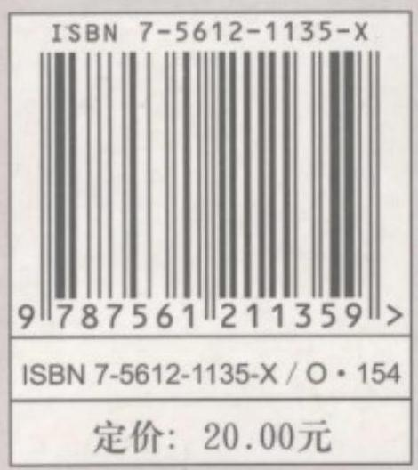

高等学校教材

# 矩阵论 (第 3 版)

程云鹏张凯院 徐 仲 编著

西北工业大学出版社

【内容简介】本书共分 7 章, 主要介绍线性空间与线性变换, 矩阵范数, 矩阵分析，矩阵分解，特征值估计，广义逆矩阵以及特殊矩阵。部分章节包括了作者近年来的一些研究成果及有关文献上的资料。

本书内容丰富，论述翔实严谨，可作为工科、理科研究生和计算数学及其应用软件专业高年级本科生的教材，也可供从事计算工作和工程技术的有关人员参考。

## 图书在版编目 (CIP) 数据

矩阵论/程云鹏，张凯院，徐仲编著. -3 版. 一西安:西北工业大学出版社，2006. 9

ISBN 7-5612-1135-X

I. 矩 ... II. ① 程... ② 张... ③ 徐... Ⅲ. 矩阵一理论一高等学校一教材 IV. O151. 21

中国版本图书馆 CIP 数据核字(2005)第 117739 号

出版发行:西北工业大学出版社

通信地址:西安市友谊西路 127 号 邮编:710072 电话:029-88493844

网 址:www. nwpup. com

印 刷 者:陕西宝石兰印务有限责任公司

开 本:850 mm×1168 mm 1/32

印 张:14.75

字数:365 千字

版 次:2006 年 9 月第 3 版 2006 年 9 月第 9 次印刷

印 数: ${41000} \sim  {46000}$ 册

定 价:20.00 元

## 第 3 版前言

本书第 2 版自 1999 年出版以来, 在国内高等学校和研究院 (所)得到广泛了使用。这次修订，主要对本书中的一些错漏和不妥之处做了修正，也对个别定理的证明进行了简化。

在使用本书期间，我们编写了配套的辅助教材《矩阵论导教· 导学・导考》和《矩阵论典型题解析及自测试题》(西北工业大学出版社出版)，三本书一起构成了比较完整的矩阵论教材体系。

作者谨向关心本书和对本书提出宝贵意见的同行与读者表示衷心的感谢。

编著者

2006 年 3 月

## 第 2 版前言

本书自 1989 年出版以来, 被许多高等学校、研究院 (所) 选作研究生矩阵论课程的教材或教学参考书, 但在使用中也发现了其中的一些问题和需要进一步充实完善的地方。为此, 我们根据十年来的教学实践对本书第 1 版进行修订。

本次修订是在保持原书风格的前提下，改写了书中一些定理的证明过程, 更换了一些例题和习题, 对带“ * ”号的内容也作了少量调整。改动较多的地方有:

(1)在 $\text{ § }{1.3}$ 中，将欧氏空间中的对称变换作为酉空间中的酉对称变换的特例处理,省去了原书中定理 1.41 的证明。

(2)在 $\text{ § }{2.2}$ 中，借助于广义矩阵范数来定义 $m \times  n$ 矩阵的范数。

(3)将原书§3.1 中非负矩阵的内容移至§7.3; 在§3.3 中加强了矩阵函数值的计算方法等内容。

(4)在§ 4.2 中，将矩阵 QR 分解的几个定理证明改成了便于编程计算的构造性证明。

(5)在§ 4.3 中，将原书第六章中矩阵的 Hermite 标准形的内容前移，简化了矩阵满秩分解的计算。

(6)在§ 4.4 中，删去了原书中矩阵奇异值分解的三角分解描述，加强了矩阵奇异值分解的计算与应用。

(7)在§ 5.4 中，增加了线性矩阵方程的可解性讨论，以及使用矩阵函数求解简单线性矩阵方程的内容。

(8) 重写了 $\text{ § }{7.6}$ 。

(9)增加了部分习题的答案或提示，另外，重新编写了与本书配套的题解。

在修订过程中, 我们力求使概念更加清晰, 算法构造思想明确，推导论证严谨，深入浅出，以便于阅读和教学。

程云鹏负责本版书稿的修订工作并编制了修订计划，张凯院 (修订第一至五章)和徐仲(修订第六至七章)分别执笔，最后由程云鹏审定完成。

承蒙西安交通大学理学院姜宗乾副教授仔细审阅了修订版书稿，并提出了宝贵的意见；修订过程中还吸收了初版以来许多专家、同行和读者提供的意见或建议，在此一并深致谢忱。

编著者

1998 年 12 月

## 第 1 版前言

矩阵理论既是学习经典数学的基础, 又是一门最有实用价值的数学理论。它不仅是数学的一个重要的分支，而且业已成为现代各科技领域处理大量有限维空间形式与数量关系的强有力的工具。特别是计算机的广泛应用, 为矩阵论的应用开辟了广阔的前景。例如, 系统工程、优化方法以及稳定性理论等, 都与矩阵论有着密切的联系，从而导致近年来矩阵理论在内容上有相当大的更新，非现有教科书所能概括。因此，我们根据各学科研究生学习和科研的需要，编出此书。

本书主编程云鹏教授从事矩阵理论研究工作多年，书中的大部分内容都来自他编写的《数值代数》教材之中。全书分为 7 章， 其中第一、二、三、四、七章由程云鹏编写；第五章由张凯院编写；第六章由徐仲编写。程经士做了很多编写具体工作。最后由程云鹏统一全书格调。

本书的编写力求做到资料丰富，论述详尽严谨，文字通俗易懂,便于自学; 尽可能满足不同专业工科及理科研究生学习的需要; 书中收编了作者近年来所取得的一些科研成果和有关文献上发表的一些文章。全书内容充实，不同专业的研究生可根据需要对内容进行取舍。理科研究生可读完全书，约需 80 学时。工科修 60 学时的研究生，除删去第七章外，左上角带“ * ”号的内容可酌情取舍一些；修 40 学时者，除删去上面所要删的内容外，对一些定理的证明、例题的演算亦可酌情删减。所有删减均不影响教学内容的连贯性。书中各章按节配有适量的习题，以供选用。由于另有习题解答，故而本书未列习题答案。学习过工程数学线性代数课程的读者，均可阅读本书。

在编写过程中，西北工业大学研究生院和应用数学系的领导及同事们，均给我们以很大的鼓励和支持；航空航天工业部 631 研究所周天孝教授仔细审阅了本书全稿，并给予了很高的评价。编者在此一并深表谢意!

由于编者的水平有限, 错漏和不妥之处在所难免, 殷望批评指正!

编著者

1988 年春于西北工业大学

## 符号说明

${\mathbf{N}}_{0}$ 正整数集合

$a \in  S$ 元素 $a$ 属于集合 $S$

$a \notin  S$ 元素 $a$ 不属于集合 $S$

${S}_{1} \supset  {S}_{2}$ 集合 ${S}_{1}$ 包含集合 ${S}_{2}$

${S}_{1} \cap  {S}_{2}$ 集合 ${S}_{1}$ 与集合 ${S}_{2}$ 的交

${S}_{1} \cup  {S}_{2}$ 集合 ${S}_{1}$ 与集合 ${S}_{2}$ 的并

${S}_{1} \oplus  {S}_{2}$ 集合 ${S}_{1}$ 与集合 ${S}_{2}$ 的直和

$\sigma  : K \rightarrow  S \; \sigma$ 是集合 $K$ 到集合 $S$ 的映射

det $\mathbf{A}$ 矩阵 $\mathbf{A}$ 的行列式

$\operatorname{tr}\mathbf{A}$ 矩阵 $\mathbf{A}$ 的迹, $\mathbf{A}$ 的主对角元素之和

${V}^{n} \; n$ 维线性空间

$\dim {V}^{n} \; {V}^{n}$ 的维数

$\operatorname{diag}\left( {{\lambda }_{1},{\lambda }_{2},\cdots ,{\lambda }_{n}}\right) \; n$ 阶对角矩阵

$\operatorname{diag}\left( {{\mathbf{A}}_{1},{\mathbf{A}}_{2},\cdots ,{\mathbf{A}}_{s}}\right)$ 准对角矩阵

adj $\mathbf{A}$ 矩阵 $\mathbf{A}$ 的伴随矩阵

$\mathbf{R}$ 实数域

${\mathbf{R}}^{n}$ 实 $n$ 维向量空间

${\mathbf{R}}^{m \times  n}$ 实 $m \times  n$ 矩阵空间

${\mathbf{R}}_{r}^{m \times  n}$ 秩为 $r$ 的实 $m \times  n$ 矩阵的集合

C 复数域

${\mathbf{C}}^{n}$ 复 $n$ 维向量空间

${\mathbf{C}}^{m \times  n}$ 复 $m \times  n$ 矩阵空间

${\mathbf{C}}_{r}^{m \times  n}$ 秩为 $r$ 的复 $m \times  n$ 矩阵的集合

${e}_{i} \; n$ 维欧氏空间的第 $i$ 个单位坐标向量

$R\left( \mathbf{A}\right)$ 矩阵 $\mathbf{A}$ 的值域， $\mathbf{A}$ 的列空间

$N\left( \mathbf{A}\right)$ 矩阵 $\mathbf{A}$ 的核空间, $\mathbf{A}$ 的零空间

rank $\mathbf{A}$ 矩阵 $\mathbf{A}$ 的秩, $\dim R\left( \mathbf{A}\right)$

$n\left( \mathbf{A}\right)$ 矩阵 $\mathbf{A}$ 的零度, $\dim N\left( \mathbf{A}\right)$

$\mathbf{A} \sim  \mathbf{B}$ 矩阵 $\mathbf{A}$ 相似于矩阵 $\mathbf{B}$

${P}_{m}\left( t\right)  \mid  {Q}_{n}\left( t\right) \; m$ 次多项式 ${P}_{m}\left( t\right)$ 整除 $n$ 次多项式 ${Q}_{n}\left( t\right)$

${T}_{0}$ 零变换

${T}_{e}$ 单位变换

J 矩阵的 Jordan 标准形

${\mathbf{J}}_{i}\left( {\lambda }_{i}\right)$ 矩阵的第 $i$ 个 Jordan 块

$\left( {x, y}\right)$ 向量 $x$ 与向量 $y$ 的内积

$x \bot  y$ 向量 $x$ 与向量 $y$ 正交 (垂直)

$L\left( {{x}_{1},{x}_{2},\cdots ,{x}_{s}}\right)$ 向量 ${x}_{1},{x}_{2},\cdots ,{x}_{s}$ 生成的子空间

${V}^{ \bot  }$ 子空间 $V$ 的正交补

${\mathbf{A}}^{\mathrm{T}}$ 矩阵 $\mathbf{A}$ 的转置

${\mathbf{A}}^{\mathrm{H}}$ 矩阵 $\mathbf{A}$ 的共轭转置

${\left( \mathbf{A}\right) }_{ij}$ 矩阵 $\mathbf{A}$ 的 $i$ 行 $j$ 列处的元素

$\parallel \mathbf{A}\parallel$ 矩阵 $\mathbf{A}$ 的任意范数

$\parallel \mathbf{A}{\parallel }_{F}$ 矩阵 $\mathbf{A}$ 的 Frobenius 范数

$\rho \left( \mathbf{A}\right)$ 矩阵 $\mathbf{A}$ 的谱半径

$\operatorname{cond}\left( \mathbf{A}\right)$ 矩阵 $\mathbf{A}$ 的条件数

$\parallel \mathbf{x}{\parallel }_{p}$ 向量 $\mathbf{x}$ 的 $p$ - 范数, ${l}_{p}$ 范数

${\mathbf{T}}_{ij}$ 平面 $\left\lbrack  {{e}_{i},{e}_{j}}\right\rbrack$ 中的旋转矩阵

${\sigma }_{i} = \sqrt{{\lambda }_{i}}$ 矩阵 $\mathbf{A}$ 的第 $i$ 个奇异值

${\lambda }_{i}$ 或 ${\lambda }_{i}\left( \mathbf{A}\right)$ 矩阵 $\mathbf{A}$ 的第 $i$ 个特征值

$\operatorname{Re}\left( \lambda \right)$ 复数 $\lambda$ 的实部

$\operatorname{Im}\left( \lambda \right)$ 复数 $\lambda$ 的虚部

${G}_{i}$ 矩阵 $\mathbf{A}$ 的第 $i$ 个 Gerschgorin 圆

${R}_{i}\left( \mathbf{A}\right)$ 或 ${R}_{i}$ 矩阵 $\mathbf{A}$ 的第 $i$ 个 Gerschgorin 圆半径

$R\left( \mathbf{x}\right)$ 矩阵 $\mathbf{A}$ 的 Rayleigh 商

$\mathbf{A} \otimes  \mathbf{B}$ 矩阵 $\mathbf{A}$ 与矩阵 $\mathbf{B}$ 的直积, Kronecker 积

vec(A) 矩阵 $\mathbf{A}$ 按行拉直所得到的列向量

${P}_{L, M}$ 沿着空间 $M$ 向空间 $L$ 的投影算子

${P}_{L}$ 正交投影算子

${\mathbf{A}}^{ + }$ 矩阵 $\mathbf{A}$ 的 Moore-Penrose 逆

${\mathbf{A}}^{\left( i, j,\cdots , l\right) }$ 矩阵 $\mathbf{A}$ 的 $\{ i, j,\cdots , l\}$ - 逆

$A\{ i, j,\cdots , l\}$ 矩阵 $\mathbf{A}$ 的 $\{ i, j,\cdots , l\}$ - 逆的集合

${\mathbf{A}}^{\left( d\right) }$ 矩阵 $\mathbf{A}$ 的 Drazin 逆

${\mathbf{A}}^{\# }$ 矩阵 $\mathbf{A}$ 的群逆

${\mathbf{L}}_{-1}$ 反周期 Jacobi 矩阵

$\mathbf{A} > \mathbf{B} \; \mathbf{A}$ 与 $\mathbf{B}$ 都是 Hermite 矩阵,且 $\mathbf{A} - \mathbf{B}$ 为正定矩阵

$\mathbf{A} \geq  \mathbf{B} \; \mathbf{A}$ 与 $\mathbf{B}$ 都是 Hermite 矩阵,且 $\mathbf{A} - \mathbf{B}$ 为非负定矩阵

$A \geq  O\left( {x \geq  0}\right)$

非负矩阵 $\mathbf{A}$ (非负向量 $\mathbf{x}$ )， $\mathbf{A}$ (或 $\mathbf{x}$ ) 的每个元素都是非负实数

$A \geq  O\left( {x \geq  0}\right)$ 矩阵 $\mathbf{A}$ (向量 $\mathbf{x}$ ) 不是零矩阵 (向量) 的非负矩阵(向量)

$\mathbf{A} > \mathbf{O}\left( {x > 0}\right)$ 正矩阵 $\mathbf{A}$ (正向量 $\mathbf{x}$ ),矩阵 $\mathbf{A}$ (向量 $\mathbf{x}$ ) 的每个元素都是正数

V. L. 稳定 Volterra-Lyapunov 稳定

${P}_{0}^{ + }$

主子式的值非负, 且同阶主子式中至少有一个为正值的矩阵集合

${\mathbf{R}}_{ + }^{n}$ 实 $n$ 维向量空间 ${\mathbf{R}}^{n}$ 中全体非负向量所构成的子集合

## 目 录

第 1 章 线性空间与线性变换 1

§ 1.1 线性空间 1

一、集合与映射 1

二、线性空间及其性质 5

三、线性空间的基与坐标 9

四、基变换与坐标变换 11

五、线性子空间 16

六、子空间的交与和 20

习题 1.1 25

§ 1.2 线性变换及其矩阵 26

一、线性变换及其运算 27

二、线性变换的矩阵表示 34

三、特征值与特征向量 43

四、对角矩阵 57

五、不变子空间 60

六、Jordan 标准形介绍 62

习题 1.2 77

§ 1.3 两个特殊的线性空间 80

一、Euclid 空间的定义与性质 80

二、正交性 87

三、正交变换与正交矩阵 94

四、对称变换与对称矩阵 97

五、酉空间介绍 100

习题 1.3 106

第 2 章 范数理论及其应用 109

$\text{ § }{2.1}$ 向量范数及其性质 109

一、向量范数的概念及 ${l}_{p}$ 范数 109

二、线性空间 ${V}^{n}$ 上的向量范数的等价性 118

习题 2.1 121

$\text{ § }{2.2}$ 矩阵的范数 122

一、矩阵范数的定义与性质 122

二、几种常用的矩阵范数 127

习题 2.2 132

§ 2.3 范数的一些应用 132

一、矩阵的非奇异性条件 132

*二、近似逆矩阵的误差——逆矩阵的摄动 134

三、矩阵的谱半径及其性质 135

习题 2.3 138

第 3 章 矩阵分析及其应用 139

§ 3.1 矩阵序列 139

习题 3.1 142

$\text{ § }{3.2}$ 矩阵级数 142

§ 3.3 矩阵函数 149

一、矩阵函数的定义与性质 149

二、矩阵函数值的求法 153

*三、矩阵函数的另一定义 160

习题 3.3 163

$\text{ § }{3.4}$ 矩阵的微分和积分 163

一、矩阵 $\mathbf{A}\left( t\right)$ 的导数与积分 163

*二、其他微分概念 166

习题 3.4 170

$\text{ § }{3.5}$ 矩阵函数的一些应用 171

一、一阶线性常系数齐次微分方程组 171

二、一阶线性常系数非齐次微分方程组 174

习题 3.5 177

第 4 章 矩阵分解 178

§ 4.1 Gauss 消去法与矩阵的三角分解 178

一、Gauss 消去法的矩阵形式 178

二、矩阵的三角(LU)分解 182

三、其他三角分解及其算法 189

四、分块矩阵的拟 LU 分解与拟 LDU 分解 193

习题 4.1 195

§ 4.2 矩阵的 QR 分解 196

一、Givens 变换与 Householder 变换 196

二、矩阵的 QR(正交三角) 分解 203

* 三、矩阵与 Hessenberg 矩阵的正交相似问题 215

习题 4.2 219

§ 4.3 矩阵的满秩分解 220

习题 4.3 225

§ 4.4 矩阵的奇异值分解 225

一、矩阵的正交对角分解 226

二、矩阵的奇异值与奇异值分解 227

三、矩阵正交相抵的概念 233

习题 4.4 233

第 5 章 特征值的估计及对称矩阵的极性 235

§ 5.1 特征值的估计 235

一、特征值的界 236

二、特征值的包含区域 245

*三、扰动理论中的特征值估计 259

习题 5.1 262

§ 5.2 广义特征值问题 264

二、广义特征值问题的等价形式 264

二、特征向量的正交性 265

习题 5.2 266

§ 5.3 对称矩阵特征值的极性 266

一、实对称矩阵的 Rayleigh 商的极性 266

二、广义特征值的极小极大原理 271

*三、矩阵奇异值的极小极大性质 274

习题 5.3 277

* §5.4 矩阵的直积及其应用 277

一、直积的概念 278

二、线性矩阵方程的可解性 284

习题 5.4 289

第 6 章 广义逆矩阵 290

§ 6.1 投影矩阵 290

一、投影算子与投影矩阵 291

二、正交投影算子与正交投影矩阵 294

习题 6.1 296

§ 6.2 广义逆矩阵的存在、性质及构造方法 296

一、Penrose 的广义逆矩阵定义 296

二、广义逆矩阵的性质及构造方法 298

三、Moore-Penrose 逆的等价定义 305

习题 6.2 307

§ 6.3 广义逆矩阵的计算方法 308

一、利用 Hermite 标准形计算矩阵的 $\{ 1\}$ -逆和 $\{ 1,2\}$ -逆 308

二、利用满秩分解求广义逆矩阵 310

* 三、计算 ${\mathbf{A}}^{ + }$ 的 Zlobec 公式 312

* 四、Greville 方法 315

* 五、一些特殊分块矩阵的广义逆矩阵 319

* 六、计算一类实 Hessenberg 矩阵的广义逆 321

*七、计算 ${\mathbf{A}}^{ + }$ 的迭代方法 329

习题 6.3 334

§ 6.4 广义逆矩阵与线性方程组的求解 334

一、线性方程组的相容性、通解与广义 $\{ 1\}$ -逆 335

二、相容线性方程组的极小范数解与广义 $\{ 1,4\}$ 一逆 338

三、矛盾方程组的最小二乘解与广义 $\{ 1,3\}$ -逆 340

四、矛盾方程组的极小范数最小二乘解与广义逆矩阵 ${\mathbf{A}}^{ + }$ 342

五、矩阵方程 $\mathbf{A}\mathbf{X}\mathbf{B} = \mathbf{D}$ 的极小范数最小二乘解 343

习题 6.4 344

* § 6.5 约束广义逆和加权广义逆 346

一、约束广义逆 346

二、加权广义逆 348

习题 6.5 351

* § 6.6 Drazin 广义逆 352

一、方阵的指标 352

二、Drazin 逆 354

三、Drazin 逆的谱性质 356

四、Drazin 逆的计算方法 357

五、Drazin 逆的特例一一群逆 360

习题 6.6 361

* 第 7 章 若干特殊矩阵类介绍 363

§ 7.1 正定矩阵与正稳定矩阵 365

一、正定矩阵及一些矩阵不等式 365

二、正稳定矩阵 372

习题 7.1 376

§ 7.2 对角占优矩阵 377

一、强对角占优与不可约对角占优矩阵 377

二、具非零元素链对角占优矩阵 380

三、拟对角占优矩阵 381

四、半强对角占优矩阵 383

五、块对角占优矩阵 385

习题 7.2 387

$\text{ § }{7.3}$ 非负矩阵 387

一、非负矩阵 387

二、单调矩阵 389

三、矩阵的正则分裂及弱正则分裂 391

习题 7.3 393

§ 7.4 M矩阵与广义 M 矩阵 394

一、40 个充要条件介绍 394

二、M 矩阵 398

三、广义 M 矩阵 404

习题 7.4 405

§ 7.5 Toeplitz 矩阵及其有关矩阵 407

一、Toeplitz 矩阵与 Hankel 矩阵等 407

二、循环矩阵 412

三、其他特殊的 T 矩阵 416

§ 7.6 其他特殊矩阵 417

一、Vandermonde 矩阵 417

二、Hilbert 矩阵 422

三、Hadamard 矩阵 424

习题答案或提示 427

参考文献 447

## 第 1 章 线性空间与线性变换

线性空间与线性变换是学习现代矩阵论时经常用到的两个极其重要的概念. 本章先简要地论述这两个概念及其有关理论, 然后再讨论两个特殊的线性空间, 这就是 Euclid 空间和酉空间. 所有论述是在假定读者已经具备了 $n$ 维向量空间的理论，矩阵的初步运算，线性方程组的理论和二次型的有关知识的基础上进行的.

## § 1.1 线性空间

## 一、集合与映射

集合是数学中最基本的概念之一. 所谓集合是指作为整体看的一堆东西. 例如, 由一些数(有限个或无限个) 组成的集合, 称为数集合或数集; 一个线性代数方程组解的全体组成一个集合, 称为解集合; 一个已知半径和圆心的开圆内的所有点组成一个集合, 称为点集合或点集; 等等. 组成集合的事物称为这个集合的元素. 如果用 $S$ 表示集合, $a$ 表示 $S$ 的元素,常用记号

$$
a \in  S
$$

表示 $a$ 是 $S$ 的元素,读为 $a$ 属于 $S$ ; 用记号

$$
a \notin  S
$$

表示 $a$ 不是 $S$ 的元素,读为 $a$ 不属于 $S$ .

因为一个集合由它的元素组成,所以给出一个集合的方式不外乎是列举出它的全部元素或给出这个集合元素所具有的特征性质. 例如,由数1,2,3组成的集合 $N$ ,可记为

$$
N = \{ 1,2,3\}
$$

这就是用列举出其全部元素的方式; 但适合方程 $\frac{{x}^{2}}{{a}^{2}} + \frac{{y}^{2}}{{b}^{2}} = 1$ 的全部点组成的点集 $P$ ，因其元素有无穷多个，不可能全部列举出来， 就用其元素所具有的特征性质的方式把它记为

$$
P = \left\{  {\left( {x, y}\right) \left| {\;\frac{{x}^{2}}{{a}^{2}} + \frac{{y}^{2}}{{b}^{2}} = 1}\right. }\right\}
$$

一般地, $M$ 是具有某些性质的全部元素 $a$ 所组成的集合时,可记为

$$
M = \{ a \mid  a\text{ 具有的性质 }\}
$$

一切正整数的集合, 称为正整数集, 常记为

$$
{\mathbf{N}}_{0} = \{ n \mid  n\text{ 是正整数 }\}
$$

不包含任何元素的集合称为空集合,常记为 $\varnothing$ . 例如,一个无解的线性代数方程组的解集合就是一个空集合. 空集合在集合运算中所起的作用,类似于数零在数的运算中所起的作用.

如果集合 ${S}_{1}$ 的元素全是集合 ${S}_{2}$ 的元素,即由 $a \in  {S}_{1}$ 可以推出 $a \in  {S}_{2}$ ,那么就称 ${S}_{1}$ 为 ${S}_{2}$ 的子集合,记为

$$
{S}_{1} \subset  {S}_{2}\text{ 或 }{S}_{2} \supset  {S}_{1}
$$

例如，全体偶数组成的集合是全体整数组成的集合——整数集 ——的子集合. 规定空集合是任一集合的子集合. 按定义,每个集合都是它自身的子集合. 把集合的这两个特殊子集合, 统称为其当然子集合或假子集合, 而把它的其余子集合统称为其非当然子集合或真子集合.

如果两个集合 ${S}_{1}$ 与 ${S}_{2}$ 含有完全相同的元素,即 $a \in  {S}_{1}$ ,当且仅当 $a \in  {S}_{2}$ 时,那么就称它们相等,记为

$$
{S}_{1} = {S}_{2}
$$

显然两个集合 ${S}_{1}$ 与 ${S}_{2}$ ,如果同时满足 ${S}_{1} \subset  {S}_{2}$ 与 ${S}_{2} \subset  {S}_{1}$ ,那么 ${S}_{1}$ 和 ${S}_{2}$ 相等.

把既属于集合 ${S}_{1}$ ,又属于集合 ${S}_{2}$ 的全体元素所组成的集合称为 ${S}_{1}$ 与 ${S}_{2}$ 的交,记为

$$
{S}_{1} \cap  {S}_{2} = \left\{  {x \mid  x \in  {S}_{1}\text{ 且 }x \in  {S}_{2}}\right\}
$$

例如,圆 ${\left( x - 1\right) }^{2} + {y}^{2} = 1$ 包含的所有点组成的点集与圆 ${\left( x - 2\right) }^{2} + {y}^{2} = 1$ 包含的所有点组成的点集的交,就是两个圆公共部分所有点组成的点集. 两集合的交显然具有下面的关系

$$
{S}_{1} \cap  {S}_{2} \subset  {S}_{1},\;{S}_{1} \cap  {S}_{2} \subset  {S}_{2}
$$

属于集合 ${S}_{1}$ ,或属于集合 ${S}_{2}$ 的全体元素组成的集合,称为 ${S}_{1}$ 与 ${S}_{2}$ 的并,记为

$$
{S}_{1} \cup  {S}_{2} = \left\{  {x \mid  x \in  {S}_{1}\text{ 或 }x \in  {S}_{2}}\right\}
$$

两集合 ${S}_{1}$ 与 ${S}_{2}$ 的并显然满足关系 ${S}_{1} \cup  {S}_{2} \supset  {S}_{1},{S}_{1} \cup  {S}_{2} \supset \; {S}_{2}$ .

集合 ${S}_{1}$ 与集合 ${S}_{2}$ 的和集是指如下的集合

$$
\left\{  {x + y \mid  x \in  {S}_{1}, y \in  {S}_{2}}\right\}
$$

常用记号 ${S}_{1} + {S}_{2}$ 来表示，于是有

$$
{S}_{1} + {S}_{2} = \left\{  {x + y \mid  x \in  {S}_{1}, y \in  {S}_{2}}\right\}
$$

应该指出, 两集合的和集概念不同于它们的并集概念, 例如

$$
\{ 1,2,3\}  \cup  \{ 2,3,4\}  = \{ 1,2,3,4\}
$$

$$
\{ 1,2,3\}  + \{ 2,3,4\}  = \{ 3,4,5,6,7\}
$$

某些数集(含非零的数)，如果其中任意两个数的和、差、积、商 (除数不为零) 仍在该数集中 (即数集关于四则运算封闭), 那么称该数集为数域. 例如, 实数集关于四则运算封闭, 因此它形成一个数域, 称其为实数域, 记为 $\mathbf{R}$ . 同样,复数集也形成一个数域,称其为复数域,记为 $\mathbf{C}$ . 读者可以验证有理数集形成一个有理数域. 但奇数集不能形成数域，偶数集也不能形成数域.

下面简要介绍矩阵论中关于集合间的映射这一重要概念.

设 $S$ 与 ${S}^{\prime }$ 是两个集合. 所谓集合 $S$ 到集合 ${S}^{\prime }$ 的一个映射或映照,是指一个法则 (或规则) $\sigma  : S \rightarrow  {S}^{\prime }$ ,它使 $S$ 中每一个元素 $a$ 都有 ${S}^{\prime }$ 中一个确定的元素 ${a}^{\prime }$ 与之对应,记为

$$
\sigma \left( a\right)  = {a}^{\prime }\text{ 或 }a \rightarrow  {a}^{\prime }\left( { = \sigma \left( a\right) }\right)
$$

${a}^{\prime }$ 称为 $a$ 在映射 $\sigma$ 下的象,而 $a$ 称为 ${a}^{\prime }$ 在映射 $\sigma$ 下的一个原象 (或象源).

$S$ 到 $S$ 自身的映射,有时也称为 $S$ 到自身的一个变换. 这种特殊的映射,在矩阵论中也是经常出现的.

例如, $S$ 是数域 ${K}^{\left( 1\right) }$ 上全体 $n$ 阶矩阵 $\mathbf{A}$ 的集合,定义

$$
{\sigma }_{1}\left( \mathbf{A}\right)  = \det \mathbf{A}\;\left( {\mathbf{A} \in  S}\right)
$$

则有 ${\sigma }_{1} : S \rightarrow  K$ ,即 ${\sigma }_{1}$ 是 $S$ 到 $K$ 的一个映射; 如果定义

$$
{\sigma }_{2}\left( a\right)  = a\mathbf{I}\;\left( {a \in  K}\right)
$$

这里 $\mathbf{I}$ 是 $n$ 阶单位矩阵,则有 ${\sigma }_{2} : K \rightarrow  S$ .

令 ${P}_{n}$ 是所有次数不超过 $n$ 的实系数多项式的集合,定义

$$
\sigma \left( {f\left( t\right) }\right)  = {f}^{\prime }\left( t\right) \;\left( {f\left( t\right)  \in  {P}_{n}}\right)
$$

$\sigma$ 是 ${P}_{n}$ 到自身的一个映射 (实为求导运算),即 $\sigma$ 是 ${P}_{n}$ 到自身的一个变换.

又如,对于指数函数 $y = {\mathrm{e}}^{x}$ 而言,它可视为 $\mathbf{R}$ 到自身的映射. 一般地,定义在 $\mathbf{R}$ 上的实函数 $y = f\left( x\right)$ ,都可视为 $\mathbf{R}$ 到自身的一种特殊映射.

关于映射, 还可定义它的运算如下.

设 ${\sigma }_{1}$ 与 ${\sigma }_{2}$ 都是集合 $S$ 到 ${S}^{\prime }$ 的映射,如果对于每个 $a \in  S$ ,都有 ${\sigma }_{1}\left( a\right)  = {\sigma }_{2}\left( a\right)$ ,则称映射 ${\sigma }_{1}$ 与 ${\sigma }_{2}$ 相等,记为 ${\sigma }_{1} = {\sigma }_{2}$ .

设 $\sigma ,\tau$ 依次是集合 $S$ 到 ${S}_{1},{S}_{1}$ 到 ${S}_{2}$ 的映射,映射的乘积 ${\tau \sigma }$ 定义如下:

$$
\left( {\tau \sigma }\right) \left( a\right)  = \tau \left( {\sigma \left( a\right) }\right) \;\left( {a \in  S}\right) .
$$

此即相继施行映射 $\sigma$ 和 $\tau$ 的结果, ${\tau \sigma }$ 是 $S$ 到 ${S}_{2}$ 的一个映射.

---

① 数域 $K$ 表示一般的数域，它可以是 $\mathbf{R}$ ，可以是 $\mathbf{C}$ ，也可以是其他数域.

---

设 $\sigma ,\tau ,\mu$ 依次为集合 $S$ 到 ${S}_{1},{S}_{1}$ 到 ${S}_{2},{S}_{2}$ 到 ${S}_{3}$ 的映射,则可证明 ${}^{\left\lbrack  1\right\rbrack  }$ 映射的乘积满足结合律,但不满足交换律,即分别有

$$
\left( {\mu \tau }\right) \sigma  = \mu \left( {\tau \sigma }\right) ,\;{\tau \sigma } \neq  {\sigma \tau }
$$

## 二、线性空间及其性质

线性空间是线性代数最基本的概念之一, 也是学习现代矩阵论的重要基础. 线性空间的概念, 是某类事物从量的方面的一个抽象. 为了便于理解这个抽象概念, 先看如下几个熟知的例子.

例 1.1 所有实(或复) $n$ 维向量的集合 ${\mathbf{R}}^{n}$ (或 ${\mathbf{C}}^{n}$ ),对 $n$ 维向量的加法及数乘 $n$ 维向量的运算是封闭的. 加法运算还满足交换律与结合律; 数乘向量的运算满足分配律与结合律.

例 1.2 在集合 ${P}_{n}$ 中，按通常意义定义多项式加法及实数与多项式乘法,则 ${P}_{n}$ 对这两种运算是封闭的,因为,如果 $f\left( t\right)  \in  {P}_{n}$ , $g\left( t\right)  \in  {P}_{n}$ ,则 $f\left( t\right)  + g\left( t\right)  \in  {P}_{n}$ ; 若 $k \in  \mathbf{R}$ ,则 ${kf}\left( t\right)  \in  {P}_{n}$ . 易验证对 ${P}_{n}$ 的这两种运算,也有如例 1.1 中所论的诸算律成立.

例 1.3 常系数二阶齐次线性微分方程

$$
{y}^{\prime \prime } - 3{y}^{\prime } + {2y} = 0
$$

的解的集合 $D$ ,对于函数加法及数与函数乘法有,若 ${y}_{1},{y}_{2} \in  D$ , 则 ${y}_{1} + {y}_{2} \in  D$ ,当 $k \in  \mathbf{R}$ 时,则 $k{y}_{1} \in  D$ . 即 $D$ 关于这两种运算是封闭的,且满足如例 1.1 中所论的诸算律.

例 1.4 在所有 $n$ 阶实矩阵的集合 ${\mathbf{R}}^{n \times  n}$ (或复矩阵的集合 $\left. {\mathbf{C}}^{n \times  n}\right)$ 中,如果 $\mathbf{A},\mathbf{B} \in  {\mathbf{R}}^{n \times  n}$ (或 $\left. {\mathbf{C}}^{n \times  n}\right)$ ,则 $\mathbf{A} + \mathbf{B} \in  {\mathbf{R}}^{n \times  n}$ (或 $\left. {\mathbf{C}}^{n \times  n}\right)$ ; 如果 $k \in  \mathbf{R}$ (或 $\mathbf{C}$ ),则 $k\mathbf{A} \in  {\mathbf{R}}^{n \times  n}$ (或 ${\mathbf{C}}^{n \times  n}$ ). 即集合对于这两种运算是封闭的. 加法与数乘矩阵也都满足如例 1.1 中所论的诸算律.

此外, 在数学、力学及其他学科中, 还有大量如例 1.1 至例 1.4 这样的集合. 因此, 有必要不考虑集合的对象, 抽去它们的具体内容的含义, 来研究这类集合的公共性质, 并引进一个概括性名词. 于是就有如下的线性空间的概念.

定义 1.1 设 $V$ 是一个非空集合,它的元素用 $x, y, z$ 等表示,并称之为向量; $K$ 是一个数域,它的元素用 $k, l, m$ 等表示. 如果 $V$ 满足下列条件:

(1)在 $V$ 中定义一个加法运算，即当 $x, y \in  V$ 时，有唯一的和 $\mathbf{x} + \mathbf{y} \in  V$ ,且加法运算满足下列性质

1) 结合律 $\mathbf{x} + \left( {\mathbf{y} + \mathbf{z}}\right)  = \left( {\mathbf{x} + \mathbf{y}}\right)  + \mathbf{z}$ ;

2) 交换律 $x + y = y + x$ ;

3) 存在零元素 0,使 $x + 0 = x$ ;

4) 存在负元素,即对任一向量 $x \in  V$ ,存在向量 $y \in  V$ ,使 $x + y = 0$ ,则称 $y$ 为 $x$ 的负元素,记为 $- x$ ,于是有

$$
\mathbf{x} + \left( {-\mathbf{x}}\right)  = \mathbf{0}
$$

(2)在 $V$ 中定义数乘(数与向量的乘法)运算，即当 $x \in  V$ ， $k \in  K$ 时，有唯一的 ${kx} \in  V$ ，且数乘运算满足下列性质:

5) 数因子分配律 $k\left( {\mathbf{x} + \mathbf{y}}\right)  = k\mathbf{x} + k\mathbf{y}$ ;

6) 分配律 $\left( {k + l}\right) x = {kx} + {lx}$ ;

7) 结合律 $k\left( {lx}\right)  = \left( {kl}\right) x$ ;

8) ${1x} = x$ .

则称 $V$ 为数域 $K$ 上的线性空间或向量空间.

$V$ 中所定义的加法及数乘运算统称为 $V$ 的线性运算. 在不致产生混淆时,将数域 $K$ 上的线性空间简称为线性空间.

须要指出,不管 $V$ 的元素如何,当 $K$ 为实数域 $\mathbf{R}$ 时,则称 $V$ 为实线性空间; 当 $K$ 为复数域 $\mathbf{C}$ 时,就称 $V$ 为复线性空间.

例 1.1 中的 ${\mathbf{R}}^{n}\left( {\mathbf{C}}^{n}\right)$ 形成实(复) 线性空间; 例 1.2 至例 1.4 中的集合, 在其各自的加法和数乘运算的定义下, 都形成实线性空间. 称例 1.4 所给的线性空间为矩阵空间.

例 1.5 设 ${\mathbf{R}}^{ + }$ 为所有正实数组成的数集,其加法与数乘运算分别定义为

$$
m \oplus  n = {mn},\;k \circ  m = {m}^{k}
$$

证明 ${\mathbf{R}}^{ + }$ 是 $\mathbf{R}$ 上的线性空间.

证 设 $m, n \in  {\mathbf{R}}^{ + }, k \in  \mathbf{R}$ ,则有

$$
m \oplus  n = {mn} \in  {\mathbf{R}}^{ + },\;k \circ  m = {m}^{k} \in  {\mathbf{R}}^{ + }
$$

即 ${\mathbf{R}}^{ + }$ 对所定义的加法运算“ $\boxplus$ ”与数乘运算“。”是封闭的，且有

(1) $\left( {m \boxplus  n}\right)  \boxplus  p = \left( {mn}\right)  \boxplus  p = {mnp} = m \boxplus  \left( {np}\right)  =$

$$
m \pm  \left( {n \pm  p}\right)
$$

(2) $m \boxplus  n = {mn} = {nm} = n \boxplus  m$

(3) 1 是零元素，因为 $m \boxplus  1 = m \times  1 = m$

(4) $m$ 的负元素是 $\frac{1}{m}$ ，因为 $m \boxplus  \frac{1}{m} = m \times  \frac{1}{m} = 1$

(5) $k \circ  \left( {m \boxplus  n}\right)  = k \circ  \left( {mn}\right)  = {\left( mn\right) }^{k} =$

$$
{m}^{k}{n}^{k} = \left( {k \circ  m}\right)  \oplus  \left( {k \circ  n}\right)
$$

(6) $\left( {k + l}\right)  \circ  m = {m}^{k + l} = {m}^{k}{m}^{l} = \left( {k \circ  m}\right)  \boxplus  \left( {l \circ  m}\right)$

(7) $k \circ  \left( {l \circ  m}\right)  = k \circ  {m}^{l} = {\left( {m}^{l}\right) }^{k} = {m}^{lk} = {m}^{kl} = \left( {kl}\right)  \circ  m$

(8) $1 \circ  m = {m}^{1} = m$

成立，故 ${\mathbf{R}}^{ + }$ 是实线性空间.

定理 1.1 线性空间 $V$ 有唯一的零元素，任一元素也有唯一的负元素.

证 设 ${\mathbf{0}}_{1},{\mathbf{0}}_{2}$ 是 $V$ 的两个零元素,考虑和

$$
{\mathbf{0}}_{1} + {\mathbf{0}}_{2}
$$

由于 ${\mathbf{0}}_{1}$ 是 $V$ 的零元素,因此 ${\mathbf{0}}_{1} + {\mathbf{0}}_{2} = {\mathbf{0}}_{2} + {\mathbf{0}}_{1} = {\mathbf{0}}_{2}$ ; 又由于 ${\mathbf{0}}_{2}$ 也是 $V$ 的零元素,因此 ${\mathbf{0}}_{1} + {\mathbf{0}}_{2} = {\mathbf{0}}_{1}$ . 从而有

$$
{\mathbf{0}}_{1} = {\mathbf{0}}_{1} + {\mathbf{0}}_{2} = {\mathbf{0}}_{2}
$$

这就证明了零元素的唯一性.

为了证明负元素的唯一性,设元素 $x$ 有两个负元素 ${x}_{1}$ 和 ${x}_{2}$ , 即有

$$
\mathbf{x} + {\mathbf{x}}_{1} = \mathbf{0},\;\mathbf{x} + {\mathbf{x}}_{2} = \mathbf{0}
$$

于是

$$
{\mathbf{x}}_{1} = {\mathbf{x}}_{1} + \mathbf{0} = {\mathbf{x}}_{1} + \left( {\mathbf{x} + {\mathbf{x}}_{2}}\right)  = \left( {{\mathbf{x}}_{1} + \mathbf{x}}\right)  + {\mathbf{x}}_{2} =
$$

$$
\mathbf{0} + {\mathbf{x}}_{2} = {\mathbf{x}}_{2}
$$

证毕

利用负元素，定义 $V$ 中向量的减法如下:

$$
\mathbf{x} - \mathbf{y} = \mathbf{x} + \left( {-\mathbf{y}}\right)
$$

可以证明,若 $x \in  V, k \in  K$ ,则 ${0x} = \mathbf{0}, k\mathbf{0} = \mathbf{0},\left( {-1}\right) x = \; - x$ .

同 $n$ 维线性空间 ${\mathbf{R}}^{n}$ 中向量组的线性相关性一样,如果 ${\mathbf{x}}_{1},{\mathbf{x}}_{2}$ , $\cdots ,{x}_{m}$ 为线性空间 $V$ 中的 $m$ (有限正整数) 个向量, $x \in  V$ ,且存在数域 $K$ 中一组数 ${c}_{1},{c}_{2},\cdots ,{c}_{m}$ ,使

$$
\mathbf{x} = {c}_{1}{\mathbf{x}}_{1} + {c}_{2}{\mathbf{x}}_{2} + \cdots  + {c}_{m}{\mathbf{x}}_{m} \tag{1.1.1}
$$

则称 $x$ 为向量组 ${x}_{1},{x}_{2},\cdots ,{x}_{m}$ 的线性组合,有时也称向量 $x$ 可由 ${x}_{1},{x}_{2},\cdots ,{x}_{m}$ 线性表示.

如果式(1.1.1)中的 ${c}_{1},{c}_{2},\cdots ,{c}_{m}$ 不全为零，且使

$$
{c}_{1}{\mathbf{x}}_{1} + {c}_{2}{\mathbf{x}}_{2} + \cdots  + {c}_{m}{\mathbf{x}}_{m} = \mathbf{0} \tag{1.1.2}
$$

则称向量组 ${x}_{1},{x}_{2},\cdots ,{x}_{m}$ 线性相关,否则称其为线性无关 (即式(1.1.2) 仅当 ${c}_{1},{c}_{2},\cdots ,{c}_{m}$ 全为零时才成立,称 ${x}_{1},{x}_{2},\cdots ,{x}_{m}$ 线性无关). 注意到上述概念都只涉及加法与数乘运算, 与向量本身的属性无直接关系,因此对于 ${\mathbf{R}}^{n}$ 中向量成立的相应结论可以照搬到一般的线性空间中来. 对 $V$ 中线性无关的向量组所含向量的最大个数作如下的定义.

定义 1.2 线性空间 $V$ 中线性无关向量组所含向量最大个数称为 $V$ 的维数. 若 $n$ 是具有这个性质的正整数,则称 $V$ 的维数是 $n$ ,记为 $\dim V = n$ .

维数是 $n$ 的线性空间称为数域 $K$ 上的 $n$ 维线性空间,记为 ${V}^{n}$ . 当 $n =  + \infty$ 时,称为无限维线性空间.

譬如,例 1.3 中的集合 $D$ 仅有两个线性无关的向量 ${y}_{1} = {\mathrm{e}}^{x}$ , ${y}_{2} = {\mathrm{e}}^{2x}$ ,且 $D$ 中任一向量 $y$ 都可以由 ${y}_{1}$ 和 ${y}_{2}$ 线性表示,即有 $y = {c}_{1}{\mathrm{e}}^{x} + {c}_{2}{\mathrm{e}}^{2x}$ ,故 $\dim D = 2$ ,即 $D$ 是 $\mathbf{R}$ 上的 2 维线性空间. 同样,例 1.4 中的 ${\mathbf{R}}^{n \times  n}$ 是 $\mathbf{R}$ 上的 ${n}^{2}$ 维线性空间. 这是因为 ${\mathbf{R}}^{n \times  n}$ 的任一向量 $\mathbf{A} = {\left( {a}_{ij}\right) }_{n \times  n} = \mathop{\sum }\limits_{{i, j = 1}}^{n}{a}_{ij}{\mathbf{E}}_{ij}$ ,其中 ${\mathbf{E}}_{ij}$ 是第 $i$ 行第 $j$ 列的元素为 1,其余元素都为 0 的 $n$ 阶矩阵,且易验证 ${\mathbf{E}}_{ij}(i, j = 1,2,\cdots$ , $n)$ 线性无关,故 $\dim {\mathbf{R}}^{n \times  n} = {n}^{2}$ . 又如,所有实系数多项式的集合,在通常的多项式加法及数乘多项式的运算下形成的实线性空间是无限维的,这是因为对于任意整数 $N$ ,都有 $N$ 个线性无关的向量

$$
1, t,{t}^{2},\cdots ,{t}^{N - 1}
$$

容易验证, $1, t,{t}^{2},\cdots ,{t}^{n}$ 是例 1.2 中的线性空间 ${P}_{n}$ 的一个最大线性无关组,且 $\dim {P}_{n} = n + 1$ .

无限维线性空间是一个专门研究的对象, 它与有限维线性空间有较大的差别. 本书主要讨论有限维线性空间.

## 三、线性空间的基与坐标

在解析几何中, 为了借助于数量运算以实现向量的运算, 必须引进向量的坐标. 对有限维线性空间, 坐标同样是一个有力的工具,现引入如下.

定义 1.3 设 $V$ 是数域 $K$ 上的线性空间， ${x}_{1},{x}_{2},\cdots ,{x}_{r}(r \geq$ 1) 是属于 $V$ 的任意 $r$ 个向量,如果它满足

(1) ${x}_{1}$ ， ${x}_{2}$ ， $\cdots$ ， ${x}_{r}$ 线性无关；

(2) $V$ 中任一向量 $\mathbf{x}$ 都是 ${\mathbf{x}}_{1},{\mathbf{x}}_{2},\cdots ,{\mathbf{x}}_{r}$ 的线性组合.

则称 ${\mathbf{x}}_{1},{\mathbf{x}}_{2},\cdots ,{\mathbf{x}}_{r}$ 为 $V$ 的一个基或基底,并称 ${\mathbf{x}}_{i}(i = 1,2,\cdots$ , r) 为基向量.

由定义 1.3 可见,线性空间的维数是其基中所含向量的个数.

例如, ${\mathrm{e}}^{x}$ 与 ${\mathrm{e}}^{2x}$ 就是线性空间 $D$ 的一个基; 而 ${\mathbf{E}}_{ij}(i, j = 1,2$ , $\cdots , n)$ 就是线性空间 ${\mathbf{R}}^{n \times  n}$ 的一个基.

根据定义 1.3,容易看出: 齐次线性方程组 $\mathbf{A}\mathbf{x} = \mathbf{0}$ 的基础解系中所含的向量, 就是其解空间的一个基.

需要指出,一个线性空间的基不是唯一的. 例如, $n$ 维向量组

$$
\left. \begin{matrix} {\mathbf{e}}_{1} = \left( {1,0,\cdots ,0}\right) \\  {\mathbf{e}}_{2} = \left( {0,1,\cdots ,0}\right) \\  \vdots \\  {\mathbf{e}}_{n} = \left( {0,0,\cdots ,1}\right)  \end{matrix}\right\}  \text{ 及 }\begin{aligned} {\mathbf{y}}_{1} &  = \left( {1,1,\cdots ,1,1}\right) \\  {\mathbf{y}}_{2} &  = \left( {0,1,\cdots ,1,1}\right) \\   & \vdots \\  {\mathbf{y}}_{n} &  = \left( {0,0,\cdots ,0,1}\right)  \end{aligned}
$$

(1.1.3)

都是线性空间 ${\mathbf{R}}^{n}$ 的基. 这是因为

$$
\left| \begin{matrix} 1 & 0 & \cdots & 0 \\  0 & 1 & \cdots & 0 \\  \vdots & \vdots & & \vdots \\  0 & 0 & \cdots & 1 \end{matrix}\right|  \neq  0\text{ 及 }\left| \begin{matrix} 1 & 1 & \cdots & 1 & 1 \\  0 & 1 & \cdots & 1 & 1 \\  \vdots & \vdots & & \vdots & \vdots \\  0 & 0 & \cdots & 0 & 1 \end{matrix}\right|  \neq  0
$$

从而它们各自都线性无关,而且对任一向量 $x = \; \left( {{\xi }_{1},{\xi }_{2},\cdots ,{\xi }_{n}}\right)  \in  {\mathbf{R}}^{n}$ ,分别有

$$
x = {\xi }_{1}{e}_{1} + {\xi }_{2}{e}_{2} + \cdots  + {\xi }_{n}{e}_{n}
$$

$$
x = {\xi }_{1}{y}_{1} + \left( {{\xi }_{2} - {\xi }_{1}}\right) {y}_{2} + \cdots  + \left( {{\xi }_{n} - {\xi }_{n - 1}}\right) {y}_{n}
$$

于是由定义 1.3 知上面论断成立.

定义 1.4 称线性空间 ${V}^{n}$ 的一个基 ${x}_{1},{x}_{2},\cdots ,{x}_{n}$ 为 ${V}^{n}$ 的一个坐标系. 设向量 $x \in  {V}^{n}$ ,它在该基下的线性表示式为

$$
\mathbf{x} = {\xi }_{1}{\mathbf{x}}_{1} + {\xi }_{2}{\mathbf{x}}_{2} + \cdots  + {\xi }_{n}{\mathbf{x}}_{n} \tag{1.1.4}
$$

则称 ${\xi }_{1},{\xi }_{2},\cdots ,{\xi }_{n}$ 为 $x$ 在该坐标系中的坐标或分量,记为

$$
{\left( {\xi }_{1},{\xi }_{2},\cdots ,{\xi }_{n}\right) }^{\mathrm{T}} \tag{1.1.5}
$$

必须指出, 在不同的坐标系(或基)中，同一向量的坐标一般是不同的. 例如, ${\mathbf{R}}^{n}$ 的任一向量 $\left( {{\xi }_{1},{\xi }_{2},\cdots ,{\xi }_{n}}\right)$ 在式 (1.1.3) 的第一基中的坐标是 ${\left( {\xi }_{1},{\xi }_{2},\cdots ,{\xi }_{n}\right) }^{\mathrm{T}}$ ,但在第二基中的坐标却是 ${\left( {\xi }_{1},{\xi }_{2} - {\xi }_{1},\cdots ,{\xi }_{n} - {\xi }_{n - 1}\right) }^{\mathrm{T}}$ . 然而却有下面的定理.

定理 1.2 设 ${x}_{1},{x}_{2},\cdots ,{x}_{n}$ 是 ${V}^{n}$ 的一个基, $x \in  {V}^{n}$ ,则 $x$ 可唯一地表示成 ${\mathbf{x}}_{1},{\mathbf{x}}_{2},\cdots ,{\mathbf{x}}_{n}$ 的线性组合.

证 设 $x$ 经由 ${\mathbf{x}}_{1},{\mathbf{x}}_{2},\cdots ,{\mathbf{x}}_{n}$ 的线性表示式有两个,即

$$
\mathbf{x} = {\xi }_{1}{\mathbf{x}}_{1} + {\xi }_{2}{\mathbf{x}}_{2} + \cdots  + {\xi }_{n}{\mathbf{x}}_{n}
$$

$$
\mathbf{x} = {\xi }_{1}^{\prime }{\mathbf{x}}_{1} + {\xi }_{2}^{\prime }{\mathbf{x}}_{2} + \cdots  + {\xi }_{n}^{\prime }{\mathbf{x}}_{n}
$$

相减得

$$
\left( {{\xi }_{1}^{\prime } - {\xi }_{1}}\right) {x}_{1} + \left( {{\xi }_{2}^{\prime } - {\xi }_{2}}\right) {x}_{2} + \cdots  + \left( {{\xi }_{n}^{\prime } - {\xi }_{n}}\right) {x}_{n} = 0
$$

由于 ${x}_{1},{x}_{2},\cdots ,{x}_{n}$ 是 ${V}^{n}$ 的基，从而线性无关，故有

$$
{\xi }_{i}^{\prime } = {\xi }_{i}\;\left( {i = 1,2,\cdots , n}\right)
$$

证毕

必须注意,使用表达式(1.1.5)时,应该指明在 ${V}^{n}$ 中所选用的坐标系,这是因为 ${V}^{n}$ 的基不唯一,而向量的坐标随基的不同而不同. 若 ${x}_{1},{x}_{2},\cdots ,{x}_{n}$ 为 ${V}^{n}$ 的一个基,则在这个坐标系中,基向量 ${\mathbf{x}}_{i}\left( {i = 1,2,\cdots , n}\right)$ 正好表示为

$$
{\mathbf{x}}_{i} = 0{\mathbf{x}}_{1} + \cdots  + 0{\mathbf{x}}_{i - 1} + 1{\mathbf{x}}_{i} + 0{\mathbf{x}}_{i + 1} + \cdots  + 0{\mathbf{x}}_{n}
$$

它的坐标为

$$
{\mathbf{e}}_{i} = {\left( 0,\cdots ,0,1,0,\cdots ,0\right) }^{\mathrm{T}}\;\left( {i = 1,2,\cdots , n}\right)
$$

由此可见,假如在定义 1.1 中没有 ${1x} = x$ 的规定,就无法把 ${x}_{i}$ 写成 ${\mathbf{x}}_{1},{\mathbf{x}}_{2},\cdots ,{\mathbf{x}}_{n}$ 的线性组合,从而基、维数等概念都没有了.

例 1.6 可以验证,复数域 $\mathbf{C}$ 是其自身上的线性空间,且 $\dim \mathbf{C} = 1$ ,数 1 就是它的基; 如果把 $\mathbf{C}$ 看做是实数域 $\mathbf{R}$ 上的线性空间,则 $\dim \mathbf{C} = 2$ ,数 1 与 $\mathrm{j}$ 就是一个基.

例 1.6 说明，维数与所考虑的数域有关.

## 四、基变换与坐标变换

在 ${V}^{n}$ 中,任意 $n$ 个线性无关的向量都可取作它的基或坐标系. 但对不同基或坐标系, 同一个向量的坐标一般是不同的. 现在讨论当基改变时,向量的坐标如何变化. 首先介绍,由 ${V}^{n}$ 的一基改变为另一基时, 过渡矩阵的概念.

设 ${\mathbf{x}}_{1},{\mathbf{x}}_{2},\cdots ,{\mathbf{x}}_{n}$ 是 ${V}^{n}$ 的旧基, ${\mathbf{y}}_{1},{\mathbf{y}}_{2},\cdots ,{\mathbf{y}}_{n}$ 为其新基,则由基的定义可得

$$
\begin{cases} {\mathbf{y}}_{1} &  = {c}_{11}{\mathbf{x}}_{1} + {c}_{21}{\mathbf{x}}_{2} + \cdots  + {c}_{n1}{\mathbf{x}}_{n} \\  {\mathbf{y}}_{2} &  = {c}_{12}{\mathbf{x}}_{1} + {c}_{22}{\mathbf{x}}_{2} + \cdots  + {c}_{n2}{\mathbf{x}}_{n} \\   & \vdots \\  {\mathbf{y}}_{n} &  = {c}_{1n}{\mathbf{x}}_{1} + {c}_{2n}{\mathbf{x}}_{2} + \cdots  + {c}_{nn}{\mathbf{x}}_{n} \end{cases}
$$

或者形式地写成

$$
\left( {{\mathbf{y}}_{1},{\mathbf{y}}_{2},\cdots ,{\mathbf{y}}_{n}}\right)  = \left( {{\mathbf{x}}_{1},{\mathbf{x}}_{2},\cdots ,{\mathbf{x}}_{n}}\right) \mathbf{C} \tag{1.1.6}
$$

其中矩阵

$$
\mathbf{C} = \left\lbrack  \begin{matrix} {c}_{11} & {c}_{12} & \cdots & {c}_{1n} \\  {c}_{21} & {c}_{22} & \cdots & {c}_{2n} \\  \vdots & \vdots & & \vdots \\  {c}_{n1} & {c}_{n2} & \cdots & {c}_{nn} \end{matrix}\right\rbrack
$$

称为由旧基改变为新基的过渡矩阵. 而称式 (1.1.6) 为基变换公式.

需要指出，对式 (1.1.6) 的右端作矩阵乘法运算之前，只能将 ${\mathbf{x}}_{i}$ 当做一个“量” 看待，无论它本身是何类元素，都不能直接代入进行运算. 式(1.1.6) 的右端按矩阵乘法规则运算之后，比较等号两端的对应“分量” 时,亦将 ${\mathbf{y}}_{i}$ 当做一个“量” 看待.

可以证明, 过渡矩阵是非奇异矩阵.

现在讨论向量的坐标变换问题. 为此,设 $\mathbf{x} \in  {V}^{n}$ 在上面所述旧新两基下的坐标依次是 ${\left( {\xi }_{1},{\xi }_{2},\cdots ,{\xi }_{n}\right) }^{\mathrm{T}}$ 与 ${\left( {\eta }_{1},{\eta }_{2},\cdots ,{\eta }_{n}\right) }^{\mathrm{T}}$ , 即有

$$
\mathbf{x} = {\xi }_{1}{\mathbf{x}}_{1} + {\xi }_{2}{\mathbf{x}}_{2} + \cdots  + {\xi }_{n}{\mathbf{x}}_{n} = {\eta }_{1}{\mathbf{y}}_{1} + {\eta }_{2}{\mathbf{y}}_{2} + \cdots  + {\eta }_{n}{\mathbf{y}}_{n}
$$

采用形式写法,并使用 (1.1.6),便有

$$
\mathbf{x} = \left( {{\mathbf{x}}_{1},{\mathbf{x}}_{2},\cdots ,{\mathbf{x}}_{n}}\right) \left\lbrack  \begin{matrix} {\xi }_{1} \\  {\xi }_{2} \\  \vdots \\  {\xi }_{n} \end{matrix}\right\rbrack   =
$$

$$
\left( {{\mathbf{y}}_{1},{\mathbf{y}}_{2},\cdots ,{\mathbf{y}}_{n}}\right) \left\lbrack  \begin{matrix} {\eta }_{1} \\  {\eta }_{2} \\  \vdots \\  {\eta }_{n} \end{matrix}\right\rbrack   =
$$

$$
\left( {{\mathbf{x}}_{1},{\mathbf{x}}_{2},\cdots ,{\mathbf{x}}_{n}}\right) \mathbf{C}\left\lbrack  \begin{matrix} {\eta }_{1} \\  {\eta }_{2} \\  \vdots \\  {\eta }_{n} \end{matrix}\right\rbrack
$$

由于基向量是线性无关的, 因此有

$$
\left\lbrack  \begin{matrix} {\xi }_{1} \\  {\xi }_{2} \\  \vdots \\  {\xi }_{n} \end{matrix}\right\rbrack   = \mathbf{C}\left\lbrack  \begin{matrix} {\eta }_{1} \\  {\eta }_{2} \\  \vdots \\  {\eta }_{n} \end{matrix}\right\rbrack \tag{1.1.7}
$$

或者

$$
\left\lbrack  \begin{matrix} {\eta }_{1} \\  {\eta }_{2} \\  \vdots \\  {\eta }_{n} \end{matrix}\right\rbrack   = {\mathbf{C}}^{-1}\left\lbrack  \begin{matrix} {\xi }_{1} \\  {\xi }_{2} \\  \vdots \\  {\xi }_{n} \end{matrix}\right\rbrack \tag{1.1.8}
$$

式(1.1.7) 与式(1.1.8) 给出了在基变换式(1.1.6) 下向量坐标的变换公式.

例 1.7 在 ${\mathbf{R}}^{n}$ 中,已知向量 $x$ 在基 ${e}_{1},{e}_{2},\cdots ,{e}_{n}$ 下的坐标为 ${\left( {\xi }_{1},{\xi }_{2},\cdots ,{\xi }_{n}\right) }^{\mathrm{T}}$ ,求当该基改变为基 ${y}_{1},{y}_{2},\cdots ,{y}_{n}$ 时,向量 $x$ 在新基下的坐标 ${\left( {\eta }_{1},{\eta }_{2},\cdots ,{\eta }_{n}\right) }^{\mathrm{T}}$ .

解 由式 (1.1.3), 有

$$
\left( {{y}_{1},{y}_{2},\cdots ,{y}_{n}}\right)  = \left( {{e}_{1},{e}_{2},\cdots ,{e}_{n}}\right) \left\lbrack  \begin{matrix} 1 & 0 & \cdots & 0 \\  1 & 1 & \cdots & 0 \\  \vdots & \vdots & & \vdots \\  1 & 1 & \cdots & 1 \end{matrix}\right\rbrack
$$

于是过渡矩阵为

$$
\mathbf{C} = \left\lbrack  \begin{matrix} 1 & 0 & \cdots & 0 \\  1 & 1 & \cdots & 0 \\  \vdots & \vdots & & \vdots \\  1 & 1 & \cdots & 1 \end{matrix}\right\rbrack
$$

不难求得

$$
{\mathbf{C}}^{-1} = \left\lbrack  \begin{matrix} 1 & 0 & 0 & \cdots & 0 & 0 \\   - 1 & 1 & 0 & \cdots & 0 & 0 \\  0 &  - 1 & 1 & \cdots & 0 & 0 \\  \vdots & \vdots & \vdots & & \vdots & \vdots \\  0 & 0 & 0 & \cdots &  - 1 & 1 \end{matrix}\right\rbrack
$$

由式 (1.1.8) 得 $x$ 在新基 ${y}_{1},{y}_{2},\cdots ,{y}_{n}$ 下的坐标为

$$
\left\lbrack  \begin{matrix} {\eta }_{1} \\  {\eta }_{2} \\  \vdots \\  {\eta }_{n} \end{matrix}\right\rbrack   = \left\lbrack  \begin{array}{rrrrrr} 1 & 0 & 0 & \cdots & 0 & 0 \\   - 1 & 1 & 0 & \cdots & 0 & 0 \\  0 &  - 1 & 1 & \cdots & 0 & 0 \\  \vdots & \vdots & \vdots & & \vdots & \vdots \\  0 & 0 & 0 & \cdots &  - 1 & 1 \end{array}\right\rbrack  \left\lbrack  \begin{matrix} {\mathbf{\xi }}_{1} \\  {\mathbf{\xi }}_{2} \\  \vdots \\  {\mathbf{\xi }}_{n} \end{matrix}\right\rbrack
$$

也就是

$$
\left\{  \begin{array}{l} {\eta }_{1} = {\xi }_{1} \\  {\eta }_{i} = {\xi }_{i} - {\xi }_{i - 1}\;\left( {i = 2,3,\cdots , n}\right)  \end{array}\right.
$$

这与前面所得结果完全一致.

例 1.8 已知矩阵空间 ${\mathbf{R}}^{2 \times  2}$ 的两个基

(I) ${\mathbf{A}}_{1} = \left\lbrack  \begin{array}{ll} 1 & 0 \\  0 & 1 \end{array}\right\rbrack  ,\;{\mathbf{A}}_{2} = \left\lbrack  \begin{array}{rr} 1 & 0 \\  0 &  - 1 \end{array}\right\rbrack$

$$
{\mathbf{A}}_{3} = \left\lbrack  \begin{array}{ll} 0 & 1 \\  1 & 0 \end{array}\right\rbrack  ,\;{\mathbf{A}}_{4} = \left\lbrack  \begin{array}{rr} 0 & 1 \\   - 1 & 0 \end{array}\right\rbrack
$$

( II ) ${\mathbf{B}}_{1} = \left\lbrack  \begin{array}{ll} 1 & 1 \\  1 & 1 \end{array}\right\rbrack  ,\;{\mathbf{B}}_{2} = \left\lbrack  \begin{array}{ll} 1 & 1 \\  1 & 0 \end{array}\right\rbrack$

$$
{\mathbf{B}}_{3} = \left\lbrack  \begin{array}{ll} 1 & 1 \\  0 & 0 \end{array}\right\rbrack  ,\;{\mathbf{B}}_{4} = \left\lbrack  \begin{array}{ll} 1 & 0 \\  0 & 0 \end{array}\right\rbrack
$$

求由基(I)改变为基(II)的过渡矩阵.

解 为了计算简单,采用中介基方法. 引进 ${\mathbf{R}}^{2 \times  2}$ 的简单基

(III) ${\mathbf{E}}_{11} = \left\lbrack  \begin{array}{ll} 1 & 0 \\  0 & 0 \end{array}\right\rbrack  ,\;{\mathbf{E}}_{12} = \left\lbrack  \begin{array}{ll} 0 & 1 \\  0 & 0 \end{array}\right\rbrack$

$$
{\mathbf{E}}_{21} = \left\lbrack  \begin{array}{ll} 0 & 0 \\  1 & 0 \end{array}\right\rbrack  ,\;{\mathbf{E}}_{22} = \left\lbrack  \begin{array}{ll} 0 & 0 \\  0 & 1 \end{array}\right\rbrack
$$

直接写出由基 (III) 改变为基 (I) 的过渡矩阵为

$$
{\mathbf{C}}_{1} = \left\lbrack  \begin{array}{rrrr} 1 & 1 & 0 & 0 \\  0 & 0 & 1 & 1 \\  0 & 0 & 1 &  - 1 \\  1 &  - 1 & 0 & 0 \end{array}\right\rbrack
$$

即

$$
\left( {{\mathbf{A}}_{1},{\mathbf{A}}_{2},{\mathbf{A}}_{3},{\mathbf{A}}_{4}}\right)  = \left( {{\mathbf{E}}_{11},{\mathbf{E}}_{12},{\mathbf{E}}_{21},{\mathbf{E}}_{22}}\right) {\mathbf{C}}_{1}
$$

再写出由基(III)改变为基(II)的过渡矩阵为

$$
{\mathbf{C}}_{2} = \left\lbrack  \begin{array}{llll} 1 & 1 & 1 & 1 \\  1 & 1 & 1 & 0 \\  1 & 1 & 0 & 0 \\  1 & 0 & 0 & 0 \end{array}\right\rbrack
$$

即

$$
\left( {{\mathbf{B}}_{1},{\mathbf{B}}_{2},{\mathbf{B}}_{3},{\mathbf{B}}_{4}}\right)  = \left( {{\mathbf{E}}_{11},{\mathbf{E}}_{12},{\mathbf{E}}_{21},{\mathbf{E}}_{22}}\right) {\mathbf{C}}_{2}
$$

所以有

$$
\left( {{\mathbf{B}}_{1},{\mathbf{B}}_{2},{\mathbf{B}}_{3},{\mathbf{B}}_{4}}\right)  = \left( {{\mathbf{A}}_{1},{\mathbf{A}}_{2},{\mathbf{A}}_{3},{\mathbf{A}}_{4}}\right) {\mathbf{C}}_{1}^{-1}{\mathbf{C}}_{2}
$$

于是得由基 (I) 改变为基 (II) 的过渡矩阵为

$$
\mathbf{C} = {\mathbf{C}}_{1}^{-1}{\mathbf{C}}_{2} =
$$

$$
\frac{1}{2}\left\lbrack  \begin{array}{rrrr} 1 & 0 & 0 & 1 \\  1 & 0 & 0 &  - 1 \\  0 & 1 & 1 & 0 \\  0 & 1 &  - 1 & 0 \end{array}\right\rbrack  \left\lbrack  \begin{array}{llll} 1 & 1 & 1 & 1 \\  1 & 1 & 1 & 0 \\  1 & 1 & 0 & 0 \\  1 & 0 & 0 & 0 \end{array}\right\rbrack   =
$$

$$
\frac{1}{2}\left\lbrack  \begin{array}{llll} 2 & 1 & 1 & 1 \\  0 & 1 & 1 & 1 \\  2 & 2 & 1 & 0 \\  0 & 0 & 1 & 0 \end{array}\right\rbrack
$$

## 五、线性子空间

在通常的三维几何空间中, 考虑过原点的一条直线或一个平面. 不难验证这条直线或这个平面上的所有向量对于向量加法及数乘运算, 分别形成一个一维和二维的线性空间. 这就是说, 它们一方面都是三维几何空间的一个部分, 同时它们自身对于原来的运算也都构成一个线性空间. 针对这种现象, 引入下面的定义.

定义 1.5 设 ${V}_{1}$ 是数域 $K$ 上的线性空间 $V$ 的一个非空子集合,且对 $V$ 已有的线性运算满足以下条件:

(1)如果 $x, y \in  {V}_{1}$ ,则 $x + y \in  {V}_{1}$ ;

(2)如果 $x \in  {V}_{1}, k \in  K$ ,则 ${kx} \in  {V}_{1}$ .

则称 ${V}_{1}$ 为 $V$ 的线性子空间或子空间.

例如, $n$ 阶齐次线性方程组的解空间是 ${\mathbf{R}}^{n}$ 的子空间.

值得指出,线性子空间 ${V}_{1}$ 也是线性空间. 这是因为 ${V}_{1}$ 为 $V$ 的子集合,所以 ${V}_{1}$ 中的向量不仅对线性空间 $V$ 已定义的线性运算封闭, 而且还满足相应的 8 条运算律.

容易看出，每个非零线性空间至少有两个子空间，一个是它自身, 另一个是仅由零向量所构成的子集合, 称后者为零子空间.

由于线性子空间也是线性空间, 因此, 前面引入的关于维数、 基和坐标等概念, 亦可应用到线性子空间中去.

由于零子空间不含线性无关的向量, 因此它没有基, 规定其维数为零.

因为线性子空间中不可能比整个线性空间中有更多数目的线性无关的向量,所以,任何一个线性子空间 ${V}_{1}$ 的维数不大于整个线性空间 $V$ 的维数,即有

$$
\dim {V}_{1} \leq  \dim V \tag{1.1.9}
$$

例如, $n$ 阶齐次线性方程组当其系数矩阵的秩为 $r\left( {1 \leq  r < n}\right)$ 时,其解空间的维数小于 ${\mathbf{R}}^{n}$ 的维数.

下面讨论线性子空间的生成问题.

设 ${x}_{1},{x}_{2},\cdots ,{x}_{m}$ 是数域 $K$ 上的线性空间 $V$ 的一组向量,其所有可能的线性组合的集合

$$
{V}_{1} = \left\{  {{k}_{1}{\mathbf{x}}_{1} + \cdots  + {k}_{m}{\mathbf{x}}_{m}}\right\}  \;\left( {{k}_{i} \in  K, i = 1,2,\cdots , n}\right)
$$

是非空的,而且容易验证 ${V}_{1}$ 对 $V$ 的线性运算是封闭的,因而 ${V}_{1}$ 是 $V$ 的一个线性子空间. 这个子空间称为由 ${x}_{1},{x}_{2},\cdots ,{x}_{m}$ 生成 (或张成) 的子空间,记为

$$
L\left( {{\mathbf{x}}_{1},{\mathbf{x}}_{2},\cdots ,{\mathbf{x}}_{m}}\right)  = \left\{  {{k}_{1}{\mathbf{x}}_{1} + \cdots  + {k}_{m}{\mathbf{x}}_{m}}\right\}
$$

(1.1.10)

在有限维线性空间 $V$ 中,它的任何一个子空间都可以由式 (1.1.10) 表示. 事实上,设 ${V}_{1}$ 是 $V$ 的子空间, ${V}_{1}$ 当然是有限维的, 如果 ${\mathbf{x}}_{1},{\mathbf{x}}_{2},\cdots ,{\mathbf{x}}_{m}$ 是 ${V}_{1}$ 的一个基,那么有

$$
{V}_{1} = L\left( {{\mathbf{x}}_{1},{\mathbf{x}}_{2},\cdots ,{\mathbf{x}}_{m}}\right) \tag{1.1.11}
$$

特别地,零子空间就是由零元素生成的子空间 $L\left( 0\right)$ .

矩阵的值域和核空间(零空间)的理论，在线性最小二乘问题和广义逆矩阵的讨论中都占有重要地位，现定义如下.

定义 1.6 设 $\mathbf{A} = \left( {a}_{ij}\right)  \in  {\mathbf{R}}^{m \times  n}$ ,以 ${\mathbf{a}}_{i}\left( {i = 1,2,\cdots , n}\right)$ 表示 $\mathbf{A}$ 的第 $i$ 个列向量,称子空间 $L\left( {{\mathbf{a}}_{1},{\mathbf{a}}_{2},\cdots ,{\mathbf{a}}_{n}}\right)$ 为矩阵 $\mathbf{A}$ 的值域 (列空间), 记为

$$
R\left( \mathbf{A}\right)  = L\left( {{\mathbf{a}}_{1},{\mathbf{a}}_{2},\cdots ,{\mathbf{a}}_{n}}\right) \tag{1.1.12}
$$

由前面的论述及矩阵秩的概念可知 $R\left( \mathbf{A}\right)  \subset  {\mathbf{R}}^{m}$ ,且有

$$
\operatorname{rank}\mathbf{A} = \dim R\left( \mathbf{A}\right)
$$

$R\left( \mathbf{A}\right)$ 还可以这样生成: 令 $\mathbf{x} = {\left( {\xi }_{1},{\xi }_{2},\cdots ,{\xi }_{n}\right) }^{\mathrm{T}} \in  {\mathbf{R}}^{n}$ ,则

$$
{Ax} = \left( {{a}_{1},{a}_{2},\cdots ,{a}_{n}}\right) {\left( {\xi }_{1},{\xi }_{2},\cdots ,{\xi }_{n}\right) }^{\mathrm{T}} =
$$

$$
{\xi }_{1}{a}_{1} + {\xi }_{2}{a}_{2} + \cdots  + {\xi }_{n}{a}_{n}
$$

这表明 ${Ax}$ 为 $A$ 的列向量组的线性组合. 反之,若 $y$ 为 $A$ 的列向量组的线性组合, 即

$$
\mathbf{y} = {\xi }_{1}{\mathbf{a}}_{1} + {\xi }_{2}{\mathbf{a}}_{2} + \cdots  + {\xi }_{n}{\mathbf{a}}_{n} = \mathbf{A}\mathbf{x}
$$

可见,所有乘积 $\mathbf{{Ax}}$ 之集合

$$
\left\{  {\mathbf{A}\mathbf{x} \mid  \mathbf{x} \in  {\mathbf{R}}^{n}}\right\}
$$

与 $\mathbf{A}$ 的列向量组的线性组合的集合 $L\left( {{a}_{1},{a}_{2},\cdots ,{a}_{n}}\right)$ 相同,从而有

$$
R\left( \mathbf{A}\right)  = \left\{  {\mathbf{A}\mathbf{x} \mid  \mathbf{x} \in  {\mathbf{R}}^{n}}\right\} \tag{1.1.12}
$$

同样可以定义 ${\mathbf{A}}^{\mathrm{T}}$ 的值域 (行空间) 为

$$
R\left( {\mathbf{A}}^{\mathrm{T}}\right)  = \left\{  {{\mathbf{A}}^{\mathrm{T}}\mathbf{x} \mid  \mathbf{x} \in  {\mathbf{R}}^{m}}\right\}   \subset  {\mathbf{R}}^{n} \tag{1.1.13}
$$

且有

$$
\operatorname{rank}\mathbf{A} = \dim R\left( \mathbf{A}\right)  = \dim R\left( {\mathbf{A}}^{\mathrm{T}}\right)
$$

定义 1.7 设 $\mathbf{A} = \left( {a}_{ij}\right)  \in  {\mathbf{R}}^{m \times  n}$ ,称集合 $\{ \mathbf{x} \mid  \mathbf{A}\mathbf{x} = \mathbf{0}\}$ 为 $\mathbf{A}$ 的核空间 (零空间),记为 $N\left( \mathbf{A}\right)$ ,即

$$
N\left( \mathbf{A}\right)  = \{ \mathbf{x} \mid  \mathbf{{Ax}} = \mathbf{0}\} \tag{1.1.14}
$$

显见 $N\left( \mathbf{A}\right)$ 是齐次线性方程组 $\mathbf{A}\mathbf{x} = \mathbf{0}$ 的解空间,它是 ${\mathbf{R}}^{n}$ 的一个子空间 $\mathbf{.A}$ 的核空间的维数称为 $\mathbf{A}$ 的零度,记为 $n\left( \mathbf{A}\right)$ ,即

$$
n\left( \mathbf{A}\right)  = \dim N\left( \mathbf{A}\right)
$$

例 1.9 已知 $\mathbf{A} = \left\lbrack  \begin{array}{lll} 1 & 0 & 1 \\  0 & 1 & 1 \end{array}\right\rbrack$ ,求 $\mathbf{A}$ 的秩及零度.

解 显然有 ${\mathbf{a}}_{1} + {\mathbf{a}}_{2} - {\mathbf{a}}_{3} = \mathbf{0}$ ,即 $\mathbf{A}$ 的三个列向量线性相关. 但 $\mathbf{A}$ 的任何两个列向量均线性无关,故 $\operatorname{rank}\mathbf{A} = 2$ .

又由 ${Ax} = 0$ 可求出 $x = {\left( 1,1, - 1\right) }^{\mathrm{T}}t, t$ 为任意参数. 从而有 $n\left( \mathbf{A}\right)  = 1$ .

同样,可以求得 $\operatorname{rank}{\mathbf{A}}^{\mathrm{T}} = 2, n\left( {\mathbf{A}}^{\mathrm{T}}\right)  = 0$ .

从例 1.9 可见, $\operatorname{rank}\mathbf{A} + n\left( \mathbf{A}\right)  = \mathbf{A}$ 的列数,而 $n\left( \mathbf{A}\right)  - n\left( {\mathbf{A}}^{\mathrm{T}}\right)  =$ ( $\mathbf{A}$ 的列数) - ( $\mathbf{A}$ 的行数). 这一事实具有一般性,即若 $\mathbf{A} = \; {\left( {a}_{ij}\right) }_{m \times  n} \in  {\mathbf{R}}^{m \times  n}$ ,则有下面的一般公式

$$
\operatorname{rank}\mathbf{A} + n\left( \mathbf{A}\right)  = n \tag{1.1.15}
$$

$$
n\left( \mathbf{A}\right)  - n\left( {\mathbf{A}}^{\mathrm{T}}\right)  = n - m \tag{1.1.16}
$$

事实上,因为 $\mathbf{{Ax}} = \mathbf{0}$ 的解空间的维数为 $n\left( \mathbf{A}\right)  = n - \operatorname{rank}\mathbf{A}$ ,从而式(1.1.15)成立; 又因

$$
\operatorname{rank}{\mathbf{A}}^{\mathrm{T}} + n\left( {\mathbf{A}}^{\mathrm{T}}\right)  = m
$$

由式 (1.1.15) 减去上式，便得式 (1.1.16).

值得指出的是，当 $\mathbf{A} \in  {\mathbf{C}}^{m \times  n}$ 时，照样有定义 1.6 和定义 1.7，且式(1.1.15) 与式(1.1.16) 仍成立.

定理 1.3 设 ${V}_{1}$ 是数域 $K$ 上的线性空间 ${V}^{n}$ 的一个 $m$ 维子空间, ${\mathbf{x}}_{1},{\mathbf{x}}_{2},\cdots ,{\mathbf{x}}_{m}$ 是 ${V}_{1}$ 的基,则这 $m$ 个基向量必可扩充为 ${V}^{n}$ 的一个基. 换言之,在 ${V}^{n}$ 中必可找到 $n - m$ 个向量 ${\mathbf{x}}_{m + 1},{\mathbf{x}}_{m + 2},\cdots$ , ${\mathbf{x}}_{n}$ ,使得 ${\mathbf{x}}_{1},{\mathbf{x}}_{2},\cdots ,{\mathbf{x}}_{n}$ 是 ${V}^{n}$ 的一个基.

证 对维数差 $n - m$ 作归纳法. 当 $n - m = 0$ 时,定理显然成立,原因为 ${\mathbf{x}}_{1},{\mathbf{x}}_{2},\cdots ,{\mathbf{x}}_{m}$ 已经是 ${V}^{n}$ 的基. 现在假定 $n - m = \; k$ 时定理成立,考虑 $n - m = k + 1$ 的情形.

既然 ${\mathbf{x}}_{1},{\mathbf{x}}_{2},\cdots ,{\mathbf{x}}_{m}$ 还不是 ${V}^{n}$ 的基,但它又是线性无关的,则由定义 1.3 可知,在 ${V}^{n}$ 中至少有一个向量 ${\mathbf{x}}_{m + 1}$ 不能被 ${\mathbf{x}}_{1},{\mathbf{x}}_{2},\cdots$ , ${\mathbf{x}}_{m}$ 线性表出. 把 ${\mathbf{x}}_{m + 1}$ 添加进去, ${\mathbf{x}}_{1},{\mathbf{x}}_{2},\cdots ,{\mathbf{x}}_{m},{\mathbf{x}}_{m + 1}$ 必定是线性无关的 (若 ${x}_{1},{x}_{2},\cdots ,{x}_{r}$ 线性无关,但 ${x}_{1},{x}_{2},\cdots ,{x}_{r}, x$ 线性相关,那么 $x$ 可以被 ${x}_{1},{x}_{2},\cdots ,{x}_{r}$ 线性表出,且表示法唯一). 由式 (1.1.11) 知子空间 $L\left( {{x}_{1},{x}_{2},\cdots ,{x}_{m},{x}_{m + 1}}\right)$ 是 $m + 1$ 维的. 因为

$$
n - \left( {m + 1}\right)  = \left( {n - m}\right)  - 1 = k + 1 - 1 = k
$$

由归纳法假定知 $L\left( {{x}_{1},{x}_{2},\cdots ,{x}_{m},{x}_{m + 1}}\right)$ 的基 ${x}_{1},{x}_{2},\cdots ,{x}_{m}$ , ${x}_{m + 1}$ 可以扩充为 ${V}^{n}$ 的基,归纳法完成. 证毕

## 六、子空间的交与和

前面讨论了由线性空间的元素生成子空间的方法与理论. 这里将要讨论的子空间的交与和, 可以视为由子空间生成的子空间. 先证明下面的定理.

定理 1.4 如果 ${V}_{1},{V}_{2}$ 是数域 $K$ 上的线性空间 $V$ 的两个子空间,那么它们的交 ${V}_{1} \cap  {V}_{2}$ 也是 $V$ 的子空间.

证 因为 $\mathbf{0} \in  {V}_{1},\mathbf{0} \in  {V}_{2}$ ,所以 $\mathbf{0} \in  {V}_{1} \cap  {V}_{2}$ . 于是 ${V}_{1} \cap  {V}_{2}$ 是非空的. 又若 $x, y \in  {V}_{1} \cap  {V}_{2}$ ,则 $x, y \in  {V}_{1}, x, y \in  {V}_{2}$ . 因 ${V}_{1}$ , ${V}_{2}$ 都是子空间,故 $x + y \in  {V}_{1}, x + y \in  {V}_{2}$ ,即 $x + y \in  {V}_{1} \cap  {V}_{2}$ . 又因 ${kx} \in  {V}_{1},{kx} \in  {V}_{2}$ ,故 ${kx} \in  {V}_{1} \cap  {V}_{2}$ . 于是由定义 1.5 知 ${V}_{1} \cap  {V}_{2}$ 是 $V$ 的子空间. 证毕

由集合的交的定义可以推知, 子空间的交满足交换律与结合律, 即有

$$
{V}_{1} \cap  {V}_{2} = {V}_{2} \cap  {V}_{1}
$$

$$
\left( {{V}_{1} \cap  {V}_{2}}\right)  \cap  {V}_{3} = {V}_{1} \cap  \left( {{V}_{2} \cap  {V}_{3}}\right)
$$

定义 1.8 设 ${V}_{1},{V}_{2}$ 都是数域 $K$ 上的线性空间 $V$ 的子空间, 且 $x \in  {V}_{1}, y \in  {V}_{2}$ ,则所有 $x + y$ 这样的元素的集合称为 ${V}_{1}$ 与 ${V}_{2}$ 的和，记为 ${V}_{1} + {V}_{2}$ ，即

$$
{V}_{1} + {V}_{2} = \left\{  {z \mid  z = x + y, x \in  {V}_{1}, y \in  {V}_{2}}\right\}
$$

定理 1.5 如果 ${V}_{1},{V}_{2}$ 都是数域 $K$ 上的线性空间 $V$ 的子空间,那么它们的和 ${V}_{1} + {V}_{2}$ 也是 $V$ 的子空间.

证 显然 ${V}_{1} + {V}_{2}$ 非空. 又对任意向量 ${x}_{1},{x}_{2} \in  {V}_{1}$ 及向量 ${\mathbf{y}}_{1},{\mathbf{y}}_{2} \in  {V}_{2}$ ,有

$$
\left( {{\mathbf{x}}_{1} + {\mathbf{y}}_{1}}\right)  + \left( {{\mathbf{x}}_{2} + {\mathbf{y}}_{2}}\right)  = \left( {{\mathbf{x}}_{1} + {\mathbf{x}}_{2}}\right)  + \left( {{\mathbf{y}}_{1} + {\mathbf{y}}_{2}}\right)  \in  {V}_{1} + {V}_{2}
$$

$$
k\left( {{\mathbf{x}}_{1} + {\mathbf{y}}_{1}}\right)  = k{\mathbf{x}}_{1} + k{\mathbf{y}}_{1} \in  {V}_{1} + {V}_{2}
$$

这就证明了 ${V}_{1} + {V}_{2}$ 是 $V$ 的子空间. 证毕

由集合的和的定义可以推知, 子空间的和适合交换律与结合律, 即有

$$
{V}_{1} + {V}_{2} = {V}_{2} + {V}_{1}
$$

$$
\left( {{V}_{1} + {V}_{2}}\right)  + {V}_{3} = {V}_{1} + \left( {{V}_{2} + {V}_{3}}\right)
$$

例如,在线性空间 ${\mathbf{R}}^{3}$ 中, ${V}_{1}$ 表示过原点的直线 ${l}_{1}$ 上所有向量形成的子空间; ${V}_{2}$ 表示另一条过原点的直线 ${l}_{2}$ 上所有向量形成的子空间. 显然 ${V}_{1} \cap  {V}_{2}$ 是由 ${l}_{1}$ 与 ${l}_{2}$ 交点 (原点) 形成的零子空间; ${V}_{1} + {V}_{2}$ 是在由 ${l}_{1}$ 与 ${l}_{2}$ 所决定的平面上全体向量形成的子空间.

子空间的交与和可视为子空间之间的两种运算.

如果 $W \subset  {V}_{1}, W \subset  {V}_{2}$ ,那么 $W \subset  {V}_{1} \cap  {V}_{2}$ . 这就是说 ${V}_{1},{V}_{2}$ 的子空间 $W$ 是 ${V}_{1} \cap  {V}_{2}$ 的子空间; 换言之, ${V}_{1} \cap  {V}_{2}$ 是包含在 ${V}_{1}$ , ${V}_{2}$ 中的最大子空间. 如果 $W \supset  {V}_{1}, W \supset  {V}_{2}$ ,那么 $W \supset  {V}_{1} + {V}_{2}$ . 这就是说包含 ${V}_{1}$ 与 ${V}_{2}$ 的子空间 $W$ 也包含 ${V}_{1} + {V}_{2}$ ; 或者说 ${V}_{1} + {V}_{2}$ 是包含 ${V}_{1}$ 及 ${V}_{2}$ 的最小子空间.

关于两个子空间的交与和的维数, 有如下的定理.

定理 1.6 (维数公式) 如果 ${V}_{1},{V}_{2}$ 是数域 $K$ 上的线性空间 $V$ 的两个子空间, 那么有下面公式

$$
\dim {V}_{1} + \dim {V}_{2} = \dim \left( {{V}_{1} + {V}_{2}}\right)  + \dim \left( {{V}_{1} \cap  {V}_{2}}\right)
$$

(1.1.17)

证 设 $\dim {V}_{1} = {n}_{1},\dim {V}_{2} = {n}_{2},\dim \left( {{V}_{1} \cap  {V}_{2}}\right)  = m$ . 需要证明 $\dim \left( {{V}_{1} + {V}_{2}}\right)  = {n}_{1} + {n}_{2} - m$ .

当 $m = {n}_{1}$ 时,由 ${V}_{1} \cap  {V}_{2} \subset  {V}_{1}$ 知 ${V}_{1} \cap  {V}_{2} = {V}_{1}$ ,再由 ${V}_{1} \cap  {V}_{2} \subset  {V}_{2}$ 可得 ${V}_{1} \subset  {V}_{2}$ ,从而 ${V}_{1} + {V}_{2} = {V}_{2}$ ,故

$$
\dim \left( {{V}_{1} + {V}_{2}}\right)  = \dim {V}_{2} = {n}_{2} = {n}_{1} + {n}_{2} - m
$$

同理,当 $m = {n}_{2}$ 时,式 (1.1.17) 亦成立.

当 $m < {n}_{1}$ 且 $m < {n}_{2}$ 时,设 ${x}_{1},{x}_{2},\cdots ,{x}_{m}$ 为 ${V}_{1} \cap  {V}_{2}$ 的基. 由定理 1.3 ，将它依次扩充为 ${V}_{1}$ ， ${V}_{2}$ 的基.

$$
{x}_{1},{x}_{2},\cdots ,{x}_{m},{y}_{1},{y}_{2},\cdots ,{y}_{{n}_{1} - m}
$$

$$
{x}_{1},{x}_{2},\cdots ,{x}_{m},{z}_{1},{z}_{2},\cdots ,{z}_{{n}_{2} - m}
$$

只要证明向量组

$$
{x}_{1},{x}_{2},\cdots ,{x}_{m},{y}_{1},{y}_{2},\cdots ,{y}_{{n}_{1} - m},{z}_{1},{z}_{2},\cdots ,{z}_{{n}_{2} - m}
$$

是 ${V}_{1} + {V}_{2}$ 的一个基,这样一来, ${V}_{1} + {V}_{2}$ 的维数就等于 ${n}_{1} + {n}_{2} - \; m$ ,从而式 (1.1.17) 成立. 因为 ${V}_{1}$ 中任一向量可由 ${\mathbf{x}}_{1},{\mathbf{x}}_{2},\cdots$ , ${\mathbf{x}}_{m},{\mathbf{y}}_{1},{\mathbf{y}}_{2},\cdots ,{\mathbf{y}}_{{n}_{1} - m}$ 线性表出,所以也可由 ${\mathbf{x}}_{1},{\mathbf{x}}_{2},\cdots ,{\mathbf{x}}_{m},{\mathbf{y}}_{1}$ , ${y}_{2},\cdots ,{y}_{{n}_{1} - m},{z}_{1},{z}_{2},\cdots ,{z}_{{n}_{2} - m}$ 线性表出. 同理, ${V}_{2}$ 中任一向量也可由它们线性表出. 于是有

$$
{V}_{1} + {V}_{2} = L\left( {{x}_{1},{x}_{2},\cdots ,{x}_{m},{y}_{1},{y}_{2},\cdots ,{y}_{{n}_{1} - m},{z}_{1},{z}_{2},\cdots ,{z}_{{n}_{2} - m}}\right)
$$

此外,还要证明这 ${n}_{1} + {n}_{2} - m$ 个向量线性无关. 假定

$$
{k}_{1}{\mathbf{x}}_{1} + \cdots  + {k}_{m}{\mathbf{x}}_{m} + {p}_{1}{\mathbf{y}}_{1} + \cdots  + {p}_{{n}_{1} - m}{\mathbf{y}}_{{n}_{1} - m} +
$$

$$
{q}_{1}{z}_{1} + \cdots  + {q}_{{n}_{2} - m}{z}_{{n}_{2} - m} = 0
$$

令

$$
x = {q}_{1}{z}_{1} + \cdots  + {q}_{{n}_{2} - m}{z}_{{n}_{2} - m} =
$$

$$
- {k}_{1}{x}_{1} - \cdots  - {k}_{m}{x}_{m} - {p}_{1}{y}_{1} - \cdots  - {p}_{{n}_{1} - m}{y}_{{n}_{1} - m}
$$

则由第一等式有 $x \in  {V}_{2}$ ; 由第二等式有 $x \in  {V}_{1}$ ,因此有

$$
x \in  {V}_{1} \cap  {V}_{2}
$$

即 $x$ 可由 ${x}_{1},{x}_{2},\cdots ,{x}_{m}$ 线性表出. 令

$$
\mathbf{x} =  - {l}_{1}{\mathbf{x}}_{1} - {l}_{2}{\mathbf{x}}_{2} - \cdots  - {l}_{m}{\mathbf{x}}_{m}
$$

则有

$$
{l}_{1}{\mathbf{x}}_{1} + {l}_{2}{\mathbf{x}}_{2} + \cdots  + {l}_{m}{\mathbf{x}}_{m} + {q}_{1}{\mathbf{z}}_{1} + \cdots  + {q}_{{n}_{2} - m}{\mathbf{z}}_{{n}_{2} - m} = \mathbf{0}
$$

但 ${x}_{1},{x}_{2},\cdots ,{x}_{m},{z}_{1},{z}_{2},\cdots ,{z}_{{n}_{2} - m}$ 是 ${V}_{2}$ 的基,因此它们线性无关, 有

$$
{l}_{1} = \cdots  = {l}_{m} = 0,\;{q}_{1} = \cdots  = {q}_{{n}_{2} - m} = 0
$$

从而 $\mathbf{x} = \mathbf{0}$ . 于是又有

$$
{k}_{1}{\mathbf{x}}_{1} + \cdots  + {k}_{m}{\mathbf{x}}_{m} + {p}_{1}{\mathbf{y}}_{1} + \cdots  + {p}_{{n}_{1} - m}{\mathbf{y}}_{{n}_{1} - m} = \mathbf{0}
$$

但 ${x}_{1},{x}_{2},\cdots ,{x}_{m},{y}_{1},{y}_{2},\cdots ,{y}_{{n}_{1} - m}$ 是 ${V}_{1}$ 的基，故它们线性无关， 从而又有

$$
{k}_{1} = \cdots  = {k}_{m} = 0,\;{p}_{1} = \cdots  = {p}_{{n}_{1} - m} = 0
$$

这就证明了 ${\mathbf{x}}_{1},{\mathbf{x}}_{2},\cdots ,{\mathbf{x}}_{m},{\mathbf{y}}_{1},{\mathbf{y}}_{2},\cdots ,{\mathbf{y}}_{{n}_{1} - m},{\mathbf{z}}_{1},{\mathbf{z}}_{2},\cdots ,{\mathbf{z}}_{{n}_{2} - m}$ 线性无关,因而它是 ${V}_{1} + {V}_{2}$ 的基. 证毕

式(1.1.17) 表明，和空间的维数往往要比空间维数的和来得小.

定义 1.8 给出和空间 ${V}_{1} + {V}_{2}$ 时,只知道其任一向量 $z$ 均可表示为 $x \in  {V}_{1}$ 与 $y \in  {V}_{2}$ 的和,即 $z = x + y$ . 但是,一般说来这种表示法并不是唯一的. 例如,在 ${\mathbf{R}}^{3}$ 中,若 ${V}_{1}$ 表示 ${\mathbf{x}}_{1} = \left( {1,0,0}\right)$ 与 ${\mathbf{x}}_{2} = \left( {1,1,1}\right)$ 所生成的子空间; ${V}_{2}$ 表示 ${\mathbf{y}}_{1} = \left( {0,0,1}\right)$ 与 ${\mathbf{y}}_{2} = \left( {3,1,2}\right)$ 所生成的子空间. 则其和 ${V}_{1} + {V}_{2}$ 中的零向量0, 一方面可表示为 $\mathbf{0} = \mathbf{0} + \mathbf{0}$ ,即 ${V}_{1}$ 中的零向量与 ${V}_{2}$ 中的零向量之和，另一方面，零向量又可表示为

$$
\mathbf{0} = \left( {2{\mathbf{x}}_{1} + {\mathbf{x}}_{2}}\right)  - \left( {{\mathbf{y}}_{2} - {\mathbf{y}}_{1}}\right)
$$

这就说明零向量的表示法不唯一. 针对这种现象，作如下定义.

定义 1.9 如果 ${V}_{1} + {V}_{2}$ 中的任一向量只能唯一地表示为子空间 ${V}_{1}$ 的一个向量与子空间 ${V}_{2}$ 的一个向量的和,则称 ${V}_{1} + {V}_{2}$ 为 ${V}_{1}$ 与 ${V}_{2}$ 的直和或直接和,记为

$$
{V}_{1} \oplus  {V}_{2}\;\text{ (或 }{V}_{1}\dot{ + }{V}_{2}\text{ ) }
$$

定理 1.7 和 ${V}_{1} + {V}_{2}$ 为直和的充要条件是

$$
{V}_{1} \cap  {V}_{2} = L\left( \mathbf{0}\right)
$$

证 充分性. 设 ${V}_{1} \cap  {V}_{2} = L\left( \mathbf{0}\right)$ ,对 $z \in  {V}_{1} + {V}_{2}$ ,若有

$$
z = {x}_{1} + {x}_{2},\;{x}_{1} \in  {V}_{1},{x}_{2} \in  {V}_{2}
$$

$$
\mathbf{z} = {\mathbf{y}}_{1} + {\mathbf{y}}_{2},\;{\mathbf{y}}_{1} \in  {V}_{1},{\mathbf{y}}_{2} \in  {V}_{2}
$$

则有

$$
\left( {{\mathbf{x}}_{1} - {\mathbf{y}}_{1}}\right)  + \left( {{\mathbf{x}}_{2} - {\mathbf{y}}_{2}}\right)  = \mathbf{0},\;{\mathbf{x}}_{1} - {\mathbf{y}}_{1} \in  {V}_{1},{\mathbf{x}}_{2} - {\mathbf{y}}_{2} \in  {V}_{2}
$$

即

$$
\left( {{\mathbf{x}}_{1} - {\mathbf{y}}_{1}}\right)  =  - \left( {{\mathbf{x}}_{2} - {\mathbf{y}}_{2}}\right)  \in  {V}_{1} \cap  {V}_{2}
$$

故

$$
{\mathbf{x}}_{1} - {\mathbf{y}}_{1} = \mathbf{0},\;{\mathbf{x}}_{2} - {\mathbf{y}}_{2} = \mathbf{0}
$$

也就是 ${\mathbf{x}}_{1} = {\mathbf{y}}_{1},{\mathbf{x}}_{2} = {\mathbf{y}}_{2}$ . 于是 $\mathbf{z}$ 的分解式唯一, ${V}_{1} + {V}_{2}$ 为直和.

必要性. 假定 ${V}_{1} + {V}_{2}$ 为直和,求证必有 ${V}_{1} \cap  {V}_{2} = L\left( \mathbf{0}\right)$ . 如果 ${V}_{1} \cap  {V}_{2}$ 不为零空间,则在 ${V}_{1} \cap  {V}_{2}$ 中至少有一向量 $x \neq  0$ . 因为 ${V}_{1} \cap  {V}_{2}$ 是线性空间,故有 $- x \in  {V}_{1} \cap  {V}_{2}$ . 今对 ${V}_{1} + {V}_{2}$ 的零向量既有 $0 = 0 + 0$ ,又有 $0 = x + \left( {-x}\right)$ . 这与 ${V}_{1} + {V}_{2}$ 是直和的假定矛盾. 证毕

推论 1 设 ${V}_{1},{V}_{2}$ 都是线性空间 $V$ 的子空间,令 $U = {V}_{1} + \; {V}_{2}$ ,则 $U = {V}_{1} \oplus  {V}_{2}$ 的充要条件为

$$
\dim U = \dim \left( {{V}_{1} + {V}_{2}}\right)  = \dim {V}_{1} + \dim {V}_{2} \tag{1.1.18}
$$

证 由公式(1.1.17) 有

$$
\dim U + \dim \left( {{V}_{1} \cap  {V}_{2}}\right)  = \dim {V}_{1} + \dim {V}_{2}
$$

由定理 1.7 知, ${V}_{1} + {V}_{2}$ 为直和的充要条件是 ${V}_{1} \cap  {V}_{2} = L\left( 0\right)$ ,这与 $\dim \left( {{V}_{1} \cap  {V}_{2}}\right)  = 0$ 等价,也就与 $\dim U = \dim {V}_{1} + \dim {V}_{2}$ 等价.

证毕

推论 2 如果 ${x}_{1},{x}_{2},\cdots ,{x}_{k}$ 为 ${V}_{1}$ 的基, ${y}_{1},{y}_{2},\cdots ,{y}_{l}$ 为 ${V}_{2}$ 的基,且 ${V}_{1} + {V}_{2}$ 为直和,则 ${x}_{1},{x}_{2},\cdots ,{x}_{k},{y}_{1},{y}_{2},\cdots ,{y}_{l}$ 为 ${V}_{1} \oplus  {V}_{2}$ 的基.

证 由式 (1.1.18) 知 $\dim \left( {{V}_{1} \oplus  {V}_{2}}\right)  = k + l$ ,而 ${\mathbf{x}}_{1},{\mathbf{x}}_{2},\cdots$ , ${\mathbf{x}}_{k},{\mathbf{y}}_{1},{\mathbf{y}}_{2},\cdots ,{\mathbf{y}}_{l}$ 是 ${V}_{1} \oplus  {V}_{2}$ 中的 $k + l$ 个向量,只需证明它们线性无关即可. 设一组数 ${c}_{1},{c}_{2},\cdots ,{c}_{k},{d}_{1},{d}_{2},\cdots ,{d}_{l}$ 使

$$
{c}_{1}{\mathbf{x}}_{1} + \cdots  + {c}_{k}{\mathbf{x}}_{k} + {d}_{1}{\mathbf{y}}_{1} + \cdots  + {d}_{l}{\mathbf{y}}_{l} = \mathbf{0}
$$

则有

$$
{c}_{1}{\mathbf{x}}_{1} + \cdots  + {c}_{k}{\mathbf{x}}_{k} =  - \left( {{d}_{1}{\mathbf{y}}_{1} + \cdots  + {d}_{l}{\mathbf{y}}_{l}}\right)  \in
$$

$$
{V}_{1} \cap  {V}_{2} = L\left( \mathbf{0}\right)
$$

即

$$
{c}_{1}{\mathbf{x}}_{1} + \cdots  + {c}_{k}{\mathbf{x}}_{k} = \mathbf{0},\;{d}_{1}{\mathbf{y}}_{1} + \cdots  + {d}_{l}{\mathbf{y}}_{l} = \mathbf{0}
$$

故 ${c}_{1} = \cdots  = {c}_{k} = 0,{d}_{1} = \cdots  = {d}_{l} = 0$ ,也就是 ${\mathbf{x}}_{1},{\mathbf{x}}_{2},\cdots ,{\mathbf{x}}_{k}$ , ${y}_{1},{y}_{2},\cdots ,{y}_{l}$ 线性无关. 证毕

子空间的直和概念可以推广到多个子空间的情形: 设 ${V}_{i} \; \left( {i = 1,2,\cdots , s}\right)$ 是线性空间 $V$ 的子空间. 如果和 $\mathop{\sum }\limits_{{i = 1}}^{s}{V}_{i}$ 中每个向量 $\mathbf{x}$ 的分解式 $\mathbf{x} = {\mathbf{x}}_{1} + \cdots  + {\mathbf{x}}_{s},{\mathbf{x}}_{i} \in  {V}_{i}\;\left( {i = 1,2,\cdots , s}\right)$ 是唯一的,则称该和为直和,记为 ${V}_{1} \oplus  {V}_{2} \oplus  \cdots  \oplus  {V}_{s}$ .

## 习 题 1.1

1. 设 ${S}_{1} \subset  {S}_{2}$ ,证明

$$
{S}_{1} \cap  {S}_{2} = {S}_{1},\;{S}_{1} \cup  {S}_{2} = {S}_{2}
$$

2. 判别数集 $\{ a + b\sqrt{2} \mid  a, b \in  \mathbf{R}\}$ 是否形成数域.

3. 判别下列集合对所指运算是否构成 $\mathbf{R}$ 上的线性空间:

(1)次数等于 $m\left( {m \geq  1}\right)$ 的实系数多项式的集合，对于多项式的加法和数与多项式的乘法;

(2)实对称矩阵的集合，对于矩阵的加法和实数与矩阵的乘法;

(3)平面上全体向量的集合，对于通常的加法和如下定义的数乘运算 $k \circ  x = 0.$

4. 证明: 在实函数空间中, $1,{\cos }^{2}t,\cos {2t}$ 是线性相关的.

5. 求习题 3 之(2)中线性空间的维数与基.

6. 求 ${\mathbf{R}}^{3}$ 中向量 $\mathbf{x} = \left( {3,7,1}\right)$ 对基: ${\mathbf{x}}_{1} = \left( {1,3,5}\right) ,{\mathbf{x}}_{2} = \left( {6,3,2}\right)$ , ${\mathbf{x}}_{3} = \left( {3,1,0}\right)$ 的坐标.

7. 求 ${P}_{2}$ 中向量 $1 + t + {t}^{2}$ 对基: $1, t - 1,\left( {t - 2}\right) \left( {t - 1}\right)$ 的坐标.

8. 设线性空间 ${V}^{4}$ 中两个基 $\left( \mathrm{I}\right)  : {x}_{1},{x}_{2},{x}_{3},{x}_{4};\left( \mathrm{{II}}\right)  : {y}_{1},{y}_{2},{y}_{3},{y}_{4}$ 满足

$$
\left\{  \begin{array}{l} {x}_{1} + 2{x}_{2} = {y}_{3} \\  {x}_{2} + 2{x}_{3} = {y}_{4} \\  {y}_{1} + 2{y}_{2} = {x}_{3} \\  {y}_{2} + 2{y}_{3} = {x}_{4} \end{array}\right.
$$

(1)求由基(I)到基(II)的过渡矩阵 $\mathbf{C}$ ;

(2)求向量 $\mathbf{x} = 2{\mathbf{y}}_{1} - {\mathbf{y}}_{2} + {\mathbf{y}}_{3} + {\mathbf{y}}_{4}$ 在基(I)下的坐标.

9. 在 ${\mathbf{R}}^{4}$ 中有两个基

$$
{\mathbf{x}}_{1} = {\mathbf{e}}_{1},\;{\mathbf{x}}_{2} = {\mathbf{e}}_{2},\;{\mathbf{x}}_{3} = {\mathbf{e}}_{3},{\mathbf{x}}_{4} = {\mathbf{e}}_{4}
$$

$$
{\mathbf{y}}_{1} = \left( {2,1, - 1,1}\right) ,\;{\mathbf{y}}_{2} = \left( {0,3,1,0}\right)
$$

$$
{\mathbf{y}}_{3} = \left( {5,3,2,1}\right) ,\;{\mathbf{y}}_{4} = \left( {6,6,1,3}\right)
$$

(1)求由前一基改变为后一基的过渡矩阵;

(2)求向量 $\mathbf{x} = \left( {{\xi }_{1},{\xi }_{2},{\xi }_{3},{\xi }_{4}}\right)$ 对后一基的坐标；

(3)求对两个基有相同坐标的非零向量.

10. 假定 ${\mathbf{x}}_{1},{\mathbf{x}}_{2},{\mathbf{x}}_{3}$ 是 ${\mathbf{R}}^{3}$ 的一个基,试求由

$$
{\mathbf{y}}_{1} = {\mathbf{x}}_{1} - 2{\mathbf{x}}_{2} + 3{\mathbf{x}}_{3},\;{\mathbf{y}}_{2} = 2{\mathbf{x}}_{1} + 3{\mathbf{x}}_{2} + 2{\mathbf{x}}_{3},\;{\mathbf{y}}_{3} = 4{\mathbf{x}}_{1} + {13}{\mathbf{x}}_{2}
$$

生成的子空间 $L\left( {{y}_{1},{y}_{2},{y}_{3}}\right)$ 的基.

11. 求 ${\mathbf{R}}^{4}$ 的子空间

$$
{V}_{1} = \left\{  {\left( {{\xi }_{1},{\xi }_{2},{\xi }_{3},{\xi }_{4}}\right)  \mid  {\xi }_{1} - {\xi }_{2} + {\xi }_{3} - {\xi }_{4} = 0}\right\}
$$

$$
{V}_{2} = \left\{  {\left( {{\xi }_{1},{\xi }_{2},{\xi }_{3},{\xi }_{4}}\right)  \mid  {\xi }_{1} + {\xi }_{2} + {\xi }_{3} + {\xi }_{4} = 0}\right\}
$$

的交 ${V}_{1} \cap  {V}_{2}$ 的基.

12. 给定 ${\mathbf{R}}^{2 \times  2} = \left\{  {\mathbf{A} = {\left( {a}_{ij}\right) }_{2 \times  2} \mid  {a}_{ij} \in  \mathbf{R}}\right\}$ (数域 $\mathbf{R}$ 上的 2 阶实方阵按通常矩阵的加法与数乘矩阵构成的线性空间) 的子集

$$
V = \left\{  {\mathbf{A} = {\left( {a}_{ij}\right) }_{2 \times  2} \mid  {a}_{ij} \in  \mathbf{R}\text{ 且 }{a}_{11} + {a}_{22} = 0}\right\}
$$

(1)证明 $V$ 是 ${\mathbf{R}}^{2 \times  2}$ 的子空间；

(2)求 $V$ 的维数和一个基.

13. 试证明所有二阶矩阵之集合形成的实线性空间, 是所有二阶实对称矩阵之集合形成的子空间与所有二阶反对称矩阵之集合形成的子空间的直和.

## $\text{ § }{1.2}$ 线性变换及其矩阵

线性空间是某类客观事物从量的方面的一个抽象, 而线性变换则研究线性空间中元素之间的最基本联系. 本节介绍线性变换的基本概念, 并讨论它与矩阵之间的联系.

## 一、线性变换及其运算

根据 § 1.1 的论述,线性空间 $V$ 到自身的一种映射就是 $V$ 的一个变换.

定义 1.10 设 $V$ 是数域 $K$ 上的线性空间, $T$ 是 $V$ 到自身的一个映射,使对任意向量 $x \in  V, V$ 中都有唯一的向量 $y$ 与之对应, 则称 $T$ 是 $V$ 的一个变换或算子,记为

$$
{Tx} = y
$$

称 $y$ 为 $x$ 在 $T$ 下的象,而 $x$ 是 $y$ 的原象 (或象源).

例如，平面上所有起点在原点的向量的集合，形成实二维线性空间 ${\mathbf{R}}^{2}$ . 在 ${\mathbf{R}}^{2}$ 中绕原点的旋转就是 ${\mathbf{R}}^{2}$ 的一个变换。

定义 1.10 中的变换记号 $T$ ,类似于数学分析中的函数记号. 不过在那里是数 (或纯) 量函数, 而这里则是向量函数. 如果定义 1.10 中的向量 $x$ 是一维向量,则数学分析中的线性函数 $y = F\left( x\right)  = {kx}$ 给出了 $\mathbf{R}$ 的一个变换. 采用定义 1.10 中的记法, 就可以把它写成

$$
y = {Fx} = {kx}
$$

定义 1.11 如果数域 $K$ 上的线性空间 $V$ 的一个变换 $T$ 具有下列性质:

$$
T\left( {{kx} + {ly}}\right)  = k\left( {Tx}\right)  + l\left( {Ty}\right) \tag{1.2.1}
$$

其中, $x, y \in  V, k, l \in  K$ . 则称 $T$ 为 $V$ 的一个线性变换或线性算子.

式 (1.2.1) 所表示的性质实为变换 $T$ 对向量的线性运算是封闭的. 因为只要在式 (1.2.1) 中分别取 $k = l = 1$ 和 $l = 0$ ,便得到 $T\left( {x + y}\right)  = {Tx} + {Ty}$ 和 $T\left( {kx}\right)  = k\left( {Tx}\right)$ . 因此,有的作者将此二式作为线性变换的定义.

例 1.10 把线性空间 ${\mathbf{R}}^{2}$ 的所有向量均绕原点依顺 (或逆) 时针方向旋转 $\theta$ 角的变换，就是一个线性变换. 这时象 $\left( {{\eta }_{1},{\eta }_{2}}\right)$ 与原象 $\left( {{\xi }_{1},{\xi }_{2}}\right)$ 之间的关系是

$$
\left\lbrack  \begin{array}{l} {\eta }_{1} \\  {\eta }_{2} \end{array}\right\rbrack   = \left\lbrack  \begin{matrix} \cos \theta & \sin \theta \\   - \sin \theta & \cos \theta  \end{matrix}\right\rbrack  \left\lbrack  \begin{array}{l} {\xi }_{1} \\  {\xi }_{2} \end{array}\right\rbrack
$$

例 1.11 在线性空间 ${P}_{n}$ 中,求微分是其一个线性变换,这里用 $D\left( {\text{ § }{1.1}\text{ 中曾用 }\sigma }\right)$ 表示,即

$$
{Df}\left( t\right)  = {f}^{\prime }\left( t\right) \;\left( {\forall f\left( t\right)  \in  {P}_{n}}\right)
$$

事实上,对任意的 $f\left( t\right) , g\left( t\right)  \in  {P}_{n}$ 及 $k, l \in  \mathbf{R}$ ,有

$$
D\left( {{kf}\left( t\right)  + {lg}\left( t\right) }\right)  = {\left( kf\left( t\right)  + lg\left( t\right) \right) }^{\prime } =
$$

$$
k{f}^{\prime }\left( t\right)  + l{g}^{\prime }\left( t\right)  =
$$

$$
k\left( {{Df}\left( t\right) }\right)  + l\left( {{Dg}\left( t\right) }\right)
$$

例 1.12 定义在闭区间 $\left\lbrack  {a, b}\right\rbrack$ 上的所有实连续函数的集合 $C\left( {a, b}\right)$ 构成 $\mathbf{R}$ 上的一个线性空间. 在 $C\left( {a, b}\right)$ 上定义变换 $J$ ,即

$$
J\left( {f\left( t\right) }\right)  = {\int }_{a}^{t}f\left( u\right) \mathrm{d}u\;\left( {\forall f\left( t\right)  \in  C\left( {a, b}\right) }\right)
$$

则 $J$ 是 $C\left( {a, b}\right)$ 的一个线性变换.

事实上,因为有

$$
J\left( {{kf}\left( t\right)  + {lg}\left( t\right) }\right)  = {\int }_{a}^{t}\left( {{kf}\left( u\right)  + {lg}\left( u\right) }\right) \mathrm{d}u =
$$

$$
k{\int }_{a}^{t}f\left( u\right) \mathrm{d}u + l{\int }_{a}^{t}g\left( u\right) \mathrm{d}u =
$$

$$
k\left( {{Jf}\left( t\right) }\right)  + l\left( {{Jg}\left( t\right) }\right)
$$

例 1.11 和例 1.12 表明，作为数学分析的两个运算 —— 微分和积分，从变换(或算子)的角度来看都是线性变换(或线性算子). 可见,线性变换在理论与应用中是多么广泛.

下面讨论线性变换的简单性质.

根据线性变换的定义1.11,有 $T\mathbf{0} = T\left( {0\mathbf{x}}\right)  = 0\left( {T\mathbf{x}}\right)  = \mathbf{0}$ , $T\left( {-\mathbf{x}}\right)  = T\left( {\left( {-1}\right) \mathbf{x}}\right)  = \left( {-1}\right) T\mathbf{x} =  - T\mathbf{x}$ . 这就表明,线性变换把线性空间的零向量变为零向量; 把向量 $x$ 的负向量 $- x$ 变为 $x$ 的象 ${Tx}$ 的负向量 $- {Tx}$ . 又线性变换把线性相关的向量组仍变为线性相关的向量组, 即若

$$
{k}_{1}{\mathbf{x}}_{1} + {k}_{2}{\mathbf{x}}_{2} + \cdots  + {k}_{s}{\mathbf{x}}_{s} = \mathbf{0}
$$

其中, ${k}_{i}\left( {i = 1,2,\cdots , s}\right)$ 不全为零,则有

$$
{k}_{1}\left( {T{\mathbf{x}}_{1}}\right)  + {k}_{2}\left( {T{\mathbf{x}}_{2}}\right)  + \cdots  + {k}_{s}\left( {T{\mathbf{x}}_{s}}\right)  = T\mathbf{0} = \mathbf{0}
$$

但要注意，线性变换可能把线性无关的向量组变为线性相关的向量组. 如零变换 ${T}_{0}$ (定义稍后给出) 就是这样.

现在介绍与矩阵 $\mathbf{A}$ 的值域 $R\left( \mathbf{A}\right)$ 和核空间 $N\left( \mathbf{A}\right)$ 相联系的所谓线性变换的值域和核的概念.

定义 1.12 设 $T$ 是线性空间 $V$ 的线性变换, $V$ 中所有向量的象形成的集合，称为 $T$ 的值域，用 $R\left( T\right)$ 表示，即

$$
R\left( T\right)  = \{ T\mathbf{x} \mid  \mathbf{x} \in  V\}
$$

$V$ 中所有被 $T$ 变为零向量的原象构成的集合,称为 $T$ 的核,用 $N\left( T\right)$ 表示，即

$$
N\left( T\right)  = \{ \mathbf{x} \mid  T\mathbf{x} = \mathbf{0},\mathbf{x} \in  V\}
$$

定理 1.8 线性空间 $V$ 的线性变换 $T$ 的值域和核都是 $V$ 的线性子空间.

证 因为 $V$ 非空,所以 $R\left( T\right)$ 亦非空. 同时还有

$$
{Tx} + {Ty} = T\left( {x + y}\right) ,\;k\left( {Tx}\right)  = T\left( {kx}\right)
$$

即 $R\left( T\right)$ 对于线性运算是封闭的,从而 $R\left( T\right)$ 是 $V$ 的线性子空间, 也称为 $T$ 的象子空间.

由 ${Tx} = 0,{Ty} = 0$ ,可得

$$
T\left( {x + y}\right)  = 0,\;T\left( {kx}\right)  = 0
$$

即 $N\left( T\right)$ 对于线性运算是封闭的,因为 $T\left( \mathbf{0}\right)  = \mathbf{0}$ ,故 $\mathbf{0} \in  N\left( T\right)$ , 即 $N\left( T\right)$ 非空. 这就表明 $N\left( T\right)$ 是 $V$ 的线性子空间,也称为 $T$ 的核子空间. 证毕

例如,在线性空间 ${P}_{n}$ 中,令 $D\left( {f\left( t\right) }\right)  = {f}^{\prime }\left( t\right)$ ,则线性变换 $D$ 的值域是 ${P}_{n - 1}, D$ 的核就是子空间 $\mathbf{R}$ .

定义 1.13 象子空间的维数 $\dim R\left( T\right)$ 称为 $\mathbf{T}$ 的秩; 核子空间的维数 $\dim N\left( T\right)$ 称为 $\mathbf{T}$ 的亏(或零度).

后面将会看到,线性变换的秩与亏和 $\text{ § }{1.1}$ 所论述的矩阵的秩与零度, 在一定条件下有相同的数量关系.

例 1.13 设线性空间 ${V}^{n}$ 的一个基为 ${x}_{1},{x}_{2},\cdots ,{x}_{n}, T$ 是 ${V}^{n}$ 中的线性变换,则 $R\left( T\right)  = L\left( {T{\mathbf{x}}_{1}, T{\mathbf{x}}_{2},\cdots , T{\mathbf{x}}_{n}}\right)$ .

证 对任意 $\mathbf{y} \in  R\left( T\right)$ ,存在 $\mathbf{x} \in  {V}^{n}$ ,使得 $\mathbf{y} = T\mathbf{x}$ . 由于

$$
\mathbf{x} = {c}_{1}{\mathbf{x}}_{1} + {c}_{2}{\mathbf{x}}_{2} + \cdots  + {c}_{n}{\mathbf{x}}_{n}
$$

所以

$$
\mathbf{y} = {c}_{1}\left( {T{\mathbf{x}}_{1}}\right)  + {c}_{2}\left( {T{\mathbf{x}}_{2}}\right)  + \cdots  + {c}_{n}\left( {T{\mathbf{x}}_{n}}\right)  \in  L\left( {T{\mathbf{x}}_{1}, T{\mathbf{x}}_{2},\cdots , T{\mathbf{x}}_{n}}\right)
$$

即 $R\left( T\right)  \subset  L\left( {T{x}_{1}, T{x}_{2},\cdots , T{x}_{n}}\right)$ .

又 $T{x}_{i} \in  R\left( T\right) \left( {i = 1,2,\cdots , n}\right)$ ,所以 $L\left( {T{x}_{1}, T{x}_{2},\cdots }\right.$ , $\left. {T{x}_{n}}\right)  \subset  R\left( T\right)$ . 因此, $R\left( T\right)  = L\left( {T{x}_{1}, T{x}_{2},\cdots , T{x}_{n}}\right)$ .

例 1.14 设 $x = \left( {{\xi }_{1},{\xi }_{2},{\xi }_{3},{\xi }_{4}}\right)  \in  {\mathbf{R}}^{4}$ ,试证明

$$
T\left( {{\xi }_{1},{\xi }_{2},{\xi }_{3},{\xi }_{4}}\right)  = \left( {{\xi }_{1} + {\xi }_{2} - 3{\xi }_{3} - {\xi }_{4},}\right.
$$

$$
\left. {3{\xi }_{1} - {\xi }_{2} - 3{\xi }_{3} + 4{\xi }_{4},0,0}\right)
$$

是 ${\mathbf{R}}^{4}$ 的线性变换,并求 $T$ 的秩与亏.

解 $T$ 是 ${\mathbf{R}}^{4}$ 的线性变换是容易验证的,留给读者. 取 ${\mathbf{R}}^{4}$ 的基为 ${e}_{1},{e}_{2},{e}_{3},{e}_{4}$ ,并计算

$$
T{e}_{1} = \left( {1,3,0,0}\right) ,\;T{e}_{2} = \left( {1, - 1,0,0}\right)
$$

$$
T{e}_{3} = \left( {-3, - 3,0,0}\right) ,\;T{e}_{4} = \left( {-1,4,0,0}\right)
$$

因为向量组 $T{e}_{1}, T{e}_{2}, T{e}_{3}, T{e}_{4}$ 的秩为 2,所以 $\dim L\left( {T{e}_{1}, T{e}_{2}}\right.$ , $\left. {T{e}_{3}, T{e}_{4}}\right)  = 2$ . 根据例 1.13 可得 $\dim R\left( T\right)  = 2$ ,即 $T$ 的秩为 2 .

设 $\mathbf{x} \in  N\left( T\right)$ ,则有 $T\mathbf{x} = \mathbf{0}$ ,于是

$$
\begin{cases} {\xi }_{1} + {\xi }_{2} - 3{\xi }_{3} - {\xi }_{4} &  = 0 \\  3{\xi }_{1} - {\xi }_{2} - 3{\xi }_{3} + 4{\xi }_{4} &  = 0 \end{cases}
$$

可见, $T$ 的核子空间就是上述齐次线性方程组的解空间. 由于该方程组的系数矩阵的秩为 2,所以基础解系含有 $4 - 2 = 2$ 个解向量,故 $T$ 的亏为 2 .

为了讨论线性变换的运算, 先引入单位变换和零变换的概念.

把线性空间 $V$ 的任一向量都变为其自身的变换是一个线性变换(读者自己验证)，称为单位变换或恒等变换，记为 ${T}_{e}$ ，于是有

$$
{T}_{e}\mathbf{x} = \mathbf{x}\;\left( {\forall \mathbf{x} \in  V}\right) \tag{1.2.2}
$$

把线性空间 $V$ 中的任一向量都变为零向量的变换也是一个线性变换 (验证留给读者),称为零变换,记为 ${T}_{0}$ ,于是有

$$
{T}_{0}\mathbf{x} = \mathbf{0}\;\left( {\forall \mathbf{x} \in  V}\right) \tag{1.2.3}
$$

如果 ${T}_{1},{T}_{2}$ 是 $V$ 的两个变换,且对任意向量 $\mathbf{x} \in  V$ ,都有 ${T}_{1}\mathbf{x} = {T}_{2}\mathbf{x}$ ,那么就称 ${T}_{1}$ 与 ${T}_{2}$ 相等,记为

$$
{T}_{1} = {T}_{2} \tag{1.2.4}
$$

对于线性空间的线性变换, 定义它们的几种运算如下:

1. 加法

设 ${T}_{1},{T}_{2}$ 是线性空间 $V$ 的两个线性变换,定义它们的和 ${T}_{1} + {T}_{2}$ 为

$$
\left( {{T}_{1} + {T}_{2}}\right) \mathbf{x} = {T}_{1}\mathbf{x} + {T}_{2}\mathbf{x}\;\left( {\forall \mathbf{x} \in  V}\right)
$$

下面证明,线性变换 ${T}_{1}$ 与 ${T}_{2}$ 的和 ${T}_{1} + {T}_{2}$ 仍是 $V$ 的线性变换. 事实上,对任意 $x, y \in  V, k, l \in  K$ ,由定义 1.11 有

$\left( {{T}_{1} + {T}_{2}}\right) \left( {{kx} + {ly}}\right)  = {T}_{1}\left( {{kx} + {ly}}\right)  + {T}_{2}\left( {{kx} + {ly}}\right)  =$

$$
k\left( {{T}_{1}\mathbf{x}}\right)  + l\left( {{T}_{1}\mathbf{y}}\right)  + k\left( {{T}_{2}\mathbf{x}}\right)  + l\left( {{T}_{2}\mathbf{y}}\right)  =
$$

$$
k\left( {{T}_{1}\mathbf{x} + {T}_{2}\mathbf{x}}\right)  + l\left( {{T}_{1}\mathbf{y} + {T}_{2}\mathbf{y}}\right)  =
$$

$$
k\left( {{T}_{1} + {T}_{2}}\right) x + l\left( {{T}_{1} + {T}_{2}}\right) y
$$

这就表明 ${T}_{1} + {T}_{2}$ 是 $V$ 的线性变换.

线性变换 $T$ 的负变换 $- T$ 定义为

$$
\left( {-T}\right) x =  - \left( {Tx}\right) \;\left( {\forall x \in  V}\right)
$$

容易验证负变换也是线性变换. 而线性变换的加法具有下列诸性质:

(1) ${T}_{1} + {T}_{2} = {T}_{2} + {T}_{1}$ ；

(2) $\left( {{T}_{1} + {T}_{2}}\right)  + {T}_{3} = {T}_{1} + \left( {{T}_{2} + {T}_{3}}\right)$ ；

(3) $T + {T}_{0} = T$ ；

(4) $T + \left( {-T}\right)  = {T}_{0}$ .

2. 线性变换与数的乘法

设 $k \in  K, T$ 为线性空间 $V$ 中的线性变换,定义数 $k$ 与 $T$ 的乘积 ${kT}$ 为

$$
\left( {kT}\right) \mathbf{x} = k\left( {T\mathbf{x}}\right) \;\left( {\forall \mathbf{x} \in  V}\right)
$$

容易验证 ${kT}$ 也是线性变换，且具有下列诸性质:

(1) $k\left( {{T}_{1} + {T}_{2}}\right)  = k{T}_{1} + k{T}_{2}$ ；

(2) $\left( {k + l}\right) T = {kT} + {lT}$ ；

(3) $\left( {kl}\right) T = k\left( {lT}\right)$ ；

(4) ${1T} = T$ .

由线性变换的加法和线性变换与数的乘法 (二者合称为线性变换的线性运算) 及其性质可以看出,线性空间 $V$ 的所有线性变换的集合，在所论的线性运算下，形成一个新的线性空间，常以 $\operatorname{Hom}\left( {V, V}\right)$ 表示之.

3. 线性变换的乘法

设 ${T}_{1},{T}_{2}$ 是线性空间 $V$ 的两个线性变换,定义 ${T}_{1}$ 与 ${T}_{2}$ 的乘积 ${T}_{1}{T}_{2}$ 为

$$
\left( {{T}_{1}{T}_{2}}\right) \mathbf{x} = {T}_{1}\left( {{T}_{2}\mathbf{x}}\right) \;\left( {\forall \mathbf{x} \in  V}\right)
$$

即 ${T}_{1}{T}_{2}$ 是先施行 ${T}_{2}$ ,然后施行 ${T}_{1}$ 的变换. 容易验证 ${T}_{1}{T}_{2}$ 也是 $V$ 的线性变换. 这是因为有

$$
\left( {{T}_{1}{T}_{2}}\right) \left( {{kx} + {ly}}\right)  = {T}_{1}\left( {{T}_{2}\left( {{kx} + {ly}}\right) }\right)  =
$$

$$
{T}_{1}\left( {k\left( {{T}_{2}x}\right)  + l\left( {{T}_{2}y}\right) }\right)  =
$$

$$
k\left( {{T}_{1}\left( {{T}_{2}x}\right) }\right)  + l\left( {{T}_{1}\left( {{T}_{2}y}\right) }\right)  =
$$

$$
k\left( {{T}_{1}{T}_{2}}\right) x + l\left( {{T}_{1}{T}_{2}}\right) y
$$

这就证明了 ${T}_{1}{T}_{2}$ 是线性变换. 不仅如此,线性变换的乘法还具有以下诸性质:

$$
\left( {{T}_{1}{T}_{2}}\right) {T}_{3} = {T}_{1}\left( {{T}_{2}{T}_{3}}\right)
$$

$$
{T}_{1}\left( {{T}_{2} + {T}_{3}}\right)  = {T}_{1}{T}_{2} + {T}_{1}{T}_{3}
$$

$$
\left( {{T}_{1} + {T}_{2}}\right) {T}_{3} = {T}_{1}{T}_{3} + {T}_{2}{T}_{3}
$$

需要强调的是，线性变换的乘法与矩阵的乘法一样，一般不满足交换律. 例如在 ${\mathbf{R}}^{2}$ 中， ${T}_{1}$ 表示绕原点作 $\pi /2$ 的逆时针方向旋转的变换; ${T}_{2}$ 表示把向量在横坐标轴上的投影. 取直角坐标系,则对横轴上的单位向量 ${\mathbf{e}}_{1}$ 和纵轴上的单位向量 ${\mathbf{e}}_{2}$ ,有

$$
\left( {{T}_{1}{T}_{2}}\right) {\mathbf{e}}_{1} = {T}_{1}\left( {{T}_{2}{\mathbf{e}}_{1}}\right)  = {T}_{1}{\mathbf{e}}_{1} = {\mathbf{e}}_{2}
$$

$$
\left( {{T}_{2}{T}_{1}}\right) {\mathbf{e}}_{1} = {T}_{2}\left( {{T}_{1}{\mathbf{e}}_{1}}\right)  = {T}_{2}{\mathbf{e}}_{2} = \mathbf{0}
$$

$$
\left( {{T}_{1}{T}_{2}}\right) {\mathbf{e}}_{2} = {T}_{1}\left( {{T}_{2}{\mathbf{e}}_{2}}\right)  = {T}_{1}\mathbf{0} = \mathbf{0}
$$

$$
\left( {{T}_{2}{T}_{1}}\right) {\mathbf{e}}_{2} = {T}_{2}\left( {{T}_{1}{\mathbf{e}}_{2}}\right)  = {T}_{2}\left( {-{\mathbf{e}}_{1}}\right)  =  - {\mathbf{e}}_{1}
$$

显见有 ${T}_{1}{T}_{2} \neq  {T}_{2}{T}_{1}$ . 但对于单位变换 ${T}_{e}$ 却有

$$
T{T}_{e} = {T}_{e}T = T \tag{1.2.5}
$$

可见, ${T}_{e}$ 在线性变换的乘法中,有着数 1 在数的乘法和单位矩阵 $\mathbf{I}$ 在矩阵乘法中类似的性质.

4. 逆变换

同逆矩阵的概念类似,若 $T$ 是 $V$ 的线性变换,且存在线性变换 $S$ ,使

$$
\left( {ST}\right) \mathbf{x} = \left( {TS}\right) \mathbf{x} = \mathbf{x}\;\left( {\forall \mathbf{x} \in  V}\right)
$$

成立,则称 $S$ 是 $T$ 的逆变换,记为 $S = {T}^{-1}$ . 且有

$$
{T}^{-1}T = T{T}^{-1} = {T}_{e} \tag{1.2.6}
$$

逆变换的意义在于 $T$ 把 $x$ 变为 ${Tx}$ ,而 ${T}^{-1}$ 又把 ${Tx}$ 还原到 $x$ . 须要指出，一个线性变换存在逆变换的充要条件为 $T$ 是一对一的变换. 有逆变换的线性变换称为可逆的线性变换. 可以证明，线性变换的逆变换也是线性变换.

5. 线性变换的多项式

设 $n$ 是正整数, $T$ 是线性空间 $V$ 的线性变换. 定义 $T$ 的 $n$ 次幂为

$$
{T}^{n} = {T}^{n - 1}T\;\left( {n = 2,3,\cdots }\right)
$$

定义 $T$ 的零次幂为

$$
{T}^{0} = {T}_{e} \tag{1.2.7}
$$

于是可以建立线性变换的指数法则

$$
{T}^{m + n} = {T}^{m}{T}^{n},\;{\left( {T}^{m}\right) }^{n} = {T}^{mn} \tag{1.2.8}
$$

其中, $m, n \in  {\mathbf{N}}_{0}$ . 当 $T$ 是可逆变换时,定义 $T$ 的负整数次幂为

$$
{T}^{-n} = {\left( {T}^{-1}\right) }^{n}\;\left( {n \in  {\mathbf{N}}_{0}}\right) \tag{1.2.9}
$$

这样就把指数法则式 (1.2.8) 推广到负整数次幂的情形.

设 $f\left( t\right)  = {a}_{0}{t}^{m} + {a}_{1}{t}^{m - 1} + \cdots  + {a}_{m - 1}t + {a}_{m}$ 是纯量 $t$ 的 $m$ 次多项式, $T$ 是 $V$ 的一个线性变换,则由线性变换的运算可知

$$
f\left( T\right)  = {a}_{0}{T}^{m} + {a}_{1}{T}^{m - 1} + \cdots  + {a}_{m - 1}T + {a}_{m}{T}_{e} \tag{1.2.10}
$$

也是 $V$ 的一个线性变换，称其为线性变换 $T$ 的多项式.

不难证明，如果有

$$
h\left( t\right)  = f\left( t\right) g\left( t\right) ,\;p\left( t\right)  = f\left( t\right)  + g\left( t\right)
$$

其中 $f\left( t\right) , g\left( t\right)$ 均是多项式,则有

$$
h\left( T\right)  = f\left( T\right) g\left( T\right) ,\;p\left( T\right)  = f\left( T\right)  + g\left( T\right)
$$

特别有

$$
f\left( T\right) g\left( T\right)  = g\left( T\right) f\left( T\right)
$$

这就是说, 同一线性变换的多项式相乘是可交换的.

## 二、线性变换的矩阵表示

有限维线性空间的向量可以用坐标表示出来, 更进一步, 这里将通过坐标把线性变换用矩阵表示出来, 从而可把比较抽象的线性变换转化为具体的矩阵来处理.

根据线性变换的定义，要确定一个线性变换 $T$ ，乍看起来，似乎需要把线性空间 $V$ 中所有向量在 $T$ 下的象全部找出来才行. 事实上,不必如此. 因为 $T$ 是线性变换,而 $V$ 中任一向量都可由基向量唯一线性表示,所以只要能够确定出 $V$ 的基向量的象,则 $V$ 中任一向量的象也就完全确定了.

设 $T$ 是线性空间 ${V}^{n}$ 的线性变换, $x \in  {V}^{n}$ ,且 ${x}_{1},{x}_{2},\cdots ,{x}_{n}$ 是 ${V}^{n}$ 的一个基,则有

$$
\mathbf{x} = {a}_{1}{\mathbf{x}}_{1} + {a}_{2}{\mathbf{x}}_{2} + \cdots  + {a}_{n}{\mathbf{x}}_{n}
$$

$$
T\mathbf{x} = {a}_{1}\left( {T{\mathbf{x}}_{1}}\right)  + {a}_{2}\left( {T{\mathbf{x}}_{2}}\right)  + \cdots  + {a}_{n}\left( {T{\mathbf{x}}_{n}}\right)
$$

这表明, ${V}^{n}$ 中任一向量 $\mathbf{x}$ 的象由基象组 $T{\mathbf{x}}_{1}, T{\mathbf{x}}_{2},\cdots , T{\mathbf{x}}_{n}$ 唯一确定. 因为基象组仍属于 ${V}^{n}$ ,故可令

$$
\left. \begin{aligned} T{\mathbf{x}}_{1} &  = {a}_{11}{\mathbf{x}}_{1} + {a}_{21}{\mathbf{x}}_{2} + \cdots  + {a}_{n1}{\mathbf{x}}_{n} \\  T{\mathbf{x}}_{2} &  = {a}_{12}{\mathbf{x}}_{1} + {a}_{22}{\mathbf{x}}_{2} + \cdots  + {a}_{n2}{\mathbf{x}}_{n} \\   & \vdots \\  T{\mathbf{x}}_{n} &  = {a}_{1n}{\mathbf{x}}_{1} + {a}_{2n}{\mathbf{x}}_{2} + \cdots  + {a}_{nn}{\mathbf{x}}_{n} \end{aligned}\right\} \tag{1.2.11}
$$

即

$$
T{\mathbf{x}}_{i} = \mathop{\sum }\limits_{{j = 1}}^{n}{a}_{ji}{\mathbf{x}}_{j}\;\left( {i = 1,2,\cdots , n}\right)
$$

采用矩阵的形式运算规则，式 (1.2.11) 可表示为

$$
T\left( {{x}_{1},{x}_{2},\cdots ,{x}_{n}}\right)  = \left( {T{x}_{1}, T{x}_{2},\cdots , T{x}_{n}}\right)  =
$$

$$
\left( {{x}_{1},{x}_{2},\cdots ,{x}_{n}}\right) \mathbf{A} \tag{1.2.12}
$$

其中

$$
\mathbf{A} = \left\lbrack  \begin{matrix} {a}_{11} & {a}_{12} & \cdots & {a}_{1n} \\  {a}_{21} & {a}_{22} & \cdots & {a}_{2n} \\  \vdots & \vdots & & \vdots \\  {a}_{n1} & {a}_{n2} & \cdots & {a}_{nn} \end{matrix}\right\rbrack
$$

矩阵 $\mathbf{A}$ 的第 $i$ 列恰是 $T{\mathbf{x}}_{i}$ 的坐标 $\left( {i = 1,2,\cdots , n}\right)$ .

定义 1.14 式 (1.2.12) 中的矩阵 $\mathbf{A}$ 称为 $T$ 在 ${V}^{n}$ 的基 ${\mathbf{x}}_{1},{\mathbf{x}}_{2}$ , $\cdots ,{x}_{n}$ 下的矩阵,简称 $\mathbf{A}$ 为 $\mathbf{T}$ 的矩阵.

由式 (1.2.11) 或式 (1.2.12) 可见，对于 ${V}^{n}$ 的一个线性变换， 可以确定一个 $n$ 阶矩阵; 反之,对于一个 $n$ 阶矩阵 $\mathbf{A}$ ,由式 (1.2.11) 或式 (1.2.12) 就能得到 $n$ 个向量. 可以证明 ${}^{\left\lbrack  {10}\right\rbrack  }$ ，以这 $n$ 个向量为基象组的线性变换 $T$ 只有唯一的一个. 因此,对于任意 $n$ 阶矩阵 $\mathbf{A}$ ,存在唯一的一个线性变换 $T$ . 这样一来,线性变换就可以用矩阵来表示了.

因为对于线性空间 ${V}^{n}$ 的一个基 ${x}_{1},{x}_{2},\cdots ,{x}_{n}$ ,有

$$
{T}_{0}{\mathbf{x}}_{i} = \mathbf{0} = 0{\mathbf{x}}_{1} + 0{\mathbf{x}}_{2} + \cdots  + 0{\mathbf{x}}_{n}\;\left( {i = 1,2,\cdots , n}\right)
$$

和

$$
\left\{  \begin{matrix} {T}_{e}{x}_{1} = {x}_{1} = 1{x}_{1} + 0{x}_{2} + \cdots  + 0{x}_{n} \\  {T}_{e}{x}_{2} = {x}_{2} = 0{x}_{1} + 1{x}_{2} + \cdots  + 0{x}_{n} \\  \vdots \\  {T}_{e}{x}_{n} = {x}_{n} = 0{x}_{1} + 0{x}_{2} + \cdots  + 1{x}_{n} \end{matrix}\right.
$$

所以零变换 ${T}_{0}$ 的矩阵是零矩阵 $\mathbf{O}$ ; 而单位变换 ${T}_{e}$ 的矩阵是单位矩阵 $\mathbf{I}$ . 使线性空间 ${V}^{n}$ 的任一向量 $\mathbf{x}$ 与 $m\mathbf{x}\left( {m\text{ 是固定数 }}\right)$ 对应的变换 ${T}_{m}$ 是线性变换，称为数乘变换. 因为

$$
\left\{  \begin{matrix} {T}_{m}{\mathbf{x}}_{1} = m{\mathbf{x}}_{1} = m{\mathbf{x}}_{1} + 0{\mathbf{x}}_{2} + \cdots  + 0{\mathbf{x}}_{n} \\  {T}_{m}{\mathbf{x}}_{2} = m{\mathbf{x}}_{2} = 0{\mathbf{x}}_{1} + m{\mathbf{x}}_{2} + \cdots  + 0{\mathbf{x}}_{n} \\  \vdots \\  {T}_{m}{\mathbf{x}}_{n} = m{\mathbf{x}}_{n} = 0{\mathbf{x}}_{1} + 0{\mathbf{x}}_{2} + \cdots  + m{\mathbf{x}}_{n} \end{matrix}\right.
$$

所以数乘变换的矩阵为

$$
\left\lbrack  \begin{matrix} m & 0 & \cdots & 0 \\  0 & m & \cdots & 0 \\  \vdots & \vdots & & \vdots \\  0 & 0 & \cdots & m \end{matrix}\right\rbrack   = m\mathbf{I} \tag{1.2.13}
$$

通常称矩阵 (1.2.13) 为数量矩阵.

由数乘变换的定义可知,当 $m$ 分别取数 0 和 1 时,分别可得 ${T}_{0}$ 和 ${T}_{e}$ 的矩阵是零矩阵 $\mathbf{O}$ 和单位矩阵 $\mathbf{I}$ . 即这两个矩阵都是数量矩阵的特例.

例 1.15 在 $n + 1$ 维线性空间 ${P}_{n}$ 中,若分别取 $n + 1$ 个向量 (此处是多项式)

$$
{f}_{0}\left( t\right)  = 1,{f}_{1}\left( t\right)  = t,{f}_{2}\left( t\right)  = \frac{{t}^{2}}{2!},\cdots ,{f}_{n}\left( t\right)  = \frac{{t}^{n}}{n!}
$$

$$
{\widetilde{f}}_{0}\left( t\right)  = 1,{\widetilde{f}}_{1}\left( t\right)  = t,{\widetilde{f}}_{2}\left( t\right)  = {t}^{2},\cdots ,{\widetilde{f}}_{n}\left( t\right)  = {t}^{n}
$$

则不难验证它们都各自线性无关,且 ${P}_{n}$ 的任一向量都可由它们线性表示,即它们各自是 ${P}_{n}$ 的基. 令 $T$ 是求导数的线性变换,求 $T$ 分别在这两个基下的矩阵.

解 因为前一基的基象组的表达式为

$$
\begin{cases} T{f}_{0}\left( t\right) &  = 0 = 0{f}_{0}\left( t\right)  + 0{f}_{1}\left( t\right)  + \cdots  + 0{f}_{n - 1}\left( t\right)  + 0{f}_{n}\left( t\right) \\  T{f}_{1}\left( t\right) &  = 1 = {f}_{0}\left( t\right)  + 0{f}_{1}\left( t\right)  + \cdots  + 0{f}_{n - 1}\left( t\right)  + 0{f}_{n}\left( t\right) \\  T{f}_{2}\left( t\right) &  = t = 0{f}_{0}\left( t\right)  + {f}_{1}\left( t\right)  + \cdots  + 0{f}_{n - 1}\left( t\right)  + 0{f}_{n}\left( t\right) \\   & \vdots \\  T{f}_{n}\left( t\right) &  = \frac{{t}^{n - 1}}{\left( {n - 1}\right) !} = 0{f}_{0}\left( t\right)  + 0{f}_{1}\left( t\right)  + \cdots  + {f}_{n - 1}\left( t\right)  + {0f}(t \end{cases}
$$

所以 $T$ 在该基下的矩阵是

$$
\mathbf{A} = \left\lbrack  \begin{matrix} 0 & 1 & 0 & \cdots & 0 & 0 \\  0 & 0 & 1 & \cdots & 0 & 0 \\  \vdots & \vdots & \vdots & & \vdots & \vdots \\  0 & 0 & 0 & \cdots & 0 & 1 \\  0 & 0 & 0 & \cdots & 0 & 0 \end{matrix}\right\rbrack
$$

同样可得 $T$ 在后一基下的矩阵是

$$
\mathbf{B} = \left\lbrack  \begin{matrix} 0 & 1 & 0 & \cdots & 0 & 0 \\  0 & 0 & 2 & \cdots & 0 & 0 \\  \vdots & \vdots & \vdots & & \vdots & \vdots \\  0 & 0 & 0 & \cdots & 0 & n \\  0 & 0 & 0 & \cdots & 0 & 0 \end{matrix}\right\rbrack
$$

在 $\text{ § }{1.1}$ 中已经知道,同一个向量在不同基下的坐标一般不相同；而例 1.15 表明同一个线性变换在不同基下的矩阵一般亦不相同. 换言之, 向量的坐标与线性变换的矩阵均随线性空间的基改变而改变. 前一事实已讨论清楚, 后一事实留待稍后讨论.

例 1.16 设 $\mathbf{A}$ 是线性空间 ${V}^{n}$ 的线性变换 $T$ 的矩阵,则

$$
\dim R\left( T\right)  = \dim R\left( \mathbf{A}\right) ,\;\dim N\left( T\right)  = \dim N\left( \mathbf{A}\right)
$$

证 设 ${V}^{n}$ 的基为 ${\mathbf{x}}_{1},{\mathbf{x}}_{2},\cdots ,{\mathbf{x}}_{n}$ . 若 $\dim R\left( \mathbf{A}\right)  = r$ ,则 $\mathbf{A}$ 的列向量组的最大无关组由 $\mathbf{A}$ 的 $r$ 个列向量构成. 由式(1.2.12)知， $T{x}_{1}, T{x}_{2},\cdots , T{x}_{n}$ 的最大无关组由其中的 $r$ 个向量构成,再由例 1.13 可得

$$
\dim R\left( T\right)  = \dim L\left( {T{\mathbf{x}}_{1}, T{\mathbf{x}}_{2},\cdots , T{\mathbf{x}}_{n}}\right)  = r
$$

以上推导步步可逆,于是可得: 若 $\dim R\left( T\right)  = r$ ,则 $\dim R\left( \mathbf{A}\right)  = r$ . 因此 $\dim R\left( T\right)  = \dim R\left( \mathbf{A}\right)$ .

设 $\dim N\left( \mathbf{A}\right)  = s$ . 当 $s = 0$ 时,显然有 $\dim N\left( T\right)  \geq  s$ ; 而当 $s \neq  0$ 时,又设 $N\left( \mathbf{A}\right)$ 的一个基为 ${\widetilde{\mathbf{x}}}_{1},{\widetilde{\mathbf{x}}}_{2},\cdots ,{\widetilde{\mathbf{x}}}_{s}$ (列向量),记 ${\mathbf{y}}_{i} = \; \left( {{\mathbf{x}}_{1},{\mathbf{x}}_{2},\cdots ,{\mathbf{x}}_{n}}\right) {\widetilde{\mathbf{x}}}_{i}\;\left( {i = 1,2\cdots , s}\right) .$ 由

$$
T{\mathbf{y}}_{i} = \left( {{\mathbf{x}}_{1},{\mathbf{x}}_{2},\cdots ,{\mathbf{x}}_{n}}\right) \mathbf{A}{\widetilde{\mathbf{x}}}_{i} = \mathbf{0}
$$

知 ${\mathbf{y}}_{i} \in  N\left( T\right)$ . 再由 ${\widetilde{\mathbf{x}}}_{1},{\widetilde{\mathbf{x}}}_{2},\cdots ,{\widetilde{\mathbf{x}}}_{s}$ 线性无关,可得 ${\mathbf{y}}_{1},{\mathbf{y}}_{2},\cdots ,{\mathbf{y}}_{s}$ 线性无关,因此 $\dim N\left( T\right)  \geq  s = \dim N\left( \mathbf{A}\right)$ .

反之,若设 $\dim N\left( T\right)  = s$ ,则当 $s = 0$ 时,显然有 $\dim N\left( \mathbf{A}\right)  \geq \; s$ ; 而当 $s \neq  0$ 时,又设 $N\left( T\right)$ 的一个基为 ${\mathbf{y}}_{1},{\mathbf{y}}_{2},\cdots ,{\mathbf{y}}_{s}$ ,它们在 ${\bar{V}}^{n}$ 的基下的坐标依次为 ${\widetilde{\mathbf{x}}}_{1},{\widetilde{\mathbf{x}}}_{2},\cdots ,{\widetilde{\mathbf{x}}}_{s}$ (列向量). 由 $T{\mathbf{y}}_{i} = \mathbf{0}$ ,可得

$$
\left( {{\mathbf{x}}_{1},{\mathbf{x}}_{2},\cdots ,{\mathbf{x}}_{n}}\right) \mathbf{A}{\widetilde{\mathbf{x}}}_{i} = \mathbf{0}\text{ 或 }\mathbf{A}{\widetilde{\mathbf{x}}}_{i} = \mathbf{0}
$$

即 ${\widetilde{\mathbf{x}}}_{i} \in  N\left( \mathbf{A}\right)$ . 再由 ${\mathbf{y}}_{1},{\mathbf{y}}_{2},\cdots ,{\mathbf{y}}_{s}$ 线性无关,可得 ${\widetilde{\mathbf{x}}}_{1},{\widetilde{\mathbf{x}}}_{2},\cdots ,{\widetilde{\mathbf{x}}}_{s}$ 线性无关,因此 $\dim N\left( \mathbf{A}\right)  \geq  s = \dim N\left( T\right)$ .

综上所述,便得 $\dim N\left( T\right)  = \dim N\left( \mathbf{A}\right)$ .

根据式 (1.1.15) 和例 1.16 的结果, 可以得到

$$
\dim R\left( T\right)  + \dim N\left( T\right)  = n \tag{1.2.14}
$$

线性空间的基给定后,线性变换可以用矩阵来表达. 于是自然提出这样的问题:已知 ${V}^{n}$ 的线性变换 ${T}_{1}$ 和 ${T}_{2}$ 在其基 ${x}_{1},{x}_{2}$ , $\cdots ,{x}_{n}$ 下的矩阵依次是 $\mathbf{A} = \left( {a}_{ij}\right)$ 和 $\mathbf{B} = \left( {b}_{ij}\right)$ ,那么 ${T}_{1} + {T}_{2}, k{T}_{1}$ 以及 ${T}_{1}{T}_{2}$ 在所论基下的矩阵各是什么?关于这个问题可用下面的定理回答.

定理 1.9 设 ${x}_{1},{x}_{2},\cdots ,{x}_{n}$ 是数域 $K$ 上的线性空间 ${V}^{n}$ 的一个基,线性变换 ${T}_{1},{T}_{2}$ 在该基下按式 (1.2.12) 依次有 $n$ 阶矩阵 $\mathbf{A}$ , B. 则有结论:

(1) $\left( {{T}_{1} + {T}_{2}}\right) \left( {{x}_{1},{x}_{2},\cdots ,{x}_{n}}\right)  =$

$$
\left( {{\mathbf{x}}_{1},{\mathbf{x}}_{2},\cdots ,{\mathbf{x}}_{n}}\right) \left( {\mathbf{A} + \mathbf{B}}\right) \text{ ; }
$$

(2) $\left( {k{T}_{1}}\right) \left( {{x}_{1},{x}_{2},\cdots ,{x}_{n}}\right)  = \left( {{x}_{1},{x}_{2},\cdots ,{x}_{n}}\right) \left( {k\mathbf{A}}\right)$ ；

(3) $\left( {{T}_{1}{T}_{2}}\right) \left( {{x}_{1},{x}_{2},\cdots ,{x}_{n}}\right)  = \left( {{x}_{1},{x}_{2},\cdots ,{x}_{n}}\right) \mathbf{{AB}}$ ;

(4) ${T}_{1}^{-1}\left( {{x}_{1},{x}_{2},\cdots ,{x}_{n}}\right)  = \left( {{x}_{1},{x}_{2},\cdots ,{x}_{n}}\right) {\mathbf{A}}^{-1}$ .

证 因为

$$
{T}_{1}\left( {{\mathbf{x}}_{1},{\mathbf{x}}_{2},\cdots ,{\mathbf{x}}_{n}}\right)  = \left( {{\mathbf{x}}_{1},{\mathbf{x}}_{2},\cdots ,{\mathbf{x}}_{n}}\right) \mathbf{A}
$$

$$
{T}_{2}\left( {{\mathbf{x}}_{1},{\mathbf{x}}_{2},\cdots ,{\mathbf{x}}_{n}}\right)  = \left( {{\mathbf{x}}_{1},{\mathbf{x}}_{2},\cdots ,{\mathbf{x}}_{n}}\right) \mathbf{B}
$$

所以

$$
\left( {T + {T}_{2}}\right) \left( {{\mathbf{x}}_{1},{\mathbf{x}}_{2},\cdots ,{\mathbf{x}}_{n}}\right)  =
$$

$$
{T}_{1}\left( {{\mathbf{x}}_{1},{\mathbf{x}}_{2},\cdots ,{\mathbf{x}}_{n}}\right)  + {T}_{2}\left( {{\mathbf{x}}_{1},{\mathbf{x}}_{2},\cdots ,{\mathbf{x}}_{n}}\right)  =
$$

$$
\left( {{\mathbf{x}}_{1},{\mathbf{x}}_{2},\cdots ,{\mathbf{x}}_{n}}\right) \mathbf{A} + \left( {{\mathbf{x}}_{1},{\mathbf{x}}_{2},\cdots ,{\mathbf{x}}_{n}}\right) \mathbf{B} =
$$

$$
\left( {{\mathbf{x}}_{1},{\mathbf{x}}_{2},\cdots ,{\mathbf{x}}_{n}}\right) \left( {\mathbf{A} + \mathbf{B}}\right)
$$

$$
\left( {k{T}_{1}}\right) \left( {{\mathbf{x}}_{1},{\mathbf{x}}_{2},\cdots ,{\mathbf{x}}_{n}}\right)  =
$$

$$
k\left( {{T}_{1}\left( {{\mathbf{x}}_{1},{\mathbf{x}}_{2},\cdots ,{\mathbf{x}}_{n}}\right) }\right)  = k\left( {{\mathbf{x}}_{1},{\mathbf{x}}_{2},\cdots ,{\mathbf{x}}_{n}}\right) \mathbf{A} =
$$

$$
\left( {{x}_{1},{x}_{2},\cdots ,{x}_{n}}\right) \left( {k\mathbf{A}}\right)
$$

$$
\left( {{T}_{1}{T}_{2}}\right) \left( {{x}_{1},{x}_{2},\cdots ,{x}_{n}}\right)  =
$$

$$
{T}_{1}\left( {{T}_{2}\left( {{x}_{1},{x}_{2},\cdots ,{x}_{n}}\right) }\right)  = {T}_{1}\left( {\left( {{x}_{1},{x}_{2},\cdots ,{x}_{n}}\right) \mathbf{B}}\right)  =
$$

$$
{T}_{1}\left( {{x}_{1},{x}_{2},\cdots ,{x}_{n}}\right) \mathbf{B} = \left( {{x}_{1},{x}_{2},\cdots ,{x}_{n}}\right) \mathbf{{AB}}
$$

上面诸式证明了 ${T}_{1} + {T}_{2},{T}_{1}{T}_{2}$ 及 $k{T}_{1}$ 在基 ${\mathbf{x}}_{1},{\mathbf{x}}_{2},\cdots ,{\mathbf{x}}_{n}$ 下的矩阵依次是 $\mathbf{A} + \mathbf{B},\mathbf{{AB}}$ 及 $k\mathbf{A}$ . 为了证明结论 (4),设 ${T}_{1}$ 的逆变换是 ${T}_{2}$ ,于是有

$$
{T}_{1}{T}_{2} = {T}_{2}{T}_{1} = {T}_{e}
$$

则由结论 (3) 有

$$
\mathbf{{AB}} = \mathbf{{BA}} = \mathbf{I}
$$

即 ${T}_{1}$ 的逆变换在所给基下的矩阵是 $\mathbf{B} = {\mathbf{A}}^{-1}$ . 证毕

推论 设 $f\left( t\right)  = {a}_{0}{t}^{m} + {a}_{1}{t}^{m - 1} + \cdots  + {a}_{m - 1}t + {a}_{m}$ 是纯量 $t$ 的多项式, $T$ 为线性空间 ${V}^{n}$ 的线性变换,且对 ${V}^{n}$ 的基 ${x}_{1},{x}_{2},\cdots ,{x}_{n}$ 有 $T\left( {{x}_{1},{x}_{2},\cdots ,{x}_{n}}\right)  = \left( {{x}_{1},{x}_{2},\cdots ,{x}_{n}}\right) A$ ,则 ${V}^{n}$ 的线性变换 $f\left( T\right)$ 在所论基下的矩阵是

$$
f\left( \mathbf{A}\right)  = {a}_{0}{\mathbf{A}}^{m} + {a}_{1}{\mathbf{A}}^{m - 1} + \cdots  + {a}_{m - 1}\mathbf{A} + {a}_{m}\mathbf{I} \tag{1.2.15}
$$

把矩阵 (1.2.15) 称为方阵 $\mathbf{A}$ 的多项式. 它在以后的理论研究中占有重要地位.

定理 1.10 设线性变换 $T$ 在线性空间 ${V}^{n}$ 的基 ${x}_{1},{x}_{2},\cdots ,{x}_{n}$ 下的矩阵是 $\mathbf{A} = \left( {a}_{ij}\right)$ ,向量 $\mathbf{x}$ 在该基下的坐标是 $\left( {{\xi }_{1},{\xi }_{2},\cdots }\right.$ , ${\left. {\xi }_{n}\right) }^{\mathrm{T}}$ ,则 ${Tx}$ 在该基下的坐标 ${\left( {\eta }_{1},{\eta }_{2},\cdots ,{\eta }_{n}\right) }^{\mathrm{T}}$ 可按公式

$$
\left\lbrack  \begin{matrix} {\eta }_{1} \\  {\eta }_{2} \\  \vdots \\  {\eta }_{n} \end{matrix}\right\rbrack   = \mathbf{A}\left\lbrack  \begin{matrix} {\xi }_{1} \\  {\xi }_{2} \\  \vdots \\  {\xi }_{n} \end{matrix}\right\rbrack \tag{1.2.16}
$$

来计算.

证 由假设有

$$
\mathbf{x} = \left( {{\mathbf{x}}_{1},{\mathbf{x}}_{2},\cdots ,{\mathbf{x}}_{n}}\right) \left\lbrack  \begin{matrix} {\xi }_{1} \\  {\xi }_{2} \\  \vdots \\  {\xi }_{n} \end{matrix}\right\rbrack
$$

而

$$
T\mathbf{x} = T\left( {{\mathbf{x}}_{1},{\mathbf{x}}_{2},\cdots ,{\mathbf{x}}_{n}}\right) \left\lbrack  \begin{matrix} {\mathbf{\xi }}_{1} \\  {\mathbf{\xi }}_{2} \\  \vdots \\  {\mathbf{\xi }}_{n} \end{matrix}\right\rbrack   =
$$

$$
\left( {{x}_{1},{x}_{2},\cdots ,{x}_{n}}\right) \mathbf{A}\left\lbrack  \begin{matrix} {\xi }_{1} \\  {\xi }_{2} \\  \vdots \\  {\xi }_{n} \end{matrix}\right\rbrack
$$

另一方面有

$$
{Tx} = \left( {{x}_{1},{x}_{2},\cdots ,{x}_{n}}\right) \left\lbrack  \begin{matrix} {\eta }_{1} \\  {\eta }_{2} \\  \vdots \\  {\eta }_{n} \end{matrix}\right\rbrack
$$

由于 ${\mathbf{x}}_{1},{\mathbf{x}}_{2},\cdots ,{\mathbf{x}}_{n}$ 线性无关,故得式 (1.2.16). 证毕

利用式 (1.2.16)，可以直接由线性变换的矩阵 $\mathbf{A}$ ，来计算一个向量 $\mathbf{x}$ 的象 $T\mathbf{x}$ 的坐标.

为了利用矩阵研究线性变换，有必要弄清楚线性变换的矩阵是怎样随基的改变而改变的, 从而建立矩阵相似的概念. 先证明下面的定理.

定理 1.11 设线性空间 ${V}^{n}$ 的线性变换 $T$ ,对于 ${V}^{n}$ 的两个基 ${x}_{1},{x}_{2},\cdots ,{x}_{n}$ 和 ${y}_{1},{y}_{2},\cdots ,{y}_{n}$ 的矩阵依次是 $\mathbf{A}$ 和 $\mathbf{B}$ ,并且

$$
\left( {{\mathbf{y}}_{1},{\mathbf{y}}_{2},\cdots ,{\mathbf{y}}_{n}}\right)  = \left( {{\mathbf{x}}_{1},{\mathbf{x}}_{2},\cdots ,{\mathbf{x}}_{n}}\right) \mathbf{C}
$$

那么

$$
\mathbf{B} = {\mathbf{C}}^{-1}\mathbf{{AC}} \tag{1.2.17}
$$

证 根据假设有

$$
T\left( {{x}_{1},{x}_{2},\cdots ,{x}_{n}}\right)  = \left( {{x}_{1},{x}_{2},\cdots ,{x}_{n}}\right) A
$$

$$
T\left( {{y}_{1},{y}_{2},\cdots ,{y}_{n}}\right)  = \left( {{y}_{1},{y}_{2},\cdots ,{y}_{n}}\right) B
$$

由于

$$
T\left( {{y}_{1},{y}_{2},\cdots ,{y}_{n}}\right)  = T\left( {{x}_{1},{x}_{2},\cdots ,{x}_{n}}\right) C =
$$

$$
\left( {{x}_{1},{x}_{2},\cdots ,{x}_{n}}\right) {AC} = \left( {{y}_{1},{y}_{2},\cdots ,{y}_{n}}\right) {C}^{-1}{AC}
$$

所以 $\mathbf{B} = {\mathbf{C}}^{-1}\mathbf{{AC}}$ . 证毕

譬如, 在例 1.15 中, 因为有

$$
\left( {{\widetilde{f}}_{0}\left( t\right) ,{\widetilde{f}}_{1}\left( t\right) ,\cdots ,{\widetilde{f}}_{n}\left( t\right) }\right)  = \left( {{f}_{0}\left( t\right) ,{f}_{1}\left( t\right) ,\cdots ,{f}_{n}\left( t\right) }\right) \mathbf{C}
$$

其中

$$
\mathbf{C} = \left\lbrack  \begin{matrix} 1 & 0 & 0 & \cdots & 0 \\  0 & 1 & 0 & \cdots & 0 \\  0 & 0 & 2! & \cdots & 0 \\  \vdots & \vdots & \vdots & & \vdots \\  0 & 0 & 0 & \cdots & n! \end{matrix}\right\rbrack
$$

直接计算可得

$$
{\mathbf{C}}^{-1}\mathbf{A}\mathbf{C} = \left\lbrack  \begin{matrix} 0 & 1 & 0 & \cdots & 0 \\  0 & 0 & 2 & \cdots & 0 \\  \vdots & \vdots & \vdots &  \ddots  & \vdots \\  0 & 0 & 0 & \cdots & n \\  0 & 0 & 0 & \cdots & 0 \end{matrix}\right\rbrack
$$

这是求导数的线性变换 $T$ 在 ${P}_{n}$ 的基 ${\widetilde{f}}_{0}\left( t\right) ,{\widetilde{f}}_{1}\left( t\right) ,\cdots ,{\widetilde{f}}_{n}\left( t\right)$ 下的矩阵.

式 (1.2.17) 给出的两个矩阵 $\mathbf{A}$ 和 $\mathbf{B}$ 之间的关系,在矩阵论中将起极其重要的作用. 对此引入下面的定义.

定义 1.15 设 $\mathbf{A},\mathbf{B}$ 为数域 $K$ 上的两个 $n$ 阶矩阵,如果存在 $K$ 上的 $n$ 阶非奇异矩阵 $\mathbf{P}$ ,使得 $\mathbf{B} = {\mathbf{P}}^{-1}\mathbf{{AP}}$ ,则称 $\mathbf{A}$ 相似于 $\mathbf{B}$ ,记为 $\mathbf{A} \sim  \mathbf{B}$ .

按此定义,线性变换在不同基下的矩阵是相似的; 反之,如果两个矩阵相似，那么它们可以看成同一个线性变换在两个不同基下的矩阵.

相似矩阵有以下三个基本性质:

反身性: $\mathbf{A} \sim  \mathbf{A}$ .

对称性: 如果 $\mathbf{A} \sim  \mathbf{B}$ ,那么 $\mathbf{B} \sim  \mathbf{A}$ .

传递性: 如果 $\mathbf{A} \sim  \mathbf{B},\mathbf{B} \sim  \mathbf{C}$ ,那么 $\mathbf{A} \sim  \mathbf{C}$ .

事实上,因为 $\mathbf{A} = {\mathbf{I}}^{-1}\mathbf{A}\mathbf{I}$ ,所以 $\mathbf{A} \sim  \mathbf{A}$ . 又若 $\mathbf{B} = {\mathbf{P}}^{-1}\mathbf{A}\mathbf{P}$ ,令 $\mathbf{Q} = {\mathbf{P}}^{-1}$ ,便有 $\mathbf{A} = \mathbf{P}\mathbf{B}{\mathbf{P}}^{-1} = {\mathbf{Q}}^{-1}\mathbf{B}\mathbf{Q}$ ,故 $\mathbf{B} \sim  \mathbf{A}$ . 至于传递性的证明, 留给读者完成.

上面相似矩阵的三个性质表明, 矩阵的相似关系为一等价关系. 因而 $K$ 上的一切 $n$ 阶矩阵可以按此关系分成许多类,使得在同一类中,任意两个矩阵相似; 而不在同一类中的任意两个矩阵都不相似. 这样的类称之为相似类.

例 1.17 如果 $\mathbf{B} = {\mathbf{P}}^{-1}\mathbf{{AP}}$ ,且 $f\left( t\right)$ 是数域 $K$ 上的多项式, 则矩阵多项式 $f\left( \mathbf{B}\right)$ 与 $f\left( \mathbf{A}\right)$ 之间有关系式 $f\left( \mathbf{B}\right)  = {\mathbf{P}}^{-1}f\left( \mathbf{A}\right) \mathbf{P}$ .

证 对于正整数 $k$ ,易知

$$
{\mathbf{B}}^{k} = {\mathbf{P}}^{-1}{\mathbf{A}}^{k}\mathbf{P}
$$

令 $f\left( t\right)  = {a}_{0}{t}^{m} + {a}_{1}{t}^{m - 1} + \cdots  + {a}_{m - 1}t + {a}_{m}$ ,则有

$$
f\left( \mathbf{B}\right)  = {a}_{0}{\mathbf{B}}^{m} + {a}_{1}{\mathbf{B}}^{m - 1} + \cdots  + {a}_{m - 1}\mathbf{B} + {a}_{m}\mathbf{I} =
$$

$$
{a}_{0}\left( {{\mathbf{P}}^{-1}{\mathbf{A}}^{m}\mathbf{P}}\right)  + {a}_{1}\left( {{\mathbf{P}}^{-1}{\mathbf{A}}^{m - 1}\mathbf{P}}\right)  + \cdots  +
$$

$$
{a}_{m - 1}\left( {{\mathbf{P}}^{-1}\mathbf{{AP}}}\right)  + {a}_{m}\left( {{\mathbf{P}}^{-1}\mathbf{{IP}}}\right)  =
$$

$$
{\mathbf{P}}^{-1}\left( {{a}_{0}{\mathbf{A}}^{m} + {a}_{1}{\mathbf{A}}^{m - 1} + \cdots  + {a}_{m - 1}\mathbf{A} + {a}_{m}\mathbf{I}}\right) \mathbf{P} =
$$

$$
{\mathbf{P}}^{-1}f\left( \mathbf{A}\right) \mathbf{P}
$$

## 三、特征值与特征向量

现在讨论如何选择线性空间的基，使线性变换在该基下的矩阵形状最简单的问题. 为此, 先论述线性变换的特征值和特征向量的概念. 它们对于线性变换的研究, 起着十分重要的作用.

定义 1.16 设 $T$ 是数域 $K$ 上的线性空间 ${V}^{n}$ 的线性变换,且对 $K$ 中某一数 ${\lambda }_{0}$ ,存在非零向量 $x \in  {V}^{n}$ ,使得

$$
{Tx} = {\lambda }_{0}x \tag{1.2.18}
$$

成立,则称 ${\lambda }_{0}$ 为 $T$ 的特征值, $x$ 为 $T$ 的属于 ${\lambda }_{0}$ 的特征向量.

式(1.2.18) 表明，在几何上，特征向量 $x$ 的方位，经过线性变换后保持不变.

又由线性变换的定义及式(1.2.18) 可得

$$
T\left( {kx}\right)  = {\lambda }_{0}\left( {kx}\right)
$$

该式表明,如果 $x$ 是 $T$ 的属于特征值 ${\lambda }_{0}$ 的特征向量,那么任一数 $k \neq  0$ 与 $x$ 的乘积 ${kx}$ 也是属于 ${\lambda }_{0}$ 的特征向量. 因此,特征向量不是被特征值唯一确定; 但是, 特征值却被特征向量唯一确定. 这是因为一个特征向量只能属于一个特征值的缘故.

设 ${x}_{1},{x}_{2},\cdots ,{x}_{n}$ 是线性空间 ${V}^{n}$ 的基,线性变换 $T$ 在该基下的矩阵是 $\mathbf{A} = \left( {a}_{ij}\right)$ . 令 ${\lambda }_{0}$ 是 $T$ 的特征值,属于 ${\lambda }_{0}$ 的特征向量 $\mathbf{x} = \; {\xi }_{1}{x}_{1} + {\xi }_{2}{x}_{2} + \cdots  + {\xi }_{n}{x}_{n}$ ,则由式 (1.2.16) 知 ${Tx}$ 及 ${\lambda }_{0}x$ 的坐标分别是

$$
\mathbf{A}\left\lbrack  \begin{matrix} {\xi }_{1} \\  {\xi }_{2} \\  \vdots \\  {\xi }_{n} \end{matrix}\right\rbrack  ,\;{\lambda }_{0}\left\lbrack  \begin{matrix} {\xi }_{1} \\  {\xi }_{2} \\  \vdots \\  {\xi }_{n} \end{matrix}\right\rbrack
$$

由式 (1.2.18) 可得坐标间的等式为

$$
\mathbf{A}\left\lbrack  \begin{matrix} {\xi }_{1} \\  {\xi }_{2} \\  \vdots \\  {\xi }_{n} \end{matrix}\right\rbrack   = {\lambda }_{0}\left\lbrack  \begin{matrix} {\xi }_{1} \\  {\xi }_{2} \\  \vdots \\  {\xi }_{n} \end{matrix}\right\rbrack \tag{1.2.19}
$$

上式说明特征向量 $\mathbf{x}$ 的坐标 ${\left( {\xi }_{1},{\xi }_{2},\cdots ,{\xi }_{n}\right) }^{\mathrm{T}}$ 满足齐次线性方程组

$$
\left( {{\lambda }_{0}\mathbf{I} - \mathbf{A}}\right) \left\lbrack  \begin{matrix} {\xi }_{1} \\  {\xi }_{2} \\  \vdots \\  {\xi }_{n} \end{matrix}\right\rbrack   = \mathbf{0} \tag{1.2.20}
$$

由于 $x \neq  0$ ,因此 ${\xi }_{1},{\xi }_{2},\cdots ,{\xi }_{n}$ 不全为零,即方程组 (1.2.20) 有非

零解, 从而就有

$$
\det \left( {{\lambda }_{0}\mathbf{I} - \mathbf{A}}\right)  = \left| \begin{matrix} {\lambda }_{0} - {a}_{11} &  - {a}_{12} & \cdots &  - {a}_{1n} \\   - {a}_{21} & {\lambda }_{0} - {a}_{22} & \cdots &  - {a}_{2n} \\  \vdots & \vdots & & \vdots \\   - {a}_{n1} &  - {a}_{n2} & \cdots & {\lambda }_{0} - {a}_{nn} \end{matrix}\right|  = 0
$$

(1.2.21)

针对式(1.2.21) 所表达的事实,作如下的定义.

定义 1.17 设 $\mathbf{A} = {\left( {a}_{ij}\right) }_{n \times  n}$ 是数域 $K$ 上的 $n$ 阶矩阵, $\lambda$ 是参数, $\mathbf{A}$ 的特征矩阵 $\lambda \mathbf{I} - \mathbf{A}$ 的行列式

$$
\det \left( {\lambda \mathbf{I} - \mathbf{A}}\right)  = \left| \begin{matrix} \lambda  - {a}_{11} &  - {a}_{12} & \cdots &  - {a}_{1n} \\   - {a}_{21} & \lambda  - {a}_{22} & \cdots &  - {a}_{2n} \\  \vdots & \vdots & & \vdots \\   - {a}_{n1} &  - {a}_{n2} & \cdots & \lambda  - {a}_{nn} \end{matrix}\right|
$$

(1.2.22)

称为矩阵 $\mathbf{A}$ 的特征多项式,它是 $K$ 上的一个 $n$ 次多项式,记为 $\varphi \left( \lambda \right) .\varphi \left( \lambda \right)$ 的根 (或零点) ${\lambda }_{0}$ 称为 $\mathbf{A}$ 的特征值 (根); 而相应于方程组 (1.2.20) 的非零解向量 ${\left( {\xi }_{1},{\xi }_{2},\cdots ,{\xi }_{n}\right) }^{\mathrm{T}}$ 称为 $\mathbf{A}$ 的属于特征值 ${\lambda }_{0}$ 的特征向量.

以上分析表明，如果 ${\lambda }_{0}$ 是线性变换的特征值，那么 ${\lambda }_{0}$ 必定是矩阵 $\mathbf{A}$ 的特征多项式 $\varphi \left( \lambda \right)  = \det \left( {\lambda \mathbf{I} - \mathbf{A}}\right)$ 的一个根; 反之,如果 ${\lambda }_{0}$ 是 $\varphi \left( \lambda \right)$ 在数域 $K$ 中的一个根,即有 $\varphi \left( {\lambda }_{0}\right)  = \det \left( {{\lambda }_{0}\mathbf{I} - \mathbf{A}}\right)  = 0$ ,那么齐次线性方程组 (1.2.20) 就有非零解. 于是非零向量

$$
\mathbf{x} = {\xi }_{1}{\mathbf{x}}_{1} + {\xi }_{2}{\mathbf{x}}_{2} + \cdots  + {\xi }_{n}{\mathbf{x}}_{n}
$$

就满足式 (1.2.18)，从而 ${\lambda }_{0}$ 是 $T$ 的特征值， $x$ 是 $T$ 的属于 ${\lambda }_{0}$ 的特征向量. 所以，欲求线性变换 $T$ 的特征值和特征向量，只要求出 $T$ 的矩阵 $\mathbf{A}$ 的特征值和特征向量就行了. 换言之， $T$ 的特征值与 $\mathbf{A}$ 的特征值相一致，而 $T$ 的特征向量在 ${V}^{n}$ 的基下的坐标(列向量)与 $\mathbf{A}$ 的特征向量相一致. 因此，计算特征值和特征向量的步骤如下:

第一步:取定数域 $K$ 上的线性空间 ${V}^{n}$ 的一个基，写出线性变换 $T$ 在该基下的矩阵 $\mathbf{A}$ .

第二步: 求出 $\mathbf{A}$ 的特征多项式 $\varphi \left( \lambda \right)$ 在数域 $K$ 上的全部根,它们就是 $T$ 的全部特征值.

第三步:把求得的特征值逐个代入方程组 (1.2.20)，解出矩阵 $\mathbf{A}$ 属于每个特征值的全部线性无关的特征向量.

第四步: 以 $\mathbf{A}$ 的属于每个特征值的特征向量为 ${V}^{n}$ 中取定基下的坐标,即得 $T$ 的相应特征向量.

例 1.18 设线性变换 $T$ 在 ${V}^{3}$ 的基 ${x}_{1},{x}_{2},{x}_{3}$ 下的矩阵是

$$
\mathbf{A} = \left\lbrack  \begin{array}{lll} 1 & 2 & 2 \\  2 & 1 & 2 \\  2 & 2 & 1 \end{array}\right\rbrack
$$

求 $T$ 的特征值和特征向量.

解 容易算出 $\mathbf{A}$ 的特征多项式是

$$
\varphi \left( \lambda \right)  = \det \left( {\lambda \mathbf{I} - \mathbf{A}}\right)  =
$$

$$
\left| \begin{matrix} \lambda  - 1 &  - 2 &  - 2 \\   - 2 & \lambda  - 1 &  - 2 \\   - 2 &  - 2 & \lambda  - 1 \end{matrix}\right|  = {\left( \lambda  + 1\right) }^{2}\left( {\lambda  - 5}\right)
$$

因此 $T$ 的特征值是 ${\lambda }_{1} =  - 1$ (二重特征值) 和 ${\lambda }_{2} = 5$ .

特征方程 $\left( {{\lambda }_{1}\mathbf{I} - \mathbf{A}}\right) \mathbf{x} = \mathbf{0}$ 的一个基础解系为

$$
{\left( 1,0, - 1\right) }^{\mathrm{T}},\;{\left( 0,1, - 1\right) }^{\mathrm{T}}
$$

$T$ 的属于 ${\lambda }_{1}$ 的两个线性无关的特征向量为

$$
{\mathbf{y}}_{1} = {\mathbf{x}}_{1} - {\mathbf{x}}_{3},\;{\mathbf{y}}_{2} = {\mathbf{x}}_{2} - {\mathbf{x}}_{3}
$$

$T$ 的属于 ${\lambda }_{1}$ 的全体特征向量为

$$
{k}_{1}{y}_{1} + {k}_{2}{y}_{2}\;\left( {{k}_{1},{k}_{2} \in  K\text{ ,不同时为零 }}\right)
$$

特征方程 $\left( {{\lambda }_{2}\mathbf{I} - \mathbf{A}}\right) \mathbf{x} = \mathbf{0}$ 的一个基础解系为 ${\left( 1,1,1\right) }^{\mathrm{T}}$ ,记 ${\mathbf{y}}_{3} = {\mathbf{x}}_{1} + {\mathbf{x}}_{2} + {\mathbf{x}}_{3}$ ,则 $T$ 的属于 ${\lambda }_{2}$ 的全体特征向量为

$$
{k}_{3}{y}_{3}\cdots \left( {{k}_{3} \in  K\text{ ,不等于零 }}\right)
$$

对于线性空间 ${V}^{n}$ 的线性变换 $T$ 的任一特征值 ${\lambda }_{0}, T$ 的属于 ${\lambda }_{0}$ 的全部特征向量, 再添上零向量所构成的集合

$$
{V}_{{\lambda }_{0}} = \left\{  {\mathbf{x} \mid  T\mathbf{x} = {\lambda }_{0}\mathbf{x},\mathbf{x} \in  {V}^{n}}\right\} \tag{1.2.23}
$$

是 ${V}^{n}$ 的一个线性子空间. 事实上,设 $x, y \in  {V}_{{\lambda }_{0}}$ ,则有

$$
T\mathbf{x} = {\lambda }_{0}\mathbf{x},\;T\mathbf{y} = {\lambda }_{0}\mathbf{y}
$$

于是

$$
T\left( {\mathbf{x} + \mathbf{y}}\right)  = T\mathbf{x} + T\mathbf{y} = {\lambda }_{0}\left( {\mathbf{x} + \mathbf{y}}\right)
$$

$$
T\left( {kx}\right)  = k\left( {Tx}\right)  = k\left( {{\lambda }_{0}x}\right)  = {\lambda }_{0}\left( {kx}\right)
$$

这就说明 $x + y$ 与 ${kx}$ 均属于 ${V}_{{\lambda }_{0}}$ .

定义 1.18 设 $T$ 是线性空间 ${V}^{n}$ 的线性变换, ${\lambda }_{0}$ 是 $T$ 的一个特征值,称 ${V}^{n}$ 的子空间 ${V}_{{\lambda }_{0}}$ 为 $T$ 的属于 ${\lambda }_{0}$ 的特征子空间.

显然, $\dim {V}_{{\lambda }_{0}}$ 就是属于 ${\lambda }_{0}$ 的线性无关特征向量的最大数目.

例如,例 1.18 的线性变换有两个特征子空间 ${V}_{-1} = L\left( {\mathbf{y}}_{1}\right.$ , $\left. {\mathbf{y}}_{2}\right) ,{V}_{5} = L\left( {\mathbf{y}}_{3}\right)$ ,而且 $\dim {V}_{-1} = 2,\dim {V}_{5} = 1$ .

由行列式的展开法则可得 $n$ 阶矩阵 $\mathbf{A} = {\left( {a}_{ij}\right) }_{n \times  n}$ 的特征多项式

$$
\varphi \left( \lambda \right)  = \det \left( {\lambda \mathbf{I} - \mathbf{A}}\right)  =
$$

$$
{\lambda }^{n} - \left( {{a}_{11} + {a}_{22} + \cdots  + {a}_{nn}}\right) {\lambda }^{n - 1} +
$$

$$
\cdots  + {\left( -1\right) }^{n}\det \mathbf{A}
$$

如果 $\mathbf{A}$ 有 $n$ 个特征值 ${\lambda }_{1},{\lambda }_{2},\cdots ,{\lambda }_{n}$ ,则由上式知

$$
\mathop{\sum }\limits_{{i = 1}}^{n}{\lambda }_{i} = \mathop{\sum }\limits_{{i = 1}}^{n}{a}_{ii},\;{\lambda }_{1}{\lambda }_{2}\cdots {\lambda }_{n} = \det \mathbf{A} \tag{1.2.24}
$$

引入记号

$$
\operatorname{tr}\mathbf{A} = \mathop{\sum }\limits_{{i = 1}}^{n}{a}_{ii} \tag{1.2.25}
$$

称为矩阵 $\mathbf{A}$ 的迹或追迹. 式(1.2.24) 表明,矩阵 $\mathbf{A}$ 的所有特征值的和等于 $\mathbf{A}$ 的迹,而 $\mathbf{A}$ 的全体特征值的积等于 $\det \mathbf{A}$ .

关于矩阵的迹有以下结论.

定理 1.12 设 $\mathbf{A} = {\left( {a}_{ij}\right) }_{m \times  n},\mathbf{B} = {\left( {b}_{ij}\right) }_{n \times  m}$ ,则 $\operatorname{tr}\left( {\mathbf{A}\mathbf{B}}\right)  = \; \operatorname{tr}\left( {\mathbf{B}\mathbf{A}}\right)$ .

证 令 $\mathbf{{AB}} = {\left( {u}_{ij}\right) }_{m \times  m},\mathbf{{BA}} = {\left( {v}_{ij}\right) }_{n \times  n}$ ,于是有

$$
{u}_{ij} = \mathop{\sum }\limits_{{k = 1}}^{n}{a}_{ik}{b}_{kj},\;{v}_{ij} = \mathop{\sum }\limits_{{l = 1}}^{m}{b}_{il}{a}_{lj}
$$

故

$$
\operatorname{tr}\left( \mathbf{{AB}}\right)  = \mathop{\sum }\limits_{{i = 1}}^{m}{u}_{ii} = \mathop{\sum }\limits_{{i = 1}}^{m}\left\lbrack  {\mathop{\sum }\limits_{{k = 1}}^{n}{a}_{ik}{b}_{ki}}\right\rbrack   =
$$

$$
\mathop{\sum }\limits_{{k = 1}}^{n}\left\lbrack  {\mathop{\sum }\limits_{{i = 1}}^{m}{b}_{ki}{a}_{ik}}\right\rbrack   = \mathop{\sum }\limits_{{k = 1}}^{n}{v}_{kk} = \operatorname{tr}\left( {\mathbf{B}\mathbf{A}}\right)
$$

定理 1.13 相似矩阵有相同的迹.

证 设 $\mathbf{A} \sim  \mathbf{B}$ ,即有非奇异矩阵 $\mathbf{P}$ ,使 $\mathbf{B} = {\mathbf{P}}^{-1}\mathbf{{AP}}$ ,则由定理 1.12 可得

$$
\operatorname{tr}\left( \mathbf{B}\right)  = \operatorname{tr}\left( {{\mathbf{P}}^{-1}\mathbf{{AP}}}\right)  = \operatorname{tr}\left( {\mathbf{{AP}}{\mathbf{P}}^{-1}}\right)  = \operatorname{tr}\left( \mathbf{A}\right)
$$

证毕

定理 1.14 相似矩阵有相同的特征多项式, 因此也有相同的特征值.

证 设 $\mathbf{B} = {\mathbf{P}}^{-1}\mathbf{{AP}}$ ,则

$$
\det \left( {\lambda \mathbf{I} - \mathbf{B}}\right)  = \det \left( {\lambda \mathbf{I} - {\mathbf{P}}^{-1}\mathbf{{AP}}}\right)  = \det \left( {{\mathbf{P}}^{-1}\left( {\lambda \mathbf{I} - \mathbf{A}}\right) \mathbf{P}}\right)  =
$$

$$
\det {\mathbf{P}}^{-1} \cdot  \det \left( {\lambda \mathbf{I} - \mathbf{A}}\right)  \cdot  \det \mathbf{P} =
$$

$$
\det \left( {\lambda \mathbf{I} - \mathbf{A}}\right)
$$

证毕

定理 1.14 表明，线性变换的矩阵的特征多项式与基的选择无关, 它直接被线性变换所决定.

定理 1.15 设 ${\mathbf{A}}_{1},{\mathbf{A}}_{2},\cdots ,{\mathbf{A}}_{m}$ 均为方阵, $\mathbf{A} = \operatorname{diag}\left( {{\mathbf{A}}_{1},{\mathbf{A}}_{2}}\right.$ , $\left. {\cdots ,{\mathbf{A}}_{m}}\right)$ ,则 $\det \left( {\lambda \mathbf{I} - \mathbf{A}}\right)  = \mathop{\prod }\limits_{{i = 1}}^{m}\det \left( {\lambda {\mathbf{I}}_{i} - {\mathbf{A}}_{i}}\right)$ ,其中 ${\mathbf{I}}_{i}$ 表示与 ${\mathbf{A}}_{i}$ 同阶的单位矩阵.

$$
\text{ 证 }\det \left( {\lambda \mathbf{I} - \mathbf{A}}\right)  = \left| \begin{matrix} \lambda {\mathbf{I}}_{1} - {\mathbf{A}}_{1} & & & \\   & \lambda {\mathbf{I}}_{2} - {\mathbf{A}}_{2} & & \\   & &  \ddots  & \\   & & & \lambda {\mathbf{I}}_{m} - {\mathbf{A}}_{m} \end{matrix}\right|  =
$$

$$
\mathop{\prod }\limits_{{i = 1}}^{m}\det \left( {\lambda {\mathbf{I}}_{i} - {\mathbf{A}}_{i}}\right)
$$

证毕

定理 1.16(Sylvester) 设 $\mathbf{A} \in  {\mathbf{R}}^{m \times  n},\mathbf{B} \in  {\mathbf{R}}^{n \times  m}$ ，又设 $\mathbf{{AB}}$ 的特征多项式为 ${\varphi }_{AB}\left( \lambda \right) ,{BA}$ 的特征多项式为 ${\varphi }_{BA}\left( \lambda \right)$ ,则

$$
{\lambda }^{n}{\varphi }_{\mathbf{A}\mathbf{B}}\left( \lambda \right)  = {\lambda }^{m}{\varphi }_{\mathbf{B}\mathbf{A}}\left( \lambda \right) \tag{1.2.26}
$$

证 对下式

$$
\left\lbrack  \begin{matrix} {\mathbf{I}}_{m} & \mathbf{O} \\   - \mathbf{B} & {\mathbf{I}}_{n} \end{matrix}\right\rbrack  \left\lbrack  \begin{matrix} {\mathbf{I}}_{m} & \mathbf{A} \\  \mathbf{O} & \lambda {\mathbf{I}}_{n} \end{matrix}\right\rbrack  \left\lbrack  \begin{matrix} \lambda {\mathbf{I}}_{m} - \mathbf{{AB}} & \mathbf{O} \\  \mathbf{B} & {\mathbf{I}}_{n} \end{matrix}\right\rbrack   =
$$

$$
\left\lbrack  \begin{matrix} {\mathbf{I}}_{m} & \mathbf{O} \\   - \mathbf{B} & {\mathbf{I}}_{n} \end{matrix}\right\rbrack  \left\lbrack  \begin{matrix} \lambda {\mathbf{I}}_{m} & \mathbf{A} \\  \lambda \mathbf{B} & \lambda {\mathbf{I}}_{n} \end{matrix}\right\rbrack   = \left\lbrack  \begin{matrix} \lambda {\mathbf{I}}_{m} & \mathbf{A} \\  \mathbf{O} & \lambda {\mathbf{I}}_{n} - \mathbf{{BA}} \end{matrix}\right\rbrack
$$

取行列式，可得式 (1.2.26). 证毕

为了证明矩阵论中极为重要的 Hamilton-Cayley 定理, 先建立任意 $n$ 阶矩阵与三角矩阵相似的理论,同时,这个理论也有其重要的理论价值.

定理 1.17 任意 $n$ 阶矩阵与三角矩阵相似.

证 设 $\mathbf{A}$ 为 $n$ 阶矩阵,它的特征多项式为

$$
\varphi \left( \lambda \right)  = \det \left( {\lambda \mathbf{I} - \mathbf{A}}\right)  = \left( {\lambda  - {\lambda }_{1}}\right) \left( {\lambda  - {\lambda }_{2}}\right) \cdots \left( {\lambda  - {\lambda }_{n}}\right)
$$

对矩阵的阶数 $n$ 用归纳法来证明之.

当 $n = 1$ 时,定理显然成立. 假定对 $n - 1$ 阶矩阵定理成立,为了证明定理对 $n$ 阶矩阵也成立,设 ${x}_{1},{x}_{2},\cdots ,{x}_{n}$ 是 $n$ 个线性无关的列向量 (不一定全是特征向量),其中 ${\mathbf{x}}_{1}$ 是属于 $\mathbf{A}$ 的特征值 ${\lambda }_{1}$ 的特征向量,即 $\mathbf{A}{\mathbf{x}}_{1} = {\lambda }_{1}{\mathbf{x}}_{1}$ . 记

$$
{\mathbf{P}}_{1} = \left( {{\mathbf{x}}_{1},{\mathbf{x}}_{2},\cdots ,{\mathbf{x}}_{n}}\right)
$$

于是

$$
\mathbf{A}{\mathbf{P}}_{1} = \left( {\mathbf{A}{\mathbf{x}}_{1},\mathbf{A}{\mathbf{x}}_{2},\cdots ,\mathbf{A}{\mathbf{x}}_{n}}\right)  = \left( {{\lambda }_{1}{\mathbf{x}}_{1},\mathbf{A}{\mathbf{x}}_{2},\cdots ,\mathbf{A}{\mathbf{x}}_{n}}\right)
$$

由于 $\mathbf{A}{\mathbf{x}}_{i} \in  {\mathbf{C}}^{n}$ ,所以 $\mathbf{A}{\mathbf{x}}_{i}$ 可由 ${\mathbf{C}}^{n}$ 的基 ${\mathbf{x}}_{1},{\mathbf{x}}_{2},\cdots ,{\mathbf{x}}_{n}$ 唯一地线性表示，即有

$$
\mathbf{A}{\mathbf{x}}_{i} = {b}_{1i}{\mathbf{x}}_{1} + {b}_{2i}{\mathbf{x}}_{2} + \cdots  + {b}_{ni}{\mathbf{x}}_{n}\;\left( {i = 2,3,\cdots , n}\right)
$$

于是

$$
\mathbf{A}{\mathbf{P}}_{1} = \left( {{\lambda }_{1}{\mathbf{x}}_{1},\mathbf{A}{\mathbf{x}}_{2},\cdots ,\mathbf{A}{\mathbf{x}}_{n}}\right)  =
$$

$$
\left( {{\mathbf{x}}_{1},{\mathbf{x}}_{2},\cdots ,{\mathbf{x}}_{n}}\right) \left\lbrack  \begin{matrix} {\lambda }_{1} & {b}_{12} & \cdots & {b}_{1n} \\  0 & {b}_{22} & \cdots & {b}_{2n} \\  \vdots & \vdots & & \vdots \\  0 & {b}_{n2} & \cdots & {b}_{nn} \end{matrix}\right\rbrack
$$

即

$$
{\mathbf{P}}_{1}^{-1}\mathbf{A}{\mathbf{P}}_{1} = \left\lbrack  \begin{matrix} {\lambda }_{1} & {b}_{12} & \cdots & {b}_{1n} \\  0 & & & \\  0 & & & \\  \vdots & & {\mathbf{A}}_{1} & \\  0 & & &  \end{matrix}\right\rbrack
$$

根据定理 1.14,可设 $n - 1$ 阶矩阵 ${\mathbf{A}}_{1}$ 的特征多项式为

$$
{\varphi }_{1}\left( \lambda \right)  = \det \left( {\lambda \mathbf{I} - {\mathbf{A}}_{1}}\right)  = \left( {\lambda  - {\lambda }_{2}}\right) \left( {\lambda  - {\lambda }_{3}}\right) \cdots \left( {\lambda  - {\lambda }_{n}}\right)
$$

再由归纳法假定, 有

$$
{\mathbf{Q}}^{-1}{\mathbf{A}}_{1}\mathbf{Q} = \left\lbrack  \begin{array}{lll} {\lambda }_{2} & &  * \\   &  \ddots  & \\   & & {\lambda }_{n} \end{array}\right\rbrack
$$

记

$$
{\mathbf{P}}_{2} = \left\lbrack  \begin{array}{ll} 1 & {\mathbf{0}}^{\mathrm{T}} \\  \mathbf{0} & \mathbf{Q} \end{array}\right\rbrack  ,\;\mathbf{P} = {\mathbf{P}}_{1}{\mathbf{P}}_{2}
$$

则有

$$
{\mathbf{P}}^{-1}\mathbf{{AP}} = {\left( {\mathbf{P}}_{1}{\mathbf{P}}_{2}\right) }^{-1}\mathbf{A}\left( {{\mathbf{P}}_{1}{\mathbf{P}}_{2}}\right)  = {\mathbf{P}}_{2}^{-1}\left( {{\mathbf{P}}_{1}^{-1}\mathbf{A}{\mathbf{P}}_{1}}\right) {\mathbf{P}}_{2} =
$$

$$
{\mathbf{P}}_{2}^{-1}\left\lbrack  \begin{matrix} {\lambda }_{1} & {b}_{12} & \cdots & {b}_{1n} \\  0 & & & \\  \vdots & & {\mathbf{A}}_{1} & \\  0 & & &  \end{matrix}\right\rbrack  {\mathbf{P}}_{2} = \left\lbrack  \begin{matrix} {\lambda }_{1} &  * & \cdots &  * \\   & {\lambda }_{2} &  \ddots  & \vdots \\   & &  \ddots  &  * \\  0 & & & {\lambda }_{n} \end{matrix}\right\rbrack
$$

证毕

例 1.19 求与矩阵

$$
\mathbf{A} = \left\lbrack  \begin{array}{lll} 2 & 1 & 1 \\   - 2 & 5 & 1 \\   - 3 & 2 & 5 \end{array}\right\rbrack
$$

相似的三角矩阵

解 容易算出 $\mathbf{A}$ 有三重特征值 4,而属于 4 的特征向量为 ${\left( 1,1,1\right) }^{\mathrm{T}}$ . 取非奇异矩阵

$$
{\mathbf{P}}_{1} = \left( {{\mathbf{x}}_{1},{\mathbf{x}}_{2},{\mathbf{x}}_{3}}\right)  = \left\lbrack  \begin{array}{lll} 1 & 0 & 0 \\  1 & 1 & 0 \\  1 & 1 & 1 \end{array}\right\rbrack
$$

计算

$$
{\mathbf{P}}_{1}^{-1}\mathbf{A}{\mathbf{P}}_{1} = \left\lbrack  \begin{array}{lll} 4 & 2 & 1 \\  0 & 4 & 0 \\  0 & 1 & 4 \end{array}\right\rbrack
$$

对 ${\mathbf{A}}_{1} = \left\lbrack  \begin{array}{ll} 4 & 0 \\  1 & 4 \end{array}\right\rbrack$ ,两个特征值为 ${\lambda }_{2} = {\lambda }_{3} = 4$ ,求出属于 ${\lambda }_{2}$ 的一个特征向量为 ${\left( 0,1\right) }^{\mathrm{T}}$ ,取非奇异矩阵

$$
\mathbf{Q} = \left\lbrack  \begin{array}{ll} 0 & 1 \\  1 & 0 \end{array}\right\rbrack
$$

计算

$$
{\mathbf{Q}}^{-1}{\mathbf{A}}_{1}\mathbf{Q} = \left\lbrack  \begin{array}{ll} 4 & 1 \\  0 & 4 \end{array}\right\rbrack
$$

令

$$
{\mathbf{P}}_{2} = \left\lbrack  \begin{matrix} 1 & {\mathbf{0}}^{\mathrm{T}} \\  \mathbf{0} & \mathbf{Q} \end{matrix}\right\rbrack  ,\;\mathbf{P} = {\mathbf{P}}_{1}{\mathbf{P}}_{2} = \left\lbrack  \begin{array}{lll} 1 & 0 & 0 \\  1 & 0 & 1 \\  1 & 1 & 1 \end{array}\right\rbrack
$$

则有

$$
{\mathbf{P}}^{-1}\mathbf{{AP}} = {\mathbf{P}}_{2}^{-1}\left( {{\mathbf{P}}_{1}^{-1}\mathbf{A}{\mathbf{P}}_{1}}\right) {\mathbf{P}}_{2} = \left\lbrack  \begin{array}{lll} 4 & 1 & 2 \\  0 & 4 & 1 \\  0 & 0 & 4 \end{array}\right\rbrack
$$

需要指出,在定理 1.17 构造矩阵 $\mathbf{P}$ 的过程中,为使步骤减少, 选取 ${\mathbf{P}}_{1}$ 时可用矩阵 $\mathbf{A}$ 的多个线性无关的特征向量作为 ${\mathbf{P}}_{1}$ 的前几列,这样能使 ${\mathbf{P}}_{1}^{-1}\mathbf{A}{\mathbf{P}}_{1}$ 的前面多个列呈上三角状.

定理 1.18 (Hamilton-Cayley) $n$ 阶矩阵 $\mathbf{A}$ 是其特征多项式的矩阵根(零点)，即令

$$
\varphi \left( \lambda \right)  = \det \left( {\lambda \mathbf{I} - \mathbf{A}}\right)  = {\lambda }^{n} + {a}_{1}{\lambda }^{n - 1} + \cdots  + {a}_{n - 1}\lambda  + {a}_{n}
$$

则

$$
\varphi \left( \mathbf{A}\right)  = {\mathbf{A}}^{n} + {a}_{1}{\mathbf{A}}^{n - 1} + \cdots  + {a}_{n - 1}\mathbf{A} + {a}_{n}\mathbf{I} = \mathbf{O} \tag{1.2.27}
$$

证 改写 $\varphi \left( \lambda \right)$ 为

$$
\varphi \left( \lambda \right)  = \left( {\lambda  - {\lambda }_{1}}\right) \left( {\lambda  - {\lambda }_{2}}\right) \cdots \left( {\lambda  - {\lambda }_{n}}\right)
$$

由定理 1.17 , 可设

$$
{\mathbf{P}}^{-1}\mathbf{{AP}} = \left\lbrack  \begin{matrix} {\lambda }_{1} &  * & \cdots &  * \\   & {\lambda }_{2} &  \ddots  & \vdots \\   & &  \ddots  &  * \\   & & & {\lambda }_{n} \end{matrix}\right\rbrack
$$

于是

$$
\varphi \left( {{\mathbf{P}}^{-1}\mathbf{{AP}}}\right)  = \left( {{\mathbf{P}}^{-1}\mathbf{{AP}} - {\lambda }_{1}\mathbf{I}}\right) \cdots \left( {{\mathbf{P}}^{-1}\mathbf{{AP}} - {\lambda }_{n}\mathbf{I}}\right)  =
$$

$$
\left\lbrack  \begin{matrix} 0 &  * & \cdots &  * \\   & {\lambda }_{2} - {\lambda }_{1} &  \ddots  & \vdots \\   & &  \ddots  &  * \\   & & & {\lambda }_{n} - {\lambda }_{1} \end{matrix}\right\rbrack   \times
$$

$$
\left\lbrack  \begin{matrix} {\lambda }_{1} - {\lambda }_{2} &  * & \cdots &  * \\   & 0 &  \ddots  & \vdots \\   & &  \ddots  &  * \\   & & & {\lambda }_{n} - {\lambda }_{2} \end{matrix}\right\rbrack   \times
$$

$$
\cdots \left( {{\mathbf{P}}^{-1}\mathbf{{AP}} - {\lambda }_{n}\mathbf{I}}\right)  =
$$

$$
\left\lbrack  \begin{matrix} 0 & 0 &  * & \cdots &  * \\  0 & 0 &  * & \cdots &  * \\  \vdots & \vdots & &  \ddots  & \vdots \\  0 & 0 & & &  *  \end{matrix}\right\rbrack   \times
$$

$$
\left\lbrack  \begin{matrix} {\lambda }_{1} - {\lambda }_{3} &  * &  * & \cdots &  * \\   & {\lambda }_{2} - {\lambda }_{3} &  * & \cdots &  * \\   & & 0 &  \ddots  & \vdots \\   & & &  \ddots  &  * \\   * & & & & {\lambda }_{n} - {\lambda }_{3} \end{matrix}\right\rbrack   \times
$$

$$
\cdots \left( {{\mathbf{P}}^{-1}\mathbf{{AP}} - {\lambda }_{n}\mathbf{I}}\right)  = \mathbf{O}
$$

即

$$
\varphi \left( {{\mathbf{P}}^{-1}\mathbf{{AP}}}\right)  = {\mathbf{P}}^{-1}\varphi \left( \mathbf{A}\right) \mathbf{P} = \mathbf{O}
$$

故有

$$
\varphi \left( \mathbf{A}\right)  = \mathbf{O}
$$

证毕

例 1.20 已知

$$
\mathbf{A} = \left\lbrack  \begin{matrix} 1 & 1 &  - 1 \\  1 & 1 & 1 \\  0 &  - 1 & 2 \end{matrix}\right\rbrack
$$

求 ${\mathbf{A}}^{100} + 2{\mathbf{A}}^{50}$ .

解 令 $\psi \left( \lambda \right)  = {\lambda }^{100} + 2{\lambda }^{50}$ ,可求得 $\mathbf{A}$ 的特征多项式为

$$
\varphi \left( \lambda \right)  = \det \left( {\lambda \mathbf{I} - \mathbf{A}}\right)  = {\left( \lambda  - 1\right) }^{2}\left( {\lambda  - 2}\right)
$$

用 $\varphi \left( \lambda \right)$ 除 $\psi \left( \lambda \right)$ ,可得

$$
\varphi \left( \lambda \right)  = \varphi \left( \lambda \right) q\left( \lambda \right)  + {b}_{0} + {b}_{1}\lambda  + {b}_{2}{\lambda }^{2}
$$

以 $\lambda  = 1,2$ 分别代入上式,便有

$$
\left\{  \begin{array}{l} {b}_{0} + {b}_{1} + {b}_{2} = 3 \\  {b}_{0} + 2{b}_{1} + 4{b}_{2} = {2}^{100} + {2}^{51} \end{array}\right.
$$

为了寻找足够的信息以确定 ${b}_{i}\left( {i = 0,1,2}\right)$ ,对 $\lambda$ 来微分 $\psi \left( \lambda \right)$ ,便得到

$$
{\psi }^{\prime }\left( \lambda \right)  = \left\lbrack  {2\left( {\lambda  - 1}\right) \left( {\lambda  - 2}\right)  + {\left( \lambda  - 1\right) }^{2}}\right\rbrack  q\left( \lambda \right)  +
$$

$$
\varphi \left( \lambda \right) {q}^{\prime }\left( \lambda \right)  + {b}_{1} + 2{b}_{2}\lambda
$$

以 $\lambda  = 1$ 代入上式后,就有

$$
{b}_{1} + 2{b}_{2} = {\psi }^{\prime }\left( 1\right)  = {200}
$$

从而求得

$$
{b}_{0} = {2}^{100} + {2}^{51} - {400}
$$

$$
{b}_{1} = {606} - {2}^{101} - {2}^{52}
$$

$$
{b}_{2} =  - {203} + {2}^{100} + {2}^{51}
$$

于是

$$
{\mathbf{A}}^{100} + 2{\mathbf{A}}^{50} = \psi \left( \mathbf{A}\right)  = {b}_{0}\mathbf{I} + {b}_{1}\mathbf{A} + {b}_{2}{\mathbf{A}}^{2}
$$

以矩阵 $\mathbf{A}$ 为根的多项式有时是很多的,但是它们之间却有一定的关系. 为了弄清楚这些关系，引入以下定义.

定义 1.19 首项系数是 1 (简称首 1),次数最小,且以矩阵 $\mathbf{A}$ 为根的 $\lambda$ 的多项式,称为 $\mathbf{A}$ 的最小多项式,常用 $m\left( \lambda \right)$ 表示.

根据定理 1.18,显然 $\mathbf{A}$ 的最小多项式 $m\left( \lambda \right)$ 的次数不大于它的特征多项式 $\varphi \left( \lambda \right)$ 的次数.

例 1.21 求矩阵 $\mathbf{A} = \left\lbrack  \begin{array}{rrr} 3 &  - 3 & 2 \\   - 1 & 5 &  - 2 \\   - 1 & 3 & 0 \end{array}\right\rbrack$ 的最小多项式.

解 设 $f\left( \lambda \right)  = \lambda  + k\left( {k \in  \mathbf{R}}\right)$ ,由于 $f\left( \mathbf{A}\right)  = \mathbf{A} + k\mathbf{I} \neq  \mathbf{O}$ ,所以任何一次多项式都不是 $\mathbf{A}$ 的最小多项式. 注意到 $\mathbf{A}$ 的特征多项式

$$
\varphi \left( \lambda \right)  = {\left( \lambda  - 2\right) }^{2}\left( {\lambda  - 4}\right)
$$

且对于它的二次因式

$$
\psi \left( \lambda \right)  = \left( {\lambda  - 2}\right) \left( {\lambda  - 4}\right)  = {\lambda }^{2} - {6\lambda } + 8
$$

有

$$
\psi \left( \mathbf{A}\right)  = {\mathbf{A}}^{2} - 6\mathbf{A} + 8\mathbf{I} = \mathbf{O}
$$

于是由定义 1.19,有 $m\left( \lambda \right)  = \psi \left( \lambda \right)$ .

这就是说, $\mathbf{A}$ 的最小多项式是其特征多项式的因式. 这个事实具有一般性,由下面的定理给出.

定理 1.19 矩阵 $\mathbf{A}$ 的最小多项式 $m\left( \lambda \right)$ 可整除以 $\mathbf{A}$ 为根的任意首 1 多项式 $\psi \left( \lambda \right)$ ,且 $m\left( \lambda \right)$ 是唯一的.

证 假若 $m\left( \lambda \right)$ 不能整除 $\psi \left( \lambda \right)$ ,则有

$$
\psi \left( \lambda \right)  = m\left( \lambda \right) q\left( \lambda \right)  + r\left( \lambda \right)
$$

其中 $r\left( \lambda \right)$ 的次数小于 $m\left( \lambda \right)$ 的次数. 于是由

$$
\psi \left( \mathbf{A}\right)  = m\left( \mathbf{A}\right) q\left( \mathbf{A}\right)  + r\left( \mathbf{A}\right)
$$

知

$$
r\left( \mathbf{A}\right)  = \mathbf{O}
$$

这就与 $m\left( \lambda \right)$ 是 $\mathbf{A}$ 的最小多项式相矛盾.

为了证明唯一性,设 $\mathbf{A}$ 有两个不同的最小多项式 $m\left( \lambda \right)$ 与 ${m}^{\prime }\left( \lambda \right)$ . 由定义 1.19 知, $m\left( \lambda \right)$ 与 ${m}^{\prime }\left( \lambda \right)$ 的次数相同,而 $f\left( \lambda \right)  = \; m\left( \lambda \right)  - {m}^{\prime }\left( \lambda \right)$ 是比 $m\left( \lambda \right)$ 次数低的非零多项式. 将 $f\left( \lambda \right)$ 的首项系数化为 1,它仍以 $\mathbf{A}$ 为根,这就与 $m\left( \lambda \right)$ 是 $\mathbf{A}$ 的最小多项式的假设矛盾. 证毕

定理 1.20 矩阵 $\mathbf{A}$ 的最小多项式 $m\left( \lambda \right)$ 与其特征多项式 $\varphi \left( \lambda \right)$ 的零点相同(不计重数).

证 由定理 1.18 知 $\varphi \left( \mathbf{A}\right)  = \mathbf{O}$ ,再由定理 1.19 知 $m\left( \lambda \right)$ 能够整除 $\varphi \left( \lambda \right)$ ,所以 $m\left( \lambda \right)$ 的零点是 $\varphi \left( \lambda \right)$ 的零点.

又设 ${\lambda }_{0}$ 是 $\varphi \left( \lambda \right)$ 的一个零点,也是 $\mathbf{A}$ 的一个特征值,那么有非零向量 $x \in  {\mathbf{C}}^{n}$ ,使得

$$
\mathbf{{Ax}} = {\lambda }_{0}\mathbf{x}\text{ 或 }m\left( \mathbf{A}\right) \mathbf{x} = m\left( {\lambda }_{0}\right) \mathbf{x}
$$

因为 $m\left( \mathbf{A}\right)  = \mathbf{O}$ ,所以 $m\left( {\lambda }_{0}\right) \mathbf{x} = 0$ ,从而 $m\left( {\lambda }_{0}\right)  = 0$ . 故 $\varphi \left( \lambda \right)$ 的零点也是 $m\left( \lambda \right)$ 的零点. 证毕

定理 1.21 设 $n$ 阶矩阵 $\mathbf{A}$ 的特征多项式为 $\varphi \left( \lambda \right)$ ,特征矩阵 $\lambda \mathbf{I} - \mathbf{A}$ 的全体 $n - 1$ 阶子式的最大公因式为 $d\left( \lambda \right)$ ,则 $\mathbf{A}$ 的最小多项式为

$$
m\left( \lambda \right)  = \frac{\varphi \left( \lambda \right) }{d\left( \lambda \right) } \tag{1.2.28}
$$

证明略去 ${}^{\left\lbrack  {10}\right\rbrack  }$ .

例 1.22 证明: 相似矩阵有相同的最小多项式.

证 设 $\mathbf{B} = {\mathbf{P}}^{-1}\mathbf{{AP}},{m}_{\mathbf{A}}\left( \lambda \right)$ 与 ${m}_{\mathbf{B}}\left( \lambda \right)$ 分别表示 $\mathbf{A}$ 与 $\mathbf{B}$ 的最小多项式. 由 ${m}_{A}\left( \mathbf{A}\right)  = \mathbf{O}$ 可得

$$
{m}_{\mathbf{A}}\left( \mathbf{B}\right)  = {m}_{\mathbf{A}}\left( {{\mathbf{P}}^{-1}\mathbf{{AP}}}\right)  = {\mathbf{P}}^{-1}{m}_{\mathbf{A}}\left( \mathbf{A}\right) \mathbf{P} = \mathbf{O}
$$

根据定理 ${1.19},{m}_{B}\left( \lambda \right)$ 能够整除 ${m}_{A}\left( \lambda \right)$ ; 另一方面,由 ${m}_{B}\left( \mathbf{B}\right)  = \mathbf{O}$ 可得

$$
{m}_{\mathbf{B}}\left( \mathbf{A}\right)  = {m}_{\mathbf{B}}\left( {\mathbf{{PB}}{\mathbf{P}}^{-1}}\right)  = \mathbf{P}{m}_{\mathbf{B}}\left( \mathbf{B}\right) {\mathbf{P}}^{-1} = \mathbf{O}
$$

再根据定理 ${1.19},{m}_{A}\left( \lambda \right)$ 能够整除 ${m}_{B}\left( \lambda \right)$ .

因为 ${m}_{A}\left( \lambda \right)$ 与 ${m}_{B}\left( \lambda \right)$ 都是首 1 多项式,且能够互相整除,所以 ${m}_{A}\left( \lambda \right)  = {m}_{B}\left( \lambda \right) .$

必须指出, 最小多项式相同是矩阵相似的必要条件, 并非充分条件. 例如,对角矩阵 $\operatorname{diag}\left( {2,3,3}\right)$ 与 $\operatorname{diag}\left( {2,2,3}\right)$ 不相似,因为它们的特征多项式不同. 但是,它们的最小多项式却是相同的,都是 $\left( {\lambda  - 2}\right) \left( {\lambda  - 3}\right)$ .

最后, 讨论属于不同特征值的特征向量之间的关系问题. 这可由下面的定理给出.

定理 1.22 如果 ${\lambda }_{1},{\lambda }_{2},\cdots ,{\lambda }_{s}$ 是矩阵 $\mathbf{A}$ 的互不相同的特征值, ${\mathbf{x}}_{1},{\mathbf{x}}_{2},\cdots ,{\mathbf{x}}_{s}$ 是分别属于它们的特征向量,那么 ${\mathbf{x}}_{1},{\mathbf{x}}_{2},\cdots$ , ${x}_{s}$ 线性无关.

证 对 $s$ 使用数学归纳法证明之.

当 $s = 1$ 时,因为任一非零向量线性无关,所以定理成立.

假定对 $s - 1$ 个互不相同的特征值定理成立,以下证明对 $s$ 个互不相同的特征值定理也成立. 为此令

$$
{k}_{1}{\mathbf{x}}_{1} + \cdots  + {k}_{s - 1}{\mathbf{x}}_{s - 1} + {k}_{s}{\mathbf{x}}_{s} = \mathbf{0}
$$

只要证明其中组合系数 ${k}_{i} = 0\left( {i = 1,2,\cdots , s}\right)$ 就行了. 因为 $\mathbf{A}{\mathbf{x}}_{i} = {\lambda }_{i}{\mathbf{x}}_{i}\left( {i = 1,2,\cdots , s}\right)$ ,用 $\mathbf{A}$ 左乘上式,便有

$$
{k}_{1}{\lambda }_{1}{\mathbf{x}}_{1} + \cdots  + {k}_{s - 1}{\lambda }_{s - 1}{\mathbf{x}}_{s - 1} + {k}_{s}{\lambda }_{s}{\mathbf{x}}_{s} = \mathbf{0}
$$

从上面两个等式中消去 ${\mathbf{x}}_{s}$ ,就得

$$
{k}_{1}\left( {{\lambda }_{1} - {\lambda }_{s}}\right) {\mathbf{x}}_{1} + \cdots  + {k}_{s - 1}\left( {{\lambda }_{s - 1} - {\lambda }_{s}}\right) {\mathbf{x}}_{s - 1} = \mathbf{0}
$$

根据归纳假定, ${\mathbf{x}}_{1},{\mathbf{x}}_{2},\cdots ,{\mathbf{x}}_{s - 1}$ 线性无关,又因为 ${\lambda }_{i} - {\lambda }_{s} \neq  0 \; \left( {i = 1,2,\cdots , s - 1}\right)$ ,所以 ${k}_{1} = \cdots  = {k}_{s - 1} = 0$ ,从而 ${k}_{s} = 0$ .

证毕

定理 1.22 还可以推广为如下的定理.

定理 1.23 如果 ${\lambda }_{1},{\lambda }_{2},\cdots ,{\lambda }_{k}$ 是矩阵 $\mathbf{A}$ 的不同特征值,而 ${\mathbf{x}}_{i1},{\mathbf{x}}_{i2},\cdots ,{\mathbf{x}}_{i{r}_{i}}$ 是属于 ${\lambda }_{i}$ 的线性无关的特征向量 $(i = 1,2,\cdots$ , $k)$ ,那么向量组

$$
{x}_{11},\cdots ,{x}_{1{r}_{1}},\cdots ,{x}_{k1},\cdots ,{x}_{k{r}_{k}}
$$

也线性无关.

证明略去.

## 四、对角矩阵

对角矩阵是较简单的矩阵之一. 无论是计算它的乘积、逆矩阵还是特征值等, 都甚为方便. 这里将要讨论哪些线性变换在适当基下的矩阵是对角矩阵的问题.

定理 1.24 设 $T$ 是线性空间 ${V}^{n}$ 的线性变换, $T$ 在某一基下的矩阵 $\mathbf{A}$ 可以为对角矩阵的充要条件是 $T$ 有 $n$ 个线性无关的特征向量.

证 设 $T$ 在 ${V}^{n}$ 的基 ${x}_{1},{x}_{2},\cdots ,{x}_{n}$ 下的矩阵是对角矩阵

$$
\mathbf{A} = \left\lbrack  \begin{array}{lllll} {\lambda }_{1} & & & & \\   & {\lambda }_{2} & & & \\   & &  \ddots  & & \\   & & &  \ddots  & \\   & & & & {\lambda }_{n} \end{array}\right\rbrack   = \operatorname{diag}\left( {{\lambda }_{1},{\lambda }_{2},\cdots ,{\lambda }_{n}}\right)
$$

(1.2.29)

这就意味着有

$$
T{\mathbf{x}}_{i} = {\lambda }_{i}{\mathbf{x}}_{i}\;\left( {i = 1,2,\cdots , n}\right)
$$

因而 ${\mathbf{x}}_{1},{\mathbf{x}}_{2},\cdots ,{\mathbf{x}}_{n}$ 就是 $T$ 的 $n$ 个线性无关的特征向量.

反之,如果 $T$ 有 $n$ 个线性无关的特征向量 ${\mathbf{x}}_{1},{\mathbf{x}}_{2},\cdots ,{\mathbf{x}}_{n}$ ,即有 $T{\mathbf{x}}_{i} = {\lambda }_{i}{\mathbf{x}}_{i}\left( {i = 1,2,\cdots , n}\right)$ . 那么就取 ${\mathbf{x}}_{1},{\mathbf{x}}_{2},\cdots ,{\mathbf{x}}_{n}$ 为 ${V}^{n}$ 的基,于是在这个基下 $T$ 的矩阵是对角矩阵. 证毕

根据定义 1.15 和定理 1.11 ，一个线性变换的矩阵能否在某一基下是对角矩阵的问题, 相当于一个矩阵能否相似于对角矩阵的问题. 因此, 相应于定理 1.24, 有下面的基本定理.

定理 ${1.25n}$ 阶矩阵 $\mathbf{A}$ 与对角矩阵相似的充要条件是, $\mathbf{A}$ 有 $n$ 个线性无关的特征向量，或 $\mathbf{A}$ 有完备的特征向量系 ${}^{\text{ ① }}$ .

证 如果 $\mathbf{A}$ 与对角矩阵相似,则存在非奇异矩阵 $\mathbf{P} = \; \left( {{\mathbf{x}}_{1},{\mathbf{x}}_{2},\cdots ,{\mathbf{x}}_{n}}\right)$ ,使

$$
{\mathbf{P}}^{-1}\mathbf{{AP}} = \operatorname{diag}\left( {{\lambda }_{1},{\lambda }_{2},\cdots ,{\lambda }_{n}}\right)
$$

即

$$
\mathbf{A}\left( {{x}_{1},{x}_{2},\cdots ,{x}_{n}}\right)  = \left( {{x}_{1},{x}_{2},\cdots ,{x}_{n}}\right) \left\lbrack  \begin{array}{llll} {\lambda }_{1} & & & \\   & {\lambda }_{2} & & \\   & &  \ddots  & \\   & & & {\lambda }_{n} \end{array}\right\rbrack
$$

---

① 当 $n$ 阶矩阵 $\mathbf{A}$ 有 $n$ 个线性无关的特征向量时，就称矩阵 $\mathbf{A}$ 有完备的特征向量系.

---

亦即

$$
\mathbf{A}\left( {{\mathbf{x}}_{1},{\mathbf{x}}_{2},\cdots ,{\mathbf{x}}_{n}}\right)  = \left( {{\lambda }_{1}{\mathbf{x}}_{1},{\lambda }_{2}{\mathbf{x}}_{2},\cdots ,{\lambda }_{n}{\mathbf{x}}_{n}}\right)
$$

故有

$$
\mathbf{A}{\mathbf{x}}_{i} = {\lambda }_{i}{\mathbf{x}}_{i}\;\left( {i = 1,2,\cdots , n}\right)
$$

这就表明 $\mathbf{P}$ 的列向量是 $\mathbf{A}$ 的特征向量. 又 $\mathbf{P}$ 非奇异,故 ${\mathbf{x}}_{1},{\mathbf{x}}_{2},\cdots$ , ${\mathbf{x}}_{n}$ 是 $\mathbf{A}$ 的 $n$ 个线性无关的特征向量.

反之,如果 $\mathbf{A}$ 有 $n$ 个线性无关的特征向量 ${\mathbf{x}}_{1},{\mathbf{x}}_{2},\cdots ,{\mathbf{x}}_{n}$ ,即有

$$
\mathbf{A}{\mathbf{x}}_{i} = {\lambda }_{i}{\mathbf{x}}_{i}\;\left( {i = 1,2,\cdots , n}\right)
$$

记 $\mathbf{P} = \left( {{\mathbf{x}}_{1},{\mathbf{x}}_{2},\cdots ,{\mathbf{x}}_{n}}\right)$ ,显然 $\mathbf{P}$ 非奇异. 又因为

$$
\mathbf{{AP}} = \left( {\mathbf{A}{\mathbf{x}}_{1},\mathbf{A}{\mathbf{x}}_{2},\cdots ,\mathbf{A}{\mathbf{x}}_{n}}\right)  = \left( {{\lambda }_{1}{\mathbf{x}}_{1},{\lambda }_{2}{\mathbf{x}}_{2},\cdots ,{\lambda }_{n}{\mathbf{x}}_{n}}\right)  =
$$

$$
\left( {{x}_{1},{x}_{2},\cdots ,{x}_{n}}\right) \operatorname{diag}\left( {{\lambda }_{1},{\lambda }_{2},\cdots ,{\lambda }_{n}}\right)  =
$$

$$
\mathbf{P}\operatorname{diag}\left( {{\lambda }_{1},{\lambda }_{2},\cdots ,{\lambda }_{n}}\right)
$$

即有

$$
{\mathbf{P}}^{-1}\mathbf{{AP}} = \operatorname{diag}\left( {{\lambda }_{1},{\lambda }_{2},\cdots ,{\lambda }_{n}}\right)
$$

故 $\mathbf{A}$ 与对角矩阵 ${\mathbf{P}}^{-1}\mathbf{{AP}}$ 相似. 证毕

需要指出,这里 ${\lambda }_{1},{\lambda }_{2},\cdots ,{\lambda }_{n}$ 的排列顺序必须与 ${\mathbf{x}}_{1},{\mathbf{x}}_{2},\cdots$ , ${\mathbf{x}}_{n}$ 的排列顺序相对应,否则 $\mathbf{P}$ 就不是原来的了.

例 1.23 在例 1.18 中已经计算出线性变换的矩阵 $\mathbf{A}$ 的特征值是 -1 与 5 , 而对应的特征向量是

$$
{\mathbf{x}}_{1} = \left\lbrack  \begin{matrix} 1 \\  0 \\   - 1 \end{matrix}\right\rbrack  ,{\dot{\mathbf{x}}}_{2} = \left\lbrack  \begin{matrix} 0 \\  1 \\   - 1 \end{matrix}\right\rbrack  ,{\mathbf{x}}_{3} = \left\lbrack  \begin{array}{l} 1 \\  1 \\  1 \end{array}\right\rbrack
$$

令

$$
\mathbf{P} = \left( {{\mathbf{x}}_{1},{\mathbf{x}}_{2},{\mathbf{x}}_{3}}\right)  = \left\lbrack  \begin{matrix} 1 & 0 & 1 \\  0 & 1 & 1 \\   - 1 &  - 1 & 1 \end{matrix}\right\rbrack
$$

则有

$$
{\mathbf{P}}^{-1}\mathbf{{AP}} = \operatorname{diag}\left( {-1, - 1,5}\right)
$$

这里的 $\mathbf{P}$ 实为由基 ${\mathbf{x}}_{1},{\mathbf{x}}_{2},{\mathbf{x}}_{3}$ 改变到基 ${\mathbf{y}}_{1},{\mathbf{y}}_{2},{\mathbf{y}}_{3}$ 的过渡矩阵.

根据定理 1.22 及定理 1.25 , 可以得到矩阵与对角矩阵相似的一个重要的充分条件.

定理 1.26 如果 $n$ 阶矩阵有 $n$ 个互不相同的特征值,那么它与对角矩阵相似.

## 五、不变子空间

本段中，将讨论子空间与线性变换的关系，从而进一步简化线性变换的矩阵. 首先给出下面的定义.

定义 1.20 如果 $T$ 是线性空间 $V$ 的线性变换, ${V}_{1}$ 是 $V$ 的子空间,并且对于任意一个 $x \in  {V}_{1}$ ,都有 ${Tx} \in  {V}_{1}$ ,则称 ${V}_{1}$ 是 $T$ 的不变子空间.

例如, 任何一个子空间都是数乘变换的不变子空间. 这是因为子空间对于数与向量的乘法是封闭的缘故.

例 1.11 已经证明取导数的变换 $D$ 是 ${P}_{n}$ 的一个线性变换, ${P}_{n - 1}$ 为一切次数小于 $n$ 的多项式的集合形成的线性空间,则 ${P}_{n - 1}$ 是 $D$ 的不变子空间.

由定义 1.18 可知,线性变换 $T$ 的属于 ${\lambda }_{0}$ 的特征子空间 ${V}_{{\lambda }_{0}}$ 是 $T$ 的不变子空间.

整个线性空间 $V$ 和零子空间,对于每个线性变换 $T$ 而言,都是 $T$ 的不变子空间,特别也是 ${T}_{e}$ 的不变子空间.

$T$ 的不变子空间的交与和仍为线性变换 $T$ 的不变子空间. 事实上,设 ${V}_{1},{V}_{2}$ 都是 $V$ 的子空间, $T$ 是 $V$ 的线性变换,且 ${V}_{1},{V}_{2}$ 对 $T$ 是不变的. 由于交 ${V}_{1} \cap  {V}_{2}$ 仍是 $V$ 的子空间,且若 $x \in  {V}_{1} \cap  {V}_{2}$ , 则有 $x \in  {V}_{1}, x \in  {V}_{2}$ ,又因 ${Tx} \in  {V}_{1},{Tx} \in  {V}_{2}$ ,从而有 ${Tx} \in \; {V}_{1} \cap  {V}_{2}$ . 这就证明了 ${V}_{1} \cap  {V}_{2}$ 是 $T$ 的不变子空间. 至于子空间的和仍为 $T$ 的不变子空间的证明,留给读者.

线性变换 $T$ 的值域 $R\left( T\right)$ 与核 $N\left( T\right)$ 都是 $T$ 的不变子空间. 事实上,由定义 1.20 知, $T$ 的值域 $R\left( T\right)$ 是 $V$ 中的向量在 $T$ 下象的集合,当然它也包含 $R\left( T\right)$ 中向量的象,故 $R\left( T\right)$ 是 $T$ 的不变子空间. 又 $T$ 的核 $N\left( T\right)$ 是被 $T$ 变成零向量的向量的集合, $N\left( T\right)$ 中向量的象是零向量,当然还在 $N\left( T\right)$ 中,这就表明 $N\left( T\right)$ 也是 $T$ 的不变子空间.

下面的定理给出了怎样使用不变子空间来简化线性变换的矩阵.

定理 1.27 设 $T$ 是线性空间 ${V}^{n}$ 的线性变换,且 ${V}^{n}$ 可分解为 $s$ 个 $T$ 的不变子空间的直和

$$
{V}^{n} = {V}_{1} \oplus  {V}_{2} \oplus  \cdots  \oplus  {V}_{s}
$$

又在每个不变子空间 ${V}_{i}$ 中取基

$$
{x}_{i1},{x}_{i2},\cdots ,{x}_{i{n}_{i}}\;\left( {i = 1,2,\cdots , s}\right) \tag{1.2.30}
$$

把它们合并起来作为 ${V}^{n}$ 的基,则 $T$ 在该基下的矩阵为

$$
\mathbf{A} = \operatorname{diag}\left( {{\mathbf{A}}_{1},{\mathbf{A}}_{2},\cdots ,{\mathbf{A}}_{s}}\right) \tag{1.2.31}
$$

其中 ${\mathbf{A}}_{i}\left( {i = 1,2,\cdots , s}\right)$ 就是 $T$ 在 ${V}_{i}$ 的基(1.2.30) 下的矩阵.

证 因为 ${V}_{1},{V}_{2},\cdots ,{V}_{s}$ 都是 $T$ 的不变子空间,所以当 ${\mathbf{x}}_{ij} \in  {V}_{i}$ 时,有

$$
T{x}_{ij} \in  {V}_{i}\;\left( {i = 1,2,\cdots , s;j = 1,2,\cdots ,{n}_{i}}\right)
$$

于是有

$$
\left\{  \begin{matrix} T{\mathbf{x}}_{i1} = {a}_{11}^{\left( i\right) }{\mathbf{x}}_{i1} + {a}_{21}^{\left( i\right) }{\mathbf{x}}_{i2} + \cdots  + {a}_{{n}_{i}1}^{\left( i\right) }{\mathbf{x}}_{i{n}_{i}} \\  T{\mathbf{x}}_{i2} = {a}_{12}^{\left( i\right) }{\mathbf{x}}_{i1} + {a}_{22}^{\left( i\right) }{\mathbf{x}}_{i2} + \cdots  + {a}_{{n}_{i}2}^{\left( i\right) }{\mathbf{x}}_{i{n}_{i}} \\  \vdots \\  T{\mathbf{x}}_{i{n}_{i}} = {a}_{1{n}_{i}}^{\left( i\right) }{\mathbf{x}}_{i1} + {a}_{2{n}_{i}}^{\left( i\right) }{\mathbf{x}}_{i2} + \cdots  + {a}_{{n}_{i}{n}_{i}}^{\left( i\right) }{\mathbf{x}}_{i{n}_{i}} \end{matrix}\right.
$$

$$
\left( {i = 1,2,\cdots , s}\right)
$$

因此,在 ${V}^{n}$ 的基下, $T$ 的矩阵 $\mathbf{A}$ 有式 (1.2.31) 的形式,其中

$$
{\mathbf{A}}_{i} = \left\lbrack  \begin{matrix} {a}_{11}^{\left( i\right) } & {a}_{12}^{\left( i\right) } & \cdots & {a}_{1{n}_{i}}^{\left( i\right) } \\  {a}_{21}^{\left( i\right) } & {a}_{22}^{\left( i\right) } & \cdots & {a}_{2{n}_{i}}^{\left( i\right) } \\  \vdots & \vdots & & \vdots \\  {a}_{{n}_{i}1}^{\left( i\right) } & {a}_{{n}_{i}2}^{\left( i\right) } & \cdots & {a}_{{n}_{i}{n}_{i}}^{\left( i\right) } \end{matrix}\right\rbrack  \;\left( {i = 1,2,\cdots , s}\right)
$$

证毕

定理 1.27 之逆也是对的. 因为可以证明 ${}^{\left\lbrack  1\right\rbrack  }$ ,如果线性变换 $T$ 在上述 ${V}^{n}$ 的基下的矩阵是准对角矩阵 (1.2.31),则子空间 $L\left( {{x}_{i1},{x}_{i2},\cdots ,{x}_{i{n}_{i}}}\right)  = {V}_{i}\;\left( {i = 1,2,\cdots , s}\right)$ 是 $T$ 的不变子空间.

由此可知, 矩阵分解为准对角矩阵与线性空间分解为不变子空间的直和是相当的.

推论 线性空间 ${V}^{n}$ 的线性变换 $T$ 在 ${V}^{n}$ 的某个基下的矩阵 $\mathbf{A}$ 为对角矩阵的充要条件是 ${V}^{n}$ 可分解为 $n$ 个 $T$ 的一维特征子空间的直和.

上面推论更一般的情况是: 设 $T$ 是线性空间 ${V}^{n}$ 的线性变换, ${\lambda }_{1},{\lambda }_{2},\cdots ,{\lambda }_{s}$ 是 $T$ 的全部不同的特征值,则 $T$ 在某一基下的矩阵为对角矩阵的充要条件是

$$
\dim {V}_{{\lambda }_{1}} + \dim {V}_{{\lambda }_{2}} + \cdots  + \dim {V}_{{\lambda }_{s}} = n
$$

## 六、Jordan 标准形介绍

前面已经指出,一切 $n$ 阶矩阵 $\mathbf{A}$ 可以分成许多相似类. 今要在与 $\mathbf{A}$ 相似的全体矩阵中,找出一个较简单的矩阵来作为这个相似类的标准形. 当然以对角矩阵作为标准形最好, 可惜不是每一个矩阵都能与对角矩阵相似. 为了解决标准形问题, 这里不加证明地给出如下的定理 ${}^{\left\lbrack  1\right\rbrack  }$ .

定理 1.28 设 $T$ 是复数域 $\mathrm{C}$ 上的线性空间 ${V}^{n}$ 的线性变换,任取 ${V}^{n}$ 的一个基， $T$ 在该基下的矩阵是 $\mathbf{A}$ ， $T$ (或 $\mathbf{A}$ )的特征多项式可分解因式为

$$
\varphi \left( \lambda \right)  = {\left( \lambda  - {\lambda }_{1}\right) }^{{m}_{1}}{\left( \lambda  - {\lambda }_{2}\right) }^{{m}_{2}}\cdots {\left( \lambda  - {\lambda }_{s}\right) }^{{m}_{s}}
$$

$$
\left( {{m}_{1} + {m}_{2} + \cdots  + {m}_{s} = n,{\lambda }_{i}\text{ 互异 }}\right)
$$

(1.2.32)

则 ${V}^{n}$ 可分解成不变子空间的直和

$$
{V}^{n} = {N}_{1} \oplus  {N}_{2} \oplus  \cdots  \oplus  {N}_{s}
$$

其中 ${N}_{i} = \left\{  {\mathbf{x} \mid  {\left( T - {\lambda }_{i}{T}_{e}\right) }^{{m}_{i}}\mathbf{x} = \mathbf{0},\mathbf{x} \in  {V}^{n}}\right\}$ ,是线性变换 ${\left( T - {\lambda }_{i}{T}_{e}\right) }^{{m}_{i}}$ 的核子空间.

如果给每个子空间 ${N}_{i}$ 选一适当的基,由定理 1.27 知,每个子空间的基合并起来即为 ${V}^{n}$ 的基,且 $T$ 在该基下的矩阵为如下形式的准对角矩阵

$$
\mathbf{J} = \left\lbrack  \begin{array}{llll} {\mathbf{J}}_{1}\left( {\lambda }_{1}\right) & & & \\   & {\mathbf{J}}_{2}\left( {\lambda }_{2}\right) & & \\   & &  \ddots  & \\   & & & {\mathbf{J}}_{s}\left( {\lambda }_{s}\right)  \end{array}\right\rbrack \tag{1.2.33}
$$

其中

$$
{\mathbf{J}}_{i}\left( {\lambda }_{i}\right)  = \left( \begin{matrix} {\lambda }_{i} & 1 & 0 & \cdots & 0 \\   & {\lambda }_{i} & 1 & \cdots & 0 \\   & &  \ddots  &  \ddots  & \\   & &  \ddots  & 1 & \\   & & &  \ddots  & 1 \\   & & & & {\lambda }_{i} \end{matrix}\right) ,\;\left( {i = 1,2,\cdots , s}\right)
$$

定义 1.21 由式 (1.2.33) 给出的矩阵 $\mathbf{J}$ 称为矩阵 $\mathbf{A}$ 的 Jordan 标准形, ${\mathbf{J}}_{i}\left( {\lambda }_{i}\right)$ 称为因式 ${\left( \lambda  - {\lambda }_{i}\right) }^{{m}_{i}}$ 对应的 Jordan 块.

例如

$$
\left\lbrack  \begin{array}{lll} 2 & 1 & \\   & 2 & 1 \\   & & 2 \end{array}\right\rbrack  ,\left\lbrack  \begin{array}{llll} 0 & 1 & & \\   & 0 & 1 & \\   & & 0 & 1 \\   & & & 0 \end{array}\right\rbrack  ,\left\lbrack  \begin{array}{ll} \mathrm{j} & 1 \\   & \mathrm{j} \end{array}\right\rbrack
$$

都是不同阶的 Jordan 块; 而

$$
\left\lbrack  \begin{matrix} 1 & 1 & \left( {k - 1}\right)  + \left( {k - 1}\right)  + \left( {k - 1}\right) \\  1 & 2 & 3 \\  \vdots & \vdots & \vdots \\  1 & 2 & n \\   & \vdots & \vdots \\  1 & n & n + 1 \end{matrix}\right\rbrack
$$

是某个 6 阶矩阵的 Jordan 标准形.

由相似矩阵的定义立刻可得如下定理.

定理 1.29 设 $\mathbf{A}$ 是 $n$ 阶复矩阵,且其特征多项式的某种分解式是(1.2.32)，则存在 $n$ 阶复非奇异矩阵 $\mathbf{P}$ ，使

$$
{\mathbf{P}}^{-1}\mathbf{{AP}} = \mathbf{J} \tag{1.2.34}
$$

定理 1.29 改用线性变换来说，就是:设 $T$ 是复数域 $\mathbf{C}$ 上线性空间 ${V}^{n}$ 的线性变换，在 ${V}^{n}$ 中必存在一个基，使 $T$ 在该基下的矩阵是 Jordan 标准形 $\mathbf{J}$ .

因为相似矩阵有相同的特征多项式,所以 Jordan 标准形 $\mathbf{J}$ 的对角元素 ${\lambda }_{1},{\lambda }_{2},\cdots ,{\lambda }_{s}$ 就是 $\mathbf{A}$ 的特征值. 但要注意的是,在分解式 (1.2.32) 中,当 $i \neq  j$ 时,可能有 ${\lambda }_{i} = {\lambda }_{j}$ ,因此 ${\lambda }_{i}$ 不一定就是 $\mathbf{A}$ 的 ${m}_{i}$ 重特征值. 一般地,特征值 ${\lambda }_{i}$ 的重数大于或等于 ${m}_{i}$ .

例 1.24 设 6 阶矩阵 $\mathbf{A}$ 的特征多项式是

$$
\varphi \left( \lambda \right)  = \det \left( {\lambda \mathbf{I} - \mathbf{A}}\right)  = {\lambda }^{2}\left( {\lambda  + 2}\right) {\left( \lambda  - 1\right) }^{3}
$$

则必有非奇异矩阵 $\mathbf{P}$ ,使 ${\mathbf{P}}^{-1}\mathbf{{AP}}$ 成为下列 6 个矩阵之一 (只能是其中的一个), 它们是

$$
\left\lbrack  \begin{matrix} 0 & 1 & & & & \\  0 & 0 & & & & \\   & &  - 2 & & & \\   & & & 1 & 1 & 0 \\   & & & 0 & 1 & 1 \\   & & & 0 & 0 & 1 \end{matrix}\right\rbrack  ,\;\left\lbrack  \begin{matrix} 0 & 1 & & & & \\  0 & 0 & & & & \\   & &  \cdot  &  - 2 & & \\   & & & 1 & & \\   & & & & 1 & 1 \\   & & & & 0 & 1 \end{matrix}\right\rbrack
$$

$$
\left\lbrack  \begin{array}{llllll} 0 & 1 & & & & \\  0 & 0 & & & & \\   & &  - 2 & & & \\   & & & 1 & & \\   & & & & 1 &  \end{array}\right\rbrack  ,\left\lbrack  \begin{array}{llllll} 0 & & & & & \\   & 0 & & & & \\   & &  - 2 & & & \\   & & &  - 2 & & \\   & & & & 1 & \\   & & & & 0 & 1 \\   & & & & 0 & 1 \end{array}\right\rbrack
$$

$$
\left\lbrack  \begin{array}{llllll} 0 & & & & & \\   &  - 2 & & & & \\   & & 1 & & & \\   & & & 1 & & \\   & & & & 1 & \\   & & & & & 1 \end{array}\right\rbrack  ,\left\lbrack  \begin{array}{llllll} 0 & & & & & \\   & 0 & & & & \\   & &  - 2 & & & \\   & & & 1 & & \\   & & & & 1 & \\   & & & & & 1 \end{array}\right\rbrack
$$

这是因为除 $\varphi \left( \lambda \right)$ 已有的表达式外,它还依次有以下 5 种表达式:

$$
{\lambda }^{2}\left( {\lambda  + 2}\right) \left( {\lambda  - 1}\right) {\left( \lambda  - 1\right) }^{2}
$$

$$
{\lambda }^{2}\left( {\lambda  + 2}\right) \left( {\lambda  - 1}\right) \left( {\lambda  - 1}\right) \left( {\lambda  - 1}\right)
$$

$$
{\lambda \lambda }\left( {\lambda  + 2}\right) {\left( \lambda  - 1\right) }^{3}
$$

$$
\lambda \left( {\lambda  + 2}\right) \left( {\lambda  - 1}\right) {\left( \lambda  - 1\right) }^{2}
$$

$$
\lambda \left( {\lambda  + 2}\right) \left( {\lambda  - 1}\right) \left( {\lambda  - 1}\right) \left( {\lambda  - 1}\right)
$$

定理 1.29 虽然已经肯定了一般矩阵的 Jordan 标准形是存在的,但是仍旧无法准确地求出矩阵的 Jordan 标准形,如例 1.24 就是这样. 讨论矩阵的 Jordan 标准形的求法, 涉及如下形式的多项式矩阵或 $\lambda  -$ 矩阵

$$
\mathbf{A}\left( \lambda \right)  = \left\lbrack  \begin{matrix} {a}_{11}\left( \lambda \right) & {a}_{12}\left( \lambda \right) & \cdots & {a}_{1n}\left( \lambda \right) \\  {a}_{21}\left( \lambda \right) & {a}_{22}\left( \lambda \right) & \cdots & {a}_{2n}\left( \lambda \right) \\  \vdots & \vdots & & \vdots \\  {a}_{n1}\left( \lambda \right) & {a}_{n2}\left( \lambda \right) & \cdots & {a}_{nn}\left( \lambda \right)  \end{matrix}\right\rbrack \tag{1.2.35}
$$

的理论,其中 ${a}_{ij}\left( \lambda \right) \left( {i, j = 1,2,\cdots , n}\right)$ 为数域 $K$ 上的纯量 $\lambda$ 的多项式. 如果 $\mathbf{A} = \left( {a}_{ij}\right)$ 是数域 $K$ 上的 $n$ 阶矩阵,则 $\mathbf{A}$ 的特征矩阵

$$
\lambda \mathbf{I} - \mathbf{A} = \left\lbrack  \begin{matrix} \lambda  - {a}_{11} &  - {a}_{12} & \cdots &  - {a}_{1n} \\   - {a}_{21} & \lambda  - {a}_{22} & \cdots &  - {a}_{2n} \\  \vdots & \vdots & & \vdots \\   - {a}_{n1} &  - {a}_{n2} & \cdots & \lambda  - {a}_{nn} \end{matrix}\right\rbrack \tag{1.2.36}
$$

就是一个特殊的多项式矩阵.

多项式矩阵 $\mathbf{A}\left( \lambda \right)$ 的标准形,是指使用矩阵的初等变换 ${}^{\text{ ① }}$ 将 $\mathbf{A}\left( \lambda \right)$ 化为如下形式的多项式矩阵:

$$
\mathbf{A}\left( \lambda \right)  \rightarrow  \left\lbrack  \begin{array}{llllll} {d}_{1}\left( \lambda \right) & & & & & \\   & {d}_{2}\left( \lambda \right) & & & & \\   & &  \ddots  & & & \\   & & & {d}_{s}\left( \lambda \right) & & \\   & & & & 0 & \\   & & & &  \ddots  & \\   & & & & & 0 \end{array}\right\rbrack
$$

(1.2.37)

其中, ${d}_{1}\left( \lambda \right) \left| {{d}_{2}\left( \lambda \right) ,{d}_{2}\left( \lambda \right) }\right| {d}_{3}\left( \lambda \right) ,\cdots ,{d}_{s - 1}\left( \lambda \right)  \mid  {d}_{s}\left( \lambda \right) , s \leq  n$ ,且 ${d}_{i}\left( \lambda \right) \left( {i = 1,2,\cdots , s}\right)$ 是首 1 多项式(前面的几个 ${d}_{i}\left( \lambda \right)$ 可能是 1 ).

例 1.25 试用初等变换化多项式矩阵

$$
\mathbf{A}\left( \lambda \right)  = \left\lbrack  \begin{matrix}  - \lambda  + 1 & {2\lambda } - 1 & \lambda \\  \lambda & {\lambda }^{2} &  - \lambda \\  {\lambda }^{2} + 1 & {\lambda }^{2} + \lambda  - 1 &  - {\lambda }^{2} \end{matrix}\right\rbrack
$$

为标准形.

解 计算过程如下:

$$
\mathbf{A}\left( \lambda \right) \xrightarrow[{\left\lbrack  3\right\rbrack   + \left\lbrack  1\right\rbrack  }]{}\left\lbrack  \begin{matrix}  - \lambda  + 1 & {2\lambda } - 1 & 1 \\  \lambda & {\lambda }^{2} & 0 \\  {\lambda }^{2} + 1 & {\lambda }^{2} + \lambda  - 1 & 1 \end{matrix}\right\rbrack  \xrightarrow[{\left\lbrack  1\right\rbrack   \leftrightarrow  \left\lbrack  3\right\rbrack  }]{}
$$

$$
\left\lbrack  \begin{matrix} 1 & {2\lambda } - 1 &  - \lambda  + 1 \\  0 & {\lambda }^{2} & \lambda \\  1 & {\lambda }^{2} + \lambda  - 1 & {\lambda }^{2} + 1 \end{matrix}\right\rbrack  \xrightarrow[{\left( 3\right)  - \left( 1\right) }]{}
$$

$$
\left\lbrack  \begin{matrix} 1 & {2\lambda } - 1 &  - \lambda  + 1 \\  0 & {\lambda }^{2} & \lambda \\  0 & {\lambda }^{2} - \lambda & {\lambda }^{2} + \lambda  \end{matrix}\right\rbrack  \xrightarrow[{\left\lbrack  2\right\rbrack   - \left( {{2\lambda } - 1}\right) \left\lbrack  1\right\rbrack  }]{}
$$

$$
\left\lbrack  \begin{matrix} 1 & 0 & 0 \\  0 & {\lambda }^{2} & \lambda \\  0 & {\lambda }^{2} - \lambda & {\lambda }^{2} + \lambda  \end{matrix}\right\rbrack  \xrightarrow[{\left\lbrack  2\right\rbrack   \leftrightarrow  \left\lbrack  3\right\rbrack  }]{}
$$

$$
\left\lbrack  \begin{matrix} 1 & 0 & 0 \\  0 & \lambda & {\lambda }^{2} \\  0 & {\lambda }^{2} + \lambda & {\lambda }^{2} - \lambda  \end{matrix}\right\rbrack  \xrightarrow[{\left\lbrack  3\right\rbrack   - \lambda \left\lbrack  2\right\rbrack  }]{}
$$

$$
\left\lbrack  \begin{matrix} 1 & 0 & 0 \\  0 & \lambda & 0 \\  0 & {\lambda }^{2} + \lambda &  - {\lambda }^{3} - \lambda  \end{matrix}\right\rbrack  \xrightarrow[{\left( 3\right)  - \left( {\lambda  + 1}\right) \left( 2\right) }]{}
$$

$$
\left\lbrack  \begin{matrix} 1 & 0 & 0 \\  0 & \lambda & 0 \\  0 & 0 & {\lambda }^{3} + \lambda  \end{matrix}\right\rbrack
$$

---

① 这里要把用数乘矩阵的某一行(列)加到另一行(列)对应元素上去的“数”，一般地改成数域 $K$ 上的 $\lambda$ - 多项式.

---

最后所得矩阵是 $\mathbf{A}\left( \lambda \right)$ 的标准形,此时, ${d}_{1}\left( \lambda \right)  = 1,{d}_{2}\left( \lambda \right)  = \lambda$ , ${d}_{3}\left( \lambda \right)  = {\lambda }^{3} + \lambda$ .

可以证明 ${}^{\left\lbrack  1\right\rbrack  }$ ,一个多项式矩阵 $\mathbf{A}\left( \lambda \right)$ 的标准形式 $\left( {1.2.37}\right)$ 的对角线上的非零元素 ${d}_{i}\left( \lambda \right) \left( {i = 1,2,\cdots , s}\right)$ 不随矩阵的初等变换而改变. 因此,通常称 ${d}_{i}\left( \lambda \right) \left( {i = 1,2,\cdots , s}\right)$ 为 $\mathbf{A}\left( \lambda \right)$ 的不变因子或不变因式.

如果以 ${D}_{i}\left( \lambda \right) \left( {i = 1,2,\cdots , s}\right)$ 表示 $\mathbf{A}\left( \lambda \right)$ 的一切 $i$ 阶子式的最大(高)公因式(常称之为 $\mathbf{A}\left( \lambda \right)$ 的 $i$ 阶行列式因子，由行列式性质知 ${D}_{i}\left( \lambda \right)$ 不随初等变换而改变)，则 $\mathbf{A}\left( \lambda \right)$ 的不变因子可由下面的公式

$$
{d}_{i}\left( \lambda \right)  = \frac{{D}_{i}\left( \lambda \right) }{{D}_{i - 1}\left( \lambda \right) },\;{D}_{0}\left( \lambda \right)  = 1\;\left( {i = 1,2,\cdots , s}\right)
$$

(1.2.38)

来计算. 式 (1.2.38) 表明， $\mathbf{A}\left( \lambda \right)$ 的标准形式 (1.2.37) 被 ${D}_{i}\left( \lambda \right) \; \left( {i = 1,2,\cdots , s}\right)$ 唯一决定.

把 $\mathbf{A}\left( \lambda \right)$ 的每个次数大于零的不变因子 ${d}_{i}\left( \lambda \right)$ 分解为不可约因式的乘积,这样的不可约因式 (连同它们的幂指数) 称为 $\mathbf{A}\left( \lambda \right)$ 的一个初等因子,初等因子的全体称为 $\mathbf{A}\left( \lambda \right)$ 的初等因子组.

确定 $\mathbf{A}\left( \lambda \right)$ 的初等因子组的一个简便方法是 ${}^{\left\lbrack  1\right\rbrack  }$ : 用初等变换将 $\mathbf{A}\left( \lambda \right)$ 化为对角矩阵,若记对角线上的非零多项式为 ${f}_{i}\left( \lambda \right) (i = 1$ , $2,\cdots , s)$ ,那么诸次数大于零的 ${f}_{i}\left( \lambda \right)$ 的全体不可约因式,就是 $\mathbf{A}\left( \lambda \right)$ 的初等因子组.

要注意的是，初等因子组是随系数域不同而不同的. 因为有些不变因子在有理数域上可能不可约,但在实数域 $\mathbf{R}$ 或复数域 $\mathbf{C}$ 上却是可约的. 如在例 1.25 中,对有理数域和实数域而言, $\mathbf{A}\left( \lambda \right)$ 的初等因子组都是

$$
\lambda ,\lambda ,{\lambda }^{2} + 1
$$

但在复数域上, 它的初等因子组却是

$$
\lambda ,\lambda ,\lambda  - \mathrm{j},\lambda  + \mathrm{j}
$$

在复数域 $\mathbf{C}$ 上，求 $n$ 阶矩阵 $\mathbf{A} = \left( {a}_{ij}\right)$ 的 Jordan 标准形的步骤如下:

第一步: 求特征矩阵的 $\lambda \mathbf{I} - \mathbf{A}$ 的初等因子组,设为

$$
{\left( \lambda  - {\lambda }_{1}\right) }^{{m}_{1}},{\left( \lambda  - {\lambda }_{2}\right) }^{{m}_{2}},\cdots ,{\left( \lambda  - {\lambda }_{s}\right) }^{{m}_{s}}
$$

其中 ${\lambda }_{1},{\lambda }_{2},\cdots ,{\lambda }_{s}$ 可能有相同的,指数 ${m}_{1},{m}_{2},\cdots ,{m}_{s}$ 也可能有相同的，且

$$
{m}_{1} + {m}_{2} + \cdots  + {m}_{s} = n
$$

第二步: 写出每个初等因子 ${\left( \lambda  - {\lambda }_{i}\right) }^{{m}_{i}}\left( {i = 1,2,\cdots , s}\right)$ 对应的 Jordan 块

$$
{\mathbf{J}}_{i}\left( {\lambda }_{i}\right)  = \left\lbrack  \begin{matrix} {\lambda }_{i} & 1 & & & \\   & {\lambda }_{i} & 1 & & \\   & & {\lambda }_{i} &  \ddots  & \\   & & &  \ddots  & 1 \\   & & & & {\lambda }_{i} \end{matrix}\right\rbrack  \;\left( {i = 1,2,\cdots , s}\right)
$$

第三步:写出以这些 Jordan 块构成的 Jordan 标准形

$$
\mathbf{J} = \left\lbrack  \begin{array}{llll} {\mathbf{J}}_{1}\left( {\lambda }_{1}\right) & & & \\   & {\mathbf{J}}_{2}\left( {\lambda }_{2}\right) & & \\   & &  \ddots  & \\   & & & {\mathbf{J}}_{s}\left( {\lambda }_{s}\right)  \end{array}\right\rbrack
$$

例 1.28 求矩阵

$$
\mathbf{A} = \left\lbrack  \begin{matrix}  - 1 & 1 & 0 \\   - 4 & 3 & 0 \\  1 & 0 & 2 \end{matrix}\right\rbrack
$$

的 Jordan 标准形.

解 求 ${\lambda I} - \mathbf{A}$ 的初等因子组. 由于

$$
\lambda \mathbf{I} - \mathbf{A} = \left\lbrack  \begin{matrix} \lambda  + 1 &  - 1 & 0 \\  4 & \lambda  - 3 & 0 \\   - 1 & 0 & \lambda  - 2 \end{matrix}\right\rbrack   \rightarrow
$$

$$
\left\lbrack  \begin{matrix}  - 1 & 0 & 0 \\  \lambda  - 3 & \left( {\lambda  + 1}\right) \left( {\lambda  - 3}\right)  + 4 & 0 \\  0 &  - 1 & \lambda  - 2 \end{matrix}\right\rbrack   \rightarrow
$$

$$
\left\lbrack  \begin{matrix} 1 & 0 & 0 \\  0 & {\left( \lambda  - 1\right) }^{2} & 0 \\  0 &  - 1 & \lambda  - 2 \end{matrix}\right\rbrack   \rightarrow
$$

$$
\left\lbrack  \begin{matrix} 1 & 0 & 0 \\  0 & {\left( \lambda  - 1\right) }^{2} & \left( {\lambda  - 2}\right) {\left( \lambda  - 1\right) }^{2} \\  0 &  - 1 & 0 \end{matrix}\right\rbrack   \rightarrow
$$

$$
\left\lbrack  \begin{matrix} 1 & 0 & 0 \\  0 & 1 & 0 \\  0 & 0 & \left( {\lambda  - 2}\right) {\left( \lambda  - 1\right) }^{2} \end{matrix}\right\rbrack
$$

因此,所求的初等因子组为 $\lambda  - 2,{\left( \lambda  - 1\right) }^{2}$ . 于是有

$$
\mathbf{A} \sim  \mathbf{J} = \left\lbrack  \begin{array}{lll} 2 & 0 & 0 \\  0 & 1 & 1 \\  0 & 0 & 1 \end{array}\right\rbrack
$$

例 1.27 求矩阵

$$
\mathbf{A} = \left\lbrack  \begin{array}{llll} 1 & 2 & 3 & 4 \\   & 1 & 2 & 3 \\   & & 1 & 2 \\   & & & 1 \end{array}\right\rbrack
$$

的 Jordan 标准形.

解 为了求出 $\mathbf{A}$ 的特征矩阵 $\lambda \mathbf{I} - \mathbf{A}$ 的初等因子组,先用式(1.2.38) 求

$$
\lambda \mathbf{I} - \mathbf{A} = \left\lbrack  \begin{array}{llll} \lambda  - 1 &  - 2 &  - 3 &  - 4 \\   & \lambda  - 1 &  - 2 &  - 3 \\   & & \lambda  - 1 &  - 2 \\   & & & \lambda  - 1 \end{array}\right\rbrack
$$

的不变因子. 显然有

$$
{D}_{4}\left( \lambda \right)  = \left| \begin{matrix} \lambda  - 1 &  - 2 &  - 3 &  - 4 \\   & \lambda  - 1 &  - 2 &  - 3 \\   & & \lambda  - 1 &  - 2 \\   & & & \lambda  - 1 \end{matrix}\right|  = {\left( \lambda  - 1\right) }^{4}
$$

而且

$$
\left| \begin{array}{rrr}  - 2 &  - 3 &  - 4 \\  \lambda  - 1 &  - 2 &  - 3 \\  0 & \lambda  - 1 &  - 2 \end{array}\right|  =  - {4\lambda }\left( {\lambda  + 1}\right)
$$

因为 ${D}_{3}\left( \lambda \right)$ 整除每个 3 阶子式,且有 ${D}_{3}\left( \lambda \right)  \mid  {D}_{4}\left( \lambda \right)$ ,所以 ${D}_{3}\left( \lambda \right)  =$ 1,从而 ${D}_{2}\left( \lambda \right)  = {D}_{1}\left( \lambda \right)  = 1$ ,于是得 $\lambda \mathbf{I} - \mathbf{A}$ 的不变因子为

$$
{d}_{1}\left( \lambda \right)  = {d}_{2}\left( \lambda \right)  = {d}_{3}\left( \lambda \right)  = 1,{d}_{4}\left( \lambda \right)  = {\left( \lambda  - 1\right) }^{4}
$$

即 $\lambda \mathbf{I} - \mathbf{A}$ 只有一个初等因子 ${\left( \lambda  - 1\right) }^{4}$ ,故

$$
\mathbf{A} \sim  \mathbf{J} = \left\lbrack  \begin{array}{llll} 1 & 1 & & \\   & 1 & 1 & \\   & & 1 & 1 \\   & & & 1 \end{array}\right\rbrack
$$

综上所述, 可得与定理 1.29 相应的如下定理.

定理 1.30 每个 $n$ 阶复矩阵 $\mathbf{A}$ 都与一个 Jordan 标准形相似, 这个 Jordan 标准形除去其中 Jordan 块的排列次序外,是被 $\mathbf{A}$ 唯一确定的.

上面给出了矩阵 $\mathbf{A}$ 的 Jordan 标准形的求法,但是没有给出求所需要的非奇异矩阵 $\mathbf{P}$ 的方法. 由于求 $\mathbf{P}$ 牵扯到比较复杂的计算问题，因此，为了简便起见，仅以例题的形式给出 $P$ 的计算方法.

假如

$$
{\mathbf{P}}^{-1}\mathbf{{AP}} = \mathbf{J} = \left\lbrack  \begin{array}{rrr} {\lambda }_{1} & 0 & 0 \\   & {\lambda }_{2} & 1 \\   & & {\lambda }_{2} \end{array}\right\rbrack
$$

其中 $\mathbf{P} = \left( {{\mathbf{x}}_{1},{\mathbf{x}}_{2},{\mathbf{x}}_{3}}\right)$ ,于是有

$$
\mathbf{A}\left( {{\mathbf{x}}_{1},{\mathbf{x}}_{2},{\mathbf{x}}_{3}}\right)  = \left( {{\mathbf{x}}_{1},{\mathbf{x}}_{2},{\mathbf{x}}_{3}}\right) \left\lbrack  \begin{array}{lll} {\lambda }_{1} & 0 & 0 \\   & {\lambda }_{2} & 1 \\   & & {\lambda }_{2} \end{array}\right\rbrack
$$

即

$$
\left( {\mathbf{A}{\mathbf{x}}_{1},\mathbf{A}{\mathbf{x}}_{2},\mathbf{A}{\mathbf{x}}_{3}}\right)  = \left( {{\lambda }_{1}{\mathbf{x}}_{1},{\lambda }_{2}{\mathbf{x}}_{2},{\mathbf{x}}_{2} + {\lambda }_{2}{\mathbf{x}}_{3}}\right)
$$

由此可得

$$
\left. \begin{array}{l} \left( {{\lambda }_{1}\mathbf{I} - \mathbf{A}}\right) {\mathbf{x}}_{1} = \mathbf{0} \\  \left( {{\lambda }_{2}\mathbf{I} - \mathbf{A}}\right) {\mathbf{x}}_{2} = \mathbf{0} \\  \left( {{\lambda }_{2}\mathbf{I} - \mathbf{A}}\right) {\mathbf{x}}_{3} =  - {x}_{2} \end{array}\right\} \tag{1.2.39}
$$

从而 ${\mathbf{x}}_{1},{\mathbf{x}}_{2}$ 依次是 $\mathbf{A}$ 的属于 ${\lambda }_{1},{\lambda }_{2}$ 的特征向量. ${\mathbf{x}}_{3}$ 是式 (1.2.39) 最后一个非齐次线性方程组的解向量. 求出这些解向量就得到了所需要的矩阵 $\mathbf{P}$ .

又如

$$
{\mathbf{P}}^{-1}\mathbf{{AP}} = \left\lbrack  \begin{array}{lll} {\lambda }_{1} & 1 & \\   & {\lambda }_{1} & 1 \\   & & {\lambda }_{1} \end{array}\right\rbrack  ,\;\mathbf{P} = \left( {{\mathbf{x}}_{1},{\mathbf{x}}_{2},{\mathbf{x}}_{3}}\right)
$$

则有

$$
\mathbf{A}\left( {{\mathbf{x}}_{1},{\mathbf{x}}_{2},{\mathbf{x}}_{3}}\right)  = \left( {{\mathbf{x}}_{1},{\mathbf{x}}_{2},{\mathbf{x}}_{3}}\right) \left\lbrack  \begin{matrix} {\lambda }_{1} & 1 & \\   & {\lambda }_{1} & 1 \\   & & {\lambda }_{1} \end{matrix}\right\rbrack
$$

即

$$
\left( {\mathbf{A}{\mathbf{x}}_{1},\mathbf{A}{\mathbf{x}}_{2},\mathbf{A}{\mathbf{x}}_{3}}\right)  = \left( {{\lambda }_{1}{\mathbf{x}}_{1},{\mathbf{x}}_{1} + {\lambda }_{1}{\mathbf{x}}_{2},{\mathbf{x}}_{2} + {\lambda }_{1}{\mathbf{x}}_{3}}\right)
$$

由此可得

$$
\left. \begin{array}{l} \left( {{\lambda }_{1}\mathbf{I} - \mathbf{A}}\right) {\mathbf{x}}_{1} = \mathbf{0} \\  \left( {{\lambda }_{1}\mathbf{I} - \mathbf{A}}\right) {\mathbf{x}}_{2} =  - {\mathbf{x}}_{1} \\  \left( {{\lambda }_{1}\mathbf{I} - \mathbf{A}}\right) {\mathbf{x}}_{3} =  - {\mathbf{x}}_{2} \end{array}\right\} \tag{1.2.40}
$$

从而 ${\mathbf{x}}_{1}$ 是 $\mathbf{A}$ 的属于 ${\lambda }_{1}$ 的特征向量. ${\mathbf{x}}_{2},{\mathbf{x}}_{3}$ 是式 (1.2.40) 后两个非齐次线性方程组的解向量. 这样,又得到了所需要的矩阵 $\mathbf{P}$ .

因为定理 1.29 已经肯定矩阵 $\mathbf{P}$ 是存在的,所以上面的线性方程组式 $\left( {1.2.39}\right)$ 和式 $\left( {1.2.40}\right)$ 都一定有解 ${x}_{1},{x}_{2},{x}_{3}$ . 要注意的是,任取上面线性方程组的解向量 ${\mathbf{y}}_{1},{\mathbf{y}}_{2},{\mathbf{y}}_{3}$ ,当然不一定恰好是 ${x}_{1},{x}_{2},{x}_{3}$ . 这没有关系,只要 ${y}_{1},{y}_{2},{y}_{3}$ 线性无关,它们就可以代替 ${\mathbf{x}}_{1},{\mathbf{x}}_{2},{\mathbf{x}}_{3}{}^{\left\lbrack  {10}\right\rbrack  }$ . 线性方程组解的不唯一性,正好说明所求 $\mathbf{P}$ 的不唯一性.

在一般情况下,如果 ${\lambda }_{1}$ 是 $\mathbf{A}$ 的 $k$ 重特征值,则 ${\mathbf{x}}_{1},{\mathbf{x}}_{2},\cdots ,{\mathbf{x}}_{k}$ 可由解下面各方程组

$$
\left. \begin{array}{l} \left( {{\lambda }_{1}\mathbf{I} - \mathbf{A}}\right) {\mathbf{x}}_{1} = \mathbf{0} \\  \left( {{\lambda }_{1}\mathbf{I} - \mathbf{A}}\right) {\mathbf{x}}_{i} =  - {\mathbf{x}}_{i - 1}\;\left( {i = 2,3,\cdots , k}\right)  \end{array}\right\} \tag{1.2.41}
$$

而获得. 这样得到的 ${\mathbf{x}}_{1},{\mathbf{x}}_{2},\cdots ,{\mathbf{x}}_{k}$ 线性无关(其证明过程冗长， 从略),于是就得到 $\mathbf{P}$ . 称 ${\mathbf{x}}_{2},{\mathbf{x}}_{3},\cdots ,{\mathbf{x}}_{k}$ 为 $\mathbf{A}$ 的属于 ${\lambda }_{1}$ 的广义特征向量.

总起来讲,求非奇异矩阵 $\mathbf{P}$ ,无非是求 $\mathbf{A}$ 的特征向量和广义特征向量而已 ${}^{\left\lbrack  {30}\right\rbrack  }$ .

例 1.28 试分别计算例 1.26 和例 1.27 中,使矩阵 $\mathbf{A}$ 相似于 Jordan 标准形时所用的非奇异矩阵 $\mathbf{P}$ .

解 因为 ${\lambda }_{1} = 2,{\lambda }_{2} = 1$ 分别是例 1.26 中矩阵的单特征值和二重特征值,所以可用式 $\left( {1.2.39}\right)$ 求 $\mathbf{P} = {\left( {p}_{ij}\right) }_{3 \times  3}$ ,这里 $\left( {p}_{1i}\right.$ , $\left. {{p}_{2i},{p}_{3i}}\right) {}^{\mathrm{T}} = {x}_{i}\left( {i = 1,2,3}\right)$ . 解方程组

$$
\left( {2\mathbf{I} - \mathbf{A}}\right) {\mathbf{x}}_{1} = \mathbf{0},\;\left( {\mathbf{I} - \mathbf{A}}\right) {\mathbf{x}}_{2} = \mathbf{0},\;\left( {\mathbf{I} - \mathbf{A}}\right) {\mathbf{x}}_{3} =  - {\mathbf{x}}_{2}
$$

得特征向量 ${\mathbf{x}}_{1},{\mathbf{x}}_{2}$ 及广义特征向量 ${\mathbf{x}}_{3}$ 依次为

$$
{\mathbf{x}}_{1} = {\left( 0,0,1\right) }^{\mathrm{T}},\;{\mathbf{x}}_{2} = {\left( 1,2, - 1\right) }^{\mathrm{T}},\;{\mathbf{x}}_{3} = {\left( 0,1, - 1\right) }^{\mathrm{T}}
$$

故所求的矩阵 $\mathbf{P}$ 是

$$
\mathbf{P} = \left\lbrack  \begin{array}{rrr} 0 & 1 & 0 \\  0 & 2 & 1 \\  1 &  - 1 &  - 1 \end{array}\right\rbrack
$$

又 ${\lambda }_{1} = 1$ 是例 1.27 的矩阵的四重特征值,于是可以使用式 (1.2.41) 求矩阵 $\mathbf{P}$ . 先解

$$
\left( {{\lambda }_{1}\mathbf{I} - \mathbf{A}}\right) {\mathbf{x}}_{1} = \left\lbrack  \begin{array}{rrrr} 0 &  - 2 &  - 3 &  - 4 \\  0 &  - 2 &  - 3 & 0 \\   & & 0 &  - 2 \\   & & & 0 \end{array}\right\rbrack  \left\lbrack  \begin{array}{l} {p}_{11} \\  {p}_{21} \\  {p}_{31} \\  {p}_{41} \end{array}\right\rbrack   = \left\lbrack  \begin{array}{l} 0 \\  0 \\  0 \\  0 \end{array}\right\rbrack
$$

便得属于 ${\lambda }_{1}$ 的特征向量为

$$
{\mathbf{x}}_{1} = {\left( 8,0,0,0\right) }^{\mathrm{T}}
$$

其次，为了求广义特征向量 ${\mathbf{x}}_{2},{\mathbf{x}}_{3},{\mathbf{x}}_{4}$ ，解

$$
\left( {\mathbf{I} - \mathbf{A}}\right) {\mathbf{x}}_{2} =  - {\mathbf{x}}_{1}
$$

得

$$
{\mathbf{x}}_{2} = {\left( 4,4,0,0\right) }^{\mathrm{T}}
$$

再解

$$
\left( {\mathbf{I} - \mathbf{A}}\right) {\mathbf{x}}_{3} =  - {\mathbf{x}}_{2},\;\left( {\mathbf{I} - \mathbf{A}}\right) {\mathbf{x}}_{4} =  - {\mathbf{x}}_{3}
$$

便得

$$
{\mathbf{x}}_{3} = {\left( 0, - 1,2,0\right) }^{\mathrm{T}},\;{\mathbf{x}}_{4} = {\left( 0,1, - 2,1\right) }^{\mathrm{T}}
$$

于是所求的矩阵为

$$
\mathbf{P} = \left\lbrack  \begin{array}{rrrr} 8 & 4 & 0 & 0 \\  0 & 4 &  - 1 & 1 \\  0 & 0 & 2 &  - 2 \\  0 & 0 & 0 & 1 \end{array}\right\rbrack
$$

需要指出,例 1.28 中 ${\mathbf{x}}_{1}$ 的第一个分量取为 $8,{\mathbf{x}}_{2}$ 的第一个分量取为 4,可使 ${\mathbf{x}}_{3}$ 和 ${\mathbf{x}}_{4}$ 的分量都为整数.

定理 1.30 是非常重要的, 在很多方面都得到应用. 现举两个例子来说明它的初步应用.

例 1.29 如果 ${\lambda }_{1},{\lambda }_{2},\cdots ,{\lambda }_{s}$ 是 $\mathbf{A}$ 的特征值,证明 ${\mathbf{A}}^{k}$ 的特征值只能是 ${\lambda }_{1}^{k},{\lambda }_{2}^{k},\cdots ,{\lambda }_{s}^{k}$ .

证 因为 $\mathbf{J} = {\mathbf{P}}^{-1}\mathbf{{AP}}$ ,所以

$$
{\mathbf{J}}^{2} = {\mathbf{P}}^{-1}\mathbf{{AP}}{\mathbf{P}}^{-1}\mathbf{{AP}} = {\mathbf{P}}^{-1}{\mathbf{A}}^{2}\mathbf{P}
$$

一般地，有

$$
{\mathbf{J}}^{k} = {\mathbf{P}}^{-1}{\mathbf{A}}^{k}\mathbf{P}
$$

又由矩阵乘法不难验证

$$
{\mathbf{J}}^{k} = {\left\lbrack  \begin{array}{llll} {\mathbf{J}}_{1}\left( {\lambda }_{1}\right) & & & \\   & {\mathbf{J}}_{2}\left( {\lambda }_{2}\right) & & \\   & &  \ddots  & \\   & & & {\mathbf{J}}_{s}\left( {\lambda }_{s}\right)  \end{array}\right\rbrack  }^{k} =
$$

$$
\left\lbrack  \begin{matrix} {\mathbf{J}}_{1}^{k}\left( {\lambda }_{1}\right) & & & \\   & {\mathbf{J}}_{2}^{k}\left( {\lambda }_{2}\right) & & \\   & &  \ddots  & \\   & & & {\mathbf{J}}_{s}^{k}\left( {\lambda }_{s}\right)  \end{matrix}\right\rbrack
$$

并且

$$
{\mathbf{J}}_{i}^{k}\left( {\lambda }_{i}\right)  = {\left\lbrack  \begin{matrix} {\lambda }_{i} & 1 & & \\   & {\lambda }_{i} &  \ddots  & \\   & &  \ddots  & 1 \\   & & & {\lambda }_{i} \end{matrix}\right\rbrack  }^{k} = \left\lbrack  \begin{matrix} {\lambda }_{i}^{k} &  * & \cdots &  * \\   & {\lambda }_{i}^{k} &  \ddots  & \vdots \\   & &  \ddots  &  * \\   & & & {\lambda }_{i}^{k} \end{matrix}\right\rbrack
$$

可见, ${\mathbf{J}}^{k}$ 的特征值是 $\mathbf{J}$ 的特征值的 $k$ 次幂,即 ${\lambda }_{1}^{k},{\lambda }_{2}^{k},\cdots ,{\lambda }_{s}^{k}$ 是 ${\mathbf{A}}^{k}$ 的特征值.

例 1.30 试用 Jordan 标准形理论求解线性微分方程组

$$
\left\{  \begin{array}{l} \frac{\mathrm{d}{\xi }_{1}}{\mathrm{\;d}t} =  - {\xi }_{1} + {\xi }_{2} \\  \frac{\mathrm{d}{\xi }_{2}}{\mathrm{\;d}t} =  - 4{\xi }_{1} + 3{\xi }_{2} \\  \frac{\mathrm{d}{\xi }_{3}}{\mathrm{\;d}t} = {\xi }_{1} \end{array}\right.
$$

解 把微分方程组改写为矩阵形式

$$
\frac{\mathrm{d}\mathbf{x}}{\mathrm{d}t} = \mathbf{{Ax}}
$$

其中

$$
\mathbf{x} = \left\lbrack  \begin{array}{l} {\xi }_{1} \\  {\xi }_{2} \\  {\xi }_{3} \end{array}\right\rbrack  ,\;\frac{\mathrm{d}\mathbf{x}}{\mathrm{d}t} = \left\lbrack  \begin{matrix} \frac{\mathrm{d}{\xi }_{1}}{\mathrm{\;d}t} \\  \frac{\mathrm{d}{\xi }_{2}}{\mathrm{\;d}t} \\  \frac{\mathrm{d}{\xi }_{3}}{\mathrm{\;d}t} \end{matrix}\right\rbrack  ,\;\mathbf{A} = \left\lbrack  \begin{matrix}  - 1 & 1 & 0 \\   - 4 & 3 & 0 \\  1 & 0 & 2 \end{matrix}\right\rbrack
$$

再给微分方程组施行一个非奇异线性变换, 即

$$
x = {Py}
$$

这里 (见例 1.28)

$$
\mathbf{P} = \left\lbrack  \begin{matrix} 0 & 1 & 0 \\  0 & 2 & 1 \\  1 &  - 1 &  - 1 \end{matrix}\right\rbrack  ,\;\mathbf{y} = \left\lbrack  \begin{array}{l} {\eta }_{1} \\  {\eta }_{2} \\  {\eta }_{3} \end{array}\right\rbrack
$$

于是有

$$
\frac{\mathrm{d}\mathbf{y}}{\mathrm{d}t} = {\mathbf{P}}^{-1}\frac{\mathrm{d}\mathbf{x}}{\mathrm{d}t} = {\mathbf{P}}^{-1}\mathbf{{Ax}} = {\mathbf{P}}^{-1}\mathbf{{APy}} = \mathbf{{Jy}}
$$

由于 (见例 1.26)

$$
\mathbf{J} = \left\lbrack  \begin{array}{lll} 2 & 0 & 0 \\  0 & 1 & 1 \\  0 & 0 & 1 \end{array}\right\rbrack
$$

所以

$$
\frac{\mathrm{d}{\eta }_{1}}{\mathrm{\;d}t} = 2{\eta }_{1},\;\frac{\mathrm{d}{\eta }_{2}}{\mathrm{\;d}t} = {\eta }_{2} + {\eta }_{3},\;\frac{\mathrm{d}{\eta }_{3}}{\mathrm{\;d}t} = {\eta }_{3}
$$

其一般解分别为

$$
{\eta }_{1} = {c}_{1}{\mathrm{e}}^{2t},\;{\eta }_{2} = {c}_{2}{\mathrm{e}}^{t} + {c}_{3}t{\mathrm{e}}^{t},\;{\eta }_{3} = {c}_{3}{\mathrm{e}}^{t}
$$

再由 $\mathbf{x} = \mathbf{{Py}}$ ,求得原微分方程组的一般解

$$
\left\{  \begin{array}{l} {\xi }_{1} = {c}_{2}{\mathrm{e}}^{t} + {c}_{3}t{\mathrm{e}}^{t} \\  {\xi }_{2} = 2{c}_{2}{\mathrm{e}}^{t} + {c}_{3}\left( {{2t} + 1}\right) {\mathrm{e}}^{t} \\  {\xi }_{3} = {c}_{1}{\mathrm{e}}^{2t} - {c}_{2}{\mathrm{e}}^{t} - {c}_{3}\left( {t + 1}\right) {\mathrm{e}}^{t} \end{array}\right.
$$

这里 ${c}_{1},{c}_{2},{c}_{3}$ 是任意常数.

由例 1.30 的求解过程可以看出, 化矩阵为 Jordan 标准形, 实际上就是适当选择线性空间的基或坐标系, 使得在新坐标系之下, 问题的数学形式最为简单, 从而便于研究.

最后需要指出,在许多实际问题中,复数往往没有多大意义, 因此，需要在实数域 $\mathbf{R}$ 上来求标准形. 关于这个问题的理论，读者可参阅参考文献 $\left\lbrack  {2,4}\right\rbrack$ .

## 习 题 1.2

1. 判别下列变换中哪些是线性变换:

(1)在 ${\mathbf{R}}^{3}$ 中，设 $x = \left( {{\xi }_{1},{\xi }_{2},{\xi }_{3}}\right) ,{Tx} = \left( {{\xi }_{1}^{2},{\xi }_{1} + {\xi }_{2},{\xi }_{3}}\right)$ ;

(2)在矩阵空间 ${\mathbf{R}}^{n \times  n}$ 中， $T\mathbf{X} = \mathbf{B}\mathbf{X}\mathbf{C}$ ，这里 $\mathbf{B},\mathbf{C}$ 是固定矩阵；

(3)在线性空间 ${P}_{n}$ 中， ${Tf}\left( t\right)  = f\left( {t + 1}\right)$ .

2. 在 ${\mathbf{R}}^{2}$ 中,设 $x = \left( {{\xi }_{1},{\xi }_{2}}\right)$ ,证明 ${T}_{1}x = \left( {{\xi }_{2}, - {\xi }_{1}}\right)$ 与 ${T}_{2}x = \left( {{\xi }_{1}, - {\xi }_{2}}\right)$ 是 ${\mathbf{R}}^{2}$ 的两个线性变换,并求 ${T}_{1} + {T}_{2},{T}_{1}{T}_{2}$ 及 ${T}_{2}{T}_{1}$ .

3. 在 ${P}_{n}$ 中, ${T}_{1}f\left( t\right)  = {f}^{\prime }\left( t\right) ,{T}_{2}f\left( t\right)  = {tf}\left( t\right)$ . 证明

$$
{T}_{1}{T}_{2} - {T}_{2}{T}_{1} = {T}_{e}
$$

4. 在 ${\mathbf{R}}^{3}$ 中,设 $x = \left( {{\xi }_{1},{\xi }_{2},{\xi }_{3}}\right)$ ,定义 ${Tx} = \left( {2{\xi }_{1} - {\xi }_{2},{\xi }_{2} + {\xi }_{3},{\xi }_{1}}\right)$ ,试求 $T$ 在基 ${\mathbf{e}}_{1} = \left( {1,0,0}\right) ,{\mathbf{e}}_{2} = \left( {0,1,0}\right) ,{\mathbf{e}}_{3} = \left( {0,0,1}\right)$ 下的矩阵.

5. 如果 ${\mathbf{x}}_{1},{\mathbf{x}}_{2}$ 是二维线性空间 ${V}^{2}$ 的基， ${T}_{1},{T}_{2}$ 是 ${V}^{2}$ 的线性变换， ${T}_{1}{\mathbf{x}}_{1} = {\mathbf{y}}_{1},{T}_{1}{\mathbf{x}}_{2} = {\mathbf{y}}_{2}$ ,且 ${T}_{2}\left( {{\mathbf{x}}_{1} + {\mathbf{x}}_{2}}\right)  = {\mathbf{y}}_{1} + {\mathbf{y}}_{2},{T}_{2}\left( {{\mathbf{x}}_{1} - {\mathbf{x}}_{2}}\right)  = {\mathbf{y}}_{1} - {\mathbf{y}}_{2}$ ,试证明 ${T}_{1} = {T}_{2}$ .

6. 六个函数

$$
{\mathbf{x}}_{1} = {\mathrm{e}}^{at}\cos {bt},\;{\mathbf{x}}_{2} = {\mathrm{e}}^{at}\sin {bt},\;{\mathbf{x}}_{3} = t{\mathrm{e}}^{at}\cos {bt}
$$

$$
{\mathbf{x}}_{4} = t{\mathrm{e}}^{at}\sin {bt},\;{\mathbf{x}}_{5} = \frac{1}{2}{t}^{2}{\mathrm{e}}^{at}\cos {bt},\;{\mathbf{x}}_{6} = \frac{1}{2}{t}^{2}{\mathrm{e}}^{at}\sin {bt}
$$

的所有实系数线性组合构成实数域 $\mathbf{R}$ 上的一个六维线性空间 ${V}^{6} = L\left( {{\mathbf{x}}_{1},}\right. \; \left. {{\mathbf{x}}_{2},{\mathbf{x}}_{3},{\mathbf{x}}_{4},{\mathbf{x}}_{5},{\mathbf{x}}_{6}}\right)$ ,求微分变换 $D$ 在基 ${\mathbf{x}}_{1},{\mathbf{x}}_{2},\cdots ,{\mathbf{x}}_{6}$ 下的矩阵.

7. 已知 ${\mathbf{R}}^{3}$ 的线性变换 $T$ 在基 ${\mathbf{x}}_{1} = \left( {-1,1,1}\right) ,{\mathbf{x}}_{2} = \left( {1,0, - 1}\right)$ , ${\mathbf{x}}_{3} = \left( {0,1,1}\right)$ 下的矩阵是

$$
\left\lbrack  \begin{matrix} 1 & 0 & 1 \\  1 & 1 & 0 \\   - 1 & 2 & 1 \end{matrix}\right\rbrack
$$

求 $T$ 在基 ${\mathbf{e}}_{1} = \left( {1,0,0}\right) ,{\mathbf{e}}_{2} = \left( {0,1,0}\right) ,{\mathbf{e}}_{3} = \left( {0,0,1}\right)$ 下的矩阵.

8. 在 ${\mathbf{R}}^{2 \times  2}$ 中定义线性变换

$$
{T}_{1}\mathbf{X} = \left\lbrack  \begin{array}{ll} a & b \\  c & d \end{array}\right\rbrack  \mathbf{X},\;{T}_{2}\mathbf{X} = \mathbf{X}\left\lbrack  \begin{array}{ll} a & b \\  c & d \end{array}\right\rbrack
$$

$$
{T}_{3}\mathbf{X} = \left\lbrack  \begin{array}{ll} a & b \\  c & d \end{array}\right\rbrack  \mathbf{X}\left\lbrack  \begin{array}{ll} a & b \\  c & d \end{array}\right\rbrack
$$

求 ${T}_{1},{T}_{2},{T}_{3}$ 在基 ${\mathbf{E}}_{11},{\mathbf{E}}_{12},{\mathbf{E}}_{21},{\mathbf{E}}_{22}$ 下的矩阵.

9. 设 $T$ 是线性空间 $V$ 的线性变换,且 ${T}^{k - 1}x \neq  0$ ,但 ${T}^{k}x = 0$ ,求证 $x,{Tx}$ , $\cdots ,{T}^{k - 1}x\left( {k > 0}\right)$ 线性无关.

10. 假定 $T$ 是 ${\mathbf{R}}^{3}$ 的线性变换, $x = \left( {{\xi }_{1},{\xi }_{2},{\xi }_{3}}\right)  \in  {\mathbf{R}}^{3}$ ,而 ${Tx} = \left( {0,{\xi }_{1}}\right.$ , $\left. {\xi }_{2}\right)$ ,求 ${T}^{2}$ 的象子空间 $R\left( {T}^{2}\right)$ 和核子空间 $N\left( {T}^{2}\right)$ 的基与维数.

11. 给定 ${\mathbf{R}}^{3}$ 的两个基

$$
{\mathbf{x}}_{1} = \left( {1,0,1}\right) ,\;{\mathbf{x}}_{2} = \left( {2,1,0}\right) ,\;{\mathbf{x}}_{3} = \left( {1,1,1}\right) ;
$$

$$
{\mathbf{y}}_{1} = \left( {1,2, - 1}\right) ,\;{\mathbf{y}}_{2} = \left( {2,2, - 1}\right) ,\;{\mathbf{y}}_{3} = \left( {2, - 1, - 1}\right)
$$

定义线性变换

$$
T{\mathbf{x}}_{i} = {\mathbf{y}}_{i}\;\left( {i = 1,2,3}\right)
$$

(1)写出由基 ${x}_{1},{x}_{2},{x}_{3}$ 到基 ${y}_{1},{y}_{2},{y}_{3}$ 的过渡矩阵;

(2)写出 $T$ 在基 ${x}_{1},{x}_{2},{x}_{3}$ 下的矩阵;

(3)写出 $T$ 在基 ${y}_{1},{y}_{2},{y}_{3}$ 下的矩阵.

12. 设 $T$ 是数域 $\mathrm{C}$ 上线性空间 ${V}^{3}$ 的线性变换,已知 $T$ 在 ${V}^{3}$ 的基 ${x}_{1},{x}_{2}$ , ${x}_{3}$ 下的矩阵

$$
\mathbf{A} = \left\lbrack  \begin{matrix} 3 & 1 & 0 \\   - 4 &  - 1 & 0 \\  4 &  - 8 &  - 2 \end{matrix}\right\rbrack
$$

求 $T$ 的特征值与特征向量.

13. 把矩阵

$$
\mathbf{A} = \left\lbrack  \begin{matrix}  - 1 & 1 & 0 \\   - 4 & 3 & 0 \\  1 & 0 & 2 \end{matrix}\right\rbrack
$$

相似的变换为上三角矩阵.

14. 试计算 $2{\mathbf{A}}^{8} - 3{\mathbf{A}}^{5} + {\mathbf{A}}^{4} + {\mathbf{A}}^{2} - 4\mathbf{I}$ ,其中

$$
\mathbf{A} = \left\lbrack  \begin{matrix} 1 & 0 & 2 \\  0 &  - 1 & 1 \\  0 & 1 & 0 \end{matrix}\right\rbrack
$$

15. 设 $\mathbf{A} = \left\lbrack  \begin{matrix} 1 &  - 1 \\  2 & 5 \end{matrix}\right\rbrack$ ,试求 ${\left( 2{\mathbf{A}}^{4} - {12}{\mathbf{A}}^{3} + {19}{\mathbf{A}}^{2} - {29}\mathbf{A} + {37}\mathbf{I}\right) }^{-1}$ .

16. 求下列矩阵的特征多项式和最小多项式.

(1) $\left\lbrack  \begin{array}{rrr} 7 & 4 &  - 4 \\  4 &  - 8 &  - 1 \\   - 4 &  - 1 &  - 8 \end{array}\right\rbrack$ ; (2) $\left\lbrack  \begin{matrix} {a}_{0} & {a}_{1} & {a}_{2} & {a}_{3} \\   - {a}_{1} & {a}_{0} &  - {a}_{3} & {a}_{2} \\   - {a}_{2} & {a}_{3} & {a}_{0} &  - {a}_{1} \\   - {a}_{3} &  - {a}_{2} & {a}_{1} & {a}_{0} \end{matrix}\right\rbrack$ .

17. 证明任意矩阵与它的转置矩阵有相同的特征多项式和最小多项式.

18. 设 ${T}_{1},{T}_{2}$ 是数域 $\mathrm{C}$ 上的线性空间 ${V}^{n}$ 的线性变换,且 ${T}_{1}{T}_{2} = {T}_{2}{T}_{1}$ , 证明: 如果 ${\lambda }_{0}$ 是 ${T}_{1}$ 的特征值,那么 ${V}_{{\lambda }_{0}}$ 是 ${T}_{2}$ 的不变子空间.

19. 求下列各矩阵的 Jordan 标准形.

(1) $\left\lbrack  \begin{array}{rrr} 1 & 2 & 0 \\  0 & 2 & 0 \\   - 2 &  - 1 &  - 1 \end{array}\right\rbrack$ ; (2) $\left\lbrack  \begin{array}{rrr} 3 & 7 &  - 3 \\   - 2 &  - 5 & 2 \\   - 4 &  - {10} & 3 \end{array}\right\rbrack$ ；

(3) $\left\lbrack  \begin{array}{rrrr} 3 & 1 & 0 & 0 \\   - 4 &  - 1 & 0 & 0 \\  7 & 1 & 2 & 1 \\   - 7 &  - 6 &  - 1 & 0 \end{array}\right\rbrack$ .

20. 设有正整数 $m$ ,使 ${\mathbf{A}}^{m} = \mathbf{I}$ ,证明 $\mathbf{A}$ 与对角矩阵相似.

21. 求解常微分方程组

$$
\left\{  \begin{array}{l} \frac{\mathrm{d}{\xi }_{1}}{\mathrm{\;d}t} =  - {\xi }_{1} + {\xi }_{2} \\  \frac{\mathrm{d}{\xi }_{2}}{\mathrm{\;d}t} =  - 4{\xi }_{1} + 3{\xi }_{2} \\  \frac{\mathrm{d}{\xi }_{3}}{\mathrm{\;d}t} =  - 8{\xi }_{1} + 8{\xi }_{2} - {\xi }_{3} \end{array}\right.
$$

这里 ${\xi }_{1},{\xi }_{2},{\xi }_{3}$ 都是 $t$ 的未知函数.

## § 1.3 两个特殊的线性空间

在线性空间中,向量的基本运算仅是线性运算. 但是,若以解析几何中讨论过的通常三维向量空间 ${\mathbf{R}}^{3}$ 作为线性空间的一个模型,就会发现在 ${\mathbf{R}}^{3}$ 中诸如向量的长度、二向量的夹角等度量概念, 在线性空间的理论中还未得到反映. 这些度量性质在很多实际问题(包括几何问题)中有着特殊的地位. 因此，有必要将它们引入线性空间, 从而导入本节将要讨论的 Euclid 空间和酉空间这两个特殊的线性空间.

在解析几何中,通常 ${\mathbf{R}}^{3}$ 中的向量长度、夹角等度量性质,都可通过向量的数量积来表达. 可见,数量积的概念蕴含着长度和夹角的概念. 因此, 为了给线性空间引进长度等概念, 可先引入与数量积相类似的概念, 这就是内积概念.

## 一、Euclid 空间的定义与性质

定义 1.22 设 $V$ 是实数域 $\mathbf{R}$ 上的线性空间,对于 $V$ 中任二向量 $x$ 与 $y$ ,按某规则定义一个实数,用 $\left( {x, y}\right)$ 表示,且它满足下列四个条件:

(1)交换律: $\left( {x, y}\right)  = \left( {y, x}\right)$ ；

(2)分配律: $\left( {x, y + z}\right)  = \left( {x, y}\right)  + \left( {x, z}\right)$ ；

(3)齐次性: $\left( {{kx}, y}\right)  = k\left( {x, y}\right) \left( {\forall k \in  \mathbf{R}}\right)$ ;

(4)非负性:( $x, x) \geq  0$ ,当且仅当 $x = 0$ 时，( $x, x) = 0$ . 则称 $V$ 为 Euclid 空间，简称欧氏空间或实内积空间.

显然，欧氏空间是定义了内积的实线性空间. 因此，又有内积空间之称. 可见，欧氏空间是一个特殊的实线性空间.

因为向量的内积与向量的线性运算是彼此无关的运算, 所以不论内积如何规定，都不会影响该实线性空间的维数. 欧氏空间的子空间显然也是欧氏空间.

不难验证,通常三维向量空间 ${\mathbf{R}}^{3}$ 中的数量积满足内积的四个条件,故数量积是一种内积.

在 $n$ 维向量空间 ${\mathbf{R}}^{n}$ 中,对于任意两个向量 $\mathbf{x} = \left( {{\xi }_{1},{\xi }_{2},\cdots }\right.$ , $\left. {\xi }_{n}\right) , y = \left( {{\eta }_{1},{\eta }_{2},\cdots ,{\eta }_{n}}\right)$ ,规定

$$
\left( {\mathbf{x},\mathbf{y}}\right)  = {\xi }_{1}{\eta }_{1} + {\xi }_{2}{\eta }_{2} + \cdots  + {\xi }_{n}{\eta }_{n} = \mathbf{x}{\mathbf{y}}^{\mathrm{T}} \tag{1.3.1}
$$

则易验证它满足内积的四个条件. 因此,式 (1.3.1) 是内积, ${\mathbf{R}}^{n}$ 是欧氏空间,仍以 ${\mathbf{R}}^{n}$ 表示之.

又如,例 1.12 的实线性空间 $C\left( {a, b}\right)$ ,对于它的任意两个连续函数 $f\left( t\right) , g\left( t\right)$ ,规定

$$
\left( {f\left( t\right) , g\left( t\right) }\right)  = {\int }_{a}^{b}f\left( t\right) g\left( t\right) \mathrm{d}t \tag{1.3.2}
$$

则由定积分的性质, 不难验证它满足内积的四个条件, 因此式 (1.3.2) 是内积, $C\left( {a, b}\right)$ 是欧氏空间,不过它是无限维的.

在 ${n}^{2}$ 维线性空间 ${\mathbf{R}}^{n \times  n}$ 中,对于它的任意两个矩阵 $\mathbf{A} = \left( {a}_{ij}\right)$ , $\mathbf{B} = \left( {b}_{ij}\right)$ ,规定

$$
\left( {\mathbf{A},\mathbf{B}}\right)  = \mathop{\sum }\limits_{{i, j = 1}}^{n}{a}_{ij}{b}_{ij} = \operatorname{tr}\left( {\mathbf{A}{\mathbf{B}}^{\mathrm{T}}}\right)
$$

则它也满足内积的四个条件,因此 $\left( {\mathbf{A},\mathbf{B}}\right)$ 是内积,从而矩阵空间 ${\mathbf{R}}^{n \times  n}$ 是欧氏空间.

从内积的定义,容易得到以下内积的基本性质.

性质 $1\left( {x,{ky}}\right)  = k\left( {x, y}\right)$ .

性质 $2\left( {x,0}\right)  = \left( {0, x}\right)  = 0$ .

性质 $3\left( {\mathop{\sum }\limits_{{i = 1}}^{n}{\xi }_{i}{x}_{i},\mathop{\sum }\limits_{{j = 1}}^{n}{\eta }_{j}{y}_{j}}\right)  = \mathop{\sum }\limits_{{i, j = 1}}^{n}{\xi }_{i}{\eta }_{j}\left( {{x}_{i},{y}_{j}}\right)$ .

事实上, 使用定义 1.22 直接可得

$$
\left( {x,{ky}}\right)  = \left( {{ky}, x}\right)  = k\left( {y, x}\right)  = k\left( {x, y}\right) \tag{1.3.3}
$$

$$
\left( {\mathbf{x},\mathbf{0}}\right)  = \left( {\mathbf{x},0\mathbf{y}}\right)  = 0\left( {\mathbf{x},\mathbf{y}}\right)  = 0
$$

故性质 1 和性质 2 都成立. 再用数学归纳法不难证明性质 3 也成立.

假定 ${\mathbf{x}}_{1},{\mathbf{x}}_{2},\cdots ,{\mathbf{x}}_{n}$ 是 $n$ 维欧氏空间 ${V}^{n}$ 的基,对于 ${V}^{n}$ 的任意两个向量

$$
\mathbf{x} = {\xi }_{1}{\mathbf{x}}_{1} + {\xi }_{2}{\mathbf{x}}_{2} + \cdots  + {\xi }_{n}{\mathbf{x}}_{n},\mathbf{y} = {\eta }_{1}{\mathbf{x}}_{1} + {\eta }_{2}{\mathbf{x}}_{2} + \cdots  + {\eta }_{n}{\mathbf{x}}_{n}
$$

由性质 3 可得

$$
\left( {\mathbf{x},\mathbf{y}}\right)  = \mathop{\sum }\limits_{{i, j = 1}}^{n}{\xi }_{i}{\eta }_{j}\left( {{\mathbf{x}}_{i},{\mathbf{x}}_{j}}\right)  = \mathop{\sum }\limits_{{i, j = 1}}^{n}{a}_{ij}{\xi }_{i}{\eta }_{j} \tag{1.3.4}
$$

其中 ${a}_{ij} = \left( {{\mathbf{x}}_{i},{\mathbf{x}}_{j}}\right) \left( {i, j = 1,2,\cdots , n}\right)$ ,用矩阵表示就有

$$
\left( {x, y}\right)  = \left( {{\xi }_{1},{\xi }_{2},\cdots ,{\xi }_{n}}\right) \mathbf{A}\left\lbrack  \begin{matrix} {\eta }_{1} \\  {\eta }_{2} \\  \vdots \\  {\eta }_{n} \end{matrix}\right\rbrack \tag{1.3.5}
$$

这里

$$
\mathbf{A} = \left( {a}_{ij}\right)  = \left\lbrack  \begin{matrix} \left( {{x}_{1},{x}_{1}}\right) & \cdots & \left( {{x}_{1},{x}_{n}}\right) \\  \left( {{x}_{2},{x}_{1}}\right) & \cdots & \left( {{x}_{2},{x}_{n}}\right) \\  \vdots & & \vdots \\  \left( {{x}_{n},{x}_{1}}\right) & \cdots & \left( {{x}_{n},{x}_{n}}\right)  \end{matrix}\right\rbrack \tag{1.3.6}
$$

由式 (1.3.6) 可以看出，只要知道其中任意两个基向量的内积,也就知道了矩阵 $\mathbf{A}$ ,从而也就知道了任意两个向量的内积. 因此,称式 (1.3.6) 中的 $\mathbf{A}$ 为 ${V}^{n}$ 对于基 ${\mathbf{x}}_{1},{\mathbf{x}}_{2},\cdots ,{\mathbf{x}}_{n}$ 的度量矩阵 (或 Gram 矩阵). 因为 $\left( {{\mathbf{x}}_{i},{\mathbf{x}}_{j}}\right)  = \left( {{\mathbf{x}}_{j},{\mathbf{x}}_{i}}\right) \left( {i, j = 1,2,\cdots , n}\right)$ ,所以有 ${a}_{ij} = {a}_{ji}\left( {i, j = 1,2,\cdots , n}\right)$ ,即 $\mathbf{A}$ 是对称矩阵; 又因为对任意向量 $\mathbf{x} \neq  \mathbf{0}$ ，由式(1.3.4) 或式(1.3.5) 知 $\left( {\mathbf{x},\mathbf{x}}\right)  > 0$ ，故 $\mathbf{A}$ 是正定矩阵.

显然,若矩阵 $\mathbf{A}$ 非奇异,则 ${\mathbf{A}}^{\mathrm{T}}\mathbf{A}$ 必对称正定. 这是因为 $\mathbf{A}$ 的列向量可视为 ${\mathbf{R}}^{n}$ 的一个基,而 ${\mathbf{R}}^{n}$ 对于该基的度量矩阵正是 ${\mathbf{A}}^{\mathrm{T}}\mathbf{A}$ .

上面讨论表明，知道了基的度量矩阵式 (1.3.6) 后，任二向量的内积就可通过坐标按式 (1.3.4) 或式 (1.3.5) 来计算. 因此, 度量矩阵完全确定了内积. 于是, 可以用任意正定矩阵作为度量矩阵来规定内积. 稍后将会明白, 向量的长度与夹角等可度量的量能用内积来刻画，这就是名词 —— 度量矩阵 —— 的涵义.

例 1.31 设 ${\mathbf{x}}_{1},{\mathbf{x}}_{2},\cdots ,{\mathbf{x}}_{n}$ 与 ${\mathbf{y}}_{1},{\mathbf{y}}_{2},\cdots ,{\mathbf{y}}_{n}$ 分别是欧氏空间 ${V}^{n}$ 的两个基,且 ${V}^{n}$ 对于该二基的度量矩阵分别是 $\mathbf{A} = \left( {a}_{ij}\right)$ 与 $\mathbf{B} = \left( {b}_{ij}\right)$ . 求证 $\mathbf{A}$ 与 $\mathbf{B}$ 合同,即不同基的度量矩阵是合同的.

证 设 $\left( {{y}_{1},{y}_{2},\cdots ,{y}_{n}}\right)  = \left( {{x}_{1},{x}_{2},\cdots ,{x}_{n}}\right) \mathbf{C}$ ,这里 $\mathbf{C} = \; \left( {c}_{ij}\right)$ 是过渡矩阵,则有

$$
{\mathbf{y}}_{i} = {c}_{1i}{\mathbf{x}}_{1} + {c}_{2i}{\mathbf{x}}_{2} + \cdots  + {c}_{ni}{\mathbf{x}}_{n}\;\left( {i = 1,2,\cdots , n}\right)
$$

从而

$$
\left( {{\mathbf{y}}_{i},{\mathbf{y}}_{j}}\right)  = \mathop{\sum }\limits_{{s = 1}}^{n}\mathop{\sum }\limits_{{t = 1}}^{n}{c}_{si}{c}_{tj}\left( {{\mathbf{x}}_{s},{\mathbf{x}}_{t}}\right)  =
$$

$$
\left( {{c}_{1i},{c}_{2i},\cdots ,{c}_{ni}}\right) \mathbf{A}\left\lbrack  \begin{matrix} {c}_{1j} \\  {c}_{2j} \\  \vdots \\  {c}_{nj} \end{matrix}\right\rbrack  \;\left( {i, j = 1,2,\cdots , n}\right)
$$

即

$$
\mathbf{B} = {\mathbf{C}}^{\mathrm{T}}\mathbf{{AC}}
$$

因为 $\left( {x, x}\right)  \geq  0$ ,所以对任意向量 $x,\sqrt{\left( x, x\right) }$ 有意义. 在通常三维向量空间 ${\mathbf{R}}^{3}$ 中,向量 $x$ 的长度是 $\sqrt{\left( x, x\right) }$ . 在一般的欧氏空间中,相仿地引入以下的定义.

定义 1.23 在欧氏空间 $V$ 中,非负实数 $\sqrt{\left( x, x\right) }$ 称为 $V$ 中向量 $x$ 的长度 (或模,范数),记为 $\left| x\right|$ (或 $\parallel x{\parallel }_{2}$ ),即

$$
\left| \mathbf{x}\right|  = \sqrt{\left( \mathbf{x},\mathbf{x}\right) } \tag{1.3.7}
$$

由此定义可知,非零向量的长度是正数,只有零向量的长度才是零. 这样定义的长度符合熟知的如下性质

$$
\left| {k\mathbf{x}}\right|  = \left| k\right| \left| \mathbf{x}\right| \tag{1.3.8}
$$

$$
\left| {\mathbf{x} + \mathbf{y}}\right|  \leq  \left| \mathbf{x}\right|  + \left| \mathbf{y}\right| \tag{1.3.9}
$$

事实上,因为

$$
\left| {kx}\right|  = \sqrt{\left( kx, kx\right) } = \sqrt{{k}^{2}\left( {x, x}\right) } =
$$

$$
\left| k\right| \sqrt{\left( x, x\right) } = \left| k\right| \left| x\right|
$$

故式 (1.3.8) 成立. 至于式 (1.3.9) 的证明留在后面给出.

例如,在 $n$ 维欧氏空间 ${\mathbf{R}}^{n}$ 中,向量 $x = \left( {{\xi }_{1},{\xi }_{2},\cdots ,{\xi }_{n}}\right)$ 的长度为

$$
\left| \mathbf{x}\right|  = \sqrt{{\xi }_{1}^{2} + {\xi }_{2}^{2} + \cdots  + {\xi }_{n}^{2}}
$$

当然,这时的内积应由式 (1.3.1) 来定义. 对于欧氏空间 $C\left( {a, b}\right)$ 来说,向量 $f\left( t\right)$ 的长度由

$$
\left| {f\left( t\right) }\right|  = \sqrt{{\int }_{a}^{b}{f}^{2}\left( t\right) \mathrm{d}t}
$$

给出.

长度为 1 的向量称为单位向量. 如果 $x \neq  0$ ,由式 (1.3.8) 知

$$
\frac{1}{\left| \mathbf{x}\right| }\mathbf{x} \tag{1.3.10}
$$

是一个单位向量. 用向量 $x$ 的长度 $\left| x\right|$ 去除 $x$ ,得到一个与 $x$ 同方向的单位向量,通常称此过程为把 $x$ 单位化或规范化.

在解析几何中,两个向量 $x$ 与 $y$ 的夹角 $\langle x, y\rangle$ 的余弦,可以通过数量积,即内积表示为

$$
\cos \langle \mathbf{x},\mathbf{y}\rangle  = \frac{\left( \mathbf{x},\mathbf{y}\right) }{\left| \mathbf{x}\right| \left| \mathbf{y}\right| } \tag{1.3.11}
$$

为了在欧氏空间中利用式 (1.3.11) 引入向量夹角的概念，须要证明不等式

$$
\left| \frac{\left( x, y\right) }{\left| x\right| \left| y\right| }\right|  \leq  1
$$

或

$$
\left| \left( {x, y}\right) \right|  \leq  \left| x\right| \left| y\right| \tag{1.3.12}
$$

对任意两个向量 $x, y$ 均成立，其中当且仅当 $x, y$ 线性相关时，等号才成立. 式 (1.3.12) 就是所谓的 Cauchy-Бунияковский 不等式.

为了证明式 (1.3.12), 可运用初等代数中的知识: 实系数二次三项式

$$
a{t}^{2} + {2bt} + c\;\left( {a > 0}\right)
$$

对于任意实数 $t$ 都取非负值,则其系数之间必存在不等式

$$
{b}^{2} - {ac} \leq  0
$$

考虑任意二非零向量 $x, y$ . 令 $t$ 为实数域中任一数,由内积条件知,对于向量 $x - {ty}$ 有

$$
\left( {x - {ty}, x - {ty}}\right)  \geq  0
$$

即

$$
\left( {y, y}\right) {t}^{2} - 2\left( {x, y}\right) t + \left( {x, x}\right)  \geq  0
$$

对此利用上面的不等式, 便得

$$
{\left( x, y\right) }^{2} \leq  \left( {x, x}\right) \left( {y, y}\right)
$$

即

$$
{\left( x, y\right) }^{2} \leq  {\left| x\right| }^{2}{\left| y\right| }^{2}
$$

或

$$
\left| \left( {x, y}\right) \right|  \leq  \left| x\right| \left| y\right|
$$

设 $x, y$ 线性相关. 如果 $y = 0$ ,显然式 (1.3.12) 中等号成立; 如果 $y \neq  0$ ,则 $x = {ky}$ ( $k$ 为常数). 于是有

$$
\left| \left( {x, y}\right) \right|  = \left| \left( {{ky}, y}\right) \right|  = \left| k\right| \left( {y, y}\right)  = \left| k\right| {\left| y\right| }^{2} =
$$

$$
\left| {ky}\right| \left| y\right|  = \left| x\right| \left| y\right|
$$

反之,设 ${\left( x, y\right) }^{2} = \left( {x, x}\right) \left( {y, y}\right)$ . 如果 $y = 0$ ,则 $x, y$ 线性相关; 如果 $y \neq  0$ ,取 $t = \frac{\left| x\right| }{\left| y\right| }$ ,可得

$$
{\left| \mathbf{x} - t\mathbf{y}\right| }^{2} = \left( {\mathbf{x} - t\mathbf{y},\mathbf{x} - t\mathbf{y}}\right)  =
$$

$$
\left( {x, x}\right)  - {2t}\left( {x, y}\right)  + {t}^{2}\left( {y, y}\right)  = 0
$$

即 $\mathbf{x} - t\mathbf{y} = \mathbf{0}$ ,从而 $\mathbf{x},\mathbf{y}$ 也线性相关.

定义 1.24 非零向量 $\mathbf{x}$ 与 $\mathbf{y}$ 的夹角 $\langle \mathbf{x},\mathbf{y}\rangle$ 规定为

$$
\langle x, y\rangle  = \arccos \frac{\left( x, y\right) }{\left| x\right| \left| y\right| }\;\left( {0 \leq  \langle x, y\rangle  \leq  \pi }\right)
$$

(1.3.13)

结合具体例子考察不等式 (1.3.12) 是很有意思的. 对于欧氏空间 ${\mathbf{R}}^{n}$ ,不等式 (1.3.12) 就是

$$
\left| {{\xi }_{1}{\eta }_{1} + {\xi }_{2}{\eta }_{2} + \cdots  + {\xi }_{n}{\eta }_{n}}\right|  \leq
$$

$$
\sqrt{{\xi }_{1}^{2} + {\xi }_{2}^{2} + \cdots  + {\xi }_{n}^{2}}\sqrt{{\eta }_{1}^{2} + {\eta }_{2}^{2} + \cdots  + {\eta }_{n}^{2}} \tag{1.3.14}
$$

其中, $x = \left( {{\xi }_{1},{\xi }_{2},\cdots ,{\xi }_{n}}\right) , y = \left( {{\eta }_{1},{\eta }_{2},\cdots ,{\eta }_{n}}\right)$ .

对于欧氏空间 $C\left( {a, b}\right)$ ,不等式 (1.3.12) 就成为

$$
\left| {{\int }_{a}^{b}f\left( t\right) g\left( t\right) \mathrm{d}t}\right|  \leq  {\left\lbrack  {\int }_{a}^{b}{f}^{2}\left( t\right) \mathrm{d}t\right\rbrack  }^{\frac{1}{2}}{\left\lbrack  {\int }_{a}^{b}{g}^{2}\left( t\right) \mathrm{d}t\right\rbrack  }^{\frac{1}{2}} \tag{1.3.15}
$$

不等式(1.3.14) 和 (1.3.15) 都是数学史上著名的不等式. 不等式(1.3.15) 又称为 Schwarz 不等式.

利用不等式 (1.3.12), 可以证明三角不等式 (1.3.9). 因为

$$
{\left| x + y\right| }^{2} = \left( {x + y, x + y}\right)  =
$$

$$
\left( {x, x}\right)  + 2\left( {x, y}\right)  + \left( {y, y}\right)
$$

使用不等式 (1.3.12), 便得

$$
\left( {x, x}\right)  + 2\left( {x, y}\right)  + \left( {y, y}\right)  \leq
$$

$$
\left( {x, x}\right)  + 2\sqrt{\left( x, x\right) }\sqrt{\left( y, y\right) } + \left( {y, y}\right)
$$

于是有

$$
{\left| \mathbf{x} + \mathbf{y}\right| }^{2} \leq  {\left( \left| \mathbf{x}\right|  + \left| \mathbf{y}\right| \right) }^{2}
$$

开平方,便得不等式(1.3.9).

不等式(1.3.9) 之所以被称为三角不等式，是因为对于通常平面上的向量，它表明三角形任意两边之和不小于第三边的事实.

## 二、正交性

通常, 两个向量垂直的充分必要条件是它们夹角的余弦为零, 亦即它们的数量积为零. 在一般的欧氏空间中, 仍以内积定义二向量夹角的余弦. 因而很自然地引入下面的定义.

定义 1.25 如果对于欧氏空间中的两个向量 $x$ 与 $y$ ,有 $\left( {x, y}\right)  = 0$ ,则称 $x$ 与 $y$ 正交或垂直,记为 $x \bot  y$ .

由定义 1.25 可知,当 $x$ 与 $y$ 正交时, $y$ 与 $x$ 也正交; 零向量与任意向量均正交; 如果 $x \bot  y$ ,且 $x$ 与 $y$ 线性相关,则此二向量中至少有一个是零向量.

例 1.32 对定义在区间 $\left( {-\pi ,\pi }\right)$ 上的三角函数组

$$
1,\cos t,\sin t,\cos {2t},\sin {2t},\cdots ,\cos {kt},\sin {kt},\cdots
$$

利用正交条件

$$
{\int }_{-\pi }^{\pi }f\left( t\right) g\left( t\right) \mathrm{d}t = 0
$$

不难验证其中任意两个函数互相正交.

定义 1.26 如果欧氏空间中一组非零向量两两正交,则称为正交向量组.

例如,例 1.32 中的三角函数组就是区间 $\left( {-\pi ,\pi }\right)$ 上的正交向量组.

作为正交概念的应用，下面来证明欧氏空间中的商高定理(或勾股弦定理)和正交向量组的线性无关性质.

定理 1.31 如果向量 $x$ 与 $y$ 正交,则有

$$
{\left| \mathbf{x} + \mathbf{y}\right| }^{2} = {\left| \mathbf{x}\right| }^{2} + {\left| \mathbf{y}\right| }^{2} \tag{1.3.16}
$$

证 因为

$$
{\left| x + y\right| }^{2} = \left( {x + y, x + y}\right)  =
$$

$$
\left( {x, x}\right)  + 2\left( {x, y}\right)  + \left( {y, y}\right)
$$

由于 $\left( {\mathbf{x},\mathbf{y}}\right)  = 0$ ,所以

$$
{\left| \mathbf{x} + \mathbf{y}\right| }^{2} = \left( {\mathbf{x},\mathbf{x}}\right)  + \left( {\mathbf{y},\mathbf{y}}\right)  = {\left| \mathbf{x}\right| }^{2} + {\left| \mathbf{y}\right| }^{2}
$$

证毕

不难把式 (1.3.16) 推广到多个向量的情形,即若向量组 ${\mathbf{x}}_{1}$ , ${\mathbf{x}}_{2},\cdots ,{\mathbf{x}}_{m}$ 是正交向量组,则有

$$
{\left| {\mathbf{x}}_{1} + {\mathbf{x}}_{2} + \cdots  + {\mathbf{x}}_{m}\right| }^{2} = {\left| {\mathbf{x}}_{1}\right| }^{2} + {\left| {\mathbf{x}}_{2}\right| }^{2} + \cdots  + {\left| {\mathbf{x}}_{m}\right| }^{2}
$$

定理 1.32 设 ${x}_{1},{x}_{2},\cdots ,{x}_{m}$ 是正交向量组,则它们必线性无关.

证 假定它们之间有线性关系

$$
{k}_{1}{\mathbf{x}}_{1} + {k}_{2}{\mathbf{x}}_{2} + \cdots  + {k}_{m}{\mathbf{x}}_{m} = \mathbf{0}
$$

欲证明一切 ${k}_{i}\left( {i = 1,2,\cdots , m}\right)$ 都必须为零. 为此,用 ${x}_{i}(i = 1,2$ , $\cdots , m)$ 与上式两端作内积,得到

$$
{k}_{i}\left( {{\mathbf{x}}_{i},{\mathbf{x}}_{i}}\right)  = 0\;\left( {i = 1,2,\cdots , m}\right)
$$

由于 ${\mathbf{x}}_{i} \neq  \mathbf{0}$ ,故 $\left( {{\mathbf{x}}_{i},{\mathbf{x}}_{i}}\right)  \neq  0$ ,从而 ${k}_{i} = 0\left( {i = 1,2,\cdots , m}\right)$ .

证毕

定理 1.32 表明,在 $n$ 维欧氏空间中,两两正交的非零向量不能超过 $n$ 个. 这个事实的几何意义很清楚. 例如,在平面上找不到三个两两正交的非零向量; 在通常的三维空间 ${\mathbf{R}}^{3}$ 中,找不到四个两两正交的非零向量.

定义 1.27 在欧氏空间 ${V}^{n}$ 中,由 $n$ 个非零向量组成的正交向量组称为 ${V}^{n}$ 的正交基；由单位向量组成的正交基称为标准正交基或法正交基.

显然，式 (1.1.3) 中的 ${\mathbf{e}}_{1},{\mathbf{e}}_{2},\cdots ,{\mathbf{e}}_{n}$ 就是欧氏空间 ${\mathbf{R}}^{n}$ 的一个标准正交基，并称其基向量为单位坐标向量.

把一个正交基进行单位化, 就得到一个标准正交基.

容易证明,一个基为标准正交基的充要条件是它的度量矩阵为单位矩阵. 事实上,设 ${\mathbf{x}}_{1},{\mathbf{x}}_{2},\cdots ,{\mathbf{x}}_{n}$ 为标准正交基,则由定义 1.27, 有

$$
\left( {{\mathbf{x}}_{i},{\mathbf{x}}_{j}}\right)  = {\delta }_{ij} = \left\{  \begin{array}{ll} 1 & \left( {\text{ 当 }i = j\text{ 时 }}\right) \\  0 & \left( {\text{ 当 }i \neq  j\text{ 时 }}\right)  \end{array}\right.
$$

这里的 ${\delta }_{ij}$ 称为 Kronecker 记号. 于是由式 (1.3.6) 知，它的度量矩阵是单位矩阵. 反之, 如果以单位矩阵为度量矩阵, 则由矩阵相等可得 $\left( {{x}_{i},{x}_{j}}\right)  = {\delta }_{ij}$ ,即 ${x}_{1},{x}_{2},\cdots ,{x}_{n}$ 为标准正交基.

标准正交基的存在是一件重要的事情. 因为当欧氏空间取基为标准正交基 ${x}_{1},{x}_{2},\cdots ,{x}_{n}$ 时,其内积不仅有式 (1.3.1) 的简单形式,而且向量 $\mathbf{x}$ 的坐标还可通过内积表达出来,即有

$$
\mathbf{x} = \left( {{\mathbf{x}}_{1},\mathbf{x}}\right) {\mathbf{x}}_{1} + \left( {{\mathbf{x}}_{2},\mathbf{x}}\right) {\mathbf{x}}_{2} + \cdots  + \left( {{\mathbf{x}}_{n},\mathbf{x}}\right) {\mathbf{x}}_{n} \tag{1.3.17}
$$

事实上,设

$$
\mathbf{x} = {\xi }_{1}{\mathbf{x}}_{1} + {\xi }_{2}{\mathbf{x}}_{2} + \cdots  + {\xi }_{n}{\mathbf{x}}_{n}
$$

以 ${\mathbf{x}}_{i}\left( {i = 1,2,\cdots , n}\right)$ 与上式两端作内积,便得

$$
{\xi }_{i} = \left( {{x}_{i}, x}\right) \;\left( {i = 1,2,\cdots , n}\right)
$$

因此，在研究欧氏空间时，总取标准正交基.

下面结合内积的特性，讨论 $n$ 维欧氏空间的标准正交基的求法.

定理 1.33 对于欧氏空间 ${V}^{n}$ 的任一基 ${x}_{1},{x}_{2},\cdots ,{x}_{n}$ ,都可找到一个标准正交基 ${y}_{1},{y}_{2},\cdots ,{y}_{n}$ . 换言之,任一非零欧氏空间都有正交基和标准正交基.

证 应用下面论述的关于向量组的 Schmidt 正交化方法 (或过程),给出定理的构造性证明. 为此取 ${\mathbf{y}}_{1}^{\prime } = {\mathbf{x}}_{1}$ ,作为所求正交基中的第一个向量. 再令

$$
{\mathbf{y}}_{2}^{\prime } = {\mathbf{x}}_{2} + k{\mathbf{y}}_{1}^{\prime }
$$

由正交条件 $\left( {{y}_{2}^{\prime },{y}_{1}^{\prime }}\right)  = 0$ 来决定待定常数 $k$ . 由

$$
\left( {{\mathbf{x}}_{2} + k{\mathbf{y}}_{1}^{\prime },{\mathbf{y}}_{1}^{\prime }}\right)  = \left( {{\mathbf{x}}_{2},{\mathbf{y}}_{1}^{\prime }}\right)  + k\left( {{\mathbf{y}}_{1}^{\prime },{\mathbf{y}}_{1}^{\prime }}\right)  = 0
$$

得

$$
k =  - \frac{\left( {x}_{2},{y}_{1}^{\prime }\right) }{\left( {y}_{1}^{\prime },{y}_{1}^{\prime }\right) }
$$

这样就得到两个正交的向量 ${\mathbf{y}}_{1}^{\prime },{\mathbf{y}}_{2}^{\prime }$ ,且 ${\mathbf{y}}_{2}^{\prime } \neq  \mathbf{0}$ . 又令

$$
{\mathbf{y}}_{3}^{\prime } = {\mathbf{x}}_{3} + {k}_{2}{\mathbf{y}}_{2}^{\prime } + {k}_{1}{\mathbf{y}}_{1}^{\prime }
$$

再由正交条件 $\left( {{y}_{3}^{\prime },{y}_{2}^{\prime }}\right)  = 0$ 及 $\left( {{y}_{3}^{\prime },{y}_{1}^{\prime }}\right)  = 0$ 来决定出 ${k}_{1}$ 和 ${k}_{2}$ 为

$$
{k}_{2} =  - \frac{\left( {x}_{3},{y}_{2}^{\prime }\right) }{\left( {y}_{2}^{\prime },{y}_{2}^{\prime }\right) },\;{k}_{1} =  - \frac{\left( {x}_{3},{y}_{1}^{\prime }\right) }{\left( {y}_{1}^{\prime },{y}_{1}^{\prime }\right) }
$$

到此，已经做出三个两两正交的向量 ${\mathbf{y}}_{1}^{\prime },{\mathbf{y}}_{2}^{\prime },{\mathbf{y}}_{3}^{\prime }$ ，且 ${\mathbf{y}}_{3}^{\prime } \neq  \mathbf{0}$ . 继续这样进行下去,设已做出 $m$ 个两两正交且不为零的向量 ${\mathbf{y}}_{1}^{\prime }$ , ${\mathbf{y}}_{2}^{\prime },\cdots ,{\mathbf{y}}_{m}^{\prime }$ ,为求出第 $m + 1$ 个与之正交的向量,令

$$
{\mathbf{y}}_{m + 1}^{\prime } = {\mathbf{x}}_{m + 1} + {l}_{m}{\mathbf{y}}_{m}^{\prime } + {l}_{m - 1}{\mathbf{y}}_{m - 1}^{\prime } + \cdots  + {l}_{2}{\mathbf{y}}_{2}^{\prime } + {l}_{1}{\mathbf{y}}_{1}^{\prime }
$$

使用 $m$ 个正交条件

$$
\left( {{\mathbf{y}}_{m + 1}^{\prime },{\mathbf{y}}_{i}^{\prime }}\right)  = 0\;\left( {i = 1,2,\cdots , m}\right)
$$

来决定 ${l}_{m},{l}_{m - 1},\cdots ,{l}_{2},{l}_{1}$ . 根据 ${\mathbf{y}}_{1}^{\prime },{\mathbf{y}}_{2}^{\prime },\cdots ,{\mathbf{y}}_{m}^{\prime }$ 为两两正交的假定, 可得

$$
\left( {{\mathbf{x}}_{m + 1},{\mathbf{y}}_{i}^{\prime }}\right)  + {l}_{i}\left( {{\mathbf{y}}_{i}^{\prime },{\mathbf{y}}_{i}^{\prime }}\right)  = 0
$$

故

$$
{l}_{i} =  - \frac{\left( {x}_{m + 1},{y}_{i}^{\prime }\right) }{\left( {y}_{i}^{\prime },{y}_{i}^{\prime }\right) }\;\left( {i = 1,2,\cdots , m}\right) \tag{1.3.18}
$$

于是 ${\mathbf{y}}_{m + 1}^{\prime }$ 就被确定出来了.

采用上述 Schmidt 正交化方法,可由已知基构造出 $n$ 个两两正交的非零向量 ${\mathbf{y}}_{1}^{\prime },{\mathbf{y}}_{2}^{\prime },\cdots ,{\mathbf{y}}_{n}^{\prime }$ . 根据定理 1.32,知 ${\mathbf{y}}_{1}^{\prime },{\mathbf{y}}_{2}^{\prime },\cdots$ , ${\mathbf{y}}_{n}^{\prime }$ 线性无关,从而它们形成 ${\mathbf{V}}^{n}$ 的一个正交基. 再以 $\left| {\mathbf{y}}_{i}^{\prime }\right|$ 除 ${\mathbf{y}}_{i}^{\prime } \; \left( {i = 1,2,\cdots , n}\right)$ ,就得到定理所要求的标准正交基

$$
{\mathbf{y}}_{i} = \frac{1}{\left| {\mathbf{y}}_{i}^{\prime }\right| }{\mathbf{y}}_{i}^{\prime }\;\left( {i = 1,2,\cdots , n}\right)
$$

证毕

上面是由基 ${\mathbf{x}}_{1},{\mathbf{x}}_{2},\cdots ,{\mathbf{x}}_{n}$ 求标准正交基 ${\mathbf{y}}_{1},{\mathbf{y}}_{2},\cdots ,{\mathbf{y}}_{n}$ 的过程,有时也称为把基 ${\mathbf{x}}_{1},{\mathbf{x}}_{2},\cdots ,{\mathbf{x}}_{n}$ 正交单位化或正交规范化.

例 1.33 试把向量组 ${x}_{1} = \left( {1,1,0,0}\right) ,{x}_{2} = \left( {1,0,1,0}\right)$ , ${\mathbf{x}}_{3} = \left( {-1,0,0,1}\right) ,{\mathbf{x}}_{4} = \left( {1, - 1, - 1,1}\right)$ 正交单位化.

解 先把它们正交化. 使用式(1.3.18),可得

$$
{\mathbf{y}}_{1}^{\prime } = {\mathbf{x}}_{1} = \left( {1,1,0,0}\right)
$$

$$
{\mathbf{y}}_{2}^{\prime } = {\mathbf{x}}_{2} - \frac{\left( {\mathbf{x}}_{2},{\mathbf{y}}_{1}^{\prime }\right) }{\left( {\mathbf{y}}_{1}^{\prime },{\mathbf{y}}_{1}^{\prime }\right) }{\mathbf{y}}_{1}^{\prime } = \left( {\frac{1}{2}, - \frac{1}{2},1,0}\right)
$$

$$
{\mathbf{y}}_{3}^{\prime } = {\mathbf{x}}_{3} - \frac{\left( {\mathbf{x}}_{3},{\mathbf{y}}_{2}^{\prime }\right) }{\left( {\mathbf{y}}_{2}^{\prime },{\mathbf{y}}_{2}^{\prime }\right) }{\mathbf{y}}_{2}^{\prime } - \frac{\left( {\mathbf{x}}_{3},{\mathbf{y}}_{1}^{\prime }\right) }{\left( {\mathbf{y}}_{1}^{\prime },{\mathbf{y}}_{1}^{\prime }\right) }{\mathbf{y}}_{1}^{\prime } =
$$

$$
\left( {-\frac{1}{3},\frac{1}{3},\frac{1}{3},1}\right)
$$

$$
{\mathbf{y}}_{4}^{\prime } = {\mathbf{x}}_{4} - \frac{\left( {\mathbf{x}}_{4},{\mathbf{y}}_{3}^{\prime }\right) }{\left( {\mathbf{y}}_{3}^{\prime },{\mathbf{y}}_{3}^{\prime }\right) }{\mathbf{y}}_{3}^{\prime } - \frac{\left( {\mathbf{x}}_{4},{\mathbf{y}}_{2}^{\prime }\right) }{\left( {\mathbf{y}}_{2}^{\prime },{\mathbf{y}}_{2}^{\prime }\right) }{\mathbf{y}}_{2}^{\prime } - \frac{\left( {\mathbf{x}}_{4},{\mathbf{y}}_{1}^{\prime }\right) }{\left( {\mathbf{y}}_{1}^{\prime },{\mathbf{y}}_{1}^{\prime }\right) }{\mathbf{y}}_{1}^{\prime } =
$$

$$
\left( {1, - 1, - 1,1}\right)
$$

再单位化, 便有

$$
{\mathbf{y}}_{1} = \frac{1}{\left| {\mathbf{y}}_{1}^{\prime }\right| }{\mathbf{y}}_{1}^{\prime } = \left( {\frac{1}{\sqrt{2}},\frac{1}{\sqrt{2}},0,0}\right)
$$

$$
{\mathbf{y}}_{2} = \frac{1}{\left| {\mathbf{y}}_{2}^{\prime }\right| }{\mathbf{y}}_{2}^{\prime } = \left( {\frac{1}{\sqrt{6}},\frac{-1}{\sqrt{6}},\frac{2}{\sqrt{6}},0}\right)
$$

$$
{\mathbf{y}}_{3} = \frac{1}{\left| {\mathbf{y}}_{3}^{\prime }\right| }{\mathbf{y}}_{3}^{\prime } = \left( {-\frac{1}{\sqrt{12}},\frac{1}{\sqrt{12}},\frac{1}{\sqrt{12}},\frac{3}{\sqrt{12}}}\right)
$$

$$
{\mathbf{y}}_{4} = \frac{1}{\left| {\mathbf{y}}_{4}^{\prime }\right| }{\mathbf{y}}_{4}^{\prime } = \left( {\frac{1}{2}, - \frac{1}{2}, - \frac{1}{2},\frac{1}{2}}\right)
$$

最后, 讨论欧氏空间中子空间的正交性问题. 为此, 证明有关正交性的两个性质如下.

性质 1 若向量组 ${\mathbf{x}}_{1},{\mathbf{x}}_{2},\cdots ,{\mathbf{x}}_{m}$ 的每一个向量均与向量 $\mathbf{y}$ 正交,则 ${\mathbf{x}}_{1},{\mathbf{x}}_{2},\cdots ,{\mathbf{x}}_{m}$ 的线性组合也与 $\mathbf{y}$ 正交.

证 对任意 $m$ 个数 ${k}_{1},{k}_{2},\cdots ,{k}_{m}$ ,有

$$
\left( {{k}_{1}{\mathbf{x}}_{1} + \cdots  + {k}_{m}{\mathbf{x}}_{m},\mathbf{y}}\right)  = \mathop{\sum }\limits_{{i = 1}}^{m}{k}_{i}\left( {{\mathbf{x}}_{i},\mathbf{y}}\right)  = 0
$$

故 ${k}_{1}{x}_{1} + \cdots  + {k}_{m}{x}_{m}$ 与 $y$ 正交. 证毕

性质 2 设 ${V}_{1}$ 为欧氏空间 ${V}^{n}$ 的子空间,向量 $y$ 与 ${V}_{1}$ 正交 (指 $y$ 与 ${V}_{1}$ 中每个向量正交) 的充要条件是 $y$ 与 ${V}_{1}$ 的每一基向量正交.

事实上,因为 ${V}_{1}$ 的每一个向量均为其基向量的线性组合,所以由性质 1 的结果得知此性质成立.

如果用 ${V}_{1}^{ \bot  }$ 表示欧氏空间 ${V}^{n}$ 中所有与 ${V}_{1}$ 正交的向量的集合, 则 ${V}_{1}^{ \bot  }$ 为 ${V}^{n}$ 的一个子空间.

事实上,若 $x \in  {V}_{1}^{ \bot  }, y \in  {V}_{1}^{ \bot  }, z \in  {V}_{1}, k$ 为 $\mathbf{R}$ 中任意数,则有

$$
\left( {x + y, z}\right)  = \left( {x, z}\right)  + \left( {y, z}\right)  = 0 + 0 = 0
$$

$$
\left( {{kx}, z}\right)  = k\left( {x, z}\right)  = k \times  0 = 0
$$

即 $\left( {x + y}\right)  \in  {V}_{1}^{ \bot  },{kx} \in  {V}_{1}^{ \bot  }$ . 因此, ${V}_{1}^{ \bot  }$ 是一个子空间,称这个子空间为 ${V}_{1}$ 的正交补空间或 ${V}_{1}$ 的正交补. 现在证明下面的定理.

定理 1.34 任一欧氏空间 ${V}^{n}$ 为其子空间 ${V}_{ \bot  }$ 及 ${V}_{ \bot  }$ 的正交补空间 ${V}_{1}^{ \bot  }$ 的直和,即

$$
{V}^{n} = {V}_{1} \oplus  {V}_{1}^{ \bot  }
$$

证 若 ${V}_{1} = \{ \mathbf{0}\}$ ,则 ${V}_{1}^{ \bot  } = {V}^{n}$ ,从而 ${V}_{n} = \{ \mathbf{0}\}  \oplus  {V}^{n} = \; {V}_{1} \oplus  {V}_{1}^{ \bot  }$ ,定理成立.

若 ${V}_{1} \neq  \{ 0\}$ ,设 $\dim {V}_{1} = m\left( {1 \leq  m \leq  n}\right)$ ,且 ${V}_{1}$ 的一个标准正交基为 ${\mathbf{x}}_{1},{\mathbf{x}}_{2},\cdots ,{\mathbf{x}}_{m}$ ,下证 ${V}^{n} = {V}_{1} + {V}_{1}^{ \bot  }$ : 任取 $\mathbf{x} \in  {V}^{n}$ ,令 ${a}_{i} = \left( {{\mathbf{x}}_{i},\mathbf{x}}\right) \left( {i = 1,2,\cdots , m}\right)$ ,那么

$$
\mathbf{y} = {a}_{1}{\mathbf{x}}_{1} + {a}_{2}{\mathbf{x}}_{2} + \cdots  + {a}_{m}{\mathbf{x}}_{m} \in  {V}_{1}
$$

再令 $\mathbf{z} = \mathbf{x} - \mathbf{y}$ ,由于

$$
\left( {z,{x}_{i}}\right)  = \left( {x - y,{x}_{i}}\right)  = \left( {x,{x}_{i}}\right)  - \left( {y,{x}_{i}}\right)  = 0
$$

$$
\left( {i = 1,2,\cdots , m}\right)
$$

所以 $z \in  {V}_{1}^{ \bot  }$ ,于是有

$$
x = y + z\;\left( {y \in  {V}_{1}, z \in  {V}_{1}^{ \bot  }}\right)
$$

即 $x \in  {V}_{1} + {V}_{1}^{ \bot  }$ ,从而 ${V}^{n} \subset  {V}_{1} + {V}_{1}^{ \bot  }$ ,故 ${V}^{n} = {V}_{1} + {V}_{1}^{ \bot  }$ . 注意到 ${V}_{1}$ 与 ${V}_{1}^{ \bot  }$ 的交为零子空间,根据定理 1.7,可得 ${V}^{n} = {V}_{1} \oplus  {V}_{1}^{ \bot  }$ .

证毕

推论 设 ${V}_{1}$ 是欧氏空间 ${V}^{n}$ 的子空间,且 ${V}_{1}$ 的维数为 $m$ ,则 ${V}_{1}^{ \bot  }$ 的维数为 $n - m$ ,即有 $\dim {V}_{1} + \dim {V}_{1}^{ \bot  } = n$ .

作为正交补空间的一个应用，考虑正交补空间与齐次线性方程组的解之间的关系.

对于系数矩阵的秩为 $r$ 的齐次线性方程组

$$
\left. \begin{matrix} {a}_{11}{\xi }_{1} + {a}_{12}{\xi }_{2} + \cdots  + {a}_{1n}{\xi }_{n} = 0 \\  {a}_{21}{\xi }_{1} + {a}_{22}{\xi }_{2} + \cdots  + {a}_{2n}{\xi }_{n} = 0 \\  \vdots \\  {a}_{m1}{\xi }_{1} + {a}_{m2}{\xi }_{2} + \cdots  + {a}_{mn}{\xi }_{n} = 0 \end{matrix}\right\} \tag{1.3.19}
$$

引入向量

$$
x = \left( {{\xi }_{1},{\xi }_{2},\cdots ,{\xi }_{n}}\right) ,
$$

$$
{\mathbf{x}}_{i} = \left( {{a}_{i1},{a}_{i2},\cdots ,{a}_{in}}\right) \;\left( {i = 1,2,\cdots , m}\right)
$$

于是方程组 (1.3.19) 可改写为

$$
\left( {{x}_{1}, x}\right)  = 0,\left( {{x}_{2}, x}\right)  = 0,\cdots ,\left( {{x}_{m}, x}\right)  = 0
$$

由此可见, 求方程组 (1.3.19) 的解向量, 就是求所有与向量组 ${x}_{1},{x}_{2},\cdots ,{x}_{m}$ 正交的向量. 设 ${x}_{1},{x}_{2},\cdots ,{x}_{m}$ 生成的子空间为

$$
{V}_{1} = L\left( {{x}_{1},{x}_{2},\cdots ,{x}_{m}}\right)
$$

于是由前面的论述可知,所有与 ${V}_{1}$ 正交的向量的集合也形成一个子空间, 它就是方程组 (1.3.19) 的解向量的集合形成的子空间, 称其为齐次方程组 (1.3.19) 的解空间. 按照定义，齐次方程组 (1.3.19) 的解空间就是 ${V}_{1}$ 的正交补空间. 换言之，求齐次方程组 (1.3.19) 的解空间就是求 ${V}_{1}$ 的正交补空间. 由于 ${V}_{1}$ 的维数是齐次方程组 (1.3.19) 系数矩阵的秩 $r$ ,由定理 1.34 的推论立刻可得: 系数矩阵的秩是 $r$ ,则 $n$ 个未知数的齐次线性方程组的解空间的维数是 $n - r$ .

定理 1.35 对于任意矩阵 $\mathbf{A} = {\left( {a}_{ij}\right) }_{m \times  n} \in  {\mathbf{R}}^{m \times  n}$ ,有

$$
{R}^{ \bot  }\left( \mathbf{A}\right)  = N\left( {\mathbf{A}}^{\mathrm{T}}\right) ,\;R\left( \mathbf{A}\right)  \oplus  N\left( {\mathbf{A}}^{\mathrm{T}}\right)  = {\mathbf{R}}^{m} \tag{1.3.20}
$$

$$
{R}^{ \bot  }\left( {\mathbf{A}}^{\mathrm{T}}\right)  = N\left( \mathbf{A}\right) ,\;R\left( {\mathbf{A}}^{\mathrm{T}}\right)  \oplus  N\left( \mathbf{A}\right)  = {\mathbf{R}}^{n} \tag{1.3.21}
$$

证 设 $\mathbf{A}$ 的第 $j$ 个列向量为 ${\mathbf{a}}_{j}\left( {j = 1,2,\cdots , n}\right)$ ,并记 ${V}_{1} = \; R\left( \mathbf{A}\right)  = L\left( {{a}_{1},{a}_{2},\cdots ,{a}_{n}}\right)  \subset  {\mathbf{R}}^{m}$ . 于是有

$$
{V}_{1}^{ \bot  } = \left\{  {\mathbf{y} \mid  \mathbf{y} \bot  \left( {{k}_{1}{\mathbf{a}}_{1} + \cdots  + {k}_{n}{\mathbf{a}}_{n}}\right) ,{k}_{j} \in  \mathbf{R}}\right\}   =
$$

$$
\left\{  {\mathbf{y} \mid  \mathbf{y} \bot  {\mathbf{a}}_{j}, j = 1,2,\cdots , n}\right\}   =
$$

$$
\left\{  {\mathbf{y} \mid  {\mathbf{a}}_{j}^{\mathrm{T}}\mathbf{y} = 0, j = 1,2,\cdots , n}\right\}   =
$$

$$
\left\{  {\mathbf{y} \mid  {\mathbf{A}}^{\mathrm{T}}\mathbf{y} = \mathbf{0}}\right\}   = N\left( {\mathbf{A}}^{\mathrm{T}}\right)
$$

根据定理 1.34,可得 ${\mathbf{R}}^{m} = {V}_{1} \oplus  {V}_{1}^{ \bot  } = R\left( \mathbf{A}\right)  \oplus  N\left( {\mathbf{A}}^{\mathrm{T}}\right)$ .

同理可证式 (1.3.21) 成立. 证毕

需要指出,当 $\mathbf{A} \in  {\mathbf{C}}^{m \times  n}$ 时,若将 ${\mathbf{A}}^{\mathrm{T}}$ 改为 ${\mathbf{A}}^{\mathrm{H}}$ ,定理 1.35 中的相应结论仍然成立.

## 三、正交变换与正交矩阵

由解析几何知,在旋转变换之下,向量的长度保持不变. 在线性空间中, 能保持向量长度不变的线性变换, 在实际中应用是很广泛的. 在此, 针对这种线性变换进行专门的讨论.

定义 1.28 设 $V$ 为欧氏空间, $T$ 是 $V$ 的一个线性变换,如果 $T$ 保持 $V$ 中任意向量 $\mathbf{x}$ 的长度不变，即有

$$
\left( {\mathbf{x},\mathbf{x}}\right)  = \left( {T\mathbf{x}, T\mathbf{x}}\right) \tag{1.3.22}
$$

那么称 $T$ 是 $V$ 的一个正交变换.

例如,坐标平面上的旋转变换就是一个正交变换. 下面讨论正交变换的一些性质.

定理 1.36 线性变换 $T$ 为正交变换的充要条件是,对于欧氏空间 $V$ 中任意向量 $x, y$ ,都有

$$
\left( {x, y}\right)  = \left( {{Tx},{Ty}}\right)
$$

证 只要令 $y = x$ ,便知充分性成立. 为证明必要性,设 $T$ 是正交变换，于是有

$$
\left( {x - y, x - y}\right)  = \left( {T\left( {x - y}\right) , T\left( {x - y}\right) }\right)
$$

即

$$
\left( {x, x}\right)  - 2\left( {x, y}\right)  + \left( {y, y}\right)  = \left( {{Tx} - {Ty},{Tx} - {Ty}}\right)  =
$$

$$
\left( {{Tx},{Tx}}\right)  - 2\left( {{Tx},{Ty}}\right)  + \left( {{Ty},{Ty}}\right)  =
$$

$$
\left( {x, x}\right)  - 2\left( {{Tx},{Ty}}\right)  + \left( {y, y}\right)
$$

亦即 $\left( {x, y}\right)  = \left( {{Tx},{Ty}}\right)$ . 证毕

定义 1.29 如果实方阵 $Q$ 满足

$$
{\mathbf{Q}}^{\mathrm{T}}\mathbf{Q} = \mathbf{I}\text{ 或 }{\mathbf{Q}}^{-1} = {\mathbf{Q}}^{\mathrm{T}}
$$

则称 $Q$ 为正交矩阵.

容易证明 $Q$ 是正交矩阵的充要条件是,它的列向量是两两正交的单位向量.

定理 1.37 欧氏空间的线性变换是正交变换的充要条件是, 它对于标准正交基的矩阵是正交矩阵.

证 设欧氏空间 ${V}^{n}$ 的标准正交基为 ${x}_{1},{x}_{2},\cdots ,{x}_{n}$ ,线性变换 $T$ 在该基下的矩阵为 $\mathbf{A} = {\left( {a}_{ij}\right) }_{n \times  n}$ .

必要性. 若 $T$ 是正交变换,那么 $\left( {T{\mathbf{x}}_{i}, T{\mathbf{x}}_{j}}\right)  = \left( {{\mathbf{x}}_{i},{\mathbf{x}}_{j}}\right)  = {\delta }_{ij}$ . 另一方面，由于

$$
T{\mathbf{x}}_{i} = {a}_{1i}{\mathbf{x}}_{1} + {a}_{2i}{\mathbf{x}}_{2} + \cdots  + {a}_{ni}{\mathbf{x}}_{n}
$$

$$
T{\mathbf{x}}_{j} = {a}_{1j}{\mathbf{x}}_{1} + {a}_{2j}{\mathbf{x}}_{2} + \cdots  + {a}_{nj}{\mathbf{x}}_{n}
$$

所以

$$
\left( {T{\mathbf{x}}_{i}, T{\mathbf{x}}_{j}}\right)  = \mathop{\sum }\limits_{{k = 1}}^{n}{a}_{ki}{a}_{kj} = {\delta }_{ij}
$$

即 $\mathbf{A}$ 的 $n$ 个列是两两正交的单位向量，也就是 $\mathbf{A}$ 为正交矩阵.

充分性. 设 ${\mathbf{A}}^{\mathrm{T}}\mathbf{A} = \mathbf{I}$ ,对任意 $\mathbf{x} \in  {V}^{n}$ ,有

$$
\mathbf{x} = \left( {{\mathbf{x}}_{1},\cdots ,{\mathbf{x}}_{n}}\right) \left\lbrack  \begin{matrix} {\xi }_{1} \\  \vdots \\  {\xi }_{n} \end{matrix}\right\rbrack  ,\;T\mathbf{x} = \left( {{\mathbf{x}}_{1},\cdots ,{\mathbf{x}}_{n}}\right) \mathbf{A}\left\lbrack  \begin{matrix} {\xi }_{1} \\  \vdots \\  {\xi }_{n} \end{matrix}\right\rbrack
$$

由于 ${V}^{n}$ 中两个向量的内积,就等于这两个向量在 ${V}^{n}$ 的标准正交基下的坐标向量的内积 $\left( {\mathbf{R}}^{n}\right.$ 中)，所以

$$
\left( {T\mathbf{x}, T\mathbf{x}}\right)  = \left( {{\xi }_{1},\cdots ,{\xi }_{n}}\right) {\mathbf{A}}^{\mathrm{T}}\mathbf{A}\left\lbrack  \begin{matrix} {\xi }_{1} \\  \vdots \\  {\xi }_{n} \end{matrix}\right\rbrack   =
$$

$$
\left( {{\xi }_{1},\cdots ,{\xi }_{n}}\right) \left\lbrack  \begin{matrix} {\xi }_{1} \\  \vdots \\  {\xi }_{n} \end{matrix}\right\rbrack   = \left( {x, x}\right)
$$

即 $T$ 是正交变换. 证毕

推论 1 正交矩阵是非奇异的.

事实上,给 ${\mathbf{Q}}^{\mathrm{T}}\mathbf{Q} = \mathbf{I}$ 两端取行列式,便有

$$
\det \left( {{\mathbf{Q}}^{\mathrm{T}}\mathbf{Q}}\right)  = \det {\mathbf{Q}}^{\mathrm{T}} \times  \det \mathbf{Q} = {\left( \det \mathbf{Q}\right) }^{2} = 1
$$

即 $\det \mathbf{Q} =  \pm  1$ .

推论 2 正交矩阵的逆矩阵仍是正交矩阵.

事实上, 因为

$$
{\left( {\mathbf{Q}}^{-1}\right) }^{\mathrm{T}}{\mathbf{Q}}^{-1} = {\left( {\mathbf{Q}}^{\mathrm{T}}\right) }^{-1}{\mathbf{Q}}^{-1} = {\left( \mathbf{Q}{\mathbf{Q}}^{\mathrm{T}}\right) }^{-1} = \mathbf{I}
$$

所以 ${Q}^{-1}$ 是正交矩阵.

推论 3 两个正交矩阵的乘积仍为正交矩阵.

事实上,设 ${Q}_{1},{Q}_{2}$ 都是正交矩阵,则

$$
{\left( {\mathbf{Q}}_{1}{\mathbf{Q}}_{2}\right) }^{\mathrm{T}}{\mathbf{Q}}_{1}{\mathbf{Q}}_{2} = {\mathbf{Q}}_{2}^{\mathrm{T}}{\mathbf{Q}}_{1}^{\mathrm{T}}{\mathbf{Q}}_{1}{\mathbf{Q}}_{2} = {\mathbf{Q}}_{2}^{\mathrm{T}}{\mathbf{Q}}_{2} = \mathbf{I}
$$

故推论 3 成立.

由上述推论可知,欧氏空间的两个正交变换 ${T}_{1}$ 与 ${T}_{2}$ 的乘积 ${T}_{1}{T}_{2}$ 还是正交变换; 正交变换 $T$ 的逆变换 ${T}^{-1}$ 也是正交变换. 事实上,因为

$$
\left( {{T}_{1}{T}_{2}x,{T}_{1}{T}_{2}x}\right)  = \left( {{T}_{1}\left( {{T}_{2}x}\right) ,{T}_{1}\left( {{T}_{2}x}\right) }\right)  =
$$

$$
\left( {{T}_{2}\mathbf{x},{T}_{2}\mathbf{x}}\right)  = \left( {\mathbf{x},\mathbf{x}}\right)
$$

于是由定义 1.28 知 ${T}_{1}{T}_{2}$ 是正交变换. 又设 ${T}^{-1}\mathbf{x} = \mathbf{y}$ ,且因

$$
\left( {{T}^{-1}x,{T}^{-1}x}\right)  = \left( {y, y}\right)  = \left( {{Ty},{Ty}}\right)  = \left( {x, x}\right)
$$

故 ${T}^{-1}$ 是正交变换.

必须注意，正交变换在标准正交基下的矩阵是正交矩阵；但是，它在别的基下的矩阵可能是正交矩阵，也可能不是正交矩阵， 见参考文献[10].

由于标准正交基在欧氏空间中占有特殊地位, 因此, 有必要讨论从一标准正交基改变到另一标准正交基的过渡矩阵的情况. 其答案由下面的例题给出.

例 1.34 设 ${\mathbf{x}}_{1},{\mathbf{x}}_{2},\cdots ,{\mathbf{x}}_{n}$ 及 ${\mathbf{y}}_{1},{\mathbf{y}}_{2},\cdots ,{\mathbf{y}}_{n}$ 是欧氏空间 ${V}^{n}$ 的两个标准正交基,它们之间的过渡矩阵为 $\mathbf{A} = {\left( {a}_{ij}\right) }_{n \times  n}$ ,即

$$
\left( {{\mathbf{y}}_{1},{\mathbf{y}}_{2},\cdots ,{\mathbf{y}}_{n}}\right)  = \left( {{\mathbf{x}}_{1},{\mathbf{x}}_{2},\cdots ,{\mathbf{x}}_{n}}\right) \mathbf{A}
$$

则 $\mathbf{A}$ 为正交矩阵.

证 因为 ${\mathbf{y}}_{1},{\mathbf{y}}_{2},\cdots ,{\mathbf{y}}_{n}$ 是标准正交基,所以

$$
\left( {{\mathbf{y}}_{i},{\mathbf{y}}_{j}}\right)  = {\delta }_{ij}\;\left( {i, j = 1,2,\cdots , n}\right)
$$

又因矩阵 $\mathbf{A}$ 的各列是 ${\mathbf{y}}_{1},{\mathbf{y}}_{2},\cdots ,{\mathbf{y}}_{n}$ 在标准正交基 ${\mathbf{x}}_{1},{\mathbf{x}}_{2},\cdots ,{\mathbf{x}}_{n}$ 下的坐标, 即

$$
{\mathbf{y}}_{i} = {a}_{1i}{\mathbf{x}}_{1} + {a}_{2i}{\mathbf{x}}_{2} + \cdots  + {a}_{ni}{\mathbf{x}}_{n}\;\left( {i = 1,2,\cdots , n}\right)
$$

则有

$$
\left( {{\mathbf{y}}_{i},{\mathbf{y}}_{j}}\right)  = {a}_{1i}{a}_{1j} + {a}_{2i}{a}_{2j} + \cdots  + {a}_{ni}{a}_{nj} = {\delta }_{ij}
$$

$$
\left( {i, j = 1,2,\cdots , n}\right)
$$

这就表明矩阵 $\mathbf{A}$ 的各列是单位向量,而且任何不同两列是正交的. 从而 $\mathbf{A}$ 是正交矩阵.

## 四、对称变换与对称矩阵

定义 1.30 设 $T$ 是欧氏空间 $V$ 的一个线性变换,且对 $V$ 中任意两个向量 $x, y$ ,都有

$$
\left( {{Tx}, y}\right)  = \left( {x,{Ty}}\right) \tag{1.3.23}
$$

成立,则称 $T$ 为 $V$ 中的一个对称变换.

定理 1.38 欧氏空间的线性变换是实对称变换的充要条件是，它对于标准正交基的矩阵是实对称矩阵.

证 设欧氏空间 ${V}^{n}$ 的标准正交基为 ${x}_{1},{x}_{2},\cdots ,{x}_{n}$ ,线性变换 $T$ 在该基下的矩阵为 $\mathbf{A} = {\left( {a}_{ij}\right) }_{n \times  n}$ ,则有

$$
T{\mathbf{x}}_{i} = {a}_{1i}{\mathbf{x}}_{1} + {a}_{2i}{\mathbf{x}}_{2} + \cdots  + {a}_{ni}{\mathbf{x}}_{n},\;\left( {T{\mathbf{x}}_{i},{\mathbf{x}}_{j}}\right)  = {a}_{ji}
$$

$$
T{\mathbf{x}}_{j} = {a}_{1j}{\mathbf{x}}_{1} + {a}_{2j}{\mathbf{x}}_{2} + \cdots  + {a}_{nj}{\mathbf{x}}_{n},\;\left( {{\mathbf{x}}_{i}, T{\mathbf{x}}_{j}}\right)  = {a}_{ij}
$$

必要性. 设 $T$ 是对称变换,那么 $\left( {T{x}_{i},{x}_{j}}\right)  = \left( {{x}_{i}, T{x}_{j}}\right)$ ,从而 ${a}_{ji} = {a}_{ij}$ ,即 $\mathbf{A}$ 是实对称矩阵.

充分性. 设 ${\mathbf{A}}^{\mathrm{T}} = \mathbf{A}$ ,对任意 $\mathbf{x},\mathbf{y} \in  {V}^{n}$ ,有

$$
\mathbf{x} = \left( {{\mathbf{x}}_{1},\cdots ,{\mathbf{x}}_{n}}\right) \left\lbrack  \begin{matrix} {\xi }_{1} \\  \vdots \\  {\xi }_{n} \end{matrix}\right\rbrack  ,\;T\mathbf{x} = \left( {{\mathbf{x}}_{1},\cdots ,{\mathbf{x}}_{n}}\right) \mathbf{A}\left\lbrack  \begin{matrix} {\xi }_{1} \\  \vdots \\  {\xi }_{n} \end{matrix}\right\rbrack
$$

$$
\mathbf{y} = \left( {{\mathbf{x}}_{1},\cdots ,{\mathbf{x}}_{n}}\right) \left\lbrack  \begin{matrix} {\eta }_{1} \\  \vdots \\  {\eta }_{n} \end{matrix}\right\rbrack  ,\;T\mathbf{y} = \left( {{\mathbf{x}}_{1},\cdots ,{\mathbf{x}}_{n}}\right) \mathbf{A}\left\lbrack  \begin{matrix} {\eta }_{1} \\  \vdots \\  {\eta }_{n} \end{matrix}\right\rbrack
$$

注意到 ${V}^{n}$ 中两个向量的内积,就等于这两个向量在 ${V}^{n}$ 的标准正交基下的坐标向量的内积 $\left( {\mathbf{R}}^{n}\right.$ 中)，从而可得

$$
\left( {T\mathbf{x},\mathbf{y}}\right)  = \left( {{\xi }_{1},\cdots ,{\xi }_{n}}\right) {\mathbf{A}}^{\mathrm{T}}\left\lbrack  \begin{matrix} {\eta }_{1} \\  \vdots \\  {\eta }_{n} \end{matrix}\right\rbrack   =
$$

$$
\left( {{\xi }_{1},\cdots ,{\xi }_{n}}\right) \mathbf{A}\left\lbrack  \begin{matrix} {\eta }_{1} \\  \vdots \\  {\eta }_{n} \end{matrix}\right\rbrack   = \left( {\mathbf{x}, T\mathbf{y}}\right)
$$

即 $T$ 是对称变换. 证毕

实对称矩阵有下面的重要性质, 现以定理形式给出.

定理 1.39 实对称矩阵的特征值都是实数.

证 假定 $\mathbf{A}$ 是实对称矩阵, $\lambda$ 是它的特征值, $x = \left( {{\xi }_{1},{\xi }_{2},\cdots }\right.$ , ${\left. {\xi }_{n}\right) }^{\mathrm{T}}$ 是属于 $\lambda$ 的特征向量,即

$$
\mathbf{{Ax}} = \lambda \mathbf{x}
$$

两边取共轭, 得

$$
\overline{Ax} = \overline{\lambda x}
$$

再由共轭复数的性质, 有

$$
\overline{\mathbf{A}}\overline{\mathbf{x}} = \overline{\lambda }\overline{\mathbf{x}}
$$

取转置,且注意 $\overline{\mathbf{A}} = \mathbf{A},{\mathbf{A}}^{\mathrm{T}} = \mathbf{A}$ ,从而有

$$
\overline{\lambda }{\overline{\mathbf{x}}}^{\mathrm{T}} = {\overline{\mathbf{x}}}^{\mathrm{T}}{\overline{\mathbf{A}}}^{\mathrm{T}} = {\overline{\mathbf{x}}}^{\mathrm{T}}\mathbf{A}
$$

用 $x$ 右乘上式，便得

$$
\overline{\lambda }{\overline{\mathbf{x}}}^{\mathrm{T}}\mathbf{x} = {\overline{\mathbf{x}}}^{\mathrm{T}}\mathbf{A}\mathbf{x} = \lambda {\overline{\mathbf{x}}}^{\mathrm{T}}\mathbf{x}
$$

即

$$
\left( {\lambda  - \overline{\lambda }}\right) {\overline{\mathbf{x}}}^{\mathrm{T}}\mathbf{x} = 0
$$

但

$$
{\overline{\mathbf{x}}}^{\mathrm{T}}\mathbf{x} = {\overline{\xi }}_{1}{\xi }_{1} + {\overline{\xi }}_{2}{\xi }_{2} + \cdots  + {\overline{\xi }}_{n}{\xi }_{n} \neq  0
$$

故有 $\overline{\lambda } = \lambda$ ,这就表明 $\lambda$ 是实数. 证毕

定理 1.40 实对称矩阵的不同特征值所对应的特征向量是正交的.

证 设 ${\lambda }_{1},{\lambda }_{2}$ 是实对称矩阵 $\mathbf{A}$ 的两个不相同的特征值,且 ${\lambda }_{1}{\mathbf{x}}_{1} = \mathbf{A}{\mathbf{x}}_{1},{\lambda }_{2}{\mathbf{x}}_{2} = \mathbf{A}{\mathbf{x}}_{2}$ . 由于

$$
{\lambda }_{1}{\mathbf{x}}_{1}^{\mathrm{T}} = {\mathbf{x}}_{1}^{\mathrm{T}}\mathbf{A}
$$

因而

$$
{\lambda }_{1}{\mathbf{x}}_{1}^{\mathrm{T}}{\mathbf{x}}_{2} = {\mathbf{x}}_{1}^{\mathrm{T}}\mathbf{A}{\mathbf{x}}_{2} = {\lambda }_{2}{\mathbf{x}}_{1}^{\mathrm{T}}{\mathbf{x}}_{2}
$$

即

$$
\left( {{\lambda }_{1} - {\lambda }_{2}}\right) {\mathbf{x}}_{1}^{\mathrm{T}}{\mathbf{x}}_{2} = 0
$$

但是 ${\lambda }_{1} \neq  {\lambda }_{2}$ ,因而 ${\lambda }_{1} - {\lambda }_{2} \neq  0$ . 所以有

$$
\left( {{\mathbf{x}}_{1},{\mathbf{x}}_{2}}\right)  = {\mathbf{x}}_{1}^{\mathrm{T}}{\mathbf{x}}_{2} = 0
$$

就表明 ${\mathbf{x}}_{1}$ 与 ${\mathbf{x}}_{2}$ 正交. 证毕

应该注意，就实对称矩阵而言，属于同一特征值的线性无关的特征向量不一定是正交的. 但是，可以使用 Schmidt 正交化方法将它们正交化.

## 五、酉空间介绍

欧氏空间是针对实数域 $\mathbf{R}$ 上的线性空间而言的. 这里将要介绍的酉空间, 是一个特殊的复线性空间. 酉空间的理论与欧氏空间的理论很相近, 有一套平行的理论. 本段只简单列举出它的主要结论, 而不给出详细的证明.

定义 1.31 设 $V$ 是复数域 $\mathbf{C}$ 上的线性空间,对于 $V$ 中任意两个向量 $\mathbf{x}$ 和 $\mathbf{y}$ ，按某规则有一复数 $\left( {\mathbf{x},\mathbf{y}}\right)$ 与之对应，它满足下列四个条件:

(1)交换律 $\;\left( {x, y}\right)  = \overline{\left( y, x\right) }$ ,这里 $\overline{\left( y, x\right) }$ 是 $\left( {y, x}\right)$ 的共轭复数;

(2)分配律 $\;\left( {x, y + z}\right)  = \left( {x, y}\right)  + \left( {x, z}\right)$ ;

(3)齐次性 $\;\left( {{kx}, y}\right)  = k\left( {x, y}\right) \left( {\forall k \in  \mathbf{C}}\right)$ ；

(4)非负性 $\left( {x, x}\right)  \geq  0$ ,当且仅当 $x = 0$ 时,实数 $\left( {x, x}\right)  = 0$ .

则称 $\left( {x, y}\right)$ 为向量 $x$ 与 $y$ 的内积,而称 $V$ 为酉空间 (或复内积空间).

例 1.35 在复 $n$ 维向量空间 ${\mathbf{C}}^{n}$ 中,对于任意两个向量

$$
x = \left( {{\xi }_{1},{\xi }_{2},\cdots ,{\xi }_{n}}\right) ,\;y = \left( {{\eta }_{1},{\eta }_{2},\cdots ,{\eta }_{n}}\right)
$$

定义其内积为

$$
\left( {\mathbf{x},\mathbf{y}}\right)  = {\xi }_{1}{\overline{\eta }}_{1} + {\xi }_{2}{\overline{\eta }}_{2} + \cdots  + {\xi }_{n}{\overline{\eta }}_{n} = \mathbf{x}{\mathbf{y}}^{\mathrm{H}} \tag{1.3.24}
$$

显然，式 (1.3.24) 满足定义 1.31 中内积的四个条件，故 ${\mathbf{C}}^{n}$ 就是一个酉空间,仍以 ${\mathbf{C}}^{n}$ 表示之.

由式 (1.3.24) 立刻可得

$$
\left( {\mathbf{x},\mathbf{x}}\right)  = {\xi }_{1}{\overline{\xi }}_{1} + {\xi }_{2}{\overline{\xi }}_{2} + \cdots  + {\xi }_{n}{\overline{\xi }}_{n} = \mathop{\sum }\limits_{{i = 1}}^{n}{\left| {\xi }_{i}\right| }^{2} \tag{1.3.25}
$$

又由内积定义,直接可以得到下列结果:

(1) $\left( {x,{ky}}\right)  = \bar{k}\left( {x, y}\right)$ .

(2) $\left( {x,0}\right)  = \left( {0, x}\right)  = 0$ .

(3) $\left( {\mathop{\sum }\limits_{{i = 1}}^{n}{\xi }_{i}{x}_{i},\mathop{\sum }\limits_{{j = 1}}^{n}{\eta }_{j}{y}_{j}}\right)  = \mathop{\sum }\limits_{{i, j = 1}}^{n}{\xi }_{i}{\eta }_{j}\left( {{x}_{i},{y}_{j}}\right)$ .

(4) $\sqrt{\left( x, x\right) }$ 称为向量 $x$ 的长度 (模)，仍记为 $\left| x\right|$ (或 $\left. {\parallel x{\parallel }_{2}}\right)$ .

(5)Cauchy-Бунияковский 不等式仍成立，即对于任意二向量 $x, y$ ,有

$$
\left( {x, y}\right) \left( {y, x}\right)  \leq  \left( {x, x}\right) \left( {y, y}\right)
$$

当且仅当 $x$ 与 $y$ 线性相关时,等号成立.

应用这个不等式可以定义夹角的概念.

(6)两个非零向量 $x$ 与 $y$ 的夹角 $\langle x, y\rangle$ 定义为

$$
{\cos }^{2}\langle \mathbf{x},\mathbf{y}\rangle  = \frac{\left( {\mathbf{x},\mathbf{y}}\right) \left( {\mathbf{y},\mathbf{x}}\right) }{\left( {\mathbf{x},\mathbf{x}}\right) \left( {\mathbf{y},\mathbf{y}}\right) }
$$

当 $\left( {x, y}\right)  = 0$ 时,称 $x$ 与 $y$ 正交或垂直.

在 $n$ 维酉空间中,同样可以定义正交基和标准正交基的概念. 关于标准正交基还有下列性质.

(7)任意线性无关的向量组可以用 Schmidt 正交化方法正交化之.

(8)任一非零酉空间都存在正交基和标准正交基.

(9)任一 $n$ 维酉空间 ${V}^{n}$ 均为其子空间 ${V}_{1}$ 与 ${V}_{1}^{ \bot  }$ 的直和.

(10)酉空间 $V$ 中的线性变换 $T$ ,如果满足

$$
\left( {\mathbf{x},\mathbf{x}}\right)  = \left( {T\mathbf{x}, T\mathbf{x}}\right) \;\left( {\mathbf{x} \in  V}\right)
$$

则称 $T$ 为 $V$ 的酉变换.

(11)酉空间 $V$ 的线性变换 $T$ 为酉变换的充要条件是,对于 $V$ 中任意两个向量 $x, y$ ,都有

$$
\left( {x, y}\right)  = \left( {{Tx},{Ty}}\right)
$$

(12)酉变换在酉空间的标准正交基下的矩阵 $\mathbf{A}$ 是酉矩阵,即 $\mathbf{A}$ 满足下式

$$
{\mathbf{A}}^{\mathrm{H}}\mathbf{A} = \mathbf{A}{\mathbf{A}}^{\mathrm{H}} = \mathbf{I}
$$

(13) 酉矩阵的逆矩阵也是酉矩阵; 两个酉矩阵的乘积还是酉矩阵.

(14)酉空间 $V$ 的线性变换 $T$ ,如果满足

$$
\left( {{Tx}, y}\right)  = \left( {x,{Ty}}\right) \;\left( {x, y \in  V}\right)
$$

则称 $T$ 为 $V$ 的 Hermite 变换或酉对称变换.

(15)Hermite 变换在酉空间的标准正交基下的矩阵 $\mathbf{A}$ 是 Hermite 矩阵, 即有

$$
{\mathbf{A}}^{\mathrm{H}} = \mathbf{A}
$$

(16) Hermite 矩阵的特征值都是实数.

(17) 属于 Hermite 矩阵的不同特征值的特征向量必定正交.

下面来加强定理 1.17 的结果, 即 Schur 定理.

定理 1.41 (1) 设 $\mathbf{A} \in  {\mathbf{C}}^{n \times  n}$ 的特征值为 ${\lambda }_{1},{\lambda }_{2},\cdots ,{\lambda }_{n}$ ,则存在酉矩阵 $\mathbf{P}$ ,使得

$$
{\mathbf{P}}^{-1}\mathbf{{AP}} = {\mathbf{P}}^{\mathrm{H}}\mathbf{{AP}} = \left\lbrack  \begin{matrix} {\lambda }_{1} &  * & \cdots &  * \\   & {\lambda }_{2} &  \ddots  & \vdots \\   & &  \ddots  &  * \\   & & & {\lambda }_{n} \end{matrix}\right\rbrack \tag{1.3.26}
$$

(2)设 $\mathbf{A} \in  {\mathbf{R}}^{n \times  n}$ 的特征值为 ${\lambda }_{1},{\lambda }_{2},\cdots ,{\lambda }_{n}$ ，且 ${\lambda }_{i} \in  \mathbf{R}(i = 1$ , $2,\cdots , n)$ ,则存在正交矩阵 $Q$ ,使得

$$
{\mathbf{Q}}^{-1}\mathbf{A}\mathbf{Q} = {\mathbf{Q}}^{\mathrm{T}}\mathbf{A}\mathbf{Q} = \left\lbrack  \begin{matrix} {\lambda }_{1} &  * & \cdots &  * \\   & {\lambda }_{2} &  \ddots  & \vdots \\   & &  \ddots  &  * \\   & & & {\lambda }_{n} \end{matrix}\right\rbrack \tag{1.3.27}
$$

证 与定理 1.17 的证明过程相仿, 采用数学归纳法证明式 (1.3.26).

当 $n = 1$ 时,结论显然成立. 假定对 $n - 1$ 阶矩阵结论成立,下面证明对 $n$ 阶矩阵结论也成立.

设 $\mathbf{A}{\mathbf{x}}_{1} = {\lambda }_{1}{\mathbf{x}}_{1}$ ,且 $\left| {\mathbf{x}}_{1}\right|  = 1$ . 将 ${\mathbf{x}}_{1}$ 扩充为 ${\mathbf{C}}^{n}$ 的一个标准正交基 ${\mathbf{x}}_{1},{\mathbf{x}}_{2},\cdots ,{\mathbf{x}}_{n}$ ,记

$$
{\mathbf{P}}_{1} = \left( {{\mathbf{x}}_{1},{\mathbf{x}}_{2},\cdots ,{\mathbf{x}}_{n}}\right)
$$

则 ${\mathbf{P}}_{1}$ 是酉矩阵,且有

$$
{\mathbf{P}}_{1}^{\mathrm{H}}\mathbf{A}{\mathbf{P}}_{1} = {\left( {\mathbf{x}}_{i}^{\mathrm{H}}\mathbf{A}{\mathbf{x}}_{j}\right) }_{n \times  n}
$$

其中第 1 列的元素是

$$
{\mathbf{x}}_{i}^{\mathrm{H}}\mathbf{A}{\mathbf{x}}_{1} = {\mathbf{x}}_{i}^{\mathrm{H}}\left( {{\lambda }_{1}{\mathbf{x}}_{1}}\right)  = {\lambda }_{1}\left( {{\mathbf{x}}_{i}^{\mathrm{H}}{\mathbf{x}}_{1}}\right)  =
$$

$$
\left\{  \begin{array}{ll} {\lambda }_{1} & \left( {i = 1}\right) \\  0 & \left( {i = 2,3,\cdots , n}\right)  \end{array}\right.
$$

于是可得

$$
{\mathbf{P}}_{1}^{\mathrm{H}}\mathbf{A}{\mathbf{P}}_{1} = \left\lbrack  \begin{matrix} {\lambda }_{1} &  * & \cdots &  * \\  0 & & & \\  \vdots & & {\mathbf{A}}_{1} & \\  0 & & &  \end{matrix}\right\rbrack
$$

由于 $n - 1$ 阶矩阵 ${\mathbf{A}}_{1}$ 的特征值为 ${\lambda }_{2},\cdots ,{\lambda }_{n}$ ,根据归纳法假设,存在 $n - 1$ 阶酉矩阵 $\mathbf{S}$ ,使得

$$
{\mathbf{S}}^{\mathrm{H}}{\mathbf{A}}_{1}\mathbf{S} = \left\lbrack  \begin{array}{lll} {\lambda }_{2} & &  * \\   &  \ddots  & \\   & & {\lambda }_{n} \end{array}\right\rbrack
$$

记

$$
{\mathbf{P}}_{2} = \left\lbrack  \begin{matrix} 1 & {\mathbf{0}}^{\mathrm{T}} \\  \mathbf{0} & \mathbf{S} \end{matrix}\right\rbrack  ,\;\mathbf{P} = {\mathbf{P}}_{1}{\mathbf{P}}_{2}
$$

则 $\mathbf{P}$ 是酉矩阵,且有

$$
{\mathbf{P}}^{-1}\mathbf{{AP}} = {\mathbf{P}}^{\mathrm{H}}\mathbf{{AP}} = {\mathbf{P}}_{2}^{\mathrm{H}}\left( {{\mathbf{P}}_{1}^{\mathrm{H}}\mathbf{A}{\mathbf{P}}_{1}}\right) {\mathbf{P}}_{2} =
$$

$$
{\mathbf{P}}_{2}^{\mathrm{H}}\left\lbrack  \begin{matrix} {\lambda }_{1} &  * & \cdots &  * \\  0 &  \ddots  & & \vdots \\  \vdots & & {\mathbf{A}}_{1} & \\  0 & & &  \end{matrix}\right\rbrack  {\mathbf{P}}_{2} = \left\lbrack  \begin{matrix} {\lambda }_{1} &  * & \cdots &  * \\   & {\lambda }_{2} &  \ddots  & \vdots \\   & &  \ddots  &  * \\   & & & {\lambda }_{n} \end{matrix}\right\rbrack
$$

即式(1.3.26) 成立.

同理可证式(1.3.27)成立. 证毕

利用定理 1.41,可以研究 $n$ 阶矩阵正交(酉)相似于对角矩阵的问题.

定义 1.32 设 $\mathbf{A} \in  {\mathbf{C}}^{n \times  n}$ ,且等式

$$
{\mathbf{A}}^{\mathrm{H}}\mathbf{A} = \mathbf{A}{\mathbf{A}}^{\mathrm{H}} \tag{1.3.28}
$$

成立,则称 $\mathbf{A}$ 为正规矩阵.

容易验证, 正交矩阵、酉矩阵、对角矩阵、实对称矩阵以及 Hermite 矩阵都满足式 (1.3.28)，因此它们都是正规矩阵. 此外， 令 $U$ 是一个酉矩阵，则易验证矩阵

$$
\mathbf{B} = {\mathbf{U}}^{\mathrm{H}}\left\lbrack  \begin{matrix} 3 + 5\mathrm{j} & 0 \\  0 & 2 - \mathrm{j} \end{matrix}\right\rbrack  \mathbf{U}
$$

也是一个不同于上述五种类型的正规矩阵.

定理 1.42 (1) 设 $\mathbf{A} \in  {\mathbf{C}}^{n \times  n}$ ,则 $\mathbf{A}$ 酉相似于对角矩阵的充要条件是 $\mathbf{A}$ 为正规矩阵;

(2)设 $\mathbf{A} \in  {\mathbf{R}}^{n \times  n}$ ，且 $\mathbf{A}$ 的特征值都是实数，则 $\mathbf{A}$ 正交相似于对角矩阵的充要条件是 $\mathbf{A}$ 为正规矩阵.

证 先证明第一个结论.

必要性. 设酉矩阵 $\mathbf{P}$ 使得 ${\mathbf{P}}^{\mathrm{H}}\mathbf{{AP}} = \mathbf{\Lambda }$ (对角矩阵),则有

$$
\mathbf{A} = \mathbf{P}\mathbf{\Lambda }{\mathbf{P}}^{\mathrm{H}},\;{\mathbf{A}}^{\mathrm{H}} = \mathbf{P}\overline{\mathbf{\Lambda }}{\mathbf{P}}^{\mathrm{H}}
$$

$$
{\mathbf{A}}^{\mathrm{H}}\mathbf{A} = \mathbf{P}\overline{\mathbf{\Lambda }}{\mathbf{P}}^{\mathrm{H}}\mathbf{P}\mathbf{\Lambda }{\mathbf{P}}^{\mathrm{H}} = \mathbf{P}\overline{\mathbf{\Lambda }}\mathbf{\Lambda }{\mathbf{P}}^{\mathrm{H}} =
$$

$$
\mathbf{P}\mathbf{\Lambda }\overline{\mathbf{\Lambda }}{\mathbf{P}}^{\mathrm{H}} = \mathbf{P}\mathbf{\Lambda }{\mathbf{P}}^{\mathrm{H}}\mathbf{P}\overline{\mathbf{\Lambda }}{\mathbf{P}}^{\mathrm{H}} = \mathbf{A}{\mathbf{A}}^{\mathrm{H}}
$$

即 $\mathbf{A}$ 是正规矩阵.

充分性. 设 $\mathbf{A}$ 满足 ${\mathbf{A}}^{\mathrm{H}}\mathbf{A} = \mathbf{A}{\mathbf{A}}^{\mathrm{H}}$ ，由定理 1.41 之(1)知,存在酉矩阵 $\mathbf{P}$ ,使得

$$
{\mathbf{P}}^{\mathrm{H}}\mathbf{{AP}} = \left\lbrack  \begin{matrix} {b}_{11} & {b}_{12} & \cdots & {b}_{1n} \\   & {b}_{22} & \cdots & {b}_{2n} \\   & &  \ddots  & \vdots \\   & & & {b}_{m} \end{matrix}\right\rbrack   = \mathbf{B}
$$

于是有

$$
{\mathbf{B}}^{\mathrm{H}}\mathbf{B} = {\mathbf{P}}^{\mathrm{H}}{\mathbf{A}}^{\mathrm{H}}\mathbf{P}{\mathbf{P}}^{\mathrm{H}}\mathbf{A}\mathbf{P} = {\mathbf{P}}^{\mathrm{H}}{\mathbf{A}}^{\mathrm{H}}\mathbf{A}\mathbf{P} =
$$

$$
{\mathbf{P}}^{\mathrm{H}}\mathbf{A}{\mathbf{A}}^{\mathrm{H}}\mathbf{P} = {\mathbf{P}}^{\mathrm{H}}\mathbf{A}\mathbf{P}{\mathbf{P}}^{\mathrm{H}}{\mathbf{A}}^{\mathrm{H}}\mathbf{P} = \mathbf{B}{\mathbf{B}}^{\mathrm{H}}
$$

比较上式两端矩阵的对角线元素, 可得

$$
{b}_{12} = 0,\;{b}_{13} = 0,\;\cdots ,\;{b}_{1n} = 0
$$

$$
{b}_{23} = 0,\;\cdots ,\;{b}_{2n} = 0
$$

$$
{b}_{n - 1, n} = 0
$$

也就是 $\mathbf{B} = \operatorname{diag}\left( {{b}_{11},{b}_{22},\cdots ,{b}_{nn}}\right)$ ,即 $\mathbf{A}$ 酉相似于对角矩阵.

类似地, 利用定理 1.41 之(2) 可证明第二个结论.

推论 1 实对称矩阵正交相似于对角矩阵.

推论 2 设 $T$ 是欧氏空间 ${V}^{n}$ 的对称变换,则在 ${V}^{n}$ 中存在标准正交基 ${\mathbf{y}}_{1},{\mathbf{y}}_{2},\cdots ,{\mathbf{y}}_{n}$ ,使 $T$ 在该基下的矩阵为对角矩阵.

证 任取 ${V}^{n}$ 的一个标准正交基 ${\mathbf{x}}_{1},{\mathbf{x}}_{2},\cdots ,{\mathbf{x}}_{n}$ ,设 $T$ 在该基下的矩阵为 $\mathbf{A}$ ,即有

$$
T\left( {{\mathbf{x}}_{1},{\mathbf{x}}_{2},\cdots ,{\mathbf{x}}_{n}}\right)  = \left( {{\mathbf{x}}_{1},{\mathbf{x}}_{2},\cdots ,{\mathbf{x}}_{n}}\right) \mathbf{A}
$$

根据定理 ${1.38},\mathbf{A}$ 是实对称矩阵. 再由推论 1,存在正交矩阵 $\mathbf{Q}$ , 使得

$$
{\mathbf{Q}}^{\mathrm{T}}\mathbf{A}\mathbf{Q} = \mathbf{\Lambda } = \operatorname{diag}\left( {{\lambda }_{1},{\lambda }_{2},\cdots ,{\lambda }_{n}}\right)
$$

构造 ${V}^{n}$ 的标准正交基 ${\mathbf{y}}_{1},{\mathbf{y}}_{2},\cdots ,{\mathbf{y}}_{n}$ ,使满足

$$
\left( {{\mathbf{y}}_{1},{\mathbf{y}}_{2},\cdots ,{\mathbf{y}}_{n}}\right)  = \left( {{\mathbf{x}}_{1},{\mathbf{x}}_{2},\cdots ,{\mathbf{x}}_{n}}\right) \mathbf{Q}
$$

则有

$$
T\left( {{y}_{1},{y}_{2},\cdots ,{y}_{n}}\right)  = T\left( {{x}_{1},{x}_{2},\cdots ,{x}_{n}}\right) Q =
$$

$$
\left( {{x}_{1},{x}_{2},\cdots ,{x}_{n}}\right) {AQ} =
$$

$$
\left( {{y}_{1},{y}_{2},\cdots ,{y}_{n}}\right) {Q}^{-1}{AQ} =
$$

$$
\left( {{y}_{1},{y}_{2},\cdots ,{y}_{n}}\right) \Lambda
$$

即 $T$ 在 ${V}^{n}$ 的标准正交基 ${\mathbf{y}}_{1},{\mathbf{y}}_{2},\cdots ,{\mathbf{y}}_{n}$ 下的矩阵为对角矩阵.

证毕

必须指出,对于 $n$ 阶矩阵 $\mathbf{A}$ ,如果 ${\mathbf{A}}^{\mathrm{H}}\mathbf{A} \neq  \mathbf{A}{\mathbf{A}}^{\mathrm{H}}$ ,则由定理 1.42 知, $\mathbf{A}$ 不能正交 (酉) 相似于对角矩阵. 但是, $\mathbf{A}$ 仍可能相似于对角矩阵. 例如

$$
\mathbf{A} = \left\lbrack  \begin{array}{ll} 1 & 1 \\  0 & 2 \end{array}\right\rbrack  ,\;{\mathbf{A}}^{\mathrm{H}}\mathbf{A} = \left\lbrack  \begin{array}{ll} 1 & 1 \\  1 & 5 \end{array}\right\rbrack  ,\;\mathbf{A}{\mathbf{A}}^{\mathrm{H}} = \left\lbrack  \begin{array}{ll} 2 & 2 \\  2 & 4 \end{array}\right\rbrack
$$

易见， ${\mathbf{A}}^{\mathrm{H}}\mathbf{A} \neq  \mathbf{A}{\mathbf{A}}^{\mathrm{H}}$ ，所以 $\mathbf{A}$ 不能正交(酉)相似于对角矩阵. 但是， $\mathbf{A}$ 能够相似于对角矩阵 (因为 $\mathbf{A}$ 有两个不同的特征值，从而 $\mathbf{A}$ 有两个线性无关的特征向量).

根据定理 1.42,对于 $n$ 阶 Hermite 矩阵 $\mathbf{A}$ ,存在 $n$ 阶酉矩阵 $\mathbf{P}$ , 使得

$$
{\mathbf{P}}^{\mathrm{H}}\mathbf{{AP}} = \mathbf{\Lambda } = \operatorname{diag}\left( {{\lambda }_{1},{\lambda }_{2},\cdots ,{\lambda }_{n}}\right)
$$

其中 ${\lambda }_{i}\left( {i = 1,2,\cdots , n}\right)$ 是 $\mathbf{A}$ 的特征值. 划分

$$
\mathbf{P} = \left( {{\mathbf{p}}_{1},{\mathbf{p}}_{2},\cdots ,{\mathbf{p}}_{n}}\right)
$$

则有

$$
\mathbf{A} = \mathbf{P}\mathbf{\Lambda }{\mathbf{P}}^{\mathrm{H}} = \left( {{\mathbf{p}}_{1},{\mathbf{p}}_{2},\cdots ,{\mathbf{p}}_{n}}\right) \left\lbrack  \begin{array}{llll} {\lambda }_{1} & & & \\   & {\lambda }_{2} & & \\   & &  \ddots  & \\   & & & {\lambda }_{n} \end{array}\right\rbrack  \left\lbrack  \begin{matrix} {\mathbf{p}}_{1}^{\mathrm{H}} \\  {\mathbf{p}}_{2}^{\mathrm{H}} \\  \vdots \\  {\mathbf{p}}_{n}^{\mathrm{H}} \end{matrix}\right\rbrack   =
$$

$$
{\lambda }_{1}\left( {{\mathbf{p}}_{1}{\mathbf{p}}_{1}^{\mathrm{H}}}\right)  + {\lambda }_{2}\left( {{\mathbf{p}}_{2}{\mathbf{p}}_{2}^{\mathrm{H}}}\right)  + \cdots  + {\lambda }_{n}\left( {{\mathbf{p}}_{n}{\mathbf{p}}_{n}^{\mathrm{H}}}\right) \tag{1.3.29}
$$

称式(1.3.29) 为 Hermite 矩阵 $\mathbf{A}$ 的谱分解. 若记

$$
{\mathbf{B}}_{i} = {\mathbf{p}}_{i}{\mathbf{p}}_{i}^{\mathrm{H}}\;\left( {i = 1,2,\cdots , n}\right) \tag{1.3.30}
$$

则有 $\operatorname{rank}{\mathbf{B}}_{i} = 1$ ,且 ${\mathbf{B}}_{1},{\mathbf{B}}_{2},\cdots ,{\mathbf{B}}_{n}$ 线性无关 (在线性空间 ${\mathbf{C}}^{n \times  n}$ 中).

## 习 题 1.3

1. 设 $\mathbf{x} = \left( {{\xi }_{1},{\xi }_{2},\cdots ,{\xi }_{n}}\right) ,\mathbf{y} = \left( {{\eta }_{1},{\eta }_{2},\cdots ,{\eta }_{n}}\right)$ 是 ${\mathbf{R}}^{n}$ 的任意两个向量, $\mathbf{A} = {\left( {a}_{ij}\right) }_{n \times  n}$ 是正定矩阵,令 $\left( {\mathbf{x},\mathbf{y}}\right)  = \mathbf{x}\mathbf{A}{\mathbf{y}}^{\mathrm{T}}$ ,则

(1)证明在该定义下 ${\mathbf{R}}^{n}$ 形成欧氏空间；

(2)求 ${\mathbf{R}}^{n}$ 对于单位坐标向量 ${\mathbf{e}}_{1} = \left( {1,0,\cdots ,0}\right) ,{\mathbf{e}}_{2} = \left( {0,1,0,\cdots }\right)$ , $0),\cdots ,{e}_{n} = \left( {0,\cdots ,0,1}\right)$ 的度量矩阵;

(3)写出 ${\mathbf{R}}^{n}$ 中 Cauchy-Бунияковский 不等式.

2. 设 ${x}_{1},{x}_{2},\cdots ,{x}_{n}$ 是实线性空间 ${V}^{n}$ 的基,向量 $x = {\xi }_{1}{x}_{1} + {\xi }_{2}{x}_{2} + \cdots  + \; {\xi }_{n}{x}_{n}, y = {\eta }_{1}{x}_{1} + {\eta }_{2}{x}_{2} + \cdots  + {\eta }_{n}{x}_{n}$ 对应于实数 $\left( {x, y}\right)  = \mathop{\sum }\limits_{{i = 1}}^{n}i{\xi }_{i}{\eta }_{i}$ . 试问 ${V}^{n}$ 是否是欧氏空间.

3. 在 ${\mathbf{R}}^{4}$ 中,求二向量 $\mathbf{x}$ 与 $\mathbf{y}$ 的夹角 $\langle \mathbf{x},\mathbf{y}\rangle$ ,其内积按式 (1.3.1) 给出. 设

(1) $x = \left( {2,1,3,2}\right) , y = \left( {1,2, - 2,1}\right)$ ;

(2) $x = \left( {1,2,2,3}\right) , y = \left( {3,1,5,1}\right)$ .

4. 在 ${\mathbf{R}}^{4}$ 中,求一单位向量与 $\left( {1,1, - 1,1}\right) ,\left( {1, - 1, - 1,1}\right)$ 及 $(2,1$ , 1,3) 均正交.

5. 设 ${x}_{1},{x}_{2},{x}_{3},{x}_{4},{x}_{5}$ 是欧氏空间 ${V}^{5}$ 的一个标准正交基. ${V}_{1} = L\left( {y}_{1}\right.$ , $\left. {{\mathbf{y}}_{2},{\mathbf{y}}_{3}}\right)$ ,其中 ${\mathbf{y}}_{1} = {\mathbf{x}}_{1} + {\mathbf{x}}_{5},{\mathbf{y}}_{2} = {\mathbf{x}}_{1} - {\mathbf{x}}_{2} + {\mathbf{x}}_{4},{\mathbf{y}}_{3} = 2{\mathbf{x}}_{1} + {\mathbf{x}}_{2} + {\mathbf{x}}_{3}$ ,求 ${V}_{1}$ 的一个标准正交基.

6. 在 ${P}_{3}$ 中定义内积为 $\left( {f\left( t\right) , g\left( t\right) }\right)  = {\int }_{-1}^{1}f\left( t\right) g\left( t\right) \mathrm{d}t$ ,求 ${P}_{3}$ 的一个标准正交基(由基 $1, t,{t}^{2},{t}^{3}$ 出发，作正交单位化).

7. 设 ${x}_{1},{x}_{2},\cdots ,{x}_{m}$ 是欧氏空间 ${V}^{m}$ 中的一组向量,而

$$
\mathbf{B} = \left\lbrack  \begin{matrix} \left( {{x}_{1},{x}_{1}}\right) & \left( {{x}_{1},{x}_{2}}\right) & \cdots & \left( {{x}_{1},{x}_{m}}\right) \\  \left( {{x}_{2},{x}_{1}}\right) & \left( {{x}_{2},{x}_{2}}\right) & \cdots & \left( {{x}_{2},{x}_{m}}\right) \\  \vdots & \vdots & & \vdots \\  \left( {{x}_{m},{x}_{1}}\right) & \left( {{x}_{m},{x}_{2}}\right) & \cdots & \left( {{x}_{m},{x}_{m}}\right)  \end{matrix}\right\rbrack
$$

试证明 $\det \mathbf{B} \neq  0$ 的充要条件是 ${\mathbf{x}}_{1},{\mathbf{x}}_{2},\cdots ,{\mathbf{x}}_{m}$ 线性无关.

8. 设 $\mathbf{A} = {\left( {a}_{ij}\right) }_{m \times  n} \in  {\mathbf{C}}^{m \times  n}$ ,证明定理 1.35 仍旧成立 (将 ${\mathbf{A}}^{\mathrm{T}}$ 改为 ${\mathbf{A}}^{\mathrm{H}}$ ).

9. 设 $y$ 是欧氏空间 $V$ 中的单位向量, $x \in  V$ ,定义变换

$$
{Tx} = x - 2\left( {y, x}\right) y
$$

证明 $T$ 是正交变换. 常称这种正交变换为镜面反射.

10. 设 $T$ 是欧氏空间 $V$ 中的线性变换,且对 $x, y \in  V$ ,有

$$
\left( {{Tx}, y}\right)  =  - \left( {x,{Ty}}\right)
$$

则称 $T$ 为反对称变换. 证明 $T$ 为反对称变换的充要条件是, $T$ 在 $V$ 的标准正交基下的矩阵 $\mathbf{A}$ 为反对称矩阵,即有 ${\mathbf{A}}^{\mathrm{T}} =  - \mathbf{A}$ .

11. 对于下列矩阵 $\mathbf{A}$ ,求正交 (酉) 矩阵 $\mathbf{P}$ ,使 ${\mathbf{P}}^{-1}\mathbf{{AP}}$ 为对角矩阵:

(1) $\mathbf{A} = \left\lbrack  \begin{array}{rrr} 2 & 2 &  - 2 \\  2 & 5 &  - 4 \\   - 2 &  - 4 & 5 \end{array}\right\rbrack$ ; (2) $\mathbf{A} = \left\lbrack  \begin{matrix} 0 & \mathrm{j} & 1 \\   - \mathrm{j} & 0 & 0 \\  1 & 0 & 0 \end{matrix}\right\rbrack$ .

12. 求证实反对称矩阵的特征值是零或纯虚数.

13. 设 $\mathbf{A}$ 是 $n$ 阶实对称矩阵,且 ${\mathbf{A}}^{2} = \mathbf{A}$ (即 $\mathbf{A}$ 是幂等矩阵),证明存在正交矩阵 $\mathbf{Q}$ ,使得

$$
{\mathbf{Q}}^{-1}\mathbf{A}\mathbf{Q} = \left\lbrack  \begin{matrix} 1 & 0 & 0 & 0 & \cdots & 0 \\   &  \ddots  & & & & \vdots \\   & & 1 & & & \\   & & & 0 & & \\   & & & &  \ddots  & \\   & & & & & 0 \end{matrix}\right\rbrack
$$

14. 设 ${V}_{1},{V}_{2}$ 是欧氏空间的两个子空间,证明

$$
{\left( {V}_{1} + {V}_{2}\right) }^{ \bot  } = {V}_{1}^{ \bot  } \cap  {V}_{2}^{ \bot  }
$$

$$
{\left( {V}_{1} \cap  {V}_{2}\right) }^{ \bot  } = {V}_{1}^{ \bot  } + {V}_{2}^{ \bot  }
$$

15. 利用定理 1.42 之(1)证明:酉空间 ${V}^{n}$ 的 Hermite 变换 $T$ ，在 ${V}^{n}$ 的某个基下的矩阵为对角矩阵.

## 第 2 章 范数理论及其应用

在计算数学中, 特别是在数值代数中, 研究数值方法的收敛性、稳定性及误差分析等问题时, 范数理论显得十分重要. 本章主要讨论 $n$ 维向量空间 ${\mathbf{C}}^{n}$ 中的向量范数与矩阵空间 ${\mathbf{C}}^{m \times  n}$ 中的矩阵范数的理论及其性质.

## § 2.1 向量范数及其性质

## 一、向量范数的概念及 ${l}_{p}$ 范数

设给定了 $n$ 维向量空间 ${\mathbf{R}}^{n}$ 中的向量序列 $\left\{  {\mathbf{x}}^{\left( k\right) }\right\}$ ,其中 ${\mathbf{x}}^{\left( k\right) } = \; \left( {{\xi }_{1}^{\left( k\right) },{\xi }_{2}^{\left( k\right) },\cdots ,{\xi }_{n}^{\left( k\right) }}\right) \left( {k = 1,2,3,\cdots }\right)$ . 如果每一个分量 ${\xi }_{i}^{\left( k\right) }$ ,当 $k \rightarrow  \infty$ 时都有极限 ${\xi }_{i}$ ,即

$$
\mathop{\lim }\limits_{{k \rightarrow  \infty }}{\xi }_{i}^{\left( k\right) } = {\xi }_{i}\;\left( {i = 1,2,\cdots , n}\right)
$$

记 $\mathbf{x} = \left( {{\xi }_{1},{\xi }_{2},\cdots ,{\xi }_{n}}\right)$ ,则称向量序列 $\left\{  {\mathbf{x}}^{\left( k\right) }\right\}$ 有极限 $\mathbf{x}$ ,或称 ${\mathbf{x}}^{\left( k\right) }$ 收敛于 $x$ ,简称 $\left\{  {x}^{\left( k\right) }\right\}$ 收敛,记为

$$
\mathop{\lim }\limits_{{k \rightarrow  \infty }}{\mathbf{x}}^{\left( k\right) } = \mathbf{x}\text{ 或 }{\mathbf{x}}^{\left( k\right) } \rightarrow  \mathbf{x}
$$

不收敛的向量序列称为是发散的. 例如向量序列

$$
{x}^{\left( k\right) } = \left\lbrack  \begin{matrix} \frac{1}{{2}^{k}} \\  \frac{\sin k}{k} \end{matrix}\right\rbrack  \;\left( {k = 1,2,3,\cdots }\right)
$$

是收敛的. 因为当 $k \rightarrow  \infty$ 时, $\frac{1}{{2}^{k}} \rightarrow  0,\frac{\sin k}{k} \rightarrow  0$ ,所以

$$
\mathop{\lim }\limits_{{k \rightarrow  \infty }}{\mathbf{x}}^{\left( k\right) } = \left\lbrack  \begin{array}{l} \mathop{\lim }\limits_{{k \rightarrow  \infty }}\frac{1}{{2}^{k}} \\  \mathop{\lim }\limits_{{k \rightarrow  \infty }}\frac{\sin k}{k} \end{array}\right\rbrack   = \left\lbrack  \begin{array}{l} 0 \\  0 \end{array}\right\rbrack
$$

而向量序列

$$
{\mathbf{x}}^{\left( k\right) } = \left\lbrack  \begin{matrix} \mathop{\sum }\limits_{{i = 1}}^{k}\frac{1}{{2}^{i}} \\  \mathop{\sum }\limits_{{i = 1}}^{k}\frac{1}{i} \end{matrix}\right\rbrack  \;\left( {k = 1,2,3,\cdots }\right)
$$

是发散的. 因为 $\mathop{\sum }\limits_{{i = 1}}^{k}\frac{1}{{2}^{i}} = \frac{1}{2}\frac{1 - {\left( 1/2\right) }^{k + 1}}{1 - 1/2} \rightarrow  1$ ,而 $\mathop{\sum }\limits_{{i = 1}}^{k}\frac{1}{i} \rightarrow  \infty$ .

显然,如果向量序列 $\left\{  {\mathbf{x}}^{\left( k\right) }\right\}$ 收敛到向量 $\mathbf{x}$ ,则向量序列

$$
\left\{  {{\mathbf{x}}^{\left( k\right) } - \mathbf{x}}\right\}   = \left\{  \left( {{\xi }_{1}^{\left( k\right) } - {\xi }_{1},{\xi }_{2}^{\left( k\right) } - {\xi }_{2},\cdots ,{\xi }_{n}^{\left( k\right) } - {\xi }_{n}}\right) \right\}
$$

一定收敛到零向量 $\left( {0,0,\cdots ,0}\right)$ ; 反之亦然.

当 $\mathop{\lim }\limits_{{k \rightarrow  \infty }}{\mathbf{x}}^{\left( k\right) } = \mathbf{x}$ 时,向量 ${\mathbf{x}}^{\left( k\right) } - \mathbf{x}$ 的欧氏长度

$$
\left| {{\mathbf{x}}^{\left( k\right) } - \mathbf{x}}\right|  = \sqrt{{\left( {\xi }_{1}^{\left( k\right) } - {\xi }_{1}\right) }^{2} + {\left( {\xi }_{2}^{\left( k\right) } - {\xi }_{2}\right) }^{2} + \cdots  + {\left( {\xi }_{n}^{\left( k\right) } - {\xi }_{n}\right) }^{2}}
$$

收敛于零; 反之, 若有一向量序列的欧氏长度收敛于零, 则它的每一个分量一定收敛于零, 从而该向量序列收敛于零向量.

由上述可见,向量的长度可用来刻画收敛的性质. 但是对于一般的线性空间, 如何定义向量的长度呢? 这就是所谓范数的概念. 范数是比长度更为广泛的概念, 现定义于下.

定义 2.1 如果 $V$ 是数域 $K$ 上的线性空间,且对于 $V$ 的任一向量 $\mathbf{x}$ ,对应一个实值函数 $\parallel \mathbf{x}\parallel$ ,它满足以下三个条件:

(1) 非负性: 当 $x \neq  0$ 时, $\parallel \mathbf{x}\parallel  > 0$ ; 当 $x = 0$ 时, $\parallel \mathbf{x}\parallel  = 0$ ;

(2)齐次性: $\parallel a\mathbf{x}\parallel  = \left| a\right| \parallel \mathbf{x}\parallel \left( {a \in  K,\mathbf{x} \in  V}\right)$ ;

(3) 三角不等式: $\parallel x + y\parallel  \leq  \parallel x\parallel  + \parallel y\parallel \left( {x, y \in  V}\right)$ . 则称 $\parallel x\parallel$ 为 $V$ 上向量 $x$ 的范数,简称向量范数.

例 2.1 在 $n$ 维酉空间 ${\mathbf{C}}^{n}$ 上,复向量 $\mathbf{x} = \left( {{\xi }_{1},{\xi }_{2},\cdots ,{\xi }_{n}}\right)$ 的

长度

$$
\parallel \mathbf{x}\parallel  = \sqrt{{\left| {\xi }_{1}\right| }^{2} + {\left| {\xi }_{2}\right| }^{2} + \cdots  + {\left| {\xi }_{n}\right| }^{2}} \tag{2.1.1}
$$

就是一种范数.

为了说明这里的 $\parallel x\parallel$ 是范数,只需验证它满足范数的三个条件就行了. 事实上有:

(1) 对于 $\parallel x\parallel  = \sqrt{{\left| {\xi }_{1}\right| }^{2} + {\left| {\xi }_{2}\right| }^{2} + \cdots  + {\left| {\xi }_{n}\right| }^{2}}$ ,当 $x \neq  0$ 时,显然 $\parallel x\parallel  > 0$ ; 当 $x = 0$ 时,则 $\parallel x\parallel  = \sqrt{{0}^{2} + \cdots  + {0}^{2}} = 0$ .

(2)对任意的复数 $a$ ，因为

$$
{ax} = \left( {a{\xi }_{1}, a{\xi }_{2},\cdots , a{\xi }_{n}}\right)
$$

所以

$$
\parallel a\mathbf{x}\parallel  = \sqrt{{\left| a{\xi }_{1}\right| }^{2} + {\left| a{\xi }_{2}\right| }^{2} + \cdots  + {\left| a{\xi }_{n}\right| }^{2}} =
$$

$$
\left| a\right| \sqrt{{\left| {\xi }_{1}\right| }^{2} + {\left| {\xi }_{2}\right| }^{2} + \cdots  + {\left| {\xi }_{n}\right| }^{2}} = \left| a\right| \parallel x\parallel
$$

(3)对于任意两个复向量 $\mathbf{x} = \left( {{\xi }_{1},{\xi }_{2},\cdots ,{\xi }_{n}}\right) ,\mathbf{y} = \left( {{\eta }_{1},{\eta }_{2}}\right.$ , $\left. {\cdots ,{\eta }_{n}}\right)$ ,有

$$
\mathbf{x} + \mathbf{y} = \left( {{\xi }_{1} + {\eta }_{1},{\xi }_{2} + {\eta }_{2},\cdots ,{\xi }_{n} + {\eta }_{n}}\right)
$$

所以

$$
\parallel \mathbf{x} + \mathbf{y}\parallel  =
$$

$$
\sqrt{{\left| {\xi }_{1} + {\eta }_{1}\right| }^{2} + {\left| {\xi }_{2} + {\eta }_{2}\right| }^{2} + \cdots  + {\left| {\xi }_{n} + {\eta }_{n}\right| }^{2}}
$$

$$
\parallel x\parallel  = \sqrt{{\left| {\xi }_{1}\right| }^{2} + {\left| {\xi }_{2}\right| }^{2} + \cdots {\left| {\xi }_{n}\right| }^{2}}
$$

$$
\parallel y\parallel  = \sqrt{{\left| {\eta }_{1}\right| }^{2} + {\left| {\eta }_{2}\right| }^{2} + \cdots  + {\left| {\eta }_{n}\right| }^{2}}
$$

借助于 ${\mathbf{C}}^{n}$ 中内积式 (1.3.24) 及其性质,可得

$$
\parallel \mathbf{x} + \mathbf{y}{\parallel }^{2} = \left( {\mathbf{x} + \mathbf{y},\mathbf{x} + \mathbf{y}}\right)  =
$$

$$
\left( {x, x}\right)  + 2\operatorname{Re}\left( {x, y}\right)  + \left( {y, y}\right)
$$

因为

$$
\operatorname{Re}\left( {\mathbf{x},\mathbf{y}}\right)  \leq  \left| \left( {\mathbf{x},\mathbf{y}}\right) \right|  \leq  \sqrt{\left( {\mathbf{x},\mathbf{x}}\right) \left( {\mathbf{y},\mathbf{y}}\right) } = \parallel \mathbf{x}\parallel \parallel \mathbf{y}\parallel
$$

所以

$$
\parallel \mathbf{x} + \mathbf{y}{\parallel }^{2} \leq  \parallel \mathbf{x}{\parallel }^{2} + 2\parallel \mathbf{x}\parallel \parallel \mathbf{y}\parallel  + \parallel \mathbf{y}{\parallel }^{2} =
$$

$$
{\left( \parallel \mathbf{x}\parallel  + \parallel \mathbf{y}\parallel \right) }^{2}
$$

即 $\parallel x + y\parallel  \leq  \parallel x\parallel  + \parallel y\parallel$ .

因此,式 (2.1.1) 是 ${\mathbf{C}}^{n}$ 上的一种范数. 通常称这种范数为 2 - 范数,记作 $\parallel \mathbf{x}{\parallel }_{2}$ . 式 (2.1.1) 也是欧氏空间 ${\mathbf{R}}^{n}$ 上的一种范数,这只要把复数域 $\mathbf{C}$ 改为实数域 $\mathbf{R}$ 即可.

可以证明范数 $\parallel x{\parallel }_{2}$ 还满足不等式

$$
\left| {\parallel \mathbf{x}\parallel  - \parallel \mathbf{y}\parallel }\right|  \leq  \parallel \mathbf{x} - \mathbf{y}\parallel \tag{2.1.2}
$$

这里 $x, y$ 是 ${\mathbf{C}}^{n}$ 的任意向量.

事实上,因为有

$$
\parallel x\parallel  = \parallel x - y + y\parallel  \leq  \parallel x - y\parallel  + \parallel y\parallel
$$

所以

$$
\parallel x\parallel  - \parallel y\parallel  \leq  \parallel x - y\parallel
$$

同理可得 $\parallel y\parallel  - \parallel x\parallel  \leq  \parallel y - x\parallel  = \parallel x - y\parallel$

联合上面两个不等式,便得不等式 (2.1.2).

如果用 $- y$ 来替代不等式 (2.1.2) 中的 $y$ ,就得

$$
\left| {\parallel \mathbf{x}\parallel  - \parallel \mathbf{y}\parallel }\right|  \leq  \parallel \mathbf{x} + \mathbf{y}\parallel \tag{2.1.3}
$$

不等式 (2.1.2) 和 (2.1.3) 在 ${\mathbf{R}}^{2}$ 中有明确的几何意义,即它们表示任一三角形两边长度之差不大于第三边的长度 (见图 2.1).

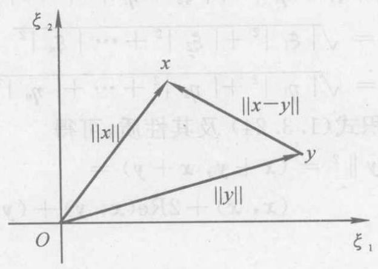

图 2.1

向量 $\mathbf{x}$ 和 $\mathbf{y}$ 的差 $\mathbf{x} - \mathbf{y}$ ,其范数就是 $\mathbf{x}$ 和 $\mathbf{y}$ 的两个终点的距离. 而 $\parallel x\parallel$ 和 $\parallel y\parallel$ 本身也表示 $x$ 和 $y$ 的终点到它们的始点 (原点) 的距离, 因而也可以用距离来解释范数.

由不等式 (2.1.2), 可以证明向量范数是其分量的连续函数.

例 2.2 证明 $\parallel x\parallel  = \mathop{\max }\limits_{i}\left| {\xi }_{i}\right|$ 是 ${\mathbf{C}}^{n}$ 上的一种范数,这里 $\mathbf{x} = \left( {{\xi }_{1},{\xi }_{2},\cdots ,{\xi }_{n}}\right)  \in  {\mathbf{C}}^{n}.$

证 当 $x \neq  0$ 时,有 $\parallel x\parallel  = \mathop{\max }\limits_{i}\left| {\xi }_{i}\right|  > 0$ ; 当 $x = 0$ 时,显然有 $\parallel x\parallel  = 0$ .

又对任意的 $a \in  \mathbf{C}$ ,有

$$
\parallel {ax}\parallel  = \mathop{\max }\limits_{i}\left| {a{\xi }_{i}}\right|  = \left| a\right| \mathop{\max }\limits_{i}\left| {\xi }_{i}\right|  = \left| a\right| \parallel x\parallel
$$

对 ${\mathbf{C}}^{n}$ 的任意两个向量 $\mathbf{x} = \left( {{\xi }_{1},{\xi }_{2},\cdots ,{\xi }_{n}}\right) ,\mathbf{y} = \left( {{\eta }_{1},{\eta }_{2},\cdots }\right.$ , $\left. {\eta }_{n}\right)$ ,有

$$
\parallel x + y\parallel  = \mathop{\max }\limits_{i}\left| {{\xi }_{i} + {\eta }_{i}}\right|  \leq
$$

$$
\mathop{\max }\limits_{i}\left| {\xi }_{i}\right|  + \mathop{\max }\limits_{i}\left| {\eta }_{i}\right|  = \parallel x\parallel  + \parallel y\parallel
$$

因此, $\parallel x\parallel  = \mathop{\max }\limits_{i}\left| {\xi }_{i}\right|$ 是 ${\mathbf{C}}^{n}$ 上的一种范数.

称例 2.2 中的范数为 $\infty$ -范数,记为 $\parallel x{\parallel }_{\infty }$ ,即

$$
\parallel \mathbf{x}{\parallel }_{\infty } = \mathop{\max }\limits_{i}\left| {\xi }_{i}\right| \tag{2.1.4}
$$

例 2.3 证明 $\parallel x\parallel  = \mathop{\sum }\limits_{{i = 1}}^{n}\left| {\xi }_{i}\right|$ 也是 ${\mathbf{C}}^{n}$ 上的一种范数,其中 $\mathbf{x} = \left( {{\xi }_{1},{\xi }_{2},\cdots ,{\xi }_{n}}\right)  \in  {\mathbf{C}}^{n}.$

证 当 $x \neq  0$ 时,显然 $\parallel x\parallel  = \mathop{\sum }\limits_{{i = 1}}^{n}\left| {\xi }_{i}\right|  > 0$ ; 当 $x = 0$ 时, 由于 $x$ 的每一分量都是零,故 $\parallel x\parallel  = 0$ .

又对于任意 $a \in  \mathbf{C}$ ,有

$$
\parallel {ax}\parallel  = \mathop{\sum }\limits_{{i = 1}}^{n}\left| {a{\xi }_{i}}\right|  = \left| a\right| \mathop{\sum }\limits_{{i = 1}}^{n}\left| {\xi }_{i}\right|  = \left| a\right| \parallel x\parallel
$$

对任意两个向量 $\mathbf{x},\mathbf{y} \in  {\mathbf{C}}^{n}$ ,有

$$
\parallel \mathbf{x} + \mathbf{y}\parallel  = \mathop{\sum }\limits_{{i = 1}}^{n}\left| {{\xi }_{i} + {\eta }_{i}}\right|  \leq  \mathop{\sum }\limits_{{i = 1}}^{n}\left( {\left| {\xi }_{i}\right|  + \left| {\eta }_{i}\right| }\right)  =
$$

$$
\mathop{\sum }\limits_{{i = 1}}^{n}\left| {\xi }_{i}\right|  + \mathop{\sum }\limits_{{i = 1}}^{n}\left| {\eta }_{i}\right|  = \parallel \mathbf{x}\parallel  + \parallel \mathbf{y}\parallel
$$

于是由定义 2.1 知 $\parallel \mathbf{x}\parallel  = \mathop{\sum }\limits_{{i = 1}}^{n}\left| {\xi }_{i}\right|$ 是 ${\mathbf{C}}^{n}$ 上的一种范数.

称例 2.3 中的范数为 1 -范数,记为 $\parallel \mathbf{x}{\parallel }_{1}$ ,即

$$
\parallel  x{ \parallel  }_{1} = \mathop{\sum }\limits_{{i = 1}}^{n}{\mid {\xi }_{i} \mid  } \tag{2.1.5}
$$

为了易于理解起见,用度量 ${\mathbf{R}}^{2}$ 中两点 $P, Q$ 的距离 (长度) 的大小对例 2.1、例 2.2 和例 2.3 中的三种范数加以说明(见图 2.2).

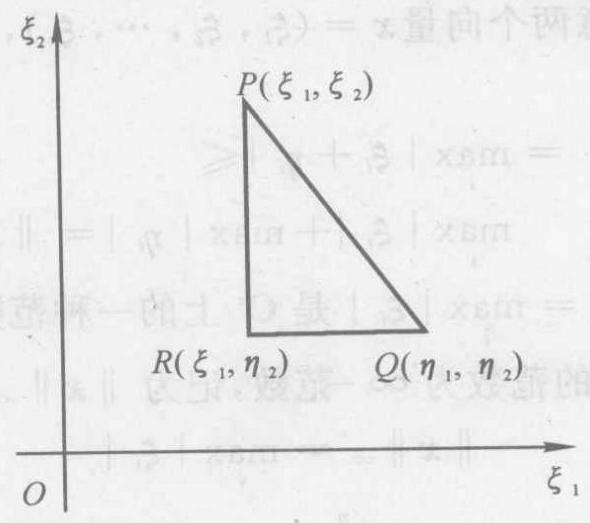

图 2.2

显然,为了度量两点 $P, Q$ 的距离,除了使用欧氏长度 $\sqrt{{\left( {\xi }_{1} - {\eta }_{1}\right) }^{2} + {\left( {\xi }_{2} - {\eta }_{2}\right) }^{2}}$ 来度量外,当然还可使用 ${PR}$ 及 ${RQ}$ 中最长一边的长度

$$
\max \left\{  {\left| {{\xi }_{1} - {\eta }_{1}}\right| ,\left| {{\xi }_{2} - {\eta }_{2}}\right| }\right\}
$$

来度量它,或者以 ${PR}$ 和 ${RQ}$ 两边长度之和

$$
\left| {{\xi }_{1} - {\eta }_{1}}\right|  + \left| {{\xi }_{2} - {\eta }_{2}}\right|
$$

来度量. 这三种长度相当于平面情形的向量范数 $\parallel x{\parallel }_{2},\parallel x{\parallel }_{\infty }$ 和 $\parallel x{\parallel }_{1}$ .

由例 ${2.1} \sim$ 例 2.3 可知,在一个线性空间中,可以定义多种向量范数,实际上可以定义无限多种范数. 例如,对于不小于 1 的任意实数 $p$ 及 $\mathbf{x} = \left( {{\xi }_{1},{\xi }_{2},\cdots ,{\xi }_{n}}\right)  \in  {\mathbf{C}}^{n}$ ,可以证明实值函数

$$
{\left( \mathop{\sum }\limits_{{i = 1}}^{n}{\left| {\xi }_{i}\right| }^{p}\right) }^{1/p}\;\left( {1 \leq  p <  + \infty }\right)
$$

满足定义 2.1 的三个条件. 事实上, 该函数显然具有非负性与齐次性. 为了证明它还满足三角不等式, 只要证明不等式

$$
{\left( \mathop{\sum }\limits_{{i = 1}}^{n}{\left| {\xi }_{i} + {\eta }_{i}\right| }^{p}\right) }^{1/p} \leq  {\left( \mathop{\sum }\limits_{{i = 1}}^{n}{\left| {\xi }_{i}\right| }^{p}\right) }^{1/p} + {\left( \mathop{\sum }\limits_{{i = 1}}^{n}{\left| {\eta }_{i}\right| }^{p}\right) }^{1/p}
$$

成立即可,其中 $y = \left( {{\eta }_{1},{\eta }_{2},\cdots ,{\eta }_{n}}\right)  \in  {\mathbf{C}}^{n}$ .

因为

$$
\mathop{\sum }\limits_{{i = 1}}^{n}{\left| {\xi }_{i} + {\eta }_{i}\right| }^{p} \leq  \mathop{\sum }\limits_{{i = 1}}^{n}{\left| {\xi }_{i} + {\eta }_{i}\right| }^{p - 1}\left| {\xi }_{i}\right|  +
$$

$$
\mathop{\sum }\limits_{{i = 1}}^{n}{\left| {\xi }_{i} + {\eta }_{i}\right| }^{p - 1}\left| {\eta }_{i}\right|
$$

再对它使用下面的 Hölder 不等式 ${}^{\left\lbrack  {32}\right\rbrack  }$

$$
\mathop{\sum }\limits_{{i = 1}}^{n}\left| {{a}_{i}{b}_{i}}\right|  \leq  {\left( \mathop{\sum }\limits_{{i = 1}}^{n}{\left| {a}_{i}\right| }^{p}\right) }^{1/p}{\left( \mathop{\sum }\limits_{{i = 1}}^{n}{\left| {b}_{i}\right| }^{q}\right) }^{1/q} \tag{2.1.6}
$$

其中 $\frac{1}{p} + \frac{1}{q} = 1, p > 1, q > 1$ . 于是便有

$$
\mathop{\sum }\limits_{{i = 1}}^{n}{\left| {\xi }_{i} + {\eta }_{i}\right| }^{p} \leq  {\left( \mathop{\sum }\limits_{{i = 1}}^{n}{\left| {\xi }_{i}\right| }^{p}\right) }^{1/p}{\left( \mathop{\sum }\limits_{{i = 1}}^{n}{\left| {\xi }_{i} + {\eta }_{i}\right| }^{\left( {p - 1}\right) \frac{p}{p - 1}}\right) }^{1 - \frac{1}{p}} +
$$

$$
{\left( \mathop{\sum }\limits_{{i = 1}}^{n}{\left| {\eta }_{i}\right| }^{p}\right) }^{1/p}{\left( \mathop{\sum }\limits_{{i = 1}}^{n}{\left| {\xi }_{i} + {\eta }_{i}\right| }^{\left( {p - 1}\right) \frac{p}{p - 1}}\right) }^{1 - \frac{1}{p}} =
$$

$$
\left\lbrack  {{\left( \mathop{\sum }\limits_{{i = 1}}^{n}{\left| {\xi }_{i}\right| }^{p}\right) }^{1/p} + {\left( \mathop{\sum }\limits_{{i = 1}}^{n}{\left| {\eta }_{i}\right| }^{p}\right) }^{1/p}}\right\rbrack   \times
$$

$$
{\left( \mathop{\sum }\limits_{{i = 1}}^{n}{\left| {\xi }_{i} + {\eta }_{i}\right| }^{p}\right) }^{1 - \frac{1}{p}}
$$

两端同除以 ${\left( \mathop{\sum }\limits_{{i = 1}}^{n}\left| {\xi }_{i} + {\eta }_{i}\right| \right) }^{1 - \frac{1}{p}}$ ,便得所要的不等式.

称 ${\left( \mathop{\sum }\limits_{{i = 1}}^{n}{\left| {\xi }_{i}\right| }^{p}\right) }^{1/p}$ 为向量 $\mathbf{x}$ 的 $p$ -范数或 ${l}_{p}$ 范数,记为 $\parallel \mathbf{x}{\parallel }_{p}$ , 即

$$
\parallel \mathbf{x}{\parallel }_{p} = {\left( \mathop{\sum }\limits_{{i = 1}}^{n}{\left| {\xi }_{i}\right| }^{p}\right) }^{1/p} \tag{2.1.7}
$$

在式 (2.1.7) 中，令 $p = 1$ ，便得 $\parallel \mathbf{x}{\parallel }_{1}$ ；令 $p = 2$ ，便得 $\parallel x{\parallel }_{2}$ ; 并且还有

$$
\parallel \mathbf{x}{\parallel }_{\infty } = \mathop{\lim }\limits_{{p \rightarrow  \infty }}\parallel \mathbf{x}{\parallel }_{p}
$$

事实上,如果 $\left| {\xi }_{1}\right| ,\left| {\xi }_{2}\right| ,\cdots ,\left| {\xi }_{n}\right|$ 中最大的一个是 $\left| {\xi }_{{i}_{0}}\right|  \neq$ 0 ,那么有

$$
\parallel \mathbf{x}{\parallel }_{\infty } = \mathop{\max }\limits_{i}\left| {\xi }_{i}\right|  = \left| {\xi }_{{i}_{0}}\right|
$$

于是

$$
\parallel \mathbf{x}{\parallel }_{p} = {\left( \mathop{\sum }\limits_{{i = 1}}^{n}{\left| {\xi }_{{i}_{0}}\right| }^{p}\frac{{\left| {\xi }_{i}\right| }^{p}}{{\left| {\xi }_{{i}_{0}}\right| }^{p}}\right) }^{1/p} = \left| {\xi }_{{i}_{0}}\right| {\left( \mathop{\sum }\limits_{{i = 1}}^{n}\frac{{\left| {\xi }_{i}\right| }^{p}}{{\left| {\xi }_{{i}_{0}}\right| }^{p}}\right) }^{1/p}
$$

因为

$$
{\left| {\xi }_{{i}_{0}}\right| }^{p} \leq  \mathop{\sum }\limits_{{i = 1}}^{n}{\left| {\xi }_{i}\right| }^{p} \leq  n{\left| {\xi }_{{i}_{0}}\right| }^{p}
$$

所以有

$$
1 \leq  {\left( \mathop{\sum }\limits_{{i = 1}}^{n}\frac{{\left| {\mathbf{\xi }}_{i}\right| }^{p}}{{\left| {\mathbf{\xi }}_{{i}_{0}}\right| }^{p}}\right) }^{1/p} \leq  {n}^{1/p}
$$

由 ${\mathrm{L}}^{\prime }$ hospital 法则知 $\mathop{\lim }\limits_{{p \rightarrow  \infty }}{n}^{1/p} = 1$ ,从而有

$$
\mathop{\lim }\limits_{{p \rightarrow  \infty }}\parallel \mathbf{x}{\parallel }_{p} = \left| {\xi }_{{i}_{0}}\right|  = \parallel \mathbf{x}{\parallel }_{\infty }
$$

有时依次称 $\parallel x{\parallel }_{1},\parallel x{\parallel }_{2},\parallel x{\parallel }_{\infty }$ 为 ${l}_{1},{l}_{2},{l}_{\infty }$ 范数.

例 2.4 设 $\mathbf{A}$ 是任意一个 $n$ 阶对称正定矩阵,列向量 $\mathbf{x} \in  {\mathbf{R}}^{n}$ , 则函数

$$
\parallel \mathbf{x}{\parallel }_{\mathbf{A}} = {\left( {\mathbf{x}}^{\mathrm{T}}\mathbf{{Ax}}\right) }^{1/2} \tag{2.1.8}
$$

是一种向量范数,称为加权范数或椭圆范数 ${}^{\text{ ① }}$ .

证 因为 $\mathbf{A}$ 正定,所以当 $x = \mathbf{0}$ 时, $\parallel \mathbf{x}{\parallel }_{\mathbf{A}} = 0$ ; 当 $x \neq  \mathbf{0}$ 时, $\parallel x{\parallel }_{A} > 0$ ,即 $\parallel x{\parallel }_{A}$ 具有非负性. 又因对任意数 $a \in  \mathbf{R}$ ,有

$$
\parallel a\mathbf{x}{\parallel }_{\mathbf{A}} = \sqrt{{\left( a\mathbf{x}\right) }^{\mathrm{T}}\mathbf{A}a\mathbf{x}} = \sqrt{{aa}{\mathbf{x}}^{\mathrm{T}}\mathbf{A}\mathbf{x}} =
$$

$$
\left| a\right| \sqrt{{\mathbf{x}}^{\mathrm{T}}\mathbf{A}\mathbf{x}} = \left| a\right| \parallel \mathbf{x}{\parallel }_{\mathbf{A}}.
$$

所以 $\parallel x{\parallel }_{A}$ 具有齐次性.

关于它的三角不等式可推证于下.

由于 $\mathbf{A}$ 为正定,所以存在非奇异矩阵 $\mathbf{P}$ ,使 ${\mathbf{P}}^{\mathrm{T}}\mathbf{{AP}} = \mathbf{I}$ . 从而

$$
\mathbf{A} = {\left( {\mathbf{P}}^{\mathrm{T}}\right) }^{-1}{\mathbf{P}}^{-1} = {\left( {\mathbf{P}}^{-1}\right) }^{\mathrm{T}}{\mathbf{P}}^{-1} = {\mathbf{B}}^{\mathrm{T}}\mathbf{B}
$$

这里 $\mathbf{B} = {\mathbf{P}}^{-1}$ ,非奇异. 于是

$$
\parallel \mathbf{x}{\parallel }_{\mathbf{A}} = \sqrt{{\mathbf{x}}^{\mathrm{T}}\mathbf{A}\mathbf{x}} = \sqrt{{\mathbf{x}}^{\mathrm{T}}{\mathbf{B}}^{\mathrm{T}}\mathbf{B}\mathbf{x}} = \sqrt{{\left( \mathbf{B}\mathbf{x}\right) }^{\mathrm{T}}\mathbf{B}\mathbf{x}} = \parallel \mathbf{B}\mathbf{x}{\parallel }_{2}
$$

从而

$$
\parallel \mathbf{x} + \mathbf{y}{\parallel }_{\mathbf{A}} = \parallel \mathbf{B}\left( {\mathbf{x} + \mathbf{y}}\right) {\parallel }_{2} = \parallel \mathbf{B}\mathbf{x} + \mathbf{B}\mathbf{y}{\parallel }_{2} \leq
$$

$$
\parallel \mathbf{B}\mathbf{x}{\parallel }_{2} + \parallel \mathbf{B}\mathbf{y}{\parallel }_{2} = \parallel \mathbf{x}{\parallel }_{\mathbf{A}} + \parallel \mathbf{y}{\parallel }_{\mathbf{A}}
$$

例 2.5 在区间 $\left\lbrack  {a, b}\right\rbrack$ 上定义的实连续函数的集合,关于通常函数的加法及实数与函数的乘法而言,构成 $\mathbf{R}$ 上的一个线性空间(见例 1.12). 可以验证

$$
\parallel f\left( t\right) {\parallel }_{1} = {\int }_{a}^{b}\left| {f\left( t\right) }\right| \mathrm{d}t
$$

$$
\parallel f\left( t\right) {\parallel }_{p} = {\left\lbrack  {\int }_{a}^{b}{\left| f\left( t\right) \right| }^{p}\mathrm{\;d}t\right\rbrack  }^{1/p}\;\left( {1 \leq  p < \infty }\right)
$$

$$
\parallel f\left( t\right) {\parallel }_{\infty } = \mathop{\max }\limits_{{t \in  \left\lbrack  {a, b}\right\rbrack  }}\left| {f\left( t\right) }\right|
$$

都满足范数定义的三个条件. 因此, 它们都分别是该线性空间上的范数.

例 2.6 给定线性空间 ${V}^{n}$ 的基 ${x}_{1},{x}_{2},\cdots ,{x}_{n}$ ,设 $x \in  {V}^{n}$ 在该基下的坐标向量为 $\widetilde{\mathbf{x}} = {\left( {\xi }_{1},{\xi }_{2},\cdots ,{\xi }_{n}\right) }^{\mathrm{T}}$ ,那么

$$
\parallel \mathbf{x}{\parallel }_{p} = \parallel \widetilde{\mathbf{x}}{\parallel }_{p}\;\left( {1 \leq  p <  + \infty }\right)
$$

---

① 若 $\mathbf{A}$ 为 Hermite 正定矩阵, $x \in  {\mathbf{C}}^{n}$ ,该例也成立 (需要将 ${\mathbf{x}}^{\mathrm{T}}$ 改为 ${\mathbf{x}}^{\mathrm{H}}$ ).

---

满足范数定义的三个条件. 因此,它是 ${V}^{n}$ 上的范数,也称为 $x$ 的 $p$ -范数.

按照例 2.6 的方式,可以在线性空间 ${V}^{n}$ 上定义多种不同的向量范数. 这样的向量范数不仅依赖于 ${\mathbf{C}}^{n}\left( {\mathbf{R}}^{n}\right)$ 上的向量范数,而且与 ${V}^{n}$ 中基的选取密切相关.

## 二、线性空间 ${\mathbf{V}}^{n}$ 上的向量范数的等价性

前面已经指出,在数域 $K$ 上的线性空间 $V$ ,特别是在 ${\mathbf{C}}^{n}$ 上可以定义各种各样的向量范数, 其数值大小一般不同. 但是, 在各种向量范数之间存在下述重要关系.

定理 2.1 设 $\parallel x{\parallel }_{\alpha }$ 和 $\parallel x{\parallel }_{\beta }$ 为有限维线性空间 $V$ 的任意两种向量范数 (它们不限于 $p$ -范数)，则存在两个与向量 $x$ 无关的正常数 ${c}_{1}$ 和 ${c}_{2}$ ,使得不等式

$$
{c}_{1}\parallel \mathbf{x}{\parallel }_{\beta } \leq  \parallel \mathbf{x}{\parallel }_{\alpha } \leq  {c}_{2}\parallel \mathbf{x}{\parallel }_{\beta }\;\left( {\forall \mathbf{x} \in  V}\right) \tag{2.1.9}
$$

成立.

* 证 如果范数 $\parallel \mathbf{x}{\parallel }_{\alpha }$ 和 $\parallel \mathbf{x}{\parallel }_{\beta }$ 都与一固定范数譬如例 2.6 的范数 $\parallel \mathbf{x}{\parallel }_{2}$ 满足式 (2.1.9) 的关系，则这两种范数之间也存在式 (2.1.9) 的关系. 这是因为若存在正常数 ${c}_{1}^{\prime },{c}_{2}^{\prime }$ 和 ${c}_{1}^{\prime \prime },{c}_{2}^{\prime \prime }$ ,使

$$
{c}_{1}^{\prime }\parallel \mathbf{x}{\parallel }_{2} \leq  \parallel \mathbf{x}{\parallel }_{\alpha } \leq  {c}_{2}^{\prime }\parallel \mathbf{x}{\parallel }_{2}
$$

$$
{c}_{1}^{\prime \prime }\parallel \mathbf{x}{\parallel }_{\beta } \leq  \parallel \mathbf{x}{\parallel }_{2} \leq  {c}_{2}^{\prime \prime }\parallel \mathbf{x}{\parallel }_{\beta }
$$

成立, 则显然有

$$
{c}_{1}^{\prime }{c}_{1}^{\prime \prime }\parallel \mathbf{x}{\parallel }_{\beta } \leq  \parallel \mathbf{x}{\parallel }_{\alpha } \leq  {c}_{2}^{\prime }{c}_{2}^{\prime \prime }\parallel \mathbf{x}{\parallel }_{\beta }
$$

令 ${c}_{1} = {c}_{1}^{\prime }{c}_{1}^{\prime \prime },{c}_{2} = {c}_{2}^{\prime }{c}_{2}^{\prime \prime }$ ,便得不等式 (2.1.9). 因此,只要对 $\beta  = 2$ 证明不等式 (2.1.9) 成立就行了.

设 $V$ 是 $n$ 维的,它的一个基是 ${x}_{1},{x}_{2},\cdots ,{x}_{n}$ ,于是 $V$ 中的任意向量 $\mathbf{x}$ 可表示为

$$
\mathbf{x} = {\xi }_{1}{\mathbf{x}}_{1} + {\xi }_{2}{\mathbf{x}}_{2} + \cdots  + {\xi }_{n}{\mathbf{x}}_{n}
$$

由例 2.6 知

$$
\parallel \mathbf{x}{\parallel }_{2}^{2} = {\left| {\xi }_{1}\right| }^{2} + {\left| {\xi }_{2}\right| }^{2} + \cdots  + {\left| {\xi }_{n}\right| }^{2}
$$

注意

$$
\parallel \mathbf{x}{\parallel }_{\alpha } = {\begin{Vmatrix}{\xi }_{1}{\mathbf{x}}_{1} + {\xi }_{2}{\mathbf{x}}_{2} + \cdots  + {\xi }_{n}{\mathbf{x}}_{n}\end{Vmatrix}}_{\alpha }
$$

它可视为 $n$ 个变量 ${\xi }_{1}$ ， ${\xi }_{2}$ ，…， ${\xi }_{n}$ 的函数，记为

$$
\varphi \left( {{\xi }_{1},{\xi }_{2},\cdots ,{\xi }_{n}}\right)  = \parallel \mathbf{x}{\parallel }_{\alpha }
$$

容易证明 $\varphi \left( {{\xi }_{1},{\xi }_{2},\cdots ,{\xi }_{n}}\right)$ 是连续函数. 事实上,若令 ${x}^{\prime } = {\xi }_{1}^{\prime }{x}_{1} + \; {\xi }_{2}^{\prime }{x}_{2} + \cdots  + {\xi }_{n}^{\prime }{x}_{n} \in  {V}^{n}$ ,则

$$
{\begin{Vmatrix}{x}^{\prime }\end{Vmatrix}}_{\alpha } = \varphi \left( {{\xi }_{1}^{\prime },{\xi }_{2}^{\prime },\cdots ,{\xi }_{n}^{\prime }}\right)
$$

$$
\left| {\varphi \left( {{\xi }_{1}^{\prime },{\xi }_{2}^{\prime },\cdots ,{\xi }_{n}^{\prime }}\right)  - \varphi \left( {{\xi }_{1},{\xi }_{2},\cdots ,{\xi }_{n}}\right) }\right|  =
$$

$$
\left| {{\begin{Vmatrix}{x}^{\prime }\end{Vmatrix}}_{\alpha } - \parallel x{\parallel }_{\alpha }}\right|  \leq  {\begin{Vmatrix}{x}^{\prime } - x\end{Vmatrix}}_{\alpha } =
$$

$$
{\begin{Vmatrix}\left( {\xi }_{1}^{\prime } - {\xi }_{1}\right) {x}_{1} + \cdots  + \left( {\xi }_{n}^{\prime } - {\xi }_{n}\right) {x}_{n}\end{Vmatrix}}_{\alpha } \leq
$$

$$
\left| {{\xi }_{1}^{\prime } - {\xi }_{1}}\right| {\begin{Vmatrix}{x}_{1}\end{Vmatrix}}_{\alpha } + \cdots  + \left| {{\xi }_{n}^{\prime } - {\xi }_{n}}\right| {\begin{Vmatrix}{x}_{n}\end{Vmatrix}}_{\alpha }
$$

由于 ${\begin{Vmatrix}{x}_{i}\end{Vmatrix}}_{\alpha }\left( {i = 1,2,\cdots , n}\right)$ 是常数,因此当 ${\xi }_{i}^{\prime }$ 与 ${\xi }_{i}$ 充分接近时, $\varphi \left( {{\xi }_{1}^{\prime },{\xi }_{2}^{\prime },\cdots ,{\xi }_{n}^{\prime }}\right)$ 就与 $\varphi \left( {{\xi }_{1},{\xi }_{2},\cdots ,{\xi }_{n}}\right)$ 充分接近. 这就说明了 $\varphi \left( {{\xi }_{1},{\xi }_{2},\cdots ,{\xi }_{n}}\right)$ 是连续函数.

根据连续函数的性质可知,在有界闭集

$$
S = \left\{  {\left( {{\xi }_{1},{\xi }_{2},\cdots ,{\xi }_{n}}\right) \left| \right| {\xi }_{1}\left| {{}^{2} + }\right| {\xi }_{2}\left| {{}^{2} + }\right| \cdots  + {\left| {\xi }_{n}\right| }^{2} = 1}\right\}
$$

上,函数 $\varphi \left( {{\xi }_{1},{\xi }_{2},\cdots ,{\xi }_{n}}\right)$ 可达到最大值 ${c}_{2}$ 及最小值 ${c}_{1}$ . 因为在 $S$ 中, ${\xi }_{i}$ 不能全为零,所以 ${c}_{1} > 0$ . 当 $x \neq  0$ 时,记向量

$$
\mathbf{y} = \frac{{\xi }_{1}}{\parallel \mathbf{x}{\parallel }_{2}}{\mathbf{x}}_{1} + \frac{{\xi }_{2}}{\parallel \mathbf{x}{\parallel }_{2}}{\mathbf{x}}_{2} + \cdots  + \frac{{\xi }_{n}}{\parallel \mathbf{x}{\parallel }_{2}}{\mathbf{x}}_{n}
$$

则其坐标分量满足

$$
{\left| \frac{{\xi }_{1}}{\parallel \mathbf{x}{\parallel }_{2}}\right| }^{2} + {\left| \frac{{\xi }_{2}}{\parallel \mathbf{x}{\parallel }_{2}}\right| }^{2} + \cdots  + {\left| \frac{{\xi }_{n}}{\parallel \mathbf{x}{\parallel }_{2}}\right| }^{2} = 1
$$

因此 $y \in  S$ . 从而有

$$
0 < {c}_{1} \leq  \parallel \mathbf{y}{\parallel }_{a} = \varphi \left( {\frac{{\xi }_{1}}{\parallel \mathbf{x}{\parallel }_{2}},\frac{{\xi }_{2}}{\parallel \mathbf{x}{\parallel }_{2}},\cdots ,\frac{{\xi }_{n}}{\parallel \mathbf{x}{\parallel }_{2}}}\right)  \leq  {c}_{2}
$$

但 $y = \frac{x}{\parallel x{\parallel }_{2}}$ ,故

$$
{c}_{1} \leq  \frac{\parallel \mathbf{x}{\parallel }_{\alpha }}{\parallel \mathbf{x}{\parallel }_{2}} \leq  {c}_{2}
$$

即

$$
{c}_{1}\parallel \mathbf{x}{\parallel }_{2} \leq  \parallel \mathbf{x}{\parallel }_{a} \leq  {c}_{2}\parallel \mathbf{x}{\parallel }_{2}
$$

当 $x = 0$ 时,上式亦成立. 证毕

如果 $\parallel x{\parallel }_{a}$ 和 $\parallel x{\parallel }_{\beta }$ 都是 $\parallel x{\parallel }_{p}\left( {p = 1,2,\infty }\right)$ ,那么不等式

$$
\parallel \mathbf{x}{\parallel }_{\infty } \leq  \parallel \mathbf{x}{\parallel }_{1} \leq  n\parallel \mathbf{x}{\parallel }_{\infty }
$$

$$
\parallel x{\parallel }_{\infty } \leq  \parallel x{\parallel }_{2} \leq  \sqrt{n}\parallel x{\parallel }_{\infty }
$$

成立. 以上两式表明,对某一向量 $\mathbf{x}$ 而言,如果它的某一种范数小 (或大), 那么它的另两种范数也小 (或大).

定义 2.2 满足不等式 (2.1.9) 的两种范数称为是等价的.

于是定理 2.1 可述为: 有限维线性空间上的不同范数是等价的.

利用向量范数的等价性, 容易证明下面的定理.

定理 ${2.2}{\mathbf{C}}^{n}$ 中的向量序列 ${\mathbf{x}}^{\left( k\right) } = \left( {{\xi }_{1}^{\left( k\right) },{\xi }_{2}^{\left( k\right) },\cdots ,{\xi }_{n}^{\left( k\right) }}\right)$ , $k = 1,2,3,\cdots$ 收敛到向量 $\mathbf{x} = \left( {{\xi }_{1},{\xi }_{2},\cdots ,{\xi }_{n}}\right)$ 的充要条件是对任一种范数 $\parallel  \cdot  {\parallel }^{\left( 1\right) }$ ,序列 $\left\{  \begin{Vmatrix}{{\mathbf{x}}^{\left( k\right) } - \mathbf{x}}\end{Vmatrix}\right\}$ 收敛于零.

证 利用范数的等价性, 易知只要对于一种范数进行了证明,则对任何一种范数也都成立. 为此取 $\parallel  \cdot  \parallel  = \parallel  \cdot  {\parallel }_{\infty }$ .

充分性. 设 ${\begin{Vmatrix}{x}^{\left( k\right) } - x\end{Vmatrix}}_{\infty } \rightarrow  0$ ,即

$$
\mathop{\max }\limits_{i}\left| {{\xi }_{i}^{\left( k\right) } - {\xi }_{i}}\right|  \rightarrow  0
$$

但是

$$
\left| {{\xi }_{j}^{\left( k\right) } - {\xi }_{j}}\right|  \leq  \mathop{\max }\limits_{i}\left| {{\xi }_{i}^{\left( k\right) } - {\xi }_{i}}\right| \;\left( {j = 1,2,\cdots , n}\right)
$$

---

① 不加下标的记号 $\parallel  \cdot  \parallel$ 泛指任意一种范数.

---

从而

$$
\left| {{\xi }_{j}^{\left( k\right) } - {\xi }_{j}}\right|  \rightarrow  0\;\left( {j = 1,2,\cdots , n}\right)
$$

即 ${\mathbf{x}}^{\left( k\right) } \rightarrow  \mathbf{x}$ .

必要性. 设 ${\mathbf{x}}^{\left( k\right) } \rightarrow  \mathbf{x}$ ,则 ${\mathbf{x}}^{\left( k\right) } - \mathbf{x} \rightarrow  \mathbf{0}$ ,即向量

$$
\left( {{\xi }_{1}^{\left( k\right) } - {\xi }_{1},{\xi }_{2}^{\left( k\right) } - {\xi }_{2},\cdots ,{\xi }_{n}^{\left( k\right) } - {\xi }_{n}}\right)
$$

的每一个分量收敛于零. 于是对任意 $\varepsilon  > 0$ ,对第一个分量,可以找到 ${k}_{1}$ ,当 $k > {k}_{1}$ 时,有

$$
\left| {{\xi }_{1}^{\left( k\right) } - {\xi }_{1}}\right|  < \varepsilon
$$

对于第二个分量,可以找到 ${k}_{1}^{\prime }$ ,使 $k > {k}_{1}^{\prime }$ 时,有

$$
\left| {{\xi }_{2}^{\left( k\right) } - {\xi }_{2}}\right|  < \varepsilon
$$

故当 $k > {k}_{2} = \max \left( {{k}_{1},{k}_{1}^{\prime }}\right)$ 时,有

$$
\left| {{\xi }_{i}^{\left( k\right) } - {\xi }_{i}}\right|  < \varepsilon \;\left( {i = 1,2}\right)
$$

同样可以找到 ${k}_{3}$ ,依此类推,可以找到 ${k}_{n}$ ,当 $k > {k}_{n}$ 时,有

$$
\left| {{\xi }_{i}^{\left( k\right) } - {\xi }_{i}}\right|  < \varepsilon \;\left( {i = 1,2,\cdots , n}\right)
$$

故

$$
\mathop{\max }\limits_{i}\left| {{\xi }_{i}^{\left( k\right) } - {\xi }_{i}}\right|  < \varepsilon
$$

即

$$
{\begin{Vmatrix}{\mathbf{x}}^{\left( k\right) } - \mathbf{x}\end{Vmatrix}}_{\infty } < \varepsilon
$$

从而可知序列 $\left\{  \begin{Vmatrix}{{\mathbf{x}}^{\left( k\right) } - \mathbf{x}}\end{Vmatrix}\right\}$ 收敛于零. 证毕

定理 2.2 表明，尽管不同的向量范数可能具有不同的大小，然而在各种范数下考虑向量序列的收敛问题时，却表现出明显的一致性. 这就是说,如果向量序列 $\left\{  {\dot{\mathbf{x}}}^{\left( k\right) }\right\}$ 对某一种范数 $\parallel  \cdot  \parallel$ 收敛, 且极限为 $x$ ,则对其他范数这个序列仍然收敛,并且具有相同的极限 $x$ .

## 习 题 2.1

1. 求向量 $e = \left( {1,1,\cdots ,1}\right)$ 的 ${l}_{1},{l}_{2}$ 及 ${l}_{\infty }$ 范数.

2. 在 ${\mathbf{R}}^{2}$ 中,将向量 $\mathbf{x} = \left( {{\xi }_{1},{\xi }_{2}}\right)$ 表示成平面上直角坐标系中的点 $\left( {\xi }_{1}\right.$ , $\left. {\xi }_{2}\right)$ ,分别画出下列不等式决定的 $x$ 全体所对应的几何图形.

$$
\parallel \mathbf{x}{\parallel }_{1} \leq  1,\;\parallel \mathbf{x}{\parallel }_{2} \leq  1,\;\parallel \mathbf{x}{\parallel }_{\infty } \leq  1
$$

3. 证明例 2.5 所给各题.

4. 设 $\parallel \mathbf{x}{\parallel }_{\alpha }$ 与 $\parallel \mathbf{x}{\parallel }_{\beta }$ 是 ${\mathbf{C}}^{n}$ 上的两种范数,又 ${k}_{1},{k}_{2}$ 是正常数,证明下列函数

(1) $\max \left( {\parallel x{\parallel }_{\alpha },\parallel x{\parallel }_{\beta }}\right)$ ;

(2) ${k}_{1}\parallel x{\parallel }_{\alpha } + {k}_{2}\parallel x{\parallel }_{\beta }$ .

是 ${\mathbf{C}}^{n}$ 上的范数.

5. 设矩阵 $\mathbf{S} \in  {\mathbf{C}}^{m \times  n}$ 列满秩,给定 ${\mathbf{C}}^{m}$ 上的一种向量范数 $\parallel  \cdot  \parallel$ ,证明

$$
\parallel \mathbf{x}{\parallel }_{s} = \parallel \mathbf{S}\mathbf{x}\parallel \;\left( {\forall \mathbf{x} \in  {\mathbf{C}}^{n}}\right)
$$

是 ${\mathbf{C}}^{n}$ 上的向量范数.

## § 2.2 矩阵的范数

矩阵空间 ${\mathbf{C}}^{m \times  n}$ 是一个 ${mn}$ 维的线性空间,将 $m \times  n$ 矩阵 $\mathbf{A}$ 看做线性空间 ${\mathbf{C}}^{m \times  n}$ 中的“向量”,可以按照例 2.6 的方式定义 $\mathbf{A}$ 的范数. 但是, 矩阵之间还有乘法运算, 它应该在定义矩阵范数时予以体现.

## 一、矩阵范数的定义与性质

定义 2.3 设 $\mathbf{A} \in  {\mathbf{C}}^{m \times  n}$ ,定义一个实值函数 $\parallel \mathbf{A}\parallel$ ,它满足以下三个条件

(1)非负性; 当 $\mathbf{A} \neq  \mathbf{O}$ 时, $\parallel \mathbf{A}\parallel  > 0$ ; 当 $\mathbf{A} = \mathbf{O}$ 时, $\parallel \mathbf{A}\parallel  =$ 0 ;

(2)齐次性: $\parallel \alpha \mathbf{A}\parallel  = \left| \alpha \right| \parallel \mathbf{A}\parallel \left( {\alpha  \in  \mathbf{C}}\right)$ ；

(3)三角不等式: $\parallel \mathbf{A} + \mathbf{B}\parallel  \leq  \parallel \mathbf{A}\parallel  + \parallel \mathbf{B}\parallel \left( {\mathbf{B} \in  {\mathbf{C}}^{m \times  n}}\right)$ . 则称 $\parallel \mathbf{A}\parallel$ 为 $\mathbf{A}$ 的广义矩阵范数 ${}^{\left\lbrack  {15}\right\rbrack  }$ .

若对 ${\mathbf{C}}^{m \times  n},{\mathbf{C}}^{n \times  l}$ 及 ${\mathbf{C}}^{m \times  l}$ 上的同类广义矩阵范数 $\parallel  \cdot  {\parallel }^{\text{ ① }}$ ,还应满足下面一个条件:

---

① 这里的“同类”是指，实数 $\parallel \mathbf{A}\parallel$ 和 $\mathbf{A} \in  {\mathbf{C}}^{m \times  n}$ 、实数 $\parallel \mathbf{B}\parallel$ 和 $\mathbf{B} \in  {\mathbf{C}}^{n \times  l}$ 、实数 $\parallel \mathbf{{AB}}\parallel$ 和 $\left( \mathbf{{AB}}\right)  \in  {\mathbf{C}}^{m \times  l}$ 的对应规则是相同的.

---

(4)相容性:

$$
\parallel \mathbf{A}\mathbf{B}\parallel  \leq  \parallel \mathbf{A}\parallel \parallel \mathbf{B}\parallel \;\left( {\mathbf{B} \in  {\mathbf{C}}^{n \times  l}}\right) \tag{2.2.1}
$$

则称 $\parallel \mathbf{A}\parallel$ 为 $\mathbf{A}$ 的矩阵范数.

同向量的情况一样, 对于矩阵序列也有极限的概念: 设有一个矩阵序列 $\left\{  {\mathbf{A}}^{\left( k\right) }\right\}$ ,其中 ${\mathbf{A}}^{\left( k\right) } \in  {\mathbf{C}}^{m \times  n}\left( {k = 1,2,\cdots }\right)$ . 用 ${a}_{ij}^{\left( k\right) }$ 记 ${\mathbf{A}}^{\left( k\right) }$ 的第 $i$ 行第 $j$ 列的元素,且 ${a}_{ij}^{\left( k\right) }$ 都有极限 ${a}_{ij}$ ,则称 $\left\{  {\mathbf{A}}^{\left( k\right) }\right\}$ 有极限 $\mathbf{A} = \; \left( {a}_{ij}\right)$ ,或称 ${\mathbf{A}}^{\left( k\right) }$ 收敛于矩阵 $\mathbf{A}$ ,记为

$$
\mathop{\lim }\limits_{{k \rightarrow  \infty }}{\mathbf{A}}^{\left( k\right) } = \mathbf{A}\text{ 或 }{\mathbf{A}}^{\left( k\right) } \rightarrow  \mathbf{A}
$$

不收敛的矩阵序列称为发散的. 于是可以证明: ${\mathbf{A}}^{\left( k\right) } \rightarrow  \mathbf{A}$ 的充要条件是 $\begin{Vmatrix}{{\mathbf{A}}^{\left( k\right) } - \mathbf{A}}\end{Vmatrix} \rightarrow  0$ .

由定义 2.3 的条件 (3), 并仿式 (2.1.3) 的证明方法可得不等式

$$
\left| {\parallel \mathbf{A}\parallel  - \parallel \mathbf{B}\parallel }\right|  \leq  \parallel \mathbf{A} - \mathbf{B}\parallel
$$

由此可以证明矩阵范数的连续性, 即由

$$
{\mathbf{A}}^{\left( k\right) } \rightarrow  \mathbf{A}
$$

可以推出

$$
\begin{Vmatrix}{\mathbf{A}}^{\left( k\right) }\end{Vmatrix} \rightarrow  \parallel \mathbf{A}\parallel
$$

事实上,由上面的论述知,当 ${\mathbf{A}}^{\left( k\right) } \rightarrow  \mathbf{A}$ 时, $\begin{Vmatrix}{{\mathbf{A}}^{\left( k\right) } - \mathbf{A}}\end{Vmatrix} \rightarrow  0$ ,但是

$$
\left| {\begin{Vmatrix}{\mathbf{A}}^{\left( k\right) }\end{Vmatrix} - \parallel \mathbf{A}\parallel }\right|  \leq  \begin{Vmatrix}{{\mathbf{A}}^{\left( k\right) } - \mathbf{A}}\end{Vmatrix}
$$

于是当 $\begin{Vmatrix}{{\mathbf{A}}^{\left( k\right) } - \mathbf{A}}\end{Vmatrix} \rightarrow  0$ 时,便有 $\begin{Vmatrix}{\mathbf{A}}^{\left( k\right) }\end{Vmatrix} \rightarrow  \parallel \mathbf{A}\parallel$ .

例 2.7 已知 $\mathbf{A} = {\left( {a}_{ij}\right) }_{n \times  n} \in  {\mathbf{C}}^{n \times  n}$ ,试证明下面两个函数

$$
\parallel \mathbf{A}{\parallel }_{{m}_{1}} = \mathop{\sum }\limits_{{i, j = 1}}^{n}\left| {a}_{ij}\right| ,\;\parallel \mathbf{A}{\parallel }_{{m}_{\infty }} = n \cdot  \mathop{\max }\limits_{{i, j}}\left| {a}_{ij}\right|
$$

都是 ${\mathbf{C}}^{n \times  n}$ 上的矩阵范数.

证 对于函数 $\parallel \mathbf{A}{\parallel }_{{m}_{1}}$ 而言,它显然具有非负性与齐次性, 现仅就三角不等式与相容性加以验证于下.

$$
\parallel \mathbf{A} + \mathbf{B}{\parallel }_{{m}_{1}} = \mathop{\sum }\limits_{{i, j = 1}}^{n}\left| {{a}_{ij} + {b}_{ij}}\right|  \leq  \mathop{\sum }\limits_{{i, j = 1}}^{n}\left( {\left| {a}_{ij}\right|  + \left| {b}_{ij}\right| }\right)  =
$$

$$
\mathop{\sum }\limits_{{i, j = 1}}^{n}\left| {a}_{ij}\right|  + \mathop{\sum }\limits_{{i, j = 1}}^{n}\left| {b}_{ij}\right|  =
$$

$$
\parallel \mathbf{A}{\parallel }_{{m}_{1}} + \parallel \mathbf{B}{\parallel }_{{m}_{1}}
$$

$$
\parallel \mathbf{{AB}}{\parallel }_{{m}_{1}} = \mathop{\sum }\limits_{{i, j = 1}}^{n}\left| {{a}_{i1}{a}_{1j} + {a}_{i2}{b}_{2j} + \cdots  + {a}_{in}{b}_{nj}}\right|  \leq
$$

$$
\mathop{\sum }\limits_{{i, j = 1}}^{n}\left( {\left| {a}_{i1}\right| \left| {b}_{1j}\right|  + \cdots  + \left| {a}_{in}\right| \left| {b}_{nj}\right| }\right)  \leq
$$

$$
\mathop{\sum }\limits_{{i = 1}}^{n}\left( {\left| {a}_{i1}\right|  + \cdots  + \left| {a}_{in}\right| }\right)  \times
$$

$$
\mathop{\sum }\limits_{{j = 1}}^{n}\left( {\left| {b}_{1j}\right|  + \cdots  + \left| {b}_{nj}\right| }\right)  =
$$

$$
\mathop{\sum }\limits_{{i, j = 1}}^{n}\left| {a}_{ij}\right|  \cdot  \mathop{\sum }\limits_{{j, i = 1}}^{n}\left| {b}_{ij}\right|  = \parallel \mathbf{A}{\parallel }_{{m}_{1}}\parallel \mathbf{B}{\parallel }_{{m}_{1}}
$$

因此, $\parallel \mathbf{A}{\parallel }_{{m}_{1}}$ 是 $\mathbf{A}$ 的矩阵范数.

同理可证, $\parallel \mathbf{A}{\parallel }_{{m}_{\infty }}$ 也是 $\mathbf{A}$ 的矩阵范数.

如同向量范数的情况一样, 矩阵范数也是多种多样的. 但是, 在数值方法中进行某种估计时,遇到的多数情况是:矩阵范数常与向量范数混合在一起使用, 而矩阵经常是作为两个线性空间上的线性映射 (变换) 出现的. 因此, 考虑一些矩阵范数时, 应该使它能与向量范数联系起来. 这可由矩阵范数与向量范数相容的概念来实现. 下面引入这个概念.

定义 2.4 对于 ${\mathbf{C}}^{m \times  n}$ 上的矩阵范数 $\parallel  \cdot  {\parallel }_{M}$ 和 ${\mathbf{C}}^{m}$ 与 ${\mathbf{C}}^{n}$ 上的同类向量范数 $\parallel  \cdot  {\parallel }_{V}$ ,如果

$$
\parallel \mathbf{A}\mathbf{x}{\parallel }_{V} \leq  \parallel \mathbf{A}{\parallel }_{M}\parallel \mathbf{x}{\parallel }_{V}\left( {\forall \mathbf{A} \in  {\mathbf{C}}^{m \times  n},\forall \mathbf{x} \in  {\mathbf{C}}^{n}}\right)
$$

(2.2.2)

则称矩阵范数 $\parallel  \cdot  {\parallel }_{M}$ 与向量范数 $\parallel  \cdot  {\parallel }_{V}$ 是相容的.

例 2.8 设 $\mathbf{A} = {\left( {a}_{ij}\right) }_{m \times  n} \in  {\mathbb{C}}^{m \times  n}$ ,证明函数

$$
\parallel \mathbf{A}{\parallel }_{\mathrm{F}} = {\left( \mathop{\sum }\limits_{{i = 1}}^{m}\mathop{\sum }\limits_{{j = 1}}^{n}{\left| {a}_{ij}\right| }^{2}\right) }^{1/2} = {\left( \operatorname{tr}\left( {\mathbf{A}}^{\mathrm{H}}\mathbf{A}\right) \right) }^{1/2} \tag{2.2.3}
$$

是 ${\mathbf{C}}^{m \times  n}$ 上的矩阵范数,且与向量范数 $\parallel  \cdot  {\parallel }_{2}$ 相容.

证 显然, $\parallel \mathbf{A}{\parallel }_{F}$ 具有非负性与齐次性. 设 $\mathbf{A}$ 的第 $j$ 列为 ${\mathbf{a}}_{j}\left( {j = 1,2,\cdots , n}\right) ,\mathbf{B} \in  {\mathbf{C}}^{m \times  n}$ 的第 $j$ 列为 ${\mathbf{b}}_{j}\left( {j = 1,2,\cdots , n}\right)$ , 则有

$$
\parallel \mathbf{A} + \mathbf{B}{\parallel }_{F}^{2} = {\begin{Vmatrix}{\mathbf{a}}_{1} + {\mathbf{b}}_{1}\end{Vmatrix}}_{2}^{2} + \cdots  + {\begin{Vmatrix}{\mathbf{a}}_{n} + {\mathbf{b}}_{n}\end{Vmatrix}}_{2}^{2} \leq
$$

$$
{\left( {\begin{Vmatrix}{\mathbf{a}}_{1}\end{Vmatrix}}_{2} + {\begin{Vmatrix}{\mathbf{b}}_{1}\end{Vmatrix}}_{2}\right) }^{2} +
$$

$$
\cdots  + {\left( {\begin{Vmatrix}{\mathbf{a}}_{n}\end{Vmatrix}}_{2} + {\begin{Vmatrix}{\mathbf{b}}_{n}\end{Vmatrix}}_{2}\right) }^{2} =
$$

$$
\left( {{\begin{Vmatrix}{\mathbf{a}}_{1}\end{Vmatrix}}_{2}^{2} + \cdots  + {\begin{Vmatrix}{\mathbf{a}}_{n}\end{Vmatrix}}_{2}^{2}}\right)  +
$$

$$
2\left( {{\begin{Vmatrix}{\mathbf{a}}_{1}\end{Vmatrix}}_{2}{\begin{Vmatrix}{\mathbf{b}}_{1}\end{Vmatrix}}_{2} + \cdots  + {\begin{Vmatrix}{\mathbf{a}}_{n}\end{Vmatrix}}_{2}{\begin{Vmatrix}{\mathbf{b}}_{n}\end{Vmatrix}}_{2}}\right)  +
$$

$$
\left( {{\begin{Vmatrix}{\mathbf{b}}_{1}\end{Vmatrix}}_{2}^{2} + \cdots  + {\begin{Vmatrix}{\mathbf{b}}_{n}\end{Vmatrix}}_{2}^{2}}\right)
$$

对上式第二项应用式 (1.3.12), 可得

$$
\parallel \mathbf{A} + \mathbf{B}{\parallel }_{F}^{2} \leq  \parallel \mathbf{A}{\parallel }_{F}^{2} + 2\parallel \mathbf{A}{\parallel }_{F}\parallel \mathbf{B}{\parallel }_{F} + \parallel \mathbf{B}{\parallel }_{F}^{2} =
$$

$$
{\left( \parallel \mathbf{A}{\parallel }_{F} + \parallel \mathbf{B}{\parallel }_{F}\right) }^{2}
$$

即三角不等式成立.

再设 $\mathbf{B} = {\left( {b}_{ij}\right) }_{n \times  l} \in  {\mathbf{C}}^{n \times  l}$ ,则 $\mathbf{{AB}} = {\left( \mathop{\sum }\limits_{{k = 1}}^{n}{a}_{ik}{b}_{kj}\right) }_{m \times  l} \in  {\mathbf{C}}^{m \times  l}$ ,于是有

$$
\parallel \mathbf{{AB}}{\parallel }_{F}^{2} = \mathop{\sum }\limits_{{i = 1}}^{m}\mathop{\sum }\limits_{{j = 1}}^{l}{\left| \mathop{\sum }\limits_{{k = 1}}^{n}{a}_{ik}{b}_{kj}\right| }^{2} \leq
$$

$$
\mathop{\sum }\limits_{{i = 1}}^{m}\mathop{\sum }\limits_{{j = 1}}^{l}{\left( \mathop{\sum }\limits_{{k = 1}}^{n}\left| {a}_{ik}\right| \left| {b}_{kj}\right| \right) }^{2}
$$

对上式括号内的项应用式(1.3.12),可得

$$
\parallel \mathbf{{AB}}{\parallel }_{F}^{2} \leq  \mathop{\sum }\limits_{{i = 1}}^{m}\mathop{\sum }\limits_{{j = 1}}^{l}\left\lbrack  {\left( {\mathop{\sum }\limits_{{k = 1}}^{n}{\left| {a}_{ik}\right| }^{2}}\right) \left( {\mathop{\sum }\limits_{{k = 1}}^{n}{\left| {b}_{kj}\right| }^{2}}\right) }\right\rbrack   =
$$

$$
\left( {\mathop{\sum }\limits_{{i = 1}}^{m}\mathop{\sum }\limits_{{k = 1}}^{n}{\left| {a}_{ik}\right| }^{2}}\right) \left( {\mathop{\sum }\limits_{{j = 1}}^{l}\mathop{\sum }\limits_{{k = 1}}^{n}{\left| {b}_{kj}\right| }^{2}}\right)  =
$$

$$
\parallel \mathbf{A}{\parallel }_{F}^{2}\parallel \mathbf{B}{\parallel }_{F}^{2} \tag{2.2.4}
$$

即 $\parallel \mathbf{A}{\parallel }_{F}$ 是 $\mathbf{A}$ 的矩阵范数.

在式 (2.2.4) 中取 $\mathbf{B} = \mathbf{x} \in  {\mathbf{C}}^{n \times  1}$ ,则有

$$
\parallel  {\mathbf{A}\mathbf{x}}{ \parallel  }_{{}_{2}} =  \parallel  {\mathbf{A}\mathbf{B}}{ \parallel  }_{{}_{F}} \leqslant   \parallel  \mathbf{A}{ \parallel  }_{{}_{F}} \parallel  \mathbf{B}{ \parallel  }_{{}_{F}} =  \parallel  \mathbf{A}{ \parallel  }_{{}_{F}} \parallel  \mathbf{x}{ \parallel  }_{{}_{2}}
$$

即矩阵范数 $\parallel  \cdot  {\parallel }_{F}$ 与向量范数 $\parallel  \cdot  {\parallel }_{2}$ 相容.

范数 $\left( {2.2.3}\right)$ 又称为 Frobenius 范数,或简称为 $F$ -范数. 为了与例 2.7 的两种范数一致起见,这一范数亦可用 $\parallel \mathbf{A}{\parallel }_{{m}_{2}}$ 表示.

$\parallel \mathbf{A}{\parallel }_{F}$ 有一特点,现以定理给出于下.

定理 2.3 设 $\mathbf{A} \in  {\mathbf{C}}^{m \times  n}$ ,且 $\mathbf{P} \in  {\mathbf{C}}^{m \times  m}$ 与 $\mathbf{Q} \in  {\mathbf{C}}^{n \times  n}$ 都是酉矩阵, 则

$$
\parallel \mathbf{P}\mathbf{A}{\parallel }_{F} = \parallel \mathbf{A}{\parallel }_{F} = \parallel \mathbf{A}\mathbf{Q}{\parallel }_{F}
$$

即给 $\mathbf{A}$ 左乘或右乘以酉矩阵后,其 $\parallel  \cdot  {\parallel }_{F}$ 值不变 (在 $\mathbf{A} \in  {\mathbf{R}}^{m \times  n}$ 时, $\mathbf{P}$ 和 $\mathbf{Q}$ 都是正交矩阵).

证 若记 $\mathbf{A}$ 的第 $j$ 列为 ${\mathbf{a}}_{j}\left( {j = 1,2,\cdots , n}\right)$ ,则有

$$
\parallel \mathbf{{PA}}{\parallel }_{F}^{2} = {\begin{Vmatrix}\mathbf{P}\left( {\mathbf{a}}_{1},{\mathbf{a}}_{2},\cdots ,{\mathbf{a}}_{n}\right) \end{Vmatrix}}_{F}^{2} =
$$

$$
{\begin{Vmatrix}\left( \mathbf{P}{\mathbf{a}}_{1},\mathbf{P}{\mathbf{a}}_{2},\cdots ,\mathbf{P}{\mathbf{a}}_{n}\right) \end{Vmatrix}}_{F}^{2} =
$$

$$
\mathop{\sum }\limits_{{j = 1}}^{n}{\begin{Vmatrix}\mathbf{P}{\mathbf{a}}_{j}\end{Vmatrix}}_{2}^{2} = \mathop{\sum }\limits_{{j = 1}}^{n}{\begin{Vmatrix}{\mathbf{a}}_{j}\end{Vmatrix}}_{2}^{2} = \parallel \mathbf{A}{\parallel }_{F}^{2}
$$

即 $\parallel \mathbf{{PA}}{\parallel }_{F} = \;\parallel \mathbf{A}{\parallel }_{F}.$ 于是

$$
\parallel \mathbf{A}\mathbf{Q}{\parallel }_{F} = {\begin{Vmatrix}{\left( \mathbf{A}\mathbf{Q}\right) }^{\mathrm{H}}\end{Vmatrix}}_{F} = {\begin{Vmatrix}{\mathbf{Q}}^{\mathrm{H}}{\mathbf{A}}^{\mathrm{H}}\end{Vmatrix}}_{F} =
$$

$$
{\begin{Vmatrix}{\mathbf{A}}^{\mathrm{H}}\end{Vmatrix}}_{F} = \parallel \mathbf{A}{\parallel }_{F}
$$

证毕

推论 和 $\mathbf{A}$ 酉(或正交)相似的矩阵的 $F$ -范数是相同的,即若 $\mathbf{B} = {\mathbf{Q}}^{\mathrm{H}}\mathbf{A}\mathbf{Q}$ ,则 $\parallel \mathbf{B}{\parallel }_{F} = \parallel \mathbf{A}{\parallel }_{F}$ ,其中 $Q$ 是酉矩阵.

例 2.9 设 $\parallel  \cdot  {\parallel }_{M}$ 是 ${\mathbf{C}}^{n \times  n}$ 上的矩阵范数,任取 ${\mathbf{C}}^{n}$ 中的非零列向量 $\mathbf{y}$ ,则函数

$$
\parallel \mathbf{x}{\parallel }_{V} = {\begin{Vmatrix}\mathbf{x}{\mathbf{y}}^{\mathrm{H}}\end{Vmatrix}}_{M}\;\left( {\forall \mathbf{x} \in  {\mathbf{C}}^{n}}\right) \tag{2.2.5}
$$

是 ${\mathbf{C}}^{n}$ 上的向量范数,且矩阵范数 $\parallel  \cdot  {\parallel }_{M}$ 与向量范数 $\parallel  \cdot  {\parallel }_{V}$ 相容.

证 非负性. 当 $x \neq  0$ 时, $x{y}^{\mathrm{H}} \neq  0$ ,从而 $\parallel x{\parallel }_{V} > 0$ ; 当 $x = 0$ 时, $x{y}^{\mathrm{H}} = O$ ,从而 $\parallel x{\parallel }_{V} = 0$ .

齐次性. 对任意 $k \in  \mathbf{C}$ ,有

$$
\parallel {kx}{\parallel }_{V} = {\begin{Vmatrix}kx{y}^{\mathrm{H}}\end{Vmatrix}}_{M} = \left| k\right| {\begin{Vmatrix}x{y}^{\mathrm{H}}\end{Vmatrix}}_{M} = \left| k\right| \parallel x{\parallel }_{V}
$$

三角不等式. 对任意 ${\mathbf{x}}_{1},{\mathbf{x}}_{2} \in  {\mathbf{C}}^{n}$ ,有

$$
{\begin{Vmatrix}{\mathbf{x}}_{1} + {\mathbf{x}}_{2}\end{Vmatrix}}_{\mathrm{V}} = {\begin{Vmatrix}\left( {\mathbf{x}}_{1} + {\mathbf{x}}_{2}\right) {\mathbf{y}}^{\mathrm{H}}\end{Vmatrix}}_{M} =
$$

$$
{\begin{Vmatrix}{\mathbf{x}}_{1}{\mathbf{y}}^{\mathrm{H}} + {\mathbf{x}}_{2}{\mathbf{y}}^{\mathrm{H}}\end{Vmatrix}}_{M} \leq
$$

$$
{\begin{Vmatrix}{\mathbf{x}}_{1}{\mathbf{y}}^{\mathrm{H}}\end{Vmatrix}}_{M} + {\begin{Vmatrix}{\mathbf{x}}_{2}{\mathbf{y}}^{\mathrm{H}}\end{Vmatrix}}_{M} =
$$

$$
{\begin{Vmatrix}{\mathbf{x}}_{1}\end{Vmatrix}}_{V} + {\begin{Vmatrix}{\mathbf{x}}_{2}\end{Vmatrix}}_{V}
$$

因此, $\parallel x{\parallel }_{V}$ 是 ${\mathbf{C}}^{n}$ 上的向量范数. 当 $\mathbf{A} \in  {\mathbf{C}}^{n \times  n}, x \in  {\mathbf{C}}^{n}$ 时

$$
\parallel \mathbf{A}\mathbf{x}{\parallel }_{V} = {\begin{Vmatrix}\left( \mathbf{A}\mathbf{x}\right) {\mathbf{y}}^{\mathrm{H}}\end{Vmatrix}}_{M} = {\begin{Vmatrix}\mathbf{A}\left( \mathbf{x}{\mathbf{y}}^{\mathrm{H}}\right) \end{Vmatrix}}_{M} \leq
$$

$$
{\begin{Vmatrix}\mathbf{A}\end{Vmatrix}}_{M}{\begin{Vmatrix}x{y}^{\mathrm{H}}\end{Vmatrix}}_{M} = {\begin{Vmatrix}\mathbf{A}\end{Vmatrix}}_{M}\parallel x{\parallel }_{V}
$$

所以矩阵范数 $\parallel  \cdot  {\parallel }_{M}$ 与向量范数 $\parallel  \cdot  {\parallel }_{V}$ 相容.

## 二、几种常用的矩阵范数

现在给出一种规定矩阵范数的具体方法, 使矩阵范数与已知的向量范数相容.

定理 2.4 已知 ${\mathbf{C}}^{m}$ 和 ${\mathbf{C}}^{n}$ 上的同类向量范数 $\parallel  \cdot  \parallel$ ,设 $\mathbf{A} \in  {\mathbf{C}}^{m \times  n}$ ,则函数

$$
\parallel \mathbf{A}\parallel  = \mathop{\max }\limits_{{\parallel \mathbf{x}\parallel  = 1}}\parallel \mathbf{{Ax}}\parallel \tag{2.2.6}
$$

是 ${\mathbf{C}}^{m \times  n}$ 上的矩阵范数,且与已知的向量范数相容.

证 由向量范数是其分量的连续函数的性质可知,对每一个矩阵 $\mathbf{A}$ 而言,这个最大值都是可以达到的,也就是说,能够找到这样的向量 ${\mathbf{x}}_{0}$ ,使得 $\begin{Vmatrix}{\mathbf{x}}_{0}\end{Vmatrix} = 1$ ,而 $\begin{Vmatrix}{\mathbf{A}{\mathbf{x}}_{0}}\end{Vmatrix} = \parallel \mathbf{A}\parallel$ .

非负性. 当 $\mathbf{A} \neq  \mathbf{O}$ 时,存在 ${\mathbf{x}}_{0} \in  {\mathbf{C}}^{n}$ 满足 $\begin{Vmatrix}{\mathbf{x}}_{0}\end{Vmatrix} = 1$ ,使得 $\mathbf{A}{\mathbf{x}}_{0} \neq  \mathbf{0}$ ,从而

$$
\parallel \mathbf{A}\parallel  \geq  \begin{Vmatrix}{\mathbf{A}{\mathbf{x}}_{0}}\end{Vmatrix} > 0
$$

---

① 还可定义 $\parallel \mathbf{A}\parallel  = \mathop{\sup }\limits_{{x \neq  0}}\frac{\parallel \mathbf{A}x\parallel }{\parallel x\parallel } = \mathop{\sup }\limits_{{\parallel x\parallel  = 1}}\parallel \mathbf{A}x\parallel$ .

---

当 $\mathbf{A} = \mathbf{O}$ 时, $\parallel \mathbf{A}\parallel  = \mathop{\max }\limits_{{\parallel \mathbf{x}\parallel  = 1}}\parallel \mathbf{O}\mathbf{x}\parallel  = 0$ .

齐次性. 设 $\alpha  \in  \mathbf{C}$ ,则有

$$
\parallel \alpha \mathbf{A}\parallel  = \mathop{\max }\limits_{{\parallel x\parallel  = 1}}\parallel \alpha \mathbf{A}x\parallel  = \left| \alpha \right| \mathop{\max }\limits_{{\parallel x\parallel  = 1}}\parallel \mathbf{A}x\parallel  = \left| \alpha \right| \parallel \mathbf{A}\parallel
$$

三角不等式. 设 $\mathbf{B} \in  {\mathbf{C}}^{m \times  n}$ ,对于矩阵 $\mathbf{A} + \mathbf{B}$ ,存在 ${\mathbf{x}}_{1} \in  {\mathbf{C}}^{n}$ 满足 $\begin{Vmatrix}{\mathbf{x}}_{1}\end{Vmatrix} = 1$ ,使得

$$
\parallel \mathbf{A} + \mathbf{B}\parallel  = \begin{Vmatrix}{\left( {\mathbf{A} + \mathbf{B}}\right) {\mathbf{x}}_{1}}\end{Vmatrix}
$$

于是

$$
\parallel \mathbf{A} + \mathbf{B}\parallel  = \begin{Vmatrix}{\mathbf{A}{\mathbf{x}}_{1} + \mathbf{B}{\mathbf{x}}_{1}}\end{Vmatrix} \leq
$$

$$
\begin{Vmatrix}{\mathbf{A}{\mathbf{x}}_{1}}\end{Vmatrix} + \begin{Vmatrix}{\mathbf{B}{\mathbf{x}}_{1}}\end{Vmatrix} \leq  \parallel \mathbf{A}\parallel  + \parallel \mathbf{B}\parallel
$$

下面证明,对于任意的 $\mathbf{y} \in  {\mathbf{C}}^{n}$ 及 $\mathbf{A} \in  {\mathbf{C}}^{m \times  n}$ ,有

$$
\parallel \mathbf{A}\mathbf{y}\parallel  \leq  \parallel \mathbf{A}\parallel \parallel \mathbf{y}\parallel
$$

当 $y = 0$ 时,结论显然成立; 当 $y \neq  0$ 时,令 ${y}_{0} = \frac{1}{\parallel y\parallel }y$ ,则 $\begin{Vmatrix}{\mathbf{y}}_{0}\end{Vmatrix} = 1$ ,且有 $\begin{Vmatrix}{\mathbf{A}{\mathbf{y}}_{0}}\end{Vmatrix} \leq  \parallel \mathbf{A}\parallel$ ,于是

$$
\parallel \mathbf{A}\mathbf{y}\parallel  = \begin{Vmatrix}{\mathbf{A}\left( {\parallel \mathbf{y}\parallel {\mathbf{y}}_{0}}\right) }\end{Vmatrix} =
$$

$$
\parallel y\parallel \begin{Vmatrix}{\mathbf{A}{y}_{0}}\end{Vmatrix} \leq  \parallel y\parallel \parallel \mathbf{A}\parallel
$$

即结论亦成立.

最后证明,对于任意的 $\mathbf{A} \in  {\mathbf{C}}^{m \times  n}$ 及 $\mathbf{B} \in  {\mathbf{C}}^{n \times  l}$ ,有

$$
\parallel  \mathbf{A}\mathbf{B} \parallel   \leqslant   \parallel  \mathbf{A} \parallel   \parallel  \mathbf{B} \parallel
$$

对于矩阵 $\mathbf{{AB}}$ ，存在 ${\mathbf{x}}_{2} \in  {\mathbf{C}}^{l}$ 满足 $\begin{Vmatrix}{\mathbf{x}}_{2}\end{Vmatrix} = 1$ ，使得

$$
\parallel  \mathbf{{AB}} \parallel   =  \parallel  \left( {\mathbf{{AB}}}\right) {\mathbf{x}}_{2} \parallel
$$

利用 $\parallel \mathbf{A}\mathbf{y}\parallel  \leq  \parallel \mathbf{A}\parallel \parallel \mathbf{y}\parallel$ ，可得

$$
\parallel \mathbf{{AB}}\parallel  = \begin{Vmatrix}{\mathbf{A}\left( {\mathbf{{Bx}}}_{2}\right) }\end{Vmatrix} \leq  \parallel \mathbf{A}\parallel \begin{Vmatrix}{\mathbf{{Bx}}}_{2}\end{Vmatrix} \leq
$$

$$
\parallel \mathbf{A}\parallel \parallel \mathbf{B}\parallel \begin{Vmatrix}{\mathbf{x}}_{2}\end{Vmatrix} = \parallel \mathbf{A}\parallel \parallel \mathbf{B}\parallel
$$

即 $\parallel \mathbf{A}\parallel$ 是 $\mathbf{A}$ 的矩阵范数. 证毕

称由式 (2.2.6) 给出的矩阵范数为 “由向量范数导出的矩阵范数”,简称为从属范数. 对于 ${\mathbf{C}}^{n \times  n}$ 上的任何一种从属范数,有

$$
\parallel \mathbf{I}\parallel  = \mathop{\max }\limits_{{\parallel \mathbf{x}\parallel  = 1}}\parallel \mathbf{{Ix}}\parallel  = 1
$$

但对于一般的矩阵范数 (设该矩阵范数与某向量范数相容, 见例 2.9), 由于

$$
\parallel \mathbf{x}\parallel  = \parallel \mathbf{I}\mathbf{x}\parallel  \leq  \parallel \mathbf{I}\parallel \parallel \mathbf{x}\parallel
$$

对任意的 $x \in  {\mathbf{C}}^{n}$ 成立，所以 $\parallel I\parallel  \geq  1$ .

上面论述表明，矩阵范数是与向量范数密切相关的，有什么样的向量范数就有什么样的矩阵范数. 当在式 (2.2.6) 中取向量 $x$ 的范数 $\parallel x\parallel$ 依次为 $\parallel x{\parallel }_{1},\parallel x{\parallel }_{2},\parallel x{\parallel }_{\infty }$ 时,就得到三种常用的矩阵范数,依次记为 $\parallel \mathbf{A}{\parallel }_{1},\parallel \mathbf{A}{\parallel }_{2},\parallel \mathbf{A}{\parallel }_{\infty }$ . 至于这三种矩阵范数的值,可以用矩阵 $\mathbf{A}$ 的元素及 ${\mathbf{A}}^{\mathrm{H}}\mathbf{A}$ 的特征值具体地表示出来. 现陈述如下.

定理 2.5 设 $\mathbf{A} = {\left( {a}_{ij}\right) }_{m \times  n} \in  {\mathbf{C}}^{m \times  n},\mathbf{x} = {\left( {\xi }_{1},{\xi }_{2},\cdots ,{\xi }_{n}\right) }^{\mathrm{T}} \in \; {\mathbf{C}}^{n}$ ,则从属于向量 $\mathbf{x}$ 的三种范数 $\parallel \mathbf{x}{\parallel }_{1},\parallel \mathbf{x}{\parallel }_{2},\parallel \mathbf{x}{\parallel }_{\infty }$ 的矩阵范数依次是:

(1) $\parallel \mathbf{A}{\parallel }_{1} = \mathop{\max }\limits_{j}\mathop{\sum }\limits_{{i = 1}}^{m}\left| {a}_{ij}\right|$ ;(2.2.7)

(2) $\parallel \mathbf{A}{\parallel }_{2} = \sqrt{{\lambda }_{1}}$ ， ${\lambda }_{1}$ 为 ${\mathbf{A}}^{\mathrm{H}}\mathbf{A}$ 的最大特征值；(2.2.8)

(3) $\parallel \mathbf{A}{\parallel }_{\infty } = \mathop{\max }\limits_{i}\mathop{\sum }\limits_{{j = 1}}^{n}\left| {a}_{ij}\right|$ .(2.2.9)

通常称 $\parallel \mathbf{A}{\parallel }_{1},\parallel \mathbf{A}{\parallel }_{2}$ 及 $\parallel \mathbf{A}{\parallel }_{\infty }$ 依次为列和范数,谱范数及行和范数.

证(1)设 $\parallel \mathbf{x}{\parallel }_{1} = 1$ ,则

$$
\parallel \mathbf{A}\mathbf{x}{\parallel }_{1} = \mathop{\sum }\limits_{{i = 1}}^{m}\left| {\mathop{\sum }\limits_{{j = 1}}^{n}{a}_{ij}{\xi }_{j}}\right|  \leq  \mathop{\sum }\limits_{{i = 1}}^{m}\mathop{\sum }\limits_{{j = 1}}^{n}\left| {a}_{ij}\right| \left| {\xi }_{j}\right|  =
$$

$$
\mathop{\sum }\limits_{{j = 1}}^{n}\left| {\xi }_{j}\right| \left( {\mathop{\sum }\limits_{{i = 1}}^{m}\left| {a}_{ij}\right| }\right)  \leq
$$

$$
\left( {\mathop{\max }\limits_{j}\mathop{\sum }\limits_{{i = 1}}^{m}\left| {a}_{ij}\right| }\right) \mathop{\sum }\limits_{{j = 1}}^{n}\left| {\xi }_{j}\right|  = \mathop{\max }\limits_{j}\mathop{\sum }\limits_{{i = 1}}^{m}\left| {a}_{ij}\right|
$$

因此有

$$
\parallel \mathbf{A}{\parallel }_{1} = \mathop{\max }\limits_{{\parallel \mathbf{x}{\parallel }_{1} = 1}}\parallel \mathbf{{Ax}}{\parallel }_{1} \leq  \mathop{\max }\limits_{j}\mathop{\sum }\limits_{{i = 1}}^{m}\left| {a}_{ij}\right|
$$

选取 $k$ ，使得

$$
\mathop{\sum }\limits_{{i = 1}}^{m}\left| {a}_{ik}\right|  = \mathop{\max }\limits_{j}\mathop{\sum }\limits_{{i = 1}}^{m}\left| {a}_{ij}\right|
$$

令 ${\mathbf{x}}_{0}$ 为第 $k$ 个单位坐标向量，则有

$$
\mathbf{A}{\mathbf{x}}_{0} = {\left( {a}_{1k},{a}_{2k},\cdots ,{a}_{mk}\right) }^{\mathrm{T}}
$$

$$
\parallel \mathbf{A}{\parallel }_{1} = \mathop{\max }\limits_{{\parallel \mathbf{x}{\parallel }_{1} = 1}}\parallel \mathbf{A}\mathbf{x}{\parallel }_{1} \geq  {\begin{Vmatrix}\mathbf{A}{\mathbf{x}}_{0}\end{Vmatrix}}_{1} =
$$

$$
\mathop{\sum }\limits_{{i = 1}}^{m}\left| {a}_{ik}\right|  = \mathop{\max }\limits_{j}\mathop{\sum }\limits_{{i = 1}}^{m}\left| {a}_{ij}\right|
$$

因此式 (2.2.7) 成立.

(2)因为 ${\mathbf{A}}^{\mathrm{H}}\mathbf{A}$ 是 Hermite 矩阵，且由

$$
{\mathbf{x}}^{\mathrm{H}}\left( {{\mathbf{A}}^{\mathrm{H}}\mathbf{A}}\right) \mathbf{x} = {\left( \mathbf{A}\mathbf{x}\right) }^{\mathrm{H}}\left( {\mathbf{A}\mathbf{x}}\right)  = \parallel \mathbf{A}\mathbf{x}{\parallel }_{2}^{2} \geq  0
$$

知 ${\mathbf{A}}^{\mathrm{H}}\mathbf{A}$ 是半正定的,从而它的特征值都是非负实数,设为

$$
{\lambda }_{1} \geq  {\lambda }_{2} \geq  \cdots  \geq  {\lambda }_{n} \geq  0
$$

由于 ${\mathbf{A}}^{\mathrm{H}}\mathbf{A}$ 是 Hermite 矩阵,因此它具有 $n$ 个互相正交的且 ${l}_{2}$ 范数为 1 的特征向量 ${\mathbf{x}}_{1},{\mathbf{x}}_{2},\cdots ,{\mathbf{x}}_{n}$ ,并设它们依次属于特征值 ${\lambda }_{1}$ , ${\lambda }_{2},\cdots ,{\lambda }_{n}$ . 于是,任何一个范数 $\parallel x{\parallel }_{2} = 1$ 的向量 $x$ ,可以用这些特征向量线性表示, 即有

$$
\mathbf{x} = {\xi }_{1}{\mathbf{x}}_{1} + {\xi }_{2}{\mathbf{x}}_{2} + \cdots  + {\xi }_{n}{\mathbf{x}}_{n}
$$

由于

$$
{\mathbf{A}}^{\mathrm{H}}\mathbf{{Ax}} = \mathop{\sum }\limits_{{i = 1}}^{n}{\mathbf{A}}^{\mathrm{H}}\mathbf{A}{\mathbf{\xi }}_{i}{\mathbf{x}}_{i} = \mathop{\sum }\limits_{{i = 1}}^{n}{\mathbf{\xi }}_{i}\left( {{\mathbf{A}}^{\mathrm{H}}\mathbf{A}{\mathbf{x}}_{i}}\right)  = \mathop{\sum }\limits_{{i = 1}}^{n}{\lambda }_{i}{\mathbf{\xi }}_{i}{\mathbf{x}}_{i}
$$

因此有

$$
\parallel \mathbf{A}\mathbf{x}{\parallel }_{2}^{2} = \left( {\mathbf{x},{\mathbf{A}}^{\mathrm{H}}\mathbf{A}\mathbf{x}}\right)  = \left( {\mathop{\sum }\limits_{{i = 1}}^{n}{\xi }_{i}{\mathbf{x}}_{i},\mathop{\sum }\limits_{{i = 1}}^{n}{\lambda }_{i}{\xi }_{i}{\mathbf{x}}_{i}}\right)  =
$$

$$
{\lambda }_{1}{\left| {\xi }_{1}\right| }^{2} + {\lambda }_{2}{\left| {\xi }_{2}\right| }^{2} + \cdots  + {\lambda }_{n}{\left| {\xi }_{n}\right| }^{2} \leq
$$

$$
{\lambda }_{1}\left( {{\left| {\xi }_{1}\right| }^{2} + {\left| {\xi }_{2}\right| }^{2} + \cdots  + {\left| {\xi }_{n}\right| }^{2}}\right)  = {\lambda }_{1}
$$

从而有

$$
\parallel \mathbf{A}{\parallel }_{2} = \mathop{\max }\limits_{{\parallel \mathbf{x}{\parallel }_{2} = 1}}\parallel \mathbf{{Ax}}{\parallel }_{2} \leq  \sqrt{{\lambda }_{1}}
$$

另一方面,由于 ${\begin{Vmatrix}{\mathbf{x}}_{1}\end{Vmatrix}}_{2} = 1$ ,而且

$$
{\begin{Vmatrix}\mathbf{A}{\mathbf{x}}_{1}\end{Vmatrix}}_{2}^{2} = \left( {{\mathbf{x}}_{1},{\mathbf{A}}^{\mathrm{H}}\mathbf{A}{\mathbf{x}}_{1}}\right)  = \left( {{\mathbf{x}}_{1},{\lambda }_{1}{\mathbf{x}}_{1}}\right)  = {\lambda }_{1}
$$

所以

$$
\parallel \mathbf{A}{\parallel }_{2} = \mathop{\max }\limits_{{\parallel \mathbf{x}{\parallel }_{2} = 1}}\parallel \mathbf{A}\mathbf{x}{\parallel }_{2} \geq  {\begin{Vmatrix}\mathbf{A}{\mathbf{x}}_{1}\end{Vmatrix}}_{2} = \sqrt{{\lambda }_{1}}
$$

因此式 (2.2.8) 成立.

(3) 设 $\parallel x{\parallel }_{\infty } = 1$ ，则

$$
\parallel \mathbf{A}\mathbf{x}{\parallel }_{\infty } = \mathop{\max }\limits_{i}\left| {\mathop{\sum }\limits_{{j = 1}}^{n}{a}_{ij}{\xi }_{j}}\right|  \leq
$$

$$
\mathop{\max }\limits_{i}\mathop{\sum }\limits_{{j = 1}}^{n}\left| {a}_{ij}\right| \left| {\xi }_{j}\right|  \leq  \mathop{\max }\limits_{i}\mathop{\sum }\limits_{{j = 1}}^{n}\left| {a}_{ij}\right|
$$

从而有 $\parallel \mathbf{A}{\parallel }_{\infty } = \mathop{\max }\limits_{{\parallel \mathbf{x}{\parallel }_{\infty } = 1}}\parallel \mathbf{A}\mathbf{x}{\parallel }_{\infty } \leq  \mathop{\max }\limits_{{i = 1}}^{n}\left| {a}_{ij}\right|$ .

选取 $k$ ,使得

$$
\mathop{\sum }\limits_{{j = 1}}^{n}\left| {a}_{kj}\right|  = \mathop{\max }\limits_{i}\mathop{\sum }\limits_{{j = 1}}^{n}\left| {a}_{ij}\right|
$$

令

$$
\mathbf{y} = \left\lbrack  \begin{matrix} {\eta }_{1} \\  \vdots \\  {\eta }_{n} \end{matrix}\right\rbrack  ,\;{\eta }_{j} = \left\{  \begin{array}{ll} 1 & \left( {{a}_{kj} = 0}\right) \\  \left| {a}_{kj}\right| & \left( {{a}_{kj} \neq  0}\right)  \end{array}\right.
$$

则有 $\parallel y{\parallel }_{\infty } = 1$ ，且

$$
\mathbf{{Ay}} = {\left( *,\cdots , * ,\mathop{\sum }\limits_{{j = 1}}^{n}\left| {a}_{kj}\right| , * ,\cdots , * \right) }^{\mathrm{T}}
$$

从而

$$
\parallel \mathbf{A}{\parallel }_{\infty } = \mathop{\max }\limits_{{\parallel \mathbf{x}{\parallel }_{\infty } = 1}}\parallel \mathbf{{Ax}}{\parallel }_{\infty } \geq  \parallel \mathbf{{Ay}}{\parallel }_{\infty } \geq
$$

$$
\mathop{\sum }\limits_{{j = 1}}^{n}\left| {a}_{kj}\right|  = \mathop{\max }\limits_{i}\mathop{\sum }\limits_{{j = 1}}^{n}\left| {a}_{ij}\right|
$$

因此式 (2.2.9) 成立. 证毕

必须指出,除定理 2.5 给出的三种常用范数外, Frobenius 范数也是一种常用的矩阵范数. 同时还可证明,在 ${\mathbf{C}}^{m \times  n}$ 上,不仅从属范数,而且所有满足定义 2.3 的矩阵范数都是互相等价的.

## 习 题 2.2

1. 求矩阵 $\mathbf{A} = \left\lbrack  \begin{array}{lll}  - 1 & 2 & 1 \end{array}\right\rbrack$ 和 $\mathbf{B} = \left\lbrack  \begin{matrix}  - \mathrm{j} & 2 & 3 \\  1 & 0 & \mathrm{j} \end{matrix}\right\rbrack$ 的 $\parallel  \cdot  {\parallel }_{1},\parallel  \cdot  {\parallel }_{\infty }$ 及 $\parallel  \cdot  {\parallel }_{2}$ .

2. 设 $\lambda$ 为矩阵 $\mathbf{A} \in  {\mathbf{C}}^{m \times  m}$ 的特征值,证明 $\left| \lambda \right|  \leq  \sqrt[m]{\begin{Vmatrix}{\mathbf{A}}^{m}\end{Vmatrix}}$ .

3. 对于定理 2.5 中的三种范数, 请举出矩阵例子, 使它的一种范数小于 1 , 而其他两种范数并不小于 1 .

4. 设矩阵 $\mathbf{A}$ 非奇异, $\lambda$ 是它的任意一个特征值,证明

$$
\left| \lambda \right|  \geq  \frac{1}{\begin{Vmatrix}{\mathbf{A}}^{-1}\end{Vmatrix}}
$$

5. 设可逆方阵 $\mathbf{S} \in  {\mathbf{R}}^{n \times  n}$ ，且知 $\parallel \mathbf{x}{\parallel }_{s} = \parallel \mathbf{S}\mathbf{x}{\parallel }_{2}$ 是 ${\mathbf{R}}^{n}$ 上的向量范数. 若 $\parallel \mathbf{A}{\parallel }_{s}$ 表示 ${\mathbf{R}}^{n \times  n}$ 上从属于向量范数 $\parallel \mathbf{x}{\parallel }_{s}$ 的矩阵范数,试导出 $\parallel \mathbf{A}{\parallel }_{s}$ 与矩阵的 $2 -$ 范数之间的关系式.

6. 设 $\mathbf{A} \in  {\mathbf{C}}^{m \times  n}, x \in  {\mathbf{C}}^{n}$ ,证明矩阵范数 $\parallel \mathbf{A}{\parallel }_{{m}_{1}}$ 与向量范数 $\parallel x{\parallel }_{p}(1 \leq \; p < \infty )$ 相容.

## § 2.3 范数的一些应用

在本章序言中已初步指出了范数的应用场合. 本节再列举几点应用.

## 一、矩阵的非奇异性条件

设 $\mathbf{A} \in  {\mathbf{C}}^{n \times  n}$ ,可以根据范数 $\parallel \mathbf{A}\parallel$ 的大小来判断 $\mathbf{I} - \mathbf{A}$ 是否为非奇异矩阵.

定理2.6设 $\mathbf{A} \in  {\mathbf{C}}^{n \times  n}$ ,且对 ${\mathbf{C}}^{n \times  n}$ 上的某种矩阵范数 $\parallel  \cdot  \parallel$ , 有 $\parallel \mathbf{A}\parallel  < 1$ ,则矩阵 $\mathbf{I} - \mathbf{A}$ 非奇异,且有

$$
\begin{Vmatrix}{\left( \mathbf{I} - \mathbf{A}\right) }^{-1}\end{Vmatrix} \leq  \frac{\parallel \mathbf{I}\parallel }{1 - \parallel \mathbf{A}\parallel } \tag{2.3.1}
$$

证 设矩阵范数 $\parallel \mathbf{A}\parallel$ 与向量范数 $\parallel \mathbf{x}{\parallel }_{V}$ 相容 (见例 2.9), 如果 $\det \left( {\mathbf{I} - \mathbf{A}}\right)  = 0$ ,则齐次线性方程组 $\left( {\mathbf{I} - \mathbf{A}}\right) \mathbf{x} = \mathbf{0}$ ,有非零解 ${x}_{0}$ ,即有

$$
\left( {\mathbf{I} - \mathbf{A}}\right) {\mathbf{x}}_{0} = \mathbf{0}\;\left( {{\mathbf{x}}_{0} \neq  \mathbf{0}}\right)
$$

从而有

$$
{\begin{Vmatrix}{\mathbf{x}}_{0}\end{Vmatrix}}_{V} = {\begin{Vmatrix}\mathbf{A}{\mathbf{x}}_{0}\end{Vmatrix}}_{V} \leq  \parallel \mathbf{A}\parallel {\begin{Vmatrix}{\mathbf{x}}_{0}\end{Vmatrix}}_{V} < {\begin{Vmatrix}{\mathbf{x}}_{0}\end{Vmatrix}}_{V}
$$

这是一个矛盾,故 $\det \left( {\mathbf{I} - \mathbf{A}}\right)  \neq  0$ ,即 $\mathbf{I} - \mathbf{A}$ 非奇异.

再由 ${\left( \mathbf{I} - \mathbf{A}\right) }^{-1}\left( {\mathbf{I} - \mathbf{A}}\right)  = \mathbf{I}$ ,可得

$$
{\left( \mathbf{I} - \mathbf{A}\right) }^{-1} = \mathbf{I} + {\left( \mathbf{I} - \mathbf{A}\right) }^{-1}\mathbf{A}
$$

于是___ $\begin{Vmatrix}{\left( \mathbf{I} - \mathbf{A}\right) }^{-1}\end{Vmatrix} \leq  \begin{Vmatrix}\mathbf{I}\end{Vmatrix} + \begin{Vmatrix}{\left( \mathbf{I} - \mathbf{A}\right) }^{-1}\end{Vmatrix}\begin{Vmatrix}\mathbf{A}\end{Vmatrix}$

即

$$
\begin{Vmatrix}{\left( \mathbf{I} - \mathbf{A}\right) }^{-1}\end{Vmatrix} \leq  \frac{\parallel \mathbf{I}\parallel }{1 - \parallel \mathbf{A}\parallel }
$$

证毕

现在考虑这样一个问题: 若矩阵 $\mathbf{A}$ 的范数 $\parallel \mathbf{A}\parallel$ 很小,且由于 $\parallel \mathbf{A}\parallel$ 是它的元素的连续函数,所以矩阵 $\mathbf{A}$ 接近于零矩阵 $\mathbf{O}$ , 而 $\mathbf{I} - \mathbf{O}$ 的逆矩阵为 $\mathbf{I}$ ,那么, ${\left( \mathbf{I} - \mathbf{A}\right) }^{-1}$ 与单位矩阵 $\mathbf{I}$ 的逼近程度可由下面的定理给出.

定理 2.7 设 $\mathbf{A} \in  {\mathbf{C}}^{n \times  n}$ ,且对 ${\mathbf{C}}^{n \times  n}$ 上的某种矩阵范数 $\parallel  \cdot  \parallel$ , 有 $\parallel \mathbf{A}\parallel  < 1$ ,则

$$
\begin{Vmatrix}{\mathbf{I} - {\left( \mathbf{I} - \mathbf{A}\right) }^{-1}}\end{Vmatrix} \leq  \frac{\parallel \mathbf{A}\parallel }{1 - \parallel \mathbf{A}\parallel } \tag{2.3.2}
$$

证 因为 $\parallel \mathbf{A}\parallel  < 1$ ,所以 ${\left( \mathbf{I} - \mathbf{A}\right) }^{-1}$ 存在. 又由

$$
\left( {\mathbf{I} - \mathbf{A}}\right)  - \mathbf{I} =  - \mathbf{A}
$$

右乘 ${\left( \mathbf{I} - \mathbf{A}\right) }^{-1}$ ,得

$$
\mathbf{I} - {\left( \mathbf{I} - \mathbf{A}\right) }^{-1} =  - \mathbf{A}{\left( \mathbf{I} - \mathbf{A}\right) }^{-1}
$$

再左乘 $A$ ,并整理得

$$
\mathbf{A}{\left( \mathbf{I} - \mathbf{A}\right) }^{-1} = \mathbf{A} + \mathbf{A}\left\lbrack  {\mathbf{A}{\left( \mathbf{I} - \mathbf{A}\right) }^{-1}}\right\rbrack
$$

取范数

$$
\begin{Vmatrix}{\mathbf{A}{\left( \mathbf{I} - \mathbf{A}\right) }^{-1}}\end{Vmatrix} \leq  \parallel \mathbf{A}\parallel  + \parallel \mathbf{A}\parallel \begin{Vmatrix}{\mathbf{A}{\left( \mathbf{I} - \mathbf{A}\right) }^{-1}}\end{Vmatrix}
$$

即

$$
\begin{Vmatrix}{\mathbf{A}{\left( \mathbf{I} - \mathbf{A}\right) }^{-1}}\end{Vmatrix} \leq  \frac{\parallel \mathbf{A}\parallel }{1 - \parallel \mathbf{A}\parallel }
$$

故

$$
\begin{Vmatrix}{\mathbf{I} - {\left( \mathbf{I} - \mathbf{A}\right) }^{-1}}\end{Vmatrix} = \begin{Vmatrix}{-\mathbf{A}{\left( \mathbf{I} - \mathbf{A}\right) }^{-1}}\end{Vmatrix} \leq  \frac{\parallel \mathbf{A}\parallel }{1 - \parallel \mathbf{A}\parallel }
$$

证毕

## * 二、近似逆矩阵的误差 —— 逆矩阵的摄动

设 $\mathbf{A} = \left( {a}_{ij}\right)  \in  {\mathbf{C}}^{n \times  n}$ 的元素 ${a}_{ij}$ 带有误差 $\delta {a}_{ij}(i, j = 1,2,\cdots$ , $n{)}^{\left( 1\right) }$ ,则准确矩阵应为 $\mathbf{A} + \delta \mathbf{A}$ ,其中 $\delta \mathbf{A} = {\left( \delta {a}_{ij}\right) }^{\left( 2\right) }$ . 若 $\mathbf{A}$ 为非奇异矩阵,其逆矩阵 ${\mathbf{A}}^{-1}$ 与 ${\left( \mathbf{A} + \delta \mathbf{A}\right) }^{-1}$ 的近似程度 (摄动) 如何呢? 关于这个问题,有如下的摄动定理.

定理 2.8 设 $\mathbf{A} \in  {\mathbf{C}}^{n \times  n}$ 非奇异, $\mathbf{B} \in  {\mathbf{C}}^{n \times  n}$ ,且对 ${\mathbf{C}}^{n \times  n}$ 上的某种矩阵范数 $\parallel  \cdot  \parallel$ ,有 $\begin{Vmatrix}{{\mathbf{A}}^{-1}\mathbf{B}}\end{Vmatrix} < 1$ ,则有以下结论:

(1) $\mathbf{A} + \mathbf{B}$ 非奇异；

(2)记 $\mathbf{F} = \mathbf{I} - {\left( \mathbf{I} + {\mathbf{A}}^{-1}\mathbf{B}\right) }^{-1},\parallel \mathbf{F}\parallel  \leq  \frac{\begin{Vmatrix}{\mathbf{A}}^{-1}\mathbf{B}\end{Vmatrix}}{1 - \begin{Vmatrix}{{\mathbf{A}}^{-1}\mathbf{B}}\end{Vmatrix}}$ ；

(3) $\frac{\begin{Vmatrix}{\mathbf{A}}^{-1} - {\left( \mathbf{A} + \mathbf{B}\right) }^{-1}\end{Vmatrix}}{\begin{Vmatrix}{\mathbf{A}}^{-1}\end{Vmatrix}} \leq  \frac{\begin{Vmatrix}{\mathbf{A}}^{-1}\mathbf{B}\end{Vmatrix}}{1 - \begin{Vmatrix}{{\mathbf{A}}^{-1}\mathbf{B}}\end{Vmatrix}}$ .

证 由于 $\begin{Vmatrix}{{\mathbf{A}}^{-1}\mathbf{B}}\end{Vmatrix} < 1$ ,所以 $\begin{Vmatrix}{-{\mathbf{A}}^{-1}\mathbf{B}}\end{Vmatrix} < 1$ ,根据定理 2.6 可得 $\left( {\mathbf{I} + {\mathbf{A}}^{-1}\mathbf{B}}\right)$ 非奇异，从而 $\mathbf{A} + \mathbf{B} = \mathbf{A}\left( {\mathbf{I} + {\mathbf{A}}^{-1}\mathbf{B}}\right)$ 非奇异.

在定理 2.7 中,将 $\mathbf{A}$ 换作 $- {\mathbf{A}}^{-1}\mathbf{B}$ ,即得结论 (2). 再由

$$
{\mathbf{A}}^{-1} - {\left( \mathbf{A} + \mathbf{B}\right) }^{-1} = \left\lbrack  {\mathbf{I} - {\left( \mathbf{I} + {\mathbf{A}}^{-1}\mathbf{B}\right) }^{-1}}\right\rbrack  {\mathbf{A}}^{-1}
$$

---

① 又称 $\delta {a}_{ij}\left( {i, j = 1,2,\cdots , n}\right)$ 为 $\mathbf{A}$ 的元素的扰动.

② 又称 $\delta \mathbf{A}$ 为 $\mathbf{A}$ 的摄动矩阵.

---

取范数, 并利用结论 (2), 可得

$$
\begin{Vmatrix}{{\mathbf{A}}^{-1} - {\left( \mathbf{A} + \mathbf{B}\right) }^{-1}}\end{Vmatrix} \leq  \frac{\begin{Vmatrix}{\mathbf{A}}^{-1}\mathbf{B}\end{Vmatrix}}{1 - \begin{Vmatrix}{{\mathbf{A}}^{-1}\mathbf{B}}\end{Vmatrix}}\begin{Vmatrix}{\mathbf{A}}^{-1}\end{Vmatrix}
$$

即结论(3)成立. 证毕

在定理 2.8 中, 若令

$$
\operatorname{cond}\left( \mathbf{A}\right)  = \parallel \mathbf{A}\parallel \begin{Vmatrix}{\mathbf{A}}^{-1}\end{Vmatrix}
$$

则当 $\begin{Vmatrix}{\mathbf{A}}^{-1}\end{Vmatrix}\begin{Vmatrix}{\delta \mathbf{A}}\end{Vmatrix} < 1$ 时,由结论 (2) 与 (3) 可得

$$
\begin{Vmatrix}{\mathbf{I} - {\left( \mathbf{I} + {\mathbf{A}}^{-1}\delta \mathbf{A}\right) }^{-1}}\end{Vmatrix} \leq  \frac{\operatorname{cond}\left( \mathbf{A}\right) \frac{\parallel \delta \mathbf{A}\parallel }{\parallel \mathbf{A}\parallel }}{1 - \operatorname{cond}\left( \mathbf{A}\right) \frac{\parallel \delta \mathbf{A}\parallel }{\parallel \mathbf{A}\parallel }}
$$

$$
\frac{\begin{Vmatrix}{\mathbf{A}}^{-1} - {\left( \mathbf{A} + \delta \mathbf{A}\right) }^{-1}\end{Vmatrix}}{\begin{Vmatrix}{\mathbf{A}}^{-1}\end{Vmatrix}} \leq  \frac{\operatorname{cond}\left( \mathbf{A}\right) \frac{\parallel \delta \mathbf{A}\parallel }{\parallel \mathbf{A}\parallel }}{1 - \operatorname{cond}\left( \mathbf{A}\right) \frac{\parallel \delta \mathbf{A}\parallel }{\parallel \mathbf{A}\parallel }}
$$

称 $\operatorname{cond}\left( \mathbf{A}\right)$ 为矩阵 $\mathbf{A}$ 的条件数,它是求矩阵逆的摄动的一个重要量. 一般说来,条件数愈大, ${\left( \mathbf{A} + \delta \mathbf{A}\right) }^{-1}$ 与 ${\mathbf{A}}^{-1}$ 的相对误差就愈大.

## 三、矩阵的谱半径及其性质

矩阵 $\mathbf{A} \in  {\mathbf{C}}^{n \times  n}$ 的谱半径在特征值估计、广义逆矩阵、数值分析以及数值代数等理论的建树中, 都占有极其重要的地位. 现论述如下.

定义 2.5 设 $\mathbf{A} \in  {\mathbf{C}}^{n \times  n}$ 的 $n$ 个特征值为 ${\lambda }_{1},{\lambda }_{2},\cdots ,{\lambda }_{n}$ ,称

$$
\rho \left( \mathbf{A}\right)  = \mathop{\max }\limits_{i}\left| {\lambda }_{i}\right| \tag{2.3.3}
$$

为 $\mathbf{A}$ 的谱半径.

定理 2.9 设 $\mathbf{A} \in  {\mathbf{C}}^{n \times  n}$ ,则对 ${\mathbf{C}}^{n \times  n}$ 上任何一种矩阵范数 $\parallel  \cdot  \parallel$ ,都有

$$
\rho \left( \mathbf{A}\right)  \leq  \parallel \mathbf{A}\parallel \tag{2.3.4}
$$

证 设 $\mathbf{A}$ 的属于特征值 $\lambda$ 的特征向量为 $x$ ,取与矩阵范数 $\parallel  \cdot  \parallel$ 相容的向量范数 $\parallel  \cdot  {\parallel }_{V}$ (见例 2.9),则由 $\mathbf{A}\mathbf{x} = \lambda \mathbf{x}$ ,可得

$$
\left| { \lambda  }\right| {\begin{Vmatrix}\mathbf{x}\end{Vmatrix}}_{V} = {\begin{Vmatrix}\lambda \mathbf{x}\end{Vmatrix}}_{V} = {\begin{Vmatrix}\mathbf{A}\mathbf{x}\end{Vmatrix}}_{V} \leq  \begin{Vmatrix}\mathbf{A}\end{Vmatrix}{\begin{Vmatrix}\mathbf{x}\end{Vmatrix}}_{V}
$$

因为 $\mathbf{x} \neq  \mathbf{0}$ ,所以

$$
\left| \lambda \right|  \leq  \parallel \mathbf{A}\parallel
$$

对 $\mathbf{A}$ 的任一特征值成立，从而 $\rho \left( \mathbf{A}\right)  \leq  \parallel \mathbf{A}\parallel$ . 证毕

例 2.10 试用矩阵

$$
\mathbf{A} = \left\lbrack  \begin{matrix} 1 - \mathrm{j} & 3 \\  2 & 1 + \mathrm{j} \end{matrix}\right\rbrack  \;\left( {\mathrm{j} = \sqrt{-1}}\right)
$$

验证式(2.3.4) 对三种常用范数的正确性.

解 因为 $\det \left( {\lambda \mathbf{I} - \mathbf{A}}\right)  = {\left( \lambda  - 1\right) }^{2} - 5$ ,所以 ${\lambda }_{1}\left( \mathbf{A}\right)  = 1 + \sqrt{5}$ , ${\lambda }_{2}\left( \mathbf{A}\right)  = 1 - \sqrt{5}$ ,从而

$$
\rho \left( \mathbf{A}\right)  = 1 + \sqrt{5}
$$

又 $\parallel \mathbf{A}{\parallel }_{1} = \parallel \mathbf{A}{\parallel }_{\infty } = 3 + \sqrt{2}$ ,而

$$
{\mathbf{A}}^{\mathrm{H}}\mathbf{A} = \left\lbrack  \begin{array}{rr} 6 & 5 + 5\mathrm{j} \\  5 - 5\mathrm{j} & {11} \end{array}\right\rbrack
$$

$$
\det \left( {\lambda \mathbf{I} - {\mathbf{A}}^{\mathrm{H}}\mathbf{A}}\right)  = {\lambda }^{2} - {17\lambda } + {16}
$$

由此得 ${\lambda }_{1}\left( {{\mathbf{A}}^{\mathrm{H}}\mathbf{A}}\right)  = {16},{\lambda }_{2}\left( {{\mathbf{A}}^{\mathrm{H}}\mathbf{A}}\right)  = 1$ . 于是有

$$
\parallel \mathbf{A}{\parallel }_{2} = \sqrt{{\lambda }_{1}\left( {{\mathbf{A}}^{\mathrm{H}}\mathbf{A}}\right) } = 4
$$

故得

$$
\rho \left( \mathbf{A}\right)  < \parallel \mathbf{A}{\parallel }_{1},\;\rho \left( \mathbf{A}\right)  < \parallel \mathbf{A}{\parallel }_{2},\;\rho \left( \mathbf{A}\right)  < \parallel \mathbf{A}{\parallel }_{\infty }
$$

例 2.11 设 $\mathbf{A} \in  {\mathbf{C}}^{n \times  n}$ ,则 $\rho \left( {\mathbf{A}}^{k}\right)  = {\left\lbrack  \rho \left( \mathbf{A}\right) \right\rbrack  }^{k}\left( {k = 1,2,\cdots }\right)$ .

证 设 $\mathbf{A}$ 的 $n$ 个特征值为 ${\lambda }_{1},{\lambda }_{2},\cdots ,{\lambda }_{n}$ ,根据定理 1.29 可得, ${\mathbf{A}}^{k}$ 的 $n$ 个特征值为 ${\lambda }_{1}^{k},{\lambda }_{2}^{k},\cdots ,{\lambda }_{n}^{k}$ . 于是有

$$
\rho \left( {\mathbf{A}}^{k}\right)  = \mathop{\max }\limits_{i}\left| {\lambda }_{i}^{k}\right|  = {\left( \mathop{\max }\limits_{i}\left| {\lambda }_{i}\right| \right) }^{k} = {\left\lbrack  \rho \left( \mathbf{A}\right) \right\rbrack  }^{k}
$$

例 2.12 对任意非奇异矩阵 $\mathbf{A} \in  {\mathbb{C}}^{n \times  n}$ ,则 $\mathbf{A}$ 的谱范数为

$$
\parallel \mathbf{A}{\parallel }_{2} = {\rho }^{1/2}\left( {{\mathbf{A}}^{\mathrm{H}}\mathbf{A}}\right)  = {\rho }^{1/2}\left( {\mathbf{A}{\mathbf{A}}^{\mathrm{H}}}\right) \tag{2.3.5}
$$

当 $\mathbf{A}$ 是 Hermite 矩阵时,则

$$
\parallel \mathbf{A}{\parallel }_{2} = \rho \left( \mathbf{A}\right) \tag{2.3.6}
$$

证 $\parallel \mathbf{A}{\parallel }_{2} = \sqrt{{\mathbf{A}}^{\mathrm{H}}\mathbf{A}}$ 的模最大特征值 $=$

$$
\sqrt{\mathop{\max }\limits_{i}\left| {{\lambda }_{i}\left( {{\mathbf{A}}^{\mathrm{H}}\mathbf{A}}\right) }\right| } =
$$

$$
\sqrt{\rho \left( {{\mathbf{A}}^{\mathrm{H}}\mathbf{A}}\right) } = {\rho }^{1/2}\left( {{\mathbf{A}}^{\mathrm{H}}\mathbf{A}}\right)
$$

根据定理 1.16, $\mathbf{A}{\mathbf{A}}^{\mathrm{H}}$ 与 ${\mathbf{A}}^{\mathrm{H}}\mathbf{A}$ 有相同的特征值,从而有

$$
\parallel \mathbf{A}{\parallel }_{2} = {\rho }^{1/2}\left( {{\mathbf{A}}^{\mathrm{H}}\mathbf{A}}\right)  = {\rho }^{1/2}\left( {\mathbf{A}{\mathbf{A}}^{\mathrm{H}}}\right)
$$

当 ${\mathbf{A}}^{\mathrm{H}} = \mathbf{A}$ 时,有

$$
\parallel \mathbf{A}{\parallel }_{2}^{2} = \rho \left( {{\mathbf{A}}^{\mathrm{H}}\mathbf{A}}\right)  = \rho \left( {\mathbf{A}}^{2}\right)  = {\rho }^{2}\left( \mathbf{A}\right)
$$

故有 $\parallel \dot{\mathbf{A}}{\parallel }_{2} = \rho \left( \mathbf{A}\right)$ .

一般说来,谱范数 $\parallel \mathbf{A}{\parallel }_{2}$ 和谱半径 $\rho \left( \mathbf{A}\right)$ 可能相差很大,读者试举例说明之.

定理 2.10 设 $\mathbf{A} \in  {\mathbf{C}}^{n \times  n}$ ,对任意的正数 $\varepsilon$ ,存在某种矩阵范数 $\parallel  \cdot  {\parallel }_{M}$ ,使得

$$
\parallel \mathbf{A}{\parallel }_{M} \leq  \rho \left( \mathbf{A}\right)  + \varepsilon \tag{2.3.7}
$$

证 根据定理 1.29,存在可逆矩阵 $\mathbf{P} \in  {\mathbf{C}}^{n \times  n}$ ,使得 ${\mathbf{P}}^{-1}\mathbf{{AP}} =$ J. 记

$$
\mathbf{\Lambda } = \operatorname{diag}\left( {{\lambda }_{1},{\lambda }_{2},\cdots ,{\lambda }_{n}}\right)
$$

$$
\widetilde{\mathbf{I}} = \left\lbrack  \begin{matrix} 0 & {\delta }_{1} & & & \\   & 0 & {\delta }_{2} & & \\   & &  \ddots  &  \ddots  & \\   & & & 0 & {\delta }_{n - 1} \\   & & & & 0 \end{matrix}\right\rbrack  \;\left( {{\delta }_{i} = 0\text{ 或 }1}\right)
$$

则有 $\mathbf{J} = \mathbf{\Lambda } + \widetilde{\mathbf{I}}$ . 这里, ${\lambda }_{1},{\lambda }_{2},\cdots ,{\lambda }_{n}$ 是 $\mathbf{A}$ 的 $n$ 个特征值. 令

$$
\mathbf{D} = \operatorname{diag}\left( {1,\varepsilon ,\cdots ,{\varepsilon }^{n - 1}}\right)
$$

则有

$$
{\left( \mathbf{{PD}}\right) }^{-1}\mathbf{A}\left( \mathbf{{PD}}\right)  = {\mathbf{D}}^{-1}\mathbf{{JD}} = \mathbf{\Lambda } + \varepsilon \widetilde{\mathbf{I}}
$$

记 $\mathbf{S} = \mathbf{{PD}}$ ，那么 $\mathbf{S}$ 可逆，且有

$$
{\begin{Vmatrix}{\mathbf{S}}^{-1}\mathbf{A}\mathbf{S}\end{Vmatrix}}_{1} = \parallel \mathbf{\Lambda } + \varepsilon \widetilde{\mathbf{I}}{\parallel }_{1} \leq  \rho \left( \mathbf{A}\right)  + \varepsilon
$$

容易验证, $\parallel \mathbf{A}{\parallel }_{M} = {\begin{Vmatrix}{\mathbf{S}}^{-1}\mathbf{A}\mathbf{S}\end{Vmatrix}}_{1}$ 是 ${\mathbf{C}}^{n \times  n}$ 上的矩阵范数,于是可得

$$
\parallel \mathbf{A}{\parallel }_{M} = {\begin{Vmatrix}{\mathbf{S}}^{-1}\mathbf{A}\mathbf{S}\end{Vmatrix}}_{1} \leq  \rho \left( \mathbf{A}\right)  + \varepsilon
$$

证毕

需要指出,定理 2.10 中构造的矩阵范数 $\parallel  \cdot  {\parallel }_{M}$ 与给定的矩阵 $\mathbf{A}$ 密切相关,因此式 (2.3.7) 对另外的矩阵 $\mathbf{B} \in  {\mathbf{C}}^{n \times  n}$ 不一定成立.

## 习 题 2.3

1. 设 $\mathbf{A} \in  {\mathbf{C}}^{n \times  n}$ 可逆, $\mathbf{B} \in  {\mathbf{C}}^{n \times  n}$ ,若对某种矩阵范数有 $\parallel \mathbf{B}\parallel  < \frac{1}{\begin{Vmatrix}{\mathbf{A}}^{-1}\end{Vmatrix}}$ , 则 $\mathbf{A} + \mathbf{B}$ 可逆.

2. 已知 $\mathbf{A} = \left\lbrack  \begin{array}{ll} 2 & 1 \\  1 & 3 \end{array}\right\rbrack  ,\delta \mathbf{A} = \left\lbrack  \begin{matrix} 0 & {0.5} \\  {0.2} & 0 \end{matrix}\right\rbrack$ ,试估计

$$
\frac{{\begin{Vmatrix}{\mathbf{A}}^{-1} - {\left( \mathbf{A} + \delta \mathbf{A}\right) }^{-1}\end{Vmatrix}}_{\infty }}{{\begin{Vmatrix}{\mathbf{A}}^{-1}\end{Vmatrix}}_{\infty }}
$$

的值.

## 第 3 章 矩阵分析及其应用

在线性代数课程中，主要讨论矩阵的代数运算，没有涉及本章将要介绍的矩阵分析理论. 矩阵分析理论的建立，同数学分析一样，也是以极限理论为基础的，其内容丰富，是研究数值方法和其他数学分枝以及许多工程问题的重要工具. 本章首先讨论矩阵序列的极限运算; 然后介绍矩阵序列和矩阵级数的收敛定理、 矩阵幂级数和一些矩阵函数,诸如 ${\mathrm{e}}^{\mathbf{A}},\sin \mathbf{A},\cos \mathbf{A}$ 等; 最后介绍矩阵的微分和积分的概念及其性质, 同时介绍它们在微分方程组中的应用.

## $\text{ § }{3.1}$ 矩阵序列

矩阵序列(向量序列可视为特殊的矩阵序列)及收敛性概念， 已在第二章中提过了, 现重述如下.

定义 3.1 设有矩阵序列 $\left\{  {\mathbf{A}}^{\left( k\right) }\right\}$ ,其中 ${\mathbf{A}}^{\left( k\right) } = {\left( {a}_{ij}^{\left( k\right) }\right) }_{m \times  n} \in \; {\mathbf{C}}^{m \times  n}$ ,当 $k \rightarrow  \infty ,{a}_{ij}^{\left( k\right) } \rightarrow  {a}_{ij}$ 时,称 $\left\{  {\mathbf{A}}^{\left( k\right) }\right\}$ 收敛,并称矩阵 $\mathbf{A} = {\left( {a}_{ij}\right) }_{m \times  n}$ 为 $\left\{  {\mathbf{A}}^{\left( k\right) }\right\}$ 的极限,或称 $\left\{  {\mathbf{A}}^{\left( k\right) }\right\}$ 收敛于 $\mathbf{A}$ ,记为

$$
\mathop{\lim }\limits_{{k \rightarrow  \infty }}{\mathbf{A}}^{\left( k\right) } = \mathbf{A}\text{ 或 }{\mathbf{A}}^{\left( k\right) } \rightarrow  \mathbf{A}
$$

不收敛的矩阵序列称为发散.

矩阵序列收敛的性质, 有许多与数列收敛的性质相类似.

性质 1 设 ${\mathbf{A}}^{\left( k\right) } \rightarrow  {\mathbf{A}}_{m \times  n},{\mathbf{B}}^{\left( k\right) } \rightarrow  {\mathbf{B}}_{m \times  n}$ ,则

$$
\mathop{\lim }\limits_{{k \rightarrow  \infty }}\left( {\alpha {\mathbf{A}}^{\left( k\right) } + \beta {\mathbf{B}}^{\left( k\right) }}\right)  = \alpha \mathbf{A} + \beta \mathbf{B}\;\left( {\forall \alpha ,\beta  \in  \mathbf{C}}\right)
$$

(3.1.1)

性质 2 设 ${\mathbf{A}}^{\left( k\right) } \rightarrow  {\mathbf{A}}_{m \times  n},{\mathbf{B}}^{\left( k\right) } \rightarrow  {\mathbf{B}}_{n \times  l}$ ,则

$$
\mathop{\lim }\limits_{{k \rightarrow  \infty }}{\mathbf{A}}^{\left( k\right) }{\mathbf{B}}^{\left( k\right) } = \mathbf{{AB}} \tag{3.1.2}
$$

证 由题设,有

$$
{a}_{ij}^{\left( k\right) } \rightarrow  {a}_{ij}\;\left( {i = 1,2,\cdots , m;j = 1,2,\cdots , n}\right)
$$

$$
{b}_{ij}^{\left( k\right) } \rightarrow  {b}_{ij}\;\left( {i = 1,2,\cdots , n;j = 1,2,\cdots , l}\right)
$$

于是矩阵 ${\mathbf{A}}^{\left( k\right) }{\mathbf{B}}^{\left( k\right) }$ 的第 $i$ 行第 $j$ 列的元素为

$$
\mathop{\sum }\limits_{{t = 1}}^{n}{a}_{it}^{\left( k\right) }{b}_{tj}^{\left( k\right) } \rightarrow  \mathop{\sum }\limits_{{t = 1}}^{n}{a}_{it}{b}_{tj}
$$

故

$$
{\mathbf{A}}^{\left( k\right) }{\mathbf{B}}^{\left( k\right) } \rightarrow  \mathbf{{AB}}
$$

证毕

性质 3 设 ${\mathbf{A}}^{\left( k\right) }$ 与 $\mathbf{A}$ 都是可逆矩阵,且 ${\mathbf{A}}^{\left( k\right) } \rightarrow  \mathbf{A}$ ,则

$$
{\left( {\mathbf{A}}^{\left( k\right) }\right) }^{-1} \rightarrow  {\mathbf{A}}^{-1} \tag{3.1.3}
$$

证 因为

$$
{\left( {\mathbf{A}}^{\left( k\right) }\right) }^{-1} = \frac{\operatorname{adj}{\mathbf{A}}^{\left( k\right) }}{\det {\mathbf{A}}^{\left( k\right) }}
$$

这里, $\operatorname{adj}{\mathbf{A}}^{\left( k\right) }$ 是 ${\mathbf{A}}^{\left( k\right) }$ 的伴随矩阵,它的元素与 $\det {\mathbf{A}}^{\left( k\right) }$ 的元素均系 ${\mathbf{A}}^{\left( k\right) }$ 的元素的多项式,且有

$$
\text{ adj }{\mathbf{A}}^{\left( k\right) } \rightarrow  \text{ adj }\mathbf{A},\;\det {\mathbf{A}}^{\left( k\right) } \rightarrow  \det \mathbf{A}
$$

所以有

$$
{\left( {\mathbf{A}}^{\left( k\right) }\right) }^{-1} = \frac{\operatorname{adj}{\mathbf{A}}^{\left( k\right) }}{\det {\mathbf{A}}^{\left( k\right) }} \rightarrow  \frac{\operatorname{adj}\mathbf{A}}{\det \mathbf{A}} = {\mathbf{A}}^{-1}
$$

证毕

定理 3.1 设 ${\mathbf{A}}^{\left( k\right) } \in  {\mathbf{C}}^{m \times  n}$ ,则

(1) ${\mathbf{A}}^{\left( k\right) } \rightarrow  \mathbf{O}$ 的充要条件是 $\begin{Vmatrix}{\mathbf{A}}^{\left( k\right) }\end{Vmatrix} \rightarrow  0$ ；

(2) ${\mathbf{A}}^{\left( k\right) } \rightarrow  \mathbf{A}$ 的充要条件是 $\begin{Vmatrix}{{\mathbf{A}}^{\left( k\right) } - \mathbf{A}}\end{Vmatrix} \rightarrow  0$ .

这里, $\parallel  \cdot  \parallel$ 是 ${\mathbf{C}}^{m \times  n}$ 上的任何一种矩阵范数.

证(1)由于 ${\mathbf{C}}^{m \times  n}$ 上的矩阵范数等价,所以只要对矩阵范数 $\parallel  \cdot  {\parallel }_{{m}_{\infty }}$ 证明结论成立即可.

$$
{\mathbf{A}}^{\left( k\right) } \rightarrow  \mathbf{O} \Leftrightarrow  {a}_{ij}^{\left( k\right) } \rightarrow  0\left( {i = 1,2,\cdots , m;j = 1,2,\cdots , n}\right)
$$

$$
\Leftrightarrow  \mathop{\max }\limits_{{i, j}}\left| {a}_{ij}^{\left( k\right) }\right|  \rightarrow  0
$$

$$
\Leftrightarrow  {\begin{Vmatrix}{\mathbf{A}}^{\left( k\right) }\end{Vmatrix}}_{{m}_{\infty }} = n \cdot  \mathop{\max }\limits_{{i, j}}\left| {a}_{ij}^{\left( k\right) }\right|  \rightarrow  0
$$

(2)由于 ${\mathbf{A}}^{\left( k\right) } \rightarrow  \mathbf{A}$ 等价于 $\left( {{\mathbf{A}}^{\left( k\right) } - \mathbf{A}}\right)  \rightarrow  \mathbf{O}$ ，所以利用结论(1)即得结论(2). 证毕

定义 3.2 矩阵序列 $\left\{  {\mathbf{A}}^{\left( k\right) }\right\}$ 称为有界的,如果存在常数 $M > 0$ ,使得对一切 $k$ 都有

$$
\left| {a}_{ij}^{\left( k\right) }\right|  < M\;\left( {i = 1,2,\cdots , m;j = 1,2,\cdots , n}\right)
$$

在数学分析中已经知道, 有界数列必有收敛的子数列. 对于矩阵序列也有: 有界的矩阵序列 $\left\{  {\mathbf{A}}^{\left( k\right) }\right\}$ ,必有收敛的子序列 $\left\{  {\mathbf{A}}^{\left( {k}_{s}\right) }\right\}$ .

这一结论可以由数列的相应结论推出.

在矩阵序列中,最常见的是由一个方阵的幂构成的序列. 关于这样的矩阵序列,有以下的概念和收敛定理.

定理 3.3 设 $\mathbf{A}$ 为方阵,且当 $k \rightarrow  \infty$ 时,有 ${\mathbf{A}}^{k} \rightarrow  \mathbf{O}$ ,则称 $\mathbf{A}$ 为收敛矩阵.

定理 ${3.2}\;{A}^{k} \rightarrow  O\left( {k \rightarrow  \infty }\right)$ 的充要条件是 $\rho \left( A\right)  < 1$ .

证 充分性. 已知 $\rho \left( \mathbf{A}\right)  < 1$ ,对于 $\varepsilon  = \frac{1}{2}\left\lbrack  {1 - \rho \left( \mathbf{A}\right) }\right\rbrack   > 0$ ,存在矩阵范数 $\parallel  \cdot  {\parallel }_{M}$ ,使得 (定理 2.10)

$$
\parallel \mathbf{A}{\parallel }_{M} \leq  \rho \left( \mathbf{A}\right)  + \varepsilon  = \frac{1}{2}\left\lbrack  {1 + \rho \left( \mathbf{A}\right) }\right\rbrack   < 1
$$

于是有 ${\begin{Vmatrix}{\mathbf{A}}^{k}\end{Vmatrix}}_{M} \leq  \parallel \dot{\mathbf{A}}{\parallel }_{M}^{k} \rightarrow  0$ ,由定理 3.1 可得 ${\mathbf{A}}^{k} \rightarrow  \mathbf{O}$ .

必要性. 已知 ${\mathbf{A}}^{k} \rightarrow  \mathbf{O}$ ,设 $\lambda$ 是 $\mathbf{A}$ 的任一特征值,对应的特征向量为 $x$ ,则有 $\mathbf{A}x = {\lambda x}\left( {x \neq  0}\right)$ . 因为

$$
{\lambda }^{k}\mathbf{x} = {\mathbf{A}}^{k}\mathbf{x} \rightarrow  \mathbf{0}
$$

所以 ${\lambda }^{k} \rightarrow  0$ ,从而 $\left| \lambda \right|  < 1$ ,故 $\rho \left( \mathbf{A}\right)  < 1$ .

定理 ${3.3}\;{\mathbf{A}}^{k} \rightarrow  \mathbf{O}\left( {k \rightarrow  \infty }\right)$ 的充分条件是只要有一种矩阵范数 $\parallel  \cdot  \parallel$ ,使 $\parallel \mathbf{A}\parallel  < 1$ .

证 由定理 2.9 知 $\rho \left( \mathbf{A}\right)  \leq  \parallel \mathbf{A}\parallel  < 1$ ,再由定理 3.2 可得 ${\mathbf{A}}^{\left( k\right) } \rightarrow  \mathbf{O}$ . 证毕

例 3.1 判断 $\mathbf{A} = \left\lbrack  \begin{matrix} \frac{1}{2} & \frac{1}{3} \\  \frac{1}{4} & \frac{1}{5} \end{matrix}\right\rbrack$ 是否为收敛矩阵.

解 因为 $\parallel \mathbf{A}{\parallel }_{1} = {0.75} < 1$ ,所以 $\mathbf{A}$ 是收敛矩阵.

## 习 题 3.1

1. 证明式(3.1.1).

2. 设 $\mathbf{A} = \left\lbrack  \begin{array}{lll} 0 & c & c \\  c & 0 & c \\  c & c & 0 \end{array}\right\rbrack  \left( {c \in  \mathbf{R}}\right)$ ,讨论 $c$ 取何值时 $\mathbf{A}$ 为收敛矩阵.

## § 3.2 矩阵级数

级数, 特别是幂级数的理论在数学分析中占有重要地位. 在建立矩阵分析的理论时, 也特别着重讨论矩阵级数, 特别是矩阵的幂级数，因为它是建立矩阵函数的依据. 在讨论矩阵级数时，自然应该定义它的收敛、发散以及和的概念. 这些都与数项级数的相应定义与性质完全类似,现给出如下.

定义 3.4 把定义 3.1 中的矩阵序列所形成的无穷和 ${\mathbf{A}}^{\left( 0\right) } + \; {\mathbf{A}}^{\left( 1\right) } + {\mathbf{A}}^{\left( 2\right) } + \cdots  + {\mathbf{A}}^{\left( k\right) } + \cdots$ 称为矩阵级数,记为 $\mathop{\sum }\limits_{{k = 0}}^{\infty }{\mathbf{A}}^{\left( k\right) }$ ,即有

$$
\mathop{\sum }\limits_{{k = 0}}^{\infty }{\mathbf{A}}^{\left( k\right) } = {\mathbf{A}}^{\left( 0\right) } + {\mathbf{A}}^{\left( 1\right) } + {\mathbf{A}}^{\left( 2\right) } + \cdots  + {\mathbf{A}}^{\left( k\right) } + \cdots \tag{3.2.1}
$$

定义 3.5 记 ${\mathbf{S}}^{\left( N\right) } = \mathop{\sum }\limits_{{k = 0}}^{N}{\mathbf{A}}^{\left( k\right) }$ ,称其为矩阵级数式 (3.2.1) 的部分和. 如果矩阵序列 $\left\{  {\mathbf{S}}^{\left( N\right) }\right\}$ 收敛，且有极限 $\mathbf{S}$ ，即有

$$
\mathop{\lim }\limits_{{N \rightarrow  \infty }}{\mathbf{S}}^{\left( N\right) } = \mathbf{S} \tag{3.2.2}
$$

那么就称矩阵级数式 (3.2.1) 收敛，而且有和 $S$ ，记为

$$
\mathbf{S} = \mathop{\sum }\limits_{{k = 0}}^{\infty }{\mathbf{A}}^{\left( k\right) } \tag{3.2.3}
$$

不收敛的矩阵级数称为是发散的.

显然,和 $\mathop{\sum }\limits_{{k = 0}}^{\infty }{\mathbf{A}}^{\left( k\right) } = \mathbf{S}$ 的意义指的是

$$
\mathop{\sum }\limits_{{k = 0}}^{\infty }{a}_{ij}^{\left( k\right) } = {s}_{ij}\;\left( {i = 1,2,\cdots , m;j = 1,2,\cdots , n}\right)
$$

(3.2.4)

这里, ${s}_{ij}$ 是 $S$ 的第 $i$ 行第 $j$ 列的元素.

例 3.2 已知

$$
{\mathbf{A}}^{\left( k\right) } = \left\lbrack  \begin{matrix} \frac{1}{{2}^{k}} & \frac{\pi }{3 \times  {4}^{k}} \\  0 & \frac{1}{k\left( {k + 1}\right) } \end{matrix}\right\rbrack  \;\left( {k = 1,2,\cdots }\right)
$$

研究矩阵级数 $\mathop{\sum }\limits_{{k = 1}}^{\infty }{\mathbf{A}}^{\left( k\right) }$ 的收敛性.

解 因为

$$
{\mathbf{S}}^{\left( N\right) } = \mathop{\sum }\limits_{{k = 1}}^{N}{\mathbf{A}}^{\left( k\right) } = \left\lbrack  \begin{matrix} \mathop{\sum }\limits_{{k = 1}}^{N}\frac{1}{{2}^{k}} & \mathop{\sum }\limits_{{k = 1}}^{N}\frac{\pi }{3 \times  {4}^{k}} \\  0 & \mathop{\sum }\limits_{{k = 1}}^{N}\frac{1}{k\left( {k + 1}\right) } \end{matrix}\right\rbrack   =
$$

$$
\left\lbrack  \begin{matrix} 1 - {\left( \frac{1}{2}\right) }^{N} & \frac{\pi }{9}\left\lbrack  {1 - {\left( \frac{1}{4}\right) }^{N}}\right\rbrack  \\  0 & \frac{N}{N + 1} \end{matrix}\right\rbrack
$$

故有

$$
\mathbf{S} = \mathop{\lim }\limits_{{N \rightarrow  \infty }}{\mathbf{S}}^{\left( N\right) } = \left\lbrack  \begin{array}{ll} 1 & \frac{\pi }{9} \\  0 & 1 \end{array}\right\rbrack
$$

于是由定义 3.5 知,所给级数收敛,且其和就是这里的二阶矩阵 $\mathbf{S}$ .

定义 3.6 如果式 (3.2.4) 中左端 ${mn}$ 个数项级数都是绝对收敛的，则称矩阵级数式 (3.2.1) 是绝对收敛的.

该定义表明矩阵级数式 (3.2.1) 绝对收敛与其元素形成的级数式 (3.2.4) 绝对收敛是等价的.

从绝对收敛的定义及数学分析中的相应结果, 立刻得到下面关于判别矩阵级数收敛性的一些法则.

性质 1 若矩阵级数式 (3.2.1) 是绝对收敛的，则它也一定收敛，并且任意调换其项的顺序所得的级数还是收敛的，且其和不变.

证明可由数项级数的 Dirichlet 定理得出.

性质 2 矩阵级数 $\mathop{\sum }\limits_{{k = 0}}^{\infty }{\mathbf{A}}^{\left( k\right) }$ 为绝对收敛的充要条件是正项级数 $\mathop{\sum }\limits_{{k = 0}}^{\infty }\begin{Vmatrix}{\mathbf{A}}^{\left( k\right) }\end{Vmatrix}$ 收敛.

证 若 $\mathop{\sum }\limits_{{k = 0}}^{\infty }{\mathbf{A}}^{\left( k\right) }$ 是绝对收敛的,则存在一个正数 $M$ ,它与 $N, i$ , $j$ 无关,使得

$$
\mathop{\sum }\limits_{{k = 0}}^{N}\left| {a}_{ij}^{\left( k\right) }\right|  < M
$$

$$
\left( {N \geq  0;i = 1,2,\cdots , m;j = 1,2,\cdots , n}\right)
$$

从而有

$$
\mathop{\sum }\limits_{{k = 0}}^{N}{\begin{Vmatrix}{\mathbf{A}}^{\left( k\right) }\end{Vmatrix}}_{{m}_{1}} = \mathop{\sum }\limits_{{k = 0}}^{N}\left( {\mathop{\sum }\limits_{{i = 1}}^{m}\mathop{\sum }\limits_{{j = 1}}^{n}\left| {a}_{ij}^{\left( k\right) }\right| }\right)  < {mnM}
$$

故 $\mathop{\sum }\limits_{{k = 0}}^{\infty }{\begin{Vmatrix}{\mathbf{A}}^{\left( k\right) }\end{Vmatrix}}_{{m}_{1}}$ 为收敛级数. 由矩阵范数的等价性和正项级数的比较判别法,知 $\mathop{\sum }\limits_{{k = 0}}^{\infty }\begin{Vmatrix}{\mathbf{A}}^{\left( k\right) }\end{Vmatrix}$ 为收敛级数.

反之,如果 $\mathop{\sum }\limits_{{k = 0}}^{\infty }\begin{Vmatrix}{\mathbf{A}}^{\left( k\right) }\end{Vmatrix}$ 收敛,则 $\mathop{\sum }\limits_{{k = 0}}^{\infty }{\begin{Vmatrix}{\mathbf{A}}^{\left( k\right) }\end{Vmatrix}}_{{m}_{1}}$ 收敛,那么由

$$
\left| {a}_{ij}^{\left( k\right) }\right|  \leq  {\begin{Vmatrix}{\mathbf{A}}^{\left( k\right) }\end{Vmatrix}}_{{m}_{1}}\;\left( {i = 1,2,\cdots , m;j = 1,2,\cdots , n}\right)
$$

可知在式 (3.2.4) 左边 ${mn}$ 个数项级数中，每一个级数都是绝对收敛的. 故根据定义 3.6 知,矩阵级数式 (3.2.1) 绝对收敛. 证毕

性质 3 如果 $\mathop{\sum }\limits_{{k = 0}}^{\infty }{\mathbf{A}}^{\left( k\right) }$ 是收敛(或绝对收敛)的，那么 $\mathop{\sum }\limits_{{k = 0}}^{\infty }\mathbf{P}{\mathbf{A}}^{\left( k\right) }\mathbf{Q}$ 也是收敛(或绝对收敛)的，并且有

$$
\mathop{\sum }\limits_{{k = 0}}^{\infty }\mathbf{P}{\mathbf{A}}^{\left( k\right) }\mathbf{Q} = \mathbf{P} \cdot  \left( {\mathop{\sum }\limits_{{k = 0}}^{\infty }{\mathbf{A}}^{\left( k\right) }}\right) \mathbf{Q} \tag{3.2.5}
$$

证 设 $\mathop{\sum }\limits_{{k = 0}}^{\infty }{\mathbf{A}}^{\left( k\right) }$ 收敛，其和为 $\mathbf{S}$ . 令 ${\mathbf{S}}^{\left( N\right) } = \mathop{\sum }\limits_{{k = 0}}^{N}{\mathbf{A}}^{\left( k\right) }$ ，则有 $\mathop{\lim }\limits_{{N \rightarrow  \infty }}{\mathbf{S}}^{\left( N\right) } = \mathbf{S}$ . 于是当 $N \rightarrow  \infty$ 时,有

$$
\mathrm{P}{S}^{\left( N\right) }Q \rightarrow  \mathrm{{PS}}Q
$$

这就表明 $\mathop{\sum }\limits_{{k = 0}}^{\infty }\mathbf{P}{\mathbf{A}}^{\left( k\right) }\mathbf{Q}$ 是收敛的，并且有式 (3.2.5).

如果 $\mathop{\sum }\limits_{{k = 0}}^{\infty }{\mathbf{A}}^{\left( k\right) }$ 又是绝对收敛的，则由性质 2 知级数 $\mathop{\sum }\limits_{{k = 0}}^{\infty }\begin{Vmatrix}{\mathbf{A}}^{\left( k\right) }\end{Vmatrix}$ 是收敛的. 但

$$
\begin{Vmatrix}{\mathbf{P}{\mathbf{A}}^{\left( k\right) }\mathbf{Q}}\end{Vmatrix} \leq  \begin{Vmatrix}\mathbf{P}\end{Vmatrix}\begin{Vmatrix}{\mathbf{A}}^{\left( k\right) }\end{Vmatrix}\begin{Vmatrix}\mathbf{Q}\end{Vmatrix} \leq  M\begin{Vmatrix}{\mathbf{A}}^{\left( k\right) }\end{Vmatrix}
$$

这里 $M$ 是与 $k$ 无关的正数. 从而 $\mathop{\sum }\limits_{{k = 0}}^{\infty }\begin{Vmatrix}{\mathbf{P}{\mathbf{A}}^{\left( k\right) }\mathbf{Q}}\end{Vmatrix}$ 也收敛. 故由性质 2 知, $\mathop{\sum }\limits_{{k = 0}}^{\infty }\mathbf{P}{\mathbf{A}}^{\left( k\right) }\mathbf{Q}$ 是绝对收敛的. 证毕

性质 4 设 ${\mathbf{C}}^{n \times  n}$ 中的两个矩阵级数

$$
{\mathbf{S}}_{1} : \;{\mathbf{A}}^{\left( 1\right) } + {\mathbf{A}}^{\left( 2\right) } + \cdots  + {\mathbf{A}}^{\left( k\right) } + \cdots
$$

$$
{\mathbf{S}}_{2} : \;{\mathbf{B}}^{\left( 1\right) } + {\mathbf{B}}^{\left( 2\right) } + \cdots  + {\mathbf{B}}^{\left( k\right) } + \cdots
$$

都绝对收敛，其和分别为 $\mathbf{A}$ 与 $\mathbf{B}$ ，则级数 ${\mathbf{S}}_{1}$ 与 ${\mathbf{S}}_{2}$ 按项相乘所得的矩阵级数

$$
{\mathbf{S}}_{3} : {\mathbf{A}}^{\left( 1\right) }{\mathbf{B}}^{\left( 1\right) } + \left( {{\mathbf{A}}^{\left( 1\right) }{\mathbf{B}}^{\left( 2\right) } + {\mathbf{A}}^{\left( 2\right) }{\mathbf{B}}^{\left( 1\right) }}\right)  +
$$

$$
\left( {{\mathbf{A}}^{\left( 1\right) }{\mathbf{B}}^{\left( 3\right) } + {\mathbf{A}}^{\left( 2\right) }{\mathbf{B}}^{\left( 2\right) } + {\mathbf{A}}^{\left( 3\right) }{\mathbf{B}}^{\left( 1\right) }}\right)  + \cdots  +
$$

$$
\left( {{\mathbf{A}}^{\left( 1\right) }{\mathbf{B}}^{\left( k\right) } + {\mathbf{A}}^{\left( 2\right) }{\mathbf{B}}^{\left( k - 1\right) } + \cdots  + {\mathbf{A}}^{\left( k\right) }{\mathbf{B}}^{\left( 1\right) }}\right)  + \cdots  =
$$

$$
\mathop{\sum }\limits_{{k = 1}}^{\infty }\left( {\mathop{\sum }\limits_{{i = 1}}^{k}{\mathbf{A}}^{\left( i\right) }{\mathbf{B}}^{\left( k + 1 - i\right) }}\right) \tag{3.2.6}
$$

绝对收敛，且有和 ${AB}$ .

证 因为级数 $\mathop{\sum }\limits_{{k = 1}}^{\infty }\begin{Vmatrix}{\mathbf{A}}^{\left( k\right) }\end{Vmatrix}$ 与 $\mathop{\sum }\limits_{{k = 1}}^{\infty }\begin{Vmatrix}{\mathbf{B}}^{\left( k\right) }\end{Vmatrix}$ 都收敛，且对于绝对收敛的数项级数, 按项相乘作成的级数也绝对收敛. 所以级数

$$
\mathop{\sum }\limits_{{k = 1}}^{\infty }\left( {\mathop{\sum }\limits_{{i = 1}}^{k}\begin{Vmatrix}{\mathbf{A}}^{\left( i\right) }\end{Vmatrix}\begin{Vmatrix}{\mathbf{B}}^{\left( k + 1 - i\right) }\end{Vmatrix}}\right)  = \left( {\begin{Vmatrix}{\mathbf{A}}^{\left( 1\right) }\end{Vmatrix}\begin{Vmatrix}{\mathbf{B}}^{\left( 1\right) }\end{Vmatrix}}\right)  +
$$

$$
\left( {\begin{Vmatrix}{\mathbf{A}}^{\left( 1\right) }\end{Vmatrix}\begin{Vmatrix}{\mathbf{B}}^{\left( 2\right) }\end{Vmatrix} + \begin{Vmatrix}{\mathbf{A}}^{\left( 2\right) }\end{Vmatrix}\begin{Vmatrix}{\mathbf{B}}^{\left( 1\right) }\end{Vmatrix}}\right)  + \cdots  +
$$

$$
\left( {\mathop{\sum }\limits_{{i = 1}}^{k}\begin{Vmatrix}{\mathbf{A}}^{\left( i\right) }\end{Vmatrix}\begin{Vmatrix}{\mathbf{B}}^{\left( k + 1 - i\right) }\end{Vmatrix}}\right)  + \cdots \tag{3.2.7}
$$

收敛. 将级数式 (3.2.7) 与级数式 (3.2.6) 各项进行比较，再由性质 2 知 ${\mathbf{S}}_{3}$ 绝对收敛.

根据性质 1,取 ${\mathbf{S}}_{3}$ 的一个特殊排法

$$
{\mathbf{A}}^{\left( 1\right) }{\mathbf{B}}^{\left( 1\right) } + \left( {{\mathbf{A}}^{\left( 1\right) }{\mathbf{B}}^{\left( 2\right) } + {\mathbf{A}}^{\left( 2\right) }{\mathbf{B}}^{\left( 2\right) } + {\mathbf{A}}^{\left( 2\right) }{\mathbf{B}}^{\left( 1\right) }}\right)  + \cdots  +
$$

$$
\left( {\mathop{\sum }\limits_{{i = 1}}^{k}{\mathbf{A}}^{\left( i\right) } \cdot  \mathop{\sum }\limits_{{j = 1}}^{k}{\mathbf{B}}^{\left( j\right) } - \mathop{\sum }\limits_{{i = 1}}^{{k - 1}}{\mathbf{A}}^{\left( i\right) } \cdot  \mathop{\sum }\limits_{{j = 1}}^{{k - 1}}{\mathbf{A}}^{\left( j\right) }}\right)  + \cdots \tag{3.2.8}
$$

记 ${\mathbf{S}}_{1}$ 与 ${\mathbf{S}}_{2}$ 的 $k$ 项部分和为 ${\mathbf{S}}_{1}^{\left( k\right) }$ 与 ${\mathbf{S}}_{2}^{\left( k\right) }$ ,则 ${\mathbf{S}}_{3}$ 的部分和可写为

$$
{\mathbf{S}}_{1}^{\left( 1\right) }{\mathbf{S}}_{2}^{\left( 1\right) },\;{\mathbf{S}}_{1}^{\left( 2\right) }{\mathbf{S}}_{2}^{\left( 2\right) },\cdots \cdots ,\;{\mathbf{S}}_{1}^{\left( k\right) }{\mathbf{S}}_{2}^{\left( k\right) },\cdots
$$

于是

$$
\mathop{\lim }\limits_{{k \rightarrow  \infty }}{\mathbf{S}}_{1}^{\left( k\right) }{\mathbf{S}}_{2}^{\left( k\right) } = \mathop{\lim }\limits_{{k \rightarrow  \infty }}{\mathbf{S}}_{1}^{\left( k\right) } \cdot  \mathop{\lim }\limits_{{k \rightarrow  \infty }}{\mathbf{S}}_{2}^{\left( k\right) } = \mathbf{{AB}}
$$

故矩阵级数 ${\mathbf{S}}_{3}$ 的和为 $\mathbf{{AB}}$ . 证毕

下面开始建立矩阵幂级数的讨论, 讨论是以上面所论知识为基础的. 首先从一个比较简单的方阵幂级数谈起.

定理 3.4 方阵 $\mathbf{A}$ 的幂级数(Neumann 级数)

$$
\mathop{\sum }\limits_{{k = 0}}^{\infty }{\mathbf{A}}^{k} = \mathbf{I} + \mathbf{A} + {\mathbf{A}}^{2} + \cdots  + {\mathbf{A}}^{k} + \cdots \tag{3.2.9}
$$

收敛的充要条件是 $\mathbf{A}$ 为收敛矩阵，并且在收敛时，其和为( $\mathbf{I} -$ A) ${}^{-1}$ .

证 必要性. 矩阵级数 $\left( {3,2,9}\right)$ 的第 $i$ 行第 $j$ 列的元素是数项级数

$$
{\delta }_{ij} + {\left( \mathbf{A}\right) }_{ij} + {\left( {\mathbf{A}}^{2}\right) }_{ij} + \cdots  + {\left( {\mathbf{A}}^{k}\right) }_{ij} + \cdots
$$

级数式 (3.2.9) 收敛取决于上面每一个数项级数收敛，但后者收敛的必要条件是其一般项

$$
{\left( {\mathbf{A}}^{k}\right) }_{ij} \rightarrow  0
$$

即级数式 (3.2.9) 收敛的必要条件是

$$
{\mathbf{A}}^{k} = \left( {\left( {\mathbf{A}}^{k}\right) }_{ij}\right)  \rightarrow  \mathbf{O}
$$

即 $\mathbf{A}$ 为收敛矩阵.

充分性. 由于 ${\mathbf{A}}^{k} \rightarrow  \mathbf{O}$ ,再由定理 3.2 知 $\mathbf{A}$ 的特征值的模小于 1. 因此矩阵 $\mathbf{I} - \mathbf{A}$ 的特征值都不等于零,即 $\mathbf{I} - \mathbf{A}$ 非奇异,从而 ${\left( \mathbf{I} - \mathbf{A}\right) }^{-1}$ 存在. 又因为

$$
\left( {\mathbf{I} + \mathbf{A} + {\mathbf{A}}^{2} + \cdots  + {\mathbf{A}}^{k}}\right) \left( {\mathbf{I} - \mathbf{A}}\right)  = \mathbf{I} - {\mathbf{A}}^{k + 1}
$$

所以

$$
\mathbf{I} + \mathbf{A} + {\mathbf{A}}^{2} + \cdots  + {\mathbf{A}}^{k} = {\left( \mathbf{I} - \mathbf{A}\right) }^{-1} - {\mathbf{A}}^{k + 1}{\left( \mathbf{I} - \mathbf{A}\right) }^{-1}
$$

但当 $k \rightarrow  \infty$ 时, ${\mathbf{A}}^{k + 1}{\left( \mathbf{I} - \mathbf{A}\right) }^{-1} \rightarrow  \mathbf{O}$ ,故有

$$
\mathbf{I} + \mathbf{A} + {\mathbf{A}}^{2} + \cdots  + {\mathbf{A}}^{k} \rightarrow  {\left( \mathbf{I} - \mathbf{A}\right) }^{-1}
$$

证毕

定理 3.5 如果方阵 $\mathbf{A}$ 对某一矩阵范数 $\parallel  \cdot  \parallel$ 有 $\parallel \mathbf{A}\parallel  < 1$ , 则对任何非负整数 $k$ ,以 ${\left( \mathbf{I} - \mathbf{A}\right) }^{-1}$ 为部分和 $\mathbf{I} + \mathbf{A} + {\mathbf{A}}^{2} + \cdots  + {\mathbf{A}}^{k}$ 的近似时, 其误差为

$$
\begin{Vmatrix}{{\left( \mathbf{I} - \mathbf{A}\right) }^{-1} - \left( {\mathbf{I} + \mathbf{A} + {\mathbf{A}}^{2} + \cdots  + {\mathbf{A}}^{k}}\right) }\end{Vmatrix} \leq  \frac{\parallel \mathbf{A}{\parallel }^{k + 1}}{1 - \parallel \mathbf{A}\parallel }
$$

证 因为 $\parallel \mathbf{A}\parallel  < 1$ ,所以 ${\mathbf{A}}^{k} \rightarrow  \mathbf{O}$ ,于是 ${\left( \mathbf{I} - \mathbf{A}\right) }^{-1}$ 存在,且有

$$
{\left( \mathbf{I} - \mathbf{A}\right) }^{-1} - \left( {\mathbf{I} + \mathbf{A} + {\mathbf{A}}^{2} + \cdots  + {\mathbf{A}}^{k}}\right)  = \mathop{\sum }\limits_{{i = k + 1}}^{\infty }{\mathbf{A}}^{i}
$$

因为

$$
\begin{Vmatrix}{\mathop{\sum }\limits_{{i = k + 1}}^{{k + l}}{\mathbf{A}}^{i}}\end{Vmatrix} \leq  \mathop{\sum }\limits_{{i = k + 1}}^{{k + l}}\parallel \mathbf{A}{\parallel }^{i} = \frac{\parallel \mathbf{A}{\parallel }^{k + 1}}{1 - \parallel \mathbf{A}\parallel }\left( {1 - \parallel \mathbf{A}{\parallel }^{l}}\right)
$$

所以

$$
\begin{Vmatrix}{\mathop{\sum }\limits_{{i = k + 1}}^{\infty }{\mathbf{A}}^{i}}\end{Vmatrix} = \mathop{\lim }\limits_{{l \rightarrow  \infty }}\begin{Vmatrix}{\mathop{\sum }\limits_{{i = k + 1}}^{{k + l}}{\mathbf{A}}^{i}}\end{Vmatrix} \leq  \frac{\parallel \mathbf{A}{\parallel }^{k + 1}}{1 - \parallel \mathbf{A}\parallel }
$$

证毕

现在研究矩阵幂级数 $\mathop{\sum }\limits_{{k = 0}}^{\infty }{c}_{k}{\mathbf{A}}^{k}$ 与对应的纯量幂级数 $\mathop{\sum }\limits_{{k = 0}}^{\infty }{c}_{k}{z}^{k}$ 之间的关系.

定理 3.6 设幂级数

$$
f\left( z\right)  = \mathop{\sum }\limits_{{k = 0}}^{\infty }{c}_{k}{z}^{k} \tag{3.2.10}
$$

的收敛半径为 $r$ ,如果方阵 $\mathbf{A}$ 满足 $\rho \left( \mathbf{A}\right)  < r$ ,则矩阵幂级数

$$
\mathop{\sum }\limits_{{k = 0}}^{\infty }{c}_{k}{\mathbf{A}}^{k} \tag{3.2.11}
$$

是绝对收敛的; 如果 $\rho \left( \mathbf{A}\right)  > r$ ,则矩阵幂级数式 (3.2.11) 是发散的.

证 (1) 当 $\rho \left( \mathbf{A}\right)  < r$ 时,选取正数 $\varepsilon$ ,使满足

$$
\rho \left( \mathbf{A}\right)  + \varepsilon  < r
$$

根据定理 2.10，存在矩阵范数 $\parallel  \cdot  \parallel$ ，使得

$$
\parallel \mathbf{A}\parallel  \leq  \rho \left( \mathbf{A}\right)  + \varepsilon
$$

从而有

$$
\begin{Vmatrix}{{c}_{k}{\mathbf{A}}^{k}}\end{Vmatrix} \leq  \left| {c}_{k}\right| \parallel \mathbf{A}{\parallel }^{k} \leq  \left| {c}_{k}\right| {\left( \rho \left( \mathbf{A}\right)  + \varepsilon \right) }^{k}
$$

因为 $\rho \left( \mathbf{A}\right)  + \varepsilon  < r$ ,所以 $\mathop{\sum }\limits_{{k = 0}}^{\infty }{c}_{k}{\left( \rho \left( \mathbf{A}\right)  + \varepsilon \right) }^{k}$ 绝对收敛,从而 $\mathop{\sum }\limits_{{k = 0}}^{\infty }\begin{Vmatrix}{{c}_{k}{\mathbf{A}}^{k}}\end{Vmatrix}$ 收敛. 根据性质 2 知 $\mathop{\sum }\limits_{{k = 0}}^{\infty }{c}_{k}{\mathbf{A}}^{k}$ 绝对收敛.

(2)当 $\rho \left( \mathbf{A}\right)  > r$ 时,设 $\mathbf{A}$ 的 $n$ 个特征值为 ${\lambda }_{1},{\lambda }_{2},\cdots ,{\lambda }_{n}$ ,则有某个 ${\lambda }_{l}$ 满足 $\left| {\lambda }_{l}\right|  > r$ . 根据定理 1.17,存在可逆矩阵 $\mathbf{P}$ ,使得

$$
{\mathbf{P}}^{-1}\mathbf{{AP}} = \left\lbrack  \begin{matrix} {\lambda }_{1} & {b}_{12} & \cdots & {b}_{1n} \\   & {\lambda }_{2} & \cdots & {b}_{2n} \\   & &  \ddots  & \vdots \\   & & & {\lambda }_{n} \end{matrix}\right\rbrack   = \mathbf{B}
$$

而 $\mathop{\sum }\limits_{{k = 0}}^{\infty }{c}_{k}{\mathbf{B}}^{k}$ 的对角线元素为 $\mathop{\sum }\limits_{{k = 0}}^{\infty }{c}_{k}{\lambda }_{i}^{k}\left( {i = 1,2,\cdots , n}\right)$ . 因为 $\left| {\lambda }_{l}\right|  > \; r$ ,所以 $\mathop{\sum }\limits_{{k = 0}}^{\infty }{c}_{k}{\lambda }_{l}^{k}$ 发散,从而 $\mathop{\sum }\limits_{{k = 0}}^{\infty }{c}_{k}{\mathbf{B}}^{k}$ 发散. 根据性质 $3,\mathop{\sum }\limits_{{k = 0}}^{\infty }{c}_{k}{\mathbf{A}}^{k} = \; \mathop{\sum }\limits_{{k = 0}}^{\infty }{c}_{k}\mathbf{P}{\mathbf{B}}^{k}{\mathbf{P}}^{-1}$ 也发散. 证毕

推论 如果幂级数式 (3.2.10) 在整个复平面上是收敛的，那么不论 $\mathbf{A}$ 是任何矩阵，矩阵幂级数式 (3.2.11) 总是绝对收敛的.

## $\text{ § }{3.3}$ 矩阵函数

矩阵函数的概念与通常的函数概念一样,它是以 $n$ 阶矩阵为自变量和函数值 (因变量) 的一种函数. 本节将以定理 3.6 及矩阵级数和的概念为依据, 给出矩阵函数的定义, 并讨论有关性质与求和方法.

## 一、矩阵函数的定义与性质

定义 3.7 设一元函数 $f\left( z\right)$ 能够展开为 $z$ 的幂级数

$$
f\left( z\right)  = \mathop{\sum }\limits_{{k = 0}}^{\infty }{c}_{k}{z}^{k}\;\left( {\left| z\right|  < r}\right) \tag{3.3.1}
$$

其中, $r > 0$ 表示该幂级数的收敛半径. 当 $n$ 阶矩阵 $\mathbf{A}$ 的谱半径 $\rho \left( \mathbf{A}\right)  < r$ 时,把收敛的矩阵幂级数 $\mathop{\sum }\limits_{{k = 0}}^{\infty }{c}_{k}{\mathbf{A}}^{k}$ 的和称为矩阵函数,记为 $f\left( \mathbf{A}\right)$ ,即

$$
f\left( \mathbf{A}\right)  = \mathop{\sum }\limits_{{k = 0}}^{\infty }{c}_{k}{\mathbf{A}}^{k} \tag{3.3.2}
$$

例如，函数

$$
{\mathrm{e}}^{z} = 1 + \frac{z}{1!} + \frac{{z}^{2}}{2!} + \frac{{z}^{3}}{3!} + \cdots
$$

$$
\cos z = 1 - \frac{{z}^{2}}{2!} + \frac{{z}^{4}}{4!} - \cdots
$$

$$
\sin z = z - \frac{1}{3!}{z}^{3} + \frac{1}{5!}{z}^{5} - \cdots
$$

在整个复平面上都是收敛的. 于是根据定理 3.6 的推论可知, 不论 $\mathbf{A} \in  {\mathbf{C}}^{n \times  n}$ 是任何矩阵,矩阵幂级数

$$
\mathbf{I} + \frac{1}{1!}\mathbf{A} + \frac{1}{2!}{\mathbf{A}}^{2} + \frac{1}{3!}{\mathbf{A}}^{3} + \cdots
$$

$$
\mathbf{I} - \frac{1}{2!}{\mathbf{A}}^{2} + \frac{1}{4!}{\mathbf{A}}^{4} - \cdots
$$

$$
\mathbf{A} - \frac{1}{3!}{\mathbf{A}}^{3} + \frac{1}{5!}{\mathbf{A}}^{5} - \cdots
$$

都是绝对收敛的, 因此它们都有和. 于是有

$$
{\mathrm{e}}^{\mathbf{A}} = \mathbf{I} + \mathbf{A} + \frac{1}{2!}{\mathbf{A}}^{2} + \frac{1}{3!}{\mathbf{A}}^{3} + \cdots \tag{3.3.3}
$$

$$
\cos \mathbf{A} = \mathbf{I} - \frac{1}{2!}{\mathbf{A}}^{2} + \frac{1}{4!}{\mathbf{A}}^{4} - \cdots \tag{3.3.4}
$$

$$
\sin \mathbf{A} = \mathbf{A} - \frac{1}{3!}{\mathbf{A}}^{3} + \frac{1}{5!}{\mathbf{A}}^{5} - \cdots \tag{3.3.5}
$$

称式(3.3.3) 为矩阵指数函数; 式(3.3.4) 和式(3.3.5) 为矩阵三角函数. 并且由此可以推得下面一组等式:

$$
\left. \begin{array}{l} {\mathrm{e}}^{\mathrm{i}\mathbf{A}} = \cos \mathbf{A} + \mathrm{j}\sin \mathbf{A}\;\left( {\mathrm{j} = \sqrt{-1}}\right) \\  \cos \mathbf{A} = \frac{1}{2}\left( {{\mathrm{e}}^{\mathrm{i}\mathbf{A}} + {\mathrm{e}}^{-\mathrm{i}\mathbf{A}}}\right) \\  \sin \mathbf{A} = \frac{1}{2\mathrm{j}} \\  \cos \left( {-\mathbf{A}}\right)  = \cos \mathbf{A} \\  \sin \left( {-\mathbf{A}}\right)  = \cos \mathbf{A} \end{array}\right\} \tag{3.3.6}
$$

值得指出的是, 在数学分析中, 指数函数具有运算规则: ${\mathrm{e}}^{{z}_{1}}{\mathrm{e}}^{{z}_{2}} = {\mathrm{e}}^{{z}_{2}}{\mathrm{e}}^{{z}_{1}} = {\mathrm{e}}^{{z}_{1} + {z}_{2}}$ . 但是在矩阵分析中, ${\mathrm{e}}^{A}{\mathrm{e}}^{B} = {\mathrm{e}}^{B}{\mathrm{e}}^{A} = {\mathrm{e}}^{A + B}$ 一般不再成立. 例如, 令

$$
\mathbf{A} = \left\lbrack  \begin{array}{ll} 1 & 1 \\  0 & 0 \end{array}\right\rbrack  ,\;\mathbf{B} = \left\lbrack  \begin{array}{rr} 1 &  - 1 \\  0 & 0 \end{array}\right\rbrack
$$

则易知 ${\mathbf{A}}^{2} = \mathbf{A},{\mathbf{B}}^{2} = \mathbf{B}$ . 从而可得

$$
\mathbf{A} = {\mathbf{A}}^{2} = {\mathbf{A}}^{3} = \cdots ,\;\mathbf{B} = {\mathbf{B}}^{2} = {\mathbf{B}}^{3} = \cdots
$$

于是

$$
{\mathrm{e}}^{\mathbf{A}} = \mathbf{I} + \left( {\mathrm{e} - 1}\right) \mathbf{A} = \left\lbrack  \begin{matrix} \mathrm{e} & \mathrm{e} - 1 \\  0 & 1 \end{matrix}\right\rbrack
$$

$$
{\mathrm{e}}^{\mathbf{B}} = \mathbf{I} + \left( {\mathrm{e} - 1}\right) \mathbf{B} = \left\lbrack  \begin{matrix} \mathrm{e} & 1 - \mathrm{e} \\  0 & 1 \end{matrix}\right\rbrack
$$

因此

$$
{\mathrm{e}}^{\mathbf{A}}{\mathrm{e}}^{\mathbf{B}} = \left\lbrack  \begin{matrix} {\mathrm{e}}^{2} &  - {\left( \mathrm{e} - 1\right) }^{2} \\  0 & 1 \end{matrix}\right\rbrack  ,\;{\mathrm{e}}^{\mathbf{B}}{\mathrm{e}}^{\mathbf{A}} = \left\lbrack  \begin{matrix} {\mathrm{e}}^{2} & {\left( \mathrm{e} - 1\right) }^{2} \\  0 & 1 \end{matrix}\right\rbrack
$$

又由

$$
\mathbf{A} + \mathbf{B} = \left\lbrack  \begin{array}{ll} 2 & 0 \\  0 & 0 \end{array}\right\rbrack
$$

可得 ${\left( \mathbf{A} + \mathbf{B}\right) }^{2} = 2\left( {\mathbf{A} + \mathbf{B}}\right)$ . 于是 ${\left( \mathbf{A} + \mathbf{B}\right) }^{k} = {2}^{k - 1}\left( {\mathbf{A} + \mathbf{B}}\right) (k = 1$ , $2,\cdots )$ . 由此容易推出

$$
{\mathrm{e}}^{\mathbf{A} + \mathbf{B}} = \mathbf{I} + \frac{1}{2}\left( {{\mathrm{e}}^{2} - 1}\right) \left( {\mathbf{A} + \mathbf{B}}\right)  = \left\lbrack  \begin{matrix} {\mathrm{e}}^{2} & 0 \\  0 & 1 \end{matrix}\right\rbrack
$$

可见 ${\mathrm{e}}^{\mathbf{A}}{\mathrm{e}}^{\mathbf{B}},{\mathrm{e}}^{\mathbf{B}}{\mathrm{e}}^{\mathbf{A}}$ 以及 ${\mathrm{e}}^{\mathbf{A} + \mathbf{B}}$ 两两互不相等.

虽然如此,仍有以下定理.

定理 3.7 如果 $\mathbf{{AB}} = \mathbf{{BA}}$ ,则 ${\mathrm{e}}^{\mathbf{A}}{\mathrm{e}}^{\mathbf{B}} = {\mathrm{e}}^{\mathbf{B}}{\mathrm{e}}^{\mathbf{A}} = {\mathrm{e}}^{\mathbf{A} + \mathbf{B}}$ .

证 因为矩阵加法满足交换律,所以只需证明 ${\mathrm{e}}^{\mathbf{A}}{\mathrm{e}}^{\mathbf{B}} = {\mathrm{e}}^{\mathbf{A} + \mathbf{B}}$ 就行了. 根据式 (3.3.3),并应用 $\text{ § }{3.2}$ 的性质 4 ,可得

$$
{\mathrm{e}}^{\mathbf{A}}{\mathrm{e}}^{\mathbf{B}} = \left( {\mathbf{I} + \mathbf{A} + \frac{1}{2!}{\mathbf{A}}^{2} + \cdots }\right) \left( {\mathbf{I} + \mathbf{B} + \frac{1}{2!}{\mathbf{B}}^{2} + \cdots }\right)  =
$$

$$
\mathbf{I} + \left( {\mathbf{A} + \mathbf{B}}\right)  + \frac{1}{2!}\left( {{\mathbf{A}}^{2} + \mathbf{{AB}} + \mathbf{{BA}} + {\mathbf{B}}^{2}}\right)  +
$$

$$
\frac{1}{3!}\left( {{\mathbf{A}}^{3} + 3{\mathbf{A}}^{2}\mathbf{B} + 3\mathbf{A}{\mathbf{B}}^{2} + {\mathbf{B}}^{3}}\right)  + \cdots  =
$$

$$
\mathbf{I} + \left( {\mathbf{A} + \mathbf{B}}\right)  + \frac{1}{2!}{\left( \mathbf{A} + \mathbf{B}\right) }^{2} + \frac{1}{3!}{\left( \mathbf{A} + \mathbf{B}\right) }^{3} + \cdots  = {\mathrm{e}}^{\mathbf{A} + \mathbf{B}}
$$

证毕

推论 $1{\mathrm{e}}^{A}{\mathrm{e}}^{-A} = {\mathrm{e}}^{-A}{\mathrm{e}}^{A} = I,{\left( {\mathrm{e}}^{A}\right) }^{-1} = {\mathrm{e}}^{-A}$ .

推论 2 设 $m$ 为整数，则

$$
{\left( {\mathrm{e}}^{\mathbf{A}}\right) }^{m} = {\mathrm{e}}^{m\mathbf{A}} \tag{3.3.7}
$$

例 3.3 设 $\mathbf{{AB}} = \mathbf{{BA}}$ ,证明

$$
\left. \begin{array}{l} \cos \left( {\mathbf{A} + \mathbf{B}}\right)  = \cos \mathbf{A}\cos \mathbf{B} - \sin \mathbf{A}\sin \mathbf{B} \\  \cos 2\mathbf{A} = {\cos }^{2}\mathbf{A} - {\sin }^{2}\mathbf{A} \\  \sin \left( {\mathbf{A} + \mathbf{B}}\right)  = \sin \mathbf{A}\cos \mathbf{B} + \cos \mathbf{A}\sin \mathbf{B} \\  \sin 2\mathbf{A} = 2\sin \mathbf{A}\cos \mathbf{A} \end{array}\right\} \tag{3.3.8}
$$

证 这里只证式 (3.3.8) 中第一个等式，其余证明留给读者. 由式 (3.3.6) 可得

$$
\cos \left( {\mathbf{A} + \mathbf{B}}\right)  = \frac{1}{2}\left( {{\mathrm{e}}^{\mathrm{j}\left( {\mathbf{A} + \mathbf{B}}\right) } + {\mathrm{e}}^{-\mathrm{j}\left( {\mathbf{A} + \mathbf{B}}\right) }}\right)  =
$$

$$
\frac{1}{2}\left( {{\mathrm{e}}^{\mathrm{j}A}{\mathrm{e}}^{\mathrm{j}B} + {\mathrm{e}}^{-\mathrm{j}A}{\mathrm{e}}^{-\mathrm{j}B}}\right)  =
$$

$$
\frac{1}{2}\left( {\frac{\left( {{\mathrm{e}}^{\mathrm{j}A} + {\mathrm{e}}^{-\mathrm{j}A}}\right) \left( {{\mathrm{e}}^{\mathrm{j}B} + {\mathrm{e}}^{-\mathrm{j}B}}\right) }{2} + }\right.
$$

$$
\left. \frac{\left( {{\mathrm{e}}^{\mathrm{j}A} - {\mathrm{e}}^{-\mathrm{j}A}}\right) \left( {{\mathrm{e}}^{\mathrm{j}B} - {\mathrm{e}}^{-\mathrm{j}B}}\right) }{2}\right)  =
$$

$$
\frac{{\mathrm{e}}^{\mathrm{j}A} + {\mathrm{e}}^{-\mathrm{j}A}}{2}\frac{{\mathrm{e}}^{\mathrm{j}B} + {\mathrm{e}}^{-\mathrm{j}B}}{2} - \frac{{\mathrm{e}}^{\mathrm{j}A} - {\mathrm{e}}^{-\mathrm{j}A}}{2\mathrm{j}}\frac{{\mathrm{e}}^{\mathrm{j}B} - {\mathrm{e}}^{-\mathrm{j}B}}{2\mathrm{j}} =
$$

$$
\cos \mathbf{A}\cos \mathbf{B} - \sin \mathbf{A}\sin \mathbf{B}
$$

例 3.4 设函数 $f\left( z\right)  = \frac{1}{1 - z}\left( {\left| z\right|  < 1}\right)$ ,求矩阵函数 $f\left( \mathbf{A}\right)$ .

解 因为

$$
f\left( z\right)  = \frac{1}{1 - z} = \mathop{\sum }\limits_{{k = 0}}^{\infty }{z}^{k}\;\left( {\left| z\right|  < 1}\right)
$$

根据定义 3.7,当方阵 $\mathbf{A}$ 的谱半径 $\rho \left( \mathbf{A}\right)  < 1$ 时,有

$$
f\left( \mathbf{A}\right)  = \mathop{\sum }\limits_{{k = 0}}^{\infty }{\mathbf{A}}^{k}
$$

利用定理 3.4，可得 $f\left( \mathbf{A}\right)  = {\left( \mathbf{I} - \mathbf{A}\right) }^{-1}$ .

## 二、矩阵函数值的求法

下面论述已知矩阵 $\mathbf{A}$ ,怎样计算矩阵函数值的问题.

## 1. 待定系数法

设 $n$ 阶矩阵 $\mathbf{A}$ 的特征多项式为 $\varphi \left( \lambda \right)  = \det \left( {\lambda \mathbf{I} - \mathbf{A}}\right)$ . 如果首 1 多项式

$$
\psi \left( \lambda \right)  = {\lambda }^{m} + {b}_{1}{\lambda }^{m - 1} + \cdots  + {b}_{m - 1}\lambda  + {b}_{m}\;\left( {1 \leq  m \leq  n}\right)
$$

(3.3.9)

满足: ① $\psi \left( \mathbf{A}\right)  = \mathbf{O}$ ; ② $\psi \left( \lambda \right)$ 整除 $\varphi \left( \lambda \right)$ (矩阵 $\mathbf{A}$ 的最小多项式与特征多项式均满足这些条件). 那么, $\psi \left( \lambda \right)$ 的零点都是 $\mathbf{A}$ 的特征值. 记 $\psi \left( \lambda \right)$ 的互异零点为 ${\lambda }_{1},{\lambda }_{2},\cdots ,{\lambda }_{s}$ ,相应的重数为 ${r}_{1},{r}_{2},\cdots ,{r}_{s} \; \left( {{r}_{1} + {r}_{2}\cdots  + {r}_{s} = m}\right)$ ,则有

$$
{\psi }^{\left( l\right) }\left( {\lambda }_{i}\right)  = 0\;\left( {l = 0,1,\cdots ,{r}_{i} - 1;i = 1,2,\cdots , s}\right)
$$

(3.3.10)这里, ${\psi }^{\left( l\right) }\left( \lambda \right)$ 表示 $\psi \left( \lambda \right)$ 的 $l$ 阶导数 (下同). 设 $f\left( z\right)  = \mathop{\sum }\limits_{{k = 0}}^{\infty }{c}_{k}{z}^{k} = \; \psi \left( z\right) g\left( z\right)  + r\left( z\right)$ ,其中 $r\left( z\right)$ 是次数低于 $m$ 的多项式,于是可由

$$
{f}^{\left( l\right) }\left( {\lambda }_{i}\right)  = {r}^{\left( l\right) }\left( {\lambda }_{i}\right) \;\left( {l = 0,1,\cdots ,{r}_{i} - 1;i = 1,2,\cdots , s}\right)
$$

(3.3.11)

确定出 $r\left( z\right)$ . 利用 $\psi \left( \mathbf{A}\right)  = \mathbf{O}$ ,可得

$$
f\left( \mathbf{A}\right)  = \mathop{\sum }\limits_{{k = 0}}^{\infty }{c}_{k}{\mathbf{A}}^{k} = r\left( \mathbf{A}\right) \tag{3.3.12}
$$

例 3.5 设 $\mathbf{A} = \left\lbrack  \begin{array}{rrr} 2 & 0 & 0 \\  1 & 1 & 1 \\  1 &  - 1 & 3 \end{array}\right\rbrack$ ,求 ${\mathrm{e}}^{\mathbf{A}}$ 与 ${\mathrm{e}}^{t\mathbf{A}}\left( {t \in  \mathbf{R}}\right)$ .

解 $\varphi \left( \lambda \right)  = \det \left( {\lambda \mathbf{I} - \mathbf{A}}\right)  = {\left( \lambda  - 2\right) }^{3}$ ,容易求得 $\mathbf{A}$ 的最小多项式 $m\left( \lambda \right)  = {\left( \lambda  - 2\right) }^{2}$ ,取 $\psi \left( \lambda \right)  = {\left( \lambda  - 2\right) }^{2}$ .

(1) 取 $f\left( \lambda \right)  = {\mathrm{e}}^{\lambda }$ ，设 $f\left( \lambda \right)  = \psi \left( \lambda \right) g\left( \lambda \right)  + \left( {a + {b\lambda }}\right)$ ，则有

$$
\left\{  {\begin{array}{l} f\left( 2\right)  = {\mathrm{e}}^{2} \\  {f}^{\prime }\left( 2\right)  = {\mathrm{e}}^{2} \end{array}\text{ 或者 }\left\{  \begin{array}{r} a + {2b} = {\mathrm{e}}^{2} \\  b = {\mathrm{e}}^{2} \end{array}\right. }\right.
$$

解此方程组得 $a =  - {\mathrm{e}}^{2}, b = {\mathrm{e}}^{2}$ . 于是 $r\left( \lambda \right)  = {\mathrm{e}}^{2}\left( {\lambda  - 1}\right)$ ,从而

$$
{\mathrm{e}}^{\mathbf{A}} = f\left( \mathbf{A}\right)  = r\left( \mathbf{A}\right)  = {\mathrm{e}}^{2}\left( {\mathbf{A} - \mathbf{I}}\right)  = {\mathrm{e}}^{2}\left\lbrack  \begin{array}{rrr} 1 & 0 & 0 \\  1 & 0 & 1 \\  1 &  - 1 & 2 \end{array}\right\rbrack
$$

(2)取 $f\left( \lambda \right)  = {\mathrm{e}}^{t\lambda }$ ，设 $f\left( \lambda \right)  = \psi \left( \lambda \right) g\left( \lambda \right)  + \left( {a + {b\lambda }}\right)$ ，则有

$$
\left\{  {\begin{array}{l} f\left( 2\right)  = {\mathrm{e}}^{2t} \\  {f}^{\prime }\left( 2\right)  = t{\mathrm{e}}^{2t} \end{array}\text{ 或者 }\;\left\{  \begin{array}{r} a + {2b} = {\mathrm{e}}^{2t} \\  b = t{\mathrm{e}}^{2t} \end{array}\right. }\right.
$$

解此方程组,得 $a = \left( {1 - {2t}}\right) {\mathrm{e}}^{2t}, b = t{\mathrm{e}}^{2t}$ . 于是 $r\left( \lambda \right)  = \; {\mathrm{e}}^{2t}\left\lbrack  {\left( {1 - {2t}}\right)  + {t\lambda }}\right\rbrack$ ,从而

$$
{\mathrm{e}}^{t\mathbf{A}} = f\left( \mathbf{A}\right)  = r\left( \mathbf{A}\right)  = {\mathrm{e}}^{2t}\left\lbrack  {\left( {1 - {2t}}\right) \mathbf{I} + t\mathbf{A}}\right\rbrack   =
$$

$$
{\mathrm{e}}^{2t}\left\lbrack  \begin{matrix} 1 & 0 & 0 \\  t & 1 - t & t \\  t &  - t & 1 + t \end{matrix}\right\rbrack
$$

2. 数项级数求和法

设首 1 多项式 $\psi \left( \lambda \right)$ 形如式 (3.3.9)，且满足 $\psi \left( \mathbf{A}\right)  = \mathbf{O}$ ，即

$$
{\mathbf{A}}^{m} + {b}_{1}{\mathbf{A}}^{m - 1} + \cdots  + {b}_{m - 1}\mathbf{A} + {b}_{m}\mathbf{I} = \mathbf{O}
$$

或者

$$
{\mathbf{A}}^{m} = {k}_{0}\mathbf{I} + {k}_{1}\mathbf{A} + \cdots  + {k}_{m - 1}{\mathbf{A}}^{m - 1}\;\left( {{k}_{i} =  - {b}_{m - i}}\right)
$$

(3.3.13)

由此可以求出

$$
\left\{  \begin{matrix} {\mathbf{A}}^{m + 1} = {k}_{0}^{\left( 1\right) }\mathbf{I} + {k}_{1}^{\left( 1\right) }\mathbf{A} + \cdots  + {k}_{m - 1}^{\left( 1\right) }{\mathbf{A}}^{m - 1} \\  \vdots \\  {\mathbf{A}}^{m + l} = {k}_{0}^{\left( l\right) }\mathbf{I} + {k}_{1}^{\left( l\right) }\mathbf{A} + \cdots  + {k}_{m - 1}^{\left( l\right) }{\mathbf{A}}^{m - 1} \\  \vdots  \end{matrix}\right.
$$

于是有

$$
f\left( \mathbf{A}\right)  = \mathop{\sum }\limits_{{k = 0}}^{\infty }{c}_{k}{\mathbf{A}}^{k} = \left( {{c}_{0}\mathbf{I} + {c}_{1}\mathbf{A} + \cdots  + {c}_{m - 1}{\mathbf{A}}^{m - 1}}\right)  +
$$

$$
{c}_{m}\left( {{k}_{0}\mathbf{I} + {k}_{1}\mathbf{A} + \cdots  + {k}_{m - 1}{\mathbf{A}}^{m - 1}}\right)  + \cdots  +
$$

$$
{c}_{m + l}\left( {{k}_{0}^{\left( l\right) }\mathbf{I} + {k}_{1}^{\left( l\right) }\mathbf{A} + \cdots  + {k}_{m - 1}^{\left( l\right) }{\mathbf{A}}^{m - 1}}\right)  + \cdots  =
$$

$$
\left( {{c}_{0} + \mathop{\sum }\limits_{{l = 0}}^{\infty }{c}_{m + l}{k}_{0}^{\left( l\right) }}\right) \mathbf{I} + \left( {{c}_{1} + \mathop{\sum }\limits_{{l = 0}}^{\infty }{c}_{m + l}{k}_{1}^{\left( l\right) }}\right) \mathbf{A} + \cdots  +
$$

$$
\left( {{c}_{m - 1} + \mathop{\sum }\limits_{{l = 0}}^{\infty }{c}_{m + l}{k}_{m - 1}^{\left( l\right) }}\right) {\mathbf{A}}^{m - 1} \tag{3.3.14}
$$

这表明, 利用式(3.3.14) 可以将一个矩阵幂级数的求和问题, 转化为 m 个数项级数的求和问题. 当式(3.3.13) 中只有少数几个系数不为零时,式(3.3.14) 中需要计算的数项级数也只有少数几个.

例 3.6 设 $\mathbf{A} = \left\lbrack  \begin{array}{rrrr} \pi & 0 & 0 & 0 \\  0 &  - \pi & 0 & 0 \\  0 & 0 & 0 & 1 \\  0 & 0 & 0 & 0 \end{array}\right\rbrack$ ,求 $\sin \mathbf{A}$ .

解 $\varphi \left( \lambda \right)  = \det \left( {\lambda \mathbf{I} - \mathbf{A}}\right)  = {\lambda }^{4} - {\pi }^{2}{\lambda }^{2}$ . 由于 $\varphi \left( \mathbf{A}\right)  = \mathbf{O}$ ,所以

${\mathbf{A}}^{4} = {\pi }^{2}{\mathbf{A}}^{2},{\mathbf{A}}^{5} = {\pi }^{2}{\mathbf{A}}^{3},{\mathbf{A}}^{7} = {\pi }^{4}{\mathbf{A}}^{3},\cdots$ . 于是有

$$
\sin \mathbf{A} = \mathbf{A} - \frac{1}{3!}{\mathbf{A}}^{3} + \frac{1}{5!}{\mathbf{A}}^{5} - \frac{1}{7!}{\mathbf{A}}^{7} + \frac{1}{9!}{\mathbf{A}}^{9} - \cdots  =
$$

$$
\mathbf{A} - \frac{1}{3!}{\mathbf{A}}^{3} + \frac{1}{5!}{\pi }^{2}{\mathbf{A}}^{3} - \frac{1}{7!}{\pi }^{4}{\mathbf{A}}^{3} + \frac{1}{9!}{\pi }^{6}{\mathbf{A}}^{3} - \cdots  =
$$

$$
\mathbf{A} + \left( {-\frac{1}{3!} + \frac{1}{5!}{\pi }^{2} - \frac{1}{7!}{\pi }^{4} + \frac{1}{9!}{\pi }^{6} - \cdots }\right) {\mathbf{A}}^{3} =
$$

$$
\mathbf{A} + \frac{\sin \pi  - \pi }{{\pi }^{3}}{\mathbf{A}}^{3} = \mathbf{A} - {\pi }^{-2}{\mathbf{A}}^{3} =
$$

$$
\left\lbrack  \begin{array}{llll} 0 & 0 & 0 & 0 \\  0 & 0 & 0 & 0 \\  0 & 0 & 0 & 1 \\  0 & 0 & 0 & 0 \end{array}\right\rbrack
$$

3. 对角形法

设 $\mathbf{A}$ 相似于对角矩阵 $\mathbf{\Lambda }$ ,即有可逆矩阵 $\mathbf{P}$ ,使得

$$
{\mathbf{P}}^{-1}\mathbf{{AP}} = \left\lbrack  \begin{array}{lll} {\lambda }_{1} & & \\   &  \ddots  & \\   & & {\lambda }_{n} \end{array}\right\rbrack
$$

则有 $\mathbf{A} = \mathbf{P}\mathbf{\Lambda }{\mathbf{P}}^{-1},{\mathbf{A}}^{2} = \mathbf{P}{\mathbf{\Lambda }}^{2}{\mathbf{P}}^{-1},\cdots$ ,于是可得

$$
\mathop{\sum }\limits_{{k = 0}}^{N}{c}_{k}{\mathbf{A}}^{k} = \mathop{\sum }\limits_{{k = 0}}^{N}{c}_{k}\mathbf{P}{\mathbf{\Lambda }}^{k}{\mathbf{P}}^{-1} = \mathbf{P} \cdot  \mathop{\sum }\limits_{{k = 0}}^{N}{c}_{k}{\mathbf{\Lambda }}^{k}{\mathbf{P}}^{-1} =
$$

$$
\mathbf{P}\left\lbrack  \begin{matrix} \mathop{\sum }\limits_{{k = 0}}^{N}{c}_{k}{\lambda }_{1}^{k} & & \\   &  \ddots  & \\   & & \mathop{\sum }\limits_{{k = 0}}^{N}{c}_{k}{\lambda }_{n}^{k} \end{matrix}\right\rbrack  {\mathbf{P}}^{-1}
$$

从而

$$
f\left( \mathbf{A}\right)  = \mathop{\sum }\limits_{{k = 0}}^{\infty }{c}_{k}{\mathbf{A}}^{k} = \mathbf{P}\left\lbrack  \begin{matrix} \mathop{\sum }\limits_{{k = 0}}^{\infty }{c}_{k}{\lambda }_{1}^{k} & & \\   &  \ddots  & \\   & & \mathop{\sum }\limits_{{k = 0}}^{\infty }{c}_{k}{\lambda }_{n}^{k} \end{matrix}\right\rbrack  {\mathbf{P}}^{-1} =
$$

$$
\mathbf{P}\left\lbrack  \begin{array}{lll} f\left( {\lambda }_{1}\right) & & \\   &  \ddots  & \\   & & f\left( {\lambda }_{n}\right)  \end{array}\right\rbrack  {\mathbf{P}}^{-1} \tag{3.3.15}
$$

这表明,当 $\mathbf{A}$ 与对角矩阵相似时,可以将矩阵幂级数的求和问题转化为求变换矩阵的问题.

例 3.7 设 $\mathbf{A} = \left\lbrack  \begin{array}{rrr} 4 & 6 & 0 \\   - 3 &  - 5 & 0 \\   - 3 &  - 6 & 1 \end{array}\right\rbrack$ ,求 ${\mathrm{e}}^{\mathbf{A}},{\mathrm{e}}^{t\mathbf{A}}\left( {t \in  \mathbf{R}}\right)$ 及 $\cos \mathbf{A}$ .

解 $\varphi \left( \lambda \right)  = \det \left( {\lambda \mathbf{I} - \mathbf{A}}\right)  = \left( {\lambda  + 2}\right) {\left( \lambda  - 1\right) }^{2}$ . 对应 ${\lambda }_{1} =  - 2$ 的特征向量 ${\mathbf{p}}_{1} = {\left( -1,1,1\right) }^{\mathrm{T}}$ ; 对应 ${\lambda }_{2} = {\lambda }_{3} = 1$ 的两个线性无关的特征向量 ${\mathbf{p}}_{2} = {\left( -2,1,0\right) }^{\mathrm{T}},{\mathbf{p}}_{3} = {\left( 0,0,1\right) }^{\mathrm{T}}$ . 构造矩阵

$$
\mathbf{P} = \left( {{\mathbf{p}}_{1},{\mathbf{p}}_{2},{\mathbf{p}}_{3}}\right)  = \left\lbrack  \begin{array}{rrr}  - 1 &  - 2 & 0 \\  1 & 1 & 0 \\  1 & 0 & 1 \end{array}\right\rbrack
$$

则有

$$
{\mathbf{P}}^{-1} = \left\lbrack  \begin{array}{rrr} 1 & 2 & 0 \\   - 1 &  - 1 & 0 \\   - 1 &  - 2 & 1 \end{array}\right\rbrack  ,\;{\mathbf{P}}^{-1}\mathbf{{AP}} = \left\lbrack  \begin{array}{lll}  - 2 & & \\   & 1 & \\   & & 1 \end{array}\right\rbrack
$$

利用式 (3.3.15), 求得

$$
{\mathrm{e}}^{\mathbf{A}} = \mathbf{P}\left\lbrack  \begin{array}{lll} {\mathrm{e}}^{-2} & & \\   & \mathrm{e} & \\   & & \mathrm{e} \end{array}\right\rbrack  {\mathbf{P}}^{-1} = \left\lbrack  \begin{matrix} 2\mathrm{e} - {\mathrm{e}}^{-2} & 2\mathrm{e} - 2{\mathrm{e}}^{-2} & 0 \\  {\mathrm{e}}^{-2} - \mathrm{e} & 2{\mathrm{e}}^{-2} - \mathrm{e} & 0 \\  {\mathrm{e}}^{-2} - \mathrm{e} & 2{\mathrm{e}}^{-2} - 2\mathrm{e} & \mathrm{e} \end{matrix}\right\rbrack
$$

$$
{\mathrm{e}}^{tA} = \mathbf{P}\left\lbrack  \begin{array}{lll} {\mathrm{e}}^{-{2t}} & & \\   & {\mathrm{e}}^{t} & \\   & & {\mathrm{e}}^{t} \end{array}\right\rbrack  {\mathbf{P}}^{-1} = \left\lbrack  \begin{array}{lll} 2{\mathrm{e}}^{t} - {\mathrm{e}}^{-{2t}} & 2{\mathrm{e}}^{t} - 2{\mathrm{e}}^{-{2t}} & 0 \\  {\mathrm{e}}^{-{2t}} - {\mathrm{e}}^{t} & 2{\mathrm{e}}^{-{2t}} - {\mathrm{e}}^{t} & 0 \\  {\mathrm{e}}^{-{2t}} - {\mathrm{e}}^{t} & 2{\mathrm{e}}^{-{2t}} - 2{\mathrm{e}}^{t} & {\mathrm{e}}^{t} \end{array}\right\rbrack
$$

$$
\cos \mathbf{A} = \mathbf{P}\left\lbrack  \begin{array}{lll} \cos \left( {-2}\right) & & \\   & \cos 1 & \\   & & \cos 1 \end{array}\right\rbrack  {\mathbf{P}}^{-1} =
$$

$$
\left\lbrack  \begin{matrix} 2\cos 1 - \cos 2 & 2\cos 1 - 2\cos 2 & 0 \\  \cos 2 - \cos 1 & 2\cos 2 - \cos 1 & 0 \\  \cos 2 - \cos 1 & 2\cos 2 - 2\cos 1 & \cos 1 \end{matrix}\right\rbrack
$$

4. Jordan 标准形法

设 $\mathbf{A}$ 的 Jordan 标准形为 $\mathbf{J}$ ,则有可逆矩阵 $\mathbf{P}$ ,使得

$$
{\mathbf{P}}^{-1}\mathbf{{AP}} = \mathbf{J} = \left\lbrack  \begin{array}{lll} {\mathbf{J}}_{1} & & \\   &  \ddots  & \\   & & {\mathbf{J}}_{s} \end{array}\right\rbrack
$$

其中

$$
{\mathbf{J}}_{i} = {\left\lbrack  \begin{matrix} {\lambda }_{i} & 1 & & \\   &  \ddots  &  \ddots  & \\   & & {\lambda }_{i} & 1 \\   & & & {\lambda }_{i} \end{matrix}\right\rbrack  }_{{m}_{i} \times  {m}_{i}}
$$

可求得

$$
f\left( {\mathbf{J}}_{i}\right)  = \mathop{\sum }\limits_{{k = 0}}^{\infty }{c}_{k}{\mathbf{J}}_{i}^{k} = \mathop{\sum }\limits_{{k = 0}}^{\infty }{c}_{k}\left\lbrack  \begin{matrix} {\lambda }_{i}^{k} & {\mathrm{C}}_{k}^{1}{\lambda }_{i}^{k - 1} & \cdots & {\mathrm{C}}_{k}^{{m}_{i} - 1}{\lambda }_{i}^{k - {m}_{i} + 1} \\   & {\lambda }_{i}^{k} &  \ddots  & \vdots \\   & &  \ddots  & {\mathrm{C}}_{k}^{1}{\lambda }_{i}^{k - 1} \\   & & & {\lambda }_{i}^{k} \end{matrix}\right\rbrack   =
$$

$$
\mathbf{P}\left\lbrack  \begin{array}{lll} f\left( {\mathbf{J}}_{1}\right) & & \\   &  \ddots  & \\   & & f\left( {\mathbf{J}}_{s}\right)  \end{array}\right\rbrack  {\mathbf{P}}^{-1}
$$

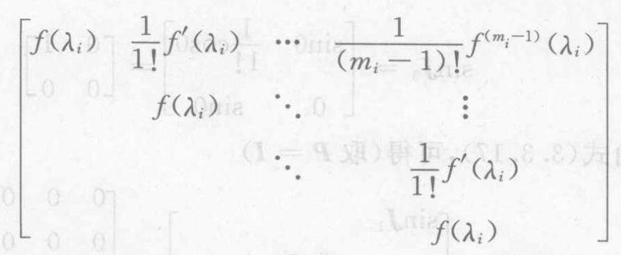

(3.3.16)

$$
f\left( \mathbf{A}\right)  = \mathop{\sum }\limits_{{k = 0}}^{\infty }{c}_{k}{\mathbf{A}}^{k} = \mathop{\sum }\limits_{{k = 0}}^{\infty }{c}_{k}\mathbf{P}{\mathbf{J}}^{k}{\mathbf{P}}^{-1} = \mathbf{P}\left( {\mathop{\sum }\limits_{{k = 0}}^{\infty }{c}_{k}{\mathbf{J}}^{k}}\right) {\mathbf{P}}^{-1} =
$$

$$
\mathbf{P}\left\lbrack  \begin{matrix} \mathop{\sum }\limits_{{k = 0}}^{\infty }{c}_{k}{\mathbf{J}}_{1}^{k} & & \\   &  \ddots  & \\   & & \mathop{\sum }\limits_{{k = 0}}^{\infty }{c}_{k}{\mathbf{J}}_{s}^{k} \end{matrix}\right\rbrack  {\mathbf{P}}^{-1} =
$$

(3.3.17)

这表明, 矩阵幂级数的求和问题可以转化为求矩阵的 Jordan 标准形及变换矩阵的问题.

例如，例 3.6 中的矩阵 $\mathbf{A}$ 是一个 Jordan 标准形，它的三个 Jordan 块为

$$
\mathbf{J} = \pi ,\;{\mathbf{J}}_{2} =  - \pi ,\;{\mathbf{J}}_{3} = \left\lbrack  \begin{array}{ll} 0 & 1 \\  0 & 0 \end{array}\right\rbrack
$$

根据式 (3.3.16), 求得

$$
\sin {\mathbf{J}}_{1} = \sin \pi  = 0
$$

$$
\sin {\mathbf{J}}_{2} = \sin \left( {-\pi }\right)  = 0
$$

$$
\sin {\mathbf{J}}_{3} = \left\lbrack  \begin{matrix} \sin 0 & \frac{1}{1!}\cos 0 \\  0 & \sin 0 \end{matrix}\right\rbrack   = \left\lbrack  \begin{array}{ll} 0 & 1 \\  0 & 0 \end{array}\right\rbrack
$$

再由式 (3.3.17),可得 (取 $\mathbf{P} = \mathbf{I}$ )

$$
\sin \mathbf{A} = \left\lbrack  \begin{array}{lll} \sin {\mathbf{J}}_{1} & & \\   & \sin {\mathbf{J}}_{2} & \\   & & \sin {\mathbf{J}}_{3} \end{array}\right\rbrack   = \left\lbrack  \begin{array}{llll} 0 & 0 & 0 & 0 \\  0 & 0 & 0 & 0 \\  0 & 0 & 0 & 1 \\  0 & 0 & 0 & 0 \end{array}\right\rbrack
$$

## * 三、矩阵函数的另一定义

上面利用定理 3.6 及其推论定义了矩阵函数，其实质就是先把纯量 $z$ 的函数 $f\left( z\right)$ 展开为形如式 (3.2.10) 的收敛的幂级数，然后以矩阵 $\mathbf{A}$ 替代 $z$ ,就得到形如式 (3.2.11) 的矩阵幂级数 $f\left( \mathbf{A}\right)$ . 但是，对于任意给定的函数 $f\left( z\right)$ 要求能够展开成收敛的幂级数这个条件较强,一般不易满足,例如函数 $f\left( z\right)  = \frac{1}{z}$ 就不满足. 借助于式 (3.3.16) 和式 (3.3.17), 拓宽矩阵函数的定义如下.

定义 3.6 设 $\mathbf{A} \in  {\mathbf{C}}^{n \times  n}$ 的 Jordan 标准形为 $\mathbf{J}$ ,即有可逆矩阵 $P$ ,使得

$$
{\mathbf{P}}^{-1}\mathbf{{AP}} = \mathbf{J} = \left\lbrack  \begin{array}{lll} {\mathbf{J}}_{1} & & \\   &  \ddots  & \\   & & {\mathbf{J}}_{s} \end{array}\right\rbrack
$$

$$
{\mathbf{J}}_{i} = {\left\lbrack  \begin{matrix} {\lambda }_{i} & 1 & & \\   &  \ddots  &  \ddots  & \\   & & {\lambda }_{i} & 1 \\   & & & {\lambda }_{i} \end{matrix}\right\rbrack  }_{{m}_{i} \times  {m}_{i}}\;\left( {i = 1,2,\cdots , s}\right)
$$

如果函数 $f\left( z\right)$ 在 ${\lambda }_{i}$ 处具有直到 ${m}_{i} - 1$ 阶导数 $\left( {i = 1,2,\cdots , s}\right)$ ,

令

$$
f\left( {\mathbf{J}}_{i}\right)  = \left\lbrack  \begin{matrix} f\left( {\lambda }_{i}\right) & \frac{1}{1!}{f}^{\prime }\left( {\lambda }_{i}\right) & \cdots & \frac{1}{\left( {{m}_{i} - 1}\right) !}{f}^{\left( {m}_{i} - 1\right) }\left( {\lambda }_{i}\right) \\  f\left( {\lambda }_{i}\right) &  \ddots  & & \vdots \\   &  \ddots  & & 1!{f}^{\prime }\left( {\lambda }_{i}\right) \\   & &  \ddots  & 1! \end{matrix}\right\rbrack
$$

(3.3.18)

$$
f\left( \mathbf{A}\right)  = \mathbf{P}\left\lbrack  \begin{array}{lll} f\left( {\mathbf{J}}_{1}\right) & & \\   &  \ddots  & \\   & & f\left( {\mathbf{J}}_{s}\right)  \end{array}\right\rbrack  {\mathbf{P}}^{-1} \tag{3.3.19}
$$

那么,称 $f\left( \mathbf{A}\right)$ 为对应于 $f\left( z\right)$ 的矩阵函数.

由式 3.3.16 ) 和式 (3.3.17) 知，当函数 $f\left( z\right)$ 能够展开为 $z$ 的幂级数时,按照定义 3.8 得到矩阵函数 $f\left( \mathbf{A}\right)$ ,与按照定义 3.7 得到的矩阵函数 $f\left( \mathbf{A}\right)$ 是一致的.

例 3.8 设 $f\left( z\right)  = \frac{1}{z},\mathbf{A} = \left\lbrack  \begin{array}{llll} 2 & 1 & 0 & 0 \\  0 & 2 & 1 & 0 \\  0 & 0 & 2 & 1 \\  0 & 0 & 0 & 2 \end{array}\right\rbrack$ ,求 $f\left( \mathbf{A}\right)$ .

解 $\mathbf{A}$ 是一个 Jordan 块,其阶数为 4 . 计算 $f\left( 2\right)  = \frac{1}{2}$ , ${f}^{\prime }\left( 2\right)  =  - \frac{1}{4},{f}^{\prime \prime }\left( 2\right)  = \frac{1}{4},{f}^{\prime \prime \prime }\left( 2\right)  =  - \frac{3}{8}$ ,根据式 (3.3.18) 可得

$$
\frac{1}{A} = f\left( A\right)  = \left\lbrack  \begin{array}{rrrr} \frac{1}{2} &  - \frac{1}{4} & \frac{1}{8} &  - \frac{1}{16} \\   & \frac{1}{2} &  - \frac{1}{4} & \frac{1}{8} \\   & & \frac{1}{2} &  - \frac{1}{4} \\   & & & \frac{1}{4} \end{array}\right\rbrack
$$

例 3.9 设 $f\left( z\right)  = \sqrt{z},\mathbf{A} = \left\lbrack  \begin{array}{lll} 1 & 1 & 0 \\  0 & 1 & 0 \\  0 & 0 & 2 \end{array}\right\rbrack$ ,求 $f\left( \mathbf{A}\right)$ .

解 $\mathbf{A}$ 是 Jordan 标准形,它的两个 Jordan 块为 ${\mathbf{J}}_{1} = \; \left\lbrack  \begin{array}{ll} 1 & 1 \\  0 & 1 \end{array}\right\rbrack$ 和 ${\mathbf{J}}_{2} = 2$ . 由式 (3.3.18),求得

$$
f\left( {\mathbf{J}}_{1}\right)  = \left\lbrack  \begin{array}{ll} 1 & \frac{1}{2} \\  0 & 1 \end{array}\right\rbrack  ,\;f\left( {\mathbf{J}}_{2}\right)  = f\left( 2\right)  = \sqrt{2}
$$

再由式 (3.3.19), 可得

$$
\sqrt{\mathbf{A}} = f\left( \mathbf{A}\right)  = f\left( \mathbf{J}\right)  = \left\lbrack  \begin{array}{ll} f\left( {\mathbf{J}}_{1}\right) & \\   & f\left( {\mathbf{J}}_{2}\right)  \end{array}\right\rbrack   = \left\lbrack  \begin{matrix} 1 & \frac{1}{2} & 0 \\  0 & 1 & 0 \\  0 & 0 & \sqrt{2} \end{matrix}\right\rbrack
$$

关于矩阵函数，还有下面一些结论.

(1)由定义 3.8 给出的矩阵函数 $f\left( \mathbf{A}\right)$ ，与 $\mathbf{A}$ 的 Jordan 标准形 $\mathbf{J}$ 中的 Jordan 块的排列次序无关，与变换矩阵 $\mathbf{P}$ 的选取无关 ${}^{\left\lbrack  {24}\right\rbrack  }$ . 也就是说, 如果

$$
{\mathbf{P}}^{-1}\mathbf{{AP}} = \mathbf{J},\;{\mathbf{Q}}^{-1}\mathbf{{AQ}} = {\widetilde{\mathbf{J}}}^{\left( 1\right) }
$$

则有

$$
\mathbf{P}\left\lbrack  \begin{array}{lll} f\left( {\mathbf{J}}_{1}\right) & & \\   &  \ddots  & \\   & & f\left( {\mathbf{J}}_{s}\right)  \end{array}\right\rbrack  {\mathbf{P}}^{-1} = \mathbf{Q}\left\lbrack  \begin{array}{lll} f\left( {\mathbf{J}}_{{t}_{1}}\right) & & \\   &  \ddots  & \\   & & f\left( {\mathbf{J}}_{{t}_{s}}\right)  \end{array}\right\rbrack  {\mathbf{Q}}^{-1}
$$

(2)如果 $f\left( z\right)  = {f}_{1}\left( z\right)  + {f}_{2}\left( z\right)$ ，则 $f\left( \mathbf{A}\right)  = {f}_{1}\left( \mathbf{A}\right)  + {f}_{2}\left( \mathbf{A}\right)$ ；

(3)如果 $f\left( z\right)  = {f}_{1}\left( z\right) {f}_{2}\left( z\right)$ ，则 $f\left( \mathbf{A}\right)  = {f}_{1}\left( \mathbf{A}\right) {f}_{2}\left( \mathbf{A}\right)$ .

---

① $J$ 与 $\widetilde{J}$ 的 Jordan 块的次序不一定相同。

---

## 习 题 3.3

1. 证明 ${\mathrm{e}}^{\mathrm{j}A} = \cos A + \mathrm{j}\sin A$ .

2. 证明 ${\mathrm{e}}^{\mathbf{A} + {2\pi }\mathrm{j}\mathbf{I}} = {\mathrm{e}}^{\mathbf{A}},\sin \left( {\mathbf{A} + {2\pi }\mathbf{I}}\right)  = \sin \mathbf{A}$ .

3. 若 $\mathbf{A}$ 为实反对称矩阵 $\left( {{\mathbf{A}}^{\mathrm{T}} =  - \mathbf{A}}\right)$ ,则 ${\mathrm{e}}^{\mathbf{A}}$ 为正交矩阵.

4. 若 $\mathbf{A}$ 是 Hermite 矩阵,则 ${\mathrm{e}}^{\mathrm{j}\mathbf{A}}$ 是酉矩阵.

5. 设 $\mathbf{A} = \left\lbrack  \begin{array}{lll} 2 & 1 & 0 \\  0 & 0 & 1 \\  0 & 1 & 0 \end{array}\right\rbrack$ ,求 ${\mathrm{e}}^{\mathbf{A}},{\mathrm{e}}^{t\mathbf{A}}\left( {t \in  \mathbf{R}}\right) ,\sin \mathbf{A}$ .

6. 设 $f\left( z\right)  = \ln z$ ,求 $f\left( \mathbf{A}\right)$ ,这里 $\mathbf{A}$ 为

(1) $\mathbf{A} = \left\lbrack  \begin{array}{llll} 1 & 0 & 0 & 0 \\  1 & 1 & 0 & 0 \\  0 & 1 & 1 & 0 \\  0 & 0 & 1 & 1 \end{array}\right\rbrack$ ; (2) $\mathbf{A} = \left\lbrack  \begin{array}{llll} 2 & 1 & 0 & 0 \\  0 & 2 & 0 & 0 \\  0 & 0 & 1 & 1 \\  0 & 0 & 0 & 1 \end{array}\right\rbrack$ .

## § 3.4 矩阵的微分和积分

在本节,先论述以变量 $t$ 的函数 ${a}_{ij}\left( t\right) \left( {i = 1,2,\cdots , m;j = }\right. \; 1,2,\cdots , n)$ 为元素的矩阵 $\mathbf{A}\left( t\right)  = {\left( {a}_{ij}\left( t\right) \right) }_{m \times  n}$ 对 $t$ 的导数 (微商) 及 $\mathbf{A}\left( t\right)$ 的积分问题; 然后论述一些实际中经常用到的其他微分概念.

## 一、矩阵 $\mathbf{A}\left( t\right)$ 的导数与积分

定义 3.9 如果矩阵 $\mathbf{A}\left( t\right)  = {\left( {a}_{ij}\left( t\right) \right) }_{m \times  n}$ 的每一个元素 ${a}_{ij}\left( t\right)$ 是变量 $t$ 的可微函数,则称 $\mathbf{A}\left( t\right)$ 可微,其导数 (微商) 定义为

$$
{\mathbf{A}}^{\prime }\left( t\right)  = \frac{\mathrm{d}}{\mathrm{d}t}\mathbf{A}\left( t\right)  = {\left( \frac{\mathrm{d}}{\mathrm{d}t}{a}_{ij}\left( t\right) \right) }_{m \times  n} \tag{3.4.1}
$$

从定义 3.9 不难证明下面的定理.

定理 3.8 设 $\mathbf{A}\left( t\right) ,\mathbf{B}\left( t\right)$ 是可进行运算的两个可微矩阵,则以下的运算规则

$$
\frac{\mathrm{d}}{\mathrm{d}t}\left( {\mathbf{A}\left( t\right)  + \mathbf{B}\left( t\right) }\right)  = \frac{\mathrm{d}}{\mathrm{d}t}\mathbf{A}\left( t\right)  + \frac{\mathrm{d}}{\mathrm{d}t}\mathbf{B}\left( t\right) \tag{3.4.2}
$$

$$
\frac{\mathrm{d}}{\mathrm{d}t}\left( {\mathbf{A}\left( t\right) \mathbf{B}\left( t\right) }\right)  = \frac{\mathrm{d}}{\mathrm{d}t}\mathbf{A}\left( t\right)  \cdot  \mathbf{B}\left( t\right)  + \mathbf{A}\left( t\right)  \cdot  \frac{\mathrm{d}}{\mathrm{d}t}\mathbf{B}\left( t\right) \tag{3.4.3}
$$

$$
\frac{\mathrm{d}}{\mathrm{d}t}\left( {a\mathbf{A}\left( t\right) }\right)  = \frac{\mathrm{d}a}{\mathrm{\;d}t} \cdot  \mathbf{A}\left( t\right)  + a\frac{\mathrm{d}}{\mathrm{d}t}\mathbf{A}\left( t\right) \tag{3.4.4}
$$

成立. 这里 $a = a\left( t\right)$ ,为 $t$ 的可微函数.

证 在此仅证明式(3.4.3), 至于式(3.4.2) 和式(3.4.4) 的证明留给读者. 为此令

$$
\mathbf{P}\left( t\right)  = \mathbf{A}\left( t\right) \mathbf{B}\left( t\right)  = \left( {{p}_{ij}\left( t\right) }\right)
$$

则有

$$
{p}_{ij}\left( t\right)  = \mathop{\sum }\limits_{{k = 1}}^{n}{a}_{ik}\left( t\right) {b}_{kj}\left( t\right)
$$

$$
\left( {i = 1,2,\cdots , m;j = 1,2,\cdots , s}\right)
$$

其中 ${a}_{ik}\left( t\right)$ 与 ${b}_{kj}\left( t\right)$ 依次是 $\mathbf{A}\left( t\right)$ 与 $\mathbf{B}\left( t\right)$ 的元素. 故有

$$
\frac{\mathrm{d}}{\mathrm{d}t}{p}_{ij}\left( t\right)  = \mathop{\sum }\limits_{{k = 1}}^{n}\left( {\frac{\mathrm{d}}{\mathrm{d}t}{a}_{ik}\left( t\right) }\right) {b}_{kj}\left( t\right)  + \mathop{\sum }\limits_{{k = 1}}^{n}{a}_{ik}\left( t\right) \left( {\frac{\mathrm{d}}{\mathrm{d}t}{b}_{kj}\left( t\right) }\right)
$$

这意味着有

$$
\frac{\mathrm{d}}{\mathrm{d}t}\mathbf{P}\left( t\right)  = \frac{\mathrm{d}}{\mathrm{d}t}\mathbf{A}\left( t\right)  \cdot  \mathbf{B}\left( t\right)  + \mathbf{A}\left( t\right)  \cdot  \frac{\mathrm{d}}{\mathrm{d}t}\mathbf{B}\left( t\right)
$$

证毕

定理 3.9 设 $n$ 阶矩阵 $\mathbf{A}$ 与 $t$ 无关,则有

$$
\frac{\mathrm{d}}{\mathrm{d}t}{\mathrm{e}}^{t\mathbf{A}} = \mathbf{A}{\mathrm{e}}^{t\mathbf{A}} = {\mathrm{e}}^{t\mathbf{A}}\mathbf{A} \tag{3.4.5}
$$

$$
\frac{\mathrm{d}}{\mathrm{d}t}\cos \left( {t\mathbf{A}}\right)  =  - \mathbf{A}\left( {\sin \left( {t\mathbf{A}}\right) }\right)  =  - \left( {\sin \left( {t\mathbf{A}}\right) }\right) \mathbf{A} \tag{3.4.6}
$$

$$
\frac{\mathrm{d}}{\mathrm{d}t}\sin \left( {t\mathbf{A}}\right)  = \mathbf{A}\left( {\cos \left( {t\mathbf{A}}\right) }\right)  = \left( {\cos \left( {t\mathbf{A}}\right) }\right) \mathbf{A} \tag{3.4.7}
$$

证 这里只证明式(3.4.5), 而式(3.4.6) 和式(3.4.7) 的证明完全类似. 为证明式(3.4.5), 首先注意

$$
{\left( {\mathrm{e}}^{t\mathbf{A}}\right) }_{ij} = \mathop{\sum }\limits_{{k = 0}}^{\infty }\frac{1}{k!}{t}^{k}{\left( {\mathbf{A}}^{k}\right) }_{ij}
$$

上式右边是 $t$ 的幂级数. 不管 $t$ 取何值,它总是收敛的. 因此,可以逐项微分

$$
\frac{\mathrm{d}}{\mathrm{d}t}{\left( {\mathrm{e}}^{t\mathbf{A}}\right) }_{ij} = \mathop{\sum }\limits_{{k = 1}}^{\infty }\frac{1}{\left( {k - 1}\right) !}{t}^{k - 1}{\left( {\mathbf{A}}^{k}\right) }_{ij}
$$

于是由 $\text{ § }{3.2}$ 中性质 3 有

$$
\frac{\mathrm{d}}{\mathrm{d}t}{\mathrm{e}}^{t\mathbf{A}} = \mathop{\sum }\limits_{{k = 1}}^{\infty }\frac{1}{\left( {k - 1}\right) !}{t}^{k - 1}{\mathbf{A}}^{k} =
$$

$$
\left\{  \begin{array}{l} \mathbf{A}\mathop{\sum }\limits_{{k = 1}}^{\infty }\frac{1}{\left( {k - 1}\right) !}{t}^{k - 1}{\mathbf{A}}^{k - 1} = \mathbf{A}{\mathrm{e}}^{t\mathbf{A}} \\  \left( {\mathop{\sum }\limits_{{k = 1}}^{\infty }\frac{1}{\left( {k - 1}\right) !}{t}^{k - 1}{\mathbf{A}}^{k - 1}}\right) \mathbf{A} = {\mathrm{e}}^{t\mathbf{A}}\mathbf{A} \end{array}\right.
$$

证毕

定义 3.10 如果矩阵 $\mathbf{A}\left( t\right)$ 的每个元素 ${a}_{ij}\left( t\right)$ 都是区间 $\left\lbrack  {t}_{0}\right.$ , $\left. {t}_{1}\right\rbrack$ 上的可积函数,则定义 $\mathbf{A}\left( t\right)$ 在 $\left\lbrack  {{t}_{0},{t}_{1}}\right\rbrack$ 上的积分为

$$
{\int }_{{t}_{0}}^{{t}_{1}}\mathbf{A}\left( t\right) \mathrm{d}t = {\left( {\int }_{{t}_{0}}^{{t}_{1}}{a}_{ij}\left( t\right) \mathrm{d}t\right) }_{m \times  n} \tag{3.4.8}
$$

容易验证如下的运算规则成立.

$$
{\int }_{{t}_{0}}^{{t}_{1}}\left( {\mathbf{A}\left( t\right)  + \mathbf{B}\left( t\right) }\right) \mathrm{d}t = {\int }_{{t}_{0}}^{{t}_{1}}\mathbf{A}\left( t\right) \mathrm{d}t + {\int }_{{t}_{0}}^{{t}_{1}}\mathbf{B}\left( t\right) \mathrm{d}t \tag{3.4.9}
$$

$$
{\int }_{{t}_{0}}^{{t}_{1}}\mathbf{A}\left( t\right) \mathbf{B}\mathrm{d}t = \left( {{\int }_{{t}_{0}}^{{t}_{1}}\mathbf{A}\left( t\right) \mathrm{d}t}\right) \mathbf{B}\;\left( {\mathbf{B}\text{ 与 }t\text{ 无关 }}\right) \tag{3.4.10}
$$

$$
{\int }_{{t}_{0}}^{{t}_{1}}\mathbf{A} \cdot  \mathbf{B}\left( t\right) \mathrm{d}t = \mathbf{A}\left( {{\int }_{{t}_{0}}^{{t}_{1}}\mathbf{B}\left( t\right) \mathrm{d}t}\right) \;\left( {\mathbf{A}\text{ 与 }t\text{ 无关 }}\right) (3\text{ . } \tag{3.4.11}
$$

当 ${a}_{ij}\left( t\right)$ 都在 $\left\lbrack  {{t}_{0},{t}_{1}}\right\rbrack$ 上连续时,就称 $\mathbf{A}\left( t\right)$ 在 $\left\lbrack  {{t}_{0},{t}_{1}}\right\rbrack$ 上连续, 且有

$$
\frac{\mathrm{d}}{\mathrm{d}t}{\int }_{a}^{t}\mathbf{A}\left( s\right) \mathrm{d}s = \mathbf{A}\left( t\right) \tag{3.4.12}
$$

当 ${a}_{ij}{}^{\prime }\left( t\right)$ 都在 $\left\lbrack  {a, b}\right\rbrack$ 上连续时,则

$$
{\int }_{a}^{b}{\mathbf{A}}^{\prime }\left( t\right) \mathrm{d}t = \mathbf{A}\left( b\right)  - \mathbf{A}\left( a\right) \tag{3.4.13}
$$

## *二、其他微分概念

以上介绍了矩阵 $\mathbf{A}\left( t\right)$ 的微积分概念及其一些运算法则. 由于 $\frac{\mathrm{d}}{\mathrm{d}t}\mathbf{A}\left( t\right)$ 仍然是一个矩阵,因此,当 ${a}_{ij}\left( t\right)$ 两次可微时,重复使用上面的定义，无疑可以定义二阶微商 $\frac{{\mathrm{d}}^{2}}{\mathrm{\;d}{t}^{2}}\mathbf{A}\left( t\right)$ ，而且对于更高阶微商也是同样的定义. 然而, 在自动控制的理论以及其他科学领域中, 还要讨论纯量对于向量, 向量对于向量, 矩阵对于向量以及矩阵对于矩阵的微商问题. 现分述如下.

1. 函数对矩阵的导数

定义 3.11 设 $\mathbf{X} = {\left( {\xi }_{ij}\right) }_{m \times  n},{mn}$ 元函数 $f\left( \mathbf{X}\right)  = f\left( {{\xi }_{11},{\xi }_{12}}\right.$ , $\left. {\cdots ,{\xi }_{1n},{\xi }_{21},\cdots ,{\xi }_{mn}}\right)$ ,定义 $f\left( \mathbf{X}\right)$ 对矩阵 $\mathbf{X}$ 的导数为

$$
\frac{\mathrm{d}f}{\mathrm{\;d}\mathbf{X}} = {\left( \frac{\partial f}{\partial {\xi }_{ij}}\right) }_{m \times  n} = \left\lbrack  \begin{matrix} \frac{\partial f}{\partial {\xi }_{11}} & \cdots & \frac{\partial f}{\partial {\xi }_{1n}} \\  \vdots & & \vdots \\  \frac{\partial f}{\partial {\xi }_{n1}} & \cdots & \frac{\partial f}{\partial {\xi }_{nn}} \end{matrix}\right\rbrack \tag{3.4.14}
$$

例 3.10 设 $\mathbf{x} = {\left( {\xi }_{1},{\xi }_{2},\cdots ,{\xi }_{n}\right) }^{\mathrm{T}}, n$ 元函数 $f\left( \mathbf{x}\right)  = f\left( {\xi }_{1}\right.$ , $\left. {{\xi }_{2},\cdots ,{\xi }_{n}}\right)$ ,求 $\frac{\mathrm{d}f}{\mathrm{\;d}\mathbf{x}}$ 与 $\frac{\mathrm{d}f}{\mathrm{\;d}{\mathbf{x}}^{\mathrm{T}}}$ .

解 根据定义 3.11,有

$$
\frac{\mathrm{d}f}{\mathrm{\;d}x} = {\left( \frac{\partial f}{\partial {\xi }_{1}},\frac{\partial f}{\partial {\xi }_{2}},\cdots ,\frac{\partial f}{\partial {\xi }_{n}}\right) }^{\mathrm{T}},\frac{\mathrm{d}f}{\mathrm{\;d}{x}^{\mathrm{T}}} = \left( {\frac{\partial f}{\partial {\xi }_{1}},\frac{\partial f}{\partial {\xi }_{2}},\cdots ,\frac{\partial f}{\partial {\xi }_{n}}}\right)
$$

例 3.11 设 $\mathbf{x} = {\left( {\xi }_{1},{\xi }_{2},\cdots ,{\xi }_{n}\right) }^{\mathrm{T}},\mathbf{A} = {\left( {a}_{ij}\right) }_{n \times  n}, n$ 元函数 $f\left( \mathbf{x}\right)  = {\mathbf{x}}^{\mathrm{T}}\mathbf{A}\mathbf{x}$ ,求 $\frac{\mathrm{d}f}{\mathrm{\;d}\mathbf{x}}$ .

解 因为

$$
f\left( \mathbf{x}\right)  = \mathop{\sum }\limits_{{i = 1}}^{n}\mathop{\sum }\limits_{{j = 1}}^{n}{a}_{ij}{\xi }_{i}{\xi }_{j} =
$$

$$
{\xi }_{1}\mathop{\sum }\limits_{{j = 1}}^{n}{a}_{1j}{\xi }_{j} + \cdots  + {\xi }_{k}\mathop{\sum }\limits_{{j = 1}}^{n}{a}_{kj}{\xi }_{j} + \cdots  + {\xi }_{n}\mathop{\sum }\limits_{{j = 1}}^{n}{a}_{nj}{\xi }_{j}
$$

且有

$$
\frac{\partial f}{\partial {\xi }_{k}} = {\xi }_{1}{a}_{1k} + \cdots  + {\xi }_{k - 1}{a}_{k - 1, k} + \left( {\mathop{\sum }\limits_{{j = 1}}^{n}{a}_{kj}{\xi }_{j} + {\xi }_{k}{a}_{kk}}\right)  +
$$

$$
{\xi }_{k + 1}{a}_{k + 1, k} + \cdots  + {\xi }_{n}{a}_{nk} = \mathop{\sum }\limits_{{j = 1}}^{n}{a}_{kj}{\xi }_{j} + \mathop{\sum }\limits_{{i = 1}}^{n}{a}_{ik}{\xi }_{i}
$$

所以

$$
\frac{\mathrm{d}f}{\mathrm{\;d}\mathbf{x}} = \left\lbrack  \begin{matrix} \frac{\partial f}{\partial {\xi }_{1}} \\  \vdots \\  \frac{\partial f}{\partial {\xi }_{n}} \end{matrix}\right\rbrack   = \left\lbrack  \begin{matrix} \mathop{\sum }\limits_{{j = 1}}^{n}{a}_{1j}{\xi }_{j} \\  \vdots \\  \mathop{\sum }\limits_{{j = 1}}^{n}{a}_{nj}{\xi }_{j} \end{matrix}\right\rbrack   + \left\lbrack  \begin{matrix} \mathop{\sum }\limits_{{i = 1}}^{n}{a}_{i1}{\xi }_{i} \\  \vdots \\  \mathop{\sum }\limits_{{i = 1}}^{n}{a}_{in}{\xi }_{i} \end{matrix}\right\rbrack   =
$$

$$
\mathbf{A}\mathbf{x} + {\mathbf{A}}^{\mathrm{T}}\mathbf{x} = \left( {\mathbf{A} + {\mathbf{A}}^{\mathrm{T}}}\right) \mathbf{x}
$$

特别地,当 $\mathbf{A}$ 为对称矩阵时,有

$$
\frac{\mathrm{d}f}{\mathrm{\;d}\mathbf{x}} = 2\mathbf{{Ax}} \tag{3.4.15}
$$

例 3.12 设 $\mathbf{x}\left( t\right)  = {\left( {\xi }_{1}\left( t\right) ,\cdots ,{\xi }_{n}\left( t\right) \right) }^{\mathrm{T}}$ ,一元函数 $f\left( t\right)  = \; f\left( {\mathbf{x}\left( t\right) }\right)  = f\left( {{\xi }_{1}\left( t\right) ,\cdots ,{\xi }_{n}\left( t\right) }\right)$ ,求 $\frac{\mathrm{d}f}{\mathrm{\;d}t}$ .

解 由偏导数及复合函数的求导法则,有

$$
\frac{\mathrm{d}f}{\mathrm{\;d}t} = \frac{\partial f}{\partial {\xi }_{1}}\frac{\mathrm{d}{\xi }_{1}}{\mathrm{\;d}t} + \frac{\partial f}{\partial {\xi }_{2}}\frac{\mathrm{d}{\xi }_{2}}{\mathrm{\;d}t} + \cdots  + \frac{\partial f}{\partial {\xi }_{n}}\frac{\mathrm{d}{\xi }_{n}}{\mathrm{\;d}t} =
$$

$$
\left( {\frac{\partial f}{\partial {\xi }_{1}},\frac{\partial f}{\partial {\xi }_{2}},\cdots ,\frac{\partial f}{\partial {\xi }_{n}}}\right) {\left( \frac{\mathrm{d}{\xi }_{1}}{\mathrm{\;d}t},\frac{\mathrm{d}{\xi }_{2}}{\mathrm{\;d}t},\cdots ,\frac{\mathrm{d}{\xi }_{n}}{\mathrm{\;d}t}\right) }^{\mathrm{T}} =
$$

$$
\frac{\mathrm{d}f}{\mathrm{\;d}{\mathbf{x}}^{\mathrm{T}}}\frac{\mathrm{d}\mathbf{x}}{\mathrm{d}t} \tag{3.4.16}
$$

2. 函数矩阵对矩阵的导数

定义 3.12 设 $\mathbf{X} = {\left( {\xi }_{ij}\right) }_{m \times  n},{mn}$ 元函数 ${f}_{ij}\left( \mathbf{X}\right)  = {f}_{ij}\left( {{\xi }_{11},{\xi }_{12}}\right.$ , $\left. {\cdots ,{\xi }_{1n},{\xi }_{21},\cdots ,{\xi }_{mn}}\right) \left( {i = 1,2,\cdots , r;j = 1,2,\cdots , s}\right)$ . 定义函数矩阵

$$
\mathbf{F}\left( \mathbf{X}\right)  = \left\lbrack  \begin{matrix} {f}_{11}\left( \mathbf{X}\right) & \cdots & {f}_{1s}\left( \mathbf{X}\right) \\  \vdots & & \vdots \\  {f}_{r1}\left( \mathbf{X}\right) & \cdots & {f}_{rs}\left( \mathbf{X}\right)  \end{matrix}\right\rbrack
$$

对矩阵 $\mathbf{X}$ 的导数如下:

其中

$$
\frac{\mathrm{d}\mathbf{F}}{\mathrm{d}\mathbf{X}} = \left\lbrack  \begin{matrix} \frac{\partial \mathbf{F}}{\partial {\xi }_{11}} & \frac{\partial \mathbf{F}}{\partial {\xi }_{12}} & \cdots & \frac{\partial \mathbf{F}}{\partial {\xi }_{1n}} \\  \frac{\partial \mathbf{F}}{\partial {\xi }_{21}} & \frac{\partial \mathbf{F}}{\partial {\xi }_{22}} & \cdots & \frac{\partial \mathbf{F}}{\partial {\xi }_{2n}} \\  \vdots & \vdots & & \vdots \\  \frac{\partial \mathbf{F}}{\partial {\xi }_{n1}} & \frac{\partial \mathbf{F}}{\partial {\xi }_{n2}} & \cdots & \frac{\partial \mathbf{F}}{\partial {\xi }_{nn}} \end{matrix}\right\rbrack \tag{3.4.17}
$$

$$
\frac{\partial \mathbf{F}}{\partial {\xi }_{ij}} = \left\lbrack  \begin{matrix} \frac{\partial {f}_{11}}{\partial {\xi }_{ij}} & \frac{\partial {f}_{12}}{\partial {\xi }_{ij}} & \cdots & \frac{\partial {f}_{1s}}{\partial {\xi }_{ij}} \\  \frac{\partial {f}_{21}}{\partial {\xi }_{ij}} & \frac{\partial {f}_{22}}{\partial {\xi }_{ij}} & \cdots & \frac{\partial {f}_{2s}}{\partial {\xi }_{ij}} \\  \vdots & \vdots & & \vdots \\  \frac{\partial {f}_{r1}}{\partial {\xi }_{r1}} & \frac{\partial {f}_{r2}}{\partial {\xi }_{r2}} & \cdots & \frac{\partial {f}_{rs}}{\partial {\xi }_{rs}} \end{matrix}\right\rbrack
$$

例 3.13 设 $\mathbf{x} = {\left( {\xi }_{1},{\xi }_{2},\cdots ,{\xi }_{n}\right) }^{\mathrm{T}}, n$ 元函数 $f\left( \mathbf{x}\right)  = f\left( {\xi }_{1}\right.$ , $\left. {{\xi }_{2},\cdots ,{\xi }_{n}}\right)$ ,求 $\frac{\mathrm{d}}{\mathrm{d}{\mathbf{x}}^{\mathrm{T}}}\left( \frac{\mathrm{d}f}{\mathrm{\;d}\mathbf{x}}\right)$ .

解 由例 3.10 知

$$
\frac{\mathrm{d}f}{\mathrm{\;d}\mathbf{x}} = {\left( \frac{\partial f}{\partial {\xi }_{1}},\frac{\partial f}{\partial {\xi }_{2}},\cdots ,\frac{\partial f}{\partial {\xi }_{n}}\right) }^{\mathrm{T}}
$$

再由定义 3.12 , 可得

$$
\frac{\mathrm{d}}{\mathrm{d}{\mathbf{x}}^{\mathrm{T}}}\left( \begin{matrix} \frac{{\partial }^{2}f}{\mathrm{\;d}\mathbf{x}} & \frac{{\partial }^{2}f}{\partial {\xi }_{1}\partial {\xi }_{2}} & \cdots & \frac{{\partial }^{2}f}{\partial {\xi }_{1}\partial {\xi }_{n}} \\  \frac{{\partial }^{2}f}{\partial {\xi }_{2}\partial {\xi }_{1}} & \frac{{\partial }^{2}f}{\partial {\xi }_{2}^{2}} & \cdots & \frac{{\partial }^{2}f}{\partial {\xi }_{2}\partial {\xi }_{n}} \\  \vdots & \vdots & & \vdots \\  \frac{{\partial }^{2}f}{\partial {\xi }_{n}\partial {\xi }_{1}} & \frac{{\partial }^{2}f}{\partial {\xi }_{n}\partial {\xi }_{2}} & \cdots & \frac{{\partial }^{2}f}{\partial {\xi }_{n}^{2}} \end{matrix}\right) \tag{3.4.18}
$$

例 3.14 设 $x = \left( {{\xi }_{1},{\xi }_{2},\cdots ,{\xi }_{n}}\right) , n$ 元函数

$$
{f}_{j}\left( \mathbf{x}\right)  = {f}_{j}\left( {{\xi }_{1},{\xi }_{2},\cdots ,{\xi }_{n}}\right) \;\left( {j = 1,2,\cdots , n}\right)
$$

令 $\mathbf{F}\left( \mathbf{x}\right)  = {\left( {f}_{1}\left( \mathbf{x}\right) ,{f}_{2}\left( \mathbf{x}\right) ,\cdots ,{f}_{n}\left( \mathbf{x}\right) \right) }^{\mathrm{T}}$ ,求 $\frac{\mathrm{d}\mathbf{F}}{\mathrm{d}\mathbf{x}}$ .

解 根据定义 3.12, 有

$$
\frac{\mathrm{d}\mathbf{F}}{\mathrm{d}\mathbf{x}} = \left( {\frac{\partial \mathbf{F}}{\partial {\xi }_{1}},\frac{\partial \mathbf{F}}{\partial {\xi }_{2}},\cdots ,\frac{\partial \mathbf{F}}{\partial {\xi }_{n}}}\right)  =
$$

$$
\left\lbrack  \begin{matrix} \frac{\partial {f}_{1}}{\partial {\xi }_{1}} & \frac{\partial {f}_{1}}{\partial {\xi }_{2}} & \cdots & \frac{\partial {f}_{1}}{\partial {\xi }_{n}} \\  \frac{\partial {f}_{2}}{\partial {\xi }_{1}} & \frac{\partial {f}_{2}}{\partial {\xi }_{2}} & \cdots & \frac{\partial {f}_{2}}{\partial {\xi }_{n}} \\  \vdots & \vdots & & \vdots \\  \frac{\partial {f}_{n}}{\partial {\xi }_{1}} & \frac{\partial {f}_{n}}{\partial {\xi }_{2}} & \cdots & \frac{\partial {f}_{n}}{\partial {\xi }_{n}} \end{matrix}\right\rbrack \tag{3.4.19}
$$

称矩阵 (3.4.19) 为函数 ${f}_{1}\left( \mathbf{x}\right) ,{f}_{2}\left( \mathbf{x}\right) ,\cdots ,{f}_{n}\left( \mathbf{x}\right)$ 的 Jacobi 矩阵,它在求解非线性方程组的 Newton 方法中有重要应用.

例 3.15 设 $f\left( x\right)$ 是向量 $x = {\left( {\xi }_{1},{\xi }_{2},\cdots ,{\xi }_{n}\right) }^{\mathrm{T}}$ 的函数,而 ${\xi }_{i} = {\xi }_{i}\left( u\right) \left( {i = 1,2,\cdots , n}\right) , u = {\left( {\zeta }_{1},{\zeta }_{2},\cdots ,{\zeta }_{m}\right) }^{\mathrm{T}}$ ,证明:

$$
\frac{\mathrm{d}f}{\mathrm{\;d}\mathbf{u}} = \frac{\mathrm{d}{\mathbf{x}}^{\mathrm{T}}}{\mathrm{d}\mathbf{u}}\frac{\mathrm{d}f}{\mathrm{\;d}\mathbf{x}}
$$

证 利用例 3.10 的结果, 并根据复合函数的求导法则可得

$$
\frac{\mathrm{d}f}{\mathrm{\;d}u} = \left\lbrack  \begin{matrix} \frac{\partial f}{\partial {\zeta }_{1}} \\  \frac{\partial f}{\partial {\zeta }_{2}} \\  \vdots \\  \frac{\partial f}{\partial {\zeta }_{n}} \end{matrix}\right\rbrack   = \left\lbrack  \begin{matrix} \frac{\partial f}{\partial {\xi }_{1}}\frac{\partial {\xi }_{1}}{\partial {\zeta }_{1}} + \frac{\partial f}{\partial {\xi }_{2}}\frac{\partial {\xi }_{2}}{\partial {\zeta }_{1}} + \cdots  + \frac{\partial f}{\partial {\xi }_{n}}\frac{\partial {\xi }_{n}}{\partial {\zeta }_{1}} \\  \frac{\partial f}{\partial {\xi }_{1}}\frac{\partial {\xi }_{1}}{\partial {\zeta }_{2}} + \frac{\partial f}{\partial {\xi }_{2}}\frac{\partial {\xi }_{2}}{\partial {\zeta }_{2}} + \cdots  + \frac{\partial f}{\partial {\xi }_{n}}\frac{\partial {\xi }_{n}}{\partial {\zeta }_{2}} \\  \vdots \\  \frac{\partial f}{\partial {\xi }_{1}}\frac{\partial {\xi }_{1}}{\partial {\zeta }_{m}} + \frac{\partial f}{\partial {\xi }_{2}}\frac{\partial {\xi }_{2}}{\partial {\zeta }_{m}} + \cdots  + \frac{\partial f}{\partial {\xi }_{n}}\frac{\partial {\xi }_{n}}{\partial {\zeta }_{m}} \end{matrix}\right\rbrack   =
$$

$$
\left\lbrack  \begin{matrix} \frac{\partial {\xi }_{1}}{\partial {\zeta }_{1}} & \frac{\partial {\xi }_{2}}{\partial {\zeta }_{1}} & \cdots & \frac{\partial {\xi }_{n}}{\partial {\zeta }_{1}} \\  \frac{\partial {\xi }_{1}}{\partial {\zeta }_{2}} & \frac{\partial {\xi }_{2}}{\partial {\zeta }_{2}} & \cdots & \frac{\partial {\xi }_{n}}{\partial {\zeta }_{2}} \\  \vdots & \vdots & & \vdots \\  \frac{\partial {\xi }_{1}}{\partial {\zeta }_{m}} & \frac{\partial {\xi }_{2}}{\partial {\zeta }_{m}} & \cdots & \frac{\partial {\xi }_{n}}{\partial {\zeta }_{m}} \end{matrix}\right\rbrack  \left\lbrack  \begin{matrix} \frac{\partial f}{\partial {\xi }_{1}} \\  \frac{\partial f}{\partial {\xi }_{2}} \\  \vdots \\  \frac{\partial f}{\partial {\xi }_{n}} \end{matrix}\right\rbrack   = \frac{\mathrm{d}{\mathbf{x}}^{\mathrm{T}}}{\mathrm{d}\mathbf{u}}\frac{\mathrm{d}f}{\mathrm{\;d}\mathbf{x}}
$$

## 习 题 3.4

1. 证明式 (3.4.4).

2. 证明式 (3.4.6).

3. 证明式 (3.4.11).

4. 设 $\mathbf{x} = {\left( {\xi }_{1},{\xi }_{2},\cdots ,{\xi }_{n}\right) }^{\mathrm{T}},\mathbf{A} = \left( {a}_{ij}\right)$ 是 $n$ 阶对称矩阵, $\mathbf{b} = \left( {{\beta }_{1},{\beta }_{2}}\right.$ , ${\left. \cdots ,{\beta }_{n}\right) }^{\mathrm{T}}$ 是 $n$ 维向量, $c$ 为常数,试求 $f\left( \mathbf{x}\right)  = {\mathbf{x}}^{\mathrm{T}}\mathbf{A}\mathbf{x} - {\mathbf{b}}^{\mathrm{T}}\mathbf{x} + c$ 对于 $\mathbf{x}$ 的导数.

5. 若 $\mathbf{A} = \mathbf{A}\left( t\right)  = {\left( {a}_{ij}\left( t\right) \right) }_{n \times  n}$ 非奇异,证明

$$
\frac{\mathrm{d}}{\mathrm{d}t}{\mathbf{A}}^{-1} =  - {\mathbf{A}}^{-1}\frac{\mathrm{d}\mathbf{A}}{\mathrm{d}t}{\mathbf{A}}^{-1}
$$

6. 设 $\mathbf{X}$ 为 $n \times  m$ 矩阵, $\mathbf{A},\mathbf{B}$ 依次为 $n \times  n$ 和 $m \times  n$ 的常数矩阵,则

(1) $\frac{\mathrm{d}}{\mathrm{d}\mathbf{X}}\left( {\operatorname{tr}\left( {\mathbf{B}\mathbf{X}}\right) }\right)  = \frac{\mathrm{d}}{\mathrm{d}\mathbf{X}}\left( {\operatorname{tr}\left( {{\mathbf{X}}^{\mathrm{T}}{\mathbf{B}}^{\mathrm{T}}}\right) }\right)  = {\mathbf{B}}^{\mathrm{T}}$ ;

(2) $\frac{\mathrm{d}}{\mathrm{d}\mathbf{X}}\left( {\operatorname{tr}\left( {{\mathbf{X}}^{\mathrm{T}}\mathbf{A}\mathbf{X}}\right) }\right)  = \left( {\mathbf{A} + {\mathbf{A}}^{\mathrm{T}}}\right) \mathbf{X}$ .

7. 设 $x$ 为 $n$ 维列向量, $u$ 为 $n$ 维常数列向量, $\mathbf{A}$ 为 $n$ 阶常数对称矩阵,则

$$
\frac{\mathrm{d}}{\mathrm{d}\mathbf{x}}\left( {{\left( \mathbf{x} - \mathbf{u}\right) }^{\mathrm{T}}\mathbf{A}\left( {\mathbf{x} - \mathbf{u}}\right) }\right)  = 2\mathbf{A}\left( {\mathbf{x} - \mathbf{u}}\right)
$$

8. 设 $\mathbf{x} = {\left( {\xi }_{1},{\xi }_{2},\cdots ,{\xi }_{n}\right) }^{\mathrm{T}}, f\left( \mathbf{x}\right)  = {\left( {f}_{1}\left( \mathbf{x}\right) ,{f}_{2}\left( \mathbf{x}\right) ,\cdots ,{f}_{n}\left( \mathbf{x}\right) \right) }^{\mathrm{T}}$ ,其中 ${f}_{i}\left( \mathbf{x}\right)  = \mathop{\sum }\limits_{{j = 1}}^{n}{a}_{ij}{\xi }_{j} + {\delta }_{i}\;\left( {i = 1,2,\cdots , n}\right)$ ,求 ${f}^{\prime }\left( \mathbf{x}\right)$ .

9. 举例说明关系式

$$
\frac{\mathrm{d}}{\mathrm{d}t}{\left( \mathbf{A}\left( t\right) \right) }^{m} = m{\left( \mathbf{A}\left( t\right) \right) }^{m - 1}\frac{\mathrm{d}}{\mathrm{d}t}\mathbf{A}\left( t\right)
$$

一般不成立,此处 $\mathbf{A}\left( t\right)  = {\left( {a}_{ij}\left( t\right) \right) }_{n \times  n}$ ,又在什么条件下,它才能够成立?

## $\text{ § }{3.5}$ 矩阵函数的一些应用

本节介绍矩阵函数及其微积分运算在求解一阶线性常系数微分方程组中的应用.

## 一、一阶线性常系数齐次微分方程组

设一阶线性常系数齐次微分方程组为

$$
\left. \begin{matrix} \frac{\mathrm{d}{\xi }_{1}}{\mathrm{\;d}t} = {a}_{11}{\xi }_{1} + {a}_{12}{\xi }_{2} + \cdots  + {a}_{1n}{\xi }_{n} \\  \frac{\mathrm{d}{\xi }_{2}}{\mathrm{\;d}t} = {a}_{21}{\xi }_{1} + {a}_{22}{\xi }_{2} + \cdots  + {a}_{2n}{\xi }_{n} \\  \vdots \\  \frac{\mathrm{d}{\xi }_{n}}{\mathrm{\;d}t} = {a}_{n1}\xi  + {a}_{n2}{\xi }_{2} + \cdots  + {a}_{nn}{\xi }_{n} \end{matrix}\right\} \tag{3.5.1}
$$

式中, $t$ 为自变量, ${\xi }_{i} = {\xi }_{i}\left( t\right) \left( {i = 1,2,\cdots , n}\right)$ 是 $t$ 的函数, ${a}_{ij}(i$ , $j = 1,2,\cdots , n)$ 是复数. 令 $\mathbf{x} = \mathbf{x}\left( t\right)  = {\left( {\xi }_{1},{\xi }_{2},\cdots ,{\xi }_{n}\right) }^{\mathrm{T}},\mathbf{A} = \; {\left( {a}_{ij}\right) }_{n \times  n}$ ,则方程组 (3.5.1) 可改写为矩阵方程

$$
{\mathbf{x}}^{\prime } = \frac{\mathrm{d}\mathbf{x}}{\mathrm{d}t} = \mathbf{A}\mathbf{x} \tag{3.5.2}
$$

现在假定方程 (3.5.2) 满足初始条件 $c = {\left( {\gamma }_{1},{\gamma }_{2},\cdots ,{\gamma }_{n}\right) }^{\mathrm{T}}$ , 其中 ${\gamma }_{i} = {\xi }_{i}\left( 0\right) \left( {i = 1,2,\cdots , n}\right)$ . 再将每个 ${\xi }_{i}\left( t\right)$ 展开为 Maclaurin 级数

$$
{\xi }_{i}\left( t\right)  = {\xi }_{i}\left( 0\right)  + {\xi }_{i}^{\prime }\left( 0\right) t + \frac{1}{2!}{\xi }_{i}^{\prime \prime }\left( 0\right) {t}^{2} + \cdots
$$

$\left( {i = 1,2,\cdots , n}\right)$

从而有

$$
\mathbf{x} = \mathbf{c} + t{\mathbf{x}}^{\prime }\left( 0\right)  + \frac{1}{2!}{t}^{2}{\mathbf{x}}^{\prime \prime }\left( 0\right)  + \cdots \tag{3.5.3}
$$

又由式(3.5.2)，得

$$
\frac{{\mathrm{d}}^{2}\mathbf{x}}{\mathrm{d}{t}^{2}} = \mathbf{A}\frac{\mathrm{d}\mathbf{x}}{\mathrm{d}t} = {\mathbf{A}}^{2}\mathbf{x},\frac{{\mathrm{d}}^{3}\mathbf{x}}{\mathrm{d}{t}^{3}} = {\mathbf{A}}^{2}\frac{\mathrm{d}\mathbf{x}}{\mathrm{d}t} = {\mathbf{A}}^{3}\mathbf{x},\cdots
$$

于是有

$$
{\mathbf{x}}^{\prime }\left( 0\right)  = \mathbf{A}\mathbf{c},{\mathbf{x}}^{\prime \prime }\left( 0\right)  = {\mathbf{A}}^{2}\mathbf{c},{\mathbf{x}}^{\prime \prime \prime }\left( 0\right)  = {\mathbf{A}}^{3}\mathbf{c},\cdots
$$

代入式 (3.5.3),便得

$$
\mathbf{x} = \mathbf{c} + t\mathbf{A}\mathbf{c} + \frac{{t}^{2}}{2!}{\mathbf{A}}^{2}\mathbf{c} + \cdots  = {\mathrm{e}}^{t\mathbf{A}}\mathbf{c} \tag{3.5.4}
$$

这就是说，方程 (3.5.2) 的解，即方程组 (3.5.1) 的解一定是式 (3.5.4).

反之, 不难证明式 (3.5.4) 确实是方程 (3.5.2) 的解. 事实上, 由式 (3.5.4), 并利用定理 3.8 和定理 3.9, 就有

$$
{\mathbf{x}}^{\prime } = \frac{\mathrm{d}}{\mathrm{d}t}\left( {{\mathrm{e}}^{t\mathbf{A}}\mathbf{c}}\right)  = \left( {\frac{\mathrm{d}}{\mathrm{d}t}{\mathrm{e}}^{t\mathbf{A}}}\right) \mathbf{c} + {\mathrm{e}}^{t\mathbf{A}}\frac{\mathrm{d}}{\mathrm{d}t}\mathbf{c} =
$$

$$
\left( {\frac{\mathrm{d}}{\mathrm{d}t}{\mathrm{e}}^{t\mathbf{A}}}\right) \mathbf{c} = \mathbf{A}{\mathrm{e}}^{t\mathbf{A}}\mathbf{c} = \mathbf{A}\mathbf{x}
$$

于是就证明了下面的定理.

定理 3.10 满足初始条件 ${\xi }_{1}\left( 0\right)  = {\gamma }_{1},\cdots ,{\xi }_{n}\left( 0\right)  = {\gamma }_{n}$ 的一阶线性常系数齐次微分方程组 ${\mathbf{x}}^{\prime } = \frac{\mathrm{d}\mathbf{x}}{\mathrm{d}t} = \mathbf{A}\mathbf{x}$ ,有且仅有唯一解 $\mathbf{x} = {\mathrm{e}}^{t\mathbf{A}}\mathbf{c}$ ,这里 $\mathbf{A} = {\left( {a}_{ij}\right) }_{n \times  n},\mathbf{x} = {\left( {\xi }_{1}\left( t\right) ,{\xi }_{2}\left( t\right) ,\cdots ,{\xi }_{n}\left( t\right) \right) }^{\mathrm{T}},\mathbf{c} = \; {\left( {\gamma }_{1},{\gamma }_{2},\cdots ,{\gamma }_{n}\right) }^{\mathrm{T}}.$

在数学分析中已经知道,微分方程 $\frac{\mathrm{d}}{\mathrm{d}t}x\left( t\right)  = {ax}\left( t\right)$ 满足初始条件 $x\left( 0\right)  = c$ 的解是 $x\left( t\right)  = c{\mathrm{e}}^{at}$ ,这里 $a$ 是常数. 因此,定理 3.10 正好是它的推广.

设 $\mathbf{A} = {\left( {a}_{ij}\right) }_{n \times  n}$ ,考虑向量集合

$$
S = \left\{  {\mathbf{x}\left( t\right)  \mid  {\mathbf{x}}^{\prime }\left( t\right)  = \mathbf{{Ax}}\left( t\right) }\right\} \tag{3.5.5}
$$

按照向量加法和数与向量乘法的运算规则, $S$ 构成一个向量空间, 称为微分方程 ${\mathbf{x}}^{\prime }\left( t\right)  = \mathbf{A}\mathbf{x}\left( t\right)$ 的解空间. 由于矩阵函数 ${\mathrm{e}}^{t\mathbf{A}}$ 可逆,所以它的 $n$ 个列向量 ${\mathbf{x}}_{1}\left( t\right) ,{\mathbf{x}}_{2}\left( t\right) ,\cdots ,{\mathbf{x}}_{n}\left( t\right)$ 线性无关. 对于任意的 $\mathbf{x}\left( t\right)  \in  S$ ,根据定理 3.10,存在向量 $\mathbf{c} = {\left( {\gamma }_{1},{\gamma }_{2},\cdots ,{\gamma }_{n}\right) }^{\mathrm{T}}$ ,使得

$$
\mathbf{x}\left( t\right)  = {\mathrm{e}}^{\iota \mathbf{A}}\mathbf{c} = {\gamma }_{1}{\mathbf{x}}_{1}\left( t\right)  + {\gamma }_{2}{\mathbf{x}}_{2}\left( t\right)  + \cdots  + {\gamma }_{n}{\mathbf{x}}_{n}\left( t\right) \tag{3.5.6}
$$

易见 ${\mathbf{x}}_{i}\left( t\right)  \in  S\left( {i = 1,2,\cdots , n}\right)$ ,故 ${\mathbf{x}}_{1}\left( t\right) ,{\mathbf{x}}_{2}\left( t\right) ,\cdots ,{\mathbf{x}}_{n}\left( t\right)$ 是 $S$ 的一个基，称为微分方程组 ${\mathbf{x}}^{\prime }\left( t\right)  = \mathbf{A}\mathbf{x}\left( t\right)$ 的基础解系，并且称式(3.5.6)为其一般解(或通解).

例 3.16 设 $\mathbf{A} = \left\lbrack  \begin{array}{rrr} 2 & 0 & 0 \\  1 & 1 & 1 \\  1 &  - 1 & 3 \end{array}\right\rbrack$ ,求微分方程组 ${\mathbf{x}}^{\prime }\left( t\right)  = \mathbf{A}\mathbf{x}\left( t\right)$ 的基础解系及满足初始条件 $\mathbf{x}\left( 0\right)  = {\left( 1,1,1\right) }^{\mathrm{T}}$ 的解.

解 在例 3.5 中已经求出

$$
{\mathrm{e}}^{t\mathbf{A}} = {\mathrm{e}}^{2t}\left\lbrack  \begin{matrix} 1 & 0 & 0 \\  t & 1 - t & t \\  t &  - t & 1 + t \end{matrix}\right\rbrack
$$

基础解系为

$$
{\mathbf{x}}_{1}\left( t\right)  = \left\lbrack  \begin{matrix} {\mathrm{e}}^{2t} \\  t{\mathrm{e}}^{2t} \\  t{\mathrm{e}}^{2t} \end{matrix}\right\rbrack  ,{\mathbf{x}}_{2}\left( t\right)  = \left\lbrack  \begin{matrix} 0 \\  \left( {1 - t}\right) {\mathrm{e}}^{2t} \\   - t{\mathrm{e}}^{2t} \end{matrix}\right\rbrack  ,{\mathbf{x}}_{3}\left( t\right)  = \left\lbrack  \begin{matrix} 0 \\  t{\mathrm{e}}^{2t} \\  \left( {1 + t}\right) {\mathrm{e}}^{2t} \end{matrix}\right\rbrack
$$

当 $\mathbf{x}\left( 0\right)  = {\left( 1,1,1\right) }^{\mathrm{T}}$ 时,有

$$
\mathbf{x}\left( t\right)  = {\mathrm{e}}^{t\mathbf{A}}\mathbf{x}\left( 0\right)  = {\left( {\mathrm{e}}^{2t},\left( 1 + t\right) {\mathrm{e}}^{2t},\left( 1 + t\right) {\mathrm{e}}^{2t}\right) }^{\mathrm{T}}
$$

设 ${\mathbf{x}}_{i} = {\left( {\xi }_{1i}\left( t\right) ,{\xi }_{2i}\left( t\right) ,\cdots ,{\xi }_{ni}\left( t\right) \right) }^{\mathrm{T}}\left( {i = 1,2,\cdots , n}\right)$ 为方程 (3.5.2) 的 $n$ 个线性无关的解向量,将其按列排成如下的矩阵

$$
\mathbf{X} = \left\lbrack  \begin{matrix} {\xi }_{11} & {\xi }_{12} & \cdots & {\xi }_{1n} \\  {\xi }_{21} & {\xi }_{22} & \cdots & {\xi }_{2n} \\  \vdots & \vdots & & \vdots \\  {\xi }_{n1} & {\xi }_{n2} & \cdots & {\xi }_{m} \end{matrix}\right\rbrack
$$

其中 ${\xi }_{ij} = {\xi }_{ij}\left( t\right) \left( {i, j = 1,2,\cdots , n}\right)$ ,称 $\mathbf{X}$ 为方程 (3.5.2) 的积分矩阵. 由方程 (3.5.2) 容易推出

$$
\frac{\mathrm{d}\mathbf{X}}{\mathrm{d}t} = \mathbf{{AX}} \tag{3.5.7}
$$

于是解方程 (3.5.2) 就相当于解方程 (3.5.7). 由行列式的微分法及方程 (3.5.7) 可以证明 ${}^{\left\lbrack  {12}\right\rbrack  }$ ，积分矩阵的行列式是

$$
\det \mathbf{X} = c{\mathrm{e}}^{{\int }_{{t}_{0}}^{t}\operatorname{tr}\mathbf{A}\mathrm{d}t} \tag{3.5.8}
$$

当 $\mathbf{A} = \mathbf{A}\left( t\right)  = {\left( {a}_{ij}\left( t\right) \right) }_{n \times  n}$ 时,即方程 (3.5.2) 是变系数微分方程组时, 式 (3.5.8) 仍成立. 称式 (3.5.8) 为 Jacobi 恒等式.

## 二、一阶线性常系数非齐次微分方程组

考虑一阶线性常系数非齐次微分方程组

$$
\left. \begin{aligned} \frac{\mathrm{d}{\xi }_{1}}{\mathrm{\;d}t} &  = {a}_{11}{\xi }_{1} + {a}_{12}{\xi }_{2} + \cdots  + {a}_{1n}{\xi }_{n} + {\beta }_{1}\left( t\right) \\  \frac{\mathrm{d}{\xi }_{2}}{\mathrm{\;d}t} &  = {a}_{21}{\xi }_{1} + {a}_{22}{\xi }_{2} + \cdots  + {a}_{2n}{\xi }_{n} + {\beta }_{2}\left( t\right) \\   & \vdots \\  \frac{\mathrm{d}{\xi }_{n}}{\mathrm{\;d}t} &  = {a}_{n1}{\xi }_{1} + {a}_{n2}{\xi }_{2} + \cdots  + {a}_{nn}{\xi }_{n} + {\beta }_{n}\left( t\right)  \end{aligned}\right\} \tag{3.5.9}
$$

其中, ${a}_{ij}\left( {i, j = 1,2,\cdots , n}\right)$ 都是复数, ${\beta }_{i}\left( t\right) \left( {i = 1,2,\cdots , n}\right)$ 是 $t$ 的已知函数, ${\xi }_{i} = {\xi }_{i}\left( t\right) \left( {i = 1,2,\cdots , n}\right)$ 是 $t$ 的未知函数.

方程组 (3.5.9) 可以改写为如下的矩阵方程

$$
\frac{\mathrm{d}\mathbf{x}}{\mathrm{d}t} = \mathbf{{Ax}} + \mathbf{b}\left( t\right) \tag{3.5.10}
$$

这里 $\mathbf{A} = {\left( {a}_{ij}\right) }_{n \times  n},\mathbf{x} = \mathbf{x}\left( t\right)  = {\left( {\xi }_{1},{\xi }_{2},\cdots ,{\xi }_{n}\right) }^{\mathrm{T}},\mathbf{b}\left( t\right)  = \left( {{\beta }_{1}\left( t\right) }\right.$ , ${\left. {\beta }_{2}\left( t\right) ,\cdots ,{\beta }_{n}\left( t\right) \right) }^{\mathrm{T}}$ .

设 $\widetilde{\mathbf{x}} = \widetilde{\mathbf{x}}\left( t\right)$ 是方程 (3.5.10) 的一个特解, $\mathbf{x} = \mathbf{x}\left( t\right)$ 是方程 (3.5.10) 的一般解(或通解),那么

$$
\frac{\mathrm{d}}{\mathrm{d}t}\left( {\mathbf{x} - \widetilde{\mathbf{x}}}\right)  = \mathbf{A}\left( {\mathbf{x} - \widetilde{\mathbf{x}}}\right)
$$

即 $x - \widetilde{x}$ 是方程 (3.5.2) 的解. 根据式 (3.5.6),可得

$$
\mathbf{x} - \widetilde{\mathbf{x}} = {\mathrm{e}}^{t\mathbf{A}}\mathbf{c}
$$

也就是

$$
\mathbf{x} = {\mathrm{e}}^{t\mathbf{A}}\mathbf{c} + \widetilde{\mathbf{x}} \tag{3.5.11}
$$

为了确定方程 (3.5.10) 的特解 $\widetilde{x}$ ,采取常向量变易法. 设 $\widetilde{x} = \; {\mathrm{e}}^{tA}c\left( t\right)$ ，其中 $c\left( t\right)$ 为待定向量，代入方程 (3.5.10)，可得

$$
\frac{\mathrm{d}}{\mathrm{d}t}\widetilde{\mathbf{x}} = \mathbf{A}{\mathrm{e}}^{t\mathbf{A}}\mathbf{c}\left( t\right)  + {\mathrm{e}}^{t\mathbf{A}}\frac{\mathrm{d}}{\mathrm{d}t}\mathbf{c}\left( t\right)  = \mathbf{A}\widetilde{\mathbf{x}} + {\mathrm{e}}^{t\mathbf{A}}\frac{\mathrm{d}}{\mathrm{d}t}\mathbf{c}\left( t\right)  = \mathbf{A}\widetilde{\mathbf{x}} + \mathbf{b}\left( t\right)
$$

从而

$$
{\mathrm{e}}^{t\mathbf{A}}\frac{\mathrm{d}}{\mathrm{d}t}\mathbf{c}\left( t\right)  = \mathbf{b}\left( t\right)
$$

由此解得

$$
\mathbf{c}\left( t\right)  = {\int }_{{t}_{0}}^{t}{\mathrm{e}}^{-s\mathbf{A}}\mathbf{b}\left( s\right) \mathrm{d}s
$$

故得方程 (3.5.10) 的一个特解是

$$
\widetilde{\mathbf{x}} = {\mathrm{e}}^{t\mathbf{A}}{\int }_{{t}_{0}}^{t}{\mathrm{e}}^{-s\mathbf{A}}\mathbf{b}\left( s\right) \mathrm{d}s
$$

代入式 (3.5.11), 可得微分方程组 (3.5.10) 的一般解为

$$
\mathbf{x}\left( t\right)  = {\mathrm{e}}^{t\mathbf{A}}\mathbf{c} + {\mathrm{e}}^{t\mathbf{A}}{\int }_{{t}_{0}}^{t}{\mathrm{e}}^{-s\mathbf{A}}\mathbf{b}\left( s\right) \mathrm{d}s \tag{3.5.12}
$$

这里, $\mathbf{c} = {\left( {\gamma }_{1},{\gamma }_{2},\cdots ,{\gamma }_{n}\right) }^{\mathrm{T}}$ 是任意常数向量. 满足初始条件 $\mathbf{x}\left( {t}_{0}\right)  = {\mathbf{x}}_{0}$ 的解为

$$
\mathbf{x}\left( t\right)  = {\mathrm{e}}^{\left( {t - {t}_{0}}\right) \mathbf{A}}{\mathbf{x}}_{0} + {\mathrm{e}}^{t\mathbf{A}}{\int }_{{t}_{0}}^{t}{\mathrm{e}}^{-s\mathbf{A}}\mathbf{b}\left( s\right) \mathrm{d}s \tag{3.5.13}
$$

或写成

$$
\mathbf{x}\left( t\right)  = {\mathrm{e}}^{t\mathbf{A}}\left( {{\mathrm{e}}^{-{t}_{0}\mathbf{A}}{\mathbf{x}}_{0} + {\int }_{{t}_{0}}^{t}{\mathrm{e}}^{-s\mathbf{A}}\mathbf{b}\left( s\right) \mathrm{d}s}\right)
$$

例 3.17 设 $\mathbf{A} = \left\lbrack  \begin{array}{rrr} 2 & 0 & 0 \\  1 & 1 & 1 \\  1 &  - 1 & 3 \end{array}\right\rbrack  ,\mathbf{b}\left( t\right)  = \left\lbrack  \begin{array}{l} {\mathrm{e}}^{2t} \\  {\mathrm{e}}^{2t} \\  0 \end{array}\right\rbrack  ,\mathbf{x}\left( 0\right)  = \; \left\lbrack  \begin{array}{r}  - 1 \\  1 \\  0 \end{array}\right\rbrack$ ,求微分方程组 ${\mathbf{x}}^{\prime }\left( t\right)  = \mathbf{A}\mathbf{x}\left( t\right)  + \mathbf{b}\left( t\right)$ 满足初始条件 $\mathbf{x}\left( 0\right)$ 的解.

解 在例 3.5 中已经求出

$$
{\mathrm{e}}^{t\mathbf{A}} = {\mathrm{e}}^{2t}\left\lbrack  \begin{matrix} 1 & 0 & 0 \\  t & 1 - t & t \\  t &  - t & 1 + t \end{matrix}\right\rbrack
$$

计算

$$
{\mathrm{e}}^{-s\mathbf{A}}\mathbf{b}\left( s\right)  = {\mathrm{e}}^{-{2s}}\left\lbrack  \begin{matrix} 1 & 0 & 0 \\   - s & 1 + s &  - s \\   - s & s & 1 - s \end{matrix}\right\rbrack  \left\lbrack  \begin{matrix} {\mathrm{e}}^{2s} \\  {\mathrm{e}}^{2s} \\  0 \end{matrix}\right\rbrack   = \left\lbrack  \begin{array}{l} 1 \\  1 \\  0 \end{array}\right\rbrack
$$

$$
{\int }_{0}^{t}{\mathrm{e}}^{-{sA}}\mathbf{b}\left( s\right) \mathrm{d}s = \left\lbrack  \begin{array}{l} t \\  t \\  0 \end{array}\right\rbrack
$$

根据式 (3.5.13), 可得

$$
\mathbf{x}\left( t\right)  = {\mathrm{e}}^{t\mathbf{A}}\left\{  {\left\lbrack  \begin{matrix}  - 1 \\  1 \\  0 \end{matrix}\right\rbrack   + \left\lbrack  \begin{array}{l} t \\  t \\  0 \end{array}\right\rbrack  }\right\}   =
$$

$$
{\mathrm{e}}^{2t}\left\lbrack  \begin{matrix} 1 & 0 & 0 \\  t & 1 - t & t \\  t &  - t & 1 + t \end{matrix}\right\rbrack  \left\lbrack  \begin{matrix} t - 1 \\  t + 1 \\  0 \end{matrix}\right\rbrack   = \left\lbrack  \begin{matrix} \left( {t - 1}\right) {\mathrm{e}}^{2t} \\  \left( {1 - t}\right) {\mathrm{e}}^{2t} \\   - {2t}{\mathrm{e}}^{2t} \end{matrix}\right\rbrack
$$

## 习 题 3.5

1. 证明 Jacobi 恒等式 (3.5.8).

2. 求微分方程组

$$
\left\{  \begin{array}{l} \frac{\mathrm{d}{\xi }_{1}}{\mathrm{\;d}t} = 3{\xi }_{1} + 8{\xi }_{3} \\  \frac{\mathrm{d}{\xi }_{2}}{\mathrm{\;d}t} = 3{\xi }_{1} - {\xi }_{2} + 6{\xi }_{3} \\  \frac{\mathrm{d}{\xi }_{3}}{\mathrm{\;d}t} =  - 2{\xi }_{1} - 5{\xi }_{3} \end{array}\right.
$$

满足初始条件 ${\xi }_{1}\left( 0\right)  = 1,{\xi }_{2}\left( 0\right)  = 1,{\xi }_{3}\left( 0\right)  = 1$ 的解.

3. 求微分方程组

$$
\left\{  \begin{array}{l} \frac{\mathrm{d}{\xi }_{1}}{\mathrm{\;d}t} =  - 2{\xi }_{1} + {\xi }_{2} + 1 \\  \frac{\mathrm{d}{\xi }_{2}}{\mathrm{\;d}t} =  - 4{\xi }_{1} + 2{\xi }_{2} + 2 \\  \frac{\mathrm{d}{\xi }_{3}}{\mathrm{\;d}t} = {\xi }_{1} + {\xi }_{3} + {\mathrm{e}}^{t} - 1 \end{array}\right.
$$

满足初始条件 ${\xi }_{1}\left( 0\right)  = 1,{\xi }_{2}\left( 0\right)  = 1,{\xi }_{3}\left( 0\right)  =  - 1$ 的解.

4. 设 $\mathbf{A} = {\left( {a}_{ij}\right) }_{n \times  n}$ 为常数矩阵, $\mathbf{X} = {\left( {\xi }_{ij}\left( t\right) \right) }_{n \times  n}, a$ 为常数,试证明下面的 Cauchy 微分方程组

$$
\frac{\mathrm{d}\mathbf{X}}{\mathrm{d}t} = \frac{\mathbf{A}}{t - a}\mathbf{X}
$$

可简化为

$$
\frac{\mathrm{d}\mathbf{X}}{\mathrm{d}u} = \mathbf{{AX}}
$$

其中, $u = \ln \left( {t - a}\right)$ . 并进而证明其通解为

$$
\mathbf{X} = {\left( t - a\right) }^{A}\mathbf{C}
$$

其中, $\mathbf{C}$ 为 $n$ 阶常数矩阵.

## 第 4 章 矩阵分解

本章首先讨论以 Gauss 消去法为根据导出的矩阵的三角(或 LU) 分解, 然后论述 20 世纪 60 年代后根据 Givens 与 Householder 变换发展起来的矩阵的 QR 分解. 这些分解在计算数学中都扮演着十分重要的角色，尤其是以 QR 分解所建立的 QR 方法，已对数值线性代数理论的近代发展起了关键作用. 最后介绍在广义逆矩阵等理论中, 经常遇到的矩阵的满秩分解和奇异值分解, 它与 QR 方法都是近 20 年来求解各类最小二乘方问题和最优化问题的主要数学工具.

## § 4.1 Gauss 消去法与矩阵的三角分解

## 一、Gauss 消去法的矩阵形式

读者已经学过解 $n$ 元线性方程组

$$
\left. \begin{matrix} {a}_{11}{\xi }_{1} + {a}_{12}{\xi }_{2} + \cdots  + {a}_{1n}{\xi }_{n} = {\beta }_{1} \\  {a}_{21}{\xi }_{1} + {a}_{22}{\xi }_{2} + \cdots  + {a}_{2n}{\xi }_{n} = {\beta }_{2} \\  \vdots \\  {a}_{n1}{\xi }_{1} + {a}_{n2}{\xi }_{n} + \cdots  + {a}_{nn}{\xi }_{n} = {\beta }_{n} \end{matrix}\right\} \tag{4.1.1}
$$

的 Gauss 主元素消去法. 将式 (4.1.1) 写成矩阵形式为

$$
\mathbf{{Ax}} = \mathbf{b} \tag{4.1.2}
$$

其中, $\mathbf{A} = {\left( {a}_{ij}\right) }_{n \times  n},\mathbf{x} = {\left( {\xi }_{1},{\xi }_{2},\cdots ,{\xi }_{n}\right) }^{\mathrm{T}},\mathbf{b} = {\left( {\beta }_{1},{\beta }_{2},\cdots ,{\beta }_{n}\right) }^{\mathrm{T}}$ . 这种方法的基本思想是化系数矩阵 $\mathbf{A}$ 为上三角矩阵,或化增广矩阵 $\left\lbrack  {\mathbf{A}\vdots \mathbf{b}}\right\rbrack$ 为上阶梯形矩阵以求其解. 这种消去法有三种形式 ${}^{\left\lbrack  {25}\right\rbrack  }$ , 即按自然顺序(按主对角元的顺序) 选主元素法, 按列选主元素法以及总体选主元素法. 这些消去法各有千秋, 不可偏废.

为了建立矩阵的三角分解理论, 使用矩阵理论描写以上所说的消去法的消元过程,并假定化 $\mathbf{A}$ 为上三角矩阵的过程未用行、列交换, 即采用按自然顺序选主元素进行消元.

设 ${\mathbf{A}}^{\left( 0\right) } = \mathbf{A}$ ,其元素 ${a}_{ij}^{\left( 0\right) } = {a}_{ij}\left( {i, j = 1,2,\cdots , n}\right)$ . 记 $\mathbf{A}$ 的 $k$ 阶顺序主子式为 ${\Delta }_{k}\;\left( {k = 1,2,\cdots , n}\right)$ . 如果 ${\Delta }_{1} = {a}_{11}^{\left( 0\right) } \neq  0$ ,令 ${c}_{i1} = \frac{{a}_{i1}^{\left( 0\right) }}{{a}_{11}^{\left( 0\right) }}\left( {i = 2,3,\cdots , n}\right)$ ,并构造 Frobenius 矩阵,即

$$
{\mathbf{L}}_{1} = \left\lbrack  \begin{matrix} 1 & & & \\  {c}_{21} & 1 & & \\  \vdots & &  \ddots  & \\  {c}_{n1} & & & 1 \end{matrix}\right\rbrack  ,\;{\mathbf{L}}_{1}^{-1} = \left\lbrack  \begin{matrix} 1 & & & \\   - {c}_{21} & 1 & & \\  \vdots & &  \ddots  & \\   - {c}_{n1} & & & 1 \end{matrix}\right\rbrack
$$

计算

$$
{\mathbf{L}}_{1}^{-1}{\mathbf{A}}^{\left( 0\right) } = \left\lbrack  \begin{matrix} {a}_{11}^{\left( 0\right) } & {a}_{12}^{\left( 0\right) } & \cdots & {a}_{1n}^{\left( 0\right) } \\   & {a}_{22}^{\left( 1\right) } & \cdots & {a}_{2n}^{\left( 1\right) } \\   & \vdots & & \vdots \\   & {a}_{n2}^{\left( 1\right) } & \cdots & {a}_{nn}^{\left( 1\right) } \end{matrix}\right\rbrack   = {\mathbf{A}}^{\left( 1\right) } \tag{4.1.3}
$$

由此可见, ${\mathbf{A}}^{\left( 0\right) } = \mathbf{A}$ 的第一列除主元 ${a}_{11}^{\left( 0\right) }$ 外,其余元素全被化为零. 式(4.1.3) 还可写为

$$
{\mathbf{A}}^{\left( 0\right) } = {\mathbf{L}}_{1}{\mathbf{A}}^{\left( 1\right) } \tag{4.1.4}
$$

因为倍加初等变换不改变矩阵的行列式的值,所以由 ${\mathbf{A}}^{\left( 1\right) }$ 得 $\mathbf{A}$ 的二阶顺序主子式为

$$
{\Delta }_{2} = {a}_{11}^{\left( 0\right) }{a}_{22}^{\left( 1\right) } \tag{4.1.5}
$$

如果 ${\Delta }_{2} \neq  0$ ,则 ${a}_{22}^{\left( 1\right) } \neq  0$ . 令 ${c}_{i2} = \frac{{a}_{i2}^{\left( 1\right) }}{{a}_{22}^{\left( 1\right) }}\left( {i = 3,4,\cdots , n}\right)$ ,并构造 Frobenius 矩阵为

$$
{\mathbf{L}}_{2} = \left\lbrack  \begin{matrix} 1 & & & & \\   & 1 & & & \\   & {c}_{32} & 1 & & \\   & \vdots & &  \ddots  & \\   & & & & 1 \end{matrix}\right\rbrack  ,\;{\mathbf{L}}_{2}^{-1} = \left\lbrack  \begin{matrix} 1 & & & & \\   & 1 & & & \\   &  - {c}_{32} & 1 & & \\   & \vdots & &  \ddots  & \\   & & & & 1 \end{matrix}\right\rbrack
$$

计算

$$
{\mathbf{L}}_{2}^{-1}{\mathbf{A}}^{\left( 1\right) } = \left\lbrack  \begin{matrix} {a}_{11}^{\left( 0\right) } & {a}_{12}^{\left( 0\right) } & {a}_{13}^{\left( 0\right) } & \cdots & {a}_{1n}^{\left( 0\right) } \\   & {a}_{22}^{\left( 1\right) } & {a}_{23}^{\left( 1\right) } & \cdots & {a}_{2n}^{\left( 1\right) } \\   & & {a}_{33}^{\left( 2\right) } & \cdots & {a}_{3n}^{\left( 2\right) } \\   & & \vdots & & \vdots \\   & & {a}_{n2}^{\left( 2\right) } & \cdots & {a}_{nn}^{\left( 2\right) } \end{matrix}\right\rbrack   = {\mathbf{A}}^{\left( 2\right) } \tag{4.1.6}
$$

由此可见, ${\mathbf{A}}^{\left( 2\right) }$ 的前两列中主元以下的元素全为零. 式(4.1.6) 还可写为

$$
{\mathbf{A}}^{\left( 1\right) } = {\mathbf{L}}_{2}{\mathbf{A}}^{\left( 2\right) } \tag{4.1.7}
$$

因为倍加初等变换不改变矩阵的行列式的值,所以由 ${\mathbf{A}}^{\left( 2\right) }$ 得 $\mathbf{A}$ 的三阶顺序主子式为

$$
{\Delta }_{3} = {a}_{11}^{\left( 0\right) }{a}_{22}^{\left( 1\right) }{a}_{33}^{\left( 2\right) } \tag{4.1.8}
$$

如此继续下去,直到第 $r - 1$ 步,得到

$$
{\mathbf{A}}^{\left( r - 1\right) } = \left\lbrack  \begin{matrix} {a}_{11}^{\left( 0\right) } & \cdots & {a}_{1, r - 1}^{\left( 0\right) } & {a}_{1r}^{\left( 0\right) } & \cdots & {a}_{1n}^{\left( 0\right) } \\   &  \ddots  & \vdots & \vdots & & \vdots \\   & & {a}_{r - 1, r - 1}^{\left( r - 2\right) } & {a}_{r - 1, r}^{\left( r - 2\right) } & \cdots & {a}_{r - 1, n}^{\left( r - 2\right) } \\   & & & {a}_{m}^{\left( r - 1\right) } & \cdots & {a}_{m}^{\left( r - 1\right) } \\   & & & & \vdots & \vdots \\   & & & & & {a}_{m - 1, n}^{\left( r - 1\right) } \end{matrix}\right\rbrack \tag{4.1.9}
$$

$$
{\Delta }_{r} = {a}_{11}^{\left( 0\right) }{a}_{22}^{\left( 1\right) }\cdots {a}_{r - 1, r - 1}^{\left( r - 2\right) }{a}_{rr}^{\left( r - 1\right) }
$$

如果 ${\Delta }_{r} \neq  0$ ,则 ${a}_{rr}^{\left( r - 1\right) } \neq  0$ . 令 ${c}_{ir} = \frac{{a}_{ir}^{\left( r - 1\right) }}{{a}_{rr}^{\left( r - 1\right) }}\;(i = r + 1, r + 2,\cdots$ , $n)$ ,并构造 Frobenius 矩阵为

$$
{\mathbf{L}}_{r} = \left\lbrack  \begin{matrix} 1 & & & & & \\   &  \ddots  & & & & \\   & & 1 & & & \\   & & {c}_{r + 1, r} & 1 & & \\   & & \vdots & &  \ddots  & \\   & & {c}_{nr} & & & 1 \end{matrix}\right\rbrack
$$

$$
{\mathbf{L}}_{r}^{-1} = \left\lbrack  \begin{matrix} 1 & & & & & \\   &  \ddots  & & & & \\   & & 1 & & & \\   & &  - {c}_{r + 1, r} & 1 & & \\   & & \vdots & &  \ddots  & \\   & &  - {c}_{nr} & & & 1 \end{matrix}\right\rbrack
$$

计算

$$
{\mathbf{L}}_{r}^{-1}{\mathbf{A}}^{\left( r - 1\right) } = \left\lbrack  \begin{matrix} {a}_{11}^{\left( 0\right) } & \cdots & {a}_{1r}^{\left( 0\right) } & {a}_{1, r + 1}^{\left( 0\right) } & \cdots & {a}_{1n}^{\left( 0\right) } \\   &  \ddots  & \vdots & \vdots & & \vdots \\   & & {a}_{r}^{\left( r - 1\right) } & {a}_{r, r + 1}^{\left( r - 1\right) } & \cdots & {a}_{rn}^{\left( r - 1\right) } \\   & & & {a}_{r + 1, r + 1}^{\left( r\right) } & \cdots & {a}_{r + 1, n}^{\left( r - 1\right) } \\   & & & \vdots & & \vdots \\   & & & & & \vdots \\   & & & & & {a}_{n, r}^{\left( r - 1\right) } \end{matrix}\right\rbrack   = {\mathbf{A}}^{\left( r\right) }
$$

(4.1.10)

易见， ${\mathbf{A}}^{\left( r\right) }$ 的前 $r$ 列中主元以下的元素全为零. 式 (4.1.10) 还可写为

$$
{\mathbf{A}}^{\left( r - 1\right) } = {\mathbf{L}}_{r}{\mathbf{A}}^{\left( r\right) } \tag{4.1.11}
$$

且由 ${\mathbf{A}}^{\left( r\right) }$ 易得 $\mathbf{A}$ 的 $r + 1$ 阶顺序主子式为

$$
{\Delta }_{r + 1} = {a}_{11}^{\left( 0\right) }{a}_{22}^{\left( 1\right) }\cdots {a}_{rr}^{\left( r - 1\right) }{a}_{r + 1, r + 1}^{\left( r\right) } \tag{4.1.12}
$$

如果可以一直进行下去,则在第 $n - 1$ 步之后便有

$$
{\mathbf{A}}^{\left( n - 1\right) } = \left\lbrack  \begin{matrix} {a}_{11}^{\left( 0\right) } & {a}_{12}^{\left( 0\right) } & \cdots & {a}_{1, n - 1}^{\left( 0\right) } & {a}_{1n}^{\left( 0\right) } \\   & {a}_{22}^{\left( 1\right) } & \cdots & {a}_{2, n - 1}^{\left( 1\right) } & {a}_{2n}^{\left( 1\right) } \\   & &  \ddots  & \vdots & \vdots \\   & & & {a}_{n - 1, n - 1}^{\left( n - 2\right) } & {a}_{n - 1, n}^{\left( n - 2\right) } \\   & & & & {a}_{n - 1, n}^{\left( n - 1\right) } \end{matrix}\right\rbrack \tag{4.1.13}
$$

这种对 $\mathbf{A}$ 的元素进行的消元过程叫做 Gauss 消元过程. Gauss 消元过程能够进行到底的条件是当且仅当 ${a}_{11}^{\left( 0\right) },{a}_{22}^{\left( 1\right) },\cdots ,{a}_{n - 1, n - 1}^{\left( n - 2\right) }$ 都不为零, 即

$$
{\Delta }_{r} \neq  0\;\left( {r = 1,2,\cdots , n - 1}\right) \tag{4.1.14}
$$

由于 Gauss 顺序消元过程的特点是未用行、列的交换，因此附加条件式 (4.1.14) 是合理的.

## 二、矩阵的三角(LU) 分解

当条件式 (4.1.14) 满足时，由式 (4.1.11) 有

$$
\mathbf{A} = {\mathbf{A}}^{\left( 0\right) } = {\mathbf{L}}_{1}{\mathbf{A}}^{\left( 1\right) } = {\mathbf{L}}_{1}{\mathbf{L}}_{2}{\mathbf{A}}^{\left( 2\right) } = \cdots  = {\mathbf{L}}_{1}{\mathbf{L}}_{2}\cdots {\mathbf{L}}_{n - 1}{\mathbf{A}}^{\left( n - 1\right) }
$$

容易求出

$$
\mathbf{L} = {\mathbf{L}}_{1}{\mathbf{L}}_{2}\cdots {\mathbf{L}}_{n - 1} = \left\lbrack  \begin{matrix} 1 & & & & \\  {c}_{21} & 1 & & & \\  \vdots & \vdots &  \ddots  & & \\  {c}_{n - 1,1} & {c}_{n - 1,2} & \cdots & 1 & \\  {c}_{n1} & {c}_{n2} & \cdots & {c}_{n, n - 1} & 1 \end{matrix}\right\rbrack  . \tag{4.1.15}
$$

这是一个对角元素都是 1 的下三角矩阵, 称为单位下三角矩阵. 于是若令 ${\mathbf{A}}^{\left( n - 1\right) } = \mathbf{U}$ (或 $\mathbf{R}$ ),则得

$$
\mathbf{A} = \mathbf{{LU}}
$$

这样 $\mathbf{A}$ 就分解成一个单位下三角矩阵与一个上三角矩阵的乘积, 一般地有如下的定义.

定义 4.1 如果方阵 $\mathbf{A}$ 可分解成一个下三角矩阵 $\mathbf{L}$ 和一个上三角矩阵 $\mathbf{U}$ 的乘积,则称 $\mathbf{A}$ 可作三角分解或 $\mathbf{{LU}}$ (LR) 分解. 如果方阵 $\mathbf{A}$ 可分解成 $\mathbf{A} = \mathbf{L}\mathbf{D}\mathbf{U}$ ,其中 $\mathbf{L}$ 是单位下三角矩阵, $\mathbf{D}$ 是对角矩阵, $U$ 是单位上三角矩阵,则称 $\mathbf{A}$ 可作 LDU 分解.

下面研究方阵的三角分解的存在性和唯一性问题.

首先指出,一个方阵的 LU 分解并不唯一. 这是因为如果 $\mathbf{A} = \; \mathbf{{LU}}$ 是 $\mathbf{A}$ 的一个三角分解,令 $\mathbf{D}$ 是对角元素都不为零的对角矩阵, 则 $\mathbf{A} = \mathbf{L}\mathbf{U} = {\mathbf{{LDD}}}^{-1}\mathbf{U} = \widehat{\mathbf{L}}\widehat{\mathbf{U}}$ . 由于上(下) 三角矩阵的乘积仍是上 (下) 三角矩阵,因此 $\mathbf{{LD}} = \widehat{\mathbf{L}},{\mathbf{D}}^{-1}\mathbf{U} = \widehat{\mathbf{U}}$ 也分别是下、上三角矩阵. 从而 $\widehat{\mathbf{L}}\widehat{\mathbf{U}}$ 也是 $\mathbf{A}$ 的一个三角分解. 一般来说,矩阵的三角分解不是唯一的. 但是尚有下面的定理.

定理 4.1 设 $\mathbf{A} = \left( {a}_{ij}\right)$ 是 $n$ 阶矩阵,则当且仅当 $\mathbf{A}$ 的顺序主子式 ${\Delta }_{k} \neq  0\left( {k = 1,2,\cdots , n - 1}\right)$ 时, $\mathbf{A}$ 可唯一地分解为 $\mathbf{A} =$ LDU,其中 $\mathbf{L}$ 是单位下三角矩阵, $\mathbf{U}$ 是单位上三角矩阵, $\mathbf{D}$ 是对角矩阵

$$
\mathbf{D} = \operatorname{diag}\left( {{d}_{1},{d}_{2},\cdots ,{d}_{n}}\right)
$$

其中, ${d}_{k} = \frac{{\Delta }_{k}}{{\Delta }_{k - 1}}\left( {k = 1,2,\cdots , n;{\Delta }_{0} = 1}\right)$ .

*证 必要性. 若 $\mathbf{A}$ 有唯一的 LDU 分解 $\mathbf{A} = \mathbf{L}\mathbf{D}\mathbf{U}$ ,将其写成分块矩阵的形式为

$$
\left\lbrack  \begin{matrix} {\mathbf{A}}_{n - 1} & \mathbf{v} \\  {\mathbf{\mu }}^{\mathrm{T}} & {a}_{nn} \end{matrix}\right\rbrack   = \left\lbrack  \begin{matrix} {\mathbf{L}}_{n - 1} & \mathbf{0} \\  {\mathbf{\sigma }}^{\mathrm{T}} & 1 \end{matrix}\right\rbrack  \left\lbrack  \begin{matrix} {\mathbf{D}}_{n - 1} & \mathbf{0} \\  {\mathbf{0}}^{\mathrm{T}} & {d}_{n} \end{matrix}\right\rbrack  \left\lbrack  \begin{matrix} {\mathbf{U}}_{n - 1} & \mathbf{\tau } \\  {\mathbf{0}}^{\mathrm{T}} & 1 \end{matrix}\right\rbrack \tag{4.1.16}
$$

其中 ${\mathbf{L}}_{n - 1},{\mathbf{D}}_{n - 1},{\mathbf{U}}_{n - 1},{\mathbf{A}}_{n - 1}$ 分别是 $\mathbf{L},\mathbf{D},\mathbf{U},\mathbf{A}$ 的 $n - 1$ 阶顺序主子矩阵. 由式 (4.1.16) 得矩阵方程为

$$
{\mathbf{A}}_{n - 1} = {\mathbf{L}}_{n - 1}{\mathbf{D}}_{n - 1}{\mathbf{U}}_{n - 1} \tag{4.1.17}
$$

$$
{\mathbf{\mu }}^{\mathrm{T}} = {\mathbf{\sigma }}^{\mathrm{T}}{\mathbf{D}}_{n - 1}{\mathbf{U}}_{n - 1} \tag{4.1.18}
$$

$$
\mathbf{v} = {\mathbf{L}}_{n - 1}{\mathbf{D}}_{n - 1}\mathbf{\tau } \tag{4.1.19}
$$

$$
{a}_{nn} = {\mathbf{\sigma }}^{\mathrm{T}}{\mathbf{D}}_{n - 1}\mathbf{\tau } + {d}_{n} \tag{4.1.20}
$$

如果 ${\Delta }_{n - 1} = \det {\mathbf{A}}_{n - 1} = 0$ ,则由式 (4.1.17) 及行列式乘法定理知 $\det {\mathbf{D}}_{n - 1} = \det {\mathbf{A}}_{n - 1} = 0$ . 于是 $\det \left( {{\mathbf{L}}_{n - 1}{\mathbf{D}}_{n - 1}}\right)  = \det {\mathbf{D}}_{n - 1} = 0$ ,即 ${\mathbf{L}}_{n - 1}{\mathbf{D}}_{n - 1}$ 奇异. 对于方程组 (4.1.19),存在 $\left( {n - 1}\right)  \times  1$ 矩阵 $\widetilde{\mathbf{\tau }}$ 使 ${\mathbf{L}}_{n - 1}{\mathbf{D}}_{n - 1}\widetilde{\mathbf{\tau }} = \mathbf{v}$ ,而 $\mathbf{\tau } \neq  \widetilde{\mathbf{\tau }}$ (因为当 $\det \mathbf{B} = 0$ 时,线性方程组 $\mathbf{B}\mathbf{x} = \mathbf{0}$ 有非零解,并且当线性方程组 $\mathbf{B}\mathbf{x} = \mathbf{b}$ 有解时,其解不唯一). 同理,因 ${\mathbf{D}}_{n - 1}{\mathbf{U}}_{n - 1}$ 奇异,故 ${\mathbf{U}}_{n - 1}^{\mathrm{T}}{\mathbf{D}}_{n - 1}^{\mathrm{T}} = {\left( {\mathbf{D}}_{n - 1}{\mathbf{U}}_{n - 1}\right) }^{\mathrm{T}}$ 奇异,有 $\widetilde{\mathbf{\sigma }} \neq  \mathbf{\sigma }$ 使 ${\mathbf{U}}_{n - 1}^{\mathrm{T}}{\mathbf{D}}_{n - 1}^{\mathrm{T}}\widetilde{\mathbf{\sigma }} = \mathbf{\mu }$ ,或 ${\widetilde{\mathbf{\sigma }}}^{\mathrm{T}}{\mathbf{D}}_{n - 1}{\mathbf{U}}_{n - 1} = {\mathbf{\mu }}^{\mathrm{T}}$ . 取 ${\widetilde{d}}_{n} = {a}_{nn} - \widetilde{\mathbf{\sigma }}{\mathbf{D}}_{n - 1}\widetilde{\mathbf{\tau }}$ ,则有

$$
\left\lbrack  \begin{matrix} {\mathbf{A}}_{n - 1} & \mathbf{v} \\  {\mathbf{\mu }}^{\mathrm{T}} & {a}_{nn} \end{matrix}\right\rbrack   = \left\lbrack  \begin{matrix} {\mathbf{L}}_{n - 1} & \mathbf{0} \\  {\widetilde{\mathbf{\sigma }}}^{\mathrm{T}} & 1 \end{matrix}\right\rbrack  \left\lbrack  \begin{matrix} {\mathbf{D}}_{n - 1} & \mathbf{0} \\  {\mathbf{0}}^{\mathrm{T}} & {\widetilde{d}}_{n} \end{matrix}\right\rbrack  \left\lbrack  \begin{matrix} {\mathbf{U}}_{n - 1} & \widetilde{\mathbf{\tau }} \\  {\mathbf{0}}^{\mathrm{T}} & 1 \end{matrix}\right\rbrack
$$

这与 $\mathbf{A}$ 的 LDU 分解的唯一性假定矛盾,因此 ${\Delta }_{n - 1} \neq  0$ .

考察 $n - 1$ 阶顺序主子矩阵 ${\mathbf{A}}_{n - 1}$ ,同样有 ${\mathbf{A}}_{n - 2} = {\mathbf{L}}_{n - 2}{\mathbf{D}}_{n - 2}{\mathbf{U}}_{n - 2}$ , 其中 ${\mathbf{L}}_{n - 2},{\mathbf{D}}_{n - 2},{\mathbf{U}}_{n - 2}$ 分别是 $\mathbf{L},\mathbf{D},\mathbf{U}$ 的 $n - 2$ 阶顺序主子矩阵. 于是由 ${\mathbf{D}}_{n - 1}$ 和 ${\mathbf{D}}_{n - 2}$ 非奇异得 $\det {\mathbf{A}}_{n - 2} = \det {\mathbf{D}}_{n - 2} \neq  0$ ,或 ${\Delta }_{n - 2} \neq  0$ . 依此类推,可得 ${\Delta }_{n - 1} \neq  0,{\Delta }_{n - 2} \neq  0,\cdots ,{\Delta }_{2} \neq  0,{\Delta }_{1} \neq  0$ . 必要性得证.

充分性. 若 ${\Delta }_{k} \neq  0\left( {k = 1,2,\cdots , n - 1}\right)$ ,则由 Gauss 消元过程和前面的推导可知 $\mathbf{A}$ 有三角分解 $\mathbf{A} = \mathbf{L}{\mathbf{A}}^{\left( n - 1\right) }$ . 在式 (4.1.13) 中令 ${d}_{k} = {a}_{kk}^{\left( k - 1\right) }$ ,则由式 (4.1.12) 得

$$
{d}_{k} = {a}_{kk}^{\left( k - 1\right) } = \frac{{\Delta }_{k}}{{\Delta }_{k - 1}}\;\left( {k = 1,2,\cdots , n;{\Delta }_{0} = 1}\right)
$$

于是有

$$
{\mathbf{A}}^{\left( n - 1\right) } = \left\lbrack  \begin{array}{llll} {d}_{1} & & & \\   & {d}_{2} & & \\   & &  \ddots  & \\   & & & {d}_{n} \end{array}\right\rbrack  \left\lbrack  \begin{matrix} 1 & \frac{{a}_{12}^{\left( 0\right) }}{{d}_{1}} & \cdots & \frac{{a}_{1n}^{\left( 0\right) }}{{d}_{1}} \\   & 1 &  \ddots  & \vdots \\   & &  \ddots  & \frac{{a}_{n - 1, n}^{\left( n - 2\right) }}{{d}_{n - 1}} \\   & & & 1 \end{matrix}\right\rbrack   = \mathbf{D}\mathbf{U}
$$

即 $\mathbf{A}$ 有 LDU 分解 $\mathbf{A} = \mathbf{L}{\mathbf{A}}^{\left( n - 1\right) } = \mathbf{L}\mathbf{D}\mathbf{U}$ . 下面证明这种分解的惟一性.

设这个分解为式 (4.1.16). 因 ${\Delta }_{n - 1} \neq  0$ ,故从式 (4.1.17) 得 $\det {\mathbf{D}}_{n - 1} \neq  0$ ,即 ${\mathbf{D}}_{n - 1}$ 非奇异. 假定 $\mathbf{A}$ 还有另一种分解方式,则必分别有 $n - 1$ 阶下、上三角矩阵 ${\widetilde{\mathbf{L}}}_{n - 1},{\widetilde{\mathbf{U}}}_{n - 1}$ 和对角矩阵 ${\widetilde{\mathbf{D}}}_{n - 1}$ 满足式 (4.1.17),且 ${\widetilde{\mathbf{D}}}_{n - 1}$ 非奇异. 于是有

$$
{\mathbf{L}}_{n - 1}{\mathbf{D}}_{n - 1}{\mathbf{U}}_{n - 1} = {\mathbf{A}}_{n - 1} = {\widetilde{\mathbf{L}}}_{n - 1}{\widetilde{\mathbf{D}}}_{n - 1}{\widetilde{\mathbf{U}}}_{n - 1}
$$

从而 ${\widetilde{\mathbf{L}}}_{n - 1}^{-1}{\mathbf{L}}_{n - 1} = {\widetilde{\mathbf{D}}}_{n - 1}{\widetilde{\mathbf{U}}}_{n - 1}{\mathbf{U}}_{n - 1}^{-1}{\mathbf{D}}_{n - 1}^{-1}$ . 由于上式左边是单位下三角矩阵,右边是上三角矩阵,因此 ${\widetilde{\mathbf{L}}}_{n - 1}^{-1}{\mathbf{L}}_{n - 1}$ 是单位矩阵,即 ${\mathbf{L}}_{n - 1} = {\widetilde{\mathbf{L}}}_{n - 1}$ . 同理,从 ${\widetilde{\mathbf{D}}}_{n - 1}^{-1}{\widetilde{\mathbf{L}}}_{n - 1}^{-1}{\mathbf{L}}_{n - 1}{\mathbf{D}}_{n - 1} = {\widetilde{\mathbf{U}}}_{n - 1}{\mathbf{U}}_{n - 1}^{-1}$ ,可得 ${\widetilde{\mathbf{U}}}_{n - 1}{\mathbf{U}}_{n - 1}^{-1}$ 和 ${\widetilde{\mathbf{D}}}_{n - 1}^{-1}{\mathbf{D}}_{n - 1}$ 也都是单位矩阵,故 ${\widetilde{\mathbf{U}}}_{n - 1} = {\mathbf{U}}_{n - 1},{\mathbf{D}}_{n - 1} = {\mathbf{D}}_{n - 1}^{\prime }$ .

以上分析说明,若 $\mathbf{A}$ 有分解式 (4.1.16),则 ${\mathbf{L}}_{n - 1},{\mathbf{D}}_{n - 1},{\mathbf{U}}_{n - 1}$ 都是唯一确定的. 由于 ${\mathbf{D}}_{n - 1}$ 的非奇异性,从式 (4.1.18) 和式 (4.1.19) 知 ${\mathbf{\sigma }}^{\mathrm{T}}$ 和 $\mathbf{\tau }$ 也是唯一确定的. 于是由式 (4.1.20) 知 ${d}_{n}$ 也是唯一确定的. 到此 $\mathbf{A}$ 的 LDU 分解的唯一性得证.

对于非奇异矩阵, 可作三角分解与可唯一地作 LDU 分解是等价的,因为有以下推论.

推论 $n$ 阶非奇异矩阵 $\mathbf{A}$ 有三角分解 $\mathbf{A} = \mathbf{L}\mathbf{U}$ 的充要条件是 $\mathbf{A}$ 的顺序主子式 ${\Delta }_{k} \neq  0\left( {k = 1,2,\cdots , n - 1}\right)$ .

证 由定理 4.1 的结论, 充分性是显然的. 现在证明必要性如下.

因 $\mathbf{A}$ 非奇异,且 $0 \neq  \det \mathbf{A} = \det \mathbf{L} \cdot  \det \mathbf{U}$ ,故 $\mathbf{L},\mathbf{U}$ 非奇异. 设 $\mathbf{L} = {\left( {l}_{ij}\right) }_{n \times  n},\mathbf{U} = {\left( {u}_{ij}\right) }_{n \times  n}$ ,则 ${l}_{ii} \neq  0,{u}_{ii} \neq  0\left( {i = 1,2,\cdots , n}\right)$ . 于是

$$
\mathbf{A} = \left\lbrack  \begin{matrix} {l}_{11} & & & \\  {l}_{21} & {l}_{22} & & \\  \vdots & \vdots &  \ddots  & \\  {l}_{n1} & {l}_{n2} & \cdots & {l}_{nn} \end{matrix}\right\rbrack  \left\lbrack  \begin{matrix} {u}_{11} & {u}_{12} & \cdots & {u}_{1n} \\   & {u}_{22} & \cdots & {u}_{2n} \\   & &  \ddots  & \vdots \\   & & & {u}_{nn} \end{matrix}\right\rbrack   =
$$

$$
\left\lbrack  \begin{matrix} 1 & & & & \\  {l}_{21} & 1 & & & \\  {l}_{11} & 1 & & & \\  \vdots & \vdots &  \ddots  & & \\  {l}_{n1} & {l}_{n2} & \cdots & 1 &  \end{matrix}\right\rbrack  \left\lbrack  \begin{array}{llll} {l}_{11} & & & \\   & {l}_{22} & & \\   & &  \ddots  & \\   & & & {l}_{nn} \end{array}\right\rbrack   \times
$$

$$
\left\lbrack  \begin{matrix} {u}_{11} & & & \\   & {u}_{22} & & \\   & &  \ddots  & \\   & & & {u}_{m} \end{matrix}\right\rbrack  \left\lbrack  \begin{matrix} 1 & \frac{{u}_{12}}{{u}_{11}} & \cdots & \frac{{u}_{1n}}{{u}_{11}} \\   & 1 & \cdots & \frac{{u}_{2n}}{{u}_{22}} \\   & &  \ddots  & \vdots \\   & & & 1 \end{matrix}\right\rbrack   =
$$

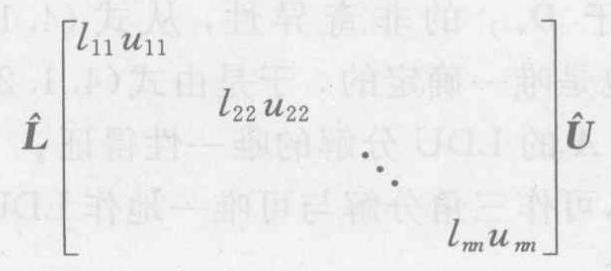

再用定理 4.1 中证明式 (4.1.17) 唯一性的同样方法可知, $\mathbf{A}$ 的上述分解是唯一的. 于是由定理 4.1 的结论,便得 ${\Delta }_{k} \neq  0(k = \; 1,2,\cdots , n - 1)$ . 证毕

例 4.1 求矩阵

$$
\mathbf{A} = \left\lbrack  \begin{array}{rrr} 2 &  - 1 & 3 \\  1 & 2 & 1 \\  2 & 4 & 2 \end{array}\right\rbrack
$$

的 LDU 分解.

解 因为 ${\Delta }_{1} = 2,{\Delta }_{2} = 5$ ,所以 $\mathbf{A}$ 有唯一的 LDU 分解. 构造矩阵

$$
{\mathbf{L}}_{1} = \left\lbrack  \begin{array}{lll} 1 & & \\  \frac{1}{2} & 1 & \\  1 & 0 & 1 \end{array}\right\rbrack  ,\;{\mathbf{L}}_{1}^{-1} = \left\lbrack  \begin{matrix} 1 & & \\   - \frac{1}{2} & 1 & \\   - 1 & 0 & 1 \end{matrix}\right\rbrack
$$

计算

$$
{\mathbf{L}}_{1}^{-1}{\mathbf{A}}^{\left( 0\right) } = \left\lbrack  \begin{array}{rrr} 2 &  - 1 & 3 \\  0 & \frac{5}{2} &  - \frac{1}{2} \\  0 & 5 &  - 1 \end{array}\right\rbrack   = {\mathbf{A}}^{\left( 1\right) }
$$

对 ${\mathbf{A}}^{\left( 1\right) }$ 构造矩阵

$$
{\mathbf{L}}_{2} = \left\lbrack  \begin{array}{lll} 1 & & \\  0 & 1 & \\  0 & 2 & 1 \end{array}\right\rbrack  ,\;{\mathbf{L}}_{2}^{-1} = \left\lbrack  \begin{array}{rrr} 1 & & \\  0 & 1 & \\  0 &  - 2 & 1 \end{array}\right\rbrack
$$

计算

$$
{\mathbf{L}}_{2}^{-1}{\mathbf{A}}^{\left( 1\right) } = \left\lbrack  \begin{array}{rrr} 2 &  - 1 & 3 \\  0 & \frac{5}{2} &  - \frac{1}{2} \\  0 & 0 & 0 \end{array}\right\rbrack   =
$$

$$
\left\lbrack  \begin{array}{lll} 2 & 0 & 0 \\  0 & \frac{5}{2} & 0 \\  0 & 0 & 0 \end{array}\right\rbrack  \left\lbrack  \begin{array}{rrr} 1 &  - \frac{1}{2} & \frac{3}{2} \\  0 & 1 &  - \frac{1}{5} \\  0 & 0 & 1 \end{array}\right\rbrack   = {\mathbf{A}}^{\left( 2\right) }
$$

由式 (4.1.15) 求出

$$
\mathbf{L} = {\mathbf{L}}_{1}{\mathbf{L}}_{2} = \left\lbrack  \begin{array}{lll} 1 & & \\  \frac{1}{2} & 1 & \\  1 & 2 & 1 \end{array}\right\rbrack
$$

于是得 ${\mathbf{A}}^{\left( 0\right) } = \mathbf{A}$ 的 LDU 分解为

$$
\mathbf{A} = {\mathbf{L}}_{1}{\mathbf{L}}_{2}{\mathbf{A}}^{\left( 2\right) } =
$$

$$
\left\lbrack  \begin{array}{lll} 1 & 0 & 0 \\  \frac{1}{2} & 1 & 0 \\  1 & 2 & 1 \end{array}\right\rbrack  \left\lbrack  \begin{array}{lll} 2 & 0 & 0 \\  0 & \frac{5}{2} & 0 \\  0 & 0 & 0 \end{array}\right\rbrack  \left\lbrack  \begin{array}{rrr} 1 &  - \frac{1}{2} & \frac{3}{2} \\  0 & 1 &  - \frac{1}{5} \\  0 & 0 & 1 \end{array}\right\rbrack
$$

矩阵 $\mathbf{A}$ 的 LDU 与 LU 两种分解都需要假设 $\mathbf{A}$ 的前 $n - 1$ 阶顺序主子式非零. 如果这个条件不满足,可以给 $\mathbf{A}$ 左(或右)乘以置换矩阵, $\mathbf{P}$ (以 $n$ 阶单位矩阵的 $n$ 个列向量为列作成的 $n$ 阶矩阵),就把 $\mathbf{A}$ 的行 (或列) 的次序重新排列,使之满足这个条件. 从而就有如下的带行交换的矩阵分解定理.

定理 4.2 设 $\mathbf{A}$ 是 $n$ 阶非奇异矩阵,则存在置换矩阵 $\mathbf{P}$ 使 $\mathbf{P}\mathbf{A}$ 的 $n$ 个顺序主子式非零.

该定理的证明可在计算方法教材 ${}^{\left\lbrack  {25}\right\rbrack  }$ 中找到.

推论 设 $\mathbf{A}$ 是 $n$ 阶非奇异矩阵,则存在置换矩阵 $\mathbf{P}$ ,使

$$
\mathbf{{PA}} = \mathbf{L}\widehat{\mathbf{U}} = \mathbf{L}\mathbf{D}\mathbf{U} \tag{4.1.21}
$$

其中 $\mathbf{L}$ 是单位下三角矩阵, $\widehat{\mathbf{U}}$ 是上三角矩阵, $\mathbf{U}$ 是单位上三角矩阵, $\mathbf{D}$ 是对角矩阵.

如果方程组 (4.1.2) 的系数矩阵 $\mathbf{A}$ 非奇异,且 ${\Delta }_{k} \neq  0(k = 1$ , $2,\cdots , n - 1)$ ,则存在三角分解 $\mathbf{A} = \mathbf{L}\mathbf{U}$ . 于是便得与方程组 (4.1.2) 同解的、具有以三角矩阵为系数矩阵的两个方程组为

$$
\left. \begin{array}{l} \mathbf{{Ly}} = \mathbf{b} \\  \mathbf{{Ux}} = \mathbf{y} \end{array}\right\} \tag{4.1.22}
$$

由联立方程组 (4.1.22) 的第一个方程组先解出 $y$ ,再代入其第二个方程组解出 $x$ ,这就是解线性方程组 (4.1.2) 的三角分解法.

如果方程组 (4.1.2) 的系数矩阵 $\mathbf{A}$ 的某个顺序主子式 ${\Delta }_{k} = 0 \; \left( {k < n}\right)$ ,可按定理 4.2 的推论考虑与其同解的方程组

$$
\mathbf{{PAx}} = \mathbf{{Pb}}
$$

于是，仍可用三角分解法 (或 Gauss 消去法) 求其解.

## 三、其他三角分解及其算法

现在阐述直接计算非奇异矩阵 $\mathbf{A}$ 的三角分解的方法.

定义 4.2 设矩阵 $\mathbf{A}$ 有唯一的 LDU 分解. 若把 $\mathbf{A} = \mathbf{L}\mathbf{D}\mathbf{U}$ 中的 $\mathbf{D}$ 与 $\mathbf{U}$ 结合起来,并且用 $\widehat{\mathbf{U}}$ 来表示,就得到唯一的分解

$$
\mathbf{A} = \mathbf{L}\left( {\mathbf{D}\mathbf{U}}\right)  = \mathbf{L}\widehat{\mathbf{U}} \tag{4.1.23}
$$

称为 $\mathbf{A}$ 的 Doolittle 分解; 若把 $\mathbf{A} = \mathbf{L}\mathbf{D}\mathbf{U}$ 中的 $\mathbf{L}$ 与 $\mathbf{D}$ 结合起来,并且用 $\widehat{\mathbf{L}}$ 来表示，就得到唯一的分解

$$
\mathbf{A} = \left( \mathbf{{LD}}\right) \mathbf{U} = \widehat{\mathbf{L}}\mathbf{U} \tag{4.1.24}
$$

称为 $\mathbf{A}$ 的 Crout 分解.

下面讨论 Crout 分解的实用算法. 设

$$
\widehat{\mathbf{L}} = \left\lbrack  \begin{matrix} {l}_{11} & & & \\  {l}_{21} & {l}_{22} & & \\  \vdots & \vdots &  \ddots  & \\  {l}_{n1} & {l}_{n2} & \cdots & {l}_{nn} \end{matrix}\right\rbrack  ,\;\mathbf{U} = \left\lbrack  \begin{matrix} 1 & {u}_{12} & \cdots & {u}_{1n} \\   & 1 & \cdots & {u}_{2n} \\   & &  \ddots  & \vdots \\   & & & 1 \end{matrix}\right\rbrack
$$

(4.1.25)

根据 $\mathbf{A} = \widehat{\mathbf{L}}\mathbf{U}$ ,可得

$$
{a}_{i1} = {l}_{i1} : \;{l}_{i1} = {a}_{i1}\;\left( {i = 1,2,\cdots , n}\right) \tag{4.1.26}
$$

$$
{a}_{1j} = {l}_{11}{u}_{1j} : \;{u}_{1j} = \frac{{a}_{1j}}{{l}_{11}}\;\left( {j = 2,3,\cdots , n}\right) \tag{4.1.27}
$$

对于 $k = 2,3,\cdots , n$ ,当 $i \geq  k$ 时,有

$$
{a}_{ik} = {l}_{i1}{u}_{1k} + \cdots  + {l}_{i, k - 1}{u}_{k - 1, k} + {l}_{ik}
$$

于是

$$
{l}_{ik} = {a}_{ik} - \left( {{l}_{i1}{u}_{1k} + \cdots  + {l}_{i, k - 1}{u}_{k - 1, k}}\right) \tag{4.1.28}
$$

而当 $j > k$ 时,有

$$
{a}_{kj} = {l}_{k1}{u}_{1j} + \cdots  + {l}_{k, k - 1}{u}_{k - 1, j} + {l}_{kk}{u}_{kj}
$$

于是

$$
{u}_{kj} = \frac{1}{{l}_{kk}}\left\lbrack  {{a}_{kj} - \left( {{l}_{k1}{u}_{1j} + \cdots  + {l}_{k, k - 1}{u}_{k - 1, j}}\right) }\right\rbrack \tag{4.1.29}
$$

现在以 6 阶矩阵为例, 给出 Crout 分解的计算顺序. 由式 (4.1.26), 式(4.1.27), 式(4.1.28) 及式(4.1.29) 可以看出, 计算 $\widehat{\mathbf{L}}$ 诸列及 $\mathbf{U}$ 诸行的顺序如下框图所示(框图中 ①为计算的第 $i$ 步， $i = 1,2,3,\cdots ).$

<table><tr><td rowspan="6">①用式   (4.1.26)   算</td><td colspan="5">② 用式(4.1.27) 算 $U$ 的第一行</td></tr><tr><td rowspan="5">③   (4.1.28)   算   $\mathbf{\widehat{L}}$</td><td colspan="4">④ 用式 (4.1.29) 算 $U$ 的第二行</td></tr><tr><td rowspan="4">⑤用式   (4.1.28)</td><td colspan="3">6 用式(4.1.29)</td></tr><tr><td rowspan="3">⑦用式   (4.1.28)</td><td colspan="2">⑧ 用式(4.1.29)</td></tr><tr><td rowspan="2">⑨</td><td>⑩</td></tr><tr><td>11</td></tr></table>

关于 $\widehat{\mathbf{L}}$ 和 $\mathbf{U}$ 的元素的存储安排，因为在利用 ${a}_{ij}$ 计算出 ${l}_{ij}$ 和 ${u}_{ij}$ 以后就不再使用了,所以 $\widehat{\mathbf{L}}$ 和 $\mathbf{U}$ 的非零元素便可以存放在 $\mathbf{A}$ 中相应元素的位置上. 最后, $\mathbf{A}$ 的位置上所存放的元素就成为

$$
\left\lbrack  \begin{matrix} {l}_{11} & {u}_{12} & {u}_{13} & \cdots & {u}_{1n} \\  {l}_{21} & {l}_{22} & {u}_{23} & \cdots & {u}_{2n} \\  \vdots & \vdots & \vdots & & \vdots \\  {l}_{n1} & {l}_{n2} & {l}_{n3} & \cdots & {l}_{nn} \end{matrix}\right\rbrack
$$

由式 (4.1.28) 和式 (4.1.29) 可以看出，第 $k$ 步计算 ${l}_{ik}$ 和 ${u}_{kj}$ 分别需用 $\left( {n - k}\right) k + {2k} - n + 1$ 次加减法和乘法，故 $n$ 步共需完成约 $2\sum \left( {n - k}\right) k \approx  \frac{1}{3}{n}^{3} + O\left( {n}^{2}\right)$ 次加减法和乘法. 因此，Crout 分解与 Gauss 消去法的计算量基本相同.

完全类似地可由定义 4.2 得到 $n$ 阶矩阵 $\mathbf{A} = \left( {a}_{ij}\right)$ 的 Doolittle 分解的算法公式为

$$
\left. \begin{array}{l} {u}_{ik} = {a}_{ik} - \mathop{\sum }\limits_{{r = 1}}^{{i - 1}}{l}_{ir}{u}_{rk}\;\left( {k = i, i + 1,\cdots , n}\right) \\  {l}_{ki} = \frac{1}{{u}_{ii}}\left( {{a}_{ki} - \mathop{\sum }\limits_{{r = 1}}^{{i - 1}}{l}_{kr}{u}_{ri}}\right) \;\left( {k = i + 1,\cdots , n}\right)  \end{array}\right\} \tag{4.1.30}
$$

当 $\mathbf{A}$ 为实对称正定矩阵时, ${\Delta }_{k} > 0\left( {k = 1,2,\cdots , n}\right)$ . 于是 $\mathbf{A}$ 有唯一的 LDU 分解, 即

$$
\mathbf{A} = \mathbf{L}\mathbf{D}\mathbf{U}
$$

其中, $\mathbf{D} = \operatorname{diag}\left( {{d}_{1},{d}_{2},\cdots ,{d}_{n}}\right)$ ,且 ${d}_{i} > 0\left( {i = 1,2,\cdots , n}\right)$ . 令

$$
\widetilde{\mathbf{D}} = \operatorname{diag}\left( {\sqrt{{d}_{1}},\sqrt{{d}_{2}},\cdots ,\sqrt{{d}_{n}}}\right)
$$

于是有

$$
\mathbf{A} = \mathbf{L}{\widetilde{\mathbf{D}}}^{2}\mathbf{U}
$$

由 ${\mathbf{A}}^{\mathrm{T}} = \mathbf{A}$ 得到

$$
\mathbf{L}{\widetilde{\mathbf{D}}}^{2}\mathbf{U} = {\mathbf{U}}^{\mathrm{T}}{\widetilde{\mathbf{D}}}^{2}{\mathbf{L}}^{\mathrm{T}}
$$

再由分解的唯一性有

$$
\mathbf{L} = {\mathbf{U}}^{\mathrm{T}},\;\mathbf{U} = {\mathbf{L}}^{\mathrm{T}}
$$

因而有

$$
\mathbf{A} = \mathbf{L}{\widetilde{\mathbf{D}}}^{2}{\mathbf{L}}^{\mathrm{T}} = \mathbf{L}\mathbf{D}{\mathbf{L}}^{\mathrm{T}} \tag{4.1.31}
$$

或者

$$
\mathbf{A} = \mathbf{L}{\widetilde{\mathbf{D}}}^{2}{\mathbf{L}}^{\mathrm{T}} = \left( {\mathbf{L}\widetilde{\mathbf{D}}}\right) {\left( \mathbf{L}\widetilde{\mathbf{D}}\right) }^{\mathrm{T}} = \mathbf{G}{\mathbf{G}}^{\mathrm{T}} \tag{4.1.32}
$$

这里 $\mathbf{G} = \mathbf{L}\widetilde{\mathbf{D}}$ 是下三角矩阵.

定义 4.3 称式 (4.1.32) 为实对称正定矩阵的 Cholesky 分解 (平方根分解、对称三角分解).

令 $\mathbf{G} = \left( {g}_{ij}\right)$ ,则由式 (4.1.32) 两端相应元素相等可得

$$
{a}_{ij} = {g}_{i1}{g}_{j1} + {g}_{i2}{g}_{j2} + \cdots  + {g}_{ij}{g}_{jj}\;\left( {i > j}\right)
$$

$$
{a}_{ii} = {g}_{i1}^{2} + {g}_{i2}^{2} + \cdots  + {g}_{ii}^{2}
$$

从而得到计算 ${g}_{ij}$ 的递推公式是

$$
{g}_{ij} = \left\{  \begin{matrix} {\left( {a}_{ii} - \mathop{\sum }\limits_{{k = 1}}^{{i - 1}}{g}_{ik}^{2}\right) }^{1/2} & \left( {i = j}\right) \\  \frac{1}{{g}_{jj}}\left( {{a}_{ij} - \mathop{\sum }\limits_{{k = 1}}^{{j - 1}}{g}_{ik}{g}_{jk}}\right) & \left( {i > j}\right) \\  0 & \left( {i < j}\right)  \end{matrix}\right. \tag{4.1.33}
$$

因为 $\mathbf{A}$ 的对角元素

$$
{a}_{ii} = \mathop{\sum }\limits_{{j = 1}}^{i}{g}_{ij}^{2}
$$

所以有

$$
\left| {g}_{ij}\right|  \leq  \sqrt{{a}_{ii}}\;\left( {j \leq  i}\right) \tag{4.1.34}
$$

由式 (4.1.34) 可知，Cholesky 分解中的中间量 ${g}_{ij}$ 完全得以控制， 从而计算过程是稳定的.

为了避免式 (4.1.33) 中的开方运算，可用式 (4.1.31) 建立对称正定矩阵的分解.

例 4.2 已知矩阵

$$
\mathbf{A} = \left\lbrack  \begin{array}{rrr} 5 &  - 2 & 0 \\   - 2 & 3 &  - 1 \\  0 &  - 1 & 1 \end{array}\right\rbrack
$$

求 $\mathbf{A}$ 的 Cholesky 分解.

解 容易验证 $\mathbf{A}$ 是对称正定的. 由式 (4.1.33) 有

$$
{g}_{11} = \sqrt{{a}_{11}} = \sqrt{5}
$$

$$
{g}_{21} = \frac{{a}_{21}}{{g}_{11}} =  - \frac{2}{\sqrt{5}},\;{g}_{22} = {\left( {a}_{22} - {g}_{21}^{2}\right) }^{1/2} = \sqrt{\frac{11}{5}}
$$

$$
{g}_{31} = \frac{{a}_{31}}{{g}_{11}} = 0,\;{g}_{32} = \frac{{a}_{32} - {g}_{31}{g}_{21}}{{g}_{22}} =  - \sqrt{\frac{5}{11}}
$$

$$
{g}_{33} = {\left( {a}_{33} - {g}_{31}^{2} - {g}_{32}^{2}\right) }^{1/2} = {\left( 1 - \frac{5}{11}\right) }^{1/2} = \sqrt{\frac{6}{11}}
$$

从而

$$
\mathbf{A} = \left\lbrack  \begin{matrix} \sqrt{5} & 0 & 0 \\   - \frac{2}{\sqrt{5}} & \sqrt{\frac{11}{5}} & 0 \\  0 &  - \sqrt{\frac{5}{11}} & \sqrt{\frac{6}{11}} \end{matrix}\right\rbrack  \left\lbrack  \begin{matrix} \sqrt{5} &  - \frac{2}{\sqrt{5}} & 0 \\  0 & \sqrt{\frac{11}{5}} &  - \sqrt{\frac{5}{11}} \\  0 & 0 & \sqrt{\frac{6}{11}} \end{matrix}\right\rbrack
$$

## 四、分块矩阵的拟 LU 分解与拟 LDU 分解

现在讨论如何将方阵 $\mathbf{A}$ 分解成两个拟三角矩阵的乘积问题. 在此基础上给出将 $\mathbf{A}$ 分解成两个拟三角矩阵和一个拟对角矩阵的乘积. 这种分解式无疑对处理高阶方阵分解问题带来方便, 并能减少计算工作量. 这里只限于参加运算的矩阵在纵向及横向裂分 (分割)成 2 块的情况. 但是反复使用所得结果，很易推出在纵向及横向裂分成 3 块或更多块情况下的公式.

设 $\mathbf{A} \in  {\mathbf{R}}^{n \times  n}$ ,将 $\mathbf{A}$ 裂分成

$$
\mathbf{A} = \left\lbrack  \begin{array}{ll} {\mathbf{A}}_{11} & {\mathbf{A}}_{12} \\  {\mathbf{A}}_{21} & {\mathbf{A}}_{22} \end{array}\right\rbrack \tag{4.1.35}
$$

其中 ${\mathbf{A}}_{11}$ 是 ${n}_{1}$ 阶矩阵, ${\mathbf{A}}_{22}$ 是 ${n}_{2}$ 阶矩阵 $\left( {{n}_{1} + {n}_{2} = n}\right)$ .

如果 ${\mathbf{A}}_{11}$ 可逆，构造拟下三角矩阵

$$
\left\lbrack  \begin{matrix} {\mathbf{I}}_{{n}_{1}} & \mathbf{O} \\   - {\mathbf{A}}_{21}{\mathbf{A}}_{11}^{-1} & {\mathbf{I}}_{{n}_{2}} \end{matrix}\right\rbrack
$$

并左乘 $\mathbf{A}$ 得

$$
\left\lbrack  \begin{matrix} {\mathbf{I}}_{{n}_{1}} & \mathbf{O} \\   - {\mathbf{A}}_{21}{\mathbf{A}}_{11}^{-1} & {\mathbf{I}}_{{n}_{2}} \end{matrix}\right\rbrack  \left\lbrack  \begin{array}{ll} {\mathbf{A}}_{11} & {\mathbf{A}}_{12} \\  {\mathbf{A}}_{21} & {\mathbf{A}}_{22} \end{array}\right\rbrack   = \left\lbrack  \begin{matrix} {\mathbf{A}}_{11} & {\mathbf{A}}_{12} \\  \mathbf{O} & {\mathbf{A}}_{22} - {\mathbf{A}}_{21}{\mathbf{A}}_{11}^{-1}{\mathbf{A}}_{12} \end{matrix}\right\rbrack
$$

(4.1.36)

这相当于对 $\mathbf{A}$ 进行 ${n}_{1}$ 个倍加的初等变换. 再由式 (4.1.36) 便得分块矩阵 (4.1.35) 的拟 LU 分解

$$
\left\lbrack  \begin{array}{ll} {\mathbf{A}}_{11} & {\mathbf{A}}_{12} \\  {\mathbf{A}}_{21} & {\mathbf{A}}_{22} \end{array}\right\rbrack   = \left\lbrack  \begin{matrix} {\mathbf{I}}_{{n}_{1}} & \mathbf{O} \\  {\mathbf{A}}_{21}{\mathbf{A}}_{11}^{-1} & {\mathbf{I}}_{{n}_{2}} \end{matrix}\right\rbrack  \left\lbrack  \begin{matrix} {\mathbf{A}}_{11} & {\mathbf{A}}_{12} \\  \mathbf{O} & {\mathbf{A}}_{22} - {\mathbf{A}}_{21}{\mathbf{A}}_{11}^{-1}{\mathbf{A}}_{12} \end{matrix}\right\rbrack
$$

(4.1.37)

式(4.1.37) 右边第二个矩阵还可再分解成一个拟对角矩阵和一个拟上三角矩阵的乘积, 即

$$
\left\lbrack  \begin{array}{ll} {\mathbf{A}}_{11} & {\mathbf{A}}_{12} \\  {\mathbf{A}}_{21} & {\mathbf{A}}_{22} \end{array}\right\rbrack   = \left\lbrack  \begin{matrix} {\mathbf{I}}_{{n}_{1}} & \mathbf{O} \\  {\mathbf{A}}_{21}{\mathbf{A}}_{11}^{-1} & {\mathbf{I}}_{{n}_{2}} \end{matrix}\right\rbrack  \left\lbrack  \begin{matrix} {\mathbf{A}}_{11} & \mathbf{O} \\  \mathbf{O} & {\mathbf{A}}_{22} - {\mathbf{A}}_{21}{\mathbf{A}}_{11}^{-1}{\mathbf{A}}_{12} \end{matrix}\right\rbrack   \times
$$

$$
\left\lbrack  \begin{matrix} {\mathbf{I}}_{{n}_{1}} & {\mathbf{A}}_{11}^{-1}{\mathbf{A}}_{12} \\  \mathbf{O} & {\mathbf{I}}_{{n}_{2}} \end{matrix}\right\rbrack \tag{4.1.38}
$$

这就是分块矩阵 (4.1.35) 的拟 LDU 分解.

如果 ${\mathbf{A}}_{22}$ 可逆,类似于式 (4.1.38) 的推导,可得分块矩阵 (4.1.35) 的另一个拟 LDU 分解

$$
\left\lbrack  \begin{array}{ll} {\mathbf{A}}_{11} & {\mathbf{A}}_{12} \\  {\mathbf{A}}_{21} & {\mathbf{A}}_{22} \end{array}\right\rbrack   = \left\lbrack  \begin{matrix} {\mathbf{I}}_{{n}_{1}} & {\mathbf{A}}_{12}{\mathbf{A}}_{22}^{-1} \\  \mathbf{O} & {\mathbf{I}}_{{n}_{2}} \end{matrix}\right\rbrack  \left\lbrack  \begin{matrix} {\mathbf{A}}_{11} - {\mathbf{A}}_{12}{\mathbf{A}}_{22}^{-1}{\mathbf{A}}_{21} & \mathbf{O} \\  \mathbf{O} & {\mathbf{A}}_{22} \end{matrix}\right\rbrack   \times
$$

$$
\left\lbrack  \begin{matrix} {\mathbf{I}}_{{n}_{1}} & \mathbf{O} \\  {\mathbf{A}}_{22}^{-1}{\mathbf{A}}_{21} & {\mathbf{I}}_{{n}_{2}} \end{matrix}\right\rbrack \tag{4.1.39}
$$

分解式 (4.1.38) 表明,当 ${\mathbf{A}}_{11}$ 可逆时,有

$$
\det \mathbf{A} = \det {\mathbf{A}}_{11} \cdot  \det \left( {{\mathbf{A}}_{22} - {\mathbf{A}}_{21}{\mathbf{A}}_{11}^{-1}{\mathbf{A}}_{12}}\right) \tag{4.1.40}
$$

从而有 $\det \mathbf{A} \neq  0$ 的充要条件是 $\det \left( {{\mathbf{A}}_{22} - {\mathbf{A}}_{21}{\mathbf{A}}_{11}^{-1}{\mathbf{A}}_{12}}\right)  \neq  0$ ; 分解式 (4.1.39) 表明,当 ${\mathbf{A}}_{22}$ 可逆时,有

$$
\det \mathbf{A} = \det {\mathbf{A}}_{22} \cdot  \det \left( {{\mathbf{A}}_{11} - {\mathbf{A}}_{12}{\mathbf{A}}_{22}^{-1}{\mathbf{A}}_{21}}\right) \tag{4.1.41}
$$

从而有 $\det \mathbf{A} \neq  0$ 的充要条件是 $\det \left( {{\mathbf{A}}_{11} - {\mathbf{A}}_{12}{\mathbf{A}}_{22}^{-1}{\mathbf{A}}_{21}}\right)  \neq  0$ .

例 4.3 设 $\mathbf{A} \in  {\mathbf{R}}^{m \times  n},\mathbf{B} \in  {\mathbf{R}}^{n \times  m}$ ,则有

$$
\det \left( {{\mathbf{I}}_{m} + \mathbf{{AB}}}\right)  = \det \left( {{\mathbf{I}}_{n} + \mathbf{{BA}}}\right) \tag{4.1.42}
$$

特别是对于 $\mathbf{a} \in  {\mathbf{R}}^{n \times  1},\mathbf{b} \in  {\mathbf{R}}^{n \times  1}$ ,有 $\det \left( {{\mathbf{I}}_{n} + \mathbf{b}{\mathbf{a}}^{\mathrm{T}}}\right)  = 1 + {\mathbf{a}}^{\mathrm{T}}\mathbf{b}$ .

证 分别使用式 (4.1.40) 和式 (4.1.41) 来计算下面的分块矩阵

$$
\left\lbrack  \begin{array}{ll} {\mathbf{I}}_{n} & \mathbf{B} \\   - \mathbf{A} & {\mathbf{I}}_{m} \end{array}\right\rbrack
$$

的行列式, 便有

$$
\det \left\lbrack  \begin{matrix} {\mathbf{I}}_{n} & \mathbf{B} \\   - \mathbf{A} & {\mathbf{I}}_{m} \end{matrix}\right\rbrack   = \det \left( {{\mathbf{I}}_{n} + \mathbf{{BA}}}\right)  = \det \left( {{\mathbf{I}}_{m} + \mathbf{{AB}}}\right)
$$

类似地又有

$$
\det \left\lbrack  \begin{array}{ll} {\mathbf{I}}_{n} & \mathbf{b} \\   - {\mathbf{a}}^{\mathrm{T}} & 1 \end{array}\right\rbrack   = \det \left( {{\mathbf{I}}_{n} + \mathbf{b}{\mathbf{a}}^{\mathrm{T}}}\right)  = \det \left( {1 + {\mathbf{a}}^{\mathrm{T}}\mathbf{b}}\right)  = 1 + {\mathbf{a}}^{\mathrm{T}}\mathbf{b}
$$

例 4.3 的结果在系统理论中经常碰到.

## 习 题 4.1

1. 求矩阵

$$
\mathbf{A} = \left\lbrack  \begin{array}{rrrr} 5 & 2 &  - 4 & 0 \\  2 & 1 &  - 2 & 1 \\   - 4 &  - 2 & 5 & 0 \\  0 & 1 & 0 & 2 \end{array}\right\rbrack
$$

的 LDU 分解和 Doolittle 分解.

2. 证明式 (4.1.30).

3. 设 $\mathbf{A}$ 为实对称正定矩阵，且 Gauss 消去法第一步得到的矩阵为

$$
{\mathbf{A}}^{\left( 1\right) } = \left\lbrack  \begin{matrix} {a}_{11} & {a}_{12} & \cdots & {a}_{1n} \\  0 & & & \\  \vdots & & \mathbf{B} & \\  0 & & & \\  \vdots & & & \\  0 & & &  \end{matrix}\right\rbrack
$$

证明 $\mathbf{B}$ 仍是实对称正定矩阵,且对角元素不增加.

4. 求对称正定矩阵

$$
\mathbf{A} = \left\lbrack  \begin{array}{rrr} 5 & 2 &  - 4 \\  2 & 1 &  - 2 \\   - 4 &  - 2 & 5 \end{array}\right\rbrack
$$

的 Cholesky 分解.

## § 4.2 矩阵的 QR 分解

首先介绍 Givens 矩阵和 Householder 矩阵的基本性质, 然后讨论可逆矩阵 $\mathbf{A}$ 的 QR 分解及 $\mathbf{A}$ 与 Hessenberg 矩阵的正交相似问题.

## 一、Givens 变换与 Householder 变换

## 1. Givens 矩阵和 Givens 变换

在平面解析几何中,已知使向量 $\mathbf{x}$ 顺时针旋转角度 $\theta$ 后变为向量 $\mathbf{y}$ (见图 4.1) 的旋转变换为

$$
\mathbf{y} = \left\lbrack  \begin{array}{rr} \cos \theta & \sin \theta \\   - \sin \theta & \cos \theta  \end{array}\right\rbrack  \mathbf{x} = \mathbf{{Tx}}
$$

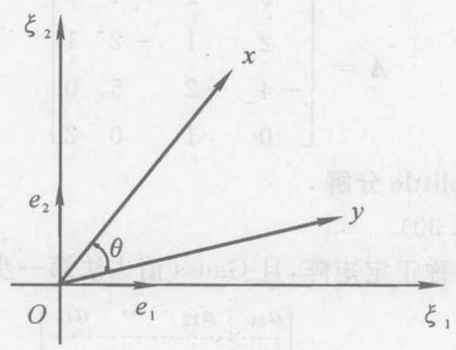

图 4.1

因为旋转变换不改变向量的模,所以它是正交变换,从而 $\mathbf{T}$ 是正交矩阵,且 $\det \mathbf{T} = 1$ .

一般地,在 $n$ 维 Euclid 空间 ${\mathbf{R}}^{n}$ 中,令 ${\mathbf{e}}_{1},{\mathbf{e}}_{2},\cdots ,{\mathbf{e}}_{n}$ 是它的一个标准正交基. 于是在平面 $\left\lbrack  {{e}_{i},{e}_{j}}\right\rbrack$ 中的旋转变换定义如下.

定义 4.4 设实数 $c$ 与 $s$ 满足 ${c}^{2} + {s}^{2} = 1$ ,称

$$
{\mathbf{T}}_{ij} = \left( \begin{matrix} 1 & 0 & \cdots & 0 & 0 & 0 & 0 \\  0 & 1 & \cdots & 0 & 0 & 0 & 0 \\  \vdots & \vdots & \vdots & \vdots & \vdots & \vdots & \vdots \\  0 & 0 & \cdots & 1 & 0 & 0 & 0 \\  0 & 0 & \cdots & 0 & 0 & 0 & 0 \\  \vdots & \vdots & \vdots & \vdots & \vdots & \vdots & \vdots \\  0 & 0 & \cdots & 0 & 0 & 1 & 0 \\  0 & 0 & \cdots & 0 & 0 & 0 & 0 \\  \vdots & \vdots & \vdots & \vdots & \vdots & \vdots & \vdots \\  0 & 0 & \cdots & 0 & 0 & 0 & 1 \end{matrix}\right) \left( i\right)
$$

(4.2.1)

为 Givens 矩阵 (初等旋转矩阵),也可记作 ${\mathbf{T}}_{ij} = {\mathbf{T}}_{ij}\left( {c, s}\right)$ . 由 Givens 矩阵确定的线性变换称为 Givens 变换 (初等旋转变换),

容易验证,当 ${c}^{2} + {s}^{2} = 1$ 时,存在角度 $\theta$ ,使得 $c = \cos \theta , s = \; \sin \theta$ .

性质 1 Givens 矩阵是正交矩阵,且有

$$
{\left\lbrack  {\mathbf{T}}_{ij}\left( c, s\right) \right\rbrack  }^{-1} = {\left\lbrack  {\mathbf{T}}_{ij}\left( c, s\right) \right\rbrack  }^{\mathrm{T}} = {\mathbf{T}}_{ij}\left( {c, - s}\right) \tag{4.2.2}
$$

$$
\det \left\lbrack  {{\mathbf{T}}_{ij}\left( {c, s}\right) }\right\rbrack   = 1
$$

性质 2 设 $\mathbf{x} = {\left( {\xi }_{1},{\xi }_{2},\cdots ,{\xi }_{n}\right) }^{\mathrm{T}},\;\mathbf{y} = {\mathbf{T}}_{ij}\mathbf{x} = \left( {{\eta }_{1},{\eta }_{2},\cdots }\right.$ , ${\left. {\eta }_{n}\right) }^{\mathrm{T}}$ ,则有

$$
\left. \begin{array}{l} {\eta }_{i} = c{\xi }_{i} + s{\xi }_{j} \\  {\eta }_{j} =  - s{\xi }_{i} + c{\xi }_{j} \\  {\eta }_{k} = {\xi }_{k}\;\left( {k \neq  i, j}\right)  \end{array}\right\} \tag{4.2.3}
$$

式(4.2.3) 表明,当 ${\xi }_{i}^{2} + {\xi }_{j}^{2} \neq  0$ 时,选取

$$
c = \frac{{\xi }_{i}}{\sqrt{{\xi }_{i}^{2} + {\xi }_{j}^{2}}},\;s = \frac{{\xi }_{j}}{\sqrt{{\xi }_{i}^{2} + {\xi }_{j}^{2}}} \tag{4.2.4}
$$

就可使 ${\eta }_{i} = \sqrt{{\xi }_{i}^{2} + {\xi }_{j}^{2}} > 0,{\eta }_{j} = 0$ . (这里约定: 所涉及的矩阵与向量都是实的)

定理 4.3 设 $\mathbf{x} = {\left( {\xi }_{1},{\xi }_{2},\cdots ,{\xi }_{n}\right) }^{\mathrm{T}} \neq  \mathbf{0}$ ,则存在有限个 Givens 矩阵的乘积,记作 $\mathbf{T}$ ,使得 $\mathbf{T}\mathbf{x} = \left| \mathbf{x}\right| {\mathbf{e}}_{1}$ .

证 先考虑 ${\xi }_{1} \neq  0$ 的情形. 对 $x$ 构造 Givens 矩阵 ${\mathbf{T}}_{12}\left( {c, s}\right)$ :

$$
c = \frac{{\xi }_{1}}{\sqrt{{\xi }_{1}^{2} + {\xi }_{2}^{2}}},\;s = \frac{{\xi }_{2}}{\sqrt{{\xi }_{1}^{2} + {\xi }_{2}^{2}}}
$$

$$
{\mathbf{T}}_{12}\mathbf{x} = {\left( \sqrt{{\xi }_{1}^{2} + {\xi }_{2}^{2}},0,{\xi }_{3},\cdots ,{\xi }_{n}\right) }^{\mathrm{T}}
$$

再对 ${\mathbf{T}}_{12}\mathbf{x}$ 构造 Givens 矩阵 ${\mathbf{T}}_{13}\left( {c, s}\right)$ :

$$
c = \frac{\sqrt{{\xi }_{1}^{2} + {\xi }_{2}^{2}}}{\sqrt{{\xi }_{1}^{2} + {\xi }_{2}^{2} + {\xi }_{3}^{2}}},\;s = \frac{{\xi }_{3}}{\sqrt{{\xi }_{1}^{2} + {\xi }_{2}^{2} + {\xi }_{3}^{2}}}
$$

$$
{\mathbf{T}}_{13}\left( {{\mathbf{T}}_{12}\mathbf{x}}\right)  = {\left( \begin{array}{llllll} \sqrt{{\xi }_{1}^{2} + {\xi }_{2}^{2} + {\xi }_{3}^{2}}, & 0, & 0, & {\xi }_{4}, & \cdots , & {\xi }_{n} \end{array}\right) }^{\mathrm{T}}
$$

如此继续下去,最后对 ${\mathbf{T}}_{1, n - 1}\cdots {\mathbf{T}}_{12}\mathbf{x}$ 构造 Givens 矩阵 ${\mathbf{T}}_{1n}\left( {c, s}\right)$ :

$$
c = \frac{\sqrt{{\xi }_{1}^{2} + \cdots  + {\xi }_{n - 1}^{2}}}{\sqrt{{\xi }_{1}^{2} + \cdots  + {\xi }_{n - 1}^{2} + {\xi }_{n}^{2}}},\;s = \frac{{\xi }_{n}}{\sqrt{{\xi }_{1}^{2} + \cdots  + {\xi }_{n - 1}^{2} + {\xi }_{n}^{2}}}
$$

$$
{\mathbf{T}}_{1n}\left( {{\mathbf{T}}_{1, n - 1}\cdots {\mathbf{T}}_{12}\mathbf{x}}\right)  = {\left( \sqrt{{\xi }_{1}^{2} + \cdots  + {\xi }_{n - 1}^{2} + {\xi }_{n}^{2}},0,\cdots ,0\right) }^{\mathrm{T}}
$$

令 $\mathbf{T} = {\mathbf{T}}_{1n}{\mathbf{T}}_{1, n - 1}\cdots {\mathbf{T}}_{12}$ ,则有 $\mathbf{T}\mathbf{x} = \left| \mathbf{x}\right| {\mathbf{e}}_{1}$ .

如果 ${\xi }_{1} = 0$ ,考虑 ${\xi }_{1} = \cdots  = {\xi }_{k - 1} = 0,{\xi }_{k} \neq  0\left( {1 < k \leq  n}\right)$ 的情形. 此时 $\left| \mathbf{x}\right|  = \sqrt{{\xi }_{k}^{2} + \cdots  + {\xi }_{n}^{2}}$ ,上面的步骤由 ${\mathbf{T}}_{1k}$ 开始进行即得结论亦成立. 证毕

推论 设非零列向量 $x \in  {\mathbf{R}}^{n}$ 及单位列向量 $z \in  {\mathbf{R}}^{n}$ ,则存在有限个 Givens 矩阵的乘积,记作 $\mathbf{T}$ ,使得 $\mathbf{T}\mathbf{x} = \left| \mathbf{x}\right| z$ .

证 根据定理 4.3,对于向量 $x$ ,存在

$$
{\mathbf{T}}^{\left( 1\right) } = {\mathbf{T}}_{1n}^{\left( 1\right) }\cdots {\mathbf{T}}_{13}^{\left( 1\right) }{\mathbf{T}}_{12}^{\left( 1\right) }\;\left( {\mathbf{T}}_{1j}^{\left( 1\right) }\right) \text{ 是 Givens 矩阵) }
$$

使得 ${\mathbf{T}}^{\left( 1\right) }\mathbf{x} = \left| \mathbf{x}\right| {\mathbf{e}}_{1}$ ; 对于向量 $\mathbf{z}$ ,存在

$$
{\mathbf{T}}^{\left( 2\right) } = {\mathbf{T}}_{1n}^{\left( 2\right) }\cdots {\mathbf{T}}_{13}^{\left( 2\right) }{\mathbf{T}}_{12}^{\left( 2\right) }\;\left( {\mathbf{T}}_{1j}^{\left( 2\right) }\right) \text{ 是 Givens 矩阵) }
$$

使得 ${\mathbf{T}}^{\left( 2\right) }\mathbf{z} = \left| \mathbf{z}\right| {\mathbf{e}}_{1} = {\mathbf{e}}_{1}$ . 于是有

$$
{\mathbf{T}}^{\left( 1\right) }\mathbf{x} = \left| \mathbf{x}\right| {\mathbf{e}}_{1} = \left| \mathbf{x}\right| {\mathbf{T}}^{\left( 2\right) }\mathbf{z}
$$

或者

$$
{\left\lbrack  {\mathbf{T}}^{\left( 2\right) }\right\rbrack  }^{-1}{\mathbf{T}}^{\left( 1\right) }\mathbf{x} = \left| \mathbf{x}\right| \mathbf{z}
$$

再由式(4.2.2)可得

$$
\mathbf{T} = {\left\lbrack  {\mathbf{T}}^{\left( 2\right) }\right\rbrack  }^{-1}{\mathbf{T}}^{\left( 1\right) } = {\left\lbrack  {\mathbf{T}}_{1n}^{\left( 2\right) }\cdots {\mathbf{T}}_{13}^{\left( 2\right) }{\mathbf{T}}_{12}^{\left( 2\right) }\right\rbrack  }^{-1}{\mathbf{T}}^{\left( 1\right) } =
$$

$$
\left\lbrack  {{\left( {\mathbf{T}}_{12}^{\left( 2\right) }\right) }^{\mathrm{T}}{\left( {\mathbf{T}}_{13}^{\left( 2\right) }\right) }^{\mathrm{T}}\cdots {\left( {\mathbf{T}}_{1n}^{\left( 2\right) }\right) }^{\mathrm{T}}}\right\rbrack  \left\lbrack  {{\mathbf{T}}_{1n}^{\left( 1\right) }\cdots {\mathbf{T}}_{13}^{\left( 1\right) }{\mathbf{T}}_{12}^{\left( 1\right) }}\right\rbrack
$$

是有限个 Givens 矩阵的乘积. 证毕

例 4.4 设 $\mathbf{x} = {\left( 3,4,5\right) }^{\mathrm{T}}$ ,用 Givens 变换化 $\mathbf{x}$ 为与 ${\mathbf{e}}_{1}$ 同方向的向量.

解 对 $x$ 构造 ${\mathbf{T}}_{12}\left( {c, s}\right)  : c = \frac{3}{5}, s = \frac{4}{5}$ ,则

$$
{\mathbf{T}}_{12}\mathbf{x} = {\left( 5,0,5\right) }^{\mathrm{T}}
$$

对 ${\mathbf{T}}_{12}\mathbf{x}$ 构造 ${\mathbf{T}}_{13}\left( {c, s}\right)  : c = \frac{1}{\sqrt{2}}, s = \frac{1}{\sqrt{2}}$ ,则

$$
{\mathbf{T}}_{13}\left( {{\mathbf{T}}_{12}\mathbf{x}}\right)  = {\left( 5\sqrt{2},0,0\right) }^{\mathrm{T}}
$$

于是

$$
\mathbf{T} = {\mathbf{T}}_{13}{\mathbf{T}}_{12} = \left\lbrack  \begin{matrix} \frac{1}{\sqrt{2}} & 0 & \frac{1}{\sqrt{2}} \\  0 & 1 & 0 \\   - \frac{1}{\sqrt{2}} & 0 & \frac{1}{\sqrt{2}} \end{matrix}\right\rbrack  \left\lbrack  \begin{array}{rrr} \frac{3}{5} & \frac{4}{5} & 0 \\   - \frac{4}{5} & \frac{3}{5} & 0 \\  0 & 0 & 1 \end{array}\right\rbrack   =
$$

$$
\frac{1}{5\sqrt{2}}\left\lbrack  \begin{matrix} 3 & 4 & 5 \\   - 4\sqrt{2} & 3\sqrt{2} & 0 \\   - 3 &  - 4 & 5 \end{matrix}\right\rbrack
$$

$$
\mathbf{T}\mathbf{x} = 5\sqrt{2}{\mathbf{e}}_{1}
$$

2. Householder 矩阵和 Householder 变换

在平面 ${\mathbf{R}}^{2}$ 中,将向量 $\mathbf{x}$ 映射为关于 ${\mathbf{e}}_{1}$ 轴对称 (或者关于 “与 ${\mathbf{e}}_{2}$ 轴正交的直线" 对称) 的向量 $\mathbf{y}$ 的变换，称为关于 ${\mathbf{e}}_{1}$ 轴的镜象 (反射) 变换 (见图 4.2). 设 $\mathbf{x} = \left\lbrack  \begin{array}{l} {\xi }_{1} \\  {\xi }_{2} \end{array}\right\rbrack$ ,则有

$$
\mathbf{y} = \left\lbrack  \begin{array}{r} {\xi }_{1} \\   - {\xi }_{2} \end{array}\right\rbrack   = \left\lbrack  \begin{array}{rr} 1 & 0 \\  0 &  - 1 \end{array}\right\rbrack  \left\lbrack  \begin{array}{l} {\xi }_{1} \\  {\xi }_{2} \end{array}\right\rbrack   = \left( {\mathbf{I} - 2{\mathbf{e}}_{2}{\mathbf{e}}_{2}^{\mathrm{T}}}\right) \mathbf{x} = \mathbf{{Hx}}
$$

其中 ${\mathbf{e}}_{2} = \left\lbrack  \begin{array}{l} 0 \\  1 \end{array}\right\rbrack  ,\mathbf{H}$ 是正交矩阵,且 $\det \mathbf{H} =  - 1$ .

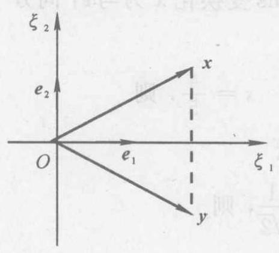

图 4.2

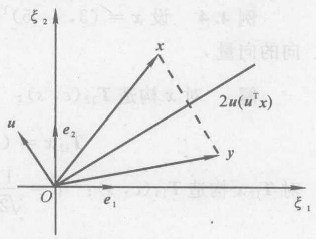

图 4.3

将向量 $\mathbf{x}$ 映射为关于 “与单位向量 $\mathbf{u}$ 正交的直线” 对称的向量 $y$ 的变换 (见图 4.3) 可描述如下:

$$
\mathbf{x} - \mathbf{y} = 2\mathbf{u}\left( {{\mathbf{u}}^{\mathrm{T}}\mathbf{x}}\right)
$$

$$
\mathbf{y} = \mathbf{x} - 2\mathbf{u}\left( {{\mathbf{u}}^{\mathrm{T}}\mathbf{x}}\right)  = \left( {\mathbf{I} - 2\mathbf{u}{\mathbf{u}}^{\mathrm{T}}}\right) \mathbf{x} = \mathbf{H}\mathbf{x}
$$

容易验证, $\mathbf{H}$ 是正交矩阵,且由例 4.3 知 $\det \mathbf{H} =  - 1$ .

一般地，在 ${\mathbf{R}}^{n}$ 中，将向量 $x$ 映射为关于“与单位向量 $u$ 正交的 $n - 1$ 维子空间” 对称的向量 $y$ 的镜象变换定义如下.

定义 4.5 设单位列向量 $u \in  {\mathbf{R}}^{n}$ ,称

$$
\mathbf{H} = \mathbf{I} - 2{\mathbf{{uu}}}^{\mathrm{T}} \tag{4.2.5}
$$

为 Householder 矩阵 (初等反射矩阵), 由 Householder 矩阵确定的线性变换称为 Householder 变换 (初等反射变换).

Householder 矩阵具有下列性质:

(1) ${\mathbf{H}}^{\mathrm{T}} = \mathbf{H}$ (对称矩阵

(2) ${\mathbf{H}}^{\mathrm{T}}\mathbf{H} = \mathbf{I}$ (正交矩阵).

(3) ${\mathbf{H}}^{2} = \mathbf{I}$ (对合矩阵).

(4) ${\mathbf{H}}^{-1} = \mathbf{H}$ (自逆矩阵).

(5) $\det \mathbf{H} =  - 1$ .

直接验证可得性质 (1) $\sim  \left( 4\right)$ ，利用例 4.3 的结果可得性质(5).

定理 4.4 任意给定非零列向量 $x \in  {\mathbf{R}}^{n}\left( {n > 1}\right)$ 及单位列向量 $z \in  {\mathbf{R}}^{n}$ ,则存在 Householder 矩阵 $\mathbf{H}$ ,使得 $\mathbf{H}\mathbf{x} = \left| \mathbf{x}\right| z$ .

证 当 $x = \left| x\right| z$ 时,取单位列向量 $u$ 满足 ${u}^{\mathrm{T}}x = 0$ ,则有

$$
\mathbf{H}\mathbf{x} = \left( {\mathbf{I} - 2\mathbf{u}{\mathbf{u}}^{\mathrm{T}}}\right) \mathbf{x} = \mathbf{x} - 2\mathbf{u}\left( {{\mathbf{u}}^{\mathrm{T}}\mathbf{x}}\right)  = \mathbf{x} = \left| \mathbf{x}\right| \mathbf{z}
$$

当 $x \neq  \left| x\right| z$ 时,取

$$
u = \frac{x - \left| x\right| z}{\left| {x - }\right| x\left| z\right| } \tag{4.2.6}
$$

则有

$$
\mathbf{H}\mathbf{x} = \left\lbrack  {\mathbf{I} - 2\frac{\left( {\mathbf{x} -  \mid  \mathbf{x} \mid  \mathbf{z}}\right) {\left( \mathbf{x} -  \mid  \mathbf{x} \mid  \mathbf{z}\right) }^{\mathrm{T}}}{\mid \mathbf{x} -  \mid  \mathbf{x} \mid  \mathbf{z}{ \mid  }^{2}}}\right\rbrack  \mathbf{x} =
$$

$$
x - 2\left( {x - \left| x\right| z, x}\right) \frac{x - \left| x\right| z}{\left| x\right|  - {\left| x\right| }^{2}} =
$$

$$
x - \left( {x - \left| x\right| z}\right)  = \left| x\right| z
$$

这里利用了等式 ${\left| x - \left| x\right| z\right| }^{2} = 2\left( {x - \left| x\right| z, x}\right)$ . 证毕

例 4.5 设 $\mathbf{x} = {\left( 1,2,2\right) }^{\mathrm{T}}$ ,用 Householder 变换化 $\mathbf{x}$ 为与 ${\mathbf{e}}_{1}$ 同方向的向量.

解 计算 $\left| \mathbf{x}\right|  = 3,\mathbf{x} - \left| \mathbf{x}\right| {\mathbf{e}}_{1} = 2{\left( -1,1,1\right) }^{\mathrm{T}}$ . 根据式 (4.2.6),取 $\mathbf{u} = \frac{1}{\sqrt{3}}{\left( -1,1,1\right) }^{\mathrm{T}}$ ,构造 Householder 矩阵

$$
\mathbf{H} = \left\lbrack  \begin{array}{lll} 1 & & \\   & 1 & \\   & & 1 \end{array}\right\rbrack   - \frac{2}{3}\left\lbrack  \begin{array}{r}  - 1 \\  1 \\  1 \end{array}\right\rbrack  \left( {-1,1,1}\right)  =
$$

$$
\frac{1}{3}\left\lbrack  \begin{array}{rrr} 1 & 2 & 2 \\  2 & 1 &  - 2 \\  2 &  - 2 & 1 \end{array}\right\rbrack
$$

则 ${Hx} = 3{e}_{1}$ .

下面的定理给出了 Givens 变换与 Householder 变换之间的联系.

定理 4.5 初等旋转矩阵 (Givens 变换) 是两个初等反射矩阵 (Householder 变换) 的乘积.

证 对于式 (4.2.1) 的初等旋转矩阵 ${\mathbf{T}}_{ij}$ ,如果取单位向量

$$
\mathbf{u} = {\left( 0,\cdots ,0,\sin \frac{\theta }{4},0,\cdots ,0,\cos \frac{\theta }{4},0,\cdots ,0\right) }^{\mathrm{T}}
$$

其中 $\sin \frac{\theta }{4}$ 是 $\mathbf{u}$ 的第 $i$ 个分量, $\cos \frac{\theta }{4}$ 是 $\mathbf{u}$ 的第 $j$ 个分量,则由式 (4.2.5) 得初等反射矩阵为

$$
{\mathbf{H}}_{u} = \mathbf{I} - 2{\mathbf{{uu}}}^{\mathrm{T}} =
$$

再取单位向量

$$
\mathbf{v} = {\left( 0,\cdots ,0,\sin \frac{3\theta }{4},0,\cdots ,0,\cos \frac{3\theta }{4},0,\cdots ,0\right) }^{\mathrm{T}}
$$

其中, $\sin \frac{3\theta }{4}$ 是 $v$ 的第 $i$ 个分量, $\cos \frac{3\theta }{4}$ 是 $v$ 的第 $j$ 个分量. 又由式 (4.2.5) 得初等反射矩阵为

$$
{\mathbf{H}}_{\mathbf{v}} = \mathbf{I} - 2{\mathbf{{vv}}}^{\mathrm{T}} =
$$

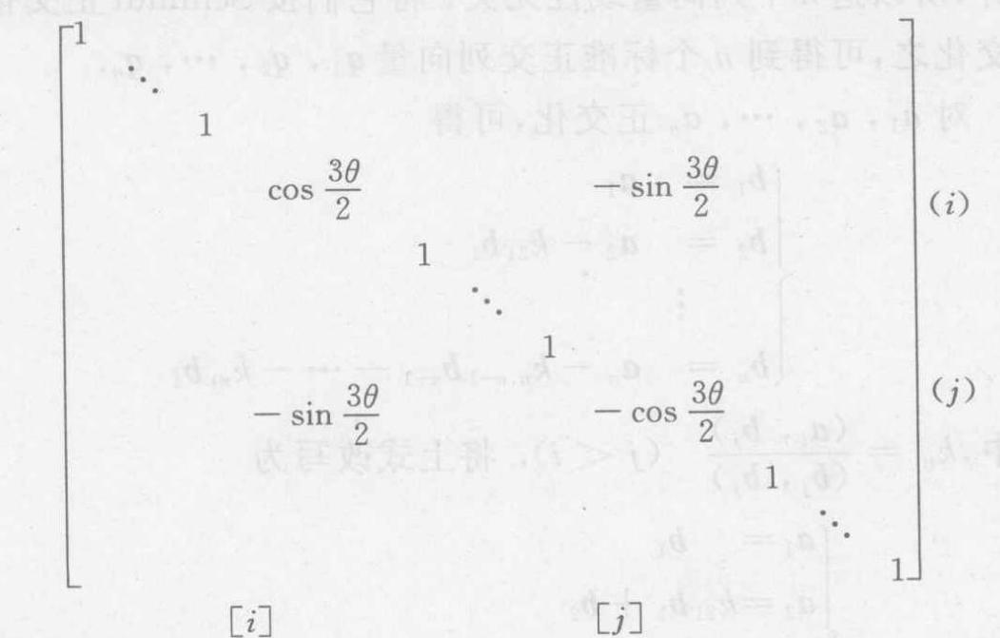

直接计算可得

$$
{\mathbf{T}}_{ij} = {\mathbf{H}}_{v}{\mathbf{H}}_{u}
$$

证毕

需要指出, 初等反射矩阵不能由若干个初等旋转矩阵的乘积表示,其原因是 $\det \mathbf{H} =  - 1$ ,而 $\det {\mathbf{T}}_{ij} = 1$ .

## 二、矩阵的 QR(正交三角) 分解

利用正交 (酉) 矩阵, 可以导出类似于定理 4.1 所论述的关于实(复)矩阵的三角分解定理. 首先给出下面的定义.

定义 4.6 如果实 (复) 非奇异矩阵 $\mathbf{A}$ 能够化成正交 (酉) 矩阵 $\mathbf{Q}$ 与实 (复) 非奇异上三角矩阵 $\mathbf{R}$ 的乘积,即

$$
\mathbf{A} = Q\mathbf{R} \tag{4.2.7}
$$

则称式(4.2.7) 为 $\mathbf{A}$ 的 QR 分解.

定理 4.6 设 $\mathbf{A}$ 是 $n$ 阶实(复) 非奇异矩阵,则存在正交 (酉) 矩阵 $Q$ 和实 (复) 非奇异上三角矩阵 $\mathbf{R}$ ,使 $\mathbf{A}$ 有 $\mathrm{{QR}}$ 分解式 (4.2.7); 且除去相差一个对角元素的绝对值(模)全等于 1 的对角矩阵因子外,分解式 (4.2.7) 是唯一的.

证 记矩阵 $\mathbf{A}$ 的 $n$ 个列向量依次为 ${\mathbf{a}}_{1},{\mathbf{a}}_{2},\cdots ,{\mathbf{a}}_{n}$ . 因为 $\mathbf{A}$ 非奇异，所以这 $n$ 个列向量线性无关. 将它们按 Schmidt 正交化方法正交化之,可得到 $n$ 个标准正交列向量 ${\mathbf{q}}_{1},{\mathbf{q}}_{2},\cdots ,{\mathbf{q}}_{n}$ .

对 ${a}_{1},{a}_{2},\cdots ,{a}_{n}$ 正交化,可得

$$
\begin{cases} {\mathbf{b}}_{1} &  = {\mathbf{a}}_{1} \\  {\mathbf{b}}_{2} &  = {\mathbf{a}}_{2} - {k}_{21}{\mathbf{b}}_{1} \\   & \vdots \\  {\mathbf{b}}_{n} &  = {\mathbf{a}}_{n} - {k}_{n, n - 1}{\mathbf{b}}_{n - 1} - \cdots  - {k}_{n1}{\mathbf{b}}_{1} \end{cases}
$$

其中, ${k}_{ij} = \frac{\left( {\mathbf{a}}_{i},{\mathbf{b}}_{j}\right) }{\left( {\mathbf{b}}_{j},{\mathbf{b}}_{j}\right) }\;\left( {j < i}\right)$ . 将上式改写为

$$
\begin{cases} {\mathbf{a}}_{1} &  = {\mathbf{b}}_{1} \\  {\mathbf{a}}_{2} &  = {k}_{21}{\mathbf{b}}_{1} + {\mathbf{b}}_{2} \\   & \vdots \\  {\mathbf{a}}_{n} &  = {k}_{n1}{\mathbf{b}}_{1} + {k}_{n2}{\mathbf{b}}_{2} + \cdots  + {k}_{n, n - 1}{\mathbf{b}}_{n - 1} + {\mathbf{b}}_{n} \end{cases}
$$

用矩阵形式表示为

$$
\left( {{\mathbf{a}}_{1},{\mathbf{a}}_{2},\cdots ,{\mathbf{a}}_{n}}\right)  = \left( {{\mathbf{b}}_{1},{\mathbf{b}}_{2},\cdots ,{\mathbf{b}}_{n}}\right) \mathbf{C}
$$

其中

$$
\mathbf{C} = \left\lbrack  \begin{matrix} 1 & {k}_{21} & \cdots & {k}_{n1} \\   & 1 & \cdots & {k}_{n2} \\   & &  \ddots  & \vdots \\   & & & 1 \end{matrix}\right\rbrack
$$

再对 ${\mathbf{b}}_{1},{\mathbf{b}}_{2},\cdots ,{\mathbf{b}}_{n}$ 单位化,可得

$$
{\mathbf{q}}_{i} = \frac{1}{\left| {\mathbf{b}}_{i}\right| }{\mathbf{b}}_{i}\;\left( {i = 1,2,\cdots , n}\right)
$$

于是有

$$
\left( {{\mathbf{a}}_{1},{\mathbf{a}}_{2},\cdots ,{\mathbf{a}}_{n}}\right)  = \left( {{\mathbf{b}}_{1},{\mathbf{b}}_{2},\cdots ,{\mathbf{b}}_{n}}\right) \mathbf{C} =
$$

$$
\left( {{\mathbf{q}}_{1},{\mathbf{q}}_{2},\cdots ,{\mathbf{q}}_{n}}\right) \left\lbrack  \begin{matrix} \left| {\mathbf{b}}_{1}\right| & & & & \\   & \left| {\mathbf{b}}_{2}\right| & & & \\   & &  \ddots  & & \\   & & &  \ddots  & \\   & & & & \left| {\mathbf{b}}_{n}\right|  \end{matrix}\right\rbrack  \mathbf{C}
$$

令

$$
\left. \begin{array}{l} \mathbf{Q} = \left( {{\mathbf{q}}_{1},{\mathbf{q}}_{2},\cdots ,{\mathbf{q}}_{n}}\right) \\  \mathbf{R} = \operatorname{diag}\left( {\left| {\mathbf{b}}_{1}\right| ,\left| {\mathbf{b}}_{2}\right| ,\cdots ,\left| {\mathbf{b}}_{n}\right| }\right)  \cdot  \mathbf{C} \end{array}\right\} \tag{4.2.8}
$$

则 $Q$ 是正交 (酉) 矩阵, $\mathbf{R}$ 是上三角矩阵,且有 $\mathbf{A} = \mathbf{{QR}}$ .

为了证明唯一性,设 $\mathbf{A}$ 有两个分解式

$$
\mathbf{A} = Q\mathbf{R} = {Q}_{1}{\mathbf{R}}_{1}
$$

由此得

$$
\mathbf{Q} = {\mathbf{Q}}_{1}{\mathbf{R}}_{1}{\mathbf{R}}^{-1} = {\mathbf{Q}}_{1}\mathbf{D}
$$

式中， $\mathbf{D} = {\mathbf{R}}_{1}{\mathbf{R}}^{-1}$ 仍为实非奇异上三角矩阵. 于是

$$
\mathbf{I} = {\mathbf{Q}}^{\mathrm{T}}\mathbf{Q} = {\left( {\mathbf{Q}}_{1}\mathbf{D}\right) }^{\mathrm{T}}\left( {{\mathbf{Q}}_{1}\mathbf{D}}\right)  = {\mathbf{D}}^{\mathrm{T}}\mathbf{D}
$$

这表明 $\mathbf{D}$ 不仅为正交矩阵,而且还是对角元素的绝对值全为 1 的对角矩阵. 从而 ${\mathbf{R}}_{1} = \mathbf{D}\mathbf{R},{\mathbf{Q}}_{1} = \mathbf{Q}{\mathbf{D}}^{-1}$ . 证毕

例 4.6 试用 Schmidt 正交化方法求矩阵

$$
\mathbf{A} = \left\lbrack  \begin{array}{lll} 1 & 2 & 2 \\  2 & 1 & 2 \\  1 & 2 & 1 \end{array}\right\rbrack
$$

的 QR 分解.

解 令 ${\mathbf{a}}_{1} = {\left( 1,2,1\right) }^{\mathrm{T}},{\mathbf{a}}_{2} = {\left( 2,1,2\right) }^{\mathrm{T}},{\mathbf{a}}_{3} = {\left( 2,2,1\right) }^{\mathrm{T}}$ , 正交化可得

$$
{\mathbf{b}}_{1} = {\mathbf{a}}_{1} = {\left( 1,2,1\right) }^{\mathrm{T}}
$$

$$
{\mathbf{b}}_{2} = {\mathbf{a}}_{2} - {\mathbf{b}}_{1} = {\left( 1, - 1,1\right) }^{\mathrm{T}}
$$

$$
{\mathbf{b}}_{3} = {\mathbf{a}}_{3} - \frac{1}{3}{\mathbf{b}}_{2} - \frac{7}{6}{\mathbf{b}}_{1} = {\left( \frac{1}{2},0, - \frac{1}{2}\right) }^{\mathrm{T}}
$$

根据式 (4.2.8) 构造矩阵

$$
\mathbf{Q} = \left\lbrack  \begin{matrix} \frac{1}{\sqrt{6}} & \frac{1}{\sqrt{3}} & \frac{1}{\sqrt{2}} \\  \frac{2}{\sqrt{6}} &  - \frac{1}{\sqrt{3}} & 0 \\  \frac{1}{\sqrt{6}} & \frac{1}{\sqrt{3}} &  - \frac{1}{\sqrt{2}} \end{matrix}\right\rbrack
$$

$$
\mathbf{R} = \left\lbrack  \begin{array}{lll} \sqrt{6} & & \\   & \sqrt{3} & \\   & & \frac{1}{\sqrt{2}} \end{array}\right\rbrack  \left\lbrack  \begin{array}{lll} 1 & 1 & \frac{7}{6} \\   & 1 & \frac{1}{3} \\   & & 1 \end{array}\right\rbrack   = \left\lbrack  \begin{array}{lll} \sqrt{6} & \sqrt{6} & \frac{7}{\sqrt{6}} \\   & \sqrt{3} & \frac{1}{\sqrt{3}} \\   & & \frac{1}{\sqrt{2}} \end{array}\right\rbrack
$$

则有 $\mathbf{A} = \mathbf{{QR}}$ .

定理 4.6 还可作如下的推广.

定理 4.7 设 $\mathbf{A}$ 是 $m \times  n$ 实 (复) 矩阵,且其 $n$ 个列线性无关, 则 $\mathbf{A}$ 有分解

$$
\mathbf{A} = Q\mathbf{R}
$$

其中, $\mathbf{Q}$ 是 $m \times  n$ 实(复)矩阵,且满足 ${\mathbf{Q}}^{\mathrm{T}}\mathbf{Q} = \mathbf{I}\left( {{\mathbf{Q}}^{\mathrm{H}}\mathbf{Q} = \mathbf{I}}\right) ,\mathbf{R}$ 是 $n$ 阶实(复)非奇异上三角矩阵. 该分解除去相差一个对角元素的绝对值(模) 全等于 1 的对角矩阵因子外是唯一的.

现在直接用 Givens 变换和 Householder 变换, 把满足式 (4.2.7) 的正交矩阵 $Q$ 具体构造出来.

定理 4.8 任何 $n$ 阶实非奇异矩阵 $\mathbf{A} = {\left( {a}_{ij}\right) }_{n \times  n}$ 可通过左连乘初等旋转矩阵化为非奇异上三角矩阵.

证 第 1 步: 由 $\det \mathbf{A} \neq  0$ 知, $\mathbf{A}$ 的第 1 列 ${\mathbf{b}}^{\left( 1\right) } = \left( {{a}_{11},{a}_{21},\cdots }\right.$ , ${\left. {a}_{n1}\right) }^{\mathrm{T}} \neq  \mathbf{0}$ . 根据定理 4.3,存在有限个 Givens 矩阵的乘积,记作 ${\mathbf{T}}_{1}$ ,使得

$$
{\mathbf{T}}_{1}{\mathbf{b}}^{\left( 1\right) } = \left| {\mathbf{b}}^{\left( 1\right) }\right| {\mathbf{e}}_{1}\;\left( {{\mathbf{e}}_{1} \in  {\mathbf{R}}^{n}}\right)
$$

令 ${a}_{11}^{\left( 1\right) } = \left| {\mathbf{b}}^{\left( 1\right) }\right|$ ,则有

$$
{\mathbf{T}}_{1}\mathbf{A} = \left\lbrack  \begin{matrix} {a}_{11}^{\left( 1\right) } & {a}_{12}^{\left( 1\right) } & \cdots & {a}_{1n}^{\left( 1\right) } \\  0 & \cdots & \cdots & \cdots \\  0 & & & \\  \vdots & & {\mathbf{A}}^{\left( 1\right) } & \\  0 & & &  \end{matrix}\right\rbrack
$$

第 2 步: 由 $\det {\mathbf{A}}^{\left( 1\right) } \neq  0$ 知, ${\mathbf{A}}^{\left( 1\right) }$ 的第 1 列 ${\mathbf{b}}^{\left( 2\right) } = \left( {{a}_{22}^{\left( 1\right) },{a}_{32}^{\left( 1\right) },\cdots }\right.$ , ${\left. {a}_{n2}^{\left( 1\right) }\right) }^{\mathrm{T}} \neq  \mathbf{0}$ . 根据定理 4.3,存在有限个 Givens 矩阵的乘积,记作 ${\mathbf{T}}_{2}$ ,使得

$$
{\mathbf{T}}_{2}{\mathbf{b}}^{\left( 2\right) } = \left| {\mathbf{b}}^{\left( 2\right) }\right| {\mathbf{e}}_{1}\;\left( {{\mathbf{e}}_{1} \in  {\mathbf{R}}^{n - 1}}\right)
$$

令 ${a}_{22}^{\left( 2\right) } = \left| {\mathbf{b}}^{\left( 2\right) }\right|$ ,则有

$$
{\mathbf{T}}_{2}{\mathbf{A}}^{\left( 1\right) } = \left\lbrack  \begin{matrix} {a}_{22}^{\left( 2\right) } & {a}_{23}^{\left( 2\right) } & \cdots & {a}_{2n}^{\left( 2\right) } \\  0 & & & \\  \vdots & & {\mathbf{A}}^{\left( 2\right) } & \\  \vdots & & & {\mathbf{A}}^{\left( 2\right) } \\  0 & & &  \end{matrix}\right\rbrack
$$

................

第 $n - 1$ 步: 由 $\det {\mathbf{A}}^{\left( n - 2\right) } \neq  0$ 知, ${\mathbf{A}}^{\left( n - 2\right) }$ 的第 1 列 ${\mathbf{b}}^{\left( n - 1\right) } = \; {\left( {a}_{n - 1, n - 1}^{\left( n - 2\right) },{a}_{n, n - 1}^{\left( n - 2\right) }\right) }^{\mathrm{T}} \neq  \mathbf{0}$ . 根据定理 4.3,存在 Givens 矩阵 ${\mathbf{T}}_{n - 1}$ ,使得

$$
{\mathbf{T}}_{n - 1}{\mathbf{b}}^{\left( n - 1\right) } = \left| {\mathbf{b}}^{\left( n - 1\right) }\right| {\mathbf{e}}_{1}\;\left( {{\mathbf{e}}_{1} \in  {\mathbf{R}}^{2}}\right)
$$

令 ${a}_{n - 1, n - 1}^{\left( n - 1\right) } = \left| {\mathbf{b}}^{\left( n - 1\right) }\right|$ ,则有

$$
{\mathbf{T}}_{n - 1}{\mathbf{A}}^{\left( n - 2\right) } = \left\lbrack  \begin{matrix} {a}_{n - 1, n - 1}^{\left( n - 1\right) } & {a}_{n - 1, n}^{\left( n - 1\right) } \\  0 & {a}_{nn}^{\left( n - 1\right) } \end{matrix}\right\rbrack
$$

最后, 令

$$
\mathbf{T} = \left\lbrack  \begin{matrix} {\mathbf{I}}_{n - 2} & \mathbf{O} \\  \mathbf{O} & {\mathbf{T}}_{n - 1} \end{matrix}\right\rbrack  \cdots \left\lbrack  \begin{matrix} {\mathbf{I}}_{2} & \mathbf{O} \\  \mathbf{O} & {\mathbf{T}}_{3} \end{matrix}\right\rbrack  \left\lbrack  \begin{matrix} 1 & \mathbf{O} \\  \mathbf{O} & {\mathbf{T}}_{2} \end{matrix}\right\rbrack  {\mathbf{T}}_{1}
$$

则 $\mathbf{T}$ 是有限个 Givens 矩阵的乘积 (读者自己验证),使得

$$
\mathbf{{TA}} = \left\lbrack  \begin{matrix} {a}_{11}^{\left( 1\right) } & {a}_{12}^{\left( 1\right) } & \cdots & {a}_{1, n - 1}^{\left( 1\right) } & {a}_{1n}^{\left( 1\right) } \\   & {a}_{22}^{\left( 2\right) } & \cdots & {a}_{2, n - 1}^{\left( 2\right) } & {a}_{2n}^{\left( 2\right) } \\   & &  \ddots  & \vdots & \vdots \\   & & & {a}_{n - 1, n - 1}^{\left( n - 1\right) } & {a}_{n - 1, n}^{\left( n - 1\right) } \\   & & & & {a}_{nn}^{\left( n - 1\right) } \end{matrix}\right\rbrack
$$

证毕

如果将定理 4.8 最后得到的上三角矩阵记为 $\mathbf{R}$ ,那么就有

$$
\mathbf{A} = Q\mathbf{R}
$$

其中, $\mathbf{Q} = {\mathbf{T}}^{-1}$ . 因为 $\mathbf{T}$ 是有限个 Givens 矩阵的乘积,而 Givens 矩阵都是正交矩阵,所以 $\mathbf{T}$ 是正交矩阵,于是 $\mathbf{Q} = {\mathbf{T}}^{-1} = {\mathbf{T}}^{\mathrm{T}}$ 也是正交矩阵.

例 4.7 用初等旋转变换求矩阵

$$
\mathbf{A} = \left\lbrack  \begin{array}{lll} 0 & 1 & 1 \\  1 & 1 & 0 \\  1 & 0 & 1 \end{array}\right\rbrack
$$

的 QR 分解.

解 第 1 步: 对 $\mathbf{A}$ 的第 1 列 ${\mathbf{b}}^{\left( 1\right) } = {\left( 0,1,1\right) }^{\mathrm{T}}$ 构造 ${\mathbf{T}}_{1}$ ,使 ${\mathbf{T}}_{1}{\mathbf{b}}^{\left( 1\right) } = \left| {\mathbf{b}}^{\left( 1\right) }\right| {\mathbf{e}}_{1}.$

$$
{\mathbf{T}}_{12} = \left\lbrack  \begin{array}{rrr} 0 & 1 & 0 \\   - 1 & 0 & 0 \\  0 & 0 & 1 \end{array}\right\rbrack  ,\;{\mathbf{T}}_{12}{\mathbf{b}}^{\left( 1\right) } = \left\lbrack  \begin{array}{l} 1 \\  0 \\  1 \end{array}\right\rbrack
$$

$$
{\mathbf{T}}_{13} = \left\lbrack  \begin{array}{rrr} \frac{1}{\sqrt{2}} & 0 & \frac{1}{\sqrt{2}} \\  0 & 1 & 0 \\   - \frac{1}{\sqrt{2}} & 0 & \frac{1}{\sqrt{2}} \end{array}\right\rbrack  ,\;{\mathbf{T}}_{13}\left( {{\mathbf{T}}_{12}{\mathbf{b}}^{\left( 1\right) }}\right)  = \left\lbrack  \begin{matrix} \sqrt{2} \\  0 \\  0 \end{matrix}\right\rbrack
$$

$$
{\mathbf{T}}_{1} = {\mathbf{T}}_{13}{\mathbf{T}}_{12} = \left\lbrack  \begin{array}{rrr} 0 & \frac{1}{\sqrt{2}} & \frac{1}{\sqrt{2}} \\   - 1 & 0 & 0 \\  0 &  - \frac{1}{\sqrt{2}} & \frac{1}{\sqrt{2}} \end{array}\right\rbrack
$$

$$
{\mathbf{T}}_{1}\mathbf{A} = \left\lbrack  \begin{matrix} \sqrt{2} & \frac{1}{\sqrt{2}} & \frac{1}{\sqrt{2}} \\  0 &  - 1 &  - 1 \\  0 &  - \frac{1}{\sqrt{2}} & \frac{1}{\sqrt{2}} \end{matrix}\right\rbrack
$$

第 2 步: 对 ${\mathbf{A}}^{\left( 1\right) } = \left( \begin{matrix}  - 1 &  - 1 \\   - \frac{1}{\sqrt{2}} & \frac{1}{\sqrt{2}} \end{matrix}\right)$ 的第 1 列 ${\mathbf{b}}^{\left( 2\right) } = \left\lbrack  \begin{array}{r}  - 1 \\   - \frac{1}{\sqrt{2}} \end{array}\right\rbrack$ 构造

${\mathbf{T}}_{2}$ ,使 ${\mathbf{T}}_{2}{\mathbf{b}}^{\left( 2\right) } = \left| {\mathbf{b}}^{\left( 2\right) }\right| {\mathbf{e}}_{1}$ .

$$
{\mathbf{T}}_{12} = \left\lbrack  \begin{matrix}  - \sqrt{\frac{2}{3}} &  - \frac{1}{\sqrt{3}} \\  \frac{1}{\sqrt{3}} &  - \sqrt{\frac{2}{3}} \end{matrix}\right\rbrack  ,\;{\mathbf{T}}_{12}{\mathbf{b}}^{\left( 2\right) } = \left\lbrack  \begin{matrix} \sqrt{\frac{3}{2}} \\  0 \\  0 \end{matrix}\right\rbrack
$$

$$
{\mathbf{T}}_{2} = {\mathbf{T}}_{12},\;{\mathbf{T}}_{2}{\mathbf{A}}^{\left( 1\right) } = \left\lbrack  \begin{matrix} \sqrt{\frac{3}{2}} & \frac{1}{\sqrt{6}} \\  0 &  - \frac{2}{\sqrt{3}} \end{matrix}\right\rbrack
$$

最后, 令

$$
\mathbf{T} = \left\lbrack  \begin{array}{ll} 1 & \\   & {\mathbf{T}}_{2} \end{array}\right\rbrack  {\mathbf{T}}_{1} = \left\lbrack  \begin{matrix} 0 & \frac{1}{\sqrt{2}} & \frac{1}{\sqrt{2}} \\  \frac{2}{\sqrt{6}} & \frac{1}{\sqrt{6}} &  - \frac{1}{\sqrt{6}} \\   - \frac{1}{\sqrt{3}} & \frac{1}{\sqrt{3}} &  - \frac{1}{\sqrt{3}} \end{matrix}\right\rbrack
$$

则有

$$
\mathbf{Q} = {\mathbf{T}}^{\mathrm{T}} = \left\lbrack  \begin{array}{rrr} 0 & \frac{2}{\sqrt{6}} &  - \frac{1}{\sqrt{3}} \\  \frac{1}{\sqrt{2}} & \frac{1}{\sqrt{6}} & \frac{1}{\sqrt{3}} \\  \frac{1}{\sqrt{2}} &  - \frac{1}{\sqrt{6}} &  - \frac{1}{\sqrt{3}} \end{array}\right\rbrack
$$

$$
\mathbf{R} = \left\lbrack  \begin{array}{rrr} \sqrt{2} & \frac{1}{\sqrt{2}} & \frac{1}{\sqrt{2}} \\   & 3 & \frac{1}{\sqrt{6}} \\   & &  - \frac{2}{\sqrt{3}} \end{array}\right\rbrack
$$

$$
\mathbf{A} = Q\mathbf{R}
$$

需要指出,使用 Givens 变换求 $n$ 阶矩阵 $\mathbf{A}$ 的 QR 分解时,上三角矩阵 $\mathbf{R}$ 的第 1 行元素与 ${\mathbf{T}}_{1}\mathbf{A}$ 的第 1 行元素相同, $\mathbf{R}$ 的第 2 行后 $n - 1$ 个元素与 ${\mathbf{T}}_{2}{\mathbf{A}}^{\left( 1\right) }$ 的第 1 行元素相同 $\cdots \cdots \mathbf{R}$ 的第 $n - 1$ 行后两个元素与 ${\mathbf{T}}_{n - 1}{\mathbf{A}}^{\left( n - 2\right) }$ 的第 1 行元素相同,而 $\mathbf{R}$ 的第 $n$ 行最后一个元素与 ${\mathbf{T}}_{n - 1}{\mathbf{A}}^{\left( n - 2\right) }$ 的第 2 行最后一个元素相同. 此外, ${\mathbf{T}}_{1}\mathbf{A}$ 的第 1 列一定是 ${\left( \left| {\mathbf{b}}^{\left( 1\right) }\right| ,0,\cdots ,0\right) }^{\mathrm{T}}$ ,作矩阵乘法时应避免重复计数. 其余也是如此.

定理 4.8 还可以推广到复矩阵的情况. 为此作复初等旋转矩阵

$\left\lbrack  k\right\rbrack$

其中, $c = \cos \theta  > 0, s = \sin \theta  > 0,\theta$ 为旋转角,且 ${c}^{2} + {s}^{2} = 1,{\theta }_{1} + \; {\theta }_{4} = {\theta }_{2} + {\theta }_{3} \cdot  {U}_{ik}$ 的行列式等于 ${\mathrm{e}}^{\mathrm{j}\left( {{\theta }_{1} + {\theta }_{4}}\right) }$ ,只有当 ${\theta }_{4} =  - {\theta }_{1} + {2n\pi }$ 时, 它才等于 1,这时 ${\theta }_{3} =  - {\theta }_{2} + {2n\pi }$ ,这里 $n$ 为整数.

容易验证 ${\mathbf{U}}_{ik}^{\mathrm{H}}{\mathbf{U}}_{ik} = \mathbf{I}$ ,即 ${\mathbf{U}}_{ik}$ 是酉矩阵. 当取 $n = 0$ 时,则 ${\mathbf{U}}_{ik}$ 成为

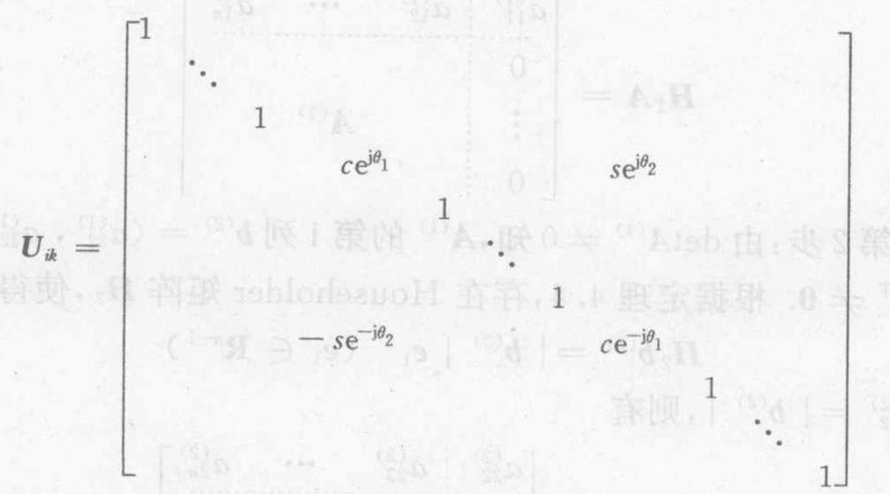

(4.2.9)

如果给定两个不同时为零的复数 $\alpha ,\beta$ ,则总可以选取 $c, s,{\theta }_{1}$ , ${\theta }_{2}$ ,使得

$$
{\alpha c}{\mathrm{e}}^{\mathrm{j}{\theta }_{1}} + {\beta s}{\mathrm{e}}^{\mathrm{j}{\theta }_{2}} > 0,\; - {\alpha s}{\mathrm{e}}^{-\mathrm{j}{\theta }_{2}} + {\beta c}{\mathrm{e}}^{-\mathrm{j}{\theta }_{1}} = 0
$$

为此只要选取

$$
\left. \begin{array}{ll} c = \frac{\left| \alpha \right| }{\sqrt{{\left| \alpha \right| }^{2} + {\left| \beta \right| }^{2}}}, & s = \frac{\left| \beta \right| }{\sqrt{{\left| \alpha \right| }^{2} + {\left| \beta \right| }^{2}}} \\  {\theta }_{1} =  - \arg \alpha , & {\theta }_{2} =  - \arg \beta  \end{array}\right\} \tag{4.2.10}
$$

利用这个方法, 可以像证明定理 4.8 一样证明下面的定理.

定理 4.9 任意矩阵都可以通过左连乘以若干个行列式值为 1 的复初等旋转矩阵化为上三角矩阵, 且其对角线元素除最后一个外都是正的.

下面论述将矩阵进行 QR 分解的所谓 Householder 方法 .

定理 4.10 任何实非奇异矩阵 $\mathbf{A} = {\left( {a}_{ij}\right) }_{n \times  n}$ 可通过左连乘 Householder 矩阵化为非奇异上三角矩阵.

证 第 1 步: 由 $\det \mathbf{A} \neq  0$ 知, $\mathbf{A}$ 的第 1 列 ${\mathbf{b}}^{\left( 1\right) } = \left( {{a}_{11},{a}_{21},\cdots }\right.$ , ${\left. {a}_{n1}\right) }^{\mathrm{T}} \neq  \mathbf{0}$ . 根据定理 4.4,存在 Householder 矩阵 ${\mathbf{H}}_{1}$ ,使得

$$
{\mathbf{H}}_{1}{\mathbf{b}}^{\left( 1\right) } = \left| {\mathbf{b}}^{\left( 1\right) }\right| {\mathbf{e}}_{1}\;\left( {{\mathbf{e}}_{1} \in  {\mathbf{R}}^{n}}\right)
$$

令 ${a}_{11}^{\left( 1\right) } = \left| {\mathbf{b}}^{\left( 1\right) }\right|$ ,则有

$$
{\mathbf{H}}_{1}\mathbf{A} = \left\lbrack  \begin{matrix} {a}_{11}^{\left( 1\right) } & {a}_{12}^{\left( 1\right) } & \cdots & {a}_{1n}^{\left( 1\right) } \\  0 & & & \\  \vdots & & {\mathbf{A}}^{\left( 1\right) } & \\  \vdots & & & \\  0 & & &  \end{matrix}\right\rbrack
$$

第 2 步: 由 $\det {\mathbf{A}}^{\left( 1\right) } \neq  0$ 知, ${\mathbf{A}}^{\left( 1\right) }$ 的第 1 列 ${\mathbf{b}}^{\left( 2\right) } = \left( {{a}_{22}^{\left( 1\right) },{a}_{32}^{\left( 1\right) },\cdots }\right.$ , ${\left. {a}_{n2}^{\left( 1\right) }\right) }^{\mathrm{T}} \neq  \mathbf{0}$ . 根据定理 4.4,存在 Householder 矩阵 ${\mathbf{H}}_{2}$ ,使得

$$
{\mathbf{H}}_{2}{\mathbf{b}}^{\left( 2\right) } = \left| {\mathbf{b}}^{\left( 2\right) }\right| {\mathbf{e}}_{1}\;\left( {{\mathbf{e}}_{1} \in  {\mathbf{R}}^{n - 1}}\right)
$$

令 ${a}_{22}^{\left( 2\right) } = \left| {\mathbf{b}}^{\left( 2\right) }\right|$ ,则有

$$
{\mathbf{H}}_{2}{\mathbf{A}}^{\left( 1\right) } = \left\lbrack  \begin{matrix} {a}_{22}^{\left( 2\right) } & {a}_{23}^{\left( 2\right) } & \cdots & {a}_{2n}^{\left( 2\right) } \\  0 & & & \\  \vdots & & {\mathbf{A}}^{\left( 2\right) } & \\  \vdots & & & \\  0 & & &  \end{matrix}\right\rbrack
$$

................

第 $n - 1$ 步: 由 $\det {\mathbf{A}}^{\left( n - 2\right) } \neq  0$ 知, ${\mathbf{A}}^{\left( n - 2\right) }$ 的第 1 列 ${\mathbf{b}}^{\left( n - 1\right) } =$

${\left( {a}_{n - 1, n - 1}^{\left( n - 2\right) },{a}_{n, n - 1}^{\left( n - 2\right) }\right) }^{\mathrm{T}} \neq  \mathbf{0}$ . 根据定理 4.4,存在 Householder 矩阵 ${\mathbf{H}}_{n - 1}$ ,使得

$$
{\mathbf{H}}_{n - 1}{\mathbf{b}}^{\left( n - 1\right) } = \left| {\mathbf{b}}^{\left( n - 1\right) }\right| {\mathbf{e}}_{1}\;\left( {{\mathbf{e}}_{1} \in  {\mathbb{R}}^{2}}\right)
$$

令 ${a}_{n - 1, n - 1}^{\left( n - 1\right) } = \left| {\mathbf{b}}^{\left( n - 1\right) }\right|$ ,则有

$$
{\mathbf{H}}_{n - 1}{\mathbf{A}}^{\left( n - 2\right) } = \left\lbrack  \begin{matrix} {a}_{n - 1, n - 1}^{\left( n - 1\right) } & {a}_{n - 1, n}^{\left( n - 1\right) } \\  0 & {a}_{m}^{\left( n - 1\right) } \end{matrix}\right\rbrack
$$

最后, 令

$$
\mathbf{S} = \left\lbrack  \begin{matrix} {\mathbf{I}}_{n - 2} & \mathbf{O} \\  \mathbf{O} & {\mathbf{H}}_{n - 1} \end{matrix}\right\rbrack  \cdots \left\lbrack  \begin{matrix} {\mathbf{I}}_{2} & \mathbf{O} \\  \mathbf{O} & {\mathbf{H}}_{3} \end{matrix}\right\rbrack  \left\lbrack  \begin{matrix} 1 & \mathbf{O} \\  \mathbf{O} & {\mathbf{H}}_{2} \end{matrix}\right\rbrack  {\mathbf{H}}_{1}
$$

并注意到,若 ${\mathbf{H}}_{u}$ 是 $n - l$ 阶 Householder 矩阵,即

$$
{\mathbf{H}}_{u} = {\mathbf{I}}_{n - l} - 2\mathbf{u}{\mathbf{u}}^{\mathrm{T}}\;\left( {\mathbf{u} \in  {\mathbf{R}}^{n - l},\;{\mathbf{u}}^{\mathrm{T}}\mathbf{u} = 1}\right)
$$

则

$$
\left\lbrack  \begin{array}{ll} {\mathbf{I}}_{l} & \mathbf{O} \\  \mathbf{O} & {\mathbf{H}}_{u} \end{array}\right\rbrack   = \left\lbrack  \begin{matrix} {\mathbf{I}}_{l} & \mathbf{O} \\  \mathbf{O} & {\mathbf{I}}_{n - l} \end{matrix}\right\rbrack   - 2\left\lbrack  \begin{array}{ll} \mathbf{O} & \mathbf{O} \\  \mathbf{O} & \mathbf{u}{\mathbf{u}}^{\mathrm{T}} \end{array}\right\rbrack   =
$$

$$
{\mathbf{I}}_{n} - 2\left\lbrack  \begin{array}{l} \mathbf{0} \\  \mathbf{u} \end{array}\right\rbrack  \left\lbrack  {{\mathbf{0}}^{\mathrm{T}}\vdots {\mathbf{u}}^{\mathrm{T}}}\right\rbrack   = {\mathbf{I}}_{n} - 2{\mathbf{w}}^{\mathrm{T}}
$$

$$
\left( {\mathbf{v} \in  {\mathbf{R}}^{n},{\mathbf{v}}^{\mathrm{T}}\mathbf{v} = {\mathbf{u}}^{\mathrm{T}}\mathbf{u} = 1}\right)
$$

是 $n$ 阶 Householder 矩阵. 因此, $S$ 是有限个 Householder 矩阵的乘积, 且使得

$$
\mathbf{{SA}} = \left\lbrack  \begin{matrix} {a}_{11}^{\left( 1\right) } & {a}_{12}^{\left( 1\right) } & \cdots & {a}_{1, n - 1}^{\left( 1\right) } & {a}_{1n}^{\left( 1\right) } \\   & {a}_{22}^{\left( 2\right) } & \cdots & {a}_{2, n - 1}^{\left( 2\right) } & {a}_{2n}^{\left( 2\right) } \\   & &  \ddots  & \vdots & \vdots \\   & & & {a}_{n - 1, n - 1}^{\left( n - 1\right) } & {a}_{n - 1, n}^{\left( n - 1\right) } \\   & & & & {a}_{nn}^{\left( n - 1\right) } \end{matrix}\right\rbrack
$$

证毕

如果将定理 4.10 最后得到的上三角矩阵记为 $\mathbf{R}$ ,那么就有

$$
\mathbf{A} = Q\mathbf{R}
$$

其中, $Q = {S}^{-1}$ . 因为 $S$ 是有限个 Householder 矩阵的乘积,而 Householder 矩阵都是正交矩阵,所以 $\mathbf{S}$ 是正交矩阵,于是 $\mathbf{Q} = \; {\mathbf{S}}^{-1} = {\mathbf{S}}^{\mathrm{T}}$ 也是正交矩阵. 这里, $\mathbf{R}$ 的构成规律与 Givens 变换中 $\mathbf{R}$ 的构成规律相同.

例 4.8 用 Householder 变换求矩阵

$$
\mathbf{A} = \left\lbrack  \begin{matrix} 3 & {14} & 9 \\  6 & {43} & 3 \\  6 & {22} & {15} \end{matrix}\right\rbrack
$$

的 QR 分解.

解 对 $\mathbf{A}$ 的第 1 列,构造 Householder 矩阵如下:

$$
{\mathbf{b}}^{\left( 1\right) } = \left\lbrack  \begin{array}{l} 3 \\  6 \\  6 \end{array}\right\rbrack  ,{\mathbf{b}}^{\left( 1\right) } - \left| {\mathbf{b}}^{\left( 1\right) }\right| {\mathbf{e}}_{1} = 6\left\lbrack  \begin{array}{r}  - 1 \\  1 \\  1 \end{array}\right\rbrack  ,\mathbf{u} = \frac{1}{\sqrt{3}}\left\lbrack  \begin{array}{r}  - 1 \\  1 \\  1 \end{array}\right\rbrack
$$

$$
{\mathbf{H}}_{1} = \mathbf{I} - 2\mathbf{u}{\mathbf{u}}^{\mathrm{T}} = \frac{1}{3}\left\lbrack  \begin{array}{rrr} 1 & 2 & 2 \\  2 & 1 &  - 2 \\  2 &  - 2 & 1 \end{array}\right\rbrack
$$

$$
{\mathbf{H}}_{1}\mathbf{A} = \left\lbrack  \begin{array}{rrr} 9 & {48} & {15} \\  0 & 9 &  - 3 \\  0 &  - {12} & 9 \end{array}\right\rbrack
$$

对 ${\mathbf{A}}^{\left( 1\right) } = \left\lbrack  \begin{array}{rr} 9 &  - 3 \\   - {12} & 9 \end{array}\right\rbrack$ 的第 1 列,构造 Householder 矩阵如下:

$$
{\mathbf{b}}^{\left( 2\right) } = \left\lbrack  \begin{array}{r} 9 \\   - {12} \end{array}\right\rbrack  ,{\mathbf{b}}^{\left( 2\right) } - \left| {\mathbf{b}}^{\left( 2\right) }\right| {\mathbf{e}}_{1} = 6\left\lbrack  \begin{array}{l}  - 1 \\   - 2 \end{array}\right\rbrack  ,\mathbf{u} = \frac{1}{\sqrt{5}}\left\lbrack  \begin{array}{l}  - 1 \\   - 2 \end{array}\right\rbrack
$$

$$
{\mathbf{H}}_{2} = \mathbf{I} - 2\mathbf{u}{\mathbf{u}}^{\mathrm{T}} = \frac{1}{5}\left\lbrack  \begin{array}{rr} 3 &  - 4 \\   - 4 &  - 3 \end{array}\right\rbrack
$$

$$
{\mathbf{H}}_{2}{\mathbf{A}}^{\left( 1\right) } = \left\lbrack  \begin{matrix} {15} &  - 9 \\  0 &  - 3 \end{matrix}\right\rbrack
$$

最后, 令

$$
\mathbf{S} = \left\lbrack  \begin{array}{ll} 1 & \\   & {\mathbf{H}}_{2} \end{array}\right\rbrack  {\mathbf{H}}_{1} = \frac{1}{15}\left\lbrack  \begin{matrix} 5 & {10} & {10} \\   - 2 & {11} &  - {10} \\   - {14} & 2 & 5 \end{matrix}\right\rbrack
$$

则有

$$
\mathbf{Q} = {\mathbf{S}}^{\mathrm{T}} = \frac{1}{15}\left\lbrack  \begin{array}{rrr} 5 &  - 2 &  - {14} \\  {10} & {11} & 2 \\  {10} &  - {10} & 5 \end{array}\right\rbrack
$$

$$
\mathbf{R} = \left\lbrack  \begin{array}{rrr} 9 & {48} & {15} \\  {15} &  - 9 & 1 \\   &  - 3 & 9 \end{array}\right\rbrack  ,\;\mathbf{A} = \mathbf{{QR}}
$$

## * 三、矩阵与 Hessenberg 矩阵的正交相似问题

矩阵与 Hessenberg 矩阵的相似问题, 在矩阵特征值问题研究中有重要应用 ${}^{\left\lbrack  {22}\right\rbrack  }$ .

定义 4.7 如果矩阵 $\mathbf{A} = {\left( {a}_{ij}\right) }_{n \times  n}$ 的元素满足 ${a}_{ij} = 0(i > \; j + 1)$ ,即

$$
\mathbf{A} = \left\lbrack  \begin{matrix} {a}_{11} & {a}_{12} & {a}_{13} & \cdots & {a}_{1, n - 1} & {a}_{1n} \\  {a}_{21} & {a}_{22} & {a}_{23} & \cdots & {a}_{2, n - 1} & {a}_{2n} \\   & {a}_{32} & {a}_{33} & \cdots & {a}_{3, n - 1} & {a}_{3n} \\   & &  \ddots  &  \ddots  & \vdots & \vdots \\   & & & {a}_{n - 1, n - 2} & {a}_{n - 1, n - 1} & {a}_{n - 1, n} \\   & & & & {a}_{n, n - 1} & {a}_{n} \end{matrix}\right\rbrack
$$

(4.2.11)则称 $\mathbf{A}$ 为上 Hessenberg 矩阵; 如果 $\mathbf{A}$ 的元素满足 ${a}_{ij} = 0(j > i +$ 1), 即

$$
\mathbf{A} = \left\lbrack  \begin{matrix} {a}_{11} & {a}_{12} & & & \\  {a}_{21} & {a}_{22} & {a}_{23} & & \\  \vdots & \vdots &  \ddots  &  \ddots  & \\  {a}_{n - 1,1} & {a}_{n - 1,2} & \cdots & {a}_{n - 1, n - 1} & {a}_{n - 1, n} \\  {a}_{n1} & {a}_{n2} & \cdots & {a}_{n, n - 1} & {a}_{m} \end{matrix}\right\rbrack \tag{4.2.12}
$$

则称 $\mathbf{A}$ 为下 Hessenberg 矩阵. 既是上 Hessenberg 又是下 Hessenberg 的矩阵称为三对角矩阵.

若能使矩阵 $\mathbf{A}$ 相似于上 Hessenberg 矩阵,那么,通过使 ${\mathbf{A}}^{\mathrm{T}}$ 相似于上 Hessenberg 矩阵,就可使 $\mathbf{A}$ 相似于下 Hessenberg 矩阵. 因此, 下面仅讨论矩阵与上 Hessenberg 矩阵的正交相似问题 (或者说:化矩阵与上 Hessenberg 矩阵的正交相似问题).

定理 4.11 任何实方阵 $\mathbf{A}$ 都可通过初等旋转变换正交相似于上 Hessenberg 矩阵.

证 第 1 步:对于 $\mathbf{A} = {\left( {a}_{ij}\right) }_{n \times  n}$ ,记第 1 列的后 $n - 1$ 个元素构成的向量为 ${\mathbf{b}}^{\left( 1\right) }$ ,即

$$
{\mathbf{b}}^{\left( 1\right) } = {\left( {a}_{21},{a}_{31},\cdots ,{a}_{n1}\right) }^{\mathrm{T}}
$$

当 ${\mathbf{b}}^{\left( 1\right) } = \mathbf{0}$ 时,不必进行变换; 当 ${\mathbf{b}}^{\left( 1\right) } \neq  \mathbf{0}$ 时,根据定理 4.3,存在有限个 Givens 矩阵的乘积,记作 ${\mathbf{T}}_{1}$ ,使得

$$
{\mathbf{T}}_{1}{\mathbf{b}}^{\left( 1\right) } = \left| {\mathbf{b}}^{\left( 1\right) }\right| {\mathbf{e}}_{1}\;\left( {{\mathbf{e}}_{1} \in  {\mathbf{R}}^{n - 1}}\right)
$$

令 ${a}_{21}^{\left( 1\right) } = \left| {\mathbf{b}}^{\left( 1\right) }\right|$ ,则有

$$
\left\lbrack  \begin{array}{ll} 1 & {\mathbf{0}}^{\mathrm{T}} \\  \mathbf{0} & {\mathbf{T}}_{1} \end{array}\right\rbrack  \mathbf{A}{\left\lbrack  \begin{array}{ll} 1 & {\mathbf{0}}^{\mathrm{T}} \\  \mathbf{0} & {\mathbf{T}}_{1} \end{array}\right\rbrack  }^{\mathrm{T}} = \left\lbrack  \begin{matrix} {a}_{11} & {a}_{12}^{\left( 1\right) } & {a}_{13}^{\left( 1\right) } & \cdots & {a}_{1n}^{\left( 1\right) } \\  {a}_{21}^{\left( 1\right) } & & & & \\  0 & & & & \\  \vdots & & & & \\  0 & & & & \\  \vdots & & & & {\mathbf{A}}^{\left( 1\right) } \end{matrix}\right\rbrack
$$

第 2 步:对于 ${\mathbf{A}}^{\left( 1\right) }$ ，记第 1 列的后 $n - 2$ 个元素构成的向量为 ${\mathbf{b}}^{\left( 2\right) }$ ,即

$$
{\mathbf{b}}^{\left( 2\right) } = {\left( {a}_{32}^{\left( 1\right) },{a}_{42}^{\left( 1\right) },\cdots ,{a}_{n2}^{\left( 1\right) }\right) }^{\mathrm{T}}
$$

当 ${\mathbf{b}}^{\left( 2\right) } = \mathbf{0}$ 时,不必进行变换; 当 ${\mathbf{b}}^{\left( 2\right) } \neq  \mathbf{0}$ 时,根据定理 4.3,存在有限个 Givens 矩阵的乘积,记作 ${\mathbf{T}}_{2}$ ,使得

$$
{\mathbf{T}}_{2}{\mathbf{b}}^{\left( 2\right) } = \left| {\mathbf{b}}^{\left( 2\right) }\right| {\mathbf{e}}_{1}\;\left( {{\mathbf{e}}_{1} \in  {\mathbf{R}}^{n - 2}}\right)
$$

令 ${a}_{32}^{\left( 2\right) } = \left| {\mathbf{b}}^{\left( 2\right) }\right|$ ,则有

$$
\left\lbrack  \begin{array}{ll} 1 & {\mathbf{0}}^{\mathrm{T}} \\  \mathbf{0} & {\mathbf{T}}_{2} \end{array}\right\rbrack  {\mathbf{A}}^{\left( 1\right) }{\left\lbrack  \begin{array}{ll} 1 & {\mathbf{0}}^{\mathrm{T}} \\  \mathbf{0} & {\mathbf{T}}_{2} \end{array}\right\rbrack  }^{\mathrm{T}} = \left\lbrack  \begin{matrix} {a}_{22}^{\left( 1\right) } & {a}_{23}^{\left( 2\right) } & \cdots & {a}_{2n}^{\left( 2\right) } \\  {a}_{32}^{\left( 2\right) } & & & \\  0 & & & \\  \vdots & & & \\  0 & & & \\  \vdots & & & \\  0 & & &  \end{matrix}\right\rbrack  .
$$

如此继续下去,直到第 $n - 2$ 步: 对于 ${\mathbf{A}}^{\left( n - 3\right) }$ ,记第 1 列的后两个元素构成的向量为 ${\mathbf{b}}^{\left( n - 2\right) }$ ,即

$$
{\mathbf{b}}^{\left( n - 2\right) } = {\left( {a}_{n - 1, n - 2}^{\left( n - 3\right) },{a}_{n, n - 2}^{\left( n - 3\right) }\right) }^{\mathrm{T}}
$$

当 ${\mathbf{b}}^{\left( n - 2\right) } = \mathbf{0}$ 时,不必进行变换; 当 ${\mathbf{b}}^{\left( n - 2\right) } \neq  \mathbf{0}$ 时,根据定理 4.3,存在 Givens 矩阵 ${\mathbf{T}}_{n - 2}$ ,使得

$$
{\mathbf{T}}_{n - 2}{\mathbf{b}}^{\left( n - 2\right) } = \left| {\mathbf{b}}^{\left( n - 2\right) }\right| {\mathbf{e}}_{1}\;\left( {{\mathbf{e}}_{1} \in  {\mathbf{R}}^{2}}\right)
$$

令 ${a}_{n - 1, n - 2}^{\left( n - 2\right) } = \left| {\mathbf{b}}^{\left( n - 2\right) }\right|$ ,则有

$$
\left\lbrack  \begin{matrix} 1 & {\mathbf{0}}^{\mathrm{T}} \\  \mathbf{0} & {\mathbf{T}}_{n - 2} \end{matrix}\right\rbrack  {\mathbf{A}}^{\left( n - 3\right) }{\left\lbrack  \begin{matrix} 1 & {\mathbf{0}}^{\mathrm{T}} \\  \mathbf{0} & {\mathbf{T}}_{n - 2} \end{matrix}\right\rbrack  }^{\mathrm{T}} = \left\lbrack  \begin{matrix} {a}_{n - 2, n - 2}^{\left( n - 3\right) } & {a}_{n - 2, n - 1}^{\left( n - 2\right) } & {a}_{n - 2, n}^{\left( n - 2\right) } \\  {a}_{n - 1, n - 2}^{\left( n - 2\right) } & {a}_{n - 1, n - 1}^{\left( n - 2\right) } & {a}_{n - 1, n}^{\left( n - 2\right) } \\  0 & {a}_{n, n - 1}^{\left( n - 2\right) } & {a}_{nn}^{\left( n - 2\right) } \end{matrix}\right\rbrack
$$

最后, 令

$$
\mathbf{Q} = \left\lbrack  \begin{matrix} {\mathbf{I}}_{n - 2} & \mathbf{O} \\  \mathbf{O} & {\mathbf{T}}_{n - 2} \end{matrix}\right\rbrack  \cdots \left\lbrack  \begin{matrix} {\mathbf{I}}_{2} & \mathbf{O} \\  \mathbf{O} & {\mathbf{T}}_{2} \end{matrix}\right\rbrack  \left\lbrack  \begin{array}{ll} 1 & \mathbf{O} \\  \mathbf{O} & {\mathbf{T}}_{1} \end{array}\right\rbrack
$$

则 $Q$ 是有限个 Givens 矩阵的乘积,从而是正交矩阵. 根据分块矩阵的乘法规则,可得

$$
{QA}{Q}^{\mathrm{T}} = \left\lbrack  \begin{matrix} {a}_{11} & {a}_{12}^{\left( 1\right) } &  * & \cdots &  * &  * \\  {a}_{21}^{\left( 1\right) } & {a}_{22}^{\left( 1\right) } & {a}_{23}^{\left( 2\right) } & \cdots &  * &  * \\   & {a}_{32}^{\left( 2\right) } & {a}_{33}^{\left( 2\right) } & \cdots &  * &  * \\   & &  \ddots  &  \ddots  & \vdots & \vdots \\   & & & {a}_{n - 1, n - 2}^{\left( n - 2\right) } & {a}_{n - 1, n - 1}^{\left( n - 2\right) } & {a}_{n - 1, n}^{\left( n - 2\right) } \\   & & & & {a}_{nn}^{\left( n - 2\right) } & {a}_{nn}^{\left( n - 2\right) } \end{matrix}\right\rbrack
$$

上式右端矩阵中的第 $i$ 行第 $j$ 列 $\left( {j > i + 1}\right)$ 的元素需要通过矩阵乘法运算来确定. 证毕

定理 4.12 任何实方阵 $\mathbf{A}$ 都可通过初等反射变换正交相似于上 Hessenberg 矩阵.

证明过程与定理 4.11 相仿, 这里略去.

推论 任何实对称矩阵 $\mathbf{A}$ 都可通过初等旋转变换 (或初等反射变换) 正交相似于实对称三对角矩阵.

证 由定理 4.11 (或定理 4.12) 知,存在正交矩阵 $\mathbf{Q}$ (有限个 Givens 矩阵的乘积, 或有限个 Householder 矩阵的乘积), 使得

$$
\mathbf{{QA}}{\mathbf{Q}}^{\mathrm{T}} = \mathbf{B}\text{ (上 Hessenberg 矩阵) }
$$

上式两端取转置,并注意 ${\mathbf{A}}^{\mathrm{T}} = \mathbf{A}$ ,便有

$$
{QA}{Q}^{\mathrm{T}} = {B}^{\mathrm{T}}
$$

因此 ${\mathbf{B}}^{\mathrm{T}} = \mathbf{B}$ ,从而 $\mathbf{B}$ 的第 $i$ 行第 $j$ 列 $\left( {j > i + 1}\right)$ 的元素都为零,即 $\mathbf{B}$ 是三对角矩阵. 再由 ${\mathbf{B}}^{\mathrm{T}} = \mathbf{B}$ 知, $\mathbf{B}$ 是对称的三对角矩阵. 证毕

例 4.9 用 Householder 变换化实对称矩阵

$$
\mathbf{A} = \left\lbrack  \begin{array}{lll} 1 & 0 & 1 \\  0 & 1 & 2 \\  1 & 2 & 1 \end{array}\right\rbrack
$$

正交相似于三对角矩阵.

解 对 ${\mathbf{b}}^{\left( 1\right) } = \left\lbrack  \begin{array}{l} 0 \\  1 \end{array}\right\rbrack$ ,计算

$$
{\mathbf{b}}^{\left( 1\right) } - \left| {\mathbf{b}}^{\left( 1\right) }\right| {\mathbf{e}}_{1} = \left\lbrack  \begin{array}{r}  - 1 \\  1 \end{array}\right\rbrack  ,\;\mathbf{u} = \frac{1}{\sqrt{2}}\left\lbrack  \begin{array}{r}  - 1 \\  1 \end{array}\right\rbrack
$$

$$
{\mathbf{H}}_{1} = \mathbf{I} - 2\mathbf{u}{\mathbf{u}}^{\mathrm{T}} = \left\lbrack  \begin{array}{ll} 0 & 1 \\  1 & 0 \end{array}\right\rbrack
$$

$$
\mathbf{Q} = \left\lbrack  \begin{matrix} 1 & \mathbf{O} \\  \mathbf{O} & {\mathbf{H}}_{1} \end{matrix}\right\rbrack   = \left\lbrack  \begin{array}{lll} 1 & 0 & 0 \\  0 & 0 & 1 \\  0 & 1 & 0 \end{array}\right\rbrack
$$

$$
\mathbf{{QA}}{\mathbf{Q}}^{\mathrm{T}} = \left\lbrack  \begin{array}{lll} 1 & 1 & 0 \\  1 & 1 & 2 \\  0 & 2 & 1 \end{array}\right\rbrack
$$

## 习 题 4.2

1. 用 Schmidt 正交化方法求矩阵

$$
\mathbf{A} = \left\lbrack  \begin{array}{lll} 0 & 1 & 1 \\  1 & 1 & 0 \\  1 & 0 & 1 \end{array}\right\rbrack
$$

的 QR 分解.

2. 用 Givens 变换将向量 $\mathbf{x} = {\left( 2,3,0,5\right) }^{\mathrm{T}}$ 变换为与 ${\mathbf{e}}_{1}$ 同方向.

3. 写出 ${\mathbf{R}}^{2}$ 中的向量 $\mathbf{x}$ 关于 ${\mathbf{e}}_{1}$ 正交的轴的反射变换.

4. 设变换 $\mathbf{H}x = x - a\left( {x, w}\right) w\left( {\forall x \in  {\mathbf{R}}^{n}}\right)$ ,其中 $w$ 是欧氏长度为 1 的向量. 问: a 取何值时, $\mathbf{H}$ 是正交矩阵?

5. 已知向量 $\mathbf{x} = {\left( {\xi }_{1},{\xi }_{2},\cdots ,{\xi }_{n}\right) }^{\mathrm{T}} \in  {\mathbf{R}}^{n}$ ，且 $\mathbf{x} - {\xi }_{1}{\mathbf{e}}_{1} - {\xi }_{2}{\mathbf{e}}_{2} \neq  \mathbf{0}$ ，证明: 存在正交矩阵 $\mathbf{Q}$ (初等旋转矩阵之积),使 $\mathbf{Q}\mathbf{x} = {\left( {\xi }_{1},{c}_{2},0,\cdots ,0\right) }^{\mathrm{T}}$ .

6. 已知向量 $\mathbf{x} = {\left( {\xi }_{1},{\xi }_{2},\cdots ,{\xi }_{n}\right) }^{\mathrm{T}} \in  {\mathbf{R}}^{n}$ ,求初等反射矩阵 $\mathbf{H}$ ,使 $\mathbf{H}\mathbf{x} = \; {\left( {\xi }_{1},{\eta }_{2},0,\cdots ,0\right) }^{\mathrm{T}}.$

7. 用 Givens 变换求矩阵

$$
\mathbf{A} = \left\lbrack  \begin{array}{lll} 2 & 2 & 1 \\  0 & 2 & 2 \\  2 & 1 & 2 \end{array}\right\rbrack
$$

的 QR 分解.

8. 用 Householder 变换求矩阵

$$
\mathbf{A} = \left\lbrack  \begin{array}{lll} 0 & 4 & 1 \\  1 & 1 & 1 \\  0 & 3 & 2 \end{array}\right\rbrack
$$

的 QR 分解.

9. 用 Householder 变换化矩阵

$$
\mathbf{A} = \left\lbrack  \begin{matrix} 0 & {12} & {16} \\  {12} & {288} & {309} \\  {16} & {309} & {312} \end{matrix}\right\rbrack
$$

正交相似于三对角矩阵.

## $\text{ § }{4.3}$ 矩阵的满秩分解

本节论述将非零矩阵分解为列满秩矩阵与行满秩矩阵的乘积问题. 这种分解理论, 将在第 6 章关于广义逆矩阵的研究中有重要的应用.

定义 4.8 设 $\mathbf{A} \in  {\mathbf{C}}_{r}^{m \times  n}\left( {r > 0}\right)$ ,如果存在矩阵 $\mathbf{F} \in  {\mathbf{C}}_{r}^{m \times  r}$ 和 $\mathbf{G} \in  {\mathbf{C}}_{r}^{r \times  n}$ ,使得

$$
\mathbf{A} = \mathbf{{FG}} \tag{4.3.1}
$$

则称式(4.3.1) 为矩阵 $\mathbf{A}$ 的满秩分解.

当 $\mathbf{A}$ 是满秩 (列满秩或行满秩) 矩阵时, $\mathbf{A}$ 可分解为一个因子是单位矩阵,另一个因子是 $\mathbf{A}$ 本身,称此满秩分解为平凡分解.

定理 4.13 设 $\mathbf{A} \in  {\mathbf{C}}_{r}^{m \times  n}\left( {r > 0}\right)$ ,则 $\mathbf{A}$ 有满秩分解式 (4.3.1).

证 $\operatorname{rank}\mathbf{A} = r$ 时,根据矩阵的初等变换理论,对 $\mathbf{A}$ 进行初等行变换,可将 $\mathbf{A}$ 化为阶梯形矩阵 $\mathbf{B}$ ,即

$$
\mathbf{A}\overset{\text{ 行 }}{ \rightarrow  }\mathbf{B} = \left\lbrack  \begin{array}{l} \mathbf{G} \\  \mathbf{O} \end{array}\right\rbrack  ,\;\mathbf{G} \in  {\mathbf{C}}_{r}^{r \times  n} \tag{4.3.2}
$$

于是存在有限个 $m$ 阶初等矩阵的乘积,记作 $\mathbf{P}$ ,使得

$$
\mathbf{{PA}} = \mathbf{B}\text{ 或者 }\mathbf{A} = {\mathbf{P}}^{-1}\mathbf{B}
$$

将 ${\mathbf{P}}^{-1}$ 分块为

$$
{\mathbf{P}}^{-1} = \left\lbrack  {\mathbf{F} \mid  \mathbf{S}}\right\rbrack  ,\;\mathbf{F} \in  {\mathbf{C}}_{r}^{m \times  r},\;\mathbf{S} \in  {\mathbf{C}}_{n - r}^{m \times  \left( {n - r}\right) }
$$

则有

$$
\mathbf{A} = {\mathbf{P}}^{-1}\mathbf{B} = \left\lbrack  {\mathbf{F}\vdots \mathbf{S}}\right\rbrack  \left\lbrack  \begin{array}{l} \mathbf{G} \\  \mathbf{O} \end{array}\right\rbrack   = \mathbf{{FG}}
$$

其中 $\mathbf{F}$ 是列满秩矩阵, $\mathbf{G}$ 是行满秩矩阵. 证毕

须要指出的是,矩阵 $\mathbf{A}$ 的满秩分解式 (4.3.1) 不是唯一的. 这是因为若取 $D$ 是任一个 $r$ 阶非奇异矩阵,则式 (4.3.1) 可改写为

$$
\mathbf{A} = \left( {\mathbf{F}\mathbf{D}}\right) \left( {{\mathbf{D}}^{-1}\mathbf{G}}\right)  = \widetilde{\mathbf{F}}\widetilde{\mathbf{G}}
$$

这是 $\mathbf{A}$ 的另一个满秩分解.

按照定理 4.13, 可以使用矩阵的初等行变换方法求矩阵的满秩分解.

例 4.10 求矩阵

$$
\mathbf{A} = \left\lbrack  \begin{array}{rrrr}  - 1 & 0 & 1 & 2 \\  1 & 2 &  - 1 & 1 \\  2 & 2 &  - 2 &  - 1 \end{array}\right\rbrack
$$

的满秩分解.

解 根据定理 4.13 的证明过程提供的算法, 需要求出阶梯形矩阵 $\mathbf{B}$ 及诸初等矩阵的乘积 $\mathbf{P}$ . 为此,对矩阵 $\left\lbrack  {\mathbf{A}\vdots \mathbf{I}}\right\rbrack$ 进行初等行变换,当 $\mathbf{A}$ 所在的位置成为阶梯形矩阵 $\mathbf{B}$ 时, $\mathbf{I}$ 所在的位置就是进行初等行变换对应的初等矩阵的乘积 $\mathbf{P}$ .

$$
\left\lbrack  {\mathbf{A}\vdots \mathbf{I}}\right\rbrack   = \left\lbrack  \begin{array}{rrrrrrr}  - 1 & 0 & 1 & 2 & 1 & 0 & 0 \\  1 & 2 &  - 1 & 1 & 0 & 1 & 0 \\  2 & 2 &  - 2 &  - 1 & 0 & 0 & 1 \end{array}\right\rbrack
$$

$$
\xrightarrow[]{\text{ 行 }}\left\lbrack  \begin{array}{rrrrrrr}  - 1 & 0 & 1 & 2 & 1 & 0 & 0 \\  0 & 2 & 0 & 3 & 1 & 1 & 0 \\  0 & 0 & 0 & 0 & 1 &  - 1 & 1 \end{array}\right\rbrack
$$

所以

$$
\mathbf{B} = \left\lbrack  \begin{array}{rrrr}  - 1 & 0 & 1 & 2 \\  0 & 2 & 0 & 3 \\  0 & 0 & 0 & 0 \end{array}\right\rbrack  ,\;\mathbf{P} = \left\lbrack  \begin{array}{lll} 1 & 0 & 0 \\  1 & 1 & 0 \\  1 &  - 1 & 1 \end{array}\right\rbrack
$$

可求得

$$
{\mathbf{P}}^{-1} = \left\lbrack  \begin{array}{rrr} 1 & 0 & 0 \\   - 1 & 1 & 0 \\   - 2 & 1 & 1 \end{array}\right\rbrack
$$

于是有

$$
\mathbf{A} = \left\lbrack  \begin{array}{rr} 1 & 0 \\   - 1 & 1 \\   - 2 & 1 \end{array}\right\rbrack  \left\lbrack  \begin{array}{rrrr}  - 1 & 0 & 1 & 2 \\  0 & 2 & 0 & 3 \end{array}\right\rbrack
$$

在例 4.10 中,求列满秩矩阵 $\mathbf{F}$ 时,需要求出矩阵 $\mathbf{P}$ 及其逆矩阵 ${\mathbf{P}}^{-1}$ ,这是十分麻烦的. 为了避免这些运算,引入下面的定义.

定义 4.9 设 $\mathbf{B} \in  {\mathbf{C}}_{r}^{m \times  n}\left( {r > 0}\right)$ ,且满足:

(1)B 的前 $r$ 行中每一行至少含一个非零元素,且第一个非零元素是 1，而后 $m - r$ 行元素均为零；

(2)若 $\mathbf{B}$ 中第 $i$ 行的第一个非零元素 1 在第 ${j}_{i}$ 列 $(i = 1,2$ ， $\cdots , r)$ ,则 ${j}_{1} < {j}_{2} < \cdots  < {j}_{r}$ ;

(3) $\mathbf{B}$ 中的 ${j}_{1},{j}_{2},\cdots ,{j}_{r}$ 列为单位矩阵 ${\mathbf{I}}_{m}$ 的前 $r$ 列.

那么就称 $\mathbf{B}$ 为 Hermite 标准形.

显然,任意非零矩阵 $\mathbf{A} \in  {\mathbf{C}}_{r}^{m \times  n}$ 可通过初等行变换化为 Hermite 标准形 $\mathbf{B}$ ,且 $\mathbf{B}$ 的前 $r$ 行线性无关.

定义 4.10 以 $n$ 阶单位矩阵 ${\mathbf{I}}_{n}$ 的 $n$ 个列向量 ${\mathbf{e}}_{1},{\mathbf{e}}_{2},\cdots ,{\mathbf{e}}_{n}$ 为列构成的 $n$ 阶矩阵

$$
\mathbf{P} = \left( {{\mathbf{e}}_{{j}_{1}},{\mathbf{e}}_{{j}_{2}},\cdots ,{\mathbf{e}}_{{j}_{n}}}\right) \tag{4.3.3}
$$

称为置换矩阵,这里 ${j}_{1},{j}_{2},\cdots ,{j}_{n}$ 是 $1,2,\cdots , n$ 的一个排列.

例如，矩阵

$$
\mathbf{P} = \left( {{\mathbf{e}}_{3},{\mathbf{e}}_{4},{\mathbf{e}}_{1},{\mathbf{e}}_{2}}\right)  = \left\lbrack  \begin{array}{llll} 0 & 0 & 1 & 0 \\  0 & 0 & 0 & 1 \\  1 & 0 & 0 & 0 \\  0 & 1 & 0 & 0 \end{array}\right\rbrack
$$

就是一个 4 阶置换矩阵.

定理 4.14 设 $\mathbf{A} \in  {\mathbf{C}}_{r}^{m \times  n}\left( {r > 0}\right)$ 的 Hermite 标准形为 $\mathbf{B}$ (如定义 4.9),那么,在 $\mathbf{A}$ 的满秩分解式 (4.3.1) 中,可取 $\mathbf{F}$ 为 $\mathbf{A}$ 的 ${j}_{1}$ , ${j}_{2},\cdots ,{j}_{r}$ 列构成的 $m \times  r$ 矩阵, $\mathbf{G}$ 为 $\mathbf{B}$ 的前 $r$ 行构成的 $r \times  n$ 矩阵.

证 由 $\mathbf{A}\xrightarrow[]{\text{ 行 }}\mathbf{B}$ 知,存在 $m$ 阶可逆矩阵 $\mathbf{P}$ ,使得

$$
\mathbf{{PA}} = \mathbf{B}\text{ 或者 }\mathbf{A} = {\mathbf{P}}^{-1}\mathbf{B}
$$

根据定理 4.13,将 ${\mathbf{P}}^{-1}$ 分块为

$$
{\mathbf{P}}^{-1} = \left\lbrack  {\mathbf{F} \mid  \mathbf{S}}\right\rbrack  ,\;\mathbf{F} \in  {\mathbf{C}}_{r}^{m \times  r},\;\mathbf{S} \in  {\mathbf{C}}_{n - r}^{m \times  \left( {n - r}\right) }
$$

可得满秩分解 $\mathbf{A} = \mathbf{F}\mathbf{G}$ ,其中 $\mathbf{G}$ 为 $\mathbf{B}$ 的前 $r$ 行构成的 $r \times  n$ 矩阵.

下面确定列满秩矩阵 $\mathbf{F}$ . 参照 $\mathbf{A}$ 的 Hermite 标准形 $\mathbf{B}$ ,作 $n$ 阶置换矩阵

$$
{\mathbf{P}}_{1} = \left( {{\mathbf{e}}_{{j}_{1}},\cdots ,{\mathbf{e}}_{{j}_{r}},{\mathbf{e}}_{{j}_{r + 1}},\cdots ,{\mathbf{e}}_{{j}_{n}}}\right)
$$

划分 $\mathbf{A} = \left( {{\mathbf{a}}_{1},{\mathbf{a}}_{2},\cdots ,{\mathbf{a}}_{n}}\right) ,\;\mathbf{B} = \left( {{\mathbf{b}}_{1},{\mathbf{b}}_{2},\cdots ,{\mathbf{b}}_{n}}\right)$ ,则有

$$
{\mathbf{{AP}}}_{1} = \left( {{a}_{{j}_{1}},\cdots {a}_{{j}_{r}},{a}_{{j}_{r + 1}},\cdots {a}_{{j}_{n}}}\right)
$$

$$
\mathbf{B}{\mathbf{P}}_{1} = \left( {{\mathbf{b}}_{{j}_{1}},\cdots {\mathbf{b}}_{{j}_{r}},{\mathbf{b}}_{{j}_{r + 1}},\cdots {\mathbf{b}}_{{j}_{n}}}\right)  = \left\lbrack  \begin{matrix} {\mathbf{I}}_{r} & {\mathbf{B}}_{12} \\  \mathbf{O} & \mathbf{O} \end{matrix}\right\rbrack
$$

其中 ${\mathbf{B}}_{12} \in  {\mathbb{C}}^{r \times  \left( {n - r}\right) }$ . 再由 $\mathbf{A} = {\mathbf{P}}^{-1}\mathbf{B}$ 可得

$$
\mathbf{A}{\mathbf{P}}_{1} = {\mathbf{P}}^{-1}\left( {\mathbf{B}{\mathbf{P}}_{1}}\right)  = \left\lbrack  {\mathbf{F}\vdots \mathbf{S}}\right\rbrack  \left\lbrack  \begin{matrix} {\mathbf{I}}_{r} & {\mathbf{B}}_{12} \\  \mathbf{O} & \mathbf{O} \end{matrix}\right\rbrack   = \left\lbrack  {\mathbf{F}\vdots \mathbf{F}{\mathbf{B}}_{12}}\right\rbrack
$$

即 $\mathbf{F}$ 为 $\mathbf{A}{\mathbf{P}}_{1}$ 的前 $r$ 列构成的矩阵,也就是 $\mathbf{A}$ 的 ${j}_{1},{j}_{2},\cdots ,{j}_{r}$ 列构成的矩阵. 证毕

例 4.11 求矩阵 $\mathbf{A} = \left\lbrack  \begin{array}{lll} 0 & 0 & 1 \\  2 & 1 & 1 \\  2\mathrm{j} & \mathrm{j} & 0 \end{array}\right\rbrack  \left( {\mathrm{j} = \sqrt{-1}}\right)$ 的满秩分解.

解 $\mathbf{A}\xrightarrow[]{\text{ 行 }}\left\lbrack  \begin{array}{lll} 1 & 1/2 & 0 \\  0 & 0 & 1 \\  0 & 0 & 0 \end{array}\right\rbrack   = \mathbf{B}$

因为 $\mathbf{B}$ 的第 1 列和第 3 列构成 ${\mathbf{I}}_{3}$ 的前两列,所以 $\mathbf{F}$ 为 $\mathbf{A}$ 的第 1 列和第 3 列构成的 $3 \times  2$ 矩阵,从而有

$$
\mathbf{A} = \left\lbrack  \begin{array}{ll} 0 & 1 \\  2 & 1 \\  2\mathrm{j} & 0 \end{array}\right\rbrack  \left\lbrack  \begin{matrix} 1 & 1/2 & 0 \\  0 & 0 & 1 \end{matrix}\right\rbrack
$$

利用矩阵的满秩分解处理一些矩阵问题时, 有时会十分方便.

例 4.12 设 ${\mathbf{A}}_{1}$ 与 ${\mathbf{A}}_{2}$ 都是 $m \times  n$ 矩阵,证明

$$
\operatorname{rank}\left( {{\mathbf{A}}_{1} + {\mathbf{A}}_{2}}\right)  \leq  \operatorname{rank}{\mathbf{A}}_{1} + \operatorname{rank}{\mathbf{A}}_{2}
$$

证 如果 ${\mathbf{A}}_{1} = \mathbf{O}$ ,或者 ${\mathbf{A}}_{2} = \mathbf{O}$ ,则结论显然成立. 如果 ${\mathbf{A}}_{1} \neq  \mathbf{O}$ 且 ${\mathbf{A}}_{2} \neq  \mathbf{O}$ ,设 ${\mathbf{A}}_{1}$ 与 ${\mathbf{A}}_{2}$ 的满秩分解分别为

$$
{\mathbf{A}}_{1} = {\mathbf{F}}_{1}{\mathbf{G}}_{1},\;{\mathbf{A}}_{2} = {\mathbf{F}}_{2}{\mathbf{G}}_{2}
$$

则有

$$
{\mathbf{A}}_{1} + {\mathbf{A}}_{2} = {\mathbf{F}}_{1}{\mathbf{G}}_{1} + {\mathbf{F}}_{2}{\mathbf{G}}_{2} = \left\lbrack  \begin{array}{ll} {\mathbf{F}}_{1} & {\mathbf{F}}_{2} \end{array}\right\rbrack  \left\lbrack  \begin{array}{l} {\mathbf{G}}_{1} \\  {\mathbf{G}}_{2} \end{array}\right\rbrack
$$

从而有

$$
\operatorname{rank}\left( {{\mathbf{A}}_{1} + {\mathbf{A}}_{2}}\right)  \leq  \operatorname{rank}\left\lbrack  {{\mathbf{F}}_{1}\sharp {\mathbf{F}}_{2}}\right\rbrack
$$

$$
\leq  \operatorname{rank}{\mathbf{F}}_{1} + \operatorname{rank}{\mathbf{F}}_{2} = \operatorname{rank}{\mathbf{A}}_{1} + \operatorname{rank}{\mathbf{A}}_{2}
$$

例 4.13 设 $\mathbf{A} \in  {\mathbf{C}}_{r}^{m \times  n}\left( {r > 0}\right)$ ,则必有分解式

$$
\mathbf{A} = Q\mathbf{R}
$$

其中 $\mathbf{Q}$ 是 $m \times  r$ 矩阵, ${\mathbf{Q}}^{\mathrm{H}}\mathbf{Q} = \mathbf{I}$ ,而 $\mathbf{R}$ 是 $r \times  n$ 矩阵,它的 $r$ 个行线性无关.

证 作 $A$ 的满秩分解

$$
\mathbf{A} = \mathbf{{FG}}
$$

其中 $\mathbf{F} \in  {\mathbf{C}}_{r}^{m \times  r},\mathbf{G} \in  {\mathbf{C}}_{r}^{r \times  n}$ . 由定理 4.7,可将 $\mathbf{F}$ 分解成

$$
\mathbf{F} = Q{\mathbf{R}}_{1}
$$

其中 ${\mathbf{R}}_{1}$ 为 $r$ 阶非奇异矩阵, $\mathbf{Q}$ 为 $m \times  r$ 矩阵,且 ${\mathbf{Q}}^{\mathrm{H}}\mathbf{Q} = \mathbf{I}$ . 于是

$$
\mathbf{A} = Q{\mathbf{R}}_{1}\mathbf{G} = Q\mathbf{R}
$$

这里 $\mathbf{R} = {\mathbf{R}}_{1}\mathbf{G}$ ,它的 $r$ 个行线性无关.

## 习 题 4.3

1. 求下列各矩阵的满秩分解.

(1) $\left\lbrack  \begin{array}{rrrr} 1 & 2 & 3 & 0 \\  0 & 2 & 1 &  - 1 \\  0 & 2 & 1 & 0 \end{array}\right\rbrack$ ; (2) $\left\lbrack  \begin{array}{rrrr} 1 &  - 1 & 1 & 1 \\   - 1 & 1 &  - 1 &  - 1 \\   - 1 &  - 1 & 1 & 1 \\  1 & 1 &  - 1 &  - 1 \end{array}\right\rbrack$ .

2. 设 $\mathbf{B} \in  {\mathbf{R}}_{r}^{m \times  r}\left( {r > 0}\right)$ ,证明 ${\mathbf{B}}^{\mathrm{T}}\mathbf{B}$ 非奇异.

3. 设 $\mathbf{B}$ 和 $\mathbf{A}$ 依次是 $m \times  n$ 和 $n \times  m$ 矩阵. 若 $\mathbf{B}\mathbf{A} = \mathbf{I}$ ,则称 $\mathbf{B}$ 为 $\mathbf{A}$ 的左逆矩阵, $\mathbf{A}$ 为 $\mathbf{B}$ 的右逆矩阵. 证明 $\mathbf{A}$ 有左逆矩阵的充要条件是 $\mathbf{A}$ 为列满秩矩阵.

4. 设矩阵 $\mathbf{F} \in  {\mathbf{C}}_{r}^{m \times  r},\mathbf{G} \in  {\mathbf{C}}_{r}^{r \times  n}$ ,证明 $\operatorname{rank}\left( \mathbf{{FG}}\right)  = \mathbf{r}$ .

5. 证明

$$
\operatorname{rank}\mathbf{A} = \operatorname{rank}\left( {{\mathbf{A}}^{\mathrm{T}}\mathbf{A}}\right)  = \operatorname{rank}\left( {\mathbf{A}{\mathbf{A}}^{\mathrm{T}}}\right)
$$

这里 $\mathbf{A} \in  {\mathbf{R}}_{r}^{m \times  r}$ .

## $\text{ § }{4.4}$ 矩阵的奇异值分解

矩阵的奇异值分解在最优化问题、特征值问题、最小二乘方问题、广义逆矩阵问题及统计学等方面都有重要应用.

## 一、矩阵的正交对角分解

由定理 1.42 的推论 1 知,若 $\mathbf{A}$ 是 $n$ 阶实对称矩阵,则存在正交矩阵 $Q$ ,使得

$$
{\mathbf{Q}}^{\mathrm{T}}\mathbf{A}\mathbf{Q} = \operatorname{diag}\left( {{\lambda }_{1},{\lambda }_{2},\cdots ,{\lambda }_{n}}\right) \tag{4.4.1}
$$

其中 ${\lambda }_{i}\left( {i = 1,2,\cdots , n}\right)$ 为矩阵 $\mathbf{A}$ 的特征值,而 $\mathbf{Q}$ 的 $n$ 个列向量组成 $\mathbf{A}$ 的一个完备的标准正交特征向量系.

对于实的非对称矩阵 $\mathbf{A}$ ,不再有像式 (4.4.1) 的分解. 但却存在两个正交矩阵 $\mathbf{P}$ 和 $\mathbf{Q}$ ,使 ${\mathbf{P}}^{\mathrm{T}}\mathbf{A}\mathbf{Q}$ 为对角矩阵,即有下面的正交对角分解定理.

定理 4.15 设 $\mathbf{A} \in  {\mathbf{R}}^{n \times  n}$ 非奇异,则存在正交矩阵 $\mathbf{P}$ 和 $\mathbf{Q}$ ,使得

$$
{\mathbf{P}}^{\mathrm{T}}\mathbf{A}\mathbf{Q} = \operatorname{diag}\left( {{\sigma }_{1},{\sigma }_{2},\cdots ,{\sigma }_{n}}\right) \tag{4.4.2}
$$

其中 ${\sigma }_{i} > 0\left( {i = 1,2,\cdots , n}\right)$ .

证 因为 $\mathbf{A}$ 非奇异,所以 ${\mathbf{A}}^{\mathrm{T}}\mathbf{A}$ 为实对称正定矩阵. 于是存在正交矩阵 $\mathbf{Q}$ ,使得

$$
{\mathbf{Q}}^{\mathrm{T}}\left( {{\mathbf{A}}^{\mathrm{T}}\mathbf{A}}\right) \mathbf{Q} = \operatorname{diag}\left( {{\lambda }_{1},{\lambda }_{2},\cdots ,{\lambda }_{n}}\right)
$$

其中 ${\lambda }_{i} > 0\left( {i = 1,2,\cdots , n}\right)$ 为 ${\mathbf{A}}^{\mathrm{T}}\mathbf{A}$ 的特征值. 令

$$
{\sigma }_{i} = \sqrt{{\lambda }_{i}}\;\left( {i = 1,2,\cdots , n}\right) ,\;\mathbf{\Lambda } = \operatorname{diag}\left( {{\sigma }_{1},{\sigma }_{2},\cdots ,{\sigma }_{n}}\right)
$$

则有

$$
{\mathbf{Q}}^{\mathrm{T}}\left( {{\mathbf{A}}^{\mathrm{T}}\mathbf{A}}\right) \mathbf{Q} = {\mathbf{\Lambda }}^{2}
$$

或者

$$
{\left( \mathbf{A}\mathbf{Q}{\mathbf{\Lambda }}^{-1}\right) }^{\mathrm{T}}\mathbf{A}\mathbf{Q} = \mathbf{\Lambda }
$$

再令 $\mathbf{P} = \mathbf{A}\mathbf{Q}{\mathbf{\Lambda }}^{-1}$ ,于是有

$$
{\mathbf{P}}^{\mathrm{T}}\mathbf{P} = {\left( \mathbf{A}\mathbf{Q}{\mathbf{\Lambda }}^{-1}\right) }^{\mathrm{T}}\left( {\mathbf{A}\mathbf{Q}{\mathbf{\Lambda }}^{-1}}\right)  = \mathbf{I}
$$

即 $\mathbf{P}$ 为正交矩阵,且使

$$
{\mathbf{P}}^{\mathrm{T}}\mathbf{A}\mathbf{Q} = \mathbf{\Lambda } = \operatorname{diag}\left( {{\sigma }_{1},{\sigma }_{2},\cdots ,{\sigma }_{n}}\right)
$$

证毕

改写式(4.4.2) 为

$$
\mathbf{A} = \mathbf{P} \cdot  \operatorname{diag}\left( {{\sigma }_{1},{\sigma }_{2},\cdots ,{\sigma }_{n}}\right)  \cdot  {\mathbf{Q}}^{\mathrm{T}} \tag{4.4.3}
$$

称式(4.4.3) 为矩阵 $\mathbf{A}$ 的正交对角分解.

## 二、矩阵的奇异值与奇异值分解

为了论述矩阵的奇异值与奇异值分解, 需要下面的结论:

(1)设 $\mathbf{A} \in  {\mathbf{C}}_{r}^{m \times  n}\left( {r > 0}\right)$ ，则 ${\mathbf{A}}^{\mathrm{H}}\mathbf{A}$ 是 Hermite 矩阵，且其特征值均是非负实数;

(2) $\operatorname{rank}\left( {{\mathbf{A}}^{\mathrm{H}}\mathbf{A}}\right)  = \operatorname{rank}\mathbf{A}$ ；

(3)设 $\mathbf{A} \in  {\mathbf{C}}^{m \times  n}$ ，则 $\mathbf{A} = \mathbf{O}$ 的充要条件是 ${\mathbf{A}}^{\mathrm{H}}\mathbf{A} = \mathbf{O}$ .

这些结论请读者证明.

定义 4.11 设 $\mathbf{A} \in  {\mathbf{C}}_{r}^{m \times  n}\left( {r > 0}\right) ,{\mathbf{A}}^{\mathrm{H}}\mathbf{A}$ 的特征值为

$$
{\lambda }_{1} \geq  {\lambda }_{2} \geq  \cdots  \geq  {\lambda }_{r} > {\lambda }_{r + 1} = \cdots  = {\lambda }_{n} = 0
$$

则称 ${\sigma }_{i} = \sqrt{{\lambda }_{i}}\left( {i = 1,2,\cdots , n}\right)$ 为 $\mathbf{A}$ 的奇异值; 当 $\mathbf{A}$ 为零矩阵时, 它的奇异值都是 0 .

易见，矩阵 $\mathbf{A}$ 的奇异值的个数等于 $\mathbf{A}$ 的列数， $\mathbf{A}$ 的非零奇异值的个数等于 $\operatorname{rank}\mathbf{A}$ .

定理 4.16 设 $\mathbf{A} \in  {\mathbf{C}}_{r}^{m \times  n}\left( {r > 0}\right)$ ,则存在 $m$ 阶酉矩阵 $\mathbf{U}$ 和 $n$ 阶酉矩阵 $\mathbf{V}$ ,使得

$$
{\mathbf{U}}^{\mathrm{H}}\mathbf{{AV}} = \left\lbrack  \begin{array}{ll} \mathbf{\sum } & \mathbf{O} \\  \mathbf{O} & \mathbf{O} \end{array}\right\rbrack \tag{4.4.4}
$$

其中 $\mathbf{\sum } = \operatorname{diag}\left( {{\sigma }_{1},{\sigma }_{2},\cdots ,{\sigma }_{r}}\right)$ ,而 ${\sigma }_{i}\left( {i = 1,2,\cdots , r}\right)$ 为矩阵 $\mathbf{A}$ 的全部非零奇异值.

证 记 Hermite 矩阵 ${\mathbf{A}}^{\mathrm{H}}\mathbf{A}$ 的特征值为

$$
{\lambda }_{1} \geq  {\lambda }_{2} \geq  \cdots  \geq  {\lambda }_{r} > {\lambda }_{r + 1} = \cdots  = {\lambda }_{n} = 0
$$

根据定理 1.42,存在 $n$ 阶酉矩阵 $\mathbf{V}$ ,使得

$$
{\mathbf{V}}^{\mathrm{H}}\left( {{\mathbf{A}}^{\mathrm{H}}\mathbf{A}}\right) \mathbf{V} = \left\lbrack  \begin{array}{lll} {\lambda }_{1} & & \\   &  \ddots  & \\   & & {\lambda }_{n} \end{array}\right\rbrack   = \left\lbrack  \begin{matrix} {\mathbf{\sum }}^{2} & \mathbf{O} \\  \mathbf{O} & \mathbf{O} \end{matrix}\right\rbrack \tag{4.4.5}
$$

将 $\mathbf{V}$ 分块为

$$
\mathbf{V} = \left\lbrack  \begin{array}{ll} {\mathbf{V}}_{1} & {V}_{2} \end{array}\right\rbrack  ,\;{\mathbf{V}}_{1} \in  {\mathbf{C}}_{r}^{n \times  r},{\mathbf{V}}_{2} \in  {\mathbf{C}}_{n - r}^{n \times  \left( {n - r}\right) }
$$

并改写式 (4.4.5) 为

$$
{\mathbf{A}}^{\mathrm{H}}\mathbf{{AV}} = \mathbf{V}\left\lbrack  \begin{matrix} {\mathbf{\sum }}^{2} & \mathbf{O} \\  \mathbf{O} & \mathbf{O} \end{matrix}\right\rbrack
$$

则有

$$
{\mathbf{A}}^{\mathrm{H}}\mathbf{A}{\mathbf{V}}_{1} = {\mathbf{V}}_{1}{\mathbf{\sum }}^{2},\;{\mathbf{A}}^{\mathrm{H}}\mathbf{A}{\mathbf{V}}_{2} = \mathbf{O} \tag{4.4.6}
$$

由式(4.4.6) 的第一式可得

$$
{\mathbf{V}}_{1}^{\mathrm{H}}{\mathbf{A}}^{\mathrm{H}}\mathbf{A}{\mathbf{V}}_{1} = {\mathbf{\sum }}^{2}\text{ 或者 }{\left( \mathbf{A}{\mathbf{V}}_{1}{\mathbf{\sum }}^{-1}\right) }^{\mathrm{H}}\left( {\mathbf{A}{\mathbf{V}}_{1}{\mathbf{\sum }}^{-1}}\right)  = {\mathbf{I}}_{r}
$$

由式 (4.4.6) 的第二式可得

$$
{\left( \mathbf{A}{\mathbf{V}}_{2}\right) }^{\mathrm{H}}\left( {\mathbf{A}{\mathbf{V}}_{2}}\right)  = \mathbf{O}\text{ 或 }\mathbf{A}{\mathbf{V}}_{2} = \mathbf{O}
$$

令 ${\mathbf{U}}_{1} = \mathbf{A}{\mathbf{V}}_{1}{\mathbf{\sum }}^{-1}$ ,则 ${\mathbf{U}}_{1}{}^{\mathrm{H}}{\mathbf{U}}_{1} = {\mathbf{I}}_{r}$ ,即 ${\mathbf{U}}_{1}$ 的 $r$ 个列是两两正交的单位向量,记作 ${\mathbf{U}}_{1} = \left( {{\mathbf{u}}_{1},{\mathbf{u}}_{2},\cdots ,{\mathbf{u}}_{r}}\right)$ . 根据定理 1.3,可将 ${\mathbf{u}}_{1}$ , ${\mathbf{u}}_{2},\cdots ,{\mathbf{u}}_{r}$ 扩充为 ${\mathbf{C}}^{m}$ 的标准正交基,记增添的向量为 ${\mathbf{u}}_{r + 1},\cdots , \; {\mathbf{u}}_{m}$ ,并构造矩阵 ${\mathbf{U}}_{2} = \left( {{\mathbf{u}}_{r + 1},\cdots ,{\mathbf{u}}_{m}}\right)$ ,则

$$
\mathbf{U} = \left\lbrack  \begin{array}{ll} {\mathbf{U}}_{1} & {U}_{2} \end{array}\right\rbrack   = \left( {{\mathbf{u}}_{1},{\mathbf{u}}_{2},\cdots ,{\mathbf{u}}_{r},{\mathbf{u}}_{r + 1},\cdots ,{\mathbf{u}}_{m}}\right)
$$

是 $m$ 阶酉矩阵,且有

$$
{\mathbf{U}}_{1}{}^{\mathrm{H}}{\mathbf{U}}_{1} = {\mathbf{I}}_{r},\;{\mathbf{U}}_{2}{}^{\mathrm{H}}{\mathbf{U}}_{1} = \mathbf{O}
$$

于是可得

$$
{\mathbf{U}}^{\mathrm{H}}\mathbf{A}\mathbf{V} = {\mathbf{U}}^{\mathrm{H}}\left\lbrack  {\mathbf{A}{\mathbf{V}}_{1}\vdots \mathbf{A}{\mathbf{V}}_{2}}\right\rbrack   = \left\lbrack  \begin{array}{l} {\mathbf{U}}_{1}^{\mathrm{H}} \\  {\mathbf{U}}_{2}^{\mathrm{H}} \end{array}\right\rbrack  \left\lbrack  {{\mathbf{U}}_{1}\mathbf{\sum }\vdots \mathbf{O}}\right\rbrack   =
$$

$$
\left\lbrack  \begin{array}{ll} {\mathbf{U}}_{1}^{\mathrm{H}}{\mathbf{U}}_{1}\mathbf{\sum } & \mathbf{O} \\  {\mathbf{U}}_{2}^{\mathrm{H}}{\mathbf{U}}_{1}\mathbf{\sum } & \mathbf{O} \end{array}\right\rbrack   = \left\lbrack  \begin{array}{ll} \mathbf{\sum } & \mathbf{O} \\  \mathbf{O} & \mathbf{O} \end{array}\right\rbrack
$$

证毕

改写式(4.4.4) 为

$$
\mathbf{A} = \mathbf{U}\left\lbrack  \begin{array}{ll} \mathbf{\sum } & \mathbf{O} \\  \mathbf{O} & \mathbf{O} \end{array}\right\rbrack  {\mathbf{V}}^{\mathrm{H}} \tag{4.4.7}
$$

称式(4.4.7) 为矩阵 $\mathbf{A}$ 的奇异值分解.

从定理 4.16 的证明过程可以看出, $\mathbf{A}$ 的奇异值由 $\mathbf{A}$ 唯一确定, 但是酉矩阵 $\mathbf{U}$ 和 $\mathbf{V}$ 一般是不唯一的. 因此,矩阵 $\mathbf{A}$ 的奇异值分解式(4.4.7) 一般也是不唯一的.

例 4.14 求矩阵 $\mathbf{A} = \left\lbrack  \begin{array}{lll} 1 & 0 & 1 \\  0 & 1 & 1 \\  0 & 0 & 0 \end{array}\right\rbrack$ 的奇异值分解.

解 $\mathbf{B} = {\mathbf{A}}^{\mathrm{T}}\mathbf{A} = \left\lbrack  \begin{array}{lll} 1 & 0 & 1 \\  0 & 1 & 1 \\  1 & 1 & 2 \end{array}\right\rbrack$ 的特征值是 ${\lambda }_{1} = 3,{\lambda }_{2} = 1$ ,

${\lambda }_{3} = 0$ ,对应的特征向量依次为

$$
{\mathbf{\xi }}_{1} = \left\lbrack  \begin{array}{l} 1 \\  1 \\  2 \end{array}\right\rbrack  ,\;{\mathbf{\xi }}_{2} = \left\lbrack  \begin{array}{r} 1 \\   - 1 \\  0 \end{array}\right\rbrack  ,\;{\mathbf{\xi }}_{3} = \left\lbrack  \begin{array}{r} 1 \\  1 \\   - 1 \end{array}\right\rbrack
$$

于是可得

$$
\operatorname{rank}\mathbf{A} = 2,\;\mathbf{\sum } = \left\lbrack  \begin{matrix} \sqrt{3} & 0 \\  0 & 1 \end{matrix}\right\rbrack
$$

且使得式 (4.4.5) 成立的正交矩阵为

$$
\mathbf{V} = \left\lbrack  \begin{matrix} \frac{1}{\sqrt{6}} & \frac{1}{\sqrt{2}} & \frac{1}{\sqrt{3}} \\  \frac{1}{\sqrt{6}} &  - \frac{1}{\sqrt{2}} &  - \frac{1}{\sqrt{3}} \\  \frac{2}{\sqrt{6}} & 0 &  - \frac{1}{\sqrt{3}} \end{matrix}\right\rbrack
$$

计算

$$
{\mathbf{U}}_{1} = \mathbf{A}{\mathbf{V}}_{1}{\mathbf{\sum }}^{-1} = \left\lbrack  \begin{matrix} \frac{1}{\sqrt{2}} & \frac{1}{\sqrt{2}} \\  \frac{1}{\sqrt{2}} &  - \frac{1}{\sqrt{2}} \\  0 & 0 \end{matrix}\right\rbrack
$$

构造

$$
{\mathbf{U}}_{2} = \left\lbrack  \begin{array}{l} 0 \\  0 \\  1 \end{array}\right\rbrack  ,\;\mathbf{U} = \left\lbrack  \begin{array}{lll} {\mathbf{U}}_{1} & \vdots & 0 \end{array}\right\rbrack   = \left\lbrack  \begin{matrix} \frac{1}{\sqrt{2}} & \frac{1}{\sqrt{2}} & 0 \\  \frac{1}{\sqrt{2}} &  - \frac{1}{\sqrt{2}} & 0 \\  0 & 0 & 1 \end{matrix}\right\rbrack
$$

则 $\mathbf{A}$ 的奇异值分解为

$$
\mathbf{A} = \mathbf{U}\left\lbrack  \begin{matrix} \sqrt{3} & 0 & 0 \\  0 & 1 & 0 \\  0 & 0 & 0 \end{matrix}\right\rbrack  {\mathbf{V}}^{\mathrm{T}}
$$

例 4.15 设矩阵 $\mathbf{A}$ 的奇异值分解为式 (4.4.7),证明: $\mathbf{U}$ 的列向量是 $\mathbf{A}{\mathbf{A}}^{\mathrm{H}}$ 的特征向量, $\mathbf{V}$ 的列向量是 ${\mathbf{A}}^{\mathrm{H}}\mathbf{A}$ 的特征向量.

证 根据式 (4.4.7) 可以求得

$$
\mathbf{A}{\mathbf{A}}^{\mathrm{H}} = \mathbf{U}\left\lbrack  \begin{matrix} {\mathbf{\sum }}^{2} & \mathbf{O} \\  \mathbf{O} & \mathbf{O} \end{matrix}\right\rbrack  {\mathbf{U}}^{\mathrm{H}}
$$

即 $\;\left( {\mathbf{A}{\mathbf{A}}^{\mathrm{H}}}\right) \mathbf{U} = \mathbf{U} \cdot  \operatorname{diag}\left( {{\lambda }_{1},{\lambda }_{2},\cdots ,{\lambda }_{r},0,\cdots ,0}\right)$

记 $\mathbf{U} = \left( {{\mathbf{u}}_{1},{\mathbf{u}}_{2},\cdots ,{\mathbf{u}}_{m}}\right)$ ,则上式可写为

$$
\left( {\mathbf{A}{\mathbf{A}}^{\mathrm{H}}}\right) {\mathbf{u}}_{i} = {\lambda }_{i}{\mathbf{u}}_{i}\;\left( {i = 1,2,\cdots , m}\right)
$$

这表明 ${\mathbf{u}}_{i}$ 是 $\mathbf{A}{\mathbf{A}}^{\mathrm{H}}$ 的属于特征值 ${\lambda }_{i}$ 的特征向量 (当 $i > r$ 时, $\left. {{\lambda }_{i} = 0}\right)$ .

同理可证另一结论.

需要指出,在奇异值分解式 (4.4.7) 中,虽然 $U$ 的列向量是 $\mathbf{A}{\mathbf{A}}^{\mathrm{H}}$ 的特征向量, $\mathbf{V}$ 的列向量是 ${\mathbf{A}}^{\mathrm{H}}\mathbf{A}$ 的特征向量,而且 $\mathbf{A}{\mathbf{A}}^{\mathrm{H}}$ 与 ${\mathbf{A}}^{\mathrm{H}}\mathbf{A}$ 的非零特征值完全相同 (定理 1.16),但是依此分别确定的酉矩阵 $\mathbf{U}$ 和 $\mathbf{V}$ 不一定能够形成 $\mathbf{A}$ 的奇异值分解. 例如

$$
\mathbf{A} = \left\lbrack  \begin{array}{rr}  - 1 & 0 \\  0 & 1 \\  2 & 0 \end{array}\right\rbrack
$$

可求得 ${\mathbf{A}}^{\mathrm{T}}\mathbf{A} = \left\lbrack  \begin{array}{ll} 5 & 0 \\  0 & 1 \end{array}\right\rbrack$ 的特征值为 ${\lambda }_{1} = 5,{\lambda }_{2} = 1$ ,由两两正交的单位特征向量构成的正交矩阵可取为

$$
\mathbf{V} = \left\lbrack  \begin{array}{ll} 1 & 0 \\  0 & 1 \end{array}\right\rbrack
$$

又 $\mathbf{A}{\mathbf{A}}^{\mathrm{T}} = \left\lbrack  \begin{array}{rrr} 1 & 0 &  - 2 \\  0 & 1 & 0 \\   - 2 & 0 & 4 \end{array}\right\rbrack$ 的特征值为 ${\lambda }_{1} = 5,{\lambda }_{2} = 1$ , ${\lambda }_{3} = 0$ ,由两两正交的单位特征向量构成的正交矩阵如取作

$$
\mathbf{U} = \frac{1}{\sqrt{5}}\left\lbrack  \begin{array}{rrr} 1 & 0 & 2 \\  0 & \sqrt{5} & 0 \\   - 2 & 0 & 1 \end{array}\right\rbrack
$$

时, 有

$$
\mathbf{U}\left\lbrack  \begin{array}{ll} \sqrt{5} & 0 \\  0 & 1 \\  0 & 0 \end{array}\right\rbrack  {\mathbf{V}}^{\mathrm{T}} = \left\lbrack  \begin{array}{rr} 1 & 0 \\  0 & 1 \\   - 2 & 0 \end{array}\right\rbrack   \neq  \mathbf{A}
$$

而取作

$$
\mathbf{U} = \frac{1}{\sqrt{5}}\left\lbrack  \begin{matrix}  - 1 & 0 & 2 \\  0 & \sqrt{5} & 0 \\  2 & 0 & 1 \end{matrix}\right\rbrack
$$

时, 有

$$
\mathbf{U}\left\lbrack  \begin{array}{ll} \sqrt{5} & 0 \\  0 & 1 \\  0 & 0 \end{array}\right\rbrack  {\mathbf{V}}^{\mathrm{T}} = \left\lbrack  \begin{array}{rr}  - 1 & 0 \\  0 & 1 \\  2 & 0 \end{array}\right\rbrack   = \mathbf{A}
$$

定理 4.17 在奇异值分解式 (4.4.7) 中,记 $\mathbf{U}$ 和 $\mathbf{V}$ 的列向量分别为 ${\mathbf{u}}_{1},{\mathbf{u}}_{2},\cdots ,{\mathbf{u}}_{m}$ 和 ${\mathbf{v}}_{1},{\mathbf{v}}_{2},\cdots ,{\mathbf{v}}_{n}$ ,则有

$$
N\left( \mathbf{A}\right)  = L\left( {{v}_{r + 1},{v}_{r + 2},\cdots ,{v}_{n}}\right) \tag{4.4.8}
$$

$$
R\left( \mathbf{A}\right)  = L\left( {{\mathbf{u}}_{1},{\mathbf{u}}_{2},\cdots ,{\mathbf{u}}_{r}}\right) \tag{4.4.9}
$$

$$
\mathbf{A} = {\sigma }_{1}{\mathbf{u}}_{1}{\mathbf{v}}_{1}^{\mathrm{H}} + {\sigma }_{2}{\mathbf{u}}_{2}{\mathbf{v}}_{2}^{\mathrm{H}} + \cdots  + {\sigma }_{r}{\mathbf{u}}_{r}{\mathbf{v}}_{r}^{\mathrm{H}} \tag{4.4.10}
$$

证 沿用定理 4.16 的证明过程中引进的记号, 可将式 (4.4.7) 写为

$$
\mathbf{A} = \left\lbrack  \begin{array}{ll} {\mathbf{U}}_{1} & {\mathbf{U}}_{2} \end{array}\right\rbrack  \left\lbrack  \begin{array}{ll} \mathbf{\sum } & \mathbf{O} \\  \mathbf{O} & \mathbf{O} \end{array}\right\rbrack  \left\lbrack  \begin{array}{l} {\mathbf{V}}_{1}^{\mathrm{H}} \\  {\mathbf{V}}_{2}^{\mathrm{H}} \end{array}\right\rbrack   = {\mathbf{U}}_{1}\mathbf{\sum }{\mathbf{V}}_{1}^{\mathrm{H}} \tag{4.4.11}
$$

于是有

$$
N\left( \mathbf{A}\right)  = \{ \mathbf{x} \mid  \mathbf{A}\mathbf{x} = \mathbf{0}\}  = \left\{  {\mathbf{x} \mid  {\mathbf{U}}_{1}\mathbf{\sum }{\mathbf{V}}_{1}^{\mathrm{H}}\mathbf{x} = \mathbf{0}}\right\}   =
$$

$$
\left\{  {\mathbf{x} \mid  {\mathbf{V}}_{1}^{\mathrm{H}}\mathbf{x} = \mathbf{0}}\right\}   =
$$

$$
\left\{  {\mathbf{x} \mid  \mathbf{x} = {k}_{r + 1}{\mathbf{v}}_{r + 1} + {k}_{r + 2}{\mathbf{v}}_{r + 2} + \cdots  + {k}_{n}{\mathbf{v}}_{n},{k}_{i} \in  \mathbf{C}}\right\}   =
$$

$$
L\left( {{\mathbf{v}}_{r + 1},{\mathbf{v}}_{r + 2},\cdots ,{\mathbf{v}}_{n}}\right)
$$

即式 (4.4.8) 成立. 又由式 (4.4.11) 有

$$
R\left( \mathbf{A}\right)  = \{ \mathbf{y} \mid  \mathbf{y} = \mathbf{A}\mathbf{x}\}  = \left\{  {\mathbf{y} \mid  \mathbf{y} = {\mathbf{U}}_{1}\left( {\mathbf{\sum }{\mathbf{V}}_{1}^{\mathrm{H}}\mathbf{x}}\right) }\right\}   \subset  \mathbf{R}\left( {\mathbf{U}}_{1}\right)
$$

$$
R\left( {\mathbf{U}}_{1}\right)  = \left\{  {\mathbf{y} \mid  \mathbf{y} = {\mathbf{U}}_{1}\mathbf{z}}\right\}   = \left\{  {\mathbf{y} \mid  \mathbf{y} = \mathbf{A}\left( {{\mathbf{V}}_{1}{\mathbf{\sum }}^{-1}\mathbf{z}}\right) }\right\}   \subset  \mathbf{R}\left( \mathbf{A}\right)
$$

故

$$
R\left( \mathbf{A}\right)  = R\left( {\mathbf{U}}_{1}\right)  = L\left( {{\mathbf{u}}_{1},{\mathbf{u}}_{2},\cdots ,{\mathbf{u}}_{r}}\right)
$$

即式 (4.4.9) 成立. 再由式 (4.4.11) 直接计算，可得

$$
\mathbf{A} = \left( {{\mathbf{u}}_{1},\cdots ,{\mathbf{u}}_{r}}\right) \left\lbrack  \begin{array}{lll} {\sigma }_{1} & & \\   &  \ddots  & \\   & & {\sigma }_{r} \end{array}\right\rbrack  {\mathbf{V}}_{1}^{\mathrm{H}} =
$$

$$
\left( {{\sigma }_{1}{\mathbf{u}}_{1},\cdots ,{\sigma }_{r}{\mathbf{u}}_{r}}\right) \left\lbrack  \begin{matrix} {\mathbf{v}}_{1}^{\mathrm{H}} \\  \vdots \\  {\mathbf{v}}_{r}^{\mathrm{H}} \end{matrix}\right\rbrack   = {\sigma }_{1}{\mathbf{u}}_{1}{\mathbf{v}}_{1}^{\mathrm{H}} + \cdots  + {\sigma }_{r}{\mathbf{u}}_{r}{\mathbf{v}}_{r}^{\mathrm{H}}
$$

即式 (4.4.10) 成立. 证毕

表达式(4.4.10) 是对 Hermite 矩阵的谱分解式(1.3.29) 的推广.

## 三、矩阵正交相抵的概念

定义 4.12 设 $\mathbf{A},\mathbf{B} \in  {\mathbf{R}}^{m \times  n}$ ,如果存在 $m$ 阶正交矩阵 $\mathbf{U}$ 和 $n$ 阶正交矩阵 $\mathbf{V}$ ,使 $\mathbf{B} = {\mathbf{U}}^{-1}\mathbf{A}\mathbf{V}$ ,则称 $\mathbf{A}$ 和 $\mathbf{B}$ 正交相抵 .

在定义 4.12 中,如果取 $\mathbf{A},\mathbf{B} \in  {\mathbf{R}}^{n \times  n},\mathbf{U} = \mathbf{V}$ ,则 $\mathbf{B} = {\mathbf{U}}^{-1}\mathbf{A}\mathbf{U}$ . 于是正交相抵就成为正交相似, 即正交相抵可视为正交相似概念的推广.

不难验证,正交相抵具有自反性、对称性和传递性,因此正交相抵是等价关系. 它所形成的等价类称为正交相抵等价类.

定理 4.18 正交相抵矩阵有相同的奇异值.

证 如果 $\mathbf{B} = {\mathbf{U}}^{-1}\mathbf{A}\mathbf{V}$ ,只要能推出 ${\mathbf{B}}^{\mathrm{T}}\mathbf{B}$ 与 ${\mathbf{A}}^{\mathrm{T}}\mathbf{A}$ 有相同的特征值就行了. 事实上

$$
{\mathbf{B}}^{\mathrm{T}}\mathbf{B} = {\left( {\mathbf{U}}^{-1}\mathbf{A}\mathbf{V}\right) }^{\mathrm{T}}\left( {{\mathbf{U}}^{-1}\mathbf{A}\mathbf{V}}\right)  = {\mathbf{V}}^{\mathrm{T}}{\mathbf{A}}^{\mathrm{T}}{\left( {\mathbf{U}}^{-1}\right) }^{\mathrm{T}}{\mathbf{U}}^{-1}\mathbf{A}\mathbf{V} =
$$

$$
{\mathbf{V}}^{\mathrm{T}}\left( {{\mathbf{A}}^{\mathrm{T}}\mathbf{A}}\right) \mathbf{V} = {\mathbf{V}}^{-1}\left( {{\mathbf{A}}^{\mathrm{T}}\mathbf{A}}\right) \mathbf{V}
$$

这表明 ${\mathbf{B}}^{\mathrm{T}}\mathbf{B}$ 与 ${\mathbf{A}}^{\mathrm{T}}\mathbf{A}$ 相似,从而它们有相同的特征值. 于是 $\mathbf{A}$ 与 $\mathbf{B}$ 有相同的奇异值. 证毕

由定理 4.18 知,正交相抵等价类中的矩阵都有相同的奇异值,所以对此类中任一矩阵 $\mathbf{A}$ ,所作的奇异值分解 $\mathbf{A} = \mathbf{U}\mathbf{D}{\mathbf{V}}^{\mathrm{T}}$ 中的矩阵 $\mathbf{D}$ 相同,即 $\mathbf{D}$ 是该矩阵类中的标准形矩阵.

## 习 题 4.4

1. 设 ${\sigma }_{1}$ 和 ${\sigma }_{n}$ 是矩阵 $\mathbf{A}$ 的最大奇异值和最小奇异值. 证明: ${\sigma }_{1} = \parallel \mathbf{A}{\parallel }_{2}$ ; 当 $\mathbf{A}$ 是非奇异矩阵时, ${\begin{Vmatrix}{\mathbf{A}}^{-1}\end{Vmatrix}}_{2} = \frac{1}{{\sigma }_{n}}$ .

2. 给出应用奇异值分解式 (4.4.7) 求解齐次线性方程组 $\mathbf{A}\mathbf{x} = \mathbf{0}$ 的方法.

3. 设 $\mathbf{A} \in  {\mathbf{R}}_{r}^{m \times  n}\left( {r > 0, m \geq  n}\right) ,{\sigma }_{i}$ 是 $\mathbf{A}$ 的奇异值,证明 $\parallel \mathbf{A}{\parallel }_{F}^{2} = \mathop{\sum }\limits_{{i = 1}}^{r}{\sigma }_{i}^{2}$ .

4. 求 $\mathbf{A} = \left\lbrack  \begin{array}{ll} 1 & 0 \\  0 & 1 \\  1 & 1 \end{array}\right\rbrack$ 的奇异值分解.

5. 设 $\mathbf{A} \in  {\mathbf{C}}_{r}^{m \times  n}\left( {r > 0}\right)$ 的奇异值分解为式 (4.4.7),试求矩阵 $\mathbf{B} = \left\lbrack  \begin{array}{l} \mathbf{A} \\  \mathbf{A} \end{array}\right\rbrack$ 的一个奇异值分解.

## 第 5 章 特征值的估计及对称 矩阵的极性

本章主要讨论数值代数中的三个特殊理论, 即特征值的估计、 广义特征值问题以及实对称矩阵 (一般是 Hermite 矩阵) 特征值的极小极大原理. 其次也涉及一些特征值和奇异值的扰动问题. 最后简要地介绍矩阵直积的一些性质及其在线性矩阵方程求解方面的应用. 这几方面的内容, 在矩阵的理论研究与实际应用中都有着相当重要的作用.

## § 5.1 特征值的估计

复数域上 $n \times  n$ 矩阵 $\mathbf{A}$ 的 $n$ 个特征值的几何意义是复平面上的 $n$ 个点,要计算这些特征值一般比较困难. 因此,对于它们所在的位置给出一个范围, 就是特征值的估计问题. 所给出的范围越小, 则估计的精度就越高. 另外, 在大量的应用当中, 也往往不需要精确地算出矩阵的特征值, 而只需估计出它们所在的范围就够了. 例如,和自动控制有关的 Routh-Hurwitz 问题,就是要估计 $\mathbf{A}$ 的特征值是否都有负的实部, 即是否都位于复平面的左半平面之中; 和差分方法稳定性有关的问题, 是要估计一个矩阵的特征值是否都在复平面的单位圆上; 和线性代数方程组的迭代法求解有关的问题，是要估计一个矩阵的特征值是否都在复平面的单位圆内；等等. 所以, 从矩阵的元素出发, 若能用较简便的运算给出矩阵特征值的所在范围, 将有着十分重要的意义.

## 一、特征值的界

首先给出直接估计矩阵特征值模的上界的一些方法.

定理 5.1 设 $\mathbf{A} = {\left( {a}_{rs}\right) }_{n \times  n} \in  {\mathbf{R}}^{n \times  n}$ ,令 $M = \mathop{\max }\limits_{{1 \leq  r, s \leq  n}}\frac{1}{2}\left| {\;{a}_{rs} - }\right. \; {a}_{sr} \mid$ . 若 $\lambda$ 表示 $\mathbf{A}$ 的任一特征值,则 $\lambda$ 的虚部 $\operatorname{Im}\left( \lambda \right)$ 满足不等式

$$
\left| {\operatorname{Im}\left( \lambda \right) }\right|  \leq  M\sqrt{\frac{n\left( {n - 1}\right) }{2}} \tag{5.1.1}
$$

证 设 $\mathbf{x} = {\left( {\xi }_{1},{\xi }_{2},\cdots ,{\xi }_{n}\right) }^{\mathrm{T}}$ 为 $\mathbf{A}$ 的属于特征值 $\lambda$ 的一个特征向量,即 $\mathbf{A}\mathbf{x} = \lambda \mathbf{x}$ . 不失一般性,可假定 ${\mathbf{x}}^{\mathrm{H}}\mathbf{x} = \mathop{\sum }\limits_{{r = 1}}^{n}{\overline{\xi }}_{r}{\xi }_{r} = 1$ ,于是由

$$
{\mathbf{x}}^{\mathrm{H}}\mathbf{{Ax}} = \lambda {\mathbf{x}}^{\mathrm{H}}\mathbf{x} = \lambda
$$

两端取共轭转置, 得

$$
\overline{\lambda } = {\left( {\mathbf{x}}^{\mathrm{H}}\mathbf{A}\mathbf{x}\right) }^{\mathrm{H}} = {\mathbf{x}}^{\mathrm{H}}{\mathbf{A}}^{\mathrm{H}}\mathbf{x} = {\mathbf{x}}^{\mathrm{H}}{\mathbf{A}}^{\mathrm{T}}\mathbf{x}
$$

用 $\mathrm{j} = \sqrt{-1}$ 表示虚数单位，则有

$$
2\mathrm{j}\operatorname{Im}\left( \lambda \right)  = \lambda  - \overline{\lambda } = {\mathbf{x}}^{\mathrm{H}}\left( {\mathbf{A} - {\mathbf{A}}^{\mathrm{T}}}\right) \mathbf{x} =
$$

$$
\frac{1}{2}\left\lbrack  {{\mathbf{x}}^{\mathrm{H}}\left( {\mathbf{A} - {\mathbf{A}}^{\mathrm{T}}}\right) \mathbf{x} + {\mathbf{x}}^{\mathrm{H}}\left( {\mathbf{A} - {\mathbf{A}}^{\mathrm{T}}}\right) \mathbf{x}}\right\rbrack   =
$$

$$
\frac{1}{2}\left\lbrack  {{\mathbf{x}}^{\mathrm{H}}\left( {\mathbf{A} - {\mathbf{A}}^{\mathrm{T}}}\right) \mathbf{x} + {\mathbf{x}}^{\mathrm{T}}\left( {{\mathbf{A}}^{\mathrm{T}} - \mathbf{A}}\right) \overline{\mathbf{x}}}\right\rbrack   =
$$

$$
\frac{1}{2}\left\lbrack  {\mathop{\sum }\limits_{{r, s = 1}}^{n}\left( {{a}_{rs} - {a}_{sr}}\right) {\overline{\xi }}_{r}{\xi }_{s} + \mathop{\sum }\limits_{{r, s = 1}}^{n}\left( {{a}_{sr} - {a}_{rs}}\right) {\overline{\xi }}_{r}{\overline{\xi }}_{s}}\right\rbrack   =
$$

$$
\mathop{\sum }\limits_{{r, s = 1}}^{n}\left( {{a}_{rs} - {a}_{sr}}\right) \frac{{\overline{\xi }}_{r}{\xi }_{s} - {\xi }_{r}{\overline{\xi }}_{s}}{2}
$$

注意到 $\left( {{a}_{rs} - {a}_{sr}}\right) \frac{{\xi }_{r}{\xi }_{s} - {\xi }_{r}{\xi }_{s}}{2}$ 是纯虚数,上式两端取模即得

$$
2\left| {\operatorname{Im}\left( \lambda \right) }\right|  \leq  \mathop{\sum }\limits_{{r, s = 1}}^{n}\left( {\frac{1}{2}\left| {{a}_{rs} - {a}_{sr}}\right| }\right) \left| {{\overline{\xi }}_{r}{\xi }_{s} - {\xi }_{r}{\overline{\xi }}_{s}}\right|  \leq
$$

$$
M\mathop{\sum }\limits_{{r, s = 1}}^{n}\left| {{\overline{\xi }}_{r}{\xi }_{s} - {\xi }_{r}{\overline{\xi }}_{s}}\right|  = M\mathop{\sum }\limits_{\substack{{r \neq  s} \\  {r, s = 1} }}^{n}\left| {{\overline{\xi }}_{r}{\xi }_{s} - {\xi }_{r}{\overline{\xi }}_{s}}\right|
$$

由于任意 $m$ 个实数 ${\eta }_{1},{\eta }_{2},\cdots ,{\eta }_{m}$ 恒满足

$$
m\left( {{\eta }_{1}^{2} + \cdots  + {\eta }_{m}^{2}}\right)  - {\left( {\eta }_{1} + \cdots  + {\eta }_{m}\right) }^{2} = \mathop{\sum }\limits_{{1 \leq  i < k \leq  m}}{\left( {\eta }_{i} - {\eta }_{k}\right) }^{2} \geq  0
$$

所以

$$
{\left( {\eta }_{1} + \cdots  + {\eta }_{m}\right) }^{2} \leq  m\left( {{\eta }_{1}^{2} + \cdots  + {\eta }_{m}^{2}}\right) \tag{5.1.2}
$$

利用不等式 (5.1.2), 可得

$$
4{\left\lbrack  \operatorname{Im}\left( \lambda \right) \right\rbrack  }^{2} \leq  {M}^{2}{\left\lbrack  \mathop{\sum }\limits_{\substack{{r \neq  s} \\  {r, s = 1} }}^{n}\left| {\xi }_{r}{\xi }_{s} - {\xi }_{r}{\xi }_{s}\right| \right\rbrack  }^{2} \leq
$$

$$
n\left( {n - 1}\right) {M}^{2}\mathop{\sum }\limits_{\substack{{r \neq  s} \\  {r, s = 1} }}^{n}{\left| {\overline{\xi }}_{r}{\xi }_{s} - {\xi }_{r}{\overline{\xi }}_{s}\right| }^{2}
$$

又由

$$
{\left| {\overline{\xi }}_{r}{\xi }_{s} - {\xi }_{r}{\overline{\xi }}_{s}\right| }^{2} = \left( {{\overline{\xi }}_{r}{\xi }_{s} - {\xi }_{r}{\overline{\xi }}_{s}}\right) \left( {{\overline{\xi }}_{r}{\xi }_{s} - {\xi }_{r}{\overline{\xi }}_{s}}\right)  =
$$

$$
2{\left| {\xi }_{r}\right| }^{2}{\left| {\xi }_{s}\right| }^{2} - {\xi }_{r}^{2}{\overline{\xi }}_{s}^{2} - {\overline{\xi }}_{r}^{2}{\xi }_{s}^{2}
$$

可得

$$
\mathop{\sum }\limits_{\substack{{r \neq  s} \\  {r, s = 1} }}^{n}{\left| {\overline{\xi }}_{r}{\xi }_{s} - {\xi }_{r}{\overline{\xi }}_{s}\right| }^{2} = \mathop{\sum }\limits_{{r, s = 1}}^{n}{\left| {\xi }_{r}{\xi }_{s} - {\xi }_{r}{\overline{\xi }}_{s}\right| }^{2} =
$$

$$
2\mathop{\sum }\limits_{{r, s = 1}}^{n}{\left| {\xi }_{r}\right| }^{2}{\left| {\xi }_{s}\right| }^{2} - \mathop{\sum }\limits_{{r, s = 1}}^{n}\left( {{\xi }_{r}^{2}{\overline{\xi }}_{s}^{2} + {\overline{\xi }}_{r}^{2}{\xi }_{s}^{2}}\right)  =
$$

$$
2\mathop{\sum }\limits_{{r = 1}}^{n}{\left| {\xi }_{r}\right| }^{2} \cdot  \mathop{\sum }\limits_{{s = 1}}^{n}{\left| {\xi }_{s}\right| }^{2} - 2\mathop{\sum }\limits_{{r = 1}}^{n}{\overline{\xi }}_{r}^{2} \cdot  \mathop{\sum }\limits_{{s = 1}}^{n}{\xi }_{s}^{2} =
$$

$$
2 - 2{\left| \mathop{\sum }\limits_{{r = 1}}^{n}{\xi }_{r}^{2}\right| }^{2} \leq  2
$$

因此 $4{\left\lbrack  \operatorname{Im}\left( \lambda \right) \right\rbrack  }^{2} \leq  {2n}\left( {n - 1}\right) {M}^{2}$ ,也就是

$$
\left| {\operatorname{Im}\left( \lambda \right) }\right|  \leq  M\sqrt{\frac{n\left( {n - 1}\right) }{2}}
$$

证毕

推论 实对称矩阵的特征值都是实数.

事实上,当 $\mathbf{A}$ 为实对称矩阵时, $M = 0$ . 由定理 5.1,可得 $\operatorname{Im}\left( \lambda \right)  = 0$ ,即 $\lambda$ 为实数.

引理 1 设 $\mathbf{B} \in  {\mathbf{C}}^{n \times  n}$ ,列向量 $\mathbf{y} \in  {\mathbf{C}}^{n}$ 满足 $\parallel \mathbf{y}{\parallel }_{2} = 1$ ,则 $\left| {{\mathbf{y}}^{\mathrm{H}}\mathbf{B}\mathbf{y}}\right|  \leq  \parallel \mathbf{B}{\parallel }_{{m}_{\infty }}.$

证 设 $\mathbf{B} = {\left( {b}_{ij}\right) }_{n \times  n},\mathbf{y} = {\left( {\eta }_{1},{\eta }_{2},\cdots ,{\eta }_{n}\right) }^{\mathrm{T}}$ ,于是有

$$
\left| {{\mathbf{y}}^{\mathrm{H}}\mathbf{B}\mathbf{y}}\right|  = \left| {\mathop{\sum }\limits_{{i, j = 1}}^{n}{b}_{ij}{\overline{\eta }}_{i}{\eta }_{j}}\right|  \leq  \mathop{\max }\limits_{{i, j}}\left| {b}_{ij}\right|  \cdot  \mathop{\sum }\limits_{{i, j = 1}}^{n}\left| {\eta }_{i}\right| \left| {\eta }_{j}\right|  \leq
$$

$$
\mathop{\max }\limits_{{i, j}}\left| {b}_{ij}\right|  \cdot  \frac{1}{2}\mathop{\sum }\limits_{{i, j = 1}}^{n}\left( {{\left| {\eta }_{i}\right| }^{2} + {\left| {\eta }_{j}\right| }^{2}}\right)  =
$$

$$
\mathop{\max }\limits_{{i, j}}\left| {b}_{ij}\right|  \cdot  \frac{1}{2}\left( {n + n}\right)  = \parallel \mathbf{B}{\parallel }_{{m}_{\infty }}
$$

证毕

定理 5.2 设 $\mathbf{A} \in  {\mathbf{C}}^{n \times  n}$ ,则 $\mathbf{A}$ 的任一特征值 $\lambda$ 满足

$$
\left| \lambda \right|  \leq  \parallel \mathbf{A}{\parallel }_{{m}_{\infty }}
$$

$$
\left| {\operatorname{Re}\left( \lambda \right) }\right|  \leq  \frac{1}{2}{\begin{Vmatrix}\mathbf{A} + {\mathbf{A}}^{\mathrm{H}}\end{Vmatrix}}_{{m}_{\infty }} \tag{5.1.3}
$$

$$
\left| {\operatorname{Im}\left( \lambda \right) }\right|  \leq  \frac{1}{2}{\begin{Vmatrix}\mathbf{A} - {\mathbf{A}}^{\mathrm{H}}\end{Vmatrix}}_{{m}_{\infty }} \tag{5.1.4}
$$

证 $\mathbf{x} = {\left( {\xi }_{1},{\xi }_{2},\cdots ,{\xi }_{n}\right) }^{\mathrm{T}}$ 是 $\mathbf{A}$ 的属于特征值 $\lambda$ 的单位特征向量,则有 $\mathbf{A}\mathbf{x} = \lambda \mathbf{x}$ . 两端左乘以 ${\mathbf{x}}^{\mathrm{H}}$ ,可得 $\lambda  = {\mathbf{x}}^{\mathrm{H}}\mathbf{A}\mathbf{x}$ ,再取共轭转置,即得 $\overline{\lambda } = {\mathbf{x}}^{\mathrm{H}}{\mathbf{A}}^{\mathrm{H}}\mathbf{x}$ . 根据引理 1,有

$$
\left| \lambda \right|  = \left| {{\mathbf{x}}^{\mathrm{H}}\mathbf{A}\mathbf{x}}\right|  \leq  \parallel \mathbf{A}{\parallel }_{{m}_{\infty }}
$$

$$
\left| {\operatorname{Re}\left( \lambda \right) }\right|  = \frac{1}{2}\left| {\lambda  + \overline{\lambda }}\right|  =
$$

$$
\frac{1}{2}\left| {{\mathbf{x}}^{\mathrm{H}}\left( {\mathbf{A} + {\mathbf{A}}^{\mathrm{H}}}\right) \mathbf{x}}\right|  \leq  \frac{1}{2}{\begin{Vmatrix}\mathbf{A} + {\mathbf{A}}^{\mathrm{H}}\end{Vmatrix}}_{{m}_{\infty }}
$$

$$
\left| {\operatorname{Im}\left( \lambda \right) }\right|  = \frac{1}{2}\left| {\lambda  - \overline{\lambda }}\right|  = \frac{1}{2}\left| {{\mathbf{x}}^{\mathrm{H}}\left( {\mathbf{A} - {\mathbf{A}}^{\mathrm{H}}}\right) \mathbf{x}}\right|  \leq  \frac{1}{2}{\begin{Vmatrix}\mathbf{A} - {\mathbf{A}}^{\mathrm{H}}\end{Vmatrix}}_{{m}_{\infty }}
$$

证毕

推论 Hermite 矩阵的特征值都是实数, 反 Hermite 矩阵的特征值为零或纯虚数.

事实上,当 $\mathbf{A}$ 为 Hermite 矩阵时,由式 (5.1.4) 知 $\operatorname{Im}\left( \lambda \right)  = 0$ , 即 $\lambda$ 为实数; 当 $\mathbf{A}$ 为反 Hermite 矩阵时,由式 (5.1.3) 知 $\operatorname{Re}\left( \lambda \right)  =$ 0，即 $\lambda$ 为零或纯虚数.

例 5.1 估计矩阵 $\mathbf{A} = \left\lbrack  \begin{matrix} 1 &  - {0.8} \\  {0.5} & 0 \end{matrix}\right\rbrack$ 的特征值的上界.

解 应用定理 5.2,可得 $\left| \lambda \right|  \leq  2,\left| {\operatorname{Re}\left( \lambda \right) }\right|  \leq  2,\left| {\operatorname{Im}\left( \lambda \right) }\right|  \leq$ 1.3. 应用定理 5.1 估计 $\operatorname{Im}\left( \lambda \right)$ ,有

$$
M = {0.65},\;\left| {\operatorname{Im}\left( \lambda \right) }\right|  \leq  M\sqrt{\frac{2\left( {2 - 1}\right) }{2}} = {0.65}
$$

实际上, $\mathbf{A}$ 的两个特征值是 ${\lambda }_{1,2} = \frac{1}{2}\left( {1 \pm  \mathrm{j}\sqrt{0.6}}\right)$ ,从而 $\left| {\lambda }_{1,2}\right|  = {0.632456},\;\left| {\operatorname{Re}\left( {\lambda }_{1,2}\right) }\right|  = {0.5},\;\left| {\operatorname{Im}\left( {\lambda }_{1,2}\right) }\right|  =$ 0.387298 .

例 5.1 表明, 在估计实矩阵的特征值的虚部上界时, 定理 5.1 的结果优于定理 5.2 的结果.

为了方便以后的讨论, 在此引进以下两个定义.

定义 5.1 设 $\mathbf{A} = {\left( {a}_{rs}\right) }_{n \times  n} \in  {\mathbf{C}}^{n \times  n}$ ,记 ${R}_{r}\left( \mathbf{A}\right)  = \mathop{\sum }\limits_{\substack{{s = 1} \\  {s \neq  r} }}^{n}\left| {a}_{rs}\right|$ (简写为 $\left. {R}_{r}\right) , r = 1,2,\cdots , n$ . 如果 $\left| {a}_{rr}\right|  > {R}_{r}\left( {r = 1,2,\cdots , n}\right)$ ,则称矩阵 $\mathbf{A}$ 按行严格对角占优; 如果 $\left| {a}_{rr}\right|  \geq  {R}_{r}\left( {r = 1,2,\cdots , n}\right)$ , 且有 $1 \leq  {r}_{0} \leq  n$ ,使得 $\left| {a}_{{r}_{0}{r}_{0}}\right|  > {R}_{{r}_{0}}$ 成立,则称矩阵 $\mathbf{A}$ 按行 (弱) 对角占优.

定义 5.2 设 $\mathbf{A} \in  {\mathbb{C}}^{n \times  n}$ ,如果 ${\mathbf{A}}^{\mathrm{T}}$ 按行严格对角占优,则称 $\mathbf{A}$ 按列严格对角占优; 如果 ${\mathbf{A}}^{\mathrm{T}}$ 按行 (弱) 对角占优,则称 $\mathbf{A}$ 按列 (弱) 对角占优.

对直接估计矩阵特征值之乘积的模的界, 再给出以下两个方法 .

定理 5.3 设 $\mathbf{A} = {\left( {a}_{rs}\right) }_{n \times  n} \in  {\mathbf{C}}^{n \times  n}$ ,令 ${M}_{r} = \left| {a}_{rr}\right|  + \mathop{\sum }\limits_{{s = r + 1}}^{n} \mid  {a}_{rs}$

I,

${m}_{r} = \left| {a}_{rr}\right|  - \mathop{\sum }\limits_{{s = r + 1}}^{n}\left| {a}_{rs}\right|$ . 如果 $\mathbf{A}$ 按行严格对角占优,则

$$
0 < \mathop{\prod }\limits_{{r = 1}}^{n}{m}_{r} \leq  \left| {\det \mathbf{A}}\right|  = \mathop{\prod }\limits_{{r = 1}}^{n}\left| {{\lambda }_{r}\left( \mathbf{A}\right) }\right|  \leq  \mathop{\prod }\limits_{{r = 1}}^{n}{M}_{r} \tag{5.1.5}
$$

且当 ${a}_{rs} = 0\left( {s > r}\right)$ 时,式(5.1.5) 中等号成立.

证 由于 $\mathbf{A}$ 按行严格对角占优,所以 $\det \mathbf{A} \neq  {0}^{\left( 1\right) }$ ,考虑方程组

$$
\left\lbrack  \begin{matrix} {a}_{21} \\  \vdots \\  {a}_{n1} \end{matrix}\right\rbrack   + {\mathbf{A}}_{1}\left\lbrack  \begin{matrix} {\mathbf{\xi }}_{2} \\  \vdots \\  {\mathbf{\xi }}_{n} \end{matrix}\right\rbrack   = \mathbf{0},\;{\mathbf{A}}_{1} = \left\lbrack  \begin{matrix} {a}_{22} & \cdots & {a}_{2n} \\  \vdots & & \vdots \\  {a}_{n2} & \cdots & {a}_{nn} \end{matrix}\right\rbrack
$$

因为 $\mathbf{A}$ 按行严格对角占优,所以 ${\mathbf{A}}_{1}$ 亦按行严格对角占优,故 $\det {\mathbf{A}}_{1} \neq  0$ ,从而上述方程组有唯一解,即

$$
{\mathbf{x}}^{\left( 1\right) } = {\left( {\xi }_{2}^{\left( 1\right) },\cdots ,{\xi }_{n}^{\left( 1\right) }\right) }^{\mathrm{T}}
$$

并且 $\left| {\xi }_{k}^{\left( 1\right) }\right|  = \max \left\{  {\left| {\xi }_{2}^{\left( 1\right) }\right| ,\cdots ,\left| {\xi }_{n}^{\left( 1\right) }\right| }\right\}   < 1$ . 事实上,当 ${\xi }_{k}^{\left( 1\right) } \neq  0$ 时(否则结论显然成立)，由于

$$
{a}_{k1} + \mathop{\sum }\limits_{{s = 2}}^{n}{a}_{ks}{\xi }_{s}^{\left( 1\right) } = 0\;\left( {2 \leq  k \leq  n}\right)
$$

则有

$$
- {a}_{kk} = \frac{1}{{\xi }_{k}^{\left( 1\right) }}{a}_{k1} + \mathop{\sum }\limits_{\substack{{s = 2} \\  {s \neq  k} }}^{n}{a}_{ks}\frac{{\xi }_{s}^{\left( 1\right) }}{{\xi }_{k}^{\left( 1\right) }}\;\left( {2 \leq  k \leq  n}\right)
$$

如果 $\left| {\xi }_{k}^{\left( 1\right) }\right|  \geq  1$ ,则得

$$
\left| {a}_{kk}\right|  \leq  \left| {a}_{k1}\right|  + \mathop{\sum }\limits_{\substack{{s = 2} \\  {s \neq  k} }}^{n}\left| {a}_{ks}\right|  = {R}_{k}\;\left( {2 \leq  k \leq  n}\right)
$$

这和 $\mathbf{A}$ 按行严格对角占优的条件相矛盾,故 $\left| {\xi }_{k}^{\left( 1\right) }\right|  < 1$ 成立.

利用分块矩阵的性质以及 ${\mathbf{x}}^{\left( 1\right) }$ 的定义,有

$$
\det \mathbf{A} = \det \left( {\mathbf{A}\left\lbrack  \begin{matrix} 1 & {\mathbf{0}}^{\mathrm{T}} \\  {\mathbf{x}}^{\left( 1\right) } & \mathbf{I} \end{matrix}\right\rbrack  }\right)  =
$$

$$
\det \left\lbrack  \begin{matrix} {b}_{11} & {a}_{12} & \cdots & {a}_{1n} \\  0 & {A}_{1} & \cdots & \cdots \\  0 & {A}_{1} & &  \end{matrix}\right\rbrack   = {b}_{11}\det {\mathbf{A}}_{1}
$$

---

① 参阅本章例 5.8 的论述.

---

其中, ${b}_{11} = {a}_{11} + \mathop{\sum }\limits_{{s = 2}}^{n}{a}_{1s}{\xi }_{s}^{\left( 1\right) },\left| {\xi }_{s}^{\left( 1\right) }\right|  < 1\left( {s = 2,3,\cdots , n}\right)$ .

对 ${\mathbf{A}}_{1}$ 继续上述过程,可得

$$
\det {\mathbf{A}}_{1} = {b}_{22}\det {\mathbf{A}}_{2}
$$

其中, ${b}_{22} = {a}_{22} + \mathop{\sum }\limits_{{s = 3}}^{n}{a}_{2s}{\xi }_{s}^{\left( 2\right) },\left| {\xi }_{s}^{\left( 2\right) }\right|  < 1\left( {s = 3,4,\cdots , n}\right)$ .

$$
{\mathbf{A}}_{2} = \left\lbrack  \begin{matrix} {a}_{33} & \cdots & {a}_{3n} \\  \vdots & & \vdots \\  {a}_{n3} & \cdots & {a}_{nn} \end{matrix}\right\rbrack
$$

于是 $\det \mathbf{A} = {b}_{11}{b}_{22}\det {\mathbf{A}}_{2}$ .

重复上述过程，最终可得

$$
\det \mathbf{A} = \mathop{\prod }\limits_{{r = 1}}^{n}\left( {{a}_{rr} + \mathop{\sum }\limits_{{s = r + 1}}^{n}{a}_{rs}{\xi }_{s}^{\left( r\right) }}\right)
$$

其中, $\mathop{\sum }\limits_{{s = n + 1}}^{n}{a}_{rs}{\xi }_{s}^{\left( r\right) } = 0,\left| {\xi }_{s}^{\left( r\right) }\right|  < 1\left( {r = 1,2,\cdots , n - 1;s > r}\right)$ . 再由不等式

$$
\left| a\right|  - \left| b\right|  \leq  \left| {a + b}\right|  \leq  \left| a\right|  + \left| b\right| \tag{5.1.6}
$$

可得

$$
0 < \mathop{\prod }\limits_{{r = 1}}^{n}\left( {\left| {a}_{rr}\right|  - \mathop{\sum }\limits_{{s = r + 1}}^{n}\left| {a}_{rs}\right| }\right)  \leq  \mathop{\prod }\limits_{{r = 1}}^{n}\left( {\left| {a}_{rr}\right|  - \mathop{\sum }\limits_{{s = r + 1}}^{n}\left| {a}_{rs}\right| \left| {\xi }_{s}^{\left( r\right) }\right| }\right)  \leq
$$

$$
\mathop{\prod }\limits_{{s = 1}}^{n}\left| {{a}_{rr} + \mathop{\sum }\limits_{{s = r + 1}}^{n}{a}_{rs}{\xi }_{s}^{\left( r\right) }}\right|  = \left| {\det \mathbf{A}}\right|  = \mathop{\prod }\limits_{{r = 1}}^{n}\left| {{\lambda }_{r}\left( \mathbf{A}\right) }\right|  \leq
$$

$$
\mathop{\prod }\limits_{{r = 1}}^{n}\left( {\left| {a}_{rr}\right|  + \mathop{\sum }\limits_{{s = r + 1}}^{n}\left| {a}_{rs}\right| \left| {\xi }_{s}^{\left( r\right) }\right| }\right)  \leq  \mathop{\prod }\limits_{{r = 1}}^{n}\left( {\left| {a}_{rr}\right|  + \mathop{\sum }\limits_{{s = r + 1}}^{n}\left| {a}_{rs}\right| }\right)
$$

也就是式(5.1.5)成立.

特别地,当 ${a}_{rs} = 0\left( {s > r}\right)$ 时,恒有 ${m}_{r} = {M}_{r}(r = 1,2,\cdots$ , $n)$ ,故得

$$
0 < \mathop{\prod }\limits_{{r = 1}}^{n}\left| {a}_{r}\right|  = \mathop{\prod }\limits_{{r = 1}}^{n}{m}_{r} = \left| {\det \mathbf{A}}\right|  = \mathop{\prod }\limits_{{r = 1}}^{n}\left| {{\lambda }_{r}\left( \mathbf{A}\right) }\right|  = \mathop{\prod }\limits_{{r = 1}}^{n}{M}_{r}
$$

证毕

例 5.2 估计矩阵 $\mathbf{A} = \left\lbrack  \begin{matrix} 1 &  - {0.8} \\  {0.5} & 1 \end{matrix}\right\rbrack$ 按模最小特征值的上界.

解 由定理 ${5.3},\mathbf{A}$ 按行严格对角占优,且有 ${M}_{1} = {1.8}$ , ${M}_{2} = 1$ . 利用式 (5.1.5),可得

$$
{\left| \lambda \left( \mathbf{A}\right) \right| }_{\min } \leq  {\left\lbrack  \mathop{\prod }\limits_{{r = 1}}^{2}\left| {\lambda }_{r}\left( \mathbf{A}\right) \right| \right\rbrack  }^{\frac{1}{2}} \leq  {\left\lbrack  \mathop{\prod }\limits_{{r = 1}}^{2}{M}_{r}\right\rbrack  }^{\frac{1}{2}} = \sqrt{1.8}
$$

实际上, $\mathbf{A}$ 的两个特征值是 ${\lambda }_{1,2} = 1 \pm  \mathrm{j}\sqrt{0.4}$ ,从而 $\left| {\lambda }_{1,2}\right|  = \; \sqrt{1.4}$ .

定理 5.4 (Hadamard’s inequality) 设 $\mathbf{A} = {\left( {a}_{rs}\right) }_{n \times  n} \in  {\mathbf{C}}^{n \times  n}$ , 则有

$$
\mathop{\prod }\limits_{{r = 1}}^{n}\left| {{\lambda }_{r}\left( \mathbf{A}\right) }\right|  = \left| {\det \mathbf{A}}\right|  \leq  {\left\lbrack  \mathop{\prod }\limits_{{s = 1}}^{n}\left( \mathop{\sum }\limits_{{r = 1}}^{n}{\left| {a}_{rs}\right| }^{2}\right) \right\rbrack  }^{\frac{1}{2}} \tag{5.1.7}
$$

且式(5.1.7) 中等号成立的充要条件是某 ${\mathbf{a}}_{{s}_{0}} = \mathbf{0}$ 或者 $\left( {{\mathbf{a}}_{r},{\mathbf{a}}_{s}}\right)  = \; 0\left( {r \neq  s}\right)$ . 这里 ${a}_{1},{a}_{2},\cdots ,{a}_{n}$ 表示 $\mathbf{A}$ 的 $n$ 个列向量.

证 如果向量组 ${\mathbf{a}}_{1},{\mathbf{a}}_{2},\cdots ,{\mathbf{a}}_{n}$ 线性相关,则 $\det \mathbf{A} = 0$ ,式 (5.1.7) 显然成立. 下面假定它们线性无关. 根据定理 1.33,从 ${\mathbf{a}}_{1},{\mathbf{a}}_{2},\cdots ,{\mathbf{a}}_{n}$ 出发,可以构造非零向量组 ${\mathbf{b}}_{1},{\mathbf{b}}_{2},\cdots ,{\mathbf{b}}_{n}$ 两两正交, 且满足

$$
\left. \begin{aligned} {\mathbf{a}}_{1} &  = {\mathbf{b}}_{1} \\  {\mathbf{a}}_{2} &  = {\mathbf{b}}_{2} + {\lambda }_{21}{\mathbf{b}}_{1} \\  {\mathbf{a}}_{3} &  = {\mathbf{b}}_{3} + {\lambda }_{31}{\mathbf{b}}_{1} + {\lambda }_{32}{\mathbf{b}}_{2} \\   & \vdots \\  {\mathbf{a}}_{n} &  = {\mathbf{b}}_{n} + {\lambda }_{n1}{\mathbf{b}}_{1} + \cdots  + {\lambda }_{n{n - 1}}{\mathbf{b}}_{n - 1} \end{aligned}\right\} \tag{5.1.8}
$$

其中, ${\lambda }_{sr} = \left( {{\mathbf{a}}_{s},{\mathbf{b}}_{r}}\right) /{\begin{Vmatrix}{\mathbf{b}}_{r}\end{Vmatrix}}^{2}\;\left( {s > r}\right)$ .

令 $\mathbf{B} = \left\lbrack  \begin{array}{llll} {\mathbf{b}}_{1} & {\mathbf{b}}_{2} & \cdots & {\mathbf{b}}_{n} \end{array}\right\rbrack$ ,则由式(5.1.8)可得

$$
\mathbf{A} = \mathbf{B}\left\lbrack  \begin{matrix} 1 & {\lambda }_{21} & \cdots & {\lambda }_{n1} \\  0 & 1 & \cdots & {\lambda }_{n2} \\  \vdots & \vdots & & \vdots \\  0 & 0 & \cdots & 1 \end{matrix}\right\rbrack
$$

于是 $\det \mathbf{A} = \det \mathbf{B}$ . 又由 ${\mathbf{b}}_{1},{\mathbf{b}}_{2},\cdots ,{\mathbf{b}}_{n}$ 的两两正交性及式 (5.1.8), 可得

$$
{\begin{Vmatrix}{\mathbf{a}}_{s}\end{Vmatrix}}^{2} = {\begin{Vmatrix}{\mathbf{b}}_{s} + {\lambda }_{s1}{\mathbf{b}}_{1} + \cdots  + {\lambda }_{s, s - 1}{\mathbf{b}}_{s - 1}\end{Vmatrix}}^{2} =
$$

$$
{\begin{Vmatrix}{\mathbf{b}}_{s}\end{Vmatrix}}^{2} + {\left| {\lambda }_{s1}\right| }^{2}{\begin{Vmatrix}{\mathbf{b}}_{1}\end{Vmatrix}}^{2} + \cdots  +
$$

$$
{\left| {\lambda }_{s, s - 1}\right| }^{2}{\begin{Vmatrix}{\mathbf{b}}_{s - 1}\end{Vmatrix}}^{2} \geq  {\begin{Vmatrix}{\mathbf{b}}_{s}\end{Vmatrix}}^{2}
$$

和 ${\left| \det \mathbf{B}\right| }^{2} = \det {\mathbf{B}}^{\mathrm{H}}\det \mathbf{B} = \mathop{\prod }\limits_{{s = 1}}^{n}{\begin{Vmatrix}{\mathbf{b}}_{s}\end{Vmatrix}}^{2} = {\left( \mathop{\prod }\limits_{{s = 1}}^{n}\begin{Vmatrix}{\mathbf{b}}_{s}\end{Vmatrix}\right) }^{2}$ . 因此

$$
\left| {\det \mathbf{A}}\right|  = \left| {\det \mathbf{B}}\right|  = \mathop{\prod }\limits_{{s = 1}}^{n}\begin{Vmatrix}{\mathbf{b}}_{s}\end{Vmatrix} \leq  \mathop{\prod }\limits_{{s = 1}}^{n}\begin{Vmatrix}{\mathbf{a}}_{s}\end{Vmatrix} =
$$

$$
{\left\lbrack  \mathop{\prod }\limits_{{s = 1}}^{n}\left( \mathop{\sum }\limits_{{r = 1}}^{n}{\left| {a}_{rs}\right| }^{2}\right) \right\rbrack  }^{\frac{1}{2}}
$$

即式 (5.1.7) 成立.

特别地,若某 ${\mathbf{a}}_{{s}_{0}} = \mathbf{0}$ ,则式 (5.1.7) 两端均为零,从而等号成立; 若 $\left( {{\mathbf{a}}_{r},{\mathbf{a}}_{s}}\right)  = 0\left( {r \neq  s}\right)$ ,则有

$$
{\left| \det \mathbf{A}\right| }^{2} = \det {\mathbf{A}}^{\mathrm{H}}\det \mathbf{A} = \mathop{\prod }\limits_{{s = 1}}^{n}{\begin{Vmatrix}{\mathbf{a}}_{s}\end{Vmatrix}}^{2} = \mathop{\prod }\limits_{{s = 1}}^{n}\left( {\mathop{\sum }\limits_{{r = 1}}^{n}{\left| {a}_{rs}\right| }^{2}}\right)
$$

也就是式(5.1.7)中等号成立.

反之,若 ${\mathbf{a}}_{s} \neq  \mathbf{0}\left( {s = 1,2,\cdots , n}\right)$ 且存在最小指标 ${s}_{0}$ ,使满足 $\left( {{a}_{{s}_{0}},{a}_{{r}_{0}}}\right)  \neq  0\left( {{r}_{0} < {s}_{0}}\right)$ ,则式 (5.1.8) 可写为

$$
\left\{  \begin{matrix} {\mathbf{a}}_{1} = {\mathbf{b}}_{1} \\  \vdots \\  {\mathbf{a}}_{{s}_{0} - 1} = {\mathbf{b}}_{{s}_{0} - 1} \\  {\mathbf{a}}_{{s}_{0}} = {\mathbf{b}}_{{s}_{0}} + \cdots  + {\lambda }_{{s}_{0},{r}_{0}}{\mathbf{b}}_{{r}_{0}} + \cdots \\  \vdots  \end{matrix}\right.
$$

且 ${\lambda }_{{s}_{0},{r}_{0}} = \left( {{\mathbf{a}}_{{s}_{0}},{\mathbf{b}}_{{r}_{0}}}\right) /{\begin{Vmatrix}{\mathbf{b}}_{{r}_{0}}\end{Vmatrix}}^{2} = \left( {{\mathbf{a}}_{{s}_{0}},{\mathbf{a}}_{{r}_{0}}}\right) /{\begin{Vmatrix}{\mathbf{a}}_{{r}_{0}}\end{Vmatrix}}^{2} \neq  0$ . 于是

$$
{\begin{Vmatrix}{\mathbf{a}}_{{s}_{0}}\end{Vmatrix}}^{2} = {\begin{Vmatrix}{\mathbf{b}}_{{s}_{0}} + \cdots  + {\lambda }_{{s}_{0},{r}_{0}}{\mathbf{b}}_{{r}_{0}} + \cdots \end{Vmatrix}}^{2} =
$$

$$
{\begin{Vmatrix}{\mathbf{b}}_{{s}_{0}}\end{Vmatrix}}^{2} + \cdots  + {\left| {\lambda }_{{s}_{0},{r}_{0}}\right| }^{2}{\begin{Vmatrix}{\mathbf{b}}_{{r}_{0}}\end{Vmatrix}}^{2} + \cdots  =
$$

$$
{\begin{Vmatrix}{\mathbf{b}}_{{s}_{0}}\end{Vmatrix}}^{2} + \cdots  + {\left| {\lambda }_{{s}_{0},{r}_{0}}\right| }^{2}{\begin{Vmatrix}{\mathbf{a}}_{{r}_{0}}\end{Vmatrix}}^{2} + \cdots  > {\begin{Vmatrix}{\mathbf{b}}_{{s}_{0}}\end{Vmatrix}}^{2}
$$

类似于前面的推导，可得

$$
\left| {\det \mathbf{A}}\right|  = \left| {\det \mathbf{B}}\right|  = \mathop{\prod }\limits_{{s = 1}}^{n}\begin{Vmatrix}{\mathbf{b}}_{s}\end{Vmatrix} < \mathop{\prod }\limits_{{s = 1}}^{n}\begin{Vmatrix}{\mathbf{a}}_{s}\end{Vmatrix} =
$$

$$
{\left\lbrack  \mathop{\prod }\limits_{{s = 1}}^{n}\left( \mathop{\sum }\limits_{{r = 1}}^{n}{\left| {a}_{rs}\right| }^{2}\right) \right\rbrack  }^{\frac{1}{2}}
$$

这表明，式 (5.1.7) 中等号成立时，必须有某 ${\mathbf{a}}_{{s}_{0}} = \mathbf{0}$ 或者 $\left( {{\mathbf{a}}_{r},{\mathbf{a}}_{s}}\right)  = 0\left( {r \neq  s}\right) .$ 证毕

下面的定理将给出矩阵特征值模之平方和的上界估计方法.

定理 5.5 (Schur’s inequality) 设 $\mathbf{A} = {\left( {a}_{rs}\right) }_{n \times  n} \in  {\mathbf{C}}^{n \times  n}$ 的特征值为 ${\lambda }_{1},{\lambda }_{2},\cdots ,{\lambda }_{n}$ ,则有

$$
\mathop{\sum }\limits_{{r = 1}}^{n}{\left| {\lambda }_{r}\right| }^{2} \leq  \mathop{\sum }\limits_{{r, s = 1}}^{n}{\left| {a}_{rs}\right| }^{2} = \parallel \mathbf{A}{\parallel }_{\mathrm{F}}^{2} \tag{5.1.9}
$$

证 根据定理 1.41,存在酉矩阵 $\mathbf{U}$ ,使得 $\mathbf{A} = \mathbf{U}\mathbf{T}{\mathbf{U}}^{\mathrm{H}}$ ,其中 $\mathbf{T}$ 是上三角矩阵. 于是 $\mathbf{T}$ 的对角线上的元素 ${t}_{kk}$ 都是 $\mathbf{A}$ 的特征值, 且有

$$
\mathop{\sum }\limits_{{r = 1}}^{n}{\left| {\lambda }_{r}\right| }^{2} = \mathop{\sum }\limits_{{k = 1}}^{n}{\left| {t}_{kk}\right| }^{2} \leq  \mathop{\sum }\limits_{{r, s = 1}}^{n}{\left| {t}_{rs}\right| }^{2} = \operatorname{tr}\left( {{\mathbf{T}}^{\mathrm{H}}\mathbf{T}}\right)
$$

由于酉相似矩阵具有相同的迹,而这里 ${\mathbf{A}}^{\mathrm{H}}\mathbf{A} = \mathbf{U}\left( {{\mathbf{T}}^{\mathrm{H}}\mathbf{T}}\right) {\mathbf{U}}^{\mathrm{H}}$ ,所以

$$
\mathop{\sum }\limits_{{r = 1}}^{n}{\left| {\lambda }_{r}\right| }^{2} \leq  \operatorname{tr}\left( {{\mathbf{T}}^{\mathrm{H}}\mathbf{T}}\right)  = \operatorname{tr}\left( {{\mathbf{A}}^{\mathrm{H}}\mathbf{A}}\right)  = \mathop{\sum }\limits_{{r, s = 1}}^{n}{\left| {a}_{rs}\right| }^{2}\text{ 证毕 }
$$

例 5.3 在定理 5.5 中, 不等式 (5.1.9) 的等号成立的充要条件是 ${\mathbf{A}}^{\mathrm{H}}\mathbf{A} = \mathbf{A}{\mathbf{A}}^{\mathrm{H}}$ ,即 $\mathbf{A}$ 是正规矩阵.

证 因为存在酉矩阵 $\mathbf{U}$ ,使得 $\mathbf{A} = \mathbf{U}\mathbf{T}{\mathbf{U}}^{\mathrm{H}}$ ( $\mathbf{T}$ 是上三角矩阵), 所以 ${\mathbf{A}}^{\mathrm{H}}\mathbf{A} = \mathbf{A}{\mathbf{A}}^{\mathrm{H}}$ 等价于

$$
{\mathbf{{UT}}}^{\mathrm{H}}{\mathbf{{TU}}}^{\mathrm{H}} = {\mathbf{{UTT}}}^{\mathrm{H}}{\mathbf{U}}^{\mathrm{H}}
$$

也就是 ${\mathbf{T}}^{\mathrm{H}}\mathbf{T} = {\mathbf{{TT}}}^{\mathrm{H}}$ . 但 ${\mathbf{T}}^{\mathrm{H}}\mathbf{T} = {\mathbf{{TT}}}^{\mathrm{H}}$ 成立的充要条件为 $\mathbf{T} = \; \operatorname{diag}\left( {{t}_{11},{t}_{22},\cdots ,{t}_{nn}}\right)$ ,此时

$$
\mathop{\sum }\limits_{{r, s = 1}}^{n}{\left| {t}_{rs}\right| }^{2} = \mathop{\sum }\limits_{{r = 1}}^{n}{\left| {t}_{rr}\right| }^{2}
$$

也就是

$$
\mathop{\sum }\limits_{{r = 1}}^{n}{\left| {\lambda }_{r}\right| }^{2} = \mathop{\sum }\limits_{{r = 1}}^{n}{\left| {t}_{rr}\right| }^{2} = \operatorname{tr}\left( {{\mathbf{T}}^{\mathrm{H}}\mathbf{T}}\right)  = \operatorname{tr}\left( {{\mathbf{A}}^{\mathrm{H}}\mathbf{A}}\right)  = \mathop{\sum }\limits_{{r, s = 1}}^{n}{\left| {a}_{rs}\right| }^{2}
$$

例 5.3 再一次给出了定理 1.42,即 $\mathbf{A}$ 为正规矩阵的充要条件是 $\mathbf{A}$ 酉相似于对角矩阵.

例 5.4 已知矩阵 $\mathbf{A} = \left\lbrack  \begin{matrix} 3 + \mathrm{j} &  - 2 - 3\mathrm{j} & 2\mathrm{j} \\  1 & 0 & 0 \\  0 & 1 & 0 \end{matrix}\right\rbrack$ 的一个特征值是 2，估计另外两个特征值的上界.

解 记 ${\lambda }_{1} = 2,{\lambda }_{2}$ 与 ${\lambda }_{3}$ 表示 $\mathbf{A}$ 的另外两个未知特征值. 根据定理 5.5 ，有

$$
{\left| {\lambda }_{2}\right| }^{2} \leq  {\left| {\lambda }_{2}\right| }^{2} + {\left| {\lambda }_{3}\right| }^{2} = \mathop{\sum }\limits_{{r = 1}}^{3}{\left| {\lambda }_{r}\right| }^{2} - {\left| {\lambda }_{1}\right| }^{2} \leq
$$

$$
\mathop{\sum }\limits_{{r, s = 1}}^{3}{\left| {a}_{rs}\right| }^{2} - {\left| {\lambda }_{1}\right| }^{2} = {25}
$$

故 $\left| {\lambda }_{2}\right|  \leq  5$ . 同理可得 $\left| {\lambda }_{3}\right|  \leq  5$ .

实际上， $\mathbf{A}$ 的另外两个特征值分别是 1 和 $\mathrm{j}$ ，可见这里的估计是正确的.

## 二、特征值的包含区域

本段讨论在特征值估计方面的一些基本包含性定理.

定义 5.3 设 $\mathbf{A} = {\left( {a}_{ij}\right) }_{n \times  n} \in  {\mathbf{C}}^{n \times  n}$ ,称由不等式

$$
\left| {z - {a}_{ii}}\right|  \leq  {R}_{i} \tag{5.1.10}
$$

在复平面上确定的区域为矩阵 $\mathbf{A}$ 的第 $i$ 个 Gerschgorin 圆 (盖尔圆),并用记号 ${G}_{i}$ 来表示. 其中

$$
{R}_{i} = {R}_{i}\left( \mathbf{A}\right)  = \mathop{\sum }\limits_{\substack{{j = 1} \\  {j \neq  i} }}^{n}\left| {a}_{ij}\right| \tag{5.1.11}
$$

称为盖尔圆 ${G}_{i}$ 的半径 $\left( {i = 1,2,\cdots , n}\right)$ .

定理 5.6 (Gerschgorin theorem 1) 矩阵 $\mathbf{A} = {\left( {a}_{ij}\right) }_{n \times  n} \in  {\mathbf{C}}^{n \times  n}$ 的一切特征值都在它的 $n$ 个盖尔圆的并集之内.

证 设 $\lambda$ 为 $\mathbf{A}$ 的任一特征值, $\mathbf{x} = {\left( {\xi }_{1},{\xi }_{2},\cdots ,{\xi }_{n}\right) }^{\mathrm{T}}$ 为属于 $\lambda$ 的特征向量. 令 $\left| {\xi }_{{i}_{0}}\right|  = \mathop{\max }\limits_{i}\left| {\xi }_{i}\right|$ ,则 ${\xi }_{{i}_{0}} \neq  0$ . 由于 $\mathbf{A}\mathbf{x} = \lambda \mathbf{x}$ ,所以

$$
\mathop{\sum }\limits_{{j = 1}}^{n}{a}_{{i}_{0}j}{\xi }_{j} = \lambda {\xi }_{{i}_{0}}
$$

即

$$
\left( {\lambda  - {a}_{{i}_{0},{i}_{0}}}\right) {\xi }_{{i}_{0}} = \mathop{\sum }\limits_{{j \neq  {i}_{0}}}{a}_{{i}_{0}j}{\xi }_{j}
$$

从而可得

$$
\left| {\lambda  - {a}_{{i}_{0}{i}_{0}}}\right|  = \left| {\mathop{\sum }\limits_{{j \neq  {i}_{0}}}{a}_{{i}_{0}j}\frac{{\xi }_{j}}{{\xi }_{{i}_{0}}}}\right|  \leq  \mathop{\sum }\limits_{{j \neq  {i}_{0}}}\left| {a}_{{i}_{0}j}\right| \frac{\left| {\xi }_{j}\right| }{\left| {\xi }_{{i}_{0}}\right| } \leq  {R}_{{i}_{0}}
$$

也就是 $\lambda  \in  {G}_{{i}_{0}}$ ,当然 $\lambda$ 也在 $\mathbf{A}$ 的 $n$ 个盖尔圆 ${G}_{i}\left( {i = 1,2,\cdots , n}\right)$ 的并集之内. 证毕

例 5.5 估计矩阵 $\mathbf{A} = \left\lbrack  \begin{array}{rrrr} 1 & {0.1} & {0.2} & {0.3} \\  {0.5} & 3 & {0.1} & {0.2} \\  1 & {0.3} &  - 1 & {0.5} \\  {0.2} &  - {0.3} &  - {0.1} &  - 4 \end{array}\right\rbrack$ 的特征

值范围.

解 $\mathbf{A}$ 的 4 个盖尔圆为

$$
\left| {z - 1}\right|  \leq  {0.1} + {0.2} + {0.3} = {0.6}
$$

$$
\left| {z - {3}^{ * }}\right|  \leq  {0.5} + {0.1} + {0.2} = {0.8}
$$

$$
\left| {z + 1}\right|  \leq  1 + {0.3} + {0.5} = {1.8}
$$

$$
\left| {z + 4}\right|  \leq  {0.2} + {0.3} + {0.1} = {0.6}
$$

画在复平面上如图 5.1 所示.

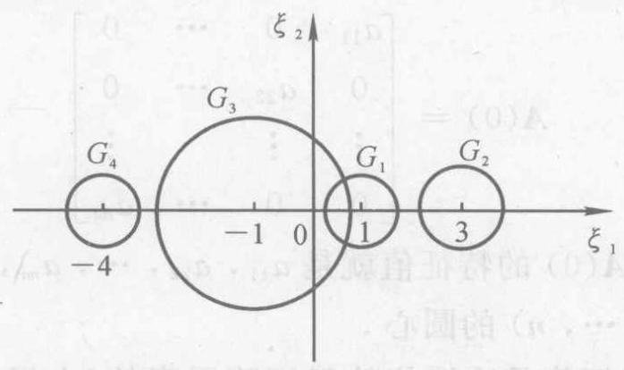

图 5.1

于是, $\mathbf{A}$ 的全部特征值就在这四个盖尔圆并起来的区域之中.

在例 5.5 中, ${G}_{1}$ 和 ${G}_{3}$ 是交结在一起的,它们的并集是一个连通区域(所谓连通区域，是指其中的任意两点都可以用位于该区域内的一条折线连接起来); 交结为一起的盖尔圆所构成的最大连通区域称为一个连通部分. 孤立的一个盖尔圆就是一个连通部分. 例 5.5 中有三个连通部分,即 ${G}_{1}$ 和 ${G}_{3}$ 的并集是一个连通部分, ${G}_{2}$ 与 ${G}_{4}$ 各是一个连通部分.

定理 5.6 仅仅说明了矩阵 $\mathbf{A}$ 的一切特征值都在它的全部盖尔圆的并集之内, 而没有说明在那个盖尔圆中有几个特征值. 为解决这一问题，需要下面的定理.

定理 5.7 (Gerschgorin theorem 2) 由矩阵 $\mathbf{A}$ 的所有盖尔圆组成的连通部分中任取一个,如果它是由 $k$ 个盖尔圆构成的,则在这个连通部分中有且仅有 $\mathbf{A}$ 的 $k$ 个特征值 (盖尔圆相重时重复计数, 特征值相同时也重复计数).

证 考虑带参数 $u$ 的矩阵

$$
\mathbf{A}\left( u\right)  = \left\lbrack  \begin{matrix} {a}_{11} & u{a}_{12} & \cdots & u{a}_{1n} \\  u{a}_{21} & {a}_{22} & \cdots & u{a}_{2n} \\  \vdots & \vdots & & \vdots \\  u{a}_{n1} & u{a}_{n2} & \cdots & {a}_{nn} \end{matrix}\right\rbrack
$$

显然, $\mathbf{A}\left( 1\right)  = \mathbf{A}$ ,而

$$
\mathbf{A}\left( 0\right)  = \left\lbrack  \begin{matrix} {a}_{11} & 0 & \cdots & 0 \\  0 & {a}_{22} & \cdots & 0 \\  \vdots & \vdots & & \vdots \\  0 & 0 & \cdots & {a}_{nn} \end{matrix}\right\rbrack
$$

是对角阵,且 $\mathbf{A}\left( 0\right)$ 的特征值就是 ${a}_{11},{a}_{22},\cdots ,{a}_{nn}$ ,也就是盖尔圆 ${G}_{i}\left( {i = 1,2,\cdots , n}\right)$ 的圆心.

矩阵的特征值是连续依赖于矩阵元素的(由根与系数的连续依赖定理: 首项系数不为零的 $n$ 次多项式的 $n$ 个根都是其系数的连续函数 ${}^{\left\lbrack  3\right\rbrack  }$ ),因此, $\mathbf{A}\left( u\right)$ 的特征值 ${\lambda }_{i}\left( u\right) \left( {i = 1,2,\cdots , n}\right)$ 是连续依赖于 $u$ 的. 考虑 $u \in  \left\lbrack  {0,1}\right\rbrack$ 的情形,此时 ${\lambda }_{i}\left( 0\right)  = {a}_{ii}$ 是 $\mathbf{A}\left( 0\right)$ 的特征值, ${\lambda }_{i}\left( 1\right)$ 是 $\mathbf{A}$ 的特征值. 因此, ${\lambda }_{i}\left( u\right)$ 在复平面上画出的连续曲线必以 ${\lambda }_{i}\left( 0\right)$ 为起点,以 ${\lambda }_{i}\left( 1\right)$ 为终点.

现在设 $\mathbf{A}\left( 1\right)  = \mathbf{A}$ 的一个连通部分是由它的 $k$ 个盖尔圆构成的,记作 $D$ . 因此, $\mathbf{A}\left( 0\right)$ 的 $k$ 个特征值必在其中,如果 $D$ 中没有 $\mathbf{A}\left( 1\right)  = \mathbf{A}$ 的 $k$ 个特征值,则至少有一个 ${i}_{0}$ ,使得点 ${\lambda }_{{i}_{0}}\left( 0\right)$ 连续地变动到点 ${\lambda }_{{i}_{0}}\left( 1\right)$ ,且 ${\lambda }_{{i}_{0}}\left( 1\right)$ 在 $D$ 之外. 根据定理 ${5.6},{\lambda }_{{i}_{0}}\left( 1\right)$ 是 $\mathbf{A}$ 的特征值,因而必在 $\mathbf{A}$ 的另外一个连通区域 $\widetilde{D}$ 之中. 如图 5.2 所示. 一条连续曲线 ${\lambda }_{{i}_{0}}\left( u\right)$ 的起点在 $D$ 中,而终点在 $\widetilde{D}$ 中. 因此,这条曲线必定有一部分既不在 $D$ 中,又不在 $\widetilde{D}$ 中,也不在 $\mathbf{A}$ 的其他连通部分之中. 也就是说,存在 ${u}_{0} \in  \left( {0,1}\right)$ ,使得 ${\lambda }_{{i}_{0}}\left( {u}_{0}\right)$ 不在 $\mathbf{A}$ 的所有盖尔圆

$$
\left| {z - {a}_{ii}}\right|  \leq  {R}_{i}\;\left( {i = 1,2,\cdots , n}\right)
$$

的并集之中. 但因 ${\lambda }_{{i}_{0}}\left( {u}_{0}\right)$ 是 $\mathbf{A}\left( {u}_{0}\right)$ 的特征值,由定理 5.6,它必在盖尔圆

$$
\left| {z - {a}_{ii}}\right|  \leq  \mathop{\sum }\limits_{{j \neq  i}}\left| {{u}_{0}{a}_{ij}}\right|  = {u}_{0}{R}_{i}\;\left( {i = 1,2,\cdots , n}\right)
$$

的并集之中. 又由 $\left| {z - {a}_{ii}}\right|  \leq  {u}_{0}{R}_{i}$ 包含于 $\left| {z - {a}_{ii}}\right|  \leq  {R}_{i}$ ,所以产生矛盾. 此表明: $\mathbf{A}$ 在 $D$ 中的特征值个数不可能少于 $k$ . 同样可证, $\mathbf{A}$ 在 $D$ 中的特征值个数也不能多于 $k$ . 因此, $\mathbf{A}$ 在 $D$ 中的特征值个数恰好等于 $k$ . 证毕

由定理 5.7 可知,例 5.5 中 ${G}_{2}$ 与 ${G}_{4}$ 中各有一个特征值,而 ${G}_{1}$ 和 ${G}_{3}$ 构成的连通部分中有两个特征值.

值得指出, 由两个或两个以上的盖尔圆构成的连通部分, 可能在其中的一个盖尔圆中有两个或两个以上的特征值, 而在另外的一个或几个盖尔圆中没有特征值.

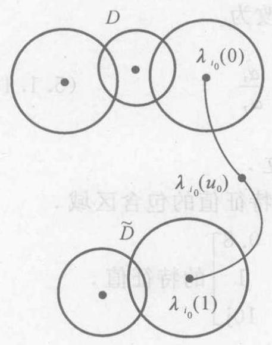

图 5.2

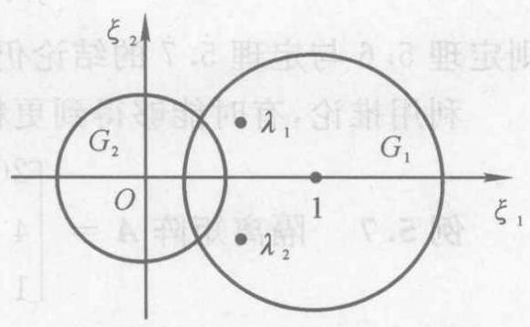

图 5.3

例 5.6 讨论矩阵 $\mathbf{A} = \left\lbrack  \begin{matrix} 1 &  - {0.8} \\  {0.5} & 0 \end{matrix}\right\rbrack$ 的特征值分布状况.

解 $\mathbf{A}$ 的两个特征值为 ${\lambda }_{1,2} = \frac{1}{2}\left( {1 \pm  \mathrm{j}\sqrt{0.6}}\right) .\mathbf{A}$ 的两个盖尔圆为 $\left| {z - 1}\right|  \leq  {0.8}$ 和 $\left| z\right|  \leq  {0.5}$ . 它们构成 $\mathbf{A}$ 的一个连通部分. 由于

$$
\left| {\lambda }_{1,2}\right|  = \sqrt{0.4} > {0.5}
$$

所以, $\mathbf{A}$ 的两个特征值都不在盖尔圆 ${G}_{2}$ 之中 (见图 5.3).

下面应用盖尔圆定理研究矩阵特征值的隔离问题. 设 $\mathbf{A} = {\left( {a}_{ij}\right) }_{n \times  n}$ ,构造对角矩阵

$$
\mathbf{D} = \operatorname{diag}\left( {{\alpha }_{1},{\alpha }_{2},\cdots ,{\alpha }_{n}}\right)
$$

其中, ${\alpha }_{1},{\alpha }_{2},\cdots ,{\alpha }_{n}$ 都是正数. 由于

$$
\mathbf{B} = \mathbf{D}\mathbf{A}{\mathbf{D}}^{-1} = {\left( \frac{{\alpha }_{i}}{{\alpha }_{j}}{a}_{ij}\right) }_{n \times  n} \tag{5.1.12}
$$

相似于 $\mathbf{A}$ ,所以 $\mathbf{B}$ 与 $\mathbf{A}$ 的特征值集合相同. 注意到 $\mathbf{B}$ 与 $\mathbf{A}$ 的主对角线元素对应相等，于是有下面的推论.

推论 若将式 (5.1.10) 中的 ${R}_{i}$ 改为

$$
{r}_{i} = \mathop{\sum }\limits_{\substack{{j = 1} \\  {j \neq  i} }}^{n}\left| {a}_{ij}\right| \frac{{\alpha }_{i}}{{\alpha }_{j}} \tag{5.1.13}
$$

则定理 5.6 与定理 5.7 的结论仍然成立.

利用推论, 有时能够得到更精确的特征值的包含区域.

例 5.7 隔离矩阵 $\mathbf{A} = \left\lbrack  \begin{matrix} {20} & 5 & {0.8} \\  4 & {10} & 1 \\  1 & 2 & {10}\mathrm{j} \end{matrix}\right\rbrack$ 的特征值.

解 $\mathbf{A}$ 的 3 个盖尔圆为

$$
{G}_{1} : \left| {z - {20}}\right|  \leq  {5.8}
$$

$$
{G}_{2} : \left| {z - {10}}\right|  \leq  5
$$

$$
{G}_{3} : \left| {z - {10}\mathrm{j}}\right|  \leq  3
$$

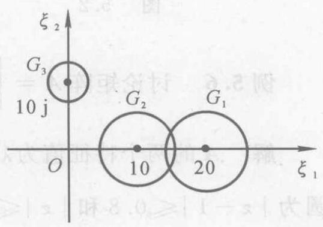

图 5.4

${G}_{1}$ 与 ${G}_{2}$ 相交; 而 ${G}_{3}$ 孤立,其中恰好有 $\mathbf{A}$ 的一个特征值,记作 ${\lambda }_{3}$ (见图 5.4). 根据式 (5.1.12), 选取

$$
\mathbf{D} = \operatorname{diag}\left( {1,1,2}\right)
$$

则

$$
\mathbf{B} = {\mathbf{{DAD}}}^{-1} = \left\lbrack  \begin{array}{lll} {20} & 5 & {0.4} \\  4 & {10} & {0.5} \\  2 & 4 & {10}\mathrm{j} \end{array}\right\rbrack
$$

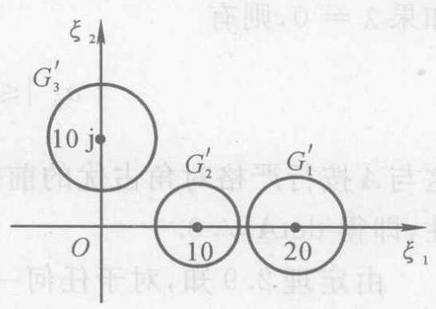

图 5.5

的 3 个盖尔圆为

$$
{G}_{1}^{\prime } : \left| {z - {20}}\right|  \leq  {5.4}
$$

$$
{G}_{2}^{\prime } : \left| {z - {10}}\right|  \leq  {4.5}
$$

$$
{G}_{3}^{\prime } : \left| {z - {10}\mathrm{j}}\right|  \leq  6
$$

易见，这是 3 个孤立的盖尔圆，每个盖尔圆中恰好有 $\mathbf{B}$ 的 (也是 $\mathbf{A}$ 的) 一个特征值 (见图 5.5). 注意 ${G}_{3}^{\prime }$ 中的特征值就是 ${G}_{3}$ 中的特征值 ${\lambda }_{3}$ ,所以 $\mathbf{A}$ 的 3 个特征值分别位于 ${G}_{1}^{\prime },{G}_{2}^{\prime }$ 及 ${G}_{3}$ 之中.

例 5.7 表明,对于矩阵 $\mathbf{A}$ ,适当选取正数 ${\alpha }_{1},{\alpha }_{2},\cdots ,{\alpha }_{n}$ ,可以获得只含 $\mathbf{A}$ 的一个特征值的孤立盖尔圆. 选取 ${\alpha }_{1},{\alpha }_{2},\cdots ,{\alpha }_{n}$ 的一般方法是:观察 $\mathbf{A}$ 的 $n$ 个盖尔圆,欲使第 $i$ 个盖尔圆 ${G}_{i}$ 的半径大 (或小) 一些,就取 ${\alpha }_{i} > 1$ (或 ${\alpha }_{i} < 1$ ),而取 ${\alpha }_{1} = \cdots  = {\alpha }_{i - 1} = \; {\alpha }_{i + 1} = \cdots  = {\alpha }_{n} = 1$ . 此时, $\mathbf{B} = \mathbf{D}\mathbf{A}{\mathbf{D}}^{-1}$ 的第 $i$ 个盖尔圆 ${G}_{i}^{\prime }$ 的半径比 ${G}_{i}$ 的半径大 (或小),而 $\mathbf{B}$ 的其余盖尔圆的半径相对变小 (或变大). 但是, 这种隔离矩阵特征值的方法还不能用于任意的具有互异特征值的矩阵, 比如主对角线上有相同元素的矩阵.

利用定理 5.6 可以证明下述熟知的结论.

例 5.8 如果矩阵 $\mathbf{A} = {\left( {a}_{ij}\right) }_{n \times  n}$ 按行 (列) 严格对角占优,则 $\det \mathbf{A} \neq  0$ .

证 由于 $\det \mathbf{A} = 0$ 的充要条件是 $\mathbf{A}$ 以零为其一个特征值,所以只需证明: 当 $\mathbf{A}$ 满足按行 (列) 严格对角占优的条件时,它无零特征值 (这里仅就行的情形予以证明).

设 $\lambda$ 是 $\mathbf{A}$ 的任一特征值，则存在 $i$ ，使 $\lambda  \in  {G}_{i}$ ，于是可得

$$
\left| {\lambda  - {a}_{ii}}\right|  \leq  {R}_{i} = \mathop{\sum }\limits_{{j \neq  i}}\left| {a}_{ij}\right|
$$

如果 $\lambda  = 0$ ,则有

$$
\left| {a}_{ii}\right|  \leq  \mathop{\sum }\limits_{{j \neq  i}}\left| {a}_{ij}\right|
$$

这与 $\mathbf{A}$ 按行严格对角占优的前提冲突,故应有 $\lambda  \neq  0$ ,再由 $\lambda$ 的任意性,即得 $\det \mathbf{A} \neq  0$ .

由定理 2.9 知,对于任何一种矩阵范数 $\parallel  \cdot  \parallel$ ,矩阵 $\mathbf{A}$ 的谱半径 $\rho \left( \mathbf{A}\right)$ 满足

$$
\rho \left( \mathbf{A}\right)  \leq  \parallel \mathbf{A}\parallel \tag{5.1.14}
$$

特别地, 也有

$$
\rho \left( \mathbf{A}\right)  \leq  \parallel \mathbf{A}{\parallel }_{\infty } \tag{5.1.15}
$$

为了加强式 (5.1.15) 的结果, 在此不加证明地引入下述定理 ${}^{\left\lbrack  3\right\rbrack  }$ :

定理 5.8 设不可约矩阵 ${}^{\text{ ① }}\mathbf{A} = {\left( {a}_{ij}\right) }_{n \times  n}$ 的一个特征值 $\lambda$ 在其 $n$ 个盖尔圆 $\left| {z - {a}_{ii}}\right|  \leq  {R}_{i}\left( {i = 1,2,\cdots , n}\right)$ 并集的边界上,则所有的 $n$ 个圆周

$$
\left| {z - {a}_{ii}}\right|  = {R}_{i}\;\left( {i = 1,2,\cdots , n}\right) \tag{5.1.16}
$$

都通过点 $\lambda$ .

利用定理 5.8 ，加强式 (5.1.15) 的结果如下定理所述.

定理 5.9 如果 $\mathbf{A} = {\left( {a}_{ij}\right) }_{n \times  n}$ 不可约,且存在 ${i}_{0}$ ,使得

$$
\mathop{\sum }\limits_{{j = 1}}^{n}\left| {a}_{{i}_{0}j}\right|  < \parallel \mathbf{A}{\parallel }_{\infty }
$$

则有 $\rho \left( \mathbf{A}\right)  < \parallel \mathbf{A}{\parallel }_{\infty }$ .

证 由式 (5.1.15) 知 $\rho \left( \mathbf{A}\right)  \leq  \parallel \mathbf{A}{\parallel }_{\infty }$ ,所以只需证明 $\rho \left( \mathbf{A}\right)  \neq  \parallel \mathbf{A}\parallel \infty$ 即可.

对于任意 $z \in  \mathop{\bigcup }\limits_{{i = 1}}^{n}{G}_{i}$ ,存在 ${i}_{1}$ ,使 $\left| {z - {a}_{{i}_{1}{i}_{1}}}\right|  \leq  {R}_{{i}_{1}}$ ,根据三角不等式, 可得

$$
\left| z\right|  \leq  {R}_{{i}_{1}} + \left| {a}_{{i}_{1}{i}_{1}}\right|  = \mathop{\sum }\limits_{{j = 1}}^{n}\left| {a}_{{i}_{1}j}\right|  \leq  \parallel \mathbf{A}{\parallel }_{\infty }
$$

---

① 不可约矩阵的概念见第 7 章.

---

即 $z \in  \{ z \mid  \left| z\right|  \leq  \parallel \mathbf{A}{\parallel }_{\infty }\}  = \bar{S}\left( {0;\parallel \mathbf{A}{\parallel }_{\infty }}\right) 0$ ,因此并集 $\mathop{\bigcup }\limits_{{i = 1}}^{n}{G}_{i} \subset  \bar{S}\left( {0;\parallel \mathbf{A}{\parallel }_{\infty }}\right) .$

假设在定理条件下,成立 $\rho \left( \mathbf{A}\right)  = \parallel \mathbf{A}{\parallel }_{\infty }$ ,则 $\mathbf{A}$ 至少有一个特征值 ${\lambda }_{0}$ 满足

$$
\left| {\lambda }_{0}\right|  = \rho \left( \mathbf{A}\right)  = \parallel \mathbf{A}\parallel \infty
$$

这表明, ${\lambda }_{0}$ 在 $\bar{S}\left( {0;\parallel \mathbf{A}{\parallel }_{\infty }}\right)$ 的边界上. 从而 ${\lambda }_{0}$ 亦在 $\mathbf{A}$ 的 $n$ 个盖尔圆并集的边界上. 根据定理 5.8, 可得

$$
\left| {{\lambda }_{0} - {a}_{ii}}\right|  = {R}_{i}\;\left( {i = 1,2,\cdots , n}\right)
$$

特别地, 也有

$$
\left| {{\lambda }_{0} - {a}_{{i}_{0}{i}_{0}}}\right|  = {R}_{{i}_{0}}
$$

于是

$$
\left| {\lambda }_{0}\right|  \leq  {R}_{{i}_{0}} + \left| {a}_{{i}_{0}{i}_{0}}\right|  = \mathop{\sum }\limits_{{j = 1}}^{n}\left| {a}_{{i}_{0}j}\right|  < \parallel \mathbf{A}{\parallel }_{\infty }
$$

这与假设相冲突,故应有 $\rho \left( \mathbf{A}\right)  \neq  \parallel \mathbf{A}{\parallel }_{\infty }$ . 证毕

利用定理 5.6 ，可以证明下面的定理 .

定理 5.10 ( $\mathrm{K}\mathrm{y}$ Fan) 设 $\mathbf{A} = {\left( {a}_{ij}\right) }_{n \times  n} \in  {\mathbf{C}}^{n \times  n},\mathbf{B} = {\left( {b}_{ij}\right) }_{n \times  n} \in \; {\mathbf{R}}^{n \times  n}$ ,如果 ${b}_{ij} \geq  \left| {a}_{ij}\right| \left( {i, j = 1,2,\cdots , n}\right)$ ,则对 $\mathbf{A}$ 的任一特征值 $\lambda$ ,必有 $i$ ,使

$$
\left| {\lambda  - {a}_{ii}}\right|  \leq  \rho \left( \mathbf{B}\right)  - {b}_{ii} \tag{5.1.17}
$$

证 在条件 ${b}_{ij} \geq  \left| {a}_{ij}\right| \left( {i, j = 1,2,\cdots , n}\right)$ 之下,有 ${b}_{ij} \geq  0 \; \left( {i, j = 1,2,\cdots , n}\right)$ .

先假定 ${b}_{ij} > 0\left( {i, j = 1,2,\cdots , n}\right)$ . 根据定理 7.1 可得,存在 $x = {\left( {\xi }_{1},{\xi }_{2},\cdots ,{\xi }_{n}\right) }^{\mathrm{T}}$ ,满足 ${\xi }_{i} > 0\left( {i = 1,2,\cdots , n}\right)$ ,且使

$$
\mathbf{{Bx}} = \rho \left( \mathbf{B}\right) \mathbf{x}
$$

---

① 用 $\bar{S}\left( {0;\rho }\right)$ 表示以 0 为中心，以 $\rho$ 为半径的闭圆.

---

令 $\mathbf{D} = \operatorname{diag}\left( {{\xi }_{1},{\xi }_{2},\cdots ,{\xi }_{n}}\right) ,\mathbf{C} = {\mathbf{D}}^{-1}\mathbf{A}\mathbf{D} = {\left( {c}_{ij}\right) }_{n \times  n}$ ,根据定理 5.6 可知,对于 $\mathbf{C}$ 的任一特征值 $\lambda$ (它也是 $\mathbf{A}$ 的特征值),必有 $i$ ,使

$$
\left| {\lambda  - {c}_{ii}}\right|  \leq  \mathop{\sum }\limits_{{j \neq  i}}\left| {c}_{ij}\right|
$$

由于 ${c}_{ii} = {a}_{ii}$ 及 $\mathop{\sum }\limits_{{j = 1}}^{n}{b}_{ij}{\xi }_{j} = \rho \left( \mathbf{B}\right) {\xi }_{i}$ ,所以

$$
\left| {\lambda  - {a}_{ii}}\right|  \leq  \mathop{\sum }\limits_{{j \neq  i}}\left| {{\xi }_{i}^{-1}{a}_{ij}{\xi }_{j}}\right|  \leq  {\xi }_{i}^{-1}\mathop{\sum }\limits_{{j \neq  i}}{b}_{ij}{\xi }_{j} =
$$

$$
{\xi }_{i}^{-1}\left( {\mathop{\sum }\limits_{{j = 1}}^{n}{b}_{ij}{\xi }_{j} - {b}_{ii}{\xi }_{i}}\right)  =
$$

$$
{\xi }_{i}^{-1}\left( {\rho \left( \mathbf{B}\right) {\xi }_{i} - {b}_{ii}{\xi }_{i}}\right)  = \rho \left( \mathbf{B}\right)  - {b}_{ii}
$$

再考虑 ${b}_{ij} \geq  0\left( {i, j = 1,2,\cdots , n}\right)$ 的一般情形. 令

$$
{\mathbf{B}}_{k} = {\left( {b}_{ij}^{\left( k\right) }\right) }_{n \times  n},\;{b}_{ij}^{\left( k\right) } = {b}_{ij} + \frac{1}{k}
$$

其中 $k$ 是正整数，则 ${b}_{ij}^{\left( k\right) } > 0$ 且有 ${b}_{ij}^{\left( k\right) } > \left| {a}_{ij}\right| \;\left( {i, j = 1,2,\cdots }\right.$ , $n)$ 成立. 根据前面的结论,对于 $\mathbf{A}$ 的任一特征值 $\lambda$ ,必有 ${i}_{k}$ ,使

$$
\left| {\lambda  - {a}_{{i}_{k}{i}_{k}}}\right|  \leq  \rho \left( {\mathbf{B}}_{k}\right)  - {b}_{{i}_{k}{i}_{k}}^{\left( k\right) }
$$

由于 ${i}_{k} \in  \{ 1,2,\cdots , n\}$ ,所以无穷序列 $\left\{  {i}_{k}\right\}$ 中必有一个无穷子列 $\left\{  {i}_{{k}_{m}}\right\}$ 满足

$$
{i}_{{k}_{m}} = i \in  \{ 1,2,\cdots , n\} \;\left( {m = 1,2,3,\cdots }\right)
$$

于是

$$
\left| {\lambda  - {a}_{ii}}\right|  = \left| {\lambda  - {a}_{{i}_{{k}_{m}}{i}_{{k}_{m}}}}\right|  \leq  \rho \left( {\mathbf{B}}_{{k}_{m}}\right)  - {b}_{{i}_{{k}_{m}}{i}_{{k}_{m}}}^{\left( {k}_{m}\right) } = \rho \left( {\mathbf{B}}_{{k}_{m}}\right)  - {b}_{ii}^{\left( {k}_{m}\right) }
$$

因为 $\mathop{\lim }\limits_{{k \rightarrow  \infty }}{\mathbf{B}}_{k} = \mathbf{B}$ ,所以 $\mathop{\lim }\limits_{{{k}_{m} \rightarrow  \infty }}{\mathbf{B}}_{{k}_{m}} = \mathbf{B}$ ,从而 $\mathop{\lim }\limits_{{{k}_{m} \rightarrow  \infty }}{b}_{ii}^{\left( {k}_{m}\right) } = {b}_{ii}$ , $\mathop{\lim }\limits_{{{k}_{m} \rightarrow  \infty }}\rho \left( {\mathbf{B}}_{{k}_{m}}\right)  = \rho \left( \mathbf{B}\right)$ . 因此

$$
\left| {\lambda  - {a}_{ii}}\right|  \leq  \rho \left( \mathbf{B}\right)  - {b}_{ii}
$$

证毕

例 5.9 估计矩阵 $\mathbf{A} = \left\lbrack  \begin{matrix} 1 &  - {0.8} \\  {0.5} & 0 \end{matrix}\right\rbrack$ 的特征值范围.

解 取 $\mathbf{B} = \left\lbrack  \begin{array}{ll} 1 & 1 \\  1 & 1 \end{array}\right\rbrack$ ,则 ${b}_{ij} \geq  \left| {a}_{ij}\right| \left( {i, j = 1,2}\right)$ . 容易算出 $\rho \left( \mathbf{B}\right)  = 2$ ,所以 $\mathbf{A}$ 的特征值 $\lambda$ 至少满足下面二不等式之一,

$$
\left| {\lambda  - 1}\right|  \leq  2 - 1 = 1,\;\left| \lambda \right|  \leq  2 - 1 = 1
$$

作为定理 5.6 的推广, 下面论述 Ostrowski 定理. 为此, 先引入下面的引理 ${}^{\left\lbrack  {32}\right\rbrack  }$ .

引理 2 设 $\sigma$ 和 $\tau$ 是两个非负实数, $0 \leq  \alpha  \leq  1$ ,则有

$$
{\tau }^{\alpha }{\sigma }^{1 - \alpha } \leq  {\alpha \tau } + \left( {1 - \alpha }\right) \sigma \tag{5.1.18}
$$

定理 5.11 (Ostrowski theorem 1) 设 $\mathbf{A} = {\left( {a}_{ij}\right) }_{n \times  n} \in  {\mathbf{C}}^{n \times  n},0 \; \leq  \alpha  \leq  1,\lambda$ 是 $\mathbf{A}$ 的任一特征值. 则存在 $i$ ,使得

$$
\left| {\lambda  - {a}_{ii}}\right|  \leq  {\left\lbrack  {R}_{i}\left( \mathbf{A}\right) \right\rbrack  }^{\alpha }{\left\lbrack  {R}_{i}\left( {\mathbf{A}}^{\mathrm{T}}\right) \right\rbrack  }^{1 - \alpha } \tag{5.1.19}
$$

证 当 $\alpha  = 0$ 或 $\alpha  = 1$ 时,不等式 (5.1.19) 恰好是定理 5.6 的结果. 因此,只需对 $0 < \alpha  < 1$ 证明不等式 (5.1.19) 成立即可.

设 $\mathbf{x} = {\left( {\xi }_{1},{\xi }_{2},\cdots ,{\xi }_{n}\right) }^{\mathrm{T}}$ 是 $\mathbf{A}$ 的属于特征值 $\lambda$ 的特征向量,即有 $\mathbf{A}\mathbf{x} = \lambda \mathbf{x}$ . 于是

$$
\left| {\lambda  - {a}_{ii}}\right| \left| {\xi }_{i}\right|  = \left| {\mathop{\sum }\limits_{{j \neq  i}}{a}_{ij}{\xi }_{j}}\right|  \leq  \mathop{\sum }\limits_{{j \neq  i}}\left| {a}_{ij}\right| \left| {\xi }_{j}\right|
$$

$$
\left( {i = 1,2,\cdots , n}\right)
$$

采用反证法. 假设不等式 (5.1.19) 对于 $0 < \alpha  < 1$ 不成立，则对任意 $i \in  \{ 1,2,\cdots , n\}$ ,有

$$
\left| {\lambda  - {a}_{ii}}\right|  > {\left\lbrack  {R}_{i}\left( \mathbf{A}\right) \right\rbrack  }^{\alpha }{\left\lbrack  {R}_{i}\left( {\mathbf{A}}^{\mathrm{T}}\right) \right\rbrack  }^{1 - \alpha }
$$

此时必有 ${R}_{i}\left( \mathbf{A}\right)  \neq  0$ (否则, ${a}_{ii}$ 是 $\mathbf{A}$ 的一个特征值,从而不等式 (5.1.19) 一定成立). 由于 $x \neq  0$ ,所以存在 ${i}_{0}$ ,使得 ${\xi }_{{i}_{0}} \neq  0$ . 利用 Hölder 不等式(见 $\text{ § }{2.1}$ )，可得

$$
{\left\lbrack  {R}_{{i}_{0}}\left( \mathbf{A}\right) \right\rbrack  }^{\alpha }{\left\lbrack  {R}_{{i}_{0}}\left( {\mathbf{A}}^{\mathrm{T}}\right) \right\rbrack  }^{1 - \alpha }\left| {\xi }_{{i}_{0}}\right|  < \left| {\lambda  - {a}_{{i}_{0}{i}_{0}}}\right| \left| {\xi }_{{i}_{0}}\right|  \leq
$$

$$
\mathop{\sum }\limits_{{j \neq  {i}_{0}}}\left| {a}_{{i}_{0}j}\right| \left| {\xi }_{j}\right|  = \mathop{\sum }\limits_{{j \neq  {i}_{0}}}{\left| {a}_{{i}_{0}j}\right| }^{\alpha }{\left| {a}_{{i}_{0}j}\right| }^{1 - \alpha }\left| {\xi }_{j}\right|  \leq
$$

$$
{\left( \mathop{\sum }\limits_{{j \neq  {i}_{0}}}\left| {a}_{{i}_{0}j}\right| \right) }^{\alpha }{\left( \mathop{\sum }\limits_{{j \neq  {i}_{0}}}\left| {a}_{{i}_{0}j}\right| {\left| {\xi }_{j}\right| }^{\frac{1}{1 - \alpha }}\right) }^{1 - \alpha } =
$$

$$
{\left\lbrack  {R}_{{i}_{0}}\left( \mathbf{A}\right) \right\rbrack  }^{\alpha }{\left( \mathop{\sum }\limits_{{j \neq  {i}_{0}}}\left| {a}_{{i}_{0}j}\right| {\left| {\xi }_{j}\right| }^{\frac{1}{1 - \alpha }}\right) }^{1 - \alpha }
$$

注意到 ${\left\lbrack  {R}_{{i}_{0}}\left( \mathbf{A}\right) \right\rbrack  }^{\alpha } > 0$ ,便得到

$$
{\left\lbrack  {R}_{{i}_{0}}\left( {\mathbf{A}}^{\mathrm{T}}\right) \right\rbrack  }^{1 - \alpha }\left| {\xi }_{{i}_{0}}\right|  < {\left( \mathop{\sum }\limits_{{j \neq  {i}_{0}}}\left| {a}_{{i}_{0}j}\right| {\left| {\xi }_{j}\right| }^{\frac{1}{1 - \alpha }}\right) }^{1 - \alpha }
$$

即

$$
{R}_{{i}_{0}}\left( {\mathbf{A}}^{\mathrm{T}}\right) {\left| {\xi }_{{i}_{0}}\right| }^{\frac{1}{1 - \alpha }} < \mathop{\sum }\limits_{{j \neq  {i}_{0}}}\left| {a}_{{i}_{0}j}\right| {\left| {\xi }_{j}\right| }^{\frac{1}{1 - \alpha }} \tag{5.1.20}
$$

因为当 ${\xi }_{i} = 0$ 时,恒有

$$
{R}_{i}\left( {\mathbf{A}}^{\mathrm{T}}\right) {\left| {\xi }_{i}\right| }^{\frac{1}{1 - \alpha }} \leq  \mathop{\sum }\limits_{{j \neq  i}}\left| {a}_{ij}\right| {\left| {\xi }_{j}\right| }^{\frac{1}{1 - \alpha }} \tag{5.1.21}
$$

所以，由式 (5.1.20) 和式 (5.1.21) 可得

$$
\mathop{\sum }\limits_{{i = 1}}^{n}{R}_{i}\left( {\mathbf{A}}^{\mathrm{T}}\right) {\left| {\xi }_{i}\right| }^{\frac{1}{1 - \alpha }} < \mathop{\sum }\limits_{{i = 1}}^{n}\mathop{\sum }\limits_{{j \neq  i}}\left| {a}_{ij}\right| {\left| {\xi }_{j}\right| }^{\frac{1}{1 - \alpha }} \tag{5.1.22}
$$

另一方面,由 ${R}_{i}\left( {\mathbf{A}}^{\mathrm{T}}\right)$ 的定义可得

$$
\mathop{\sum }\limits_{{i = 1}}^{n}{R}_{i}\left( {\mathbf{A}}^{\mathrm{T}}\right) {\left| {\xi }_{i}\right| }^{\frac{1}{1 - \alpha }} = \mathop{\sum }\limits_{{i = 1}}^{n}\mathop{\sum }\limits_{{j \neq  i}}\left| {a}_{ji}\right| {\left| {\xi }_{i}\right| }^{\frac{1}{1 - \alpha }} =
$$

$$
\mathop{\sum }\limits_{{j = 1}}^{n}\mathop{\sum }\limits_{{i \neq  j}}\left| {a}_{ij}\right| {\left| {\xi }_{j}\right| }^{\frac{1}{1 - \alpha }} =
$$

$$
\mathop{\sum }\limits_{{j = 1}}^{n}\mathop{\sum }\limits_{{i = 1}}^{n}\left| {a}_{ij}\right| {\left| {\xi }_{j}\right| }^{\frac{1}{1 - \alpha }} - \mathop{\sum }\limits_{{j = 1}}^{n}\left| {a}_{jj}\right| {\left| {\xi }_{j}\right| }^{\frac{1}{1 - \alpha }} =
$$

$$
\mathop{\sum }\limits_{{i = 1}}^{n}\mathop{\sum }\limits_{{j = 1}}^{n}\left| {a}_{ij}\right| {\left| {\xi }_{j}\right| }^{\frac{1}{1 - a}} - \mathop{\sum }\limits_{{i = 1}}^{n}\left| {a}_{ii}\right| {\left| {\xi }_{i}\right| }^{\frac{1}{1 - a}} =
$$

$$
\mathop{\sum }\limits_{{i = 1}}^{n}\mathop{\sum }\limits_{{j \neq  i}}\left| {a}_{ij}\right| {\left| {\xi }_{j}\right| }^{\frac{1}{1 - a}} \tag{5.1.23}
$$

比较式 (5.1.22) 与式 (5.1.23), 得出矛盾，故假设错误，而不等式 (5.1.19) 对于 $0 < \alpha  < 1$ 亦成立. 证毕

例 5.10 估计矩阵 $\mathbf{A} = \left\lbrack  \begin{matrix} 1 &  - {0.8} \\  {0.5} & 1 \end{matrix}\right\rbrack$ 的特征值范围.

解 ${R}_{1}\left( \mathbf{A}\right)  = {0.8},{R}_{2}\left( \mathbf{A}\right)  = {0.5},{R}_{1}\left( {\mathbf{A}}^{\mathrm{T}}\right)  = {0.5},{R}_{2}\left( {\mathbf{A}}^{\mathrm{T}}\right)  =$ 0.8,取 $\alpha  = \frac{1}{2}$ ,则由定理 5.11 可得, $\mathbf{A}$ 的特征值 $\lambda$ 满足不等式

$$
\left| {\lambda  - 1}\right|  \leq  {\left\lbrack  {R}_{1}\left( \mathbf{A}\right) \right\rbrack  }^{\frac{1}{2}}{\left\lbrack  {R}_{1}\left( {\mathbf{A}}^{\mathrm{T}}\right) \right\rbrack  }^{1 - \frac{1}{2}} =
$$

$$
{\left\lbrack  {R}_{2}\left( \mathbf{A}\right) \right\rbrack  }^{\frac{1}{2}}{\left\lbrack  {R}_{2}\left( {\mathbf{A}}^{\mathrm{T}}\right) \right\rbrack  }^{1 - \frac{1}{2}} = \sqrt{0.4}
$$

实际上, $\mathbf{A}$ 的两个特征值 ${\lambda }_{1,2} = 1 \pm  \mathrm{j}\sqrt{0.4}$ ,所以有

$$
\left| {{\lambda }_{1,2} - 1}\right|  = \sqrt{0.4}
$$

利用式 (5.1.18), 可得下面的推论.

推论 1 在定理 5.11 的条件下,存在 $i$ ,使得

$$
\left| {\lambda  - {a}_{ii}}\right|  \leq  \alpha {R}_{i}\left( \mathbf{A}\right)  + \left( {1 - \alpha }\right) {R}_{i}\left( {\mathbf{A}}^{\mathrm{T}}\right) \tag{5.1.24}
$$

关于定理 5.11,还有以下的推论.

推论 2 如果 $\mathbf{A}$ 奇异,取 $0 \leq  \alpha  \leq  1$ ,则存在 $i$ ,使得

(1) $\left| {a}_{ii}\right|  \leq  {\left\lbrack  {R}_{i}\left( \mathbf{A}\right) \right\rbrack  }^{\alpha }{\left\lbrack  {R}_{i}\left( {\mathbf{A}}^{\mathrm{T}}\right) \right\rbrack  }^{1 - \alpha }$ ；

(2) $\left| {a}_{ii}\right|  \leq  \alpha {R}_{i}\left( \mathbf{A}\right)  + \left( {1 - \alpha }\right) {R}_{i}\left( {\mathbf{A}}^{\mathrm{T}}\right)$ .

推论 3 对于 $0 \leq  \alpha  \leq  1$ ,恒成立

(1) $\rho \left( \mathbf{A}\right)  \leq  \mathop{\max }\limits_{i}\left\{  {\left| {a}_{ii}\right|  + {\left\lbrack  {R}_{i}\left( \mathbf{A}\right) \right\rbrack  }^{\alpha }{\left\lbrack  {R}_{i}\left( {\mathbf{A}}^{\mathrm{T}}\right) \right\rbrack  }^{1 - \alpha }}\right\}$ ；

(2) $\rho \left( \mathbf{A}\right)  \leq  \mathop{\max }\limits_{i}\left\{  {\left| {a}_{ii}\right|  + \alpha {R}_{i}\left( \mathbf{A}\right)  + \left( {1 - \alpha }\right) {R}_{i}\left( {\mathbf{A}}^{\mathrm{T}}\right) }\right\}$ .

推论 4 记 ${\rho }_{i}\left( \mathbf{A}\right)  = \mathop{\sum }\limits_{{j = 1}}^{n}\left| {a}_{ij}\right|$ ,取 $0 \leq  \alpha  \leq  1$ ,则有

$$
\rho \left( \mathbf{A}\right)  \leq  \mathop{\max }\limits_{i}\left\{  {{\left\lbrack  {\rho }_{i}\left( \mathbf{A}\right) \right\rbrack  }^{\alpha }{\left\lbrack  {\rho }_{i}\left( {\mathbf{A}}^{\mathrm{T}}\right) \right\rbrack  }^{1 - \alpha }}\right\} \tag{5.1.25}
$$

证 当 $\alpha  = 0$ 或 $\alpha  = 1$ 时,式 (5.1.25) 显然成立. 当 $0 < \alpha  <$ 1 时,由推论 3 之(1) 及 Hölder 不等式,可得

$$
\rho \left( \mathbf{A}\right)  \leq  \mathop{\max }\limits_{i}\left\{  {{\left| {a}_{ii}\right| }^{\alpha }{\left| {a}_{ii}\right| }^{1 - \alpha } + {\left\lbrack  {R}_{i}\left( \mathbf{A}\right) \right\rbrack  }^{\alpha }{\left\lbrack  {R}_{i}\left( {\mathbf{A}}^{\mathrm{T}}\right) \right\rbrack  }^{1 - \alpha }}\right\}   \leq
$$

$$
\mathop{\max }\limits_{i}\left\{  {{\left\lbrack  \left| {a}_{ii}\right|  + {R}_{i}\left( \mathbf{A}\right) \right\rbrack  }^{\alpha }{\left\lbrack  \left| {a}_{ii}\right|  + {R}_{i}\left( {\mathbf{A}}^{\mathrm{T}}\right) \right\rbrack  }^{1 - \alpha }}\right\}   =
$$

$$
\mathop{\max }\limits_{i}\left\{  {{\left\lbrack  {\rho }_{i}\left( \mathbf{A}\right) \right\rbrack  }^{\alpha }{\left\lbrack  {\rho }_{i}\left( {\mathbf{A}}^{\mathrm{T}}\right) \right\rbrack  }^{1 - \alpha }}\right\}
$$

证毕

推论 5 (Farnell A B)

$$
\rho \left( \mathbf{A}\right)  \leq  \mathop{\max }\limits_{i}{\left\lbrack  {\rho }_{i}\left( \mathbf{A}\right) {\rho }_{i}\left( {\mathbf{A}}^{\mathrm{T}}\right) \right\rbrack  }^{\frac{1}{2}}
$$

推论 6 (Brauer A)

$$
\rho \left( \mathbf{A}\right)  \leq  \min \left\{  {\mathop{\max }\limits_{i}{\rho }_{i}\left( \mathbf{A}\right) ,\mathop{\max }\limits_{i}{\rho }_{i}\left( {\mathbf{A}}^{\mathrm{T}}\right) }\right\}
$$

推论 7 (Parker W V)

$$
\rho \left( \mathbf{A}\right)  \leq  \frac{1}{2}\mathop{\max }\limits_{i}\left\{  {{\rho }_{i}\left( \mathbf{A}\right)  + {\rho }_{i}\left( {\mathbf{A}}^{\mathrm{T}}\right) }\right\}
$$

推论 8 (Browne E T)

$$
\rho \left( \mathbf{A}\right)  \leq  \frac{1}{2}\left\lbrack  {\mathop{\max }\limits_{i}{\rho }_{i}\left( \mathbf{A}\right)  + \mathop{\max }\limits_{i}{\rho }_{i}\left( {\mathbf{A}}^{\mathrm{T}}\right) }\right\rbrack
$$

定理 5.12 (Ostrowski theorem 2) 设 $\mathbf{A} = {\left( {a}_{ij}\right) }_{n \times  n} \in  {\mathbf{C}}^{n \times  n} \; \left( {n \geq  2}\right)$ ,则对 $\mathbf{A}$ 的任一特征值 $\lambda$ ,存在 $i, j\left( {i \neq  j}\right)$ ,使 $\lambda$ 属于

$$
{\Omega }_{ij}\left( \mathbf{A}\right)  = \left\{  {z \mid  z \in  \mathbf{C},\left| {z - {a}_{ii}}\right|  \mid  z - {a}_{jj} \mid   \leq  {R}_{i}\left( \mathbf{A}\right) {R}_{j}\left( \mathbf{A}\right) }\right\}
$$

证 设 $\mathbf{x} = {\left( {\xi }_{1},{\xi }_{2},\cdots ,{\xi }_{n}\right) }^{\mathrm{T}}$ 是 $\mathbf{A}$ 的属于特征值 $\lambda$ 的特征向量,即有 ${Ax} = {\lambda x}$ . 选择 $r, t\left( {r \neq  t}\right)$ ,使满足 $\left| {\xi }_{r}\right|  \geq  \left| {\xi }_{t}\right|  \geq  \left| {\xi }_{j}\right| \; \left( {j \neq  r}\right)$ .

如果 ${\xi }_{t} = 0$ ,则 ${\xi }_{j} = 0\left( {j \neq  r}\right)$ ,此时 ${\xi }_{r} \neq  0$ (因为 $x \neq  0$ ). 于是有

$$
\lambda {\xi }_{r} = \mathop{\sum }\limits_{{j = 1}}^{n}{a}_{rj}{\xi }_{j} = {a}_{rr}{\xi }_{r}
$$

即 $\lambda  = {a}_{rr}$ . 所以

$$
\left| {\lambda  - {a}_{rr}}\right| \left| {\lambda  - {a}_{u}}\right|  = 0 \leq  {R}_{r}\left( \mathbf{A}\right) {R}_{t}\left( \mathbf{A}\right)
$$

如果 ${\xi }_{t} \neq  0$ ,则有

$$
\left( {\lambda  - {a}_{ii}}\right) {\xi }_{i} = \mathop{\sum }\limits_{{j \neq  i}}{a}_{ij}{\xi }_{j}\;\left( {i = 1,2,\cdots , n}\right)
$$

可得

$$
\left| {\lambda  - {a}_{rr}}\right| \left| {\xi }_{r}\right|  \leq  \mathop{\sum }\limits_{{j \neq  r}}\left| {a}_{rj}\right| \left| {\xi }_{j}\right|  \leq  \left| {\xi }_{t}\right| {R}_{r}\left( \mathbf{A}\right)
$$

$$
\left| {\lambda  - {a}_{n}}\right| \left| {\xi }_{t}\right|  \leq  \mathop{\sum }\limits_{{j \neq  t}}\left| {a}_{tj}\right| \left| {\xi }_{j}\right|  \leq  \left| {\xi }_{r}\right| {R}_{t}\left( \mathbf{A}\right)
$$

---

① 该定理可改述为:设 $\mathbf{A} = {\left( {a}_{ij}\right) }_{n \times  n} \in  {\mathbf{C}}^{n \times  n}$ ，记 ${R}_{i} = \mathop{\sum }\limits_{{j \neq  i}}\left| {a}_{ij}\right|$ ，则 $\mathbf{A}$ 的所有特征值 $\lambda$ 都属于 $n\left( {n - 1}\right) /2$ 个 Cassini 卵形 $\left| {z - {a}_{ii}}\right| \left| {z - {a}_{jj}}\right|  \leq  {R}_{i}{R}_{j}$ 的并集.

---

于是

$$
\left| {\lambda  - {a}_{rr}}\right| \left| {\lambda  - {a}_{tt}}\right| \left| {\xi }_{r}\right| \left| {\xi }_{t}\right|  \leq  \left| {\xi }_{t}\right| \left| {\xi }_{r}\right| {R}_{r}\left( \mathbf{A}\right) {R}_{t}\left( \mathbf{A}\right)
$$

由于 $\left| {\xi }_{r}\right|  \geq  \left| {\xi }_{t}\right|  > 0$ ,所以

$$
\left| {\lambda  - {a}_{r}}\right| \left| {\lambda  - {a}_{u}}\right|  \leq  {R}_{r}\left( \mathbf{A}\right) {R}_{t}\left( \mathbf{A}\right)
$$

总之,无论 ${\xi }_{t}$ 是否为零,必存在 $r$ 和 $t\left( {r \neq  t}\right)$ ,使得 $\lambda  \in \; {\Omega }_{n}\left( \mathbf{A}\right)$ . 证毕

值得指出, 定理 5.12 的证明未涉及定理 5.6 的任何结论.

推论 设 $\mathbf{A} = {\left( {a}_{ij}\right) }_{n \times  n} \in  {\mathbf{C}}^{n \times  n}\left( {n \geq  2}\right)$ ,如果对于所有的 $i \neq \; j$ ,恒有 $\left| {a}_{ii}\right| \left| {a}_{jj}\right|  > {R}_{i}\left( \mathbf{A}\right) {R}_{j}\left( \mathbf{A}\right)$ ,则 $\det \mathbf{A} \neq  0$ .

例 5.11 讨论矩阵 $\mathbf{A} = \left\lbrack  \begin{array}{rrr} 2 & {1.1} & 1 \\   - {0.8} & 3 & 2 \\  {1.5} & {1.1} & 3 \end{array}\right\rbrack$ 的奇异性.

解 ${R}_{1}\left( \mathbf{A}\right)  = {2.1},\;{R}_{2}\left( \mathbf{A}\right)  = {2.8},\;{R}_{3}\left( \mathbf{A}\right)  = {2.6}$

$$
\left| {a}_{11}\right| \left| {a}_{22}\right|  = 6 > {2.1} \times  {2.8} = {R}_{1}\left( \mathbf{A}\right) {R}_{2}\left( \mathbf{A}\right)
$$

$$
\left| {a}_{11}\right| \left| {a}_{33}\right|  = 6 > {2.1} \times  {2.6} = {R}_{1}\left( \mathbf{A}\right) {R}_{3}\left( \mathbf{A}\right)
$$

$$
\left| {a}_{22}\right| \left| {a}_{33}\right|  = 9 > {2.8} \times  {2.6} = {R}_{2}\left( \mathbf{A}\right) {R}_{3}\left( \mathbf{A}\right)
$$

根据推论可得 $\det \mathbf{A} \neq  0$ ,即 $\mathbf{A}$ 非奇异.

## * 三、扰动理论中的特征值估计

本段论述矩阵 $\mathbf{A} + \mathbf{Q}$ 的特征值和矩阵 $\mathbf{A}$ 的特征值之差的一些基本定理.

定理 5.13 设 $\mathbf{A} = \mathbf{P}\mathbf{D}{\mathbf{P}}^{-1} \in  {\mathbf{C}}^{n \times  n},\mathbf{D} = \operatorname{diag}\left( {{\lambda }_{1},{\lambda }_{2},\cdots ,{\lambda }_{n}}\right)$ , $\mathbf{Q} \in  {\mathbf{C}}^{n \times  n}$ ,且 $\mathbf{A} + \mathbf{Q}$ 有特征值 ${\mu }_{1},{\mu }_{2},\cdots ,{\mu }_{n}$ ,则对任一 ${\mu }_{j}$ 存在着 ${\lambda }_{i}$ , 使得

$$
\left| {{\lambda }_{i} - {\mu }_{j}}\right|  \leq  {\begin{Vmatrix}{\mathbf{P}}^{-1}\mathbf{{QP}}\end{Vmatrix}}_{\infty } \tag{5.1.26}
$$

此外,如果 ${\lambda }_{i}$ 是一个重数为 $m$ 的特征值,且圆盘 ${S}_{i} = \left\{  {z\left| \right| z - {\lambda }_{i} \mid   \leq  {\begin{Vmatrix}{\mathbf{P}}^{-1}\mathbf{{QP}}\end{Vmatrix}}_{\infty }}\right\}$ 和圆盘 ${S}_{k} = \left\{  {z\left| \right| z - {\lambda }_{k} \mid   \leq  }\right. \; \left. {\begin{Vmatrix}{\mathbf{P}}^{-1}\mathbf{{QP}}\end{Vmatrix}}_{\infty }\right\}  \left( {{\lambda }_{k} \neq  {\lambda }_{i}}\right)$ 不相交,则 ${S}_{i}$ 正好包含着 $\mathbf{A} + \mathbf{Q}$ 的 $m$ 个特征值.

证 令 $\mathbf{C} = {\mathbf{P}}^{-1}\left( {\mathbf{A} + \mathbf{Q}}\right) \mathbf{P} = {\left( {c}_{ij}\right) }_{n \times  n}$ ,则 $\mathbf{C}$ 有特征值 ${\mu }_{1},{\mu }_{2}$ , $\cdots ,{\mu }_{n}$ . 若记 ${\mathbf{P}}^{-1}\mathbf{{QP}} = {\left( {b}_{ij}\right) }_{n \times  n}$ ,则 $\mathbf{C}$ 的对角元素可写为 ${\lambda }_{k} + {b}_{kk}$ , $k = 1,2,\cdots , n$ ,且由定理 5.6 知,存在 $i$ ,使

$$
\left| {{\mu }_{j} - \left( {{\lambda }_{i} + {b}_{ii}}\right) }\right|  \leq  \mathop{\sum }\limits_{{k \neq  i}}\left| {c}_{ik}\right|  = \mathop{\sum }\limits_{{k \neq  i}}\left| {b}_{ik}\right|
$$

于是

$$
\left| {{\lambda }_{i} - {\mu }_{j}}\right|  = \left| {{\mu }_{j} - {\lambda }_{i}}\right|  \leq  \mathop{\sum }\limits_{{k \neq  i}}\left| {b}_{ik}\right|  + \left| {b}_{ii}\right|  \leq  {\begin{Vmatrix}{\mathbf{P}}^{-1}\mathbf{{QP}}\end{Vmatrix}}_{\infty }
$$

下面用 ${G}_{k}\left( \mathbf{C}\right)$ 表示矩阵 $\mathbf{C}$ 的第 $k$ 个盖尔圆. 由于 $\mathop{\sum }\limits_{{j \neq  k}}\left| {c}_{kj}\right|  = \; \mathop{\sum }\limits_{{j \neq  k}}\left| {b}_{kj}\right|$ ,所以

$$
{G}_{k}\left( \mathbf{C}\right)  = \left\{  {z\left| \right| z - \left( {{\lambda }_{k} + {b}_{kk}}\right) \left| { \leq  \mathop{\sum }\limits_{{j \neq  k}}}\right| {b}_{kj} \mid  }\right\}   \subset  {S}_{k}
$$

设 $\mathbf{A}$ 的 $m$ 重特征值 ${\lambda }_{i}$ 在 $\mathbf{D}$ 的对角线上的序号为 ${i}_{1},{i}_{2},\cdots ,{i}_{m}$ ,即 ${\lambda }_{{i}_{1}} = \cdots  = {\lambda }_{{i}_{m}} = {\lambda }_{i}$ ,则有

$$
{G}_{{i}_{t}}\left( \mathbf{C}\right)  = \left\{  {z\left| \right| z - \left( {{\lambda }_{i} + {b}_{{i}_{t}{i}_{t}}}\right) \left|  \leq  \right| \mathop{\sum }\limits_{{j \neq  {i}_{t}}}\left| {b}_{{i}_{t}j}\right| }\right\}   \subset  {S}_{i}
$$

这表明 ${S}_{i}$ 中包含着矩阵 $\mathbf{C}$ 的 $m$ 个盖尔圆.

又由条件 ${S}_{i} \cap  {S}_{k} = \varnothing$ (空集) $\left( {{\lambda }_{k} \neq  {\lambda }_{i}}\right)$ ,可得 ${S}_{i} \cap  {G}_{k}\left( \mathbf{C}\right)  = \; \varnothing \left( {{\lambda }_{k} \neq  {\lambda }_{i}}\right)$ ,所以 ${S}_{i}$ 与矩阵 $\mathbf{C}$ 的其余 $n - m$ 个盖尔圆不相交.

综上所述，利用定理 5.7 得: ${S}_{i}$ 中正好包含着 $\mathbf{C}$ 的 $m$ 个特征值. 再由 $\mathbf{C}$ 与 $\mathbf{A} + \mathbf{Q}$ 的相似性,便有: ${S}_{i}$ 中正好包含着 $\mathbf{A} + \mathbf{Q}$ 的 $m$ 个特征值. 证毕

为了推广定理 5.13，需要引入下述定义.

定义 ${5.4}\;{\mathbf{C}}^{n \times  n}$ 上的一个矩阵范数 $\parallel  \cdot  \parallel$ ，如果对任一对角矩阵 $\mathbf{D} = \operatorname{diag}\left( {{\lambda }_{1},{\lambda }_{2},\cdots ,{\lambda }_{n}}\right)$ 满足

$$
\parallel \mathbf{D}\parallel  = \mathop{\max }\limits_{i}\left| {\lambda }_{i}\right| \tag{5.1.27}
$$

则称它是单调(或绝对)的.

定理 5.14 (Bauer-Fike) 设 $\mathbf{A} = {\mathbf{{PDP}}}^{-1} \in  {\mathbf{C}}^{n \times  n},\mathbf{D} = \operatorname{diag}\left( {\lambda }_{1}\right.$ , $\left. {{\lambda }_{2},\cdots ,{\lambda }_{n}}\right)$ ,则对 $\mathbf{A} + \mathbf{Q}$ 的任一特征值 $\mu$ ,恒有

$$
\mathop{\min }\limits_{i}\left| {{\lambda }_{i} - \mu }\right|  \leq  \begin{Vmatrix}{{\mathbf{P}}^{-1}\mathbf{{QP}}}\end{Vmatrix} \tag{5.1.28}
$$

这里,范数 $\parallel  \cdot  \parallel$ 是单调的.

证 令 $\mathbf{B} = {\mathbf{P}}^{-1}\mathbf{{QP}}$ ,则 $\mathbf{C} = {\mathbf{P}}^{-1}\left( {\mathbf{A} + \mathbf{Q}}\right) \mathbf{P} = \mathbf{D} + \mathbf{B}$ . 考虑 $\mathbf{C}$ 的任一特征值 $\mu$ (它也是 $\mathbf{A} + \mathbf{Q}$ 的特征值).

若 $\mathbf{D} - \mu \mathbf{I}$ 是奇异矩阵,则必存在 $i$ ,使 $\mu  = {\lambda }_{i}$ . 于是式 (5.1.28) 成立.

若 $\mathbf{D} - \mu \mathbf{I}$ 非奇异,由于

$$
\mathbf{C} - \mu \mathbf{I} = \left( {\mathbf{D} - \mu \mathbf{I}}\right) \left\lbrack  {\mathbf{I} + {\left( \mathbf{D} - \mu \mathbf{I}\right) }^{-1}\mathbf{B}}\right\rbrack
$$

是奇异的,所以 $\mathbf{I} + {\left( \mathbf{D} - \mu \mathbf{I}\right) }^{-1}\mathbf{B}$ 必为奇异矩阵,从而 ${\left( \mathbf{D} - \mu \mathbf{I}\right) }^{-1}\mathbf{B}$ 以 -1 为其一个特征值. 故有

$$
\parallel  (\mathbf{D} - \mu \mathbf{I}{)}^{-1} \parallel   \parallel  \mathbf{B} \parallel   \geq   \parallel  (\mathbf{D} - \mu \mathbf{I}{)}^{-1}\mathbf{B} \parallel   \geq  1
$$

因为范数 $\parallel  \cdot  \parallel$ 是单调的,所以

$$
\begin{Vmatrix}{\left( \mathbf{D} - \mu \mathbf{I}\right) }^{-1}\end{Vmatrix} = \mathop{\max }\limits_{i}\frac{1}{\left| {\lambda }_{i} - \mu \right| } = \frac{1}{\mathop{\min }\limits_{i}\left| {{\lambda }_{i} - \mu }\right| }
$$

于是可得

$$
\mathop{\min }\limits_{i}\left| {{\lambda }_{i} - \mu }\right|  \leq  \parallel \mathbf{B}\parallel  = \begin{Vmatrix}{{\mathbf{P}}^{-1}\mathbf{{QP}}}\end{Vmatrix}
$$

证毕

由于矩阵的 $p$ -范数都是单调的,所以定理 5.14 的结论对于 $p$ -范数都是成立的.

假定 $x$ 是 $A \in  {\mathbf{C}}^{n \times  n}$ 的属于近似特征值 $\lambda$ 的近似特征向量,为了描述这些近似量的精确度,通常构造残向量 $\mathbf{r} = \mathbf{A}\mathbf{x} - \lambda \mathbf{x}$ . 如果 $\mathbf{r} = \mathbf{0}$ ,则 $\lambda$ 和 $\mathbf{x}$ 是精确的; 如果 $\mathbf{r} \neq  \mathbf{0}$ ,即使 $\parallel \mathbf{r}\parallel$ 很小, $\lambda$ 的差异也可能很大. 例如, 取

$$
\mathbf{A} = \left\lbrack  \begin{matrix} 2 &  - {10}^{10} \\  0 & 2 \end{matrix}\right\rbrack  ,\;\mathbf{x} = \left\lbrack  \begin{matrix} 1 \\  {10}^{-{10}} \end{matrix}\right\rbrack
$$

则 $\parallel \mathbf{A}\mathbf{x} - \mathbf{x}{\parallel }_{\infty } = {10}^{-{10}}$ . 若由此断定 “ 1 是 $\mathbf{A}$ 的近似特征值”,显然是极不合理的. 关于这一问题,有下面的定理.

定理 5.15 设 $\mathbf{A} = \mathbf{{PDP}}{}^{-1} \in  {\mathbf{C}}^{n \times  n},\mathbf{D} = \operatorname{diag}\left( {{\lambda }_{1},{\lambda }_{2},\cdots }\right.$ , $\left. {\lambda }_{n}\right)$ ,则对任何单调范数 $\parallel  \cdot  \parallel$ ,若 $\lambda$ 和 $x\left( {\parallel x{\parallel }_{v} = 1}\right)$ 满足 $\parallel \mathbf{A}\mathbf{x} - \lambda \mathbf{x}{\parallel }_{v} \leq  \varepsilon$ ,那么必有

$$
\min \left| {{\lambda }_{i} - \lambda }\right|  \leq  \varepsilon \begin{Vmatrix}{\mathbf{P}}^{-1}\end{Vmatrix}\parallel \mathbf{P}\parallel \tag{5.1.29}
$$

其中, $\parallel  \cdot  {\parallel }_{v}$ 表示与 $\parallel  \cdot  \parallel$ 相容的一种向量范数, $\varepsilon$ 是任意给定的正数.

证 不妨假定 $\mathbf{D} - \lambda \mathbf{I}$ 非奇异 (否则式 (5.1.29) 总是成立的). 于是

$$
\mathbf{r} = \mathbf{A}\mathbf{x} - \lambda \mathbf{x} = \mathbf{P}\left( {\mathbf{D} - \lambda \mathbf{I}}\right) {\mathbf{P}}^{-1}\mathbf{x}
$$

或

$$
\mathbf{x} = \mathbf{P}{\left( \mathbf{D} - \lambda \mathbf{I}\right) }^{-1}{\mathbf{P}}^{-1}\mathbf{r}
$$

从而有

$$
1 = \parallel \mathbf{x}{\parallel }_{v} = {\begin{Vmatrix}\mathbf{P}{\left( \mathbf{D} - \lambda \mathbf{I}\right) }^{-1}{\mathbf{P}}^{-1}\mathbf{r}\end{Vmatrix}}_{v} \leq
$$

$$
\parallel \mathbf{P}\parallel \begin{Vmatrix}{\left( \mathbf{D} - \lambda \mathbf{I}\right) }^{-1}\end{Vmatrix}{\begin{Vmatrix}{\mathbf{P}}^{-1}\end{Vmatrix}}_{v}r\parallel r{\parallel }_{v} \leq
$$

$$
\parallel \mathbf{P}\parallel \frac{1}{\mathop{\min }\limits_{i}\left| {{\lambda }_{i} - \lambda }\right| }\begin{Vmatrix}{\mathbf{P}}^{-1}\end{Vmatrix}\varepsilon
$$

也就是

$$
\mathop{\min }\limits_{i}\left| {{\lambda }_{i} - \lambda }\right|  \leq  \varepsilon \begin{Vmatrix}{\mathbf{P}}^{-1}\end{Vmatrix}\parallel \mathbf{P}\parallel
$$

证毕

## 习 题 5.1

1. 设 $\mathbf{A} = {\left( {a}_{ij}\right) }_{n \times  n},{\alpha }_{i} > 0\;\left( {i = 1,2,\cdots , n}\right)$ . 证明

$$
\mathop{\prod }\limits_{{i = 1}}^{n}\left| {{\lambda }_{i}\left( \mathbf{A}\right) }\right|  \leq  {\left\lbrack  \mathop{\prod }\limits_{{j = 1}}^{n}{\alpha }_{j}^{-2}\left( \mathop{\sum }\limits_{{i = 1}}^{n}{\alpha }_{i}^{2}{\left| {a}_{ij}\right| }^{2}\right) \right\rbrack  }^{1/2}
$$

在什么条件下等号成立?

2. 设 $\mathbf{A} = {\left( {a}_{ij}\right) }_{n \times  n} \in  {\mathbf{C}}^{n \times  n}$ ,证明下面的 Schur 不等式:

(1) $\cdot  \mathop{\sum }\limits_{{r = 1}}^{n}{\left\lbrack  \operatorname{Re}\left( {\lambda }_{r}\left( \mathbf{A}\right) \right) \right\rbrack  }^{2} \leq  \mathop{\sum }\limits_{{r, s = 1}}^{n}{\left| \frac{{a}_{rs} + {\bar{a}}_{rs}}{2}\right| }^{2}$ ;

(2) $\mathop{\sum }\limits_{{r = 1}}^{n}{\left\lbrack  \operatorname{Im}\left( {\lambda }_{r}\left( \mathbf{A}\right) \right) \right\rbrack  }^{2} \leq  \mathop{\sum }\limits_{{r, s = 1}}^{n}{\left| \frac{{a}_{rs} - {\bar{a}}_{rs}}{2}\right| }^{2}$ .

3. 应用 Gerschgorin 定理, 隔离矩阵

$$
\mathbf{A} = \left\lbrack  \begin{array}{lll} {20} & 3 & 1 \\  2 & {10} & 2 \\  8 & 1 & 0 \end{array}\right\rbrack
$$

的特征值; 再应用实矩阵特征值的性质, 改进得出的结果.

4. 证明矩阵

$$
\mathbf{A} = \left\lbrack  \begin{matrix} 2 & \frac{2}{n} & \frac{1}{n} & \cdots & \frac{1}{n} \\  \frac{1}{n} & 4 & \frac{1}{n} & \cdots & \frac{1}{n} \\  \vdots & \vdots & \vdots & & \vdots \\  \frac{1}{n} & \frac{1}{n} & \frac{1}{n} & \cdots & {2n} \end{matrix}\right\rbrack
$$

能够相似于对角矩阵,且 $\mathbf{A}$ 的特征值都是实数.

5. 设 $\mathbf{A} \in  {\mathbf{R}}^{n \times  n}$ ,如果 $\mathbf{A}$ 的 $n$ 个盖尔圆互不相交,则 $\lambda \left( \mathbf{A}\right)$ 是实数.

6. 设 $\mathbf{A} \in  {\mathbf{C}}^{n \times  n}$ 严格对角占优 (或弱对角占优且不可约),其对角线元素均为正数,则 $\operatorname{Re}\left( {\lambda \left( \mathbf{A}\right) }\right)  > 0$ .

7. 设 $\mathbf{A} = {\left( {a}_{ij}\right) }_{n \times  n} \in  {\mathbf{C}}^{n \times  n}$ . 证明:

(1)若 ${a}_{ii}\left( {i = 1,2,\cdots , n}\right)$ 是实数，则

$$
\left| {\operatorname{Im}\left( {\lambda \left( \mathbf{A}\right) }\right) }\right|  \leq  \mathop{\max }\limits_{i}\mathop{\sum }\limits_{{j \neq  i}}\left| {a}_{ij}\right|
$$

(2)若 ${a}_{ii}\left( {i = 1,2,\cdots , n}\right)$ 是纯虚数，则

$$
\left| {\operatorname{Re}\left( {\lambda \left( \mathbf{A}\right) }\right) }\right|  \leq  \mathop{\max }\limits_{i}\mathop{\sum }\limits_{{j \neq  i}}\left| {a}_{ij}\right|
$$

8. 证明

(1) $\mathbf{A} = \left\lbrack  \begin{array}{llll} 1/4 & 1/4 & 1/4 & 1/4 \\  1/5 & 2/5 & 1/5 & 1/5 \\  1/6 & 1/6 & 3/6 & 1/6 \\  1/7 & 1/7 & 1/7 & 3/7 \end{array}\right\rbrack$ 的谱半径 $\rho \left( \mathbf{A}\right)  < 1$ ;

(2)将(1)中矩阵 $\mathbf{A}$ 的元素“ ${a}_{ii}$ ” 改作“ $4/7$ ”，则 $\rho \left( \mathbf{A}\right)  = 1$ .

9. 在盖尔圆定理中, 如果一个连通部分是由两个盖尔圆构成的, 那么:

(1)何时每个盖尔圆上可能都有两个特征值?

(2)何时每个盖尔圆上不可能都有两个特征值?

10. 应用 Ostrowski 定理 (或推论), 证明矩阵

$$
\mathbf{A} = \left\lbrack  \begin{array}{llll} 6 & 5 & 1 & 2 \\  1 & 7 & 0 & 2 \\  0 & 4 & 7 & 5 \\  2 & 0 & 1 & 5 \end{array}\right\rbrack
$$

的谱半径 $\rho \left( \mathbf{A}\right)  < {13}$ .

## § 5.2 广义特征值问题

在振动理论中,常常碰到形式如下的特征值问题,求数 $\lambda$ ,使方程

$$
\mathbf{{Ax}} = \lambda \mathbf{{Bx}} \tag{5.2.1}
$$

有非零解 $\mathbf{x}$ . 这里 $\mathbf{A}$ 为 $n$ 阶实对称矩阵, $\mathbf{B}$ 为 $n$ 阶实对称正定矩阵, $x$ 为 $n$ 维列向量.

当 $\mathbf{B} = \mathbf{I}$ 时,式 (5.2.1) 就成为普通的特征值问题,因此式 (5.2.1) 可以看做是对普通特征值问题的推广.

定义 5.5 称形如式 (5.2.1) 的特征值问题为矩阵 $\mathbf{A}$ 相对于矩阵 $\mathbf{B}$ 的广义特征值问题,简称为广义特征值问题; 称满足式 (5.2.1) 要求的数 $\lambda$ 为矩阵 $\mathbf{A}$ 相对于矩阵 $\mathbf{B}$ 的特征值; 而与 $\lambda$ 相对应的非零解 $x$ 称为属于 $\lambda$ 的特征向量.

## 一、广义特征值问题的等价形式

由于 $\mathbf{B}$ 正定,所以广义特征值问题式 (5.2.1) 可以转化为下述的两种等价形式: 用 ${\mathbf{B}}^{-1}$ 左乘式 (5.2.1) 两端,得

第一种等价形式: 用 ${\mathbf{B}}^{-1}$ 左乘式 (5.2.1) 两端,得

$$
{\mathbf{B}}^{-1}\mathbf{{Ax}} = \lambda \mathbf{x} \tag{5.2.2}
$$

这样就把广义特征值问题式 (5.2.1) 等价地化为矩阵 ${\mathbf{B}}^{-1}\mathbf{A}$ 的普通特征值问题式 (5.2.2),虽然 $\mathbf{A}$ 和 ${\mathbf{B}}^{-1}$ 都是对称矩阵,但 ${\mathbf{B}}^{-1}\mathbf{A} \rightarrow$ 般不再是对称矩阵.

第二种等价形式: 对正定矩阵 $\mathbf{B}$ 进行 Cholesky 分解 (见 $\text{ § }{4.1})$ ,可得 $\mathbf{B} = {\mathbf{{GG}}}^{\mathrm{T}}$ ,其中 $\mathbf{G}$ 是下三角矩阵. 于是式 (5.2.1) 可写为

$$
\mathbf{A}\mathbf{x} = \lambda \mathbf{G}{\mathbf{G}}^{\mathrm{T}}\mathbf{x} \tag{5.2.3}
$$

令 $\mathbf{y} = {\mathbf{G}}^{\mathrm{T}}\mathbf{x}$ ,则有 $\mathbf{x} = {\left( {\mathbf{G}}^{-1}\right) }^{\mathrm{T}}\mathbf{y}$ ,代入式 (5.2.3) 并整理得

$$
{Sy} = {\lambda y} \tag{5.2.4}
$$

其中 $\mathbf{S} = {\mathbf{G}}^{-1}\mathbf{A}{\left( {\mathbf{G}}^{-1}\right) }^{\mathrm{T}}$ 是对称矩阵. 于是广义特征值问题式 (5.2.1) 等价地转化为对称矩阵 $\mathbf{S}$ 的普通特征值问题式 (5.2.4).

## 二、特征向量的正交性

由于特征值问题式 (5.2.4) 中的 $\mathbf{S}$ 是实对称矩阵,所以它的特征值 ${\lambda }_{1},{\lambda }_{2},\cdots ,{\lambda }_{n}$ 均为实数,且存在着完备的标准正交特征向量系 ${y}_{1},{y}_{2},\cdots ,{y}_{n}$ ,即有

$$
{\mathbf{y}}_{i}^{\mathrm{T}}{\mathbf{y}}_{j} = \left\{  \begin{array}{ll} 0 & \left( {i \neq  j}\right) \\  1 & \left( {i = j}\right)  \end{array}\right.
$$

令 ${\mathbf{x}}_{i} = {\left( {\mathbf{G}}^{-1}\right) }^{\mathrm{T}}{\mathbf{y}}_{i}\;\left( {i = 1,2,\cdots , n}\right)$ ,则有

$$
{\mathbf{x}}_{i}^{\mathrm{T}}\mathbf{B}{\mathbf{x}}_{j} = {\mathbf{x}}_{i}^{\mathrm{T}}\mathbf{G}{\mathbf{G}}^{\mathrm{T}}{\mathbf{x}}_{j} = {\left( {\mathbf{G}}^{\mathrm{T}}{\mathbf{x}}_{i}\right) }^{\mathrm{T}}\left( {{\mathbf{G}}^{\mathrm{T}}{\mathbf{x}}_{j}}\right)  = {\mathbf{y}}_{i}^{\mathrm{T}}{\mathbf{y}}_{j}
$$

也就是

$$
{\mathbf{x}}_{i}^{\mathrm{T}}\mathbf{B}{\mathbf{x}}_{j} = \left\{  \begin{array}{ll} 0 & \left( {i \neq  j}\right) \\  1 & \left( {i = j}\right)  \end{array}\right. \tag{5.2.5}
$$

定义 5.6 满足式 (5.2.5) 的向量系 ${x}_{1},{x}_{2},\cdots ,{x}_{n}$ 称为按 $\mathbf{B}$ 标准正交化向量系；式 (5.2.5)的第一式称作 $\mathbf{B}$ 正交条件.

按 $\mathbf{B}$ 标准正交化向量系 ${\mathbf{x}}_{1},{\mathbf{x}}_{2},\cdots ,{\mathbf{x}}_{n}$ 具有以下的性质.

性质 $1\;{x}_{i} \neq  0\;\left( {i = 1,2,\cdots , n}\right)$ .

性质 $2{x}_{1},{x}_{2},\cdots ,{x}_{n}$ 线性无关.

事实上,若有 ${c}_{1}{\mathbf{x}}_{1} + {c}_{2}{\mathbf{x}}_{2} + \cdots  + {c}_{n}{\mathbf{x}}_{n} = \mathbf{0}$ ,用 ${\mathbf{x}}_{i}^{\mathrm{T}}\mathbf{B}$ 左乘等式两端即得 $\mathop{\sum }\limits_{{j = 1}}^{n}{c}_{j}{\mathbf{x}}_{i}^{\mathrm{T}}\mathbf{B}{\mathbf{x}}_{j} = 0$ . 根据式 (5.2.5) 得出 ${c}_{i} = 0(i = 1,2,\cdots$ , $n)$ ,故 ${\mathbf{x}}_{1},{\mathbf{x}}_{2},\cdots ,{\mathbf{x}}_{n}$ 线性无关.

容易验证,由特征值问题式 (5.2.4),即 ${Sy} = {\lambda y}$ 所确定的 ${\lambda }_{i}$ 及由 ${\mathbf{y}}_{i} = {\mathbf{G}}^{\mathrm{T}}{\mathbf{x}}_{i}$ 所确定的 ${\mathbf{x}}_{i}$ 满足方程

$$
\mathbf{A}{\mathbf{x}}_{i} = {\lambda }_{i}\mathbf{B}{\mathbf{x}}_{i}\;\left( {i = 1,2,\cdots , n}\right) \tag{5.2.6}
$$

因此,诸 ${\lambda }_{i}$ 就是广义特征值问题式 (5.2.1) 的特征值,而 ${\mathbf{x}}_{i}$ 为属于 ${\lambda }_{i}$ 的特征向量. 由于 ${\mathbf{x}}_{1},{\mathbf{x}}_{2},\cdots ,{\mathbf{x}}_{n}$ 线性无关,所以它们构成一个完备的特征向量系.

## 习 题 5.2

1. 设 ${\lambda }_{1},{\lambda }_{2},\cdots ,{\lambda }_{n}$ 为实对称矩阵 $\mathbf{A}$ 相对于正定矩阵 $\mathbf{B}$ 的特征值,相应的特征向量 ${\mathbf{x}}_{1},{\mathbf{x}}_{2},\cdots ,{\mathbf{x}}_{n}$ 为按 $\mathbf{B}$ 标准正交化向量系. 令 $\mathbf{Q} = \left( {{\mathbf{x}}_{1},{\mathbf{x}}_{2},\cdots }\right.$ , $\left. {\mathbf{x}}_{n}\right)$ ,试证 ${\mathbf{Q}}^{\mathrm{T}}\mathbf{A}\mathbf{Q} = \mathbf{\Lambda },{\mathbf{Q}}^{\mathrm{T}}\mathbf{B}\mathbf{Q} = \mathbf{I}$ ,其中 $\mathbf{\Lambda } = \operatorname{diag}\left( {{\lambda }_{1},{\lambda }_{2},\cdots ,{\lambda }_{n}}\right)$ .

2. 已知 $\mathbf{A} = \left\lbrack  \begin{array}{rrr} 1 &  - 1 & 1 \\   - 1 & 2 & 0 \\  1 & 0 & 3 \end{array}\right\rbrack  ,\mathbf{B} = \left\lbrack  \begin{array}{rrr} 5 & 2 &  - 4 \\  2 & 1 &  - 2 \\   - 4 &  - 2 & 5 \end{array}\right\rbrack$ ,试用两种方法

求解广义特征值问题 $\mathbf{{Ax}} = \lambda \mathbf{{Bx}}$ (转化成普通的特征值问题即可).

## § 5.3 对称矩阵特征值的极性

在许多实际问题中, 所产生的矩阵往往都具有对称性. 如用等距的差分格式求解调和方程的第一类边值问题时所出现的矩阵, 以及用有限元法求解某些结构问题时所产生的刚度矩阵, 一般都是对称的. 特别是, 实对称矩阵在理论研究与实际应用当中占有比较重要的地位. 因此, 本节将着重讨论实对称矩阵的一些性质。

## 一、实对称矩阵的 Rayleigh 商的极性

先引入如下定义.

定义 5.7 设 $\mathbf{A}$ 是 $n$ 阶实对称矩阵, $x \in  {\mathbf{R}}^{n}$ . 称

$$
R\left( \mathbf{x}\right)  = \frac{{\mathbf{x}}^{\mathrm{T}}\mathbf{A}\mathbf{x}}{{\mathbf{x}}^{\mathrm{T}}\mathbf{x}}\;\left( {\mathbf{x} \neq  \mathbf{0}}\right) \tag{5.3.1}
$$

为矩阵 $\mathbf{A}$ 的 Rayleigh 商.

Rayleigh 商式(5.3.1) 具有以下的特殊性质.

性质 ${1R}\left( x\right)$ 是 $x$ 的连续函数.

性质 ${2R}\left( x\right)$ 是 $x$ 的零次齐次函数.

事实上,对任意的实数 $\lambda  \neq  0$ ,有

$$
R\left( {\lambda \mathbf{x}}\right)  = \frac{{\left( \lambda \mathbf{x}\right) }^{\mathrm{T}}\mathbf{A}\left( {\lambda \mathbf{x}}\right) }{{\left( \lambda \mathbf{x}\right) }^{\mathrm{T}}\left( {\lambda \mathbf{x}}\right) } = \frac{{\mathbf{x}}^{\mathrm{T}}\mathbf{A}\mathbf{x}}{{\mathbf{x}}^{\mathrm{T}}\mathbf{x}} = R\left( \mathbf{x}\right)  = {\lambda }^{0}R\left( \mathbf{x}\right)
$$

性质 ${3x} \in  L\left( {x}_{0}\right) \left( {{x}_{0} \neq  0}\right)$ 时, $R\left( x\right)$ 是一常数.

性质 ${4R}\left( x\right)$ 的最大值和最小值存在,且能够在单位球面 $S = \left\{  {\mathbf{x} \mid  \mathbf{x} \in  {\mathbf{R}}^{n},\parallel \mathbf{x}{\parallel }_{2} = 1}\right\}$ 上达到.

事实上, $S$ 是闭集,而 $R\left( \mathbf{x}\right)$ 在 $S$ 上连续,于是有 ${\mathbf{x}}_{1},{\mathbf{x}}_{2} \in  S$ ,使

$$
\mathop{\min }\limits_{{\mathbf{x} \in  S}}R\left( \mathbf{x}\right)  = R\left( {\mathbf{x}}_{1}\right) ,\;\mathop{\max }\limits_{{\mathbf{x} \in  S}}R\left( \mathbf{x}\right)  = R\left( {\mathbf{x}}_{2}\right)
$$

任取 $\mathbf{0} \neq  \mathbf{y} \in  {\mathbf{R}}^{n}$ ,令 ${\mathbf{y}}_{0} = \frac{1}{\parallel \mathbf{y}{\parallel }_{2}}\mathbf{y}$ ,则 ${\mathbf{y}}_{0} \in  S$ . 根据性质 3, 有 $R\left( \mathbf{y}\right)  = R\left( {\mathbf{y}}_{0}\right)$ ,从而 $R\left( {\mathbf{x}}_{1}\right)  \leq  R\left( \mathbf{y}\right)  \leq  R\left( {\mathbf{x}}_{2}\right)$ .

基于性质 4,在考虑 $R\left( \mathbf{x}\right)$ 的极性时,可以只在单位球面 $\parallel \mathbf{x}{\parallel }_{2} = 1$ 上讨论. 将实对称矩阵 $\mathbf{A}$ 的特征值 (都是实数) 按其大小顺序排列为

$$
{\lambda }_{1} \leq  {\lambda }_{2} \leq  \cdots  \leq  {\lambda }_{n} \tag{5.3.2}
$$

对应的标准正交特征向量系设为

$$
{p}_{1},{p}_{2},\cdots ,{p}_{n}
$$

则有下面的结论.

定理 5.16 设 $\mathbf{A}$ 为实对称矩阵,则

$$
\mathop{\min }\limits_{{\mathbf{x} \neq  \mathbf{0}}}R\left( \mathbf{x}\right)  = {\lambda }_{1},\;\mathop{\max }\limits_{{\mathbf{x} \neq  \mathbf{0}}}R\left( \mathbf{x}\right)  = {\lambda }_{n} \tag{5.3.3}
$$

证 任取 $\mathbf{0} \neq  x \in  {\mathbf{R}}^{n}$ ,则

$$
\mathbf{x} = {c}_{1}{\mathbf{p}}_{1} + {c}_{2}{\mathbf{p}}_{2} + \cdots  + {c}_{n}{\mathbf{p}}_{n}\;\left( {{c}_{1}^{2} + {c}_{2}^{2} + \cdots  + {c}_{n}^{2} \neq  0}\right)
$$

于是有

$$
\mathbf{A}\mathbf{x} = {c}_{1}{\lambda }_{1}{\mathbf{p}}_{1} + {c}_{2}{\lambda }_{2}{\mathbf{p}}_{2} + \cdots  + {c}_{n}{\lambda }_{n}{\mathbf{p}}_{n}
$$

$$
{\mathbf{x}}^{\mathrm{T}}\mathbf{A}\mathbf{x} = {c}_{1}^{2}{\lambda }_{1} + {c}_{2}^{2}{\lambda }_{2} + \cdots  + {c}_{n}^{2}{\lambda }_{n}
$$

$$
{\mathbf{x}}^{\mathrm{T}}\mathbf{x} = {c}_{1}^{2} + {c}_{2}^{2} + \cdots  + {c}_{n}^{2}
$$

令 ${k}_{i} = \frac{{c}_{i}^{2}}{{c}_{1}^{2} + {c}_{2}^{2} + \cdots  + {c}_{n}^{2}}\;\left( {i = 1,2,\cdots , n}\right)$ ,则有 ${k}_{1} + {k}_{2} + \cdots  + \; {k}_{n} = 1$ ,且

$$
R\left( \mathbf{x}\right)  = {k}_{1}{\lambda }_{1} + {k}_{2}{\lambda }_{2} + \cdots  + {k}_{n}{\lambda }_{n} \tag{5.3.4}
$$

由此可得 ${\lambda }_{1} \leq  R\left( \mathbf{x}\right)  \leq  {\lambda }_{n}$ . 容易验证 $R\left( {\mathbf{p}}_{1}\right)  = {\lambda }_{1}, R\left( {\mathbf{p}}_{n}\right)  = {\lambda }_{n}$ . 故式(5.3.3) 成立. 证毕

推论 1 在 $\parallel \mathbf{x}{\parallel }_{2} = 1$ 上, ${\mathbf{p}}_{1}$ 和 ${\mathbf{p}}_{n}$ 分别是 $R\left( \mathbf{x}\right)$ 的一个极小点和极大点, 即有

$$
R\left( {\mathbf{p}}_{1}\right)  = {\lambda }_{1},\;R\left( {\mathbf{p}}_{n}\right)  = {\lambda }_{n} \tag{5.3.5}
$$

推论 2 如果 ${\lambda }_{1} = {\lambda }_{2} = \cdots  = {\lambda }_{n}\left( {1 \leq  k \leq  n}\right)$ ,则在 $\parallel \mathbf{x}{\parallel }_{2} = 1$ 上, $R\left( x\right)$ 的所有极小点为

$$
{\beta }_{1}{\mathbf{p}}_{1} + {\beta }_{2}{\mathbf{p}}_{2} + \cdots  + {\beta }_{k}{\mathbf{p}}_{k} \tag{5.3.6}
$$

其中 ${\beta }_{i} \in  \mathbf{R}\left( {i = 1,2,\cdots , k}\right)$ ,且满足 ${\beta }_{1}^{2} + {\beta }_{2}^{2}\cdots  + {\beta }_{k}^{2} = 1$ .

下面对定理 5.16 的结果进行推广.

由于 ${\mathbf{p}}_{1},{\mathbf{p}}_{2},\cdots ,{\mathbf{p}}_{n}$ 构成 ${\mathbf{R}}^{n}$ 的一组标准正交基,所以 ${L}^{ \bot  }\left( {\mathbf{p}}_{1}\right.$ , $\left. {\mathbf{p}}_{n}\right)  = L\left( {{\mathbf{p}}_{2},\cdots ,{\mathbf{p}}_{n - 1}}\right)$ . 当 $x \in  {L}^{ \bot  }\left( {{\mathbf{p}}_{1},{\mathbf{p}}_{n}}\right)$ 且 $x \neq  0$ 时,下面的表示式

$$
\mathbf{x} = {c}_{2}{\mathbf{p}}_{2} + {c}_{3}{\mathbf{p}}_{3} + \cdots  + {c}_{n - 1}{\mathbf{p}}_{n - 1}\;\left( {{c}_{2}^{2} + {c}_{3}^{2} + \cdots  + {c}_{n - 1}^{2} \neq  0}\right)
$$

是唯一的. 于是有

$$
R\left( \mathbf{x}\right)  = {k}_{2}{\lambda }_{2} + {k}_{3}{\lambda }_{3} + \cdots  + {k}_{n - 1}{\lambda }_{n - 1}
$$

其中 ${k}_{i} = \frac{{c}_{i}}{{c}_{2}^{2} + {c}_{3}^{2} + \cdots  + {c}_{n - 1}^{2}}\left( {i = 2,3,\cdots , n - 1}\right)$ ,且有 ${k}_{2} + \; {k}_{3} + \cdots  + {k}_{n - 1} = 1.$

仿定理 5.16 的证明可得: ${\lambda }_{2} \leq  R\left( \mathbf{x}\right)  \leq  {\lambda }_{n - 1}$ 及 $R\left( {\mathbf{p}}_{2}\right)  = {\lambda }_{2}$ , $R\left( {\mathbf{p}}_{n - 1}\right)  = {\lambda }_{n - 1}$ ,故有

$$
\mathop{\min }\limits_{{\mathbf{x} \neq  \mathbf{0}}}R\left( \mathbf{x}\right)  = {\lambda }_{2},\;\mathop{\max }\limits_{{\mathbf{x} \neq  \mathbf{0}}}R\left( \mathbf{x}\right)  = {\lambda }_{n - 1}
$$

其中 $x \in  {L}^{ \bot  }\left( {{p}_{1},{p}_{n}}\right)$ .

一般地, 有如下定理.

定理 5.17 设 $x \in  L\left( {{p}_{r},{p}_{r + 1},\cdots ,{p}_{s}}\right) ,1 \leq  r \leq  s \leq  n$ ,则有

$$
\mathop{\min }\limits_{{\mathbf{x} \neq  \mathbf{0}}}R\left( \mathbf{x}\right)  = {\lambda }_{r},\;\mathop{\max }\limits_{{\mathbf{x} \neq  \mathbf{0}}}R\left( \mathbf{x}\right)  = {\lambda }_{s} \tag{5.3.7}
$$

如果直接使用式(5.3.7)来求对称矩阵 $\mathbf{A}$ 的第 $k\left( {1 < k < n}\right)$ 个特征值,将会遇到这样的困难,即 $\mathbf{A}$ 的标准特征向量系 ${\mathbf{p}}_{1},{\mathbf{p}}_{2}$ , $\cdots ,{p}_{n}$ 是事先未知的. 为此,进一步讨论下面的定理.

定理 5.18 (Courant-Fischer) 设实对称矩阵 $\mathbf{A}$ 的特征值按式 (5.3.2) 的次序排列,则 $\mathbf{A}$ 的第 $k$ 个特征值

$$
{\lambda }_{k} = \mathop{\min }\limits_{{V}_{k}}\max \left\{  {{\mathbf{x}}^{\mathrm{T}}\mathbf{A}\mathbf{x} \mid  \mathbf{x} \in  {V}_{k},\parallel \mathbf{x}{\parallel }_{2} = 1}\right\} \tag{5.3.8}
$$

其中 ${V}_{k}$ 是 ${\mathbf{R}}^{n}$ 的任意一个 $k$ 维子空间, $1 \leq  k \leq  n$ .

证 构造 ${\mathbf{R}}^{n}$ 的子空间 ${W}_{k} = L\left( {{\mathbf{p}}_{k},{\mathbf{p}}_{k + 1},\cdots ,{\mathbf{p}}_{n}}\right)$ ,则 $\dim {W}_{k} = n - k + 1$ . 由于 ${V}_{k} + {W}_{k} \subset  {\mathbf{R}}^{n}$ ,所以

$$
n \geq  \dim \left( {{V}_{k} + {W}_{k}}\right)  = \dim {V}_{k} + \dim {W}_{k} - \dim \left( {{V}_{k} \cap  {W}_{k}}\right)  =
$$

$$
n + 1 - \dim \left( {{V}_{k} \cap  {W}_{k}}\right)
$$

即 $\dim \left( {{V}_{k} \cap  {W}_{k}}\right)  \geq  1$ . 于是存在 ${\mathbf{x}}_{0} \in  {V}_{k} \cap  {W}_{k}$ ,满足 ${\begin{Vmatrix}{\mathbf{x}}_{0}\end{Vmatrix}}_{2} =$ 1 , 且有

$$
{\mathbf{x}}_{0} = {c}_{k}{\mathbf{p}}_{k} + \cdots  + {c}_{n}{\mathbf{p}}_{n}\;\left( {{c}_{k}^{2} + \cdots  + {c}_{n}^{2} = 1}\right)
$$

故 ${\mathbf{x}}_{0}^{\mathrm{T}}\mathbf{A}{\mathbf{x}}_{0} = {c}_{k}^{2}{\lambda }_{k} + \cdots  + {c}_{n}^{2}{\lambda }_{n} \geq  {\lambda }_{k}$ ,即

$$
\max \left\{  {{\mathbf{x}}^{\mathrm{T}}\mathbf{A}\mathbf{x} \mid  \mathbf{x} \in  {V}_{k},\parallel \mathbf{x}{\parallel }_{2} = 1}\right\}   \geq  {\mathbf{x}}_{0}^{\mathrm{T}}\mathbf{A}{\mathbf{x}}_{0} \geq  {\lambda }_{k}
$$

根据 ${V}_{k}$ 的任意性,可得

$$
\mathop{\min }\limits_{{V}_{k}}\max \left\{  {{\mathbf{x}}^{\mathrm{T}}\mathbf{A}\mathbf{x} \mid  \mathbf{x} \in  {V}_{k},\parallel \mathbf{x}{\parallel }_{2} = 1}\right\}   \geq  {\lambda }_{k} \tag{5.3.9}
$$

为了证明相反的不等式,令 ${V}_{k}^{0} = L\left( {{\mathbf{p}}_{1},{\mathbf{p}}_{2},\cdots ,{\mathbf{p}}_{k}}\right)$ ,取 $\mathbf{x} \in \; {V}_{k}^{0}$ 满足 $\parallel x{\parallel }_{2} = 1$ ,则有

$$
x = \mathop{\sum }\limits_{{i = 1}}^{k}{\gamma }_{i}{p}_{i},\;\mathop{\sum }\limits_{{i = 1}}^{k}{\gamma }_{i}^{2} = 1
$$

于是

$$
{\mathbf{x}}^{\mathrm{T}}\mathbf{{Ax}} = \mathop{\sum }\limits_{{i = 1}}^{k}{\lambda }_{i}{\gamma }_{i}^{2} \leq  {\lambda }_{k}\mathop{\sum }\limits_{{i = 1}}^{k}{\gamma }_{i}^{2} = {\lambda }_{k}
$$

所以

$$
\max \left\{  {{\mathbf{x}}^{\mathrm{T}}\mathbf{A}\mathbf{x} \mid  \mathbf{x} \in  {V}_{k}^{0},\parallel \mathbf{x}{\parallel }_{2} = 1}\right\}   \leq  {\lambda }_{k} \tag{5.3.10}
$$

结合式 (5.3.9) 与式 (5.3.10), 即得式 (5.3.8). 证毕

应用定理 5.18 的结果,再给出以下的扰动定理.

*定理 5.19 设实对称矩阵 $\mathbf{A}$ 和 $\mathbf{A} + \mathbf{Q}$ 的特征值分别为 ${\lambda }_{1} \leq \; {\lambda }_{2} \leq  \cdots  \leq  {\lambda }_{n}$ 和 ${\mu }_{1} \leq  {\mu }_{2} \leq  \cdots  \leq  {\mu }_{n}$ ,则有

$$
\left| {{\lambda }_{i} - {\mu }_{i}}\right|  \leq  \parallel Q{\parallel }_{2}\;\left( {i = 1,2,\cdots , n}\right) \; \tag{5.3.11}
$$

证 令 $\gamma  = \parallel \mathbf{Q}{\parallel }_{2}$ ,则 $\mathbf{Q} + \gamma \mathbf{I}$ 半正定. 因为 $\mathbf{A} + \mathbf{Q} + \gamma \mathbf{I}$ 的特征值为 ${\mu }_{1} + \gamma  \leq  {\mu }_{2} + \gamma  \leq  \cdots  \leq  {\mu }_{n} + \gamma$ ,所以由定理 5.18 可得

$$
{\mu }_{i} + \gamma  = \mathop{\min }\limits_{{V}_{i}}\max \left\{  {{\mathbf{x}}^{\mathrm{T}}\left( {\mathbf{A} + \mathbf{Q} + \gamma \mathbf{I}}\right) \mathbf{x} \mid  \mathbf{x} \in  {V}_{i},\parallel \mathbf{x}{\parallel }_{2} = 1}\right\}   \geq
$$

$$
\mathop{\min }\limits_{{V}_{i}}\max \left\{  {{\mathbf{x}}^{\mathrm{T}}\mathbf{A}\mathbf{x} \mid  \mathbf{x} \in  {\mathbf{V}}_{i},\parallel \mathbf{x}{\parallel }_{2} = 1}\right\}   = {\lambda }_{i}
$$

因此 ${\lambda }_{i} - {\mu }_{i} \leq  \gamma$ . 类似地,因为 $\mathbf{Q} - \gamma \mathbf{I}$ 半负定,所以 $\mathbf{A} + \mathbf{Q} - \gamma \mathbf{I}$ 的特征值为 ${\mu }_{1} - \gamma  \leq  {\mu }_{2} - \gamma  \leq  \cdots  \leq  {\mu }_{n} - \gamma$ ,于是可得

$$
{\mu }_{i} - \gamma  = \mathop{\min }\limits_{{V}_{i}}\max \left\{  {{\mathbf{x}}^{\mathrm{T}}\left( {\mathbf{A} + \mathbf{Q} - \gamma \mathbf{I}}\right) \mathbf{x} \mid  \mathbf{x} \in  {V}_{i},\parallel \mathbf{x}{\parallel }_{2} = 1}\right\}   \leq
$$

$$
\mathop{\min }\limits_{{V}_{i}}\max \left\{  {{\mathbf{x}}^{\mathrm{T}}\mathbf{A}\mathbf{x} \mid  \mathbf{x} \in  {\mathbf{V}}_{i},\parallel \mathbf{x}{\parallel }_{2} = 1}\right\}   = {\lambda }_{i}
$$

因此 ${\lambda }_{i} - {\mu }_{i} \geq   - \gamma$ .

综上所述，即得式 (5.3.11). 证毕

为了补充和完善定理 5.19, 下面不加证明地陈述两个著名的定理 ${}^{\left\lbrack  {29}\right\rbrack  }$ .

* 定理 5.20 (Hoffman-Wielandt) 设实对称矩阵 $\mathbf{A},\mathbf{A} + \mathbf{Q}$ 和 $Q$ 的特征值分别是 ${\lambda }_{1} \leq  {\lambda }_{2} \leq  \cdots  \leq  {\lambda }_{n},{\mu }_{1} \leq  {\mu }_{2} \leq  \cdots  \leq  {\mu }_{n}$ 和 ${\gamma }_{1} \leq \; {\gamma }_{2} \leq  \cdots  \leq  {\gamma }_{n}$ ,并定义向量 $\mathbf{u} = {\left( {\lambda }_{1},{\lambda }_{2},\cdots ,{\lambda }_{n}\right) }^{\mathrm{T}},\mathbf{v} = \left( {{\mu }_{1},{\mu }_{2},\cdots }\right.$ , ${\left. {\mu }_{n}\right) }^{\mathrm{T}}, w = {\left( {\gamma }_{1},{\gamma }_{2},\cdots ,{\gamma }_{n}\right) }^{\mathrm{T}}$ ,则 $\parallel u - v{\parallel }_{2} \leq  \parallel w{\parallel }_{2}$ .

* 定理 5.21 (Lidskii-Wielandt) 在定理 5.20 的条件下, $u$ 落在形为 $\mathbf{v} + \mathbf{P}\mathbf{w}$ 向量集的凸包 (即包含该向量的最小凸集) 中,其中 $\mathbf{P}$ 取遍所有可能的排列矩阵.

## 二、广义特征值的极小极大原理

定义 5.8 设 $\mathbf{A},\mathbf{B}$ 为 $n$ 阶实对称矩阵,且 $\mathbf{B}$ 正定, $\mathbf{x} \in  {\mathbf{R}}^{n}$ . 称

$$
R\left( \mathbf{x}\right)  = \frac{{\mathbf{x}}^{\mathrm{T}}\mathbf{A}\mathbf{x}}{{\mathbf{x}}^{\mathrm{T}}\mathbf{B}\mathbf{x}}\;\left( {\mathbf{x} \neq  \mathbf{0}}\right) \tag{5.3.12}
$$

为矩阵 $\mathbf{A}$ 相对于矩阵 $\mathbf{B}$ 的广义 Rayleigh 商.

广义 Rayleigh 商式 (5.3.12) 有着和普通 Rayleigh 商式 (5.3.1) 相同的特殊性质 (性质 $1 \sim  4$ ),因此在考虑它的极性时, 可以只在椭球面 ${S}_{B} = \left\{  {\mathbf{x} \mid  \mathbf{x} \in  {\mathbf{R}}^{n},{\mathbf{x}}^{\mathrm{T}}\mathbf{B}\mathbf{x} = 1}\right\}$ 上讨论.

定理 5.22 非零向量 ${\mathbf{x}}_{0}$ 是 $R\left( \mathbf{x}\right)$ 的驻点的充要条件是 ${\mathbf{x}}_{0}$ 为 $\mathbf{A}\mathbf{x} = \lambda \mathbf{B}\mathbf{x}$ 的属于特征值 $\lambda$ 的特征向量. 这里 $\mathbf{A}$ 和 $\mathbf{B}$ 的意义同式 (5.3.12).

证 改写式(5.3.12) 为 $\left( {{\mathbf{x}}^{\mathrm{T}}\mathbf{B}\mathbf{x}}\right) R\left( \mathbf{x}\right)  = \left( {{\mathbf{x}}^{\mathrm{T}}\mathbf{A}\mathbf{x}}\right)$ ,两端关于向量 $x$ 求导数,可得

$$
2\mathbf{B}\mathbf{x}R\left( \mathbf{x}\right)  + \left( {{\mathbf{x}}^{\mathrm{T}}\mathbf{B}\mathbf{x}}\right) \frac{\mathrm{d}R}{\mathrm{\;d}\mathbf{x}} = 2\mathbf{A}\mathbf{x}
$$

$$
\frac{\mathrm{d}R}{\mathrm{\;d}\mathbf{x}} = \frac{2}{{\mathbf{x}}^{\mathrm{T}}\mathbf{B}\mathbf{x}}\left\lbrack  {\mathbf{A}\mathbf{x} - R\left( \mathbf{x}\right) \mathbf{B}\mathbf{x}}\right\rbrack \tag{5.3.13}
$$

必要性. 设 ${x}_{0}$ 是 $R\left( x\right)$ 的驻点,则有 ${\left. \frac{\mathrm{d}R}{\mathrm{\;d}x}\right| }_{x = {x}_{0}} = 0$ ,由式 (5.3.13) 可得 $\mathbf{A}{\mathbf{x}}_{0} = R\left( {\mathbf{x}}_{0}\right) \mathbf{B}{\mathbf{x}}_{0}$ ,即 ${\mathbf{x}}_{0}$ 为 $\mathbf{A}\mathbf{x} = \lambda \mathbf{B}\mathbf{x}$ 的属于特征值 $\lambda  = R\left( {\mathbf{x}}_{0}\right)$ 的特征向量.

充分性. 设 ${\mathbf{x}}_{0}$ 满足 $\mathbf{A}{\mathbf{x}}_{0} = \lambda \mathbf{B}{\mathbf{x}}_{0}$ ,则有 $\lambda  = R\left( {\mathbf{x}}_{0}\right)$ ,且由式 (5.3.13) 可得 ${\left. \frac{\mathrm{d}R}{\mathrm{\;d}x}\right| }_{x = {x}_{0}} = 0$ ,即 ${x}_{0}$ 为 $R\left( x\right)$ 的驻点. 证毕

由定理 5.22 的证明过程,可得下面的推论.

推论 若 $\widetilde{\mathbf{x}}$ 是 $\mathbf{A}\mathbf{x} = \lambda \mathbf{B}\mathbf{x}$ 的特征向量,则 $R\left( \widetilde{\mathbf{x}}\right)$ 是与之对应的特征值.

下面论述广义特征值的极小极大原理. 为此, 将广义特征值问题式(5.2.1) 的特征值(都是实数) 按其大小顺序排列为

$$
{\lambda }_{1} \leq  {\lambda }_{2} \leq  \cdots  \leq  {\lambda }_{n}
$$

与之对应的按 $\mathbf{B}$ 标准正交特征向量系设为

$$
{p}_{1},{p}_{2},\cdots ,{p}_{n}
$$

于是有如下定理.

定理 5.23 设 ${V}_{k}$ 为 ${\mathbf{R}}^{n}$ 中的任意一个 $k$ 维子空间,则广义特征值问题式 (5.2.1) 的第 $k$ 个特征值和第 $n - k + 1$ 个特征值具有下列的极小极大性质:

$$
{\lambda }_{k} = \mathop{\min }\limits_{{V}_{k}}\left\lbrack  {\mathop{\max }\limits_{{\mathbf{0} \neq  \mathbf{x} \in  {V}_{k}}}R\left( \mathbf{x}\right) }\right\rbrack \tag{5.3.14}
$$

$$
{\lambda }_{n - k + 1} = \mathop{\max }\limits_{{V}_{k}}\left\lbrack  {\mathop{\min }\limits_{{\mathbf{0} \neq  \mathbf{x} \in  {V}_{k}}}R\left( \mathbf{x}\right) }\right\rbrack \tag{5.3.15}
$$

证 构造 ${\mathbf{R}}^{n}$ 的子空间 ${W}_{k} = L\left( {{\mathbf{p}}_{k},{\mathbf{p}}_{k + 1},\cdots ,{\mathbf{p}}_{n}}\right)$ ,则 $\dim {W}_{k} = n - k + 1$ . 由于 ${V}_{k} + {W}_{k} \subset  {\mathbf{R}}^{n}$ ,所以

$$
n \geq  \dim \left( {{V}_{k} + {W}_{k}}\right)  =
$$

$$
\dim {V}_{k} + \dim {W}_{k} - \dim \left( {{V}_{k} \cap  {W}_{k}}\right)  =
$$

$$
n + 1 - \dim \left( {{V}_{k} \cap  {W}_{k}}\right)
$$

即 $\dim \left( {{V}_{k} \cap  {W}_{k}}\right)  \geq  1$ . 于是存在 $\mathbf{0} \neq  {x}_{0} \in  {V}_{k} \cap  {W}_{k}$ ,使

$$
{\mathbf{x}}_{0} = {c}_{k}{\mathbf{p}}_{k} + {c}_{k + 1}{\mathbf{p}}_{k + 1} + \cdots  + {c}_{n}{\mathbf{p}}_{n}\;\left( {{c}_{k}^{2} + {c}_{k + 1}^{2} + \cdots  + {c}_{n}^{2} \neq  0}\right)
$$

于是有

$$
\mathbf{A}{\mathbf{x}}_{0} = {c}_{k}{\lambda }_{k}\mathbf{B}{\mathbf{p}}_{k} + \cdots  + {c}_{n}{\lambda }_{n}\mathbf{B}{\mathbf{p}}_{n}
$$

$$
{\mathbf{x}}_{0}^{\mathrm{T}}\mathbf{A}{\mathbf{x}}_{0} = {c}_{k}^{2}{\lambda }_{k} + \cdots  + {c}_{n}^{2}{\lambda }_{n}
$$

$$
{\mathbf{x}}_{0}^{\mathrm{T}}\mathbf{B}{\mathbf{x}}_{0} = {c}_{k}^{2} + \cdots  + {c}_{n}^{2}
$$

$$
R\left( {\mathbf{x}}_{0}\right)  = \frac{{\mathbf{x}}_{0}^{\mathrm{T}}\mathbf{A}{\mathbf{x}}_{0}}{{\mathbf{x}}_{0}^{\mathrm{T}}\mathbf{B}{\mathbf{x}}_{0}} = \frac{{c}_{k}^{2}{\lambda }_{k} + \cdots  + {c}_{n}^{2}{\lambda }_{n}}{{c}_{k}^{2} + \cdots  + {c}_{n}^{2}} \geq  {\lambda }_{k}
$$

即

$$
\mathop{\max }\limits_{{\mathbf{0} \neq  \mathbf{x} \in  {V}_{k}}}R\left( \mathbf{x}\right)  \geq  R\left( {\mathbf{x}}_{0}\right)  \geq  {\lambda }_{k}
$$

根据 ${V}_{k}$ 的任意性,可得

$$
\mathop{\min }\limits_{{V}_{k}}\left\lbrack  {\mathop{\max }\limits_{{\mathbf{0} \neq  \mathbf{x} \in  {V}_{k}}}R\left( \mathbf{x}\right) }\right\rbrack   \geq  {\lambda }_{k} \tag{5.3.16}
$$

为了证明相反的不等式,令 ${V}_{k}^{0} = L\left( {{\mathbf{p}}_{1},{\mathbf{p}}_{2},\cdots ,{\mathbf{p}}_{k}}\right)$ ,任取 $\mathbf{0} \neq  x \in  {V}_{k}^{0}$ ,则有

$$
\mathbf{x} = {l}_{1}{\mathbf{p}}_{1} + {l}_{2}{\mathbf{p}}_{2}\cdots  + {l}_{k}{\mathbf{p}}_{k}\;\left( {{l}_{1}^{2} + {l}_{2}^{2} + \cdots  + {l}_{k}^{2} \neq  0}\right)
$$

容易求得

$$
R\left( \mathbf{x}\right)  = \frac{{\mathbf{x}}^{\mathrm{T}}\mathbf{A}\mathbf{x}}{{\mathbf{x}}^{\mathrm{T}}\mathbf{B}\mathbf{x}} = \frac{{l}_{1}^{2}{\lambda }_{1} + \cdots  + {l}_{k}^{2}{\lambda }_{k}}{{l}_{1}^{2} + \cdots  + {l}_{k}^{2}} \leq  {\lambda }_{k}
$$

所以

$$
\mathop{\max }\limits_{{\mathbf{0} \neq  \mathbf{x} \in  {V}_{k}^{0}}}R\left( \mathbf{x}\right)  \leq  {\lambda }_{k}
$$

从而可得

$$
\mathop{\min }\limits_{{V}_{k}}\left\lbrack  {\mathop{\max }\limits_{{\mathbf{0} \neq  \mathbf{x} \in  {V}_{k}}}R\left( \mathbf{x}\right) }\right\rbrack   \leq  {\lambda }_{k} \tag{5.3.17}
$$

综合式(5.3.16) 与式(5.3.17),可得式(5.3.14).

注意到广义特征值问题 $\left( {-\mathbf{A}}\right) \mathbf{x} = \lambda \mathbf{B}\mathbf{x}$ 的第 $k$ 个特征值 (由小到大排列) 为 $\left( {-{\lambda }_{n - k + 1}}\right)$ ,应用式 (5.3.14) 可得

$$
- {\lambda }_{n - k + 1} = \mathop{\min }\limits_{{V}_{k}}\left\lbrack  {\mathop{\max }\limits_{{0 \neq  x \in  {V}_{k}}}\frac{{\mathbf{x}}^{\mathrm{T}}\left( {-\mathbf{A}}\right) \mathbf{x}}{{\mathbf{x}}^{\mathrm{T}}\mathbf{B}\mathbf{x}}}\right\rbrack   =
$$

$$
\mathop{\min }\limits_{{V}_{k}}\left\lbrack  {\left( {-1}\right) \mathop{\min }\limits_{{0 \neq  x \in  {V}_{k}}}R\left( x\right) }\right\rbrack   =
$$

$$
\left( {-1}\right) \mathop{\max }\limits_{{V}_{k}}\left\lbrack  {\mathop{\min }\limits_{{0 \neq  x \in  {V}_{k}}}R\left( x\right) }\right\rbrack
$$

即式(5.3.15)成立. 证毕

推论 1 设 ${V}_{k}$ 为 ${\mathbf{R}}^{n}$ 中的任意一个 $k$ 维子空间,则实对称矩阵 $\mathbf{A}$ 的第 $k$ 个特征值和第 $n - k + 1$ 个特征值 (特征值的编排方式同式(5.3.2)) 具有以下的极值性质:

$$
{\lambda }_{k} = \mathop{\min }\limits_{{V}_{k}}\left\lbrack  {\mathop{\max }\limits_{{\mathbf{0} \neq  \mathbf{x} \in  {V}_{k}}}R\left( \mathbf{x}\right) }\right\rbrack
$$

${\left( {5.3}{.14}\right) }^{\prime }$

$$
{\lambda }_{n - k + 1} = \mathop{\max }\limits_{{V}_{k}}\left\lbrack  {\mathop{\min }\limits_{{\mathbf{0} \neq  \mathbf{x} \in  {V}_{k}}}R\left( \mathbf{x}\right) }\right\rbrack \tag{5.3.15}
$$

其中 $R\left( \mathbf{x}\right)$ 由式(5.3.1) 定义.

对于 $R\left( \mathbf{x}\right)  = \frac{{\mathbf{x}}^{\mathrm{T}}\mathbf{A}\mathbf{x}}{{\mathbf{x}}^{\mathrm{T}}\mathbf{x}}\left( {\mathbf{x} \neq  \mathbf{0}}\right)$ ,根据性质 3,有

$$
\max \{ R\left( \mathbf{x}\right)  \mid  \mathbf{x} \in  {V}_{k},\mathbf{x} \neq  \mathbf{0}\}  =
$$

$$
\max \left\{  {R\left( \mathbf{x}\right)  \mid  \mathbf{x} \in  {V}_{k},\parallel \mathbf{x}{\parallel }_{2} = 1}\right\}   =
$$

$$
\max \left\{  {{\mathbf{x}}^{\mathrm{T}}\mathbf{A}\mathbf{x} \mid  \mathbf{x} \in  {V}_{k},\parallel \mathbf{x}{\parallel }_{2} = 1}\right\}
$$

因此，式(5.3.14)' 就是式(5.3.8)，定理 5.18 可以看做定理 5.23 中 $\mathbf{B} = \mathbf{I}$ 时的特殊情形.

称式 ${\left( {5.3}{.14}\right) }^{\prime }$ 或式 (5.3.14) 为特征值的极小极大原理,称式 (5.3.15) 或式 (5.3.15) 为特征值的极大极小原理.

推论 2 设 ${V}_{n - k + 1}$ 是 ${\mathbf{R}}^{n}$ 的任意一个 $n - k + 1$ 维子空间,则定理 5.23 或推论 1 的结论可写成如下形式:

$$
{\lambda }_{k} = \mathop{\max }\limits_{{V}_{n - k + 1}}\left\lbrack  {\mathop{\min }\limits_{{\mathbf{0} \neq  \mathbf{x} \in  {V}_{n - k + 1}}}R\left( \mathbf{x}\right) }\right\rbrack \tag{5.3.18}
$$

$$
{\lambda }_{n - k + 1} = \mathop{\min }\limits_{{V}_{n - k + 1}}\left\lbrack  {\mathop{\max }\limits_{{\mathbf{0} \neq  \mathbf{x} \in  {V}_{n - k + 1}}}R\left( \mathbf{x}\right) }\right\rbrack \tag{5.3.19}
$$

证 在式 (5.3.15) 或式 (5.3.15) ${}^{\prime }$ 中,令 $n - k + 1 = {k}^{\prime }$ ,则有 $k = n - {k}^{\prime } + 1$ ,于是

$$
{\lambda }_{{k}^{\prime }} = {\lambda }_{n - k + 1} = \mathop{\max }\limits_{{V}_{k}}\left\lbrack  {\mathop{\min }\limits_{{\mathbf{0} \neq  \mathbf{x} \in  {V}_{k}}}R\left( \mathbf{x}\right) }\right\rbrack   =
$$

$$
\mathop{\max }\limits_{{V}_{n - {k}^{\prime } + 1}}\left\lbrack  {\mathop{\min }\limits_{{\mathbf{0} \neq  \mathbf{x} \in  {V}_{n - {k}^{\prime } + 1}}}R\left( \mathbf{x}\right) }\right\rbrack
$$

上式两端换 ${k}^{\prime }$ 为 $k$ ,即得式 (5.3.18).

同理可得式 (5.3.19). 证毕

## * 三、矩阵奇异值的极小极大性质

实矩阵 $\mathbf{A}$ 的奇异值 $\sigma \left( \mathbf{A}\right)$ 和实对称半正定矩阵 ${\mathbf{A}}^{\mathrm{T}}\mathbf{A}$ 的特征值 $\lambda \left( {{\mathbf{A}}^{\mathrm{T}}\mathbf{A}}\right)$ 有下述关系:

$$
\sigma \left( \mathbf{A}\right)  = \sqrt{\lambda \left( {{\mathbf{A}}^{\mathrm{T}}\mathbf{A}}\right) } \tag{5.3.20}
$$

所以, 利用实对称矩阵特征值的极小极大原理, 可以研究实矩阵奇异值的极小极大性质.

定理 5.24 设 $\mathbf{A} \in  {\mathbf{R}}_{r}^{m \times  n}$ 的奇异值排列为

$$
0 = {\sigma }_{1} = {\sigma }_{2} = \cdots  = {\sigma }_{n - r} < {\sigma }_{n - r + 1} \leq  \cdots  \leq  {\sigma }_{n} \tag{5.3.21}
$$

则 $\mathbf{A}$ 的第 $k$ 个奇异值和第 $n - k + 1$ 个奇异值具有下列的极值性质:

$$
{\sigma }_{k} = \mathop{\min }\limits_{{V}_{k}}\left( {\mathop{\max }\limits_{{\mathbf{0} \neq  \mathbf{x} \in  {V}_{k}}}\frac{\parallel \mathbf{A}\mathbf{x}{\parallel }_{2}}{\parallel \mathbf{x}{\parallel }_{2}}}\right) \tag{5.3.22}
$$

$$
{\sigma }_{n - k + 1} = \mathop{\max }\limits_{{V}_{k}}\left( {\mathop{\min }\limits_{{\mathbf{0} \neq  \mathbf{x} \in  {V}_{k}}}\frac{\parallel \mathbf{A}\mathbf{x}{\parallel }_{2}}{\parallel \mathbf{x}{\parallel }_{2}}}\right) \tag{5.3.23}
$$

其中 ${V}_{k}$ 是 ${\mathbf{R}}^{n}$ 的任一 $k$ 维子空间.

证 设 ${\mathbf{A}}^{\mathrm{T}}\mathbf{A}$ 的特征值排列为

$$
0 = {\lambda }_{1} = {\lambda }_{2} = \cdots  = {\lambda }_{n - r} < {\lambda }_{n - r + 1} \leq  \cdots  \leq  {\lambda }_{n} \tag{5.3.24}
$$

于是有 ${\sigma }_{i} = \sqrt{{\lambda }_{i}}\;\left( {i = 1,2,\cdots , n}\right)$ . 对于矩阵 ${\mathbf{A}}^{\mathrm{T}}\mathbf{A}$ ,应用定理 5.23 推论 1 的结果式 (5.3.14) ${}^{\prime }$ ，可得

$$
{\sigma }_{k} = \sqrt{{\lambda }_{k}} = {\left\lbrack  \mathop{\min }\limits_{{V}_{k}}\left( \mathop{\max }\limits_{{\mathbf{0} \neq  \mathbf{x} \in  {V}_{k}}}\frac{{\mathbf{x}}^{\mathrm{T}}{\mathbf{A}}^{\mathrm{T}}\mathbf{A}\mathbf{x}}{{\mathbf{x}}^{\mathrm{T}}\mathbf{x}}\right) \right\rbrack  }^{\frac{1}{2}} =
$$

$$
{\left\lbrack  \mathop{\min }\limits_{{V}_{k}}\left( \mathop{\max }\limits_{{0 \neq  x \in  {V}_{k}}}\frac{\parallel \mathbf{A}\mathbf{x}{\parallel }_{2}^{2}}{\parallel \mathbf{x}{\parallel }_{2}^{2}}\right) \right\rbrack  }^{\frac{1}{2}} = \mathop{\min }\limits_{{V}_{k}}\left( {\mathop{\max }\limits_{{0 \neq  x \in  {V}_{k}}}\frac{\parallel \mathbf{A}\mathbf{x}{\parallel }_{2}}{\parallel \mathbf{x}{\parallel }_{2}}}\right)
$$

即式 (5.3.22) 成立. 同理，应用式 (5.3.15) 可得式 (5.3.23).

证毕

定理 5.25 设 $\mathbf{A} \in  {\mathbf{R}}_{r}^{m \times  n}$ 的奇异值排列同式 (5.3.21), $\left( {\mathbf{A} + \mathbf{Q}}\right)  \in  {\mathbf{R}}_{r}^{m \times  n}$ 的奇异值排列为

$$
0 = {\tau }_{1} = {\tau }_{2} = \cdots  = {\tau }_{n - {r}^{\prime }} < {\tau }_{n - {r}^{\prime } + 1} \leq  \cdots  \leq  {\tau }_{n} \tag{5.3.25}
$$

则有

$$
\left| {{\sigma }_{i} - {\tau }_{i}}\right|  \leq  \parallel Q{\parallel }_{2}\;\left( {i = 1,2,\cdots , n}\right) \tag{5.3.26}
$$

证 设 ${\mathbf{A}}^{\mathrm{T}}\mathbf{A}$ 的特征值排列同式 (5.3.24),与之相应的标准正交特征向量系为 ${\mathbf{x}}_{1},{\mathbf{x}}_{2},\cdots ,{\mathbf{x}}_{n}$ . 记

$$
{V}_{i}^{0}\left( \mathbf{x}\right)  = L\left( {{\mathbf{x}}_{1},{\mathbf{x}}_{2},\cdots ,{\mathbf{x}}_{i}}\right) \;\left( {i = 1,2,\cdots , n}\right)
$$

则有

$$
\mathop{\max }\limits_{{\mathbf{0} \neq  \mathbf{x} \in  {V}_{i}^{0}\left( \mathbf{x}\right) }}\frac{\parallel \mathbf{A}\mathbf{x}{\parallel }_{2}}{\parallel \mathbf{x}{\parallel }_{2}} = {\left\lbrack  \mathop{\max }\limits_{{\mathbf{0} \neq  \mathbf{x} \in  {V}_{i}^{0}\left( \mathbf{x}\right) }}\frac{{\mathbf{x}}^{\mathrm{T}}\left( {{\mathbf{A}}^{\mathrm{T}}\mathbf{A}}\right) \mathbf{x}}{{\mathbf{x}}^{\mathrm{T}}\mathbf{x}}\right\rbrack  }^{\frac{1}{2}} = \sqrt{{\lambda }_{i}}
$$

对于矩阵 $\mathbf{A} + \mathbf{Q}$ 应用式 (5.3.22),可得

$$
{\tau }_{i} \leq  \mathop{\max }\limits_{{\mathbf{0} \neq  x \in  {V}_{i}^{0}\left( x\right) }}\frac{\parallel \left( {\mathbf{A} + \mathbf{Q}}\right) \mathbf{x}{\parallel }_{2}}{\parallel \mathbf{x}{\parallel }_{2}} \leq
$$

$$
\mathop{\max }\limits_{{0 \neq  x \in  {V}_{i}^{0}\left( x\right) }}\left( {\frac{\parallel {Ax}{\parallel }_{2}}{\parallel x{\parallel }_{2}} + \frac{\parallel {Qx}{\parallel }_{2}}{\parallel x{\parallel }_{2}}}\right)  \leq
$$

$$
\mathop{\max }\limits_{{0 \neq  x \in  {V}_{i}^{0}\left( x\right) }}\frac{\parallel {Ax}{\parallel }_{2}}{\parallel x{\parallel }_{2}} + \mathop{\max }\limits_{{x \neq  0}}\frac{\parallel {Qx}{\parallel }_{2}}{\parallel x{\parallel }_{2}} =
$$

$$
{\sigma }_{i} + \parallel Q{\parallel }_{2}\text{ ( }i = 1,2,\cdots , n\text{ ) } \tag{5.3.27}
$$

再设 ${\left( \mathbf{A} + \mathbf{Q}\right) }^{\mathrm{T}}\left( {\mathbf{A} + \mathbf{Q}}\right)$ 的特征值排列为

$$
0 = {\mu }_{1} = {\mu }_{2} = \cdots  = {\mu }_{n - {r}^{\prime }} < {\mu }_{n - {r}^{\prime } + 1} \leq  \cdots  \leq  {\mu }_{n}
$$

与之相应的标准正交特征向量系为 ${\mathbf{y}}_{1},{\mathbf{y}}_{2},\cdots ,{\mathbf{y}}_{n}$ . 记

$$
{V}_{i}^{0}\left( \mathbf{y}\right)  = L\left( {{\mathbf{y}}_{1},{\mathbf{y}}_{2},\cdots ,{\mathbf{y}}_{i}}\right) \;\left( {i = 1,2,\cdots , n}\right)
$$

则有

$$
\mathop{\max }\limits_{{\mathbf{0} \neq  \mathbf{x} \in  {V}_{i}^{0}\left( \mathbf{y}\right) }}\frac{{\begin{Vmatrix}\left( \mathbf{A} + \mathbf{Q}\right) \mathbf{x}\end{Vmatrix}}_{2}}{\parallel \mathbf{x}{\parallel }_{2}} =
$$

$$
{\left\lbrack  \mathop{\max }\limits_{{0 \neq  x \in  {V}_{i}^{0}\left( y\right) }}\frac{{x}^{\mathrm{T}}{\left( \mathbf{A} + \mathbf{Q}\right) }^{\mathrm{T}}\left( {\mathbf{A} + \mathbf{Q}}\right) x}{{x}^{\mathrm{T}}x}\right\rbrack  }^{\frac{1}{2}} = \sqrt{{\mu }_{i}}
$$

对于矩阵 $\mathbf{A}$ 应用式 (5.3.22),可得

$$
{\sigma }_{i} \leq  \mathop{\max }\limits_{{0 \neq  x \in  {V}_{i}^{0}\left( y\right) }}\frac{\parallel \mathbf{A}x{\parallel }_{2}}{\parallel \mathbf{x}{\parallel }_{2}} \leq
$$

$$
\mathop{\max }\limits_{{0 \neq  x \in  {V}_{i}^{0}\left( y\right) }}\left( {\frac{\parallel \left( {\mathbf{A} + \mathbf{Q}}\right) x{\parallel }_{2}}{\parallel x{\parallel }_{2}} + \frac{\parallel \mathbf{Q}x{\parallel }_{2}}{\parallel x{\parallel }_{2}}}\right)  \leq
$$

$$
\mathop{\max }\limits_{{0 \neq  x \in  {V}_{i}^{0}\left( y\right) }}\frac{\parallel \left( {\mathbf{A} + \mathbf{Q}}\right) x{\parallel }_{2}}{\parallel x{\parallel }_{2}} + \mathop{\max }\limits_{{x \neq  0}}\frac{\parallel \mathbf{Q}x{\parallel }_{2}}{\parallel x{\parallel }_{2}} =
$$

$$
{\tau }_{i} + \parallel \mathbf{Q}{\parallel }_{2}\;\left( {i = 1,2,\cdots , n}\right) \tag{5.3.28}
$$

结合式(5.3.27) 与式(5.3.28),即得式(5.3.26).

定理 5.25 表明,在矩阵 $\mathbf{A}$ 有一个扰动 $Q$ 的情况下,它的奇异值的变化量不超过 $\parallel Q{\parallel }_{2}$ . 因此,矩阵奇异值的计算具有良好的数值稳定性. 进一步, 还有如下定理.

定理 5.26 设 $\mathbf{A} \in  {\mathbf{R}}_{r}^{m \times  n}$ 和 $\left( {\mathbf{A} + \mathbf{Q}}\right)  \in  {\mathbf{R}}_{r}^{m \times  n}$ 的奇异值排列分别同式 (5.3.21) 和式 (5.3.25), $\mathbf{Q} \in  {\mathbf{R}}_{r}^{m \times  n}$ 的奇异值排列为

$$
0 = {\delta }_{1} = {\delta }_{2} = \cdots  = {\delta }_{n - {r}^{\prime \prime }} < {\delta }_{n - {r}^{\prime \prime } + 1} \leq  \cdots  \leq  {\delta }_{n} \tag{5.3.29}
$$

定义向量

$$
\mathbf{u} = {\left( {\sigma }_{1},{\sigma }_{2},\cdots ,{\sigma }_{n}\right) }^{\mathrm{T}},\;\mathbf{v} = {\left( {\tau }_{1},{\tau }_{2},\cdots ,{\tau }_{n}\right) }^{\mathrm{T}}
$$

$$
\mathbf{w} = {\left( {\delta }_{1},{\delta }_{2},\cdots ,{\delta }_{n}\right) }^{\mathrm{T}}
$$

则有

$$
\parallel u - v{\parallel }_{2} \leq  \parallel w{\parallel }_{2}
$$

## 习 题 5.3

1. 设实对称矩阵 $\mathbf{A}$ 和 $\mathbf{B}$ 的特征值分别是

$$
{\lambda }_{1} \leq  {\lambda }_{2} \leq  \cdots  \leq  {\lambda }_{n}\text{ 和 }{\mu }_{1} \leq  {\mu }_{2} \leq  \cdots  \leq  {\mu }_{n}
$$

如果对于任何单位向量 $\mathbf{x}$ ,恒有

$$
\left| {{\mathbf{x}}^{\mathrm{T}}\left( {\mathbf{B} - \mathbf{A}}\right) \mathbf{x}}\right|  \leq  \varepsilon \;\left( {\varepsilon  > 0}\right)
$$

证明 $\left| {{\mu }_{k} - {\lambda }_{k}}\right|  \leq  \varepsilon \;\left( {k = 1,2,\cdots , n}\right)$ .

2. (Weyl 定理) 设实对称矩阵 $\mathbf{A},\mathbf{A} + \mathbf{Q}$ 和 $\mathbf{Q}$ 的特征值分别是 ${\lambda }_{1} \leq  {\lambda }_{2} \leq \; \cdots {\lambda }_{n},{\mu }_{1} \leq  {\mu }_{2} \leq  \cdots  \leq  {\mu }_{n}$ 和 ${\gamma }_{1} \leq  {\gamma }_{2} \leq  \cdots  \leq  {\gamma }_{n}$ . 证明 ${\lambda }_{i} + {\gamma }_{1} \leq  {\mu }_{i} \leq  {\lambda }_{i} + {\gamma }_{n} \; \left( {i = 1,2,\cdots , n}\right)$ .

3. 在第 2 题的条件下,再设 $Q$ 正定,证明 ${\mu }_{i} > {\lambda }_{i}\;\left( {i = 1,2,\cdots , n}\right)$ .

## * \$5.4 矩阵的直积及其应用

矩阵的直积 (Kronecker 积) 在矩阵的理论研究和计算方法中都有十分重要的应用. 特别地, 运用矩阵的直积运算, 能够将线性矩阵方程转化为线性代数方程组进行讨论或计算.

## 一、直积的概念

为直观起见,首先从简单的例子开始. 设有二元向量 $\left( {\xi }_{1}\right.$ , ${\left. {\xi }_{2}\right) }^{\mathrm{T}}$ 和三元向量 ${\left( {\eta }_{1},{\eta }_{2},{\eta }_{3}\right) }^{\mathrm{T}}$ ,它们分别经过二阶矩阵和三阶矩阵, 即

$$
\mathbf{A} = \left\lbrack  \begin{array}{ll} {a}_{11} & {a}_{12} \\  {a}_{21} & {a}_{22} \end{array}\right\rbrack  ,\;\mathbf{B} = \left\lbrack  \begin{array}{lll} {b}_{11} & {b}_{12} & {b}_{13} \\  {b}_{21} & {b}_{22} & {b}_{23} \\  {b}_{31} & {b}_{32} & {b}_{33} \end{array}\right\rbrack
$$

的变换，变成向量 ${\left( {\xi }_{1}^{\prime },{\xi }_{2}^{\prime }\right) }^{\mathrm{T}}$ 和 ${\left( {\eta }_{1}^{\prime },{\eta }_{2}^{\prime },{\eta }_{3}^{\prime }\right) }^{\mathrm{T}}$ ，即有

$$
\left\lbrack  \begin{array}{l} {\xi }_{1}^{\prime } \\  {\xi }_{2}^{\prime } \end{array}\right\rbrack   = \mathbf{A}\left\lbrack  \begin{array}{l} {\xi }_{1} \\  {\xi }_{2} \end{array}\right\rbrack  ,\;\left\lbrack  \begin{array}{l} {\eta }_{1}^{\prime } \\  {\eta }_{2}^{\prime } \\  {\eta }_{3}^{\prime } \end{array}\right\rbrack   = \mathbf{B}\left\lbrack  \begin{array}{l} {\eta }_{1} \\  {\eta }_{2} \\  {\eta }_{3} \end{array}\right\rbrack
$$

现在考察以这两个向量的分量乘积为分量的六元向量

$$
\mathbf{u} = {\left( {\xi }_{1}{\eta }_{1},{\xi }_{1}{\eta }_{2},{\xi }_{1}{\eta }_{3},{\xi }_{2}{\eta }_{1},{\xi }_{2}{\eta }_{2},{\xi }_{2}{\eta }_{3}\right) }^{\mathrm{T}}
$$

经过怎样的线性变换可以变成六元向量

$$
\mathbf{v} = {\left( {\xi }_{1}^{\prime }{\eta }_{1}^{\prime },{\xi }_{1}^{\prime }{\eta }_{2}^{\prime },{\xi }_{1}^{\prime }{\eta }_{3}^{\prime },{\xi }_{2}^{\prime }{\eta }_{1}^{\prime },{\xi }_{2}^{\prime }{\eta }_{2}^{\prime },{\xi }_{2}^{\prime }{\eta }_{2}^{\prime }\right) }^{\mathrm{T}}
$$

由假设

$$
{\xi }_{i}^{\prime } = {a}_{i1}{\xi }_{1} + {a}_{i2}{\xi }_{2}\;\left( {i = 1,2}\right)
$$

$$
{\eta }_{j}^{\prime } = {b}_{j1}{\eta }_{1} + {b}_{j2}{\eta }_{2} + {b}_{j3}{\eta }_{3}\;\left( {j = 1,2,3}\right)
$$

故有

$$
{\xi }_{i}^{\prime }{\eta }_{j}^{\prime } = {a}_{i1}{b}_{j1}{\xi }_{1}{\eta }_{1} + {a}_{i1}{b}_{j2}{\xi }_{1}{\eta }_{2} + {a}_{i1}{b}_{j3}{\xi }_{1}{\eta }_{3} +
$$

$$
{a}_{i2}{b}_{j1}{\xi }_{2}{\eta }_{1} + {a}_{i2}{b}_{j2}{\xi }_{2}{\eta }_{2} + {a}_{i2}{b}_{j3}{\xi }_{2}{\eta }_{3}
$$

$$
\left( {i = 1,2;\;j = 1,2,3}\right)
$$

于是所求变换的矩阵为六阶矩阵

$$
\left\lbrack  \begin{array}{ll} {a}_{11}\mathbf{B} & {a}_{12}\mathbf{B} \\   - {a}_{21}\mathbf{B} & {a}_{22}\mathbf{B} \end{array}\right\rbrack
$$

一般地，引进以下的定义.

定义 5.9 设 $\mathbf{A} = {\left( {a}_{ij}\right) }_{m \times  n} \in  {\mathbb{C}}^{m \times  n},\mathbf{B} = {\left( {b}_{ij}\right) }_{p \times  q} \in  {\mathbb{C}}^{p \times  q}$ ,则称如下的分块矩阵

$$
\mathbf{A} \otimes  \mathbf{B} = \left\lbrack  \begin{matrix} {a}_{11}\mathbf{B} & {a}_{12}\mathbf{B} & \cdots & {a}_{1n}\mathbf{B} \\  {a}_{21}\mathbf{B} & {a}_{22}\mathbf{B} & \cdots & {a}_{2n}\mathbf{B} \\  \vdots & \vdots & & \vdots \\  {a}_{m1}\mathbf{B} & {a}_{m2}\mathbf{B} & \cdots & {a}_{mn}\mathbf{B} \end{matrix}\right\rbrack   \in  {\mathbf{C}}^{{mp} \times  {nq}} \tag{5.4.1}
$$

为 $\mathbf{A}$ 与 $\mathbf{B}$ 的直积 (Kronecker 积).

$\mathbf{A} \otimes  \mathbf{B}$ 是一个 $m \times  n$ 块的分块矩阵,所以式 (5.4.1) 还可简写为

$$
\mathbf{A} \otimes  \mathbf{B} = \left( {{a}_{ij}\mathbf{B}}\right) \tag{5.4.2}
$$

例 5.12 设 $\mathbf{A} = \left\lbrack  \begin{array}{ll} 1 & 2 \\  3 & 4 \end{array}\right\rbrack  ,\mathbf{B} = \left\lbrack  \begin{array}{lll} 0 & 0 & 1 \\  0 & 1 & 0 \\  1 & 0 & 0 \end{array}\right\rbrack$ ,求 $\mathbf{A} \otimes  \mathbf{B}$ 和

$\mathbf{B} \otimes  \mathbf{A}$ .

$$
\text{ 解 }\mathbf{A} \otimes  \mathbf{B} = \left\lbrack  \begin{matrix} \mathbf{B} & 2\mathbf{B} \\  3\mathbf{B} & 4\mathbf{B} \end{matrix}\right\rbrack   = \left\lbrack  \begin{array}{llllll} 0 & 0 & 1 & 0 & 0 & 2 \\  0 & 1 & 0 & 0 & 2 & 0 \\  1 & 0 & 0 & 2 & 0 & 0 \\  0 & 0 & 3 & 0 & 0 & 4 \\  0 & 3 & 0 & 0 & 4 & 0 \\  3 & 0 & 0 & 4 & 0 & 0 \end{array}\right\rbrack
$$

$$
\mathbf{B} \otimes  \mathbf{A} = \left\lbrack  \begin{matrix} 0\mathbf{A} & 0\mathbf{A} & \mathbf{A} \\  0\mathbf{A} & \mathbf{A} & 0\mathbf{A} \\  \mathbf{A} & 0\mathbf{A} & 0\mathbf{A} \end{matrix}\right\rbrack   = \left\lbrack  \begin{array}{llllll} 0 & 0 & 0 & 0 & 1 & 2 \\  0 & 0 & 0 & 0 & 3 & 4 \\  0 & 0 & 1 & 2 & 0 & 0 \\  0 & 0 & 3 & 4 & 0 & 0 \\  1 & 2 & 0 & 0 & 0 & 0 \\  3 & 4 & 0 & 0 & 0 & 0 \end{array}\right\rbrack
$$

这个例子表明: $\mathbf{A} \otimes  \mathbf{B} \neq  \mathbf{B} \otimes  \mathbf{A}$ .

矩阵的直积具有下列性质.

(1) $k\left( {\mathbf{A} \otimes  \mathbf{B}}\right)  = \left( {k\mathbf{A}}\right)  \otimes  \mathbf{B} = \mathbf{A} \otimes  \left( {k\mathbf{B}}\right)$ .

(2)设 ${\mathbf{A}}_{1}$ 与 ${\mathbf{A}}_{2}$ 为同阶矩阵，则

$$
\left( {{\mathbf{A}}_{1} + {\mathbf{A}}_{2}}\right)  \otimes  \mathbf{B} = {\mathbf{A}}_{1} \otimes  \mathbf{B} + {\mathbf{A}}_{2} \otimes  \mathbf{B}
$$

$$
\mathbf{B} \otimes  \left( {{\mathbf{A}}_{1} + {\mathbf{A}}_{2}}\right)  = \mathbf{B} \otimes  {\mathbf{A}}_{1} + \mathbf{B} \otimes  {\mathbf{A}}_{2}
$$

(3) $\left( {\mathbf{A} \otimes  \mathbf{B}}\right)  \otimes  \mathbf{C} = \mathbf{A} \otimes  \left( {\mathbf{B} \otimes  \mathbf{C}}\right)$ .

事实上,由于

$$
{\left\lbrack  \mathbf{A} \otimes  \mathbf{B}\right\rbrack  }_{{ij}\text{ 块 }} = {a}_{ij}\mathbf{B} = \left\lbrack  \begin{matrix} {a}_{ij}{b}_{11} & \cdots & {a}_{ij}{b}_{1q} \\  \vdots & & \vdots \\  {a}_{ij}{b}_{p1} & \cdots & {a}_{ij}{b}_{pq} \end{matrix}\right\rbrack
$$

$$
{\left\lbrack  \mathbf{A} \otimes  \mathbf{B}\right\rbrack  }_{{ij}\text{ 块 }} \otimes  \mathbf{C} = \left\lbrack  \begin{matrix} {a}_{ij}{b}_{11}\mathbf{C} & \cdots & {a}_{ij}{b}_{1q}\mathbf{C} \\  \vdots & & \vdots \\  {a}_{ij}{b}_{p1}\mathbf{C} & \cdots & {a}_{ij}{b}_{pq}\mathbf{C} \end{matrix}\right\rbrack   = {a}_{ij}\left( {\mathbf{B} \otimes  \mathbf{C}}\right)
$$

所以

$$
\left( {\mathbf{A} \otimes  \mathbf{B}}\right)  \otimes  \mathbf{C} = \left\lbrack  \begin{matrix} {\left\lbrack  \mathbf{A} \otimes  \mathbf{B}\right\rbrack  }_{{11}\text{ 块 }} \otimes  \mathbf{C} & \cdots & {\left\lbrack  \mathbf{A} \otimes  \mathbf{B}\right\rbrack  }_{{1n}\text{ 块 }} \otimes  \mathbf{C} \\  \vdots & & \vdots \\  {\left\lbrack  \mathbf{A} \otimes  \mathbf{B}\right\rbrack  }_{{m1}\text{ 块 }} \otimes  \mathbf{C} & \cdots & {\left\lbrack  \mathbf{A} \otimes  \mathbf{B}\right\rbrack  }_{{mn}\text{ 块 }} \otimes  \mathbf{C} \end{matrix}\right\rbrack   =
$$

$$
\left\lbrack  \begin{matrix} {a}_{11}\left( {\mathbf{B} \otimes  \mathbf{C}}\right) & \cdots & {a}_{1n}\left( {\mathbf{B} \otimes  \mathbf{C}}\right) \\  \vdots & & \vdots \\  {a}_{m1}\left( {\mathbf{B} \otimes  \mathbf{C}}\right) & \cdots & {a}_{mn}\left( {\mathbf{B} \otimes  \mathbf{C}}\right)  \end{matrix}\right\rbrack   =
$$

$\mathbf{A} \otimes  \left( {\mathbf{B} \otimes  \mathbf{C}}\right)$

(4)设 ${\mathbf{A}}_{1} = {\left( {a}_{ij}^{\left( 1\right) }\right) }_{{m}_{1} \times  {n}_{1}},{\mathbf{A}}_{2} = {\left( {a}_{ij}^{\left( 2\right) }\right) }_{{m}_{2} \times  {n}_{2}},{\mathbf{B}}_{1} = {\left( {b}_{ij}^{\left( 1\right) }\right) }_{{p}_{1} \times  {q}_{1}}$ , ${\mathbf{B}}_{2} = {\left( {b}_{ij}^{\left( 2\right) }\right) }_{{p}_{2} \times  {q}_{2}}$ 且 ${n}_{1} = {m}_{2},{q}_{1} = {p}_{2}$ ,则

$$
\left( {{\mathbf{A}}_{1} \otimes  {\mathbf{B}}_{1}}\right) \left( {{\mathbf{A}}_{2} \otimes  {\mathbf{B}}_{2}}\right)  = \left( {{\mathbf{A}}_{1}{\mathbf{A}}_{2}}\right)  \otimes  \left( {{\mathbf{B}}_{1}{\mathbf{B}}_{2}}\right)
$$

事实上, 由于

$$
{\left\lbrack  \text{ 左端 }\right\rbrack  }_{\text{ ij块 }} = \left( {{a}_{i1}^{\left( 1\right) }{\mathbf{B}}_{1},\cdots ,{a}_{i{n}_{1}}^{\left( 1\right) }{\mathbf{B}}_{1}}\right) \left\lbrack  \begin{matrix} {a}_{1j}^{\left( 2\right) }{\mathbf{B}}_{2} \\  \vdots \\  {a}_{{m}_{2}j}{\mathbf{B}}_{2} \end{matrix}\right\rbrack   =
$$

$$
\mathop{\sum }\limits_{{k = 1}}^{{n}_{1}}{a}_{ik}^{\left( 1\right) }{\mathbf{B}}_{1}{a}_{kj}^{\left( 2\right) }{\mathbf{B}}_{2} = \left( {\mathop{\sum }\limits_{{k = 1}}^{{n}_{1}}{a}_{ik}^{\left( 1\right) }{a}_{kj}^{\left( 2\right) }}\right) \left( {{\mathbf{B}}_{1}{\mathbf{B}}_{2}}\right)  =
$$

$$
{\left( {\mathbf{A}}_{1}{\mathbf{A}}_{2}\right) }_{ij}\left( {{\mathbf{B}}_{1}{\mathbf{B}}_{2}}\right)  = {\left\lbrack  \text{ 右端 }\right\rbrack  }_{{ij}\text{ 块 }}
$$

其中, ${\left( {\mathbf{A}}_{1}{\mathbf{A}}_{2}\right) }_{ij}$ 表示 ${\mathbf{A}}_{1}{\mathbf{A}}_{2}$ 的第 $i$ 行第 $j$ 列元素,所以等式成立.

(5)设 ${\mathbf{A}}_{m \times  m}$ 与 ${\mathbf{B}}_{n \times  n}$ 都可逆,则 ${\left( \mathbf{A} \otimes  \mathbf{B}\right) }^{-1} = {\mathbf{A}}^{-1} \otimes  {\mathbf{B}}^{-1}$ .

(6)设 ${\mathbf{A}}_{m \times  m}$ 与 ${\mathbf{B}}_{n \times  n}$ 都是上三角(下三角)矩阵,则 $\mathbf{A} \otimes  \mathbf{B}$ 也是上三角(下三角) 矩阵.

(7) ${\left( \mathbf{A} \otimes  \mathbf{B}\right) }^{\mathrm{H}} = {\mathbf{A}}^{\mathrm{H}} \otimes  {\mathbf{B}}^{\mathrm{H}}$ .

(8)设 ${\mathbf{A}}_{m \times  m}$ 与 ${\mathbf{B}}_{n \times  n}$ 都是正交(酉)矩阵，则 $\mathbf{A} \otimes  \mathbf{B}$ 也是正交 (酉) 矩阵.

对于二元多项式

$$
f\left( {x, y}\right)  = \mathop{\sum }\limits_{{i, j = 0}}^{l}{c}_{ij}{x}^{i}{y}^{j} \tag{5.4.3}
$$

及矩阵 ${\mathbf{A}}_{m \times  m}$ 与 ${\mathbf{B}}_{n \times  n}$ ,定义 ${mn}$ 阶矩阵

$$
f\left( {\mathbf{A},\mathbf{B}}\right)  = \mathop{\sum }\limits_{{i, j = 0}}^{l}{c}_{ij}{\mathbf{A}}^{i} \otimes  {\mathbf{B}}^{j} \tag{5.4.4}
$$

其中 ${\mathbf{A}}^{0} = {\mathbf{I}}_{m},{\mathbf{B}}^{0} = {\mathbf{I}}_{n}$ .

定理 5.27 设 ${\mathbf{A}}_{m \times  m}$ 的特征值为 ${\lambda }_{1},{\lambda }_{2},\cdots ,{\lambda }_{m},{\mathbf{B}}_{n \times  n}$ 的特征值为 ${\mu }_{1},{\mu }_{2},\cdots ,{\mu }_{n}$ ,则 $f\left( {\mathbf{A},\mathbf{B}}\right)$ 的全体特征值为 $f\left( {{\lambda }_{i},{\mu }_{j}}\right) (i = \; 1,2,\cdots , m;\;j = 1,2,\cdots , n).$

证 对于矩阵 $\mathbf{A}$ 与 $\mathbf{B}$ ,根据定理 1.17,存在可逆矩阵 ${\mathbf{P}}_{m \times  m}$ 与 ${Q}_{n \times  n}$ ,使

$$
{\mathbf{P}}^{-1}\mathbf{{AP}} = \left\lbrack  \begin{array}{lll} {\lambda }_{1} & &  * \\   &  \ddots  & \\   & & {\lambda }_{m} \end{array}\right\rbrack   = {\mathbf{T}}_{1},\;{\mathbf{Q}}^{-1}\mathbf{{BQ}} = \left\lbrack  \begin{array}{lll} {\mu }_{1} & &  * \\   &  \ddots  & \\   & & {\mu }_{n} \end{array}\right\rbrack   = {\mathbf{T}}_{2}
$$

由性质 (5) 与 (6) 知, $\mathbf{P} \otimes  \mathbf{Q}$ 可逆, ${\mathbf{T}}_{1}^{i} \otimes  {\mathbf{T}}_{2}^{j}$ 是上三角矩阵. 因为

$$
{\left( \mathbf{P} \otimes  \mathbf{Q}\right) }^{-1}\left( {{\mathbf{A}}^{i} \otimes  {\mathbf{B}}^{j}}\right) \left( {\mathbf{P} \otimes  \mathbf{Q}}\right)  =
$$

$$
\left( {{\mathbf{P}}^{-1}{\mathbf{A}}^{i}\mathbf{P}}\right)  \otimes  \left( {{\mathbf{Q}}^{-1}{\mathbf{B}}^{j}\mathbf{Q}}\right)  = {\mathbf{T}}_{1}^{i} \otimes  {\mathbf{T}}_{2}^{j}
$$

所以

$$
{\left( \mathbf{P} \otimes  \mathbf{Q}\right) }^{-1}f\left( {\mathbf{A},\mathbf{B}}\right) \left( {\mathbf{P} \otimes  \mathbf{Q}}\right)  = f\left( {{\mathbf{T}}_{1},{\mathbf{T}}_{2}}\right)
$$

也是上三角矩阵，注意到

$$
{\mathbf{T}}_{1}^{i} \otimes  {\mathbf{T}}_{2}^{j} = \left\lbrack  \begin{matrix} {\lambda }_{1}^{i}{\mathbf{T}}_{2}^{j} & &  * \\   &  \ddots  & \\   & & {\lambda }_{k}^{i}{\mathbf{T}}_{2}^{j} \end{matrix}\right\rbrack  ,\;{\lambda }_{k}^{i}{\mathbf{T}}_{2}^{j} = \left\lbrack  \begin{matrix} {\lambda }_{k}^{i}{\mu }_{1}^{j} & &  * \\   &  \ddots  & \\   & & {\lambda }_{k}^{i}{\mu }_{n}^{j} \end{matrix}\right\rbrack
$$

故 $f\left( {{\mathbf{T}}_{1},{\mathbf{T}}_{2}}\right)$ 的对角线元素,即 $f\left( {\mathbf{A},\mathbf{B}}\right)$ 的特征值为 $f\left( {{\lambda }_{k},{\mu }_{s}}\right) \; \left( {k = 1,2,\cdots , m;\;s = 1,2,\cdots , n}\right) .$ 证毕

推论 1 设 ${\mathbf{A}}_{m \times  m}$ 的特征值为 ${\lambda }_{1},{\lambda }_{2},\cdots ,{\lambda }_{m},{\mathbf{B}}_{n \times  n}$ 的特征值为 ${\mu }_{1},{\mu }_{2},\cdots ,{\mu }_{n}$ ,则 $\mathbf{A} \otimes  \mathbf{B}$ 的全体特征值为 ${\lambda }_{i}{\mu }_{j}(i = 1,2,\cdots , m$ ; $j = 1,2,\cdots , n)$ .

推论 2 设 $\mathbf{A} \in  {\mathbf{C}}^{m \times  m},\mathbf{B} \in  {\mathbf{C}}^{n \times  n}$ ,则有

$$
\det \left( {\mathbf{A} \otimes  \mathbf{B}}\right)  = {\left( \det \mathbf{A}\right) }^{n}{\left( \det \mathbf{B}\right) }^{m}
$$

证 由推论 1 可得

$\det \left( {\mathbf{A} \otimes  \mathbf{B}}\right)  = \mathop{\prod }\limits_{{i = 1}}^{m}\left( {\mathop{\prod }\limits_{{j = 1}}^{n}{\lambda }_{i}{\mu }_{i}}\right)  = \mathop{\prod }\limits_{{i = 1}}^{m}\left( {{\lambda }_{i}^{n}\mathop{\prod }\limits_{{i = 1}}^{n}{\mu }_{j}}\right)  =$

$$
\left( {\mathop{\prod }\limits_{{i = 1}}^{m}{\lambda }_{i}^{n}}\right) {\left( \mathop{\prod }\limits_{{j = 1}}^{n}{\mu }_{j}\right) }^{m} = {\left( \det \mathbf{A}\right) }^{n}{\left( \det \mathbf{B}\right) }^{m}
$$

推论 3 设 $\mathbf{A} \in  {\mathbf{C}}^{m \times  m}$ ， $\mathbf{B} \in  {\mathbf{C}}^{n \times  n}$ ，则有

$$
\operatorname{tr}\left( {\mathbf{A} \otimes  \mathbf{B}}\right)  = \left( {\operatorname{tr}\mathbf{A}}\right) \left( {\operatorname{tr}\mathbf{B}}\right)
$$

证 由推论 1 可得

$$
\operatorname{tr}\left( {\mathbf{A} \otimes  \mathbf{B}}\right)  = \mathop{\sum }\limits_{{i = 1}}^{m}\mathop{\sum }\limits_{{j = 1}}^{n}{\lambda }_{i}{\mu }_{j} = \left( {\mathop{\sum }\limits_{{i = 1}}^{m}{\lambda }_{i}}\right) \left( {\mathop{\sum }\limits_{{j = 1}}^{n}{\mu }_{j}}\right)  = \left( {\operatorname{tr}\mathbf{A}}\right) \left( {\operatorname{tr}\mathbf{B}}\right)
$$

证毕

关于矩阵直积的秩和相似性, 还有下列性质.

(9) $\operatorname{rank}\left( {\mathbf{A} \otimes  \mathbf{B}}\right)  = \left( {\operatorname{rank}\mathbf{A}}\right) \left( {\operatorname{rank}\mathbf{B}}\right)$ .

证 设 $\operatorname{rank}\mathbf{A} = {r}_{1},\operatorname{rank}\mathbf{B} = {r}_{2}$ . 根据矩阵的初等变换理论, 对矩阵 $\mathbf{A}$ ,存在满秩矩阵 ${\mathbf{P}}_{1}$ 和 ${\mathbf{Q}}_{1}$ ,使

$$
\mathbf{A} = {\mathbf{P}}_{1}{\mathbf{A}}_{1}{\mathbf{Q}}_{1},\;{\mathbf{A}}_{1} = \left\lbrack  \begin{matrix} {\mathbf{I}}_{{r}_{1}} & \mathbf{O} \\  \mathbf{O} & \mathbf{O} \end{matrix}\right\rbrack
$$

对矩阵 $\mathbf{B}$ ,存在满秩矩阵 ${\mathbf{P}}_{2}$ 和 ${\mathbf{Q}}_{2}$ ,使

$$
\mathbf{B} = {\mathbf{P}}_{2}{\mathbf{B}}_{1}{\mathbf{Q}}_{2},\;{\mathbf{B}}_{1} = \left\lbrack  \begin{matrix} {\mathbf{I}}_{{r}_{2}} & \mathbf{O} \\  \mathbf{O} & \mathbf{O} \end{matrix}\right\rbrack
$$

由性质 (4) , 有

$$
\mathbf{A} \otimes  \mathbf{B} = \left( {{\mathbf{P}}_{1}{\mathbf{A}}_{1}{\mathbf{Q}}_{1}}\right)  \otimes  \left( {{\mathbf{P}}_{2}{\mathbf{B}}_{1}{\mathbf{Q}}_{2}}\right)  =
$$

$$
\left( {{\mathbf{P}}_{1} \otimes  {\mathbf{P}}_{2}}\right) \left( {{\mathbf{A}}_{1} \otimes  {\mathbf{B}}_{1}}\right) \left( {{\mathbf{Q}}_{1} \otimes  {\mathbf{Q}}_{2}}\right)
$$

再由性质 (5) 知, ${\mathbf{P}}_{1} \otimes  {\mathbf{P}}_{2}$ 与 ${\mathbf{Q}}_{1} \otimes  {\mathbf{Q}}_{2}$ 都是满秩矩阵,而矩阵乘以满秩矩阵后, 其秩不变, 故有

$$
\operatorname{rank}\left( {\mathbf{A} \otimes  \mathbf{B}}\right)  = \operatorname{rank}\left( {{\mathbf{A}}_{1} \otimes  {\mathbf{B}}_{1}}\right)
$$

注意到

$$
{\mathbf{A}}_{1} \otimes  {\mathbf{B}}_{1} = \left\lbrack  \begin{array}{llll} {\mathbf{B}}_{1} & & & \\   &  \ddots  & & \vdots \\   & & {\mathbf{B}}_{1} & \mathbf{O} \\  \mathbf{O} & \cdots & \mathbf{O} & \mathbf{O} \end{array}\right\rbrack
$$

因此

$$
\operatorname{rank}\left( {{\mathbf{A}}_{1} \otimes  {\mathbf{B}}_{1}}\right)  = {r}_{1}{r}_{2}
$$

即 $\operatorname{rank}\left( {\mathbf{A} \otimes  \mathbf{B}}\right)  = \left( {\operatorname{rank}\mathbf{A}}\right) \left( {\operatorname{rank}\mathbf{B}}\right)$ . 证毕

(10) 设 $\mathbf{A} \in  {\mathbf{C}}^{m \times  m},\mathbf{B} \in  {\mathbf{C}}^{n \times  n}$ ,则有 $\mathbf{A} \otimes  \mathbf{B}$ 相似于 $\mathbf{B} \otimes  \mathbf{A}$ .

证 由性质 4 可知 $\mathbf{A} \otimes  \mathbf{B} = \left( {\mathbf{A} \otimes  {\mathbf{I}}_{n}}\right) \left( {{\mathbf{I}}_{m} \otimes  \mathbf{B}}\right)$ . 对 ${mn}$ 阶矩阵

$$
\mathbf{A} \otimes  {\mathbf{I}}_{n} = \left( {{a}_{ij}{\mathbf{I}}_{n}}\right)  = \left\lbrack  \begin{matrix} {a}_{11} & & & & & {a}_{1m} & & \\   &  \ddots  & & \cdots & &  \ddots  & & \\   & & {a}_{11} & & & &  \ddots  & \\  \cdots & \cdots & \cdots & \cdots & & & & {a}_{1m} \\   & & \vdots & &  \ddots  & & \vdots & \\  {a}_{m1} & & & \cdots & & {a}_{mm} & & \\   & &  \ddots  & & \cdots & &  \ddots  & \\   & & & & & & {a}_{mm} & \\   & & & & & & & {a}_{mm} \end{matrix}\right\rbrack
$$

调换它的行, 且同时调换它的同序号的列, 可使之变为

$$
\left\lbrack  \begin{matrix} {a}_{11} & \cdots & {a}_{1m} & & & & \\  \vdots & & \vdots & & & & \\  {a}_{m1} & \cdots & {a}_{mm} & & & & \\   & & &  \ddots  & & & \\   & & & & {a}_{11} & \cdots & {a}_{1m} \\   & & & & \vdots & & \vdots \\   & & & & & {a}_{mm} & \cdots  \end{matrix}\right\rbrack   = {\mathbf{I}}_{n} \otimes  \mathbf{A}
$$

这样的调换过程可描述为:存在满秩矩阵 $\mathbf{P}$ ,使得

$$
{\mathbf{P}}^{-1}\left( {\mathbf{A} \otimes  {\mathbf{I}}_{n}}\right) \mathbf{P} = {\mathbf{I}}_{n} \otimes  \mathbf{A}
$$

同样,把从 $\mathbf{A} \otimes  {\mathbf{I}}_{n}$ 变为 ${\mathbf{I}}_{n} \otimes  \mathbf{A}$ 时所使用的行与列的调换方式施用于 ${\mathbf{I}}_{m} \otimes  \mathbf{B}$ ,就使得 ${\mathbf{I}}_{m} \otimes  \mathbf{B}$ 变为 $\mathbf{B} \otimes  {\mathbf{I}}_{m}$ ,即

$$
{\mathbf{P}}^{-1}\left( {{\mathbf{I}}_{m} \otimes  \mathbf{B}}\right) \mathbf{P} = \mathbf{B} \otimes  {\mathbf{I}}_{m}
$$

于是

$$
\mathbf{A} \otimes  \mathbf{B} = \left( {\mathbf{A} \otimes  {\mathbf{I}}_{n}}\right) \left( {{\mathbf{I}}_{m} \otimes  \mathbf{B}}\right)  =
$$

$$
\mathbf{P}\left( {{\mathbf{I}}_{n} \otimes  \mathbf{A}}\right) {\mathbf{P}}^{-1}\mathbf{P}\left( {\mathbf{B} \otimes  {\mathbf{I}}_{m}}\right) {\mathbf{P}}^{-1} =
$$

$$
\mathbf{P}\left( {{\mathbf{I}}_{n} \otimes  \mathbf{A}}\right) \left( {\mathbf{B} \otimes  {\mathbf{I}}_{m}}\right) {\mathbf{P}}^{-1} = \mathbf{P}\left( {\mathbf{B} \otimes  \mathbf{A}}\right) {\mathbf{P}}^{-1}
$$

即 $\mathbf{A} \otimes  \mathbf{B}$ 相似于 $\mathbf{B} \otimes  \mathbf{A}$ . 证毕

## 二、线性矩阵方程的可解性

在系统控制等工程领域, 经常遇到矩阵方程

$$
\mathbf{{AX}} + \mathbf{{XB}} = \mathbf{F} \tag{5.4.5}
$$

的求解问题,其中 $\mathbf{A} \in  {\mathbf{C}}^{m \times  m},\mathbf{B} \in  {\mathbf{C}}^{n \times  n},\mathbf{F} \in  {\mathbf{C}}^{m \times  n}$ 为已知矩阵,而 $\mathbf{X} \in  {\mathbf{C}}^{m \times  n}$ 为未知矩阵. 一般的线性矩阵方程可表示为

$$
\mathop{\sum }\limits_{{i = 1}}^{l}{\mathbf{A}}_{i}\mathbf{X}{\mathbf{B}}_{i} = \mathbf{F} \tag{5.4.6}
$$

其中 ${\mathbf{A}}_{i} \in  {\mathbf{C}}^{m \times  p},{\mathbf{B}}_{i} \in  {\mathbf{C}}^{q \times  n},\mathbf{F} \in  {\mathbf{C}}^{m \times  n}$ 为已知矩阵,而 $\mathbf{X} \in  {\mathbf{C}}^{p \times  q}$ 为未知矩阵.

下面利用矩阵直积的性质，研究矩阵方程 (5.4.6) 的可解性

问题.

设 $\mathbf{A} = {\left( {a}_{ij}\right) }_{m \times  p},\mathbf{B} \in  {\mathbf{C}}^{q \times  n}$ ,并记 $\mathbf{X} \in  {\mathbf{C}}^{p \times  q}$ 的第 $i$ 行为 ${\mathbf{x}}_{i}^{\mathrm{T}}(i = \; 1,2,\cdots , p)$ ,则 ${\mathbf{X}}^{\mathrm{T}} = \left( {{\mathbf{x}}_{1},{\mathbf{x}}_{2},\cdots ,{\mathbf{x}}_{p}}\right)$ . 令

$$
\overline{\operatorname{vec}}\left( \mathbf{X}\right)  = {\left( {\mathbf{x}}_{1}^{\mathrm{T}},{\mathbf{x}}_{2}^{\mathrm{T}},\cdots ,{\mathbf{x}}_{p}^{\mathrm{T}}\right) }^{\mathrm{T}}
$$

则有

$$
\mathbf{{AXB}} = \left\lbrack  \begin{matrix} \vdots \\  \left( {{a}_{i1}{\mathbf{x}}_{1}^{\mathrm{T}} + \cdots  + {a}_{ip}{\mathbf{x}}_{p}^{\mathrm{T}}}\right) \mathbf{B} \\  \vdots  \end{matrix}\right\rbrack
$$

从而

$$
\overline{\operatorname{vec}}\left( {\mathbf{A}\mathbf{X}\mathbf{B}}\right)  = \left\lbrack  \begin{matrix} \vdots \\  {\mathbf{B}}^{\mathrm{T}}\left( {{a}_{i1}{\mathbf{x}}_{1} + \cdots  + {a}_{ip}{\mathbf{x}}_{p}}\right) \\  \vdots  \end{matrix}\right\rbrack   =
$$

$$
\left\lbrack  \begin{matrix} {a}_{11}{\mathbf{B}}^{\mathrm{T}} & \cdots & {a}_{1p}{\mathbf{B}}^{\mathrm{T}} \\  \vdots & & \vdots \\  {a}_{m1}{\mathbf{B}}^{\mathrm{T}} & \cdots & {a}_{mp}{\mathbf{B}}^{\mathrm{T}} \end{matrix}\right\rbrack  \left\lbrack  \begin{matrix} {\mathbf{x}}_{1} \\  \vdots \\  {\mathbf{x}}_{p} \end{matrix}\right\rbrack   =
$$

$$
\left( {\mathbf{A} \otimes  {\mathbf{B}}^{\mathrm{T}}}\right) \overline{\mathrm{{vec}}}\left( \mathbf{X}\right)
$$

定理 5.28 方程 (5.4.6) 有解的充要条件是 $\overline{\operatorname{vec}}\left( \mathbf{F}\right)  \in \; R\left( {\mathop{\sum }\limits_{{i = 1}}^{l}{\mathbf{A}}_{i} \otimes  {\mathbf{B}}_{i}^{\mathrm{T}}}\right)$ . 这里, $R\left( \mathbf{A}\right)$ 表示矩阵 $\mathbf{A}$ 的列空间.

证 $\mathop{\sum }\limits_{{i = 1}}^{l}{\mathbf{A}}_{i}\mathbf{X}{\mathbf{B}}_{i} = \mathbf{F}$ 有解 $\mathbf{X} \Leftrightarrow$

$$
\overline{\operatorname{vec}}\left( {\mathop{\sum }\limits_{{i = 1}}^{l}{\mathbf{A}}_{i}\mathbf{X}{\mathbf{B}}_{i}}\right)  = \overline{\operatorname{vec}}\left( \mathbf{F}\right) \text{ 有解 }\mathbf{X} \Leftrightarrow
$$

$$
\left( {\mathop{\sum }\limits_{{i = 1}}^{l}{\mathbf{A}}_{i} \otimes  {\mathbf{B}}_{i}^{\mathrm{T}}}\right) \overline{\operatorname{vec}}\left( \mathbf{X}\right)  = \overline{\operatorname{vec}}\left( \mathbf{F}\right) \text{ 有解 }\overline{\operatorname{vec}}\left( \mathbf{X}\right)  \Leftrightarrow
$$

$$
\overline{\operatorname{vec}}\left( \mathbf{F}\right)  \in  R\left( {\mathop{\sum }\limits_{{i = 1}}^{l}{\mathbf{A}}_{i} \otimes  {\mathbf{B}}_{i}^{\mathrm{T}}}\right)
$$

证毕

定理 5.29 设 ${\mathbf{A}}_{m \times  m}$ 的特征值为 ${\lambda }_{1},{\lambda }_{2},\cdots ,{\lambda }_{m},{\mathbf{B}}_{n \times  n}$ 的特征值为 ${\mu }_{1},{\mu }_{2},\cdots ,{\mu }_{n}$ ,则方程 (5.4.5) 有唯一解的充要条件是 ${\lambda }_{i} + {\mu }_{j} \neq  0\left( {i = 1,2,\cdots , m;\;j = 1,2,\cdots , n}\right) .$

证 $\mathbf{{AX}} + \mathbf{{XB}} = \mathbf{F}$ 有唯一解 $\mathbf{X} \Leftrightarrow$

$\overline{\operatorname{vec}}\left( {\mathbf{A}\mathbf{X} + \mathbf{{XB}}}\right) ) = \overline{\operatorname{vec}}\left( \mathbf{F}\right)$ 有唯一解 $\mathbf{X} \Leftrightarrow$

$$
\left( {\mathbf{A} \otimes  {\mathbf{I}}_{n} + {\mathbf{I}}_{m} \otimes  {\mathbf{B}}^{\mathrm{T}}}\right) \overline{\mathrm{{vec}}}\left( \mathbf{X}\right)  = \overline{\mathrm{{vec}}}\left( \mathbf{F}\right) \text{ 有唯一解 }\overline{\mathrm{{vec}}}\left( \mathbf{X}\right)  \Leftrightarrow
$$

$$
\det \left( {\mathbf{A} \otimes  {\mathbf{I}}_{n} + {\mathbf{I}}_{m} \otimes  {\mathbf{B}}^{\mathrm{T}}}\right)  \neq  0
$$

令 $f\left( {x, y}\right)  = {x}^{1}{y}^{0} + {x}^{0}{y}^{1}$ ,并注意 ${\mathbf{B}}^{\mathrm{T}}$ 与 $\mathbf{B}$ 的特征值完全相同,则由定理 5.27 知, $f\left( {\mathbf{A},{\mathbf{B}}^{\mathrm{T}}}\right)  = \mathbf{A} \otimes  {\mathbf{I}}_{n} + {\mathbf{I}}_{m} \otimes  {\mathbf{B}}^{\mathrm{T}}$ 的特征值为 $f\left( {{\lambda }_{i},{\mu }_{j}}\right)  = {\lambda }_{i} + {\mu }_{j}$ . 故

$$
\det \left( {\mathbf{A} \otimes  {\mathbf{I}}_{n} + {\mathbf{I}}_{m} \otimes  {\mathbf{B}}^{\mathrm{T}}}\right)  \neq  0 \Leftrightarrow  {\lambda }_{i} + {\mu }_{j} \neq  0
$$

$\left( {i = 1,2,\cdots , m;j = 1,2,\cdots , n}\right) \;$ 证毕

推论 1 设 ${\mathbf{A}}_{m \times  m}$ 的特征值为 ${\lambda }_{1},{\lambda }_{2},\cdots ,{\lambda }_{m},{\mathbf{B}}_{n \times  n}$ 的特征值为 ${\mu }_{1},{\mu }_{2},\cdots ,{\mu }_{n}$ ,则齐次方程 $\mathbf{{AX}} + \mathbf{{XB}} = \mathbf{O}$ 有非零解的充要条件是存在 ${i}_{0}$ 与 ${j}_{0}$ ,使 ${\lambda }_{{i}_{0}} + {\mu }_{{j}_{0}} = 0$ .

推论 2 设 $\mathbf{A}$ 是 $m$ 阶矩阵,则齐次方程 $\mathbf{{AX}} - \mathbf{{XA}} = \mathbf{O}$ 一定有非零解.

例 5.13 设 $\mathbf{A} \in  {\mathbf{C}}^{m \times  m},\mathbf{B} \in  {\mathbf{C}}^{n \times  n},\mathbf{F} \in  {\mathbf{C}}^{m \times  n}$ . 如果 $\mathbf{A}$ 与 $\mathbf{B}$ 无公共特征值,则 $\left\lbrack  \begin{array}{ll} \mathbf{A} & \mathbf{F} \\  \mathbf{O} & \mathbf{B} \end{array}\right\rbrack$ 相似于 $\left\lbrack  \begin{array}{ll} \mathbf{A} & \mathbf{O} \\  \mathbf{O} & \mathbf{B} \end{array}\right\rbrack$ .

证 设 $\mathbf{P} = \left\lbrack  \begin{matrix} {\mathbf{I}}_{m} & \mathbf{X} \\  \mathbf{O} & {\mathbf{I}}_{n} \end{matrix}\right\rbrack  ,\mathbf{X} \in  {\mathbf{C}}^{m \times  n}$ 待定,则

$$
{\mathbf{P}}^{-1} = \left\lbrack  \begin{array}{rr} {\mathbf{I}}_{m} &  - \mathbf{X} \\  \mathbf{O} & {\mathbf{I}}_{n} \end{array}\right\rbrack  ,{\mathbf{P}}^{-1}\left\lbrack  \begin{array}{ll} \mathbf{A} & \mathbf{F} \\  \mathbf{O} & \mathbf{B} \end{array}\right\rbrack  \mathbf{P} = \left\lbrack  \begin{matrix} \mathbf{A} & \mathbf{F} + \mathbf{{XB}} - \mathbf{{AX}} \\  \mathbf{O} & \mathbf{B} \end{matrix}\right\rbrack
$$

因为 $\mathbf{A}$ 与 $\mathbf{B}$ 无公共特征值,所以 ${\lambda }_{i}\left( \mathbf{A}\right)  + {\mu }_{j}\left( {-\mathbf{B}}\right)  \neq  0$ . 由定理 5.29 知,方程 $\mathbf{A}\mathbf{X} + \mathbf{X}\left( {-\mathbf{B}}\right)  = \mathbf{F}$ 有唯一解 $\mathbf{X} \in  {\mathbf{C}}^{m \times  n}$ . 于是有

$$
\mathbf{P} = \left\lbrack  \begin{matrix} {\mathbf{I}}_{m} & \mathbf{X} \\  \mathbf{O} & {\mathbf{I}}_{n} \end{matrix}\right\rbrack  ,{\mathbf{P}}^{-1}\left\lbrack  \begin{matrix} \mathbf{A} & \mathbf{F} \\  \mathbf{O} & \mathbf{B} \end{matrix}\right\rbrack  \mathbf{P} = \left\lbrack  \begin{array}{ll} \mathbf{A} & \mathbf{O} \\  \mathbf{O} & \mathbf{B} \end{array}\right\rbrack
$$

证毕

类似于定理 5.29 的证明, 还可以得到定理 5.30.

定理 5.30 设 ${\mathbf{A}}_{m \times  m}$ 的特征值为 ${\lambda }_{1},{\lambda }_{2},\cdots ,{\lambda }_{m},{\mathbf{B}}_{n \times  n}$ 的特征值为 ${\mu }_{1},{\mu }_{2},\cdots ,{\mu }_{n}$ ,则有:

(1)方程 $\mathop{\sum }\limits_{{k = 0}}^{l}{\mathbf{A}}^{k}\mathbf{X}{\mathbf{B}}^{k} = \mathbf{F}$ 有唯一解的充要条件是 $1 + \left( {{\lambda }_{i}{\mu }_{j}}\right)  + \; \cdots  + {\left( {\lambda }_{i}{\mu }_{j}\right) }^{l} \neq  0\;\left( {i = 1,2,\cdots , m;j = 1,2,\cdots , n}\right) ;$

(2)齐次方程 $\mathop{\sum }\limits_{{k = 0}}^{l}{\mathbf{A}}^{k}\mathbf{X}{\mathbf{B}}^{k} = \mathbf{O}$ 有非零解的充要条件是存在 ${i}_{0}$ 与 ${j}_{0}$ ,使 $1 + \left( {{\lambda }_{{i}_{0}}{\mu }_{{j}_{0}}}\right)  + \cdots  + {\left( {\lambda }_{{i}_{0}}{\mu }_{{j}_{0}}\right) }^{l} = 0$ .

最后, 利用矩阵函数来描述方程 (5.4.5) 的唯一解.

引理 3 设 $\mathbf{A} \in  {\mathbf{C}}^{m \times  m},\mathbf{B} \in  {\mathbf{C}}^{n \times  n},\mathbf{F} \in  {\mathbf{C}}^{m \times  n}$ ,如果 $\mathbf{A}$ 与 $\mathbf{B}$ 的特征值的实部都小于零,则积分 ${\int }_{0}^{+\infty }{\mathrm{e}}^{\mathbf{A}t}\mathbf{F}{\mathrm{e}}^{\mathbf{B}t}\mathrm{\;d}t$ 存在.

证 设 $\mathbf{A}$ 的特征值为 ${\lambda }_{1},{\lambda }_{2},\cdots ,{\lambda }_{m}$ ,根据矩阵的 Jordan 标准形理论,存在可逆矩阵 $\mathbf{P} \in  {\mathbf{C}}^{m \times  m}$ ,使得

$$
{\mathbf{P}}^{-1}\mathbf{{AP}} = \left\lbrack  \begin{matrix} {\lambda }_{1} & {\delta }_{1} & & \\   &  \ddots  &  \ddots  & \\   & & {\lambda }_{m - 1} & {\delta }_{m - 1} \\   & & & {\lambda }_{m} \end{matrix}\right\rbrack
$$

其中, ${\delta }_{i} = 0$ 或 1. 按照式 (3.3.17) 可写出

$$
{\mathrm{e}}^{At} = \mathbf{P}\left\lbrack  \begin{array}{lll} {\mathrm{e}}^{{\lambda }_{1}t} & & \\   &  \ddots  & \\   & & {\mathrm{e}}^{{\lambda }_{m}t} \end{array}\right\rbrack  {\mathbf{T}}_{A}{\mathbf{P}}^{-1} \tag{5.4.7}
$$

其中, ${\mathbf{T}}_{A}$ 表示单位上三角矩阵,它的非零元素的形式为 $a{t}^{k}(0 \leq \; k \leq  m, a \in  \mathbf{R})$ .

设 $\mathbf{B}$ 的特征值为 ${\mu }_{1},{\mu }_{2},\cdots ,{\mu }_{n}$ ,类似于式 (5.4.7) 可写出

$$
{\mathrm{e}}^{Bt} = Q\left\lbrack  \begin{array}{lll} {\mathrm{e}}^{{\mu }_{1}t} & & \\   &  \ddots  & \\   & & {\mathrm{e}}^{{\mu }_{n}t} \end{array}\right\rbrack  {T}_{B}{Q}^{-1} \tag{5.4.8}
$$

其中,矩阵 $Q \in  {\mathbf{C}}^{n \times  n}$ 可逆, ${\mathbf{T}}_{B}$ 也表示单位上三角矩阵,它的非零元素的形式为 $b{t}^{k}\left( {0 \leq  k \leq  n, b \in  \mathbf{R}}\right)$ .

注意到

$$
{\mathrm{e}}^{At}\mathbf{F}{\mathrm{e}}^{Bt} = \mathbf{P}\left\lbrack  \begin{matrix} {\mathrm{e}}^{{\lambda }_{1}t} & & \\   &  \ddots  & \\   & & {\mathrm{e}}^{{\lambda }_{m}t} \end{matrix}\right\rbrack  {\mathbf{T}}_{A}{\mathbf{P}}^{-1}\mathbf{F}\mathbf{Q}\left\lbrack  \begin{matrix} {\mathrm{e}}^{{\mu }_{1}t} & & \\   &  \ddots  & \\   & & {\mathrm{e}}^{{\mu }_{n}t} \end{matrix}\right\rbrack  {\mathbf{T}}_{B}{\mathbf{Q}}^{-1}
$$

的右端乘积矩阵的元素都是因子 ${\mathrm{e}}^{\left( {{\lambda }_{i} + {\mu }_{j}}\right) t}$ 的关于 $t$ 的多项式倍数的组合,且积分 ${\int }_{0}^{+\infty }{t}^{k}{\mathrm{e}}^{\left( {{\lambda }_{i} + {\mu }_{j}}\right) t}\mathrm{\;d}t\left( {k \geq  0}\right)$ 都存在,所以积分 ${\int }_{0}^{+\infty }{\mathrm{e}}^{At}\mathbf{F}{\mathrm{e}}^{Bt}\mathrm{\;d}t$ 存在. 证毕

定理 5.31 设 $\mathbf{A} \in  {\mathbf{C}}^{m \times  m},\mathbf{B} \in  {\mathbf{C}}^{n \times  n},\mathbf{F} \in  {\mathbf{C}}^{m \times  n}$ ,且 $\mathbf{A}$ 与 $\mathbf{B}$ 的特征值之和不等于零,那么,如果积分 ${\int }_{0}^{+\infty }{\mathrm{e}}^{At}\mathbf{F}{\mathrm{e}}^{Bt}\mathrm{\;d}t$ 存在,则方程 (5.4.5) 的唯一解 $\mathbf{X} =  - {\int }_{0}^{+\infty }{\mathrm{e}}^{At}\mathbf{F}{\mathrm{e}}^{Bt}\mathrm{\;d}t$ .

证 令 $\mathbf{Y}\left( t\right)  = {\mathrm{e}}^{\mathbf{A}t}\mathbf{F}{\mathrm{e}}^{\mathbf{B}t}$ ,则有

$$
\frac{\mathrm{d}\mathbf{Y}\left( t\right) }{\mathrm{d}t} = \mathbf{{AY}}\left( t\right)  + \mathbf{Y}\left( t\right) \mathbf{B},{\left. \mathbf{Y}\left( t\right) \right| }_{t = 0} = \mathbf{F}
$$

由积分 ${\int }_{0}^{+\infty }\mathbf{Y}\left( t\right) \mathrm{d}t$ 存在知, $\mathop{\lim }\limits_{{t \rightarrow   + \infty }}\mathbf{Y}\left( t\right)  = \mathbf{O}$ . 上式两端求积分,可得

$$
{\left. \mathbf{Y}\left( t\right) \right| }_{0}^{+\infty } = \mathbf{A}\left( {{\int }_{0}^{+\infty }\mathbf{Y}\left( t\right) \mathrm{d}t}\right)  + \left( {{\int }_{0}^{+\infty }\mathbf{Y}\left( t\right) \mathrm{d}t}\right) \mathbf{B}
$$

即

$$
- \mathbf{F} = \mathbf{A}\left( {-\mathbf{X}}\right)  = \left( {-\mathbf{X}}\right) \mathbf{B}
$$

也就是 $\mathbf{{AX}} + \mathbf{{XB}} = \mathbf{F}$ . 证毕

推论 1 设 $\mathbf{A} \in  {\mathbf{C}}^{m \times  m}$ 与 $\mathbf{B} \in  {\mathbf{C}}^{n \times  n}$ 的特征值满足

$\operatorname{Re}\left( {\lambda }_{i}\right)  < 0\left( {i = 1,2,\cdots , m}\right) ,\;\operatorname{Re}\left( {\mu }_{j}\right)  < 0\left( {j = 1,2,\cdots , n}\right)$ 则方程 (5.4.5) 的唯一解为 $\mathbf{X} =  - {\int }_{0}^{+\infty }{\mathrm{e}}^{\mathbf{A}t}\mathbf{F}{\mathrm{e}}^{\mathbf{B}t}\mathrm{\;d}t$ .

证 由引理 3 知,在题设条件下,积分 ${\int }_{0}^{+\infty }{\mathrm{e}}^{At}\mathbf{F}{\mathrm{e}}^{\mathbf{B}t}\mathrm{\;d}t$ 存在. 再由定理 5.31 即得结论. 证毕

推论 2 设 $\mathbf{A} \in  {\mathbf{C}}^{m \times  m}$ 的特征值满足 $\operatorname{Re}\left( {\lambda }_{i}\right)  < 0(i = 1,2$ , $\left. {\cdots , m}\right)$ ,则方程 ${\mathbf{A}}^{\mathrm{T}}\mathbf{X} + \mathbf{X}\mathbf{A} =  - \mathbf{F}$ 的唯一解为 $\mathbf{X} = {\int }_{0}^{+\infty }{\mathrm{e}}^{{\mathbf{A}}^{\mathrm{T}}t}\mathbf{F}{\mathrm{e}}^{\mathbf{A}t}\mathrm{\;d}t$ . 如果 $\mathbf{F} \in  {\mathbf{C}}^{m \times  m}$ 是正定矩阵,则解矩阵 $\mathbf{X}$ 也是正定的.

证 只需证明后一结论即可. 设 $0 \neq  x \in  {\mathbf{C}}^{n}$ ,由于矩阵 ${\mathrm{e}}^{At}$ 可逆,所以 ${\mathrm{e}}^{At}x \neq  0$ ,于是可得

$$
{\left( {\mathrm{e}}^{\mathbf{A}t}\mathbf{x}\right) }^{\mathrm{T}}\mathbf{F}\left( {{\mathrm{e}}^{\mathbf{A}t}\mathbf{x}}\right)  > 0
$$

从而有

$$
{\mathbf{x}}^{\mathrm{T}}\mathbf{X}\mathbf{x} = {\int }_{0}^{+\infty }{\left( {\mathrm{e}}^{\mathbf{A}t}\mathbf{x}\right) }^{\mathrm{T}}\mathbf{F}\left( {{\mathrm{e}}^{\mathbf{A}t}\mathbf{x}}\right) \mathrm{d}t > 0
$$

故 $\mathbf{X}$ 是正定矩阵. 证毕

## 习 题 5.4

1. 设 ${\mathbf{A}}^{2} = \mathbf{A},{\mathbf{B}}^{2} = \mathbf{B}$ ,证明 ${\left( \mathbf{A} \otimes  \mathbf{B}\right) }^{2} = \mathbf{A} \otimes  \mathbf{B}$ .

2. 设 $\mathbf{A}$ 和 $\mathbf{B}$ 都是 (半) 正定矩阵,证明 $\mathbf{A} \otimes  \mathbf{B}$ 也是 (半) 正定矩阵.

3. 设 $\mathbf{A} \in  {\mathbf{C}}^{m \times  m},\mathbf{B} \in  {\mathbf{C}}^{n \times  n}$ ,它们的特征向量分别为 $\xi$ 和 $\mathbf{\eta }$ ,证明 $\xi  \otimes  \mathbf{\eta }$ 是 $\mathbf{A} \otimes  \mathbf{B}$ 的特征向量.

4. 设 $\mathbf{A} \in  {\mathbf{C}}^{m \times  m}$ 的特征值为 ${\lambda }_{1},{\lambda }_{2},\cdots ,{\lambda }_{m}$ ,证明 $\mathbf{B} = \left( {{\mathbf{u}}_{n}{\mathbf{u}}_{n}^{\mathrm{T}}}\right)  \otimes  \mathbf{A}$ 的特征值是 $n{\lambda }_{1}, n{\lambda }_{2},\cdots , n{\lambda }_{m}$ 和 $m\left( {n - 1}\right)$ 重零. 这里 ${\mathbf{u}}_{n} = {\left( 1,\cdots ,1\right) }^{\mathrm{T}} \in  {\mathbf{R}}^{n}$ .

5. 证明: 两个反 Hermite 矩阵的直积是 Hermite 矩阵.

6. 设 $\mathbf{A} \in  {\mathbf{C}}^{m \times  m}$ 与 $\mathbf{B} \in  {\mathbf{C}}^{n \times  n}$ 都是半正定矩阵,证明方程 $\mathop{\sum }\limits_{{k = 0}}^{l}{\mathbf{A}}^{k}\mathbf{X}{\mathbf{B}}^{k} = \mathbf{F}$ 存在唯一解.

7. 设 $\mathbf{A} \in  {\mathbf{C}}^{m \times  m}$ 与 $\mathbf{B} \in  {\mathbf{C}}^{n \times  n}$ 的特征值都是实数,证明方程 $\mathbf{X} + \mathbf{A}\mathbf{{XB}} + \; {\mathbf{A}}^{2}\mathbf{X}{\mathbf{B}}^{2} = \mathbf{F}$ 存在唯一解.

8. 使用矩阵函数方法求解矩阵方程 $\mathbf{A}\mathbf{X} + \mathbf{X}\mathbf{A} = \mathbf{I}$ ,其中 $\mathbf{A} = \; \left\lbrack  \begin{array}{rrr}  - 1 & 0 & 0 \\  0 &  - 1 & 0 \\   - 1 & 2 &  - 2 \end{array}\right\rbrack$

## 第 6 章 广义逆矩阵

逆矩阵的概念只是对非奇异矩阵才有意义. 但是在实际问题中, 遇到的矩阵不一定是方阵, 即便是方阵也不一定非奇异, 这就需要考虑, 可否将逆矩阵概念进一步推广. 为此, 引进下列条件:

(1)该矩阵对于奇异矩阵甚至长方矩阵都存在;

(2)它具有通常逆矩阵的一些性质;

(3)当矩阵非奇异时，它还原到通常的逆矩阵.

称满足以上三个条件的矩阵为广义逆矩阵.

早在 1920 年, E. H. Moore 就提出了广义逆矩阵的概念. 但在其后的 30 年中, 他的理论几乎未被注意. 直到 1955 年, R. Penrose 以更明确的形式给出了 Moore 的广义逆矩阵的定义之后, 广义逆矩阵的研究才进入了一个新的时期. 由于广义逆矩阵在数理统计、 系统理论、优化计算和控制论等许多领域中的重要应用逐渐为人们所认识, 因而大大推动了对广义逆矩阵的理论与应用的研究, 使得这一学科得到迅速的发展，已成为矩阵论的一个重要分枝.

本章着重介绍 $m \times  n$ 矩阵的 Penrose 广义逆矩阵的概念、性质及计算方法, 对其他类型的广义逆矩阵只进行简单介绍.

## §6.1 投影矩阵

投影矩阵在广义逆矩阵的研究中起着重要的作用, 因此首先介绍它的概念及性质, 并给出其计算方法.

## 一、投影算子与投影矩阵

设 $L$ 和 $M$ 都是 ${\mathbf{C}}^{n}$ 的子空间,且 $L \oplus  M = {\mathbf{C}}^{n}$ . 于是由第 1 章知, 任意 $x \in  {\mathbf{C}}^{n}$ 都可唯一分解为

$$
x = y + z,\;y \in  L, z \in  M \tag{6.1.1}
$$

称 $y$ 是 $x$ 沿着 $M$ 到 $L$ 的投影.

定义 6.1 将任意 $x \in  {\mathbf{C}}^{n}$ 变为沿着 $M$ 到 $L$ 的投影的变换称为沿着 $M$ 到 $L$ 的投影算子,记为 ${P}_{L, M}$ ,即

$$
{P}_{L, M}\mathbf{x} = \mathbf{y}
$$

由定义 6.1 知,投影算子 ${P}_{L, M}$ 将整个空间 ${\mathbf{C}}^{n}$ 变到子空间 $L$ . 特别地,若 $x \in  L$ ,则 ${P}_{L, M}x = x$ ; 若 $x \in  M$ ,则 ${P}_{L, M}x = 0$ . 因此, ${P}_{L, M}$ 的值域为 $R\left( {P}_{L, M}\right)  = L$ ,零空间为 $N\left( {P}_{L, M}\right)  = M$ . 容易证明, 投影算子 ${P}_{L, M}$ 是一个线性算子,即对任意向量 ${\mathbf{x}}_{1},{\mathbf{x}}_{2} \in  {\mathbf{C}}^{n}$ 和任意复数 $\lambda ,\mu$ ，恒有

$$
{P}_{L, M}\left( {\lambda {\mathbf{x}}_{1} + \mu {\mathbf{x}}_{2}}\right)  = \lambda {P}_{L, M}{\mathbf{x}}_{1} + \mu {P}_{L, M}{\mathbf{x}}_{2}
$$

根据线性代数的结果,当取定 ${\mathbf{C}}^{n}$ 的一组基后,投影算子 ${P}_{L, M}$ 可由 $n$ 阶矩阵表示.

定义 6.2 投影算子 ${P}_{L, M}$ 在 ${\mathbf{C}}^{n}$ 的基 ${\mathbf{e}}_{1},{\mathbf{e}}_{2},\cdots ,{\mathbf{e}}_{n}$ 下的矩阵称为投影矩阵.

为方便使用,投影矩阵记为 ${\mathbf{P}}_{L, M}$ .

投影矩阵与幂等矩阵 ${}^{\text{ ① }}$ 有着密切的关系. 首先给出幂等矩阵的一个重要性质.

引理 1 设 $\mathbf{A} \in  {\mathbf{C}}^{n \times  n}$ 是幂等矩阵,则

$$
N\left( \mathbf{A}\right)  = R\left( {\mathbf{I} - \mathbf{A}}\right)
$$

证 因为 ${\mathbf{A}}^{2} = \mathbf{A}$ ,即

$$
\mathbf{A}\left( {\mathbf{I} - \mathbf{A}}\right)  = \mathbf{O}
$$

---

① 若矩阵 $\mathbf{A}$ 满足 ${\mathbf{A}}^{2} = \mathbf{A}$ ，则称为幂等矩阵.

---

所以对任意 $x \in  R\left( {\mathbf{I} - \mathbf{A}}\right)$ ,有

$$
\mathbf{x} = \left( {\mathbf{I} - \mathbf{A}}\right) \mathbf{y}\;\left( {\mathbf{y} \in  {\mathbf{C}}^{n}}\right)
$$

从而 $\mathbf{{Ax}} = \mathbf{0}$ ,亦即

$$
R\left( {\mathbf{I} - \mathbf{A}}\right)  \subset  N\left( \mathbf{A}\right) \tag{6.1.2}
$$

下面证明 $\dim R\left( {\mathbf{I} - \mathbf{A}}\right)  = \dim N\left( \mathbf{A}\right)$ ,由此即可得到

$$
R\left( {\mathbf{I} - \mathbf{A}}\right)  = N\left( \mathbf{A}\right)
$$

从式 (6.1.2) 可得

$$
\dim R\left( {\mathbf{I} - \mathbf{A}}\right)  \leq  \dim N\left( \mathbf{A}\right)  = n - \dim R\left( \mathbf{A}\right)
$$

即

$$
\operatorname{rank}\left( {\mathbf{I} - \mathbf{A}}\right)  \leq  n - \operatorname{rank}\mathbf{A}
$$

又因为 $\mathbf{I} = \mathbf{A} + \left( {\mathbf{I} - \mathbf{A}}\right)$ ,所以

$$
n \leq  \operatorname{rank}\mathbf{A} + \operatorname{rank}\left( {\mathbf{I} - \mathbf{A}}\right)
$$

结合前一式得

$$
\operatorname{rank}\left( {\mathbf{I} - \mathbf{A}}\right)  = n - \operatorname{rank}\mathbf{A}
$$

故有

$$
\dim R\left( {\mathbf{I} - \mathbf{A}}\right)  = n - \dim R\left( \mathbf{A}\right)  = \dim N\left( \mathbf{A}\right)
$$

证毕

定理 6.1 矩阵 $\mathbf{P}$ 为投影矩阵的充要条件是 $\mathbf{P}$ 为幂等矩阵.

证 设 $\mathbf{P} = {\mathbf{P}}_{L, M}$ 是投影矩阵,于是对任意 $\mathbf{x} \in  {\mathbf{C}}^{n}(\mathbf{x}$ 有如式(6.1.1) 的分解), 有

$$
{\mathbf{P}}_{L, M}^{2}\mathbf{x} = {\mathbf{P}}_{L, M}\left( {{\mathbf{P}}_{L, M}\mathbf{x}}\right)  = {\mathbf{P}}_{L, M}\mathbf{y} = \mathbf{y} = {\mathbf{P}}_{L, M}\mathbf{x}
$$

所以

$$
{\mathbf{P}}^{2} = {\mathbf{P}}_{L, M}^{2} = {\mathbf{P}}_{L, M} = \mathbf{P}
$$

反之,设 $\mathbf{P}$ 是幂等矩阵. 由于 $R\left( \mathbf{P}\right)$ 和 $N\left( \mathbf{P}\right)$ 均是 ${\mathbf{C}}^{n}$ 的线性子空间,且对任意 $x \in  {\mathbf{C}}^{n}$ ,有

$$
\mathbf{x} = \mathbf{x} + \mathbf{{Px}} - \mathbf{{Px}} = \mathbf{{Px}} + \left( {\mathbf{I} - \mathbf{P}}\right) \mathbf{x} \tag{6.1.3}
$$

其中 $\mathbf{P}\mathbf{x} \in  R\left( \mathbf{P}\right) ,\left( {\mathbf{I} - \mathbf{P}}\right) \mathbf{x} \in  N\left( \mathbf{P}\right)$ (由引理 1),因而

$$
{\mathbf{C}}^{n} = R\left( \mathbf{P}\right)  + N\left( \mathbf{P}\right)
$$

下面证明 $R\left( \mathbf{P}\right)  + N\left( \mathbf{P}\right)$ 是直和.

设 $z \in  R\left( \mathbf{P}\right)  \cap  N\left( \mathbf{P}\right)$ ,即 $z \in  R\left( \mathbf{P}\right) , z \in  N\left( \mathbf{P}\right)  = R\left( {\mathbf{I} - \mathbf{P}}\right)$ (由引理 1). 所以存在 $u, v \in  {\mathbf{C}}^{n}$ ,使得

$$
\mathbf{z} = \mathbf{{Pu}} = \left( {\mathbf{I} - \mathbf{P}}\right) \mathbf{v}
$$

从而

$$
\mathbf{z} = \mathbf{P}\mathbf{u} = {\mathbf{P}}^{2}\mathbf{u} = \mathbf{P}\left( {\mathbf{I} - \mathbf{P}}\right) \mathbf{v} = \mathbf{0}
$$

即 $R\left( \mathbf{P}\right)  \cap  N\left( \mathbf{P}\right)  = \{ \mathbf{0}\}$ ,因此

$$
{\mathbf{C}}^{n} = R\left( \mathbf{P}\right)  \oplus  N\left( \mathbf{P}\right)
$$

由式 (6.1.3) 可见，对任意 $\mathbf{x} \in  {\mathbf{C}}^{n},\mathbf{P}\mathbf{x}$ 是 $\mathbf{x}$ 沿着 $N\left( \mathbf{P}\right)$ 到 $R\left( \mathbf{P}\right)$ 的投影，故而

$$
P = {P}_{R\left( P\right) , N\left( P\right) }
$$

证毕

该定理表明, $n$ 阶幂等矩阵和 $n$ 阶投影矩阵是一一对应的.

投影矩阵 ${\mathbf{P}}_{L, M}$ 可按如下方法求得:

假定 $\dim L = r$ ,则 $\dim M = n - r$ . 在子空间 $L$ 和 $M$ 中分别取定基底

$$
{x}_{1},{x}_{2},\cdots ,{x}_{r};\;{y}_{1},{y}_{2},\cdots ,{y}_{n - r}
$$

这两组向量联合起来便构成 ${\mathbf{C}}^{n}$ 的基底. 根据投影矩阵的性质,有

$$
\left. \begin{array}{l} {\mathbf{P}}_{L, M}{\mathbf{x}}_{i} = {\mathbf{x}}_{i}\;\left( {i = 1,2,\cdots , r}\right) \\  {\mathbf{P}}_{L, M}{\mathbf{y}}_{j} = \mathbf{0}\;\left( {j = 1,2,\cdots , n - r}\right)  \end{array}\right\} \tag{6.1.4}
$$

作分块矩阵

$$
\mathbf{X} = \left( {{\mathbf{x}}_{1},{\mathbf{x}}_{2},\cdots ,{\mathbf{x}}_{r}}\right)
$$

$$
\mathbf{Y} = \left( {{\mathbf{y}}_{1},{\mathbf{y}}_{2},\cdots ,{\mathbf{y}}_{n - r}}\right)
$$

从而式 (6.1.4) 等价于

$$
{\mathbf{P}}_{L, M}\left\lbrack  {\mathbf{X} \mid  \mathbf{Y}}\right\rbrack   = \left\lbrack  {\mathbf{X} \mid  \mathbf{O}}\right\rbrack
$$

由于 $\left\lbrack  {\mathbf{X} \mid  \mathbf{Y}}\right\rbrack$ 是 $n$ 阶可逆矩阵,因此投影矩阵为

$$
{\mathbf{P}}_{L, M} = \left\lbrack  {\mathbf{X} \mid  \mathbf{O}}\right\rbrack  {\left\lbrack  \mathbf{X} \mid  \mathbf{Y}\right\rbrack  }^{-1} \tag{6.1.5}
$$

后面将会看到，幂等矩阵在广义逆矩阵中所起的作用，在某种意义上相当于单位矩阵在通常的逆矩阵中所起的作用.

例 6.1 设 $L$ 是由向量 $\left\lbrack  \begin{array}{l} 1 \\  0 \end{array}\right\rbrack$ 张成的子空间, $M$ 是由向量 $\left\lbrack  \begin{matrix} 1 \\   - 1 \end{matrix}\right\rbrack$ 张成的子空间,则由式 (6.1.5) 可求得, ${\mathbf{R}}^{2}$ 上沿着 $M$ 到 $L$ 的投影矩阵为

$$
{\mathbf{P}}_{L, M} = \left\lbrack  \begin{array}{ll} 1 & 0 \\  0 & 0 \end{array}\right\rbrack  {\left\lbrack  \begin{matrix} 1 & 1 \\  0 &  - 1 \end{matrix}\right\rbrack  }^{-1} =
$$

$$
\left\lbrack  \begin{array}{ll} 1 & 0 \\  0 & 0 \end{array}\right\rbrack  \left\lbrack  \begin{matrix} 1 & 1 \\  0 &  - 1 \end{matrix}\right\rbrack   = \left\lbrack  \begin{array}{ll} 1 & 1 \\  0 & 0 \end{array}\right\rbrack
$$

## 二、正交投影算子与正交投影矩阵

投影算子的一个子类 —— 正交投影算子，具有更为良好的性质.

定义 6.3 设 $L$ 是 ${\mathbf{C}}^{n}$ 的子空间,则称沿着 ${L}^{ \bot  }$ 到 $L$ 的投影算子 ${P}_{L,{L}^{ \bot  }}$ 为正交投影算子,简记为 ${P}_{L}$ . 正交投影算子在 ${\mathbf{C}}^{n}$ 的基 ${e}_{1}$ , ${e}_{2},\cdots ,{e}_{n}$ 下的矩阵称为正交投影矩阵,记为 ${\mathbf{P}}_{L}$ .

正交投影矩阵不仅是幂等矩阵, 而且还是 Hermite 矩阵.

定理 6.2 矩阵 $\mathbf{P}$ 为正交投影矩阵的充要条件是 $\mathbf{P}$ 为幂等 Hermite 矩阵.

证 若 $\mathbf{P} = {\mathbf{P}}_{L}$ 是正交投影矩阵,由定理 6.1 的证明知,它是幂等矩阵. 将任意 $x \in  {\mathbf{C}}^{n}$ 分解为

$$
x = y + z,\;y \in  L,\;z \in  {L}^{ \bot  }
$$

则 ${\mathbf{P}}_{L}\mathbf{x} = \mathbf{y} \in  L,\left( {\mathbf{I} - {\mathbf{P}}_{L}}\right) \mathbf{x} = \mathbf{x} - \mathbf{y} = \mathbf{z} \in  {L}^{ \bot  }$ ,即 ${\mathbf{P}}_{L}\mathbf{x}$ 正交于 $\left( {\mathbf{I} - {\mathbf{P}}_{L}}\right) \mathbf{x}$ ,也就是

$$
{\mathbf{x}}^{\mathrm{H}}{\mathbf{P}}_{L}^{\mathrm{H}}\left( {\mathbf{I} - {\mathbf{P}}_{L}}\right) \mathbf{x} = \mathbf{0}
$$

由 $x$ 的任意性得

$$
{\mathbf{P}}_{L}^{\mathrm{H}}\left( {\mathbf{I} - {\mathbf{P}}_{L}}\right)  = \mathbf{O}
$$

因此 ${\mathbf{P}}_{L}^{\mathrm{H}} = {\mathbf{P}}_{L}^{\mathrm{H}}{\mathbf{P}}_{L}$ ,从而

$$
{\mathbf{P}}^{\mathrm{H}} = {\mathbf{P}}_{L}^{\mathrm{H}} = {\mathbf{P}}_{L}^{\mathrm{H}}{\mathbf{P}}_{L} = {\left( {\mathbf{P}}_{L}^{\mathrm{H}}{\mathbf{P}}_{L}\right) }^{\mathrm{H}} = {\mathbf{P}}_{L} = \mathbf{P}
$$

可见 $\mathbf{P}$ 是幂等 Hermite 矩阵.

反之,设 $\mathbf{P}$ 是幂等 Hermite 矩阵,由定理 6.1 得

$$
\mathbf{P} = {\mathbf{P}}_{R\left( \mathbf{P}\right) , N\left( \mathbf{P}\right) } = {\mathbf{P}}_{R\left( \mathbf{P}\right) , N\left( {\mathbf{P}}^{\mathrm{H}}\right) } = {\mathbf{P}}_{R\left( \mathbf{P}\right) ,{R}^{ \bot  }\left( \mathbf{P}\right) } = {\mathbf{P}}_{R\left( \mathbf{P}\right) }
$$

该定理表明, $n$ 阶幂等 Hermite 矩阵与 $n$ 阶正交投影矩阵是一一对应的.

已知子空间 $L$ 的基后,正交投影矩阵可按如下方法求得:

设 $\dim L = r$ ,则 $\dim {L}^{ \bot  } = n - r$ . 取 $L$ 的基为 ${x}_{1},{x}_{2},\cdots ,{x}_{r}$ , 又设 ${L}^{ \bot  }$ 的基为 ${y}_{1},{y}_{2},\cdots ,{y}_{n - r}$ ,作分块矩阵

$$
\mathbf{X} = \left( {{\mathbf{x}}_{1},{\mathbf{x}}_{2},\cdots ,{\mathbf{x}}_{r}}\right) ,\;\mathbf{Y} = \left( {{\mathbf{y}}_{1},{\mathbf{y}}_{2},\cdots ,{\mathbf{y}}_{n - r}}\right)
$$

显然 ${\mathbf{X}}^{\mathrm{H}}\mathbf{Y} = \mathbf{O}$ . 由 (6.1.5) 得

$$
{\mathbf{P}}_{L} = \left\lbrack  {\mathbf{X} \mid  \mathbf{O}}\right\rbrack  {\left\lbrack  \mathbf{X} \mid  \mathbf{Y}\right\rbrack  }^{-1} =
$$

$$
\left\lbrack  {\mathbf{X} \mid  \mathbf{O}}\right\rbrack  {\left\lbrack  {\left\lbrack  \mathbf{X} \mid  \mathbf{Y}\right\rbrack  }^{\mathrm{H}}\left\lbrack  \mathbf{X} \mid  \mathbf{Y}\right\rbrack  \right\rbrack  }^{-1}{\left\lbrack  \mathbf{X} \mid  \mathbf{Y}\right\rbrack  }^{\mathrm{H}} =
$$

$$
\left\lbrack  \begin{array}{ll} \mathbf{X} & \mathbf{O} \end{array}\right\rbrack  {\left\lbrack  \begin{matrix} {\mathbf{X}}^{\mathrm{H}}\mathbf{X} & \mathbf{O} \\  \mathbf{O} & {\mathbf{Y}}^{\mathrm{H}}\mathbf{Y} \end{matrix}\right\rbrack  }^{-1}\left\lbrack  \begin{array}{l} {\mathbf{X}}^{\mathrm{H}} \\  {\mathbf{Y}}^{\mathrm{H}} \end{array}\right\rbrack   =
$$

$$
\left\lbrack  \begin{array}{ll} \mathbf{X} & \mathbf{O} \end{array}\right\rbrack  \left\lbrack  \begin{matrix} {\left( {\mathbf{X}}^{\mathrm{H}}\mathbf{X}\right) }^{-1} & \mathbf{O} \\  \mathbf{O} & {\left( {\mathbf{Y}}^{\mathrm{H}}\mathbf{Y}\right) }^{-1} \end{matrix}\right\rbrack  \left\lbrack  \begin{array}{l} {\mathbf{X}}^{\mathrm{H}} \\  {\mathbf{Y}}^{\mathrm{H}} \end{array}\right\rbrack   =
$$

$$
\mathbf{X}{\left( {\mathbf{X}}^{\mathrm{H}}\mathbf{X}\right) }^{-1}{\mathbf{X}}^{\mathrm{H}} \tag{6.1.6}
$$

例 6.2 在 ${\mathbf{R}}^{3}$ 中 $L$ 是由向量 $\mathbf{\alpha } = {\left( 1,2,0\right) }^{\mathrm{T}}$ 和 $\mathbf{\beta } = {\left( 0,1,1\right) }^{\mathrm{T}}$ 张成的子空间,求正交投影矩阵 ${\mathbf{P}}_{L}$ 和向量 $\mathbf{x} = {\left( 1,2,3,\right) }^{\mathrm{T}}$ 沿 ${L}^{ \bot  }$ 到 $L$ 的投影.

解 因为

$$
\mathbf{X} = \left\lbrack  \begin{array}{ll} 1 & 0 \\  2 & 1 \\  0 & 1 \end{array}\right\rbrack  ,\;{\mathbf{X}}^{\mathrm{H}}\mathbf{X} = \left\lbrack  \begin{array}{ll} 5 & 2 \\  2 & 2 \end{array}\right\rbrack
$$

$$
{\left( {\mathbf{X}}^{\mathrm{H}}\mathbf{X}\right) }^{-1} = \frac{1}{6}\left\lbrack  \begin{array}{rr} 2 &  - 2 \\   - 2 & 5 \end{array}\right\rbrack
$$

由式 (6.1.6) 得

$$
{\mathbf{P}}_{L} = \mathbf{X}{\left( {\mathbf{X}}^{\mathrm{H}}\mathbf{X}\right) }^{-1}{\mathbf{X}}^{\mathrm{H}} = \frac{1}{6}\left\lbrack  \begin{matrix} 2 & 2 &  - 2 \\  2 & 5 & 1 \\   - 2 & 1 & 5 \end{matrix}\right\rbrack
$$

$x$ 在 $L$ 上的投影为

$$
{\mathbf{P}}_{L}\mathbf{x} = {\left( 0,\frac{5}{2},\frac{5}{2}\right) }^{\mathrm{T}}
$$

## 习 题 6.1

1. 设 $L, M$ 是 ${\mathbf{C}}^{n}$ 的子空间,且 $L \oplus  M = {\mathbf{C}}^{n}$ . 证明投影算子 ${P}_{L, M}$ 是线性算子.

2. 若 $\mathbf{P}$ 是投影矩阵,证明 ${\mathbf{P}}^{\mathrm{H}},\mathbf{I} - \mathbf{P},{\mathbf{T}}^{-1}\mathbf{P}\mathbf{T}$ ( $\mathbf{T}$ 为非奇异矩阵) 均为投影矩阵.

3. 证明 $\mathbf{I} - {\mathbf{P}}_{L, M} = {\mathbf{P}}_{M, L}$ .

4. 设 ${\mathbf{P}}_{1},{\mathbf{P}}_{2}$ 均为投影矩阵. 证明:

(1) $\mathbf{P} = {\mathbf{P}}_{1} + {\mathbf{P}}_{2}$ 是投影矩阵的充要条件是 ${\mathbf{P}}_{1}{\mathbf{P}}_{2} = {\mathbf{P}}_{2}{\mathbf{P}}_{1} = \mathbf{O}$ ;

(2) $\mathbf{P} = {\mathbf{P}}_{1} - {\mathbf{P}}_{2}$ 是投影矩阵的充要条件是 ${\mathbf{P}}_{1}{\mathbf{P}}_{2} = {\mathbf{P}}_{2}{\mathbf{P}}_{1} = {\mathbf{P}}_{2}$ ；

(3)若 ${\mathbf{P}}_{1}{\mathbf{P}}_{2} = {\mathbf{P}}_{2}{\mathbf{P}}_{1}$ ,则 $\mathbf{P} = {\mathbf{P}}_{1}{\mathbf{P}}_{2}$ 是投影矩阵.

5. 设 $\mathbf{P}$ 是投影矩阵,证明 $\mathbf{P}$ 的特征值为 1 或 0 .

6. 设 $\mathbf{P}$ 是正交投影矩阵,证明 $\mathbf{P}$ 是半正定的.

7. 设 ${\mathbf{R}}^{3}$ 的子空间 $L$ 由向量 ${\mathbf{e}}_{1} = {\left( 1,0,0\right) }^{\mathrm{T}}$ 张成.

(1)若子空间 $M$ 由 $\mathbf{\alpha } = {\left( 1,1,0\right) }^{\mathrm{T}}$ 和 $\mathbf{\beta } = {\left( 1,1,1\right) }^{\mathrm{T}}$ 张成,求投影矩阵 ${\mathbf{P}}_{L, M}$ 和向量 $\mathbf{x} = {\left( 2,3,1\right) }^{\mathrm{T}}$ 沿着 $M$ 到 $L$ 的投影;

(2)求正交投影矩阵 ${\mathbf{P}}_{L}$ 和向量 $\mathbf{x} = {\left( 2,3,1\right) }^{\mathrm{T}}$ 在 $L$ 上的投影.

## §6.2 广义逆矩阵的存在、性质及构造方法

## 一、Penrose 的广义逆矩阵定义

定义 6.4 设矩阵 $\mathbf{A} \in  {\mathbf{C}}^{m \times  n}$ ,若矩阵 $\mathbf{X} \in  {\mathbf{C}}^{n \times  m}$ 满足如下四个 Penrose 方程

$$
\mathbf{{AXA}} = \mathbf{A} \tag{i}
$$

$$
\mathbf{{XAX}} = \mathbf{X} \tag{ii}
$$

$$
{\left( \mathbf{{AX}}\right) }^{\mathrm{H}} = \mathbf{{AX}} \tag{iii}
$$

$$
{\left( \mathbf{{XA}}\right) }^{\mathrm{H}} = \mathbf{{XA}} \tag{iv}
$$

则称 $\mathbf{X}$ 为 $\mathbf{A}$ 的 Moore-Penrose 逆,记为 ${\mathbf{A}}^{ + }$ .

例 6.3 容易由定义直接验算:

若 $\mathbf{A} = \left\lbrack  \begin{array}{ll} 1 & 1 \\  0 & 0 \end{array}\right\rbrack$ ,则 ${\mathbf{A}}^{ + } = \left\lbrack  \begin{array}{ll} \frac{1}{2} & 0 \\  \frac{1}{2} & 0 \end{array}\right\rbrack$ ;

若 $\mathbf{A} = \left\lbrack  \begin{array}{l} 1 \\  1 \end{array}\right\rbrack$ ,则 ${\mathbf{A}}^{ + } = \left\lbrack  \begin{array}{ll} \frac{1}{2} & \frac{1}{2} \end{array}\right\rbrack$ ;

若 $\mathbf{A} = \left\lbrack  \begin{array}{ll} \mathbf{B} & \mathbf{O} \\  \mathbf{O} & \mathbf{O} \end{array}\right\rbrack$ ,其中 $\mathbf{B}$ 是可逆矩阵,则 ${\mathbf{A}}^{ + } = \left\lbrack  \begin{matrix} {\mathbf{B}}^{-1} & \mathbf{O} \\  \mathbf{O} & \mathbf{O} \end{matrix}\right\rbrack$ ;

若 $\mathbf{A}$ 是非奇异矩阵,则 ${\mathbf{A}}^{ + } = {\mathbf{A}}^{-1}$ .

定理 6.3 对任意 $\mathbf{A} \in  {\mathbf{C}}^{m \times  n},{\mathbf{A}}^{ + }$ 存在并且唯一.

证 先证存在性. 设 $\operatorname{rank}\mathbf{A} = r$ . 若 $r = 0$ ,则 $\mathbf{A}$ 是 $m \times  n$ 零矩阵,可以验证 $n \times  m$ 零矩阵满足 4 个 Penrose 方程. 若 $r > 0$ ,由定理 4.16 知, $\mathbf{A}$ 可进行奇异值分解

$$
\mathbf{A} = \mathbf{U}\mathbf{D}{\mathbf{V}}^{\mathrm{H}},\;\mathbf{D} = {\left\lbrack  \begin{matrix} {\sigma }_{1} & & & \\   &  \ddots  & & \\   & & {\sigma }_{r} & \\  \cdots & & {\sigma }_{n} & \\   & \mathbf{O} & & \mathbf{O} \end{matrix}\right\rbrack  }_{m \times  n}
$$

其中 ${\sigma }_{i} > 0\left( {i = 1,2,\cdots , r}\right)$ 是 $\mathbf{A}$ 的奇异值, $\mathbf{U}$ 和 $\mathbf{V}$ 分别是 $m$ 阶和 $n$ 阶酉矩阵. 容易验证

$$
\mathbf{X} = \mathbf{V}{\left\lbrack  \begin{matrix} {\sigma }_{1}^{-1} & & & \\   &  \ddots  & & \\   & & {\sigma }_{r}^{-1} & \\  \cdots & \cdots & \cdots & \cdots \\   & O & & O \end{matrix}\right\rbrack  }_{n \times  n}
$$

满足 4 个 Penrose 方程. 可见, ${\mathbf{A}}^{ + }$ 总是存在的.

唯一性. 设 $\mathbf{X},\mathbf{Y}$ 均满足方程(i) $\sim$ (iv),则

$$
\mathbf{X} = \mathbf{X}{\left( \mathbf{A}\mathbf{X}\right) }^{\mathrm{H}} = \mathbf{X}{\mathbf{X}}^{\mathrm{H}}{\mathbf{A}}^{\mathrm{H}} = \mathbf{X}{\left( \mathbf{A}\mathbf{X}\right) }^{\mathrm{H}}{\left( \mathbf{A}\mathbf{Y}\right) }^{\mathrm{H}} =
$$

$$
\mathbf{{XAY}} = {\left( \mathbf{{XA}}\right) }^{\mathrm{H}}{\left( \mathbf{{YA}}\right) }^{\mathrm{H}}\mathbf{Y} = {\mathbf{A}}^{\mathrm{H}}{\mathbf{Y}}^{\mathrm{H}}\mathbf{Y} =
$$

$$
{\left( YA\right) }^{\mathrm{H}}Y = Y
$$

证毕

本章将讨论满足 4 个 Penrose 方程中一个、几个、甚至全部的广义逆矩阵. 下面将看到,除了 ${\mathbf{A}}^{ + }$ 唯一确定之外,其余各种广义逆矩阵都不是唯一确定的, 每一种广义逆矩阵都包含着一类矩阵, 为此引进如下定义.

定义 6.5 对任意 $\mathbf{A} \in  {\mathbf{C}}^{m \times  n}$ ,若 $\mathbf{X} \in  {\mathbf{C}}^{n \times  m}$ 满足 Penrose 方程中的 $\left( i\right) ,\left( j\right) ,\cdots ,\left( l\right)$ 等方程,则称 $\mathbf{X}$ 为 $\mathbf{A}$ 的 $\{ i, j,\cdots , l\}$ - 逆,记为 ${\mathbf{A}}^{\left( i, j,\cdots , l\right) }$ ,其全体记为 $A\{ i, j,\cdots , l\}$ .

由定义 6.5 和定理 6.3 知, ${\mathbf{A}}^{ + } = {\mathbf{A}}^{\left( 1,2,3,4\right) }$ ,并且 $A\{ 1,2,3,4\}$ 中只含一个元素. 因为对任意 $\{ i, j,\cdots , l\}  \subset  \{ 1,2,3,4\}$ ,都有 ${\mathbf{A}}^{ + } \in  A\{ i, j,\cdots , l\}$ ,所以 ${\mathbf{A}}^{\left( i, j,\cdots , l\right) }$ 总是存在的. 可知,满足 1 个、2 个、3 个、4 个 Penrose 方程的广义逆矩阵共有 15 类, 即

$$
{\mathrm{C}}_{4}^{1} + {\mathrm{C}}_{4}^{2} + {\mathrm{C}}_{4}^{3} + {\mathrm{C}}_{4}^{4} = {15}
$$

但应用较多的是以下 5 类

$$
A\{ 1\} , A\{ 1,2\} , A\{ 1,3\} , A\{ 1,4\} , A\{ 1,2,3,4\}
$$

因此，主要对这 5 类广义逆矩阵进行讨论.

## 二、广义逆矩阵的性质及构造方法

首先指出,对任意矩阵 $\mathbf{A} \in  {\mathbf{C}}^{m \times  n}$ ,它的 $\{ 1\}  -$ 逆 ${\mathbf{A}}^{\left( 1\right) }$ 一般不是唯一的.

定义 6.4 矩阵 $\mathbf{A} \in  {\mathbf{C}}^{m \times  n}$ 有唯一 $\{ 1\}$ - 逆的充要条件是 $\mathbf{A}$ 为非奇异矩阵,且这个 $\{ 1\}$ - 逆与 ${\mathbf{A}}^{-1}$ 一致.

证 将 $\mathbf{X} \in  A\{ 1\}$ 按列分块为

$$
\mathbf{X} = \left( {{\mathbf{x}}_{1},{\mathbf{x}}_{2},\cdots ,{\mathbf{x}}_{m}}\right)
$$

设 $x \in  N\left( A\right)$ ，把 $x$ 加到 $X$ 的任意一列(如第 $i$ 列)得

$$
\mathbf{Y} = \left( {{\mathbf{x}}_{1},\cdots ,{\mathbf{x}}_{i} + \mathbf{x},\cdots ,{\mathbf{x}}_{m}}\right)
$$

显然 $\mathbf{Y} \in  A\{ 1\}$ ,同样,将 $\mathbf{y} \in  N\left( {\mathbf{A}}^{\mathrm{H}}\right)$ 的共轭转置 ${\mathbf{y}}^{\mathrm{H}}$ 加到 $\mathbf{X}$ 的任意一行,即得 $\mathbf{A}$ 的另一个 $\{ 1\}  -$ 逆. 因此, $\{ 1\}  -$ 逆的唯一性等价于

$$
N\left( \mathbf{A}\right)  = \{ \mathbf{0}\} , N\left( {\mathbf{A}}^{\mathrm{H}}\right)  = \{ \mathbf{0}\}
$$

即

$$
\operatorname{rank}\mathbf{A} = n,\operatorname{rank}\mathbf{A} = m
$$

而这又等价于 $\mathbf{A}$ 的非奇异性. 由定义可知这个唯一的 $\{ 1\}$ - 逆就是 ${\mathbf{A}}^{-1}$ .

对任意 $\lambda  \in  \mathbf{C}$ ，定义 ${\lambda }^{ + }$ 为

$$
{\lambda }^{ + } = \left\{  \begin{matrix} {\lambda }^{-1} & \left( {\lambda  \neq  0}\right) \\  0 & \left( {\lambda  = 0}\right)  \end{matrix}\right. \tag{6.2.1}
$$

下面定理给出了 $\{ 1\}$ - 逆的一些性质.

定理 6.5 设 $\mathbf{A} \in  {\mathbf{C}}^{m \times  n},\mathbf{B} \in  {\mathbf{C}}^{n \times  p},\lambda  \in  \mathbf{C}$ ,则

(1) ${\left( {\mathbf{A}}^{\left( 1\right) }\right) }^{\mathrm{H}} \in  {A}^{\mathrm{H}}\{ 1\}$ ；

(2) ${\lambda }^{ + }{\mathbf{A}}^{\left( 1\right) } \in  \left( {\lambda \mathbf{A}}\right) \{ 1\}$ ；

(3)若 $S$ 和 $T$ 非奇异，则 ${T}^{-1}{\mathbf{A}}^{\left( 1\right) }{S}^{-1} \in  \left( {SAT}\right) \{ 1\}$ ；

(4) ${\operatorname{rankA}}^{\left( 1\right) } \geq  \operatorname{rankA}$ ；

(5) ${\mathbf{{AA}}}^{\left( 1\right) }$ 和 ${\mathbf{A}}^{\left( 1\right) }\mathbf{A}$ 均为幂等矩阵且与 $\mathbf{A}$ 同秩；

(6) $R\left( {\mathbf{A}{\mathbf{A}}^{\left( 1\right) }}\right)  = R\left( \mathbf{A}\right) , N\left( {{\mathbf{A}}^{\left( 1\right) }\mathbf{A}}\right)  = N\left( \mathbf{A}\right)$ ,

$R\left( {\left( {\mathbf{A}}^{\left( 1\right) }\mathbf{A}\right) }^{\mathrm{H}}\right)  = R\left( {\mathbf{A}}^{\mathrm{H}}\right) ;$

(7) ${\mathbf{A}}^{\left( 1\right) }\mathbf{A} = {\mathbf{I}}_{n}$ 的充要条件是 $\operatorname{rank}\mathbf{A} = n$ ,

${\mathbf{{AA}}}^{\left( 1\right) } = {\mathbf{I}}_{m}$ 的充要条件是 $\operatorname{rank}\mathbf{A} = m$ ;

(8) ${AB}{\left( AB\right) }^{\left( 1\right) }A = A$ 的充要条件是 ${rank}\left( {AB}\right)  = {rank}A$ ，

$\mathbf{B}{\left( \mathbf{{AB}}\right) }^{\left( 1\right) }\mathbf{{AB}} = \mathbf{B}$ 的充要条件是 $\operatorname{rank}\left( \mathbf{{AB}}\right)  = \operatorname{rank}\mathbf{B}$ .

证(1)因为 $A{A}^{\left( 1\right) }A = A$ ，两边取共轭转置得

$$
{\mathbf{A}}^{\mathrm{H}}{\left( {\mathbf{A}}^{\left( 1\right) }\right) }^{\mathrm{H}}{\mathbf{A}}^{\mathrm{H}} = {\mathbf{A}}^{\mathrm{H}}
$$

由定义知 ${\left( {\mathbf{A}}^{\left( 1\right) }\right) }^{\mathrm{H}} \in  {A}^{\mathrm{H}}\{ 1\}$

(2)~(5)直接由 行 - 逆的定义和矩阵乘积的秩不超过各因子的秩即可证明.

(6)因为

$$
R\left( \mathbf{A}\right)  \supset  R\left( {\mathbf{A}{\mathbf{A}}^{\left( 1\right) }}\right)  \supset  R\left( {\mathbf{A}{\mathbf{A}}^{\left( 1\right) }\mathbf{A}}\right)  = R\left( \mathbf{A}\right)
$$

即得第一个结论. 类似地,

$$
N\left( \mathbf{A}\right)  \subset  N\left( {{\mathbf{A}}^{\left( 1\right) }\mathbf{A}}\right)  \subset  N\left( {\mathbf{A}{\mathbf{A}}^{\left( 1\right) }\mathbf{A}}\right)  = N\left( \mathbf{A}\right)
$$

最后

$$
R\left( {\mathbf{A}}^{\mathrm{H}}\right)  \supset  R\left( {{\mathbf{A}}^{\mathrm{H}}{\left( {\mathbf{A}}^{\left( 1\right) }\right) }^{\mathrm{H}}}\right)  = R\left( {\left( {\mathbf{A}}^{\left( 1\right) }\mathbf{A}\right) }^{\mathrm{H}}\right)  \supset
$$

$$
R\left( {{\mathbf{A}}^{\mathrm{H}}{\left( {\mathbf{A}}^{\left( 1\right) }\right) }^{\mathrm{H}}{\mathbf{A}}^{\mathrm{H}}}\right)  = R\left( {\mathbf{A}}^{\mathrm{H}}\right)
$$

(7)充分性. 因为 $\operatorname{rank}\mathbf{A} = n$ ，由 (5) 知 ${\mathbf{A}}^{\left( 1\right) }\mathbf{A}$ 是幂等矩阵并且非奇异. 在 ${\left( {\mathbf{A}}^{\left( 1\right) }\mathbf{A}\right) }^{2} = {\mathbf{A}}^{\left( 1\right) }\mathbf{A}$ 两边乘 ${\left( {\mathbf{A}}^{\left( 1\right) }\mathbf{A}\right) }^{-1}$ 得

$$
{\mathbf{A}}^{\left( 1\right) }\mathbf{A} = {\mathbf{I}}_{n}
$$

必要性. 由 ${\mathbf{A}}^{\left( 1\right) }\mathbf{A} = {\mathbf{I}}_{n}$ 知 $\operatorname{rank}{\mathbf{A}}^{\left( 1\right) }\mathbf{A} = n$ ,从而由 (5) 得 $\operatorname{rank}\mathbf{A} = n.$

另一式可类似地证明.

(8)充分性. 因为 $R\left( \mathbf{{AB}}\right)  \subset  R\left( \mathbf{A}\right) ,\operatorname{rank}\left( \mathbf{{AB}}\right)  = \operatorname{rank}\mathbf{A}$ ,所以

$$
R\left( \mathbf{{AB}}\right)  = R\left( \mathbf{A}\right) \tag{6.2.2}
$$

由(5)知，(AB) ${\left( \mathbf{{AB}}\right) }^{\left( 1\right) }$ 是幂等矩阵，因而它是投影矩阵 ${\mathbf{P}}_{L, M}$ ，其中 (由 (6) 和式 (6.2.2))

$$
L = R\left\lbrack  {\left( \mathbf{{AB}}\right) {\left( \mathbf{{AB}}\right) }^{\left( 1\right) }}\right\rbrack   = R\left( \mathbf{{AB}}\right)  = R\left( \mathbf{A}\right)
$$

故

$$
\mathbf{{AB}{\left( AB\right) }^{\left( 1\right) }A = A}
$$

必要性. 显然成立.

另一式可类似地证明. 证毕

利用 $\{ 1\}$ - 逆很容易构造出其他的广义逆. 以下均假定 $\mathbf{A}$ 是 $m \times  n$ 矩阵.

定理 6.6 设矩阵 $\mathbf{Y},\mathbf{Z} \in  A\{ 1\}$ ,又设 $\mathbf{X} = \mathbf{Y}\mathbf{A}\mathbf{Z}$ ,则

$$
X \in  A\{ 1,2\}
$$

证 由定义直接得到. 证毕

因为在 Penrose 方程(i) 和(ii) 中, $\mathbf{A}$ 和 $\mathbf{X}$ 的位置是对称的,所以 $\mathbf{X} \in  A\{ 1,2\}$ 与 $\mathbf{A} \in  X\{ 1,2\}$ 是等价的,即 $\mathbf{A}$ 和 $\mathbf{X}$ 总是互为 $\{ 1,2\}$ - 逆. 这与通常的逆矩阵所具有的性质 ${\left( {\mathbf{A}}^{-1}\right) }^{-1} = \mathbf{A}$ 相似,因此也经常称之为自反广义逆. $\{ 1,2\}$ - 逆有如下重要性质.

定理 6.7 给定矩阵 $\mathbf{A}$ 和 $\mathbf{X} \in  A\{ 1\}$ ,则 $\mathbf{X} \in  A\{ 1,2\}$ 的充要条件是 $\operatorname{rank}\mathbf{X} = \operatorname{rank}\mathbf{A}$ .

证 充分性. 显然 $R\left( {\mathbf{X}\mathbf{A}}\right)  \subset  R\left( \mathbf{X}\right)$ . 若 $\operatorname{rank}\mathbf{X} = \operatorname{rank}\mathbf{A}$ ,由定理 6.5 之(5)得

$$
\operatorname{rank}\left( \mathbf{{XA}}\right)  = \operatorname{rank}\mathbf{A} = \operatorname{rank}\mathbf{X}
$$

所以 $R\left( {\mathbf{X}\mathbf{A}}\right)  = R\left( \mathbf{X}\right)$ ,即存在矩阵 $\mathbf{Y}$ ,使得

$$
\mathbf{X} = \mathbf{{XAY}}
$$

从而

$$
\mathbf{{XAX}} = \mathbf{{XA}}\left( \mathbf{{XAY}}\right)  = \mathbf{{XAY}} = \mathbf{X}
$$

必要性. 因为 $\mathbf{A}$ 和 $\mathbf{X}$ 互为 $\{ 1,2\}$ - 逆,由定理 6.5 之(4) 即得.

证毕

为了构造 $\{ 1,2,3\}$ - 逆和 $\{ 1,2,4\}$ - 逆,要用到 ${\mathbf{A}}^{\mathrm{H}}\mathbf{A}$ 与 $\mathbf{A}{\mathbf{A}}^{\mathrm{H}}$ 的 \{1\} - 逆.

引理 2 对任意矩阵 $\mathbf{A}$ ,均有

$$
\operatorname{rank}\left( {{\mathbf{A}}^{\mathrm{H}}\mathbf{A}}\right)  = \operatorname{rank}\mathbf{A} = \operatorname{rank}\left( {\mathbf{A}{\mathbf{A}}^{\mathrm{H}}}\right)
$$

证 由 $\mathbf{{Ax}} = \mathbf{0}$ 可得

$$
{\mathbf{A}}^{\mathrm{H}}\mathbf{{Ax}} = \mathbf{0}
$$

反之,由 ${\mathbf{A}}^{\mathrm{H}}\mathbf{A}\mathbf{x} = \mathbf{0}$ ,得

$$
{\mathbf{x}}^{\mathrm{H}}{\mathbf{A}}^{\mathrm{H}}\mathbf{{Ax}} = 0
$$

即 ${\left( \mathbf{A}\mathbf{x}\right) }^{\mathrm{H}}\mathbf{A}\mathbf{x} = 0$ ,从而

$$
\mathbf{{Ax}} = \mathbf{0}
$$

这表明 $\mathbf{A}$ 和 ${\mathbf{A}}^{\mathrm{H}}\mathbf{A}$ 有相同的零度. 又因为 $\mathbf{A}$ 和 ${\mathbf{A}}^{\mathrm{H}}\mathbf{A}$ 均有 $n$ 列,故

$$
\operatorname{rank}\left( {{\mathbf{A}}^{\mathrm{H}}\mathbf{A}}\right)  = \operatorname{rank}\mathbf{A}
$$

交换 $\mathbf{A}$ 和 ${\mathbf{A}}^{\mathrm{H}}$ 的位置得

$$
\operatorname{rank}\left( {\mathbf{A}{\mathbf{A}}^{\mathrm{H}}}\right)  = \operatorname{rank}{\mathbf{A}}^{\mathrm{H}} = \operatorname{rank}\mathbf{A}
$$

证毕

定理 6.8 设矩阵 $\mathbf{A}$ 给定，则

$$
\mathbf{Y} = {\left( {\mathbf{A}}^{\mathrm{H}}\mathbf{A}\right) }^{\left( 1\right) }{\mathbf{A}}^{\mathrm{H}} \in  A\{ 1,2,3\}
$$

$$
\mathbf{Z} = {\mathbf{A}}^{\mathrm{H}}{\left( \mathbf{A}{\mathbf{A}}^{\mathrm{H}}\right) }^{\left( 1\right) } \in  A\{ 1,2,4\}
$$

证 因为 $R\left( {{\mathbf{A}}^{\mathrm{H}}\mathbf{A}}\right)  \subset  R\left( {\mathbf{A}}^{\mathrm{H}}\right)$ ,由引理 2 可推得

$$
R\left( {{\mathbf{A}}^{\mathrm{H}}\mathbf{A}}\right)  = R\left( {\mathbf{A}}^{\mathrm{H}}\right)
$$

所以存在矩阵 $\mathbf{U}$ ,使得

$$
{\mathbf{A}}^{\mathrm{H}} = {\mathbf{A}}^{\mathrm{H}}\mathbf{A}\mathbf{U}
$$

取共轭转置得

$$
\mathbf{A} = {\mathbf{U}}^{\mathrm{H}}{\mathbf{A}}^{\mathrm{H}}\mathbf{A}
$$

从而

$$
\mathbf{{AYA}} = {\mathbf{U}}^{\mathrm{H}}{\mathbf{A}}^{\mathrm{H}}\mathbf{A}{\left( {\mathbf{A}}^{\mathrm{H}}\mathbf{A}\right) }^{\left( 1\right) }{\mathbf{A}}^{\mathrm{H}}\mathbf{A} = {\mathbf{U}}^{\mathrm{H}}{\mathbf{A}}^{\mathrm{H}}\mathbf{A} = \mathbf{A}
$$

即

$$
Y \in  A\{ 1\}
$$

根据定理 6.5 之(4)，有

$$
\operatorname{rank}\mathbf{Y} \geq  \operatorname{rank}\mathbf{A}
$$

但由 $\mathbf{Y}$ 的定义又有

$$
\operatorname{rank}\mathbf{Y} \leq  \operatorname{rank}{\mathbf{A}}^{\mathrm{H}} = \operatorname{rank}\mathbf{A}
$$

因而

$$
\operatorname{rank}\mathbf{Y} = \operatorname{rank}\mathbf{A}
$$

由定理 6.7 知, $\mathbf{Y} \in  A\{ 1,2\}$ ,最后

$$
\mathbf{{AY}} = {\mathbf{U}}^{\mathrm{H}}{\mathbf{A}}^{\mathrm{H}}\mathbf{A}{\left( {\mathbf{A}}^{\mathrm{H}}\mathbf{A}\right) }^{\left( 1\right) }{\mathbf{A}}^{\mathrm{H}}\mathbf{A}\mathbf{U} = {\mathbf{U}}^{\mathrm{H}}{\mathbf{A}}^{\mathrm{H}}\mathbf{A}\mathbf{U} = {\left( \mathbf{A}\mathbf{Y}\right) }^{\mathrm{H}}
$$

故

$$
Y \in  A\{ 1,2,3\}
$$

另一式可类似地证明. 证毕

$\{ 1,3\}$ - 逆和 $\{ 1,4\}$ - 逆的极值性质将在 $\text{ § }{6.5}$ 给出.

定理 6.9 设矩阵 $\mathbf{A}$ 给定，则

$$
{\mathbf{A}}^{ + } = {\mathbf{A}}^{\left( 1,4\right) }\mathbf{A}{\mathbf{A}}^{\left( 1,3\right) }
$$

证 记 $\mathbf{X} = {\mathbf{A}}^{\left( 1,4\right) }\mathbf{A}{\mathbf{A}}^{\left( 1,3\right) }$ . 由定理 6.6 知, $\mathbf{X} \in  A\{ 1,2\}$ ,又因为

$$
\mathbf{{AX}} = {\mathbf{{AA}}}^{\left( 1,4\right) }{\mathbf{{AA}}}^{\left( 1,3\right) } = {\mathbf{{AA}}}^{\left( 1,3\right) }
$$

$$
\mathbf{{XA}} = {\mathbf{A}}^{\left( 1,4\right) }{\mathbf{{AA}}}^{\left( 1,3\right) }\mathbf{A} = {\mathbf{A}}^{\left( 1,4\right) }\mathbf{A}
$$

由定义知 $\mathbf{A}{\mathbf{A}}^{\left( 1,3\right) }$ 和 ${\mathbf{A}}^{\left( 1,4\right) }\mathbf{A}$ 均为 Hermite 矩阵,所以 $\mathbf{X} \in  A\{ 1,2$ , $3,4\}$ . 由于 $A\{ 1,2,3,4\}$ 只含一个元素,故而

$$
\mathbf{X} = {\mathbf{A}}^{ + }
$$

证毕

下面定理给出了 ${\mathbf{A}}^{ + }$ 的一些性质.

定理 6.10 设矩阵 $\mathbf{A}$ 给定,则有:

(1) $\operatorname{rank}{\mathbf{A}}^{ + } = \operatorname{rank}\mathbf{A}$ ;

(2) ${\left( {\mathbf{A}}^{ + }\right) }^{ + } = \mathbf{A}$ ；

(3) ${\left( {\mathbf{A}}^{\mathrm{H}}\right) }^{ + } = {\left( {\mathbf{A}}^{ + }\right) }^{\mathrm{H}},{\left( {\mathbf{A}}^{\mathrm{T}}\right) }^{ + } = {\left( {\mathbf{A}}^{ + }\right) }^{\mathrm{T}}$ ；

(4) ${\left( {\mathbf{A}}^{\mathrm{H}}\mathbf{A}\right) }^{ + } = {\mathbf{A}}^{ + }{\left( {\mathbf{A}}^{\mathrm{H}}\right) }^{ + },{\left( \mathbf{A}{\mathbf{A}}^{\mathrm{H}}\right) }^{ + } = {\left( {\mathbf{A}}^{\mathrm{H}}\right) }^{ + }{\mathbf{A}}^{ + }$ ；

(5) ${\mathbf{A}}^{ + } = {\left( {\mathbf{A}}^{\mathrm{H}}\mathbf{A}\right) }^{ + }{\mathbf{A}}^{\mathrm{H}} = {\mathbf{A}}^{\mathrm{H}}{\left( \mathbf{A}{\mathbf{A}}^{\mathrm{H}}\right) }^{ + }$ ;

(6) $R\left( {\mathbf{A}}^{ + }\right)  = R\left( {\mathbf{A}}^{\mathrm{H}}\right) , N\left( {\mathbf{A}}^{ + }\right)  = N\left( {\mathbf{A}}^{\mathrm{H}}\right)$ .

证 (1) 由定理 6.7 即得.

(2)因为在 Penrose 方程(i) $\sim$ (iv)中， $\mathbf{A}$ 和 ${\mathbf{A}}^{ + }$ 的位置对称， 所以 ${\left( {\mathbf{A}}^{ + }\right) }^{ + } = \mathbf{A}$ .

由定义 6.4 容易知道 (3) 和 (4) 成立.

(5)记 $\mathbf{X} = {\left( {\mathbf{A}}^{\mathrm{H}}\mathbf{A}\right) }^{ + }{\mathbf{A}}^{\mathrm{H}}$ ，由定理 6.8 知 $\mathbf{X} \in  A\{ 1,2,3\}$ . 余下只要验证 $\mathbf{X}$ 满足 Penrose 方程 (iv). 因为

$$
\mathbf{{XA}} = {\left( {\mathbf{A}}^{\mathrm{H}}\mathbf{A}\right) }^{ + }{\mathbf{A}}^{\mathrm{H}}\mathbf{A}
$$

上式右端是 Hermite 矩阵,所以 $\mathbf{{XA}}$ 也是 Hermite 矩阵,故 $\mathbf{X} \in  A\{ 1,2,3,4\}$ .

(6) 因为

$$
R\left( {\mathbf{A}}^{ + }\right)  = R\left( {{\mathbf{A}}^{ + }\mathbf{A}{\mathbf{A}}^{ + }}\right)  = R\left( {{\mathbf{A}}^{\mathrm{H}}{\left( {\mathbf{A}}^{ + }\right) }^{\mathrm{H}}{\mathbf{A}}^{ + }}\right)  \subset  R\left( {\mathbf{A}}^{\mathrm{H}}\right)
$$

$$
N\left( {\mathbf{A}}^{ + }\right)  = N\left( {{\mathbf{A}}^{ + }\mathbf{A}{\mathbf{A}}^{ + }}\right)  = N\left( {{\mathbf{A}}^{ + }{\left( {\mathbf{A}}^{ + }\right) }^{\mathrm{H}}{\mathbf{A}}^{\mathrm{H}}}\right)  \supset  N\left( {\mathbf{A}}^{\mathrm{H}}\right)
$$

由 (1) 得

$$
\operatorname{rank}{\mathbf{A}}^{ + } = \operatorname{rank}\mathbf{A} = \operatorname{rank}{\mathbf{A}}^{\mathrm{H}}
$$

所以

$$
R\left( {\mathbf{A}}^{ + }\right)  = R\left( {\mathbf{A}}^{\mathrm{H}}\right) ,\;N\left( {\mathbf{A}}^{ + }\right)  = N\left( {\mathbf{A}}^{\mathrm{H}}\right)
$$

证毕

由定理 6.10 之(5)，可得以下推论:

推论 1 若 $\mathbf{A} \in  {\mathbf{C}}_{n}^{m \times  n}$ ,则

$$
{\mathbf{A}}^{ + } = {\left( {\mathbf{A}}^{\mathrm{H}}\mathbf{A}\right) }^{-1}{\mathbf{A}}^{\mathrm{H}} \tag{6.2.3}
$$

若 $\mathbf{A} \in  {\mathbf{C}}_{m}^{m \times  n}$ ,则

$$
{\mathbf{A}}^{ + } = {\mathbf{A}}^{\mathrm{H}}{\left( \mathbf{A}{\mathbf{A}}^{\mathrm{H}}\right) }^{-1} \tag{6.2.4}
$$

作为该推论的特例有以下结论.

推论 2 设 $\alpha$ 为 $n$ 维列向量，且 $\alpha  \neq  0$ ，则

$$
{\mathbf{\alpha }}^{ + } = {\left( {\mathbf{\alpha }}^{\mathrm{H}}\mathbf{\alpha }\right) }^{-1}{\mathbf{\alpha }}^{\mathrm{H}} \tag{6.2.5}
$$

而

$$
{\left( {\mathbf{\alpha }}^{\mathrm{H}}\right) }^{ + } = {\left( {\mathbf{\alpha }}^{ + }\right) }^{\mathrm{H}} = \mathbf{\alpha }{\left( {\mathbf{\alpha }}^{\mathrm{H}}\mathbf{\alpha }\right) }^{-1} \tag{6.2.6}
$$

推论 1 与 2 的结果常用于计算矩阵的 Moore-Penrose 逆.

注意 对于同阶可逆矩阵 $\mathbf{A},\mathbf{B}$ ,有 ${\left( \mathbf{{AB}}\right) }^{-1} = {\mathbf{B}}^{-1}{\mathbf{A}}^{-1}$ ; 定理 6.10 之(4)表明对于特殊的矩阵 $\mathbf{A}$ 和 ${\mathbf{A}}^{\mathrm{H}}$ , Moore-Penrose 逆有类似的性质. 但是一般说来,这个性质不成立. 例如,设 $\mathbf{A} = \left\lbrack  \begin{array}{ll} 1 & 0 \end{array}\right\rbrack$ , $\mathbf{B} = \left\lbrack  \begin{array}{l} 1 \\  1 \end{array}\right\rbrack$ ,于是 $\mathbf{{AB}} = \left\lbrack  1\right\rbrack$ ,因此

$$
{\left( \mathbf{{AB}}\right) }^{ + } = {\left( \mathbf{{AB}}\right) }^{-1} = \left\lbrack  1\right\rbrack
$$

但由式 (6.2.5) 和式 (6.2.6) 得

$$
{\mathbf{A}}^{ + } = \left\lbrack  \begin{array}{l} 1 \\  0 \end{array}\right\rbrack  ,\;{\mathbf{B}}^{ + } = \left\lbrack  \begin{array}{ll} \frac{1}{2} & \frac{1}{2} \end{array}\right\rbrack
$$

从而

$$
{\mathbf{B}}^{ + }{\mathbf{A}}^{ + } = \left\lbrack  \frac{1}{2}\right\rbrack
$$

可见 ${\left( \mathbf{{AB}}\right) }^{ + } \neq  {\mathbf{B}}^{ + }{\mathbf{A}}^{ + }$ .

判定 ${\left( \mathbf{{AB}}\right) }^{ + } = {\mathbf{B}}^{ + }{\mathbf{A}}^{ + }$ 成立似乎没有较为简单的方法,列举几条如下,证明见参考文献[9],[27],[31].

对于矩阵 $\mathbf{A},\mathbf{B}$ ,使得 ${\left( \mathbf{{AB}}\right) }^{ + } = {\mathbf{B}}^{ + }{\mathbf{A}}^{ + }$ 成立的充要条件是下列之一:

(1) ${\mathbf{A}}^{ + }\mathbf{A}\mathbf{B}{\mathbf{B}}^{\mathrm{H}}{\mathbf{A}}^{\mathrm{H}} = \mathbf{B}{\mathbf{B}}^{\mathrm{H}}{\mathbf{A}}^{\mathrm{H}},\mathbf{B}{\mathbf{B}}^{ + }{\mathbf{A}}^{\mathrm{H}}\mathbf{A}\mathbf{B} = {\mathbf{A}}^{\mathrm{H}}\mathbf{A}\mathbf{B}$ .

(2) $R\left( {{\mathbf{A}}^{\mathrm{H}}\mathbf{A}\mathbf{B}}\right)  \subset  R\left( \mathbf{B}\right) , R\left( {\mathbf{B}{\mathbf{B}}^{\mathrm{H}}{\mathbf{A}}^{\mathrm{H}}}\right)  \subset  R\left( {\mathbf{A}}^{\mathrm{H}}\right)$ .

(3) ${\mathbf{A}}^{ + }\mathbf{A}\mathbf{B}{\mathbf{B}}^{\mathrm{H}}$ 和 ${\mathbf{A}}^{\mathrm{H}}\mathbf{A}\mathbf{B}{\mathbf{B}}^{ + }$ 是 Hermite 矩阵.

(4) ${\mathbf{A}}^{ + }\mathbf{A}\mathbf{B}{\mathbf{B}}^{\mathrm{H}}{\mathbf{A}}^{\mathrm{H}}\mathbf{A}\mathbf{B}{\mathbf{B}}^{ + } = \mathbf{B}{\mathbf{B}}^{\mathrm{H}}{\mathbf{A}}^{\mathrm{H}}\mathbf{A}$ .

(5) ${\mathbf{A}}^{ + }\mathbf{{AB}} = \mathbf{B}{\left( \mathbf{{AB}}\right) }^{ + }\mathbf{{AB}},\mathbf{B}{\mathbf{B}}^{ + }{\mathbf{A}}^{\mathrm{H}} = {\mathbf{A}}^{\mathrm{H}}\mathbf{{AB}}{\left( \mathbf{{AB}}\right) }^{ + }$ .

## 三、Moore - Penrose 逆的等价定义

Moore-Penrose 逆在广义逆矩阵中占有十分重要的位置. 为了后面应用方便，这里给出它的几个等价定义.

1920 年，E. H. Moore 利用投影算子定义了一种广义逆，以矩阵形式定义如下.

定义 6.6 设矩阵 $\mathbf{A} \in  {\mathbf{C}}^{m \times  n}$ . 若矩阵 $\mathbf{X} \in  {\mathbf{C}}^{n \times  m}$ 满足

$$
\mathbf{{AX}} = {\mathbf{P}}_{R\left( \mathbf{A}\right) },\;\mathbf{{XA}} = {\mathbf{P}}_{R\left( \mathbf{X}\right) } \tag{6.2.7}
$$

其中 ${\mathbf{P}}_{L}$ 是子空间 $L$ 上的正交投影矩阵,则称 $\mathbf{X}$ 为 $\mathbf{A}$ 的 Moore 广义逆矩阵.

定理 6.11 Moore 的广义逆矩阵和 Penrose 的广义逆矩阵 (定义 6.4) 是等价的.

证 设矩阵 $\mathbf{X}$ 满足式 (6.2.7),则

$$
\mathbf{{AXA}} = {\mathbf{P}}_{R\left( \mathbf{A}\right) }\mathbf{A} = \mathbf{A},\;\mathbf{{XAX}} = {\mathbf{P}}_{R\left( \mathbf{X}\right) }\mathbf{X} = \mathbf{X}
$$

$$
{\left( \mathbf{A}\mathbf{X}\right) }^{\mathrm{H}} = {\mathbf{P}}_{R\left( \mathbf{A}\right) }^{\mathrm{H}} = {\mathbf{P}}_{R\left( \mathbf{A}\right) } = \mathbf{A}\mathbf{X}\text{ (由定理 6.2) }
$$

$$
{\left( \mathbf{X}\mathbf{A}\right) }^{\mathrm{H}} = {\mathbf{P}}_{R\left( \mathbf{X}\right) }^{\mathrm{H}} = {\mathbf{P}}_{R\left( \mathbf{X}\right) } = \mathbf{X}\mathbf{A}
$$

反之,设矩阵 $\mathbf{X}$ 满足 Penrose 方程 (i) $\sim$ (iv). 因为

$$
{\left( \mathbf{{AX}}\right) }^{2} = \mathbf{{AX}},\;{\left( \mathbf{{AX}}\right) }^{\mathrm{H}} = \mathbf{{AX}}
$$

由定理 6.2 知, $\mathbf{{AX}}$ 是正交投影矩阵,且

$$
\mathbf{{AX}} = {\mathbf{P}}_{R\left( \mathbf{{AX}}\right) }
$$

又由定理 6.5 之 (6)

$$
R\left( \mathbf{{AX}}\right)  = R\left( \mathbf{A}\right)
$$

故

$$
\mathbf{{AX}} = {\mathbf{P}}_{R\left( \mathbf{{AX}}\right) } = {\mathbf{P}}_{R\left( \mathbf{A}\right) }
$$

同理可证

$$
\mathbf{{XA}} = {\mathbf{P}}_{R\left( \mathbf{X}\right) }
$$

证毕

基于本定理的结果, 将定义 6.4 中满足 Penrose 方程 (i) 一 (iv) 的矩阵 $\mathbf{X}$ 称为 Moore-Penrose 逆是有道理的.

定理 6.12 设 $\mathbf{A} \in  {\mathbf{C}}^{m \times  n}$ ,若存在 $\mathbf{X} \in  {\mathbf{C}}^{n \times  m}$ 和 $\mathbf{U} \in  {\mathbf{C}}^{m \times  m}$ , $\mathbf{V} \in  {\mathbf{C}}^{n \times  n}$ 满足

$$
\mathbf{{AXA}} = \mathbf{A},\;\mathbf{X} = {\mathbf{A}}^{\mathrm{H}}\mathbf{U},\;\mathbf{X} = \mathbf{V}{\mathbf{A}}^{\mathrm{H}} \tag{6.2.8}
$$

则 $\mathbf{X}$ 唯一确定,且 $\mathbf{X} = {\mathbf{A}}^{ + }$ .

证 因为由 Penrose 方程(i) 的

$$
\mathbf{A}{\mathbf{A}}^{ + }\mathbf{A} = \mathbf{A}
$$

$$
{\mathbf{A}}^{ + } = {\mathbf{A}}^{ + }\mathbf{A}{\mathbf{A}}^{ + } = {\left( {\mathbf{A}}^{ + }\mathbf{A}\right) }^{\mathrm{H}}{\mathbf{A}}^{ + } = {\mathbf{A}}^{\mathrm{H}}{\left( {\mathbf{A}}^{ + }\right) }^{\mathrm{H}}{\mathbf{A}}^{ + }
$$

$$
{\mathbf{A}}^{ + } = {\mathbf{A}}^{ + }\mathbf{A}{\mathbf{A}}^{ + } = {\mathbf{A}}^{ + }{\left( \mathbf{A}{\mathbf{A}}^{ + }\right) }^{\mathrm{H}} = {\mathbf{A}}^{ + }{\left( {\mathbf{A}}^{ + }\right) }^{\mathrm{H}}{\mathbf{A}}^{\mathrm{H}}
$$

取 $\mathbf{U} = {\left( {\mathbf{A}}^{ + }\right) }^{\mathrm{H}}{\mathbf{A}}^{ + } \in  {\mathbf{C}}^{m \times  m},\mathbf{V} = {\mathbf{A}}^{ + }{\left( {\mathbf{A}}^{ + }\right) }^{\mathrm{H}} \in  {\mathbf{C}}^{n \times  n}$ ,可见 ${\mathbf{A}}^{ + }$ 满足式 (6.2.8). 下面证明满足式(6.2.8) 的矩阵 $\mathbf{X}$ 是唯一的.

设 ${\mathbf{X}}_{1} \in  {\mathbf{C}}^{n \times  m}$ 也满足式 (6.2.8),即

$$
\mathbf{A}{\mathbf{X}}_{1}\mathbf{A} = \mathbf{A},\;{\mathbf{X}}_{1} = {\mathbf{A}}^{\mathrm{H}}{\mathbf{U}}_{1},\;{\mathbf{X}}_{1} = {\mathbf{V}}_{1}{\mathbf{A}}^{\mathrm{H}}
$$

其中 ${\mathbf{U}}_{1} \in  {\mathbf{C}}^{m \times  m},{\mathbf{V}}_{1} \in  {\mathbf{C}}^{n \times  n}$ . 记

$$
{\mathbf{X}}_{2} = \mathbf{X} - {\mathbf{X}}_{1},\;{\mathbf{U}}_{2} = \mathbf{U} - {\mathbf{U}}_{1},\;{\mathbf{V}}_{2} = \mathbf{V} - {\mathbf{V}}_{1}
$$

则 ${\mathbf{X}}_{2}$ 满足

$$
\mathbf{A}{\mathbf{X}}_{2}\mathbf{A} = \mathbf{O},\;{\mathbf{X}}_{2} = {\mathbf{A}}^{\mathrm{H}}{\mathbf{U}}_{2},\;{\mathbf{X}}_{2} = {\mathbf{V}}_{2}{\mathbf{A}}^{\mathrm{H}}
$$

从而 ${\left( {\mathbf{X}}_{2}\mathbf{A}\right) }^{\mathrm{H}}\left( {{\mathbf{X}}_{2}\mathbf{A}}\right)  = {\mathbf{A}}^{\mathrm{H}}{\mathbf{X}}_{2}^{\mathrm{H}}{\mathbf{X}}_{2}\mathbf{A} = {\mathbf{A}}^{\mathrm{H}}{\left( {\mathbf{A}}^{\mathrm{H}}{\mathbf{U}}_{2}\right) }^{\mathrm{H}}{\mathbf{X}}_{2}\mathbf{A} =$

$$
{\mathbf{A}}^{\mathrm{H}}{\mathbf{U}}_{2}^{\mathrm{H}}\left( {\mathbf{A}{\mathbf{X}}_{2}\mathbf{A}}\right)  = \mathbf{O}
$$

可见 ${\mathbf{X}}_{2}\mathbf{A} = \mathbf{O}$ ,但这样一来,又有

$$
{\mathbf{X}}_{2}{\mathbf{X}}_{2}^{\mathrm{H}} = {\mathbf{X}}_{2}{\left( {\mathbf{V}}_{2}{\mathbf{A}}^{\mathrm{H}}\right) }^{\mathrm{H}} = \left( {{\mathbf{X}}_{2}\mathbf{A}}\right) {\mathbf{V}}_{2}^{\mathrm{H}} = \mathbf{O}
$$

于是得出

$$
{\mathbf{X}}_{2} = \mathbf{X} - {\mathbf{X}}_{1} = \mathbf{O}
$$

证毕

定理 6.13 设 $\mathbf{A} \in  {\mathbf{C}}^{n \times  m}$ ,若存在 $\mathbf{X} \in  {\mathbf{C}}^{m \times  n}$ 和 $\mathbf{Z} \in  {\mathbf{C}}^{m \times  n}$ 满足

$$
\mathbf{{AXA}} = \mathbf{A},\;\mathbf{X} = {\mathbf{A}}^{\mathrm{H}}\mathbf{Z}{\mathbf{A}}^{\mathrm{H}} \tag{6.2.9}
$$

则

$$
\mathbf{X} = {\mathbf{A}}^{ + }
$$

证 分别取 $\mathbf{U} = \mathbf{Z}{\mathbf{A}}^{\mathrm{H}} \in  {\mathbf{C}}^{m \times  m}$ 和 $\mathbf{V} = {\mathbf{A}}^{\mathrm{H}}\mathbf{Z} \in  {\mathbf{C}}^{n \times  n}$ ,由定理 6.12 即得. 证毕

这样已经得到 Moore-Penrose 逆的 4 个等价定义.

矩阵 $\mathbf{A}$ 的 Moore-Penrose 逆 $\mathbf{X}$ 满足:

(1)Penrose 方程(i) $\sim$ (iv).

(2) $\mathbf{{AX}} = {\mathbf{P}}_{R\left( \mathbf{A}\right) },\mathbf{{XA}} = {\mathbf{P}}_{R\left( \mathbf{X}\right) }$ .

(3) $\mathbf{A}\mathbf{X}\mathbf{A} = \mathbf{A},\mathbf{X} = {\mathbf{A}}^{\mathbf{n}}\mathbf{U},\mathbf{X} = \mathbf{V}{\mathbf{A}}^{\mathbf{n}}$ ，其中 $\mathbf{U}$ 和 $\mathbf{V}$ 是适当阶的复方阵.

(4) $\mathbf{A}\mathbf{X}\mathbf{A} = \mathbf{A},\mathbf{X} = {\mathbf{A}}^{\mathrm{H}}\mathbf{Z}{\mathbf{A}}^{\mathrm{H}}$ ，其中 $\mathbf{Z}$ 是与 $\mathbf{A}$ 同阶的复矩阵.

## 习 题 6.2

1. 设 $\mathbf{A}$ 是 $m \times  n$ 零矩阵,哪一类矩阵 $\mathbf{X}$ 是 $\mathbf{A}$ 的 $\{ 1\}$ - 逆?

2. 设 $m \times  n$ 矩阵 $\mathbf{A}$ 除第 $i$ 行第 $j$ 列的元素为 1 外,其余元素均为 0,哪一类矩阵 $\mathbf{X}$ 是 $\mathbf{A}$ 的 $\{ 1\}$ - 逆?

3. 设 $\mathbf{I}$ 是 $n$ 阶单位矩阵, $\mathbf{J}$ 是所有元素均为1的 $n$ 阶矩阵,记 $\mathbf{A} = \left( {a - b}\right) \mathbf{I} \; + b\mathbf{J}$ . 证明: 若 $a + \left( {n - 1}\right) b = 0$ ,则 $\mathbf{X} = {\left( a - b\right) }^{-1}\mathbf{I}$ 是 $\mathbf{A}$ 的 $\{ 1\}$ -逆.

4. 已知

$$
\mathbf{A} = \left\lbrack  \begin{array}{rrr} 0 &  - {a}_{3} & {a}_{2} \\  {a}_{3} & 0 &  - {a}_{1} \\   - {a}_{2} & {a}_{1} & 0 \end{array}\right\rbrack
$$

证明 $\mathbf{X} =  - {\left( {a}_{1}^{2} + {a}_{2}^{2} + {a}_{3}^{2}\right) }^{-1}\mathbf{A}$ 是 $\mathbf{A}$ 的 $\{ 1\}$ - 逆.

5. 证明定理6.5之 $\left( 2\right)  \sim  \left( 5\right)$ .

6. 证明定理 6.10 之(3)，(4).

7. 设 $\mathbf{D} = \operatorname{diag}\left( {{d}_{1},{d}_{2},\cdots ,{d}_{n}}\right)$ ,证明 ${\mathbf{D}}^{ + } = \operatorname{diag}\left( {{d}_{1}^{ + },{d}_{2}^{ + },\cdots ,{d}_{n}^{ + }}\right)$ .

8. 证明 ${\left\lbrack  \begin{array}{l} \mathbf{A} \\  \mathbf{O} \end{array}\right\rbrack  }^{ + } = \left\lbrack  {{\mathbf{A}}^{ + }\vdots \mathbf{O}}\right\rbrack$ .

9. 设 $\mathbf{A} \in  {\mathbf{C}}^{m \times  n}$ ,又设 $\mathbf{U} \in  {\mathbf{C}}^{m \times  m}$ 和 $\mathbf{V} \in  {\mathbf{C}}^{n \times  n}$ 均为酉矩阵,证明

$$
{\left( \mathbf{{UAV}}\right) }^{ + } = {\mathbf{V}}^{\mathrm{H}}{\mathbf{A}}^{ + }{\mathbf{U}}^{\mathrm{H}}
$$

10. 证明:

(1) $\mathbf{X} \in  A\{ i\}$ 的充要条件是 ${\mathbf{X}}^{\mathrm{H}} \in  {A}^{\mathrm{H}}\{ i\} \left( {i = 1,2}\right)$ ；

(2) $\mathbf{X} \in  A\{ 3\}$ 的充要条件是 ${\mathbf{X}}^{\mathrm{H}} \in  {A}^{\mathrm{H}}\{ 4\}$ ；

(3) $\mathbf{X} \in  A\{ 4\}$ 的充要条件是 ${\mathbf{X}}^{\mathrm{H}} \in  {A}^{\mathrm{H}}\{ 3\}$ .

11. 设 $\mathbf{H}$ 是幂等 Hermite 矩阵,证明 ${\mathbf{H}}^{ + } = \mathbf{H}$ .

12. 证明: ${\mathbf{H}}^{ + } = \mathbf{H}$ 的充要条件是 ${\mathbf{H}}^{2}$ 为幂等 Hermite 矩阵且 $\operatorname{rank}{\mathbf{H}}^{2} = \; \operatorname{rank}\mathbf{H}$ .

13. 证明: 若 $\mathbf{A}$ 是正规矩阵 (即满足 ${\mathbf{A}}^{\mathrm{H}}\mathbf{A} = \mathbf{A}{\mathbf{A}}^{\mathrm{H}}$ ),则 ${\mathbf{A}}^{ + }\mathbf{A} = \mathbf{A}{\mathbf{A}}^{ + }$ ,且 ${\left( {\mathbf{A}}^{n}\right) }^{\top } = {\left( {\mathbf{A}}^{\top }\right) }^{n}$ ,其中 $n$ 是正整数.

14. 证明 ${\left( \mathbf{A} \otimes  \mathbf{B}\right) }^{ + } = {\mathbf{A}}^{ + } \otimes  {\mathbf{B}}^{ + }$ .

15. 举例说明: 对 $\mathbf{P},\mathbf{Q}$ 为非奇异矩阵,结论 ${\left( \mathbf{P}\mathbf{A}\mathbf{Q}\right) }^{ + } = {\mathbf{Q}}^{-1}{\mathbf{A}}^{ + }{\mathbf{P}}^{-1}$ 不真. 并与习题 9 比较.

16. 证明满足如下三个矩阵方程

$$
\mathbf{{AX}} = \mathbf{B},\;\mathbf{{XA}} = \mathbf{D},\;\mathbf{{XAX}} = \mathbf{X}
$$

的矩阵 $\mathbf{X}$ 是唯一的 (如果它存在的话).

17. 设 ${\mathbf{A}}_{i} \in  {\mathbf{C}}^{m \times  n},{\mathbf{A}}_{i}{\mathbf{A}}_{j}^{\mathrm{H}} = \mathbf{O},{\mathbf{A}}_{i}^{\mathrm{H}}{\mathbf{A}}_{j} = \mathbf{O}\left( {i \neq  j;i, j = 1,\cdots , r}\right)$ ,证明

$$
{\left( \mathop{\sum }\limits_{{i = 1}}^{r}{\mathbf{A}}_{i}\right) }^{ + } = \mathop{\sum }\limits_{{i = 1}}^{r}{\mathbf{A}}_{i}^{ + }
$$

## § 6.3 广义逆矩阵的计算方法

定理 6.3 表明,如果矩阵 $\mathbf{A}$ 的奇异值分解已经知道,就可以计算 ${\mathbf{A}}^{ + }$ . 但进行 $\mathbf{A}$ 的奇异值分解并非易事. 本节讨论计算广义逆矩阵的较为简单的方法.

## 一、利用 Hermite 标准形计算矩阵的 $\{ 1\}  -$ 逆和 $\{ 1,2\}  -$ 逆

由 $\text{ § }{4.3}$ 知,任意矩阵 $\mathbf{A} \in  {\mathbf{C}}_{r}^{m \times  n}\left( {r > 0}\right)$ 都可通过初等行变换化为 Hermite 标准形 $\mathbf{B}$ ,即存在有限个初等矩阵的乘积,记作 $\mathbf{Q}$ , 使得

$$
{QA} = B \tag{6.3.1}
$$

根据矩阵 $\mathbf{B}$ ,构造置换矩阵 $\mathbf{P}$ ,使得

$$
\mathbf{{QAP}} = \left\lbrack  \begin{array}{ll} {\mathbf{I}}_{r} & \mathbf{K} \\  \mathbf{O} & \mathbf{O} \end{array}\right\rbrack \tag{6.3.2}
$$

其中 $\mathbf{K}$ 是 $r \times  \left( {n - r}\right)$ 子矩阵.

利用 Hermite 标准形,很容易求得 $\{ 1\}$ - 逆.

定理 6.14 设 $\mathbf{A} \in  {\mathbf{C}}_{r}^{m \times  n}$ ,又设 $\mathbf{Q} \in  {\mathbf{C}}_{m}^{m \times  m}$ 和 $\mathbf{P} \in  {\mathbf{C}}_{n}^{n \times  n}$ ,使得式

(6.3.2) 成立，则对任意 $\mathbf{L} \in  {\mathbf{C}}^{\left( {n - r}\right)  \times  \left( {m - r}\right) }, n \times  m$ 矩阵

$$
\mathbf{X} = \mathbf{P}\left\lbrack  \begin{array}{ll} {\mathbf{I}}_{r} & \mathbf{O} \\  \mathbf{O} & \mathbf{L} \end{array}\right\rbrack  \mathbf{Q} \tag{6.3.3}
$$

是 $\mathbf{A}$ 的 $\{ 1\}$ - 逆.

证 将式(6.3.2) 改写为

$$
\mathbf{A} = {\mathbf{Q}}^{-1}\left\lbrack  \begin{array}{ll} {\mathbf{I}}_{r} & \mathbf{K} \\  \mathbf{O} & \mathbf{O} \end{array}\right\rbrack  {\mathbf{P}}^{-1}
$$

容易验证,由式 (6.3.3) 给出的 $\mathbf{X}$ 满足 $\mathbf{{AXA}} = \mathbf{A}$ . 证毕

若取 $\mathbf{L} = \mathbf{O}$ ,则 $\operatorname{rank}\mathbf{X} = \operatorname{rank}\mathbf{A} = r$ ,由定理 6.7 知, $\mathbf{X} \in \; A\{ 1,2\}$ .

例 6.4 求矩阵

$$
\mathbf{A} = \left\lbrack  \begin{matrix} 0 & 2\mathrm{j} & \mathrm{j} & 0 & 4 + 2\mathrm{j} & 1 \\  0 & 0 & 0 &  - 3 &  - 6 &  - 3 - 3\mathrm{j} \\  0 & 2 & 1 & 1 & 4 - 4\mathrm{j} & 1 \end{matrix}\right\rbrack  \;\left( {\mathrm{j} = \sqrt{-1}}\right)
$$

的 $\{ 1\}$ - 逆.

解 因为对 $\left\lbrack  {\mathbf{A}\vdots \mathbf{I}}\right\rbrack$ 进行初等行变换可得

$$
\left\lbrack  \begin{matrix} 0 & 1 & \frac{1}{2} & 0 & 1 - 2\mathrm{j} &  - \frac{1}{2}\mathrm{j} &  - \frac{1}{2}\mathrm{j} & 0 & 0 \\  0 & 0 & 0 & 1 & 2 & 1 + \mathrm{j} & 0 &  - \frac{1}{3} & 0 \\  0 & 0 & 0 & 0 & 0 & 0 & \mathrm{j} & 1 & \frac{1}{3} \end{matrix}\right\rbrack
$$

所以 $\mathbf{A}$ 的 Hermite 标准形为

$$
\mathbf{{QA}} = \left\lbrack  \begin{matrix} 0 & 1 & \frac{1}{2} & 0 & 1 - 2\mathrm{j} &  - \frac{1}{2}\mathrm{j} \\  0 & 0 & 0 & 1 & 2 & 1 + \mathrm{j} \\  0 & 0 & 0 & 0 & 0 & 0 \end{matrix}\right\rbrack
$$

根据式 (6.3.3),矩阵 $\mathbf{A}$ 的 $\{ 1\}$ - 逆为

$$
\mathbf{X} = \mathbf{P}\left\lbrack  \begin{array}{ll} {\mathbf{I}}_{r} & \mathbf{O} \\  \mathbf{O} & \mathbf{L} \end{array}\right\rbrack   =
$$

$$
\left\lbrack  \begin{array}{llllll} 0 & 0 & 1 & 0 & 0 & 0 \\  1 & 0 & 0 & 0 & 0 & 0 \\  0 & 0 & 0 & 1 & 0 & 0 \\  0 & 1 & 0 & 0 & 0 & 0 \\  0 & 0 & 0 & 0 & 1 & 0 \\  0 & 0 & 0 & 0 & 0 & 1 \end{array}\right\rbrack  \left\lbrack  \begin{matrix} 1 & 0 & 0 \\  0 & 1 & 0 \\  0 & 0 & 1 \\  0 & 0 & 0 \\  0 & 0 & 0 \\  0 & 0 & 0 \\  0 & 0 & 0 \end{matrix}\right\rbrack  \left\lbrack  \begin{matrix}  - \frac{1}{2}\mathrm{j} & 0 & 0 \\  0 &  - \frac{1}{3} & 0 \\  0 & 0 & 0 \\  \mathrm{j} & \frac{1}{3} & 1 \end{matrix}\right\rbrack   =
$$

$$
\left\lbrack  \begin{array}{rrr} a\mathrm{j} & \frac{1}{3}a & a \\   - \frac{1}{2}\mathrm{j} & 0 & 0 \\  b\mathrm{j} & \frac{1}{3}b & b \\  0 &  - \frac{1}{3} & 0 \\  c\mathrm{j} & \frac{1}{3}c & c \\  d\mathrm{j} & \frac{1}{3}d & d \end{array}\right\rbrack
$$

其中 $a, b, c, d \in  \mathbf{C}$ 任意.

## 二、利用满秩分解求广义逆矩阵

$\text{ § }{4.3}$ 介绍了矩阵 $\mathbf{A} \in  {\mathbf{C}}_{r}^{m \times  n}$ 的满秩分解的概念,并给出了用初等变换进行满秩分解的方法. 设 $\mathbf{A} \in  {\mathbf{C}}_{r}^{m \times  n}\left( {r > 0}\right)$ 的满秩分解为

$$
\mathbf{A} = \mathbf{{FG}} \tag{6.3.4}
$$

其中 $\mathbf{F} \in  {\mathbf{C}}_{r}^{m \times  r},\mathbf{G} \in  {\mathbf{C}}_{r}^{r \times  n}$ . 那么,可以按照下述定理给出的结论计算广义逆矩阵.

定理 6.15 设 $\mathbf{A} \in  {\mathbf{C}}_{r}^{m \times  n}\left( {r > 0}\right)$ 的满秩分解为式 (6.3.4). 则有:

(1) ${G}^{\left( i\right) }{F}^{\left( 1\right) } \in  A\{ i\} \left( {i = 1,2,4}\right)$ ;

(2) ${G}^{\left( 1\right) }{F}^{\left( i\right) } \in  A\left( i\right) \left( {i = 1,2,3}\right)$ ；

(3) ${\mathbf{G}}^{\left( 1\right) }{\mathbf{F}}^{ + } \in  A\{ 1,2,3\} ,{\mathbf{G}}^{ + }{\mathbf{F}}^{\left( 1\right) } \in  A\{ 1,2,4\}$ ;

(4) ${\mathbf{A}}^{ + } = {\mathbf{G}}^{ + }{\mathbf{F}}^{\left( 1,3\right) } = {\mathbf{G}}^{\left( 1,4\right) }{\mathbf{F}}^{ + }$ ;

(5) ${\mathbf{A}}^{ + } = {\mathbf{G}}^{ + }{\mathbf{F}}^{ + } = {\mathbf{G}}^{\mathrm{H}}{\left( \mathbf{G}{\mathbf{G}}^{\mathrm{H}}\right) }^{-1}{\left( {\mathbf{F}}^{\mathrm{H}}\mathbf{F}\right) }^{-1}{\mathbf{F}}^{\mathrm{H}} =$

$$
{\mathbf{G}}^{\mathrm{H}}{\left( {\mathbf{F}}^{\mathrm{H}}\mathbf{A}{\mathbf{G}}^{\mathrm{H}}\right) }^{-1}{\mathbf{F}}^{\mathrm{H}}\text{ . }
$$

证 由定理 6.5 之 (7) 知

$$
{\mathbf{F}}^{\left( 1\right) }\mathbf{F} = \mathbf{G}{\mathbf{G}}^{\left( 1\right) } = {\mathbf{I}}_{r}
$$

根据定义容易验证 (1),(2) 成立.

(3)可由(1)，(2)直接得到.(其中 ${\mathbf{F}}^{ + }$ 与 ${\mathbf{G}}^{ + }$ 分别换成 ${\mathbf{F}}^{\left( 1,2,3\right) }$ 和 ${\mathbf{G}}^{\left( 1,2,4\right) }$ 时,结论仍成立.)

(4)由(3)知， $\mathbf{X} = {\mathbf{G}}^{ + }{\mathbf{F}}^{\left( 1,3\right) } \in  A\{ 1,2,4\}$ ,又因为

${\left( \mathbf{A}\mathbf{X}\right) }^{\mathrm{H}} = {\left( \mathbf{F}\mathbf{G}{\mathbf{G}}^{ + }{\mathbf{F}}^{\left( 1,3\right) }\right) }^{\mathrm{H}} = {\left( \mathbf{F}{\mathbf{F}}^{\left( 1,3\right) }\right) }^{\mathrm{H}} = \mathbf{F}{\mathbf{F}}^{\left( 1,3\right) } = \mathbf{A}\mathbf{X}$ 所以 $\mathbf{X} \in  A\{ 1,2,3,4\}$ .

另一式可类似地证明.

(5) 由(4)知， ${\mathbf{G}}^{ + }{\mathbf{F}}^{ + } = {\mathbf{A}}^{ + }$ ，再根据式(6.2.3)和式(6.2.4)，即可推得其他结论. 证毕

例 6.5 求例 6.4 中矩阵 $\mathbf{A}$ 的 Moore-Penrose 逆.

解 $\mathbf{A}$ 的一个满秩分解式为

$$
\mathbf{A} = \left\lbrack  \begin{matrix} 2\mathrm{j} & 0 \\  0 &  - 3 \\  2 & 1 \end{matrix}\right\rbrack  \left\lbrack  \begin{array}{llllll} 0 & 1 & \frac{1}{2} & 0 & 1 - 2\mathrm{j} &  - \frac{1}{2}\mathrm{j} \\  0 & 0 & 0 & 1 & 2 & 1 + \mathrm{j} \end{array}\right\rbrack
$$

于是有

$$
{\mathbf{F}}^{\mathrm{H}}\mathbf{F} = \left\lbrack  \begin{matrix} 8 & 2 \\  2 & {10} \end{matrix}\right\rbrack  ,{\mathbf{{GG}}}^{\mathrm{H}} = \left\lbrack  \begin{matrix} \frac{13}{2} & \frac{3}{2} - \frac{9}{2}\mathrm{j} \\  \frac{3}{2} + \frac{9}{2}\mathrm{j} & 7 \end{matrix}\right\rbrack
$$

从而 ${\mathbf{A}}^{ + } = {\mathbf{G}}^{\mathrm{H}}{\left( \mathbf{G}{\mathbf{G}}^{\mathrm{H}}\right) }^{-1}{\left( {\mathbf{F}}^{\mathrm{H}}\mathbf{F}\right) }^{-1}{\mathbf{F}}^{\mathrm{H}} =$

$$
\left\lbrack  \begin{matrix} 0 & 0 \\  1 & 0 \\  \frac{1}{2} & 0 \\  0 & 1 \\  \frac{1}{2}\mathrm{j} & 1 - \mathrm{j} \\  \frac{1}{2}\mathrm{j} & 1 - \mathrm{j} \end{matrix}\right\rbrack  \frac{1}{46}\left\lbrack  \begin{matrix} {14} &  - 3\left( {1 - 3\mathrm{j}}\right) \\   - 3\left( {1 + 3\mathrm{j}}\right) & {13} \end{matrix}\right\rbrack   \times
$$

$$
\frac{1}{38}\left\lbrack  \begin{array}{rr} 5 &  - 1 \\   - 1 & 4 \end{array}\right\rbrack  \left\lbrack  \begin{array}{rrr}  - 2\mathrm{j} & 0 & 2 \\  0 &  - 3 & 1 \end{array}\right\rbrack   =
$$

$$
\frac{1}{1748}\left\lbrack  \begin{array}{rrr} 0 & 0 & 0 \\   - {18} - {146}\mathrm{j} & {78} - {108}\mathrm{j} & {120} + {18}\mathrm{j} \\   - 9 - {73}\mathrm{j} & {39} - {54}\mathrm{j} & {60} + 9\mathrm{j} \\   - {90} + {56}\mathrm{j} &  - {165} - 2\mathrm{j} &  - 1 - {81}\mathrm{j} \\  {94} - {70}\mathrm{j} &  - {36} - 6\mathrm{j} & {82} + {96}\mathrm{j} \\  {39} + {137}\mathrm{j} &  - {138} + {177}\mathrm{j} &  - {91} - {20}\mathrm{j} \end{array}\right\rbrack
$$

## * 三、计算 ${\mathbf{A}}^{ + }$ 的 Zlobec 公式

先证明如下两个引理.

引理 3 设 $\mathbf{A} \in  {\mathbf{C}}_{r}^{m \times  n},\mathbf{U} \in  {\mathbf{C}}^{n \times  p},\mathbf{V} \in  {\mathbf{C}}^{q \times  m}$ ,又设

$$
\mathbf{X} = \mathbf{U}{\left( \mathbf{{VAU}}\right) }^{\left( 1\right) }\mathbf{V} \tag{6.3.5}
$$

其中 ${\left( \mathbf{V}\mathbf{A}\mathbf{U}\right) }^{\left( 1\right) } \in  \left( {V\mathbf{A}U}\right) \{ 1\}$ . 则有

(1) $\mathbf{X} \in  A\{ 1\}$ 的充要条件是 $\operatorname{rank}\left( \mathbf{{VAU}}\right)  = r$ ；

(2) $\mathbf{X} \in  A\{ 2\}$ 且 $R\left( \mathbf{X}\right)  = R\left( \mathbf{U}\right)$ 的充要条件是

$$
\operatorname{rank}\left( {\mathbf{V}\mathbf{A}\mathbf{U}}\right)  = \operatorname{rank}\mathbf{U}
$$

(3) $\mathbf{X} \in  A\{ 2\}$ 且 $N\left( \mathbf{X}\right)  = N\left( \mathbf{V}\right)$ 的充要条件是

$$
\text{ rank(VAU) = rankV }
$$

(4) $X \in  A\{ 1,2\}$ 且 $R\left( X\right)  = R\left( U\right) , N\left( X\right)  = N\left( V\right)$ 的充要条件是

$$
\operatorname{rank}\left( {\mathbf{V}\mathbf{A}\mathbf{U}}\right)  = \operatorname{rank}\mathbf{U} = \operatorname{rank}\mathbf{V} = r
$$

证(1)充分性. 因为

$$
r = \operatorname{rank}\left( {\mathbf{V}\mathbf{A}\mathbf{U}}\right)  \leq  \operatorname{rank}\left( {\mathbf{A}\mathbf{U}}\right)  \leq  \operatorname{rank}\mathbf{A} = r
$$

所以 $\operatorname{rank}\left( {\mathbf{A}\mathbf{U}}\right)  = \operatorname{rank}\mathbf{A} = r$ . 但 $R\left( {\mathbf{A}\mathbf{U}}\right)  \subset  R\left( \mathbf{A}\right)$ ,从而

$$
R\left( \mathbf{{AU}}\right)  = R\left( \mathbf{A}\right)
$$

即存在矩阵 $\mathbf{Y}$ ,使得

$$
\mathbf{A} = \mathbf{{AUY}}
$$

由定理 6.5 之 (8) 得

$$
\mathbf{{AXA}} = \mathbf{{AU}}{\left( \mathbf{{VAU}}\right) }^{\left( 1\right) }\mathbf{{VAUY}} = \mathbf{{AUY}} = \mathbf{A}
$$

必要性. 因为 $\mathbf{X} \in  A\{ 1\}$ ，所以

$$
\mathbf{A} = \mathbf{A}\mathbf{X}\mathbf{A}\mathbf{X}\mathbf{A} = \mathbf{A}\mathbf{U}{\left( \mathbf{V}\mathbf{A}\mathbf{U}\right) }^{\left( 1\right) }\mathbf{V}\mathbf{A}\mathbf{U}{\left( \mathbf{V}\mathbf{A}\mathbf{U}\right) }^{\left( 1\right) }\mathbf{V}\mathbf{A}
$$

故

$$
r = \operatorname{rank}\mathbf{A} \leq  \operatorname{rank}\left( \mathbf{{VAU}}\right)  \leq  \operatorname{rank}\mathbf{A} = r
$$

(2)充分性. 因为 $\operatorname{rank}\left( \mathbf{{VAU}}\right)  = \operatorname{rank}\mathbf{U}$ ,由定理 6.5 之(8)得

$$
\mathbf{{XAU}} = \mathbf{U}{\left( \mathbf{{VAU}}\right) }^{\left( 1\right) }\mathbf{{VAU}} = \mathbf{U}
$$

所以

$$
\mathbf{{XAX}} = \mathbf{{XAU}}{\left( \mathbf{{VAU}}\right) }^{\left( 1\right) }\mathbf{V} = \mathbf{U}{\left( \mathbf{{VAU}}\right) }^{\left( 1\right) }\mathbf{V} = \mathbf{X}
$$

$$
\operatorname{rank}\mathbf{U} = \operatorname{rank}\left( {\mathbf{{XAU}}) \leq  \operatorname{rank}\mathbf{X}}\right)
$$

又因为

$$
R\left( \mathbf{X}\right)  = R\left\lbrack  {\mathbf{U}{\left( \mathbf{{VAU}}\right) }^{\left( 1\right) }\mathbf{V}}\right\rbrack   \subset  R\left( \mathbf{U}\right)
$$

故而 $\mathbf{X} \in  A\{ 2\}$ 且 $R\left( \mathbf{X}\right)  = R\left( \mathbf{U}\right)$ .

必要性. 由 $\mathbf{X} \in  A\{ 2\}$ 得

$$
\mathbf{X} = \mathbf{{XAX}} = \mathbf{U}{\left( \mathbf{{VAU}}\right) }^{\left( 1\right) }\mathbf{{VAU}}{\left( \mathbf{{VAU}}\right) }^{\left( 1\right) }\mathbf{V}
$$

又由 $R\left( \mathbf{X}\right)  = R\left( \mathbf{U}\right)$ 得 $\operatorname{rank}\mathbf{X} = \operatorname{rank}\mathbf{U}$ ,因而

$$
\operatorname{rank}\mathbf{X} \leq  \operatorname{rank}\left( {\mathbf{V}\mathbf{A}\mathbf{U}}\right)  \leq  \operatorname{rank}\mathbf{U} = \operatorname{rank}\mathbf{X}
$$

(3) 与 (2) 类似.

(4)由(1)，(2)和(3)即得. 证毕

引理 4 对任意给定的矩阵 $\mathbf{A}$ ,满足 $\mathbf{X} \in  A\{ 1,2\}$ 和 $R\left( \mathbf{X}\right)  = \; R\left( {\mathbf{A}}^{\mathrm{H}}\right) , N\left( \mathbf{X}\right)  = N\left( {\mathbf{A}}^{\mathrm{H}}\right)$ 的唯一矩阵为 ${\mathbf{A}}^{ + }$ .

证 首先由定理 6.10 之(6)知,矩阵 ${\mathbf{A}}^{ + }$ 满足引理的条件.

反之,由 $R\left( \mathbf{X}\right)  = R\left( {\mathbf{A}}^{\mathrm{H}}\right)$ 知,存在矩阵 $\mathbf{U}$ ,使得

$$
\mathbf{X} = {\mathbf{A}}^{\mathrm{H}}\mathbf{U}
$$

又因为 $N\left( \mathbf{X}\right)  = N\left( {\mathbf{A}}^{\mathrm{H}}\right)$ 等价于 ${N}^{ \bot  }\left( \mathbf{X}\right)  = {N}^{ \bot  }\left( {\mathbf{A}}^{\mathrm{H}}\right)$ ,而这又等价于 $R\left( {\mathbf{X}}^{\mathrm{H}}\right)  = R\left( \mathbf{A}\right)$ ,所以存在矩阵 ${\mathbf{V}}^{\mathrm{H}}$ ,使得

即

$$
{\mathbf{X}}^{\mathrm{H}} = \mathbf{A}{\mathbf{V}}^{\mathrm{H}}
$$

$$
\mathbf{X} = \mathbf{V}{\mathbf{A}}^{\mathrm{H}}
$$

由定理 6.12 知

$$
\mathbf{X} = {\mathbf{A}}^{ + }
$$

证毕

由这两个引理可得计算 ${\mathbf{A}}^{ + }$ 的 Zlobec 公式.

定理 6.16 给定矩阵 $\mathbf{A}$ ,则

$$
{\mathbf{A}}^{ + } = {\mathbf{A}}^{\mathrm{H}}{\left( {\mathbf{A}}^{\mathrm{H}}\mathbf{A}{\mathbf{A}}^{\mathrm{H}}\right) }^{\left( 1\right) }{\mathbf{A}}^{\mathrm{H}} \tag{6.3.6}
$$

其中 ${\left( {A}^{\mathrm{H}}A{A}^{\mathrm{H}}\right) }^{\left( 1\right) } \in  \left( {{A}^{\mathrm{H}}A{A}^{\mathrm{H}}}\right) \{ 1\}$ .

证 在引理 3 中取 $\mathbf{U} = \mathbf{V} = {\mathbf{A}}^{\mathrm{H}}$ ,则由引理 2 知

$$
\operatorname{rank}{\mathbf{A}}^{\mathrm{H}} = \operatorname{rank}\left( {{\mathbf{A}}^{\mathrm{H}}\mathbf{A}}\right)  = \operatorname{rank}\left( {{\mathbf{A}}^{\mathrm{H}}\mathbf{A}{\mathbf{A}}^{\mathrm{H}}\mathbf{A}}\right)  \leq
$$

$$
\operatorname{rank}\left( {{\mathbf{A}}^{\mathrm{H}}\mathbf{A}{\mathbf{A}}^{\mathrm{H}}}\right)  \leq  \operatorname{rank}{\mathbf{A}}^{\mathrm{H}}
$$

从而 $\mathbf{X} = {\mathbf{A}}^{\mathrm{H}}{\left( {\mathbf{A}}^{\mathrm{H}}\mathbf{A}{\mathbf{A}}^{\mathrm{H}}\right) }^{\left( 1\right) }{\mathbf{A}}^{\mathrm{H}}$ 满足

$$
\mathbf{X} \in  A\{ 1,2\} , R\left( \mathbf{X}\right)  = R\left( {\mathbf{A}}^{\mathrm{H}}\right) , N\left( \mathbf{X}\right)  = N\left( {\mathbf{A}}^{\mathrm{H}}\right)
$$

由引理 4 即知结果成立. 证毕

Zlobec 公式 (6.3.6) 的优点是,只需计算 ${\mathbf{A}}^{\mathrm{H}}\mathbf{A}{\mathbf{A}}^{\mathrm{H}}$ 的一个 \{1\}- 逆 即可求得 ${\mathbf{A}}^{ + }$ ,而 $\{ 1\}  -$ 逆的计算是较为容易的. 此外,在式 (6.3.6) 中, $\{ 1\}$ - 逆的选取是任意的,但乘积 ${\mathbf{A}}^{\mathrm{H}}{\left( {\mathbf{A}}^{\mathrm{H}}\mathbf{A}{\mathbf{A}}^{\mathrm{H}}\right) }^{\left( 1\right) }{\mathbf{A}}^{\mathrm{H}}$ 却与 $\{ 1\}$ - 逆的选取无关,即它是一个不变量. 因而在计算时,可以选取最简单的 $\{ 1\}$ - 逆.

例 6.6 设

$$
\mathbf{A} = \left\lbrack  \begin{matrix}  - 1 & 0 & 1 \\  2 & 0 &  - 2 \end{matrix}\right\rbrack
$$

用 Zlobec 公式计算 ${\mathbf{A}}^{ + }$ .

解 因为

$$
{\mathbf{A}}^{\mathrm{H}}\mathbf{A}{\mathbf{A}}^{\mathrm{H}} = \left\lbrack  \begin{array}{rr}  - 1 & 2 \\  0 & 0 \\  1 &  - 2 \end{array}\right\rbrack  \left\lbrack  \begin{matrix}  - 1 & 0 & 1 \\  2 & 0 &  - 2 \end{matrix}\right\rbrack  \left\lbrack  \begin{array}{rr}  - 1 & 2 \\  0 & 0 \\  1 &  - 2 \end{array}\right\rbrack   =
$$

$$
\left\lbrack  \begin{array}{rr}  - {10} & {20} \\  0 & 0 \\  {10} &  - {20} \end{array}\right\rbrack
$$

可求得

$$
{\left( {\mathbf{A}}^{\mathrm{H}}\mathbf{A}{\mathbf{A}}^{\mathrm{H}}\right) }^{\left( 1\right) } = \left\lbrack  \begin{matrix}  - \frac{1}{10} & 0 & 0 \\  0 & 0 & 0 \end{matrix}\right\rbrack
$$

所以 ${\mathbf{A}}^{ + } = {\mathbf{A}}^{\mathrm{H}}{\left( {\mathbf{A}}^{\mathrm{H}}\mathbf{A}{\mathbf{A}}^{\mathrm{H}}\right) }^{\left( 1\right) }{\mathbf{A}}^{\mathrm{H}} =$

$$
\left\lbrack  \begin{array}{rr}  - 1 & 2 \\  0 & 0 \\  1 &  - 2 \end{array}\right\rbrack  \left\lbrack  \begin{array}{rrr}  - \frac{1}{10} & 0 & 0 \\  0 & 0 & 0 \end{array}\right\rbrack  \left\lbrack  \begin{array}{rr}  - 1 & 2 \\  0 & 0 \\  1 &  - 2 \end{array}\right\rbrack   =
$$

$$
\frac{1}{10}\left\lbrack  \begin{array}{rr}  - 1 & 2 \\  0 & 0 \\  1 &  - 2 \end{array}\right\rbrack
$$

## * 四、Greville 方法

计算 ${\mathbf{A}}^{ + }$ 的 Greville 方法是一种有限迭代法,它在已知矩阵的前 $k$ 列所构成子矩阵的广义逆矩阵基础上,来构造前 $k + 1$ 列所构成子矩阵的广义逆矩阵. 因此,若矩阵 $\mathbf{A}$ 有 $n$ 列,则经过 $n$ 步就可得到 ${\mathbf{A}}^{ + }$ .

定理6.17(Greville) 设 $\mathbf{A} \in  {\mathbf{C}}^{m \times  n}$ . 记 ${\mathbf{a}}_{k}\left( {k = 1,2,\cdots , n}\right)$ 为 $\mathbf{A}$ 的第 $k$ 列, ${\mathbf{A}}_{k}\left( {k = 1,2,\cdots , n}\right)$ 为 $\mathbf{A}$ 的前 $k$ 列构成的子矩阵; 又记

$$
{\mathbf{d}}_{k} = {\mathbf{A}}_{k - 1}^{ + }{\mathbf{a}}_{k} \tag{6.3.7}
$$

$$
{\mathbf{c}}_{k} = {\mathbf{a}}_{k} - {\mathbf{A}}_{k - 1}{\mathbf{d}}_{k} = {\mathbf{a}}_{k} - {\mathbf{A}}_{k - 1}{\mathbf{A}}_{k - 1}^{ + }{\mathbf{a}}_{k} =
$$

$$
{\mathbf{a}}_{k} - {\mathbf{P}}_{R\left( {\mathbf{A}}_{k - 1}\right) }{\mathbf{a}}_{k} = \left( {\mathbf{I} - {\mathbf{P}}_{R\left( {\mathbf{A}}_{k - 1}\right) }}\right) {\mathbf{a}}_{k} =
$$

$$
{\mathbf{P}}_{{R}^{ \bot  }\left( {\mathbf{A}}_{k - 1}\right) }{\mathbf{a}}_{k} = {\mathbf{P}}_{N\left( {\mathbf{A}}_{k - 1}^{\mathrm{H}}\right) }{\mathbf{a}}_{k}\;\left( {k = 2,3,\cdots , n}\right)
$$

(6.3.8)

则

$$
{\mathbf{A}}_{k}^{ + } = \left\lbrack  \begin{matrix} {\mathbf{A}}_{k - 1}^{ + } - {\mathbf{d}}_{k}{\mathbf{b}}_{k}^{\mathrm{H}} \\  {\mathbf{b}}_{k}^{\mathrm{H}} \end{matrix}\right\rbrack \tag{6.3.9}
$$

其中

$$
{\mathbf{b}}_{k}^{\mathrm{H}} = \left\{  \begin{array}{ll} {\mathbf{c}}_{k}^{ + } & \left( {{\mathbf{c}}_{k} \neq  \mathbf{0}}\right) \\  {\left( 1 + {\mathbf{d}}_{k}^{\mathrm{H}}{\mathbf{d}}_{k}\right) }^{-1}{\mathbf{d}}_{k}^{\mathrm{H}}{\mathbf{A}}_{k - 1}^{ + } & \left( {{\mathbf{c}}_{k} = \mathbf{0}}\right)  \end{array}\right.
$$

$$
\left( {k = 2,3,\cdots , n}\right)
$$

证 显然

$$
{\mathbf{A}}_{k} = \left\lbrack  \begin{array}{ll} {\mathbf{A}}_{k - 1} & {\mathbf{a}}_{k} \end{array}\right\rbrack \tag{6.3.10}
$$

设

$$
{\mathbf{A}}_{k}^{ + } = \left\lbrack  \begin{array}{l} {\mathbf{B}}_{k} \\  {\mathbf{b}}_{k}^{\mathrm{H}} \end{array}\right\rbrack \tag{6.3.11}
$$

其中 ${\mathbf{B}}_{k}$ 是一个待定的 $\left( {k - 1}\right)  \times  m$ 矩阵, ${\mathbf{b}}_{k}^{\mathrm{H}}$ 是待定的行向量,则

$$
{\mathbf{A}}_{k}{\mathbf{A}}_{k}^{ + } = \left\lbrack  \begin{array}{ll} {\mathbf{A}}_{k - 1} & {a}_{k} \end{array}\right\rbrack  \left\lbrack  \begin{array}{l} {\mathbf{B}}_{k} \\  {\mathbf{b}}_{k}^{\mathrm{H}} \end{array}\right\rbrack   = {\mathbf{A}}_{k - 1}{\mathbf{B}}_{k} + {\mathbf{a}}_{k}{\mathbf{b}}_{k}^{\mathrm{H}} \tag{6.3.12}
$$

由定理 6.10 之(6)和定理 6.5 之(6)得

$$
N\left( {\mathbf{A}}_{k - 1}^{ + }\right)  = N\left( {\mathbf{A}}_{k - 1}^{\mathrm{H}}\right)  \supset  N\left( {\mathbf{A}}_{k}^{\mathrm{H}}\right)  = N\left( {\mathbf{A}}_{k}^{ + }\right)  = N\left( {{\mathbf{A}}_{k}{\mathbf{A}}_{k}^{ + }}\right)
$$

即

$$
R\left( {\left( {\mathbf{A}}_{k - 1}^{ + }\right) }^{\mathrm{H}}\right)  \subset  R\left( {\left( {\mathbf{A}}_{k}{\mathbf{A}}_{k}^{ + }\right) }^{\mathrm{H}}\right)  = R\left( {{\mathbf{A}}_{k}{\mathbf{A}}_{k}^{ + }}\right)
$$

因此

$$
{\mathbf{A}}_{k}{\mathbf{A}}_{k}^{ + }{\left( {\mathbf{A}}_{k - 1}^{ + }\right) }^{\mathrm{H}} = {\mathbf{P}}_{R\left( {{\mathbf{A}}_{k}{\mathbf{A}}_{k}^{ + }}\right) }{\left( {\mathbf{A}}_{k - 1}^{ + }\right) }^{\mathrm{H}} = {\left( {\mathbf{A}}_{k - 1}^{ + }\right) }^{\mathrm{H}}
$$

或

$$
{\mathbf{A}}_{k - 1}^{ + }{\mathbf{A}}_{k}{\mathbf{A}}_{k}^{ + } = {\mathbf{A}}_{k - 1}^{ + } \tag{6.3.13}
$$

又由 $R\left( {\mathbf{A}}_{k}^{ + }\right)  = R\left( {\mathbf{A}}_{k}^{\mathrm{H}}\right)$ 知,存在矩阵 $\mathbf{U}$ ,使得

$$
{\mathbf{A}}_{k}^{ + } = {\mathbf{A}}_{k}^{\mathrm{H}}\mathbf{U}
$$

因而

$$
{\mathbf{B}}_{k} = {\mathbf{A}}_{k - 1}^{\mathrm{H}}\mathbf{U}
$$

故有

$$
R\left( {\mathbf{B}}_{k}\right)  \subset  R\left( {\mathbf{A}}_{k - 1}^{\mathrm{H}}\right)  = R\left( {\mathbf{A}}_{k - 1}^{ + }\right)  = R\left( {{\mathbf{A}}_{k - 1}^{ + }{\mathbf{A}}_{k - 1}}\right)
$$

由此推得

$$
{\mathbf{A}}_{k - 1}^{ + }{\mathbf{A}}_{k - 1}{\mathbf{B}}_{k} = {\mathbf{P}}_{R\left( {{\mathbf{A}}_{k - 1}^{ + }{\mathbf{A}}_{k - 1}}\right) }{\mathbf{B}}_{k} = {\mathbf{B}}_{k} \tag{6.3.14}
$$

用 ${\mathbf{A}}_{k - 1}^{ + }$ 右乘式 (6.3.12),且由式 (6.3.13) 和式 (6.3.14) 得

$$
{\mathbf{A}}_{k - 1}^{ + } = {\mathbf{B}}_{k} + {\mathbf{A}}_{k - 1}^{ + }{\mathbf{a}}_{k}{\mathbf{b}}_{k}^{\mathrm{H}} = {\mathbf{B}}_{k} + {\mathbf{d}}_{k}{\mathbf{b}}_{k}^{\mathrm{H}} \tag{6.3.15}
$$

从而

$$
{\mathbf{A}}_{k}^{ + } = \left\lbrack  \begin{matrix} {\mathbf{A}}_{k - 1}^{ + } - {\mathbf{d}}_{k}{\mathbf{b}}_{k}^{\mathrm{H}} \\  {\mathbf{b}}_{k}^{\mathrm{H}} \end{matrix}\right\rbrack
$$

下面确定 ${\mathbf{b}}_{k}^{\mathrm{H}}$ .

将式 (6.3.15) 代入式 (6.3.12) 得

$$
{\mathbf{A}}_{k}{\mathbf{A}}_{k}^{ + } = {\mathbf{A}}_{k - 1}{\mathbf{A}}_{k - 1}^{ + } + \left( {{\mathbf{a}}_{k} - {\mathbf{A}}_{k - 1}{\mathbf{d}}_{k}}\right) {\mathbf{b}}_{k}^{\mathrm{H}} =
$$

$$
{\mathbf{A}}_{k - 1}{\mathbf{A}}_{k - 1}^{ + } + {\mathbf{c}}_{k}{\mathbf{b}}_{k}^{\mathrm{H}} \tag{6.3.16}
$$

分两种情形讨论.

(1) ${c}_{k} \neq  0$

因为 ${\mathbf{A}}_{k}{\mathbf{A}}_{k}^{ + }$ 和 ${\mathbf{A}}_{k - 1}{\mathbf{A}}_{k - 1}^{ + }$ 均为 Hermite 矩阵,由式 (6.3.16) 知 ${\mathbf{c}}_{k}{\mathbf{b}}_{k}^{\mathrm{H}}$ 是 Hermite 矩阵,所以

$$
{\mathbf{b}}_{k}^{\mathrm{H}} = \delta {\mathbf{c}}_{k}^{\mathrm{H}}\text{ ( }\delta \text{ 是一个数) } \tag{6.3.17}
$$

又因为 ${\mathbf{A}}_{k} = {\mathbf{A}}_{k}{\mathbf{A}}_{k}^{ + }{\mathbf{A}}_{k} = \left( {{\mathbf{A}}_{k - 1}{\mathbf{A}}_{k - 1}^{ + } + {\mathbf{c}}_{k}{\mathbf{b}}_{k}^{\mathrm{H}}}\right) \left\lbrack  \begin{array}{lll} {\mathbf{A}}_{k - 1} & \vdots & {\mathbf{a}}_{k} \end{array}\right\rbrack   =$

$$
\left\lbrack  {{\mathbf{A}}_{k - 1} + {\mathbf{c}}_{k}{\mathbf{b}}_{k}^{\mathrm{H}}{\mathbf{A}}_{k - 1}\vdots {\mathbf{a}}_{k} - {\mathbf{c}}_{k} + {\mathbf{c}}_{k}\left( {{\mathbf{b}}_{k}^{\mathrm{H}}{\mathbf{a}}_{k}}\right) }\right\rbrack
$$

与式 (6.3.10) 比较得

$$
{\mathbf{b}}_{k}^{\mathrm{H}}{\mathbf{a}}_{k} = 1
$$

所以 $1 = {\mathbf{b}}_{k}^{\mathrm{H}}{\mathbf{a}}_{k} = \delta {\mathbf{c}}_{k}^{\mathrm{H}}{\mathbf{a}}_{k} = \delta {\left( {\mathbf{P}}_{N\left( {\mathbf{A}}_{k - 1}^{\mathrm{H}}\right) }{\mathbf{a}}_{k}\right) }^{\mathrm{H}}{\mathbf{a}}_{k} =$

$$
\delta {\mathbf{a}}_{k}^{\mathrm{H}}{\mathbf{P}}_{N\left( {\mathbf{A}}_{k - 1}^{\mathrm{H}}\right) }{\mathbf{a}}_{k} = \delta {\mathbf{a}}_{k}^{\mathrm{H}}{\mathbf{P}}_{N\left( {\mathbf{A}}_{k - 1}^{\mathrm{H}}\right) }{\mathbf{P}}_{N\left( {\mathbf{A}}_{k - 1}^{\mathrm{H}}\right) }{\mathbf{a}}_{k} = \delta {\mathbf{c}}_{k}^{\mathrm{H}}{\mathbf{c}}_{k}
$$

即 $\delta  = {\left( {\mathbf{c}}_{k}^{\mathrm{H}}{\mathbf{c}}_{k}\right) }^{-1}$ ，代入式(6.3.17)且由式(6.2.5)得

$$
{\mathbf{b}}_{k}^{\mathrm{H}} = {\left( {\mathbf{c}}_{k}^{\mathrm{H}}{\mathbf{c}}_{k}\right) }^{-1}{\mathbf{c}}_{k}^{\mathrm{H}} = {\mathbf{c}}_{k}^{ + }
$$

(2) ${c}_{k} = 0$

由式 (6.3.16) 知， ${\mathbf{A}}_{k}{\mathbf{A}}_{k}^{ + } = {\mathbf{A}}_{k - 1}{\mathbf{A}}_{k - 1}^{ + }$ ，从而

$$
R\left( {\mathbf{A}}_{k}\right)  = R\left( {{\mathbf{A}}_{k}{\mathbf{A}}_{k}^{ + }}\right)  = R\left( {{\mathbf{A}}_{k - 1}{\mathbf{A}}_{k - 1}^{ + }}\right)  = R\left( {\mathbf{A}}_{k - 1}\right)
$$

即

$$
N\left( {\mathbf{A}}_{k}^{\mathrm{H}}\right)  = N\left( {\mathbf{A}}_{k - 1}^{\mathrm{H}}\right)
$$

因为

$$
N\left( {\mathbf{b}}_{k}^{\mathrm{H}}\right)  \supset  N\left( {\mathbf{A}}_{k}^{ + }\right)  = N\left( {\mathbf{A}}_{k}^{\mathrm{H}}\right)  = N\left( {\mathbf{A}}_{k - 1}^{\mathrm{H}}\right)  =
$$

$$
N\left( {\mathbf{A}}_{k - 1}^{ + }\right)  = N\left( {{\mathbf{A}}_{k - 1}{\mathbf{A}}_{k - 1}^{ + }}\right)
$$

或

$$
R\left( {\mathbf{b}}_{k}\right)  \subset  R\left( {\left( {\mathbf{A}}_{k - 1}{\mathbf{A}}_{k - 1}^{ + }\right) }^{\mathrm{H}}\right)  = R\left( {{\mathbf{A}}_{k - 1}{\mathbf{A}}_{k - 1}^{ + }}\right)
$$

所以

$$
{\mathbf{A}}_{k - 1}{\mathbf{A}}_{k - 1}^{ + }{\mathbf{b}}_{k} = {\mathbf{b}}_{k}
$$

即

$$
{\mathbf{b}}_{k}^{\mathrm{H}}{\mathbf{A}}_{k - 1}{\mathbf{A}}_{k - 1}^{ + } = {\mathbf{b}}_{k}^{\mathrm{H}} \tag{6.3.18}
$$

又有

$$
{\mathbf{A}}_{k}^{ + }{\mathbf{A}}_{k} = \left\lbrack  \begin{matrix} {\mathbf{A}}_{k - 1}^{ + } - {\mathbf{d}}_{k}{\mathbf{b}}_{k}^{\mathrm{H}} \\  {\mathbf{b}}_{k}^{\mathrm{H}} \end{matrix}\right\rbrack  \left\lbrack  \begin{array}{lll} {\mathbf{A}}_{k - 1} & \vdots & {\mathbf{a}}_{k} \end{array}\right\rbrack   =
$$

$$
\left\lbrack  \begin{matrix} {\mathbf{A}}_{k - 1}^{ + }{\mathbf{A}}_{k - 1} - {\mathbf{d}}_{k}{\mathbf{b}}_{k}^{\mathrm{H}}{\mathbf{A}}_{k - 1} & \left( {1 - \alpha }\right) {\mathbf{d}}_{k} \\  {\mathbf{b}}_{k}^{\mathrm{H}}{\mathbf{A}}_{k - 1} & \alpha  \end{matrix}\right\rbrack \tag{6.3.19}
$$

其中 $\alpha  = {\mathbf{b}}_{k}^{\mathrm{H}}{\mathbf{a}}_{k}$ ,由 ${\mathbf{A}}_{k}^{ + }{\mathbf{A}}_{k}$ 是 Hermite 矩阵可知 $\alpha$ 是实数且 ${\mathbf{b}}_{k}^{\mathrm{H}}{\mathbf{A}}_{k - 1} = \; \left( {1 - \alpha }\right) {\mathbf{d}}_{k}^{\mathrm{H}}$ . 故而

$$
{\mathbf{b}}_{k}^{\mathrm{H}} = {\mathbf{b}}_{k}^{\mathrm{H}}{\mathbf{A}}_{k - 1}{\mathbf{A}}_{k - 1}^{ + } = \left( {1 - \alpha }\right) {\mathbf{d}}_{k}^{\mathrm{H}}{\mathbf{A}}_{k - 1}^{ + } \tag{6.3.20}
$$

上式右乘 ${a}_{k}$ 得

$$
\alpha  = {\mathbf{b}}_{k}^{\mathrm{H}}{\mathbf{a}}_{k} = \left( {1 - \alpha }\right) {\mathbf{d}}_{k}^{\mathrm{H}}{\mathbf{d}}_{k}
$$

解出 $1 - \alpha  = {\left( 1 + {\mathbf{d}}_{k}^{\mathrm{H}}{\mathbf{d}}_{k}\right) }^{-1}$ ,代入式 (6.3.20) 即得所证. 切

Greville 方法的优点是，无需计算任何矩阵的逆或广义逆，只利用矩阵乘法即可求得 Moore-Penrose 逆.

例 6.7 设

$$
\mathbf{A} = \left\lbrack  \begin{array}{ll} 1 & 0 \\  2 & 1 \\  0 & 1 \end{array}\right\rbrack
$$

利用 Greville 方法计算 ${\mathbf{A}}^{ + }$ .

解 由式 (6.2.5) 得

$$
{\mathbf{A}}_{1}^{ + } = {\left\lbrack  \begin{array}{l} 1 \\  2 \\  0 \end{array}\right\rbrack  }^{ + } = \frac{1}{5}\left\lbrack  \begin{array}{lll} 1 & 2 & 0 \end{array}\right\rbrack
$$

而

$$
{\mathbf{d}}_{2} = {\mathbf{A}}_{1}^{ + }{\mathbf{a}}_{2} = \frac{1}{5}\left\lbrack  \begin{array}{lll} 1 & 2 & 0 \end{array}\right\rbrack  \left\lbrack  \begin{array}{l} 0 \\  1 \\  1 \end{array}\right\rbrack   = \frac{2}{5}
$$

$$
{\mathbf{c}}_{2} = {\mathbf{a}}_{2} - {\mathbf{A}}_{1}{\mathbf{d}}_{2} = \left\lbrack  \begin{array}{l} 0 \\  1 \\  1 \end{array}\right\rbrack   - \left\lbrack  \begin{array}{l} 1 \\  2 \\  0 \end{array}\right\rbrack  \frac{2}{5} = \left\lbrack  \begin{array}{r}  - \frac{2}{5} \\  \frac{1}{5} \\  1 \end{array}\right\rbrack
$$

$$
{\mathbf{b}}_{2}^{\mathrm{H}} = {\mathbf{c}}_{2}^{ + } = \frac{1}{6}\left\lbrack  \begin{array}{lll}  - 2 & 1 & 5 \end{array}\right\rbrack
$$

所以 ${\mathbf{A}}^{ + } = \left\lbrack  \begin{matrix} \frac{1}{5}\left\lbrack  \begin{array}{lll} 1 & 2 & 0 \end{array}\right\rbrack   - \frac{2}{5} \times  \frac{1}{6}\left\lbrack  \begin{array}{lll}  - 2 & 1 & 5 \end{array}\right\rbrack  \\  \frac{1}{6}\left\lbrack  \begin{array}{lll}  - 2 & 1 & 5 \end{array}\right\rbrack   \end{matrix}\right\rbrack   =$

$$
\frac{1}{6}\left\lbrack  \begin{array}{rrr} 2 & 2 &  - 2 \\   - 2 & 1 & 5 \end{array}\right\rbrack
$$

## * 五、一些特殊分块矩阵的广义逆矩阵

设 $\mathbf{A} \in  {\mathbf{C}}^{m \times  n}$ . 如果已知 $\mathbf{A}$ 的秩为 $r$ ,并且可以找到 $\mathbf{A}$ 的 $r$ 阶非奇异子矩阵 ${\mathbf{A}}_{11}$ ,则通过行和列的置换可将它移到左上角,即

$$
\mathbf{{PAQ}} = \left\lbrack  \begin{array}{ll} {\mathbf{A}}_{11} & {\mathbf{A}}_{12} \\  {\mathbf{A}}_{21} & {\mathbf{A}}_{22} \end{array}\right\rbrack
$$

其中 $\mathbf{P}$ 和 $\mathbf{Q}$ 分别是 $m$ 阶和 $n$ 阶置换矩阵, ${\mathbf{A}}_{11} \in  {\mathbf{C}}_{r}^{r \times  r}$ . 需要说明的是: 若 $r = n$ ,则 ${\mathbf{A}}_{12}$ 和 ${\mathbf{A}}_{22}$ 不出现; 若 $r = m$ ,则 ${\mathbf{A}}_{21}$ 和 ${\mathbf{A}}_{22}$ 不出现.

因为 $\operatorname{rank}\mathbf{A} = \operatorname{rank}{\mathbf{A}}_{11} = r$ ,所以

$$
\left\lbrack  \begin{array}{l} {\mathbf{A}}_{12} \\  {\mathbf{A}}_{22} \end{array}\right\rbrack   = \left\lbrack  \begin{array}{l} {\mathbf{A}}_{11} \\  {\mathbf{A}}_{21} \end{array}\right\rbrack  \mathbf{T},\left\lbrack  \begin{array}{ll} {\mathbf{A}}_{21} & {\mathbf{A}}_{22} \end{array}\right\rbrack   = \mathbf{S}\left\lbrack  \begin{array}{ll} {\mathbf{A}}_{11} & {\mathbf{A}}_{12} \end{array}\right\rbrack
$$

这里 $\mathbf{T} = {\mathbf{A}}_{11}^{-1}{\mathbf{A}}_{12}$ 和 $\mathbf{S} = {\mathbf{A}}_{21}{\mathbf{A}}_{11}^{-1}$ . 从而可将矩阵 $\mathbf{A}$ 分块为

$$
\mathbf{A} = {\mathbf{P}}^{\mathrm{T}}\left\lbrack  \begin{array}{ll} {\mathbf{A}}_{11} & {\mathbf{A}}_{12} \\  {\mathbf{A}}_{21} & {\mathbf{A}}_{22} \end{array}\right\rbrack  {\mathbf{Q}}^{\mathrm{T}} =
$$

$$
{\mathbf{P}}^{\mathrm{T}}\left\lbrack  \begin{array}{l} {\mathbf{I}}_{r} \\  \mathbf{S} \end{array}\right\rbrack  {\mathbf{A}}_{11}\left\lbrack  {{\mathbf{I}}_{r}\vdots \mathbf{T}}\right\rbrack  {\mathbf{Q}}^{\mathrm{T}} \tag{6.3.21}
$$

定理 6.18 设 $\mathbf{A} \in  {\mathbf{C}}_{r}^{m \times  n}$ 分块为式 (6.3.21). 则有:

(1) ${\mathbf{A}}^{\left( 1,2\right) } = \mathbf{Q}\left\lbrack  \begin{matrix} {\mathbf{A}}_{11}^{-1} & \mathbf{O} \\  \mathbf{O} & \mathbf{O} \end{matrix}\right\rbrack  \mathbf{P}$ ;

(2) ${\mathbf{A}}^{\left( 1,2,3\right) } = \mathbf{Q}\left\lbrack  \begin{matrix} {\mathbf{A}}_{11}^{-1} \\  \mathbf{O} \end{matrix}\right\rbrack  {\left( {\mathbf{I}}_{r} + {\mathbf{S}}^{\mathrm{H}}\mathbf{S}\right) }^{-1}\left\lbrack  {{\mathbf{I}}_{r}\vdots {\mathbf{S}}^{\mathrm{H}}}\right\rbrack  \mathbf{P}$ ;

(3) ${\mathbf{A}}^{\left( 1,2,4\right) } = \mathbf{Q}\left\lbrack  \begin{matrix} {\mathbf{I}}_{r} \\  {\mathbf{T}}^{\mathrm{H}} \end{matrix}\right\rbrack  {\left( {\mathbf{I}}_{r} + \mathbf{T}{\mathbf{T}}^{\mathrm{H}}\right) }^{-1}\left\lbrack  \begin{array}{lll} {\mathbf{A}}_{11}^{-1} & \vdots & \mathbf{O} \end{array}\right\rbrack  \mathbf{P}$ ;

(4) ${\mathbf{A}}^{ + } = \mathbf{Q}\left\lbrack  \begin{matrix} {\mathbf{I}}_{r} \\  {\mathbf{T}}^{\mathrm{H}} \end{matrix}\right\rbrack  {\left( {\mathbf{I}}_{r} + \mathbf{T}{\mathbf{T}}^{\mathrm{H}}\right) }^{-1}{\mathbf{A}}_{11}^{-1}{\left( {\mathbf{I}}_{r} + {\mathbf{S}}^{\mathrm{H}}\mathbf{S}\right) }^{-1}\left\lbrack  {{\mathbf{I}}_{r}\vdots {\mathbf{S}}^{\mathrm{H}}}\right\rbrack  \mathbf{P}$ .

证 由定义可直接验证(1).

因为分块表示式 (6.3.21) 是矩阵 $\mathbf{A}$ 的满秩分解

$$
\mathbf{A} = \mathbf{{FG}}
$$

其中 $\mathbf{F} = {\mathbf{P}}^{\mathrm{T}}\left\lbrack  \begin{matrix} {\mathbf{I}}_{r} \\  \mathbf{S} \end{matrix}\right\rbrack  {\mathbf{A}}_{11} \in  {\mathbf{C}}_{r}^{m \times  r},\mathbf{G} = \left\lbrack  {{\mathbf{I}}_{r} \mid  \mathbf{T}}\right\rbrack  {\mathbf{Q}}^{\mathrm{T}} \in  {\mathbf{C}}_{r}^{r \times  n}$ . 容易验证

$$
{\mathbf{A}}_{11}^{-1}\left\lbrack  {{\mathbf{I}}_{r}\vdots \mathbf{O}}\right\rbrack  \mathbf{P} \in  F\{ 1\} ,\;\mathbf{Q}\left\lbrack  \begin{array}{l} {\mathbf{I}}_{r} \\  \mathbf{O} \end{array}\right\rbrack   \in  G\{ 1\}
$$

又由式 (6.2.3) 和 (6.2.4) 得

$$
{\mathbf{F}}^{ + } = {\mathbf{A}}_{11}^{-1}{\left( {\mathbf{I}}_{r} + {\mathbf{S}}^{\mathrm{H}}\mathbf{S}\right) }^{-1}\left\lbrack  {{\mathbf{I}}_{r} \mid  {\mathbf{S}}^{\mathrm{H}}}\right\rbrack  \mathbf{P}
$$

$$
{\mathbf{G}}^{ + } = \mathbf{Q}\left\lbrack  \begin{matrix} {\mathbf{I}}_{r} \\  {\mathbf{T}}^{\mathrm{H}} \end{matrix}\right\rbrack  {\left( {\mathbf{I}}_{r} + \mathbf{T}{\mathbf{T}}^{\mathrm{H}}\right) }^{-1}
$$

根据定理6.15之(3)，(5)，即得本定理之(2)，(3)，(4)的结果.

证毕

定理 6.18 之(4)称为 Noble 公式.

对于 $r = n$ 或 $r = m$ 时的相应结果,请读者自己推证.

## * 六、计算一类实 Hessenberg 矩阵的广义逆 ${}^{\left\lbrack  {51}\right\rbrack  }$

因为任何方阵均可正交相似于 Hessenberg 矩阵, 所以求出了 Hessenberg 矩阵的广义逆也就可以求出任意方阵的广义逆.

考虑实的 $n$ 阶下 Hessenberg 矩阵

$$
\mathbf{H} = \left\lbrack  \begin{matrix} {h}_{11} & {h}_{12} & & & \\  {h}_{21} & {h}_{22} & {h}_{23} & & \\  \vdots & \vdots &  \ddots  &  \ddots  & \\  {h}_{n - 1,1} & {h}_{n - 1,2} & \cdots & {h}_{n - 1, n - 1} & {h}_{n - 1, n} \\  {h}_{n1} & {h}_{n2} & \cdots & {h}_{n, n - 1} & {h}_{nn} \end{matrix}\right\rbrack \tag{6.3.22}
$$

设上对角线元素非零,即 ${h}_{i, i + 1} \neq  0\left( {i = 1,2,\cdots , n - 1}\right)$ ,并假定 $\mathbf{H}$ 是奇异矩阵.

引理 5 设数组 ${x}_{i},{y}_{i}\left( {i = 1,2,\cdots , n}\right)$ 按如下方式递推地计算

$$
\left. \begin{array}{l} {x}_{1} = 1 \\  {x}_{i} =  - \frac{1}{{h}_{i - 1, i}}\mathop{\sum }\limits_{{k = 1}}^{{i - 1}}{h}_{i - 1, k}{x}_{k}\;\left( {i = 2,3,\cdots , n}\right)  \end{array}\right\} \tag{6.3.23}
$$

$$
\left. \begin{array}{l} {y}_{n} = 1 \\  {y}_{i} =  - \frac{1}{{h}_{i, i + 1}}\mathop{\sum }\limits_{{k = i + 1}}^{n}{y}_{k}{h}_{k, i + 1}\;\left( {i = n - 1,\cdots ,1}\right)  \end{array}\right\} \tag{6.3.24}
$$

则

$$
\left( {{h}_{n1},{h}_{n2},\cdots ,{h}_{nn}}\right) {\left( {x}_{1},{x}_{2},\cdots ,{x}_{n}\right) }^{\mathrm{T}} = \mathop{\sum }\limits_{{k = 1}}^{n}{h}_{nk}{x}_{k} = 0 \tag{6.3.25}
$$

$$
\left( {{y}_{1},{y}_{2},\cdots ,{y}_{n}}\right) {\left( {h}_{11},{h}_{21},\cdots ,{h}_{n1}\right) }^{\mathrm{T}} = \mathop{\sum }\limits_{{k = 1}}^{n}{y}_{k}{h}_{k1} = 0 \tag{6.3.26}
$$

证 用反证法. 假设 $\mathop{\sum }\limits_{{k = 1}}^{n}{h}_{nk}{x}_{k} = a \neq  0$ . 由式 (6.3.23) 知, ${x}_{i} \; \left( {i = 1,2,\cdots , n}\right)$ 满足线性方程组

$$
\left\lbrack  \begin{matrix} {h}_{11} & {h}_{12} & & & \\  {h}_{21} & {h}_{22} & {h}_{23} & & \\  \vdots & \vdots &  \ddots  &  \ddots  & \\  {h}_{n - 1,1} & {h}_{n - 1,2} & \cdots & {h}_{n - 1, n - 1} & {h}_{n - 1, n} \\  {h}_{n1} & {h}_{n2} & \cdots & {h}_{n, n - 1} & {h}_{nn} \end{matrix}\right\rbrack  \left\lbrack  \begin{matrix} {x}_{1} \\  {x}_{2} \\  \vdots \\  {x}_{n - 1} \\  {x}_{n} \end{matrix}\right\rbrack   = \left\lbrack  \begin{matrix} 0 \\  0 \\  \vdots \\  0 \\  a \end{matrix}\right\rbrack
$$

由于 ${h}_{i, i + 1}\left( {i = 1,2,\cdots , n - 1}\right)$ 非零,所以 $\operatorname{rank}\mathbf{H} = n - 1$ ,但增广矩阵的秩为 $n$ ,从而该方程组无解,矛盾. 另一结果可类似地证明.

证毕

为方便起见,引入以下记号:

$$
{\mathbf{P}}_{n - 1} = \left\lbrack  \begin{matrix} {h}_{12} & & & \\  {h}_{22} & {h}_{23} & & \\  \vdots & \vdots &  \ddots  & \\  {h}_{n - 1,2} & {h}_{n - 1,3} & \cdots & {h}_{n - 1, n} \end{matrix}\right\rbrack  \left( {n - 1}\right)  \times  \left( {n - 1}\right)
$$

$$
{\mathbf{c}}_{n - 1} = {\left( {h}_{11},{h}_{21},\cdots ,{h}_{n - 1,1}\right) }^{\mathrm{T}}
$$

$$
{\mathbf{r}}_{n - 1}^{\mathrm{T}} = \left( {{h}_{n2},{h}_{n3},\cdots ,{h}_{nn}}\right)
$$

$$
\mathbf{x} = {\left( {x}_{2},{x}_{3},\cdots ,{x}_{n}\right) }^{\mathrm{T}}
$$

$$
\mathbf{y} = {\left( {y}_{1},{y}_{2},\cdots ,{y}_{n - 1}\right) }^{\mathrm{T}}
$$

于是

$$
\mathbf{H} = \left\lbrack  \begin{matrix} {\mathbf{c}}_{n - 1} & {\mathbf{P}}_{n - 1} \\  {h}_{n1} & {\mathbf{r}}_{n - 1}^{\mathrm{T}} \end{matrix}\right\rbrack \tag{6.3.27}
$$

式(6.3.23) 和式(6.3.24) 可化为

$$
\mathbf{x} =  - {\mathbf{P}}_{n - 1}^{-1}{\mathbf{c}}_{n - 1},\;{\mathbf{y}}^{\mathrm{T}} =  - {\mathbf{r}}_{n - 1}^{\mathrm{T}}{\mathbf{P}}_{n - 1}^{-1} \tag{6.3.28}
$$

而式(6.3.25) 和式(6.3.26) 可写为

$$
{\mathbf{r}}_{n - 1}^{\mathrm{T}}\mathbf{x} =  - {h}_{n1},\;{\mathbf{y}}^{\mathrm{T}}{\mathbf{c}}_{n - 1} =  - {h}_{n1} \tag{6.3.29}
$$

定理 6.19

$$
{\mathbf{H}}^{\left( 1\right) } = \left\lbrack  \begin{matrix} {\mathbf{0}}^{\mathrm{T}} & 0 \\  {\mathbf{P}}_{n - 1}^{-1} & \mathbf{0} \end{matrix}\right\rbrack   + \left\lbrack  \begin{array}{l} 1 \\  \mathbf{x} \end{array}\right\rbrack  \left\lbrack  \begin{array}{llll} {\alpha }_{11} & {\alpha }_{12} & \cdots & {\alpha }_{1n} \end{array}\right\rbrack   +
$$

$$
\left\lbrack  \begin{matrix} {\alpha }_{1n} \\  {\alpha }_{2n} \\  \vdots \\  {\alpha }_{nn} \end{matrix}\right\rbrack  \left\lbrack  \begin{array}{ll} {\mathbf{y}}^{\mathrm{T}} & 1 \end{array}\right\rbrack   - {\alpha }_{1n}\left\lbrack  \begin{array}{l} 1 \\  \mathbf{x} \end{array}\right\rbrack  \left\lbrack  \begin{array}{ll} {\mathbf{y}}^{\mathrm{T}} & 1 \end{array}\right\rbrack \tag{6.3.30}
$$

其中 ${\alpha }_{1i},{\alpha }_{in}\left( {i = 1,2,\cdots , n}\right)$ 任意取值.

证 令 ${\mathbf{H}}^{\left( 1\right) } = {\left( {\alpha }_{ij}\right) }_{n \times  n}$ . 由 $\mathbf{H}{\mathbf{H}}^{\left( 1\right) }\mathbf{H} = \mathbf{H}$ ,即

$$
\left\lbrack  \begin{matrix} {\mathbf{c}}_{n - 1} & {\mathbf{P}}_{n - 1} \\  {h}_{n1} & {\mathbf{r}}_{n - 1}^{\mathrm{T}} \end{matrix}\right\rbrack  \left\lbrack  \begin{matrix} {\alpha }_{11} & \cdots & {\alpha }_{1, n - 1} & {\alpha }_{1n} \\  {\alpha }_{21} & \cdots & {\alpha }_{2, n - 1} & {\alpha }_{2n} \\  \vdots & & \vdots & \vdots \\  {\alpha }_{n1} & \cdots & {\alpha }_{n, n - r} & {\alpha }_{nn} \end{matrix}\right\rbrack  \left\lbrack  \begin{matrix} {\mathbf{c}}_{n - 1} & {\mathbf{P}}_{n - 1} \\  {h}_{n1} & {\mathbf{r}}_{n - 1}^{\mathrm{T}} \end{matrix}\right\rbrack   = \left\lbrack  \begin{matrix} {\mathbf{c}}_{n - 1} & {\mathbf{P}}_{n - 1} \\  {h}_{n1} & {\mathbf{r}}_{n - 1}^{\mathrm{T}} \end{matrix}\right\rbrack
$$

得 $\left\lbrack  \begin{matrix} {\alpha }_{21} & \cdots & {\alpha }_{2, n - 1} \\  \vdots & & \vdots \\  {\alpha }_{n1} & \cdots & {\alpha }_{n, n - 1} \end{matrix}\right\rbrack   =$

$$
{\mathbf{P}}_{n - 1}^{-1} - {\mathbf{P}}_{n - 1}^{-1}{\mathbf{c}}_{n - 1}\left\lbrack  \begin{array}{llll} {\alpha }_{11} & {\alpha }_{12} & \cdots & {\alpha }_{1, n - 1} \end{array}\right\rbrack   -
$$

$$
\left\lbrack  \begin{matrix} {\alpha }_{2n} \\  \vdots \\  {\alpha }_{nn} \end{matrix}\right\rbrack  {\mathbf{r}}_{n - 1}^{\mathrm{T}}{\mathbf{P}}_{n - 1}^{-1} - {\alpha }_{1n}{\mathbf{P}}_{n - 1}^{-1}{\mathbf{c}}_{n - 1}{\mathbf{r}}_{n - 1}^{\mathrm{T}}{\mathbf{P}}_{n - 1}^{-1}
$$

由式 (6.3.28) 即可推得式 (6.3.30). 利用式 (6.3.27), 式 (6.3.28) 和式 (6.3.29) 容易验证，无论 ${\alpha }_{i1},{\alpha }_{in}\left( {i = 1,2,\cdots , n}\right)$ 如何取值，Penrose 方程(i)恒成立. 证毕

如果适当限制式 (6.3.30) 中参数 ${\alpha }_{1i},{\alpha }_{in}\left( {i = 1,2,\cdots , n}\right)$ 的取值, 就可得到其他的广义逆矩阵.

定理 6.20 如果 ${\alpha }_{1i},{\alpha }_{in}\left( {i = 1,2,\cdots , n}\right)$ 满足

$$
\left\lbrack  \begin{array}{llll} {\alpha }_{11} & {\alpha }_{12} & \cdots & {\alpha }_{1n} \end{array}\right\rbrack  \mathbf{H}{\left\lbrack  \begin{array}{llll} {\alpha }_{1n} & {\alpha }_{2n} & \cdots & {\alpha }_{nn} \end{array}\right\rbrack  }^{\mathrm{T}} = {\alpha }_{1n}
$$

(6.3.31)

则由式(6.3.30) 确定的 ${\mathbf{H}}^{\left( 1\right) }$ 也满足 Penrose 方程(ii),即

$$
{\mathbf{H}}^{\left( 1\right) } = {\mathbf{H}}^{\left( 1,2\right) }
$$

证 将矩阵 ${\mathbf{H}}^{\left( 1\right) }$ 代入 Penrose 方程 (ii),利用式 (6.3.28) 和式(6.3.29) 化简得

$$
{\mathbf{H}}^{\left( 1\right) }\mathbf{H}{\mathbf{H}}^{\left( 1\right) } =
$$

$$
{\mathbf{H}}^{\left( 1\right) } + \left\lbrack  \begin{array}{l} 1 \\  \mathbf{x} \end{array}\right\rbrack  \left\lbrack  \begin{array}{llll} {\alpha }_{11} & {\alpha }_{12} & \cdots & {\alpha }_{1n} \end{array}\right\rbrack  \mathbf{H}\left\lbrack  \begin{matrix} {\alpha }_{1n} \\  {\alpha }_{2n} \\  \vdots \\  {\alpha }_{nn} \end{matrix}\right\rbrack   - {\alpha }_{1n}\left\lbrack  \begin{array}{l} {\mathbf{y}}^{\mathrm{T}} \\  {\mathbf{y}}^{\mathrm{T}} \end{array}\right\rbrack
$$

可见当式 (6.3.31) 成立时, ${\mathbf{H}}^{\left( 1\right) } = {\mathbf{H}}^{\left( 1,2\right) }$ . 证毕

定理6.21若 ${\alpha }_{in}\left( {i = 1,2,\cdots , n}\right)$ 任意,而 ${\alpha }_{1i}(i = 1,2,\cdots$ , $n - 1)$ 满足

$$
\left\lbrack  \begin{array}{lll} {\alpha }_{11} & \cdots & {\alpha }_{1, n - 1} \end{array}\right\rbrack   = {\alpha }_{1n}{\mathbf{y}}^{\mathrm{T}} - {\mathbf{x}}^{\mathrm{T}}{\mathbf{P}}_{n - 1}^{-1}/\left( {1 + {\mathbf{x}}^{\mathrm{T}}\mathbf{x}}\right)
$$

(6.3.32)

则由式 (6.3.30) 确定的 ${\mathbf{H}}^{\left( 1\right) }$ 满足 Penrose 方程 (iv),即

$$
{\mathbf{H}}^{\left( 1\right) } = {\mathbf{H}}^{\left( 1,4\right) }
$$

证 因为

$$
{\mathbf{H}}^{\left( 1\right) }\mathbf{H} = \left\lbrack  \begin{array}{rr} 0 & {\mathbf{0}}^{\mathrm{T}} \\   - \mathbf{x} & {\mathbf{I}}_{n - 1} \end{array}\right\rbrack   + \left\lbrack  \begin{array}{l} 1 \\  \mathbf{x} \end{array}\right\rbrack  \left\lbrack  \begin{array}{lll} {\alpha }_{11} & \cdots & {\alpha }_{1n} \end{array}\right\rbrack  \mathbf{H}
$$

代入 Penrose 方程 (iv) 得

$$
\left\lbrack  \begin{matrix} 0 &  - {\mathbf{x}}^{\mathrm{T}} \\  \mathbf{0} & {\mathbf{I}}_{n - 1} \end{matrix}\right\rbrack   + {\mathbf{H}}^{\mathrm{T}}\left\lbrack  \begin{matrix} {\alpha }_{11} \\  \vdots \\  {\alpha }_{1n} \end{matrix}\right\rbrack  \left\lbrack  \begin{array}{ll} 1 & {\mathbf{x}}^{\mathrm{T}} \end{array}\right\rbrack   =
$$

$$
\left\lbrack  \begin{array}{rr} 0 & {\mathbf{0}}^{\mathrm{T}} \\   - \mathbf{x} & {\mathbf{I}}_{n - 1} \end{array}\right\rbrack   + \left\lbrack  \begin{array}{l} 1 \\  \mathbf{x} \end{array}\right\rbrack  \left\lbrack  \begin{array}{lll} {\alpha }_{11} & \cdots & {\alpha }_{1n} \end{array}\right\rbrack  \mathbf{H} \tag{6.3.33}
$$

可以验证, 只要

$$
\left\lbrack  \begin{array}{lll} {\alpha }_{11} & \cdots & {\alpha }_{1n} \end{array}\right\rbrack  \left\lbrack  \begin{array}{l} {\mathbf{P}}_{n - 1} \\  {\mathbf{r}}_{n - 1}^{\mathrm{T}} \end{array}\right\rbrack   - \left\lbrack  \begin{array}{ll} {\mathbf{c}}_{n - 1}^{\mathrm{T}} & {h}_{n1} \end{array}\right\rbrack  \left\lbrack  \begin{matrix} {\alpha }_{11} \\  \vdots \\  {\alpha }_{1n} \end{matrix}\right\rbrack  {\mathbf{x}}^{\mathrm{T}} =  - {\mathbf{x}}^{\mathrm{T}}
$$

(6.3.34)

成立, 式 (6.3.33) 就恒成立. 由式 (6.3.34) 得

$$
\left\lbrack  \begin{array}{lll} {\alpha }_{11} & \cdots & {\alpha }_{1, n - 1} \end{array}\right\rbrack  {\mathbf{P}}_{n - 1}\left( {{\mathbf{I}}_{n - 1} + \mathbf{x}{\mathbf{x}}^{\mathrm{T}}}\right)  =
$$

$$
{\alpha }_{1n}{\mathbf{y}}^{\mathrm{T}}{\mathbf{P}}_{n - 1}\left( {{\mathbf{I}}_{n - 1} + \mathbf{x}{\mathbf{x}}^{\mathrm{T}}}\right)  - {\mathbf{x}}^{\mathrm{T}}
$$

因为 ${\mathbf{I}}_{n - 1} + \mathbf{x}{\mathbf{x}}^{\mathrm{T}}$ 是正定矩阵,且其逆为

$$
{\left( {\mathbf{I}}_{n - 1} + \mathbf{x}{\mathbf{x}}^{\mathrm{T}}\right) }^{-1} = {\mathbf{I}}_{n - 1} - \mathbf{x}{\mathbf{x}}^{\mathrm{T}}/\left( {1 + {\mathbf{x}}^{\mathrm{T}}\mathbf{x}}\right)
$$

所以

$$
\left\lbrack  \begin{array}{lll} {\alpha }_{11} & \cdots & {\alpha }_{1, n - 1} \end{array}\right\rbrack   = {\alpha }_{1n}{\mathbf{y}}^{\mathrm{T}} - {\mathbf{x}}^{\mathrm{T}}{\left( {\mathbf{I}}_{n - 1} + \mathbf{x}{\mathbf{x}}^{\mathrm{T}}\right) }^{-1}{\mathbf{P}}_{n - 1}^{-1} =
$$

$$
{\alpha }_{1n}{\mathbf{y}}^{\mathrm{T}} - {\mathbf{x}}^{\mathrm{T}}{\mathbf{P}}_{n - 1}^{-1}/\left( {1 + {\mathbf{x}}^{\mathrm{T}}\mathbf{x}}\right)
$$

证毕

定理6.22若 ${\alpha }_{1i}\left( {i = 1,2,\cdots , n}\right)$ 任意,而 ${\alpha }_{in}(i = 2,3,\cdots$ , $n)$ 满足

$$
{\left\lbrack  \begin{array}{lll} {\alpha }_{2n} & \cdots & {\alpha }_{nn} \end{array}\right\rbrack  }^{\mathrm{T}} = {\alpha }_{1n}\mathbf{x} - {\mathbf{P}}_{n - 1}^{-1}\mathbf{y}/\left( {1 + {\mathbf{y}}^{\mathrm{T}}\mathbf{y}}\right) \tag{6.3.35}
$$

则由式 (6.3.30) 确定的 ${\mathbf{H}}^{\left( 1\right) }$ 满足 Penrose 方程 (iii),即

$$
{\mathbf{H}}^{\left( 1\right) } = {\mathbf{H}}^{\left( 1,3\right) }
$$

证 类似于定理 6.21. 证毕

定理 6.23 若 ${\alpha }_{1i},{\alpha }_{in}\left( {i = 1,2,\cdots , n}\right)$ 满足

$$
\left\{  \begin{array}{l} \left\lbrack  \begin{array}{lll} {\alpha }_{11} & \cdots & {\alpha }_{1, n - 1} \end{array}\right\rbrack   =  - \frac{{\mathbf{x}}^{\mathrm{T}}{\mathbf{P}}_{n - 1}^{-1}}{1 + {\mathbf{x}}^{\mathrm{T}}\mathbf{x}}\left\lbrack  {{\mathbf{I}}_{n - 1} - \frac{\mathbf{y}{\mathbf{y}}^{\mathrm{T}}}{1 + {\mathbf{y}}^{\mathrm{T}}\mathbf{y}}}\right\rbrack  \\  {\left\lbrack  \begin{array}{lll} {\alpha }_{2n} & \cdots & {\alpha }_{nn} \end{array}\right\rbrack  }^{\mathrm{T}} =  - \left\lbrack  {{\mathbf{I}}_{n - 1} - \frac{\mathbf{x}{\mathbf{x}}^{\mathrm{T}}}{1 + {\mathbf{x}}^{\mathrm{T}}\mathbf{x}}}\right\rbrack  \frac{{\mathbf{P}}_{n - 1}^{-1}\mathbf{y}}{1 + {\mathbf{y}}^{\mathrm{T}}\mathbf{y}} \\  {\alpha }_{1n} =  - \left\lbrack  \begin{array}{lll} {\alpha }_{11} & \cdots & {\alpha }_{1, n - 1} \end{array}\right\rbrack  \mathbf{y} \end{array}\right.
$$

(6.3.36)

则由式 (6.3.30) 确定的 ${\mathbf{H}}^{\left( 1\right) }$ 为 Moore-Perose 逆 ${\mathbf{H}}^{ + }$ .

证 由式 (6.3.31),式 (6.3.32) 和式 (6.3.35) 即可推得式(6.3.36). 证毕

例 6.8 已知一类实下 Hessenberg 矩阵

$$
{\mathbf{H}}_{n} = \left\lbrack  \begin{matrix} h & 1 & & & \\  {h}^{2} & h & 1 & & \\  \vdots & \vdots &  \ddots  &  \ddots  & \\  {h}^{n - 1} & {h}^{n - 2} & \cdots & h & 1 \\  {h}^{n} & {h}^{n - 1} & \cdots & {h}^{2} & h \end{matrix}\right\rbrack
$$

其中, $h$ 是任意实数,求广义逆矩阵 ${\mathbf{H}}_{n}^{\left( 1\right) },{\mathbf{H}}_{n}^{\left( 1,4\right) },{\mathbf{H}}_{n}^{\left( 1,3\right) }$ 和 ${\mathbf{H}}_{n}^{ + }$ .

解 由式 (6.3.23) 和式(6.3.24) 得

$$
{x}_{1} = 1,{x}_{2} =  - h,{x}_{3} = \cdots  = {x}_{n} = 0
$$

$$
{y}_{n} = 1,{y}_{n - 1} =  - h,{y}_{n - 2} = \cdots  = {y}_{1} = 0
$$

因为 $\mathop{\sum }\limits_{{k = 1}}^{n}{h}_{n, k}{x}_{k} = {h}^{n}{x}_{1} + {h}^{n - 1}{x}_{2} = 0$ ,所以矩阵 ${\mathbf{H}}_{n}$ 是奇异的. 又由

$$
{\mathbf{P}}_{n - 1} = \left\lbrack  \begin{matrix} 1 & & & \\  h & 1 & & \\  \vdots &  \ddots  &  \ddots  & \\  {h}^{n - 2} & \cdots & h & 1 \end{matrix}\right\rbrack
$$

得

$$
{\mathbf{P}}_{n - 1}^{-1} = \left\lbrack  \begin{matrix} 1 & & & \\   - h & 1 & & \\   &  \ddots  &  \ddots  & \\   & &  - h & 1 \end{matrix}\right\rbrack
$$

故而

$$
{\mathbf{H}}_{n}^{\left( 1\right) } = \left\lbrack  \begin{matrix} 0 & & & & \\  1 & 0 & & & \\   - h & 1 & 0 & & \\   &  \ddots  &  \ddots  &  \ddots  & \\   & &  - h & 1 & 0 \end{matrix}\right\rbrack   + \left\lbrack  \begin{matrix} 1 \\   - h \\  0 \\  \vdots \\  0 \end{matrix}\right\rbrack  \left\lbrack  \begin{array}{lll} {\alpha }_{11} & \cdots & {\alpha }_{1n} \end{array}\right\rbrack   +
$$

$$
\left\lbrack  \begin{matrix} {\alpha }_{1n} \\  \vdots \\  {\alpha }_{nn} \end{matrix}\right\rbrack  \left\lbrack  \begin{array}{lllll} 0 & \cdots & 0 &  - h & 1 \end{array}\right\rbrack   -
$$

$$
{\alpha }_{1n}\left\lbrack  \begin{matrix} 1 \\   - h \\  0 \\  \vdots \\  0 \end{matrix}\right\rbrack  \left\lbrack  \begin{array}{lllll} 0 & \cdots & 0 &  - h & 1 \end{array}\right\rbrack
$$

其中, ${\alpha }_{1i},{\alpha }_{in}\left( {i = 1,2,\cdots , n}\right)$ 可任意取值;

$$
{\mathbf{H}}_{n}^{\left( 1,4\right) } = \left\lbrack  \begin{matrix} \frac{h}{1 + {h}^{2}} & & & & \\  \frac{1}{1 + {h}^{2}} & 0 & & & \\   - h & 1 & 0 & & \\   &  \ddots  &  \ddots  &  \ddots  & \\   & &  - h & 1 & 0 \end{matrix}\right\rbrack   +
$$

$$
\left\lbrack  \begin{matrix} {\alpha }_{1n} \\  {\alpha }_{2n} \\  \vdots \\  {\alpha }_{nn} \end{matrix}\right\rbrack  \left\lbrack  \begin{array}{lllll} 0 & \cdots & 0 &  - h & 1 \end{array}\right\rbrack
$$

其中, ${\alpha }_{in}\left( {i = 1,2,\cdots , n}\right)$ 可任意取值;

$$
{\mathbf{H}}_{n}^{\left( 1,3\right) } = \left\lbrack  \begin{matrix} 0 & & & & & \\  1 & 0 & & & & \\   - h & 1 & 0 & & & \\   &  \ddots  &  \ddots  &  \ddots  & & \\   & &  - h & 1 & 0 & \\   & & &  - h & \frac{1}{1 + {h}^{2}} & \frac{h}{1 + {h}^{2}} \end{matrix}\right\rbrack   +
$$

$$
\left\lbrack  \begin{matrix} 1 \\   - h \\  0 \\  \vdots \\  0 \end{matrix}\right\rbrack  \left\lbrack  \begin{array}{lll} {\alpha }_{11} & \cdots & {\alpha }_{1n} \end{array}\right\rbrack
$$

其中, ${\alpha }_{1i}\left( {i = 1,2,\cdots , n}\right)$ 可任意取值;

$$
{\mathbf{H}}_{n}^{ + } = \left\lbrack  \begin{matrix} \frac{h}{1 + {h}^{2}} & & & & & & \\  \frac{1}{1 + {h}^{2}} & 0 & & & & & \\   - h & 1 & 0 & & & & \\   &  \ddots  &  \ddots  &  \ddots  & & & \\   & &  - h & 1 & 0 & & \\   & & &  - h & 1 & 0 & \\   & & & &  - h & \frac{1}{1 + {h}^{2}} & \frac{h}{1 + {h}^{2}} \end{matrix}\right\rbrack
$$

对于上 Hessenberg 矩阵有类似的结果, 请读者自己推导.

## *七、计算 ${\mathbf{A}}^{ + }$ 的迭代方法

前面介绍的诸方法均为直接方法, 经过有限步运算后即可求得精确解. 但当用计算机进行计算时, 由于舍入误差的影响, 所得的解总是近似的, 而迭代方法具有编程简单和占用存储单元少的优点, 因此有时更为可取.

设 $\mathbf{A} \in  {\mathbf{C}}^{m \times  n}$ ,计算 ${\mathbf{A}}^{ + }$ 的迭代方法就是构造收敛于 ${\mathbf{A}}^{ + }$ 的序列 $\left\{  {{\mathbf{X}}_{k} : k = 0,1,\cdots }\right\}$ . 该序列的收敛性由所谓的残差序列

$$
{\mathbf{R}}_{k} = {\mathbf{P}}_{R\left( \mathbf{A}\right) } - \mathbf{A}{\mathbf{X}}_{k}\;\left( {k = 0,1,\cdots }\right) \tag{6.3.37}
$$

或

$$
{\widetilde{\mathbf{R}}}_{k} = {\mathbf{P}}_{R\left( {\mathbf{A}}^{\mathrm{H}}\right) } - {\mathbf{X}}_{k}\mathbf{A}\;\left( {k = 0,1,\cdots }\right) \tag{6.3.38}
$$

来确定. 由

$$
\mathbf{A}{\mathbf{A}}^{ + } = {\mathbf{P}}_{R\left( \mathbf{A}\right) },\;{\mathbf{A}}^{ + }\mathbf{A} = {\mathbf{P}}_{R\left( {\mathbf{A}}^{ + }\right) } = {\mathbf{P}}_{R\left( {\mathbf{A}}^{\mathrm{H}}\right) }
$$

可见,当 ${\mathbf{X}}_{k} \rightarrow  {\mathbf{A}}^{ + }$ 时, ${\mathbf{R}}_{k} \rightarrow  \mathbf{O}$ (或 ${\widetilde{\mathbf{R}}}_{k} \rightarrow  \mathbf{O}$ ). 为比较收敛的快慢,引入下面的定义.

定义 6.7 设 $\mathbf{A} \in  {\mathbf{C}}^{m \times  n}$ ,又设 $\left\{  {{\mathbf{X}}_{k} : k = 0,1,\cdots }\right\}$ 是收敛到 ${\mathbf{A}}^{ + }$ 的序列. 若对于矩阵范数 $\parallel  \cdot  \parallel$ 存在常数 $c > 0$ ,使得残差序列式 6.3.37) (或式 (6.3.38)) 满足

$$
\begin{Vmatrix}{\mathbf{R}}_{k + 1}\end{Vmatrix} \leq  c{\begin{Vmatrix}{\mathbf{R}}_{k}\end{Vmatrix}}^{p}\;\left( {k = 0,1,\cdots }\right)
$$

$$
\text{ (或 }\begin{Vmatrix}{\widetilde{\mathbf{R}}}_{k + 1}\end{Vmatrix} \leq  c{\begin{Vmatrix}{\widetilde{\mathbf{R}}}_{k}\end{Vmatrix}}^{p}\;\left( {k = 0,1,\cdots }\right) \text{ ) }
$$

则称该迭代方法是 $p$ 阶的.

类似于非奇异矩阵的情形，考虑如下迭代手续.

(1)当 $m \leq  n$ 时

$$
{\mathbf{X}}_{k + 1} = {\mathbf{X}}_{k} + {\mathbf{C}}_{k}{\mathbf{R}}_{k},\;{\mathbf{R}}_{k} = {\mathbf{P}}_{R\left( \mathbf{A}\right) } - \mathbf{A}{\mathbf{X}}_{k}
$$

$$
\left( {k = 0,1,\cdots }\right) \tag{6.3.39}
$$

这里 ${\mathbf{X}}_{0}$ 和 ${\mathbf{C}}_{k}\left( {k = 0,1,\cdots }\right)$ 是事先给定的 $m \times  n$ 矩阵. 由于 ${\mathbf{P}}_{R\left( \mathbf{A}\right) }$ 通常是未知的，要求 ${\mathbf{C}}_{k}$ 满足附加条件

$$
{\mathbf{C}}_{k}{\mathbf{P}}_{R\left( \mathbf{A}\right) } = {\mathbf{C}}_{k}\;\left( {k = 0,1,\cdots }\right) \tag{6.3.40}
$$

这样一来 ${\mathbf{C}}_{k}{\mathbf{R}}_{k} = {\mathbf{C}}_{k}\left( {{\mathbf{P}}_{R\left( \mathbf{A}\right) } - \mathbf{A}{\mathbf{X}}_{k}}\right)  = {\mathbf{C}}_{k}\left( {\mathbf{I} - \mathbf{A}{\mathbf{X}}_{k}}\right)$

从而式 (6.3.39) 变为

$$
{\mathbf{X}}_{k + 1} = {\mathbf{X}}_{k} + {\mathbf{C}}_{k}{\mathbf{Z}}_{k},\;{\mathbf{Z}}_{k} = \mathbf{I} - \mathbf{A}{\mathbf{X}}_{k}
$$

$$
\left( {k = 0,1,\cdots }\right) \tag{6.3.41}
$$

(2)当 $m > n$ 时

$$
{\mathbf{X}}_{k + 1} = {\mathbf{X}}_{k} + {\widetilde{\mathbf{R}}}_{k}{\widetilde{\mathbf{C}}}_{k},\;{\widetilde{\mathbf{R}}}_{k} = {\mathbf{P}}_{R\left( {\mathbf{A}}^{\mathrm{H}}\right) } - {\mathbf{X}}_{k}\mathbf{A}
$$

$$
\left( {k = 0,1,\cdots }\right) \tag{6.3.42}
$$

其中 ${\mathbf{X}}_{0}$ 和 ${\widetilde{\mathbf{C}}}_{k}\left( {k = 0,1,\cdots }\right)$ 事先给定. 同样假定

$$
{\widetilde{\mathbf{C}}}_{k} = {\mathbf{P}}_{R\left( {\mathbf{A}}^{\mathrm{H}}\right) }{\widetilde{\mathbf{C}}}_{k}
$$

则式 (6.3.42) 变为

$$
{\mathbf{X}}_{k + 1} = {\mathbf{X}}_{k} + {\widetilde{\mathbf{Z}}}_{k}{\widetilde{\mathbf{C}}}_{k},\;{\widetilde{\mathbf{Z}}}_{k} = \mathbf{I} - {\mathbf{X}}_{k}\mathbf{A}
$$

$$
\left( {k = 0,1,\cdots }\right) \tag{6.3.43}
$$

区分这两种不同情形是因为式 (6.3.41) 中 ${\mathbf{Z}}_{k}$ 是 $m \times  m$ 矩阵, 而式 (6.3.43) 中 ${\widetilde{\mathbf{Z}}}_{k}$ 是 $n \times  n$ 矩阵,所以当 $m > n$ 时,后者比前者更可取. 以下仅考虑 $m \leq  n$ 的情形,另一种情形的讨论留给读者.

下面定理给出了计算 ${\mathbf{A}}^{ + }$ 的一阶迭代方法.

定理 6.24 设 $\mathbf{O} \neq  \mathbf{A} \in  {\mathbf{C}}^{m \times  n}$ ,又设

$$
{\mathbf{X}}_{0} = {\mathbf{A}}^{\mathrm{H}}{\mathbf{Y}}_{0}{\mathbf{A}}^{\mathrm{H}} \tag{6.3.44}
$$

其中 ${\mathbf{Y}}_{0} \in  {\mathbf{C}}^{m \times  n}$ 取定. 如果

$$
\rho \left( {\mathbf{R}}_{0}\right)  = \rho \left( {{\mathbf{P}}_{R\left( \mathbf{A}\right) } - \mathbf{A}{\mathbf{X}}_{0}}\right)  < 1 \tag{6.3.45}
$$

(这里 $\rho \left( {\mathbf{R}}_{0}\right)$ 表示矩阵 ${\mathbf{R}}_{0}$ 的谱半径.) 则当 $k \rightarrow  \infty$ 时,序列

$$
{\mathbf{X}}_{k + 1} = {\mathbf{X}}_{k} + {\mathbf{X}}_{0}{\mathbf{Z}}_{k},\;{\mathbf{Z}}_{k} = \mathbf{I} - \mathbf{A}{\mathbf{X}}_{k}
$$

$$
\left( {k = 0,1,\cdots }\right) \tag{6.3.46}
$$

收敛到 ${\mathbf{A}}^{ + }$ ，且对应的残差序列满足

$$
\begin{Vmatrix}{\mathbf{R}}_{k + 1}\end{Vmatrix} \leq  \begin{Vmatrix}{\mathbf{R}}_{0}\end{Vmatrix}\begin{Vmatrix}{\mathbf{R}}_{k}\end{Vmatrix}\;\left( {k = 0,1,\cdots }\right)
$$

证 取 ${\mathbf{C}}_{k} = {\mathbf{X}}_{0}\left( {k = 0,1,\cdots }\right)$ ,由式 (6.3.44) 知

$$
{\mathbf{C}}_{k}{\mathbf{P}}_{R\left( \mathbf{A}\right) } = {\mathbf{X}}_{0}{\mathbf{P}}_{R\left( \mathbf{A}\right) } = {\mathbf{A}}^{\mathrm{H}}{\mathbf{Y}}_{0}{\mathbf{A}}^{\mathrm{H}}{\mathbf{P}}_{R\left( \mathbf{A}\right) } =
$$

$$
{\mathbf{A}}^{\mathrm{H}}{\mathbf{Y}}_{0}{\left( {\mathbf{P}}_{R\left( \mathbf{A}\right) }\mathbf{A}\right) }^{\mathrm{H}} = {\mathbf{A}}^{\mathrm{H}}{\mathbf{Y}}_{0}{\mathbf{A}}^{\mathrm{H}} = {\mathbf{X}}_{0} = {\mathbf{C}}_{k}
$$

即式 (6.3.40) 成立，所以

$$
{\mathbf{X}}_{k + 1} = {\mathbf{X}}_{k} + {\mathbf{X}}_{0}{\mathbf{Z}}_{k} = {\mathbf{X}}_{k} + {\mathbf{X}}_{0}\left( {\mathbf{I} - \mathbf{A}{\mathbf{X}}_{k}}\right)  =
$$

$$
{\mathbf{X}}_{k} + {\mathbf{X}}_{0}\left( {{\mathbf{P}}_{R\left( \mathbf{A}\right) } - \mathbf{A}{\mathbf{X}}_{k}}\right)  = {\mathbf{X}}_{k} + {\mathbf{X}}_{0}{\mathbf{R}}_{k}
$$

从而

$$
{\mathbf{R}}_{k + 1} = {\mathbf{P}}_{R\left( A\right) } - \mathbf{A}{\mathbf{X}}_{k + 1} = {\mathbf{P}}_{R\left( A\right) } - \mathbf{A}{\mathbf{X}}_{k} - \mathbf{A}{\mathbf{X}}_{0}{\mathbf{R}}_{k} =
$$

$$
{\mathbf{R}}_{k} - \mathbf{A}{\mathbf{X}}_{0}{\mathbf{R}}_{k} = {\mathbf{P}}_{R\left( A\right) }{\mathbf{R}}_{k} - \mathbf{A}{\mathbf{X}}_{0}{\mathbf{R}}_{k} =
$$

$$
\left( {{\mathbf{P}}_{R\left( \mathbf{A}\right) } - \mathbf{A}{\mathbf{X}}_{0}}\right) {\mathbf{R}}_{k} = {\mathbf{R}}_{0}{\mathbf{R}}_{k}
$$

$$
\begin{Vmatrix}{\mathbf{R}}_{k + 1}\end{Vmatrix} \leq  \begin{Vmatrix}{\mathbf{R}}_{0}\end{Vmatrix}\begin{Vmatrix}{\mathbf{R}}_{k}\end{Vmatrix}\;\left( {k = 0,1,\cdots }\right)
$$

又因为 ${\mathbf{R}}_{k} = {\mathbf{R}}_{0}{\mathbf{R}}_{k - 1} = {\mathbf{R}}_{0}^{2}{\mathbf{R}}_{k - 2} = \cdots  = {\mathbf{R}}_{0}^{k + 1}\;\left( {k = 0,1,\cdots }\right)$

由式 (6.3.45) 知序列 ${\mathbf{R}}_{k} \rightarrow  \mathbf{O}\left( {k \rightarrow  \infty }\right)$ . 下面进一步证明序列 ${\mathbf{X}}_{k}$ 收敛于 ${\mathbf{A}}^{ + }$ . 因为

$$
{\mathbf{X}}_{k + 1} = {\mathbf{X}}_{k} + {\mathbf{X}}_{0}{\mathbf{R}}_{k} = {\mathbf{X}}_{k} + {\mathbf{X}}_{0}{\mathbf{R}}_{0}^{k + 1} =
$$

$$
{\mathbf{X}}_{k - 1} + {\mathbf{X}}_{0}{\mathbf{R}}_{0}^{k} + {\mathbf{X}}_{0}{\mathbf{R}}_{0}^{k + 1} =
$$

$$
{\mathbf{X}}_{0}\left( {\mathbf{I} + {\mathbf{R}}_{0} + {\mathbf{R}}_{0}^{2} + \cdots  + {\mathbf{R}}_{0}^{k + 1}}\right) \;\left( {k = 0,1,\cdots }\right)
$$

根据式 (6.3.45) 知

$$
{\mathbf{X}}_{k + 1} \rightarrow  {\mathbf{X}}_{0}{\left( \mathbf{I} - {\mathbf{R}}_{0}\right) }^{-1}\;\left( {k \rightarrow  \infty }\right)
$$

记 $\mathbf{G} = {\mathbf{X}}_{0}{\left( \mathbf{I} - {\mathbf{R}}_{0}\right) }^{-1}$ ,对等式 ${\mathbf{P}}_{R\left( \mathbf{A}\right) } - \mathbf{A}{\mathbf{X}}_{k} = {\mathbf{R}}_{k}$ 两边取极限得

$$
{\mathbf{P}}_{R\left( \mathbf{A}\right) } - \mathbf{{AG}} = \mathbf{O}
$$

右乘 $\mathbf{A}$ 有

$$
\mathbf{{AGA}} = \mathbf{A}
$$

又从式 (6.3.44) 和式 (6.3.46) 不难得到

$$
{\mathbf{X}}_{k + 1} = {\mathbf{A}}^{\mathrm{H}}{\mathbf{Y}}_{k + 1}{\mathbf{A}}^{\mathrm{H}}
$$

其中 ${\mathbf{Y}}_{k + 1} \in  {\mathbf{C}}^{m \times  n}$ ，上式取极限得

$$
\mathbf{G} = {\mathbf{A}}^{\mathrm{H}}\mathbf{T}{\mathbf{A}}^{\mathrm{H}}
$$

由定理 6.13 知 $\mathbf{G} = {\mathbf{A}}^{ + }$ . 证毕

对任意整数 $p \geq  2$ ，计算 ${\mathbf{A}}^{ + }$ 的 $p$ 阶迭代方法如下.

定理 6.25 条件如同定理 6.24. 则当 $k \rightarrow  \infty$ 时，序列

$$
{\mathbf{X}}_{k + 1} = {\mathbf{X}}_{k}\left( {\mathbf{I} + {\mathbf{Z}}_{k} + {\mathbf{Z}}_{k}^{2} + \cdots  + {\mathbf{Z}}_{k}^{p - 1}}\right) ,\;{\mathbf{Z}}_{k} = \mathbf{I} - \mathbf{A}{\mathbf{X}}_{k}
$$

$$
\left( {k = 0,1,\cdots }\right) \tag{6.3.47}
$$

收敛到 ${\mathbf{A}}^{ + }$ ，且对应的残差序列满足

$$
\begin{Vmatrix}{\mathbf{R}}_{k + 1}\end{Vmatrix} \leq  {\begin{Vmatrix}{\mathbf{R}}_{k}\end{Vmatrix}}^{p}\;\left( {k = 0,1,\cdots }\right) \tag{6.3.48}
$$

证 在式 (6.3.41) 中取

$$
{\mathbf{C}}_{k} = {\mathbf{X}}_{k}\left( {\mathbf{I} + {\mathbf{Z}}_{k} + \cdots  + {\mathbf{Z}}_{k}^{p - 2}}\right)
$$

即得式 (6.3.47). 由式 (6.3.44) 和式 (6.3.47) 可推知式 (6.3.40) 成立，所以

$$
{\mathbf{X}}_{k + 1} = {\mathbf{X}}_{k}\left( {\mathbf{I} + {\mathbf{R}}_{k} + {\mathbf{R}}_{k}^{2} + \cdots  + {\mathbf{R}}_{k}^{p - 1}}\right) \;\left( {k = 0,1,\cdots }\right)
$$

(6.3.49)

由此得

$$
{\mathbf{R}}_{k + 1} = {\mathbf{P}}_{R\left( \mathbf{A}\right) } - \mathbf{A}{\mathbf{X}}_{k + 1} =
$$

$$
{\mathbf{P}}_{R\left( \mathbf{A}\right) } - \mathbf{A}{\mathbf{X}}_{k}\left( {\mathbf{I} + {\mathbf{R}}_{k} + \cdots  + {\mathbf{R}}_{k}^{p - 1}}\right)  =
$$

$$
{\mathbf{R}}_{k} - \mathbf{A}{\mathbf{X}}_{k}\left( {{\mathbf{R}}_{k} + {\mathbf{R}}_{k}^{2} + \cdots  + {\mathbf{R}}_{k}^{p - 1}}\right)
$$

$$
\left( {k = 0,1,\cdots }\right) \tag{6.3.50}
$$

反复利用

$$
{\mathbf{R}}_{k}^{j} - \mathbf{A}{\mathbf{X}}_{k}{\mathbf{R}}_{k}^{j} = {\mathbf{P}}_{R\left( \mathbf{A}\right) }{\mathbf{R}}_{k}^{j} - \mathbf{A}{\mathbf{X}}_{k}{\mathbf{R}}_{k}^{j} = {\mathbf{R}}_{k}{\mathbf{R}}_{k}^{j} = {\mathbf{R}}_{k}^{j + 1}
$$

$$
\left( {j = 1,\cdots , p - 1}\right)
$$

可将式 (6.3.50) 变为

$$
{\mathbf{R}}_{k + 1} = {\mathbf{R}}_{k}^{p}\;\left( {k = 0,1,\cdots }\right)
$$

从而式 (6.3.48) 成立. 其余证明类似于定理 6.24. 证毕

可以证明 (见参考文献[31]),如果取相同的初始近似 ${\mathbf{X}}_{0}$ ,则用 $p$ 阶迭代方法在第 $j$ 步算得的近似 ${\mathbf{X}}_{j}$ ，需要一阶迭代方法计算 ${p}^{j} - 1$ 步才能达到. 因此，高阶迭代方法有较快的收敛速度，但每一步要花费更多的计算. 在实际中常使用 $p = 2$ 的迭代格式，即

$$
{\mathbf{X}}_{k + 1} = {\mathbf{X}}_{k}\left( {\mathbf{I} + {\mathbf{Z}}_{k}}\right)  = {\mathbf{X}}_{k}\left( {2\mathbf{I} - \mathbf{A}{\mathbf{X}}_{k}}\right) \;\left( {k = 0,1,\cdots }\right)
$$

(6.3.51)该格式每一步的计算量与一阶迭代方法差不多, 但它是二阶收敛的.

在迭代格式式 (6.3.46) 和式 (6.3.47) 中，经常选取初始近似 ${\mathbf{X}}_{0}$ 为

$$
{\mathbf{X}}_{0} = \beta {\mathbf{A}}^{\mathrm{H}} \tag{6.3.52}
$$

(在式 (6.3.44) 中取 ${\mathbf{Y}}_{0} = \beta {\left( {\mathbf{A}}^{\mathrm{H}}\right) }^{\left( 1\right) }$ 即可得到),其中 $\beta$ 是实数. 下面讨论 $\beta$ 的取值范围，使得式 (6.3.45) 成立. 因为

$$
{\mathbf{R}}_{0} = {\mathbf{P}}_{R\left( \mathbf{A}\right) } - \beta \mathbf{A}{\mathbf{A}}^{\mathrm{H}}
$$

是 Hermite 矩阵,注意到对任意 $\mathbf{x} \in  N\left( {\mathbf{A}}^{\mathrm{H}}\right)  = {R}^{ \bot  }\left( \mathbf{A}\right)$ ,等式

$$
{\mathbf{R}}_{0}\mathbf{x} = \left( {{\mathbf{P}}_{R\left( \mathbf{A}\right) } - \beta \mathbf{A}{\mathbf{A}}^{\mathrm{H}}}\right) \mathbf{x} = \mathbf{0}
$$

成立,而对任意 $\mathbf{x} \in  R\left( \mathbf{A}\right)  = R\left( {\mathbf{{AA}}}^{\mathrm{H}}\right)$ 有

$$
{\mathbf{R}}_{0}\mathbf{x} = \mathbf{x} - \beta \mathbf{A}{\mathbf{A}}^{\mathrm{H}}\mathbf{x} = \left( {\mathbf{I} - \beta \mathbf{A}{\mathbf{A}}^{\mathrm{H}}}\right) \mathbf{x}
$$

所以 ${\mathbf{R}}_{0}$ 的特征值为 0 或 $1 - \beta {\lambda }_{i}\left( {\mathbf{A}{\mathbf{A}}^{\mathrm{H}}}\right) \left( {i = 1,2,\cdots , r}\right)$ ,这里

$$
{\lambda }_{1}\left( {\mathbf{A}{\mathbf{A}}^{\mathrm{H}}}\right)  \geq  {\lambda }_{2}\left( {\mathbf{A}{\mathbf{A}}^{\mathrm{H}}}\right)  \geq  \cdots  \geq  {\lambda }_{r}\left( {\mathbf{A}{\mathbf{A}}^{\mathrm{H}}}\right)  > 0
$$

是矩阵 $\mathbf{A}{\mathbf{A}}^{\mathrm{H}}$ 的非零特征值. 如果

$$
\left| {1 - \beta {\lambda }_{i}\left( {\mathbf{A}{\mathbf{A}}^{\mathrm{H}}}\right) }\right|  < 1\;\left( {i = 1,2,\cdots , r}\right) \tag{6.3.53}
$$

就有 $\rho \left( {\mathbf{R}}_{0}\right)  < 1$ . 由式 (6.3.53) 即得 $\beta$ 的取值范围

$$
0 < \beta  < \frac{2}{{\lambda }_{1}\left( {\mathbf{A}{\mathbf{A}}^{\mathrm{H}}}\right) } \tag{6.3.54}
$$

当取 ${\mathbf{X}}_{0} = \beta {\mathbf{A}}^{\mathrm{H}}$ 且满足式 (6.3.54) 时,迭代格式式 (6.3.46) 和式(6.3.47) 均收敛.

特别地,若取 ${\mathbf{X}}_{0} = \beta {\mathbf{A}}^{\mathrm{H}}$ 时,迭代格式式 (6.3.46) 可改写为

$$
{\mathbf{X}}_{k + 1} = {\mathbf{X}}_{k} + \beta {\mathbf{A}}^{\mathrm{H}}\left( {\mathbf{I} - \mathbf{A}{\mathbf{X}}_{k}}\right)  = \left( {\mathbf{I} - \beta {\mathbf{A}}^{\mathrm{H}}\mathbf{A}}\right) {\mathbf{X}}_{k} + \beta {\mathbf{A}}^{\mathrm{H}} =
$$

$$
\cdots  = \beta \mathop{\sum }\limits_{{j = 0}}^{k}{\left( \mathbf{I} - \beta {\mathbf{A}}^{\mathrm{H}}\mathbf{A}\right) }^{j}{\mathbf{A}}^{\mathrm{H}}\;\left( {k = 0,1,\cdots }\right)
$$

而当式 (6.3.54) 成立时, 上式取极限得

$$
{\mathbf{A}}^{ + } = \beta \mathop{\sum }\limits_{{j = 0}}^{\infty }{\left( \mathbf{I} - \beta {\mathbf{A}}^{\mathrm{H}}\mathbf{A}\right) }^{j}{\mathbf{A}}^{\mathrm{H}} \tag{6.3.55}
$$

式(6.3.55)称为 ${\mathbf{A}}^{ + }$ 的 Neumann 展式.

## 习 题 6.3

1. 证明每个方阵有非奇异的 $\{ 1\}$ - 逆.

2. 非奇异矩阵 $\mathbf{A}$ 的 Hermite 标准形是什么?矩阵 $\mathbf{Q}$ 与 $\mathbf{A}$ 的关系如何?置换矩阵 $\mathbf{P}$ 是什么矩阵? 由式 (6.3.3) 给出的 $\mathbf{X}$ 是什么?

3. 已知矩阵

$$
\mathbf{A} = \left\lbrack  \begin{array}{llll} 1 & 0 & 0 & 1 \\  1 & 1 & 0 & 0 \\  0 & 1 & 1 & 0 \\  0 & 0 & 1 & 1 \end{array}\right\rbrack
$$

(1)求 $\mathbf{A}$ 的 Hermite 标准形，利用式(6.3.3) 求 $\mathbf{A}$ 的 $\{ 1\}$ -逆和 $\{ 1,2\}$ -逆；

(2)构造 $\mathbf{A}$ 的满秩分解,利用定理 6.15 之(5)求 ${\mathbf{A}}^{ + }$ ；

(3)利用Zlobec公式(6.3.6)计算 ${\mathbf{A}}^{ + }$ ；

(4)利用 Greville 方法计算 ${\mathbf{A}}^{ + }$ ；

(5)利用定理 6.18 计算 ${\mathbf{A}}^{\left( 1,2\right) },{\mathbf{A}}^{\left( 1,2,3\right) },{\mathbf{A}}^{\left( 1,2,4\right) }$ 和 ${\mathbf{A}}^{ + }$ ;

(6)矩阵 $\mathbf{A}$ 是上 Hessenberg 矩阵，根据式(6.3.23)、式(6.3.24)、 式 (6.3.30) 和式 (6.3.36) 计算 ${\mathbf{A}}^{ + }$ .

## $\text{ § }{6.4}$ 广义逆矩阵与线性方程组的求解

考虑非齐次线性方程组

$$
{Ax} = b \tag{6.4.1}
$$

其中 $\mathbf{A} \in  {\mathbf{C}}^{m \times  n},\mathbf{b} \in  {\mathbf{C}}^{m}$ 给定,而 $\mathbf{x} \in  {\mathbf{C}}^{n}$ 为待定向量. 如果存在向量 $x$ 使方程组 (6.4.1) 成立,则称方程组相容,否则称为不相容或矛盾方程组.

关于线性方程组的求解问题,常见的有以下几种情形:

(1)方程组(6.4.1)相容的条件是什么？在相容时求出其通解 (若解不唯一的话).

(2)如果方程组(6.4.1)相容, 其解可能有无穷多个, 求出具有极小范数的解, 即

$$
\mathop{\min }\limits_{{{Ax} = b}}\parallel x\parallel \tag{6.4.2}
$$

其中 $\parallel  \cdot  \parallel$ 是欧氏范数. 可以证明,满足该条件的解是唯一的,称之为极小范数解.

(3)如果方程组(6.4.1)不相容，则不存在通常意义下的解. 但在许多实际问题中，需要求出极值问题

$$
\mathop{\min }\limits_{{\mathbf{x} \in  {\mathbf{C}}^{n}}}\parallel \mathbf{{Ax}} - \mathbf{b}\parallel \tag{6.4.3}
$$

的解 $x$ ,其中 $\parallel  \cdot  \parallel$ 是欧氏范数. 称这个极值问题为求矛盾方程组的最小二乘问题,相应的 $x$ 称为矛盾方程组的最小二乘解.

(4)一般说来，矛盾方程组的最小二乘解是不唯一的. 但在最小二乘解的集合中，具有极小范数的解

$$
\mathop{\min }\limits_{{\min \parallel \mathbf{{Ax}} - \mathbf{b}\parallel }}\parallel \mathbf{x}\parallel \tag{6.4.4}
$$

是唯一的, 称之为极小范数最小二乘解.

广义逆矩阵与线性方程组的求解有着极为密切的关系. 利用广义逆矩阵可以给出上述诸问题的解, 反之, 由线性方程组的解又可以确定广义逆矩阵.

## 一、线性方程组的相容性、通解与广义 \{1\} - 逆

对于线性方程组 (6.4.1),若系数矩阵 $\mathbf{A}$ 非奇异,则 $\mathbf{x} = {\mathbf{A}}^{-1}\mathbf{b}$ 就是唯一的解. 但当 $\mathbf{A}$ 是奇异方阵或长方矩阵时,它的逆不存在或无意义，那么自然会考虑是否可以用广义逆矩阵求方程组的解. 对这个问题的回答是肯定的,稍后将会发现 $\mathbf{A}$ 的 $\{ 1\}$ - 逆起着类似于非奇异矩阵之逆的作用. 首先证明更一般的结果.

定理 6.26 设 $\mathbf{A} \in  {\mathbf{C}}^{m \times  n},\mathbf{B} \in  {\mathbf{C}}^{p \times  q},\mathbf{D} \in  {\mathbf{C}}^{m \times  q}$ ,则矩阵方程

$$
{AXB} = D \tag{6.4.5}
$$

相容的充要条件是

$$
\mathbf{A}{\mathbf{A}}^{\left( 1\right) }\mathbf{D}{\mathbf{B}}^{\left( 1\right) }\mathbf{B} = \mathbf{D} \tag{6.4.6}
$$

其中 ${\mathbf{A}}^{\left( 1\right) } \in  A\{ 1\} ,{\mathbf{B}}^{\left( 1\right) } \in  B\{ 1{\} }^{\left( 1\right) }$ . 当方程 (6.4.5) 相容时,其通解为

$$
\mathbf{X} = {\mathbf{A}}^{\left( 1\right) }\mathbf{D}{\mathbf{B}}^{\left( 1\right) } + \mathbf{Y} - {\mathbf{A}}^{\left( 1\right) }\mathbf{{AYB}}{\mathbf{B}}^{\left( 1\right) } \tag{6.4.7}
$$

这里 $Y \in  {\mathbf{C}}^{n \times  p}$ 任意.

证 若条件式 (6.4.6) 成立,显然 $\mathbf{X} = {\mathbf{A}}^{\left( 1\right) }\mathbf{D}{\mathbf{B}}^{\left( 1\right) }$ 就是方程 (6.4.5) 的解. 反之,设 $\mathbf{X}$ 是方程 (6.4.5) 的任意解,则有

$$
\mathbf{D} = \mathbf{{AXB}} = \mathbf{A}{\mathbf{A}}^{\left( 1\right) }\mathbf{{AXB}}{\mathbf{B}}^{\left( 1\right) }\mathbf{B} = \mathbf{A}{\mathbf{A}}^{\left( 1\right) }\mathbf{D}{\mathbf{B}}^{\left( 1\right) }\mathbf{B}
$$

当方程(6.4.5)相容时，容易验证式(6.4.7)是它的解.另外， 设 $\mathbf{X}$ 是方程 (6.4.5) 的任意解，则

$$
\mathbf{X} = {\mathbf{A}}^{\left( 1\right) }\mathbf{D}{\mathbf{B}}^{\left( 1\right) } + \mathbf{X} - {\mathbf{A}}^{\left( 1\right) }\mathbf{{AXB}}{\mathbf{B}}^{\left( 1\right) }
$$

可见它可以写成式(6.4.7)的形式，因而是方程(6.4.5)的通解.

证毕

由定理 6.26 可以推得 $\{ 1\}  -$ 逆 $A\{ 1\}$ 的通式，即由 $A\{ 1\}$ 中的任意一个元素表出该集合的所有元素.

推论 设 $\mathbf{A} \in  {\mathbf{C}}^{m \times  n},{\mathbf{A}}^{\left( 1\right) } \in  A\{ 1\}$ ,则

$$
\mathbf{A}\{ 1\}  = \left\{  {{\mathbf{A}}^{\left( 1\right) } + \mathbf{Z} - {\mathbf{A}}^{\left( 1\right) }\mathbf{{AZA}}{\mathbf{A}}^{\left( 1\right) } \mid  \mathbf{Z} \in  {\mathbf{C}}^{n \times  m}}\right\} \tag{6.4.8}
$$

证 在定理 6.26 中取 $\mathbf{B} = \mathbf{D} = \mathbf{A}$ ,即得 $\mathbf{{AXA}} = \mathbf{A}$ 的通解为

$$
\mathbf{X} = {\mathbf{A}}^{\left( 1\right) }\mathbf{A}{\mathbf{A}}^{\left( 1\right) } + \mathbf{Y} - {\mathbf{A}}^{\left( 1\right) }\mathbf{{AYA}}{\mathbf{A}}^{\left( 1\right) },\mathbf{Y} \in  {\mathbf{C}}^{n \times  m}
$$

再令 $\mathbf{Y} = {\mathbf{A}}^{\left( 1\right) } + \mathbf{Z}$ ,即得式 (6.4.8). 证毕

由定理 6.26 可以得到以下定理.

定理 6.27 线性方程组 (6.4.1) 相容的充要条件是

$$
\mathbf{A}{\mathbf{A}}^{\left( 1\right) }\mathbf{b} = \mathbf{b} \tag{6.4.9}
$$

---

① 有些书中将 $A\{ 1\}$ 中的任意一个固定广义逆矩阵 ${\mathbf{A}}^{\left( 1\right) }$ 记为 ${\mathbf{A}}^{ - }$ .

---

且其通解为

$$
\mathbf{x} = {\mathbf{A}}^{\left( 1\right) }\mathbf{b} + \left( {\mathbf{I} - {\mathbf{A}}^{\left( 1\right) }\mathbf{A}}\right) \mathbf{y} \tag{6.4.10}
$$

其中 $y \in  {\mathbf{C}}^{n}$ 任意.

注意 (1) 由线性代数的知识，相容方程组 (6.4.1) 的通解可表为

$$
\mathbf{x} = {\mathbf{x}}_{0} + \mathbf{z}\;\left( {\mathbf{z} \in  N\left( \mathbf{A}\right) }\right)
$$

其中 ${\mathbf{x}}_{0}$ 是特解. 由式 (6.4.10) 可见,取定 ${\mathbf{A}}^{\left( 1\right) }$ 后, ${\mathbf{A}}^{\left( 1\right) }\mathbf{b}$ 正是该方程组的特解,而任意的 $\left( {\mathbf{I} - {\mathbf{A}}^{\left( 1\right) }\mathbf{A}}\right) \mathbf{y} \in  N\left( \mathbf{A}\right)$ 是 $\mathbf{A}\mathbf{x} = \mathbf{0}$ 的通解.

(2)由式(6.4.9)可推得，方程组(6.4.1)相容的充要条件是 $\mathbf{b} \in  R\left( \mathbf{A}\right)$ (这也可由相容性直接推出).

例 6.9 取例 6.4 的矩阵 $\mathbf{A}$ 和

$$
\mathbf{b} = \left\lbrack  \begin{matrix} {14} + 5\mathrm{j} \\   - {15} + 3\mathrm{j} \\  {10} - {15}\mathrm{j} \end{matrix}\right\rbrack
$$

求解线性方程组 $\mathbf{A}\mathbf{x} = \mathbf{b}$ .

解 由例 6.4 得 $\mathbf{A}$ 的一个 $\{ 1\}$ - 逆为

$$
{\mathbf{A}}^{\left( 1\right) } = \left\lbrack  \begin{array}{rrr} 0 & 0 & 0 \\   - \frac{1}{2}\mathrm{j} & 0 & 0 \\  0 & 0 & 0 \\  0 &  - \frac{1}{3} & 0 \\  0 & 0 & 0 \\  0 & 0 & 0 \end{array}\right\rbrack
$$

容易验证 $\mathbf{A}{\mathbf{A}}^{\left( 1\right) }\mathbf{b} = \mathbf{b}$ ,所以方程组 $\mathbf{A}\mathbf{x} = \mathbf{b}$ 相容,且其通解为 $\mathbf{x} = {\mathbf{A}}^{\left( 1\right) }\mathbf{b} + \left( {\mathbf{I} - {\mathbf{A}}^{\left( 1\right) }\mathbf{A}}\right) \mathbf{y} =$

$$
\left\lbrack  \begin{matrix} 0 \\  \frac{5}{2} - 7\mathrm{j} \\  0 \\  5 - \mathrm{j} \\  0 \\  1 \end{matrix}\right\rbrack   + \left\lbrack  \begin{matrix} 1 & 0 & 0 & 0 & 0 & 0 \\  0 & 0 &  - \frac{1}{2} & 0 &  - 1 + 2\mathrm{j} & \frac{1}{2}\mathrm{j} \\  0 & 0 & 1 & 0 & 0 & 0 \\  0 & 0 & 0 & 0 &  - 2 &  - 1 - \mathrm{j} \\  0 & 0 & 0 & 0 & 1 & 0 \\  0 & 0 & 0 & 0 & 1 & 0 \\  0 & 0 & 0 & 0 & 0 & 1 \end{matrix}\right\rbrack  \left\lbrack  \begin{array}{l} {\xi }_{1} \\  {\xi }_{2} \\  {\xi }_{3} \\  {\xi }_{4} \\  {\xi }_{5} \\  {\xi }_{6} \end{array}\right\rbrack
$$

其中, ${\xi }_{1},{\xi }_{2},\cdots ,{\xi }_{6} \in  \mathbf{C}$ 任意.

式 (6.4.10) 表明，利用某个 \{1\} - 逆就可以解决相容方程组的求解问题. 反之, 利用相容方程组的解, 也可以给出 \{1\}- 逆.

定理 6.28 设 $\mathbf{A} \in  {\mathbf{C}}^{m \times  n}, b \in  {\mathbf{C}}^{m},\mathbf{X} \in  {\mathbf{C}}^{n \times  m}$ . 若对于使得方程组 (6.4.1) 相容的所有 $\mathbf{b},\mathbf{x} = \mathbf{X}\mathbf{b}$ 都有解,则 $\mathbf{X} \in  A\{ 1\}$ .

证 记 ${\mathbf{a}}_{j}$ 为 $\mathbf{A}$ 的第 $j$ 列,则方程组

$$
\mathbf{{Ax}} = {\mathbf{a}}_{j}
$$

相容. 由于 $\mathbf{x} = \mathbf{X}{\mathbf{a}}_{j}$ 是方程组的解,即

$$
\mathbf{{AX}}{\mathbf{a}}_{j} = {\mathbf{a}}_{j}\;\left( {j = 1,2,\cdots , n}\right)
$$

从而

$$
\mathbf{{AXA}} = \mathbf{A}
$$

证毕

## 二、相容线性方程组的极小范数解与广义 \{1,4\} - 逆

引理6 相容方程组 (6.4.1) 的极小范数解唯一,且这个唯一解在 $R\left( {\mathbf{A}}^{\mathrm{H}}\right)$ 中.

证 设 $\mathbf{A}\mathbf{x} = \mathbf{b}$ 的极小范数解为 ${\mathbf{x}}_{0}$ . 先证 ${\mathbf{x}}_{0} \in  R\left( {\mathbf{A}}^{\mathrm{H}}\right)$ . 反证. 若 ${\mathbf{x}}_{0} \in  R\left( {\mathbf{A}}^{\mathrm{H}}\right)$ ,则由

$$
{\mathbf{C}}^{n} = R\left( {\mathbf{A}}^{\mathrm{H}}\right)  \oplus  {R}^{ \bot  }\left( {\mathbf{A}}^{\mathrm{H}}\right)  = R\left( {\mathbf{A}}^{\mathrm{H}}\right)  \oplus  N\left( \mathbf{A}\right)
$$

知

$$
{\mathbf{x}}_{0} = {\mathbf{y}}_{0} + {\mathbf{y}}_{1},\;{\mathbf{y}}_{0} \in  R\left( {\mathbf{A}}^{\mathrm{H}}\right) ,\;{\mathbf{y}}_{1} \in  N\left( \mathbf{A}\right) \text{ 且 }{\mathbf{y}}_{1} \neq  \mathbf{0}
$$

于是

$$
{\begin{Vmatrix}{\mathbf{x}}_{0}\end{Vmatrix}}^{2} = {\begin{Vmatrix}{\mathbf{y}}_{0}\end{Vmatrix}}^{2} + {\begin{Vmatrix}{\mathbf{y}}_{1}\end{Vmatrix}}^{2} > {\begin{Vmatrix}{\mathbf{y}}_{0}\end{Vmatrix}}^{2}
$$

而

$$
\mathbf{b} = \mathbf{A}{\mathbf{x}}_{0} = \mathbf{A}{\mathbf{y}}_{0} + \mathbf{A}{\mathbf{y}}_{1} = \mathbf{A}{\mathbf{y}}_{0}
$$

这与 ${\mathbf{x}}_{0}$ 是 $\mathbf{A}\mathbf{x} = \mathbf{b}$ 的极小范数解矛盾.

再证唯一性. 若还有 ${\mathbf{y}}_{0} \in  R\left( {\mathbf{A}}^{\mathrm{H}}\right)$ 且 $\mathbf{A}{\mathbf{y}}_{0} = \mathbf{b}$ ,则

$$
\mathbf{A}\left( {{\mathbf{x}}_{0} - {\mathbf{y}}_{0}}\right)  = \mathbf{A}{\mathbf{x}}_{0} - \mathbf{A}{\mathbf{y}}_{0} = \mathbf{0}
$$

即 ${\mathbf{x}}_{0} - {\mathbf{y}}_{0} \in  N\left( \mathbf{A}\right)  = {R}^{ \bot  }\left( {\mathbf{A}}^{\mathrm{H}}\right)$ ; 又 ${\mathbf{x}}_{0} - {\mathbf{y}}_{0} \in  R\left( {\mathbf{A}}^{\mathrm{H}}\right)$ ,故

$$
{\mathbf{x}}_{0} - {\mathbf{y}}_{0} \in  R\left( {\mathbf{A}}^{\mathrm{H}}\right)  \cap  {R}^{ \bot  }\left( {\mathbf{A}}^{\mathrm{H}}\right)
$$

即 ${\mathbf{x}}_{0} = {\mathbf{y}}_{0}$ . 证毕

引理 7 集合 $A\{ 1,4\}$ 由矩阵方程

$$
\mathbf{{XA}} = {\mathbf{A}}^{\left( 1,4\right) }\mathbf{A} \tag{6.4.11}
$$

的所有解 $\mathbf{X}$ 组成，其中 ${\mathbf{A}}^{\left( 1,4\right) } \in  A\{ 1,4{\} }^{ \oplus  }$ .

证 若 $\mathbf{X}$ 满足方程 (6.4.11),则

$$
\mathbf{{AXA}} = {\mathbf{{AA}}}^{\left( 1,4\right) }\mathbf{A} = \mathbf{A}
$$

$$
{\left( \mathbf{X}\mathbf{A}\right) }^{\mathrm{H}} = {\left( {\mathbf{A}}^{\left( 1,4\right) }\mathbf{A}\right) }^{\mathrm{H}} = {\mathbf{A}}^{\left( 1,4\right) }\mathbf{A} = \mathbf{X}\mathbf{A}
$$

所以

$$
X \in  A\{ 1,4\}
$$

反之,若 $\mathbf{X} \in  A\{ 1,4\}$ ,则有

$$
{\mathbf{A}}^{\left( 1,4\right) }\mathbf{A} = {\mathbf{A}}^{\left( 1,4\right) }\mathbf{A}\mathbf{X}\mathbf{A} = {\left( {\mathbf{A}}^{\left( 1,4\right) }\mathbf{A}\right) }^{\mathrm{H}}{\left( \mathbf{X}\mathbf{A}\right) }^{\mathrm{H}} =
$$

$$
{\mathbf{A}}^{\mathrm{H}}{\left( {\mathbf{A}}^{\left( 1,4\right) }\right) }^{\mathrm{H}}{\mathbf{A}}^{\mathrm{H}}{\mathbf{X}}^{\mathrm{H}} = {\left( \mathbf{A}{\mathbf{A}}^{\left( 1,4\right) }\mathbf{A}\right) }^{\mathrm{H}}{\mathbf{X}}^{\mathrm{H}} =
$$

$$
{\mathbf{A}}^{\mathrm{H}}{\mathbf{X}}^{\mathrm{H}} = {\left( \mathbf{X}\mathbf{A}\right) }^{\mathrm{H}} = \mathbf{X}\mathbf{A}
$$

证毕

此引理表明,对任意 $\mathbf{X} \in  A\{ 1,4\} ,\mathbf{{XA}}$ 是一个不变量. 由定理 6.26 和方程 $\left( {6.4.11}\right)$ ,可得 $A\{ 1,4\}$ 的通式.

定理 6.29 设 $\mathbf{A} \in  {\mathbf{C}}^{m \times  n},{\mathbf{A}}^{\left( 1,4\right) } \in  A\{ 1,4\}$ ,则

$$
\mathbf{A}\{ 1,4\}  = \left\{  {{\mathbf{A}}^{\left( 1,4\right) } + \mathbf{Z}\left( {\mathbf{I} - {\mathbf{{AA}}}^{\left( 1,4\right) }}\right)  \mid  \mathbf{Z} \in  {\mathbf{C}}^{n \times  m}}\right\}
$$

(6.4.12)

证 方程(6.4.11) 的通解为

$$
\mathbf{X} = {\mathbf{A}}^{\left( 1,4\right) }\mathbf{A}{\mathbf{A}}^{\left( 1,4\right) } + \mathbf{Y} - \mathbf{Y}\mathbf{A}{\mathbf{A}}^{\left( 1,4\right) },\;\mathbf{Y} \in  {\mathbf{C}}^{n \times  m}
$$

令 $\mathbf{Y} = {\mathbf{A}}^{\left( 1,4\right) } + \mathbf{Z}$ ,即得式 (6.4.12). 证毕

下面定理建立了方程组 (6.4.1) 的极小范数解与 $\mathbf{A}$ 的 $\{ 1,4\}  -$ 逆之间的关系.

---

① 有些作者将 $A\{ 1,4\}$ 中任意一个固定的广义逆矩阵 ${\mathbf{A}}^{\left( 1,4\right) }$ 记为 ${\mathbf{A}}_{m}^{ - }$ .

---

定理 6.30 设方程组 (6.4.1) 相容,则

$$
\mathbf{x} = {\mathbf{A}}^{\left( 1,4\right) }\mathbf{b}
$$

是极小范数解,其中 ${\mathbf{A}}^{\left( 1,4\right) } \in  A\{ 1,4\}$ . 反之,设 $\mathbf{X} \in  {\mathbf{C}}^{n \times  m}$ ,若对所有 $\mathbf{b} \in  R\left( \mathbf{A}\right) ,\mathbf{x} = \mathbf{X}\mathbf{b}$ 是方程组 (6.4.1) 的极小范数解,则 $\mathbf{X} \in  A\{ 1,4\}$ .

证 若 ${Ax} = b$ 相容,则 $b \in  R\left( A\right)$ . 由式 (6.4.10) 知,对任意 ${\mathbf{A}}^{\left( 1,4\right) } \in  A\{ 1,4\} ,\mathbf{x} = {\mathbf{A}}^{\left( 1,4\right) }\mathbf{b}$ 都是解. 由 $\mathbf{b} \in  R\left( \mathbf{A}\right)$ 推得,存在 $u \in  {\mathbf{C}}^{n}$ ,使得 $b = {Au}$ ,所以

$$
{\mathbf{A}}^{\left( 1,4\right) }\mathbf{b} = {\mathbf{A}}^{\left( 1,4\right) }\mathbf{A}\mathbf{u} = {\left( {\mathbf{A}}^{\left( 1,4\right) }\mathbf{A}\right) }^{\mathrm{H}}\mathbf{u} = {\mathbf{A}}^{\mathrm{H}}{\left( {\mathbf{A}}^{\left( 1,4\right) }\right) }^{\mathrm{H}}\mathbf{u} \in  R\left( {\mathbf{A}}^{\mathrm{H}}\right)
$$

根据引理 $6,\mathbf{x} = {\mathbf{A}}^{\left( 1,4\right) }\mathbf{b}$ 是方程组 (6.4.1) 的唯一极小范数解.

反之,若对所有 $\mathbf{b} \in  R\left( \mathbf{A}\right) ,\mathbf{x} = \mathbf{X}\mathbf{b}$ 都是方程组 (6.4.1) 的极小范数解, 则有

$$
\mathbf{X}\mathbf{b} = {\mathbf{A}}^{\left( 1,4\right) }\mathbf{b}\;\left( {{\mathbf{A}}^{\left( 1,4\right) } \in  A\{ 1,4\} }\right)
$$

依次取 $\mathbf{b}$ 为 $\mathbf{A}$ 的各列得

$$
\mathbf{{XA}} = {\mathbf{A}}^{\left( 1,4\right) }\mathbf{A}
$$

由引理 7 知, $\mathbf{X} \in  A\{ 1,4\}$ . 证毕

## 三、矛盾方程组的最小二乘解与广义 $\{ 1,3\}$ - 逆

先研究 $\{ 1,3\}$ - 逆的性质.

引理8 设 $\mathbf{A} \in  {\mathbf{C}}^{m \times  n}$ ,集合 $A\{ 1,3\}$ 由矩阵方程

$$
\mathbf{{AX}} = {\mathbf{{AA}}}^{\left( 1,3\right) } \tag{6.4.13}
$$

的所有解 $\mathbf{X}$ 组成,其中 ${\mathbf{A}}^{\left( 1,3\right) } \in  A\{ 1,3{\} }^{\mathbb{O}}$ .

证 与引理 7 的证明类似. 证毕

定理 6.31 设 $\mathbf{A} \in  {\mathbf{C}}^{m \times  n},{\mathbf{A}}^{\left( 1,3\right) } \in  A\{ 1,3\}$ ,则

$$
A\{ 1,3\}  = \left\{  {{\mathbf{A}}^{\left( 1,3\right) } + \left( {\mathbf{I} - {\mathbf{A}}^{\left( 1,3\right) }\mathbf{A}}\right) \mathbf{Z} \mid  \mathbf{Z} \in  {\mathbf{C}}^{n \times  m}}\right\}
$$

(6.4.14)

---

① 有的书中将 $A\{ 1,3\}$ 中任意一个固定的广义逆矩阵 ${\mathbf{A}}^{\left( 1,3\right) }$ 记为 ${\mathbf{A}}_{l}^{ - }$ .

---

证 由定理 6.26 知, 方程 (6.4.13) 的通解为

$$
\mathbf{X} = {\mathbf{A}}^{\left( 1,3\right) }\mathbf{A}{\mathbf{A}}^{\left( 1,3\right) } + \mathbf{Y} - {\mathbf{A}}^{\left( 1,3\right) }\mathbf{{AY}},\mathbf{Y} \in  {\mathbf{C}}^{n \times  m}
$$

令 $\mathbf{Y} = {\mathbf{A}}^{\left( 1,3\right) } + \mathbf{Z}\;\left( {\mathbf{Z} \in  {\mathbf{C}}^{n \times  m}}\right)$ ,由引理 8 即得式 (6.4.14). 证毕

若方程组 (6.4.1) 不相容，经常需要求它的最小二乘解. 利用 $\{ 1,3\}$ - 逆,可以把最小二乘解显式表出.

定理 6.32 设 $\mathbf{A} \in  {\mathbf{C}}^{m \times  n},\mathbf{b} \in  {\mathbf{C}}^{m},{\mathbf{A}}^{\left( 1,3\right) } \in  A\{ 1,3\}$ ,则

$$
\mathbf{x} = {\mathbf{A}}^{\left( 1,3\right) }\mathbf{b} \tag{6.4.15}
$$

是方程组 (6.4.1) 的最小二乘解. 反之,设 $\mathbf{X} \in  {\mathbf{C}}^{n \times  m}$ ,若对所有 $\mathbf{b} \in \; {\mathbf{C}}^{m},\mathbf{x} = \mathbf{X}\mathbf{b}$ 都是方程组 (6.4.1) 的最小二乘解,则 $\mathbf{X} \in  A\{ 1,3\}$ .

证 因为

$$
\mathbf{{Ax}} - \mathbf{b} = \left( {\mathbf{{Ax}} - {\mathbf{P}}_{R\left( \mathbf{A}\right) }\mathbf{b}}\right)  + \left( {{\mathbf{P}}_{R\left( \mathbf{A}\right) }\mathbf{b} - \mathbf{b}}\right)
$$

而 $A\mathbf{x} - {\mathbf{P}}_{R\left( A\right) }\mathbf{b} \in  R\left( A\right) ,{\mathbf{P}}_{R\left( A\right) }\mathbf{b} - \mathbf{b} =  - \left( {\mathbf{I} - {\mathbf{P}}_{R\left( A\right) }}\right) \mathbf{b} =  - {\mathbf{P}}_{{R}^{ \bot  }\left( A\right) }\mathbf{b} \in \; {R}^{ \bot  }\left( \mathbf{A}\right)$ ,所以

$$
\parallel \mathbf{A}\mathbf{x} - \mathbf{b}{\parallel }^{2} = {\begin{Vmatrix}\mathbf{A}\mathbf{x} - {\mathbf{P}}_{R\left( \mathbf{A}\right) }\mathbf{b}\end{Vmatrix}}^{2} + {\begin{Vmatrix}{\mathbf{P}}_{R\left( \mathbf{A}\right) }\mathbf{b} - \mathbf{b}\end{Vmatrix}}^{2}
$$

(6.4.16)

其中 $\parallel  \cdot  \parallel$ 是欧氏范数. 显然,式 (6.4.16) 取得极小值的充要条件是

$$
\mathbf{{Ax}} = {\mathbf{P}}_{R\left( \mathbf{A}\right) }\mathbf{b} \tag{6.4.17}
$$

任取 ${\mathbf{A}}^{\left( 1,3\right) } \in  A\{ 1,3\}$ ,根据定理 6.5 之(6) 知

$$
R\left( {\mathbf{A}{\mathbf{A}}^{\left( 1,3\right) }}\right)  = R\left( \mathbf{A}\right)
$$

$$
N\left( {\mathbf{A}{\mathbf{A}}^{\left( 1,3\right) }}\right)  = N\left( {\left( \mathbf{A}{\mathbf{A}}^{\left( 1,3\right) }\right) }^{\mathrm{H}}\right)  = N\left( {{\left( {\mathbf{A}}^{\left( 1,3\right) }\right) }^{\mathrm{H}}{\mathbf{A}}^{\mathrm{H}}}\right)  =
$$

$$
N\left( {\mathbf{A}}^{\mathrm{H}}\right)  = {R}^{ \bot  }\left( \mathbf{A}\right)
$$

所以 $\mathbf{A}{\mathbf{A}}^{\left( 1,3\right) } = {\mathbf{P}}_{\mathbf{R}\left( \mathbf{A}\right) }$ . 故当 $\mathbf{x} = {\mathbf{A}}^{\left( 1,3\right) }\mathbf{b}$ 时,

$$
\mathbf{{Ax}} = \mathbf{A}{\mathbf{A}}^{\left( 1,3\right) }\mathbf{b} = {\mathbf{P}}_{R\left( \mathbf{A}\right) }\mathbf{b}
$$

即式 (6.4.17) 成立. 反之,若对所有 $\mathbf{b} \in  {\mathbf{C}}^{m},\mathbf{x} = \mathbf{X}\mathbf{b}$ 满足式 (6.4.17), 即

$$
\mathbf{A}\mathbf{x}\mathbf{b} = {\mathbf{P}}_{R\left( \mathbf{A}\right) }\mathbf{b}
$$

则有 ${AX} = {P}_{R\left( A\right) }$ ,容易推得 $X \in  A\{ 1,3\}$ . 证毕

一般地说，最小二乘解不是唯一的，因为若 ${x}_{0}$ 满足式 (6.4.3),则 ${x}_{0} + y\left( {y \in  N\left( A\right) }\right)$ 也满足式 (6.4.3). 仅当 $A$ 为列满秩时 (这在统计应用中经常遇到), 最小二乘解才是唯一的, 因为这时 $N\left( \mathbf{A}\right)  = \{ \mathbf{0}\}$ ,且由定理 6.5 之(7) 知 ${\mathbf{A}}^{\left( 1,3\right) }\mathbf{A} = \mathbf{I}$ ,从而 $A\{ 1,3\}$ 只含一个元素(由式(6.4.14)).

由定理 6.32 的证明可得如下推论.

推论 $x$ 是方程组 (6.4.1) 的最小二乘解的充要条件是, $x$ 为

$$
{\mathbf{A}}^{\mathrm{H}}\mathbf{A}\mathbf{x} = {\mathbf{A}}^{\mathrm{H}}\mathbf{b} \tag{6.4.18}
$$

的解.

证 因为

$$
\mathbf{b} = {\mathbf{P}}_{R\left( \mathbf{A}\right) }\mathbf{b} + \left( {\mathbf{I} - {\mathbf{P}}_{R\left( \mathbf{A}\right) }}\right) \mathbf{b} = {\mathbf{P}}_{R\left( \mathbf{A}\right) }\mathbf{b} + {\mathbf{P}}_{N\left( {\mathbf{A}}^{\mathrm{H}}\right) }\mathbf{b}
$$

而由式 (6.4.17) 知， $x$ 是方程组 (6.4.1) 的最小二乘解的充要条件是

$$
\mathbf{{Ax}} - \mathbf{b} = \mathbf{{Ax}} - \left( {{\mathbf{P}}_{R\left( \mathbf{A}\right) }\mathbf{b} + {\mathbf{P}}_{N\left( {\mathbf{A}}^{\mathrm{H}}\right) }\mathbf{b}}\right)  =  - {\mathbf{P}}_{N\left( {\mathbf{A}}^{\mathrm{H}}\right) }\mathbf{b} \in  N\left( {\mathbf{A}}^{\mathrm{H}}\right)
$$

所以 ${\mathbf{A}}^{\mathrm{H}}\left( {\mathbf{A}\mathbf{x} - \mathbf{b}}\right)  = \mathbf{0}$ . 证毕

方程组 (6.4.18) 称为矛盾方程组 (6.4.1) 的法方程组 (或正规方程组).

## 四、矛盾方程组的极小范数最小二乘解与广义逆矩阵 ${\mathbf{A}}^{ + }$

虽然最小二乘解一般不唯一,但是极小范数最小二乘解却是唯一的,并且它可由 Moore-Penrose 逆 ${\mathbf{A}}^{ + }$ 表出.

定理 6.33 设 $\mathbf{A} \in  {\mathbf{C}}^{m \times  n},\mathbf{b} \in  {\mathbf{C}}^{m}$ ,则 $\mathbf{x} = {\mathbf{A}}^{ + }\mathbf{b}$ 是方程组 (6.4.1) 的唯一极小范数最小二乘解. 反之,设 $\mathbf{X} \in  {\mathbf{C}}^{n \times  m}$ ,若对所有 $\mathbf{b} \in  {\mathbf{C}}^{m},\mathbf{x} = \mathbf{X}\mathbf{b}$ 是方程组 (6.4.1) 的极小范数最小二乘解,则 $\mathbf{X} = {\mathbf{A}}^{ + }$ .

证 取 ${\mathbf{A}}^{\left( 1,3\right) } \in  A\{ 1,3\}$ ,由定理 6.32 的证明和式 (6.4.17) 知, 方程组 (6.4.1) 的最小二乘解是

$$
\mathbf{{Ax}} = {\mathbf{{AA}}}^{\left( 1,3\right) }\mathbf{b} \tag{6.4.19}
$$

的解, 因而方程组 (6.4.1) 的极小范数最小二乘解就是方程组 (6.4.19) 的极小范数解. 由定理 6.30 和定理 6.9 得, 方程组 (6.4.19) 的唯一极小范数解是

$$
\mathbf{x} = {\mathbf{A}}^{\left( 1,4\right) }\mathbf{A}{\mathbf{A}}^{\left( 1,3\right) }\mathbf{b} = {\mathbf{A}}^{ + }\mathbf{b}
$$

反之,若对所有 $\mathbf{b} \in  {\mathbf{C}}^{m},\mathbf{x} = \mathbf{X}\mathbf{b}$ 是方程组 (6.4.1) 的极小范数最小二乘解,则有

$$
\mathbf{X}\mathbf{b} = {\mathbf{A}}^{ + }\mathbf{b}
$$

从而 $\mathbf{X} = {\mathbf{A}}^{ + }$ . 证毕

需要指出的是,若方程组 (6.4.1) 相容,则最小二乘解与一般意义下的解一致, 而极小范数最小二乘解与极小范数解一致.

例 6.10 取例 6.4 的矩阵 $\mathbf{A}$ 和

$$
\mathbf{b} = \left\lbrack  \begin{array}{r}  - \mathrm{j} \\  1 \\  1 \end{array}\right\rbrack
$$

求方程组 (6.4.1) 的极小范数最小二乘解.

解 由例 6.5 的结果知,方程组 (6.4.1) 的极小范数最小二乘解为

$$
\mathbf{x} = {\mathbf{A}}^{ + }\mathbf{b} = \frac{1}{874}\left\lbrack  \begin{matrix} 0 \\  {26} - {36}\mathrm{j} \\  {13} - {18}\mathrm{j} \\   - {55} - 9\mathrm{j} \\   - {12} - 2\mathrm{j} \\   - {46} + 5\mathrm{j}\mathrm{j} \end{matrix}\right\rbrack
$$

五、矩阵方程 $A\mathbf{X}B = D$ 的极小范数最小二乘解

定理 6.33 的结果可以推广到矩阵方程 (6.4.5) 的情形. 设矩阵范数为

$$
\parallel \mathbf{A}{\parallel }^{2} = \mathop{\sum }\limits_{{i = 1}}^{m}\mathop{\sum }\limits_{{j = 1}}^{n}{\left| {a}_{ij}\right| }^{2} \tag{6.4.20}
$$

又设 $\overline{\mathrm{{vec}}}\left( \mathbf{A}\right)$ 是将矩阵 $\mathbf{A}$ 按行拉直所得的列向量,即

$$
\overline{\operatorname{vec}}\left( \mathbf{A}\right)  = {\left( {a}_{11},\cdots ,{a}_{1n},{a}_{21},\cdots ,{a}_{2n},\cdots ,{a}_{m1},\cdots ,{a}_{mn}\right) }^{\mathrm{T}}
$$

(6.4.21)

显然矩阵 $\mathbf{A}$ 的范数式 (6.4.20) 等于对应向量 $\overline{\mathrm{{vec}}}\left( \mathbf{A}\right)$ 的欧氏范数. 利用 $\text{ § }{5.4}$ 的第二段所论矩阵的直积和拉直的关系,可将矩阵方程(6.4.5) 化为线性方程组

$$
\left( {\mathbf{A} \otimes  {\mathbf{B}}^{\mathrm{T}}}\right) \overline{\mathrm{{vec}}}\left( \mathbf{X}\right)  = \overline{\mathrm{{vec}}}\left( \mathbf{D}\right) \tag{6.4.22}
$$

因而有以下定理.

定理 6.34 若矩阵方程 (6.4.5) 不相容, 则它的极小范数最小二乘解, 即满足

$$
\mathop{\min }\limits_{{\min \parallel \mathbf{{AXB}} - \mathbf{D}\parallel }}\parallel \mathbf{X}\parallel
$$

的唯一解为

$$
\mathbf{X} = {\mathbf{A}}^{ + }\mathbf{D}{\mathbf{B}}^{ + }
$$

证 根据定理 6.33 并利用习题 6.2 中第 14 题的结果知, 线性方程组 (6.4.22) 的唯一极小范数最小二乘解为

$$
\overline{\operatorname{vec}}\left( \mathbf{X}\right)  = {\left( \mathbf{A} \otimes  {\mathbf{B}}^{\mathrm{T}}\right) }^{ + }\overline{\operatorname{vec}}\left( \mathbf{D}\right)  = \left( {{\mathbf{A}}^{ + } \otimes  {\left( {\mathbf{B}}^{ + }\right) }^{\mathrm{T}}}\right) \overline{\operatorname{vec}}\left( \mathbf{D}\right)
$$

从而矩阵方程 (6.4.5) 的极小范数最小二乘解为

$$
\mathbf{X} = {\mathbf{A}}^{ + }\mathbf{D}{\mathbf{B}}^{ + }
$$

证毕

当取 $\mathbf{B}$ 和 $\mathbf{D}$ 为单位矩阵时, $\mathbf{X} = {\mathbf{A}}^{ + }$ ,它给出了单位矩阵 $\mathbf{I}$ 写成 $\mathbf{{AX}}$ 形式的范数最小的最佳平方逼近，由此看来，广义逆矩阵还有逼近论的含义.

## 习 题 6.4

1. 证明向量 $\mathbf{x}$ 是方程组 $\mathbf{A}\mathbf{x} = \mathbf{b}$ 的最小二乘解的充要条件是，存在向量 $\mathbf{y}$

使得向量 $\left\lbrack  \begin{array}{l} y \\  x \end{array}\right\rbrack$ 为

$$
\left\lbrack  \begin{matrix} \mathbf{I} & \mathbf{A} \\  {\mathbf{A}}^{\mathrm{H}} & \mathbf{O} \end{matrix}\right\rbrack  \left\lbrack  \begin{array}{l} \mathbf{y} \\  \mathbf{x} \end{array}\right\rbrack   = \left\lbrack  \begin{array}{l} \mathbf{b} \\  \mathbf{0} \end{array}\right\rbrack
$$

的解.

2. 设 $\mathbf{A} \in  {\mathbf{C}}^{m \times  n}$ ,列向量 ${\mathbf{b}}_{1},{\mathbf{b}}_{2},\cdots ,{\mathbf{b}}_{k} \in  {\mathbf{C}}^{m}$ . 证明向量 $\mathbf{x}$ 使得

$$
\mathop{\min }\limits_{{\mathbf{x} \in  {\mathbf{C}}^{n}}}\mathop{\sum }\limits_{{i = 1}}^{k}{\begin{Vmatrix}\mathbf{A}\mathbf{x} - {\mathbf{b}}_{i}\end{Vmatrix}}^{2}
$$

成立的充要条件是, $\mathbf{x}$ 为方程

$$
\mathbf{{Ax}} = \frac{1}{k}\mathop{\sum }\limits_{{i = 1}}^{k}{\mathbf{b}}_{i}
$$

的最小二乘解.

3. 设 ${\mathbf{A}}_{i} \in  {\mathbf{C}}^{m \times  n}$ ,列向量 ${\mathbf{b}}_{i} \in  {\mathbf{C}}^{m}\left( {i = 1,2,\cdots , k}\right)$ . 证明向量 $\mathbf{x}$ 使得

$$
\mathop{\min }\limits_{{\mathbf{x} \in  {\mathbf{C}}^{n}}}\mathop{\sum }\limits_{{i = 1}}^{k}{\begin{Vmatrix}{\mathbf{A}}_{i}\mathbf{x} - {\mathbf{b}}_{i}\end{Vmatrix}}^{2}
$$

成立的充要条件是, $\mathbf{x}$ 为方程

$$
\left( {\mathop{\sum }\limits_{{i = 1}}^{k}{\mathbf{A}}_{i}^{\mathrm{H}}{\mathbf{A}}_{i}}\right) \mathbf{x} = \mathop{\sum }\limits_{{i = 1}}^{k}{\mathbf{A}}_{i}^{\mathrm{H}}{\mathbf{b}}_{i}
$$

的解.

4. 设 $\mathbf{A} \in  {\mathbf{C}}^{m \times  n},\mathbf{b} \in  {\mathbf{C}}^{m},{a}^{2}$ 是正实数,证明满足

$$
\mathop{\min }\limits_{{\mathbf{x} \in  {\mathbf{c}}^{n}}}\left\{  {\parallel \mathbf{{Ax}} - \mathbf{b}{\parallel }^{2} + {\mathbf{a}}^{2}\parallel \mathbf{x}{\parallel }^{2}}\right\}
$$

的 $x$ 为

$$
\mathbf{x} = {\left( {\mathbf{A}}^{\mathrm{H}}\mathbf{A} + {\mathbf{a}}^{2}\mathbf{I}\right) }^{-1}{\mathbf{A}}^{\mathrm{H}}\mathbf{b}
$$

提示: 利用习题 3 .

5. 设 $\mathbf{A} \in  {\mathbf{C}}^{m \times  n},\mathbf{b} \in  {\mathbf{C}}^{m},\mathbf{a} \in  {\mathbf{C}}^{n}$ . 若方程组 $\mathbf{A}\mathbf{x} = \mathbf{b}$ 相容,证明: 使得

$$
\mathop{\min }\limits_{{\mathbf{{Ax}} = \mathbf{b}}}\parallel \mathbf{x} - \mathbf{a}\parallel
$$

成立的唯一解是

$$
\mathbf{x} = {\mathbf{A}}^{\left( 1,4\right) }\mathbf{b} + \left( {\mathbf{I} - {\mathbf{A}}^{\left( 1,4\right) }\mathbf{A}}\right) \mathbf{a}
$$

其中 ${\mathbf{A}}^{\left( 1,4\right) } \in  A\{ 1,4\}$ .

6. 取习题 6.3 第 3 题的矩阵 $\mathbf{A}$ ,问:

(1)当 $\mathbf{b} = {\left( 1,1,1,1\right) }^{\mathrm{T}}$ 时,方程组 $\mathbf{A}\mathbf{x} = \mathbf{b}$ 是否相容?

(2)当 $\mathbf{b} = {\left( 1,0,1,0\right) }^{\mathrm{T}}$ 时,方程组 $\mathbf{A}\mathbf{x} = \mathbf{b}$ 是否相容?

若方程组相容, 求其通解和极小范数解; 若方程组不相容, 求其极小范数最小二乘解.

## * §6.5 约束广义逆和加权广义逆

前面几节介绍的均为 Penrose 的广义逆, 但广义逆矩阵并不限于此. 本节和下节从两方面推广之. 一种推广是在 Penrose 方程 (i) $\sim$ (iv) 的基础上再附加别的条件,由此引出受约束的广义逆和 Drazin 逆等概念; 另一种推广方式是采用更宽的一类椭圆范数作为向量的度量,从而得到加权广义逆.

## 一、约束广义逆

设 $\mathbf{A} \in  {\mathbf{C}}^{m \times  n},\mathbf{b} \in  {\mathbf{C}}^{m}, S$ 是 ${\mathbf{C}}^{n}$ 的子空间. 考虑受约束的方程组

$$
\mathbf{{Ax}} = \mathbf{b}\;\left( {\mathbf{x} \in  S}\right) \tag{6.5.1}
$$

解决该问题可采用如下两种方法:一种处理方法是将约束方程组 (6.5.1) 化为更高阶的“无约束” 方程组

$$
\left\lbrack  \begin{matrix} \mathbf{A} \\  {\mathbf{P}}_{{S}^{ \bot  }} \end{matrix}\right\rbrack  \mathbf{x} = \left\lbrack  \begin{array}{l} \mathbf{b} \\  \mathbf{0} \end{array}\right\rbrack  \;\left( {{\mathbf{P}}_{{S}^{ \bot  }} = \mathbf{I} - {\mathbf{P}}_{S}}\right)
$$

求解 (见习题 6.5 第 1 题), 而这一方程组的求解问题前面已经解决. 另一种处理方法不增加原方程组的阶数, 但附加一些约束, 这在原方程组阶数很高时更为可取. 首先给出如下引理.

引理 9 约束方程组 (6.5.1) 相容的充要条件是,方程组

$$
A{P}_{SZ} = b \tag{6.5.2}
$$

相容; 当约束方程组 (6.5.1) 相容时, $x$ 是它的解的充要条件是

$$
x = {P}_{S}z \tag{6.5.3}
$$

其中 $z$ 是方程组 (6.5.2) 的解.

证 若约束方程组 (6.5.1) 相容且 $x \in  S$ 是解,则 $x$ 满足

$$
\mathbf{A}{\mathbf{P}}_{S}\mathbf{x} = \mathbf{A}\mathbf{x} = \mathbf{b}
$$

反之,若方程组 (6.5.2) 相容且 $z$ 是其解,显然 $x = {\mathbf{P}}_{S}z$ 是约束方程组 (6.5.1) 的解. 证毕

由此引理和前一节的结果知,约束方程组 (6.5.1) 的通解为

$$
\mathbf{x} = {\mathbf{P}}_{S}{\left( {\mathbf{{AP}}}_{S}\right) }^{\left( 1\right) }\mathbf{b} + {\mathbf{P}}_{S}\left( {\mathbf{I} - {\left( {\mathbf{{AP}}}_{S}\right) }^{\left( 1\right) }{\mathbf{{AP}}}_{S}}\right) \mathbf{y} =
$$

$$
{\mathbf{P}}_{S}{\left( {\mathbf{{AP}}}_{S}\right) }^{\left( 1\right) }\mathbf{b} + \left( {\mathbf{I} - {\mathbf{P}}_{S}{\left( {\mathbf{{AP}}}_{S}\right) }^{\left( 1\right) }\mathbf{A}}\right) {\mathbf{P}}_{S}\mathbf{y}
$$

其中 ${\left( \mathbf{A}{\mathbf{P}}_{S}\right) }^{\left( 1\right) } \in  \left( {A{P}_{S}}\right) \{ 1\} ,\mathbf{y} \in  {\mathbf{C}}^{n}$ 任意.

从上式可见,在约束问题中, ${\mathbf{P}}_{S}{\left( \mathbf{A}{\mathbf{P}}_{S}\right) }^{\left( 1\right) }$ 的作用类似于 ${\mathbf{A}}^{\left( 1\right) }$ 在无约束问题中所起的作用，对此作如下定义.

定义 6.8 设 $\mathbf{A} \in  {\mathbf{C}}^{m \times  n}, S$ 是 ${\mathbf{C}}^{n}$ 的子空间,称

$$
{\mathbf{P}}_{S}{\left( \mathbf{A}{\mathbf{P}}_{S}\right) }^{\left( i, j,\cdots , l\right) }
$$

为 $\mathbf{A}$ 的 $\mathbf{S} -$ 约束 $\{ \mathbf{i},\mathbf{j},\cdots ,\mathbf{l}\}$ - 逆,其中 ${\left( \mathbf{A}{\mathbf{P}}_{S}\right) }^{\left( i, j,\cdots , l\right) } \in  \left( {A{P}_{S}}\right) \{ i$ , $j,\cdots , l\}$ .

由引理 9 和上面的推导有以下定理.

定理 6.35 约束方程组 (6.5.1) 相容的充要条件是

$$
{AXb} = b \tag{6.5.4}
$$

其中 $X$ 是 $A$ 的任一个 $S$ - 约束 $\{ 1\}$ - 逆. 当约束方程组 (6.5.1) 相容时, 其通解为

$$
\mathbf{x} = \mathbf{X}\mathbf{b} + \left( {\mathbf{I} - \mathbf{{XA}}}\right) \mathbf{z} \tag{6.5.5}
$$

这里 $z \in  S$ 任意.

下面一些结果可由引理 9 ，定理 6.30，6.32 及 6.33 推得(证明留给读者).

定理 6.36 对于使得约束方程组 (6.5.1) 相容的任意 $\mathbf{b} \in \; {\mathbf{C}}^{m},\mathbf{x} = \mathbf{X}\mathbf{b}$ 为约束方程组 (6.5.1) 的极小范数解的充要条件是 $\mathbf{X} = {\mathbf{P}}_{S}{\left( {\mathbf{{AP}}}_{S}\right) }^{\left( 1,4\right) }$ ,即 $\mathbf{X}$ 为 $\mathbf{A}$ 的任一个 $\mathrm{S} -$ 约束 $\{ 1,4\}  -$ 逆.

定理 6.37 若约束方程组 (6.5.1) 不相容,则对任意 $\mathbf{b} \in  {\mathbf{C}}^{m}$ , $\mathbf{x} = \mathbf{X}\mathbf{b} \in  S$ ,使 $\parallel \mathbf{A}\mathbf{x} - \mathbf{b}\parallel$ 在 $S$ 中为最小的充要条件是 $\mathbf{X} = \; {\mathbf{P}}_{S}{\left( \mathbf{A}{\mathbf{P}}_{S}\right) }^{\left( 1,3\right) }$ ,即 $\mathbf{X}$ 是 $\mathbf{A}$ 的任一个 $\mathrm{S} -$ 约束 $\{ 1,3\}  -$ 逆.

定理 6.38 对任意 $\mathbf{b} \in  {\mathbf{C}}^{m},\mathbf{x} = \mathbf{X}\mathbf{b}$ 为约束方程组 (6.5.1) 的极小范数最小二乘解的充要条件是 $\mathbf{X} = {\mathbf{P}}_{S}{\left( \mathbf{A}{\mathbf{P}}_{S}\right) }^{ + }$ ,即 $\mathbf{X}$ 是 $\mathbf{A}$ 的 S- 约束Moore-Penrose 逆.

如果子空间 $S$ 的基已知，则可求出 ${\mathbf{P}}_{S}$ ，因此计算约束广义逆不存在什么原则上的困难.

例 6.11 已知 ${\mathbf{R}}^{3}$ 的子空间 $S$ 由向量 $\mathbf{\alpha } = {\left( 1,1,1\right) }^{\mathrm{T}}$ 张成,计算矩阵

$$
\mathbf{A} = \left\lbrack  \begin{array}{lll} 1 & 2 & 0 \\  0 & 1 & 1 \end{array}\right\rbrack
$$

的 S- 约束 Moore-Penrose 逆.

解 由式 (6.1.6)

$$
{\mathbf{P}}_{s} = \mathbf{\alpha }{\left( {\mathbf{\alpha }}^{\mathrm{H}}\mathbf{\alpha }\right) }^{-1}{\mathbf{\alpha }}^{\mathrm{H}} = \frac{1}{3}\left\lbrack  \begin{array}{lll} 1 & 1 & 1 \\  1 & 1 & 1 \\  1 & 1 & 1 \end{array}\right\rbrack
$$

从而

$$
\mathbf{A}{\mathbf{P}}_{S} = \frac{1}{3}\left\lbrack  \begin{array}{lll} 3 & 3 & 3 \\  2 & 2 & 2 \end{array}\right\rbrack   = \left\lbrack  \begin{array}{l} 1 \\  \frac{2}{3} \end{array}\right\rbrack  \left\lbrack  \begin{array}{lll} 1 & 1 & 1 \end{array}\right\rbrack
$$

上式右端是 ${\mathbf{{AP}}}_{S}$ 的满秩分解. 由定理 6.15 之(5) 得

$$
{\left( {\mathbf{{AP}}}_{S}\right) }^{ + } = \frac{1}{13}\left\lbrack  \begin{array}{ll} 3 & 2 \\  3 & 2 \\  3 & 2 \end{array}\right\rbrack
$$

故 $\mathbf{A}$ 的 $\mathrm{S}$ - 约束 Moore-Penrose 逆为

$$
{\mathbf{P}}_{s}{\left( {\mathbf{{AP}}}_{s}\right) }^{ + } = \frac{1}{3}\left\lbrack  \begin{array}{lll} 1 & 1 & 1 \\  1 & 1 & 1 \\  1 & 1 & 1 \end{array}\right\rbrack  \frac{1}{13}\left\lbrack  \begin{array}{ll} 3 & 2 \\  3 & 2 \\  3 & 2 \end{array}\right\rbrack   = \frac{1}{13}\left\lbrack  \begin{array}{ll} 3 & 2 \\  3 & 2 \\  3 & 2 \end{array}\right\rbrack
$$

## 二、加权广义逆

在实际应用中, 人们经常使用欧氏范数作为向量长度的度量, 但有时也给出不同的“权” 以适应不同的需要; 例如,对 $\mathbf{\alpha } = \left( {a}_{1}\right.$ , ${\left. {a}_{2},\cdots ,{a}_{n}\right) }^{\mathrm{T}} \in  {\mathbf{C}}^{n}$ 取

$$
\parallel \mathbf{\alpha }{\parallel }_{\mathbf{\Lambda }}^{2} = \mathop{\sum }\limits_{{i = 1}}^{n}{k}_{i}{\left| {a}_{i}\right| }^{2} = {\mathbf{\alpha }}^{\mathrm{H}}\mathbf{\Lambda }\mathbf{\alpha }
$$

作为范数,其中 $\mathbf{\Lambda } = \operatorname{diag}\left( {{k}_{1},{k}_{2},\cdots ,{k}_{n}}\right) ,{k}_{i} > 0\left( {i = 1,2,\cdots , n}\right)$ . 更为一般的是以

$$
\parallel \mathbf{\alpha }{\parallel }_{N}^{2} = {\mathbf{\alpha }}^{\mathrm{H}}\mathbf{N}\mathbf{\alpha } \tag{6.5.6}
$$

作为范数 (即向量的椭圆范数),其中 $\mathbf{N}$ 是正定矩阵. 从而导致如下的求解问题:

(1)当方程组 ${Ax} = b$ 相容时,求它的极小 $\parallel  \cdot  {\parallel }_{N}$ 范数解,即

$$
\mathop{\min }\limits_{{\mathbf{{Ax}} = \mathbf{b}}}\parallel \mathbf{x}{\parallel }_{\mathbf{N}}
$$

其中 $\mathbf{N}$ 是正定矩阵.

(2)当方程组 $\mathbf{A}\mathbf{x} = \mathbf{b}$ 不相容时，求它的广义最小二乘解问题, 即

$$
\mathop{\min }\limits_{{x \in  {\mathrm{C}}^{n}}}\parallel \mathbf{{Ax}} - \mathbf{b}{\parallel }_{\mathbf{M}}
$$

其中 $\mathbf{M}$ 是正定矩阵.

(3)求矛盾方程组 $\mathbf{A}\mathbf{x} = \mathbf{b}$ 的极小 $\parallel  \cdot  {\parallel }_{\mathbf{N}}$ 范数广义最小二乘解, 即

$$
\mathop{\min }\limits_{{\min \parallel \mathbf{{Ax}} - \mathbf{b}\parallel \mathbf{M}}}\parallel \mathbf{x}{\parallel }_{\mathbf{N}}
$$

这样一些加权问题可以通过所谓的“加权广义逆”来解决. 下面将会看到，研究“加权广义逆” 也不存在什么新的困难，因为总可以通过一些简单的变换把 “加权” 问题变为 “不加权” 问题.

已经知道,正定矩阵 $\mathbf{H}$ 可以进行 Cholesky 分解

$$
\mathbf{H} = {\mathbf{G}}_{\mathbf{H}}^{\mathrm{H}}{\mathbf{G}}_{\mathbf{H}}
$$

其中 ${G}_{H}$ 是非奇异上三角矩阵 (见 $\text{ § }{4.1}$ ). 将正定矩阵 $M$ 和 $N$ 进行 Cholesky 分解

$$
\mathbf{M} = {\mathbf{G}}_{\mathbf{M}}^{\mathrm{H}}{\mathbf{G}}_{\mathbf{M}},\;\mathbf{N} = {\mathbf{G}}_{\mathbf{N}}^{\mathrm{H}}{\mathbf{G}}_{\mathbf{N}} \tag{6.5.7}
$$

引入变换

$$
\widetilde{\mathbf{A}} = {\mathbf{G}}_{M}\mathbf{A}{\mathbf{G}}_{N}^{-1},\;\widetilde{\mathbf{x}} = {\mathbf{G}}_{N}\mathbf{x},\;\widetilde{\mathbf{b}} = {\mathbf{G}}_{M}\mathbf{b} \tag{6.5.8}
$$

容易验证

$$
\parallel \mathbf{A}\mathbf{x} - \mathbf{b}{\parallel }_{\mathbf{M}} = \parallel \widetilde{\mathbf{A}}\widetilde{\mathbf{x}} - \widetilde{\mathbf{b}}\parallel \tag{6.5.9}
$$

$$
\parallel \mathbf{x}{\parallel }_{\mathbf{N}} = \parallel \widetilde{\mathbf{x}}\parallel \tag{6.5.10}
$$

从而有如下结果.

定理 6.39 设 $\mathbf{A} \in  {\mathbf{C}}^{m \times  n},\mathbf{b} \in  {\mathbf{C}}^{m}$ ,又设 $\mathbf{M} \in  {\mathbf{C}}^{m \times  m}$ 和 $\mathbf{N} \in  {\mathbf{C}}^{m \times  n}$ 均为正定矩阵. 若 $\mathbf{X} \in  {\mathbf{C}}^{n \times  m}$ 满足

$$
\mathbf{{AXA}} = \mathbf{A},\;{\left( \mathbf{{MAX}}\right) }^{\mathrm{H}} = \mathbf{{MAX}} \tag{6.5.11}
$$

则 $\mathbf{x} = \mathbf{X}\mathbf{b}$ 使得 $\parallel \mathbf{A}\mathbf{x} - \mathbf{b}{\parallel }_{\mathbf{M}}$ 为最小. 反之,设 $\mathbf{X} \in  {\mathbf{C}}^{n \times  m}$ ,若对所有 $\mathbf{b} \in  {\mathbf{C}}^{m},\mathbf{x} = \mathbf{X}\mathbf{b}$ 使得 $\parallel \mathbf{A}\mathbf{x} - \mathbf{b}{\parallel }_{\mathbf{M}}$ 为最小,则 $\mathbf{X}$ 满足式 (6.5.11).

证 由式 (6.5.8)、式 (6.5.9) 和定理 6.32 知,当 $\widetilde{\mathbf{x}} = \mathbf{Y}\widetilde{\mathbf{b}}$ 时, $\parallel \widetilde{\mathbf{A}}\widetilde{\mathbf{x}} - \widetilde{\mathbf{b}}\parallel  = \parallel \mathbf{A}\mathbf{x} - \mathbf{b}{\parallel }_{\mathbf{M}}$ 为最小,其中 $\mathbf{Y}$ 满足

$$
\widetilde{\mathbf{A}}\mathbf{Y}\widetilde{\mathbf{A}} = \widetilde{\mathbf{A}},\;{\left( \widetilde{\mathbf{A}}\mathbf{Y}\right) }^{\mathrm{H}} = \widetilde{\mathbf{A}}\mathbf{Y} \tag{6.5.12}
$$

反之,设 $\mathbf{Y} \in  {\mathbf{C}}^{n \times  m}$ ,若对所有 $\mathbf{b} \in  {\mathbf{C}}^{m},\widetilde{\mathbf{x}} = \mathbf{Y}\widetilde{\mathbf{b}}$ 使得 $\parallel \mathbf{A}\mathbf{x} - \mathbf{b}{\parallel }_{\mathbf{M}}$ 为最小,则 $Y$ 满足式 (6.5.12). 记

$$
\mathbf{X} = {\mathbf{G}}_{N}^{-1}\mathbf{Y}{\mathbf{G}}_{M},\;\text{ 即 }\mathbf{Y} = {\mathbf{G}}_{N}\mathbf{X}{\mathbf{G}}_{M}^{-1} \tag{6.5.13}
$$

由式(6.5.8) 和式(6.5.12) 容易验证

$$
\widetilde{\mathbf{x}} = \mathbf{Y}\widetilde{\mathbf{b}} \Leftrightarrow  \mathbf{x} = \mathbf{X}\mathbf{b}
$$

$$
\widetilde{\mathbf{A}}\mathbf{Y}\widetilde{\mathbf{A}} = \widetilde{\mathbf{A}} \Leftrightarrow  \mathbf{A}\mathbf{X}\mathbf{A} = \mathbf{A}
$$

$$
{\left( \widetilde{\mathbf{A}}\mathbf{Y}\right) }^{\mathrm{H}} = \widetilde{\mathbf{A}}\mathbf{Y} \Leftrightarrow  {\left( \mathbf{M}\mathbf{A}\mathbf{X}\right) }^{\mathrm{H}} = \mathbf{M}\mathbf{A}\mathbf{X}
$$

证毕

称满足式 (6.5.12) 的矩阵 $\mathbf{X}$ 为 $\mathbf{A}$ 的加权 $\{ 1,3\}$ - 逆,记为 ${\mathbf{A}}_{M}^{\left( 1,3\right) }$ .

以下两个定理的证明与上一定理类似.

定理 6.40 设 $\mathbf{A} \in  {\mathbf{C}}^{m \times  n},\mathbf{b} \in  {\mathbf{C}}^{m}$ ,又设 $\mathbf{N} \in  {\mathbf{C}}^{n \times  n}$ 是正定矩阵. 如果方程组 ${Ax} = b$ 相容,则使得 $\parallel x{\parallel }_{N}$ 为最小的唯一解 $x$ 是

$$
x = {Xb}
$$

其中 $\mathbf{X}$ 满足

$$
\mathbf{{AXA}} = \mathbf{A},{\left( \mathbf{{NXA}}\right) }^{\mathrm{H}} = \mathbf{{NXA}} \tag{6.5.14}
$$

反之,设 $\mathbf{X} \in  {\mathbf{C}}^{n \times  m}$ ,若对所有 $\mathbf{b} \in  R\left( \mathbf{A}\right) ,\mathbf{x} = \mathbf{X}\mathbf{b}$ 使得 $\parallel \mathbf{x}{\parallel }_{N}$ 为最小,则 $\mathbf{X}$ 满足式 (6.5.14).

称满足式 (6.5.14) 的矩阵 $\mathbf{X}$ 为 $\mathbf{A}$ 的加权 $\{ 1,4\}$ - 逆,记为 ${\mathbf{A}}_{N}^{\left( 1,4\right) }$ .

定理 6.41 设 $\mathbf{A} \in  {\mathbf{C}}^{m \times  n},\mathbf{b} \in  {\mathbf{C}}^{m}$ ,又设 $\mathbf{M} \in  {\mathbf{C}}^{m \times  m}$ 和 $\mathbf{N} \in  {\mathbf{C}}^{n \times  n}$ 是正定矩阵. 则 $\mathbf{x} = \mathbf{{Xb}}$ 使

$$
\mathop{\min }\limits_{{\parallel \mathbf{{Ax}} - \mathbf{b}\parallel }}\parallel \mathbf{x}{\parallel }_{N} \tag{6.5.15}
$$

成立，其中 $X$ 满足

$$
\left\{  \begin{array}{l} \mathbf{{AXA}} = \mathbf{A},\;\mathbf{{XAX}} = \mathbf{X} \\  {\left( \mathbf{{MAX}}\right) }^{\mathrm{H}} = \mathbf{{MAX}} \\  {\left( \mathbf{{NXA}}\right) }^{\mathrm{H}} = \mathbf{{NXA}} \end{array}\right. \tag{6.5.16}
$$

反之,设 $\mathbf{X} \in  {\mathbf{C}}^{n \times  m}$ ,若对所有 $\mathbf{b} \in  {\mathbf{C}}^{m},\mathbf{x} = \mathbf{X}\mathbf{b}$ 使式 (6.5.15) 成立, 则 $\mathbf{X}$ 满足式 (6.5.16).

称满足式 (6.5.16) 的矩阵 $\mathbf{X}$ 为 $\mathbf{A}$ 的加权 Moore-Penrose 逆, 记为 ${\mathbf{A}}_{\mathbf{M}\mathbf{N}}^{ + }$ .

## 习 题 6.5

1. 设 $\mathbf{A} \in  {\mathbf{C}}^{m \times  n},\mathbf{b} \in  {\mathbf{C}}^{m}, S$ 是 ${\mathbf{C}}^{n}$ 的子空间. 证明解约束问题

$$
\mathbf{{Ax}} = \mathbf{b}\;\left( {\mathbf{x} \in  S}\right)
$$

等价于解无约束方程组

$$
\left\lbrack  \begin{matrix} \mathbf{A} \\  {\mathbf{P}}_{{S}^{ \bot  }} \end{matrix}\right\rbrack  \mathbf{x} = \left\lbrack  \begin{array}{l} \mathbf{b} \\  \mathbf{0} \end{array}\right\rbrack
$$

其中 ${\mathbf{P}}_{{S}^{ \bot  }} = \mathbf{I} - {\mathbf{P}}_{S}$ .

2. 证明定理6.36,6.37,6.38.

3. 证明定理6.40,6.41.

4. 设 $\mathbf{A} \in  {\mathbf{C}}^{m \times  n},\mathbf{b} \in  R\left( \mathbf{A}\right)$ ,又设 $\mathbf{N} \in  {\mathbf{C}}^{n \times  n}$ 是正定矩阵,证明如下问题:

$$
\mathop{\min }\limits_{{\mathbf{{Ax}} = \mathbf{b}}}\parallel \mathbf{x}{\parallel }_{\mathbf{N}}
$$

有唯一极小因子

$$
{\mathbf{x}}_{0} = {\mathbf{N}}^{-1}{\mathbf{A}}^{\mathrm{H}}{\left( \mathbf{A}{\mathbf{N}}^{-1}{\mathbf{A}}^{\mathrm{H}}\right) }^{\left( 1\right) }\mathbf{b}
$$

且极小值为

$$
\sqrt{{\mathbf{b}}^{\mathrm{H}}{\left( \mathbf{A}{\mathbf{N}}^{-1}{\mathbf{A}}^{\mathrm{H}}\right) }^{\left( 1\right) }\mathbf{b}}
$$

其中

$$
{\left( {\mathbf{{AN}}}^{-1}{\mathbf{A}}^{\mathrm{H}}\right) }^{\left( 1\right) } \in  \left( {{\mathbf{{AN}}}^{-1}{\mathbf{A}}^{\mathrm{H}}}\right) \{ 1\}
$$

5. 证明 ${\mathbf{A}}_{MN}^{ + } = {\mathbf{G}}_{N}^{-1}{\left( {\mathbf{G}}_{M}\mathbf{A}{\mathbf{G}}_{N}^{-1}\right) }^{ + }{\mathbf{G}}_{M}$ .

6. 利用 Zlobec 公式 (6.3.6) 证明

$$
{\mathbf{A}}_{\mathbf{{MN}}}^{ + } = {\mathbf{N}}^{-1}{\mathbf{A}}^{\mathrm{H}}\mathbf{{MA}}{\left( {\mathbf{A}}^{\mathrm{H}}\mathbf{{MA}}{\mathbf{N}}^{-1}{\mathbf{A}}^{\mathrm{H}}\mathbf{{MA}}\right) }^{\left( 1\right) }{\mathbf{A}}^{\mathrm{H}}\mathbf{M}
$$

## * §6.6 Drazin广义逆

Penrose的广义逆保留了非奇异矩阵之逆的若干性质, 但也失掉了另一些性质. 例如非奇异矩阵 $\mathbf{A}$ 的逆矩阵 ${\mathbf{A}}^{-1}$ 具有如下性质:

(1) $\mathbf{A}{\mathbf{A}}^{-1} = {\mathbf{A}}^{-1}\mathbf{A}$ ；

(2) ${\left( {\mathbf{A}}^{-1}\right) }^{p} = {\left( {\mathbf{A}}^{p}\right) }^{-1}$ ( $p$ 为正整数)；

(3) ${\left( \mathbf{{AB}}\right) }^{-1} = {\mathbf{B}}^{-1}{\mathbf{A}}^{-1}$ ；

(4) $\lambda$ 是 $\mathbf{A}$ 的特征值的充要条件为 ${\lambda }^{-1}$ 是 ${\mathbf{A}}^{-1}$ 的特征值.

而广义逆矩阵 ${\mathbf{A}}^{\left( 1\right) },{\mathbf{A}}^{\left( 1,3\right) },{\mathbf{A}}^{\left( 1,4\right) },{\mathbf{A}}^{ + }$ 等一般不具有这些性质 (长方矩阵更谈不上特征值的问题). 本节介绍方阵的另一种广义逆 ——Drazin 逆, 从某一角度来看, 它和通常的逆矩阵更为相似. 这种广义逆矩阵在奇异线性常微分方程组以及奇异差分方程组求解问题中有重要的应用.

## 一、方阵的指标

引理 10 设 $\mathbf{A} \in  {\mathbf{C}}^{n \times  n}$ ,则

$$
\operatorname{rank}{\mathbf{A}}^{k} = \operatorname{rank}{\mathbf{A}}^{k + 1} \tag{6.6.1}
$$

必对于 1 与 $n$ 之间的某个整数 $k$ 成立.

证 因为

$$
0 \leq  \operatorname{rank}{\mathbf{A}}^{n + 1} \leq  \operatorname{rank}{\mathbf{A}}^{n} \leq  \cdots  \leq  \operatorname{rank}{\mathbf{A}}^{2} \leq  \operatorname{rank}\mathbf{A} \leq  n
$$

所以必存在 1 与 $n$ 之间的某个 $k$ ,使式 (6.6.1) 成立. 证毕

定义 6.9 设 $\mathbf{A} \in  {\mathbf{C}}^{n \times  n}$ ,使得式 (6.6.1) 成立的最小正整数 $k$ 称为 $\mathbf{A}$ 的指标.

显然,非奇异矩阵的指标为 1 .

直接由式 (6.6.1) 计算矩阵 $\mathbf{A}$ 的指标是不方便的,为此,首先给定出指标的几个性质如下, 每一性质都可作为指标的定义, 也可用于计算矩阵的指标.

定理 6.42 设 $\mathbf{A} \in  {\mathbf{C}}^{n \times  n}$ ,则下列叙述等价:

(1)A 的指标为 $k$ .

(2)使得 ${\mathbf{A}}^{l + 1}\mathbf{X} = {\mathbf{A}}^{l}$ 成立的最小正整数是 $k$ .

(3)若 $\mathbf{A}$ 是奇异矩阵且 $m\left( \lambda \right)$ 是它的最小多项式，则 $k$ 是 $\lambda  = 0$ 作为 $m\left( \lambda \right)$ 的零点的重数.

证 (1) $\Rightarrow$ (2) 显然 $R\left( {\mathbf{A}}^{k + 1}\right)  \subset  R\left( {\mathbf{A}}^{k}\right)$ . 因为

$$
\operatorname{rank}{\mathbf{A}}^{k + 1} = \operatorname{rank}{\mathbf{A}}^{k}
$$

所以 $R\left( {\mathbf{A}}^{k + 1}\right)  = R\left( {\mathbf{A}}^{k}\right)$ ,即存在矩阵 $\mathbf{X}$ ,使得

$$
{\mathbf{A}}^{k + 1}\mathbf{X} = {\mathbf{A}}^{k}
$$

对 $l \geq  k$ 显然有 ${\mathbf{A}}^{l} = {\mathbf{A}}^{l + 1}\mathbf{X}$ . 假设有 $l < k$ ,使得

$$
{\mathbf{A}}^{l} = {\mathbf{A}}^{l + 1}\mathbf{X}
$$

成立,则有 $\operatorname{rank}{\mathbf{A}}^{l} = \operatorname{rank}{\mathbf{A}}^{l + 1}$ ,这与 $\mathbf{A}$ 的指标为 $k$ 矛盾.

(2) $\Rightarrow$ (1) 逆推回去即得.

(2) $\Leftrightarrow$ (3) 设 $m\left( \lambda \right)  = {\lambda }^{l}p\left( \lambda \right)$ ，其中 $p\left( 0\right)  \neq  0$ . 设 $k$ 由(2)确定，下面证明 $k = l$ .

由最小多项式的定义得

$$
p\left( \mathbf{A}\right) {\mathbf{A}}^{l} = m\left( \mathbf{A}\right)  = \mathbf{O}
$$

若 $l > k$ ,则

$$
\mathbf{O} = p\left( \mathbf{A}\right) {\mathbf{A}}^{l}\mathbf{X} = p\left( \mathbf{A}\right) {\mathbf{A}}^{l - 1}
$$

而 ${\lambda }^{l - 1}p\left( \lambda \right)$ 比 $m\left( \lambda \right)$ 的次数低,矛盾.

又因为 $p\left( 0\right)  \neq  0$ ,设

$$
p\left( \lambda \right)  = c\left( {1 - {\lambda q}\left( \lambda \right) }\right)
$$

其中 $c \neq  0, q\left( \lambda \right)$ 是多项式. 从而

$$
m\left( \lambda \right)  = c{\lambda }^{l}\left( {1 - {\lambda q}\left( \lambda \right) }\right) \tag{6.6.2}
$$

由此得

$$
{\mathbf{A}}^{l + 1}q\left( \mathbf{A}\right)  = {\mathbf{A}}^{l} \tag{6.6.3}
$$

如果 $l < k$ ,这又与(2) 矛盾. 证毕

例 6.12 求矩阵

$$
\mathbf{A} = \left\lbrack  \begin{array}{llll} 1 & 1 & 0 & 0 \\  1 & 1 & 1 & 0 \\  1 & 1 & 1 & 1 \\  1 & 1 & 1 & 1 \end{array}\right\rbrack
$$

的指标.

解 矩阵 $\mathbf{A}$ 是奇异的,其最小多项式为

$$
m\left( \lambda \right)  = {\lambda }^{2}\left( {{\lambda }^{2} - {4\lambda } + 3}\right)
$$

所以 $\mathbf{A}$ 的指标为 2 .

## 二、Drazin 逆

1958 年, Drazin 定义了方阵的一类广义逆.

定义 6.10 设 $\mathbf{A} \in  {\mathbf{C}}^{n \times  n}$ 的指标为 $k$ ,则满足

$$
{\mathbf{A}}^{k}\mathbf{{XA}} = {\mathbf{A}}^{k}
$$

$\left( {\mathrm{i}}^{k}\right)$

$$
\mathbf{{XAX}} = \mathbf{X} \tag{ii}
$$

$$
\mathbf{{AX}} = \mathbf{{XA}} \tag{iii}
$$

的矩阵 $\mathbf{X}$ 称为 $\mathbf{A}$ 的 Drazin 逆,记为 ${\mathbf{A}}^{\left( d\right) }$ .

按照前几节的记号, ${\mathbf{A}}^{\left( d\right) }$ 是 $\mathbf{A}$ 的 $\left\{  {{1}^{k},2,5}\right\}$ - 逆. 显然对任意整数 $l \geq  k,{\mathbf{A}}^{\left( d\right) }$ 也是 $\mathbf{A}$ 的 $\left\{  {{1}^{l},2,5}\right\}$ - 逆. 另外容易验证,三个方程 $\left( {\mathrm{i}}^{k}\right) ,\left( \mathrm{{ii}}\right) ,\left( \mathrm{{iii}}\right)$ 等价于方程

$$
\mathbf{{AX}} = \mathbf{{XA}} \tag{iii}
$$

$$
{\mathbf{A}}^{k + 1}\mathbf{X} = {\mathbf{A}}^{k} \tag{6.6.4}
$$

$$
\mathbf{A}{\mathbf{X}}^{2} = \mathbf{X} \tag{6.6.5}
$$

下面证明 Drazin 逆存在并且唯一.

引理 11 若 $Y$ 是方阵 $\mathbf{A}$ 的 $\left\{  {{1}^{l},5}\right\}$ - 逆,则

$$
\mathbf{X} = {\mathbf{A}}^{l}{\mathbf{Y}}^{l + 1} \tag{6.6.6}
$$

是 $\mathbf{A}$ 的 $\left\{  {{1}^{l},2,5}\right\}$ - 逆.

证 因为

$$
{\mathbf{A}}^{l}\mathbf{{YX}} = {\mathbf{A}}^{l},\;\mathbf{{AY}} = \mathbf{{YA}}
$$

所以

$$
\mathbf{{AX}} = {\mathbf{A}}^{l + 1}{\mathbf{Y}}^{l + 1} = {\mathbf{A}}^{l}{\mathbf{Y}}^{l + 1}\mathbf{A} = \mathbf{{XA}}
$$

$$
{\mathbf{A}}^{l + 1}\mathbf{X} = {\mathbf{A}}^{{2l} + 1}{\mathbf{Y}}^{l + 1} = {\mathbf{A}}^{2l}{\mathbf{Y}}^{l} = {\mathbf{A}}^{{2l} - 1}{\mathbf{Y}}^{l - 1} = \cdots  = {\mathbf{A}}^{l}
$$

$$
A{X}^{2} = {A}^{{2l} + 1}{Y}^{{2l} + 2} = {A}^{2l}{Y}^{{2l} + 1} = \cdots  = {A}^{l}{Y}^{l + 1} = X
$$

可见方程(iii)，式(6.6.4)和式(6.6.5)成立. 证毕

定理 6.43 设 $\mathbf{A} \in  {\mathbf{C}}^{n \times  n}$ 的指标为 $k$ ,则 $\mathbf{A}$ 有唯一的 Drazin 逆, 它可表示为 $\mathbf{A}$ 的多项式,并且对任意 $l \geq  k$ ,它也是唯一的 $\left\{  {{1}^{l},2,5}\right\}$ - 逆.

证 容易验证,式 (6.6.3) 中的矩阵 $q\left( \mathbf{A}\right)$ 是 $\mathbf{A}$ 的 $\left\{  {{1}^{k},5}\right\}$ - 逆, 因此由引理 11，知

$$
\mathbf{X} = {\mathbf{A}}^{k}{\left( q\left( \mathbf{A}\right) \right) }^{k + 1} \tag{6.6.7}
$$

是 $\mathbf{A}$ 的 $\left\{  {{1}^{k},2,5}\right\}$ - 逆,即 ${\mathbf{A}}^{\left( d\right) }$ 存在并且可表示为 $\mathbf{A}$ 的多项式. 由定义知, ${\mathbf{A}}^{\left( d\right) }$ 是 $\mathbf{A}$ 的 $\left\{  {{1}^{l},2,5,}\right\}   -$ 逆 $\left( {l \geq  k}\right)$ .

下面证明唯一性.

设 $\mathbf{X},\mathbf{Y} \in  A\left\{  {{1}^{l},2,5}\right\}$ . 记

$$
\mathbf{E} = \mathbf{{AX}} = \mathbf{{XA}},\;\mathbf{F} = \mathbf{{AY}} = \mathbf{{YA}}
$$

显然 $\mathbf{E}$ 和 $\mathbf{F}$ 是幂等矩阵. 又因为

$$
\mathbf{E} = \mathbf{A}\mathbf{X} = {\mathbf{A}}^{l}{\mathbf{X}}^{l} = {\mathbf{A}}^{l}\mathbf{Y}\mathbf{A}{\mathbf{X}}^{l} = \mathbf{A}\mathbf{Y}{\mathbf{A}}^{l}{\mathbf{X}}^{l} = \mathbf{F}\mathbf{A}\mathbf{X} = \mathbf{F}\mathbf{E}
$$

$$
\mathbf{F} = \mathbf{Y}\mathbf{A} = {\mathbf{Y}}^{l}{\mathbf{A}}^{l} = {\mathbf{Y}}^{l}{\mathbf{A}}^{l}\mathbf{X}\mathbf{A} = \mathbf{Y}\mathbf{A}\mathbf{E} = \mathbf{F}\mathbf{E}
$$

即 $\mathbf{E} = \mathbf{F}$ ，所以

$$
\mathbf{X} = \mathbf{{XAX}} = \mathbf{{EX}} = \mathbf{{FX}} = \mathbf{{YAX}} = \mathbf{{YE}} =
$$

$$
\mathbf{{YF}} = \mathbf{{YAY}} = \mathbf{Y}
$$

证毕

例 6.13 利用式 (6.6.7) 计算例 6.12 矩阵 $\mathbf{A}$ 的 Drazin 逆.

解 因为 $\mathbf{A}$ 的指标为 2,且

$$
m\left( \lambda \right)  = {\lambda }^{2}\left( {{\lambda }^{2} - {4\lambda } + 3}\right)  = 3{\lambda }^{2}\left\lbrack  {1 + \frac{\lambda }{3}\left( {\lambda  - 4}\right) }\right\rbrack
$$

由式 (6.6.2) 知 $q\left( \lambda \right)  =  - \frac{1}{3}\left( {\lambda  - 4}\right)$ ,所以

$$
q\left( \mathbf{A}\right)  = \frac{1}{3}\left\lbrack  \begin{array}{rrrr} 3 &  - 1 & 0 & 0 \\   - 1 & 3 &  - 1 & 0 \\   - 1 &  - 1 & 3 &  - 1 \\   - 1 &  - 1 &  - 1 & 3 \end{array}\right\rbrack
$$

根据式 (6.6.7), 有

$$
{\mathbf{A}}^{\left( d\right) } = {\mathbf{A}}^{2}{\left( \mathbf{q}\left( \mathbf{A}\right) \right) }^{3} =
$$

$$
\left\lbrack  \begin{matrix} 2 & 2 & 1 & 0 \\  3 & 3 & 2 & 1 \\  4 & 4 & 3 & 2 \\  4 & 4 & 3 & 2 \end{matrix}\right\rbrack   \times  \frac{1}{27}\left\lbrack  \begin{array}{rrrr} {35} &  - {29} & 9 &  - 1 \\   - {21} & {43} &  - {30} & 9 \\   - {13} &  - {13} & {43} &  - {29} \\   - {13} &  - {13} &  - {21} & {35} \end{array}\right\rbrack   =
$$

$$
\frac{1}{27}\left\lbrack  \begin{array}{rrrr} {15} & {15} & 1 &  - {13} \\  3 & 3 & 2 & 1 \\   - 9 &  - 9 & 3 & {15} \\   - 9 &  - 9 & 3 & {15} \end{array}\right\rbrack
$$

## 三、Drazin 逆的谱性质

关于特征值与特征向量, Drazin 逆与通常的逆矩阵有类似的性质.

定理 ${6.44\lambda }$ 是矩阵 $\mathbf{A}$ 的特征值的充要条件是, ${\lambda }^{ + }$ 是 ${\mathbf{A}}^{\left( d\right) }$ 的特征值,其中 ${\lambda }^{ + }$ 如式 (6.2.1) 所定义.

证 设 $\mathbf{A}$ 的指标为 $k$ ,又设 $\mathbf{A}\mathbf{x} = \lambda \mathbf{x}$ . 若 $\lambda  \neq  0$ ,则由

$$
{\lambda }^{k}\mathbf{x} = {\mathbf{A}}^{k}\mathbf{x} = {\mathbf{A}}^{\left( d\right) }{\mathbf{A}}^{k + 1}\mathbf{x} = {\lambda }^{k + 1}{\mathbf{A}}^{\left( d\right) }\mathbf{x}
$$

得 ${\mathbf{A}}^{\left( d\right) }\mathbf{x} = {\lambda }^{-1}\mathbf{x}$ ; 而当 $\mathbf{{Ax}} = \mathbf{0}$ 时,有

$$
{\mathbf{A}}^{\left( d\right) }\mathbf{x} = {\left( {\mathbf{A}}^{\left( d\right) }\right) }^{2}\mathbf{A}\mathbf{x} = \mathbf{0}
$$

从而 ${\lambda }^{ + }$ 是 ${\mathbf{A}}^{\left( d\right) }$ 的特征值.

反之,若 ${\mathbf{A}}^{\left( d\right) }\mathbf{x} = {\lambda }^{-1}\mathbf{x}$ ,则因为

$$
{\lambda }^{-1}\mathbf{x} = {\mathbf{A}}^{\left( d\right) }\mathbf{x} = \mathbf{A}{\left( {\mathbf{A}}^{\left( d\right) }\right) }^{2}\mathbf{x} = {\lambda }^{-2}\mathbf{A}\mathbf{x}
$$

所以 $\mathbf{{Ax}} = \lambda \mathbf{x}$ ; 而当 ${\mathbf{A}}^{\left( d\right) }\mathbf{x} = \mathbf{0}$ 时有

$$
{\mathbf{A}}^{k}\mathbf{x} = {\mathbf{A}}^{k + 1}{\mathbf{A}}^{\left( d\right) }\mathbf{x} = \mathbf{0}
$$

这就表明 $\lambda  = 0$ 是 $\mathbf{A}$ 的特征值. 证毕

由定理的证明过程可见,若 $x$ 是 $\mathbf{A}$ 的属于非零特征值 $\lambda$ 的特征向量,则它也是 ${\mathbf{A}}^{\left( d\right) }$ 的属于 ${\lambda }^{-1}$ 的特征向量; 反之亦然. 但对于 $\mathbf{A}$ 的零特征值, 相应的结果不一定成立.

## 四、Drazin 逆的计算方法

式(6.6.7) 可用于计算 Drazin 逆, 下面再给出两种计算 Drazin 逆的方法.

引理 12 给定矩阵 $\mathbf{A},\mathbf{B},\mathbf{C}$ ,且 $\mathbf{{CAB}}$ 有意义. 若

$$
\operatorname{rank}\left( {\mathbf{{CAB}}) = \operatorname{rank}\mathbf{C} = \operatorname{rank}\mathbf{B}}\right) \tag{6.6.8}
$$

则对任意 ${\left( CAB\right) }^{\left( 1\right) } \in  \left( {CAB}\right) \{ 1\} , B{\left( CAB\right) }^{\left( 1\right) }C$ 是不变的.

证 显然

$$
R\left( \mathbf{{CAB}}\right)  \subset  R\left( \mathbf{C}\right) ,\;R\left( {\left( \mathbf{{CAB}}\right) }^{\mathrm{H}}\right)  \subset  R\left( {\mathbf{B}}^{\mathrm{H}}\right)
$$

从而由式 (6.6.8),

$$
R\left( \mathbf{{CAB}}\right)  = R\left( \mathbf{C}\right) ,\;R\left( {\left( \mathbf{{CAB}}\right) }^{\mathrm{H}}\right)  = R\left( {\mathbf{B}}^{\mathrm{H}}\right)
$$

即存在矩阵 $\mathbf{U},\mathbf{V}$ ,使得

$$
\mathbf{C} = \left( {\mathbf{C}\mathbf{A}\mathbf{B}}\right) \mathbf{U},\;\mathbf{B} = {\mathbf{V}}^{\mathrm{H}}\left( {\mathbf{C}\mathbf{A}\mathbf{B}}\right)
$$

因此对任意 ${\left( \mathbf{{CAB}}\right) }^{\left( 1\right) } \in  \left( {CAB}\right) \{ 1\}$ ，有

$$
B{\left( CAB\right) }^{\left( 1\right) }C = {V}^{\mathrm{H}}\left( {CAB}\right) {\left( CAB\right) }^{\left( 1\right) }\left( {CAB}\right) U =
$$

$$
{\mathbf{V}}^{\mathrm{H}}\left( \mathbf{{CAB}}\right) \mathbf{U}
$$

证毕

定理 6.45 设 $\mathbf{A} \in  {\mathbf{C}}^{n \times  n}$ 的指标为 $k$ ,则

$$
{\mathbf{A}}^{\left( d\right) } = {\mathbf{A}}^{k}{\left( {\mathbf{A}}^{{2k} + 1}\right) }^{\left( 1\right) }{\mathbf{A}}^{k} \tag{6.6.9}
$$

其中, ${\left( {A}^{{2k} + 1}\right) }^{\left( 1\right) } \in  {A}^{{2k} + 1}\{ 1\}$ .

证 因为

$$
\operatorname{rank}{\mathbf{A}}^{{2k} + 1} = \operatorname{rank}{\mathbf{A}}^{k} \tag{6.6.10}
$$

由引理 12 知,对任意 ${\left( {\mathbf{A}}^{{2k} + 1}\right) }^{\left( 1\right) } \in  {A}^{{2k} + 1}\{ 1\}$

$$
\mathbf{X} = {\mathbf{A}}^{k}{\left( {\mathbf{A}}^{{2k} + 1}\right) }^{\left( 1\right) }{\mathbf{A}}^{k} \tag{6.6.11}
$$

是不变的. 显然 ${\mathbf{A}}^{{2k} + 1}$ 的指标为 1,从而

$$
{\left( {\mathbf{A}}^{{2k} + 1}\right) }^{\left( d\right) } \in  {A}^{{2k} + 1}\{ 1\}
$$

根据定理 ${6.43},{\left( {\mathbf{A}}^{{2k} + 1}\right) }^{\left( d\right) }$ 可表为 ${\mathbf{A}}^{{2k} + 1}$ 的多项式,因而也是 $\mathbf{A}$ 的多项式, 故

$$
\mathbf{X} = {\mathbf{A}}^{k}{\left( {\mathbf{A}}^{{2k} + 1}\right) }^{\left( 1\right) }{\mathbf{A}}^{k} = {\mathbf{A}}^{k}{\left( {\mathbf{A}}^{{2k} + 1}\right) }^{\left( d\right) }{\mathbf{A}}^{k}
$$

可表为 $\mathbf{A}$ 的多项式，即有

$$
\mathbf{{AX}} = \mathbf{{XA}}
$$

由式 (6.6.10) 和 $R\left( {\mathbf{A}}^{{2k} + 1}\right)  = R\left( {\mathbf{A}}^{k}\right)$ 可得

$$
{\mathbf{A}}^{k + 1}\mathbf{X} = {\mathbf{A}}^{{2k} + 1}{\left( {\mathbf{A}}^{{2k} + 1}\right) }^{\left( 1\right) }{\mathbf{A}}^{k} = {\mathbf{P}}_{R\left( {\mathbf{A}}^{k}\right) , M}{\mathbf{A}}^{k} = {\mathbf{A}}^{k}
$$

$$
\mathbf{{XAX}} = {\mathbf{A}}^{k}{\left( {\mathbf{A}}^{{2k} + 1}\right) }^{\left( 1\right) }{\mathbf{A}}^{{2k} + 1}{\left( {\mathbf{A}}^{{2k} + 1}\right) }^{\left( 1\right) }{\mathbf{A}}^{k} =
$$

$$
{\mathbf{A}}^{k}{\left( {\mathbf{A}}^{{2k} + 1}\right) }^{\left( 1\right) }{\mathbf{P}}_{R\left( {\mathbf{A}}^{k}\right) , M}{\mathbf{A}}^{k} = {\mathbf{A}}^{k}{\left( {\mathbf{A}}^{{2k} + 1}\right) }^{\left( 1\right) }{\mathbf{A}}^{k} = \mathbf{X}
$$

其中 $M = N\left( {{\mathbf{A}}^{{2k} + 1}{\left( {\mathbf{A}}^{{2k} + 1}\right) }^{\left( 1\right) }}\right)$ . 由 Drazin 逆的唯一性知 $\mathbf{X} = {\mathbf{A}}^{\left( d\right) }$ .

证毕

该方法的优点是,仅需求一个 $\{ 1\}$ - 逆,即可得到 ${\mathbf{A}}^{\left( d\right) }$ . 当 $\mathbf{A}$ 的指标容易求得并且较小时,可采用此法.

例 6.14 利用式 (6.6.9) 计算例 6.12 矩阵 $\mathbf{A}$ 的 Drazin 逆.

解 $\mathbf{A}$ 的指标为 2,且

$$
{\mathbf{A}}^{2} = \left\lbrack  \begin{array}{llll} 2 & 2 & 1 & 0 \\  3 & 3 & 2 & 1 \\  4 & 4 & 3 & 2 \\  4 & 4 & 3 & 2 \end{array}\right\rbrack  ,\;{\mathbf{A}}^{5} = \left\lbrack  \begin{array}{rrrr} {41} & {41} & {27} & {13} \\  {81} & {81} & {54} & {27} \\  {121} & {121} & {81} & {41} \\  {121} & {121} & {81} & {41} \end{array}\right\rbrack
$$

可求得

$$
{\left( {\mathbf{A}}^{5}\right) }^{\left( 1\right) } = \frac{1}{27}\left\lbrack  \begin{matrix} {27} & {27} & 0 &  - {27} \\  0 & 0 & 0 & 0 \\   - {39} &  - {39} & 1 & {41} \\  0 & 0 & 0 & 0 \end{matrix}\right\rbrack
$$

所以

$$
{\mathbf{A}}^{\left( d\right) } = {\mathbf{A}}^{2}{\left( {\mathbf{A}}^{5}\right) }^{\left( 1\right) }{\mathbf{A}}^{2} = \frac{1}{27}\left\lbrack  \begin{matrix} {15} & {15} & 1 &  - {13} \\  3 & 3 & 2 & 1 \\   - 9 &  - 9 & 3 & {15} \\   - 9 &  - 9 & 3 & {15} \end{matrix}\right\rbrack
$$

当矩阵 $\mathbf{A}$ 的阶数较高时,求 $\mathbf{A}$ 的指标是不容易的. 另一方面, 当 $\mathbf{A}$ 的病态严重时,求 $\mathbf{A}$ 的较高幂次又会使病态更为严重. 这时, 采用式(6.6.9)进行计算是不适合的，最好采用 Cline 给出的逐次满秩分解的方法. 该方法每一步都作较小阶矩阵的满秩分解, 有限步后可以确定出矩阵的指标和 Drazin 逆.

定理 6.46 设 $\mathbf{A} \in  {\mathbf{C}}^{n \times  n}$ ,且 $\mathbf{A}$ 的满秩分解为

$$
\mathbf{A} = {\mathbf{B}}_{1}{\mathbf{G}}_{1}
$$

而 ${\mathbf{G}}_{i}{\mathbf{B}}_{i}$ 的满秩分解为

$$
{\mathbf{G}}_{i}{\mathbf{B}}_{i} = {\mathbf{B}}_{i + 1}{\mathbf{G}}_{i + 1}\;\left( {i = 1,2,\cdots }\right)
$$

则 $\mathbf{A}$ 的指标为 $k$ 的充要条件是 ${\mathbf{G}}_{k}{\mathbf{B}}_{k}$ 非奇异,并且

$$
{\mathbf{A}}^{\left( d\right) } = {\mathbf{B}}_{1}{\mathbf{B}}_{2}\cdots {\mathbf{B}}_{k}{\left\lbrack  {\left( {\mathbf{G}}_{k}{\mathbf{B}}_{k}\right) }^{k + 1}\right\rbrack  }^{-1}{\mathbf{G}}_{k}{\mathbf{G}}_{k - 1}\cdots {\mathbf{G}}_{1} \tag{6.6.12}
$$

证 可以推得

$$
{\mathbf{A}}^{k} = {\mathbf{B}}_{1}\cdots {\mathbf{B}}_{k}{\mathbf{G}}_{k}\cdots {\mathbf{G}}_{1}
$$

$$
{\mathbf{A}}^{k + 1} = {\mathbf{B}}_{1}\cdots {\mathbf{B}}_{k}\left( {{\mathbf{G}}_{k}{\mathbf{B}}_{k}}\right) {\mathbf{G}}_{k}\cdots {\mathbf{G}}_{1}
$$

设 $\operatorname{rank}{\mathbf{B}}_{k} = \operatorname{rank}{\mathbf{G}}_{k} = {r}_{k}$ . 利用 ${\mathbf{B}}_{i}^{\left( 1\right) }{\mathbf{B}}_{i} = \mathbf{I},{\mathbf{G}}_{i}{\mathbf{G}}_{i}^{\left( 1\right) } = \mathbf{I}(i = 1,2,\cdots$ , $k)$ 得

$$
\operatorname{rank}{\mathbf{A}}^{k} = {r}_{k},\;\operatorname{rank}{\mathbf{A}}^{k + 1} = \operatorname{rank}\left( {{\mathbf{G}}_{k}{\mathbf{B}}_{k}^{ \star  }}\right)
$$

从而 $\mathbf{A}$ 的指标为 $k$ 的充要条件是 ${\mathbf{G}}_{k}{\mathbf{B}}_{k}$ 非奇异. 取

$$
\mathbf{X} = {\mathbf{B}}_{1}\cdots {\mathbf{B}}_{k}{\left( {\mathbf{G}}_{k}{\mathbf{B}}_{k}\right) }^{-\left( {k + 1}\right) }{\mathbf{G}}_{k}\cdots {\mathbf{G}}_{1}
$$

容易验证 $\mathbf{X}$ 是 $\left\{  {{1}^{k},2,5}\right\}$ - 逆,由唯一性得 $\mathbf{X} = {\mathbf{A}}^{\left( d\right) }$ . 证毕

例 6.15 用 Cline 方法计算例 6.12 矩阵 $\mathbf{A}$ 的 Drazin 逆.

解 因为

$$
\mathbf{A} = {\mathbf{B}}_{1}{\mathbf{G}}_{1} = \left\lbrack  \begin{array}{lll} 1 & 0 & 0 \\  1 & 1 & 0 \\  1 & 1 & 1 \\  1 & 1 & 1 \end{array}\right\rbrack  \left\lbrack  \begin{array}{llll} 1 & 1 & 0 & 0 \\  0 & 0 & 1 & 0 \\  0 & 0 & 0 & 1 \end{array}\right\rbrack
$$

$$
{\mathbf{G}}_{1}{\mathbf{B}}_{1} = \left\lbrack  \begin{array}{lll} 2 & 1 & 0 \\  1 & 1 & 1 \\  1 & 1 & 1 \end{array}\right\rbrack  ,\det \left( {{\mathbf{G}}_{1}{\mathbf{B}}_{1}}\right)  = 0
$$

$$
{\mathbf{G}}_{1}{\mathbf{B}}_{1} = {\mathbf{B}}_{2}{\mathbf{G}}_{2} = \left\lbrack  \begin{array}{ll} 2 & 1 \\  1 & 1 \\  1 & 1 \end{array}\right\rbrack  \left\lbrack  \begin{matrix} 1 & 0 &  - 1 \\  0 & 1 & 2 \end{matrix}\right\rbrack
$$

$$
{\mathbf{G}}_{2}{\mathbf{B}}_{2} = \left\lbrack  \begin{array}{ll} 1 & 0 \\  3 & 3 \end{array}\right\rbrack  ,\det \left( {{\mathbf{G}}_{2}{\mathbf{B}}_{2}}\right)  \neq  0
$$

所以 $\mathbf{A}$ 的指标为 2 . 又因为

$$
{\left( {\mathbf{G}}_{2}{\mathbf{B}}_{2}\right) }^{-3} = \frac{1}{27}\left\lbrack  \begin{matrix} {27} & 0 \\   - {39} & 1 \end{matrix}\right\rbrack
$$

所以

$$
{\mathbf{A}}^{\left( d\right) } = {\mathbf{B}}_{1}{\mathbf{B}}_{2}{\left( {\mathbf{G}}_{2}{\mathbf{B}}_{2}\right) }^{-3}{\mathbf{G}}_{2}{\mathbf{G}}_{1} =
$$

$$
\frac{1}{27}\left\lbrack  \begin{array}{rrrr} {15} & {15} & 1 &  - {13} \\  3 & 3 & 2 & 1 \\   - 9 &  - 9 & 3 & {15} \\   - 9 &  - 9 & 3 & {15} \end{array}\right\rbrack
$$

## 五、Drazin 逆的特例 —— 群逆

当矩阵 $\mathbf{A} \in  {\mathbf{C}}^{n \times  n}$ 的指标为 1 时,称 $\mathbf{A}$ 的 Draizn 逆为群逆,记为 ${\mathbf{A}}^{\# }$ . 之所以这样称呼是由于 $\mathbf{A}$ 的正幂、负幂(看做 ${\mathbf{A}}^{\# }$ 的幂)，并以 ${\mathbf{{AA}}}^{\# }$ 作为单位元素,就构成了 Abel 群 (见习题 13). 由 ${\mathbf{A}}^{\left( d\right) }$ 的结果知,群逆存在的充要条件是 $\mathbf{A}$ 的指标为 1,并且它是唯一的. 作为 ${\mathbf{A}}^{\left( d\right) }$ 的特例,有以下定理.

定理 6.47 设 $\mathbf{A} \in  {\mathbf{C}}^{n \times  n}$ 的指标为 1,则

$$
{\mathbf{A}}^{\# } = \mathbf{A}{\left( q\left( \mathbf{A}\right) \right) }^{2}
$$

其中多项式 $q\left( \lambda \right)$ 由式 (6.6.2) 确定.

定理 6.48 设 $\mathbf{A} \in  {\mathbf{C}}^{n \times  n}$ 的指标为 1,则

$$
{\mathbf{A}}^{\# } = \mathbf{A}{\left( {\mathbf{A}}^{3}\right) }^{\left( 1\right) }\mathbf{A}
$$

其中 ${\left( {\mathbf{A}}^{3}\right) }^{\left( 1\right) } \in  {A}^{3}\{ 1$ ).

定理 6.49 设方阵 $\mathbf{A}$ 的满秩分解为 $\mathbf{A} = \mathbf{F}\mathbf{G}$ ,则 $\mathbf{A}$ 有群逆的充要条件是 ${GF}$ 非奇异,且

$$
{\mathbf{A}}^{\# } = \mathbf{F}{\left( \mathbf{{GF}}\right) }^{-2}\mathbf{G}
$$

一般说来，Drazin 逆 ${\mathbf{A}}^{\left( d\right) }$ 或群逆 ${\mathbf{A}}^{\# }$ 与 Moore-Penrose 逆 ${\mathbf{A}}^{ + }$ 并不相等. 但在一定条件下, 它们是相等的. 下面给出了一个这样的条件.

定理 ${6.50}{\mathbf{A}}^{\left( d\right) }$ 或 ${\mathbf{A}}^{\# }$ 等于 ${\mathbf{A}}^{ + }$ 的充要条件是

$$
{\mathbf{{AA}}}^{ + } = {\mathbf{A}}^{ + }\mathbf{A} \tag{6.6.13}
$$

证 若式 (6.6.13) 成立，则 ${\mathbf{A}}^{ + }$ 具有 ${\mathbf{A}}^{\# }$ 的全部性质，所以必有

$$
{\mathbf{A}}^{ + } = {\mathbf{A}}^{\left( d\right) } = {\mathbf{A}}^{\# }
$$

反之,若 ${\mathbf{A}}^{ + } = {\mathbf{A}}^{\left( d\right) }$ ,则有

$$
\mathbf{A}{\mathbf{A}}^{\left( d\right) }\mathbf{A} = \mathbf{A}
$$

从而 ${\mathbf{A}}^{ + } = {\mathbf{A}}^{\# } = {\mathbf{A}}^{\left( d\right) }$ . 证毕

## 习 题 6.6

1. 证明 ${\left( {\mathbf{A}}^{\mathrm{H}}\right) }^{\left( d\right) } = {\left( {\mathbf{A}}^{\left( d\right) }\right) }^{\mathrm{H}},{\left( {\mathbf{A}}^{\mathrm{T}}\right) }^{\left( d\right) } = {\left( {\mathbf{A}}^{\left( d\right) }\right) }^{\mathrm{T}}$ .

2. 证明 ${\left( {\mathbf{A}}^{l}\right) }^{\left( d\right) } = {\left( {\mathbf{A}}^{\left( d\right) }\right) }^{l}\;\left( {l = 1,2,\cdots }\right)$ .

3. 若 $\mathbf{A}$ 的指标为 $k$ ,则对 $l \geq  k,{\mathbf{A}}^{l}$ 的指标为 1,且 ${\left( {\mathbf{A}}^{l}\right) }^{\# } = {\left( {\mathbf{A}}^{\left( d\right) }\right) }^{l}$ .

4. 证明 ${\left( {\mathbf{A}}^{\# }\right) }^{\# } = \mathbf{A}$ .

5. 证明 ${\left( {\mathbf{A}}^{\left( d\right) }\right) }^{\left( d\right) } = \mathbf{A}$ 的充要条件是 $\mathbf{A}$ 的指标为 1 .

6. 证明 ${\mathbf{A}}^{\left( d\right) }$ 的指标为 1 且 ${\left( {\mathbf{A}}^{\left( d\right) }\right) }^{\# } = {\mathbf{A}}^{2}{\mathbf{A}}^{\left( d\right) }$ .

7. 证明 ${\left( {\left( {\mathbf{A}}^{\left( d\right) }\right) }^{\left( d\right) }\right) }^{\left( d\right) } = {\mathbf{A}}^{\left( d\right) }$ .

8. 证明 ${\mathbf{A}}^{\left( d\right) }{\left( {\mathbf{A}}^{\left( d\right) }\right) }^{\# } = \mathbf{A}{\mathbf{A}}^{\left( d\right) }$ .

9. 若 $\mathbf{A}$ 是幂零矩阵 (即存在正整数 $l$ ,使得 ${\mathbf{A}}^{l} = \mathbf{O}$ ),则 ${\mathbf{A}}^{\left( d\right) } = \mathbf{O}$ .

10. 若 $\mathbf{A}$ 是非奇异矩阵,则 ${\mathbf{A}}^{\left( d\right) } = {\mathbf{A}}^{-1}$ .

11. 若整数 $l > m > 0$ ,则 ${\mathbf{A}}^{m}{\left( {\mathbf{A}}^{\left( d\right) }\right) }^{l} = {\left( {\mathbf{A}}^{\left( d\right) }\right) }^{l - m}$ .

12. 若整数 $m > 0$ 和 $l - m \geq  k$ ,则 ${\mathbf{A}}^{l}{\left( {\mathbf{A}}^{\left( d\right) }\right) }^{m} = {\mathbf{A}}^{l - m}$ .

13. 设 $\mathbf{A}$ 的指标为 1 . 记 ${\left( {\mathbf{A}}^{\# }\right) }^{j}$ 为 ${\mathbf{A}}^{-j}\left( {j = 1,2,\cdots }\right)$ ,又记 $\mathbf{A}{\mathbf{A}}^{\# }$ 为 ${\mathbf{A}}^{0}$ . 证明对所有整数 $l$ 和 $m$ ,都有

$$
{\mathbf{A}}^{l}{\mathbf{A}}^{m} = {\mathbf{A}}^{l + m}
$$

(因此, $\mathbf{A}$ 的幂 (正、负和零幂) 在矩阵乘积下构成 Abel 群).

14. 对于习题 6.3 第 3 题的矩阵 $\mathbf{A}$ ,分别用式 (6.6.7)、式 (6.6.9) 和式 (6.6.12) 计算 ${\mathbf{A}}^{\left( d\right) }$ .

## * 第 7 章 若干特殊矩阵类介绍

本章将综合介绍若干特殊矩阵类的性质与研究情况，还将介绍我们近来所做的一些工作. 特殊矩阵类在许多科学技术领域内, 都有不同程度的应用，而且在方程数值解与数值代数的研究中，都有着一定地位. 就数值代数而论，它起源很早，远可追溯到 17 世纪 I. Newton (1642-1727 年) 和 C. F. Gauss (1777-1855 年) 分别给出解非线性方程和线性方程组的著名数值方法, 这就是 Newton 切线法和 Gauss 消去法. 其后 C. G. Jacobi(1805-1851 年) 和 Seidel, Hekpacoв及 Richardson 等人, 又给出求对称矩阵全部特征值的旋转方法和求线性方程组数值解的迭代法. 20 世纪 40 年代以来, R. V. Southwell, S. P. Frankd 和 D. Young 提出求线性方程组数值解的 SOR 方法, 1978 年 A. Hadjidimos 提出解线性方程组的 ${\mathrm{{AOR}}}^{\left\lbrack  {48}\right\rbrack  }$ 方法, Davidon 和 Broyden 提出解非线性方程组的拟 Newton 法 ${}^{\left\lbrack  {44}\right\rbrack  }$ ,等等. 1958 年 Rutishauser 提出求任意矩阵全部特征值及特征向量的 LR 方法 ${}^{\left\lbrack  {38}\right\rbrack  }$ . 在 LR 方法的启发下,1961 年 J. G. F. Francis 和 V. N. Kublanovskaya 各自独立发现了求任意矩阵全部特征值及特征向量的 QR 方法 ${}^{\left\lbrack  {40},{41},{43}\right\rbrack  }$ . 虽然成果丰硕,不胜枚举，但从生产实际和计算数学各分枝研究上看，所要解决矩阵计算问题的规模却越来越大, 适时处理周期越来越短, 若无好的方法, 即使现代大型高速计算机也难以应付. 从目前数值代数(或矩阵计算) 的进展情况来看, 为了对其进行更为深入的研究, 至少可以从两方面着手:一方面研究有某种实际背景的特殊矩阵类型，探讨其固有性质,并据此发展一些新的数值方法; 另一方面研究分块矩阵的性质, 发展矩阵分块技巧, 从而解决大型数值代数问题.

这里所谓的特殊矩阵,是指它的元素在数值上或其所具有的性质上有特性的矩阵. 例如单位矩阵、初等矩阵、置换矩阵、对角矩阵、三角矩阵、三对角矩阵、带状矩阵、对称矩阵、次对称矩阵、中心对称矩阵、Hermite 矩阵、正交矩阵、酉矩阵、非负矩阵、Givens 旋转矩阵以及 Householder 矩阵等等, 都是熟知的特殊矩阵. 又如矩阵

$$
\mathbf{L} = \left\lbrack  \begin{matrix} {a}_{1} & {b}_{1} & & & {b}_{n} \\  {b}_{1} & {a}_{2} & {b}_{2} & & \\   & {b}_{2} &  \ddots  &  \ddots  & \\   & &  \ddots  & {a}_{n - 1} & {b}_{n - 1} \\  {b}_{n} & & & {b}_{n - 1} & {a}_{n} \end{matrix}\right\rbrack  \;\left( {{b}_{i} > 0;i = 1,2,\cdots , n}\right)
$$

和

$$
{\mathbf{L}}_{-1} = \left\lbrack  \begin{matrix} {a}_{1} & {b}_{1} & & &  - {b}_{n} \\  {b}_{1} & {a}_{2} & {b}_{2} & & \\   & {b}_{2} &  \ddots  &  \ddots  & \\   & &  \ddots  & {a}_{n - 1} & {b}_{n - 1} \\   - {b}_{n} & & & {b}_{n - 1} & {a}_{n} \end{matrix}\right\rbrack  \;\left( {{b}_{i} > 0;i = 1,2,\cdots , n}\right)
$$

依次称为周期 Jacobi 矩阵 (Periodic Jacobi matrix) 和 反周期 Jacobi 矩阵 (Antiperiodic Jacobi matrix) ${}^{\left\lbrack  {50}\right\rbrack  }$ . 如果抹去 $\mathbf{L}$ (或 ${\mathbf{L}}_{-1}$ ) 的最后一行和最后一列, 便得在样条插值理论中常见的 Jacobi 矩阵

$$
{\mathbf{J}}_{n - 1} = {\left( {b}_{i - 1},{a}_{i},{b}_{i}\right) }_{1}^{n - 1} = \left\lbrack  \begin{matrix} {a}_{1} & {b}_{1} & & & \\  {b}_{1} & {a}_{2} & {b}_{2} & & \\   &  \ddots  &  \ddots  &  \ddots  & \\   & &  \ddots  &  \ddots  & {b}_{n - 2} \\   & & & {b}_{n - 2} & {a}_{n - 1} \end{matrix}\right\rbrack
$$

在参考文献 $\left\lbrack  {50}\right\rbrack$ 中已对矩阵 $\mathbf{L},{\mathbf{J}}_{n - 1}$ (或 ${\mathbf{J}}_{n}$ ) 的相容性及具有指定谱的 $L$ 和 ${J}_{n - 1}$ 的构造法 (实为它们特征值的反问题) 进行了讨论, 又把关于 $L$ 的结果推广到 ${L}_{-1}$ 上去. 人们还对具有某种实际背景的特殊矩阵给予特别注意. 例如, 由椭圆型方程差分逼近引出的差分算子矩阵 (具有块三对角型、不可约对角占优等性质), 由数据曲线拟合引出的 Hankel 矩阵、Toeplitz 矩阵 (由多项式运算问题引出的三角 Toeplitz 矩阵), 由部门间综合平衡问题 (投入产出问题) 引出的 M 矩阵, 由工程系统的稳定性问题引出的正稳定矩阵, 由有限 Markov 链的研究引出的具有非负元素且每一行和之值都等于 1 的随机矩阵, 等等, 都是一些重要的特殊矩阵.

## § 7.1 正定矩阵与正稳定矩阵

## 一、正定矩阵及一些矩阵不等式

仿正定矩阵的概念, 引入 Hermite 正定的概念如下.

令 $\mathbf{A}$ 是 $n$ 阶 Hermite 矩阵,若对任意复 $n$ 维列向量 $\mathbf{x} \neq  \mathbf{0}$ 都有

$$
{\mathbf{x}}^{\mathrm{H}}\mathbf{{Ax}} \geq  0 \tag{7.1.1}
$$

则称 $\mathbf{A}$ 为 Hermite 非负定 (半正定) 矩阵,简称 $\mathbf{A}$ 为非负定 (半正定) 矩阵; 又若对任意复 $n$ 维列向量 $\mathbf{x} \neq  \mathbf{0}$ 都有

$$
{\mathbf{x}}^{\mathrm{H}}\mathbf{{Ax}} > 0 \tag{7.1.2}
$$

则称 $\mathbf{A}$ 为 Hermite 正定矩阵,简称 $\mathbf{A}$ 为正定矩阵.

例如,单位矩阵 $\mathbf{I}$ 就是正定矩阵.

由 Hermite 正定概念可得,若 $\mathbf{A}$ 为正定, $k$ 为正常数,则 $k\mathbf{A}$ 也是正定的; 若 $\mathbf{A},\mathbf{B}$ 都是正定的,则 $\mathbf{A} + \mathbf{B}$ 也是正定的; 若 $\mathbf{A}$ 为正定, 则 ${\mathbf{A}}^{-1}$ 也为正定.

判别 Hermite 矩阵正定性的方法如下.

$n$ 阶 Hermite 矩阵 $\mathbf{A}$ 为正定的充要条件是 $\mathbf{A}$ 的特征值都是正数.

事实上,若 $\mathbf{A}\mathbf{x} = \lambda \mathbf{x}$ ,则有

$$
0 < {\mathbf{x}}^{\mathrm{H}}\mathbf{{Ax}} = {\mathbf{x}}^{\mathrm{H}}\lambda \mathbf{x} = \lambda {\mathbf{x}}^{\mathrm{H}}\mathbf{x} = \lambda \parallel \mathbf{x}{\parallel }_{2}^{2}
$$

故必有 $\lambda  > 0$ . 反之,由 $\text{ § }{1.3}$ 之“五”知,必存在酉矩阵 $\mathbf{U}$ ,使

$$
{\mathbf{U}}^{\mathrm{H}}\mathbf{A}\mathbf{U} = \operatorname{diag}\left( {{\lambda }_{1},{\lambda }_{2},\cdots ,{\lambda }_{n}}\right)
$$

即

$$
\mathbf{A} = \mathbf{U}\operatorname{diag}\left( {{\lambda }_{1},{\lambda }_{2},\cdots ,{\lambda }_{n}}\right) {\mathbf{U}}^{\mathrm{H}}
$$

因为诸 ${\lambda }_{i} > 0$ ,且对任意 $x \neq  0$ 有

$$
{Ux} = y \neq  0
$$

从而

$$
{\mathbf{x}}^{\mathrm{H}}\mathbf{A}\mathbf{x} = {\left( {\mathbf{U}}^{\mathrm{H}}\mathbf{y}\right) }^{\mathrm{H}}\mathbf{A}\left( {{\mathbf{U}}^{\mathrm{H}}\mathbf{y}}\right)  = {\mathbf{y}}^{\mathrm{H}}\left( {\mathbf{U}\mathbf{A}{\mathbf{U}}^{\mathrm{H}}}\right) \mathbf{y} =
$$

$$
{\mathbf{y}}^{\mathrm{H}}\operatorname{diag}\left( {{\lambda }_{1},{\lambda }_{2},\cdots ,{\lambda }_{n}}\right) \mathbf{y} > 0
$$

这就证明了 $\mathbf{A}$ 是正定的.

仿照上述证明的方法,可得 $\mathbf{A}$ 为非负定的如下判别法.

Hermite 矩阵 $\mathbf{A}$ 为非负定矩阵的充要条件是 $\mathbf{A}$ 的特征值都是非负数.

由上面判别正定性的方法不难得到下面的结果.

若 $\mathbf{A}$ 为正定矩阵 (或非负定矩阵),则对 $i = 1,2,\cdots , n$ ,有

$$
\operatorname{tr}\mathbf{A} > {\lambda }_{i}\left( \mathbf{A}\right) \;\left( {\text{ 或 }\operatorname{tr}\mathbf{A} \geq  {\lambda }_{i}\left( \mathbf{A}\right) }\right) \tag{7.1.3}
$$

又可证明: $n$ 阶 Hermite 矩阵 $\mathbf{A}$ 为正定矩阵 (或非负定矩阵) 的充要条件是存在 $n$ 阶非奇异矩阵 (或 $n$ 阶矩阵) $\mathbf{P}$ ,使

$$
\mathbf{A} = {\dot{\mathbf{P}}}^{\mathrm{H}}\mathbf{P} \tag{7.1.4}
$$

进一步有

$$
\mathbf{A} = {\mathbf{B}}^{2} \tag{7.1.4}
$$

其中 $\mathbf{B}$ 是正定矩阵 (或非负定矩阵).

事实上,若 $\mathbf{A}$ 为正定,则存在酉矩阵 $\mathbf{U}$ ,使

$\mathbf{A} = \mathbf{U}\operatorname{diag}\left( {{\lambda }_{1},{\lambda }_{2},\cdots ,{\lambda }_{n}}\right) {\mathbf{U}}^{\mathrm{H}} =$

$$
\mathbf{U}\operatorname{diag}\left( {\sqrt{{\lambda }_{1}},\sqrt{{\lambda }_{2}},\cdots ,\sqrt{{\lambda }_{n}}}\right) \operatorname{diag}\left( {\sqrt{{\lambda }_{1}},\sqrt{{\lambda }_{2}},\cdots ,\sqrt{{\lambda }_{n}}}\right) {\mathbf{U}}^{\mathrm{H}} =
$$

$$
\mathbf{U}\operatorname{diag}\left( {\sqrt{{\lambda }_{1}},\sqrt{{\lambda }_{2}},\cdots ,\sqrt{{\lambda }_{n}}}\right) {\mathbf{U}}^{\mathrm{H}}\mathbf{U}\operatorname{diag}\left( {\sqrt{{\lambda }_{1}},\sqrt{{\lambda }_{2}},\cdots ,\sqrt{{\lambda }_{n}}}\right) {\mathbf{U}}^{\mathrm{H}}
$$

令

$$
\mathbf{P} = \operatorname{diag}\left( {\sqrt{{\lambda }_{1}},\sqrt{{\lambda }_{2}},\cdots ,\sqrt{{\lambda }_{n}}}\right) {\mathbf{U}}^{\mathrm{H}}
$$

便有 $\mathbf{A} = {\mathbf{P}}^{\mathrm{H}}\mathbf{P}$ . 若令

$$
\mathbf{B} = \mathbf{U}\operatorname{diag}\left( {\sqrt{{\lambda }_{1}},\sqrt{{\lambda }_{2}},\cdots ,\sqrt{{\lambda }_{n}}}\right) {\mathbf{U}}^{\mathrm{H}}
$$

则 $\mathbf{B}$ 是正定矩阵，且 $\mathbf{A} = {\mathbf{B}}^{2}$ . 反之，由于

$$
{\mathbf{x}}^{\mathrm{H}}\mathbf{{Ax}} = {\mathbf{x}}^{\mathrm{H}}{\mathbf{P}}^{\mathrm{H}}\mathbf{{Px}} = {\left( \mathbf{{Px}}\right) }^{\mathrm{H}}\left( \mathbf{{Px}}\right)  > 0
$$

故 $\mathbf{A}$ 为正定矩阵. 同样可以证明非负定的情况.

由上面的结果,还可得到下面事实.

若 $\mathbf{A}$ 为正定矩阵, $\mathbf{C}$ 是任一 $n \times  m$ 列满秩矩阵,则 ${\mathbf{C}}^{\mathrm{H}}\mathbf{{AC}}$ 为正定矩阵.

类似于实对称矩阵的情况, 还有使用顺序主子式来判别 Hermite 正定的条件如下.

Hermite 矩阵 $\mathbf{A}$ 是正定的充分必要条件是 $\mathbf{A}$ 的 $n$ 个顺序主子式的值全为正数.

关于正定矩阵的乘积是否仍是正定矩阵的问题, 有如下的结果.

如果 $\mathbf{A},\mathbf{C}$ 均为 $n$ 阶正定矩阵,且 $\mathbf{{AC}} = \mathbf{{CA}}$ ,则 $\mathbf{{AC}}$ 亦为正定矩阵.

事实上,因为 ${\left( \mathbf{{AC}}\right) }^{\mathrm{H}} = {\mathbf{C}}^{\mathrm{H}}{\mathbf{A}}^{\mathrm{H}} = \mathbf{{CA}} = \mathbf{{AC}}$ ,所以 $\mathbf{{AC}}$ 为 Hermite 矩阵. 于是,只要能够证明 $\mathbf{{AC}}$ 的特征值全为正数就行了. 因为 $\mathbf{A}$ 正定,故存在正定矩阵 $\mathbf{B}$ ,使 $\mathbf{A} = {\mathbf{B}}^{2}$ ,于是有

$$
{\mathbf{B}}^{-1}\left( {\mathbf{A}\mathbf{C}}\right) \mathbf{B} = \mathbf{B}\mathbf{C}\mathbf{B}
$$

这就表明 $\mathbf{{AC}}$ 与 $\mathbf{{BCB}}$ 有相同的特征值. 但由上式立即可得

$$
{BCB} = {B}^{\mathrm{H}}{CB}
$$

即 ${BCB}$ 的特征值全为正数,从而 ${AC}$ 为正定矩阵.

仿照上面结论的证法,还可得到以下结果.

若 $\mathbf{A},\mathbf{C}$ 依次为 $n$ 阶正定矩阵和非负定矩阵,且 $\mathbf{{AC}} = \mathbf{{CA}}$ ,则 $\mathbf{{AC}}$ 为非负定矩阵.

例 7.1 若 $\mathbf{A},\mathbf{B}$ 都是 $n$ 阶 Hermite 矩阵且 $\mathbf{B}$ 为正定,证明存在非奇异矩阵 $Q$ ,使

$$
{Q}^{\mathrm{H}}{BQ} = I \tag{7.1.5}
$$

$$
{\mathbf{Q}}^{\mathrm{H}}\mathbf{A}\mathbf{Q} = \operatorname{diag}\left( {{\lambda }_{1},{\lambda }_{2},\cdots ,{\lambda }_{n}}\right) \tag{7.1.5}
$$

证 因 $\mathbf{B}$ 正定,故由式(7.1.4) 有 $\mathbf{B} = {\mathbf{P}}^{\mathrm{H}}\mathbf{P}$ ,于是有

$$
{\left( {\mathbf{P}}^{-1}\right) }^{\mathrm{H}}\mathbf{B}{\mathbf{P}}^{-1} = \mathbf{I} \tag{7.1.6}
$$

又易知 ${\left( {\mathbf{P}}^{-1}\right) }^{\mathrm{H}}\mathbf{A}{\mathbf{P}}^{-1}$ 是 Hermite 矩阵,故存在酉矩阵 $\mathbf{U}$ ,使

$$
{\mathbf{U}}^{\mathrm{H}}{\left( {\mathbf{P}}^{-1}\right) }^{\mathrm{H}}\mathbf{A}{\mathbf{P}}^{-1}U = \operatorname{diag}\left( {{\lambda }_{1},{\lambda }_{2},\cdots ,{\lambda }_{n}}\right)
$$

令 $\mathbf{Q} = {\mathbf{P}}^{-1}\mathbf{U}$ ,则 $\mathbf{Q}$ 非奇异,从而就得式 (7.1.5) . 给式 (7.1.6) 分别左乘 ${\mathbf{U}}^{\mathrm{H}}$ 和右乘 $\mathbf{U}$ ,可得

$$
{\mathbf{U}}^{\mathrm{H}}{\left( {\mathbf{P}}^{-1}\right) }^{\mathrm{H}}\mathbf{B}{\mathbf{P}}^{-1}\mathbf{U} = {\mathbf{U}}^{\mathrm{H}}\mathbf{U} = \mathbf{I}
$$

由此便得式 (7.1.5).

例 7.2 若 $\mathbf{A} = \left( {a}_{ij}\right)  \in  {\mathbf{C}}^{n \times  n}$ 是正定矩阵,则

$$
\det \mathbf{A} \leq  {a}_{m}\det {\mathbf{A}}_{n - 1} \tag{7.1.7}
$$

其中 ${\mathbf{A}}_{n - 1}$ 为 $\mathbf{A}$ 的 $n - 1$ 阶顺序主子矩阵; 当且仅当 ${a}_{in} = 0(i = 1$ , $2,\cdots , n - 1)$ 时,式(7.1.7) 中等号成立.

证 若记

$$
\mathbf{A} = \left\lbrack  \begin{matrix} {\mathbf{A}}_{n - 1} & \mathbf{a} \\  {\mathbf{a}}^{\mathrm{H}} & {a}_{nn} \end{matrix}\right\rbrack
$$

容易验证下式

$$
\left\lbrack  \begin{matrix} {\mathbf{I}}_{n - 1} & \mathbf{0} \\   - {\mathbf{a}}^{\mathrm{H}}{\mathbf{A}}_{n - 1}^{-1} & 1 \end{matrix}\right\rbrack  \left\lbrack  \begin{matrix} {\mathbf{A}}_{n - 1} & \mathbf{a} \\  {\mathbf{a}}^{\mathrm{H}} & {a}_{m} \end{matrix}\right\rbrack   = \left\lbrack  \begin{matrix} {\mathbf{A}}_{n - 1} & \mathbf{a} \\  {\mathbf{0}}^{\mathrm{T}} & {a}_{m} - {\mathbf{a}}^{\mathrm{H}}{\mathbf{A}}_{n - 1}^{-1}\mathbf{a} \end{matrix}\right\rbrack
$$

成立. 两端取行列式得

$$
\det \mathbf{A} = \left( {{a}_{m} - {\mathbf{a}}^{\mathrm{H}}{\mathbf{A}}_{n - 1}^{-1}\mathbf{a}}\right) \det {\mathbf{A}}_{n - 1}
$$

又因 ${\mathbf{A}}_{n - 1}$ 是正定矩阵,从而 ${\mathbf{a}}^{\mathrm{H}}{\mathbf{A}}_{n - 1}^{-1}\mathbf{a} \geq  0$ . 再由上式便得

$$
\det \mathbf{A} \leq  {a}_{nn}\det {\mathbf{A}}_{n - 1}
$$

当且仅当 $a = 0$ 时,上面式中等号成立.

下面介绍一些常用的矩阵不等式.

设 $\mathbf{A},\mathbf{B}$ 都是 $n$ 阶 Hermite 矩阵,若 $\mathbf{A} - \mathbf{B}$ 为正定矩阵 (或非负定矩阵),则称 $\mathbf{A}$ 大于 $\mathbf{B}$ ,记为 $\mathbf{A} > \mathbf{B}$ (或称 $\mathbf{A}$ 不小于 $\mathbf{B}$ ,记为 $\mathbf{A} \geq  \mathbf{B}{)}^{\left( 1\right) }$ .

有时还把 $\mathbf{A} > \mathbf{B}$ 及 $\mathbf{A} \geq  \mathbf{B}$ 记为 $\mathbf{B} < \mathbf{A}$ 及 $\mathbf{B} \leq  \mathbf{A}$ .

显然 $\mathbf{A} \geq  \mathbf{B}$ 的充要条件是对任意复 $n$ 维列向量 $\mathbf{x}$ ,都有

$$
{\mathbf{x}}^{\mathrm{H}}\mathbf{A}\mathbf{x} \geq  {\mathbf{x}}^{\mathrm{H}}\mathbf{B}\mathbf{x} \tag{7.1.8}
$$

特别当 $\mathbf{A},\mathbf{B}$ 都是实对角矩阵,即

$$
\mathbf{A} = \operatorname{diag}\left( {{a}_{1},{a}_{2},\cdots ,{a}_{n}}\right) ,\;\mathbf{B} = \operatorname{diag}\left( {{b}_{1},{b}_{2},\cdots ,{b}_{n}}\right)
$$

时,则易见 $\mathbf{A} \geq  \mathbf{B}$ 的充要条件是

$$
{a}_{i} \geq  {b}_{i}\;\left( {i = 1,2,\cdots , n}\right) \tag{7.1.9}
$$

事实上,令 $\mathbf{x} = {\left( {\xi }_{1},{\xi }_{2},\cdots ,{\xi }_{n}\right) }^{\mathrm{T}}$ ,则由式 (7.1.8) 有

$$
{a}_{1}{\xi }_{1}{\overline{\xi }}_{1} + {a}_{2}{\xi }_{2}{\overline{\xi }}_{2} + \cdots  + {a}_{n}{\xi }_{n}{\overline{\xi }}_{n} \geq  {b}_{1}{\xi }_{1}{\overline{\xi }}_{1} + {b}_{1}{\xi }_{2}{\overline{\xi }}_{2} + \cdots  + {b}_{n}{\xi }_{n}{\overline{\xi }}_{n}
$$

即

$$
\mathop{\sum }\limits_{{i = 1}}^{n}\left( {{a}_{i} - {b}_{i}}\right) {\left| {\xi }_{i}\right| }^{2} \geq  0
$$

从而有 ${a}_{i} \geq  {b}_{i}\left( {i = 1,2,\cdots , n}\right)$ .

必须指出,任意两个同阶的 Hermite 矩阵 (即便它们都是正定的) 不一定都能比较大小. 例如, 令

$$
\mathbf{A} = \left\lbrack  \begin{array}{ll} 1 & 0 \\  0 & 2 \end{array}\right\rbrack  ,\;\mathbf{B} = \left\lbrack  \begin{array}{ll} 2 & 0 \\  0 & 1 \end{array}\right\rbrack
$$

则不能推出 $\mathbf{A} \geq  \mathbf{B}$ 或 $\mathbf{B} \leq  \mathbf{A}$ 来.

由矩阵不等式的定义,容易推得下面四个简单性质.

(1)若 $A \geq  B, B \geq  C$ ，则 $A \geq  C$ (传递性).

(2)若 $A \geq  B, k > 0$ ，则 ${kA} \geq  {kB}$ (线性性).

(3)若 ${\mathbf{A}}_{1} \geq  {\mathbf{B}}_{1},{\mathbf{A}}_{2} \geq  {\mathbf{B}}_{2}$ ，则 ${\mathbf{A}}_{1} + {\mathbf{A}}_{2} \geq  {\mathbf{B}}_{1} + {\mathbf{B}}_{2}$ (线性性).

(4)若 $\mathbf{A}$ ， $\mathbf{B}$ 皆为 $n$ 阶 Hermite 矩阵，且 $\mathbf{A} \geq  \mathbf{B}$ ， $\mathbf{P}$ 为 $n \times  m$ 矩阵,则 ${\mathbf{P}}^{\mathrm{H}}\mathbf{{AP}} \geq  {\mathbf{P}}^{\mathrm{H}}\mathbf{{BP}}$ .

(5)若 $A$ 为非负定矩阵,则

$$
\mathbf{A} \leq  \left( {\operatorname{tr}\mathbf{A}}\right) \mathbf{I} \tag{7.1.10}
$$

---

① 这里记号“>”及“=》等，并不是正矩阵和非负矩阵的记号意义.

---

事实上,因为

$$
\mathbf{A} = \mathbf{U}\operatorname{diag}\left( {{\lambda }_{1},{\lambda }_{2},\cdots ,{\lambda }_{n}}\right) {\mathbf{U}}^{\mathrm{H}}
$$

这里 $\mathbf{U}$ 为酉矩阵. 而且由式 (7.1.3)

$$
\operatorname{tr}\mathbf{A} \geq  {\lambda }_{i}\left( \mathbf{A}\right)  = {\lambda }_{i}\;\left( {i = 1,2,\cdots , n}\right)
$$

所以有

$$
\left( {\operatorname{tr}\mathbf{A}}\right) \mathbf{I} - \mathbf{A} = \left( {\operatorname{tr}\mathbf{A}}\right) \mathbf{I} - \mathbf{U}\operatorname{diag}\left( {{\lambda }_{1},{\lambda }_{2},\cdots ,{\lambda }_{n}}\right) {\mathbf{U}}^{\mathrm{H}} =
$$

$$
\mathbf{U}\left\lbrack  {\left( {\operatorname{tr}\mathbf{A}}\right) \mathbf{I} - \operatorname{diag}\left( {{\lambda }_{1},{\lambda }_{2},\cdots ,{\lambda }_{n}}\right) }\right\rbrack  {\mathbf{U}}^{\mathrm{H}} \geq  \mathbf{O}
$$

这就证明了式 (7.1.10).

(6)若 $\mathbf{A}$ ， $\mathbf{B}$ 均为 $n$ 阶正定矩阵，且 $\mathbf{{AB}} = \mathbf{{BA}}$ ， $\mathbf{A} \geq  \mathbf{B}$ ，则

$$
{\mathbf{A}}^{2} \geq  {\mathbf{B}}^{2} \tag{7.1.11}
$$

事实上,由于 ${AB} = {BA}$ ,因此

$$
{\mathbf{A}}^{2} - {\mathbf{B}}^{2} = \left( {\mathbf{A} - \mathbf{B}}\right) \left( {\mathbf{A} + \mathbf{B}}\right)  = \left( {\mathbf{A} + \mathbf{B}}\right) \left( {\mathbf{A} - \mathbf{B}}\right)
$$

又 $\mathbf{A} + \mathbf{B}$ 为正定， $\mathbf{A} - \mathbf{B}$ 为非负定，且 $\mathbf{A} + \mathbf{B}$ 与 $\mathbf{A} - \mathbf{B}$ 之积可交换， 于是由前面指出的结果可知 $\left( {\mathbf{A} + \mathbf{B}}\right) \left( {\mathbf{A} - \mathbf{B}}\right)  = {\mathbf{A}}^{2} - {\mathbf{B}}^{2}$ 为非负定矩阵, 从而式 (7.1.11) 成立.

值得指出的是,把式 (7.1.11) 的条件 “ $\mathbf{A},\mathbf{B}$ 均为正定” 改为 “ $\mathbf{A},\mathbf{B}$ 均为非负定”,式 (7.1.11) 仍旧成立. 事实上,当 $\mathbf{A},\mathbf{B}$ 均为非负定,且 $\mathbf{{AB}} = \mathbf{{BA}},\mathbf{A} \geq  \mathbf{B}$ 时,对任意小正数 $\varepsilon$ ,就有 $\mathbf{A} + \varepsilon \mathbf{I}$ , $\mathbf{B} + \varepsilon \mathbf{I}$ 均为正定,而

$$
\left( {\mathbf{A} + \varepsilon \mathbf{I}}\right) \left( {\mathbf{B} + \varepsilon \mathbf{I}}\right)  = \left( {\mathbf{B} + \varepsilon \mathbf{I}}\right) \left( {\mathbf{A} + \varepsilon \mathbf{I}}\right) ,\mathbf{A} + \varepsilon \mathbf{I} \geq  \mathbf{B} + \varepsilon \mathbf{I}
$$

再用式 (7.1.11), 便有

$$
{\left( \mathbf{A} + \varepsilon \mathbf{I}\right) }^{2} \geq  {\left( \mathbf{B} + \varepsilon \mathbf{I}\right) }^{2}
$$

从而

$$
{\mathbf{x}}^{\mathrm{H}}{\left( \mathbf{A} + \varepsilon \mathbf{I}\right) }^{2}\mathbf{x} \geq  {\mathbf{x}}^{\mathrm{H}}{\left( \mathbf{B} + \varepsilon \mathbf{I}\right) }^{2}\mathbf{x}
$$

让 $\varepsilon  \rightarrow  0$ ,就有

即

$$
{\mathbf{x}}^{\mathrm{H}}{\mathbf{A}}^{2}\mathbf{x} \geq  {\mathbf{x}}^{\mathrm{H}}{\mathbf{B}}^{2}\mathbf{x}
$$

$$
{\mathbf{A}}^{2} \geq  {\mathbf{B}}^{2}
$$

(7)若 $\mathbf{A}$ ， $\mathbf{B}$ 均为同阶正定矩阵，且 $\mathbf{A} \geq  \mathbf{B}$ ，则有

$$
{\mathbf{B}}^{-1} \geq  {\mathbf{A}}^{-1} \tag{7.1.12}
$$

事实上,由式 (7.1.5) 和式 (7.1.5) 可知,存在非奇异矩阵 $Q$ , 使

$$
{\mathbf{Q}}^{\mathrm{H}}\mathbf{{BQ}} = \mathbf{I},\;{\mathbf{Q}}^{\mathrm{H}}\mathbf{{AQ}} = \operatorname{diag}\left( {{\lambda }_{1},{\lambda }_{2},\cdots ,{\lambda }_{n}}\right)
$$

于是 $\operatorname{diag}\left( {{\lambda }_{1},{\lambda }_{2},\cdots ,{\lambda }_{n}}\right)  \geq  \mathbf{I}$ ,从而

$$
{\left\lbrack  \operatorname{diag}\left( {\lambda }_{1},{\lambda }_{2},\cdots ,{\lambda }_{n}\right) \right\rbrack  }^{-1} = \operatorname{diag}\left( {{\lambda }_{1}^{-1},{\lambda }_{2}^{-1},\cdots ,{\lambda }_{n}^{-1}}\right)  \leq  \mathbf{I}
$$

但是

$$
{\mathbf{B}}^{-1} = \mathbf{Q}\mathbf{I}{\mathbf{Q}}^{\mathrm{H}},\;{\mathbf{A}}^{-1} = \mathbf{Q}{\left\lbrack  \operatorname{diag}\left( {\lambda }_{1},{\lambda }_{2},\cdots ,{\lambda }_{n}\right) \right\rbrack  }^{-1}{\mathbf{Q}}^{\mathrm{H}}
$$

故有

$$
{\mathbf{B}}^{-1} \geq  {\mathbf{A}}^{-1}
$$

(8)矩阵型的 Schwarz 不等式.

设 $\mathbf{A},\mathbf{B}$ 依次为 $n \times  m$ 和 $m \times  s$ 矩阵,且 $\mathbf{A}{\mathbf{A}}^{\mathrm{H}}$ 非奇异 (此时 $n \leq \; m$ 且 $\operatorname{rank}\mathbf{A} = n$ ),则

$$
{\mathbf{B}}^{\mathrm{H}}\mathbf{B} \geq  {\left( \mathbf{{AB}}\right) }^{\mathrm{H}}{\left( {\mathbf{{AA}}}^{\mathrm{H}}\right) }^{-1}\left( \mathbf{{AB}}\right) \tag{7.1.13}
$$

其中等号成立的充要条件是存在一个 $n \times  s$ 矩阵 $\mathbf{C}$ ,使 $\mathbf{B} = {\mathbf{A}}^{\mathrm{H}}\mathbf{C}$ .

事实上,式(7.1.13) 的成立,可由下面的计算获得:

$$
\mathbf{O} \leq  {\left\lbrack  \mathbf{B} - {\mathbf{A}}^{\mathrm{H}}{\left( \mathbf{A}{\mathbf{A}}^{\mathrm{H}}\right) }^{-1}\mathbf{A}\mathbf{B}\right\rbrack  }^{\mathrm{H}}\left\lbrack  {\mathbf{B} - {\mathbf{A}}^{\mathrm{H}}{\left( \mathbf{A}{\mathbf{A}}^{\mathrm{H}}\right) }^{-1}\mathbf{A}\mathbf{B}}\right\rbrack   =
$$

$$
\left\lbrack  {{\mathbf{B}}^{\mathrm{H}} - {\mathbf{B}}^{\mathrm{H}}{\mathbf{A}}^{\mathrm{H}}{\left( \mathbf{A}{\mathbf{A}}^{\mathrm{H}}\right) }^{-1}\mathbf{A}}\right\rbrack  \left\lbrack  {\mathbf{B} - {\mathbf{A}}^{\mathrm{H}}{\left( \mathbf{A}{\mathbf{A}}^{\mathrm{H}}\right) }^{-1}\mathbf{A}\mathbf{B}}\right\rbrack   =
$$

$$
{\mathbf{B}}^{\mathrm{H}}\mathbf{B} - 2{\mathbf{B}}^{\mathrm{H}}{\mathbf{A}}^{\mathrm{H}}{\left( \mathbf{A}{\mathbf{A}}^{\mathrm{H}}\right) }^{-1}\mathbf{A}\mathbf{B} +
$$

$$
{\mathbf{B}}^{\mathrm{H}}{\mathbf{A}}^{\mathrm{H}}{\left( \mathbf{A}{\mathbf{A}}^{\mathrm{H}}\right) }^{-1}\mathbf{A}{\mathbf{A}}^{\mathrm{H}}{\left( \mathbf{A}{\mathbf{A}}^{\mathrm{H}}\right) }^{-1}\mathbf{A}\mathbf{B} =
$$

$$
{\mathbf{B}}^{\mathrm{H}}\mathbf{B} - {\mathbf{B}}^{\mathrm{H}}{\mathbf{A}}^{\mathrm{H}}{\left( \mathbf{A}{\mathbf{A}}^{\mathrm{H}}\right) }^{-1}\left( {\mathbf{A}\mathbf{B}}\right)  =
$$

$$
{\mathbf{B}}^{\mathrm{H}}\mathbf{B} - {\left( \mathbf{{AB}}\right) }^{\mathrm{H}}{\left( {\mathbf{{AA}}}^{\mathrm{H}}\right) }^{-1}\mathbf{{AB}}
$$

这就证明了式 (7.1.13).

又当且仅当 $\mathbf{B} = {\mathbf{A}}^{\mathrm{H}}{\left( \mathbf{A}{\mathbf{A}}^{\mathrm{H}}\right) }^{-1}\mathbf{A}\mathbf{B}$ 时,上式右端为零矩阵. 这时令 $\mathbf{C} = {\left( \mathbf{A}{\mathbf{A}}^{\mathrm{H}}\right) }^{-1}\mathbf{A}\mathbf{B}$ ,则有 $\mathbf{B} = {\mathbf{A}}^{\mathrm{H}}\mathbf{C}$ ; 反之,如果 $\mathbf{B} = {\mathbf{A}}^{\mathrm{H}}\mathbf{C}$ ,则有

$$
{\mathbf{A}}^{\mathrm{H}}{\left( \mathbf{A}{\mathbf{A}}^{\mathrm{H}}\right) }^{-1}\mathbf{{AB}} = {\mathbf{A}}^{\mathrm{H}}{\left( \mathbf{A}{\mathbf{A}}^{\mathrm{H}}\right) }^{-1}\mathbf{A}{\mathbf{A}}^{\mathrm{H}}\mathbf{C} = {\mathbf{A}}^{\mathrm{H}}\mathbf{C} = \mathbf{B}
$$

这就表明式 (7.1.13) 中等号成立的充要条件是 $\mathbf{B} = {\mathbf{A}}^{\mathrm{H}}\mathbf{C}$ .

当 $\mathbf{A} = \left( {{\xi }_{1},{\xi }_{2},\cdots ,{\xi }_{n}}\right) ,\mathbf{B} = {\left( {\eta }_{1},{\eta }_{2},\cdots ,{\eta }_{n}\right) }^{\mathrm{T}}$ 时,式 (7.1.13) 就是熟知的公式(1.3.14).

## 二、正稳定矩阵

稳定性理论是俄国数学家 Lyapunov 在上世纪末创立的. 由于他的工作, 使得判别一个线性系统的稳定性问题归结为研究一个矩阵的特征值问题. 因此, 人们称一个矩阵是稳定的, 即是指该矩阵对应的线性系统是稳定的. 目前人们非常重视从矩阵的角度来研究系统的稳定性, 并把具有稳定性的矩阵作为一个特殊矩阵类来研究它的性质, 它与其他特殊矩阵类的关系以及判别矩阵稳定性的条件. 随着科学技术的发展, 除了正稳定矩阵 (Lyapunov 稳定) 外,人们还提出一些新的稳定性概念,例如强稳定及 $\mathrm{D}$ - 稳定, V. L. (Volterra-Lyapunov) 稳定 ${}^{\left\lbrack  {46}\right\rbrack  }$ ，1980 年 M. Neumann 提出弱稳定 ${}^{\left\lbrack  {49}\right\rbrack  }$ 等. 这些稳定性概念都具有广泛的实际背景. 它们在自动控制、系统理论、微分方程、差分方程、经济学、力学以及振动问题等许多领域中都有广泛应用. 在下面的论述中，如无特别声明，所研究的矩阵都属于 ${\mathbf{R}}^{n \times  n}$ .

对于矩阵 $\mathbf{A}$ ,若存在正定矩阵 $\mathbf{W}$ ,使得 $\mathbf{{AW}} + \mathbf{W}{\mathbf{A}}^{\mathrm{T}}$ 为正定矩阵, 则称 $\mathbf{A}$ 为正稳定矩阵.

判别矩阵 $\mathbf{A}$ 是否为正稳定矩阵的问题,早在上世纪末已由 Lyapunov 给出如下.

$n$ 阶矩阵 $\mathbf{A}$ 为正稳定矩阵的充分必要条件是 $\mathbf{A}$ 的每个特征值 ${\lambda }_{i}\left( \mathbf{A}\right) \left( {i = 1,2,\cdots , n}\right)$ 的实部均为正值 (工程中为负值),即有 $\operatorname{Re}{\lambda }_{i}\left( \mathbf{A}\right)  > 0\left( {i = 1,2,\cdots , n}\right) .$

显然正定矩阵是正稳定矩阵.

20 世纪 50 年代到 60 年代初，还发现了下面判别正稳定矩阵的 3 个条件.

(1)A 为正稳定矩阵的充要条件是 $\mathbf{A} + \mathbf{I}$ 为非奇异矩阵,并且

$$
\mathbf{G} = {\left( \mathbf{A} + \mathbf{I}\right) }^{-1}\left( {\mathbf{A} - \mathbf{I}}\right) \tag{7.1.14}
$$

为收敛矩阵.

(2)A 为正稳定矩阵的充要条件是 $\mathbf{A} + \mathbf{I}$ 为非奇异矩阵,并且存在正定矩阵 $\mathbf{W}$ ,使 $\mathbf{W} - {\mathbf{G}}^{\mathrm{T}}\mathbf{W}\mathbf{G}$ 为正定矩阵,这里 $\mathbf{G}$ 如式 (7.1.14) 所示.

(3)A 为正稳定矩阵的充要条件是对任何满足 ${\mathbf{x}}^{\mathrm{T}}\mathbf{N}\mathbf{x} \neq  0$ 的半正定矩阵 $\mathbf{N}$ ,其中 $\mathbf{x}$ 为微分方程 ${\mathbf{x}}^{\prime } = \mathbf{A}\mathbf{x}$ 的非平凡解,存在正定矩阵 $\mathbf{M}$ ,使 $\mathbf{{AM}} + \mathbf{M}{\mathbf{A}}^{\mathrm{T}} = \mathbf{N}$ .

下面介绍迄今研究较多的强稳定、D- 稳定及 V. L. 稳定的概念.

若对一切非负对角矩阵 $\mathbf{D},\mathbf{A} + \mathbf{D}$ 为正定矩阵,则称 $\mathbf{A}$ 为强稳定矩阵;

若存在一个正对角矩阵 $\mathbf{D}$ ，使 $\mathbf{{AD}}$ 为正稳定矩阵，则称 $\mathbf{A}$ 为 $\mathbf{D}$ - 稳定矩阵;

若存在一个正对角矩阵 $\mathbf{D}$ ,使 $\mathbf{{AD}} + \mathbf{D}{\mathbf{A}}^{\mathrm{T}}$ 为正定矩阵,则称 $\mathbf{A}$ 为 V. L. 稳定矩阵.

上面介绍的 4 种稳定矩阵之间有如下的包含关系:

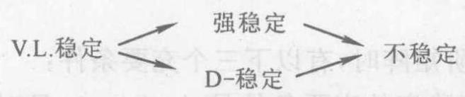

至于强稳定与 $\mathrm{D} -$ 稳定之间是否有包含关系,目前尚未见到. 例如矩阵

$$
\mathbf{A} = \left\lbrack  \begin{matrix} 3 & 4 & 0 \\  2 & 3 & {16} \\  {10} & 2 & {12} \end{matrix}\right\rbrack
$$

是强稳定的,但不是 $\mathrm{D}$ - 稳定的.

关于 $\mathbf{A}$ 为 V. L. 稳定的充要条件,直到 20 世纪 70 年代中后期才有如下三种:

(4)存在正对角矩阵 $\mathbf{D}$ ，使 $\mathbf{B} = {\mathbf{D}}^{-1}\mathbf{A}\mathbf{D}$ 为正定(或 $\mathbf{B} + {\mathbf{B}}^{\mathrm{T}}$ 为正定).

(5)对于任一非零半正定矩阵 $\mathbf{P},\mathbf{{PA}}$ 至少有一个正对角元素.

(6)A 的任意主子矩阵均为 V. L. 稳定.

充要条件 (6) 表明, 矩阵的 V. L. 稳定蕴含了它的主子矩阵也具有 V. L. 稳定，而其他三种稳定性则不具有这种性质.

具有某种稳定性的矩阵全体构成一个特殊矩阵类, 于是便有许多这样的矩阵类. 目前, 有关稳定矩阵问题的研究主要有以下三个方面.

第一方面, 多种稳定矩阵类的判别条件和相互关系问题;

第二方面, 稳定矩阵类的扩充及其与其他特殊矩阵类之间的关系问题;

第三方面，特殊型的稳定矩阵类.

各种稳定矩阵类的判别条件以及它们之间的相互关系, 已如上述. 但从论述的情况来看, 迄今为止, 仅对正稳定矩阵的判别有较好的结果, 而对其他三种稳定矩阵类的判别方法还很不完善.

关于特殊型矩阵稳定性的研究, 主要有两个方面, 即低阶矩阵和非低阶矩阵.

当 $\mathbf{A}$ 为二阶矩阵时,有以下三个充要条件:

(7) $\mathbf{A}$ 为正稳定的充要条件是 $\det \mathbf{A} > 0$ ，且对角元素之和为正值.

(8)A 为 D-(或强)稳定的充要条件是 $\mathbf{A} \in  {P}_{0}^{ + }\left( {P}_{0}^{ + }\right.$ 是主子式的值非负,且同阶主子式中至少有一个为正值的矩阵).

(9)A 为 V. L. 稳定的充要条件是 $A \in  P$ (P 是全部主子式的值均为正的矩阵,常称之为 $P$ 型矩阵类).

当 $\mathbf{A}$ 为三阶矩阵时,有以下四个充要条件:

(10) $\mathbf{A} = \left( {a}_{ij}\right)$ 为正稳定的充要条件是 $\det \mathbf{A} > 0$ ，且 $\det \mathbf{A} > \; \left( {{A}_{11} + {A}_{22} + {A}_{33}}\right) \left( {{a}_{11} + {a}_{22} + {a}_{33}}\right) .$

(11)A 为强稳定的充要条件是 $\mathbf{A} \in  {P}_{0}^{ + }$ ，且 $\mathbf{A}$ 为正稳定.

(12)A 为 D- 稳定的充要条件是

$$
{\left( \sqrt{{a}_{11}{A}_{11}} + \sqrt{{a}_{22}{A}_{22}} + \sqrt{{a}_{33}{A}_{33}}\right) }^{2} > \det \mathbf{A}
$$

(13) $A$ 为 $\mathrm{V}$ . L. 稳定的充要条件是 $A \in  P$ ，且同时满足

$$
{P}_{1}\left( y\right)  = {\left( {a}_{13}y + {a}_{31}\right) }^{2} - 4{a}_{11}{a}_{33}y < 0
$$

$$
{P}_{2}\left( y\right)  = {\left( {A}_{31}y + {A}_{13}\right) }^{2} - 4{a}_{33}{A}_{11}y < 0
$$

其中 ${A}_{ij}$ 是 $\det \mathbf{A}$ 中元素 ${a}_{ij}$ 的代数余子式.

近年来, 对于非低阶特殊矩阵稳定性的判别工作有了一些新的研究 ${}^{\left\lbrack  {36}\right\rbrack  }$ ,如对于三对角矩阵

$$
{\mathbf{J}}_{n} = {\left( c, a, b\right) }_{1}^{n} = \left\lbrack  \begin{matrix} a & b & & & \\  c & a & b & & \\   &  \ddots  &  \ddots  &  \ddots  & \\   & &  \ddots  &  \ddots  & b \\   & & & c & a \end{matrix}\right\rbrack
$$

其中 $a = {a}_{1} + {a}_{2}\mathrm{j}, b = {b}_{1} + {b}_{2}\mathrm{j}, c = {c}_{1} + {c}_{2}\mathrm{j}$ ,则有:

对于一切 $n \geq  3,\mathbf{A}$ 为正稳定的必要条件是

$$
{a}_{1} \geq  \sqrt{{\left( {b}_{1} + {c}_{1}\right) }^{2} + {\left( {c}_{2} - {b}_{2}\right) }^{2}}
$$

对于一切 $n \geq  3,\mathbf{A}$ 为正稳定的充分条件是

$$
{a}_{1} > \sqrt{{\left( {b}_{1} + {c}_{1}\right) }^{2} + {\left( {c}_{2} - {b}_{2}\right) }^{2}}
$$

对于一般的实三对角矩阵

$$
{\mathbf{J}}_{n} = {\left( {a}_{i - 1},{b}_{i},{c}_{i}\right) }_{1}^{n} = \left\lbrack  \begin{matrix} {b}_{1} & {c}_{1} & & & \\  {a}_{1} & {b}_{2} & {c}_{2} & & \\   &  \ddots  &  \ddots  &  \ddots  & \\   & &  \ddots  &  \ddots  & {c}_{n - 1} \\   & & & {a}_{n - 1} & {b}_{n} \end{matrix}\right\rbrack
$$

其中 ${a}_{i}{c}_{i} \neq  0\left( {i = 1,2,\cdots , n - 1}\right)$ ,它是 V. L. 稳定的充要条件是 ${\left( {a}_{i - 1},{b}_{i},{c}_{i}\right) }_{1}^{n}$ 的所有主子式的值为正.

若在 ${\mathbf{J}}_{n} = {\left( {a}_{i - 1},{b}_{i},{c}_{i}\right) }_{1}^{n}$ 中有 ${a}_{i}{c}_{i} > 0\left( {i = 1,2,\cdots , n - 1}\right)$ ,此时 ${\mathbf{J}}_{n}$ 是 Jacobi 矩阵,对它有下面的结果.

若 ${\mathbf{J}}_{n} = {\left( {a}_{i - 1},{b}_{i},{c}_{i}\right) }_{1}^{n}$ 为 Jacobi 矩阵,则下列 5 个命题等价:

(14)J n的顺序主子式的值为正.

(15) ${\mathbf{J}}_{n}$ 是正稳定的.

(16) ${\mathbf{J}}_{n}$ 是 $\mathrm{D}$ - 稳定的.

(17) ${\mathbf{J}}_{n}$ 是强稳定的.

(18) ${\mathbf{J}}_{n}$ 是 V. L. 稳定的.

至于循环矩阵的稳定性问题，已有一些结果，留待 $\text{ § }{7.5}$ 中介绍.

关于稳定性的数值判定，工程中多使用的是 Routh-Hurwitz 判别方法 ${}^{\left\lbrack  {19}\right\rbrack  }$ ,但使用起来不太方便. 近年来提出利用前面论述的充要条件判别正稳定的方法，还很不完善，有待于进一步研究更有效的判别方法.

## 习 题 7.1

1. 若 $\mathbf{A} = {\left( {a}_{ij}\right) }_{n \times  n}$ 为正定矩阵,证明

$$
\det \mathbf{A} \leq  \mathop{\prod }\limits_{{i = 1}}^{n}{a}_{ii}
$$

且等号成立的充要条件是 $\mathbf{A}$ 为对角矩阵.

2. 证明 Hadamard 不等式: 设 $\mathbf{A}$ 是 $n$ 阶实矩阵,则

$$
\det \mathbf{A} \leq  \sqrt{\left( {\mathop{\sum }\limits_{{i = 1}}^{n}{a}_{i1}^{2}}\right) \left( {\mathop{\sum }\limits_{{i = 1}}^{n}{a}_{i2}^{2}}\right) \cdots \left( {\mathop{\sum }\limits_{{i = 1}}^{n}{a}_{in}^{2}}\right) }
$$

提示: 利用 ${\left( \det \mathbf{A}\right) }^{2} = \det \left( {{\mathbf{A}}^{\mathrm{T}}\mathbf{A}}\right)  = \det \mathbf{B} \leq  \mathop{\prod }\limits_{{i = 1}}^{n}{b}_{ii}$ .

3. 若 $\mathbf{A}$ 为非负定矩阵,求证 $\det \left( {\mathbf{A} + \mathbf{I}}\right)  \geq  1$ ,且等号成立的充要条件是 $\mathbf{A} = \mathbf{O}$ .

提示: 设 $\mathbf{A} = \mathbf{P}\operatorname{diag}\left( {{\lambda }_{1},{\lambda }_{2},\cdots ,{\lambda }_{n}}\right) {\mathbf{P}}^{\mathrm{H}}$ ,计算 $\det \left( {\mathbf{A} + \mathbf{I}}\right)$ .

4. 若分块矩阵

$$
\mathbf{M} = \left\lbrack  \begin{matrix} \mathbf{A} & \mathbf{B} \\  {\mathbf{B}}^{\mathrm{H}} & \mathbf{D} \end{matrix}\right\rbrack
$$

为正定,求证 $\det \mathbf{M} \leq  \det \mathbf{A} \cdot  \det \mathbf{D}$ .

5. 设 $S$ 是实对称正定矩阵,证明: 对任意列向量 $x$ 和 $y$ ,都有

$$
{\left( {\mathbf{x}}^{\mathrm{T}}\mathbf{S}\mathbf{y}\right) }^{2} \leq  \left( {{\mathbf{x}}^{\mathrm{T}}\mathbf{S}\mathbf{x}}\right) \left( {{\mathbf{y}}^{\mathrm{T}}\mathbf{S}\mathbf{y}}\right)
$$

6. 若第 4 题的矩阵 $\mathbf{M}$ 为正稳定,则 $\mathbf{D} - {\mathbf{B}}^{\mathrm{H}}{\mathbf{A}}^{-1}\mathbf{B}$ 亦为正稳定矩阵.

7. 设 $\mathbf{A},\mathbf{B}$ 分别是 $n$ 阶的正定和非负定矩阵,求证

$$
\det \left( {\mathbf{A} + \mathbf{B}}\right)  \geq  \det \mathbf{A}
$$

且等号成立的充要条件是 $\mathbf{B} = \mathbf{O}$ .

8. 设 $\mathbf{A}$ 为 $n$ 阶实对称矩阵, $\mathbf{x}$ 为任一 $\dot{n}$ 维列向量,则必有

$$
{\lambda }_{n}{\mathbf{x}}^{\mathrm{T}}\mathbf{x} \leq  {\mathbf{x}}^{\mathrm{T}}\mathbf{A}\mathbf{x} \leq  {\lambda }_{1}{\mathbf{x}}^{\mathrm{T}}\mathbf{x}
$$

式中 ${\lambda }_{1},{\lambda }_{n}$ 分别为 $\mathbf{A}$ 的最大和最小特征值.

9. 判别下列各矩阵的稳定性:

(1) $\left\lbrack  \begin{matrix}  - 3 &  - 6 \\  4 & 5 \end{matrix}\right\rbrack$ ； (2) $\left\lbrack  \begin{array}{lll} 1 & 2 & 3 \\  3 & 1 & 2 \\  2 & 3 & 1 \end{array}\right\rbrack$ .

10. 设 $n$ 阶实矩阵 $\mathbf{A} = {\left( {a}_{ij}\right) }_{n \times  n}$ 为严格 (强) 对角占优矩阵,且 ${a}_{ii} > 0(i \; = 1,2,\cdots , n)$ ,则 $\mathbf{A}$ 为正稳定矩阵,且 $\det \mathbf{A} > 0$ .

11. 若 $\mathbf{A}$ 为正定, $\mathbf{B}$ 为非负定,且 ${\mathbf{A}}^{2} \geq  {\mathbf{B}}^{2}$ ,则 $\mathbf{A} \geq  \mathbf{B}$ (注: $\mathbf{A},\mathbf{B}$ 均为 Hermite 矩阵).

12. 设 $\mathbf{A},\mathbf{B}$ 均为 $n$ 阶 Hermite 矩阵,且至少有一个是正定的,则 $\mathbf{{AB}}$ 必相似于对角矩阵.

## $\text{ § }{7.2}$ 对角占优矩阵

19 世纪末, 人们在研究行列式的性质和值的计算时, 就注意到“对角占优” 这一性质. 强(严格)对角占优矩阵与不可约对角占优矩阵的概念, 早为人们所熟知. 20 世纪 60 年代以来, 又陆续提出了具非零元素链对角占优矩阵、拟对角占优矩阵、半强对角占优矩阵(Beauwens, 1976)等一系列概念. 本节将系统地介绍它们.

## 一、强对角占优与不可约对角占优矩阵

对角占优矩阵的概念, 读者已有所了解, 现再将它定义如下:

设 $n$ 阶矩阵 $\mathbf{A} = {\left( {a}_{ij}\right) }_{n \times  n}$ 满足

$$
\left| {a}_{ii}\right|  \geq  \mathop{\sum }\limits_{{j \neq  i}}\left| {a}_{ij}\right| \;\left( {i = 1,2,\cdots , n}\right) \tag{7.2.1}
$$

则称 $\mathbf{A}$ 为行对角占优矩阵.

类似地还可定义列对角占优的概念. 行对角占优矩阵与列对角占优矩阵统称为对角占优矩阵.

以下主要介绍行对角占优的情况，至于列对角占优的情况也有类似的结果.

设 $n$ 阶矩阵 $\mathbf{A} = {\left( {a}_{ij}\right) }_{n \times  n}$ 满足

$$
\left| {a}_{ii}\right|  > \mathop{\sum }\limits_{{j \neq  i}}\left| {a}_{ij}\right| \;\left( {i = 1,2,\cdots , n}\right) \tag{7.2.2}
$$

则称 $\mathbf{A}$ 为强对角占优矩阵 (实为行强对角占优,这里略去 “行” 字).

如果 $\mathbf{A}$ 为强对角占优矩阵,则 $\mathbf{A}$ 非奇异 (见例 5.8).

如果三对角矩阵 ${\mathbf{J}}_{n} = {\left( {a}_{i - 1},{b}_{i},{c}_{i}\right) }_{1}^{n}$ 具有强对角占优,则数值解三对角方程组的追赶法必可进行到底.

下面引入不可约矩阵的概念.

设有 $n$ 阶矩阵 $\mathbf{A} = {\left( {a}_{ij}\right) }_{n \times  n}$ ,当 $n = 1$ 时,若 $\mathbf{A}$ 的唯一的元素不为零,则称 $\mathbf{A}$ 为不可约,否则称为可约; 当 $n \geq  2$ 时,把正整数1,2, $\cdots , n$ 的全体记为 $N$ ,若存在一个非空集合 $K$ ,它是 $N$ 的真子集合 (即 $K \subset  N$ ,但 $K \neq  N$ ) 使

$$
{a}_{ij} = 0\;\left( {i \in  K, j \in  K}\right)
$$

则称 $\mathbf{A}$ 为可约矩阵,否则称为不可约矩阵.

例如,当矩阵 $\mathbf{A}$ 分块为

$$
\mathbf{A} = \left\lbrack  \begin{array}{ll} {\mathbf{A}}_{11} & {\mathbf{A}}_{12} \\  {\mathbf{A}}_{21} & {\mathbf{A}}_{22} \end{array}\right\rbrack
$$

其中 ${\mathbf{A}}_{11}$ 是 $r$ 阶方阵, ${\mathbf{A}}_{22}$ 是 $n - r$ 阶方阵, $1 \leq  r < n$ . 如果 ${\mathbf{A}}_{21}$ 为零矩阵, 即

$$
\mathbf{A} = \left\lbrack  \begin{matrix} {\mathbf{A}}_{11} & {\mathbf{A}}_{12} \\  \mathbf{O} & {\mathbf{A}}_{22} \end{matrix}\right\rbrack \tag{7.2.3}
$$

则 $\mathbf{A}$ 为可约矩阵. 事实上,此时取集合 $K = \{ 1,2,\cdots , r\}$ ,由于 ${\mathbf{A}}_{21} = \mathbf{O}$ ,便得 ${a}_{ij} = 0\left( {i \in  K, j \in  K}\right)$ . 如果不是 ${\mathbf{A}}_{21} = \mathbf{O}$ ,而是 ${\mathbf{A}}_{12} \; = \mathbf{O}$ ,取集合 $K = \{ r + 1, r + 2,\cdots , n\}$ ,便知 $\mathbf{A}$ 仍为可约矩阵. 因此, 有的作者以能求得置换矩阵 $\mathbf{P}$ ，使 $\mathbf{P}\mathbf{A}{\mathbf{P}}^{\mathrm{T}}$ 呈式 (7.2.3) 的形状作为可约矩阵的定义，不呈现式(7.2.3) 者称为不可约矩阵.

如果线性方程组

$$
\mathbf{{Ax}} = \mathbf{b}
$$

的系数矩阵 $\mathbf{A}$ 可约时,则可找到置换矩阵 $\mathbf{P}$ ,使 $\mathbf{A}$ 呈

$$
{\mathbf{{PAP}}}^{\mathrm{T}} = \left\lbrack  \begin{matrix} {\mathbf{A}}_{11} & {\mathbf{A}}_{12} \\  \mathbf{O} & {\mathbf{A}}_{22} \end{matrix}\right\rbrack
$$

于是原方程组可化为

$$
{\mathbf{{PAP}}}^{\mathrm{T}}\left( \mathbf{{Px}}\right)  = \mathbf{{Pb}}
$$

依次记 $\mathbf{y} = \mathbf{P}\mathbf{x}{\left\lbrack  \begin{array}{ll} {\mathbf{y}}_{1}^{\mathrm{T}} & {\mathbf{y}}_{2}^{\mathrm{T}} \end{array}\right\rbrack  }^{\mathrm{T}}$ 和 $\widehat{\mathbf{b}} = \mathbf{P}\mathbf{b}{\left\lbrack  \begin{array}{ll} {\widehat{\mathbf{b}}}_{1}^{\mathrm{T}} & {\widehat{\mathbf{b}}}_{2}^{\mathrm{T}} \end{array}\right\rbrack  }^{\mathrm{T}}$ ,就有

$$
\begin{cases} {\mathbf{A}}_{11}{\mathbf{y}}_{1} + {\mathbf{A}}_{12}{\mathbf{y}}_{2} &  = {\widehat{\mathbf{b}}}_{1} \\  {\mathbf{A}}_{22}{\mathbf{y}}_{2} &  = {\widehat{\mathbf{b}}}_{2} \end{cases}
$$

于是方程组化为两个独立的低阶方程组, 比直接解原方程组要方便、简单.

同样, $\mathbf{A}$ 的特征多项式也化为两个低阶矩阵的特征多项式的乘积.

如果三对角矩阵 ${\mathbf{J}}_{n} = {\left( {a}_{i - 1},{b}_{i},{c}_{i}\right) }_{1}^{n}$ 满足 ${a}_{i}{c}_{i} \neq  0(i = 1,2$ , $\left. {\cdots , n - 1}\right)$ ,则 ${\mathbf{J}}_{n}$ 是不可约的,请读者完成证明.

设 $n$ 阶矩阵 $\mathbf{A} = {\left( {a}_{ij}\right) }_{n \times  n}$ 满足下面三个条件:

(1)A 为对角占优矩阵;(7.2.4)

(2)A 为不可约矩阵;

(3)严格不等式 $\left| {a}_{ii}\right|  > \mathop{\sum }\limits_{{j \neq  i}}\left| {a}_{ij}\right|$ 至少对一个下标 $i \in  N$ 成立.

则称 $\mathbf{A}$ 为不可约对角占优矩阵.

不可约对角占优矩阵与强对角占优矩阵具有如下性质.

设 $n$ 阶矩阵 $\mathbf{A} = {\left( {a}_{ij}\right) }_{n \times  n}$ 为强对角占优或不可约对角占优,且 $\mathbf{B} = \mathbf{I} - {\mathbf{D}}^{-1}\mathbf{A}$ ,其中 $\mathbf{D} = \operatorname{diag}\left( {{a}_{11},{a}_{22},\cdots ,{a}_{nn}}\right) ,{a}_{ii} \neq  0$ ,则 $\rho \left( \mathbf{B}\right)  < 1$ ,且 $\det \mathbf{A} \neq  0$ (即 $\mathbf{A}$ 非奇异).

例如,令 $\mathbf{A} = \left\lbrack  \begin{matrix}  - 2 & 1 \\  1 & 2 \end{matrix}\right\rbrack$ ,显见 $\mathbf{A}$ 为强对角占优. 而

$$
\mathbf{B} = \mathbf{I} - {\mathbf{D}}^{-1}\mathbf{A} = \left\lbrack  \begin{array}{rr} 0 & \frac{1}{2} \\   - \frac{1}{2} & 0 \end{array}\right\rbrack
$$

其特征值为 ${\lambda }_{i}\left( \mathbf{B}\right)  =  \pm  \frac{1}{2}\mathrm{j}$ ,故 $\rho \left( \mathbf{B}\right)  < 1$ ,且 $\det \mathbf{A} \neq  0$ .

若 $n$ 阶矩阵 $\mathbf{A} = {\left( {a}_{ij}\right) }_{n \times  n}$ 为强对角占优或不可约对角占优,且 ${a}_{ii} > 0\left( {i = 1,2,\cdots , n}\right)$ ,则 $\operatorname{Re}{\lambda }_{i}\left( \mathbf{A}\right)  > 0\left( {i = 1,2,\cdots , n}\right)$ ,且 $\det \mathbf{A} > 0$ .

这就表明, 具有正对角元素的强对角占优或不可约对角占优的矩阵是正稳定的.

## 二、具非零元素链对角占优矩阵

具非零元素链对角占优矩阵 $\mathbf{A} = {\left( {a}_{ij}\right) }_{n \times  n}$ 是指 $\mathbf{A}$ 满足以下三个条件:

(1) $\left| {a}_{ii}\right|  \geq  \mathop{\sum }\limits_{{j \neq  i}}\left| {a}_{ij}\right| \left( {i = 1,2,\cdots , n}\right)$ ;

(2) $K = \left\{  {k \in  N\left| \right| {a}_{kk}\left| \right|  > \mathop{\sum }\limits_{{j \neq  i}}\left| {a}_{kj}\right| }\right\}   \neq  \varnothing$ ，即 $N$ 中至少有一个 $i$ 满足不等式

$$
\left| {a}_{ii}\right|  > \mathop{\sum }\limits_{{j \neq  i}}\left| {a}_{ij}\right|
$$

(3)对于 $i \in  N$ ，若 $i \in  K$ ，则必存在如下的非零元素序列(称为连接下标 $i$ 和 $k$ 的非零元素链，其中每个元素都不为零，并且 $k \in  K)$

$$
{a}_{{ii}_{1}},{a}_{{i}_{1}{i}_{2}},\cdots ,{a}_{{i}_{s}k}
$$

已经证明,若矩阵 $\mathbf{A}$ 为强对角占优或不可约对角占优,则 $\mathbf{A}$ 必为具非零元素链对角占优矩阵. 但反之则不然, 例如, 3 阶矩阵

$$
\left\lbrack  \begin{array}{rrr} 1 & 1 & 0 \\  0 & 1 & 1 \\  0 &  - \frac{1}{2} & 1 \end{array}\right\rbrack
$$

不是强对角占优, 也不是不可约对角占优, 而是具非零元素链对角占优矩阵.

对于 $n$ 阶具非零元素链对角占优矩阵 $\mathbf{A} = {\left( {a}_{ij}\right) }_{n \times  n}$ ,有以下两个结果.

(1)令 $\mathbf{B} = \mathbf{I} - {\mathbf{D}}^{-1}\mathbf{A}$ ,其中 $\mathbf{D} = \operatorname{diag}\left( {{a}_{11},{a}_{22},\cdots ,{a}_{nn}}\right) ,{a}_{ii} \neq$ 0,则 $\rho \left( \mathbf{B}\right)  < 1$ .

(2)当 ${a}_{ii} > 0\left( {i = 1,2,\cdots , n}\right)$ 时, $\operatorname{Re}{\lambda }_{i}\left( \mathbf{A}\right)  > 0(i = 1,2$ , $\cdots , n)$ .

第(2)个结果表明，当 $\mathbf{A}$ 为 $n$ 阶具非零元素链对角占优矩阵， 且对角元素为正时， $\mathbf{A}$ 为正稳定矩阵.

## 三、拟对角占优矩阵

如果对 $n$ 阶矩阵 $\mathbf{A} = {\left( {a}_{ij}\right) }_{n \times  n}$ 存在正对角矩阵 $\mathbf{D}$ ,使 $\mathbf{{AD}}$ 为强对角占优矩阵,则称 $\mathbf{A}$ 为拟对角占优矩阵.

例如, 对 4 阶矩阵

$$
\mathbf{A} = \left\lbrack  \begin{array}{llll} 1 & 1 & 1 & 1 \\  0 & 1 & 1 & 1 \\  0 & 0 & 1 & 1 \\  0 & 0 & 0 & 1 \end{array}\right\rbrack
$$

取 $\mathbf{D} = \operatorname{diag}\left( {1,\frac{1}{2},\frac{1}{4},\frac{1}{8}}\right)$ ,则

$$
\mathbf{{AD}} = \left\lbrack  \begin{matrix} 1 & \frac{1}{2} & \frac{1}{4} & \frac{1}{8} \\  0 & \frac{1}{2} & \frac{1}{4} & \frac{1}{8} \\  0 & 0 & \frac{1}{4} & \frac{1}{8} \\  0 & 0 & 0 & \frac{1}{8} \end{matrix}\right\rbrack
$$

为强对角占优,故 $\mathbf{A}$ 为拟对角占优矩阵.

可以证明,拟对角占优矩阵的主对角元素都不为零,且强对角占优矩阵、不可约对角占优矩阵以及具非零元素链对角占优矩阵都是拟对角占优矩阵.

这里指出,拟对角占优矩阵的定义还可改为: 设 $\mathbf{A} = {\left( {a}_{ij}\right) }_{n \times  n}$ , 若存在 $n$ 维向量 $\mathbf{x} = {\left( {\xi }_{1},{\xi }_{2},\cdots ,{\xi }_{n}\right) }^{\mathrm{T}} > 0$ ,使

$$
\left| {a}_{ii}\right| {\xi }_{i} > \mathop{\sum }\limits_{{j \neq  i}}\left| {a}_{ij}\right| {\xi }_{j}\;\left( {i = 1,2,\cdots , n}\right) \tag{7.2.5}
$$

成立,则称 $\mathbf{A}$ 为拟对角占优矩阵.

同样可以定义按列为拟对角占优矩阵,且可证明二者是等价的.

拟对角占优矩阵 $\mathbf{A} = {\left( {a}_{ij}\right) }_{n \times  n}$ 具有这样的性质: $\mathbf{A}$ 的对角元素 ${a}_{ii} \neq  0\left( {i = 1,2,\cdots , n}\right)$ ,且 $\det \mathbf{A} \neq  0$ ; 若更有 ${a}_{ii} > 0(i = 1,2,\cdots$ , $n)$ ,则 $\operatorname{Re}{\lambda }_{i}\left( \mathbf{A}\right)  > 0\left( {i = 1,2,\cdots , n}\right)$ ,且 $\det \mathbf{A} > 0$ .

这就是说, 有正对角元素的拟对角占优矩阵是正稳定的.

拟对角占优矩阵的判别方法如下:

矩阵 $\mathbf{A}$ 为拟对角占优矩阵的充要条件是存在正对角矩阵 ${\mathbf{D}}_{1}$ 和 ${\mathbf{D}}_{2}$ ,使矩阵 ${\mathbf{D}}_{1}\mathbf{A}{\mathbf{D}}_{2}$ 为强对角占优矩阵.

## 四、半强对角占优矩阵

如果 $n$ 阶矩阵 $\mathbf{A} = {\left( {a}_{ij}\right) }_{n \times  n}$ 为对角占优,即有

$$
\left| {a}_{ii}\right|  \geq  \mathop{\sum }\limits_{{j \neq  i}}\left| {a}_{ij}\right| \;\left( {i = 1,2,\cdots , n}\right)
$$

并且满足如下的严格不等式

$$
\left| {a}_{ii}\right|  > \mathop{\sum }\limits_{{j < i}}\left| {a}_{ij}\right| \;\left( {i = 2,3,\cdots , n}\right) \tag{7.2.6}
$$

则称 $\mathbf{A}$ 为下半强对角占优矩阵; 如果存在置换矩阵 $\mathbf{P}$ ,使 $\mathbf{P}\mathbf{A}{\mathbf{P}}^{\mathrm{T}}$ 为下半强对角占优,则称 $\mathbf{A}$ 为半强对角占优矩阵.

半强对角占优矩阵与具非零元素链对角占优矩阵之间的关系如下:

$n$ 阶矩阵 $\mathbf{A} = {\left( {a}_{ij}\right) }_{n \times  n}$ 为半强对角占优的充要条件是 $\mathbf{A}$ 为具非零元素链对角占优.

这就是说,半强对角占优矩阵实际上就是具非零元素链对角占优矩阵.

$n$ 阶矩阵 $\mathbf{A} = {\left( {a}_{ij}\right) }_{n \times  n}$ 为不可约对角占优的充要条件是 $\mathbf{A}$ 为半强对角占优和不可约.

各对角占优矩阵类之间有如下关系:

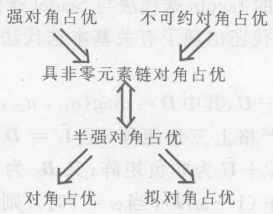

不可约对角占优 $\Leftrightarrow$ 半强对角占优和不可约

$\mathbf{A}$ 为拟对角占优 $\Leftrightarrow  {\mathbf{D}}_{1}\mathbf{A}{\mathbf{D}}_{2}$ 为强对角占优

由以上论述可见, 从强对角占优矩阵类到拟对角占优矩阵类, 可以视为右乘以正对角矩阵 (或拟似变换) 扩张而来. 这种扩张把其他各类对角占优矩阵都包含进去了. 有趣的是, 这一扩张还是饱和的,即如存在正对角矩阵 $\mathbf{D}$ ,使 $\mathbf{{AD}}$ 为拟对角占优,则 $\mathbf{A}$ 仍为拟对角占优. 因此, 如果要进一步扩张拟对角占优矩阵类, 就要用比拟似变换更为广泛的变换.

各类对角占优矩阵在实际中经常遇到. 许多文献讨论了基本迭代法(指 Jacobi, Seidel 及 SOR 迭代法) 的收敛性与这些矩阵类的关系，例如 James 等人给出了下述两个结果 ${}^{\left\lbrack  {45}\right\rbrack  }$ .

考虑对角线元素全为 1 的矩阵 $\mathbf{A}$ ,有以下结论.

(1)若 $\mathbf{A}$ 为不可约的 $\mathbf{L}$ - 矩阵(具有正对角元素而主对角线外的元素非负),则 $\mathbf{A}$ 的 Jacobi 及 Seidel 迭代法收敛的必要条件是 $\mathbf{A}$ 为拟对角占优.

(2)设 $\mathbf{A} = \mathbf{I} - \mathbf{L} - \mathbf{U}$ 为不可约矩阵，且 $\mathbf{L}$ 与 $\mathbf{U}$ 分别是元素非负的严格下三角矩阵和严格上三角矩阵,则当 $0 < \omega  \leq  1$ 时, $\mathbf{A}$ 的 SOR 迭代法收敛的必要条件是 $\mathbf{A}$ 为拟对角占优.

对于对角线元素非零的矩阵 $\mathbf{A}$ ,可以取可逆对角矩阵 ${\mathbf{D}}_{1}$ 和 ${\mathbf{D}}_{2}$ ,使得 $\widetilde{\mathbf{A}} = {\mathbf{D}}_{1}\mathbf{A}{\mathbf{D}}_{2}$ 的对角线元素全为 1 . 参考文献[45]表明,对 $\mathbf{A}$ 的 SOR 迭代法收敛的充要条件是对 $\widetilde{\mathbf{A}}$ 的 SOR 迭代法收敛; 若 $\widetilde{\mathbf{A}}$ 对角占优,则对 $\mathbf{A}$ 的 Jacobi 迭代法与 Seidel 迭代法均收敛.

20 世纪 40 年代还出现了有关基本迭代法的 Stein-Rosenberg 定理:

设 $\mathbf{A} = \mathbf{D} - \mathbf{L} - \mathbf{U}$ ,其中 $\mathbf{D} = \operatorname{diag}\left( {{a}_{11},{a}_{22},\cdots ,{a}_{nn}}\right) ;\mathbf{L},\mathbf{U}$ 分别为严格下三角与严格上三角矩阵,记 $\widetilde{\mathbf{L}} = {\mathbf{D}}^{-1}\mathbf{L},\widetilde{\mathbf{U}} = {\mathbf{D}}^{-1}\mathbf{U}$ ,且 Jacobi 矩阵 $\mathbf{B} = \widetilde{\mathbf{L}} + \widetilde{\mathbf{U}}$ 为非负矩阵; 又 ${\mathbf{B}}_{1}$ 为 Seidel 矩阵 $\left( {{\mathbf{B}}_{\omega } = }\right. \; {\left( \mathbf{I} - \omega \widetilde{\mathbf{L}}\right) }^{-1}\left( {\omega \widetilde{\mathbf{U}} + \left( {1 - \omega }\right) \mathbf{I}}\right)$ ,当 $\omega  = 1$ 时). 则下列互斥关系有且仅有一个成立:

(1) $\rho \left( \mathbf{B}\right)  = \rho \left( {\mathbf{B}}_{1}\right)  = 0$ .

(2) $0 < \rho \left( {\mathbf{B}}_{1}\right)  < \rho \left( \mathbf{B}\right)  < 1$ .

(3) $1 = \rho \left( \mathbf{B}\right)  = \rho \left( {\mathbf{B}}_{1}\right)$ .

(4) $1 < \rho \left( \mathbf{B}\right)  < \rho \left( {\mathbf{B}}_{1}\right)$ .

于是 $\mathbf{B}$ 与 ${\mathbf{B}}_{1}$ 同时收敛或同时发散.

20 世纪 50 年代则有关于 SOR 迭代法的 Ostrowski-Reich 定理. 近年来, 国内外学者对上述几个定理加以改进或推广, 其中高益明在 1981 年高校第三次计算数学学术会议上宣布了一个结果: 如果矩阵 $\mathbf{A}$ 为广义的不可约 $\mathrm{L}$ - 矩阵 (即存在非奇异对角矩阵 $\mathbf{P},\mathbf{Q}$ 使 PAQ 为 L- 矩阵),则 $\mathbf{A}$ 的 Jacobi 和 Seidel 迭代法收敛的充要条件是 $\mathbf{A}$ 为拟对角占优. 该结果较深刻地描写了拟对角占优与基本迭代法收敛性的关系.

## 五、块对角占优矩阵

将对角占优矩阵概念推广到分块矩阵的情形，是 Feingold 等人[42] 在 Pacific J. Math. (1962) 讨论 Gerschgorin 圆盘定理的推广时提到的. 他们给出了分块强对角占优及分块不可约对角占优的概念,即把 $n$ 阶矩阵 $\mathbf{A} = {\left( {a}_{ij}\right) }_{n \times  n}$ 划分为分块矩阵

$$
\mathbf{A} = {\left( {\mathbf{A}}_{ij}\right) }_{N \times  N}
$$

其中 ${\mathbf{A}}_{ii}$ 均是可逆矩阵,若有

$$
{\begin{Vmatrix}{\mathbf{A}}_{ii}^{-1}\end{Vmatrix}}^{-1} \geq  \mathop{\sum }\limits_{{j \neq  i}}\begin{Vmatrix}{\mathbf{A}}_{ij}\end{Vmatrix}\;\left( {i = 1,2,\cdots , N}\right) \tag{7.2.7}
$$

则称 $\mathbf{A}$ 为按行分块对角占优; 若式 (7.2.7) 的不等号严格成立,则称 $\mathbf{A}$ 为按行分块强对角占优矩阵. 有时简称块对角占优及块强对角占优.

一般说来，块对角占优矩阵不一定是对角占优矩阵. 例如，对于矩阵

$$
\mathbf{A} = \left\lbrack  \begin{matrix} 0 & 1 & 0 & 0 \\  \frac{2}{3} & 0 & \frac{1}{3} & 0 \\  \cdots & \cdots & \cdots & \cdots \\  0 & \frac{1}{3} & 0 & \frac{2}{3} \\  0 & 0 & 1 & 0 \end{matrix}\right\rbrack   = \left\lbrack  \begin{array}{ll} {\mathbf{A}}_{11} & {\mathbf{A}}_{12} \\  {\mathbf{A}}_{21} & {\mathbf{A}}_{22} \end{array}\right\rbrack
$$

而言,如采用 $\infty  -$ 范数,则 ${\begin{Vmatrix}{\mathbf{A}}_{11}^{-1}\end{Vmatrix}}_{\infty }^{-1} = {\begin{Vmatrix}{\mathbf{A}}_{22}^{-1}\end{Vmatrix}}_{\infty }^{-1} = \frac{2}{3}$ , ${\begin{Vmatrix}{\mathbf{A}}_{21}\end{Vmatrix}}_{\infty } = {\begin{Vmatrix}{\mathbf{A}}_{12}\end{Vmatrix}}_{\infty } = \frac{1}{3}$ . 显见 $\mathbf{A}$ 是块对角占优,而不是对角占优.

如果 $\mathbf{B} = {\left( \begin{Vmatrix}{\mathbf{A}}_{ij}\end{Vmatrix}\right) }_{N \times  N}$ 不可约,则称 $\mathbf{A}$ 为块不可约.

可以证明,对于矩阵 $\mathbf{A} = {\left( {\mathbf{A}}_{ij}\right) }_{N \times  N}$ ,若下列二条件中有任何一个成立,则 $\mathbf{A}$ 为非奇异矩阵.

(1)A 为块强对角占优;

(2)A 为块不可约对角占优, 且式 (7.2.7) 中至少有一个不等号成立.

矩阵 $\mathbf{A}$ 的具非零元素链对角占优,半强对角占优,拟对角占优等定义和性质, 都已相应推广到分块矩阵的情形. 值得指出的是, 块强对角占优的条件可减弱为

$$
\mathop{\sum }\limits_{{j \neq  i}}\begin{Vmatrix}{{\mathbf{A}}_{ii}^{-1}{\mathbf{A}}_{ij}}\end{Vmatrix} < 1 \tag{7.2.8}
$$

至于其他类型的条件同样可以减弱.

最后需要指出的是，到目前为止，对角占优、块对角占优已有不少的类型出现,但除了强对角占优和不可约对角占优比较容易直接判别外, 其他类型在判别问题上仍然缺少有效的方法, 值得进一步研究. 另外, 研究具有以各种对角占优矩阵为系数矩阵的线性方程组迭代解法的收敛性, 也有一定的价值.

## 习 题 7.2

1. 设矩阵 $\mathbf{A}$ 为强对角占优或不可约对角占优,直接证明齐次线性方程组 $\mathbf{{Ax}} = \mathbf{0}$ 只有零解.

2. 设矩阵 $\mathbf{A}$ 为强对角占优或不可约对角占优,又 $\mathbf{A}$ 的主对角元素都是正值,问 $\mathbf{A}$ 的各主子矩阵的特征值实部是否都为正值?

3. 设矩阵 $\mathbf{A}$ 的阶数大于 1,证明 $\mathbf{A}$ 为不可约矩阵的充要条件是对于 $N = \; \{ 1,2,\cdots , n\}$ 中的任意两个数 $i$ 与 $j\left( {i \neq  j}\right)$ ,都存在连接 $i$ 与 $j$ 的非零元素链.

4. 若存在正对角矩阵 $\mathbf{D}$ ，使矩阵 $\mathbf{{AD}}$ 为半强对角占优,则称 $\mathbf{A}$ 为拟半强对角占优矩阵. 试对拟半强对角占优矩阵与拟对角占优矩阵作比较.

5. 设 $\mathbf{A}$ 为拟对角占优矩阵, $\mathbf{D}$ 为正对角矩阵,问 $\mathbf{{AD}} + \mathbf{D}{\mathbf{A}}^{\mathrm{T}}$ 是否仍为拟对角占优矩阵?

6. 对称正定矩阵是否为拟对角占优矩阵?

7. 设矩阵 $\mathbf{A}$ 为对角占优,且为拟对角占优,问 $\mathbf{A}$ 是否为具非零元素链对角占优?

## $\text{ § }{7.3}$ 非负矩阵

本节讨论非负矩阵、单调矩阵与矩阵的正则分裂等概念.

## 一、非负矩阵

若 $n$ 阶实矩阵 $\mathbf{A} = {\left( {a}_{ij}\right) }_{n \times  n}$ 满足 ${a}_{ij} \geq  0\left( {i, j = 1,2,\cdots , n}\right)$ ,则称 $\mathbf{A}$ 为非负矩阵,记为 $\mathbf{A} \geq  \mathbf{O}$ ; 若 ${a}_{ij} > 0\left( {i, j = 1,2,\cdots , n}\right)$ ,则称 $\mathbf{A}$ 为正矩阵,记为 $\mathbf{A} > \mathbf{O}$ .

例如，零矩阵是非负矩阵. 若非负矩阵 $\mathbf{A}$ 同时不是零矩阵，则记为 $\mathbf{A} \geq  \mathbf{O}$ (注意符号 $\geq$ 和 $\geq$ 的区别). 又若 $\mathbf{B} = {\left( {b}_{ij}\right) }_{n \times  n} \in  {\mathbf{R}}^{n \times  n}$ , 则以其元素的绝对值 $\left| {b}_{ij}\right|$ 为元素的矩阵也是非负矩阵,常记为 $\left| \mathbf{B}\right|$ .

类似地,把一个没有负分量的向量 $x$ 称为非负向量,记为 $x \geq  0$ ; 当非负向量 $x$ 同时不是零向量,则记为 $x \geq  0$ ; 又把分量都是正值的向量 $x$ 称为正向量,记为 $x > 0$ .

非负矩阵不仅在实际中经常出现,而且是学习数值代数中的一些矩阵,如 $\mathrm{M}$ 矩阵 (即若 $\mathbf{A} = {\left( {a}_{ij}\right) }_{n \times  n} \in  {\mathbf{R}}^{n \times  n}$ 的主对角线外的元素为非正值,即 ${a}_{ij} \leq  0\left( {i \neq  j}\right)$ ,且 ${\mathbf{A}}^{-1} \geq  \mathbf{O}$ ,则称 $\mathbf{A}$ 为 $\mathrm{M}$ 矩阵) 的三角分解及特征值等问题的基础. 它来源于这样的事实:对于矩阵 $\mathbf{A} \in  {\mathbf{R}}^{n \times  n}$ 及非负矩阵 $\left| \mathbf{A}\right|$ 而言,它们的谱半径满足关系 $\rho \left( \mathbf{A}\right)  \leq  \rho \left( \left| \mathbf{A}\right| \right) .$

下面不加证明地介绍非负不可约矩阵的 Perron-Frobenius 理论的一些主要结果 ${}^{\left\lbrack  {26}\right\rbrack  }$ .

定理 7.1 设 $\mathbf{A} \in  {\mathbf{R}}^{n \times  n}$ 是非负不可约矩阵,则有结论:

(1) $\mathbf{A}$ 有一正实特征值恰等于它的谱半径 $\rho \left( \mathbf{A}\right)$ ；

(2)属于特征值 $\rho \left( \mathbf{A}\right)$ 有一正特征向量；

(3)当 $\mathbf{A}$ 的任意元素(一个或多个)增加时，谱半径 $\rho \left( \mathbf{A}\right)$ 不减少.

定理 7.2 设 $\mathbf{A} \in  {\mathbf{R}}^{n \times  n}$ 为非负矩阵,则有结论:

(1) $\mathbf{A}$ 有一非负特征值恰等于它的谱半径 $\rho \left( \mathbf{A}\right)$ ；

(2)属于特征值 $\rho \left( \mathbf{A}\right)$ 有一非负特征向量；

(3)当 $\mathbf{A}$ 的任意元素(一个或多个)增加时，谱半径 $\rho \left( \mathbf{A}\right)$ 不减少.

例如,对非负不可约矩阵

$$
\left\lbrack  \begin{array}{lll} 1 & 2 & 0 \\  2 & 1 & 3 \\  0 & 2 & 1 \end{array}\right\rbrack
$$

而言,其谱半径 $\rho \left( \mathbf{A}\right)  = 1 + \sqrt{10}$ 就是它的一个特征值,而属于 $\rho \left( \mathbf{A}\right)$ 的正特征向量是 ${\left( 1,\sqrt{10},2\right) }^{\mathrm{T}}$ .

## 二、单调矩阵

如果一个 $n$ 阶实矩阵 $\mathbf{A}$ 的逆矩阵 ${\mathbf{A}}^{-1} \geq  \mathbf{O}$ ,则称 $\mathbf{A}$ 为单调矩阵.

例如矩阵

$$
\mathbf{A} = \left\lbrack  \begin{array}{rrr} 1 &  - \frac{1}{2} & \frac{1}{8} \\  0 & 1 &  - \frac{1}{2} \\  0 & 0 & 1 \end{array}\right\rbrack \tag{7.3.1}
$$

的逆矩阵为

$$
{\mathbf{A}}^{-1} = \left\lbrack  \begin{matrix} 1 & \frac{1}{2} & \frac{1}{8} \\  0 & 1 & \frac{1}{2} \\  0 & 0 & 1 \end{matrix}\right\rbrack   \geq  \mathbf{O}
$$

故 $\mathbf{A}$ 为单调矩阵.

若 $\mathbf{A}$ 为单调矩阵,则 $\mathbf{A}$ 是非奇异的. 于是线性方程组 $\mathbf{A}\mathbf{x} = \mathbf{b}$ 有唯一解 $\widetilde{\mathbf{x}} = {\left( {\xi }_{1},{\xi }_{2},\cdots ,{\xi }_{n}\right) }^{\mathrm{T}}$ ,并有如下结果.

设 $\mathbf{A}$ 为单调矩阵,若能找到向量 ${\mathbf{x}}^{\prime } = {\left( {\xi }_{1}{}^{\prime },{\xi }_{2}{}^{\prime },\cdots ,{\xi }_{n}{}^{\prime }\right) }^{\mathrm{T}}$ 和 ${\mathbf{x}}^{\prime \prime } = {\left( {\xi }_{1}^{\prime \prime },{\xi }_{2}^{\prime \prime },\cdots ,{\xi }_{n}^{\prime \prime }\right) }^{\mathrm{T}}$ ,分别使 $\mathbf{A}{\mathbf{x}}^{\prime } \leq  \mathbf{b},\mathbf{A}{\mathbf{x}}^{\prime \prime } \geq  \mathbf{b}$ ,则有估计式

$$
{x}^{\prime } \leq  \widetilde{x} \leq  {x}^{\prime \prime } \tag{7.3.2}
$$

或

$$
{\xi }_{i}^{\prime } \leq  {\widetilde{\xi }}_{i} \leq  {\xi }_{i}^{\prime \prime }\;\left( {i = 1,2,\cdots , n}\right) \tag{7.3.2}
$$

事实上,由于 $A{x}^{\prime } \leq  b$ ,因此 $A{x}^{\prime } - b \leq  0$ . 又 $A$ 是单调矩阵,即有 ${\mathbf{A}}^{-1} \geq  \mathbf{O}$ ,于是有

$$
{A}^{-1}\left( {A{x}^{\prime } - b}\right)  \leq  0
$$

即

$$
{x}^{\prime } - {A}^{-1}b \leq  0
$$

由 $\widetilde{\mathbf{x}} = {\mathbf{A}}^{-1}\mathbf{b}$ ,便得

$$
{x}^{\prime } \leq  \widetilde{x}
$$

类似地有

$$
{x}^{\prime \prime } \geq  \widetilde{x}
$$

式 (7.3.2) 的意义在于,当找到了满足 $\mathbf{A}{\mathbf{x}}^{\prime } \leq  \mathbf{b}$ 的向量 ${\mathbf{x}}^{\prime }$ ,便直接得到 ${\mathbf{x}}^{\prime } \leq  \widetilde{\mathbf{x}}$ ,即 ${\mathbf{x}}^{\prime }$ 为解向量 $\widetilde{\mathbf{x}}$ 的下界. 同样,只要找到满足 $A{x}^{\prime \prime } \geq  b$ 的 ${x}^{\prime \prime }$ ,便知 ${x}^{\prime \prime }$ 是 $\widetilde{x}$ 的上界.

作为式 (7.3.2) 的应用，考虑线性方程组

$$
\left. \begin{aligned} {\xi }_{1} - \frac{1}{4}{\xi }_{2} - \frac{1}{4}{\xi }_{3} &  = {0.6} \\   - \frac{1}{4}{\xi }_{1} + {\xi }_{2} - \frac{1}{4}{\xi }_{4} &  = {0.6} \\   - \frac{1}{4}{\xi }_{1} + {\xi }_{3} - \frac{1}{4}{\xi }_{4} &  = {0.6} \end{aligned}\right\} \tag{7.3.3}
$$

它的系数矩阵 $\mathbf{A}$ 的逆矩阵是

$$
{\mathbf{A}}^{-1} = \left\lbrack  \begin{matrix} \frac{7}{6} & \frac{2}{6} & \frac{2}{6} & \frac{1}{6} \\  \frac{2}{6} & \frac{7}{6} & \frac{1}{6} & \frac{2}{6} \\  \frac{2}{6} & \frac{1}{6} & \frac{7}{6} & \frac{2}{6} \\  \frac{1}{6} & \frac{2}{6} & \frac{2}{6} & \frac{7}{6} \end{matrix}\right\rbrack   \geq  \mathbf{O}
$$

若取 ${\mathbf{x}}^{\prime } = {\left( {1.2},{1.2},{1.2},{1.2}\right) }^{\mathrm{T}}$ ,容易计算出

$$
A{x}^{\prime } = {\left( {0.6},{0.6},{0.6},{0.6}\right) }^{\mathrm{T}}
$$

于是

$$
A{x}^{\prime } \leq  b
$$

成立,故所论方程组的解的下界为 ${\widetilde{\xi }}_{i} \geq  {1.2}\left( {i = 1,2,3,4}\right)$ . 实际上, 该方程组的精确解为

$$
\widetilde{\mathbf{x}} = {\left( {1.21},{1.22},{1.22},{1.27}\right) }^{\mathrm{T}}
$$

下面给出 20 世纪 50 年代初由 Collatz 提出 ${}^{\left\lbrack  {37}\right\rbrack  }$ 的判别矩阵 $\mathbf{A}$ 为单调矩阵的一个充要条件, 它可作为单调矩阵概念的等价条件.

矩阵 $\mathbf{A}$ 为单调矩阵的充要条件是可从 $\mathbf{A}\mathbf{x} \geq  \mathbf{0}$ 推出 $\mathbf{x} \geq  \mathbf{0}$ ,这里 $x$ 是向量.

事实上,因为 $\mathbf{A}$ 是单调矩阵,所以 ${\mathbf{A}}^{-1} \geq  \mathbf{O}$ . 若 $\mathbf{A}\mathbf{x} \geq  \mathbf{0}$ ,则必有 ${\mathbf{A}}^{-1}\mathbf{A}\mathbf{x} \geq  \mathbf{0}$ ,从而 $\mathbf{x} \geq  \mathbf{0}$ .

反之,若可从 $\mathbf{A}x \geq  \mathbf{0}$ 推出 $x \geq  \mathbf{0}$ ,则 $\mathbf{A}$ 非奇异. 事实上,设 $\mathbf{A}\mathbf{x} = \mathbf{0}$ 有解 $\widetilde{\mathbf{x}}$ ,即 $\mathbf{A}\widetilde{\mathbf{x}} = \mathbf{0}$ ,于是 $\mathbf{A}\widetilde{\mathbf{x}} \geq  \mathbf{0}$ ,由假设知 $\widetilde{\mathbf{x}} \geq  \mathbf{0}$ ; 再由 $\mathbf{A}\left( {-\widetilde{\mathbf{x}}}\right)  =  - \mathbf{A}\widetilde{\mathbf{x}} = \mathbf{0}$ ,又可推得 $- \widetilde{\mathbf{x}} \geq  \mathbf{0}$ . 故只能有 $\widetilde{\mathbf{x}} = \mathbf{0}$ . 从而 $\mathbf{A}\mathbf{x} = \mathbf{0}$ 仅有零解,所以 $\mathbf{A}$ 非奇异,即 ${\mathbf{A}}^{-1}$ 存在.

记 ${\mathbf{a}}_{j}^{-1}$ 为 ${\mathbf{A}}^{-1}$ 的第 $j$ 列 $\left( {j = 1,2,\cdots , n}\right)$ ,则 $\mathbf{A}{\mathbf{a}}_{j}^{-1} = {\mathbf{e}}_{j} \geq  \mathbf{0}$ . 由假设有 ${\mathbf{a}}_{j}^{-1} \geq  \mathbf{0}$ . 这就是说 ${\mathbf{A}}^{-1}$ 的第 $j$ 列 ${\mathbf{a}}_{j}^{-1}$ 为非负向量,故 ${\mathbf{A}}^{-1} \geq$ 0. 这就证明了 $\mathbf{A}$ 为单调矩阵.

设 $\mathbf{A} \in  {\mathbf{R}}^{n \times  n}$ ,如果以 ${\mathbf{R}}_{ + }^{n}$ 表示实 $n$ 维向量集合 ${\mathbf{R}}^{n}$ 的全体非负向量所构成的子集合,那末前面关于单调矩阵 $\mathbf{A}$ 的定义可以改为: 若由 $\mathbf{A}\mathbf{x} \in  {\mathbf{R}}_{ + }^{n}$ 可以推出 $\mathbf{x} \in  {\mathbf{R}}_{ + }^{n}$ ,就称 $\mathbf{A}$ 为单调矩阵.

当 $\mathbf{A} \in  {\mathbf{R}}^{m \times  n}$ 时, Mangasarian 在 1968 年仍然用 “由 $\mathbf{A}\mathbf{x} \geq  \mathbf{0}$ 可以推出 $x \geq  {0}^{\prime \prime }$ 作为 $\mathbf{A}$ 是单调矩阵的定义. 如果注意到此时空间的维数,则用 “若由 $\mathbf{A}x \in  {\mathbf{R}}_{ + }^{m}$ 可以推出 $x \in  {\mathbf{R}}_{ + }^{n}$ ” 作为定义. 他还提出了一些等价条件,其中有 $m \times  n$ 矩阵 $\mathbf{A}$ 为单调矩阵的充要条件是 $\mathbf{A}$ 有一非负左逆 (即存在 $n \times  m$ 非负矩阵 $\mathbf{B}$ ,使 $\mathbf{{BA}} = \mathbf{I}$ ). 还有一个等价条件是 $K\left( \mathbf{A}\right)  \supset  {\mathbf{R}}_{ + }^{n}$ ,这里 ${\mathbf{R}}_{ + }^{n}$ 是 $n$ 维欧氏空间全体非负向量的集合,而 $K\left( \mathbf{A}\right)  = \left\{  {\mathbf{z} \mid  \mathbf{z} = {\mathbf{A}}^{\mathrm{T}}\mathbf{u},\mathbf{u} \geq  \mathbf{0}}\right\}$ .

## 三、矩阵的正则分裂及弱正则分裂

设矩阵 $\mathbf{A}$ 可表示为

$$
\mathbf{A} = \mathbf{Q} - \mathbf{S},\;{\mathbf{Q}}^{-1} \geq  \mathbf{O},\;\mathbf{S} \geq  \mathbf{O} \tag{7.3.4}
$$

则称上述表达式为 $\mathbf{A}$ 的正则分裂. 如果更有 ${\mathbf{Q}}^{-1}\mathbf{S}$ 为收敛矩阵，即 $\rho \left( {{\mathbf{Q}}^{-1}\mathbf{S}}\right)  < 1$ ,则称 $\mathbf{A}$ 有收敛的正则分裂.

矩阵 $\mathbf{A}$ 为逆非负的另一等价条件是 $\mathbf{A}$ 有收敛的正则分裂.

与收敛的正则分裂相联系的解线性方程组 $\mathbf{A}\mathbf{x} = \mathbf{b}$ 的基本迭代法是

$$
{\mathbf{x}}^{\left( k + 1\right) } = {\mathbf{Q}}^{-1}\mathbf{S}{\mathbf{x}}^{\left( k\right) } + {\mathbf{Q}}^{-1}\mathbf{b} \tag{7.3.5}
$$

由于迭代矩阵 ${\mathbf{Q}}^{-1}\mathbf{S}$ 的谱半径 $\rho \left( {{\mathbf{Q}}^{-1}\mathbf{S}}\right)  < 1$ ,故迭代法式 (7.3.5) 收敛于 $\mathbf{A}\mathbf{x} = \mathbf{b}$ 的唯一解.

矩阵的正则分裂概念是 Varga(1960) 引入的 ${}^{\left\lbrack  {39}\right\rbrack  }$ . 之后又出现了弱正则分裂的概念,即若矩阵 $\mathbf{A}$ 有表达式

$$
\mathbf{A} = \mathbf{Q} - \mathbf{S},\;{\mathbf{Q}}^{-1} \geq  \mathbf{O},\;{\mathbf{Q}}^{-1}\mathbf{S} \geq  \mathbf{O} \tag{7.3.6}
$$

则称式 (7.3.6) 为 $\mathbf{A}$ 的弱正则分裂. 如果更有 $\rho \left( {{\mathbf{Q}}^{-1}\mathbf{S}}\right)  < 1$ ,则称 $\mathbf{A}$ 有收敛的弱正则分裂.

矩阵具有收敛的正则分裂和具有收敛的弱正则分裂是等价的.

Plemmons 在 1972 年把 $A$ 的正则分裂推广到 $m \times  n$ 的矩阵,并且得到下面的结果.

设 $\mathbf{A} \in  {\mathbf{R}}^{m \times  n}$ 为列满秩,则 $\mathbf{A}$ 的 Moore-Penrose 逆 ${\mathbf{A}}^{ + } \geq  \mathbf{O}$ 的充要条件是存在矩阵 $\mathbf{S}$ ,使得下面条件成立:

(1) $Q = A + S$ 满足 $R\left( S\right)  \subseteq  R\left( Q\right)$ ，且 ${Q}^{ + } \geq  O$ ；

(2) ${Q}^{ + }S \geq  O$ ；

(3) $\rho \left( {{Q}^{ + }S}\right)  < 1$ .

这里的 $R\left( \mathbf{S}\right)$ 与 $R\left( \mathbf{Q}\right)$ 分别是矩阵 $\mathbf{S}$ 与 $\mathbf{Q}$ 的值域.

1975 年, Poole 称满足 ${\mathbf{A}}^{ + } \geq  \mathbf{O}$ 的矩阵 $\mathbf{A}$ 为半单调矩阵. $\mathbf{A}$ 为半单调矩阵的充要条件是由 $\mathbf{A}\mathbf{x} \in  {\mathbf{R}}_{ + }^{m} + N\left( {\mathbf{A}}^{\mathrm{T}}\right)$ 与 $\mathbf{x} \in  R\left( {\mathbf{A}}^{\mathrm{T}}\right)$ 可推出 $x \geq  0$ ,这里的 $N\left( {\mathbf{A}}^{\mathrm{T}}\right)$ 为 ${\mathbf{A}}^{\mathrm{T}}$ 的核空间.

目前,已发展了各种单调矩阵的概念. 例如,令 $V$ 为 $n$ 维向量空间 ${\mathbf{R}}^{n}$ 的子空间,如果能从 $\mathbf{A}\mathbf{x} \geq  \mathbf{0}$ 与 $\mathbf{x} \in  V$ 推出 $\mathbf{x} \geq  \mathbf{0}$ ,那么称 $\mathbf{A}$ 在 $\mathbf{V}$ 上是单调的. 令 $T$ 是 $N\left( \mathbf{A}\right)$ 的余子空间 (即 $T + N\left( \mathbf{A}\right)  = {\mathbf{R}}^{n}$ , 而 $T \cap  N\left( \mathbf{A}\right)  = \{ \mathbf{0}\}$ ,即 ${\mathbf{R}}^{n}$ 分解为 $T$ 与 $N\left( \mathbf{A}\right)$ 的直和),且 $\mathbf{A}$ 在 $T$ 上为单调,则称 $\mathbf{A}$ 为 $\mathbf{T}$ - 单调矩阵. 当 $\mathbf{A}$ 对 $N\left( \mathbf{A}\right)$ 的每一余子空间 $T$ 均为 $\mathrm{T}$ - 单调时,则称 $\mathbf{A}$ 为几乎单调矩阵.

若 $\mathbf{A}$ 在 $R\left( {\mathbf{A}}^{\mathrm{T}}\right)$ 上为单调时,则称 $\mathbf{A}$ 为行单调 (因为 $R\left( {\mathbf{A}}^{\mathrm{T}}\right)$ 为 $N\left( \mathbf{A}\right)$ 的余子空间 (见式 (1.3.21)),故 $\mathbf{A}$ 也是 $R\left( {\mathbf{A}}^{\mathrm{T}}\right)$ - 单调). $\mathbf{A}$ 为行单调的充要条件是至少有一个广义逆 ${\mathbf{A}}^{\left( 1,4\right) } \geq  \mathbf{O}$ .

若能从 $\mathbf{A}\mathbf{x} \geq  \mathbf{0}$ 推出 $\mathbf{x} \in  {\mathbf{R}}_{ + }^{n} + N\left( \mathbf{A}\right)$ ,则称 $\mathbf{A}$ 为弱单调矩阵.

若对 $n$ 阶方阵 $\mathbf{A}$ 有 $\mathbf{A}{\mathbf{A}}^{\left( 1,2\right) } = {\mathbf{A}}^{\left( 1,2\right) }\mathbf{A}$ ,且 ${\mathbf{A}}^{\left( 1,2\right) } \geq  \mathbf{O}$ ,则称 $\mathbf{A}$ 为群单调矩阵. $\mathbf{A}$ 为群单调矩阵的充要条件是由 $\mathbf{A}\mathbf{x} \in  {\mathbf{R}}_{ + }^{m} + N\left( {\mathbf{A}}^{\mathrm{T}}\right)$ 和 $x \in  R\left( {\mathbf{A}}^{\mathrm{T}}\right)$ 可以推出 $x \geq  0$ .

以上所介绍的各种单调矩阵,有如图 7.1 的包含关系.

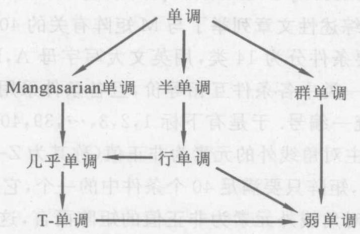

图 7.1

## 习 题 7.3

1. 设 $n$ 阶矩阵 $\mathbf{A} = {\left( {a}_{ij}\right) }_{n \times  n}$ 为非负矩阵,且是非奇异的,问逆矩阵 ${\mathbf{A}}^{-1} = \; \mathbf{B} = {\left( {b}_{ij}\right) }_{n \times  n}$ 满足

$$
{b}_{ij} \geq  0\;\left( {i \neq  j}\right) ,\;\mathbf{B} \geq  \mathbf{O}
$$

的条件是什么?

2. 设矩阵 $\mathbf{A}$ 的逆矩阵 ${\mathbf{A}}^{-1}$ 是单调矩阵,问 $\mathbf{A}$ 是怎样的矩阵?

3. 设 $\mathbf{A}$ 为单调矩阵, $\widetilde{\mathbf{x}}$ 是线性方程组 $\mathbf{A}\mathbf{x} = \mathbf{b}$ 的唯一解,若有向量 ${\mathbf{x}}^{\prime \prime } \geq  \widetilde{\mathbf{x}}$ , 问是否有 $\mathbf{A}{\mathbf{x}}^{\prime \prime } \geq  \mathbf{b}$ ?

## § 7.4 M矩阵与广义 M 矩阵

在本节中, 如无特别声明, 所讨论的矩阵都是实矩阵. M 矩阵 (全称非奇异 M 矩阵)及广义 M 矩阵，经常出现在诸如偏微分方程的有限差分法和有限元素法、经济学中的投入产出法、运筹学中的线性余问题以及概率统计的 Markov 过程等不同的科技领域中. M 矩阵这个术语是 Ostrowski 在 1937 年首先提出的, 到现在有关 M 矩阵的系统研究或综述性的文章已有多篇, 如 Fiedler 与 Ptak(1962), Poole 与 Boullion(1974), 以及 Plemmons(1977) 等. Plemmons 的综述性文章列举了与 M 矩阵有关的 40 个充要条件, 他把这些充要条件分为 14 类,用英文大写字母 $\mathrm{A},\mathrm{B},\mathrm{C},\cdots ,\mathrm{M},\mathrm{N}$ 来表示. 在同一类中各条件互相等价, 且各条件采用下标来区分, 但下标实行统一编号. 于是有下标 $1,2,3,\cdots ,{39},{40}$ . 值得注意的是，当矩阵的主对角线外的元素为非正值(称其为 $Z$ - 型矩阵，定义稍后给出)时，矩阵只要满足 40 个条件中的一个，它便是 M 矩阵. 换言之，对主对角线外元素为非正值的矩阵而言，这 40 个条件都是等价的. 下面就来介绍这 40 个条件，同时介绍特殊的 M 矩阵. 这就是稍后将要讨论的 S(Stieltjes) 矩阵以及广义 M 矩阵.

## 一、40 个充要条件介绍

M 矩阵 $\mathbf{A}$ 的 40 个充要条件分别如下.

A 类有 7 个条件:

${\mathrm{A}}_{1}$ 矩阵 $\mathbf{A}$ 的全部主子式都是正值 (当然包括全部顺序主子式在内).

${\mathrm{A}}_{2}$ 矩阵 $\mathbf{A}$ 的任意主子矩阵 (包括顺序主子矩阵) 的实特征值都是正值.

${\mathrm{A}}_{3}$ 矩阵 $\mathbf{A} + \mathbf{D}$ 对任意非负对角矩阵 $\mathbf{D}$ ,均为非奇异矩阵.

${\mathrm{A}}_{4}$ 对任意向量 $\mathbf{x} \neq  \mathbf{0}$ 都存在正对角矩阵 $\mathbf{D}$ ,满足 ${\mathbf{x}}^{\mathrm{T}}\mathbf{{AD}}\mathbf{x} > 0$ .

${\mathrm{A}}_{5}$ 对任意向量 $\mathbf{x} \neq  \mathbf{0}$ 都存在非负对角矩阵 $\mathbf{D}$ ,满足 ${\mathbf{x}}^{\mathrm{T}}\mathbf{A}\mathbf{D}\mathbf{x} > 0$ .

${\mathrm{A}}_{6}$ 矩阵 $\mathbf{A} = \left( {a}_{ij}\right)$ 不改变任意向量 $\mathbf{x} = {\left( {\xi }_{1},{\xi }_{2},\cdots ,{\xi }_{n}\right) }^{\mathrm{T}} \neq$ 0 的符号,即至少有一个下标 $i$ ,使 $\mathbf{x}$ 的第 $i$ 个分量 ${\xi }_{i}$ 和向量 $\mathbf{A}\mathbf{x}$ 的第 $i$ 个分量同号,亦即有 ${\xi }_{i}\mathop{\sum }\limits_{{j = 1}}^{n}{a}_{ij}{\xi }_{j} > 0$ .

${\mathrm{A}}_{7}\;$ 对任意主对角元素为 1 或 -1 的对角矩阵 $\mathbf{S}$ ,都存在向量 $x > 0$ ,使 SASx > 0 (即是正向量).

B 类只有 1 个条件:

${\mathrm{B}}_{8}\;$ 矩阵 $\mathbf{A}$ 的全部 $k\left( {k = 1,2,\cdots , n}\right)$ 阶主子式(共有 ${\mathrm{C}}_{n}^{k}$ 个) 的和都是正值.

C 类有 2 个条件:

${\mathrm{C}}_{9}\;$ 矩阵 $\mathbf{A}$ 的实特征值,都是正值.

${\mathrm{C}}_{10}\;$ 矩阵 $\mathbf{A} + \alpha \mathbf{I}$ 对任意 $\alpha  \geq  0$ 都为非奇异矩阵.

D 类有 2 个条件:

${\mathrm{D}}_{11}$ 矩阵 $\mathbf{A}$ 的顺序主子式都是正值.

${\mathrm{D}}_{12}$ 矩阵 $\mathbf{A}$ 能作三角分解 $\mathbf{A} = \mathbf{L}\mathbf{U}$ ,并使下三角矩阵 $\mathbf{L}$ 和上三角矩阵 $\mathbf{U}$ 的主对角元素都是正值.

注意，在 ${\mathrm{D}}_{12}$ 中，若限定 $\mathbf{L}$ 和 $\mathbf{U}$ 之中有一个的主对角元素等于 1,则分解是唯一的; 另外在 $\mathrm{D}$ 类的条件下,矩阵 $\mathbf{A}$ 的顺序主子矩阵都能作类似的三角分解.

E 类有 2 个条件:

${\mathrm{E}}_{13}\;$ 存在置换矩阵 $\mathbf{P}$ ，使矩阵 $\mathbf{P}\mathbf{A}{\mathbf{P}}^{\mathrm{T}}$ 的顺序主子式都是正值.

${\mathrm{E}}_{14}\;$ 存在置换矩阵 $\mathbf{P}$ ，使矩阵 $\mathbf{P}\mathbf{A}{\mathbf{P}}^{\mathrm{T}}$ 能作三角分解 $\mathbf{P}\mathbf{A}{\mathbf{P}}^{\mathrm{T}} = \; {LU}$ ,并使下三角矩阵 $\mathbf{L}$ 和上三角矩阵 $\mathbf{U}$ 的主对角元素都是正值.

以上五类条件 $\left( {A, B, C, D, E}\right)$ 的主要特点是其主子式的正值性. 下面各类条件与其不同, 它们是以逆非负矩阵、单调型矩阵、正则分裂、弱正则分裂、V. L. 稳定、正稳定、拟对角占优等为基础而建立的，现介绍于下.

F 类有 8 个条件:

${\mathrm{F}}_{15}\;$ 矩阵 $\mathbf{A}$ 是逆非负的，即 ${\mathbf{A}}^{-1}$ 存在且 ${\mathbf{A}}^{-1} \geq  \mathbf{O}$ .

${\mathrm{F}}_{16}\;$ 矩阵 $\mathbf{A}$ 是单调的,即能由 $\mathbf{{Ax}} \geq  \mathbf{0}$ 推出 $\mathbf{x} \geq  \mathbf{0}$ .

${\mathrm{F}}_{17}$ 矩阵 $\mathbf{A}$ 具有收敛的正则分裂.

${\mathrm{F}}_{18}\;$ 矩阵 $\mathbf{A}$ 具有收敛的弱正则分裂.

${\mathrm{F}}_{19}\;$ 矩阵 $\mathbf{A}$ 具有弱正则分裂,且存在向量 $\mathbf{x} > \mathbf{0}$ ,使向量 $A\mathbf{x} > \mathbf{0}$ .

${\mathrm{F}}_{20}\;$ 存在 ${\mathbf{M}}_{1}^{-1} \geq  \mathbf{O}$ 和 ${\mathbf{M}}_{2}^{-1} \geq  \mathbf{O}$ ,满足 ${\mathbf{M}}_{1} \leq  \mathbf{A} \leq  {\mathbf{M}}_{2}$ .

${\mathrm{F}}_{21}\;$ 存在 ${\mathbf{M}}^{-1} \geq  \mathbf{O}$ ,满足 $\mathbf{M} \geq  \mathbf{A}$ ,并且 ${\mathbf{M}}^{-1}\mathbf{A}$ 为 $\mathrm{M}$ 矩阵 (其定义见后).

${\mathrm{F}}_{22}\;$ 存在 ${\mathbf{M}}^{-1} \geq  \mathbf{O}$ ,使 ${\mathbf{M}}^{-1}\mathbf{A}$ 为 $\mathrm{M}$ 矩阵.

G 类只有 1 个条件:

${\mathrm{G}}_{23}$ 矩阵 $\mathbf{A}$ 的任意弱正则分裂都是收敛的(即如 $\mathbf{A}$ 有弱正则分裂,则该弱正则分裂必是收敛的).

H 类也只有 1 个条件:

${\mathrm{H}}_{24}\;$ 矩阵 $\mathbf{A}$ 的任意正则分裂都是收敛的.

I 类有 4 个条件:

${\mathrm{I}}_{25}\;$ 对于 $\mathbf{A}$ 存在一个正对角矩阵 $\mathbf{D}$ ,使矩阵 $\mathbf{{AD}} + \mathbf{D}{\mathbf{A}}^{\mathrm{T}}$ 为对称正定,即 $\mathbf{A}$ 为 V. L. 稳定.

${\mathrm{I}}_{26}$ 存在一个正对角矩阵 $\mathbf{D}$ ,使 $\mathbf{B} + {\mathbf{B}}^{\mathrm{T}}$ 为对称正定,其中 $\mathbf{B} = \; {\mathbf{D}}^{-1}\mathbf{A}\mathbf{D}$ .

${\mathrm{I}}_{27}$ 矩阵 $\mathbf{{PA}}$ 对于任意非零半正定矩阵 $\mathbf{P}$ ,都有正的主对角元素.

${\mathrm{I}}_{28}$ 矩阵 $\mathbf{A}$ 的任意主子矩阵都满足条件 ${\mathrm{I}}_{25}$ .

J 类也有 4 个条件:

${\mathrm{J}}_{29}$ 矩阵 $\mathbf{A}$ 是正稳定的,即 $\mathbf{A}$ 的任意特征值的实部都是正的.

${\mathrm{J}}_{30}$ 存在一个对称正定矩阵 $\mathbf{W}$ ,使矩阵 $\mathbf{{AW}} + \mathbf{W}{\mathbf{A}}^{\mathrm{T}}$ 为对称正定.

${\mathrm{J}}_{31}$ 矩阵 $\mathbf{A} + \mathbf{I}$ 为非奇异矩阵,并且矩阵

$$
\mathbf{G} = {\left( \mathbf{A} + \mathbf{I}\right) }^{-1}\left( {\mathbf{A} - \mathbf{I}}\right)
$$

为收敛矩阵.

${\mathrm{J}}_{32}\;$ 矩阵 $\mathbf{A} + \mathbf{I}$ 为非奇异矩阵,并且存在一个对称正定矩阵 $\mathbf{W}$ ,使 $\mathbf{W} - {\mathbf{G}}^{\mathrm{T}}\mathbf{W}\mathbf{G}$ 也是对称正定的,其中 $\mathbf{G}$ 和条件 ${\mathrm{J}}_{31}$ 中的相同.

K 类有 3 个条件:

${\mathrm{K}}_{33}\;$ 矩阵 $\mathbf{A}$ 是半正的,即存在一个向量 $\mathbf{x} > \mathbf{0}$ ,使向量 Ax $> 0$ .

${\mathrm{K}}_{34}\;$ 存在一个向量 $\mathbf{x} \geq  \mathbf{0}$ ,使 $\mathbf{{Ax}} > \mathbf{0}$ .

${\mathrm{K}}_{35}$ 存在一个正对角矩阵 $\mathbf{D}$ ，使 $\mathbf{{AD}}$ 的全部行和(一行各元素的和)都是正值.

L 类只有 1 个条件:

${\mathrm{L}}_{36}\;$ 对于矩阵 $\mathbf{A} = {\left( {a}_{ij}\right) }_{n \times  n}$ 存在一个向量 $\mathbf{x} = \left( {{\xi }_{1},{\xi }_{2},\cdots }\right.$ , ${\left. {\xi }_{n}\right) }^{\mathrm{T}} > 0$ ,使向量 $\mathbf{{Ax}} \geq  \mathbf{0}$ ,并且对于 $\mathbf{{Ax}}$ 的零分量的下标,必有非零元素链和 $\mathbf{A}\mathbf{x}$ 的正分量的下标相连接,即在 $\mathop{\sum }\limits_{{j = 1}}^{n}{a}_{{i}_{0}j}{\xi }_{j} = 0$ 时,必有非零元素序列

$$
{a}_{{i}_{0}{i}_{1}},{a}_{{i}_{1}{i}_{2}},\cdots ,{a}_{{i}_{r - 1}{i}_{r}}
$$

且 $\mathop{\sum }\limits_{{j = 1}}^{r}{a}_{{i}_{r}j}{\xi }_{j} > 0$ .

M 类只有 1 个条件:

${\mathrm{M}}_{37}$ 对于矩阵 $\mathbf{A} = {\left( {a}_{ij}\right) }_{n \times  n}$ 存在一个向量 $\mathbf{x} = \left( {{\xi }_{1},{\xi }_{2},\cdots }\right.$ , ${\left. {\xi }_{n}\right) }^{\mathrm{T}} > 0$ ,使向量 $\mathbf{A}\mathbf{x} \geq  0$ ,并且

$$
\mathop{\sum }\limits_{{j = 1}}^{i}{a}_{ij}{\xi }_{j} > 0\;\left( {i = 1,2,\cdots , n}\right)
$$

N 类有 3 个条件:

${\mathrm{N}}_{38}$ 存在一个向量 $\mathbf{x} > \mathbf{0}$ ，使对于任意主对角元素为 1 或 -1 的对角矩阵 $\mathbf{S}$ 都有 $\mathbf{{SAS}}\mathbf{x} > \mathbf{0}$ .

${\mathrm{N}}_{39}$ 矩阵 $\mathbf{A}$ 的主对角元素都是正值,且拟对角占优,即存在一个正对角矩阵 $\mathbf{D}$ ,使 $\mathbf{{AD}}$ 为强对角占优.

${\mathrm{N}}_{40}$ 矩阵 $\mathbf{A}$ 的主对角元素都是正值,并且 $\mathbf{A}$ 与一个强对角占优矩阵正对角相似 (即存在一个正对角矩阵 $\mathbf{D}$ ,使 ${\mathbf{D}}^{-1}\mathbf{A}\mathbf{D}$ 为强对角占优矩阵).

Plemmons 的综述性文章没有涉及条件 $\mathrm{M}$ 和其他条件之间的包含关系. 1979 年 Neumann 的文章对此进行了补充，现将 M 矩阵 40 个条件之间的包含关系列出,如图 7.2 所示. 其中, ${\mathrm{M}}^{\prime }$ 表示存在置换矩阵 $\mathbf{P}$ ,使矩阵 $\mathbf{{PA}}{\mathbf{P}}^{\mathrm{T}}$ 满足条件 ${\mathrm{M}}_{37}$ .

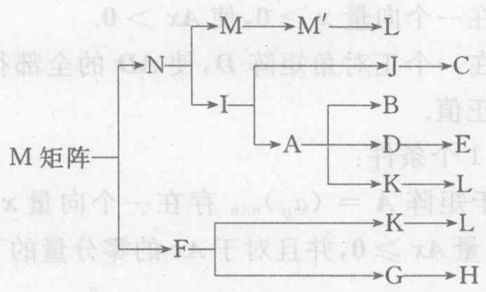

图 7.2

关于 $\mathrm{M}$ 矩阵的同类各条件互相等价性的证明和 40 个充要条件的证明均很冗长, 这里略去.

## 二、M 矩阵

M 矩阵有多种等价的定义. 这里采用逆非负矩阵这一种作为它的定义,而把其他定义作为它的性质对待.

如果 $n$ 阶矩阵 $\mathbf{A} = {\left( {a}_{ij}\right) }_{n \times  n}$ 的主对角线外的元素非正,且 ${\mathbf{A}}^{-1}$ 为非负矩阵, 即

$$
{a}_{ij} \leq  0\left( {i \neq  j}\right) ,\;{\mathbf{A}}^{-1} \geq  \mathbf{O} \tag{7.4.1}
$$

则称 $\mathbf{A}$ 为 $\mathbf{M}$ 矩阵.

显然 $\text{ § }{7.3}$ 中的方程组 (7.3.3) 的系数矩阵是 $\mathbf{M}$ 矩阵. 又如三阶矩阵

$$
\mathbf{A} = \left\lbrack  \begin{array}{rrr} 1 &  - \frac{1}{2} & 0 \\  0 & 1 &  - \frac{1}{2} \\  0 & 0 & 1 \end{array}\right\rbrack
$$

也是一个 $\mathrm{M}$ 矩阵. 因为既有 ${a}_{ij} \leq  0\left( {i \neq  j}\right)$ ,又有

$$
{\mathbf{A}}^{-1} = \left\lbrack  \begin{matrix} 1 & \frac{1}{2} & \frac{1}{4} \\  0 & 1 & \frac{1}{2} \\  0 & 0 & 1 \end{matrix}\right\rbrack   \geq  \mathbf{O}
$$

由此例可见, $M$ 矩阵不一定是对称矩阵. 可以证明, $M$ 矩阵的主对角元素必为正值.

由定义知, $\mathrm{M}$ 矩阵是非奇异的; 又可证明 $\mathrm{M}$ 矩阵是拟对角占优矩阵; $\mathrm{M}$ 矩阵的转置仍是 $\mathrm{M}$ 矩阵. 这是因为 ${\left( {\mathbf{A}}^{-1}\right) }^{\mathrm{T}} = {\left( {\mathbf{A}}^{\mathrm{T}}\right) }^{-1}$ ,故当 ${\mathbf{A}}^{-1} \geq  \mathbf{O}$ 时,有 ${\left( {\mathbf{A}}^{-1}\right) }^{\mathrm{T}} \geq  \mathbf{O}$ ,从而 ${\left( {\mathbf{A}}^{\mathrm{T}}\right) }^{-1} \geq  \mathbf{O}$ .

因为单调矩阵不要求主对角线外的元素为非正值, 所以单调矩阵不一定是 $M$ 矩阵. 例如,矩阵 (7.3.2) 虽是单调矩阵,但它不是 $M$ 矩阵.

M 矩阵有一个与强对角占优或不可约对角占优矩阵类似的判别法则如下.

令矩阵 $\mathbf{A} = {\left( {a}_{ij}\right) }_{n \times  n}$ 满足 ${a}_{ij} \leq  0\left( {i \neq  j}\right)$ ,则 $\mathbf{A}$ 为 $\mathrm{M}$ 矩阵的充要条件是 ${a}_{ii} > 0\left( {i = 1,2,\cdots , n}\right)$ ,且矩阵 $\mathbf{B} = \mathbf{I} - {\mathbf{D}}^{-1}\mathbf{A}$ 满足 $\rho \left( \mathbf{B}\right)  < 1$ ,这里 $\mathbf{D} = \operatorname{diag}\left( {{a}_{11},{a}_{22},\cdots ,{a}_{nn}}\right)$ .

把上面这个结论应用到三角矩阵, 就可得到如下三角矩阵为 M 矩阵的简单判别法则.

三角矩阵 $\mathbf{A} = {\left( {a}_{ij}\right) }_{n \times  n}$ 为 $\mathrm{M}$ 矩阵的充要条件是 ${a}_{ii} > 0(i = 1$ , $2,\cdots , n)$ 和 ${a}_{ij} \leq  0\left( {i \neq  j}\right)$ .

应用这个结果立刻可知如下的上三角矩阵

$$
\mathbf{A} = \left\lbrack  \begin{matrix} {1}^{ - } - \frac{1}{2} &  - \frac{1}{2} & \cdots &  - \frac{1}{2} \\  1 &  - \frac{1}{2} & \cdots &  - \frac{1}{2} \\  0 & 1 & \cdots &  - \frac{1}{2} \\  \vdots & \vdots &  \ddots  & \vdots \\  0 & 0 & \cdots & 1 \end{matrix}\right\rbrack
$$

是 $\mathrm{M}$ 矩阵,因为它的逆矩阵是

$$
{\mathbf{A}}^{-1} = \left\lbrack  \begin{matrix} 1 & \frac{1}{2} & \frac{1}{2}\left( \frac{3}{2}\right) & \cdots & \frac{1}{2}{\left( \frac{3}{2}\right) }^{n - 2} \\   & 1 & \frac{1}{2} & \cdots & \frac{1}{2}{\left( \frac{3}{2}\right) }^{n - 3} \\   & & 1 & \cdots & \frac{1}{2}{\left( \frac{3}{2}\right) }^{n - 4} \\   & & &  \ddots  & \vdots \\   & & & & 1 \end{matrix}\right\rbrack   \geq  \mathbf{O}
$$

且有 ${a}_{ij} \leq  0\left( {i \neq  j}\right)$ .

M 矩阵也有一个和非负矩阵相类似的性质如下.

设 $\mathbf{A}$ 为 $\mathrm{M}$ 矩阵,当 $\mathbf{A}$ 的任意元素 (一个或多个) 增大,但保持主对角线外的元素仍为非正值时,则所得矩阵 $\mathbf{C}$ 也是 $\mathrm{M}$ 矩阵, 且有

$$
{\mathbf{C}}^{-1} \leq  {\mathbf{A}}^{-1} \tag{7.4.2}
$$

M 矩阵是如下的所谓 $Z$ -型矩阵的特殊情况.

设 $\mathbf{A} = {\left( {a}_{ij}\right) }_{n \times  n}$ ,且

$$
{a}_{ij} \leq  0\;\left( {i \neq  j;i, j = 1,2,\cdots , n}\right) \tag{7.4.3}
$$

则称 $\mathbf{A}$ 为 $\mathbf{Z}$ -型矩阵.

M 矩阵还有如下一个不包含在其 40 个充要条件之内的充要条件,并常用作 $\mathrm{M}$ 矩阵的定义.

$n$ 阶矩阵 $\mathbf{A} = \left( {a}_{ij}\right)$ 为 $\mathrm{M}$ 矩阵的充要条件是 $\mathbf{A}$ 可表示为 $\mathbf{A} = s\mathbf{I} - \mathbf{B},\mathbf{B} \geq  \mathbf{O}$ ,且 $\rho \left( \mathbf{B}\right)  < s$ .

这就是说,如果 $\mathbf{A}$ 可表示为

$$
\mathbf{A} = s\mathbf{I} - \mathbf{B},\;\mathbf{B} \geq  \mathbf{O},\;\rho \left( \mathbf{B}\right)  < s \tag{7.4.4}
$$

则 $\mathbf{A}$ 为 $\mathbf{M}$ 矩阵.

定义式 (7.4.4) 实际上是 $\mathbf{A}$ 具有一种收敛的正则分裂罢了!

下面介绍关于 $\mathrm{M}$ 矩阵的三角分解问题.

设矩阵 $\mathbf{A} = {\left( {a}_{ij}\right) }_{n \times  n}$ 是 $\mathrm{Z}$ - 型矩阵,而且有三角分解 $\mathbf{A} = \mathbf{L}\mathbf{U}$ , 其中 $\mathbf{L}$ 和 $\mathbf{U}$ 依次是下三角 $\mathrm{M}$ 矩阵和上三角 $\mathrm{M}$ 矩阵,则 $\mathbf{A}$ 为 $\mathrm{M}$ 矩阵.

人们可能会问矩阵 $\mathbf{A}$ 在什么条件下可能有上述的三角分解呢?回答如下.

设矩阵 $\mathbf{A} = {\left( {a}_{ij}\right) }_{n \times  n}$ 是 $Z$ -型矩阵,且其 $n$ 个顺序主子式均为正值,则 $\mathbf{A}$ 必有三角分解 $\mathbf{A} = \mathbf{L}\mathbf{U}$ ,其中 $\mathbf{L}$ 为下三角 $\mathrm{M}$ 矩阵, $\mathbf{U}$ 为单位上三角 $\mathrm{M}$ 矩阵.

又一个问题是:任意 M 矩阵是否必有上面谈论到的三角分解呢?为了回答这个问题,先介绍用顺序主子式判别 $\mathrm{M}$ 矩阵的方法.

首先指出: 若 $\mathbf{A}$ 为 $\mathrm{M}$ 矩阵,则它的 $n$ 个顺序主子矩阵也都是 $\mathrm{M}$ 矩阵. 再者,若 $\mathbf{A} \in  {\mathbf{R}}^{n \times  n}$ 的实特征值都是正值 (对复特征值无要求),则 $\det \mathbf{A} > 0$ .

由此可以证明用顺序主子式判别 $\mathrm{M}$ 矩阵的如下结果.

设 $\mathbf{A} \in  {\mathbf{R}}^{n \times  n}$ 是 $Z$ - 型矩阵,则 $\mathbf{A}$ 为 $M$ 矩阵的充要条件是 $\mathbf{A}$ 的 $n$ 个顺序主子式均为正值.

上面这一结果表明,若 $\mathbf{A}$ 是 $\mathrm{M}$ 矩阵,则它的 $n$ 个顺序主子式都是正值,又因 $\mathrm{M}$ 矩阵是 $\mathrm{Z}$ - 型矩阵的特例,故由前面的结果可知, $\mathbf{A}$ 有如上要求的三角分解.

更进一步,还有用矩阵 $\mathbf{A}$ 的主子式来判别 $\mathbf{A}$ 是否为 $\mathrm{M}$ 矩阵的结果.

设矩阵 $\mathbf{A}$ 为 $Z$ -型矩阵,则 $\mathbf{A}$ 为 $\mathrm{M}$ 矩阵的充要条件是 $\mathbf{A}$ 的所有主子式都是正值.

现在介绍 M 矩阵与各种对角占优矩阵之间的关系.

设 $\mathbf{A} = {\left( {a}_{ij}\right) }_{n \times  n}$ 为 $\mathrm{Z}$ - 型矩阵,若 ${a}_{ii} > 0\left( {i = 1,2,\cdots , n}\right)$ ,且 $\mathbf{A}$ 为强对角占优或不可约对角占优,则 $\mathbf{A}$ 为 $\mathrm{M}$ 矩阵.

设 $\mathbf{A} = {\left( {a}_{ij}\right) }_{n \times  n}$ 为具非零元素链对角占优的 $\mathrm{Z}$ - 型矩阵,且 ${a}_{ii} > 0\left( {i = 1,2,\cdots , n}\right)$ ,则 $\mathbf{A}$ 为 $\mathrm{M}$ 矩阵.

如果拟对角占优矩阵 $\mathbf{A}$ 的主对角元素为正值,其余元素均非正值,那末 $\mathbf{A}$ 为 $\mathrm{M}$ 阵.

如果拟对角占优矩阵 $\mathbf{A} = {\left( {a}_{ij}\right) }_{n \times  n}$ 满足 ${a}_{ii} > 0(i = 1,2,\cdots$ , $n),{a}_{ij} \leq  0\left( {i \neq  j}\right)$ ,且矩阵 $\mathbf{B} = \mathbf{A} + {\mathbf{A}}^{\mathrm{T}}$ 为拟对角占优,则 $\mathbf{A}$ 为 $\mathrm{M}$ 矩阵.

设 $\mathbf{A} = {\left( {a}_{ij}\right) }_{n \times  n} \in  {\mathbf{R}}^{n \times  n}$ 为对角占优的 $\mathrm{Z}$ - 型矩阵,且 ${a}_{ii} > 0(i \; = 1,2,\cdots , n)$ ,则 $\mathbf{A}$ 为 $\mathrm{M}$ 矩阵的充要条件是 $\mathbf{A}$ 为半强对角占优矩阵.

下面介绍这样一个问题: Z- 型矩阵在其特征值具备什么条件时, 它才成为 M 矩阵?

矩阵 $\mathbf{A}$ 为 M 矩阵的充要条件是 $\mathbf{A}$ 为 Z- 型矩阵,且其实特征值都是正值.

若 $\mathbf{A}$ 是 $\mathrm{Z}$ - 型矩阵,又它的同阶主子式之和都是正值,则 $\mathbf{A}$ 为 M 矩阵.

$n$ 阶 $Z$ - 型矩阵 $\mathbf{A}$ 是 $\mathrm{M}$ 矩阵的充要条件是 $\mathbf{A}$ 的主子式均为正值.

例如,设三角矩阵 $\mathbf{A} = {\left( {a}_{ij}\right) }_{n \times  n} \in  {\mathbf{R}}^{n \times  n}$ 满足 ${a}_{ii} > 0(i = 1,2$ , $\left. {\cdots , n}\right) ,{a}_{ij} \leq  0\left( {i \neq  j}\right)$ . 则因 $\mathbf{A}$ 的 $n$ 个实特征值 ${a}_{ii} > 0$ ,故 $\mathbf{A}$ 为 $\mathbf{M}$ 矩阵. 另外,由于 $\mathbf{A}$ 的同阶主子式之和恰是正数,故亦可断定 $\mathbf{A}$ 为 M 矩阵.

前面已经指出, M 矩阵的实特征值必为正值. 这里介绍关于 M 矩阵的复特征值的特点. 为此先介绍一个预备性结果.

设矩阵 $\mathbf{A} = \alpha \mathbf{I} - \mathbf{C}$ ,其中 $\alpha$ 为正值且 $\rho \left( \mathbf{C}\right)  < \alpha$ ,则 $\mathbf{A}$ 的实特征值为正值; $\mathbf{A}$ 的复特征值的实部也是正值(统称为 $\mathbf{A}$ 的特征值的实部为正值,即 $\mathbf{A}$ 为正稳定矩阵).

设 $\mathbf{A}$ 为 $\mathrm{M}$ 矩阵,则 $\mathbf{A}$ 为正稳定矩阵.

由此可知, $\mathrm{M}$ 矩阵也是正稳定矩阵. 同时, $\mathrm{M}$ 矩阵也是单调矩阵.

设 $\mathbf{A}$ 为 $\mathrm{M}$ 矩阵,则 $\mathbf{A}$ 的任意主子矩阵都是正稳定矩阵 (即任意主子矩阵的特征值的实部都是正值).

其次介绍一下实特征值为正值的矩阵的情况.

矩阵 $\mathbf{A}$ 的实特征值为正值的充要条件是矩阵 $\mathbf{A} + \alpha \mathbf{I}$ 对于任意的 $\alpha  \geq  0$ 都为非奇异矩阵.

设 $\mathbf{A}$ 为 $n$ 阶 $\mathbf{Z}$ - 型矩阵,则 $\mathbf{A}$ 为 $\mathrm{M}$ 矩阵的充要条件是矩阵 $\mathbf{A} + \alpha \mathbf{I}$ 对任意的 $\alpha  \geq  0$ 都为非奇异.

矩阵 $\mathbf{A}$ 的任意主子矩阵的实特征值为正值的充要条件是矩阵 $\mathbf{A} + \mathbf{D}$ 对任意非负对角矩阵 $\mathbf{D}$ 都为非奇异矩阵.

例如, 对于三阶矩阵

$$
\mathbf{A} = \left\lbrack  \begin{matrix} {1.74} &  - 1 & 1 \\   - 3 & {1.74} &  - 1 \\   - 2 & 1 & {1.74} \end{matrix}\right\rbrack
$$

和任意非负对角矩阵 $\mathbf{D} = \operatorname{diag}\left( {{d}_{1},{d}_{2},{d}_{3}}\right)$ ,有

$$
\det \left( {\mathbf{A} + \mathbf{D}}\right)  = \left( {{1.74} + {d}_{1}}\right) \left( {{1.74} + {d}_{2}}\right) \left( {{1.74} + {d}_{3}}\right)  +
$$

$$
{d}_{1} + 2{d}_{2} - 3{d}_{3} - 5
$$

由于 ${d}_{1} \geq  0,{d}_{2} \geq  0,{d}_{3} \geq  0,{1.74}^{3} \geq  5,{1.74}^{2} \geq  3$ ，因此

$$
\det \left( {\mathbf{A} + \mathbf{D}}\right)  > 0
$$

所以矩阵 $\mathbf{A}$ 的主子矩阵的实特征值都是正值.

关于特征值实部为正值的矩阵, 即正稳定矩阵的判别方法, 已在 § 7.1 的“二”中进行过介绍.

最后介绍一下 $\mathrm{S}$ 矩阵的问题.

$\mathrm{M}$ 矩阵不一定是对称矩阵,称对称的 $\mathrm{M}$ 矩阵为 $\mathrm{S}$ 矩阵.

例如式(7.3.4) 的系数矩阵就是一个 $\mathrm{S}$ 矩阵.

若 $\mathbf{A}$ 为 $\mathbf{Z}$ - 型矩阵,则 $\mathbf{A}$ 为 $\mathbf{S}$ 矩阵的充要条件是 $\mathbf{A}$ 为对称正定矩阵.

早在 19 世纪 80 年代，Stieltjes 就指出:对称正定矩阵 $\mathbf{A} = \; {\left( {a}_{ij}\right) }_{n \times  n}$ 若满足 ${a}_{ij} < 0\left( {i \neq  j}\right)$ ,则 $\mathbf{A}$ 为逆正矩阵 (即 ${\mathbf{A}}^{-1} > \mathbf{O}$ ). 20 世纪10年代，Frobenius在 $\mathbf{B} > \mathbf{O}$ 以及 $\rho \left( \mathbf{B}\right)  < s$ 的条件下，同样得到 $\mathbf{A} = s\mathbf{I} - \mathbf{B}$ 为逆正矩阵. 到了 20 世纪 30 年代的 Ostrowski 以后, 关于 M 矩阵有了较多的结果, 上面所介绍的只是其中的一部分.

## 三、广义 M 矩阵

假设 $\mathbf{A}$ 为 $Z$ - 型矩阵,若减弱 Plemmons, Neumann 等人所归纳出的关于 $M$ 矩阵的各种条件,就得出所谓广义 $M$ 矩阵的概念. 例如可将 $M$ 矩阵的 40 个充要条件中相应的若干条件减弱为:

${\widetilde{\mathrm{A}}}_{1}\;\mathbf{A}$ 的全部主子式的值均为非负的;

${\widetilde{\mathrm{A}}}_{2}\;\mathbf{A}$ 的任意主子矩阵的实特征值均非负;

${\widetilde{\mathrm{A}}}_{3}\;$ 对于每个正对角型矩阵 $\mathbf{D},\mathbf{A} + \mathbf{D}$ 为非奇异矩阵;

${\widetilde{\mathrm{D}}}_{12}\;\mathbf{A}$ 有三角分解 $\mathbf{A} = \mathbf{L}\mathbf{U}$ ,并且 $\mathbf{L}$ 与 $\mathbf{U}$ 的主对角元素均为非负值;

${\widetilde{\mathrm{F}}}_{17}\;\mathbf{A}$ 具有半收敛的正则分裂. 半收敛指的是 $\mathop{\lim }\limits_{{k \rightarrow  \infty }}{\mathbf{A}}^{k}$ 存在 (不要求极限为零矩阵);

${\widetilde{\mathrm{F}}}_{18}\;\mathbf{A}$ 具有半收敛的弱正则分裂;

${\widetilde{\mathbf{I}}}_{25}$ 存在一个正对角矩阵 $\mathbf{D}$ ，使 $\mathbf{{AD}} + {\mathbf{{DA}}}^{\mathrm{T}}$ 为对称半正定；

由本节“二” 中减弱有关结论的条件而得出下面几条:

$\mathbf{A}$ 的每个非零特征值的实部均为正值;

$\mathbf{A}$ 的每个特征值的实部均为非负值;

$\mathbf{A} = s\mathbf{I} - \mathbf{B}$ ,其中 $\mathbf{B}$ 为非负矩阵,且 $\rho \left( \mathbf{B}\right)  \leq  s$ ;

$\mathbf{A}$ 是主对角元素均为正值的对角占优矩阵.

等等. 这一方面的研究工作正在进行.

如果把 $\mathrm{M}$ 矩阵中的逆非负条件减弱为其广义逆非负,也可能得到各种广义 $\mathrm{M}$ 矩阵. 甚至可以对长方矩阵 $\mathbf{A} \in  {\mathbf{R}}^{m \times  n}$ 进行讨论.

必须指出,由广义逆非负的条件推广而来的广义 $\mathrm{M}$ 矩阵和直接减弱 $\mathrm{M}$ 矩阵的条件推广而来的广义 $\mathrm{M}$ 矩阵,不尽相同. 而且,这两方面的推广, 都还有不少工作可做, 特别是缺少系统的研究. 另外, 在 Plemmons 所综合的 14 类条件中, 把其中两类以上综合起来 (即假定一矩阵同时具有两类以上的性质) 讨论, 也是很有意义的. 近年来陆续出现了这方面的研究工作, 例如, Olesky 和 Driessche(1982) 讨论了单调型正稳定矩阵.

## 习 题 7.4

1. 设矩阵 $\mathbf{A}$ 和它的逆矩阵 ${\mathbf{A}}^{-1}$ 都是 $\mathrm{M}$ 矩阵,问 $\mathbf{A}$ 是怎样的矩阵?

2. 矩阵 $\mathbf{A} = {\left( {a}_{ij}\right) }_{n \times  n}$ 为 $\mathrm{M}$ 矩阵的充要条件是 ${a}_{ii} > 0,{a}_{ij} \leq  0\left( {i \neq  j}\right)$ 以及 $\rho \left( \mathbf{B}\right)  < 1$ ,这个结论是否正确? 这里 $\mathbf{B} = \mathbf{I} - {\mathbf{D}}^{-1}\mathbf{A}$ ,而 $\mathbf{D} = \operatorname{diag}\left( {{a}_{11},{a}_{22}}\right.$ , $\left. {\cdots ,{a}_{nn}}\right)$ .

3. 证明 $M$ 矩阵的任意主子矩阵仍为 $M$ 矩阵.

4. 单调矩阵 $\mathbf{A}$ 为 $\mathrm{S}$ 矩阵的条件是什么?

5. 设矩阵 $\mathbf{A}$ 和 $\mathbf{B}$ 都是 $\mathrm{M}$ 矩阵,问 $\mathbf{A} + \mathbf{B}$ 是否为 $\mathrm{M}$ 矩阵?

6. 设矩阵 $\mathbf{A} = {\left( {a}_{ij}\right) }_{n \times  n}$ 满足 ${a}_{ii} > 0,{a}_{ij} \leq  0\left( {i \neq  j}\right)$ ,并且是强对角占优或不可约对角占优的,问 $\mathbf{A}$ 是否为 $\mathrm{M}$ 矩阵?

7. 设 $\mathbf{A} = {\left( {a}_{ij}\right) }_{n \times  n}$ 为三角矩阵,并且满足 ${a}_{ii} > 0,{a}_{ij} \leq  0\left( {i \neq  j}\right)$ ,证明 $\mathbf{A}$ 为 M 矩阵?

8. 设矩阵 $\mathbf{A}$ 为 $\mathrm{Z}$ - 型矩阵,又 $\mathbf{A}$ 有三角分解 $\mathbf{A} = \mathbf{L}\mathbf{U}$ ,其中 $\mathbf{L},\mathbf{U}$ 依次是非奇异下,上三角矩阵,且 $\mathbf{U}$ 的对角元素都是 1 . 若 $\mathbf{L}$ 和 $\mathbf{U}$ 中有一个是 $\mathrm{M}$ 矩阵, 问另一个是否必为 $\mathrm{M}$ 矩阵?

9. 设三对角矩阵 ${\mathbf{J}}_{n} = {\left( {b}_{i - 1},{a}_{i},{c}_{i}\right) }_{1}^{n}$ 为非负矩阵,并且它的顺序主子式都是正值. 取矩阵 ${\widetilde{\mathbf{J}}}_{n} = {\left( -{b}_{i - 1},{a}_{i}, - {c}_{i}\right) }_{1}^{n}$ ,问 ${\widetilde{\mathbf{J}}}_{n}$ 是否为 $\mathrm{M}$ 矩阵?

10. 当矩阵 $\mathbf{A}$ 对于任意非零向量 $\mathbf{x}$ 都有 ${\mathbf{x}}^{\mathrm{T}}\mathbf{A}\mathbf{x} > 0$ 时,称 $\mathbf{A}$ 为正定矩阵 (这里不要求 $\mathbf{A}$ 为对称矩阵 $)$ ①. 证明正定矩阵的实特征值都是正值.

11. 设 $\mathbf{A}$ 是正定的 $\mathrm{Z}$ -型矩阵 (不要求 $\mathbf{A}$ 对称), $\mathbf{A}$ 是否为 $\mathrm{M}$ 矩阵?

12. 设矩阵 $\mathbf{A}$ 的顺序主子式都是正值,但未假设它是 $\mathrm{Z}$ - 型矩阵,这时矩阵 $\mathbf{A}$ 有怎样的三角分解?

13. 试分析下面两个条件之间的关系.

(1)矩阵 $\mathbf{A}$ 的特征值的实部都是正值;

(2)矩阵 $\mathbf{A}$ 的顺序主子矩阵的特征值实部都是正值.

14. 设矩阵 $\mathbf{A}$ 的顺序主子式都是正值,是否能推得 $\mathbf{A}$ 的实特征值为正值?

15. 设 $\mathbf{A}$ 为正定矩阵 (不要求对称),能否推得 $\mathbf{A}$ 的任意主子矩阵的特征值实部都为正值?

16. 设 $\mathbf{A} = {\left( {a}_{ij}\right) }_{n \times  n}$ ,作一个矩阵 $\mathbf{M}\left( \mathbf{A}\right)$ (仅是记号而已),它的元素 ${m}_{ij}$ 定义为

$$
{m}_{ii} = \left| {a}_{ii}\right| ,\;{m}_{ij} =  - \left| {a}_{ij}\right| \;\left( {i \neq  j}\right)
$$

则称矩阵 $\mathbf{M}\left( \mathbf{A}\right)$ 为矩阵 $\mathbf{A}$ 的比较矩阵.

(1)试证明半强对角占优矩阵 $\mathbf{A}$ 的比较矩阵 $\mathbf{M}\left( \mathbf{A}\right)$ 必为 $\mathrm{M}$ 矩阵.

(2)对称正定矩阵 $\mathbf{A}$ 的比较矩阵 $\mathbf{M}\left( \mathbf{A}\right)$ 是否为 $\mathrm{S}$ 矩阵?

17. 设 $\mathbf{A}$ 为 $\mathbf{M}$ 矩阵, $\mathbf{B}$ 为 $\mathbf{Z}$ - 型矩阵,并且 $\mathbf{B} \geq  \mathbf{A}$ ,证明

$$
\det \mathbf{B} \geq  \det \mathbf{A}
$$

---

① 为了与 $\text{ § }{7.1}$ 中的实正定矩阵区别起见,通常称前者为对称正定矩阵.

---

注:本题选自 Fiedler 和 Ptak 在 1962 年的论文.

18. 设 $n$ 阶矩阵 $\mathbf{A} = {\left( {a}_{ij}\right) }_{n \times  n}$ 的元素满足

$$
{a}_{n + 1 - i, n + 1 - j} = {a}_{ij}\;\left( {i, j = 1,2,\cdots , n}\right)
$$

则称 $\mathbf{A}$ 为中心对称矩阵. 试讨论这类矩阵为 $\mathrm{M}$ 矩阵的条件.

## § 7.5 Toeplitz 矩阵及其有关矩阵

本节将介绍 Toeplitz 矩阵、Hankel 矩阵及其在实用中较为重要的一些特殊矩阵, 如循环矩阵等.

## 一、Toeplitz 矩阵与 Hankel 矩阵等

在数据处理、有限元素法、概率统计以及滤波理论等广泛的科学技术领域里,常常遇到在 20 世纪初提出的具有 ${2n} - 1$ 个元素的如下 $n$ 阶矩阵 (位于任一条平行于主对角线的直线上的元素全相同)

$$
\mathbf{A} = \left\lbrack  \begin{matrix} {a}_{0} & {a}_{-1} & {a}_{-2} & \cdots & {a}_{-n + 1} \\  {a}_{1} & {a}_{0} & {a}_{-1} & \cdots & {a}_{-n + 2} \\  {a}_{2} & {a}_{1} & {a}_{0} & \cdots & {a}_{-n + 3} \\  \vdots & \vdots & \vdots & & \vdots \\  {a}_{n - 2} & {a}_{n - 3} & {a}_{n - 4} & \cdots & {a}_{-1} \\  {a}_{n - 1} & {a}_{n - 2} & {a}_{n - 3} & \cdots & {a}_{0} \end{matrix}\right\rbrack \tag{7.5.1}
$$

称其为 Toeplitz 矩阵,简称 $\mathrm{T}$ 矩阵.

T 矩阵 (7.5.1) 亦可简记为

$$
\mathbf{A} = {\left( {a}_{i - j}\right) }_{i, j = 1}^{n} \tag{7.5.1}
$$

20 世纪 60 年代以来,有关 $\mathrm{T}$ 矩阵的快速算法已有相当发展. 60 年代中期, Trench 提出 T 矩阵的快速求逆算法. 几年后 Zohar 进一步讨论了 Trench 的算法, 他的主要工作是对推导的简化以及把对称正定条件减弱为强非奇异(所有顺序主子矩阵非奇异). 上述的快速算法把通常求逆的计算量(或计算复杂性)从 $O\left( {n}^{3}\right)$ 级减少为 $O\left( {n}^{2}\right)$ 级. 60 年代末期以来,还出现了不通过快速求逆,而直接数值解以 $\mathrm{T}$ 矩阵为系数矩阵的线性方程组的快速算法. 至于求一般 T 矩阵特征值的快速算法还较少见. 关于快速算法的文献可参阅参考文献[18].

T 矩阵的性质不易探讨, 因此人们很早就把兴趣集中在与 T 矩阵联系密切的矩阵或特殊的 T 矩阵的研究上, 例如具有以下形式的 $n + 1$ 阶矩阵 (沿着所有平行于副对角线的直线上有相同的元素)

$$
{\mathbf{H}}_{n + 1} = \left\lbrack  \begin{matrix} {a}_{0} & {a}_{1} & {a}_{2} & \cdots & {a}_{n} \\  {a}_{1} & {a}_{2} & {a}_{3} & \cdots & {a}_{n + 1} \\  {a}_{2} & {a}_{3} & {a}_{4} & \cdots & {a}_{n + 2} \\  \vdots & \vdots & \vdots & & \vdots \\  {a}_{n} & {a}_{n + 1} & {a}_{n + 2} & \cdots & {a}_{2n} \end{matrix}\right\rbrack   = {\left( {a}_{i + j}\right) }_{i, j = 0}^{n} \tag{7.5.2}
$$

称为 Hankel 矩阵.

考虑用最小二乘法求数据的多项式拟合曲线问题.

设 $\left( {{\xi }_{i},{\eta }_{i}}\right) \left( {i = 1,2,\cdots , m}\right)$ 是一组观测数据,其中 ${\xi }_{i}$ 互异,寻找一个 $n$ 次非零多项式

$$
f\left( x\right)  = {\mu }_{0} + {\mu }_{1}x + \cdots  + {\mu }_{n}{x}^{n}\;\left( {n < m}\right)
$$

使得

$$
S\left( {{\mu }_{0},{\mu }_{1},\cdots ,{\mu }_{n}}\right)  = \mathop{\sum }\limits_{{j = 1}}^{m}{\left\lbrack  {\eta }_{j} - f\left( {\xi }_{j}\right) \right\rbrack  }^{2} = \mathop{\sum }\limits_{{j = 1}}^{m}{\left\lbrack  {\eta }_{j} - \mathop{\sum }\limits_{{i = 0}}^{n}{\mu }_{i}{\xi }_{j}^{i}\right\rbrack  }^{2}
$$

达到最小. 由高等数学知, $\left( {{\mu }_{0},{\mu }_{1},\cdots ,{\mu }_{n}}\right)$ 是极值点的必要条件为

$$
\frac{\partial S}{\partial {\mu }_{k}} = 2\mathop{\sum }\limits_{{j = 1}}^{m}{\xi }_{j}^{k}\left\lbrack  {{\eta }_{j} - \mathop{\sum }\limits_{{i = 0}}^{n}{\mu }_{i}{\xi }_{j}^{i}}\right\rbrack   = 0\;\left( {k = 0,1,\cdots , n}\right)
$$

(7.5.3)

记 ${a}_{k} = \mathop{\sum }\limits_{{j = 1}}^{m}{\xi }_{j}^{k},{\beta }_{k} = \mathop{\sum }\limits_{{j = 1}}^{m}{\xi }_{j}^{k}{\eta }_{j}$ ,则由式 (7.5.3) 得

$$
\mathop{\sum }\limits_{{i = 0}}^{n}{a}_{k + i}{\mu }_{i} = {\beta }_{k}\;\left( {k = 0,1,2,\cdots , n}\right) \tag{7.5.4}
$$

写成矩阵形式即为

$$
{\mathbf{H}}_{n + 1}\mathbf{u} = \mathbf{b} \tag{7.5.4}
$$

其中 ${\mathbf{H}}_{n + 1}$ 是式 (7.5.2) 的 Hankel 矩阵, $\mathbf{u} = {\left( {\mu }_{0},{\mu }_{1},\cdots ,{\mu }_{n}\right) }^{\mathrm{T}}$ , $\mathbf{b} = {\left( {\beta }_{0},{\beta }_{1},\cdots ,{\beta }_{n}\right) }^{\mathrm{T}}$ . 可见问题转化为求解以 Hankel 矩阵为系数阵的线性方程组问题. 此时还可以证明 Hankel 矩阵 ${\mathbf{H}}_{n + 1}$ 是非奇异的. 事实上,如果 $\det {\mathbf{H}}_{n + 1} = 0$ ,则式 (7.5.4) 的导出方程组

$$
\mathop{\sum }\limits_{{i = 0}}^{n}{a}_{k + i}{\mu }_{i} = 0\;\left( {k = 0,1,2,\cdots , n}\right)
$$

有非零解. 将上面方程组中第 $k$ 个方程乘以 ${\mu }_{k}$ ,然后对所有 $k$ 求和, 便得

$$
0 = \mathop{\sum }\limits_{{k = 0}}^{n}{\mu }_{k}\left( {\mathop{\sum }\limits_{{i = 0}}^{n}{a}_{k + i}{\mu }_{i}}\right)  = \mathop{\sum }\limits_{{k = 0}}^{n}{\mu }_{k}\mathop{\sum }\limits_{{i = 0}}^{n}{\mu }_{i}\mathop{\sum }\limits_{{j = 1}}^{m}{\xi }_{j}^{k + j} =
$$

$$
\mathop{\sum }\limits_{{j = 1}}^{m}\left( {\mathop{\sum }\limits_{{k = 0}}^{n}{\mu }_{k}{\xi }_{j}^{k}}\right) \left( {\mathop{\sum }\limits_{{i = 0}}^{n}{\mu }_{i}{\xi }_{j}^{i}}\right)  = \mathop{\sum }\limits_{{j = 1}}^{m}{\left( \mathop{\sum }\limits_{{i = 0}}^{n}{\mu }_{i}{\xi }_{j}^{i}\right) }^{2} = \mathop{\sum }\limits_{{j = 1}}^{m}{f}^{2}\left( {\xi }_{j}\right)
$$

据此就有

$$
f\left( {\xi }_{1}\right)  = f\left( {\xi }_{2}\right)  = \cdots  = f\left( {\xi }_{m}\right)  = 0
$$

又因 $m > n$ ,故 $f\left( x\right)  \equiv  0$ ,与假设 $f\left( x\right)  \neq  0$ 矛盾.

在实际计算中,当 $n$ 较大时,例如 $n \geq  7$ ,虽然 $\det {\mathbf{H}}_{n + 1} \neq  0$ ,但其值总是很小的, 至使方程组 (7.5.4) 出现病态情形. 克服这一缺点是有一些办法的, 参阅参考文献[6].

Hankel 矩阵可通过特殊的初等变换化为 T 矩阵. 事实上,直接可以验证, 用矩阵

$$
\mathbf{J} = \left\lbrack  \begin{array}{lll}  & & 1 \\   & \therefore & \\  1 & &  \end{array}\right\rbrack \tag{7.5.5}
$$

乘矩阵 ${\mathbf{H}}_{n + 1}$ ,其结果 $\mathbf{J}{\mathbf{H}}_{n + 1}$ 或 ${\mathbf{H}}_{n + 1}\mathbf{J}$ 都是 Toeplitz 矩阵,并且有

$$
{\left( {\mathbf{{JH}}}_{n + 1}\right) }^{\mathrm{T}} = {\mathbf{H}}_{n + 1}\mathbf{J} \tag{7.5.6}
$$

式(7.5.6) 给出了 Hankel 矩阵与 $\mathrm{T}$ 矩阵的联系,从而可把对 $\mathrm{T}$ 矩阵的研究转化为对 Hankel 矩阵的研究.

如果一个 $n$ 阶矩阵 $\mathbf{A} = {\left( {a}_{ij}\right) }_{n \times  n}$ 的元素关于其副(次)对角线对称, 即其元素满足

$$
{a}_{ij} = {a}_{n + 1 - j, n + 1 - i} \tag{7.5.7}
$$

则称 $\mathbf{A}$ 为次对称矩阵 (Persymmetric matrix). 例如,当 $n = 4$ 时,有

$$
\mathbf{A} = \left\lbrack  \begin{array}{llll} {a}_{11} & {a}_{12} & {a}_{13} & {a}_{14} \\  {a}_{21} & {a}_{22} & {a}_{23} & {a}_{13} \\  {a}_{31} & {a}_{32} & {a}_{22} & {a}_{12} \\  {a}_{41} & {a}_{31} & {a}_{21} & {a}_{11} \end{array}\right\rbrack
$$

由式 (7.5.1) 可以看出，任一 $\mathrm{T}$ 矩阵都是次对称矩阵.

容易验证,次对称矩阵 $\mathbf{A}$ 满足下面关系式

$$
\mathbf{J}{\mathbf{A}}^{\mathrm{T}}\mathbf{J} = \mathbf{A} \tag{7.5.8}
$$

注意到 ${\mathbf{J}}^{2} = \mathbf{I},{\mathbf{J}}^{\mathrm{T}} = \mathbf{J}$ ,就能由式 (7.5.8) 证明 ${\mathbf{A}}^{-1}$ 也是次对称矩阵, 同时成立有下面关系式

$$
{\left( \mathbf{{JA}}\right) }^{\mathrm{T}} = \mathbf{{JA}} \tag{7.5.9}
$$

如果一个 $n$ 阶矩阵 $\mathbf{D} = {\left( {d}_{ij}\right) }_{n \times  n}$ 的元素满足

$$
{d}_{ij} = {d}_{n + 1 - i, n + 1 - j} \tag{7.5.10}
$$

则称 $\mathbf{D}$ 为中心对称矩阵 (Centrosymmetric matrix),例如当 $n = 4$ 时, 有

$$
\mathbf{D} = \left\lbrack  \begin{array}{llll} {d}_{11} & {d}_{12} & {d}_{13} & {d}_{14} \\  {d}_{21} & {d}_{22} & {d}_{23} & {d}_{24} \\  {d}_{24} & {d}_{23} & {d}_{22} & {d}_{21} \\  {d}_{14} & {d}_{13} & {d}_{12} & {d}_{11} \end{array}\right\rbrack
$$

容易验证,中心对称矩阵 $\mathbf{D}$ 满足下面关系式

$$
{JDJ} = D \tag{7.5.11}
$$

易见,关于主对角线和次对角线都对称的任何矩阵 $\mathbf{A}$ 是中心对称矩阵. 事实上,如果 $\mathbf{A}$ 满足式 (7.5.8),且有 ${\mathbf{A}}^{\mathrm{T}} = \mathbf{A}$ ,那末就有 $\mathbf{{JAJ}} = \mathbf{A}$ ,即满足式 (7.5.11). 又可看出,对称的 Toeplitz 矩阵是对称的中心对称矩阵的特殊情形. ${2n}$ 阶的任一中心对称矩阵 $\mathbf{D}$ 可写为

$$
\mathbf{D} = \left\lbrack  \begin{matrix} \mathbf{A} & \mathbf{B}\mathbf{J} \\  \mathbf{J}\mathbf{B} & \mathbf{J}\mathbf{A}\mathbf{J} \end{matrix}\right\rbrack \tag{7.5.12}
$$

这里 $\mathbf{A}$ 和 $\mathbf{B}$ 都是 $n \times  n$ 矩阵, $\mathbf{J}$ 的定义如式 (7.5.5). 在式 (7.5.12) 中,指定 $\mathbf{B} = \mathbf{{JC}}$ ,则有

$$
\left\lbrack  \begin{array}{ll} \mathbf{A} & \mathbf{J}\mathbf{C}\mathbf{J} \\  \mathbf{C} & \mathbf{J}\mathbf{A}\mathbf{J} \end{array}\right\rbrack \tag{7.5.13}
$$

注意，如果 $\mathbf{A}$ ， $\mathbf{B}$ 都是任意的中心对称矩阵，则

$$
\left\lbrack  \begin{array}{ll} \mathbf{A} & \mathbf{B} \\  \mathbf{B} & \mathbf{A} \end{array}\right\rbrack
$$

也是中心对称矩阵.

对于式 (7.5.12) 的 ${2n}$ 阶中心对称矩阵 $\mathbf{D}$ ,如果取 ${2n}$ 阶正交矩阵 $\mathbf{Q} = \frac{1}{\sqrt{2}}\left\lbrack  \begin{matrix} \mathbf{I} & \mathbf{I} \\   - \mathbf{J} & \mathbf{J} \end{matrix}\right\rbrack$ ,则有

$$
{\mathbf{Q}}^{\mathrm{T}}\mathbf{{DQ}} = \left\lbrack  \begin{matrix} \mathbf{A} - \mathbf{B} & \mathbf{O} \\  \mathbf{O} & \mathbf{A} + \mathbf{B} \end{matrix}\right\rbrack \tag{7.5.14}
$$

由式(7.5.14)得

$$
\det \mathbf{D} = \det \left( {\mathbf{A} + \mathbf{B}}\right) \det \left( {\mathbf{A} - \mathbf{B}}\right)
$$

且有

$$
{\mathbf{D}}^{-1} = \left\lbrack  \begin{matrix} \mathbf{C} & \mathbf{R}\mathbf{J} \\  \mathbf{J}\mathbf{R} & \mathbf{J}\mathbf{C}\mathbf{J} \end{matrix}\right\rbrack \tag{7.5.15}
$$

其中

$$
\mathbf{C} = \frac{1}{2}\left\lbrack  {{\left( \mathbf{A} + \mathbf{B}\right) }^{-1} + {\left( \mathbf{A} - \mathbf{B}\right) }^{-1}}\right\rbrack
$$

$$
\mathbf{R} = \frac{1}{2}\left\lbrack  {{\left( \mathbf{A} + \mathbf{B}\right) }^{-1} - {\left( \mathbf{A} - \mathbf{B}\right) }^{-1}}\right\rbrack
$$

可见,如果 ${\mathbf{D}}^{-1}$ 存在,则 ${\left( \mathbf{A} + \mathbf{B}\right) }^{-1}$ 与 ${\left( \mathbf{A} - \mathbf{B}\right) }^{-1}$ 恒存在. 于是, ${2n}$ 阶中心对称矩阵的逆,特别是对称 Toeplitz 矩阵的逆的计算,能够转化为两个 $n$ 阶矩阵之逆的计算. 对奇数阶矩阵 $\mathbf{D}$ 亦有对应的表示式.

对称的中心对称矩阵和对称的三对角 $\mathrm{T}$ 矩阵的特征值与特征向量有明显的表达式; 一般 Toeplitz 矩阵和正定 Toeplitz 矩阵的逆的算法分别由 Trench(1964) 和 Justice(1972,1974) 给出. 所有这些均参见参考文献[47].

## 二、循环矩阵

T 矩阵又一特殊情形是如下形式的矩阵

$$
{\mathbf{C}}_{n} = \operatorname{circ}\left( {{c}_{0},{c}_{1},\cdots ,{c}_{n - 1}}\right)  =
$$

$$
\left\lbrack  \begin{matrix} {c}_{0} & {c}_{1} & {c}_{2} & \cdots & {c}_{n - 2} & {c}_{n - 1} \\  {c}_{n - 1} & {c}_{0} & {c}_{1} & \cdots & {c}_{n - 3} & {c}_{n - 2} \\  \vdots & \vdots & \vdots & & \vdots & \vdots \\  {c}_{1} & {c}_{2} & {c}_{3} & \cdots & {c}_{n - 1} & {c}_{0} \end{matrix}\right\rbrack \tag{7.5.16}
$$

称 ${\mathbf{C}}_{n}$ 为循环矩阵.

如果取下面的基本矩阵

$$
\mathbf{A} = \left\lbrack  \begin{matrix} 0 & 1 & 0 & \cdots & 0 & 0 \\  0 & 0 & 1 & \cdots & 0 & 0 \\  \vdots & \vdots & \vdots & & \vdots & \vdots \\  0 & 0 & 0 & \cdots & 0 & 1 \\  1 & 0 & 0 & \cdots & 0 & 0 \end{matrix}\right\rbrack \tag{7.5.17}
$$

则式(7.5.16) 可改写为

$$
{\mathbf{C}}_{n} = {c}_{0}\mathbf{I} + {c}_{1}\mathbf{A} + {c}_{2}{\mathbf{A}}^{2} + \cdots  + {c}_{n - 1}{\mathbf{A}}^{n - 1} \tag{7.5.18}
$$

正是由于式 (7.5.18) 的成立，才能使循环矩阵 ${\mathbf{C}}_{n}$ 的研究得以顺利进行. 例如, 不难由矩阵运算直接推得: 循环矩阵的线性运算及乘积都是循环矩阵, 并且乘法还满足交换律; 循环矩阵的逆矩阵也是

循环矩阵 $\left\lbrack  {35}\right\rbrack$ ,即有

$$
{\mathbf{C}}_{n}^{-1} = \operatorname{circ}\left( {{b}_{0},{b}_{1},\cdots ,{b}_{n - 1}}\right) \tag{7.5.19}
$$

其中

$$
\left. \begin{array}{l} {b}_{j} = \frac{1}{n}\mathop{\sum }\limits_{{k = 0}}^{{n - 1}}{\lambda }_{n - j}^{k}{\left\lbrack  f\left( {\lambda }_{k}\right) \right\rbrack  }^{-1}\;\left( {j = 1,2,\cdots , n - 1}\right) \\  {b}_{0} = \frac{1}{n}\mathop{\sum }\limits_{{k = 0}}^{{n - 1}}{\lambda }_{0}^{k}{\left\lbrack  f\left( {\lambda }_{k}\right) \right\rbrack  }^{-1} \end{array}\right\}
$$

(7.5.20)

这里的 ${\lambda }_{k}\left( {k = 0,1,2,\cdots , n - 1}\right)$ 为

$$
{\lambda }_{k} = {\mathrm{e}}^{\frac{{2k}{\pi }_{\mathrm{j}}}{n}} = \cos \frac{2k\pi }{n} + \mathrm{j}\sin \frac{2k\pi }{n}\;\left( {k = 0,1,\cdots , n - 1}\right)
$$

(7.5.21)

它是 $n$ 次二项方程

$$
{\lambda }^{n} - 1 = 0 \tag{7.5.22}
$$

的 $n$ 个 $n$ 次单位根; 而 $f\left( x\right)$ 是

$$
f\left( x\right)  = {c}_{0} + {c}_{1}x + {c}_{2}{x}^{2} + \cdots  + {c}_{n - 1}{x}^{n - 1} \tag{7.5.23}
$$

由式 (7.5.20) 可以看出，循环矩阵可逆的条件是 $f\left( {\lambda }_{k}\right)  \neq  0 \; \left( {k = 0,1,2,\cdots , n - 1}\right)$

使用式 (7.5.23), 可把式 (7.5.18) 改写为

$$
{\mathbf{C}}_{n} = f\left( \mathbf{A}\right) \tag{7.5.24}
$$

如果 ${Ax} = {\lambda x}$ ,则有

$$
{\mathbf{C}}_{n}\mathbf{x} = f\left( \lambda \right) \mathbf{x} \tag{7.5.25}
$$

式(7.5.25) 表明,求 ${\mathbf{C}}_{n}$ 的特征值 $f\left( \lambda \right)$ 的问题可转化为求 $\mathbf{A}$ 的特征值,它们有相同的特征向量 $\mathbf{x}$ . 可以证明 $\mathbf{A}$ 的 $n$ 个特征值恰是式 (7.5.21) 中的数 ${\lambda }_{k}\left( {k = 0,1,2,\cdots , n - 1}\right)$ ,相应于 ${\lambda }_{k}$ 的特征向量(可实、可复)是

$$
{\mathbf{x}}_{k} = {\left( 1,{\lambda }_{k},{\lambda }_{k}^{2},\cdots ,{\lambda }_{k}^{n - 1}\right) }^{\mathrm{T}}\;\left( {k = 0,1,\cdots , n - 1}\right)
$$

(7.5.26)因为当 $i \neq  j$ 时, ${\lambda }_{i} \neq  {\lambda }_{j}$ ,所以由式 (7.5.26) 知 ${\mathbf{C}}_{n}$ 有完备的特征向量系. 再由矩阵可对角化的理论知, $n$ 阶复矩阵

$$
{\mathbf{V}}_{n}\left( {{\lambda }_{0},{\lambda }_{1},\cdots ,{\lambda }_{n - 1}}\right)  = \left\lbrack  \begin{matrix} 1 & 1 & \cdots & 1 \\  {\lambda }_{0} & {\lambda }_{1} & \cdots & {\lambda }_{n - 1} \\  {\lambda }_{0}^{2} & {\lambda }_{1}^{2} & \cdots & {\lambda }_{n - 1}^{2} \\  \vdots & \vdots & & \vdots \\  {\lambda }_{0}^{n - 1} & {\lambda }_{1}^{n - 1} & \cdots & {\lambda }_{n - 1}^{n - 1} \end{matrix}\right\rbrack \tag{7.5.27}
$$

使得

$$
{\mathbf{V}}_{n}^{-1}{\mathbf{C}}_{n}{\mathbf{V}}_{n} = \operatorname{diag}\left( {f\left( {\lambda }_{0}\right) , f\left( {\lambda }_{1}\right) ,\cdots , f\left( {\lambda }_{n - 1}\right) }\right) \tag{7.5.28}
$$

式(7.5.27) 与式(7.5.28) 表明,在复数域 $\mathbf{C}$ 中,能用一个可逆矩阵 ${\mathbf{V}}_{n}$ ,使 $\mathbf{C}$ 上的所有循环矩阵 ${\mathbf{C}}_{n}$ 同时与对角矩阵相似.

式(7.5.28) 表明 $f\left( {\lambda }_{k}\right) \left( {k = 0,1,2,\cdots , n - 1}\right)$ 是 ${\mathbf{C}}_{n}$ 的特征值. Good (1950) 已经证明: 如果 $\mathbf{A}$ 和 $\mathbf{B}$ 都是循环矩阵,那么 $\mathbf{A} + \mathbf{B}$ , $\mathbf{A} - \mathbf{B},\mathbf{{AB}}$ 以及 ${\mathbf{A}}^{-1}$ 的特征值依次是

$$
{\lambda }_{k}\left( \mathbf{A}\right)  + {\lambda }_{k}\left( \mathbf{B}\right) ;{\lambda }_{k}\left( \mathbf{A}\right)  - {\lambda }_{k}\left( \mathbf{B}\right) ;{\lambda }_{k}\left( \mathbf{A}\right) {\lambda }_{k}\left( \mathbf{B}\right) ;{\left\lbrack  {\lambda }_{k}\left( \mathbf{A}\right) \right\rbrack  }^{-1}
$$

$$
\left( {k = 0,1,\cdots , n - 1}\right)
$$

由式 (7.5.28) 可求得

$$
\det {\mathbf{C}}_{n} = \mathop{\prod }\limits_{{k = 0}}^{{n - 1}}f\left( {\lambda }_{k}\right) \tag{7.5.29}
$$

以及 ${C}_{n}$ 的对角元素 ${c}_{0}$ 的表达式为

$$
{c}_{0} = \frac{1}{n}\mathop{\sum }\limits_{{k = 0}}^{{n - 1}}f\left( {\lambda }_{k}\right) \tag{7.5.30}
$$

需要指出的是，式 (7.5.30) 可作为检查计算出的 ${\mathbf{C}}_{n}$ 的特征值是否正确之用。

在数值代数的研究中, 还经常遇到如下形式的矩阵

$$
{\mathbf{E}}_{n} = \left\lbrack  \begin{matrix} 1 & 1 & \cdots & 1 \\  1 & 1 & \cdots & 1 \\  \vdots & \vdots & & \vdots \\  1 & 1 & \cdots & 1 \end{matrix}\right\rbrack \tag{7.5.31}
$$

称为幺矩阵. 显见乘积 $\mathbf{{EA}}$ 的各列元素是把 $\mathbf{A}$ 的相应列元素求和作列所得的矩阵,而 $\mathbf{{AE}}$ 的元素结构读者不难指出.

幺矩阵可以视为循环矩阵 ${\mathbf{C}}_{n}$ 的特殊情形. 于是,有关 ${\mathbf{C}}_{n}$ 的结论可适用于 ${\mathbf{E}}_{n}$ . 但由 ${\mathbf{E}}_{n}$ 的特殊性,还可给出如下结果.

幺矩阵 ${\mathbf{E}}_{n}$ 的阶数 $n$ 是其非零单特征值,数 0 为其 $n - 1$ 重特征值,相应的特征向量系仍如式 (7.5.26) 所示.

由于循环矩阵 ${\mathbf{C}}_{n}$ 的丰富性质,使得涉及这一特殊矩阵类计算的复杂问题,得到较好的解决.

对于非低阶 (这里为 $n$ 阶) 的如下特殊矩阵

$$
{\mathbf{C}}_{n} = \operatorname{circ}\left( {1, a, b,0,\cdots ,0, b, a}\right) \tag{7.5.32}
$$

的稳定性区域已经给出. 今后进行这方面的研究，看来将会是有意义的.

在数值代数的研究中,有时得到如下形式的 $n$ 阶 Jacobi 矩阵

$$
{\mathbf{J}}_{n} = {\left( c, a, d\right) }_{1}^{n} = \left\lbrack  \begin{matrix} a & d & & & \\  c & a & d & & \\   &  \ddots  &  \ddots  &  \ddots  & \\   & &  \ddots  &  \ddots  & d \\   & & & c & a \end{matrix}\right\rbrack
$$

实行添加一行和一列的方法,可得如下的 $n + 1$ 阶循环矩阵

$$
\operatorname{circ}\left( {a, d,0,\cdots ,0, c}\right)  = \left\lbrack  \begin{matrix} a & d & & & & c \\  c & a & d & & & 0 \\   &  \ddots  &  \ddots  &  \ddots  & & \vdots \\   & &  \ddots  &  \ddots  & d & 0 \\   & & & c & a & d \\  d & 0 & \cdots & 0 & c & a \end{matrix}\right\rbrack
$$

(7.5.33)

这样一来, 对式 (7.5.33) 使用循环矩阵的某些结果 (如求逆矩阵等),可以获得 ${\mathbf{J}}_{n}$ 的一些结果 (如求逆矩阵等).

## 三、其他特殊的 T 矩阵

如果在矩阵 $\left( {7.5.1}\right)$ 中有 ${a}_{k} = 0\left( {k =  \pm  2, \pm  3,\cdots , \pm  \left( {n - }\right. }\right.$ 1)),则得如下的矩阵

$$
\left\lbrack  \begin{matrix} {a}_{0} & {a}_{-1} & & & \\  {a}_{1} & {a}_{0} & {a}_{-1} & & \\   &  \ddots  &  \ddots  &  \ddots  & \\   & &  \ddots  &  \ddots  & {a}_{-1} \\   & & & {a}_{1} & {a}_{0} \end{matrix}\right\rbrack \tag{7.5.34}
$$

称它为三对角 $\mathrm{T}$ 矩阵,它的全部特征值已有了明显的表达式. 如果矩阵 (7.5.34) 是对称三对角 $\Upsilon$ 矩阵,则可相似于对角矩阵. 这一性质将有助于求解某些椭圆型差分方程.

又如在 $\mathrm{T}$ 矩阵 (7.5.1) 中令 ${a}_{k} = 0$ ,或令 ${a}_{-k} = 0(k = 1,2$ , $\cdots , n - 1)$ ，则得矩阵

$$
\left\lbrack  \begin{matrix} {a}_{0} & {a}_{-1} & {a}_{-2} & \cdots & {a}_{-n + 1} \\   & {a}_{0} & {a}_{-1} & \cdots & {a}_{-n + 2} \\   & &  \ddots  &  \ddots  & \vdots \\   & & & {a}_{0} & {a}_{-1} \\   & & & & {a}_{0} \end{matrix}\right\rbrack \tag{7.5.35}
$$

或

$$
\left\lbrack  \begin{matrix} {a}_{0} & & & & \\  {a}_{1} & {a}_{0} & & & \\  {a}_{2} & {a}_{1} & {a}_{0} & & \\  \vdots & \vdots &  \ddots  &  \ddots  & \\  {a}_{n - 1} & {a}_{n - 2} & \cdots & {a}_{1} & {a}_{0} \end{matrix}\right\rbrack \tag{7.5.36}
$$

分别称之为上三角 $\mathrm{T}$ 矩阵及下三角 $\mathrm{T}$ 矩阵. 显然同型的三角 $\mathrm{T}$ 矩阵的乘积仍是三角 $\mathrm{T}$ 矩阵. 同样,三角 $\mathrm{T}$ 矩阵的逆矩阵仍是三角 $\mathrm{T}$ 矩阵. 这些运算与多项式乘除计算有密切联系, 使得这两方面的快速算法可以相互引用.

## § 7.6 其他特殊矩阵

本节将主要介绍既有理论价值又有实际应用的 Vandermonde 矩阵、Hilbert 矩阵及 Hadamard 矩阵的性质和应用.

## 一、Vandermonde 矩阵

如下形式的 $n$ 阶矩阵

$$
\mathbf{V} = \left\lbrack  \begin{matrix} 1 & 1 & \cdots & 1 \\  {\alpha }_{1} & {\alpha }_{2} & \cdots & {\alpha }_{n} \\  {\alpha }_{1}^{2} & {\alpha }_{2}^{2} & \cdots & {\alpha }_{n}^{2} \\  \vdots & \vdots & & \vdots \\  {\alpha }_{1}^{n - 1} & {\alpha }_{2}^{n - 2} & \cdots & {\alpha }_{n}^{n - 1} \end{matrix}\right\rbrack \tag{7.6.1}
$$

称为 Vandermonde 矩阵. 根据线性代数中的结论, 该矩阵的行列式为

$$
\det \mathbf{V} = \mathop{\prod }\limits_{{n \geq  i > j \geq  1}}\left( {{\alpha }_{i} - {\alpha }_{j}}\right)
$$

可见当 ${\alpha }_{1},{\alpha }_{2},\cdots ,{\alpha }_{n}$ 两两互异时, Vandermonde 矩阵总是非奇异的.

在多项式插值理论中,如果已知某函数 $f\left( x\right)$ 在 $n$ 个互异点 ${\alpha }_{1},{\alpha }_{2},\cdots ,{\alpha }_{n}$ 处的函数值为

$$
f\left( {\alpha }_{i}\right)  = {f}_{i}\;\left( {i = 1,2,\cdots , n}\right)
$$

要求一次数不超过 $n - 1$ 的多项式

$$
p\left( x\right)  = {c}_{0} + {c}_{1}x + {c}_{2}{x}^{2} + \cdots  + {c}_{n - 1}{x}^{n - 1} \tag{7.6.2}
$$

使满足插值条件

$$
p\left( {\alpha }_{i}\right)  = {f}_{i}\;\left( {i = 1,2,\cdots , n}\right) \tag{7.6.3}
$$

上式写成矩阵表达式为

$$
{\mathbf{V}}^{\mathrm{T}}\mathbf{c} = \mathbf{f} \tag{7.6.4}
$$

其中 $\mathbf{V}$ 是形如式 (7.6.1) 的 Vandermonde 矩阵, $\mathbf{c} = \left( {{c}_{0},{c}_{1},\cdots }\right.$ , ${\left. {c}_{n - 1}\right) }^{\mathrm{T}},\mathbf{f} = {\left( {f}_{1},{f}_{2},\cdots ,{f}_{n}\right) }^{\mathrm{T}}$ . 由于 Vandermonde 矩阵 $\mathbf{V}$ 非奇异,所以方程组 (7.6.4) 有唯一解 $c$ ,即满足插值条件式 (7.6.3) 的多项式是唯一确定的.

当采用数值方法求线性泛函 $\mathcal{L}\left\lbrack  {f\left( x\right) }\right\rbrack$ 的值时 (如求 $f\left( x\right)$ 的定积分等),通常以 $f\left( x\right)$ 的插值多项式 $p\left( x\right)$ 代替 $f\left( x\right)$ 求线性泛函,即 $\mathcal{L}\left\lbrack  {f\left( x\right) }\right\rbrack   \approx  \mathcal{L}\left\lbrack  {p\left( x\right) }\right\rbrack$ . 令

$$
{b}_{k} = \mathcal{L}\left\lbrack  {x}^{k - 1}\right\rbrack  \;\left( {k = 1,2,\cdots , n}\right)
$$

则由式 (7.6.2) 和方程组 (7.6.4) 得

$$
\mathcal{L}\left\lbrack  {f\left( x\right) }\right\rbrack   \approx  \mathcal{L}\left\lbrack  {p\left( x\right) }\right\rbrack   = \mathcal{L}\left\lbrack  {\mathop{\sum }\limits_{{k = 0}}^{{n - 1}}{c}_{k}{x}^{k}}\right\rbrack   = \mathop{\sum }\limits_{{k = 0}}^{{n - 1}}{c}_{k}{b}_{k} = {\mathbf{c}}^{\mathrm{T}}\mathbf{b} =
$$

$$
{\left( {\mathbf{V}}^{-\mathrm{T}}\mathbf{f}\right) }^{\mathrm{T}}\mathbf{b} = {\mathbf{f}}^{\mathrm{T}}\left( {{\mathbf{V}}^{-1}\mathbf{b}}\right)  = {\mathbf{f}}^{\mathrm{T}}\mathbf{y} = \mathop{\sum }\limits_{{j = 1}}^{n}{f}_{j}{y}_{j}
$$

其中 $\mathbf{b} = {\left( {b}_{1},{b}_{2},\cdots ,{b}_{n}\right) }^{\mathrm{T}},\mathbf{y} = {\left( {y}_{1},{y}_{2},\cdots ,{y}_{n}\right) }^{\mathrm{T}} = {\mathbf{V}}^{-1}\mathbf{b}$ . 于是对线性泛函的逼近问题可转化为求解以 Vandermonde 矩阵 $\mathbf{V}$ 为系数阵的线性方程组

$$
{Vy} = b \tag{7.6.5}
$$

的求解问题.

参考文献[17]介绍了求解线性方程组 (7.6.4) 和 (7.6.5) 的快速算法,其基本思想如下.

将式 (7.6.2) 的插值多项式 $p\left( x\right)$ 写成牛顿 (Newton) 形式

$$
p\left( x\right)  = {d}_{1}^{\left( 1\right) } + \mathop{\sum }\limits_{{k = 2}}^{n}{d}_{k}^{\left( k\right) }\mathop{\prod }\limits_{{j = 1}}^{{k - 1}}\left( {x - {\alpha }_{j}}\right) \tag{7.6.6}
$$

其中 ${d}_{k}^{\left( k\right) } = f\left\lbrack  {{\alpha }_{1},{\alpha }_{2},\cdots ,{\alpha }_{k}}\right\rbrack$ 是函数 $f\left( x\right)$ 在 ${\alpha }_{1},{\alpha }_{2},\cdots ,{\alpha }_{k}$ 的 $k - 1$ 阶差商. 若记 $k - 1$ 阶差商为 ${d}_{j}^{\left( k\right) } = f\left\lbrack  {{\alpha }_{j - k + 1},{\alpha }_{j - k + 2},\cdots ,{\alpha }_{j}}\right\rbrack$ ,由差商的定义知 ${d}_{k}^{\left( k\right) }\left( {k = 1,2,\cdots , n}\right)$ 可递推地求出

$$
{d}_{j}^{\left( 1\right) } = {f}_{j}\;\left( {j = 1,2,\cdots , n}\right)
$$

对 $k = 1,2,\cdots , n - 1$ ,有

$$
{d}_{j}^{\left( k + 1\right) } = \frac{{d}_{j}^{\left( k\right) } - {d}_{j - 1}^{\left( k\right) }}{{\alpha }_{j} - {\alpha }_{j - k}}\;\left( {j = k + 1, k + 2,\cdots , n}\right) \tag{7.6.7}
$$

再递推地定义多项式

$$
{p}_{n}\left( x\right)  = {d}_{n}^{\left( n\right) },{p}_{k}\left( x\right)  = {d}_{k}^{\left( k\right) } + \left( {x - {\alpha }_{k}}\right) {p}_{k + 1}\left( x\right)
$$

$$
\left( {k = n - 1,\cdots ,2,1}\right) \tag{7.6.8}
$$

由式 (7.6.6) 可知 ${p}_{1}\left( x\right)  = p\left( x\right)$ . 记

$$
{p}_{k}\left( x\right)  = {c}_{k}^{\left( k\right) } + {c}_{k + 1}^{\left( k\right) }x + \cdots  + {c}_{n}^{\left( k\right) }{x}^{n - k}
$$

代入式 (7.6.8),并比较两边 $x$ 的同次幂系数得

$$
{c}_{n}^{\left( n\right) } = {d}_{n}^{\left( n\right) }
$$

对 $k = n - 1,\cdots ,2,1$ ,有

$$
{c}_{k}^{\left( k\right) } = {d}_{k}^{\left( k\right) } - {\alpha }_{k}{c}_{k + 1}^{\left( k + 1\right) }
$$

$$
{c}_{j}^{\left( k\right) } = {c}_{j}^{\left( k + 1\right) } - {\alpha }_{k}{c}_{j + 1}^{\left( k + 1\right) }\;\left( {j = k + 1,\cdots , n - 1}\right) \tag{7.6.9}
$$

$$
{c}_{n}^{\left( k\right) } = {c}_{n}^{\left( k + 1\right) }
$$

于是线性方程组 (7.6.4) 的解为 ${c}_{j} = {c}_{j}^{\left( 1\right) }\left( {j = 1,2,\cdots , n}\right)$ . 利用式 (7.6.7) 和式 (7.6.9)，求解线性方程组 (7.6.4) 的计算量为 $O\left( {n}^{2}\right)$ .

引入 $n$ 阶矩阵

$$
{\mathbf{L}}_{k}\left( \alpha \right)  = \left\lbrack  \begin{matrix} {\mathbf{I}}_{k} & \mathbf{O} & & & \\   - \alpha & 1 & & & \\   &  - \alpha & 1 & & \\   & &  \ddots  &  \ddots  & \\   & & &  - \alpha & 1 \end{matrix}\right\rbrack
$$

和 $n$ 阶对角矩阵

$$
{\mathbf{D}}_{k} = \operatorname{diag}\left( {1,\cdots ,1,{\left( {\alpha }_{k + 1} - {\alpha }_{1}\right) }^{-1},\cdots ,{\left( {\alpha }_{n} - {\alpha }_{n - k}\right) }^{-1}}\right)
$$

再引入 $n$ 维列向量

$$
{\mathbf{d}}^{\left( k\right) } = {\left( {d}_{1}^{\left( 1\right) },\cdots ,{d}_{k - 1}^{\left( k - 1\right) },{d}_{k}^{\left( k\right) },\cdots ,{d}_{n}^{\left( k\right) }\right) }^{\mathrm{T}}
$$

$$
{\mathbf{c}}^{\left( k\right) } = {\left( {d}_{1}^{\left( 1\right) },\cdots ,{d}_{k - 1}^{\left( k - 1\right) },{c}_{k}^{\left( k\right) },\cdots ,{c}_{n}^{\left( k\right) }\right) }^{\mathrm{T}}\;\left( {k = 1,2,\cdots , n}\right)
$$

则由式 (7.6.7) 和式 (7.6.9) 得

$$
{\mathbf{d}}^{\left( 1\right) } = \mathbf{f},\;{\mathbf{d}}^{\left( k + 1\right) } = {\mathbf{D}}_{k}{\mathbf{L}}_{k}\left( 1\right) {\mathbf{d}}^{\left( k\right) }\;\left( {k = 1,2,\cdots , n - 1}\right)
$$

$$
{\mathbf{c}}^{\left( n\right) } = {\mathbf{d}}^{\left( n\right) },\;{\mathbf{c}}^{\left( k\right) } = {\mathbf{L}}_{k}^{T}\left( {\alpha }_{k}\right) {\mathbf{c}}^{\left( k + 1\right) }\;\left( {k = n - 1,\cdots ,2,1}\right)
$$

于是线性方程组 (7.6.4) 的解为

$$
\mathbf{c} = {\mathbf{c}}^{\left( 1\right) } = {\mathbf{L}}_{1}^{\mathrm{T}}\left( {\alpha }_{1}\right) \cdots {\mathbf{L}}_{n - 1}^{\mathrm{T}}\left( {\alpha }_{n - 1}\right) {\mathbf{c}}^{\left( n\right) } =
$$

$$
{\mathbf{L}}_{1}^{\mathrm{T}}\left( {\alpha }_{1}\right) \cdots {\mathbf{L}}_{n - 1}^{\mathrm{T}}\left( {\alpha }_{n - 1}\right) {\mathbf{D}}_{n - 1}{\mathbf{L}}_{n - 1}\left( 1\right) \cdots {\mathbf{D}}_{1}{\mathbf{L}}_{1}\left( 1\right) \mathbf{f}
$$

这表明

$$
{\mathbf{V}}^{-\mathrm{T}} = {\mathbf{L}}_{1}^{\mathrm{T}}\left( {\alpha }_{1}\right) \cdots {\mathbf{L}}_{n - 1}^{\mathrm{T}}\left( {\alpha }_{n - 1}\right) {\mathbf{D}}_{n - 1}{\mathbf{L}}_{n - 1}\left( 1\right) \cdots {\mathbf{D}}_{1}{\mathbf{L}}_{1}\left( 1\right)
$$

从而线性方程组 (7.6.5) 的解为

$$
\mathbf{y} = {\mathbf{V}}^{-1}\mathbf{b} = {\mathbf{L}}_{1}^{\mathrm{T}}\left( 1\right) {\mathbf{D}}_{1}\cdots {\mathbf{L}}_{n - 1}^{\mathrm{T}}\left( 1\right) {\mathbf{D}}_{n - 1}{\mathbf{L}}_{n - 1}\left( {\alpha }_{n - 1}\right) \cdots {\mathbf{L}}_{1}\left( {\alpha }_{1}\right) \mathbf{b}
$$

令

$$
\left. \begin{array}{l} {\mathbf{g}}^{\left( 1\right) } = \mathbf{b},{\mathbf{g}}^{\left( k + 1\right) } = {\mathbf{L}}_{k}\left( {\alpha }_{k}\right) {\mathbf{g}}^{\left( k\right) }\;\left( {k = 1,2,\cdots , n - 1}\right) \\  {\mathbf{y}}^{\left( n\right) } = {\mathbf{g}}^{\left( n\right) },\;{\mathbf{y}}^{\left( k\right) } = {\mathbf{L}}_{k}^{\mathrm{T}}\left( {\alpha }_{k}\right) {\mathbf{D}}_{k}{\mathbf{y}}^{\left( k + 1\right) }\;\left( {k = n - 1,\cdots ,2,1}\right)  \end{array}\right\}
$$

(7.6.10)

且记

$$
{\mathbf{g}}^{\left( k\right) } = {\left( {g}_{1}^{\left( 1\right) },\cdots ,{g}_{k - 1}^{\left( k - 1\right) },{g}_{k}^{\left( k\right) },\cdots ,{g}_{n}^{\left( k\right) }\right) }^{\mathrm{T}}
$$

$$
{\mathbf{y}}^{\left( k\right) } = {\left( {g}_{1}^{\left( 1\right) },\cdots ,{g}_{k - 1}^{\left( k - 1\right) },{y}_{k}^{\left( k\right) },\cdots ,{y}_{n}^{\left( k\right) }\right) }^{\mathrm{T}}\;\left( {k = 1,2,\cdots , n}\right)
$$

由式 (7.6.10) 得

$$
{g}_{j}^{\left( 1\right) } = {b}_{j}\;\left( {j = 1,2,\cdots , n}\right)
$$

对 $k = 1,2,\cdots , n - 1$ ,有

$$
{g}_{j}^{\left( k + 1\right) } = {g}_{j}^{\left( k\right) } - {\alpha }_{k}{g}_{j - 1}^{\left( k\right) }\;\left( {j = k + 1, k + 2,\cdots , n}\right)
$$

$$
{y}_{j}^{\left( n\right) } = {g}_{j}^{\left( j\right) }\;\left( {j = 1,2,\cdots , n}\right)
$$

对 $k = n - 1,\cdots ,2,1$ ,有

$$
{z}_{k}^{\left( k + 1\right) } = {y}_{k}^{\left( k + 1\right) }
$$

$$
{z}_{j}^{\left( k + 1\right) } = \frac{{y}_{j}^{\left( k + 1\right) }}{{\alpha }_{j} - {\alpha }_{j - k}}\;\left( {j = k + 1, k + 2,\cdots , n}\right)
$$

$$
{y}_{j}^{\left( k\right) } = {z}_{j}^{\left( k + 1\right) } - {z}_{j + 1}^{\left( k + 1\right) }\;\left( {j = k, k + 1,\cdots , n - 1}\right)
$$

$$
{y}_{n}^{\left( k\right) } = {z}_{n}^{\left( k + 1\right) }
$$

最后 ${y}_{j} = {y}_{j}^{\left( 1\right) }\left( {j = 1,2,\cdots , n}\right)$ 即为线性方程组 (7.6.5) 的解,该算法的计算量仍为 $O\left( {n}^{2}\right)$ .

为构造 Vandermonde 矩阵求逆算法, 引入如下一些多项式

$$
\pi \left( x\right)  = \mathop{\prod }\limits_{{j = 1}}^{n}\left( {x - {\alpha }_{j}}\right) ,{\pi }_{k}\left( x\right)  = \mathop{\prod }\limits_{\substack{{j = 1} \\  {j \neq  k} }}^{n}\left( {x - {\alpha }_{j}}\right) \;\left( {k = 1,2,\cdots , n}\right)
$$

$$
{L}_{0}\left( x\right)  = 1,{L}_{k}\left( x\right)  = \mathop{\prod }\limits_{{j = 1}}^{k}\left( {x - {\alpha }_{j}}\right) \;\left( {k = 1,2,\cdots , n}\right)
$$

(7.6.11)

如果记

$$
{L}_{k}\left( x\right)  = {l}_{k0} + {l}_{k1}x + \cdots  + {l}_{kk}{x}^{k}\;\left( {k = 0,1,\cdots , n}\right)
$$

且注意到 ${L}_{k}\left( x\right)  = \left( {x - {\alpha }_{k}}\right) {L}_{k - 1}\left( x\right) \left( {k = 1,2,\cdots , n}\right)$ ,则有

$$
{l}_{00} = 1
$$

对 $k = 1,2,\cdots , n$ ,有

$$
{l}_{k0} =  - {\alpha }_{k}{l}_{k - 1,0} \tag{7.6.12}
$$

$$
{l}_{kj} = {l}_{k - 1, j - 1} - {\alpha }_{k}{l}_{k - 1, j}\;\left( {j = 1,2,\cdots , k - 1}\right)
$$

$$
{l}_{kk} = {l}_{k - 1, k - 1}
$$

又记 ${\pi }_{k}\left( x\right)  = {w}_{k1} + {w}_{k2}x + \cdots  + {w}_{kn}{x}^{n - 1}\left( {k = 1,2,\cdots , n}\right)$ . 利用 $\pi \left( x\right)  = {L}_{n}\left( x\right)  = \mathop{\sum }\limits_{{j = 0}}^{n}{l}_{nj}{x}^{j}$ 和 $\pi \left( x\right)  = \left( {x - {\alpha }_{k}}\right) {\pi }_{k}\left( x\right) (k = 1,2,\cdots , \; n)$ ,得

$$
\left. \begin{array}{l} {w}_{kn} = {l}_{nn} \\  {w}_{kj} = {l}_{nj} + {\alpha }_{k}{w}_{k, j + 1}\;\left( {j = n - 1,\cdots ,2,1}\right)  \end{array}\right\} \tag{7.6.13}
$$

再将 ${\pi }_{k}\left( x\right)$ 表示为

$$
{\pi }_{k}\left( x\right)  = {u}_{k1} + \left( {x - {\alpha }_{k}}\right) \left( {{u}_{k2} + {u}_{k3}x + \cdots  + {u}_{ki}{x}^{n - 2}}\right)
$$

(7.6.14)

则 ${u}_{kj}\left( {j = 1,2,\cdots , n}\right)$ 可递推计算如下

$$
\left. \begin{array}{l} {u}_{kn} = {w}_{kn}\;1 + \lambda ,\lambda  = 0 \\  {u}_{kj} = {w}_{kj} + {\alpha }_{k}{u}_{k, j + 1}\;\left( {j = n - 1,\cdots ,2,1}\right)  \end{array}\right\} \tag{7.6.15}
$$

如果取

$$
{\beta }_{k} = \frac{1}{{u}_{k1}}\;\left( {k = 1,2,\cdots , n}\right) \tag{7.6.16}
$$

则由 ${\pi }_{k}\left( x\right)$ 的定义及式 (7.6.14) 可知

$$
{\beta }_{k}{\pi }_{k}\left( {\alpha }_{j}\right)  = \left\{  \begin{array}{l} 1, j = k \\  0, j \neq  k \end{array}\right. \tag{7.6.17}
$$

最后, 令

$$
{\beta }_{k}{\pi }_{k}\left( x\right)  = {v}_{k1} + {v}_{k2}x + \cdots  + {v}_{kn}{x}^{n - 1} \tag{7.6.18}
$$

则有

$$
{v}_{kj} = {\beta }_{k}{w}_{kj}\;\left( {j = 1,2,\cdots , n}\right) \tag{7.6.19}
$$

由式(7.6.17) 和式(7.6.18) 可看出, Vandermonde 矩阵 $\mathbf{V}$ 的逆矩阵为 ${\mathbf{V}}^{-1} = {\left( {v}_{kj}\right) }_{n \times  n}$ . 利用式 (7.6.12)、式(7.6.13)、式(7.6. 15)、式(7.6.16)、式(7.6.18) 及式(7.6.19)，计算 Vandermonde 矩阵的逆矩阵,其计算量为 $O\left( {n}^{2}\right)$ .

有关 Vandermonde 矩阵的进一步结果可参阅参考文献[17].

## 二、Hilbert 矩阵

假定在区间 $a \leq  x \leq  b$ 上给定连续函数 $f\left( x\right)$ ,要求用 $x$ 的 $n - 1$ 次多项式 $\mathop{\sum }\limits_{{i = 1}}^{n}{c}_{i}{x}^{i - 1}$ 逼近 $f\left( x\right)$ ,即要求

$$
F\left( {{c}_{1},{c}_{2},\cdots ,{c}_{n}}\right)  = {\int }_{a}^{b}\omega \left( x\right) {\left\lbrack  f\left( x\right)  - \mathop{\sum }\limits_{{j = 1}}^{n}{c}_{j}{x}^{j - 1}\right\rbrack  }^{2}\mathrm{\;d}x
$$

达到最小,其中 $\omega \left( x\right)$ 是 $\left\lbrack  {a, b}\right\rbrack$ 上一个非负的权函数. 由 $\left( {{c}_{1},{c}_{2},\cdots }\right.$ , $\left. {c}_{n}\right)$ 是 $F\left( {{c}_{1},{c}_{2},\cdots ,{c}_{n}}\right)$ 的极值点的必要条件为

$$
\frac{\partial F}{\partial {c}_{i}} = 0\;\left( {i = 1,2,\cdots , n}\right) \tag{7.6.20}
$$

得

$$
\mathop{\sum }\limits_{{j = 1}}^{n}{c}_{j}{\int }_{a}^{b}\omega \left( x\right) {x}^{i + j - 2}\mathrm{\;d}x = {\int }_{a}^{b}\omega \left( x\right) f\left( x\right) {x}^{i - 1}\mathrm{\;d}x\;\left( {i = 1,2,\cdots , n}\right)
$$

(7.6.21)

这是 $n$ 个未知量 ${c}_{j}$ 满足的 $n$ 个方程. 如果取 $\omega \left( x\right)  \equiv  1,\left\lbrack  {a, b}\right\rbrack   = \; \left\lbrack  {0,1}\right\rbrack$ ,且记

$$
{h}_{i + j} = {\int }_{0}^{1}{x}^{i + j - 2}\mathrm{\;d}x = \frac{1}{i + j - 1}
$$

$$
{b}_{i} = {\int }_{0}^{1}f\left( x\right) {x}^{i - 1}\mathrm{\;d}x\;\left( {i, j = 1,2,\cdots , n}\right)
$$

那么方程组 (7.6.21) 就成为

$$
\mathop{\sum }\limits_{{j = 1}}^{n}{h}_{i + j}{c}_{j} = {b}_{i}\;\left( {i = 1,2,\cdots , n}\right)
$$

写成矩阵形式即为

$$
{\mathbf{H}}_{n}\mathbf{c} = \mathbf{b}
$$

其中 $\mathbf{c} = {\left( {c}_{1},{c}_{2},\cdots ,{c}_{n}\right) }^{\mathrm{T}},\mathbf{b} = {\left( {b}_{1},{b}_{2},\cdots ,{b}_{n}\right) }^{\mathrm{T}}$ ,而

$$
{\mathbf{H}}_{n} = {\left( \frac{1}{i + j - 1}\right) }_{i, j = 1}^{n} = \left\lbrack  \begin{matrix} 1 & \frac{1}{2} & \cdots & \frac{1}{n} \\  \frac{1}{2} & \frac{1}{3} & \cdots & \frac{1}{n + 1} \\  \vdots & \vdots & & \vdots \\  \frac{1}{n} & \frac{1}{n + 1} & \cdots & \frac{1}{{2n} - 1} \end{matrix}\right\rbrack
$$

(7.6.22)

称之为 Hilbert 矩阵.

Hilbert 矩阵是特殊的 Hankel 矩阵, 还是对称正定矩阵、正矩阵和正稳定矩阵. 该矩阵的行列式为

$$
\det {\mathbf{H}}_{n} = \frac{{\left\lbrack  1!2!\cdots \left( n - 1\right) !\right\rbrack  }^{3}}{n!\left( {n + 1}\right) !\cdots \left( {{2n} - 1}\right) !}
$$

它的逆矩阵 ${\mathbf{H}}_{n}^{-1} = {\left( {v}_{ij}\right) }_{n \times  n}$ 有明显的表达式

$$
{v}_{ij} = \frac{{\left( -1\right) }^{i + j}\left( {n + i - 1}\right) !\left( {n + j - 1}\right) !}{\left( {i + j - 1}\right) {\left\lbrack  \left( i - 1\right) !\left( j - 1\right) !\right\rbrack  }^{2}\left( {n - i}\right) !\left( {n - j}\right) !}
$$

$$
\left( {i, j = 1,2,\cdots , n}\right)
$$

例如, 对 3 阶 Hilbert 矩阵有

$$
{\mathbf{H}}_{3}^{-1} = \left\lbrack  \begin{array}{rrr} 9 &  - {36} & {30} \\   - {36} & {192} &  - {180} \\  {30} &  - {180} & {180} \end{array}\right\rbrack
$$

对 Hilbert 矩阵有兴趣主要在于它是严重病态的, 其条件数随 $n$ 增加而快速增大. 表 7.1 对少数几个 $n$ 值,给出了 ${\mathbf{H}}_{n}$ 的条件数 ${\operatorname{cond}}_{2}\left( {\mathbf{H}}_{n}\right)$ ,这里

$$
{\operatorname{cond}}_{2}\left( {\mathbf{H}}_{n}\right)  = {\begin{Vmatrix}{\mathbf{H}}_{n}\end{Vmatrix}}_{2}{\begin{Vmatrix}{\mathbf{H}}_{n}^{-1}\end{Vmatrix}}_{2} = \frac{\max \lambda \left( {\mathbf{H}}_{n}\right) }{\min \lambda \left( {\mathbf{H}}_{n}\right) }
$$

表 7.1 Hilbert 矩阵条件数

<table><tr><td>$n$</td><td>${\operatorname{cond}}_{2}\left( {\mathbf{H}}_{n}\right)$</td><td>$n$</td><td>${\operatorname{cond}}_{2}\left( {\mathbf{H}}_{n}\right)$</td></tr><tr><td>3</td><td>${5.24} \times  {10}^{2}$</td><td>7</td><td>${4.75} \times  {10}^{8}$</td></tr><tr><td>4</td><td>${1.55} \times  {10}^{4}$</td><td>8</td><td>${1.53} \times  {10}^{10}$</td></tr><tr><td>5</td><td>${4.77} \times  {10}^{5}$</td><td>9</td><td>${4.93} \times  {10}^{11}$</td></tr><tr><td>6</td><td>${1.50} \times  {10}^{7}$</td><td>10</td><td>${1.60} \times  {10}^{13}$</td></tr></table>

由于 Hilbert 矩阵是这样的病态矩阵, 所以常常用它论证和检验矩阵的计算过程. 但是也因为有这样的病态, 使用时必须小心谨慎.

## 三、Hadamard 矩阵

如果 $n$ 阶矩阵 $\mathbf{H}$ 的特征值全是 1 或 -1,并且满足

$$
H{H}^{\mathrm{T}} = {nI} \tag{7.6.23}
$$

则称 $H$ 为 Hadamard 矩阵.

Hadamard 矩阵有下述的几个性质.

(1)若 $H$ 是 $n$ 阶 Hadamard 矩阵,则

$$
\det \mathbf{H} = {n}^{\frac{n}{2}}\text{ 或 }\det \mathbf{H} =  - {n}^{\frac{n}{2}}
$$

(2)若 $H$ 是 Hadamard 矩阵,则 ${H}^{\mathrm{T}}$ 也是 Hadamard 矩阵.

事实上,由于 $\mathbf{H}$ 是非奇异矩阵,给式 (7.6.23) 两边同时左乘 ${\mathbf{H}}^{\mathrm{T}}$ 和右乘 ${\left( {\mathbf{H}}^{\mathrm{T}}\right) }^{-1}$ ,得 ${\mathbf{H}}^{\mathrm{T}}\mathbf{H} = n\mathbf{I}$ ,即 ${\mathbf{H}}^{\mathrm{T}}{\left( {\mathbf{H}}^{\mathrm{T}}\right) }^{\mathrm{T}} = n\mathbf{I}$ . 此外 ${\mathbf{H}}^{\mathrm{T}}$ 也是由 1 或 -1 为元素构成的 $n$ 阶矩阵,因此 ${\mathbf{H}}^{\mathrm{T}}$ 也是 Hadamard 矩阵.

(3)若 $H$ 是 $n$ 阶 Hadamard 矩阵 $\left( {n > 2}\right)$ ，则 $n$ 是 4 的倍数.

事实上，设 $\mathbf{H} = {\left( {h}_{ij}\right) }_{n \times  n}$ ，则由式 (7.6.23) 得

$$
\left\{  \begin{array}{l} {h}_{11}^{2} + {h}_{12}^{2} + \cdots  + {h}_{1n}^{2} = n \\  {h}_{11}{h}_{21} + {h}_{12}{h}_{22} + \cdots  + {h}_{1n}{h}_{2n} = 0 \\  {h}_{11}{h}_{31} + {h}_{12}{h}_{32} + \cdots  + {h}_{1n}{h}_{3n} = 0 \\  {h}_{21}{h}_{31} + {h}_{22}{h}_{32} + \cdots  + {h}_{2n}{h}_{3n} = 0 \end{array}\right.
$$

从而

$$
\left( {{h}_{11} + {h}_{21}}\right) \left( {{h}_{11} + {h}_{31}}\right)  + \left( {{h}_{12} + {h}_{22}}\right) \left( {{h}_{12} + {h}_{32}}\right)  + \cdots  +
$$

$$
\left( {{h}_{1n} + {h}_{2n}}\right) \left( {{h}_{1n} + {h}_{3n}}\right)  = {h}_{11}^{2} + {h}_{12}^{2} + \cdots  + {h}_{1n}^{2} = n
$$

由于 ${h}_{1i} + {h}_{2i},{h}_{1i} + {h}_{3i}\left( {i = 1,2,\cdots , n}\right)$ 或为 0,或为 2,因此上式左端是 4 的倍数,从而 $n$ 是 4 的倍数.

这一性质表明,大于 2 而不为 4 的倍数阶的 Hadamard 矩阵是不存在的.

(4)任意交换 Hadamard 矩阵的两行(或列)，用(-1)乘 Hadamard 矩阵的任意一行(或列)的所有元素，仍得 Hadamard 矩阵.

由式 (7.6.27) 可直接证明该性质. 由这一性质可知, 对任一 Hadamard 矩阵, 总可以通过上述两种变换, 使其第 1 行和第 1 列的元素都是 1,这样的矩阵称为正规 Hadamard 矩阵. 另外, $n$ 阶 Hadamard 矩阵不是唯一的, $n$ 阶正规 Hadamard 矩阵也不是唯一的, 因为交换它的任意两行 (或列), 但除去第一行 (或第一列), 得到另一(正规)Hadamard 矩阵.

由定义可知:

${\mathbf{H}}_{1} = \left( \begin{array}{l} 1 \end{array}\right)$ 是 1 阶 (正规) Hadamard 矩阵;

${\mathbf{H}}_{2} = \left\lbrack  \begin{matrix} 1 & 1 \\  1 &  - 1 \end{matrix}\right\rbrack$ 是 2 阶 (正规) Hadamard 矩阵;

一般地， ${2}^{k}\left( {k = 1,2,\cdots }\right)$ 阶(正规) Hadamard 矩阵为

$$
{\mathbf{H}}_{{2}^{k}} = \left\lbrack  \begin{matrix} {\mathbf{H}}_{{2}^{k - 1}} & {\mathbf{H}}_{{2}^{k - 1}} \\  {\mathbf{H}}_{{2}^{k - 1}} &  - {\mathbf{H}}_{{2}^{k - 1}} \end{matrix}\right\rbrack  \;\left( {k = 1,2,\cdots }\right)
$$

这种构造 Hadamard 矩阵的方法称为 Sylvester 法.

如何构造 ${12},{20},{24},{28},\cdots$ (这些数是 4 的倍数,但不属于 ${2}^{k} \; \left( {k = 1,2,\cdots }\right)$ ) 阶的 Hadamard 矩阵呢?对于较大的 $n$ 已具体构造出来了，但对一般情形的研究仍在进行.

Hadamard 矩阵在网络、逻辑电路、编码、数字信号处理等方面，都有重要的应用. 例如，美国在 1969 年水手号火星探险的遥测系统中，曾采用一个以 ${\mathbf{H}}_{{2}^{5}}$ 的行向量为基础的纠错码.

## 习题答案或提示

## 习 题 1.1

2. 是. 3.(1)否；(2)是；(3)否。

4. 因 $1 - 2{\cos }^{2}t + \cos {2t} = 0$

5. 令 ${\mathbf{F}}_{ij} = {\mathbf{E}}_{ij} + {\mathbf{E}}_{ji}\left( {i \leq  j}\right)$ ,则一个基为 ${\mathbf{F}}_{11},{\mathbf{F}}_{12},\cdots ,{\mathbf{F}}_{1n},{\mathbf{F}}_{22}$ , $\cdots ,{\mathbf{F}}_{2n},\cdots ,{\mathbf{F}}_{nn}$ . 维数为 $\frac{1}{2}n\left( {n + 1}\right)$ .

6. ${\left( {33}, - {82},{154}\right) }^{\mathrm{T}}$ . $\;7.{\left( 3,4,1\right) }^{\mathrm{T}}$ .

8. $\mathbf{C} = \left\lbrack  \begin{array}{rrrr} 4 &  - 2 & 1 & 0 \\  8 &  - 4 & 2 & 1 \\  1 & 0 & 0 & 2 \\   - 2 & 1 & 0 & 0 \end{array}\right\rbrack$ ,坐标为 ${\left( {11},{23},4, - 5\right) }^{\mathrm{T}}$ .

9. (1) $\mathbf{C} = \left\lbrack  \begin{matrix} 2 & 0 & 5 & 6 \\  1 & 3 & 3 & 6 \\   - 1 & 1 & 2 & 1 \\  1 & 0 & 1 & 3 \end{matrix}\right\rbrack  ;\;\left( 3\right) k{\left( 1,1,1, - 1\right) }^{\mathrm{T}}\left( {k \neq  0}\right)$ .

10. 基为 ${y}_{1},{y}_{2}.\;$ 11. 基为 $\left( {1,0, - 1,0}\right) ,\left( {0,1,0, - 1}\right)$ .

12.(2)基为 $\left\lbrack  \begin{matrix} 1 & 0 \\  0 &  - 1 \end{matrix}\right\rbrack$ ， $\left\lbrack  \begin{array}{ll} 0 & 1 \\  0 & 0 \end{array}\right\rbrack$ ， $\left\lbrack  \begin{array}{ll} 0 & 0 \\  1 & 0 \end{array}\right\rbrack$ ；维数为3.

13. 提示: $\mathbf{A} = \frac{1}{2}\left( {\mathbf{A} + {\mathbf{A}}^{\mathrm{T}}}\right)  + \frac{1}{2}\left( {\mathbf{A} - {\mathbf{A}}^{\mathrm{T}}}\right)$ .

## 习 题 1.2

1.(1)不是；(2)是；53(3)是

2. $\left( {{T}_{1} + {T}_{2}}\right) x = \left( {{\xi }_{1} + {\xi }_{2}, - {\xi }_{1} - {\xi }_{2}}\right)$

$\left( {{T}_{1}{T}_{2}}\right) x = \left( {-{\xi }_{2},{\xi }_{1}}\right) ,\left( {{T}_{2}{T}_{1}}\right) x = \left( {{\xi }_{2},{\xi }_{1}}\right) .$

4. $\mathbf{A} = \left\lbrack  \begin{matrix} 2 &  - 1 & 0 \\  0 & 1 & 1 \\  1 & 0 & 0 \end{matrix}\right\rbrack$ .

5. 提示: 验证 ${T}_{2}{\mathbf{x}}_{1} = {T}_{1}{\mathbf{x}}_{1},{T}_{2}{\mathbf{x}}_{2} = {T}_{1}{\mathbf{x}}_{2}$ .

6. $\mathbf{A} = \left\lbrack  \begin{matrix} a & b & 1 & 0 & 0 & 0 \\   - b & a & 0 & 1 & 0 & 0 \\  0 & 0 & a & b & 1 & 0 \\  0 & 0 &  - b & a & 0 & 1 \\  0 & 0 & 0 & 0 & a & b \\  0 & 0 & 0 & 0 &  - b & a \end{matrix}\right\rbrack$ .

7. $\mathbf{B} = {\mathbf{C}}^{-1}\mathbf{{AC}} = \left\lbrack  \begin{matrix}  - 1 & 1 &  - 2 \\  2 & 2 & 0 \\  3 & 0 & 2 \end{matrix}\right\rbrack$ .

8. ${\mathbf{A}}_{1} = \left\lbrack  \begin{array}{llll} a & 0 & b & 0 \\  0 & a & 0 & b \\  c & 0 & d & 0 \\  0 & c & 0 & d \end{array}\right\rbrack  ,\;{\mathbf{A}}_{2} = \left\lbrack  \begin{array}{llll} a & c & 0 & 0 \\  b & d & 0 & 0 \\  0 & 0 & a & c \\  0 & 0 & b & d \end{array}\right\rbrack$

${\mathbf{A}}_{3} = {\mathbf{A}}_{1}{\mathbf{A}}_{2}$

10. 提示: ${T}^{2}\mathbf{x} = \left( {0,0,{\xi }_{1}}\right)$ .

11. (1) $\mathbf{C} = \frac{1}{2}\left\lbrack  \begin{array}{rrr}  - 4 &  - 3 & 3 \\  2 & 3 & 3 \\  2 & 1 &  - 5 \end{array}\right\rbrack  ;\;$ (2) $\mathbf{A} = \mathbf{C}$ ;

(3) $\mathbf{B} = \mathbf{C}$ .

12. ${\lambda }_{1} = {\lambda }_{2} = 1 : x = 3{x}_{1} - 6{x}_{2} + {20}{x}_{3}$ ,全体为 ${kx}\left( {k \neq  0}\right)$ .

${\lambda }_{3} =  - 2 : \;x = {x}_{3}$ ,全体为 ${kx}\left( {k \neq  0}\right)$ .

13. $\mathbf{P} = \left\lbrack  \begin{array}{lll} 0 & 1 & 1 \\  0 & 2 & 0 \\  1 & 0 & 0 \end{array}\right\rbrack  ,{\mathbf{P}}^{-1}\mathbf{{AP}} = \left\lbrack  \begin{array}{rrr} 2 & 1 & 1 \\  1 & 1 &  - 2 \\   & 1 & 1 \end{array}\right\rbrack$ . 14. $\left\lbrack  \begin{array}{rrr}  - 3 & {48} &  - {26} \\  0 & {95} &  - {61} \\  0 &  - {61} & {34} \end{array}\right\rbrack$ . 15. $\frac{1}{23}\left\lbrack  \begin{array}{rr} 7 & 1 \\   - 2 & 3 \end{array}\right\rbrack$ .

16. (1) $\varphi \left( \lambda \right)  = {\lambda }^{3} + 9{\lambda }^{2} - {81\lambda } - {729}, m\left( \lambda \right)  = {\lambda }^{2} - {81}$ ;

(2) $\varphi \left( \lambda \right)  = {\left\lbrack  {\lambda }^{2} - 2{a}_{0}\lambda  + \left( {a}_{0}^{2} + {a}_{1}^{2} + {a}_{2}^{2} + {a}_{3}^{2}\right) \right\rbrack  }^{2} \; m\left( \lambda \right)  = {\lambda }^{2} - 2{a}_{0}\lambda  + \left( {{a}_{0}^{2} + {a}_{1}^{2} + {a}_{2}^{2} + {a}_{3}^{2}}\right) .$

17. 设 $\mathbf{A}$ 的最小多项式为 ${m}_{\mathbf{A}}\left( \lambda \right) ,\mathbf{B} = {\mathbf{A}}^{\mathrm{T}}$ 的最小多项式为 ${m}_{B}\left( \lambda \right)$ . 因 ${m}_{A}\left( \mathbf{A}\right)  = \mathbf{O}$ ,故 ${m}_{A}\left( \mathbf{B}\right)  = {\left\lbrack  {m}_{A}\left( \mathbf{A}\right) \right\rbrack  }^{\mathrm{T}} = \mathbf{O}$ ,从而 ${m}_{B}\left( \lambda \right)  \mid \; {m}_{A}\left( \lambda \right)$ . 同理可得 ${m}_{A}\left( \lambda \right)  \mid  {m}_{B}\left( \lambda \right)$ . 因此 ${m}_{A}\left( \lambda \right)  = {m}_{B}\left( \lambda \right)$ .

18. $\forall \mathbf{x} \in  {V}_{{\lambda }_{0}}{T}_{1}\mathbf{x} = {\lambda }_{0}\mathbf{x}$ . 因 ${T}_{1}\left( {{T}_{2}\mathbf{x}}\right)  = {T}_{2}\left( {{T}_{1}\mathbf{x}}\right)  = {\lambda }_{0}\left( {{T}_{2}\mathbf{x}}\right)$ , 故 ${T}_{2}\mathbf{x} \in  {V}_{{\lambda }_{0}}$ ,从而 ${V}_{{\lambda }_{0}}$ 是 ${T}_{2}$ 的不变子空间.

19. (1) $\mathbf{J} = \left\lbrack  \begin{array}{lll} 1 & & \\   & 2 & \\   & &  - 1 \end{array}\right\rbrack  ;\;$ (2) $\mathbf{J} = \left\lbrack  \begin{array}{lll} 1 & & \\   & \mathrm{j} & \\   & &  - \mathrm{j} \end{array}\right\rbrack$ ; (3) $\mathbf{J} = \left\lbrack  \begin{array}{llll} 1 & 1 & & \\   & 1 & & \\   & & 1 & 1 \\   & & & 1 \end{array}\right\rbrack$ .

20. 设 $\mathbf{A}$ 的 Jordan 标准形为 $\mathbf{J}$ ,即 ${\mathbf{P}}^{-1}\mathbf{{AP}} = \mathbf{J}$ . 由于 ${\mathbf{J}}^{m} = \; {\mathbf{P}}^{-1}{\mathbf{A}}^{m}\mathbf{P} = \mathbf{I}$ ,所以 ${\left\lbrack  {\mathbf{J}}_{i}\left( {\lambda }_{i}\right) \right\rbrack  }^{m} = {\mathbf{I}}_{{m}_{i}}$ . 由 $\mathbf{A}$ 可逆,知 ${\lambda }_{i} \neq  0$ ,从而 ${m}_{i} =$ 1,即 $\mathbf{A}$ 与对角矩阵相似.

$$
\text{ 21. }{\xi }_{1}\left( t\right)  = {c}_{1}{\mathrm{e}}^{t} + {c}_{2}t{\mathrm{e}}^{t},\;{\xi }_{2}\left( t\right)  = 2{c}_{1}{\mathrm{e}}^{t} + {c}_{2}\left( {{2t} + 1}\right) {\mathrm{e}}^{t}
$$

$$
{\xi }_{3}\left( t\right)  = 4{c}_{1}{\mathrm{e}}^{t} + {c}_{2}\left( {{4t} + 2}\right) {\mathrm{e}}^{t} + {c}_{3}{\mathrm{e}}^{-t}.
$$

## 习 题 1.3

1. (2)A. 2. 是. 3.(1) $\frac{\pi }{2}$ ；(2) $\frac{\pi }{4}$ .

4. $\frac{1}{\sqrt{26}}\left( {4,0,1, - 3}\right)$ .

5. ${\mathbf{y}}_{1} = \frac{1}{\sqrt{2}}\left( {{\mathbf{x}}_{1} + {\mathbf{x}}_{5}}\right) ,{\mathbf{y}}_{2} = \frac{1}{\sqrt{10}}\left( {{\mathbf{x}}_{1} - 2{\mathbf{x}}_{2} + 2{\mathbf{x}}_{4} - {\mathbf{x}}_{5}}\right)$

$$
{\mathbf{y}}_{3} = \frac{1}{2}\left( {{\mathbf{x}}_{1} + {\mathbf{x}}_{2} + {\mathbf{x}}_{3} - {\mathbf{x}}_{5}}\right) .
$$

6. ${y}_{1} = \frac{\sqrt{2}}{2},{y}_{2} = \frac{\sqrt{6}}{2}t$

$$
{y}_{3} = \frac{\sqrt{10}}{4}\left( {3{t}^{2} - 1}\right) ,{y}_{4} = \frac{\sqrt{14}}{4}\left( {5{t}^{3} - {3t}}\right) .
$$

7. 设 ${k}_{1}{\mathbf{x}}_{1} + {k}_{2}{\mathbf{x}}_{2} + \cdots  + {k}_{m}{\mathbf{x}}_{m} = \mathbf{0},\mathbf{y} = {\left( {k}_{1},{k}_{2},\cdots ,{k}_{m}\right) }^{\mathrm{T}}$ ,则有 $\mathbf{B}\mathbf{y} = \mathbf{0}$ . 该方程组有非零解的充要条件是 $\det \mathbf{B} = 0$ .

8. 类似定理 1.35 的证明. 9. 按定义验证.

10. 类似定理 1.38 的证明.

11. (1) $\mathbf{P} = \left\lbrack  \begin{array}{rrr}  - \frac{1}{3} &  - \frac{2}{\sqrt{5}} & \frac{2}{3\sqrt{5}} \\   - \frac{2}{3} & \frac{1}{\sqrt{5}} & \frac{4}{3\sqrt{5}} \\  \frac{2}{3} & 0 & \frac{5}{3\sqrt{5}} \end{array}\right\rbrack$

$$
{\mathbf{P}}^{\mathrm{T}}\mathbf{{AP}} = \left\lbrack  \begin{array}{lll} {10} & & \\   & 1 & \\   & & 1 \end{array}\right\rbrack  ;
$$

(2) $\mathbf{P} = \left\lbrack  \begin{array}{rrr} 0 & \frac{1}{\sqrt{2}} &  - \frac{1}{\sqrt{2}} \\  \frac{\mathrm{j}}{\sqrt{2}} &  - \frac{\mathrm{j}}{2} &  - \frac{\mathrm{j}}{2} \\  \frac{1}{\sqrt{2}} & \frac{1}{2} & \frac{1}{2} \end{array}\right\rbrack$

$$
{\mathbf{P}}^{\mathrm{H}}\mathbf{{AP}} = \left\lbrack  \begin{array}{lll} 0 & & \\   & \sqrt{2} & \\   & &  - \sqrt{2} \end{array}\right\rbrack  .
$$

12. 类似定理 1.39 的证明.

13. 提示: $\mathbf{A}$ 的特征值为 1 或 0,再利用定理 1.42 的推论 1.

15. 类似于定理 1.42 的推论 2 的证明.

## 习 题 2.1

1. $\parallel \mathbf{e}{\parallel }_{1} = n,\parallel \mathbf{e}{\parallel }_{2} = \sqrt{n},\parallel \mathbf{e}{\parallel }_{\infty } = 1$ .

3. 提示: 应用积分形式的 Hölder 不等式

$$
{\int }_{a}^{b}\left| {f\left( t\right) g\left( t\right) }\right| \mathrm{d}t \leq  {\left\lbrack  {\int }_{a}^{b}{\left| f\left( t\right) \right| }^{p}\mathrm{\;d}t\right\rbrack  }^{\frac{1}{p}}{\left\lbrack  {\int }_{a}^{b}{\left| g\left( t\right) \right| }^{q}\mathrm{\;d}t\right\rbrack  }^{\frac{1}{q}}
$$

$$
\left( {\frac{1}{p} + \frac{1}{q} = 1, p > 1, q > 1}\right)
$$

## 习 题 2.2

1. $\parallel \mathbf{A}{\parallel }_{1} = 2,\parallel \mathbf{A}{\parallel }_{2} = \sqrt{6},\parallel \mathbf{A}{\parallel }_{\infty } = 4$

$\parallel \mathbf{B}{\parallel }_{1} = 4,\parallel \mathbf{B}{\parallel }_{2} = \sqrt{8 + 2\sqrt{13}},\parallel \mathbf{B}{\parallel }_{\infty } = 6$

3. $\mathbf{A} = \frac{1}{\sqrt{2}}\left\lbrack  \begin{array}{lll} 1 & 0 & 1 \\  0 & 1 & 0 \end{array}\right\rbrack  ,\parallel \mathbf{A}{\parallel }_{1} = \frac{1}{\sqrt{2}} < 1$

$$
\parallel \mathbf{A}{\parallel }_{\infty } = \sqrt{2} > 1,\parallel \mathbf{A}{\parallel }_{2} = 1.
$$

5. $\parallel \mathbf{A}{\parallel }_{s} = {\begin{Vmatrix}{\mathbf{{SAS}}}^{-1}\end{Vmatrix}}_{2}$ .

6. 设 $\mathbf{A} = {\left( {a}_{ij}\right) }_{m \times  n},\mathbf{x} = {\left( {\xi }_{1},{\xi }_{2},\cdots ,{\xi }_{n}\right) }^{\mathrm{T}}$ ,则

$$
{\mathbf{E}}_{ij}\mathbf{x} = {\left( 0,\cdots ,0,{\xi }_{j},0,\cdots ,0\right) }^{\mathrm{T}},{\begin{Vmatrix}{\mathbf{E}}_{ij}\mathbf{x}\end{Vmatrix}}_{p} \leq  \parallel \mathbf{x}{\parallel }_{p}
$$

$$
\mathbf{A}\mathbf{x} = \mathop{\sum }\limits_{{i = 1}}^{m}\mathop{\sum }\limits_{{j = 1}}^{n}{a}_{ij}{\mathbf{E}}_{ij}\mathbf{x}
$$

$$
\parallel \mathbf{A}\mathbf{x}{\parallel }_{p} \leq  \mathop{\sum }\limits_{{i = 1}}^{m}\mathop{\sum }\limits_{{j = 1}}^{n}\left| {a}_{ij}\right| {\begin{Vmatrix}{\mathbf{E}}_{ij}\mathbf{x}\end{Vmatrix}}_{p} \leq
$$

$$
\left\lbrack  {\mathop{\sum }\limits_{{i = 1}}^{m}\mathop{\sum }\limits_{{j = 1}}^{n}\left| {a}_{ij}\right| }\right\rbrack  \parallel \mathbf{x}{\parallel }_{p} = \parallel \mathbf{A}{\parallel }_{{m}_{1}}\parallel \mathbf{x}{\parallel }_{p}
$$

## 习 题 2.3

1. 由 $\begin{Vmatrix}{{\mathbf{A}}^{-1}\mathbf{B}}\end{Vmatrix} \leq  \begin{Vmatrix}{\mathbf{A}}^{-1}\end{Vmatrix}\parallel \mathbf{B}\parallel  < 1$ 及定理 2.8 即得结论.

2. $\frac{19}{56} \approx  {0.34}$ .

## 习 题 3.1

2. $- \frac{1}{2} < c < \frac{1}{2}$ .

## 习 题 3.3

5. ${\mathrm{e}}^{A} = \frac{1}{6}\left\lbrack  \begin{matrix} 6{\mathrm{e}}^{2} & 4{\mathrm{e}}^{2} - 3\mathrm{e} - {\mathrm{e}}^{-1} & 2{\mathrm{e}}^{2} - 3\mathrm{e} + {\mathrm{e}}^{-1} \\  0 & 3\mathrm{e} + 3{\mathrm{e}}^{-1} & 3\mathrm{e} - 3{\mathrm{e}}^{-1} \\  0 & 3\mathrm{e} - 3{\mathrm{e}}^{-1} & 3\mathrm{e} + 3{\mathrm{e}}^{-1} \end{matrix}\right\rbrack$

$$
{\mathrm{e}}^{t\mathbf{A}} = \frac{1}{6}\left\lbrack  \begin{matrix} 6{\mathrm{e}}^{2t} & 4{\mathrm{e}}^{2t} - 3{\mathrm{e}}^{t} - {\mathrm{e}}^{-t} & 2{\mathrm{e}}^{2t} - 3{\mathrm{e}}^{t} + {\mathrm{e}}^{-t} \\  0 & 3{\mathrm{e}}^{t} + 3{\mathrm{e}}^{-t} & 3{\mathrm{e}}^{t} - 3{\mathrm{e}}^{-t} \\  0 & 3{\mathrm{e}}^{t} - 3{\mathrm{e}}^{-t} & 3{\mathrm{e}}^{t} + 3{\mathrm{e}}^{-t} \end{matrix}\right\rbrack
$$

$$
\sin \mathbf{A} = \frac{1}{6}\left\lbrack  \begin{matrix} 6\sin 2 & 4\sin 2 - 2\sin 1 & 2\sin 2 - 4\sin 1 \\  0 & 0 & 6\sin 1 \\  0 & 6\sin 1 & 0 \end{matrix}\right\rbrack  .
$$

6. (1) $\mathbf{P} = \left\lbrack  \begin{array}{llll}  & & & 1 \\   & & 1 & \\  1 & & & \\   & & &  \end{array}\right\rbrack  ,{\mathbf{P}}^{-1}\mathbf{{AP}} = \mathbf{J} = \left\lbrack  \begin{array}{llll} 1 & 1 & & \\   & 1 & 1 & \\   & & 1 & 1 \\   & & & 1 \end{array}\right\rbrack$

$\ln \mathbf{A} = \mathbf{P} \cdot  \ln \mathbf{J} \cdot  {\mathbf{P}}^{-1} = \left\lbrack  \begin{array}{rrrr} 0 & 0 & 0 & 0 \\  1 & 0 & 0 & 0 \\   - \frac{1}{2} & 1 & 0 & 0 \\  \frac{1}{3} &  - \frac{1}{2} & 1 & 0 \end{array}\right\rbrack  ;$

(2) $\ln \mathbf{A} = \left\lbrack  \begin{array}{rrrr} \ln 2 & \frac{1}{2} & 0 & 0 \\   & \ln 2 & 0 & 0 \\   & & 0 & 1 \\   & & 0 & 0 \end{array}\right\rbrack$ .

## 习 题 3.4

4. $\frac{\mathrm{d}f}{\mathrm{\;d}x} = {2Ax} - b$ . 5. 对 $A{A}^{-1} = I$ 两端求导即可得.

8. $\frac{\partial f}{\partial {\xi }_{k}} = \left\lbrack  \begin{matrix} {a}_{1k} \\  {a}_{2k} \\  \vdots \\  {a}_{nk} \end{matrix}\right\rbrack   = {\mathbf{a}}_{k},\frac{\mathrm{d}f}{\mathrm{\;d}\mathbf{x}} = \left\lbrack  \begin{matrix} {\mathbf{a}}_{1} \\  {\mathbf{a}}_{2} \\  \vdots \\  {\mathbf{a}}_{n} \end{matrix}\right\rbrack$ .

9. $m = 2$ 时,取 $\mathbf{A}\left( t\right)  = \left\lbrack  \begin{array}{ll} {t}^{2} & t \\  0 & t \end{array}\right\rbrack$ ,则

$$
{\mathbf{A}}^{2}\left( t\right)  = \left\lbrack  \begin{matrix} {t}^{4} & {t}^{3} + {t}^{2} \\  0 & {t}^{2} \end{matrix}\right\rbrack  ,\frac{\mathrm{d}}{\mathrm{d}t}{\mathbf{A}}^{2}\left( t\right)  = \left\lbrack  \begin{matrix} 4{t}^{3} & 3{t}^{2} + {2t} \\  0 & {2t} \end{matrix}\right\rbrack
$$

$$
2\mathbf{A}\left( t\right) \frac{\mathrm{d}}{\mathrm{d}t}\mathbf{A}\left( t\right)  = \left\lbrack  \begin{matrix} 4{t}^{3} & 2{t}^{2} + {2t} \\  0 & {2t} \end{matrix}\right\rbrack   \neq  \frac{\mathrm{d}}{\mathrm{d}t}{\mathbf{A}}^{2}\left( t\right)
$$

欲使等式成立, 必须有

$$
\frac{\mathrm{d}\mathbf{A}\left( t\right) }{\mathrm{d}t} \cdot  \mathbf{A}\left( t\right)  = \mathbf{A}\left( t\right) \frac{\mathrm{d}\mathbf{A}\left( t\right) }{\mathrm{d}t}
$$

习 题 3.5

1. 提示: 先证 $\frac{\mathrm{d}}{\mathrm{d}t}\left( {\det \mathbf{X}}\right)  = \det \mathbf{X} \cdot  \operatorname{tr}\mathbf{A}$ (参阅参考文献[6]).

2. ${\mathrm{e}}^{tA} = {\mathrm{e}}^{-t}\left\lbrack  \begin{matrix} 1 + {4t} & 0 & {8t} \\  {3t} & 1 & {6t} \\   - {2t} & 0 & 1 - {4t} \end{matrix}\right\rbrack  ,\mathbf{X}\left( t\right)  = {\mathrm{e}}^{-t}\left\lbrack  \begin{array}{l} 1 + {12t} \\  1 + {9t} \\  1 - {6t} \end{array}\right\rbrack$ .

3. ${\mathrm{e}}^{tA} = \left\lbrack  \begin{matrix} 1 - {2t} & t & 0 \\   - {4t} & {2t} + 1 & 0 \\  1 + {2t} - {\mathrm{e}}^{t} & {\mathrm{e}}^{t} - t - 1 & {\mathrm{e}}^{t} \end{matrix}\right\rbrack  ,\mathbf{X}\left( t\right)  = \left\lbrack  \begin{matrix} 1 \\  1 \\  \left( {t - 1}\right) {\mathrm{e}}^{t} \end{matrix}\right\rbrack$ .

4. 提示: 作变量代换 $u = \ln \left( {t - a}\right)$ .

## 习 题 4.1

1. $\mathbf{A} = \left\lbrack  \begin{array}{rrrr} 1 & & & \\  \frac{2}{5} & 1 & & \\   - \frac{4}{5} &  - 2 & 1 & \\  0 & 5 & 2 & 1 \end{array}\right\rbrack   \times$

$$
\left\lbrack  \begin{matrix} 5 & & & \\   & \frac{1}{5} & & \\   & & 1 & \\   & & &  - 7 \end{matrix}\right\rbrack  \left\lbrack  \begin{matrix} 1 & \frac{2}{5} &  - \frac{4}{5} & 0 \\   & 1 &  - 2 & 5 \\   & & 1 & 2 \\   & & & 1 \end{matrix}\right\rbrack  .
$$

3. 提示: 先求 $\mathbf{B}$ 与 $\mathbf{A}$ 的元素之间的关系式.

$$
\text{ 4. }\mathbf{A} = \left\lbrack  \begin{matrix} \sqrt{5} & & \\  \frac{2}{\sqrt{5}} & \frac{1}{\sqrt{5}} & \\   - \frac{4}{\sqrt{5}} &  - \frac{2}{\sqrt{5}} & 1 \end{matrix}\right\rbrack  \left\lbrack  \begin{matrix} \sqrt{5} & \frac{2}{\sqrt{5}} &  - \frac{4}{\sqrt{5}} \\   & \frac{1}{\sqrt{5}} &  - \frac{2}{\sqrt{5}} \\   & & 1 \end{matrix}\right\rbrack  \text{ . }
$$

## 习 题 4.2

1. $\mathbf{A} = \left\lbrack  \begin{matrix} 1 & \frac{2}{\sqrt{6}} & \frac{1}{\sqrt{3}} \\  \frac{1}{\sqrt{2}} & \frac{1}{\sqrt{6}} &  - \frac{1}{\sqrt{3}} \\  \frac{1}{\sqrt{2}} &  - \frac{1}{\sqrt{6}} & \frac{1}{\sqrt{3}} \end{matrix}\right\rbrack  \left\lbrack  \begin{array}{rrr} \sqrt{2} & \frac{1}{\sqrt{2}} & \frac{1}{\sqrt{2}} \\   & \frac{3}{\sqrt{6}} & \frac{1}{\sqrt{6}} \\   & & \frac{2}{\sqrt{3}} \end{array}\right\rbrack$ . 2. $\mathbf{T} = {\mathbf{T}}_{14}{\mathbf{T}}_{12} = \left\lbrack  \begin{matrix} \frac{\sqrt{13}}{\sqrt{38}} & 0 & 0 & \frac{5}{\sqrt{38}} \\  0 & 1 & 0 & 0 \\  0 & 0 & 1 & 0 \\  \frac{-5}{\sqrt{38}} & 0 & 0 & \frac{\sqrt{13}}{\sqrt{38}} \end{matrix}\right\rbrack  \left\lbrack  \begin{matrix} \frac{2}{\sqrt{13}} & \frac{3}{\sqrt{13}} & 0 & 0 \\  \frac{-3}{\sqrt{13}} & \frac{2}{\sqrt{13}} & 0 & 0 \\  0 & 0 & 1 & 0 \\  0 & 0 & 0 & 1 \end{matrix}\right\rbrack$ . 3. $\mathbf{H} = \mathbf{I} - 2{\mathbf{e}}_{1}{\mathbf{e}}_{1}^{\mathrm{T}} = \left\lbrack  \begin{matrix}  - 1 & 0 \\  0 & 1 \end{matrix}\right\rbrack  ,\;\mathbf{y} = \mathbf{H}\mathbf{x} = \left\lbrack  \begin{matrix}  - {\xi }_{1} \\  {\xi }_{2} \end{matrix}\right\rbrack$ .

4. $a = 0,2$ .

6. $\mathbf{y} = \mathbf{H}\mathbf{x}$ 时 $\left| \mathbf{y}\right|  = \left| \mathbf{x}\right| ,{\mathbf{y}}_{0} = \frac{1}{\left| \mathbf{y}\right| }\mathbf{y}$ 时 $\mathbf{x} - \left| \mathbf{x}\right| {\mathbf{y}}_{0} = \mathbf{x} - \mathbf{y}$ ,

$$
\mathbf{u} = \frac{\mathbf{x} - \mathbf{y}}{\left| \mathbf{x} - \mathbf{y}\right| },\mathbf{H} = \mathbf{I} - 2\mathbf{u}{\mathbf{u}}^{\mathrm{T}},\mathbf{{Hx}} = \left| \mathbf{x}\right| {\mathbf{y}}_{0} = \mathbf{y}.
$$

7. $\mathbf{A} = \left\lbrack  \begin{matrix} \frac{1}{\sqrt{2}} & 0 & \frac{1}{\sqrt{2}} \\  \frac{1}{3\sqrt{2}} & \frac{4}{3\sqrt{2}} &  - \frac{1}{3\sqrt{2}} \\   - \frac{2}{3} & \frac{1}{3} & \frac{2}{3} \end{matrix}\right\rbrack   \times  \left\lbrack  \begin{matrix} 2\sqrt{2} & \frac{3}{\sqrt{2}} & \frac{3}{\sqrt{2}} \\   & \frac{3}{\sqrt{2}} & \frac{7}{3\sqrt{2}} \\   & & \frac{4}{3} \end{matrix}\right\rbrack$ .

8. $\mathbf{A} = \left\lbrack  \begin{array}{rrr} 0 & \frac{4}{5} & \frac{3}{5} \\  1 & 0 & 0 \\  0 & \frac{3}{5} &  - \frac{4}{5} \end{array}\right\rbrack  \left\lbrack  \begin{array}{rrr} 1 & 1 & 1 \\   & 5 & 2 \\   & &  - 1 \end{array}\right\rbrack$ .

9. $\mathbf{H} = \left\lbrack  \begin{array}{rrr} 1 & 0 & 0 \\  0 & \frac{3}{5} & \frac{4}{5} \\  0 & \frac{4}{5} &  - \frac{3}{5} \end{array}\right\rbrack  ,\;\mathbf{{HAH}} = \left\lbrack  \begin{array}{lll} 0 & {20} & 0 \\  {20} & {600} & {75} \\  0 & {75} & 0 \end{array}\right\rbrack$ .

习 题 4.3

1. (1) $\mathbf{A} = \left\lbrack  \begin{array}{rr} 1 & 0 \\  0 &  - 1 \\  1 & 1 \end{array}\right\rbrack  \left\lbrack  \begin{array}{rrrr} 1 & 2 & 3 & 0 \\  0 &  - 2 &  - 1 & 1 \end{array}\right\rbrack$ ;

(2) $\mathbf{A} = \left\lbrack  \begin{array}{rr} 1 &  - 1 \\   - 1 & 1 \\   - 1 &  - 1 \\  1 & 1 \end{array}\right\rbrack  \left\lbrack  \begin{array}{rrrr} 1 & 0 & 0 & 0 \\  0 & 1 &  - 1 &  - 1 \end{array}\right\rbrack$ .

## 习 题 4.4

$$
\text{ 4. }\mathbf{A} = \left\lbrack  \begin{array}{rrr} \frac{1}{\sqrt{6}} & \frac{1}{\sqrt{2}} & \frac{1}{\sqrt{3}} \\  \frac{1}{\sqrt{6}} &  - \frac{1}{\sqrt{2}} & \frac{1}{\sqrt{3}} \\  \frac{2}{\sqrt{6}} & 0 &  - \frac{1}{\sqrt{3}} \end{array}\right\rbrack  \left\lbrack  \begin{array}{ll} \sqrt{3} & 0 \\  0 & 1 \\  0 & 0 \end{array}\right\rbrack   \times  \left\lbrack  \begin{array}{ll} \frac{1}{\sqrt{2}} & \frac{1}{\sqrt{2}} \\  \frac{1}{\sqrt{2}} &  - \frac{1}{\sqrt{2}} \end{array}\right\rbrack  \text{ . }
$$

5. $\widetilde{\mathbf{U}} = \left\lbrack  \begin{matrix} \frac{1}{\sqrt{2}}{\mathbf{U}}_{1} & \frac{1}{\sqrt{2}}{\mathbf{U}}_{1} & {\mathbf{U}}_{2} & \mathbf{O} \\  \frac{1}{\sqrt{2}}{\mathbf{U}}_{1} &  - \frac{1}{\sqrt{2}}{\mathbf{U}}_{1} & \mathbf{O} & {\mathbf{U}}_{2} \end{matrix}\right\rbrack  ,\widetilde{\mathbf{V}} = \mathbf{V}$

$$
\mathbf{B} = \widetilde{\mathbf{U}}\left\lbrack  \begin{matrix} \sqrt{2}\mathbf{\sum } & \mathbf{O} \\  \mathbf{O} & \mathbf{O} \end{matrix}\right\rbrack  {\widetilde{\mathbf{V}}}^{\mathrm{H}}.
$$

## 习 题 5.1

1. 令 $\mathbf{\Lambda } = \operatorname{diag}\left( {{\alpha }_{1},{\alpha }_{2},\cdots ,{\alpha }_{n}}\right) ,\mathbf{B} = \mathbf{\Lambda }\mathbf{A}{\mathbf{\Lambda }}^{-1} = {\left( {a}_{ij}\frac{{\alpha }_{i}}{{\alpha }_{j}}\right) }_{n \times  n}$ ,根据定理 5.4 可得

$$
\mathop{\prod }\limits_{{j = 1}}^{n}\left| {{\lambda }_{j}\left( \mathbf{A}\right) }\right|  = \mathop{\prod }\limits_{{j = 1}}^{n}\left| {{\lambda }_{j}\left( \mathbf{B}\right) }\right|  \leq  {\left\lbrack  \mathop{\prod }\limits_{{j = 1}}^{n}\left\lbrack  \mathop{\sum }\limits_{{i = 1}}^{n}{\left| {b}_{ij}\right| }^{2}\right\rbrack  \right\rbrack  }^{\frac{1}{2}} =
$$

$$
{\left\lbrack  \mathop{\prod }\limits_{{j = 1}}^{n}{\alpha }_{j}^{-2}{\left\lbrack  \mathop{\sum }\limits_{{i = 1}}^{n}{\alpha }_{i}^{2}{\left| {a}_{ij}\right| }^{2}\right\rbrack  }^{\frac{1}{2}}\right\rbrack  }^{\frac{1}{2}}
$$

划分 $\mathbf{A} = \left\lbrack  {{\mathbf{a}}_{1}\vdots \cdots \vdots {\mathbf{a}}_{n}}\right\rbrack  ,\mathbf{B} = \left\lbrack  {{\mathbf{b}}_{1}\vdots \cdots \vdots {\mathbf{b}}_{n}}\right\rbrack$ ,则有

等号成立 $\Leftrightarrow$ 某 ${\mathbf{b}}_{{j}_{0}} = \mathbf{0}$ 或 $\left( {{\mathbf{b}}_{i},{\mathbf{b}}_{j}}\right)  = 0\left( {i \neq  j}\right)$ 由于

$$
{\mathbf{b}}_{{j}_{0}} = \mathbf{0} \Leftrightarrow  {\mathbf{a}}_{{j}_{0}} = \mathbf{0}
$$

$$
\left( {{\mathbf{b}}_{i},{\mathbf{b}}_{j}}\right)  = \left( {\mathbf{\Lambda }{\mathbf{a}}_{i}{\alpha }_{i}^{-1},\mathbf{\Lambda }{\mathbf{a}}_{j}{\alpha }_{j}^{-1}}\right)  = {\left( {\alpha }_{i}{\alpha }_{j}\right) }^{-1}\left( {\mathbf{\Lambda }{\mathbf{a}}_{i},\mathbf{\Lambda }{\mathbf{a}}_{j}}\right)
$$

所以

等号成立 $\Leftrightarrow$ 某 ${\mathbf{a}}_{{j}_{0}} = \mathbf{0}$ 或 $\left( {\mathbf{\Lambda }{\mathbf{a}}_{i},\mathbf{\Lambda }{\mathbf{a}}_{j}}\right)  = 0\left( {i \neq  j}\right)$ .

2. 存在酉矩阵 $\mathbf{P}$ ,使 $\mathbf{A} = {\mathbf{{PTP}}}^{\mathrm{H}}$ ( $\mathbf{T}$ 为上三角矩阵). 设 $\mathbf{T} = \; {\left( {t}_{ij}\right) }_{n \times  n}$ ,并由 $\frac{\mathbf{A} + {\mathbf{A}}^{\mathrm{H}}}{2} = \mathbf{P}\frac{\mathbf{T} + {\mathbf{T}}^{\mathrm{H}}}{2}{\mathbf{P}}^{\mathrm{H}}$ ,可得

$$
\mathop{\sum }\limits_{{i = 1}}^{n}{\left\lbrack  \operatorname{Re}\left( {\lambda }_{i}\left( \mathbf{A}\right) \right) \right\rbrack  }^{2} = \mathop{\sum }\limits_{{i = 1}}^{n}{\left\lbrack  \frac{{\lambda }_{i}\left( \mathbf{A}\right)  + {\overline{\lambda }}_{i}\left( \mathbf{A}\right) }{2}\right\rbrack  }^{2} =
$$

$$
\mathop{\sum }\limits_{{i = 1}}^{n}{\left\lbrack  \frac{{t}_{ii} + {\bar{t}}_{ii}}{2}\right\rbrack  }^{2} \leq  \mathop{\sum }\limits_{{i, j = 1}}^{n}{\left| \frac{{t}_{ij} + {\bar{t}}_{ij}}{2}\right| }^{2} =
$$

$$
{\begin{Vmatrix}\frac{1}{2}\left( \mathbf{T} + {\mathbf{T}}^{\mathrm{H}}\right) \end{Vmatrix}}_{F}^{2} = {\begin{Vmatrix}\frac{1}{2}\left( \mathbf{A} + {\mathbf{A}}^{\mathrm{H}}\right) \end{Vmatrix}}_{F}^{2} =
$$

$$
\mathop{\sum }\limits_{{i, j = 1}}^{n}{\left| \frac{{a}_{ij} + {\bar{a}}_{ij}}{2}\right| }^{2}
$$

类似地,由 $\frac{\mathbf{A} - {\mathbf{A}}^{\mathrm{H}}}{2} = \mathbf{P}\frac{\mathbf{T} - {\mathbf{T}}^{\mathrm{H}}}{2}{\mathbf{P}}^{\mathrm{H}}$ 可推导出另一式.

3. 提示: 对 $\mathbf{A}$ ,取 $\mathbf{D} = \operatorname{diag}\left( {1,1,\frac{1}{2}}\right)$ ,构造 $\mathbf{B} = \mathbf{D}{\mathbf{{AD}}}^{-1}$ ,再考察 ${\mathbf{B}}^{\mathrm{T}}$ . 最后利用实矩阵的复特征值必成对出现的性质,得到 ${\lambda }_{1} \in \; \left\lbrack  {{16},{24}}\right\rbrack  ,{\lambda }_{2} \in  \left\lbrack  {{6.5},{13.5}}\right\rbrack  ,{\lambda }_{3} \in  \left\lbrack  {-6,6}\right\rbrack$ .

4. 提示: $\mathbf{A}$ 的 $n$ 个盖尔圆孤立,且为实矩阵.

5. 提示: 同第 4 题.

6. 设 $\lambda  = \alpha  + \mathrm{j}\beta$ ( $\alpha$ 和 $\beta$ 都是实数). 若 $\alpha  \leq  0$ ,则由 $\lambda  \in  {G}_{k}$ 可得

$$
\left| {\lambda  - {a}_{kk}}\right|  \leq  {R}_{k} \Rightarrow
$$

$$
\left| {\alpha  - {a}_{kk}}\right|  \leq  \left| {\left( {\alpha  - {a}_{kk}}\right)  + \mathrm{j}\beta }\right|  \leq  {R}_{k} \Rightarrow
$$

$$
- \alpha  + {a}_{kk} \leq  {R}_{k} \Rightarrow  {a}_{kk} \leq  {R}_{k} + \alpha  < {R}_{k}
$$

矛盾.

7.(1)

$$
{\left| \operatorname{Im}\left( \lambda \right) \right| }^{2} \leq  {\left\lbrack  \operatorname{Im}\left( \lambda \right) \right\rbrack  }^{2} + {\left\lbrack  \operatorname{Re}\left( \lambda \right)  - {a}_{kk}\right\rbrack  }^{2} =
$$

$$
{\left| \lambda  - {a}_{kk}\right| }^{2} \leq  {\left\lbrack  {R}_{k}\right\rbrack  }^{2} \leq  {\left\lbrack  \mathop{\max }\limits_{i}\left( {R}_{i}\right) \right\rbrack  }^{2}
$$

类似地, 可得到 (2).

8.(1)因 $\mathbf{A}$ 不可约,且 $\mathop{\sum }\limits_{{j = 1}}^{4}\left| {a}_{4j}\right|  = \frac{6}{7} < 1 = \parallel \mathbf{A}{\parallel }_{\infty }$ ，所以由定理 5.9 可得 $\rho \left( \mathbf{A}\right)  < 1$ .

(2)因 $\rho \left( \mathbf{A}\right)  \leq  \parallel \mathbf{A}{\parallel }_{\infty } = 1$ ，且 $\det \left( {1 \cdot  \mathbf{I} - \mathbf{A}}\right)  = 0$ ，故 $\rho \left( \mathbf{A}\right)  = 1$ .

9.(1)二盖尔圆相交. (2)二盖尔圆相切.

10. 提示: 用推论 5 .

## 习 题 5.2

1. 由 ${\mathbf{x}}_{1},{\mathbf{x}}_{2},\cdots ,{\mathbf{x}}_{n}$ 按 $\mathbf{B}$ 标准正交,可得 ${\mathbf{Q}}^{\mathrm{T}}\mathbf{B}\mathbf{Q} = \mathbf{I}$ . 再由 $\mathbf{A}{\mathbf{x}}_{i} = {\lambda }_{i}\mathbf{B}{\mathbf{x}}_{i}$ 知 $\mathbf{A}\mathbf{Q} = \mathbf{B}\mathbf{Q}\mathbf{\Lambda }$ ,故 ${\mathbf{Q}}^{\mathrm{T}}\mathbf{A}\mathbf{Q} = \mathbf{\Lambda }$ .

2. (1) ${\mathbf{B}}^{-1}\mathbf{A}\mathbf{x} = {\lambda \mathbf{x}}$ ；

$$
{\mathbf{B}}^{-1}\mathbf{A} = \left\lbrack  \begin{matrix} 3 &  - 5 & 1 \\   - 9 & {20} & 4 \\   - 1 & 4 & 3 \end{matrix}\right\rbrack
$$

(2) $\mathbf{{Sy}} = \lambda \mathbf{y},\mathbf{x} = {\left( {\mathbf{G}}^{-1}\right) }^{\mathrm{T}}\mathbf{y}$ :

$$
\mathbf{G} = \frac{1}{\sqrt{5}}\left\lbrack  \begin{matrix} 5 & & \\  2 & 1 & \\   - 4 &  - 2 & \sqrt{5} \end{matrix}\right\rbrack  ,\mathbf{S} = {\mathbf{G}}^{-1}\mathbf{A}{\left( {\mathbf{G}}^{-1}\right) }^{\mathrm{T}}
$$

## 习 题 5.3

1. 设 $\mathbf{A}$ 的属于 ${\lambda }_{1},{\lambda }_{2},\cdots ,{\lambda }_{n}$ 的标准正交特征向量系为 ${\mathbf{x}}_{1}$ , ${\mathbf{x}}_{2},\cdots ,{\mathbf{x}}_{n},\mathbf{B}$ 的属于 ${\mu }_{1},{\mu }_{2},\cdots ,{\mu }_{n}$ 的标准正交特征向量系为 ${\mathbf{y}}_{1}$ , ${\mathbf{y}}_{2},\cdots ,{\mathbf{y}}_{n}$ . 记 ${V}_{k}^{0}\left( \mathbf{x}\right)  = L\left( {{\mathbf{x}}_{1},{\mathbf{x}}_{2},\cdots ,{\mathbf{x}}_{k}}\right) ,{V}_{k}^{0}\left( \mathbf{y}\right)  = L\left( {{\mathbf{y}}_{1},{\mathbf{y}}_{2},\cdots }\right.$ , $\left. {y}_{k}\right)$ ,于是有

$$
{\lambda }_{k} = \mathop{\min }\limits_{{V}_{k}}\max \left\{  {{\mathbf{x}}^{\mathrm{T}}\mathbf{A}\mathbf{x} \mid  \mathbf{x} \in  {V}_{k},\parallel \mathbf{x}{\parallel }_{2} = 1}\right\}   \leq
$$

$$
\max \left\{  {{\mathbf{x}}^{\mathrm{T}}\mathbf{A}\mathbf{x} \mid  \mathbf{x} \in  {V}_{k}^{0}\left( \mathbf{y}\right) ,\parallel \mathbf{x}{\parallel }_{2} = 1}\right\}   \leq
$$

$$
\max \left\{  {{\mathbf{x}}^{\mathrm{T}}\mathbf{B}\mathbf{x} + \varepsilon  \mid  \mathbf{x} \in  {V}_{k}^{0}\left( \mathbf{y}\right) ,\parallel \mathbf{x}{\parallel }_{2} = 1}\right\}   =
$$

$$
\max \left\{  {{\mathbf{x}}^{\mathrm{T}}\mathbf{B}\mathbf{x} \mid  \mathbf{x} \in  {V}_{k}^{0}\left( \mathbf{y}\right) ,\parallel \mathbf{x}{\parallel }_{2} = 1}\right\}   + \varepsilon  =
$$

$$
{\mu }_{k} + \varepsilon \;\left( {k = 1,2,\cdots , n}\right)
$$

同理可得 ${\mu }_{k} \leq  {\lambda }_{k} + \varepsilon \left( {k = 1,2,\cdots , n}\right)$ . 因此 $\left| {{\mu }_{k} - {\lambda }_{k}}\right|  \leq  \varepsilon$ .

2. 设 $\mathbf{A}$ 的属于 ${\lambda }_{1},{\lambda }_{2},\cdots ,{\lambda }_{n}$ 的标准正交特征向量系为 ${\mathbf{x}}_{1}$ , ${\mathbf{x}}_{2},\cdots ,{\mathbf{x}}_{n},\mathbf{A} + \mathbf{Q}$ 的属于 ${\mu }_{1},{\mu }_{2},\cdots ,{\mu }_{n}$ 的标准正交特征向量系为 ${\mathbf{y}}_{1},{\mathbf{y}}_{2},\cdots ,{\mathbf{y}}_{n}$ . 记 ${V}_{k}^{0}\left( \mathbf{x}\right)  = L\left( {{\mathbf{x}}_{1},{\mathbf{x}}_{2},\cdots ,{\mathbf{x}}_{k}}\right) ,{V}_{k}^{0}\left( \mathbf{y}\right)  = L\left( {{\mathbf{y}}_{1},{\mathbf{y}}_{2}}\right.$ , $\left. {\cdots ,{y}_{k}}\right)$ ,于是有

$$
{\mu }_{k} = \mathop{\min }\limits_{{V}_{k}}\max \left\{  {{\mathbf{x}}^{\mathrm{T}}\left( {\mathbf{A} + \mathbf{Q}}\right) \mathbf{x} \mid  \mathbf{x} \in  {V}_{k},\parallel \mathbf{x}{\parallel }_{2} = 1}\right\}   \leq
$$

$$
\mathop{\min }\limits_{{V}_{k}}\left\lbrack  {\max \left\{  {{\mathbf{x}}^{\mathrm{T}}\mathbf{A}\mathbf{x} \mid  \mathbf{x} \in  {V}_{k},\parallel \mathbf{x}{\parallel }_{2} = 1}\right\}   + }\right.
$$

$$
\max \left\{  {{\mathbf{x}}^{\mathrm{T}}\mathbf{Q}\mathbf{x} \mid  \mathbf{x} \in  {V}_{k},\parallel \mathbf{x}{\parallel }_{2} = 1}\right\}  \rbrack  \leq
$$

$$
\max \left\{  {{\mathbf{x}}^{\mathrm{T}}\mathbf{A}\mathbf{x} \mid  \mathbf{x} \in  {V}_{k}^{0}\left( \mathbf{x}\right) ,\parallel \mathbf{x}{\parallel }_{2} = 1}\right\}   + {\gamma }_{n} =
$$

$$
{\lambda }_{k} + {\gamma }_{n}\;\left( {k = 1,2,\cdots , n}\right)
$$

$$
{\lambda }_{k} = \mathop{\min }\limits_{{V}_{k}}\max \left\{  {{\mathbf{x}}^{\mathrm{T}}\mathbf{A}\mathbf{x} \mid  \mathbf{x} \in  {V}_{k},\parallel \mathbf{x}{\parallel }_{2} = 1}\right\}   =
$$

$$
\mathop{\min }\limits_{{V}_{k}}\max \left\{  {{\mathbf{x}}^{\mathrm{T}}\left( {\mathbf{A} + \mathbf{Q}}\right) \mathbf{x} + }\right.
$$

$$
\left. {{\mathbf{x}}^{\mathrm{T}}\left( {-\mathbf{Q}}\right) \mathbf{x} \mid  \mathbf{x} \in  {V}_{k},\parallel \mathbf{x}{\parallel }_{2} = 1}\right\}   \leq
$$

$$
\mathop{\min }\limits_{{V}_{k}}\left\lbrack  {\max \left\{  {{\mathbf{x}}^{\mathrm{T}}\left( {\mathbf{A} + \mathbf{Q}}\right) \mathbf{x} \mid  \mathbf{x} \in  {V}_{k},\parallel \mathbf{x}{\parallel }_{2} = 1}\right\}   + }\right.
$$

$$
\max \left\{  {{\mathbf{x}}^{\mathrm{T}}\left( {-\mathbf{Q}}\right) \mathbf{x} \mid  \mathbf{x} \in  {V}_{k},\parallel \mathbf{x}{\parallel }_{2} = 1}\right\}   \mid   \leq
$$

$$
\max \left\{  {{\mathbf{x}}^{\mathrm{T}}\left( {\mathbf{A} + \mathbf{Q}}\right) \mathbf{x} \mid  \mathbf{x} \in  {V}_{k}^{0}\left( \mathbf{y}\right) ,\parallel \mathbf{x}{\parallel }_{2} = 1}\right\}   +
$$

$$
\left( {-{\gamma }_{1}}\right)  = {\mu }_{k} - {\gamma }_{1}
$$

因此 ${\lambda }_{k} + {\gamma }_{1} \leq  {\mu }_{k} \leq  {\lambda }_{k} + {\gamma }_{n}$ .

3. 提示: 由 $Q$ 正定知 ${\gamma }_{1} > 0$ ,根据第 2 题的结论即得所求.

## 习 题 5.4

1. 提示: 利用性质 (4).

2. 因为 ${\left( \mathbf{A} \otimes  \mathbf{B}\right) }^{\mathrm{H}} = {\mathbf{A}}^{\mathrm{H}} \otimes  {\mathbf{B}}^{\mathrm{H}} = \mathbf{A} \otimes  \mathbf{B}$ ,所以 $\mathbf{A} \otimes  \mathbf{B}$ 是 Hermite 矩阵. 又 $\lambda \left( {\mathbf{A} \otimes  \mathbf{B}}\right)  = \lambda \left( \mathbf{A}\right)  \cdot  \lambda \left( \mathbf{B}\right)  > \left( { \geq  0}\right)$ ,故 $\mathbf{A} \otimes  \mathbf{B}$ (半) 正定.

3. 设 $\mathbf{A}\mathbf{\xi } = \lambda \mathbf{\xi },\mathbf{B}\mathbf{\eta } = \mu \mathbf{\eta }$ ,则有

$\left( {\mathbf{A} \otimes  \mathbf{B}}\right) \left( {\mathbf{\xi } \otimes  \mathbf{\eta }}\right)  = \left( {\mathbf{A}\mathbf{\xi }}\right)  \otimes  \left( {\mathbf{B}\mathbf{\eta }}\right)  =$

$\left( {\lambda \xi }\right)  \otimes  \left( {\mu \eta }\right)  = \left( {\lambda \mu }\right) \left( {\xi  \otimes  \eta }\right)$

4. 因为 $\operatorname{rank}\left( {{\mathbf{u}}_{n}{\mathbf{u}}_{n}^{\mathrm{T}}}\right)  = 1$ ,所以 ${\mathbf{u}}_{n}{\mathbf{u}}_{n}^{\mathrm{T}}$ 仅有一个非零特征值. 容易求出 ${\mathbf{u}}_{n}{\mathbf{u}}_{n}^{\mathrm{T}}$ 的非零特征值 ${\mu }_{1} = n$ ,而 ${\mu }_{2} = \cdots  = {\mu }_{n} = 0$ ,故 $\mathbf{B}$ 的特征值集合为

$$
\left\{  {{\lambda }_{i}{\mu }_{j} \mid  i = 1,2,\cdots , m;j = 1,2,\cdots , n}\right\}
$$

也就是 $n{\lambda }_{1},\cdots , n{\lambda }_{m}$ 和 $m\left( {n - 1}\right)$ 重零.

5. 提示: 直接验证即可.

6. 设 $\mathbf{A}$ 和 $\mathbf{B}$ 的特征值分别为 $\left\{  {\lambda }_{i}\right\}$ 和 $\left\{  {\mu }_{j}\right\}$ . 由于 ${\lambda }_{i}{\mu }_{j} \geq  0$ ,所以 $1 + \left( {{\lambda }_{i}{\mu }_{j}}\right)  + \cdots  + {\left( {\lambda }_{i}{\mu }_{j}\right) }^{l} > 0$ . 根据定理 5.30 即得所求.

7. 提示: 对于任意实数 $t$ ,恒有 $1 + t + {t}^{2} > 0$ .

$$
\text{ 8. }\mathbf{X} = \left\lbrack  \begin{matrix}  - \frac{1}{2} & & \\  0 &  - \frac{1}{2} & \\  \frac{1}{4} &  - \frac{1}{2} &  - \frac{1}{4} \end{matrix}\right\rbrack  \text{ . }
$$

## 习 题 6.1

3. 由题 2 知 $\mathbf{I} - {\mathbf{P}}_{L, M}$ 是投影矩阵. 将 $\mathbf{x} \in  {\mathbf{C}}^{n}$ 分解为

$$
x = y + z,\;x \in  L,\;z \in  M
$$

$$
\left( {\mathbf{I} - {\mathbf{P}}_{L, M}}\right) \mathbf{x} = \mathbf{x} - {\mathbf{P}}_{L, M}\mathbf{x} = \mathbf{x} - \mathbf{y} = \mathbf{z} = {\mathbf{P}}_{M, L}\mathbf{x}
$$

4. 若 $\mathbf{P} = {\mathbf{P}}_{1} + {\mathbf{P}}_{2}$ 是投影矩阵,则由 ${\mathbf{P}}^{2} = \mathbf{P}$ ,得 ${\mathbf{P}}_{1}{\mathbf{P}}_{2} + \; {\mathbf{P}}_{2}{\mathbf{P}}_{1} = \mathbf{O}$ . 分别左乘和右乘 ${\mathbf{P}}_{1}$ ,得

$$
{\mathbf{P}}_{1}{\mathbf{P}}_{2} + {\mathbf{P}}_{1}{\mathbf{P}}_{2}{\mathbf{P}}_{1} = \mathbf{O},\;{\mathbf{P}}_{1}{\mathbf{P}}_{2}{\mathbf{P}}_{1} + {\mathbf{P}}_{2}{\mathbf{P}}_{1} = \mathbf{O}
$$

两式相减, 得

$$
{\mathbf{P}}_{1}{\mathbf{P}}_{2} - {\mathbf{P}}_{2}{\mathbf{P}}_{1} = \mathbf{O}
$$

与前一式联立，解得 ${\mathbf{P}}_{1}{\mathbf{P}}_{2} = {\mathbf{P}}_{2}{\mathbf{P}}_{1} = \mathbf{O}$ . 反之，由 ${\mathbf{P}}_{1}{\mathbf{P}}_{2} = {\mathbf{P}}_{2}{\mathbf{P}}_{1} = \mathbf{O}$ , 易知 ${\mathbf{P}}^{2} = \mathbf{P}$ .

7. (1) ${\mathbf{P}}_{L, M} = \left\lbrack  \begin{matrix} 1 &  - 1 & 0 \\  0 & 0 & 0 \\  0 & 0 & 0 \end{matrix}\right\rbrack  ,\;{\mathbf{P}}_{L, M}\mathbf{x} = \left\lbrack  \begin{matrix}  - 1 \\  0 \\  0 \end{matrix}\right\rbrack$ ; (2) ${\mathbf{P}}_{L} = \left\lbrack  \begin{array}{lll} 1 & 0 & 0 \\  0 & 0 & 0 \\  0 & 0 & 0 \end{array}\right\rbrack  ,\;{\mathbf{P}}_{L}\mathbf{x} = \left\lbrack  \begin{array}{l} 2 \\  0 \\  0 \end{array}\right\rbrack$ .

## 习 题 6.2

1. 所有 $n \times  m$ 矩阵.

2. $\mathbf{X} = {\left( {x}_{ij}\right) }_{n \times  m}$ ,且 ${x}_{ji} = 1$ ,其余任意.

12. 若 ${\mathbf{H}}^{ + } = \mathbf{H}$ ,则 ${\left( {\mathbf{H}}^{2}\right) }^{2} = {\mathbf{H}}^{3}\mathbf{H} = {\mathbf{H}}^{2},{\left( {\mathbf{H}}^{2}\right) }^{\mathrm{H}} = {\left( {\mathbf{{HH}}}^{ + }\right) }^{\mathrm{H}} = \; {\mathbf{H}}^{2}$ ,即 ${\mathbf{H}}^{2}$ 为幂等 Hermite 阵,且有 $\operatorname{rank}\mathbf{H} = \operatorname{rank}{\mathbf{H}}^{3} \leq  \operatorname{rank}{\mathbf{H}}^{2} \leq \; \operatorname{rank}\mathbf{H}$ . 故 $\operatorname{rank}{\mathbf{H}}^{2} = \operatorname{rank}\mathbf{H}$ . 反之,由 ${\left( {\mathbf{H}}^{2}\right) }^{\mathrm{H}} = {\mathbf{H}}^{2}$ 知 $\mathbf{H} \in  H\{ 3,4\}$ , 而由 $\operatorname{rank}{\mathbf{H}}^{2} = \operatorname{rank}\mathbf{H}$ 知存在矩阵 $\mathbf{U}$ ,使得 $\mathbf{H} = {\mathbf{H}}^{2}\mathbf{U}$ ,于是 ${\mathbf{H}}^{3} = \; {\mathbf{H}}^{2}\mathbf{H} = {\left( {\mathbf{H}}^{2}\right) }^{2}\mathbf{U} = {\mathbf{H}}^{2}\mathbf{U} = \mathbf{H}$ ,此即 $\mathbf{H} \in  H\{ 1,2\}$ ,故 $\mathbf{H} = {\mathbf{H}}^{ + }$ .

13. 提示: 利用 ${\mathbf{A}}^{ + } = {\left( {\mathbf{A}}^{\mathrm{H}}\mathbf{A}\right) }^{ + }{\mathbf{A}}^{\mathrm{H}} = {\mathbf{A}}^{\mathrm{H}}{\left( \mathbf{A}{\mathbf{A}}^{\mathrm{H}}\right) }^{ + }$ (定理 6.10(5)) 及 ${\mathbf{A}}^{\mathrm{H}}\mathbf{A} = \mathbf{A}{\mathbf{A}}^{\mathrm{H}}$ 直接推导.

15. 如取 $\mathbf{A} = \left\lbrack  \begin{array}{l} 1 \\  1 \end{array}\right\rbrack  ,\mathbf{P} = \left\lbrack  \begin{array}{ll} 1 & 1 \\  0 & 1 \end{array}\right\rbrack  ,\mathbf{Q} = \left\lbrack  1\right\rbrack$ ,则 $\mathbf{{PAQ}} = \left\lbrack  \begin{array}{l} 2 \\  1 \end{array}\right\rbrack$ ,

${\left( \mathbf{{PAQ}}\right) }^{ + } = \frac{1}{5}\left\lbrack  \begin{array}{ll} 2 & 1 \end{array}\right\rbrack$ ,但 ${\mathbf{Q}}^{-1}{\mathbf{A}}^{ + }{\mathbf{P}}^{-1} = \frac{1}{2}\left\lbrack  \begin{array}{ll} 1 & 0 \end{array}\right\rbrack$ .

## 习 题 6.3

1. 在式 (6.3.3) 中取 $\mathbf{L}$ 为非奇异矩阵即得.

2. Hermite 标准形是单位矩阵, $\mathbf{Q} = {\mathbf{A}}^{-1},\mathbf{P} = \mathbf{I},\mathbf{X} = {\mathbf{A}}^{-1}$ .

3. (1) $\mathbf{{QA}} = \left\lbrack  \begin{matrix} 1 & 0 & 0 & 1 \\  0 & 1 & 0 &  - 1 \\  0 & 0 & 1 & 1 \\  0 & 0 & 0 & 0 \end{matrix}\right\rbrack$

$\mathbf{Q} = \left\lbrack  \begin{array}{rrrr} 1 & 0 & 0 & 0 \\   - 1 & 1 & 0 & 0 \\  1 &  - 1 & 1 & 0 \\   - 1 & 1 &  - 1 & 1 \end{array}\right\rbrack  ,\;\mathbf{P} = {\mathbf{I}}_{4}$

${\mathbf{A}}^{\left( 1\right) } = \left\lbrack  \begin{array}{rrrr} 1 & 0 & 0 & 0 \\   - 1 & 1 & 0 & 0 \\  1 &  - 1 & 1 & 0 \\   - c & c &  - c & c \end{array}\right\rbrack  \;\left( {c\text{ 任意 }}\right)$

${\mathbf{A}}^{\left( 1,2\right) } = \left\lbrack  \begin{array}{rrrr} 1 & 0 & 0 & 0 \\   - 1 & 1 & 0 & 0 \\  1 &  - 1 & 1 & 0 \\  0 & 0 & 0 & 0 \end{array}\right\rbrack  ;$

(2) $\mathbf{A} = \mathbf{F}\mathbf{G} = \left\lbrack  \begin{array}{lll} 1 & 0 & 0 \\  1 & 1 & 0 \\  0 & 1 & 1 \\  0 & 0 & 1 \end{array}\right\rbrack  \left\lbrack  \begin{matrix} 1 & 0 & 0 & 1 \\  0 & 1 & 0 &  - 1 \\  0 & 0 & 1 & 1 \end{matrix}\right\rbrack$

$$
{\mathbf{A}}^{ + } = \frac{1}{8} = \left\lbrack  \begin{array}{rrrr} 3 & 3 &  - 1 &  - 1 \\   - 1 & 3 & 3 &  - 1 \\   - 1 &  - 1 & 3 & 3 \\  3 &  - 1 &  - 1 & 3 \end{array}\right\rbrack  ;
$$

$$
\text{ (5) }{\mathbf{A}}^{\left( 1,2,3\right) } = \frac{1}{4}\left\lbrack  \begin{array}{rrrr} 3 & 1 &  - 1 & 1 \\   - 2 & 2 & 2 &  - 2 \\  1 &  - 1 & 1 & 3 \\  0 & 0 & 0 & 0 \end{array}\right\rbrack
$$

$$
{\mathbf{A}}^{\left( 1,2,4\right) } = \frac{1}{4}\left\lbrack  \begin{array}{rrrr} 1 & 2 &  - 1 & 0 \\   - 1 & 2 & 1 & 0 \\  1 &  - 2 & 3 & 0 \\  3 &  - 2 & 1 & 0 \end{array}\right\rbrack  .
$$

## 习 题 6.4

4. 这是题 3 中取 $k = 2,{\mathbf{A}}_{1} = \mathbf{A},{\mathbf{A}}_{2} = \alpha \mathbf{I},{\mathbf{b}}_{1} = \mathbf{b},{\mathbf{b}}_{2} = \mathbf{0}$ 的特殊情形,从而 $\mathbf{x}$ 满足 $\left( {{\mathbf{A}}^{\mathrm{H}}\mathbf{A} + {\alpha }^{2}\mathbf{I}}\right) \mathbf{x} = {\mathbf{A}}^{\mathrm{H}}\mathbf{b}$ ,故 $\mathbf{x} = \left( {{\mathbf{A}}^{\mathrm{H}}\mathbf{A} + }\right. \; {\left. {\alpha }^{2}\mathbf{I}\right) }^{-1}{\mathbf{A}}^{\mathrm{H}}\mathbf{b}$ .

5. 问题转化为求线性方程组 $\mathbf{A}\left( {\mathbf{x} - \mathbf{a}}\right)  = \mathbf{b} - \mathbf{A}\mathbf{a}$ 的唯一极小范数解.

6.(1)相容. 通解为

$$
\mathbf{x} = \left\lbrack  \begin{array}{l} 1 \\  0 \\  1 \\  0 \end{array}\right\rbrack   + \left\lbrack  \begin{array}{rrrr} 0 & 0 & 0 &  - 1 \\  0 & 0 & 0 & 1 \\  0 & 0 & 0 &  - 1 \\  0 & 0 & 0 & 1 \end{array}\right\rbrack  \left\lbrack  \begin{array}{l} {\xi }_{1} \\  {\xi }_{2} \\  {\xi }_{3} \\  {\xi }_{4} \end{array}\right\rbrack   = \left\lbrack  \begin{array}{l} 1 \\  0 \\  1 \\  0 \end{array}\right\rbrack   + \left\lbrack  \begin{array}{r}  - 1 \\  1 \\   - 1 \\  1 \end{array}\right\rbrack  {\xi }_{4}
$$

极小范数解为 $\mathbf{x} = \frac{1}{2}{\left( 1,1,1,1\right) }^{\mathrm{T}}$ .

(2)不相容. 极小范数最小二乘解为 $\mathbf{x} = \frac{1}{4}{\left( 1,1,1,1\right) }^{\mathrm{T}}$ .

## 习 题 6.5

2. $x = {P}_{s}z$ 为方程组 (6.5.1) 的极小范数解 (或最小二乘解) 的充要条件是, $z$ 为方程组 (6.5.2) 的极小范数解 (或最小二乘解; 而由定理6.30(或定理6.32)， $z = {zb}$ 是方程组(6.5.2) 的极小范数解 (或最小二乘解) 的充要条件是 $\mathbf{Z} = {\left( A{P}_{s}\right) }^{\left( 1,4\right) }$ (或 $\mathbf{Z} = \; {\left( A{P}_{s}\right) }^{\left( 1,3\right) })$ .

4. 将正定矩阵 $\mathbf{N}$ 进行 Cholesky 分解 $\mathbf{N} = {\mathbf{G}}_{N}^{\mathrm{H}}{\mathbf{G}}_{N}$ ，则 $\mathop{\min }\limits_{{{Ax} = b}}\parallel x{\parallel }_{N}$ ,等价于 $\mathop{\min }\limits_{{\widetilde{Ax} = \widetilde{b}}}\parallel \widetilde{x}\parallel$ ,其中 $\widetilde{x} = {G}_{N}x$ , $\widetilde{A} = A{G}_{N}^{-1}$ , $\widetilde{b} = b$ . 于是原问题的唯一极小范数解为 ${\mathbf{x}}_{0} = {\mathbf{G}}_{N}^{-1}\mathbf{{Yb}}$ ,这里 $\mathbf{Y} \in  \left( {A{G}_{N}^{-1}}\right) \{ 1$ , 4\}. 取 $\mathbf{Y = {\left( A{G}_{N}^{-1}\right) }^{\mathrm{H}}{\left\lbrack  \left( A{G}_{N}^{-1}\right) {\left( A{G}_{N}^{-1}\right) }^{\mathrm{H}}\right\rbrack  }^{\left( 1\right) }}$ ,由定理 6.8 知 $\mathbf{Y} \in \; \left( {A{G}_{N}^{-1}}\right) \{ 1,2,4\}$ ,从而

$$
{\mathbf{x}}_{0} = {\mathbf{G}}_{\mathbf{N}}^{-1}\mathbf{{Yb}} = {\mathbf{N}}^{-1}{\mathbf{A}}^{\mathrm{H}}{\left( {\mathbf{{AN}}}^{-1}{\mathbf{A}}^{\mathrm{H}}\right) }^{\left( 1\right) }\mathbf{b}
$$

如同引理 2,可证得 $\operatorname{rank}\mathbf{A} = \operatorname{rank}\left( {\mathbf{A}{\mathbf{N}}^{-1}{\mathbf{A}}^{\mathrm{H}}}\right)$ . 于是存在矩阵 $\mathbf{U}$ ,使得 $\mathbf{A} = \mathbf{A}{\mathbf{N}}^{-1}{\mathbf{A}}^{\mathrm{H}}\mathbf{U}$ ,又由 $\mathbf{b} \in  R\left( \mathbf{A}\right)$ 知 $\mathbf{b} = \mathbf{A}\mathbf{z} = \mathbf{A}{\mathbf{N}}^{-1}{\mathbf{A}}^{\mathrm{H}}\mathbf{{Uz}}$ ,故有 ${\begin{Vmatrix}{\mathbf{x}}_{0}\end{Vmatrix}}_{\mathbf{N}}^{2} = {\mathbf{x}}_{0}^{\mathrm{H}}\mathbf{N}{\mathbf{x}}_{0} = {\mathbf{b}}^{\mathrm{H}}{\left\lbrack  {\left( \mathbf{A}{\mathbf{N}}^{-1}{\mathbf{A}}^{\mathrm{H}}\right) }^{\left( 1\right) }\right\rbrack  }^{\mathrm{H}}\mathbf{A}{\mathbf{N}}^{-1}{\mathbf{A}}^{\mathrm{H}}{\left( \mathbf{A}{\mathbf{N}}^{-1}{\mathbf{A}}^{\mathrm{H}}\right) }^{\left( 1\right) }\mathbf{b} =$

$$
{\mathbf{b}}^{\mathrm{H}}{\left( \mathbf{A}{\mathbf{N}}^{-1}{\mathbf{A}}^{\mathrm{H}}\right) }^{\left( 1\right) }\mathbf{b}
$$

5. 将正定矩阵 $\mathbf{M}$ 和 $\mathbf{N}$ 进行 Cholesky 分解 $\mathbf{M} = {\mathbf{G}}_{\mathbf{M}}^{\mathrm{H}}{\mathbf{G}}_{\mathbf{M}},\mathbf{N} = \; {\mathbf{G}}_{N}^{\mathrm{H}}{\mathbf{G}}_{N}$ . 令 $\widetilde{\mathbf{A}} = {\mathbf{G}}_{M}\mathbf{A}{\mathbf{G}}_{N}^{-1},\widetilde{\mathbf{X}} = {\mathbf{G}}_{N}\mathbf{X}{\mathbf{G}}_{M}^{-1}$ ,则 $\widetilde{\mathbf{X}} = {\widetilde{\mathbf{A}}}^{ + }$ . 从而 ${\mathbf{A}}_{MN}^{ + } = \mathbf{X} = \; {\mathbf{G}}_{N}^{-1}{\widetilde{\mathbf{A}}}^{ + }{\mathbf{G}}_{M} = {\mathbf{G}}_{N}^{-1}{\left( {\mathbf{G}}_{M}\mathbf{A}{\mathbf{G}}_{N}^{-1}\right) }^{ + }{\mathbf{G}}_{M}.$

6. 由题 5 及 Zlobec 公式, 得

$$
{\mathbf{A}}_{MN}^{ + } = {\mathbf{G}}_{N}^{-1}{\widetilde{\mathbf{A}}}^{ + }{\mathbf{G}}_{M} = {\mathbf{G}}_{N}^{-1}{\widetilde{\mathbf{A}}}^{\mathrm{H}}{\left( {\widetilde{\mathbf{A}}}^{\mathrm{H}}\widetilde{\mathbf{A}}{\widetilde{\mathbf{A}}}^{\mathrm{H}}\right) }^{\left( 1\right) }{\widetilde{\mathbf{A}}}^{\mathrm{H}}{\mathbf{G}}_{M} =
$$

$$
{\mathbf{N}}^{-1}{\mathbf{A}}^{\mathrm{H}}{\mathbf{G}}_{\mathbf{M}}^{\mathrm{H}}{\left( {\mathbf{G}}_{\mathbf{N}}^{-\mathrm{H}}{\mathbf{A}}^{\mathrm{H}}\mathbf{M}\mathbf{A}{\mathbf{N}}^{-1}{\mathbf{A}}^{\mathrm{H}}{\mathbf{G}}_{\mathbf{M}}\right) }^{\left( 1\right) }{\mathbf{G}}_{\mathbf{N}}^{-1}{\mathbf{A}}^{\mathrm{H}}\mathbf{M}
$$

可以验证

$$
{\mathbf{G}}_{\mathbf{M}}\mathbf{A}{\left( {\mathbf{A}}^{\mathrm{H}}\mathbf{M}\mathbf{A}{\mathbf{N}}^{-1}{\mathbf{A}}^{\mathrm{H}}\mathbf{M}\mathbf{A}\right) }^{\left( 1\right) }{\mathbf{G}}_{N} \in  \left( {{G}_{N}^{-\mathrm{H}}{A}^{\mathrm{H}}{MA}{N}^{-1}{A}^{\mathrm{H}}{G}_{M}}\right) \{ 1\}
$$

代入前一式即得.

## 习 题 6.6

3. 由 $\operatorname{rank}{\mathbf{A}}^{l} = \operatorname{rank}{\mathbf{A}}^{k}\left( {l \geq  k}\right)$ 得 $\operatorname{rank}{\left( {\mathbf{A}}^{l}\right) }^{2} = \operatorname{rank}{\mathbf{A}}^{l}$ ,即 ${\mathbf{A}}^{l}$ 的指标为 1 . 于是由题 2,有 ${\left( {\mathbf{A}}^{l}\right) }^{\# } = {\left( {\mathbf{A}}^{l}\right) }^{\left( d\right) } = {\left( {\mathbf{A}}^{\left( d\right) }\right) }^{l}$ .

5. 若 ${\left( {\mathbf{A}}^{\left( d\right) }\right) }^{\left( d\right) } = \mathbf{A}$ ,可推得 ${\mathbf{A}}^{2}{\mathbf{A}}^{\left( d\right) } = \mathbf{A}$ ,于是由定理 ${6.42}\left( 2\right)$ 知 $\mathbf{A}$ 的指标为 1 . 反之,若 $\mathbf{A}$ 的指标为 1,则 ${\mathbf{A}}^{\left( d\right) } = {\mathbf{A}}^{\# }$ ,可求得 $\operatorname{rank}{\left( {\mathbf{A}}^{\# }\right) }^{2} = \operatorname{rank}{\mathbf{A}}^{\# }$ ,即 ${\mathbf{A}}^{\# }$ 的指标也为 1,故有 ${\left( {\mathbf{A}}^{\left( d\right) }\right) }^{\left( d\right) } = \; {\left( {\mathbf{A}}^{\# }\right) }^{\# } = \mathbf{A}.$

6. 由 ${\mathbf{A}}^{\left( d\right) }\mathbf{A}{\mathbf{A}}^{\left( d\right) } = {\mathbf{A}}^{\left( d\right) }$ 可推得 ${\mathbf{A}}^{\left( d\right) }$ 的指标为 1 . 直接验证 ${\left( {\mathbf{A}}^{\left( d\right) }\right) }^{\# } = {\mathbf{A}}^{2}{\mathbf{A}}^{\left( d\right) }.$

7. 由题 6 知 ${\mathbf{A}}^{\left( d\right) }$ 的指标为 1,再由题 5 即得.

8. 利用题 6 的结果.

9. 易证使得 ${\mathbf{A}}^{l} = \mathbf{O}$ 的最小正整数即为 $\mathbf{A}$ 的指标. 再由式 (6.6.11),即得 ${\mathbf{A}}^{\left( d\right) } = \mathbf{O}$ .

$$
\text{ 14. }{\mathbf{A}}^{\left( d\right) } = {\mathbf{A}}^{\# } = \frac{1}{8}\left\lbrack  \begin{array}{rrrr} 3 & 3 &  - 1 &  - 1 \\   - 1 & 3 & 3 &  - 1 \\   - 1 &  - 1 & 3 & 3 \\  3 &  - 1 &  - 1 & 3 \end{array}\right\rbrack  \text{ . }
$$

## 参考文献

[1] 北京大学数学系. 高等代数. 北京: 人民教育出版社, 1978

[2] 南京大学数学系. 线性代数. 北京:科学出版社, 1978

[3] 蒋尔雄, 高坤敏, 吴景琨. 线性代数. 北京: 人民教育出版社, 1978

[4] 武汉大学与山东大学数学系. 计算方法. 北京: 人民教育出版社, 1979

[5] 张远达. 线性代数原理. 上海: 上海教育出版社, 1980

[6] 清华大学与北京大学数学系. 计算方法. 北京:科学出版社,1981

[7] 游兆永. 线性代数与多项式的快速算法. 上海: 上海科学技术出版社, 1983

[8] 倪国熙.常用的矩阵理论和方法. 上海:上海科学技术出版社, 1984

[9] 何旭初. 广义逆矩阵的基本理论和计算方法. 上海: 上海科学技术出版社，1985

[10] 熊全淹, 叶明训. 线性代数. 3 版. 北京:高等教育出版社, 1987

[11] 程云鹏. 线性代数. 修订本. 北京:国防工业出版社, 1988

[12] 蒋正新,施国梁. 矩阵理论及其应用. 北京:北京航空学院出版社,1988

[13] 胡家赣. 线性代数方程组的迭代方法. 北京:科学出版社, 1991

[14] 吴雄华，陈承东，钱仲范. 矩阵论. 上海: 同济大学出版社, 1994

[15] 樊恽，钱吉林，等. 代数学辞典. 武汉:华中师范大学出版社，1994

[16] 张谋成，黎稳. 非负矩阵论.广州:广东高等教育出版社，1995

[17] 徐仲. 范德蒙矩阵类的快速算法. 西安: 西北工业大学出版社, 1997

[18] 徐仲, 张凯院, 陆全. Toeplitz 矩阵类的快速算法. 西安: 西北工业大学出版社，1999

[19] 甘特马赫尔 $\Phi$ P. 矩阵论. 柯召,译.北京:高等教育出版社,1953

[20] 须田信英, 等. 自动控制中的矩阵理论. 曹长修, 译. 北京:科学出版社, 1979

[21] Kuhnert F. 广义逆矩阵与正则化方法. 陈杰, 译. 北京: 高等教育出版社，1985

[22] 威尔金森 J H. 代数特征值问题. 石钟慈, 邓健新, 译. 北京: 科学出版社，1987

[23] Minc H. 非负矩阵. 杨尚骏等,译. 沈阳:辽宁高等教育出版社,1991

[24] Mirsky L. An Introduction to Linear Algebra. Oxford: Oxford Clarendon Press. 1955

[25] Faddeev D F, Faddeeva V N. Computational Methods of Linear Algebra. Russianed, Freeman, san Francisco California, 1960

[26] Householder A S. The Theory of Matrices in Numerical Analysis. Blaisdell Publishing Company, 1964

[27] Rao C R, Mitra S K. Generalized Inverses of Matrices and its Applications. New York: Wiley, 1971

[28] Ortega J M, Rheinboldt W C. Iterative Solution of Nonlinear Equations in Several Variables. Academic Press, 1972

[29] Ortega J M. Numerical Analysis. Academic Press, 1973

[30] Stewart G W. Introducation to Matrix Computations. Academic Press, 1973

[31] Israel B, Greville T N E. Generalized Inverses: Theory and Applications. Wiley, New York, 1974

[32] Pullman N P. Matrix Theory and its Applications. Academic Press, 1976

[33] Davis P J. Circulant Matrices. Wiley, New York, 1979

[34] 游兆永. 非奇 M-矩阵. 武汉: 华中工学院出版社, 1981

[35] 李天林. 循环矩阵的逆矩阵与分解定理. 北京师范大学学报, 1983(2): 19-28

[36] 孙伟伟. 两类特殊矩阵的稳定性. 工程数学学报, 1984, 1(1):155-157

[37] Collatz L. Aufgaben Monotoner Art. Arch. Math., 1952 (3):366- 376

[38] Rutishauser H. Solution of Eigenvalue Problems with LR-transformation. Appl. Math. Ser., 1958, 49:47-81

[39] Varga R S. Factorization and Normalized Iterative Methods. In: Boundary Problems in Differential Equations, edited by Langer R E., University of Wisconsin Press, 1960: 121 - 142

[40] Francis J G F. The QR-transformation I. Comput. J. , 1961(4):265 - 271

[41] Kublanovskaya V N. On Some Algorithms for the Solution of the Complete Eigenvalue Problem. USSR Comput. Math. Math phys., 1961(3):637-657

[42] Feingold D G, Varga R S. Block Diagonally Dominant Matrices and Generalizations of the Gerschgorin Circle Theorem. Pacific, J. Math., 1962(12):1241-1250

[43] Francis J G F. The QR-transformation II. Comput. J., 1962(2):332 - 345

[44] Broyden G G, Dennis J E, More J J. On the Local and Superlinear Convergence of Quasi-Newton Method. Ibid, 1973(12):223-246

[45] James K R, Riha W. Convergence Criteria for Successive Overrelax-ation. SIAM J. Numeri. Anal., 1975(12):137-143

[46] Cross G W. Three Types of Matrix Stability. Linear Algebra Appl., 1978, 20:253-263

[47] Roebuck P A, Barnett S. A Survey of Toeplitz and Related Matrices. Int. J. System Sci., 1978, 9(8): 921-934

[48] Hadjidimos A. Acceterated Overrelaxation Method. Math. Comput. , 1978: 149 - 157

[49] Neumann M. Weakly Stability for Matrices. Linear and Multilinear Alg., 1979(7):257-262

[50] Warren E, Terguson Jr. The Construction of Jacobi and Periodic Jacobi Matrices with Prescribed Spectra. Math. Comput. 1980, 35 (152)

[51] Xu Zhong. On Inverses and Generalized Inverses of Hessenberg Matrices. Linear Algebra Appl., 1988, 101:167-180