湘阵论

$\overline{\mu },\sum$

导教・导学・导考张凯院 徐 仲 〇编

- 自主学习 (课后习题详解)

- 课程过关 (典型例题解析)

- 教师备课 (重点难点归纳)

西北工业大学出版社

复变函数与积分变换(高教・第四版)导教・导学・导考

概率论与数理统计(高教・浙大・第四版)导教・导学・导考

高等代数(高教・北大・第四版)导教・导学・导考

数学分析 (高教・复旦・第三版) 导教・导学・导考

矩阵论 导教・导学・导考

常微分方程(高教・第三版)导教・导学・导考

电子技术基础 (模拟部分) (高教・第五版) 导教・导学・导考

电子技术基础 (数字部分) (高教・第五版) 导教・导学・导考

无机化学(高教・第二版)导教・导学・导考

有机化学(高教・第三版)导教・导学・导考

分析化学(高教・武大・第五版)导教・导学・导考

物理化学(天大・第五版)导教・导学・导考

材料力学(高教・第五版・I，Ⅱ册)导教・导学・导考

大学物理 导教・导学・导考

机械设计 导教・导学・导考

策划编辑/雷 军

责任编辑/雷 军

封面设计/盛

# 矩阵论导教・导学・导考

(第 3 版)

张凯院 徐 仲 编

西北工业大学出版社

【内容简介】本书对矩阵论课程的基本概念、主要结论和常用方法做了简明扼要的分类总结, 对各章节的课后习题做了详细的解答. 根据课程要求精选了适量的自测题, 并附有答案或提示. 书后附录部分收编了 18 套研究生矩阵论课程的考试真题, 并做了详细的解答.

本书叙述简明，概括性强，可作为理、工科研究生和本科高年级学生学习矩阵论课程的辅导书，也可供从事矩阵论教学的教师和有关科技工作者参考.

## 图书在版编目 (CIP) 数据

矩阵论导教・导学・导考/张凯院，徐仲编. 一西安:西北工业大学出版社，2014. 8

(新三导丛书)

ISBN 978 - 7 - 5612 - 4053 - 3

I. ①矩···· II. ①张...②徐… Ⅲ. ①矩阵一理论一高等学校一教学参考资料 IV. ①0151.21 中国版本图书馆 CIP 数据核字 (2014) 第 180178 号

出版发行:西北工业大学出版社

通信地址:西安市友谊西路127号 邮编:710072

电 话:(029)88493844 88491757

网 址:http://www.nwpup.com

印 刷 者:兴平市博闻印务有限公司

开本:787 mm×1092 mm 1/16

印 张:11

字数:324 千字

版 次:2014 年 8 月第 3 版 2014 年 8 月第 1 次印刷

定价:24.00 元

## 前言

矩阵论是高等学校和科研院 (所) 面向研究生开设的一门数学基础课. 作为数学的一个重要分支, 矩阵理论具有极为丰富的内容; 作为一种基本工具, 矩阵理论在数学学科以及其他科学技术领域都有非常广泛的应用. 因此, 学习和掌握矩阵的基本理论与方法, 对于研究生来说是必不可少的.

矩阵论课程的理论性强, 概念比较抽象, 而且有独特的思维方式和解题技巧. 读者在学习矩阵论课程时, 往往因概念多、结论多、算法多, 从而对教学内容的全面理解感到困难. 为了配合课堂教学，使研究生更好地掌握该门课程的教学内容，我们编写了本书。

本书根据程云鹏等编写的研究生教材《矩阵论》(第 4 版)的内容体系，对矩阵论课程的基本概念、主要结论和常用方法做了简明扼要的分类总结, 对各章节的课后习题做了详细的解答. 根据课程要求精选了适量的自测题, 并附有答案或提示. 附录部分收编了近年来西北工业大学研究生矩阵论课程 (60 学时) 的考试真题 18 套, 并做了详细的解答. 本书对于学习矩阵论课程的研究生以及参加博士生入学矩阵论课程考试的有关人员有很好的辅导作用, 对于从事矩阵论教学工作的教师也有一定的参考价值.

近年来，我们不断修订完善《矩阵论》教材，形成了以《矩阵论导教・导学・导考》为学习辅导，以《矩阵论典型题解析及自测试题》(西北工业大学出版社出版)为专项提高的矩阵论系列教材.

我们谨向关心本书和对本书提出宝贵意见的同行与读者表示衷心的感谢.

本书由张凯院、徐仲共同编写. 张凯院任主编.

限于水平, 书中疏漏和不妥之处在所难免, 敬请读者批评指正.

编 者

2014 年 6 月于西北工业大学

## 符号说明

$\mathbf{R}\left( {\mathbf{C},\mathbf{Q}}\right)$ 实(复, 有理) 数集合

${\mathbf{R}}^{n}\left( {\mathbf{C}}^{n}\right)$ 实(复) $n$ 维向量集合

${\mathbf{R}}^{m \times  n}\left( {\mathbf{C}}^{m \times  n}\right)$ 实 (复) $m \times  n$ 矩阵集合

${\mathbf{R}}_{r}^{m \times  n}\left( {\mathbf{C}}_{r}^{m \times  n}\right)$ 秩为 $r$ 的实 (复) $m \times  n$ 矩阵集合

${P}_{n}\left\lbrack  t\right\rbrack$ 次数不超过 $n$ 的一元多项式集合

${V}^{\prime \prime } \; n$ 维线性空间

${W}^{ \bot  }$ 子空间 $W$ 的正交补

$\dim V$ 线性空间 $V$ 的维数

$\operatorname{span}\left\{  {{\mathbf{x}}_{1},{\mathbf{x}}_{2},\cdots ,{\mathbf{x}}_{m}}\right\}$ 由元素 ${x}_{1},{x}_{2},\cdots ,{x}_{m}$ 生成的子空间

0 零向量或线性空间的零元素

${\mathbf{e}}_{i}$ 第 $i$ 个分量为 1,其余分量为 0 的向量

o 零矩阵

1 单位矩阵

${\mathbf{E}}_{ij}$ 第 $i$ 行第 $j$ 列元素为 1,其余元素为 0 的矩阵

J Jordan 标准形矩阵

$\operatorname{diag}\left( {{\lambda }_{1},{\lambda }_{2},\cdots ,{\lambda }_{n}}\right)$ 以 ${\lambda }_{1},{\lambda }_{2},\cdots ,{\lambda }_{n}$ 为对角元素的对角矩阵

$\det \mathbf{A}$ 方阵 $\mathbf{A}$ 的行列式

$\operatorname{tr}\mathbf{A}$ 方阵 $\mathbf{A}$ 的迹

$\rho \left( \mathbf{A}\right)$ 方阵 $\mathbf{A}$ 的谱半径

$\operatorname{adj}\mathbf{A}$ 方阵 $\mathbf{A}$ 的伴随矩阵

rank $\mathbf{A}$ 矩阵 $\mathbf{A}$ 的秩

$R\left( \mathbf{A}\right)$ 矩阵 $\mathbf{A}$ 的值域

$N\left( \mathbf{A}\right)$ 矩阵 $\mathbf{A}$ 的零空间

$R\left( T\right)$ 线性变换 $T$ 的值域

$N\left( T\right)$ 线性变换 $T$ 的零空间

vec $\left( \mathbf{A}\right)$ 矩阵 $\mathbf{A}$ 按行拉直的列向量

${\mathbf{A}}^{\mathrm{T}}$ 矩阵 $\mathbf{A}$ 的转置

${\mathbf{A}}^{\mathrm{H}}$ 矩阵 $\mathbf{A}$ 的共轭转置

${\mathbf{A}}^{ + }$ 矩阵 $\mathbf{A}$ 的 Moore-Penrose 逆

${\mathbf{A}}^{\left( 1\right) }$ 矩阵 $\mathbf{A}$ 的 $\{ 1\}$ - 逆

${\mathbf{A}}^{\left( 1, j\right) }$ 矩阵 $\mathbf{A}$ 的 $\{ 1, j\}$ - 逆

$A\{ 1\}$ 矩阵 $\mathbf{A}$ 的 $\{ 1\}$ - 逆的集合

$A\{ 1, j\}$ 矩阵 $\mathbf{A}$ 的 $\{ 1, j\}$ - 逆的集合

射

${\mathbf{A}}^{\left( d\right) }$ 矩阵 $\mathbf{A}$ 的 Drazin 逆

${\mathbf{A}}^{ = }$ 矩阵 $\mathbf{A}$ 的群逆

$\mathbf{A} \otimes  \mathbf{B}$ 矩阵 $\mathbf{A}$ 与 $\mathbf{B}$ 的直积

$\left( {\mathbf{x},\mathbf{y}}\right)$ 元素 $\mathbf{x}$ 与 $\mathbf{y}$ 的内积

$\mathbf{x} \bot  \mathbf{y}$ 元素 $\mathbf{x}$ 与 $\mathbf{y}$ 正交

$\parallel \mathbf{x}{\parallel }_{p}$ 向量 $\mathbf{x}$ 的 $p$ -范数

$\parallel \mathbf{A}{\parallel }_{\mathrm{F}}$ 矩阵 $\mathbf{A}$ 的 Frobenius 范数

${V}_{1} \cap  {V}_{2}$ 子空间 ${V}_{1}$ 与 ${V}_{2}$ 的交

${V}_{1} \cup  {V}_{2}$ 子空间 ${V}_{1}$ 与 ${V}_{2}$ 的并

${V}_{1} + {V}_{2}$ 子空间 ${V}_{1}$ 与 ${V}_{2}$ 的和

${V}_{1} \oplus  {V}_{2}$ 子空间 ${V}_{1}$ 与 ${V}_{2}$ 的直和

$\operatorname{Re}\left( \lambda \right)$ 复数 $\lambda$ 的实部

$\operatorname{Im}\left( \lambda \right)$ 复数 $\lambda$ 的虚部

$\partial f\left( \lambda \right)$ 多项式 $f\left( \lambda \right)$ 的次数

## 目 录

第 1 章 线性空间与线性变换 1

1.1 基本概念 1

1.2 主要结论 3

1.3 常用方法 6

1.4 内容结构框图 8

1.5 课后习题全解 9

1.6 学习效果测试题及答案 22

第 2 章 范数理论及其应用 26

2.1 基本概念 26

2.2 主要结论 27

2.3 常用方法 28

2.4 内容结构框图 29

2.5 课后习题全解 29

2.6 学习效果测试题及答案 32

第 3 章 矩阵分析及其应用 34

3.1 基本概念 34

3.2 主要结论 35

3.3 常用方法 38

3.4 内容结构框图 39

3.5 课后习题全解 39

3.6 学习效果测试题及答案 45

第 4 章 矩阵分解 47

4.1 基本概念 47

4.2 主要结论 48

4.3 常用方法 49

4.4 内容结构框图 53

4.5 课后习题全解 53

4.6 学习效果测试题及答案 61

第 5 章 特征值的估计及对称矩阵的极性 63

5.1 基本概念 63

5.2 主要结论 64

5.3 常用方法 65

5.4 内容结构框图 66

5.5 课后习题全解 66

5.6 学习效果测试题及答案 71

第 6 章 广义逆矩阵 73

6.1 基本概念 73

6.2 主要结论 74

6.3 常用方法 76

6.4 内容结构框图 77

6.5 课后习题全解 77

6.6 学习效果测试题及答案 89

附录 课程考试真题及解答 92

试题一 92

试题一解答 93

试题二 96

试题二解答 97

试题三 99

试题三解答 100

试题四 103

试题四解答 104

试题五 107

试题五解答 108

试题六 111

试题六解答 112

试题七 115

试题七解答 116

- 试题八 119

试题八解答 121

试题九 123

试题九解答 124

试题十 127

试题十解答 128

试题十 131

试题十一解答 132

试题十二 135

试题十二解答 136

试题十三 138

试题十三解答 139

试题十四 143

试题十四解答 144

试题十五 146

试题十五解答 147

试题十六 151

试题十六解答 152

试题十七 156

试题十七解答 157

试题十八 160

试题十八解答 161

参考文献 164

## 第 1 章 线性空间与线性变换

线性空间是向量空间的推广, 具体的线性空间多种多样, 其中的元素既可以是向量, 也可以是矩阵、多项式、函数等; 其中的线性运算既可以是通常的, 也可以是特殊的. 线性空间的核心内容是线性变换, 它反映了线性空间中元素之间的一种基本联系.

在有限维线性空间中, 借助于基的概念可在元素与列向量之间、线性变换与方阵之间建立一一对应关系, 从而元素的运算能够转化为列向量的运算. 线性变换的运算能够转化为方阵的运算. 一般线性空间中的问题能够转化为列向量空间中的问题. 这种转化依赖于三类特殊的矩阵, 即两个基之间的过渡矩阵、线性变换在指定基下的矩阵、欧氏 (酉) 空间中基的度量矩阵.

线性空间中的元素统称为向量, 加法运算和数乘运算也使用通常的运算符号.

### 1.1 基本概念

## 1. 线性空间

线性空间指引进了加法运算和数乘运算且满足 8 条运算律的某个数域上的非空集合,通常用 $V$ 表示 ( $n$ 维线性空间记为 ${V}^{n}$ ).

(1)实行向量空间

$$
{\mathbf{R}}^{n} = \left\{  {\mathbf{\alpha } = \left( {{a}_{1},{a}_{2},\cdots ,{a}_{n}}\right)  \mid  {a}_{i} \in  \mathbf{R}}\right\}
$$

实列向量空间

$$
{\mathbf{R}}^{n} = \left\{  {\mathbf{\alpha } = {\left( {a}_{1},{a}_{2},\cdots ,{a}_{n}\right) }^{\mathrm{T}} \mid  {a}_{i} \in  \mathbf{R}}\right\}
$$

复行向量空间

$$
{\mathbf{C}}^{n} = \left\{  {\mathbf{\alpha } = \left( {{a}_{1},{a}_{2},\cdots ,{a}_{n}}\right)  \mid  {a}_{i} \in  \mathbf{C}}\right\}
$$

复列向量空间

$$
{\mathbf{C}}^{n} = \left\{  {\mathbf{a} = {\left( {a}_{1},{a}_{2},\cdots ,{a}_{n}\right) }^{\mathrm{T}} \mid  {a}_{i} \in  \mathbf{C}}\right\}
$$

(2)实矩阵空间

$$
{\mathbf{R}}^{m \times  n} = \left\{  {\mathbf{A} = {\left( {a}_{ij}\right) }_{m \times  n} \mid  {a}_{ij} \in  \mathbf{R}}\right\}
$$

复矩阵空间

$$
{\mathbf{C}}^{m \times  n} = \left\{  {\mathbf{A} = {\left( {a}_{ij}\right) }_{m \times  n} \mid  {a}_{ij} \in  \mathbf{C}}\right\}
$$

(3)实多项式空间

$$
{P}_{n}\left\lbrack  t\right\rbrack   = \left\{  {f\left( t\right)  = {a}_{0} + {a}_{1}t + \cdots  + {a}_{n}{t}^{n} \mid  {a}_{i} \in  \mathbf{R}}\right\}
$$

复多项式空间

$$
{P}_{n}\left\lbrack  t\right\rbrack   = \left\{  {f\left( t\right)  = {a}_{0} + {a}_{1}t + \cdots  + {a}_{n}{t}^{n} \mid  {a}_{i} \in  \mathbf{C}}\right\}
$$

## 2. 线性子空间

线性子空间指线性空间中对加法运算和数乘运算封闭的非空子集.

(1) 生成子空间 $\operatorname{span}\left\{  {{\mathbf{x}}_{1},{\mathbf{x}}_{2},\cdots ,{\mathbf{x}}_{m}}\right\}$ 或者 $L\left( {{\mathbf{x}}_{1},{\mathbf{x}}_{2},\cdots ,{\mathbf{x}}_{m}}\right)$ : 设 $V$ 是数域 $K$ 上的线性空间, ${\mathbf{x}}_{i} \in  V(i = 1$ , $2,\cdots , m)$ ,则

$$
\operatorname{span}\left\{  {{\mathbf{x}}_{1},{\mathbf{x}}_{2},\cdots ,{\mathbf{x}}_{m}}\right\}   = \left\{  {\mathbf{x} = {k}_{1}{\mathbf{x}}_{1} + {k}_{2}{\mathbf{x}}_{2} + \cdots  + {k}_{m}{\mathbf{x}}_{m} \mid  {k}_{i} \in  K}\right\}
$$

(2)矩阵的值域 $R\left( \mathbf{A}\right)$ :设 $\mathbf{A} \in  {\mathbf{C}}^{m \times  n}$ 的列向量组为 ${\mathbf{\beta }}_{1},{\mathbf{\beta }}_{2},\cdots ,{\mathbf{\beta }}_{n}$ . 则

$$
R\left( \mathbf{A}\right)  = \operatorname{span}\left\{  {{\mathbf{\beta }}_{1},{\mathbf{\beta }}_{2},\cdots ,{\mathbf{\beta }}_{n}}\right\}   = \left\{  {\mathbf{y} = \mathbf{A}\mathbf{x} \mid  \mathbf{x} \in  {\mathbf{C}}^{n}}\right\}
$$

(3)矩阵的零空间 $N\left( \mathbf{A}\right)$ :设 $\mathbf{A} \in  {\mathbf{C}}^{m \times  n}$ ，则

$$
N\left( \mathbf{A}\right)  = \left\{  {\mathbf{x} \mid  \mathbf{{Ax}} = \mathbf{0},\mathbf{x} \in  {\mathbf{C}}^{n}}\right\}
$$

(4)线性变换的值域 $R\left( T\right)$ : 设 $T$ 是线性空间 $V$ 的线性变换,则

$$
R\left( T\right)  = \{ \mathbf{y} = T\mathbf{x} \mid  \mathbf{x} \in  V\}
$$

(5) 线性变换的核 $N\left( T\right)$ : 设 $T$ 是线性空间 $V$ 的线性变换,则

$$
N\left( T\right)  = \{ \mathbf{x} \mid  T\mathbf{x} = \mathbf{0},\mathbf{x} \in  V\}
$$

(6)线性变换的特征子空间 ${V}_{\lambda }$ : 设 $\lambda$ 是线性空间 $V$ 中线性变换 $T$ 的一个特征值，则

$$
{V}_{\lambda } = \{ \mathbf{x} \mid  T\mathbf{x} = \lambda \mathbf{x},\mathbf{x} \in  V\}
$$

## 3. 线性空间的基

线性空间的基指线性空间 $V$ 中满足下列条件的向量组 ${x}_{1},{x}_{2},\cdots ,{x}_{n}$ : $\oplus  {x}_{1},{x}_{2},\cdots ,{x}_{n}$ 线性无关; ② 任意 $x \in  V$ 都可由 ${x}_{1},{x}_{2},\cdots ,{x}_{n}$ 线性表示.

(1)向量空间 ${\mathbf{R}}^{n}\left( {\mathbf{C}}^{n}\right)$ 的简单基为 ${\mathbf{e}}_{1},{\mathbf{e}}_{2},\cdots ,{\mathbf{e}}_{n}$ ,其中 ${\mathbf{e}}_{i}$ 表示第 $i$ 个分量为 1,其余分量为 0 的 $n$ 维向量.

(2)矩阵空间 ${\mathbf{R}}^{m \times  n}\left( {\mathbf{C}}^{m \times  n}\right)$ 的简单基为

$$
{\mathbf{E}}_{11},{\mathbf{E}}_{12},\cdots ,{\mathbf{E}}_{1n},{\mathbf{E}}_{21},\cdots ,{\mathbf{E}}_{mn}
$$

其中, ${\mathbf{E}}_{ij}$ 表示第 $i$ 行第 $j$ 列元素为 1,其余元素为 0 的 $m \times  n$ 矩阵.

(3)多项式空间 ${P}_{n}\left\lbrack  t\right\rbrack$ 的简单基为 $1, t,\cdots ,{t}^{n}$ .

## 4. 两个基之间的过渡矩阵

过渡矩阵是以线性空间的一个基中各元素在另一个基下的坐标为列向量构成的方阵.

(1)表示方法:已知线性空间 ${V}^{n}$ 的两个基为 $\left( \mathrm{I}\right) {x}_{1},{x}_{2},\cdots ,{x}_{n}$ ; (II) ${y}_{1},{y}_{2},\cdots ,{y}_{n}$ . 设 ${y}_{j}$ 在基(I)下的坐标为 ${\mathbf{\beta }}_{j}\left( {j = 1,2,\cdots , n}\right)$ . 则由基 (I) 改变为基 (II) 的过渡矩阵为 $\mathbf{C} = \left( {{\mathbf{\beta }}_{1},{\mathbf{\beta }}_{2},\cdots ,{\mathbf{\beta }}_{n}}\right)$ . 基变换公式为

$$
\left( {{\mathbf{y}}_{1},\cdots ,{\mathbf{y}}_{n}}\right)  = \left( {{\mathbf{x}}_{1},\cdots ,{\mathbf{x}}_{n}}\right) \mathbf{C},\;\left( {{\mathbf{x}}_{1},\cdots ,{\mathbf{x}}_{n}}\right)  = \left( {{\mathbf{y}}_{1},\cdots ,{\mathbf{y}}_{n}}\right) {\mathbf{C}}^{-1}
$$

[评注] 一般地，上式进行乘法运算时，只能将 ${\mathbf{x}}_{i}$ 或者 ${\mathbf{y}}_{j}$ 作为一个“数”看待；比较等号两端的对应“分量”时,亦将 ${\mathbf{x}}_{i}$ 或者 ${\mathbf{y}}_{j}$ 作为一个“数”看待.

(2)主要特征:两个基之间的过渡矩阵是可逆方阵，它的阶数等于线性空间的维数.

## 5. 元素的坐标

元素的坐标指元素由线性空间的基线性表示时，表示式中的系数构成的列向量.

(1) 表示方法: 设线性空间 ${V}^{n}$ 的一个基为 ${\mathbf{x}}_{1},{\mathbf{x}}_{2},\cdots ,{\mathbf{x}}_{n}$ ,对于任意 $\mathbf{x} \in  {V}^{n}$ ,有 $\mathbf{x} = {a}_{1}{\mathbf{x}}_{1} + {a}_{2}{\mathbf{x}}_{2} + \cdots  + {a}_{n}{\mathbf{x}}_{n}$ . 则 $\mathbf{x}$ 在该基下的坐标为 ${\left( {a}_{1},{a}_{2},\cdots ,{a}_{n}\right) }^{\top }$ .

(2)主要特征:元素的坐标是列向量，它的维数等于线性空间的维数.

(3)运算转化:设数域 $K$ 上的线性空间 ${V}^{n}$ 的一个基为 ${\mathbf{x}}_{1},{\mathbf{x}}_{2},\cdots ,{\mathbf{x}}_{n}$ ，且 $\mathbf{x},\mathbf{y} \in  {V}^{n}$ 在该基下的坐标分别为 $\mathbf{\alpha } = {\left( {a}_{1},{a}_{2},\cdots ,{a}_{n}\right) }^{\mathrm{T}}$ 和 $\mathbf{\beta } = {\left( {b}_{1},{b}_{2},\cdots ,{b}_{n}\right) }^{\mathrm{T}}$ ,则有

1) $\mathbf{x} + \mathbf{y}$ 在该基下的坐标为 $\mathbf{\alpha } + \mathbf{\beta }$ ;

2) $k\mathbf{x}$ 在该基下的坐标为 $k\mathbf{\alpha }\left( {k \in  K}\right)$ .

## 6. 线性变换的矩阵

线性变换的矩阵是以线性空间的基中各元素的像在该基下的坐标为列向量构成的方阵.

(1)表示方法:设线性空间 ${V}^{n}$ 的一个基为 ${x}_{1},{x}_{2},\cdots ,{x}_{n}$ ，线性变换为 $T$ ，基象组 $T{x}_{1}, T{x}_{2},\cdots , T{x}_{n}$ 在该基下的坐标依次为 ${\mathbf{\beta }}_{1},{\mathbf{\beta }}_{2},\cdots ,{\mathbf{\beta }}_{n}$ ,则 $T$ 在该基下的矩阵为 $\mathbf{A} = \left( {{\mathbf{\beta }}_{1},{\mathbf{\beta }}_{2},\cdots ,{\mathbf{\beta }}_{n}}\right)$ . 且有

$$
T\left( {{\mathbf{x}}_{1},{\mathbf{x}}_{2},\cdots ,{\mathbf{x}}_{n}}\right) \overset{\text{ def }}{ = }\left( {T{\mathbf{x}}_{1}, T{\mathbf{x}}_{2},\cdots , T{\mathbf{x}}_{n}}\right)  = \left( {{\mathbf{x}}_{1},{\mathbf{x}}_{2},\cdots ,{\mathbf{x}}_{n}}\right) \mathbf{A}
$$

(2)主要特征:线性变换的矩阵是方阵，它的阶数等于线性空间的维数.

(3)运算转化:设数域 $K$ 上的线性空间 ${V}^{n}$ 的一个基为 ${\mathbf{x}}_{1},{\mathbf{x}}_{2},\cdots ,{\mathbf{x}}_{n}$ ，线性变换 ${T}_{1}$ 和 ${T}_{2}$ 在该基下的矩阵

## 分别为 $\mathbf{A}$ 和 $\mathbf{B}$ ,则有

1) ${T}_{1} + {T}_{2}$ 在该基下的矩阵为 $\mathbf{A} + \mathbf{B}$ ;

2) $k{T}_{1}$ 在该基下的矩阵为 $k\mathbf{A}\left( {k \in  K}\right)$ ;

3) ${T}_{1}{T}_{2}$ 在该基下的矩阵为 $\mathbf{{AB}}$ ;

4) ${T}_{1}^{-1}$ 在该基下的矩阵为 ${\mathbf{A}}^{-1}$ (若 ${T}_{1}$ 为可逆变换).

## 7. 基的度量矩阵

度量矩阵是以欧氏 (酉) 空间的基中第 $i$ 个元素与第 $j$ 个元素的内积为 $i$ 行 $j$ 列元素构成的方阵.

(1)表示方法:设欧氏(西)空间 ${V}^{n}$ 的一个基为 ${\mathbf{x}}_{1},{\mathbf{x}}_{2},\cdots ,{\mathbf{x}}_{n}$ ，令 ${a}_{ij} = \left( {{\mathbf{x}}_{i},{\mathbf{x}}_{j}}\right) \left( {i, j = 1,2,\cdots , n}\right)$ ，则该基的度量矩阵为 $\mathbf{A} = {\left( {a}_{ij}\right) }_{n \times  n}$ .

(2)主要特征:基的度量矩阵是实对称(Hermite)正定矩阵，它的阶数等于欧氏(酉)空间的维数.

(3)运算转化:设酉空间 ${V}^{n}$ 的一个基为 ${\mathbf{x}}_{1},{\mathbf{x}}_{2},\cdots ,{\mathbf{x}}_{n}$ ，该基的度量矩阵为 $\mathbf{A},\mathbf{x},\mathbf{y} \in  {V}^{n}$ 在该基下的坐标(列向量) 分别为 $\mathbf{\alpha }$ 和 $\mathbf{\beta }$ ,那么 $\mathbf{x}$ 与 $\mathbf{y}$ 的内积 $\left( {\mathbf{x},\mathbf{y}}\right)  = {\mathbf{\alpha }}^{\mathrm{T}}\mathbf{A}\overline{\mathbf{\beta }}$ . 当 ${V}^{n}$ 为欧氏空间时, $\left( {\mathbf{x},\mathbf{y}}\right)  = {\mathbf{\alpha }}^{\mathrm{T}}\mathbf{A}\mathbf{\beta }$ .

## 8. 标准正交基

标准正交基指欧氏(西)空间中由两两正交的单位向量构成的基.

(1)构造方法:对欧氏(西)空间的一个基进行 Schmidt 正交化可得正交基，再对正交基进行单位化可得标准正交基.

(2)主要特征:正交基的度量矩阵是对角矩阵，标准正交基的度量矩阵是单位矩阵.

(3)运算转化:设欧氏(酉)空间 ${V}^{n}$ 的一个标准正交基为 ${x}_{1}$ ， ${x}_{2}$ ， $\cdots$ ， ${x}_{n}$ ，且 $x$ ， $y \in  {V}^{n}$ 在该基下的坐标分别为 $\mathbf{\alpha } = {\left( {a}_{1},{a}_{2},\cdots ,{a}_{n}\right) }^{\mathrm{T}}$ 和 $\mathbf{\beta } = {\left( {b}_{1},{b}_{2},\cdots ,{b}_{n}\right) }^{\mathrm{T}}$ ,则有

1) ${a}_{i} = \left( {x,{x}_{i}}\right) ,{b}_{i} = \left( {y,{x}_{i}}\right) \left( {i = 1,2,\cdots , n}\right)$ ;

2) $\left( {\mathbf{x},\mathbf{y}}\right)  = {a}_{1}{\bar{b}}_{1} + {a}_{2}{\bar{b}}_{2} + \cdots  + {a}_{n}{\bar{b}}_{n} = \left( {\mathbf{\alpha },\mathbf{\beta }}\right)$ .

### 1.2 主要结论

## 1. 线性子空间

设 ${V}_{1}$ 和 ${V}_{2}$ 是线性空间 ${V}^{n}$ 的两个子空间,则有

(1) ${V}_{1} \cap  {V}_{2}$ 和 ${V}_{1} + {V}_{2}$ 是 ${V}^{n}$ 的子空间.

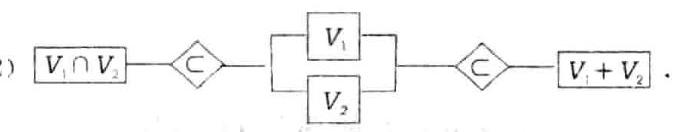

(3) $\dim \left( {{V}_{1} + {V}_{2}}\right)  = \dim {V}_{1} + \dim {V}_{2} - \dim \left( {{V}_{1} \cap  {V}_{2}}\right)$ .

(4)下面四种说法等价:

1) ${V}_{1} + {V}_{2}$ 是直和;

2) ${V}_{1} + {V}_{2}$ 中零元素的分解式唯一;

3) ${V}_{1} \cap  {V}_{2} = \{ \mathbf{0}\}$ :

4) $\dim \left( {{V}_{1} + {V}_{2}}\right)  = \dim {V}_{1} + \dim {V}_{2}$ .

(5) 若 ${V}_{1} + {V}_{2}$ 是直和,则将 ${V}_{1}$ 的基与 ${V}_{2}$ 的基拼接起来可构成 ${V}_{1} + {V}_{2}$ 的基.

(6) 若 ${V}_{1} = L\left( {{x}_{1},{x}_{2},\cdots ,{x}_{m}}\right)$ ,则 ${x}_{1},{x}_{2},\cdots ,{x}_{m}$ 的最大无关组是 ${V}_{1}$ 的基.

(7) 若 ${V}_{1} = L\left( {{x}_{1},{x}_{2},\cdots ,{x}_{m}}\right) ,{V}_{2} = L\left( {{y}_{1},{y}_{2},\cdots ,{y}_{l}}\right)$ ,则

$$
{V}_{1} + {V}_{2} = L\left( {{\mathbf{x}}_{1},{\mathbf{x}}_{2},\cdots ,{\mathbf{x}}_{m},{\mathbf{y}}_{1},{\mathbf{y}}_{2},\cdots ,{\mathbf{y}}_{l}}\right)
$$

(8) 线性空间 ${V}^{n}$ 为欧氏 (酉) 空间时, ${V}^{n} = {V}_{1} \oplus  {V}_{\Gamma }$ .

(9) 设 $\mathbf{A} \in  {\mathbf{C}}^{m \times  n}$ ,则有

1) $\left\lbrack  {R\left( \mathbf{A}\right) }\right\rbrack   =  = N\left( {\mathbf{A}}^{\mathrm{H}}\right)$ . 且 ${\mathbf{C}}^{m} = R\left( \mathbf{A}\right)  \oplus  N\left( {\mathbf{A}}^{\mathrm{H}}\right)$ ;

2) ${\left\lbrack  R\left( {\mathbf{A}}^{\mathrm{H}}\right) \right\rbrack  }^{ \bot  } = N\left( \mathbf{A}\right)$ ,且 ${\mathbf{C}}^{m} = R\left( {\mathbf{A}}^{\mathrm{H}}\right)  \oplus  N\left( \mathbf{A}\right)$ .

(10) 设 ${V}^{n}$ 的一个基为 ${x}_{1},{x}_{2},\cdots ,{x}_{n}$ ,则 ${V}^{n} = L\left( {{x}_{1},{x}_{2},\cdots ,{x}_{n}}\right)$ .

## 2. 向量组的线性关系

设线性空间 ${V}^{n}$ 的一个基为 ${\mathbf{x}}_{1},{\mathbf{x}}_{2},\cdots ,{\mathbf{x}}_{n}$ ,且 $\mathbf{y},{\mathbf{y}}_{j} \in  {V}^{n}$ 在该基下的坐标分别为 $\mathbf{\beta }$ 和 $\mathbf{\beta },\left( {j = 1,2,\cdots , m}\right)$ , 则有

(1) $\mathbf{y}$ 可由 ${\mathbf{y}}_{1},{\mathbf{y}}_{2},\cdots ,{\mathbf{y}}_{m}$ 线性表示的充要条件是 $\mathbf{\beta }$ 可由 ${\mathbf{\beta }}_{1},{\mathbf{\beta }}_{2},\cdots ,{\mathbf{\beta }}_{m}$ 线性表示.

(2) ${\mathbf{y}}_{1},{\mathbf{y}}_{2},\cdots ,{\mathbf{y}}_{m}$ 线性相(无)关的充要条件是 ${\mathbf{\beta }}_{1},{\mathbf{\beta }}_{2},\cdots ,{\mathbf{\beta }}_{m}$ 线性相(无)关.

(3) ${\mathbf{y}}_{{j}_{1}},\cdots ,{\mathbf{y}}_{{j}_{r}}$ 为 ${\mathbf{y}}_{1},{\mathbf{y}}_{2},\cdots ,{\mathbf{y}}_{m}$ 的最大无关组的充要条件是 ${\mathbf{\beta }}_{{j}_{1}},\cdots ,{\mathbf{\beta }}_{{j}_{r}}$ 为 ${\mathbf{\beta }}_{1},{\mathbf{\beta }}_{2},\cdots ,{\mathbf{\beta }}_{m}$ 的最大无关组.

## 3. 坐标变换

设数域 $K$ 上的线性空间 ${V}^{n}$ 的两个基分别为 (I) ${\mathbf{x}}_{1},{\mathbf{x}}_{2},\cdots {\mathbf{x}}_{n}$ 和 (II) ${\mathbf{y}}_{1},{\mathbf{y}}_{2},\cdots ,{\mathbf{y}}_{n}$ ,且由基 (I) 改变为基 (II)的过渡矩阵为 $C, x \in  {V}^{n}$ 在基(I)和基(II)下的坐标(列向量)分别为 $\mathbf{\alpha }$ 和 $\mathbf{\beta }$ ，则有

(1) $\mathbf{\alpha } = \mathbf{C}\mathbf{\beta },\;\mathbf{\beta } = {\mathbf{C}}^{-1}\mathbf{\alpha }$ .

(2)对于 ${\lambda }_{0} \in  K$ ，存在 $\mathbf{x} \neq  \mathbf{0}$ ，使得 $\mathbf{\alpha } = {\lambda }_{0}\mathbf{\beta }$ 的充要条件是 $\mathbf{{C\beta }} = {\lambda }_{0}\mathbf{\beta }$ ，即 ${\lambda }_{0}$ 为 $\mathbf{C}$ 的一个特征值.

## 4. 标准正交基

设欧氏空间 ${V}^{n}$ 的两个基分别为 $\left( \mathrm{I}\right) {\mathbf{x}}_{1},{\mathbf{x}}_{2},\cdots ,{\mathbf{x}}_{n}$ 和 $\left( \mathrm{{II}}\right) {\mathbf{y}}_{1},{\mathbf{y}}_{2},\cdots ,{\mathbf{y}}_{n}$ ，且由基(I)改变为基(II)的过渡矩阵为 $\mathbf{C}$ ,基 (I) 的度量矩阵为 $\mathbf{A}$ ,基 (II) 的度量矩阵为 $\mathbf{B}$ ,则有

(1) $\mathbf{B} = {\mathbf{C}}^{\mathrm{T}}\mathbf{{AC}}$ .

(2)基(I)是标准正交基的充要条件是 $\mathbf{A} = \mathbf{I}$ .

(3)若基(1)与基(II)都是标准正交基，则 $\mathbf{C}$ 是正交矩阵.

(4)若基(I)(或(II))是标准正交基， $\mathbf{C}$ 是正交矩阵，则基(II)(或基(I)是标准正交基.

## 5. 相似矩阵

(1) $\mathbf{A} \in  {\mathbf{C}}^{n \times  n}$ 相似于上 (下) 三角矩阵.

(2) $\mathbf{A} \in  {\mathbf{C}}^{n \times  n}$ 相似于 Jordan 标准形矩阵.

(3) $\mathbf{A} \in  {\mathbf{C}}^{n \times  n}$ 酉相似于上三角矩阵.

(4)设 $\mathbf{A} \in  {\mathbf{C}}^{n \times  n}$ ，则 ${\mathbf{A}}^{\mathrm{H}}\mathbf{A} = \mathbf{A}{\mathbf{A}}^{\mathrm{H}}$ 的充要条件是存在酉矩阵 $\mathbf{P}$ ，使得 ${\mathbf{P}}^{\mathrm{H}}\mathbf{{AP}} = \mathbf{\Lambda }$ (对角矩阵).

(5) 设 $\mathbf{A} \in  {\mathbf{R}}^{n \times  n}$ 的特征值都是实数,则 ${\mathbf{A}}^{\mathrm{T}}\mathbf{A} = \mathbf{A}{\mathbf{A}}^{\mathrm{T}}$ 的充要条件是存在正交矩阵 $\mathbf{Q}$ ,使得 ${\mathbf{Q}}^{\mathrm{T}}\mathbf{A}\mathbf{Q} = \mathbf{A}$ .

(6) 实对称矩阵正交相似于对角矩阵.

## 6. 方阵的最小多项式

(1) 方阵是其特征多项式的矩阵根.

(2)方阵的最小多项式整除它的零化多项式.

(3)方阵的最小多项式与它的特征多项式有相同的零点 (不计重数).

(4)设 $n$ 阶方阵 $\mathbf{A}$ 的特征多项为 $\varphi \left( \lambda \right)$ ，特征矩阵 $\lambda \mathbf{I} - \mathbf{A}$ 的 $n - 1$ 阶行列式因子为 ${D}_{n - 1}\left( \lambda \right)$ ，则 $\mathbf{A}$ 的最小多项式为 $m\left( \lambda \right)  = \frac{\varphi \left( \lambda \right) }{{D}_{n - 1}\left( \lambda \right) }$ .

(5)设 $n$ 阶方阵 $\mathbf{A}$ 的全体初等因子为

$$
{\left( \lambda  - {\lambda }_{1}\right) }^{{k}_{1}},\cdots ,{\left( \lambda  - {\lambda }_{1}\right) }^{{k}_{1}}\;\left( {1 \leq  {k}_{1} \leq  \cdots  \leq  {k}_{{t}_{1}}}\right)
$$

$$
\begin{matrix} {\left( \lambda  - {\lambda }_{2}\right) }^{{l}_{1}},\cdots ,{\left( \lambda  - {\lambda }_{2}\right) }^{{l}_{{t}_{2}}}\;\left( {1 \leq  {l}_{1} \leq  \cdots  \leq  {l}_{{t}_{2}}}\right) \\  \cdots \cdots  \end{matrix}
$$

$$
{\left( \lambda  - {\lambda }_{s}\right) }^{{r}_{1}},\cdots ,{\left( \lambda  - {\lambda }_{s}\right) }^{{r}_{k}}\;\left( {1 \leq  {r}_{1} \leq  \cdots  \leq  {r}_{{t}_{s}}}\right)
$$

其中, ${\lambda }_{1},{\lambda }_{2},\cdots ,{\lambda }_{n}$ 互不相同,则 $\mathbf{A}$ 的最小多项式为

$$
m\left( \lambda \right)  = {\left( \lambda  - {\lambda }_{1}\right) }^{{k}_{{t}_{1}}}{\left( \lambda  - {\lambda }_{2}\right) }^{{l}_{{t}_{2}}}\cdots {\left( \lambda  - {\lambda }_{s}\right) }^{{r}_{t}},
$$

## 7. 线性变换

设线性空间 ${V}^{n}$ 的两个基分别为 $\left( \mathrm{I}\right) {x}_{1},{x}_{2},\cdots ,{x}_{n}$ 和 $\left( \mathrm{{II}}\right) {y}_{1},{y}_{2},\cdots ,{y}_{n}$ ,且由基 $\left( \mathrm{I}\right)$ 改变为基 $\left( \mathrm{{II}}\right)$ 的过渡矩阵为 $\mathbf{C}$ ,线性变换 $T$ 在基 $\left( \mathrm{I}\right)$ 和基 $\left( \mathrm{{II}}\right)$ 下的矩阵分别为 $\mathbf{A}$ 和 $\mathbf{B},\mathbf{x} \in  {V}^{n}$ 在基 $\left( \mathrm{I}\right)$ 下的坐标为 $\mathbf{\alpha }$ ,则有

(1) $\dim R\left( T\right)  = \operatorname{rank}\mathbf{A},\;\dim N\left( T\right)  = n - \operatorname{rank}\mathbf{A}$ .

(2) $T\mathbf{x}$ 在基(I)下的坐标为 $\mathbf{A}\mathbf{\alpha }$ .

(3) $\mathbf{B} = {\mathbf{C}}^{-1}\mathbf{A}\mathbf{C}$ .

(4) $T$ 的特征值与 $\mathbf{A}$ 的特征值相同， $T$ 的对应于特征值 $\lambda$ 的特征向量在基(I)下的坐标为 $\mathbf{A}$ 的对应于特征值 $\lambda$ 的特征向量.

(5) 在 ${V}^{\prime \prime }$ 中存在某个基使 $T$ 在该基下的矩阵为对角矩阵 $\mathbf{\Lambda }$ 的充要条件是,存在可逆矩阵 $\mathbf{P}$ 使 ${\mathbf{P}}^{-1}\mathbf{{AP}} =$ Λ. 此时, $\mathbf{P}$ 是由基( I )改变为这个基的过渡矩阵.

(6) $T$ 在 ${V}^{n}$ 的某个基下的矩阵为对角矩阵的充要条件是 $T$ 有 $n$ 个线性无关的特征向量.

(7)关于正交变换,下面四种说法等价:

1) $T$ 是欧氏空间 ${V}^{\prime \prime }$ 的正交变换,即对于任意的 $x \in  {V}^{\prime \prime }$ ,有 $\left( {{Tx},{Tx}}\right)  = \left( {x, x}\right)$ ;

2) 对于任意的 $x, y \in  {V}^{\prime \prime }$ . 有 $\left( {{Tx},{Ty}}\right)  = \left( {x, y}\right)$ ;

3) $T$ 在 ${V}^{\prime \prime }$ 的标准正交基下的矩阵为正交矩阵;

4) $T$ 将 ${V}^{\prime \prime }$ 的标准正交基变换为标准正交基.

(8) 关于对称变换,下面两种说法等价:

1) $T$ 是欧氏空间 ${V}^{n}$ 的对称变换,即对于任意的 $x, y \in  {V}^{n}$ ,有 $\left( {{Tx}, y}\right)  = \left( {x,{Ty}}\right)$ ;

2) $T$ 在 ${V}^{n}$ 的标准正交基下的矩阵为对称矩阵.

(9)若 $T$ 是欧氏空间 ${V}^{n}$ 的对称变换，则 $T$ 在 ${V}^{n}$ 的某个标准正交基下的矩阵为对角矩阵.

(10) 在欧氏空间 ${V}^{n}$ 中,若正交变换 $T$ 的特征值都是实数,则 $T$ 是对称变换.

## 8. 线性变换的不变子空间

设 $T$ 是线性空间 ${V}^{n}$ 的线性变换,则有

(1) $R\left( T\right) , N\left( T\right)$ 及 ${V}_{\lambda }$ 都是 $T$ 的不变子空间.

(2)若 ${V}_{1}$ 和 ${V}_{2}$ 都是 $T$ 的不变子空间,则 ${V}_{1} \cap  {V}_{2}$ 与 ${V}_{1} + {V}_{2}$ 也是 $T$ 的不变子空间.

(3)若 ${V}^{\prime \prime }$ 可分解为 $T$ 的不变子空间 ${V}_{i}\left( {i = 1,2,\cdots , m}\right)$ 的直和,则 $T$ 在由 ${V}_{1},{V}_{2},\cdots ,{V}_{m}$ 的基拼接而构成 ${V}^{n}$ 的基下的矩阵为准对角矩阵.

(4)若 $T$ 在 ${V}^{n}$ 的某个基下的矩阵为准对角矩阵 $\operatorname{diag}\left( {{\mathbf{A}}_{1},{\mathbf{A}}_{2},\cdots ,{\mathbf{A}}_{m}}\right)$ ,则 ${V}^{n}$ 可分解为 $T$ 的 $m$ 个不变子空间的直和.

矩阵论 言 数学言语

### 1.3 常用方法

## 1. 求线性空间 (子空间) 的基

(1)根据线性空间的构成规律，找出其中的一组特殊元素, 使得线性空间的一般元素都可由这组元素线性表示.

(2)若这组元素线性无关，则它就是线性空间的基；若这组元素线性相关，则它的一个最大无关组就是线性空间的基.

## 2. 求 $R\left( A\right)$ 和 $N\left( A\right)$ 的基

(1)矩阵 $\mathbf{A}$ 的列向量组的一个最大无关组是 $R\left( \mathbf{A}\right)$ 的基.

(2)齐次线性方程组 $\mathbf{A}\mathbf{x} = \mathbf{0}$ 的一个基础解系是 $N\left( \mathbf{A}\right)$ 的基.

## 3. 求 $R\left( T\right) , N\left( T\right)$ 及 ${V}_{\lambda }$ 的基

设线性空间 ${V}^{n}$ 的一个基为 ${\mathbf{x}}_{1},{\mathbf{x}}_{2},\cdots ,{\mathbf{x}}_{n}$ ,线性变换 $T$ 在该基下的矩阵为 $\mathbf{A}$ ,记 $\operatorname{rank}\mathbf{A} = r$ ,则有

(1)求出 $R\left( \mathbf{A}\right)$ 的一个基为 ${\mathbf{\alpha }}_{1},{\mathbf{\alpha }}_{2},\cdots ,{\mathbf{\alpha }}_{r}$ (列向量)，那么 $R\left( T\right)$ 的一个基为

$$
{\mathbf{y}}_{1} = \left( {{\mathbf{x}}_{1},{\mathbf{x}}_{2},\cdots ,{\mathbf{x}}_{n}}\right) {\mathbf{\alpha }}_{1},\cdots ,{\mathbf{y}}_{r} = \left( {{\mathbf{x}}_{1},{\mathbf{x}}_{2},\cdots ,{\mathbf{x}}_{n}}\right) {\mathbf{\alpha }}_{r}
$$

(2)求出 $N\left( \mathbf{A}\right)$ 的一个基为 ${\mathbf{\beta }}_{1},{\mathbf{\beta }}_{2},\cdots ,{\mathbf{\beta }}_{n - r}$ (列向量),那么 $N\left( T\right)$ 的一个基为

$$
{\mathbf{z}}_{1} = \left( {{\mathbf{x}}_{1},{\mathbf{x}}_{2},\cdots ,{\mathbf{x}}_{n}}\right) {\mathbf{\beta }}_{1},\cdots ,{\mathbf{z}}_{n - r} = \left( {{\mathbf{x}}_{1},{\mathbf{x}}_{2},\cdots ,{\mathbf{x}}_{n}}\right) {\mathbf{\beta }}_{n - r}
$$

(3)求出 $N\left( {\lambda \mathbf{I} - \mathbf{A}}\right)$ 的一个基为 ${\mathbf{\gamma }}_{1},{\mathbf{\gamma }}_{2},\cdots ,{\mathbf{\gamma }}_{l}$ (列向量),那么 ${V}_{\lambda }$ 的一个基为

$$
{\mathbf{u}}_{1} = \left( {{\mathbf{x}}_{1},{\mathbf{x}}_{2},\cdots ,{\mathbf{x}}_{n}}\right) {\mathbf{\gamma }}_{1},\cdots ,{\mathbf{u}}_{l} = \left( {{\mathbf{x}}_{1},{\mathbf{x}}_{2},\cdots ,{\mathbf{x}}_{n}}\right) {\mathbf{\gamma }}_{l}
$$

## 4. 求过渡矩阵

设线性空间 ${V}^{n}$ 的两个基分别为 $\left( \mathrm{I}\right) {x}_{1},{x}_{2},\cdots ,{x}_{n}$ 和 $\left( \mathrm{{II}}\right) {y}_{1},{y}_{2},\cdots ,{y}_{n}$ ,由基 $\left( \mathrm{I}\right)$ 改变为基 $\left( \mathrm{{II}}\right)$ 的过渡矩阵为 $\mathbf{C}$ ,那么求过渡矩阵有下述方法.

(1)直接法:

1) 计算 ${\mathbf{y}}_{j}$ 在基(I)下的坐标 ${\mathbf{\beta }}_{j}\left( {j = 1,2,\cdots , n}\right)$ ;

2) 写出 $\mathbf{C} = \left( {{\mathbf{\beta }}_{1},{\mathbf{\beta }}_{2},\cdots ,{\mathbf{\beta }}_{n}}\right)$ .

(2)中介法:

1) 选取 ${V}^{n}$ 的简单基，使 ${V}^{n}$ 的元素在该基下的坐标能够直接写出;

2)分别写出由简单基改变为基(I)和基(II)的过渡矩阵 ${\mathbf{C}}_{1}$ 和 ${\mathbf{C}}_{2}$ ；

3) 计算 $\mathbf{C} = {\mathbf{C}}_{1}^{-1}{\mathbf{C}}_{2}$ .

[评注] 在中介法中,由于 ${\mathbf{x}}_{i}$ 在简单基下的坐标可以直接写出,所以由简单基改变为基( I ) 的过渡矩阵 ${\mathbf{C}}_{1}$ 能够直接写出. 同理，由简单基改变为基( II )的过渡矩阵 ${\mathbf{C}}_{2}$ 也能够直接写出.

## 5. 求在两个基下坐标向量成比例的非零元素

设线性空间 ${V}^{n}$ 的两个基分别为 $\left( \mathrm{I}\right) {\mathbf{x}}_{1},{\mathbf{x}}_{2},\cdots ,{\mathbf{x}}_{n}$ 和 $\left( \mathrm{{II}}\right) {\mathbf{y}}_{1},{\mathbf{y}}_{2},\cdots ,{\mathbf{y}}_{n}$ ,且 $z \in  {V}^{n}$ 在基 $\left( \mathrm{I}\right)$ 和基 $\left( \mathrm{{II}}\right)$ 下的坐标向量 $\mathbf{\alpha }$ 和 $\mathbf{\beta }$ 满足 $\mathbf{\alpha } = \lambda \mathbf{\beta }$ ( $\lambda$ 为给定常数)，求元素 $z$ 的步骤如下:

(1)求出由基(I)改变为基(II)的过渡矩阵 $\mathbf{C}$ .

(2)求出齐次线性方程组 $\left( {\lambda \mathbf{I} - \mathbf{C}}\right) \mathbf{\beta } = \mathbf{0}$ 的基础解系 ${\mathbf{\beta }}_{1},{\mathbf{\beta }}_{2},\cdots ,{\mathbf{\beta }}_{t}$ .

(3)写出满足要求的全体线性无关的元素组

$$
{\mathbf{z}}_{1} = \left( {{\mathbf{y}}_{1},{\mathbf{y}}_{2},\cdots ,{\mathbf{y}}_{n}}\right) {\mathbf{\beta }}_{1},\cdots ,{\mathbf{z}}_{l} = \left( {{\mathbf{y}}_{1},{\mathbf{y}}_{2},\cdots ,{\mathbf{y}}_{n}}\right) {\mathbf{\beta }}_{l}
$$

那么,满足要求的全体非零元素为

$$
\mathbf{z} = {k}_{1}{\mathbf{z}}_{1} + {k}_{2}{\mathbf{z}}_{2} + \cdots  + {k}_{l}{\mathbf{z}}_{l}\;\left( {{k}_{1},{k}_{2},\cdots ,{k}_{l}}\right. \text{ 不全为 0 ) }
$$

## 6. 求线性变换的矩阵

设线性空间 ${V}^{n}$ 的一个基为 ${\mathbf{x}}_{1},{\mathbf{x}}_{2},\cdots ,{\mathbf{x}}_{n}$ ,线性变换 $T$ 在该基下的矩阵为 $\mathbf{A}$ . 那么求线性变换的矩阵有下述方法.

(1) 直接法:

1) 计算 $T{x}_{j}$ . 并求出 $T{x}_{j}$ 在基 ${x}_{1},{x}_{2},\cdots ,{x}_{n}$ 下的坐标 ${\beta }_{j}\left( {j = 1,2,\cdots , n}\right)$ :

2) 写出 $\mathbf{A} = \left( {{\mathbf{\beta }}_{1},{\mathbf{\beta }}_{2},\cdots ,{\mathbf{\beta }}_{n}}\right)$ .

(2)中介法:

1) 选取 ${V}^{n}$ 的简单基,记作 ${\varepsilon }_{1},{\varepsilon }_{2},\cdots ,{\varepsilon }_{n}$ ,使 ${V}^{n}$ 中的元素在该基下的坐标能够直接写出:

2)写出由简单基改变为给定基的过渡矩阵 $\mathbf{C}$ ；

3) 计算 ${T\varepsilon }$ ,并写出 ${T\varepsilon }$ 在简单基下的坐标 ${\mathbf{\beta }}_{j}\left( {j = 1,2,\cdots , n}\right)$ ,得到 $T$ 在简单基下的矩阵 $\mathbf{B} = \left( {\mathbf{\beta }}_{1}\right.$ , $\left. {{\mathbf{\beta }}_{2},\cdots ,{\mathbf{\beta }}_{n}}\right)$ ;

4) 计算 $T$ 在给定基下的矩阵 $\mathbf{A} = {\mathbf{C}}^{-1}\mathbf{B}\mathbf{C}$ .

[评注] 中介法的第 3 步是采用直接法求线性变换在简单基下的矩阵.

(3)混合法:

1) 选取 ${V}^{n}$ 的简单基,记作 ${\varepsilon }_{1} \cdot  {\varepsilon }_{2}\cdots ,{\varepsilon }_{n}$ ;

2) 写出由简单基改变为给定基的过渡矩阵 $\mathbf{C}$ ;

3) 计算 $T{\mathbf{x}}_{j}$ ,并写出 $T{\mathbf{x}}_{j}$ 在简单基下的坐标 ${\mathbf{\beta }}_{j}\left( {j = 1,2,\cdots , n}\right)$ ,得到矩阵 $\mathbf{B} = \left( {{\mathbf{\beta }}_{1},{\mathbf{\beta }}_{2},\cdots ,{\mathbf{\beta }}_{n}}\right)$ ,即

$$
T\left( {{\mathbf{x}}_{1},{\mathbf{x}}_{2},\cdots ,{\mathbf{x}}_{n}}\right)  = \left( {{\mathbf{\varepsilon }}_{1},{\mathbf{\varepsilon }}_{2},\cdots ,{\mathbf{\varepsilon }}_{n}}\right) \mathbf{B}
$$

4) 计算 $T$ 在给定基下的矩阵 $\mathbf{A} = {\mathbf{C}}^{-1}\mathbf{B}$ .

## 7. 求线性变换的特征值与特征向量

(1)选取线性空间 ${V}^{n}$ 的一个基(通常是简单基) ${\mathbf{x}}_{1},{\mathbf{x}}_{2},\cdots ,{\mathbf{x}}_{n}$ ，并求出线性变换 $T$ 在该基下的矩阵 $\mathbf{A}$ .

(2)求出矩阵 $\mathbf{A}$ 的全体互异特征值 ${\lambda }_{1},{\lambda }_{2},\cdots ,{\lambda }_{s}\left( {1 \leq  s \leq  n}\right)$ .

(3)求出特征方程 $\left( {{\lambda }_{i}\mathbf{I} - \mathbf{A}}\right) \mathbf{x} = \mathbf{0}$ 的基础解系 ${\mathbf{\beta }}_{i}^{\left( 1\right) },{\mathbf{\beta }}_{2}^{\left( 1\right) },\cdots ,{\mathbf{\beta }}_{{l}_{i}}^{\left( 1\right) }$ .

(4)写出线性变换 $T$ 的对应于特征值 ${\lambda }_{i}$ 的全体线性无关的特征向量

$$
{\mathbf{y}}_{1}^{\left( i\right) } = \left( {{\mathbf{x}}_{1},{\mathbf{x}}_{2},\cdots ,{\mathbf{x}}_{n}}\right) {\mathbf{\beta }}_{1}^{\left( i\right) },\cdots ,{\mathbf{y}}_{{i}_{2}}^{\left( i\right) } = \left( {{\mathbf{x}}_{1},{\mathbf{x}}_{2},\cdots ,{\mathbf{x}}_{n}}\right) {\mathbf{\beta }}_{{l}_{i}}^{\left( i\right) }
$$

那么, $T$ 的对应于特征值 $\lambda$ ,的全体特征向量为

$$
\mathbf{y} = {k}_{1}{\mathbf{y}}_{1}^{\left( i\right) } + {k}_{2}{\mathbf{y}}_{2}^{\left( i\right) } + \cdots  + {k}_{{l}_{i}}{\mathbf{y}}_{{l}_{i}}^{\left( i\right) }\;\left( {{k}_{1},{k}_{2},\cdots ,{k}_{{l}_{i}}\text{ 不全为 }0}\right) .
$$

## 8. 求线性空间的基使线性变换的矩阵为对角矩阵

(1)选取线性空间 ${V}^{n}$ 的一个基(通常是简单基) ${\mathbf{x}}_{1},{\mathbf{x}}_{2},\cdots ,{\mathbf{x}}_{n}$ ，并求出线性变换 $T$ 在该基下的矩阵 $\mathbf{A}$ .

(2)求可逆矩阵 $\mathbf{P}$ ，使 ${\mathbf{P}}^{-1}\mathbf{{AP}} = \mathbf{\Lambda }$ (对角矩阵).

(3)构造 ${V}^{n}$ 的另一个基 ${y}_{1},{y}_{2},\cdots ,{y}_{n}$ ,使之满足

$$
\left( {{\mathbf{y}}_{1},{\mathbf{y}}_{2},\cdots ,{\mathbf{y}}_{n}}\right)  = \left( {{\mathbf{x}}_{1},{\mathbf{x}}_{2},\cdots ,{\mathbf{x}}_{n}}\right) \mathbf{P}
$$

那么, $T$ 在基 ${\mathbf{y}}_{1},{\mathbf{y}}_{2},\cdots ,{\mathbf{y}}_{n}$ 下的矩阵为 $\mathbf{\Lambda }$ .

[评注] 并非对于任何线性变换 $T$ ,都存在线性空间 ${V}^{n}$ 的一个基,使 $T$ 在该基下的矩阵为对角矩阵. 但是在复数域上,任何 $n$ 阶方阵都相似于 Jordan 标准形,因此总存在 ${V}^{n}$ 的一个基,使 $T$ 在该基下的矩阵为 Jordan 标准形 - 特殊的准对角矩阵.

## 9. 求方阵的 Jordan 标准形

设 $\mathbf{A} \in  {\mathbf{C}}^{n \times  n}$ 的全体初等因子为 ${\left( \lambda  - {\lambda }_{i}\right) }^{m},\;\left( {i = 1,2,\cdots , s;{m}_{1} + {m}_{2} + \cdots  + {m}_{s} = n}\right)$ ,对应第 $i$ 个初等因子 ${\left( \lambda  - {\lambda }_{i}\right) }^{m}$ 的 Jordan 块为 ${\mathbf{J}}_{i}$ ,那么 $\mathbf{A}$ 的 Jordan 标准形为 $\mathbf{J} = \operatorname{diag}\left( {{\mathbf{J}}_{1},{\mathbf{J}}_{2},\cdots ,{\mathbf{J}}_{i}}\right)$ ,求 $\mathbf{A}$ 的全体初等因子常用下面三种方法.

(1) 行列式因子法:

1) 计算 $\lambda \mathbf{I} - \mathbf{A}$ 的行列式因子 ${D}_{k}\left( \lambda \right) \left( {k = 1,2,\cdots , n}\right)$ ;

2) 计算 $\lambda \mathbf{I} - \mathbf{A}$ 的不变因子

$$
{d}_{k}\left( \lambda \right)  = \frac{{D}_{k}\left( \lambda \right) }{{D}_{k - 1}\left( \lambda \right) }\;\left( {k = 1,2,\cdots , n;\;{D}_{0}\left( \lambda \right)  = 1}\right)
$$

3) 对 ${d}_{1}\left( \lambda \right) ,{d}_{2}\left( \lambda \right) ,\cdots ,{d}_{n}\left( \lambda \right)$ 分解因式. 全体不可约因式 (一次因式方幂) 为 $\mathbf{A}$ 的全体初等因子.

(2)初等变换法:

1) 用初等变换将 ${\lambda I} - A$ 化为对角矩阵 $\operatorname{diag}\left( {{f}_{1}\left( \lambda \right) ,{f}_{2}\left( \lambda \right) ,\cdots ,{f}_{n}\left( \lambda \right) }\right)$ ,其中 ${f}_{k}\left( \lambda \right) \left( {k = 1,2,\cdots , n}\right)$ 是首 1 多项式;

2) 对 ${f}_{1}\left( \lambda \right) ,{f}_{2}\left( \lambda \right) ,\cdots ,{f}_{n}\left( \lambda \right)$ 分解因式,全体不可约因式为 $\mathbf{A}$ 的全体初等因子.

(3)特征多项式分析法:

1) 计算 $\mathbf{A}$ 的特征多项式 $\varphi \left( \lambda \right)  = \det \left( {\lambda \mathbf{I} - \mathbf{A}}\right)$ :

2) 求出 $\varphi \left( \lambda \right)$ 的全体不可约因式

$$
{\left( \lambda  - {\lambda }_{i}\right) }^{{r}_{i}}\;\left( {i = 1,2,\cdots , l;\;{r}_{1} + {r}_{2} + \cdots  + {r}_{l} = n}\right)
$$

3) 对于 $\varphi \left( \lambda \right)$ 的第 $i$ 个不可约因式 ${\left( \lambda  - {\lambda }_{s}\right) }^{{r}_{s}}$ ,有

1) ${r}_{1} = 1$ 时, $\lambda  - {\lambda }_{i}$ 是 $\mathbf{A}$ 的一个初等因子;

ii) ${r}_{i} > 1$ 时, ${\left( \lambda  - {\lambda }_{i}\right) }^{{r}_{i}}$ 是 $\mathbf{A}$ 的 $n - \operatorname{rank}\left( {{\lambda }_{i}\mathbf{I} - \mathbf{A}}\right)$ 个初等因子的乘积.

[评注] 在特征多项式分析法中,当 ${r}_{i} \leq  3$ 时,一定能够确定出 ${\left( \lambda  - {\lambda }_{i}\right) }^{{r}_{i}}$ 是几个初等因子的乘积; 而当 ${r}_{i} > 3$ 时，不一定能够确定出 ${\left( \lambda  - {\lambda }_{i}\right) }^{{r}_{i}}$ 是几个初等因子的乘积,此时该方法可能失效。

### 1.4 内容结构框图

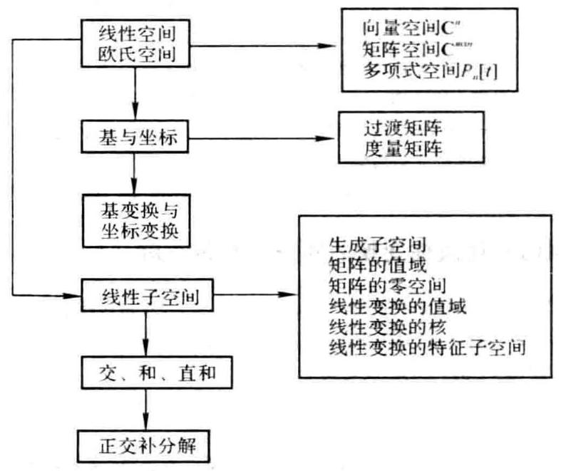

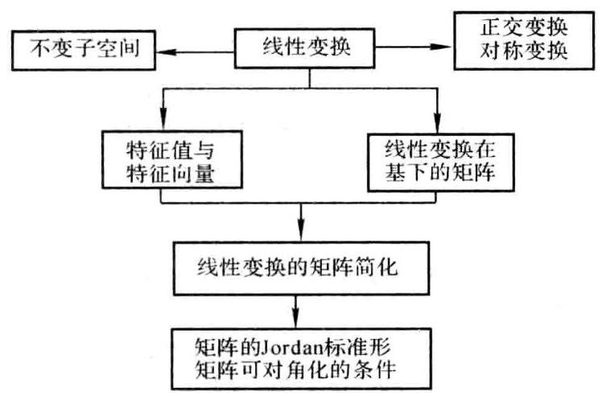

### 1.5 课后习题全解

## 习 题 1.1

1. 设 ${S}_{1} \subset  {S}_{2}$ ,证明 ${S}_{1} \cap  {S}_{2} = {S}_{1},{S}_{1} \cup  {S}_{2} = {S}_{2}$ .

证 任取 $a \in  {S}_{1}$ ,由 ${S}_{1} \subset  {S}_{2}$ 知 $a \in  \left( {{S}_{1} \cap  {S}_{2}}\right)$ . 从而 ${S}_{1} \subset  \left( {{S}_{1} \cap  {S}_{2}}\right)$ ; 又 $\left( {{S}_{1} \cap  {S}_{2}}\right)  \subset  {S}_{1}$ ,所以 $\left( {{S}_{1} \cap  {S}_{2}}\right)  = {S}_{1}$ .

任取 $a \in  \left( {{S}_{1} \cup  {S}_{2}}\right)$ ,由 ${S}_{1} \subset  {S}_{2}$ 知 $a \in  {S}_{2}$ ,故 $\left( {{S}_{1} \cup  {S}_{2}}\right)  \subset  {S}_{2}$ ; 又 ${S}_{2} \subset  \left( {{S}_{1} \cup  {S}_{2}}\right)$ ,所以 $\left( {{S}_{1} \cup  {S}_{2}}\right)  = {S}_{2}$ .

2. 判别数集 $\{ a + b\sqrt{2} \mid  a, b \in  \mathbf{Q}\}$ 是否形成数域.

解 令 $S = \{ a + b\sqrt{2} \mid  a, b \in  \mathbf{Q}\}$ ,任取 $S$ 中两个数 ${a}_{1} + {b}_{1}\sqrt{2}$ 和 ${a}_{2} + {b}_{2}\sqrt{2}$ ,由于

$$
\left( {{a}_{1} + {b}_{1}\sqrt{2}}\right)  \pm  \left( {{a}_{2} + {b}_{2}\sqrt{2}}\right)  = \left( {{a}_{1} \pm  {a}_{2}}\right)  + \left( {{b}_{1} \pm  {b}_{2}}\right) \sqrt{2} \in  S
$$

$$
\left( {{a}_{1} + {b}_{1}\sqrt{2}}\right) \left( {{a}_{2} + {b}_{2}\sqrt{2}}\right)  = \left( {{a}_{1}{a}_{2} + 2{b}_{1}{b}_{2}}\right)  + \left( {{a}_{1}{b}_{2} + {a}_{2}{b}_{1}}\right) \sqrt{2} \in  S
$$

$$
\frac{{a}_{1} + {b}_{1}\sqrt{2}}{{a}_{2} + {b}_{2}\sqrt{2}} = \frac{{a}_{1}{a}_{2} - 2{b}_{1}{b}_{2}}{{a}_{2}^{2} - 2{b}_{2}^{2}} + \frac{{a}_{2}{b}_{1} - {a}_{1}{b}_{2}}{{a}_{2}^{2} - 2{b}_{2}^{2}}\sqrt{2} \in  S
$$

所以 $S$ 形成数域.

3. 判别下列集合对所指运算是否构成 $\mathbf{R}$ 上的线性空间.

(1)次数等于 $m\left( {m \geq  1}\right)$ 的实系数多项式的集合，对于多项式的加法和数与多项式的乘法；

(2)实对称矩阵的集合,对于矩阵的加法和实数与矩阵的乘法;

(3)平面上全体向量的集合，对于通常的加法和如下定义的数乘运算 $k \circ  x = 0$ .

解(1)否. 因为两个 $m$ 次多项式相加不一定还是 $m$ 次多项式,所以加法运算不封闭.

(2) 是.

(3) 否. 因为 $\mathbf{x} \neq  \mathbf{0}$ 时 $1 \circ  \mathbf{x} = \mathbf{0} \neq  \mathbf{x}$ ,所以定义中的性质 (8) 不能成立.

4. 证明: 在实函数空间中,函数组 $1,{\cos }^{2}t,\cos {2t}$ 是线性相关的.

证 因为 $1 - 2{\cos }^{2}t + \cos {2t} = 0$ ,所以 $1,{\cos }^{2}t,\cos {2t}$ 线性相关.

5. 求第 3 题之(2)中线性空间的维数与基.

解 用 ${\mathbf{E}}_{ij}$ 表示第 $i$ 行第 $j$ 列元素为 1,而其余元素为 0 的 $n$ 阶方阵,则

$$
{\mathbf{E}}_{ii}\left( {i = 1,2,\cdots , n}\right) ,\;{\mathbf{F}}_{ij} = {\mathbf{E}}_{ij} + {\mathbf{E}}_{ji}\;\left( {i < j;\;i, j = 1,2,\cdots , n}\right)
$$

线性无关,且当 ${a}_{ij} = {a}_{ji}$ 时,有

$$
\mathbf{A} = {\left( {a}_{ij}\right) }_{n \times  n} = \mathop{\sum }\limits_{{i = 1}}^{n}{a}_{ii}{\mathbf{E}}_{ii} + \mathop{\sum }\limits_{{i < j}}{a}_{ij}{\mathbf{F}}_{ij}
$$

因此,该线性空间的一个基为 ${\mathbf{E}}_{u}\left( {i = 1,2,\cdots , n}\right) ,{\mathbf{F}}_{u}\left( {i < j;i, j = 1,2,\cdots , n}\right)$ ,其维数为 $\frac{n\left( {n + 1}\right) }{2}$ .

6. 求 ${\mathbf{R}}^{3}$ 中向量 $\mathbf{x} = \left( {3,7,1}\right)$ 在基 ${\mathbf{x}}_{1} = \left( {1,{3.5}}\right) ,{\mathbf{x}}_{2} = \left( {6,{3.2}}\right) ,{\mathbf{x}}_{3} = \left( {3,1,0}\right)$ 下的坐标.

解 设 $\mathbf{x} = {k}_{1}{\mathbf{x}}_{1} + {k}_{2}{\mathbf{x}}_{2} + {k}_{3}{\mathbf{x}}_{3}$ ,比较等号两端向量的对应分量可得线性方程组

$$
\left\lbrack  \begin{array}{lll} 1 & 6 & 3 \\  3 & 3 & 1 \\  5 & 2 & 0 \end{array}\right\rbrack  \left\lbrack  \begin{array}{l} {k}_{1} \\  {k}_{2} \\  {k}_{3} \end{array}\right\rbrack   = \left\lbrack  \begin{array}{l} 3 \\  7 \\  1 \end{array}\right\rbrack
$$

其唯一解为 ${k}_{1} = {33},{k}_{2} =  - {82},{k}_{3} = {154}$ . 因此, $x$ 的坐标为 ${\left( {33}, - {82},{154}\right) }^{T}$ .

7. 求 ${P}_{2}\left\lbrack  t\right\rbrack$ 中向量 $1 + t + {t}^{2}$ 在基 $1, t - 1,\left( {t - 2}\right) \left( {t - 1}\right)$ 下的坐标.

解 设 $1 + t + {t}^{2} = {k}_{1} \cdot  1 + {k}_{2}\left( {t - 1}\right)  + {k}_{3}\left( {t - 2}\right) \left( {t - 1}\right)$ ,比较等号两端关于 $t$ 的同次幂的系数可得

$$
\begin{aligned}  - \begin{cases} {k}_{1} - {k}_{2} + 2{k}_{3} &  = 1 \\  {k}_{2} - 3{k}_{3} &  = 1 \\  {k}_{3} &  = 1 \end{cases} \end{aligned}
$$

求解得 ${k}_{3} = 1,{k}_{2} = 4,{k}_{1} = 3$ . 因此, $1 + t + {t}^{2}$ 的坐标为 ${\left( 3,4,1\right) }^{\mathrm{T}}$ .

8. 设线性空间 ${V}^{4}$ 的基 $\left( \mathrm{I}\right) {x}_{1},{x}_{2},{x}_{3},{x}_{4}$ 和基 $\left( \mathrm{{II}}\right) {y}_{1},{y}_{2},{y}_{3},{y}_{4}$ 满足

$$
{\mathbf{x}}_{1} + 2{\mathbf{x}}_{2} = {\mathbf{y}}_{3},\;{\mathbf{x}}_{2} + 2{\mathbf{x}}_{3} = {\mathbf{y}}_{4}
$$

$$
{\mathbf{y}}_{1} + 2{\mathbf{y}}_{2} = {\mathbf{x}}_{3},\;{\mathbf{y}}_{2} + 2{\mathbf{y}}_{3} = {\mathbf{x}}_{4}
$$

(1)求由基(I)改变为基(II)的过渡矩阵 $\mathbf{C}$ ;

(2)求向量 $\mathbf{x} = 2{\mathbf{y}}_{1} - {\mathbf{y}}_{2} + {\mathbf{y}}_{3} + {\mathbf{y}}_{4}$ 在基(I)下的坐标.

解 (1) 解出 ${\mathbf{y}}_{1},{\mathbf{y}}_{2}$ ,可得

$$
{\mathbf{y}}_{1} = 4{\mathbf{x}}_{1} + 8{\mathbf{x}}_{2} + {\mathbf{x}}_{3} - 2{\mathbf{x}}_{4},\;{\mathbf{y}}_{2} =  - 2{\mathbf{x}}_{1} - 4{\mathbf{x}}_{2} + {\mathbf{x}}_{4}
$$

$$
{\mathbf{y}}_{2} = {\mathbf{x}}_{1} + 2{\mathbf{x}}_{2},\;{\mathbf{y}}_{4} = {\mathbf{x}}_{2} + 2{\mathbf{x}}_{3}
$$

于是,由基 (I) 改变基 (II) 的过渡矩阵为

$$
\mathbf{C} = \left\lbrack  \begin{array}{rrrr} 4 &  - 2 & 1 & 0 \\  8 &  - 4 & 2 & 1 \\  1 & 0 & 0 & 2 \\   - 2 & 1 & 0 & 0 \end{array}\right\rbrack
$$

(2) $x$ 在基(II)下的坐标为 ${\left( 2, - 1,1,1\right) }^{\mathrm{T}}$ ，由坐标变换公式计算 $x$ 在基(I)下的坐标为

$$
\mathbf{C}\left\lbrack  \begin{array}{r} 2 \\   - 1 \\  1 \\  1 \end{array}\right\rbrack   = \left\lbrack  \begin{array}{r} {11} \\  {23} \\  4 \\   - 5 \end{array}\right\rbrack
$$

9. 在 ${\mathbf{R}}^{4}$ 中有两个基

$$
{\mathbf{x}}_{1} = {\mathbf{e}}_{1},\;{\mathbf{x}}_{2} = {\mathbf{e}}_{2},\;{\mathbf{x}}_{3} = {\mathbf{e}}_{3},\;{\mathbf{x}}_{4} = {\mathbf{e}}_{4}
$$

$$
{\mathbf{y}}_{1} = \left( {2,1, - 1,1}\right) ,\;{\mathbf{y}}_{2} = \left( {0,3,1,0}\right) ,\;{\mathbf{y}}_{3} = \left( {5,3,2,1}\right) ,\;{\mathbf{y}}_{4} = \left( {6,6,1,3}\right)
$$

(1)求由前一基改变为后一基的过渡矩阵；

(2)求向量 $\mathbf{x} = \left( {{\xi }_{1},{\xi }_{2},{\xi }_{3},{\xi }_{4}}\right)$ 在后一基下的坐标；

(3)求对两个基有相同坐标的非零向量.

解 (1) 设 $\left( {{\mathbf{y}}_{1},{\mathbf{y}}_{2},{\mathbf{y}}_{3},{\mathbf{y}}_{4}}\right)  = \left( {{\mathbf{x}}_{1},{\mathbf{x}}_{2},{\mathbf{x}}_{3},{\mathbf{x}}_{4}}\right) \mathbf{C}$ ,直接写出

$$
\mathbf{C} = \left\lbrack  \begin{array}{rrrr} 2 & 0 & 5 & 6 \\  1 & 3 & 3 & 6 \\   - 1 & 1 & 2 & 1 \\  1 & 0 & 1 & 3 \end{array}\right\rbrack
$$

(2) $\mathbf{x}$ 在基 ${\mathbf{x}}_{1},{\mathbf{x}}_{2},{\mathbf{x}}_{3},{\mathbf{x}}_{4}$ 下的坐标为 ${\left( {\xi }_{1},{\xi }_{2},{\xi }_{3},{\xi }_{4}\right) }^{\mathrm{T}}$ ，而 $\mathbf{x}$ 在基 ${\mathbf{y}}_{1},{\mathbf{y}}_{2},{\mathbf{y}}_{3},{\mathbf{y}}_{4}$ 下的坐标为 ${\mathbf{C}}^{-1}\left( {{\xi }_{1},{\xi }_{2}}\right.$ ， ${\left. {\xi }_{3},{\xi }_{4}\right) }^{\mathrm{T}}$ .

(3) 由 $\left\lbrack  \begin{matrix} {\xi }_{1} \\  {\xi }_{2} \\  {\xi }_{3} \\  {\xi }_{4} \end{matrix}\right\rbrack   = {\mathbf{C}}^{-1}\left\lbrack  \begin{matrix} {\xi }_{1} \\  {\xi }_{2} \\  {\xi }_{3} \\  {\xi }_{4} \end{matrix}\right\rbrack$ 得 $\left( {\mathbf{C} - \mathbf{I}}\right) \left\lbrack  \begin{matrix} {\xi }_{1} \\  {\xi }_{2} \\  {\xi }_{3} \\  {\xi }_{4} \end{matrix}\right\rbrack   = \mathbf{0}$ ,该方程组的通解为 $k{\left( 1,1,1, - 1\right) }^{\mathrm{T}}$ ,对两个基有相同坐标的非零向量为 $k\left( {{\mathbf{x}}_{1} + {\mathbf{x}}_{2} + {\mathbf{x}}_{3} - {\mathbf{x}}_{4}}\right) , k$ 为非零常数.

10. 设 ${\mathbf{x}}_{1},{\mathbf{x}}_{2},{\mathbf{x}}_{3}$ 是 ${\mathbf{R}}^{3}$ 的一个基,求由 ${\mathbf{y}}_{1} = {\mathbf{x}}_{1} - 2{\mathbf{x}}_{2} + 3{\mathbf{x}}_{3},{\mathbf{y}}_{2} = 2{\mathbf{x}}_{1} + 3{\mathbf{x}}_{2} + 2{\mathbf{x}}_{3},{\mathbf{y}}_{3} = 4{\mathbf{x}}_{1} + {13}{\mathbf{x}}_{2}$ 生成的子空间 $L\left( {{\mathbf{y}}_{1},{\mathbf{y}}_{2},{\mathbf{y}}_{3}}\right)$ 的基.

解 $L\left( {{\mathbf{y}}_{1},{\mathbf{y}}_{2},{\mathbf{y}}_{3}}\right)$ 的基为 ${\mathbf{y}}_{1},{\mathbf{y}}_{2},{\mathbf{y}}_{3}$ 的一个最大无关组. 在基 ${\mathbf{x}}_{1},{\mathbf{x}}_{2},{\mathbf{x}}_{3}$ 下, ${\mathbf{y}}_{1},{\mathbf{y}}_{2},{\mathbf{y}}_{3}$ 的坐标依次为

$$
{\left( 1, - 2,3\right) }^{\mathrm{T}},{\left( 2,3,2\right) }^{\mathrm{T}},{\left( 4,{13},0\right) }^{\mathrm{T}}
$$

该列向量组的一个最大无关组为 ${\left( 1, - 2,3\right) }^{\mathrm{T}},{\left( 2,3,2\right) }^{\mathrm{T}}$ . 因此, ${\mathbf{y}}_{1},{\mathbf{y}}_{2},{\mathbf{y}}_{3}$ 的一个最大无关组为 ${\mathbf{y}}_{1},{\mathbf{y}}_{2}$ ,即 $L\left( {\mathbf{y}}_{1}\right.$ , $\left. {{\mathbf{y}}_{2},{\mathbf{y}}_{3}}\right)$ 的一个基为 ${\mathbf{y}}_{1},{\mathbf{y}}_{2}$ .

11. 求 ${\mathbf{R}}^{4}$ 的子空间

$$
{V}_{1} = \left\{  {\left( {{\xi }_{1},{\xi }_{2},{\xi }_{3},{\xi }_{4}}\right)  \mid  {\xi }_{1} - {\xi }_{2} + {\xi }_{3} - {\xi }_{4} = 0}\right\}
$$

$$
{V}_{2} = \left\{  {\left( {{\xi }_{1},{\xi }_{2},{\xi }_{3},{\xi }_{4}}\right)  \mid  {\xi }_{1} + {\xi }_{2} + {\xi }_{3} + {\xi }_{4} = 0}\right\}
$$

的交 ${V}_{1} \cap  {V}_{2}$ 的基.

解 设 $\mathbf{x} = \left( {{\xi }_{1},{\xi }_{2},{\xi }_{3},{\xi }_{4}}\right)  \in  \left( {{V}_{1} \cap  {V}_{2}}\right)$ ,则 $\mathbf{x}$ 的分量满足

$$
\left\{  \begin{array}{l} {\xi }_{1} - {\xi }_{2} + {\xi }_{3} - {\xi }_{4} = 0 \\  {\xi }_{1} + {\xi }_{2} + {\xi }_{3} + {\xi }_{4} = 0 \end{array}\right.
$$

该方程组的基础解系为 ${\left( {1.0}, - 1,0\right) }^{\mathrm{T}},{\left( 0,1,0, - 1\right) }^{\mathrm{T}}$ . 从而 ${V}_{1} \cap  {V}_{2}$ 的一个基为 $\left( {1,0, - 1,0}\right) ,\left( {0,1,0, - 1}\right)$ .

12. 给定 ${\mathbf{R}}^{2 \times  2} = \left\{  {\mathbf{A} = {\left( {a}_{ij}\right) }_{2 \times  2} \mid  {a}_{ij} \in  \mathbf{R}}\right\}$ (数域 $\mathbf{R}$ 上的二阶实方阵按通常矩阵的加法与数乘矩阵构成的线性空间) 的子集

$$
V = \left\{  {\mathbf{A} = {\left( {a}_{ij}\right) }_{2 \times  2} \mid  {a}_{11} + {a}_{22} = 0,{a}_{ij} \in  \mathbf{R}}\right\}
$$

(1)证明 $V$ 是 ${\mathbf{R}}^{2 \times  2}$ 的子空间；

(2)求 $V$ 的维数和基.

解(1)设 $\mathbf{A} = {\left( {a}_{ij}\right) }_{2 \times  2} \in  V,\mathbf{B} = {\left( {b}_{ij}\right) }_{2 \times  2} \in  V$ ,则有

$$
{a}_{11} + {a}_{22} = 0,{b}_{11} + {b}_{22} = 0
$$

因为

$$
\mathbf{A} + \mathbf{B} = {\left( {a}_{ij} + {b}_{ij}\right) }_{2 \times  2},\left( {{a}_{11} + {b}_{11}}\right)  + \left( {{a}_{22} + {b}_{22}}\right)  = 0
$$

$$
k\mathbf{A} = {\left( k{a}_{ij}\right) }_{2 \times  2},\;\left( {k{a}_{11}}\right)  + \left( {k{a}_{22}}\right)  = 0
$$

所以 $\mathbf{A} + \mathbf{B} \in  V, k\mathbf{A} \in  V$ . 又 ${\mathbf{O}}_{2 \times  2} \in  V$ ,所以 $V$ 是 ${\mathbf{R}}^{2 \times  2}$ 的子空间.

(2)在 $V$ 中

$$
{\mathbf{A}}_{1} = \left\lbrack  \begin{array}{rr} 1 & 0 \\  0 &  - 1 \end{array}\right\rbrack  ,{\mathbf{A}}_{2} = \left\lbrack  \begin{array}{ll} 0 & 1 \\  0 & 0 \end{array}\right\rbrack  ,{\mathbf{A}}_{3} = \left\lbrack  \begin{array}{ll} 0 & 0 \\  1 & 0 \end{array}\right\rbrack
$$

线性无关. 任意 $\mathbf{A} = {\left( {a}_{ij}\right) }_{2 \times  2} \in  V$ ,有 ${a}_{11} + {a}_{22} = 0$ ,即 ${a}_{22} =  - {a}_{11}$ ,于是

$$
\mathbf{A} = {a}_{11}{\mathbf{A}}_{1} + {a}_{12}{\mathbf{A}}_{2} + {a}_{21}{\mathbf{A}}_{3}
$$

因此, $V$ 的一个基是 ${\mathbf{A}}_{1},{\mathbf{A}}_{2},{\mathbf{A}}_{3}$ ,从而 $\dim V = 3$ .

13. 证明所有二阶矩阵之集合形成的实线性空间, 是所有二阶实对称矩阵之集合形成的子空间与所有二阶反对称矩阵之集合形成的子空间的直和.

证 设 $V = {\mathbf{R}}^{2 \times  2}$ ,令

$$
{V}_{1} = \left\{  {\mathbf{A} = {\left( {a}_{ij}\right) }_{2 \times  2} \mid  {a}_{ij} = {a}_{ji},{a}_{ij} \in  \mathbf{R}}\right\}
$$

$$
{V}_{2} = \left\{  {\mathbf{B} = {\left( {b}_{ij}\right) }_{2 \times  2} \mid  {b}_{ij} =  - {b}_{ji},{b}_{ij} \in  \mathbf{R}}\right\}
$$

矩阵论 导 时 复数 复

容易验证, ${V}_{1}$ 与 ${V}_{2}$ 都是 $V$ 的子空间. 任意 $C \in  V$ ,有

$$
\mathbf{C} = \frac{1}{2}\left( {\mathbf{C} + {\mathbf{C}}^{\mathrm{T}}}\right)  + \frac{1}{2}\left( {\mathbf{C} - {\mathbf{C}}^{\mathrm{T}}}\right)
$$

且 $\frac{1}{2}\left( {\mathbf{C} + {\mathbf{C}}^{\mathrm{T}}}\right)  \in  {V}_{1},\frac{1}{2}\left( {\mathbf{C} - {\mathbf{C}}^{\mathrm{T}}}\right)  \in  {V}_{2}$ ,所以 $\mathbf{V} = {\mathbf{V}}_{1} + {\mathbf{V}}_{2}$ . 因为

$$
\mathbf{D} = {\left( {d}_{ij}\right) }_{2 \times  2} \in  {V}_{1} \cap  {V}_{2} \Rightarrow  \mathbf{D} \in  {V}_{1}\text{ 且 }\mathbf{D} \in  {V}_{2}
$$

$$
\Rightarrow  {d}_{ij} = {d}_{ji}\text{ 且 }{d}_{ij} =  - {d}_{ji}
$$

$$
\Rightarrow  {d}_{ij} = 0\left( {i, j = 1,2}\right)
$$

$$
\Rightarrow  \mathbf{D} = \mathbf{O}
$$

所以 ${V}_{1} \cap  {V}_{2} = \{ \mathbf{O}\}$ ,即 $V = {V}_{1} \oplus  {V}_{2}$ .

## 习 题 1.2

1. 判别下列变换中哪些是线性变换.

(1) 在 ${\mathbf{R}}^{3}$ 中,设 $x = \left( {{\xi }_{1},{\xi }_{2},{\xi }_{3}}\right) ,{Tx} = \left( {{\xi }_{1}^{2},{\xi }_{1} + {\xi }_{2},{\xi }_{3}}\right)$ ;

(2)在矩阵空间 ${\mathbf{R}}^{n \times  n}$ 中， $T\mathbf{X} = \mathbf{B}\mathbf{X}\mathbf{C}$ ，这里 $\mathbf{B},\mathbf{C}$ 是给定矩阵；

(3)在线性空间 ${P}_{n}\left\lbrack  t\right\rbrack$ 中， ${Tf}\left( t\right)  = f\left( {t + 1}\right)$ .

解 (1) 否. 因为 $T\left( {2x}\right)  = \left( {4{\xi }_{1}^{2},2{\xi }_{1} + 2{\xi }_{2},2{\xi }_{3}}\right)$ ,而 $2\left( {Tx}\right)  = \left( {2{\xi }_{1}^{2},2{\xi }_{1} + 2{\xi }_{2},2{\xi }_{3}}\right)$ ,所以当 ${\xi }_{1} \neq  0$ 时, $T\left( {2x}\right)  \neq  2\left( {Tx}\right)$ .

(2)是. 设 $\mathbf{X},\mathbf{Y} \in  {\mathbf{R}}^{n \times  n}, k \in  \mathbf{R}$ ，则有

$$
T\left( {\mathbf{X} + \mathbf{Y}}\right)  = \mathbf{B}\left( {\mathbf{X} + \mathbf{Y}}\right) \mathbf{C} = \mathbf{B}\mathbf{X}\mathbf{C} + \mathbf{B}\mathbf{Y}\mathbf{C} = T\mathbf{X} + T\mathbf{Y}
$$

$$
T\left( {k\mathbf{X}}\right)  = \mathbf{B}\left( {k\mathbf{X}}\right) \mathbf{C} = k\left( \mathbf{{BXC}}\right)  = k\left( {T\mathbf{X}}\right)
$$

(3) 是. 设 $f\left( t\right) , g\left( t\right)  \in  {P}_{n}\left\lbrack  t\right\rbrack  , k \in  \mathbf{R}$ ,则有

$$
T\left\lbrack  {f\left( t\right)  + g\left( t\right) }\right\rbrack   = f\left( {t + 1}\right)  + g\left( {t + 1}\right)  = {Tf}\left( t\right)  + {Tg}\left( t\right)
$$

$$
T\left\lbrack  {{kf}\left( t\right) }\right\rbrack   = {kf}\left( {t + 1}\right)  = {kTf}\left( t\right)
$$

2. 在 ${\mathbf{R}}^{2}$ 中,设 $\mathbf{x} = \left( {{\xi }_{1},{\xi }_{2}}\right)$ ,证明 ${T}_{1}\mathbf{x} = \left( {{\xi }_{2}, - {\xi }_{1}}\right)$ 与 ${T}_{2}\mathbf{x} = \left( {{\xi }_{1}, - {\xi }_{2}}\right)$ 是 ${\mathbf{R}}^{2}$ 的两个线性变换,并求 ${T}_{1} + {T}_{2},{T}_{1}{T}_{2}$ 及 ${T}_{2}{T}_{1}$ .

解 设 $k, l \in  \mathbf{R}, y = \left( {{\eta }_{1},{\eta }_{2}}\right)  \in  {\mathbf{R}}^{2}$ ,则 ${kx} + {ly} = \left( {k{\xi }_{1} + l{\eta }_{1}, k{\xi }_{2} + l{\eta }_{2}}\right)$ . 于是有

$$
{T}_{1}\left( {{kx} + {ly}}\right)  = \left( {k{\xi }_{2} + l{\eta }_{2}, - k{\xi }_{1} - l{\eta }_{1}}\right)  = k\left( {{\xi }_{2}, - {\xi }_{1}}\right)  + l\left( {{\eta }_{2}, - {\eta }_{1}}\right)  = k\left( {{T}_{1}x}\right)  + l\left( {{T}_{1}y}\right)
$$

所以 ${T}_{1}$ 是线性变换. 同理可得, ${T}_{2}$ 是线性变换.

$$
\left( {{T}_{1} + {T}_{2}}\right) \mathbf{x} = {T}_{1}\mathbf{x} + {T}_{2}\mathbf{x} = \left( {{\xi }_{1} + {\xi }_{2}, - {\xi }_{1} - {\xi }_{2}}\right)
$$

$$
\left( {{T}_{1}{T}_{2}}\right) \mathbf{x} = {T}_{1}\left( {{T}_{2}\mathbf{x}}\right)  = {T}_{1}\left( {{\xi }_{1}, - {\xi }_{2}}\right)  = \left( {-{\xi }_{2}, - {\xi }_{1}}\right)
$$

$$
\left( {{T}_{2}{T}_{1}}\right) \mathbf{x} = {T}_{2}\left( {{T}_{1}\mathbf{x}}\right)  = {T}_{2}\left( {{\xi }_{2}, - {\xi }_{1}}\right)  = \left( {{\xi }_{2},{\xi }_{1}}\right)
$$

3. 在 ${P}_{n}\left\lbrack  t\right\rbrack$ 中, ${T}_{1}f\left( t\right)  = {f}^{\prime }\left( t\right) ,{T}_{2}f\left( t\right)  = {tf}\left( t\right)$ ,证明 ${T}_{1}{T}_{2} - {T}_{2}{T}_{1} = {T}_{r}$ .

证 设 $f\left( t\right)  \in  {P}_{n}\left\lbrack  t\right\rbrack$ ,则

$$
\left( {{T}_{1}{T}_{2} - {T}_{2}{T}_{1}}\right) f\left( t\right)  = {T}_{1}\left\lbrack  {{T}_{2}f\left( t\right) }\right\rbrack   - {T}_{2}\left\lbrack  {{T}_{1}f\left( t\right) }\right\rbrack   = {T}_{1}\left\lbrack  {{tf}\left( t\right) }\right\rbrack   - {T}_{2}\left\lbrack  {{f}^{\prime }\left( t\right) }\right\rbrack   =
$$

$$
f\left( t\right)  + t{f}^{\prime }\left( t\right)  - t{f}^{\prime }\left( t\right)  = f\left( t\right)  = {T}_{r}f\left( t\right)
$$

故 ${T}_{1}{T}_{2} - {T}_{2}{T}_{1} = {T}_{r}$ .

4. 在 ${\mathbf{R}}^{3}$ 中,设 $x = \left( {{\xi }_{1},{\xi }_{2},{\xi }_{3}}\right)$ ,定义 ${Tx} = \left( {2{\xi }_{1} - {\xi }_{2},{\xi }_{2} + {\xi }_{3},{\xi }_{1}}\right)$ ,试求 $T$ 在基 ${e}_{1} = \left( {1,0,0}\right) ,{e}_{2} = (0,1$ , $0),{\mathbf{e}}_{3} = \left( {0,{0.1}}\right)$ 下的矩阵.

解 $T{\mathbf{e}}_{1} = \left( {2,0,1}\right)  = 2{\mathbf{e}}_{1} + 0{\mathbf{e}}_{2} + 1{\mathbf{e}}_{3}$

$T{\mathbf{e}}_{2} = \left( {-1,1,0}\right)  = \left( {-1}\right) {\mathbf{e}}_{1} + 1{\mathbf{e}}_{2} + 0{\mathbf{e}}_{3}$

$T{\mathbf{e}}_{3} = \left( {0,1,0}\right)  = 0{\mathbf{e}}_{1} + 1{\mathbf{e}}_{2} + 0{\mathbf{e}}_{3}$

故

$$
\mathbf{A} = \left\lbrack  \begin{array}{rrr} 2 &  - 1 & 0 \\  0 & 1 & 1 \\  1 & 0 & 0 \end{array}\right\rbrack
$$

5. 设 ${\mathbf{x}}_{1},{\mathbf{x}}_{2}$ 是线性空间 ${V}^{2}$ 的基, ${T}_{1}$ 与 ${T}_{2}$ 是 ${V}^{2}$ 的线性变换, ${T}_{1}{\mathbf{x}}_{1} = {\mathbf{y}}_{1},{T}_{1}{\mathbf{x}}_{2} = {\mathbf{y}}_{2}$ ,且 ${T}_{2}\left( {{\mathbf{x}}_{1} + {\mathbf{x}}_{2}}\right)  = \; {\mathbf{y}}_{1} + {\mathbf{y}}_{2},{T}_{2}\left( {{\mathbf{x}}_{1} - {\mathbf{x}}_{2}}\right)  = {\mathbf{y}}_{1} - {\mathbf{y}}_{2}$ ,证明 ${T}_{1} = {T}_{2}$ .

证 设 $\mathbf{x} \in  {V}^{2}$ ,则 $\mathbf{x} = {k}_{1}{\mathbf{x}}_{1} + {k}_{2}{\mathbf{x}}_{2}$ . 由于

$$
\left\{  \begin{array}{l} {T}_{2}{\mathbf{x}}_{1} + {T}_{2}{\mathbf{x}}_{2} = {T}_{2}\left( {{\mathbf{x}}_{1} + {\mathbf{x}}_{2}}\right)  = {\mathbf{y}}_{1} + {\mathbf{y}}_{2} \\  {T}_{2}{\mathbf{x}}_{1} - {T}_{2}{\mathbf{x}}_{2} = {T}_{2}\left( {{\mathbf{x}}_{1} - {\mathbf{x}}_{2}}\right)  = {\mathbf{y}}_{1} - {\mathbf{y}}_{2} \end{array}\right.
$$

所以 ${T}_{2}{\mathbf{x}}_{1} = {\mathbf{y}}_{1},{T}_{2}{\mathbf{x}}_{2} = {\mathbf{y}}_{2}$ . 于是

$$
{T}_{1}\mathbf{x} = {k}_{1}{T}_{1}{\mathbf{x}}_{1} + {k}_{2}{T}_{1}{\mathbf{x}}_{2} = {k}_{1}{\mathbf{y}}_{1} + {k}_{2}{\mathbf{y}}_{2} = {k}_{1}{T}_{2}{\mathbf{x}}_{1} + {k}_{2}{T}_{2}{\mathbf{x}}_{2} = {T}_{2}\mathbf{x}
$$

故 ${T}_{1} = {T}_{2}$ .

6.6 个函数

$$
{\mathbf{x}}_{1} = {\mathrm{e}}^{at}\cos {bt},\;{\mathbf{x}}_{2} = {\mathrm{e}}^{at}\sin {bt},\;{\mathbf{x}}_{3} = t{\mathrm{e}}^{at}\cos {bt}
$$

$$
{\mathbf{x}}_{4} = t{\mathrm{e}}^{at}\sin {bt},\;{\mathbf{x}}_{5} = \frac{1}{2}{t}^{2}{\mathrm{e}}^{at}\cos {bt},\;{\mathbf{x}}_{6} = \frac{1}{2}{t}^{2}{\mathrm{e}}^{at}\sin {bt}
$$

的所有实系数线性组合构成实数域 $\mathbf{R}$ 上的一个六维线性空间 ${V}^{6} = L\left( {{\mathbf{x}}_{1},{\mathbf{x}}_{2},{\mathbf{x}}_{3},{\mathbf{x}}_{4},{\mathbf{x}}_{5},{\mathbf{x}}_{6}}\right)$ ,求微分变换 $D$ 在基 ${\mathbf{x}}_{1},{\mathbf{x}}_{2},\cdots ,{\mathbf{x}}_{6}$ 下的矩阵.

解 因为

$$
D{\mathbf{x}}_{1} = a{\mathrm{e}}^{at}\cos {bt} - {\mathrm{e}}^{at}b\sin {bt} = a{\mathbf{x}}_{1} - b{\mathbf{x}}_{2}
$$

$$
D{\mathbf{x}}_{2} = a{\mathrm{e}}^{at}\sin {bt} + {\mathrm{e}}^{at}b\cos {bt} = b{\mathbf{x}}_{1} + a{\mathbf{x}}_{2}
$$

$$
D{\mathbf{x}}_{3} = {\mathrm{e}}^{at}\cos {bt} + t{\mathrm{e}}^{at}\cos {bt} - t{\mathrm{e}}^{at}b\sin {bt} = {\mathbf{x}}_{1} + a{\mathbf{x}}_{3} - b{\mathbf{x}}_{4}
$$

$$
D{\mathbf{x}}_{4} = {\mathrm{e}}^{at}\sin {bt} + {ta}{\mathrm{e}}^{at}\sin {bt} + t{\mathrm{e}}^{at}b\cos {bt} = {\mathbf{x}}_{2} + b{\mathbf{x}}_{3} + a{\mathbf{x}}_{4}
$$

$$
D{\mathbf{x}}_{5} = t{\mathrm{e}}^{at}\cos {bt} + \frac{1}{2}{t}^{2}a{\mathrm{e}}^{at}\cos {bt} - \frac{1}{2}{t}^{2}{\mathrm{e}}^{at}b\sin {bt} = {\mathbf{x}}_{3} + a{\mathbf{x}}_{5} - b{\mathbf{x}}_{6}
$$

$$
D{\mathbf{x}}_{6} = t{\mathrm{e}}^{at}\sin {bt} + \frac{1}{2}{t}^{2}a{\mathrm{e}}^{at}\sin {bt} + \frac{1}{2}{t}^{2}{\mathrm{e}}^{at}b\cos {bt} = {\mathbf{x}}_{4} + b{\mathbf{x}}_{5} + a{\mathbf{x}}_{6}
$$

故

$$
\mathbf{A} = \left\lbrack  \begin{array}{rrrrrr} a & b & 1 & 0 & 0 & 0 \\   - b & a & 0 & 1 & 0 & 0 \\  0 & 0 & a & b & 1 & 0 \\  0 & 0 &  - b & a & 0 & 1 \\  0 & 0 & 0 & 0 & a & b \\  0 & 0 & 0 & 0 &  - b & a \end{array}\right\rbrack
$$

7. 已知 ${\mathbf{R}}^{3}$ 的线性变换 $T$ 在基 ${\mathbf{x}}_{1} = \left( {-1,1,1}\right) ,{\mathbf{x}}_{2} = \left( {1,0, - 1}\right) ,{\mathbf{x}}_{3} = \left( {0,1,1}\right)$ 下的矩阵为

$$
\left\lbrack  \begin{array}{rrr} 1 & 0 & 1 \\  1 & 1 & 0 \\   - 1 & 2 & 1 \end{array}\right\rbrack
$$

求 $T$ 在基 ${\mathbf{e}}_{1} = \left( {1,0,0}\right) ,{\mathbf{e}}_{2} = \left( {0,1,0}\right) ,{\mathbf{e}}_{3} = \left( {0,0,1}\right)$ 下的矩阵.

解 设基 (I) 为 ${\mathbf{x}}_{1},{\mathbf{x}}_{2},{\mathbf{x}}_{3}$ ; 基 (II) 为 ${\mathbf{e}}_{1},{\mathbf{e}}_{2},{\mathbf{e}}_{3}$ . 直接写出由基 (II) 改变为基 (I) 的过渡矩阵

$$
{\mathbf{C}}^{-1} = \left\lbrack  \begin{array}{rrr}  - 1 & 1 & 0 \\  1 & 0 & 1 \\  1 &  - 1 & 1 \end{array}\right\rbrack
$$

则由基 (I) 改变为基 (II) 的过渡矩阵为 $\mathbf{C}$ . 于是 $T$ 在基 (II) 下的矩阵为

$$
{\mathbf{C}}^{-1}\left\lbrack  \begin{array}{rrr} 1 & 0 & 1 \\  1 & 1 & 0 \\   - 1 & 2 & 1 \end{array}\right\rbrack  \mathbf{C} = \left\lbrack  \begin{array}{rrr}  - 1 & 1 &  - 2 \\  2 & 2 & 0 \\  3 & 0 & 2 \end{array}\right\rbrack
$$

8. 在 ${\mathbf{R}}^{2 \times  2}$ 中定义线性变换

$$
{T}_{1}\mathbf{X} = \left\lbrack  \begin{array}{ll} a & b \\  c & d \end{array}\right\rbrack  \mathbf{X},\;{T}_{2}\mathbf{X} = \mathbf{X}\left\lbrack  \begin{array}{ll} a & b \\  c & d \end{array}\right\rbrack  ,\;{T}_{3}\mathbf{X} = \left\lbrack  \begin{array}{ll} a & b \\  c & d \end{array}\right\rbrack  \mathbf{X}\left\lbrack  \begin{array}{ll} a & b \\  c & d \end{array}\right\rbrack
$$

求 ${T}_{1},{T}_{2},{T}_{3}$ 在基 ${\mathbf{E}}_{11},{\mathbf{E}}_{12},{\mathbf{E}}_{21},{\mathbf{E}}_{22}$ 下的矩阵.

解 ${T}_{1}{\mathbf{E}}_{11} = \left\lbrack  \begin{array}{ll} a & 0 \\  c & 0 \end{array}\right\rbrack   = a{\mathbf{E}}_{11} + c{\mathbf{E}}_{21},\;{T}_{1}{\mathbf{E}}_{12} = \left\lbrack  \begin{array}{ll} 0 & a \\  0 & c \end{array}\right\rbrack   = a{\mathbf{E}}_{12} + c{\mathbf{E}}_{22}$

$$
{T}_{1}{\mathbf{E}}_{21} = \left\lbrack  \begin{array}{ll} b & 0 \\  d & 0 \end{array}\right\rbrack   = b{\mathbf{E}}_{11} + d{\mathbf{E}}_{21},\;{T}_{1}{\mathbf{E}}_{22} = \left\lbrack  \begin{array}{ll} 0 & b \\  0 & d \end{array}\right\rbrack   = b{\mathbf{E}}_{12} + d{\mathbf{E}}_{22}
$$

故 ${T}_{1}$ 在该基下的矩阵为

$$
{\mathbf{A}}_{1} = \left\lbrack  \begin{array}{llll} a & 0 & b & 0 \\  0 & a & 0 & b \\  c & 0 & d & 0 \\  0 & c & 0 & d \end{array}\right\rbrack
$$

类似地,可得 ${T}_{2}$ 在该基下的矩阵为

$$
{\mathbf{A}}_{2} = \left\lbrack  \begin{array}{llll} a & c & 0 & 0 \\  b & d & 0 & 0 \\  0 & 0 & a & c \\  0 & 0 & b & d \end{array}\right\rbrack
$$

由于 ${T}_{3} = {T}_{1}{T}_{2}$ ,所以 ${T}_{3}$ 在该基下的矩阵为

$$
{\mathbf{A}}_{3} = {\mathbf{A}}_{1}{\mathbf{A}}_{2} = \left\lbrack  \begin{array}{llll} {a}^{2} & {ac} & {ab} & {bc} \\  {ab} & {ad} & {b}^{2} & {bd} \\  {ac} & {c}^{2} & {ad} & {cd} \\  {bc} & {cd} & {bd} & {d}^{2} \end{array}\right\rbrack
$$

9. 设 $T$ 是线性空间 $V$ 的线性变换,且 ${T}^{k - 1}\mathbf{x} \neq  \mathbf{0}$ ,但 ${T}^{k}\mathbf{x} = \mathbf{0}$ ,求证 $\mathbf{x}, T\mathbf{x},\cdots ,{T}^{k - 1}\mathbf{x}\left( {k > 0}\right)$ 线性无关.

证 设一组数 ${c}_{0},{c}_{1},\cdots ,{c}_{k - 1}$ ,使得

$$
{c}_{0}\mathbf{x} + {c}_{1}T\mathbf{x} + \cdots  + {c}_{k - 1}{T}^{k - 1}\mathbf{x} = \mathbf{0}
$$

两端用 ${T}^{k - 1}$ 变换,并利用 ${T}^{k}\mathbf{x} = \mathbf{0}$ 可得

$$
{c}_{0}{T}^{k - 1}\mathbf{x} = \mathbf{0}
$$

因为 ${T}^{k - 1}\mathbf{x} \neq  \mathbf{0}$ ,所以 ${c}_{0} = 0$ .

同理可得 ${c}_{1} = \cdots  = {c}_{k - 1} = 0$ ,故 $\mathbf{x}, T\mathbf{x}\cdots ,{T}^{k - 1}\mathbf{x}$ 线性无关.

10. 设 $T$ 是 ${\mathbf{R}}^{3}$ 的线性变换, $\mathbf{x} = \left( {{\xi }_{1},{\xi }_{2},{\xi }_{3}}\right)  \in  {\mathbf{R}}^{3}$ ,而 $T\mathbf{x} = \left( {0,{\xi }_{1},{\xi }_{2}}\right)$ ,求 ${T}^{2}$ 的象子空间 $R\left( {T}^{2}\right)$ 和核子空间 $N\left( {T}^{2}\right)$ 的基与维数.

解 由 ${T}^{2}x = T\left( {Tx}\right)  = T\left( {0,{\xi }_{1},{\xi }_{2}}\right)  = \left( {0,0,{\xi }_{1}}\right)$ 可得

$$
R\left( {T}^{2}\right)  = \{ \left( {0,0,\xi }\right)  \mid  \xi  \in  \mathbf{R}\} ,\;N\left( {T}^{2}\right)  = \left\{  {\left( {0,{\xi }_{2},{\xi }_{3}}\right)  \mid  {\xi }_{2},{\xi }_{3} \in  \mathbf{R}}\right\}
$$

因此 $\dim R\left( {T}^{2}\right)  = 1, R\left( {T}^{2}\right)$ 的一个基为 $\left( {0,0,1}\right) ;\dim N\left( {T}^{2}\right)  = 2, N\left( {T}^{2}\right)$ 的一个基为 $\left( {0,1,0}\right) ,\left( {0,0,1}\right)$ .

11. 给定 ${\mathbf{R}}^{3}$ 的两个基

$$
{\mathbf{x}}_{1} = \left( {1,0,1}\right) ,\;{\mathbf{x}}_{2} = \left( {2,1,0}\right) ,\;{\mathbf{x}}_{3} = \left( {1,1,1}\right)
$$

$$
{\mathbf{y}}_{1} = \left( {1,2, - 1}\right) ,\;{\mathbf{y}}_{2} = \left( {2,2, - 1}\right) ,\;{\mathbf{y}}_{3} = \left( {2, - 1, - 1}\right)
$$

定义线性变换

$$
T{\mathbf{x}}_{i} = {\mathbf{y}}_{i}\;\left( {i = 1,2,3}\right)
$$

(1)写出由基 ${\mathbf{x}}_{1},{\mathbf{x}}_{2},{\mathbf{x}}_{3}$ 改变为基 ${\mathbf{y}}_{1},{\mathbf{y}}_{2},{\mathbf{y}}_{3}$ 的过渡矩阵.

(2)写出 $T$ 在基 ${\mathbf{x}}_{1},{\mathbf{x}}_{2},{\mathbf{x}}_{3}$ 下的矩阵.

(3)写出 $T$ 在基 ${\mathbf{y}}_{1},{\mathbf{y}}_{2},{\mathbf{y}}_{3}$ 下的矩阵.

解 (1) 引进基 ${\mathbf{e}}_{1},{\mathbf{e}}_{2},{\mathbf{e}}_{3}$ ,则有

$$
\left( {{\mathbf{x}}_{1},{\mathbf{x}}_{2},{\mathbf{x}}_{3}}\right)  = \left( {{\mathbf{e}}_{1},{\mathbf{e}}_{2},{\mathbf{e}}_{3}}\right) {\mathbf{C}}_{1},\;{\mathbf{C}}_{1} = \left\lbrack  \begin{array}{lll} 1 & 2 & 1 \\  0 & 1 & 1 \\  1 & 0 & 1 \end{array}\right\rbrack
$$

$$
\left( {{\mathbf{y}}_{1},{\mathbf{y}}_{2},{\mathbf{y}}_{3}}\right)  = \left( {{\mathbf{e}}_{1},{\mathbf{e}}_{2},{\mathbf{e}}_{3}}\right) {\mathbf{C}}_{2},\;{\mathbf{C}}_{2} = \left\lbrack  \begin{array}{rrr} 1 & 2 & 2 \\  2 & 2 &  - 1 \\   - 1 &  - 1 &  - 1 \end{array}\right\rbrack
$$

所以 $\left( {{\mathbf{y}}_{1},{\mathbf{y}}_{2},{\mathbf{y}}_{3}}\right)  = \left( {{\mathbf{x}}_{1},{\mathbf{x}}_{2},{\mathbf{x}}_{3}}\right) \mathbf{C}$ ,其中

$$
\mathbf{C} = {\mathbf{C}}_{1}^{-1}{\mathbf{C}}_{2} = \frac{1}{2}\left\lbrack  \begin{array}{rrr}  - 4 &  - 3 & 3 \\  2 & 3 & 3 \\  2 & 1 &  - 5 \end{array}\right\rbrack
$$

(2) 由 $T\left( {{\mathbf{x}}_{1},{\mathbf{x}}_{2},{\mathbf{x}}_{3}}\right)  = \left( {{\mathbf{y}}_{1},{\mathbf{y}}_{2},{\mathbf{y}}_{3}}\right)  = \left( {{\mathbf{x}}_{1},{\mathbf{x}}_{2},{\mathbf{x}}_{3}}\right) \mathbf{C}$ 知, $T$ 在基 ${\mathbf{x}}_{1},{\mathbf{x}}_{2},{\mathbf{x}}_{3}$ 下的矩阵为 $\mathbf{C}$ .

(3) $T$ 在基 ${\mathbf{y}}_{1},{\mathbf{y}}_{2},{\mathbf{y}}_{3}$ 下的矩阵为 ${\mathbf{C}}^{-1}\mathbf{C}\mathbf{C} = \mathbf{C}$ .

12. 设 $T$ 是数域 $\mathbf{C}$ 上线性空间 ${V}^{3}$ 的线性变换,已知 $T$ 在 ${V}^{3}$ 的基 ${\mathbf{x}}_{1},{\mathbf{x}}_{2},{\mathbf{x}}_{3}$ 下的矩阵

$$
\mathbf{A} = \left\lbrack  \begin{array}{rrr} 3 & 1 & 0 \\   - 4 &  - 1 & 0 \\  4 &  - 8 &  - 2 \end{array}\right\rbrack
$$

求 $T$ 的特征值与特征向量.

解 求得 $\mathbf{A}$ 的特征值和特征向量为

$$
{\lambda }_{1} = {\lambda }_{2} = 1,\;k{\left( 3, - 6,{20}\right) }^{\mathrm{T}}\;\left( {k \neq  0}\right)
$$

$$
{\lambda }_{3} =  - 2,\;k{\left( 0,0,1\right) }^{\mathrm{T}}\;\left( {k \neq  0}\right)
$$

故 $T$ 的特征值和特征向量为

$$
{\lambda }_{1} = {\lambda }_{2} = 1,\;k\left( {3{x}_{1} - 6{x}_{2} + {20}{x}_{3}}\right) \;\left( {k \neq  0}\right)
$$

$$
{\lambda }_{3} =  - 2,\;k{x}_{3}\;\left( {k \neq  0}\right)
$$

13. 把矩阵 $\mathbf{A} = \left\lbrack  \begin{array}{rrr}  - 1 & 1 & 0 \\   - 4 & 3 & 0 \\  1 & 0 & 2 \end{array}\right\rbrack$ 相似的变换为上三角矩阵.

解 第一步: $\det \left( {\lambda \mathbf{I} - \mathbf{A}}\right)  = \left( {\lambda  - 2}\right) {\left( \lambda  - 1\right) }^{2}$ .

$$
{\lambda }_{1} = 2,\;2\mathbf{I} - \mathbf{A} = \left\lbrack  \begin{array}{rrr} 3 &  - 1 & 0 \\  4 &  - 1 & 0 \\  0 & 0 & 0 \end{array}\right\rbrack
$$

特征向量为 $\left\lbrack  \begin{array}{l} 0 \\  0 \\  1 \end{array}\right\rbrack$ ,取 ${\mathbf{P}}_{1} = \left\lbrack  \begin{array}{lll} 0 & 0 & 1 \\  0 & 1 & 0 \\  1 & 0 & 0 \end{array}\right\rbrack$ ,可求得

$$
{\mathbf{P}}_{1}^{-1}\mathbf{A}{\mathbf{P}}_{1} = \left\lbrack  \begin{array}{rrr} 2 & 0 & 1 \\  0 & 3 &  - 4 \\  0 & 1 &  - 1 \end{array}\right\rbrack
$$

第 2 步: ${\mathbf{A}}_{1} = \left\lbrack  \begin{array}{ll} 3 &  - 4 \\  1 &  - 1 \end{array}\right\rbrack  ,\det \left( {\lambda \mathbf{I} - {\mathbf{A}}_{1}}\right)  = {\left( \lambda  - 1\right) }^{2}$ .

$$
{\lambda }_{2} = 1,\;{1I} - {A}_{1} = \left\lbrack  \begin{array}{ll}  - 2 & 4 \\   - 1 & 2 \end{array}\right\rbrack
$$

特征向量为 $\left\lbrack  \begin{array}{l} 2 \\  1 \end{array}\right\rbrack$ ,取 ${\mathbf{P}}_{2} = \left\lbrack  \begin{array}{ll} 2 & 0 \\  1 & 1 \end{array}\right\rbrack$ ,可求得

$$
{\mathbf{P}}_{2}^{-1}{\mathbf{A}}_{1}{\mathbf{P}}_{2} = \left\lbrack  \begin{array}{rr} 1 &  - 2 \\  0 & 1 \end{array}\right\rbrack
$$

令 $\mathbf{P} = {\mathbf{P}}_{1}\left\lbrack  \begin{array}{ll} 1 & \\   & {\mathbf{P}}_{2} \end{array}\right\rbrack   = \left\lbrack  \begin{array}{lll} 0 & 1 & 1 \\  0 & 2 & 0 \\  1 & 0 & 0 \end{array}\right\rbrack$ ,则 ${\mathbf{P}}^{-1}\mathbf{{AP}} = \left\lbrack  \begin{array}{rrr} 2 & 1 & 1 \\   & 1 &  - 2 \\   & & 1 \end{array}\right\rbrack$ .

14. 试计算 $2{\mathbf{A}}^{8} - 3{\mathbf{A}}^{5} + {\mathbf{A}}^{4} + {\mathbf{A}}^{2} - 4\mathbf{I}$ ,其中 $\mathbf{A} = \left\lbrack  \begin{array}{rrr} 1 & 0 & 2 \\  0 &  - 1 & 1 \\  0 & 1 & 0 \end{array}\right\rbrack$ .

解 $\det \left( {\lambda \mathbf{I} - \mathbf{A}}\right)  = {\lambda }^{3} - {2\lambda } + 1$ ,利用长除法或待定系数法求得

$$
2{\lambda }^{8} - 3{\lambda }^{5} + {\lambda }^{4} + {\lambda }^{2} - 4 = \left( {{\lambda }^{3} - {2\lambda } + 1}\right) f\left( \lambda \right)  + \left( {{24}{\lambda }^{2} - {37\lambda } + {10}}\right)
$$

其中 $f\left( \lambda \right)  = 2{\lambda }^{5} + 4{\lambda }^{3} - 5{\lambda }^{2} + {9\lambda } - {14}$ . 由于 ${\mathbf{A}}^{3} - 2\mathbf{A} + \mathbf{I} = \mathbf{O}$ ,所以

$$
\text{ 原式 } = {24}{\mathbf{A}}^{2} - {37}\mathbf{A} + {10}\mathbf{I} = \left\lbrack  \begin{array}{rrr}  - 3 & {48} &  - {26} \\  0 & {95} &  - {61} \\  0 &  - {61} & {34} \end{array}\right\rbrack
$$

15. 设 $\mathbf{A} = \left\lbrack  \begin{array}{rr} 1 &  - 1 \\  2 & 5 \end{array}\right\rbrack$ ,试求 ${\left( 2{\mathbf{A}}^{4} - {12}{\mathbf{A}}^{3} + {19}{\mathbf{A}}^{2} - {29}\mathbf{A} + {37}\mathbf{I}\right) }^{-1}$ .

解 $\det \left( {\lambda \mathbf{I} - \mathbf{A}}\right)  = {\lambda }^{2} - {6\lambda } + 7$ ,利用长除法或待定系数法求得

$$
\text{ - }2{\lambda }^{4} - {12}{\lambda }^{3} + {19}{\lambda }^{2} - {29\lambda } + {37} = \left( {{\lambda }^{2} - {6\lambda } + 7}\right) \left( {2{\lambda }^{2} + 5}\right)  + \left( {\lambda  + 2}\right)
$$

由于 ${\mathbf{A}}^{2} - 6\mathbf{A} + 7\mathbf{I} = \mathbf{O}$ ,所以

$$
\text{ 原式 } = {\left( \mathbf{A} + 2\mathbf{I}\right) }^{-1} = {\left\lbrack  \begin{array}{rr} 3 &  - 1 \\  2 & 7 \end{array}\right\rbrack  }^{-1} = \frac{1}{23}\left\lbrack  \begin{array}{rr} 7 & 1 \\   - 2 & 3 \end{array}\right\rbrack
$$

16. 求下列矩阵的特征多项式和最小多项式.

(1) $\left\lbrack  \begin{array}{rrr} 7 & 4 &  - 4 \\  4 &  - 8 &  - 1 \\   - 4 &  - 1 &  - 8 \end{array}\right\rbrack$ ; (2) $\left\lbrack  \begin{array}{rrrr} {a}_{0} & {a}_{1} & {a}_{2} & {a}_{3} \\   - {a}_{1} & {a}_{0} &  - {a}_{3} & {a}_{2} \\   - {a}_{2} & {a}_{3} & {a}_{0} &  - {a}_{1} \\   - {a}_{3} &  - {a}_{2} & {a}_{1} & {a}_{0} \end{array}\right\rbrack$ .

解 $\;\left( 1\right) \varphi \left( \lambda \right)  = \det \left( {\lambda \mathbf{I} - \mathbf{A}}\right)  = \left( {\lambda  - 9}\right) {\left( \lambda  + 9\right) }^{2}, m\left( \lambda \right)$ 是 $\varphi \left( \lambda \right)$ 的因式. 检验知 $m\left( \lambda \right)  = \left( {\lambda  - 9}\right) \left( {\lambda  + 9}\right)  = \; {\lambda }^{2} - {81}$ .

(2)利用 ${\left\lbrack  \det \left( \lambda \mathbf{I} - \mathbf{A}\right) \right\rbrack  }^{2} = \det \left\lbrack  {{\left( \lambda \mathbf{I} - \mathbf{A}\right) }^{\mathrm{T}}\left( {\lambda \mathbf{I} - \mathbf{A}}\right) }\right\rbrack$ 可求得

$$
\varphi \left( \lambda \right)  = \det \left( {\lambda \mathbf{I} - \mathbf{A}}\right)  = {\left\lbrack  {\lambda }^{2} - 2{a}_{0}\lambda  + \left( {a}_{0}^{2} + {a}_{1}^{2} + {a}_{2}^{2} + {a}_{3}^{2}\right) \right\rbrack  }^{2}
$$

$m\left( \lambda \right)$ 是 $\varphi \left( \lambda \right)$ 的因式,检验知

$$
m\left( \lambda \right)  = {\lambda }^{2} - 2{a}_{0}\lambda  + \left( {{a}_{0}^{2} + {a}_{1}^{2} + {a}_{2}^{2} + {a}_{3}^{2}}\right)
$$

17. 证明任意矩阵与它的转置矩阵有相同的最小多项式.

证 设 $\mathbf{A}$ 的最小多项式为 ${m}_{\mathbf{A}}\left( \lambda \right) ,\mathbf{B} = {\mathbf{A}}^{\mathrm{T}}$ 的最小多项式为 ${m}_{\mathbf{B}}\left( \lambda \right)$ . 由 ${m}_{\mathbf{A}}\left( \mathbf{A}\right)  = \mathbf{O}$ 可得

$$
{m}_{\mathbf{A}}\left( \mathbf{B}\right)  = {m}_{\mathbf{A}}\left( {\mathbf{A}}^{\mathrm{T}}\right)  = {\left\lbrack  {m}_{\mathbf{A}}\left( \mathbf{A}\right) \right\rbrack  }^{\mathrm{T}} = \mathbf{O}
$$

故 ${m}_{B}\left( \lambda \right)  \mid  {m}_{A}\left( \lambda \right)$ . 同理可得 ${m}_{A}\left( \lambda \right)  \mid  {m}_{B}\left( \lambda \right)$ . 因此 ${m}_{A}\left( \lambda \right)  = {m}_{B}\left( \lambda \right)$ .

18. 设 ${T}_{1}$ ， ${T}_{2}$ 是数域 $\mathbf{C}$ 上的线性空间 ${V}^{n}$ 的线性变换，且 ${T}_{1}{T}_{2} = {T}_{2}{T}_{1}$ ，证明:如果 ${\lambda }_{0}$ 是 ${T}_{1}$ 的特征值，那么， ${V}_{{\lambda }_{0}}$ 是 ${T}_{2}$ 的不变子空间.

证 对任意 $\mathbf{x} \in  {V}_{{\lambda }_{0}}$ ,有 ${T}_{1}\mathbf{x} = {\lambda }_{0}\mathbf{x}$ . 由于

$$
{T}_{1}\left( {{T}_{2}\mathbf{x}}\right)  = {T}_{2}\left( {{T}_{1}\mathbf{x}}\right)  = {T}_{2}\left( {{\lambda }_{0}\mathbf{x}}\right)  = {\lambda }_{0}\left( {{T}_{2}\mathbf{x}}\right)
$$

所以 ${T}_{2}\mathbf{x} \in  {V}_{{\lambda }_{0}}$ ,故 ${V}_{{\lambda }_{0}}$ 是 ${T}_{2}$ 的不变子空间.

19. 求下列各矩阵的 Jordan 标准形.

(1) $\left\lbrack  \begin{array}{rrr} 1 & 2 & 0 \\  0 & 2 & 0 \\   - 2 &  - 1 &  - 1 \end{array}\right\rbrack$ ; (2) $\left\lbrack  \begin{array}{rrr} 3 & 7 &  - 3 \\   - 2 &  - 5 & 2 \\   - 4 &  - {10} & 3 \end{array}\right\rbrack$ ; (3) $\left\lbrack  \begin{array}{rrrr} 3 & 1 & 0 & 0 \\   - 4 &  - 1 & 0 & 0 \\  7 & 1 & 2 & 1 \\   - 7 &  - 6 &  - 1 & 0 \end{array}\right\rbrack$ .

解 (1) $\det \left( {\lambda \mathbf{I} - \mathbf{A}}\right)  = \left( {\lambda  - 1}\right) \left( {\lambda  - 2}\right) \left( {\lambda  + 1}\right) ,\mathbf{A}$ 有 3 个不同的特征值,从而 $\mathbf{A}$ 的 Jordan 标准形为

$$
\left\lbrack  \begin{array}{lll} 1 & & \\   & 2 & \\   & &  - 1 \end{array}\right\rbrack
$$

(2) $\det \left( {\lambda \mathbf{I} - \mathbf{A}}\right)  = \left( {\lambda  - 1}\right) \left( {\lambda  - \mathrm{i}}\right) \left( {\lambda  + \mathrm{i}}\right) ,\mathbf{A}$ 有 3 个不同的特征值,从而 $\mathbf{A}$ 的 Jordan 标准形为

$$
\left\lbrack  \begin{array}{lll} 1 & & \\   & \mathrm{i} & \\   & &  - \mathrm{i} \end{array}\right\rbrack
$$

(3) 写出特征矩阵

$$
\lambda \mathbf{I} - \mathbf{A} = \left\lbrack  \begin{matrix} \lambda  - 3 &  - 1 & 0 & 0 \\  4 & \lambda  + 1 & 0 & 0 \\   - 7 &  - 1 & \lambda  - 2 &  - 1 \\  7 & 6 & 1 & \lambda  \end{matrix}\right\rbrack
$$

容易求得 $\mathbf{A}$ 的行列式因子

$$
{D}_{1}\left( \lambda \right)  = 1,{D}_{2}\left( \lambda \right)  = 1,{D}_{4}\left( \lambda \right)  = {\left( \lambda  - 1\right) }^{4}
$$

位于 $\lambda \mathbf{I} - \mathbf{A}$ 的第2,3,4行与第1,2,4列处的三阶子式为

$$
\left| \begin{matrix} 4 & \lambda  + 1 & 0 \\   - 7 &  - 1 &  - 1 \\  7 & 6 & \lambda  \end{matrix}\right|  = 7{\lambda }^{2} - {4\lambda } + {17}
$$

它与 ${D}_{4}\left( \lambda \right)$ 互质,所以 ${D}_{3}\left( \lambda \right)  = 1$ ,从而 $\mathbf{A}$ 的不变因子为 $1,1,1,{\left( \lambda  - 1\right) }^{4}$ . 于是 $\mathbf{A}$ 的初等因子为 ${\left( \lambda  - 1\right) }^{4},\mathbf{A}$ 的 Jordan 标准形为

$$
\mathbf{J} = \left\lbrack  \begin{array}{llll} 1 & 1 & & \\   & 1 & 1 & \\   & & 1 & 1 \\   & & & 1 \end{array}\right\rbrack
$$

20. 设有正整数 $m$ 使 ${\mathbf{A}}^{m} = \mathbf{I}$ ,证明 $\mathbf{A}$ 与对角矩阵相似.

证 设 $\mathbf{A}$ 的 Jordan 标准形为

$$
\mathbf{J} = \left\lbrack  \begin{array}{lll} {\mathbf{J}}_{1}\left( {\lambda }_{1}\right) & & \\   &  \ddots  & \\   & & {\mathbf{J}}_{s}\left( {\lambda }_{s}\right)  \end{array}\right\rbrack  ,\;{\mathbf{J}}_{i}\left( {\lambda }_{i}\right)  = {\left\lbrack  \begin{array}{llll} {\lambda }_{i} & 1 & & \\   & {\lambda }_{i} &  \ddots  & \\   & &  \ddots  & 1 \\   & & & {\lambda }_{i} \end{array}\right\rbrack  }_{{m}_{i} \times  {m}_{i}}
$$

即存在可逆矩阵 $\mathbf{P}$ ,使 ${\mathbf{P}}^{-1}\mathbf{{AP}} = \mathbf{J}$ . 由于

$$
{\mathbf{J}}^{m} = {\mathbf{P}}^{-1}{\mathbf{A}}^{m}\mathbf{P} = {\mathbf{P}}^{-1}\mathbf{I}\mathbf{P} = \mathbf{I}
$$

所以 ${\left\lbrack  {\mathbf{J}}_{i}\left( {\lambda }_{i}\right) \right\rbrack  }^{m} = {\mathbf{I}}_{{m}_{i}}$ ,从而 ${m}_{i} = 1$ ,即 ${\mathbf{J}}_{i}\left( {\lambda }_{i}\right)  = {\lambda }_{i}$ ,也就是 $\mathbf{A}$ 与对角矩阵相似.

21. 求解常微分方程组

$$
\left\{  \begin{array}{l} \frac{\mathrm{d}{\xi }_{1}}{\mathrm{\;d}t} =  - {\xi }_{1} + {\xi }_{2} \\  \frac{\mathrm{d}{\xi }_{2}}{\mathrm{\;d}t} =  - 4{\xi }_{1} + 3{\xi }_{2} \\  \frac{\mathrm{d}{\xi }_{3}}{\mathrm{\;d}t} =  - 8{\xi }_{1} + 8{\xi }_{2} - {\xi }_{3} \end{array}\right.
$$

这里 ${\xi }_{1},{\xi }_{2},{\xi }_{3}$ 都是 $t$ 的未知函数.

解 对方程组的系数矩阵 $\mathbf{A}$ 求可逆矩阵 $\mathbf{P}$ ,使 ${\mathbf{P}}^{-1}\mathbf{{AP}} = \mathbf{J}$ .

$$
\mathbf{A} = \left\lbrack  \begin{array}{rrr}  - 1 & 1 & 0 \\   - 4 & 3 & 0 \\   - 8 & 8 &  - 1 \end{array}\right\rbrack  ,\mathbf{J} = \left\lbrack  \begin{array}{rrr} 1 & 1 & 0 \\   & 1 & 0 \\   & &  - 1 \end{array}\right\rbrack  ,\mathbf{P} = \left\lbrack  \begin{array}{lll} 1 & 0 & 0 \\  2 & 1 & 0 \\  4 & 2 & 1 \end{array}\right\rbrack
$$

作代换 $\left\lbrack  \begin{array}{l} {\xi }_{1} \\  {\xi }_{2} \\  {\xi }_{3} \end{array}\right\rbrack   = \mathbf{P}\left\lbrack  \begin{array}{l} {\eta }_{1} \\  {\eta }_{2} \\  {\eta }_{3} \end{array}\right\rbrack$ ,将原方程化为

$$
\left\lbrack  \begin{array}{l} {\eta }_{1}^{\prime } \\  {\eta }_{2}^{\prime } \\  {\eta }_{3}^{\prime } \end{array}\right\rbrack   = \mathbf{J}\left\lbrack  \begin{array}{l} {\eta }_{1} \\  {\eta }_{2} \\  {\eta }_{3} \end{array}\right\rbrack   = \left\lbrack  \begin{matrix} {\eta }_{1} + {\eta }_{2} \\  {\eta }_{2} \\   - {\eta }_{3} \end{matrix}\right\rbrack
$$

可求得 ${\eta }_{1} = {c}_{1}{\mathrm{e}}^{t} + {c}_{2}t{\mathrm{e}}^{t},{\eta }_{2} = {c}_{2}{\mathrm{e}}^{t},{\eta }_{3} = {c}_{3}{\mathrm{e}}^{-t}$ ,于是

$$
\left\{  \begin{array}{l} {\xi }_{1}\left( t\right)  = {c}_{1}{\mathrm{e}}^{\prime } + {c}_{2}t{\mathrm{e}}^{\prime } \\  {\xi }_{2}\left( t\right)  = 2{c}_{1}{\mathrm{e}}^{\prime } + {c}_{2}\left( {{2t} + 1}\right) {\mathrm{e}}^{\prime } \\  {\xi }_{3}\left( t\right)  = 4{c}_{1}{\mathrm{e}}^{\prime } + {c}_{2}\left( {{4t} + 2}\right) {\mathrm{e}}^{\prime } + {c}_{3}{\mathrm{e}}^{-t} \end{array}\right.
$$

其中 ${c}_{1},{c}_{2},{c}_{3}$ 为任意常数.

## 习 题 1.3

1. 设 $\mathbf{x} = \left( {{\xi }_{1},{\xi }_{2},\cdots ,{\xi }_{n}}\right) ,\mathbf{y} = \left( {{\eta }_{1},{\eta }_{2},\cdots ,{\eta }_{n}}\right)$ 是 ${\mathbf{R}}^{n}$ 的任意两个向量, $\mathbf{A} = {\left( {a}_{ij}\right) }_{n \times  n}$ 是正定矩阵,定义 $\left( {\mathbf{x},\mathbf{y}}\right)  = \mathbf{x}\mathbf{A}{\mathbf{y}}^{\mathrm{T}}.$

(1)证明在该定义下 ${\mathbf{R}}^{n}$ 构成欧氏空间；

(2)求 ${\mathbf{R}}^{n}$ 中由单位坐标向量 ${\mathbf{e}}_{1} = \left( {1,0,\cdots ,0}\right) ,{\mathbf{e}}_{2} = \left( {0,1,0,\cdots ,0}\right) ,\cdots ,{\mathbf{e}}_{n} = \left( {0,\cdots ,0,1}\right)$ 构成的基的度量矩阵;

(3) 写出 ${\mathbf{R}}^{n}$ 中 Cauchy-Schwarz 不等式.

解 (1)

$$
\left( {\mathbf{x},\mathbf{y}}\right)  = \mathbf{x}\mathbf{A}{\mathbf{y}}^{\mathrm{T}} = {\left\lbrack  \mathbf{x}\mathbf{A}{\mathbf{y}}^{\mathrm{T}}\right\rbrack  }^{\mathrm{T}} = \mathbf{y}\mathbf{A}{\mathbf{x}}^{\mathrm{T}} = \left( {\mathbf{y},\mathbf{x}}\right)
$$

$$
\left( {k\mathbf{x},\mathbf{y}}\right)  = \left( {k\mathbf{x}}\right) \mathbf{A}{\mathbf{y}}^{\mathrm{T}} = k\left\lbrack  {\mathbf{x}\mathbf{A}{\mathbf{y}}^{\mathrm{T}}}\right\rbrack   = k\left( {\mathbf{x},\mathbf{y}}\right)
$$

$$
\left( {\mathbf{x} + \mathbf{y},\mathbf{z}}\right)  = \left( {\mathbf{x} + \mathbf{y}}\right) \mathbf{A}{\mathbf{z}}^{\mathrm{T}} = \mathbf{x}\mathbf{A}{\mathbf{z}}^{\mathrm{T}} + \mathbf{y}\mathbf{A}{\mathbf{z}}^{\mathrm{T}} = \left( {\mathbf{x},\mathbf{z}}\right)  + \left( {\mathbf{y},\mathbf{z}}\right)
$$

当 $x = 0$ 时, $\left( {x, x}\right)  = x\mathbf{A}{x}^{\mathrm{T}} = 0$ ; 当 $x \neq  0$ 时,由 $\mathbf{A}$ 正定知 $\left( {x, x}\right)  = x\mathbf{A}{x}^{\mathrm{T}} > 0$ . 因此, $\left( {x, y}\right)$ 是 ${\mathbf{R}}^{n}$ 中的内积,且在该内积定义下 ${\mathbf{R}}^{n}$ 构成欧氏空间.

(2) 由 $\left( {{\mathbf{e}}_{i},{\mathbf{e}}_{j}}\right)  = {\mathbf{e}}_{i}\mathbf{A}{\mathbf{e}}_{j}^{\mathrm{T}} = {a}_{ij}$ 知, ${\mathbf{R}}^{n}$ 中基 ${\mathbf{e}}_{1},{\mathbf{e}}_{2},\cdots ,{\mathbf{e}}_{n}$ 的度量矩阵为 $\mathbf{A}$ .

(3) $\left( {\mathbf{x},\mathbf{y}}\right)  = \mathop{\sum }\limits_{{i, j = 1}}^{n}{a}_{ij}{\xi }_{i}{\eta }_{j},{\left| \mathbf{x}\right| }^{2} = \left( {\mathbf{x},\mathbf{x}}\right)  = \mathop{\sum }\limits_{{i, j = 1}}^{n}{a}_{ij}{\xi }_{i}{\xi }_{j},{\left| \mathbf{y}\right| }^{2} = \left( {\mathbf{y},\mathbf{y}}\right)  = \mathop{\sum }\limits_{{i, j = 1}}^{n}{a}_{ij}{\eta }_{i}{\eta }_{j}$ ,由 $\left| \left( {\mathbf{x},\mathbf{y}}\right) \right|  \leq  \left| \mathbf{x}\right| \; \left| \mathbf{y}\right|$ 得

$$
\left| {\mathop{\sum }\limits_{{i, j = 1}}^{n}{a}_{ij}{\xi }_{i}{\eta }_{j}}\right|  \leq  \sqrt{\mathop{\sum }\limits_{{i, j = 1}}^{n}{a}_{ij}{\xi }_{i}{\xi }_{j}}\sqrt{\mathop{\sum }\limits_{{i, j = 1}}^{n}{a}_{ij}{\eta }_{i}{\eta }_{j}}
$$

2. 设 ${x}_{1},{x}_{2},\cdots ,{x}_{n}$ 是实线性空间 ${V}^{n}$ 的基,向量 $\mathbf{x} = {\xi }_{1}{\mathbf{x}}_{1} + {\xi }_{2}{\mathbf{x}}_{2} + \cdots  + {\xi }_{n}{\mathbf{x}}_{n}$ 和 $\mathbf{y} = {\eta }_{1}{\mathbf{x}}_{1} + {\eta }_{2}{\mathbf{x}}_{2} + \cdots  + \; {\eta }_{n}{x}_{n}$ 对应于实数 $\left( {\mathbf{x},\mathbf{y}}\right)  = \mathop{\sum }\limits_{{i = 1}}^{n}i{\xi }_{i}{\eta }_{i}$ . 试问 ${V}^{n}$ 是否构成欧氏空间.

解 设 $z \in  {V}^{n}$ ,且 $z = {c}_{1}{x}_{1} + {c}_{2}{x}_{2} + \cdots  + {c}_{n}{x}_{n}$ ,则有

$$
\left( {\mathbf{x},\mathbf{y}}\right)  = \mathop{\sum }\limits_{{i = 1}}^{n}i{\xi }_{i}{\eta }_{i} = \mathop{\sum }\limits_{{i = 1}}^{n}i{\eta }_{i}{\xi }_{i} = \left( {\mathbf{y},\mathbf{x}}\right)
$$

$$
\left( {k\mathbf{x},\mathbf{y}}\right)  = \mathop{\sum }\limits_{{i = 1}}^{n}i\left( {k{\xi }_{i}}\right) {\eta }_{i} = k\mathop{\sum }\limits_{{i = 1}}^{n}i{\xi }_{i}{\eta }_{i} = k\left( {\mathbf{x},\mathbf{y}}\right)
$$

$$
\left( {\mathbf{x} + \mathbf{y},\mathbf{z}}\right)  = \mathop{\sum }\limits_{{i = 1}}^{n}i\left( {{\xi }_{i} + {\eta }_{i}}\right) {c}_{i} = \mathop{\sum }\limits_{{i = 1}}^{n}i{\xi }_{i}{c}_{i} + \mathop{\sum }\limits_{{i = 1}}^{n}i{\eta }_{i}{c}_{i} = \left( {\mathbf{x},\mathbf{z}}\right)  + \left( {\mathbf{y},\mathbf{z}}\right)
$$

当 $x = 0$ 时, ${\xi }_{i} = \cdots  = {\xi }_{n} = 0,\left( {x, x}\right)  = 0$ ; 当 $x \neq  0$ 时,实数 ${\xi }_{1},\cdots ,{\xi }_{n}$ 不全为零, $\left( {x, x}\right)  > 0$ . 因此, $\left( {x, y}\right)$ 是 ${V}^{n}$ 中的内积,且在该内积定义下 ${V}^{n}$ 构成欧氏空间.

3. 在 ${\mathbf{R}}^{4}$ 中,求下面向量 $\mathbf{x}$ 与 $\mathbf{y}$ 的夹角 $\langle \mathbf{x},\mathbf{y}\rangle$ ,其内积按式 (1.3.1) 给出.

(1) $\mathbf{x} = \left( {2,1,3,2}\right) ,\mathbf{y} = \left( {1,2, - 2,1}\right)$ ;

(2) $\mathbf{x} = \left( {1,2,2,3}\right) ,\mathbf{y} = \left( {3,1,5,1}\right)$ .

解 $\left( 1\right) \left( {x, y}\right)  = 0,\langle x, y\rangle  = \frac{\pi }{2}$ :

(2) $\left( {\mathbf{x},\mathbf{y}}\right)  = {18},{\left| \mathbf{x}\right| }^{2} = {18},{\left| \mathbf{y}\right| }^{2} = {36}$ ，则

$$
\cos \langle \mathbf{x},\mathbf{y}\rangle  = \frac{\left( \mathbf{x},\mathbf{y}\right) }{\left| \mathbf{x}\right| \left| \mathbf{y}\right| } = \frac{\sqrt{2}}{2},\;\langle \mathbf{x},\mathbf{y}\rangle  = \frac{\pi }{4}
$$

4. 在 ${\mathbf{R}}^{4}$ 中,求一单位向量与 $\left( {1,1, - 1,1}\right) ,\left( {1, - 1, - 1,1}\right)$ 及 $\left( {2,1,1,3}\right)$ 均正交.

解 设 $x = \left( {{\xi }_{1},{\xi }_{2},{\xi }_{3},{\xi }_{4}}\right)$ 和已知向量正交,即

$$
\left\{  \begin{array}{l} {\xi }_{1} + {\xi }_{2} - {\xi }_{3} + {\xi }_{4} = 0 \\  {\xi }_{1} - {\xi }_{2} - {\xi }_{3} + {\xi }_{4} = 0 \\  2{\xi }_{1} + {\xi }_{2} + {\xi }_{3} + 3{\xi }_{4} = 0 \end{array}\right.
$$

该齐次线性方程组的一个非零解为 $x = \left( {4,0,1, - 3}\right)$ ,单位化可得 $y = \frac{1}{\left| x\right| }x = \left( {\frac{4}{\sqrt{26}},0,\frac{1}{\sqrt{26}},\frac{-3}{\sqrt{26}}}\right)$ ,即 $y$ 为所求的单位向量.

5. 设 ${\mathbf{x}}_{1},{\mathbf{x}}_{2},{\mathbf{x}}_{3},{\mathbf{x}}_{4},{\mathbf{x}}_{5}$ 是欧氏空间 ${V}^{ \circ  }$ 的一个标准正交基, ${V}_{1} = L\left( {{\mathbf{y}}_{1},{\mathbf{y}}_{2},{\mathbf{y}}_{3}}\right)$ ,其中 ${\mathbf{y}}_{1} = {\mathbf{x}}_{1} + {\mathbf{x}}_{5},{\mathbf{y}}_{2} = \; {\mathbf{x}}_{1} - {\mathbf{x}}_{2} + {\mathbf{x}}_{4},{\mathbf{y}}_{3} = 2{\mathbf{x}}_{1} + {\mathbf{x}}_{2} + {\mathbf{x}}_{3}$ ,求 ${V}_{1}$ 的一个标准正交基.

解 ${\mathbf{y}}_{1},{\mathbf{y}}_{2},{\mathbf{y}}_{3}$ 在给定基下的坐标依次为

$$
{\mathbf{\alpha }}_{1} = {\left( 1,0,0,0,1\right) }^{\mathrm{T}},\;{\mathbf{\alpha }}_{2} = {\left( 1, - 1,0,1,0\right) }^{\mathrm{T}},\;{\mathbf{\alpha }}_{3} = {\left( 2,1,1,0,0\right) }^{\mathrm{T}}
$$

由于 ${\mathbf{\alpha }}_{1},{\mathbf{\alpha }}_{2},{\mathbf{\alpha }}_{3}$ 线性无关,所以 ${\mathbf{y}}_{1},{\mathbf{y}}_{2},{\mathbf{y}}_{3}$ 线性无关,从而构成 ${V}_{1}$ 的一个基,正交化可得

$$
{\mathbf{u}}_{1} = {\mathbf{y}}_{1} = {\mathbf{x}}_{1} + {\mathbf{x}}_{5}
$$

$$
{\mathbf{u}}_{2} = {\mathbf{y}}_{2} - \frac{1}{2}{\mathbf{u}}_{1} = \frac{1}{2}{\mathbf{x}}_{1} - {\mathbf{x}}_{2} + {\mathbf{x}}_{4} - \frac{1}{2}{\mathbf{x}}_{5}
$$

$$
{\mathbf{u}}_{3} = {\mathbf{y}}_{3} - 0{\mathbf{u}}_{2} - 1{\mathbf{u}}_{1} = {\mathbf{x}}_{1} + {\mathbf{x}}_{2} + {\mathbf{x}}_{3} - {\mathbf{x}}_{5}
$$

再单位化,可得 ${V}_{1}$ 的一个标准正交基为

$$
{\mathbf{v}}_{1} = \frac{1}{\sqrt{2}}{\mathbf{u}}_{1} = \frac{1}{\sqrt{2}}\left( {{\mathbf{x}}_{1} + {\mathbf{x}}_{5}}\right)
$$

$$
{\mathbf{v}}_{2} = \frac{1}{\frac{1}{2}\sqrt{10}}{\mathbf{u}}_{2} = \frac{1}{\sqrt{10}}\left( {{\mathbf{x}}_{1} - 2{\mathbf{x}}_{2} + 2{\mathbf{x}}_{4} - {\mathbf{x}}_{5}}\right)
$$

$$
{\mathbf{v}}_{3} = \frac{1}{2}{\mathbf{u}}_{3} = \frac{1}{2}\left( {{\mathbf{x}}_{1} + {\mathbf{x}}_{2} + {\mathbf{x}}_{3} - {\mathbf{x}}_{5}}\right)
$$

6. 在 ${P}_{3}\left\lbrack  t\right\rbrack$ 中定义内积为 $\left( {f\left( t\right) , g\left( t\right) }\right)  = {\int }_{-1}^{1}f\left( t\right) g\left( t\right) \mathrm{d}t$ ,求 ${P}_{3}\left\lbrack  t\right\rbrack$ 的一个标准正交基 (由基 $1, t,{t}^{2},{t}^{3}$ 出发作正交单位化).

解 取 ${P}_{3}\left\lbrack  t\right\rbrack$ 的一个基为 $1, t,{t}^{2},{t}^{3}$ . 正交化可得

$$
{\mathbf{x}}_{1} = 1
$$

$$
{\mathbf{x}}_{2} = t - 0{\mathbf{x}}_{1} = t
$$

$$
{\mathbf{x}}_{3} = {t}^{2} - 0{\mathbf{x}}_{2} - \frac{1}{3}{\mathbf{x}}_{1} = {t}^{2} - \frac{1}{3}
$$

$$
{\mathbf{x}}_{4} = {t}^{3} - 0{\mathbf{x}}_{3} - \frac{3}{5}{\mathbf{x}}_{2} - 0{\mathbf{x}}_{1} = {t}^{3} - \frac{3}{5}t
$$

再单位化可得 ${P}_{3}\left\lbrack  t\right\rbrack$ 的一个标准正交基为

$$
{\mathbf{y}}_{1} = \frac{1}{\sqrt{2}}{\mathbf{x}}_{1} = \frac{1}{\sqrt{2}},\;{\mathbf{y}}_{2} = \frac{1}{\sqrt{\frac{2}{3}}}{\mathbf{x}}_{2} = \frac{\sqrt{6}}{2}\mathbf{t}
$$

$$
{\mathbf{y}}_{3} = \frac{1}{\frac{2\sqrt{2}}{3\sqrt{5}}}{\mathbf{x}}_{3} = \frac{\sqrt{10}}{4}\left( {3{t}^{2} - 1}\right) ,\;{\mathbf{y}}_{4} = \frac{1}{\frac{2\sqrt{2}}{5\sqrt{7}}}{\mathbf{x}}_{4} = \frac{\sqrt{14}}{4}\left( {5{t}^{3} - {3t}}\right)
$$

7. 设 ${\mathbf{x}}_{1},{\mathbf{x}}_{2},\cdots ,{\mathbf{x}}_{m}$ 是欧氏空间 ${V}^{n}$ 中的一组向量,而

$$
\mathbf{B} = \left\lbrack  \begin{matrix} \left( {{\mathbf{x}}_{1},{\mathbf{x}}_{1}}\right) & \left( {{\mathbf{x}}_{1},{\mathbf{x}}_{2}}\right) & \cdots & \left( {{\mathbf{x}}_{1},{\mathbf{x}}_{m}}\right) \\  \left( {{\mathbf{x}}_{2},{\mathbf{x}}_{1}}\right) & \left( {{\mathbf{x}}_{2},{\mathbf{x}}_{2}}\right) & \cdots & \left( {{\mathbf{x}}_{2},{\mathbf{x}}_{m}}\right) \\  \vdots & \vdots & & \vdots \\  \left( {{\mathbf{x}}_{m},{\mathbf{x}}_{1}}\right) & \left( {{\mathbf{x}}_{m},{\mathbf{x}}_{2}}\right) & \cdots & \left( {{\mathbf{x}}_{m},{\mathbf{x}}_{m}}\right)  \end{matrix}\right\rbrack
$$

证明 $\det \mathbf{B} \neq  0$ 的充要条件是 ${\mathbf{x}}_{1},{\mathbf{x}}_{2},\cdots ,{\mathbf{x}}_{m}$ 线性无关.

证 设一组数 ${k}_{1},{k}_{2},\cdots ,{k}_{m}$ ,使

$$
{k}_{1}{\mathbf{x}}_{1} + {k}_{2}{\mathbf{x}}_{2} + \cdots  + {k}_{m}{\mathbf{x}}_{m} = \mathbf{0}
$$

用 ${\mathbf{x}}_{i}$ 与上式两端进行内积运算可得

$$
{k}_{1}\left( {{\mathbf{x}}_{i},{\mathbf{x}}_{1}}\right)  + {k}_{2}\left( {{\mathbf{x}}_{i},{\mathbf{x}}_{2}}\right)  + \cdots  + {k}_{m}\left( {{\mathbf{x}}_{i},{\mathbf{x}}_{m}}\right)  = \mathbf{0}\;\left( {i = 1,2,\cdots , m}\right)
$$

该齐次线性方程组仅有零解的充要条件是 $\det \mathbf{B} \neq  0$ ,即 ${\mathbf{x}}_{1},{\mathbf{x}}_{2},\cdots ,{\mathbf{x}}_{m}$ 线性无关的充要条件是 $\det \mathbf{B} \neq  0$ .

8. 设 $\mathbf{A} = \left( {a}_{ij}\right)  \in  {\mathbf{C}}^{m \times  n}$ ,证明定理 1.35 仍旧成立 (将 ${\mathbf{A}}^{\mathrm{T}}$ 改为 ${\mathbf{A}}^{\mathrm{H}}$ ).

证 设 $\mathbf{A}$ 的第 $j$ 个列向量为 ${\mathbf{a}}_{j}\left( {j = 1,2,\cdots , n}\right)$ ,记 ${V}_{1} = R\left( \mathbf{A}\right)  = L\left( {{\mathbf{a}}_{1},{\mathbf{a}}_{2},\cdots ,{\mathbf{a}}_{n}}\right)  \subset  {\mathbf{C}}^{m}$ ,列向量空间 ${\mathbf{C}}^{m}$ 的内积定义为: 对 $\mathbf{x},\mathbf{y} \in  {\mathbf{C}}^{m},\left( {\mathbf{x},\mathbf{y}}\right)  = {\mathbf{x}}^{\mathrm{H}}\mathbf{y}$ . 于是有

$$
{V}_{ \uparrow  } = \left\{  {\mathbf{y} \mid  \mathbf{y} \bot  \left( {{k}_{1}{\mathbf{a}}_{1} + \cdots  + {k}_{n}{\mathbf{a}}_{n}}\right) ,{k}_{j} \in  \mathbf{C}}\right\}   = \left\{  {\mathbf{y} \mid  \mathbf{y} \bot  {\mathbf{a}}_{j}, j = 1,2,\cdots , n}\right\}   =
$$

$$
\left\{  {\mathbf{y} \mid  {\mathbf{a}}_{j}{}^{\mathrm{H}}\mathbf{y} = 0, j = 1,2,\cdots , n}\right\}   = \left\{  {\mathbf{y} \mid  {\mathbf{A}}^{\mathrm{H}}\mathbf{y} = \mathbf{0}}\right\}   = N\left( {\mathbf{A}}^{\mathrm{H}}\right)
$$

根据酉空间的基本结论 (9), 可得

$$
{\mathbf{C}}^{m} = {V}_{1} \oplus  {V}_{1}^{ \bot  } = R\left( \mathbf{A}\right)  \oplus  N\left( {\mathbf{A}}^{\mathrm{H}}\right)
$$

将第一个结果用于 ${\mathbf{A}}^{\mathrm{H}}$ 可得第二个结果.

9. 设 $\mathbf{y}$ 是欧氏空间 $V$ 中的单位向量, $\mathbf{x} \in  V$ . 定义变换 $T\mathbf{x} = \mathbf{x} - 2\left( {\mathbf{y},\mathbf{x}}\right) \mathbf{y}$ ,证明 $T$ 是正交变换.

证 先证 $T$ 是线性变换. 设 ${\mathbf{x}}_{1},{\mathbf{x}}_{2} \in  V,{k}_{1},{k}_{2} \in  \mathbf{R}$ ,则有

$$
T\left( {{k}_{1}{x}_{1} + {k}_{2}{x}_{2}}\right)  = \left( {{k}_{1}{x}_{1} + {k}_{2}{x}_{2}}\right)  - 2\left( {y,{k}_{1}{x}_{1} + {k}_{2}{x}_{2}}\right) y =
$$

$$
{k}_{1}\left\lbrack  {{\mathbf{x}}_{1} - 2\left( {\mathbf{y},{\mathbf{x}}_{1}}\right) \mathbf{y}}\right\rbrack   + {k}_{2}\left\lbrack  {{\mathbf{x}}_{2} - 2\left( {\mathbf{y},{\mathbf{x}}_{2}}\right) \mathbf{y}}\right\rbrack   = {k}_{1}T{\mathbf{x}}_{1} + {k}_{2}T{\mathbf{x}}_{2}
$$

故 $T$ 是线性变换.

再证 $T$ 是正交变换. 因为

$$
\left( {{Tx},{Tx}}\right)  = \left( {x, x}\right)  - 4\left( {y, x}\right) \left( {x, y}\right)  + 4{\left( y, x\right) }^{2}\left( {y, y}\right)  = \left( {x, x}\right)
$$

所以 $T$ 是正交变换.

10. 设 $T$ 是欧氏空间 $V$ 的线性变换,且对 $x, y \in  V$ 有 $\left( {{Tx}, y}\right)  =  - \left( {x,{Ty}}\right)$ ,则称 $T$ 为反对称变换. 证明 $T$ 为反对称变换的充要条件是, $T$ 在 $V$ 的标准正交基下的矩阵 $\mathbf{A}$ 为反对称矩阵,即有 ${\mathbf{A}}^{\mathrm{T}} =  - \mathbf{A}$ .

证 设 ${V}^{n}$ 的标准正交基为 ${x}_{1},{x}_{2},\cdots ,{x}_{n}, T$ 在该基下的矩阵为 $\mathbf{A} = {\left( {a}_{ij}\right) }_{n \times  n}$ ,则有

$$
T{\mathbf{x}}_{i} = {a}_{1},{\mathbf{x}}_{1} + {a}_{2},{\mathbf{x}}_{2} + \cdots  + {a}_{n},{\mathbf{x}}_{n},\left( {T{\mathbf{x}}_{i},{\mathbf{x}}_{j}}\right)  = {a}_{ji}
$$

$$
T{\mathbf{x}}_{j} = {a}_{1j}{\mathbf{x}}_{1} + {a}_{2j}{\mathbf{x}}_{2} + \cdots  + {a}_{nj}{\mathbf{x}}_{n},\left( {T{\mathbf{x}}_{j},{\mathbf{x}}_{i}}\right)  = {a}_{ij}
$$

必要性. 若 $T$ 是反对称变换,则 $\left( {T{\mathbf{x}}_{i},{\mathbf{x}}_{j}}\right)  =  - \left( {{\mathbf{x}}_{i}, T{\mathbf{x}}_{j}}\right)$ ,即 ${a}_{ji} =  - {a}_{ij}$ ,也就是 ${\mathbf{A}}^{\mathrm{T}} =  - \mathbf{A}$ .

充分性. 设 ${\mathbf{A}}^{\mathrm{T}} =  - \mathbf{A}$ ,对任意 $\mathbf{x},\mathbf{y} \in  {V}^{n}$ ,有

$$
\mathbf{x} = \left( {{\mathbf{x}}_{1},\cdots ,{\mathbf{x}}_{n}}\right) \left\lbrack  \begin{matrix} {\xi }_{1} \\  \vdots \\  {\xi }_{n} \end{matrix}\right\rbrack  ,\;T\mathbf{x} = \left( {{\mathbf{x}}_{1},\cdots ,{\mathbf{x}}_{n}}\right) \mathbf{A}\left\lbrack  \begin{matrix} {\xi }_{1} \\  \vdots \\  {\xi }_{n} \end{matrix}\right\rbrack
$$

$$
\mathbf{y} = \left( {{\mathbf{x}}_{1},\cdots ,{\mathbf{x}}_{n}}\right) \left\lbrack  \begin{matrix} {\eta }_{1} \\  \vdots \\  {\eta }_{n} \end{matrix}\right\rbrack  ,\;T\mathbf{y} = \left( {{\mathbf{x}}_{1},\cdots ,{\mathbf{x}}_{n}}\right) \mathbf{A}\left\lbrack  \begin{matrix} {\eta }_{1} \\  \vdots \\  {\eta }_{n} \end{matrix}\right\rbrack
$$

由于在 ${V}^{\prime \prime }$ 的标准正交基下，两个向量的内积就等于它们的坐标向量的内积，所以

$$
\left( {T\mathbf{x},\mathbf{y}}\right)  = \left( {{\mathbf{\xi }}_{1},\cdots ,{\mathbf{\xi }}_{n}}\right) {\mathbf{A}}^{\mathrm{T}}\left\lbrack  \begin{matrix} {\mathbf{\eta }}_{1} \\  \vdots \\  {\mathbf{\eta }}_{n} \end{matrix}\right\rbrack   =  - \left( {{\mathbf{\xi }}_{1},\cdots ,{\mathbf{\xi }}_{n}}\right) \mathbf{A}\left\lbrack  \begin{matrix} {\mathbf{\eta }}_{1} \\  \vdots \\  {\mathbf{\eta }}_{n} \end{matrix}\right\rbrack   =  - \left( {\mathbf{x},\mathbf{{Ty}}}\right)
$$

即 $T$ 是反对称变换.

11. 对于下列矩阵 $\mathbf{A}$ ,求正交 (酉) 矩阵 $\mathbf{P}$ ,使 ${\mathbf{P}}^{-1}\mathbf{{AP}}$ 为对角矩阵.

(1) $\mathbf{A} = \left\lbrack  \begin{array}{rrr} 2 & 2 &  - 2 \\  2 & 5 &  - 4 \\   - 2 &  - 4 & 5 \end{array}\right\rbrack  ;\;$ (2) $\mathbf{A} = \left\lbrack  \begin{array}{rrr} 0 & \mathrm{i} & 1 \\   - \mathrm{i} & 0 & 0 \\  1 & 0 & 0 \end{array}\right\rbrack$ .

解 (1) 可求得 $\det \left( {\lambda \mathbf{I} - \mathbf{A}}\right)  = {\left( \lambda  - 1\right) }^{2}\left( {\lambda  - {10}}\right)$ ,于是 $\mathbf{A}$ 的特征值为 ${\lambda }_{1} = {\lambda }_{2} = 1,{\lambda }_{3} = {10}$ . 对应 ${\lambda }_{1} = {\lambda }_{2} = 1$ 的特征向量为

$$
{\mathbf{x}}_{1} = {\left( -2,1,0\right) }^{\mathrm{T}},\;{\mathbf{x}}_{2} = {\left( 2,0,1\right) }^{\mathrm{T}}
$$

正交化可得 ${\mathbf{y}}_{1} = {\left( -2,1,0\right) }^{\mathrm{T}},{\mathbf{y}}_{2} = {\left( \frac{2}{5},\frac{4}{5},1\right) }^{\mathrm{T}}$ ; 再单位化可得

$$
{\mathbf{p}}_{1} = {\left( -\frac{2}{\sqrt{5}},\frac{1}{\sqrt{5}},0\right) }^{\mathrm{T}},\;{\mathbf{p}}_{2} = {\left( \frac{2}{3\sqrt{5}},\frac{4}{3\sqrt{5}},\frac{5}{3\sqrt{5}}\right) }^{\mathrm{T}}
$$

对应 ${\lambda }_{3} = {10}$ 的特征向量为 ${\mathbf{x}}_{3} = {\left( -\frac{1}{2}, - 1,1\right) }^{\mathrm{T}}$ ,单位化可得 ${\mathbf{p}}_{3} = {\left( -\frac{1}{3}, - \frac{2}{3},\frac{2}{3}\right) }^{\mathrm{T}}$ . 故正交矩阵

$$
\mathbf{P} = \left\lbrack  \begin{matrix}  - \frac{2}{\sqrt{5}} & \frac{2}{3\sqrt{5}} &  - \frac{1}{3} \\  \frac{1}{\sqrt{5}} & \frac{4}{3\sqrt{5}} &  - \frac{2}{3} \\  0 & \frac{5}{3\sqrt{5}} & \frac{2}{3} \end{matrix}\right\rbrack
$$

使 ${\mathbf{P}}^{\mathrm{T}}\mathbf{{AP}} = \left\lbrack  \begin{array}{lll} 1 & & \\   & 1 & \\   & & {10} \end{array}\right\rbrack$ .

(2)可求得 $\det \left( {\lambda \mathbf{I} - \mathbf{A}}\right)  = \lambda \left( {\lambda  - \sqrt{2}}\right) \left( {\lambda  + \sqrt{2}}\right)$ ，于是 $\mathbf{A}$ 的特征值为 ${\lambda }_{1} = 0,{\lambda }_{2} = \sqrt{2},{\lambda }_{3} =  - \sqrt{2}$ . 对应的特征向量分别为

$$
{\mathbf{x}}_{1} = {\left( 0,\mathrm{i},1\right) }^{\mathrm{T}},\;{\mathbf{x}}_{2} = {\left( \sqrt{2}, - \mathrm{i},1\right) }^{\mathrm{T}},\;{\mathbf{x}}_{3} = {\left( -\sqrt{2}, - \mathrm{i},1\right) }^{\mathrm{T}}
$$

单位化可得

$$
{\mathbf{p}}_{1} = {\left( 0,\frac{\mathrm{i}}{\sqrt{2}},\frac{1}{\sqrt{2}}\right) }^{\mathrm{T}},{\mathbf{p}}_{2} = {\left( \frac{1}{\sqrt{2}}, - \frac{\mathrm{i}}{2},\frac{1}{2}\right) }^{\mathrm{T}},\;{\mathbf{p}}_{3} = {\left( -\frac{1}{\sqrt{2}}, - \frac{\mathrm{i}}{2},\frac{1}{2}\right) }^{\mathrm{T}}
$$

故酉矩阵

$$
\mathbf{P} = \left\lbrack  \begin{matrix} 0 & \frac{1}{\sqrt{2}} &  - \frac{1}{\sqrt{2}} \\  \frac{\mathrm{i}}{\sqrt{2}} &  - \frac{\mathrm{i}}{2} &  - \frac{\mathrm{i}}{2} \\  \frac{1}{\sqrt{2}} & \frac{1}{2} & \frac{1}{2} \end{matrix}\right\rbrack
$$

使 ${\mathbf{P}}^{\mathrm{H}}\mathbf{{AP}} = \left\lbrack  \begin{array}{lll} 0 & & \\   & \sqrt{2} & \\   & &  - \sqrt{2} \end{array}\right\rbrack$ .

12. 求证实反对称矩阵的特征值是零或纯虚数.

证 设 $\mathbf{A}$ 的属于特征值 $\lambda$ 的特征向量为 $\mathbf{x}$ . 即 $\mathbf{A}\mathbf{x} = \lambda \mathbf{x}$ . 两端左乘 ${\mathbf{x}}^{\mathrm{H}}$ ,可得 ${\mathbf{x}}^{\mathrm{H}}\mathbf{A}\mathbf{x} = \lambda {\mathbf{x}}^{\mathrm{H}}\mathbf{x}$ . 两端取共轭转置,并利用 $\mathbf{A}$ 为实反对称矩阵,可得 $- {\mathbf{x}}^{\mathrm{H}}\mathbf{A}\mathbf{x} = \overline{\lambda }{\mathbf{x}}^{\mathrm{H}}\mathbf{x}$ . 从而有 $\left( {\lambda  + \overline{\lambda }}\right) {\mathbf{x}}^{\mathrm{H}}\mathbf{x} = 0$ . 因为 $\mathbf{x} \neq  \mathbf{0}$ ,所以 ${\mathbf{x}}^{\mathrm{H}}\mathbf{x} \neq  0$ ,于是有 $\lambda  + \overline{\lambda } = 0$ ,即 $\lambda$ 为零或纯虚数.

13. 设 $\mathbf{A}$ 是 $n$ 阶实对称矩阵,且 ${\mathbf{A}}^{2} = \mathbf{A}$ (即 $\mathbf{A}$ 是幂等矩阵),证明存在正交矩阵 $\mathbf{Q}$ 使得

$$
{\mathbf{Q}}^{-1}\mathbf{{AQ}} = \operatorname{diag}\left( {1,\cdots ,1,0,\cdots ,0}\right)
$$

证 设 $\mathbf{A}$ 的属于特征值 $\lambda$ 的特征向量为 $\mathbf{x}$ ,即 $\mathbf{A}\mathbf{x} = \lambda \mathbf{x}$ ,则有 ${\mathbf{A}}^{2}\mathbf{x} = {\lambda }^{2}\mathbf{x}$ . 因为 ${\mathbf{A}}^{2} = \mathbf{A}$ 且 $\mathbf{x} \neq  0$ ,所以 ${\lambda }^{2} - \lambda  = 0$ ,即 $\lambda  = 0$ 或 1 . 再由 $\mathbf{A}$ 实对称知,存在正交矩阵 $\mathbf{Q}$ ,使得 ${\mathbf{Q}}^{-1}\mathbf{A}\mathbf{Q} = \operatorname{diag}\left( {1,\cdots ,1,0,\cdots ,0}\right)$ .

14. 设 ${V}_{1},{V}_{2}$ 是欧氏空间 $V$ 的两个子空间,证明

$$
{\left( {V}_{1} + {V}_{2}\right) }^{ \bot  } = {V}_{1}^{ \bot  } \cap  {V}_{2}^{ \bot  },\;{\left( {V}_{1} \cap  {V}_{2}\right) }^{ \bot  } = {V}_{1}^{ \bot  } + {V}_{2}^{ \bot  }
$$

证 先证第一式. 设 $\mathbf{x} \in  {\left( {V}_{1} + {V}_{2}\right) }^{ \bot  }$ ,即 $\mathbf{x} \bot  \left( {{V}_{1} + {V}_{2}}\right)$ . 于是 $\mathbf{x} \bot  {V}_{1}$ 且 $\mathbf{x} \bot  {V}_{2}$ ,或者 $\mathbf{x} \in  {V}_{1}$ 且 $\mathbf{x} \in \; {V}_{2}^{ + }$ . 即 $x \in  {V}_{1}^{ \bot  } \cap  {V}_{2}^{ \bot  }$ . 故

$$
{\left( {V}_{1} + {V}_{2}\right) }^{ \bot  } \subset  \left( {{V}_{1} \cap  {V}_{2}}\right)
$$

又设 $x \in  {V}_{1} +  \cap  {V}_{2}$ ,即 $x \in  {V}_{1}$ . 且 $x \in  {V}_{2}$ . 于是 $x \bot  {V}_{1}$ 且 $x \bot  {V}_{2}$ ,或者 $x \bot  \left( {{V}_{1} + {V}_{2}}\right)$ ,即 $x \in  {\left( {V}_{1} + {V}_{2}\right) }^{ \bot  }$ . 故

$$
\left( {{V}_{1}^{ \bot  } \cap  {V}_{2}^{ \bot  }}\right)  \subset  {\left( {V}_{1} + {V}_{2}\right) }^{ \bot  }
$$

因此第一式成立.

对 ${V}_{ \uparrow  }$ 与 ${V}_{ \downarrow  }$ 应用第一式,有

$$
{\left( {V}_{1}^{ \bot  } + {V}_{2}^{ \bot  }\right) }^{ \bot  } = {\left( {V}_{1}^{ \bot  }\right) }^{ \bot  } \cap  {\left( {V}_{2}^{ \bot  }\right) }^{ \bot  } = {V}_{1} \cap  {V}_{2}
$$

故 ${\left( {V}_{1} \cap  {V}_{2}\right) }^{ \bot  } = {V}_{1}^{ \bot  } + {V}_{2}^{ \bot  }$ . 即第二式成立.

15. 利用定理 1.42 之(1) 证明: 酉空间 ${V}^{n}$ 的 Hermite 变换 $T$ 在 ${V}^{n}$ 的某个基下的矩阵为对角矩阵.

证 设 ${V}^{n}$ 的标准正交基为 ${\mathbf{x}}_{1},{\mathbf{x}}_{2},\cdots ,{\mathbf{x}}_{n}$ ,又 $T$ 在该基下的矩阵为 $\mathbf{A}$ ,则 ${\mathbf{A}}^{\mathrm{H}} = \mathbf{A}$ ,从而 $\mathbf{A}$ 是正规矩阵. 根据定理1.42之(1). 存在酉矩阵 $\mathbf{P}$ ，使得 ${\mathbf{P}}^{\mathrm{H}}\mathbf{{AP}} = \mathbf{\Lambda }$ (对角矩阵). 构造 ${V}^{n}$ 的另一个基 ${\mathbf{y}}_{1}$ 、 ${\mathbf{y}}_{2}$ 、 $\cdots ,{\mathbf{y}}_{n}$ ，使之满足

$$
\left( {{\mathbf{y}}_{1},{\mathbf{y}}_{2},\cdots ,{\mathbf{y}}_{n}}\right)  = \left( {{\mathbf{x}}_{1},{\mathbf{x}}_{2},\cdots ,{\mathbf{x}}_{n}}\right) \mathbf{P}
$$

则有 $\;T\left( {{y}_{1},\cdots ,{y}_{n}}\right)  = T\left( {{x}_{1},\cdots ,{x}_{n}}\right) \mathbf{P} = \left( {{x}_{1},\cdots ,{x}_{n}}\right) \mathbf{{AP}} = \left( {{y}_{1},\cdots ,{y}_{n}}\right) {\mathbf{P}}^{-1}\mathbf{{AP}} = \left( {{y}_{1},\cdots ,{y}_{n}}\right) \mathbf{A}$

即 $T$ 在基 ${\mathbf{y}}_{1},{\mathbf{y}}_{2},\cdots ,{\mathbf{y}}_{n}$ 下的矩阵为 $\mathbf{\Lambda }$ .

### 1.6 学习效果测试题及答案

## (一) 测 试 题

1. 说明向量空间 ${\mathbf{R}}^{2}$ 的子集

$$
V = \{ \mathbf{\alpha } \mid  \mathbf{\alpha } = \left( {b,\frac{1}{2}b\left( {b + 1}\right) }\right) , b \in  \mathbf{R}\}
$$

不是 ${\mathbf{R}}^{2}$ 的子空间.

2. 设 ${V}_{1}$ 与 ${V}_{2}$ 是线性空间 $V$ 的子空间,证明: ${V}_{1} \cup  {V}_{2}$ 是 $V$ 的子空间的充要条件是 ${V}_{1} \subset  {V}_{2}$ 或者 ${V}_{2} \subset  {V}_{1}$ .

3. 讨论 ${\mathbf{R}}^{2 \times  2}$ 的矩阵组

$$
{\mathbf{A}}_{1} = \left\lbrack  \begin{array}{ll} a & 1 \\  1 & 1 \end{array}\right\rbrack  ,\;{\mathbf{A}}_{2} = \left\lbrack  \begin{array}{ll} 1 & a \\  1 & 1 \end{array}\right\rbrack  ,\;{\mathbf{A}}_{3} = \left\lbrack  \begin{array}{ll} 1 & 1 \\  a & 1 \end{array}\right\rbrack  ,\;{\mathbf{A}}_{4} = \left\lbrack  \begin{array}{ll} 1 & 1 \\  1 & a \end{array}\right\rbrack
$$

的线性相关性, 并在线性相关时, 求其最大无关组.

4. 设 ${\mathbf{R}}^{4}$ 的两个子空间为

$$
{V}_{1} = \left\{  {\mathbf{\alpha } = \left( {{a}_{1},{a}_{2},{a}_{3},{a}_{4}}\right)  \mid  {a}_{1} + 2{a}_{2} - {a}_{1} = 0}\right\}
$$

$$
{V}_{2} = L\left( {{\mathbf{\beta }}_{1},{\mathbf{\beta }}_{2}}\right) ,\;{\mathbf{\beta }}_{1} = \left( {0,1,1,1}\right) ,\;{\mathbf{\beta }}_{2} = \left( {1,1,1,0}\right)
$$

求 ${V}_{1} + {V}_{2}$ 和 ${V}_{1} \cap  {V}_{2}$ 的基与维数.

5. 设实数域上的多项式空间 ${P}_{3}\left\lbrack  t\right\rbrack$ 中的多项式 $f\left( t\right)  = {a}_{0} + {a}_{1}t + {a}_{2}{t}^{2} + {a}_{3}{t}^{3}$ 在线性变换 $T$ 下的像为

$$
{Tf}\left( t\right)  = \left( {{a}_{0} - {a}_{1}}\right)  + \left( {{a}_{1} - {a}_{2}}\right) t + \left( {{a}_{2} - {a}_{3}}\right) {t}^{2} + \left( {{a}_{3} - {a}_{0}}\right) {t}^{3}
$$

求 $R\left( T\right)$ 和 $N\left( T\right)$ 的基与维数.

6. 设矩阵空间 ${\mathbf{R}}^{2 \times  2}$ 的两个基为

( I ) ${\mathbf{A}}_{1} = \left\lbrack  \begin{array}{ll} 1 & 1 \\  1 & 1 \end{array}\right\rbrack  ,\;{\mathbf{A}}_{2} = \left\lbrack  \begin{array}{rr} 0 &  - 1 \\  1 & 0 \end{array}\right\rbrack  ,\;{\mathbf{A}}_{3} = \left\lbrack  \begin{array}{rr} 1 &  - 1 \\  0 & 0 \end{array}\right\rbrack  ,\;{\mathbf{A}}_{4} = \left\lbrack  \begin{array}{ll} 1 & 0 \\  0 & 0 \end{array}\right\rbrack$ ;

( II ) ${\mathbf{B}}_{1} = \left\lbrack  \begin{array}{ll} 0 & 1 \\  1 & 1 \end{array}\right\rbrack  ,\;{\mathbf{B}}_{2} = \left\lbrack  \begin{array}{ll} 1 & 0 \\  1 & 1 \end{array}\right\rbrack  ,\;{\mathbf{B}}_{3} = \left\lbrack  \begin{array}{ll} 1 & 1 \\  0 & 1 \end{array}\right\rbrack  ,\;{\mathbf{B}}_{4} = \left\lbrack  \begin{array}{ll} 1 & 1 \\  1 & 0 \end{array}\right\rbrack$ .

(1)求由基( I )改变为基( II )的过渡矩阵 $\mathbf{C}$ ；

(2)判断是否存在非零矩阵 $\mathbf{A} \in  {\mathbf{R}}^{2 \times  2}$ ，使得 $\mathbf{A}$ 在基( I )和基( II )下的坐标相同.

7. 设多项式空间 ${P}_{2}\left\lbrack  t\right\rbrack$ 的基为

$$
{f}_{1}\left( t\right)  = 1 - t,\;{f}_{2}\left( t\right)  = 1 + {t}^{2},\;{f}_{3}\left( t\right)  = t + 2{t}^{2}
$$

线性变换 $T$ 满足

$$
T{f}_{1}\left( t\right)  = 2 + {t}^{2},\;T{f}_{2}\left( t\right)  = t,\;T{f}_{3}\left( t\right)  = 1 + t + {t}^{2}
$$

(1)求 $T$ 在已知基下的矩阵 $\mathbf{A}$ ；

(2)设 $f\left( t\right)  = 1 + {2t} + 3{t}^{2}$ ，求 ${Tf}\left( t\right)$ .

8. 设矩阵空间 ${\mathbf{R}}^{2 \times  2}$ 的线性变换 $T$ 和线性子空间 $V$ 分别为

$$
T\left( \mathbf{X}\right)  = \mathbf{{XB}} + 2{\mathbf{X}}^{\top }\;\left( {\mathbf{X} \in  {\mathbf{R}}^{2 \times  2} \cdot  \mathbf{B} = \left\lbrack  \begin{array}{ll} 0 & 1 \\  1 & 0 \end{array}\right\rbrack  }\right)
$$

$$
V = \left\{  {\left. {\mathbf{X} = \left\lbrack  \begin{array}{ll} {x}_{11} & {x}_{12} \\  {x}_{21} & {x}_{22} \end{array}\right\rbrack  }\right| \;\begin{array}{l} {x}_{11} - {x}_{22} = 0 \\  {x}_{12} - {x}_{21} = 0 \end{array}}\right\}
$$

(1)验证 $V$ 是 $T$ 的不变子空间；

(2)将 $T$ 看作 $V$ 中的线性变换,求 $V$ 的一个基,使 $T$ 在该基下的矩阵为对角矩阵.

9. 设 ${\mathbf{A}}_{1} = \left\lbrack  \begin{array}{rrr}  - 1 & 1 & 0 \\   - 4 & 3 & 0 \\   - 8 & 8 &  - 1 \end{array}\right\rbrack  ,\;{\mathbf{A}}_{2} = \left\lbrack  \begin{array}{ll} 1 & 0 \\  1 & 1 \end{array}\right\rbrack  ,\;\mathbf{A} = \left\lbrack  \begin{matrix} {\mathbf{A}}_{1} & \mathbf{O} \\  \mathbf{O} & {\mathbf{A}}_{2} \end{matrix}\right\rbrack$ .

(1)求 $\mathbf{A}$ 的 Jordan 标准形 $\mathbf{J}$ ；

(2)求可逆矩阵 $\mathbf{P}$ ，使得 ${\mathbf{P}}^{-1}\mathbf{{AP}} = \mathbf{J}$ .

10. 设欧氏空间 ${P}_{2}\left\lbrack  t\right\rbrack$ 中的内积为 $\left( {f, g}\right)  = {\int }_{0}^{1}f\left( t\right) g\left( t\right) \mathrm{d}t$ .

(1) 求基 $1, t,{t}^{2}$ 的度量矩阵;

(2)采用矩阵乘法形式计算 $f\left( t\right)  = 1 - t + {t}^{2}$ 与 $g\left( t\right)  = 1 - {4t} - 5{t}^{2}$ 的内积.

11. 设 ${x}_{0}$ 是欧氏空间 ${V}^{n}$ 中的非零元素, $k$ 为非零实数,定义变换:

$$
{Tx} = x + k\left( {x,{x}_{0}}\right) {x}_{0}\;\left( {x \in  {V}^{n}}\right)
$$

(1)验证 $T$ 是线性变换；

(2)设 ${\mathbf{x}}_{0}$ 在 ${V}^{n}$ 的标准正交基 ${\mathbf{x}}_{1},{\mathbf{x}}_{2},\cdots ,{\mathbf{x}}_{n}$ 下的坐标为 $\mathbf{\beta } = {\left( {\xi }_{1},{\xi }_{2},\cdots ,{\xi }_{n}\right) }^{\mathrm{T}}$ ，求 $T$ 在该基下的矩阵:

(3)证明 $T$ 为对称变换；

(4)证明: $T$ 为正交变换的充要条件是 $k =  - \frac{2}{{\left| {x}_{0}\right| }^{2}}$ .

12. 设欧氏空间 ${\mathbf{R}}^{2 \times  2}$ 中的内积为

$$
\mathbf{A} = {\left( {a}_{ij}\right) }_{2 \times  2},\;\mathbf{B} = {\left( {b}_{ij}\right) }_{2 \times  2},\;\left( {\mathbf{A} \cdot  \mathbf{B}}\right)  = \mathop{\sum }\limits_{{i = 1}}^{2}\mathop{\sum }\limits_{{j = 1}}^{2}{a}_{ij}{b}_{ij}
$$

对于 $\mathbf{X} = \left\lbrack  \begin{array}{ll} {x}_{1} & {x}_{2} \\  {x}_{3} & {x}_{4} \end{array}\right\rbrack$ 及实数 $a, b, c$ . 定义线性变换

$$
T\left( \mathbf{X}\right)  = \left\lbrack  \begin{matrix} b{x}_{2} + c{x}_{3} + a{x}_{4} & b{x}_{1} - a{x}_{3} + c{x}_{4} \\   - c{x}_{1} - a{x}_{2} + b{x}_{4} & a{x}_{1} - c{x}_{2} + b{x}_{3} \end{matrix}\right\rbrack
$$

(1)当 $a, b, c$ 满足什么条件时, $T$ 是对称变换？

(2)当 $a, b, c$ 满足什么条件时, $T$ 是正交变换？

13. 设线性空间 ${V}^{3}$ 的一个基为 ${\mathbf{x}}_{1},{\mathbf{x}}_{2},{\mathbf{x}}_{3}$ ,线性变换 $T$ 在该基下的矩阵为

$$
\mathbf{A} = \left\lbrack  \begin{array}{rrr} 1 & 1 & 1 \\   - 1 & 3 & 1 \\  1 &  - 1 & 1 \end{array}\right\rbrack
$$

令 ${\mathbf{y}}_{1} = {\mathbf{x}}_{1} + {\mathbf{x}}_{2},{\mathbf{y}}_{2} = {\mathbf{x}}_{1} + {\mathbf{x}}_{2} + {\mathbf{x}}_{3}$ ,证明子空间 $W = L\left( {{\mathbf{y}}_{1},{\mathbf{y}}_{2}}\right)$ 是 $T$ 的不变子空间.

14. 设线性空间 $V$ 中的两个线性变换 ${T}_{1}$ 与 ${T}_{2}$ 满足 ${T}_{1}{T}_{2} = {T}_{0}$ (零变换),证明: $N\left( {T}_{1}\right)  \cap \; R\left( {T}_{2}\right)  = R\left( {T}_{2}\right) .$

15. 设 $\mathbf{C} \in  {\mathbf{R}}^{n \times  n}$ . 欧氏空间 ${V}^{n}$ 的基 ${\mathbf{x}}_{1},{\mathbf{x}}_{2},\cdots ,{\mathbf{x}}_{n}$ 的度量矩阵为 $\mathbf{A},{V}^{n}$ 中的元素组 ${\mathbf{y}}_{1},{\mathbf{y}}_{2},\cdots ,{\mathbf{y}}_{n}$ 满足 $\left( {\mathbf{y}}_{1}\right.$ , $\left. {{\mathbf{y}}_{2},\cdots ,{\mathbf{y}}_{n}}\right)  = \left( {{\mathbf{x}}_{1},{\mathbf{x}}_{2},\cdots ,{\mathbf{x}}_{n}}\right) \mathbf{C}$ ,证明: ${\mathbf{y}}_{1},{\mathbf{y}}_{2},\cdots ,{\mathbf{y}}_{n}$ 是 ${V}^{n}$ 的标准正交基的充要条件是 ${\mathbf{C}}^{\mathrm{T}}\mathbf{{AC}} = \mathbf{I}$ .

## (二) 测试题答案或提示

1. $V$ 中 $\mathbf{\alpha } = \left( {1,1}\right) ,\mathbf{\beta } = \left( {2,3}\right) ,\mathbf{\alpha } + \mathbf{\beta } = \left( {3,4}\right)  \notin  V$ .

2. 必要性. 否则,存在 $x \in  {V}_{1}$ 但 $x \notin  {V}_{2}$ . 存在 $y \in  {V}_{2}$ 但 $y \notin  {V}_{1}$ ,使得 $x \in  {V}_{1} \cup  {V}_{2}, y \in  {V}_{1} \cup  {V}_{2}$ ,而 $\left( {x + y}\right)  \notin  {V}_{1} \cup  {V}_{2}$ ,因此 ${V}_{1} \cup  {V}_{2}$ 不是子空间,这和已知冲突.

3. 当 $a \neq  1$ 且 $a \neq   - 3$ 时,矩阵组线性无关; 当 $a = 1$ 时,矩阵组线性相关,最大无关组为 ${\mathbf{A}}_{1}$ ; 当 $a =  - 3$ 时, 矩阵组线性相关,最大无关组为 ${\mathbf{A}}_{1},{\mathbf{A}}_{2},{\mathbf{A}}_{3}$ .

4. ${V}_{1} + {V}_{2}$ 的基为 ${\mathbf{\alpha }}_{1} = \left( {2, - 1,0,0}\right) ,{\mathbf{\alpha }}_{2} = \left( {0,0,1,0}\right) ,{\mathbf{\alpha }}_{3} = \left( {1,0,0,1}\right) ,{\mathbf{\beta }}_{1} = \left( {0,1,1,1}\right) ;{V}_{1} \cap  {V}_{2}$ 的基为 $\left( {1, - 2, - 2, - 3}\right)$ .

5. $R\left( T\right)$ 的基为 $1 - {t}^{3}, t - 1,{t}^{2} - t;N\left( T\right)$ 的基为 $1 + t + {t}^{2} + {t}^{3}$ .

6. (1) $\mathbf{C} = \left\lbrack  \begin{array}{rrrr} 1 & 1 & 1 & 0 \\  0 & 0 &  - 1 & 1 \\  0 & 1 & 1 &  - 2 \\   - 1 &  - 1 &  - 1 & 3 \end{array}\right\rbrack  ;\left( 2\right)$ 不存在.

7. (1) $\mathbf{A} = \left\lbrack  \begin{array}{rrr}  - 1 &  - 2 &  - 2 \\  3 & 2 & 3 \\   - 1 &  - 1 &  - 1 \end{array}\right\rbrack  ;\left( 2\right)$ Tf $\left( t\right)  =  - 4 + {3t} - 2{t}^{2}$ .

8. (2) 基为 ${\mathbf{Y}}_{1} = \left\lbrack  \begin{array}{rr}  - 1 & 1 \\  1 &  - 1 \end{array}\right\rbrack  ,{\mathbf{Y}}_{2} = \left\lbrack  \begin{array}{ll} 1 & 1 \\  1 & 1 \end{array}\right\rbrack$ ; 对角矩阵为 $\left\lbrack  \begin{array}{ll} 1 & 0 \\  0 & 3 \end{array}\right\rbrack$ .

9. (1) $\mathbf{J} = \left\lbrack  \begin{array}{rrrrr} 1 & 1 & 0 & & \\   & 1 & 0 & & \\   & &  - 1 & & \\   & & & 1 & 1 \\   & & & & 1 \end{array}\right\rbrack  ;$ (2) $\mathbf{P} = \left\lbrack  \begin{array}{lllll} 1 & 0 & 0 & & \\  2 & 1 & 0 & & \\  4 & 2 & 1 & & \\   & & 0 & 1 & \\   & & & 1 & 0 \end{array}\right\rbrack$ .

10. (1) $\left\lbrack  \begin{matrix} 1 & 1/2 & 1/3 \\  1/2 & 1/3 & 1/4 \\  1/3 & 1/4 & 1/5 \end{matrix}\right\rbrack  ;\;\left( 2\right)  = \frac{9}{4}$ .

11. (2) $\mathbf{A} = \mathbf{I} + k\mathbf{\beta }{\mathbf{\beta }}^{\mathrm{T}};\;\left( 4\right)$ 由 ${\mathbf{A}}^{\mathrm{T}}\mathbf{A} = \mathbf{I}$ 可得 $k =  - \frac{2}{{\left| {\mathbf{x}}_{0}\right| }^{2}}$ .

12. (1) $c = 0;\;\left( 2\right) {a}^{2} + {b}^{2} + {c}^{2} = 1$ .

13. 求得 $T{\mathbf{y}}_{1} = 2{\mathbf{y}}_{1} \in  W, T{\mathbf{y}}_{2} = 2{\mathbf{y}}_{1} + {\mathbf{y}}_{2} \in  W$ . 当 $\mathbf{x} \in  W$ 时,有

$$
\mathbf{x} = {k}_{1}{\mathbf{y}}_{1} + {k}_{2}{\mathbf{y}}_{2},\;T\mathbf{x} = {k}_{1}\left( {T{\mathbf{y}}_{1}}\right)  + {k}_{2}\left( {T{\mathbf{y}}_{2}}\right)  \in  \mathbf{W}
$$

14. 任意 $\mathbf{y} \in  R\left( {T}_{2}\right)$ ,存在 $\mathbf{x} \in  V$ 使得 $\mathbf{y} = {T}_{2}\mathbf{x}$ . 因为 ${T}_{1}\mathbf{y} = {T}_{1}\left( {{T}_{2}\mathbf{x}}\right)  = {T}_{0}\mathbf{x} = \mathbf{0}$ ,所以 $\mathbf{y} \in  N\left( {T}_{1}\right)$ . 由此可得 $R\left( {T}_{2}\right)  \subset  N\left( {T}_{1}\right)$ ,从而结论成立.

15. 必要性. 已知 ${\mathbf{y}}_{1},{\mathbf{y}}_{2},\cdots ,{\mathbf{y}}_{n}$ 是标准正交基,因而它的度量矩阵为 $\mathbf{I}$ . 由 $\left( {{\mathbf{y}}_{1},{\mathbf{y}}_{2},\cdots ,{\mathbf{y}}_{n}}\right)  = \left( {{\mathbf{x}}_{1},{\mathbf{x}}_{2},\cdots }\right.$ , $\left. {\mathbf{x}}_{n}\right) \mathbf{C}$ 知. 基 ${\mathbf{y}}_{1},{\mathbf{y}}_{2},\cdots ,{\mathbf{y}}_{n}$ 的度量矩阵为 ${\mathbf{C}}^{\mathrm{T}}\mathbf{A}\mathbf{C}$ ,所以 ${\mathbf{C}}^{\mathrm{T}}\mathbf{A}\mathbf{C} = \mathbf{I}$ .

充分性. 已知 ${\mathbf{C}}^{\mathrm{T}}\mathbf{A}\mathbf{C} = \mathbf{I}$ ,那么 $\mathbf{C}$ 为可逆矩阵,从而 ${\mathbf{y}}_{1},{\mathbf{y}}_{2},\cdots ,{\mathbf{y}}_{n}$ 是 ${\mathbf{V}}^{n}$ 的基. 由 $\left( {{\mathbf{y}}_{1},{\mathbf{y}}_{2},\cdots ,{\mathbf{y}}_{n}}\right)  = \left( {\mathbf{x}}_{1}\right.$ , $\left. {{\mathbf{x}}_{2},\cdots ,{\mathbf{x}}_{n}}\right) \mathbf{C}$ 知,基 ${\mathbf{y}}_{1},{\mathbf{y}}_{2},\cdots ,{\mathbf{y}}_{n}$ 的度量矩阵为 ${\mathbf{C}}^{\mathrm{T}}\mathbf{A}\mathbf{C} = \mathbf{I}$ ,因此 ${\mathbf{y}}_{1},{\mathbf{y}}_{2},\cdots ,{\mathbf{y}}_{n}$ 是标准正交基.

## 第 2 章 范数理论及其应用

把一个向量 (线性空间的元素) 或者矩阵与一个非负实数相联系, 在许多场合下, 这个实数可以作为向量或者矩阵大小的一种度量. 向量范数与矩阵范数就是这样的实数, 它们在研究数值方法的收敛性和误差估计等方面有着重要的应用.

向量空间 ${\mathbf{C}}^{n}$ 中的向量范数是对三维空间中向量长度概念的推广,线性空间 ${V}^{n}$ 中的向量 (元素) 范数是对向量空间 ${\mathbf{C}}^{n}$ 中向量范数概念的推广,而矩阵范数是对矩阵空间 —— 一种特殊的线性空间 —— 中向量范数概念的深化. 因此, 矩阵范数与向量范数既有联系, 又有区别.

### 2.1 基本概念

## 1. 向量范数

向量范数是以线性空间的元素为自变量,且满足非负性、齐次性和三角不等式的一类实值函数.

(1) 向量空间 ${\mathbf{C}}^{n}$ 中向量的 $p$ -范数: 设 $\mathbf{\alpha } = {\left( {\xi }_{1},{\xi }_{2},\cdots ,{\xi }_{n}\right) }^{\mathrm{T}}$ ,则有

1) $p$ -范数: $\parallel \mathbf{\alpha }{\parallel }_{p} = {\left\lbrack  \mathop{\sum }\limits_{{i = 1}}^{n}{\left| {\xi }_{i}\right| }^{p}\right\rbrack  }^{\frac{1}{p}}\;\left( {1 \leq  p <  + \infty }\right)$ ;

2) $\infty$ -范数: $\parallel \mathbf{\alpha }{\parallel }_{\infty } = \mathop{\max }\limits_{{i \leq  k}}\left| {\xi }_{i}\right|$ .

(2)向量空间 ${\mathbf{C}}^{n}$ 中向量的椭圆范数:设 $\mathbf{\alpha } = {\left( {\xi }_{1},{\xi }_{2},\cdots ,{\xi }_{n}\right) }^{\top },\mathbf{A} \in  {\mathbf{C}}^{n \times  n}$ 为 Hermite 正定矩阵，那么椭圆范数 $\parallel \mathbf{\alpha }{\parallel }_{A} = {\left\lbrack  {\mathbf{\alpha }}^{\mathrm{H}}\mathbf{A}\mathbf{\alpha }\right\rbrack  }^{\frac{1}{2}}$ .

[评注] 当 $\mathbf{A} = \mathbf{I}$ 时,椭圆范数 $\parallel \mathbf{\alpha }{\parallel }_{A}$ 为 2-范数 $\parallel \mathbf{\alpha }{\parallel }_{2}$ .

(3)线性空间 ${V}^{n}$ 中的向量(元素)范数:设 ${V}^{n}$ 的一个基为 ${x}_{1},{x}_{2}\cdots ,{x}_{n}, x \in  {V}^{n}$ 在该基下的坐标(列向量) 为 $\mathbf{\alpha } \cdot  \mathbf{A} \in  {\mathbf{C}}^{n \times  n}$ 为 Hermite 正定矩阵,则有

1) $p$ -范数: $\parallel \mathbf{x}{\parallel }_{p} = \parallel \mathbf{\alpha }{\parallel }_{p}\;\left( {1 \leq  p <  + \infty }\right)$ ;

2) $\infty$ -范数: $\parallel \mathbf{x}{\parallel }_{\infty } = \parallel \mathbf{\alpha }{\parallel }_{\infty }$ ;

3) 椭圆范数: $\parallel \mathbf{x}{\parallel }_{A} = \parallel \mathbf{\alpha }{\parallel }_{A}$ .

[评注] 通过元素的坐标定义的向量范数依赖于线性空间的基. 当选取不同的基时,得到的向量范数一般是不相同的.

## 2. 矩阵范数

矩阵范数是以矩阵为自变量,且满足非负性、齐次性、三角不等式和乘法相容性的一类实值函数.

(1) 类似于向量 $p$ -范数的矩阵范数: 设 $\mathbf{A} = {\left( {a}_{ij}\right) }_{m \times  n}$ ,则有

1) ${m}_{1}$ -范数; $\parallel \mathbf{A}{\parallel }_{{m}_{1}} = \mathop{\sum }\limits_{{i = 1}}^{m}\mathop{\sum }\limits_{{j = 1}}^{n}\begin{Vmatrix}{a}_{ij}\end{Vmatrix}$ ;

2) ${m}_{2}$ -范数 ( $\mathrm{F}$ -范数): $\parallel \mathbf{A}{\parallel }_{{m}_{2}} = {\left\lbrack  \mathop{\sum }\limits_{{i = 1}}^{m}\mathop{\sum }\limits_{{j = 1}}^{n}{\left| {a}_{ij}\right| }^{2}\right\rbrack  }^{\frac{1}{2}}$ ;

3) $m$ -范数: $\parallel \mathbf{A}{\parallel }_{{a}_{m}} = n\mathop{\max }\limits_{{i, j}}\left| {a}_{ij}\right|$ :

4) $\mathrm{G}$ -范数: $\parallel \mathbf{A}{\parallel }_{\mathrm{G}} = \sqrt{mn}\mathop{\max }\limits_{{i, j}}\left| {a}_{ij}\right|$ .

(2)从属于向量范数的矩阵范数:设 $\mathbf{A} = {\left( {a}_{ij}\right) }_{m \times  n},\parallel  \cdot  \parallel$ 、是向量空间 ${\mathbf{C}}^{m}$ 和 ${\mathbf{C}}^{n}$ 中的同类向量范数，那么从属于 $\parallel  \cdot  \parallel$ 、的矩阵范数为

$$
\parallel \mathbf{A}\parallel  = \mathop{\max }\limits_{{\parallel \mathbf{x}{\parallel }_{\infty } = 1}}\parallel \mathbf{A}\mathbf{x}{\parallel }_{\mathrm{v}} = \mathop{\max }\limits_{{\mathbf{x} \neq  \mathbf{0}}}\frac{\parallel \mathbf{A}\mathbf{x}{\parallel }_{\mathrm{v}}}{\parallel \mathbf{x}{\parallel }_{\mathrm{v}}}
$$

1) 1-范数 (列和范数): $\parallel \mathbf{A}{\parallel }_{1} = \mathop{\max }\limits_{{i = r}}\left\lbrack  {\mathop{\sum }\limits_{{j = 1}}^{m}\left| {a}_{ij}\right| }\right\rbrack$ ;

2) 2-范数 (谱范数): $\parallel \mathbf{A}{\parallel }_{2} = {\left\lbrack  \rho \left( {\mathbf{A}}^{\mathrm{H}}\mathbf{A}\right) \right\rbrack  }^{\frac{1}{2}}$ ;

3) $\infty$ -范数 (行和范数): $\parallel \mathbf{A}\parallel  = \mathop{\max }\limits_{{1 \leq  i \leq  m}}\left\lbrack  {\mathop{\sum }\limits_{{i = 1}}^{m}\left| {a}_{ij}\right| }\right\rbrack$ .

## 3. 矩阵范数与向量范数相容

矩阵范数与向量范数相容指矩阵空间 ${\mathbf{C}}^{m \times  n}$ 中的矩阵范数 $\parallel  \cdot  {\parallel }_{\mathrm{M}}$ 与向量空间 ${\mathbf{C}}^{m}$ 和 ${\mathbf{C}}^{n}$ 中的同类向量范数 $\parallel  \cdot  \parallel$ 、满足不等式

$$
\parallel \mathbf{A}\mathbf{x}{\parallel }_{v} \leq  \parallel \mathbf{A}{\parallel }_{\mathrm{M}}\parallel \mathbf{x}\parallel ,\;\left( {\text{ 任意 }\mathbf{A} \in  {\mathbf{C}}^{m \times  n}\text{ ,任意 }\mathbf{x} \in  {\mathbf{C}}^{n}}\right) \text{ . }
$$

(1) $\parallel \mathbf{A}{\parallel }_{{m}_{1}}$ 和 $\parallel \mathbf{A}{\parallel }_{1}$ 都与 $\parallel \mathbf{x}{\parallel }_{1}$ 相容.

(2) $\parallel \mathbf{A}{\parallel }_{{m}_{2}}$ 和 $\parallel \mathbf{A}{\parallel }_{2}$ 都与 $\parallel \mathbf{x}{\parallel }_{2}$ 相容.

(3) $\parallel \mathbf{A}{\parallel }_{{m}_{1}}.\parallel \mathbf{A}{\parallel }_{0}$ 和 $\parallel \mathbf{A}\parallel$ 都与 $\parallel \mathbf{x}\parallel$ 。相容.

### 2.2 主要结论

## 1. 范数的等价性

(1)线性空间 ${V}^{n}$ 中的任意两种向量范数等价，即对于 ${V}^{n}$ 中的向量范数 $\parallel \mathbf{x}{\parallel }_{0}$ 和 $\parallel \mathbf{x}{\parallel }_{b}$ ，存在与 $\mathbf{x}$ 无关的正数 ${c}_{1}$ 和 ${c}_{2}$ ,使得

$$
{c}_{1}\parallel \mathbf{x}{\parallel }_{b} \leq  \parallel \mathbf{x}{\parallel }_{a} \leq  {c}_{2}\parallel \mathbf{x}{\parallel }_{b{c}_{1}}\text{ (任意 }\mathbf{x} \in  {V}^{\prime \prime }\text{ ) }
$$

(2)矩阵空间 ${\mathbf{C}}^{m \times  n}$ 中的任意两种矩阵范数等价，即对于 ${\mathbf{C}}^{m \times  n}$ 中的矩阵范数 $\parallel \mathbf{A}\parallel$ ，和 $\parallel \mathbf{A}{\parallel }_{b}$ ，存在与 $\mathbf{A}$ 无关的正数 ${c}_{1}$ 和 ${c}_{2}$ ,使得

$$
{c}_{1}\parallel \mathbf{A}{\parallel }_{b} \leq  \parallel \mathbf{A}{\parallel }_{a} \leq  {c}_{2}\parallel \mathbf{A}{\parallel }_{b}\;\left( {\text{ 任意 }\mathbf{A} \in  {\mathbf{C}}^{m \times  n}}\right)
$$

## 2. 矩阵范数与向量范数的相容性

(1)对于任意给定的矩阵范数, 一定有与之相容的向量范数.

(2)对于任意给定的向量范数, 一定有矩阵范数与之相容.

(3) 一种矩阵范数可以与多种向量范数相容.

(4)多种矩阵范数可以与一种向量范数相容.

(5)并非任意的矩阵范数与任意的向量范数相容.

## 3. 向量的 $p -$ 范数与 $\infty  -$ 范数

设 $\mathbf{x} \in  {\mathbf{C}}^{n}$ ,则 $\parallel \mathbf{x}{\parallel }_{\infty } = \mathop{\lim }\limits_{{p \rightarrow   + \infty }}\parallel \mathbf{x}{\parallel }_{p}$ .

题: 4-

## 4. 矩阵的 $\mathbf{F}$ -范数与2-范数

设 $\mathbf{A} \in  {\mathbf{C}}^{m \times  n}$ ,且 $\mathbf{P} \in  {\mathbf{C}}^{m \times  m}$ 与 $\mathbf{Q} \in  {\mathbf{C}}^{n \times  n}$ 都是酉矩阵,则有

(1) $\parallel \mathbf{{PAQ}}{\parallel }_{\mathrm{F}} = \parallel \mathbf{A}{\parallel }_{\mathrm{F}}$ .

(2) $\parallel \mathbf{{PAQ}}{\parallel }_{2} = \parallel \mathbf{A}{\parallel }_{2}$ .

## 5. 矩阵的从属范数

设 $\mathbf{A} \in  {\mathbf{C}}^{m \times  n}$ ,且 $\parallel  \cdot  {\parallel }_{\mathrm{M}}$ 是 ${\mathbf{C}}^{m \times  n}$ 中从属于向量范数 $\parallel  \cdot  \parallel$ ,的矩阵范数,则有

(1) $\parallel \mathbf{I}{\parallel }_{\mathrm{M}} = 1$ .

(2) 若 $x \in  {\mathbf{C}}^{n}$ 满足 $\parallel \mathbf{x}{\parallel }_{\mathrm{v}} = 1$ ,则 $\parallel \mathbf{A}{\parallel }_{\mathrm{M}} \geq  \parallel \mathbf{A}\mathbf{x}{\parallel }_{\mathrm{v}}$ .

(3) 存在 ${\mathbf{x}}_{0} \in  {\mathbf{C}}^{n}$ 满足 ${\begin{Vmatrix}{\mathbf{x}}_{0}\end{Vmatrix}}_{\mathrm{v}} = 1$ ,使得 $\parallel \mathbf{A}{\parallel }_{\mathrm{M}} = {\begin{Vmatrix}\mathbf{A}{\mathbf{x}}_{0}\end{Vmatrix}}_{\mathrm{v}}$ .

## 6. 方阵的范数

设 $\mathbf{A} \in  {\mathbf{C}}^{n \times  n},\rho \left( \mathbf{A}\right)$ 表示 $\mathbf{A}$ 的谱半径.

( 1 )若有矩阵范数 $\parallel  \cdot  \parallel$ 使得 $\parallel \mathbf{A}\parallel  < 1$ ，则 $\mathbf{I} - \mathbf{A}$ 为可逆矩阵，且有

$$
\begin{Vmatrix}{\left( \mathbf{I} - \mathbf{A}\right) }^{-1}\end{Vmatrix} \leq  \frac{\parallel \mathbf{I}\parallel }{1 - \parallel \mathbf{A}\parallel },\;\begin{Vmatrix}{\mathbf{I} - {\left( \mathbf{I} - \mathbf{A}\right) }^{-1}}\end{Vmatrix} \leq  \frac{\parallel \mathbf{A}\parallel }{1 - \parallel \mathbf{A}\parallel }
$$

(2) 若 ${\mathbf{A}}^{\mathrm{H}}\mathbf{A} = \mathbf{A}{\mathbf{A}}^{\mathrm{H}}$ ,则 $\rho \left( \mathbf{A}\right)  = \parallel \mathbf{A}{\parallel }_{2}$ .

(3)对任意的矩阵范数 $\parallel  \cdot  \parallel$ ,有 $\rho \left( \mathbf{A}\right)  \leq  \parallel \mathbf{A}\parallel$ .

(4)对任意给定的矩阵 $\mathbf{A}$ 和正数 $\varepsilon$ ,存在矩阵范数 $\parallel  \cdot  {\parallel }_{\mathrm{M}}$ ,使得 $\parallel \mathbf{A}{\parallel }_{\mathrm{M}} \leq  \rho \left( \mathbf{A}\right)  + \varepsilon$ .

[评注] 结论 (4) 中的矩阵范数 $\parallel  \cdot  {\parallel }_{\mathrm{M}}$ 与给定的矩阵 $\mathbf{A}$ 有关. 针对矩阵 $\mathbf{A}$ 构造的矩阵范数 $\parallel  \cdot  {\parallel }_{\mathrm{M}}$ ,对于另一矩阵 $\mathbf{B} \in  {\mathbf{C}}^{n \times  n}$ ,不等式 $\parallel \mathbf{B}{\parallel }_{\mathrm{M}} \leq  \rho \left( \mathbf{B}\right)  + \varepsilon$ 不一定成立.

### 2.3 常用方法

## 1. 由已知范数构造新的向量范数

设 $\parallel  \cdot  {\parallel }_{\mathrm{V}}$ 是 ${\mathbf{C}}^{n}$ 中的向量范数, $\parallel  \cdot  {\parallel }_{\mathrm{M}}$ 是 ${\mathbf{C}}^{n \times  n}$ 中的矩阵范数, $\mathbf{S}$ 为 $n$ 阶可逆矩阵.

(1) $\parallel x\parallel  = \parallel {Sx}{\parallel }_{\mathrm{v}}$ 是 ${\mathbf{C}}^{n}$ 中的向量范数. 当 $\parallel x\parallel$ 。为 $\parallel x{\parallel }_{2}$ 时,该向量范数是 Hermite 正定矩阵 $\mathbf{A} = \; {\mathbf{S}}^{\mathrm{H}}\mathbf{S}$ 对应的椭圆范数.

(2) $\parallel \mathbf{x}\parallel  = {\begin{Vmatrix}\mathbf{x}{\mathbf{y}}_{0}^{\mathrm{T}}\end{Vmatrix}}_{\mathrm{M}}$ (非零列向量 ${\mathbf{y}}_{0} \in  {\mathbf{C}}^{n}$ ) 是 ${\mathbf{C}}^{n}$ 中的向量范数.

1) 取 ${\mathbf{y}}_{0} = {\mathbf{e}}_{t}$ 时,若 $\parallel \mathbf{A}{\parallel }_{\mathrm{M}}$ 为 $\parallel \mathbf{A}{\parallel }_{{m}_{1}}$ ,则 $\parallel \mathbf{x}\parallel$ 为 $\parallel \mathbf{x}{\parallel }_{1}$ .

2) 取 ${\mathbf{y}}_{0} = \mathbf{e}$ ,时,若 $\parallel \mathbf{A}{\parallel }_{\mathrm{M}}$ 为 $\parallel \mathbf{A}{\parallel }_{{m}_{2}}$ ,则 $\parallel \mathbf{x}\parallel$ 为 $\parallel \mathbf{x}{\parallel }_{2}$ .

3) 取 ${\mathbf{y}}_{0} = {\mathbf{e}}_{t}$ 时,若 $\parallel \mathbf{A}{\parallel }_{\mathrm{M}}$ 为 $\parallel \mathbf{A}{\parallel }_{2}$ ,则 $\parallel \mathbf{x}\parallel$ 为 $\parallel \mathbf{x}{\parallel }_{2}$ .

4) 取 ${\mathbf{y}}_{0} = \mathbf{e}$ ,时,若 $\parallel \mathbf{A}{\parallel }_{\mathrm{M}}$ 为 $\parallel \mathbf{A}{\parallel }_{\infty }$ ,则 $\parallel \mathbf{x}\parallel$ 为 $\parallel \mathbf{x}\parallel$ .

5) 取 ${\mathbf{y}}_{0} = {\left( 1,1,\cdots ,1\right) }^{\mathrm{T}}$ 时,若 $\parallel \mathbf{A}{\parallel }_{\mathrm{M}}$ 为 $\parallel \mathbf{A}{\parallel }_{1}$ ,则 $\parallel \mathbf{x}\parallel$ 为 $\parallel \mathbf{x}{\parallel }_{1}$ .

## 2. 由已知范数构造新的矩阵范数

设 $\parallel  \cdot  \parallel$ 、是 ${\mathbf{C}}^{n}$ 中的向量范数, $\parallel  \cdot  {\parallel }_{\mathrm{M}}$ 是 ${\mathbf{C}}^{n \times  n}$ 中的矩阵范数, $\mathbf{S}$ 为 $n$ 阶可逆矩阵.

(1) $\parallel \mathbf{A}\parallel  = {\begin{Vmatrix}{\mathbf{{SAS}}}^{-1}\end{Vmatrix}}_{\mathrm{M}}$ 是 ${\mathbf{C}}^{n \times  n}$ 中的矩阵范数. (2) $\begin{Vmatrix}\mathbf{A}\end{Vmatrix} = \mathop{\max }\limits_{{x \neq  0}}\frac{\parallel \mathbf{A}x{\parallel }_{\mathrm{v}}}{\parallel x{\parallel }_{\mathrm{v}}}$ 是 ${\mathbf{C}}^{n \times  n}$ 中的矩阵范数.

### 2.4 内容结构框图

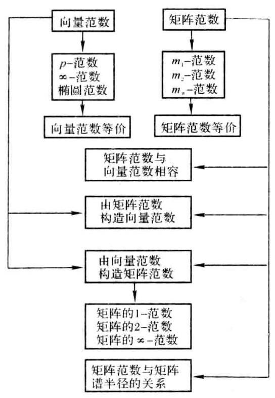

### 2.5 课后习题全解

## 习 题 2.1

1. 求向量 $e = \left( {1,1,\cdots ,1}\right)$ 的 ${l}_{1},{l}_{2}$ 及 ${l}_{m}$ 范数.

解 $\parallel \mathbf{e}{\parallel }_{1} = n,\parallel \mathbf{e}{\parallel }_{2} = \sqrt{n},\parallel \mathbf{e}{\parallel }_{\infty } = 1$ .

2. 在 ${\mathbf{R}}^{2}$ 中,将向量 $\mathbf{x} = \left( {{\xi }_{1},{\xi }_{2}}\right)$ 表示成平面上直角坐标系中的点 $\left( {{\xi }_{1},{\xi }_{2}}\right)$ ,分别画出下列不等式决定的 $\mathbf{x}$ 全体所对应的几何图形.

$$
\parallel \mathbf{x}{\parallel }_{1} \leq  1,\;\parallel \mathbf{x}{\parallel }_{2} \leq  1,\;\parallel \mathbf{x}{\parallel }_{2} \leq  1
$$

解 $\parallel \mathbf{x}{\parallel }_{1} \leq  1$ ,即 $\left| {\xi }_{1}\right|  + \left| {\xi }_{2}\right|  \leq  1$ ,如图 2-1(a) 所示; $\parallel \mathbf{x}{\parallel }_{2} \leq  1$ ,即 ${\xi }_{1}^{2} + {\xi }_{2}^{2} \leq  1$ ,如图 2-1(b) 所示: $\parallel x{\parallel }_{\infty } \leq  1$ ,即 $\max \left\{  {\left| {\xi }_{1}\right| ,\left| {\xi }_{2}\right| }\right\}   \leq  1$ ,如图 2-1(c) 所示.

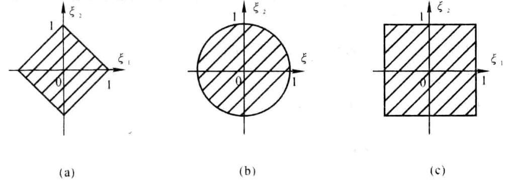

图 2-1

3. 证明例 2.5 所给各题.

证 先证第一式是范数:

当 $f\left( t\right)  \neq  0$ 时, $\parallel f\left( t\right) {\parallel }_{1} = {\int }_{a}^{b}\left| {f\left( t\right) }\right| \mathrm{d}t > 0$ ;

当 $f\left( t\right)  = 0$ 时, $\parallel f\left( t\right) {\parallel }_{1} = 0$ .

$$
\parallel {\alpha f}\left( t\right) {\parallel }_{1} = {\int }_{a}^{b}\left| {{\alpha f}\left( t\right) }\right| \mathrm{d}t = \left| \alpha \right| {\int }_{a}^{b}\left| {f\left( t\right) }\right| \mathrm{d}t = \left| \alpha \right| \parallel f\left( t\right) {\parallel }_{1}
$$

$$
\parallel f\left( t\right)  + g\left( t\right) {\parallel }_{1} = {\int }_{a}^{b}\left| {f\left( t\right)  + g\left( t\right) }\right| \mathrm{d}t \leq  {\int }_{a}^{b}\left\lbrack  {\left| {f\left( t\right) }\right|  + \left| {g\left( t\right) }\right| }\right\rbrack  \mathrm{d}t =
$$

$$
{\int }_{a}^{b}\left| {f\left( t\right) }\right| \mathrm{d}t + {\int }_{a}^{b}\left| {g\left( t\right) }\right| \mathrm{d}t = \parallel f\left( t\right) {\parallel }_{1} + \parallel g\left( t\right) {\parallel }_{1}
$$

再证第二式是范数: 只需考虑 $p > 1$ 的情形.

当 $f\left( t\right)  \neq  0$ 时, $\parallel f\left( t\right) {\parallel }_{p} = {\left\lbrack  {\int }_{a}^{b}{\left| f\left( t\right) \right| }^{p}\mathrm{\;d}t\right\rbrack  }^{\frac{1}{p}} > 0$ ;

当 $f\left( t\right)  = 0$ 时, $\parallel f\left( t\right) {\parallel }_{p} = 0$ .

$$
\parallel {\alpha f}\left( t\right) {\parallel }_{p} = {\left\lbrack  {\int }_{a}^{b}{\left| \alpha f\left( t\right) \right| }^{p}\mathrm{\;d}t\right\rbrack  }^{\frac{1}{p}} = {\left\lbrack  {\left| \alpha \right| }^{p}{\int }_{a}^{b}{\left| f\left( t\right) \right| }^{p}\mathrm{\;d}t\right\rbrack  }^{\frac{1}{p}} =
$$

$$
\left| \alpha \right| {\left\lbrack  {\int }_{a}^{b}{\left| f\left( t\right) \right| }^{p}\mathrm{\;d}t\right\rbrack  }^{\frac{1}{p}} = \left| \alpha \right| \parallel f\left( t\right) {\parallel }_{p}
$$

为了证明三角不等式成立, 需要证明下面不等式

$$
{\left\lbrack  {\int }_{a}^{b}{\left| f\left( t\right)  + g\left( t\right) \right| }^{p}\mathrm{\;d}t\right\rbrack  }^{\frac{1}{p}} \leq  {\left\lbrack  {\int }_{a}^{b}{\left| f\left( t\right) \right| }^{p}\mathrm{\;d}t\right\rbrack  }^{\frac{1}{p}} + {\left\lbrack  {\int }_{a}^{b}{\left| g\left( t\right) \right| }^{p}\mathrm{\;d}t\right\rbrack  }^{\frac{1}{p}}
$$

因为

$$
{\int }_{a}^{b}\mathbf{n}{\left| f\left( t\right)  + g\left( t\right) \right| }^{p}\mathrm{\;d}t = {\int }_{a}^{b}\left| {f\left( t\right)  + g\left( t\right) }\right| {\left| f\left( t\right)  + g\left( t\right) \right| }^{p - 1}\mathrm{\;d}t \leq
$$

$$
{\int }_{a}^{b}\left\lbrack  {\left| {f\left( t\right) }\right|  + \left| {g\left( t\right) }\right| }\right\rbrack  {\left| f\left( t\right)  + g\left( t\right) \right| }^{p - 1}\mathrm{\;d}t =
$$

$$
{\int }_{a}^{b}\left| {f\left( t\right) }\right| {\left| f\left( t\right)  + g\left( t\right) \right| }^{p - 1}\mathrm{\;d}t + {\int }_{a}^{b}\left| {g\left( t\right) }\right| {\left| f\left( t\right)  + g\left( t\right) \right| }^{p - 1}\mathrm{\;d}t
$$

对上式右端使用积分形式的 Holder 不等式

$$
{\int }_{a}^{b}\left| {f\left( t\right) g\left( t\right) }\right| \mathrm{d}t \leq  {\left\lbrack  {\int }_{a}^{b}{\left| f\left( t\right) \right| }^{p}\mathrm{\;d}t\right\rbrack  }^{\frac{1}{p}}{\left\lbrack  {\int }_{a}^{b}{\left| g\left( t\right) \right| }^{q}\mathrm{\;d}t\right\rbrack  }^{\frac{1}{q}}\;\left( {\frac{1}{p} + \frac{1}{q} = 1, p > 1, q > 1}\right)
$$

可得

$$
{\int }_{a}^{b}{\left| f\left( t\right)  + g\left( t\right) \right| }^{p}\mathrm{\;d}t \leq  {\left\lbrack  {\int }_{a}^{b}{\left| f\left( t\right) \right| }^{p}\mathrm{\;d}t\right\rbrack  }^{\frac{1}{p}}{\left\lbrack  {\int }_{a}^{b}{\left| f\left( t\right)  + g\left( t\right) \right| }^{\left( {p - 1}\right) q}\mathrm{\;d}t\right\rbrack  }^{\frac{1}{q}} +
$$

$$
{\left\lbrack  {\int }_{a}^{b}{\left| g\left( t\right) \right| }^{p}\mathrm{\;d}t\right\rbrack  }^{\frac{1}{p}}{\left\lbrack  {\int }_{a}^{b}{\left| f\left( t\right)  + g\left( t\right) \right| }^{\left( {p - 1}\right) q}\mathrm{\;d}t\right\rbrack  }^{\frac{1}{q}} =
$$

$$
\left\{  {{\left\lbrack  {\int }_{a}^{b}{\left| f\left( t\right) \right| }^{p}\mathrm{\;d}t\right\rbrack  }^{\frac{1}{p}} + {\left\lbrack  {\int }_{a}^{b}{\left| g\left( t\right) \right| }^{p}\mathrm{\;d}t\right\rbrack  }^{\frac{1}{p}}}\right\}  {\left\lbrack  {\int }_{a}^{b}{\left| f\left( t\right)  + g\left( t\right) \right| }^{p}\mathrm{\;d}t\right\rbrack  }^{\frac{1}{q}}
$$

两端同除以 ${\left\lbrack  {\int }_{a}^{b}{\left| f\left( t\right)  + g\left( t\right) \right| }^{p}\mathrm{\;d}t\right\rbrack  }^{\frac{1}{q}}$ 便得所需要的不等式.

最后证明第三式是范数:

当 $f\left( t\right)  \neq  0$ 时, $\parallel f\left( t\right) {\parallel }_{ * } = \mathop{\max }\limits_{{t \in  \left\lbrack  {a, b}\right\rbrack  }}\left| {f\left( t\right) }\right|  > 0$ ;

当 $f\left( t\right)  = 0$ 时, $\parallel f\left( t\right) {\parallel }_{\infty } = 0$ .

$$
\parallel {\alpha f}\left( t\right) \parallel  = \mathop{\max }\limits_{{t \in  \left\lbrack  {a, b}\right\rbrack  }}\left| {{\alpha f}\left( t\right) }\right|  = \left| \alpha \right| \mathop{\max }\limits_{{t \in  \left\lbrack  {a, b}\right\rbrack  }}\left| {f\left( t\right) }\right|  = \left| \alpha \right| \parallel f\left( t\right) \parallel
$$

$$
\parallel f\left( t\right)  + g\left( t\right) {\parallel }_{\infty } = \mathop{\max }\limits_{{t \in  \left\lbrack  {a, b}\right\rbrack  }}\left| {f\left( t\right)  + g\left( t\right) }\right|  \leq  \mathop{\max }\limits_{{t \in  \left\lbrack  {a, b}\right\rbrack  }}\left\lbrack  {\left| {f\left( t\right) }\right|  + \left| {g\left( t\right) }\right| }\right\rbrack   \leq
$$

$$
\mathop{\max }\limits_{{t \in  \left\lbrack  {a, b}\right\rbrack  }}\left| {f\left( t\right) }\right|  + \mathop{\max }\limits_{{t \in  \left\lbrack  {a, b}\right\rbrack  }}\left| {g\left( t\right) }\right|  = \parallel f\left( t\right) {\parallel }_{\infty } + \parallel g\left( t\right) {\parallel }_{\infty }
$$

4. 设 $\parallel x\parallel$ 。与 $\parallel x{\parallel }_{\beta }$ 是 ${\mathbf{C}}^{n}$ 上的两种范数, ${k}_{1},{k}_{2}$ 是正常数,证明下列函数:

(1) $\max \left( {\parallel \mathbf{x}{\parallel }_{0},\parallel \mathbf{x}{\parallel }_{\beta }}\right) ,\;$ (2) ${k}_{1}\parallel \mathbf{x}{\parallel }_{\alpha } + {k}_{2}\parallel \mathbf{x}{\parallel }_{\beta }$

是 ${\mathbf{C}}^{n}$ 上的范数.

证 (1) 记 $\parallel x\parallel  = \max \left( {\parallel x{\parallel }_{0},\parallel x{\parallel }_{\beta }}\right)$ ,则当 $x \neq  0$ 时, $\parallel x\parallel  > 0$ ; 当 $x = 0$ 时, $\parallel x\parallel  = 0$ .

$$
\parallel {kx}\parallel  = \max \left( {\parallel {kx}{\parallel }_{\alpha },\parallel {kx}{\parallel }_{\beta }}\right)  = \max \left( {\left| k\right| \parallel x{\parallel }_{\alpha },\left| k\right| \parallel x{\parallel }_{\beta }}\right)  =
$$

$$
\left| k\right| \max \left( {\parallel \mathbf{x}{\parallel }_{\alpha },\parallel \mathbf{x}{\parallel }_{\beta }}\right)  = \left| k\right| \parallel \mathbf{x}\parallel
$$

$$
\parallel \mathbf{x} + \mathbf{y}\parallel  = \max \left( {\parallel \mathbf{x} + \mathbf{y}{\parallel }_{a},\parallel \mathbf{x} + \mathbf{y}{\parallel }_{\beta }}\right)  \leq  \max \left( {\parallel \mathbf{x}{\parallel }_{a} + \parallel \mathbf{y}{\parallel }_{a},\parallel \mathbf{x}{\parallel }_{\beta } + \parallel \mathbf{y}{\parallel }_{\beta }}\right)  \leq
$$

$$
\max \left( {\parallel \mathbf{x}{\parallel }_{\alpha },\parallel \mathbf{x}{\parallel }_{\beta }}\right)  + \max \left( {\parallel \mathbf{y}{\parallel }_{\alpha },\parallel \mathbf{y}{\parallel }_{\beta }}\right)  = \parallel \mathbf{x}\parallel  + \parallel \mathbf{y}\parallel
$$

所以 $\parallel \mathbf{x}\parallel$ 是 ${\mathbf{C}}^{n}$ 上的范数.

(2) 记 $\parallel \mathbf{x}\parallel  = {k}_{1}\parallel \mathbf{x}{\parallel }_{a} + {k}_{2}\parallel \mathbf{x}{\parallel }_{\beta }$ . 则当 $\mathbf{x} \neq  \mathbf{0}$ 时, $\parallel \mathbf{x}\parallel  > 0$ ; 当 $\mathbf{x} = \mathbf{0}$ 时, $\parallel \mathbf{x}\parallel  = 0$ .

$$
\parallel k\mathbf{x}\parallel  = {k}_{1}\parallel k\mathbf{x}{\parallel }_{0} + {k}_{2}\parallel k\mathbf{x}{\parallel }_{\beta } = \left| k\right| \left( {{k}_{1}\parallel \mathbf{x}{\parallel }_{\alpha } + {k}_{2}\parallel \mathbf{x}{\parallel }_{\beta }}\right)  = \left| k\right| \parallel \mathbf{x}\parallel
$$

$$
\parallel \mathbf{x} + \mathbf{y}\parallel  = {k}_{1}\parallel \mathbf{x} + \mathbf{y}{\parallel }_{\alpha } + {k}_{2}\parallel \mathbf{x} + \mathbf{y}{\parallel }_{\beta } \leq  {k}_{1}\left( {\parallel \mathbf{x}{\parallel }_{\alpha } + \parallel \mathbf{y}{\parallel }_{\alpha }}\right)  + {k}_{2}\left( {\parallel \mathbf{x}{\parallel }_{\beta } + \parallel \mathbf{y}{\parallel }_{\beta }}\right)  =
$$

$$
\left( {{k}_{1}\parallel \mathbf{x}{\parallel }_{a} + {k}_{2}\parallel \mathbf{x}{\parallel }_{\beta }}\right)  + \left( {{k}_{1}\parallel \mathbf{y}{\parallel }_{a} + {k}_{2}\parallel \mathbf{y}{\parallel }_{\beta }}\right)  = \parallel \mathbf{x}\parallel  + \parallel \mathbf{y}\parallel
$$

所以 $\parallel \mathbf{x}\parallel$ 是 ${\mathbf{C}}^{n}$ 上的范数.

5. 设矩阵 $\mathbf{S} \in  {\mathbf{C}}^{m \times  n}$ 列满秩,给定 ${\mathbf{C}}^{m}$ 上的一种向量范数 $\parallel  \cdot  \parallel$ ,证明

$$
\parallel \mathbf{x}{\parallel }_{s} = \parallel \mathbf{S}\mathbf{x}\parallel \;\left( {\mathbf{x} \in  {\mathbf{C}}^{n}}\right)
$$

是 ${\mathbf{C}}^{n}$ 上的向量范数.

证 当 $x \neq  0$ 时,由于 $S$ 列满秩,所以 ${Sx} \neq  0$ ,从而 $\parallel x\parallel , = \parallel {Sx}\parallel  > 0$ ; 当 $x = 0$ 时, ${Sx} = 0$ ,于是 $\parallel x\parallel , = \parallel {Sx}\parallel  = 0.$

$$
\parallel {kx}{\parallel }_{s} = \parallel \mathbf{S}\left( {kx}\right) \parallel  = \parallel k\left( {\mathbf{S}x}\right) \parallel  = \left| k\right| \parallel \mathbf{S}x\parallel  = \left| k\right| \parallel x\parallel ,
$$

$$
\parallel \mathbf{x} + \mathbf{y}{\parallel }_{s} = \parallel \mathbf{S}\left( {\mathbf{x} + \mathbf{y}}\right) \parallel  = \parallel \mathbf{S}\mathbf{x} + \mathbf{S}\mathbf{y}\parallel  \leq  \parallel \mathbf{S}\mathbf{x}\parallel  + \parallel \mathbf{S}\mathbf{y}\parallel  = \parallel \mathbf{x}{\parallel }_{s} + \parallel \mathbf{y}\parallel ,
$$

因此, $\parallel \mathbf{x}\parallel$ ,是 ${\mathbf{C}}^{n}$ 上的范数.

## 习 题 2.2

1. 求矩阵 $\mathbf{A} = \left\lbrack  \begin{array}{lll}  - 1 & 2 & 1 \end{array}\right\rbrack$ 和 $\mathbf{B} = \left\lbrack  \begin{array}{rrr}  - \mathrm{i} & 2 & 3 \\  1 & 0 & \mathrm{i} \end{array}\right\rbrack$ 的范数 $\parallel  \cdot  {\parallel }_{1},\parallel  \cdot  \parallel  \cdot  \parallel$ . 及 $\parallel  \cdot  {\parallel }_{2}$ .

解

$$
\parallel \mathbf{A}{\parallel }_{1} = \max \{ \left| {-1}\right| ,2,1\}  = 2,\;\parallel \mathbf{A}{\parallel }_{\infty } = \left| {-1}\right|  + 2 + 1 = 4
$$

${\mathbf{A}}^{\mathrm{H}}\mathbf{A}$ 与 $\mathbf{A}{\mathbf{A}}^{\mathrm{H}} = \left\lbrack  6\right\rbrack$ 的非零特征值相同,故 $\parallel \mathbf{A}{\parallel }_{2} = \sqrt{6}$ .

$$
\parallel \mathbf{B}{\parallel }_{1} = \max \{ \left| {-\mathrm{i}}\right|  + 1,2 + 0,3 + \left| \mathrm{i}\right| \}  = 4
$$

$$
\parallel \mathbf{B}{\parallel }_{\infty } = \max \{ \left| {-\mathrm{i}}\right|  + 2 + 3,1 + 0 + \left| \mathrm{i}\right| \}  = 6
$$

$$
{\mathbf{B}}^{\mathrm{H}}\mathbf{B} = \left\lbrack  \begin{array}{rrr} 2 & 2\mathrm{i} & 4\mathrm{i} \\   - 2\mathrm{i} & 4 & 6 \\   - 4\mathrm{i} & 6 & {10} \end{array}\right\rbrack
$$

$$
\det \left( {\lambda \mathbf{I} - {\mathbf{B}}^{\mathrm{H}}\mathbf{B}}\right)  = \lambda \left( {\lambda  - \left( {8 + 2\sqrt{13}}\right) }\right) \left( {\lambda  - \left( {8 - 2\sqrt{13}}\right) }\right)
$$

$$
\parallel \mathbf{B}{\parallel }_{2} = \sqrt{8 + 2\sqrt{13}}
$$

2. 设 $\lambda$ 为矩阵 $\mathbf{A} \in  {\mathbf{C}}^{m \times  m}$ 的特征值,证明 $\left| \lambda \right|  \leq  \sqrt[m]{\begin{Vmatrix}{\mathbf{A}}^{m}\end{Vmatrix}}$ .

证 设 $\mathbf{A}$ 的属于特征值 $\lambda$ 的特征向量为 $\mathbf{x}$ ,即 $\mathbf{A}\mathbf{x} = \lambda \mathbf{x}$ ,从而有 ${\mathbf{A}}^{m}\mathbf{x} = {\lambda }^{m}\mathbf{x}$ . 取向量范数 $\parallel \mathbf{x}\parallel$ 和题中给出的矩阵范数相容, 则有

$$
{\left| \lambda \right| }^{m}\parallel \mathbf{x}\parallel  = \begin{Vmatrix}{{\lambda }^{m}\mathbf{x}}\end{Vmatrix} = \begin{Vmatrix}{{\mathbf{A}}^{m}\mathbf{x}}\end{Vmatrix} \leq  \begin{Vmatrix}{\mathbf{A}}^{m}\end{Vmatrix}\parallel \mathbf{x}\parallel
$$

即 ${\left| \lambda \right| }^{m} \leq  \begin{Vmatrix}{\mathbf{A}}^{m}\end{Vmatrix}$ . 也就是 $\left| \lambda \right|  \leq  \sqrt[m]{\begin{Vmatrix}{\mathbf{A}}^{m}\end{Vmatrix}}$ .

3. 对于定理 2.5 中的三种范数, 能否举出矩阵例子使它的一种范数小于 1 , 而其他两种范数并不小于 1 .

解 取 $\mathbf{A} = \frac{1}{\sqrt{2}}\left\lbrack  \begin{array}{lll} 1 & 0 & 1 \\  0 & 1 & 0 \end{array}\right\rbrack$ ,则

$$
\parallel \mathbf{A}{\parallel }_{1} = \frac{1}{\sqrt{2}} < 1,\;\parallel \mathbf{A}{\parallel }_{1} = \sqrt{2} > 1,\;\parallel \mathbf{A}{\parallel }_{2} = 1
$$

4. 设矩阵 $\mathbf{A}$ 非奇异, $\lambda$ 是它的任意一个特征值,证明 $\left| \lambda \right|  \geq  \frac{1}{\begin{Vmatrix}{\mathbf{A}}^{-1}\end{Vmatrix}}$ .

证 设 $\mathbf{A}$ 的属于特征值 $\lambda$ 的特征向量为 $\mathbf{x}$ ,即 $\mathbf{A}\mathbf{x} = \lambda \mathbf{x}$ ,从而有 ${\mathbf{A}}^{-1}\mathbf{x} = \frac{1}{\lambda }\mathbf{x}$ . 取向量范数 $\parallel \mathbf{x}\parallel$ 和题中给出的矩阵范数相容, 则有

$$
\begin{Vmatrix}\frac{1}{\lambda }\end{Vmatrix}\parallel x\parallel  = \begin{Vmatrix}{\frac{1}{\lambda }x}\end{Vmatrix} = \begin{Vmatrix}{{A}^{-1}x}\end{Vmatrix} \leq  \begin{Vmatrix}{A}^{-1}\end{Vmatrix}\parallel x\parallel
$$

即 $\left| \frac{1}{\lambda }\right|  \leq  \begin{Vmatrix}{\mathbf{A}}^{-1}\end{Vmatrix}$ . 也就是 $\left| \lambda \right|  \geq  \frac{1}{\begin{Vmatrix}{\mathbf{A}}^{-1}\end{Vmatrix}}$ .

5. 设可逆方阵 $\mathbf{S} \in  {\mathbf{R}}^{n \times  n}$ ，且知 $\parallel \mathbf{x}{\parallel }_{s} = \parallel \mathbf{S}\mathbf{x}{\parallel }_{2}$ 是 ${\mathbf{R}}^{n}$ 上的向量范数. 若 $\parallel \mathbf{A}{\parallel }_{s}$ 表示 ${\mathbf{R}}^{n \times  n}$ 上从属于向量范数 $\parallel x{\parallel }_{s}$ 的矩阵范数,试导出 $\parallel \mathbf{A}{\parallel }_{s}$ 与矩阵的 2-范数之间的关系式.

$$
{\left\|  \mathbf{A}\right\|  }_{s} = \mathop{\max }\limits_{{x \neq  0}}\frac{{\left\|  \mathbf{A}x\right\|  }_{s}}{{\left\|  x\right\|  }_{s}} = \mathop{\max }\limits_{{x \neq  0}}\frac{{\left\|  \mathbf{S}Ax\right\|  }_{2}}{{\left\|  \mathbf{S}x\right\|  }_{2}} = \mathop{\max }\limits_{{y \neq  0}}\frac{{\left\|  \mathbf{S}A{S}^{ - 1}y\right\|  }_{2}}{{\left\|  y\right\|  }_{2}} = {\left\|  \mathbf{S}A{S}^{ - 1}\right\|  }_{2}
$$

6. 设 $\mathbf{A} \in  {\mathbf{C}}^{m \times  n}$ ,证明矩阵范数 $\parallel \mathbf{A}{\parallel }_{{m}_{1}}$ 与向量范数 $\parallel \mathbf{x}{\parallel }_{p}\left( {1 \leq  p < \infty }\right)$ 相容.

证 设 $\mathbf{A} = {\left( {a}_{ij}\right) }_{m \times  n},\mathbf{x} = {\left( {\xi }_{1},{\xi }_{2},\cdots ,{\xi }_{n}\right) }^{\mathrm{T}},{\mathbf{E}}_{ij}$ 表示第 $i$ 行第 $j$ 列元素为 1,其余元素均为 0 的 $m \times  n$ 矩阵, 则有

$$
{\mathbf{E}}_{ij}\mathbf{x} = {\left( 0,\cdots ,0,{\xi }_{j},0,\cdots ,0\right) }^{\mathrm{T}},\;{\begin{Vmatrix}{\mathbf{E}}_{ij}\mathbf{x}\end{Vmatrix}}_{p} \leq  \parallel \mathbf{x}{\parallel }_{p}
$$

于是

$$
\parallel {Ax}{\parallel }_{p}^{ \bullet  } = {\begin{Vmatrix}\mathop{\sum }\limits_{{i, j}}{a}_{ij}{E}_{ij}x\end{Vmatrix}}_{p} \leq  \mathop{\sum }\limits_{{i, j}}{\begin{Vmatrix}{a}_{ij} \mid  {\begin{Vmatrix}{E}_{ij}x\end{Vmatrix}}_{p} \leq  \mathop{\sum }\limits_{{i, j}}{\begin{Vmatrix}{a}_{ij} \mid  \parallel x\end{Vmatrix}}_{p} = \parallel A{\parallel }_{{m}_{1}}\parallel x{\parallel }_{p}\end{Vmatrix}}_{p}
$$

## 习 题 2.3

1. 设 $\mathbf{A} \in  {\mathbf{C}}^{n \times  n}$ 可逆, $\mathbf{B} \in  {\mathbf{C}}^{n \times  n}$ ,若对某种矩阵范数有 $\parallel \mathbf{B}\parallel  < \frac{1}{\begin{Vmatrix}{\mathbf{A}}^{-1}\end{Vmatrix}}$ ,则 $\mathbf{A} + \mathbf{B}$ 可逆.

证 $\mathbf{A} + \mathbf{B} = \mathbf{A}\left( {\mathbf{I} + {\mathbf{A}}^{-1}\mathbf{B}}\right)$ . 由于 $\begin{Vmatrix}{{\mathbf{A}}^{-1}\mathbf{B}}\end{Vmatrix} \leq  \begin{Vmatrix}{\mathbf{A}}^{-1}\end{Vmatrix}\parallel \mathbf{B}\parallel  < 1$ ,所以 $\begin{Vmatrix}\left( {-{\mathbf{A}}^{-1}\mathbf{B}}\right) \end{Vmatrix} < 1$ . 根据定理2.6 可得 $\mathbf{I} + {\mathbf{A}}^{-1}\mathbf{B}$ 可逆,从而 $\mathbf{A} + \mathbf{B}$ 可逆.

2. 已知 $\mathbf{A} = \left\lbrack  \begin{array}{ll} 2 & 1 \\  1 & 3 \end{array}\right\rbrack  ,\delta \mathbf{A} = \left\lbrack  \begin{matrix} 0 & {0.5} \\  {0.2} & 0 \end{matrix}\right\rbrack$ ,试估计 $\frac{{\begin{Vmatrix}{\mathbf{A}}^{-1} - {\left( \mathbf{A} + \delta \mathbf{A}\right) }^{-1}\end{Vmatrix}}_{\infty }}{\begin{Vmatrix}{\mathbf{A}}^{-1}\end{Vmatrix}}$ 的值.

解

$$
{\mathbf{A}}^{-1} = \frac{1}{5}\left\lbrack  \begin{array}{rr} 3 &  - 1 \\   - 1 & 2 \end{array}\right\rbrack  ,\;{\left( \mathbf{A} + \delta \mathbf{A}\right) }^{-1} = \frac{1}{42}\left\lbrack  \begin{array}{rr} {30} &  - {15} \\   - {12} & {20} \end{array}\right\rbrack
$$

$$
{\mathbf{A}}^{-1} - {\left( \mathbf{A} + \delta \mathbf{A}\right) }^{-1} = \frac{1}{210}\left\lbrack  \begin{array}{rr}  - {24} & {33} \\  {18} &  - {16} \end{array}\right\rbrack
$$

$$
\frac{{\begin{Vmatrix}{\mathbf{A}}^{-1} - {\left( \mathbf{A} + \delta \mathbf{A}\right) }^{-1}\end{Vmatrix}}_{ - }}{\begin{Vmatrix}{\mathbf{A}}^{-1}\end{Vmatrix}} = \frac{57}{210} \div  \frac{4}{5} = \frac{19}{56} \approx  {0.34}
$$

### 2.6 学习效果测试题及答案

## (一) 测 试 题

1. 设 $\mathbf{A},\mathbf{B} \in  {\mathbf{R}}^{n \times  n}$ 的零空间满足 $\mathbf{N}\left( \mathbf{A}\right)  \cap  \mathbf{N}\left( \mathbf{B}\right)  = \langle \mathbf{0}\rangle$ ,对于 ${\mathbf{R}}^{n}$ 中的列向量 $\mathbf{\alpha }$ ,定义实数 $\parallel \mathbf{\alpha }\parallel  = \; \parallel \mathbf{A}\mathbf{\alpha }{\parallel }_{\infty } + 2\parallel \mathbf{B}\mathbf{\alpha }{\parallel }_{2}$ ,验证 $\parallel \mathbf{\alpha }\parallel$ 是 ${\mathbf{R}}^{n}$ 中的向量范数.

2. 设数域 $\mathbf{C}$ 上的线性空间 ${V}^{n}$ 的一个基为 ${x}_{1},{x}_{2},\cdots ,{x}_{n}$ ,且 $x \in  {V}^{n}$ 在该基下的坐标 $\mathbf{\alpha } = {\left( {\xi }_{1},{\xi }_{2},\cdots ,{\xi }_{n}\right) }^{\mathrm{T}}$ , 定义实数

$$
\parallel \mathbf{x}\parallel  = {\left( {k}_{1}{\left| {\xi }_{1}\right| }^{2} + {k}_{2}{\left| {\xi }_{2}\right| }^{2} + \cdots  + {k}_{n}{\left| {\xi }_{n}\right| }^{2}\right) }^{1/2}\;\left( {{k}_{i} \in  \mathbf{C}}\right)
$$

证明: $\parallel \mathbf{x}\parallel$ 是 ${V}^{n}$ 中的向量范数的充要条件是 ${k}_{1},{k}_{2},\cdots ,{k}_{n}$ 都为正数.

3. 设列向量 $\mathbf{\alpha },\mathbf{\beta } \in  {\mathbf{R}}^{n}$ ,证明: $\parallel \mathbf{\alpha } + \mathbf{\beta }{\parallel }_{2} = \parallel \mathbf{\alpha }{\parallel }_{2} + \parallel \mathbf{\beta }{\parallel }_{2}$ 的充要条件是 $\mathbf{\alpha }$ 与 $\mathbf{\beta }$ 线性相关,且 ${\mathbf{\alpha }}^{\mathrm{T}}\mathbf{\beta } \geq  0$ .

4. 给定 ${\mathbf{C}}^{n \times  n}$ 中的矩阵范数 $\parallel  \cdot  \parallel$ . 选取可逆矩阵 $\mathbf{P}$ ,使得 $\parallel \mathbf{P}\parallel  = 1$ . 对于 $\mathbf{A} \in  {\mathbf{C}}^{n \times  n}$ ,定义实数 $\parallel \mathbf{A}{\parallel }_{\mathrm{M}} = \; \begin{Vmatrix}{\mathbf{A}{\mathbf{P}}^{-1}}\end{Vmatrix}$ . 验证 $\parallel \mathbf{A}{\parallel }_{\mathrm{M}}$ 是 ${\mathbf{C}}^{n \times  n}$ 中的矩阵范数.

5. 给定 ${\mathbf{C}}^{n \times  n}$ 中的矩阵范数 $\parallel  \cdot  {\parallel }_{\mathrm{F}}$ 与 $\parallel  \cdot  {\parallel }_{2}$ . 对于 $\mathbf{A} \in  {\mathbf{C}}^{n \times  n}$ ,定义实数 $\parallel \mathbf{A}\parallel  = \parallel \mathbf{A}{\parallel }_{\mathrm{F}} + 2\parallel \mathbf{A}{\parallel }_{2}$ ,验证 $\parallel \mathbf{A}\parallel$ 是 ${\mathbf{C}}^{n \times  n}$ 中的矩阵范数.

6. 设 $\mathbf{A},\mathbf{B} \in  {\mathbf{C}}^{n \times  n}$ 都是可逆矩阵,且齐次线性方程组 $\left( {\mathbf{A} + \mathbf{B}}\right) \mathbf{x} = \mathbf{0}$ 有非零解,证明: 对于 ${\mathbf{C}}^{n \times  n}$ 中的任何矩阵范数 $\parallel  \cdot  \parallel$ ,都有 $\begin{Vmatrix}{{\mathbf{A}}^{-1}\mathbf{B}}\end{Vmatrix} \geq  1$ 及 $\begin{Vmatrix}{\mathbf{A}{\mathbf{B}}^{-1}}\end{Vmatrix} \geq  1$ .

7. 设 $\mathbf{A} \in  {\mathbb{C}}^{n \times  n}$ ,证明: 谱半径 $\rho \left( \mathbf{A}\right)  < 1$ 的充要条件是,存在矩阵范数 $\parallel  \cdot  \parallel$ ,使得 $\parallel \mathbf{A}\parallel  < 1$ .

8. 设 $\mathbf{A} \in  {\mathbf{C}}^{n \times  n}$ ,证明: 矩阵范数 $\parallel \mathbf{A}{\parallel }_{{m}_{\infty }}$ 与向量的 1-范数相容.

## (二) 测试题答案或提示

1. 非负性. 当 $\mathbf{\alpha } \neq  \mathbf{0}$ 时,由 $N\left( \mathbf{A}\right)  \cap  N\left( \mathbf{B}\right)  = \{ \mathbf{0}\}$ 可得, $\mathbf{A}\mathbf{\alpha } = \mathbf{0}$ 与 $\mathbf{B}\mathbf{\alpha } = \mathbf{0}$ 不能同时成立,从而 $\parallel \mathbf{A}\mathbf{\alpha }{\parallel }_{\cdots } >$ 0 与 $\parallel \mathbf{B}\mathbf{\alpha }{\parallel }_{2} > 0$ 至少有一个成立,故 $\parallel \mathbf{\alpha }\parallel  > 0$ .

2. 必要性. ${\mathbf{x}}_{i}$ 在基 ${\mathbf{x}}_{1},{\mathbf{x}}_{2},\cdots ,{\mathbf{x}}_{n}$ 下的坐标为 ${\mathbf{e}}_{i}$ . 由 $\begin{Vmatrix}{\mathbf{x}}_{i}\end{Vmatrix} > 0$ 知 $\sqrt{{k}_{i}} > 0$ ,即 ${k}_{i} > 0\left( {i = 1,2,\cdots , n}\right)$ .

3. 必要性. 由 $\parallel \mathbf{\alpha } + \mathbf{\beta }{\parallel }_{2}^{2} = {\left( \parallel \mathbf{\alpha }{\parallel }_{2} + \parallel \mathbf{\beta }{\parallel }_{2}\right) }^{2}$ 可得 ${\mathbf{\alpha }}^{\mathrm{T}}\mathbf{\beta } = \parallel \mathbf{\alpha }{\parallel }_{2}\parallel \mathbf{\beta }{\parallel }_{2} \geq  0$ ; 当 $\mathbf{\beta } \neq  \mathbf{0}$ 时,取 $t = \; \frac{\parallel \mathbf{\alpha }{\parallel }_{2}}{\parallel \mathbf{\beta }{\parallel }_{2}}$ ,则有 $\parallel \mathbf{\alpha } - t\mathbf{\beta }{\parallel }_{2}^{2} = 0$ ,即 $\mathbf{\alpha } - t\mathbf{\beta } = \mathbf{0}$ ,也就是 $\mathbf{\alpha }$ 与 $\mathbf{\beta }$ 线性相关.

充分性. 当 $\mathbf{\alpha } \neq  \mathbf{0}$ 时. 设 $\mathbf{\beta } = k\mathbf{\alpha }$ . 由 ${\mathbf{\alpha }}^{\top }\mathbf{\beta } \geq  0$ 可得 $k \geq  0$ ,且有

$$
\parallel \mathbf{\alpha } + \mathbf{\beta }{\parallel }_{2} = \left( {1 + k}\right) \parallel \mathbf{\alpha }{\parallel }_{2} = \parallel \mathbf{\alpha }{\parallel }_{2} + \parallel k\mathbf{\alpha }{\parallel }_{2} = \parallel \mathbf{\alpha }{\parallel }_{2} + \parallel \mathbf{\beta }{\parallel }_{2}
$$

4. 相容性. 设 $\mathbf{A},\mathbf{B} \in  {\mathbf{C}}^{n \times  n}$ ,则有

$$
\| {AB}{\| }_{M} = \left\|  {({AB}){P}^{ - 1}}\right\|   = \left\|  {(A{P}^{ - 1})P(B{P}^{ - 1})}\right\|   \leqslant  \left\|  {A{P}^{ - 1}}\right\|  \left\|  P\right\|  \left\|  {B{P}^{ - 1}}\right\|   = \left\|  A\right\|  {\left\|  B\right\|  }_{M}\;\| B{\| }_{M}
$$

5. 相容性. 设 $\mathbf{A},\mathbf{B} \in  {\mathbf{C}}^{n \times  n}$ ,则有

$$
\parallel \mathbf{{AB}}\parallel  = \parallel \mathbf{{AB}}{\parallel }_{\mathrm{F}} + 2\parallel \mathbf{{AB}}{\parallel }_{2} \leq  \parallel \mathbf{A}{\parallel }_{\mathrm{F}}\parallel \mathbf{B}{\parallel }_{\mathrm{F}} + 2\parallel \mathbf{A}{\parallel }_{2}\parallel \mathbf{B}{\parallel }_{2} \leq
$$

$$
\left( {\parallel \mathbf{A}{\parallel }_{\mathrm{F}} + 2\parallel \mathbf{A}{\parallel }_{2}}\right) \left( {\parallel \mathbf{B}{\parallel }_{\mathrm{F}} + 2\parallel \mathbf{B}{\parallel }_{2}}\right)  = \parallel \mathbf{A}\parallel \parallel \mathbf{B}\parallel
$$

6. 因为 $\left( {\mathbf{A} + \mathbf{B}}\right) \mathbf{x} = \mathbf{0}$ 有非零解,所以 $\det \left( {\mathbf{A} + \mathbf{B}}\right)  = 0$ . 由此可得

$$
\det \left\lbrack  {\left( {-1}\right) \mathbf{I} - {\mathbf{A}}^{-1}\mathbf{B}}\right\rbrack   = 0,\;\det \left\lbrack  {\left( {-1}\right) \mathbf{I} - \mathbf{A}{\mathbf{B}}^{-1}}\right\rbrack   = 0
$$

即 $\lambda  =  - 1$ 是 ${\mathbf{A}}^{-1}\mathbf{B}$ 与 $\mathbf{A}{\mathbf{B}}^{-1}$ 的特征值,从而可得结论.

7. 必要性. 取 $\varepsilon  = \frac{1}{2}\left\lbrack  {1 - \rho \left( \mathbf{A}\right) }\right\rbrack   > 0$ ,对于矩阵 $\mathbf{A}$ ,存在矩阵范数 $\parallel  \cdot  \parallel$ ,使得 $\parallel \mathbf{A}\parallel  \leq  \rho \left( \mathbf{A}\right)  + \varepsilon  < 1$ .

8. 设 $\mathbf{A} = {\left( {a}_{ij}\right) }_{n \times  n},\mathbf{x} = {\left( {\xi }_{1},{\xi }_{2},\cdots ,{\xi }_{n}\right) }^{\mathrm{T}}$ . 则有

$$
\parallel \mathbf{A}\mathbf{x}{\parallel }_{1} = \mathop{\sum }\limits_{{k = 1}}^{n}\left| {\mathop{\sum }\limits_{{i = 1}}^{n}{a}_{ik}{\xi }_{k}}\right|  \leq  \mathop{\sum }\limits_{{k = 1}}^{n}\mathop{\sum }\limits_{{i = 1}}^{n}\left| {a}_{ik}\right| \left| {\xi }_{k}\right|  \leq
$$

$$
\left( {\mathop{\max }\limits_{{i, j}}\left| {a}_{ij}\right| }\right) \mathop{\sum }\limits_{{k = 1}}^{n}\mathop{\sum }\limits_{{i = 1}}^{n}\left| {\xi }_{k}\right|  = \left( {n \cdot  \mathop{\max }\limits_{{i, j}}\left| {a}_{ij}\right| }\right) \mathop{\sum }\limits_{{k = 1}}^{n}\left| {\xi }_{k}\right|  = \parallel \mathbf{A}{\parallel }_{{m}_{\infty }}\parallel \mathbf{x}{\parallel }_{1}
$$

## 第 3 章 矩阵分析及其应用

矩阵函数是以矩阵为自变量且取值为矩阵的一类函数, 它是对一元函数概念的推广. 起先, 矩阵函数是由一个收敛的矩阵幂级数的和来定义的, 之后根据计算矩阵函数值的 Jordan 标准形方法又对矩阵函数的概念进行了拓宽. 因此, 矩阵函数的基础是矩阵序列与矩阵级数.

当一个矩阵的元素都是变量 $t$ 的函数时,可以建立矩阵对变量 $t$ 的导数和积分概念; 当一个多元函数的自变量都是矩阵 $\mathbf{X}$ 的元素时,可以建立多元函数对矩阵 $\mathbf{X}$ 的导数概念; 当一个矩阵的元素都是矩阵 $\mathbf{X}$ 的元素的多元函数时,可以建立矩阵对矩阵 $\mathbf{X}$ 的导数概念. 矩阵序列与矩阵级数的收敛性、函数矩阵 (以函数为其元素的矩阵) 与矩阵函数的导数和积分是矩阵分析的基本内容.

### 3.1 基本概念

## 1. 矩阵序列

矩阵序列指无穷多个依次排列的同阶矩阵.

(1)收敛性 设 ${\mathbf{A}}^{\left( k\right) } = {\left( {a}_{ij}^{\left( k\right) }\right) }_{m \times  n}\;\left( {k = 1,2,\cdots }\right) ,\mathbf{A} = {\left( {a}_{ij}\right) }_{m \times  n}$ ,若

$$
\mathop{\lim }\limits_{{k \rightarrow  \infty }}{a}_{ij}^{\left( k\right) } = {a}_{ij}\;\left( {i = 1,2,\cdots , m;j = 1,2,\cdots , n}\right)
$$

则称矩阵序列 $\left\{  {\mathbf{A}}^{\left( k\right) }\right\}$ 收敛于 $\mathbf{A}$ ,即 $\mathop{\lim }\limits_{{k \rightarrow  \infty }}{\mathbf{A}}^{\left( k\right) } = \mathbf{A}$ .

(2)收敛矩阵 设 $\mathbf{A} \in  {\mathbf{C}}^{n \times  n}$ ，若 $\mathop{\lim }\limits_{{k \rightarrow  \infty }}{\mathbf{A}}^{k} = \mathbf{O}$ ，则称 $\mathbf{A}$ 为收敛矩阵.

## 2. 矩阵级数

矩阵级数指无穷多个有序同阶矩阵之和.

(1)收敛性 设 ${\mathbf{A}}^{\left( k\right) } \in  {\mathbf{C}}^{m \times  n}\;\left( {k = 0,1,2,\cdots }\right) ,{\mathbf{S}}^{\left( N\right) } = \mathop{\sum }\limits_{{k = 0}}^{N}{\mathbf{A}}^{\left( k\right) }\;\left( {N = 1,2,\cdots }\right)$ . 若矩阵序列 $\left\{  {\mathbf{S}}^{\left( N\right) }\right\}$ 收敛于 $\mathbf{S}$ . 则称矩阵级数 $\mathop{\sum }\limits_{{k = 0}}^{\infty }{\mathbf{A}}^{\left( k\right) }$ 收敛于 $\mathbf{S}$ ,即 $\mathop{\sum }\limits_{{k = 0}}^{\infty }{\mathbf{A}}^{\left( k\right) } = \mathbf{S}$ .

(2)幂级数 设 $\mathbf{A} \in  {\mathbf{C}}^{n \times  n}$ ，则称 $\mathop{\sum }\limits_{{k = 0}}^{\infty }{c}_{k}{\mathbf{A}}^{k}$ 为矩阵 $\mathbf{A}$ 的幂级数，而称 $\mathop{\sum }\limits_{{k = 0}}^{\infty }{\mathbf{A}}^{k}$ 为矩阵 $\mathbf{A}$ 的 Neumann 级数.

## 3. 矩阵函数

矩阵函数指以矩阵为自变量且取值为矩阵的一类函数.

(1)由矩阵幂级数定义的矩阵函数 设一元(复变)函数 $f\left( z\right)$ 在 $z = 0$ 的幂级数为 $f\left( z\right)  = \mathop{\sum }\limits_{{k = 0}}^{r}{c}_{k}{z}^{k} \; \left( {\left| z\right|  < r}\right)  \cdot  \mathbf{A} \in  {\mathbf{C}}^{n \times  n}$ 的谱半径 $\rho \left( \mathbf{A}\right)  < r$ . 则称 $f\left( \mathbf{A}\right)  = \mathop{\sum }\limits_{{k = 0}}^{\infty }{c}_{k}{\mathbf{A}}^{k}$ 为对应于 $f\left( z\right)$ 的矩阵函数.

[评注] 由矩阵幂级数定义矩阵函数时,要求一元函数 $f\left( z\right)$ 在 $z = 0$ 能够展开为幂级数,且幂级数的收敛半径 $r > 0$ . 因此,一元函数 $f\left( z\right)$ 在 $z = 0$ 必须无穷阶可导.

(2)由矩阵 $J$ ordan 标准形定义的矩阵函数 设 $\mathbf{A} \in  {\mathbf{C}}^{n \times  n}$ 的 Jordan 标准形为

$$
\mathbf{J} = \left\lbrack  \begin{array}{llll} {\mathbf{J}}_{1} & & & \\   & {\mathbf{J}}_{2} & & \\   & &  \ddots  & \\   & & & {\mathbf{J}}_{s} \end{array}\right\rbrack  ,\;{\mathbf{J}}_{i} = {\left\lbrack  \begin{matrix} {\lambda }_{i} & 1 & & \\   & {\lambda }_{i} &  \ddots  & \\   & &  \ddots  & 1 \\   & & & {\lambda }_{i} \end{matrix}\right\rbrack  }_{{m}_{i} \times  {m}_{i}}
$$

那么存在可逆矩阵 $\mathbf{P}$ ,使得 ${\mathbf{P}}^{-1}\mathbf{{AP}} = \mathbf{J}$ . 再设一元函数 $f\left( z\right)$ 在 $z = \lambda$ ,处 $m, - 1$ 阶可导. 令

$$
f\left( {\mathbf{J}}_{i}\right)  = \left\lbrack  \begin{matrix} f\left( {\lambda }_{i}\right) & {f}^{\prime }\left( {\lambda }_{i}\right) & \cdots & \frac{{f}^{\left( {m}_{i} - 1\right) }\left( {\lambda }_{i}\right) }{\left( {{m}_{i} - 1}\right) !} \\   & f\left( {\lambda }_{i}\right) &  \ddots  & \vdots \\   & &  \ddots  & {f}^{\prime }\left( {\lambda }_{i}\right) \\   & & & f\left( {\lambda }_{i}\right)  \end{matrix}\right\rbrack   = f\left( {\lambda }_{i}\right) {\mathbf{I}}_{{m}_{i}} + {f}^{\prime }\left( {\lambda }_{i}\right) {\mathbf{I}}_{{m}_{i}}^{\left( 1\right) } + \cdots  + \frac{{f}^{\left( {m}_{i} - 1\right) }\left( {\lambda }_{i}\right) }{\left( {{m}_{i} - 1}\right) !}{\mathbf{I}}_{{m}_{i}}^{\left( {m}_{i} - 1\right) }
$$

其中, ${\mathbf{I}}_{{m}_{1}}^{\left( j\right) }$ 表示主对角线上方的第 $j$ 条次对角线元素为 1,其余元素为 0 的 ${m}_{1}$ 阶方阵. 称

$$
f\left( \mathbf{A}\right)  = \mathbf{P} \cdot  \operatorname{diag}\left( {f\left( {\mathbf{J}}_{1}\right) , f\left( {\mathbf{J}}_{2}\right) ,\cdots , f\left( {\mathbf{J}}_{s}\right) }\right)  \cdot  {\mathbf{P}}^{-1}
$$

为对应于 $f\left( z\right)$ 的矩阵函数.

[评注] 由矩阵 $\mathrm{J}$ ordan 标准形定义矩阵函数时,要求一元函数 $f\left( z\right)$ 在矩阵 $\mathbf{A}$ 的特征值 ${\lambda }_{i}$ 处 ${m}_{i} - 1$ 阶可导,这里 ${m}_{i} \leq  n$ . 当一元函数 $f\left( z\right)$ 在 $z = 0$ 能够展开为幂级数时,由 (2) 定义的矩阵函数与由 (1) 定义的矩阵函数相同.

## 4. 矩阵的导数与积分

(1)矩阵对一个变量的导数 设 $\mathbf{A}\left( t\right)  = {\left( {a}_{ij}\left( t\right) \right) }_{m \times  n}$ ,且 ${a}_{ij}\left( t\right)$ 可导,则 $\mathbf{A}\left( t\right)$ 对 $t$ 的导数为

$$
\frac{\mathrm{d}}{\mathrm{d}t}\mathbf{A}\left( t\right)  = {\left( {a}_{ij}^{\prime }\left( t\right) \right) }_{m \neq  n}
$$

( 2 )矩阵对一个变量的积分设 $\mathbf{A}\left( t\right)  = {\left( {a}_{ij}\left( t\right) \right) }_{m \times  n}$ ，且 ${a}_{ij}\left( t\right)$ 在区间 $\left\lbrack  {{t}_{0},{t}_{1}}\right\rbrack$ 上可积，则 $\mathbf{A}\left( t\right)$ 在区间 $\left\lbrack  {t}_{0}\right.$ ， ${t}_{1}\rbrack$ 上的积分为

$$
{\int }_{{t}_{0}}^{{t}_{1}}\mathbf{A}\left( t\right) \mathrm{d}t = {\left( {\int }_{{t}_{0}}^{{t}_{1}}{a}_{ij}\left( t\right) \mathrm{d}t\right) }_{m \times  n}
$$

(3)函数对矩阵变量的导数 设 $\mathbf{X} = {\left( {x}_{ij}\right) }_{m \times  n}$ ，多元函数 $f\left( \mathbf{X}\right)  = f\left( {{x}_{11},{x}_{12},\cdots ,{x}_{nn}}\right)$ 关于 ${x}_{ij}$ 可导，则 $f\left( \mathbf{X}\right)$ 对 $\mathbf{X}$ 的导数为

$$
\frac{\mathrm{d}}{\mathrm{d}\mathbf{X}}f\left( \mathbf{X}\right)  = {\left( \frac{\partial f}{\partial {x}_{ij}}\right) }_{m \times  n}
$$

(4)矩阵对矩阵变量的导数 设 $\mathbf{X} = {\left( {x}_{ij}\right) }_{m \times  n},\mathbf{F}\left( \mathbf{X}\right)  = {\left( {f}_{kl}\left( \mathbf{X}\right) \right) }_{r \times  s}$ ,且 ${f}_{kl}\left( \mathbf{X}\right)  = {f}_{kl}\left( {{x}_{11},{x}_{12},\cdots ,{x}_{mn}}\right)$ 关于 ${x}_{1t}$ 可导,则 $\mathbf{F}\left( \mathbf{X}\right)$ 对 $\mathbf{X}$ 的导数为

$$
\frac{\mathrm{d}}{\mathrm{d}\mathbf{X}}\mathbf{F}\left( \mathbf{X}\right)  = {\left( \frac{\partial \mathbf{F}}{\partial {x}_{ij}}\right) }_{m < n},\;\frac{\partial \mathbf{F}}{\partial {x}_{ij}} = {\left( \frac{\partial {f}_{kl}}{\partial {x}_{ij}}\right) }_{r < n}
$$

### 3.2 主要结论

## 1. 矩阵序列的收敛性

( 1 )矩阵序列 $\left\{  {\mathbf{A}}^{\left( k\right) }\right\}$ 收敛于 $\mathbf{A}$ 的充要条件是,对任何一种矩阵范数 $\parallel  \cdot  \parallel$ ，都有 $\mathop{\lim }\limits_{{k \rightarrow  \infty }}\begin{Vmatrix}{{\mathbf{A}}^{\left( k\right) } - \mathbf{A}}\end{Vmatrix} = 0$ .

(2)若 $\mathop{\lim }\limits_{{k \rightarrow  \infty }}{\mathbf{A}}^{\left( k\right) } = {\mathbf{A}}_{m \times  n} \cdot  \mathop{\lim }\limits_{{k \rightarrow  \infty }}{\mathbf{B}}^{\left( k\right) } = {\mathbf{B}}_{n \times  l}$ ,则 $\mathop{\lim }\limits_{{k \rightarrow  \infty }}{\mathbf{A}}^{\left( k\right) }{\mathbf{B}}^{\left( k\right) } = \mathbf{A}\mathbf{B}$ .

(3) $\mathbf{A} \in  {\mathbf{C}}^{n \times  n}$ 为收敛矩阵的充要条件是 $\rho \left( \mathbf{A}\right)  < 1$ .

(4)设 $\mathbf{A} \in  {\mathbf{C}}^{n \times  n}$ ，若有矩阵范数 $\parallel  \cdot  \parallel$ 使得 $\parallel \mathbf{A}\parallel  < 1$ ，则 $\mathbf{A}$ 是收敛矩阵.

## 2. 矩阵级数的收敛性

(1)设 ${\mathbf{A}}^{\left( k\right) } = {\left( {a}_{ij}^{\left( k\right) }\right) }_{m \times  n},\mathbf{S} = {\left( {S}_{ij}\right) }_{m \times  n}$ ，则矩阵级数 $\mathop{\sum }\limits_{{k = 0}}^{\infty }{\mathbf{A}}^{\left( k\right) } = \mathbf{S}$ 的充要条件是

$$
\mathop{\sum }\limits_{{k = 0}}^{i}{a}_{ij}^{\left( k\right) } = {s}_{ij}\;\left( {i = 1,2,\cdots , m;\;j = 1,2,\cdots , n}\right)
$$

( 2 )矩阵级数 $\mathop{\sum }\limits_{{k = 0}}^{\infty }{\mathbf{A}}^{\left( k\right) }$ 绝对收敛的充要条件是，对任何一种矩阵范数 $\parallel  \cdot  \parallel$ ，正项级数 $\mathop{\sum }\limits_{{k = 0}}^{\infty }\begin{Vmatrix}{\mathbf{A}}^{\left( k\right) }\end{Vmatrix}$ 收敛.

(3)若矩阵级数 $\mathop{\sum }\limits_{{k = 0}}^{\infty }{\mathbf{A}}^{\left( k\right) }$ 绝对收敛于 $\mathbf{S}$ ，则对 $\mathop{\sum }\limits_{{k = 0}}^{\infty }{\mathbf{A}}^{\left( k\right) }$ 的项任意重新排列或者组合得到的矩阵级数仍然绝对收敛于 $\mathbf{S}$ .

(4)设 $\mathbf{P} \in  {\mathbf{C}}^{\times m}$ ， $\mathbf{Q} \in  {\mathbf{C}}^{\times r}$ ，若矩阵级数 $\mathop{\sum }\limits_{{k = 0}}^{\infty }{\mathbf{A}}^{\left( k\right) }$ (绝对)收敛于 ${\mathbf{S}}_{m \times  n}$ ，则矩阵级数 $\mathop{\sum }\limits_{{k = 0}}^{\infty }\mathbf{P}{\mathbf{A}}^{\left( k\right) }\mathbf{Q}$ (绝对)收敛于 $\mathbf{P}\mathbf{S}\mathbf{Q}$ .

(5)若矩阵级数 $\mathop{\sum }\limits_{{k = 0}}^{\infty }{\mathbf{A}}^{\left( k\right) }$ 与 $\mathop{\sum }\limits_{{k = 0}}^{\infty }{\mathbf{B}}^{\left( k\right) }$ 分别绝对收敛于 ${\mathbf{S}}_{m \times  n}$ 与 ${\mathbf{T}}_{n \times  l}$ ,则矩阵级数 $\mathop{\sum }\limits_{{k = 0}}^{n}\left( {\mathop{\sum }\limits_{{i = 0}}^{k}{\mathbf{A}}^{\left( i\right) }{\mathbf{B}}^{\left( k - i\right) }}\right)$ 绝对收敛于 $\mathbf{{ST}}$ .

(6) 设 $\mathbf{A} \in  {\mathbf{C}}^{n \times  n}$ ,则 Neumann 级数 $\mathop{\sum }\limits_{{k = 0}}^{\infty }{\mathbf{A}}^{k}$ 收敛的充要条件是 $\rho \left( \mathbf{A}\right)  < 1$ ,且其和为 ${\left( \mathbf{I} - \mathbf{A}\right) }^{-1}$ .

(7)设 $\mathbf{A} \in  {\mathbf{C}}^{n \times  n}$ ，若有矩阵范数 $\parallel  \cdot  \parallel$ 使得 $\parallel \mathbf{A}\parallel  < 1$ ，则 Neumann 级数 $\mathop{\sum }\limits_{{k = 0}}^{n}{\mathbf{A}}^{k}$ 收敛.

(8) 设 $\mathbf{A} \in  {\mathbf{C}}^{n \times  n}$ ,一元函数 $f\left( z\right)$ 在 $z = 0$ 的幂级数 $f\left( z\right)  = \mathop{\sum }\limits_{{k = 0}}^{n}{c}_{k}{z}^{k}$ 的收敛半径 $r > 0$ ,则

1) 当 $\rho \left( \mathbf{A}\right)  < r$ 时,矩阵幂级数 $\mathop{\sum }\limits_{{k = 0}}^{r}{c}_{k}{\mathbf{A}}^{k}$ 绝对收敛;

2) 当 $\rho \left( \mathbf{A}\right)  > r$ 时,矩阵幂级数 $\mathop{\sum }\limits_{{k = 0}}^{r}{c}_{k}{\mathbf{A}}^{k}$ 发散.

## 3. 矩阵函数的性质

设 $\mathbf{A},\mathbf{B} \in  {\mathbf{C}}^{n \times  n}$ ,矩阵函数 ${f}_{1}\left( \mathbf{A}\right)$ 和 ${f}_{2}\left( \mathbf{A}\right)$ 有意义,则有

(1)矩阵函数的欧拉公式:

1) ${\mathrm{e}}^{\mathrm{i}\mathbf{A}} = \cos \mathbf{A} + \mathrm{i}\sin \mathbf{A}\;\left( {\mathrm{i} = \sqrt{-1}}\right)$ .

2) $\cos \mathbf{A} = \frac{1}{2}\left( {{\mathrm{e}}^{\mathrm{i}\mathbf{A}} + {\mathrm{e}}^{-\mathrm{i}\mathbf{A}}}\right)$ .

3) $\sin \mathbf{A} = \frac{1}{2\mathrm{i}}\left( {{\mathrm{e}}^{\mathrm{i}\mathbf{A}} - {\mathrm{e}}^{-\mathrm{i}\mathbf{A}}}\right)$ .

(2)矩阵指数函数:

1) 若 $\mathbf{{AB}} = \mathbf{{BA}}$ . 则 ${\mathrm{e}}^{\mathbf{A}}{\mathrm{e}}^{\mathbf{B}} = {\mathrm{e}}^{\mathbf{B}}{\mathrm{e}}^{\mathbf{A}} = {\mathrm{e}}^{\mathbf{A} + \mathbf{B}}$ .

2) ${\left( {\mathrm{e}}^{\mathbf{A}}\right) }^{-1} = {\mathrm{e}}^{-\mathbf{A}}$ .

3) $\det {\mathrm{e}}^{\mathbf{A}} = {\mathrm{e}}^{t\mathbf{A}}$ .

4) ${\mathrm{e}}^{At}$ 的列向量组线性无关 (任意 $t \in  \mathbf{C}$ ).

(3) 若 $f\left( z\right)  = {f}_{1}\left( z\right)  + {f}_{2}\left( z\right)$ ,则 $f\left( \mathbf{A}\right)  = {f}_{1}\left( \mathbf{A}\right)  + {f}_{2}\left( \mathbf{A}\right)$ .

(4) 若 $f\left( z\right)  = {f}_{1}\left( z\right) {f}_{2}\left( z\right)$ . 则 $f\left( \mathbf{A}\right)  = {f}_{1}\left( \mathbf{A}\right) {f}_{2}\left( \mathbf{A}\right)  = {f}_{2}\left( \mathbf{A}\right) {f}_{1}\left( \mathbf{A}\right)$ .

[评注] 矩阵 $\mathbf{A}$ 的两个不同矩阵函数的乘法运算是可交换的.

## 4. 矩阵导数与积分的性质

(1)设函数矩阵 $\mathbf{A}\left( t\right)$ 和 $\mathbf{B}\left( t\right)$ 都可导,则有

1) $\frac{\mathrm{d}}{\mathrm{d}t}\left( {\mathbf{A}\left( t\right)  + \mathbf{B}\left( t\right) }\right)  = \frac{\mathrm{d}}{\mathrm{d}t}\mathbf{A}\left( t\right)  + \frac{\mathrm{d}}{\mathrm{d}t}\mathbf{B}\left( t\right)$ .

2) $\frac{\mathrm{d}}{\mathrm{d}t}\left( {\mathbf{A}\left( t\right) \mathbf{B}\left( t\right) }\right)  = \left( {\frac{\mathrm{d}}{\mathrm{d}t}\mathbf{A}\left( t\right) }\right) \mathbf{B}\left( t\right)  + \mathbf{A}\left( t\right) \left( {\frac{\mathrm{d}}{\mathrm{d}t}\mathbf{B}\left( t\right) }\right)$ .

(2)设函数矩阵 $\mathbf{A}\left( t\right)$ 和 $\mathbf{B}\left( t\right)$ 都可积. 则有

1) ${\int }_{{t}_{0}}^{t}\left( {\mathbf{A}\left( \tau \right)  + \mathbf{B}\left( \tau \right) }\right) \mathrm{d}\tau  = {\int }_{{t}_{0}}^{t}\mathbf{A}\left( \tau \right) \mathrm{d}\tau  + {\int }_{{t}_{0}}^{t}\mathbf{B}\left( \tau \right) \mathrm{d}\tau$ .

2) $\mathbf{A}$ 为常数矩阵时, ${\int }_{{t}_{0}}^{t}\mathbf{A} \cdot  \mathbf{B}\left( \tau \right) \mathrm{d}\tau  = \mathbf{A}\left( {{\int }_{{t}_{0}}^{t}\mathbf{B}\left( \tau \right) \mathrm{d}\tau }\right)$ .

3) $\mathbf{B}$ 为常数矩阵时, ${\int }_{{t}_{0}}^{t}\mathbf{A}\left( \tau \right)  \cdot  \mathbf{B}\mathrm{d}\tau  = \left( {{\int }_{{t}_{0}}^{t}\mathbf{A}\left( \tau \right) \mathrm{d}\tau }\right) \mathbf{B}$ .

4) $\frac{\mathrm{d}}{\mathrm{d}t}\left( {{\int }_{{t}_{0}}^{t}\mathbf{A}\left( \tau \right) \mathrm{d}\tau }\right)  = \mathbf{A}\left( t\right)$ .

5) ${\int }_{{t}_{0}}^{{t}_{1}}\left( {\frac{\mathrm{d}}{\mathrm{d}t}\mathbf{A}\left( t\right) }\right) \mathrm{d}t = \mathbf{A}\left( {t}_{1}\right)  - \mathbf{A}\left( {t}_{0}\right)$ .

(3)设 $\mathbf{A} \in  {\mathbf{C}}^{n \times  n}$ ，则有

1) $\frac{\mathrm{d}}{\mathrm{d}t}{\mathrm{e}}^{\mathrm{A}t} = \mathbf{A}{\mathrm{e}}^{\mathrm{A}t} = {\mathrm{e}}^{\mathrm{A}t}\mathbf{A}$ .

2) $\frac{\mathrm{d}}{\mathrm{d}t}\sin \left( {\mathbf{A}t}\right)  = \mathbf{A}\cos \left( {\mathbf{A}t}\right)  = \left\lbrack  {\cos \left( {\mathbf{A}t}\right) }\right\rbrack  \mathbf{A}$ .

3) $\frac{\mathrm{d}}{\mathrm{d}t}\cos \left( {\mathbf{A}t}\right)  =  - \mathbf{A}\sin \left( {\mathbf{A}t}\right)  =  - \left\lbrack  {\sin \left( {\mathbf{A}t}\right) }\right\rbrack  \mathbf{A}$ .

(4) 设 $\mathbf{A} = {\left( {a}_{ij}\right) }_{n \times  n},\mathbf{x} = {\left( {\xi }_{1},{\xi }_{2},\cdots ,{\xi }_{n}\right) }^{\mathrm{T}}, f\left( \mathbf{x}\right)  = {\mathbf{x}}^{\mathrm{T}}\mathbf{A}\mathbf{x}$ ,则 $\frac{\mathrm{d}}{\mathrm{d}\mathbf{x}}f\left( \mathbf{x}\right)  = \left( {\mathbf{A} + {\mathbf{A}}^{\mathrm{T}}}\right) \mathbf{x}$ .

## 5. 微分方程组的解

设 $\mathbf{A} \in  {\mathbf{C}}^{n \times  n},{\mathbf{x}}_{0} \in  {\mathbf{C}}^{n},\mathbf{b}\left( t\right)  = {\left( {b}_{1}\left( t\right) ,{b}_{2}\left( t\right) ,\cdots ,{b}_{n}\left( t\right) \right) }^{\top }$ .

(1)齐次微分方程组 $\frac{\mathrm{d}}{\mathrm{d}t}\mathbf{x}\left( t\right)  = \mathbf{A}\mathbf{x}\left( t\right)$ 满足初始条件 $\mathbf{x}\left( {t}_{0}\right)  = {\mathbf{x}}_{0}$ 的解为 $\mathbf{x}\left( t\right)  = {\mathrm{e}}^{\mathbf{A}\left( {t - {t}_{0}}\right) }{\mathbf{x}}_{0}$ .

(2)非齐次微分方程组 $\frac{\mathrm{d}}{\mathrm{d}t}\mathbf{x}\left( t\right)  = \mathbf{A}\mathbf{x}\left( t\right)  + \mathbf{b}\left( t\right)$ 满足初始条件 $\mathbf{x}\left( {t}_{0}\right)  = {\mathbf{x}}_{0}$ 的解为

$$
\mathbf{x}\left( t\right)  = {\mathrm{e}}^{\mathbf{A}t}\left( {{\mathrm{e}}^{-{\mathbf{A}}_{0}}{\mathbf{x}}_{0} + {\int }_{{t}_{0}}^{t}{\mathrm{e}}^{-{\mathbf{A}}_{\tau }}\mathbf{b}\left( \tau \right) \mathrm{d}\tau }\right)
$$

## 6. 线性矩阵方程的解

(1)设 $\mathbf{A} \in  {\mathbf{C}}^{m \times  m}$ 和 $\mathbf{B} \in  {\mathbf{C}}^{n \times  n}$ 的所有特征值具有负的实部， $\mathbf{F} \in  {\mathbf{C}}^{m \times  n}$ ，则矩阵方程 $\mathbf{A}\mathbf{X} + \mathbf{{XB}} = \mathbf{F}$ 的唯一解为

$$
\mathbf{X} =  - {\int }_{0}^{+\infty }{\mathrm{e}}^{\mathbf{A}t}\mathbf{F}{\mathrm{e}}^{\mathbf{B}t}\mathrm{\;d}t
$$

[评注] 当 $\mathbf{A}$ 和 $\mathbf{B}$ 的所有特征值具有正的实部时,可给矩阵方程两端同乘以 -1,将矩阵方程转化为符合 (1)中条件的矩阵方程进行求解.

(2)设 $\mathbf{A},\mathbf{F} \in  {\mathbf{C}}^{n \times  n}$ ，且 $\mathbf{A}$ 的所有特征值具有负的实部，则矩阵方程 ${\mathbf{A}}^{\mathrm{H}}\mathbf{X} + \mathbf{X}\mathbf{A} =  - \mathbf{F}$ 的唯一解为

$$
\mathbf{X} = {\int }_{0}^{+\infty }{\mathrm{e}}^{{\mathbf{A}}^{\mathrm{H}}t}\mathbf{F}{\mathrm{e}}^{\mathbf{A}t}\mathrm{\;d}t
$$

(3)设 $\mathbf{A} \in  {\mathbf{C}}^{n \times  n}$ 的所有特征值具有负的实部, $\mathbf{F} \in  {\mathbf{C}}^{n \times  n}$ 为 Hermite 正定矩阵,则矩阵方程 ${\mathbf{A}}^{\mathrm{H}}\mathbf{X} + \mathbf{X}\mathbf{A} =$ - $\mathbf{F}$ 的解矩阵 $\mathbf{X}$ 也是 Hermite 正定矩阵.

### 3.3 常用方法

## 1. 求矩阵函数的值

设 $\mathbf{A} \in  {\mathbf{C}}^{n \times  n}$ ,由一元函数 $f\left( z\right)$ 定义的矩阵函数为 $f\left( \mathbf{A}\right)$ .

(1)待定系数法:

1)求出 $\mathbf{A}$ 的一个零化多项式(通常是特征多项式或最小多项式)

$$
\psi \left( \lambda \right)  = {\left( \lambda  - {\lambda }_{1}\right) }^{{m}_{1}}{\left( \lambda  - {\lambda }_{2}\right) }^{{m}_{2}}\cdots {\left( \lambda  - {\lambda }_{n}\right) }^{{m}_{n}}
$$

并要求 $\psi \left( \lambda \right)$ 整除 $\mathbf{A}$ 的特征多项式,其中 ${\lambda }_{1},{\lambda }_{2},\cdots ,{\lambda }_{n}$ 互不相同;

2) 构造多项式 $r\left( \lambda \right)  = {b}_{0} + {b}_{1}\lambda  + \cdots  + {b}_{m - 1}{\lambda }^{m - 1}\left( {m = {m}_{1} + {m}_{2} + \cdots  + {m}_{n}}\right)$ ,并由方程组

$$
r\left( {\lambda }_{i}\right)  = f\left( {\lambda }_{i}\right)
$$

$$
{r}^{\prime }\left( {\lambda }_{i}\right)  = {f}^{\prime }\left( {\lambda }_{i}\right)
$$

......

$$
{r}^{\left( {m}_{i} - 1\right) }\left( {\lambda }_{i}\right)  = {f}^{\left( {m}_{i} - 1\right) }\left( {\lambda }_{i}\right) \;\left( {i = 1,2,\cdots , s}\right)
$$

求出系数 ${b}_{0},{b}_{1},\cdots ,{b}_{m - 1}$ :

3) 计算 $f\left( \mathbf{A}\right)  = r\left( \mathbf{A}\right)  = {b}_{0}\mathbf{I} + {b}_{1}\mathbf{A} + \cdots  + {b}_{m - 1}{\mathbf{A}}^{m - 1}$ .

(2)对角矩阵法 (仅适用于 $\mathbf{A}$ 可对角化的情形):

1) 求可逆矩阵 $\mathbf{P}$ . 使得 ${\mathbf{P}}^{-1}\mathbf{{AP}} = \operatorname{diag}\left( {{\lambda }_{1},{\lambda }_{2},\cdots ,{\lambda }_{n}}\right)$ ;

2) 计算 $f\left( \mathbf{A}\right)  = \mathbf{P} \cdot  \operatorname{diag}\left( {f\left( {\lambda }_{1}\right) , f\left( {\lambda }_{2}\right) ,\cdots , f\left( {\lambda }_{n}\right) }\right)  \cdot  {\mathbf{P}}^{-1}$ .

(3)Jordan 标准形法:

1) 求可逆矩阵 $\mathbf{P}$ ,使得 ${\mathbf{P}}^{-1}\mathbf{{AP}} = \operatorname{diag}\left( {{\mathbf{J}}_{1},{\mathbf{J}}_{2},\cdots ,{\mathbf{J}}_{s}}\right)$ ,其中 ${\mathbf{J}}_{i}$ 是 ${m}_{i}$ 阶的 Jordan 块;

2) 对于 $i = 1,2,\cdots , s$ ,计算 ${f}^{\left( l\right) }\left( {\lambda }_{i}\right) \left( {l = 0,1,\cdots ,{m}_{i} - 1}\right)$ ,并构造 ${m}_{i}$ 阶矩阵

$$
f\left( {\mathbf{J}}_{i}\right)  = f\left( {\lambda }_{i}\right) {\mathbf{I}}_{{m}_{i}} + {f}^{\prime }\left( {\lambda }_{i}\right) {\mathbf{I}}_{{m}_{i}}^{\left( 1\right) } + \cdots  + \frac{{f}^{\left( {m}_{i} - 1\right) }\left( {\lambda }_{i}\right) }{\left( {{m}_{i} - 1}\right) !}{\mathbf{I}}_{{m}_{i}}^{\left( {m}_{i} - 1\right) }
$$

3) 计算 $f\left( \mathbf{A}\right)  = \mathbf{P} \cdot  \operatorname{diag}\left( {f\left( {\mathbf{J}}_{1}\right) , f\left( {\mathbf{J}}_{2}\right) ,\cdots , f\left( {\mathbf{J}}_{s}\right) }\right)  \cdot  {\mathbf{P}}^{-1}$ .

## 2. 求微分方程组的解

设 $\mathbf{A} \in  {\mathbf{C}}^{n \times  n} \cdot  {\mathbf{x}}_{n} \in  {\mathbf{C}}^{n} \cdot  \mathbf{b}\left( t\right)  = {\left( {b}_{1}\left( t\right) ,{b}_{2}\left( t\right) ,\cdots ,{b}_{n}\left( t\right) \right) }^{\mathrm{T}}$ .

(1)求齐次微分方程组 $\frac{\mathrm{d}}{\mathrm{d}t}\mathbf{x}\left( t\right)  = \mathbf{A}\mathbf{x}\left( t\right)$ 的解:

1) 计算矩阵指数函数 ${\mathrm{e}}^{At}$ ;

2) 计算满足初始条件 $\mathbf{x}\left( {t}_{0}\right)  = {\mathbf{x}}_{0}$ 的解 $\mathbf{x}\left( t\right)  = {\mathrm{e}}^{\mathbf{A}\left( {t - {t}_{0}}\right) }{\mathbf{x}}_{0}$ .

(2)求非齐次微分方程组 $\frac{\mathrm{d}}{\mathrm{d}t}\mathbf{x}\left( t\right)  = \mathbf{A}\mathbf{x}\left( t\right)  + \mathbf{b}\left( t\right)$ 的解:

1) 计算矩阵指数函数 ${\mathrm{e}}^{At}$ :

2) 计算积分 $\mathbf{y}\left( t\right)  = {\int }_{{t}_{0}}^{t}{\mathrm{e}}^{-{\lambda \tau }}\mathbf{b}\left( \tau \right) \mathrm{d}\tau$ ;

3) 计算满足初始条件 $\mathbf{x}\left( {t}_{0}\right)  = {\mathbf{x}}_{0}$ 的解 $\mathbf{x}\left( t\right)  = {\mathrm{e}}^{\mathbf{A}t}\left\lbrack  {{\mathrm{e}}^{-\mathbf{A}{t}_{0}}{\mathbf{x}}_{0} + \mathbf{y}\left( t\right) }\right\rbrack$ .

3.4 内容结构框图

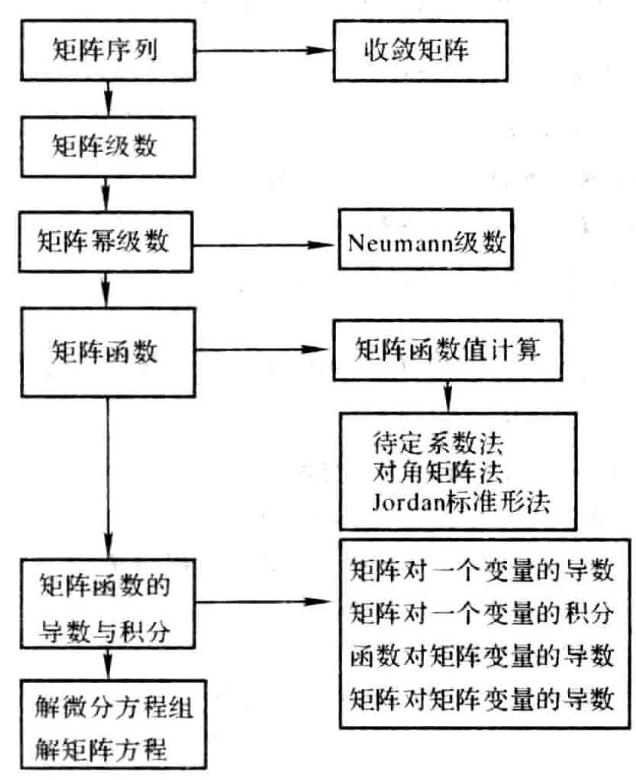

### 3.5 课后习题全解

## 习 题 3.1

1. 证明式 (3.1.1).

证 由题设有 ${a}_{ij}^{\left( k\right) } \rightarrow  {a}_{ij},{b}_{ij}^{\left( k\right) } \rightarrow  {b}_{ij}\left( {k \rightarrow  \infty }\right)$ ,从而有

$$
\alpha {a}_{ij}^{\left( k\right) } + \beta {b}_{ij}^{\left( k\right) } \rightarrow  \alpha {a}_{ij} + \beta {b}_{ij}\;\left( {k \rightarrow  \infty }\right)
$$

由定义知式 (3.1.1) 成立.

2. 设 $\mathbf{A} = \left\lbrack  \begin{array}{lll} 0 & c & c \\  c & 0 & c \\  c & c & 0 \end{array}\right\rbrack  \left( {c \in  \mathbf{R}}\right)$ ,讨论 $c$ 取何值时 $\mathbf{A}$ 为收敛矩阵.

解 $\det \left( {\lambda \mathbf{I} - \mathbf{A}}\right)  = \left( {\lambda  - {2c}}\right) {\left( \lambda  + c\right) }^{2},\rho \left( \mathbf{A}\right)  = 2\left| c\right| .\mathbf{A}$ 为收敛矩阵的充要条件是 $\rho \left( \mathbf{A}\right)  < 1$ , 即 $- \frac{1}{2} < c < \frac{1}{2}$ .

## 习 题 3.3

1. 证明 ${\mathrm{e}}^{\mathrm{i}A} = \cos A + i\sin A$ .

证 根据教材中式 (3.3.3) 二式 (3.3.5) 可得

$$
{\mathrm{e}}^{\mathrm{i}\mathbf{A}} = \mathbf{I} + \left( {\mathrm{i}\mathbf{A}}\right)  + \frac{1}{2!}{\left( \mathrm{i}\mathbf{A}\right) }^{2} + \frac{1}{3!}{\left( \mathrm{i}\mathbf{A}\right) }^{3} + \frac{1}{4!}{\left( \mathrm{i}\mathbf{A}\right) }^{4} + \cdots  =
$$

$$
\left( {\mathbf{I} - \frac{1}{2!}{\mathbf{A}}^{2} + \frac{1}{4!}{\mathbf{A}}^{4} - \cdots }\right)  + \mathrm{i}\left( {\mathbf{A} - \frac{1}{3!}{\mathbf{A}}^{3} + \frac{1}{5!}{\mathbf{A}}^{5} - \cdots }\right)  = \cos \mathbf{A} + \mathrm{i}\sin \mathbf{A}
$$

2. 证明 ${\mathrm{e}}^{A + {2\pi }\mathbf{i}} = {\mathrm{e}}^{A},\sin \left( {\mathbf{A} + {2\pi }\mathbf{I}}\right)  = \sin \mathbf{A}$ .

证 因为 $\mathbf{A}\left( {{2\pi }\mathrm{i}\mathbf{I}}\right)  = \left( {{2\pi }\mathrm{i}\mathbf{I}}\right) \mathbf{A}$ ,所以根据定理 3.7 可得

$$
{\mathrm{e}}^{A + {2\pi }\mathrm{i}l} = {\mathrm{e}}^{A}{\mathrm{e}}^{{2\pi }\mathrm{i}l} = {\mathrm{e}}^{A}\left\lbrack  {\mathbf{I} + \left( {{2\pi }\mathrm{i}\mathbf{I}}\right)  + \frac{1}{2!}{\left( 2\pi \mathrm{i}\mathbf{I}\right) }^{2} + \frac{1}{3!}{\left( 2\pi \mathrm{i}\mathbf{I}\right) }^{3} + \cdots }\right\rbrack   =
$$

$$
{\mathrm{e}}^{A}\left\{  {\left\lbrack  {1 - \frac{1}{2!}{\left( 2\pi \right) }^{2} + \frac{1}{4!}{\left( 2\pi \right) }^{3} - \cdots }\right\rbrack   + \mathrm{i}\left\lbrack  {{2\pi } - \frac{1}{3!}{\left( 2\pi \right) }^{3} + \frac{1}{5!}{\left( 2\pi \right) }^{5} - \cdots }\right\rbrack  }\right\}  I =
$$

$$
{\mathrm{e}}^{\mathbf{A}}\{ \cos {2\pi } + \mathrm{i}\sin {2\pi }\} \mathbf{I} = {\mathrm{e}}^{\mathbf{A}}
$$

又因为 $\mathbf{A}\left( {{2\pi }\mathbf{I}}\right)  = \left( {{2\pi }\mathbf{I}}\right) \mathbf{A}$ ,所以根据教材中式 (3.3.8) 可得

$$
\sin \left( {\mathbf{A} + {2\pi }\mathbf{I}}\right)  = \sin \mathbf{A}\cos \left( {{2\pi }\mathbf{I}}\right)  + \cos \mathbf{A}\sin \left( {{2\pi }\mathbf{I}}\right)  =
$$

$$
\sin \mathbf{A}\left\lbrack  {\mathbf{I} - \frac{1}{2!}{\left( 2\pi \mathbf{I}\right) }^{2} + \frac{1}{4!}{\left( 2\pi \mathbf{I}\right) }^{4} - \cdots }\right\rbrack   + \cos \mathbf{A}\left\lbrack  {{2\pi }\mathbf{I} - \frac{1}{3!}{\left( 2\pi \mathbf{I}\right) }^{3} + \frac{1}{5!}{\left( 2\pi \mathbf{I}\right) }^{5} - \cdots }\right\rbrack   =
$$

$$
\sin \mathbf{A}\left\lbrack  {1 - \frac{1}{2!}{\left( 2\pi \right) }^{2} + \frac{1}{4!}{\left( 2\pi \right) }^{4} - \cdots }\right\rbrack  \mathbf{I} + \cos \mathbf{A}\left\lbrack  {{2\pi } - \frac{1}{3!}{\left( 2\pi \right) }^{3} + \frac{1}{5!}{\left( 2\pi \right) }^{5} - \cdots }\right\rbrack  \mathbf{I} =
$$

$$
\sin \mathbf{A}\cos {2\pi } + \cos \mathbf{A}\sin {2\pi } = \sin \mathbf{A}
$$

3. 若 $\mathbf{A}$ 为实反对称矩阵 $\left( {{\mathbf{A}}^{\mathrm{T}} =  - \mathbf{A}}\right)$ ,则 ${\mathrm{e}}^{\mathbf{A}}$ 为正交矩阵.

证 由教材中式 (3.3.3) 知 ${\left( {\mathrm{e}}^{\mathbf{A}}\right) }^{\mathrm{T}} = {\mathrm{e}}^{{\mathbf{A}}^{\mathrm{T}}} = {\mathrm{e}}^{-\mathbf{A}}$ ,于是有

$$
{\mathrm{e}}^{A}{\left( {\mathrm{e}}^{A}\right) }^{\top } = {\mathrm{e}}^{A}{\mathrm{e}}^{{A}^{\top }} = {\mathrm{e}}^{A - A} = {\mathrm{e}}^{O} = I
$$

故 ${\mathrm{e}}^{\mathbf{A}}$ 是正交矩阵.

4. 若 $\mathbf{A}$ 是 Hermite 矩阵,则 ${\mathrm{e}}^{\mathrm{i}\mathbf{A}}$ 是酉矩阵.

证 由教材中式 (3.3.3) 知 ${\left( {\mathrm{e}}^{\mathrm{i}A}\right) }^{\mathrm{H}} = {\mathrm{e}}^{{\left( \mathrm{i}A\right) }^{\mathrm{H}}} = {\mathrm{e}}^{-\mathrm{i}A}$ ,于是有

$$
{\mathrm{e}}^{\mathrm{i}\mathbf{A}}{\left( {\mathrm{e}}^{\mathrm{i}\mathbf{A}}\right) }^{\mathrm{H}} = {\mathrm{e}}^{\mathrm{i}\mathbf{A}}{\mathrm{e}}^{-\mathrm{i}\mathbf{A}} = {\mathrm{e}}^{\mathbf{O}} = \mathbf{I}
$$

故 ${\mathrm{e}}^{\mathrm{i}A}$ 是酉矩阵.

5. 设 $\mathbf{A} = \left\lbrack  \begin{array}{lll} 2 & 1 & 0 \\  0 & 0 & 1 \\  0 & 1 & 0 \end{array}\right\rbrack$ ,求 ${\mathrm{e}}^{A},{\mathrm{e}}^{tA}\left( {t \in  \mathbf{R}}\right) ,\sin \mathbf{A}$ .

解 对 $\mathbf{A}$ 求得

$$
\mathbf{P} = \left\lbrack  \begin{array}{rrr} 1 &  - 1 & 1 \\   - 3 & 1 & 0 \\  3 & 1 & 0 \end{array}\right\rbrack  ,\;{\mathbf{P}}^{-1} = \frac{1}{6}\left\lbrack  \begin{array}{rrr} 0 &  - 1 & 1 \\  0 & 3 & 3 \\  6 & 4 & 2 \end{array}\right\rbrack  ,\;{\mathbf{P}}^{-1}\mathbf{{AP}} = \left\lbrack  \begin{array}{lll}  - 1 & & \\   & 1 & \\   & & 2 \end{array}\right\rbrack
$$

根据教材中式 (3.3.15) 可得

$$
{\mathrm{e}}^{\mathbf{A}} = \mathbf{P} \cdot  \operatorname{diag}\left( {{\mathrm{e}}^{-1},\mathrm{e},{\mathrm{e}}^{2}}\right)  \cdot  {\mathbf{P}}^{-1} = \frac{1}{6}\left\lbrack  \begin{matrix} 6{\mathrm{e}}^{2} & 4{\mathrm{e}}^{2} - 3\mathrm{e} - {\mathrm{e}}^{-1} & 2{\mathrm{e}}^{2} - 3\mathrm{e} + {\mathrm{e}}^{-1} \\  0 & 3\mathrm{e} + 3{\mathrm{e}}^{-1} & 3\mathrm{e} - 3{\mathrm{e}}^{-1} \\  0 & 3\mathrm{e} - 3{\mathrm{e}}^{-1} & 3\mathrm{e} + 3{\mathrm{e}}^{-1} \end{matrix}\right\rbrack
$$

$$
{\mathrm{e}}^{tA} = \mathbf{P} \cdot  \operatorname{diag}\left( {{\mathrm{e}}^{-t},{\mathrm{e}}^{t},{\mathrm{e}}^{2t}}\right)  \cdot  {\mathbf{P}}^{-1} = \frac{1}{6}\left\lbrack  \begin{matrix} 6{\mathrm{e}}^{2t} & 4{\mathrm{e}}^{2t} - 3{\mathrm{e}}^{t} - {\mathrm{e}}^{-t} & 2{\mathrm{e}}^{2t} - 3{\mathrm{e}}^{t} + {\mathrm{e}}^{-t} \\  0 & 3{\mathrm{e}}^{t} + 3{\mathrm{e}}^{-t} & 3{\mathrm{e}}^{t} - 3{\mathrm{e}}^{-t} \\  0 & 3{\mathrm{e}}^{t} - 3{\mathrm{e}}^{-t} & 3{\mathrm{e}}^{t} + 3{\mathrm{e}}^{-t} \end{matrix}\right\rbrack
$$

$$
\sin \mathbf{A} = \mathbf{P} \cdot  \operatorname{diag}\left( {\sin \left( {-1}\right) ,\sin 1,\sin 2}\right)  \cdot  {\mathbf{P}}^{-1} = \frac{1}{6}\left\lbrack  \begin{matrix} \sin 2 & 4\sin 2 - 2\sin 1 & 2\sin 2 - 4\sin 1 \\  0 & 0 & 6\sin 1 \\  0 & 6\sin 1 & 0 \end{matrix}\right\rbrack
$$

6. 设 $f\left( z\right)  = \ln z$ ,求 $f\left( \mathbf{A}\right)$ ,这里 $\mathbf{A}$ 为

(1) $\mathbf{A} = \left\lbrack  \begin{array}{llll} 1 & 0 & 0 & 0 \\  1 & 1 & 0 & 0 \\  0 & 1 & 1 & 0 \\  0 & 0 & 1 & 1 \end{array}\right\rbrack  ;\;$ (2) $\mathbf{A} = \left\lbrack  \begin{array}{llll} 2 & 1 & 0 & 0 \\  0 & 2 & 0 & 0 \\  0 & 0 & 1 & 1 \\  0 & 0 & 0 & 1 \end{array}\right\rbrack$ .

解 (1) 对 $\mathbf{A}$ 求得

$$
\mathbf{P} = \left\lbrack  \begin{array}{llll}  & & & 1 \\   & & 1 & \\   & 1 & & \\  1 & & &  \end{array}\right\rbrack  ,\;{\mathbf{P}}^{-1}\mathbf{{AP}} = \mathbf{J} = \left\lbrack  \begin{array}{llll} 1 & 1 & & \\   & 1 & 1 & \\   & & 1 & 1 \\   & & & 1 \end{array}\right\rbrack
$$

根据教材中式 (3.3.18) 和式 (3.3.19) 可得

$$
\ln \mathbf{A} = \mathbf{P} \cdot  \ln \mathbf{J} \cdot  {\mathbf{P}}^{-1} = \left\lbrack  \begin{matrix} 0 & 0 & 0 & 0 \\  1 & 0 & 0 & 0 \\   - \frac{1}{2} & 1 & 0 & 0 \\  \frac{1}{3} &  - \frac{1}{2} & 1 & 0 \end{matrix}\right\rbrack
$$

(2)

$$
\mathbf{A} = \left\lbrack  \begin{array}{ll} {\mathbf{J}}_{1} & \\   & {\mathbf{J}}_{2} \end{array}\right\rbrack  ,{\mathbf{J}}_{1} = \left\lbrack  \begin{array}{ll} 2 & 1 \\  0 & 2 \end{array}\right\rbrack  ,{\mathbf{J}}_{2} = \left\lbrack  \begin{array}{ll} 1 & 1 \\  0 & 1 \end{array}\right\rbrack
$$

根据教材中式 (3.3.18) 可得

$$
\ln {\mathbf{J}}_{1} = \left\lbrack  \begin{matrix} \ln 2 & \frac{1}{2} \\  0 & \ln 2 \end{matrix}\right\rbrack  ,\;\ln {\mathbf{J}}_{2} = \left\lbrack  \begin{array}{ll} 0 & 1 \\  0 & 0 \end{array}\right\rbrack
$$

再根据教材中式 (3.3.19) 可得

$$
\ln \mathbf{A} = \left\lbrack  \begin{array}{ll} \ln {\mathbf{J}}_{1} & \\   & \ln {\mathbf{J}}_{2} \end{array}\right\rbrack   = \left\lbrack  \begin{array}{llll} \ln 2 & \frac{1}{2} & 0 & 0 \\   & \ln 2 & 0 & 0 \\   & & 0 & 1 \\   & & & 0 \end{array}\right\rbrack
$$

## 习 题 3.4

1. 证明式 $\left( {3.4.4}\right)$ .

证 设 $\mathbf{A}\left( t\right)  = {\left( {a}_{ij}\left( t\right) \right) }_{m \times  n}$ ,则 $a\left( t\right) \mathbf{A}\left( t\right)  = {\left( a\left( t\right) {a}_{ij}\left( t\right) \right) }_{m \times  n}$ . 因为

所以

$$
\frac{\mathrm{d}}{\mathrm{d}t}\left( {a\left( t\right) {a}_{ij}\left( t\right) }\right)  = \frac{\mathrm{d}a\left( t\right) }{\mathrm{d}t} \cdot  {a}_{ij}\left( t\right)  + a\left( t\right)  \cdot  \frac{\mathrm{d}{a}_{ij}\left( t\right) }{\mathrm{d}t}
$$

$$
\frac{\mathrm{d}}{\mathrm{d}t}\left( {a\left( t\right) \mathbf{A}\left( t\right) }\right)  = \frac{\mathrm{d}a\left( t\right) }{\mathrm{d}t} \cdot  \mathbf{A}\left( t\right)  + a\left( t\right)  \cdot  \frac{\mathrm{d}}{\mathrm{d}t}\mathbf{A}\left( t\right)
$$

2. 证明式 (3.4.6).

证 根据教材中式 (3.3.4) 和式 (3.3.5) 可得

$$
\frac{\mathrm{d}}{\mathrm{d}t}\cos t\mathbf{A} = \frac{\mathrm{d}}{\mathrm{d}t}\left\lbrack  {\mathbf{I} - \frac{1}{2!}{\left( t\mathbf{A}\right) }^{2} + \frac{1}{4!}{\left( t\mathbf{A}\right) }^{4} - \frac{1}{6!}{\left( t\mathbf{A}\right) }^{6} + \cdots }\right\rbrack   =
$$

$$
\mathbf{O} - t{\mathbf{A}}^{2} + \frac{1}{3!}{t}^{3}{\mathbf{A}}^{4} - \frac{1}{5!}{t}^{5}{\mathbf{A}}^{6} + \cdots  =  - \mathbf{A}\left( {t\mathbf{A} - \frac{1}{3!}{t}^{3}{\mathbf{A}}^{3} + \frac{1}{5!}{t}^{5}{\mathbf{A}}^{5} - \cdots }\right)  =  - \mathbf{A}\left( {\sin t\mathbf{A}}\right)
$$

把上式中的 $\mathbf{A}$ 提到右边,可得 $\frac{\mathrm{d}}{\mathrm{d}t}\cos \mathbf{A} =  - \left( {\sin t\mathbf{A}}\right) \mathbf{A}$ .

3. 证明式 $\left( {3.4.11}\right)$ .

证 设 $\mathbf{A} = {\left( {a}_{ij}\right) }_{m \times  n},\mathbf{B}\left( t\right)  = {\left( {b}_{ij}\left( t\right) \right) }_{n \times  l}$ ,则 $\mathbf{A} \cdot  \mathbf{B}\left( t\right)  = {\left( \mathop{\sum }\limits_{{k = 1}}^{n}{a}_{ik}{b}_{kj}\left( t\right) \right) }_{m \times  l}$ . 因为

$$
{\int }_{{r}_{0}}^{{r}_{1}}\mathop{\sum }\limits_{{k = 1}}^{n}{a}_{ik}{b}_{kj}\left( t\right) \mathrm{d}t = \mathop{\sum }\limits_{{k = 1}}^{n}{a}_{ik}{\int }_{{t}_{0}}^{{t}_{1}}{b}_{kj}\left( t\right) \mathrm{d}t
$$

所以

$$
{\int }_{{t}_{0}}^{{t}_{1}}\mathbf{A} \cdot  \mathbf{B}\left( t\right) \mathrm{d}t = \mathbf{A} \cdot  {\int }_{{t}_{0}}^{{t}_{1}}\mathbf{B}\left( t\right) \mathrm{d}t
$$

4. 设 $\mathbf{x} = {\left( {\xi }_{1},{\xi }_{2},\cdots ,{\xi }_{n}\right) }^{\mathrm{T}},\mathbf{A} = {\left( {a}_{ij}\right) }_{n \times  n}$ 是实对称矩阵, $\mathbf{b} = {\left( {\beta }_{1},{\beta }_{2},\cdots ,{\beta }_{n}\right) }^{\mathrm{T}}$ 是 $n$ 维向量, $c$ 为常数,试求 $f\left( \mathbf{x}\right)  = {\mathbf{x}}^{\top }\mathbf{A}\mathbf{x} - {\mathbf{b}}^{\top }\mathbf{x} + c$ 对于 $\mathbf{x}$ 的导数.

解 由例 3.11 知 $\frac{\mathrm{d}}{\mathrm{d}\mathbf{x}}\left( {{\mathbf{x}}^{\top }\mathbf{A}\mathbf{x}}\right)  = 2\mathbf{A}\mathbf{x}$ ,再由 ${\mathbf{b}}^{\top }\mathbf{x} = {\beta }_{1}{\xi }_{1} + \cdots  + {\beta }_{n}{\xi }_{n}$ 知 $\frac{\mathrm{d}}{\mathrm{d}\mathbf{x}}\left( {{\mathbf{b}}^{\top }\mathbf{x}}\right)  = \mathbf{b}$ ,而 $\frac{\mathrm{d}c}{\mathrm{\;d}\mathbf{x}} = \mathbf{0}$ . 因此, $\frac{\mathrm{d}f\left( \mathbf{x}\right) }{\mathrm{d}\mathbf{x}} = 2\mathbf{A}\mathbf{x} - \mathbf{b}.$

5. 若 $\mathbf{A} = \mathbf{A}\left( t\right)  = {\left( {a}_{ij}\left( t\right) \right) }_{n \times  n}$ 非奇异,证明 $\frac{\mathrm{d}}{\mathrm{d}t}{\mathbf{A}}^{-1} =  - {\mathbf{A}}^{-1}\frac{\mathrm{d}\mathbf{A}}{\mathrm{d}t}{\mathbf{A}}^{-1}$ .

证 对 $\mathbf{A}{\mathbf{A}}^{-1} = \mathbf{I}$ 两端关于 $t$ 求导数可得

$$
\frac{\mathrm{d}\mathbf{A}}{\mathrm{d}t} \cdot  {\mathbf{A}}^{-1} + \mathbf{A} \cdot  \frac{\mathrm{d}{\mathbf{A}}^{-1}}{\mathrm{\;d}t} = \mathbf{O}
$$

两端左乘 ${\mathbf{A}}^{-1}$ ,并整理可得

$$
\frac{\mathrm{d}{\mathbf{A}}^{-1}}{\mathrm{\;d}t} =  - {\mathbf{A}}^{-1} \cdot  \frac{\mathrm{d}\mathbf{A}}{\mathrm{d}t} \cdot  {\mathbf{A}}^{-1}
$$

6. 设 $\mathbf{X}$ 为 $n \times  m$ 矩阵, $\mathbf{A}$ 和 $\mathbf{B}$ 依次为 $n \times  n$ 和 $m \times  n$ 的常数矩阵,证明

(1) $\frac{\mathrm{d}}{\mathrm{d}\mathbf{X}}\left( {\operatorname{tr}\left( {\mathbf{B}\mathbf{X}}\right) }\right)  = \frac{\mathrm{d}}{\mathrm{d}\mathbf{X}}\left( {\operatorname{tr}\left( {{\mathbf{X}}^{\top }{\mathbf{B}}^{\top }}\right) }\right)  = {\mathbf{B}}^{\top }$ ;

(2) $\frac{\mathrm{d}}{\mathrm{d}\mathbf{X}}\left( {\operatorname{tr}\left( {{\mathbf{X}}^{\top }\mathbf{A}\mathbf{X}}\right) }\right)  = \left( {\mathbf{A} + {\mathbf{A}}^{\top }}\right) \mathbf{X}$ .

证 (1) 设 $\mathbf{B} = {\left( {b}_{ij}\right) }_{m \times  n},\mathbf{X} = {\left( {\xi }_{ij}\right) }_{m \times  m}$ ,则 $\mathbf{B}\mathbf{X} = {\left( \mathop{\sum }\limits_{{k = 1}}^{n}{b}_{ik}{\xi }_{kj}\right) }_{m \times  m}$ ,于是有

$$
\operatorname{tr}\left( \mathbf{{BX}}\right)  = \mathop{\sum }\limits_{{k = 1}}^{n}{b}_{1k}{\xi }_{k1} + \cdots  + \mathop{\sum }\limits_{{k = 1}}^{n}{b}_{kk}{\xi }_{kj} + \cdots  + \mathop{\sum }\limits_{{k = 1}}^{n}{b}_{mk}{\xi }_{km}
$$

$$
\frac{\partial \operatorname{tr}\left( \mathbf{{BX}}\right) }{\partial {\xi }_{ij}} = {b}_{\mu }\;\left( {i = 1,2,\cdots , n;j = 1,2,\cdots , m}\right)
$$

$$
\frac{\mathrm{d}}{\mathrm{d}\mathbf{X}}\left( {\operatorname{tr}\left( {\mathbf{B}\mathbf{X}}\right) }\right)  = \left\lbrack  \begin{matrix} {b}_{11} & \cdots & {b}_{m1} \\  \vdots & & \vdots \\  {b}_{1n} & \cdots & {b}_{mn} \end{matrix}\right\rbrack   = {\mathbf{B}}^{\top }
$$

注意到 $\mathbf{{BX}}$ 与 ${\left( \mathbf{{BX}}\right) }^{\mathrm{T}} = {\mathbf{X}}^{\mathrm{T}}{\mathbf{B}}^{\mathrm{T}}$ 有相同的迹,所以

$$
\frac{\mathrm{d}}{\mathrm{d}\mathbf{X}}\left( {\operatorname{tr}\left( {{\mathbf{X}}^{\mathrm{T}}{\mathbf{B}}^{\mathrm{T}}}\right) }\right)  = \frac{\mathrm{d}}{\mathrm{d}\mathbf{x}}\left( {\operatorname{tr}\left( {\mathbf{B}\mathbf{X}}\right) }\right)  = {\mathbf{B}}^{\mathrm{T}}
$$

(2) 设 $\mathbf{A} = {\left( {a}_{ij}\right) }_{n \times  n},\mathbf{X} = {\left( {\xi }_{ij}\right) }_{n \times  m}, f = \operatorname{tr}\left( {{\mathbf{X}}^{\mathrm{T}}\mathbf{A}\mathbf{X}}\right)$ ,则有

$$
{\mathbf{X}}^{\top } = \left\lbrack  \begin{matrix} {\xi }_{11} & \cdots & {\xi }_{n1} \\  \vdots & & \vdots \\  {\xi }_{1m} & \cdots & {\xi }_{nm} \end{matrix}\right\rbrack  ,\;\mathbf{A}\mathbf{X} = \left\lbrack  \begin{matrix} \mathop{\sum }\limits_{k}{a}_{1k}{\xi }_{k1} & \cdots & \mathop{\sum }\limits_{k}{a}_{1k}{\xi }_{km} \\  \vdots & & \vdots \\  \mathop{\sum }\limits_{k}{a}_{nk}{\xi }_{k1} & \cdots & \mathop{\sum }\limits_{k}{a}_{nk}{\xi }_{km} \end{matrix}\right\rbrack
$$

$$
f = \mathop{\sum }\limits_{l}{\xi }_{l1}\mathop{\sum }\limits_{k}{a}_{lk}{\xi }_{k1} + \cdots  + \mathop{\sum }\limits_{l}{\xi }_{lj}\mathop{\sum }\limits_{k}{a}_{lk}{\xi }_{kj} + \cdots  + \mathop{\sum }\limits_{l}{\xi }_{lm}\mathop{\sum }\limits_{k}{a}_{lk}{\xi }_{km}
$$

$$
\frac{\partial f}{\partial {\xi }_{ij}} = \frac{\partial }{\partial {\xi }_{ij}}\left\lbrack  {\mathop{\sum }\limits_{k}{\xi }_{kj}\mathop{\sum }\limits_{k}{a}_{ik}{\xi }_{kj}}\right\rbrack   = \mathop{\sum }\limits_{k}\left\lbrack  {\frac{\partial {\xi }_{ij}}{\partial {\xi }_{ij}} \cdot  \left( {\mathop{\sum }\limits_{k}{a}_{ik}{\xi }_{kj}}\right)  + {\xi }_{ij} \cdot  \frac{\partial }{\partial {\xi }_{ij}}\left( {\mathop{\sum }\limits_{k}{a}_{ik}{\xi }_{kj}}\right) }\right\rbrack   = \mathop{\sum }\limits_{k}{a}_{ik}{\xi }_{kj} + \mathop{\sum }\limits_{k}{a}_{ik}{\xi }_{kj}
$$

$$
\frac{\mathrm{d}f}{\mathrm{\;d}\mathbf{X}} = {\left( \frac{\partial f}{\partial {\xi }_{ij}}\right) }_{n \times  m} = \mathbf{A}\mathbf{X} + {\mathbf{A}}^{\mathrm{T}}\mathbf{X} = \left( {\mathbf{A} + {\mathbf{A}}^{\mathrm{T}}}\right) \mathbf{X}
$$

7. 设 $\mathbf{x}$ 为 $n$ 维列向量, $\mathbf{u}$ 为 $n$ 维常数列向量, $\mathbf{A}$ 为 $n$ 阶常数对称矩阵,证明

$$
\frac{\mathrm{d}}{\mathrm{d}\mathbf{x}}\left( {{\left( \mathbf{x} - \mathbf{u}\right) }^{\mathrm{T}}\mathbf{A}\left( {\mathbf{x} - \mathbf{u}}\right) }\right)  = 2\mathbf{A}\left( {\mathbf{x} - \mathbf{u}}\right)
$$

证 设 $f = {\left( \mathbf{x} - \mathbf{u}\right) }^{\mathrm{T}}\mathbf{A}\left( {\mathbf{x} - \mathbf{u}}\right)$ ,由于 ${\mathbf{A}}^{\mathrm{T}} = \mathbf{A}$ ,所以 $f = {\mathbf{x}}^{\mathrm{T}}\mathbf{A}\mathbf{x} - 2{\left( \mathbf{A}\mathbf{u}\right) }^{\mathrm{T}}\mathbf{x} + {\mathbf{u}}^{\mathrm{T}}\mathbf{A}\mathbf{u}$ ,利用第 4 题的结果可得

$$
\frac{\mathrm{d}f}{\mathrm{\;d}\mathbf{x}} = 2\mathbf{A}\mathbf{x} - 2\mathbf{A}\mathbf{u} = 2\mathbf{A}\left( {\mathbf{x} - \mathbf{u}}\right)
$$

8. 设 $\mathbf{x} = {\left( {\xi }_{1},{\xi }_{2},\cdots ,{\xi }_{n}\right) }^{\mathrm{T}},\mathbf{f}\left( \mathbf{x}\right)  = {\left( {f}_{1}\left( \mathbf{x}\right) ,{f}_{2}\left( \mathbf{x}\right) ,\cdots ,{f}_{n}\left( \mathbf{x}\right) \right) }^{\mathrm{T}}$ ,其中 ${f}_{i}\left( \mathbf{x}\right)  = \mathop{\sum }\limits_{{j = 1}}^{n}{a}_{ij}{\xi }_{j} + {\delta }_{i}\;(i = 1$ , $2,\cdots , n)$ ,求 $\frac{\mathrm{d}}{\mathrm{d}x}f\left( x\right)$ .

解 由定义有

$$
\frac{\partial \mathbf{f}}{\partial {\xi }_{i}} = \left\lbrack  \begin{matrix} \frac{\partial {f}_{1}}{\partial {\xi }_{i}} \\  \vdots \\  \frac{\partial {f}_{n}}{\partial {\xi }_{i}} \end{matrix}\right\rbrack   = \left\lbrack  \begin{matrix} {a}_{1i} \\  \vdots \\  {a}_{ni} \end{matrix}\right\rbrack  \text{ 记作 }{\mathbf{a}}_{i},\;\frac{\mathrm{d}\mathbf{f}}{\mathrm{d}\mathbf{x}} = \left\lbrack  \begin{matrix} \frac{\partial \mathbf{f}}{\partial {\xi }_{1}} \\  \vdots \\  \frac{\partial \mathbf{f}}{\partial {\xi }_{n}} \end{matrix}\right\rbrack   = \left\lbrack  \begin{matrix} {\mathbf{a}}_{1} \\  \vdots \\  {\mathbf{a}}_{n} \end{matrix}\right\rbrack
$$

9. 举例说明关系式

$$
\frac{\mathrm{d}}{\mathrm{d}t}{\left( \mathbf{A}\left( t\right) \right) }^{m} = m{\left( \mathbf{A}\left( t\right) \right) }^{m - 1}\frac{\mathrm{d}}{\mathrm{d}t}\mathbf{A}\left( t\right)
$$

一般不成立,此处 $\mathbf{A}\left( t\right)  = {\left( {a}_{ij}\left( t\right) \right) }_{n \times  n}$ . 又在什么条件下,它才能够成立?

解 $m = 2$ 时,取 $\mathbf{A}\left( t\right)  = \left\lbrack  \begin{matrix} {t}^{2} & t \\  0 & t \end{matrix}\right\rbrack$ ,则

$$
{\mathbf{A}}^{2}\left( t\right)  = \left\lbrack  \begin{matrix} {t}^{4} & {t}^{3} + {t}^{2} \\  0 & {t}^{2} \end{matrix}\right\rbrack  ,\;\frac{\mathrm{d}}{\mathrm{d}t}{\mathbf{A}}^{2}\left( t\right)  = \left\lbrack  \begin{matrix} 4{t}^{3} & 3{t}^{2} + {2t} \\  0 & {2t} \end{matrix}\right\rbrack
$$

$$
2\mathbf{A}\left( t\right) \frac{\mathrm{d}}{\mathrm{d}t}\mathbf{A}\left( t\right)  = \left\lbrack  \begin{matrix} 4{t}^{3} & 2{t}^{2} + {2t} \\  0 & {2t} \end{matrix}\right\rbrack   \neq  \frac{\mathrm{d}}{\mathrm{d}t}{\mathbf{A}}^{2}\left( t\right)
$$

因为

$$
\frac{\mathrm{d}}{\mathrm{d}t}{\left\lbrack  \mathbf{A}\left( t\right) \right\rbrack  }^{m} = \frac{\mathrm{d}}{\mathrm{d}t}\left\lbrack  {\mathbf{A}\left( t\right) \mathbf{A}\left( t\right) \cdots \mathbf{A}\left( t\right) }\right\rbrack   =
$$

$$
\frac{\mathrm{d}}{\mathrm{d}t}\mathbf{A}\left( t\right) {\left\lbrack  \mathbf{A}\left( t\right) \right\rbrack  }^{m - 1} + \mathbf{A}\left( t\right) \frac{\mathrm{d}}{\mathrm{d}t}\mathbf{A}\left( t\right) {\left\lbrack  \mathbf{A}\left( t\right) \right\rbrack  }^{m - 2} + \cdots  + {\left\lbrack  \mathbf{A}\left( t\right) \right\rbrack  }^{m - 1}\frac{\mathrm{d}}{\mathrm{d}t}\mathbf{A}\left( t\right)
$$

所以当 $\left\lbrack  {\frac{\mathrm{d}}{\mathrm{d}t}\mathbf{A}\left( t\right) }\right\rbrack  \mathbf{A}\left( t\right)  = \mathbf{A}\left( t\right) \frac{\mathrm{d}}{\mathrm{d}t}\mathbf{A}\left( t\right)$ 时,有

$$
\frac{\mathrm{d}}{\mathrm{d}t}{\left\lbrack  \mathbf{A}\left( t\right) \right\rbrack  }^{m} = {\left\lbrack  \mathbf{A}\left( t\right) \right\rbrack  }^{m - 1}\frac{\mathrm{d}}{\mathrm{d}t}\mathbf{A}\left( t\right)  + {\left\lbrack  \mathbf{A}\left( t\right) \right\rbrack  }^{m - 1}\frac{\mathrm{d}}{\mathrm{d}t}\mathbf{A}\left( t\right)  + \cdots  + {\left\lbrack  \mathbf{A}\left( t\right) \right\rbrack  }^{m - 1}\frac{\mathrm{d}}{\mathrm{d}t}\mathbf{A}\left( t\right)  =
$$

$$
m{\left\lbrack  \mathbf{A}\left( t\right) \right\rbrack  }^{m - 1}\frac{\mathrm{d}}{\mathrm{d}t}\mathbf{A}\left( t\right)
$$

## 习 题 3.5

1. 证明 Jacobi 恒等式 (3.5.8).

证 设 $\mathbf{A} = {\left( {a}_{ij}\left( t\right) \right) }_{n \times  n},\mathbf{X} = {\left( {\xi }_{ij}\left( t\right) \right) }_{n \times  n}$ . 由行列式定义可得

$$
\det \mathbf{X} = \mathop{\sum }\limits_{{{p}_{1}{p}_{2}\cdots {p}_{n}}}{\left( -1\right) }^{i}{\xi }_{1{p}_{1}}{\xi }_{2{p}_{2}}\cdots {\xi }_{n{p}_{n}}
$$

其中 ${p}_{1}{p}_{2}\cdots {p}_{n}$ 是自然数 $1,2,\cdots , n$ 的一个排列, $t$ 是该排列的逆序数. 于是有

$$
\frac{\mathrm{d}}{\mathrm{d}t}\left( {\det \mathbf{X}}\right)  = \mathop{\sum }\limits_{{{p}_{1}{p}_{2}\cdots {p}_{n}}}{\left( -1\right) }^{t}\left\lbrack  {\mathop{\sum }\limits_{{i = 1}}^{n}\left( {{\xi }_{i{p}_{1}}\cdots {\xi }_{i{p}_{i}}\cdots {\xi }_{i{p}_{n}}}\right) }\right\rbrack   = \mathop{\sum }\limits_{{i = 1}}^{n}\mathop{\sum }\limits_{{{p}_{1}{p}_{2}\cdots {p}_{n}}}{\left( -1\right) }^{t}\left( {{\xi }_{1{p}_{1}}\cdots {\xi }_{i{p}_{i}}\cdots {\xi }_{n{p}_{n}}}\right)
$$

由教材中式 (3.5.7) 和式 (3.5.2) 知

$$
{\xi }_{i{p}_{i}} = {a}_{i1}{\xi }_{1{p}_{i}} + \cdots  + {a}_{ii}{\xi }_{i{p}_{i}} + \cdots  + {a}_{in}{\xi }_{n{p}_{i}}
$$

当 $k \neq  i$ 时,行列式 $\mathop{\sum }\limits_{{{p}_{1}{p}_{2}\cdots {p}_{n}}}{\left( -1\right) }^{i}{\xi }_{1{p}_{1}}\cdots \left( {{a}_{ik}{\xi }_{k{p}_{i}}}\right) \cdots {\xi }_{n{p}_{n}}$ 的第 $i$ 行与第 $k$ 行对应元素成比例. 该行列式的值等于零. 于是有

$$
\frac{\mathrm{d}}{\mathrm{d}t}\left( {\det \mathbf{X}}\right)  = \mathop{\sum }\limits_{{i = 1}}^{n}\mathop{\sum }\limits_{{{p}_{1}{p}_{2}\cdots {p}_{n}}}{\left( -1\right) }^{i}{\xi }_{1{p}_{1}}\cdots \left( {{a}_{n}{\xi }_{i{p}_{i}}}\right) \cdots {\xi }_{n{p}_{n}} = \mathop{\sum }\limits_{{i = 1}}^{n}{a}_{in}\left( {\det \mathbf{X}}\right)  = \left( {\operatorname{tr}\mathbf{A}}\right) \left( {\det \mathbf{X}}\right)
$$

即

$$
\frac{\mathrm{d}\left( {\det \mathbf{X}}\right) }{\det \mathbf{X}} = \left( {\operatorname{tr}\mathbf{A}}\right) \mathrm{d}t
$$

积分并整理可得

$$
\det \mathbf{X} = c{\mathrm{e}}^{{\int }_{{t}_{0}}^{t}\left( {\operatorname{tr}\mathbf{A}}\right) \mathrm{d}t}\;\left( {c\text{ 是积分常数 }}\right)
$$

2. 求微分方程组

$$
\left\{  \begin{array}{l} \frac{\mathrm{d}{\xi }_{1}}{\mathrm{\;d}t} = 3{\xi }_{1} -  + 8{\xi }_{3} \\  \frac{\mathrm{d}{\xi }_{2}}{\mathrm{\;d}t} = 3{\xi }_{1} - {\xi }_{2} + 6{\xi }_{3} \\  \frac{\mathrm{d}{\xi }_{3}}{\mathrm{\;d}t} =  - 2{\xi }_{1} - 5{\xi }_{3} \end{array}\right.
$$

满足初始条件 ${\xi }_{1}\left( 0\right)  = 1,{\xi }_{2}\left( 0\right)  = 1,{\xi }_{3}\left( 0\right)  = 1$ 的解.

解 $\mathbf{A} = \left\lbrack  \begin{array}{rrr} 3 & 0 & 8 \\  3 &  - 1 & 6 \\   - 2 & 0 &  - 5 \end{array}\right\rbrack  ,\mathbf{x}\left( 0\right)  = \left\lbrack  \begin{array}{l} 1 \\  1 \\  1 \end{array}\right\rbrack$ .

$\varphi \left( \lambda \right)  = \det \left( {\lambda \mathbf{I} - \mathbf{A}}\right)  = {\left( \lambda  + 1\right) }^{3}$ . 经判断知, $\mathbf{A}$ 不能相似于对角矩阵. 下面采用待定系数法求 ${\mathrm{e}}^{\lambda \mathbf{I}}$ . 容易验证. $\mathbf{A}$ 的最小多项式为 $\psi \left( \lambda \right)  = {\left( \lambda  + 1\right) }^{2}$ . 记 $f\left( \lambda \right)  = {\mathrm{e}}^{x}$ ,并设

$$
f\left( \lambda \right)  = g\left( \lambda \right) \psi \left( \lambda \right)  + \left( {{b}_{0} + {b}_{1}\lambda }\right)
$$

由 $f\left( {-1}\right)  = {\mathrm{e}}^{4t},{f}^{\prime }\left( {-1}\right)  = t{\mathrm{e}}^{-t}$ 可得

$$
\begin{cases} {b}_{0} - {b}_{1} &  = {\mathrm{e}}^{-t} \\  {b}_{1} &  = t{\mathrm{e}}^{-t} \end{cases}
$$

解此方程组得 ${b}_{0} = \left( {1 + t}\right) {\mathrm{e}}^{-t},{b}_{1} = t{\mathrm{e}}^{-t}$ . 于是

$$
{\mathrm{e}}^{At} = \left( {1 + t}\right) {\mathrm{e}}^{-t}\mathbf{I} + t{\mathrm{e}}^{-t}\mathbf{A} = {\mathrm{e}}^{-t}\left\lbrack  \begin{matrix} 1 + {4t} & 0 & {8t} \\  {3t} & 1 & {6t} \\   - {2t} & 0 & 1 - {4t} \end{matrix}\right\rbrack
$$

$$
\mathbf{x}\left( t\right)  = {\mathrm{e}}^{At}\mathbf{x}\left( 0\right)  = {\mathrm{e}}^{-t}\left\lbrack  \begin{matrix} 1 + {12t} \\  1 + {9t} \\  1 - {6t} \end{matrix}\right\rbrack
$$

3. 求微分方程组

$$
\left\{  \begin{array}{l} \frac{\mathrm{d}{\xi }_{1}}{\mathrm{\;d}t} =  - 2{\xi }_{1} + {\xi }_{2} + 1 \\  \frac{\mathrm{d}{\xi }_{2}}{\mathrm{\;d}t} =  - 4{\xi }_{1} + 2{\xi }_{2} + 2 \\  \frac{\mathrm{d}{\xi }_{3}}{\mathrm{\;d}t} = {\xi }_{1} + {\xi }_{3} + {\mathrm{e}}^{\prime } - 1 \end{array}\right.
$$

满足初始条件 ${\xi }_{1}\left( 0\right)  = 1,{\xi }_{2}\left( 0\right)  = 1,{\xi }_{3}\left( 0\right)  =  - 1$ 的解.

解 $\mathbf{A} = \left\lbrack  \begin{array}{rrr}  - 2 & 1 & 0 \\   - 4 & 2 & 0 \\  1 & 0 & 1 \end{array}\right\rbrack  ,\mathbf{b}\left( t\right)  = \left\lbrack  \begin{matrix} 1 \\  2 \\  {\mathrm{e}}^{t} - 1 \end{matrix}\right\rbrack  ,\mathbf{x}\left( 0\right)  = \left\lbrack  \begin{array}{r} 1 \\  1 \\   - 1 \end{array}\right\rbrack$ .

$\varphi \left( \lambda \right)  = \det \left( {\lambda \mathbf{I} - \mathbf{A}}\right)  = {\lambda }^{3} - {\lambda }^{2}$ ,采用数项级数求和法求 ${\mathrm{e}}^{\lambda t}$ . 由 $\varphi \left( \mathbf{A}\right)  = \mathbf{O}$ 知 ${\mathbf{A}}^{3} = {\mathbf{A}}^{2}$ ,从而 ${\mathbf{A}}^{4} = {\mathbf{A}}^{2},{\mathbf{A}}^{5} = \; {\mathbf{A}}^{2},\cdots$ . 于是可得

$$
{\mathrm{e}}^{At} = \mathbf{I} + \left( {\mathbf{A}t}\right)  + \frac{1}{2!}{\left( \mathbf{A}t\right) }^{2} + \frac{1}{3!}{\left( \mathbf{A}t\right) }^{3} + \frac{1}{4!}{\left( \mathbf{A}t\right) }^{4} + \cdots  =
$$

$$
\mathbf{I} + t\mathbf{A} + \left( {\frac{1}{2!}{t}^{2} + \frac{1}{3!}{t}^{3} + \frac{1}{4!}{t}^{4} + \cdots }\right) {\mathbf{A}}^{2} = \mathbf{I} + t\mathbf{A} + \left( {{\mathrm{e}}^{t} - 1 - t}\right) {\mathbf{A}}^{2} = \left\lbrack  \begin{matrix} 1 - {2t} & t & 0 \\   - {4t} & {2t} + 1 & 0 \\  1 + {2t} - {\mathrm{e}}^{t} & {\mathrm{e}}^{t} - t - 1 & {\mathrm{e}}^{t} \end{matrix}\right\rbrack
$$

$$
\mathbf{x}\left( t\right)  = {\mathrm{e}}^{\mathbf{A}t}\left\{  {\mathbf{x}\left( 0\right)  + {\int }_{0}^{t}{\mathrm{e}}^{-\mathbf{A}s}\mathbf{b}\left( s\right) \mathrm{d}s}\right\}   = {\mathrm{e}}^{\mathbf{A}t}\left\{  {\mathbf{x}\left( 0\right)  + {\int }_{0}^{t}\left\lbrack  \begin{array}{l} 1 \\  2 \\  0 \end{array}\right\rbrack  \mathrm{d}s}\right\}   = {\mathrm{e}}^{\mathbf{A}t}\left\{  {\left\lbrack  \begin{array}{r} 1 \\  1 \\   - 1 \end{array}\right\rbrack   + \left\lbrack  \begin{array}{l} t \\  {2t} \\  0 \end{array}\right\rbrack  }\right\}   = \left\lbrack  \begin{matrix} 1 \\  1 \\  \left( {t - 1}\right) {\mathrm{e}}^{t} \end{matrix}\right\rbrack
$$

4. 设 $\mathbf{A} = {\left( {a}_{ij}\right) }_{n \times  n}$ 为常数矩阵, $\mathbf{X} = {\left( {\xi }_{ij}\left( t\right) \right) }_{n \times  n}, a$ 为常数,证明 Cauchy 微分方程组 $\frac{\mathrm{d}\mathbf{X}}{\mathrm{d}t} = \frac{\mathbf{A}\mathbf{X}}{t - a}$ 可简化为 $\frac{\mathrm{d}\mathbf{X}}{\mathrm{d}u} = \mathbf{A}\mathbf{X}$ ,其中 $u = \ln \left( {t - a}\right)$ ,并进而证明其通解为 $\mathbf{X} = {\left( t - a\right) }^{\mathbf{A}}\mathbf{C}$ ,其中 $\mathbf{C}$ 为 $n$ 阶常数矩阵.

证 作变量代换 $u = \ln \left( {t - a}\right)$ ,即 $t - a = {\mathrm{e}}^{u}$ ,则

$$
\frac{\mathrm{d}\mathbf{X}}{\mathrm{d}u} = \frac{\mathrm{d}\mathbf{X}}{\mathrm{d}t} \cdot  \frac{\mathrm{d}t}{\mathrm{\;d}u} = \frac{\mathbf{A}\mathbf{X}}{t - a}\left( {t - a}\right)  = \mathbf{A}\mathbf{X}
$$

通解为

$$
\mathbf{X}\left( t\right)  = {\mathrm{e}}^{\mathbf{A}u}\mathbf{C} = {\mathrm{e}}^{\mathbf{A}\ln \left( {t - a}\right) }\mathbf{C} = {\left( t - a\right) }^{\mathbf{A}}\mathbf{C}
$$

其中 $\mathbf{C}$ 为 $n$ 阶常数矩阵.

### 3.6 学习效果测试题及答案

## (一) 测 试 题

1. 讨论下列矩阵幂级数的敛散性:

(1) $\mathop{\sum }\limits_{{k = 1}}^{\infty }\frac{1}{{k}^{2}}{\left\lbrack  \begin{array}{rr} 1 & 7 \\   - 1 &  - 3 \end{array}\right\rbrack  }^{k};\;$ (2) $\mathop{\sum }\limits_{{k = 0}}^{\infty }\frac{k}{{6}^{k}}{\left\lbrack  \begin{array}{rr} 1 &  - 8 \\   - 2 & 1 \end{array}\right\rbrack  }^{k}$ .

2. 求矩阵幂级数 $\mathop{\sum }\limits_{{k = 0}}^{\infty }\frac{1}{{2}^{k}}{\left\lbrack  \begin{array}{rr} 2 &  - 1/2 \\  2 & 0 \end{array}\right\rbrack  }^{k}$ 的和.

3. 设 $\mathbf{A}$ 是幂等矩阵 $\left( {{\mathbf{A}}^{2} = \mathbf{A}}\right)$ ,求 $\cos \left( {\pi \mathbf{A}}\right)$ .

4. 设 $\mathbf{A} = \left\lbrack  \begin{array}{lll} 2 & 2 & 1 \\  1 & 3 & 1 \\  1 & 2 & 2 \end{array}\right\rbrack$ ,求 $\sin \mathbf{A}t$ .

5. 已知 ${\mathrm{e}}^{At} = {\mathrm{e}}^{2t}\left\lbrack  \begin{array}{lll} 2 & 1 &  - 1 \\  1 & 2 &  - 1 \\  3 & 3 &  - 2 \end{array}\right\rbrack   + {\mathrm{e}}^{t}\left\lbrack  \begin{array}{lll}  - 1 &  - 1 & 1 \\   - 1 &  - 1 & 1 \\   - 3 &  - 3 & 3 \end{array}\right\rbrack$ ,求矩阵 $\mathbf{A}$ .

6. 设 $\mathbf{A}$ 是可逆矩阵,证明: ${\int }_{0}^{t}{\mathrm{e}}^{\mathbf{A}\tau }\mathrm{d}\tau  = {\mathbf{A}}^{-1}{\mathrm{e}}^{\mathbf{A}t} - {\mathbf{A}}^{-1}$ .

7. 设 $\mathbf{A}$ 为 $n$ 阶常数对称矩阵, $\mathbf{y}\left( t\right)  = {\left( {y}_{1}\left( t\right) ,{y}_{2}\left( t\right) ,\cdots ,{y}_{n}\left( t\right) \right) }^{\mathrm{T}}, f\left( \mathbf{y}\right)  = {\mathbf{y}}^{\mathrm{T}}\mathbf{A}\mathbf{y}$ ,证明:

(1) $\frac{\mathrm{d}f}{\mathrm{\;d}t} = 2{\mathbf{y}}^{\mathrm{T}}\mathbf{A}\frac{\mathrm{d}\mathbf{y}}{\mathrm{d}t};\;$ (2) $\frac{\mathrm{d}}{\mathrm{d}t}\parallel \mathbf{y}{\parallel }_{2}^{2} = 2{\mathbf{y}}^{\mathrm{T}}\frac{\mathrm{d}\mathbf{y}}{\mathrm{d}t}$ .

8. 设 $\mathbf{A}$ 为 $n$ 阶矩阵,证明: $\det {\mathrm{e}}^{\mathbf{A}} = {\mathrm{e}}^{\tau \mathbf{A}}$ .

9. 已知 $\mathbf{A} = \left\lbrack  \begin{array}{lll}  - 3 & 4 & 2 \\   - 2 & 3 & 1 \\   - 2 & 2 & 2 \end{array}\right\rbrack  ,\mathbf{x}\left( 0\right)  = \left\lbrack  \begin{array}{l} 1 \\  1 \\  2 \end{array}\right\rbrack$ .

(1)求 ${\mathrm{e}}^{\lambda t}$ ；

(2)用矩阵函数方法求微分方程 $\frac{\mathrm{d}}{\mathrm{d}t}\mathbf{x}\left( t\right)  = \mathbf{A}\mathbf{x}\left( t\right)$ 满足初始条件 $\mathbf{x}\left( 0\right)$ 的解.

10. 已知 $\mathbf{A} = \left\lbrack  \begin{array}{rrr}  - 1 & 2 & 0 \\   - 2 & 3 & 1 \\  2 &  - 2 &  - 2 \end{array}\right\rbrack  ,\mathbf{b}\left( t\right)  = {\mathrm{e}}^{-t}\left\lbrack  \begin{array}{l} 1 \\  0 \\  2 \end{array}\right\rbrack$ .

(1)求 ${\mathrm{e}}^{At}$ ；

(2)用矩阵函数方法求微分方程 $\frac{\mathrm{d}}{\mathrm{d}t}\mathbf{x}\left( t\right)  = \mathbf{A}\mathbf{x}\left( t\right)  + \mathbf{b}\left( t\right)$ 满足初始条件 $\mathbf{x}\left( 0\right)  = {\left( {1.1},0\right) }^{\top }$ 的解.

## (二) 测试题答案或提示

1.(1)发散；(2)绝对收敛.

2. $\left\lbrack  \begin{array}{rr} 4 &  - 1 \\  4 & 0 \end{array}\right\rbrack$ .

3. $\mathbf{I} - 2\mathbf{A}$ .

4. $\frac{\sin {5t}}{4}\left\lbrack  \begin{array}{lll} 1 & 2 & 1 \\  1 & 2 & 1 \\  1 & 2 & 1 \end{array}\right\rbrack   + \frac{\sin t}{4}\left\lbrack  \begin{array}{rrr} 3 &  - 2 &  - 1 \\   - 1 & 2 &  - 1 \\   - 1 &  - 2 & 3 \end{array}\right\rbrack$ .

5. $\left\lbrack  \begin{array}{lll} 3 & 1 &  - 1 \\  1 & 3 &  - 1 \\  3 & 3 &  - 1 \end{array}\right\rbrack$ (提示: 两边求导数,并利用 ${\mathrm{e}}^{0} = \mathbf{I}$ ).

6. 提示: 利用 $\frac{\mathrm{d}}{\mathrm{d}\tau }{\mathrm{e}}^{\mathbf{A}\tau } = \mathbf{A}{\mathrm{e}}^{\mathbf{A}\tau }$ .

7. 提示: 利用 $\frac{\mathrm{d}{\mathbf{y}}^{\mathrm{T}}}{\mathrm{d}t}\mathbf{A}\mathbf{y} = {\left\lbrack  \frac{\mathrm{d}{\mathbf{y}}^{\mathrm{T}}}{\mathrm{d}t}\mathbf{A}\mathbf{y}\right\rbrack  }^{\mathrm{T}} = {\mathbf{y}}^{\mathrm{T}}\mathbf{A}\frac{\mathrm{d}\mathbf{y}}{\mathrm{d}t}$ .

8. 设 $\mathbf{A}$ 的特征值为 ${\lambda }_{1},{\lambda }_{2},\cdots ,{\lambda }_{n}$ ,则 $\mathbf{A}$ 的 Jordan 标准形可写为

$$
\mathbf{J} = \left\lbrack  \begin{array}{llll} {\lambda }_{1} & {\delta }_{1} & & \\   & {\lambda }_{2} &  \ddots  & \\   & &  \ddots  & {\delta }_{n - 1} \\   & & & {\lambda }_{n} \end{array}\right\rbrack  \;\left( {{\delta }_{i} = 0\text{ 或 }1}\right)
$$

于是 $\;{\mathrm{e}}^{\mathbf{A}} = \mathbf{P}\left\lbrack  \begin{matrix} {\mathrm{e}}^{{\lambda }_{1}} &  * & \cdots &  * \\   & {\mathrm{e}}^{{\lambda }_{2}} &  \ddots  & \vdots \\   & &  \ddots  &  * \\   & & & {\mathrm{e}}^{{\lambda }_{n}} \end{matrix}\right\rbrack  {\mathbf{P}}^{-1},\;\det {\mathrm{e}}^{\mathbf{A}} = {\mathrm{e}}^{{\lambda }_{1} + {\lambda }_{2} + \cdots  + {\lambda }_{n}} = {\mathrm{e}}^{\mathrm{i}t\mathbf{A}}$

$$
\text{ 9. }{\mathrm{e}}^{At} = \left\lbrack  \begin{array}{lll} 4 &  - 4 &  - 2 \\  2 &  - 2 &  - 1 \\  2 &  - 2 &  - 1 \end{array}\right\rbrack   + {\mathrm{e}}^{t}\left\lbrack  \begin{array}{lll}  - 3 & 4 & 2 \\   - 2 & 3 & 1 \\   - 2 & 2 & 2 \end{array}\right\rbrack  ,\mathbf{x}\left( t\right)  = \left\lbrack  \begin{array}{l} 5{\mathrm{e}}^{t} - 4 \\  3{\mathrm{e}}^{t} - 2 \\  4{\mathrm{e}}^{t} - 2 \end{array}\right\rbrack  \text{ . }
$$

$$
\text{ 10. }{\mathrm{e}}^{At} = \left\lbrack  \begin{matrix} 4 &  - 4 &  - 2 \\  2 &  - 2 &  - 1 \\  2 &  - 2 &  - 1 \end{matrix}\right\rbrack   + {\mathrm{e}}^{t}\left\lbrack  \begin{matrix}  - 2 & 3 & 1 \\   - 2 & 3 & 1 \\  0 & 0 & 0 \end{matrix}\right\rbrack   + {\mathrm{e}}^{-t}\left\lbrack  \begin{array}{rrr}  - 1 & 1 & 1 \\  0 & 0 & 0 \\   - 2 & 2 & 2 \end{array}\right\rbrack  ,\;\mathbf{x}\left( t\right)  = \left\lbrack  \begin{matrix} {\mathrm{e}}^{t} + t{\mathrm{e}}^{-t} \\  {\mathrm{e}}^{t} \\  {2t}{\mathrm{e}}^{-t} \end{matrix}\right\rbrack  \text{ , }
$$

## 第 4 章 矩 阵 分 解

在有限维线性空间中, 线性变换问题可以转化为矩阵问题进行讨论. 因此, 将一个矩阵分解为若干个特殊矩阵的乘积意味着将一个线性变换分解为若干个特殊线性变换的乘积.

矩阵的三角分解、正交三角分解、满秩分解及奇异值分解是将矩阵分解为形式比较简单或性质比较熟悉的一些矩阵的乘积, 这些分解式能够明显地反映出原矩阵的许多数值特征, 如矩阵的秩、行列式、特征值及奇异值等. 另一方面, 构造分解式的方法和过程也能够为某些数值计算方法的建立提供理论依据.

### 4.1 基本概念

## 1. 矩阵的三角分解

三角分解是将方阵分解为下三角矩阵与上三角矩阵的乘积.

(1)LDU 分解 $\mathbf{A} = \mathbf{L}\mathbf{D}\mathbf{U}$ ，其中 $\mathbf{L}$ 为单位下三角矩阵， $\mathbf{D}$ 为对角矩阵， $\mathbf{U}$ 为单位上三角矩阵.

(2)Crout 分解 $\mathbf{A} = \widehat{\mathbf{L}}\mathbf{U}$ ，其中 $\widehat{\mathbf{L}}$ 为下三角矩阵， $\mathbf{U}$ 为单位上三角矩阵.

(3) Doolittle 分解 $\mathbf{A} = \mathbf{L}\widetilde{\mathbf{U}}$ ，其中 $\mathbf{L}$ 为单位下三角矩阵， $\widetilde{\mathbf{U}}$ 为上三角矩阵.

(4) Cholesky 分解 $\mathbf{A} = \mathbf{G}{\mathbf{G}}^{\mathrm{H}}$ ,其中 $\mathbf{A}$ 为 Hermite 正定矩阵, $\mathbf{G}$ 为下三角矩阵.

## 2. 矩阵的正交三角分解

正交三角分解是将方阵分解为正交矩阵与上三角矩阵的乘积.

(1)方阵的 $\mathrm{{QR}}$ 分解 对于方阵 $\mathbf{A}$ ，求正交(酉)矩阵 $\mathbf{Q}$ 和上三角矩阵 $\mathbf{R}$ ，使得 $\mathbf{A} = \mathbf{{QR}}$ .

(2)长方阵的 $\mathrm{{QR}}$ 分解 对于矩阵 ${\mathbf{A}}_{m \times  n}\left( {m \geq  n}\right)$ ，求列向量组单位正交的矩阵 ${\mathbf{Q}}_{m \times  n}$ 和上三角矩阵 ${\mathbf{R}}_{n \times  n}$ ，使得 $\mathbf{A} = \mathbf{{QR}}$ .

## 3. 矩阵的满秩分解

满秩分解是将矩阵分解为列满秩矩阵与行满秩矩阵的乘积.

(1) 置换矩阵 对单位矩阵进行列对换之后得到的矩阵.

(2)矩阵的 Hermite 标准形 指满足下列条件的矩阵 $\mathbf{B} \in  {\mathbf{C}}_{r}^{m \times  n}\left( {r > 0}\right)$ :

1) $\mathbf{B}$ 是阶梯形矩阵;

2) $\mathbf{B}$ 中第 $i$ 行的第一个非零元素是 1,且位于第 ${j}_{i}$ 列 $\left( {i = 1,2,\cdots , r}\right)$ ;

3) $\mathbf{B}$ 中的 ${j}_{1},{j}_{2},\cdots ,{j}_{r}$ 列是单位矩阵 ${\mathbf{I}}_{m}$ 的前 $r$ 列.

## 4. 矩阵的奇异值分解

设 $\mathbf{A} \in  {\mathbf{C}}_{r}^{m \times  n}\left( {r > 0}\right)$ .

(1)矩阵的奇异值 指 Hermite 矩阵 ${\mathbf{A}}^{\mathrm{H}}\mathbf{A}$ 的特征值的算术平方根.

(2)矩阵的奇异值分解 设 $\mathbf{A}$ 的非零奇异值为 ${\sigma }_{1},{\sigma }_{2},\cdots ,{\sigma }_{r}$ ，构造矩阵

$$
\mathbf{\sum } = \left\lbrack  \begin{array}{lll} {\sigma }_{1} & & \\   &  \ddots  & \\   & & {\sigma }_{r} \end{array}\right\rbrack  ,\;\mathbf{D} = \left\lbrack  \begin{array}{ll} \mathbf{\sum } & \mathbf{O} \\  \mathbf{O} & \mathbf{O} \end{array}\right\rbrack
$$

求酉矩阵 ${\mathbf{U}}_{m \times  m}$ 和 ${\mathbf{V}}_{n \times  n}$ ,使得 $\mathbf{A} = \mathbf{U}\mathbf{D}{\mathbf{V}}^{\mathrm{H}}$ .

(3) 正交相抵 设 $\mathbf{A},\mathbf{B} \in  {\mathbf{C}}^{m \times  n}$ ,若存在酉矩阵 $\mathbf{U}$ 和 $\mathbf{V}$ ,使得 ${\mathbf{U}}^{\mathrm{H}}\mathbf{A}\mathbf{V} = \mathbf{B}$ ,称 $\mathbf{A}$ 与 $\mathbf{B}$ 正交相抵.

### 4.2 主要结论

## 1. 矩阵三角分解的存在性

(1) $\mathbf{A} \in  {\mathbf{C}}^{n \times  n}$ 可进行三角分解(LDU 分解、Crout 分解、Doolittle 分解)的充要条件是 $\mathbf{A}$ 的顺序主子式 ${\Delta }_{k} \neq \; 0\left( {k = 1,2,\cdots , n - 1}\right) .$

(2)设 $\mathbf{A} \in  {\mathbf{C}}^{n \times  n}$ 为 Hermite 正定矩阵,则存在可逆下三角矩阵 $\mathbf{G}$ ,使得 $\mathbf{A} = \mathbf{G}{\mathbf{G}}^{\mathrm{H}}$ .

## 2. Givens 矩阵与 Householder 矩阵的性质

(1)Givens 矩阵 设实数 $c$ 和 $s$ 满足 ${c}^{2} + {s}^{2} = 1$ ，对应的 Givens 矩阵为 ${\mathbf{T}}_{ij}\left( {c, s}\right) \left( {i \neq  j}\right)$ ，则

1) ${\mathbf{T}}_{ij}\left( {c, s}\right)$ 是正交矩阵.

2) ${\left\lbrack  {\mathbf{T}}_{ij}\left( c, s\right) \right\rbrack  }^{-1} = {\mathbf{T}}_{ij}\left( {c, - s}\right)$ .

3) $\det \left\lbrack  {{\mathbf{T}}_{ij}\left( {c, s}\right) }\right\rbrack   = 1$ .

4) 设实向量 $\mathbf{x} = {\left( {\xi }_{1},{\xi }_{2},\cdots ,{\xi }_{n}\right) }^{\top },\mathbf{y} = {\mathbf{T}}_{ij}\left( {c, s}\right) \mathbf{x} = {\left( {\eta }_{1},{\eta }_{2},\cdots ,{\eta }_{n}\right) }^{\top }$ ,则

$$
{\eta }_{i} = c{\xi }_{i} + s{\xi }_{i},\;{\eta }_{j} =  - s{\xi }_{i} + c{\xi }_{j},\;{\eta }_{k} = {\xi }_{k}\;\left( {k \neq  i, j;k = 1,2,\cdots , n}\right)
$$

5) 设 $x \in  {\mathbf{R}}^{n}$ 非零, $z \in  {\mathbf{R}}^{n}$ 是单位向量,则存在有限个 Givens 矩阵的乘积,记作 $T$ ,使得 ${Tx} = \left| x\right| z$ .

(2) Householder 矩阵 设 $\mathbf{u} \in  {\mathbf{R}}^{n}$ 是单位列向量,对应的 Householder 矩阵为 ${\mathbf{H}}_{\mathbf{u}} = {\mathbf{I}}_{n} - 2\mathbf{u}{\mathbf{u}}^{\mathrm{T}}$ ,则

1) ${\mathbf{H}}_{u}$ 是对称矩阵.

2) ${\mathbf{H}}_{\mathbf{u}}$ 是正交矩阵.

3) ${\mathbf{H}}_{\mathbf{u}}$ 是自逆矩阵.

4) ${\mathbf{H}}_{u}$ 是对合矩阵.

5) $\det {\mathbf{H}}_{u} =  - 1$ .

6) 设 $\mathbf{x} \in  {\mathbf{R}}^{n}$ 非零, $z \in  {\mathbf{R}}^{n}$ 是单位向量,且 $\mathbf{x} \neq  \left| x\right| z$ . 若取 $\mathbf{u} = \frac{\mathbf{x} - \left| x\right| z}{\left| x\right|  - \left| x\right| z \mid  }$ ,则 ${\mathbf{H}}_{u}\mathbf{x} = \left| x\right| z$ .

(3) 一个 Givens 矩阵可以表示为两个 Householder 矩阵的乘积.

(4)对于 $\mathbf{A} \in  {\mathbf{R}}^{n \times  n}$ ，存在有限个 Givens 矩阵 (或者 Householder 矩阵) 的乘积,记作 $\mathbf{S}$ ，使得 $\mathbf{{SA}}$ 为上三角矩阵; 当 $\mathbf{A}$ 为可逆矩阵时, $\mathbf{{SA}}$ 为可逆上三角矩阵.

## 3. 矩阵满秩分解的存在性

(1)设 $\mathbf{A} \in  {\mathbf{C}}_{r}^{m \times  n}\left( {r > 0}\right)$ ，则使用初等行变换可将 $\mathbf{A}$ 化为 Hermite 标准形. (2)设 $\mathbf{A} \in  {\mathbf{C}}_{r}^{m \times  n}\left( {r > 0}\right)$ ，则存在 $\mathbf{F} \in  {\mathbf{C}}_{r}^{m \times  r}$ 和 $\mathbf{G} \in  {\mathbf{C}}_{r}^{r \times  n}$ ，使得 $\mathbf{A} = \mathbf{F}\mathbf{G}$ .

## 4. 矩阵奇异值分解的存在性及应用

(1)设 $\mathbf{A} \in  {\mathbf{C}}_{r}^{m \times  n}\left( {r > 0}\right)$ 的非零奇异值为 ${\sigma }_{1},{\sigma }_{2},\cdots ,{\sigma }_{r}$ ，则存在酉矩阵 ${\mathbf{U}}_{m \times  m}$ 和 ${\mathbf{V}}_{n \times  n}$ ，使得

$$
\mathbf{A} = \mathbf{U}\left\lbrack  \begin{array}{ll} \mathbf{\sum } & \mathbf{O} \\  \mathbf{O} & \mathbf{O} \end{array}\right\rbrack  {\mathbf{V}}^{\mathrm{H}},\;\mathbf{\sum } = \left\lbrack  \begin{array}{lll} {\sigma }_{1} & & \\   &  \ddots  & \\   & & {\sigma }_{r} \end{array}\right\rbrack
$$

(2)设 $\mathbf{A}$ 的奇异值分解式中的矩阵 $\mathbf{U}$ 和 $\mathbf{V}$ 的列向量分别为 ${\mathbf{u}}_{1},{\mathbf{u}}_{2},\cdots ,{\mathbf{u}}_{m}$ 和 ${\mathbf{v}}_{1},{\mathbf{v}}_{2},\cdots ,{\mathbf{v}}_{n}$ ，则有

1) $N\left( \mathbf{A}\right)  = \operatorname{span}\left\{  {{\mathbf{v}}_{r + 1},{\mathbf{v}}_{r + 2},\cdots ,{\mathbf{v}}_{n}}\right\}$ .

2) $R\left( \mathbf{A}\right)  = \operatorname{span}\left\{  {{\mathbf{u}}_{1},{\mathbf{u}}_{2},\cdots ,{\mathbf{u}}_{r}}\right\}$ .

3) $\mathbf{A} = {\sigma }_{1}{\mathbf{u}}_{1}{\mathbf{v}}_{1}^{\mathrm{H}} + {\sigma }_{2}{\mathbf{u}}_{2}{\mathbf{v}}_{2}^{\mathrm{H}} + \cdots  + {\sigma }_{r}{\mathbf{u}}_{r}{\mathbf{v}}_{r}^{\mathrm{H}}$ .

(3)若矩阵 $\mathbf{A}$ 与 $\mathbf{B}$ 正交相抵,则 $\mathbf{A}$ 与 $\mathbf{B}$ 有相同的奇异值.

### 4.3 常用方法

## 1. 求矩阵三角分解的紧凑格式

设 $\mathbf{A} = {\left( {a}_{ij}\right) }_{n \times  n}$ 的 Crout 分解为 $\mathbf{A} = \widetilde{\mathbf{L}}\mathbf{U}$ ,其中 $\widetilde{\mathbf{L}} = {\left( {l}_{ij}\right) }_{n \times  n}$ (当 $i < j$ 时 ${l}_{ij} = 0$ ), $\mathbf{U} = {\left( {u}_{ij}\right) }_{n \times  n}$ (当 $i > j$ 时 ${u}_{y} = 0$ ,且 ${u}_{u} = 1$ ).

(1)计算步骤 (以 $n = 4$ 为例):

1) 计算 $\widehat{\mathbf{L}}$ 的第 1 列

$$
{l}_{i1} = {a}_{i1}\;\left( {i = 1,2,3,4}\right)
$$

计算 $\mathbf{U}$ 的第 1 行

$$
{u}_{1j} = \frac{{a}_{1j}}{{l}_{11}}\;\left( {j = 2,3,4}\right)
$$

2) 计算 $\widetilde{\mathbf{L}}$ 的第 2 列

$$
{l}_{i2} = {a}_{i2} - {l}_{i1}{u}_{1i}\;\left( {i = 2,3,4}\right)
$$

计算 $\mathbf{U}$ 的第 2 行

$$
{u}_{2j} = \frac{1}{{l}_{22}}\left( {{a}_{2j} - {l}_{21}{u}_{1j}}\right) \left( {j = 3,4}\right)
$$

3) 计算 $\widetilde{\mathbf{L}}$ 的第 3 列

$$
{l}_{i3} = {a}_{i3} - \left( {{l}_{i1}{u}_{13} + {l}_{i2}{u}_{23}}\right) \left( {i = 3,4}\right)
$$

计算 $\mathbf{U}$ 的第 3 行

$$
{u}_{3j} = \frac{1}{{l}_{33}}\left\lbrack  {{a}_{3j} - \left( {{l}_{31}{u}_{1j} + {l}_{32}{u}_{2j}}\right) }\right\rbrack  \left( {j = 4}\right)
$$

4) 计算 $\widetilde{\mathbf{L}}$ 的第 4 列

$$
{l}_{44} = {a}_{44} - \left( {{l}_{41}{u}_{14} + {l}_{42}{u}_{24} + {l}_{43}{u}_{34}}\right)
$$

(2)计算框图(以 $n = 4$ 为例):

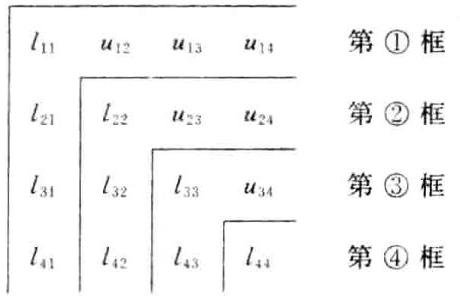

[评注] 第 ③ 框中的 ${l}_{ij}$ 为 $\mathbf{A}$ 的对应元素 ${a}_{i3}$ 先减去“第 ① 框中同行的 ${l}_{i1}$ 与同列的 ${u}_{13}$ 之积”,再减去“第 ② 框中同行的 ${l}_{i2}$ 与同列的 ${u}_{23}$ 之积”; 第 ③ 框中的 ${u}_{34}$ 为 $\mathbf{A}$ 的对应元素 ${a}_{34}$ 先减去 “第 ① 框中同行的 ${l}_{31}$ 与同列的 ${u}_{14}$ 之积”,再减去“第 ② 框中同行的 ${l}_{32}$ 与同列的 ${u}_{21}$ 之积”,最后除以 ${l}_{33}$ (第 ③ 框的主对角线元素).

(3)由矩阵的 Crout 分解构造矩阵的 LDU 分解 令 $\mathbf{D} = \operatorname{diag}\left( {{l}_{11},{l}_{22},\cdots ,{l}_{nn}}\right) ,\mathbf{L}$ 的第 $i$ 列为 $\widetilde{\mathbf{L}}$ 的第 $i$ 列除以 ${l}_{n}\left( {i = 1,2,\cdots , n - 1}\right)$ . $\mathbf{L}$ 的第 $n$ 列为 ${\mathbf{e}}_{n}$ ,那么 $\mathbf{A} = \mathbf{L}\mathbf{D}\mathbf{U}$ .

(4)由矩阵的 Crout 分解构造矩阵的 Cholesky 分解 令 $\mathbf{\Lambda } = \operatorname{diag}\left( {\sqrt{{l}_{11}},\sqrt{{l}_{22}},\cdots ,\sqrt{{l}_{nn}}}\right) ,\mathbf{G} = \widetilde{\mathbf{L}}{\mathbf{\Lambda }}^{-1}$ ,那么 $\mathbf{A} = \mathbf{G}{\mathbf{G}}^{\mathrm{H}}$ .

## 2. 求矩阵的 $\mathbf{{QR}}$ 分解

设 $\mathbf{A} \in  {\mathbf{R}}^{n \times  n}$ 是可逆矩阵.

(1)Schmidt 正交化方法:

1) 对 $\mathbf{A}$ 的列向量组 ${\mathbf{a}}_{1},{\mathbf{a}}_{2},\cdots ,{\mathbf{a}}_{n}$ 正交化得正交向量组 ${\mathbf{b}}_{1},{\mathbf{b}}_{2},\cdots ,{\mathbf{b}}_{n}$ ,且有

$$
\left( {{\mathbf{a}}_{1},{\mathbf{a}}_{2},\cdots ,{\mathbf{a}}_{n}}\right)  = \left( {{\mathbf{b}}_{1},{\mathbf{b}}_{2},\cdots ,{\mathbf{b}}_{n}}\right) \mathbf{K},\;\mathbf{K} = \left\lbrack  \begin{matrix} 1 & {k}_{21} & \cdots & {k}_{n1} \\   & 1 &  \ddots  & \vdots \\   & &  \ddots  & {k}_{n, n - 1} \\   & & & 1 \end{matrix}\right\rbrack
$$

2) 构造正交矩阵 $\mathbf{Q} = \left( {{\mathbf{q}}_{1},{\mathbf{q}}_{2},\cdots ,{\mathbf{q}}_{n}}\right)$ ,其中 ${\mathbf{q}}_{j} = \frac{{\mathbf{b}}_{j}}{\left| {\mathbf{b}}_{j}\right| }\left( {j = 1,2,\cdots , n}\right)$ ;

3) 构造上三角矩阵 $\mathbf{R} = \operatorname{diag}\left( {\left| {\mathbf{b}}_{1}\right| ,\left| {\mathbf{b}}_{2}\right| ,\cdots ,\left| {\mathbf{b}}_{n}\right| }\right)  \cdot  \mathbf{K}$ ,那么 $\mathbf{A} = \mathbf{{QR}}$ .

(2)Givens 变换方法:

1) 对 $\mathbf{A}$ 的第 1 列 ${\mathbf{\beta }}^{\left( 1\right) }$ 构造有限个 Givens 矩阵的乘积 ${\mathbf{T}}_{1}$ ,使得

$$
{\mathbf{T}}_{1}{\mathbf{\beta }}^{\left( 1\right) } = \left| {\mathbf{\beta }}^{\left( 1\right) }\right| {\mathbf{e}}_{1}\;\left( {{\mathbf{e}}_{1} \in  {\mathbf{R}}^{n}}\right) ,\;{\mathbf{T}}_{1}\mathbf{A} = \left\lbrack  \begin{matrix} {a}_{11}^{\left( 1\right) } & {a}_{12}^{\left( 1\right) } & \cdots & {a}_{1n}^{\left( 1\right) } \\  0 & \cdots & & \cdots \\  \vdots & & {\mathbf{A}}^{\left( 1\right) } & \\  0 & & &  \end{matrix}\right\rbrack
$$

2) 对 ${\mathbf{A}}^{\left( 1\right) }$ 的第 1 列 ${\mathbf{\beta }}^{\left( 2\right) }$ 构造有限个 Givens 矩阵的乘积 ${\mathbf{T}}_{2}$ ,使得

$$
{\mathbf{T}}_{2}{\mathbf{\beta }}^{\left( 2\right) } = \left| {\mathbf{\beta }}^{\left( 2\right) }\right| {\mathbf{e}}_{1}\;\left( {{\mathbf{e}}_{1} \in  {\mathbf{R}}^{n - 1}}\right) ,\;{\mathbf{T}}_{2}{\mathbf{A}}^{\left( 1\right) } = \left\lbrack  \begin{matrix} {a}_{22}^{\left( 2\right) } & {a}_{23}^{\left( 2\right) } & \cdots & {a}_{2n}^{\left( 2\right) } \\  0 & \cdots & \cdots & \cdots \\  \vdots & \vdots & & {\mathbf{A}}^{\left( 2\right) } \\  0 & & &  \end{matrix}\right\rbrack
$$

$3)\cdots \cdots$

$\vdots$

$n - 1)$ 对 ${\mathbf{A}}^{\left( n - 2\right) }$ 的第 1 列 ${\mathbf{\beta }}^{\left( n - 1\right) }$ 构造 Givens 矩阵 ${\mathbf{T}}_{n - 1}$ ,使得

$$
{\mathbf{T}}_{n - 1}{\mathbf{\beta }}^{\left( n - 1\right) } = \left| {\mathbf{\beta }}^{\left( n - 1\right) }\right| {\mathbf{e}}_{1}\;\left( {{\mathbf{e}}_{1} \in  {\mathbf{R}}^{2}}\right) ,\;{\mathbf{T}}_{n - 1}{\mathbf{A}}^{\left( n - 2\right) } = \left\lbrack  \begin{matrix} {a}_{n - 1, n - 1}^{\left( n - 1\right) } & {a}_{n - 1, n}^{\left( n - 1\right) } \\  0 & {a}_{nn}^{\left( n - 1\right) } \end{matrix}\right\rbrack
$$

构造上三角矩阵

$$
\mathbf{R} = \left\lbrack  \begin{matrix} {a}_{11}^{\left( 1\right) } & {a}_{12}^{\left( 1\right) } & \cdots & {a}_{1, n - 1}^{\left( 1\right) } & {a}_{1n}^{\left( 1\right) } \\   & {a}_{22}^{\left( 2\right) } & \cdots & {a}_{2, n - 1}^{\left( 2\right) } & {a}_{2n}^{\left( 2\right) } \\   & &  \ddots  & \vdots & \vdots \\   & & & {a}_{n - 1, n - 1}^{\left( n - 1\right) } & {a}_{n - 1, n}^{\left( n - 1\right) } \\   & & & & {a}_{n, n - 1}^{\left( n - 1\right) } \end{matrix}\right\rbrack
$$

计算正交矩阵

$$
\mathbf{Q} = {\left\lbrack  \begin{array}{l} \left\lbrack  \begin{array}{ll} {\mathbf{I}}_{n - 2} & \\   & {\mathbf{T}}_{n - 1} \end{array}\right\rbrack  \cdots \left\lbrack  \begin{array}{ll} 1 & \\   & {\mathbf{T}}_{2} \end{array}\right\rbrack  {\mathbf{T}}_{1} \end{array}\right\rbrack  }^{\mathrm{T}}
$$

那么 $\mathbf{A} = \mathbf{{QR}}$ .

[评注] 上三角矩阵 $\mathbf{R}$ 的主对角线上方 (含主对角线) 的第 $i$ 行元素是第 $i$ 步中矩阵 ${\mathbf{T}}_{i}{\mathbf{A}}^{\left( i - 1\right) }$ 的第 1 行元素 $\left( {i = 1,2,\cdots , n - 1}\right)$ ,而 $\mathbf{R}$ 的 $n$ 行 $n$ 列元素是第 $n - 1$ 步中矩阵 ${\mathbf{T}}_{n - 1}{\mathbf{A}}^{\left( n - 2\right) }$ 的 2 行 2 列元素. 另外,当 $\mathbf{A}$ 为不可逆矩阵时,各步中的 ${\mathbf{\beta }}^{\left( i\right) }\left( {i = 1,2,\cdots , n - 1}\right)$ 有可能是零向量,遇此情形直接进行下一步即可.

(3)Householder 变换方法:在 Givens 变换方法的各步中，将 “构造有限个 Givens 矩阵的乘积 ${\mathbf{T}}_{i}$ ，使得 ${\mathbf{T}}_{i}{\mathbf{\beta }}^{\left( i\right) } = \left| {\mathbf{\beta }}^{\left( i\right) }\right| {\mathbf{e}}_{1}$ ” 改作“构造 Householder 矩阵 ${\mathbf{H}}_{i}$ 使得 ${\mathbf{H}}_{i}{\mathbf{\beta }}^{\left( i\right) } = \left| {\mathbf{\beta }}^{\left( i\right) }\right| {\mathbf{e}}_{1}$ ”,并将涉及到的矩阵 ${\mathbf{T}}_{i}$ 改作矩阵 $H$ ,即可.

## 3. 化矩阵与 Hessenberg 矩阵正交相似

设 $\mathbf{A} \in  {\mathbf{R}}^{n \times  n}$ .

(1)Householder 变换方法:

1) 记 $\mathbf{A} = {\left( {a}_{ij}\right) }_{n \times  n}$ 的第 1 列中后 $n - 1$ 个元素构成的列向量为 ${\mathbf{b}}^{\left( 1\right) }$ ,当 ${\mathbf{b}}^{\left( 1\right) } = \mathbf{0}$ 时,进行下一步; 否则,构造 Householder 矩阵 ${\mathbf{H}}_{1}$ ,使得

$$
{\mathbf{H}}_{1}{\mathbf{b}}^{\left( 1\right) } = \left| {\mathbf{b}}^{\left( 1\right) }\right| {\mathbf{e}}_{1}\;\left( {{\mathbf{e}}_{1} \in  {\mathbf{R}}^{n - 1}}\right)
$$

$$
\left\lbrack  \begin{matrix} 1 & {\mathbf{0}}^{\mathrm{T}} \\  \mathbf{0} & {\mathbf{H}}_{1} \end{matrix}\right\rbrack  \mathbf{A}{\left\lbrack  \begin{matrix} 1 & {\mathbf{0}}^{\mathrm{T}} \\  \mathbf{0} & {\mathbf{H}}_{1} \end{matrix}\right\rbrack  }^{\mathrm{T}} = \left\lbrack  \begin{matrix} {a}_{11} &  * & \cdots &  * \\   * & & & \\   * & & & \\  \vdots & & {\mathbf{A}}^{\left( 1\right) } & \\  \vdots & & & \\  0 & & &  \end{matrix}\right\rbrack
$$

2) 记 ${\mathbf{A}}^{\left( 1\right) }$ 的第 1 列中后 $n - 2$ 个元素构成的列向量为 ${\mathbf{b}}^{\left( 2\right) }$ ,当 ${\mathbf{b}}^{\left( 2\right) } = \mathbf{0}$ 时,进行下一步; 否则,构造 Householder 矩阵 ${\mathbf{H}}_{2}$ ,使得

$$
{\mathbf{H}}_{2}{\mathbf{b}}^{\left( 2\right) } = \left| {\mathbf{b}}^{\left( 2\right) }\right| {\mathbf{e}}_{1}\;\left( {{\mathbf{e}}_{1} \in  {\mathbf{R}}^{n - 2}}\right)
$$

$$
\left\lbrack  \begin{array}{ll} 1 & {\mathbf{0}}^{\top } \\  \mathbf{0} & {\mathbf{H}}_{2} \end{array}\right\rbrack  {\mathbf{A}}^{\left( 1\right) }{\left\lbrack  \begin{array}{ll} 1 & {\mathbf{0}}^{\top } \\  \mathbf{0} & {\mathbf{H}}_{2} \end{array}\right\rbrack  }^{\top } = \left\lbrack  \begin{matrix} {a}_{22}^{\left( 1\right) } &  * & \cdots &  * \\   * &  * & \cdots &  * \\  \vdots & \vdots & & \vdots \\   * &  * & \cdots &  *  \end{matrix}\right\rbrack
$$

3)······

$\vdots$

$n - 2)$ 记 ${\mathbf{A}}^{\left( n - 2\right) }$ 的第 1 列中后两个元素构成的列向量为 ${\mathbf{b}}^{\left( n - 2\right) }$ ,当 ${\mathbf{b}}^{\left( n - 2\right) } = \mathbf{0}$ 时,过程结束; 否则,构造 Householder 矩阵 ${\mathbf{H}}_{n - 2}$ ,使得

$$
{\mathbf{H}}_{n - 2}{\mathbf{b}}^{\left( n - 2\right) } = \left| {\mathbf{b}}^{\left( n - 2\right) }\right| {\mathbf{e}}_{1}\;\left( {{\mathbf{e}}_{1} \in  {\mathbf{R}}^{2}}\right)
$$

$$
\left\lbrack  \begin{matrix} 1 & {\mathbf{0}}^{\top } \\  \mathbf{0} & {\mathbf{H}}_{n - 2} \end{matrix}\right\rbrack  {\mathbf{A}}^{\left( n - 3\right) }{\left\lbrack  \begin{matrix} 1 & {\mathbf{0}}^{\top } \\  \mathbf{0} & {\mathbf{H}}_{n - 2} \end{matrix}\right\rbrack  }^{\top } = \left\lbrack  \begin{matrix} {a}_{n - 2, n - 2}^{\left( n - 3\right) } &  * &  * \\   * &  * &  * \\  0 &  * &  *  \end{matrix}\right\rbrack
$$

计算正交矩阵

$$
\mathbf{Q} = \left\lbrack  \begin{matrix} {\mathbf{I}}_{n - 2} & \mathbf{O} \\  \mathbf{O} & {\mathbf{H}}_{n - 2} \end{matrix}\right\rbrack  \cdots \left\lbrack  \begin{matrix} {\mathbf{I}}_{2} & \mathbf{O} \\  \mathbf{O} & {\mathbf{H}}_{2} \end{matrix}\right\rbrack  \left\lbrack  \begin{array}{ll} 1 & \mathbf{O} \\  \mathbf{O} & {\mathbf{H}}_{1} \end{array}\right\rbrack
$$

那么 $Q\mathbf{A}{Q}^{\mathrm{T}}$ 为上 Hessenberg 矩阵.

[评注] 当 $\mathbf{A}$ 为实对称矩阵时, $\mathbf{Q}\mathbf{A}{\mathbf{Q}}^{\top }$ 为实对称三对角矩阵.

(2)Givens 变换方法: 在 Householder 变换方法的各步中,将 “构造 Householder 矩阵 $\mathbf{H}$ ，使得 ${\mathbf{H}}_{t}{\mathbf{b}}^{\left( t\right) } = \; \left| {\mathbf{b}}^{\left( i\right) }\right| {\mathbf{e}}_{1}$ ” 改作“构造有限个 Givens 矩阵的乘积 $\mathbf{T}$ ,使得 ${\mathbf{T}}_{i}{\mathbf{b}}^{\left( i\right) } = \left| {\mathbf{b}}^{\left( i\right) }\right| {\mathbf{e}}_{1}$ ”,并将涉及到的矩阵 ${\mathbf{H}}_{i}$ 改作矩阵 $\mathbf{T}$ , 即可.

## 4. 求矩阵的满秩分解

$\mathbf{A} \in  {\mathbf{C}}_{r}^{m \times  n}\left( {r > 0}\right)$ .

(1) 逆矩阵方法:

1) $\left\lbrack  {\mathbf{A}\vdots \mathbf{I}}\right\rbrack  \overset{\text{ 行 }}{ \rightarrow  }\left\lbrack  {\mathbf{B}\vdots \mathbf{P}}\right\rbrack$ ,其中 $\mathbf{B}$ 为阶梯形矩阵;

2) 计算 ${\mathbf{P}}^{-1}$ (或者 ${\mathbf{P}}^{-1}$ 的前 $r$ 列);

3) 取 $\mathbf{F}$ 为 ${\mathbf{P}}^{-1}$ 的前 $r$ 列构成的列满秩矩阵, $\mathbf{G}$ 为 $\mathbf{B}$ 的前 $r$ 行构成的行满秩矩阵,那么 $\mathbf{A} = \mathbf{{FG}}$ .

(2)Hermite 标准形方法:

1) $\mathbf{A}\xrightarrow[]{\text{ 行 }}\mathbf{B}$ ,其中 $\mathbf{B}$ 为 Hermite 标准形矩阵,且 $\mathbf{B}$ 的 ${j}_{1},{j}_{2},\cdots ,{j}_{r}$ 列为单位矩阵 ${\mathbf{I}}_{m}$ 的前 $r$ 列;

2) 取 $\mathbf{F}$ 为 $\mathbf{A}$ 的 ${j}_{1},{j}_{2},\cdots ,{j}_{r}$ 列构成的列满秩矩阵, $\mathbf{G}$ 为 $\mathbf{B}$ 的前 $r$ 行构成的行满秩矩阵,那么 $\mathbf{A} = \mathbf{F}\mathbf{G}$ .

[评注] 采用 Hermite 标准形方法求矩阵 $\mathbf{A}$ 的满秩分解时,对 $\mathbf{A}$ 的 Hermite 标准形矩阵 $\mathbf{B}$ 可以取消限制条件 ${j}_{1} < {j}_{2} < \cdots  < {j}_{r}$ .

## 5. 求矩阵的奇异值分解

设 $\mathbf{A} \in  {\mathbf{C}}_{r}^{m \times  n}\left( {r > 0}\right)$ 的非零奇异值为 ${\sigma }_{1},{\sigma }_{2},\cdots ,{\sigma }_{r}$ ,对角矩阵 $\mathbf{\sum } = \operatorname{diag}\left( {{\sigma }_{1},{\sigma }_{2},\cdots ,{\sigma }_{r}}\right) ,{\lambda }_{i} = {\sigma }_{i}^{2}(i = 1,2,\cdots$ , r).

(1)直接构造法:

1) 求酉矩阵 ${\mathbf{V}}_{n \times  n}$ ,使得 ${\mathbf{V}}^{\mathrm{H}}\left( {{\mathbf{A}}^{\mathrm{H}}\mathbf{A}}\right) \mathbf{V} = \operatorname{diag}\left( {{\lambda }_{1},\cdots ,{\lambda }_{r},0,\cdots ,0}\right)$ ;

2) 计算 ${\mathbf{U}}_{1} = \mathbf{A}{\mathbf{V}}_{1}{\mathbf{\sum }}^{-1}$ ,其中 ${\mathbf{V}}_{1}$ 为 $\mathbf{V}$ 的前 $r$ 列构成的矩阵;

3) 扩充 ${\mathbf{U}}_{1}$ 的 $r$ 个列向量为 ${\mathbf{C}}^{m}$ 的标准正交基. 并记由增加的 $m - r$ 个列向量构成的矩阵为 ${\mathbf{U}}_{2}$ ,那么 $\mathbf{U} = \; \left\lbrack  \begin{array}{lll} {\mathbf{U}}_{1} & \vdots & {\mathbf{U}}_{2} \end{array}\right\rbrack$ 是酉矩阵;

4) 写出 $\mathbf{A}$ 的奇异值分解 $\mathbf{A} = \mathbf{U}\left\lbrack  \begin{array}{ll} \mathbf{\sum } & \mathbf{O} \\  \mathbf{O} & \mathbf{O} \end{array}\right\rbrack  {\mathbf{V}}^{\mathrm{H}}$ .

(2)试算验证法:

1) 求酉矩阵 ${\mathbf{V}}_{n \times  n}$ ,使得 ${\mathbf{V}}^{\mathrm{H}}\left( {{\mathbf{A}}^{\mathrm{H}}\mathbf{A}}\right) \mathbf{V} = \operatorname{diag}\left( {{\lambda }_{1},\cdots ,{\lambda }_{r},0,\cdots ,0}\right)$ ;

2) 求酉矩阵 ${\mathbf{U}}_{m \times  m}$ ,使得 ${\mathbf{U}}^{\mathrm{H}}\left( {\mathbf{{AA}}}^{\mathrm{H}}\right) \mathbf{U} = \operatorname{diag}\left( {{\lambda }_{1},\cdots ,{\lambda }_{r},0,\cdots ,0}\right)$ ;

3) 计算矩阵 $\mathbf{U}\left\lbrack  \begin{array}{ll} \mathbf{\sum } & \mathbf{O} \\  \mathbf{O} & \mathbf{O} \end{array}\right\rbrack  {\mathbf{V}}^{\mathrm{H}}$ ;

4) 若 3) 中的矩阵等于 $\mathbf{A}$ ，则它是 $\mathbf{A}$ 的一个奇异值分解；若 3) 中的矩阵不等于 $\mathbf{A}$ ，需要重新调整 $\mathbf{V}$ 或 (和) $\mathbf{U}$ 的列向量，直至乘积等于 $\mathbf{A}$ .

[评注] 当 ${\mathbf{A}}^{\mathrm{H}}\mathbf{A}$ (或 $\mathbf{A}{\mathbf{A}}^{\mathrm{H}}$ ) 的非零特征值的重数为 1 时,只需调整 $\mathbf{V}$ 或 (和) $\mathbf{U}$ 中对应非零特征值的特征向量的正负号即可; 而当 ${\mathbf{A}}^{\mathrm{H}}\mathbf{A}$ (或 $\mathbf{A}{\mathbf{A}}^{\mathrm{H}}$ ) 的非零特征值的重数大于 1 时,调整 $\mathbf{V}$ 或 (和) $\mathbf{U}$ 的列向量使得 $\mathbf{U}\left\lbrack  \begin{array}{ll} \mathbf{\sum } & \mathbf{O} \\  \mathbf{O} & \mathbf{O} \end{array}\right\rbrack  {\mathbf{V}}^{\mathrm{H}} = \mathbf{A}$ 是十分困难的.

### 4.4 内容结构框图

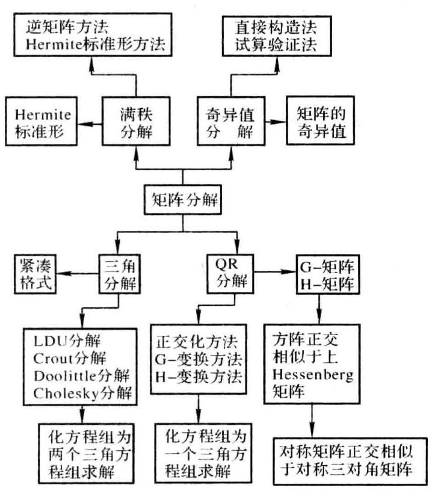

### 4.5 课后习题全解

## 习 题 4.1

1. 求矩阵 $\mathbf{A} = \left\lbrack  \begin{array}{rrrr} 5 & 2 &  - 4 & 0 \\  2 & 1 &  - 2 & 1 \\   - 4 &  - 2 & 5 & 0 \\  0 & 1 & 0 & 2 \end{array}\right\rbrack$ 的 LDU 分解和 Doolittle 分解.

解 对 $\mathbf{A}$ 作矩阵

计算

$$
{\mathbf{L}}_{1} = \left\lbrack  \begin{matrix} 1 & & & \\  \frac{2}{5} & 1 & & \\   - \frac{4}{5} & 0 & 1 & \\   - \frac{4}{5} & 0 & 1 & \\  0 & 0 & 0 & 1 \end{matrix}\right\rbrack  ,\;{\mathbf{L}}_{1}^{-1} = \left\lbrack  \begin{matrix} 1 & & & \\   - \frac{2}{5} & 1 & & \\  \frac{4}{5} & 0 & 1 & \\   & & & \\  0 & 0 & 0 & 1 \end{matrix}\right\rbrack
$$

$$
{\mathbf{L}}_{1}^{-1}\mathbf{A} = \left\lbrack  \begin{array}{rrrr} 5 & 2 &  - 4 & 0 \\  0 & \frac{1}{5} &  - \frac{2}{5} & 1 \\  0 &  - \frac{2}{5} & \frac{9}{5} & 0 \\  0 & 1 & 0 & 2 \end{array}\right\rbrack   = {\mathbf{A}}^{\left( 1\right) }
$$

对 ${\mathbf{A}}^{\left( 1\right) }$ 作矩阵

$$
{\mathbf{L}}_{2} = \left\lbrack  \begin{matrix} 1 & & & \\  0 & 1 & & \\  0 &  - 2 &  - 1 & \\  0 & 5 & 0 & 1 \end{matrix}\right\rbrack  ,\;{\mathbf{L}}_{2}^{-1} = \left\lbrack  \begin{matrix} 1 & & & \\  0 & 1 & & \\  0 & 2 & 1 & \\  0 &  - 5 & 0 & 1 \end{matrix}\right\rbrack
$$

计算

$$
{\mathbf{L}}_{2}^{-1}{\mathbf{A}}^{\left( 1\right) } = \left\lbrack  \begin{array}{rrrr} 5 & 2 &  - 4 & 0 \\  0 & \frac{1}{5} &  - \frac{2}{5} & 1 \\  0 & 0 & 1 & 2 \\  0 & 0 & 2 &  - 3 \end{array}\right\rbrack   = {\mathbf{A}}^{\left( 2\right) }
$$

对 ${\mathbf{A}}^{\left( 2\right) }$ 作矩阵

$$
{\mathbf{L}}_{3} = \left\lbrack  \begin{array}{llll} 1 & & & \\  0 & 1 & & \\  0 & 0 & 1 & \\  0 & 0 & 2 & 1 \end{array}\right\rbrack  ,\;{\mathbf{L}}_{3}^{-1} = \left\lbrack  \begin{array}{llll} 1 & & & \\  0 & 1 & & \\  0 & 0 & 1 & \\  0 & 0 &  - 2 & 1 \end{array}\right\rbrack
$$

计算

$$
{\mathbf{L}}_{3}^{-1}{\mathbf{A}}^{\left( 2\right) } = \left\lbrack  \begin{array}{rrrr} 5 & 2 &  - 4 & 0 \\   & \frac{1}{5} &  - \frac{2}{5} & 1 \\   & & 1 & 2 \\   & & &  - 7 \end{array}\right\rbrack   = {\mathbf{A}}^{\left( 3\right) }
$$

令

$$
\mathbf{L} = {\mathbf{L}}_{1}{\mathbf{L}}_{2}{\mathbf{L}}_{3} = \left\lbrack  \begin{matrix} 1 & & & & \\  \frac{2}{5} & 1 & & & \\   - \frac{4}{5} &  - 2 & 1 & & \\  0 & 5 & 2 & 1 &  \end{matrix}\right\rbrack
$$

可得 $\mathbf{A}$ 的 Doolittle 分解为 $\mathbf{A} = \mathbf{L}{\mathbf{A}}^{\left( 3\right) },\mathbf{A}$ 的 LDU 分解为

$$
\mathbf{A} = \mathbf{L}\left\lbrack  \begin{array}{llll} 5 & & & \\   & \frac{1}{5} & & \\   & & 1 & \\   & & &  - 7 \end{array}\right\rbrack  \left\lbrack  \begin{array}{rrrr} 1 & \frac{2}{5} &  - \frac{4}{5} & 0 \\   & 1 &  - 2 & 5 \\   & & 1 & 2 \\   & & & 1 \end{array}\right\rbrack
$$

2. 证明式 $\left( {4.1.30}\right)$ .

证 设 $\mathbf{A} = {\left( {a}_{ij}\right) }_{n \times  n}$ ,令

$$
\mathbf{L} = \left\lbrack  \begin{matrix} 1 & & & \\  {l}_{21} & 1 & & \\  \vdots & \vdots &  \ddots  & \\  {l}_{n1} & {l}_{n2} & \cdots & 1 \end{matrix}\right\rbrack  ,\;\mathbf{U} = \left\lbrack  \begin{matrix} {u}_{11} & {u}_{12} & \cdots & {u}_{1n} \\   & {u}_{22} & \cdots & {u}_{2n} \\   & &  \ddots  & \vdots \\   & & & {u}_{nn} \end{matrix}\right\rbrack
$$

比较 $\mathbf{A} = \mathbf{L}\mathbf{U}$ 两端的对应元素可得

即

$$
{a}_{1k} = {u}_{1k}\;\left( {k = 1,2,\cdots , n}\right)
$$

$$
{a}_{k1} = {l}_{k1}{u}_{11}\;\left( {k = 2,\cdots , n}\right)
$$

$$
{a}_{ik} = {l}_{i1}{u}_{1k} + \cdots  + {l}_{i, i - 1}{u}_{i - 1, k} + {u}_{ik}\;\left( {k = i, i + 1,\cdots , n;i > 1}\right)
$$

$$
{a}_{ki} = {l}_{k1}{u}_{1i} + \cdots  + {l}_{k, i - 1}{u}_{i - 1, i} + {l}_{k,}{u}_{ii}\;\left( {k = i + 1,\cdots , n;i > 1}\right)
$$

$$
{u}_{1k} = {a}_{1k}\;\left( {k = 1,2,\cdots , n}\right)
$$

$$
{l}_{k1} = \frac{1}{{u}_{11}}{a}_{k1}\;\left( {k = 2,\cdots , n}\right)
$$

$$
{u}_{ik} = {a}_{ik} - \left( {{l}_{i1}{u}_{1k} + \cdots  + {l}_{i, i - 1}{u}_{i - 1, k}}\right) \;\left( {k = i, i + 1,\cdots , n;i > 1}\right)
$$

$$
{l}_{ki} = \frac{1}{{u}_{ii}}\left\lbrack  {{a}_{ki} - \left( {{l}_{k1}{u}_{1i} + \cdots  + {l}_{k, i - 1}{u}_{i - 1, i}}\right) }\right\rbrack  \;\left( {k = i + 1,\cdots , n;i > 1}\right)
$$

3. 设 $\mathbf{A}$ 为实对称正定矩阵,且 Gauss 消去法第一步得到的矩阵为

$$
{\mathbf{A}}^{\left( 1\right) } = \left\lbrack  \begin{matrix} {a}_{11} & {a}_{12} & \cdots & {a}_{1n} \\  0 & & & \\  \vdots & & \mathbf{B} & \\  0 & & &  \end{matrix}\right\rbrack
$$

证明 $\mathbf{B}$ 仍是实对称正定矩阵,且对角元素不增加.

证 设 $\mathbf{A} = {\left( {a}_{ij}\right) }_{n \times  n}$ ,记 $\mathbf{a} = {\left( {a}_{21},\cdots ,{a}_{n1}\right) }^{\mathrm{T}}$ ,由于 $\mathbf{A}$ 对称,所以 $\mathbf{A}$ 可分块为 $\mathbf{A} = \left\lbrack  \begin{matrix} {a}_{11} & {\mathbf{a}}^{\mathrm{T}} \\  \mathbf{a} & {\mathbf{A}}_{1} \end{matrix}\right\rbrack$ ,其中 ${\mathbf{A}}_{1}$ 是 $n - 1$ 阶对称矩阵,于是

$$
{\mathbf{A}}^{\left( 1\right) } = \left\lbrack  \begin{matrix} {a}_{11} & {\mathbf{a}}^{\mathrm{T}} \\  \mathbf{0} & {\mathbf{A}}_{1} - \frac{\mathbf{a}{\mathbf{a}}^{\mathrm{T}}}{{a}_{11}} \end{matrix}\right\rbrack
$$

即 $\mathbf{B} = {\mathbf{A}}_{1} - \frac{\mathbf{a}{\mathbf{a}}^{\mathrm{T}}}{{a}_{11}}$ . 下面证明 $\mathbf{B}$ 是正定矩阵.

容易验证 ${\mathbf{B}}^{\mathrm{T}} = \mathbf{B}$ . 任取非零列向量 $\mathbf{y} \in  {\mathbf{R}}^{n - 1}$ ,则 $\mathbf{x} = \left\lbrack  \begin{matrix}  - \frac{{\mathbf{a}}^{\mathrm{T}}\mathbf{y}}{{a}_{11}} \\  \mathbf{y} \end{matrix}\right\rbrack   \neq  \mathbf{0}$ ,从而 ${\mathbf{x}}^{\mathrm{T}}\mathbf{A}\mathbf{x} > 0$ ,即

$$
\left\lbrack  \begin{array}{ll}  - \frac{{\mathbf{y}}^{\mathrm{T}}\mathbf{a}}{{a}_{11}} & {\mathbf{y}}^{\mathrm{T}} \end{array}\right\rbrack  \left\lbrack  \begin{matrix} {a}_{11} & {\mathbf{a}}^{\mathrm{T}} \\  \mathbf{a} & {\mathbf{A}}_{1} \end{matrix}\right\rbrack  \left\lbrack  \begin{matrix}  - \frac{{\mathbf{a}}^{\mathrm{T}}\mathbf{y}}{{a}_{11}} \\  \mathbf{y} \end{matrix}\right\rbrack   > 0
$$

上式左端进行乘法运算后可得

$$
{\mathbf{y}}^{\mathrm{T}}\left( {{\mathbf{A}}_{1} - \frac{\mathbf{a}{\mathbf{a}}^{\mathrm{T}}}{{a}_{11}}}\right) \mathbf{y} > 0
$$

故 $\mathbf{B} = {\mathbf{A}}_{1} - \frac{\mathbf{a}{\mathbf{a}}^{\mathrm{T}}}{{a}_{11}}$ 为正定矩阵.

4. 求对称正定矩阵 $\mathbf{A} = \left\lbrack  \begin{array}{rrr} 5 & 2 &  - 4 \\  2 & 1 &  - 2 \\   - 4 &  - 2 & 5 \end{array}\right\rbrack$ 的 Cholesky 分解.

解 根据教材中式 (4.1.28) 和式 (4.1.29) 求出 $\mathbf{A}$ 的 Crout 分解为

$$
\mathbf{A} = \left\lbrack  \begin{array}{rrr} 5 & & \\  2 & \frac{1}{5} & \\   - 4 &  - \frac{2}{5} & 1 \end{array}\right\rbrack  \left\lbrack  \begin{array}{rrr} 1 & \frac{2}{5} &  - \frac{4}{5} \\   & 1 &  - 2 \\   & & 1 \end{array}\right\rbrack
$$

变形可得 $\mathbf{A}$ 的 Cholesky 分解为

$$
\mathbf{A} = \left\lbrack  \begin{matrix} 1 & & \\  \frac{2}{5} & 1 & \\   - \frac{4}{5} &  - 2 & 1 \end{matrix}\right\rbrack  \left\lbrack  \begin{matrix} 5 & & \\   & \frac{1}{5} & \\   & & 1 \end{matrix}\right\rbrack  \left\lbrack  \begin{matrix} 1 & \frac{2}{5} &  - \frac{4}{5} \\   & 1 &  - 2 \\   & & 1 \end{matrix}\right\rbrack   = \left\lbrack  \begin{matrix} \sqrt{5} & & \\  \frac{2}{\sqrt{5}} & \frac{1}{\sqrt{5}} & \\  \frac{-4}{\sqrt{5}} & \frac{-2}{\sqrt{5}} & 1 \end{matrix}\right\rbrack  \left\lbrack  \begin{matrix} \sqrt{5} & \frac{2}{\sqrt{5}} & \frac{-4}{\sqrt{5}} \\   & \sqrt{\frac{1}{5}} & \frac{-2}{\sqrt{5}} \\   & & 1 \end{matrix}\right\rbrack
$$

## 习 题 4.2

1. 用 Schmidt 正交化方法求矩阵 $\mathbf{A} = \left\lbrack  \begin{array}{lll} 0 & 1 & 1 \\  1 & 1 & 0 \\  1 & 0 & 1 \end{array}\right\rbrack$ 的 QR 分解.

解 令 ${\mathbf{a}}_{1} = {\left( 0,1,1\right) }^{\mathrm{T}},{\mathbf{a}}_{2} = {\left( 1,1,0\right) }^{\mathrm{T}},{\mathbf{a}}_{3} = {\left( 1,0,1\right) }^{\mathrm{T}}$ ,正交化可得

$$
{\mathbf{b}}_{1} = {\mathbf{a}}_{1} = {\left( 0,1,1\right) }^{\top }
$$

$$
{\mathbf{b}}_{2} = {\mathbf{a}}_{2} - \frac{1}{2}{\mathbf{b}}_{1} = {\left( 1,\frac{1}{2}, - \frac{1}{2}\right) }^{\top }
$$

$$
{\mathbf{b}}_{3} = {\mathbf{a}}_{3} - \frac{1}{3}{\mathbf{b}}_{2} - \frac{1}{2}{\mathbf{b}}_{1} = {\left( \frac{2}{3}, - \frac{2}{3},\frac{2}{3}\right) }^{\top }
$$

根据教材中式 (4.2.8) 构造矩阵

$$
\mathbf{Q} = \left\lbrack  \begin{matrix} 0 & \frac{2}{\sqrt{6}} & \frac{1}{\sqrt{3}} \\  \frac{1}{\sqrt{2}} & \frac{1}{\sqrt{6}} & \frac{-1}{\sqrt{3}} \\  \frac{1}{\sqrt{2}} & \frac{-1}{\sqrt{6}} & \frac{1}{\sqrt{3}} \end{matrix}\right\rbrack  .\;\mathbf{R} = \left\lbrack  \begin{matrix} \sqrt{2} & \frac{1}{\sqrt{2}} & \frac{1}{\sqrt{2}} \\   & \frac{3}{\sqrt{6}} & \frac{1}{\sqrt{6}} \\   & & \frac{2}{\sqrt{3}} \end{matrix}\right\rbrack
$$

则有 $\mathbf{A} = \mathbf{{QR}}$ .

2. 用 Givens 变换将向量 $\mathbf{x} = {\left( 2,3,0,5\right) }^{\mathrm{T}}$ 变换为与 ${\mathbf{e}}_{1}$ 同方向.

解 对 $x$ 构造 ${\mathbf{T}}_{12}\left( {c, s}\right)  : c = \frac{2}{\sqrt{13}}, s = \frac{3}{\sqrt{13}}$ ,则有

$$
{\mathbf{T}}_{12}\mathbf{x} = {\left( \sqrt{13},{0.0},5\right) }^{\top }
$$

对 ${\mathbf{T}}_{12}\mathbf{x}$ 构造 ${\mathbf{T}}_{14}\left( {c, s}\right)  : c = \frac{\sqrt{13}}{\sqrt{38}}, s = \frac{5}{\sqrt{38}}$ ,则有

$$
{\mathbf{T}}_{14}\left( {{\mathbf{T}}_{12}\mathbf{x}}\right)  = {\left( \sqrt{38} \cdot  0,0,0\right) }^{\top } = \sqrt{38}{\mathbf{e}}_{i}
$$

于是

$$
{\mathbf{T}}_{1} = {\mathbf{T}}_{11}{\mathbf{T}}_{12} = \left\lbrack  \begin{matrix} \frac{2}{\sqrt{38}} & \frac{3}{\sqrt{38}} & 0 & \frac{5}{\sqrt{38}} \\  \frac{-3}{\sqrt{13}} & \frac{2}{\sqrt{13}} & 0 & 0 \\  0 & 0 & 1 & 0 \\  \frac{-{10}}{\sqrt{38}} & \frac{-{15}}{\sqrt{38}} & 0 & \frac{\sqrt{13}}{\sqrt{38}} \end{matrix}\right\rbrack
$$

且 $\mathbf{T}\mathbf{x} = \sqrt{38}{\mathbf{e}}_{1}$ .

3. 写出 ${\mathbf{R}}^{2}$ 中的向量 $\mathbf{x}$ 关于 ${\mathbf{e}}_{1}$ 正交的轴的反射变换.

解 反射矩阵 $\mathbf{H} = \mathbf{I} - 2{\mathbf{e}}_{1}{\mathbf{e}}_{1}^{\mathrm{T}} = \left\lbrack  \begin{array}{rr}  - 1 & 0 \\  0 & 1 \end{array}\right\rbrack$ ,反射变换为 $\left\lbrack  \begin{array}{l} {\eta }_{1} \\  {\eta }_{2} \end{array}\right\rbrack   = \left\lbrack  \begin{array}{rr}  - 1 & 0 \\  0 & 1 \end{array}\right\rbrack  \left\lbrack  \begin{array}{l} {\xi }_{1} \\  {\xi }_{2} \end{array}\right\rbrack$ .

4. 设变换 $\mathbf{H}\mathbf{x} = \mathbf{x} - a\left( {\mathbf{x},\mathbf{w}}\right) \mathbf{w}\left( {\mathbf{x} \in  {\mathbf{R}}^{n}}\right)$ ,其中 $\mathbf{w}$ 是欧氏长度为 1 的向量. 问 $a$ 取何值时, $\mathbf{H}$ 是正交矩阵?

解 对任意 $\mathbf{x} \in  {\mathbf{R}}^{n}$ . 由 $\left( {\mathbf{H}\mathbf{x},\mathbf{H}\mathbf{x}}\right)  = \left( {\mathbf{x},\mathbf{x}}\right)$ 可得

$$
\left( {\mathbf{x},\mathbf{x}}\right)  + \left( {{a}^{2} - {2a}}\right) {\left( \mathbf{x},\mathbf{w}\right) }^{2} = \left( {\mathbf{x},\mathbf{x}}\right)
$$

即 ${\left( {a}^{2} - 2a\right) }^{\prime }{\left( \mathbf{x},\mathbf{w}\right) }^{2} = 0$ . 特别地,取 $\mathbf{x} = \mathbf{w}$ 时,有 ${a}^{2} - {2a} = 0$ ,即 $a = 0$ 或 $a = 2$ .

5. 已知向量 $\mathbf{x} = {\left( {\xi }_{1},{\xi }_{2},\cdots ,{\xi }_{n}\right) }^{\mathrm{T}} \in  {\mathbf{R}}^{n}$ ,且 $\mathbf{x} - {\xi }_{1}{\mathbf{e}}_{1} - {\xi }_{2}{\mathbf{e}}_{2} \neq  \mathbf{0}$ . 证明: 存在正交矩阵 $\mathbf{Q}$ (初等旋转矩阵之积),使 ${Qx} = {\left( {\xi }_{1},{c}_{2},0,\cdots ,0\right) }^{\mathrm{T}}$ .

证 由条件 $\mathbf{x} - {\xi }_{1}{\mathbf{e}}_{1} - {\xi }_{2}{\mathbf{e}}_{2} \neq  \mathbf{0}$ 知, ${\left( 0,0,{\xi }_{3},\cdots ,{\xi }_{n}\right) }^{\mathrm{T}} \neq  \mathbf{0}$ . 令 $\mathbf{y} = {\left( {\xi }_{2},{\xi }_{3},\cdots ,{\xi }_{n}\right) }^{\mathrm{T}} \in  {\mathbf{R}}^{n - 1}$ ,则存在初等旋转矩阵之积,记作 ${Q}_{1}$ ,使得

$$
{\mathbf{Q}}_{1}\mathbf{y} = \left| \mathbf{y}\right| {\mathbf{e}}_{1}\;\left( {{\mathbf{e}}_{1} \in  {\mathbf{R}}^{n - 1}}\right)
$$

令 $\mathbf{Q} = \left\lbrack  \begin{array}{ll} 1 & \\   & {\mathbf{Q}}_{1} \end{array}\right\rbrack$ ,则 $\mathbf{Q}$ 仍是初等旋转矩阵之积,从而 $\mathbf{Q}$ 是正交矩阵. 且有

$$
{\mathbf{Q}}_{\mathbf{x}} = \left\lbrack  \begin{array}{ll} 1 & \\   & {\mathbf{Q}}_{1} \end{array}\right\rbrack  \left\lbrack  \begin{array}{l} {\xi }_{1} \\  \mathbf{y} \end{array}\right\rbrack   = \left\lbrack  \begin{matrix} {\xi }_{1} \\  {\mathbf{Q}}_{1}\mathbf{y} \end{matrix}\right\rbrack   = {\left( {\xi }_{1},{c}_{2},0,\cdots ,0\right) }^{\top }\;\left( {{c}_{2} = \parallel \mathbf{y}\parallel }\right)
$$

6. 已知向量 $\mathbf{x} = {\left( {\xi }_{1},{\xi }_{2},\cdots ,{\xi }_{n}\right) }^{\mathrm{T}} \in  {\mathbf{R}}^{n}$ ,求初等反射矩阵 $\mathbf{H}$ . 使 $\mathbf{H}\mathbf{x} = {\left( {\xi }_{1},{\eta }_{2},0,\cdots ,0\right) }^{\mathrm{T}}$ .

解 令 $\mathbf{y} = {\left( {\xi }_{1},{\eta }_{2},0,\cdots ,0\right) }^{\mathrm{T}}$ ,由 $\mathbf{H}\mathbf{x} = \mathbf{y}$ 知 $\left| \mathbf{y}\right|  = \left| {\mathbf{H}\mathbf{x}}\right|  = \left| \mathbf{x}\right|$ . 将 $\mathbf{y}$ 单位化,可得 ${\mathbf{y}}_{0} = \frac{1}{\left| \mathbf{y}\right| }\mathbf{y}$ . 取

$$
\mathbf{u} = \frac{\mathbf{x} - \left| \mathbf{x}\right| {\mathbf{y}}_{0}}{\left| \mathbf{x} - \left| \mathbf{x}\right| {\mathbf{y}}_{0}\right| } = \frac{\mathbf{x} - \mathbf{y}}{\left| \mathbf{x} - \mathbf{y}\right| }
$$

构造初等反射矩阵 $\mathbf{H} = \mathbf{I} - {2u}{u}^{\mathrm{T}}$ ,则有 $\mathbf{H}\mathbf{x} = \left| \mathbf{x}\right| {\mathbf{y}}_{0} = \mathbf{y}$ .

7. 用 Givens 变换求矩阵 $\mathbf{A} = \left\lbrack  \begin{array}{lll} 2 & 2 & 1 \\  0 & 2 & 2 \\  2 & 1 & 2 \end{array}\right\rbrack$ 的 QR 分解.

解 第 1 步: 对 $\mathbf{A}$ 的第 1 列 ${\mathbf{b}}^{\left( 1\right) } = {\left( 2,0,2\right) }^{\mathrm{T}}$ ,构造 ${\mathbf{T}}_{1}$ 使 ${\mathbf{T}}_{1}{\mathbf{b}}^{\left( 1\right) } = \left| {\mathbf{b}}^{\left( 1\right) }\right| {\mathbf{e}}_{1}$ .

$$
{\mathbf{T}}_{13} = \left\lbrack  \begin{matrix} \frac{1}{\sqrt{2}} & 0 & \frac{1}{\sqrt{2}} \\  0 & 1 & 0 \\  \frac{-1}{\sqrt{2}} & 0 & \frac{1}{\sqrt{2}} \end{matrix}\right\rbrack  ,\;{\mathbf{T}}_{13}{\mathbf{b}}^{\left( 1\right) } = \left\lbrack  \begin{matrix} 2\sqrt{2} \\  0 \\  0 \end{matrix}\right\rbrack  ,\;{\mathbf{T}}_{1} = {\mathbf{T}}_{13},\;{\mathbf{T}}_{1}\mathbf{A} = \left\lbrack  \begin{matrix} 2\sqrt{2} & \frac{3}{\sqrt{2}} & \frac{3}{\sqrt{2}} \\  0 & 2 & 2 \\  0 & \frac{-1}{\sqrt{2}} & \frac{1}{\sqrt{2}} \end{matrix}\right\rbrack
$$

第 2 步:对 ${\mathbf{A}}^{\left( 1\right) } = \left\lbrack  \begin{matrix} 2 & 2 \\   - 1 & \frac{1}{\sqrt{2}} \end{matrix}\right\rbrack$ 的第 1 列 ${\mathbf{b}}^{\left( 2\right) } = \left\lbrack  \begin{matrix} 2 \\   - 1 \\  \sqrt{2} \end{matrix}\right\rbrack$ ，构造 ${\mathbf{T}}_{2}$ ，使 ${\mathbf{T}}_{2}{\mathbf{b}}^{\left( 2\right) } = \left| {\mathbf{b}}^{\left( 2\right) }\right| {\mathbf{e}}_{1}$ .

$$
{\mathbf{T}}_{12} = \left\lbrack  \begin{matrix} \frac{2\sqrt{2}}{3} &  - \frac{1}{3} \\  \frac{1}{3} & \frac{2\sqrt{2}}{3} \end{matrix}\right\rbrack  ,\;{\mathbf{T}}_{12}{\mathbf{b}}^{\left( 2\right) } = \left\lbrack  \begin{matrix} \frac{3}{\sqrt{2}} \\  0 \end{matrix}\right\rbrack  ,\;{\mathbf{T}}_{2} = {\mathbf{T}}_{12},\;{\mathbf{T}}_{2}{\mathbf{A}}^{\left( 1\right) } = \left\lbrack  \begin{matrix} \frac{3}{\sqrt{2}} & \frac{7}{3\sqrt{2}} \\  0 & \frac{4}{3} \end{matrix}\right\rbrack
$$

最后,令 $\mathbf{T} = \left\lbrack  \begin{array}{ll} 1 & \\   & {\mathbf{T}}_{2} \end{array}\right\rbrack  {\mathbf{T}}_{1}$ ,则有

$$
\mathbf{Q} = {\mathbf{T}}^{\mathrm{T}} = \left\lbrack  \begin{matrix} \frac{1}{\sqrt{2}} & \frac{1}{3\sqrt{2}} &  - \frac{2}{3} \\  0 & \frac{4}{3\sqrt{2}} & \frac{1}{3} \\  \frac{1}{\sqrt{2}} & \frac{-1}{3\sqrt{2}} & \frac{2}{3} \end{matrix}\right\rbrack  ,\;\mathbf{R} = \left\lbrack  \begin{matrix} 2\sqrt{2} & \frac{3}{\sqrt{2}} & \frac{3}{\sqrt{2}} \\   & \frac{3}{\sqrt{2}} & \frac{7}{3\sqrt{2}} \\   & & \frac{4}{3} \end{matrix}\right\rbrack
$$

且 $\mathbf{A} = \mathbf{{QR}}$ .

8. 用 Householder 变换求矩阵 $\mathbf{A} = \left\lbrack  \begin{array}{lll} 0 & 4 & 1 \\  1 & 1 & 1 \\  0 & 3 & 2 \end{array}\right\rbrack$ 的 QR 分解.

解 对 $\mathbf{A}$ 的第 1 列,构造 ${\mathbf{H}}_{1}$ 如下:

$$
{\mathbf{b}}^{\left( 1\right) } = \left\lbrack  \begin{array}{l} 0 \\  1 \\  0 \end{array}\right\rbrack  ,\;{\mathbf{b}}^{\left( 1\right) } = \left| {\mathbf{b}}^{\left( 1\right) }\right| {\mathbf{e}}_{1} = \left\lbrack  \begin{array}{r}  - 1 \\  1 \\  0 \end{array}\right\rbrack  ,\;\mathbf{u} = \frac{1}{\sqrt{2}}\left\lbrack  \begin{array}{r}  - 1 \\  1 \\  0 \end{array}\right\rbrack
$$

$$
{\mathbf{H}}_{1} = \mathbf{I} - 2\mathbf{u}{\mathbf{u}}^{\mathrm{T}} = \left\lbrack  \begin{array}{lll} 0 & 1 & 0 \\  1 & 0 & 0 \\  0 & 0 & 1 \end{array}\right\rbrack  ,\;{\mathbf{H}}_{1}\mathbf{A} = \left\lbrack  \begin{array}{lll} 1 & 1 & 1 \\  0 & 4 & 1 \\  0 & 3 & 2 \end{array}\right\rbrack
$$

对 ${\mathbf{A}}^{\left( 1\right) } = \left\lbrack  \begin{array}{ll} 4 & 1 \\  3 & 2 \end{array}\right\rbrack$ 的第 1 列,构造 ${\mathbf{H}}_{2}$ 如下:

$$
{\mathbf{b}}^{\left( 2\right) } = \left\lbrack  \begin{array}{l} 4 \\  3 \end{array}\right\rbrack  ,\;{\mathbf{b}}^{\left( 2\right) } = \left| {\mathbf{b}}^{\left( 2\right) }\right| {\mathbf{e}}_{1} = \left\lbrack  \begin{array}{r}  - 1 \\  3 \end{array}\right\rbrack  ,\;\mathbf{u} = \frac{1}{\sqrt{10}}\left\lbrack  \begin{array}{r}  - 1 \\  3 \end{array}\right\rbrack
$$

$$
{\mathbf{H}}_{2} = \mathbf{I} - {2u}{\mathbf{u}}^{\mathrm{T}} = \frac{1}{5}\left\lbrack  \begin{array}{rr} 4 & 3 \\  3 &  - 4 \end{array}\right\rbrack  ,\;{\mathbf{H}}_{2}{\mathbf{A}}^{\left( 1\right) } = \left\lbrack  \begin{array}{rr} 5 & 2 \\  0 &  - 1 \end{array}\right\rbrack
$$

最后,令 $\mathbf{S} = \left\lbrack  \begin{array}{ll} 1 & \\   & {\mathbf{H}}_{2} \end{array}\right\rbrack  {\mathbf{H}}_{1}$ ,则有

$$
\mathbf{Q} = {\mathbf{S}}^{\mathrm{T}} = \left\lbrack  \begin{array}{rrr} 0 & \frac{4}{5} & \frac{3}{5} \\  1 & 0 & 0 \\  0 & \frac{3}{5} &  - \frac{4}{5} \end{array}\right\rbrack  ,\;\mathbf{R} = \left\lbrack  \begin{array}{rrr} 1 & 1 & 1 \\   & 5 & 2 \\   & &  - 1 \end{array}\right\rbrack
$$

且 $\mathbf{A} = \mathbf{{QR}}$ .

9. 用 Householder 变换化矩阵 $\mathbf{A} = \left\lbrack  \begin{array}{rrr} 0 & {12} & {16} \\  {12} & {288} & {309} \\  {16} & {309} & {312} \end{array}\right\rbrack$ 正交相似于三对角矩阵.

解 对 ${\mathbf{b}}^{\left( 1\right) } = \left\lbrack  \begin{array}{l} {12} \\  {16} \end{array}\right\rbrack$ ,计算

$$
{\mathbf{b}}^{\left( 1\right) } - \left| {\mathbf{b}}^{\left( 1\right) }\right| {\mathbf{e}}_{1} = \left\lbrack  \begin{array}{r}  - 8 \\  {16} \end{array}\right\rbrack  ,\;\mathbf{u} = \frac{1}{\sqrt{5}}\left\lbrack  \begin{array}{r}  - 1 \\  2 \end{array}\right\rbrack  ,\;\mathbf{H} = \mathbf{I} - 2\mathbf{u}{\mathbf{u}}^{\mathrm{T}} = \frac{1}{5}\left\lbrack  \begin{array}{rr} 3 & 4 \\  4 &  - 3 \end{array}\right\rbrack
$$

令 $\mathbf{Q} = \left\lbrack  \begin{array}{ll} 1 & \\   & \mathbf{H} \end{array}\right\rbrack   = \frac{1}{5}\left\lbrack  \begin{array}{rrr} 5 & 0 & 0 \\  0 & 3 & 4 \\  0 & 4 &  - 3 \end{array}\right\rbrack$ ,则 $\mathbf{Q}\mathbf{A}{\mathbf{Q}}^{\top } = \left\lbrack  \begin{matrix} 0 & {20} & 0 \\  {20} & {600} & {75} \\  0 & {75} & 0 \end{matrix}\right\rbrack$ .

## 习 题 4.3

1. 求下列各矩阵的满秩分解:

(1) $\left\lbrack  \begin{array}{rrrr} 1 & 2 & 3 & 0 \\  0 & 2 & 1 &  - 1 \\  1 & 0 & 2 & 1 \end{array}\right\rbrack$ ; (2) $\left\lbrack  \begin{array}{rrrr} 1 &  - 1 & 1 & 1 \\   - 1 & 1 &  - 1 &  - 1 \\   - 1 &  - 1 & 1 & 1 \\  1 & 1 &  - 1 &  - 1 \end{array}\right\rbrack$ .

解 (1) $\mathbf{A}\overset{\text{ 行 }}{ \rightarrow  }\left\lbrack  \begin{array}{rrrr} 1 & 0 & 2 & 1 \\  0 & 1 & \frac{1}{2} &  - \frac{1}{2} \\  0 & 0 & 0 & 0 \end{array}\right\rbrack   = \mathbf{B},\operatorname{rank}\mathbf{B} = 2$ ,且 $\mathbf{B}$ 中的第 1 列和第 2 列为单位矩阵的前两列,故

$$
\mathbf{A} = \left\lbrack  \begin{array}{ll} 1 & 2 \\  0 & 2 \\  1 & 0 \end{array}\right\rbrack  \left\lbrack  \begin{matrix} 1 & 0 & 2 & 1 \\  0 & 1 & \frac{1}{2} &  - \frac{1}{2} \end{matrix}\right\rbrack
$$

(2) $\mathbf{A}$ ，于是 $\left\lbrack  \begin{array}{rrrr} 1 & 0 & 0 & 0 \\  0 & 1 &  - 1 &  - 1 \\  0 & 0 & 0 & 0 \\  0 & 0 & 0 & 0 \end{array}\right\rbrack   = \mathbf{B},\operatorname{rank}\mathbf{B} = 2$ ，且 $\mathbf{B}$ 中的第 1 列和第 2 列为单位矩阵的前两列，故

$$
\mathbf{A} = \left\lbrack  \begin{array}{rr} 1 &  - 1 \\   - 1 & 1 \\   - 1 &  - 1 \\  1 & 1 \end{array}\right\rbrack  \left\lbrack  \begin{array}{rrrr} 1 & 0 & 0 & 0 \\  0 & 1 &  - 1 &  - 1 \end{array}\right\rbrack
$$

2. 设 $\mathbf{B} \in  {\mathbf{R}}_{r}^{m \times  r}\left( {r > 0}\right)$ ,证明 ${\mathbf{B}}^{\mathrm{T}}\mathbf{B}$ 非奇异.

证 由 $\operatorname{rank}\mathbf{B} = r$ 知, $\mathbf{B}$ 的列向量组 ${\mathbf{b}}_{1},{\mathbf{b}}_{2},\cdots ,{\mathbf{b}}_{r}$ 线性无关. 因此,对任意 $\mathbf{x} = {\left( {k}_{1},{k}_{2},\cdots ,{k}_{r}\right) }^{\mathrm{T}} \neq  \mathbf{0}$ ,有

$$
\mathbf{B}\mathbf{x} = {k}_{1}{\mathbf{b}}_{1} + {k}_{2}{\mathbf{b}}_{2} + \cdots  + {k}_{r}{\mathbf{b}}_{r} \neq  \mathbf{0}
$$

于是

$$
{\mathbf{x}}^{\top }\left( {{\mathbf{B}}^{\top }\mathbf{B}}\right) \mathbf{x} = {\left( \mathbf{B}\mathbf{x}\right) }^{\top }\left( {\mathbf{B}\mathbf{x}}\right)  > 0
$$

故 ${\mathbf{B}}^{\mathrm{T}}\mathbf{B}$ 是对称正定矩阵,从而 ${\mathbf{B}}^{\mathrm{T}}\mathbf{B}$ 非奇异.

3. 设 $\mathbf{B}$ 和 $\mathbf{A}$ 依次是 $m \times  n$ 和 $n \times  m$ 矩阵,若 $\mathbf{B}\mathbf{A} = \mathbf{I}$ . 则称 $\mathbf{B}$ 为 $\mathbf{A}$ 的左逆矩阵. 证明 $\mathbf{A}$ 有左逆矩阵的充要条件是 $\mathbf{A}$ 为列满秩矩阵.

证 必要性. 已知 $\mathbf{{BA}} = {\mathbf{I}}_{m}$ ,因为

$$
\operatorname{rank}\left( {\mathbf{B}\mathbf{A}}\right)  \leq  \operatorname{rank}\mathbf{A} \leq  m,\;\operatorname{rank}\left( {\mathbf{B}\mathbf{A}}\right)  = \operatorname{rank}{\mathbf{I}}_{m} = m
$$

所以 $\operatorname{rank}\mathbf{A} = m$ ,即 $\mathbf{A}$ 列满秩.

充分性. 已知 $\mathbf{A}$ 列满秩,所以 ${\mathbf{A}}^{\top }\mathbf{A}$ 非奇异 (见第 2 题). 构造 $m \times  n$ 矩阵 $\mathbf{B} = {\left( {\mathbf{A}}^{\top }\mathbf{A}\right) }^{-1}{\mathbf{A}}^{\top }$ ,则有 $\mathbf{B}\mathbf{A} = \mathbf{I}$ ,即 $\mathbf{A}$ 有左逆矩阵.

4. 设矩阵 $\mathbf{F} \in  {\mathbf{C}}_{r}^{m \times  r},\mathbf{G} \in  {\mathbf{C}}_{r}^{r \times  n}$ ,证明 $\operatorname{rank}\left( \mathbf{{FG}}\right)  = r$ .

证 令 $\mathbf{A} = \mathbf{F}\mathbf{G}$ . 则 $\operatorname{rank}\mathbf{A} \leq  \operatorname{rank}\mathbf{F} = r$ . 因为 $\mathbf{F}$ 列满秩,类似于第 2 题的证明可得 ${\mathbf{F}}^{\mathrm{H}}\mathbf{F}$ 可逆,于是有

$$
{\left( {\mathbf{F}}^{\mathrm{H}}\mathbf{F}\right) }^{-1}{\mathbf{F}}^{\mathrm{H}}\mathbf{A} = {\left( {\mathbf{F}}^{\mathrm{H}}\mathbf{F}\right) }^{-1}{\mathbf{F}}^{\mathrm{H}}\mathbf{F}\mathbf{G} = \mathbf{G}
$$

从而 $r = \operatorname{rank}\mathbf{G} \leq  \operatorname{rank}\mathbf{A}$ . 故 $\operatorname{rank}\mathbf{A} = r$ .

5. 设 $\mathbf{A} \in  {\mathbf{R}}_{r}^{m \times  r}$ ,证明 $\operatorname{rank}\mathbf{A} = \operatorname{rank}\left( {{\mathbf{A}}^{\top }\mathbf{A}}\right)  = \operatorname{rank}\left( {\mathbf{A}{\mathbf{A}}^{\top }}\right)$ .

证 已知 $\mathbf{A} \in  {\mathbf{R}}_{r}^{m \times  r}$ ,根据第 2 题可得 ${\mathbf{A}}^{\mathrm{T}}\mathbf{A}$ 可逆,所以 $\operatorname{rank}\left( {{\mathbf{A}}^{\mathrm{T}}\mathbf{A}}\right)  = r$ . 又 $\mathbf{A} \in  {\mathbf{R}}_{r}^{m \times  r},{\mathbf{A}}^{\mathrm{T}} \in  {\mathbf{R}}_{r}^{m \times  m}$ ,根据第 4 题可得 $\operatorname{rank}\left( {\mathbf{A}{\mathbf{A}}^{\mathrm{T}}}\right)  = r$ . 因此 $\operatorname{rank}\mathbf{A} = \operatorname{rank}\left( {{\mathbf{A}}^{\mathrm{T}}\mathbf{A}}\right)  = \operatorname{rank}\left( {\mathbf{A}{\mathbf{A}}^{\mathrm{T}}}\right)$ .

## 习 题 4.4

1. 设 ${\sigma }_{1}$ 和 ${\sigma }_{n}$ 是矩阵 $\mathbf{A}$ 的最大奇异值和最小奇异值,证明: ${\sigma }_{1} = \parallel \mathbf{A}{\parallel }_{2}$ ; 当 $\mathbf{A}$ 是非奇异矩阵时, ${\begin{Vmatrix}{\mathbf{A}}^{-1}\end{Vmatrix}}_{2} = \; \frac{1}{{\sigma }_{n}}$ .

证 由 $\parallel \mathbf{A}{\parallel }_{2}^{2} = \max \lambda \left( {{\mathbf{A}}^{\mathrm{H}}\mathbf{A}}\right)  = {\sigma }_{1}^{2}$ 得 $\parallel \mathbf{A}{\parallel }_{2} = {\sigma }_{1}$ ; 当 $\mathbf{A}$ 非奇异时, $\mathbf{A}{\mathbf{A}}^{\mathrm{H}}$ 与 ${\mathbf{A}}^{\mathrm{H}}\mathbf{A}$ 都是 Hermite 正定矩阵, 它们的特征值都大于零, 且有

$$
{\begin{Vmatrix}{\mathbf{A}}^{-1}\end{Vmatrix}}_{2}^{2} = \max \lambda \left\lbrack  {{\left( {\mathbf{A}}^{-1}\right) }^{\mathrm{H}}{\mathbf{A}}^{-1}}\right\rbrack   = \max \lambda \left\lbrack  {\left( \mathbf{A}{\mathbf{A}}^{\mathrm{H}}\right) }^{-1}\right\rbrack   = \frac{1}{\min \lambda \left( {\mathbf{A}{\mathbf{A}}^{\mathrm{H}}}\right) } = \frac{1}{\min \lambda \left( {{\mathbf{A}}^{\mathrm{H}}\mathbf{A}}\right) } = \frac{1}{{\sigma }_{n}^{2}}
$$

即 ${\begin{Vmatrix}{\mathbf{A}}^{-1}\end{Vmatrix}}_{2} = \frac{1}{{\sigma }_{n}}$ .

2. 给出应用奇异值分解式 (4.4.7) 求解齐次线性方程组 $\mathbf{A}\mathbf{x} = \mathbf{0}$ 的方法.

解 设 $\mathbf{A} \in  {\mathbf{R}}_{n}^{m \times  n}$ 的奇异值分解为

$$
\mathbf{A} = \mathbf{U}\mathbf{D}{\mathbf{V}}^{\top },\;\mathbf{D} = \left\lbrack  \begin{array}{ll} \mathbf{\sum } & \mathbf{O} \\  \mathbf{O} & \mathbf{O} \end{array}\right\rbrack
$$

其中, $\mathbf{U}$ 是 $m$ 阶正交矩阵, $\mathbf{V}$ 是 $n$ 阶正交矩阵, $\mathbf{\sum } = \operatorname{diag}\left( {{\sigma }_{1},{\sigma }_{2},\cdots ,{\sigma }_{r}}\right)$ . 于是 $\mathbf{A}\mathbf{x} = \mathbf{0}$ 可写为 $\mathbf{U}\mathbf{D}{\mathbf{V}}^{\mathrm{T}}\mathbf{x} = \mathbf{0}$ . 左乘

${\mathbf{U}}^{\mathrm{T}}$ 得 $\mathbf{D}{\mathbf{V}}^{\mathrm{T}}\mathbf{x} = \mathbf{0}$ . 令 ${\mathbf{V}}^{\mathrm{T}}\mathbf{x} = \mathbf{y}$ ,则有 $\mathbf{{Dy}} = \mathbf{0}$ ,容易写出通解

$$
\mathbf{y} = {k}_{1}{\mathbf{e}}_{r + 1} + \cdots  + {k}_{n - r}{\mathbf{e}}_{n}\;\left( {{k}_{1},\cdots ,{k}_{n - r} \in  \mathbf{R}}\right)
$$

设 $\mathbf{V}$ 的第 $j$ 个列向量为 ${\mathbf{v}}_{j}\left( {j = 1,2,\cdots , n}\right)$ ,则

$$
\mathbf{x} = \mathbf{V}\mathbf{y} = {k}_{1}{\mathbf{v}}_{r + 1} + \cdots  + {k}_{n - r}{\mathbf{v}}_{n}\;\left( {{k}_{1},\cdots ,{k}_{n - r} \in  \mathbf{R}}\right)
$$

3. 设 $\mathbf{A} \in  {\mathbf{R}}_{r}^{m \times  n}\left( {r > 0, m \geq  n}\right) ,{\sigma }_{i}$ 是 $\mathbf{A}$ 的奇异值,证明 $\parallel \mathbf{A}{\parallel }_{\mathrm{F}}^{2} = \mathop{\sum }\limits_{{i = 1}}^{r}{\sigma }_{i}^{2}$ .

证 由 $\operatorname{rank}\mathbf{A} = r$ ,可设 $\mathbf{A}$ 的非零奇异值为 ${\sigma }_{1},{\sigma }_{2},\cdots ,{\sigma }_{r}$ . 于是可得

$$
\parallel \mathbf{A}{\parallel }_{\mathrm{F}}^{2} = \operatorname{tr}\left( {{\mathbf{A}}^{\mathrm{T}}\mathbf{A}}\right)  = \mathop{\sum }\limits_{{i = 1}}^{n}{\sigma }_{i}^{2} = \mathop{\sum }\limits_{{i = 1}}^{r}{\sigma }_{i}^{2}
$$

4. 求 $\mathbf{A} = \left\lbrack  \begin{array}{ll} 1 & 0 \\  0 & 1 \\  1 & 1 \end{array}\right\rbrack$ 的奇异值分解.

解 ${\mathbf{A}}^{\top }\mathbf{A} = \left\lbrack  \begin{array}{ll} 2 & 1 \\  1 & 2 \end{array}\right\rbrack$ 的特征值是 ${\lambda }_{1} = 3,{\lambda }_{2} = 1$ ,对应的特征向量依次为 ${\left( 1,1\right) }^{\top },{\left( -1,1\right) }^{\top }$ . 于是可得

$$
\operatorname{rank}\mathbf{A} = 2,\;\mathbf{\sum } = \left\lbrack  \begin{matrix} \sqrt{3} & 0 \\  0 & 1 \end{matrix}\right\rbrack  ,\;\mathbf{V} = \left\lbrack  \begin{matrix} \frac{1}{\sqrt{2}} &  - \frac{1}{\sqrt{2}} \\  \frac{1}{\sqrt{2}} & \frac{1}{\sqrt{2}} \end{matrix}\right\rbrack
$$

此时 ${\mathbf{V}}_{1} = \mathbf{V}$ . 令

$$
{\mathbf{U}}_{1} = \mathbf{A}{\mathbf{V}}_{1}{\mathbf{\sum }}^{-1} = \left\lbrack  \begin{matrix} \frac{1}{\sqrt{6}} &  - \frac{1}{\sqrt{2}} \\  \frac{1}{\sqrt{6}} & \frac{1}{\sqrt{2}} \\  \frac{2}{\sqrt{6}} & 0 \end{matrix}\right\rbrack  ,\;{\mathbf{U}}_{2} = \left\lbrack  \begin{matrix}  - \frac{1}{\sqrt{3}} \\   - \frac{1}{\sqrt{3}} \\  \frac{1}{\sqrt{3}} \end{matrix}\right\rbrack
$$

构造正交矩阵

$$
\mathbf{U} = \left\lbrack  \begin{array}{lll} {\mathbf{U}}_{1} & \vdots & {\mathbf{U}}_{2} \end{array}\right\rbrack   = \left\lbrack  \begin{matrix} \frac{1}{\sqrt{6}} &  - \frac{1}{\sqrt{2}} &  - \frac{1}{\sqrt{3}} \\  \frac{1}{\sqrt{6}} & \frac{1}{\sqrt{2}} &  - \frac{1}{\sqrt{3}} \\  \frac{2}{\sqrt{6}} & 0 & \frac{1}{\sqrt{3}} \end{matrix}\right\rbrack
$$

则 $\mathbf{A}$ 的奇异值分解为

$$
\mathbf{A} = \mathbf{U}\left\lbrack  \begin{matrix} \sqrt{3} & 0 \\  0 & 1 \\  0 & 0 \end{matrix}\right\rbrack  {\mathbf{V}}^{\top }
$$

5. 设 $\mathbf{A} \in  {\mathbf{C}}_{r}^{m \times  n}\left( {r > 0}\right)$ 的奇异值分解为教材中式 (4.4.7),试求矩阵 $\mathbf{B} = \left\lbrack  \begin{array}{l} \mathbf{A} \\  \mathbf{A} \end{array}\right\rbrack$ 的一个奇异值分解.

解 对 $\mathbf{A}$ 有 ${\mathbf{U}}^{\mathrm{H}}\mathbf{A}\mathbf{V} = \left\lbrack  \begin{array}{ll} \mathbf{\sum } & \mathbf{O} \\  \mathbf{O} & \mathbf{O} \end{array}\right\rbrack  ,\mathbf{U}$ 与 $\mathbf{V}$ 有下列关系:

$$
{\mathbf{V}}^{\mathrm{H}}\left( {{\mathbf{A}}^{\mathrm{H}}\mathbf{A}}\right) \mathbf{V} = \left\lbrack  \begin{matrix} {\mathbf{\sum }}^{2} & \mathbf{O} \\  \mathbf{O} & \mathbf{O} \end{matrix}\right\rbrack  ,\;{\mathbf{V}}_{1}^{\mathrm{H}}\left( {{\mathbf{A}}^{\mathrm{H}}\mathbf{A}}\right) {\mathbf{V}}_{1} = {\mathbf{\sum }}^{2},\;{\mathbf{U}}_{1} = \mathbf{A}{\mathbf{V}}_{1}{\mathbf{\sum }}^{-1}
$$

考虑 $\mathbf{B} = \left\lbrack  \begin{array}{l} \mathbf{A} \\  \mathbf{A} \end{array}\right\rbrack$ ,由 ${\mathbf{B}}^{\mathrm{H}}\mathbf{B} = 2{\mathbf{A}}^{\mathrm{H}}\mathbf{A}$ 可得

$$
{\mathbf{V}}^{\mathrm{H}}\left( {{\mathbf{B}}^{\mathrm{H}}\mathbf{B}}\right) \mathbf{V} = \left\lbrack  \begin{matrix} 2{\mathbf{\sum }}^{2} & \mathbf{O} \\  \mathbf{O} & \mathbf{O} \end{matrix}\right\rbrack  ,\;{\mathbf{V}}_{1}^{\mathrm{H}}\left( {{\mathbf{B}}^{\mathrm{H}}\mathbf{B}}\right) {\mathbf{V}}_{1} = {\left( \sqrt{2}\mathbf{\sum }\right) }^{2}
$$

构造

$$
{\widetilde{\mathbf{U}}}_{1} = \mathbf{B}{\mathbf{V}}_{1}{\left( \sqrt{2}\mathbf{\sum }\right) }^{-1} = \left\lbrack  \begin{matrix} \frac{1}{\sqrt{2}}{\mathbf{U}}_{1} \\  \frac{1}{\sqrt{2}}{\mathbf{U}}_{1} \end{matrix}\right\rbrack  ,\;{\widetilde{\mathbf{U}}}_{2} = \left\lbrack  \begin{matrix} \frac{1}{\sqrt{2}}{\mathbf{U}}_{1} & {\mathbf{U}}_{2} & \mathbf{O} \\  \frac{-1}{\sqrt{2}}{\mathbf{U}}_{1} & \mathbf{O} & {\mathbf{U}}_{2} \end{matrix}\right\rbrack
$$

则 $\widetilde{\mathbf{U}} = \left\lbrack  \begin{array}{ll} {\widetilde{\mathbf{U}}}_{1} & {\widetilde{\mathbf{U}}}_{2} \end{array}\right\rbrack$ 是 ${2m}$ 阶酉矩阵,且有

$$
{\mathbf{U}}^{\mathrm{H}}\mathbf{B}\mathbf{V} = \left\lbrack  \begin{matrix} \frac{1}{\sqrt{2}}{\mathbf{U}}_{1}^{\mathrm{H}} & \frac{1}{\sqrt{2}}{\mathbf{U}}_{1}^{\mathrm{H}} \\  \frac{1}{\sqrt{2}}{\mathbf{U}}_{1}^{\mathrm{H}} & \frac{-1}{\sqrt{2}}{\mathbf{U}}_{1}^{\mathrm{H}} \\  {\mathbf{U}}_{2}^{\mathrm{H}} & \mathbf{O} \\  \mathbf{O} & {\mathbf{U}}_{2}^{\mathrm{H}} \end{matrix}\right\rbrack  \left\lbrack  \begin{array}{l} \mathbf{A} \\  \mathbf{A} \end{array}\right\rbrack  \left\lbrack  \begin{array}{l} {\mathbf{V}}_{1}\vdots {\mathbf{V}}_{2} \\  {\mathbf{V}}_{2}\vdots  \end{array}\right\rbrack   = \left\lbrack  \begin{matrix} \sqrt{2}{\mathbf{U}}_{1}^{\mathrm{H}}\mathbf{A}{\mathbf{V}}_{1} & \sqrt{2}{\mathbf{U}}_{1}^{\mathrm{H}}\mathbf{A}{\mathbf{V}}_{2} \\  \mathbf{O} & \mathbf{O} \\  {\mathbf{U}}_{2}^{\mathrm{H}}\mathbf{A}{\mathbf{V}}_{1} & {\mathbf{U}}_{2}^{\mathrm{H}}\mathbf{A}{\mathbf{V}}_{2} \\  {\mathbf{U}}_{2}^{\mathrm{H}}\mathbf{A}{\mathbf{V}}_{1} & {\mathbf{U}}_{2}^{\mathrm{H}}\mathbf{A}{\mathbf{V}}_{2} \end{matrix}\right\rbrack
$$

注意到 $\mathbf{A}{\mathbf{V}}_{1} = {\mathbf{U}}_{1}\mathbf{\sum }$ ,而 $\mathbf{A}{\mathbf{V}}_{2} = \mathbf{O},{\mathbf{U}}_{2}^{\mathrm{H}}{\mathbf{U}}_{1} = \mathbf{O}$ ,于是可得 ${\widetilde{\mathbf{U}}}^{\mathrm{H}}\mathbf{B}\mathbf{V} = \left\lbrack  \begin{matrix} \sqrt{2}\mathbf{\sum } & \mathbf{O} \\  \mathbf{O} & \mathbf{O} \end{matrix}\right\rbrack  .\mathbf{B}$ 的奇异值分解为

$$
\mathbf{B} = \widetilde{\mathbf{U}}\left\lbrack  \begin{matrix} \sqrt{2}\mathbf{\sum } & \mathbf{O} \\  \mathbf{O} & \mathbf{O} \end{matrix}\right\rbrack  {\mathbf{V}}^{\mathrm{H}}
$$

### 4.6 学习效果测试题及答案

## (一) 测 试 题

1. 求 $\mathbf{A} = \left\lbrack  \begin{array}{lll} 3 & 2 & 1 \\  2 & 2 & 0 \\  1 & 0 & 3 \end{array}\right\rbrack$ 的 Crout 分解和 Cholesky 分解.

2. 用 Schmidt 正交化方法求 $\mathbf{A} = \left\lbrack  \begin{array}{lll} 0 & 4 & 1 \\  1 & 1 & 1 \\  0 & 3 & 2 \end{array}\right\rbrack$ 的 QR 分解.

3. 用 Givens 变换求 $\mathbf{A} = \left\lbrack  \begin{array}{llll} 3 & 3 & 2 & 5 \\  0 & 3 & 6 & 4 \\  4 & 4 & 1 & 0 \\  0 & 4 & 8 & 2 \end{array}\right\rbrack$ 的 QR 分解.

4. 用 Householder 变换求 $\mathbf{A} = \left\lbrack  \begin{array}{rrrr} 1 & 2 & 5 & 0 \\  1 & 2 & 1 & 0 \\  1 & 2 &  - 1 & 4 \\  1 & 2 & 3 & 4 \end{array}\right\rbrack$ 的 QR 分解.

5. 求 $\mathbf{A} = \left\lbrack  \begin{array}{lllll} 1 & 2 & 1 & 1 & 2 \\  0 & 1 & 1 & 0 & 1 \\  1 & 0 & 1 & 1 & 0 \\  2 & 1 & 2 & 2 & 1 \end{array}\right\rbrack$ 的满秩分解.

6. 求 $\mathbf{A} = \left\lbrack  \begin{array}{lll} 1 & 0 & 0 \\  2 & 0 & 0 \end{array}\right\rbrack$ 的奇异值分解.

7. 设 ${\mathbf{H}}_{u}$ 与 ${\mathbf{H}}_{w}$ 都是 $n$ 阶 Householder 矩阵, $\mathbf{T}$ 是 $n$ 阶 Givens 矩阵,判断下列矩阵是否为 Householder 矩阵:

(1) ${\mathbf{H}}_{w}{\mathbf{H}}_{u}{\mathbf{H}}_{w}$ ; (2) ${\mathrm{{TH}}}_{0}{\mathrm{T}}^{-1}$ ； (3) ${\mathbf{H}}_{w}\mathbf{T}{\mathbf{H}}_{w}$ ;

(4) $\left\lbrack  \begin{matrix} {\mathbf{H}}_{u} & \mathbf{O} \\  \mathbf{O} & {\mathbf{H}}_{v} \end{matrix}\right\rbrack$ .

8. 设 ${\mathbf{H}}_{u}$ 是 $n$ 阶 Householder 矩阵, ${\mathbf{I}}_{n}$ 是 $n$ 阶单位矩阵,证明: $\mathbf{B} = \left\lbrack  \begin{array}{lll} {\mathbf{I}}_{n} & & \\   & {\mathbf{H}}_{u} & \\   & & {\mathbf{I}}_{n} \end{array}\right\rbrack$ 也是 Householder 矩阵.

## (二) 测试题答案或提示

$$
\text{ 1. }\mathbf{A} = \left\lbrack  \begin{array}{rrr} 3 & & \\  2 & 2/3 & \\  1 &  - 2/3 & 2 \end{array}\right\rbrack  \left\lbrack  \begin{array}{rrr} 1 & 2/3 & 1/3 \\   & 1 &  - 1 \\   & & 1 \end{array}\right\rbrack  \text{ . }
$$

$$
\mathbf{A} = \left\lbrack  \begin{matrix} \sqrt{3} & & & \\  2/\sqrt{3} & 2/\sqrt{6} & & \\  1/\sqrt{3} &  - 2/\sqrt{6} & \sqrt{2} &  \end{matrix}\right\rbrack  \left\lbrack  \begin{array}{rrr} \sqrt{3} & 2/\sqrt{3} & 1/\sqrt{3} \\   & 2/\sqrt{6} &  - 2/\sqrt{6} \\   & & \sqrt{2} \end{array}\right\rbrack  .
$$

$$
\text{ 2. }\mathbf{A} = \left\lbrack  \begin{matrix} 0 & 4/5 &  - 3/5 \\  1 & 0 & 0 \\  0 & 3/5 & 4/5 \end{matrix}\right\rbrack  \left\lbrack  \begin{array}{lll} 1 & 1 & 1 \\   & 5 & 2 \\   & & 1 \end{array}\right\rbrack  \text{ . }
$$

3. $\mathbf{A} = \frac{1}{5}\left\lbrack  \begin{array}{rrrr} 3 & 0 &  - 4 & 0 \\  0 & 3 & 0 &  - 4 \\  4 & 0 & 3 & 0 \\  0 & 4 & 0 & 3 \end{array}\right\rbrack  \left\lbrack  \begin{array}{rrrr} 5 & 5 & 2 & 3 \\   & 5 & {10} & 4 \\   & &  - 1 &  - 4 \\   & & &  - 2 \end{array}\right\rbrack$ .

$$
\text{ 4. }\mathbf{A} = \frac{1}{2}\left\lbrack  \begin{array}{rrrr} 1 & 1 & 1 & 1 \\  1 & 1 &  - 1 &  - 1 \\  1 &  - 1 &  - 1 & 1 \\  1 &  - 1 & 1 &  - 1 \end{array}\right\rbrack  \left\lbrack  \begin{array}{rrrr} 2 & 4 & 4 & 4 \\  0 & 2 & 2 &  - 4 \\   & 4 & 0 & 0 \\   & & & 0 \end{array}\right\rbrack  \text{ . }
$$

$$
\text{ 5. }\mathbf{A} = \left\lbrack  \begin{array}{lll} 1 & 2 & 1 \\  0 & 1 & 1 \\  1 & 0 & 1 \\  2 & 1 & 2 \end{array}\right\rbrack  \left\lbrack  \begin{array}{lllll} 1 & 0 & 0 & 1 & 0 \\  0 & 1 & 0 & 0 & 1 \\  0 & 0 & 1 & 0 & 0 \end{array}\right\rbrack  \text{ . }
$$

$$
\text{ 6. }\mathbf{U} = \frac{1}{\sqrt{5}}\left\lbrack  \begin{array}{rr} 1 &  - 2 \\  2 & 1 \end{array}\right\rbrack  ,\mathbf{V} = {\mathbf{I}}_{3},\mathbf{A} = \mathbf{U}\left\lbrack  \begin{matrix} \sqrt{5} & 0 & 0 \\  0 & 0 & 0 \end{matrix}\right\rbrack  {\mathbf{V}}^{\mathrm{H}}\text{ . }
$$

7.(1)是；(2)是；(3)不是； (4)不是.

8. 设 ${\mathbf{H}}_{u} = {\mathbf{I}}_{n} - {2u}{\mathbf{u}}^{\top }\left( {{\mathbf{u}}^{\top }\mathbf{u} = 1}\right)$ ,令 ${\mathbf{w}}^{\top } = \left( {{\mathbf{0}}^{\top },{\mathbf{u}}^{\top },{\mathbf{0}}^{\top }}\right)$ ,则有

$$
\mathbf{B} = {\mathbf{I}}_{3n} - 2\mathbf{w}{\mathbf{w}}^{\mathrm{T}}\;\left( {{\mathbf{w}}^{\mathrm{T}}\mathbf{w} = 1}\right)
$$

故 $\mathbf{B}$ 是 ${3n}$ 阶 Householder 矩阵.

## 第 5 章 特征值的估计及 对称矩阵的极性

矩阵的特征值是矩阵的重要参数之一, 它可以用复平面上的点来表示. 当矩阵的阶数较高时, 计算矩阵的特征值一般比较困难, 而对矩阵的特征值给出一个适当的范围就是特征值的估计问题. 估计矩阵的特征值的基本原则是寻找一些包含全体特征值的较小区域, 并使每一个区域中包含尽可能少的互异特征值.

Gerschgorin 提出用复平面上的一组圆盘覆盖矩阵的全体特征值, 由于圆盘的几何图形简单, 所以在工程设计中被广泛应用. Ostrowski 提出用复平面上的一组 Cassini 卵形覆盖矩阵的全体特征值. 由于这组图形的几何面积较小, 所以具有重要的理论价值.

将求 Hermite 矩阵的特征值问题转化为求多元函数的局部极值问题, 既能给出特征值的显式表达式, 又能开辟计算特征值的新途径. 借助于矩阵的直积运算, 可以将线性矩阵方程转化为线性代数方程组, 并通过研究有关矩阵的特征值分布情况来讨论线性矩阵方程的可解性等问题.

### 5.1 基本概念

## 1. 矩阵的盖尔圆和 Cassini 卵形

设 $\mathbf{A} = {\left( {a}_{ij}\right) }_{n \times  n},{R}_{i} = \mathop{\sum }\limits_{\substack{{j = 1} \\  {j \neq  i} }}^{n}\left| {a}_{ij}\right| ,{R}_{j}^{\prime } = \mathop{\sum }\limits_{\substack{{i = 1} \\  {i \neq  j} }}^{n}\left| {a}_{ij}\right|$ ,则有

(1) $\mathbf{A}$ 的行盖尔圆 ${G}_{i} = \left\{  {z\left| \right| z - {a}_{ii} \mid   \leq  {R}_{i}, z \in  \mathbf{C}}\right\}  \;\left( {i = 1,2,\cdots , n}\right)$

(2) $\mathbf{A}$ 的列盖尔圆 ${G}_{j}^{\prime } = \left\{  {z\left| \right| z - {a}_{jj} \mid   \leq  {R}^{\prime }, z \in  \mathbf{C}}\right\}  \;\left( {j = 1,2,\cdots , n}\right)$

(3) $\mathbf{A}$ 的 Cassini 卵形

$$
{\Omega }_{ij} = \left\{  {z\left| \right| z - {a}_{ii} \mid  \left| {z - {a}_{jj}}\right|  \leq  {R}_{i}{R}_{j}, z \in  \mathbf{C}}\right\}  \;\left( {i < j;i, j = 1,2,\cdots , n}\right)
$$

[评注] 当 $i > j$ 时, ${\Omega }_{ij} = {\Omega }_{ji}$ . 因此, $n$ 阶矩阵有 $\frac{1}{2}n\left( {n - 1}\right)$ 个 Cassini 卵形 (重叠时重复计数). 上面给出的是 $\mathbf{A}$ 的行 Cassini 卵形,而 ${\mathbf{A}}^{\top }$ 的行 Cassini 卵形为 $\mathbf{A}$ 的列 Cassini 卵形.

## 2. Hermite 矩阵的广义特征值问题

设 $\mathbf{A},\mathbf{B} \in  {\mathbf{C}}^{n \times  n}$ 都是 Hermite 矩阵,且 $\mathbf{B}$ 为正定矩阵, $\lambda  \in  \mathbf{C}, x \in  {\mathbf{C}}^{n}$ .

(1)广义特征值问题 求 $\lambda$ 及 $\mathbf{x} \neq  \mathbf{0}$ ，使得 $\mathbf{A}\mathbf{x} = \lambda \mathbf{B}\mathbf{x}$ .

(2)常义 Rayleigh 商 $R\left( x\right)  = \frac{{x}^{\mathrm{H}}\mathbf{A}x}{{x}^{\mathrm{H}}x}\;\left( {x \neq  0}\right)$ .

(3)广义 Rayleigh 商 ${R}_{B}\left( x\right)  = \frac{{x}^{\mathrm{H}}\mathbf{A}x}{{x}^{\mathrm{H}}\mathbf{B}x}\;\left( {x \neq  0}\right)$ .

## 3. 矩阵的直积与行拉直向量

( 1 )矩阵的直积 设 $\mathbf{A} = {\left( {a}_{ij}\right) }_{m \times  n},\mathbf{B} = {\left( {b}_{ij}\right) }_{p \times  q}$ ，那么 $\mathbf{A}$ 与 $\mathbf{B}$ 的直积为

$$
\mathbf{A} \otimes  \mathbf{B} = \left\lbrack  \begin{matrix} {a}_{11}\mathbf{B} & {a}_{12}\mathbf{B} & \cdots & {a}_{1n}\mathbf{B} \\  {a}_{21}\mathbf{B} & {a}_{22}\mathbf{B} & \cdots & {a}_{2n}\mathbf{B} \\  \vdots & \vdots & & \vdots \\  {a}_{m1}\mathbf{B} & {a}_{m2}\mathbf{B} & \cdots & {a}_{mn}\mathbf{B} \end{matrix}\right\rbrack
$$

(2)矩阵的行拉直向量 设 $\mathbf{X} \in  {\mathbf{C}}^{p \times  q}$ ，划分 ${\mathbf{X}}^{\mathrm{T}} = \left( {{x}_{1},{x}_{2},\cdots ,{x}_{p}}\right)$ ，那么 $\mathbf{X}$ 的行拉直向量为 $\overline{\operatorname{vec}}\left( \mathbf{X}\right)  = \; {\left( {\mathbf{x}}_{1}^{\top },{\mathbf{x}}_{2}^{\top },\cdots ,{\mathbf{x}}_{p}^{\top }\right) }^{\top }.$

### 5.2 主要结论

## 1. 特征值的界

(1)设 $\mathbf{A} \in  {\mathbf{C}}^{n \times  n}$ ，则 $\mathbf{A}$ 的任一特征值 $\lambda$ ，满足

1) $\left| {\operatorname{Re}\left( \lambda \right) }\right|  \leq  \frac{1}{2}{\begin{Vmatrix}\mathbf{A} + {\mathbf{A}}^{\mathrm{H}}\end{Vmatrix}}_{\infty }$ ;

2) $\left| {\operatorname{Im}\left( \lambda \right) }\right|  \leq  \frac{1}{2}{\begin{Vmatrix}\mathbf{A} - {\mathbf{A}}^{\mathrm{H}}\end{Vmatrix}}_{\infty }$ .

(2)设 $\mathbf{A} \in  {\mathbf{R}}^{n \times  n}$ ，则 $\mathbf{A}$ 的任一特征值 $\lambda$ ，满足

$$
\left| {\operatorname{Im}\left( \lambda \right) }\right|  \leq  \sqrt{\frac{n - 1}{8n}}{\begin{Vmatrix}\mathbf{A} - {\mathbf{A}}^{\top }\end{Vmatrix}}_{m}
$$

(3)设 $\mathbf{A} \in  {\mathbf{C}}^{n \times  n}$ 的特征值为 ${\lambda }_{1} \cdot  {\lambda }_{2}\cdots {\lambda }_{n}$ ，则有

1) $\mathop{\sum }\limits_{{i = 1}}^{n}{\left| {\lambda }_{i} \bullet  \right| }^{2} \leq  \parallel \mathbf{A}{\parallel }_{\mathrm{F}}^{2}$ ;

2) $\mathop{\sum }\limits_{{i = 1}}^{n}{\left| {\lambda }_{i}\right| }^{2} = \parallel \mathbf{A}{\parallel }_{\mathrm{F}}^{2}$ 的充要条件是 $\mathbf{A}{\mathbf{A}}^{\mathrm{H}} = {\mathbf{A}}^{\mathrm{H}}\mathbf{A}$ .

## 2. 特征值的包含区域

(1)矩阵 $\mathbf{A} \in  {\mathbf{C}}^{n \times  n}$ 的特征值都在它的 $n$ 个行 (或列)盖尔圆构成的并集之中.

(2)设 $S$ 是 $\mathbf{A} \in  {\mathbf{C}}^{n \times  n}$ 的行(或列)盖尔圆构成的一个连通部分，那么 $S$ 由 $\mathbf{A}$ 的 $k$ 个行(或列)盖尔圆构成的充要条件是 $S$ 中正好有 $\mathbf{A}$ 的 $k$ 个特征值 (盖尔圆相重时重复计数,特征值相同时也重复计数).

(3)矩阵 $\mathbf{A} \in  {\mathbf{C}}^{n \times  n}$ 的特征值都在它的 $\frac{1}{2}n\left( {n - 1}\right)$ 个行(或列)Cassini 卵形构成的并集之中.

(4)矩阵的全体行 Cassini 卵形的并集是全体行盖尔圆的并集的子集.

## 3. 广义特征值与广义特征向量的性质

设 $\mathbf{A} \cdot  \mathbf{B} \in  {\mathbf{C}}^{n \times  n}$ 都是 Hermite 矩阵,且 $\mathbf{B}$ 为正定矩阵.

(1) 分解 $\mathbf{B} = \mathbf{G}{\mathbf{G}}^{\mathrm{H}}$ ,则 $\mathbf{A}\mathbf{x} = \lambda \mathbf{B}\mathbf{x}$ 等价于 $\mathbf{S}\mathbf{y} = \lambda \mathbf{y}$ ,其中 $\mathbf{S} = {\mathbf{G}}^{-1}\mathbf{A}{\left( {\mathbf{G}}^{-1}\right) }^{\mathrm{H}},\mathbf{y} = {\mathbf{G}}^{\mathrm{H}}\mathbf{x}$ .

(2) $\mathbf{A}$ 相对于 $\mathbf{B}$ 的广义特征值都是实数. 且存在按 $\mathbf{B}$ 标准正交的广义特征向量系.

(3) ${R}_{B}\left( \mathbf{x}\right)$ 在 ${\mathbf{C}}^{n}$ 的一维子空间上的值是常数.

(4) ${R}_{B}\left( x\right)$ 在 ${\mathbf{C}}^{n}$ 的 $k$ 维子空间 ${V}_{k}$ 上的最值存在,且能够在 ${V}_{k}$ 的子集 $\left\{  {\mathbf{x} \mid  {\mathbf{x}}^{\mathrm{H}}\mathbf{B}\mathbf{x} = 1,\mathbf{x} \in  {V}_{k}}\right\}$ 上达到.

(5) ${R}_{B}\left( x\right)$ 的驻点是 $\mathbf{A}$ 相对于 $\mathbf{B}$ 的广义特征向量. 反之亦然.

(6) 若 ${\mathbf{x}}_{0}$ 是 ${R}_{B}\left( \mathbf{x}\right)$ 的驻点,则 ${R}_{B}\left( {\mathbf{x}}_{0}\right)$ 是 $\mathbf{A}$ 相对于 $\mathbf{B}$ 的广义特征值.

(7)A 相对于 $\mathbf{B}$ 的最小和最大广义特征值分别为 $\mathop{\min }\limits_{{x \neq  0}}{R}_{\mathbf{B}}\left( x\right)$ 和 $\mathop{\max }\limits_{{x \neq  0}}{R}_{\mathbf{B}}\left( x\right)$ .

(8) $\mathbf{A}$ 相对于 $\mathbf{B}$ 的从小到大排列的第 $k$ 个广义特征值为 $\mathop{\min }\limits_{{V}_{k}}\left\lbrack  {\mathop{\max }\limits_{{0 \neq  x \in  {V}_{k}}}{R}_{\mathbf{B}}\left( \mathbf{x}\right) }\right\rbrack$ ； $\mathbf{A}$ 相对于 $\mathbf{B}$ 的从大到小排列的第 $k$ 个广义特征值为 $\mathop{\max }\limits_{{V}_{k}}\left\lbrack  {\mathop{\min }\limits_{{0 \neq  x \in  {V}_{k}}}{R}_{B}\left( x\right) }\right\rbrack$ . 其中, ${V}_{k}$ 表示 ${\mathbf{C}}^{n}$ 的任意一个 $k$ 维子空间.

## 4. 矩阵直积的性质与应用

(1) 设 ${\mathbf{A}}_{1} \in  {\mathbf{C}}^{m \times  n},{\mathbf{A}}_{2} \in  {\mathbf{C}}^{n \times  l},{\mathbf{B}}_{1} \in  {\mathbf{C}}^{p \times  q},{\mathbf{B}}_{2} \in  {\mathbf{C}}^{q \times  r}$ ,则 $\left( {{\mathbf{A}}_{1} \otimes  {\mathbf{B}}_{1}}\right) \left( {{\mathbf{A}}_{2} \otimes  {\mathbf{B}}_{2}}\right)  = \left( {{\mathbf{A}}_{1}{\mathbf{A}}_{2}}\right)  \otimes  \left( {{\mathbf{B}}_{1}{\mathbf{B}}_{2}}\right)$ .

(2)设 ${\mathbf{A}}_{1} \in  {\mathbb{C}}^{m \times  m}$ ， ${\mathbf{B}}_{1} \in  {\mathbb{C}}^{n \times  n}$ 的特征值分别为 ${\lambda }_{i}$ ( $i = 1,2,\cdots , m$ )和 ${\mu }_{j}\left( {j = 1,2,\cdots , n}\right)$ ，二元多项式 $f\left( {x, y}\right)  = \mathop{\sum }\limits_{{i, j = 0}}^{l}{c}_{ij}{x}^{i}{y}^{j}$ ,则 ${mn}$ 阶矩阵 $f\left( {\mathbf{A},\mathbf{B}}\right)  = \mathop{\sum }\limits_{{i, j = 0}}^{l}{c}_{ij}{\mathbf{A}}^{i} \otimes  {\mathbf{B}}^{j}$ 的全体特征值为 $f\left( {{\lambda }_{i},{\mu }_{j}}\right) \left( {i = 1,2,\cdots , m}\right.$ ; $j = 1,2,\cdots , n)$ .

(3) 设 ${\mathbf{A}}_{i} \in  {\mathbf{C}}^{m \times  p},\mathbf{X} \in  {\mathbf{C}}^{p \times  q},{\mathbf{B}}_{i} \in  {\mathbf{C}}^{q \times  n},\mathbf{F} \in  {\mathbf{C}}^{m \times  n}$ ,则有

1) $\overline{\operatorname{vec}}\left( {{\mathbf{A}}_{i}\mathbf{X}{\mathbf{B}}_{i}}\right)  = \left( {{\mathbf{A}}_{i} \otimes  {\mathbf{B}}_{i}^{\top }}\right) \overline{\operatorname{vec}}\left( \mathbf{X}\right)$ ;

2) 矩阵方程 $\mathop{\sum }\limits_{{i = 1}}^{l}{\mathbf{A}}_{i}\mathbf{X}{\mathbf{B}}_{i} = \mathbf{F}$ 有解的充要条件是 $\overline{\operatorname{vec}}\left( \mathbf{F}\right)  \in  R\left\lbrack  {\mathop{\sum }\limits_{{i = 1}}^{l}{\mathbf{A}}_{i} \otimes  {\mathbf{B}}_{i}^{\mathrm{T}}}\right\rbrack$ .

(4)设 $\mathbf{A} \in  {\mathbf{C}}^{m \times  m}$ 和 $\mathbf{B} \in  {\mathbf{C}}^{n \times  n}$ 的特征值分别为 ${\lambda }_{i}\left( {i = 1,2,\cdots , m}\right)$ 和 ${\mu }_{j}\left( {j = 1,2,\cdots , n}\right) ,\mathbf{F} \in  {\mathbf{C}}^{m \times  n}$ ，则有

1) 矩阵方程 $\mathbf{A}\mathbf{X} + \mathbf{{XB}} = \mathbf{F}$ 有唯一解的充要条件是 ${\lambda }_{i} + {\mu }_{j} \neq  0\;\left( {i = 1,2,\cdots , m;j = 1,2,\cdots , n}\right)$ ;

2) 矩阵方程 $\mathbf{X} + \mathbf{A}\mathbf{X}\mathbf{B} + \cdots  + {\mathbf{A}}^{t}\mathbf{X}{\mathbf{B}}^{t} = \mathbf{F}$ 有唯一解的充要条件是 $1 + \left( {{\lambda }_{i}{\mu }_{j}}\right)  + \cdots  + {\left( {\lambda }_{i}{\mu }_{j}\right) }^{t} \neq  0(i = 1$ , $2,\cdots , m;j = 1,2,\cdots , n).$

### 5.3 常用方法

## 1. 用盖尔圆定理分离矩阵的特征值

(1) 写出 $\mathbf{A} = {\left( {a}_{ij}\right) }_{n \times  n}$ 的 $n$ 个行盖尔圆 $G,\left( {i = 1,2,\cdots , n}\right)$ :

1) 若 ${G}_{i}$ 都是孤立的盖尔圆,那么其中各有 $\mathbf{A}$ 的一个特征值;

2) 否则,进行下一步.

(2)写出 $\mathbf{A}$ 的 $n$ 个列盖尔圆 ${G}^{\prime },\left( {i = 1,2,\cdots , n}\right)$ :

1) 若 ${G}^{\prime }$ 都是孤立的盖尔圆,那么其中各有 $\mathbf{A}$ 的一个特征值;

2) 否则, 进行下一步.

(3)对于矩阵 $\mathbf{A}$ ，选取正数 ${d}_{1}$ ， ${d}_{2}$ ， $\cdots ,{d}_{n}$ ，并构造对角矩阵 $\mathbf{D} = \operatorname{diag}\left( {{d}_{1},{d}_{2},\cdots ,{d}_{n}}\right)$ . 选取正数 ${d}_{1}$ ， ${d}_{2},\cdots ,{d}_{n}$ 的一般原则如下:欲使 $\mathbf{A}$ 的第 $i$ 个盖尔圆缩小，可取 ${d}_{i} < 1$ ，其余取为 1；欲使 $\mathbf{A}$ 的第 $i$ 个盖尔圆放大，可取 ${d}_{i} >$ 1 , 其余取为 1 .

(4) 写出 $\mathbf{B} = \mathbf{D}\mathbf{A}{\mathbf{D}}^{-1} = {\left( {a}_{0}\frac{{d}_{i}}{{d}_{j}}\right) }_{n \times  n}$ 的 $n$ 个行盖尔圆 ${G}_{i}^{\prime }\left( {i = 1,2,\cdots , n}\right)$ :

1) 若 ${G}_{i}$ 都是孤立的盖尔圆,那么其中各有 $\mathbf{A}$ 的一个特征值;

2) 否则,转入 (3) 重新选取正数 ${d}_{1},{d}_{2},\cdots ,{d}_{n}$ .

[评注] 上述分离矩阵的特征值的方法中,由于限制 $\mathbf{D}$ 为对角矩阵,所以不一定对任意的具有互异特征值的矩阵都有效. 比如, 当矩阵的主对角线上有相同元素时, 这种方法失效.

## 2. 广义特征值问题的解法

设 $\mathbf{A},\mathbf{B} \in  {\mathbf{C}}^{n \times  n}$ 都是 Hermite 矩阵,且 $\mathbf{B}$ 为正定矩阵.

(1)直接法:

1) 计算特征多项式 $\det \left( {\lambda \mathbf{B} - \mathbf{A}}\right)$ 的零点,即广义特征值,并记互异广义特征值为 ${\lambda }_{1} + {\lambda }_{2}\cdots  + {\lambda }_{k}$ ;

2) 对于 $i = 1,2,\cdots , k$ ,分别求特征方程 $\left( {{\lambda }_{i}\mathbf{B} - \mathbf{A}}\right) \mathbf{x} = \mathbf{0}$ 的基础解系 ${\mathbf{p}}_{1}^{\left( i\right) },{\mathbf{p}}_{2}^{\left( i\right) },\cdots ,{\mathbf{p}}_{{n}_{i}}^{\left( i\right) }\;\left( {{r}_{i}\text{ 为 }{\lambda }_{i}\text{ 的重数 }}\right)$ ;

3) 对于 $i = 1,2,\cdots , k$ ,写出对应于 $\lambda$ ,的全体广义特征向量 ${\mathbf{p}}^{\left( i\right) } = {k}_{1}{\mathbf{p}}_{1}^{\left( i\right) } + {k}_{2}{\mathbf{p}}_{2}^{\left( i\right) } + \cdots  + {k}_{n}{\mathbf{p}}_{n}^{\left( i\right) }\;\left( {{k}_{1},{k}_{2},\cdots }\right.$ , 是不全为零的数).

(2)第一种常义转化法:将广义特征值问题 $\mathbf{A}\mathbf{x} = \lambda \mathbf{B}\mathbf{x}$ 转化为常义值问题 ( ${\mathbf{B}}^{-1}\mathbf{A})\mathbf{x} = \lambda \mathbf{x}$ . 即求矩阵 ${\mathbf{B}}^{-1}\mathbf{A}$ 的特征值与特征向量.

(3)第二种常义转化法:将广义特征值问题 $\mathbf{A}\mathbf{x} = \lambda \mathbf{B}\mathbf{x}$ 转化为常义特征值问题 $\mathbf{S}\mathbf{y} = \lambda \mathbf{y}$ .

1) 分解 $\mathbf{B} = {\mathbf{{GG}}}^{H}$ ,并计算 $\mathbf{S} = {\mathbf{G}}^{-1}\mathbf{A}{\left( {\mathbf{G}}^{-1}\right) }^{\mathrm{H}}$ ;

2) 求 $\mathbf{S}$ 的互异特征值 ${\lambda }_{1},{\lambda }_{2},\cdots ,{\lambda }_{k}$ 及对应的特征向量 ${\mathbf{y}}_{1},{\mathbf{y}}_{2},\cdots ,{\mathbf{y}}_{k}$ ;

3) 计算对应于 ${\lambda }_{i}$ 的广义特征向量 ${\mathbf{x}}_{i} = {\left( {\mathbf{G}}^{-1}\right) }^{\mathrm{H}}{\mathbf{y}}_{i}\;\left( {i = 1,2,\cdots , k}\right)$ .

### 5.4 内容结构框图

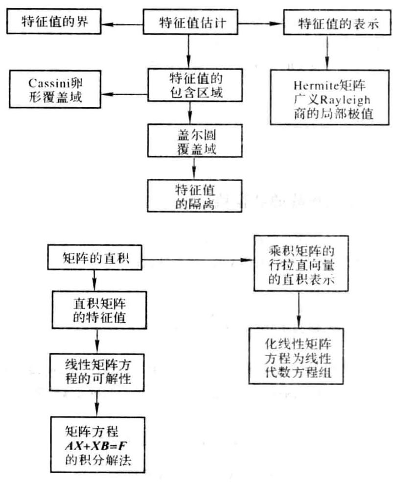

### 5.5 课后习题全解

## 习 题 5.1

1. 设 $\mathbf{A} = {\left( {a}_{ij}\right) }_{n \times  n},{a}_{i} > 0\left( {i = 1,2,\cdots , n}\right)$ ,证明

$$
\mathop{\prod }\limits_{{i = 1}}^{n}\left| {{\lambda }_{i}\left( \mathbf{A}\right) }\right|  \leq  {\left\lbrack  \mathop{\prod }\limits_{{j = 1}}^{n}{\alpha }_{i}^{-2}\left( \mathop{\sum }\limits_{{i = 1}}^{n}{\alpha }_{i}^{2}{\left| {a}_{ij}\right| }^{2}\right) \right\rbrack  }^{1/2}
$$

并讨论在什么条件下等号成立.

证 令 $\mathbf{\Lambda } = \operatorname{diag}\left( {{\alpha }_{1},{\alpha }_{2},\cdots ,{\alpha }_{n}}\right) ,\mathbf{B} = \mathbf{\Lambda }\mathbf{A}{\mathbf{\Lambda }}^{-1} = {\left( {a}_{ij}\frac{{\alpha }_{i}}{{\alpha }_{j}}\right) }_{n \times  n}$ ,根据定理 5.4 可得

$$
\mathop{\prod }\limits_{{j = 1}}^{n}\left| {{\lambda }_{j}\left( \mathbf{A}\right) }\right|  = \mathop{\prod }\limits_{{j = 1}}^{n}\left| {{\lambda }_{j}\left( \mathbf{B}\right) }\right|  \leq  {\left\lbrack  \mathop{\prod }\limits_{{j = 1}}^{n}\left\lbrack  \mathop{\sum }\limits_{{i = 1}}^{n}{\left| {b}_{ij}\right| }^{2}\right\rbrack  \right\rbrack  }^{1/2} = {\left\lbrack  \mathop{\prod }\limits_{{j = 1}}^{n}{\alpha }_{1}^{-2}\left\lbrack  \mathop{\sum }\limits_{{i = 1}}^{n}{\alpha }_{2}^{2}{\left| {a}_{ij}\right| }^{2}\right\rbrack  \right\rbrack  }^{1/2}
$$

划分 $\mathbf{A} = \left( {{\mathbf{a}}_{1},{\mathbf{a}}_{2},\cdots ,{\mathbf{a}}_{n}}\right) ,\mathbf{B} = \left( {{\mathbf{b}}_{1},{\mathbf{b}}_{2},\cdots ,{\mathbf{b}}_{n}}\right)$ ,则有

$$
\text{ 等号成立 } \Leftrightarrow  {\mathbf{b}}_{{j}_{0}} = \mathbf{0}\text{ 或 }\left( {{\mathbf{b}}_{i},{\mathbf{b}}_{j}}\right)  = 0\;\left( {i \neq  j}\right)
$$

由于

$$
{\mathbf{b}}_{{i}_{0}} = \mathbf{0} \Leftrightarrow  {\mathbf{a}}_{{i}_{0}} = \mathbf{0}
$$

$$
\left( {{\mathbf{b}}_{i},{\mathbf{b}}_{j}}\right)  = \left( {\mathbf{\Lambda }\mathbf{a},{\alpha }_{i}^{-1},\mathbf{\Lambda }{\mathbf{a}}_{j}{\alpha }_{j}^{-1}}\right)  = {\left( {\alpha }_{i}{\alpha }_{j}\right) }^{-1}\left( {\mathbf{\Lambda }{\mathbf{a}}_{i},\mathbf{\Lambda }{\mathbf{a}}_{j}}\right)
$$

所以

$$
\text{ 等号成立 } \Leftrightarrow  \text{ 某 }{\mathbf{a}}_{{j}_{0}} = \mathbf{0}\text{ 或 }\left( {\mathbf{\Lambda }{\mathbf{a}}_{i},\mathbf{\Lambda }{\mathbf{a}}_{j}}\right)  = 0\;\left( {i \neq  j}\right)
$$

2. 设 $\mathbf{A} = \left( {a}_{ij}\right)  \in  {\mathbf{C}}^{n \times  n}$ ,证明下面的 Schur 不等式:

(1) $\mathop{\sum }\limits_{{r = 1}}^{n}{\left\lbrack  \operatorname{Re}\left( {\lambda }_{r}\left( \mathbf{A}\right) \right) \right\rbrack  }^{2} \leq  \mathop{\sum }\limits_{{r, s = 1}}^{n}{\left| \frac{{a}_{rs} + {a}_{sr}}{2}\right| }^{2}$ ;

(2) $\mathop{\sum }\limits_{{r = 1}}^{n}{\left\lbrack  \operatorname{Im}\left( {\lambda }_{r}\left( \mathbf{A}\right) \right) \right\rbrack  }^{2} \leq  \mathop{\sum }\limits_{{r, s = 1}}^{n}{\left| \frac{{a}_{rs} - {a}_{sr}}{2}\right| }^{2}$ .

证 存在酉矩阵 $\mathbf{P}$ ,使 $\mathbf{A} = \mathbf{P}\mathbf{T}{\mathbf{P}}^{\mathrm{H}}$ ( $\mathbf{T}$ 为上三角矩阵). 设 $\mathbf{T} = {\left( {t}_{ij}\right) }_{n \times  n}$ ,由 $\frac{\mathbf{A} + {\mathbf{A}}^{\mathrm{H}}}{2} = \mathbf{P}\frac{\mathbf{T} + {\mathbf{T}}^{\mathrm{H}}}{2}{\mathbf{P}}^{\mathrm{H}}$ 可得

$$
\mathop{\sum }\limits_{{i = 1}}^{n}{\left\lbrack  \operatorname{Re}\left( {\lambda }_{i}\left( \mathbf{A}\right) \right) \right\rbrack  }^{2} = \mathop{\sum }\limits_{{i = 1}}^{n}{\left\lbrack  \frac{{\lambda }_{i}\left( \mathbf{A}\right)  + {\overline{\lambda }}_{i}\left( \mathbf{A}\right) }{2}\right\rbrack  }^{2} = \mathop{\sum }\limits_{{i = 1}}^{n}{\left\lbrack  \frac{{t}_{ii} + {\bar{t}}_{ii}}{2}\right\rbrack  }^{2} \leq  \mathop{\sum }\limits_{{i, j = 1}}^{n}{\left| \frac{{t}_{ij} + {\bar{t}}_{ji}}{2}\right| }^{2} =
$$

$$
{\begin{Vmatrix}\frac{1}{2}\left( \mathbf{T} + {\mathbf{T}}^{\mathrm{H}}\right) \end{Vmatrix}}_{\mathrm{F}}^{2} = {\begin{Vmatrix}\frac{1}{2}\left( \mathbf{A} + {\mathbf{A}}^{\mathrm{H}}\right) \end{Vmatrix}}_{\mathrm{F}}^{2} = \mathop{\sum }\limits_{{i, j = 1}}^{n}{\left| \frac{{a}_{ij} + {a}_{ji}}{2}\right| }^{2}
$$

由 $\frac{\mathbf{A} - {\mathbf{A}}^{\mathrm{H}}}{2} = \mathbf{P}\frac{\mathbf{T} - {\mathbf{T}}^{\mathrm{H}}}{2}{\mathbf{P}}^{\mathrm{H}}$ 可得

$$
\mathop{\sum }\limits_{{i = 1}}^{n}{\left\lbrack  \operatorname{Im}\left( {\lambda }_{i}\left( \mathbf{A}\right) \right) \right\rbrack  }^{2} = \mathop{\sum }\limits_{{i = 1}}^{n}{\left\lbrack  \frac{{\lambda }_{i}\left( \mathbf{A}\right)  - {\overline{\lambda }}_{i}\left( \mathbf{A}\right) }{2\mathrm{i}}\right\rbrack  }^{2} = \mathop{\sum }\limits_{{i = 1}}^{n}{\left\lbrack  \frac{{t}_{ii} - {\bar{t}}_{ii}}{2\mathrm{i}}\right\rbrack  }^{2} \leq  \mathop{\sum }\limits_{{i, j = 1}}^{n}{\left| \frac{{t}_{ij} - {\bar{t}}_{ji}}{2}\right| }^{2} =
$$

$$
{\begin{Vmatrix}\frac{1}{2}\left( \mathbf{T} - {\mathbf{T}}^{\mathrm{H}}\right) \end{Vmatrix}}_{\mathrm{F}}^{2} = {\begin{Vmatrix}\frac{1}{2}\left( \mathbf{A} - {\mathbf{A}}^{\mathrm{H}}\right) \end{Vmatrix}}_{\mathrm{F}}^{2} = \mathop{\sum }\limits_{{i, j = 1}}^{n}{\left| \frac{{a}_{ij} - {\bar{a}}_{ji}}{2}\right| }^{2}
$$

3. 应用 Gerschgorin 定理隔离矩阵

$$
\mathbf{A} = \left\lbrack  \begin{matrix} {20} & 3 & 1 \\  2 & {10} & 2 \\  8 & 1 & 0 \end{matrix}\right\rbrack
$$

的特征值, 再应用实矩阵特征值的性质改进得出的结果.

解 $\mathbf{A}$ 的 3 个盖尔圆为

$$
{G}_{1} : \left| {z - {20}}\right|  \leq  4;\;{G}_{2} : \left| {z - {10}}\right|  \leq  4;\;{G}_{3} : \left| z\right|  \leq  9
$$

易见 ${G}_{2}$ 与 ${G}_{3}$ 相交,而 ${G}_{1}$ 孤立. 欲使 ${G}_{3}$ 的半径小一些,取对角矩阵 $\mathbf{D} = \operatorname{diag}\left( {1,1,\frac{1}{2}}\right)$ ,计算

$$
\mathbf{B} = {\mathbf{{DAD}}}^{-1} = \left\lbrack  \begin{matrix} {20} & 3 & 2 \\  2 & {10} & 4 \\  4 & {0.5} & 0 \end{matrix}\right\rbrack
$$

$\mathbf{B}$ 的前两个盖尔圆相交,但 ${\mathbf{B}}^{\mathrm{T}}$ 的 3 个盖尔圆为

$$
{G}_{1}^{\prime } : \left| {z - {20}}\right|  \leq  6;\;{G}_{2}^{\prime } : \left| {z - {10}}\right|  \leq  {3.5};\;{G}_{3}^{\prime } : \left| z\right|  \leq  6
$$

易见 ${G}_{1}^{\prime },{G}_{2}^{\prime }$ 及 ${G}_{3}^{\prime }$ 都孤立,其中各含 ${\mathbf{B}}^{\mathrm{T}}$ 的一个特征值 ${\lambda }_{1},{\lambda }_{2}$ 及 ${\lambda }_{3}$ ,它们也是 $\mathbf{B}$ 的特征值,从而是 $\mathbf{A}$ 的特征值.

由于 ${G}_{1} \subset  {G}_{1}^{\prime }$ 且 ${G}_{1}$ 中也含 $\mathbf{A}$ 的一个特征值,所以 ${\lambda }_{1} \in  {G}_{1}$ ,而 ${\lambda }_{2} \in  {G}_{2}^{\prime },{\lambda }_{3} \in  {G}_{3}^{\prime }$ . 注意到盖尔圆 ${G}_{1},{G}_{2}^{\prime }$ 及

${G}_{1}^{\prime }$ 关于实轴对称,利用实矩阵的复特征值一定成对共轭出现的性质可得

$$
{\lambda }_{1} \in  \left\lbrack  {16.24}\right\rbrack  ,\;{\lambda }_{2} \in  \left\lbrack  {{6.5},{13.5}}\right\rbrack  ,\;{\lambda }_{3} \in  \left\lbrack  {-{6.6}}\right\rbrack
$$

4. 证明矩阵

$$
\mathbf{A} = \left\lbrack  \begin{matrix} 2 & \frac{2}{n} & \frac{1}{n} & \cdots & \frac{1}{n} \\  \frac{1}{n} & 4 & \frac{1}{n} & \cdots & \frac{1}{n} \\  \vdots & \vdots & \vdots & & \vdots \\  \frac{1}{n} & \frac{1}{n} & \frac{1}{n} & \cdots & {2n} \end{matrix}\right\rbrack
$$

能够相似于对角矩阵,且 $\mathbf{A}$ 的特征值都是实数.

证 $\mathbf{A}$ 的 $n$ 个盖尔圆为

$$
{G}_{i} : \left| {z - 2}\right|  \leq  1;\;{G}_{i} : \left| {z - {2i}}\right|  \leq  \frac{n - 1}{n}\;\left( {i = 2,3,\cdots , n}\right)
$$

它们都是孤立的,所以 $\mathbf{A}$ 有 $n$ 个不同的特征值,从而 $\mathbf{A}$ 相似于对角矩阵. 因为 ${G}_{i}\left( {i = 1,2,\cdots , n}\right)$ 关于实轴对称. 且 $\mathbf{A}$ 是实矩阵,所以 ${G}_{i}$ 中的特征值只能是实数.

5. 设 $\mathbf{A} \in  {\mathbf{R}}^{n \times  n}$ ,如果 $\mathbf{A}$ 的 $n$ 个盖尔圆互不相交,则 $\lambda \left( \mathbf{A}\right)$ 是实数.

证 $\mathbf{A}$ 是实矩阵,它的盖尔圆关于实轴对称,且每个盖尔圆中只有 $\mathbf{A}$ 的一个特征值,所以 $\lambda \left( \mathbf{A}\right)$ 是实数 (因为复特征值一定成对共轭出现).

6. 设 $\mathbf{A} \in  {\mathbf{C}}^{n \times  n}$ 严格对角占优 (或弱对角占优且不可约),其对角线元素均为正数,则 $\operatorname{Re}\left( {\lambda \left( \mathbf{A}\right) }\right)  > 0$ .

证 在已知条件下 ${R}_{k} \leq  {a}_{kk}$ ,且特征值 $\lambda  \neq  0$ . 由 ${a}_{kk} > 0$ 知盖尔圆 ${G}_{k}$ 关于实轴对称,且位于右半平面 (有可能与虚轴相切于坐标原点),再由 $0 \neq  \lambda  \in  \mathop{\bigcup }\limits_{{k = 1}}^{n}{G}_{k}$ 可得 $\operatorname{Re}\left( {\lambda \left( \mathbf{A}\right) }\right)  > 0$ .

7. 设 $\mathbf{A} \Rightarrow  \left( {a}_{ij}\right)  \in  {\mathbf{C}}^{n \times  n}$ .

(1) 若 ${a}_{n}\left( {i = 1,2,\cdots , n}\right)$ 是实数,则 $\left| {\operatorname{Im}\left( {\lambda \left( \mathbf{A}\right) }\right) }\right|  \leq  \mathop{\max }\limits_{i}\mathop{\sum }\limits_{{j = i}}\left| {a}_{ij}\right|$ ;

(2)若 ${a}_{ii}\left( {i = 1,2,\cdots , n}\right)$ 是纯虚数，则 $\left| {\operatorname{Re}\left( {\lambda \left( \mathbf{A}\right) }\right) }\right|  \leq  \mathop{\max }\limits_{i}\mathop{\sum }\limits_{{j \neq  i}}\left| {a}_{ij}\right|$ .

证 (1) 当 ${a}_{ii}$ 是实数时,有

$$
{\left| \operatorname{Im}\left( \lambda \right) \right| }^{2} \leq  {\left| \operatorname{Im}\left( \lambda \right) \right| }^{2} + {\left\lbrack  \operatorname{Re}\left( \lambda \right)  - {a}_{kk}\right\rbrack  }^{2} = {\left| \lambda  - {a}_{kk}\right| }^{2} \leq  {R}_{k}^{2} \leq  {\left\lbrack  \max \left( {R}_{i}\right) \right\rbrack  }^{2}
$$

(2)当 ${a}_{n}$ 是纯虚数时，有

$$
{\left| \operatorname{Re}\left( \lambda \right) \right| }^{2} \leq  {\left| \operatorname{Re}\left( \lambda \right) \right| }^{2} + {\left| \mathrm{i}\operatorname{Im}\left( \lambda \right)  - {a}_{kk}\right| }^{2} = {\left| \lambda  - {a}_{kk}\right| }^{2} \leq  {R}_{k}^{2} \leq  {\left\lbrack  \max \left( {R}_{i}\right) \right\rbrack  }^{2}
$$

8. 证明

(1) $\mathbf{A} = \left\lbrack  \begin{array}{llll} 1/4 & 1/4 & 1/4 & 1/4 \\  1/5 & 2/5 & 1/5 & 1/5 \\  1/6 & 1/6 & 3/6 & 1/6 \\  1/7 & 1/7 & 1/7 & 3/7 \end{array}\right\rbrack$ 的谱半径 $\rho \left( \mathbf{A}\right)  < 1$ ;

(2)将(1)中矩阵 $\mathbf{A}$ 的元素“ ${a}_{44}$ ” 改作“ $4/7$ ”，则 $\rho \left( \mathbf{A}\right)  < 1$ .

证 (1) 因为 $\mathbf{A}$ 不可约,且 $\mathop{\sum }\limits_{{j = 1}}^{4}\left| {a}_{4j}\right|  = \frac{6}{7} < 1 = \parallel \mathbf{A}{\parallel }_{\infty }$ ,所以由定理 5.9 可得 $\rho \left( \mathbf{A}\right)  < 1$ .

(2)因为 $\rho \left( \mathbf{A}\right)  \leq  \parallel \mathbf{A}\parallel  = 1$ ，且 $\det \left( {1\mathbf{I} - \mathbf{A}}\right)  = 0$ ，所以 $\rho \left( \mathbf{A}\right)  = 1$ .

9. 在盖尔圆定理中, 如果一个连通部分是由两个盖尔圆构成的, 那么:

(1)何时每个盖尔圆上可能都有两个特征值?

(2) 何时每个盖尔圆上不可能都有两个特征值?

解(1)二盖尔圆相交, 特征值位于交集中.

(2)二盖尔圆外切,切点是单特征值.

10. 应用()strowski 定理(或推论)，证明矩阵 $\mathbf{A} = \left\lbrack  \begin{array}{llll} 6 & 5 & 1 & 2 \\  1 & 7 & 0 & 2 \\  0 & 4 & 7 & 5 \\  2 & 0 & 1 & 5 \end{array}\right\rbrack$ 的谱半径 $\rho \left( \mathbf{A}\right)  < {13}$ .

证 ${\rho }_{1}\left( \mathbf{A}\right) {\rho }_{1}\left( {\mathbf{A}}^{\top }\right)  = {14} \times  9 = {126},{\rho }_{2}\left( \mathbf{A}\right) {\rho }_{2}\left( {\mathbf{A}}^{\top }\right)  = {10} \times  {16} = {160}$

$$
{\rho }_{3}\left( \mathbf{A}\right) {\rho }_{3}\left( {\mathbf{A}}^{\top }\right)  = {16} \times  9 = {144},\;{\rho }_{4}\left( \mathbf{A}\right) {\rho }_{4}\left( {\mathbf{A}}^{\top }\right)  = 8 \times  {14} = {112}
$$

根据定理 5.11 的推论 5 可得

$$
\rho \left( \mathbf{A}\right)  \leq  \mathop{\max }\limits_{i}{\left\lbrack  {\rho }_{i}\left( \mathbf{A}\right) {\rho }_{i}\left( {\mathbf{A}}^{\top }\right) \right\rbrack  }^{\frac{1}{2}} = \sqrt{160} < {13}
$$

习 题 5.2

1. 设 ${\lambda }_{1},{\lambda }_{2},\cdots ,{\lambda }_{n}$ 为实对称矩阵 $\mathbf{A}$ 相对于正定矩阵 $\mathbf{B}$ 的特征值,相应的特征向量 ${\mathbf{x}}_{1},{\mathbf{x}}_{2},\cdots ,{\mathbf{x}}_{n}$ 为按 $\mathbf{B}$ 标准正交的向量系. 令 $\mathbf{Q} = \left( {{\mathbf{x}}_{1},{\mathbf{x}}_{2},\cdots ,{\mathbf{x}}_{n}}\right)$ ,试证 ${\mathbf{Q}}^{\mathrm{T}}\mathbf{A}\mathbf{Q} = \mathbf{\Lambda },{\mathbf{Q}}^{\mathrm{T}}\mathbf{B}\mathbf{Q} = \mathbf{I}$ ,其中 $\mathbf{\Lambda } = \operatorname{diag}\left( {{\lambda }_{1},{\lambda }_{2},\cdots ,{\lambda }_{n}}\right)$ .

证 由 ${\mathbf{x}}_{1},{\mathbf{x}}_{2},\cdots ,{\mathbf{x}}_{n}$ 按 $\mathbf{B}$ 标准正交可得 ${\mathbf{Q}}^{\mathrm{T}}\mathbf{B}\mathbf{Q} = \mathbf{I}$ . 再由 $\mathbf{A}{\mathbf{x}}_{i} = {\lambda }_{i}\mathbf{B}{\mathbf{x}}_{i}$ 知 $\mathbf{A}\mathbf{Q} = \mathbf{B}\mathbf{Q}\mathbf{\Lambda }$ ,故 ${\mathbf{Q}}^{\mathrm{T}}\mathbf{A}\mathbf{Q} = \mathbf{\Lambda }$ .

2. 已知 $\mathbf{A} = \left\lbrack  \begin{array}{rrr} 1 &  - 1 & 1 \\   - 1 & 2 & 0 \\  1 & 0 & 3 \end{array}\right\rbrack  ,\mathbf{B} = \left\lbrack  \begin{array}{rrr} 5 & 2 &  - 4 \\  2 & 1 &  - 2 \\   - 4 &  - 2 & 5 \end{array}\right\rbrack$ ,试用两种方法求解广义特征值问题 $\mathbf{A}\mathbf{x} = \lambda \mathbf{B}x$ (转化成普通的特征值问题即可).

解 $\left( 1\right) {\mathbf{B}}^{-1}\mathbf{A}\mathbf{x} = \lambda \mathbf{x} : {\mathbf{B}}^{-1}\mathbf{A} = \left\lbrack  \begin{array}{rrr} 3 &  - 5 & 1 \\   - 9 & {20} & 4 \\   - 1 & 4 & 3 \end{array}\right\rbrack$

(2) $\mathbf{S}\mathbf{y} = \lambda \mathbf{y},\mathbf{x} = {\left( {\mathbf{G}}^{-1}\right) }^{\mathrm{T}}\mathbf{y};\;\mathbf{G} = \frac{1}{\sqrt{5}}\left\lbrack  \begin{array}{rrr} 5 & & \\  2 & 1 & \\   - 4 &  - 2 & \sqrt{5} \end{array}\right\rbrack  ,\;\mathbf{S} = \left( {\mathbf{G}}^{-1}\right) \mathbf{A}{\left( {\mathbf{G}}^{-1}\right) }^{\mathrm{T}}$

## 习 题 5.3

1. 设实对称矩阵 $\mathbf{A}$ 和 $\mathbf{B}$ 的特征值分别是

$$
{\lambda }_{1} \leq  {\lambda }_{2} \leq  \cdots  \leq  {\lambda }_{n},\;{\mu }_{1} \leq  {\mu }_{2} \leq  \cdots  \leq  {\mu }_{n}
$$

如果对于任何单位向量 $\mathbf{x}$ ,恒有

$$
\left| {{\mathbf{x}}^{\mathrm{T}}\left( {\mathbf{B} - \mathbf{A}}\right) \mathbf{x}}\right|  \leq  \varepsilon \;\left( {\varepsilon  > 0}\right)
$$

证明 $\left| {{\mu }_{k} - {\lambda }_{k}}\right|  \leq  \varepsilon \;\left( {k = 1,2,\cdots , n}\right)$ .

证 设 $\mathbf{A}$ 的属于 ${\lambda }_{1},{\lambda }_{2},\cdots ,{\lambda }_{n}$ 的标准正交特征向量系为 ${\mathbf{x}}_{1},{\mathbf{x}}_{2},\cdots ,{\mathbf{x}}_{n},\mathbf{B}$ 的属于 ${\mu }_{1},{\mu }_{2},\cdots ,{\mu }_{n}$ 的标准正交特征向量系为 ${\mathbf{y}}_{1},{\mathbf{y}}_{2},\cdots ,{\mathbf{y}}_{n}$ ,记 ${V}_{k}^{0}\left( \mathbf{x}\right)  = L\left( {{\mathbf{x}}_{1},{\mathbf{x}}_{2},\cdots ,{\mathbf{x}}_{k}}\right) ,{V}_{k}^{0}\left( \mathbf{y}\right)  = L\left( {{\mathbf{y}}_{1},{\mathbf{y}}_{2},\cdots ,{\mathbf{y}}_{k}}\right)$ ,于是有

$$
{\lambda }_{k} = \mathop{\min }\limits_{{V}_{k}}\max \left\{  {{\mathbf{x}}^{\mathrm{T}}\mathbf{A}\mathbf{x} \mid  \mathbf{x} \in  {V}_{k},\parallel \mathbf{x}{\parallel }_{2} = 1}\right\}   \leq
$$

$$
\max \left\{  {{\mathbf{x}}^{\mathrm{T}}\mathbf{A}\mathbf{x} \mid  \mathbf{x} \in  {V}_{k}^{0}\left( \mathbf{y}\right) ,\parallel \mathbf{x}{\parallel }_{2} = 1}\right\}   \leq  \max \left\{  {{\mathbf{x}}^{\mathrm{T}}\mathbf{B}\mathbf{x} + \varepsilon  \mid  \mathbf{x} \in  {V}_{k}^{0}\left( \mathbf{y}\right) ,\parallel \mathbf{x}{\parallel }_{2} = 1}\right\}   =
$$

$$
\max \left\{  {{\mathbf{x}}^{\mathrm{T}}\mathbf{B}\mathbf{x} \mid  \mathbf{x} \in  {V}_{k}^{0}\left( \mathbf{y}\right) ,\parallel \mathbf{x}{\parallel }_{2} = 1}\right\}   + \varepsilon  = {\mu }_{k} + \varepsilon \;\left( {k = 1,2,\cdots , n}\right)
$$

同理可得 ${\mu }_{k} \leq  {\lambda }_{k} + \varepsilon \;\left( {k = 1,2,\cdots , n}\right)$ . 因此 $\left| {{\mu }_{k} - {\lambda }_{k}}\right|  \leq  \varepsilon$ .

2. (Weyl 定理) 设实对称矩阵 $\mathbf{A},\mathbf{A} + \mathbf{Q}$ 和 $\mathbf{Q}$ 的特征值分别是 ${\lambda }_{1} \leq  {\lambda }_{2} \leq  \cdots  \leq  {\lambda }_{n},{\mu }_{1} \leq  {\mu }_{2} \leq  \cdots  \leq  {\mu }_{n}$ 和 ${\gamma }_{1} \leq  {\gamma }_{2} \leq  \cdots  \leq  {\gamma }_{n}$ ,证明 ${\lambda }_{i} + {\gamma }_{1} \leq  {\mu }_{i} \leq  {\lambda }_{i} + {\gamma }_{n}\left( {i = 1,2,\cdots , n}\right)$ .

证 设 $\mathbf{A}$ 的属于 ${\lambda }_{1},\cdots ,{\lambda }_{n}$ 的标准正交特征向量系为 ${x}_{1},\cdots ,{x}_{n},\mathbf{A} + \mathbf{Q}$ 的属于 ${\mu }_{1},\cdots ,{\mu }_{n}$ 的标准正交特征量系为 ${\mathbf{y}}_{1},\cdots ,{\mathbf{y}}_{n},{V}_{k}^{0}\left( \mathbf{x}\right)  = L\left( {{\mathbf{x}}_{1},{\mathbf{x}}_{2},\cdots ,{\mathbf{x}}_{k}}\right) ,{V}_{k}^{0}\left( \mathbf{y}\right)  = L\left( {{\mathbf{y}}_{1},{\mathbf{y}}_{2},\cdots ,{\mathbf{y}}_{k}}\right)$ ,于是有

$$
{\mu }_{k} = \mathop{\min }\limits_{{V}_{k}}\max \left\{  {{\mathbf{x}}^{\mathrm{T}}\left( {\mathbf{A} + \mathbf{Q}}\right) \mathbf{x} \mid  \mathbf{x} \in  {V}_{k},\parallel \mathbf{x}{\parallel }_{2} = 1}\right\}   \leq
$$

$$
\mathop{\min }\limits_{{V}_{k}}\left\lbrack  {\max \left\{  {{\mathbf{x}}^{\mathrm{T}}\mathbf{A}\mathbf{x} \mid  \mathbf{x} \in  {V}_{k},\parallel \mathbf{x}{\parallel }_{2} = 1}\right\}   + \max \left\{  {{\mathbf{x}}^{\mathrm{T}}\mathbf{Q}\mathbf{x} \mid  \mathbf{x} \in  {V}_{k},\parallel \mathbf{x}{\parallel }_{2} = 1}\right\}  }\right\rbrack   \leq
$$

$$
\max \left\{  {{\mathbf{x}}^{\mathrm{T}}\mathbf{A}\mathbf{x} \mid  \mathbf{x} \in  {V}_{k}^{0}\left( \mathbf{x}\right) ,\parallel \mathbf{x}{\parallel }_{2} = 1}\right\}   + {\gamma }_{n} = {\lambda }_{k} + {\gamma }_{n}\;\left( {k = 1,2,\cdots , n}\right)
$$

$$
{\lambda }_{k} = \mathop{\min }\limits_{{V}_{k}}\max \left\{  {{\mathbf{x}}^{\mathrm{T}}\mathbf{A}\mathbf{x} \mid  \mathbf{x} \in  {V}_{k},\parallel \mathbf{x}{\parallel }_{2} = 1}\right\}   =
$$

$$
\mathop{\min }\limits_{{V}_{k}}\max \left\{  {{\mathbf{x}}^{\mathrm{T}}\left( {\mathbf{A} + \mathbf{Q}}\right) \mathbf{x} + {\mathbf{x}}^{\mathrm{T}}\left( {-\mathbf{Q}}\right) \mathbf{x} \mid  \mathbf{x} \in  {V}_{k},\parallel \mathbf{x}{\parallel }_{2} = 1}\right\}   \leq
$$

$$
\mathop{\min }\limits_{{V}_{k}}\left\lbrack  {\max \left\{  {{\mathbf{x}}^{\top }\left( {\mathbf{A} + \mathbf{Q}}\right) \mathbf{x} \mid  \mathbf{x} \in  {V}_{k},\parallel \mathbf{x}{\parallel }_{2} = 1}\right\}   + \max \left\{  {{\mathbf{x}}^{\top }\left( {-\mathbf{Q}}\right) \mathbf{x} \mid  \mathbf{x} \in  {V}_{k},\parallel \mathbf{x}{\parallel }_{2} = 1}\right\}  }\right\rbrack   \leq
$$

$$
\max \left\{  {{\mathbf{x}}^{\mathrm{T}}\left( {\mathbf{A} + \mathbf{Q}}\right) \mathbf{x} \mid  \mathbf{x} \in  {V}_{k}^{0}\left( \mathbf{y}\right) ,\parallel \mathbf{x}{\parallel }_{2} = 1}\right\}   + \left( {-{\gamma }_{1}}\right)  = {\mu }_{k} - {\gamma }_{1}\;\left( {k = 1,2,\cdots , n}\right)
$$

因此 ${\lambda }_{k} + {\gamma }_{1} \leq  {\mu }_{k} \leq  {\lambda }_{k} + {\gamma }_{n}$ .

3. 在第 2 题的条件下,再设 $Q$ 正定,证明 ${\mu }_{i} > \lambda ,\;\left( {i = 1,2,\cdots , n}\right)$ .

证 由 $Q$ 正定知 ${\gamma }_{1} > 0$ ,根据第 2 题的结论即得所求.

## 习 题 5.4

1. 设 ${\mathbf{A}}^{2} = \mathbf{A},{\mathbf{B}}^{2} = \mathbf{B}$ ,证明 ${\left( \mathbf{A} \otimes  \mathbf{B}\right) }^{2} = \mathbf{A} \otimes  \mathbf{B}$ .

证 根据性质 (4) 可得

$$
{\left( \mathbf{A} \otimes  \mathbf{B}\right) }^{2} = \left( {\mathbf{A} \otimes  \mathbf{B}}\right) \left( {\mathbf{A} \otimes  \mathbf{B}}\right)  = \left( \mathbf{{AA}}\right)  \otimes  \left( \mathbf{{BB}}\right)  = \mathbf{A} \otimes  \mathbf{B}
$$

2. 设 $\mathbf{A}$ 和 $\mathbf{B}$ 都是 (半) 正定矩阵,证明 $\mathbf{A} \otimes  \mathbf{B}$ 也是 (半) 正定矩阵.

证 ${\left( \mathbf{A} \otimes  \mathbf{B}\right) }^{\mathrm{H}} = {\mathbf{A}}^{\mathrm{H}} \otimes  {\mathbf{B}}^{\mathrm{H}} = \mathbf{A} \otimes  \mathbf{B}$ ,所以 $\mathbf{A} \otimes  \mathbf{B}$ 是 Hermite 矩阵. 又 $\lambda \left( {\mathbf{A} \otimes  \mathbf{B}}\right)  = \lambda \left( \mathbf{A}\right) \lambda \left( \mathbf{B}\right)  > \left(  \geq  \right) 0$ , 故 $\mathbf{A} \otimes  \mathbf{B}$ (半) 正定.

3. 设 $\mathbf{A} \in  {\mathbf{C}}^{m \times  m},\mathbf{B} \in  {\mathbf{C}}^{n \times  n}$ . 它们的特征向量分别为 $\mathbf{\xi }$ 和 $\mathbf{\eta }$ . 证明 $\mathbf{\xi } \otimes  \mathbf{\eta }$ 是 $\mathbf{A} \otimes  \mathbf{B}$ 的特征向量.

证 $\mathbf{A}\mathbf{\xi } = \lambda \mathbf{\xi },\mathbf{B}\mathbf{\eta } = \mu \mathbf{\eta }$ . 则有

$$
\left( {\mathbf{A} \otimes  \mathbf{B}}\right) \left( {\mathbf{\xi } \otimes  \mathbf{\eta }}\right)  = \left( {\mathbf{A}\mathbf{\xi }}\right)  \otimes  \left( {\mathbf{B}\mathbf{\eta }}\right)  = \left( {\lambda \mathbf{\xi }}\right)  \otimes  \left( {\mu \mathbf{\eta }}\right)  = \left( {\lambda \mu }\right) \left( {\mathbf{\xi } \otimes  \mathbf{\eta }}\right)
$$

4. 设 $\mathbf{A} \in  {\mathbf{C}}^{m \times  m}$ 的特征值为 ${\lambda }_{1},\cdots ,{\lambda }_{m}$ ,证明 $\mathbf{B} = \left( {{\mathbf{u}}_{n}{\mathbf{u}}_{n}^{\mathrm{T}}}\right)  \otimes  \mathbf{A}$ 的特征值是 $n{\lambda }_{1},\cdots , n{\lambda }_{m}$ 和 $m\left( {n - 1}\right)$ 重零. 这里 ${\mathbf{u}}_{n} = {\left( 1,\cdots ,1\right) }^{\top } \in  {\mathbf{R}}^{n}$ .

证 因为 $\operatorname{rank}\left( {{\mathbf{u}}_{n}{\mathbf{u}}_{n}^{\top }}\right)  = 1$ ,所以 ${\mathbf{u}}_{n}{\mathbf{u}}_{n}^{\top }$ 仅有一个非零特征值. 容易求出 ${\mathbf{u}}_{n}{\mathbf{u}}_{n}^{\top }$ 的非零特征值 ${\mu }_{1} = n$ ,而 ${\mu }_{2} = \cdots  = {\mu }_{n} = 0$ ,故 $\mathbf{B}$ 的特征值集合为

$$
\left\{  {{\lambda }_{i}{\mu }_{j} \mid  i = 1,2,\cdots , m;\;j = 1,2,\cdots , n}\right\}
$$

也就是 $n{\lambda }_{1},\cdots , n{\lambda }_{m}$ 和 $m\left( {n - 1}\right)$ 重零.

5. 证明: 两个反 Hermite 矩阵的直积是 Hermite 矩阵.

证 设 $\mathbf{A}$ 和 $\mathbf{B}$ 都是反 Hermite 矩阵,即 ${\mathbf{A}}^{\mathrm{H}} =  - \mathbf{A},{\mathbf{B}}^{\mathrm{H}} =  - \mathbf{B}$ ,根据性质 (7) 可得

$$
{\left( \mathbf{A} \otimes  \mathbf{B}\right) }^{\mathrm{H}} = {\mathbf{A}}^{\mathrm{H}} \otimes  {\mathbf{B}}^{\mathrm{H}} = \left( {-\mathbf{A}}\right)  \otimes  \left( {-\mathbf{B}}\right)  = \mathbf{A} \otimes  \mathbf{B}
$$

即 $\mathbf{A} \otimes  \mathbf{B}$ 是 Hermite 矩阵.

6. $\mathbf{A} \in  {\mathbf{C}}^{m \times  m},\mathbf{B} \in  {\mathbf{C}}^{n \times  n}$ 都是半正定矩阵. 证明矩阵方程 $\mathop{\sum }\limits_{{k = 0}}^{l}{\mathbf{A}}^{k}\mathbf{X}{\mathbf{B}}^{k} = \mathbf{F}$ 存在唯一解.

证 设 $\mathbf{A}$ 和 $\mathbf{B}$ 的特征值分别为 ${\lambda }_{1},{\lambda }_{2},\cdots ,{\lambda }_{m}$ 和 ${\mu }_{1},{\mu }_{2},\cdots ,{\mu }_{n}$ ,由于 ${\lambda }_{i}{\mu }_{j} \geq  0$ ,所以 $1 + \left( {{\lambda }_{i}{\mu }_{j}}\right)  + \cdots  + \; {\left( {\lambda }_{i}{\mu }_{j}\right) }^{t} > 0$ . 根据定理 5.30 即得所求.

7. 设 $\mathbf{A} \in  {\mathbf{C}}^{m \times  m},\mathbf{B} \in  {\mathbf{C}}^{n \times  n}$ 的特征值都是实数,证明矩阵方程 $\mathbf{X} + \mathbf{A}\mathbf{{XB}} + {\mathbf{A}}^{2}\mathbf{X}{\mathbf{B}}^{2} = \mathbf{F}$ 存在唯一解.

证 设 $\mathbf{A}$ 和 $\mathbf{B}$ 的特征值分别为 ${\lambda }_{1},{\lambda }_{2},\cdots ,{\lambda }_{m}$ 和 ${\mu }_{1},{\mu }_{2},\cdots ,{\mu }_{n}$ ,由 ${\lambda }_{i} \in  \mathbf{R},{\mu }_{j} \in  \mathbf{R}$ 知 ${\lambda }_{i}{\mu }_{j} \in  \mathbf{R}$ . 对于任意实数 $t$ ,恒有 $1 + t + {t}^{2} = {\left( t + \frac{1}{2}\right) }^{2} + \frac{3}{4} > 0$ ,所以 $1 + \left( {{\lambda }_{i}{\mu }_{j}}\right)  + {\left( {\lambda }_{i}{\mu }_{j}\right) }^{2} > 0$ . 根据定理 5.30 即得所求.

8. 使用矩阵函数方法求解矩阵方程 $\mathbf{A}\mathbf{X} + \mathbf{X}\mathbf{A} = \mathbf{I}$ . 其中

$$
\mathbf{A} = \left\lbrack  \begin{array}{rrr}  - 1 & 0 & 0 \\  0 &  - 1 & 0 \\   - 1 & 2 &  - 2 \end{array}\right\rbrack
$$

解 $\mathbf{A}$ 的特征值为 $- 1, - 1, - 2$ ,根据定理 5.31 的推论 1 知,该矩阵方程有唯一解

$$
\mathbf{X} =  - {\int }_{0}^{+\infty }{\mathrm{e}}^{At}\mathbf{I}{\mathrm{e}}^{At}\mathrm{\;d}t =  - {\int }_{0}^{+\infty }{\mathrm{e}}^{A\left( {2t}\right) }\mathrm{d}t
$$

对 $\mathbf{A}$ 求得

$$
\mathbf{P} = \left\lbrack  \begin{array}{lll} 1 & & \\  2 & 1 & \\  3 & 2 & 1 \end{array}\right\rbrack  ,\;{\mathbf{P}}^{-1} = \left\lbrack  \begin{matrix} 1 & & \\   - 2 & 1 & \\  1 &  - 2 & 1 \end{matrix}\right\rbrack  ,\;{\mathbf{P}}^{-1}\mathbf{{AP}} = \left\lbrack  \begin{array}{lll}  - 1 & & \\   &  - 1 & \\   & &  - 2 \end{array}\right\rbrack
$$

于是

$$
{\mathrm{e}}^{\mathbf{A}\left( {2t}\right) } = \mathbf{P}\left\lbrack  \begin{array}{llll} {\mathrm{e}}^{-{2t}} & & & \\   & {\mathrm{e}}^{-{2t}} & & \\   & & {\mathrm{e}}^{-{4t}} & \\   & & & {\mathrm{e}}^{-{4t}} \end{array}\right\rbrack  {\mathbf{P}}^{-1} = \left\lbrack  \begin{matrix} {\mathrm{e}}^{-{2t}} & & & \\  0 & {\mathrm{e}}^{-{2t}} & & \\  {\mathrm{e}}^{-{4t}} &  - {\mathrm{e}}^{-{2t}} & 2{\mathrm{e}}^{-{4t}} & {\mathrm{e}}^{-{4t}} \end{matrix}\right\rbrack
$$

$$
\mathbf{X} =  - \frac{1}{4}\left\lbrack  \begin{matrix} 2 & & \\  0 & 2 & \\   - 1 & 2 & 1 \end{matrix}\right\rbrack
$$

### 5.6 学习效果测试题及答案

## (一) 测 试 题

1. 应用盖尔圆定理证明

$$
\mathbf{A} = \left\lbrack  \begin{array}{rrrr} 9 & 1 &  - 2 & 1 \\  0 & 8 & 1 & 1 \\   - 1 & 0 & 4 & 0 \\  1 & 0 & 0 & 1 \end{array}\right\rbrack
$$

至少有两个实特征值.

2. 应用盖尔圆定理证明

$$
\mathbf{A} = \left\lbrack  \begin{matrix} 1 & \frac{1}{3} & \frac{1}{{3}^{2}} & \cdots & \frac{1}{{3}^{n - 1}} \\   - \frac{1}{3} & 2 & \frac{1}{{3}^{2}} & \cdots & \frac{1}{{3}^{n - 1}} \\   - \frac{1}{3} &  - \frac{1}{{3}^{2}} & 3 & \cdots & \frac{1}{{3}^{n - 1}} \\  \vdots & \vdots & \vdots & & \vdots \\   - \frac{1}{3} &  - \frac{1}{{3}^{2}} &  - \frac{1}{{3}^{2}} & \cdots & n \end{matrix}\right\rbrack
$$

相似于对角矩阵,且 $\mathbf{A}$ 的特征值都是实数.

3. 设 $\mathbf{A} = {\left( {a}_{ij}\right) }_{n \times  n}\left( {n > 1}\right)$ 按列严格对角占优,且 ${a}_{ii} < 0\left( {i = 1,2,\cdots , n}\right)$ ,证明: $\mathbf{A}$ 的特征值的实部小于零.

4. 应用 Ostrowski 定理证明 $\mathbf{A} = \left\lbrack  \begin{array}{rrr} {20} & {11} & {10} \\   - 8 & {30} & {20} \\  {13} & {15} & {30} \end{array}\right\rbrack$ 可逆.

5. 应用盖尔圆定理隔离 $\mathbf{A} = \left\lbrack  \begin{array}{rrr} 2 & 2 &  - 1 \\  1 & {10} &  - 1 \\  8 & 2 & {20} \end{array}\right\rbrack$ 的特征值,并根据实矩阵的性质改进所得结果.

6. 应用盖尔圆定理隔离 $\mathbf{A} = \left\lbrack  \begin{matrix} 3\mathrm{i} & 1 & 1 \\  1 & 2 & 1 \\  1 & 1 & 5 + 4\mathrm{i} \end{matrix}\right\rbrack  \;\left( {\mathrm{i} = \sqrt{-1}}\right)$ 的特征值.

7. 设 $\mathbf{A} = \left\lbrack  \begin{array}{ll} 0 & 2 \\  2 & 0 \end{array}\right\rbrack  ,\mathbf{B} = \left\lbrack  \begin{array}{rr} 1 &  - 1 \\   - 1 & 4 \end{array}\right\rbrack$ ,求解广义特征值问题 $\mathbf{A}\mathbf{x} = \lambda \mathbf{B}\mathbf{x}$ .

8. 设 $\mathbf{A},\mathbf{B}$ 及 $\mathbf{F} \in  {\mathbf{C}}^{n \times  n}$ ,且 $\mathbf{A}$ 与 $\mathbf{B}$ 无公共特征值,证明: 矩阵方程 ${\mathbf{A}}^{2}\mathbf{X} + \mathbf{X}{\mathbf{B}}^{2} - 2\mathbf{A}\mathbf{X}\mathbf{B} = \mathbf{F}$ 存在唯一解.

## (二) 测试题答案或提示

1. 孤立盖尔圆 ${G}_{4}$ 中有一个实特征值,连通部分 ${G}_{1} \cup  {G}_{2} \cup  {G}_{3}$ 中至少有一个实特征值.

2. 提示: 盖尔圆的半径 ${R}_{i} = \frac{1}{2}\left\lbrack  {1 - {\left( \frac{1}{3}\right) }^{n - 1}}\right\rbrack   < \frac{1}{2}\left( {i = 1,2,\cdots , n}\right)$ .

3. 对于 $\mathbf{A}$ 的特征值 $\lambda  = a + \mathrm{i}b\left( {a, b \in  \mathbf{R},\mathrm{i} = \sqrt{-1}}\right)$ ,存在列盖尔圆 ${G}_{k}$ ,使得 $\lambda  \in  {G}_{k}$ ,记 ${G}_{k}$ 的半径为 ${r}_{k}$ , 则有

$$
\left| {\lambda  - {a}_{kk}}\right|  \leq  {r}_{k} < \left| {a}_{kk}\right|  =  - {a}_{kk}
$$

$$
a - {a}_{kk} \leq  \left| {a - {a}_{kk}}\right|  \leq  \left| {\left( {a - {a}_{kk}}\right)  + \mathrm{i}b}\right|  = \left| {\lambda  - {a}_{kk}}\right|  <  - {a}_{kk}
$$

故 $a < 0$ .

4. 提示: $\mathbf{A}$ 按行广义严格对角占优.

5. 提示: 取 $\mathbf{D} = \operatorname{diag}\left( {{2.1},1}\right)$ . 讨论 $\mathbf{B} = \mathbf{D}\mathbf{A}{\mathbf{D}}^{-1}$ 即可.

6. 取 $\mathbf{D} = \operatorname{diag}\left( {1,1,\frac{3}{2}}\right)$ ,则 $\mathbf{B} = \mathbf{D}\mathbf{A}{\mathbf{D}}^{-1}$ 的 3 个孤立盖尔圆中各有 $\mathbf{A}$ 的一个特征值.

7. ${\lambda }_{1} = 2,\;x = {k}_{1}\left\lbrack  \begin{array}{l} 2 \\  1 \end{array}\right\rbrack  \left( {{k}_{1} \neq  0}\right) ;\;{\lambda }_{2} =  - \frac{2}{3},\;x = {k}_{2}\left\lbrack  \begin{array}{r} 2 \\   - 1 \end{array}\right\rbrack  \left( {{k}_{2} \neq  0}\right)$ .

8. 原方程等价于 $\left\lbrack  {{\mathbf{A}}^{2} \otimes  \mathbf{I} + \mathbf{I} \otimes  {\left( {\mathbf{B}}^{\top }\right) }^{2} - 2\mathbf{A} \otimes  {\mathbf{B}}^{\top }}\right\rbrack  \overline{\operatorname{vec}}\left( \mathbf{X}\right)  = \overline{\operatorname{vec}}\left( \mathbf{F}\right)$ . 它的系数矩阵的特征值为 ${\lambda }_{i}^{2} + \; {\mu }_{i}^{2} - 2{\lambda }_{i}{\mu }_{i} = {\left( {\lambda }_{i} - {\mu }_{i}\right) }^{2} \neq  0$ ,从而存在唯一解.

## 第 6 章 广义逆矩阵

广义逆矩阵是通常的逆矩阵概念对于不可逆矩阵和长方矩阵的推广. 利用广义逆矩阵的性质, 可以将线性代数方程组的某个解向量 (或最小二乘解向量) 表示为系数矩阵的广义逆矩阵与其右端向量的乘积, 也可以将它的一般解向量明显的表示出来.

由 Penrose 的四个矩阵方程给出的广义逆矩阵分为 15 类,其中常用的广义逆矩阵有 $\{ 1\}$ 一逆, $\{ 1, i\}$ 一逆 $\left( {i = 2,3,4}\right)$ 及 Moore - Penrose 逆. 矩阵的 Moore - Penrose 逆是唯一的,通常利用矩阵的满秩分解或奇异值分解来计算. 矩阵的 $\{ 1\}$ 一逆集合、 $\{ 1,3\}$ 一逆集合及 $\{ 1,4\}$ 一逆集合可以用线性矩阵方程的一般解来表示,而矩阵的 $\{ 1,2\}$ 一逆集合是矩阵 $\{ 1\}$ 一逆集合中与原矩阵有相同秩的 $\{ 1\}$ 一逆的子集.

### 6.1 基本概念

## 1. Penrose 矩阵方程

设 $\mathbf{A} \in  {\mathbf{C}}^{m \times  n},\mathbf{X} \in  {\mathbf{C}}^{n \times  m}$ ,则 Penrose 方程为

(3) ${\left( \mathbf{A}\mathbf{X}\right) }^{\mathrm{H}} = \mathbf{A}\mathbf{X}$ ；

## 2. 常用广义逆矩阵

(1)矩阵 $\mathbf{A}$ 的 $\{ 1\}$ 一逆 ${\mathbf{A}}^{\left( 1\right) }$ : 指 Penrose 方程(1)的解矩阵，全体记作 $A\{ 1\}$ .

(2)矩阵 $\mathbf{A}$ 的 $\{ 1, i\}$ 一逆 ${\mathbf{A}}^{\left( 1, i\right) }$ : 指 Penrose 方程(1)和( $i$ )的解矩阵，全体记作 $A\{ 1, i\} \;\left( {i = 2,3,4}\right)$ .

(3)矩阵 $\mathbf{A}$ 的 Moore-Penrose 逆 ${\mathbf{A}}^{ + }$ : 指 Penrose 方程(1) $\sim$ (4)的解矩阵.

## 3. 极小范数解与极小范数最小二乘解

(1) 线性代数方程组的极小范数解: 方程组 $\mathbf{A}\mathbf{x} = \mathbf{b}$ 有解时,求 ${\mathbf{x}}_{0}$ 使得 ${\begin{Vmatrix}{\mathbf{x}}_{0}\end{Vmatrix}}_{2} = \mathop{\min }\limits_{{\mathbf{A}\mathbf{x} = \mathbf{b}}}\parallel \mathbf{x}{\parallel }_{2}$ .

(2)线性代数方程组的极小范数最小二乘解:方程组 $\mathbf{A}\mathbf{x} = \mathbf{b}$ 无解时,求 ${\mathbf{x}}_{0}$ 使得 ${\begin{Vmatrix}{\mathbf{x}}_{0}\end{Vmatrix}}_{2} = \mathop{\min }\limits_{{\mathop{\min }\limits_{{m\text{ । }}}{\begin{Vmatrix}\mathbf{A}\mathbf{x} - \mathbf{b}\end{Vmatrix}}_{2}}}\parallel \mathbf{x}{\parallel }_{2}$ .

(3)线性矩阵方程的极小范数解:矩阵方程 $\mathbf{A}\mathbf{X}\mathbf{B} = \mathbf{D}$ 有解时，求 ${\mathbf{X}}_{0}$ 使得 ${\begin{Vmatrix}{\mathbf{X}}_{0}\end{Vmatrix}}_{\mathrm{F}} = \mathop{\min }\limits_{{\mathbf{A}\mathbf{X}\mathbf{B} = \mathbf{D}}}\parallel \mathbf{X}{\parallel }_{\mathrm{F}}$ .

(4)线性矩阵方程的极小范数最小二乘解:矩阵方程 $\mathbf{A}\mathbf{X}\mathbf{B} = \mathbf{D}$ 无解时，求 ${\mathbf{X}}_{0}$ 使得 ${\begin{Vmatrix}{\mathbf{X}}_{0}\end{Vmatrix}}_{\mathrm{F}} = \; \mathop{\min }\limits_{{\min \parallel \mathbf{A}\mathbf{X}\mathbf{B} - \mathbf{D}{\parallel }_{\mathrm{F}}}}\parallel \mathbf{X}{\parallel }_{\mathrm{F}}.$

## 4. 投影变换与投影矩阵

(1) 投影变换 设向量空间 ${\mathbf{C}}^{n}$ 的直和分解为 ${\mathbf{C}}^{n} = L \oplus  M$ ,即对任意 $\mathbf{x} \in  {\mathbf{C}}^{n}$ ,有唯一的 $\mathbf{y} \in  L$ 和 $\mathbf{z} \in  M$ 使得 $\mathbf{x} = \mathbf{y} + \mathbf{z}$ . 称变换 ${T}_{L, M}\mathbf{x} = \mathbf{y}$ 为沿着子空间 $M$ 到子空间 $L$ 的投影变换. 特别的,当 $M = {L}^{ \bot  }$ 时,称 ${T}_{L, L} \bot$ 为子空间 $L$ 上的正交投影变换,记作 ${T}_{L}$ .

(2)投影矩阵 指投影变换 ${T}_{L.M}$ (或 ${T}_{L}$ )在向量空间 ${\mathbf{C}}^{n}$ 的基 ${\mathbf{e}}_{1},{\mathbf{e}}_{2},\cdots ,{\mathbf{e}}_{n}$ 下的矩阵,记作 ${\mathbf{P}}_{L, M}$ (或 ${\mathbf{P}}_{L}$ ).

## 5. Moore 广义逆矩阵

设 $\mathbf{A} \in  {\mathbf{C}}^{m \times  n}$ ,若 $\mathbf{X} \in  {\mathbf{C}}^{n \times  m}$ 满足 Moore 矩阵方程 $\mathbf{A}\mathbf{X} = {\mathbf{P}}_{R\left( \mathbf{A}\right) }$ 和 $\mathbf{X}\mathbf{A} = {\mathbf{P}}_{R\left( \mathbf{X}\right) }$ ,则称 $\mathbf{X}$ 为 $\mathbf{A}$ 的 Moore 广义逆矩阵.

## 6. Drazin 广义逆矩阵

(1) 方阵 $\mathbf{A}$ 的指标: 指使得 $\operatorname{rank}{\mathbf{A}}^{k} = \operatorname{rank}{\mathbf{A}}^{k + 1}$ 成立的最小正整数 $k$ .

(2)方阵 $\mathbf{A}$ 的 Drazin 逆 ${\mathbf{A}}^{\left( d\right) }$ : 指矩阵方程 ${\mathbf{A}}^{k}\mathbf{X}\mathbf{A} = {\mathbf{A}}^{k},\mathbf{X}\mathbf{A}\mathbf{X} = \mathbf{X},\mathbf{A}\mathbf{X} = \mathbf{X}\mathbf{A}$ 的唯一解矩阵,其中 $k$ 为 $\mathbf{A}$ 的指标.

(3)方阵 $\mathbf{A}$ 的群逆 ${\mathbf{A}}^{z}$ : 指 $k = 1$ 时矩阵 $\mathbf{A}$ 的 Drazin 逆 ${\mathbf{A}}^{\left( d\right) }$ .

### 6.2 主要结论

## 1. 广义逆矩阵的计算公式

设 $\mathbf{A} \in  {\mathbf{C}}_{r}^{m \times  n}\left( {r > 0}\right)$ .

(1) 若 $\mathbf{F} \in  {\mathbf{C}}_{r}^{m \times  r}\left( {r > 0}\right)$ ,则 ${\mathbf{F}}^{ + } = {\left( {\mathbf{F}}^{\mathrm{H}}\mathbf{F}\right) }^{-1}{\mathbf{F}}^{\mathrm{H}}$ .

(2)若 $\mathbf{G} \in  {\mathbf{C}}_{r}^{r \times  n}\left( {r > 0}\right)$ ，则 ${\mathbf{G}}^{ + } = {\mathbf{G}}^{\mathrm{H}}{\left( \mathbf{G}{\mathbf{G}}^{\mathrm{H}}\right) }^{-1}$ .

(3) 设 $\mathbf{A}$ 的一个满秩分解为 $\mathbf{A} = \mathbf{F}\mathbf{G}\;\left( {\mathbf{F} \in  {\mathbf{C}}_{r}^{m \times  r},\mathbf{G} \in  {\mathbf{C}}_{r}^{r \times  n}}\right)$ ,则 ${\mathbf{A}}^{ + } = {\mathbf{G}}^{ + }{\mathbf{F}}^{ + } = {\mathbf{G}}^{\mathrm{H}}{\left( {\mathbf{F}}^{\mathrm{H}}\mathbf{A}{\mathbf{G}}^{\mathrm{H}}\right) }^{-1}{\mathbf{F}}^{\mathrm{H}}$ .

(4)设 $\mathbf{A}$ 的一个奇异值分解为 $\mathbf{A} = \mathbf{U}{\left\lbrack  \begin{array}{ll} \mathbf{\sum } & \mathbf{O} \\  \mathbf{O} & \mathbf{O} \end{array}\right\rbrack  }_{m \times  n}{\mathbf{V}}^{\mathrm{H}}$ ( $\mathbf{U}$ 和 $\mathbf{V}$ 是酉矩阵， $\mathbf{\sum }$ 是以 $\mathbf{A}$ 的非零奇异值为对角线元素的对角矩阵),则 ${\mathbf{A}}^{ * } = \mathbf{V}{\left\lbrack  \begin{matrix} {\mathbf{\sum }}^{-1} & \mathbf{O} \\  \mathbf{O} & \mathbf{O} \end{matrix}\right\rbrack  }_{n \times  m}{\mathbf{U}}^{\mathrm{H}}$ .

(5) 若可逆矩阵 $\mathbf{Q} \in  {\mathbf{C}}^{m \times  m}$ 和 $\mathbf{P} \in  {\mathbf{C}}^{n \times  n}$ ,使得 $\mathbf{Q}\mathbf{A}\mathbf{P} = \left\lbrack  \begin{matrix} \mathbf{I}, & \mathbf{K} \\  \mathbf{O} & \mathbf{O} \end{matrix}\right\rbrack$ . 则 $\mathbf{P}\left\lbrack  \begin{matrix} \mathbf{I}, & \mathbf{O} \\  \mathbf{O} & \mathbf{L} \end{matrix}\right\rbrack  \mathbf{Q} \in  A\{ 1\} ,\mathbf{P}\left\lbrack  \begin{matrix} \mathbf{I}, & \mathbf{O} \\  \mathbf{O} & \mathbf{O} \end{matrix}\right\rbrack  \mathbf{Q} \in \; A\{ 1,2\}$ . 其中 $\mathbf{L} \in  {\mathbf{C}}^{\left( {n - r}\right)  \times  \left( {m - r}\right) }$ 为任意矩阵.

(6) ${\mathbf{A}}^{ + } = {\mathbf{A}}^{\mathrm{H}}{\left( {\mathbf{A}}^{\mathrm{H}}\mathbf{A}{\mathbf{A}}^{\mathrm{H}}\right) }^{\left( 1\right) }{\mathbf{A}}^{\mathrm{H}}$ ,

[评注] 虽然矩阵 ${\mathbf{A}}^{\mathrm{H}}\mathbf{A}{\mathbf{A}}^{\mathrm{H}}$ 的 $\{ 1\}$ 一逆不唯一,但是对任何一个 ${\left( {\mathbf{A}}^{\mathrm{H}}\mathbf{A}{\mathbf{A}}^{\mathrm{H}}\right) }^{\left( 1\right) }$ ,乘积 ${\mathbf{A}}^{\mathrm{H}}{\left( {\mathbf{A}}^{\mathrm{H}}\mathbf{A}{\mathbf{A}}^{\mathrm{H}}\right) }^{\left( 1\right) }{\mathbf{A}}^{\mathrm{H}}$ 都是相同的,因为 $\mathbf{A}$ 的 Moore-Penrose 逆唯一.

## 2. 广义逆矩阵的性质

设 $\mathbf{A} \in  {\mathbf{C}}^{m \times  n},\mathbf{X} \in  {\mathbf{C}}^{n \times  m}$ .

(1) $\mathbf{A}$ 的 $\{ 1\}$ 一逆唯一的充要条件是 $\mathbf{A}$ 为可逆方阵.

(2) $R\left( {\mathbf{A}{\mathbf{A}}^{\left( 1\right) }}\right)  = R\left( \mathbf{A}\right) , N\left( {{\mathbf{A}}^{\left( 1\right) }\mathbf{A}}\right)  = N\left( \mathbf{A}\right)$ .

(3)若 $\mathbf{Y},\mathbf{Z} \in  A\{ 1\}$ ，则 $\mathbf{Y}\mathbf{A}\mathbf{Z} \in  A\{ 1,2\}$ .

(4)设 $\mathbf{X} \in  A\{ 1\}$ ，则 $\mathbf{X} \in  A\{ 1,2\}$ 的充要条件是 $\operatorname{rank}\mathbf{X} = \operatorname{rank}\mathbf{A}$ .

(5) ${\left( {\mathbf{A}}^{\mathrm{H}}\mathbf{A}\right) }^{\left( 1\right) }{\mathbf{A}}^{\mathrm{H}} \in  A\{ 1,2,3\}$ .

(6) ${\mathbf{A}}^{\mathrm{H}}{\left( \mathbf{A}{\mathbf{A}}^{\mathrm{H}}\right) }^{\left( 1\right) } \in  A\{ 1,2,4\}$ .

(7) ${\mathbf{A}}^{ + } = {\mathbf{A}}^{\left( 1,4\right) }\mathbf{A}{\mathbf{A}}^{\left( 1,3\right) }$ .

(8) $R\left( {\mathbf{A}}^{ + }\right)  = R\left( {\mathbf{A}}^{\mathrm{H}}\right) , N\left( {\mathbf{A}}^{ + }\right)  = N\left( {\mathbf{A}}^{\mathrm{H}}\right)$ .

(9)Moore-Penrose逆的等价定义:下面 4 组矩阵方程等价.

1) $\mathbf{{AXA}} = \mathbf{A},\mathbf{{XAX}} = \mathbf{X},{\left( \mathbf{{AX}}\right) }^{\mathrm{H}} = \mathbf{{AX}},{\left( \mathbf{{XA}}\right) }^{\mathrm{H}} = \mathbf{{XA}}$ .

2) $\mathbf{{AX}} = {\mathbf{P}}_{R\left( \mathbf{A}\right) },\mathbf{{XA}} = {\mathbf{P}}_{R\left( \mathbf{X}\right) }$ .

3) $\mathbf{{AXA}} = \mathbf{A},\mathbf{X} = {\mathbf{A}}^{\mathrm{H}}\mathbf{U},\mathbf{X} = \mathbf{V}{\mathbf{A}}^{\mathrm{H}}\;\left( {\mathbf{U} \in  {\mathbf{C}}^{m \times  n},\;\mathbf{V} \in  {\mathbf{C}}^{n \times  n}}\right)$ .

4) $\mathbf{A}\mathbf{X}\mathbf{A} = \mathbf{A} \cdot  \mathbf{X} = {\mathbf{A}}^{\mathrm{H}}\mathbf{Z}{\mathbf{A}}^{\mathrm{H}}\;\left( {\mathbf{Z} \in  {\mathbf{C}}^{m \times  n}}\right)$ .

## 3. 投影矩阵的判定与计算

(1) $\mathbf{P} \in  {\mathbf{C}}^{n \times  n}$ 为投影矩阵的充要条件是 ${\mathbf{P}}^{2} = \mathbf{P}$ .

(2) $\mathbf{P} \in  {\mathbf{C}}^{n \times  n}$ 为正交投影矩阵的充要条件是 ${\mathbf{P}}^{2} = \mathbf{P}$ 且 ${\mathbf{P}}^{\mathrm{H}} = \mathbf{P}$ .

(3)设直和分解 ${\mathbf{C}}^{n} = L \oplus  M$ 中的子空间 $L$ 的基为 ${\mathbf{x}}_{1},{\mathbf{x}}_{2},\cdots ,{\mathbf{x}}_{r}$ ，子空间 $M$ 的基为 ${\mathbf{y}}_{1},{\mathbf{y}}_{2},\cdots ,{\mathbf{y}}_{n - r}$ ，构造矩阵 $\mathbf{X} = \left( {{\mathbf{x}}_{1},{\mathbf{x}}_{2},\cdots ,{\mathbf{x}}_{r}}\right) ,\mathbf{Y} = \left( {{\mathbf{y}}_{1},{\mathbf{y}}_{2},\cdots ,{\mathbf{y}}_{n - r}}\right)$ ,则有

1) 沿着 $M$ 到 $L$ 的投影矩阵为 ${\mathbf{P}}_{L, M} = \left( {\mathbf{X}\vdots \mathbf{O}}\right) {\left( \mathbf{X}\vdots \mathbf{Y}\right) }^{-1}$ ;

2) $L$ 上的正交投影矩阵为 ${\mathbf{P}}_{L} = \mathbf{X}{\left( {\mathbf{X}}^{\mathrm{H}}\mathbf{X}\right) }^{-1}{\mathbf{X}}^{\mathrm{H}} = \mathbf{X}{\mathbf{X}}^{ + }$ .

## 4. 广义逆矩阵与方程求解

(1)设 $\mathbf{A} \in  {\mathbf{C}}^{m \times  n},\mathbf{B} \in  {\mathbf{C}}^{p \times  q},\mathbf{D} \in  {\mathbf{C}}^{m \times  q}$ ，则

1) $\mathbf{{AXB}} = \mathbf{D}$ 有解的充要条件是 $\mathbf{A}{\mathbf{A}}^{\left( 1\right) }\mathbf{D}{\mathbf{B}}^{\left( 1\right) }\mathbf{B} = \mathbf{D}$ ;

2) 若 $\mathbf{{AXB}} = \mathbf{D}$ 有解,则通解为 $\mathbf{X} = {\mathbf{A}}^{\left( 1\right) }\mathbf{D}{\mathbf{B}}^{\left( 1\right) } + \mathbf{Y} = {\mathbf{A}}^{\left( 1\right) }\mathbf{A}\mathbf{{YB}}{\mathbf{B}}^{\left( 1\right) }$ (任意 $\mathbf{Y} \in  {\mathbf{C}}^{n \times  p}$ );

3) 若 $\mathbf{A}\mathbf{{XB}} = \mathbf{D}$ 有解,则极小 $\mathrm{F}$ -范数解为 ${\mathbf{X}}_{0} = {\mathbf{A}}^{ + }\mathbf{D}{\mathbf{B}}^{ + }$ ,且唯一:

4) 若 $\mathbf{A}\mathbf{{XB}} = \mathbf{D}$ 无解,则极小 $\mathrm{F}$ -范数最小二乘解为 ${\mathbf{X}}_{0} = {\mathbf{A}}^{ + }\mathbf{D}{\mathbf{B}}^{ + }$ ,且唯一.

(2)设 $\mathbf{A} \in  {\mathbf{C}}^{m \times  n},\mathbf{b} \in  {\mathbf{C}}^{n}$ ，则

1) $\mathbf{A}\mathbf{x} = \mathbf{b}$ 有解的充要条件是 $\mathbf{A}{\mathbf{A}}^{\left( 1\right) }\mathbf{b} = \mathbf{b}$ ;

2) 若 $\mathbf{A}\mathbf{x} = \mathbf{b}$ 有解,则通解为 $\mathbf{x} = {\mathbf{A}}^{\left( 1\right) }\mathbf{b} + \left( {\mathbf{I} - {\mathbf{A}}^{\left( 1\right) }\mathbf{A}}\right) \mathbf{y}$ (任意 $\mathbf{y} \in  {\mathbf{C}}^{n}$ );

3) 若 $\mathbf{A}\mathbf{x} = \mathbf{b}$ 有解,则极小 2-范数解为 ${\mathbf{x}}_{0} = {\mathbf{A}}^{ + }\mathbf{b}$ ,且唯一;

4) 若 $\mathbf{A}\mathbf{x} = \mathbf{b}$ 无解,则极小 2-范数最小二乘解为 ${\mathbf{x}}_{0} = {\mathbf{A}}^{ + }\mathbf{b}$ ,且唯一.

## 5. 矩阵的 $\{ 1\}$ 一逆集合与 $\{ 1, i\}$ 一逆集合的表示

设 $\mathbf{A} \in  {\mathbf{C}}^{m \times  n}$ .

(1) $A\{ 1\}  = \left\{  {\mathbf{X} \mid  \mathbf{{AXA}} = \mathbf{A},\mathbf{X} \in  {\mathbf{C}}^{n \times  m}}\right\}   = \left\{  {{\mathbf{A}}^{\left( 1\right) } + \mathbf{Z} - {\mathbf{A}}^{\left( 1\right) }\mathbf{{AZA}}{\mathbf{A}}^{\left( 1\right) } \mid  \mathbf{Z} \in  {\mathbf{C}}^{n \times  m}}\right\}$ ;

(2) $A\{ 1,3\}  = \left\{  {\mathbf{X} \mid  \mathbf{{AX}} = {\mathbf{{AA}}}^{\left( 1,3\right) },\mathbf{X} \in  {\mathbf{C}}^{n \times  m}}\right\}   = \left\{  {{\mathbf{A}}^{\left( 1,3\right) } + \left( {\mathbf{I} - {\mathbf{A}}^{\left( 1,3\right) }\mathbf{A}}\right) \mathbf{Z} \mid  \mathbf{Z} \in  {\mathbf{C}}^{n \times  m}}\right\}$ ；

(3) $A\{ 1,4\}  = \left\{  {\mathbf{X} \mid  \mathbf{X}\mathbf{A} = {\mathbf{A}}^{\left( 1,4\right) }\mathbf{A},\mathbf{X} \in  {\mathbf{C}}^{n \times  m}}\right\}   = \left\{  {{\mathbf{A}}^{\left( 1,4\right) } + \mathbf{Z}\left( {\mathbf{I} - \mathbf{A}{\mathbf{A}}^{\left( 1,4\right) }}\right)  \mid  \mathbf{Z} \in  {\mathbf{C}}^{n \times  m}}\right\}$ ;

(4) $A\{ 1,2\}  = \{ \mathbf{X} \mid  \operatorname{rank}\mathbf{X} = \operatorname{rank}\mathbf{A},\mathbf{X} \in  A\{ 1\} \}$ .

## 6. Drazin 广义逆矩阵的性质

设 $\mathbf{A} \in  {\mathbf{C}}^{n \times  n}$ ,且 $\mathbf{A}$ 的指标为 $k$ .

(1) ${\mathbf{A}}^{\left( d\right) } = {\mathbf{A}}^{k}{\left( {\mathbf{A}}^{{2k} + 1}\right) }^{\left( 1\right) }{\mathbf{A}}^{k}$ .

(2)设 $\mathbf{A}$ 的一个满秩分解为 $\mathbf{A} = \mathbf{F}\mathbf{G}$ ，则 ${\mathbf{A}}^{ * }$ 存在的充要条件是 $\mathbf{G}\mathbf{F}$ 为可逆矩阵，且 ${\mathbf{A}}^{ * } = \mathbf{F}{\left( \mathbf{G}\mathbf{F}\right) }^{-2}\mathbf{G}$ .

(3) ${\mathbf{A}}^{\left( d\right) } = {\mathbf{A}}^{ + }$ 的充要条件是 $\mathbf{A}{\mathbf{A}}^{ * } = {\mathbf{A}}^{ + }\mathbf{A}$ .

矩阵论 导 ③ 导 ⑤

### 6.3 常用方法

## 1. 求矩阵的一个 $\{ 1\}$ -逆或 $\{ 1,2\}$ -逆

设 $\mathbf{A} \in  {\mathbf{C}}_{r}^{m \times  n}\;\left( {r > 0}\right)$ .

(1) $\left\lbrack  {\mathbf{A}\vdots \mathbf{I}}\right\rbrack  \overset{\text{ 行 }}{ \rightarrow  }\left\lbrack  {\mathbf{B}\vdots \mathbf{Q}}\right\rbrack$ ，其中 $\mathbf{B}$ 为 Hermite 标准形矩阵；

(2)构造置换矩阵 $\mathbf{P}$ ，使得 $\mathbf{{BP}} = {\left\lbrack  \begin{array}{ll} \mathbf{I}, & \mathbf{K} \\  \mathbf{O} & \mathbf{O} \end{array}\right\rbrack  }_{m \times  m}$ ；

(3)计算 $\mathbf{X} = \mathbf{P}{\left\lbrack  \begin{array}{ll} {\mathbf{I}}_{r} & \mathbf{O} \\  \mathbf{O} & \mathbf{L} \end{array}\right\rbrack  }_{n \times  m}\mathbf{Q}$ (任意 $\mathbf{L} \in  {\mathbf{C}}^{\left( {n - r}\right)  \times  \left( {m - r}\right) }$ )或者 ${\mathbf{X}}_{0} = \mathbf{P}{\left\lbrack  \begin{array}{ll} {\mathbf{I}}_{r} & \mathbf{O} \\  \mathbf{O} & \mathbf{O} \end{array}\right\rbrack  }_{n \times  m}\mathbf{Q}$ . 那么 $\mathbf{X} \in  A\{ 1\} ,{\mathbf{X}}_{0} \in \; A\{ {1.2}\}$ .

## 2. 求矩阵的 Moore - Penrose 逆

设 $\mathbf{A} \in  {\mathbf{C}}_{r}^{m \times  n}\;\left( {r > 0}\right)$ .

(1)满秩分解法:

1) 求 $\mathbf{A}$ 的满秩分解 $\mathbf{A} = \mathbf{F}\mathbf{G}$ ;

2) 计算 ${\mathbf{F}}^{ + } = {\left( {\mathbf{F}}^{\mathrm{H}}\mathbf{F}\right) }^{-1}{\mathbf{F}}^{\mathrm{H}}$ 和 ${\mathbf{G}}^{ + } = {\mathbf{G}}^{\mathrm{H}}{\left( \mathbf{G}{\mathbf{G}}^{\mathrm{H}}\right) }^{-1}$ ;

3) 计算 ${\mathbf{A}}^{ + } = {\mathbf{G}}^{ + }{\mathbf{F}}^{ + }$ .

[评注] 第 2),3) 步可以合并为计算 ${\mathbf{A}}^{ + } = {\mathbf{G}}^{\mathrm{H}}{\left( {\mathbf{F}}^{\mathrm{H}}\mathbf{A}{\mathbf{G}}^{\mathrm{H}}\right) }^{-1}{\mathbf{F}}^{\mathrm{H}}$ .

(2)奇异值分解法:

1) 求 $\mathbf{A}$ 的奇异值分解 $\mathbf{A} = \mathbf{U}{\left\lbrack  \begin{array}{ll} \mathbf{\sum } & \mathbf{O} \\  \mathbf{O} & \mathbf{O} \end{array}\right\rbrack  }_{m \times  n}{\mathbf{V}}^{\mathrm{H}}$ ;

2) 计算 ${\mathbf{A}}^{ + } = \mathbf{V}{\left\lbrack  \begin{matrix} {\mathbf{\sum }}^{-1} & \mathbf{O} \\  \mathbf{O} & \mathbf{O} \end{matrix}\right\rbrack  }_{n \times  m}{\mathbf{U}}^{\mathrm{H}}$ .

[评注] 因为求矩阵的奇异值分解比较麻烦, 所以常用矩阵的满秩分解法求矩阵的 Moore - Penrose 逆.

(3)Greville 递推法: 划分 $\mathbf{A} = \left( {{\mathbf{a}}_{1},{\mathbf{a}}_{2},\cdots ,{\mathbf{a}}_{n}}\right)$ ，并记

$$
{\mathbf{A}}_{k} = \left( {{\mathbf{a}}_{1},{\mathbf{a}}_{2},\cdots ,{\mathbf{a}}_{k}}\right) ,\;{\mathbf{d}}_{k} = {\mathbf{A}}_{k - 1}^{ + }{\mathbf{a}}_{k},\;{\mathbf{c}}_{k} = {\mathbf{a}}_{k} - {\mathbf{A}}_{k - 1}{\mathbf{d}}_{k}
$$

$$
{\mathbf{b}}_{k}^{\mathrm{H}} = \left\{  \begin{array}{ll} {\mathbf{c}}_{k}^{ + } & \left( {{\mathbf{c}}_{k} \neq  \mathbf{0}}\right) \\  {\left( 1 + {\mathbf{d}}_{k}^{\mathrm{H}}{\mathbf{d}}_{k}\right) }^{-1}{\mathbf{d}}_{k}^{\mathrm{H}}{\mathbf{A}}_{k - 1}^{ + } & \left( {{\mathbf{c}}_{k} = \mathbf{0}}\right)  \end{array}\right.
$$

计算 ${\mathbf{A}}_{k}^{ + } = \left\lbrack  \begin{matrix} {\mathbf{A}}_{k - 1}^{ + } - {\mathbf{d}}_{k}{\mathbf{b}}_{k}^{\mathrm{H}} \\  {\mathbf{b}}_{k}^{\mathrm{H}} \end{matrix}\right\rbrack  \;\left( {k = 2,3,\cdots , n}\right)$ ,那么 ${\mathbf{A}}^{ + } = {\mathbf{A}}_{n}^{ + }$ .

[评注] 在上述递推算法中,除了计算列矩阵的广义逆之外,不再需要计算其他矩阵的逆或广义逆.

(4) 迭代法: 取 ${\mathbf{X}}_{0} = {\mathbf{A}}^{\mathrm{H}}{\mathbf{Y}}_{0}{\mathbf{A}}^{\mathrm{H}}$ ,且 ${\mathbf{Y}}_{0} \in  {\mathbf{C}}^{m \times  n}$ ,使得 $\rho \left( {{\mathbf{P}}_{R\left( \mathbf{A}\right) } - \mathbf{A}{\mathbf{X}}_{0}}\right)  < 1$ .

1) 一阶迭代格式 ${\mathbf{X}}_{k + 1} = {\mathbf{X}}_{k} + {\mathbf{X}}_{0}\left( {\mathbf{I} - \mathbf{A}{\mathbf{X}}_{k}}\right) \;\left( {k = 0,1,2,\cdots }\right)$ , $\mathop{\lim }\limits_{{k \rightarrow  \infty }}{\mathbf{X}}_{k} = {\mathbf{A}}^{ + }$ .

2) 二阶迭代格式 ${\mathbf{X}}_{k + 1} = {\mathbf{X}}_{k}\left( {2\mathbf{I} - \mathbf{A}{\mathbf{X}}_{k}}\right) \;\left( {k = 0,1,2,\cdots }\right)$ , $\mathop{\lim }\limits_{{k \rightarrow  \infty }}{\mathbf{X}}_{k} = {\mathbf{A}}^{ + }$ .

[评注] 取 ${\mathbf{Y}}_{0} = \beta {\left( {\mathbf{A}}^{\mathrm{H}}\right) }^{\left( 1\right) }$ 时, ${\mathbf{X}}_{0} = \beta {\mathbf{A}}^{\mathrm{H}}$ . 若 $\beta$ 满足 $0 < \beta  < 2{\left\lbrack  {\lambda }_{\max }\left( \mathbf{A}{\mathbf{A}}^{\mathrm{H}}\right) \right\rbrack  }^{-1}$ ,则不等式 $\rho \left( {\mathbf{P}}_{R\left( A\right) }\right.$ 一 $\left. {\mathbf{{AX}}}_{0}\right)  < 1$ 成立.

## 3. 求矩阵的群逆

设 $\mathbf{A} \in  {\mathbf{C}}_{r}^{n \times  n}\;\left( {r > 0}\right)$ .

(1)求 $\mathbf{A}$ 的满秩分解 $\mathbf{A} = \mathbf{F}\mathbf{G}$ ；

(2)判断矩阵 $\mathbf{{GF}}$ 是否可逆；

(3)当矩阵 $\mathbf{{GF}}$ 可逆时,计算 ${\mathbf{A}}^{ = } = \mathbf{F}{\left( \mathbf{{GF}}\right) }^{-2}\mathbf{G}$ .

### 6.4 内容结构框图

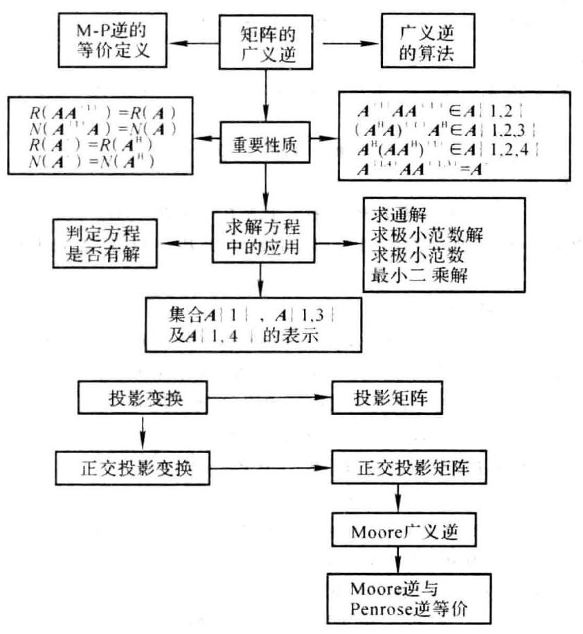

### 6.5 课后习题全解

## 习 题 6.1

1. 设 $L, M$ 是 ${\mathbf{C}}^{n}$ 的子空间,且 $L \oplus  M = {\mathbf{C}}^{n}$ ,证明投影算子 ${P}_{L, M}$ 是线性算子.

证 将 $x, y \in  {\mathbf{C}}^{n}$ 分解为

则

$$
\mathbf{x} = {\mathbf{x}}_{1} + {\mathbf{x}}_{2},\;\mathbf{y} = {\mathbf{y}}_{1} + {\mathbf{y}}_{2}\;\left( {{\mathbf{x}}_{1},{\mathbf{y}}_{1} \in  L,{\mathbf{x}}_{2},{\mathbf{y}}_{2} \in  M}\right)
$$

$$
\lambda \mathbf{x} + \mu \mathbf{y} = \left( {\lambda {\mathbf{x}}_{1} + \mu {\mathbf{y}}_{1}}\right)  + \left( {\lambda {\mathbf{x}}_{2} + \mu {\mathbf{y}}_{2}}\right)
$$

其中 $\lambda {\mathbf{x}}_{1} + \mu {\mathbf{y}}_{1} \in  L,\lambda {\mathbf{x}}_{2} + \mu {\mathbf{y}}_{2} \in  M$ . 故

$$
{P}_{L, M}\left( {\lambda \mathbf{x} + \mu \mathbf{y}}\right)  = \lambda {\mathbf{x}}_{1} + \mu {\mathbf{y}}_{1} = \lambda {P}_{L, M}\mathbf{x} + \mu {P}_{L, M}\mathbf{y}
$$

2. 若 $\mathbf{P}$ 是投影矩阵,证明: ${\mathbf{P}}^{\mathrm{H}},\mathbf{I} - \mathbf{P},{\mathbf{T}}^{-1}\mathbf{P}\mathbf{T}$ ( $\mathbf{T}$ 为非奇异矩阵) 均为投影矩阵.

证 ${\left( {\mathbf{P}}^{\mathrm{H}}\right) }^{2} = {\left( {\mathbf{P}}^{2}\right) }^{\mathrm{H}} = {\mathbf{P}}^{\mathrm{H}}$

$$
{\left( \mathbf{I} - \mathbf{P}\right) }^{2} = {\mathbf{I}}^{2} - 2\mathbf{P} + {\mathbf{P}}^{2} = \mathbf{I} - 2\mathbf{P} + \mathbf{P} = \mathbf{I} - \mathbf{P}
$$

$$
{\left( {\mathbf{T}}^{-1}\mathbf{P}\mathbf{T}\right) }^{2} = {\mathbf{T}}^{-1}{\mathbf{P}}^{2}\mathbf{T} = {\mathbf{T}}^{-1}\mathbf{P}\mathbf{T}
$$

3. 证明 $\mathbf{I} - {\mathbf{P}}_{L, M} = {\mathbf{P}}_{M, L}$ .

证 由第 2 题知, $\mathbf{I} - {\mathbf{P}}_{L, M}$ 是投影矩阵. 将任意 $\mathbf{x} \in  {\mathbf{C}}^{n}$ 分解为

$$
x = y + z\;\left( {y \in  L, z \in  M}\right)
$$

则

$$
\left( {I - {P}_{L, M}}\right) x = x - {P}_{L, M}x = x - y = z = {P}_{M, L}x
$$

故

$$
\mathbf{I} - {\mathbf{P}}_{L, M} = {\mathbf{P}}_{M, L}
$$

4. 设 ${\mathbf{P}}_{1},{\mathbf{P}}_{2}$ 均为投影矩阵,证明:

(1) $\mathbf{P} = {\mathbf{P}}_{1} + {\mathbf{P}}_{2}$ 是投影矩阵的充要条件是 ${\mathbf{P}}_{1}{\mathbf{P}}_{2} = {\mathbf{P}}_{2}{\mathbf{P}}_{1} = \mathbf{O}$ ;

(2) $\mathbf{P} = {\mathbf{P}}_{1} - {\mathbf{P}}_{2}$ 是投影矩阵的充要条件是 ${\mathbf{P}}_{1}{\mathbf{P}}_{2} = {\mathbf{P}}_{2}{\mathbf{P}}_{1} = {\mathbf{P}}_{2}$ ;

(3) 若 ${\mathbf{P}}_{1}{\mathbf{P}}_{2} = {\mathbf{P}}_{2}{\mathbf{P}}_{1}$ ,则 $\mathbf{P} = {\mathbf{P}}_{1}{\mathbf{P}}_{2}$ 是投影矩阵.

证 (1) 若 $\mathbf{P} = {\mathbf{P}}_{1} + {\mathbf{P}}_{2}$ 是投影矩阵,则 ${\mathbf{P}}^{2} = \mathbf{P}$ ,即 ${\left( {\mathbf{P}}_{1} + {\mathbf{P}}_{2}\right) }^{2} = {\mathbf{P}}_{1} + {\mathbf{P}}_{2}$ ,整理得 (利用 ${\mathbf{P}}_{1}^{2} = {\mathbf{P}}_{1}$ 和 $\left. {{\mathbf{P}}_{2}^{2} = {\mathbf{P}}_{2}}\right)$

$$
{\mathbf{P}}_{1}{\mathbf{P}}_{2} + {\mathbf{P}}_{2}{\mathbf{P}}_{1} = \mathbf{O}
$$

上式分别左乘和右乘 ${\mathbf{P}}_{1}$ ,得

$$
{\mathbf{P}}_{1}{\mathbf{P}}_{2} + {\mathbf{P}}_{1}{\mathbf{P}}_{2}{\mathbf{P}}_{1} = \mathbf{O},\;{\mathbf{P}}_{1}{\mathbf{P}}_{2}{\mathbf{P}}_{1} + {\mathbf{P}}_{2}{\mathbf{P}}_{1} = \mathbf{O}
$$

两式相减得 ${\mathbf{P}}_{1}{\mathbf{P}}_{2} - {\mathbf{P}}_{2}{\mathbf{P}}_{1} = \mathbf{O}$ ,与前一式联立求解即得 ${\mathbf{P}}_{1}{\mathbf{P}}_{2} = {\mathbf{P}}_{2}{\mathbf{P}}_{1} = \mathbf{O}$ . 反之,由 ${\mathbf{P}}_{1}{\mathbf{P}}_{2} = {\mathbf{P}}_{2}{\mathbf{P}}_{1} = \mathbf{O}$ 易知 ${\mathbf{P}}^{2} = \mathbf{P}.$

(2)如果 ${\mathbf{P}}_{1}{\mathbf{P}}_{2} = {\mathbf{P}}_{2}{\mathbf{P}}_{1} = {\mathbf{P}}_{2}$ ，则

$$
{P}^{2} = {\left( {P}_{1} - {P}_{2}\right) }^{2} = {P}_{1}^{2} - {P}_{1}{P}_{2} - {P}_{2}{P}_{1} + {P}_{2}^{2} = {P}_{1} - {P}_{2} - {P}_{2} + {P}_{2} = {P}_{1} - {P}_{2} = P
$$

反之,由 ${\left( {\mathbf{P}}_{1} - {\mathbf{P}}_{2}\right) }^{2} = {\mathbf{P}}_{1} - {\mathbf{P}}_{2}$ 得 ${\mathbf{P}}_{1}{\mathbf{P}}_{2} + {\mathbf{P}}_{2}{\mathbf{P}}_{1} = 2{\mathbf{P}}_{2}$ . 分别左乘和右乘 ${\mathbf{P}}_{2}$ ,得

$$
{\mathbf{P}}_{2}{\mathbf{P}}_{1}{\mathbf{P}}_{2} + {\mathbf{P}}_{2}{\mathbf{P}}_{1} = 2{\mathbf{P}}_{2},\;{\mathbf{P}}_{1}{\mathbf{P}}_{2} + {\mathbf{P}}_{2}{\mathbf{P}}_{1}{\mathbf{P}}_{2} = 2{\mathbf{P}}_{2}
$$

两式相减得 ${\mathbf{P}}_{1}{\mathbf{P}}_{2} = {\mathbf{P}}_{2}{\mathbf{P}}_{1}$ ,代入前一式即得 ${\mathbf{P}}_{1}{\mathbf{P}}_{2} = {\mathbf{P}}_{2}{\mathbf{P}}_{1} = {\mathbf{P}}_{2}$ .

(3) ${\mathbf{P}}^{2} = {\left( {\mathbf{P}}_{1}{\mathbf{P}}_{2}\right) }^{2} = {\mathbf{P}}_{1}\left( {{\mathbf{P}}_{2}{\mathbf{P}}_{1}}\right) {\mathbf{P}}_{2} = {\mathbf{P}}_{1}\left( {{\mathbf{P}}_{1}{\mathbf{P}}_{2}}\right) {\mathbf{P}}_{2} = {\mathbf{P}}_{1}{\mathbf{P}}_{2} = \mathbf{P}$

5. 设 $\mathbf{P}$ 是投影矩阵,证明 $\mathbf{P}$ 的特征值为 1 或 0 .

证 设 $\mathbf{P}\mathbf{x} = \lambda \mathbf{x}$ ,则 $\lambda \mathbf{x} = \mathbf{P}\mathbf{x} = {\mathbf{P}}^{2}\mathbf{x} = {\lambda }^{2}\mathbf{x}$ . 由 $\mathbf{x} \neq  \mathbf{0}$ 得 ${\lambda }^{2} - \lambda  = 0$ ,从而 $\lambda  = 1$ 或 $\lambda  = 0$ .

6. 设 $\mathbf{P}$ 是正交投影矩阵,证明 $\mathbf{P}$ 是半正定矩阵.

证 由于 $\mathbf{P}$ 是正交投影矩阵,所以 $\mathbf{P} = {\mathbf{P}}^{\mathrm{H}}\mathbf{P}$ ,从而对任意 $\mathbf{x} \in  {\mathbf{C}}^{n}$ ,有

$$
{\mathbf{x}}^{\mathrm{H}}\mathbf{P}\mathbf{x} = {\mathbf{x}}^{\mathrm{H}}{\mathbf{P}}^{\mathrm{H}}\mathbf{P}\mathbf{x} = {\left( \mathbf{P}\mathbf{x}\right) }^{\mathrm{H}}\left( {\mathbf{P}\mathbf{x}}\right)  \geq  0
$$

故 ${\mathbf{x}}^{\mathrm{H}}\mathbf{P}\mathbf{x}$ 是半正定二次型,从而 $\mathbf{P}$ 是半正定矩阵.

7. 设 ${\mathbf{R}}^{3}$ 的子空间 $L$ 由向量 ${\mathbf{e}}_{1} = {\left( 1,0,0\right) }^{\mathrm{T}}$ 张成.

(1)若子空间 $M$ 由 $\mathbf{\alpha } = {\left( 1,1,0\right) }^{\mathrm{T}}$ 和 $\mathbf{\beta } = {\left( 1,1,1\right) }^{\mathrm{T}}$ 张成,求投影矩阵 ${\mathbf{P}}_{L, M}$ 和向量 $\mathbf{x} = {\left( 2,3,1\right) }^{\mathrm{T}}$ 沿着 $M$ 到 $L$ 的投影;

(2)求正交投影矩阵 ${\mathbf{P}}_{L}$ 和向量 $\mathbf{x} = {\left( 2,3,1\right) }^{\mathrm{T}}$ 在 $L$ 上的正交投影.

解 (1) 由教材中式 (6.1.5), 得

$$
{\mathbf{P}}_{L, M} = \left\lbrack  \begin{array}{lll} 1 & 0 & 0 \\  0 & 0 & 0 \\  0 & 0 & 0 \end{array}\right\rbrack  {\left\lbrack  \begin{array}{lll} 1 & 1 & 1 \\  0 & 1 & 1 \\  0 & 0 & 1 \end{array}\right\rbrack  }^{-1} = \left\lbrack  \begin{array}{rrr} 1 &  - 1 & 0 \\  0 & 0 & 0 \\  0 & 0 & 0 \end{array}\right\rbrack  ,{\mathbf{P}}_{L, M}\mathbf{x} = \left\lbrack  \begin{array}{r}  - 1 \\  0 \\  0 \end{array}\right\rbrack
$$

(2)由教材中式(6.1.6)，得

$$
{\mathbf{P}}_{L} = {\mathbf{e}}_{1}{\left( {\mathbf{e}}_{1}^{\mathrm{H}}{\mathbf{e}}_{1}\right) }^{-1}{\mathbf{e}}_{1}^{\mathrm{H}} = \left\lbrack  \begin{array}{lll} 1 & 0 & 0 \\  0 & 0 & 0 \\  0 & 0 & 0 \end{array}\right\rbrack  ,\;{\mathbf{P}}_{L}\mathbf{x} = \left\lbrack  \begin{array}{l} 2 \\  0 \\  0 \end{array}\right\rbrack
$$

## 习 题 6.2

1. 设 $\mathbf{A}$ 是 $m \times  n$ 零矩阵,哪一类矩阵 $\mathbf{X}$ 是 $\mathbf{A}$ 的 $\{ 1\}$ 一逆?

答 所有 $n \times  m$ 矩阵.

2. 设 $m \times  n$ 矩阵 $\mathbf{A}$ 除第 $i$ 行第 $j$ 列的元素为 1 外,其余元素均为 0,哪一类矩阵 $\mathbf{X}$ 是 $\mathbf{A}$ 的 $\{ 1\}$ 一逆?

解 设 $\mathbf{X} = {\left( {x}_{ij}\right) }_{n \times  m}$ ,则由 $\mathbf{{AXA}} = \mathbf{A}$ 得 ${x}_{ij} = 1$ ,其余元素任意.

3. 设 $\mathbf{I}$ 是 $n$ 阶单位矩阵, $\mathbf{J}$ 是所有元素的均为1的 $n$ 阶矩阵,记 $\mathbf{A} = \left( {a - b}\right) \mathbf{I} + b\mathbf{J}$ . 证明: 若 $a + \left( {n - 1}\right) b =$ 0,则 $\mathbf{X} = {\left( a - b\right) }^{-1}\mathbf{I}$ 是 $\mathbf{A}$ 的 $\{ 1\}$ -逆.

证 $\mathbf{{AXA}} = \left\lbrack  {\left( {a - b}\right) \mathbf{I} + b\mathbf{J}}\right\rbrack  {\left( a - b\right) }^{-1}\mathbf{A} =$

$$
\mathbf{A} + b{\left( a - b\right) }^{-1}\mathbf{J}\mathbf{A} = \mathbf{A} + b{\left( a - b\right) }^{-1}\mathbf{J}\left\lbrack  {\left( {a - b}\right) \mathbf{I} + b\mathbf{J}}\right\rbrack   =
$$

$$
\mathbf{A} + b{\left( a - b\right) }^{-1}\left\lbrack  {\left( {a - b}\right) \mathbf{J} + b{\mathbf{J}}^{2}}\right\rbrack   = \mathbf{A} + b{\left( a - b\right) }^{-1}\left\lbrack  {a + \left( {n - 1}\right) b}\right\rbrack  \mathbf{J} = \mathbf{A}
$$

上式用到 ${\mathbf{J}}^{2} = n\mathbf{J}$ .

4. 已知

$$
\mathbf{A} = \left\lbrack  \begin{array}{rrr} 0 &  - {a}_{3} & {a}_{2} \\  {a}_{3} & 0 &  - {a}_{1} \\   - {a}_{2} & {a}_{1} & 0 \end{array}\right\rbrack
$$

证明 $\mathbf{X} =  - {\left( {a}_{1}^{2} + {a}_{2}^{2} + {a}_{3}^{2}\right) }^{-1}\mathbf{A}$ 是 $\mathbf{A}$ 的 $\{ 1\}$ -逆.

证 经计算得 ${\mathbf{A}}^{3} =  - \left( {{a}_{1}^{2} + {a}_{2}^{2} + {a}_{3}^{2}}\right) \mathbf{A}$ ,于是

$$
\mathbf{{AXA}} =  - {\left( {a}_{1}^{2} + {a}_{2}^{2} + {a}_{3}^{2}\right) }^{-1}{\mathbf{A}}^{3} = \mathbf{A}
$$

5. 证明定理6.5之 $\left( 2\right)  \sim  \left( 5\right)$ .

证 定理 ${6.5}\left( 2\right)$ : 若 $\lambda  = 0$ ,则 ${\lambda }^{ + }{\mathbf{A}}^{\left( 1\right) } = \mathbf{O} \in  \left( {\lambda \mathbf{A}}\right) \{ 1\}$ ; 若 $\lambda  \neq  0$ ,则 $\left( {\lambda \mathbf{A}}\right) \left( {{\lambda }^{ + }{\mathbf{A}}^{\left( 1\right) }}\right) \left( {\lambda \mathbf{A}}\right)  = \; \left( {\lambda {\lambda }^{ + }\lambda }\right) \left( {\mathbf{A}{\mathbf{A}}^{\left( 1\right) }\mathbf{A}}\right)  = \lambda \mathbf{A}$ ,所以 ${\lambda }^{ + }{\mathbf{A}}^{\left( 1\right) } \in  \left( {\lambda \mathbf{A}}\right) \{ 1\}$ .

定理 ${6.5}\left( 3\right)  :$ 因为

$$
\left( \mathbf{{SAT}}\right) \left( {{\mathbf{T}}^{-1}{\mathbf{A}}^{\left( 1\right) }{\mathbf{S}}^{-1}}\right) \left( \mathbf{{SAT}}\right)  = {\mathbf{{SAA}}}^{\left( 1\right) }\mathbf{{AT}} = \mathbf{{SAT}}
$$

所以

$$
{\mathbf{T}}^{-1}{\mathbf{A}}^{\left( 1\right) }{\mathbf{S}}^{-1} \in  \left( {SAT}\right) \{ 1\}
$$

定理 ${6.5}\left( 4\right)  : \operatorname{rank}\mathbf{A} = \operatorname{rank}\left( {\mathbf{A}{\mathbf{A}}^{\left( 1\right) }\mathbf{A}}\right)  \leq  \operatorname{rank}{\mathbf{A}}^{\left( 1\right) }$

定理 ${6.5}\left( 5\right)  : {\left( \mathbf{A}{\mathbf{A}}^{\left( 1\right) }\right) }^{2} = \mathbf{A}{\mathbf{A}}^{\left( 1\right) }\mathbf{A}{\mathbf{A}}^{\left( 1\right) } = \mathbf{A}{\mathbf{A}}^{\left( 1\right) },\;{\left( {\mathbf{A}}^{\left( 1\right) }\mathbf{A}\right) }^{2} = {\mathbf{A}}^{\left( 1\right) }\mathbf{A}{\mathbf{A}}^{\left( 1\right) }\mathbf{A} = {\mathbf{A}}^{\left( 1\right) }\mathbf{A}$

因为

$$
\operatorname{rank}\mathbf{A} = \operatorname{rank}\left( {\mathbf{A}{\mathbf{A}}^{\left( 1\right) }\mathbf{A}}\right)  \leq  \operatorname{rank}\left( {\mathbf{A}{\mathbf{A}}^{\left( 1\right) }}\right)  \leq  \operatorname{rank}\mathbf{A}
$$

所以

$$
\operatorname{rank}\left( {\mathbf{A}{\mathbf{A}}^{\left( 1\right) }}\right)  = \operatorname{rank}\mathbf{A}
$$

同理可证 $\operatorname{rank}\left( {{\mathbf{A}}^{\left( 1\right) }\mathbf{A}}\right)  = \operatorname{rank}\mathbf{A}$ .

6. 证明定理 6.10 之(3)和(4).

证 定理 ${6.10}\left( 3\right)$ : 对 Penrose 方程(1) $\sim  \left( 4\right)$ 取共轭转置,并由 ${\left( {\mathbf{A}}^{\mathrm{H}}\right) }^{ + }$ 的唯一性即知 ${\left( {\mathbf{A}}^{\mathrm{H}}\right) }^{ + } = {\left( {\mathbf{A}}^{ + }\right) }^{\mathrm{H}}$ .

定理 ${6.10}\left( 4\right)$ : 令 $\mathbf{X} = {\mathbf{A}}^{ + }{\left( {\mathbf{A}}^{\mathrm{H}}\right) }^{ + }$ ,直接验证

$$
\left( {{\mathbf{A}}^{\mathrm{H}}\mathbf{A}}\right) \mathbf{X}\left( {{\mathbf{A}}^{\mathrm{H}}\mathbf{A}}\right)  = {\mathbf{A}}^{\mathrm{H}}\mathbf{A},\;\mathbf{X}\left( {{\mathbf{A}}^{\mathrm{H}}\mathbf{A}}\right) \mathbf{X} = \mathbf{X}
$$

$$
{\left( {\mathbf{A}}^{\mathrm{H}}\mathbf{A}\mathbf{X}\right) }^{\mathrm{H}} = {\mathbf{A}}^{\mathrm{H}}\mathbf{A}\mathbf{X},\;{\left( \mathbf{X}{\mathbf{A}}^{\mathrm{H}}\mathbf{A}\right) }^{\mathrm{H}} = \mathbf{X}{\mathbf{A}}^{\mathrm{H}}\mathbf{A}
$$

由 ${\left( {\mathbf{A}}^{\mathrm{H}}\mathbf{A}\right) }^{ + }$ 的唯一性即得 ${\left( {\mathbf{A}}^{\mathrm{H}}\mathbf{A}\right) }^{ + } = \mathbf{X}$ . 同理可证另一式.

7. 设 $\mathbf{D} = \operatorname{diag}\left( {{d}_{1},{d}_{2},\cdots ,{d}_{n}}\right)$ ,证明 ${\mathbf{D}}^{ + } = \operatorname{diag}\left( {{d}_{1}^{ + },{d}_{2}^{ + },\cdots ,{d}_{n}^{ + }}\right)$ .

证 由定义直接验证.

8. 证明 ${\left\lbrack  \begin{array}{l} \mathbf{A} \\  \mathbf{O} \end{array}\right\rbrack  }^{ + } = \left\lbrack  \begin{array}{lll} {\mathbf{A}}^{ + } & \vdots & {\mathbf{O}}^{\mathrm{H}} \end{array}\right\rbrack$ .

证 方法 1 . 由定义直接验证 (略).

方法 2. 利用矩阵的满秩分解. 当 $\mathbf{A} = \mathbf{O}$ 时,结论成立; 当 $\mathbf{A} \neq  \mathbf{O}$ 时,设 $\mathbf{A}$ 的一个满秩分解为 $\mathbf{A} = \mathbf{F}\mathbf{G}$ ,则

$$
\mathbf{B} = \left\lbrack  \begin{array}{l} \mathbf{A} \\  \mathbf{O} \end{array}\right\rbrack   = \left\lbrack  \begin{matrix} \mathbf{F}\mathbf{G} \\  \mathbf{O} \end{matrix}\right\rbrack   = \left\lbrack  \begin{array}{l} \mathbf{F} \\  \mathbf{O} \end{array}\right\rbrack  \mathbf{G} = \widetilde{\mathbf{F}}\mathbf{G}
$$

为 $\mathbf{B}$ 的一个满秩分解,且有

$$
{\widetilde{\mathbf{F}}}^{ + } = {\left\{  \left( {\mathbf{F}}^{\mathrm{H}}\vdots {\mathbf{O}}^{\mathrm{H}}\right) \left\lbrack  \begin{array}{l} \mathbf{F} \\  \mathbf{O} \end{array}\right\rbrack  \right\}  }^{-1}\left( {{\mathbf{F}}^{\mathrm{H}}\vdots {\mathbf{O}}^{\mathrm{H}}}\right)  = {\left( {\mathbf{F}}^{\mathrm{H}}\mathbf{F}\right) }^{-1}\left( {{\mathbf{F}}^{\mathrm{H}}\vdots {\mathbf{O}}^{\mathrm{H}}}\right)  = \left( {{\mathbf{F}}^{ + }\vdots {\mathbf{O}}^{\mathrm{H}}}\right)
$$

故 ${\mathbf{B}}^{ + } = {\mathbf{G}}^{ + }{\widetilde{\mathbf{F}}}^{ + } = \left( \begin{array}{llll} {\mathbf{G}}^{ + } & {\mathbf{F}}^{ + } & \vdots & {\mathbf{O}}^{\mathrm{H}} \end{array}\right)  = \left( \begin{array}{lll} {\mathbf{A}}^{ + } & \vdots & {\mathbf{O}}^{\mathrm{H}} \end{array}\right)$ .

9. 设 $\mathbf{A} \in  {\mathbf{C}}^{m \times  n}$ ,且 $\mathbf{U} \in  {\mathbf{C}}^{m \times  m}$ 和 $\mathbf{V} \in  {\mathbf{C}}^{n \times  n}$ 均为酉矩阵,证明 ${\left( \mathbf{U}\mathbf{A}\mathbf{V}\right) }^{ * } = {\mathbf{V}}^{\mathrm{H}}{\mathbf{A}}^{ \dagger  }{\mathbf{U}}^{\mathrm{H}}$ .

证 当 $\mathbf{A} = \mathbf{O}$ 时,结论成立; 当 $\mathbf{A} \neq  \mathbf{O}$ 时,设 $\mathbf{A}$ 的一个奇异值分解为

则

$$
\mathbf{A} = {\mathbf{U}}_{1}\left\lbrack  \begin{array}{ll} \mathbf{\sum } & \mathbf{O} \\  \mathbf{O} & \mathbf{O} \end{array}\right\rbrack  {\mathbf{V}}_{1}^{\mathrm{H}}
$$

$$
\mathbf{B} = \mathbf{U}\mathbf{A}\mathbf{V} = \left( {\mathbf{{UU}}}_{1}\right) \left\lbrack  \begin{array}{ll} \mathbf{\sum } & \mathbf{O} \\  \mathbf{O} & \mathbf{O} \end{array}\right\rbrack  {\left( {\mathbf{V}}^{\mathrm{H}}{\mathbf{V}}_{1}\right) }^{\mathrm{H}}
$$

为 $\mathbf{B}$ 的一个奇异值分解,因此

$$
{\mathbf{B}}^{ + } = \left( \begin{array}{l} {\mathbf{V}}^{\mathrm{H}}{\mathbf{V}}_{1} \end{array}\right) \left\lbrack  \begin{matrix} {\mathbf{\sum }}^{-1} & \mathbf{O} \\  \mathbf{O} & \mathbf{O} \end{matrix}\right\rbrack  {\left( \mathbf{U}{\mathbf{U}}_{1}\right) }^{\mathrm{H}} = {\mathbf{V}}^{\mathrm{H}}{\mathbf{V}}_{1}\left\lbrack  \begin{matrix} {\mathbf{\sum }}^{-1} & \mathbf{O} \\  \mathbf{O} & \mathbf{O} \end{matrix}\right\rbrack  {\mathbf{U}}_{1}^{\mathrm{H}}{\mathbf{U}}^{\mathrm{H}} = {\mathbf{V}}^{\mathrm{H}}{\mathbf{A}}^{ + }{\mathbf{U}}^{\mathrm{H}}
$$

10. 证明:

(1) $\mathbf{X} \in  A\{ i\}$ 的充要条件是 ${\mathbf{X}}^{\mathrm{H}} \in  {A}^{\mathrm{H}}\{ i\} \left( {i = 1,2}\right)$ ;

(2) $\mathbf{X} \in  A\{ 3\}$ 的充要条件是 ${\mathbf{X}}^{\mathrm{H}} \in  {A}^{\mathrm{H}}\{ 4\}$ ；

(3) $\mathbf{X} \in  A\{ 4\}$ 的充要条件是 ${\mathbf{X}}^{\mathrm{H}} \in  {A}^{\mathrm{H}}\{ 3\}$ .

证 因为 $\mathbf{A}\mathbf{X}\mathbf{A} = \mathbf{A}$ 等价于 ${\mathbf{A}}^{\mathrm{H}}{\mathbf{X}}^{\mathrm{H}}{\mathbf{A}}^{\mathrm{H}} = {\mathbf{A}}^{\mathrm{H}},\mathbf{X}\mathbf{A}\mathbf{X} = \mathbf{X}$ 等价于 ${\mathbf{X}}^{\mathrm{H}}{\mathbf{A}}^{\mathrm{H}}{\mathbf{X}}^{\mathrm{H}} = {\mathbf{X}}^{\mathrm{H}}$ ,所以 $\mathbf{X} \in  A\{ i\}$ 等价于 ${\mathbf{X}}^{\mathrm{H}} \in  {A}^{\mathrm{H}}\{ i\} \left( {i = 1,2}\right) .$

因为 ${\left( \mathbf{A}\mathbf{X}\right) }^{\mathrm{H}} = \mathbf{A}\mathbf{X}$ 等价于 ${\left( {\mathbf{X}}^{\mathrm{H}}{\mathbf{A}}^{\mathrm{H}}\right) }^{\mathrm{H}} = {\mathbf{X}}^{\mathrm{H}}{\mathbf{A}}^{\mathrm{H}}$ ,所以 $\mathbf{X} \in  A\{ 3\}$ 等价于 ${\mathbf{X}}^{\mathrm{H}} \in  {A}^{\mathrm{H}}\{ 4\}$ .

同理可证 (3).

11. 设 $\mathbf{H}$ 是幂等 Hermite 矩阵,证明 ${\mathbf{H}}^{ + } = \mathbf{H}$ .

证 由 ${\mathbf{H}}^{2} = \mathbf{H}$ 和 ${\mathbf{H}}^{\mathrm{H}} = \mathbf{H}$ 得 ${\mathbf{H}}^{3} = \mathbf{H},{\left( {\mathbf{H}}^{2}\right) }^{\mathrm{H}} = {\mathbf{H}}^{2}$ ,故 ${\mathbf{H}}^{ + } = \mathbf{H}$ .

12. 证明: ${\mathbf{H}}^{ + } = \mathbf{H}$ 的充要条件是 ${\mathbf{H}}^{2}$ 为幂等 Hermite 矩阵且 $\operatorname{rank}{\mathbf{H}}^{2} = \operatorname{rank}\mathbf{H}$ .

证 如果 ${\mathbf{H}}^{ + } = \mathbf{H}$ ,则 ${\left( {\mathbf{H}}^{2}\right) }^{2} = {\mathbf{H}}^{4} = {\mathbf{H}}^{3}\mathbf{H} = {\mathbf{H}}^{2},{\left( {\mathbf{H}}^{2}\right) }^{\mathrm{H}} = {\left( \mathbf{H}{\mathbf{H}}^{ + }\right) }^{\mathrm{H}} = \mathbf{H}{\mathbf{H}}^{4} = {\mathbf{H}}^{2}$ ,即 ${\mathbf{H}}^{2}$ 为幂等 Hermite 矩阵, 又

$$
\operatorname{rank}\mathbf{H} = \operatorname{rank}{\mathbf{H}}^{3} \leq  \operatorname{rank}{\mathbf{H}}^{2} \leq  \operatorname{rank}\mathbf{H}
$$

故 $\operatorname{rank}{\mathbf{H}}^{2} = \operatorname{rank}\mathbf{H}$ . 反之,由 ${\left( {\mathbf{H}}^{2}\right) }^{\mathrm{H}} = {\mathbf{H}}^{2}$ 知, $\mathbf{H} \in  H\{ 3,4\}$ ; 又由 $\operatorname{rank}{\mathbf{H}}^{2} = \operatorname{rank}\mathbf{H}$ 知,存在矩阵 $\mathbf{U}$ 使得 $\mathbf{H} = \; {\mathbf{H}}^{2}\mathbf{U}$ ,从而

$$
{\mathbf{H}}^{3} = {\mathbf{H}}^{2}\mathbf{H} = {\mathbf{H}}^{2}{\mathbf{H}}^{2}\mathbf{U} = {\left( {\mathbf{H}}^{2}\right) }^{2}\mathbf{U} = {\mathbf{H}}^{2}\mathbf{U} = \mathbf{H}
$$

此即 $\mathbf{H} \in  H\{ 1,2\}$ ,故 $\mathbf{H} \in  H\{ 1,2,3,4\}$ ,即 $\mathbf{H} = {\mathbf{H}}^{ + }$ .

13. 证明: 若 $\mathbf{A}$ 是正规矩阵 (即满足 ${\mathbf{A}}^{\mathrm{H}}\mathbf{A} = \mathbf{A}{\mathbf{A}}^{\mathrm{H}}$ ). 则 ${\mathbf{A}}^{ + }\mathbf{A} = \mathbf{A}{\mathbf{A}}^{ + }$ ,且 ${\left( {\mathbf{A}}^{n}\right) }^{ + } = {\left( {\mathbf{A}}^{ + }\right) }^{n}$ ,其中 $n$ 是正整数.

证 由定理 6.10(5),即 ${\mathbf{A}}^{ + } = {\left( {\mathbf{A}}^{\mathrm{H}}\mathbf{A}\right) }^{ + }{\mathbf{A}}^{\mathrm{H}} = {\mathbf{A}}^{\mathrm{H}}{\left( \mathbf{A}{\mathbf{A}}^{\mathrm{H}}\right) }^{ + }$ 得

${\mathbf{A}}^{ + }\mathbf{A} = {\left( {\mathbf{A}}^{\mathrm{H}}\mathbf{A}\right) }^{ + }{\mathbf{A}}^{\mathrm{H}}\mathbf{A} = {\left( \mathbf{A}{\mathbf{A}}^{\mathrm{H}}\right) }^{ + }\mathbf{A}{\mathbf{A}}^{\mathrm{H}} =$

$$
{\left\lbrack  {\left( \mathbf{A}{\mathbf{A}}^{\mathrm{H}}\right) }^{ + }\mathbf{A}{\mathbf{A}}^{\mathrm{H}}\right\rbrack  }^{\mathrm{H}} = {\left( \mathbf{A}{\mathbf{A}}^{\mathrm{H}}\right) }^{\mathrm{H}}{\left\lbrack  {\left( \mathbf{A}{\mathbf{A}}^{\mathrm{H}}\right) }^{ + }\right\rbrack  }^{\mathrm{H}} = \mathbf{A}{\mathbf{A}}^{\mathrm{H}}{\left( \mathbf{A}{\mathbf{A}}^{\mathrm{H}}\right) }^{ + } = \mathbf{A}{\mathbf{A}}^{ + }
$$

利用上面结果, 有

$$
{\mathbf{A}}^{n}{\left( {\mathbf{A}}^{ + }\right) }^{n}{\mathbf{A}}^{n} = {\left( \mathbf{A}{\mathbf{A}}^{ + }\mathbf{A}\right) }^{n} = {\mathbf{A}}^{n}
$$

$$
{\left( {\mathbf{A}}^{ + }\right) }^{n}{\mathbf{A}}^{n}{\left( {\mathbf{A}}^{ + }\right) }^{n} = {\left( {\mathbf{A}}^{ + }\mathbf{A}{\mathbf{A}}^{ + }\right) }^{n} = {\left( {\mathbf{A}}^{ + }\right) }^{n}
$$

$$
{\left\lbrack  {\mathbf{A}}^{n}{\left( {\mathbf{A}}^{ + }\right) }^{n}\right\rbrack  }^{\mathrm{H}} = {\left\lbrack  {\left( \mathbf{A}{\mathbf{A}}^{ + }\right) }^{n}\right\rbrack  }^{\mathrm{H}} = {\left\lbrack  {\left( \mathbf{A}{\mathbf{A}}^{ + }\right) }^{\mathrm{H}}\right\rbrack  }^{n} = {\left( \mathbf{A}{\mathbf{A}}^{ + }\right) }^{n} = {\mathbf{A}}^{n}{\left( {\mathbf{A}}^{ + }\right) }^{n}
$$

同理 ${\left\lbrack  {\left( {\mathbf{A}}^{ + }\right) }^{n}{\mathbf{A}}^{n}\right\rbrack  }^{\mathrm{H}} = {\left( {\mathbf{A}}^{ + }\right) }^{n}{\mathbf{A}}^{n}$ ,故而 ${\left( {\mathbf{A}}^{n}\right) }^{ + } = {\left( {\mathbf{A}}^{ + }\right) }^{n}$ .

14. 证明 ${\left( \mathbf{A} \otimes  \mathbf{B}\right) }^{ + } = {\mathbf{A}}^{ + } \otimes  {\mathbf{B}}^{ + }$ .

证 根据直积的性质,有

$\left( {\mathbf{A} \otimes  \mathbf{B}}\right) \left( {{\mathbf{A}}^{ + } \otimes  {\mathbf{B}}^{ + }}\right) \left( {\mathbf{A} \otimes  \mathbf{B}}\right)  = \left( {\mathbf{A}{\mathbf{A}}^{ + }\mathbf{A}}\right)  \otimes  \left( {\mathbf{B}{\mathbf{B}}^{ + }\mathbf{B}}\right)  = \mathbf{A} \otimes  \mathbf{B}$

$\left( {{\mathbf{A}}^{ + } \otimes  {\mathbf{B}}^{ + }}\right) \left( {\mathbf{A} \otimes  \mathbf{B}}\right) \left( {{\mathbf{A}}^{ + } \otimes  {\mathbf{B}}^{ + }}\right)  = \left( {{\mathbf{A}}^{ + }\mathbf{A}{\mathbf{A}}^{ + }}\right)  \otimes  \left( {{\mathbf{B}}^{ + }\mathbf{B}{\mathbf{B}}^{ + }}\right)  = {\mathbf{A}}^{ + } \otimes  {\mathbf{B}}^{ + }$

${\left\lbrack  \left( \mathbf{A} \otimes  \mathbf{B}\right) \left( {\mathbf{A}}^{ + } \otimes  {\mathbf{B}}^{ + }\right) \right\rbrack  }^{\mathrm{H}} = {\left\lbrack  \left( \mathbf{A}{\mathbf{A}}^{ + }\right)  \otimes  \left( \mathbf{B}{\mathbf{B}}^{ + }\right) \right\rbrack  }^{\mathrm{H}} =$

$$
{\left( {\mathbf{{AA}}}^{ + }\right) }^{\mathrm{H}} \otimes  {\left( {\mathbf{{BB}}}^{ + }\right) }^{\mathrm{H}} = \left( {\mathbf{{AA}}}^{ + }\right)  \otimes  \left( {\mathbf{{BB}}}^{ + }\right)  = \left( {\mathbf{A} \otimes  \mathbf{B}}\right) \left( {{\mathbf{A}}^{ + } \otimes  {\mathbf{B}}^{ + }}\right)
$$

同理 ${\left\lbrack  \left( {\mathbf{A}}^{ + } \otimes  {\mathbf{B}}^{ + }\right) \left( \mathbf{A} \otimes  \mathbf{B}\right) \right\rbrack  }^{\mathrm{H}} = \left( {{\mathbf{A}}^{ + } \otimes  {\mathbf{B}}^{ + }}\right) \left( {\mathbf{A} \otimes  \mathbf{B}}\right)$

故 $\;{\left( \mathbf{A} \otimes  \mathbf{B}\right) }^{ + } = {\mathbf{A}}^{ + } \otimes  {\mathbf{B}}^{ + }$

15. 举例说明: 对 $\mathbf{P},\mathbf{Q}$ 为非奇异矩阵,结论 ${\left( \mathbf{P}\mathbf{A}\mathbf{Q}\right) }^{ + } = {\mathbf{Q}}^{-1}{\mathbf{A}}^{ + }{\mathbf{P}}^{-1}$ 不真,并与习题 9 比较.

解 例如,取 $\mathbf{A} = \left\lbrack  \begin{array}{l} 1 \\  1 \end{array}\right\rbrack  ,\mathbf{P} = \left\lbrack  \begin{array}{ll} 1 & 1 \\  0 & 1 \end{array}\right\rbrack  ,\mathbf{Q} = \left\lbrack  1\right\rbrack$ ,则有

$$
\mathbf{{PAQ}} = \left\lbrack  \begin{array}{l} 2 \\  1 \end{array}\right\rbrack  ,\;{\left( \mathbf{{PAQ}}\right) }^{ + } = \frac{1}{5}\left\lbrack  \begin{array}{ll} 2 & 1 \end{array}\right\rbrack  ,\;{\mathbf{Q}}^{-1}{\mathbf{A}}^{ + }{\mathbf{P}}^{-1} = \frac{1}{2}\left\lbrack  \begin{array}{ll} 1 & 0 \end{array}\right\rbrack
$$

可见 ${\left( \mathbf{{PAQ}}\right) }^{ + } \neq  {\mathbf{Q}}^{-1}{\mathbf{A}}^{ + }{\mathbf{P}}^{-1}$ .

16. 证明满足如下三个矩阵方程

$$
\mathbf{{AX}} = \mathbf{B},\;\mathbf{{XA}} = \mathbf{D},\;\mathbf{{XAX}} = \mathbf{X}
$$

的矩阵 $\mathbf{X}$ 是唯一的 (如果它存在的话).

证 设 $\mathbf{X},\mathbf{Y}$ 均满足这三个矩阵方程,则

$$
\mathbf{X} = \mathbf{{XAX}} = \mathbf{{XB}} = \mathbf{{XAY}} = \mathbf{{DY}} = \mathbf{{YAY}} = \mathbf{Y}
$$

17. 设 ${\mathbf{A}}_{i} \in  {\mathbf{C}}^{m \times  n},{\mathbf{A}}_{i}{\mathbf{A}}_{j}^{\mathrm{H}} = \mathbf{O},{\mathbf{A}}_{i}^{\mathrm{H}}{\mathbf{A}}_{j} = \mathbf{O}\left( {i \neq  j;i, j = 1,2,\cdots , r}\right)$ ,证明 ${\left( \mathop{\sum }\limits_{{i = 1}}^{r}{\mathbf{A}}_{i}\right) }^{ + } = \mathop{\sum }\limits_{{i = 1}}^{r}{\mathbf{A}}_{i}^{ + }$ .

证 利用定理 6.10(5) 可得

$$
\left( {\mathop{\sum }\limits_{{i = 1}}^{r}{\mathbf{A}}_{i}}\right) \left( {\mathop{\sum }\limits_{{i = 1}}^{r}{\mathbf{A}}_{i}^{ + }}\right)  = \left( {\mathop{\sum }\limits_{{i = 1}}^{r}{\mathbf{A}}_{i}}\right) \left( {\mathop{\sum }\limits_{{i = 1}}^{r}{\mathbf{A}}_{i}^{\mathrm{H}}{\left( {\mathbf{A}}_{i}{\mathbf{A}}_{i}^{\mathrm{H}}\right) }^{ + }}\right)  = \left( {\mathop{\sum }\limits_{{i = 1}}^{r}\left( {{\mathbf{A}}_{i}{\mathbf{A}}_{i}^{\mathrm{H}}}\right) {\left( {\mathbf{A}}_{i}{\mathbf{A}}_{i}^{\mathrm{H}}\right) }^{ + } = \mathop{\sum }\limits_{{i = 1}}^{r}{\mathbf{A}}_{i}{\mathbf{A}}_{i}^{ + }}\right.
$$

$$
\left( {\mathop{\sum }\limits_{{i = 1}}^{r}{\mathbf{A}}_{i}^{ + }}\right) \left( {\mathop{\sum }\limits_{{i = 1}}^{r}{\mathbf{A}}_{i}}\right)  = \left( {\mathop{\sum }\limits_{{i = 1}}^{r}{\left( {\mathbf{A}}_{i}^{\mathrm{H}}{\mathbf{A}}_{i}\right) }^{ + }{\mathbf{A}}_{i}^{\mathrm{H}}}\right) \left( {\mathop{\sum }\limits_{{i = 1}}^{r}{\mathbf{A}}_{i}}\right)  = \mathop{\sum }\limits_{{i = 1}}^{r}{\left( {\mathbf{A}}_{i}^{\mathrm{H}}{\mathbf{A}}_{i}\right) }^{ + }\left( {{\mathbf{A}}_{i}^{\mathrm{H}}{\mathbf{A}}_{i}}\right)  = \mathop{\sum }\limits_{{i = 1}}^{r}{\mathbf{A}}_{i}^{ + }{\mathbf{A}}_{i}
$$

上面两式右边均是 Hermite 矩阵, 因而左边也是 Hermite 矩阵. 又

$$
\left( {\mathop{\sum }\limits_{{i = 1}}^{r}{\mathbf{A}}_{i}}\right) \left( {\mathop{\sum }\limits_{{i = 1}}^{r}{\mathbf{A}}_{i}^{ + }}\right) \left( {\mathop{\sum }\limits_{{i = 1}}^{r}{\mathbf{A}}_{i}}\right)  = \left( {\mathop{\sum }\limits_{{i = 1}}^{r}{\mathbf{A}}_{i}{\mathbf{A}}_{i}^{ + }}\right) \left( {\mathop{\sum }\limits_{{i = 1}}^{r}{\mathbf{A}}_{i}}\right)  = \left( {\mathop{\sum }\limits_{{i = 1}}^{r}{\mathbf{A}}_{i}{\left( {\mathbf{A}}_{i}^{\mathrm{H}}{\mathbf{A}}_{i}\right) }^{ + }{\mathbf{A}}_{i}^{\mathrm{H}}}\right) \left( {\mathop{\sum }\limits_{{i = 1}}^{r}{\mathbf{A}}_{i}}\right)  =
$$

$$
\mathop{\sum }\limits_{{i = 1}}^{r}{\mathbf{A}}_{i}{\left( {\mathbf{A}}_{i}^{\mathrm{H}}{\mathbf{A}}_{i}\right) }^{ + }{\mathbf{A}}_{i}^{\mathrm{H}}{\mathbf{A}}_{i} = \mathop{\sum }\limits_{{i = 1}}^{r}{\mathbf{A}}_{i}{\mathbf{A}}_{i}^{ + }{\mathbf{A}}_{i} = \mathop{\sum }\limits_{{i = 1}}^{r}{\mathbf{A}}_{i}
$$

同理可证

$$
\left( {\mathop{\sum }\limits_{{i = 1}}^{r}{\mathbf{A}}_{i}^{ + }}\right) \left( {\mathop{\sum }\limits_{{i = 1}}^{r}{\mathbf{A}}_{i}}\right) \left( {\mathop{\sum }\limits_{{i = 1}}^{r}{\mathbf{A}}_{i}^{ + }}\right)  = \mathop{\sum }\limits_{{i = 1}}^{r}{\mathbf{A}}_{i}^{ + }
$$

故

$$
{\left( \mathop{\sum }\limits_{{i = 1}}^{r}{\mathbf{A}}_{i}\right) }^{ + } = \mathop{\sum }\limits_{{i = 1}}^{r}{\mathbf{A}}_{i}^{ + }
$$

## 习 题 6.3

1. 证明每个方阵都有非奇异的 $\{ 1\}$ 一逆.

证 在教材中式 (6.3.3) 中取 $\mathbf{L}$ 为非奇异矩阵即得.

2. 非奇异矩阵 $\mathbf{A}$ 的 Hermite 标准形是什么? 矩阵 $\mathbf{Q}$ 与 $\mathbf{A}$ 的关系如何? 置换矩阵 $\mathbf{P}$ 是什么矩阵? 由式 (6.3.3) 给出的 $\mathbf{X}$ 是什么?

答 Hermite 标准形是单位矩阵, $\mathbf{Q} = {\mathbf{A}}^{-1},\mathbf{P} = \mathbf{I},\mathbf{X} = {\mathbf{A}}^{-1}$ .

3. 已知矩阵 $\mathbf{A} = \left\lbrack  \begin{array}{llll} 1 & 0 & 0 & 1 \\  1 & 1 & 0 & 0 \\  0 & 1 & 1 & 0 \\  0 & 0 & 1 & 1 \end{array}\right\rbrack$ .

(1)求 $\mathbf{A}$ 的 Hermite 标准形,利用式(6.3.3) 求 $\mathbf{A}$ 的 \{1\}一逆和 $\{ 1,2\}$ 一逆；

(2)作 A 的满秩分解,利用定理 6.15 之(5)求 ${\mathbf{A}}^{ + }$ ；

(3)利用 Zlobec 公式 (6.3.6) 计算 ${\mathbf{A}}^{ + }$ ；

(4)利用 Greville 方法计算 ${\mathbf{A}}^{ + }$ ；

(5) 利用定理 6.18 计算 ${\mathbf{A}}^{\left( 1,2\right) },{\mathbf{A}}^{\left( 1,2,3\right) },{\mathbf{A}}^{\left( 1,2,4\right) }$ 和 ${\mathbf{A}}^{ + }$ ;

(6) 矩阵 $\mathbf{A}$ 是上 Hessenberg 矩阵,根据教材中式 (6.3.23),式 (6.3.24),式 (6.3.30) 和式 (6.3.36) 计算 ${\mathbf{A}}^{ + }$ .

解 (1) $\mathbf{{QA}} = \left\lbrack  \begin{array}{rrrr} 1 & 0 & 0 & 1 \\  0 & 1 & 0 &  - 1 \\  0 & 0 & 1 & 0 \\  0 & 0 & 0 & 0 \end{array}\right\rbrack  ,\;\mathbf{Q} = \left\lbrack  \begin{array}{rrrr} 1 & 0 & 0 & 0 \\   - 1 & 1 & 0 & 0 \\  1 &  - 1 & 1 & 0 \\   - 1 & 1 &  - 1 & 1 \end{array}\right\rbrack$

于是

$$
{\mathbf{A}}^{\left( 1\right) } = \left\lbrack  \begin{array}{rrrr} 1 & 0 & 0 & 0 \\   - 1 & 1 & 0 & 0 \\  1 &  - 1 & 1 & 0 \\   - a & a &  - a & a \end{array}\right\rbrack  \text{ ( }a\text{ 任意), }\;{\mathbf{A}}^{\left( 1,2\right) } = \left\lbrack  \begin{array}{rrrr} 1 & 0 & 0 & 0 \\   - 1 & 1 & 0 & 0 \\  1 &  - 1 & 1 & 0 \\  0 & 0 & 0 & 0 \end{array}\right\rbrack
$$

(2) $\mathbf{A} = \mathbf{F}\mathbf{G} = \left\lbrack  \begin{array}{lll} 1 & 0 & 0 \\  1 & 1 & 0 \\  0 & 1 & 1 \\  0 & 0 & 1 \end{array}\right\rbrack  \left\lbrack  \begin{array}{rrrr} 1 & 0 & 0 & 1 \\  0 & 1 & 0 &  - 1 \\  0 & 0 & 1 & 1 \end{array}\right\rbrack$

$$
{\mathbf{A}}^{ + } = {\mathbf{G}}^{\mathrm{H}}{\left( {\mathbf{F}}^{\mathrm{H}}\mathbf{A}{\mathbf{G}}^{\mathrm{H}}\right) }^{-1}{\mathbf{F}}^{\mathrm{H}} = \frac{1}{8}\left\lbrack  \begin{array}{rrrr} 3 & 3 &  - 1 &  - 1 \\   - 1 & 3 & 3 &  - 1 \\   - 1 &  - 1 & 3 & 3 \\  3 &  - 1 &  - 1 & 3 \end{array}\right\rbrack
$$

(3) $\mathbf{B} = {\mathbf{A}}^{\mathrm{H}}\mathbf{A}{\mathbf{A}}^{\mathrm{H}} = \left\lbrack  \begin{array}{llll} 3 & 3 & 1 & 1 \\  1 & 3 & 3 & 1 \\  1 & 1 & 3 & 3 \\  3 & 1 & 1 & 3 \end{array}\right\rbrack$

$$
\mathbf{{QB}} = \left\lbrack  \begin{array}{rrrr} 1 & 0 & 0 & 1 \\  0 & 1 & 0 &  - 1 \\  0 & 0 & 1 & 1 \\  0 & 0 & 0 & 0 \end{array}\right\rbrack  ,\;\mathbf{Q} = \frac{1}{8}\left\lbrack  \begin{array}{rrrr} 0 &  - 1 & 0 & 3 \\  0 & 4 &  - 4 & 0 \\  0 &  - 1 & 4 &  - 1 \\  8 &  - 8 & 8 &  - 8 \end{array}\right\rbrack
$$

由教材中式 (6.3.3) 求得

$$
{\mathbf{B}}^{\left( 1\right) } = \frac{1}{8}\left\lbrack  \begin{array}{rrrr} 0 &  - 1 & 0 & 3 \\  0 & 4 &  - 4 & 0 \\  0 &  - 1 & 4 &  - 1 \\  0 & 0 & 0 & 0 \end{array}\right\rbrack
$$

故

$$
{\mathbf{A}}^{ + } = {\mathbf{A}}^{\mathrm{H}}{\mathbf{B}}^{\left( 1\right) }{\mathbf{A}}^{\mathrm{H}} = \frac{1}{8}\left\lbrack  \begin{array}{rrrr} 3 & 3 &  - 1 &  - 1 \\   - 1 & 3 & 3 &  - 1 \\   - 1 &  - 1 & 3 & 3 \\  3 &  - 1 &  - 1 & 3 \end{array}\right\rbrack
$$

(4)由教材中式(6.2.3)计算 ${\mathbf{A}}_{1}^{ + } = \frac{1}{2}\left( {1,1,0,0}\right)$ ，再由式(6.3.7)～式(6.3.9)依次计算

$$
{\mathbf{d}}_{2} = {\mathbf{A}}_{1}^{ + }{\mathbf{a}}_{2} = \frac{1}{2},\;{\mathbf{c}}_{2} = {\mathbf{a}}_{2} - {\mathbf{A}}_{1}{\mathbf{d}}_{2} = \frac{1}{2}{\left( -1,1,2,0\right) }^{\mathrm{T}}
$$

$$
{\mathbf{b}}_{2}^{\mathrm{H}} = {\mathbf{c}}_{2}^{ + } = \frac{1}{3}\left( {-1,1,2,0}\right)
$$

$$
{\mathbf{A}}_{2}^{ + } = \left\lbrack  \begin{matrix} {\mathbf{A}}_{1}^{ + } - {\mathbf{d}}_{2}{\mathbf{b}}_{2}^{\mathrm{H}} \\  {\mathbf{b}}_{2}^{\mathrm{H}} \end{matrix}\right\rbrack   = \frac{1}{3}\left\lbrack  \begin{array}{rrrr} 2 & 1 &  - 1 & 0 \\   - 1 & 1 & 2 & 0 \end{array}\right\rbrack
$$

$$
{\mathbf{d}}_{3} = {\mathbf{A}}_{2}^{ + }{\mathbf{a}}_{3} = \frac{1}{3}{\left( -1,2\right) }^{\mathrm{T}},\;{\mathbf{c}}_{3} = {\mathbf{a}}_{3} - {\mathbf{A}}_{2}{\mathbf{d}}_{3} = \frac{1}{3}{\left( 1, - 1,1,3\right) }^{\mathrm{T}}
$$

$$
{\mathbf{b}}_{3}^{\mathrm{H}} = {\mathbf{c}}_{3}^{ + } = \frac{1}{4}\left( {1, - 1,1,3}\right)
$$

$$
{\mathbf{A}}_{3}^{ + } = \left\lbrack  \begin{array}{r} {\mathbf{A}}_{2}^{ + } - {\mathbf{d}}_{3}{\mathbf{b}}_{3}^{\mathrm{H}} \\  {\mathbf{b}}_{3}^{\mathrm{H}} \end{array}\right\rbrack   = \frac{1}{4}\left\lbrack  \begin{array}{rrrr} 3 & 1 &  - 1 & 1 \\   - 2 & 2 & 2 &  - 2 \\  1 &  - 1 & 1 & 3 \end{array}\right\rbrack
$$

$$
{\mathbf{d}}_{4} = {\mathbf{A}}_{3}^{ + }{\mathbf{a}}_{4} = {\left( 1, - 1,1\right) }^{\mathrm{T}},\;{\mathbf{c}}_{4} = {\mathbf{a}}_{4} - {\mathbf{A}}_{3}{\mathbf{d}}_{4} = {\left( 0,0,0,0\right) }^{\mathrm{T}}
$$

$$
{\mathbf{b}}_{4}^{\mathrm{H}} = {\left( 1 + {\mathbf{d}}_{4}^{\mathrm{H}}{\mathbf{d}}_{4}\right) }^{-1}{\mathbf{d}}_{4}^{\mathrm{H}}{\mathbf{A}}_{3}^{ + } = \frac{1}{8}\left( {3, - 1,1,3}\right)
$$

$$
{\mathbf{A}}^{ + } = \left\lbrack  \begin{array}{r} {\mathbf{A}}_{3}^{ + } - {\mathbf{d}}_{4}{\mathbf{b}}_{4}^{\mathrm{H}} \\  {\mathbf{b}}_{4}^{\mathrm{H}} \end{array}\right\rbrack   = \frac{1}{8}\left\lbrack  \begin{array}{rrrr} 3 & 3 &  - 1 &  - 1 \\   - 1 & 3 & 3 &  - 1 \\   - 1 &  - 1 & 3 & 3 \\  3 &  - 1 &  - 1 & 3 \end{array}\right\rbrack
$$

(5) $\mathbf{P} = \mathbf{Q} = {\mathbf{I}}_{4}$

$$
{\mathbf{A}}_{11} = \left\lbrack  \begin{array}{lll} 1 & 0 & 0 \\  1 & 1 & 0 \\  0 & 1 & 1 \end{array}\right\rbrack  ,\;{\mathbf{A}}_{11}^{-1} = \left\lbrack  \begin{array}{rrr} 1 & 0 & 0 \\   - 1 & 1 & 0 \\  1 &  - 1 & 1 \end{array}\right\rbrack
$$

$$
\mathbf{T} = {\mathbf{A}}_{11}^{-1}{\mathbf{A}}_{12} = {\left( 1, - 1,1\right) }^{\mathrm{T}},\;\mathbf{S} = {\mathbf{A}}_{21}{\mathbf{A}}_{11}^{-1} = \left( {1, - 1,1}\right)
$$

$$
{\left( {\mathbf{I}}_{3} + {\mathbf{S}}^{\mathrm{H}}\mathbf{S}\right) }^{-1} = \frac{1}{4}\left\lbrack  \begin{array}{rrr} 3 & 1 &  - 1 \\  1 & 3 & 1 \\   - 1 & 1 & 3 \end{array}\right\rbrack   = {\left( {\mathbf{I}}_{3} + \mathbf{T}{\mathbf{T}}^{\mathrm{H}}\right) }^{-1}
$$

从而

$$
{\mathbf{A}}^{\left( 1,2\right) } = \left\lbrack  \begin{array}{rrrr} 1 & 0 & 0 & 0 \\   - 1 & 1 & 0 & 0 \\  1 &  - 1 & 1 & 0 \\  0 & 0 & 0 & 0 \end{array}\right\rbrack  ,\;{\mathbf{A}}^{\left( 1,2,3\right) } = \frac{1}{4}\left\lbrack  \begin{array}{rrrr} 3 & 1 &  - 1 & 1 \\   - 2 & 2 & 2 &  - 2 \\  1 &  - 1 & 1 & 3 \\  0 & 0 & 0 & 0 \end{array}\right\rbrack
$$

$$
{\mathbf{A}}^{\left( 1,2,4\right) } = \frac{1}{4}\left\lbrack  \begin{array}{rrrr} 1 & 2 &  - 1 & 0 \\   - 1 & 2 & 1 & 0 \\  1 &  - 2 & 3 & 0 \\  3 &  - 2 & 1 & 0 \end{array}\right\rbrack  ,\;{\mathbf{A}}^{ + } = \frac{1}{8}\left\lbrack  \begin{array}{rrrr} 3 & 3 &  - 1 &  - 1 \\   - 1 & 3 & 3 &  - 1 \\   - 1 &  - 1 & 3 & 3 \\  3 &  - 1 &  - 1 & 3 \end{array}\right\rbrack
$$

(6) 对 ${\mathbf{A}}^{\mathrm{T}}$ 进行计算:

$$
{x}_{1} = 1,{x}_{2} =  - 1,{x}_{3} = 1,{x}_{4} =  - 1
$$

$$
{y}_{4} = 1,{y}_{3} =  - 1,{y}_{2} = 1,{y}_{1} =  - 1
$$

$$
\left( {{\alpha }_{11},{\alpha }_{12},{\alpha }_{13}}\right)  =  - \frac{{\mathbf{x}}^{\mathrm{T}}{\mathbf{P}}_{3}^{-1}}{1 + {\mathbf{x}}^{\mathrm{T}}\mathbf{x}}\left\lbrack  {{\mathbf{I}}_{3} - \frac{\mathbf{y}{\mathbf{y}}^{\mathrm{T}}}{1 + {\mathbf{y}}^{\mathrm{T}}\mathbf{y}}}\right\rbrack   = \frac{1}{8}\left( {3, - 1, - 1}\right)
$$

同理 ${\left( {\alpha }_{24} \cdot  {\alpha }_{34} \cdot  {\alpha }_{44}\right) }^{\mathrm{T}} = \frac{1}{8}{\left( -1, - 1,3\right) }^{\mathrm{T}} \cdot  {\alpha }_{14} = \frac{3}{8}$ ,故

$$
{\left( {\mathbf{A}}^{\top }\right) }^{ + } = \left\lbrack  \begin{array}{rrrr} 0 & 0 & 0 & 0 \\  1 & 0 & 0 & 0 \\   - 1 & 1 & 0 & 0 \\  1 &  - 1 & 1 & 0 \end{array}\right\rbrack   + \left\lbrack  \begin{array}{r} 1 \\   - 1 \\  1 \\  1 \end{array}\right\rbrack  \frac{1}{8}\left( {3, - 1, - 1,3}\right)  + \frac{1}{8}\left\lbrack  \begin{array}{r} 3 \\   - 1 \\   - 1 \\  3 \end{array}\right\rbrack  \left( {-1,1, - 1,1}\right)  -
$$

$$
\frac{3}{8}\left\lbrack  \begin{array}{r} 1 \\   - 1 \\  1 \\   - 1 \end{array}\right\rbrack  \left( {-1,1, - 1,1}\right)  = \frac{1}{8}\left\lbrack  \begin{array}{rrrr} 3 &  - 1 &  - 1 & 3 \\  3 & 3 &  - 1 &  - 1 \\   - 1 & 3 & 3 &  - 1 \\   - 1 &  - 1 & 3 & 3 \end{array}\right\rbrack
$$

从而

$$
{\mathbf{A}}^{ + } = {\left\lbrack  {\left( {\mathbf{A}}^{\top }\right) }^{ + }\right\rbrack  }^{\top } = \frac{1}{8}\left\lbrack  \begin{array}{rrrr} 3 & 3 &  - 1 &  - 1 \\   - 1 & 3 & 3 &  - 1 \\   - 1 &  - 1 & 3 & 3 \\  3 &  - 1 &  - 1 & 3 \end{array}\right\rbrack
$$

## 习 题 6.4

1. 证明: 向量 $\mathbf{x}$ 是方程组 $\mathbf{A}\mathbf{x} = \mathbf{b}$ 的最小二乘解的充要条件是,存在向量 $\mathbf{y}$ ,使得向量 $\left\lbrack  \begin{array}{l} \mathbf{y} \\  \mathbf{x} \end{array}\right\rbrack$ 为

$$
\left\lbrack  \begin{matrix} \mathbf{I} & \mathbf{A} \\  {\mathbf{A}}^{\mathrm{H}} & \mathbf{O} \end{matrix}\right\rbrack  \left\lbrack  \begin{array}{l} \mathbf{y} \\  \mathbf{x} \end{array}\right\rbrack   = \left\lbrack  \begin{array}{l} \mathbf{b} \\  \mathbf{0} \end{array}\right\rbrack
$$

的解.

证 令 $\mathbf{y} = \mathbf{b} - \mathbf{A}\mathbf{x}$ . 因为 $\mathbf{x}$ 是 $\mathbf{A}\mathbf{x} = \mathbf{b}$ 的最小二乘解的充要条件是 $\mathbf{x}$ 满足 ${\mathbf{A}}^{\mathrm{H}}\mathbf{A}\mathbf{x} = {\mathbf{A}}^{\mathrm{H}}\mathbf{b}$ ,所以

$$
{\mathbf{A}}^{\mathrm{H}}\mathbf{y} = {\mathbf{A}}^{\mathrm{H}}\left( {\mathbf{b} - \mathbf{{Ax}}}\right)  = {\mathbf{A}}^{\mathrm{H}}\mathbf{b} - {\mathbf{A}}^{\mathrm{H}}\mathbf{{Ax}} = \mathbf{0}
$$

可见 $\left\lbrack  \begin{array}{l} y \\  x \end{array}\right\rbrack$ 满足所给方程. 反之可推出 $x$ 满足 ${\mathbf{A}}^{\mathrm{H}}\mathbf{A}\mathbf{x} = {\mathbf{A}}^{\mathrm{H}}\mathbf{b}$ .

2. 设 $\mathbf{A} \in  {\mathbf{C}}^{m \times  n}$ ,列向量 ${\mathbf{b}}_{1},{\mathbf{b}}_{2},\cdots ,{\mathbf{b}}_{k} \in  {\mathbf{C}}^{m}$ ,证明: 向量 ${\mathbf{x}}_{0}$ 使得

$$
\mathop{\min }\limits_{{\mathbf{x} \in  {\mathbf{C}}^{n}}}\mathop{\sum }\limits_{{i = 1}}^{k}{\begin{Vmatrix}\mathbf{A}\mathbf{x} - {\mathbf{b}}_{i}\end{Vmatrix}}^{2}
$$

成立的充要条件是, ${\mathbf{x}}_{0}$ 为方程 $\mathbf{A}\mathbf{x} = \frac{1}{k}\mathop{\sum }\limits_{{i = 1}}^{k}{\mathbf{b}}_{i}$ 的最小二乘解.

证 ${\mathbf{x}}_{0}$ 使得 $\mathop{\sum }\limits_{{i = 1}}^{k}{\begin{Vmatrix}\mathbf{A}\mathbf{x} - {\mathbf{b}}_{i}\end{Vmatrix}}^{2}$ 最小

$\Leftrightarrow  {\mathbf{x}}_{0}$ 是 $\mathbf{A}\mathbf{x} = {\mathbf{b}}_{i}\left( {i = 1,2,\cdots , k}\right)$ 的最小二乘解

$\Leftrightarrow  {\mathbf{x}}_{0}$ 是 $\left\lbrack  \begin{matrix} \mathbf{A} \\  \vdots \\  \mathbf{A} \end{matrix}\right\rbrack  \mathbf{x} = \left\lbrack  \begin{matrix} {\mathbf{b}}_{1} \\  \vdots \\  {\mathbf{b}}_{k} \end{matrix}\right\rbrack$ 的最小二乘解

$\Leftrightarrow  {\mathbf{x}}_{0}$ 是正规方程组 ${\left\lbrack  \begin{matrix} \mathbf{A} \\  \vdots \\  \mathbf{A} \end{matrix}\right\rbrack  }^{\mathrm{H}}\left\lbrack  \begin{matrix} \mathbf{A} \\  \vdots \\  \mathbf{A} \end{matrix}\right\rbrack  \mathbf{x} = {\left\lbrack  \begin{matrix} \mathbf{A} \\  \vdots \\  \mathbf{A} \end{matrix}\right\rbrack  }^{\mathrm{H}}\left\lbrack  \begin{matrix} {\mathbf{b}}_{1} \\  \vdots \\  {\mathbf{b}}_{k} \end{matrix}\right\rbrack$ 的解

$\Leftrightarrow  {\mathbf{x}}_{0}$ 是 ${\mathbf{A}}^{\mathrm{H}}\mathbf{A}\mathbf{x} = \frac{1}{k}{\mathbf{A}}^{\mathrm{H}}\mathop{\sum }\limits_{{i = 1}}^{k}{\mathbf{b}}_{i}$ 的解

$\Leftrightarrow  {\mathbf{x}}_{0}$ 是 $\mathbf{A}\mathbf{x} = \frac{1}{k}\mathop{\sum }\limits_{{i = 1}}^{k}{\mathbf{b}}_{i}$ 的最小二乘解

3. 设 ${\mathbf{A}}_{i} \in  {\mathbf{C}}^{m \times  n}$ . 列向量 ${\mathbf{b}}_{i} \in  {\mathbf{C}}^{m}\left( {i = 1,2,\cdots , k}\right)$ ,证明: 向量 ${\mathbf{x}}_{0}$ 使得

$$
\mathop{\min }\limits_{{\mathbf{x} \in  {\mathbf{C}}^{n}}}\mathop{\sum }\limits_{{i = 1}}^{k}{\begin{Vmatrix}{\mathbf{A}}_{i}\mathbf{x} - {\mathbf{b}}_{i}\end{Vmatrix}}^{2}
$$

成立的充要条件是, ${\mathbf{x}}_{0}$ 为方程 $\left( {\mathop{\sum }\limits_{{i = 1}}^{k}{\mathbf{A}}_{i}^{\mathrm{H}}{\mathbf{A}}_{i}}\right) \mathbf{x} = \mathop{\sum }\limits_{{i = 1}}^{k}{\mathbf{A}}_{i}^{\mathrm{H}}{\mathbf{b}}_{i}$ 的解.

证 ${\mathbf{x}}_{0}$ 使得 $\mathop{\sum }\limits_{{i = 1}}^{k}{\begin{Vmatrix}{\mathbf{A}}_{i}\mathbf{x} - {\mathbf{b}}_{i}\end{Vmatrix}}^{2}$ 最小

$\Leftrightarrow  {\mathbf{x}}_{0}$ 是 ${\mathbf{A}}_{i}\mathbf{x} = {\mathbf{b}}_{i}\left( {i = 1,2,\cdots , k}\right)$ 的最小二乘解

$\Leftrightarrow  {\mathbf{x}}_{0}$ 是 $\left\lbrack  \begin{matrix} {\mathbf{A}}_{1} \\  \vdots \\  {\mathbf{A}}_{k} \end{matrix}\right\rbrack  \mathbf{x} = \left\lbrack  \begin{matrix} {\mathbf{b}}_{1} \\  \vdots \\  {\mathbf{b}}_{k} \end{matrix}\right\rbrack$ 的最小二乘解

$\Leftrightarrow  {\mathbf{x}}_{0}$ 是 ${\left\lbrack  \begin{matrix} {\mathbf{A}}_{1} \\  \vdots \\  {\mathbf{A}}_{k} \end{matrix}\right\rbrack  }^{\mathrm{H}}\left\lbrack  \begin{matrix} {\mathbf{A}}_{1} \\  \vdots \\  {\mathbf{A}}_{k} \end{matrix}\right\rbrack  \mathbf{x} = {\left\lbrack  \begin{matrix} {\mathbf{A}}_{1} \\  \vdots \\  {\mathbf{A}}_{k} \end{matrix}\right\rbrack  }^{\mathrm{H}}\left\lbrack  \begin{matrix} {\mathbf{b}}_{1} \\  \vdots \\  {\mathbf{b}}_{k} \end{matrix}\right\rbrack$ 的解

$\Leftrightarrow  {\mathbf{x}}_{0}$ 是 $\left( {\mathop{\sum }\limits_{{i = 1}}^{k}{\mathbf{A}}_{i}^{\mathrm{H}}{\mathbf{A}}_{i}}\right) \mathbf{x} = \mathop{\sum }\limits_{{i = 1}}^{k}{\mathbf{A}}_{i}^{\mathrm{H}}{\mathbf{b}}_{i}$ 的解

4. 设 $\mathbf{A} \in  {\mathbf{C}}^{m \times  n},\mathbf{b} \in  {\mathbf{C}}^{m},{\alpha }^{2}$ 是正实数,证明: 满足

$$
\mathop{\min }\limits_{{\mathbf{x} \in  {\mathbf{C}}^{n}}}\left\{  {\parallel \mathbf{A}\mathbf{x} - \mathbf{b}{\parallel }^{2} + {\alpha }^{2}\parallel \mathbf{x}{\parallel }^{2}}\right\}
$$

的 ${\mathbf{x}}_{0}$ 为 ${\mathbf{x}}_{0} = {\left( {\mathbf{A}}^{\mathrm{H}}\mathbf{A} + {\alpha }^{2}\mathbf{I}\right) }^{-1}{\mathbf{A}}^{\mathrm{H}}\mathbf{b}$ .

证 这是第 3 题中取 $k = 2,{\mathbf{A}}_{1} = \mathbf{A},{\mathbf{A}}_{2} = \alpha \mathbf{I},{\mathbf{b}}_{1} = \mathbf{b},{\mathbf{b}}_{2} = \mathbf{0}$ 的特殊情形,从而 ${\mathbf{x}}_{0}$ 满足 $\left( {{\mathbf{A}}^{\mathrm{H}}\mathbf{A} + {\alpha }^{2}\mathbf{I}}\right) \mathbf{x} = \; {\mathbf{A}}^{\mathrm{H}}\mathbf{b}$ . 故 ${\mathbf{x}}_{0} = {\left( {\mathbf{A}}^{\mathrm{H}}\mathbf{A} + {\alpha }^{2}\mathbf{I}\right) }^{-1}{\mathbf{A}}^{\mathrm{H}}\mathbf{b}$ .

5. 设 $\mathbf{A} \in  {\mathbf{C}}^{m \times  n},\mathbf{b} \in  {\mathbf{C}}^{m},\mathbf{a} \in  {\mathbf{C}}^{n}$ . 若方程组 $\mathbf{A}\mathbf{x} = \mathbf{b}$ 相容,证明: 使得 $\mathop{\min }\limits_{{\mathbf{A}\mathbf{x} = \mathbf{b}}}\parallel \mathbf{x} - \mathbf{a}\parallel$ 成立的唯一解是

$$
\mathbf{x} = {\mathbf{A}}^{\left( 1,4\right) }\mathbf{b} + \left( {\mathbf{I} - {\mathbf{A}}^{\left( 1,4\right) }\mathbf{A}}\right) \mathbf{a}
$$

其中, ${\mathbf{A}}^{\left( 1,4\right) } \in  A\{ 1,4\}$ .

证 问题转化为求方程组 $\mathbf{A}\left( {\mathbf{x} - \mathbf{a}}\right)  = \mathbf{b} - \mathbf{A}\mathbf{a}$ 的唯一极小范数解. 由定理 6.30 可得 $\mathbf{x} - \mathbf{a} = {\mathbf{A}}^{\left( 1,1\right) }\left( {\mathbf{b} - \mathbf{A}\mathbf{a}}\right)$ ,于是

$$
\mathbf{x} = {\mathbf{A}}^{\left( {1.4}\right) }\left( {\mathbf{b} - \mathbf{A}\mathbf{a}}\right)  + \mathbf{a} = {\mathbf{A}}^{\left( {1.4}\right) }\mathbf{b} + \left( {\mathbf{I} - {\mathbf{A}}^{\left( {1.4}\right) }\mathbf{A}}\right) \mathbf{a}
$$

6. 取习题 6.3 第 3 题的矩阵 $\mathbf{A}$ ,问:

(1)当 $\mathbf{b} = {\left( 1,1,1,1\right) }^{\top }$ 时,方程组 $\mathbf{A}\mathbf{x} = \mathbf{b}$ 是否相容?

(2)当 $\mathbf{b} = {\left( 1,0,1,0\right) }^{\mathrm{T}}$ 时,方程组 $\mathbf{A}\mathbf{x} = \mathbf{b}$ 是否相容?

若方程组相容,求其通解和极小范数解; 若方程组不相容,求其极小范数最小二乘解.

解 取最简单的 ${\mathbf{A}}^{\left( 1\right) }$ ,即

$$
{\mathbf{A}}^{\left( 1\right) } = \left\lbrack  \begin{array}{rrrr} 1 & 0 & 0 & 0 \\   - 1 & 1 & 0 & 0 \\  1 &  - 1 & 1 & 0 \\  0 & 0 & 0 & 0 \end{array}\right\rbrack
$$

(1)因为 $\mathbf{A}{\mathbf{A}}^{\left( 1\right) }\mathbf{b} = \mathbf{b}$ ，所以 $\mathbf{{Ax}} = \mathbf{b}$ 相容，通解为

$$
\mathbf{x} = {\mathbf{A}}^{\left( 1\right) }\mathbf{b} + \left( {\mathbf{I} - {\mathbf{A}}^{\left( 1\right) }\mathbf{A}}\right) \mathbf{y} = \left\lbrack  \begin{array}{l} 1 \\  0 \\  1 \\  0 \end{array}\right\rbrack   + \left\lbrack  \begin{array}{rrrr} 0 & 0 & 0 &  - 1 \\  0 & 0 & 0 & 1 \\  0 & 0 & 0 &  - 1 \\  0 & 0 & 0 & 0 \end{array}\right\rbrack  \left\lbrack  \begin{array}{l} {\xi }_{1} \\  {\xi }_{2} \\  {\xi }_{3} \\  {\xi }_{4} \end{array}\right\rbrack   = \left\lbrack  \begin{array}{l} 1 \\  0 \\  1 \\  0 \end{array}\right\rbrack   + \left\lbrack  \begin{array}{r}  - 1 \\  1 \\   - 1 \\  1 \end{array}\right\rbrack  {\xi }_{4}
$$

极小范数解为 $\mathbf{x} = {\mathbf{A}}^{\left( 1,2,4\right) }\mathbf{b} = \frac{1}{2}{\left( 1,1,1,1\right) }^{\mathrm{T}}$ .

(2)因为 $\mathbf{A}{\mathbf{A}}^{\left( 1\right) }\mathbf{b} \neq  \mathbf{b}$ ,所以 $\mathbf{A}\mathbf{x} = \mathbf{b}$ 不相容,极小范数最小二乘解为 $\mathbf{x} = {\mathbf{A}}^{ + }\mathbf{b} = \frac{1}{4}{\left( 1,1,1,1\right) }^{\top }$ .

## 习 题 6.5

1. 设 $\mathbf{A} \in  {\mathbf{C}}^{m \times  n},\mathbf{b} \in  {\mathbf{C}}^{m}, S$ 是 ${\mathbf{C}}^{n}$ 的子空间,证明: 解约束问题

$$
\mathbf{{Ax}} = \mathbf{b}\;\left( {\mathbf{x} \in  S}\right)
$$

等价于解无约束方程组

$$
\left\lbrack  \begin{matrix} \mathbf{A} \\  {\mathbf{P}}_{{\mathbf{S}}^{ \bot  }} \end{matrix}\right\rbrack  \mathbf{x} = \left\lbrack  \begin{array}{l} \mathbf{b} \\  \mathbf{0} \end{array}\right\rbrack
$$

其中 ${\mathbf{P}}_{{\mathrm{S}}^{ \bot  }} = \mathbf{I} - {\mathbf{P}}_{S}$ .

证 若 $\mathbf{x}$ 是约束问题的解,则 $\mathbf{A}\mathbf{x} = \mathbf{b},{\mathbf{P}}_{\mathrm{S}}\mathbf{x} = \mathbf{x}$ . 从而

$$
{\mathbf{P}}_{{\mathrm{S}}^{ \bot  }}\mathbf{x} = \left( {\mathbf{I} - {\mathbf{P}}_{\mathrm{S}}}\right) \mathbf{x} = \mathbf{x} - {\mathbf{P}}_{{\mathrm{S}}^{ \bot  }}\mathbf{x} = \mathbf{0}
$$

即 $\mathbf{x}$ 满足 $\left\lbrack  \begin{matrix} \mathbf{A} \\  {\mathbf{P}}_{{\mathrm{S}}^{ \bot  }} \end{matrix}\right\rbrack  \mathbf{x} = \left\lbrack  \begin{array}{l} \mathbf{b} \\  \mathbf{0} \end{array}\right\rbrack$ . 逆推回去即知 $\mathbf{x}$ 是约束问题的解.

2. 证明定理6.36,6.37,6.38.

证 定理 6.36 的证明: 因为 $\mathbf{x} = {\mathbf{P}}_{\mathrm{S}}\mathbf{z}$ 是教材中式 (6.5.1) 的极小范数解 $\Leftrightarrow  \mathbf{z}$ 是式 (6.5.2) 的极小范数解; 由定理 6.30, $z = \mathbf{Z}\mathbf{b}$ 是式 (6.5.2) 的极小范数解 $\Leftrightarrow  \mathbf{Z} = {\left( \mathbf{A}{\mathbf{P}}_{S}\right) }^{\left( 1,4\right) }$ ; 故 $\mathbf{x} = \mathbf{X}\mathbf{b}$ 是式 (6.5.1) 的极小范数解 $\Leftrightarrow \; \mathbf{X} = {\mathbf{P}}_{\mathrm{S}}\mathbf{Z} = {\mathbf{P}}_{\mathrm{S}}{\left( \mathbf{A}{\mathbf{P}}_{S}\right) }^{\left( {1.4}\right) }.$

定理 6.37 的证明: $x = {P}_{\mathrm{S}}z$ 是式 (6.5.1) 的最小二乘解 $\Leftrightarrow  z$ 是式 (6.5.2) 的最小二乘解; 其余证明同上.

定理 6.38 的证明类似.

3. 证明定理6.40,6.41.

证 定理 6.40 的证明: 将正定矩阵 $\mathbf{N}$ 进行 Cholesky 分解 $\mathbf{N} = {\mathbf{G}}_{\mathrm{N}}^{\mathrm{H}}{\mathbf{G}}_{\mathrm{N}}$ ,其中 ${\mathbf{G}}_{\mathrm{N}}$ 是非奇异上三角矩阵,则 $\mathop{\min }\limits_{{\mathbf{A}\mathbf{x} = \mathbf{b}}}\parallel \widetilde{\mathbf{x}}{\parallel }_{\mathbf{N}}$ 等价于 $\mathop{\min }\limits_{{\widetilde{\mathbf{A}}\mathbf{x} = \widetilde{\mathbf{b}}}}\parallel \widetilde{\mathbf{x}}\parallel$ ,这里 $\widetilde{\mathbf{x}} = {\mathbf{G}}_{N}\mathbf{x},\widetilde{\mathbf{A}} = \mathbf{A}{\mathbf{G}}_{N}^{-1},\widetilde{\mathbf{b}} = \mathbf{b}$ . 而后者的解为 $\widetilde{\mathbf{x}} = \mathbf{Y}\widetilde{\mathbf{b}},\mathbf{Y} \in  \widetilde{A}\{ 1,4\}$ . 令 $\mathbf{X} = \; {\mathbf{G}}_{N}^{-1}\mathbf{Y}$ ,则

$$
\widetilde{\mathbf{x}} = \mathbf{Y}\widetilde{\mathbf{b}} \Leftrightarrow  \mathbf{x} = \mathbf{X}\mathbf{b}
$$

$$
\widetilde{\mathbf{A}}\mathbf{Y}\widetilde{\mathbf{A}} = \widehat{\mathbf{A}} \Leftrightarrow  \mathbf{A}\mathbf{X}\mathbf{A} = \mathbf{A}
$$

$$
{\left( \mathbf{Y}\widetilde{\mathbf{A}}\right) }^{\mathrm{H}} = \mathbf{Y}\widetilde{\mathbf{A}} \Leftrightarrow  {\left( \mathbf{N}\mathbf{X}\mathbf{A}\right) }^{\mathrm{H}} = \mathbf{N}\mathbf{X}\mathbf{A}
$$

定理 6.41 的证明: 将正定矩阵 $\mathbf{M}$ 和 $\mathbf{N}$ 进行 Cholesky 分解 $\mathbf{M} = {\mathbf{G}}_{\mathbf{M}}^{\mathrm{H}}{\mathbf{G}}_{\mathbf{M}},\mathbf{N} = {\mathbf{G}}_{\mathbf{N}}^{\mathrm{H}}{\mathbf{G}}_{\mathbf{N}}$ ,则 $\mathop{\min }\limits_{{\min \parallel \mathbf{A}\mathbf{x} - \mathbf{b}{\parallel }_{M}}}\parallel \mathbf{x}{\parallel }_{N}$ 等价于 $\mathop{\min }\limits_{{\min \parallel \mathbf{A}\overline{\mathbf{x}} - \mathbf{b}\parallel }}\parallel \overline{\mathbf{x}}\parallel$ ,其中 $\widehat{\mathbf{A}} = {\mathbf{G}}_{M}\mathbf{A}{\mathbf{G}}_{N}^{-1},\widetilde{\mathbf{x}} = {\mathbf{G}}_{N}\mathbf{x},{\mathbf{b}}^{ - } = {\mathbf{G}}_{M}\mathbf{b}$ . 而后者的解为 $\widetilde{\mathbf{x}} = {\widehat{\mathbf{A}}}^{ + }\widetilde{\mathbf{b}}$ ,于是 $\mathbf{x} = {\mathbf{G}}_{N}^{-1}{\widehat{\mathbf{A}}}^{ + }{\mathbf{G}}_{M}\mathbf{b}$ ,令 $\mathbf{X} = {\mathbf{G}}_{N}^{-1}{\widehat{\mathbf{A}}}^{ + } \; {\mathbf{G}}_{M}$ ,则

$$
\widetilde{\mathbf{x}} = {\widetilde{\mathbf{A}}}^{ + }\widetilde{\mathbf{b}} \Leftrightarrow  \mathbf{x} = \mathbf{X}\mathbf{b}
$$

$$
\widetilde{\mathbf{A}}{\widehat{\mathbf{A}}}^{ + }\widetilde{\mathbf{A}} = \widetilde{\mathbf{A}} \Leftrightarrow  \mathbf{A}\mathbf{X}\mathbf{A} = \mathbf{A}
$$

$$
{\widehat{\mathbf{A}}}^{ + }\widetilde{\mathbf{A}}{\widehat{\mathbf{A}}}^{ + } = {\widetilde{\mathbf{A}}}^{ + } \Leftrightarrow  \mathbf{X}\mathbf{A}\mathbf{X} = \mathbf{X}
$$

$$
{\left( \widehat{\mathbf{A}}{\widehat{\mathbf{A}}}^{ + }\right) }^{\mathrm{H}} = \widehat{\mathbf{A}}{\widehat{\mathbf{A}}}^{ + } \Leftrightarrow  {\left( \mathbf{M}\mathbf{A}\mathbf{X}\right) }^{\mathrm{H}} = \mathbf{M}\mathbf{A}\mathbf{X}
$$

$$
{\left( {\widehat{\mathbf{A}}}^{ + }\mathbf{A}\right) }^{\mathrm{H}} = {\widetilde{\mathbf{A}}}^{ + }\mathbf{A} \Leftrightarrow  {\left( \mathbf{N}\mathbf{X}\mathbf{A}\right) }^{\mathrm{H}} = \mathbf{N}\mathbf{X}\mathbf{A}
$$

4. 设 $\mathbf{A} \in  {\mathbf{C}}^{m \times  n},\mathbf{b} \in  R\left( \mathbf{A}\right)$ ,又设 $\mathbf{N} \in  {\mathbf{C}}^{n \times  n}$ 是正定矩阵,证明如下问题:

$$
\mathop{\min }\limits_{{\mathbf{{Ax}} = \mathbf{b}}}\parallel \mathbf{x}{\parallel }_{\mathbf{N}}
$$

有唯一极小因子 ${\mathbf{x}}_{0} = {\mathbf{N}}^{-1}{\mathbf{A}}^{\mathrm{H}}{\left( \mathbf{A}{\mathbf{N}}^{-1}{\mathbf{A}}^{\mathrm{H}}\right) }^{\left( 1\right) }\mathbf{b}$ ,且极小值为 $\sqrt{{\mathbf{b}}^{\mathrm{H}}{\left( \mathbf{A}{\mathbf{N}}^{-1}{\mathbf{A}}^{\mathrm{H}}\right) }^{\left( 1\right) }\mathbf{b}}$ ,其中 ${\left( \mathbf{A}{\mathbf{N}}^{-1}{\mathbf{A}}^{\mathrm{H}}\right) }^{\left( 1\right) }\mathbf{b}$ , $\left( {A{N}^{-1}{A}^{\mathrm{H}}}\right) \{ 1\}$ .

证 由第 3 题的推证知,该问题的唯一极小范数解为 ${\mathbf{x}}_{0} = {\mathbf{G}}_{N}^{-1}\mathbf{Y}\mathbf{b}$ ,其中 $\mathbf{Y} \in  \left( {A{G}_{N}^{-1}}\right) \{ 1,4\}$ . 取

$$
\mathbf{Y} = {\left( {\mathbf{{AG}}}_{N}^{-1}\right) }^{\mathrm{H}}{\left\lbrack  \left( {\mathbf{{AG}}}_{N}^{-1}\right) {\left( {\mathbf{{AG}}}_{N}^{-1}\right) }^{\mathrm{H}}\right\rbrack  }^{\left( 1\right) }
$$

由定理 6.8 知 $\mathbf{Y} \in  \left( {A{G}_{N}^{-1}}\right) \{ 1,2,4\}$ ,从而

$$
{\mathbf{x}}_{0} = {\mathbf{G}}_{N}^{-1}\mathbf{{Yb}} = {\mathbf{G}}_{N}^{-1}{\left( {\mathbf{G}}_{N}^{-1}\right) }^{\mathrm{H}}{\mathbf{A}}^{\mathrm{H}}{\left\lbrack  \mathbf{A}{\mathbf{G}}_{N}^{-1}{\left( {\mathbf{G}}_{N}^{-1}\right) }^{\mathrm{H}}{\mathbf{A}}^{\mathrm{H}}\right\rbrack  }^{\left( 1\right) }\mathbf{b} = {\mathbf{N}}^{-1}{\mathbf{A}}^{\mathrm{H}}{\left( \mathbf{A}{\mathbf{N}}^{-1}{\mathbf{A}}^{\mathrm{H}}\right) }^{\left( 1\right) }\mathbf{b}
$$

如同引理 2 可证得 $\operatorname{rank}\mathbf{A} = \operatorname{rank}\left( {\mathbf{A}{\mathbf{N}}^{-1}{\mathbf{A}}^{\mathrm{H}}}\right)$ ,于是存在矩阵 $\mathbf{U}$ ,使得 $\mathbf{A} = \mathbf{A}{\mathbf{N}}^{-1}{\mathbf{A}}^{\mathrm{H}}\mathbf{U}$ ,又由 $\mathbf{b} \in  R\left( \mathbf{A}\right)$ 知,存在列向量 $z$ 使得 $\mathbf{b} = \mathbf{A}z = \mathbf{A}{\mathbf{N}}^{-1}{\mathbf{A}}^{\mathrm{H}}\mathbf{U}z$ ,故有

$$
{\begin{Vmatrix}{\mathbf{x}}_{0}\end{Vmatrix}}_{\mathrm{N}}^{2} = {\mathbf{x}}_{0}^{\mathrm{H}}\mathbf{N}{\mathbf{x}}_{0} = {\mathbf{b}}^{\mathrm{H}}{\left\lbrack  {\left( \mathbf{A}{\mathbf{N}}^{-1}{\mathbf{A}}^{\mathrm{H}}\right) }^{\left( 1\right) }\right\rbrack  }^{\mathrm{H}}\mathbf{A}{\mathbf{N}}^{-1}{\mathbf{A}}^{\mathrm{H}}{\left( \mathbf{A}{\mathbf{N}}^{-1}{\mathbf{A}}^{\mathrm{H}}\right) }^{\left( 1\right) }\mathbf{b} =
$$

$$
{\mathbf{z}}^{\mathrm{H}}{\mathbf{U}}^{\mathrm{H}}{\left( \mathbf{A}{\mathbf{N}}^{-1}{\mathbf{A}}^{\mathrm{H}}\right) }^{\mathrm{H}}{\left\lbrack  {\left( \mathbf{A}{\mathbf{N}}^{-1}{\mathbf{A}}^{\mathrm{H}}\right) }^{\left( 1\right) }\right\rbrack  }^{\mathrm{H}}{\left( \mathbf{A}{\mathbf{N}}^{-1}{\mathbf{A}}^{\mathrm{H}}\right) }^{\mathrm{H}}{\left( \mathbf{A}{\mathbf{N}}^{-1}{\mathbf{A}}^{\mathrm{H}}\right) }^{\left( 1\right) }\mathbf{b} = {\mathbf{b}}^{\mathrm{H}}{\left( \mathbf{A}{\mathbf{N}}^{-1}{\mathbf{A}}^{\mathrm{H}}\right) }^{\left( 1\right) }\mathbf{b}
$$

5. 证明: ${\mathbf{A}}_{\mathbf{M}\mathbf{N}}^{ + } = {\mathbf{G}}_{\mathbf{N}}^{-1}{\left( {\mathbf{G}}_{\mathrm{M}}\mathbf{A}{\mathbf{G}}_{\mathrm{N}}^{-1}\right) }^{ + }{\mathbf{G}}_{\mathrm{M}}$ .

证 将正定矩阵 $\mathbf{M}$ 和 $\mathbf{N}$ 进行 Cholesky 分解 $\mathbf{M} = {\mathbf{G}}_{\mathbf{M}}^{\mathrm{H}}{\mathbf{G}}_{\mathbf{M}},\mathbf{N} = {\mathbf{G}}_{\mathbf{N}}^{\mathrm{H}}{\mathbf{G}}_{\mathbf{N}}$ . 令 $\widetilde{\mathbf{A}} = {\mathbf{G}}_{\mathbf{M}}\mathbf{A}{\mathbf{G}}_{\mathbf{N}}^{-1},\widetilde{\mathbf{X}} = {\mathbf{G}}_{\mathbf{N}}\mathbf{X}{\mathbf{G}}_{\mathbf{M}}^{-1}$ ,则 $\widehat{\mathbf{X}} = {\widehat{\mathbf{A}}}^{ + }$ . 从而 ${\mathbf{A}}_{\mathbf{M}\mathbf{N}}^{ + } = \mathbf{X} = {\mathbf{G}}_{\mathbf{N}}^{-1}{\widetilde{\mathbf{A}}}^{ + }{\mathbf{G}}_{\mathbf{M}} = {\mathbf{G}}_{\mathbf{N}}^{-1}{\left( {\mathbf{G}}_{\mathbf{M}}\mathbf{A}{\mathbf{G}}_{\mathbf{N}}^{-1}\right) }^{ + }{\mathbf{G}}_{\mathbf{M}}$ .

6. 利用 Zlobec 公式 (6.3.6) 证明 ${\mathbf{A}}_{MN}^{ + } = {\mathbf{N}}^{-1}{\mathbf{A}}^{\mathrm{H}}\mathbf{M}\mathbf{A}{\left( {\mathbf{A}}^{\mathrm{H}}\mathbf{M}\mathbf{A}{\mathbf{N}}^{-1}{\mathbf{A}}^{\mathrm{H}}\mathbf{M}\mathbf{A}\right) }^{\left( 1\right) }{\mathbf{A}}^{\mathrm{H}}\mathbf{M}$ .

证 由第 5 题及 Zlobec 公式得

$$
{\mathbf{A}}_{MN}^{ + } = {\mathbf{G}}_{N}^{-1}{\widetilde{\mathbf{A}}}^{ + }{\mathbf{G}}_{M} = {\mathbf{G}}_{N}^{-1}{\widetilde{\mathbf{A}}}^{\mathrm{H}}{\left( {\widetilde{\mathbf{A}}}^{\mathrm{H}}\widetilde{\mathbf{A}}{\widetilde{\mathbf{A}}}^{\mathrm{H}}\right) }^{\left( 1\right) }{\widetilde{\mathbf{A}}}^{\mathrm{H}}{\mathbf{G}}_{M} = {\mathbf{N}}^{-1}{\mathbf{A}}^{\mathrm{H}}{\mathbf{G}}_{M}^{\mathrm{H}}{\left( {\mathbf{G}}_{N}^{-\mathrm{H}}{\mathbf{A}}^{\mathrm{H}}\mathbf{M}\mathbf{A}{\mathbf{N}}^{-1}{\mathbf{A}}^{\mathrm{H}}{\mathbf{G}}_{M}\right) }^{\left( 1\right) }{\mathbf{G}}_{N}^{-1}{\mathbf{A}}^{\mathrm{H}}\mathbf{M}
$$

可以验证: ${\mathbf{G}}_{M}\mathbf{A}{\left( {\mathbf{A}}^{\mathrm{H}}\mathbf{M}\mathbf{A}{\mathbf{N}}^{-1}{\mathbf{A}}^{\mathrm{H}}\mathbf{M}\mathbf{A}\right) }^{\left( 1\right) }{\mathbf{G}}_{N}$ 是 ${\mathbf{G}}_{N}^{-H}{\mathbf{A}}^{\mathrm{H}}\mathbf{M}\mathbf{A}{\mathbf{N}}^{-1}{\mathbf{A}}^{\mathrm{H}}{\mathbf{G}}_{M}$ 的 $\{ 1\}$ -逆,代入前一式即得.

## 习 题 6.6

1. 证明 ${\left( {\mathbf{A}}^{\mathrm{H}}\right) }^{\left( d\right) } = {\left( {\mathbf{A}}^{\left( d\right) }\right) }^{\mathrm{H}},{\left( {\mathbf{A}}^{\mathrm{T}}\right) }^{\left( d\right) } = {\left( {\mathbf{A}}^{\left( d\right) }\right) }^{\mathrm{T}}$ .

证 对定义 6.10 中的三个矩阵方程取共轭转置(或转置), 再由 Drazin 逆的唯一性即得.

2. 证明 ${\left( {\mathbf{A}}^{l}\right) }^{\left( d\right) } = {\left( {\mathbf{A}}^{\left( d\right) }\right) }^{l}, l = 1,2,\cdots$ .

证 利用 $\mathbf{A}{\mathbf{A}}^{\left( d\right) } = {\mathbf{A}}^{\left( d\right) }\mathbf{A}$ ,得

$$
{\mathbf{A}}^{l}{\left( {\mathbf{A}}^{\left( d\right) }\right) }^{l} = {\left( {\mathbf{A}}^{\left( d\right) }\right) }^{l}{\mathbf{A}}^{l}
$$

$$
{\left( {\mathbf{A}}^{\left( d\right) }\right) }^{l}{\mathbf{A}}^{l}{\left( {\mathbf{A}}^{\left( d\right) }\right) }^{l} = {\left( {\mathbf{A}}^{\left( d\right) }\mathbf{A}{\mathbf{A}}^{\left( d\right) }\right) }^{l} = {\left( {\mathbf{A}}^{\left( d\right) }\right) }^{l}
$$

$$
{\left( {\mathbf{A}}^{l}\right) }^{k}{\left( {\mathbf{A}}^{\left( d\right) }\right) }^{l}{\mathbf{A}}^{l} = {\left( {\mathbf{A}}^{k}{\mathbf{A}}^{\left( d\right) }\mathbf{A}\right) }^{l} = {\mathbf{A}}^{l}
$$

故 ${\left( {\mathbf{A}}^{l}\right) }^{\left( d\right) } = {\left( {\mathbf{A}}^{\left( d\right) }\right) }^{l}, l = 1,2,\cdots$ .

3. 设 $\mathbf{A}$ 的指标为 $k$ ,证明: 对 $l \geq  k,{\mathbf{A}}^{l}$ 的指标为 1,且 ${\left( {\mathbf{A}}^{l}\right) }^{z} = {\left( {\mathbf{A}}^{\left( d\right) }\right) }^{l}$ .

证 当 $l \geq  k$ 时, $\operatorname{rank}{\mathbf{A}}^{t} = \operatorname{rank}{\mathbf{A}}^{k}$ ,从而 $\operatorname{rank}{\left( {\mathbf{A}}^{t}\right) }^{2} = \operatorname{rank}{\mathbf{A}}^{t}$ ,即 ${\mathbf{A}}^{l}$ 的指标为 1 . 由第 2 题得

$$
{\left( {\mathbf{A}}^{\left( d\right) }\right) }^{z} = {\left( {\mathbf{A}}^{l}\right) }^{\left( d\right) } = {\left( {\mathbf{A}}^{\left( d\right) }\right) }^{l}
$$

4. 证明 ${\left( {\mathbf{A}}^{x}\right) }^{2} = \mathbf{A}$ .

证 由 ${\mathbf{A}}^{x}$ 的定义可看出, $\mathbf{A}$ 与 ${\mathbf{A}}^{x}$ 在矩阵方程中的位置对称,故而 ${\left( {\mathbf{A}}^{x}\right) }^{x} = \mathbf{A}$ .

5. 证明: ${\left( {\mathbf{A}}^{\left( d\right) }\right) }^{\left( d\right) } = \mathbf{A}$ 的充要条件是 $\mathbf{A}$ 的指标为 1 .

证 如果 ${\left( {\mathbf{A}}^{\left( d\right) }\right) }^{\left( d\right) } = \mathbf{A}$ ,则

$$
{\mathbf{A}}^{2}{\mathbf{A}}^{\left( d\right) } = \mathbf{A}{\mathbf{A}}^{\left( d\right) }\mathbf{A} = {\left( {\mathbf{A}}^{\left( d\right) }\right) }^{\left( d\right) }{\mathbf{A}}^{\left( d\right) }{\left( {\mathbf{A}}^{\left( d\right) }\right) }^{\left( d\right) } = {\left( {\mathbf{A}}^{\left( d\right) }\right) }^{\left( d\right) } = \mathbf{A}
$$

于是由定理 ${6.42}\left( 2\right)$ 知, $\mathbf{A}$ 的指标为 1 .

反之,如果 $\mathbf{A}$ 的指标为 1,则 ${\mathbf{A}}^{\left( d\right) } = {\mathbf{A}}^{x}$ ,而

$$
\operatorname{rank}{\mathbf{A}}^{ \pm  } = \operatorname{rank}\left( {{\mathbf{A}}^{ \pm  }\mathbf{A}{\mathbf{A}}^{ \pm  }}\right)  = \operatorname{rank}\left\lbrack  {{\left( {\mathbf{A}}^{ \pm  }\right) }^{2}\mathbf{A}}\right\rbrack   \leq  \operatorname{rank}{\left( {\mathbf{A}}^{ \pm  }\right) }^{2} \leq  \operatorname{rank}{\mathbf{A}}^{ \pm  }
$$

即 $\operatorname{rank}{\left( {\mathbf{A}}^{ * }\right) }^{2} = \operatorname{rank}{\mathbf{A}}^{ * }$ ,可见 ${\mathbf{A}}^{ * }$ 的指标也为 1,故有

$$
{\left( {\mathbf{A}}^{\left( d\right) }\right) }^{\left( d\right) } = {\left( {\mathbf{A}}^{ \pm  }\right) }^{\left( d\right) } = {\left( {\mathbf{A}}^{ \pm  }\right) }^{ \pm  } = \mathbf{A}
$$

6. 证明: ${\mathbf{A}}^{\left( d\right) }$ 的指标为 1,且 ${\left( {\mathbf{A}}^{\left( d\right) }\right) }^{2} = {\mathbf{A}}^{2}{\mathbf{A}}^{\left( d\right) }$ .

证 因为

矩阵论

$$
\operatorname{rank}{\mathbf{A}}^{\left( d\right) } = \operatorname{rank}\left( {{\left( {\mathbf{A}}^{\left( d\right) }\right) }^{2}\mathbf{A}}\right)  \leq  \operatorname{rank}{\left( {\mathbf{A}}^{\left( d\right) }\right) }^{2} \leq  \operatorname{rank}{\mathbf{A}}^{\left( d\right) }
$$

所以 ${\mathbf{A}}^{\left( d\right) }$ 的指标为 1 . 又

$$
{\mathbf{A}}^{\left( d\right) }\left( {{\mathbf{A}}^{2}{\mathbf{A}}^{\left( d\right) }}\right) {\mathbf{A}}^{\left( d\right) } = {\mathbf{A}}^{\left( d\right) }\mathbf{A}{\mathbf{A}}^{\left( d\right) }\mathbf{A}{\mathbf{A}}^{\left( d\right) } = {\mathbf{A}}^{\left( d\right) }
$$

$$
\left( {{\mathbf{A}}^{2}{\mathbf{A}}^{\left( d\right) }}\right) {\mathbf{A}}^{\left( d\right) }\left( {{\mathbf{A}}^{2}{\mathbf{A}}^{\left( d\right) }}\right)  = \mathbf{A}{\mathbf{A}}^{\left( d\right) }\mathbf{A}{\mathbf{A}}^{\left( d\right) }\mathbf{A}{\mathbf{A}}^{\left( d\right) }\mathbf{A} = \mathbf{A}{\mathbf{A}}^{\left( d\right) }\mathbf{A} = {\mathbf{A}}^{2}{\mathbf{A}}^{\left( d\right) }
$$

$$
{\mathbf{A}}^{\left( d\right) }\left( {{\mathbf{A}}^{2}{\mathbf{A}}^{\left( d\right) }}\right)  = \left( {{\mathbf{A}}^{2}{\mathbf{A}}^{\left( d\right) }}\right) {\mathbf{A}}^{\left( d\right) }
$$

由 ${\left( {\mathbf{A}}^{\left( d\right) }\right) }^{2}$ 的唯一性知 ${\left( {\mathbf{A}}^{\left( d\right) }\right) }^{2} = {\mathbf{A}}^{2}{\mathbf{A}}^{\left( d\right) }$ .

7. 证明 ${\left( {\left( {\mathbf{A}}^{\left( d\right) }\right) }^{\left( d\right) }\right) }^{\left( d\right) } = {\mathbf{A}}^{\left( d\right) }$ .

证 由第 6 题知 ${\mathbf{A}}^{\left( d\right) }$ 的指标为 1,再由第 5 题得 ${\left( {\left( {\mathbf{A}}^{\left( d\right) }\right) }^{\left( d\right) }\right) }^{\left( d\right) } = {\mathbf{A}}^{\left( d\right) }$ .

8. 证明 ${\mathbf{A}}^{\left( d\right) }{\left( {\mathbf{A}}^{\left( d\right) }\right) }^{2} = \mathbf{A}{\mathbf{A}}^{\left( d\right) }$ .

证 由第 6 题的结果得 ${\mathbf{A}}^{\left( d\right) }{\left( {\mathbf{A}}^{\left( d\right) }\right) }^{2} = {\mathbf{A}}^{\left( d\right) }{\mathbf{A}}^{2}{\mathbf{A}}^{\left( d\right) } = \mathbf{A}{\mathbf{A}}^{\left( d\right) }$ .

9. 证明: 若 $\mathbf{A}$ 是幂零矩阵 (即存在正整数 $l$ ,使得 ${\mathbf{A}}^{l} = \mathbf{O}$ ),则 ${\mathbf{A}}^{\left( d\right) } = \mathbf{O}$ .

证 存在正整数 $l$ 使得 ${\mathbf{A}}^{t} = \mathbf{O}$ . 容易证明,使得 ${\mathbf{A}}^{t} = \mathbf{O}$ 的最小正整数即为 $\mathbf{A}$ 的指标. 再由教材中式 (6.6.11) 即得 ${\mathbf{A}}^{\left( d\right) } = \mathbf{O}$ .

10. 证明: 若 $\mathbf{A}$ 是非奇异矩阵,则 ${\mathbf{A}}^{\left( d\right) } = {\mathbf{A}}^{-1}$ .

证 非奇异矩阵 $\mathbf{A}$ 的指标为 1,由定义即知 ${\mathbf{A}}^{\left( d\right) } = {\mathbf{A}}^{-1}$ .

11. 证明: 若整数 $l > m > 0$ ,则 ${\mathbf{A}}^{m}{\left( {\mathbf{A}}^{\left( d\right) }\right) }^{l} = {\left( {\mathbf{A}}^{\left( d\right) }\right) }^{l - m}$ .

证 因为 $l > m > 0$ ,所以

$$
{\mathbf{A}}^{m}{\left( {\mathbf{A}}^{\left( d\right) }\right) }^{l} = {\mathbf{A}}^{m}{\left( {\mathbf{A}}^{\left( d\right) }\right) }^{m}{\left( {\mathbf{A}}^{\left( d\right) }\right) }^{l - m} = {\mathbf{A}}^{\left( d\right) }\mathbf{A}{\mathbf{A}}^{\left( d\right) }\mathbf{A}\cdots {\mathbf{A}}^{\left( d\right) }\mathbf{A}{\left( {\mathbf{A}}^{\left( d\right) }\right) }^{l - m} = {\mathbf{A}}^{\left( d\right) }\mathbf{A}{\left( {\mathbf{A}}^{\left( d\right) }\right) }^{l - m} = {\left( {\mathbf{A}}^{\left( d\right) }\right) }^{l - m}
$$

12. 证明: 若整数 $m > 0$ 且 $l - m \geq  k$ ,则 ${\mathbf{A}}^{l}{\left( {\mathbf{A}}^{\left( d\right) }\right) }^{m} = {\mathbf{A}}^{l - m}$ .

证 因为 $m > 0$ 且 $l - m \geq  k$ ,所以

$$
{A}^{l}({A}^{(d)}{)}^{m} = {A}^{l - m - k}{A}^{k}{A}^{m}({A}^{(d)}{)}^{m} = {A}^{l - m - k}{A}^{k}({A}^{(d)}A\cdots {A}^{(d)}A) = {A}^{l - m - k}{A}^{k} = {A}^{l - m}
$$

13. 设 $\mathbf{A}$ 的指标为 1,记 ${\left( {\mathbf{A}}^{x}\right) }^{j}$ 为 ${\mathbf{A}}^{-j}\left( {j = 1,2,\cdots }\right)$ ,又记 $\mathbf{A}{\mathbf{A}}^{x}$ 为 ${\mathbf{A}}^{0}$ ,证明: 对所有整数 $l$ 和 $m$ ,有 ${\mathbf{A}}^{l}{\mathbf{A}}^{m} = {\mathbf{A}}^{l + m}$ .

证 (1) 当 $l, m > 0$ 时, ${\mathbf{A}}^{l}{\mathbf{A}}^{m} = {\mathbf{A}}^{l + m}$ 显然成立.

(2)当 $l > 0, m < 0$ 时，有

$$
{\mathbf{A}}^{l}{\mathbf{A}}^{m} = {\mathbf{A}}^{l}{\left( {\mathbf{A}}^{z}\right) }^{-m} = \left\{  {\begin{array}{ll} {\mathbf{A}}^{l - \left( {-m}\right) } & \left( {l >  - m}\right) \\  {\left( {\mathbf{A}}^{z}\right) }^{-m - l} & \left( {l <  - m}\right)  = {\mathbf{A}}^{l + m} \\  \mathbf{A}{\mathbf{A}}^{z} & \left( {l =  - m}\right)  \end{array} = {\mathbf{A}}^{l + m}}\right.
$$

(3) 当 $l < 0, m > 0$ 时,有

$$
{\mathbf{A}}^{l}{\mathbf{A}}^{m} = {\left( {\mathbf{A}}^{ = }\right) }^{-l}{\mathbf{A}}^{m} = \left\{  {\begin{array}{ll} {\left( {\mathbf{A}}^{ = }\right) }^{-l - m} & \left( {-l > m}\right) \\  {\left( {\mathbf{A}}^{ = }\right) }^{m - \left( {-l}\right) } & \left( {-l < m}\right)  = {\mathbf{A}}^{l + m} \\  \mathbf{A}{\mathbf{A}}^{ \neq  } & \left( {-l = m}\right)  \end{array} = {\mathbf{A}}^{l + m}}\right.
$$

(4) 当 $l, m < 0$ 时,有

$$
{\mathbf{A}}^{l}{\mathbf{A}}^{m} = {\left( {\mathbf{A}}^{z}\right) }^{-l}{\left( {\mathbf{A}}^{z}\right) }^{-m} = {\left( {\mathbf{A}}^{z}\right) }^{-l - m} = {\mathbf{A}}^{l + m}
$$

(5) 当 $m = 0$ 时,有

$$
{\mathbf{A}}^{l}{\mathbf{A}}^{0} = {\mathbf{A}}^{l}\mathbf{A}{\mathbf{A}}^{\sharp } = \left\{  \begin{array}{ll} {\mathbf{A}}^{l}{\mathbf{A}}^{\sharp }\mathbf{A} = {\mathbf{A}}^{l} & \left( {l > 0}\right) \\  {\left( {\mathbf{A}}^{\sharp }\right) }^{-l}\mathbf{A}{\mathbf{A}}^{\sharp } = {\left( {\mathbf{A}}^{\sharp }\right) }^{-l} = {\mathbf{A}}^{l} & \left( {l < 0}\right)  = {\mathbf{A}}^{l + m} \\  \mathbf{A}{\mathbf{A}}^{\sharp }\mathbf{A}{\mathbf{A}}^{\sharp } = \mathbf{A}{\mathbf{A}}^{\sharp } = {\mathbf{A}}^{0} & \left( {l = 0}\right)  \end{array}\right.
$$

14. 对于习题 6.3 第 3 题的矩阵 $\mathbf{A}$ ,分别用式 (6.6.7),式 (6.6.9) 和式 (6.6.12) 计算 ${\mathbf{A}}^{\left( d\right) }$ .

解 (1) 利用式 (6.6.7) 计算 ${\mathbf{A}}^{i\left( d\right) }$ . 因为 $\mathbf{A}$ 的最小多项式为

$$
m\left( \lambda \right)  = \lambda \left( {{\lambda }^{3} - 4{\lambda }^{2} + {6\lambda } - 4}\right)  =  - {4\lambda }\left\lbrack  {1 - \frac{\lambda }{4}\left( {{\lambda }^{2} - {4\lambda } + 6}\right) }\right\rbrack
$$

所以 $\mathbf{A}$ 的指标为 1,且 $q\left( \lambda \right)  = \frac{1}{4}\left( {{\lambda }^{2} - {4\lambda } + 6}\right)$ ,故

$$
{\mathbf{A}}^{\left( d\right) } = \mathbf{A}{\left( q\left( \mathbf{A}\right) \right) }^{2} = \frac{1}{8}\left\lbrack  \begin{array}{rrrr} 3 & 3 &  - 1 &  - 1 \\   - 1 & 3 & 3 &  - 1 \\   - 1 &  - 1 & 3 & 3 \\  3 &  - 1 &  - 1 & 3 \end{array}\right\rbrack
$$

(2)利用式(6.6.9)计算 ${\mathbf{A}}^{\left( d\right) }$ . 因为

$$
{\mathbf{A}}^{3} = \left\lbrack  \begin{array}{llll} 1 & 1 & 3 & 3 \\  3 & 1 & 1 & 3 \\  3 & 3 & 1 & 1 \\  1 & 3 & 3 & 1 \end{array}\right\rbrack  ,\;{\left( {\mathbf{A}}^{3}\right) }^{\left( 1\right) } = \frac{1}{8}\left\lbrack  \begin{array}{rrrr}  - 1 & 4 &  - 1 & 0 \\  0 &  - 4 & 4 & 0 \\  3 & 0 &  - 1 & 0 \\   - 8 & 8 & 8 & 0 \end{array}\right\rbrack
$$

所以

$$
{\mathbf{A}}^{\left( d\right) } = \mathbf{A}{\left( {\mathbf{A}}^{3}\right) }^{\left( 1\right) }\mathbf{A} = \frac{1}{8}\left\lbrack  \begin{array}{rrrr} 3 & 3 &  - 1 &  - 1 \\   - 1 & 3 & 3 &  - 1 \\   - 1 &  - 1 & 3 & 3 \\  3 &  - 1 &  - 1 & 3 \end{array}\right\rbrack
$$

(3)利用式(6.6.12)计算 ${\mathbf{A}}^{\left( d\right) }$ . 因为

$$
\mathbf{A} = \mathbf{{FG}} = \left\lbrack  \begin{array}{lll} 1 & 0 & 0 \\  1 & 1 & 0 \\  0 & 1 & 1 \\  0 & 0 & 1 \end{array}\right\rbrack  \left\lbrack  \begin{array}{rrrr} 1 & 0 & 0 & 1 \\  0 & 1 & 0 &  - 1 \\  0 & 0 & 1 & 1 \end{array}\right\rbrack  ,\;\mathbf{{GF}} = \left\lbrack  \begin{array}{rrr} 1 & 0 & 1 \\  1 & 1 &  - 1 \\  0 & 1 & 2 \end{array}\right\rbrack  ,\;\det \left( \mathbf{{GF}}\right)  \neq  0
$$

所以

$$
{\mathbf{A}}^{\left( j\right) } = {\mathbf{A}}^{ \pm  } = \mathbf{F}{\left( \mathbf{G}\mathbf{F}\right) }^{-2}\mathbf{G} = \frac{1}{8}\left\lbrack  \begin{array}{rrrr} 3 & 3 &  - 1 &  - 1 \\   - 1 & 3 & 3 &  - 1 \\   - 1 &  - 1 & 3 & 3 \\  3 &  - 1 &  - 1 & 3 \end{array}\right\rbrack
$$

### 6.6 学习效果测试题及答案

## (一) 测 试 题

1. 在向量空间 ${\mathbf{C}}^{3}$ 中, $\mathbf{\alpha } = {\left( 0,1,0\right) }^{\mathrm{T}},{\mathbf{\beta }}_{1} = {\left( 1,1,0\right) }^{\mathrm{T}},{\mathbf{\beta }}_{2} = {\left( 1,1,1\right) }^{\mathrm{T}}$ ,线性子空间 $L = L\left( \mathbf{\alpha }\right) , M = L\left( {{\mathbf{\beta }}_{1},{\mathbf{\beta }}_{2}}\right)$ .

(1)求投影矩阵 ${\mathbf{P}}_{L, M}$ 和向量 $\mathbf{x} = {\left( 2,3,1\right) }^{\mathrm{T}}$ 沿着 $M$ 到 $L$ 的投影；

(2)求正交投影矩阵 ${\mathbf{P}}_{L}$ 和向量 $\mathbf{x} = {\left( 2,3,1\right) }^{\mathrm{T}}$ 沿着 $M$ 到 $L$ 的投影；

2. 设 $\mathbf{A} \in  {\mathbf{R}}^{m \times  n}$ 列满秩,且 $\mathbf{b} \in  N\left( {\mathbf{A}}^{\mathrm{T}}\right)$ ,证明: ${\left\lbrack  \begin{array}{ll} \mathbf{A} & \mathbf{b} \end{array}\right\rbrack  }^{ + } = \left\lbrack  \begin{array}{l} {\mathbf{A}}^{ + } \\  {\mathbf{b}}^{ + } \end{array}\right\rbrack$ .

3. 已知 $\mathbf{A}$ 的 Moore-Penrose 逆为 ${\mathbf{A}}^{ + }$ ,求 ${\left\lbrack  \begin{array}{ll} \mathbf{A} & \mathbf{A} \\  \mathbf{A} & \mathbf{A} \end{array}\right\rbrack  }^{ + }$ .

4. 用广义逆矩阵方法判断线性方程组 $\mathbf{A}\mathbf{x} = \mathbf{b}$ 是否有解,并在有解时求其通解.

(1) $\mathbf{A} = \left\lbrack  \begin{array}{lll} 1 & 0 & 2 \\  0 & 1 & 0 \\  1 & 0 & 2 \\  1 & 0 & 2 \end{array}\right\rbrack  ,\;\mathbf{B} = \left\lbrack  \begin{array}{l} 1 \\  0 \\  1 \\  1 \end{array}\right\rbrack$ ; (2) $\mathbf{A} = \left\lbrack  \begin{array}{llll} 2 & 1 & 0 & 1 \\  1 & 0 & 1 & 1 \\  1 & 0 & 1 & 1 \end{array}\right\rbrack  ,\;\mathbf{b} = \left\lbrack  \begin{array}{l} 2 \\  1 \\  1 \end{array}\right\rbrack$ .

5. 求下列矩阵的 Moore-Penrose 逆:

(1) $\mathbf{A} = \left\lbrack  \begin{array}{ll} 1 & 0 \\  1 & \mathrm{i} \\  0 & 1 \end{array}\right\rbrack  \left( {\mathrm{i} = \sqrt{-1}}\right)$ ; (2) $\mathbf{A} = \left\lbrack  \begin{array}{rrr} 1 & 0 & 0 \\  0 & 1 &  - 1 \\  1 & 0 & 0 \\  2 & 1 &  - 1 \end{array}\right\rbrack$ .

6. 已知 $\mathbf{A} = \left\lbrack  \begin{array}{rrrr} 1 & 1 & 0 & 1 \\  1 & 2 & 1 & 2 \\  1 & 0 &  - 1 & 0 \\  0 & 1 & 1 & 1 \end{array}\right\rbrack  ,\mathbf{b} = \left\lbrack  \begin{array}{r} 1 \\  0 \\  2 \\   - 1 \end{array}\right\rbrack$ .

(1) 求 ${\mathbf{A}}^{ + }$ ;

(2)用广义逆矩阵方法判断线性方程组 $\mathbf{A}\mathbf{x} = \mathbf{b}$ 是否有解；

(3)求 $\mathbf{A}\mathbf{x} = \mathbf{b}$ 的极小范数解或极小范数最小二乘解.

7. 设 $\mathbf{A} \in  {\mathbf{C}}^{m \times  n}$ ,证明: 满足 $\mathop{\min }\limits_{{\min \parallel \mathbf{A}\mathbf{X} - \mathbf{I}{\parallel }_{\mathrm{F}}}}\parallel \mathbf{X}{\parallel }_{\mathrm{F}}$ 的唯一解为 $\mathbf{X} = {\mathbf{A}}^{ + }$ .

8. 设 $\mathbf{P} \in  {\mathbf{C}}^{m \times  n}$ 行满秩,证明: ${\begin{Vmatrix}{\mathbf{P}}^{ - }\mathbf{P}\end{Vmatrix}}_{2} = 1$ .

## (二) 测试题答案或提示

1. (1) ${\mathbf{P}}_{L, M}^{ * } = \left\lbrack  \begin{array}{rrr} 0 & 0 & 0 \\   - 1 & 1 & 0 \\  0 & 0 & 0 \end{array}\right\rbrack  ,\;{\mathbf{P}}_{L, M}\mathbf{x} = \left\lbrack  \begin{array}{l} 0 \\  1 \\  0 \end{array}\right\rbrack$ ;

(2) ${\mathbf{P}}_{L} = \left\lbrack  \begin{array}{lll} 0 & 0 & 0 \\  0 & 1 & 0 \\  0 & 0 & 0 \end{array}\right\rbrack  ,\;{\mathbf{P}}_{L}\mathbf{x} = \left\lbrack  \begin{array}{l} 0 \\  3 \\  0 \end{array}\right\rbrack$ .

2. 提示: 当 $\mathbf{b} = \mathbf{0}$ 时, $\left\lbrack  \begin{array}{ll} \mathbf{A} & \mathbf{b} \end{array}\right\rbrack   = \mathbf{A}\left\lbrack  {{\mathbf{I}}_{n};\mathbf{0}}\right\rbrack$ 为满秩分解; 当 $\mathbf{b} \neq  \mathbf{0}$ 时, $\left\lbrack  \begin{array}{ll} \mathbf{A} & \mathbf{b} \end{array}\right\rbrack$ 列满秩.

3. $\frac{1}{4}\left\lbrack  \begin{array}{ll} {\mathbf{A}}^{ + } & {\mathbf{A}}^{ + } \\  {\mathbf{A}}^{ + } & {\mathbf{A}}^{ + } \end{array}\right\rbrack$ . 提示: 方法 1 : 设 $\mathbf{A}$ 的满秩分解为 $\mathbf{A} = \mathbf{{FG}}$ ,则 $\left\lbrack  \begin{array}{ll} \mathbf{A} & \mathbf{A} \\  \mathbf{A} & \mathbf{A} \end{array}\right\rbrack   = \left\lbrack  \begin{array}{l} \mathbf{F} \\  \mathbf{F} \end{array}\right\rbrack  \left\lbrack  {\mathbf{G} \mid  \mathbf{G}}\right\rbrack$ 为满秩分解. 方法 $2 : \left\lbrack  \begin{array}{ll} \mathbf{A} & \mathbf{A} \\  \mathbf{A} & \mathbf{A} \end{array}\right\rbrack   = \left\lbrack  \begin{array}{ll} 1 & 1 \\  1 & 1 \end{array}\right\rbrack   \otimes  \mathbf{A}$ .

4. (1) ${\mathbf{A}}^{\left( 1,2\right) } = \left\lbrack  \begin{array}{llll} 1 & 0 & 0 & 0 \\  0 & 1 & 0 & 0 \\  0 & 0 & 0 & 0 \end{array}\right\rbrack  ,\mathbf{x} = \left\lbrack  \begin{array}{l} 1 \\  0 \\  0 \end{array}\right\rbrack   + \left\lbrack  \begin{array}{rrr} 0 & 0 &  - 2 \\  0 & 0 & 0 \\  0 & 0 & 1 \end{array}\right\rbrack  \left\lbrack  \begin{array}{l} {k}_{1} \\  {k}_{2} \\  {k}_{3} \end{array}\right\rbrack$ ;

(2) ${\mathbf{A}}^{\left( 1,2\right) } = \left\lbrack  \begin{array}{rrr} 0 & 0 & 1 \\  1 & 0 &  - 2 \\  0 & 0 & 0 \\  0 & 0 & 0 \end{array}\right\rbrack  ,\;\mathbf{x} = \left\lbrack  \begin{array}{l} 1 \\  0 \\  0 \\  0 \end{array}\right\rbrack   + \left\lbrack  \begin{array}{rrrr} 0 & 0 &  - 1 &  - 1 \\  0 & 0 & 2 & 1 \\  0 & 0 & 1 & 0 \\  0 & 0 & 0 & 1 \end{array}\right\rbrack  \left\lbrack  \begin{array}{l} {k}_{1} \\  {k}_{2} \\  {k}_{3} \\  {k}_{4} \end{array}\right\rbrack$ .

5.(1) ${\mathbf{A}}^{ + } = \frac{1}{3}\left\lbrack  \begin{array}{rrr}  - 2\mathrm{i} & 1 &  - \mathrm{i} \\  1 &  - \mathrm{i} & 2 \end{array}\right\rbrack$ ； (2) ${\mathbf{A}}^{ + } = \frac{1}{8}\left\lbrack  \begin{array}{rrrr} 2 &  - 2 & 2 & 2 \\   - 1 & 3 &  - 1 & 1 \\  1 &  - 3 & 1 &  - 1 \end{array}\right\rbrack$ .

6. ( 1 ) ${\mathbf{A}}^{ + } = \frac{1}{15}\left\lbrack  \begin{array}{rrrr} 3 & 1 & 5 &  - 2 \\  1 & 2 & 0 & 1 \\   - 2 & 1 &  - 5 & 3 \end{array}\right\rbrack$ ；( 2 )有解；( 3 )极小范数解为 ${\mathbf{x}}_{0} = {\left( 1,0, - 1,0\right) }^{\top }$ .

7. 因为 $\min \parallel \mathbf{A}\mathbf{X} - \mathbf{I}{\parallel }_{\mathrm{F}}$ 等价于 $\min {\begin{Vmatrix}\mathbf{A}{\mathbf{x}}_{i} - {\mathbf{e}}_{i}\end{Vmatrix}}_{2}\left( {i = 1,2,\cdots , n}\right)$ ,而后者的唯一极小范数解为 ${\mathbf{x}}_{i} = \; {\mathbf{A}}^{ + }{\mathbf{e}}_{i}\left( {i = 1,2,\cdots , n}\right)$ ,所以前者的唯一极小范数解为

$$
\mathbf{X} = \left\lbrack  \begin{array}{llll} {\mathbf{x}}_{1} & {\mathbf{x}}_{2} & \cdots & {\mathbf{x}}_{m} \end{array}\right\rbrack   = {\mathbf{A}}^{ + }\left\lbrack  \begin{array}{llll} {\mathbf{e}}_{1} & {\mathbf{e}}_{2} & \cdots & {\mathbf{e}}_{m} \end{array}\right\rbrack   = {\mathbf{A}}^{ + }
$$

8. 令 $\mathbf{B} = {\mathbf{P}}^{ + }\mathbf{P}$ ,则有 ${\mathbf{B}}^{2} = \mathbf{B}$ ,从而 $\mathbf{B}$ 的特征值只能是 0 或者 1 . 由 $\mathbf{P}$ 行满秩可得, ${\mathbf{P}}^{ + } = {\mathbf{P}}^{\mathrm{H}}{\left( \mathbf{P}{\mathbf{P}}^{\mathrm{H}}\right) }^{-1}$ 列满秩. 当 $x \in  {\mathbf{C}}^{n}$ 为非零列向量时, ${\mathbf{P}}^{ + }x \neq  \mathbf{0}$ ,且有

$$
\mathbf{B}\left( {{\mathbf{P}}^{ + }\mathbf{x}}\right)  = {\mathbf{P}}^{ + }\mathbf{P}{\mathbf{P}}^{ + }\mathbf{x} = {\mathbf{P}}^{ + }\mathbf{x} = 1\left( {{\mathbf{P}}^{ + }\mathbf{x}}\right)
$$

即 $\lambda  = 1$ 是 $\mathbf{B}$ 的特征值,故 $\rho \left( \mathbf{B}\right)  = 1$ . 由此可得

$$
\parallel \mathbf{B}{\parallel }_{2}^{2} = \rho \left( {{\mathbf{B}}^{\mathrm{H}}\mathbf{B}}\right)  = \rho \left( {\mathbf{B}}^{2}\right)  = \rho \left( \mathbf{B}\right)  = 1
$$

## 附录 课程考试真题及解答

试题一 (2000 年 A 卷)

一、(18 分) 填空或计算填空:

1. 已知 $\mathbf{A} = \left\lbrack  \begin{array}{llll} 1 & 0 & 0 & 1 \\  1 & 1 & 0 & 2 \\  0 & 0 & 1 & 3 \\  0 & 0 & 0 & 2 \end{array}\right\rbrack$ ,则 $\mathbf{A}$ 的 Jordan 标准形 $\mathbf{J} = \left\lbrack  \begin{array}{lll}  & & \\   & &  \end{array}\right\rbrack$ .

2. 已知 $\mathbf{A} = \left\lbrack  \begin{array}{lll} 0 & 1 & 1 \\  1 & 0 & 1 \\  1 & 1 & 0 \\  1 & 1 & 1 \end{array}\right\rbrack  ,\mathbf{x} = \left\lbrack  \begin{array}{l} 1 \\  2 \\  3 \end{array}\right\rbrack$ ,则 $\parallel \mathbf{A}{\parallel }_{{m}_{1}} = \left( \;\right) ,\parallel \mathbf{A}{\parallel }_{{m}_{2}} = \left( \;\right) ,\parallel \mathbf{A}\mathbf{x}{\parallel }_{2} =$ (   ),

$\parallel \mathbf{A}\mathbf{x}{\parallel }_{1} = \left( \begin{array}{llll}  & & &  \end{array}\right) .$

3. 已知 ${\mathbf{A}}^{ * } = \left\lbrack  \begin{array}{rrrrr}  - 1 & & & & \\  1 &  - 1 & & & \\   & & 0 & 1 & \\   & & & 0 & 1 \\   & & & & 0 \end{array}\right\rbrack$ ,则 $\cos \left( {\mathbf{A}t}\right)  = \left\lbrack  \begin{array}{lll}  & & \\   & & \\   & &  \end{array}\right\rbrack$ .

4. 设 $\mathbf{A}$ 是 $n$ 阶可逆矩阵,则 ${\left\lbrack  \begin{array}{ll} \mathbf{A} & \mathbf{A} \\  \mathbf{A} & \mathbf{A} \end{array}\right\rbrack  }^{ * } = \left\lbrack  \begin{array}{ll}  & \\   &  \end{array}\right\rbrack$ .

5. 已知 $\mathbf{A} = \left\lbrack  \begin{array}{ll} 1 & 1 \\  1 & 1 \end{array}\right\rbrack$ ,则 $\mathbf{A} \otimes  \mathbf{I} + {\mathbf{A}}^{2} \otimes  \mathbf{A}$ 的全体特征值为 ( ).

6. 设 $\mathbf{A}$ 是可逆矩阵,则 ${\int }_{0}^{1}{\mathrm{e}}^{\mathbf{A}t}\mathrm{\;d}t =$ (   ).

二、(12 分) 设 $\parallel  \cdot  \parallel$ 。是 ${\mathbf{C}}^{n \times  n}$ 中的矩阵范数, $\mathbf{C}$ 和 $\mathbf{D}$ 都是 $n$ 阶可逆矩阵,且 ${\begin{Vmatrix}{\mathbf{C}}^{-1}\end{Vmatrix}}_{0} \leq  1,{\begin{Vmatrix}{\mathbf{D}}^{-1}\end{Vmatrix}}_{0} \leq  1$ . 证明: $\parallel \mathbf{A}{\parallel }_{b} = \parallel \mathbf{{CAD}}{\parallel }_{a}\left( {\mathbf{A} \in  {\mathbf{C}}^{n \times  n}}\right)$ 是 ${\mathbf{C}}^{n \times  n}$ 中的矩阵范数.

三、(15 分) 已知 $\mathbf{A} = \left\lbrack  \begin{array}{rrr}  - 1 & 2 & 1 \\  1 & 0 & 1 \\  1 & 2 &  - 1 \end{array}\right\rbrack  ,\mathbf{b}\left( t\right)  = \left\lbrack  \begin{matrix} {\mathrm{e}}^{-{2t}} \\  0 \\   - {\mathrm{e}}^{-{2t}} \end{matrix}\right\rbrack  ,\mathbf{x}\left( 0\right)  = \left\lbrack  \begin{array}{r} 0 \\   - 1 \\  2 \end{array}\right\rbrack$ .

1. 求 ${\mathrm{e}}^{At}$ .

2. 用矩阵函数方法求微分方程 $\frac{\mathrm{d}}{\mathrm{d}t}\mathbf{x}\left( t\right)  = \mathbf{A}\mathbf{x}\left( t\right)  + \mathbf{b}\left( t\right)$ 满足初始条件 $\mathbf{x}\left( 0\right)$ 的解.

四、(10 分) 用 Householder 变换求 $\mathbf{A} = \left\lbrack  \begin{array}{rrrr} 1 &  - 4 & 1 &  - 1 \\   - 1 & 0 &  - 1 & 1 \\  1 &  - 1 &  - 1 & 1 \\   - 1 &  - 3 & 1 &  - 1 \end{array}\right\rbrack$ 的 QR 分解.

五、(10 分) 用 Gerschgorin 定理隔离 $\mathbf{A} = \left\lbrack  \begin{matrix} {20} & 3 & 1 \\  2 & {10} & 2 \\  8 & 1 & 0 \end{matrix}\right\rbrack$ 的特征值 (要求画图表示),并根据实矩阵特征值的性质改进所得结果.

六、(15 分) 已知 $\mathbf{A} = \left\lbrack  \begin{array}{rrrr} 1 &  - 1 & 1 & 1 \\   - 1 & 1 &  - 1 & 2 \\  2 &  - 2 & 2 & 0 \\  0 & 0 & 0 &  - 1 \end{array}\right\rbrack  ,\mathbf{b} = \left\lbrack  \begin{array}{r} 6 \\   - 8 \\  2 \\   - 7 \end{array}\right\rbrack$ .

1. 求 $\mathbf{A}$ 的满秩分解.

2. 求 ${\mathbf{A}}^{ + }$ .

3. 用广义逆矩阵方法判断方程组 $\mathbf{A}\mathbf{x} = \mathbf{b}$ 是否有解.

4. 求方程组 $\mathbf{A}\mathbf{x} = \mathbf{b}$ 的极小范数解或极小范数最小二乘解 ${\mathbf{x}}_{0}$ (要求指出所求的是哪种解).

七、(12 分) 在向量空间 ${\mathbf{R}}^{3}$ 中,设 $\mathbf{\alpha } = \left( {{\xi }_{1},{\xi }_{2},{\xi }_{3}}\right)$ ,线性变换为

$$
T\mathbf{\alpha } = \left( {2{\xi }_{2} + 2{\xi }_{3},2{\xi }_{1} - 3{\xi }_{2} + {\xi }_{3},2{\xi }_{1} + {\xi }_{2} - 3{\xi }_{3}}\right)
$$

求 ${\mathbf{R}}^{3}$ 的一个基,使 $T$ 在该基下的矩阵为对角矩阵.

八、(8 分) 设欧氏空间 ${V}^{n}$ 的基 ${x}_{1},{x}_{2},\cdots ,{x}_{n}$ 的度量矩阵为 $G$ ,正交变换 $T$ 在该基下的矩阵为 $\mathbf{A}$ ,证明:

1. $T{x}_{2}, T{x}_{2},\cdots , T{x}_{n}$ 是 ${V}^{n}$ 的一个基.

2. ${\mathbf{A}}^{\mathrm{T}}\mathbf{G}\mathbf{A} = \mathbf{G}$ .

## 试题一解答

一、1. $\det \left( {\lambda \mathbf{I} - \mathbf{A}}\right)  = {\left( \lambda  - 1\right) }^{3}\left( {\lambda  - 2}\right)$ . 由 $\operatorname{rank}\left( {1\mathbf{I} - \mathbf{A}}\right)  = 2$ 知, ${\left( \lambda  - 1\right) }^{3}$ 是 $4 - 2 = 2$ 个初等因子的乘积, 故 $\mathbf{A}$ 的初等因子为 ${\left( \lambda  - 1\right) }^{2},\left( {\lambda  - 1}\right) ,\left( {\lambda  - 2}\right)$ ,从而

$$
\mathbf{J} = \left\lbrack  \begin{array}{llll} 1 & 1 & & \\   & 1 & & \\   & & 1 & \\   & & & 2 \end{array}\right\rbrack
$$

2.9,3, $\sqrt{86},{18}$ .

3. $\mathbf{A} = \left\lbrack  \begin{array}{ll} {\mathbf{A}}_{1} & \\   & {\mathbf{J}}_{2} \end{array}\right\rbrack  ,\;{\mathbf{P}}_{1} = \left\lbrack  \begin{array}{ll} 0 & 1 \\  1 & 0 \end{array}\right\rbrack  ,\;{\mathbf{P}}_{1}^{-1}{\mathbf{A}}_{1}{\mathbf{P}}_{1} = {\mathbf{J}}_{1} = \left\lbrack  \begin{array}{rr}  - 1 & 1 \\  0 &  - 1 \end{array}\right\rbrack$

$\mathbf{P} = \left\lbrack  \begin{array}{ll} {\mathbf{P}}_{1} & \\   & {\mathbf{I}}_{3} \end{array}\right\rbrack  ,\;{\mathbf{P}}^{-1}\mathbf{{AP}} = \left\lbrack  \begin{array}{ll} {J}_{1} & \\   & {J}_{2} \end{array}\right\rbrack$

$\cos \left( {\mathbf{A}t}\right)  = \mathbf{P}\left\lbrack  \begin{array}{ll} \cos {\mathbf{J}}_{1}t & \\   & \cos {\mathbf{J}}_{2}t \end{array}\right\rbrack  {\mathbf{P}}^{-1} = \left\lbrack  \begin{matrix} \cos t & & & \\  t\sin t & \cos t & & \\   & 1 & 0 &  - {t}^{2}/2 \\   & & 1 & 0 \\   & & & 1 \end{matrix}\right\rbrack$

4. $\left\lbrack  \begin{array}{ll} \mathbf{A} & \mathbf{A} \\  \mathbf{A} & \mathbf{A} \end{array}\right\rbrack   = \left\lbrack  \begin{array}{l} \mathbf{I} \\  \mathbf{I} \end{array}\right\rbrack  \left\lbrack  \begin{array}{ll} \mathbf{A} & \mathbf{A} \end{array}\right\rbrack   = \mathbf{F}\mathbf{G},\;{\mathbf{G}}^{ + }{\mathbf{F}}^{ + } = \frac{1}{4}\left\lbrack  \begin{array}{ll} {\mathbf{A}}^{-1} & {\mathbf{A}}^{-1} \\  {\mathbf{A}}^{-1} & {\mathbf{A}}^{-1} \end{array}\right\rbrack$

5. $\mathbf{A}$ 的特征值为 ${\lambda }_{1} = 0,{\lambda }_{2} = 2$ ,而 $\mathbf{A} \otimes  \mathbf{I} + {\mathbf{A}}^{2} \otimes  \mathbf{A}$ 的特征值为 ${\lambda }_{i} \times  1 + {\lambda }_{i}^{2}{\lambda }_{j}$ ,即0,0,2,10.

6. ${\int }_{0}^{1}{\mathrm{e}}^{At}\mathrm{\;d}t = {\mathbf{A}}^{-1}{\int }_{0}^{1}\left\lbrack  \frac{{\mathrm{{de}}}^{At}}{\mathrm{\;d}t}\right\rbrack  \mathrm{d}t = {\mathbf{A}}^{-1}\left( {{\mathrm{e}}^{A} - \mathbf{I}}\right)$

二、非负性; $\mathbf{A} = \mathbf{O}$ 时, $\parallel \mathbf{A}{\parallel }_{b} = \parallel \mathbf{{COD}}{\parallel }_{a} = \parallel \mathbf{O}{\parallel }_{a} = 0;\mathbf{A} \neq  \mathbf{O}$ 时,由 $\mathbf{C}$ 与 $\mathbf{D}$ 可逆知 $\mathbf{{CAD}} \neq  \mathbf{O}$ ,故 $\parallel \mathbf{A}{\parallel }_{b} = \; \parallel \mathbf{{CAD}}{\parallel }_{n} > 0$

容易验证齐次性与三角不等式都成立.

相容性: 设 $\mathbf{A},\mathbf{B} \in  {\mathbf{C}}^{n \times  n}$ ,则有

$$
\parallel \mathbf{{AB}}{\parallel }_{b} = \parallel \mathbf{C}\left( \mathbf{{AB}}\right) \mathbf{D}{\parallel }_{a} = {\begin{Vmatrix}\left( \mathbf{{CAD}}\right) {\mathbf{D}}^{-1}{\mathbf{C}}^{-1}\left( \mathbf{{CBD}}\right) \end{Vmatrix}}_{a} \leq
$$

$$
\parallel \mathbf{{CAD}}{\parallel }_{a}{\begin{Vmatrix}{\mathbf{D}}^{-1}\end{Vmatrix}}_{a}{\begin{Vmatrix}{\mathbf{C}}^{-1}\end{Vmatrix}}_{a}\parallel \mathbf{{CBD}}{\parallel }_{a} \leq  \parallel \mathbf{{CAD}}{\parallel }_{a}\parallel \mathbf{{CBD}}{\parallel }_{a} = \parallel \mathbf{A}{\parallel }_{b}\parallel \mathbf{B}{\parallel }_{b}
$$

因此, $\parallel \mathbf{A}{\parallel }_{b}$ 是矩阵范数.

三、1. 方法一(待定法). $\det \left( {\lambda \mathbf{I} - \mathbf{A}}\right)  = {\left( \lambda  + 2\right) }^{2}\left( {\lambda  - 2}\right)$ . 由 $\left( {\mathbf{A} + 2\mathbf{I}}\right) \left( {\mathbf{A} - 2\mathbf{I}}\right)  = \mathbf{O}$ 知, $\mathbf{A}$ 的最小多项式 $m\left( \lambda \right)  = \left( {\lambda  + 2}\right) \left( {\lambda  - 2}\right)$ . 设 $f\left( \lambda \right)  = {\mathrm{e}}^{\lambda t} = m\left( \lambda \right) g\left( \lambda \right)  + \left( {a + {b\lambda }}\right)$ ,则

$$
\left\{  {\begin{array}{l} f\left( {-2}\right)  = {\mathrm{e}}^{-{2t}} = a - {2b} \\  f\left( 2\right)  = {\mathrm{e}}^{2t} = a + {2b} \end{array},\left\{  \begin{array}{l} a = \frac{1}{2}\left( {{\mathrm{e}}^{2t} + {\mathrm{e}}^{-{2t}}}\right) \\  b = \frac{1}{4}\left( {{\mathrm{e}}^{2t} - {\mathrm{e}}^{-{2t}}}\right)  \end{array}\right. }\right.
$$

于是

$$
{\mathrm{e}}^{\mathbf{A}} = a\mathbf{I} + b\mathbf{A} = \frac{{\mathrm{e}}^{2t}}{4}\left( {2\mathbf{I} + \mathbf{A}}\right)  + \frac{{\mathrm{e}}^{-{2t}}}{4}\left( {2\mathbf{I} - \mathbf{A}}\right)  =
$$

$$
\frac{{\mathrm{e}}^{2t}}{4}\left\lbrack  \begin{array}{lll} 1 & 2 & 1 \\  1 & 2 & 1 \\  1 & 2 & 1 \end{array}\right\rbrack   + \frac{{\mathrm{e}}^{-{2t}}}{4}\left\lbrack  \begin{array}{rrr} 3 &  - 2 &  - 1 \\   - 1 & 2 &  - 1 \\   - 1 &  - 2 & 3 \end{array}\right\rbrack   = \frac{1}{4}\left\lbrack  \begin{matrix} {\mathrm{e}}^{2t} + 3{\mathrm{e}}^{-{2t}} & 2{\mathrm{e}}^{2t} - 2{\mathrm{e}}^{-{2t}} & {\mathrm{e}}^{2t} - {\mathrm{e}}^{-{2t}} \\  {\mathrm{e}}^{2t} - {\mathrm{e}}^{-{2t}} & 2{\mathrm{e}}^{2t} + 2{\mathrm{e}}^{-{2t}} & {\mathrm{e}}^{2t} - {\mathrm{e}}^{-{2t}} \\  {\mathrm{e}}^{2t} - {\mathrm{e}}^{-{2t}} & 2{\mathrm{e}}^{2t} - 2{\mathrm{e}}^{-{2t}} & {\mathrm{e}}^{2t} + 3{\mathrm{e}}^{-{2t}} \end{matrix}\right\rbrack
$$

方法二 (对角化法). 对于 $\mathbf{A}$ ,可求得 ${\mathbf{P}}^{-1}\mathbf{{AP}} = \mathbf{\Lambda }$ ,其中

$$
\mathbf{\Lambda } = \left\lbrack  \begin{array}{lll}  - 2 & & \\   &  - 2 & \\   & & 2 \end{array}\right\rbrack  ,\;\mathbf{P} = \left\lbrack  \begin{array}{rrr} 2 & 1 & 1 \\   - 1 & 0 & 1 \\  0 &  - 1 & 1 \end{array}\right\rbrack  ,\;{\mathbf{P}}^{-1} = \frac{1}{4}\left\lbrack  \begin{array}{rrr} 1 &  - 2 & 1 \\  1 & 2 &  - 3 \\  1 & 2 & 1 \end{array}\right\rbrack
$$

于是

$$
{\mathrm{e}}^{4t} = \mathbf{P}\left\lbrack  \begin{array}{llll} {\mathrm{e}}^{-{2t}} & & & \\   & {\mathrm{e}}^{-{2t}} & & \\   & & {\mathrm{e}}^{2t} &  \end{array}\right\rbrack  {\mathbf{P}}^{-1} = {\mathrm{e}}^{2t}\mathbf{P}\left\lbrack  \begin{array}{lll} 0 & & \\   & 0 & \\   & & 1 \end{array}\right\rbrack  {\mathbf{P}}^{-1} + {\mathrm{e}}^{-{2t}}\mathbf{P}\left\lbrack  \begin{array}{lll} 1 & & \\   & 1 & \\   & & 0 \end{array}\right\rbrack  {\mathbf{P}}^{-1} =
$$

$$
\frac{{\mathrm{e}}^{2t}}{4}\left\lbrack  \begin{array}{lll} 1 & 2 & 1 \\  1 & 2 & 1 \\  1 & 2 & 1 \end{array}\right\rbrack   + \frac{{\mathrm{e}}^{-{2t}}}{4}\left\lbrack  \begin{array}{rrr} 3 &  - 2 &  - 1 \\   - 1 & 2 &  - 1 \\   - 1 &  - 2 & 3 \end{array}\right\rbrack
$$

$$
\text{ 2. }\mathbf{x}\left( t\right)  = {\mathrm{e}}^{4t}\left\{  {\mathbf{x}\left( 0\right)  + {\int }_{0}^{t}{\mathrm{e}}^{-{4s}}\mathbf{b}\left( s\right) \mathrm{d}\mathrm{s}}\right\}   = {\mathrm{e}}^{4t}\left\{  {\left\lbrack  \begin{array}{r} 0 \\   - 1 \\  2 \end{array}\right\rbrack   + t\left\lbrack  \begin{array}{r} 1 \\  0 \\   - 1 \end{array}\right\rbrack  }\right\}   = {\mathrm{e}}^{-{2t}}\left\lbrack  \begin{matrix} t \\   - 1 \\  2 - t \end{matrix}\right\rbrack
$$

四、 ${\mathbf{\beta }}_{1} - \left| {\mathbf{\beta }}_{1}\right| {\mathbf{e}}_{1} = \left\lbrack  \begin{array}{r} 1 \\   - 1 \\  1 \\   - 1 \end{array}\right\rbrack   - 2\left\lbrack  \begin{array}{l} 1 \\  0 \\  0 \\  0 \end{array}\right\rbrack   = \left\lbrack  \begin{array}{r}  - 1 \\   - 1 \\  1 \\   - 1 \end{array}\right\rbrack  ,{\mathbf{u}}_{1} = \frac{1}{2}\left\lbrack  \begin{array}{r}  - 1 \\   - 1 \\  1 \\   - 1 \end{array}\right\rbrack$

$$
{\mathbf{H}}_{\mathrm{i}} = \mathbf{I} - 2{\mathbf{u}}_{1}{\mathbf{u}}_{1}^{\mathrm{T}} = \frac{1}{2}\left\lbrack  \begin{array}{rrrr} 1 &  - 1 & 1 &  - 1 \\   - 1 & 1 & 1 &  - 1 \\  1 & 1 & 1 & 1 \\   - 1 &  - 1 & 1 & 1 \end{array}\right\rbrack
$$

$$
{\mathbf{H}}_{1}\mathbf{A} = \left\lbrack  \begin{array}{rrrr} 2 &  - 1 & 0 & 0 \\  0 & 3 &  - 2 & 2 \\  0 & 3 &  - 2 & 2 \\  0 & 0 & 0 & 0 \end{array}\right\rbrack  ,\;{\mathbf{A}}_{1} = \left\lbrack  \begin{array}{rrr} 3 &  - 2 & 2 \\   - 4 & 0 & 0 \\  0 & 0 & 0 \end{array}\right\rbrack
$$

$$
{\mathbf{\beta }}_{2} - \left| {\mathbf{\beta }}_{2}\right| {\mathbf{e}}_{1} = \left\lbrack  \begin{array}{r} 3 \\   - 4 \\  0 \end{array}\right\rbrack   - 5\left\lbrack  \begin{array}{l} 1 \\  0 \\  0 \end{array}\right\rbrack   = \left( {-2}\right) \left\lbrack  \begin{array}{l} 1 \\  2 \\  0 \end{array}\right\rbrack  ,\;{\mathbf{u}}_{2} = \frac{1}{\sqrt{5}}\left\lbrack  \begin{array}{l} 1 \\  2 \\  0 \end{array}\right\rbrack
$$

$$
{\mathbf{H}}_{2} = \mathbf{I} - 2{\mathbf{u}}_{2}{\mathbf{u}}_{2}^{\mathrm{T}} = \frac{1}{5}\left\lbrack  \begin{array}{rrr} 3 &  - 4 & 0 \\   - 4 &  - 3 & 0 \\  0 & 0 & 5 \end{array}\right\rbrack  ,\;{\mathbf{H}}_{2}{\mathbf{A}}_{1} = \left\lbrack  \begin{array}{rrr} 5 &  - \frac{6}{5} & \frac{6}{5} \\  0 & \frac{8}{5} &  - \frac{8}{5} \\  0 & 0 & 0 \end{array}\right\rbrack
$$

$$
\mathbf{Q} = {\mathbf{H}}_{1}\left\lbrack  \begin{array}{ll} 1 & \\   & {\mathbf{H}}_{2} \end{array}\right\rbrack   = \frac{1}{10}\left\lbrack  \begin{array}{rrrr} 5 &  - 7 & 1 &  - 5 \\   - 5 &  - 1 &  - 7 &  - 5 \\  5 &  - 1 &  - 7 & 5 \\   - 5 &  - 7 & 1 & 5 \end{array}\right\rbrack  ,\;\mathbf{R} = \left\lbrack  \begin{array}{rrrr} 2 &  - 1 & 0 & 0 \\  5 &  - \frac{6}{5} & \frac{6}{5} & \frac{6}{5} \\   & \frac{8}{5} &  - \frac{8}{5} & \\   & & 0 & 0 \end{array}\right\rbrack  ,\;\mathbf{A} = \mathbf{{QR}}
$$

五、取 $\mathbf{D} = \operatorname{diag}\left( {{1.5},1,1}\right)$ ,则 $\mathbf{B} = \mathbf{D}\mathbf{A}{\mathbf{D}}^{-1}$ 的 3 个孤立盖尔圆中各有 $\mathbf{A}$ 的一个特征值. 因为 $\mathbf{A}$ 是实矩阵,所以复特征值必成对共轭出现, 从而关于实轴对称的孤立盖尔圆中的特征值必为实数.

六、1. A. $\frac{\text{ 行 }}{}$ , $\left\lbrack  \begin{array}{rrrr} 1 &  - 1 & 1 & 0 \\  0 & 0 & 0 & 1 \\  0 & 0 & 0 & 0 \\  0 & 0 & 0 & 0 \end{array}\right\rbrack  ,\;\mathbf{A} = \left\lbrack  \begin{array}{rr} 1 & 1 \\   - 1 & 2 \\  2 & 0 \\  0 &  - 1 \end{array}\right\rbrack  \left\lbrack  \begin{array}{rrrr} 1 &  - 1 & 1 & 0 \\  0 & 0 & 0 & 1 \end{array}\right\rbrack   = \mathbf{F}\mathbf{G}$

$$
\text{ 2. }{\mathbf{F}}^{ + } = {\left( {\mathbf{F}}^{\mathrm{T}}\mathbf{F}\right) }^{-1}{\mathbf{F}}^{\mathrm{T}} = {\left\lbrack  \begin{array}{rr} 6 &  - 1 \\   - 1 & 6 \end{array}\right\rbrack  }^{-1}{\mathbf{F}}^{\mathrm{T}} = \frac{1}{35}\left\lbrack  \begin{array}{rrrr} 7 &  - 4 & {12} &  - 1 \\  7 & {11} & 2 &  - 6 \end{array}\right\rbrack
$$

${\mathbf{G}}^{ + } = {\mathbf{G}}^{\mathrm{T}}{\left( \mathbf{G}{\mathbf{G}}^{\mathrm{T}}\right) }^{-1} = {\mathbf{G}}^{\mathrm{T}}{\left\lbrack  \begin{array}{ll} 3 & 0 \\  0 & 1 \end{array}\right\rbrack  }^{-1} = \frac{1}{3}\left\lbrack  \begin{array}{rr} 1 & 0 \\   - 1 & 0 \\  1 & 0 \\  0 & 3 \end{array}\right\rbrack$

${\mathbf{A}}^{ + } = {\mathbf{G}}^{ + }{\mathbf{F}}^{ + } = \frac{1}{105}\left\lbrack  \begin{array}{rrrr} 7 &  - 4 & {12} &  - 1 \\   - 7 & 4 &  - {12} & 1 \\  7 &  - 4 & {12} &  - 1 \\  {21} & {33} & 6 &  - {18} \end{array}\right\rbrack$

3. $\mathbf{A}{\mathbf{A}}^{ + }\mathbf{b} = \mathbf{A}\left\lbrack  \begin{array}{r} 1 \\   - 1 \\  1 \\  0 \end{array}\right\rbrack   = \left\lbrack  \begin{array}{r} 3 \\   - 3 \\  6 \\  0 \end{array}\right\rbrack   \neq  \mathbf{b}$ ,故 $\mathbf{A}\mathbf{x} = \mathbf{b}$ 无解.

4. 极小范数最小二乘解 ${\mathbf{x}}_{0} = {\mathbf{A}}^{ + }\mathbf{b} = {\left( 1, - 1,1,0\right) }^{\mathrm{T}}$ .

七、取 ${\mathbf{R}}^{3}$ 的简单基 ${\mathbf{e}}_{1},{\mathbf{e}}_{2},{\mathbf{e}}_{3}$ ,计算 $T{\mathbf{e}}_{1} = \left( {0,2,2}\right) , T{\mathbf{e}}_{2} = \left( {2, - 3,1}\right) , T{\mathbf{e}}_{3} = \left( {2,1, - 3}\right)$ 于是, $T$ 在基 ${\mathbf{e}}_{1}$ , ${\mathbf{e}}_{2},{\mathbf{e}}_{3}$ 下的矩阵为 $\mathbf{A} = \left\lbrack  \begin{array}{rrr} 0 & 2 & 2 \\  2 &  - 3 & 1 \\  2 & 1 &  - 3 \end{array}\right\rbrack$ 可求得 ${\mathbf{P}}^{-1}\mathbf{{AP}} = \mathbf{\Lambda }$ ,其中

$$
\mathbf{\Lambda } = \left\lbrack  \begin{array}{lll}  - 4 & & \\   &  - 4 & \\   & & 2 \end{array}\right\rbrack  ,\;\mathbf{P} = \left\lbrack  \begin{array}{rrr}  - 1 &  - 1 & 2 \\  2 & 0 & 1 \\  0 & 2 & 1 \end{array}\right\rbrack
$$

由 $\left( {{\mathbf{\beta }}_{1},{\mathbf{\beta }}_{2},{\mathbf{\beta }}_{3}}\right)  = \left( {{\mathbf{e}}_{1},{\mathbf{e}}_{2},{\mathbf{e}}_{3}}\right) \mathbf{P}$ 可得

$$
{\mathbf{\beta }}_{1} = \left( {-1,2,0}\right) ,\;{\mathbf{\beta }}_{2} = \left( {-1,0,2}\right) ,\;{\mathbf{\beta }}_{3} = \left( {2,1,1}\right)
$$

$T$ 在基 ${\mathbf{\beta }}_{1},{\mathbf{\beta }}_{2},{\mathbf{\beta }}_{3}$ 下的矩阵为 $\mathbf{\Lambda }$ .

八、1. 由于 $T$ 是正交变换,所以 $T$ 也是可逆变换. 从而 $\mathbf{A}$ 是可逆矩阵. 由 $\left( {T{\mathbf{x}}_{1}, T{\mathbf{x}}_{2},\cdots , T{\mathbf{x}}_{n}}\right)  = \left( {{\mathbf{x}}_{1},{\mathbf{x}}_{2}}\right.$ , $\left. {\cdots ,{x}_{n}}\right) \mathbf{A}$ 知,元素组 $T{x}_{1}, T{x}_{2},\cdots , T{x}_{n}$ 线性无关,因此也是 ${V}^{n}$ 的一个基.

2. 将 $\mathbf{A}$ 看作由基 ${\mathbf{x}}_{1},{\mathbf{x}}_{2},\cdots ,{\mathbf{x}}_{n}$ 改变为基 $T{\mathbf{x}}_{1}, T{\mathbf{x}}_{2},\cdots , T{\mathbf{x}}_{n}$ 的过渡矩阵,那么基 $T{\mathbf{x}}_{1}, T{\mathbf{x}}_{2},\cdots , T{\mathbf{x}}_{n}$ 的度量矩阵为 ${\mathbf{A}}^{\mathrm{T}}\mathbf{G}\mathbf{A}$ : 另一方面,由于 $T$ 是正交变换,所以 $\left( {T{\mathbf{x}}_{i}, T{\mathbf{x}}_{j}}\right)  = \left( {{\mathbf{x}}_{i},{\mathbf{x}}_{j}}\right)$ ,故基 $T{\mathbf{x}}_{1}, T{\mathbf{x}}_{2},\cdots , T{\mathbf{x}}_{n}$ 的度量矩阵为 $\mathbf{G}$ ,于是可得 ${\mathbf{A}}^{\mathrm{T}}\mathbf{G}\mathbf{A} = \mathbf{G}$ .

## 试题二(2000 年B卷)

一、(18 分) 填空或计算填空:

1. 已知 $\mathbf{A} = \left\lbrack  \begin{array}{llll} 1 & 0 & 0 & 0 \\  2 & 1 & 0 & 0 \\  2 & 3 & 2 & 0 \\  2 & 3 & 1 & 1 \end{array}\right\rbrack$ ,则 $\mathbf{A}$ 的 Jordan 标准形 $\mathbf{J} = \left\lbrack  \begin{array}{l}  \\   \\   \\   \end{array}\right\rbrack$ .

2. 已知 $\mathbf{A} = \left\lbrack  \begin{array}{rrrr} 1 &  - 1 & 2 & 4 \\   - 1 & 1 & 0 & 1 \\   - 1 &  - 2 & 1 &  - 1 \\  1 &  - 1 &  - 1 & 1 \end{array}\right\rbrack  ,\mathbf{x} = \left\lbrack  \begin{array}{l} 1 \\  2 \\  3 \\  4 \end{array}\right\rbrack$ ,则 $\parallel \mathbf{A}{\parallel }_{{m}_{1}} = \left( \;\right) ,\parallel \mathbf{A}{\parallel }_{\infty } = \left( \;\right) ,\parallel \mathbf{A}\mathbf{x}{\parallel }_{2} =$ ( ), $\parallel \mathbf{A}\mathbf{x}{\parallel }_{1} = \left( \begin{array}{ll}  &  \end{array}\right)$ .

3. 已知 $\mathbf{X} = \left\lbrack  \begin{array}{lll} {t}_{1} & {t}_{2} & {t}_{3} \\  {t}_{4} & {t}_{5} & {t}_{6} \end{array}\right\rbrack  , f\left( \mathbf{X}\right)  = {t}_{1}{t}_{6} + {t}_{2}{t}_{5} + {t}_{3}{t}_{4}$ ,则 $\frac{\mathrm{d}f}{\mathrm{\;d}\mathbf{X}} = \left\lbrack  \begin{array}{lll}  & & \\   & & \\   & &  \end{array}\right\rbrack$ .

4. 设 $\mathbf{A} \in  {\mathbf{C}}^{n \times  n}$ 的一个 $\{ 1\}$ -逆为 ${\mathbf{A}}^{\left( 1\right) }$ ,则 $A\{ 1\}  =$ (   ).

5. 设 $\mathbf{x} \in  {\mathbf{R}}^{n}$ 是单位列向量, $\mathbf{A} \in  {\mathbf{R}}^{n \times  n}$ 是正交矩阵,则 $\parallel \mathbf{A} \otimes  \mathbf{x}{\parallel }_{\mathrm{F}} =$ (   ).

6. 欧氏空间 ${V}^{n}$ 中,若 2 是对称变换 $T$ 的一个 2 重特征值,则 $T$ 在子空间 ${V}_{1} = \left\{  {x \mid  {Tx} = {2x}, x \in  {V}^{n}}\right\}$ 的基下的矩阵是( ).

二、(12分)已知 ${\mathbf{C}}^{n \times  n}$ 中的两种矩阵范数 $\parallel  \cdot  {\parallel }_{a}$ 与 $\parallel  \cdot  {\parallel }_{b}$ ，对于 $\mathbf{A} \in  {\mathbf{C}}^{n \times  n}$ ，验证

$$
\parallel \mathbf{A}\parallel  = \parallel \mathbf{A}{\parallel }_{a} + {\begin{Vmatrix}{\mathbf{A}}^{\mathrm{H}}\end{Vmatrix}}_{b}
$$

是 ${\mathbf{C}}^{n \times  n}$ 中的矩阵范数.

三、(15 分) 已知 $\mathbf{A} = \left\lbrack  \begin{array}{rrr} 3 & 0 & 1 \\   - 1 & 2 &  - 1 \\   - 1 & 0 & 1 \end{array}\right\rbrack  ,\mathbf{b}\left( t\right)  = \left\lbrack  \begin{array}{l} 0 \\  {\mathrm{e}}^{2t} \\  0 \end{array}\right\rbrack  ,\mathbf{x}\left( 0\right)  = \left\lbrack  \begin{array}{r} 1 \\  0 \\   - 1 \end{array}\right\rbrack$ .

1. 求 ${\mathrm{e}}^{At}$ .

2. 用矩阵函数方法求微分方程 $\frac{\mathrm{d}}{\mathrm{d}t}\mathbf{x}\left( t\right)  = \mathbf{A}\mathbf{x}\left( t\right)  + \mathbf{b}\left( t\right)$ 满足初始条件 $\mathbf{x}\left( 0\right)$ 的解.

四、(10 分) 用 Givens 变换求 $\mathbf{A} = \left\lbrack  \begin{array}{llll} 0 & 0 & 1 & 3 \\  0 & 4 & 2 & 3 \\  1 & 1 & 2 & 4 \\  0 & 0 & 1 & 2 \end{array}\right\rbrack$ 的 QR 分解.

五、(10 分) 用 Gerschgorin 定理说明 $\mathbf{A} = \left\lbrack  \begin{array}{llll} 0 & 0 & 1 & 0 \\  1 & 4 & 0 & 1 \\  1 & 0 & 6 & 2 \\  0 & 1 & 1 & 8 \end{array}\right\rbrack$ 至少有两个实特征值.

六、(15 分) 已知 $\mathbf{A} = \left\lbrack  \begin{array}{rrr} 1 & 0 &  - 1 \\   - 1 & 0 & 1 \\  0 & 2 &  - 1 \\   - 1 &  - 2 & 2 \\  1 & 2 &  - 2 \end{array}\right\rbrack  ,\;\mathbf{b} = \left\lbrack  \begin{array}{r} 1 \\   - 1 \\   - 1 \\   - 4 \\  4 \end{array}\right\rbrack$ .

1. 求 $\mathbf{A}$ 的满秩分解.

2. 求 ${\mathbf{A}}^{ + }$ .

3. 用广义逆矩阵方法判断方程组 $\mathbf{A}\mathbf{x} = \mathbf{b}$ 是否有解.

4. 求方程组 $\mathbf{A}\mathbf{x} = \mathbf{b}$ 的极小范数解或极小范数最小二乘解 ${\mathbf{x}}_{0}$ (要求指出所求的是哪种解).

七、(12 分) 设 ${P}_{3}\left\lbrack  t\right\rbrack$ 中的多项式为 $f\left( t\right)  = {a}_{0} + {a}_{1}t + {a}_{2}{t}^{2} + {a}_{3}{t}^{3}$ ,线性变换为

$$
{Tf}\left( t\right)  = \left( {{a}_{0} - {a}_{1}}\right)  + \left( {{a}_{1} - {a}_{2}}\right) t + \left( {{a}_{2} - {a}_{3}}\right) {t}^{2} + \left( {{a}_{3} - {a}_{0}}\right) {t}^{3}
$$

1. 求 $R\left( T\right)$ 的基与维数.

2. 求 $N\left( T\right)$ 的基与维数.

八、(8 分) 在线性空间 ${V}^{n}$ 中,设由基 (I) 改变为基 (II) 的过渡矩阵为 $\mathbf{C}$ ,又 $\mathbf{x} \in  {V}^{n}$ 在基 (I) 和基 (II) 下的坐标 (列向量) 分别为 $\mathbf{\alpha }$ 和 $\mathbf{\beta }$ . 证明: 存在 $\mathbf{x} \neq  \mathbf{0}$ 使得 $\mathbf{\alpha } = {\lambda }_{0}\mathbf{\beta }$ 的充要条件是, ${\lambda }_{0}$ 为 $\mathbf{C}$ 的一个特征值.

## 试题二解答

一、1. $\det \left( {\lambda \mathbf{I} - \mathbf{A}}\right)  = {\left( \lambda  - 1\right) }^{3}\left( {\lambda  - 2}\right)$ . 由 $\operatorname{rank}\left( {1\mathbf{I} - \mathbf{A}}\right)  = 2$ 知, ${\left( \lambda  - 1\right) }^{3}$ 是 $4 - 2 = 2$ 个初等因子的乘积, 故 $\mathbf{A}$ 的初等因子为 ${\left( \lambda  - 1\right) }^{2},\left( {\lambda  - 1}\right) ,\left( {\lambda  - 2}\right)$ ,从而

$$
\mathbf{J} = \left\lbrack  \begin{array}{llll} 1 & 1 & & \\   & 1 & & \\   & & 1 & \\   & & & 2 \end{array}\right\rbrack
$$

2.20, $8,\sqrt{502},{32}$ .

3. $\left\lbrack  \begin{array}{lll} {t}_{6} & {t}_{5} & {t}_{4} \\  {t}_{3} & {t}_{2} & {t}_{1} \end{array}\right\rbrack$

4. 全体 1 一逆为矩阵方程 $\mathbf{A}\mathbf{X}\mathbf{A} = \mathbf{A}$ 的通解,即

$$
{\mathbf{A}}^{\left( 1\right) }\mathbf{A}{\mathbf{A}}^{\left( 1\right) } + \mathbf{Z} = {\mathbf{A}}^{\left( 1\right) }\mathbf{A}\mathbf{Z}\mathbf{A}{\mathbf{A}}^{\left( 1\right) }\text{ 或 }{\mathbf{A}}^{\left( 1\right) } + \mathbf{Z} = {\mathbf{A}}^{\left( 1\right) }\mathbf{A}\mathbf{Z}\mathbf{A}{\mathbf{A}}^{\left( 1\right) }\;\left( {\forall \mathbf{Z} \in  {\mathbf{C}}^{n \times  m}}\right)
$$

5. 因为 $\parallel \mathbf{A} \otimes  \mathbf{x}{\parallel }_{\mathrm{F}}^{2} = \operatorname{tr}\left\lbrack  {{\left( \mathbf{A} \otimes  \mathbf{x}\right) }^{\mathrm{T}}\left( {\mathbf{A} \otimes  \mathbf{x}}\right) }\right\rbrack   = \operatorname{tr}\left\lbrack  {\left( {{\mathbf{A}}^{\mathrm{T}}\mathbf{A}}\right)  \otimes  \left( {{\mathbf{x}}^{\mathrm{T}}\mathbf{x}}\right) }\right\rbrack   = \operatorname{tr}\left( {\mathbf{I}}_{n}\right)  = n$ ,所以 $\parallel \mathbf{A} \otimes  \mathbf{x}{\parallel }_{\mathrm{F}} = \; \sqrt{n}$ .

6. 因为 $T$ 是对称变换,且特征值 $\lambda  = 2$ 的重数为 2,所以 $\dim {V}_{1} = 2$ . 设 ${V}_{1}$ 的一个基为 ${\mathbf{x}}_{1},{\mathbf{x}}_{2}$ ,则有 $T{\mathbf{x}}_{1} = \; 2{\mathbf{x}}_{1}, T{\mathbf{x}}_{2} = 2{\mathbf{x}}_{2}$ ,故 $T$ 在基 ${\mathbf{x}}_{1},{\mathbf{x}}_{2}$ 下的矩阵为 $2{\mathbf{I}}_{2}$ .

二、非负性: $\mathbf{A} = \mathbf{O}$ 时, $\parallel \mathbf{A}{\parallel }_{a} = 0,{\begin{Vmatrix}{\mathbf{A}}^{\mathrm{H}}\end{Vmatrix}}_{b} = 0$ ,从而 $\parallel \mathbf{A}\parallel  = 0;\mathbf{A} \neq  \mathbf{O}$ 时, $\parallel \mathbf{A}{\parallel }_{a} > 0,{\begin{Vmatrix}{\mathbf{A}}^{\mathrm{H}}\end{Vmatrix}}_{b} > 0$ , 从而 $\parallel \mathbf{A}\parallel  > 0$ .

容易验证齐次性与三角不等式都成立.

相容性: 设 $\mathbf{A},\mathbf{B} \in  {\mathbf{C}}^{n \times  n}$ ,则有

$$
\parallel \mathbf{{AB}}\parallel  = \parallel \mathbf{{AB}}{\parallel }_{a} + {\begin{Vmatrix}{\left( \mathbf{{AB}}\right) }^{\mathrm{H}}\end{Vmatrix}}_{b} \leq  \parallel \mathbf{A}{\parallel }_{a}\parallel \mathbf{B}{\parallel }_{a} + {\begin{Vmatrix}{\mathbf{B}}^{\mathrm{H}}\end{Vmatrix}}_{b}{\begin{Vmatrix}{\mathbf{A}}^{\mathrm{H}}\end{Vmatrix}}_{b} \leq
$$

$$
\left( {\parallel \mathbf{A}{\parallel }_{a} + {\begin{Vmatrix}{\mathbf{A}}^{\mathrm{H}}\end{Vmatrix}}_{b}}\right) \left( {\parallel \mathbf{B}{\parallel }_{a} + {\begin{Vmatrix}{\mathbf{B}}^{\mathrm{H}}\end{Vmatrix}}_{b}}\right)  = \parallel \mathbf{A}\parallel \parallel \mathbf{B}\parallel
$$

因此, $\parallel \mathbf{A}\parallel$ 是矩阵范数.

三、1. $\det \left( {\lambda \mathbf{I} - \mathbf{A}}\right)  = {\left( \lambda  - 2\right) }^{3}$ . 由于 $\mathbf{A} - 2\mathbf{I} \neq  \mathbf{O},{\left( \mathbf{A} - 2\mathbf{I}\right) }^{2} = \mathbf{O}$ ,所以 $\mathbf{A}$ 的最小多项式 $m\left( \lambda \right)  = {\left( \lambda  - 2\right) }^{2}$ . 设 $f\left( \lambda \right)  = {\mathrm{e}}^{u} = m\left( \lambda \right) g\left( \lambda \right)  + \left( {a + {b\lambda }}\right)$ ,则 ${f}^{\prime }\left( \lambda \right)  = t{\mathrm{e}}^{u} = {\left\lbrack  mg\right\rbrack  }^{\prime } + b$ ,且有

$$
\left\{  {\begin{array}{l} f\left( 2\right)  = {\mathrm{e}}^{2t} = a + {2b} \\  {f}^{\prime }\left( 2\right)  = t{\mathrm{e}}^{2t} = b \end{array},\;\left\{  \begin{array}{l} a = \left( {1 - {2t}}\right) {\mathrm{e}}^{2t} \\  b = t{\mathrm{e}}^{2t} \end{array}\right. }\right.
$$

于是

$$
{\mathrm{e}}^{At} = a\mathbf{I} + b\mathbf{A} = {\mathrm{e}}^{2t}\left\lbrack  \begin{matrix} 1 + t & 0 & t \\   - t & 1 &  - t \\   - t & 0 & 1 - t \end{matrix}\right\rbrack
$$

$$
\text{ 2. }\mathbf{x}\left( t\right)  = {\mathrm{e}}^{At}\left\{  {\mathbf{x}\left( 0\right)  + {\int }_{0}^{t}{\mathrm{e}}^{-{As}}\mathbf{b}\left( s\right) \mathrm{d}s}\right\}   = {\mathrm{e}}^{At}\left\{  {\left\lbrack  \begin{array}{r} 1 \\  0 \\   - 1 \end{array}\right\rbrack   + \left\lbrack  \begin{array}{l} 0 \\  t \\  0 \end{array}\right\rbrack  }\right\}   = {\mathrm{e}}^{2t}\left\lbrack  \begin{array}{r} 1 \\  t \\   - 1 \end{array}\right\rbrack
$$

四、 ${\mathbf{\beta }}_{1} = {\left( 0,{0.1},0\right) }^{\mathrm{T}}$ ，构造 ${\mathbf{T}}_{13}\left( {c, s}\right)  : c = 0, s = 1$ ，则

$$
{\mathbf{T}}_{1} = {\mathbf{T}}_{13} = \left\lbrack  \begin{array}{rrrr} 0 & 0 & 1 & 0 \\  0 & 1 & 0 & 0 \\   - 1 & 0 & 0 & 0 \\  0 & 0 & 0 & 1 \end{array}\right\rbrack  ,\;{\mathbf{T}}_{1}\mathbf{A} = \left\lbrack  \begin{array}{rrrr} 1 & 1 & 2 & 4 \\  0 & 4 & 2 & 3 \\  0 & 0 &  - 1 &  - 3 \\  0 & 0 & 1 & 2 \end{array}\right\rbrack
$$

$$
{\mathbf{A}}_{2} = \left\lbrack  \begin{array}{rr}  - 1 &  - 3 \\  1 & 2 \end{array}\right\rbrack  ,\;{\mathbf{\beta }}_{3} = \left\lbrack  \begin{array}{r}  - 1 \\  1 \end{array}\right\rbrack
$$

构造 ${T}_{12}\left( {c, s}\right)  : c =  - \frac{1}{\sqrt{2}}, s = \frac{1}{\sqrt{2}}$ ,则

$$
{\mathbf{T}}_{3} = {\mathbf{T}}_{12} = \frac{1}{\sqrt{2}}\left\lbrack  \begin{array}{rr}  - 1 & 1 \\   - 1 &  - 1 \end{array}\right\rbrack  ,\;{\mathbf{T}}_{3}{\mathbf{A}}_{2} = \frac{1}{\sqrt{2}}\left\lbrack  \begin{array}{ll} 2 & 5 \\  0 & 1 \end{array}\right\rbrack
$$

于是

$$
\mathbf{T} = \left\lbrack  \begin{array}{ll} {\mathbf{I}}_{2} & \\   & {\mathbf{I}}_{3} \end{array}\right\rbrack  {\mathbf{T}}_{1},\;\mathbf{Q} = {\mathbf{T}}^{\mathrm{T}} = \left\lbrack  \begin{matrix} 0 & 0 & \frac{1}{\sqrt{2}} & \frac{1}{\sqrt{2}} \\  0 & 1 & 0 & 0 \\  1 & 0 & 0 & 0 \\  0 & 0 & \frac{1}{\sqrt{2}} &  - \frac{1}{\sqrt{2}} \end{matrix}\right\rbrack  ,\;\mathbf{R} = \left\lbrack  \begin{matrix} 1 & 1 & 2 & 4 \\   & 4 & 2 & 3 \\   & & \sqrt{2} & \frac{5}{\sqrt{2}} \\   & & & \sqrt{2} \end{matrix}\right\rbrack  ,\;\mathbf{A} = \mathbf{{QR}}
$$

五、 $\mathbf{A}$ 的 4 个盖尔圆为

$$
{G}_{1} = \{ z \mid  \left| z\right|  \leq  1\} ,\;{G}_{2} = \{ z \mid  \left| {z - 4}\right|  \leq  2\}
$$

$$
{G}_{3} = \{ z \mid  \left| {z - 6}\right|  \leq  3\} ,\;{G}_{4} = \{ z \mid  \left| {z - 8}\right|  \leq  2\}
$$

它们构成的两个连通部分为 ${S}_{1} = {G}_{1},{S}_{2} = {G}_{2} \cup  {G}_{3} \cup  {G}_{4}$ . 易见, ${S}_{1}$ 与 ${S}_{2}$ 都关于实轴对称. 因为实矩阵的复特征值必成对共轭出现,所以 ${S}_{1}$ 中含 $\mathbf{A}$ 的一个实特征值. 而 ${S}_{2}$ 中至少含 $\mathbf{A}$ 的一个实特征值. 因此 $\mathbf{A}$ 至少有两个实特征值.

六、1.

$$
\mathbf{A}\xrightarrow[]{\text{ 行 }}\left\lbrack  \begin{array}{rrr} 1 &  - 2 & 0 \\  0 &  - 2 & 1 \\  0 & 0 & 0 \\  0 & 0 & 0 \\  0 & 0 & 0 \end{array}\right\rbrack  ,\;\mathbf{A} = \left\lbrack  \begin{array}{rr} 1 &  - 1 \\   - 1 & 1 \\  0 &  - 1 \\   - 1 & 2 \\  1 &  - 2 \end{array}\right\rbrack  \left\lbrack  \begin{array}{lll} 1 &  - 2 & 0 \\  0 &  - 2 & 1 \end{array}\right\rbrack   = \mathbf{F}\mathbf{G}
$$

2.

$$
{\mathbf{F}}^{ + } = {\left( {\mathbf{F}}^{\mathrm{T}}\mathbf{F}\right) }^{-1}{\mathbf{F}}^{\mathrm{T}} = {\left\lbrack  \begin{array}{rr} 4 &  - 6 \\   - 6 & {11} \end{array}\right\rbrack  }^{-1}{\mathbf{F}}^{\mathrm{T}} = \frac{1}{8}\left\lbrack  \begin{array}{lllll} 5 &  - 5 &  - 6 & 1 &  - 1 \\  2 &  - 2 &  - 4 & 2 &  - 2 \end{array}\right\rbrack
$$

$$
{\mathbf{G}}^{ + } = {\mathbf{G}}^{\mathrm{T}}{\left( \mathbf{G}{\mathbf{G}}^{\mathrm{T}}\right) }^{-1} = {\mathbf{G}}^{\mathrm{T}}{\left\lbrack  \begin{array}{ll} 5 & 4 \\  4 & 5 \end{array}\right\rbrack  }^{-1} = \frac{1}{9}\left\lbrack  \begin{array}{rr} 5 &  - 4 \\   - 2 &  - 2 \\   - 4 & 5 \end{array}\right\rbrack
$$

$$
{\mathbf{A}}^{ + } = {\mathbf{G}}^{ + }{\mathbf{F}}^{ + } = \frac{1}{72}\left\lbrack  \begin{array}{rrrrr} {17} &  - {17} &  - {14} &  - 3 & 3 \\   - {14} & {14} & {20} &  - 6 & 6 \\   - {10} & {10} & 4 & 6 &  - 6 \end{array}\right\rbrack
$$

3. ${\mathbf{A}}^{ + }\mathbf{b} = \left\lbrack  \begin{array}{r} 1 \\  0 \\   - 1 \end{array}\right\rbrack  ,\mathbf{A}{\mathbf{A}}^{ + }\mathbf{b} \neq  \mathbf{b}$ ,故 $\mathbf{A}\mathbf{x} = \mathbf{b}$ 无解.

4. 极小范数最小二乘解 ${\mathbf{x}}_{0} = {\mathbf{A}}^{ + }\mathbf{b} = {\left( 1,0, - 1\right) }^{\mathrm{T}}$ .

七、取 ${P}_{3}\left\lbrack  t\right\rbrack$ 的简单基 $1, t.{t}^{2},{t}^{3}$ ,计算

$$
{T1} = 1 - {t}^{3},{Tt} =  - 1 + t, T{t}^{2} =  - t + {t}^{2}, T{t}^{3} =  - {t}^{2} + {t}^{3}
$$

于是, $T$ 在该基下的矩阵为

$$
\mathbf{A} = \left\lbrack  \begin{array}{rrrr} 1 &  - 1 & 0 & 0 \\  0 & 1 &  - 1 & 0 \\  0 & 0 & 1 &  - 1 \\   - 1 & 0 & 0 & 1 \end{array}\right\rbrack
$$

1. $\dim R\left( T\right)  = \operatorname{rank}\mathbf{A} = 3$ . 因为 $\mathbf{A}$ 的后 3 个列向量线性无关,所以 $R\left( T\right)$ 的一个基为 ${f}_{1} = {Tt} =  - 1 + t$ , ${f}_{2} = T{t}^{2} =  - t + {t}^{2},{f}_{3} = T{t}^{3} =  - {t}^{2} + {t}^{3}.$

2. $\dim N\left( T\right)  = 4 - \dim R\left( T\right)  = 1$ . 因为齐次方程组 $\mathbf{A}\mathbf{x} = \mathbf{0}$ 的基础解系数为 ${\mathbf{\alpha }}_{1} = {\left( 1,1,1,1\right) }^{\mathrm{T}}$ ,所以 $N\left( T\right)$ 的一个基为 $\left( {1, t,{t}^{2},{t}^{3}}\right) {\mathbf{\alpha }}_{1} = \underline{1} + t + {t}^{2} + {t}^{3}$ .

八、必要性. 已知 $\mathbf{\alpha } = {\lambda }_{0}\mathbf{\beta }$ ,利用坐标变换公式 $\mathbf{\alpha } = \mathbf{C}\mathbf{\beta }$ 可得 $\mathbf{C}\mathbf{\beta } = {\lambda }_{0}\mathbf{\beta }$ . 因为 $\mathbf{x} \neq  \mathbf{0}$ ,所以 $\mathbf{\beta } \neq  \mathbf{0}$ . 由定义知, ${\lambda }_{0}$ 是 $\mathbf{C}$ 的一个特征值.

充分性. 已知 ${\lambda }_{0}$ 是 $\mathbf{C}$ 的一个特征值,设对应的特征向量为 $\mathbf{\beta }$ ,则 $\mathbf{\beta } \neq  \mathbf{0}$ ,且有 $\mathbf{{C\beta }} = {\lambda }_{0}\mathbf{\beta }$ . 设基 (II) 为 ${\mathbf{y}}_{1},{\mathbf{y}}_{2}$ , $\cdots ,{\mathbf{y}}_{n}$ . 则 $\mathbf{x} = \left( {{\mathbf{y}}_{1},{\mathbf{y}}_{2},\cdots ,{\mathbf{y}}_{n}}\right) \mathbf{\beta } \neq  \mathbf{0}$ ,且 $\mathbf{x}$ 在基 (II) 下的坐标为 $\mathbf{\beta }$ ,而 $\mathbf{x}$ 在基 (I) 下的坐标 $\mathbf{\alpha } = \mathbf{{C\beta }} = {\lambda }_{0}\mathbf{\beta }$ .

## 试题三 (2001 年 A 卷)

一、(18 分) 填空或计算填空:

1. 已知 $\mathbf{A} = \left\lbrack  \begin{array}{lllll} 1 & 0 & 2 & 0 & 0 \\  0 & 1 & 0 & 0 & 0 \\  0 & 0 & 1 & 0 & 0 \\  0 & 0 & 0 & 1 & 0 \\  0 & 0 & 0 & 2 & 1 \end{array}\right\rbrack$ ,则 $\mathbf{A}$ 的 Jordan 标准形 $\mathbf{J} = \left\lbrack  \begin{array}{ll}  & \\   &  \end{array}\right\rbrack$ .

2. 已知 $\mathbf{A} = \left\lbrack  \begin{array}{rrrr}  - 1 & 0 & 2 & \mathrm{i} \\   - 3\mathrm{i} & 5 &  - 2 &  - 1 \\  2 & 1 &  - 1 &  - 7 \end{array}\right\rbrack  ,\mathbf{x} = \left( \begin{array}{r} \mathrm{i} \\   - 2\mathrm{i} \\  0 \\  3 \end{array}\right) ,\mathrm{i} = \sqrt{-1}$ ,则 $\parallel \mathbf{A}{\parallel }_{1} = \left( \;\right) ,\parallel \mathbf{A}{\parallel }_{\mathrm{F}} =$ (   ), $\parallel \mathbf{A}\mathbf{x}{\parallel }_{\infty } = \left( \begin{matrix}  & \\   &  \end{matrix}\right) .$

3. 设 $\mathbf{A}$ 和 $\mathbf{B}$ 都是 $n$ 阶酉矩阵,则 ${\left\lbrack  \begin{array}{ll} \mathbf{A} & \mathbf{B} \\  \mathbf{A} & \mathbf{B} \end{array}\right\rbrack  }^{ + } = \left\lbrack  \begin{array}{ll}  & \\   &  \end{array}\right\rbrack$ .

4. 已知 $n$ 阶矩阵 $\mathbf{A}$ 和 $\mathbf{B}$ 的特征值分别为 ${\lambda }_{1},{\lambda }_{2},\cdots ,{\lambda }_{n}$ 和 ${\mu }_{1},{\mu }_{2},\cdots ,{\mu }_{n}$ ,则矩阵方程 ${\mathbf{A}}^{2}\mathbf{X} + \mathbf{X}{\mathbf{B}}^{2} - 2\mathbf{A}\mathbf{X}\mathbf{B} = \; \mathbf{O}$ 有非零解的充要条件是( ).

5. 设线性空间 ${V}^{n}$ 的一个基为 ${x}_{1},{x}_{2},\cdots ,{x}_{n}$ ,线性变换 $T$ 在该基下的矩阵为 $\mathbf{A}$ ,则 $T{x}_{1}, T{x}_{2},\cdots , T{x}_{n}$ 也是 ${V}^{n}$ 的基的充要条件是 $\mathbf{A}$ 为( )。

6. 设 $n$ 阶矩阵 $\mathbf{A}$ 满足 ${\mathbf{A}}^{2} = \mathbf{A}, R\left( \mathbf{A}\right)$ 和 $N\left( \mathbf{A}\right)$ 分别表示 $\mathbf{A}$ 的值域和零空间,则 $\dim \left\lbrack  {R\left( \mathbf{A}\right)  \cap  N\left( \mathbf{A}\right) }\right\rbrack   =$ ( ).

二、(10 分) 设 $\mathbf{A} = {\left( {a}_{ij}\right) }_{n \times  n} \in  {\mathbf{C}}^{n \times  n},\mathbf{x} = {\left( {\xi }_{1},{\xi }_{2},\cdots ,{\xi }_{n}\right) }^{\mathrm{T}} \in  {\mathbf{C}}^{n}$ .

1. 证明: 方阵的 ${m}_{\infty }$ -范数与向量的 1 -范数相容.

2. 验证: 方阵的 ${m}_{1}$ -范数与方阵的 $\mathrm{F}$ -范数等价.

三、(15 分) 已知 $\mathbf{A} = \left\lbrack  \begin{array}{rrr} 8 &  - 2 & 2 \\   - 2 & 5 & 4 \\  2 & 4 & 5 \end{array}\right\rbrack  ,\mathbf{b}\left( t\right)  = \left\lbrack  \begin{array}{l} 0 \\  {\mathrm{e}}^{9t} \\  {\mathrm{e}}^{9t} \end{array}\right\rbrack  ,\mathbf{x}\left( 0\right)  = \left\lbrack  \begin{array}{l} 0 \\  1 \\  1 \end{array}\right\rbrack$ .

1. 求 ${\mathrm{e}}^{At}$ .

2. 用矩阵函数方法求微分方程 $\frac{\mathrm{d}}{\mathrm{d}t}\mathbf{x}\left( t\right)  = \mathbf{A}\mathbf{x}\left( t\right)  + \mathbf{b}\left( t\right)$ 满足初始条件 $\mathbf{x}\left( 0\right)$ 的解.

四、(10 分) 用 Householder 变换求

$$
\mathbf{A} = \left\lbrack  \begin{array}{rrrr} 0 & 4 &  - 8 & 3 \\  0 & 0 & 0 &  - 5 \\  0 &  - 3 & 6 & 4 \\  2 & 1 & 2 & 4 \end{array}\right\rbrack
$$

的 QR 分解.

五、(10 分) 用 Gerschgorin 定理隔离

$$
\mathbf{A} = \left\lbrack  \begin{matrix} {20} & 3 & 5 \\  4 & {10} & 2 \\  2 & {1.6} & {10}\mathrm{i} \end{matrix}\right\rbrack  \;\left( {\mathrm{i} = \sqrt{-1}}\right)
$$

的特征值 (要求画图表示).

六、(15 分) 已知 $\mathbf{A} = \left\lbrack  \begin{array}{llll} 1 & 0 & 1 & 1 \\  2 & 1 & 2 & 1 \\  2 & 0 & 2 & 2 \\  4 & 2 & 4 & 2 \end{array}\right\rbrack  ,\;\mathbf{b} = \left\lbrack  \begin{array}{r}  - 1 \\  5 \\   - 2 \\  {10} \end{array}\right\rbrack$ .

1. 求 $\mathbf{A}$ 的满秩分解.

2. 求 ${\mathbf{A}}^{ + }$ .

3. 用广义逆矩阵方法判断方程组 $\mathbf{A}\mathbf{x} = \mathbf{b}$ 是否有解.

4. 求方程组 $\mathbf{A}\mathbf{x} = \mathbf{b}$ 的极小范数解或极小范数最小二乘解 ${\mathbf{x}}_{0}$ (要求指出所求的是哪种解).

七、(14 分) 在多项式空间 ${P}_{2}\left\lbrack  t\right\rbrack$ 中， $f\left( t\right)  = {a}_{0} + {a}_{1}t + {a}_{2}{t}^{2}$ ，线性变换为

$$
{Tf}\left( t\right)  = \left( {{a}_{0} + 3{a}_{1} + 2{a}_{2}}\right)  + \left( {2{a}_{0} + 2{a}_{1} + 3{a}_{2}}\right) t + \left( {2{a}_{0} - 2{a}_{1} + 2{a}_{2}}\right) {t}^{2}
$$

求 ${P}_{2}\left\lbrack  t\right\rbrack$ 的一个基,使 $T$ 在该基下的矩阵为对角矩阵.

八、(8 分) 设 $\mathbf{A} \in  {\mathbf{R}}^{m \times  n},\mathbf{b} \in  {\mathbf{R}}^{m}$ . 若线性方程组 $\mathbf{A}\mathbf{x} = \mathbf{b}$ 有解,证明:

1. 在 ${\mathbf{A}}^{\mathrm{T}}$ 的值域 $R\left( {\mathbf{A}}^{\mathrm{T}}\right)$ 中,必有 $\mathbf{A}\mathbf{x} = \mathbf{b}$ 的解向量.

2. 在 ${\mathbf{A}}^{\mathrm{T}}$ 的值域 $R\left( {\mathbf{A}}^{\mathrm{T}}\right)$ 中,只有 $\mathbf{A}\mathbf{x} = \mathbf{b}$ 的一个解向量.

提示: 可以使用公式 ${\left\lbrack  N\left( \mathbf{A}\right) \right\rbrack  }^{ \bot  } = R\left( {\mathbf{A}}^{\top }\right)$ .

## 试题三解答

$- ,1.\mathbf{A} = \left\lbrack  \begin{array}{ll} {\mathbf{A}}_{1} & \\   & {\mathbf{A}}_{2} \end{array}\right\rbrack  ,{\mathbf{A}}_{1}$ 与 ${\mathbf{A}}_{2}$ 的 Jordan 标准形分别是 ${\mathbf{J}}_{1} = \left\lbrack  \begin{array}{lll} 1 & 1 & \\   & 1 & \\   & & 1 \end{array}\right\rbrack$ 与 ${\mathbf{J}}_{2} = \left\lbrack  \begin{array}{ll} 1 & 1 \\   & 1 \end{array}\right\rbrack$ .

故 $\mathbf{J} = \left\lbrack  \begin{array}{ll} {\mathbf{J}}_{1} & \\   & {\mathbf{J}}_{2} \end{array}\right\rbrack$ .

2.9,10,21

3. $\left\lbrack  \begin{array}{ll} \mathbf{A} & \mathbf{B} \\  \mathbf{A} & \mathbf{B} \end{array}\right\rbrack   = \left\lbrack  \begin{array}{l} \mathbf{I} \\  \mathbf{I} \end{array}\right\rbrack  \left\lbrack  \begin{array}{ll} \mathbf{A} & \mathbf{B} \end{array}\right\rbrack   = \mathbf{F}\mathbf{G},\;{\mathbf{G}}^{ + }{\mathbf{F}}^{ + } = \frac{1}{4}\left\lbrack  \begin{array}{ll} {\mathbf{A}}^{\mathrm{H}} & {\mathbf{A}}^{\mathrm{H}} \\  {\mathbf{B}}^{\mathrm{H}} & {\mathbf{B}}^{\mathrm{H}} \end{array}\right\rbrack$ .

4. 原方程等价于 $\left\lbrack  {{\mathbf{A}}^{2} \otimes  \mathbf{I} + \mathbf{I} \otimes  {\left( {\mathbf{B}}^{2}\right) }^{\mathrm{T}} - 2\mathbf{A} \otimes  {\mathbf{B}}^{\mathrm{T}}}\right\rbrack  \overline{\mathrm{{vec}}}\left( \mathbf{X}\right)  = \mathbf{0}$ ,其系数矩阵的特征值为 ${\lambda }_{i}^{2} \times  1 + 1{\mu }_{j}^{2} - \; 2{\lambda }_{i}{\mu }_{j} = {\left( {\lambda }_{i} - {\mu }_{j}\right) }^{2}$ . 因此,存在非零解的充要条件是 $\mathbf{A}$ 与 $\mathbf{B}$ 有公共特征值.

5. 可逆矩阵.

6. 设 $\mathbf{\alpha } \in  R\left( \mathbf{A}\right)  \cap  N\left( \mathbf{A}\right)$ ,由 $\mathbf{\alpha } \in  N\left( \mathbf{A}\right)$ 知 $\mathbf{A}\mathbf{\alpha } = \mathbf{0}$ ; 而由 $\mathbf{\alpha } \in  R\left( \mathbf{A}\right)$ 知,存在 $\mathbf{u}$ 使得 $\mathbf{\alpha } = \mathbf{A}\mathbf{u}$ . 于是 $\mathbf{\alpha } = \; \mathbf{A}\mathbf{u} = {\mathbf{A}}^{2}\mathbf{u} = \mathbf{A}\left( {\mathbf{A}\mathbf{u}}\right)  = \mathbf{A}\mathbf{\alpha } = \mathbf{0}$ ,故 $\dim \left\lbrack  {R\left( \mathbf{A}\right)  \cap  N\left( \mathbf{A}\right) }\right\rbrack   = 0$ .

$$
\text{ 二、1. }\;{\begin{Vmatrix}\mathbf{A}\mathbf{x}\end{Vmatrix}}_{1} = \mathop{\sum }\limits_{{k = 1}}^{n}\left| {\mathop{\sum }\limits_{{i = 1}}^{n}{a}_{ik}{\xi }_{k}}\right|  \leq  \mathop{\sum }\limits_{{k = 1}}^{n}\mathop{\sum }\limits_{{i = 1}}^{n}\left| {a}_{ik}\right| \left| {\xi }_{k}\right|  \leq  \mathop{\max }\limits_{{1 \leq  j \leq  n}}\left| {a}_{nj}\right|  \cdot  \mathop{\sum }\limits_{{k = 1}}^{n}\mathop{\sum }\limits_{{i = 1}}^{n}\left| {\xi }_{k}\right|  =
$$

$$
n \cdot  \mathop{\max }\limits_{{i \sim  j}}\left| {a}_{ij}\right|  \cdot  \mathop{\sum }\limits_{{k = 1}}^{n}\left| {\xi }_{k}\right|  = \parallel \mathbf{A}{\parallel }_{m}\parallel \mathbf{x}\parallel ,
$$

2. $\parallel \mathbf{A}{\parallel }_{{m}_{1}} = \mathop{\sum }\limits_{{i = 1}}^{n}\mathop{\sum }\limits_{{j = 1}}^{n}\left| {a}_{ij}\right|  \leq  {n}^{2}\mathop{\max }\limits_{{i, j}}\left| {a}_{ij}\right|  \leq  {n}^{2}{\left\lbrack  \mathop{\sum }\limits_{{i = 1}}^{n}\mathop{\sum }\limits_{{j = 1}}^{n}{\left| {a}_{ij}\right| }^{2}\right\rbrack  }^{\frac{1}{2}} = {n}^{2}\parallel \mathbf{A}{\parallel }_{\mathbf{F}}$

$$
\parallel \mathbf{A}{\parallel }_{{m}_{1}} \geq  \mathop{\max }\limits_{{i, j}}\left| {a}_{ij}\right|  = \frac{1}{n}{\left( {n}^{2}\mathop{\max }\limits_{{i, j}}{\left| {a}_{ij}\right| }^{2}\right) }^{\frac{1}{2}} \geq  \frac{1}{n}{\left( \mathop{\sum }\limits_{{i = 1}}^{n}\mathop{\sum }\limits_{{j = 1}}^{n}{\left| {a}_{ij}\right| }^{2}\right) }^{\frac{1}{2}} = \frac{1}{n}\parallel \mathbf{A}{\parallel }_{\mathrm{F}}
$$

故 $\frac{1}{n}\parallel \mathbf{A}{\parallel }_{\mathrm{F}} \leq  \parallel \mathbf{A}{\parallel }_{{m}_{1}} \leq  {n}^{2}\parallel \mathbf{A}{\parallel }_{\mathrm{F}}$ .

三、方法一(待定法). $\det \left( {\lambda \mathbf{I} - \mathbf{A}}\right)  = \lambda {\left( \lambda  - 9\right) }^{2}$ ,由 $\mathbf{A}\left( {\mathbf{A} - 9\mathbf{I}}\right)  = \mathbf{O}$ 知, $\mathbf{A}$ 的最小多项式 $m\left( \lambda \right)  = \lambda \left( {\lambda  - 9}\right)$ . 设 $f\left( \lambda \right)  = {\mathrm{e}}^{\lambda t} = m\left( \lambda \right) g\left( \lambda \right)  + \left( {a + {b\lambda }}\right)$ ,则

$$
\left\{  {\begin{array}{l} f\left( 0\right)  = 1 = a \\  f\left( 9\right)  = {\mathrm{e}}^{9t} = a + {9b} \end{array},\left\{  \begin{array}{l} a = 1 \\  b = \frac{1}{9}\left( {{\mathrm{e}}^{9t} - 1}\right)  \end{array}\right. }\right.
$$

于是

$$
{\mathrm{e}}^{At} = a\mathbf{I} + b\mathbf{A} = \frac{1}{9}\left( {9\mathbf{I} - \mathbf{A}}\right)  + \frac{{\mathrm{e}}^{9t}}{9}\mathbf{A} =
$$

$$
\frac{1}{9}\left\lbrack  \begin{array}{rrr} 1 & 2 &  - 2 \\  2 & 4 &  - 4 \\   - 2 &  - 4 & 4 \end{array}\right\rbrack   + \frac{{\mathrm{e}}^{9t}}{9}\left\lbrack  \begin{array}{rrr} 8 &  - 2 & 2 \\   - 2 & 5 & 4 \\  2 & 4 & 5 \end{array}\right\rbrack   = \frac{1}{9}\left\lbrack  \begin{array}{rrr} 8{\mathrm{e}}^{9t} + 1 &  - 2{\mathrm{e}}^{9t} + 2 & 2{\mathrm{e}}^{9t} - 2 \\   - 2{\mathrm{e}}^{9t} + 2 & 5{\mathrm{e}}^{9t} + 4 & 4{\mathrm{e}}^{9t} - 4 \\  2{\mathrm{e}}^{9t} - 2 & 4{\mathrm{e}}^{9t} - 4 & 5{\mathrm{e}}^{9t} + 4 \end{array}\right\rbrack
$$

方法二 (对角化法). 对于实对称矩阵 $\mathbf{A}$ ,可求得 ${\mathbf{P}}^{-1}\mathbf{{AP}} = \mathbf{\Lambda }$ . 其中

$$
\mathbf{\Lambda } = \left\lbrack  \begin{array}{lll} 0 & & \\   & 9 & \\   & & 9 \end{array}\right\rbrack  ,\;\mathbf{P} = \frac{1}{3}\left\lbrack  \begin{array}{rrr} 1 & 2 &  - 2 \\  2 & 1 & 2 \\   - 2 & 2 & 1 \end{array}\right\rbrack  ,\;{\mathbf{P}}^{-1} = {\mathbf{P}}^{\mathrm{T}}
$$

于是

$$
{\mathrm{e}}^{At} = \mathbf{P}\left\lbrack  \begin{array}{llll} 1 & & & \\   & {\mathrm{e}}^{9t} & & \\   & & {\mathrm{e}}^{9t} & \\   & & & {\mathrm{e}}^{9t} \end{array}\right\rbrack  {\mathbf{P}}^{-1} = \mathbf{P}\left\lbrack  \begin{array}{llll} 1 & & & \\   & 0 & & \\   & & 0 & \\   & & & 0 \end{array}\right\rbrack  {\mathbf{P}}^{-1} + {\mathrm{e}}^{9t}\mathbf{P}\left\lbrack  \begin{array}{lll} 0 & & \\   & 1 & \\   & & 1 \end{array}\right\rbrack  {\mathbf{P}}^{-1} =
$$

$$
\frac{1}{9}\left\lbrack  \begin{array}{rrr} 1 & 2 &  - 2 \\  2 & 4 &  - 4 \\   - 2 &  - 4 & 4 \end{array}\right\rbrack   + \frac{{\mathrm{e}}^{9t}}{9}\left\lbrack  \begin{array}{rrr} 8 &  - 2 & 2 \\   - 2 & 5 & 4 \\  2 & 4 & 5 \end{array}\right\rbrack
$$

$$
\mathbf{x}\left( t\right)  = {\mathrm{e}}^{\mathbf{A}t}\left\{  {\mathbf{x}\left( 0\right)  + {\int }_{0}^{t}{\mathrm{e}}^{-\mathbf{A}s}\mathbf{b}\left( s\right) \mathrm{d}s}\right\}   = {\mathrm{e}}^{\mathbf{A}t}\left\{  {\left\lbrack  \begin{array}{l} 0 \\  1 \\  1 \end{array}\right\rbrack   + t\left\lbrack  \begin{array}{l} 0 \\  1 \\  1 \end{array}\right\rbrack  }\right\}   = \left( {t + 1}\right) {\mathrm{e}}^{\mathbf{A}t}\left\lbrack  \begin{array}{l} 0 \\  1 \\  1 \end{array}\right\rbrack   = \left( {t + 1}\right) {\mathrm{e}}^{9t}\left\lbrack  \begin{array}{l} 0 \\  1 \\  1 \end{array}\right\rbrack
$$

四、 ${\mathbf{\beta }}_{1} - \left| {\mathbf{\beta }}_{2}\right| {\mathbf{e}}_{1} = \left\lbrack  \begin{array}{l} 0 \\  0 \\  0 \\  2 \end{array}\right\rbrack   - 2\left\lbrack  \begin{array}{l} 1 \\  0 \\  0 \\  0 \end{array}\right\rbrack   = 2\left\lbrack  \begin{array}{r}  - 1 \\  0 \\  0 \\  1 \end{array}\right\rbrack  ,{\mathbf{u}}_{1} = \frac{1}{\sqrt{2}}\left\lbrack  \begin{array}{r}  - 1 \\  0 \\  0 \\  1 \end{array}\right\rbrack$

$$
{\mathbf{H}}_{1} = \mathbf{I} - 2{\mathbf{u}}_{1}{\mathbf{u}}_{1}^{\top } = \left\lbrack  \begin{array}{llll} 0 & 0 & 0 & 1 \\  0 & 1 & 0 & 0 \\  0 & 0 & 1 & 0 \\  1 & 0 & 0 & 0 \end{array}\right\rbrack  ,\;{\mathbf{H}}_{1}\mathbf{A} = \left\lbrack  \begin{array}{rrrr} 2 & 1 & 2 & 4 \\  0 & 0 & 0 &  - 5 \\  0 &  - 3 & 6 & 4 \\  0 & 4 &  - 8 & 3 \end{array}\right\rbrack  ,\;{\mathbf{A}}_{1} = \left\lbrack  \begin{array}{rrr} 0 & 0 &  - 5 \\   - 3 & 6 & 4 \\  4 &  - 8 & 3 \end{array}\right\rbrack
$$

$$
{\mathbf{\beta }}_{2} - \left| {\mathbf{\beta }}_{2}\right| {\mathbf{e}}_{1} = \left\lbrack  \begin{array}{r} 0 \\   - 3 \\  4 \end{array}\right\rbrack   - 5\left\lbrack  \begin{array}{l} 1 \\  0 \\  0 \end{array}\right\rbrack   = \left\lbrack  \begin{array}{r}  - 5 \\   - 3 \\  4 \end{array}\right\rbrack  ,\;{\mathbf{u}}_{2} = \frac{1}{\sqrt{50}}\left\lbrack  \begin{array}{r}  - 5 \\   - 3 \\  4 \end{array}\right\rbrack
$$

$$
{\mathbf{H}}_{2} = \mathbf{I} - 2{\mathbf{u}}_{2}{\mathbf{u}}_{2}^{\top } = \frac{1}{25}\left\lbrack  \begin{array}{rrr} 0 &  - {15} & {20} \\   - {15} & {16} & {12} \\  {20} & {12} & 9 \end{array}\right\rbrack  ,\;{\mathbf{H}}_{2}{\mathbf{A}}_{1} = \left\lbrack  \begin{array}{rrr} 5 &  - {10} & 0 \\  0 & 0 & 7 \\  0 & 0 &  - 1 \end{array}\right\rbrack
$$

$$
\mathbf{Q} = {\mathbf{H}}_{1}\left\lbrack  \begin{array}{ll} 1 & \\   & {\mathbf{H}}_{2} \end{array}\right\rbrack   = \frac{1}{25}\left\lbrack  \begin{array}{rrrr} 0 & {20} & {12} & 9 \\  0 & 0 &  - {15} & {20} \\  0 &  - {15} & {16} & {12} \\  {25} & 0 & 0 & 0 \end{array}\right\rbrack  ,\;\mathbf{R} = \left\lbrack  \begin{array}{rrrr} 2 & 1 & 2 & 1 \\   & 5 &  - {10} & 0 \\   & & 0 & 7 \\   & & &  - 1 \end{array}\right\rbrack  ,\;\mathbf{A} = \mathbf{Q}\mathbf{R}
$$

五、取 $D = \operatorname{diag}\left( {1,1,2,5}\right)$ ,则 $\mathbf{B} = \mathbf{{DA}}{\mathbf{D}}^{-1}$ 的 3 个孤立盖尔圆中各有 $\mathbf{A}$ 的一个特征值.

六、1.

$$
\mathbf{A}\xrightarrow[]{\text{ 行 }}\left\lbrack  \begin{array}{rrrr} 1 & 0 & 1 & 1 \\  0 & 1 & 0 &  - 1 \\  0 & 0 & 0 & 0 \\  0 & 0 & 0 & 0 \end{array}\right\rbrack  ,\;\mathbf{A} = \left\lbrack  \begin{array}{ll} 1 & 0 \\  2 & 1 \\  2 & 0 \\  4 & 2 \end{array}\right\rbrack  \left\lbrack  \begin{array}{rrrr} 1 & 0 & 1 & 1 \\  0 & 1 & 0 &  - 1 \end{array}\right\rbrack   = \mathbf{F}\mathbf{G}
$$

2.

$$
{\mathbf{F}}^{ + } = {\left( {\mathbf{F}}^{ \dagger  }\mathbf{F}\right) }^{-1}{\mathbf{F}}^{ \dagger  } = {\left\lbrack  \begin{matrix} {25} & {10} \\  {10} & 5 \end{matrix}\right\rbrack  }^{-1}{\mathbf{F}}^{ \dagger  } = \frac{1}{5}\left\lbrack  \begin{array}{rrrr} 1 & 0 & 2 & 0 \\   - 2 & 1 &  - 4 & 2 \end{array}\right\rbrack
$$

$$
{\mathbf{G}}^{ * } = {\mathbf{G}}^{\mathrm{T}}{\left( \mathbf{G}{\mathbf{G}}^{\mathrm{T}}\right) }^{-1} = {\mathbf{G}}^{\mathrm{T}}{\left\lbrack  \begin{array}{rr} 3 &  - 1 \\   - 1 & 2 \end{array}\right\rbrack  }^{-1} = \frac{1}{5}\left\lbrack  \begin{array}{rr} 2 & 1 \\  1 & 3 \\  2 & 1 \\  1 &  - 2 \end{array}\right\rbrack
$$

$$
{\mathbf{A}}^{ + } = {\mathbf{G}}^{ + }{\mathbf{F}}^{ + } = \frac{1}{25}\left\lbrack  \begin{array}{rrrr} 0 & 1 & 0 & 2 \\   - 5 & 3 &  - {10} & 6 \\  0 & 1 & 0 & 2 \\  5 &  - 2 & {10} &  - 4 \end{array}\right\rbrack
$$

3. $\mathbf{A}{\mathbf{A}}^{ + }\mathbf{b} = \mathbf{A}\left\lbrack  \begin{array}{r} 1 \\  4 \\  1 \\   - 3 \end{array}\right\rbrack   = \left\lbrack  \begin{array}{r}  - 1 \\  5 \\   - 2 \\  {10} \end{array}\right\rbrack   = \mathbf{b}$ . 故 $\mathbf{A}\mathbf{x} = \mathbf{b}$ 有解.

4. 极小范数解 ${\mathbf{x}}_{0} = {\mathbf{A}}^{ + }\mathbf{b} = {\left( 1,4,1, - 3\right) }^{\mathrm{T}}$ .

七、取 ${P}_{2}\left\lbrack  t\right\rbrack$ 的简单基 $1, t,{t}^{2}$ ,计算

$$
{T1} = 1 + {2t} + 2{t}^{2},{Tt} = 3 + {2t} - 2{t}^{2}, T{t}^{2} = 2 + {3t} + 2{t}^{2}
$$

于是, $T$ 在基 $1, t,{t}^{2}$ 下的矩阵为

$$
\mathbf{A} = \left\lbrack  \begin{array}{rrr} 1 & 3 & 2 \\  2 & 2 & 3 \\  2 &  - 2 & 2 \end{array}\right\rbrack
$$

可求得 ${\mathbf{P}}^{-1}\mathbf{{AP}} = \mathbf{\Lambda }$ ,其中

$$
\mathbf{\Lambda } = \left\lbrack  \begin{array}{lll} 0 & & \\   & 1 & \\   & & 4 \end{array}\right\rbrack  ,\;\mathbf{P} = \left\lbrack  \begin{array}{rrr} 5 & 7 & 1 \\  1 & 4 & 1 \\   - 4 &  - 6 & 0 \end{array}\right\rbrack
$$

由 $\left( {{f}_{1},{f}_{2},{f}_{3}}\right)  = \left( {1, t,{t}^{2}}\right) \mathbf{P}$ 可得

$$
{f}_{1} = 5 + t - 4{t}^{2},{f}_{2} = 7 + {4t} - 6{t}^{2},{f}_{3} = 1 + t
$$

$T$ 在基 ${f}_{1},{f}_{2},{f}_{3}$ 下的矩阵为 $\mathbf{\Lambda }$ .

八、1. 方法一. 因为 $\mathbf{A}\mathbf{x} = \mathbf{b}$ 有解,所以 ${\mathbf{x}}_{0} = {\mathbf{A}}^{ + }\mathbf{b}$ 是一个解. 而且

$$
{\mathbf{x}}_{0} = {\mathbf{A}}^{ + }\mathbf{A}{\mathbf{A}}^{ + }\mathbf{b} = {\left( {\mathbf{A}}^{ + }\mathbf{A}\right) }^{\mathrm{H}}{\mathbf{A}}^{ + }\mathbf{b} = {\mathbf{A}}^{\mathrm{H}}{\left( {\mathbf{A}}^{ + }\right) }^{\mathrm{H}}{\mathbf{A}}^{ + }\mathbf{b} = {\mathbf{A}}^{\mathrm{T}}\left\lbrack  {{\left( {\mathbf{A}}^{ + }\right) }^{\mathrm{T}}{\mathbf{A}}^{ + }\mathbf{b}}\right\rbrack   \in  R\left( {\mathbf{A}}^{\mathrm{T}}\right)
$$

方法二. 设 ${\mathbf{x}}_{0} \in  {\mathbf{R}}^{n}$ 且 $\mathbf{A}{\mathbf{x}}_{0} = \mathbf{b}$ ,由于 ${\mathbf{R}}^{n} = R\left( {\mathbf{A}}^{\mathrm{T}}\right)  \oplus  N\left( \mathbf{A}\right)$ ,所以

$$
{\mathbf{x}}_{0} = {\mathbf{y}}_{0} + {\mathbf{z}}_{0},{\mathbf{y}}_{0} \in  R\left( {\mathbf{A}}^{\mathrm{T}}\right) ,\;{\mathbf{z}}_{0} \in  N\left( \mathbf{A}\right)
$$

于是

$$
\mathbf{A}{\mathbf{y}}_{0} = \mathbf{A}{\mathbf{y}}_{0} + \mathbf{A}{\mathbf{z}}_{0} = \mathbf{A}\left( {{\mathbf{y}}_{0} + {\mathbf{z}}_{0}}\right)  = \mathbf{A}{\mathbf{x}}_{0} = \mathbf{b}
$$

即 ${\mathbf{y}}_{n} \in  R\left( {\mathbf{A}}^{\mathrm{T}}\right)$ 是 $\mathbf{A}\mathbf{x} = \mathbf{b}$ 的一个解.

2. 设 ${\mathbf{x}}_{1},{\mathbf{x}}_{2} \in  R\left( {\mathbf{A}}^{\mathrm{T}}\right)$ ,且 $\mathbf{A}{\mathbf{x}}_{1} = \mathbf{b},\mathbf{A}{\mathbf{x}}_{2} = \mathbf{b}$ ,则有

$$
{\mathbf{x}}_{1} - {\mathbf{x}}_{2} \in  R\left( {\mathbf{A}}^{\mathrm{T}}\right)  = {\left\lbrack  N\left( \mathbf{A}\right) \right\rbrack  }^{ \bot  }
$$

因为

$$
\mathbf{A}\left( {{\mathbf{x}}_{1} - {\mathbf{x}}_{2}}\right)  = \mathbf{A}{\mathbf{x}}_{1} - \mathbf{A}{\mathbf{x}}_{2} = \mathbf{b} - \mathbf{b} = \mathbf{0}
$$

所以

$$
{\mathbf{x}}_{1} - {\mathbf{x}}_{2} \in  N\left( \mathbf{A}\right)
$$

故 ${\mathbf{x}}_{1} - {\mathbf{x}}_{2} = \mathbf{0}$ ,即 ${\mathbf{x}}_{1} = {\mathbf{x}}_{2}$ ,也就是在 $R\left( {\mathbf{A}}^{\mathrm{T}}\right)$ 中只有 $\mathbf{A}\mathbf{x} = \mathbf{b}$ 的一个解.

## 试题四 (2001 年 B 卷)

一、(18 分) 填空或计算填空:

1. 已知 $\mathbf{A} = \left\lbrack  \begin{array}{rrrr} 1 &  - 1 & 0 & 0 \\   - 1 & 1 & 0 & 0 \\  1 &  - 1 & 1 &  - 1 \\   - 1 & 1 &  - 1 & 1 \end{array}\right\rbrack$ ,则 $\mathbf{A}$ 的 Jordan 标准形 $\mathbf{J} = \left\lbrack  \begin{array}{ll}  & \\   & \\   & \\   &  \end{array}\right\rbrack$ .

2. 已知向量 $\mathbf{x} = \left( {2,0,\mathrm{i}, - 1}\right) ,\mathrm{i} = \sqrt{-1},\mathbf{A} = {\mathbf{x}}^{\mathrm{T}}\mathbf{x}$ ，则 $\parallel \mathbf{x}{\parallel }_{1} = \left( \;\right) ,\parallel \mathbf{A}{\parallel }_{\mathrm{F}} =$ (   )， $\parallel \mathbf{A}{\parallel }_{{m}_{\infty }} = \left( \;\right) .$

3. 设 $\mathbf{A}$ 是元素全为 1 的 $m \times  n$ 矩阵,则 ${\mathbf{A}}^{ + } =$ (   ).

4. 设 $\mathbf{A}$ 和 $\mathbf{B}$ 分别是 $m$ 阶和 $n$ 阶酉矩阵,则 $\parallel \mathbf{A} \otimes  \mathbf{B}{\parallel }_{2} =$ (   ).

5. 设 $\mathbf{X} = {\left( {x}_{ij}\right) }_{n \times  n} \in  {\mathbf{R}}^{n \times  n}$ ,则 $\frac{\mathrm{d}}{\mathrm{d}\mathbf{X}}\operatorname{tr}\left( \mathbf{X}\right)  =$ (   ).

6. 设线性空间 $V$ 的线性变换 $T$ 的两个不同特征值为 ${\lambda }_{1}$ 和 ${\lambda }_{2}$ ,记特征子空间 ${V}_{{\lambda }_{i}} = \left\{  {\mathbf{x} \mid  T\mathbf{x} = {\lambda }_{i}\mathbf{x},\mathbf{x} \in  V}\right\} \; \left( {i = 1,2}\right)$ ,则 $\dim \left\lbrack  {{V}_{{\lambda }_{1}} \cap  {V}_{{\lambda }_{2}}}\right\rbrack   =$ (   ).

二、(8 分) 设 $\parallel  \cdot  \parallel$ 是 ${\mathbf{C}}^{n \times  n}$ 中从属于向量范数 $\parallel  \cdot  {\parallel }_{v}$ 的矩阵范数,证明: 当 $\mathbf{A}$ 为 $n$ 阶可逆矩阵时, ${\begin{Vmatrix}{\mathbf{A}}^{-1}\end{Vmatrix}}^{-1} = \mathop{\min }\limits_{{x \neq  0}}\frac{\parallel \mathbf{A}\mathbf{x}{\parallel }_{v}}{\parallel \mathbf{x}{\parallel }_{v}}.$

三、(15 分) 已知 $\mathbf{A} = \left\lbrack  \begin{array}{rrr}  - 1 &  - 2 & 6 \\   - 1 & 0 & 3 \\   - 1 &  - 1 & 4 \end{array}\right\rbrack  ,\mathbf{b}\left( t\right)  = \left\lbrack  \begin{array}{l} {\mathrm{e}}^{t} \\  2{\mathrm{e}}^{t} \\  {\mathrm{e}}^{t} \end{array}\right\rbrack  ,\mathbf{x}\left( 0\right)  = \left\lbrack  \begin{array}{r}  - 1 \\  0 \\  1 \end{array}\right\rbrack$ .

1. 求 ${\mathrm{e}}^{At}$ .

2. 用矩阵函数方法求微分程 $\frac{\mathrm{d}}{\mathrm{d}t}\mathbf{x}\left( t\right)  = \mathbf{A}\mathbf{x}\left( t\right)  + \mathbf{b}\left( t\right)$ 满足初始条件 $\mathbf{x}\left( 0\right)$ 的解.

四、(10 分) 用 Householder 变换求 $\mathbf{A} = \left\lbrack  \begin{array}{rrr} 1 & 3 & 2 \\  2 &  - 2 & 3 \\  2 & 2 & 2 \end{array}\right\rbrack$ 的 QR 分解.

五、(10 分) 用 Gerschgorin 定理隔离

$$
\mathbf{A} = \left\lbrack  \begin{array}{rrrr} 9 & 1 &  - 2 & 1 \\  0 & {15} & 1 & 1 \\   - 1 & 0 & 4 & 0 \\  1 & 0 & 0 & 1 \end{array}\right\rbrack
$$

的特征值 (要求画图表示), 并根据实矩阵特征值的性质改进所得结果.

六、(15 分) 已知 $\mathbf{A} = \left\lbrack  \begin{array}{rrr} 0 & 1 &  - 1 \\   - 1 & 0 & 1 \\  1 &  - 1 & 0 \\  0 & 1 &  - 1 \end{array}\right\rbrack  ,\;\mathbf{b} = \left\lbrack  \begin{array}{r} 1 \\   - 1 \\  0 \\  1 \end{array}\right\rbrack$ .

1. 求 $\mathbf{A}$ 的满秩分解.

2. 求 $\mathbf{A}$ .

3. 用广义逆矩阵方法判断方程组 $\mathbf{A}\mathbf{x} = \mathbf{b}$ 是否有解.

4. 求方程组 $\mathbf{A}\mathbf{x} = \mathbf{b}$ 的极小范数解或极小范数最小二乘解 ${\mathbf{x}}_{0}$ (要求指出所求的是哪种解).

七、(14分)已知矩阵空间 ${\mathbf{R}}^{2 \times  2}$ 的线性变换 $T$ 将 ${\mathbf{R}}^{2 \times  2}$ 的基(I):

$$
{\mathbf{A}}_{1} = \left\lbrack  \begin{array}{ll} 1 & 0 \\  0 & 0 \end{array}\right\rbrack  ,\;{\mathbf{A}}_{2} = \left\lbrack  \begin{array}{ll} 1 & 1 \\  0 & 0 \end{array}\right\rbrack  ,\;{\mathbf{A}}_{3} = \left\lbrack  \begin{array}{ll} 1 & 1 \\  1 & 0 \end{array}\right\rbrack  ,\;{\mathbf{A}}_{1} = \left\lbrack  \begin{array}{ll} 1 & 1 \\  1 & 1 \end{array}\right\rbrack
$$

变换为基( $\mathbb{I}$ ):

$$
{\mathbf{B}}_{1} = \left\lbrack  \begin{array}{ll} 0 & 1 \\  1 & 1 \end{array}\right\rbrack  ,\;{\mathbf{B}}_{2} = \left\lbrack  \begin{array}{ll} 1 & 0 \\  1 & 1 \end{array}\right\rbrack  ,\;{\mathbf{B}}_{3} = \left\lbrack  \begin{array}{ll} 1 & 1 \\  0 & 1 \end{array}\right\rbrack  ,\;{\mathbf{B}}_{4} = \left\lbrack  \begin{array}{ll} 1 & 1 \\  1 & 0 \end{array}\right\rbrack
$$

1. 分别求 $T$ 在基( 1 )和基( II )下的矩阵.

2. 求 $R\left( T\right)$ 和 $N\left( T\right)$ 的维数.

八、(10 分) 设线性空间 ${V}^{3}$ 的线性变换 $T$ 在基 ${\mathbf{\alpha }}_{1},{\mathbf{\alpha }}_{2},{\mathbf{\alpha }}_{3}$ 下的矩阵 $\mathbf{A} = \left\lbrack  \begin{array}{lll} 1 & 2 & 2 \\  2 & 1 & 2 \\  2 & 2 & 1 \end{array}\right\rbrack$ ,证明: $\mathbf{W} = L\left( {{\mathbf{\alpha }}_{2} - {\mathbf{\alpha }}_{1}}\right.$ , $\left. {{\mathbf{\alpha }}_{3} - {\mathbf{\alpha }}_{1}}\right)$ 是 $T$ 的不变子空间.

## 试题四解答

一、1. $\det \left( {\lambda \mathbf{I} - \mathbf{A}}\right)  = {\lambda }^{2}{\left( \lambda  - 2\right) }^{2}$ . 因为 $\operatorname{rank}\left( {0\mathbf{I} - \mathbf{A}}\right)  = 2$ ,所以 ${\lambda }^{2}$ 是 $4 - 2 = 2$ 个初等因子的乘积; 又 $\operatorname{rank}\left( {2\mathbf{I} - \mathbf{A}}\right)  = 3$ ,所以 ${\left( \lambda  - 2\right) }^{2}$ 是 $4 - 3 = 1$ 个初等因子. 因此, $\mathbf{A}$ 的初等因子为 $\lambda ,\lambda ,{\left( \lambda  - 2\right) }^{2}$ ,从而

$$
\mathbf{J} = \left\lbrack  \begin{array}{llll} 0 & & & \\   & 0 & & \\   & & 2 & 1 \\   & & & 2 \end{array}\right\rbrack
$$

2.4, 6, 16.

3. 令 $\mathbf{F} = {\left( 1,1,\cdots ,1\right) }^{\mathrm{T}} \in  {\mathbf{R}}^{m \times  1},\mathbf{G} = \left( {1,1,\cdots ,1}\right)  \in  {\mathbf{R}}^{1 \times  n}$ ,则 $\mathbf{A} = \mathbf{F}\mathbf{G},{\mathbf{A}}^{ + } = {\mathbf{G}}^{ + }{\mathbf{F}}^{ + } = \frac{1}{mn}{\mathbf{A}}^{\mathrm{T}}$ .

4. 由 $\parallel \mathbf{A} \otimes  \mathbf{B}{\parallel }_{2}^{2} = \rho {\left\lbrack  \left( \mathbf{A} \otimes  \mathbf{B}\right) \right\rbrack  }^{\mathrm{H}}\left( {\mathbf{A} \otimes  \mathbf{B}}\right) \rbrack  = \rho \left\lbrack  {\left( {{\mathbf{A}}^{\mathrm{H}}\mathbf{A}}\right)  \otimes  \left( {{\mathbf{B}}^{\mathrm{H}}\mathbf{B}}\right) }\right\rbrack   = \rho \left( \mathbf{I}\right)  = 1$ ,知 $\parallel \mathbf{A} \otimes  \mathbf{B}{\parallel }_{2} = 1$ .

5. ${\mathbf{I}}_{n}$ .

6. 设 $\mathbf{x} \in  {V}_{{\lambda }_{1}} \cap  {V}_{{\lambda }_{2}}$ ,则有 $T\mathbf{x} = {\lambda }_{1}\mathbf{x}, T\mathbf{x} = {\lambda }_{2}\mathbf{x}$ ,即 $\left( {{\lambda }_{1} - {\lambda }_{2}}\right) \mathbf{x} = \mathbf{0}$ . 由 ${\lambda }_{1} \neq  {\lambda }_{2}$ ,知 $\mathbf{x} = \mathbf{0}$ ,故

$$
\dim \left\lbrack  {{V}_{{\lambda }_{1}} \cap  {V}_{{\lambda }_{2}}}\right\rbrack   = 0
$$

二、因为

$$
\begin{Vmatrix}{\mathbf{A}}^{-1}\end{Vmatrix} = \mathop{\max }\limits_{{x \neq  0}}\frac{{\begin{Vmatrix}{\mathbf{A}}^{-1}\mathbf{x}\end{Vmatrix}}_{\mathrm{v}}}{\parallel \mathbf{x}{\parallel }_{\mathrm{v}}} = \mathop{\max }\limits_{{x \neq  0}}\frac{{\begin{Vmatrix}{\mathbf{A}}^{-1}\mathbf{x}\end{Vmatrix}}_{\mathrm{v}}}{{\begin{Vmatrix}\mathbf{A}\left( {\mathbf{A}}^{-1}\mathbf{x}\right) \end{Vmatrix}}_{\mathrm{v}}} = \mathop{\max }\limits_{{y \neq  0}}\frac{\parallel \mathbf{y}{\parallel }_{\mathrm{v}}}{\parallel \mathbf{A}\mathbf{y}{\parallel }_{\mathrm{v}}}
$$

所以

$$
{\begin{Vmatrix}{\mathbf{A}}^{-1}\end{Vmatrix}}^{-1} = \mathop{\min }\limits_{{\mathbf{y} \neq  \mathbf{0}}}\frac{1}{\frac{\parallel \mathbf{y}{\parallel }_{\mathbf{v}}}{\parallel \mathbf{A}\mathbf{y}{\parallel }_{\mathbf{v}}}} = \mathop{\min }\limits_{{\mathbf{y} \neq  \mathbf{0}}}\frac{\parallel \mathbf{A}\mathbf{y}{\parallel }_{\mathbf{v}}}{\parallel \mathbf{y}{\parallel }_{\mathbf{v}}} = \mathop{\min }\limits_{{\mathbf{x} \neq  \mathbf{0}}}\frac{\parallel \mathbf{A}\mathbf{x}{\parallel }_{\mathbf{v}}}{\parallel \mathbf{x}{\parallel }_{\mathbf{v}}}
$$

三、 1. det $\left( {\lambda \mathbf{I} - \mathbf{A}}\right)  = {\left( \lambda  - 1\right) }^{3}$ ,由于 $\mathbf{A} - \mathbf{I} \neq  \mathbf{O},{\left( \mathbf{A} - \mathbf{I}\right) }^{2} = \mathbf{O}$ ,所以 $\mathbf{A}$ 的最小多项式 $m\left( \lambda \right)  = {\left( \lambda  - 1\right) }^{2}$ . 设 $f\left( \lambda \right)  = {\mathrm{e}}^{\lambda t} = m\left( \lambda \right) g\left( \lambda \right)  + \left( {a + {b\lambda }}\right)$ ,则 ${f}^{\prime }\left( \lambda \right)  = t{\mathrm{e}}^{\lambda t} = {\left\lbrack  mg\right\rbrack  }^{\prime } + b$ . 且有

$$
\left\{  {\begin{array}{l} f\left( 1\right)  = {\mathrm{e}}^{t} = a + b \\  {f}^{\prime }\left( 1\right)  = t{\mathrm{e}}^{t} = b \end{array},\;\left\{  \begin{array}{l} a = \left( {1 - t}\right) {\mathrm{e}}^{t} \\  b = t{\mathrm{e}}^{t} \end{array}\right. }\right.
$$

于是

$$
{\mathrm{e}}^{At} = a\mathbf{I} + b\mathbf{A} = {\mathrm{e}}^{t}\left\lbrack  \begin{matrix} 1 - {2t} &  - {2t} & {6t} \\   - t & 1 - t & {3t} \\   - t &  - t & 1 + {3t} \end{matrix}\right\rbrack
$$

2.

$$
\mathbf{x}\left( t\right)  = {\mathrm{e}}^{At}\left\{  {\mathbf{x}\left( 0\right)  + {\int }_{0}^{t}{\mathrm{e}}^{-{As}}\mathbf{b}\left( s\right) \mathrm{d}s}\right\}   = {\mathrm{e}}^{At}\left\{  {\left\lbrack  \begin{array}{r}  - 1 \\  0 \\  1 \end{array}\right\rbrack   + t\left\lbrack  \begin{array}{l} 1 \\  2 \\  1 \end{array}\right\rbrack  }\right\}   = {\mathrm{e}}^{t}\left\lbrack  \begin{matrix} {9t} - 1 \\  {6t} \\  {5t} + 1 \end{matrix}\right\rbrack
$$

四、

$$
{\mathbf{\beta }}_{1} - \left| {\mathbf{\beta }}_{1}\right| {\mathbf{e}}_{1} = \left\lbrack  \begin{array}{l} 1 \\  2 \\  2 \end{array}\right\rbrack   - 3\left\lbrack  \begin{array}{l} 1 \\  0 \\  0 \end{array}\right\rbrack   = 2\left\lbrack  \begin{array}{r}  - 1 \\  1 \\  1 \end{array}\right\rbrack  ,\;{\mathbf{u}}_{1} = \frac{1}{\sqrt{3}}\left\lbrack  \begin{array}{r}  - 1 \\  1 \\  1 \end{array}\right\rbrack
$$

$$
{\mathbf{H}}_{1} = \mathbf{I} - 2{\mathbf{u}}_{1}{\mathbf{u}}_{1}^{\mathrm{T}} = \frac{1}{3}\left\lbrack  \begin{array}{rrr} 1 & 2 & 2 \\  2 & 1 &  - 2 \\  2 &  - 2 & 1 \end{array}\right\rbrack  ,\;{\mathbf{H}}_{1}\mathbf{A} = \left\lbrack  \begin{array}{lll} 3 & 1 & 4 \\  0 & 0 & 1 \\  0 & 4 & 0 \end{array}\right\rbrack
$$

$$
{\mathbf{A}}_{1} = \left\lbrack  \begin{array}{ll} 0 & 1 \\  4 & 0 \end{array}\right\rbrack  ,\;{\mathbf{\beta }}_{2} - \left| {\mathbf{\beta }}_{2}\right| {\mathbf{e}}_{1} = \left\lbrack  \begin{array}{l} 0 \\  4 \end{array}\right\rbrack   - 4\left\lbrack  \begin{array}{l} 1 \\  0 \end{array}\right\rbrack   = 4\left\lbrack  \begin{array}{r}  - 1 \\  1 \end{array}\right\rbrack
$$

$$
{\mathbf{u}}_{2} = \frac{1}{\sqrt{2}}\left\lbrack  \begin{array}{r}  - 1 \\  1 \end{array}\right\rbrack  ,\;{\mathbf{H}}_{2} = \mathbf{I} - 2{\mathbf{u}}_{2}{\mathbf{u}}_{2}^{\mathrm{T}} = \left\lbrack  \begin{array}{ll} 0 & 1 \\  1 & 0 \end{array}\right\rbrack  ,\;{\mathbf{H}}_{2}{\mathbf{A}}_{1} = \left\lbrack  \begin{array}{ll} 4 & 0 \\  0 & 1 \end{array}\right\rbrack
$$

$$
\mathbf{Q} = {\mathbf{H}}_{1}\left\lbrack  \begin{array}{ll} 1 & \\   & {\mathbf{H}}_{2} \end{array}\right\rbrack   = \frac{1}{3}\left\lbrack  \begin{array}{rrr} 1 & 2 & 2 \\  2 &  - 2 & 1 \\  2 & 1 &  - 2 \end{array}\right\rbrack  ,\;\mathbf{R} = \left\lbrack  \begin{array}{lll} 3 & 1 & 4 \\   & 4 & 0 \\   & & 1 \end{array}\right\rbrack  ,\;\mathbf{A} = \mathbf{{QR}}
$$

五、取 $\mathbf{D} = \operatorname{diag}\left( {1,1,1,1,5}\right)$ ,则 $\mathbf{B} = \mathbf{D}\mathbf{A}{\mathbf{D}}^{-1}$ 的 4 个孤立盖尔圆中各有 $\mathbf{A}$ 的一个特征值. 因为 $\mathbf{A}$ 是实矩阵, 所以复特征值必成对共轭出现, 从而关于实轴对称的孤立盖尔圆中的特征值必为实数.

$$
\text{ 六、1. A. 行 }\left\lbrack  \begin{array}{rrr} 1 & 0 &  - 1 \\  0 & 1 &  - 1 \\  0 & 0 & 0 \\  0 & 0 & 0 \end{array}\right\rbrack  \text{ . }\;\mathbf{A} = \left\lbrack  \begin{array}{rr} 0 & 1 \\   - 1 & 0 \\  1 &  - 1 \\  0 & 1 \end{array}\right\rbrack  \left\lbrack  \begin{array}{lll} 1 & 0 &  - 1 \\  0 & 1 &  - 1 \end{array}\right\rbrack   = \mathbf{F}\mathbf{G}
$$

$$
\text{ 2. }{\mathbf{F}}^{ + } = {\left( {\mathbf{F}}^{\mathrm{T}}\mathbf{F}\right) }^{-1}{\mathbf{F}}^{\mathrm{T}} = {\left\lbrack  \begin{array}{rr} 2 &  - 1 \\   - 1 & 3 \end{array}\right\rbrack  }^{-1}{\mathbf{F}}^{\mathrm{T}} = \frac{1}{5}\left\lbrack  \begin{array}{rrrr} 1 &  - 3 & 2 & 1 \\  2 &  - 1 &  - 1 & 2 \end{array}\right\rbrack
$$

$$
{\mathbf{G}}^{ + } = {\mathbf{G}}^{\mathrm{T}}{\left( \mathbf{G}{\mathbf{G}}^{\mathrm{T}}\right) }^{-1} = {\mathbf{G}}^{\mathrm{T}}{\left\lbrack  \begin{array}{ll} 2 & 1 \\  1 & 2 \end{array}\right\rbrack  }^{-1} = \frac{1}{3}\left\lbrack  \begin{array}{rr} 2 &  - 1 \\   - 1 & 2 \\   - 1 &  - 1 \end{array}\right\rbrack
$$

$$
{\mathbf{A}}^{ + } = {\mathbf{G}}^{ + }{\mathbf{F}}^{ + } = \frac{1}{15}\left\lbrack  \begin{array}{rrrr} 0 &  - 5 & 5 & 0 \\  3 & 1 &  - 4 & 3 \\   - 3 & 4 &  - 1 &  - 3 \end{array}\right\rbrack
$$

3. ${\mathbf{x}}_{0} = {\mathbf{A}}^{\top }\mathbf{b} = {\left( \frac{1}{3},\frac{1}{3}, - \frac{2}{3}\right) }^{\top },\;\mathbf{A}{\mathbf{A}}^{\top }\mathbf{b} = \mathbf{A}{\mathbf{x}}_{0} = \mathbf{b}$ ,故 $\mathbf{A}\mathbf{x} = \mathbf{b}$ 有解.

4. ${\mathbf{x}}_{0}$ 是极小范数解.

七、1. 取 ${\mathbf{R}}^{2 \times  2}$ 的简单基 ${\mathbf{E}}_{11},{\mathbf{E}}_{12},{\mathbf{E}}_{21},{\mathbf{E}}_{22}$ ,则有

$$
\left( {{\mathbf{A}}_{1} \cdot  {\mathbf{A}}_{2} \cdot  {\mathbf{A}}_{3} \cdot  {\mathbf{A}}_{4}}\right)  = \left( {{\mathbf{E}}_{11} \cdot  {\mathbf{E}}_{12},{\mathbf{E}}_{21} \cdot  {\mathbf{E}}_{22}}\right) {\mathbf{C}}_{1}
$$

$$
\left( {{\mathbf{B}}_{1},{\mathbf{B}}_{2},{\mathbf{B}}_{3},{\mathbf{B}}_{4}}\right)  = \left( {{\mathbf{E}}_{11},{\mathbf{E}}_{12},{\mathbf{E}}_{21},{\mathbf{E}}_{22}}\right) {\mathbf{C}}_{2}
$$

其中

$$
{\mathbf{C}}_{1} = \left\lbrack  \begin{array}{llll} 1 & 1 & 1 & 1 \\   & 1 & 1 & 1 \\   & & 1 & 1 \\   & & & 1 \end{array}\right\rbrack  ,\;{\mathbf{C}}_{2} = \left\lbrack  \begin{array}{llll} 0 & 1 & 1 & 1 \\  1 & 0 & 1 & 1 \\  1 & 1 & 0 & 1 \\  1 & 1 & 1 & 0 \end{array}\right\rbrack
$$

设 $\left( {{\mathbf{B}}_{1},{\mathbf{B}}_{2},{\mathbf{B}}_{3},{\mathbf{B}}_{4}}\right)  = \left( {{\mathbf{A}}_{1},{\mathbf{A}}_{2},{\mathbf{A}}_{3},{\mathbf{A}}_{4}}\right) \mathbf{C}$ . 则

$$
\mathbf{C} = {\mathbf{C}}_{1}^{-1}{\mathbf{C}}_{2} = \left\lbrack  \begin{array}{rrrr}  - 1 & 1 & 0 & 0 \\  0 &  - 1 & 1 & 0 \\  0 & 0 &  - 1 & 1 \\  1 & 1 & 1 & 0 \end{array}\right\rbrack
$$

于是

$$
T\left( {{\mathbf{A}}_{1},{\mathbf{A}}_{2},{\mathbf{A}}_{3},{\mathbf{A}}_{4}}\right)  = \left( {{\mathbf{B}}_{1},{\mathbf{B}}_{2},{\mathbf{B}}_{3},{\mathbf{B}}_{4}}\right)  = \left( {{\mathbf{A}}_{1},{\mathbf{A}}_{2},{\mathbf{A}}_{3},{\mathbf{A}}_{4}}\right) \mathbf{C}
$$

$$
T\left( {{\mathbf{B}}_{1},{\mathbf{B}}_{2},{\mathbf{B}}_{3},{\mathbf{B}}_{4}}\right)  = T\left( {{\mathbf{A}}_{1},{\mathbf{A}}_{2},{\mathbf{A}}_{3},{\mathbf{A}}_{4}}\right) \mathbf{C} = \left( {{\mathbf{B}}_{1},{\mathbf{B}}_{2},{\mathbf{B}}_{3},{\mathbf{B}}_{4}}\right) \mathbf{C}
$$

故 $T$ 在基( 1 )与基( 1 )下的矩阵都是 $C$ .

2. 因为 $\det \mathbf{C} =  - 3 \neq  0$ ,所以 $\dim R\left( T\right)  = \dim R\left( \mathbf{C}\right)  = 4 \cdot  \dim N\left( T\right)  = \dim N\left( \mathbf{C}\right)  = 0$ .

八、证法一. 由 $T\left( {{\mathbf{\alpha }}_{1},{\mathbf{\alpha }}_{2},{\mathbf{\alpha }}_{3}}\right)  = \left( {{\mathbf{\alpha }}_{1},{\mathbf{\alpha }}_{2},{\mathbf{\alpha }}_{3}}\right) \mathbf{A}$ 知

$$
T{\alpha }_{1} = {\alpha }_{1} + 2{\alpha }_{2} + 2{\alpha }_{3},\;T{\alpha }_{2} = 2{\alpha }_{1} + {\alpha }_{2} + 2{\alpha }_{3},\;T{\alpha }_{3} = 2{\alpha }_{1} + 2{\alpha }_{2} + {\alpha }_{3}
$$

对于任意的 $\mathbf{\alpha } \in  W$ ,存在常数 ${k}_{1}$ 与 ${k}_{2}$ ,使得

$$
\mathbf{\alpha } = {k}_{1}\left( {{\mathbf{\alpha }}_{2} - {\mathbf{\alpha }}_{1}}\right)  + {k}_{2}\left( {{\mathbf{\alpha }}_{3} - {\mathbf{\alpha }}_{1}}\right)  =  - \left( {{k}_{1} + {k}_{2}}\right) {\mathbf{\alpha }}_{1} + {k}_{1}{\mathbf{\alpha }}_{2} + {k}_{2}{\mathbf{\alpha }}_{3}
$$

从而有

$$
T\mathbf{\alpha } =  - \left( {{k}_{1} + {k}_{2}}\right) \left( {T{\mathbf{\alpha }}_{1}}\right)  + {k}_{1}\left( {T{\mathbf{\alpha }}_{2}}\right)  + {k}_{2}\left( {T{\mathbf{\alpha }}_{3}}\right)  =  - {k}_{1}\left( {{\mathbf{\alpha }}_{2} - {\mathbf{\alpha }}_{1}}\right)  - {k}_{2}\left( {{\mathbf{\alpha }}_{3} - {\mathbf{\alpha }}_{1}}\right)  \in  W
$$

故 $W$ 是 $T$ 的不变子空间.

证法二. 对于任意的 $\mathbf{\alpha } \in  W$ ,存在常数 ${k}_{1}$ 与 ${k}_{2}$ ,使得

$$
\mathbf{\alpha } = {k}_{1}\left( {{\mathbf{\alpha }}_{2} - {\mathbf{\alpha }}_{1}}\right)  + {k}_{2}\left( {{\mathbf{\alpha }}_{3} - {\mathbf{\alpha }}_{1}}\right)  = \left( {{\mathbf{\alpha }}_{1},{\mathbf{\alpha }}_{2},{\mathbf{\alpha }}_{3}}\right) \left\lbrack  \begin{matrix}  - {k}_{1} - {k}_{2} \\  {k}_{1} \\  {k}_{2} \end{matrix}\right\rbrack
$$

从而有

$$
T\mathbf{\alpha } = \left( {{\mathbf{\alpha }}_{1},{\mathbf{\alpha }}_{2},{\mathbf{\alpha }}_{3}}\right) \mathbf{A}\left\lbrack  \begin{matrix}  - {k}_{1} - {k}_{2} \\  {k}_{1} \\  {k}_{2} \end{matrix}\right\rbrack   = \left( {{\mathbf{\alpha }}_{1},{\mathbf{\alpha }}_{2},{\mathbf{\alpha }}_{3}}\right) \left\lbrack  \begin{matrix} {k}_{1} + {k}_{2} \\   - {k}_{1} \\   - {k}_{2} \end{matrix}\right\rbrack   =  - \mathbf{\alpha } \in  W
$$

故 $W$ 是 $T$ 的不变子空间.

## 试题五(2002年A卷)

一、(18 分) 判断正误、填空或计算填空:

1. 设 ${\mathbf{H}}_{u}$ 和 ${\mathbf{H}}_{u}$ 都是 $n$ 阶 Householder 矩阵,则 ${\mathbf{H}}_{w}{\mathbf{H}}_{u}{\mathbf{H}}_{w}$ 也是 Householder 矩阵. ( )

2. 已知 $\mathbf{A} = \left\lbrack  \begin{array}{rrr} 1 &  - \mathrm{i} &  - \mathrm{i} \\  \mathrm{i} & 0 & 1 \\  \mathrm{i} & 1 & 0 \end{array}\right\rbrack  ,\mathbf{x} = \left( {1,1,\mathrm{i}}\right) ,\mathrm{i} = \sqrt{-1}$ ,则 $\parallel \mathbf{A}{\parallel }_{{m}_{1}} = \left( \;\right) ,\parallel \mathbf{A}{\parallel }_{2} =$ ( ), $\parallel x\mathbf{A}\parallel$ . $=$ (   ).

3. 设 $\mathbf{A} \in  {\mathbf{C}}^{m \times  n},{\mathbf{A}}^{\left( 1\right) }$ 表示的一个 $\{ 1\}$ -逆,则 $\cos \left( {\pi {\mathbf{A}}^{\left( 1\right) }\mathbf{A}}\right)  =$ (   ).

4. 设 $\mathbf{A},\mathbf{B} \in  {\mathbf{C}}^{n \times  n}$ ,且 $\mathbf{{AB}} = \mathbf{O}, N\left( \mathbf{A}\right)$ 表示矩阵 $\mathbf{A}$ 的零空间, $R\left( \mathbf{B}\right)$ 表示矩阵 $\mathbf{B}$ 的值域,则 $N\left( \mathbf{A}\right)  \cap  R\left( \mathbf{B}\right)  =$ ( ).

5. 设 $\mathbf{A} \in  {\mathbf{R}}^{m \times  n}$ 的奇异值为 ${\sigma }_{1} \geq  {\sigma }_{2} \geq  \cdots  \geq  {\sigma }_{n}, R\left( \mathbf{x}\right)  = \frac{{\mathbf{x}}^{\mathrm{T}}{\mathbf{A}}^{\mathrm{T}}\mathbf{A}\mathbf{x}}{{\mathbf{x}}^{\mathrm{T}}\mathbf{x}}\left( {\mathbf{x} \neq  \mathbf{0}}\right)$ . 则 $\max R\left( \mathbf{x}\right)  =$ (   ).

6. 已知 $\mathbf{A} = \left\lbrack  \begin{array}{llll} 3 & 0 & 1 & 0 \\  0 & 2 & 0 & 0 \\  1 & 1 & 3 & 0 \\  0 & 1 & 0 & 2 \end{array}\right\rbrack$ ,则 $\mathbf{A}$ 的 Jordan 标准形为 $\mathbf{J} = \left\lbrack  \begin{array}{lll}  & & \\   & &  \end{array}\right\rbrack$ .

二、(10 分) 设 $\mathbf{P} \in  {\mathbf{C}}^{m \times  n}$ ,且 $\mathbf{P}$ 的秩为 $n,\parallel  \cdot  {\parallel }_{a}$ 是 ${\mathbf{C}}^{m \times  m}$ 上的矩阵范数,定义实值函数 $\parallel \mathbf{A}{\parallel }_{b} = \begin{Vmatrix}{\mathbf{P}\mathbf{A}{\mathbf{P}}^{ + }}\end{Vmatrix}$ 。 $\left( {\forall \mathbf{A} \in  {\mathbf{C}}^{n \times  n}}\right)$ ,其中 ${\mathbf{P}}^{ + }$ 是 $\mathbf{P}$ 的 Moore-Penrose 递,证明 $\parallel \mathbf{A}{\parallel }_{h}$ 是 ${\mathbf{C}}^{n \times  n}$ 上的矩阵范数.

三、(15 分) 已知 $\mathbf{A} = \left\lbrack  \begin{array}{lll}  - 3 & 4 & 2 \\   - 2 & 3 & 1 \\   - 2 & 2 & 2 \end{array}\right\rbrack  ,\mathbf{b}\left( t\right)  = \left\lbrack  \begin{array}{l} {\mathrm{e}}^{t} \\  0 \\  2{\mathrm{e}}^{t} \end{array}\right\rbrack  ,\mathbf{x}\left( 0\right)  = \left\lbrack  \begin{array}{l} 0 \\  1 \\  0 \end{array}\right\rbrack$ .

1. 求 ${\mathrm{e}}^{At}$ :

2. 用矩阵函数方法求微分方程 $\frac{\mathrm{d}}{\mathrm{d}t}\mathbf{x}\left( t\right)  = \mathbf{A}\mathbf{x}\left( t\right)  + \mathbf{b}\left( t\right)$ 满足初始条件 $\mathbf{x}\left( 0\right)$ 的解.

四、(10 分) 用 Givens 变换求矩阵 $\mathbf{A} = \left\lbrack  \begin{array}{llll} 3 & 3 & 2 & 5 \\  0 & 3 & 6 & 4 \\  4 & 4 & 1 & 0 \\  0 & 4 & 8 & 2 \end{array}\right\rbrack$ 的 QR 分解.

五、(10 分) 应用 Gerschgorin 定理隔离矩阵 $\mathbf{A} = \left\lbrack  \begin{array}{lll} {20} & 1 & 2 \\  6 & 9 & 9 \\  1 & 1 & \mathrm{i} \end{array}\right\rbrack$ (i $= \sqrt{-1}$ ) 的特征值 (要求画图表示).

六、(15 分) 已知 $\mathbf{A} = \left\lbrack  \begin{array}{rrrr} 1 & 1 & 0 & 1 \\  1 & 2 & 1 & 2 \\  1 & 0 &  - 1 & 0 \\  0 & 1 & 1 & 1 \end{array}\right\rbrack  ,\mathbf{b} = \left\lbrack  \begin{array}{r} 1 \\  0 \\  2 \\   - 1 \end{array}\right\rbrack$ .

1. 求 $\mathbf{A}$ 的满秩分解;

2. 求 ${\mathbf{A}}^{ + }$ ;

3. 用广义逆矩阵方法判断线性方程组 $\mathbf{A}\mathbf{x} = \mathbf{b}$ 是否有解;

4. 求线性方程组 $\mathbf{A}\mathbf{x} = \mathbf{b}$ 的极小范数解或极小范数最小二乘解 ${\mathbf{x}}_{0}$ (要求指出所求的是哪种解).

七、(14 分) 已知矩阵空间 ${\mathbf{R}}^{2 \times  2}$ 的子空间 $W = L\left( {{\mathbf{A}}_{1},{\mathbf{A}}_{2},{\mathbf{A}}_{3},{\mathbf{A}}_{4}}\right)$ ,其中

$$
{\mathbf{A}}_{1} = \left\lbrack  \begin{array}{ll} 1 & 0 \\  0 & 1 \end{array}\right\rbrack  ,\;{\mathbf{A}}_{2} = \left\lbrack  \begin{array}{ll} 0 & 1 \\  1 & 0 \end{array}\right\rbrack  ,\;{\mathbf{A}}_{3} = \left\lbrack  \begin{array}{ll} 1 & 0 \\  1 & 0 \end{array}\right\rbrack  ,\;{\mathbf{A}}_{4} = \left\lbrack  \begin{array}{ll} 0 & 1 \\  0 & 1 \end{array}\right\rbrack
$$

1. 求子空间 $W$ 的一个基:

2. 设 $W$ 中的线性变换为 $T\left( \mathbf{X}\right)  = \left\lbrack  \begin{array}{rr} {x}_{22} &  - {x}_{12} \\   - {x}_{21} & {x}_{11} \end{array}\right\rbrack  \;\left( {\forall \mathbf{X} = \left\lbrack  \begin{array}{ll} {x}_{11} & {x}_{12} \\  {x}_{21} & {x}_{22} \end{array}\right\rbrack   \in  W}\right.$ ,求 $W$ 的一个基,使 $T$ 在该基下的矩阵为对角矩阵.

八、(8 分) 设 $V$ 是数域 $K$ 上的线性空间, ${T}_{1}$ 和 ${T}_{2}$ 是线性空间 $V$ 中的两个线性变换,且满足 ${T}_{1}{T}_{2} = {T}_{2}{T}_{1}$ , 证明:

1. ${T}_{2}$ 的值域 $R\left( {T}_{2}\right)$ 是 ${T}_{1}$ 的不变子空间;

2. ${T}_{2}$ 的核 $N\left( {T}_{2}\right)$ 也是 ${T}_{1}$ 的不变子空间.

## 试题五解答

一、1. 因为 ${\mathbf{H}}_{w}{\mathbf{H}}_{u}{\mathbf{H}}_{w}{\mathbf{H}}_{w} = {\mathbf{H}}_{w}\left( {\mathbf{I} - {2u}{\mathbf{u}}^{\top }}\right) {\mathbf{H}}_{w} = \mathbf{I} - 2\left( {{\mathbf{H}}_{w}\mathbf{u}}\right) {\left( {\mathbf{H}}_{w}\mathbf{u}\right) }^{\top }$ ,且 $\left| {\mathbf{H}}_{w}\right|  = 1$ . 所以 ${\mathbf{H}}_{w}{\mathbf{H}}_{u}{\mathbf{H}}_{w}$ 是 Householder 矩阵.

2. $\parallel \mathbf{A}{\parallel }_{{m}_{1}} = 7,\parallel \mathbf{A}{\parallel }_{2} = 1 + \sqrt{2}$ 或 $\sqrt{3 + 2\sqrt{2}},\parallel \mathbf{x}\mathbf{A}{\parallel }_{\infty } = \sqrt{2}$ .

3. 由 ${\left( {\mathbf{A}}^{\left( 1\right) }\mathbf{A}\right) }^{2} = {\mathbf{A}}^{\left( 1\right) }\mathbf{A}$ 可得

$$
\cos \left( {\pi {\mathbf{A}}^{\left( 1\right) }\mathbf{A}}\right)  = \mathbf{I} - \frac{{\left( \pi {\mathbf{A}}^{\left( 1\right) }\mathbf{A}\right) }^{2}}{2!} + \frac{{\left( \pi {\mathbf{A}}^{\left( 1\right) }\mathbf{A}\right) }^{4}}{4!} - \frac{{\left( \pi {\mathbf{A}}^{\left( 1\right) }\mathbf{A}\right) }^{6}}{6!} + \cdots  =
$$

$$
\mathbf{I} + \left( {-\frac{{\pi }^{2}}{2!} + \frac{{\pi }^{4}}{4!} - \frac{{\pi }^{6}}{6!} + \cdots }\right)  \cdot  \left( {{\mathbf{A}}^{\left( 1\right) }\mathbf{A}}\right)  =
$$

$$
\mathbf{I} + \left( {\cos \pi  - 1}\right)  \cdot  \left( {{\mathbf{A}}^{\left( 1\right) }\mathbf{A}}\right)  = \mathbf{I} - 2{\mathbf{A}}^{\left( 1\right) }\mathbf{A}
$$

4. 任意 $\mathbf{y} \in  R\left( \mathbf{B}\right)$ ,有 $\mathbf{y} = \mathbf{B}\mathbf{x}\left( {\mathbf{x} \in  {\mathbf{C}}^{n}}\right)$ ,从而有 $\mathbf{A}\mathbf{y} = \mathbf{A}\mathbf{B}\mathbf{x} = \mathbf{0}$ ,即 $\mathbf{y} \in  N\left( \mathbf{A}\right)$ ,于是 $R\left( \mathbf{B}\right)  \subset  N\left( \mathbf{A}\right)$ ,由此可得 $R\left( \mathbf{B}\right)  \cap  N\left( \mathbf{A}\right)  = R\left( \mathbf{B}\right)$ .

5. $\max R\left( \mathbf{x}\right)  = {\lambda }_{\max }\left( {{\mathbf{A}}^{\mathrm{T}}\mathbf{A}}\right)  = {\sigma }_{1}^{2}$ .

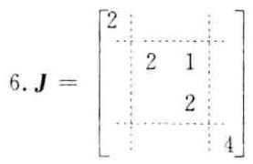

二、注意 $\mathbf{P}$ 列满秩时,有 ${\mathbf{P}}^{ + }\mathbf{P} = \mathbf{I}$ .

(1) 当 $\mathbf{A} = \mathbf{O}$ 时, $\parallel \mathbf{A}{\parallel }_{b} = {\begin{Vmatrix}\mathbf{P}\mathbf{O}{\mathbf{P}}^{ + }\end{Vmatrix}}_{a} = \parallel \mathbf{O}{\parallel }_{a} = 0$ ; 当 $\mathbf{A} \neq  \mathbf{O}$ 时, $\mathbf{P}\mathbf{A}{\mathbf{P}}^{ + } \neq  \mathbf{O}$ (若 $\mathbf{P}\mathbf{A}{\mathbf{P}}^{ + } = \mathbf{O}$ ,则 ${\mathbf{P}}^{ + }\mathbf{P} \cdot  \mathbf{A} \cdot  {\mathbf{P}}^{ + }\mathbf{P} = \mathbf{O}$ ,即 $\mathbf{A} = \mathbf{O}$ ,矛盾),从而 $\parallel \mathbf{A}{\parallel }_{h} = {\begin{Vmatrix}\mathbf{P}\mathbf{A}{\mathbf{P}}^{ + }\end{Vmatrix}}_{u} > 0$ .

$\left( 2\right)  \sim  \left( 3\right)$ 略.

(4) $\parallel \mathbf{{AB}}{\parallel }_{b} = {\begin{Vmatrix}\mathbf{P}\left( \mathbf{{AB}}\right) {\mathbf{P}}^{ + }\end{Vmatrix}}_{a} = {\begin{Vmatrix}\mathbf{P}\mathbf{A}{\mathbf{P}}^{ + } \cdot  \mathbf{P}\mathbf{B}{\mathbf{P}}^{ + }\end{Vmatrix}}_{a} \leq  {\begin{Vmatrix}\mathbf{P}\mathbf{A}{\mathbf{P}}^{ + }\end{Vmatrix}}_{a}{\begin{Vmatrix}\mathbf{P}\mathbf{B}{\mathbf{P}}^{ + }\end{Vmatrix}}_{a} = \parallel \mathbf{A}{\parallel }_{b}\parallel \mathbf{B}{\parallel }_{b}$

三、1. $\varphi \left( \lambda \right)  = \left| {\lambda \mathbf{I} - \mathbf{A}}\right|  = \lambda {\left( \lambda  - 1\right) }^{2}$ .

待定法: 因为 $\mathbf{A}\left( {\mathbf{A} - \mathbf{I}}\right)  = \mathbf{O}$ ,所以 $\mathbf{A}$ 的最小多项式为 $m\left( \lambda \right)  = \lambda \left( {\lambda  - 1}\right)$ . 设 $f\left( \lambda \right)  = {\mathrm{e}}^{\alpha } = m\left( \lambda \right) g\left( \lambda \right)  + (a \; + {b\lambda })$ ,则有

$$
\left\{  {\begin{array}{l} f\left( 0\right)  = 1 = a \\  f\left( 1\right)  = {\mathrm{e}}^{t} = a + b \end{array}.\;\left\{  \begin{array}{l} a = 1 \\  b = {\mathrm{e}}^{t} - 1 \end{array}\right. }\right.
$$

于是 $\;{\mathrm{e}}^{\prime } = a\mathbf{I} + b\mathbf{A} = \left( {\mathbf{I} - \mathbf{A}}\right)  + {\mathrm{e}}^{\prime }\mathbf{A} = \left\lbrack  \begin{array}{lll} 4 &  - 4 &  - 2 \\  2 &  - 2 &  - 1 \\  2 &  - 2 &  - 1 \end{array}\right\rbrack   + {\mathrm{e}}^{\prime }\left\lbrack  \begin{array}{lll}  - 3 & 4 & 2 \\   - 2 & 3 & 1 \\   - 2 & 2 & 2 \end{array}\right\rbrack$

求和法: 由 $\mathbf{A}\left( {\mathbf{A} - \mathbf{I}}\right)  = \mathbf{O}$ 可得 ${\mathbf{A}}^{2} = \mathbf{A} \Rightarrow  {\mathbf{A}}^{k} = \mathbf{A}\left( {k = 2,3,\cdots }\right)$ ,于是

$$
{\mathrm{e}}^{\lambda t} = \mathbf{I} + \left( {\frac{t}{1!} + \frac{{t}^{2}}{2!} + \frac{{t}^{3}}{3!} + \cdots }\right) \mathbf{A} = \mathbf{I} + \left( {{\mathrm{e}}^{t} - 1}\right) \mathbf{A} = \left( {\mathbf{I} - \mathbf{A}}\right)  + {\mathrm{e}}^{t}\mathbf{A}
$$

对角化法: 求 $\mathbf{P}$ 使得 ${\mathbf{P}}^{-1}\mathbf{{AP}} = \mathbf{\Lambda }$ .

$$
\mathbf{\Lambda } = \left\lbrack  \begin{array}{lll} 0 & & \\   & 1 & \\   & & 1 \end{array}\right\rbrack  ,\;\mathbf{P} = \left\lbrack  \begin{array}{lll} 2 & 1 & 1 \\  1 & 1 & 0 \\  1 & 0 & 2 \end{array}\right\rbrack  ,\;{\mathbf{P}}^{-1} = \left\lbrack  \begin{array}{rrr} 2 &  - 2 &  - 1 \\   - 2 & 3 & 1 \\   - 1 & 1 & 1 \end{array}\right\rbrack
$$

$$
{\mathrm{e}}^{tA} = \mathbf{P}\left\lbrack  \begin{array}{llll} 1 & & & \\   & {\mathrm{e}}^{t} & & \\   & & {\mathrm{e}}^{t} & \\   & & & {\mathrm{e}}^{t} \end{array}\right\rbrack  {\mathbf{P}}^{-1} = \left\lbrack  \begin{array}{lll} 4 &  - 4 &  - 2 \\  2 &  - 2 &  - 1 \\  2 &  - 2 &  - 1 \end{array}\right\rbrack   + {\mathrm{e}}^{t}\left\lbrack  \begin{array}{lll}  - 3 & 4 & 2 \\   - 2 & 3 & 1 \\   - 2 & 2 & 2 \end{array}\right\rbrack
$$

2.

$$
{\mathrm{e}}^{-s\mathbf{A}}\mathbf{b}\left( s\right)  = \left\{  {\left( {\mathbf{I} - \mathbf{A}}\right)  + {\mathrm{e}}^{-s}\mathbf{A}}\right\}   \cdot  {\mathrm{e}}^{s}\left\lbrack  \begin{array}{l} 1 \\  0 \\  2 \end{array}\right\rbrack   = \left\lbrack  \begin{array}{l} 1 \\  0 \\  2 \end{array}\right\rbrack
$$

$$
\mathbf{x}\left( t\right)  = {\mathrm{e}}^{tA}\{ \mathbf{x}\left( 0\right)  + {\int }_{0}^{t}{\mathrm{e}}^{-{sA}}\mathbf{b}\left( s\right) \mathrm{d}s\}  = \left\lbrack  \begin{array}{l}  - 4 \\   - 2 \\   - 2 \end{array}\right\rbrack   + {\mathrm{e}}^{t}\left\lbrack  \begin{array}{l} 4 \\  3 \\  2 \end{array}\right\rbrack   + t{\mathrm{e}}^{t}\left\lbrack  \begin{array}{l} 1 \\  0 \\  2 \end{array}\right\rbrack
$$

四、(1) ${\mathbf{T}}_{13}\left( {c, s}\right)$ 中 $c = \frac{3}{5}, s = \frac{4}{5}$ ,求得

$$
{\mathbf{T}}_{0} = {\mathbf{T}}_{13} = \frac{1}{5}\left\lbrack  \begin{array}{rrrr} 3 & 0 & 4 & 0 \\  0 & 5 & 0 & 0 \\   - 4 & 0 & 3 & 0 \\  0 & 0 & 0 & 5 \end{array}\right\rbrack  ,\;{\mathbf{T}}_{0}\mathbf{A} = \left\lbrack  \begin{array}{rrrr} 5 & 5 & 2 & 3 \\  0 & 3 & 6 & 4 \\  0 & 0 &  - 1 &  - 4 \\  0 & 4 & 8 & 2 \end{array}\right\rbrack
$$

(2) ${\mathbf{A}}_{1} = \left\lbrack  \begin{array}{rrr} 3 & 6 & 4 \\  0 &  - 1 &  - 4 \\  4 & 8 & 2 \end{array}\right\rbrack  ,{\mathbf{T}}_{13}\left( {c, s}\right)$ 中 $c = \frac{3}{5}, s = \frac{4}{5}$ ,求得

$$
{\mathbf{T}}_{1} = {\mathbf{T}}_{13} = \frac{1}{5}\left\lbrack  \begin{array}{rrr} 3 & 0 & 4 \\  0 & 5 & 0 \\   - 4 & 0 & 3 \end{array}\right\rbrack  ,\;{\mathbf{T}}_{1}{\mathbf{A}}_{1} = \left\lbrack  \begin{array}{rrr} 5 & {10} & 4 \\  0 &  - 1 &  - 4 \\  0 & 0 &  - 2 \end{array}\right\rbrack
$$

令 $\mathbf{T} = \left\lbrack  \begin{array}{ll} 1 & \\   & {\mathbf{T}}_{1} \end{array}\right\rbrack  {\mathbf{T}}_{0}$ ,则有

$$
\mathbf{Q} = {\mathbf{T}}^{\top } = \frac{1}{5}\left\lbrack  \begin{array}{rrrr} 3 & 0 &  - 4 & 0 \\  0 & 3 & 0 &  - 4 \\  4 & 0 & 3 & 0 \\  0 & 4 & 0 & 3 \end{array}\right\rbrack  ,\;\mathbf{R} = \left\lbrack  \begin{array}{rrrr} 5 & 5 & 2 & 3 \\   & 5 & {10} & 4 \\   & &  - 1 &  - 4 \\   & & &  - 2 \end{array}\right\rbrack  ,\;\mathbf{A} = \mathbf{{QR}}
$$

五、取 $\mathbf{D} = \operatorname{diag}\left( {1,\frac{1}{3},1}\right)$ ,则 $\mathbf{B} = \mathbf{D}\mathbf{A}{\mathbf{D}}^{-1}$ 的 3 个孤立盖尔圆中各有 $\mathbf{A}$ 的一个特征值.

[注] 亦可取 $\mathbf{D} = \operatorname{diag}\left( {1,{0.3},1}\right) ,\mathbf{D} = \operatorname{diag}\left( {1,{0.25},1}\right) ,\mathbf{D} = \operatorname{diag}\left( {{1.0.2},1}\right)$ .

六、1. A. $\frac{\text{ 行 }}{}$ , $\left\lbrack  \begin{array}{llll} 1 & 1 & 0 & 1 \\  0 & 1 & 1 & 1 \\  0 & 0 & 0 & 0 \\  0 & 0 & 0 & 0 \end{array}\right\rbrack$ , $\;\mathbf{A} = \left\lbrack  \begin{array}{rr} 1 & 0 \\  1 & 1 \\  1 &  - 1 \\  0 & 1 \end{array}\right\rbrack  \left\lbrack  \begin{array}{llll} 1 & 1 & 0 & 1 \\  0 & 1 & 1 & 1 \end{array}\right\rbrack   = \mathbf{F}\mathbf{G}$

2. ${\mathbf{F}}^{ + } = {\left( {\mathbf{F}}^{\mathrm{T}}\mathbf{F}\right) }^{-1}{\mathbf{F}}^{\mathrm{T}} = \frac{1}{3}\left\lbrack  \begin{array}{rrrr} 1 & 1 & 1 & 0 \\  0 & 1 &  - 1 & 1 \end{array}\right\rbrack  ,\;{\mathbf{G}}^{ + } = {\mathbf{G}}^{\mathrm{T}}{\left( \mathbf{G}{\mathbf{G}}^{\mathrm{T}}\right) }^{-1} = \frac{1}{5}\left\lbrack  \begin{array}{rr} 3 &  - 2 \\  1 & 1 \\   - 2 & 3 \\  1 & 1 \end{array}\right\rbrack$

$$
{\mathbf{A}}^{ + } = {\mathbf{G}}^{ + }{\mathbf{F}}^{ + } = \frac{1}{15}\left\lbrack  \begin{array}{rrrr} 3 & 1 & 5 &  - 2 \\  1 & 2 & 0 & 1 \\   - 2 & 1 &  - 5 & 3 \\  1 & 2 & 0 & 1 \end{array}\right\rbrack
$$

$3 \sim  4.{\mathbf{x}}_{0} = {\mathbf{A}}^{ + }\mathbf{b} = {\left( {1.0}, - 1,0\right) }^{\mathrm{T}}$ ,由 $\mathbf{A}{\mathbf{A}}^{ + }\mathbf{b} = \mathbf{A}{\mathbf{x}}_{0} = \mathbf{b}$ 可得 $\mathbf{A}\mathbf{x} = \mathbf{b}$ 有解,故 ${\mathbf{x}}_{0}$ 是 $\mathbf{A}\mathbf{x} = \mathbf{b}$ 的极小范数解.

[注] $\mathbf{A}\overset{\text{ 行 }}{ \rightarrow  }\left\lbrack  \begin{array}{rrrr} 1 & 0 &  - 1 & 0 \\  0 & 1 & 1 & 1 \\  0 & 0 & 0 & 0 \\  0 & 0 & 0 & 0 \end{array}\right\rbrack  ,\;\mathbf{F} = \left\lbrack  \begin{array}{ll} 1 & 1 \\  1 & 2 \\  1 & 0 \\  0 & 1 \end{array}\right\rbrack  ,\;\mathbf{G} = \left\lbrack  \begin{array}{rrrr} 1 & 0 &  - 1 & 0 \\  0 & 1 & 1 & 1 \end{array}\right\rbrack$

$$
{\mathbf{F}}^{ + } = \frac{1}{3}\left\lbrack  \begin{array}{rrrr} 1 & 0 & 2 &  - 1 \\  0 & 1 &  - 1 & 1 \end{array}\right\rbrack  ,\;{\mathbf{G}}^{ + } = \frac{1}{5}\left\lbrack  \begin{array}{rr} 3 & 1 \\  1 & 2 \\   - 2 & 1 \\  1 & 2 \end{array}\right\rbrack
$$

七、1. 矩阵组 ${\mathbf{A}}_{1},{\mathbf{A}}_{2},{\mathbf{A}}_{3},{\mathbf{A}}_{4}$ 在 ${\mathbf{R}}^{2 \times  2}$ 的基 ${\mathbf{E}}_{11},{\mathbf{E}}_{12},{\mathbf{E}}_{21},{\mathbf{E}}_{22}$ 下的坐标向量为

$$
{\mathbf{\alpha }}_{1} = \left\lbrack  \begin{array}{l} 1 \\  0 \\  0 \\  1 \end{array}\right\rbrack  ,\;{\mathbf{\alpha }}_{2} = \left\lbrack  \begin{array}{l} 0 \\  1 \\  1 \\  0 \end{array}\right\rbrack  ,\;{\mathbf{\alpha }}_{3} = \left\lbrack  \begin{array}{l} 1 \\  0 \\  1 \\  0 \end{array}\right\rbrack  ,\;{\mathbf{\alpha }}_{4} = \left\lbrack  \begin{array}{l} 0 \\  1 \\  0 \\  1 \end{array}\right\rbrack
$$

求得该向量组的一个最大无关组为 ${\mathbf{\alpha }}_{1},{\mathbf{\alpha }}_{2},{\mathbf{\alpha }}_{3}$ ,矩阵组 ${\mathbf{A}}_{1},{\mathbf{A}}_{2},{\mathbf{A}}_{3},{\mathbf{A}}_{4}$ 的一个最大无关组为 ${\mathbf{A}}_{1},{\mathbf{A}}_{2},{\mathbf{A}}_{3}$ ,也就是 $W$ 的一个基.

2. 计算基象组:

$$
T\left( {\mathbf{A}}_{1}\right)  = \left\lbrack  \begin{array}{ll} 1 & 0 \\  0 & 1 \end{array}\right\rbrack   = {\mathbf{A}}_{1},\;T\left( {\mathbf{A}}_{2}\right)  = \left\lbrack  \begin{array}{rr} 0 &  - 1 \\   - 1 & 0 \end{array}\right\rbrack   =  - {\mathbf{A}}_{2},\;T\left( {\mathbf{A}}_{3}\right)  = \left\lbrack  \begin{array}{rr} 0 & 0 \\   - 1 & 1 \end{array}\right\rbrack   = {\mathbf{A}}_{1} - {\mathbf{A}}_{3}
$$

设 $T\left( {{\mathbf{A}}_{1},{\mathbf{A}}_{2},{\mathbf{A}}_{3}}\right)  = \left( {{\mathbf{A}}_{1},{\mathbf{A}}_{2},{\mathbf{A}}_{3}}\right) \mathbf{A}$ ,则 $\mathbf{A} = \left\lbrack  \begin{array}{rrr} 1 & 0 & 1 \\  0 &  - 1 & 0 \\  0 & 0 &  - 1 \end{array}\right\rbrack$ . 求 $\mathbf{P}$ 使得 ${\mathbf{P}}^{-1}\mathbf{{AP}} = \mathbf{\Lambda }$ :

$$
\mathbf{P} = \left\lbrack  \begin{array}{rrr} 1 & 0 &  - 1 \\  0 & 1 & 0 \\  0 & 0 & 2 \end{array}\right\rbrack  ,\;\mathbf{\Lambda } = \left\lbrack  \begin{array}{lll} 1 & & \\   &  - 1 & \\   & &  - 1 \end{array}\right\rbrack
$$

令 $\left( {{\mathbf{B}}_{1},{\mathbf{B}}_{2},{\mathbf{B}}_{3}}\right)  = \left( {{\mathbf{A}}_{1},{\mathbf{A}}_{2},{\mathbf{A}}_{3}}\right) \mathbf{P}$ ,求得另一基:

$$
{\mathbf{B}}_{1} = {\mathbf{A}}_{1} = \left\lbrack  \begin{array}{ll} 1 & 0 \\  0 & 1 \end{array}\right\rbrack  ,\;{\mathbf{B}}_{2} = {\mathbf{A}}_{2} = \left\lbrack  \begin{array}{ll} 0 & 1 \\  1 & 0 \end{array}\right\rbrack  .\;{\mathbf{B}}_{3} =  - {\mathbf{A}}_{1} + 2{\mathbf{A}}_{3} = \left\lbrack  \begin{array}{rr} 1 & 0 \\  2 &  - 1 \end{array}\right\rbrack
$$

于是可得 $T\left( {{\mathbf{B}}_{1},{\mathbf{B}}_{2},{\mathbf{B}}_{3}}\right)  = \left( {{\mathbf{B}}_{1},{\mathbf{B}}_{2},{\mathbf{B}}_{3}}\right) \mathbf{A}$ .

八、1. 任意 $\mathbf{y} \in  R\left( {T}_{2}\right)$ ,存在 $\mathbf{x} \in  V$ ,使得 $\mathbf{y} = {T}_{2}\left( \mathbf{x}\right)$ ,且有

$$
{T}_{1}\left( \mathbf{y}\right)  = {T}_{1}\left\lbrack  {{T}_{2}\left( \mathbf{x}\right) }\right\rbrack   = \left( {{T}_{1}{T}_{2}}\right) \left( \mathbf{x}\right)  = \left( {{T}_{2}{T}_{1}}\right) \left( \mathbf{x}\right)  = {T}_{2}\left\lbrack  {{T}_{1}\left( \mathbf{x}\right) }\right\rbrack   \in  R\left( {T}_{2}\right)
$$

故 $R\left( {T}_{2}\right)$ 是 ${T}_{1}$ 的不变子空间.

2. 任意 $\mathbf{x} \in  N\left( {T}_{2}\right) ,{T}_{2}\left( \mathbf{x}\right)  = \mathbf{0}$ . 因为

$$
{T}_{2}\left\lbrack  {{T}_{1}\left( \mathbf{x}\right) }\right\rbrack   = \left( {{T}_{2}{T}_{1}}\right) \left( \mathbf{x}\right)  = \left( {{T}_{1}{T}_{2}}\right) \left( \mathbf{x}\right)  = {T}_{1}\left\lbrack  {{T}_{2}\left( \mathbf{x}\right) }\right\rbrack   = {T}_{1}\left( \mathbf{0}\right)  = \mathbf{0}
$$

所以 ${T}_{1}\left( \mathbf{x}\right)  \in  N\left( {T}_{2}\right)$ . 因此 $N\left( {T}_{2}\right)$ 是 ${T}_{1}$ 的不变子空间.

## 试题六 (2002 年 B 卷)

一、(18 分) 判断正误、填空或计算填空:

1. 设 $\mathbf{T}$ 是 $n$ 阶 Givens 矩阵, ${\mathbf{H}}_{u}$ 是 $n$ 阶 Householder 矩阵,则 $\mathbf{T}{\mathbf{H}}_{u}{\mathbf{T}}^{-1}$ 也是 Householder 矩阵. ( )

2. 已知 $\mathbf{A} = \left\lbrack  \begin{array}{rrr} 0 & \mathrm{i} & 1 \\   - \mathrm{i} & 1 &  - \mathrm{i} \\  1 & \mathrm{i} & 0 \end{array}\right\rbrack  ,\mathbf{x} = \left\lbrack  \begin{array}{l} 1 \\  0 \\  1 \end{array}\right\rbrack  ,\mathrm{i} = \sqrt{-1}$ ,则 $\parallel \mathbf{A}{\parallel }_{\infty } = \left( \;\right) ,\parallel \mathbf{A}{\parallel }_{2} =$ (   ), $\parallel \mathbf{A}\mathbf{x}{\parallel }_{1} = \left( \begin{array}{lll}  & &  \end{array}\right) .$

3. 设 $\mathbf{A} \in  {\mathbf{C}}^{m \times  n},{\mathbf{A}}^{\left( 1\right) }$ 表示 $\mathbf{A}$ 的一个 $\{ 1\}$ -逆,则 $\sin \left( {\frac{\pi }{2}\mathbf{A}{\mathbf{A}}^{\left( 1\right) }}\right)  =$ (   ).

4. 设 ${T}_{1}$ 和 ${T}_{2}$ 是线性空间 $V$ 中的两个线性变换,且 ${T}_{1}{T}_{2} = {T}_{0}$ (零变换), $N\left( {T}_{1}\right)$ 表示 ${T}_{1}$ 的核, $R\left( {T}_{2}\right)$ 表示 ${T}_{2}$ 的值域,则 $N\left( {T}_{1}\right)  \cap  R\left( {T}_{2}\right)  =$ (   ).

5. 设 $\mathbf{A} \in  {\mathbf{C}}^{n \times  n}$ 的特征值为 ${\lambda }_{1},{\lambda }_{2},\cdots ,{\lambda }_{n}$ . 则矩阵方程 $\mathbf{A}\mathbf{X} + \mathbf{X}\mathbf{A} = \mathbf{O}$ 有非零解的充要条件是 ( ).

6. 已知 $\mathbf{A} = \left\lbrack  \begin{array}{llll} 1 & 0 & 1 & 0 \\  0 & 1 & 1 & 0 \\  0 & 0 & 2 & 0 \\  3 & 0 & 0 & 1 \end{array}\right\rbrack$ ,则 $\mathbf{A}$ 的 Jordan 标准形为 $\mathbf{J} = \left\lbrack  \begin{array}{lll}  & & \\   & & \\   & &  \end{array}\right\rbrack$ .

二、(10 分) 设 $\mathbf{A} \in  {\mathbf{C}}^{m \times  n}$ ,且 $\mathbf{A} \neq  \mathbf{O}$ ,证明 ${\begin{Vmatrix}{\mathbf{A}}^{ + }\mathbf{A}\end{Vmatrix}}_{2} = 1$ .

三、(15 分) 已知 $\mathbf{A} = \left\lbrack  \begin{array}{rrr}  - 1 & 2 & 0 \\   - 2 & 3 & 1 \\  2 &  - 2 &  - 2 \end{array}\right\rbrack  ,\mathbf{b}\left( t\right)  = \left\lbrack  \begin{matrix} {\mathrm{e}}^{-t} \\  0 \\  2{\mathrm{e}}^{-t} \end{matrix}\right\rbrack  , x\left( 0\right)  = \left\lbrack  \begin{array}{l} 1 \\  1 \\  0 \end{array}\right\rbrack$ .

1. 求 ${\mathrm{e}}^{\lambda t}$ ;

2. 用矩阵函数方法求微分方程 $\frac{\mathrm{d}}{\mathrm{d}t}\mathbf{x}\left( t\right)  = \mathbf{A}\mathbf{x}\left( t\right)  + \mathbf{b}\left( t\right)$ 满足初始条件 $\mathbf{x}\left( 0\right)$ 的解.

四、(10 分) 用 Householder 变换求矩阵 $\mathbf{A} = \left\lbrack  \begin{array}{rrrr} 1 & 2 & 5 & 0 \\  1 & 2 & 1 & 0 \\  1 & 2 &  - 1 & 4 \\  1 & 2 & 3 & 4 \end{array}\right\rbrack$ 的 QR 分解.

五、(10 分) 应用 Gerschgorin 定理隔离矩阵 $\mathbf{A} = \left\lbrack  \begin{array}{rrr} {10} & {0.1} & 1 \\  {0.1} & 9 & 1 \\  1 & {0.1} & 3 \end{array}\right\rbrack$ 的特征值 (要求画图表示),并根据实矩阵特征值的性质改进所得结果.

六、(15 分) 已知 $\mathbf{A} = \left\lbrack  \begin{array}{llll} 1 & 2 & 1 & 2 \\  0 & 1 & 0 & 1 \\  1 & 0 & 1 & 0 \\  2 & 1 & 2 & 1 \end{array}\right\rbrack  ,\mathbf{b} = \left\lbrack  \begin{array}{l} 4 \\  3 \\  2 \\  1 \end{array}\right\rbrack$ .

1. 求 $\mathbf{A}$ 的满秩分解;

2. 求 ${\mathbf{A}}^{ + }$ ;

3. 用广义逆矩阵方法判断线性方程组 $\mathbf{A}\mathbf{x} = \mathbf{b}$ 是否有解;

4. 求线性方程组 $\mathbf{A}\mathbf{x} = \mathbf{b}$ 的极小范数解或极小范数最小二乘解 ${\mathbf{x}}_{0}$ (要求指出所求的是哪种解).

七、(14 分) 已知矩阵空间 ${\mathbf{R}}^{2 \times  2}$ 的子空间 $V = \left\{  {\left. {\mathbf{X} = \left\lbrack  \begin{array}{ll} {x}_{1} & {x}_{2} \\  {x}_{3} & {x}_{4} \end{array}\right\rbrack  }\right| \;{x}_{3} - {x}_{4} = 0}\right\}  ,{\mathbf{R}}^{2 \times  2}$ 中的内积为 $\left( {\mathbf{A},\mathbf{B}}\right)  = \mathop{\sum }\limits_{{i = 1}}^{2}\mathop{\sum }\limits_{{j = 1}}^{2}{a}_{ij}{b}_{ij},\mathbf{A} = \left\lbrack  \begin{array}{ll} {a}_{11} & {a}_{12} \\  {a}_{21} & {a}_{22} \end{array}\right\rbrack  ,\mathbf{B} = \left\lbrack  \begin{array}{ll} {b}_{11} & {b}_{12} \\  {b}_{21} & {b}_{22} \end{array}\right\rbrack  , V$ 中的线性变换为 $T\left( \mathbf{X}\right)  = \mathbf{X}{\mathbf{B}}_{0}\left( {\forall \mathbf{X} \in  V}\right) ,{\mathbf{B}}_{0} = \left\lbrack  \begin{array}{ll} 1 & 2 \\  2 & 1 \end{array}\right\rbrack$ .

1. 求子空间 $V$ 的一个标准正交基;

2. 验证 $T$ 是 $V$ 中的对称变换;

3. 求 $V$ 的一个标准正交基，使 $T$ 在该基下的矩阵为对角矩阵.

八、(8 分) 设线性空间 ${V}^{3}$ 的一个基为 ${\mathbf{x}}_{1},{\mathbf{x}}_{2},{\mathbf{x}}_{3}$ ,线性变换 $T$ 在该基下的矩阵为 $\mathbf{A} = \left\lbrack  \begin{array}{rrr} 1 & 1 & 1 \\   - 1 & 3 & 1 \\  1 &  - 1 & 1 \end{array}\right\rbrack$ . 令 ${\mathbf{y}}_{1} = {\mathbf{x}}_{1} + {\mathbf{x}}_{2},{\mathbf{y}}_{2} = {\mathbf{x}}_{1} + {\mathbf{x}}_{2} + {\mathbf{x}}_{3}$ ,证明: ${V}^{3}$ 的子空间 $W = L\left( {{\mathbf{y}}_{1},{\mathbf{y}}_{2}}\right)$ 是 $T$ 的不变子空间.

## 试题六解答

一、1. 因为 ${\mathbf{{TH}}}_{u}{\mathbf{T}}^{-1} = \mathbf{T}\left( {\mathbf{I} - 2{\mathbf{{uu}}}^{\mathrm{T}}}\right) {\mathbf{T}}^{-1} = \mathbf{I} - 2\left( \mathbf{{Tu}}\right) {\left( \mathbf{{Tu}}\right) }^{\mathrm{T}}$ ,且 $\left| \mathbf{{Tu}}\right|  = 1$ ,所以 ${\mathbf{{TH}}}_{u}{\mathbf{T}}^{-1}$ 是 Householder 矩阵.

2. $\parallel \mathbf{A}{\parallel }_{\infty } = 3,\parallel \mathbf{A}{\parallel }_{2} = 1 + \sqrt{2}$ 或 $\sqrt{3 + 2\sqrt{2}},\parallel \mathbf{A}\mathbf{x}{\parallel }_{1} = 4$ .

3. 由 ${\left( {\mathbf{{AA}}}^{\left( 1\right) }\right) }^{2} = {\mathbf{{AA}}}^{\left( 1\right) }$ 可得

$$
\sin \left( {\frac{\pi }{2}\mathbf{A}{\mathbf{A}}^{\left( 1\right) }}\right)  = \left( {\frac{\pi }{2}\mathbf{A}{\mathbf{A}}^{\left( 1\right) }}\right)  - \frac{1}{3!}{\left( \frac{\pi }{2}\mathbf{A}{\mathbf{A}}^{\left( 1\right) }\right) }^{3} + \frac{1}{5!}{\left( \frac{\pi }{2}\mathbf{A}{\mathbf{A}}^{\left( 1\right) }\right) }^{5} - \cdots  =
$$

$$
\left( {\frac{\pi }{2} - \frac{1}{3!}{\left( \frac{\pi }{2}\right) }^{3} + \frac{1}{5!}{\left( \frac{\pi }{2}\right) }^{5} - \cdots }\right) \left( {\mathbf{{AA}}}^{\left( 1\right) }\right)  =
$$

$$
\left( {\sin \frac{\pi }{2}}\right) \left( {\mathbf{{AA}}}^{\left( 1\right) }\right)  = {\mathbf{{AA}}}^{\left( 1\right) }
$$

4. $\forall \mathbf{y} \in  R\left( {T}_{2}\right)  \Rightarrow  \mathbf{y} = {T}_{2}\left( \mathbf{x}\right) \left( {\mathbf{x} \in  V}\right)$

$$
\Rightarrow  {T}_{1}\left( \mathbf{y}\right)  = {T}_{1}\left\lbrack  {{T}_{2}\left( \mathbf{x}\right) }\right\rbrack   = \left\lbrack  {{T}_{1}{T}_{2}}\right\rbrack  \left( \mathbf{x}\right)  = \mathbf{0} \Rightarrow  \mathbf{y} \in  N\left( {T}_{1}\right)
$$

因此 $R\left( {T}_{2}\right)  \subset  N\left( {T}_{1}\right)$ ,从而 $R\left( {T}_{2}\right)  \cap  N\left( {T}_{1}\right)  = R\left( {T}_{2}\right)$ .

5. 原矩阵方程等价于 $\left( {\mathbf{A} \otimes  \mathbf{I} + \mathbf{I} \otimes  {\mathbf{A}}^{\mathrm{T}}}\right) \overline{\operatorname{vec}}\left( \mathbf{X}\right)  = \overline{\operatorname{vec}}\left( \mathbf{O}\right)$ ,该齐次方程组有非零解的充要条件是存在 ${i}_{0}$ , ${j}_{0}$ ,使得 ${\lambda }_{{i}_{0}} + {\lambda }_{{i}_{0}} = 0$ .

6. $\mathbf{J} = \left\lbrack  \begin{array}{llll} 1 & & & \\   & 1 & & \\   & 1 & 1 & \\   & & 1 & 2 \end{array}\right\rbrack$

二、 $\mathbf{B} = {\mathbf{A}}^{ + }\mathbf{A} : \operatorname{rank}\left( \mathbf{B}\right)  = \operatorname{rank}\left( \mathbf{A}\right)  \geq  1 \Rightarrow  \mathbf{B} \neq  \mathbf{O}$ .

${\mathbf{B}}^{2} = \mathbf{B} \Rightarrow  \mathbf{B}$ 的特征值只能是 0 或者 1 .

${\mathbf{B}}^{\mathrm{H}} = \mathbf{B},\mathbf{B} \neq  \mathbf{O} \Rightarrow  \mathbf{B}$ 的特征值不全为 0 $\Rightarrow  \rho \left( \mathbf{B}\right)  = 1$ .

$\parallel \mathbf{B}{\parallel }_{2}^{2} = \rho \left( {{\mathbf{B}}^{\mathrm{H}}\mathbf{B}}\right)  = \rho \left( \mathbf{B}\right)  = 1 \Rightarrow  \parallel \mathbf{B}{\parallel }_{2} = 1.$

三、 $1.\varphi \left( \lambda \right)  = \left| {\lambda \mathbf{I} - \mathbf{A}}\right|  = \lambda \left( {\lambda  - 1}\right) \left( {\lambda  + 1}\right)$ .

待定法: 设 $f\left( \lambda \right)  = {\mathrm{e}}^{\lambda \lambda } = \varphi \left( \lambda \right) g\left( \lambda \right)  + \left( {a + {b\lambda } + c{\lambda }^{2}}\right)$ ,则有

$$
\left\{  {\begin{array}{l} f\left( 0\right)  = 1 = a \\  f\left( 1\right)  = {\mathrm{e}}^{t} = a + b + c \\  f\left( {-1}\right)  = {\mathrm{e}}^{-t} = a - b + c \end{array},\left\{  \begin{array}{l} a = 1 \\  b = \left( {{\mathrm{e}}^{t} - {\mathrm{e}}^{-t}}\right) /2 \\  c = \left( {{\mathrm{e}}^{t} + {\mathrm{e}}^{-t}}\right)  - 2/2 \end{array}\right. }\right.
$$

于是

$$
{\mathrm{e}}^{t\mathbf{A}} = a\mathbf{I} + b\mathbf{A} + c{\mathbf{A}}^{2} = \left( {\mathbf{I} - {\mathbf{A}}^{2}}\right)  + \frac{{\mathrm{e}}^{t}}{2}\left( {{\mathbf{A}}^{2} + \mathbf{A}}\right)  + \frac{{\mathrm{e}}^{-t}}{2}\left( {{\mathbf{A}}^{2} - \mathbf{A}}\right)  =
$$

$$
\left\lbrack  \begin{matrix} 4 &  - 4 &  - 2 \\  2 &  - 2 &  - 1 \\  2 &  - 2 &  - 1 \end{matrix}\right\rbrack   + {\mathrm{e}}^{t}\left\lbrack  \begin{array}{rrr}  - 2 & 3 & 1 \\   - 2 & 3 & 1 \\  0 & 0 & 0 \end{array}\right\rbrack   + {\mathrm{e}}^{-t}\left\lbrack  \begin{array}{rrr}  - 1 & 1 & 1 \\  0 & 0 & 0 \\   - 2 & 2 & 2 \end{array}\right\rbrack
$$

对角化法: 求 $\mathbf{P}$ 使得 ${\mathbf{P}}^{-1}\mathbf{{AP}} = \mathbf{\Lambda }$

$$
\mathbf{\Lambda } = \left\lbrack  \begin{array}{lll} 0 & & \\   & 1 & \\   & &  - 1 \end{array}\right\rbrack  ,\;\mathbf{P} = \left\lbrack  \begin{array}{lll} 2 & 1 & 1 \\  1 & 1 & 0 \\  1 & 0 & 2 \end{array}\right\rbrack  ,\;{\mathbf{P}}^{-1} = \left\lbrack  \begin{array}{rrr} 2 &  - 2 &  - 1 \\   - 2 & 3 & 1 \\   - 1 & 1 & 1 \end{array}\right\rbrack
$$

$$
{\mathrm{e}}^{tA} = \mathbf{P}\left\lbrack  \begin{array}{lll} 1 & & \\   & {\mathrm{e}}^{t} & \\   & & {\mathrm{e}}^{-t} \end{array}\right\rbrack  {\mathbf{P}}^{-1} = \left\lbrack  \begin{matrix} 4 &  - 4 &  - 2 \\  2 &  - 2 &  - 1 \\  2 &  - 2 &  - 1 \end{matrix}\right\rbrack   + {\mathrm{e}}^{t}\left\lbrack  \begin{array}{rrr}  - 2 & 3 & 1 \\   - 2 & 3 & 1 \\  0 & 0 & 0 \end{array}\right\rbrack   + {\mathrm{e}}^{-t}\left\lbrack  \begin{array}{rrr}  - 1 & 1 & 1 \\  0 & 0 & 0 \\   - 2 & 2 & 2 \end{array}\right\rbrack
$$

$$
\text{ 2. }{\mathrm{e}}^{-s\mathbf{A}}\mathbf{b}\left( s\right)  = \left\{  {\left( {\mathbf{I} - {\mathbf{A}}^{2}}\right)  + \frac{{\mathrm{e}}^{-s}}{2}\left( {{\mathbf{A}}^{2} + \mathbf{A}}\right)  + \frac{{\mathrm{e}}^{s}}{2}\left( {{\mathbf{A}}^{2} - \mathbf{A}}\right) }\right\}   \cdot  {\mathrm{e}}^{-s}\left\lbrack  \begin{array}{l} 1 \\  0 \\  2 \end{array}\right\rbrack   = \left\lbrack  \begin{array}{l} 1 \\  0 \\  2 \end{array}\right\rbrack
$$

$$
\mathbf{x}\left( t\right)  = {\mathrm{e}}^{t\mathbf{A}}\left\{  {\mathbf{x}\left( 0\right)  + {\int }_{0}^{t}{\mathrm{e}}^{-s\mathbf{A}}\mathbf{b}\left( s\right) \mathrm{d}s}\right\}   = \left\lbrack  \begin{matrix} {\mathrm{e}}^{t} + t{\mathrm{e}}^{-t} \\  {\mathrm{e}}^{t} \\  {2t}{\mathrm{e}}^{-t} \end{matrix}\right\rbrack
$$

四、(1) ${\mathbf{\beta }}^{\left( 0\right) } = \left\lbrack  \begin{array}{l} 1 \\  1 \\  1 \\  1 \end{array}\right\rbrack  ,\;{\mathbf{\beta }}^{\left( 0\right) } - \left| {\mathbf{\beta }}^{\left( 0\right) }\right| {\mathbf{e}}_{1} = \left\lbrack  \begin{array}{r}  - 1 \\  1 \\  1 \\  1 \end{array}\right\rbrack  ,\;\mathbf{u} = \frac{1}{2}\left\lbrack  \begin{array}{r}  - 1 \\  1 \\  1 \\  1 \end{array}\right\rbrack$

$$
{\mathbf{H}}_{0} = \mathbf{I} - 2\mathbf{u}{\mathbf{u}}^{\mathrm{T}} = \frac{1}{2}\left\lbrack  \begin{array}{rrrr} 1 & 1 & 1 & 1 \\  1 & 1 &  - 1 &  - 1 \\  1 &  - 1 & 1 &  - 1 \\  1 &  - 1 &  - 1 & 1 \end{array}\right\rbrack  ,\;{\mathbf{H}}_{0}\mathbf{A} = \left\lbrack  \begin{array}{rrrr} 2 & 4 & 4 & 4 \\  0 & 0 & 2 &  - 4 \\  0 & 0 & 0 & 0 \\  0 & 0 & 4 & 0 \end{array}\right\rbrack
$$

(2) ${\mathbf{A}}^{\left( 2\right) } = \left\lbrack  \begin{array}{ll} 0 & 0 \\  4 & 0 \end{array}\right\rbrack  ,\;{\mathbf{\beta }}^{\left( 1\right) } = \left\lbrack  \begin{array}{l} 0 \\  4 \end{array}\right\rbrack  ,\;{\mathbf{\beta }}^{\left( 1\right) } - \left| {\mathbf{\beta }}^{\left( 1\right) }\right| {\mathbf{e}}_{1} = 4\left\lbrack  \begin{array}{r}  - 1 \\  1 \end{array}\right\rbrack  ,\;\mathbf{u} = \frac{1}{\sqrt{2}}\left\lbrack  \begin{array}{r}  - 1 \\  1 \end{array}\right\rbrack$

$$
{\mathbf{H}}_{2} = \mathbf{I} - 2\mathbf{u}{\mathbf{u}}^{\top } = \left\lbrack  \begin{array}{ll} 0 & 1 \\  1 & 0 \end{array}\right\rbrack  ,\;{\mathbf{H}}_{2}{\mathbf{A}}^{\left( 2\right) } = \left\lbrack  \begin{array}{ll} 4 & 0 \\  0 & 0 \end{array}\right\rbrack
$$

令 $\mathbf{S} = \left\lbrack  \begin{array}{ll} {\mathbf{I}}_{2} & \\   & {\mathbf{H}}_{2} \end{array}\right\rbrack  {\mathbf{H}}_{0}$ ,则有

$$
\mathbf{Q} = {\mathbf{S}}^{\mathrm{T}} = \frac{1}{2}\left\lbrack  \begin{array}{rrrr} 1 & 1 & 1 & 1 \\  1 & 1 &  - 1 &  - 1 \\  1 &  - 1 &  - 1 & 1 \\  1 &  - 1 & 1 &  - 1 \end{array}\right\rbrack  ,\;\mathbf{R} = \left\lbrack  \begin{array}{rrrr} 2 & 4 & 4 & 4 \\  0 & 2 &  - 4 & \\   - 1 & 4 & 0 & \\  \vdots & & & 0 \end{array}\right\rbrack  ,\;\mathbf{A} = \mathbf{{QR}}
$$

[注] 因为 ${\mathbf{H}}_{0}\mathbf{A}$ 的 3 行 2 列和 4 行 2 列元素都是 0,所以不必进行第二步.

五、取 $\mathbf{D} = \operatorname{diag}\left( {1,1,5}\right)$ ,则 $\mathbf{B} = \mathbf{D}\mathbf{A}{\mathbf{D}}^{-1}$ 的 3 个孤立盖尔圆中各有 $\mathbf{A}$ 的一个特征值. 因为 $\mathbf{A}$ 是实矩阵,所以复特征值必成对共轭出现, 从而关于实轴对称的孤立盖尔圆中的特征值必为实数.

[注] 亦可取 $\mathbf{D} = \operatorname{diag}\left( {1,{1.4}}\right) ,\;\mathbf{D} = \operatorname{diag}\left( {1,{1.3}}\right)$ .

六、1. A. 行 $\left\lbrack  \begin{array}{llll} 1 & 0 & 1 & 0 \\  0 & 1 & 0 & 1 \\  0 & 0 & 0 & 0 \\  0 & 0 & 0 & 0 \end{array}\right\rbrack$ , $\;\mathbf{A} = \left\lbrack  \begin{array}{ll} 1 & 2 \\  0 & 1 \\  1 & 0 \\  2 & 1 \end{array}\right\rbrack  \left\lbrack  \begin{array}{llll} 1 & 0 & 1 & 0 \\  0 & 1 & 0 & 1 \end{array}\right\rbrack   = \mathbf{F}\mathbf{G}$

$$
\text{ 2. }{\mathbf{F}}^{\prime } = {\left( {\mathbf{F}}^{\mathrm{T}}\mathbf{F}\right) }^{-1}{\mathbf{F}}^{\mathrm{T}} = \frac{1}{10}\left\lbrack  \begin{array}{rrrr}  - 1 &  - 2 & 3 & 4 \\  4 & 3 &  - 2 &  - 1 \end{array}\right\rbrack
$$

$$
{\mathbf{G}}^{ + } = {\mathbf{G}}^{\mathrm{T}}{\left( \mathbf{G}{\mathbf{G}}^{\mathrm{T}}\right) }^{-1} = \frac{1}{2}\left\lbrack  \begin{array}{ll} 1 & 0 \\  0 & 1 \\  1 & 0 \\  0 & 1 \end{array}\right\rbrack  ,\;{\mathbf{A}}^{\prime } = {\mathbf{G}}^{\prime }{\mathbf{F}}^{\prime } = \frac{1}{20}\left\lbrack  \begin{array}{rrrr}  - 1 &  - 2 & 3 & 4 \\  4 & 3 &  - 2 &  - 1 \\   - 1 &  - 2 & 3 & 4 \\  4 & 3 &  - 2 &  - 1 \end{array}\right\rbrack
$$

$3 \sim  4.{\mathbf{x}}_{v} = {\mathbf{A}}^{ * }\mathbf{b} = {\left( 0,1,0,1\right) }^{\top }$ ,因为 $\mathbf{A}{\mathbf{A}}^{ - }\mathbf{b} = \mathbf{A}{\mathbf{x}}_{v} = {\left( 4,2,0,2\right) }^{\top } \neq  \mathbf{b}$ ,所以 $\mathbf{A}\mathbf{x} = \mathbf{b}$ 无解,故 $\mathbf{x}$ 是 $\mathbf{A}\mathbf{x} = \mathbf{b}$ 的极小范数最小二乘解.

七、1. 设 $\mathbf{X} \in  V$ ,则

$$
\mathbf{X} = \left\lbrack  \begin{array}{ll} {x}_{1} & {x}_{2} \\  {x}_{3} & {x}_{3} \end{array}\right\rbrack   = {x}_{1}\left\lbrack  \begin{array}{ll} 1 & 0 \\  0 & 0 \end{array}\right\rbrack   + {x}_{2}\left\lbrack  \begin{array}{ll} 0 & 1 \\  0 & 0 \end{array}\right\rbrack   + {x}_{3}\left\lbrack  \begin{array}{ll} 0 & 0 \\  1 & 1 \end{array}\right\rbrack
$$

故 $V$ 的标准正交基为 ${\mathbf{X}}_{1} = \left\lbrack  \begin{array}{ll} 1 & 0 \\  0 & 0 \end{array}\right\rbrack  ,\;{\mathbf{X}}_{2} = \left\lbrack  \begin{array}{ll} 0 & 1 \\  0 & 0 \end{array}\right\rbrack  ,\;{\mathbf{X}}_{3} = \frac{1}{\sqrt{2}}\left\lbrack  \begin{array}{ll} 0 & 0 \\  1 & 1 \end{array}\right\rbrack$ .

2. 计算基象组

$$
T\left( {\mathbf{X}}_{1}\right)  = \left\lbrack  \begin{array}{ll} 1 & 2 \\  0 & 0 \end{array}\right\rbrack   = 1{\mathbf{X}}_{1} + 2{\mathbf{X}}_{2} + 0{\mathbf{X}}_{3},\;T\left( {\mathbf{X}}_{2}\right)  = \left\lbrack  \begin{array}{ll} 2 & 1 \\  0 & 0 \end{array}\right\rbrack   = 2{\mathbf{X}}_{1} + 1{\mathbf{X}}_{2} + 0{\mathbf{X}}_{3}
$$

$$
T\left( {\mathbf{X}}_{3}\right)  = \frac{1}{\sqrt{2}}\left\lbrack  \begin{array}{ll} 0 & 0 \\  3 & 3 \end{array}\right\rbrack   = 0{\mathbf{X}}_{1} + 0{\mathbf{X}}_{2} + 3{\mathbf{X}}_{3}
$$

设 $T\left( {{\mathbf{X}}_{1},{\mathbf{X}}_{2},{\mathbf{X}}_{3}}\right)  = \left( {{\mathbf{X}}_{1},{\mathbf{X}}_{2},{\mathbf{X}}_{3}}\right) \mathbf{A}$ . 则 $\mathbf{A} = \left\lbrack  \begin{array}{lll} 1 & 2 & 0 \\  2 & 1 & 0 \\  0 & 0 & 3 \end{array}\right\rbrack$ . 因为 $\mathbf{A}$ 是对称矩阵,所以 $T$ 是对称变换.

3. 求正交矩阵 $\mathbf{Q}$ . 使得 ${\mathbf{Q}}^{-1}\mathbf{A}\mathbf{Q} = \mathbf{\Lambda }$ :

$$
\mathbf{\Lambda } = \left\lbrack  \begin{array}{lll} 3 & & \\   & 3 & \\   & &  - 1 \end{array}\right\rbrack  ,\;\mathbf{Q} = \left\lbrack  \begin{matrix} 0 & \frac{1}{\sqrt{2}} &  - \frac{1}{\sqrt{2}} \\  0 & \frac{1}{\sqrt{2}} & \frac{1}{\sqrt{2}} \\  1 & 0 & 0 \end{matrix}\right\rbrack
$$

令 $\left( {{\mathbf{Y}}_{1},{\mathbf{Y}}_{2},{\mathbf{Y}}_{3}}\right)  = \left( {{\mathbf{X}}_{1},{\mathbf{X}}_{2},{\mathbf{X}}_{3}}\right) \mathbf{Q}$ . 求得标准正交基为

$$
{\mathbf{Y}}_{1} = \frac{1}{\sqrt{2}}\left\lbrack  \begin{array}{ll} 0 & 0 \\  1 & 1 \end{array}\right\rbrack  ,\;{\mathbf{Y}}_{2} = \frac{1}{\sqrt{2}}\left\lbrack  \begin{array}{ll} 1 & 1 \\  0 & 0 \end{array}\right\rbrack  ,\;{\mathbf{Y}}_{1} = \frac{1}{\sqrt{2}}\left\lbrack  \begin{array}{ll}  - 1 & 1 \\  0 & 0 \end{array}\right\rbrack
$$

于是可得 $T\left( {{\mathbf{Y}}_{1},{\mathbf{Y}}_{2},{\mathbf{Y}}_{3}}\right)  = \left( {{\mathbf{Y}}_{1},{\mathbf{Y}}_{2},{\mathbf{Y}}_{3}}\right) \mathbf{\Lambda }$ .

$$
\text{ A. }T\left( {\mathbf{y}}_{1}\right)  = T\left( {{\mathbf{x}}_{1},{\mathbf{x}}_{2},{\mathbf{x}}_{3}}\right) \left\lbrack  \begin{array}{l} 1 \\  1 \\  0 \end{array}\right\rbrack   = \left( {{\mathbf{x}}_{1},{\mathbf{x}}_{2},{\mathbf{x}}_{3}}\right) \mathbf{A}\left\lbrack  \begin{array}{l} 1 \\  1 \\  0 \end{array}\right\rbrack   = \left( {{\mathbf{x}}_{1},{\mathbf{x}}_{2},{\mathbf{x}}_{3}}\right) \left\lbrack  \begin{array}{l} 2 \\  2 \\  0 \end{array}\right\rbrack   = 2{\mathbf{y}}_{1} \in  W
$$

$$
T\left( {\mathbf{y}}_{2}\right)  = T\left( {{\mathbf{x}}_{1},{\mathbf{x}}_{2},{\mathbf{x}}_{3}}\right) \left\lbrack  \begin{array}{l} 1 \\  1 \\  1 \end{array}\right\rbrack   = \left( {{\mathbf{x}}_{1},{\mathbf{x}}_{2},{\mathbf{x}}_{3}}\right) \mathbf{A}\left\lbrack  \begin{array}{l} 1 \\  1 \\  1 \end{array}\right\rbrack   = \left( {{\mathbf{x}}_{1},{\mathbf{x}}_{2},{\mathbf{x}}_{3}}\right) \left\lbrack  \begin{array}{l} 3 \\  3 \\  1 \end{array}\right\rbrack   = 2{\mathbf{y}}_{1} + {\mathbf{y}}_{2} \in  W
$$

对任意的 $\mathbf{y} \in  W$ ,存在常数 ${k}_{1},{k}_{2}$ 使得 $\mathbf{y} = {k}_{1}{\mathbf{y}}_{1} + {k}_{2}{\mathbf{y}}_{2}$ ,且有

$$
T\left( \mathbf{y}\right)  = {k}_{1} \cdot  T\left( {\mathbf{y}}_{1}\right)  + {k}_{2} \cdot  T\left( {\mathbf{y}}_{2}\right)  \in  W
$$

故 $W$ 是 $T$ 的不变子空间.

## 试题七 (2003 年 A 卷)

## 一、(18 分) 判断正误、填空或计算填空:

1. 设欧氏空间 ${V}^{n}$ 的基 ${x}_{1},{x}_{2},\cdots ,{x}_{n}$ 的度量矩阵为 $\mathbf{P},{V}^{n}$ 中的线性变换 $T$ 满足 $T\left( {{x}_{1},{x}_{2},\cdots ,{x}_{n}}\right)  = \left( {x}_{1}\right.$ , $\left. {{\mathbf{x}}_{2},\cdots ,{\mathbf{x}}_{n}}\right) \mathbf{P}$ ,则 $T$ 是 ${V}^{n}$ 的对称变换. ( )

2. 设 $\mathbf{A} = \left\lbrack  \begin{array}{lll} 0 & 0 & \mathrm{i} \\  0 & 0 & 0 \\  1 & 0 & 0 \end{array}\right\rbrack  ,\mathrm{i} = \sqrt{-1},\mathbf{x} = \left\lbrack  \begin{array}{l} {\xi }_{1} \\  {\xi }_{2} \\  {\xi }_{3} \end{array}\right\rbrack$ ,则

$$
\parallel \mathbf{{Ax}}{\parallel }_{3} = \left( \;\right) ,\;\parallel \mathbf{A}{\parallel }_{3} = \left( \;\right) ,\;\parallel \overline{\operatorname{vec}}\left( \mathbf{A}\right) {\parallel }_{2} = \left( \;\right)
$$

3. 矩阵幂级数 $\mathop{\sum }\limits_{{k = 1}}^{\infty }\frac{1}{{4}^{k}}{\left\lbrack  \begin{matrix} 0 &  - 1 \\  4 & 4 \end{matrix}\right\rbrack  }^{k} = \left\lbrack  \begin{array}{lll}  & & \\   & &  \end{array}\right\rbrack$ .

4. 设 $\mathbf{A} \in  {\mathbf{R}}^{n \times  n}$ 是正交矩阵, $\mathbf{x} = {\left( 1,1,\cdots ,1\right) }^{\top } \in  {\mathbf{R}}^{n}$ ,则 $\parallel \mathbf{A} \otimes  \mathbf{x}{\parallel }_{2} =$ (   ).

5. 设向量空间 ${\mathbf{C}}^{3}$ 中的向量 ${\mathbf{e}}_{2} = {\left( 0,1,0\right) }^{\mathrm{T}},{\mathbf{g}}_{1} = {\left( 1,1,0\right) }^{\mathrm{T}},{\mathbf{g}}_{2} = {\left( 1,1,1\right) }^{\mathrm{T}}$ ,子空间 $L = \operatorname{span}\left\{  {\mathbf{e}}_{2}\right\}  ,\mathbf{M} =$

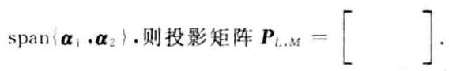

6. 设 ${\mathbf{A}}_{1} = \left\lbrack  \begin{array}{ll} 1 &  - 4 \\  1 &  - 3 \end{array}\right\rbrack  ,{\mathbf{A}}_{2} = \left\lbrack  \begin{matrix}  - 1 & 0 & 2 \\   &  - 1 & 0 \\   & &  - 1 \end{matrix}\right\rbrack$ ,则 $\mathbf{A} = \left\lbrack  \begin{matrix} {\mathbf{A}}_{1} & \mathbf{O} \\  \mathbf{O} & {\mathbf{A}}_{2} \end{matrix}\right\rbrack$ 的 Jordan 标准形为 $\mathbf{J} = \left\lbrack  \begin{array}{lll}  & & \\   & &  \end{array}\right\rbrack$

二、(10分) 在向量空间 ${\mathbf{C}}^{2}$ 中,对向量 $\mathbf{x} = \left( {{\xi }_{1},{\xi }_{2}}\right)$ ,定义实数

$$
\parallel \mathbf{x}\parallel  = \sqrt{{k}_{1}{\left| {\xi }_{1}\right| }^{2} + {k}_{2}{\left| {\xi }_{2}\right| }^{2}}\;\left( {{k}_{1},{k}_{2} \in  \mathbf{C}}\right) ,
$$

证明: $\parallel x\parallel$ 是 ${\mathbf{C}}^{2}$ 中向量范数的充要条件是 ${k}_{1}$ 和 ${k}_{2}$ 都是正数.

三、(15 分) 已知 $\mathbf{A} = \left\lbrack  \begin{array}{rrr}  - 2 & 8 & 6 \\   - 4 & {10} & 6 \\  4 &  - 8 &  - 4 \end{array}\right\rbrack  ,\;\dot{\mathbf{b}}\left( t\right)  = {\mathrm{e}}^{2t}\left\lbrack  \begin{array}{l} 2 \\  1 \\  0 \end{array}\right\rbrack  ,\;\mathbf{x}\left( 0\right)  = \left\lbrack  \begin{array}{l} 3 \\  0 \\  2 \end{array}\right\rbrack$ .

1. 求 ${\mathrm{e}}^{At}$ ;

2. 用矩阵函数方法求微分方程 $\frac{\mathrm{d}}{\mathrm{d}t}\mathbf{x}\left( t\right)  = \mathbf{A}\mathbf{x}\left( t\right)  + \mathbf{b}\left( t\right)$ 满足初始条件 $\mathbf{x}\left( 0\right)$ 的解.

四、(10 分) 用 Householder 变换求矩阵 $\mathbf{A} = \left\lbrack  \begin{array}{rrrr} 5 & 1 & 2 & 0 \\  4 & 0 & 1 & 0 \\  2 & 1 & 0 & 1 \\  2 & 0 & 0 &  - 1 \end{array}\right\rbrack$ 的 QR 分解.

五、(10 分) 用 Gerschgorin 定理隔离矩阵 $\mathbf{A} = \left\lbrack  \begin{matrix} 3\mathrm{i} & 1 & 1 \\  1 & 2 & 1 \\  1 & 1 & 5 + 4\mathrm{i} \end{matrix}\right\rbrack  \left( {\mathrm{i} = \sqrt{-1}}\right)$ 的特征值. (要求画图表示)

六、(15 分) 已知 $\mathbf{A} = \left\lbrack  \begin{array}{lll} 1 & 1 & 1 \\  1 & 1 & 1 \\  1 & 0 & 2 \\  1 & 2 & 0 \\  1 & 2 & 0 \end{array}\right\rbrack  ,\mathbf{b} = \left\lbrack  \begin{matrix} 0 \\  0 \\   - 1 \\  1 \\  1 \end{matrix}\right\rbrack$ .

1. 求 $\mathbf{A}$ 的满秩分解;

2. 求 ${\mathbf{A}}^{ + }$ :

3. 用广义逆矩阵方法判断线性方程组 $\mathbf{A}\mathbf{x} = \mathbf{b}$ 是否有解;

4. 求线性方程组 $\mathbf{A}\mathbf{x} = \mathbf{b}$ 的极小范数解,或者极小范数最小二乘解 ${\mathbf{x}}_{0}$ . (要求指出所求的是哪种解)

七、(14 分) 设 $\mathbf{B} = \left\lbrack  \begin{array}{ll} 0 & 1 \\  1 & 0 \end{array}\right\rbrack$ ,矩阵空间 ${\mathbf{R}}^{2 \times  2}$ 中的线性变换为 $T\left( \mathbf{X}\right)  = \mathbf{{XB}} + 2{\mathbf{X}}^{\mathrm{T}}$ (任意 $\mathbf{X} \in  {\mathbf{R}}^{2 \times  2}$ ),线性子空间

$$
V = \left\{  {\mathbf{X} = \left\lbrack  \begin{array}{ll} {x}_{11} & {x}_{12} \\  {x}_{21} & {x}_{22} \end{array}\right\rbrack  \left| {\;\begin{array}{l} {x}_{11} - {x}_{22} = 0 \\  {x}_{12} - {x}_{21} = 0 \end{array}}\right. }\right\}
$$

1. 验证 $V$ 是 $T$ 的不变子空间;

2. 将 $T$ 看作 $V$ 中的线性变换,求 $V$ 的一个基. 使 $T$ 在该基下的矩阵为对角矩阵.

八、(8 分) 设线性空间 $V$ 中的线性变换 $T$ 满足 ${T}^{2} = T, R\left( T\right)$ 表示 $T$ 的值域, $N\left( T\right)$ 表示 $T$ 的核,令 ${V}_{1} = \; \{ \mathbf{\alpha } \mid  T\left( \mathbf{\alpha }\right)  = \mathbf{\alpha } \cdot  \mathbf{\alpha } \in  V\}$ ,证明:

1. $R\left( T\right)  \cap  N\left( T\right)  = \langle \mathbf{0}\rangle$ ;

2. $R\left( T\right)  = {V}_{1}$ .

## 试题七解答

一、1. 错误. 虽然 $\mathbf{P}$ 是对称矩阵,但 ${\mathbf{x}}_{1},{\mathbf{x}}_{2},\cdots ,{\mathbf{x}}_{n}$ 未必是标准正交基.

2. (1) $\mathbf{A}\mathbf{x} = \left\lbrack  \begin{matrix} \mathrm{i}{\xi }_{3} \\  0 \\  {\xi }_{1} \end{matrix}\right\rbrack  ,\parallel \mathbf{A}\mathbf{x}{\parallel }_{3} = {\left( {\left| {\xi }_{1}\right| }^{3} + {\left| {\xi }_{3}\right| }^{3}\right) }^{\frac{1}{3}}$ .

(2) $\parallel \mathbf{A}{\parallel }_{3} = 1$ . 由定义可得

$$
\parallel \mathbf{A}{\parallel }_{3} = \mathop{\max }\limits_{{x \neq  0}}\frac{\parallel \mathbf{{Ax}}{\parallel }_{3}}{\parallel \mathbf{x}{\parallel }_{3}} \leq  \mathop{\max }\limits_{{x \neq  0}}\frac{\parallel \mathbf{x}{\parallel }_{3}}{\parallel \mathbf{x}{\parallel }_{3}} = 1
$$

取 ${\mathbf{x}}_{0} = \left\lbrack  \begin{matrix} {\xi }_{1} \\  0 \\  {\xi }_{3} \end{matrix}\right\rbrack   \neq  \mathbf{0}$ ,由 $\mathbf{A}{\mathbf{x}}_{0} = \left\lbrack  \begin{matrix} i{\xi }_{3} \\  0 \\  {\xi }_{1} \end{matrix}\right\rbrack$ 可得 $\parallel \mathbf{A}{\parallel }_{3} \geq  \frac{{\begin{Vmatrix}\mathbf{A}{\mathbf{x}}_{0}\end{Vmatrix}}_{3}}{{\begin{Vmatrix}{\mathbf{x}}_{0}\end{Vmatrix}}_{3}} = \frac{{\begin{Vmatrix}{\mathbf{x}}_{0}\end{Vmatrix}}_{3}}{{\begin{Vmatrix}{\mathbf{x}}_{0}\end{Vmatrix}}_{3}} = 1$ .

(3) $\overline{\operatorname{vec}}\left( \mathbf{A}\right)  = {\left( 0,0,\mathrm{i},0,0,0,1,0,0\right) }^{T},\parallel \overline{\operatorname{vec}}\left( \mathbf{A}\right) {\parallel }_{2} = \sqrt{2}$ .

3. $\left\lbrack  \begin{array}{rr} 0 &  - 1 \\  4 & 4 \end{array}\right\rbrack$ .

4. $\parallel \mathbf{A} \otimes  \mathbf{x}{\parallel }_{2}^{2} = \rho \left( {{\left( \mathbf{A} \otimes  \mathbf{x}\right) }^{\mathrm{H}}\left( {\mathbf{A} \otimes  \mathbf{x}}\right) }\right)  = \rho \left( {{\mathbf{I}}_{n} \otimes  n}\right)  = \rho \left( {n{\mathbf{I}}_{n}}\right)  = n,\parallel \mathbf{A} \otimes  \mathbf{x}{\parallel }_{2} = \sqrt{n}$ .

5. $\left\lbrack  \begin{array}{rrr} 0 & 0 & 0 \\   - 1 & 1 & 0 \\  0 & 0 & 0 \end{array}\right\rbrack$ .

6. ${\mathbf{J}}_{1} = \left\lbrack  \begin{array}{rr}  - 1 & 1 \\   &  - 1 \end{array}\right\rbrack  ,\;{\mathbf{J}}_{2} = \left\lbrack  \begin{array}{rr}  - 1 & 1 \\   &  - 1 \\   &  - 1 \end{array}\right\rbrack  ,\;\mathbf{J} = \left\lbrack  \begin{array}{ll} {\mathbf{J}}_{1} & \\   & {\mathbf{J}}_{2} \end{array}\right\rbrack$ .

二、必要性. 已知 $\parallel \mathbf{x}\parallel$ 是 ${\mathbf{C}}^{2}$ 中向量范数,则有

$$
{\mathbf{e}}_{i} \neq  \mathbf{0} \Rightarrow  \begin{Vmatrix}{\mathbf{e}}_{i}\end{Vmatrix} > 0 \Rightarrow  \sqrt{{k}_{i}} > 0 \Rightarrow  {k}_{i}\text{ 为正数 }\left( {i = 1,2}\right)
$$

充分性. 已知 ${k}_{1}$ 和 ${k}_{2}$ 为正数.

(1) 当 $x = 0$ 时, $\parallel x\parallel  = 0$ ; 当 $x \neq  0$ 时, ${\xi }_{1}$ 与 ${\xi }_{2}$ 不全为 0,故 $\parallel x\parallel  > 0$ .

(2)对任意 $k \in  \mathbf{C}$ ,有

$$
\parallel {kx}\parallel  = {\left( {k}_{1}{\begin{Vmatrix}k{\xi }_{1}\end{Vmatrix}}^{2} + {k}_{2}{\begin{Vmatrix}k{\xi }_{2}\end{Vmatrix}}^{2}\right) }^{\frac{1}{2}} = \left| k\right| {\left( {k}_{1}{\begin{Vmatrix}{\xi }_{1}\end{Vmatrix}}^{2} + {k}_{2}{\begin{Vmatrix}{\xi }_{2}\end{Vmatrix}}^{2}\right) }^{\frac{1}{2}} = \left| k\right|  \cdot  \parallel x\parallel
$$

(3)记 $\mathbf{D} = \left\lbrack  \begin{array}{ll} \sqrt{{k}_{1}} & \\   & \sqrt{{k}_{2}} \end{array}\right\rbrack$ ，则 $\parallel \mathbf{x}{\parallel }^{2} = \left( \mathbf{{xD}}\right) {\left( \mathbf{{xD}}\right) }^{\mathrm{H}} = \parallel \mathbf{{xD}}{\parallel }_{2}^{2}$ ，对任意 $y \in  {\mathbf{C}}^{2}$ ，有

$$
\parallel  x + y \parallel  \; = \; \parallel  (x + y)D{ \parallel  }_{2}\; = \; \parallel  {xD} + {yD}{ \parallel  }_{2}\; \leqslant  \; \parallel  {xD}{ \parallel  }_{2} + \; \parallel  {yD}{ \parallel  }_{2}\; = \; \parallel  x \parallel   +  \parallel  y \parallel
$$

综上所述, $\parallel \mathbf{x}\parallel$ 是 ${\mathbf{C}}^{2}$ 中的向量范数.

三、 $1.\varphi \left( \lambda \right)  = \left| {\lambda \mathbf{I} - \mathbf{A}}\right|  = \lambda {\left( \lambda  - 2\right) }^{2}$ .

方法一 (待定法). 由 $\mathbf{A}\left( {\mathbf{A} - 2\mathbf{I}}\right)  = \mathbf{O}$ 知, $\mathbf{A}$ 的最小多项式 $m\left( \lambda \right)  = \lambda \left( {\lambda  - 2}\right)$ . 设 $f\left( \lambda \right)  = {\mathrm{e}}^{x} = m\left( \lambda \right) g\left( \lambda \right)  + \; \left( {a + {b\lambda }}\right)$ . 则

$$
\left\{  {\begin{array}{l} f\left( 0\right)  = 1 = a \\  f\left( 2\right)  = {\mathrm{e}}^{2t} = a + {2b} \end{array},\;\left\{  \begin{array}{l} a = 1 \\  b = \left( {{\mathrm{e}}^{2t} - 1}\right) /2 \end{array}\right. }\right.
$$

于是

$$
{\mathrm{e}}^{At} = a\mathbf{I} + b\mathbf{A} = \frac{1}{2}\left( {2\mathbf{I} - \mathbf{A}}\right)  + \frac{{\mathrm{e}}^{2t}}{2}\mathbf{A} = \frac{1}{2}\left\lbrack  \begin{array}{rrr} 4 &  - 8 &  - 6 \\  4 &  - 8 &  - 6 \\   - 4 & 8 & 6 \end{array}\right\rbrack   + \frac{{\mathrm{e}}^{2t}}{2}\left\lbrack  \begin{array}{rrr}  - 2 & 8 & 6 \\   - 4 & {10} & 6 \\  4 &  - 8 &  - 4 \end{array}\right\rbrack
$$

方法二 (级数求和法). 由 $\mathbf{A}\left( {\mathbf{A} - 2\mathbf{I}}\right)  = \mathbf{O}$ 可得 ${\mathbf{A}}^{2} = 2\mathbf{A},{\mathbf{A}}^{k} = {2}^{k - 1}\mathbf{A}$ ,于是

$$
{\mathrm{e}}^{At} = \mathbf{I} + \left( {\frac{t}{1!} + \frac{2{t}^{2}}{2!} + \frac{{2}^{2}{t}^{3}}{3!} + \cdots }\right) \mathbf{A} = \mathbf{I} + \frac{1}{2}\left\lbrack  {{\mathrm{e}}^{2t} - 1}\right\rbrack  \mathbf{A} =
$$

$$
\frac{1}{2}\left( {2\mathbf{I} - \mathbf{A}}\right)  + \frac{{\mathrm{e}}^{2t}}{2}\mathbf{A} = \frac{1}{2}\left\lbrack  \begin{array}{rrr} 4 &  - 8 &  - 6 \\  4 &  - 8 &  - 6 \\   - 4 & 8 & 6 \end{array}\right\rbrack   + \frac{{\mathrm{e}}^{2t}}{2}\left\lbrack  \begin{array}{rrr}  - 2 & 8 & 6 \\   - 4 & {10} & 6 \\  4 &  - 8 &  - 4 \end{array}\right\rbrack
$$

2. $\mathbf{x}\left( t\right)  = {\mathrm{e}}^{At}\left\{  {\mathbf{x}\left( 0\right)  + {\int }_{0}^{t}{\mathrm{e}}^{-{As}}\mathbf{b}\left( s\right) \mathrm{d}s}\right\}   = {\mathrm{e}}^{2t}\left\lbrack  \begin{matrix} 3 + {2t} \\  t \\  2 \end{matrix}\right\rbrack$

四、(1) ${\mathbf{\beta }}^{\left( 0\right) } = \left\lbrack  \begin{array}{l} 5 \\  4 \\  2 \\  2 \end{array}\right\rbrack  ,\;{\mathbf{\beta }}^{\left( 0\right) } - \left| {\mathbf{\beta }}^{\left( 0\right) }\right| {\mathbf{e}}_{1} = 2\left\lbrack  \begin{array}{r}  - 1 \\  2 \\  1 \\  1 \end{array}\right\rbrack  ,\;\mathbf{u} = \frac{1}{\sqrt{7}}\left\lbrack  \begin{array}{r}  - 1 \\  2 \\  1 \\  1 \end{array}\right\rbrack$

${\mathbf{H}}_{0} = \mathbf{I} - {2u}{\mathbf{u}}^{\mathrm{T}} = \frac{1}{7}\left\lbrack  \begin{array}{rrrr} 5 & 4 & 2 & 2 \\  4 &  - 1 &  - 4 &  - 4 \\  2 &  - 4 & 5 &  - 2 \\  2 &  - 4 &  - 2 & 5 \end{array}\right\rbrack  ,\;{\mathbf{H}}_{0}\mathbf{A} = \left\lbrack  \begin{array}{rrrr} 7 & 1 & 2 & 0 \\  0 & 0 &  - 1 &  - 0 \\  0 & 0 & 0 & 0 \\  0 & 1 & 0 & 1 \end{array}\right\rbrack$

$$
\text{ (2) }{\mathbf{A}}^{\left( 1\right) } = \left\lbrack  \begin{array}{rrr} 0 & 1 & 0 \\  1 & 0 & 1 \\  0 & 0 &  - 1 \end{array}\right\rbrack  ,\;{\mathbf{\beta }}^{\left( 1\right) } = \left\lbrack  \begin{array}{l} 0 \\  1 \\  0 \end{array}\right\rbrack  ,\;{\mathbf{\beta }}^{\left( 1\right) } - \left| {\mathbf{\beta }}^{\left( 1\right) }\right| {\mathbf{e}}_{1} = \left\lbrack  \begin{array}{r}  - 1 \\  1 \\  0 \end{array}\right\rbrack  ,\;\mathbf{u} = \frac{1}{\sqrt{2}}\left\lbrack  \begin{array}{r}  - 1 \\  1 \\  0 \end{array}\right\rbrack
$$

$$
{\mathbf{H}}_{1} = \mathbf{I} - {2u}{\mathbf{u}}^{\mathrm{T}} = \left\lbrack  \begin{array}{lll} 0 & 1 & 0 \\  1 & 0 & 0 \\  0 & 0 & 1 \end{array}\right\rbrack  ,\;{\mathbf{H}}_{1}{\mathbf{A}}^{\left( 1\right) } = \left\lbrack  \begin{array}{rrr} 1 & 0 & 1 \\  0 & 1 & 0 \\  0 & 0 &  - 1 \end{array}\right\rbrack
$$

令 $\mathbf{S} = \left\lbrack  \begin{array}{ll} 1 & \\   & {\mathbf{H}}_{1} \end{array}\right\rbrack  {\mathbf{H}}_{0}$ ,则有

$$
\mathbf{Q} = {\mathbf{S}}^{\top } = \frac{1}{7}\left\lbrack  \begin{matrix} 5 & 2 & 4 & 2 \\  4 &  - 4 &  - 1 &  - 4 \\  2 & 5 &  - 4 &  - 2 \\  2 &  - 2 &  - 4 & 5 \end{matrix}\right\rbrack  ,\;\mathbf{R} = \left\lbrack  \begin{matrix} 7 & 1 & 2 & 0 \\   & 1 & 0 & 1 \\   & & 1 & 0 \\   & & &  - 1 \end{matrix}\right\rbrack  ,\;\mathbf{A} = \mathbf{{QR}}
$$

五、A 的 3 个盖尔圆为

${G}_{1} = \{ z\left| \right| z - 3\mathrm{i} \mid   \leq  2\} ,\;{G}_{2} = \{ z\left| \right| z - 2 \mid   \leq  2\} ,\;{G}_{3} = \{ z\left| \right| z - \left( {5 + 4\mathrm{i}}\right)  \mid   \leq  2\}$ 相邻盖尔圆的中心距与半径和如下:

<table><tr><td>相邻盖尔圆</td><td>${G}_{1} \rightarrow  {G}_{2}$</td><td>${G}_{2} \rightarrow  {G}_{3}$</td><td>${G}_{1} \rightarrow  {G}_{3}$</td></tr><tr><td>中心距</td><td>$\sqrt{13} \approx  {3.6055}$</td><td>5</td><td>$\sqrt{26}$</td></tr><tr><td>半径和</td><td>4</td><td>4</td><td>4</td></tr></table>

易见 ${G}_{3}$ 孤立, ${G}_{1}$ 与 ${G}_{2}$ 相交 (参见图题 7-1).

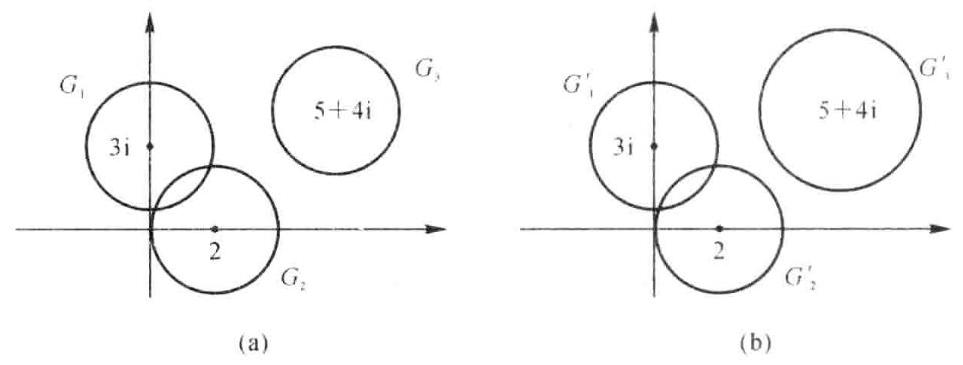

图题 7-1

取 $\mathbf{D} = \operatorname{diag}\left( {1,1,1,5}\right)$ ,则

$$
\mathbf{B} = {\mathbf{{DAD}}}^{-1} = \left\lbrack  \begin{matrix} 3\mathrm{i} & 1 & 2/3 \\  1 & 2 & 2/3 \\  {1.5} & {1.5} & 5 + 4\mathrm{i} \end{matrix}\right\rbrack
$$

的 3 个盖尔圆为

$$
{G}_{1}^{\prime } = \left\{  {z\left| \right| z - 3\mathrm{i}\left| {\; \leq  \frac{5}{3}}\right. }\right\}  ,\;{G}_{2}^{\prime } = \left\{  {z\left| {\;\left| {z - 2}\right|  \leq  \frac{5}{3}}\right. }\right\}  ,\;{G}_{3}^{\prime } = \{ z\left| \right| z - \left( {5 + 4\mathrm{i}}\right)  \mid   \leq  3\}
$$

相邻盖尔圆的中心距与半径和如下:

<table><tr><td>相邻盖尔圆</td><td>${G}_{1}^{\prime } \rightarrow  {G}_{2}^{\prime }$</td><td>${G}_{2}^{\prime } \rightarrow  {G}_{3}^{\prime }$</td><td>${G}_{1}^{\prime } \rightarrow  {G}_{3}^{\prime }$</td></tr><tr><td>中心距</td><td>$\sqrt{13} \approx  {3.6055}$</td><td>5</td><td>$\sqrt{26}$</td></tr><tr><td>半径和</td><td>10/3</td><td>14/3</td><td>${14}/3$</td></tr></table>

易见 $\mathbf{B}$ 的 3 盖尔圆孤立,其中各有 $\mathbf{B}$ 的一个特征值.

综上所述,在 ${G}_{1}^{\prime },{G}_{2}^{\prime }$ 及 $G$ 中各有 $\mathbf{A}$ 的一个特征值.

六、1. A 行 $\left\lbrack  \begin{array}{rrr} 1 & 0 & 2 \\  0 & 1 &  - 1 \\  0 & 0 & 0 \\  0 & 0 & 0 \\  0 & 0 & 0 \end{array}\right\rbrack  ,\;\mathbf{A} = \left\lbrack  \begin{array}{ll} 1 & 1 \\  1 & 1 \\  1 & 0 \\  1 & 2 \\  1 & 2 \end{array}\right\rbrack  \left\lbrack  \begin{array}{rrr} 1 & 0 & 2 \\  0 & 1 &  - 1 \end{array}\right\rbrack   = \mathbf{F}\mathbf{G}$ 2. ${\mathbf{F}}^{ + } = {\left( {\mathbf{F}}^{\top }\mathbf{F}\right) }^{-1}{\mathbf{F}}^{\mathrm{T}} = \frac{1}{14}\left\lbrack  \begin{array}{rrrrr} 4 & 4 & {10} &  - 2 &  - 2 \\   - 1 &  - 1 &  - 6 & 4 & 4 \end{array}\right\rbrack$

${\mathbf{G}}^{ + } = {\mathbf{G}}^{\mathrm{T}}{\left( \mathbf{G}{\mathbf{G}}^{\mathrm{T}}\right) }^{-1} = \frac{1}{6}\left\lbrack  \begin{array}{rr} 2 & 2 \\  2 & 5 \\  2 &  - 1 \end{array}\right\rbrack  ,\;{\mathbf{A}}^{ + } = {\mathbf{G}}^{ + }{\mathbf{F}}^{ + } = \frac{1}{84}\left\lbrack  \begin{array}{rrrrr} 6 & 6 & 8 & 4 & 4 \\  3 & 3 &  - {10} & {16} & {16} \\  9 & 9 & {26} &  - 8 &  - 8 \end{array}\right\rbrack$

$3 \sim  4.{\mathbf{x}}_{0} = {\mathbf{A}}^{ + }\mathbf{b} = \frac{1}{2}\left\lbrack  \begin{array}{r} 0 \\  1 \\   - 1 \end{array}\right\rbrack$ ,由 $\mathbf{A}{\mathbf{A}}^{ + }\mathbf{b} = \mathbf{A}{\mathbf{x}}_{0} = \mathbf{b}$ 可得 $\mathbf{A}\mathbf{x} = \mathbf{b}$ 有解,故 ${\mathbf{x}}_{0}$ 是 $\mathbf{A}\mathbf{x} = \mathbf{b}$ 的极小范数解.

七、1. 设 $\mathbf{X} \in  V$ ,则 $\mathbf{X} = \left\lbrack  \begin{array}{ll} {x}_{11} & {x}_{12} \\  {x}_{12} & {x}_{11} \end{array}\right\rbrack   = {x}_{11}\left\lbrack  \begin{array}{ll} 1 & 0 \\  0 & 1 \end{array}\right\rbrack   + {x}_{12}\left\lbrack  \begin{array}{ll} 0 & 1 \\  1 & 0 \end{array}\right\rbrack$ ,令

$$
{\mathbf{X}}_{1} = \left\lbrack  \begin{array}{ll} 1 & 0 \\  0 & 1 \end{array}\right\rbrack  ,\;{\mathbf{X}}_{2} = \left\lbrack  \begin{array}{ll} 0 & 1 \\  1 & 0 \end{array}\right\rbrack
$$

则 ${\mathbf{X}}_{1},{\mathbf{X}}_{2}$ 是 $V$ 的基,且有 $\mathbf{X} = {x}_{11}{\mathbf{X}}_{1} + {x}_{12}{\mathbf{X}}_{2}$ . 因为

$$
T\left( {\mathbf{X}}_{1}\right)  = {\mathbf{X}}_{1}\mathbf{B} + 2{\mathbf{X}}_{1}^{\mathrm{T}} = \left\lbrack  \begin{array}{ll} 2 & 1 \\  1 & 2 \end{array}\right\rbrack   = 2{\mathbf{X}}_{1} + {\mathbf{X}}_{2} \in  \mathbf{V}
$$

$$
T\left( {\mathbf{X}}_{2}\right)  = {\mathbf{X}}_{2}\mathbf{B} + 2{\mathbf{X}}_{2}^{\mathrm{T}} = \left\lbrack  \begin{array}{ll} 1 & 2 \\  2 & 1 \end{array}\right\rbrack   = {\mathbf{X}}_{1} + 2{\mathbf{X}}_{2} \in  V
$$

所以 $T\left( \mathbf{X}\right)  = {x}_{11}T\left( {\mathbf{X}}_{1}\right)  + {x}_{12}T\left( {\mathbf{X}}_{2}\right)  \in  V$ ,故 $V$ 是 $T$ 不变子空间.

2. 设 $T\left( {{\mathbf{X}}_{1},{\mathbf{X}}_{2}}\right)  = \left( {{\mathbf{X}}_{1},{\mathbf{X}}_{2}}\right) \mathbf{A}$ ,则 $\mathbf{A} = \left\lbrack  \begin{array}{ll} 2 & 1 \\  1 & 2 \end{array}\right\rbrack$ . 求 $\mathbf{P}$ 使得 ${\mathbf{P}}^{-1}\mathbf{{AP}} = \mathbf{\Lambda }$ :

$$
\mathbf{\Lambda } = \left\lbrack  \begin{array}{ll} 1 & \\   & 3 \end{array}\right\rbrack  ,\;\mathbf{P} = \left\lbrack  \begin{array}{rr}  - 1 & 1 \\  1 & 1 \end{array}\right\rbrack
$$

令 $\left( {{\mathbf{Y}}_{1},{\mathbf{Y}}_{2}}\right)  = \left( {{\mathbf{X}}_{1},{\mathbf{X}}_{2}}\right) \mathbf{P}$ ,求得另一基

$$
{\mathbf{Y}}_{1} =  - {\mathbf{X}}_{1} + {\mathbf{X}}_{2} = \left\lbrack  \begin{array}{rr}  - 1 & 1 \\  1 &  - 1 \end{array}\right\rbrack  ,\;{\mathbf{Y}}_{2} = {\mathbf{X}}_{1} + {\mathbf{X}}_{2} = \left\lbrack  \begin{array}{ll} 1 & 1 \\  1 & 1 \end{array}\right\rbrack
$$

且有 $T\left( {{\mathbf{Y}}_{1},{\mathbf{Y}}_{2}}\right)  = \left( {{\mathbf{Y}}_{1},{\mathbf{Y}}_{2}}\right) \mathbf{\Lambda }$ .

八、1. 任意 $\mathbf{\alpha } \in  R\left( T\right)  \cap  N\left( T\right)$ ,有

$\mathbf{\alpha } \in  R\left( T\right)$ ,存在 $\mathbf{\beta } \in  V$ ,使得 $\;\mathbf{\alpha } = T\left( \mathbf{\beta }\right)$

$$
\mathbf{\alpha } \in  N\left( T\right) ,\;T\left( \mathbf{\alpha }\right)  = \mathbf{0}
$$

$$
\mathbf{\alpha } = T\left( \mathbf{\beta }\right)  = {T}^{2}\left( \mathbf{\beta }\right)  = T\left\lbrack  {T\left( \mathbf{\beta }\right) }\right\rbrack   = T\left( \mathbf{\alpha }\right)  = \mathbf{0}
$$

故 $R\left( T\right)  \cap  N\left( T\right)  = \{ \mathbf{0}\}$ .

2. 任意 $\mathbf{\alpha } \in  {V}_{1}$ ,有 $\mathbf{\alpha } = T\left( \mathbf{\alpha }\right)  \in  R\left( T\right)$ ,故 ${V}_{1} \subset  R\left( T\right)$ ; 任意 $\mathbf{\alpha } \in  R\left( T\right)$ ,存在 $\mathbf{\beta } \in  V$ ,使得

$$
\mathbf{\alpha } = T\left( \mathbf{\beta }\right)  = {T}^{2}\left( \mathbf{\beta }\right)  = T\left\lbrack  {T\left( \mathbf{\beta }\right) }\right\rbrack   = T\left( \mathbf{\alpha }\right)
$$

即 $\mathbf{\alpha } \in  {V}_{1}$ ,故 $R\left( T\right)  \subset  {V}_{1}$ . 综上所述可得 $R\left( T\right)  = {V}_{1}$ .

## 试题 $\lambda \left( {2004}\right)$ 年A 卷)

一、(18 分) 填空:

1. 设欧氏空间 ${V}^{3}$ 的基 ${\mathbf{x}}_{1},{\mathbf{x}}_{2},{\mathbf{x}}_{3}$ 的度量矩阵为 $\mathbf{A} = \left\lbrack  \begin{array}{rrr} 5 & 2 &  - 4 \\  2 & 1 &  - 2 \\   - 4 &  - 2 & 5 \end{array}\right\rbrack$ ,则 ${\mathbf{y}}_{1} = {\mathbf{x}}_{1} + 2{\mathbf{x}}_{2}$ 与 ${\mathbf{y}}_{2} = {\mathbf{x}}_{2} + 2{\mathbf{x}}_{3}$ 的内积为 $\left( {{\mathbf{y}}_{1},{\mathbf{y}}_{2}}\right)  = \left( \begin{array}{lll}  & &  \end{array}\right)$ .

2. 设 $\mathbf{A} = \left\lbrack  \begin{array}{rrrr} 1 & \mathrm{i} & 2 &  - \mathrm{i} \\  \mathrm{i} & 0 & 1 & 2 \\  2 & 1 & \mathrm{i} &  - \mathrm{i} \end{array}\right\rbrack  ,\mathrm{i} = \sqrt{-1}$ ,则 $\parallel \mathbf{A}{\parallel }_{{m}_{1}} = \left( \;\right) ,\parallel \mathbf{A}{\parallel }_{\infty } = \left( \;\right) ,\parallel \mathbf{A}{\parallel }_{\mathrm{F}} =$ (   ).

3. 设 $\sin \mathbf{A}t = \left\lbrack  \begin{matrix} \sin {2t} + \sin t & 2\sin {2t} + \sin t & 3\sin {2t} + \sin t \\  \sin {2t} + 2\sin t & 2\sin {2t} + 2\sin t & 3\sin {2t} + 2\sin t \\  \sin {2t} + 3\sin t & 2\sin {2t} + 3\sin t & 3\sin {2t} + 3\sin t \end{matrix}\right\rbrack$ ,则 $\mathbf{A} = \left\lbrack  \begin{array}{ll}  & \\   &  \end{array}\right\rbrack$ .

设 $\mathbf{A} \in  {\mathbf{C}}^{n \times  n}$ 的特征值为 ${\lambda }_{1},{\lambda }_{2},\cdots ,{\lambda }_{m},\mathbf{B} \in  {\mathbf{C}}^{m \times  m}$ 的特征值为 ${\mu }_{1},{\mu }_{2},\cdots ,{\mu }_{m}$ ,则矩阵方程 $\mathbf{{AX}} + \mathbf{{XB}} + \; \mathbf{{AXB}} = \mathbf{D}$ 有唯一解的充要条件是( ).

5. 设 $\mathbf{A} \in  {\mathbf{C}}^{n \times  m},\mathbf{B} \in  {\mathbf{C}}^{m \times  m}$ 的Moore - Penrose 逆为 ${\mathbf{A}}^{ + },{\mathbf{B}}^{ + }$ ,记 $\mathbf{C} = \left\lbrack  \begin{matrix} \mathbf{A} & \mathbf{O} \\  \mathbf{O} & 2\mathbf{B} \end{matrix}\right\rbrack$ ,则 $\mathbf{C} = \left\lbrack  \begin{array}{ll}  & \\   &  \end{array}\right\rbrack$ .

6. 设 $\mathbf{A} = \left\lbrack  \begin{array}{rrrr}  - 2 & 1 & 1 & 0 \\   - 2 & 1 & 2 & 0 \\  1 &  - 1 &  - 2 & 0 \\  0 & 0 & 0 &  - 1 \end{array}\right\rbrack$ ,则 $\mathbf{A}$ 的 Jordan 标准形为 $\mathbf{J} = \left\lbrack  \;\right\rbrack$ .

二、(10 分) 在向量空间 ${\mathbf{C}}^{\delta }$ 中,对于向量 $x = \left( {{\xi }_{1},{\xi }_{2},{\xi }_{3}}\right)$ ,定义实数 $\parallel x\parallel  = \; \sqrt{{\left| {\xi }_{1}\right| }^{2} + 2{\left| {\xi }_{2}\right| }^{2} + 3{\left| {\xi }_{3}\right| }^{2}}$ ,证明 $\parallel x\parallel$ 是 ${\mathbf{C}}^{5}$ 中的向量范数.

三、(15 分) 已知 $\mathbf{A} = \left\lbrack  \begin{array}{lll} 1 & 2 &  - 6 \\  1 & 0 &  - 3 \\  1 & 1 &  - 4 \end{array}\right\rbrack  ,\mathbf{b}\left( t\right)  = {\mathrm{e}}^{-t}\left\lbrack  \begin{array}{l} 2 \\  1 \\  1 \end{array}\right\rbrack  ,\mathbf{x}\left( 0\right)  = \left\lbrack  \begin{array}{r} 3 \\   - 2 \\  1 \end{array}\right\rbrack$ .

1. 求 ${\mathrm{e}}^{At}$ ;

2. 用矩阵函数方法求微分方程 $\frac{\mathrm{d}}{\mathrm{d}t}\mathbf{x}\left( t\right)  = \mathbf{A}\mathbf{x}\left( t\right)  + \mathbf{b}\left( t\right)$ 满足初始条件 $\mathbf{x}\left( 0\right)$ 的解.

四、(10 分) 用 Householder 变换求矩阵 $\mathbf{A} = \left\lbrack  \begin{array}{llll} 1 & 0 & 3 & 4 \\  1 & 2 & 0 & 0 \\  1 & 0 & 3 & 0 \\  1 & 2 & 0 & 4 \end{array}\right\rbrack$ 的 QR 分解.

五、(10 分) 应用 Gerschgorin 定理隔离矩阵 $\mathbf{A} = \left\lbrack  \begin{matrix} 2\mathrm{i} & 1 & 1 \\  1 & 2 - \mathrm{i} & 1 \\  1 & 1 & 5 + 3\mathrm{i} \end{matrix}\right\rbrack  \left( {\mathrm{i} = \sqrt{-1}}\right)$ 的特征值 (要求画图表示).

六、(15 分) 已知 $\mathbf{A} = \left\lbrack  \begin{array}{rrrr} 1 & 2 &  - 1 & 2 \\  1 & 1 &  - 1 & 0 \\   - 1 & 0 & 1 & 2 \\   - 1 &  - 2 & 1 &  - 2 \end{array}\right\rbrack  ,\mathbf{b} = \left\lbrack  \begin{array}{r} 4 \\  3 \\   - 2 \\   - 4 \end{array}\right\rbrack$ .

1. 求 $\mathbf{A}$ 的满秩分解;

2. 求 ${\mathbf{A}}^{ + }$ ;

3. 用广义逆矩阵方法判断线性方程组 $\mathbf{A}\mathbf{x} = \mathbf{b}$ 是否有解;

4. 求线性方程组 $\mathbf{A}\mathbf{x} = \mathbf{b}$ 的极小范数解或极小范数最小二乘解 ${\mathbf{x}}_{0}$ (要求指出所求的是哪种解).

七、(15 分) 设矩阵空间 ${\mathbf{R}}^{2 \times  2}$ 中的线性变换为 $T\left( \mathbf{X}\right)  = \left\lbrack  \begin{array}{rr} 1 &  - 1 \\   - 1 & 1 \end{array}\right\rbrack  \mathbf{X}\left( {\mathbf{X} \in  {\mathbf{R}}^{2 \times  2}}\right)$ . 定义 $\mathbf{A} = \; \left\lbrack  \begin{array}{ll} {a}_{11} & {a}_{12} \\  {a}_{21} & {a}_{22} \end{array}\right\rbrack$ 与 $\mathbf{B} = \left\lbrack  \begin{array}{ll} {b}_{11} & {b}_{12} \\  {b}_{21} & {b}_{22} \end{array}\right\rbrack$ 的内积为 $\left( {\mathbf{A},\mathbf{B}}\right)  = \mathop{\sum }\limits_{{i = 1}}^{2}\mathop{\sum }\limits_{{j = 1}}^{2}{a}_{ij}{b}_{ij}$ .

1. 证明 $T$ 是对称变换;

2. 求 ${\mathbf{R}}^{2 \times  2}$ 的一个标准正交基. 使 $T$ 在该基下的矩阵为对角矩阵:

八、(7 分) 设 $\mathbf{A} \in  {\mathbf{R}}^{n \times  n}$ 满足 ${\mathbf{A}}^{2} = \mathbf{A}, R\left( \mathbf{A}\right)$ 表示 $\mathbf{A}$ 的值域, $N\left( \mathbf{A}\right)$ 表示 $\mathbf{A}$ 的零空间,证明: ${\mathbf{R}}^{n} = \; R\left( \mathbf{A}\right)  \oplus  N\left( \mathbf{A}\right)$ .

试题八解答

$- \text{ 、 }1.\left( {{y}_{1},{y}_{2}}\right)  = \left( {1,2,0}\right) \mathbf{A}\left\lbrack  \begin{array}{l} 0 \\  1 \\  2 \end{array}\right\rbrack   =  - {12}$ .

2.14,5, $\sqrt{20}$ .

3. 由 ${\left. \frac{\mathrm{d}\sin \mathbf{A}t}{\mathrm{\;d}t}\right| }_{t = 0} = {\left. \left( \mathbf{A}\cos \mathbf{A}t\right) \right| }_{t = 0}$ 可得 $\mathbf{A} = \left\lbrack  \begin{array}{lll} 3 & 5 & 7 \\  4 & 6 & 8 \\  5 & 7 & 9 \end{array}\right\rbrack$ .

4. 原矩阵方程等价于 $\left( {\mathbf{A} \otimes  \mathbf{I} + \mathbf{I} \otimes  {\mathbf{B}}^{\top } + \mathbf{A} \otimes  {\mathbf{B}}^{\top }}\right) \overline{\operatorname{vec}}\left( \mathbf{X}\right)  = \overline{\operatorname{vec}}\left( \mathbf{D}\right)$ ,该方程组有唯一解的充要条件是 ${\lambda }_{i} + {\mu }_{j} + {\lambda }_{i}{\mu }_{j} \neq  0$ (任意 $i, j$ ).

5. 由 $\left\{  \begin{array}{l} \mathbf{A} \neq  \mathbf{O} : \mathbf{A} = {\mathbf{F}}_{1}{\mathbf{G}}_{1} \\  \mathbf{B} \neq  \mathbf{O} : \mathbf{B} = {\mathbf{F}}_{2}{\mathbf{G}}_{2} \end{array}\right.$ 可得 $\mathbf{C} = \left\lbrack  \begin{matrix} {\mathbf{F}}_{1} & \mathbf{O} \\  \mathbf{O} & {\mathbf{F}}_{2} \end{matrix}\right\rbrack  \left\lbrack  \begin{matrix} {\mathbf{G}}_{1} & \mathbf{O} \\  \mathbf{O} & 2{\mathbf{G}}_{2} \end{matrix}\right\rbrack   = \mathbf{F}\mathbf{G}$ . 于是

$$
{\mathbf{C}}^{ + } = {\mathbf{G}}^{ + }{\mathbf{F}}^{ + } = \left\lbrack  \begin{matrix} {\mathbf{A}}^{ + } & \mathbf{O} \\  \mathbf{O} & \frac{1}{2}{\mathbf{B}}^{ + } \end{matrix}\right\rbrack
$$

$6.\mathbf{A} = \left\lbrack  \begin{matrix} {\mathbf{A}}_{1} & \mathbf{O} \\  \mathbf{O} & {\mathbf{A}}_{2} \end{matrix}\right\rbrack  ,\;{\mathbf{J}}_{1} = \left\lbrack  \begin{array}{rr}  - 1 & 1 \\   &  - 1 \\   & 1 \end{array}\right\rbrack  ,\;\mathbf{J} = \left\lbrack  \begin{array}{rrrr}  - 1 & 1 & & \\   &  - 1 & 1 & \\   & &  \ddots  &  \ddots  \\   & & &  - 1 \end{array}\right\rbrack$

二、(1) $\sim  \left( 2\right)$ 略.

(3) 证法 $1\parallel x + y{\parallel }^{2} = {\left| {\xi }_{1} + {\eta }_{1}\right| }^{2} + 2{\left| {\xi }_{2} + {\eta }_{2}\right| }^{2} + 3{\left| {\xi }_{3} + {\eta }_{3}\right| }^{2} \leq$

$$
{\left( \left| {\xi }_{1}\right|  + \left| {\eta }_{1}\right| \right) }^{2} + 2{\left( \left| {\xi }_{2}\right|  + \left| {\eta }_{2}\right| \right) }^{2} + 3{\left( \left| {\xi }_{3}\right|  + \left| {\eta }_{3}\right| \right) }^{2} =
$$

$$
\left\lbrack  {{\left| {\xi }_{1}\right| }^{2} + 2{\left| {\xi }_{2}\right| }^{2} + 3{\left| {\xi }_{3}\right| }^{2}}\right\rbrack   + \left\lbrack  {{\left| {\eta }_{1}\right| }^{2} + 2{\left| {\eta }_{2}\right| }^{2} + 3{\left| {\eta }_{3}\right| }^{2}}\right\rbrack   +
$$

$$
2\left\lbrack  {\left| {\xi }_{1}\right| \left| {\eta }_{1}\right|  + 2\left| {\xi }_{2}\right| \left| {\eta }_{2}\right|  + 3\left| {\xi }_{3}\right| \left| {\eta }_{3}\right| }\right\rbrack   \leq
$$

$$
\parallel \mathbf{x}{\parallel }^{2} + \parallel \mathbf{y}{\parallel }^{2} + 2\parallel \mathbf{x}\parallel \parallel \mathbf{y}\parallel  = {\left( \parallel \mathbf{x}\parallel  + \parallel \mathbf{y}\parallel \right) }^{2}
$$

证法 2 令 $\mathbf{B} = \left\lbrack  \begin{array}{lll} 1 & & \\   & \sqrt{2} & \\   & & \sqrt{3} \end{array}\right\rbrack$ ,则 $\parallel \mathbf{x}\parallel  = \sqrt{{\left| {\xi }_{1}\right| }^{2} + 2{\left| {\xi }_{2}\right| }^{2} + 3{\left| {\xi }_{3}\right| }^{2}} = {\begin{Vmatrix}\mathbf{B}{\mathbf{x}}^{1}\end{Vmatrix}}_{2}$ .

$$
\parallel x + y\parallel  = {\begin{Vmatrix}B{\left( x + y\right) }^{\mathrm{T}}\end{Vmatrix}}_{2} = {\begin{Vmatrix}B{x}^{\mathrm{T}} + B{y}^{\mathrm{T}}\end{Vmatrix}}_{2} \leq  {\begin{Vmatrix}B{x}^{\mathrm{T}}\end{Vmatrix}}_{2} + {\begin{Vmatrix}B{y}^{\mathrm{T}}\end{Vmatrix}}_{2} = \parallel x\parallel  + \parallel y\parallel
$$

三、1. 待定法求 ${\mathrm{e}}^{\lambda t} : \varphi \left( \lambda \right)  = \left| {\lambda \mathbf{I} - \mathbf{A}}\right|  = {\left( \lambda  + 1\right) }^{3}$ ,因为 $\mathbf{A} + \mathbf{I} \neq  \mathbf{O},{\left( \mathbf{A} + \mathbf{I}\right) }^{2} = \mathbf{O}$ ,所以 $\mathbf{A}$ 的最小多项式为 $m\left( \lambda \right)  = {\left( \lambda  + 1\right) }^{2}$ . 设 $f\left( \lambda \right)  = {\mathrm{e}}^{\lambda \lambda } = m\left( \lambda \right) g\left( \lambda \right)  + \left( {a + {b\lambda }}\right)$ ,则 ${f}^{\prime }\left( \lambda \right)  = t{\mathrm{e}}^{\lambda \lambda } = {\left\lbrack  m\left( \lambda \right) g\left( \lambda \right) \right\rbrack  }^{\prime } + b$ ,且有

$$
\left\{  {\begin{array}{l} f\left( {-1}\right)  = {\mathrm{e}}^{-t} = a - b \\  {f}^{\prime }\left( {-1}\right)  = t{\mathrm{e}}^{-t} = b \end{array},\;\left\{  \begin{array}{l} a = \left( {t + 1}\right) {\mathrm{e}}^{-t} \\  b = t{\mathrm{e}}^{-t} \end{array}\right. }\right.
$$

于是 ${\mathrm{e}}^{t\mathbf{A}} = a\mathbf{I} + b\mathbf{A} = {\mathrm{e}}^{-t}\mathbf{I} + t{\mathrm{e}}^{-t}\left( {\mathbf{A} + \mathbf{I}}\right)  = {\mathrm{e}}^{-t}\left\lbrack  \begin{matrix} 1 + {2t} & {2t} &  - {6t} \\  t & 1 + t &  - {3t} \\  t & t & 1 - {3t} \end{matrix}\right\rbrack$ .

2. ${\mathrm{e}}^{-s\mathbf{A}}\mathbf{b}\left( s\right)  = \left\{  {{\mathrm{e}}^{s}\mathbf{I} + \left( {-s}\right) {\mathrm{e}}^{s}\left( {\mathbf{A} + \mathbf{I}}\right) }\right\}   \cdot  {\mathrm{e}}^{-s}\left\lbrack  \begin{array}{l} 2 \\  1 \\  1 \end{array}\right\rbrack   = \left\lbrack  \begin{array}{l} 2 \\  1 \\  1 \end{array}\right\rbrack$

$$
\mathbf{x}\left( t\right)  = {\mathrm{e}}^{tA}\left\{  {\mathbf{x}\left( 0\right)  + {\int }_{0}^{t}{\mathrm{e}}^{-{sA}}\mathbf{b}\left( s\right) \mathrm{d}s}\right\}   = {\mathrm{e}}^{-t}\left\lbrack  \begin{matrix} 3 - {2t} \\   - 2 - t \\  1 - t \end{matrix}\right\rbrack
$$

四 $,\left( 1\right) {\mathbf{\beta }}^{\left( n\right) } = \left\lbrack  \begin{array}{l} 1 \\  1 \\  1 \\  1 \end{array}\right\rbrack  ,{\mathbf{\beta }}^{\left( n\right) } - \left| {\mathbf{\beta }}^{\left( n\right) }\right| {\mathbf{e}}_{1} = \left\lbrack  \begin{array}{r}  - 1 \\  1 \\  1 \\  1 \end{array}\right\rbrack  ,\mathbf{u} = \frac{1}{2}\left\lbrack  \begin{array}{r}  - 1 \\  1 \\  1 \\  1 \end{array}\right\rbrack$

$$
{\mathbf{H}}_{0} = \mathbf{I} - 2\mathbf{u}{\mathbf{u}}^{\mathrm{T}} = \frac{1}{2}\left\lbrack  \begin{array}{rrrr} 1 & 1 & 1 & 1 \\  1 & 1 &  - 1 &  - 1 \\  1 &  - 1 & 1 &  - 1 \\  1 &  - 1 &  - 1 & 1 \end{array}\right\rbrack  ,\;{\mathbf{H}}_{0}\mathbf{A} = \left\lbrack  \begin{array}{rrrr} 2 & 2 & 3 & 4 \\  0 & 0 & 0 & 0 \\  0 &  - 2 & 3 & 0 \\  0 & 0 & 0 & 4 \end{array}\right\rbrack
$$

(2) ${\mathbf{A}}^{\left( 1\right) } = \left\lbrack  \begin{array}{rrr} 0 & 0 & 0 \\   - 2 & 3 & 0 \\  0 & 0 & 4 \end{array}\right\rbrack  ,{\mathbf{\beta }}^{\left( 1\right) } = \left\lbrack  \begin{array}{r} 0 \\   - 2 \\  0 \end{array}\right\rbrack  ,{\mathbf{\beta }}^{\left( 1\right) } - \left| {\mathbf{\beta }}^{\left( 1\right) }\right| {\mathbf{e}}_{1} = \left( {-2}\right) \left\lbrack  \begin{array}{l} 1 \\  1 \\  0 \end{array}\right\rbrack$

$$
\mathbf{u} = \frac{1}{\sqrt{2}}\left\lbrack  \begin{array}{l} 1 \\  1 \\  0 \end{array}\right\rbrack  ,\;{\mathbf{H}}_{1} = \mathbf{I} - 2\mathbf{u}{\mathbf{u}}^{\mathrm{T}} = \left\lbrack  \begin{array}{rrr} 0 &  - 1 & 0 \\   - 1 & 0 & 0 \\  0 & 0 & 1 \end{array}\right\rbrack  ,\;{\mathbf{H}}_{1}{\mathbf{A}}^{*1} = \left\lbrack  \begin{array}{rrr} 2 &  - 3 & 0 \\  0 & 0 & 0 \\  0 & 0 & 4 \end{array}\right\rbrack
$$

令 $\mathbf{S} = \left\lbrack  \begin{array}{ll} 1 & \\   & {\mathbf{H}}_{1} \end{array}\right\rbrack  {\mathbf{H}}_{0}$ ,则有

$$
\mathbf{Q} = {\mathbf{S}}^{\mathrm{T}} = \frac{1}{2}\left\lbrack  \begin{array}{rrrr} 1 &  - 1 &  - 1 & 1 \\  1 & 1 &  - 1 &  - 1 \\  1 &  - 1 & 1 &  - 1 \\  1 & 1 & 1 & 1 \end{array}\right\rbrack  ,\;\mathbf{R} = \left\lbrack  \begin{array}{rrrr} 2 & 2 & 3 & 4 \\   & 2 &  - 3 & 0 \\   & & 0 & 0 \\   & & & 4 \end{array}\right\rbrack  ,\;\mathbf{A} = \mathbf{{QR}}
$$

[注] 因为 ${\mathbf{H}}_{1}{\mathbf{A}}^{\left( 1\right) }$ 的 3 行 2 列元素是 0,所以不必进行第三步。

五、A的 3 个盖尔圆为

$$
{G}_{1} : \left| {z - 2\mathrm{i}}\right|  \leq  2,\;{G}_{2} : \left| {z - \left( {2 - \mathrm{i}}\right) }\right|  \leq  2,\;{G}_{1} : \left| {z - \left( {5 + 3\mathrm{i}}\right) }\right|  \leq  2
$$

易见 ${G}_{3}$ 孤立， ${G}_{1}$ 与 ${G}_{2}$ 相交. 取 $\mathbf{D} = \operatorname{diag}\left( {1,1,{1.5}}\right)$ ，则

$$
\mathbf{B} = \mathbf{D}\mathbf{A}{\mathbf{D}}^{-1} = \left\lbrack  \begin{matrix} 2\mathrm{i} & 1 & \frac{2}{3} \\  1 & 2 - \mathrm{i} & \frac{2}{3} \\  {1.5} & {1.5} & 5 + 3\mathrm{i} \end{matrix}\right\rbrack
$$

的 3 个孤立盖尔圆为

$$
{G}_{1}^{\prime } : \left| {z - 2\mathrm{i}}\right|  \leq  \frac{5}{3},\;{G}_{2}^{\prime } : \left| {z - \left( {2 - \mathrm{i}}\right) }\right|  \leq  \frac{5}{3},\;{G}_{3}^{\prime } : \left| {z - \left( {5 + 3\mathrm{i}}\right) }\right|  \leq  3
$$

结论: ${G}_{1}^{\prime },{G}_{2}^{\prime }$ 及 ${G}_{3}$ 中各有 $\mathbf{A}$ 的一个特征值.

六、1. A. $\frac{17}{9} \cdot  \left\lbrack  \begin{array}{rrrr} 1 & 0 &  - 1 &  - 2 \\  0 & 1 & 0 & 2 \\  0 & 0 & 0 & 0 \\  0 & 0 & 0 & 0 \end{array}\right\rbrack  ,\;\mathbf{A} = \left\lbrack  \begin{array}{rr} 1 & 2 \\  1 & 1 \\   - 1 & 0 \\   - 1 &  - 2 \end{array}\right\rbrack  \left\lbrack  \begin{array}{rrrr} 1 & 0 &  - 1 &  - 2 \\  0 & 1 & 0 & 2 \end{array}\right\rbrack   = \mathbf{F}\mathbf{G}$

$$
\text{ 2. }{\mathbf{F}}^{ + } = {\left( {\mathbf{F}}^{\mathrm{T}}\mathbf{F}\right) }^{-1}{\mathbf{F}}^{\mathrm{T}} = \frac{1}{11}\left\lbrack  \begin{array}{rrrr}  - 1 & 4 &  - 9 & 1 \\  3 &  - 1 & 5 &  - 3 \end{array}\right\rbrack  ,\;{\mathbf{G}}^{ + } = {\mathbf{G}}^{\mathrm{T}}{\left( \mathbf{G}{\mathbf{G}}^{\mathrm{T}}\right) }^{-1} = \frac{1}{14}\left\lbrack  \begin{array}{rr} 5 & 4 \\  4 & 6 \\   - 5 &  - 4 \\   - 2 & 4 \end{array}\right\rbrack
$$

$$
{\mathbf{A}}^{ + } = {\mathbf{G}}^{ + }{\mathbf{F}}^{ + } = \frac{1}{154}\left\lbrack  \begin{array}{rrrr} 7 & {16} &  - {25} &  - 7 \\  {14} & {10} &  - 6 &  - {14} \\   - 7 &  - {16} & {25} & 7 \\  {14} &  - {12} & {38} &  - {14} \end{array}\right\rbrack
$$

$3 \sim  4.{\mathbf{x}}_{0} = {\mathbf{A}}^{ + }\mathbf{b} = {\left( 1,1, - 1,0\right) }^{\top }$ ,由 $\mathbf{A}{\mathbf{A}}^{ + }\mathbf{b} = \mathbf{A}{\mathbf{x}}_{0} = \mathbf{b}$ 可得 $\mathbf{A}\mathbf{x} = \mathbf{b}$ 有解,故 ${\mathbf{x}}_{0}$ 是 $\mathbf{A}\mathbf{x} = \mathbf{b}$ 的极小范数解.

七、1. 取 ${\mathbf{R}}^{2 \times  2}$ 的标准正交基为 ${\mathbf{E}}_{11},{\mathbf{E}}_{12},{\mathbf{E}}_{21},{\mathbf{E}}_{22}$ ,计算基象组

$$
T\left( {\mathbf{E}}_{11}\right)  = \left\lbrack  \begin{array}{rr} 1 & 0 \\   - 1 & 0 \end{array}\right\rbrack  ,\;T\left( {\mathbf{E}}_{12}\right)  = \left\lbrack  \begin{array}{rr} 0 & 1 \\  0 &  - 1 \end{array}\right\rbrack  ,\;T\left( {\mathbf{E}}_{21}\right)  = \left\lbrack  \begin{array}{rr}  - 1 & 0 \\  1 & 0 \end{array}\right\rbrack  ,\;T\left( {\mathbf{E}}_{22}\right)  = \left\lbrack  \begin{array}{rr} 0 &  - 1 \\  0 & 1 \end{array}\right\rbrack  .
$$

$$
T\left( {{\mathbf{E}}_{11},{\mathbf{E}}_{12},{\mathbf{E}}_{21},{\mathbf{E}}_{22}}\right)  = \left( {{\mathbf{E}}_{11},{\mathbf{E}}_{12},{\mathbf{E}}_{21},{\mathbf{E}}_{22}}\right) \mathbf{A},\;\mathbf{A} = \left\lbrack  \begin{array}{rrrr} 1 & 0 &  - 1 & 0 \\  0 & 1 & 0 &  - 1 \\   - 1 & 0 & 1 & 0 \\  0 &  - 1 & 0 & 1 \end{array}\right\rbrack
$$

因为 $\mathbf{A}$ 是对称矩阵,所以 $T$ 是对称变换.

2. 求正交矩阵 $\mathbf{Q}$ ,使得 ${\mathbf{Q}}^{-1}\mathbf{A}\mathbf{Q} = \mathbf{\Lambda }$ :

$$
\mathbf{Q} = \frac{1}{\sqrt{2}}\left\lbrack  \begin{array}{rrrr} 1 & 0 &  - 1 & 0 \\  0 & 1 & 0 &  - 1 \\  1 & 0 & 1 & 0 \\  0 & 1 & 0 & 1 \end{array}\right\rbrack  ,\;\mathbf{\Lambda } = \left\lbrack  \begin{array}{llll} 0 & & & \\   & 0 & & \\   & & 2 & \\   & & & 2 \end{array}\right\rbrack
$$

令 $\left( {{\mathbf{Y}}_{1},{\mathbf{Y}}_{2},{\mathbf{Y}}_{3},{\mathbf{Y}}_{4}}\right)  = \left( {{\mathbf{E}}_{11},{\mathbf{E}}_{12},{\mathbf{E}}_{21},{\mathbf{E}}_{22}}\right) \mathbf{Q}$ ,求得标准正交基为

$$
{\mathbf{Y}}_{1} = \frac{1}{\sqrt{2}}\left\lbrack  \begin{array}{ll} 1 & 0 \\  1 & 0 \end{array}\right\rbrack  ,\;{\mathbf{Y}}_{2} = \frac{1}{\sqrt{2}}\left\lbrack  \begin{array}{ll} 0 & 1 \\  0 & 1 \end{array}\right\rbrack  ,\;{\mathbf{Y}}_{3} = \frac{1}{\sqrt{2}}\left\lbrack  \begin{array}{rr}  - 1 & 0 \\  1 & 0 \end{array}\right\rbrack  ,\;{\mathbf{Y}}_{4} = \frac{1}{\sqrt{2}}\left\lbrack  \begin{array}{rr} 0 &  - 1 \\  0 & 1 \end{array}\right\rbrack  .
$$

于是 $T\left( {{\mathbf{Y}}_{1},{\mathbf{Y}}_{2},{\mathbf{Y}}_{3},{\mathbf{Y}}_{4}}\right)  = \left( {{\mathbf{Y}}_{1},{\mathbf{Y}}_{2} \cdot  {\mathbf{Y}}_{3},{\mathbf{Y}}_{4}}\right) \mathbf{\Lambda }$ .

八、(1) 先证 ${\mathbf{R}}^{n} = R\left( \mathbf{A}\right)  + N\left( \mathbf{A}\right)$ . 任意 $\mathbf{x} \in  {\mathbf{R}}^{n}$ 有 $\mathbf{x} = \mathbf{A}\mathbf{x} + \left( {\mathbf{I} - \mathbf{A}}\right) \mathbf{x}$ . 因为

$$
\mathbf{y} = \mathbf{A}\mathbf{x} \in  R\left( \mathbf{A}\right) ,\mathbf{z} = \left( {\mathbf{I} - \mathbf{A}}\right) \mathbf{x} \in  N\left( \mathbf{A}\right) \;\text{ (由于 }\mathbf{A}\mathbf{z} = \mathbf{0}\text{ ) }
$$

所以 $\mathbf{x} = \mathbf{y} + \mathbf{z},\;\mathbf{y} \in  R\left( \mathbf{A}\right) ,\mathbf{z} \in  N\left( \mathbf{A}\right)$ ,故 ${\mathbf{R}}^{n} = R\left( \mathbf{A}\right)  + N\left( \mathbf{A}\right)$ .

(2)再证 $R\left( \mathbf{A}\right)  \cap  N\left( \mathbf{A}\right)  = \{ \mathbf{0}\}$ . 任意 $\mathbf{\beta } \in  R\left( \mathbf{A}\right)  \cap  N\left( \mathbf{A}\right)$ ,有

$$
\mathbf{\beta } \in  R\left( \mathbf{A}\right)  \Rightarrow  \text{ 存在 }\mathbf{\alpha } \in  {\mathbf{R}}^{n}\text{ 使得 }\mathbf{\beta } = \mathbf{A}\mathbf{\alpha };\mathbf{\beta } \in  N\left( \mathbf{A}\right)  \Rightarrow  \mathbf{A}\mathbf{\beta } = \mathbf{0}
$$

因为 $\mathbf{\beta } = \mathbf{A}\mathbf{\alpha } = {\mathbf{A}}^{2}\mathbf{\alpha } = \mathbf{A}\left( {\mathbf{A}\mathbf{\alpha }}\right)  = \mathbf{A}\mathbf{\beta } = \mathbf{0}$ ,所以 $R\left( \mathbf{A}\right)  \cap  N\left( \mathbf{A}\right)  = \{ \mathbf{0}\}$ .

综述 (1) 和 (2),可得 ${\mathbf{R}}^{n} = R\left( \mathbf{A}\right)  \oplus  N\left( \mathbf{A}\right)$ .

## 试题 九(2004 年 B 卷)

一、(18 分) 填空:

1. 设线性空间 ${V}^{3}$ 的基为 ${\mathbf{x}}_{1},{\mathbf{x}}_{2},{\mathbf{x}}_{3}$ ,线性变换 $T$ 在基 ${\mathbf{x}}_{1},{\mathbf{x}}_{2},{\mathbf{x}}_{3}$ 下的矩阵为 $\mathbf{A} = \left\lbrack  \begin{array}{lll} {a}_{11} & {a}_{12} & {a}_{13} \\  {a}_{21} & {a}_{22} & {a}_{23} \\  {a}_{31} & {a}_{32} & {a}_{33} \end{array}\right\rbrack$ ,则 $T$ 在

基 ${\mathbf{x}}_{3},{\mathbf{x}}_{2},{\mathbf{x}}_{1}$ 下的矩阵为 $\left\lbrack  \begin{array}{lll}  & & \\   & & \\   & & \\   & &  \end{array}\right\rbrack$ .

2. 设 $\mathbf{A} = \left\lbrack  \begin{array}{rrrr}  - 1 & 0 & 2 & 1 \\  \mathrm{i} & 5 &  - \mathrm{i} &  - 1 \\  2 & \mathrm{i} & 2 &  - 4 \end{array}\right\rbrack  ,\mathbf{x} = \left\lbrack  \begin{array}{r}  - 1 \\  2 \\  0 \\   - \mathrm{i} \end{array}\right\rbrack  ,\mathrm{i} = \sqrt{-1}$ ,则 $\parallel \mathbf{A}{\parallel }_{1} = \left( \;\right) ,\parallel \mathbf{A}{\parallel }_{\infty } =$ (   ),

$\parallel \mathbf{A}\mathbf{x}{\parallel }_{2} =$ (   ).

3. 设 $\mathbf{A}$ 是可逆矩阵,则 ${\int }_{0}^{1}\sin \mathbf{A}t\mathrm{\;d}t =$ (   ).

4. 设 $\mathbf{A} = \left\lbrack  \begin{array}{ll} 0 & 1 \\  1 & 0 \end{array}\right\rbrack$ ,则 $2\mathbf{A} \otimes  \mathbf{A} - {\mathbf{A}}^{2} \otimes  \mathbf{I} - \mathbf{I} \otimes  {\mathbf{A}}^{2}$ 的全体特征值是 ( ).

5. 设 $\mathbf{P}$ 是正交投影矩阵,则 $\mathbf{P}$ 的 Moore-Penrose 逆为 ${\mathbf{P}}^{ - } =$ (   ).

6. 设 $\mathbf{A} = \left\lbrack  \begin{array}{lllll} 1 & 0 & 0 & 0 & 0 \\  2 & 1 & 0 & 0 & 0 \\  4 & 2 & 1 & 0 & 0 \\  0 & 0 & 0 & 0 & 1 \\  0 & 0 & 0 & 1 & 0 \end{array}\right\rbrack$ ,则 $\mathbf{A}$ 的 Jordan 标准形为 $\mathbf{J} = \left\lbrack  \begin{array}{lll}  & & \\   & & \\   & & \\   & & \\   & &  \end{array}\right\rbrack$ .

二、(10 分) 设 $\mathbf{P} \in  {\mathbf{C}}^{m}$ 且 $\mathbf{P}$ 的秩为 $m$ ,对于 ${\mathbf{C}}^{n}$ 上的向量范数 $\parallel  \cdot  \parallel ..{\mathbf{C}}^{m}$ 中的向量 $\mathbf{x} = \left( {{\xi }_{1},{\xi }_{2},\cdots ,{\xi }_{m}}\right)$ ,定义实数 $\parallel \mathbf{x}\parallel  = \parallel \mathbf{x}\mathbf{P}\parallel$ ,证明 $\parallel \mathbf{x}\parallel$ 是 ${\mathbf{C}}^{m}$ 上的向量范数.

二、(15 分) 已知 $\mathbf{A} = \left\lbrack  \begin{array}{rrr} 5 &  - 2 & 3 \\  1 & 2 & 3 \\   - 1 & 2 & 1 \end{array}\right\rbrack  ,\mathbf{b}\left( t\right)  = {\mathrm{e}}^{\mathrm{i}t}\left\lbrack  \begin{array}{l} 2 \\  1 \\  0 \end{array}\right\rbrack  ,\mathbf{x}\left( 0\right)  = \left\lbrack  \begin{array}{r} 1 \\  1 \\   - 1 \end{array}\right\rbrack$ .

1. 求 ${\mathrm{e}}^{\lambda t}$ :

2. 用矩阵函数方法求微分方程 ${\mathbf{x}}^{\prime }\left( t\right)  = \mathbf{A}\mathbf{x}\left( t\right)  + \mathbf{b}\left( t\right)$ 满足初始条件 $\mathbf{x}\left( 0\right)$ 的解.

四、(10 分) 用 Givens 变换求矩阵 $\mathbf{A} = \left\lbrack  \begin{array}{llll} 3 & 0 & 3 & 5 \\  0 & 3 & 3 & 5 \\  4 & 0 & 4 & {10} \\  0 & 4 & 4 & {10} \end{array}\right\rbrack$ 的 QR 分解.

五、(10 分) 应用 Gerschgorin 定理隔离矩阵 $\mathbf{A} = \left\lbrack  \begin{array}{lll} {12} & 1 & 2 \\  1 & 5 & 3 \\  1 & 1 & i \end{array}\right\rbrack  \left( {\mathrm{i} = \sqrt{-1}}\right)$ 的特征值 (要求画图表示).

六、(15 分) 已知 $\mathbf{A} = \left\lbrack  \begin{array}{llll} 1 & 2 & 0 & 5 \\  1 & 2 & 1 & 3 \\  1 & 2 & 2 & 1 \\  1 & 2 & 3 &  - 1 \end{array}\right\rbrack  ,\mathbf{b} = \left\lbrack  \begin{array}{r}  - 1 \\  0 \\  1 \\  2 \end{array}\right\rbrack$ .

1. 求 $\mathbf{A}$ 的满秩分解;

2. 求 ${\mathbf{A}}^{ * }$ ;

3. 用广义逆矩阵方法判断线性方程组 $\mathbf{A}\mathbf{x} = \mathbf{b}$ 是否有解:

4. 求线性方程组 $\mathbf{A}\mathbf{x} = \mathbf{b}$ 的极小范数解或极小范数最小二乘解 $\mathbf{x}$ (要求指出所求的是哪种解).

七、(15 分) 在向量空间 ${\mathbf{R}}^{3}$ 中,对于向量 $\mathbf{x} = \left( {{\xi }_{1} \cdot  {\xi }_{2} \cdot  {\xi }_{3},{\xi }_{1}}\right)$ ,定义线性变换为

$$
T\left( \mathbf{x}\right)  = \left( {{\xi }_{2} + {\xi }_{1},{\xi }_{1} + {\xi }_{1},{\xi }_{1} + {\xi }_{2},{\xi }_{2} + {\xi }_{2}}\right)
$$

1. 求 $T$ 的值域 $R\left( T\right)$ 的一个基;

2. 将 $T$ 看做 $R\left( T\right)$ 中的线性变换,求 $R\left( T\right)$ 的一个基,使 $T$ 在该基下的矩阵为对角矩阵.

八、(7 分) 在欧氏空间 ${V}^{n}$ 中,设由基 ${\mathbf{\alpha }}_{1},{\mathbf{\alpha }}_{2},\cdots ,{\mathbf{\alpha }}_{n}$ 通过正交化方法得到的正交基为 ${\mathbf{\beta }}_{1},{\mathbf{\beta }}_{2},\cdots ,{\mathbf{\beta }}_{n}$ ,基 ${\mathbf{\alpha }}_{1}$ . ${\mathbf{\alpha }}_{2},\cdots ,{\mathbf{\alpha }}_{n}$ 的度量矩阵为 $\mathbf{A}$ ,基 ${\mathbf{\beta }}_{1},{\mathbf{\beta }}_{2},\cdots ,{\mathbf{\beta }}_{n}$ 的度量矩阵为 $\mathbf{B}$ ,证明 $\det \mathbf{A} = \det \mathbf{B}$ .

## 试题九解答

---

一、1. 设 $\left( {{\mathbf{x}}_{1},{\mathbf{x}}_{2},{\mathbf{x}}_{3}}\right)  = \left( {{\mathbf{x}}_{3},{\mathbf{x}}_{2},{\mathbf{x}}_{1}}\right) \mathbf{C}$ ,则有

---

$$
\mathbf{C} = \left\lbrack  \begin{array}{lll}  & & 1 \\   & 1 & \\  1 & &  \end{array}\right\rbrack  ,\;\mathbf{B} = {\mathbf{C}}^{-1}\mathbf{A}\mathbf{C} = \left\lbrack  \begin{array}{lll} {\mathbf{a}}_{33} & {\mathbf{a}}_{32} & {\mathbf{a}}_{31} \\  {\mathbf{a}}_{23} & {\mathbf{a}}_{22} & {\mathbf{a}}_{21} \\  {\mathbf{a}}_{13} & {\mathbf{a}}_{12} & {\mathbf{a}}_{11} \end{array}\right\rbrack
$$

2.15,17, $\sqrt{45}$ .

3. 原式 $=  - {\mathbf{A}}^{-1}{\int }_{0}^{1}\mathrm{\;d}\left( {\cos \mathbf{A}t}\right)  = {\mathbf{A}}^{-1}\left( {\mathbf{I} - \cos \mathbf{A}}\right)$ .

4. $\mathbf{A}$ 的特征值为 ${\lambda }_{1} = 1,{\lambda }_{2} =  - 1$ ,令 $f\left( {x, y}\right)  = {2xy} - {x}^{2} - {y}^{2}$ ,则

$$
f\left( {\mathbf{A},\mathbf{A}}\right)  = 2\mathbf{A} \otimes  \mathbf{A} - {\mathbf{A}}^{2} \otimes  \mathbf{I} - \mathbf{I} \otimes  {\mathbf{A}}^{2}
$$

的全体特征值是 $f\left( {1,1}\right)  = 0, f\left( {1, - 1}\right)  =  - 4, f\left( {-1,1}\right)  =  - 4, f\left( {-1, - 1}\right)  = 0$ .

5. 取 $\mathbf{X} = \mathbf{P}$ ,则有

$$
{\mathbf{P}}^{2} = \mathbf{P} \Rightarrow  \mathbf{{PXP}} = \mathbf{P},\;\mathbf{{XPX}} = \mathbf{X}
$$

$$
{\mathbf{P}}^{\mathrm{H}} = \mathbf{P} \Rightarrow  {\left( \mathbf{{PX}}\right) }^{\mathrm{H}} = \mathbf{{PX}},\;{\left( \mathbf{{XP}}\right) }^{\mathrm{H}} = \mathbf{{XP}}
$$

故 ${\mathbf{P}}^{ + } = \mathbf{P}$ .

$$
\text{ 6. }\mathbf{A} = \left\lbrack  \begin{matrix} {\mathbf{A}}_{1} & \mathbf{O} \\  \mathbf{O} & {\mathbf{A}}_{2} \end{matrix}\right\rbrack  ,\;{\mathbf{J}}_{1} = \left\lbrack  \begin{array}{lll} 1 & 1 & 0 \\   & 1 & 1 \\   & & 1 \end{array}\right\rbrack  ,\;{\mathbf{J}}_{2} = \left\lbrack  \begin{array}{ll} 1 & \\   &  - 1 \end{array}\right\rbrack  ,\;\mathbf{J} = \left\lbrack  \begin{array}{ll} {\mathbf{J}}_{1} & \\   & {\mathbf{J}}_{2} \end{array}\right\rbrack
$$

二、(1) 由 $\mathbf{x} \neq  \mathbf{0}$ 可得 $x\mathbf{P} \neq  \mathbf{0}$ . (否则, $\mathbf{{xP}} = \mathbf{0} \Rightarrow  \mathbf{x} = \mathbf{{xP}}{\mathbf{P}}^{\left( 1\right) } = \mathbf{0}{\mathbf{P}}^{\left( 1\right) } = \mathbf{0}$ )

(2) $\sim$ (3) 略.

三、 $1.\varphi \left( \lambda \right)  = \left| {\lambda \mathbf{I} - \mathbf{A}}\right|  = \lambda {\left( \lambda  - 4\right) }^{2}$ .

待定法: 因为 $\mathbf{A}\left( {\mathbf{A} - 4\mathbf{I}}\right)  = \mathbf{O}$ ,所以 $\mathbf{A}$ 的最小多项式 $m\left( \lambda \right)  = \lambda \left( {\lambda  - 4}\right)$ . 设 $f\left( \lambda \right)  = {\mathrm{e}}^{a} = m\left( \lambda \right) g\left( \lambda \right)  + (a +$ 从)，则有

$$
\left\{  {\begin{array}{l} f\left( 0\right)  = 1 = a \\  f\left( 4\right)  = {\mathrm{e}}^{4t} = a + {4b} \end{array},\left\{  \begin{array}{l} a = 1 \\  b = \frac{1}{4}\left( {{\mathrm{e}}^{4t} - 1}\right)  \end{array}\right. }\right.
$$

于是

$$
{\mathrm{e}}^{t\mathbf{A}} = a\mathbf{I} + b\mathbf{A} = \frac{1}{4}\left( {4\mathbf{I} - \mathbf{A}}\right)  + \frac{{\mathrm{e}}^{4t}}{4}\mathbf{A} = \frac{1}{4}\left\lbrack  \begin{array}{rrr}  - 1 & 2 &  - 3 \\   - 1 & 2 &  - 3 \\  1 &  - 2 & 3 \end{array}\right\rbrack   + \frac{{\mathrm{e}}^{4t}}{4}\left\lbrack  \begin{array}{rrr} 5 &  - 2 & 3 \\  1 & 2 & 3 \\   - 1 & 2 & 1 \end{array}\right\rbrack
$$

求和法: 由 $\mathbf{A}\left( {\mathbf{A} - 4\mathbf{I}}\right)  = \mathbf{O}$ ,可得 ${\mathbf{A}}^{2} = 4\mathbf{A},{\mathbf{A}}^{k} = {4}^{k - 1}\mathbf{A}\left( {k = 2,3,\cdots }\right)$ .

$$
{\mathrm{e}}^{t\mathbf{A}} = \mathbf{I} + \left( {\frac{t}{1!} + \frac{{t}^{2}}{2!}{4}^{1} + \frac{{t}^{3}}{3!}{4}^{2} + \cdots }\right) \mathbf{A} = \mathbf{I} + \frac{1}{4}\left( {{\mathrm{e}}^{4t} - 1}\right) \mathbf{A} = \frac{1}{4}\left( {4\mathbf{I} - \mathbf{A}}\right)  + \frac{{\mathrm{e}}^{4t}}{4}\mathbf{A}
$$

对角化法: 求 $\mathbf{P}$ 使得 ${\mathbf{P}}^{-1}\mathbf{{AP}} = \mathbf{\Lambda }$ .

$$
\mathbf{\Lambda } = \left\lbrack  \begin{array}{lll} 0 & & \\   & 4 & \\   & & 4 \end{array}\right\rbrack  ,\;\mathbf{P} = \left\lbrack  \begin{array}{rrr} 1 & 2 &  - 3 \\  1 & 1 & 0 \\   - 1 & 0 & 1 \end{array}\right\rbrack  ,\;{\mathbf{P}}^{-1} = \frac{1}{4}\left\lbrack  \begin{array}{rrr}  - 1 & 2 &  - 3 \\  1 & 2 & 3 \\   - 1 & 2 & 1 \end{array}\right\rbrack
$$

$$
{\mathrm{e}}^{tA} = \mathbf{P}\left\lbrack  \begin{array}{lll} 1 & & \\   & {\mathrm{e}}^{4t} & \\   & & {\mathrm{e}}^{4t} \end{array}\right\rbrack  {\mathbf{P}}^{-1} = \frac{1}{4}\left\lbrack  \begin{array}{rrr}  - 1 & 2 &  - 3 \\   - 1 & 2 &  - 3 \\  1 &  - 2 & 3 \end{array}\right\rbrack   + \frac{{\mathrm{e}}^{4t}}{4}\left\lbrack  \begin{array}{rrr} 5 &  - 2 & 3 \\  1 & 2 & 3 \\   - 1 & 2 & 1 \end{array}\right\rbrack
$$

$$
\text{ 2. }{\mathrm{e}}^{-A}\mathbf{b}\left( s\right)  = \left\{  {\frac{1}{4}\left( {4\mathbf{I} - \mathbf{A}}\right)  + \frac{{\mathrm{e}}^{-{4s}}}{4}\mathbf{A}}\right\}   \cdot  {\mathrm{e}}^{4t}\left\lbrack  \begin{array}{l} 2 \\  1 \\  0 \end{array}\right\rbrack   = \left\lbrack  \begin{array}{l} 2 \\  1 \\  0 \end{array}\right\rbrack
$$

$$
\mathbf{x}\left( t\right)  = {\mathrm{e}}^{t\mathbf{A}}\{ \mathbf{x}\left( 0\right)  + {\int }_{0}^{t}{\mathrm{e}}^{-s\mathbf{A}}\mathbf{b}\left( s\right) \mathrm{d}s\}  = \left\lbrack  \begin{array}{r} 1 \\  1 \\   - 1 \end{array}\right\rbrack   + t{\mathrm{e}}^{4t}\left\lbrack  \begin{array}{l} 2 \\  1 \\  0 \end{array}\right\rbrack
$$

四、(1) ${\mathbf{T}}_{0} = {\mathbf{T}}_{13} = \frac{1}{5}\left\lbrack  \begin{array}{rrrr} 3 & 0 & 4 & 0 \\  0 & 5 & 0 & 0 \\   - 4 & 0 & 3 & 0 \\  0 & 0 & 0 & 5 \end{array}\right\rbrack  ,\;{\mathbf{T}}_{0}\mathbf{A} = \left\lbrack  \begin{array}{llll} 5 & 0 & 5 & {11} \\  0 & 3 & 3 & 5 \\  0 & 0 & 0 & 2 \\  0 & 4 & 4 & {10} \end{array}\right\rbrack$

(2) ${\mathbf{A}}_{1} = \left\lbrack  \begin{array}{lll} 3 & 3 & 5 \\  0 & 0 & 2 \\  4 & 4 & {10} \end{array}\right\rbrack  ,\;{\mathbf{T}}_{1} = {\mathbf{T}}_{13} = \frac{1}{5}\left\lbrack  \begin{array}{rrr} 3 & 0 & 4 \\  0 & 5 & 0 \\   - 4 & 0 & 3 \end{array}\right\rbrack  ,\;{\mathbf{T}}_{1}{\mathbf{A}}_{1} = \left\lbrack  \begin{array}{lll} 5 & 5 & {11} \\  0 & 0 & 2 \\  0 & 0 & 2 \end{array}\right\rbrack$

令 $\mathbf{T} = \left\lbrack  \begin{array}{ll} 1 & \\   & {\mathbf{T}}_{1} \end{array}\right\rbrack  {\mathbf{T}}_{0}$ ,则有

$$
\mathbf{Q} = {\mathbf{T}}^{\mathrm{T}} = \frac{1}{5}\left\lbrack  \begin{array}{rrrr} 3 & 0 &  - 4 & 0 \\  0 & 3 & 0 &  - 4 \\  4 & 0 & 3 & 0 \\  0 & 4 & 0 & 3 \end{array}\right\rbrack  ,\;\mathbf{R} = \left\lbrack  \begin{array}{llll} 5 & 0 & 5 & {11} \\   & 5 & 5 & {11} \\   & & 0 & 2 \\   & & & 2 \end{array}\right\rbrack  ,\;\mathbf{A} = \mathbf{{QR}}
$$

五、 $\mathbf{A}$ 的 3 个盖尔圆为

$$
{G}_{1} : \left| {z - {12}}\right|  \leq  3,\;{G}_{2} : \left| {z - 5}\right|  \leq  4,\;{G}_{3} : \left| {z - \mathrm{i}}\right|  \leq  2
$$

易见 ${G}_{1},{G}_{2}$ 及 ${G}_{3}$ 相交. 取 $\mathbf{D} = \operatorname{diag}\left( {1,{0.5},1}\right)$ ,则

$$
\mathbf{B} = {\mathbf{{DAD}}}^{-1} = \left\lbrack  \begin{matrix} {12} & 2 & 2 \\  {0.5} & 5 & {1.5} \\  1 & 2 & i \end{matrix}\right\rbrack
$$

的 3 个孤立盖尔圆为

$$
{G}^{\prime } : \left| {z - {12}}\right|  \leq  4,\;{G}^{\prime } : \left| {z - 5}\right|  \leq  2,\;{G}^{\prime } : \left| {z - \mathrm{i}}\right|  \leq  3
$$

结论: ${G}_{1}^{\prime },{G}_{2}^{\prime }$ 及 ${G}_{3}^{\prime }$ 中各有 $\mathbf{A}$ 的一个特征值.

六、1. $\mathbf{A}\xrightarrow[]{\text{ 行 }}\left\lbrack  \begin{array}{rrrr} 1 & 2 & 0 & 5 \\  0 & 0 & 1 &  - 2 \\  0 & 0 & 0 & 0 \\  0 & 0 & 0 & 0 \end{array}\right\rbrack  ,\;\mathbf{A} = \left\lbrack  \begin{array}{ll} 1 & 0 \\  1 & 1 \\  1 & 2 \\  1 & 3 \end{array}\right\rbrack  \left\lbrack  \begin{array}{rrrr} 1 & 2 & 0 & 5 \\  0 & 0 & 1 &  - 2 \end{array}\right\rbrack   = \mathbf{F}\mathbf{G}$

$$
\text{ 2. }{\mathbf{F}}^{ + } = {\left( {\mathbf{F}}^{\top }\mathbf{F}\right) }^{-1}{\mathbf{F}}^{\top } = \frac{1}{10}\left\lbrack  \begin{array}{rrrr} 7 & 4 & 1 &  - 2 \\   - 3 &  - 1 & 1 & 3 \end{array}\right\rbrack
$$

$$
{\mathbf{G}}^{ + } = {\mathbf{G}}^{\top }{\left( \mathbf{G}{\mathbf{G}}^{\top }\right) }^{-1} = \frac{1}{10}\left\lbrack  \begin{array}{rr} 1 & 2 \\  2 & 4 \\  2 & 6 \\  1 &  - 2 \end{array}\right\rbrack  ,\;{\mathbf{A}}^{ + } = {\mathbf{G}}^{ + }{\mathbf{F}}^{ + } = \frac{1}{100}\left\lbrack  \begin{array}{rrrr} 1 & 2 & 3 & 4 \\  2 & 4 & 6 & 8 \\   - 4 & 2 & 8 & {14} \\  {13} & 6 &  - 1 &  - 8 \end{array}\right\rbrack
$$

$3 \sim  4.{\mathbf{x}}_{0} = {\mathbf{A}}^{ * }\mathbf{b} = \frac{1}{10}{\left( 1,2,4, - 3\right) }^{\mathrm{T}},\mathbf{A}{\mathbf{A}}^{ + }\mathbf{b} = \mathbf{A}{\mathbf{x}}_{0} = \mathbf{b}$ ,故 $\mathbf{A}\mathbf{x} = \mathbf{b}$ 有解,且 ${\mathbf{x}}_{0}$ 是 $\mathbf{A}\mathbf{x} = \mathbf{b}$ 的极小范数解.

七、1. 取 ${\mathbf{R}}^{4}$ 的基为 ${\mathbf{e}}_{1},{\mathbf{e}}_{2},{\mathbf{e}}_{3},{\mathbf{e}}_{4}$ ,计算基象组

$$
T\left( {\mathbf{e}}_{1}\right)  = \left( {0,{1.1},0}\right) ,\;T\left( {\mathbf{e}}_{2}\right)  = \left( {1,0,{0.1}}\right)
$$

$$
T\left( {\mathbf{e}}_{3}\right)  = \left( {0,1,1,0}\right) ,\;T\left( {\mathbf{e}}_{1}\right)  = \left( {1,0,{0.1}}\right)
$$

因为 $R\left( T\right)  = L\left( {T\left( {\mathbf{e}}_{1}\right) , T\left( {\mathbf{e}}_{2}\right) , T\left( {\mathbf{e}}_{3}\right) , T\left( {\mathbf{e}}_{4}\right) }\right)$ ,所以 $R\left( T\right)$ 的基为基象组的最大无关组,记作 ${\mathbf{\alpha }}_{1} = \left( {0,1,1,0}\right)$ , ${\mathbf{\alpha }}_{2} = \left( {1,0,0,1}\right)$ .

$$
\text{ 2. }T\left( {\mathbf{\alpha }}_{1}\right)  = \left( {1,1,1,1}\right)  = {\mathbf{\alpha }}_{1} + {\mathbf{\alpha }}_{2},\;T\left( {\mathbf{\alpha }}_{2}\right)  = \left( {1,1,1,1}\right)  = {\mathbf{\alpha }}_{1} + {\mathbf{\alpha }}_{2}
$$

$T\left( {{\mathbf{\alpha }}_{1},{\mathbf{\alpha }}_{2}}\right)  = \left( {{\mathbf{\alpha }}_{1},{\mathbf{\alpha }}_{2}}\right) \mathbf{A},\;\mathbf{A} = \left\lbrack  \begin{array}{ll} 1 & 1 \\  1 & 1 \end{array}\right\rbrack$

求 $\mathbf{P}$ 使得 ${\mathbf{P}}^{-1}\mathbf{{AP}} = \mathbf{\Lambda } : \mathbf{\Lambda } = \left\lbrack  \begin{array}{ll} 0 & \\   & 2 \end{array}\right\rbrack  ,\mathbf{P} = \left\lbrack  \begin{array}{rr}  - 1 & 1 \\  1 & 1 \end{array}\right\rbrack$ . 令 $\left( {{\mathbf{\beta }}_{1},{\mathbf{\beta }}_{2}}\right)  = \left( {{\mathbf{\alpha }}_{1},{\mathbf{\alpha }}_{2}}\right) \mathbf{P}$ ,求得另一基

$$
{\mathbf{\beta }}_{1} =  - {\mathbf{\alpha }}_{1} + {\mathbf{\alpha }}_{2} = \left( {1, - 1, - 1,1}\right) ,\;{\mathbf{\beta }}_{2} = {\mathbf{\alpha }}_{1} + {\mathbf{\alpha }}_{2} = \left( {1,1,1,1}\right)
$$

且有 $T\left( {{\mathbf{\beta }}_{1},{\mathbf{\beta }}_{2}}\right)  = \left( {{\mathbf{\beta }}_{1},{\mathbf{\beta }}_{2}}\right) \mathbf{\Lambda }$ .

八、根据正交化过程可得

$$
\left\{  {\begin{array}{l} {\mathbf{\beta }}_{1} = {\mathbf{\alpha }}_{1} \\  {\mathbf{\beta }}_{2} = {\mathbf{\alpha }}_{2} - {k}_{21}{\mathbf{\beta }}_{1} \\  \cdots \cdots \\  {\mathbf{\beta }}_{n} = {\mathbf{\alpha }}_{n} - {k}_{n, n - 1}{\mathbf{\beta }}_{n - 1} - \cdots  - {k}_{n1}{\mathbf{\beta }}_{1} \end{array},\left\{  \begin{array}{l} {\mathbf{\alpha }}_{1} = {\mathbf{\beta }}_{1} \\  {\mathbf{\alpha }}_{2} = {k}_{21}{\mathbf{\beta }}_{1} + {\mathbf{\beta }}_{2} \\  \cdots \cdots \\  {\mathbf{\alpha }}_{n} = {k}_{n1}{\mathbf{\beta }}_{1} + \cdots  + {k}_{n, n - 1}{\mathbf{\beta }}_{n - 1} + {\mathbf{\beta }}_{1} \end{array}\right. }\right.
$$

写成矩阵乘法形式为

$$
\left( {{\mathbf{\alpha }}_{1},{\mathbf{\alpha }}_{2},\cdots ,{\mathbf{\alpha }}_{n}}\right)  = \left( {{\mathbf{\beta }}_{1},{\mathbf{\beta }}_{2},\cdots ,{\mathbf{\beta }}_{n}}\right) \mathbf{P},\mathbf{P} = \left\lbrack  \begin{matrix} 1 & {k}_{21} & \cdots & {k}_{n1} \\   & 1 &  \ddots  & \vdots \\   & &  \ddots  & {k}_{n, n - 1} \\   & & & 1 \end{matrix}\right\rbrack
$$

由此可得 $\mathbf{A} = {\mathbf{P}}^{\mathrm{T}}\mathbf{{BP}}$ ,且有 $\det \mathbf{A} = \det \mathbf{B}$ .

## 试题十(2005 年 A 卷)

一、(18 分) 填空:

1. 设 $\mathbf{A} = \left\lbrack  \begin{matrix} 5 & 2 &  - 4 \\  2 & 1 &  - 2 \\   - 4 &  - 2 & k \end{matrix}\right\rbrack$ 是欧氏空间 ${V}^{3}$ 中某个基的度量矩阵,则实数 $k$ 的取值范围是(   ).

2. 设 $\mathbf{A} = \left\lbrack  \begin{array}{lll} \mathrm{i} & 1 & 1 \\  2 & 2 & 2 \\  1 & \mathrm{i} & 3 \\  2\mathrm{i} & 2 & 4 \end{array}\right\rbrack  ,\mathrm{i} = \sqrt{-1}$ ,则 $\parallel \mathbf{A}{\parallel }_{1} = \left( \;\right) ,\parallel \mathbf{A}{\parallel }_{{m}_{\infty }} = \left( \;\right) ,\parallel \overline{\operatorname{vec}}\left( \mathbf{A}\right) {\parallel }_{2} =$ (   ).

3. 设 $\mathbf{A} = \left\lbrack  \begin{array}{ll}  - 4 & 3 \\   - 1 & 0 \end{array}\right\rbrack$ ,问矩阵幂级数 $\mathop{\sum }\limits_{{k = 1}}^{\infty }\frac{1}{{2}^{k}}{\mathbf{A}}^{k}$ 收敛还是发散 ( )? 其原因是 ( ).

4. 设 $\mathbf{A} \in  {\mathbf{C}}^{n \times  n}$ 的特征值为 ${\lambda }_{1},{\lambda }_{2},\cdots ,{\lambda }_{n}$ ,则矩阵方程 $\mathbf{A}\mathbf{X} + \mathbf{X}\mathbf{A} = \mathbf{X}$ 有非零解的充要条件是 ( ).

5. 设 5 阶方阵 $\mathbf{A}$ 的特征多项式为 $\varphi \left( \lambda \right)  = \left( {\lambda  - 1}\right) {\left( \lambda  - 4\right) }^{4}$ ,且 $\operatorname{rank}\left( {4\mathbf{I} - \mathbf{A}}\right)  = 3$ ,则 $\mathbf{A}$ 的 Jordan 标准形只能是下列矩阵之一(不考虑 Jordan 块的排列次序):

(1) $J = \left\lbrack  \begin{array}{llll}  & & &  \end{array}\right\rbrack$ (2) $J = \left\lbrack  \begin{array}{lll}  & & \\   & &  \end{array}\right\rbrack$ .

6. 设非零矩阵 $\mathbf{A}$ 的 Moore-Penrose 逆为 ${\mathbf{A}}^{ + }$ ,则 ${\left\lbrack  \begin{array}{lll} 3\mathbf{A} & 2\mathbf{A} & \mathbf{A} \end{array}\right\rbrack  }^{ + } = \left\lbrack  \begin{array}{lll}  & & \\   & &  \end{array}\right\rbrack$ .

二、(8 分) 设 $\mathbf{A},\mathbf{B} \in  {\mathbf{R}}^{n \times  n}$ 的零空间 $N\left( \mathbf{A}\right)$ 和 $N\left( \mathbf{B}\right)$ 满足 $N\left( \mathbf{A}\right)  \cap  N\left( \mathbf{B}\right)  = \{ \mathbf{0}\}$ ,对于 ${\mathbf{R}}^{n}$ 中的列向量 $\mathbf{\alpha }$ ,定义实数 $\parallel \mathbf{\alpha }\parallel  = 2\parallel \mathbf{A}\mathbf{\alpha }{\parallel }_{2} + 3\parallel \mathbf{B}\mathbf{\alpha }{\parallel }_{3}$ ,验证 $\parallel \mathbf{\alpha }\parallel$ 是 ${\mathbf{R}}^{n}$ 中的向量范数.

三、(15 分) 已知 $\mathbf{A} = \left\lbrack  \begin{array}{rrr}  - 2 & 2 &  - 3 \\   - 1 & 1 &  - 3 \\  1 &  - 2 & 2 \end{array}\right\rbrack  ,\mathbf{b}\left( t\right)  = {\mathrm{e}}^{-t}\left\lbrack  \begin{array}{r}  - 1 \\  1 \\  1 \end{array}\right\rbrack  ,\mathbf{x}\left( 0\right)  = \left\lbrack  \begin{array}{l} 3 \\  3 \\  1 \end{array}\right\rbrack$ .

1. 求 ${\mathrm{e}}^{At}$ ;

2. 用矩阵函数方法求微分方程 $\frac{\mathrm{d}}{\mathrm{d}t}\mathbf{x}\left( t\right)  = \mathbf{A}\mathbf{x}\left( t\right)  + \mathbf{b}\left( t\right)$ 满足初始条件 $\mathbf{x}\left( 0\right)$ 的解.

四、(10 分) 用 Givens 变换,或者 Householder 变换求矩阵 $\mathbf{A} = \left\lbrack  \begin{array}{rrrr} 3 & 0 & 1 &  - 4 \\  0 & 2 & 2 & 4 \\  0 & 0 & 0 & 5 \\  4 & 0 &  - 2 & 3 \end{array}\right\rbrack$ 的 QR 分解.

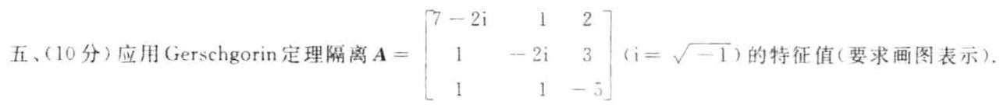

六、(15 分) 已知 $\mathbf{A} = \left\lbrack  \begin{array}{lll} 1 & 2 & 3 \\  1 & 0 & 1 \\  2 & 0 & 2 \\  2 & 4 & 6 \end{array}\right\rbrack  ,\;\mathbf{b} = \left\lbrack  \begin{array}{l} 3 \\  1 \\  2 \\  6 \end{array}\right\rbrack$

1. 求 $A$ 的满秩分解；

2. 求 ${A}^{ + }$

3. 用广义逆矩阵方法判断线性方程组 ${Ax} = b$ 是否有解

4. 求线性方程组 $\mathbf{A}\mathbf{x} = \mathbf{b}$ 的极小范数解或极小范数最小二乘解 $\mathbf{x}$ ,(要求指出所求的是哪种解).

七(15 分)设多项式空间 ${P}_{3}\left\lbrack  t\right\rbrack$ 的两个子空间为

$$
{W}_{1} = \left\{  {{a}_{0} + {a}_{1}t + {a}_{2}{t}^{2} + {a}_{3}{t}^{3} \mid  {a}_{0} - {a}_{1} + {a}_{2} - {a}_{3} = 0}\right\}
$$

$$
{W}_{2} = \operatorname{span}\left\{  {{g}_{1}\left( t\right) ,{g}_{2}\left( t\right) }\right\}  \;\left( {{g}_{1}\left( t\right)  = 1 + 2{t}^{2} + 3{t}^{4},\;{g}_{2}\left( t\right)  =  - {2t} + {t}^{3}}\right)
$$

1. 给出 ${W}_{1}$ 的基与维数;

2. 求 ${W}_{1} + {W}_{2}$ 和 ${W}_{1} \cap  {W}_{2}$ 的基与维数.

八. (9 分) 设线性空间 ${V}^{n}$ 的两个基分别为 $\left( 1\right) {x}_{1},{x}_{2},\cdots ,{x}_{n}$ 和 $\left( 2\right) {y}_{1},{y}_{2},\cdots ,{y}_{n}$ ,元素 $x \in  {V}^{n}$ 在基 $\left( 1\right)$ 下的坐标为 $\mathbf{\alpha }$ ,在基 (2) 下的坐标为 $\mathbf{\beta }$ ,证明子集 $W = \left\{  {\mathbf{x} \mid  \mathbf{x} \in  {V}^{n},\mathbf{\alpha } = 2\mathbf{\beta }}\right\}$ 是 ${V}^{n}$ 的线性子空间.

## 试题十解答

一、1. 因为度量矩阵正定,所以 $\mathbf{A}$ 的顺序主子式大于 0 . 即 ${\Delta }_{1} = 5 > 0,{\Delta }_{2} = 1 > 0,{\Delta }_{3} = k - 4 > 0$ , 故 $k > 4$ .

2.10. ${12},\sqrt{50}$ .

3. 发散; 因为收敛半径 $r = 2$ ,谱半径 $\rho \left( \mathbf{A}\right)  = 3$ ,而 $\rho \left( \mathbf{A}\right)  > r$ .

4. 将 $\mathbf{A}\mathbf{X} + \mathbf{X}\mathbf{A} = \mathbf{X}$ 按行拉直可得

$$
\left( {\mathbf{A} \otimes  \mathbf{I} + \mathbf{I} \otimes  {\mathbf{A}}^{\top } - \mathbf{I} \otimes  \mathbf{I}}\right) \overline{\operatorname{vec}}\left( \mathbf{X}\right)  = \overline{\operatorname{vec}}\left( \mathbf{O}\right)
$$

(*)

令 $f\left( {x, y}\right)  = x + y - 1$ ,则 $f\left( {\mathbf{A},{\mathbf{A}}^{\mathrm{T}}}\right)  = \mathbf{A} \otimes  \mathbf{I} + \mathbf{I} \otimes  {\mathbf{A}}^{\mathrm{T}} - \mathbf{I} \otimes  \mathbf{I}$ 的特征值为

$$
f\left( {{\lambda }_{i},{\lambda }_{j}}\right)  = {\lambda }_{i} + {\lambda }_{j} - 1\;\left( {i, j = 1,2,\cdots , n}\right)
$$

齐次方程组 $\left( *\right)$ 有非零解的充要条件是 $\det \left\lbrack  {f\left( {\mathbf{A} \cdot  {\mathbf{A}}^{\mathrm{T}}}\right) }\right\rbrack   = 0$ ,即存在 ${i}_{0},{j}_{0}$ ,使得 $f\left( {{\lambda }_{{i}_{0}} \cdot  {\lambda }_{{j}_{0}}}\right)  = 0$ . 也就是 ${\lambda }_{{i}_{0}} + {\lambda }_{{j}_{0}} = 1$ .

5. $\varphi \left( \lambda \right)$ 的因式 ${\left( \lambda  - 4\right) }^{4}$ 是 $5 - 3 = 2$ 个初等因子的乘积,有下面两种可能: ${\left( \lambda  - 4\right) }^{2},{\left( \lambda  - 4\right) }^{2}$ 或者 $\left( {\lambda  - 4}\right)$ , ${\left( \lambda  - 4\right) }^{3}$ ,于是

$$
\mathbf{J} = \left\lbrack  \begin{array}{rrrrrr} 1 & & & & & \\   & 4 & 1 & & & \\   & & 4 & & & \\   & & & 4 & 1 & \\   & & & & 4 & 1 \\  \vdots & & & & & 4 \end{array}\right\rbrack  \text{ 或者 }\;\mathbf{J} = \left\lbrack  \begin{array}{rrrrrr} 1 & & & & & \\   & 4 & & & & \\   & & 4 & & & \\   & & & 4 & 1 & 0 \\   & & & & 4 & 1 \\  \vdots & & & & & 4 \end{array}\right\rbrack
$$

6. 方法 1. 设 $\mathbf{A}$ 的满秩分解为 $\mathbf{A} = \mathbf{{FG}}$ . 则 ${\mathbf{A}}^{ + } = {\mathbf{G}}^{ + }{\mathbf{F}}^{ + }$ ,且有满秩分解

$$
\left\lbrack  \begin{array}{lll} 3\mathbf{A} & 2\mathbf{A} & \mathbf{A} \end{array}\right\rbrack   = \mathbf{F}\left\lbrack  \begin{array}{lll} 3\mathbf{G} & 2\mathbf{G} & 1\mathbf{G} \end{array}\right\rbrack
$$

于是

$$
{\left\lbrack  3\mathbf{A}\vdots 2\mathbf{A}\vdots \mathbf{A}\right\rbrack  }^{ + } = {\left\lbrack  3\mathbf{G}\vdots 2\mathbf{G}\vdots \mathbf{G}\right\rbrack  }^{ + }{\mathbf{F}}^{ + } =
$$

$$
\left\lbrack  \begin{array}{l} 3{\mathbf{G}}^{\mathrm{H}} \\  {\mathbf{G}}^{\mathrm{H}} \\  {\mathbf{G}}^{\mathrm{H}} \end{array}\right\rbrack  \left\{  \begin{array}{ll} \left\lbrack  {3\mathbf{G}\vdots 2\mathbf{G}\vdots \mathbf{G}}\right\rbrack  & \left\lbrack  \begin{array}{l} 3{\mathbf{G}}^{\mathrm{H}} \\  2{\mathbf{G}}^{\mathrm{H}} \end{array}\right\rbrack  \\  \left\lbrack  {\mathbf{G}}^{\mathrm{H}}\right\rbrack  & \left\lbrack  {\mathbf{G}}^{\mathrm{H}}\right\rbrack   \end{array}\right\}  {\mathbf{F}}^{ + } = \left\lbrack  \begin{array}{l} 3{\mathbf{G}}^{\mathrm{H}} \\  2{\mathbf{G}}^{\mathrm{H}} \\  {\mathbf{G}}^{\mathrm{H}} \end{array}\right\rbrack  {\left\{  {14}\mathbf{G}{\mathbf{G}}^{\mathrm{H}}\right\}  }^{-1}{\mathbf{F}}^{ + } =
$$

$$
\left\lbrack  \begin{array}{l} 3{\mathbf{G}}^{\mathrm{H}} \\  2{\mathbf{G}}^{\mathrm{H}} \\  {\mathbf{G}}^{\mathrm{H}} \end{array}\right\rbrack  \frac{1}{14}{\left\{  \mathbf{G}{\mathbf{G}}^{\mathrm{H}}\right\}  }^{-1}{\mathbf{F}}^{ * } = \frac{1}{14}\left\lbrack  \begin{array}{l} 3{\mathbf{G}}^{ * } \\  2{\mathbf{G}}^{ * } \\  {\mathbf{G}}^{ * } \end{array}\right\rbrack  {\mathbf{F}}^{ * } = \frac{1}{14}\left\lbrack  \begin{array}{l} 3{\mathbf{A}}^{ * } \\  2{\mathbf{A}}^{ * } \\  {\mathbf{A}}^{ * } \end{array}\right\rbrack
$$

方法 2. ${\left\lbrack  \begin{array}{lll} 3\mathbf{A} & 2\mathbf{A} & \mathbf{A} \end{array}\right\rbrack  }^{ * } = \{ \left( {3,2,1}\right)  \otimes  \mathbf{A}{\} }^{ * } = {\left( 3,2,1\right) }^{ * } \otimes  {\mathbf{A}}^{ * } = \frac{1}{14}\left\lbrack  \begin{array}{l} 3{\mathbf{A}}^{ * } \\  2{\mathbf{A}}^{ * } \\  {\mathbf{A}}^{ * } \end{array}\right\rbrack$

$$
\text{ 二、(1) }\mathbf{\alpha } = \mathbf{0} : \parallel \mathbf{\alpha }\parallel  = 2\parallel \mathbf{A}\mathbf{0}{\parallel }_{2} + 3\parallel \mathbf{B}\mathbf{0}{\parallel }_{3} = 2\parallel \mathbf{0}{\parallel }_{2} + 3\parallel \mathbf{0}{\parallel }_{3} = 0
$$

$\mathbf{\alpha } \neq  \mathbf{0} : \mathbf{A}\mathbf{\alpha } \neq  \mathbf{0}$ 与 $\mathbf{B}\mathbf{\alpha } \neq  \mathbf{0}$ 至少之一成立 (因为 $N\left( \mathbf{A}\right)  \cap  N\left( \mathbf{B}\right)  = \{ \mathbf{0}\}$ ),从而 $\parallel \mathbf{A}\mathbf{\alpha }{\parallel }_{2} > 0$ 与 $\parallel \mathbf{B}\mathbf{\alpha }{\parallel }_{3} > 0$ 至少之一成立. 故 $\parallel \mathbf{\alpha }\parallel  = 2\parallel \mathbf{A}\mathbf{\alpha }{\parallel }_{2} + 3\parallel \mathbf{B}\mathbf{\alpha }{\parallel }_{3} > 0$ .

(2) 略.

(3) $\parallel \mathbf{\alpha } + \mathbf{\beta }\parallel  = 2\parallel \mathbf{A}\left( {\mathbf{\alpha } + \mathbf{\beta }}\right) {\parallel }_{2} + 3\parallel \mathbf{B}\left( {\mathbf{\alpha } + \mathbf{\beta }}\right) {\parallel }_{3} = 2\parallel \mathbf{A}\mathbf{\alpha } + \mathbf{A}\mathbf{\beta }{\parallel }_{2} + 3\parallel \mathbf{B}\mathbf{\alpha } + \mathbf{B}\mathbf{\beta }{\parallel }_{3} \leq$

$$
2\left( {\parallel \mathbf{A}\mathbf{\alpha }{\parallel }_{2} + \parallel \mathbf{A}\mathbf{\beta }{\parallel }_{2}}\right)  + 3\left( {\parallel \mathbf{B}\mathbf{\alpha }{\parallel }_{3} + \parallel \mathbf{B}\mathbf{\beta }{\parallel }_{3}}\right)  =
$$

$$
\left( {2\parallel \mathbf{A}\mathbf{\alpha }{\parallel }_{2} + 3\parallel \mathbf{B}\mathbf{\alpha }{\parallel }_{3}}\right)  + \left( {2\parallel \mathbf{A}\mathbf{\beta }{\parallel }_{2} + 3\parallel \mathbf{B}\mathbf{\beta }{\parallel }_{3}}\right)  = \parallel \mathbf{\alpha }\parallel  + \parallel \mathbf{\beta }\parallel
$$

三、1. 待定法求 ${\mathrm{e}}^{\lambda t} \cdot  \varphi \left( \lambda \right)  = \left| {\lambda \mathbf{I} - \mathbf{A}}\right|  = {\left( \lambda  + 1\right) }^{2}\left( {\lambda  - 3}\right)$ ,因为 $\left( {\mathbf{A} + \mathbf{I}}\right) \left( {\mathbf{A} - 3\mathbf{I}}\right)  = \mathbf{O}$ ,所以 $\mathbf{A}$ 的最小多项式为 $m\left( \lambda \right)  = \left( {\lambda  + 1}\right) \left( {\lambda  - 3}\right)$ . 设 $f\left( \lambda \right)  = {\mathrm{e}}^{\lambda \lambda } = m\left( \lambda \right) g\left( \lambda \right)  + \left( {a + {b\lambda }}\right)$ . 则有

$$
\left\{  {\begin{array}{l} f\left( {-1}\right)  = {\mathrm{e}}^{-t} = a - b \\  f\left( 3\right)  = {\mathrm{e}}^{3t} = a + {3b} \end{array},\left\{  \begin{array}{l} a = \frac{{\mathrm{e}}^{3t} + 3{\mathrm{e}}^{-t}}{4} \\  b = \frac{{\mathrm{e}}^{3t} - {\mathrm{e}}^{-t}}{4} \end{array}\right. }\right.
$$

于是 $\;{\mathrm{e}}^{t\mathbf{A}} = a\mathbf{I} + b\mathbf{A} = \frac{{\mathrm{e}}^{3t}}{4}\left( {\mathbf{I} + \mathbf{A}}\right)  + \frac{{\mathrm{e}}^{-t}}{4}\left( {3\mathbf{I} - \mathbf{A}}\right)  = \frac{{\mathrm{e}}^{3t}}{4}\left\lbrack  \begin{array}{rrr}  - 1 & 2 &  - 3 \\   - 1 & 2 &  - 3 \\  1 &  - 2 & 3 \end{array}\right\rbrack   + \frac{{\mathrm{e}}^{-t}}{4}\left\lbrack  \begin{array}{rrr} 5 &  - 2 & 3 \\  1 & 2 & 3 \\   - 1 & 2 & 1 \end{array}\right\rbrack$

2. ${\int }_{0}^{t}{\mathrm{e}}^{s\mathbf{A}}\mathbf{b}\left( s\right) \mathrm{d}s = t\left\lbrack  \begin{array}{r}  - 1 \\  1 \\  1 \end{array}\right\rbrack  ,\;\mathbf{x}\left( t\right)  = {\mathrm{e}}^{t\mathbf{A}}\{ \mathbf{x}\left( 0\right)  + {\int }_{0}^{t}{\mathrm{e}}^{-s\mathbf{A}}\mathbf{b}\left( s\right) \mathrm{d}s\}  = {\mathrm{e}}^{-t}\left\lbrack  \begin{array}{l} 3 - t \\  3 + t \\  1 + t \end{array}\right\rbrack$

四、方法 1 (Givens 变换):

(1) ${\mathbf{\beta }}_{n} = \left\lbrack  \begin{array}{l} 3 \\  0 \\  0 \\  4 \end{array}\right\rbrack  ,{\mathbf{T}}_{11} = \frac{1}{5}\left\lbrack  \begin{array}{rrrr} 3 & 0 & 0 & 4 \\  0 & 5 & 0 & 0 \\  0 & 0 & 5 & 0 \\   - 4 & 0 & 0 & 3 \end{array}\right\rbrack  ,{\mathbf{T}}_{12}{\mathbf{\beta }}_{0} = \left\lbrack  \begin{array}{l} 5 \\  0 \\  0 \\  0 \end{array}\right\rbrack$

$$
{\mathbf{T}}_{0} = {\mathbf{T}}_{1i},\;{\mathbf{T}}_{0}\mathbf{A} = \left\lbrack  \begin{array}{rrrr} 5 & 0 &  - 1 & 0 \\  0 & 2 & 2 & 4 \\  0 & 0 & 0 & 5 \\  0 & 0 & 0 & 5 \\  0 & 0 &  - 2 & 5 \end{array}\right\rbrack
$$

(2) ${\mathbf{A}}_{2} = \left\lbrack  \begin{array}{rr} 0 & 5 \\   - 2 & 5 \end{array}\right\rbrack  ,\;{\mathbf{\beta }}_{2} = \left\lbrack  \begin{array}{r} 0 \\   - 2 \end{array}\right\rbrack  ,\;{\mathbf{T}}_{12} = \left\lbrack  \begin{array}{rr} 0 &  - 1 \\  1 & 0 \end{array}\right\rbrack  ,\;{\mathbf{T}}_{12}{\mathbf{\beta }}_{2} = \left\lbrack  \begin{array}{l} 2 \\  0 \end{array}\right\rbrack$

$$
{\mathbf{T}}_{2} = {\mathbf{T}}_{12},\;{\mathbf{T}}_{2}{\mathbf{A}}_{2} = \left\lbrack  \begin{array}{rr} 2 &  - 5 \\  0 & 5 \end{array}\right\rbrack
$$

令 $\mathbf{T} = \left\lbrack  \begin{array}{ll} {\mathbf{I}}_{2} & \\   & {\mathbf{T}}_{1} \end{array}\right\rbrack  \mathbf{T}$ ,则有

$$
\mathbf{Q} = {\mathbf{T}}^{\top } = \frac{1}{5}\left\lbrack  \begin{array}{rrrr} 3 & 0 & 4 & 0 \\  0 & 5 & 0 & 0 \\  0 & 0 & 0 & 5 \\  4 & 0 &  - 3 & 0 \end{array}\right\rbrack  ,\;\mathbf{R} = \left\lbrack  \begin{array}{rrrr} 5 & 0 &  - 1 & 0 \\  2 & 2 & 2 & 1 \\   & 2 &  - 5 & 3 \\   & & & 5 \end{array}\right\rbrack  ,\;\mathbf{A} = \mathbf{{QR}}
$$

方法 2 (Householder 变换):

$$
\text{ (i) }{\mathbf{\beta }}_{0} = \left\lbrack  \begin{array}{l} 3 \\  0 \\  0 \\  4 \end{array}\right\rbrack  ,\;\mathbf{u} = \frac{1}{\sqrt{5}}\left\lbrack  \begin{array}{r}  - 1 \\  0 \\  0 \\  2 \end{array}\right\rbrack  ,\;{\mathbf{H}}_{0} = \mathbf{I} - 2\mathbf{u}{\mathbf{u}}^{\mathrm{T}} = \frac{1}{5}\left\lbrack  \begin{array}{rrrr} 3 & 0 & 0 & 4 \\  0 & 5 & 0 & 0 \\  0 & 0 & 5 & 0 \\  4 & 0 & 0 &  - 3 \end{array}\right\rbrack
$$

$$
{\mathbf{H}}_{0}\mathbf{A} = \left\lbrack  \begin{array}{rrrrr} 5 & 0 & \vdots &  - 1 & 0 \\  0 & 2 & \vdots & 2 & 4 \\  0 & 0 & \vdots & 0 & 5 \\  0 & 0 & \vdots & 2 &  - 5 \end{array}\right\rbrack
$$

(2) ${\mathbf{A}}_{2} = \left\lbrack  \begin{array}{rr} 0 & 5 \\  2 &  - 5 \end{array}\right\rbrack  ,\;{\mathbf{\beta }}_{2} = \left\lbrack  \begin{array}{l} 0 \\  2 \end{array}\right\rbrack  ,\;\mathbf{u} = \frac{1}{\sqrt{2}}\left\lbrack  \begin{array}{r}  - 1 \\  1 \end{array}\right\rbrack  ,\;{\mathbf{H}}_{2} = \mathbf{I} - 2\mathbf{u}{\mathbf{u}}^{\mathrm{T}} = \left\lbrack  \begin{array}{ll} 0 & 1 \\  1 & 0 \end{array}\right\rbrack$

$$
{\mathbf{H}}_{2}{\mathbf{A}}_{2} = \left\lbrack  \begin{array}{rr} 2 &  - 5 \\  0 & 5 \end{array}\right\rbrack
$$

令 $\mathbf{S} = \left\lbrack  \begin{array}{ll} {\mathbf{I}}_{2} & \\   & {\mathbf{H}}_{2} \end{array}\right\rbrack  {\mathbf{H}}_{0}$ ,则有

$$
\text{ - }\mathbf{Q} = {\mathbf{S}}^{\top } = \frac{1}{5}\left\lbrack  \begin{array}{llll} 3 & 0 & 4 & 0 \\  0 & 5 & 0 & 0 \\  0 & 0 & 0 & 5 \\  4 & 0 &  - 3 & 0 \end{array}\right\rbrack  ,\;\mathbf{R} = \left\lbrack  \begin{array}{rrrr} 5 & 0 &  - 1 & 0 \\  2 & 2 & 2 & 4 \\   & 2 &  - 5 & \\   & & & 5 \end{array}\right\rbrack  ,\;\mathbf{A} = \mathbf{{QR}}
$$

[注] 因为 ${T}_{0}A$ 和 ${H}_{0}A$ 的 3 行 2 列和 4 行 2 列元素都是 0,所以不必进行第二步.

五、A的 3 个盖尔圆为

$$
{G}_{1} : \left| {z - \left( {7 - 2\mathrm{i}}\right) }\right|  \leq  3,\;{G}_{2} : \left| {z - \left( {-2\mathrm{i}}\right) }\right|  \leq  4,\;{G}_{3} : \left| {z - \left( {-5}\right) }\right|  \leq  2
$$

易见 ${G}_{1},{G}_{2}$ 及 ${G}_{3}$ 相交. 取 $\mathbf{D} = \operatorname{diag}\left( {1,{0.5},1}\right)$ ,则

$$
\mathbf{B} = \mathbf{D}\mathbf{A}{\mathbf{D}}^{-1} = \left\lbrack  \begin{matrix} 7 - 2\mathrm{i} & 2 & 2 \\  {0.5} &  - 2\mathrm{i} & {1.5} \\  1 & 2 &  - 5 \end{matrix}\right\rbrack
$$

的 3 个孤立盖尔圆为

$$
{G}^{\prime } : \left| {z - \left( {7 - 2\mathrm{i}}\right) }\right|  \leq  4,\;{G}^{\prime } : \left| {z - \left( {-2\mathrm{i}}\right) }\right|  \leq  2,\;{G}^{\prime } : \left| {z - \left( {-5}\right) }\right|  \leq  3
$$

结论: ${G}^{\prime }{}_{1},{G}^{\prime }{}_{2}$ 及 ${G}^{\prime }{}_{3}$ 中各有 $\mathbf{A}$ 的一个特征值.

[注] 亦可取 $\mathbf{D} = \operatorname{diag}\left( {1,{0.4},1}\right) ,\;\mathbf{D} = \operatorname{diag}\left( {1,\frac{2}{3},1}\right)$ .

六、1. A. $\frac{17}{}$ , $\left\lbrack  \begin{array}{lll} 1 & 0 & 1 \\  0 & 1 & 1 \\  0 & 0 & 0 \\  0 & 0 & 0 \end{array}\right\rbrack$ . $\;\mathbf{A} = \left\lbrack  \begin{array}{ll} 1 & 2 \\  1 & 0 \\  2 & 0 \\  2 & 4 \end{array}\right\rbrack  \left\lbrack  \begin{array}{lll} 1 & 0 & 1 \\  0 & 1 & 1 \end{array}\right\rbrack   = \mathbf{F}\mathbf{G}$

$$
\text{ 2. }{\mathbf{F}}^{ + } = {\left( {\mathbf{F}}^{\mathrm{T}}\mathbf{F}\right) }^{-1}{\mathbf{F}}^{\mathrm{T}} = \frac{1}{10}\left\lbrack  \begin{array}{rrrr} 0 & 2 & 4 & 0 \\  1 &  - 1 &  - 2 & 2 \end{array}\right\rbrack  ,\;{\mathbf{G}}^{ + } = {\mathbf{G}}^{\mathrm{T}}{\left( \mathbf{G}{\mathbf{G}}^{\mathrm{T}}\right) }^{-1} = \frac{1}{3}\left\lbrack  \begin{array}{rr} 2 &  - 1 \\   - 1 & 2 \\  1 & 1 \end{array}\right\rbrack
$$

$$
{\mathbf{A}}^{ + } = {\mathbf{G}}^{ + }{\mathbf{F}}^{ + } = \frac{1}{30}\left\lbrack  \begin{array}{rrrr}  - 1 & 5 & {10} &  - 2 \\  2 &  - 4 &  - 8 & 4 \\  1 & 1 & 2 & 2 \end{array}\right\rbrack
$$

$3 \sim  4.{\mathbf{x}}_{0} = {\mathbf{A}}^{ + }\mathbf{b} = \frac{1}{3}{\left( 1,1,2\right) }^{\mathrm{T}},\mathbf{A}{\mathbf{A}}^{ + }\mathbf{b} = \mathbf{A}{\mathbf{x}}_{0} = \mathbf{b}$ ,故 $\mathbf{A}\mathbf{x} = \mathbf{b}$ 有解,且 ${\mathbf{x}}_{0}$ 是 $\mathbf{A}\mathbf{x} = \mathbf{b}$ 的极小范数解.

七、1. 任意 $f\left( t\right)  \in  {W}_{1}$ . 有

$$
f\left( t\right)  = \left( {{a}_{1} - {a}_{2} + {a}_{3}}\right)  + {a}_{1}t + {a}_{2}{t}^{2} + {a}_{3}{t}^{3} = {a}_{1}\left( {1 + t}\right)  + {a}_{2}\left( {-1 + {t}^{2}}\right)  + {a}_{3}\left( {1 + {t}^{3}}\right)
$$

${W}_{1}$ 的基为 ${f}_{1}\left( t\right)  = 1 + t,\;{f}_{2}\left( t\right)  =  - 1 + {t}^{2},\;{f}_{3}\left( t\right)  = 1 + {t}^{3};\;\dim {W}_{1} = 3$ .

2. ${W}_{1} + {W}_{2} = L\left( {{f}_{1},{f}_{2},{f}_{3},{g}_{1},{g}_{2}}\right)$ ,且 ${f}_{1},{f}_{2},{f}_{3},{g}_{1},{g}_{2}$ 在基 $1, t,{t}^{2},{t}^{3}$ 下的坐标依次为

$$
{\mathbf{\alpha }}_{1} = \left\lbrack  \begin{array}{l} 1 \\  1 \\  0 \\  0 \end{array}\right\rbrack  ,\;{\mathbf{\alpha }}_{2} = \left\lbrack  \begin{array}{r}  - 1 \\  0 \\  1 \\  0 \end{array}\right\rbrack  ,\;{\mathbf{\alpha }}_{3} = \left\lbrack  \begin{array}{l} 1 \\  0 \\  0 \\  1 \end{array}\right\rbrack  ,\;{\mathbf{\alpha }}_{4} = \left\lbrack  \begin{array}{l} 1 \\  0 \\  2 \\  3 \end{array}\right\rbrack  ,\;{\mathbf{\alpha }}_{5} = \left\lbrack  \begin{array}{r} 0 \\   - 2 \\  0 \\  1 \end{array}\right\rbrack
$$

求得该向量组的最大无关组为 ${\mathbf{\alpha }}_{1},{\mathbf{\alpha }}_{2},{\mathbf{\alpha }}_{3},{\mathbf{\alpha }}_{5}$ ,故 ${W}_{1} + {W}_{2}$ 的基为 ${f}_{1},{f}_{2},{f}_{3},{g}_{2};\dim \left( {{W}_{1} + {W}_{2}}\right)  = 4$ .

任意 $f\left( t\right)  \in  {W}_{1} \cap  {W}_{2}$ ,有 $f\left( t\right)  = {k}_{1}{f}_{1} + {k}_{2}{f}_{2} + {k}_{3}{f}_{3} = {c}_{1}{g}_{1} + {c}_{2}{g}_{2}$ ,即

$$
\left\lbrack  \begin{array}{rrrrrr} 1 &  - 1 & 1 & \vdots &  - 1 & 0 \\  1 & 0 & 0 & \vdots & 0 & 2 \\  0 & 1 & 0 &  - 2 & 0 & 0 \\  0 & 0 & 1 & \vdots &  - 3 &  - 1 \end{array}\right\rbrack  \left\lbrack  \begin{array}{l} {k}_{1} \\  {k}_{2} \\  {k}_{3} \\  {c}_{1} \\  {c}_{2} \end{array}\right\rbrack   = \left\lbrack  \begin{array}{l} 0 \\  0 \\  0 \\  0 \\  0 \end{array}\right\rbrack  \text{ ,通解 }\left\lbrack  \begin{array}{l} {k}_{1} \\  {k}_{2} \\  {k}_{3} \\  {c}_{1} \\  {c}_{2} \end{array}\right\rbrack   = k\left\lbrack  \begin{array}{l} 0 \\  2 \\  3 \\  1 \\  0 \end{array}\right\rbrack  \left( {\forall k \in  \mathbf{R}}\right)
$$

于是

$$
f\left( t\right)  = {c}_{1}{g}_{1} + {c}_{2}{g}_{2} = k{g}_{1} = k\left( {1 + 2{t}^{2} + 3{t}^{3}}\right) \;\left( {\forall k \in  \mathbf{R}}\right)
$$

故 ${W}_{1} \cap  {W}_{2}$ 的基为 ${g}_{1}\left( t\right)  : \dim \left( {{W}_{1} \cap  {W}_{2}}\right)  = 1$ .

八、 $\mathbf{\theta } \in  {V}^{n}$ 在基(1)下的坐标为0，在基(2)下的坐标为0. 由 $\mathbf{0} = {20}$ 可得 $\mathbf{\theta } \in  W$ ，故 $W$ 非空.

设 $\mathbf{x} \in  W$ 在基(1)和基(2)下的坐标分别为 ${\mathbf{\alpha }}_{1},{\mathbf{\beta }}_{1}$ ,则 ${\mathbf{\alpha }}_{1} = 2{\mathbf{\beta }}_{1}$ . 再设 $\mathbf{y} \in  W$ 在基( 1 )和基( 2 )下的坐标分别为 ${\mathbf{\alpha }}_{2},{\mathbf{\beta }}_{2}$ ,则 ${\mathbf{\alpha }}_{2} = 2{\mathbf{\beta }}_{2}$ ,于是 $\mathbf{x} + \mathbf{y}$ 在基( 1 )和基( 2 )下的坐标分别为 ${\mathbf{\alpha }}_{1} + {\mathbf{\alpha }}_{2},{\mathbf{\beta }}_{1} + {\mathbf{\beta }}_{2}$ ,且有

$$
{\mathbf{\alpha }}_{1} + {\mathbf{\alpha }}_{2} = 2{\mathbf{\beta }}_{1} + 2{\mathbf{\beta }}_{2} = 2\left( {{\mathbf{\beta }}_{1} + {\mathbf{\beta }}_{2}}\right)  \Rightarrow  \mathbf{x} + \mathbf{y} \in  W
$$

而 ${kx}$ 在基(1)和基(2)下的坐标分别为 $k{\mathbf{\alpha }}_{1}, k{\mathbf{\beta }}_{1}$ ，且有

$$
k{\mathbf{\alpha }}_{1} = k\left( {2{\mathbf{\beta }}_{1}}\right)  = 2\left( {k{\mathbf{\beta }}_{1}}\right)  \Rightarrow  k\mathbf{x} \in  W
$$

故 $W$ 是 ${V}^{\prime \prime }$ 的子空间.

## 试题十一(2006 年 A 卷)

一、(18 分) 填空: 设线性空间 ${V}^{2}$ 中的线性变换 ${T}_{1}$ 与 ${T}_{2}$ 在基 ${\mathbf{x}}_{1},{\mathbf{x}}_{2}$ 下的矩阵分别为 $\mathbf{A} = \left\lbrack  \begin{array}{ll} 1 & 0 \\  2 & 1 \end{array}\right\rbrack  ,\mathbf{B} = \; \left\lbrack  \begin{array}{ll} 1 & 0 \\  2 & 0 \end{array}\right\rbrack  .$

1. ${T}_{1}$ 与 ${T}_{2}$ 的乘积 ${T}_{1}{T}_{2}$ 在基 ${\mathbf{x}}_{1},{\mathbf{x}}_{2}$ 下的矩阵为 $\left\lbrack  \begin{array}{lll}  & & \\   & &  \end{array}\right\rbrack$ .

2. $\dim R\left( {T}_{1}\right)  =$ (   ).

3. $R\left( {T}_{1}\right)  \cap  N\left( {T}_{2}\right)$ 的一个基为( ).

4. 若常数 $k$ 使得 $k\left( {\mathbf{A} + \mathbf{B}}\right)$ 为收敛矩阵，则 $k$ 应满足的条件是( ).

5. $\parallel \mathbf{A} \otimes  \mathbf{B}{\parallel }_{F} =$ (   ).

6. $\parallel \operatorname{vec}\left( {A \otimes  B}\right) {\parallel }_{1} =$ (   ).

7. $\left\lbrack  \begin{array}{ll} \mathbf{A} & \mathbf{O} \\  \mathbf{B} & \mathbf{B} \end{array}\right\rbrack$ 的 Jordan 标准形为 $\mathbf{J} = \left\lbrack  \begin{array}{lll}  & & \\   & &  \end{array}\right\rbrack$ .

8. $\mathbf{B}$ 的两个不同秩的 $\{ 1\}$ 一逆为 ${\mathbf{B}}^{\left( 1\right) } = \left\lbrack  \begin{array}{ll}  & \\   &  \end{array}\right\rbrack   \cdot  {\mathbf{B}}^{\left( 1\right) } = \left\lbrack  \begin{array}{ll}  & \\   &  \end{array}\right\rbrack$

二、(9 分) 设 $\mathbf{A} \in  {\mathbf{C}}^{n \times  n} \cdot  \mathbf{B} = \mathbf{I} - \mathbf{A}$ . 对于列向量 $x \in  {\mathbf{C}}^{n}$ 及向量的 $p$ -范数 $\parallel x{\parallel }_{p}$ . 定义实数 $\parallel x\parallel  = \; \sqrt{\parallel \mathbf{A}\mathbf{x}{\parallel }_{2}^{2} + \parallel \mathbf{B}\mathbf{x}{\parallel }_{3}^{2}}$ ,验证 $\parallel \mathbf{x}\parallel$ 是 ${\mathbf{C}}^{n}$ 中的向量范数.

三、(15 分) 已知 $\mathbf{A} = \left\lbrack  \begin{array}{rrr}  - 2 & 1 & 1 \\  1 &  - 2 &  - 1 \\   - 2 & 2 & 1 \end{array}\right\rbrack  ,\mathbf{b}\left( t\right)  = {\mathrm{e}}^{-t}\left\lbrack  \begin{array}{l} 2 \\  1 \\  1 \end{array}\right\rbrack  ,\mathbf{x}\left( 0\right)  = \left\lbrack  \begin{array}{r} 0 \\  1 \\   - 2 \end{array}\right\rbrack$ .

1. 求 ${\mathrm{e}}^{v}$ :

2. 用矩阵函数方法求微分方程 $\frac{\mathrm{d}}{\mathrm{d}t}x\left( t\right)  = \mathbf{A}x\left( t\right)  + \mathbf{b}\left( t\right)$ 满足初始条件 $x\left( 0\right)$ 的解.

四、(10 分) 用 Givens 变换求矩阵 $\mathbf{A} = \left\lbrack  \begin{array}{llll} 4 & 5 & 0 & 1 \\  0 & 4 & 0 & 1 \\  0 & 0 & 2 & 1 \\  3 & 0 & 0 & 2 \end{array}\right\rbrack$ 的 QR 分解.

五、(10 分) 用 Gerschgorin 定理隔离矩阵 $\mathbf{A} = \left\lbrack  \begin{array}{rrr} 8\mathrm{i} &  - 1 & 1 \\  1 &  - 8 & 1 \\  3 & 6 & 0 \end{array}\right\rbrack  \left( {\mathrm{i} = \sqrt{-1}}\right)$ 的特征值. (要求画图表示)

六、(15 分) 已知 $\mathbf{A} = \left\lbrack  \begin{array}{rrrr} 2 & 0 & 0 & 6 \\  1 & 2 & 2 & 5 \\  1 &  - 2 &  - 2 & 1 \end{array}\right\rbrack  ,\;\mathbf{b} = \left\lbrack  \begin{array}{r} 0 \\  1 \\   - 1 \end{array}\right\rbrack$ .

1. 求 $\mathbf{A}$ 的满秩分解;

2. 求 $\mathbf{A}$ ;

3. 用广义逆矩阵方法判断线性方程组 $\mathbf{A}\mathbf{x} = \mathbf{b}$ 是否有解;

4. 求线性方程组 $\mathbf{A}\mathbf{x} = \mathbf{b}$ 的极小范数解,或者极小范数最小二乘解 $\mathbf{x}$ . (要求指出所求的是哪种解)

七、(15分)已知矩阵空间 ${\mathbf{R}}^{2 \times  2}$ 的一个基为

$$
{\mathbf{A}}_{1} = \left\lbrack  \begin{array}{ll} 1 & 0 \\  0 & 0 \end{array}\right\rbrack  ,\;{\mathbf{A}}_{2} = \left\lbrack  \begin{array}{ll} 1 & 1 \\  0 & 0 \end{array}\right\rbrack  ,\;{\mathbf{A}}_{3} = \left\lbrack  \begin{array}{ll} 1 & 1 \\  1 & 0 \end{array}\right\rbrack  ,\;{\mathbf{A}}_{1} = \left\lbrack  \begin{array}{ll} 1 & 1 \\  1 & 1 \end{array}\right\rbrack
$$

线性变换 $T$ 满足:

$$
T\left( {\mathbf{A}}_{1}\right)  = {\mathbf{B}}_{1} = \left\lbrack  \begin{array}{ll} 1 & 0 \\  0 & 1 \end{array}\right\rbrack  ,\;T\left( {\mathbf{A}}_{2}\right)  = {\mathbf{B}}_{2} = \left\lbrack  \begin{array}{ll} 0 & 1 \\  1 & 0 \end{array}\right\rbrack
$$

$$
T\left( {\mathbf{A}}_{3}\right)  = {\mathbf{B}}_{3} = \left\lbrack  \begin{array}{ll} 1 & 1 \\  1 & 1 \end{array}\right\rbrack  ,\;T\left( {\mathbf{A}}_{4}\right)  = {\mathbf{B}}_{4} = \left\lbrack  \begin{array}{rr} 1 &  - 1 \\   - 1 & 1 \end{array}\right\rbrack
$$

1. 求 $T$ 在基 ${\mathbf{A}}_{1},{\mathbf{A}}_{2},{\mathbf{A}}_{3},{\mathbf{A}}_{4}$ 下的矩阵;

2. 判断 $T$ 能否在 ${\mathbf{R}}^{2 \times  2}$ 的某个基下的矩阵为对角矩阵 (要求写出判断依据);

3. 求 $N\left( T\right)$ 的一个基.

八、(8 分) 设矩阵 $\mathbf{A} \in  {\mathbf{C}}^{m \times  n}$ ,列向量 $\mathbf{b} \in  {\mathbf{C}}^{m}$ . 列向量 $x \in  {\mathbf{C}}^{n},{\mathbf{A}}^{ + }$ 表示 $\mathbf{A}$ 的 Moore-Penrose 逆. 证明: 线性方程组 $\mathbf{A}\mathbf{x} = \mathbf{A}{\mathbf{A}}^{t}\mathbf{b}$ 与 ${\mathbf{A}}^{11}\mathbf{A}\mathbf{x} = {\mathbf{A}}^{11}\mathbf{b}$ 同解.

## 试题十一解答

一、1. $\left\lbrack  \begin{array}{ll} 1 & 0 \\  4 & 0 \end{array}\right\rbrack$ ; 2. $2 : 3.{x}_{2} : 4.\left| k\right|  < \frac{1}{2} : 5.\sqrt{30} : 6.{12}$ ;

$$
\text{ 7. }\left\lbrack  \begin{array}{llll} 1 & 1 & & \\   & 1 & & \\   & & 1 & \\   & & & 0 \end{array}\right\rbrack  ;\;\text{ 8. }\left\lbrack  \begin{array}{ll} 1 & 0 \\  0 & 0 \end{array}\right\rbrack   \cdot  \left\lbrack  \begin{matrix} 1 & 0 \\   - {2c} & c \end{matrix}\right\rbrack  \left( {c \neq  0}\right)
$$

二、(1) $x = 0$ 时, $\parallel x\parallel  = 0;x \neq  0$ 时,若 ${Ax} \neq  0$ ,则 $\parallel x\parallel  > 0$ ; 若 ${Ax} = 0$ ,则 ${Bx} = x - {Ax} \neq$ 0. $\parallel x\parallel  > 0$ .

(2) 略.

(3) $\parallel \mathbf{x} + \mathbf{y}{\parallel }^{2} = \parallel \mathbf{A}\left( {\mathbf{x} + \mathbf{y}}\right) {\parallel }_{2}^{2} + \parallel \mathbf{B}\left( {\mathbf{x} + \mathbf{y}}\right) {\parallel }_{3}^{2} \leq  {\left( \parallel \mathbf{A}\mathbf{x}{\parallel }_{2} + \parallel \mathbf{A}\mathbf{y}{\parallel }_{2}\right) }^{2} + {\left( \parallel \mathbf{B}\mathbf{x}{\parallel }_{3} + \parallel \mathbf{B}\mathbf{y}{\parallel }_{3}\right) }^{2} =$

$$
\left( {\parallel \mathbf{A}\mathbf{x}{\parallel }_{2}^{2} + \parallel \mathbf{B}\mathbf{x}{\parallel }_{3}^{2}}\right)  + 2\left( {\parallel \mathbf{A}\mathbf{x}{\parallel }_{2}{\begin{Vmatrix}\mathbf{A}\mathbf{y}\end{Vmatrix}}_{2} + \parallel \mathbf{B}\mathbf{x}{\parallel }_{3}{\begin{Vmatrix}\mathbf{B}\mathbf{y}\end{Vmatrix}}_{3}}\right)  +
$$

$$
\left( {\parallel \mathbf{A}\mathbf{y}{\parallel }_{2}^{2} + \parallel \mathbf{B}\mathbf{y}{\parallel }_{3}^{2}}\right)  \leq  \parallel \mathbf{x}{\parallel }^{2} + 2\parallel \mathbf{x}\parallel \parallel \mathbf{y}\parallel  + \parallel \mathbf{y}{\parallel }^{2} = {\left( \parallel \mathbf{x}\parallel  + \parallel \mathbf{y}\parallel \right) }^{2}
$$

三、1. det $\left( {\lambda \mathbf{I} - \mathbf{A}}\right)  = {\left( \lambda  + 1\right) }^{3}$ ,可以验证 $\mathbf{A}$ 的最小多项式为 $m\left( \lambda \right)  = {\left( \lambda  + 1\right) }^{2}$ . 设

$$
f\left( \lambda \right)  = {\mathrm{e}}^{\lambda t} = m\left( \lambda \right) g\left( \lambda \right)  + \left( {a + {b\lambda }}\right)
$$

则 ${f}^{\prime }\left( \lambda \right)  = t{\mathrm{e}}^{u} = {\left\lbrack  m\left( \lambda \right) g\left( \lambda \right) \right\rbrack  }^{\prime } + b$ ,且有

$$
\left\{  {\begin{array}{l} a - b = {\mathrm{e}}^{-t} \\  b = t{\mathrm{e}}^{-t} \end{array},\;\left\{  \begin{array}{l} a = \left( {t + 1}\right) {\mathrm{e}}^{-t} \\  b = t{\mathrm{e}}^{-t} \end{array}\right. }\right.
$$

于是

$$
{\mathrm{e}}^{At} = a\mathbf{I} + b\mathbf{A} = {\mathrm{e}}^{-t}\mathbf{I} + t{\mathrm{e}}^{-t}\left( {\mathbf{A} + \mathbf{I}}\right)  = {\mathrm{e}}^{-t}\left\lbrack  \begin{array}{lll} 1 & & \\   & 1 & \\   & & 1 \end{array}\right\rbrack   + t{\mathrm{e}}^{-t}\left\lbrack  \begin{matrix}  - 1 & 1 & 1 \\  1 &  - 1 &  - 1 \\   - 2 & 2 & 2 \end{matrix}\right\rbrack  .
$$

$$
\text{ 2. }{\mathrm{e}}^{-\mathbf{A}\tau }b\left( \tau \right)  = \left\lbrack  {{\mathrm{e}}^{\tau }\mathbf{I} - \tau {\mathrm{e}}^{\tau }\left( {\mathbf{A} + \mathbf{I}}\right) }\right\rbrack  {\mathrm{e}}^{-\tau }\left\lbrack  \begin{array}{l} 2 \\  1 \\  1 \end{array}\right\rbrack   = \left\lbrack  \begin{array}{l} 2 \\  1 \\  1 \end{array}\right\rbrack
$$

$$
\mathbf{x}\left( t\right)  = {\mathrm{e}}^{-t}\left\{  {\left\lbrack  \begin{array}{r} 0 \\  1 \\   - 2 \end{array}\right\rbrack   + t\left\lbrack  \begin{array}{r}  - 1 \\  1 \\   - 2 \end{array}\right\rbrack  }\right\}   + t{\mathrm{e}}^{-t}\left\lbrack  \begin{array}{l} 2 \\  1 \\  1 \end{array}\right\rbrack   = {\mathrm{e}}^{-t}\left\{  {\left\lbrack  \begin{array}{r} 0 \\  1 \\   - 2 \end{array}\right\rbrack   + t\left\lbrack  \begin{array}{r} 1 \\  2 \\   - 1 \end{array}\right\rbrack  }\right\}
$$

四, $\left( 1\right) {\mathbf{T}}_{0} = {\mathbf{T}}_{14} = \frac{1}{5}\left\lbrack  \begin{array}{llll} 4 & 0 & 0 & 3 \\  0 & 5 & 0 & 0 \\  0 & 0 & 5 & 0 \\   - 3 & 0 & 0 & 4 \end{array}\right\rbrack  ,\;{\mathbf{T}}_{0}\mathbf{A} = \left\lbrack  \begin{array}{llll} 5 & 4 & 0 & 2 \\  4 & 4 & 0 & 1 \\  0 & 0 & 2 & 1 \\  0 & 0 & 2 & 1 \\   - 3 & 0 & 1 &  \end{array}\right\rbrack$

(2) ${\mathbf{A}}_{1} = \left\lbrack  \begin{array}{lll} 4 & 0 & 1 \\  0 & 2 & 1 \\   - 3 & 0 & 1 \end{array}\right\rbrack  ,\;{\mathbf{T}}_{1} = {\mathbf{T}}_{13} = \frac{1}{5}\left\lbrack  \begin{matrix} 4 & 0 &  - 3 \\  0 & 5 & 0 \\  3 & 0 & 4 \end{matrix}\right\rbrack  ,\;{\mathbf{T}}_{1}{\mathbf{A}}_{1} = \left\lbrack  \begin{matrix} 5 & 0 & 1/5 \\   & 2 & 1 \\   & & 7/5 \end{matrix}\right\rbrack$

$$
\mathbf{Q} = \frac{1}{25}\left\lbrack  \begin{array}{rrrr} {20} & 9 & 0 &  - {12} \\  0 & {20} & 0 & {15} \\  0 & 0 & {25} & 0 \\  {15} &  - {12} & 0 & {16} \end{array}\right\rbrack  ,\;\mathbf{R} = \left\lbrack  \begin{matrix} 5 & 4 & 0 & 2 \\   & 5 & 0 & 1/5 \\   & & 2 & 1 \\   & & & 7/5 \end{matrix}\right\rbrack  ,\;\mathbf{A} = \mathbf{{QR}}
$$

五、 $\mathbf{A}$ 的 3 个盖尔圆为

$$
{G}_{1} : \left| {z - 8\mathrm{i}}\right|  \leq  2,\;{G}_{2} : \left| {z + 8}\right|  \leq  2,\;{G}_{3} : \left| {z - 0}\right|  \leq  9
$$

易见 ${G}_{1},{G}_{2},{G}_{3}$ 相交. 取 $\mathbf{D} = \operatorname{diag}\left( {1,1,{0.5}}\right)$ ,则

$$
\mathbf{B} = {\mathbf{{DAD}}}^{-1} = \left\lbrack  \begin{matrix} 8{\mathrm{i}}^{2} &  - 1 & 2 \\  1 &  - 8 & 2 \\  {1.5} & 3 & 0 \end{matrix}\right\rbrack
$$

的 3 个孤立盖尔圆为

$$
{G}_{1}^{\prime } : \left| {z - 8\mathrm{i}}\right|  \leq  3,\;{G}_{2}^{\prime } : \left| {z + 8}\right|  \leq  3,\;{G}_{3}^{\prime } : \left| {z - 0}\right|  \leq  {4.5}
$$

综上所述， ${G}_{1}^{\prime }$ ， ${G}_{2}^{\prime }$ 及 ${G}_{3}^{\prime }$ 中各有 $A$ 的一个特征值.

[注] 可取 $\mathbf{D} = \operatorname{diag}\left( {1,1,1/3}\right) ,\mathbf{D} = \operatorname{diag}\left( {1,1,1/4}\right) ,\mathbf{D} = \operatorname{diag}\left( {1,1,0,4}\right)$ .

六、1. $\mathbf{A} = \left\lbrack  \begin{array}{llll} 1 & 0 & 0 & 3 \\  0 & 1 & 1 & 1 \\  0 & 0 & 0 & 0 \end{array}\right\rbrack  ,\;\mathbf{A} = \left\lbrack  \begin{matrix} 2 & 0 \\  1 & 2 \\  1 &  - 2 \end{matrix}\right\rbrack  \left\lbrack  \begin{array}{llll} 1 & 0 & 0 & 3 \\  0 & 1 & 1 & 1 \end{array}\right\rbrack   = \mathbf{F}\mathbf{G}$

2. ${\mathbf{F}}^{ * } = \frac{1}{12}\left\lbrack  \begin{array}{rrr} 4 & 2 & 2 \\  0 & 3 &  - 3 \end{array}\right\rbrack  ,\;{\mathbf{G}}^{ * } = \frac{1}{21}\left\lbrack  \begin{array}{rr} 3 &  - 3 \\   - 3 & {10} \\   - 3 & {10} \\  6 & 1 \end{array}\right\rbrack$

$$
{\mathbf{A}}^{ - } = {\mathbf{G}}^{ - }{\mathbf{F}}^{ - } = \frac{1}{84}\left\lbrack  \begin{array}{rrr} 4 &  - 1 & 5 \\   - 4 & 8 &  - {12} \\   - 4 & 8 &  - {12} \\  8 & 5 & 3 \end{array}\right\rbrack
$$

3. $\mathbf{x} = {\mathbf{A}}^{\prime }\mathbf{b} = \frac{1}{12}{\left( -{3.10},{10.1}\right) }^{T}$ ,由 $\mathbf{A}{\mathbf{A}}^{\prime }\mathbf{b} = \mathbf{A}{\mathbf{x}}_{0} = \mathbf{b}$ 知 $\mathbf{A}\mathbf{x} = \mathbf{b}$ 有解.

4. $\mathbf{x}$ ,是 $\mathbf{A}\mathbf{x} = \mathbf{b}$ 的极小范数解.

七、 $1.\left( {{\mathbf{A}}_{1},\cdots ,{\mathbf{A}}_{1}}\right)  = \left( {{\mathbf{E}}_{11},\cdots ,{\mathbf{E}}_{22}}\right) {\mathbf{C}}_{1},\;\left( {{\mathbf{B}}_{1},\cdots ,{\mathbf{B}}_{4}}\right)  = \left( {{\mathbf{E}}_{11},\cdots ,{\mathbf{E}}_{22}}\right) {\mathbf{C}}_{2}$

$$
{\mathbf{C}}_{1} = \left\lbrack  \begin{array}{llll} 1 & 1 & 1 & 1 \\   & 1 & 1 & 1 \\   & & 1 & 1 \\   & & & 1 \end{array}\right\rbrack  ,\;{\mathbf{C}}_{2} = \left\lbrack  \begin{array}{rrrr} 1 & 0 & 1 & 1 \\  0 & 1 & 1 &  - 1 \\  0 & 1 & 1 &  - 1 \\  1 & 0 & 1 & 1 \end{array}\right\rbrack
$$

$$
\left( {{\mathbf{B}}_{1},\cdots ,{\mathbf{B}}_{4}}\right)  = \left( {{\mathbf{A}}_{1},\cdots ,{\mathbf{A}}_{4}}\right) {\mathbf{C}}_{1}^{-1}{\mathbf{C}}_{2},\;{\mathbf{C}}_{1}^{-1}{\mathbf{C}}_{2} = \left\lbrack  \begin{array}{rrrr} 1 &  - 1 & 0 & 2 \\  0 & 0 & 0 & 0 \\   - 1 & 1 & 0 &  - 2 \\  1 & 0 & 1 & 1 \end{array}\right\rbrack
$$

$$
T\left( {{\mathbf{A}}_{1},\cdots ,{\mathbf{A}}_{4}}\right)  = \left( {{\mathbf{B}}_{1},\cdots ,{\mathbf{B}}_{4}}\right)  = \left( {{\mathbf{A}}_{1},\cdots ,{\mathbf{A}}_{4}}\right) {\mathbf{C}}_{1}^{-1}{\mathbf{C}}_{2},\;\mathbf{A} = {\mathbf{C}}_{1}^{-1}{\mathbf{C}}_{2}
$$

2. 计算 $\det \left( {\lambda \mathbf{I} - \mathbf{A}}\right)  = {\lambda }^{2}{\left( \lambda  - 1\right) }^{2} \cdot  \operatorname{rank}\left( {0\mathbf{I} - \mathbf{A}}\right)  = 2 \cdot  {\lambda }_{1} = {\lambda }_{2} = 0$ 有 2 个线性无关的特征向量: $\operatorname{rank}\left( {{1I} - A}\right)  = 3,{\lambda }_{3} = {\lambda }_{4} = 1$ 只有 1 个线性无关的特征向量. 故 $A$ 不可对角化,从而 $T$ 不能在某个基下的矩阵为对角矩阵.

$$
\text{ 3. }N\left( T\right)  = \{ \mathbf{X} \mid  T\left( \mathbf{X}\right)  = \mathbf{O}\}  = \left\{  {\mathbf{X} \mid  \mathbf{X} = \left( {{\mathbf{A}}_{1},\cdots ,{\mathbf{A}}_{4}}\right) \mathbf{\alpha },\mathbf{A}\mathbf{\alpha } = \mathbf{0}}\right\}  ,\mathbf{A}\mathbf{\alpha } = \mathbf{0}\text{ 的一个基础解系为 }
$$

$$
{\mathbf{\alpha }}_{1} = {\left( -1, - 1,{1.0}\right) }^{\mathrm{T}},\;{\mathbf{\alpha }}_{2} = {\left( -1,1,0,1\right) }^{\mathrm{T}}
$$

$N\left( T\right)$ 的一个基为

$$
{\mathbf{X}}_{1} = \left( {{\mathbf{A}}_{1},\cdots ,{\mathbf{A}}_{t}}\right) {\mathbf{\alpha }}_{1} = \left\lbrack  \begin{array}{rr}  - 1 & 0 \\  1 & 0 \end{array}\right\rbrack  ,\;{\mathbf{X}}_{2} = \left( {{\mathbf{A}}_{1},\cdots ,{\mathbf{A}}_{t}}\right) {\mathbf{\alpha }}_{2} = \left\lbrack  \begin{array}{ll} 1 & 2 \\  1 & 1 \end{array}\right\rbrack
$$

八、若 $\mathbf{x}$ 满足 $\mathbf{{Ax}} = \mathbf{A}{\mathbf{A}}^{ + }\mathbf{b}$ ，则

$$
{A}^{\mathrm{H}}{Ax} = {A}^{\mathrm{H}}A{A}^{ + }b = {A}^{\mathrm{H}}{\left( A{A}^{ + }\right) }^{\mathrm{H}}b = {\left( A{A}^{ + }A\right) }^{\mathrm{H}}b = {A}^{\mathrm{H}}b
$$

反之，若 $\mathbf{x}$ 满足 ${\mathbf{A}}^{\mathrm{H}}\mathbf{A}\mathbf{x} = {\mathbf{A}}^{\mathrm{H}}\mathbf{b}$ ，则

$$
\mathbf{A}\mathbf{x} = \mathbf{A}{\mathbf{A}}^{ + }\mathbf{A}\mathbf{x} = {\left( \mathbf{A}{\mathbf{A}}^{ + }\right) }^{\mathrm{H}}\mathbf{A}\mathbf{x} = {\left( {\mathbf{A}}^{ - }\right) }^{\mathrm{H}}{\mathbf{A}}^{\mathrm{H}}\mathbf{A}\mathbf{x} =
$$

$$
{\left( {\mathbf{A}}^{ + }\right) }^{\mathrm{H}}{\mathbf{A}}^{\mathrm{H}}\mathbf{b} = {\left( \mathbf{A}{\mathbf{A}}^{ + }\right) }^{\mathrm{H}}\mathbf{b} = \mathbf{A}{\mathbf{A}}^{ + }\mathbf{b}
$$

综上所述可得结论.

## 试题十二 (2006 年 B 卷)

一、(18 分) 填空: 设 $\mathbf{A} = \left\lbrack  \begin{array}{ll} 0 & 1 \\  9 & 0 \end{array}\right\rbrack  ,\;\mathbf{B} = \left\lbrack  \begin{array}{ll} 1 & 1 \\  1 & 1 \end{array}\right\rbrack$

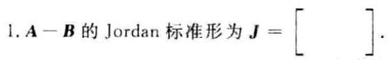

2. 是否可将 $\mathbf{A}$ 看作线性空间 ${V}^{2}$ 中某两个基之间的过渡矩阵. (   )

3. 是否可将 $\mathbf{B}$ 看作欧氏空间 ${V}^{2}$ 中某个基的度量矩阵. (   )

4. $\parallel \operatorname{vec}\left( \mathbf{B}\right) {\parallel }_{p} =$ (   ),其中 $1 \leq  p <  + \infty$ .

5. 若常数 $k$ 使得 $k\mathbf{A}$ 为收敛矩阵,则 $k$ 应满足的条件是 ( )

6. $\mathbf{A} \otimes  \mathbf{B}$ 的全体特征值是 ( )

7 其他 $A \otimes  B$ 非零( )

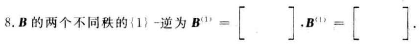

二、(10分)设 $\mathbf{A} \in  {\mathbf{C}}^{m \times  n}$ ，对于矩阵的 2 -范数 $\parallel \mathbf{A}\parallel$ 。和 $F$ -范数 $\parallel \mathbf{A}{\parallel }_{F}$ ，定义实数

$$
\parallel \mathbf{A}\parallel  = \sqrt{\parallel \mathbf{A}{\parallel }_{2}^{2} + \parallel \mathbf{A}{\parallel }_{\mathrm{F}}^{2}}\;\text{ (任意 }\mathbf{A} \in  {\mathbf{C}}^{m \times  n}\text{ ) }
$$

验证 $\parallel \mathbf{A}\parallel$ 是 ${\mathbf{C}}^{m \times  n}$ 中的矩阵范数,且与向量的 2-范数相容.

三、(15 分) 已知 $\mathbf{A} = \left\lbrack  \begin{array}{rrr} 1 & 1 &  - 1 \\  2 & 0 & 2 \\   - 1 & 1 & 1 \end{array}\right\rbrack  ,\mathbf{b}\left( t\right)  = \left\lbrack  \begin{array}{l} {\mathrm{e}}^{3t} \\  {\mathrm{e}}^{3t} \\  0 \end{array}\right\rbrack  ,\mathbf{x}\left( 0\right)  = \left\lbrack  \begin{array}{l} 1 \\  1 \\  0 \end{array}\right\rbrack$ .

1. 求 ${\mathrm{e}}^{At}$ ;

2. 用矩阵函数方法求微分方程 $\frac{\mathrm{d}}{\mathrm{d}t}\mathbf{x}\left( t\right)  = \mathbf{A}\mathbf{x}\left( t\right)  + \mathbf{b}\left( t\right)$ 满足初始条件 $\mathbf{x}\left( 0\right)$ 的解.

四、(10 分) 用 Householder 变换求矩阵 $\mathbf{A} = \left\lbrack  \begin{array}{llll} 1 & 2 & 0 & 0 \\  1 & 0 & 3 & 4 \\  1 & 0 & 3 & 0 \\  1 & 2 & 0 & 4 \end{array}\right\rbrack$ 的 QR 分解.

五、(10 分) 用 Gerschgorin 定理隔离矩阵 $\mathbf{A} = \left\lbrack  \begin{matrix} {20} & 1 & 4 \\  6 & 8 & 6 \\  1 & 1 & \mathrm{i} \end{matrix}\right\rbrack  \left( {\mathrm{i} = \sqrt{-1}}\right)$ 的特征值. (要求画图表示)

六、(15 分) 已知 $\mathbf{A} = \left\lbrack  \begin{array}{llll} 0 & 1 & 0 & 1 \\  1 & 2 & 1 & 2 \\  1 & 0 & 1 & 0 \\  2 & 1 & 2 & 1 \end{array}\right\rbrack  ,\mathbf{b} = \left\lbrack  \begin{array}{l} 1 \\  3 \\  1 \\  3 \end{array}\right\rbrack$ .

1. 求 $\mathbf{A}$ 的满秩分解;

2. 求 ${\mathbf{A}}^{ + }$ ;

3. 用广义逆矩阵方法判断线性方程组 $\mathbf{A}\mathbf{x} = \mathbf{b}$ 是否有解;

4. 求线性方程组 $\mathbf{A}\mathbf{x} = \mathbf{b}$ 的极小范数解,或者极小范数最小二乘解 ${\mathbf{x}}_{0}$ . (要求指出所求的是哪种解) 七、(15 分) 已知

$$
\mathbf{P} = \left\lbrack  \begin{array}{ll} 0 & 1 \\  1 & 0 \end{array}\right\rbrack  ,\;\mathbf{A} = \left\lbrack  \begin{array}{ll} {a}_{11} & {a}_{12} \\  {a}_{21} & {a}_{22} \end{array}\right\rbrack  ,\;\mathbf{B} = \left\lbrack  \begin{array}{ll} {b}_{11} & {b}_{12} \\  {b}_{21} & {b}_{22} \end{array}\right\rbrack
$$

欧氏空间 ${\mathbf{R}}^{i + 1}$ 中的内积为 $\left( {\mathbf{A},\mathbf{B}}\right)  = \mathop{\sum }\limits_{{i = 1}}^{2}\mathop{\sum }\limits_{{j = 1}}^{7}{a}_{ij}{b}_{ij}$ . 子空间

$$
V = \left\{  {\mathbf{X} = \left\lbrack  \begin{array}{ll} {x}_{1} & {x}_{2} \\  {x}_{3} & {x}_{4} \end{array}\right\rbrack  \left| {\;\begin{array}{l} {x}_{1} - {x}_{2} = 0 \\  {x}_{2} - {x}_{3} = 0 \end{array}}\right. }\right\}
$$

$V$ 中的线性变换为 $T\left( \mathbf{X}\right)  = \mathbf{{XP}} + {\mathbf{X}}^{\mathrm{T}}$ (任意 $\mathbf{X} \in  V$ ).

1. 给出子空间 $V$ 的一个标准正交基；

2. 验证 $T$ 是 $V$ 中的对称变换;

3. 求 $V$ 的一个标准正交基，使 $T$ 在该基下的矩阵为对角矩阵.

八、(7 分) 设线性空间 ${V}^{n}$ 的线性变换 $T$ 在基 ${\mathbf{x}}_{1},{\mathbf{x}}_{2},\cdots ,{\mathbf{x}}_{n}$ 下的矩阵为 $\mathbf{A},{T}_{n}$ 表示 ${V}^{n}$ 中的单位变换,证明: 存在 ${\mathbf{x}}_{0} \neq  \mathbf{0}$ ,使得 $T\left( {\mathbf{x}}_{0}\right)  = \left( {{T}_{e} - T}\right) \left( {\mathbf{x}}_{0}\right)$ 的充要条件是 $\lambda  = \frac{1}{2}$ 为 $\mathbf{A}$ 的特征值.

## 试题十二解答

$- ,1.J = \left\lbrack  \begin{array}{rr}  - 1 & 1 \\  0 &  - 1 \end{array}\right\rbrack  ;\;2$ . 可以; 3. 不可以; $4.{4}^{\frac{1}{p}};\;5.\left| k\right|  < \frac{1}{3};$

${6.0.0.6}, - 6 : {7.18} : 8.\left\lbrack  \begin{array}{ll} 1 & 0 \\  0 & 0 \end{array}\right\rbrack   \cdot  \left\lbrack  \begin{array}{rr} 1 & 0 \\   - a & a \end{array}\right\rbrack  \left( {a \neq  0}\right)$

二、(1) $\sim  \left( 2\right)$ 略

(3) $\parallel \mathbf{A} + \mathbf{B}{\parallel }^{2} = \parallel \mathbf{A} + \mathbf{B}{\parallel }_{2}^{2} + \parallel \mathbf{A} + \mathbf{B}{\parallel }_{\mathrm{F}}^{2} \leq  {\left( \parallel \mathbf{A}{\parallel }_{2} + \parallel \mathbf{B}{\parallel }_{2}\right) }^{2} + {\left( \parallel \mathbf{A}{\parallel }_{\mathrm{F}} + \parallel \mathbf{B}{\parallel }_{\mathrm{F}}\right) }^{2} =$

$\parallel \mathbf{A}{\parallel }^{2} + 2\left( {\parallel \mathbf{A}{\parallel }_{2}\parallel \mathbf{B}{\parallel }_{2} + \parallel \mathbf{A}{\parallel }_{\mathrm{F}}\parallel \mathbf{B}{\parallel }_{\mathrm{F}}}\right)  + \parallel \mathbf{B}{\parallel }^{2} \leq  {\left( \parallel \mathbf{A}\parallel  + \parallel \mathbf{B}\parallel \right) }^{2}$

(4) $\parallel \mathbf{{AB}}{\parallel }^{2} = \parallel \mathbf{{AB}}{\parallel }_{2}^{2} + \parallel \mathbf{{AB}}{\parallel }_{2}^{2} \leq  \parallel \mathbf{A}{\parallel }_{2}^{2}\parallel \mathbf{B}{\parallel }_{2}^{2} + \parallel \mathbf{A}{\parallel }_{2}^{2}\parallel \mathbf{B}{\parallel }_{2}^{2} \leq$

- $\;\left( {\parallel \mathbf{A}{\parallel }_{2}^{2} + \parallel \mathbf{A}{\parallel }_{2}^{2}}\right) \left( {\parallel \mathbf{B}{\parallel }_{2}^{2} + \parallel \mathbf{B}{\parallel }_{2}^{2}}\right)  = \parallel \mathbf{A}{\parallel }^{2}\parallel \mathbf{B}{\parallel }^{2}$

相容性. $\parallel \mathbf{A}\mathbf{x}{\parallel }_{2} \leq  \parallel \mathbf{A}{\parallel }_{2}\parallel \mathbf{x}{\parallel }_{2}$ . $\parallel \mathbf{A}\mathbf{x}{\parallel }_{2} \leq  \parallel \mathbf{A}{\parallel }_{1}\parallel \mathbf{x}{\parallel }_{2}$

$$
\parallel {Ax}\parallel \parallel  \leq  \frac{1}{2}\left( {\parallel A{\parallel }_{2}^{2} + \parallel A{\parallel }_{2}^{2}}\right) \parallel x{\parallel }_{2}^{2} = \frac{1}{2}\parallel A{\parallel }^{2}\parallel x{\parallel }_{2}^{2}\parallel x{\parallel }_{2}^{2} \leq  \parallel A{\parallel }^{2}\parallel x{\parallel }_{2}^{2}
$$

三、1. det $\left( {\lambda \mathbf{I} - \mathbf{A}}\right)  = {\left( \lambda  - 2\right) }^{2}\left( {\lambda  + 2}\right) , m\left( \lambda \right)  = \left( {\lambda  - 2}\right) \left( {\lambda  + 2}\right)$ . 设

$$
f\left( \lambda \right)  = {\mathrm{e}}^{u} = m\left( \lambda \right)  \cdot  g\left( \lambda \right)  + \left( {a + {b\lambda }}\right)
$$

则有

$$
\left\{  {\begin{array}{l} a + {2b} = {\mathrm{e}}^{2t}, \\  a - {2b} = {\mathrm{e}}^{-{2t}} \end{array},\left\{  \begin{array}{l} a = \left( {{\mathrm{e}}^{2t} + {\mathrm{e}}^{-{2t}}}\right) /2 \\  b = \left( {{\mathrm{e}}^{2t} - {\mathrm{e}}^{-{2t}}}\right) /4 \end{array}\right. }\right.
$$

$$
{\mathrm{e}}^{At} = \frac{{\mathrm{e}}^{2t}}{4}\left( {2\mathbf{I} + \mathbf{A}}\right)  + \frac{{\mathrm{e}}^{-{2t}}}{4}\left( {2\mathbf{I} - \mathbf{A}}\right)  = \frac{{\mathrm{e}}^{2t}}{4}\left\lbrack  \begin{array}{rrr} 3 & 1 &  - 1 \\  2 & 2 & 2 \\   - 1 & 1 & 3 \end{array}\right\rbrack   + \frac{{\mathrm{e}}^{-{2t}}}{4}\left\lbrack  \begin{array}{rrr} 1 &  - 1 & 1 \\   - 2 & 2 &  - 2 \\  1 &  - 1 & 1 \end{array}\right\rbrack
$$

$$
\text{ 2. }{\mathrm{e}}^{-\mathbf{A}\tau }b\left( \tau \right)  = \left\lbrack  {\frac{{\mathrm{e}}^{-{2\tau }}}{4}\left( {2\mathbf{I} + \mathbf{A}}\right)  + \frac{{\mathrm{e}}^{2\tau }}{4}\left( {2\mathbf{I} - \mathbf{A}}\right) }\right\rbrack   \cdot  {\mathrm{e}}^{3\tau }\left\lbrack  \begin{array}{l} 1 \\  1 \\  0 \end{array}\right\rbrack   = {\mathrm{e}}^{\tau }\left\lbrack  \begin{array}{l} 1 \\  1 \\  0 \end{array}\right\rbrack
$$

$$
{\int }_{0}^{t}{\mathrm{e}}^{-{4\tau }}b\left( \tau \right) \mathrm{d}\tau  = \left( {{\mathrm{e}}^{t} - 1}\right) \left\lbrack  \begin{array}{l} 1 \\  1 \\  0 \end{array}\right\rbrack  ,\;\mathbf{x}\left( t\right)  = {\mathrm{e}}^{4t}\left\{  {\left\lbrack  \begin{array}{l} 1 \\  1 \\  0 \end{array}\right\rbrack   + \left( {{\mathrm{e}}^{t} - 1}\right) \left\lbrack  \begin{array}{l} 1 \\  1 \\  0 \end{array}\right\rbrack  }\right\}   = {\mathrm{e}}^{4t}\left\lbrack  \begin{array}{l} 1 \\  1 \\  0 \end{array}\right\rbrack
$$

四、(1) $\mathbf{u} = \frac{1}{2}\left\lbrack  \begin{array}{r}  - 1 \\  1 \\  1 \\  1 \end{array}\right\rbrack  ,\;{\mathbf{H}}_{0} = \frac{1}{2}\left\lbrack  \begin{array}{rrrr} 1 & 1 & 1 & 1 \\  1 & 1 &  - 1 &  - 1 \\  1 &  - 1 & 1 &  - 1 \\  1 &  - 1 &  - 1 & 1 \end{array}\right\rbrack  ,\;{\mathbf{H}}_{0}\mathbf{A} = \left\lbrack  \begin{array}{rrrr} 2 & 2 & 3 & 4 \\  0 & 0 & 0 & 0 \\  0 & 0 & 0 &  - 4 \\  2 &  - 3 & 0 & 0 \end{array}\right\rbrack$

三导

(2) ${\mathbf{A}}_{1} = \left\lbrack  \begin{array}{rrr} 0 & 0 & 0 \\  0 & 0 &  - 4 \\  2 &  - 3 & 0 \end{array}\right\rbrack  ,\;\mathbf{u} = \frac{1}{\sqrt{2}}\left\lbrack  \begin{array}{r}  - 1 \\  0 \\  1 \end{array}\right\rbrack  ,\;{\mathbf{H}}_{1} = \left\lbrack  \begin{array}{rr}  & 1 \\  1 & \\  1 &  \end{array}\right\rbrack  ,\;{\mathbf{H}}_{1}{\mathbf{A}}_{1} = \left\lbrack  \begin{array}{rrr} 2 &  - 3 & 0 \\  0 & 0 &  - 4 \\  0 & 0 & 0 \end{array}\right\rbrack$

令 $\mathbf{S} = \left\lbrack  \begin{array}{ll} 1 & \\   & {\mathbf{H}}_{1} \end{array}\right\rbrack  {\mathbf{H}}_{0}$ ,则有 $\mathbf{A} = \mathbf{{QR}}$ ,其中

$$
\mathbf{Q} = {\mathbf{H}}_{0}\left\lbrack  \begin{array}{ll} 1 & \\   & {\mathbf{H}}_{1} \end{array}\right\rbrack   = \frac{1}{2}\left\lbrack  \begin{array}{rrrr} 1 & 1 & 1 & 1 \\  1 &  - 1 &  - 1 & 1 \\  1 &  - 1 & 1 &  - 1 \\  1 & 1 &  - 1 &  - 1 \end{array}\right\rbrack  ,\;\mathbf{R} = \left\lbrack  \begin{array}{rrrr} 2 & 2 & 3 & 4 \\   & 2 &  - 3 & 0 \\   & & 0 &  - 4 \\   & & & 0 \end{array}\right\rbrack
$$

五、 $\mathbf{A}$ 的 3 个盖尔圆

$$
{G}_{1} : \left| {z - {20}}\right|  \leq  5,\;{G}_{2} : \left| {z - 8}\right|  \leq  {12},\;{G}_{3} : \left| {z - \mathrm{i}}\right|  \leq  2
$$

相交. 取 $\mathbf{D} = \operatorname{diag}\left( {1,\frac{1}{3},1}\right)$ ,则

$$
\mathbf{B} = {\mathbf{{DAD}}}^{-1} = \left\lbrack  \begin{matrix} {20} & 3 & 4 \\  2 & 8 & 2 \\  1 & 3 & i \end{matrix}\right\rbrack
$$

的 3 个孤立盖尔圆为

$$
{G}_{1}^{\prime } : \left| {z - {20}}\right|  \leq  7,\;{G}_{2}^{\prime } : \left| {z - 8}\right|  \leq  4,\;{G}_{3}^{\prime } : \left| {z - \mathrm{i}}\right|  \leq  4
$$

其中各有 $\mathbf{A}$ 的一个特征值.

[注] 也可取 $\mathbf{D} = \operatorname{diag}\left( {1,\frac{1}{4},1}\right) ,\mathbf{D} = \operatorname{diag}\left( {1,{0.3},1}\right)$ ; 取 $\mathbf{D} = \operatorname{diag}\left( {1,\frac{1}{2},1}\right)$ 时, $\mathbf{B} = \mathbf{D}\mathbf{A}{\mathbf{D}}^{-1}$ 的 3 个列盖尔圆孤立.

六、1. A 行 $\left\lbrack  \begin{array}{llll} 1 & 0 & 1 & 0 \\  0 & 1 & 0 & 1 \\  0 & 0 & 0 & 0 \\  0 & 0 & 0 & 0 \end{array}\right\rbrack$ , $\;\mathbf{F} = \left\lbrack  \begin{array}{ll} 0 & 1 \\  1 & 2 \\  1 & 0 \\  2 & 1 \end{array}\right\rbrack  ,\;\mathbf{G} = \left\lbrack  \begin{array}{llll} 1 & 0 & 1 & 0 \\  0 & 1 & 0 & 1 \end{array}\right\rbrack  ,\;\mathbf{A} = \mathbf{{FG}}$

$$
\text{ 2. }{\mathbf{F}}^{ + } = \frac{1}{10}\left\lbrack  \begin{array}{rrrr}  - 2 &  - 1 & 3 & 4 \\  3 & 4 &  - 2 &  - 1 \end{array}\right\rbrack
$$

$$
{\mathbf{G}}^{ + } = \frac{1}{2}\left\lbrack  \begin{array}{ll} 1 & 0 \\  0 & 1 \\  1 & 0 \\  0 & 1 \end{array}\right\rbrack  ,\;{\mathbf{A}}^{ + } = {\mathbf{G}}^{ + }{\mathbf{F}}^{ + } = \frac{1}{20}\left\lbrack  \begin{array}{rrrr}  - 2 &  - 1 & 3 & 4 \\  3 & 4 &  - 2 &  - 1 \\   - 2 &  - 1 & 3 & 4 \\  3 & 4 &  - 2 &  - 1 \end{array}\right\rbrack
$$

3. ${\mathbf{x}}_{0} = {\mathbf{A}}^{ + }\mathbf{b} = \frac{1}{2}{\left( 1,1,1,1\right) }^{\mathrm{T}}$ ,由 $\mathbf{A}{\mathbf{A}}^{ + }\mathbf{b} = \mathbf{A}{\mathbf{x}}_{0} = \mathbf{b}$ 知 $\mathbf{A}\mathbf{x} = \mathbf{b}$ 有解.

4. ${\mathbf{x}}_{0}$ 是 $\mathbf{A}\mathbf{x} = \mathbf{b}$ 的极小范数解.

七、1. $\mathbf{V}$ 的标准正交基为 ${\mathbf{X}}_{1} = \frac{1}{\sqrt{2}}\left\lbrack  \begin{array}{ll} 1 & 0 \\  0 & 1 \end{array}\right\rbrack  ,\;{\mathbf{X}}_{2} = \frac{1}{\sqrt{2}}\left\lbrack  \begin{array}{ll} 0 & 1 \\  1 & 0 \end{array}\right\rbrack$ .

2. 计算基像组

$$
T\left( {\mathbf{X}}_{1}\right)  = \frac{1}{\sqrt{2}}\left\lbrack  \begin{array}{ll} 0 & 1 \\  1 & 0 \end{array}\right\rbrack   + \frac{1}{\sqrt{2}}\left\lbrack  \begin{array}{ll} 1 & 0 \\  0 & 1 \end{array}\right\rbrack   = {\mathbf{X}}_{1} + {\mathbf{X}}_{2}
$$

$$
T\left( {\mathbf{X}}_{2}\right)  = \frac{1}{\sqrt{2}}\left\lbrack  \begin{array}{ll} 1 & 0 \\  0 & 1 \end{array}\right\rbrack   + \frac{1}{\sqrt{2}}\left\lbrack  \begin{array}{ll} 1 & 0 \\  0 & 1 \end{array}\right\rbrack   = {\mathbf{X}}_{1} + {\mathbf{X}}_{2}
$$

设 $T\left( {{\mathbf{X}}_{1},{\mathbf{X}}_{2}}\right)  = \left( {{\mathbf{X}}_{1},{\mathbf{X}}_{2}}\right) \mathbf{A}$ ,则 $\mathbf{A} = \left\lbrack  \begin{array}{ll} 1 & 1 \\  1 & 1 \end{array}\right\rbrack$ . 因为 $\mathbf{A}$ 是对称矩阵,所以 $T$ 是对称变换.

3. 求得正交矩阵 $Q = \frac{1}{\sqrt{2}}\left\lbrack  \begin{array}{rr}  - 1 & 1 \\  1 & 1 \end{array}\right\rbrack$ . 对角矩阵 $\mathbf{\Lambda } = \left\lbrack  \begin{array}{ll} 0 & \\   & 2 \end{array}\right\rbrack$ . 使得 ${Q}^{\top }{AQ} = \mathbf{\Lambda }$ . 由 $\left( {{\mathbf{Y}}_{1},{\widehat{\mathbf{Y}}}_{2}}\right)  = \left( {{\mathbf{X}}_{1},{\mathbf{X}}_{2}}\right) Q$ 可得标准正交基

$$
{\mathbf{Y}}_{1} = \frac{1}{2}\left\lbrack  \begin{array}{rr}  - 1 & 1 \\  1 &  - 1 \end{array}\right\rbrack  ,\;{\mathbf{Y}}_{2} = \frac{1}{2}\left\lbrack  \begin{array}{ll} 1 & 1 \\  1 & 1 \end{array}\right\rbrack
$$

且有 $T\left( {{\mathbf{Y}}_{1},{\mathbf{Y}}_{2}}\right)  = \left( {{\mathbf{Y}}_{1},{\mathbf{Y}}_{2}}\right) \mathbf{\Lambda }$ .

八、方法 1. 因为 $T\left( {\mathbf{x}}_{n}\right)  = \left( {{T}_{e} - T}\right) \left( {\mathbf{x}}_{n}\right)$ 等价于 $T\left( {\mathbf{x}}_{n}\right)  = \frac{1}{2}{T}_{e}\left( {\mathbf{x}}_{n}\right)  = \frac{1}{2}{\mathbf{x}}_{n}$ . 所以 $\lambda  = \frac{1}{2}$ 是 $T$ 的特征值. 从而也是 $\mathbf{A}$ 的特征值.

方法 2. 设 ${\mathbf{x}}_{0} = \left( {{\mathbf{x}}_{1},\cdots ,{\mathbf{x}}_{n}}\right) {\mathbf{\alpha }}_{1}\left( {{\mathbf{\alpha }}_{1} \neq  0}\right)$ ,则有

$$
T\left( {\mathbf{x}}_{n}\right)  = \left( {{\mathbf{x}}_{1},\cdots ,{\mathbf{x}}_{n}}\right) \mathbf{A}{\mathbf{\alpha }}_{n},\;\left( {{T}_{n} - T}\right) \left( {\mathbf{x}}_{n}\right)  = \left( {{\mathbf{x}}_{1},\cdots ,{\mathbf{x}}_{n}}\right) \left( {\mathbf{I} - \mathbf{A}}\right) {\mathbf{\alpha }}_{n}
$$

$T\left( {\mathbf{x}}_{n}\right)  = \left( {{T}_{n} - T}\right) \left( {\mathbf{x}}_{n}\right)$ 等价于 $\mathbf{A}\mathbf{\alpha } = \left( {\mathbf{I} - \mathbf{A}}\right) \mathbf{\alpha }$ ,即 $\mathbf{A}{\mathbf{\alpha }}_{n} = \frac{1}{2}{\mathbf{\alpha }}_{n}$ . 故 $\lambda  = \frac{1}{2}$ 是 $\mathbf{A}$ 的特征值.

## 试题十三 (2007 年 A 卷)

一、(18 分) 填空:

1. 矩阵 $\mathbf{A} = \left\lbrack  \begin{array}{rrrr} 1 & 0 & 2 &  - 2 \\  0 &  - 1 & 0 & 0 \\   - 1 & 0 &  - 2 & 1 \\  1 & 0 & 1 &  - 2 \end{array}\right\rbrack$ 的 Jordan 标准形为 $\mathbf{J} = \left\lbrack  \begin{array}{lll}  & & \\   & &  \end{array}\right\rbrack$ .

2. 设 $\mathbf{A} = \left\lbrack  \begin{array}{rrrr}  - 1 & 0 & 0 & 1 \\  0 & 2 & 1 & 0 \\  0 & 1 & 2 & 0 \\  1 & 0 & 0 &  - 1 \end{array}\right\rbrack  ,\;\mathbf{x} = \left\lbrack  \begin{array}{l} 1 \\  2 \\  3 \\  4 \end{array}\right\rbrack$ . 则 $\left\{  \begin{array}{l} \parallel \mathbf{A}{\parallel }_{1} = \left( \;\right) \\  \parallel \mathbf{A}\mathbf{X}{\parallel }_{2} = \left( \;\right) \\  \parallel \mathbf{A}\mathbf{X}{\parallel }_{2} = \left( \;\right)  \end{array}\right.$

3. 若 $\mathbf{A}$ 是正交投影矩阵,则 $\cos \left( {\pi \mathbf{A}}\right)  =$ (   ).

4. 设 $\mathbf{A} \in  {\mathbf{C}}^{m \times  n}.{\mathbf{A}}^{ * }$ 是 $\mathbf{A}$ 的 Moore-Penrose 逆,则 $\left\lbrack  \begin{array}{lll}  - 2\mathbf{A} & \vdots & \mathbf{A} \end{array}\right\rbrack   = \left\lbrack  \begin{array}{lll}  & & \\   & & \\   & &  \end{array}\right\rbrack$ .

5. 设 $\mathbf{A} = \left\lbrack  \begin{array}{ll} 1 &  - 2 \\  2 &  - 4 \end{array}\right\rbrack  ,\;\mathbf{B} = \left\lbrack  \begin{array}{lll} 1 & 1 & 1 \\  0 & 2 & 2 \\  0 & 0 & 3 \end{array}\right\rbrack$ ,则 $\mathbf{A} \otimes  \mathbf{B} + {\mathbf{I}}_{2} \otimes  {\mathbf{I}}_{3}$ 的全部特征值为 ( ).

6. 设向量空间 ${\mathbf{R}}^{2}$ 按照某种内积 (不一定是通常的) 构成欧氏空间,它的两组基为 ${\mathbf{\alpha }}_{1} = \left( {1,1}\right) ,{\mathbf{\alpha }}_{2} = \; \left( {1, - 1}\right)$ 和 ${\mathbf{\beta }}_{1} = \left( {0,2}\right) ,{\mathbf{\beta }}_{2} = \left( {6,{12}}\right)$ . 且 ${\mathbf{\alpha }}_{1}$ 与 ${\mathbf{\beta }}_{1}$ 的内积为 $\left( {{\mathbf{\alpha }}_{1},{\mathbf{\beta }}_{1}}\right)  = 1,\left( {{\mathbf{\alpha }}_{1},{\mathbf{\beta }}_{2}}\right)  = {15},\left( {{\mathbf{\alpha }}_{2},{\mathbf{\beta }}_{1}}\right)  =  - 1,\left( {\mathbf{\alpha }}_{2}\right.$ , $\left. {\mathbf{\beta }}_{2}\right)  = 3$ ,则基 ${\mathbf{\alpha }}_{1},{\mathbf{\alpha }}_{2}$ 的度量矩阵为(   ).

二、(10 分) 设 $\mathbf{A} = {\left( {a}_{ir}\right) }_{m \times  n} \in  {\mathbf{C}}^{m \times  n}$ ,定义实数 $\parallel \mathbf{A}\parallel  = n \cdot  \mathop{\max }\limits_{{i \in  I}}\left| {a}_{ij}\right|$ .

1. 证明 $\parallel \mathbf{A}\parallel$ 是 ${\mathbf{C}}^{m - n}$ 中的矩阵范数.

2. 证明该矩阵范数与向量的 $\infty$ -范数相容.

三、(15 分) 已知 $\mathbf{A} = \left\lbrack  \begin{array}{rrr}  - 1 &  - 2 & 2 \\  1 & 2 &  - 1 \\   - 1 &  - 1 & 2 \end{array}\right\rbrack  ,\mathbf{b}\left( t\right)  = {\mathrm{e}}^{t}\left\lbrack  \begin{array}{l} 1 \\  1 \\  2 \end{array}\right\rbrack  ,\mathbf{x}\left( 0\right)  = \left\lbrack  \begin{array}{l} 1 \\  2 \\  3 \end{array}\right\rbrack$ .

1. 求 ${\mathrm{e}}^{\mathrm{i}k}$ ;

2. 用矩阵函数方法求微分方程 $\frac{\mathrm{d}}{\mathrm{d}t}\mathbf{x}\left( t\right)  = \mathbf{A}\mathbf{x}\left( t\right)  + \mathbf{b}\left( t\right)$ 满足初始条件 $\mathbf{x}\left( 0\right)$ 的解.

四、(10 分) 用 Givens 变换求矩阵 $\mathbf{A} = \left\lbrack  \begin{array}{rrrrr} 1 & 2 & 3 & 4 & 5 \\  0 & 0 & 0 & 4 & 3 \\  0 & 0 &  - 3 & 1 &  - 5 \\  0 & 2 &  - 2 & 1 & 4 \\  0 & 0 & 0 & 3 &  - 4 \end{array}\right\rbrack$ 的 QR 分解.

五、(10 分) 用 Gerschgorin 定理隔离矩阵 $\mathbf{A} = \left\lbrack  \begin{array}{rrrr} 2 & 0 &  - {0.1} & 1 \\  0 &  - 2 & {0.1} &  - 1 \\   - 5 & 5 & 4\mathrm{i} & {2.5} \\  0 & {0.3} & {0.2} &  - 2\mathrm{i} \end{array}\right\rbrack  \left( {\mathrm{i} = \sqrt{-1}}\right)$ 的特征值. (要求画图表示)

六、(15 分) 已知 $\mathbf{A} = \left\lbrack  \begin{array}{rrrrr} 0 & 0 & 1 & 0 &  - 1 \\  1 &  - 1 & 0 & 1 & 1 \\   - 1 & 1 & 1 &  - 1 &  - 2 \\  1 &  - 1 & 1 & 1 & 0 \end{array}\right\rbrack  ,\mathbf{b} = \left\lbrack  \begin{array}{r}  - 1 \\  2 \\   - 3 \\  1 \end{array}\right\rbrack$ .

1. 求 $\mathbf{A}$ 的满秩分解;

2. 求 ${\mathbf{A}}^{ + }$ ;

3. 用广义逆矩阵方法判断线性方程组 $\mathbf{A}\mathbf{x} = \mathbf{b}$ 是否有解;

4. 求线性方程组 $\mathbf{A}\mathbf{x} = \mathbf{b}$ 的极小范数解,或者极小范数最小二乘解 ${\mathbf{x}}_{0}$ . (要求指出所求的是哪种解)

七、(15 分) 设 3 维欧氏空间 $V$ 中元素 $\mathbf{\alpha }$ 。在 $V$ 的标准正交基 ${\mathbf{\xi }}_{1},{\mathbf{\xi }}_{2},{\mathbf{\xi }}_{3}$ 下的坐标为 ${\left( 1, - 1,0\right) }^{\mathrm{T}}$ . 定义 $V$ 中的变换如下:

$$
T\left( \mathbf{\alpha }\right)  = \mathbf{\alpha } + \left( {\mathbf{\alpha },{\mathbf{\alpha }}_{0}}\right) {\mathbf{\alpha }}_{0}\;\left( {\text{ 任意 }\mathbf{\alpha } \in  V}\right)
$$

其中 $\left( {\mathbf{\alpha },{\mathbf{\alpha }}_{0}}\right)$ 表示 $\mathbf{\alpha }$ 与 ${\mathbf{\alpha }}_{0}$ 的内积.

1. 证明 $T$ 是线性变换;

2. 证明 $T$ 是对称变换;

3. 求 $V$ 的一组标准正交基 ${\mathbf{\eta }}_{1},{\mathbf{\eta }}_{2},{\mathbf{\eta }}_{3}$ ,使 $T$ 在该基下的矩阵为对角矩阵.

八、(7 分) 设 $V$ 是数域 $\mathbf{K}$ 上的 2 维线性空间, $V$ 的一组基为 ${\mathbf{\alpha }}_{1},{\mathbf{\alpha }}_{2}, V$ 的两个子空间为

$$
{\mathbf{W}}_{1} = \left\{  {{k}_{0}\left( {{\mathbf{\alpha }}_{1} + {\mathbf{\alpha }}_{2}}\right)  \mid  {k}_{0} \in  \mathbf{K}}\right\}  ,\;{\mathbf{W}}_{2} = \left\{  {{k}_{1}{\mathbf{\alpha }}_{1} + {k}_{2}{\mathbf{\alpha }}_{2}}\right\}   \mid  {k}_{1},{k}_{2} \in  \mathbf{K}\text{ 且 }{k}_{1} + {k}_{2} = 0\}
$$

证明 $V = {W}_{1} \oplus  {W}_{2}$ ,即 $V$ 可分解为子空间 ${W}_{1}$ 与 ${W}_{2}$ 的直和.

## 试题十三解答

一、1. det $\left( {\lambda \mathbf{I} - \mathbf{A}}\right)  = {\left( \lambda  + 1\right) }^{4} \cdot  \operatorname{rank}\left( {\left( {-1}\right) \mathbf{I} - \mathbf{A}}\right)  = 1,{\left( \lambda  + 1\right) }^{4}$ 是 $4 - 1 = 3$ 个初等因子的乘积,所以

$$
\mathbf{J} = \left\lbrack  \begin{matrix}  - 1 & 1 & & \\  0 &  - 1 & & \\   & &  - 1 & \\   & & &  - 1 \end{matrix}\right\rbrack
$$

2. $\sqrt{14},3,8;\;$ 3. $I - 2\mathbf{A};\;$ 4. $\frac{1}{5}\left\lbrack  \begin{array}{r}  - 2{\mathbf{A}}^{ + } \\  {\mathbf{A}}^{ + } \end{array}\right\rbrack  ;\;$ 5. $1,1,1, - 2, - 5, - 8$ ;

6. 由 ${\mathbf{\alpha }}_{1} =  - \frac{3}{6}{\mathbf{\beta }}_{1} + \frac{1}{6}{\mathbf{\beta }}_{2}$ 可得 $\left( {{\mathbf{\alpha }}_{1},{\mathbf{\alpha }}_{1}}\right)  = 2,\left( {{\mathbf{\alpha }}_{1},{\mathbf{\alpha }}_{2}}\right)  = 1$ ; 由 ${\mathbf{\alpha }}_{2} =  - \frac{9}{6}{\mathbf{\beta }}_{1} + \frac{1}{6}{\mathbf{\beta }}_{2}$ 可得 $\left( {{\mathbf{\alpha }}_{2},{\mathbf{\alpha }}_{2}}\right)  = 2$ . 故基 ${\mathbf{\alpha }}_{1},{\mathbf{\alpha }}_{2}$ 的度量矩阵为 $\left\lbrack  \begin{array}{ll} 2 & 1 \\  1 & 2 \end{array}\right\rbrack$ .

二、1. 非负性、齐次性、三角不等式成立(验证从略).

相容性: 设 $\mathbf{A} = {\left( {a}_{ij}\right) }_{m \times  n},\mathbf{B} = {\left( {b}_{ij}\right) }_{n - l}$ ,则有

$$
\parallel \mathbf{{AB}}\parallel  = l \cdot  \mathop{\max }\limits_{{i, j}}\left| {\mathop{\sum }\limits_{{k = 1}}^{n}{a}_{ik}{b}_{kj}}\right|  \leq  l \cdot  n \cdot  \mathop{\max }\limits_{{i, j}}\left| {a}_{ij}\right|  \cdot  \mathop{\max }\limits_{{i, j}}\left| {b}_{ij}\right|  =
$$

$$
\left( {n \cdot  \mathop{\max }\limits_{{i, j}}\left| {a}_{ij}\right| }\right)  \cdot  \left( {l \cdot  \mathop{\max }\limits_{{i, j}}\left| {b}_{ij}\right| }\right)  = \parallel \mathbf{A}\parallel  \cdot  \parallel \mathbf{B}\parallel
$$

2. 设 $\mathbf{A} = {\left( {a}_{ij}\right) }_{m - n},\mathbf{x} = {\left( {\xi }_{1},\cdots ,{\xi }_{n}\right) }^{\mathrm{T}}$ ,则有

$$
\parallel \mathbf{{Ax}}\parallel  = \mathop{\max }\limits_{{1 \leq  i \leq  m}}\left| {\mathop{\sum }\limits_{{k = 1}}^{n}{a}_{ik}{\xi }_{k}}\right|  \leq  n \cdot  \mathop{\max }\limits_{{i, j}}\left| {a}_{ii}\right|  \cdot  \mathop{\max }\limits_{j}\left| {\xi }_{j}\right|  = \parallel \mathbf{A}\parallel  \cdot  \parallel \mathbf{x}\parallel
$$

三、1. det $\left( {\lambda \mathbf{I} - \mathbf{A}}\right)  = {\left( \lambda  - 1\right) }^{3}$ ，由 $\mathbf{A} - \mathbf{I} \neq  \mathbf{O},{\left( \mathbf{A} - \mathbf{I}\right) }^{2} = \mathbf{O}$ 知， $\mathbf{A}$ 的最小多项式 $m\left( \lambda \right)  = {\left( \lambda  - 1\right) }^{2}$ . 设

$$
f\left( \lambda \right)  = {\mathrm{e}}^{a} = m\left( \lambda \right) g\left( \lambda \right)  + \left( {a + {b\lambda }}\right)
$$

则 ${f}^{\prime }\left( \lambda \right)  = t{\mathrm{e}}^{u} = {\left\lbrack  m\left( \lambda \right)  \cdot  g\left( \lambda \right) \right\rbrack  }^{\prime } + b$ ,令 $\lambda  = 1$ 可导出

$$
\left\{  {\begin{matrix} a + b = {\mathrm{e}}^{t} \\  b = t{\mathrm{e}}^{t} \end{matrix},\;\left\{  \begin{array}{l} a = \left( {1 - t}\right) {\mathrm{e}}^{t} \\  b = t{\mathrm{e}}^{t} \end{array}\right. }\right.
$$

于是

$$
{\mathrm{e}}^{\mathbf{A}t} = {\mathrm{e}}^{t}\left\lbrack  {\mathbf{I} + t\left( {\mathbf{A} - \mathbf{I}}\right) }\right\rbrack   = {\mathrm{e}}^{t}\left\lbrack  \begin{array}{lll} 1 & & \\   & 1 & \\   & & 1 \end{array}\right\rbrack   + t{\mathrm{e}}^{t}\left\lbrack  \begin{array}{rrr}  - 2 &  - 2 & 2 \\  1 & 1 &  - 1 \\   - 1 &  - 1 & 1 \end{array}\right\rbrack
$$

2. 计算

$$
{\mathrm{e}}^{-\mathbf{A}\tau }\mathbf{b}\left( \tau \right)  = {\mathrm{e}}^{-\tau }\left\lbrack  {\mathbf{I} - \tau \left( {\mathbf{A} - \mathbf{I}}\right) }\right\rbrack   \cdot  {\mathrm{e}}^{\tau }\left\lbrack  \begin{array}{l} 1 \\  1 \\  2 \end{array}\right\rbrack   = \left\lbrack  \begin{array}{l} 1 \\  1 \\  2 \end{array}\right\rbrack
$$

$$
\mathbf{x}\left( t\right)  = {\mathrm{e}}^{\mathbf{A}t}\left\{  {\left\lbrack  \begin{array}{l} 1 \\  2 \\  3 \end{array}\right\rbrack   + t\left\lbrack  \begin{array}{l} 1 \\  1 \\  2 \end{array}\right\rbrack  }\right\}   = {\mathrm{e}}^{t}\left\lbrack  \begin{matrix} 1 + t \\  2 + t \\  3 + {2t} \end{matrix}\right\rbrack
$$

四、划分 $\mathbf{A} = \left\lbrack  \begin{array}{rrrrr} 1 & 2 & 3 & 4 & 5 \\  0 & 0 & 0 & 4 & 3 \\  0 & 0 &  - 3 & 1 &  - 5 \\  0 & 2 &  - 2 & 1 & 4 \\  0 & 0 & 0 & 3 &  - 4 \end{array}\right\rbrack$ ,记 ${\mathbf{A}}_{1} = \left\lbrack  \begin{array}{rrrr} 0 & 0 & 4 & 3 \\  0 &  - 3 & 1 &  - 5 \\  2 &  - 2 & 1 & 4 \\  0 & 0 & 3 &  - 1 \end{array}\right\rbrack$ .

(1)对于 ${\mathbf{A}}_{1}$ 的第 1 列, ${\mathbf{T}}_{13}\left( {c, s}\right)$ 中 $c = 0, s = 1$ ,则有

$$
{\mathbf{T}}_{1} = {\mathbf{T}}_{13} = \left\lbrack  \begin{matrix} 0 & 0 & 1 & 0 \\  0 & 1 & 0 & 0 \\   - 1 & 0 & 0 & 0 \\  0 & 0 & 0 & 1 \end{matrix}\right\rbrack  ,\;{\mathbf{T}}_{1}{\mathbf{A}}_{1} = \left\lbrack  \begin{matrix} 2 &  - 2 & 1 & 4 \\  0 &  - 3 & 1 &  - 5 \\  0 & 0 &  - 4 &  - 3 \\  0 & 0 & 3 &  - 4 \end{matrix}\right\rbrack
$$

(2)对于 ${\mathbf{A}}_{3} = \left\lbrack  \begin{matrix}  - 4 &  - 3 \\  3 &  - 4 \end{matrix}\right\rbrack$ 的第 1 列, ${\mathbf{T}}_{12}\left( {c, s}\right)$ 中 $c =  - \frac{4}{5}, s = \frac{3}{5}$ ,则有

$$
{\mathbf{T}}_{1} = {\mathbf{T}}_{12} = \frac{1}{5}\left\lbrack  \begin{matrix}  - 4 & 3 \\   - 3 &  - 4 \end{matrix}\right\rbrack  ,\;{\mathbf{T}}_{3}{\mathbf{A}}_{3} = \left\lbrack  \begin{array}{ll} 5 & 0 \\  0 & 5 \end{array}\right\rbrack
$$

令 $\mathbf{T} = \left\lbrack  \begin{array}{ll} {\mathbf{I}}_{3} & \\   & {\mathbf{T}}_{3} \end{array}\right\rbrack  \left\lbrack  \begin{array}{ll} 1 & \\   & {\mathbf{T}}_{1} \end{array}\right\rbrack$ ,则有

$$
\mathbf{T} = \frac{1}{5}\left\lbrack  \begin{array}{rrrrr} 5 & & & & \\   & 5 & & & \\   & & 5 & & \\   & & &  - 4 & 3 \\   & & &  - 4 & 3 \end{array}\right\rbrack  \left\lbrack  \begin{array}{rrrrr} 1 & & & & \\   & 0 & 0 & 1 & 0 \\   & 0 & 1 & 0 & 0 \\   &  - 1 & 0 & 0 & 0 \\   & 0 & 0 & 0 & 1 \end{array}\right\rbrack   = \frac{1}{5}\left\lbrack  \begin{array}{lllll} 5 & 0 & 0 & 0 & 0 \\  0 & 0 & 0 & 5 & 0 \\  0 & 0 & 5 & 0 & 0 \\  0 & 4 & 0 & 0 & 3 \\  0 & 3 & 0 & 0 &  - 4 \end{array}\right\rbrack
$$

$$
\mathbf{Q} = \frac{1}{5}\left\lbrack  \begin{array}{rrrrr} 5 & 0 & 0 & 0 & 0 \\  0 & 0 & 0 & 4 & 3 \\  0 & 0 & 5 & 0 & 0 \\  0 & 5 & 0 & 0 & 0 \\  0 & 0 & 0 & 3 &  - 4 \end{array}\right\rbrack  ,\;\mathbf{R} = \left\lbrack  \begin{array}{rrrrr} 1 & 2 & 3 & 4 & 5 \\   & 2 &  - 2 & 1 & 4 \\   & &  - 3 & 1 &  - 5 \\   & & & 5 & 0 \\   & & & & 5 \end{array}\right\rbrack  ,\;\mathbf{A} = \mathbf{{QR}}
$$

## 五、 $\mathbf{A}$ 的 4 个盖尔圆为

$$
{G}_{1} : \left| {z - 2}\right|  \leq  {1.1},\;{G}_{2} : \left| {z + 2}\right|  \leq  {1.1},\;{G}_{3} : \left| {z - 4\mathrm{i}}\right|  \leq  {12.5},\;{G}_{4} : \left| {z + 2\mathrm{i}}\right|  \leq  {0.5}
$$

易见 ${G}_{3}$ 包含着 ${G}_{1},{G}_{2},{G}_{4}$ (参见图题 ${13} - 1$ ).

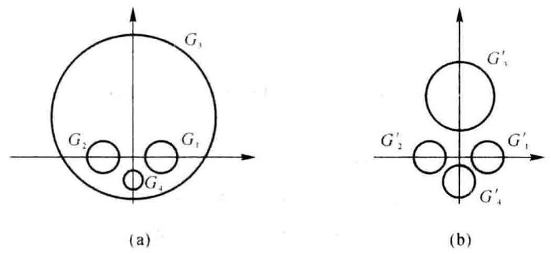

图题 ${13} - 1$

取 $\mathbf{D} = \operatorname{diag}\left( {1,1,0,2,1}\right)$ ,则

$$
\mathbf{B} = {\mathbf{{DAD}}}^{-1} = \left\lbrack  \begin{array}{rrrr} 2 & 0 &  - {0.5} & 1 \\  0 &  - 2 & {0.5} &  - 1 \\   - 1 & 1 & 4\mathrm{i} & {0.5} \\  0 & {0.3} & 1 &  - 2\mathrm{i} \end{array}\right\rbrack
$$

的 4 个盖尔圆为

$$
{G}_{1}^{\prime } : \left| {z - 2}\right|  \leq  {1.5},\;{G}_{2}^{\prime } : \left| {z + 2}\right|  \leq  {1.5},\;{G}_{3}^{\prime } : \left| {z - 4\mathrm{i}}\right|  \leq  {2.5},\;{G}_{1}^{\prime } : \left| {z + 2\mathrm{i}}\right|  \leq  {1.3}
$$

相邻盖尔圆的中心距与半径和如下(参见示意图):

<table><tr><td>相邻盖尔圆</td><td>${G}_{1}^{\prime } \rightarrow  {G}_{2}^{\prime }$</td><td>${G}_{1}^{\prime } \rightarrow  {G}_{3}^{\prime }$</td><td>${G}_{1}^{\prime } \rightarrow  {G}_{1}^{\prime }$</td><td>${G}_{2}^{\prime } \rightarrow  {G}_{3}^{\prime }$</td><td>${G}_{2}^{\prime } \rightarrow  {G}_{4}^{\prime }$</td></tr><tr><td>中心距</td><td>4</td><td>$\sqrt{20}$</td><td>$\sqrt{8}$</td><td>✓20</td><td>$\sqrt{8}$</td></tr><tr><td>半径和</td><td>3</td><td>4</td><td>2.8</td><td>4</td><td>2.8</td></tr></table>

易见, $\mathbf{B}$ 的 4 个盖尔圆弧立,其中各含 $\mathbf{A}$ 的一个特征值.

六、1. A. $\frac{\text{ 行 }}{}$ 、 $\left\lbrack  \begin{array}{rrrrr} 1 &  - 1 & 0 & 1 & 1 \\  0 & 0 & 1 & 0 &  - 1 \\  0 & 0 & 0 & 0 & 0 \\  0 & 0 & 0 & 0 & 0 \end{array}\right\rbrack$ ,取 ${c}_{1} = 1,{c}_{2} = 3$ 时,可得

$$
\mathbf{F} = \left\lbrack  \begin{array}{rr} 0 & 1 \\  1 & 0 \\   - 1 & 1 \\  1 & 1 \end{array}\right\rbrack  ,\;\mathbf{G} = \left\lbrack  \begin{array}{rrrrr} 1 &  - 1 & 0 & 1 & 1 \\  0 & 0 & 1 & 0 &  - 1 \end{array}\right\rbrack  ,\;\mathbf{A} = \mathbf{F}\mathbf{G}
$$

2. 根据公式计算

$$
{\mathbf{F}}^{ + } = {\left( {\mathbf{F}}^{\mathrm{T}}\mathbf{F}\right) }^{-1}{\mathbf{F}}^{\mathrm{T}} = {\left\lbrack  \begin{array}{ll} 3 & 0 \\  0 & 3 \end{array}\right\rbrack  }^{-1}{\mathbf{F}}^{\mathrm{T}} = \frac{1}{3}\left\lbrack  \begin{array}{rrrr} 0 & 1 &  - 1 & 1 \\  1 & 0 & 1 & 1 \end{array}\right\rbrack
$$

$$
\mathbf{G} = {\mathbf{G}}^{\top }{\left( \mathbf{G}{\mathbf{G}}^{\top }\right) }^{-1} = {\mathbf{G}}^{\top }{\left\lbrack  \begin{array}{rr} 4 &  - 1 \\   - 1 & 2 \end{array}\right\rbrack  }^{-1} = \frac{1}{7}\left\lbrack  \begin{array}{rr} 2 & 1 \\   - 2 &  - 1 \\  1 & 4 \\  2 & 1 \\  1 &  - 3 \end{array}\right\rbrack
$$

$$
{\mathbf{A}}^{ * } = {\mathbf{G}}^{ * }{\mathbf{F}}^{ * } = \frac{1}{21}\left\lbrack  \begin{array}{rrrr} 1 & 2 &  - 1 & 3 \\   - 1 &  - 2 & 1 &  - 3 \\  4 & 1 & 3 & 5 \\  1 & 2 &  - 1 & 3 \\   - 3 & 1 &  - 4 &  - 2 \end{array}\right\rbrack
$$

$3 = 1,\mathbf{x} = {\mathbf{A}}^{\prime }\mathbf{b} = \frac{1}{7}{\left( 3, - 3, - 2,{3.5}\right) }^{\top }$ . 因为 $\mathbf{A}{\mathbf{A}}^{ * }\mathbf{b} = \mathbf{A}{\mathbf{x}}_{0} = \mathbf{b}$ ,所以 $\mathbf{A}\mathbf{x} = \mathbf{b}$ 有解,从而 $\mathbf{x}$ 是 $\mathbf{A}\mathbf{x} = \; \mathbf{b}$ 的极小范数解.

七、 $T$ 是线性变换 (验证从略). 计算基像组

$$
\left\{  \begin{array}{l} T\left( {\mathbf{\xi }}_{1}\right)  = {\mathbf{\xi }}_{1} + 1{\mathbf{\alpha }}_{0} = 2{\mathbf{\xi }}_{1} - {\mathbf{\xi }}_{2} \\  T\left( {\mathbf{\xi }}_{2}\right)  = {\mathbf{\xi }}_{2} - 1{\mathbf{\alpha }}_{0} =  - {\mathbf{\xi }}_{1} + 2{\mathbf{\xi }}_{2} \\  T\left( {\mathbf{\xi }}_{3}\right)  = {\mathbf{\xi }}_{3} + 0{\mathbf{\alpha }}_{0} = {\mathbf{\xi }}_{3} \end{array}\right.
$$

设 $T\left( {{\mathbf{\xi }}_{1},{\mathbf{\xi }}_{2},{\mathbf{\xi }}_{3}}\right)  = \left( {{\mathbf{\xi }}_{1},{\mathbf{\xi }}_{2},{\mathbf{\xi }}_{3}}\right) \mathbf{A}$ ,则

$$
\mathbf{A} = \left\lbrack  \begin{array}{rrr} 2 &  - 1 & 0 \\   - 1 & 2 & 0 \\  0 & 0 & 1 \end{array}\right\rbrack
$$

因为 ${\mathbf{\xi }}_{1},{\mathbf{\xi }}_{2},{\mathbf{\xi }}_{3}$ 是标准正交基, $\mathbf{A}$ 是对称矩阵,所以 $T$ 是对称变换.

求正交矩阵 $\mathbf{Q}$ ,使得 ${\mathbf{Q}}^{-1}\mathbf{A}\mathbf{Q} = \mathbf{\Lambda }$ :

$$
\mathbf{\Lambda } = \left\lbrack  \begin{array}{lll} 1 & & \\   & 1 & \\   & & 3 \end{array}\right\rbrack  ,\;\mathbf{Q} = \frac{1}{\sqrt{2}}\left\lbrack  \begin{array}{rrr} 1 & 0 &  - 1 \\  1 & 0 & 1 \\  0 & \sqrt{2} & 0 \end{array}\right\rbrack
$$

由 $\left( {{\mathbf{\eta }}_{1},{\mathbf{\eta }}_{2},{\mathbf{\eta }}_{3}}\right)  = \left( {{\mathbf{\xi }}_{1},{\mathbf{\xi }}_{2},{\mathbf{\xi }}_{3}}\right) \mathbf{Q}$ 求得标准正交基

$$
{\mathbf{\eta }}_{1} = \frac{1}{\sqrt{2}}{\mathbf{\xi }}_{1} + \frac{1}{\sqrt{2}}{\mathbf{\xi }}_{2},\;{\mathbf{\eta }}_{2} = {\mathbf{\xi }}_{1},\;{\mathbf{\eta }}_{x} =  - \frac{1}{\sqrt{2}}{\mathbf{\xi }}_{1} + \frac{1}{\sqrt{2}}{\mathbf{\xi }}_{2}
$$

且有 $T\left( {{\mathbf{\eta }}_{1} \cdot  {\mathbf{\eta }}_{2} \cdot  {\mathbf{\eta }}_{3}}\right)  = \left( {{\mathbf{\eta }}_{1} \cdot  {\mathbf{\eta }}_{2} \cdot  {\mathbf{\eta }}_{3}}\right) \mathbf{A}$ .

八、方法一: ${W}_{k} = \left\{  {{k}_{1}\left( {{\mathbf{\alpha }}_{1} - {\mathbf{\alpha }}_{2}}\right) \;{k}_{1} \in  K}\right\}$

1. 任意 $\mathbf{\alpha } \in  V$ ,有

$$
\mathbf{\alpha } = {c}_{1}{\mathbf{\alpha }}_{1} + {c}_{2}{\mathbf{\alpha }}_{2} = \frac{{c}_{1} + {c}_{2}}{2}\left( {{\mathbf{\alpha }}_{1} + {\mathbf{\alpha }}_{2}}\right)  + \frac{{c}_{1} - {c}_{2}}{2}\left( {{\mathbf{\alpha }}_{1} - {\mathbf{\alpha }}_{2}}\right)  \in  {W}_{1} + {W}_{2}
$$

故 $V = {W}_{1} + {W}_{2}$ .

2. 任意 $\beta  \in  {W}_{1} \cap  {W}_{2}$ ,有

$$
\beta  \in  {W}_{1},\beta  = {k}_{0}\left( {{\alpha }_{1} + {\alpha }_{2}}\right) ;\;\beta  \in  {W}_{2},\beta  = {k}_{1}\left( {{\alpha }_{1} - {\alpha }_{2}}\right)
$$

由此可得 $\left( {{k}_{0} - {k}_{1}}\right) {\mathbf{\alpha }}_{1} + \left( {{k}_{0} + {k}_{1}}\right) {\mathbf{\alpha }}_{2} = \mathbf{0}$ . 因为 ${\mathbf{\alpha }}_{1},{\mathbf{\alpha }}_{2}$ 线性无关,所以

$$
\left\{  {\begin{array}{l} {k}_{0} - {k}_{1} = 0 \\  {k}_{0} + {k}_{1} = 0 \end{array},\;\left\{  \begin{array}{l} {k}_{0} = 0 \\  {k}_{1} = 0 \end{array}\right. }\right.
$$

于是 $\mathbf{\beta } = \mathbf{0}$ ,即 ${W}_{1} \cap  {W}_{2} = \{ \mathbf{0}\}$ .

综上所述可得 $V = {W}_{1} \oplus  {W}_{2}$ .

方法二:

1. 可证 ${W}_{1} + {W}_{2} = {W}_{1} \oplus  {W}_{2}$ (同方法一之 2).

2. 因为 ${\mathbf{\alpha }}_{1},{\mathbf{\alpha }}_{2}$ 线性无关,所以 ${\mathbf{\alpha }}_{1} + {\mathbf{\alpha }}_{2} \neq  \mathbf{0},{\alpha }_{1} - {\alpha }_{2} \neq  \mathbf{0}$ ,从而

$$
\dim {\mathbf{W}}_{1} = 1,\dim {\mathbf{W}}_{2} = 1
$$

综上所述可得

$$
\dim \left( {{W}_{1} + {W}_{2}}\right)  = \dim {W}_{1} + \dim {W}_{2} - \dim \left( {{W}_{1} \cap  {W}_{2}}\right)  = 1 + 1 - 0 = 2
$$

因为 ${W}_{1} + {W}_{2} \subset  V$ ,且 $\dim V = 2$ ,所以 $V = {W}_{1} \oplus  {W}_{2}$ .

## 试题十四(2008 年 A 卷)

一、(18 分) 填空:

1. 设 $\mathbf{A} = \left\lbrack  \begin{array}{rrrr} 1 & 1 & 0 &  - 1 \\  1 &  - 2 &  - 1 & 1 \\   - 1 & 1 & 2 &  - 1 \\  2 &  - 5 &  - 1 & 4 \end{array}\right\rbrack$ ,则 $\mathbf{A}$ 的 Jordan 标准形为 $\mathbf{J} = \left\lbrack  \begin{array}{lll}  & & \\   & &  \end{array}\right\rbrack$ .

2. 设 $\mathbf{A} = \left\lbrack  \begin{array}{rrrr} 3 & 2 & 1 & 0 \\  2 & 4 &  - 5 & 6 \\  1 &  - 5 & 0 &  - 1 \\  0 & 6 &  - 1 &  - 3 \end{array}\right\rbrack  ,\mathbf{x} = \left\lbrack  \begin{array}{l} 1 \\  1 \\  1 \\  1 \end{array}\right\rbrack$ ,则 $\left\{  \begin{array}{l} \parallel \mathbf{A}{\parallel }_{{m}_{\infty }} = \left( \;\right) \\  \parallel \mathbf{A}{\parallel }_{1} = \left( \;\right) \\  \parallel \mathbf{A}\mathbf{x}{\parallel }_{\infty } = \left( \;\right)  \end{array}\right.$

3. 设 ${\mathrm{e}}^{At} = \left\lbrack  \begin{matrix} {\mathrm{e}}^{t} - \sin t & \cos t - 1 & \sin t \\  {\mathrm{e}}^{2t} - \sin t - 1 & \cos t & \sin t \\  {\mathrm{e}}^{3t} - \sin t - 1 & \cos t - 1 & \sin t + 1 \end{matrix}\right\rbrack$ ,则 $\mathbf{A} = \left\lbrack  \begin{array}{lll}  & & \\   & &  \end{array}\right\rbrack$ .

4. 设 3 阶矩阵 $\mathbf{A}$ 的特征值为 ${\lambda }_{1},{\lambda }_{2},{\lambda }_{3},\mathbf{B} = \left\lbrack  \begin{array}{llll} 1 & 1 & 1 & 1 \\  1 & 1 & 1 & 1 \\  1 & 1 & 1 & 1 \\  1 & 1 & 1 & 1 \end{array}\right\rbrack$ ,则 $\mathbf{A} \otimes  \mathbf{B}$ 的全体特征值为 ( ).

5. 设 ${\mathbf{A}}_{m \times  n}$ 的 Moore-Penrose 逆为 ${\mathbf{A}}^{ + }$ ,则 ${\left\lbrack  \begin{array}{rr} \mathbf{A} & \mathbf{A} \\   - 2\mathbf{A} &  - 2\mathbf{A} \end{array}\right\rbrack  }^{-1} = \left\lbrack  \begin{array}{ll}  & \\   &  \end{array}\right\rbrack$ .

6. 设欧氏空间 ${V}^{n}$ 的基 ${\mathbf{x}}_{1},{\mathbf{x}}_{2},\cdots ,{\mathbf{x}}_{n}$ 的度量矩阵为 $\mathbf{P},{V}^{n}$ 中的线性变换 $T$ 满足 $T\left( {{\mathbf{x}}_{1},{\mathbf{x}}_{2},\cdots ,{\mathbf{x}}_{n}}\right)  = \left( {\mathbf{x}}_{1}\right.$ , $\left. {{\mathbf{x}}_{2},\cdots ,{\mathbf{x}}_{n}}\right) \mathbf{P}$ ,则 ${V}^{n}$ 的基 $T\left( {\mathbf{x}}_{1}\right) , T\left( {\mathbf{x}}_{2}\right) ,\cdots , T\left( {\mathbf{x}}_{n}\right)$ 的度量矩阵为 ( ).

二、(8 分) 设 $\mathbf{A} \in  {\mathbf{C}}^{n \times  n}$ 的全体特征值为 ${\lambda }_{1},\cdots ,{\lambda }_{n}$ ,且满足 ${\mathbf{A}}^{\mathrm{H}}\mathbf{A} = \mathbf{A}{\mathbf{A}}^{\mathrm{H}}$ ,证明:

1. $\parallel \mathbf{A}{\parallel }_{\mathrm{F}} = \sqrt{{\left| {\lambda }_{1}\right| }^{2} + \cdots  + {\left| {\lambda }_{n}\right| }^{2}}$ ;

2. $\parallel \mathbf{A}{\parallel }_{2} = \mathop{\max }\limits_{{1 \leq  i \leq  n}}\left| {\lambda }_{i}\right|$ .

三、(15 分) 已知 $\mathbf{A} = \left\lbrack  \begin{array}{rrr} 1 &  - 2 &  - 1 \\  1 & 4 & 1 \\   - 1 &  - 2 & 1 \end{array}\right\rbrack  ,\mathbf{b}\left( t\right)  = \left\lbrack  \begin{array}{r} {\mathrm{e}}^{3t} \\  {\mathrm{e}}^{3t} \\   - 3{\mathrm{e}}^{3t} \end{array}\right\rbrack  ,\mathbf{x}\left( 0\right)  = \left\lbrack  \begin{array}{r} 1 \\   - 1 \\  1 \end{array}\right\rbrack$ .

1. 求 ${\mathrm{e}}^{At}$ ;

2. 用矩阵函数方法求微分方程 $\frac{\mathrm{d}}{\mathrm{d}t}\mathbf{x}\left( t\right)  = \mathbf{A}\mathbf{x}\left( t\right)  + \mathbf{b}\left( t\right)$ 满足初始条件 $\mathbf{x}\left( 0\right)$ 的解.

四、(10 分) 用 Householder 变换求矩阵 $\mathbf{A} = \left( \begin{array}{rrrr} 1 & 0 & {10} & 6 \\  1 &  - 1 &  - {20} &  - 4 \\  1 &  - 4 & 5 & 0 \\  1 & 3 & {15} & 0 \end{array}\right)$ 的 QR 分解.

五、(10 分) 设 $\mathbf{A} = {\left( {a}_{ij}\right) }_{n \times  n}\left( {n > 1}\right)$ 满足 ${a}_{ij} > 0$ ，且 $\mathbf{A}$ 按列严格对角占优. 即

$$
\mathop{\sum }\limits_{{n = 1, i \neq  j}}^{n}\left| {a}_{ij}\right|  < \left| {a}_{ij}\right| \;\left( {j = 1,2,\cdots , n}\right)
$$

应用 Gerschgorin 定理说明 $\mathbf{A}$ 的特征值的实部大于零.

六、(15 分) 已知 $\mathbf{A} = \left\lbrack  \begin{array}{rrr}  - 1 & 2 & 1 \\  1 & 0 & 1 \\  0 &  - 2 &  - 2 \\  3 & 2 & 5 \end{array}\right\rbrack  ,\mathbf{b} = \left\lbrack  \begin{array}{r} 1 \\  0 \\   - 1 \\  1 \end{array}\right\rbrack$ .

1. 求 $\mathbf{A}$ 的满秩分解;

2. 求 ${\mathbf{A}}^{ - }$ ;

3. 用广义逆矩阵方法判断线性方程组 $\mathbf{A}\mathbf{x} = \mathbf{b}$ 是否有解;

4. 求线性方程组 $\mathbf{A}\mathbf{x} = \mathbf{b}$ 的极小范数解,或者极小范数最小二乘解 $\mathbf{x}$ . (要求指出所求的是哪种解)

七、(15 分) 在多项式空间 ${P}_{2}\left\lbrack  t\right\rbrack$ 中,设 $f\left( t\right)  = {a}_{2} + {a}_{1}t + {a}_{2}{t}^{2}$ ,定义线性变换为

$$
T\left\lbrack  {f\left( t\right) }\right\rbrack   = \left( {{a}_{0} + 3{a}_{1} + k{a}_{2}}\right)  + \left( {2{a}_{0} + 2{a}_{1} + 3{a}_{2}}\right) t + \left( {2{a}_{0} - 2{a}_{1} + 2{a}_{2}}\right) {t}^{2}
$$

若 $T$ 的秩为 2,确定参数 $k$ ,并求 ${P}_{2}\left\lbrack  t\right\rbrack$ 的一个基,使 $T$ 在该基下的矩阵为对角矩阵.

八、(9 分) 设 $\mathbf{A} \in  {\mathbf{C}}^{n \times  n}$ 满足 ${\mathbf{A}}^{2} =  - \mathbf{A}$ ,证明 $R\left( {\mathbf{I} + \mathbf{A}}\right)  = N\left( \mathbf{A}\right)$ .

## 试题十四解答

一、 $\mathbf{J},\mathbf{J} = \left\lbrack  \begin{array}{rrrr}  - 1 & 1 & & \\   & 1 & & \\   & & 2 & \\   & & & 2 \end{array}\right\rbrack  ;\;$ 2. $\left\{  \begin{array}{l} \parallel \mathbf{A}{\parallel }_{m} = \left( {-{24}}\right) \\  \parallel \mathbf{A}{\parallel }_{1} = \left( {-{17}}\right)  + 1 \\  \parallel \mathbf{A}\mathbf{x}{\parallel }_{1} = \left( {-7}\right)  \end{array}\right.$ ; 2. $\left\{  \begin{array}{l} \parallel \mathbf{A}{\parallel }_{m} = \left( {-{24}}\right) \\  \parallel \mathbf{A}\mathbf{x}{\parallel }_{1} = \left( {-7}\right)  \end{array}\right.$ ;

${4.4}{\lambda }_{1} \cdot  4{\lambda }_{2} \cdot  4{\lambda }_{3} \cdot  {0.0},0,0,0,0,0,0,0;5,\frac{1}{10}\left\lbrack  \begin{array}{ll} {\mathbf{A}}^{ + } &  - 2{\mathbf{A}}^{ + } \\  {\mathbf{A}}^{ + } &  - 2{\mathbf{A}}^{ + } \end{array}\right\rbrack  ;\;6,{\mathbf{P}}^{\mathrm{T}}\mathbf{{PP}} = {\mathbf{P}}^{ + }.$

二、由 ${\mathbf{A}}^{\mathrm{H}}\mathbf{A} = \mathbf{A}{\mathbf{A}}^{\mathrm{H}}$ 可得

$$
{\mathbf{P}}^{\mathrm{H}}\mathbf{A}\mathbf{P} = \mathbf{\Lambda } = \left\lbrack  \begin{array}{lll} {\lambda }_{1} & & \\   &  \ddots  & \\   & & {\lambda }_{n} \end{array}\right\rbrack  ,\;{\mathbf{A}}^{\mathrm{H}}\mathbf{A} = \mathbf{P}\overline{\mathbf{\Lambda }}\mathbf{A}{\mathbf{P}}^{\mathrm{H}} = \mathbf{P}\left\lbrack  \begin{array}{lll} {\left| {\lambda }_{1}\right| }^{2} & & \\   &  \ddots  & \\   & & {\left| {\lambda }_{n}\right| }^{2} \end{array}\right\rbrack  {\mathbf{P}}^{\mathrm{H}}
$$

$$
\parallel \mathbf{A}{\parallel }_{F} = \parallel \mathbf{A}{\parallel }_{F} = \sqrt{{\left| {\lambda }_{1}\right| }^{2} + \cdots  + {\left| {\lambda }_{n}\right| }^{2}}
$$

$$
\parallel \mathbf{A}{\parallel }_{2} = \sqrt{\rho \left( {{\mathbf{A}}^{\mathrm{H}}\mathbf{A}}\right) } = \sqrt{\mathop{\max }\limits_{i}{\left| {\lambda }_{i}\right| }^{2}} = \mathop{\max }\limits_{i}\left| {\lambda }_{i}\right|
$$

三、 $1.\varphi \left( \lambda \right)  = \left| {\lambda \mathbf{I} - \mathbf{A}}\right|  = {\left( \lambda  - 2\right) }^{\lambda }$ . 因为 $\mathbf{A} - 2\mathbf{I} \neq  \mathbf{O},{\left( \mathbf{A} - 2\mathbf{I}\right) }^{2} = \mathbf{O}$ ,所以 $m\left( \lambda \right)  = {\left( \lambda  - 2\right) }^{2}$ . 令 $f\left( \lambda \right)  = \; {\mathrm{e}}^{k} = m\left( \lambda \right)  \cdot  g\left( \lambda \right)  + \left( {a + {b\lambda }}\right)$ ,则有

$$
\left\{  {\begin{array}{l} f\left( 2\right)  = {\mathrm{e}}^{2t} \\  {f}^{\prime }\left( 2\right)  = t{\mathrm{e}}^{2t} \end{array},\;\left\{  {\begin{array}{l} a + {2b} = {\mathrm{e}}^{2t} \\  b = t{\mathrm{e}}^{2t} \end{array},\;\left\{  \begin{array}{l} a = \left( {1 - {2t}}\right) {\mathrm{e}}^{2t} \\  b = t{\mathrm{e}}^{2t} \end{array}\right. }\right. }\right.
$$

$$
{\mathrm{e}}^{\mathrm{i}t} = {\mathrm{e}}^{2t}\mathbf{I} + t{\mathrm{e}}^{2t}\left( {\mathbf{A} - 2\mathbf{I}}\right)  = {\mathrm{e}}^{2t}\left\lbrack  \begin{array}{lll} 1 & & \\   & 1 & \\   & & 1 \end{array}\right\rbrack   + t{\mathrm{e}}^{2t}\left\lbrack  \begin{array}{rrr}  - 1 &  - 2 &  - 1 \\  1 & 2 & 1 \\   - 1 &  - 2 &  - 1 \end{array}\right\rbrack
$$

$$
\text{ 2. }{\mathrm{e}}^{-A}\mathbf{b}\left( s\right)  = {\mathrm{e}}^{s}\left\lbrack  \begin{array}{l} 1 \\  1 \\  3 \end{array}\right\rbrack  ,\;\mathbf{x}\left( t\right)  = {\mathrm{e}}^{2t}\left\lbrack  \begin{matrix} 1 \\   - 1 \\  1 \end{matrix}\right\rbrack   + \left( {{\mathrm{e}}^{t} - 1}\right) {\mathrm{e}}^{2t}\left\lbrack  \begin{array}{l} 1 \\  1 \\  3 \end{array}\right\rbrack   = {\mathrm{e}}^{2t}\left\lbrack  \begin{array}{r} 0 \\   - 2 \\  4 \end{array}\right\rbrack   + {\mathrm{e}}^{3t}\left\lbrack  \begin{array}{l} 1 \\  1 \\  3 \end{array}\right\rbrack  \text{ . }
$$

四、(1) ${\mathbf{\beta }}_{0} = \left\lbrack  \begin{array}{l} 1 \\  1 \\  1 \\  1 \end{array}\right\rbrack  ,\;\mathbf{u} = \frac{1}{2}\left\lbrack  \begin{array}{r}  - 1 \\  1 \\  1 \\  1 \end{array}\right\rbrack  ,\;{\mathbf{H}}_{0} = \mathbf{I} - 2\mathbf{u}{\mathbf{u}}^{\mathrm{T}} = \frac{1}{2}\left\lbrack  \begin{array}{rrrr} 1 & 1 & 1 & 1 \\  1 & 1 &  - 1 &  - 1 \\  1 &  - 1 & 1 &  - 1 \\  1 &  - 1 &  - 1 & 1 \end{array}\right\rbrack$

$$
{\mathbf{H}}_{0}\mathbf{A} = \left\lbrack  \begin{array}{rrrr} 2 &  - 1 & 5 & 1 \\  0 & 0 &  - {15} & 1 \\  0 &  - 3 & {10} & 5 \\  0 & 4 & {20} & 5 \end{array}\right\rbrack  ,\;{\mathbf{A}}_{1} = \left\lbrack  \begin{array}{rrr} 0 &  - {15} & 1 \\   - 3 & {10} & 5 \\  4 & {20} & 5 \end{array}\right\rbrack
$$

(2) ${\mathbf{\beta }}_{1} = \left\lbrack  \begin{array}{l} 0 \\  0 \\  1 \end{array}\right\rbrack  ,\;\mathbf{u} = \frac{1}{\sqrt{2}}\left\lbrack  \begin{array}{r}  - 1 \\  0 \\  1 \end{array}\right\rbrack$

$$
{\mathbf{H}}_{1} = \mathbf{I} - 2\mathbf{u}{\mathbf{u}}^{\top } = \frac{1}{25}\left\lbrack  \begin{array}{rrr} 0 &  - {15} & {20} \\   - {15} & {16} & {12} \\  {20} & {12} & 9 \end{array}\right\rbrack  ,\;{\mathbf{H}}_{1}{\mathbf{A}}_{1} = \left\lbrack  \begin{array}{lll} 5 & {10} & 1 \\  0 & {25} & 5 \\  0 & 0 & 5 \end{array}\right\rbrack
$$

令 $\mathbf{S} = \left\lbrack  \begin{array}{ll} 1 & \\   & {\mathbf{H}}_{1} \end{array}\right\rbrack  {\mathbf{H}}_{0}$ ,则有 $\mathbf{A} = \mathbf{{QR}}$ ,其中

$$
\mathbf{Q} = {\mathbf{H}}_{0}\left\lbrack  \begin{array}{ll} 1 & \\   & {\mathbf{H}}_{1} \end{array}\right\rbrack   = \frac{1}{50}\left\lbrack  \begin{array}{rrrr} {25} & 5 & {13} & {41} \\  {25} &  - 5 &  - {43} &  - 1 \\  {25} &  - {35} & {19} &  - {17} \\  {25} & {35} & {11} &  - {23} \end{array}\right\rbrack  ,\;\mathbf{R} = \left\lbrack  \begin{array}{rrrr} 2 &  - 1 & 5 & 1 \\   & 5 & {10} & 1 \\   & & {25} & 5 \\   & & & 5 \end{array}\right\rbrack
$$

五、因为 $\mathbf{A}$ 的列 $G$ 一圆半径 ${r}_{i} < \left| {a}_{jj}\right|  = {a}_{jj}$ ,所以列 $G$ 一圆位于“右半平面”. 从而 ${\lambda }_{A} \in  \mathop{\bigcup }\limits_{{j = 1}}^{n}{G}_{j}$ 位于“右半平面”,故 $\operatorname{Re}\left( {\lambda }_{A}\right)  > 0$ .

$$
\text{ 六、1. A. }\frac{\text{ 行 }}{}\text{ , }\left\lbrack  \begin{array}{lll} 1 & 0 & 1 \\  0 & 1 & 1 \\  0 & 0 & 0 \\  0 & 0 & 0 \end{array}\right\rbrack  \text{ , }\;\mathbf{A} = \left\lbrack  \begin{array}{rr}  - 1 & 2 \\  1 & 0 \\  0 &  - 2 \\  3 & 2 \end{array}\right\rbrack  \left\lbrack  \begin{array}{lll} 1 & 0 & 1 \\  0 & 1 & 1 \end{array}\right\rbrack   = \mathbf{F}\mathbf{G}
$$

$$
\text{ 2. }{\mathbf{F}}^{ + } = {\left( {\mathbf{F}}^{\mathrm{T}}\mathbf{F}\right) }^{-1}{\mathbf{F}}^{\mathrm{T}} = \frac{1}{58}\left\lbrack  \begin{array}{rrrr}  - {10} & 6 & 4 & {14} \\  {13} &  - 2 &  - {11} & 5 \end{array}\right\rbrack
$$

$$
{\mathbf{G}}^{ + } = {\mathbf{G}}^{\mathrm{T}}{\left( \mathbf{G}{\mathbf{G}}^{\mathrm{T}}\right) }^{-1} = \frac{1}{3}\left\lbrack  \begin{array}{rr} 2 &  - 1 \\   - 1 & 2 \\  1 & 1 \end{array}\right\rbrack  ,\;{\mathbf{A}}^{ + } = {\mathbf{G}}^{ + }{\mathbf{F}}^{ + } = \frac{1}{174}\left\lbrack  \begin{array}{rrrr}  - {33} & {14} & {19} & {23} \\  {36} &  - {10} &  - {26} &  - 4 \\  3 & 4 &  - 7 & {19} \end{array}\right\rbrack
$$

$3 \sim  4.{\mathbf{x}}_{0} = {\mathbf{A}}^{ + }\mathbf{b} = \frac{1}{6}\left\lbrack  \begin{array}{r}  - 1 \\  2 \\  1 \end{array}\right\rbrack$ . 因为 $\mathbf{A}{\mathbf{A}}^{ + }\mathbf{b} = \mathbf{A}{\mathbf{x}}_{0} = \mathbf{b}$ ,所以 $\mathbf{A}\mathbf{x} = \mathbf{b}$ 有解,从而 ${\mathbf{x}}_{0}$ 是 $\mathbf{A}\mathbf{x} = \mathbf{b}$ 的极小范数

解.

七、取 ${P}_{2}\left\lbrack  t\right\rbrack$ 的简单基 $1, t,{t}^{2}$ ,计算基象组

$$
T\left( 1\right)  = 1 + {2t} + 2{t}^{2},\;T\left( t\right)  = 3 + {2t} - 2{t}^{2},\;T\left( {t}^{2}\right)  = k + {3t} - 2{t}^{2}
$$

$T$ 在该基下的矩阵为

$$
\mathbf{A} = \left\lbrack  \begin{array}{rrr} 1 & 3 & k \\  2 & 2 & 3 \\  2 &  - 2 & 2 \end{array}\right\rbrack
$$

因为 $\mathbf{A}$ 的秩为 2,所以 $\det \mathbf{A} = 0$ ,由此可得 $k = 2$ . 求 $\mathbf{P}$ 使得 ${\mathbf{P}}^{-1}\mathbf{{AP}} = \mathbf{\Lambda }$ ,其中

$$
\mathbf{\Lambda } = \left\lbrack  \begin{array}{lll} 0 & & \\   & 1 & \\   & & 4 \end{array}\right\rbrack  ,\;\mathbf{P} = \left\lbrack  \begin{array}{rrr} 5 & 7 & 1 \\  1 & 4 & 1 \\   - 4 &  - 6 & 0 \end{array}\right\rbrack
$$

由 $\left( {{f}_{1},{f}_{2},{f}_{3}}\right)  = \left( {1, t,{t}^{2}}\right) \mathbf{P}$ 可得 ${P}_{2}\left\lbrack  t\right\rbrack$ 的另一基

$$
{f}_{1} = 5 + t - 4{t}^{2},\;{f}_{2} = 7 + {4t} = 6{t}^{2},\;{f}_{3} = 1 + t
$$

$T$ 在基 ${f}_{1} \cdot  {f}_{2} \cdot  {f}_{3}$ 下的矩阵为 $\mathbf{\Lambda }$ .

八、(1) 任意 $x \in  R\left( {\mathbf{I} + \mathbf{A}}\right)$ ,存在 $\mathbf{y}$ 使得 $\mathbf{x} = \left( {\mathbf{I} + \mathbf{A}}\right) \mathbf{y}$ . 因为 $\mathbf{A}\mathbf{x} = \mathbf{A}\left( {\mathbf{I} + \mathbf{A}}\right) \mathbf{y} = \mathbf{0}$ . 所以 $\mathbf{x} \in  N\left( \mathbf{A}\right)$ . 故 $R\left( {\mathbf{I} + \mathbf{A}}\right)  \subset  N\left( \mathbf{A}\right) .$

(2)任意 $x \in  N\left( \mathbf{A}\right)$ ，则有 $\mathbf{A}x = \mathbf{0}$ . 因为

$$
\mathbf{x} = \mathbf{x} + \mathbf{A}\mathbf{x} = \left( {\mathbf{I} + \mathbf{A}}\right) \mathbf{x} \in  \mathbf{R}\left( {\mathbf{I} + \mathbf{A}}\right)
$$

所以 $N\left( \mathbf{A}\right)  \subset  R\left( {\mathbf{I} + \mathbf{A}}\right)$ . 综述 (1) 和 (2) 可得 $R\left( {\mathbf{I} + \mathbf{A}}\right)  = N\left( \mathbf{A}\right)$ .

## 试题十五(2009 年 A 卷)

一、(18 分) 填空:

1. 设 $\mathbf{A}$ 为 3 阶实方阵, ${\mathbf{x}}_{1},{\mathbf{x}}_{2},{\mathbf{x}}_{3}$ 为数域 $\mathbf{R}$ 上的线性空间 ${V}^{ * }$ 中的元素,线性变换 $T$ 满足 $\left( {T\left( {\mathbf{x}}_{1}\right) , T\left( {\mathbf{x}}_{2}\right) }\right.$ , $\left. {T\left( {\mathbf{x}}_{3}\right) }\right)  = \left( {{\mathbf{x}}_{1},{\mathbf{x}}_{2},{\mathbf{x}}_{3}}\right) \mathbf{A}$ . 在什么条件下,元素组 $T\left( {\mathbf{x}}_{1}\right) , T\left( {\mathbf{x}}_{2}\right) , T\left( {\mathbf{x}}_{3}\right)$ 线性无关. ( )

2. 已知 $\mathbf{P}$ 是正交投影矩阵,且 $\mathbf{P} \neq  \mathbf{O}$ (零矩阵). 则 $\parallel \mathbf{P}{\parallel }_{2} =$ (   ).

3. 已知 $\mathbf{A} = \frac{1}{8}\left\lbrack  \begin{array}{rr} 1 &  - 3 \\  6 & {10} \end{array}\right\rbrack$ . 问矩阵幂级数 $\mathop{\sum }\limits_{{k = 1}}^{n}k{\mathbf{A}}^{k}$ 收敛还是发散? ( ) 其原因是(   ).

4. 设 $\mathbf{T}$ 为 Givens 矩阵, $\mathbf{H}$ 为 Houscholder 矩阵, $\mathbf{O}$ 为零矩阵. 问 $\left\lbrack  \begin{array}{ll} \mathbf{T} & \mathbf{O} \\  \mathbf{O} & \mathbf{H} \end{array}\right\rbrack$ 是否有可能是 Householder 矩阵. ( )

5. 矩阵 $\mathbf{A} = \left\lbrack  \begin{array}{rrrrr} 3 &  - 2 &  - 3 & 1 & 1 \\  0 & 5 & 3 & 0 & 0 \\  0 &  - 6 &  - 4 & 0 & 0 \\  0 & 0 & 0 & 2 & 0 \\   - 1 &  - 1 & 0 &  - 1 & 1 \end{array}\right\rbrack$ 的 Jordan 标准形为 $\mathbf{J} = \left\lbrack  \begin{array}{ll}  & \\   &  \end{array}\right\rbrack$ .

6. 设 ${\mathbf{A}}_{m \times  n}$ 的 Moore-Penrose 逆为 ${\mathbf{A}}^{ + },\mathbf{O}$ 为零矩阵,则 ${\left\lbrack  \begin{matrix} \mathbf{O} & \mathbf{{2A}} \\  \mathbf{A} & \mathbf{O} \end{matrix}\right\rbrack  }^{ + } = \left\lbrack  \begin{array}{ll}  & \\   &  \end{array}\right\rbrack$ .

二、(10分) 设 $\parallel  \cdot  {\parallel }_{\omega }$ 是 ${\mathbf{C}}^{n}$ 上的已知向量范数,向量 $\mathbf{z} = {\left( {z}_{1},\cdots ,{z}_{n}\right) }^{\lambda } \in  {\mathbf{C}}^{n}$ ,对任意向量 $\mathbf{x} = \; {\left( {x}_{1},\cdots ,{x}_{n}\right) }^{\mathrm{T}} \in  {\mathbf{C}}^{n}$ ,定义实值函数 $\parallel \mathbf{x}{\parallel }_{h} = \max \left\{  {\left. \frac{\left| {\mathbf{x}}^{\mathrm{H}}z\right| }{\parallel z{\parallel }_{x}}\right| \;\mathbf{0} \neq  z \in  {\mathbf{C}}^{n}}\right\}$ ,其中 $\left| {{\mathbf{x}}^{\mathrm{H}}z}\right|$ 表示复数 ${\mathbf{x}}^{\mathrm{H}}z$ 的模. 证明:

1. $\parallel \mathbf{x}{\parallel }_{h}$ 是 ${\mathbf{C}}^{n}$ 上的向量范数;

2. 若取 $\parallel \mathbf{x}{\parallel }_{a} = \parallel \mathbf{x}{\parallel }_{1}$ (向量的 1-范数),则 $\parallel \mathbf{x}{\parallel }_{b} = \parallel \mathbf{x}{\parallel }_{\infty }$ (向量的 $\infty$ -范数).

三、(15 分) 已知 $\mathbf{A} = \left\lbrack  \begin{array}{rrr}  - 2 &  - 1 & 1 \\  2 & 1 &  - 2 \\  1 & 1 &  - 2 \end{array}\right\rbrack  ,\mathbf{b}\left( t\right)  = {\mathrm{e}}^{-t}\left\lbrack  \begin{array}{l} 2 \\  2 \\  4 \end{array}\right\rbrack  ,\mathbf{x}\left( 0\right)  = \left\lbrack  \begin{array}{l} 3 \\  2 \\  5 \end{array}\right\rbrack$ ,

1. 求 ${\mathrm{e}}^{x}$ :

2. 用矩阵函数方法求微分方程 $\frac{\mathrm{d}}{\mathrm{d}t}\mathbf{x}\left( t\right)  = \mathbf{A}\mathbf{x}\left( t\right)  + \mathbf{b}\left( t\right)$ 满足初始条件 $\mathbf{x}\left( 0\right)$ 的解.

四、(10 分) 用 Householder 变换求矩阵 $\mathbf{A} = \left\lbrack  \begin{array}{llll} 0 & 2 & 2 & 0 \\  0 & 1 & 0 & 0 \\  0 & 2 & 1 & 6 \\  1 & 2 & 3 & 4 \end{array}\right\rbrack$ 的 QR 分解.

五、(10 分) 用 Gerschgorin 定理隔离矩阵 $\mathbf{A} = \left\lbrack  \begin{array}{rrrr} \mathrm{i} & 1 & 0 & 1 \\  9 & 9 & 0 & 6 \\   - \mathrm{i} & 0 &  - 7\mathrm{i} & 1 \\  2 & 1 & 0 & {20} \end{array}\right\rbrack  \left( {\mathrm{i} = \sqrt{-1}}\right)$ 的特征值. (要求画图表示)

六、(15 分) 已知 $\mathbf{b} = {\left( 0,1,2,0, - 1\right) }^{\mathrm{T}},\mathbf{A}$ 的 Moore-Penrose 逆为

$$
{\mathbf{A}}^{ + } = \left\lbrack  \begin{array}{rrrrr} 0 & 1 & 2 & 0 &  - 1 \\   - 1 & 1 & 1 & 1 &  - 1 \\   - 2 & 1 & 0 & 2 &  - 1 \end{array}\right\rbrack
$$

1. 求矩阵 $\mathbf{A}$ ;

2. 用广义逆矩阵方法判断线性方程组 $\mathbf{A}\mathbf{x} = \mathbf{b}$ 是否有解;

3. 求线性方程组 $\mathbf{A}\mathbf{x} = \mathbf{b}$ 的极小范数解,或者极小范数最小二乘解 ${\mathbf{x}}_{0}$ . (要求指出所求的是哪种解)

七、(15 分) 已知多项式空间 ${P}_{3}\left\lbrack  t\right\rbrack$ 的子空间 $W = \operatorname{span}\left\{  {{f}_{1}\left( t\right) ,{f}_{2}\left( t\right) ,{f}_{3}\left( t\right) ,{f}_{4}\left( t\right) }\right\}$ ,其中

$$
{f}_{1}\left( t\right)  = 1 + {t}^{3},\;{f}_{2}\left( t\right)  = t + {t}^{2},\;{f}_{3}\left( t\right)  = 1 + {t}^{2},\;{f}_{4}\left( t\right)  = t + {t}^{3}
$$

1. 求子空间 $W$ 的一个基;

2. 对于 $W$ 中的多项式 $f\left( t\right)  = {a}_{0} + {a}_{1}t + {a}_{2}{t}^{2} + {a}_{3}{t}^{3}$ ,定义线性变换

$$
T\left\lbrack  {f\left( t\right) }\right\rbrack   = \left( {{a}_{0} + {a}_{1} - {a}_{2} - {a}_{3}}\right)  + {a}_{1}t + \left( {{a}_{2} - {a}_{3}}\right) {t}^{2} + \left( {{a}_{0} + 2{a}_{1} - 2{a}_{2}}\right) {t}^{3}
$$

求 $W$ 的一个基,使 $T$ 在该基下的矩阵为对角矩阵.

八、(8 分) 设线性空间 ${V}^{4}$ 的一个基为 ${\mathbf{x}}_{1},{\mathbf{x}}_{2},{\mathbf{x}}_{3},{\mathbf{x}}_{4}$ ,线性变换 $T$ 在该基下的矩阵为 $\left\lbrack  \begin{array}{ll} \mathbf{A} & \mathbf{B} \\  \mathbf{O} & \mathbf{C} \end{array}\right\rbrack$ ,其中 $\mathbf{A},\mathbf{B},\mathbf{C}$ 都是 2 阶方阵, $\mathbf{O}$ 是 2 阶零矩阵. 证明:

1. 子空间 ${V}_{1} = \operatorname{span}\left\{  {{\mathbf{x}}_{1},{\mathbf{x}}_{2}}\right\}$ 是 $T$ 的不变子空间;

2. 若 $\mathbf{B} \neq  \mathbf{O}$ ,则子空间 ${V}_{2} = \operatorname{span}\left\{  {{\mathbf{x}}_{3},{\mathbf{x}}_{4}}\right\}$ 不是 $T$ 的不变子空间.

## 试题十五解答

$- \text{ 、 }1.{x}_{1},{x}_{2},{x}_{3}$ 线性无关,且 $A$ 可逆; 2. $\parallel \mathbf{P}{\parallel }_{2} = 1$ ;

3. 收敛,原因是 $\rho \left( \mathbf{A}\right)  = \frac{7}{8} < 1 = r;\;4$ . 有可能;

5. $\mathbf{J} = \left\lbrack  \begin{array}{llll}  - 1 & & & \\   & 2 & & \\   & 2 & 2 & \\   & & 2 & 1 \\   & & & 2 \end{array}\right\rbrack  ;\;$ 6. $\left\lbrack  \begin{matrix} \mathbf{O} & {\mathbf{A}}^{ + } \\  \left( {1/2}\right) {\mathbf{A}}^{ + } & \mathbf{O} \end{matrix}\right\rbrack$ .

二、1. 任意 $\mathbf{z} = {\left( {z}_{1},\cdots ,{z}_{n}\right) }^{\mathrm{T}} \in  {\mathbf{C}}^{n}$ .

非负性: $\mathbf{x} = \mathbf{0} : \parallel \mathbf{x}{\parallel }_{b} = \max \frac{\left| {\mathbf{0}}^{\mathrm{H}}\mathbf{z}\right| }{\parallel \mathbf{z}{\parallel }_{a}} = \max \frac{0}{\parallel \mathbf{z}{\parallel }_{a}} = 0$

$\mathbf{x} \neq  \mathbf{0} : \parallel \mathbf{x}{\parallel }_{b} = \max \frac{\left| {\mathbf{x}}^{\mathrm{H}}\mathbf{z}\right| }{\parallel \mathbf{z}{\parallel }_{a}} \geq  \frac{\left| {\mathbf{x}}^{\mathrm{H}}\mathbf{x}\right| }{\parallel \mathbf{x}{\parallel }_{a}} > 0$

齐次性: 略.

三角不等式: 设 $y \in  {C}^{n}$ ,则有

$$
\parallel x + y{\parallel }_{h} = \max \frac{\begin{Vmatrix}{\left( x + y\right) }^{\mathrm{H}}z\end{Vmatrix}}{\parallel z{\parallel }_{a}} \leq  \max \frac{\begin{Vmatrix}{x}^{\mathrm{H}}z\end{Vmatrix}}{\parallel z{\parallel }_{a}} + \max \frac{\begin{Vmatrix}{y}^{\mathrm{H}}z\end{Vmatrix}}{\parallel z{\parallel }_{a}} = \parallel x{\parallel }_{h} + \parallel y{\parallel }_{h}
$$

故 $\parallel \mathbf{x}{\parallel }_{b}$ 是 ${\mathbf{C}}^{n}$ 上的向量范数.

2. 因为 $\left| {{x}^{n}z}\right|  = \left| {\mathop{\sum }\limits_{{i = 1}}^{n}{x}_{i}{z}_{i}}\right|  \leq  \mathop{\sum }\limits_{{i = 1}}^{n}\left| {x}_{i}\right| \left| {z}_{i}\right|  \leq  \left( {\max \left| {x}_{i}\right| }\right) \mathop{\sum }\limits_{{i = 1}}^{n}\left| {z}_{i}\right|  = \parallel x\parallel .\parallel z{\parallel }_{1}$ . 所以

$$
\parallel \mathbf{x}{\parallel }_{h} = \max \left\{  {\left. \frac{\left| {\mathbf{x}}^{\mathrm{H}}\mathbf{z}\right| }{\parallel \mathbf{z}{\parallel }_{1}}\right| \;\mathbf{0} \neq  \mathbf{z} \in  {\mathbf{C}}^{a}}\right\}   \leq  \parallel \mathbf{x}\parallel .
$$

设 $\left| {x}_{k}\right|  = \mathop{\max }\limits_{i}\left| {x}_{i}\right|  = \parallel \mathbf{x}\parallel$ ,则有

$$
\left| {{x}^{H}{e}_{k}}\right|  = \left| {x}_{k}\right|  = \begin{Vmatrix}x\end{Vmatrix},\;{\begin{Vmatrix}{e}_{k}\end{Vmatrix}}_{1},\;{\begin{Vmatrix}x\end{Vmatrix}}_{k} = \max \left\{  {\left. \frac{\left| {x}^{H}z\right| }{{\begin{Vmatrix}z\end{Vmatrix}}_{1}}\right| \;\mathbf{0} \neq  z \in  {\mathbf{C}}^{n}}\right\}   \geq  \frac{\left| {x}^{H}{e}_{k}\right| }{{\begin{Vmatrix}{e}_{k}\end{Vmatrix}}_{1}} = \parallel x\parallel .
$$

故 $\parallel \mathbf{x}{\parallel }_{b} = \parallel \mathbf{x}\parallel$

$$
\text{ 三、1. }\left| {\lambda \mathbf{I} - \mathbf{A}}\right|  = {\left( \lambda  + 1\right) }^{2},\;m\left( \lambda \right)  = {\left( \lambda  + 1\right) }^{2}
$$

$$
\begin{array}{l} f\left( \lambda \right)  = {\mathrm{e}}^{x} = m\left( \lambda \right)  \cdot  g\left( \lambda \right)  + \left( {a + {b\lambda }}\right) , \\  {f}^{\prime }\left( \lambda \right)  = t{\mathrm{e}}^{x} = {\left\lbrack  m\left( \lambda \right)  \cdot  g\left( \lambda \right) \right\rbrack  }^{\prime } + b \end{array},\;\left\{  {\begin{matrix} a - b = {\mathrm{e}}^{-t} \\  b = t{\mathrm{e}}^{-t} \end{matrix},\;\left\{  \begin{array}{l} a = \left( {1 + t}\right) {\mathrm{e}}^{-t} \\  b = t{\mathrm{e}}^{-t} \end{array}\right. }\right.
$$

${\mathrm{e}}^{\mathbf{A}} = {\mathrm{e}}^{-t}\left\lbrack  {\mathbf{I} + t\left( {\mathbf{A} + \mathbf{I}}\right) }\right\rbrack   = {\mathrm{e}}^{-t}\left\lbrack  \begin{array}{lll} 1 & & \\   & 1 & \\   & & 1 \end{array}\right\rbrack   + t{\mathrm{e}}^{-t}\left\lbrack  \begin{array}{rrr}  - 1 &  - 1 & 1 \\  2 & 2 &  - 2 \\  1 & 1 &  - 1 \end{array}\right\rbrack$

2. ${\mathrm{e}}^{-{At}}b\left( \tau \right)  = \left\lbrack  \begin{array}{l} 2 \\  2 \\  4 \end{array}\right\rbrack  ,\;\mathbf{x}\left( t\right)  = {\mathrm{e}}^{At}\left\{  {\left\lbrack  \begin{array}{l} 3 \\  2 \\  5 \end{array}\right\rbrack   + t\left\lbrack  \begin{array}{l} 2 \\  2 \\  4 \end{array}\right\rbrack  }\right\}   = {\mathrm{e}}^{-t}\left\lbrack  \begin{array}{l} 3 + {2t} \\  2 + {2t} \\  5 + {4t} \end{array}\right\rbrack$

四、(1) ${\mathbf{\beta }}_{0} = \left\lbrack  \begin{array}{l} 0 \\  0 \\  0 \\  1 \end{array}\right\rbrack  ,\;\mathbf{u} = \frac{1}{\sqrt{2}}\left\lbrack  \begin{array}{r}  - 1 \\  0 \\  0 \\  1 \end{array}\right\rbrack  ,\;{\mathbf{H}}_{0} = \mathbf{I} - {2u}{\mathbf{u}}^{\top } = \left\lbrack  \begin{array}{llll} 0 & 0 & 0 & 1 \\  0 & 1 & 0 & 0 \\  0 & 0 & 1 & 0 \\  1 & 0 & 0 & 0 \end{array}\right\rbrack$

$$
{\mathbf{H}}_{0}\mathbf{A} = \left\lbrack  \begin{array}{llll} 1 & 2 & 3 & 4 \\  0 & 1 & 0 & 0 \\  0 & 2 & 1 & 6 \\  0 & 2 & 2 & 0 \end{array}\right\rbrack  ,\;{\mathbf{A}}_{1} = \left\lbrack  \begin{array}{lll} 1 & 0 & 0 \\  2 & 1 & 6 \\  2 & 2 & 0 \end{array}\right\rbrack
$$

(2) ${\mathbf{\beta }}_{1} = \left\lbrack  \begin{array}{l} 1 \\  2 \\  2 \end{array}\right\rbrack  ,\;\mathbf{u} = \frac{1}{\sqrt{3}}\left\lbrack  \begin{array}{r}  - 1 \\  1 \\  1 \end{array}\right\rbrack  ,\;{\mathbf{H}}_{1} = I - 2\mathbf{u}{\mathbf{u}}^{\top } = \frac{1}{3}\left\lbrack  \begin{array}{rrr} 1 & 2 & 2 \\  2 & 1 &  - 2 \\  2 &  - 2 & 1 \end{array}\right\rbrack$

$$
{\mathbf{H}}_{1}{\mathbf{A}}_{1} = \left\lbrack  \begin{array}{rrr} 3 & 2 & 4 \\  0 &  - 1 & 2 \\  0 & 0 &  - 4 \end{array}\right\rbrack
$$

令 $\mathbf{S} = \left\lbrack  \begin{array}{ll} 1 & \\   & {\mathbf{H}}_{1} \end{array}\right\rbrack  {\mathbf{H}}_{0}$ ,则有 $\mathbf{A} = \mathbf{{QR}}$ ,其中

$$
\mathbf{Q} = {\mathbf{H}}_{0}\left\lbrack  \begin{array}{ll} 1 & \\   & {\mathbf{H}}_{1} \end{array}\right\rbrack   = \frac{1}{3}\left\lbrack  \begin{array}{rrrr} 0 & 2 &  - 2 & 1 \\  0 & 1 & 2 & 2 \\  0 & 2 & 1 &  - 2 \\  3 & 0 & 0 & 0 \end{array}\right\rbrack  ,\;\mathbf{R} = \left\lbrack  \begin{array}{rrrr} 1 & 2 & 3 & 4 \\   & 3 & 2 & 4 \\   & &  - 1 & 2 \\   & & &  - 4 \end{array}\right\rbrack
$$

五、A的 4 个盖尔圆为

$$
{G}_{1} : \left| {z - \mathrm{i}}\right|  \leq  2,\;{G}_{2} : \left| {z - 9}\right|  \leq  {15},\;{G}_{3} : \left| {z + 7\mathrm{i}}\right|  \leq  2,\;{G}_{4} : \left| {z - {20}}\right|  \leq  3
$$

易见 ${G}_{2}$ 包含着 ${G}_{1},{G}_{3},{G}_{4}$ (参图题 ${15} - 1$ ).

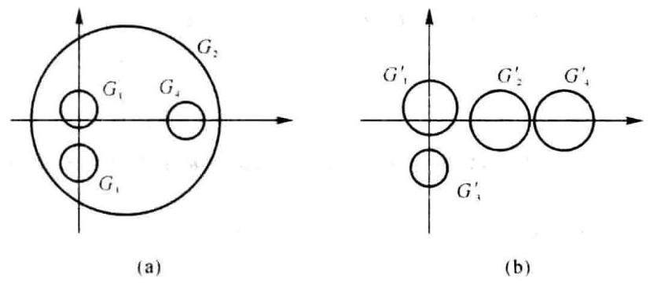

图题 15-1

取 $\mathbf{D} = \operatorname{diag}\left( {1,\frac{1}{3},1,1}\right)$ ,则

$$
\mathbf{B} = {\mathbf{{DAD}}}^{-1} = \left\lbrack  \begin{array}{rrrr} \mathrm{i} & 3 & 0 & 1 \\  3 & 9 & 0 & 2 \\   - \mathrm{i} & 0 &  - 7\mathrm{i} & 1 \\  2 & 3 & 0 & {20} \end{array}\right\rbrack
$$

的 4 个盖尔圆为

$$
{G}^{\prime } : \left| {z - \mathrm{i}}\right|  \leq  4,\;{G}^{\prime } : \left| {z - 9}\right|  \leq  5,\;{G}^{\prime } : \left| {z + 7\mathrm{i}}\right|  \leq  2,\;{G}^{\prime } : \left| {z - {20}}\right|  \leq  5
$$

相邻盖尔圆的中心距与半径和如下(参见示意图):

<table><tr><td>相邻盖尔圆</td><td>${G}_{1}^{\prime } \rightarrow  {G}_{2}^{\prime }$</td><td>${G}_{1}^{\prime } \rightarrow  {G}_{3}^{\prime }$</td><td>${G}_{2}^{\prime } \rightarrow  {G}_{3}^{\prime }$</td><td>${G}_{2}^{\prime } \rightarrow  {G}_{4}^{\prime }$</td></tr><tr><td>中心距</td><td>✓ 82</td><td>8</td><td>✓ 130</td><td>11</td></tr><tr><td>半径和</td><td>9</td><td>6</td><td>7</td><td>10</td></tr></table>

易见，B的 4 个盖尔圆孤立，其各含 $\mathbf{A}$ 的一个特征值.

[注] 在 $\mathbf{D} = \operatorname{diag}\left( {1,{d}_{2},1,1}\right)$ 中,也可取 ${d}_{2} = {0.25}$ ,或者 ${d}_{2} = {0.3}$ .

六、 $1.{\mathbf{A}}^{ + }\xrightarrow[]{{f}_{2}}\left\lbrack  \begin{array}{rrrrr} 1 & 0 & 1 &  - 1 & 0 \\  0 & 1 & 2 & 0 &  - 1 \\  0 & 0 & 0 & 0 & 0 \end{array}\right\rbrack$ (取 ${c}_{1} = 1,{c}_{2} = 2$ )

$$
{\mathbf{A}}^{ + } = \mathbf{{FG}},\;\mathbf{F} = \left\lbrack  \begin{array}{rr} 0 & 1 \\   - 1 & 1 \\   - 2 & 1 \end{array}\right\rbrack  ,\;\mathbf{G} = \left\lbrack  \begin{array}{rrrrr} 1 & 0 & 1 &  - 1 & 0 \\  0 & 1 & 2 & 0 &  - 1 \end{array}\right\rbrack
$$

根据公式计算

$$
{\mathbf{F}}^{ + } = \frac{1}{6}\left\lbrack  \begin{array}{lll} 3 & 0 &  - 3 \\  5 & 2 &  - 1 \end{array}\right\rbrack  ,\;{\mathbf{G}}^{ + } = \frac{1}{14}\left\lbrack  \begin{array}{rr} 6 &  - 2 \\   - 2 & 3 \\  2 & 4 \\   - 6 & 2 \\  2 &  - 3 \end{array}\right\rbrack
$$

$$
\mathbf{A} = {\left( {\mathbf{A}}^{ + }\right) }^{ + } = {\mathbf{G}}^{ + }{\mathbf{F}}^{ + } = \frac{1}{84}\left\lbrack  \begin{array}{rrr} 8 &  - 4 &  - {16} \\  9 & 6 & 3 \\  {26} & 8 &  - {10} \\   - 8 & 4 & {16} \\   - 9 &  - 6 &  - 3 \end{array}\right\rbrack
$$

$2 \sim  3.{\mathbf{x}}_{0} = {\mathbf{A}}^{ * }\mathbf{b} = \left\lbrack  \begin{array}{l} 6 \\  4 \\  2 \end{array}\right\rbrack$ . 因为 $\mathbf{A}{\mathbf{A}}^{ * }\mathbf{b} = \mathbf{A}{\mathbf{x}}_{0} = \mathbf{b}$ ,所以 $\mathbf{A}\mathbf{x} = \mathbf{b}$ 有解,从而 ${\mathbf{x}}_{0}$ 是 $\mathbf{A}\mathbf{x} = \mathbf{b}$ 的极小范数解.

七、1. 子空间 $W$ 的一个基为 ${f}_{1}\left( t\right)  = 1 + {t}^{3},{f}_{2}\left( t\right)  = t + {t}^{2},{f}_{3}\left( t\right)  = 1 + {t}^{2}$ .

2. 计算基象组:

$$
T\left( {f}_{1}\right)  =  - {t}^{2} + {t}^{3} = {f}_{1} - {f}_{3},\;T\left( {f}_{2}\right)  = t + {t}^{2} = {f}_{2},\;T\left( {f}_{3}\right)  = {t}^{2} - {t}^{3} =  - {f}_{1} + {f}_{2}
$$

设 $T\left( {{f}_{1},{f}_{2},{f}_{3}}\right)  = \left( {{f}_{1},{f}_{2},{f}_{3}}\right) \mathbf{A}$ ,则

$$
\mathbf{A} = \left\lbrack  \begin{array}{rrr} 1 & 0 &  - 1 \\  0 & 1 & 0 \\   - 1 & 0 & 1 \end{array}\right\rbrack
$$

求 $\mathbf{P}$ 使得 ${\mathbf{P}}^{-1}\mathbf{{AP}} = \mathbf{\Lambda }$ :

$$
\mathbf{\Lambda } = \left\lbrack  \begin{array}{lll} 0 & & \\   & 1 & \\   & & 2 \end{array}\right\rbrack  ,\;\mathbf{P} = \left\lbrack  \begin{array}{rrr} 1 & 0 &  - 1 \\  0 & 1 & 0 \\  1 & 0 & 1 \end{array}\right\rbrack
$$

由 $\left( {{g}_{1},{g}_{2},{g}_{3}}\right)  = \left( {{f}_{1},{f}_{2},{f}_{3}}\right) \mathbf{P}$ 可得另一基

$$
{g}_{1} = {f}_{1} + {f}_{3} = 2 + {t}^{2} + {t}^{3},\;{g}_{2} = {f}_{2} = t + {t}^{2},\;{g}_{3} =  - {f}_{1} + {f}_{3} = {t}^{2} - {t}^{3}
$$

$T$ 在基 ${g}_{1},{g}_{2},{g}_{3}$ 下的矩阵为 $\mathbf{\Lambda }$ .

选取 $\mathbf{W}$ 的第一个基为 ${f}_{1}\left( t\right) ,{f}_{2}\left( t\right) ,{f}_{3}\left( t\right)$ 时,有

$$
\mathbf{A} = \left\lbrack  \begin{array}{rrr} 0 & 0 & 0 \\   - 1 & 1 &  - 1 \\  1 & 0 & 2 \end{array}\right\rbrack  ,\;\mathbf{\Lambda } = \left\lbrack  \begin{array}{lll} 0 & & \\   & 1 & \\   & & 2 \end{array}\right\rbrack  ,\;\mathbf{P} = \left\lbrack  \begin{array}{rrr} 2 & 0 & 0 \\  1 & 1 & 1 \\   - 1 & 0 &  - 1 \end{array}\right\rbrack
$$

选取 $W$ 的第一个基为 ${f}_{2}\left( t\right) ,{f}_{3}\left( t\right) ,{f}_{4}\left( t\right)$ 时,有

$$
\mathbf{A} = \left\lbrack  \begin{array}{rrr} 1 & 1 &  - 1 \\  0 & 0 & 0 \\  0 &  - 1 & 2 \end{array}\right\rbrack  ,\;\mathbf{\Lambda } = \left\lbrack  \begin{array}{lll} 0 & & \\   & 1 & \\   & & 2 \end{array}\right\rbrack  ,\;\mathbf{P} = \left\lbrack  \begin{array}{rrr}  - 1 & 1 & 1 \\  2 & 0 & 0 \\  1 & 0 &  - 1 \end{array}\right\rbrack
$$

选取 $\mathbf{W}$ 的第一个基为 ${f}_{1}\left( t\right) ,{f}_{3}\left( t\right) ,{f}_{4}\left( t\right)$ 时,有

$$
\mathbf{A} = \left\lbrack  \begin{array}{rrr} 1 &  - 1 & 1 \\   - 1 & 1 &  - 1 \\  0 & 0 & 1 \end{array}\right\rbrack  ,\;\mathbf{\Lambda } = \left\lbrack  \begin{array}{lll} 0 & & \\   & 1 & \\   & & 2 \end{array}\right\rbrack  ,\;\mathbf{P} = \left\lbrack  \begin{array}{rrr} 1 &  - 1 &  - 1 \\  1 & 1 & 1 \\  0 & 1 & 0 \end{array}\right\rbrack
$$

八、1. 记 $\mathbf{A} = \left\lbrack  \begin{array}{ll} {a}_{11} & {a}_{12} \\  {a}_{21} & {a}_{22} \end{array}\right\rbrack$ ,由 $T\left( {{\mathbf{x}}_{1},{\mathbf{x}}_{2},{\mathbf{x}}_{3},{\mathbf{x}}_{4}}\right)  = \left( {{\mathbf{x}}_{1},{\mathbf{x}}_{2},{\mathbf{x}}_{3},{\mathbf{x}}_{4}}\right) \left\lbrack  \begin{array}{ll} \mathbf{A} & \mathbf{B} \\  \mathbf{O} & \mathbf{C} \end{array}\right\rbrack$ 可得

$$
T\left( {\mathbf{x}}_{1}\right)  = {a}_{11}{\mathbf{x}}_{1} + {a}_{21}{\mathbf{x}}_{2} \in  {V}_{1},\;T\left( {\mathbf{x}}_{2}\right)  = {a}_{12}{\mathbf{x}}_{1} + {a}_{22}{\mathbf{x}}_{2} \in  {V}_{1}
$$

任意 $\mathbf{x} \in  {V}_{1}$ ,存在 ${k}_{1},{k}_{2}$ 使得 $\mathbf{x} = {k}_{1}{\mathbf{x}}_{1} + {k}_{2}{\mathbf{x}}_{2}$ . 于是有

$$
T\left( \mathbf{x}\right)  = {k}_{1} \cdot  T\left( {\mathbf{x}}_{1}\right)  + {k}_{2} \cdot  T\left( {\mathbf{x}}_{2}\right)  \in  {V}_{1}
$$

故 ${V}_{1} = \operatorname{span}\left\{  {{x}_{1},{x}_{2}}\right\}$ 是 $T$ 的不变子空间.

2. 记 $\mathbf{B} = \left\lbrack  \begin{array}{ll} {b}_{11} & {b}_{12} \\  {b}_{21} & {b}_{22} \end{array}\right\rbrack  ,\mathbf{C} = \left\lbrack  \begin{array}{ll} {c}_{11} & {c}_{12} \\  {c}_{21} & {c}_{22} \end{array}\right\rbrack$ ,不妨设 ${b}_{11} \neq  0$ ,因为

$$
{\mathbf{x}}_{3} \in  {V}_{2},\;T\left( {\mathbf{x}}_{3}\right)  = {b}_{11}{\mathbf{x}}_{1} + {b}_{21}{\mathbf{x}}_{2} + {c}_{11}{\mathbf{x}}_{3} + {c}_{21}{\mathbf{x}}_{4} \in  {V}_{2}\text{ (反证法) }
$$

所以 ${V}_{2} = \operatorname{span}\left\{  {{x}_{3},{x}_{4}}\right\}$ 不是 $T$ 的不变子空间.

## 试题十六 (2010 年 A 卷)

$\rightarrow  \text{ 、 }\left( {4 + 4 + 4 + 4 + 2 = {18}\text{ 分 }}\right)$ 填空:

1. 设 $\mathbf{A} = \left\lbrack  \begin{array}{ll} 1 & 1 \\  1 & 1 \end{array}\right\rbrack  ,\mathbf{B} = \left\lbrack  \begin{array}{ll} 1 & 2 \\  2 & 1 \end{array}\right\rbrack$ .

(1)是否可将 $\mathbf{A}$ 看作线性空间 ${\mathbf{V}}^{2}$ 中某两个基之间的过渡矩阵？( )

(2)是否可将 $\mathbf{B}$ 看作欧氏空间 ${V}^{2}$ 中某个基的度量矩阵？()

2. 设 $\mathbf{A} = \left\lbrack  \begin{array}{lll} \mathrm{i} & 1 & 0 \\  0 & 2\mathrm{i} & 1 \\  1 & 1 & 3\mathrm{i} \end{array}\right\rbrack  \left( {\mathrm{i} = \sqrt{-1}}\right)$ ,则

(1) $\parallel \mathbf{A}{\parallel }_{\mathrm{F}} =$ (   ); (2) $\parallel  \mathbf{A}{ \parallel  }_{{m}_{1}} =$ ( )；

(3) $\parallel  \mathbf{A}{ \parallel  }_{\infty } =$ (   )； (4) $\parallel \overline{\operatorname{vec}}\left( \mathbf{A}\right) {\parallel }_{\infty } =$ (   ).

3. 设 5 阶方阵 $\mathbf{A}$ 的特征多项式为 $\varphi \left( \lambda \right)  = \lambda {\left( \lambda  - 3\right) }^{4}$ ,且 $\operatorname{rank}\left( {3\mathbf{I} - \mathbf{A}}\right)  = 3$ ,则 $\mathbf{A}$ 的 Jordan 标准形 (不考虑 Jordan 块的排列次序)只能是 $\mathbf{J} = \left\lbrack  \begin{array}{ll}  & \\   &  \end{array}\right\rbrack$ 或者 $\mathbf{J} = \left\lbrack  \begin{array}{ll}  & \\   &  \end{array}\right\rbrack$ .

4. $\mathbf{A} = \left\lbrack  \begin{array}{ll} 2 & 2 \\  2 & 2 \end{array}\right\rbrack$ 的两个不同秩的 $\{ 1\}$ -逆是 ${\mathbf{A}}^{\left( 1\right) } = \left\lbrack  \begin{array}{ll}  & \\   &  \end{array}\right\rbrack  ,{\mathbf{A}}^{\left( 1\right) } = \left\lbrack  \begin{array}{ll}  & \\   &  \end{array}\right\rbrack$ .

5. 设 $\mathbf{A},\mathbf{B}$ 都是 $n$ 阶方阵, $I$ 表示 $n$ 阶单位矩阵,等式 ${\mathrm{e}}^{A \odot  I + I \odot  B} = {\mathrm{e}}^{A \odot  I}{\mathrm{e}}^{I \otimes  B}$ 是否一定成立? ( )

${}^{i}$ 二、(8 分) 设 $\mathbf{A} \in  {\mathbf{C}}^{n \times  n}$ ，且 $\parallel \mathbf{A}{\parallel }_{2} < 1$ ，证明: $\frac{1}{1 + \parallel \mathbf{A}{\parallel }_{2}} \leq  {\begin{Vmatrix}{\left( \mathbf{I} + \mathbf{A}\right) }^{-1}\end{Vmatrix}}_{2} \leq  \frac{1}{1 - \parallel \mathbf{A}{\parallel }_{2}}$ .

三、(15 分) 已知 $\mathbf{A} = \left\lbrack  \begin{array}{rrr} 5 &  - 2 & 3 \\  1 & 2 & 3 \\   - 1 & 2 & 1 \end{array}\right\rbrack  ,\mathbf{b}\left( t\right)  = {\mathrm{e}}^{4t}\left\lbrack  \begin{array}{l} 2 \\  1 \\  0 \end{array}\right\rbrack  ,\;\mathbf{x}\left( 0\right)  = \left\lbrack  \begin{array}{r} 1 \\  1 \\   - 1 \end{array}\right\rbrack$ .

1. 求 ${\mathrm{e}}^{At}$ ;

2. 用矩阵函数方法求微分方程 $\frac{\mathrm{d}}{\mathrm{d}t}\mathbf{x}\left( t\right)  = \mathbf{A}\mathbf{x}\left( t\right)  + \mathbf{b}\left( t\right)$ 满足初始条件 $\mathbf{x}\left( 0\right)$ 的解.

四、(10 分) 用 Givens 变换或者 Householder 变换求矩阵 $\mathbf{A} = \left\lbrack  \begin{array}{rrrr} 3 & 0 & 1 &  - 4 \\  0 & 6 & 2 & 4 \\  0 & 0 & 0 & 5 \\  4 & 0 &  - 2 & 3 \end{array}\right\rbrack$ 的 QR 分解.

五、(10 分) 用 Gerschgorin 定理隔离矩阵 $\mathbf{A} = \left\lbrack  \begin{array}{rrrr}  - 5 & 1 & 0 & 0 \\  1 & 3 & {1.3} &  - 2 \\  1 & 0 & 9 & {1.4} \\  0 & 1 & 0 &  - 2 \end{array}\right\rbrack$ 的特征值. (要求画图表示)

六、(15 分) 已知 $\mathbf{A} = \left\lbrack  \begin{array}{llll} 1 & 0 & 0 & 4 \\  0 & 2 & 8 & 0 \\  2 & 0 & 0 & 8 \\  0 & 9 & {36} & 0 \end{array}\right\rbrack  ,\mathbf{b} = \left\lbrack  \begin{array}{l} 1 \\  2 \\  2 \\  9 \end{array}\right\rbrack$ .

1. 求 $\mathbf{A}$ 的满秩分解;

2. 求 ${\mathbf{A}}^{ + }$ ;

3. 用广义逆矩阵方法判断线性方程组 $\mathbf{A}\mathbf{x} = \mathbf{b}$ 是否有解;

4. 求线性方程组 $\mathbf{A}\mathbf{x} = \mathbf{b}$ 的极小范数解,或者极小范数最小二乘解 ${\mathbf{x}}_{0}$ ,(要求指出 ${\mathbf{x}}_{0}$ 是哪种解) 七、(15 分) 设矩阵空间 ${\mathbf{R}}^{2 - 2}$ 中的线性变换 $T$ 和子空间 $W$ 分别为

$$
T\left( \mathbf{X}\right)  = \left\lbrack  \begin{array}{ll} {x}_{4} & {x}_{3} \\  {x}_{2} & {x}_{1} \end{array}\right\rbrack  \;\text{ (任意 }\mathbf{X} = \left\lbrack  \begin{array}{ll} {x}_{1} & {x}_{2} \\  {x}_{3} & {x}_{1} \end{array}\right\rbrack   \in  {\mathbf{R}}^{2 \times  2}\text{ ) }
$$

$$
W = \left\{  {\left. {\mathbf{X} = \left\lbrack  \begin{array}{ll} {x}_{1} & {x}_{2} \\  {x}_{3} & {x}_{4} \end{array}\right\rbrack  }\right| \;{x}_{1} + 3{x}_{2} + 3{x}_{4} + {x}_{5} = 0}\right\}
$$

1. 验证 $W$ 是 $T$ 的不变子空间;

2. 将 $T$ 看作 $W$ 中的线性变换,求 $W$ 的一个基,使 $T$ 在该基下的矩阵为对角矩阵.

八、(9 分) 设 ${x}_{0}$ 是欧氏空间 $V$ 中的单位元素 (指 $\left. {\left| {x}_{0}\right|  = 1}\right)$ ,定义线性变换

$$
T\left( \mathbf{x}\right)  = \mathbf{x} - 2\left( {\mathbf{x},{\mathbf{x}}_{0}}\right) \mathbf{x}\;\text{ (任意 }\mathbf{x} \in  V)
$$

其中 $\left( {\mathbf{x},{\mathbf{x}}_{v}}\right)$ 表示 $\mathbf{x}$ 与 ${\mathbf{x}}_{v}$ 的内积.

1. 验证 $T$ 是正交变换;

2. 验证 $T$ 是对称变换;

3. 验证 $x$ 是 $T$ 的一个特征向量,并求其对应的特征值.

## 试题十六解答

___、1. 否, T)3.1

3. $\mathbf{J} = \left\lbrack  \begin{array}{lllll} 0 & & & & \\   & 3 & & & \\   & & 3 & 1 & \\   & & & 3 & 1 \\   & & & & 3 \end{array}\right\rbrack  \;$ 或者 $\;\mathbf{J} = \left\lbrack  \begin{array}{lllll} 0 & & & & \\   & 3 & 1 & & \\   & & 3 & & \\   & & & 3 & 1 \\   & & & & 3 \end{array}\right\rbrack$ ;

4. ${\mathbf{A}}^{\left( 1\right) } = \frac{1}{2}\left\lbrack  \begin{array}{rr} 1 & 0 \\   - a & a \end{array}\right\rbrack  \left( {a = 0}\right.$ 与 $a \neq  0$ 两种情形); 5. 是.

二、因为 $\rho \left( \mathbf{A}\right)  \leq  \parallel \mathbf{A}{\parallel }_{2} < 1$ . 所以 ${\lambda }_{A} \neq   - 1$ . 从而 $\mathbf{I} + \mathbf{A}$ 可逆. 考虑恒等式

$$
\mathbf{I} = \left( {\mathbf{I} + \mathbf{A}}\right) {\left( \mathbf{I} + \mathbf{A}\right) }^{-1} = {\left( \mathbf{I} + \mathbf{A}\right) }^{-1} + \mathbf{A}{\left( \mathbf{I} + \mathbf{A}\right) }^{-1},\;{\left( \mathbf{I} + \mathbf{A}\right) }^{-1} = \mathbf{I} - \mathbf{A}{\left( \mathbf{I} + \mathbf{A}\right) }^{-1}
$$

取范数可得

$$
1 = \parallel \mathbf{I}{\parallel }_{2} \leq  {\begin{Vmatrix}{\left( \mathbf{I} + \mathbf{A}\right) }^{-1}\end{Vmatrix}}_{2} + \parallel \mathbf{A}{\parallel }_{2}{\begin{Vmatrix}{\left( \mathbf{I} + \mathbf{A}\right) }^{-1}\end{Vmatrix}}_{2},\;{\begin{Vmatrix}{\left( \mathbf{I} + \mathbf{A}\right) }^{-1}\end{Vmatrix}}_{2} \geq  \frac{1}{1 + \parallel \mathbf{A}{\parallel }_{2}}
$$

$$
{\begin{Vmatrix}{\left( \mathbf{I} + \mathbf{A}\right) }^{-1}\end{Vmatrix}}_{2} \leq  \parallel \mathbf{I}{\parallel }_{2} + \parallel \mathbf{A}{\parallel }_{2}{\begin{Vmatrix}{\left( \mathbf{I} + \mathbf{A}\right) }^{-1}\end{Vmatrix}}_{2},\;{\begin{Vmatrix}{\left( \mathbf{I} + \mathbf{A}\right) }^{-1}\end{Vmatrix}}_{2} \leq  \frac{1}{1 - \parallel \mathbf{A}{\parallel }_{2}}
$$

$$
\text{ 三、1. }\varphi \left( \lambda \right)  = \left| {\lambda \mathbf{I} - \mathbf{A}}\right|  = \lambda {\left( \lambda  - 4\right) }^{2}\text{ ,由 }\mathbf{A}\left( {\mathbf{A} - 4\mathbf{I}}\right)  = \mathbf{O}\text{ 可得 }m\left( \lambda \right)  = \lambda \left( {\lambda  - 4}\right) \text{ . 令 }
$$

$$
f\left( \lambda \right)  = {\mathrm{e}}^{x} = m\left( \lambda \right)  \cdot  g\left( \lambda \right)  + \left( {a + {b\lambda }}\right)
$$

则有

$$
\left\{  {\begin{array}{l} f\left( 0\right)  = a \\  f\left( 4\right)  = a + {4b} \end{array},\;\left\{  {\begin{array}{l} a = 1 \\  a + {4b} = {\mathrm{e}}^{4t} \end{array},\;\left\{  \begin{array}{l} a = 1 \\  b = \frac{1}{4}\left( {{\mathrm{e}}^{4t} - 1}\right)  \end{array}\right. }\right. }\right.
$$

$$
{\mathrm{e}}^{\mathrm{i}t} = \frac{1}{4}\left( {4\mathbf{I} - \mathbf{A}}\right)  + \frac{{\mathrm{e}}^{\mathrm{i}t}}{4}\mathbf{A} = \frac{1}{4}\left\lbrack  \begin{array}{rrr}  - 1 & 2 &  - 3 \\   - 1 & 2 &  - 3 \\  1 &  - 2 & 3 \end{array}\right\rbrack   + \frac{{\mathrm{e}}^{\mathrm{i}t}}{4}\mathbf{A}
$$

$$
\text{ 2. }{\mathrm{e}}^{-\lambda }\mathbf{b}\left( s\right)  = \left\lbrack  \begin{array}{l} 2 \\  1 \\  0 \end{array}\right\rbrack  ,\;\mathbf{x}\left( t\right)  = \left\lbrack  \begin{array}{r} 1 \\  1 \\   - 1 \end{array}\right\rbrack   + t{\mathrm{e}}^{\lambda t}\left\lbrack  \begin{array}{l} 2 \\  1 \\  0 \end{array}\right\rbrack
$$

四、解法 1. Givens 变换:

$$
\text{ (1) }{\mathbf{\beta }}_{0} = \left\lbrack  \begin{array}{l} 3 \\  0 \\  0 \\  4 \end{array}\right\rbrack  ,\;{\mathbf{T}}_{11} = \frac{1}{5}\left\lbrack  \begin{array}{rrrr} 3 & 0 & 0 & 4 \\  0 & 5 & 0 & 0 \\  0 & 0 & 5 & 0 \\   - 4 & 0 & 0 & 3 \end{array}\right\rbrack  ,\;{\mathbf{T}}_{0} = {\mathbf{T}}_{11},\;{\mathbf{T}}_{0}\mathbf{A} = \left\lbrack  \begin{array}{rrrr} 5 & 0 &  - 1 & 0 \\  0 & 6 & 2 & 4 \\  0 & 0 & 0 & 5 \\  0 & 0 &  - 2 & 5 \end{array}\right\rbrack
$$

(2) ${\mathbf{A}}_{2} = \left\lbrack  \begin{array}{rr} 0 & 5 \\   - 2 & 5 \end{array}\right\rbrack  ,\;{\mathbf{\beta }}_{2} = \left\lbrack  \begin{array}{r} 0 \\   - 2 \end{array}\right\rbrack  ,\;{\mathbf{T}}_{12} = \left\lbrack  \begin{array}{rr} 0 &  - 1 \\  1 & 0 \end{array}\right\rbrack  ,\;{\mathbf{T}}_{2} = {T}_{12},\;{\mathbf{T}}_{2}{\mathbf{A}}_{2} = \left\lbrack  \begin{array}{rr} 2 &  - 5 \\  0 & 5 \end{array}\right\rbrack$

令 $\mathbf{T} = \left\lbrack  \begin{array}{ll} {\mathbf{I}}_{2} & \\   & {\mathbf{T}}_{2} \end{array}\right\rbrack  {\mathbf{T}}_{0}$ ,则有

$$
\mathbf{Q} = {\mathbf{T}}^{\top } = \frac{1}{5}\left\lbrack  \begin{array}{rrrr} 3 & 0 & 4 & 0 \\  0 & 5 & 0 & 0 \\  0 & 0 & 0 & 5 \\  4 & 0 &  - 3 & 0 \end{array}\right\rbrack  ,\;\mathbf{R} = \left\lbrack  \begin{array}{rrrr} 5 & 0 &  - 1 & 0 \\  6 & 2 & 4 & 4 \\  2 &  - 5 & 0 & 5 \end{array}\right\rbrack  ,\;\mathbf{A} = \mathbf{{QR}}
$$

解法 2. Householder 变换:

$$
\text{ (1) }{\mathbf{\beta }}_{0} = \left\lbrack  \begin{array}{l} 3 \\  0 \\  0 \\  4 \end{array}\right\rbrack  ,\;\mathbf{u} = \frac{1}{\sqrt{5}}\left\lbrack  \begin{array}{r}  - 1 \\  0 \\  0 \\  2 \end{array}\right\rbrack  ,\;{\mathbf{H}}_{0} = \frac{1}{5}\left\lbrack  \begin{array}{rrrr} 3 & 0 & 0 & 4 \\  0 & 5 & 0 & 0 \\  0 & 0 & 5 & 0 \\  4 & 0 & 0 &  - 3 \end{array}\right\rbrack  ,\;{\mathbf{H}}_{0}\mathbf{A} = \left\lbrack  \begin{array}{rrrr} 5 & 0 &  - 1 & 0 \\  0 & 6 & 2 & 4 \\  0 & 0 & 0 & 5 \\  0 & 0 & 2 &  - 5 \end{array}\right\rbrack
$$

(2) ${\mathbf{A}}_{2} = \left\lbrack  \begin{array}{rr} 0 & 5 \\  2 &  - 5 \end{array}\right\rbrack  ,\;{\mathbf{\beta }}_{2} = \left\lbrack  \begin{array}{l} 0 \\  2 \end{array}\right\rbrack  ,\;\mathbf{u} = \frac{1}{\sqrt{2}}\left\lbrack  \begin{array}{r}  - 1 \\  1 \end{array}\right\rbrack  ,\;{\mathbf{H}}_{2} = \left\lbrack  \begin{array}{ll} 0 & 1 \\  1 & 0 \end{array}\right\rbrack  ,\;{\mathbf{H}}_{2}{\mathbf{A}}_{2} = \left\lbrack  \begin{array}{rr} 2 &  - 5 \\  0 & 5 \end{array}\right\rbrack$

令

$$
\mathbf{Q} = {\mathbf{H}}_{0}\left\lbrack  \begin{array}{ll} {\mathbf{I}}_{2} & \\   & {\mathbf{H}}_{2} \end{array}\right\rbrack   = \frac{1}{5}\left\lbrack  \begin{array}{rrrr} 3 & 0 & 4 & 0 \\  0 & 5 & 0 & 0 \\  0 & 0 & 0 & 5 \\  4 & 0 &  - 3 & 0 \end{array}\right\rbrack  ,\;\mathbf{R} = \left\lbrack  \begin{array}{rrrr} 5 & 0 &  - 1 & 0 \\  6 & 2 & 4 & 0 \\  2 &  - 5 & 0 & 5 \end{array}\right\rbrack
$$

则有 $\mathbf{A} = \mathbf{{QR}}$ .

五、 $\mathbf{A}$ 的 4 个盖尔圆为

$$
{G}_{1} : \left| {z + 5}\right|  \leq  1,\;{G}_{2} : \left| {z - 3}\right|  \leq  {4.3},\;{G}_{3} : \left| {z - 9}\right|  \leq  {2.4},\;{G}_{4} : \left| {z + 2}\right|  \leq  1
$$

易见 ${G}_{1}$ 孤立,而 ${G}_{2},{G}_{3},{G}_{4}$ 相交.

方案一 (放大 ${G}_{1}$ ): 取 $\mathbf{D} = \operatorname{diag}\left( {\frac{5}{3},1,1,1}\right)$ ,则

$$
\mathbf{B} = {\mathbf{{DAD}}}^{-1} = \left\lbrack  \begin{array}{rrrr}  - 5 & 5/3 & 0 & 0 \\  {0.6} & 3 & {1.3} &  - 2 \\  {0.6} & 0 & 9 & {1.4} \\  0 & 1 & 0 &  - 2 \end{array}\right\rbrack
$$

的 4 个孤立盖尔圆为

$$
{G}^{\prime } : \left| {z + 5}\right|  \leq  \frac{5}{3},\;{G}^{\prime } : \left| {z - 3}\right|  \leq  {3.9},\;{G}^{\prime } : \left| {z - 9}\right|  \leq  2,\;{G}^{\prime } : \left| {z + 2}\right|  \leq  1
$$

其中各含 $\mathbf{B}$ 的一个特征值,从而 ${G}_{1},{G}_{2}^{\prime },{G}_{3}^{\prime },{G}_{4}^{\prime }$ ,中各含 $\mathbf{A}$ 的一个特征值.

[注] 在 $\mathbf{D} = \operatorname{diag}\left( {{d}_{1},1,1,1}\right)$ 中,可取 ${d}_{1} = {1.6} \sim  {1.9}$ .

方案二 (缩小 ${G}_{2}$ ): 在 $\mathbf{D} = \operatorname{diag}\left( {1,{d}_{2},1,1}\right)$ 中,可取 ${d}_{2} = {0.7} \sim  \frac{5}{6} = {0.83}$ .

六、1. A 行 $\left\lbrack  \begin{array}{llll} 1 & 0 & 0 & 4 \\  0 & 1 & 4 & 0 \\  0 & 0 & 0 & 0 \\  0 & 0 & 0 & 0 \end{array}\right\rbrack$ , $\;\mathbf{A} = \mathbf{{FG}} : \;\mathbf{F} = \left\lbrack  \begin{array}{ll} 1 & 0 \\  0 & 2 \\  2 & 0 \\  0 & 9 \end{array}\right\rbrack  ,\;\mathbf{G} = \left\lbrack  \begin{array}{llll} 1 & 0 & 0 & 4 \\  0 & 1 & 4 & 0 \end{array}\right\rbrack$

2. 根据公式计算

$$
{\mathbf{F}}^{ + } = {\left( {\mathbf{F}}^{\top }\mathbf{F}\right) }^{-1}{\mathbf{F}}^{\top } = {\left\lbrack  \begin{array}{ll} 5 & 0 \\  0 & {85} \end{array}\right\rbrack  }^{-1}{\mathbf{F}}^{\top } = \frac{1}{85}\left\lbrack  \begin{array}{rrrr} {17} & 0 & {34} & 0 \\  0 & 2 & 0 & 9 \end{array}\right\rbrack
$$

$$
{\mathbf{G}}^{ + } = {\mathbf{G}}^{\mathrm{T}}{\left( \mathbf{G}{\mathbf{G}}^{\mathrm{T}}\right) }^{-1} = {\mathbf{G}}^{\mathrm{T}}{\left\lbrack  \begin{array}{ll} 1 & 0 \\  0 & {17} \end{array}\right\rbrack  }^{-1} = \frac{1}{17}\left\lbrack  \begin{array}{ll} 1 & 0 \\  0 & 1 \\  0 & 4 \\  4 & 0 \end{array}\right\rbrack
$$

$$
{\mathbf{A}}^{ * } = {\mathbf{G}}^{ * }{\mathbf{F}}^{ * } = \frac{1}{5 \times  {17}^{2}}\left\lbrack  \begin{array}{rrrr} {17} & 0 & {34} & 0 \\  0 & 2 & 0 & 9 \\  0 & 8 & 0 & {36} \\  {68} & 0 & {136} & 0 \end{array}\right\rbrack
$$

$3 \sim  4.{\mathbf{x}}_{0} = {\mathbf{A}}^{ + }\mathbf{b} = \frac{1}{17}\left\lbrack  \begin{array}{l} 1 \\  1 \\  4 \\  4 \end{array}\right\rbrack$ ,因为 $\mathbf{A}{\mathbf{A}}^{ + }\mathbf{b} = \mathbf{A}{\mathbf{x}}_{0} = \frac{1}{17}\left\lbrack  \begin{array}{l} {17} \\  {34} \\  {34} \\  {153} \end{array}\right\rbrack   = \mathbf{b}$ ,所以 $\mathbf{A}\mathbf{x} = \mathbf{b}$ 有解,故 ${\mathbf{x}}_{0}$ 是 $\mathbf{A}\mathbf{x} = \mathbf{b}$ 的极小范数解.

七、1. 任意 $\mathbf{X} = \left\lbrack  \begin{array}{ll} {x}_{1} & {x}_{2} \\  {x}_{3} & {x}_{4} \end{array}\right\rbrack   \in  \mathbf{W}$ . 有 ${x}_{1} + 3{x}_{2} + 3{x}_{3} + {x}_{4} = 0$ . 因为 $T\left( \mathbf{X}\right)  = \left\lbrack  \begin{array}{ll} {x}_{1} & {x}_{3} \\  {x}_{2} & {x}_{1} \end{array}\right\rbrack$ 满足 ${x}_{4} + 3{x}_{3} + \; 3{x}_{2} + {x}_{1} = 0$ ,所以 $T\left( \mathbf{X}\right)  \in  \mathbf{W}$ ,故 $\mathbf{W}$ 是 $T$ 的不变子空间.

2. 方法 1 : 对任意 $X \in  W$ ,有

$$
\mathbf{X} = \left\lbrack  \begin{matrix}  - \left( {3{x}_{2} + 3{x}_{3} + {x}_{4}}\right) & {x}_{2} \\  {x}_{3} & {x}_{4} \end{matrix}\right\rbrack   = {x}_{2}\left\lbrack  \begin{array}{rr}  - 3 & 1 \\  0 & 0 \end{array}\right\rbrack   + {x}_{3}\left\lbrack  \begin{array}{rr}  - 3 & 0 \\  1 & 0 \end{array}\right\rbrack   + {x}_{4}\left\lbrack  \begin{array}{rr}  - 1 & 0 \\  0 & 1 \end{array}\right\rbrack
$$

$W$ 的一个基为

$$
{\mathbf{X}}_{1} = \left\lbrack  \begin{array}{rr}  - 3 & 1 \\  0 & 0 \end{array}\right\rbrack  ,\;{\mathbf{X}}_{2} = \left\lbrack  \begin{array}{rr}  - 3 & 0 \\  1 & 0 \end{array}\right\rbrack  ,\;{\mathbf{X}}_{3} = \left\lbrack  \begin{array}{rr}  - 1 & 0 \\  0 & 1 \end{array}\right\rbrack
$$

计算基象组

$$
T\left( {\mathbf{X}}_{1}\right)  = \left\lbrack  \begin{array}{rr} 0 & 0 \\  1 &  - 3 \end{array}\right\rbrack  ,\;T\left( {\mathbf{X}}_{2}\right)  = \left\lbrack  \begin{array}{rr} 0 & 1 \\  0 &  - 3 \end{array}\right\rbrack  ,\;T\left( {\mathbf{X}}_{3}\right)  = \left\lbrack  \begin{array}{rr} 1 & 0 \\  0 &  - 1 \end{array}\right\rbrack
$$

$$
T\left( {{\mathbf{X}}_{1},{\mathbf{X}}_{2},{\mathbf{X}}_{3}}\right)  = \left( {{\mathbf{X}}_{1},{\mathbf{X}}_{2},{\mathbf{X}}_{3}}\right) \mathbf{A},\;\mathbf{A} = \left\lbrack  \begin{array}{rrr} 0 & 1 & 0 \\  1 & 0 & 0 \\   - 3 &  - 3 &  - 1 \end{array}\right\rbrack
$$

求 $\mathbf{P}$ 使得 ${\mathbf{P}}^{-1}\mathbf{{AP}} = \mathbf{\Lambda }$ :

$$
\mathbf{\Lambda } = \left\lbrack  \begin{array}{lll}  - 1 & & \\   &  - 1 & \\   & & 1 \end{array}\right\rbrack  ,\;\mathbf{P} = \left\lbrack  \begin{array}{rrr}  - 1 & 0 & 1 \\  1 & 0 & 1 \\  0 & 1 &  - 3 \end{array}\right\rbrack
$$

构造 $W$ 的另一基 $\left( {{\mathbf{Y}}_{1},{\mathbf{Y}}_{2},{\mathbf{Y}}_{3}}\right)  = \left( {{\mathbf{X}}_{1},{\mathbf{X}}_{2},{\mathbf{X}}_{3}}\right) \mathbf{P}$ ,即

$$
{\mathbf{Y}}_{1} = \left\lbrack  \begin{array}{rr} 0 &  - 1 \\  1 & 0 \end{array}\right\rbrack  ,\;{\mathbf{Y}}_{2} = \left\lbrack  \begin{array}{rr}  - 1 & 0 \\  0 & 1 \end{array}\right\rbrack  ,\;{\mathbf{Y}}_{3} = \left\lbrack  \begin{array}{rr}  - 3 & 1 \\  1 &  - 3 \end{array}\right\rbrack
$$

且有 $T\left( {{\mathbf{Y}}_{1},{\mathbf{Y}}_{2},{\mathbf{Y}}_{3}}\right)  = \left( {{\mathbf{Y}}_{1},{\mathbf{Y}}_{2},{\mathbf{Y}}_{3}}\right) \mathbf{\Lambda }$ .

方法 2: 对任意 $X \in  W$ ,有

$$
\mathbf{X} = \left\lbrack  \begin{matrix} {x}_{1} & {x}_{2} \\  {x}_{3} &  - \left( {{x}_{1} + 3{x}_{2} + 3{x}_{3}}\right)  \end{matrix}\right\rbrack   = {x}_{1}\left\lbrack  \begin{array}{rr} 1 & 0 \\  0 &  - 1 \end{array}\right\rbrack   + {x}_{2}\left\lbrack  \begin{array}{rr} 0 &  - 1 \\  0 &  - 3 \end{array}\right\rbrack   + {x}_{3}\left\lbrack  \begin{array}{rr} 0 & 0 \\  1 &  - 3 \end{array}\right\rbrack
$$

$W$ 的一个基为

$$
{\mathbf{X}}_{1} = \left\lbrack  \begin{array}{rr} 1 & 0 \\  0 &  - 1 \end{array}\right\rbrack  ,\;{\mathbf{X}}_{2} = \left\lbrack  \begin{array}{rr} 0 & 1 \\  0 &  - 3 \end{array}\right\rbrack  ,\;{\mathbf{X}}_{3} = \left\lbrack  \begin{array}{rr} 0 & 0 \\  1 &  - 3 \end{array}\right\rbrack
$$

计算基象组

$$
T\left( {\mathbf{X}}_{1}\right)  = \left\lbrack  \begin{array}{rr}  - 1 & 0 \\  0 & 1 \end{array}\right\rbrack  ,\;T\left( {\mathbf{X}}_{2}\right)  = \left\lbrack  \begin{array}{rr}  - 3 & 0 \\  1 & 0 \end{array}\right\rbrack  ,\;T\left( {\mathbf{X}}_{3}\right)  = \left\lbrack  \begin{array}{rr}  - 3 & 1 \\  0 & 0 \end{array}\right\rbrack
$$

$$
T\left( {{\mathbf{X}}_{1},{\mathbf{X}}_{2},{\mathbf{X}}_{3}}\right)  = \left( {{\mathbf{X}}_{1},{\mathbf{X}}_{2},{\mathbf{X}}_{3}}\right) \mathbf{A},\;\mathbf{A} = \left\lbrack  \begin{array}{rrr}  - 1 &  - 3 &  - 3 \\  0 & 0 & 1 \\  0 & 1 & 0 \end{array}\right\rbrack
$$

求 $\mathbf{P}$ 使得 ${\mathbf{P}}^{-1}\mathbf{{AP}} = \mathbf{\Lambda }$ :

$$
\mathbf{\Lambda } = \left\lbrack  \begin{array}{lll}  - 1 & & \\   &  - 1 & \\   & & 1 \end{array}\right\rbrack  ,\;\mathbf{P} = \left\lbrack  \begin{array}{rrr} 1 & 0 &  - 3 \\  0 &  - 1 & 1 \\  0 & 1 & 1 \end{array}\right\rbrack
$$

构造 $W$ 的另一基 $\left( {{\mathbf{Y}}_{1},{\mathbf{Y}}_{2},{\mathbf{Y}}_{3}}\right)  = \left( {{\mathbf{X}}_{1},{\mathbf{X}}_{2},{\mathbf{X}}_{3}}\right) \mathbf{P}$ ,即

$$
{\mathbf{Y}}_{1} = \left\lbrack  \begin{array}{rr} 1 & 0 \\  0 &  - 1 \end{array}\right\rbrack  ,\;{\mathbf{Y}}_{2} = \left\lbrack  \begin{array}{rr} 0 &  - 1 \\  1 & 0 \end{array}\right\rbrack  ,\;{\mathbf{Y}}_{3} = \left\lbrack  \begin{array}{rr}  - 3 & 1 \\  1 &  - 3 \end{array}\right\rbrack
$$

且有 $T\left( {{\mathbf{Y}}_{1},{\mathbf{Y}}_{2},{\mathbf{Y}}_{3}}\right)  = \left( {{\mathbf{Y}}_{1},{\mathbf{Y}}_{2},{\mathbf{Y}}_{3}}\right) \mathbf{\Lambda }$ .

方法 $3 : W$ 的一个基为

$$
{\mathbf{X}}_{1} = \left\lbrack  \begin{array}{rr} 1 & 0 \\  0 &  - 1 \end{array}\right\rbrack  ,\;{\mathbf{X}}_{2} = \left\lbrack  \begin{array}{rr} 0 & 1 \\   - 1 & 0 \end{array}\right\rbrack  ,\;{\mathbf{X}}_{3} = \left\lbrack  \begin{array}{rr} 0 & 0 \\  1 &  - 3 \end{array}\right\rbrack
$$

计算基象组

$$
T\left( {\mathbf{X}}_{1}\right)  =  - {\mathbf{X}}_{1},\;T\left( {\mathbf{X}}_{2}\right)  =  - {\mathbf{X}}_{2},\;T\left( {\mathbf{X}}_{3}\right)  =  - 3{\mathbf{X}}_{1} + {\mathbf{X}}_{2} + {\mathbf{X}}_{3}
$$

$$
T\left( {{\mathbf{X}}_{1},{\mathbf{X}}_{2},{\mathbf{X}}_{3}}\right)  = \left( {{\mathbf{X}}_{1},{\mathbf{X}}_{2},{\mathbf{X}}_{3}}\right) \mathbf{A},\;\mathbf{A} = \left\lbrack  \begin{array}{rrr}  - 1 & 0 &  - 3 \\  0 &  - 1 & 1 \\  0 & 0 & 1 \end{array}\right\rbrack
$$

求 $\mathbf{P}$ 使得 ${\mathbf{P}}^{-1}\mathbf{{AP}} = \mathbf{\Lambda }$ :

$$
\mathbf{\Lambda } = \left\lbrack  \begin{array}{lll}  - 1 & & \\   &  - 1 & \\   & & 1 \end{array}\right\rbrack  ,\;\mathbf{P} = \left\lbrack  \begin{array}{rrr} 1 & 0 &  - 3 \\  0 & 1 & 1 \\  0 & 0 & 2 \end{array}\right\rbrack
$$

构造 $W$ 的另一基 $\left( {{\mathbf{Y}}_{1},{\mathbf{Y}}_{2},{\mathbf{Y}}_{3}}\right)  = \left( {{\mathbf{X}}_{1},{\mathbf{X}}_{2},{\mathbf{X}}_{3}}\right) \mathbf{P}$ ,即

$$
{\mathbf{Y}}_{1} = \left\lbrack  \begin{array}{rr} 1 & 0 \\  0 &  - 1 \end{array}\right\rbrack  ,\;{\mathbf{Y}}_{2} = \left\lbrack  \begin{array}{rr} 0 & 1 \\   - 1 & 0 \end{array}\right\rbrack  ,\;{\mathbf{Y}}_{3} = \left\lbrack  \begin{array}{rr}  - 3 & 1 \\  1 &  - 3 \end{array}\right\rbrack
$$

且有 $T\left( {{\mathbf{Y}}_{1},{\mathbf{Y}}_{2},{\mathbf{Y}}_{3}}\right)  = \left( {{\mathbf{Y}}_{1},{\mathbf{Y}}_{2},{\mathbf{Y}}_{3}}\right) \mathbf{\Lambda }$ .

$$
\text{ 八、1. }\left( {{Tx},{Tx}}\right)  = \left( {x, x}\right)  - 4\left( {x,{x}_{0}}\right) \left( {x,{x}_{0}}\right)  + 4{\left( x,{x}_{0}\right) }^{2}\left( {{x}_{0},{x}_{0}}\right)  = \left( {x, x}\right)
$$

2. 对任意 $y \in  V$ ,由 $T\left( \mathbf{y}\right)  = \mathbf{y} - 2\left( {\mathbf{y},{\mathbf{x}}_{0}}\right) {\mathbf{x}}_{0}$ 可得

$$
\left( {T\mathbf{x},\mathbf{y}}\right)  = \left( {\mathbf{x},\mathbf{y}}\right)  - 2\left( {\mathbf{x},{\mathbf{x}}_{0}}\right) \left( {{\mathbf{x}}_{0},\mathbf{y}}\right)
$$

$$
\left( {\mathbf{x}, T\mathbf{y}}\right)  = \left( {\mathbf{x},\mathbf{y}}\right)  - 2\left( {\mathbf{y},{\mathbf{x}}_{0}}\right) \left( {\mathbf{x},{\mathbf{x}}_{0}}\right)  = \left( {T\mathbf{x},\mathbf{y}}\right)
$$

3. $T\left( {\mathbf{x}}_{0}\right)  = {\mathbf{x}}_{0} - 2\left( {{\mathbf{x}}_{0},{\mathbf{x}}_{0}}\right) {\mathbf{x}}_{0} = {\mathbf{x}}_{0} - 2{\mathbf{x}}_{0} = \left( {-1}\right) {\mathbf{x}}_{0}$ ,特征值 $\lambda  =  - 1$ .

## 试题十七 (2011 年 A 卷)

一. (15分) 填空

1. 设 ${\mathbf{A}}_{1} = \left\lbrack  \begin{array}{lll} 1 & 0 & 0 \\  0 & 1 & 0 \\  1 & 0 & 1 \end{array}\right\rbrack  ,{\mathbf{A}}_{2} = \left\lbrack  \begin{array}{rr}  - 1 &  - 1 \\  4 & 3 \end{array}\right\rbrack$ ,则 $\mathbf{A} = \left\lbrack  \begin{matrix} {\mathbf{A}}_{1} & \mathbf{O} \\  \mathbf{O} & {\mathbf{A}}_{2} \end{matrix}\right\rbrack$ 的 Jordan 标准形矩阵为 ${\mathbf{J}}_{A} = \left\lbrack  \begin{array}{ll}  & \\   &  \end{array}\right\rbrack$ .

2. 设 $\mathbf{A} = \left\lbrack  \begin{array}{llll}  & & & 1 \\   & & & 2 \\   & \therefore & & \\  n & & &  \end{array}\right\rbrack  ,\;\mathbf{x} = \left\lbrack  \begin{matrix} 1 \\  1 \\  \vdots \\  1 \end{matrix}\right\rbrack   \in  {\mathbf{R}}^{n}$ ,则 $\parallel \mathbf{A} \otimes  \mathbf{x}{\parallel }_{2} =$ (   ).

3. 设 ${\mathrm{e}}^{\lambda t} = \left\lbrack  \begin{matrix} {\mathrm{e}}^{t} & t & \sin t \\  {\mathrm{e}}^{2t} - 1 & {t}^{2} + 1 & \sin \left( {2t}\right) \\  {\mathrm{e}}^{3t} - 1 & {t}^{3} & \sin \left( {3t}\right)  + 1 \end{matrix}\right\rbrack$ ,则 $\mathbf{A} = \left\lbrack  \begin{array}{ll}  & \\   & \\   &  \end{array}\right\rbrack$ .

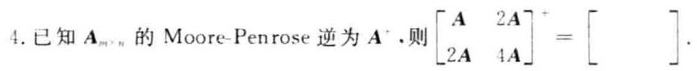

5. 已知线性空间 ${V}^{4}$ 的一个基为 ${\mathbf{x}}_{1},{\mathbf{x}}_{2},{\mathbf{x}}_{3},{\mathbf{x}}_{4}$ ,令

$$
{y}_{1} = {x}_{1} + {x}_{2} + {x}_{4},\;{y}_{2} = {x}_{2} + 2{x}_{4},\;{y}_{3} =  - {x}_{1} + {x}_{4},\;{y}_{4} =  - {x}_{2} + {x}_{3}
$$

子空间 ${V}_{1} = \operatorname{span}\left\{  {{\mathbf{y}}_{1},{\mathbf{y}}_{2}}\right\}  ,{V}_{2} = \operatorname{span}\left\{  {{\mathbf{y}}_{3},{\mathbf{y}}_{4}}\right\}$ ,则 ${V}_{1} \cap  {V}_{2}$ 的一个基为 ( ).

二、(10 分) 设 $\mathbf{P} \in  {\mathbf{C}}^{m \times  n}$ 的秩为 $n,\parallel  \cdot  {\parallel }_{M}$ 是 ${\mathbf{C}}^{m \times  m}$ 上的矩阵范数,定义实值函数 $\parallel \mathbf{A}\parallel  = {\begin{Vmatrix}\mathbf{P}\mathbf{A}{\mathbf{P}}^{\left( 1\right) }\end{Vmatrix}}_{M}$ (任意 $\mathbf{A} \in  {\mathbf{C}}^{n \times  n}$ ),其中 ${\mathbf{P}}^{\left( 1\right) }$ 表示 $\mathbf{P}$ 的 $\{ 1\}$ 一逆,证明 $\parallel \mathbf{A}\parallel$ 是 ${\mathbf{C}}^{n \times  n}$ 上的矩阵范数.

三、(15 分) 已知 $\mathbf{A} = \left\lbrack  \begin{array}{rrr} 1 &  - 2 &  - 2 \\   - 2 & 1 &  - 2 \\   - 2 &  - 2 & 1 \end{array}\right\rbrack  ,\mathbf{b}\left( t\right)  = {\mathrm{e}}^{-{3t}}\left\lbrack  \begin{array}{l} 1 \\  1 \\  1 \end{array}\right\rbrack  ,\mathbf{x}\left( 0\right)  = \left\lbrack  \begin{array}{r}  - 1 \\  0 \\  1 \end{array}\right\rbrack$ .

1. 求 ${\mathrm{e}}^{At}$ ;

2. 用矩阵函数方法求微分方程 $\frac{\mathrm{d}}{\mathrm{d}t}\mathbf{x}\left( t\right)  = \mathbf{A}\mathbf{x}\left( t\right)  + \mathbf{b}\left( t\right)$ 满足初始条件 $\mathbf{x}\left( 0\right)$ 的解.

四、(10 分) 用 Householder 变换求矩阵 $\mathbf{A} = \left\lbrack  \begin{array}{llll} 1 & 2 & 0 & 1 \\  1 & 0 & 3 & 1 \\  1 & 0 & 3 & 2 \\  1 & 2 & 0 & 2 \end{array}\right\rbrack$ 的 QR 分解.

五、(10 分) 用 Gerschgorin 定理隔离矩阵 $\mathbf{A} = \left\lbrack  \begin{array}{rrrr}  - 9 & 0 &  - 1 & {1.2} \\  {1.1} &  - 3 &  - 1 & 2 \\  0 &  - {1.4} & 5 & 0 \\  {0.3} &  - {0.7} & 0 & 2 \end{array}\right\rbrack$ 的特征值. (要求画图表示)

六、(15 分) 已知 $\mathbf{A} = \left\lbrack  \begin{array}{llll} 1 & 1 & 0 & 1 \\  0 & 1 & 2 & 2 \\  2 & 2 & 0 & 2 \\  0 & 3 & 6 & 6 \end{array}\right\rbrack  ,\mathbf{b} = \left\lbrack  \begin{array}{l} 0 \\  1 \\  0 \\  3 \end{array}\right\rbrack$ .

1. 求 $\mathbf{A}$ 的满秩分解 $\mathbf{A} = \mathbf{F}\mathbf{G}$ ;

2. 求 ${\mathbf{A}}^{ * }$ :

3. 用广义逆矩阵方法判断线性方程组 $\mathbf{A}\mathbf{x} = \mathbf{b}$ 是否有解;

4. 求线性方程组 $\mathbf{A}\mathbf{x} = \mathbf{b}$ 的极小范数解,或者极小范数最小二乘解 ${\mathbf{x}}_{0}$ . (要求指出 ${\mathbf{x}}_{0}$ 是哪种解)

七、(15 分) 已知线性空间 ${V}^{i}$ 的一个基为 ${x}_{1},{x}_{2},{x}_{3},{x}_{4}$ ,另一个基为

$$
{\mathbf{y}}_{1} = {\mathbf{x}}_{1},\;{\mathbf{y}}_{2} = {\mathbf{x}}_{1} + {\mathbf{x}}_{2},\;{\mathbf{y}}_{3} = {\mathbf{x}}_{1} + {\mathbf{x}}_{2} + {\mathbf{x}}_{3},\;{\mathbf{y}}_{4} = {\mathbf{x}}_{1} + {\mathbf{x}}_{2} + {\mathbf{x}}_{3} + {\mathbf{x}}_{4}
$$

线性变换 $T$ 满足:

$$
T\left( {\mathbf{y}}_{1}\right)  = {\mathbf{x}}_{1} + {\mathbf{x}}_{4},\;T\left( {\mathbf{y}}_{2}\right)  = {\mathbf{x}}_{2} + {\mathbf{x}}_{3}
$$

$$
T\left( {\mathbf{y}}_{3}\right)  = {\mathbf{x}}_{1} + {\mathbf{x}}_{2} + {\mathbf{x}}_{3} + {\mathbf{x}}_{4},\;T\left( {\mathbf{y}}_{1}\right)  = {\mathbf{x}}_{1} - {\mathbf{x}}_{2} - {\mathbf{x}}_{3} + {\mathbf{x}}_{4}
$$

1. 求 $T$ 在基 ${\mathbf{y}}_{1},{\mathbf{y}}_{2},{\mathbf{y}}_{3},{\mathbf{y}}_{4}$ 下的矩阵 $\mathbf{A}$ ;

2. 求 $T$ 的值域 $R\left( T\right)$ 的一个基；

3. 在 ${V}^{ * }$ 中求满足 $T\left( \mathbf{y}\right)  = \mathbf{y}$ 的全体元素 $\mathbf{y}$ (由基 ${\mathbf{y}}_{1},{\mathbf{y}}_{2},{\mathbf{y}}_{3},{\mathbf{y}}_{4}$ 表示).

八、(10.分) 设欧氏空间 ${V}^{n}$ 的一个基为 ${\mathbf{x}}_{1},{\mathbf{x}}_{2},\cdots ,{\mathbf{x}}_{n}$ ,该基的度量矩阵为 $\mathbf{A}$ ,证明: 存在可逆矩阵 $\mathbf{C}$ ,使得由 $\left( {{\mathbf{y}}_{1},{\mathbf{y}}_{2},\cdots ,{\mathbf{y}}_{n}}\right)  = \left( {{\mathbf{x}}_{1},{\mathbf{x}}_{2},\cdots ,{\mathbf{x}}_{n}}\right) \mathbf{C}$ 确定的基 ${\mathbf{y}}_{1},{\mathbf{y}}_{2},\cdots ,{\mathbf{y}}_{n}$ 为 ${V}^{n}$ 的标准正交基.

## 试题十七解答

一、 $1.{\mathbf{J}}_{A} = \operatorname{diag}\left( {1,\left\lbrack  \begin{array}{ll} 1 & 1 \\  0 & 1 \end{array}\right\rbrack  ,\left\lbrack  \begin{array}{ll} 1 & 1 \\  0 & 1 \end{array}\right\rbrack  }\right)$ .

2. $\parallel \mathbf{A} \otimes  \mathbf{x}{\parallel }_{2} = \sqrt{{n}^{3}}$ ,计算过程如下:

$\parallel \mathbf{A} \otimes  \mathbf{x}{\parallel }_{2}^{2} = \rho \left( {{\left( \mathbf{A} \otimes  \mathbf{x}\right) }^{\mathrm{H}}\left( {\mathbf{A} \otimes  \mathbf{x}}\right) }\right)  = \rho \left( {\left( {{\mathbf{A}}^{\mathrm{H}}\mathbf{A}}\right)  \otimes  n}\right)  = \rho \left( {n\left( {{\mathbf{A}}^{\mathrm{H}}\mathbf{A}}\right) }\right)  = {n}^{3}$

3. $\mathbf{A} = \left\lbrack  \begin{array}{lll} 1 & 1 & 1 \\  2 & 0 & 2 \\  3 & 0 & 3 \end{array}\right\rbrack$ .

4. 利用直积的性质计算

$$
{\left\lbrack  \begin{matrix} \mathbf{A} & 2\mathbf{A} \\  2\mathbf{A} & 4\mathbf{A} \end{matrix}\right\rbrack  }^{ + } = {\left\{  \left\lbrack  \begin{array}{ll} 1 & 2 \\  2 & 4 \end{array}\right\rbrack   \otimes  \mathbf{A}\right\}  }^{ + } = {\left\lbrack  \begin{array}{ll} 1 & 2 \\  2 & 4 \end{array}\right\rbrack  }^{ + } \otimes  {\mathbf{A}}^{ + } = \frac{1}{25}\left\lbrack  \begin{array}{ll} 1 & 2 \\  2 & 4 \end{array}\right\rbrack   \otimes  {\mathbf{A}}^{ + } = \frac{1}{25}\left\lbrack  \begin{matrix} {\mathbf{A}}^{ + } & 2{\mathbf{A}}^{ + } \\  2{\mathbf{A}}^{ + } & 4{\mathbf{A}}^{ + } \end{matrix}\right\rbrack
$$

利用满秩分解方法计算

$$
\left\lbrack  \begin{array}{ll} \mathbf{A} & 2\mathbf{A} \\  2\mathbf{A} & 4\mathbf{A} \end{array}\right\rbrack   = \left\lbrack  \begin{array}{ll} \mathbf{{FG}} & 2\mathbf{{FG}} \\  2\mathbf{{FG}} & 4\mathbf{{FG}} \end{array}\right\rbrack   = \left\lbrack  \begin{array}{l} \mathbf{F} \\  2\mathbf{F} \end{array}\right\rbrack   \cdot  \left\lbrack  \begin{array}{ll} \mathbf{G} & 2\mathbf{G} \end{array}\right\rbrack   = \widetilde{\mathbf{F}}\widetilde{\mathbf{G}}
$$

$$
{\left\lbrack  \begin{matrix} \mathbf{A} & 2\mathbf{A} \\  2\mathbf{A} & 4\mathbf{A} \end{matrix}\right\rbrack  }^{ + } = {\widetilde{\mathbf{G}}}^{ + }{\widetilde{\mathbf{F}}}^{ + } = \cdots  = \frac{1}{25}\left\lbrack  \begin{matrix} {\mathbf{A}}^{ + } & 2{\mathbf{A}}^{ + } \\  2{\mathbf{A}}^{ + } & 4{\mathbf{A}}^{ + } \end{matrix}\right\rbrack
$$

5. ${\mathbf{y}}_{3}$ .

二、因为 $\mathbf{P}$ 列满秩,所以 ${\mathbf{P}}^{\left( 1\right) }\mathbf{P} = \mathbf{I}$ .

(1) $\mathbf{A} = \mathbf{O} : \parallel \mathbf{A}\parallel  = {\begin{Vmatrix}\mathbf{P}\mathbf{A}{\mathbf{P}}^{\left( 1\right) }\end{Vmatrix}}_{M} = \parallel \mathbf{O}{\parallel }_{M} = 0$ ;

$\mathbf{A} \neq  \mathbf{O} : {\mathbf{{PAP}}}^{\left( 1\right) } \neq  \mathbf{O}$ . 否则,有

$$
\mathbf{{PA}{P}^{\left( 1\right) } = O,\;{P}^{\left( 1\right) }P \cdot  A \cdot  {P}^{\left( 1\right) }P = O,\;A = O}
$$

产生矛盾. 因此 $\parallel \mathbf{A}\parallel  = {\begin{Vmatrix}\mathbf{P}\mathbf{A}{\mathbf{P}}^{\left( 1\right) }\end{Vmatrix}}_{M} > 0$ .

(2) $\sim$ (3) 略.

(4) $\parallel \mathbf{{AB}}\parallel  = {\begin{Vmatrix}\mathbf{P}\left( \mathbf{{AB}}\right) {\mathbf{P}}^{\left( 1\right) }\end{Vmatrix}}_{M} = {\begin{Vmatrix}{\mathbf{{PAP}}}^{\left( 1\right) } \cdot  {\mathbf{{PBP}}}^{\left( 1\right) }\end{Vmatrix}}_{M} \leq  {\begin{Vmatrix}{\mathbf{{PAP}}}^{\left( 1\right) }\end{Vmatrix}}_{M}{\begin{Vmatrix}{\mathbf{{PBP}}}^{\left( 1\right) }\end{Vmatrix}}_{M} =$

$$
\parallel \mathbf{A}\parallel  \cdot  \parallel \mathbf{B}{\parallel }_{M}
$$

三、1. $\left| {\lambda \mathbf{I} - \mathbf{A}}\right|  = {\left( \lambda  - 3\right) }^{2}\left( {\lambda  + 3}\right)$ ,由 $\left( {\mathbf{A} - 3\mathbf{I}}\right) \left( {\mathbf{A} + 3\mathbf{I}}\right)  = \mathbf{O}$ 可得

$m\left( \lambda \right)  = \left( {\lambda  - 3}\right) \left( {\lambda  + 3}\right)$ . 令 $f\left( \lambda \right)  = {\mathrm{e}}^{\lambda } = m\left( \lambda \right)  \cdot  g\left( \lambda \right)  + \left( {a + {b\lambda }}\right)$ ,则有

$$
\left\{  {\begin{array}{l} a + {3b} = {\mathrm{e}}^{3t} \\  a - {3b} = {\mathrm{e}}^{-{3t}} \end{array},\;\left\{  \begin{array}{l} a = \left( {{\mathrm{e}}^{3t} + {\mathrm{e}}^{-{3t}}}\right) /2 \\  b = \left( {{\mathrm{e}}^{3t} - {\mathrm{e}}^{-{3t}}}\right) /6 \end{array}\right. }\right.
$$

$$
{\mathrm{e}}^{4t} = \frac{{\mathrm{e}}^{3t}}{6}\left( {3\mathbf{I} + \mathbf{A}}\right)  + \frac{{\mathrm{e}}^{-{3t}}}{6}\left( {3\mathbf{I} - \mathbf{A}}\right)  = \frac{{\mathrm{e}}^{3t}}{3}\left\lbrack  \begin{array}{rrr} 2 &  - 1 &  - 1 \\   - 1 & 2 &  - 1 \\   - 1 &  - 1 & 2 \end{array}\right\rbrack   + \frac{{\mathrm{e}}^{-{3t}}}{3}\left\lbrack  \begin{array}{lll} 1 & 1 & 1 \\  1 & 1 & 1 \\  1 & 1 & 1 \end{array}\right\rbrack
$$

$$
\text{ 2. }{\mathrm{e}}^{-{3\tau }}b\left( \tau \right)  = \left\{  {\frac{{\mathrm{e}}^{-{3\tau }}}{3}\left\lbrack  \begin{array}{rrr} 2 &  - 1 &  - 1 \\   - 1 & 2 &  - 1 \\   - 1 &  - 1 & 2 \end{array}\right\rbrack   + \frac{{\mathrm{e}}^{3\tau }}{3}\left\lbrack  \begin{array}{lll} 1 & 1 & 1 \\  1 & 1 & 1 \\  1 & 1 & 1 \end{array}\right\rbrack  }\right\}   \cdot  {\mathrm{e}}^{-{3\tau }}\left\lbrack  \begin{array}{l} 1 \\  1 \\  1 \end{array}\right\rbrack   = \left\lbrack  \begin{array}{l} 1 \\  1 \\  1 \end{array}\right\rbrack
$$

$$
\mathbf{x}\left( t\right)  = {\mathrm{e}}^{3t}\left\lbrack  \begin{matrix}  - 1 \\  0 \\  1 \end{matrix}\right\rbrack   + t{\mathrm{e}}^{-{3t}}\left\lbrack  \begin{array}{l} 1 \\  1 \\  1 \end{array}\right\rbrack
$$

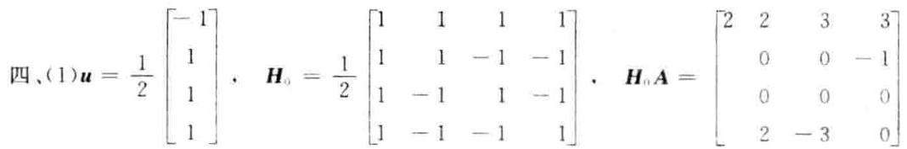

(2) ${\mathbf{A}}_{1} = \left\lbrack  \begin{array}{rrr} 0 & 0 &  - 1 \\  0 & 0 & 0 \\  2 &  - 3 & 0 \end{array}\right\rbrack  ,\;\mathbf{u} = \frac{1}{\sqrt{2}}\left\lbrack  \begin{array}{l}  - 1 \\  0 \\  1 \end{array}\right\rbrack  ,\;{\mathbf{H}}_{1} = \left\lbrack  \begin{array}{ll} 1 & 1 \\  1 & 1 \\  1 &  \end{array}\right\rbrack  ,\;{\mathbf{H}}_{1}{\mathbf{A}}_{1} = \left\lbrack  \begin{array}{rrr} 2 &  - 3 & 0 \\  0 & 0 & 0 \\  0 & 0 &  - 1 \end{array}\right\rbrack$

令

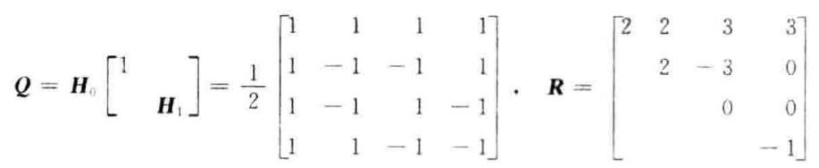

则有 $\mathbf{A} = \mathbf{{QR}}$ .

五、 $\mathbf{A}$ 的 ${4}^{ \circ  }$ 个盖尔圆为

$$
{G}_{1} : \left| {z + 9}\right|  \leq  {2.2},\;{G}_{2} : \left| {z + 3}\right|  \leq  {4.1},\;{G}_{3} : \left| {z - 5}\right|  \leq  {1.4},\;{G}_{4} : \left| {z - 2}\right|  \leq  1
$$

易见 ${G}_{3}$ 孤立,而 ${G}_{1},{G}_{2},{G}_{4}$ 相交. 取 $\mathbf{D} = \operatorname{diag}\left( {1,1,\frac{5}{4},1}\right)$ ,则

$$
\mathbf{B} = {\mathbf{{DAD}}}^{-1} = \left\lbrack  \begin{array}{rrrr}  - 9 & 0 &  - {0.8} & {1.2} \\  {1.1} &  - 3 &  - {0.8} & 2 \\  0 &  - {1.75} & 5 & 0 \\  {0.3} &  - {0.7} & 0 & 2 \end{array}\right\rbrack
$$

的 4 个孤立盖尔圆为

$$
{G}_{1}^{\prime } : \left| {z + 9}\right|  \leq  2,\;{G}_{2}^{\prime } : \left| {z + 3}\right|  \leq  {3.9},\;{G}_{3}^{\prime } : \left| {z - 5}\right|  \leq  {1.75},\;{G}_{4}^{\prime } : \left| {z - 2}\right|  \leq  1
$$

其中各含 $\mathbf{B}$ 的一个特征值,故 ${G}_{1}^{\prime },{G}_{2}^{\prime },{G}_{3},{G}_{4}^{\prime }$ 中各含 $\mathbf{A}$ 的一个特征值.

[注] 放大 ${G}_{3}$ 时,可取 ${d}_{3} = {1.2} \sim  {1.4}$ ; 缩小 ${G}_{2}$ 时,可取 ${d}_{2} = {0.8} \sim  {0.9}$ .

六、1. A. $\frac{\text{ 行 }}{}$ 、 $\left\lbrack  \begin{array}{rrrr} 1 & 0 &  - 2 &  - 1 \\  0 & 1 & 2 & 2 \\  0 & 0 & 0 & 0 \\  0 & 0 & 0 & 0 \end{array}\right\rbrack$ , $\;\mathbf{F} = \left\lbrack  \begin{array}{ll} 1 & 1 \\  0 & 1 \\  2 & 2 \\  0 & 3 \end{array}\right\rbrack$

$$
\mathbf{G} = \left\lbrack  \begin{array}{rrrr} 1 & 0 &  - 2 &  - 1 \\  0 & 1 & 2 & 2 \end{array}\right\rbrack  ,\;\mathbf{A} = \mathbf{F}\mathbf{G}
$$

2. 根据公式计算

$$
{\mathbf{F}}^{ + } = {\left( {\mathbf{F}}^{\mathrm{T}}\mathbf{F}\right) }^{-1}{\mathbf{F}}^{\mathrm{T}} = {\left\lbrack  \begin{array}{rr} 5 & 5 \\  5 & {15} \end{array}\right\rbrack  }^{-1}{\mathbf{F}}^{\mathrm{T}} = \frac{1}{10}\left\lbrack  \begin{array}{rrrr} 2 &  - 1 & 4 &  - 3 \\  0 & 1 & 0 & 3 \end{array}\right\rbrack
$$

$$
{\mathbf{G}}^{ + } = {\mathbf{G}}^{\mathrm{T}}{\left( \mathbf{G}{\mathbf{G}}^{\mathrm{T}}\right) }^{-1} = {\mathbf{G}}^{\mathrm{T}}{\left\lbrack  \begin{array}{rr} 6 &  - 6 \\   - 6 & 9 \end{array}\right\rbrack  }^{-1} = \frac{1}{6}\left\lbrack  \begin{array}{rr} 3 & 2 \\  2 & 2 \\   - 2 & 0 \\  1 & 2 \end{array}\right\rbrack
$$

$$
{\mathbf{A}}^{ + } = {\mathbf{G}}^{ + }{\mathbf{F}}^{ + } = \frac{1}{60}\left\lbrack  \begin{array}{rrrr} 6 &  - 1 & {12} &  - 3 \\  4 & 0 & 8 & 0 \\   - 4 & 2 &  - 8 & 6 \\  2 & 1 & 4 & 3 \end{array}\right\rbrack
$$

$3 \sim  4.{\mathbf{x}}_{0} = {\mathbf{A}}^{ + }\mathbf{b} = \frac{1}{6}\left\lbrack  \begin{array}{r}  - 1 \\  0 \\  2 \\  1 \end{array}\right\rbrack$ . 因为 $\mathbf{A}{\mathbf{A}}^{ + }\mathbf{b} = \mathbf{A}{\mathbf{x}}_{0} = \frac{1}{6}\left\lbrack  \begin{array}{l} 0 \\  6 \\  0 \\  {18} \end{array}\right\rbrack   = \mathbf{b}$ ,所以 $\mathbf{A}\mathbf{x} = \mathbf{b}$ 有解,故 ${\mathbf{x}}_{0}$ 是 $\mathbf{A}\mathbf{x} = \mathbf{b}$ 的极小范数解.

七、1. 设 $\left( {{\mathbf{y}}_{1},{\mathbf{y}}_{2},{\mathbf{y}}_{3},{\mathbf{y}}_{4}}\right)  = \left( {{\mathbf{x}}_{1},{\mathbf{x}}_{2},{\mathbf{x}}_{3},{\mathbf{x}}_{4}}\right) {\mathbf{C}}_{1}$ ,则有

$$
\left( {T\left( {\mathbf{y}}_{1}\right) , T\left( {\mathbf{y}}_{2}\right) , T\left( {\mathbf{y}}_{3}\right) , T\left( {\mathbf{y}}_{4}\right) }\right)  = \left( {{\mathbf{x}}_{1},{\mathbf{x}}_{2},{\mathbf{x}}_{3},{\mathbf{x}}_{4}}\right) {\mathbf{C}}_{2}
$$

$$
\left( {T\left( {\mathbf{y}}_{1}\right) , T\left( {\mathbf{y}}_{2}\right) , T\left( {\mathbf{y}}_{3}\right) , T\left( {\mathbf{y}}_{4}\right) }\right)  = \left( {{\mathbf{y}}_{1},{\mathbf{y}}_{2},{\mathbf{y}}_{3},{\mathbf{y}}_{4}}\right) {\mathbf{C}}_{1}^{-1}{\mathbf{C}}_{2}
$$

其中

$$
{\mathbf{C}}_{1} = \left\lbrack  \begin{array}{llll} 1 & 1 & 1 & 1 \\   & 1 & 1 & 1 \\   & & 1 & 1 \\   & & & 1 \end{array}\right\rbrack  ,\;{\mathbf{C}}_{2} = \left\lbrack  \begin{array}{rrrr} 1 & 0 & 1 & 1 \\  0 & 1 & 1 &  - 1 \\  0 & 1 & 1 &  - 1 \\  1 & 0 & 1 & 1 \end{array}\right\rbrack  ,\;\mathbf{A} = {\mathbf{C}}_{1}^{-1}{\mathbf{C}}_{2} = \left\lbrack  \begin{array}{rrrr} 1 &  - 1 & 0 & 2 \\  0 & 0 & 0 & 0 \\   - 1 & 1 & 0 &  - 2 \\  1 & 0 & 1 & 1 \end{array}\right\rbrack
$$

2. 因为 $\operatorname{rank}\left( \mathbf{A}\right)  = 2$ ,所以 $\operatorname{rank}\left( T\right)  = 2.\mathbf{A}$ 的前两列线性无关,所以 $T\left( {\mathbf{y}}_{1}\right) , T\left( {\mathbf{y}}_{2}\right)$ 线性无关,故 $T\left( {\mathbf{y}}_{1}\right)$ , $T\left( {\mathbf{y}}_{2}\right)$ 是 $R\left( T\right)$ 的一个基.

3. 设 $\mathbf{y}$ 在基 ${\mathbf{y}}_{1},{\mathbf{y}}_{2},{\mathbf{y}}_{3},{\mathbf{y}}_{4}$ 下的坐标为 $\mathbf{\alpha }$ ,那么

$$
T\left( \mathbf{y}\right)  = \mathbf{y} \Leftrightarrow  \mathbf{A}\mathbf{a} = \mathbf{a} \Leftrightarrow  \left( {\mathbf{A} - \mathbf{I}}\right) \mathbf{a} = \mathbf{0}
$$

上式的通解为 $\mathbf{\alpha } = k{\left( -1,0,1,0\right) }^{\mathrm{T}}$ ( $k$ 为任意常数),满足 $T\left( \mathbf{y}\right)  = \mathbf{y}$ 的全体元素为

$$
\mathbf{y} = k\left( {-{\mathbf{y}}_{1} + {\mathbf{y}}_{3}}\right)  = k\left( {{\mathbf{x}}_{2} + {\mathbf{x}}_{3}}\right) \;\left( {k\text{ 为任意常数 }}\right)
$$

八、分析: 只要能够确定可逆矩阵 $\mathbf{C}$ . 使得 ${\mathbf{C}}^{\mathrm{T}}\mathbf{{AC}} = \mathbf{I}$ 即可.

证法 1. 因为 $\mathbf{A}$ 对称正定,所以存在正交矩阵 $\mathbf{Q}$ ,使得

$$
{\mathbf{Q}}^{\top }\mathbf{A}\mathbf{Q} = \operatorname{diag}\left( {{\lambda }_{1},{\lambda }_{2},\cdots ,{\lambda }_{n}}\right)
$$

其中 ${\lambda }_{i}\left( {i = 1,2,\cdots , n}\right)$ 是 $\mathbf{A}$ 的特征值,它们都是正数. 记

$$
\mathbf{D} = \operatorname{diag}\left( {\sqrt{{\lambda }_{1}},\sqrt{{\lambda }_{2}},\cdots ,\sqrt{{\lambda }_{n}}}\right)
$$

则有

$$
\mathbf{A} = {\mathbf{{QD}}}^{2}{\mathbf{Q}}^{\mathrm{T}} = \left( \mathbf{{QD}}\right) \left( {\mathbf{{DQ}}}^{\mathrm{T}}\right)  = {\left( {\mathbf{{DQ}}}^{\mathrm{T}}\right) }^{\mathrm{T}}\left( {\mathbf{{DQ}}}^{\mathrm{T}}\right)
$$

令 $\mathbf{C} = {\left( \mathbf{D}{\mathbf{Q}}^{\mathrm{T}}\right) }^{-1}$ ,则 $\mathbf{C}$ 为可逆矩阵,且有

$$
{\mathbf{C}}^{\mathrm{T}}\mathbf{{AC}} = {\mathbf{C}}^{\mathrm{T}} \cdot  {\left( {\mathbf{C}}^{-1}\right) }^{\mathrm{T}}{\mathbf{C}}^{-1} \cdot  \mathbf{C} = \mathbf{I}
$$

此时,基 ${\mathbf{y}}_{1},{\mathbf{y}}_{2},\cdots ,{\mathbf{y}}_{n}$ 的度量矩阵 ${\mathbf{C}}^{\mathrm{T}}\mathbf{A}\mathbf{C} = \mathbf{I}$ ,从而是 ${V}^{n}$ 的一个标准正交基.

证法 2. 因为 $\mathbf{A}$ 对称正定,所以可对 $\mathbf{A}$ 进行三角分解 (Cholesky 分解),即

$$
\mathbf{A} = \mathbf{L}{\mathbf{L}}^{\top }\text{ ( }\mathbf{L}\text{ 为可逆下三角矩阵) }
$$

令 $\mathbf{C} = {\left( {\mathbf{L}}^{\mathrm{T}}\right) }^{-1}$ ,则 $\mathbf{C}$ 为可逆矩阵,且有

$$
{\mathbf{C}}^{\top }\mathbf{A}\mathbf{C} = {\mathbf{L}}^{-1} \cdot  {\mathbf{L}}^{\top } \cdot  {\left( {\mathbf{L}}^{\top }\right) }^{-1} = \mathbf{I}
$$

此时,基 ${\mathbf{y}}_{1},{\mathbf{y}}_{2},\cdots ,{\mathbf{y}}_{n}$ 的度量矩阵 ${\mathbf{C}}^{\mathrm{T}}\mathbf{{AC}} = \mathbf{I}$ ,从而是 ${V}^{n}$ 的一个标准正交基.

## 试题十八 (2013 年 A 卷)

一、(15 分) 填空:

1. 矩阵 $\mathbf{A} = \left\lbrack  \begin{array}{rrrr} 1 & 2 & 4 & 2 \\  1 & 0 & 2 & 1 \\   - 2 &  - 2 &  - 5 &  - 2 \\  1 & 1 & 2 & 0 \end{array}\right\rbrack$ 的 Jordan 标准形为 $\mathbf{J} = \left\lbrack  \begin{array}{lll}  & & \\   & &  \end{array}\right\rbrack$ .

2. 设 $\mathbf{A}$ 是 $n$ 阶酉矩阵, $\mathbf{x} = {\left( 1,2,\cdots , n\right) }^{T}$ ,则

$$
\parallel \mathbf{A}{\parallel }_{F} = \left( \;\right) ,\;\parallel \mathbf{A}{\parallel }_{2} = \left( \;\right) ,\;\parallel \mathbf{{Ax}}{\parallel }_{2} = \left( \;\right)
$$

3. 已知 $\mathbf{A}$ 的奇异值分解为 $\mathbf{A} = \mathbf{U}{\left\lbrack  \begin{array}{ll} \mathbf{\sum } & \mathbf{O} \\  \mathbf{O} & \mathbf{O} \end{array}\right\rbrack  }_{m \times  n}\mathbf{V}$ ,其中 $\mathbf{\sum } = \operatorname{diag}\left( {{\sigma }_{1},{\sigma }_{2},\cdots ,{\sigma }_{r}}\right)$ ,且 ${\sigma }_{i}\left( {i = 1,2,\cdots , r}\right)$ 为 $\mathbf{A}$ 的非零奇异值, $\mathbf{U}$ 是 $m$ 阶酉矩阵, $\mathbf{V}$ 是 $n$ 阶酉矩阵,则 $\mathbf{A}$ 的 Moore-Penrose 逆 ${\mathbf{A}}^{ + } =$ (   ).

4. 设 $m$ 阶矩阵 $\mathbf{A}$ 的特征值为 ${\lambda }_{1},{\lambda }_{2},\cdots ,{\lambda }_{m}, n$ 阶矩阵 $\mathbf{B}$ 的特征值为 ${\mu }_{1},{\mu }_{2},\cdots ,{\mu }_{n}$ ,则矩阵方程 $\mathbf{A}\mathbf{X}\mathbf{B} + 2\mathbf{X} = \; \mathbf{F}$ 存在唯一解的充要条件是( ).

5. 设 $n$ 维欧氏空间 $V$ 的线性变换 $T$ 既是正交变换,又是对称变换,则 ${T}^{2}$ 在 $V$ 的标准正交基 ${\mathbf{\xi }}_{1},{\mathbf{\xi }}_{2},\cdots ,{\mathbf{\xi }}_{n}$ 下的矩阵为( ).

二、(10 分) 设矩阵 $\mathbf{A} \in  {\mathbf{C}}^{m \times  n}$ ,则向量 $\mathbf{x} \in  {\mathbf{C}}^{n}$ ,对于 ${\mathbf{C}}^{m \times  n}$ 上的矩阵范数 $\parallel \mathbf{A}{\parallel }_{{m}_{1}}$ 和 $\parallel \mathbf{A}\parallel$ ,定义实值函数 $\parallel \mathbf{A}\parallel  = \max \left\{  {\parallel \mathbf{A}{\parallel }_{{m}_{1}},\parallel \mathbf{A}{\parallel }_{\infty }}\right\}$ ,证明 $\parallel \mathbf{A}\parallel$ 是 ${\mathbf{C}}^{m \times  n}$ 上的矩阵范数,且该矩阵范数与向量的 $\infty$ -范数相容.

三、(15 分) 已知 $\mathbf{A} = \left\lbrack  \begin{array}{rrr} 3 &  - 2 & 3 \\  1 & 0 & 3 \\   - 1 & 2 &  - 1 \end{array}\right\rbrack  ,\mathbf{b}\left( t\right)  = {\mathrm{e}}^{2t}\left\lbrack  \begin{array}{r}  - 2 \\   - 1 \\  0 \end{array}\right\rbrack  ,\mathbf{x}\left( 0\right)  = \left\lbrack  \begin{array}{r}  - 1 \\   - 1 \\  1 \end{array}\right\rbrack$ .

1. 求 ${\mathrm{e}}^{At}$ ;

2. 用矩阵函数方法求微分方程 $\frac{\mathrm{d}}{\mathrm{d}t}\mathbf{x}\left( t\right)  = \mathbf{A}\mathbf{x}\left( t\right)  + \mathbf{b}\left( t\right)$ 满足初始条件 $\mathbf{x}\left( 0\right)$ 的解.

四、(10 分) 用 Givens 变换求矩阵 $\mathbf{A} = \left\lbrack  \begin{array}{rrrr} 4 & 0 & 1 & 3 \\  0 & 0 &  - 4 & 5 \\  3 & 0 &  - 3 &  - 4 \\  0 & 6 & 2 & 4 \end{array}\right\rbrack$ 的 QR 分解.

五、(10 分) 用 Gerschgorin 定理隔离矩阵 $\mathbf{A} = \left\lbrack  \begin{array}{rrrr}  - 2 & 2 & {0.5} & 0 \\   - {0.25} &  - 1 & 0 & 0 \\  {0.5} &  - 2 & 2 & 0 \\  0 & 2 & 0 &  - 3\mathrm{i} \end{array}\right\rbrack  \left( {\mathrm{i} = \sqrt{-1}}\right)$ 的特征值 (要求画图表示).

六、(15 分) 已知 $\mathbf{A} = \left\lbrack  \begin{array}{rrrr} 1 &  - 1 &  - 1 & 1 \\   - 1 & 2 & 0 &  - 2 \\   - 1 & 0 & 2 & 0 \end{array}\right\rbrack  ,\;\mathbf{b} = \left\lbrack  \begin{array}{r}  - 1 \\  4 \\   - 2 \end{array}\right\rbrack$ .

1. 求 $\mathbf{A}$ 的满秩分解;

2. 求 ${\mathbf{A}}^{ + }$ ;

3. 用广义逆矩阵方法判断线性方程组 $\mathbf{A}\mathbf{x} = \mathbf{b}$ 是否有解；

4. 求线性方程组 $\mathbf{A}\mathbf{x} = \mathbf{b}$ 的极小范数解,或者极小范数最小二乘解 ${\mathbf{x}}_{0}$ . (要求指出 ${\mathbf{x}}_{0}$ 是哪种解)

七、(15 分) 设多项式空间 ${P}_{3}\left\lbrack  t\right\rbrack$ 中的线性变换为

$$
T\left( {{a}_{0} + {a}_{1}t + {a}_{2}{t}^{2} + {a}_{3}{t}^{3}}\right)  = \left( {{a}_{1} + {a}_{2}}\right)  + \left( {{a}_{1} + {a}_{2}}\right) t + 2\left( {{a}_{0} + {a}_{3}}\right) {t}^{3}
$$

求 ${P}_{3}\left\lbrack  t\right\rbrack$ 的一个基. 使 $T$ 在该基下的矩阵为对角矩阵.

八、(10 分) 设线性空间 ${V}^{n}$ 中的线性变换 $T$ 满足 ${T}^{2} =  - T, R\left( T\right)$ 表示 $T$ 的值域, $N\left( T\right)$ 表示 $T$ 的核,证明:

1. $R\left( T\right)  \cap  N\left( T\right)  = \{ \mathbf{0}\}$ ;

2. ${V}^{n} = R\left( T\right)  \oplus  N\left( T\right)$ ,即 ${V}^{n}$ 可分解为子空间 $R\left( T\right)$ 与 $N\left( T\right)$ 的直和.

## 试题十八解答

$- ,1.\mathbf{J} = \left\lbrack  \begin{array}{rrrr}  - 1 & 0 & 0 & 0 \\  0 &  - 1 & 0 & 0 \\  0 & 0 &  - 1 & 1 \\  0 & 0 & 0 &  - 1 \end{array}\right\rbrack  ;$

2. $\sqrt{n},1,\sqrt{\frac{n\left( {n + 1}\right) \left( {{2n} + 1}\right) }{6}} : 3.{\mathbf{A}}^{ + } = {\mathbf{V}}^{\mathrm{H}}{\left\lbrack  \begin{matrix} {\mathbf{\sum }}^{-1} & \mathbf{O} \\  \mathbf{O} & \mathbf{O} \end{matrix}\right\rbrack  }_{n \times  m}{\mathbf{U}}^{\mathrm{H}}$ ;

4. ${\lambda }_{i}{\mu }_{j} \neq   - 2\left( {i = 1,2,\cdots , m;j = 1,2,\cdots , n}\right) ;\;5.{\mathbf{I}}_{n}$ .

二、相容性. $\parallel \mathbf{A}\mathbf{x}{\parallel }_{\infty } \leq  \parallel \mathbf{A}{\parallel }_{\infty } \cdot  \parallel \mathbf{x}{\parallel }_{\infty } \leq  \max \left\{  {\parallel \mathbf{A}{\parallel }_{{m}_{1}},\parallel \mathbf{A}{\parallel }_{\infty }}\right\}   \cdot  \parallel \mathbf{x}{\parallel }_{\infty } = \parallel \mathbf{A}\parallel  \cdot  \parallel \mathbf{x}{\parallel }_{\infty }$ 三、1. $\varphi \left( \lambda \right)  = {\left( \lambda  - 2\right) }^{2}\left( {\lambda  + 2}\right) , m\left( \lambda \right)  = \left( {\lambda  - 2}\right) \left( {\lambda  + 2}\right)$ . 设 $r\left( \lambda \right)  = a + {b\lambda }$ ,则有

$$
\left\{  {\begin{array}{l} r\left( 2\right)  = a + {2b} = {\mathrm{e}}^{2t} \\  r\left( {-2}\right)  = a - {2b} = {\mathrm{e}}^{-{2t}} \end{array},\;\left\{  \begin{array}{l} a = \left( {{\mathrm{e}}^{2t} + {\mathrm{e}}^{-{2t}}}\right) /2 \\  b = \left( {{\mathrm{e}}^{2t} - {\mathrm{e}}^{-{2t}}}\right) /4 \end{array}\right. }\right.
$$

$$
{\mathrm{e}}^{At} = a\mathbf{I} + b\mathbf{A} = \frac{{\mathrm{e}}^{2t}}{4}\left\lbrack  \begin{array}{rrr} 5 &  - 2 & 3 \\  1 & 2 & 3 \\   - 1 & 2 & 1 \end{array}\right\rbrack   + \frac{{\mathrm{e}}^{-{2t}}}{4}\left\lbrack  \begin{array}{rrr}  - 1 & 2 &  - 3 \\   - 1 & 2 &  - 3 \\  1 &  - 2 & 3 \end{array}\right\rbrack
$$

2. ${\mathrm{e}}^{-{A\tau }}\mathbf{b}\left( \tau \right)  = \left\lbrack  \begin{array}{r}  - 2 \\   - 1 \\  0 \end{array}\right\rbrack  ,\;\mathbf{x}\left( t\right)  = {\mathrm{e}}^{-{2t}}\left\lbrack  \begin{array}{r}  - 1 \\   - 1 \\  1 \end{array}\right\rbrack   + t{\mathrm{e}}^{2t}\left\lbrack  \begin{array}{r}  - 2 \\   - 1 \\  0 \end{array}\right\rbrack$ .

四、(1) 取 ${c}_{1} = \frac{4}{5},{s}_{1} = \frac{3}{5}$ ,则

$$
{\mathbf{T}}_{13} = \left\lbrack  \begin{array}{rrrr} \frac{4}{5} & 0 & \frac{3}{5} & 0 \\  0 & 1 & 0 & 0 \\   - \frac{3}{5} & 0 & \frac{4}{5} & 0 \\  0 & 0 & 0 & 1 \end{array}\right\rbrack  ,\;{\mathbf{T}}_{13}\mathbf{A} = \left\lbrack  \begin{array}{rrrr} 5 & 0 &  - 1 & 0 \\  0 & 0 &  - 4 & 5 \\  0 & 0 &  - 3 &  - 5 \\  0 & 6 & 2 & 4 \end{array}\right\rbrack
$$

(2) 取 ${c}_{2} = 0,{s}_{2} = 1$ ,则

$$
{\mathbf{T}}_{24} = \left\lbrack  \begin{array}{rrrr} 1 & 0 & 0 & 0 \\  0 & 0 & 0 & 1 \\  0 & 0 & 1 & 0 \\  0 &  - 1 & 0 & 0 \end{array}\right\rbrack  ,\;{\mathbf{T}}_{24}{\mathbf{T}}_{13}\mathbf{A} = \left\lbrack  \begin{array}{rrrr} 5 & 0 &  - 1 & 0 \\  0 & 6 & 2 & 4 \\  0 & 0 &  - 3 &  - 5 \\  0 & 0 & 4 &  - 5 \end{array}\right\rbrack
$$

(3) 取 ${c}_{3} =  - \frac{3}{5},{s}_{3} = \frac{4}{5}$ ,则

$$
{\mathbf{T}}_{34} = \left\lbrack  \begin{array}{rrrr} 1 & 0 & 0 & 0 \\  0 & 1 & 0 & 0 \\  0 & 0 &  - \frac{3}{5} & \frac{4}{5} \\  0 & 0 &  - \frac{4}{5} &  - \frac{3}{5} \end{array}\right\rbrack  ,\;{\mathbf{T}}_{34}{\mathbf{T}}_{24}{\mathbf{T}}_{13}\mathbf{A} = \left\lbrack  \begin{array}{rrrr} 5 & 0 &  - 1 & 0 \\  0 & 6 & 2 & 4 \\  0 & 0 & 5 &  - 1 \\  0 & 0 & 0 & 7 \end{array}\right\rbrack   = \mathbf{R}
$$

$$
\mathbf{Q} = {\left( {\mathbf{T}}_{34}{\mathbf{T}}_{24}{\mathbf{T}}_{13}\right) }^{\top } = \frac{1}{25}\left\lbrack  \begin{array}{rrrr} {20} & 0 & 9 & {12} \\  0 & 0 &  - {20} & {15} \\  {15} & 0 &  - {12} &  - {16} \\  0 & {25} & 0 & 0 \end{array}\right\rbrack  ,\;A = {QR}.
$$

五、 $\mathbf{A}$ 的 4 个盖尔圆为

$$
{G}_{1} : \left| {z + 2}\right|  \leq  {2.5},\;{G}_{2} : \left| {z + \mathrm{i}}\right|  \leq  {0.25},\;{G}_{3} : \left| {z - 2}\right|  \leq  {2.5},\;{G}_{1} : \left| {z + 3\mathrm{i}}\right|  \leq  2
$$

它们构成一个连通部分 (参见示意图).

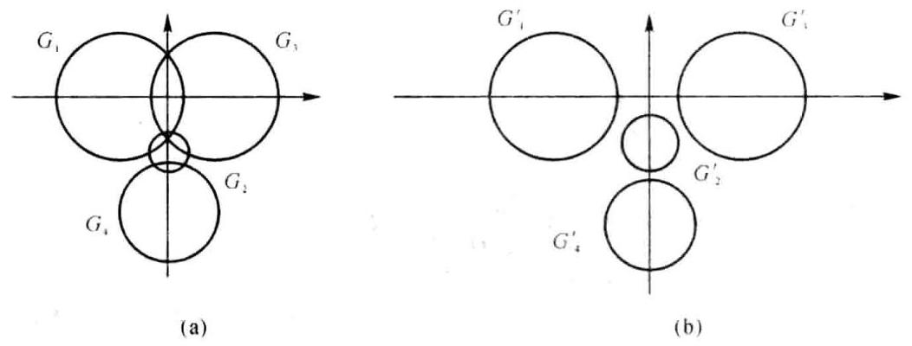

图题 18-1

取 $\mathbf{D} = \operatorname{diag}\{ 1,{2.1},1\}$ (放大 ${G}_{2} :$ 可取 ${d}_{2} = 2 \sim  5$ ),则

$$
\mathbf{B} = {\mathbf{{DAD}}}^{-1} = \left\lbrack  \begin{array}{rrrr}  - 2 & 1 & {0.5} & 0 \\   - {0.5} &  - \mathrm{i} & 0 & 0 \\  {0.5} &  - 1 & 2 & 0 \\  0 & 1 & 0 &  - 3\mathrm{i} \end{array}\right\rbrack
$$

的 4 个盖尔圆为

$$
{G}_{1}^{\prime } : \left| {z + 2}\right|  \leq  {1.5},\;{G}_{2}^{\prime } : \left| {z + \mathrm{i}}\right|  \leq  {0.5},\;{G}_{3}^{\prime } : \left| {z - 2}\right|  \leq  {1.5},\;{G}_{4}^{\prime } : \left| {z + 3\mathrm{i}}\right|  \leq  1
$$

相邻盖尔圆的中心距与半径和如下(参见示意图):

<table><tr><td>相邻盖尔圆</td><td>${G}_{2}^{\prime } \rightarrow  {G}_{1}^{\prime }$</td><td>${G}_{2}^{\prime } \rightarrow  {G}_{3}^{\prime }$</td><td>${G}_{2}^{\prime } \rightarrow  {G}_{1}^{\prime }$</td><td>${G}_{1}^{\prime } \rightarrow  {G}_{3}^{\prime }$</td><td>${G}_{1}^{\prime } \rightarrow  {G}_{1}^{\prime }$</td><td>${G}_{3}^{\prime } \rightarrow  {G}_{3}^{\prime }$</td></tr><tr><td>中心距</td><td>$\sqrt{5}$</td><td>✓5</td><td>2</td><td>4</td><td>✓ 13</td><td>$\sqrt{13}$</td></tr><tr><td>半径和 $\left( {{d}_{2} = 2}\right)$</td><td>2</td><td>2</td><td>1.5</td><td>3</td><td>2.5</td><td>2.5</td></tr><tr><td>半径和 $\left( {{d}_{2} = 5}\right)$</td><td>2.15</td><td>2.15</td><td>1.65</td><td>1.8</td><td>1.3</td><td>1.3</td></tr></table>

易见， $\mathbf{B}$ 的 4 个盖尔圆孤立，其中各含 $\mathbf{A}$ 的一个特征值.

$$
\text{ 六、1. }\mathbf{A} = \mathbf{F}\mathbf{G},\;\mathbf{F} = \left\lbrack  \begin{array}{rr} 1 &  - 1 \\   - 1 & 2 \\   - 1 & 0 \end{array}\right\rbrack  ,\;\mathbf{G} = \left\lbrack  \begin{array}{rrrr} 1 & 0 &  - 2 & 0 \\  0 & 1 &  - 1 &  - 1 \end{array}\right\rbrack
$$

$$
\text{ 2. }{\mathbf{F}}^{ + } = \frac{1}{6}\left\lbrack  \begin{array}{rrr} 2 & 1 &  - 5 \\  0 & 3 &  - 3 \end{array}\right\rbrack  ,\;{\mathbf{G}}^{ + } = \frac{1}{11}\left\lbrack  \begin{array}{rr} 3 &  - 2 \\   - 2 & 5 \\   - 4 &  - 1 \\  2 &  - 5 \end{array}\right\rbrack
$$

$$
{\mathbf{A}}^{ + } = {\mathbf{G}}^{ + }{\mathbf{F}}^{ + } = \frac{1}{66}\left\lbrack  \begin{array}{rrr} 6 &  - 3 &  - 9 \\   - 4 & {13} &  - 5 \\   - 8 &  - 7 & {23} \\  4 &  - {13} & 5 \end{array}\right\rbrack
$$

$3 \sim  4.{\mathbf{x}}_{0} = {\mathbf{A}}^{ + }\mathbf{b} = {\left( 0,1, - 1, - 1\right) }^{\mathrm{T}}$ ,因为 $\mathbf{A}{\mathbf{A}}^{ + }\mathbf{b} = \mathbf{A}{\mathbf{x}}_{0} = \mathbf{b}$ ,所以 $\mathbf{A}\mathbf{x} = \mathbf{b}$ 有解,从而 ${\mathbf{x}}_{0}$ 是 $\mathbf{A}\mathbf{x} = \mathbf{b}$ 的极小范数解.

七、取简单基 $1, t,{t}^{2},{t}^{3}$ ,求得 $T$ 在该基下的矩阵为

$$
\mathbf{A} = \left\lbrack  \begin{array}{llll} 0 & 1 & 1 & 0 \\  0 & 1 & 1 & 0 \\  0 & 0 & 0 & 0 \\  2 & 0 & 0 & 2 \end{array}\right\rbrack
$$

求 $\mathbf{P}$ 使得 ${\mathbf{P}}^{-1}\mathbf{{AP}} = \mathbf{\Lambda }$ :

$$
\mathbf{\Lambda } = \left\lbrack  \begin{array}{llll} 0 & & & \\   & 0 & & \\   & & 1 & \\   & & & 2 \end{array}\right\rbrack  ,\;\mathbf{P} = \left\lbrack  \begin{array}{rrrr} 0 &  - 1 & 1 & 0 \\   - 1 & 0 & 1 & 0 \\  1 & 0 & 0 & 0 \\  0 & 1 &  - 2 & 1 \end{array}\right\rbrack
$$

由基变换公式 $\left( {{f}_{1}\left( t\right) ,{f}_{2}\left( t\right) ,{f}_{3}\left( t\right) ,{f}_{4}\left( t\right) }\right)  = \left( {1, t,{t}^{2},{t}^{3}}\right) \mathbf{P}$ 可得另一基

$$
{f}_{1}\left( t\right)  =  - t + {t}^{2},\;{f}_{2}\left( t\right)  =  - 1 + {t}^{3},\;{f}_{3}\left( t\right)  = 1 + t - 2{t}^{3},\;{f}_{4}\left( t\right)  = {t}^{3}
$$

$T$ 在基 ${f}_{1},{f}_{2},{f}_{3}$ 下的矩阵为 $\mathbf{\Lambda }$ .

八、1. 证 $R\left( T\right)  \cap  N\left( T\right)  = \{ \mathbf{0}\}$ : 任意 $\mathbf{\beta } \in  R\left( T\right)  \cap  N\left( T\right)$ ,有

$\mathbf{\beta } \in  R\left( T\right)$ ,存在 $\mathbf{\alpha } \in  {V}^{n}$ ,使得 $\mathbf{\beta } = T\mathbf{\alpha };\mathbf{\beta } \in  N\left( T\right) , T\mathbf{\beta } = \mathbf{0}$

因为 $\mathbf{\beta } = T\mathbf{\alpha } =  - {T}^{2}\mathbf{\alpha } =  - T\left( {T\mathbf{\alpha }}\right)  =  - T\mathbf{\beta } = \mathbf{0}$ ,所以 $R\left( T\right)  \cap  N\left( T\right)  = \{ \mathbf{0}\}$ .

2. 证 ${V}^{n} = R\left( T\right)  + N\left( T\right)$ :

证法一: 任意 $\mathbf{x} \in  {V}^{n}$ ,有 $\mathbf{x} =  - T\mathbf{x} + \left( {{T}_{e} + T}\right) \mathbf{x}$ . 因为

$$
\mathbf{y} =  - T\mathbf{x} = T\left( {-\mathbf{x}}\right)  \in  R\left( T\right) ,\;\mathbf{z} = \left( {{T}_{e} + T}\right) \mathbf{x} \in  N\left( T\right) \;\left( {T\mathbf{z} = \mathbf{0}}\right)
$$

所以 $x = y + z, y \in  R\left( T\right) , z \in  N\left( T\right)$ ,故 ${V}^{n} \subset  R\left( T\right)  + N\left( T\right)$ ; 因为 $R\left( T\right)  + N\left( T\right)  \subset  {V}^{n}$ (定理结论),所以 ${V}^{n} = R\left( T\right)  + N\left( T\right)$ .

证法二: 根据维数公式可得

$\dim \left\lbrack  {R\left( T\right)  + N\left( T\right) }\right\rbrack   = \dim R\left( T\right)  + \dim N\left( T\right)  - \dim \left\lbrack  {R\left( T\right)  \cap  N\left( T\right) }\right\rbrack   = \dim R\left( T\right)  + \dim N\left( T\right)  - 0 = n$

因为 $R\left( T\right)  + N\left( T\right)  \subset  {V}^{n}$ (定理结论),所以 ${V}^{n} = R\left( T\right)  + N\left( T\right)$ .

综上所述可得 ${V}^{n} = R\left( T\right)  \oplus  N\left( T\right)$ .

## 参考文献

[1] 程云鹏, 张凯院, 徐仲. 矩阵论. 4 版. 西安: 西北工业大学出版社, 2013

[2] 徐仲, 张凯院, 陆全等. 矩阵论简明教程. 2 版. 北京: 科学出版社, 2014

[3] 张凯院, 徐仲. 矩阵论. 北京:科学出版社, 2013.

[4] 戴华. 矩阵论. 北京:科学出版社, 2001

[5] 张凯院, 徐仲, 陆全. 矩阵论典型题解析及自测试题. 2 版. 西安:西北工业大学出版社，2003

[6] 张凯院, 徐仲. 矩阵论辅导讲案. 西安:西北工业大学出版社，2007