三导丛书

# 矩阵论 导教 $\cdot$ 导学 $\cdot$ 导考

张凯院 徐 仲 编

西北工業大学出版社

【内容简介】本书对矩阵论课程的基本概念、主要结论和常用方法做了简明扼要的分类总结, 对各章节的课后习题做了详细的解答。根据课程要求精选了适量的自测题, 并附有答案或提示。书后附录部分收编了 12 套近年来研究生矩阵论课程的考试试题和 3 套博士生入学考试试题,并做了详细的解答。

本书叙述简明, 概括性强, 可作为理、工科研究生和本科高年级学生学习矩阵论课程的辅导书, 也可供从事矩阵论教学工作的教师和有关科技工作者参考。

图书在版编目(CIP)数据

矩阵论 导教. 导学. 导考 张凯院, 徐仲编. 一西安: 西北工业大学出版社,2004.3

(三导丛书)

ISBN 7 - 5612 - 1736 - 6

I. 矩... II. ① 张... ②徐... Ⅲ. 矩阵一理论一高等学校一教学参考资料 IV.0151.21

中国版本图书馆 CIP 数据核字(2004)第 009606 号

出版发行:西北工业大学出版社

通信地址:西安市友谊西路 127 号 邮编:710072 电话:(029)88493844

网 址: www.nwpup.com

印 刷 者:陕西天元印务有限公司

开本: ${850}\mathrm{\;{mm}} \times  {1168}\mathrm{\;{mm}}\;1/{32}$

印 张: 8.5

字 数: 220 千字

版 次: 2004 年 3 月第 1 版 2004 年 3 月第 1 次印刷

印 数: $1 \sim  {6000}$ 册

定 价:12.00 元及参加博士生入学矩阵论课程考试的有关人员有很好的辅导作用, 对于从事矩阵论教学工作的教师也有一定的参考价值。

<table><tr><td></td><td>前言</td></tr><tr><td></td><td>矩阵论是高等学校和研究院、所面向研究生开设的一门数学基础课。作为数学的一个重要分支, 矩阵理论具有极为丰富的内容; 作为一种基本工具, 矩阵理论在数学学科以及其他科学技术领域都有非常广泛的应用。因此, 学习和掌握矩阵的基本理论与方法, 对于研究生来说是必不可少的。   矩阵论课程的理论性强, 概念比较抽象, 而且有独特的思维方式和解题技巧。读者在学习矩阵论课程时, 往往感到概念多、结论多、算法多, 对教学内容的全面理解也感到困难。为了配合课堂教学, 使研究生更好地掌握该门课程的教学内容, 我们编写了本书。   本书根据程云鹏等编的研究生教材《矩阵论》 (第 2 版) 的内容体系, 对矩阵论课程的基本概念、 主要结论和常用方法做了简明扼要的分类总结, 对各章节的课后习题做了详细的解答。根据课程要求精选了适量的自测题, 并附有答案或提示。附录部分收编了近年来西北工业大学研究生矩阵论课程 (60 学时) 的考试试题 12 套和博士生入学考试试题 3 套，并做了详细的解答。本书对于学习矩阵论课程的研究生以</td></tr></table>

本书由张凯院、徐仲共同编写，张凯院任主编。

限于水平, 书中疏漏和不妥之处在所难免, 敬请读者批评指正。

编 者 2003 年 12 月于西北工业大学

## 目 录

第一章 线性空间与线性变换 3

一、基本概念 3

二、主要结论 5

三、常用方法 9

四、内容结构框图 14

五、课后习题全解 15

六、学习效果测试题及答案 39

第二章 范数理论及其应用 44

一、基本概念 44

二、主要结论 46

三、常用方法 48

四、内容结构框图 49

五、课后习题全解 50

六、学习效果测试题及答案 56

第三章 矩阵分析及其应用 59

一、基本概念 59

二、主要结论 62

三、常用方法 66

四、内容结构框图 68

五、课后习题全解 69

六、学习效果测试题及答案 79

第四章 矩阵分解 83

一、基本概念 83

二、主要结论 84

三、常用方法 86

四、内容结构框图 93

五、课后习题全解 94

六、学习效果测试题及答案 109

第五章 特征值的估计及对称矩阵的极性 112

一、基本概念 112

二、主要结论 114

三、常用方法 116

四、内容结构框图 118

五、课后习题全解 119

六、学习效果测试题及答案 128

第六章 广义逆矩阵 131

一、基本概念 131

二、主要结论 133

三、常用方法 136

四、内容结构框图 138

五、课后习题全解 139

六、学习效果测试题及答案 161

附录 试题精解 164

试题 164

试题一解答 166

试题二 170

试题二解答 172

试题三 176

试题三解答 178

试题四 183

试题四解答 186

试题五 190

试题五解答 192

试题六 197

试题六解答 199

试题七 203

试题七解答 205

试题八 211

试题八解答 213

试题九 218

试题九解答 220

试题十 226

试题十解答 228

试题十 232

试题十一解答 234

试题十二 239

试题十二解答 242

试题十三 246

试题十三解答 248

试题十四 251

试题十四解答 253

试题十五 255

试题十五解答 257

参考文献 262

## 第一章 线性空间与线性变换

线性空间是向量空间的推广. 具体的线性空间多种多样, 其中的元素既可以是向量, 也可以是矩阵、多项式、函数等; 其中的线性运算既可以是通常的, 也可以是特殊的. 线性空间的核心内容是线性变换, 它反映了线性空间中元素之间的一种基本联系.

在有限维线性空间中, 借助于基的概念可在元素与列向量之间、 线性变换与方阵之间建立一一对应关系, 从而元素的运算能够转化为列向量的运算, 线性变换的运算能够转化为方阵的运算, 一般线性空间中的问题能够转化为列向量空间中的问题. 这种转化依赖于三类特殊的矩阵, 即两个基之间的过渡矩阵、线性变换在指定基下的矩阵、欧氏 (西) 空间中基的度量矩阵.

线性空间中的元素统称为向量, 加法运算和数乘运算也使用通常的运算符号.

## 一、基 本 概 念

1. 线性空间

线性空间指引进了加法运算和数乘运算且满足 8 条运算律的某个数域上的非空集合,通常用 $\mathrm{V}$ 表示 $\left( \mathrm{n}\right.$ 维线性空间记为 $\left. {\mathrm{V}}^{\mathrm{n}}\right)$ .

(1)实行向量空间 ${R}^{n} = \left\{  {\alpha  = \left( {{a}_{1},{a}_{2},\cdots ,{a}_{n}}\right)  \mid  {a}_{i} \in  R}\right\}$

实列向量空间 ${R}^{n} = \left\{  {\alpha  = {\left( {a}_{1},{a}_{2},\cdots ,{a}_{n}\right) }^{T} \mid  {a}_{i} \in  R}\right\}$

复行向量空间 ${C}^{n} = \left\{  {\alpha  = \left( {{a}_{1},{a}_{2},\cdots ,{a}_{n}}\right)  \mid  {a}_{i} \in  C}\right\}$

复列向量空间 ${C}^{n} = \left\{  {\alpha  = {\left( {a}_{1},{a}_{2},\cdots ,{a}_{n}\right) }^{T} \mid  {a}_{i} \in  C}\right\}$

(2)实矩阵空间 ${R}^{m \times  n} = \left\{  {A = {\left( {a}_{ij}\right) }_{m \times  n} \mid  {a}_{ij} \in  R}\right\}$

复矩阵空间 ${C}^{m \times  n} = \left\{  {A = {\left( {a}_{ij}\right) }_{m \times  n} \mid  {a}_{ij} \in  C}\right\}$

(3)实多项式空间

$$
{P}_{n}\left\lbrack  t\right\rbrack   = \left\{  {f\left( t\right)  = {a}_{0} + {a}_{1}t + \cdots  + {a}_{n}{t}^{n} \mid  {a}_{i} \in  R}\right\}
$$

复多项式空间

$$
{P}_{n}\left\lbrack  t\right\rbrack   = \left\{  {f\left( t\right)  = {a}_{0} + {a}_{1}t + \cdots  + {a}_{n}{t}^{n} \mid  {a}_{i} \in  C}\right\}
$$

2. 线性子空间

线性子空间指线性空间中对加法运算和数乘运算封闭的非空子集.

(1)生成子空间 $\operatorname{span}\left\{  {{X}_{1},{X}_{2},\cdots ,{X}_{m}}\right\}$ 或者 $L\left( {{X}_{1},{X}_{2},\cdots ,{X}_{m}}\right)$ : 设 $V$ 是数域 $\mathrm{K}$ 上的线性空间, ${\mathrm{X}}_{\mathrm{i}} \in  \mathrm{V}\left( {\mathrm{i} = 1,2,\cdots ,\mathrm{m}}\right)$ ,则

$$
\operatorname{span}\left\{  {{x}_{1},{x}_{2},\cdots ,{x}_{m}}\right\}   =
$$

$$
\{ x = {k}_{1}x + {k}_{2}{x}_{2} + \cdots  + {k}_{m{x}_{m}} \mid  {k}_{i} \in  K\}
$$

(2)矩阵的值域 $R\left( A\right)$ : 设 $A \in  {C}^{m \times  n}$ 的列向量组为 ${\beta }_{1},{\beta }_{2},\cdots ,{\beta }_{n}$ ， 则

$$
R\left( A\right)  = \operatorname{span}\left\{  {\beta ,\beta ,\cdots ,{\beta }_{n}}\right\}   = \left\{  {y = {Ax} \mid  x \in  {C}^{n}}\right\}
$$

(3)矩阵的零空间 $\mathrm{N}\left( \mathrm{A}\right)$ :设 $\mathrm{A} \in  {\mathrm{C}}^{\mathrm{m} \times  \mathrm{n}}$ ，则

$$
\mathrm{N}\left( \mathrm{A}\right)  = \left\{  {\mathrm{x} \mid  \mathrm{{Ax}} = 0,\mathrm{x} \in  {\mathrm{C}}^{\mathrm{n}}}\right\}
$$

(4)线性变换的值域 $\mathrm{R}\left( \mathrm{T}\right)$ :设 $\mathrm{T}$ 是线性空间 $\mathrm{V}$ 的线性变换，则

$$
R\left( T\right)  = \{ y = {Tx} \mid  x \in  V\}
$$

(5)线性变换的核 $\mathrm{N}\left( \mathrm{T}\right)$ :设 $\mathrm{T}$ 是线性空间 $\mathrm{V}$ 的线性变换，则

$$
N\left( T\right)  = \{ x \mid  {Tx} = 0, x \in  V\}
$$

(6)线性变换的特征子空间 ${V}_{\lambda }$ : 设 $\lambda$ 是线性空间 $V$ 中线性变换 $T$ 的一个特征值, 则

$$
{V}_{\lambda } = \{ x \mid  {Tx} = {\lambda x}, x \in  V\}
$$

3. 线性空间的基

线性空间的基指线性空间 $\mathrm{V}$ 中满足下列条件的向量组 ${\mathrm{X}}_{1},{\mathrm{X}}_{2}$ , $\cdots ,{\mathrm{X}}_{\mathrm{n}} : \text{ ① }{\mathrm{X}}_{1},{\mathrm{X}}_{2},\cdots ,{\mathrm{X}}_{\mathrm{n}}$ 线性无关; ② 任意 $\mathrm{X} \in  \mathrm{V}$ 都可由 ${\mathrm{X}}_{1},{\mathrm{X}}_{2},\cdots ,{\mathrm{X}}_{\mathrm{n}}$ 线性表示.

(1)向量空间 ${R}^{n}\left( {C}^{n}\right)$ 的简单基为 $e, e,\cdots ,{e}_{n}$ ,其中 $e$ 表示第 $i$ 个分量为 1,其余分量为 0 的 $\mathrm{n}$ 维向量.

(2)矩阵空间 ${\mathrm{R}}^{\mathrm{m} \times  \mathrm{n}}\left( {\mathrm{C}}^{\mathrm{m} \times  \mathrm{n}}\right)$ 的简单基为

$$
{\mathrm{E}}_{11},{\mathrm{E}}_{12},\cdots ,{\mathrm{E}}_{1\mathrm{n}},{\mathrm{E}}_{21},\cdots ,{\mathrm{E}}_{\mathrm{{mn}}}
$$

其中， ${\mathrm{E}}_{\mathrm{{ij}}}$ 表示第 $\mathrm{i}$ 行第 $\mathrm{j}$ 列元素为 1，其余元素为 0 的 $\mathrm{m} \times  \mathrm{n}$ 矩阵.

(3)多项式空间 ${P}_{n}\left\lbrack  t\right\rbrack$ 的简单基为 $1, t,\cdots ,{t}^{n}$ .

4. 两个基之间的过渡矩阵

过渡矩阵是以线性空间的一个基中各元素在另一个基下的坐标为列向量构成的方阵.

(1)表示方法: 已知线性空间 ${V}^{n}$ 的两个基为 $\left( I\right) {X}_{1},{X}_{2},\cdots ,{X}_{n}$ ; ( II ) ${y}_{1},{y}_{2},\cdots ,{y}_{n}$ . 设 ${y}_{j}$ 在基( I ) 下的坐标为 ${\beta }_{j}\left( {j = 1,2,\cdots , n}\right)$ ,则由基 $\left( \mathrm{I}\right)$ 改变为基 $\left( \mathrm{{II}}\right)$ 的过渡矩阵为 $\mathrm{C} = \left( {\beta ,\beta ,\cdots ,{\beta }_{n}}\right)$ ,基变换公式为

$$
\left( {{y}_{1},\cdots ,{y}_{n}}\right)  = \left( {{x}_{1},\cdots ,{x}_{n}}\right) C
$$

$$
\left( {{x}_{1},\cdots ,{x}_{n}}\right)  = \left( {{y}_{1},\cdots ,{y}_{n}}\right) {C}^{1}
$$

[评注] 一般地,上式中进行乘法运算时,只能将 ${x}_{i}$ 或者 ${y}_{j}$ 作为一个“数” 看待; 比较等号两端的对应 “分量” 时,亦将 ${x}_{i}$ 或者 ${y}_{j}$ 作为一个 “数” 看待.

(2)主要特征:两个基之间的过渡矩阵是可逆方阵，它的阶数等于线性空间的维数.

5. 元素的坐标

元素的坐标指元素由线性空间的基线性表示时, 表示式中的系数构成的列向量.

(1)表示方法: 设线性空间 ${V}^{n}$ 的一个基为 ${X}_{1},{X}_{2},\cdots ,{X}_{n}$ ,对于任意 $X \in  {V}^{n}$ ,有 $X = {a}_{1}{X}_{1} + {a}_{2}{X}_{2} + \cdots  + {a}_{n}{X}_{n}$ ,则 $X$ 在该基下的坐标为 ${\left( {a}_{1},{a}_{2},\cdots ,{a}_{n}\right) }^{T}.$

(2)主要特征:元素的坐标是列向量，它的维数等于线性空间的维数.

(3)运算转化:设数域 $\mathrm{K}$ 上的线性空间 ${\mathrm{V}}^{\mathrm{n}}$ 的一个基为 ${\mathrm{X}}_{1},{\mathrm{X}}_{2}$ ， $\cdots ,{X}_{n}$ ,且 $X, y \in  {V}^{n}$ 在该基下的坐标分别为 $\alpha  = {\left( {a}_{1},{a}_{2},\cdots ,{a}_{n}\right) }^{T}$ 和 $\beta  = {\left( \mathrm{b},\mathrm{b},\cdots ,{\mathrm{b}}_{\mathrm{n}}\right) }^{\mathrm{T}}$ ,则

1) $x + y$ 在该基下的坐标为 $\alpha  + \beta$ ;

2) $\mathrm{{kx}}$ 在该基下的坐标为 $\mathrm{k}\alpha \left( {\mathrm{k} \in  \mathrm{K}}\right)$ .

6. 线性变换的矩阵

线性变换的矩阵是以线性空间的基中各元素的像在该基下的坐标为列向量构成的方阵.

(1)表示方法: 设线性空间 ${V}^{n}$ 的一个基为 ${X}_{1},{X}_{2},\cdots ,{X}_{n}$ ,线性变换为 $T$ ,基像组 ${T}_{{X}_{1}},{T}_{{X}_{2}},\cdots ,{T}_{{X}_{n}}$ 在该基下的坐标依次为 ${\beta }_{1},{\beta }_{2},\cdots$ , ${\beta }_{n}$ ,则 $T$ 在该基下的矩阵为 $A = \left( {\beta ,\beta ,\cdots ,{\beta }_{n}}\right)$ ,且有

$$
T\left( {{x}_{1},{x}_{2},\cdots ,{x}_{n}}\right) \overset{\text{ def }}{ \Rightarrow  }\left( {T{x}_{1}, T{x}_{2},\cdots , T{x}_{n}}\right)  =
$$

$$
\left( {{x}_{1},{x}_{2},\cdots ,{x}_{n}}\right) A
$$

(2)主要特征:线性变换的矩阵是方阵，它的阶数等于线性空间的维数.

(3)运算转化: 设数域 $\mathrm{K}$ 上的线性空间 ${\mathrm{V}}^{\mathrm{n}}$ 的一个基为 ${\mathrm{X}}_{1},{\mathrm{X}}_{2}$ , $\cdots ,{\mathrm{X}}_{\mathrm{n}}$ ,线性变换 ${\mathrm{T}}_{1}$ 和 ${\mathrm{T}}_{2}$ 在该基下的矩阵分别为 $\mathrm{A}$ 和 $\mathrm{B}$ ,则

1) ${\mathrm{T}}_{1} + {\mathrm{T}}_{2}$ 在该基下的矩阵为 $\mathrm{A} + \mathrm{B}$ ;

2) ${\mathrm{{kT}}}_{1}$ 在该基下的矩阵为 $\mathrm{{kA}}\left( {\mathrm{k} \in  \mathrm{K}}\right)$ ;

3) ${\mathrm{T}}_{1}{\mathrm{\;T}}_{2}$ 在该基下的矩阵为 $\mathrm{{AB}}$ ;

4) ${\mathrm{T}}_{\mathrm{i}}^{1}$ 在该基下的矩阵为 ${\mathrm{A}}^{1}$ (若 ${\mathrm{T}}_{\mathrm{i}}$ 为可逆变换).

7. 基的度量矩阵

度量矩阵是以欧氏 (酉) 空间的基中第 $\mathrm{i}$ 个元素与第 $\mathrm{j}$ 个元素的内积为 $\mathrm{i}$ 行 $\mathrm{j}$ 列元素构成的方阵.

(1)表示方法: 设欧氏(酉)空间 ${V}^{n}$ 的一个基为 ${X}_{1},{X}_{2},\cdots ,{X}_{n}$ ,令 ${a}_{ij} = \left( {{x}_{i},{x}_{j}}\right) \left( {i, j = 1,2,\cdots , n}\right)$ ,则该基的度量矩阵为 $A = {\left( {a}_{ij}\right) }_{n \times  n}$ .

(2)主要特征:基的度量矩阵是实对称(Hermite)正定矩阵，它的阶数等于欧氏(酉)空间的维数.

(3) 运算转化: 设酉空间 ${V}^{n}$ 的一个基为 ${X}_{1},{X}_{2},\cdots ,{X}_{n}$ ,该基的度量矩阵为 $\mathrm{A},\mathrm{x},\mathrm{y} \in  {\mathrm{V}}^{\mathrm{n}}$ 在该基下的坐标 (列向量) 分别为 $\alpha$ 和 $\beta$ ,那么 $\mathrm{X}$ 与 $\mathrm{y}$ 的内积 $\left( {\mathrm{x},\mathrm{y}}\right)  = {\mathbf{\alpha }}^{\mathrm{T}}\mathbf{A}\overline{\mathbf{\beta }}$ . 当 ${\mathrm{V}}^{\mathrm{n}}$ 为欧氏空间时, $\left( {\mathrm{x},\mathrm{y}}\right)  = {\mathbf{\alpha }}^{\mathrm{T}}\mathbf{A}\mathbf{\beta }$ .

8. 标准正交基

标准正交基指欧氏(西)空间中由两两正交的单位向量构成的基.

(1)构造方法:对欧氏(酉)空间的一个基进行 Schmidt 正交化可得正交基，再对正交基进行单位化可得标准正交基.

(2)主要特征:正交基的度量矩阵是对角矩阵，标准正交基的度量矩阵是单位矩阵.

(3)运算转化:设欧氏(酉)空间 ${V}^{n}$ 的一个标准正交基为 ${x}_{1},{x}_{2}$ ， $\cdots ,{X}_{n}$ ,且 $X, y \in  {V}^{n}$ 在该基下的坐标分别为 $\alpha  = {\left( {a}_{1},{a}_{2},\cdots ,{a}_{n}\right) }^{T}$ 和 $\beta  = {\left( \mathrm{b},\mathrm{b},\cdots ,{\mathrm{b}}_{\mathrm{n}}\right) }^{\mathrm{T}}$ ,则

1) ${a}_{i} = \left( {x,{x}_{i}}\right) ,{b}_{i} = \left( {y,{x}_{i}}\right) \left( {i = 1,2,\cdots , n}\right)$ ;

2) $\left( {x, y}\right)  = {a}_{1}\bar{b} + {a}_{2}\bar{b} + \cdots  + {a}_{n}{\bar{b}}_{n} = \left( {\alpha ,\beta }\right)$ .

## 二、主要结论

1. 线性子空间

设 ${V}_{1}$ 和 ${V}_{2}$ 是线性空间 ${V}^{n}$ 的两个子空间,则有:

(1) ${V}_{1} \cap  {V}_{2}$ 和 ${V}_{1} + {V}_{2}$ 是 ${V}^{n}$ 的子空间.(2)

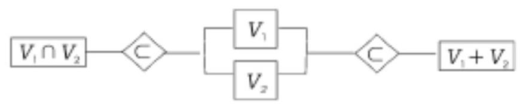

(3) $\dim \left( {{V}_{1} + {V}_{2}}\right)  = \dim {V}_{1} + \dim {V}_{2} - \dim \left( {{V}_{1} \cap  {V}_{2}}\right)$

(4)下面四种说法等价:

1) ${V}_{1} + {V}_{2}$ 是直和;

2) ${V}_{1} + {V}_{2}$ 中零元素的分解式惟一;

3) ${V}_{1} \cap  {V}_{2} = \{ 0\}$ ;

4) $\dim \left( {{V}_{1} + {V}_{2}}\right)  = \dim {V}_{1} + \dim {V}_{2}$ .

(5)若 ${V}_{1} + {V}_{2}$ 是直和，则将 ${V}_{1}$ 的基与 ${V}_{2}$ 的基拼接起来可构成 ${V}_{1} + {V}_{2}$ 的基.

(6)若 ${V}_{1} = L\left( {{x}_{1},{x}_{2},\cdots ,{x}_{m}}\right)$ ，则 ${x}_{1}$ ， ${x}_{2}$ ， $\cdots$ ， ${x}_{m}$ 的最大无关组是 ${\mathrm{V}}_{1}$ 的基.

(7) 若 ${\mathrm{V}}_{1} = \mathrm{L}\left( {{\mathrm{x}}_{1},{\mathrm{x}}_{2},\cdots ,{\mathrm{x}}_{\mathrm{m}}}\right) ,{\mathrm{V}}_{2} = \mathrm{L}\left( {{\mathrm{y}}_{1},{\mathrm{y}}_{2},\cdots ,{\mathrm{y}}_{l}}\right)$ ,则

$$
{V}_{1} + {V}_{2} = L\left( {{x}_{1},{x}_{2},\cdots ,{x}_{m},{y}_{1},{y}_{2},\cdots ,{y}_{l}}\right)
$$

(8)线性空间 ${V}^{n}$ 为欧氏(酉)空间时， ${V}^{n} = {V}_{1}$ i ${V}_{1}^{ \bot  }$ .

(9)设 $A \in  {C}^{m \times  n}$ ，则有

1) ${\left\lbrack  R\left( A\right) \right\rbrack  }^{ \bot  } = N\left( {A}^{H}\right)$ ,且 ${C}^{m} = R\left( A\right)$ i $N\left( {A}^{H}\right)$ ;

2) ${\left\lbrack  R\left( {A}^{H}\right) \right\rbrack  }^{ \bot  } = N\left( A\right)$ ,且 ${C}^{n} = R\left( {A}^{H}\right)$ i $N\left( A\right)$ .

(10)设 ${V}^{n}$ 的一个基为 ${X}_{1},{X}_{2},\cdots ,{X}_{n}$ ，则 ${V}^{n} = L\left( {{X}_{1},{X}_{2},\cdots ,{X}_{n}}\right)$ .

2. 向量组的线性关系

设线性空间 ${V}^{n}$ 的一个基为 ${x}_{1},{x}_{2},\cdots ,{x}_{n}$ ,且 $y,{y}_{j} \in  {V}^{n}$ 在该基下的坐标分别为 $\beta$ 和 ${\beta }_{\mathrm{j}}\left( {\mathrm{j} = 1,2,\cdots ,\mathrm{m}}\right)$ ，则有:

(1) $\mathrm{y}$ 可由 ${\mathrm{y}}_{1},{\mathrm{y}}_{2},\cdots ,{\mathrm{y}}_{\mathrm{m}}$ 线性表示的充要条件是 $\beta$ 可由 ${\beta }_{1},{\beta }_{2},\cdots$ , ${\beta }_{\mathrm{m}}$ 线性表示.

(2) ${\mathrm{y}}_{1}$ ， ${\mathrm{y}}_{2}$ ， $\cdots$ ， ${\mathrm{y}}_{\mathrm{m}}$ 线性相(无)关的充要条件是 $\beta$ ， $\beta$ ， $\cdots$ ， ${\beta }_{\mathrm{m}}$ 线性相(无) 关.

(3) ${y}_{{j}_{1}},\cdots ,{y}_{{j}_{r}}$ 为 ${y}_{1},{y}_{2},\cdots ,{y}_{m}$ 的最大无关组的充要条件是 ${\beta }_{{j}_{1}},\cdots ,{\beta }_{{j}_{r}}$ 为 ${\beta }_{1},{\beta }_{2},\cdots ,{\beta }_{m}$ 的最大无关组.

3. 坐标变换

设数域 $\mathrm{K}$ 上的线性空间 ${\mathrm{V}}^{\mathrm{n}}$ 的两个基分别为 $\left( \mathrm{I}\right) {\mathrm{X}}_{1},{\mathrm{X}}_{2},\cdots ,{\mathrm{X}}_{\mathrm{n}}$ 和 ( II ) ${y}_{1},{y}_{2},\cdots ,{y}_{n}$ ,且由基 ( I ) 改变为基 ( II ) 的过渡矩阵为 $C, x \in \; {V}^{n}$ 在基(I)和基(II)下的坐标(列向量)分别为 $\alpha$ 和 $\beta$ ，则有:

(1) $\alpha  = {C\beta },\beta  = {C}^{-1}\alpha$ .

(2)对于 $\lambda  \in  K$ ,存在 $x \neq  0$ 使得 $\alpha  = {\lambda \beta }$ 的充要条件是 ${C\beta } = \; {\lambda \beta }$ ,即 $\lambda$ 为 $C$ 的一个特征值.

4. 标准正交基

设欧氏空间 ${V}^{n}$ 的两个基分别为 $\left( I\right) {x}_{1},{x}_{2},\cdots ,{x}_{n}$ 和 $\left( {II}\right) {y}_{1}$ , ${y}_{2},\cdots ,{y}_{n}$ ,且由基 $\left( \mathrm{I}\right)$ 改变为基 $\left( \mathrm{{II}}\right)$ 的过渡矩阵为 $C$ ,基 $\left( \mathrm{I}\right)$ 的度量矩阵为 $\mathrm{A}$ ,基 ( $\mathrm{{II}}$ ) 的度量矩阵为 $\mathrm{B}$ ,则有:

(1) $\mathrm{B} = {\mathrm{C}}^{\mathrm{T}}\mathrm{{AC}}$ .

(2)基(I)是标准正交基的充要条件是 $\mathrm{A} = \mathrm{I}$ .

(3)若基(I)与基(II)都是标准正交基，则 C 是正交矩阵.

(4)若基(I)(或(II))是标准正交基，C 是正交矩阵，则基 ( II ) (或基( I )) 是标准正交基 .

5. 相似矩阵

(1) $\mathrm{A} \in  {\mathrm{C}}^{\mathrm{n} \times  \mathrm{n}}$ 相似于上(下)三角矩阵.

(2) $\mathrm{A} \in  {\mathrm{C}}^{\mathrm{n} \times  \mathrm{n}}$ 相似于 Jordan 标准形矩阵.

(3)A ∈ C ${}^{\mathrm{n} \times  \mathrm{n}}$ 西相似于上三角矩阵.

(4)设 $A \in  {C}^{n \times  n}$ ，则 ${A}^{H}A = A{A}^{H}$ 的充要条件是存在酉矩阵 $P$ ，使得 ${\mathrm{P}}^{\mathrm{H}}\mathrm{{AP}} = \Lambda$ (对角矩阵).

(5) 设 $\mathrm{A} \in  {\mathrm{R}}^{\mathrm{n} \times  \mathrm{n}}$ 的特征值都是实数,则 ${\mathrm{A}}^{\mathrm{T}}\mathrm{A} = \mathrm{A}{\mathrm{A}}^{\mathrm{T}}$ 的充要条件是存在正交矩阵 $\mathrm{Q}$ ,使得 ${\mathrm{Q}}^{\mathrm{T}}\mathrm{{AQ}} = \Lambda$ .

(6) 实对称矩阵正交相似于对角矩阵.

6. 方阵的最小多项式

(1)方阵是其特征多项式的矩阵根.

(2)方阵的最小多项式整除它的零化多项式.

(3)方阵的最小多项式与它的特征多项式有相同的零点(不计重数).

(4)设 $n$ 阶方阵 $A$ 的特征多项为 $\phi \left( \lambda \right)$ ，特征矩阵 ${\lambda I} - A$ 的 $n - 1$ 阶行列式因子为 ${D}_{n - 1}\left( \lambda \right)$ ,则 $A$ 的最小多项式为 $m\left( \lambda \right)  = \frac{\phi \left( \lambda \right) }{{D}_{n - 1}\left( \lambda \right) }$ .

(5)设n阶方阵 $A$ 的全体初等因子为

$$
{\left( \lambda  - {\lambda }_{1}\right) }^{{k}_{1}},\cdots ,{\left( \lambda  - {\lambda }_{l}\right) }^{{k}_{{t}_{1}}}\;\left( {1 \leq  {k}_{1} \leq  \cdots  \leq  {k}_{l}}\right)
$$

$$
{\left( \lambda  - {\lambda }_{2}\right) }^{{l}_{1}},\cdots ,{\left( \lambda  - {\lambda }_{2}\right) }^{{l}_{{t}_{2}}}\;\left( {1 \leq  {l}_{1} \leq  \cdots  \leq  {l}_{{t}_{2}}}\right)
$$

....................

$$
{\left( \lambda  - \lambda \right) }^{{r}_{1}},\cdots ,{\left( \lambda  - \lambda \right) }^{{r}_{s}}\;\left( {1 \leq  {r}_{1} \leq  \cdots  \leq  {r}_{s}}\right)
$$

其中, $\lambda ,\lambda ,\cdots ,\lambda$ 互不相同,则 $\mathrm{A}$ 的最小多项式为

$$
m\left( \lambda \right)  = {\left( \lambda  - {\lambda }_{1}\right) }^{{k}_{{t}_{1}}}{\left( \lambda  - {\lambda }_{2}\right) }^{{1}_{{t}_{2}}}\cdots {\left( \lambda  - {\lambda }_{s}\right) }^{{r}_{{t}_{s}}}
$$

7. 线性变换

设线性空间 ${V}^{n}$ 的两个基分别为 $\left( I\right) {x}_{1},{x}_{2},\cdots ,{x}_{n}$ 和 $\left( {II}\right) {y}_{1}$ , $y,\cdots ,{y}_{n}$ ,且由基 $\left( \mathrm{I}\right)$ 改变为基 $\left( \mathrm{{II}}\right)$ 的过渡矩阵为 $C$ ,线性变换 $T$ 在基 $\left( \mathrm{I}\right)$ 和基 $\left( \mathrm{{II}}\right)$ 下的矩阵分别为 $\mathrm{A}$ 和 $\mathrm{B},\mathrm{x} \in  {\mathrm{V}}^{\mathrm{n}}$ 在基 $\left( \mathrm{I}\right)$ 下的坐标为 $\alpha$ ,则有:

(1) $\dim R\left( T\right)  = \operatorname{rank}A,\dim N\left( T\right)  = n - \operatorname{rank}A$ .

(2)Tx 在基(I)下的坐标为 Aα.

(3) $\mathrm{B} = {\mathrm{C}}^{1}\mathrm{{AC}}$ .

(4)T 的特征值与 $\mathrm{A}$ 的特征值相同， $\mathrm{T}$ 的对应于特征值 $\lambda$ 的特征向量在基(I)下的坐标为 $\mathrm{A}$ 的对应于特征值 $\lambda$ 的特征向量.

(5)在 ${V}^{n}$ 中存在某个基使 $T$ 在该基下的矩阵为对角矩阵 $\Lambda$ 的充要条件是,存在可逆矩阵 $\mathrm{P}$ 使 ${\mathrm{P}}^{-1}\mathrm{{AP}} = \Lambda$ . 此时, $\mathrm{P}$ 是由基 $\left( \mathrm{I}\right)$ 改变为这个基的过渡矩阵.

(6) $\mathrm{T}$ 在 ${\mathrm{V}}^{\mathrm{n}}$ 的某个基下的矩阵为对角矩阵的充要条件是 $\mathrm{T}$ 有 $\mathrm{n}$ 个线性无关的特征向量.

(7)关于正交变换，下面四种说法等价:

1) $\mathrm{T}$ 是欧氏空间 ${\mathrm{V}}^{\mathrm{n}}$ 的正交变换,即对于任意的 $\mathrm{x} \in  {\mathrm{V}}^{\mathrm{n}}$ ,有 $(\mathrm{{Tx}}$ ,

$$
\text{ Tx) } = \left( {x, x}\right) \text{ ; }
$$

2) 对于任意的 $\mathrm{x},\mathrm{y} \in  {\mathrm{V}}^{\mathrm{n}}$ ,有 $\left( {\mathrm{T}\mathrm{x},\mathrm{T}\mathrm{y}}\right)  = \left( {\mathrm{x},\mathrm{y}}\right)$ ;

3) $\mathrm{T}$ 在 ${\mathrm{V}}^{\mathrm{n}}$ 的标准正交基下的矩阵为正交矩阵;

4) $\mathrm{T}$ 将 ${\mathrm{V}}^{\mathrm{n}}$ 的标准正交基变换为标准正交基.

(8) 关于对称变换,下面两种说法等价:

1) $\mathrm{T}$ 是欧氏空间 ${\mathrm{V}}^{\mathrm{n}}$ 的对称变换,即对于任意的 $\mathrm{x},\mathrm{y} \in  {\mathrm{V}}^{\mathrm{n}}$ ,有

(Tx, y) $=$ (x, Ty);

2) $\mathrm{T}$ 在 ${\mathrm{V}}^{\mathrm{n}}$ 的标准正交基下的矩阵为对称矩阵.

(9)若 $\mathrm{T}$ 是欧氏空间 ${\mathrm{V}}^{\mathrm{n}}$ 的对称变换，则 $\mathrm{T}$ 在 ${\mathrm{V}}^{\mathrm{n}}$ 的某个标准正交基下的矩阵为对角矩阵.

(10)在欧氏空间 ${V}^{n}$ 中,若正交变换 $T$ 的特征值都是实数,则 $T$ 是对称变换.

8. 线性变换的不变子空间

设 $\mathrm{T}$ 是线性空间 ${\mathrm{V}}^{\mathrm{n}}$ 的线性变换,则有:

(1) $\mathrm{R}\left( \mathrm{T}\right) ,\mathrm{N}\left( \mathrm{T}\right)$ 及 ${\mathrm{V}}_{\lambda }$ 都是 $\mathrm{T}$ 的不变子空间.

(2)若 ${V}_{1}$ 和 ${V}_{2}$ 都是 $T$ 的不变子空间,则 ${V}_{1} \cap  {V}_{2}$ 与 ${V}_{1} + {V}_{2}$ 也是 $\mathrm{T}$ 的不变子空间.

(3)若 ${\mathrm{V}}^{\mathrm{n}}$ 可分解为 $\mathrm{T}$ 的不变子空间 ${\mathrm{V}}_{\mathrm{i}}\left( {\mathrm{i} = 1,2,\cdots ,\mathrm{m}}\right)$ 的直和, 则 $\mathrm{T}$ 在由 ${\mathrm{V}}_{1},{\mathrm{\;V}}_{2},\cdots ,{\mathrm{V}}_{\mathrm{m}}$ 的基拼接而构成 ${\mathrm{V}}^{\mathrm{n}}$ 的基下的矩阵为准对角矩阵.

(4)若 $\mathrm{T}$ 在 ${\mathrm{V}}^{\mathrm{n}}$ 的某个基下的矩阵为准对角矩阵 $\operatorname{diag}(\mathrm{A},\mathrm{A},\cdots$ , ${\mathrm{A}}_{\mathrm{m}}$ ),则 ${\mathrm{V}}^{\mathrm{n}}$ 可分解为 $\mathrm{T}$ 的 $\mathrm{m}$ 个不变子空间的直和.

## 三、常 用 方 法

1. 求线性空间 (子空间) 的基

(1)根据线性空间的构成规律, 找出其中的一组特殊元素, 使得线性空间的一般元素都可由这组元素线性表示.

(2)若这组元素线性无关，则它就是线性空间的基；若这组元素线性相关, 则它的一个最大无关组就是线性空间的基.

2. 求 R(A) 和 N(A) 的基

(1)矩阵 A 的列向量组的一个最大无关组是 R(A) 的基.

(2)齐次线性方程组 ${Ax} = 0$ 的一个基础解系是 $N\left( A\right)$ 的基.

3. 求 $R\left( T\right) , N\left( T\right)$ 及 ${V}_{\lambda }$ 的基

设线性空间 ${V}^{n}$ 的一个基为 ${X}_{1},{X}_{2},\cdots ,{X}_{n}$ ,线性变换 $T$ 在该基下的矩阵为 $\mathrm{A}$ ,记 rank $\mathrm{A} = \mathrm{r}$ ,则有:

(1)求出 $\mathrm{R}\left( \mathrm{A}\right)$ 的一个基为 ${\alpha }_{1},{\alpha }_{2},\cdots ,{\alpha }_{\mathrm{r}}$ (列向量)，那么 $\mathrm{R}\left( \mathrm{T}\right)$ 的一个基为

---

$$
{y}_{1} = \left( {{x}_{1},{x}_{2},\cdots ,{x}_{n}}\right) {\alpha }_{1},\cdots ,{y}_{r} = \left( {{x}_{1},{x}_{2},\cdots ,{x}_{n}}\right) {\alpha }_{r}
$$

---

(2)求出 $N\left( A\right)$ 的一个基为 $\beta ,\beta ,\cdots ,{\beta }_{n - r}$ (列向量)，那么 $N\left( T\right)$ 的一个基为

$$
\mathrm{Z} = \left( {{\mathrm{X}}_{1},{\mathrm{X}}_{2},\cdots ,{\mathrm{X}}_{n}}\right) {\beta }_{1},\cdots ,{\mathrm{Z}}_{n - r} = \left( {{\mathrm{X}}_{1},{\mathrm{X}}_{2},\cdots ,{\mathrm{X}}_{n}}\right) {\beta }_{n - r}
$$

(3)求出 $\mathrm{N}\left( {\lambda \mathrm{I} - \mathrm{A}}\right)$ 的一个基为 ${\gamma }_{1},{\gamma }_{2},\cdots ,{\gamma }_{1}$ (列向量)，那么 ${\mathrm{V}}_{\lambda }$ 的一个基为

---

$$
{u}_{1} = \left( {{x}_{1},{x}_{2},\cdots ,{x}_{n}}\right) {\gamma }_{1},\cdots ,{u}_{1} = \left( {{x}_{1},{x}_{2},\cdots ,{x}_{n}}\right) {\gamma }_{1}
$$

---

4. 求过渡矩阵

设线性空间 ${V}^{n}$ 的两个基分别为 $\left( I\right) {x}_{1},{x}_{2},\cdots ,{x}_{n}$ 和 $\left( {II}\right) {y}_{1},{y}_{2}$ , $\cdots ,{y}_{n}$ ,由基 $\left( \mathrm{I}\right)$ 改变为基 $\left( \mathrm{{II}}\right)$ 的过渡矩阵为 $C$ ,那么求过渡矩阵有下述方法.

(1)直接法:

1) 计算 ${y}_{j}$ 在基 $\left( I\right)$ 下的坐标 ${\beta }_{j}\left( {j = 1,2,\cdots , n}\right)$ ;

2) 写出 $C = \left( {\beta ,\beta ,\cdots ,{\beta }_{n}}\right)$ .

(2)中介法:

1) 选取 ${\mathrm{V}}^{\mathrm{n}}$ 的简单基,使 ${\mathrm{V}}^{\mathrm{n}}$ 的元素在该基下的坐标能够直接写出;

2)分别写出由简单基改变为基(I)和基(II)的过渡矩阵 ${C}_{i}$ 和 C ;

3) 计算 $C = {C}_{1}^{-1}C$ .

G评注 在中介法中,由于 ${x}_{j}$ 在简单基下的坐标可以直接写出,所以由简单基改变为基 $\left( \mathrm{I}\right)$ 的过渡矩阵 ${\mathrm{C}}_{\mathrm{I}}$ 能够直接写出. 同理,由简单基改变为基 $\left( \mathrm{{II}}\right)$ 的过渡矩阵 ${C}_{2}$ 也能够直接写出 .

5. 求在两个基下坐标向量成比例的非零元素

设线性空间 ${V}^{n}$ 的两个基分别为 $\left( I\right) {X}_{1},{X}_{2},\cdots ,{X}_{n}$ 和 $\left( {II}\right) {y}_{1}$ , ${y}_{2},\cdots ,{y}_{n}$ ,且 $z \in  {V}^{n}$ 在基 $\left( {I\text{ ) 和基 }\left( {II}\right) \text{ 下的坐标向量 }\alpha \text{ 和 }\beta \text{ 满足 }}\right) \; \alpha  = {\lambda \beta }$ ( $\lambda$ 为给定常数),求元素 $\mathrm{z}$ 的步骤如下:

(1)求出由基(I)改变为基(II)的过渡矩阵 $\mathrm{C}$ .

(2)求出齐次线性方程组 $\left( {{\lambda I} - C}\right) \beta  = 0$ 的基础解系 $\beta ,{\beta }_{2},\cdots$ , ${\beta }_{1}$ .

(3)写出满足要求的全体线性无关的元素组

---

$$
\begin{aligned} z &  = \left( {{y}_{1},{y}_{2},\cdots ,{y}_{n}}\right) {\beta }_{1},\cdots , z = \left( {{y}_{1},{y}_{2},\cdots ,{y}_{n}}\right) {\beta }_{1} \end{aligned}
$$

---

那么，满足要求的全体非零元素为

---

$$
\mathrm{z} = \mathrm{k}\mathrm{z} + \mathrm{k}\mathrm{z} + \cdots  + \mathrm{k}\mathrm{i}{\mathrm{z}}_{\mathrm{l}}\;\left( {\mathrm{k},\mathrm{k},\cdots ,{\mathrm{k}}_{\mathrm{l}}\text{ 不全为 }0}\right)
$$

---

6. 求线性变换的矩阵

设线性空间 ${V}^{n}$ 的一个基为 ${X}_{1},{X}_{2},\cdots ,{X}_{n}$ ,线性变换 $T$ 在该基下的矩阵为 $\mathrm{A}$ ,那么求线性变换的矩阵有下述方法.

(1)直接法:

1) 计算 ${\mathrm{{Tx}}}_{\mathrm{j}}$ ,并求出 ${\mathrm{{Tx}}}_{\mathrm{j}}$ 在基 ${\mathrm{X}}_{1},{\mathrm{X}}_{2},\cdots ,{\mathrm{X}}_{\mathrm{n}}$ 下的坐标 ${\beta }_{\mathrm{j}}(\mathrm{j} = 1$ , $2,\cdots , n)$ ;

2) 写出 $A = \left( {\beta ,\beta ,\cdots ,{\beta }_{n}}\right)$ .

(2)中介法:

1) 选取 ${V}^{n}$ 的简单基,记作 ${\varepsilon }_{1},{\varepsilon }_{2},\cdots ,{\varepsilon }_{n}$ ,使 ${V}^{n}$ 中的元素在该基下的坐标能够直接写出;

2) 写出由简单基改变为给定基的过渡矩阵 $\mathrm{C}$ ;

3) 计算 ${\mathrm{{T\varepsilon }}}_{\mathrm{j}}$ ,并写出 ${\mathrm{{T\varepsilon }}}_{\mathrm{j}}$ 在简单基下的坐标 ${\beta }_{\mathrm{j}}\left( {\mathrm{j} = 1,2,\cdots ,\mathrm{n}}\right)$ , 得到 $\mathrm{T}$ 在简单基下的矩阵 $\mathrm{B} = \left( {{\beta }_{1},{\beta }_{2},\cdots ,{\beta }_{\mathrm{n}}}\right)$ ;

4) 计算 $\mathrm{T}$ 在给定基下的矩阵 $\mathrm{A} = {\mathrm{C}}^{1}\mathrm{\;B}\mathrm{C}$ .

[评注] 中介法的第 3 步是采用直接法求线性变换在简单基下的矩阵.

(3)混合法:

1) 选取 ${\mathrm{V}}^{\mathrm{n}}$ 的简单基,记作 ${\varepsilon }_{1},{\varepsilon }_{2},\cdots ,{\varepsilon }_{\mathrm{n}}$ ;

2) 写出由简单基改变为给定基的过渡矩阵 $\mathrm{C}$ ;

3) 计算 ${\mathrm{{Tx}}}_{\mathrm{j}}$ ,并写出 ${\mathrm{{Tx}}}_{\mathrm{j}}$ 在简单基下的坐标 ${\beta }_{\mathrm{j}}\left( {\mathrm{j} = 1,2,\cdots ,\mathrm{n}}\right)$ ,

得到矩阵 $B = \left( {\beta ,\beta ,\cdots ,{\beta }_{n}}\right)$ ,即 $T\left( {{X}_{1},{X}_{2},\cdots ,{X}_{n}}\right)  = \left( {{\varepsilon }_{1},{\varepsilon }_{2}}\right.$ , $\left. {\cdots ,{\varepsilon }_{n}}\right) B$

4) 计算 $T$ 在给定基下的矩阵 $A = {C}^{-1}B$ .

7. 求线性变换的特征值与特征向量

(1)选取线性空间 ${V}^{n}$ 的一个基(通常是简单基) ${X}_{1},{X}_{2},\cdots ,{X}_{n}$ ，并求出线性变换 $\mathrm{T}$ 在该基下的矩阵 $\mathrm{A}$ .

(2)求出矩阵 $\mathrm{A}$ 的全体互异特征值 ${\lambda }_{1},{\lambda }_{2},\cdots ,\lambda \left( {1 \leq  \mathrm{s} \leq  \mathrm{n}}\right)$ .

(3)求出特征方程 $\left( {{\lambda }_{i}I - A}\right) x = 0$ 的基础解系 ${\beta }^{\left( i\right) },{\beta }^{\left( i\right) },\cdots ,{\beta }_{i}^{\left( i\right) }$ .

(4)写出线性变换 $\mathrm{T}$ 的对应于特征值 ${\lambda }_{i}$ 的全体线性无关的特征向量

$$
{y}_{1}^{\left( i\right) } = \left( {{x}_{1},{x}_{2},\cdots ,{x}_{n}}\right) {\beta }_{1}^{\left( i\right) },\cdots ,{y}_{{1}_{i}}^{\left( i\right) } = \left( {{x}_{1},{x}_{2},\cdots ,{x}_{n}}\right) {\beta }_{i}^{\left( i\right) }
$$

那么, $\mathrm{T}$ 的对应于特征值 ${\lambda }_{\mathrm{i}}$ 的全体特征向量为

$$
y = k{y}_{1}^{\left( i\right) } + k{y}_{2}^{\left( i\right) } + \cdots  + {k}_{i}{y}_{{l}_{i}}^{\left( i\right) }\;\left( {k, k,\cdots ,{k}_{i}\text{ 不全为 }0}\right)
$$

8. 求线性空间的基使线性变换的矩阵为对角矩阵

(1)选取线性空间 ${V}^{n}$ 的一个基(通常是简单基) ${X}_{1},{X}_{2},\cdots ,{X}_{n}$ ，并求出线性变换 $\mathrm{T}$ 在该基下的矩阵 $\mathrm{A}$ .

(2)求可逆矩阵 $\mathrm{P}$ ，使 ${\mathrm{P}}^{-1}\mathrm{{AP}} = \Lambda$ (对角矩阵).

(3)构造 ${V}^{n}$ 的另一个基 ${y}_{1},{y}_{2},\cdots ,{y}_{n}$ ，使满足

$$
\left( {{\mathrm{y}}_{1},{\mathrm{y}}_{2},\cdots ,{\mathrm{y}}_{\mathrm{n}}}\right)  = \left( {{\mathrm{x}}_{1},{\mathrm{x}}_{2},\cdots ,{\mathrm{x}}_{\mathrm{n}}}\right) \mathrm{P}
$$

那么, $\mathrm{T}$ 在基 ${\mathrm{y}}_{1},{\mathrm{y}}_{2},\cdots ,{\mathrm{y}}_{\mathrm{n}}$ 下的矩阵为 $\Lambda$ .

[评注] 并非对于任何线性变换 $\mathrm{T}$ ,都存在线性空间 ${\mathrm{V}}^{\mathrm{n}}$ 的一个基,使 $\mathrm{T}$ 在该基下的矩阵为对角矩阵. 但是在复数域上,任何 $\mathrm{n}$ 阶方阵都相似于 Jordan 标准形,因此总存在 ${\mathrm{V}}^{\mathrm{n}}$ 的一个基,使 $\mathrm{T}$ 在该基下的矩阵为 Jordan 标准形 — 特殊的准对角矩阵.

9. 求方阵的 Jordan 标准形

设 $A \in  {C}^{n \times  n}$ 的全体初等因子为 ${\left( \lambda  - {\lambda }_{i}\right) }^{{m}_{i}}\;(i = 1,2,\cdots , s;m + \; \left. {\mathrm{m} + \cdots  + {\mathrm{m}}_{\mathrm{s}} = \mathrm{n}}\right)$ ,对应第 $\mathrm{i}$ 个初等因子 ${\left( \lambda  - {\lambda }_{\mathrm{i}}\right) }^{{\mathrm{m}}_{\mathrm{i}}}$ 的 Jordan 块为 ${\mathrm{J}}_{\mathrm{i}}$ , 那么 $A$ 的 Jordan 标准形为 $J = \operatorname{diag}\left( {{J}_{1},{J}_{2},\cdots ,{J}_{s}}\right)$ ,求 $A$ 的全体初等因子常用下面三种方法.

(1)行列式因子法:

1) 计算 $\lambda \mathrm{I} - \mathrm{A}$ 的行列式因子 ${\mathrm{D}}_{\mathrm{k}}\left( \lambda \right) \left( {\mathrm{k} = 1,2,\cdots ,\mathrm{n}}\right)$ ;

2) 计算 $\lambda \mathrm{I} - \mathrm{A}$ 的不变因子

$$
{\mathrm{d}}_{\mathrm{k}}\left( \lambda \right)  = \frac{{\mathrm{D}}_{\mathrm{k}}\left( \lambda \right) }{{\mathrm{D}}_{\mathrm{k} - 1}\left( \lambda \right) }\;\left( {\mathrm{k} = 1,2,\cdots ,\mathrm{n};{\mathrm{D}}_{\mathrm{b}}\left( \lambda \right)  = 1}\right)
$$

3) 对 ${d}_{1}\left( \lambda \right) ,{d}_{2}\left( \lambda \right) ,\cdots ,{d}_{n}\left( \lambda \right)$ 分解因式,全体不可约因式 (一次因式方幂) 为 $A$ 的全体初等因子.

(2)初等变换法:

1) 用初等变换将 $\lambda \mathrm{I} - \mathrm{A}$ 化为对角矩阵 $\operatorname{diag}\left( {{\mathrm{f}}_{1}\left( \lambda \right) ,{\mathrm{f}}_{2}\left( \lambda \right) ,\cdots }\right.$ , $\left. {{f}_{n}\left( \lambda \right) }\right)$ ,其中 ${f}_{k}\left( \lambda \right) \left( {k = 1,2,\cdots , n}\right)$ 是首 1 多项式;

2) 对 ${f}_{1}\left( \lambda \right) ,{f}_{2}\left( \lambda \right) ,\cdots ,{f}_{n}\left( \lambda \right)$ 分解因式,全体不可约因式为 $A$ 的全体初等因子.

(3)特征多项式分析法:

1) 计算 $A$ 的特征多项式 $\phi \left( \lambda \right)  = \det \left( {{\lambda I} - A}\right)$ ;

2) 求出 $\phi \left( \lambda \right)$ 的全体不可约因式

$$
{\left( \lambda  - {\lambda }_{\mathrm{i}}\right) }^{{\mathrm{r}}_{\mathrm{i}}}\;\left( {\mathrm{i} = 1,2,\cdots ,1;{\mathrm{r}}_{1} + {\mathrm{r}}_{2} + \cdots  + {\mathrm{r}}_{1} = \mathrm{n}}\right)
$$

3) 对于 $\phi \left( \lambda \right)$ 的第 $\mathrm{i}$ 个不可约因式 ${\left( \lambda  - {\lambda }_{\mathrm{i}}\right) }^{{\mathrm{r}}_{\mathrm{i}}}$ ,有

${\mathrm{r}}_{\mathrm{i}} = 1$ 时， $\lambda  - {\lambda }_{i}$ 是 $\mathrm{A}$ 的一个初等因子；

${\mathrm{r}}_{\mathrm{i}} > 1$ 时， ${\left( \lambda  - {\lambda }_{i}\right) }^{{\mathrm{r}}_{\mathrm{i}}}$ 是 $\mathrm{A}$ 的 $\mathrm{n} - \operatorname{rank}\left( {{\lambda }_{\mathrm{i}}\mathrm{I} - \mathrm{A}}\right)$ 个初等因子的乘积.

[评注] 在特征多项式分析法中,当 ${r}_{i} \leq  3$ 时,一定能够确定出 ${\left( \lambda  - {\lambda }_{i}\right) }^{{r}_{i}}$ 是几个初是几个初等因子的乘积; 而当 ${r}_{i} > 3$ 时,不一定能够确定出 ${\left( \lambda  - {\lambda }_{i}\right) }^{{r}_{i}}$ 是几个初等因子的乘积, 此时该方法可能失效。

## 四、内容结构框图

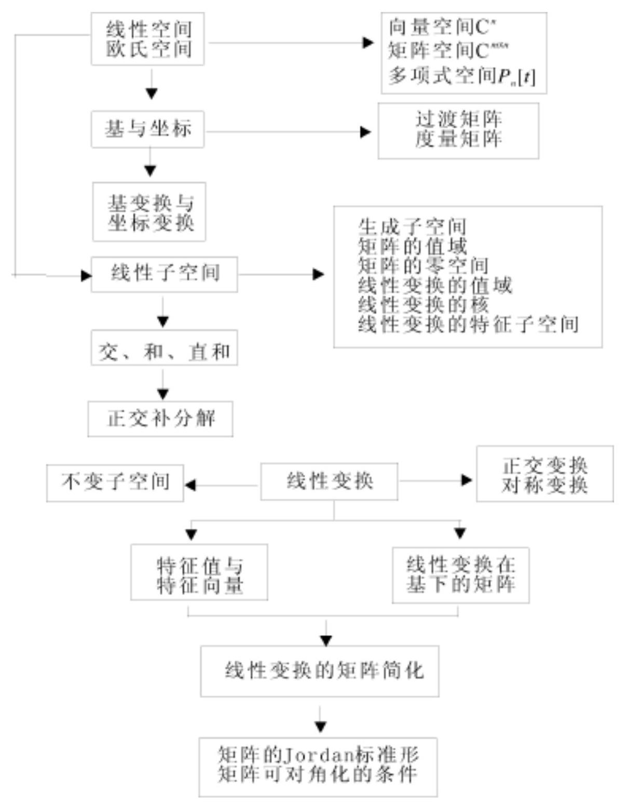

## 五、课后习题全解

## 习 题 1.1

1. 设 ${S}_{1}\;{S}_{2}$ ,证明 ${S}_{1} \cap  {S}_{2} = {S}_{1},{S}_{1} \cup  {S}_{2} = {S}_{2}$ .

证 任取 $\mathrm{a \in  S}$ ，由 ${S}_{1}\;{S}_{2}$ 知 $\mathrm{a \in  }\left( {{S}_{1} \cap  {S}_{2}}\right)$ ，从而 ${S}_{1}\;({S}_{1} \; \left. {\text{ 、 }}_{\mathrm{S}}\right) ;\text{ 又 }\left( {{\mathrm{S}}_{1} \cap  {\mathrm{S}}_{2}}\right) \;{\mathrm{S}}_{1},{\text{ 所 }\text{ 以 }}\left( {{\mathrm{S}}_{1} \cap  {\mathrm{S}}_{2}}\right)  = {\mathrm{S}}_{1}.$

任取 $\mathrm{a \in  \left( {{S}_{1} \cup  {S}_{2}}\right) ,\text{ 由 }{S}_{1} : {S}_{2}\text{ 知 }a \in  {S}_{2},\text{ 故 }\left( {{S}_{1} \cup  {S}_{2}}\right)  \sim  {S}_{2}}$ ; 又 ${S}_{2}\;\left( {{S}_{1} \cup  {S}_{2}}\right)$ ,所以 $\left( {{S}_{1} \cup  {S}_{2}}\right)  = {S}_{2}$ .

2. 判别数集 $\{ a + b\sqrt{2} \mid  a, b \in  Q\}$ 是否形成数域.

解 令 $S = \{ a + b\sqrt{2} \mid  a, b \in  Q\}$ ,任取 $S$ 中两个数 $a + b\sqrt{2}$ 和 $a$ +b $\sqrt{2}$ ,由于

$$
\left( {{a}_{1} + b\sqrt{2}}\right)  \pm  \left( {{a}_{2} + b\sqrt{2}}\right)  = \left( {{a}_{1} \pm  {a}_{2}}\right)  + \left( {b \pm  b}\right) \sqrt{2} \in  S
$$

$$
\left( {{a}_{1} + b\sqrt{2}}\right) \left( {{a}_{2} + {b}_{2}\sqrt{2}}\right)  = \left( {{a}_{1}{a}_{2} + {2b}{b}_{2}}\right)  +
$$

$$
\left( {{a}_{1}{b}_{2} + {a}_{2}{b}_{1}}\right) \sqrt{2} \in  S
$$

$$
\frac{{a}_{1} + {b}_{1}}{{a}_{2} + {b}_{2}\sqrt{2}} = \frac{{a}_{1}{a}_{2} - 2{b}_{1}{b}_{2}}{{a}_{2}^{2} - 2{b}_{2}^{2}} + \frac{{a}_{2}{b}_{1} - {a}_{1}{b}_{2}}{{a}_{2}^{2} - 2{b}_{2}^{2}}\sqrt{2} \in  S
$$

所以 S 形成数域.

3. 判别下列集合对所指运算是否构成 $\mathrm{R}$ 上的线性空间.

(1)次数等于 $\mathrm{m}\left( {\mathrm{m} \geq  1}\right)$ 的实系数多项式的集合，对于多项式的加法和数与多项式的乘法;

(2)实对称矩阵的集合，对于矩阵的加法和实数与矩阵的乘法；

(3) 平面上全体向量的集合，对于通常的加法和如下定义的数乘运算 $\mathrm{k}\;\mathrm{x} = 0$ .

解 (1) 否. 因为两个 $\mathrm{m}$ 次多项式相加不一定还是 $\mathrm{m}$ 次多项式,所以加法运算不封闭.

(2)是.

(3) 否. 因为 $\mathrm{x} \neq  0$ 时 $1\mathrm{x} = 0 \neq  \mathrm{x}$ ,所以定义中的性质 (8) 不能成立.

4. 证明: 在实函数空间中,函数组 $1,{\cos }^{2}\mathrm{t},\cos 2\mathrm{t}$ 是线性相关的.

证 因为 $1 - 2{\cos }^{2}\mathrm{t} + \cos 2\mathrm{t} = 0$ ,所以 $1,{\cos }^{2}\mathrm{t},\cos 2\mathrm{t}$ 线性相关.

5. 求第 3 题之 (2) 中线性空间的维数与基.

解 用 ${\mathrm{E}}_{\mathrm{{ij}}}$ 表示第 $\mathrm{i}$ 行第 $\mathrm{j}$ 列元素为 1,而其余元素为 0 的 $\mathrm{n}$ 阶方阵, 则

$$
{\mathrm{E}}_{\mathrm{{ii}}}\left( {\mathrm{i} = 1,2,\cdots ,\mathrm{n}}\right) ,{\mathrm{F}}_{\mathrm{{ij}}} = {\mathrm{E}}_{\mathrm{{ij}}} + {\mathrm{E}}_{\mathrm{{ji}}}\left( {\mathrm{i} < \mathrm{j};\mathrm{i},\mathrm{j} = 1,2,\cdots ,\mathrm{n}}\right)
$$

线性无关,且当 ${\mathrm{a}}_{\mathrm{{ij}}} = {\mathrm{a}}_{\mathrm{{ji}}}$ 时,有

$$
A = {\left( {a}_{ij}\right) }_{n \times  n} = \mathop{\sum }\limits_{{i = 1}}^{n}{a}_{ii}{E}_{ii} + \mathop{\sum }\limits_{{i < j}}{a}_{ij}{F}_{ij}
$$

因此,该线性空间的一个基为 ${\mathrm{E}}_{\mathrm{{ii}}}\left( {\mathrm{i} = 1,2,\cdots ,\mathrm{n}}\right) ,{\mathrm{F}}_{\mathrm{{ij}}}(\mathrm{i} < \mathrm{j};\mathrm{i},\mathrm{j} = 1$ , $2,\cdots ,\mathrm{n})$ ,其维数为 $\frac{\mathrm{n}\left( {\mathrm{n} + 1}\right) }{2}$ .

6. 求 ${R}^{3}$ 中向量 $x = \left( {3,7,1}\right)$ 在基 ${x}_{1} = \left( {1,3,5}\right) ,{x}_{2} = \left( {6,3,2}\right)$ , ${\mathrm{X}}_{3} = \left( {3,1,0}\right)$ 下的坐标.

解 设 $\mathrm{X} = {\mathrm{k}}_{1}{\mathrm{X}}_{1} + {\mathrm{k}}_{2}{\mathrm{X}}_{2} + {\mathrm{k}}_{3}{\mathrm{X}}_{3}$ ,比较等号两端向量的对应分量可得线性方程组

$$
\left\lbrack  \begin{array}{lll} 1 & 6 & 3 \\  3 & 3 & 1 \\  5 & 2 & 0 \end{array}\right\rbrack  \left\lbrack  \begin{array}{l} {k}_{1} \\  {k}_{2} \\  {k}_{3} \end{array}\right\rbrack   = \left\lbrack  \begin{array}{l} 3 \\  7 \\  1 \end{array}\right\rbrack
$$

其惟一解为 $\mathrm{k} = {33},\mathrm{k} =  - {82},{\mathrm{k}}_{3} = {154}$ . 因此, $\mathrm{x}$ 的坐标为 $({33}$ , - 82,154) ${}^{\mathrm{T}}$ .

7. 求 ${P}_{2}\left\lbrack  t\right\rbrack$ 中向量 $1 + t + {t}^{2}$ 在基 $1, t - 1,\left( {t - 2}\right) \left( {t - 1}\right)$ 下的坐标.

解 设 $1 + t + {t}^{2} = k \cdot  1 + k\left( {t - 1}\right)  + {k}_{3}\left( {t - 2}\right) \left( {t - 1}\right)$ ,比较等号两端关于 $\mathrm{t}$ 的同次幂的系数可得

$$
\begin{cases} {k}_{1} - {k}_{2} + 2{k}_{3} &  = 1 \\  {k}_{2} - 3{k}_{3} &  = 1 \\  {k}_{3} &  = 1 \end{cases}
$$

求解得 ${k}_{3} = 1,{k}_{2} = 4,{k}_{1} = 3$ . 因此, $1 + t + {t}^{2}$ 的坐标为 ${\left( 3,4,1\right) }^{T}$ .

8. 设线性空间 ${V}^{4}$ 的基 $\left( \mathrm{I}\right) {x}_{1},{x}_{2},{x}_{3},{x}_{4}$ 和基 $\left( \mathrm{{II}}\right) {y}_{1},{y}_{2},{y}_{3},{y}_{4}$ 满足

$$
\left\{  \begin{array}{l} {x}_{1} + 2{x}_{2} = {y}_{3} \\  {x}_{2} + 2{x}_{3} = {y}_{4} \\  {y}_{1} + 2{y}_{2} = {x}_{3} \\  {y}_{2} + 2{y}_{3} = {x}_{4} \end{array}\right.
$$

(1)求由基(I)改变为基(II)的过渡矩阵 C;

(2)求向量 $x = {2y} - {y}_{2} + {y}_{3} + {y}_{4}$ 在基(I)下的坐标.

解 (1) 解出 ${y}_{1},{y}_{2}$ ,可得

$$
{y}_{1} = 4{x}_{1} + 8{x}_{2} + {x}_{3} - 2{x}_{4},\;{y}_{2} =  - 2{x}_{1} - 4{x}_{2} + {x}_{4}
$$

$$
{y}_{3} = {x}_{1} + 2{x}_{2},\;{y}_{4} = {x}_{2} + 2{x}_{3}
$$

于是,由基 (I) 改变基 (II) 的过渡矩阵为

$$
C = \left\lbrack  \begin{array}{rrrr} 4 &  - 2 & 1 & 0 \\  8 &  - 4 & 2 & 1 \\  1 & 0 & 0 & 2 \\   - 2 & 1 & 0 & 0 \end{array}\right\rbrack
$$

(2)x 在基( II )下的坐标为 ${\left( 2, - 1,1,1\right) }^{\mathrm{T}}$ ，由坐标变换公式计算 x 在基(I)下的坐标为

$$
C\left\lbrack  \begin{array}{r} 2 \\   - 1 \\  1 \\  1 \end{array}\right\rbrack   = \left\lbrack  \begin{array}{r} {11} \\  {23} \\  4 \\   - 5 \end{array}\right\rbrack
$$

9. 在 ${\mathrm{R}}^{4}$ 中有两个基

$$
{x}_{1} = {e}_{1},{x}_{2} = {e}_{2},{x}_{3} = {e}_{3},{x}_{4} = {e}_{4}
$$

$$
{y}_{1} = \left( {2,1, - 1,1}\right) ,{y}_{2} = \left( {0,3,1,0}\right)
$$

$$
{y}_{3} = \left( {5,3,2,1}\right) ,{y}_{4} = \left( {6,6,1,3}\right)
$$

(1)求由前一基改变为后一基的过渡矩阵；

(2)求向量 $x = \left( {\xi ,\xi ,\xi ,\xi }\right)$ 在后一基下的坐标；

(3)求对两个基有相同坐标的非零向量.

解(1)设 $\left( {{y}_{1},{y}_{2},{y}_{3},{y}_{4}}\right)  = \left( {{x}_{1},{x}_{2},{x}_{3},{x}_{4}}\right) C$ ，直接写出

$$
C = \left\lbrack  \begin{array}{rrrr} 2 & 0 & 5 & 6 \\  1 & 3 & 3 & 6 \\   - 1 & 1 & 2 & 1 \\  1 & 0 & 1 & 3 \end{array}\right\rbrack
$$

(2) $x$ 在基 ${x}_{1},{x}_{2},{x}_{3},{x}_{4}$ 下的坐标为 ${\left( \xi ,\xi ,\xi ,{\xi }_{4}\right) }^{T}$ ，而 $x$ 在基 ${y}_{1}$ ， ${y}_{2},{y}_{3},{y}_{4}$ 下的坐标为 ${C}^{1}{\left( \xi ,\xi ,\xi ,{\xi }_{2}\right) }^{T}$ .

(3) 由 $\left\lbrack  \begin{array}{l} \xi \\  \xi \\  \xi \\  \xi  \end{array}\right\rbrack   = {C}^{-1}\left\lbrack  \begin{array}{l} \xi \\  \xi \\  \xi \\  \xi  \end{array}\right\rbrack$ 得 $\left( {C - I}\right) \left\lbrack  \begin{array}{l} \xi \\  \xi \\  \xi \\  \xi  \end{array}\right\rbrack   = 0$ ,该方程组的通解为

$\mathrm{k}{\left( 1,1,1, - 1\right) }^{\mathrm{T}}$ ,对两个基有相同坐标的非零向量为 $\mathrm{k}\left( {{\mathrm{x}}_{1} + {\mathrm{x}}_{2} + {\mathrm{x}}_{3}}\right.$ - $\left. {\mathrm{X}}_{4}\right) ,\mathrm{k}$ 为非零常数.

10. 设 ${x}_{1},{x}_{2},{x}_{3}$ 是 ${R}^{3}$ 的一个基,求由 ${y}_{1} = {x}_{1} - 2{x}_{2} + 3{x}_{3},{y}_{2} = \; 2{x}_{1} + 3{x}_{2} + 2{x}_{3},{y}_{3} = 4{x}_{1} + {13}{x}_{2}$ 生成的子空间 $L\left( {{y}_{1},{y}_{2},{y}_{3}}\right)$ 的基.

解 $L\left( {{y}_{1},{y}_{2},{y}_{3}}\right)$ 的基为 ${y}_{1},{y}_{2},{y}_{3}$ 的一个最大无关组. 在基 ${X}_{1},{X}_{2},{X}_{3}$ 下， ${y}_{1},{y}_{2},{y}_{3}$ 的坐标依次为

$$
{\left( 1, - 2,3\right) }^{\mathrm{T}},{\left( 2,3,2\right) }^{\mathrm{T}},{\left( 4,{13},0\right) }^{\mathrm{T}}
$$

该列向量组的一个最大无关组为 ${\left( 1, - 2,3\right) }^{\mathrm{T}},{\left( 2,3,2\right) }^{\mathrm{T}}$ . 因此, ${\mathrm{y}}_{1}$ , ${y}_{2},{y}_{3}$ 的一个最大无关组为 ${y}_{1},{y}_{2}$ ,即 $L\left( {{y}_{1},{y}_{2},{y}_{3}}\right)$ 的一个基为 ${y}_{1},{y}_{2}$ .

11. 求 ${R}^{4}$ 的子空间

$$
{V}_{1} = \{ \left( {\xi ,\xi ,\xi ,\xi }\right)  \mid  {\xi  - \xi  + \xi  - \xi  = 0}\}
$$

$$
{V}_{2} = \{ \left( {\xi ,\xi ,\xi ,\xi }\right)  \mid  \xi  + \xi  + \xi  + \xi  = 0\}
$$

的交 ${V}_{1} \cap  {V}_{2}$ 的基.

解 设 $x = \left( {\xi ,\xi ,\xi ,\xi }\right)  \in  \left( {{V}_{1} \cap  {V}_{2}}\right)$ ,则 $x$ 的分量满足

$$
\left\{  \begin{array}{l} \xi  - {\xi }_{2} + {\xi }_{3} - \xi  = 0 \\  \xi  + {\xi }_{2} + {\xi }_{3} + {\xi }_{4} = 0 \end{array}\right.
$$

该方程组的基础解系为 ${\left( 1,0, - 1,0\right) }^{\mathrm{T}},{\left( 0,1,0, - 1\right) }^{\mathrm{T}}$ ,从而 ${\mathrm{V}}_{1} \cap  {\mathrm{V}}_{2}$ 的一个基为 $\left( {1,0, - 1,0}\right) ,\left( {0,1,0, - 1}\right)$ .

12. 给定 ${\mathrm{R}}^{2 \times  2} = \left\{  {\mathrm{A} = {\left( {\mathrm{a}}_{\mathrm{{ij}}}\right) }_{2 \times  2} \mid  {\mathrm{a}}_{\mathrm{{ij}}} \in  \mathrm{R}}\right\}$ (数域 $\mathrm{R}$ 上的二阶实方阵按通常矩阵的加法与数乘矩阵构成的线性空间) 的子集

$$
V = \left\{  {A = {\left( {a}_{ij}\right) }_{2 \times  2} \mid  {a}_{11} + {a}_{22} = 0,{a}_{ij} \in  R}\right\}
$$

(1)证明 $V$ 是 ${R}^{2 \times  2}$ 的子空间；

(2)求 $V$ 的维数和基.

解(1)设 $A = {\left( {a}_{ij}\right) }_{2 \times  2} \in  V, B = {\left( {b}_{ij}\right) }_{2 \times  2} \in  V$ ，则有

$$
{\mathrm{a}}_{11} + {\mathrm{a}}_{22} = 0,{\mathrm{\;b}}_{1} + {\mathrm{b}}_{22} = 0
$$

因为

$$
A + B = {\left( {a}_{ij} + {b}_{ij}\right) }_{2 \times  2},\left( {{a}_{11} + {b}_{11}}\right)  + \left( {{a}_{22} + {b}_{22}}\right)  = 0
$$

$$
\mathrm{{kA}} = {\left( {\mathrm{{ka}}}_{\mathrm{i}\mathrm{j}}\right) }_{2 \times  2},\;\left( {\mathrm{{ka}}}_{11}\right)  + \left( {\mathrm{{ka}}}_{22}\right)  = 0
$$

所以 $\mathrm{A} + \mathrm{B} \in  \mathrm{V},\mathrm{k}\mathrm{A} \in  \mathrm{V}$ . 又 ${\mathrm{Q}}_{\times 2} \in  \mathrm{V}$ ,所以 $\mathrm{V}$ 是 ${\mathrm{R}}^{2 \times  2}$ 的子空间.

(2)在 $\mathrm{V}$ 中

$$
A = \left\lbrack  \begin{array}{rr} 1 & 0 \\  0 &  - 1 \end{array}\right\rbrack  , A = \left\lbrack  \begin{array}{ll} 0 & 1 \\  0 & 0 \end{array}\right\rbrack  , A = \left\lbrack  \begin{array}{ll} 0 & 0 \\  1 & 0 \end{array}\right\rbrack
$$

线性无关. 任意 $\mathrm{A = {\left( {a}_{ij}\right) }_{2 \times  2} \in  V,\text{ 有 }{a}_{11} + {a}_{22} = 0,\text{ 即 }{a}_{22} = }$ - ${a}_{11}$ ,于是

$$
A = {a}_{11}A + {a}_{12}{A}_{2} + {a}_{21}{A}_{3}
$$

因此, $\mathrm{V}$ 的一个基是 ${\mathrm{A}}_{1},{\mathrm{\;A}}_{2},{\mathrm{\;A}}_{3}$ ,从而 $\dim \mathrm{V} = 3$ .

13. 证明所有二阶矩阵之集合形成的实线性空间, 是所有二阶实对称矩阵之集合形成的子空间与所有二阶反对称矩阵之集合形成的子空间的直和.

证 设 $V = {R}^{2 \times  2}$ ,令

$$
{V}_{1} = \left\{  {A = {\left( {a}_{ij}\right) }_{2 \times  2} \mid  {a}_{ij} = {a}_{ji},{a}_{ij} \in  R}\right\}
$$

$$
{V}_{2} = \left\{  {B = {\left( {b}_{ij}\right) }_{2 \times  2} \mid  {b}_{ij} =  - {b}_{ji},{b}_{ij} \in  R}\right\}
$$

容易验证 ${\mathrm{V}}_{1}$ 与 ${\mathrm{V}}_{2}$ 都是 $\mathrm{V}$ 的子空间. 任意 $\mathrm{C} \in  \mathrm{V}$ ，有

$$
C = \frac{1}{2}\left( {C + {C}^{T}}\right)  + \frac{1}{2}\left( {C - {C}^{T}}\right)
$$

且 $\frac{1}{2}\left( {\mathrm{C} - {\mathrm{C}}^{\mathrm{T}}}\right)  \in  {\mathrm{V}}_{1},\frac{1}{2}\left( {\mathrm{C} - {\mathrm{C}}^{\mathrm{T}}}\right)  \in  {\mathrm{V}}_{2}$ ,所以 $\mathrm{V} = {\mathrm{V}}_{1} + {\mathrm{V}}_{2}$ . 因为

$$
D = {\left( {d}_{ij}\right) }_{2 \times  2} \in  {V}_{1} \cap  {V}_{2}\;D \in  {V}_{1}\text{ 且 }D \in  {V}_{2}
$$

$$
{d}_{ij} = {d}_{ji}\text{ 且 }{d}_{ij} =  - {d}_{ji}
$$

$$
{d}_{ij} = 0\left( {i, j = 1,2}\right)
$$

$$
\mathrm{D} = \mathrm{O}
$$

所以 ${V}_{1} \cap  {V}_{2} = \{ O\}$ ,即 $V = {V}_{1}i{V}_{2}$ .

## 习 题 1.2

1. 判别下列变换中哪些是线性变换.

(1) 在 ${R}^{3}$ 中,设 $x = \left( {\xi ,\xi ,\xi }\right) ,{Tx} = \left( {{\xi }^{2},\xi  + \xi ,\xi }\right)$ ;

(2)在矩阵空间 ${R}^{n \times  n}$ 中， ${TX} = {BXC}$ ，这里 $B, C$ 是给定矩阵；

(3)在线性空间 $\mathop{\operatorname{P}}\limits^{{n \times  n}}\left\lbrack  t\right\rbrack$ 中， ${Tf}\left( t\right)  = f\left( {t + 1}\right)$ .

解(1)否. 因为 $T\left( {2x}\right)  = \left( {4{\xi }^{2},{2\xi } + {2\xi },2{\xi }_{3}}\right)$ ,而 $2\left( {Tx}\right)  = \; \left( {{2\xi },{2\xi } + {2\xi },{2\xi }}\right)$ ,所以当 $\xi  \neq  0$ 时, $T\left( {2x}\right)  \neq  2\left( {Tx}\right)$ .

(2)是. 设 $X, Y \in  {R}^{n \times  n}, k \in  R$ ，则有

$$
T\left( {X + Y}\right)  = B\left( {X + Y}\right) C = {BXC} + {BYC} = {TX} + {TY}
$$

$$
T\left( {kX}\right)  = B\left( {kX}\right) C = k\left( {BXC}\right)  = k\left( {TX}\right)
$$

(3)是. 设 $f\left( t\right) , g\left( t\right)  \in  {P}_{n}\left\lbrack  t\right\rbrack  , k \in  R$ ，则有

$$
T\left\lbrack  {f\left( t\right)  + g\left( t\right) }\right\rbrack   = f\left( {t + 1}\right)  + g\left( {t + 1}\right)  =
$$

$$
\mathrm{{Tf}}\left( \mathrm{t}\right)  + \mathrm{{Tg}}\left( \mathrm{t}\right)
$$

$$
T\left\lbrack  {{kf}\left( t\right) }\right\rbrack   = {kf}\left( {t + 1}\right)  = {kTf}\left( t\right)
$$

2. 在 ${R}^{2}$ 中,设 $x = \left( {\xi ,\xi }\right)$ ,证明 ${T}_{1}x = \left( {\xi , - \xi }\right)$ 与 ${T}_{2}x = \left( {\xi }_{3}\right.$ , - 名) 是 ${R}^{2}$ 的两个线性变换,并求 ${T}_{1} + {T}_{2},{T}_{1}{T}_{2}$ 及 ${T}_{2}{T}_{1}$ .

解 设 $k, l \in  R, y = \left( {{\eta }_{1},{\eta }_{2}}\right)  \in  {R}^{2}$ ,则

$$
\mathrm{{kx}} + \mathrm{{ly}} = \left( {\mathrm{k}{\xi }_{1} + \mathrm{l}{\eta }_{1},\mathrm{k}{\xi }_{2} + \mathrm{l}{\eta }_{2}}\right)
$$

于是有

$$
{T}_{1}\left( {{kx} + {ly}}\right)  = \left( {k{\xi }_{2} + l{\eta }_{2}, - k{\xi }_{1} - l{\eta }_{1}}\right)  =
$$

$$
k\left( {\xi , - \xi }\right)  + l\left( {{\eta }_{2}, - {\eta }_{1}}\right)  =
$$

$$
\mathrm{k}\left( {{\mathrm{T}}_{1}\mathrm{x}}\right)  + \mathrm{l}\left( {{\mathrm{T}}_{1}\mathrm{y}}\right)
$$

所以 ${T}_{1}$ 是线性变换. 同理可得 ${T}_{2}$ 是线性变换.

$\left( {{T}_{1} + {T}_{2}}\right) x = {T}_{1}x + {T}_{2}x = \left( {\xi  + \xi , - \xi  - \xi }\right)$

$\left( {{T}_{1}{T}_{2}}\right) x = {T}_{1}\left( {{T}_{2}x}\right)  = {T}_{1}\left( {\xi , - \xi }\right)  = \left( {-\xi , - \xi }\right)$

$\left( {{T}_{2}{T}_{1}}\right) x = {T}_{2}\left( {{T}_{1}x}\right)  = {T}_{2}\left( {\xi , - \xi }\right)  = \left( {\xi ,\xi }\right)$

3. 在 ${P}_{n}\left\lbrack  t\right\rbrack$ 中, ${T}_{1}f\left( t\right)  = {f}^{\prime }\left( t\right) ,{T}_{2}f\left( t\right)  = {tf}\left( t\right)$ ,证明

$$
{\mathrm{T}}_{1}{\mathrm{\;T}}_{2} - {\mathrm{T}}_{2}{\mathrm{\;T}}_{1} = {\mathrm{T}}_{\mathrm{e}}
$$

证 设 $f\left( t\right)  \in  {P}_{n}\left\lbrack  t\right\rbrack$ ,则

$$
\left( {{\mathrm{T}}_{1}{\mathrm{\;T}}_{2} - {\mathrm{T}}_{2}{\mathrm{\;T}}_{1}}\right) \mathrm{f}\left( \mathrm{t}\right)  = {\mathrm{T}}_{1}\left\lbrack  {{\mathrm{\;T}}_{2}\mathrm{f}\left( \mathrm{t}\right) }\right\rbrack   - {\mathrm{T}}_{2}\left\lbrack  {{\mathrm{\;T}}_{1}\mathrm{f}\left( \mathrm{t}\right) }\right\rbrack   =
$$

$$
{\mathrm{T}}_{1}\left\lbrack  {\mathrm{{tf}}\left( \mathrm{t}\right) }\right\rbrack   - {\mathrm{T}}_{2}\left\lbrack  {{\mathrm{f}}^{\prime }\left( \mathrm{t}\right) }\right\rbrack   =
$$

$$
f\left( t\right)  + t{f}^{\prime }\left( t\right)  - t{f}^{\prime }\left( t\right)  =
$$

$$
f\left( t\right)  = {T}_{e}f\left( t\right)
$$

故 ${T}_{1}{T}_{2} - {T}_{2}{T}_{1} = {T}_{e}$ .

4. 在 ${R}^{3}$ 中,设 $x = \left( {\xi ,\xi ,\xi }\right)$ ,定义 ${Tx} = \left( {{2\xi } - \xi ,\xi  + \xi ,\xi }\right)$ , 试求 $\mathrm{T}$ 在基 ${\mathrm{e}}_{1} = \left( {1,0,0}\right) ,\mathrm{e} = \left( {0,1,0}\right) ,\mathrm{e} = \left( {0,0,1}\right)$ 下的矩阵.

解 ${T}_{\mathrm{e}1} = \left( {2,0,1}\right)  = 2\mathrm{e} + 0\mathrm{e} + 1\mathrm{e}$

$$
{\mathrm{{Te}}}_{2} = \left( {-1,1,0}\right)  = \left( {-1}\right) \mathrm{e} + 1\mathrm{e} + 0\mathrm{e}
$$

$$
{\mathrm{{Te}}}_{3} = \left( {0,1,0}\right)  = 0\mathrm{e} + 1\mathrm{e} + 0\mathrm{e}
$$

故

$$
A = \left\lbrack  \begin{array}{rrr} 2 &  - 1 & 0 \\  0 & 1 & 1 \\  1 & 0 & 0 \end{array}\right\rbrack
$$

5. 设 ${X}_{1},{X}_{2}$ 是线性空间 ${V}^{2}$ 的基， ${T}_{1}$ 与 ${T}_{2}$ 是 ${V}^{2}$ 的线性变换， ${T}_{1}{x}_{1} = {y}_{1},{T}_{1}{x}_{2} = {y}_{2}$ ,且 ${T}_{2}\left( {{x}_{1} + {x}_{2}}\right)  = {y}_{1} + {y}_{2},{T}_{2}\left( {{x}_{1} - {x}_{2}}\right)  = {y}_{1}$ - ${y}_{2}$ ,证明 ${T}_{1} = {T}_{2}$ .

证 设 $x \in  {V}^{2}$ ,则 $x = k{x}_{1} + k{x}_{2}$ . 由于

$$
\left\{  \begin{array}{l} {\mathrm{T}}_{2}{\mathrm{x}}_{1} + {\mathrm{T}}_{2}{\mathrm{x}}_{2} = {\mathrm{T}}_{2}\left( {{\mathrm{x}}_{1} + {\mathrm{x}}_{2}}\right)  = {\mathrm{y}}_{1} + {\mathrm{y}}_{2} \\  {\mathrm{T}}_{2}{\mathrm{x}}_{1} - {\mathrm{T}}_{2}{\mathrm{x}}_{2} = {\mathrm{T}}_{2}\left( {{\mathrm{x}}_{1} - {\mathrm{x}}_{2}}\right)  = {\mathrm{y}}_{1} - {\mathrm{y}}_{2} \end{array}\right.
$$

所以 ${T}_{2}{x}_{1} = {y}_{1},{T}_{2}{x}_{2} = {y}_{2}$ . 于是

$$
{\mathrm{T}}_{1}\mathrm{x} = {\mathrm{k}}_{1}{\mathrm{\;T}}_{1}{\mathrm{x}}_{1} + {\mathrm{k}}_{2}{\mathrm{\;T}}_{1}{\mathrm{x}}_{2} =
$$

$$
{\mathrm{k}}_{1}{\mathrm{y}}_{1} + {\mathrm{k}}_{2}{\mathrm{y}}_{2} = {\mathrm{k}}_{1}{\mathrm{T}}_{2}{\mathrm{x}}_{1} + {\mathrm{k}}_{2}{\mathrm{\;T}}_{2}{\mathrm{x}}_{2} = {\mathrm{T}}_{2}\mathrm{x}
$$

故 ${T}_{1} = {T}_{2}$ .

6. 六个函数

$$
{x}_{1} = {e}^{\text{ at }}\cos \text{ bt },{x}_{2} = {e}^{\text{ at }}\sin \text{ bt },{x}_{3} = {t}_{e}^{\text{ at }}\cos \text{ bt }
$$

$$
{x}_{4} = {\operatorname{te}}^{\text{ at }}\sin \text{ bt },{x}_{5} = \frac{1}{2}{t}^{2}{e}^{\text{ at }}\cos \text{ bt },{x}_{6} = \frac{1}{2}{t}^{2}{e}^{\text{ at }}\sin \text{ bt }
$$

的所有实系数线性组合构成实数域 $R$ 上的一个六维线性空间 ${V}^{6} = \; \mathrm{L}\left( {{\mathrm{X}}_{1},{\mathrm{X}}_{2},{\mathrm{X}}_{3},{\mathrm{X}}_{4},{\mathrm{X}}_{5},{\mathrm{X}}_{6}}\right)$ ,求微分变换 $\mathrm{D}$ 在基 ${\mathrm{X}}_{1},{\mathrm{X}}_{2},\cdots ,{\mathrm{X}}_{6}$ 下的矩阵.

解 因为

$$
\begin{array}{l} D{X}^{1} = a{e}^{{}^{at}}\operatorname{cosbt} - {e}^{{}^{at}}b\operatorname{sinbt} = a{x}_{1} - b{x}_{2} \end{array}
$$

$$
\begin{array}{l} D{X}_{2} = a{e}^{at}\sin {bt} + {e}^{at}{bcosbt} = b{X}_{1} + a{X}_{2} \end{array}
$$

$$
\begin{array}{l} {D}_{{X}_{3}} = {e}^{{a}^{t}}\cos {bt} + {ta}{e}^{{a}^{t}}\cos {bt} - t{e}^{{a}^{t}}b\sin {bt} = {x}_{1} + a{x}_{3} - b{x}_{4} \end{array}
$$

$$
\begin{array}{l} D{x}_{4} = {e}^{at}\sin {bt} + {ta}{e}^{at}\sin {bt} + t{e}^{at}{bcosbt} = {x}_{2} + b{x}_{3} + a{x}_{4} \end{array}
$$

$$
{D}_{X5} = {\operatorname{te}}^{at}\cos {bt} + \frac{1}{2}{t}^{2}{\operatorname{ae}}^{at}\cos {bt} - \frac{1}{2}{t}^{2}{e}^{at}\operatorname{bsin}{bt} =
$$

$$
{x}_{3} + a{x}_{5} - b{x}_{6}
$$

$$
D{x}_{6} = t{e}^{at}\sin {bt} + \frac{1}{2}{t}^{2}a{e}^{at}\sin {bt} + \frac{1}{2}{t}^{2}{e}^{at}{bcosbt} =
$$

$$
{x}_{4} + b{x}_{5} + a{x}_{6}
$$

故

$$
A = \left\lbrack  \begin{array}{rrrrrr} a & b & 1 & 0 & 0 & 0 \\   - b & a & 0 & 1 & 0 & 0 \\  0 & 0 & a & b & 1 & 0 \\  0 & 0 &  - b & a & 0 & 1 \\  0 & 0 & 0 & 0 & a & b \\  0 & 0 & 0 & 0 &  - b & a \end{array}\right\rbrack
$$

7. 已知 ${R}^{3}$ 的线性变换 $T$ 在基 ${x}_{1} = \left( {-1,1,1}\right) ,{x}_{2} = (1,0$ , -1), ${x}_{3} = \left( {0,1,1}\right)$ 下的矩阵为

$$
\left\lbrack  \begin{array}{rrr} 1 & 0 & 1 \\  1 & 1 & 0 \\   - 1 & 2 & 1 \end{array}\right\rbrack
$$

求 $\mathrm{T}$ 在基 ${\mathrm{e}}_{1} = \left( {1,0,0}\right) ,\mathrm{e} = \left( {0,1,0}\right) ,\mathrm{e} = \left( {0,0,1}\right)$ 下的矩阵.

解 设基(I) 为 ${X}_{1},{X}_{2},{X}_{3}$ ; 基(II) 为 $a, e, e$ . 直接写出由基 ( II ) 改变为基( I ) 的过渡矩阵

$$
{C}^{1} = \left\lbrack  \begin{array}{rrr}  - 1 & 1 & 0 \\  1 & 0 & 1 \\  1 &  - 1 & 1 \end{array}\right\rbrack
$$

则由基(I)改变为基(II)的过渡矩阵为 C. 于是 T 在基(II)下的矩阵为

$$
{\mathrm{C}}^{-1}\left\lbrack  \begin{array}{rrr} 1 & 0 & 1 \\  1 & 1 & 0 \\   - 1 & 2 & 1 \end{array}\right\rbrack  \mathrm{C} = \left\lbrack  \begin{array}{rrr}  - 1 & 1 &  - 2 \\  2 & 2 & 0 \\  3 & 0 & 2 \end{array}\right\rbrack
$$

8. 在 ${\mathrm{R}}^{2 \times  2}$ 中定义线性变换

$$
{T}_{1}X = \left\lbrack  \begin{array}{ll} a & b \\  c & d \end{array}\right\rbrack  X,\;{T}_{2}X = X\left\lbrack  \begin{array}{ll} a & b \\  c & d \end{array}\right\rbrack
$$

$$
{T}_{3}X = \left\lbrack  \begin{array}{ll} a & b \\  c & d \end{array}\right\rbrack  X\left\lbrack  \begin{array}{ll} a & b \\  c & d \end{array}\right\rbrack
$$

求 ${\mathrm{T}}_{1},{\mathrm{\;T}}_{2},{\mathrm{\;T}}_{3}$ 在基 ${\mathrm{E}}_{11},{\mathrm{\;E}}_{12},{\mathrm{\;E}}_{21},{\mathrm{\;E}}_{22}$ 下的矩阵.

解 ${T}_{1}{E}_{11} = \left\lbrack  \begin{array}{ll} a & 0 \\  c & 0 \end{array}\right\rbrack   = a{E}_{11} + c{E}_{21}$

$$
{T}_{1}{E}_{12} = \left\lbrack  \begin{array}{ll} 0 & a \\  0 & c \end{array}\right\rbrack   = a{E}_{12} + c{E}_{22}
$$

$$
{T}_{1}{E}_{21} = \left\lbrack  \begin{array}{ll} b & 0 \\  d & 0 \end{array}\right\rbrack   = b{E}_{11} + d{E}_{21}
$$

$$
{T}_{1}{E}_{22} = \left\lbrack  \begin{array}{ll} 0 & b \\  0 & d \end{array}\right\rbrack   = b{E}_{12} + d{E}_{22}
$$

故 ${T}_{1}$ 在该基下的矩阵为

$$
A = \left\lbrack  \begin{array}{llll} a & 0 & b & 0 \\  0 & a & 0 & b \\  c & 0 & d & 0 \\  0 & c & 0 & d \end{array}\right\rbrack
$$

类似地,可得 ${\mathrm{T}}_{2}$ 在该基下的矩阵为

$$
{A}_{2} = \left\lbrack  \begin{array}{llll} a & c & 0 & 0 \\  b & d & 0 & 0 \\  0 & 0 & a & c \\  0 & 0 & b & d \end{array}\right\rbrack
$$

由于 ${T}_{3} = {T}_{1}{T}_{2}$ ,所以 ${T}_{3}$ 在该基下的矩阵为

$$
{A}_{3} = {A}_{1}{A}_{2} = \left\lbrack  \begin{matrix} {a}^{2} & {ac} & {ab} & {bc} \\  {ab} & {ad} & {b}^{2} & {bd} \\  {ac} & {c}^{2} & {ad} & {cd} \\  {bc} & {cd} & {bd} & {d}^{2} \end{matrix}\right\rbrack
$$

9. 设 $T$ 是线性空间 $V$ 的线性变换,且 ${T}^{k - 1}x \neq  0$ ,但 ${T}^{k}x = 0$ ,求证 $x,{Tx},\cdots ,{T}^{k - 1}x\left( {k > 0}\right)$ 线性无关.

证 设一组数 $a, a,\cdots ,{c}_{k - 1}$ ,使得

$$
\alpha \mathrm{x} + \alpha \mathrm{T}\mathrm{x} + \cdots  + \alpha  - 1{\mathrm{\;T}}^{\mathrm{k} - 1}\mathrm{x} = 0
$$

两端用 ${\mathrm{T}}^{\mathrm{k} - 1}$ 变换,并利用 ${\mathrm{T}}^{\mathrm{k}}\mathrm{x} = 0$ 可得

$$
\text{ 0 }{\mathrm{T}}^{\mathrm{k} - 1}\mathrm{x} = 0
$$

因为 ${\mathrm{T}}^{\mathrm{k} - 1}\mathrm{x} \neq  0$ ,所以 $\omega  = 0$ .

同理可得 $\mathrm{a = \cdots  = {a}_{k - 1} = 0\text{ ,故 }x,{Tx},\cdots ,{T}^{k - 1}x}$ 线性无关.

10. 设 $T$ 是 ${R}^{3}$ 的线性变换, $x = \left( {\xi ,\xi ,\xi }\right)  \in  {R}^{3}$ ,而 ${Tx} = (0$ , 名, $\xi$ ),求 ${T}^{2}$ 的象子空间 $R\left( {T}^{2}\right)$ 和核子空间 $N\left( {T}^{2}\right)$ 的基与维数.

解 由 ${T}^{2}x = T\left( {Tx}\right)  = T\left( {0,\xi ,\xi }\right)  = \left( {0,0,\xi }\right)$ 可得

$$
R\left( {T}^{2}\right)  = \{ \left( {0,0,\xi }\right)  \mid  \xi  \in  R\}
$$

$$
N\left( {T}^{2}\right)  = \{ \left( {0,\xi ,\xi }\right)  \mid  \xi ,\xi  \in  R\}
$$

因此, $\dim \mathrm{R}\left( {\mathrm{T}}^{2}\right)  = 1,\mathrm{R}\left( {\mathrm{T}}^{2}\right)$ 的一个基为 $\left( {0,0,1}\right) ;\dim \mathrm{N}\left( {\mathrm{T}}^{2}\right)  = 2$ , $\mathrm{N}\left( {\mathrm{T}}^{2}\right)$ 的一个基为 $\left( {0,1,0}\right) ,\left( {0,0,1}\right)$ .

11. 给定 ${\mathrm{R}}^{3}$ 的两个基

$$
{x}_{1} = \left( {1,0,1}\right) ,{x}_{2} = \left( {2,1,0}\right) ,{x}_{3} = \left( {1,1,1}\right)
$$

$$
{y}_{1} = \left( {1,2, - 1}\right) ,{y}_{2} = \left( {2,2, - 1}\right) ,{y}_{3} = \left( {2, - 1, - 1}\right)
$$

定义线性变换

$$
T{x}_{i} = {y}_{i}\;\left( {i = 1,2,3}\right)
$$

(1)写出由基 ${X}_{1},{X}_{2},{X}_{3}$ 改变为基 ${y}_{1},{y}_{2},{y}_{3}$ 的过渡矩阵.

(2)写出 T 在基 ${X}_{1},{X}_{2},{X}_{3}$ 下的矩阵.

(3)写出 $T$ 在基 ${y}_{1},{y}_{2},{y}_{3}$ 下的矩阵.

解(1)引进基 $\mathrm{e},\mathrm{e},\mathrm{e}$ ，则有

$$
\left( {{x}_{1},{x}_{2},{x}_{3}}\right)  = \left( {e, e, e}\right) G,\;G = \left\lbrack  \begin{array}{lll} 1 & 2 & 1 \\  0 & 1 & 1 \\  1 & 0 & 1 \end{array}\right\rbrack
$$

$$
\left( {{y}_{1},{y}_{2},{y}_{3}}\right)  = \left( {e, e, e}\right) C,\;C = \left\lbrack  \begin{array}{rrr} 1 & 2 & 2 \\  2 & 2 &  - 1 \\   - 1 &  - 1 &  - 1 \end{array}\right\rbrack
$$

所以 $\left( {{y}_{1},{y}_{2},{y}_{3}}\right)  = \left( {{x}_{1},{x}_{2},{x}_{3}}\right) C$ ,其中

$$
C = {C}^{1}{C}_{2} = \frac{1}{2}\left\lbrack  \begin{array}{rrr}  - 4 &  - 3 & 3 \\  2 & 3 & 3 \\  2 & 1 &  - 5 \end{array}\right\rbrack
$$

(2)由 $T\left( {{x}_{1},{x}_{2},{x}_{3}}\right)  = \left( {{y}_{1},{y}_{2},{y}_{3}}\right)  = \left( {{x}_{1},{x}_{2},{x}_{3}}\right) C$ 知， $T$ 在基 ${\mathrm{X}}_{1},{\mathrm{X}}_{2},{\mathrm{X}}_{3}$ 下的矩阵为 $\mathrm{C}$ .

(3)T 在基 ${y}_{1},{y}_{2},{y}_{3}$ 下的矩阵为 ${C}^{-1}{CC} = C$ .

12. 设 $T$ 是数域 $C$ 上线性空间 ${V}^{3}$ 的线性变换,已知 $T$ 在 ${V}^{3}$ 的基 ${X}_{1},{X}_{2},{X}_{3}$ 下的矩阵

$$
A = \left\lbrack  \begin{array}{rrr} 3 & 1 & 0 \\   - 4 &  - 1 & 0 \\  4 &  - 8 &  - 2 \end{array}\right\rbrack
$$

求 $\mathrm{T}$ 的特征值与特征向量.

解 求得 $\mathrm{A}$ 的特征值和特征向量为

$$
\lambda  = \lambda  = 1,\;\mathrm{k}{\left( 3, - 6,{20}\right) }^{\mathrm{T}}\;\left( {\mathrm{k} \neq  0}\right)
$$

$$
{\lambda }_{2} =  - 2,\;\mathrm{k}{\left( 0,0,1\right) }^{\mathrm{T}}\;\left( {\mathrm{k} \neq  0}\right)
$$

故 $\mathrm{T}$ 的特征值和特征向量为

$$
{\lambda }_{1} = {\lambda }_{2} = 1,\;\mathrm{k}\left( {3{\mathrm{x}}_{1} - 6{\mathrm{x}}_{2} + {20}{\mathrm{x}}_{3}}\right) \;\left( {\mathrm{k} \neq  0}\right)
$$

13. 把矩阵

$$
A = \left\lbrack  \begin{array}{rrr}  - 1 & 1 & 0 \\   - 4 & 3 & 0 \\  1 & 0 & 2 \end{array}\right\rbrack
$$

相似的变换为上三角矩阵.

解 第一步: $\det \left( {{\lambda I} - A}\right)  = \left( {\lambda  - 2}\right) {\left( \lambda  - 1\right) }^{2}$ .

$$
{\lambda }_{1} = 2,\;2\mathrm{\;I} - \mathrm{A} = \left\lbrack  \begin{array}{rrr} 3 &  - 1 & 0 \\  4 &  - 1 & 0 \\  0 & 0 & 0 \end{array}\right\rbrack
$$

特征向量为 $\left\lbrack  \begin{array}{l} 0 \\  0 \\  1 \end{array}\right\rbrack$ ,取 ${P}_{1} = \left\lbrack  \begin{array}{lll} 0 & 0 & 1 \\  0 & 1 & 0 \\  1 & 0 & 0 \end{array}\right\rbrack$ ,可求得

$$
{\mathrm{P}}_{1}^{-1}{\mathrm{{AP}}}_{1} = \left\lbrack  \begin{matrix} 2 & 0 & 1 \\  0 & 3 &  - 4 \\  0 & 1 &  - 1 \end{matrix}\right\rbrack
$$

第 2 步: $A = \left\lbrack  \begin{array}{ll} 3 &  - 4 \\  1 &  - 1 \end{array}\right\rbrack  ,\det \left( {{\lambda I} - A}\right)  = {\left( \lambda  - 1\right) }^{2}$ .

$$
\lambda  = 1,\;1\mathrm{\;I} - \mathrm{A} = \left\lbrack  \begin{matrix}  - 2 & 4 \\   - 1 & 2 \end{matrix}\right\rbrack
$$

特征向量为 $\left\lbrack  \begin{array}{l} 2 \\  1 \end{array}\right\rbrack$ ,取 ${\mathrm{P}}_{2} = \left\lbrack  \begin{array}{ll} 2 & 0 \\  1 & 1 \end{array}\right\rbrack$ ,可求得

$$
{\mathrm{P}}_{2}^{-1}{\mathrm{\;A}}_{1}{\mathrm{P}}_{2} = \left\lbrack  \begin{array}{rr} 1 &  - 2 \\  0 & 1 \end{array}\right\rbrack
$$

令 $P = {P}_{1}\left\lbrack  \begin{array}{ll} 1 & \\   & {P}_{2} \end{array}\right\rbrack   = \left\lbrack  \begin{array}{lll} 0 & 1 & 1 \\  0 & 2 & 0 \\  1 & 0 & 0 \end{array}\right\rbrack$ ,则 ${P}^{-1}{AP} = \left\lbrack  \begin{array}{rrr} 2 & 1 & 1 \\   & 1 &  - 2 \\   & & 1 \end{array}\right\rbrack$ .

14. 试计算 $2{A}^{8} - 3{A}^{5} + {A}^{4} + {A}^{2} - {4I}$ ,其中

$$
A = \left\lbrack  \begin{array}{rrr} 1 & 0 & 2 \\  0 &  - 1 & 1 \\  0 & 1 & 0 \end{array}\right\rbrack
$$

解 $\det \left( {\lambda \mathrm{I} - \mathrm{A}}\right)  = {\lambda }^{3} - {2\lambda } + 1$ ,利用长除法或待定系数法求得

$$
2{\lambda }^{8} - 3{\lambda }^{5} + {\lambda }^{4} + {\lambda }^{2} - 4 = \left( {{\lambda }^{3} - {2\lambda } + 1}\right) \mathrm{f}\left( \lambda \right)  +
$$

$$
\left( {{24}{\lambda }^{2} - {37\lambda } + {10}}\right)
$$

其中 $f\left( \lambda \right)  = 2{\lambda }^{5} + 4{\lambda }^{3} - 5{\lambda }^{2} + {9\lambda } - {14}$ . 由于 ${A}^{3} - {2A} + I = O$ ,所以

原式 $= {24}{\text{ Å }}^{2} - {37A} + {10I} = \left\lbrack  \begin{array}{rrr}  - 3 & {48} &  - {26} \\  0 & {95} &  - {61} \\  0 &  - {61} & {34} \end{array}\right\rbrack$

15. 设 $A = \left\lbrack  \begin{array}{rr} 1 &  - 1 \\  2 & 5 \end{array}\right\rbrack$ ,试求

$$
{\left( 2{A}^{4} - {12}{A}^{3} + {19}{A}^{2} - {29}A + {37}I\right) }^{-1}
$$

解 $\det \left( {\lambda \mathrm{I} - \mathrm{A}}\right)  = {\lambda }^{2} - {6\lambda } + 7$ ,利用长除法或待定系数法求得

$$
2{\lambda }^{4} - {12}{\lambda }^{3} + {19}{\lambda }^{2} - {29\lambda } + {37} = \left( {{\lambda }^{2} - {6\lambda } + 7}\right) \left( {2{\lambda }^{2} + 5}\right)  + \left( {\lambda  + 2}\right)
$$

由于 ${\mathrm{A}}^{2} - 6\mathrm{\;A} + 7\mathrm{I} = \mathrm{O}$ ,所以

$$
\text{ 原式 } = {\left( \mathrm{A} + 2\mathrm{I}\right) }^{-1} = {\left\lbrack  \begin{array}{ll} 3 &  - 1 \\  2 & 7 \end{array}\right\rbrack  }^{-1} = \frac{1}{23}\left\lbrack  \begin{array}{rr} 7 & 1 \\   - 2 & 3 \end{array}\right\rbrack
$$

16. 求下列矩阵的特征多项式和最小多项式.

(1) $\left\lbrack  \begin{array}{rrr} 7 & 4 &  - 4 \\  4 &  - 8 &  - 1 \\   - 4 &  - 1 &  - 8 \end{array}\right\rbrack$ ; (2) $\left\lbrack  \begin{array}{rrrr} {a}_{0} & {a}_{1} & {a}_{2} & {a}_{3} \\   - {a}_{1} & {a}_{0} &  - {a}_{3} & {a}_{2} \\   - {a}_{2} & {a}_{3} & {a}_{0} &  - {a}_{1} \\   - {a}_{3} &  - {a}_{2} & {a}_{1} & {a}_{0} \end{array}\right\rbrack$ .

解 $\left( 1\right) \phi \left( \lambda \right)  = \det \left( {{\lambda I} - A}\right)  = \left( {\lambda  - 9}\right) {\left( \lambda  + 9\right) }^{2}, m\left( \lambda \right)$ 是 $\phi \left( \lambda \right)$ 的因式,检验知 $\mathrm{m}\left( \lambda \right)  = \left( {\lambda  - 9}\right) \left( {\lambda  + 9}\right)  = {\lambda }^{2} - {81}$ .

(2)利用 ${\left\lbrack  \det \left( \lambda \mathrm{I} - \mathrm{A}\right) \right\rbrack  }^{2} = \det \left\lbrack  {{\left( \lambda \mathrm{I} - \mathrm{A}\right) }^{\mathrm{T}}\left( {\lambda \mathrm{I} - \mathrm{A}}\right) }\right\rbrack$ 可求得

$$
\phi \left( \lambda \right)  = \det \left( {{\lambda I} - A}\right)  =
$$

$$
{\left\lbrack  \begin{array}{lll} {\lambda }^{2} &  - 2{a}_{0} & \lambda  + \left( {{a}_{0}^{2} + {a}_{1}^{2} + {a}_{2}^{2} + {a}_{3}^{2}}\right)  \end{array}\right\rbrack  }^{2}
$$

$m\left( \lambda \right)$ 是 $\phi \left( \lambda \right)$ 的因式,检验知

$$
m\left( \lambda \right)  = {\lambda }^{2} - 2{a}_{0}\lambda  + \left( {{a}_{0}^{2} + {a}_{1}^{2} + {a}_{2}^{2} + {a}_{3}^{2}}\right)
$$

17. 证明任意矩阵与它的转置矩阵有相同的最小多项式.

证 设 $A$ 的最小多项式为 ${m}_{A}\left( \lambda \right) , B = {A}^{T}$ 的最小多项式为 ${m}_{B}\left( \lambda \right)$ . 由 ${m}_{A}\left( A\right)  = O$ 可得

$$
{m}_{A}\left( B\right)  = {m}_{A}\left( {A}^{T}\right)  = {\left\lbrack  {m}_{A}\left( A\right) \right\rbrack  }^{T} = O
$$

故 ${m}_{B}\left( \lambda \right)  \mid  {m}_{A}\left( \lambda \right)$ . 同理可得 ${m}_{A}\left( \lambda \right)  \mid  {m}_{B}\left( \lambda \right)$ . 因此 ${m}_{A}\left( \lambda \right)  = {m}_{B}\left( \lambda \right)$ .

18. 设 ${T}_{1},{T}_{2}$ 是数域 $C$ 上的线性空间 ${V}^{n}$ 的线性变换,且 ${T}_{1}{T}_{2} = \; {\mathrm{T}}_{2}{\mathrm{\;T}}_{1}$ ,证明: 如果 ${\lambda }_{0}$ 是 ${\mathrm{T}}_{1}$ 的特征值,那么 ${\mathrm{V}}_{{\lambda }_{0}}$ 是 ${\mathrm{T}}_{2}$ 的不变子空间.

证 对任意 $x \in  {V}_{{\lambda }_{0}}$ ,有 ${T}_{1}x = {\lambda }_{0}x$ . 由于

$$
{T}_{1}\left( {{T}_{2}x}\right)  = {T}_{2}\left( {{T}_{1}x}\right)  = {T}_{2}\left( {{\lambda }_{0}x}\right)  = {\lambda }_{0}\left( {{T}_{2}x}\right)
$$

所以 ${T}_{2}x \in  {V}_{{\lambda }_{0}}$ ,故 ${V}_{{\lambda }_{0}}$ 是 ${T}_{2}$ 的不变子空间.

19. 求下列各矩阵的 Jordan 标准形.

(1) $\left\lbrack  \begin{array}{rrr} 1 & 2 & 0 \\  0 & 2 & 0 \\   - 2 &  - 1 &  - 1 \end{array}\right\rbrack$ ; (2) $\left\lbrack  \begin{array}{rrr} 3 & 7 &  - 3 \\   - 2 &  - 5 & 2 \\   - 4 &  - {10} & 3 \end{array}\right\rbrack$ ; (3) $\left\lbrack  \begin{array}{rrrr} 3 & 1 & 0 & 0 \\   - 4 &  - 1 & 0 & 0 \\  7 & 1 & 2 & 1 \\   - 7 &  - 6 &  - 1 & 0 \end{array}\right\rbrack$ .

解 (1) $\det \left( {{\lambda I} - A}\right)  = \left( {\lambda  - 1}\right) \left( {\lambda  - 2}\right) \left( {\lambda  + 1}\right) , A$ 有 3 个不同的特征值,从而 $\mathrm{A}$ 的 Jordan 标准形为 $\left\lbrack  \begin{array}{lll} 1 & & \\   & 2 & \\   & &  - 1 \end{array}\right\rbrack$ .

(2) $\det \left( {{\lambda I} - A}\right)  = \left( {\lambda  - 1}\right) \left( {\lambda  - i}\right) \left( {\lambda  + i}\right)$ ，A 有 3 个不同的特征值，

从而 $\mathrm{A}$ 的 Jordan 的标准形为 $\left\lbrack  \begin{array}{llll} 1 & & & \\   & 1 & & \\   & & \mathrm{i} & \\   & & &  - \mathrm{i} \end{array}\right\rbrack$ .

(3)写出特征矩阵

$$
\lambda \mathrm{I} - \mathrm{A} = \left\lbrack  \begin{matrix} \lambda  - 3 &  - 1 & 0 & 0 \\  4 & \lambda  + 1 & 0 & 0 \\   - 7 &  - 1 & \lambda  - 2 &  - 1 \\  7 & 6 & 1 & \lambda  \end{matrix}\right\rbrack
$$

容易求得 $\mathrm{A}$ 的行列式因子

$$
{D}_{1}\left( \lambda \right)  = 1,{D}_{2}\left( \lambda \right)  = 1,{D}_{4}\left( \lambda \right)  = {\left( \lambda  - 1\right) }^{4}
$$

位于 $\lambda \mathrm{I} - \mathrm{A}$ 的第2,3,4行与第1,2,4列处的三阶子式为

$$
\left| \begin{matrix} 4 & \lambda  + 1 & 0 \\   - 7 &  - 1 &  - 1 \\  7 & 6 & \lambda  \end{matrix}\right|  = 7{\lambda }^{2} - {4\lambda } + {17}
$$

它与 ${D}_{4}\left( \lambda \right)$ 互质,所以 ${D}_{3}\left( \lambda \right)  = 1$ ,从而 $A$ 的不变因子为 $1,1,1,(\lambda  - \; 1{)}^{4}$ . 于是 $A$ 的初等因子为 ${\left( \lambda  - 1\right) }^{4}$ , $A$ 的 Jordan 标准形为

$$
J = \left\lbrack  \begin{array}{llll} 1 & 1 & & \\   & 1 & 1 & \\   & & 1 & 1 \\   & & & 1 \end{array}\right\rbrack
$$

20. 设有正整数 $\mathrm{m}$ 使 ${\mathrm{A}}^{\mathrm{m}} = \mathrm{I}$ ，证明 $\mathrm{A}$ 与对角矩阵相似.

证 设 $A$ 的 Jordan 标准形为

$$
\mathbf{J} = \left\lbrack  \begin{array}{llll} {\mathbf{J}}_{1}\left( {\lambda }_{1}\right) & & & \\   & \mathbf{W} & & \\   & & {\mathbf{J}}_{\mathrm{s}}\left( {\lambda }_{2}\right) & \\   & & &  \end{array}\right\rbrack
$$

$$
{\mathrm{J}}_{\mathrm{i}}\left( {\lambda }_{\mathrm{i}}\right)  = {\left\lbrack  \begin{matrix} {\lambda }_{\mathrm{i}} & 1 & & \\   & {\lambda }_{\mathrm{i}} & \mathbf{w} & \\   & & \mathbf{w} & 1 \\   & & & {\lambda }_{\mathrm{i}} \end{matrix}\right\rbrack  }_{{\mathrm{m}}_{\mathrm{i}} \times  {\mathrm{m}}_{\mathrm{i}}}
$$

即存在可逆矩阵 $\mathrm{P}$ ，使 ${\mathrm{P}}^{-1}\mathrm{{AP}} = \mathrm{J}$ . 由于

$$
{\mathrm{J}}^{\mathrm{m}} = {\mathrm{P}}^{-1}{\mathrm{\;A}}^{\mathrm{m}}\mathrm{P} = {\mathrm{P}}^{-1}\mathrm{{IP}} = \mathrm{I}
$$

所以 ${\left\lbrack  {\mathrm{J}}_{\mathrm{i}}\left( {\lambda }_{\mathrm{i}}\right) \right\rbrack  }^{\mathrm{m}} = {\mathrm{I}}_{{\mathrm{m}}_{\mathrm{i}}}$ ,从而 $\mathrm{m} = 1$ ,即 ${\mathrm{J}}_{\mathrm{i}}\left( {\lambda }_{\mathrm{i}}\right)  = {\lambda }_{\mathrm{i}}$ ,也就是 $\mathrm{A}$ 与对角矩阵相似.

21. 求解常微分方程组

$$
\left\{  \begin{array}{l} \frac{\mathrm{d}\xi }{\mathrm{d}t} =  - \xi  + \xi \\  \frac{\mathrm{d}\xi }{\mathrm{d}t} =  - {4\xi } + {3\xi } \\  \frac{\mathrm{d}\xi }{\mathrm{d}t} =  - {8\xi } + {8\xi } - \xi  \end{array}\right.
$$

这里 $\xi ,\xi ,{\xi }_{s}$ 都是 $\mathrm{t}$ 的未知函数.

解 对方程组的系数矩阵 $A$ 求可逆矩阵 $P$ ,使 ${P}^{-1}{AP} = J$ .

$$
A = \left\lbrack  \begin{array}{rrr}  - 1 & 1 & 0 \\   - 4 & 3 & 0 \\   - 8 & 8 &  - 1 \end{array}\right\rbrack  ,\;J = \left\lbrack  \begin{array}{rrr} 1 & 1 & 0 \\   & 1 & 0 \\   & &  - 1 \end{array}\right\rbrack  ,\;P = \left\lbrack  \begin{array}{lll} 1 & 0 & 0 \\  2 & 1 & 0 \\  4 & 2 & 1 \end{array}\right\rbrack
$$

作代换 $\left\lbrack  \begin{array}{l} \xi \\  \xi \\  \xi  \end{array}\right\rbrack   = P\left\lbrack  \begin{array}{l} {\eta }_{1} \\  {\eta }_{2} \\  {\eta }_{3} \end{array}\right\rbrack$ ,将原方程化为

$$
\left\lbrack  \begin{matrix} {\eta }_{1}^{\prime } \\  {\eta }_{2}^{\prime } \\  {\eta }_{3}^{\prime } \end{matrix}\right\rbrack   = \mathrm{J}\left\lbrack  \begin{matrix} {\eta }_{1} \\  {\eta }_{2} \\  {\eta }_{3} \end{matrix}\right\rbrack   = \left\lbrack  \begin{matrix} {\eta }_{1} + {\eta }_{2} \\  {\eta }_{2} \\   - {\eta }_{3} \end{matrix}\right\rbrack
$$

可求得 ${\eta }_{1} = a{\mathrm{e}}^{\mathrm{t}} + c{\mathrm{{te}}}^{\mathrm{t}},{\eta }_{2} = c{\mathrm{e}}^{\mathrm{t}},{\eta }_{3} = c{\mathrm{e}}^{-\mathrm{t}}$ ,于是

$$
\left\{  \begin{array}{l} \xi \left( t\right)  = c{e}^{t} + c{t}^{t} \\  {\xi }_{2}\left( t\right)  = {2c}{e}^{t} + c\left( {{2t} + 1}\right) {e}^{t} \\  {\xi }_{3}\left( t\right)  = {4c}{e}^{t} + c\left( {{4t} + 2}\right) {e}^{t} + c{e}^{-t} \end{array}\right.
$$

其中 $\mathrm{a, c, c}$ 为任意常数.

## 习 题 1.3

1. 设 $\mathrm{x} = \left( {\xi ,\xi ,\cdots ,{\xi }_{n}}\right) ,\mathrm{y} = \left( {{\eta }_{1},{\eta }_{2},\cdots ,{\eta }_{n}}\right)$ 是 ${\mathrm{R}}^{\mathrm{n}}$ 的任意两个向量, $\mathrm{A} = {\left( {\mathrm{a}}_{\mathrm{{ij}}}\right) }_{\mathrm{n} \times  \mathrm{n}}$ 是正定矩阵,定义 $\left( {\mathrm{x},\mathrm{y}}\right)  = \mathrm{x}{\mathrm{{Ay}}}^{\mathrm{T}}$ .

(1)证明在该定义下 ${\mathrm{R}}^{\mathrm{n}}$ 构成欧氏空间；

(2)求 ${\mathrm{R}}^{\mathrm{n}}$ 中由单位坐标向量 ${\mathrm{e}}_{1} = \left( {1,0,\cdots ,0}\right) ,\mathrm{e} = (0,1,0,\cdots$ , $0),\cdots ,{e}_{n} = \left( {0,\cdots ,0,1}\right)$ 构成的基的度量矩阵;

(3)写出 ${R}^{n}$ 中 Cauchy - Бунияковский 不等式.

解 $\left( 1\right) \left( {x, y}\right)  = {xA}{y}^{T} = {\left\lbrack  xA{y}^{T}\right\rbrack  }^{T} = {yA}{x}^{T} = \left( {y, x}\right)$

$$
\left( {\mathrm{{kx}},\mathrm{y}}\right)  = \left( \mathrm{{kx}}\right) {\mathrm{{Ay}}}^{\mathrm{T}} = \mathrm{k}\left\lbrack  {\mathrm{x}{\mathrm{{Ay}}}^{\mathrm{T}}}\right\rbrack   = \mathrm{k}\left( {\mathrm{x},\mathrm{y}}\right)
$$

$$
\left( {x + y, z}\right)  = \left( {x + y}\right) A{z}^{T} =
$$

$$
\begin{array}{l} {xA}{z}^{T} + {yA}{z}^{T} = \left( {x, z}\right)  + \left( {y, z}\right)  \end{array}
$$

当 $x = 0$ 时, $\left( {x, x}\right)  = {xA}{x}^{T} = 0$ ; 当 $x \neq  0$ 时,由 $A$ 正定知 $\left( {x, x}\right)  = \; {\mathrm{{xAx}}}^{\mathrm{T}} > 0$ . 因此, $\left( {\mathrm{x},\mathrm{y}}\right)$ 是 ${\mathrm{R}}^{\mathrm{n}}$ 中的内积,且在该内积定义下 ${\mathrm{R}}^{\mathrm{n}}$ 构成欧氏空间.

(2)由 $\left( {{e}_{i},{e}_{j}}\right)  = {e}_{i}A{e}_{j}^{T} = {a}_{ij}$ 知， ${R}^{n}$ 中基 ${e}_{1},{e}_{2},\cdots ,{e}_{n}$ 的度量矩阵为 $\mathrm{A}$

$\left( 3\right) \left( {x, y}\right)  = \mathop{\sum }\limits_{{i, j = 1}}^{n}{a}_{ij}{\xi }_{i}{\eta }_{j},{\left| x\right| }^{2} = \left( {x, x}\right)  = \mathop{\sum }\limits_{{i, j = 1}}^{n}{a}_{ij}{\xi }_{i}{\xi }_{j},{\left| y\right| }^{2} = (y,$ y) $= \mathop{\sum }\limits_{{i, j = 1}}^{n}{a}_{ij}{\eta }_{i}{\eta }_{j}$ ,由 I $\left( {x, y}\right) \left|  \leq  \right| x\left| \right| y \mid$ 得

$$
\left| {\mathop{\sum }\limits_{{i, j = 1}}^{n}{a}_{ij}{\xi }_{i}{\eta }_{j}}\right|  \leq  \sqrt{\mathop{\sum }\limits_{{i, j = 1}}^{n}{a}_{ij}{\xi }_{i}{\xi }_{j}}\sqrt{\mathop{\sum }\limits_{{i, j = 1}}^{n}{a}_{ij}{\eta }_{i}{\eta }_{j}}
$$

2. 设 ${X}_{1},{X}_{2},\cdots ,{X}_{n}$ 是实线性空间 ${V}^{n}$ 的基,向量 $x = {\xi }_{{X}_{1}} + {\xi }_{{X}_{2}} \; + \cdots  + {\xi }_{n{X}_{n}}$ 和 $y = {\eta }_{1}{X}_{1} + {\eta }_{2}{X}_{2} + \cdots  + {\eta }_{n{X}_{n}}$ 对应于实数 $\left( {x, y}\right)  = \mathop{\sum }\limits_{{1 = 1}}^{n}i{\xi }_{i}{\eta }_{i}$ . 试问 ${V}^{n}$ 是否构成欧氏空间.

解 设 $z \in  {V}^{n}$ ，且 $z = {c}_{1}{x}_{1} + {c}_{2}{x}_{2} + \cdots  + {c}_{n}{x}_{n}$ ，则有

$$
\left( {x, y}\right)  = \mathop{\sum }\limits_{{i = 1}}^{n}i{\xi }_{i}{\eta }_{i} = \mathop{\sum }\limits_{{i = 1}}^{n}i{\eta }_{i}{\xi }_{i} = \left( {y, x}\right)
$$

$$
\left( {\mathrm{{kx}},\mathrm{y}}\right)  = \mathop{\sum }\limits_{{i = 1}}^{\mathrm{n}}\mathrm{i}\left( {\mathrm{{k\xi }}}_{\mathrm{i}}\right) {\eta }_{\mathrm{i}} = \mathrm{k}\mathop{\sum }\limits_{{1 = 1}}^{\mathrm{n}}{\mathrm{{i\xi }}}_{\mathrm{i}}{\eta }_{\mathrm{i}} = \mathrm{k}\left( {\mathrm{x},\mathrm{y}}\right)
$$

$$
\left( {x + y, z}\right)  = \mathop{\sum }\limits_{{i = 1}}^{n}i\left( {{\xi }_{i} + {\eta }_{i}}\right) {c}_{i} =
$$

$$
\mathop{\sum }\limits_{{i = 1}}^{n}i{\xi }_{i}{c}_{i} + \mathop{\sum }\limits_{{i = 1}}^{n}i{\eta }_{i}{c}_{i} = \left( {x, z}\right)  + \left( {y, z}\right)
$$

当 $x = 0$ 时, $\xi  = \cdots  = {\xi }_{n} = 0,\left( {x, x}\right)  = 0$ ; 当 $x \neq  0$ 时,实数 $\xi ,\cdots$ , ${\xi }_{n}$ 不全为零, $\left( {x, x}\right)  > 0$ . 因此, $\left( {x, y}\right)$ 是 ${V}^{n}$ 中的内积,且在该内积定义下 ${V}^{n}$ 构成欧氏空间.

3. 在 ${R}^{4}$ 中,求下面向量 $x$ 与 $y$ 的夹角 $\langle x, y$ ,其内积按式 (1.3.1) 给出.

(1)x = (2,1,3,2), y = (1,2,-2,1);

(2)x = (1,2,2,3), y = (3,1,5,1).

解 $\left( 1\right) \left( {x, y}\right)  = 0,\langle x, y\rangle  = \frac{\pi }{2}$ ;

(2) $\left( {x, y}\right)  = {18},{\left| x\right| }^{2} = {18},{\left| y\right| }^{2} = {36}$

$$
\cos \langle \mathrm{x},\dot{\mathrm{y}}\rangle  = \frac{\left( \mathrm{x},\mathrm{y}\right) }{\left| \mathrm{x}\right| \left| \mathrm{y}\right| } = \frac{\sqrt{2}}{2},\langle \mathrm{x},\dot{\mathrm{y}}\rangle  = \frac{\pi }{4}
$$

4. 在 ${R}^{4}$ 中,求一单位向量与 $\left( {1,1, - 1,1}\right) ,\left( {1, - 1, - 1,1}\right)$ 及 $\left( {2,1,1,3}\right)$ 均正交.

解 设 $x = \left( {{\xi }_{1},{\xi }_{2},{\xi }_{3},{\xi }_{4}}\right)$ 和已知向量正交,即

$$
\left\{  \begin{array}{l} {\xi }_{1} + {\xi }_{2} - {\xi }_{1} + {\xi }_{4} = 0 \\  {\xi }_{1} - {\xi }_{2} - {\xi }_{1} + {\xi }_{4} = 0 \\  2{\xi }_{1} + {\xi }_{2} + {\xi }_{3} + 3{\xi }_{4} = 0 \end{array}\right.
$$

该齐次线性方程组的一个非零解为 $\mathrm{x} = \left( {4,0,1, - 3}\right)$ ,单位化可得 $\mathrm{y} \; = \frac{1}{\left| \mathrm{x}\right| }\mathrm{x} = \left( {\frac{4}{\sqrt{26}},0,\frac{1}{\sqrt{26}},\frac{-3}{\sqrt{26}}}\right)$ ,即 $\mathrm{y}$ 为所求的单位向量.

5. 设 ${X}_{1},{X}_{2},{X}_{3},{X}_{4},{X}_{5}$ 是欧氏空间 ${V}^{5}$ 的一个标准正交基， ${V}_{1} = \; L\left( {{y}_{1},{y}_{2},{y}_{3}}\right)$ ,其中 ${y}_{1} = {x}_{1} + {x}_{5},{y}_{2} = {x}_{1} - {x}_{2} + {x}_{4},{y}_{3} = 2{x}_{1} + {x}_{2} + \; {\mathrm{X}}_{3}$ ,求 ${\mathrm{V}}_{1}$ 的一个标准正交基.

解 ${y}_{1},{y}_{2},{y}_{3}$ 在给定基下的坐标依次为

$$
{\mathbf{\alpha }}_{1} = {\left( 1,0,0,0,1\right) }^{\mathrm{T}},\;{\mathbf{\alpha }}_{2} = {\left( 1, - 1,0,1,0\right) }^{\mathrm{T}}
$$

$$
{\mathbf{\alpha }}_{3} = {\left( 2,1,1,0,0\right) }^{\mathrm{T}}
$$

由于 ${\alpha }_{1},{\alpha }_{2},{\alpha }_{3}$ 线性无关,所以 ${y}_{1},{y}_{2},{y}_{3}$ 线性无关,从而构成 ${V}_{1}$ 的一个基,正交化可得

$$
{u}_{1} = {y}_{1} = {x}_{1} + {x}_{5}
$$

$$
{u}_{2} = {y}_{2} - \frac{1}{2}{u}_{1} = \frac{1}{2}{x}_{1} - {x}_{2} + {x}_{4} - \frac{1}{2}{x}_{5}
$$

$$
{u}_{3} = {y}_{3} - 0{u}_{2} - 1{u}_{1} = {x}_{1} + {x}_{2} + {x}_{3} - {x}_{5}
$$

再单位化,可得 ${\mathrm{V}}_{1}$ 的一个标准正交基为

$$
u = \frac{1}{\sqrt{2}}u = \frac{1}{\sqrt{2}}\left( {{x}_{1} + {x}_{5}}\right)
$$

$$
\begin{array}{l} {v}_{2} = \frac{1}{\frac{1}{2}\sqrt{10}}{u}_{2} = \frac{1}{\sqrt{10}}\left( {{x}_{1} - 2{x}_{2} + 2{x}_{4} - {x}_{5}}\right) \\  \end{array}
$$

$$
{v}_{3} = \frac{1}{2}{u}_{3} = \frac{1}{2}\left( {{x}_{1} + {x}_{2} + {x}_{3} - {x}_{5}}\right)
$$

6. 在 ${P}_{3}\left\lbrack  t\right\rbrack$ 中定义内积为 $\left( {f\left( t\right) , g\left( t\right) }\right)  = {\int }_{-1}^{1}f\left( t\right) g\left( t\right) {dt}$ ,求 ${\mathrm{P}}_{3}\left\lbrack  \mathrm{t}\right\rbrack$ 的一个标准正交基(由基 $1,\mathrm{t},{\mathrm{t}}^{2},{\mathrm{t}}^{3}$ 出发作正交单位化).

解 取 ${P}_{3}\left\lbrack  t\right\rbrack$ 的一个基为 $1, t,{t}^{2},{t}^{3}$ ,正交化可得

$$
\text{ Xi=1 }
$$

$$
\begin{array}{l} x = t - 0{x}_{1} = t \end{array}
$$

$$
\begin{array}{l} {x}_{3} = {t}^{2} - 0{x}_{2} - \frac{1}{3}{x}_{1} = {t}^{2} - \frac{1}{3} \end{array}
$$

$$
{x}_{4} = {t}^{3} - 0{x}_{3} - \frac{3}{5}{x}_{2} - 0{x}_{1} = {t}^{3} - \frac{3}{5}t
$$

再单位化可得 ${\mathrm{P}}_{3}\left\lbrack  \mathrm{t}\right\rbrack$ 的一个标准正交基为

$$
\begin{array}{l} {y}_{1} = \frac{1}{\sqrt{2}}{x}_{1} = \frac{1}{\sqrt{2}} \end{array}
$$

$$
{y}_{2} = \frac{1}{\sqrt{\frac{2}{3}}}{x}_{2} = \frac{\sqrt{6}}{2}t
$$

$$
\begin{aligned} {y}^{\prime } &  = \frac{1}{2\sqrt{2}}{x}^{3} = \frac{\sqrt{10}}{4}\left( {3{t}^{2} - 1}\right)  \end{aligned}
$$

$$
{\mathrm{y}}_{4} = \frac{1}{\frac{2\sqrt{2}}{5\sqrt{7}}}{\mathrm{x}}_{4} = \frac{\sqrt{14}}{4}\left( {5{\mathrm{t}}^{3} - 3\mathrm{t}}\right)
$$

7. 设 ${X}_{1},{X}_{2},\cdots ,{X}_{m}$ 是欧氏空间 ${V}^{n}$ 中的一组向量,而

$$
B = \left\lbrack  \begin{matrix} \left( {{X}_{1},{X}_{1}}\right) & \left( {{X}_{1},{X}_{2}}\right) & \cdots & \left( {{X}_{1},{X}_{m}}\right) \\  \left( {{X}_{2},{X}_{1}}\right) & \left( {{X}_{2},{X}_{2}}\right) & \cdots & \left( {{X}_{2},{X}_{m}}\right) \\  \cdots & \cdots & & \cdots \\  \left( {{X}_{m},{X}_{1}}\right) & \left( {{X}_{m},{X}_{2}}\right) & \cdots & \left( {{X}_{m},{X}_{m}}\right)  \end{matrix}\right\rbrack
$$

证明 $\det \mathrm{B} \neq  0$ 的充要条件是 ${\mathrm{X}}_{1},{\mathrm{X}}_{2},\cdots ,{\mathrm{X}}_{\mathrm{m}}$ 线性无关.

证 设一组数 $\mathrm{k},\mathrm{k},\cdots ,{\mathrm{k}}_{\mathrm{m}}$ ,使

$$
{\mathrm{k}}_{1}{\mathrm{x}}_{1} + {\mathrm{k}}_{2}{\mathrm{x}}_{2} + \cdots  + {\mathrm{k}}_{\mathrm{m}}{\mathrm{x}}_{\mathrm{m}} = 0
$$

用 ${\mathrm{X}}_{\mathrm{i}}$ 与上式两端进行内积运算可得

$$
{\mathrm{k}}_{1}\left( {{\mathrm{X}}_{\mathrm{i}},{\mathrm{X}}_{1}}\right)  + {\mathrm{k}}_{2}\left( {{\mathrm{X}}_{\mathrm{i}},{\mathrm{X}}_{2}}\right)  + \cdots  + {\mathrm{k}}_{\mathrm{m}}\left( {{\mathrm{X}}_{\mathrm{i}},{\mathrm{X}}_{\mathrm{m}}}\right)  = 0
$$

$$
\left( {i = 1,2,\cdots , m}\right)
$$

该齐次线性方程组仅有零解的充要条件是 $\det \mathrm{B} \neq  0$ ,即 ${\mathrm{X}}_{1},{\mathrm{X}}_{2},\cdots ,{\mathrm{X}}_{\mathrm{m}}$ 线性无关的充要条件是 $\det \mathrm{B} \neq  0$ .

8. 设 $A = \left( {a}_{ij}\right)  \in  {C}^{m \times  n}$ ,证明定理 1.35 仍旧成立 (将 ${A}^{T}$ 改为 $\left. {A}^{H}\right)$ .

证 设 $A$ 的第 $j$ 个列向量为 ${a}_{j}\left( {j = 1,2,\cdots , n}\right)$ ,记 ${V}_{1} = R\left( A\right) \; = \mathrm{L}\left( {{\mathrm{a}}_{1},{\mathrm{a}}_{2},\cdots ,{\mathrm{a}}_{\mathrm{n}}}\right) \;{\mathrm{C}}^{\mathrm{m}}$ ,列向量空间 ${\mathrm{C}}^{\mathrm{m}}$ 的内积定义为: 对 $\mathrm{x},\mathrm{y} \in \; {\mathrm{C}}^{\mathrm{m}},\left( {\mathrm{x},\mathrm{y}}\right)  = {\mathrm{x}}^{\mathrm{H}}\mathrm{y}$ . 于是有

$$
{V}_{1}^{ \bot  } = \left\{  {y\left| {\;y \bot  \left( {{k}_{1}{a}_{1} + \cdots  + {k}_{n}{a}_{n}}\right) }\right. ,{k}_{j} \in  C}\right\}   =
$$

$$
\{ y \mid  y \bot  {a}_{j}, j = 1,2,\cdots , n\}  =
$$

$$
\left\{  {y \mid  {a}_{j}{}^{H}y = 0, j = 1,2,\cdots , n}\right\}   =
$$

$$
\left\{  {y\left| {\;{A}^{H}y = 0}\right. }\right\}   = N\left( {A}^{H}\right)
$$

根据酉空间的基本结论 (9) , 可得

$$
{\mathrm{C}}^{\mathrm{m}} = {\mathrm{V}}_{1}\overline{\mathbf{i}}\;{\mathrm{V}}_{1}^{ \bot  } = \mathrm{R}\left( \mathrm{A}\right) \overline{\mathbf{i}}\;\mathrm{N}\left( {\mathrm{A}}^{\mathrm{H}}\right)
$$

将第一个结果用于 ${\mathrm{A}}^{\mathrm{H}}$ 可得第二个结果.

9. 设 $\mathrm{y}$ 是欧氏空间 $\mathrm{V}$ 中的单位向量, $\mathrm{x} \in  \mathrm{V}$ ,定义变换

$$
{Tx} = x - 2\left( {y, x}\right) y
$$

证明 $\mathrm{T}$ 是正交变换.

证 先证 $\mathrm{T}$ 是线性变换. 设 ${\mathrm{x}}_{1},{\mathrm{x}}_{2} \in  \mathrm{V},{\mathrm{k}}_{1},{\mathrm{k}}_{2} \in  \mathrm{R}$ ,则有

$$
T\left( {{k}_{1}{x}_{1} + {k}_{2}{x}_{2}}\right)  = \left( {{k}_{1}{x}_{1} + {k}_{2}{x}_{2}}\right)  - 2\left( {y,{k}_{1}{x}_{1} + {k}_{2}{x}_{2}}\right) y =
$$

$$
{k}_{i}\left\lbrack  {{x}_{i} - 2\left( {y,{x}_{i}}\right) y}\right\rbrack   + {k}_{i}\left\lbrack  {{x}_{2} - 2\left( {y,{x}_{2}}\right) y}\right\rbrack   =
$$

$$
{k}_{1}{T}_{{X}_{1}} + {k}_{2}{T}_{{X}_{2}}
$$

故 T 是线性变换.

再证 T 是正交变换. 因为

$$
\left( {{Tx},{Tx}}\right)  = \left( {x, x}\right)  - 4\left( {y, x}\right) \left( {x, y}\right)  + 4{\left( y, x\right) }^{2}\left( {y, y}\right)  =
$$

$$
\left( {x, x}\right)
$$

所以 T 是正交变换.

10. 设 $\mathrm{T}$ 是欧氏空间 $\mathrm{V}$ 的线性变换,且对 $\mathrm{x},\mathrm{y} \in  \mathrm{V}$ 有

$$
\left( {{Tx}, y}\right)  =  - \left( {x,{Ty}}\right)
$$

则称 $\mathrm{T}$ 为反对称变换. 证明 $\mathrm{T}$ 为反对称变换的充要条件是, $\mathrm{T}$ 在 $\mathrm{V}$ 的标准正交基下的矩阵 $A$ 为反对称矩阵,即有 ${A}^{T} =  - A$ .

证 设 ${V}^{n}$ 的标准正交基为 ${X}_{1},{X}_{2},\cdots ,{X}_{n}, T$ 在该基下的矩阵为 $A = {\left( {a}_{ij}\right) }_{n \times  n}$ ,则有

$$
{T}_{{X}_{i}} = {a}_{1i}{X}_{1} + {a}_{2i}{X}_{2} + \cdots  + {a}_{ni}{X}_{n},\left( {{T}_{{X}_{i}},{X}_{j}}\right)  = {a}_{ji}
$$

$$
{T}_{{X}_{j}} = {a}_{1j}{X}_{1} + {a}_{2j}{X}_{2} + \cdots  + {a}_{nj}{X}_{n},\left( {{T}_{{X}_{j}},{X}_{i}}\right)  = {a}_{ij}
$$

必要性. 若 $\mathrm{T}$ 是反对称变换，则 $\left( {{\mathrm{T}}_{{\mathrm{X}}^{\mathrm{i}}},{\mathrm{X}}_{\mathrm{j}}}\right)  =  - \left( {{\mathrm{X}}_{\mathrm{i}},{\mathrm{T}}_{{\mathrm{X}}^{\mathrm{j}}}}\right)$ ，即 ${a}_{ji} =  - {a}_{ij}$ ,也就是 ${A}^{T} =  - A$

充分性. 设 ${A}^{T} =  - A$ ,对任意 $x, y \in  {V}^{n}$ ,有

$$
x = \left( {{x}_{1},\cdots ,{x}_{n}}\right) \left\lbrack  \begin{matrix} {\xi }_{1} \\  \cdots \\  {\xi }_{n} \end{matrix}\right\rbrack  ,{Tx} = \left( {{x}_{1},\cdots ,{x}_{n}}\right) A\left\lbrack  \begin{matrix} {\xi }_{1} \\  \cdots \\  {\xi }_{n} \end{matrix}\right\rbrack
$$

$$
y = \left( {{x}_{1},\cdots ,{x}_{n}}\right) \left\lbrack  \begin{matrix} {\eta }_{1} \\  \cdots \\  {\eta }_{n} \end{matrix}\right\rbrack  ,{Ty} = \left( {{x}_{1},\cdots ,{x}_{n}}\right) A\left\lbrack  \begin{matrix} {\eta }_{1} \\  \cdots \\  {\eta }_{n} \end{matrix}\right\rbrack
$$

由于在 ${\mathrm{V}}^{\mathrm{n}}$ 的标准正交基下，二向量的内积就等于它们的坐标向量的内积, 所以

$$
\left( {{Tx}, y}\right)  = \left( {{\xi }_{1},\cdots ,{\xi }_{n}}\right) {A}^{T}\left\lbrack  \begin{matrix} {\eta }_{1} \\  \cdots \\  {\eta }_{n} \end{matrix}\right\rbrack   =
$$

$$
- \left( {{\xi }_{1},\cdots ,{\xi }_{n}}\right) A\left\lbrack  \begin{matrix} {\eta }_{1} \\  \cdots \\  {\eta }_{n} \end{matrix}\right\rbrack   =  - \left( {x,{Ty}}\right)
$$

即 $\mathrm{T}$ 是反对称变换.

11. 对于下列矩阵 $\mathrm{A}$ ,求正交 (酉) 矩阵 $\mathrm{P}$ ,使 ${\mathrm{P}}^{-1}\mathrm{{AP}}$ 为对角矩阵.

(1) $A = \left\lbrack  \begin{array}{rrr} 2 & 2 &  - 2 \\  2 & 5 &  - 4 \\   - 2 &  - 4 & 5 \end{array}\right\rbrack$ ;

解(1)可求得 $\det \left( {{\lambda I} - A}\right)  = {\left( \lambda  - 1\right) }^{2}\left( {\lambda  - {10}}\right)$ ，于是 $A$ 的特征值为 ${\lambda }_{1} = {\lambda }_{2} = 1,{\lambda }_{2} = {10}$ . 对应 ${\lambda }_{1} = {\lambda }_{2} = 1$ 的特征向量为

$$
{\mathrm{X}}_{1} = {\left( -2,1,0\right) }^{\mathrm{T}},\;{\mathrm{X}}_{2} = {\left( 2,0,1\right) }^{\mathrm{T}}
$$

正交化可得 ${y}_{1} = {\left( -2,1,0\right) }^{\mathrm{T}},{y}_{2} = {\left( \frac{2}{5},\frac{4}{5},1\right) }^{\mathrm{T}}$ ; 再单位化可得

$$
{p}_{1} = {\left( -\frac{2}{\sqrt{5}},\frac{1}{\sqrt{5}},0\right) }^{T},\;{p}_{2} = {\left( \frac{2}{3\sqrt{5}},\frac{4}{3\sqrt{5}},\frac{5}{3\sqrt{5}}\right) }^{T}
$$

对应 ${\lambda }_{0} = {10}$ 的特征向量为 ${\mathrm{X}}_{3} = {\left( -\frac{1}{2}, - 1,1\right) }^{\mathrm{T}}$ ,单位化可得 ${\mathrm{p}}_{3} = {\left( -\frac{1}{3}, - \frac{2}{3},\frac{2}{3}\right) }^{\mathrm{T}}$ . 故正交矩阵

$$
P = \left\lbrack  \begin{matrix}  - \frac{2}{\sqrt{5}} & \frac{2}{3\sqrt{5}} &  - \frac{1}{3} \\  \frac{1}{\sqrt{5}} & \frac{4}{3\sqrt{5}} &  - \frac{2}{3} \\  0 & \frac{5}{3\sqrt{5}} & \frac{2}{3} \end{matrix}\right\rbrack
$$

使 ${\mathrm{P}}^{\mathrm{T}}\mathrm{{AP}} = \left\lbrack  \begin{array}{lll} 1 & & \\   & 1 & \\   & & {10} \end{array}\right\rbrack$ .

(2)可求得 $\det \left( {{\lambda I} - A}\right)  = \lambda \left( {\lambda  - \sqrt{2}}\right) \left( {\lambda  + \sqrt{2}}\right)$ ，于是 $A$ 的特征值为 $\lambda  = 0,\lambda  = \sqrt{2},\lambda  =  - \sqrt{2}$ . 对应的特征向量分别为

$$
{\mathrm{x}}_{1} = {\left( 0,\mathrm{i},1\right) }^{\mathrm{T}},{\mathrm{x}}_{2} = {\left( \sqrt{2}, - \mathrm{i},1\right) }^{\mathrm{T}},{\mathrm{x}}_{3} = {\left( -\sqrt{2}, - \mathrm{i},1\right) }^{\mathrm{T}}
$$

单位化可得

$$
{p}_{1} = {\left( 0,\frac{i}{\sqrt{2}},\frac{1}{\sqrt{2}}\right) }^{T},{p}_{2} = {\left( \frac{1}{\sqrt{2}}, - \frac{i}{2},\frac{1}{2}\right) }^{T}
$$

$$
{p}_{3} = {\left( -\frac{1}{\sqrt{2}}, - \frac{i}{2},\frac{1}{2}\right) }^{T}
$$

故酉矩阵

$$
P = \left\lbrack  \begin{matrix} 0 & \frac{1}{\sqrt{2}} &  - \frac{1}{\sqrt{2}} \\  \frac{i}{\sqrt{2}} &  - \frac{i}{2} &  - \frac{i}{2} \\  \frac{1}{\sqrt{2}} & \frac{1}{2} & \frac{1}{2} \end{matrix}\right\rbrack
$$

使 ${\mathrm{P}}^{\mathrm{H}}\mathrm{{AP}} = \left\lbrack  \begin{array}{llll} 0 & & & \\   & \sqrt{2} & & \\   & &  \ddots  & \\   & & &  - \sqrt{2} \end{array}\right\rbrack$ .

12. 求证实反对称矩阵的特征值是零或纯虚数.

证 设 $A$ 的属于特征值 $\lambda$ 的特征向量为 $x$ ,即 ${Ax} = {\lambda x}$ . 两端左乘 ${x}^{H}$ ,可得 ${x}^{H}{Ax} = \lambda {x}^{H}x$ . 两端取共轭转置,并利用 $A$ 为实反对称矩阵,可得 $- {x}^{H}{Ax} = \overline{\lambda }{x}^{H}x$ . 从而有 $\left( {\lambda  - \overline{\lambda }}\right) {x}^{H}x = 0$ . 因为 $x \neq  0$ ,所以 ${x}^{H}x \neq  0$ ,于是有 $\lambda  - \overline{\lambda } = 0$ ,即 $\lambda$ 为零或纯虚数.

13. 设 $A$ 是 $n$ 阶实对称矩阵,且 ${A}^{2} = A$ (即 $A$ 是幂等矩阵),证明存在正交矩阵 $\mathbf{Q}$ 使得

$$
{\mathrm{Q}}^{-1}\mathrm{{AQ}} = \operatorname{diag}\left( {1,\cdots ,1,0,\cdots ,0}\right)
$$

证 设 $A$ 的属于特征值 $\lambda$ 的特征向量为 $x$ ,即 ${Ax} = {\lambda x}$ ,则有 ${A}^{2}x = {\lambda }^{2}x$ . 因为 ${A}^{2} = A$ 且 $x \neq  0$ ,所以 ${\lambda }^{2} - \lambda  = 0$ ,即 $\lambda  = 0$ 或 1 . 再由 $\mathrm{A}$ 实对称知,存在正交矩阵 $\mathrm{Q}$ ,使得 ${\mathrm{Q}}^{-1}\mathrm{{AQ}} = \operatorname{diag}(1,\cdots ,1,0,\cdots$ , $0)$ .

14. 设 ${V}_{1},{V}_{2}$ 是欧氏空间 $V$ 的两个子空间,证明

$$
{\left( {\mathrm{V}}_{1} + {\mathrm{V}}_{2}\right) }^{ \bot  } = {\mathrm{V}}_{1}^{ \bot  } \cap  {\mathrm{V}}_{2}^{ \bot  }
$$

$$
{\left( \begin{array}{lll} {V}_{1} &  \cap  & {V}_{2} \end{array}\right) }^{ \bot  } = {V}_{1}^{ \bot  } + {V}_{2}^{ \bot  }
$$

证 先证第一式. 设 $x \in  {\left( {V}_{1} + {V}_{2}\right) }^{ \bot  }$ ,即 $x \bot  \left( {{V}_{1} + {V}_{2}}\right)$ . 于是 $x \bot  {V}_{1}$ 且 $x \bot  {V}_{2}$ ,或者 $x \in  {V}_{1}^{ \bot  }$ 且 $x \in  {V}_{2}^{ \bot  }$ ,即 $x \in  {V}_{1}^{ \bot  } \cap  {V}_{2}^{ \bot  }$ . 故

$$
{\left( {V}_{1} + {V}_{2}\right) }^{ \bot  }\;\left( {{V}_{1}^{ \bot  } \cap  {V}_{2}^{ \bot  }}\right)
$$

又设 $x \in  {V}_{1}^{ \bot  } \cap  {V}_{2}^{ \bot  }$ ,即 $x \in  {V}_{1}^{ \bot  }$ 且 $x \in  {V}_{2}^{ \bot  }$ . 于是 $x \bot  {V}_{1}$ 且 $x \bot  {V}_{2}$ , 或者 $\mathrm{x} \bot  \left( {{\mathrm{V}}_{1} + {\mathrm{V}}_{2}}\right)$ ,即 $\mathrm{x} \in  {\left( {\mathrm{V}}_{1} + {\mathrm{V}}_{2}\right) }^{ \bot  }$ . 故

$$
\left( {{\mathrm{V}}_{1}^{ \bot  } \cap  {\mathrm{V}}_{2}^{ \bot  }}\right) \;{\left( {\mathrm{V}}_{1} + {\mathrm{V}}_{2}\right) }^{ \bot  }
$$

因此第一式成立.

对 ${\mathrm{V}}_{1}^{ \bot  }$ 与 ${\mathrm{V}}_{2}^{ \bot  }$ 应用第一式,有

$$
{\left( {\mathrm{V}}_{1}^{ \bot  } + {\mathrm{V}}_{2}^{ \bot  }\right) }^{ \bot  } = {\left( {\mathrm{V}}_{1}^{ \bot  }\right) }^{ \bot  } \cap  {\left( {\mathrm{V}}_{2}^{ \bot  }\right) }^{ \bot  } = {\mathrm{V}}_{1} \cap  {\mathrm{V}}_{2}
$$

故 ${\left( {\mathrm{V}}_{1} \cap  {\mathrm{V}}_{2}\right) }^{ \bot  } = {\mathrm{V}}_{1}^{ \bot  } + {\mathrm{V}}_{2}^{ \bot  }$ ,即第二式成立.

15. 利用定理 1.42 之(1)证明:酉空间 ${\mathrm{V}}^{\mathrm{n}}$ 的 Hermite 变换 $\mathrm{T}$ 在 ${\mathrm{V}}^{\mathrm{n}}$ 的某个基下的矩阵为对角矩阵.

证 设 ${\mathrm{V}}^{\mathrm{n}}$ 的标准正交基为 ${\mathrm{X}}_{1},{\mathrm{X}}_{2},\cdots ,{\mathrm{X}}_{\mathrm{n}}$ ,又 $\mathrm{T}$ 在该基下的矩阵为 $\mathrm{A}$ ,则 ${\mathrm{A}}^{\mathrm{H}} = \mathrm{A}$ ,从而 $\mathrm{A}$ 是正规矩阵. 根据定理1.42之 $\left( 1\right)$ ,存在酉矩阵 $\mathrm{P}$ ,使得 ${\mathrm{P}}^{\mathrm{H}}\mathrm{{AP}} = \Lambda$ (对角矩阵). 构造 ${\mathrm{V}}^{\mathrm{n}}$ 的另一个基 ${\mathrm{y}}_{1},{\mathrm{y}}_{2},\cdots$ , ${y}_{n}$ ,使满足

$$
\left( {{\mathrm{y}}_{1},{\mathrm{y}}_{2},\cdots ,{\mathrm{y}}_{\mathrm{n}}}\right)  = \left( {{\mathrm{x}}_{1},{\mathrm{x}}_{2},\cdots ,{\mathrm{x}}_{\mathrm{n}}}\right) \mathrm{P}
$$

则有

$$
T\left( {{y}_{1},\cdots ,{y}_{n}}\right)  = T\left( {{x}_{1},\cdots ,{x}_{n}}\right) P = \left( {{x}_{1},\cdots ,{x}_{n}}\right) {AP} =
$$

$$
\left( {{y}_{1},\cdots ,{y}_{n}}\right) {P}^{-1}{AP} = \left( {{y}_{1},\cdots ,{y}_{n}}\right) \Lambda
$$

即 $\mathrm{T}$ 在基 ${\mathrm{y}}_{1},{\mathrm{y}}_{2},\cdots ,{\mathrm{y}}_{\mathrm{n}}$ 下的矩阵为 $\Lambda$ .

# 六、学习效果测试题及答案

## (一) 测试题

1. 说明向量空间 ${\mathrm{R}}^{2}$ 的子集

$$
V = \{ \alpha  \mid  \alpha  = \left( {b,\frac{1}{2}b\left( {b + 1}\right) , b \in  R}\right)
$$

不是 ${\mathrm{R}}^{2}$ 的子空间.

2. 设 ${\mathrm{V}}_{1}$ 与 ${\mathrm{V}}_{2}$ 是线性空间 $\mathrm{V}$ 的子空间,证明: ${\mathrm{V}}_{1} \cup  {\mathrm{V}}_{2}$ 是 $\mathrm{V}$ 的子空间的充要条件是 ${\mathrm{V}}_{1}\;{\mathrm{\;V}}_{2}$ 或者 ${\mathrm{V}}_{2}\;{\mathrm{V}}_{1}$ .

3. 讨论 ${\mathrm{R}}^{2 \times  2}$ 的矩阵组

$$
\mathbf{A} = \left\lbrack  \begin{array}{ll} \mathbf{a} & 1 \\  1 & 1 \end{array}\right\rbrack  ,\;\mathbf{A} = \left\lbrack  \begin{array}{ll} 1 & \mathbf{a} \\  1 & 1 \end{array}\right\rbrack  ,\;\mathbf{A} = \left\lbrack  \begin{array}{ll} 1 & 1 \\  \mathbf{a} & 1 \end{array}\right\rbrack  ,\;\mathbf{A} = \left\lbrack  \begin{array}{ll} 1 & 1 \\  1 & \mathbf{a} \end{array}\right\rbrack
$$

的线性相关性,并在线性相关时,求其最大无关组.

4. 设 ${\mathrm{R}}^{4}$ 的两个子空间为

$$
{V}_{1} = \left\{  {\alpha  = \left( {{a}_{1},{a}_{2},{a}_{3},{a}_{4}}\right)  \mid  {a}_{1} + 2{a}_{2} - {a}_{4} = 0}\right\}
$$

$$
{V}_{2} = L\left( {\beta ,\beta }\right) ,\beta  = \left( {0,1,1,1}\right) ,\beta  = \left( {1,1,1,0}\right)
$$

求 ${V}_{1} + {V}_{2}$ 和 ${V}_{1} \cap  {V}_{2}$ 的基与维数.

5. 设实数域上的多项式空间 ${P}_{3}\left\lbrack  t\right\rbrack$ 中的多项式 $f\left( t\right)  = a + {a}_{1}t \; + {a}_{2}{t}^{2} + {a}_{3}{t}^{3}$ 在线性变换 $T$ 下的像为

$$
{Tf}\left( t\right)  = \left( {{a}_{0} - {a}_{1}}\right)  + \left( {{a}_{1} - {a}_{2}}\right) t + \left( {{a}_{2} - {a}_{3}}\right) {t}^{2} + \left( {{a}_{3} - {a}_{0}}\right) {t}^{3}
$$

求 $R\left( T\right)$ 和 $N\left( T\right)$ 的基与维数.

6. 设矩阵空间 ${R}^{2 \times  2}$ 的两个基为

( I ) A $= \left\lbrack  \begin{array}{ll} 1 & 1 \\  1 & 1 \end{array}\right\rbrack  ,\;{\mathrm{A}}_{2} = \left\lbrack  \begin{array}{rr} 0 &  - 1 \\  1 & 0 \end{array}\right\rbrack  ,\;{\mathrm{A}}_{3} = \left\lbrack  \begin{array}{rr} 1 &  - 1 \\  0 & 0 \end{array}\right\rbrack$ ,

$$
\mathbf{A} = \left\lbrack  \begin{array}{ll} 1 & 0 \\  0 & 0 \end{array}\right\rbrack
$$

( II ) B $= \left\lbrack  \begin{array}{ll} 0 & 1 \\  1 & 1 \end{array}\right\rbrack  ,\;{\mathrm{B}}_{2} = \left\lbrack  \begin{array}{ll} 1 & 0 \\  1 & 1 \end{array}\right\rbrack  ,\;\mathrm{B} = \left\lbrack  \begin{array}{ll} 1 & 1 \\  0 & 1 \end{array}\right\rbrack$ ,

$$
{B}_{4} = \left\lbrack  \begin{array}{ll} 1 & 1 \\  1 & 0 \end{array}\right\rbrack
$$

(1)求由基(I)改变为基(II)的过渡矩阵 C;

(2)判断是否存在非零矩阵 $A \in  {R}^{2 \times  2}$ ,使得 $A$ 在基(I)和基 ( II ) 下的坐标相同.

7. 设多项式空间 ${P}_{2}\left\lbrack  t\right\rbrack$ 的基为

$$
{f}_{1}\left( t\right)  = 1 - t,\;{f}_{2}\left( t\right)  = 1 + {t}^{2},\;{f}_{3}\left( t\right)  = t + 2{t}^{2}
$$

线性变换 T 满足

$$
T{f}_{1}\left( t\right)  = 2 + {t}^{2},\;T{f}_{2}\left( t\right)  = t,\;T{f}_{3}\left( t\right)  = 1 + t + {t}^{2}
$$

(1)求 $\mathrm{T}$ 在已知基下的矩阵 $\mathrm{A}$ ;

(2) 设 $f\left( t\right)  = 1 + {2t} + 3{t}^{2}$ ,求 ${Tf}\left( t\right)$ .

8. 设矩阵空间 ${\mathrm{R}}^{2 \times  2}$ 的线性变换 $\mathrm{T}$ 和线性子空间 $\mathrm{V}$ 分别为

$$
T\left( X\right)  = {XB} + 2{X}^{T}\;\left( {X \in  {R}^{2 \times  2}, B = \left\lbrack  \begin{array}{ll} 0 & 1 \\  1 & 0 \end{array}\right\rbrack  }\right)
$$

$$
V = \left\{  {\left. {X = \left\lbrack  \begin{array}{ll} {X}_{11} & {X}_{12} \\  {X}_{21} & {X}_{22} \end{array}\right\rbrack  }\right| \;\begin{array}{lll} {X}_{11} &  - & {X}_{22} = 0 \\  {X}_{12} &  - & {X}_{21} = 0 \end{array}}\right\}
$$

(1)验证 V 是 T 的不变子空间;

(2)将 $\mathrm{T}$ 看作 $\mathrm{V}$ 中的线性变换,求 $\mathrm{V}$ 的一个基,使 $\mathrm{T}$ 在该基下的矩阵为对角矩阵.

9. 设 $A = \left\lbrack  \begin{array}{rrr}  - 1 & 1 & 0 \\   - 4 & 3 & 0 \\   - 8 & 8 &  - 1 \end{array}\right\rbrack  , A = \left\lbrack  \begin{array}{ll} 1 & 0 \\  1 & 1 \end{array}\right\rbrack  , A = \left\lbrack  \begin{matrix} A & O \\  O & {A}_{2} \end{matrix}\right\rbrack$ .

(1)求 $A$ 的 Jordan 标准形 $J$ ；

(2)求可逆矩阵 $P$ ，使得 ${P}^{-1}{AP} = J$ .

10. 设欧氏空间 ${P}_{2}\left\lbrack  t\right\rbrack$ 中的内积为 $\left( {f, g}\right)  = {\int }_{0}^{1}f\left( t\right) g\left( t\right) {dt}$ .

(1)求基 $1,\mathrm{t},{\mathrm{t}}^{2}$ 的度量矩阵；

(2)采用矩阵乘法形式计算 $f\left( t\right)  = 1 - t + {t}^{2}$ 与 $g\left( t\right)  = 1 - {4t} \; - 5{t}^{2}$ 的内积.

11. 设 ${X}_{0}$ 是欧氏空间 ${V}^{n}$ 中的非零元素, $k$ 为非零实数,定义变换:

$$
{Tx} = x + k\left( {x,{x}_{0}}\right) {x}_{0}\;\left( {x \in  {V}^{n}}\right)
$$

(1)验证 T 是线性变换;

(2)设 ${X}_{0}$ 在 ${V}^{n}$ 的标准正交基 ${X}_{1},{X}_{2},\cdots ,{X}_{n}$ 下的坐标为 $\beta  = \left( {\xi ,}\right.$ ， ${\left. {\xi }_{2},\cdots ,{\xi }_{\mathrm{n}}\right) }^{\mathrm{T}}$ ,求 $\mathrm{T}$ 在该基下的矩阵;

(3)证明 T 为对称变换;

(4)证明:T 为正交变换的充要条件是 $\mathrm{k} =  - \frac{2}{{\left| {\mathrm{X}}_{0}\right| }^{2}}$ .

12. 设欧氏空间 ${\mathrm{R}}^{2 \times  2}$ 中的内积为

$$
A = {\left( {a}_{ij}\right) }_{2 \times  2},\;B = {\left( {b}_{ij}\right) }_{2 \times  2},\;\left( {A, B}\right)  = \mathop{\sum }\limits_{{i = 1}}^{2}\mathop{\sum }\limits_{{j = 1}}^{2}{a}_{ij}{b}_{ij}
$$

对于 $X = \left\lbrack  \begin{array}{ll} {X}_{1} & {X}_{2} \\  {X}_{3} & {X}_{4} \end{array}\right\rbrack$ 及实数 $a, b, c$ ,定义线性变换

$$
T\left( X\right)  = \left\lbrack  \begin{matrix} b{x}_{2} + c{x}_{3} + a{x}_{4} & b{x}_{1} - a{x}_{3} + c{x}_{4} \\   - c{x}_{1} - a{x}_{2} + b{x}_{4} & a{x}_{1} - c{x}_{2} + b{x}_{3} \end{matrix}\right\rbrack
$$

(1)当 $\mathrm{a, b, c}$ 满足什么条件时，T是对称变换;

(2)当 $\mathrm{a, b, c}$ 满足什么条件时，T是正交变换.

13. 设线性空间 ${V}^{3}$ 的一个基为 ${X}_{1},{X}_{2},{X}_{3}$ ,线性变换 $T$ 在该基下的矩阵为

$$
A = \left\lbrack  \begin{array}{rrr} 1 & 1 & 1 \\   - 1 & 3 & 1 \\  1 &  - 1 & 1 \end{array}\right\rbrack
$$

令 ${y}_{1} = {x}_{1} + {x}_{2},{y}_{2} = {x}_{1} + {x}_{2} + {x}_{3}$ ,证明子空间 $W = L\left( {{y}_{1},{y}_{2}}\right)$ 是 $T$ 的不变子空间.

14. 设线性空间 $V$ 中的两个线性变换 ${T}_{1}$ 与 ${T}_{2}$ 满足 ${T}_{1}{T}_{2} = \; {\mathrm{T}}_{0}$ (零变换),证明: $\mathrm{N}\left( {\mathrm{T}}_{1}\right)  \cap  \mathrm{R}\left( {\mathrm{T}}_{2}\right)  = \mathrm{R}\left( {\mathrm{T}}_{2}\right)$ .

15. 设 $C \in  {R}^{n \times  n}$ ,欧氏空间 ${V}^{n}$ 的基 ${x}_{1},{x}_{2},\cdots ,{x}_{n}$ 的度量矩阵为 $\mathrm{A},{\mathrm{V}}^{\mathrm{n}}$ 中的元素组 ${\mathrm{y}}_{1},{\mathrm{y}}_{2},\cdots ,{\mathrm{y}}_{\mathrm{n}}$ 满足 $\left( {{\mathrm{y}}_{1},{\mathrm{y}}_{2},\cdots ,{\mathrm{y}}_{\mathrm{n}}}\right)  = \left( {{\mathrm{X}}_{1},{\mathrm{X}}_{2},\cdots }\right.$ , ${\mathrm{X}}_{\mathrm{n}}$ ) $\mathrm{C}$ ,证明: ${\mathrm{y}}_{1},{\mathrm{y}}_{2},\cdots ,{\mathrm{y}}_{\mathrm{n}}$ 是 ${\mathrm{V}}^{\mathrm{n}}$ 的标准正交基的充要条件是 ${\mathrm{C}}^{\mathrm{T}}\mathrm{{AC}} =$ I .

## (二) 测试题答案或提示

1. $\mathrm{V}$ 中 $\alpha  = \left( {1,1}\right) ,\beta  = \left( {2,3}\right) ,\alpha  + \beta  = \left( {3,4}\right)  \mid  \mathrm{V}$ .

2. 必要性 否则,存在 $x \in  {V}_{1}$ 但 $x\left| {{V}_{2}\text{ ,存在 }y \in  {V}_{2}\text{ 但 }y}\right| {V}_{1}$ , 使得 $x \in  {V}_{1} \cup  {V}_{2}, y \in  {V}_{1} \cup  {V}_{2}$ ,而 $\left( {x + y}\right)  \mid  {V}_{1} \cup  {V}_{2}$ ,因此 ${V}_{1} \cup \; {V}_{2}$ 不是子空间,这和已知冲突.

3. 当 $a \neq  1$ 且 $a \neq   - 3$ 时,矩阵组线性无关; 当 $a = 1$ 时,矩阵组线性相关,最大无关组为 $\mathrm{A}$ ; 当 $\mathrm{a} =  - 3$ 时,矩阵组线性相关,最大无关组为 $\mathrm{A},\mathrm{A},\mathrm{A}$ .

4. ${\mathrm{V}}_{1} + {\mathrm{V}}_{2}$ 的基为 ${\alpha }_{1} = \left( {2, - 1,0,0}\right) ,{\alpha }_{2} = \left( {0,0,1,0}\right) ,{\alpha }_{3} = (1$ , $\left. {0,0,1}\right) ,\beta  = \left( {0,1,1,1}\right) ;{\mathrm{V}}_{1} \cap  {\mathrm{V}}_{2}$ 的基为 $\left( {1, - 2, - 2, - 3}\right)$ .

5. $R\left( T\right)$ 的基为 $1 - {t}^{3}, t - 1,{t}^{2} - t;N\left( T\right)$ 的基为 $1 + t + {t}^{2} + {t}^{3}$ .

6. (1) $C = \left\lbrack  \begin{array}{rrrr} 1 & 1 & 1 & 0 \\  0 & 0 &  - 1 & 1 \\  0 & 1 & 1 &  - 2 \\   - 1 &  - 1 &  - 1 & 3 \end{array}\right\rbrack  ;\;\left( 2\right)$ 不存在.

7. (1) $A = \left\lbrack  \begin{array}{rrr}  - 1 &  - 2 &  - 2 \\  3 & 2 & 3 \\   - 1 &  - 1 &  - 1 \end{array}\right\rbrack  ;\;\left( 2\right) {Tf}\left( t\right)  =  - 4 + {3t} - 2{t}^{2}$ .

8.(2)基为 ${Y}_{1} = \left\lbrack  \begin{array}{rr}  - 1 & 1 \\  1 &  - 1 \end{array}\right\rbrack  ,{Y}_{2} = \left\lbrack  \begin{array}{ll} 1 & 1 \\  1 & 1 \end{array}\right\rbrack$ ; 对角矩阵为 $\left\lbrack  \begin{array}{ll} 1 & 0 \\  0 & 3 \end{array}\right\rbrack  .$

9. (1) J $= \left\lbrack  \begin{array}{rrrrr} 1 & 1 & 0 & & \\   & 1 & 0 & & \\   & &  - 1 & & \\   & & & 1 & 1 \\   & & & & 1 \end{array}\right\rbrack  ;\;\left( 2\right) P = \left\lbrack  \begin{array}{lllll} 1 & 0 & 0 & & \\  2 & 1 & 0 & & \\  4 & 2 & 1 & & \\   & & 0 & 1 & \\   & & & 0 & 1 \\   & & & & 1 \end{array}\right\rbrack$ .

10. (1) $\left\lbrack  \begin{array}{rrr} 1 & 1/2 & 1/3 \\  1/2 & 1/3 & 1/4 \\  1/3 & 1/4 & 1/5 \end{array}\right\rbrack$ ; (2) $- \frac{9}{4}$ .

11. (2) $A = I + {k\beta }{\beta }^{T};\;\left( 4\right)$ 由 ${A}^{T}A = I$ 可得 $k =  - \frac{2}{{\left| {x}_{0}\right| }^{2}}$ .

12. (1) $c = 0;\;\left( 2\right) {a}^{2} + {b}^{2} + {c}^{2} = 1$ .

13. 求得 $T{y}_{1} = 2{y}_{1} \in  W, T{y}_{2} = 2{y}_{1} + {y}_{2} \in  W$ . 当 $x \in  W$ 时, 有

$$
\mathrm{x} = \mathrm{k}{y}_{1} + \mathrm{k}{y}_{2},\;\mathrm{{Tx}} = {\mathrm{k}}_{1}\left( {\mathrm{{Ty}}}_{1}\right)  + {\mathrm{k}}_{2}\left( {\mathrm{{Ty}}}_{2}\right)  \in  \mathrm{W}
$$

14. 任意 $y \in  R\left( {T}_{2}\right)$ ,存在 $x \in  V$ 使得 $y = {T}_{2}x$ .因为 ${T}_{1}y = \; {\mathrm{T}}_{1}\left( {{\mathrm{\;T}}_{2}\mathrm{x}}\right)  = {\mathrm{T}}_{0}\mathrm{x} = 0$ ,所以 $\mathrm{y} \in  \mathrm{N}\left( {\mathrm{T}}_{1}\right)$ . 由此可得 $\mathrm{R}\left( {\mathrm{T}}_{2}\right) \;\mathrm{N}\left( {\mathrm{T}}_{1}\right)$ , 从而结论成立.

15. 必要性. 已知 ${y}_{1},{y}_{2},\cdots ,{y}_{n}$ 是标准正交基，因而它的度量矩阵为 $I$ . 由 $\left( {{y}_{1},{y}_{2},\cdots ,{y}_{n}}\right)  = \left( {{x}_{1},{x}_{2},\cdots ,{x}_{n}}\right) C$ 知,基 ${y}_{1},{y}_{2},\cdots ,{y}_{n}$ 的度量矩阵为 ${C}^{\mathrm{T}}{AC}$ ,所以 ${C}^{\mathrm{T}}{AC} = I$ .

充分性. 已知 ${C}^{T}{AC} = I$ ,那么 $C$ 为可逆矩阵,从而 ${y}_{1},{y}_{2},\cdots ,{y}_{n}$ 是 ${V}^{n}$ 的基 由 $\left( {{y}_{1},{y}_{2},\cdots ,{y}_{n}}\right)  = \left( {{x}_{1},{x}_{2},\cdots ,{x}_{n}}\right) C$ 知,基 ${y}_{1},{y}_{2},\cdots ,{y}_{n}$ 的度量矩阵为 ${C}^{T}{AC} = I$ ,因此 ${y}_{1},{y}_{2},\cdots ,{y}_{n}$ 是标准正交基.

## 第二章 范数理论及其应用

把一个向量(线性空间的元素)或者矩阵与一个非负实数相联系, 在许多场合下, 这个实数可以做为向量或者矩阵大小的一种度量. 向量范数与矩阵范数就是这样的实数, 它们在研究数值方法的收敛性和误差估计等方面有着重要的应用.

向量空间 ${C}^{n}$ 中的向量范数是对三维空间中向量长度概念的推广,线性空间 ${V}^{n}$ 中的向量(元素) 范数是对向量空间 ${C}^{n}$ 中向量范数概念的推广, 而矩阵范数是对矩阵空间 —— 一种特殊的线性空间中向量范数概念的深化. 因此, 矩阵范数与向量范数既有联系, 又有区别.

## 一、基 本 概 念

1. 向量范数

向量范数是以线性空间的元素为自变量,且满足非负性、齐次性和三角不等式的一类实值函数.

(1)向量空间 ${C}^{n}$ 中向量的 $p -$ 范数 设 $\alpha  = {\left( \xi ,\xi ,\cdots ,{\xi }_{n}\right) }^{T}$ ， 则有

1) $p$ - 范数: $\parallel \alpha {\parallel }_{p} = {\left\lbrack  \mathop{\sum }\limits_{{i = 1}}^{n}{\left| {\xi }_{i}\right| }^{p}\right\rbrack  }^{\frac{1}{p}}\;\left( {1 \leq  p <  + \infty }\right)$

2) $\infty$ - 范数: $\parallel \alpha {\parallel }_{\infty } = \mathop{\max }\limits_{{1 \leq  i \leq  n}}\left| {\xi }_{i}\right|$

(2)向量空间 ${\mathrm{C}}^{\mathrm{n}}$ 中向量的椭圆范数 设 $\alpha  = {\left( {\xi }_{1},{\xi }_{2},\cdots ,{\xi }_{n}\right) }^{\mathrm{T}}$ ， $\mathrm{A} \in  {\mathrm{C}}^{\mathrm{n} \times  \mathrm{n}}$ 为 Hermite 正定矩阵,那么椭圆范数 $\parallel \alpha {\parallel }_{\mathrm{A}} = {\left\lbrack  {\alpha }^{\mathrm{H}}\mathrm{A}\alpha \right\rbrack  }^{\frac{1}{2}}$ .

[评注] 当 $\mathrm{A} = \mathrm{I}$ 时,椭圆范数 $\parallel \mathbf{\alpha }{\parallel }_{\mathrm{A}}$ 为 2 - 范数 $\parallel \mathbf{\alpha }{\parallel }_{2}$ .

(3)线性空间 ${V}^{n}$ 中的向量(元素)范数 设 ${V}^{n}$ 的一个基为 ${X}_{1}$ ， ${X}_{2},\cdots ,{X}_{n}, X \in  {V}^{n}$ 在该基下的坐标 (列向量) 为 $\alpha , A \in  {C}^{n \times  n}$ 为 Hermite 正定矩阵, 则有

1) $p -$ 范数: $\parallel x{\parallel }_{p} = \parallel \alpha {\parallel }_{p}\;\left( {1 \leq  p <  + \infty }\right)$

2) $\infty$ - 范数: $\parallel \mathrm{x}{\parallel }_{\infty } = \parallel \alpha {\parallel }_{\infty }$

3) 椭圆范数: $\parallel \mathrm{x}{\parallel }_{\mathrm{A}} = \parallel \alpha {\parallel }_{\mathrm{A}}$

[评注] 通过元素的坐标定义的向量范数依赖于线性空间的基. 选取不同的基时, 得到的向量范数一般是不相同的.

2. 矩阵范数

矩阵范数是以矩阵为自变量, 且满足非负性、齐次性、三角不等式和乘法相容性的一类实值函数.

(1)类似于向量 $\mathrm{p} -$ 范数的矩阵范数 设 $\mathrm{A} = {\left( {\mathrm{a}}_{\mathrm{{ij}}}\right) }_{\mathrm{m} \times  \mathrm{n}}$ ，则有

1) ${m}_{1}$ - 范数: $\parallel A{\parallel }_{{m}_{1}} = \mathop{\sum }\limits_{{i = 1}}^{m}\mathop{\sum }\limits_{{j = 1}}^{n}\left| {a}_{ij}\right|$

2) ${m}_{2}$ - 范数 $\left( {F - \text{ 范数 }}\right)  : \parallel A{\parallel }_{{m}_{2}} = {\left\lbrack  \mathop{\sum }\limits_{{i = 1}}^{m}\mathop{\sum }\limits_{{j = 1}}^{n}{\left| {a}_{ij}\right| }^{2}\right\rbrack  }^{\frac{1}{2}}$

3) ${\mathrm{m}}_{\infty }$ - 范数: $\parallel \mathrm{A}{\parallel }_{{\mathrm{m}}_{\infty }} = \mathrm{n}\mathop{\max }\limits_{{\mathrm{i},\mathrm{j}}}\left| {\mathrm{a}}_{\mathrm{{ij}}}\right|$

4) $\mathrm{G}$ - 范数: $\parallel \mathrm{A}{\parallel }_{\mathrm{G}} = \sqrt{\mathrm{{mn}}}\mathop{\max }\limits_{{\mathrm{i},\mathrm{j}}}\left| {\mathrm{a}}_{\mathrm{{ij}}}\right|$

(2)从属于向量范数的矩阵范数 设 $\parallel  \cdot  {\parallel }_{\mathrm{v}}$ 是向量空间 ${\mathrm{C}}^{\mathrm{m}}$ 和 ${\mathrm{C}}^{\mathrm{n}}$ 中的同类向量范数, $\mathrm{A} = {\left( {\mathrm{a}}_{\mathrm{{ij}}}\right) }_{\mathrm{m} \times  \mathrm{n}}$ ,那么从属于 $\parallel  \cdot  {\parallel }_{\mathrm{v}}$ 的矩阵范数为

$$
\parallel \mathrm{A}\parallel  = \mathop{\max }\limits_{{\parallel \mathrm{x}\parallel {}_{\mathrm{v}} = 1}}\parallel \mathrm{{Ax}}{\parallel }_{\mathrm{v}} = \mathop{\max }\limits_{{\mathrm{x} \neq  0}}\frac{\parallel \mathrm{{Ax}}{\parallel }_{\mathrm{v}}}{\parallel \mathrm{x}{\parallel }_{\mathrm{v}}}
$$

1) 1 - 范数 (列和范数): $\parallel \mathrm{A}{\parallel }_{1} = \mathop{\max }\limits_{{1 \leq  \mathrm{j} \leq  \mathrm{n}}}\left\lbrack  {\mathop{\sum }\limits_{{\mathrm{i} = 1}}^{\mathrm{m}}\left| {\mathrm{a}}_{\mathrm{{ij}}}\right| }\right\rbrack$

2) 2 - 范数 (谱范数): $\parallel \mathrm{A}{\parallel }_{2} = {\left\lbrack  \rho \left( {\mathrm{A}}^{\mathrm{H}}\mathrm{A}\right) \right\rbrack  }^{\frac{1}{2}}$

3) $\infty$ - 范数 (行和范数): $\parallel \mathrm{A}{\parallel }_{\infty } = \mathop{\max }\limits_{{1 \leq  i \leq  m}}\left\lbrack  {\mathop{\sum }\limits_{{j = 1}}^{n}\left| {a}_{ij}\right| }\right\rbrack$

3. 矩阵范数与向量范数相容

矩阵范数与向量范数相容指矩阵空间 ${\mathrm{C}}^{\mathrm{m} \times  \mathrm{n}}$ 中的矩阵范数 $\parallel  \cdot  {\parallel }_{\mathrm{M}}$ 与向量空间 ${\mathrm{C}}^{\mathrm{m}}$ 和 ${\mathrm{C}}^{\mathrm{n}}$ 中的同类向量范数 $\parallel  \cdot  {\parallel }_{\mathrm{V}}$ 满足不等式

$\parallel \mathrm{A}\mathrm{x}{\parallel }_{\mathrm{v}} \leq  \parallel \mathrm{A}{\parallel }_{\mathrm{M}}\parallel \mathrm{x}{\parallel }_{\mathrm{v}}$ (任意 $\mathrm{A} \in  {\mathrm{C}}^{\mathrm{m} \times  \mathrm{n}}$ ,任意 $\mathrm{x} \in  {\mathrm{C}}^{\mathrm{n}}$ )

(1) $\parallel \mathrm{A}{\parallel }_{{\mathrm{m}}_{1}}$ 和 $\parallel \mathrm{A}{\parallel }_{1}$ 都与 $\parallel \mathrm{x}{\parallel }_{1}$ 相容.

(2) $\parallel \mathrm{A}{\parallel }_{{\mathrm{m}}_{2}}$ 和 $\parallel \mathrm{A}{\parallel }_{2}$ 都与 $\parallel \mathrm{x}{\parallel }_{2}$ 相容.

(3) $\parallel \mathrm{A}{\parallel }_{{\mathrm{m}}_{\infty }},\parallel \mathrm{A}{\parallel }_{\mathrm{G}}$ 和 $\parallel \mathrm{A}{\parallel }_{\infty }$ 都与 $\parallel \mathrm{x}{\parallel }_{\infty }$ 相容.

## 二、主要结论

1. 范数的等价性

(1)线性空间 ${V}^{n}$ 中的任意两种向量范数等价，即对于 ${V}^{n}$ 中的向量范数 $\parallel x{\parallel }_{a}$ 和 $\parallel x{\parallel }_{b}$ ,存在与 $x$ 无关的正数 ${c}_{1}$ 和 $c$ ,使得

$$
{\begin{Vmatrix}x\end{Vmatrix}}_{b} \leq  {\begin{Vmatrix}x\end{Vmatrix}}_{a} \leq  {\begin{Vmatrix}x\end{Vmatrix}}_{a} \leq  {\begin{Vmatrix}x\end{Vmatrix}}_{b}\;\text{ (任意 }x \in  {V}^{n}\text{ ) }
$$

(2)矩阵空间 ${C}^{m \times  n}$ 中的任意两种矩阵范数等价，即对于 ${C}^{m \times  n}$ 中的矩阵范数 $\parallel \mathrm{A}{\parallel }_{\mathrm{a}}$ 和 $\parallel \mathrm{A}{\parallel }_{\mathrm{b}}$ ,存在与 $\mathrm{A}$ 无关的正数 ${\mathrm{C}}_{1}$ 和 $\mathrm{C}$ ,使得

$$
\mathrm{c}\parallel \mathrm{A}{\parallel }_{\mathrm{b}} \leq  \parallel \mathrm{A}{\parallel }_{\mathrm{a}} \leq  \mathrm{c}\parallel \mathrm{A}{\parallel }_{\mathrm{b}}\;\text{ (任意 }\mathrm{A} \in  {\mathrm{C}}^{\mathrm{m} \times  \mathrm{n}}\text{ ) }
$$

2. 矩阵范数与向量范数的相容性

(1)对于任意给定的矩阵范数，一定有与之相容的向量范数.

(2)对于任意给定的向量范数，一定有矩阵范数与之相容.

(3) 一种矩阵范数可以与多种向量范数相容.

(4)多种矩阵范数可以与一种向量范数相容.

(5)并非任意的矩阵范数与任意的向量范数相容.

3. 向量的 p - 范数与 $\infty$ - 范数

设 $x \in  {C}^{n}$ ,则 $\parallel x{\parallel }_{\infty } = \mathop{\lim }\limits_{{p \rightarrow   + \infty }}\parallel x{\parallel }_{p}$ .

4. 矩阵的 $\mathrm{F} -$ 范数和 $2 -$ 范数

设 $A \in  {C}^{m \times  n}$ ，且 $P \in  {C}^{m \times  m}$ 与 $Q \in  {C}^{n \times  n}$ 都是酉矩阵，则有

(1) $\parallel \mathrm{{PAQ}}{\parallel }_{\mathrm{F}} = \parallel \mathrm{A}{\parallel }_{\mathrm{F}}$ .

(2) $\parallel \mathrm{{PAQ}}{\parallel }_{2} = \parallel \mathrm{A}{\parallel }_{2}$ .

5. 矩阵的从属范数

设 $A \in  {C}^{m \times  n}$ ,且 $\parallel  \cdot  {\parallel }_{M}$ 是 ${C}^{m \times  n}$ 中从属于向量范数 $\parallel  \cdot  {\parallel }_{v}$ 的矩阵范数,则有

(1) $\parallel \mathrm{I}{\parallel }_{\mathrm{M}} = 1$ .

(2)若 $\mathrm{x} \in  {\mathrm{C}}^{\mathrm{n}}$ 满足 $\parallel \mathrm{x}{\parallel }_{\mathrm{v}} = 1$ ，则 $\parallel \mathrm{A}{\parallel }_{\mathrm{M}} \geq  \parallel \mathrm{{Ax}}{\parallel }_{\mathrm{v}}$ .

(3) 存在 ${X}_{0} \in  {C}^{n}$ 满足 ${\begin{Vmatrix}{X}_{0}\end{Vmatrix}}_{v} = 1$ ,使得 $\parallel A{\parallel }_{M} = {\begin{Vmatrix}A{X}_{0}\end{Vmatrix}}_{v}$ .

6. 方阵的范数

设 $A \in  {C}^{n \times  n},\rho \left( A\right)$ 表示 $A$ 的谱半径.

(1)若有矩阵范数 $\parallel  \cdot  \parallel$ 使得 $\parallel A\parallel  < 1$ ，则 I - A为可逆矩阵， 且有

$$
\begin{Vmatrix}{\left( \mathrm{I} - \mathrm{A}\right) }^{-1}\end{Vmatrix} \leq  \frac{\parallel \mathrm{I}\parallel }{1 - \parallel \mathrm{A}\parallel }
$$

$$
\begin{Vmatrix}{\mathrm{I} - {\left( \mathrm{I} - \mathrm{A}\right) }^{-1}}\end{Vmatrix} \leq  \frac{\parallel \mathrm{A}\parallel }{1 - \parallel \mathrm{A}\parallel }
$$

(2)若 ${A}^{H}A = A{A}^{H}$ ，则 $\rho \left( A\right)  = \parallel A{\parallel }_{2}$ .

(3)对任意的矩阵范数 $\parallel  \cdot  \parallel$ ,有 $\rho \left( A\right)  \leq  \parallel A\parallel$ .

(4)对任意给定的矩阵 $A$ 和正数 $\varepsilon$ ,存在矩阵范数 $\parallel  \cdot  {\parallel }_{M}$ ,使得 $\parallel A{\parallel }_{M} \leq  \rho \left( A\right)  + \varepsilon$

G评注J 结论(4) 中的矩阵范数 $\parallel  \cdot  {\parallel }_{M}$ 与给定的矩阵 $A$ 有关. 针对矩阵 A构造的矩阵范数 $\parallel  \cdot  {\parallel }_{M}$ ,对于另一矩阵 $B \in  {C}^{n \times  n}$ ,不等式 $\parallel B{\parallel }_{M} \leq  \rho \left( B\right)  + \; \varepsilon$ 不一定成立.

## 三、常 用 方 法

1. 由已知范数构造新的向量范数

设 $\parallel  \cdot  {\parallel }_{\mathrm{V}}$ 是 ${\mathrm{C}}^{\mathrm{n}}$ 中的向量范数, $\parallel  \cdot  {\parallel }_{\mathrm{M}}$ 是 ${\mathrm{C}}^{\mathrm{n} \times  \mathrm{n}}$ 中的矩阵范数, S 为 n 阶可逆矩阵.

(1) $\parallel \mathrm{x}\parallel  = \parallel \mathrm{{Sx}}{\parallel }_{\mathrm{V}}$ 是 ${\mathrm{C}}^{\mathrm{n}}$ 中的向量范数. 当 $\parallel \mathrm{x}{\parallel }_{\mathrm{V}}$ 为 $\parallel \mathrm{x}{\parallel }_{2}$ 时,该向量范数是 Hermite 正定矩阵 $A = {S}^{H}S$ 对应的椭圆范数.

(2) $\parallel x\parallel  = {\begin{Vmatrix}x{y}_{0}^{T}\end{Vmatrix}}_{M}$ (非零列向量 ${y}_{0} \in  {C}^{n}$ ) 是 ${C}^{n}$ 中的向量范数.

1) 取 ${y}_{0} = {e}_{1}$ 时,若 $\parallel A{\parallel }_{M}$ 为 $\parallel A{\parallel }_{{m}_{1}}$ ,则 $\parallel x\parallel$ 为 $\parallel x{\parallel }_{1}$ .

2) 取 ${y}_{0} = {e}_{1}$ 时,若 $\parallel A{\parallel }_{M}$ 为 $\parallel A{\parallel }_{{m}_{2}}$ ,则 $\parallel x\parallel$ 为 $\parallel x{\parallel }_{2}$ .

3) 取 ${y}_{0} = {e}_{1}$ 时,若 $\parallel A{\parallel }_{M}$ 为 $\parallel A{\parallel }_{2}$ ,则 $\parallel x\parallel$ 为 $\parallel x{\parallel }_{2}$ .

4) 取 ${y}_{0} = {e}_{1}$ 时,若 $\parallel A{\parallel }_{M}$ 为 $\parallel A{\parallel }_{\infty }$ ,则 $\parallel x\parallel$ 为 $\parallel x{\parallel }_{\infty }$ .

5) 取 ${y}_{0} = {\left( 1,1,\cdots ,1\right) }^{T}$ 时,若 $\parallel A{\parallel }_{M}$ 为 $\parallel A{\parallel }_{1}$ ,则 $\parallel x\parallel$ 为 $\parallel \mathrm{x}{\parallel }_{1}$ .

2. 由已知范数构造新的矩阵范数

设 $\parallel  \cdot  {\parallel }_{\mathrm{V}}$ 是 ${\mathrm{C}}^{\mathrm{n}}$ 中的向量范数, $\parallel  \cdot  {\parallel }_{\mathrm{M}}$ 是 ${\mathrm{C}}^{\mathrm{n} \times  \mathrm{n}}$ 中的矩阵范数, S 为 $\mathrm{n}$ 阶可逆矩阵.

(1) $\parallel \mathrm{A}\parallel  = {\begin{Vmatrix}{\mathrm{{SAS}}}^{-1}\end{Vmatrix}}_{\mathrm{M}}$ 是 ${\mathrm{C}}^{\mathrm{n} \times  \mathrm{n}}$ 中的矩阵范数.

(2) $\begin{Vmatrix}A\end{Vmatrix} = \mathop{\max }\limits_{{x \neq  0}}\frac{{\begin{Vmatrix}Ax\end{Vmatrix}}_{v}}{{\begin{Vmatrix}x\end{Vmatrix}}_{v}}$ 是 ${C}^{n \times  n}$ 中的矩阵范数.

## 四、内容结构框图

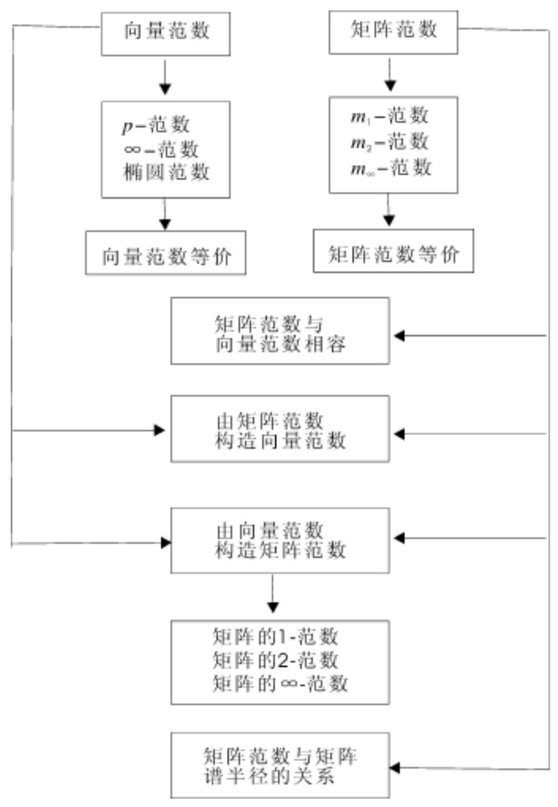

## 五、课后习题全解

## 习 题 2.1

1. 求向量 $\mathrm{e} = \left( {1,1,\cdots ,1}\right)$ 的 ${\mathrm{l}}_{1},\mathrm{\;b}$ 及 ${\mathrm{l}}_{\infty }$ 范数.

解 $\parallel \mathrm{e}{\parallel }_{1} = \mathrm{n},\parallel \mathrm{e}{\parallel }_{2} = \sqrt{\mathrm{n}},\parallel \mathrm{e}{\parallel }_{\infty } = 1$ .

2. 在 ${R}^{2}$ 中,将向量 $x = \left( {\xi ,\xi }\right)$ 表示成平面上直角坐标系中的点 $\left( {\xi ,\xi }\right)$ ,分别画出下列不等式决定的 $\mathrm{x}$ 全体所对应的几何图形.

$$
\parallel \mathrm{x}{\parallel }_{1} \leq  1,\parallel \mathrm{x}{\parallel }_{2} \leq  1,\parallel \mathrm{x}{\parallel }_{\infty } \leq  1
$$

解 $\parallel x{\parallel }_{1} \leq  1$ ，即 $\left| \xi \right|  + \left| \xi \right|  \leq  1$ ，如图 $2 - 1\left( a\right)$ 所示； $\parallel x{\parallel }_{2} \; \leq  1$ ,即 ${\xi }^{2} + {\xi }^{2} \leq  1$ ,如图 ${2}^{ - }1\left( b\right)$ 所示; $\parallel x{\parallel }_{\infty } \leq  1$ ,即 $\max \{ 1,\xi \}$ , $\left| \xi \right| \}  \leq  1$ ,如图 $2 - 1\left( \mathrm{c}\right)$ 所示.

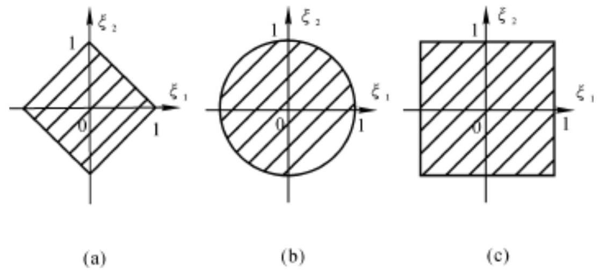

## 图 2-1

3. 证明例 2.5 所给各题.

证 先证第一式是范数:

当 $\mathrm{f}\left( \mathrm{t}\right)  \neq  0$ 时, $\parallel \mathrm{f}\left( \mathrm{t}\right) {\parallel }_{1} = {\int }_{a}^{b}\left| {\mathrm{f}\left( \mathrm{t}\right) }\right| \mathrm{d}\mathrm{t} > 0$ ;

当 $\mathrm{f}\left( \mathrm{t}\right)  = 0$ 时， $\parallel \mathrm{f}\left( \mathrm{t}\right) {\parallel }_{1} = 0$ .

$\parallel \alpha \mathrm{f}\left( \mathrm{t}\right) {\parallel }_{1} = {\int }_{\mathrm{a}}^{\mathrm{b}}\left| {\alpha \mathrm{f}\left( \mathrm{t}\right) }\right| \mathrm{{dt}} =$

$$
\left| \alpha \right| {\int }_{a}^{b}\left| {f\left( t\right) }\right| {dt} = \left| \alpha \right| \parallel f\left( t\right) {\parallel }_{1}
$$

$$
\parallel f\left( t\right)  + g\left( t\right) {\parallel }_{1} = {\int }_{a}^{b}\left| {f\left( t\right)  + g\left( t\right) }\right| {dt} \leq
$$

$$
{\int }_{a}^{b}\left\lbrack  {\left| {f\left( t\right) }\right|  + \left| {g\left( t\right) }\right| }\right\rbrack  {dt} =
$$

$$
{\int }_{a}^{b}\left| {f\left( t\right) }\right| {dt} + {\int }_{a}^{b}\left| {g\left( t\right) }\right| {dt} =
$$

$$
\parallel f\left( t\right) {\parallel }_{1} + \parallel g\left( t\right) {\parallel }_{1}
$$

再证第二式是范数: 只需考虑 $\mathrm{p} > 1$ 的情形.

当 $\mathrm{f}\left( \mathrm{t}\right)  \neq  0$ 时, $\parallel \mathrm{f}\left( \mathrm{t}\right) {\parallel }_{\mathrm{p}} = {\left\lbrack  {\int }_{\mathrm{a}}^{\mathrm{b}}{\left| \mathrm{f}\left( \mathrm{t}\right) \right| }^{\mathrm{p}}\mathrm{{dt}}\right\rbrack  }^{\frac{1}{\mathrm{p}}} > 0$ ;

当 $\mathrm{f}\left( \mathrm{t}\right)  = 0$ 时, $\parallel \mathrm{f}\left( \mathrm{t}\right) {\parallel }_{\mathrm{p}} = 0$ .

$$
\parallel \mathbf{\alpha }f\left( t\right) {\parallel }_{p} = {\left\lbrack  {\int }_{a}^{b}{\left| \mathbf{\alpha }f\left( t\right) \right| }^{p}dt\right\rbrack  }^{\frac{1}{p}} =
$$

$$
{\left\lbrack  {\left| \alpha \right| }^{p}{\int }_{a}^{b}{\left| f\left( t\right) \right| }^{p}dt\right\rbrack  }^{\frac{1}{p}} =
$$

$$
\left| \alpha \right| {\left\lbrack  {\int }_{a}^{b}{\left| f\left( t\right) \right| }^{p}dt\right\rbrack  }^{\frac{1}{p}} =
$$

$$
\left| \alpha \right| \parallel f\left( t\right) {\parallel }_{p}
$$

为了证明三角不等式成立,需要证明下面不等式

$$
{\left\lbrack  {\int }_{a}^{b}{\left| f\left( t\right)  + g\left( t\right) \right| }^{p}dt\right\rbrack  }^{\frac{1}{p}} \leq  {\left\lbrack  {\int }_{a}^{b}{\left| f\left( t\right) \right| }^{p}dt\right\rbrack  }^{\frac{1}{p}} +
$$

$$
{\left\lbrack  {\int }_{a}^{b}{\left| g\left( t\right) \right| }^{p}dt\right\rbrack  }^{\frac{1}{p}}
$$

因为

$$
{\int }_{a}^{b}{\left| f\left( t\right)  + g\left( t\right) \right| }^{p}{dt} =
$$

$$
{\int }_{a}^{b}\left| {f\left( t\right)  + g\left( t\right) }\right| {\left| f\left( t\right)  + g\left( t\right) \right| }^{p - 1}{dt} \leq
$$

$$
{\int }_{a}^{b}\left\lbrack  {\left| {f\left( t\right) }\right|  + \left| {g\left( t\right) }\right| }\right\rbrack  \left| {f\left( t\right)  + {\left. g\left( t\right) \right| }^{p - 1}{dt}}\right|  =
$$

$$
{\int }_{a}^{b}\left| {f\left( t\right) }\right| {\left| f\left( t\right)  + g\left( t\right) \right| }^{p - 1}{dt} +
$$

$$
{\int }_{a}^{b}\left| {g\left( t\right) }\right| \left| {f\left( t\right)  + {\left. g\left( t\right) \right| }^{p - 1}}\right| {dt}
$$

对上式右端使用积分形式的 Holder 不等式

$$
{\int }_{a}^{b}\left| {f\left( t\right) g\left( t\right) }\right| {dt} \leq  {\left\lbrack  {\int }_{a}^{b}{\left| f\left( t\right) \right| }^{p}{dt}\right\rbrack  }^{\frac{1}{p}}{\left\lbrack  {\int }_{a}^{b}{\left| g\left( t\right) \right| }^{q}{dt}\right\rbrack  }^{\frac{1}{q}}
$$

$$
\left( {\frac{1}{\mathrm{p}} + \frac{1}{\mathrm{q}} = 1,\mathrm{p} > 1,\mathrm{q} > 1}\right)
$$

可得

$$
{\int }_{a}^{b}{\left| f\left( t\right)  + g\left( t\right) \right| }^{p}{dt} \leq
$$

$$
{\left\lbrack  {\int }_{a}^{b}{\left| f\left( t\right) \right| }^{p}dt\right\rbrack  }^{\frac{1}{p}}{\left\lbrack  {\int }_{a}^{b}{\left| f\left( t\right)  + g\left( t\right) \right| }^{\left( {p - 1}\right) q}dt\right\rbrack  }^{\frac{1}{q}}
$$

$$
{\left\lbrack  {\int }_{a}^{b}{\left| g\left( t\right) \right| }^{p}dt\right\rbrack  }^{\frac{1}{p}}{\left\lbrack  {\int }_{a}^{b}{\left| f\left( t\right)  + g\left( t\right) \right| }^{\left( {p - 1}\right) q}dt\right\rbrack  }^{\frac{1}{q}} =
$$

$$
\left\{  {{\left\lbrack  {\int }_{a}^{b}{\left| f\left( t\right) \right| }^{p}dt\right\rbrack  }^{\frac{1}{p}} + {\left\lbrack  {\int }_{a}^{b}{\left| g\left( t\right) \right| }^{p}dt\right\rbrack  }^{\frac{1}{p}}}\right\}  {\left\lbrack  {\int }_{a}^{b}{\left| f\left( t\right)  + g\left( t\right) \right| }^{p}dt\right\rbrack  }^{\frac{1}{q}}
$$

两端同除以 ${\left\lbrack  {\int }_{a}^{b}{\left| f\left( t\right)  + g\left( t\right) \right| }^{p}dt\right\rbrack  }^{\frac{1}{q}}$ 便得所需要的不等式.

最后证第三式是范数:

当 $\mathrm{f}\left( \mathrm{t}\right)  \neq  0$ 时, $\parallel \mathrm{f}\left( \mathrm{t}\right) {\parallel }_{\infty } = \mathop{\max }\limits_{{\mathrm{t} \in  \left\lbrack  {\mathrm{a},\mathrm{b}}\right\rbrack  }}\left| {\mathrm{f}\left( \mathrm{t}\right) }\right|  > 0$ ;

当 $\mathrm{f}\left( \mathrm{t}\right)  = 0$ 时, $\parallel \mathrm{f}\left( \mathrm{t}\right) {\parallel }_{\infty } = 0$ .

$$
\parallel \mathbf{\alpha }\mathbf{f}\left( \mathrm{t}\right) {\parallel }_{\infty } = \mathop{\max }\limits_{{\mathrm{t} \in  \left\lbrack  {\mathrm{a},\mathrm{b}}\right\rbrack  }}\left| {\mathbf{\alpha }\mathbf{f}\left( \mathrm{t}\right) }\right|  =
$$

$$
\left| \alpha \right| \mathop{\max }\limits_{{t \in  \left\lbrack  {a, b}\right\rbrack  }}\left| {f\left( t\right) }\right|  = \left| \alpha \right| \parallel f\left( t\right) {\parallel }_{\infty }
$$

$$
\parallel \mathrm{f}\left( \mathrm{t}\right)  + \mathrm{g}\left( \mathrm{t}\right) {\parallel }_{\infty } = \mathop{\max }\limits_{{\mathrm{t} \in  \left\lbrack  {\mathrm{a},\mathrm{b}}\right\rbrack  }}\left| {\mathrm{f}\left( \mathrm{t}\right)  + \mathrm{g}\left( \mathrm{t}\right) }\right|  \leq
$$

$$
\mathop{\max }\limits_{{t \in  \left\lbrack  {a, b}\right\rbrack  }}\left\lbrack  {\left| {f\left( t\right) }\right|  + \left| {g\left( t\right) }\right| }\right\rbrack   \leq
$$

$$
\mathop{\max }\limits_{{t \in  \left\lbrack  {a, b}\right\rbrack  }}\left| {f\left( t\right) }\right|  + \mathop{\max }\limits_{{t \in  \left\lbrack  {a, b}\right\rbrack  }}\left| {g\left( t\right) }\right|  =
$$

$$
\parallel \mathrm{f}\left( \mathrm{t}\right) {\parallel }_{\infty } + \parallel \mathrm{g}\left( \mathrm{t}\right) {\parallel }_{\infty }
$$

4. 设 $\parallel \mathrm{X}{\parallel }_{\alpha }$ 与 $\parallel \mathrm{X}{\parallel }_{\beta }$ 是 ${\mathrm{C}}^{n}$ 上的两种范数, ${\mathrm{k}}_{\mathrm{I}},{\mathrm{k}}_{2}$ 是正常数,证明下列函数:

(1) $\max \left( {\parallel \mathrm{x}{\parallel }_{\alpha },\parallel \mathrm{x}{\parallel }_{\beta }}\right)$

(2) ${k}_{i}\parallel x{\parallel }_{\alpha } + {k}_{i}\parallel x{\parallel }_{\beta }$

是 ${\mathrm{C}}^{\mathrm{n}}$ 上的范数.

证 (1) 记 $\parallel \mathrm{x}\parallel  = \max \left( {\parallel \mathrm{x}{\parallel }_{\alpha },\parallel \mathrm{x}{\parallel }_{\beta }}\right)$ ,则当 $\mathrm{x} \neq  0$ 时,

$$
\parallel \mathrm{x}\parallel  > 0\text{ ; 当 }\mathrm{x} = 0\text{ 时, }\parallel \mathrm{x}\parallel  = 0\text{ . }
$$

$$
\parallel \mathrm{{kx}}\parallel  = \max \left( {\parallel \mathrm{{kx}}{\parallel }_{\alpha },\parallel \mathrm{{kx}}{\parallel }_{\beta }}\right)  =
$$

$$
\max \left( {\left| \mathrm{k}\right| \parallel \mathrm{x}{\parallel }_{\alpha },\left| \mathrm{k}\right| \parallel \mathrm{x}{\parallel }_{\beta }}\right)  =
$$

$$
\left| k\right| \max \left( {\parallel \mathrm{x}{\parallel }_{\alpha },\parallel \mathrm{x}{\parallel }_{\beta }}\right)  = \left| {k\left| {\parallel \mathrm{x}\parallel }\right| }\right|
$$

$$
\parallel x + y\parallel  = \max \left( {\parallel x + y{\parallel }_{\alpha },\parallel x + y{\parallel }_{\beta }}\right)  \leq
$$

$$
\max \left( {\parallel \mathrm{x}{\parallel }_{\alpha } + \parallel \mathrm{y}{\parallel }_{\alpha },\parallel \mathrm{x}{\parallel }_{\beta } + \parallel \mathrm{y}{\parallel }_{\beta }}\right)  \leq
$$

$$
\max \left( {\parallel \mathrm{x}{\parallel }_{\alpha },\parallel \mathrm{x}{\parallel }_{\beta }}\right)  + \max \left( {\parallel \mathrm{y}{\parallel }_{\alpha },\parallel \mathrm{y}{\parallel }_{\beta }}\right)  =
$$

$$
\parallel \mathrm{x}\parallel  + \parallel \mathrm{y}\parallel
$$

所以 $\begin{Vmatrix}\mathrm{x}\end{Vmatrix}$ 是 ${\mathrm{C}}^{\mathrm{n}}$ 上的范数.

(2) 记 $\parallel \mathrm{x}\parallel  = {\mathrm{k}}_{1}\parallel \mathrm{x}{\parallel }_{\alpha } + {\mathrm{k}}_{2}\parallel \mathrm{x}{\parallel }_{\beta }$ ,则当 $\mathrm{x} \neq  0$ 时, $\parallel \mathrm{x}\parallel  > 0$ ; 当 $x = 0$ 时, $\parallel x\parallel  = 0$ .

$$
\parallel \mathrm{{kx}}\parallel  = \mathrm{k}\parallel \mathrm{{kx}}{\parallel }_{\alpha } + \mathrm{k}\parallel \mathrm{{kx}}{\parallel }_{\beta } =
$$

$$
\left| k\right| \left( {k{\begin{Vmatrix}x\end{Vmatrix}}_{\alpha } + k{\begin{Vmatrix}x\end{Vmatrix}}_{\beta }}\right)  = \left| k\right| \begin{Vmatrix}x\end{Vmatrix}
$$

$$
\parallel x + y\parallel  = k\parallel x + y{\parallel }_{\alpha } + k\parallel x + y{\parallel }_{\beta } \leq
$$

$$
\mathrm{k}\left( {{\begin{Vmatrix}\mathrm{x}\end{Vmatrix}}_{\alpha } + \parallel \mathrm{y}{\parallel }_{\alpha }}\right)  + \mathrm{k}\left( {{\begin{Vmatrix}\mathrm{x}\end{Vmatrix}}_{\beta } + \parallel \mathrm{y}{\parallel }_{\beta }}\right)  =
$$

$$
\left( {{\mathrm{k}}_{\mathrm{I}}\parallel \mathrm{x}{\parallel }_{\alpha } + \mathrm{k}\parallel \mathrm{x}{\parallel }_{\beta }}\right)  +
$$

$$
\left( {{\mathrm{k}}_{1}\parallel \mathrm{y}{\parallel }_{\alpha } + \mathrm{k}\parallel \mathrm{y}{\parallel }_{\beta }}\right)  = \begin{Vmatrix}\mathrm{x}\end{Vmatrix} + \parallel \mathrm{y}\parallel
$$

所以 $\begin{Vmatrix}\mathrm{x}\end{Vmatrix}$ 是 ${\mathrm{C}}^{\mathrm{n}}$ 上的范数.

5. 设矩阵 $\mathrm{S} \in  {\mathrm{C}}^{\mathrm{m} \times  \mathrm{n}}$ 列满秩,给定 ${\mathrm{C}}^{\mathrm{m}}$ 上的一种向量范数 $\parallel  \cdot  \parallel$ ,证明

$$
\parallel \mathrm{x}{\parallel }_{\mathrm{s}} = \parallel \mathrm{{Sx}}\parallel \left( {\mathrm{x} \in  {\mathrm{C}}^{\mathrm{n}}}\right)
$$

是 ${\mathrm{C}}^{\mathrm{n}}$ 上的向量范数.

证 当 $\mathrm{x} \neq  0$ 时,由于 $\mathrm{S}$ 列满秩,所以 $\mathrm{{Sx}} \neq  0$ ,从而 $\parallel \mathrm{x}{\parallel }_{\mathrm{s}} = \; \parallel \mathrm{{Sx}}\parallel  > 0$ ; 当 $\mathrm{x} = 0$ 时, $\mathrm{{Sx}} = 0$ ,于是 $\parallel \mathrm{x}{\parallel }_{\mathrm{s}} = \parallel \mathrm{{Sx}}\parallel  = 0$ .

$$
\parallel \mathrm{{kx}}{\parallel }_{\mathrm{s}} = \parallel \mathrm{S}\left( \mathrm{{kx}}\right) \parallel  = \parallel \mathrm{k}\left( \mathrm{{Sx}}\right) \parallel  =
$$

$$
\left| k\right| \begin{Vmatrix}{Sx}\end{Vmatrix} = \left| k\right| \parallel x{\parallel }_{s}
$$

$$
\parallel x + y{\parallel }_{s} = \parallel S\left( {x + y}\right) \parallel  = \parallel {Sx} + {Sy}\parallel  \leq
$$

$$
\begin{Vmatrix}{Sx}\end{Vmatrix} + \begin{Vmatrix}{Sy}\end{Vmatrix} = {\begin{Vmatrix}x\end{Vmatrix}}_{s} + \parallel y{\parallel }_{s}
$$

因此, $\parallel \mathrm{x}{\parallel }_{\mathrm{s}}$ 是 ${\mathrm{C}}^{\mathrm{n}}$ 上的范数.

## 习 题 2.2

1. 求矩阵 $A = \left\lbrack  \begin{array}{lll}  - 1 & 2 & 1 \end{array}\right\rbrack$ 和 $B = \left\lbrack  \begin{array}{rrr}  - \mathrm{i} & 2 & 3 \\  1 & 0 & \mathrm{i} \end{array}\right\rbrack$ 的范数 $\parallel  \cdot  {\parallel }_{1},\parallel  \cdot  {\parallel }_{\infty }$ 及 $\parallel  \cdot  {\parallel }_{2}$ .

解 $\parallel \mathrm{A}{\parallel }_{1} = \max \{ 1 - 1 \mid  ,2,1\}  = 2$

$$
\parallel \mathrm{A}{\parallel }_{\infty } = \left| {-1}\right|  + 2 + 1 = 4
$$

${\mathrm{A}}^{\mathrm{H}}\mathrm{A}$ 与 ${\mathrm{{AA}}}^{\mathrm{H}} = \left\lbrack  6\right\rbrack$ 的非零特征值相同,故 $\parallel \mathrm{A}{\parallel }_{2} = \sqrt{6}$ .

$$
\parallel \mathrm{B}{\parallel }_{1} = \max \{ \left| {-\mathrm{i}}\right|  + 1,2 + 0,3 + \left| \mathrm{i}\right| \}  = 4
$$

$\parallel \mathrm{B}{\parallel }_{\infty } = \max \{ \left| {-\mathrm{i}}\right|  + 2 + 3,1 + 0 + \left| \mathrm{i}\right| \}  = 6$

${B}^{H}B = \left\lbrack  \begin{array}{rrr} 2 & {2i} & {4i} \\   - {2i} & 4 & 6 \\   - {4i} & 6 & {10} \end{array}\right\rbrack$

$\det \left( {{\lambda I} - {B}^{H}B}\right)  = \lambda \left( {\lambda  - \left( {8 + 2\sqrt{13}}\right) }\right) \left( {\lambda  - \left( {8 - 2\sqrt{13}}\right) }\right)$

$\parallel \mathrm{B}{\parallel }_{2} = \sqrt{8 + 2\sqrt{13}}$

2. 设 $\lambda$ 为矩阵 $\mathrm{A} \in  {\mathrm{C}}^{\mathrm{m} \times  \mathrm{m}}$ 的特征值,证明 $\left| \lambda \right|  \leq  \sqrt[{\mathrm{m}\left( {{\mathrm{A}}^{\mathrm{m}} + }\right) }]{\begin{Vmatrix}{\mathrm{A}}^{\mathrm{m}}\end{Vmatrix}}$ .

证 设 $A$ 的属于特征值 $\lambda$ 的特征向量为 $x$ ,即 ${Ax} = {\lambda x}$ ,从而有 ${\mathrm{A}}^{\mathrm{m}}\mathrm{x} = {\lambda }^{\mathrm{m}}\mathrm{x}$ . 取向量范数 $\parallel \mathrm{x}\parallel$ 和题中给出的矩阵范数相容,则有

${\left| \lambda \right| }^{m}\parallel x\parallel  = \begin{Vmatrix}{{\lambda }^{m}x}\end{Vmatrix} = \begin{Vmatrix}{{A}^{m}x}\end{Vmatrix} \leq  \begin{Vmatrix}{{A}^{m}x}\end{Vmatrix} \leq  \begin{Vmatrix}{A}^{m}\end{Vmatrix}\parallel x\parallel$ 即 ${\left| \lambda \right| }^{m} \leq  \begin{Vmatrix}{A}^{m}\end{Vmatrix}$ ,也就是 $\left| \lambda \right|  \leq  \sqrt[m]{\begin{Vmatrix}{A}^{m}\end{Vmatrix}}$ .

3. 对于定理 2.5 中的三种范数, 能否举出矩阵例子使它的一种范数小于 1 , 而其他两种范数并不小于 1 .

解 取 $\mathrm{A} = \frac{1}{\sqrt{2}}\left\lbrack  \begin{array}{lll} 1 & 0 & 1 \\  0 & 1 & 0 \end{array}\right\rbrack$ ,则

$$
\parallel \mathrm{A}{\parallel }_{1} = \frac{1}{\sqrt{2}} < 1,\parallel \mathrm{A}{\parallel }_{\infty } = \sqrt{2} > 1,\parallel \mathrm{A}{\parallel }_{2} = 1
$$

4. 设矩阵 $\mathrm{A}$ 非奇异， $\lambda$ 是它的任意一个特征值，证明

$$
\left| \lambda \right|  \geq  \frac{1}{\begin{Vmatrix}{\mathrm{A}}^{-1}\end{Vmatrix}}
$$

证 设 $A$ 的属于特征值 $\lambda$ 的特征向量为 $x$ ,即 ${Ax} = {\lambda x}$ ,从而有 ${A}^{-1}x = \frac{1}{\lambda }x$ . 取向量范数 $\parallel x\parallel$ 和题中给出的矩阵范数相容,则有

$$
\left| \frac{1}{\lambda }\right| \parallel x\parallel  = \begin{Vmatrix}{\frac{1}{\lambda }x}\end{Vmatrix} = \begin{Vmatrix}{{A}^{-1}x}\end{Vmatrix} \leq  \begin{Vmatrix}{A}^{-1}\end{Vmatrix}\parallel x\parallel
$$

即 $\left| \frac{1}{\lambda }\right|  \leq  \begin{Vmatrix}{\mathrm{A}}^{-1}\end{Vmatrix}$ ,也就是 $\left| \lambda \right|  \geq  \frac{1}{\begin{Vmatrix}{\mathrm{A}}^{-1}\end{Vmatrix}}$ .

5. 设可逆方阵 $S \in  {R}^{n \times  n}$ ，且知 $\parallel x{\parallel }_{s} = \parallel {Sx}{\parallel }_{2}$ 是 ${R}^{n}$ 上的向量范数. 若 $\parallel \mathrm{A}{\parallel }_{\mathrm{s}}$ 表示 ${\mathrm{R}}^{\mathrm{n} \times  \mathrm{n}}$ 上从属于向量范数 $\parallel \mathrm{x}{\parallel }_{\mathrm{s}}$ 的矩阵范数,试导出 $\parallel \mathrm{A}{\parallel }_{\mathrm{s}}$ 与矩阵的 2 - 范数之间的关系式.

证 $\parallel \mathrm{A}{\parallel }_{\mathrm{s}} = \mathop{\max }\limits_{{\mathrm{x} \neq  0}}\frac{\parallel \mathrm{A}\mathrm{x}{\parallel }_{\mathrm{s}}}{\parallel \mathrm{x}{\parallel }_{\mathrm{s}}} = \mathop{\max }\limits_{{\mathrm{x} \neq  0}}\frac{\parallel \mathrm{{SA}}\mathrm{x}{\parallel }_{2}}{\parallel \mathrm{S}\mathrm{x}{\parallel }_{2}} =$

$$
\mathop{\max }\limits_{{\mathrm{y} \neq  0}}\frac{{\begin{Vmatrix}{\mathrm{{SAS}}}^{-1}\mathrm{y}\end{Vmatrix}}_{2}}{{\begin{Vmatrix}\mathrm{y}\end{Vmatrix}}_{2}} = {\begin{Vmatrix}{\mathrm{{SAS}}}^{-1}\end{Vmatrix}}_{2}
$$

6. 设 $\mathrm{A} \in  {\mathrm{C}}^{\mathrm{m} \times  \mathrm{n}}$ ，证明矩阵范数 $\parallel \mathrm{A}{\parallel }_{{\mathrm{m}}_{1}}$ 与向量范数 $\parallel \mathrm{x}{\parallel }_{\mathrm{p}}(1 \leq \; p < \infty )$ 相容.

证 设 $A = {\left( {a}_{ij}\right) }_{m \times  n}, x = {\left( \xi ,\xi ,\cdots ,{\xi }_{n}\right) }^{T},{E}_{ij}$ 表示第 $i$ 行第 $j$ 列元素为 1,其余元素均为 0 的 $\mathrm{m} \times  \mathrm{n}$ 矩阵,则有

$$
{\mathrm{E}}_{\mathrm{{ij}}}\mathrm{x} = {\left( 0,\cdots ,0,{\xi }_{\mathrm{j}},0,\cdots ,0\right) }^{\mathrm{T}},\;{\begin{Vmatrix}{\mathrm{E}}_{\mathrm{{ij}}}\mathrm{x}\end{Vmatrix}}_{\mathrm{p}} \leq  \parallel \mathrm{x}{\parallel }_{\mathrm{p}}
$$

于是

$$
\parallel \mathrm{{Ax}}{\parallel }_{\mathrm{p}} = {\begin{Vmatrix}\mathop{\sum }\limits_{{\mathrm{i},\mathrm{j}}}{\mathrm{a}}_{\mathrm{{ij}}}{\mathrm{E}}_{\mathrm{{ij}}}\mathrm{X}\end{Vmatrix}}_{\mathrm{p}} \leq  \mathop{\sum }\limits_{{\mathrm{i},\mathrm{j}}}\left| {\mathrm{a}}_{\mathrm{{ij}}}\right| {\begin{Vmatrix}{\mathrm{E}}_{\mathrm{{ij}}}\mathrm{X}\end{Vmatrix}}_{\mathrm{p}} \leq
$$

$$
\mathop{\sum }\limits_{{i, j}}\left| {a}_{ij}\right| \parallel x{\parallel }_{p} = \parallel A{\parallel }_{{m}_{1}}\parallel x{\parallel }_{p}
$$

## 习 题 2.3

1. 设 $\mathrm{A} \in  {\mathrm{C}}^{\mathrm{n} \times  \mathrm{n}}$ 可逆, $\mathrm{B} \in  {\mathrm{C}}^{\mathrm{n} \times  \mathrm{n}}$ ,若对某种矩阵范数有 $\parallel \mathrm{B}\parallel  < \; \frac{1}{\begin{Vmatrix}{\mathrm{A}}^{-1}\end{Vmatrix}}$ ,则 $\mathrm{A} + \mathrm{B}$ 可逆.

证 $\mathrm{A} + \mathrm{B} = \mathrm{A}\left( {\mathrm{I} + {\mathrm{A}}^{-1}\mathrm{\;B}}\right)$ . 由于 $\begin{Vmatrix}{{\mathrm{A}}^{-1}\mathrm{\;B}}\end{Vmatrix} \leq  \begin{Vmatrix}{\mathrm{A}}^{-1}\end{Vmatrix}\parallel \mathrm{B}\parallel  <$ 1,所以 $\begin{Vmatrix}\left( {-{\mathrm{A}}^{-1}\mathrm{\;B}}\right) \end{Vmatrix} < 1$ . 根据定理 2.6 可得 $\mathrm{I} + {\mathrm{A}}^{-1}\mathrm{\;B}$ 可逆,从而 $A + B$ 可逆.

2. 已知 $A = \left\lbrack  \begin{array}{ll} 2 & 1 \\  1 & 3 \end{array}\right\rbrack  ,{\delta A} = \left\lbrack  \begin{matrix} 0 & {0.5} \\  {0.2} & 2 \end{matrix}\right\rbrack$ ,试估计

$$
\frac{{\begin{Vmatrix}{\mathrm{A}}^{-1} - {\left( \mathrm{\;A} + \mathrm{{\delta A}}\right) }^{-1}\end{Vmatrix}}_{\infty }}{{\begin{Vmatrix}{\mathrm{A}}^{-1}\end{Vmatrix}}_{\infty }} = \text{ ? }
$$

解 ${A}^{-1} = \frac{1}{5}\left\lbrack  \begin{array}{rr} 3 &  - 1 \\   - 1 & 2 \end{array}\right\rbrack  ,{\left( A + \delta A\right) }^{-1} = \frac{1}{42}\left\lbrack  \begin{array}{rr} {30} &  - {15} \\   - {12} & {20} \end{array}\right\rbrack$

$$
{A}^{-1} - {\left( A + \delta A\right) }^{-1} = \frac{1}{210}\left\lbrack  \begin{array}{rr}  - {24} & {33} \\  {18} &  - {16} \end{array}\right\rbrack
$$

$$
\frac{{\begin{Vmatrix}{A}^{-1} - {\left( A + \delta A\right) }^{-1}\end{Vmatrix}}_{\infty }}{{\begin{Vmatrix}{A}^{-1}\end{Vmatrix}}_{\infty }} = \frac{57}{210}\;\frac{4}{5} = \frac{19}{56} \approx  {0.34}
$$

## 六、学习效果测试题及答案

## (一) 测试题

1. 设 $A, B \in  {R}^{n \times  n}$ 的零空间满足 $N\left( A\right)  \cap  N\left( B\right)  = \{ 0\}$ ,对于 ${R}^{n}$ 中的列向量 $\alpha$ ,定义实数 $\parallel \alpha \parallel  = \parallel \mathrm{A}\mathbf{\alpha }{\parallel }_{\infty } + 2\parallel \mathrm{B}\mathbf{\alpha }{\parallel }_{2}$ ,验证 $\parallel \alpha \parallel$ 是 ${\mathrm{R}}^{\mathrm{n}}$ 中的向量范数.

2. 设数域 $C$ 上的线性空间 ${V}^{n}$ 的一个基为 ${X}_{1},{X}_{2},\cdots ,{X}_{n}$ ,且 $x \in \; {V}^{n}$ 在该基下的坐标 $\alpha  = {\left( \xi ,\xi ,\cdots ,{\xi }_{n}\right) }^{T}$ ,定义实数

$$
\parallel  x \parallel   = {\left( {k}_{1}{\left| {\xi }_{1}\right| }^{2} + {k}_{2}{\left| {\xi }_{2}\right| }^{2} + \cdots  + {k}_{n}{\left| {\xi }_{n}\right| }^{2}\right) }^{1/2}\;(
$$

(k ∈ C)证明: $\parallel \mathrm{x}\parallel$ 是 ${\mathrm{V}}^{\mathrm{n}}$ 中的向量范数的充要条件是 ${\mathrm{k}}_{1},{\mathrm{k}}_{2},\cdots ,{\mathrm{k}}_{\mathrm{n}}$ 都为正数.

3. 设列向量 $\alpha ,\beta  \in  {\mathrm{R}}^{\mathrm{n}}$ ，证明: $\parallel \alpha  + \beta {\parallel }_{2} = \parallel \alpha {\parallel }_{2} + \parallel \beta {\parallel }_{2}$ 的充要条件是 $\alpha$ 与 $\beta$ 线性相关,且 ${\alpha }^{\mathrm{T}}\beta  \geq  0$ .

4. 给定 ${\mathrm{C}}^{\mathrm{n} \times  \mathrm{n}}$ 中的矩阵范数 $\parallel  \cdot  \parallel$ ,选取可逆矩阵 $\mathrm{P}$ ,使得 $\parallel \mathrm{P}\parallel \; = 1$ . 对于 $\mathrm{A} \in  {\mathrm{C}}^{\mathrm{n} \times  \mathrm{n}}$ ,定义实数 $\parallel \mathrm{A}{\parallel }_{\mathrm{M}} = \begin{Vmatrix}{\mathrm{{AP}}}^{-1}\end{Vmatrix}$ ,验证 $\parallel \mathrm{A}{\parallel }_{\mathrm{M}}$ 是 ${\mathrm{C}}^{\mathrm{n} \times  \mathrm{n}}$ 中的矩阵范数.

5. 给定 ${\mathrm{C}}^{\mathrm{n} \times  \mathrm{n}}$ 中的矩阵范数 $\parallel  \cdot  {\parallel }_{\mathrm{F}}$ 与 $\parallel  \cdot  {\parallel }_{2}$ ,对于 $\mathrm{A} \in  {\mathrm{C}}^{\mathrm{n} \times  \mathrm{n}}$ , 定义实数 $\parallel \mathrm{A}\parallel  = \parallel \mathrm{A}{\parallel }_{\mathrm{F}} + 2\parallel \mathrm{A}{\parallel }_{2}$ ,验证 $\parallel \mathrm{A}\parallel$ 是 ${\mathrm{C}}^{\mathrm{n} \times  \mathrm{n}}$ 中的矩阵范数.

6. 设 $A, B \in  {C}^{n \times  n}$ 都是可逆矩阵,且齐次线性方程组 $\left( {A + B}\right) x =$ 0 有非零解,证明: 对于 ${C}^{n \times  n}$ 中的任何矩阵范数 $\parallel  \cdot  \parallel$ ,都有 $\begin{Vmatrix}{{\mathrm{A}}^{-1}\mathrm{\;B}}\end{Vmatrix} \geq  1$ 及 $\begin{Vmatrix}{\mathrm{A}{\mathrm{B}}^{-1}}\end{Vmatrix} \geq  1$ .

7. 设 $A \in  {C}^{n \times  n}$ ,证明: 谱半径 $\rho \left( A\right)  < 1$ 的充要条件是,存在矩阵范数 $\parallel  \cdot  \parallel$ ,使得 $\parallel A\parallel  < 1$ .

8. 设 $A \in  {C}^{n \times  n}$ ,证明: 矩阵范数 $\parallel A{\parallel }_{{m}_{\infty }}$ 与向量的 1 - 范数相容.

## (二) 测试题答案或提示

1. 非负性. 当 $\alpha  \neq  0$ 时,由 $\mathrm{N}\left( \mathrm{A}\right)  \cap  \mathrm{N}\left( \mathrm{B}\right)  = \{ 0\}$ 可得, $\mathrm{A}\alpha  = 0$ 与 $\mathrm{B}\alpha  = 0$ 不能同时成立,从而 $\parallel \mathrm{A}\alpha {\parallel }_{\infty } > 0$ 与 $\parallel \mathrm{B}\alpha {\parallel }_{2} > 0$ 至少有一个成立,故 $\parallel \alpha \parallel  > 0$ .

2. 必要性. ${X}_{i}$ 在基 ${X}_{1},{X}_{2},\cdots ,{X}_{n}$ 下的坐标为 ${e}_{i}$ ,由 $\begin{Vmatrix}{X}_{i}\end{Vmatrix} > 0$ 知 $\sqrt{{k}_{i}} > 0$ ,即 ${k}_{i} > 0\left( {i = 1,2,\cdots , n}\right)$ .

3. 必要性. 由 $\parallel \alpha  + \beta {\parallel }_{2}^{2} = {\left( \parallel \alpha {\parallel }_{2} + \parallel \beta {\parallel }_{2}\right) }^{2}$ 可得 ${\alpha }^{\mathrm{T}}\beta  = \; \parallel \alpha {\parallel }_{2}\parallel \beta {\parallel }_{2} \geq  0$ ; 当 $\beta  \neq  0$ 时,取 $\mathrm{t} = \frac{\parallel \alpha {\parallel }_{2}}{\parallel \beta {\parallel }_{2}}$ ,则有 $\parallel \alpha  - \mathrm{t}\beta {\parallel }_{2}^{2} = 0$ , 即 $\alpha  - {t\beta } = 0$ ，也就是 $\alpha$ 与 $\beta$ 线性相关.

充分性. 当 $\alpha  \neq  0$ 时，设 $\beta  = {k\alpha }$ ，由 ${\alpha }^{\mathrm{T}}\beta  \geq  0$ 可得 $k \geq  0$ ，且有

$$
\parallel \mathbf{\alpha } + \mathbf{\beta }{\parallel }_{2} = \left( {1 + \mathrm{k}}\right) \parallel \mathbf{\alpha }{\parallel }_{2} = \parallel \mathbf{\alpha }{\parallel }_{2} + \parallel \mathrm{k}\mathbf{\alpha }{\parallel }_{2} =
$$

$$
\parallel \alpha {\parallel }_{2} + \parallel \beta {\parallel }_{2}
$$

4. 相容性 . 设 $A, B \in  {C}^{n \times  n}$ ,则有

$$
\parallel \mathrm{{AB}}{\parallel }_{\mathrm{M}} = \begin{Vmatrix}{\left( \mathrm{{AB}}\right) {\mathrm{P}}^{-1}}\end{Vmatrix} = \begin{Vmatrix}{\left( {\mathrm{{AP}}}^{-1}\right) \mathrm{P}\left( {\mathrm{{BP}}}^{-1}\right) }\end{Vmatrix} \leq
$$

$$
\begin{Vmatrix}{A{P}^{-1}}\end{Vmatrix}\parallel P\parallel \begin{Vmatrix}{B{P}^{-1}}\end{Vmatrix} =
$$

$$
\parallel \mathrm{A}{\parallel }_{\mathrm{M}}\parallel \mathrm{B}{\parallel }_{\mathrm{M}}
$$

5. 相容性 . 设 $A, B \in  {C}^{n \times  n}$ ,则有

$$
\parallel \mathrm{{AB}}\parallel  = \parallel \mathrm{{AB}}{\parallel }_{\mathrm{F}} + 2\parallel \mathrm{{AB}}{\parallel }_{2} \leq
$$

$$
\parallel \mathrm{A}{\parallel }_{\mathrm{F}}\parallel \mathrm{B}{\parallel }_{\mathrm{F}} + 2\parallel \mathrm{A}{\parallel }_{2}\parallel \mathrm{B}{\parallel }_{2} \leq
$$

$$
\left( {\parallel \mathrm{A}{\parallel }_{\mathrm{F}} + 2\parallel \mathrm{\;A}{\parallel }_{2}}\right) \left( {\parallel \mathrm{B}{\parallel }_{\mathrm{F}} + 2\parallel \mathrm{\;B}{\parallel }_{2}}\right)  =
$$

$$
\parallel \mathrm{A}\parallel \parallel \mathrm{B}\parallel
$$

6. 因为 $\left( {\mathrm{A} + \mathrm{B}}\right) \mathrm{x} = 0$ 有非零解,所以 $\det \left( {\mathrm{A} + \mathrm{B}}\right)  = 0$ . 由此可得

$$
\det \left\lbrack  {\left( {-1}\right) \mathrm{I} - {\mathrm{A}}^{-1}\mathrm{\;B}}\right\rbrack   = 0,\;\det \left\lbrack  {\left( {-1}\right) \mathrm{I} - {\mathrm{{AB}}}^{-1}}\right\rbrack   = 0
$$

即 $\lambda  =  - 1$ 是 ${A}^{-1}B$ 与 $A{B}^{-1}$ 的特征值,从而可得结论.

7. 必要性. 取 $\varepsilon  = \frac{1}{2}\left\lbrack  {1 - \rho \left( A\right) }\right\rbrack   > 0$ ,对于矩阵 $A$ ,存在矩阵范数 $\parallel  \cdot  \parallel$ ,使得 $\parallel \mathrm{A}\parallel  \leq  \rho \left( \mathrm{A}\right)  + \varepsilon  < 1$ .

8. 设 $A = {\left( {a}_{ij}\right) }_{n \times  n}, x = {\left( {\xi }_{i},{\xi }_{j},\cdots ,{\xi }_{n}\right) }^{T}$ ,则有

$$
\parallel \mathrm{A}\mathrm{x}{\parallel }_{1} = \mathop{\sum }\limits_{{\mathrm{k} = 1}}^{\mathrm{n}}\left| {\mathop{\sum }\limits_{{\mathrm{i} = 1}}^{\mathrm{n}}{\mathrm{a}}_{\mathrm{{ik}}}{\xi }_{\mathrm{k}}}\right|  \leq  \mathop{\sum }\limits_{{\mathrm{k} = 1}}^{\mathrm{n}}\mathop{\sum }\limits_{{\mathrm{i} = 1}}^{\mathrm{n}}\left| {\mathrm{a}}_{\mathrm{{ik}}}\right| \left| {\xi }_{\mathrm{k}}\right|  \leq
$$

$$
\left( {\mathop{\max }\limits_{{i, j}}\left| {a}_{ij}\right| }\right) \mathop{\sum }\limits_{{k = 1}}^{n}\mathop{\sum }\limits_{{1 = 1}}^{n}\left| {\xi }_{k}\right|  =
$$

$$
\left( {\mathrm{n} \cdot  \mathop{\max }\limits_{{\mathrm{i},\mathrm{j}}}\left| {\mathrm{a}}_{\mathrm{{ij}}}\right| }\right) \mathop{\sum }\limits_{{\mathrm{k} = 1}}^{\mathrm{n}}\left| {\xi }_{\mathrm{k}}\right|  = \parallel \mathrm{A}{\parallel }_{{\mathrm{m}}_{\infty }}\parallel \mathrm{x}{\parallel }_{1}
$$

## 第三章 矩阵分析及其应用

矩阵函数是以矩阵为自变量且取值为矩阵的一类函数, 它是对一元函数概念的推广. 起先, 矩阵函数是由一个收敛的矩阵幂级数的和来定义, 之后根据计算矩阵函数值的 Jordan 标准形方法又对矩阵函数的概念进行了拓宽. 因此, 矩阵函数的基础是矩阵序列与矩阵级数.

当一个矩阵的元素都是变量 $\mathrm{t}$ 的函数时,可以建立矩阵对变量 $\mathrm{t}$ 的导数和积分概念; 当一个多元函数的自变量都是矩阵 $\mathrm{X}$ 的元素时, 可以建立多元函数对矩阵 $\mathrm{X}$ 的导数概念; 当一个矩阵的元素都是矩阵 $\mathrm{X}$ 的元素的多元函数时,可以建立矩阵对矩阵 $\mathrm{X}$ 的导数概念. 矩阵序列与矩阵级数的收敛性、函数矩阵 (以函数为其元素的矩阵) 与矩阵函数的导数和积分是矩阵分析的基本内容.

## 一、基 本 概 念

1. 矩阵序列

矩阵序列指无穷多个依次排列的同阶矩阵.

(1)收敛性 设 ${A}^{\left( k\right) } = {\left( {a}_{ij}^{\left( k\right) }\right) }_{m \times  n}\;\left( {k = 1,2,\cdots }\right) , A = {\left( {a}_{ij}\right) }_{m \times  n}$ , 若

$$
\mathop{\lim }\limits_{{\mathrm{k} \rightarrow  \infty }}{\mathrm{a}}_{\mathrm{{ij}}}^{\left( \mathrm{k}\right) } = {\mathrm{a}}_{\mathrm{{ij}}}\;\left( {\mathrm{i} = 1,2,\cdots ,\mathrm{m};\mathrm{j} = 1,2,\cdots ,\mathrm{n}}\right)
$$

则称矩阵序列 $\left\{  {A}^{\left( k\right) }\right\}$ 收敛于 $A$ ，即 $\mathop{\lim }\limits_{{k \rightarrow  \infty }}{A}^{\left( k\right) } = A$

(2)收敛矩阵 设 $A \in  {C}^{n \times  n}$ ，若 $\mathop{\lim }\limits_{{k \rightarrow  \infty }}{A}^{k} = O$ ，则称 $A$ 为收敛矩阵.

2. 矩阵级数

矩阵级数指无穷多个有序同阶矩阵之和.

(1)收敛性 设 ${A}^{\left( k\right) } \in  {C}^{m \times  n}\;\left( {k = 0,1,2,\cdots }\right) ,{S}^{\left( N\right) } = \mathop{\sum }\limits_{{k = 0}}^{N}{A}^{\left( k\right) } \; \left( {N = 1,2,\cdots }\right)$ ,若矩阵序列 $\left\{  {S}^{\left( N\right) }\right\}$ 收敛于 $S$ ,则称矩阵级数 $\mathop{\sum }\limits_{{k = 0}}^{\infty }{A}^{\left( k\right) }$ 收敛于 $\mathrm{S}$ ,即 $\mathop{\sum }\limits_{{\mathrm{k} = 0}}^{\infty }{\mathrm{\;A}}^{\left( \mathrm{k}\right) } = \mathrm{S}$ .

(2)幂级数 设 $A \in  {C}^{n \times  n}$ ，则称 $\mathop{\sum }\limits_{{k = 0}}^{\infty }{c}_{k}{A}^{k}$ 为矩阵 $A$ 的幂级数，而称 $\mathop{\sum }\limits_{{k = 0}}^{\infty }{A}^{k}$ 为矩阵 $A$ 的 Neumann 级数.

3. 矩阵函数

矩阵函数指以矩阵为自变量且取值为矩阵的一类函数.

(1)由矩阵幂级数定义的矩阵函数 设一元(复变)函数 $f\left( z\right)$ 在 $z = 0$ 的幂级数为 $f\left( z\right)  = \mathop{\sum }\limits_{{k = 0}}^{\infty }{c}_{k}{z}^{k}\;\left( {\left| z\right|  < r}\right) , A \in  {C}^{n \times  n}$ 的谱半径 $\rho \left( A\right)  < r$ ,则称 $f\left( A\right)  = \mathop{\sum }\limits_{{k = 0}}^{\infty }{c}_{k}{A}^{k}$ 为对应于 $f\left( z\right)$ 的矩阵函数.

[评注] 由矩阵幂级数定义矩阵函数时,要求一元函数 $f\left( z\right)$ 在 $z = 0$ 能够展开为幂级数,且幂级数的收敛半径 $r > 0$ . 因此,一元函数 $f\left( z\right)$ 在 $z = 0$ 必须无穷阶可导.

(2)由矩阵 $J$ ordan 标准形定义的矩阵函数 设 $A \in  {C}^{n \times  n}$ 的 Jordan 标准形为

$$
\mathbf{J} = \left\lbrack  \begin{array}{llll} {\mathbf{J}}_{1} & & & \\   & {\mathbf{J}}_{2} & & \\   & & \mathbf{w} & \\   & & & {\mathbf{J}}_{s} \end{array}\right\rbrack  ,\;{\mathbf{J}}_{i} = {\left\lbrack  \begin{array}{llll} {\lambda }_{i} & 1 & & \\   & {\lambda }_{i} & \mathbf{w} & \\   & & \mathbf{w} & 1 \\   & & & {\lambda }_{i} \end{array}\right\rbrack  }_{{m}_{i} \times  {m}_{i}}
$$

那么存在可逆矩阵 $P$ ,使得 ${P}^{-1}{AP} = J$ . 再设一元函数 $f\left( z\right)$ 在 $z = {\lambda }_{i}$ 处 ${m}_{i} - 1$ 阶可导,令

$$
f\left( {J}_{i}\right)  = \left\lbrack  \begin{matrix} f\left( {\lambda }_{i}\right) & {f}^{\prime }\left( {\lambda }_{i}\right) & \cdots & \frac{{f}^{\left( {m}_{i} - 1\right) }\left( {\lambda }_{i}\right) }{\left( {{m}_{i} - 1}\right) !} \\   & f\left( {\lambda }_{i}\right) & & \cdots \\   & & f\left( {\lambda }_{i}\right) & \\   & & & f\left( {\lambda }_{i}\right)  \end{matrix}\right\rbrack   =
$$

$$
\mathrm{f}\left( {\lambda }_{\mathrm{i}}\right) {\mathrm{I}}_{{\mathrm{m}}_{\mathrm{i}}} + {\mathrm{f}}^{\prime }\left( {\lambda }_{\mathrm{i}}\right) {\mathrm{I}}_{{\mathrm{m}}_{\mathrm{i}}}^{\left( 1\right) } + \cdots  + \frac{{\mathrm{f}}^{\left( {\mathrm{m}}_{\mathrm{i}} - 1\right) }\left( {\lambda }_{\mathrm{i}}\right) }{\left( {\mathrm{m} - 1}\right) !}{\mathrm{I}}_{{\mathrm{m}}_{\mathrm{i}}}^{\left( {\mathrm{m}}_{\mathrm{i}} - 1\right) }
$$

其中， ${\mathrm{I}}_{{\mathrm{m}}_{\mathrm{i}}}^{\left( \mathrm{j}\right) }$ 表示主对角线上方的第 $\mathrm{j}$ 条次对角线元素为 1，其余元素为 0 的 $\mathrm{m}$ 阶方阵. 称

$$
f\left( A\right)  = P \cdot  \operatorname{diag}\left( {f\left( {J}_{1}\right) , f\left( {J}_{2}\right) ,\cdots , f\left( {J}_{s}\right) }\right)  \cdot  {P}^{-1}
$$

为对应于 $\mathrm{f}\left( \mathrm{z}\right)$ 的矩阵函数.

[评注] 由矩阵 Jordan 标准形定义矩阵函数时,要求一元函数 $\mathrm{f}\left( \mathrm{z}\right)$ 在矩阵 $\mathrm{A}$ 的特征值 ${\lambda }_{\mathrm{i}}$ 处 ${\mathrm{m}}_{\mathrm{i}} - 1$ 阶可导,这里 ${\mathrm{m}}_{\mathrm{i}} \leq  \mathrm{n}$ . 当一元函数 $\mathrm{f}\left( \mathrm{z}\right)$ 在 $\mathrm{z} = 0$ 能够展开为幂级数时, 由 (2) 定义的矩阵函数与由 (1) 定义的矩阵函数相同.

4. 矩阵的导数与积分

(1)矩阵对一个变量的导数 设 $A\left( t\right)  = {\left( {a}_{ij}\left( t\right) \right) }_{m \times  n}$ ，且 ${a}_{ij}\left( t\right)$ 可导，则 $A\left( t\right)$ 对 $t$ 的导数为

$$
\frac{\mathrm{d}}{\mathrm{d}t}A\left( t\right)  = {\left( {a}_{ij}^{\prime }\left( t\right) \right) }_{m \times  n}
$$

(2)矩阵对一个变量的积分 设 $A\left( t\right)  = {\left( {a}_{ij}\left( t\right) \right) }_{m \times  n}$ ，且 ${a}_{ij}\left( t\right)$ 在区间 $\left\lbrack  {t, t}\right\rbrack$ 上可积,则 $A\left( t\right)$ 在区间 $\left\lbrack  {t,{t}_{1}}\right\rbrack$ 上的积分为

$$
{\int }_{{t}_{0}}^{{t}_{1}}A\left( t\right) {dt} = {\left( {\int }_{{t}_{0}}^{{t}_{1}}{a}_{ij}\left( t\right) dt\right) }_{m \times  n}
$$

(3)函数对矩阵变量的导数 设 $X = {\left( {X}_{ij}\right) }_{m \times  n}$ ，多元函数 $f\left( X\right) \; = f\left( {{X}_{11},{X}_{12},\cdots ,{X}_{mn}}\right)$ 关于 ${X}_{ij}$ 可导，则 $f\left( X\right)$ 对 $X$ 的导数为

$$
\frac{\mathrm{d}}{\mathrm{{dX}}}\mathrm{f}\left( \mathrm{X}\right)  = {\left\lbrack  \frac{\mathrm{f}}{{\mathrm{X}}_{\mathrm{{ij}}}}\right\rbrack  }_{\mathrm{m} \times  \mathrm{n}}
$$

(4)矩阵对矩阵变量的导数 设 $X = {\left( {X}_{ij}\right) }_{m \times  n}, F\left( X\right)  = \; {\left( {f}_{kl}\left( X\right) \right) }_{r \times  s}$ ,且 ${f}_{kl}\left( X\right)  = {f}_{kl}\left( {{X}_{11},{X}_{12},\cdots ,{X}_{mn}}\right)$ 关于 ${X}_{ij}$ 可导,则 $F\left( X\right)$ 对 $X$ 的导数为

$$
\frac{\mathrm{d}}{\mathrm{d}X}F\left( X\right)  = {\left( \frac{F}{{X}_{ij}}\right) }_{m \times  n\text{ 块 }},\;\frac{F}{{X}_{ij}} = {\left( \frac{{f}_{kl}}{{X}_{ij}}\right) }_{r \times  s}
$$

## 二、主要结论

1. 矩阵序列的收敛性

(1)矩阵序列 $\left\{  {A}^{\left( k\right) }\right\}$ 收敛于 $A$ 的充要条件是，对任何一种矩阵范数 $\parallel  \cdot  \parallel$ ,都有 $\mathop{\lim }\limits_{{k \rightarrow  \infty }}\begin{Vmatrix}{{A}^{\left( k\right) } - A}\end{Vmatrix} = 0$ .

(2)若 $\mathop{\lim }\limits_{{k \rightarrow  \infty }}{A}^{\left( k\right) } = {A}_{m \times  n},\mathop{\lim }\limits_{{k \rightarrow  \infty }}{B}^{\left( k\right) } = {B}_{n \times  1}$ ,则 $\mathop{\lim }\limits_{{k \rightarrow  \infty }}{A}^{\left( k\right) }{B}^{\left( k\right) } = {AB}$ .

(3)A ∈ C ${}^{n \times  n}$ 为收敛矩阵的充要条件是 $\rho \left( A\right)  < 1$ .

(4)设 $A \in  {C}^{n \times  n}$ ，若有矩阵范数 $\parallel  \cdot  \parallel$ 使得 $\parallel A\parallel  < 1$ ，则 $A$ 是收敛矩阵.

2. 矩阵级数的收敛性

(1)设 ${A}^{\left( k\right) } = {\left( {a}_{ij}^{\left( k\right) }\right) }_{m \times  n}, S = {\left( {S}_{ij}\right) }_{m \times  n}$ ，则矩阵级数 $\mathop{\sum }\limits_{{k = 0}}^{\infty }{A}^{\left( k\right) } = S$ 的充要条件是

$$
\mathop{\sum }\limits_{{\mathrm{k} = 0}}^{\infty }{\mathrm{a}}_{\mathrm{{ij}}}^{\left( \mathrm{k}\right) } = {\mathrm{s}}_{\mathrm{j}}\;\left( {\mathrm{i} = 1,2,\cdots ,\mathrm{m};\mathrm{j} = 1,2,\cdots ,\mathrm{n}}\right)
$$

(2)矩阵级数 $\mathop{\sum }\limits_{{k = 0}}^{\infty }{A}^{\left( k\right) }$ 绝对收敛的充要条件是，对任何一种矩阵范数 $\parallel  \cdot  \parallel$ ,正项级数 $\mathop{\sum }\limits_{{k = 0}}^{\infty }\begin{Vmatrix}{A}^{\left( k\right) }\end{Vmatrix}$ 收敛.

(3)若矩阵级数 $\mathop{\sum }\limits_{{k = 0}}^{\infty }{A}^{\left( k\right) }$ 绝对收敛于 $S$ ,则对 $\mathop{\sum }\limits_{{k = 0}}^{\infty }{A}^{\left( k\right) }$ 的项任意重新排列或者组合得到的矩阵级数仍然绝对收敛于 $\mathrm{S}$ .

(4)设 $\mathrm{P} \in  {\mathrm{C}}^{1 \times  \mathrm{m}}$ ， $\mathrm{Q} \in  {\mathrm{C}}^{\mathrm{n} \times  \mathrm{r}}$ ，若矩阵级数 $\mathop{\sum }\limits_{{\mathrm{k} = 0}}^{\infty }{\mathrm{A}}^{\left( \mathrm{k}\right) }$ (绝对)收敛于 ${\mathrm{S}}_{\mathrm{m} \times  \mathrm{n}}$ ,则矩阵级数 $\mathop{\sum }\limits_{{\mathrm{k} = 0}}^{\infty }{\mathrm{{PA}}}^{\left( \mathrm{k}\right) }\mathrm{Q}$ (绝对) 收敛于 PSQ.

(5) 若矩阵级数 $\mathop{\sum }\limits_{{k = 0}}^{\infty }{A}^{\left( k\right) }$ 与 $\mathop{\sum }\limits_{{k = 0}}^{\infty }{B}^{\left( k\right) }$ 分别绝对收敛于 ${S}_{m \times  n}$ 与 ${T}_{n \times  1}$ , 则矩阵级数 $\mathop{\sum }\limits_{{k = 0}}^{\infty }\left\lbrack  {\mathop{\sum }\limits_{{i = 0}}^{k}{A}^{\left( i\right) }{B}^{\left( k - i\right) }}\right\rbrack$ 绝对收敛于 ${ST}$ .

(6) 设 $A \in  {C}^{n \times  n}$ ，则 Neumann 级数 $\mathop{\sum }\limits_{{k = 0}}^{\infty }{A}^{k}$ 收敛的充要条件是 $\rho \left( A\right)  < 1$ ,且其和为 ${\left( I - A\right) }^{-1}$ .

(7) 设 $A \in  {C}^{n \times  n}$ ,若有矩阵范数 $\parallel  \cdot  \parallel$ 使得 $\parallel A\parallel  < 1$ ,则 Neumann 级数 $\mathop{\sum }\limits_{{k = 0}}^{\infty }{A}^{k}$ 收敛.

(8) 设 $A \in  {C}^{n \times  n}$ ,一元函数 $f\left( z\right)$ 在 $z = 0$ 的幂级数 $f\left( z\right)  = \; \mathop{\sum }\limits_{{k = 0}}^{\infty }{c}_{k}{z}^{k}$ 的收敛半径 $r > 0$ ,则

1) 当 $\rho \left( A\right)  < r$ 时,矩阵幂级数 $\mathop{\sum }\limits_{{k = 0}}^{\infty }{c}_{k}{A}^{k}$ 绝对收敛;

2) 当 $\rho \left( A\right)  > r$ 时,矩阵幂级数 $\mathop{\sum }\limits_{{k = 0}}^{\infty }{c}_{k}{A}^{k}$ 发散.

3. 矩阵函数的性质

设 $A, B \in  {C}^{n \times  n}$ ,矩阵函数 ${f}_{1}\left( A\right)$ 和 ${f}_{2}\left( A\right)$ 有意义,则有:

(1)矩阵函数的欧拉公式

1) ${\mathrm{e}}^{\mathrm{i}\mathrm{A}} = \cos \mathrm{A} + \mathrm{i}\sin \mathrm{A}\;\left( {\mathrm{i} = \sqrt{-1}}\right)$

2) $\cos A = \frac{1}{2}\left( {{e}^{iA} + {e}^{-{iA}}}\right)$

3) $\sin A = \frac{1}{2i}\left( {{e}^{iA} - {e}^{-{iA}}}\right)$

(2)矩阵指数函数

1) 若 ${AB} = {BA}$ ,则 ${e}^{A}{e}^{B} = {e}^{B}{e}^{A} = {e}^{A + B}$ .

2) ${\left( {e}^{A}\right) }^{-1} = {e}^{-A}$ .

3) $\det {\mathrm{e}}^{\mathrm{A}} = {\mathrm{e}}^{\operatorname{tr}\mathrm{A}}$ .

4) ${\mathrm{e}}^{\mathrm{{At}}}$ 的列向量组线性无关(任意 $\mathrm{t} \in  \mathrm{C}$ ).

(3) 若 $f\left( z\right)  = {f}_{1}\left( z\right)  + {f}_{2}\left( z\right)$ ,则 $f\left( A\right)  = {f}_{1}\left( A\right)  + {f}_{2}\left( A\right)$ .

(4) 若 $f\left( z\right)  = {f}_{1}\left( z\right) {f}_{2}\left( z\right)$ ，则 $f\left( A\right)  = {f}_{1}\left( A\right) {f}_{2}\left( A\right)  = \; {\mathrm{f}}_{2}\left( \mathrm{\;A}\right) {\mathrm{f}}_{1}\left( \mathrm{\;A}\right)$ .

[评注] 矩阵 A的两个不同矩阵函数的乘法运算是可交换的.

4. 矩阵导数与积分的性质

(1)设函数矩阵 $A\left( t\right)$ 和 $B\left( t\right)$ 都可导,则有

1) $\frac{\mathrm{d}}{\mathrm{{dt}}}\left( {\mathrm{A}\left( \mathrm{t}\right)  + \mathrm{B}\left( \mathrm{t}\right) }\right)  = \frac{\mathrm{d}}{\mathrm{{dt}}}\mathrm{A}\left( \mathrm{t}\right)  + \frac{\mathrm{d}}{\mathrm{{dt}}}\mathrm{B}\left( \mathrm{t}\right)$ .

2) $\frac{\mathrm{d}}{\mathrm{{dt}}}\left( {\mathrm{A}\left( \mathrm{t}\right) \mathrm{B}\left( \mathrm{t}\right) }\right)  = \left\lbrack  {\frac{\mathrm{d}}{\mathrm{{dt}}}\mathrm{A}\left( \mathrm{t}\right) }\right\rbrack  \mathrm{B}\left( \mathrm{t}\right)  + \mathrm{A}\left( \mathrm{t}\right) \left\lbrack  {\frac{\mathrm{d}}{\mathrm{{dt}}}\mathrm{B}\left( \mathrm{t}\right) }\right\rbrack$

(2)设函数矩阵 $A\left( t\right)$ 和 $B\left( t\right)$ 都可积，则有

1) ${\int }_{{t}_{0}}^{t}\left( {A\left( \tau \right)  + B\left( \tau \right) }\right) \mathrm{d}\tau  = {\int }_{{t}_{0}}^{t}A\left( \tau \right) \mathrm{d}\tau  + {\int }_{{t}_{0}}^{t}B\left( \tau \right) \mathrm{d}\tau$ .

2) $A$ 为常数矩阵时 ${\int }_{{t}_{0}}^{t}A \cdot  B\left( \tau \right) {d\tau } = A\left( {{\int }_{{t}_{0}}^{t}B\left( \tau \right) {d\tau }}\right)$ .

3) $B$ 为常数矩阵时 ${\int }_{{t}_{0}}^{t}A\left( \tau \right)  \cdot  {Bd\tau } = \left\lbrack  {{\int }_{{t}_{0}}^{t}A\left( \tau \right) {d\tau }}\right\rbrack  B$ .

4) $\frac{\mathrm{d}}{\mathrm{d}t}\left\lbrack  {{\int }_{{t}_{0}}^{t}A\left( \tau \right) \mathrm{d}\tau }\right\rbrack   = A\left( t\right)$ .

5) ${\int }_{{t}_{0}}^{{t}_{1}}\left\lbrack  {\frac{\mathrm{d}}{\mathrm{d}t}A\left( t\right) }\right\rbrack  \mathrm{d}t = A\left( {t}_{1}\right)  - A\left( {t}_{0}\right)$

(3)设 $A \in  {C}^{n \times  n}$ ，则有

1) $\frac{\mathrm{d}}{\mathrm{{dt}}}{\mathrm{e}}^{\mathrm{{At}}} = {\mathrm{{Ae}}}^{\mathrm{{At}}} = {\mathrm{e}}^{\mathrm{{At}}}\mathrm{A}$ .

2) $\frac{\mathrm{d}}{\mathrm{{dt}}}\sin \left( \mathrm{{At}}\right)  = \mathrm{A}\cos \left( \mathrm{{At}}\right)  = \left\lbrack  {\cos \left( \mathrm{{At}}\right) }\right\rbrack  \mathrm{A}$ .

3) $\frac{\mathrm{d}}{\mathrm{{dt}}}\cos \left( \mathrm{{At}}\right)  =  - \operatorname{Asin}\left( \mathrm{{At}}\right)  =  - \left\lbrack  {\sin \left( \mathrm{{At}}\right) }\right\rbrack  \mathrm{A}$ .

(4)设 $A = {\left( {a}_{ij}\right) }_{n \times  n}, x = {\left( \xi ,\xi ,\cdots ,{\xi }_{n}\right) }^{T}, f\left( x\right)  = {x}^{T}{Ax}$ ，则 $\frac{\mathrm{d}}{\mathrm{d}x}f\left( x\right)  = \left( {A + {A}^{T}}\right) x.$

5. 微分方程组的解

设 $A \in  {C}^{n \times  n},{x}_{0} \in  {C}^{n}, b\left( t\right)  = {\left( b\left( t\right) , b\left( t\right) ,\cdots ,{b}_{n}\left( t\right) \right) }^{T}$ .

(1)齐次微分方程组 $\frac{d}{dt}x\left( t\right)  = {Ax}\left( t\right)$ 满足初始条件 $x\left( t\right)  = {x}_{0}$ 的解为 $x\left( t\right)  = {e}^{A\left( {t - {t}_{0}}\right) }{x}_{0}$ .

(2)非齐次微分方程组 $\frac{d}{dt}x\left( t\right)  = {Ax}\left( t\right)  + b\left( t\right)$ 满足初始条件 $\mathrm{x}\left( \mathrm{t}\right)  = {\mathrm{x}}_{0}$ 的解为

$$
x\left( t\right)  = {e}^{At}\left\lbrack  {{e}^{-A{t}_{0}}{x}_{0} + {\int }_{{t}_{0}}^{t}{e}^{-{A\tau }}b\left( \tau \right) {d\tau }}\right\rbrack
$$

6. 线性矩阵方程的解

(1)设 $A \in  {C}^{m \times  m}$ 和 $B \in  {C}^{n \times  n}$ 的所有特征值具有负的实部, $F \in \; {C}^{m \times  n}$ ,则矩阵方程 ${AX} + {XB} = F$ 的惟一解为

$$
X =  - {\int }_{0}^{+\infty }{e}^{At}F{e}^{Bt}{dt}
$$

[评注] 当 $\mathrm{A}$ 和 $\mathrm{B}$ 的所有特征值具有正的实部时,可给矩阵方程两端同乘以 -1,将矩阵方程转化为符合(1) 中条件的矩阵方程进行求解.

(2)设 $A, F \in  {C}^{n \times  n}$ ，且 $A$ 的所有特征值具有负的实部，则矩阵方程 ${A}^{\mathrm{H}}X + {XA} =  - F$ 的惟一解为

$$
X = {\int }_{0}^{+\infty }{e}^{{A}^{H}t}F{e}^{At}{dt}
$$

(3)设 $A \in  {C}^{n \times  n}$ 的所有特征值具有负的实部， $F \in  {C}^{n \times  n}$ 为 Hermite 正定矩阵,则矩阵方程 ${A}^{H}X + {XA} =  - F$ 的解矩阵 $X$ 也是 Hermite 正定矩阵.

## 三、常 用 方 法

1. 求矩阵函数的值

设 $A \in  {C}^{n \times  n}$ ，由一元函数 $f\left( z\right)$ 定义的矩阵函数为 $f\left( A\right)$ .

(1)待定系数法:

1) 求出 $\mathrm{A}$ 的一个零化多项式 (通常是特征多项式或最小多项式)

$$
\psi \left( \lambda \right)  = {\left( \lambda  - {\lambda }_{1}\right) }^{{m}_{1}}{\left( \lambda  - {\lambda }_{2}\right) }^{{m}_{2}}\cdots {\left( \lambda  - {\lambda }_{s}\right) }^{{m}_{s}}
$$

并要求 $\psi \left( \lambda \right)$ 整除 $\mathrm{A}$ 的特征多项式,其中 $\lambda ,{\lambda }_{2},\cdots ,{\lambda }_{s}$ 互不相同;

2) 构造多项式 $r\left( \lambda \right)  = b + {b\lambda } + \cdots  + {b}_{m - 1}{\lambda }^{m - 1}(m = m + m + \; \left. {\cdots  + {\mathrm{m}}_{\mathrm{s}}}\right)$ ,并由方程组

$$
\left. \begin{array}{l} r\left( {\lambda }_{i}\right)  = f\left( {\lambda }_{i}\right) \\  {r}^{\prime }\left( {\lambda }_{i}\right)  = {f}^{\prime }\left( {\lambda }_{i}\right) \\  \cdots \cdots \\  {r}^{\left( {m}_{i} - 1\right) }\left( {\lambda }_{i}\right)  = {f}^{\left( {m}_{i} - 1\right) }\left( {\lambda }_{i}\right)  \end{array}\right\}  \;\left( {i = 1,2,\cdots , s}\right)
$$

求出系数 $\mathrm{b},\mathrm{b},\cdots ,{\mathrm{b}}_{\mathrm{m} - 1}$ ;

3) 计算 $f\left( A\right)  = r\left( A\right)  = {bI} + {bA} + \cdots  + {b}_{m - 1}{A}^{m - 1}$ .

(2)对角矩阵法(仅适用于 $\mathrm{A}$ 可对角化的情形):

1) 求可逆矩阵 $\mathrm{P}$ ,使得 ${\mathrm{P}}^{-1}\mathrm{{AP}} = \operatorname{diag}\left( {{\lambda }_{1},{\lambda }_{2},\cdots ,{\lambda }_{n}}\right)$ ;

2) 计算 $f\left( A\right)  = P \cdot  \operatorname{diag}\left( {f\left( {\lambda }_{1}\right) , f\left( {\lambda }_{2}\right) ,\cdots , f\left( {\lambda }_{n}\right) }\right)  \cdot  {P}^{-1}$ .

(3)Jordan 标准形法:

1) 求可逆矩阵 $\mathrm{P}$ ,使得 ${\mathrm{P}}^{-1}\mathrm{{AP}} = \operatorname{diag}\left( {{\mathrm{J}}_{1},{\mathrm{J}}_{2},\cdots ,{\mathrm{J}}_{\mathrm{s}}}\right)$ ,其中 ${\mathrm{J}}_{\mathrm{i}}$ 是 m 阶的 Jordan 块;

2) 对于 $\mathrm{i} = 1,2,\cdots ,\mathrm{s}$ ,计算 ${\mathrm{f}}^{\left( 1\right) }\left( {\lambda }_{\mathrm{i}}\right) \left( {1 = 0,1,\cdots ,{\mathrm{m}}_{\mathrm{i}} - 1}\right)$ ,并构造 m 阶矩阵

$$
f\left( {J}_{i}\right)  = f\left( {\lambda }_{i}\right) {I}_{{m}_{i}} + {f}^{\prime }\left( {\lambda }_{i}\right) {I}_{{m}_{i}}^{\left( 1\right) } + \cdots  + \frac{{f}^{\left( {m}_{i} - 1\right) }\left( {\lambda }_{i}\right) }{\left( {{m}_{i} - 1}\right) !}{I}_{{m}_{i}}^{\left( {m}_{i} - 1\right) }
$$

3) 计算 $f\left( A\right)  = P \cdot  \operatorname{diag}\left( {f\left( {J}_{1}\right) , f\left( {J}_{2}\right) ,\cdots , f\left( {J}_{s}\right) }\right)  \cdot  {P}^{-1}$ .

2. 求微分方程组的解

设 $A \in  {C}^{n \times  n},{x}_{0} \in  {C}^{n}, b\left( t\right)  = {\left( b\left( t\right) , b\left( t\right) ,\cdots ,{b}_{n}\left( t\right) \right) }^{T}$ .

(1)求齐次微分方程组 $\frac{\mathrm{d}}{\mathrm{{dt}}}\mathrm{x}\left( \mathrm{t}\right)  = \mathrm{A}\mathrm{x}\left( \mathrm{t}\right)$ 的解:

1) 计算矩阵指数函数 ${\mathrm{e}}^{\mathrm{A}\mathrm{t}}$ ;

2) 计算满足初始条件 $\mathrm{X}\left( {\mathrm{t}}_{0}\right)  = {\mathrm{X}}_{0}$ 的解 $\mathrm{X}\left( \mathrm{t}\right)  = {\mathrm{e}}^{\mathrm{A}\left( {\mathrm{t} - {\mathrm{t}}_{0}}\right) }{\mathrm{X}}_{0}$ .

(2)求非齐次微分方程组 $\frac{d}{dt}x\left( t\right)  = {Ax}\left( t\right)  + b\left( t\right)$ 的解:

1) 计算矩阵指数函数 ${\mathrm{e}}^{\mathrm{A}t}$ ;

2) 计算积分 $y\left( t\right)  = {\int }_{{t}_{0}}^{t}{e}^{-{A\tau }}b\left( \tau \right) {d\tau }$

3) 计算满足初始条件 $\mathrm{X}\left( {\mathrm{t}}_{0}\right)  = {\mathrm{X}}_{0}$ 的解

$$
x\left( t\right)  = {e}^{At}\left\lbrack  {{e}^{-A{t}_{0}}{x}_{0} + y\left( t\right) }\right\rbrack
$$

## 四、内容结构框图

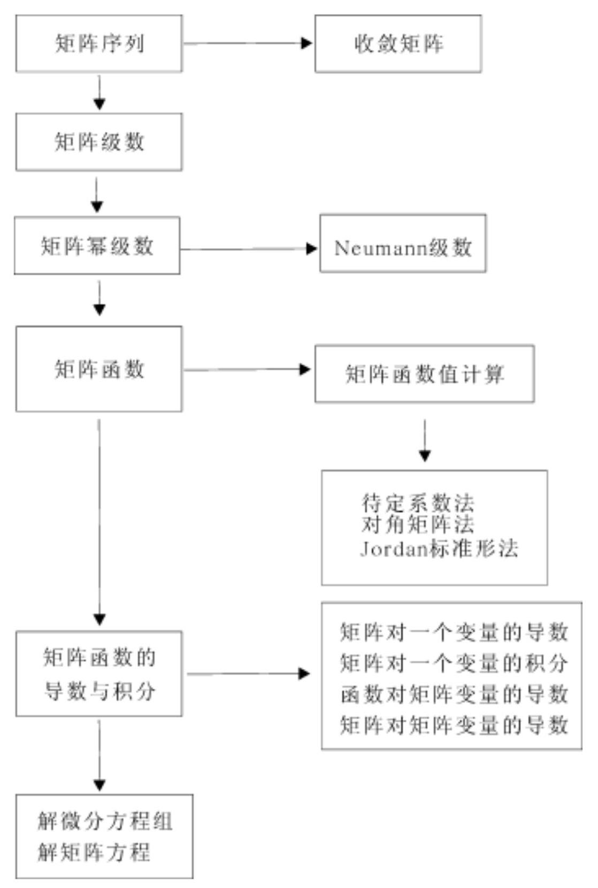

## 五、课后习题全解

## 习 题 3.1

1. 证明式(3.1.1).

证 由题设有 ${\mathrm{a}}_{\mathrm{i}\mathrm{j}}^{\left( \mathrm{k}\right) } \rightarrow  {\mathrm{a}}_{\mathrm{i}\mathrm{j}},{\mathrm{b}}_{\mathrm{i}}^{\left( \mathrm{k}\right) } \rightarrow  {\mathrm{b}}_{\mathrm{j}}\left( {\mathrm{k} \rightarrow  \infty }\right)$ ,从而有

$$
\alpha {a}_{ij}^{\left( k\right) } + \beta {b}_{ij}^{\left( k\right) } \rightarrow  \alpha {a}_{ij} + \beta {b}_{ij}\left( {k \rightarrow  \infty }\right)
$$

由定义知式(3.1.1) 成立.

2. 设 $A = \left\lbrack  \begin{array}{lll} 0 & c & c \\  c & 0 & c \\  c & c & 0 \end{array}\right\rbrack  \left( {c \in  R}\right)$ ,讨论 $c$ 取何值时 $A$ 为收敛矩阵.

解 $\det \left( {{\lambda I} - A}\right)  = \left( {\lambda  - {2c}}\right) {\left( \lambda  + c\right) }^{2},\rho \left( A\right)  = 2\left| c\right|$ . A为收敛矩阵的充要条件是 $\rho \left( A\right)  < 1$ ,即 $- \frac{1}{2} < c < \frac{1}{2}$ .

## 习 题 3.3

1. 证明 ${\mathrm{e}}^{\mathrm{i}A} = \cos A + \mathrm{i}\sin A$ .

证 根据式 (3.3.3) (3.3.5) 可得

$$
{\mathrm{e}}^{\mathrm{i}A} = I + \left( {\mathrm{i}A}\right)  + \frac{1}{2!}{\left( \mathrm{i}A\right) }^{2} + \frac{1}{3!}{\left( \mathrm{i}A\right) }^{3} + \frac{1}{4!}{\left( \mathrm{i}A\right) }^{4} + \cdots  =
$$

$$
\left( {\mathrm{I} - \frac{1}{2!}{A}^{2} + \frac{1}{4!}{A}^{4} - \cdots }\right)  + i\left( {A - \frac{1}{3!}{A}^{3} + \frac{1}{5!}{A}^{5} - \cdots }\right)  =
$$

$$
\cos \mathrm{A} + \mathrm{i}\sin \mathrm{A}
$$

2. 证明 ${\mathrm{e}}^{\mathrm{A} + {2\pi }\mathrm{i}\mathrm{I}} = {\mathrm{e}}^{\mathrm{A}},\sin \left( {\mathrm{A} + {2\pi }\mathrm{I}}\right)  = \sin \mathrm{A}$

证 因为 $A\left( {2\pi iI}\right)  = \left( {2\pi iI}\right) A$ ,所以根据定理 3.7 可得

$$
{\mathrm{e}}^{\mathrm{A} + {2\pi }\mathrm{i}\mathrm{I}} = {\mathrm{e}}^{\mathrm{A}}{\mathrm{e}}^{{2\pi }\mathrm{i}\mathrm{I}} = {\mathrm{e}}^{\mathrm{A}}\left\lbrack  {\mathrm{I} + \left( {{2\pi }\mathrm{i}\mathrm{I}}\right)  + \frac{1}{2!}{\left( 2\pi \mathrm{i}\mathrm{I}\right) }^{2} + }\right.
$$

$$
\frac{1}{3!}{\left( 2\pi \mathrm{i}I\right) }^{3} + \cdots \rbrack  =
$$

$$
{\mathrm{e}}^{\mathrm{A}}\left\{  \left\lbrack  {1 - \frac{1}{2!}{\left( 2\pi \right) }^{2} + \frac{1}{4!}{\left( 2\pi \right) }^{4} - \cdots }\right\rbrack  \right\}   +
$$

$$
\mathrm{i}\left\lbrack  {{2\pi } - \frac{1}{3!}{\left( 2\pi \right) }^{3} + \frac{1}{5!}{\left( 2\pi \right) }^{5} - \cdots }\right\rbrack  \} I =
$$

$$
{\mathrm{e}}^{\mathrm{A}}\{ \cos {2\pi } + \mathrm{i}\sin {2\pi }\} \mathrm{I} = {\mathrm{e}}^{\mathrm{A}}
$$

又因为 $\mathrm{A}\left( {{2\pi }\mathrm{I}}\right)  = \left( {{2\pi }\mathrm{I}}\right) \mathrm{A}$ ，所以根据式 $\left( {3.3.8}\right)$ 可得

$$
\sin \left( {A + {2\pi I}}\right)  = \sin A\cos \left( {2\pi I}\right)  + \cos A\sin \left( {2\pi I}\right)  =
$$

$$
\sin A\left\lbrack  {I - \frac{1}{2!}{\left( 2\pi I\right) }^{2} + \frac{1}{4!}{\left( 2\pi I\right) }^{4} - \cdots }\right\rbrack   +
$$

$$
\cos A\left\lbrack  {{2\pi I} - \frac{1}{3!}{\left( 2\pi I\right) }^{3} + \frac{1}{5!}{\left( 2\pi I\right) }^{5} - \cdots }\right\rbrack   =
$$

$$
\sin A\left\lbrack  {1 - \frac{1}{2!}{\left( 2\pi \right) }^{2} + \frac{1}{4!}{\left( 2\pi \right) }^{4} - \cdots }\right\rbrack  I +
$$

$$
\cos A\left\lbrack  {{2\pi } - \frac{1}{3!}{\left( 2\pi \right) }^{3} + \frac{1}{5!}{\left( 2\pi \right) }^{5} - \cdots }\right\rbrack  I =
$$

$$
\sin A\cos {2\pi } + \cos A\sin {2\pi } = \sin A
$$

3. 若 $A$ 为实反对称矩阵 $\left( {{A}^{T} =  - A}\right)$ ,则 ${e}^{A}$ 为正交矩阵.

证 由式 (3.3.3) 知 ${\left( {e}^{A}\right) }^{T} = {e}^{{A}^{T}} = {e}^{-A}$ ,于是有

$$
{\mathrm{e}}^{\mathrm{A}}{\left( {\mathrm{e}}^{\mathrm{A}}\right) }^{\mathrm{T}} = {\mathrm{e}}^{\mathrm{A}}{\mathrm{e}}^{{\mathrm{A}}^{\mathrm{T}}} = {\mathrm{e}}^{\mathrm{A} - \mathrm{A}} = {\mathrm{e}}^{\mathrm{O}} = \mathrm{I}
$$

故 ${\mathrm{e}}^{\mathrm{A}}$ 是正交矩阵.

4. 若 $\mathrm{A}$ 是 Hermite 矩阵,则 ${\mathrm{e}}^{\mathrm{{iA}}}$ 是酉矩阵.

证 由式(3.3.3) 知 ${\left( {\mathrm{e}}^{\mathrm{i}\mathrm{A}}\right) }^{\mathrm{H}} = {\mathrm{e}}^{\mathrm{i}\left( \mathrm{A}\right) }$ ,于是有

$$
{\mathrm{e}}^{\mathrm{i}\mathrm{A}}{\left( {\mathrm{e}}^{\mathrm{i}\mathrm{A}}\right) }^{\mathrm{H}} = {\mathrm{e}}^{\mathrm{i}\mathrm{A}}{\mathrm{e}}^{-\mathrm{i}\mathrm{A}} = {\mathrm{e}}^{\mathrm{o}} = \mathrm{I}
$$

故 ${\mathrm{e}}^{\mathrm{i}\mathrm{A}}$ 是酉矩阵.

5. 设 $A = \left\lbrack  \begin{array}{lll} 2 & 1 & 0 \\  0 & 0 & 1 \\  0 & 1 & 0 \end{array}\right\rbrack$ ,求 ${\mathrm{e}}^{\mathrm{A}},{\mathrm{e}}^{\mathrm{{tA}}}\left( {\mathrm{t} \in  \mathrm{R}}\right) ,\sin \mathrm{A}$ .

解 对 $\mathrm{A}$ 求得

$$
P = \left\lbrack  \begin{array}{rrr} 1 &  - 1 & 1 \\   - 3 & 1 & 0 \\  3 & 1 & 0 \end{array}\right\rbrack  ,{P}^{-1} = \frac{1}{6}\left\lbrack  \begin{array}{rrr} 0 &  - 1 & 1 \\  0 & 3 & 3 \\  6 & 4 & 2 \end{array}\right\rbrack
$$

$$
{P}^{-1}{AP} = \left\lbrack  \begin{array}{lll}  - 1 & & \\   & 1 & \\   & & 2 \end{array}\right\rbrack
$$

根据式 (3.3.15) 可得

$$
{\mathrm{e}}^{\mathrm{A}} = \mathrm{P} \cdot  \operatorname{diag}\left( {{\mathrm{e}}^{-1},\mathrm{e},{\mathrm{e}}^{2}}\right)  \cdot  {\mathrm{P}}^{-1} =
$$

$$
\frac{1}{6}\left\lbrack  \begin{matrix} 6{\mathrm{e}}^{2} & 4{\mathrm{e}}^{2} - 3\mathrm{e} - {\mathrm{e}}^{-1} & 2{\mathrm{e}}^{2} - 3\mathrm{e} + {\mathrm{e}}^{-1} \\  0 & 3\mathrm{e} + 3{\mathrm{e}}^{-1} & 3\mathrm{e} - 3{\mathrm{e}}^{-1} \\  0 & 3\mathrm{e} - 3{\mathrm{e}}^{-1} & 3\mathrm{e} + 3{\mathrm{e}}^{-1} \end{matrix}\right\rbrack
$$

$$
{\mathrm{e}}^{\mathrm{{tA}}} = \mathrm{P} \cdot  \operatorname{diag}\left( {{\mathrm{e}}^{-\mathrm{t}},{\mathrm{e}}^{\mathrm{t}},{\mathrm{e}}^{2\mathrm{t}}}\right)  \cdot  {\mathrm{P}}^{-1} =
$$

$$
\frac{1}{6}\left\lbrack  \begin{matrix} 6{\mathrm{e}}^{2t} & 4{\mathrm{e}}^{2t} - 3{\mathrm{e}}^{t} - {\mathrm{e}}^{-t} & 2{\mathrm{e}}^{2t} - 3{\mathrm{e}}^{t} + {\mathrm{e}}^{-t} \\  0 & 3{\mathrm{e}}^{t} + 3{\mathrm{e}}^{-t} & 3{\mathrm{e}}^{t} - 3{\mathrm{e}}^{-t} \\  0 & 3{\mathrm{e}}^{t} - 3{\mathrm{e}}^{-t} & 3{\mathrm{e}}^{t} + 3{\mathrm{e}}^{-t} \end{matrix}\right\rbrack
$$

$$
\sin \mathrm{A} = \mathrm{P} \cdot  \operatorname{diag}\left( {\sin \left( {-1}\right) ,\sin 1,\sin 2}\right)  \cdot  {\mathrm{P}}^{-1} =
$$

$$
\frac{1}{6}\left\lbrack  \begin{matrix} \sin 2 & 4\sin 2 &  - 2\sin 1 & 2\sin 2 &  - 4\sin 1 \\  0 & 0 & 6\sin 1 & 0 & 0 \\  0 & 6\sin 1 & 0 & &  \end{matrix}\right\rbrack
$$

6. 设 $f\left( z\right)  = \ln z$ ,求 $f\left( A\right)$ ,这里 $A$ 为

(1) $A = \left\lbrack  \begin{array}{llll} 1 & 0 & 0 & 0 \\  1 & 1 & 0 & 0 \\  0 & 1 & 1 & 0 \\  0 & 0 & 1 & 1 \end{array}\right\rbrack$ ; (2) $A = \left\lbrack  \begin{array}{llll} 2 & 1 & 0 & 0 \\  0 & 2 & 0 & 0 \\  0 & 0 & 1 & 1 \\  0 & 0 & 0 & 1 \end{array}\right\rbrack$ .

解 (1) 对 $\mathrm{A}$ 求得

$$
P = \left\lbrack  \begin{matrix}  & & & 1 \\   & & 1 & \\   & 1 & & \\  1 & & &  \end{matrix}\right\rbrack  ,\;{P}^{-1}{AP} = J = \left\lbrack  \begin{matrix} 1 & 1 & & \\   & 1 & 1 & \\   & & 1 & 1 \\   & & & 1 \end{matrix}\right\rbrack
$$

根据式 (3.3.18) 和 (3.3.19) 可得

$$
\ln A = P \cdot  \ln J \cdot  {P}^{-1} = \left\lbrack  \begin{matrix} 0 & 0 & 0 & 0 \\  1 & 0 & 0 & 0 \\   - \frac{1}{2} & 1 & 0 & 0 \\  \frac{1}{3} &  - \frac{1}{2} & 1 & 0 \end{matrix}\right\rbrack
$$

(2) $A = \left\lbrack  \begin{matrix} {J}_{1} & \\   & {J}_{2} \end{matrix}\right\rbrack  ,{J}_{1} = \left\lbrack  \begin{array}{ll} 2 & 1 \\  0 & 2 \end{array}\right\rbrack  ,{J}_{2} = \left\lbrack  \begin{array}{ll} 1 & 1 \\  0 & 1 \end{array}\right\rbrack$

根据式(3.3.18) 可得

$$
\ln {\mathrm{J}}_{1} = \left\lbrack  \begin{matrix} \ln 2 & \frac{1}{2} \\  0 & \ln 2 \end{matrix}\right\rbrack  ,\;\ln {\mathrm{J}}_{2} = \left\lbrack  \begin{array}{ll} 0 & 1 \\  0 & 0 \end{array}\right\rbrack
$$

再根据式 (3.3.19) 可得

$$
\ln \mathrm{A} = \left\lbrack  \begin{array}{ll} \ln {\mathrm{J}}_{1} & \\   & \ln {\mathrm{J}}_{2} \end{array}\right\rbrack   = \left\lbrack  \begin{matrix} \ln 2 & \frac{1}{2} & 0 & 0 \\   & \ln 2 & 0 & 0 \\   & & 0 & 1 \\   & & & 0 \end{matrix}\right\rbrack
$$

## 习 题 3.4

1. 证明式 (3.4.4).

证 设 $A\left( t\right)  = {\left( {a}_{ij}\left( t\right) \right) }_{m \times  n}$ ,则

$$
a\left( t\right) A\left( t\right)  = {\left( a\left( t\right) {a}_{ij}\left( t\right) \right) }_{m \times  n}
$$

因为

$$
\frac{d}{dt}\left( {a\left( t\right) {a}_{ij}\left( t\right) }\right)  = \frac{{da}\left( t\right) }{dt} \cdot  {a}_{ij}\left( t\right)  + a\left( t\right)  \cdot  \frac{d{a}_{ij}\left( t\right) }{dt}
$$

所以

$$
\frac{\mathrm{d}}{\mathrm{d}t}\left( {a\left( t\right) A\left( t\right) }\right)  = \frac{\mathrm{{da}}\left( t\right) }{\mathrm{d}t} \cdot  A\left( t\right)  + a\left( t\right)  \cdot  \frac{\mathrm{d}}{\mathrm{d}t}A\left( t\right)
$$

2. 证明式 (3.4.6).

证 根据式(3.3.4) 和(3.3.5) 可得

$$
\frac{\mathrm{d}}{\mathrm{{dt}}}\cos \mathrm{{tA}} = \frac{\mathrm{d}}{\mathrm{{dt}}}\left\lbrack  {\mathrm{I} - \frac{1}{2!}{\left( \mathrm{{tA}}\right) }^{2} + \frac{1}{4!}{\left( \mathrm{{tA}}\right) }^{4} - \frac{1}{6!}{\left( \mathrm{{tA}}\right) }^{6} + \cdots }\right\rbrack   =
$$

$$
O - t{A}^{2} + \frac{1}{3!}{t}^{3}{A}^{4} - \frac{1}{5!}{t}^{5}{A}^{6} + \cdots  =
$$

$$
- A\left( {{tA} - \frac{1}{3!}{t}^{3}{A}^{3} + \frac{1}{5!}{t}^{5}{A}^{5} - \cdots }\right)  =
$$

$$
- A\left( {\sin {tA}}\right)
$$

把上式中的 A 提到右边, 可得

$$
\frac{\mathrm{d}}{\mathrm{{dt}}}\cos \mathrm{A} =  - \left( {\sin \mathrm{{tA}}}\right) \mathrm{A}
$$

3. 证明式 (3.4.11).

证 设 $A = {\left( {a}_{ij}\right) }_{m \times  n}, B\left( t\right)  = {\left( {b}_{ij}\left( t\right) \right) }_{n \times  1}$ ,则

$$
A \cdot  B\left( t\right)  = {\left\lbrack  \mathop{\sum }\limits_{{k = 1}}^{n}{a}_{ik}{b}_{kj}\left( t\right) \right\rbrack  }_{m \times  1}
$$

因为 $\;{\int }_{{t}_{0}}^{{t}_{1}}\mathop{\sum }\limits_{{k = 1}}^{n}{a}_{ik}{b}_{kj}\left( t\right) {dt} = \mathop{\sum }\limits_{{k = 1}}^{n}{a}_{ik}{\int }_{{t}_{0}}^{{t}_{1}}{b}_{kj}\left( t\right) {dt}$

所以 $\;{\int }_{{t}_{0}}^{{t}_{1}}A \cdot  B\left( t\right) {dt} = A \cdot  {\int }_{{t}_{0}}^{{t}_{1}}B\left( t\right) {dt}$

4. 设 $x = {\left( \xi ,\xi ,\cdots ,{\xi }_{n}\right) }^{T}, A = {\left( {a}_{ij}\right) }_{n \times  n}$ 是实对称矩阵, $b = (\beta$ , ${\left. \beta ,\cdots ,{\beta }_{n}\right) }^{T}$ 是 $n$ 维向量, $c$ 为常数,试求 $f\left( x\right)  = {x}^{T}{Ax} - {b}^{T}x + c$ 对于 $\mathrm{x}$ 的导数.

解 由例 3.11 知 $\frac{\mathrm{d}}{\mathrm{d}\mathrm{x}}\left( {{\mathrm{x}}^{\mathrm{T}}\mathrm{A}\mathrm{x}}\right)  = 2\mathrm{{Ax}}$ ,再由 ${\mathrm{b}}^{\mathrm{T}}\mathrm{x} = \beta {\xi }_{1} + \cdots  + {\beta }_{\mathrm{n}}{\xi }_{\mathrm{n}}$ 知 $\frac{\mathrm{d}}{\mathrm{d}x}\left( {{b}^{T}x}\right)  = b$ ,而 $\frac{\mathrm{d}c}{\mathrm{\;d}x} = 0$ . 因此 $\frac{\mathrm{d}f\left( x\right) }{\mathrm{d}x} = {2Ax} - b$ .

5. 若 $A = A\left( t\right)  = {\left( {a}_{ij}\left( t\right) \right) }_{n \times  n}$ 非奇异,证明

$$
\frac{\mathrm{d}}{\mathrm{d}t}{A}^{-1} =  - {A}^{-1}\frac{\mathrm{d}A}{\mathrm{\;d}t}{A}^{-1}
$$

证 对 ${\mathrm{{AA}}}^{-1} = \mathrm{I}$ 两端关于 $\mathrm{t}$ 求导数可得

$$
\frac{dA}{dt} \cdot  {A}^{-1} + A \cdot  \frac{d{A}^{-1}}{dt} = O
$$

两端左乘 ${\mathrm{A}}^{1}$ ,并整理可得

$$
\frac{d{A}^{-1}}{dt} =  - {A}^{-1} \cdot  \frac{dA}{dt} \cdot  {A}^{-1}
$$

6. 设 $\mathrm{X}$ 为 $\mathrm{n} \times  \mathrm{m}$ 矩阵, $\mathrm{A}$ 和 $\mathrm{B}$ 依次为 $\mathrm{n} \times  \mathrm{n}$ 和 $\mathrm{m} \times  \mathrm{n}$ 的常数矩阵, 证明

(1) $\frac{\mathrm{d}}{\mathrm{d}X}\left( {\operatorname{tr}\left( {BX}\right) }\right)  = \frac{\mathrm{d}}{\mathrm{d}X}\left( {\operatorname{tr}\left( {{X}^{\mathrm{T}}{B}^{\mathrm{T}}}\right) }\right)  = {B}^{\mathrm{T}}$ ;

(2) $\frac{\mathrm{d}}{\mathrm{d}X}\left( {\operatorname{tr}\left( {{X}^{\mathrm{T}}{AX}}\right) }\right)  = \left( {A + {A}^{\mathrm{T}}}\right) X$ .

证 (1) 设 $B = {\left( {b}_{ij}\right) }_{m \times  n}, X = {\left( {\xi }_{ij}\right) }_{n \times  m}$ ,则 ${BX} = {\left( \mathop{\sum }\limits_{{k = 1}}^{n}{b}_{ik}{\xi }_{kj}\right) }_{m \times  m}$ , 于是有

$$
\operatorname{tr}\left( {BX}\right)  = \mathop{\sum }\limits_{{k = 1}}^{n}{b}_{ik}{\xi }_{k1} + \cdots  + \mathop{\sum }\limits_{{k = 1}}^{n}{b}_{ik}{\xi }_{kj} + \cdots  + \mathop{\sum }\limits_{{k = 1}}^{n}{b}_{mk}{\xi }_{km}
$$

$$
\frac{\operatorname{tr}\left( {BX}\right) }{{\xi }_{ij}} = {b}_{ji}\;\left( {i = 1,2,\cdots , n;j = 1,2,\cdots , m}\right)
$$

$$
\frac{\mathrm{d}}{\mathrm{d}X}\left( {\operatorname{tr}\left( {BX}\right) }\right)  = \left\lbrack  \begin{matrix} {b}_{1} & \cdots & {b}_{m1} \\  \cdots & & \cdots \\  {b}_{n} & \cdots & {b}_{mn} \end{matrix}\right\rbrack   = {B}^{T}
$$

注意到 $\mathrm{{BX}}$ 与 ${\left( \mathrm{{BX}}\right) }^{\mathrm{T}} = {\mathrm{X}}^{\mathrm{T}}{\mathrm{B}}^{\mathrm{T}}$ 有相同的迹,所以

$$
\frac{\mathrm{d}}{\mathrm{{dX}}}\left( {\operatorname{tr}\left( {{\mathrm{X}}^{\mathrm{T}}{\mathrm{B}}^{\mathrm{T}}}\right) }\right)  = \frac{\mathrm{d}}{\mathrm{{dx}}}\left( {\operatorname{tr}\left( \mathrm{{BX}}\right) }\right)  = {\mathrm{B}}^{\mathrm{T}}
$$

(2)设 $A = {\left( {a}_{ij}\right) }_{n \times  n}, X = {\left( {\xi }_{j}\right) }_{n \times  m}, f = \operatorname{tr}\left( {{X}^{T}{AX}}\right)$ ,则有

$$
{X}^{T} = \left\lbrack  \begin{matrix} {\xi }_{1} & \cdots & {\xi }_{n1} \\  \cdots & & \cdots \\  {\xi }_{m} & \cdots & {\xi }_{nm} \end{matrix}\right\rbrack  ,{AX} = \left\lbrack  \begin{matrix} \mathop{\sum }\limits_{k}{a}_{1k}{\xi }_{k1} & \cdots & \mathop{\sum }\limits_{k}{a}_{1k}{\xi }_{km} \\  \cdots & & \cdots \\  \mathop{\sum }\limits_{k}{a}_{nk}{\xi }_{k1} & \cdots & \mathop{\sum }\limits_{k}{a}_{nk}{\xi }_{km} \end{matrix}\right\rbrack
$$

$$
f = \mathop{\sum }\limits_{I}{\xi }_{II}\mathop{\sum }\limits_{k}{a}_{Ik}{\xi }_{kI} + \cdots  + \mathop{\sum }\limits_{I}{\xi }_{Ij}\mathop{\sum }\limits_{k}{a}_{Ik}{\xi }_{kj} + \cdots  + \mathop{\sum }\limits_{I}{\xi }_{Im}\mathop{\sum }\limits_{k}{a}_{Ik}{\xi }_{km}
$$

$$
\frac{f}{{\xi }_{ij}} = \frac{1}{{\xi }_{ij}}\left\lbrack  {\mathop{\sum }\limits_{l}{\xi }_{lj}\mathop{\sum }\limits_{k}{a}_{lk}{\xi }_{kj}}\right\rbrack   =
$$

$$
\mathop{\sum }\limits_{I}\left\lbrack  {\frac{{\xi }_{ij}}{{\xi }_{ij}} \cdot  \left( {\mathop{\sum }\limits_{k}{a}_{lk}{\xi }_{kj}}\right)  + {\xi }_{ij} \cdot  \frac{}{{\xi }_{ij}}\left( {\mathop{\sum }\limits_{k}{a}_{lk}{\xi }_{kj}}\right) }\right\rbrack   =
$$

$$
\mathop{\sum }\limits_{k}{a}_{ik}{\xi }_{kj} + \mathop{\sum }\limits_{k}{a}_{li}{\xi }_{lj}
$$

$$
\frac{df}{dX} = {\left( \frac{f}{{\xi }_{ij}}\right) }_{n \times  m} = {AX} + {A}^{T}X = \left( {A + {A}^{T}}\right) X
$$

7. 设 $\mathrm{x}$ 为 $\mathrm{n}$ 维列向量, $\mathrm{u}$ 为 $\mathrm{n}$ 维常数列向量, $\mathrm{A}$ 为 $\mathrm{n}$ 阶常数对称矩阵, 证明

$$
\frac{\mathrm{d}}{\mathrm{d}\mathrm{x}}\left( {{\left( \mathrm{x} - \mathrm{u}\right) }^{\mathrm{T}}\mathrm{A}\left( {\mathrm{x} - \mathrm{u}}\right) }\right)  = 2\mathrm{\;A}\left( {\mathrm{x} - \mathrm{u}}\right)
$$

证 设 $f = {\left( x - u\right) }^{T}A\left( {x - u}\right)$ ,由于 ${A}^{T} = A$ ,所以 $f = {x}^{T}{Ax} - \; 2{\left( \mathrm{{Au}}\right) }^{\mathrm{T}}\mathrm{x} + {\mathrm{u}}^{\mathrm{T}}\mathrm{{Au}}$ ,利用第 4 题的结果可得

$$
\frac{\mathrm{d}f}{\mathrm{\;d}x} = {2Ax} - {2Au} = {2A}\left( {x - u}\right)
$$

8. 设 $x = {\left( \xi ,\xi ,\cdots ,{\xi }_{n}\right) }^{T}, f\left( x\right)  = {\left( {f}_{1}\left( x\right) ,{f}_{2}\left( x\right) ,\cdots ,{f}_{n}\left( x\right) \right) }^{T}$ , 其中, ${f}_{i}\left( x\right)  = \mathop{\sum }\limits_{{j = 1}}^{n}{a}_{ij}{\xi }_{j} + \delta \;\left( {i = 1,2,\cdots , n}\right)$ ,求 $\frac{d}{dx}f\left( x\right)$ .

解 由定义有

$$
\frac{f}{\xi } = \left\lbrack  \begin{matrix} \frac{{f}_{l}}{{\xi }_{i}} \\  \cdots \\  \frac{{f}_{n}}{{\xi }_{i}} \end{matrix}\right\rbrack   = \left\lbrack  \begin{matrix} {a}_{1i} \\  \cdots \\  {a}_{ni} \end{matrix}\right\rbrack  \xrightarrow[]{\text{ 记作 }}{a}_{i},\frac{df}{dx} = \left\lbrack  \begin{matrix} \frac{f}{\xi } \\  \cdots \\  \frac{f}{{\xi }_{n}} \end{matrix}\right\rbrack   = \left\lbrack  \begin{matrix} {a}_{i} \\  \cdots \\  {a}_{n} \end{matrix}\right\rbrack
$$

9. 举例说明关系式

$$
\frac{\mathrm{d}}{\mathrm{d}t}{\left( A\left( t\right) \right) }^{m} = m{\left( A\left( t\right) \right) }^{m - 1}\frac{\mathrm{d}}{\mathrm{d}t}A\left( t\right)
$$

一般不成立,此处 $A\left( t\right)  = {\left( {a}_{ij}\left( t\right) \right) }_{n \times  n}$ . 又在什么条件下,它才能够成立?

解 $\mathrm{m} = 2$ 时,取 $\mathrm{A}\left( \mathrm{t}\right)  = \left\lbrack  \begin{array}{ll} {\mathrm{t}}^{2} & \mathrm{t} \\  0 & \mathrm{t} \end{array}\right\rbrack$ ,则

$$
{A}^{2}\left( t\right)  = \left\lbrack  \begin{matrix} {t}^{4} & {t}^{3} + {t}^{2} \\  0 & {t}^{2} \end{matrix}\right\rbrack  ,\frac{d}{dt}{A}^{2}\left( t\right)  = \left\lbrack  \begin{matrix} 4{t}^{3} & 3{t}^{2} + {2t} \\  0 & {2t} \end{matrix}\right\rbrack
$$

$$
2\mathrm{A}\left( \mathrm{t}\right) \frac{\mathrm{d}}{\mathrm{d}t}\mathrm{\;A}\left( \mathrm{t}\right)  = \left\lbrack  \begin{matrix} 4{\mathrm{t}}^{3} & 2{\mathrm{t}}^{2} + 2\mathrm{t} \\  0 & 2\mathrm{t} \end{matrix}\right\rbrack   \neq  \frac{\mathrm{d}}{\mathrm{{dt}}}{\mathrm{A}}^{2}\left( \mathrm{t}\right)
$$

因为

$$
\frac{\mathrm{d}}{\mathrm{{dt}}}{\left\lbrack  \mathrm{A}\left( \mathrm{t}\right) \right\rbrack  }^{\mathrm{m}} = \frac{\mathrm{d}}{\mathrm{{dt}}}\left\lbrack  {\mathrm{A}\left( \mathrm{t}\right) \mathrm{A}\left( \mathrm{t}\right) \cdots \mathrm{A}\left( \mathrm{t}\right) }\right\rbrack   =
$$

$$
\frac{\mathrm{d}}{\mathrm{{dt}}}\mathrm{A}\left( \mathrm{t}\right) {\left\lbrack  \mathrm{A}\left( \mathrm{t}\right) \right\rbrack  }^{\mathrm{m} - 1} + \mathrm{A}\left( \mathrm{t}\right) \frac{\mathrm{d}}{\mathrm{{dt}}}\mathrm{A}\left( \mathrm{t}\right) {\left\lbrack  \mathrm{A}\left( \mathrm{t}\right) \right\rbrack  }^{\mathrm{m} - 2} + \cdots  +
$$

$$
{\left\lbrack  A\left( t\right) \right\rbrack  }^{m - 1}\frac{d}{dt}A\left( t\right)
$$

所以当 $\left\lbrack  {\frac{\mathrm{d}}{\mathrm{{dt}}}\mathrm{A}\left( \mathrm{t}\right) }\right\rbrack  \mathrm{A}\left( \mathrm{t}\right)  = \mathrm{A}\left( \mathrm{t}\right) \frac{\mathrm{d}}{\mathrm{{dt}}}\mathrm{A}\left( \mathrm{t}\right)$ 时,有

$$
\frac{\mathrm{d}}{\mathrm{{dt}}}{\left\lbrack  \mathrm{A}\left( \mathrm{t}\right) \right\rbrack  }^{\mathrm{m}} = {\left\lbrack  \mathrm{A}\left( \mathrm{t}\right) \right\rbrack  }^{\mathrm{m} - 1}\frac{\mathrm{d}}{\mathrm{{dt}}}\mathrm{A}\left( \mathrm{t}\right)  + {\left\lbrack  \mathrm{A}\left( \mathrm{t}\right) \right\rbrack  }^{\mathrm{m} - 1}\frac{\mathrm{d}}{\mathrm{{dt}}}\mathrm{A}\left( \mathrm{t}\right)  +
$$

$$
\cdots  + {\left\lbrack  A\left( t\right) \right\rbrack  }^{m - 1}\frac{d}{dt}A\left( t\right)  =
$$

$$
m{\left\lbrack  A\left( t\right) \right\rbrack  }^{m - 1}\frac{d}{dt}A\left( t\right)
$$

## 习 题 3.5

1. 证明 Jacobi 恒等式(3.5.8).

证 设 $A = {\left( {a}_{ij}\left( t\right) \right) }_{n \times  n}, X = {\left( {\xi }_{ij}\left( t\right) \right) }_{n \times  n}$ . 由行列式定义可得

$$
\det \mathrm{X} = \mathop{\sum }\limits_{{{p}_{1}{p}_{2}\cdots {p}_{n}}}{\left( -1\right) }^{t}{\xi }_{1{p}_{1}}{\xi }_{{p}_{2}}\cdots {\xi }_{n{p}_{n}}
$$

其中, ${p}_{1}{p}_{2}\cdots {p}_{n}$ 是自然数 $1,2,\cdots , n$ 的一个排列, $t$ 是该排列的逆序数. 于是有

$$
\frac{\mathrm{d}}{\mathrm{{dt}}}\left( {\det \mathrm{X}}\right)  = \mathop{\sum }\limits_{{{\mathrm{p}}_{1}{\mathrm{p}}_{2}\cdots {\mathrm{p}}_{\mathrm{n}}}}{\left( -1\right) }^{\mathrm{t}}\left\lbrack  {\mathop{\sum }\limits_{{1 = 1}}^{\mathrm{n}}\left( {{\xi }_{{\mathrm{p}}_{1}}\cdots {\xi }_{{\mathrm{{ip}}}_{\mathrm{i}}}^{\prime }\cdots {\xi }_{{\mathrm{{np}}}_{\mathrm{n}}}^{\prime }}\right) }\right\rbrack   =
$$

$$
\mathop{\sum }\limits_{{1 = 1}}^{n}\mathop{\sum }\limits_{{{p}_{1}{p}_{2}\cdots {p}_{n}}}{\left( -1\right) }^{t}\left( {{\xi }_{{p}_{1}}\cdots {\xi }_{{p}_{i}}^{\prime }\cdots {\xi }_{{p}_{{p}_{n}}}}\right)
$$

由式 (3.5.7) 和 (3.5.2) 知

$$
{\xi }_{{p}_{i}}^{\prime } = {a}_{i1}{\xi }_{{p}_{i}} + \cdots  + {a}_{ii}{\xi }_{{ip}_{i}} + \cdots  + {a}_{in}{\xi }_{n{p}_{i}}
$$

当 $\mathrm{k} \neq  \mathrm{i}$ 时,行列式 $\mathop{\sum }\limits_{{{\mathrm{p}}_{1}{\mathrm{p}}_{2}\cdots {\mathrm{p}}_{\mathrm{n}}}}{\left( -1\right) }^{\mathrm{t}}{\xi }_{1{\mathrm{p}}_{1}}\cdots {\left( {\mathrm{a}}_{\mathrm{{ik}}}{\xi }_{{\mathrm{{kp}}}_{\mathrm{i}}}\right) }^{\cdots }{\xi }_{\mathrm{n}{\mathrm{p}}_{\mathrm{n}}}$ 的第 $\mathrm{i}$ 行与第 $\mathrm{k}$ 行对应元素成比例, 该行列式的值等于零. 于是有

$$
\frac{\mathrm{d}}{\mathrm{{dt}}}\left( {\det \mathrm{X}}\right)  = \mathop{\sum }\limits_{{1 = 1}}^{\mathrm{n}}\mathop{\sum }\limits_{{{\mathrm{p}}_{1}{\mathrm{p}}_{2}\cdots {\mathrm{p}}_{\mathrm{n}}}}{\left( -1\right) }^{\mathrm{t}}{\xi }_{1{\mathrm{p}}_{1}}\cdots \left( {{\mathrm{a}}_{\mathrm{{ii}}}{\xi }_{\mathrm{i}{\mathrm{p}}_{\mathrm{i}}}}\right) \cdots {\xi }_{\mathrm{n}{\mathrm{p}}_{\mathrm{n}}} =
$$

$$
\mathop{\sum }\limits_{{i = 1}}^{n}{a}_{ii}\left( {\det X}\right)  = \left( {\operatorname{tr}A}\right) \left( {\det X}\right)
$$

即

$$
\frac{\mathrm{d}\left( {\det \mathrm{X}}\right) }{\det \mathrm{X}} = \left( {\operatorname{tr}\mathrm{A}}\right) \mathrm{{dt}}
$$

积分并整理可得

$$
\det X = c{e}^{{f}_{0}\left( {\operatorname{tr}A}\right) {dt}}\;\left( {c\text{ 是积分常数 }}\right)
$$

2. 求微分方程组

$$
\left\{  \begin{array}{ll} \frac{\mathrm{d}\xi }{\mathrm{d}t} = {3\xi } &  + {8\xi } \\  \frac{\mathrm{d}\xi }{\mathrm{d}t} = {3\xi } - \xi &  + {6\xi } \\  \frac{\mathrm{d}\xi }{\mathrm{d}t} =  - {2\xi } &  - {5\xi } \end{array}\right.
$$

满足初始条件 $\xi \left( 0\right)  = 1,\xi \left( 0\right)  = 1,\xi \left( 0\right)  = 1$ 的解.

解 $A = \left\lbrack  \begin{array}{rrr} 3 & 0 & 8 \\  3 &  - 1 & 6 \\   - 2 & 0 &  - 5 \end{array}\right\rbrack  , x\left( 0\right)  = \left\lbrack  \begin{array}{l} 1 \\  1 \\  1 \end{array}\right\rbrack$ .

$\phi \left( \lambda \right)  = \det \left( {{\lambda I} - A}\right)  = {\left( \lambda  + 1\right) }^{3}$ . 经判断知, $A$ 不能相似于对角矩阵. 下面采用待定系数法求 ${\mathrm{e}}^{At}$ . 容易验证, $A$ 的最小多项式为 $\psi \left( \lambda \right) \; = {\left( \lambda  + 1\right) }^{2}$ . 记 $\mathrm{f}\left( \lambda \right)  = {\mathrm{e}}^{\lambda \mathrm{t}}$ ,并设

$$
f\left( \lambda \right)  = g\left( \lambda \right) \psi \left( \lambda \right)  + \left( {b + {b\lambda }}\right)
$$

由 $f\left( {-1}\right)  = {e}^{-t},{f}^{\prime }\left( {-1}\right)  = t{e}^{-t}$ 可得

$$
\left\{  \begin{array}{l} b - b = {e}^{-t} \\  b = t \end{array}\right.
$$

解此方程组得 $b = \left( {1 + t}\right) {e}^{-t}, b = t{e}^{-t}$ . 于是

$$
{\mathrm{e}}^{\mathrm{{At}}} = \left( {1 + \mathrm{t}}\right) {\mathrm{e}}^{-\mathrm{t}}\mathrm{I} + {\mathrm{{te}}}^{-\mathrm{t}}\mathrm{A} = {\mathrm{e}}^{-\mathrm{t}}\left\lbrack  \begin{matrix} 1 + 4\mathrm{t} & 0 & 8\mathrm{t} \\  3\mathrm{t} & 1 & 6\mathrm{t} \\   - 2\mathrm{t} & 0 & 1 - 4\mathrm{t} \end{matrix}\right\rbrack
$$

$$
x\left( t\right)  = {e}^{At}x\left( 0\right)  = {e}^{-t}\left\lbrack  \begin{matrix} 1 + {12t} \\  1 + {9t} \\  1 - {6t} \end{matrix}\right\rbrack
$$

3. 求微分方程组

$$
\left\{  \begin{array}{l} \frac{\mathrm{d}\xi }{\mathrm{d}t} =  - {2\xi } + \xi  + 1 \\  \frac{\mathrm{d}\xi }{\mathrm{d}t} =  - {4\xi } + {2\xi } + 2 \\  \frac{\mathrm{d}\xi }{\mathrm{d}t} = \xi  + \xi  + {\mathrm{e}}^{t} - 1 \end{array}\right.
$$

满足初始条件 $\xi \left( 0\right)  = 1,\xi \left( 0\right)  = 1,\xi \left( 0\right)  =  - 1$ 的解.

解 $A = \left\lbrack  \begin{array}{rrr}  - 2 & 1 & 0 \\   - 4 & 2 & 0 \\  1 & 0 & 1 \end{array}\right\rbrack  , b\left( t\right)  = \left\lbrack  \begin{array}{r} 1 \\  2 \\  {\mathrm{e}}^{t} - 1 \end{array}\right\rbrack  , x\left( 0\right)  = \left\lbrack  \begin{array}{r} 1 \\  1 \\   - 1 \end{array}\right\rbrack$ .

$\phi \left( \lambda \right)  = \det \left( {{\lambda I} - A}\right)  = {\lambda }^{3} - {\lambda }^{2}$ ,采用数项级数求和法求 ${\mathrm{e}}^{At}$ . 由 $\phi \left( A\right)  = O$ 知 ${A}^{3} = {A}^{2}$ ，从而 ${A}^{4} = {A}^{2},{A}^{5} = {A}^{2},\cdots$ . 于是可得

$$
{\mathrm{e}}^{\mathrm{{At}}} = \mathrm{I} + \left( \mathrm{{At}}\right)  + \frac{1}{2!}{\left( \mathrm{{At}}\right) }^{2} + \frac{1}{3!}{\left( \mathrm{{At}}\right) }^{3} + \frac{1}{4!}{\left( \mathrm{{At}}\right) }^{4} + \cdots  =
$$

$$
\mathrm{I} + \mathrm{{tA}} + \left( {\frac{1}{2!}{\mathrm{t}}^{2} + \frac{1}{3!}{\mathrm{t}}^{3} + \frac{1}{4!}{\mathrm{t}}^{4} + \cdots }\right) {\mathrm{A}}^{2} =
$$

$$
\mathrm{I} + \mathrm{{tA}} + \left( {{\mathrm{e}}^{\mathrm{t}} - 1 - \mathrm{t}}\right) {\mathrm{A}}^{2} =
$$

$$
\left\lbrack  \begin{matrix} 1 - {2t} & t & 0 \\   - {4t} & {2t} + 1 & 0 \\  1 + {2t} - {e}^{t} & {e}^{t} - t - 1 & {e}^{t} \end{matrix}\right\rbrack
$$

$$
x\left( t\right)  = {e}^{At}\left\{  {x\left( 0\right)  + {\int }_{0}^{t}{e}^{-{As}}b\left( s\right) {ds}}\right\}   =
$$

$$
{e}^{At}\left\{  {x\left( 0\right)  + {\int }_{0}^{t}\left\lbrack  \begin{array}{l} 1 \\  2 \\  0 \end{array}\right\rbrack  {ds}}\right\}   =
$$

$$
{e}^{At}\left\{  {\left\lbrack  \begin{array}{r} 1 \\  1 \\   - 1 \end{array}\right\rbrack   + \left\lbrack  \begin{matrix} t \\  {2t} \\  0 \end{matrix}\right\rbrack  }\right\}   = \left\lbrack  \begin{matrix} 1 \\  1 \\  \left( {t - 1}\right) {e}^{t} \end{matrix}\right\rbrack
$$

4. 设 $A = {\left( {a}_{ij}\right) }_{n \times  n}$ 为常数矩阵, $X = {\left( {\xi }_{ij}\left( t\right) \right) }_{n \times  n}, a$ 为常数,证明下面的 Cauchy 微分方程组

$$
\frac{dX}{dt} = \frac{AX}{t - a}
$$

可简化为

$$
\frac{dX}{du} = {AX}
$$

其中 $\mathrm{u} = \ln \left( {\mathrm{t} - \mathrm{a}}\right)$ ,并进而证明其通解为

$$
\mathrm{X} = {\left( \mathrm{t} - \mathrm{a}\right) }^{\mathrm{A}}\mathrm{C}
$$

其中 $\mathrm{C}$ 为 $\mathrm{n}$ 阶常数矩阵.

证 作变量代换 $\mathrm{u = {ln}}\left( {\mathrm{t} - \mathrm{a}}\right)$ ,即 $\mathrm{t - a = {e}^{u}}$ ,则

$$
\frac{dX}{du} = \frac{dX}{dt} \cdot  \frac{dt}{du} = \frac{AX}{t - a}\left( {t - a}\right)  = {AX}
$$

通解为 $X\left( t\right)  = {e}^{Au}C = {e}^{A\ln \left( {t - a}\right) }C = {\left( t - a\right) }^{A}C$

其中 $\mathrm{C}$ 为 $\mathrm{n}$ 阶常数矩阵.

## 六、学习效果测试题及答案

## (一) 测试题

1. 讨论下列矩阵幂级数的敛散性:

(1) $\mathop{\sum }\limits_{{k = 1}}^{\infty }\frac{1}{{k}^{2}}{\left\lbrack  \begin{array}{rr} 1 & 7 \\   - 1 &  - 3 \end{array}\right\rbrack  }^{k}$ ; (2) $\mathop{\sum }\limits_{{k = 0}}^{\infty }\frac{k}{{6}^{k}}{\left\lbrack  \begin{array}{rr} 1 &  - 8 \\   - 2 & 1 \end{array}\right\rbrack  }^{k}$ .

2. 求矩阵幂级数 $\mathop{\sum }\limits_{{k = 0}}^{\infty }\frac{1}{{2}^{k}}{\left\lbrack  \begin{array}{rr} 2 &  - 1/2 \\  2 & 0 \end{array}\right\rbrack  }^{k}$ 的和.

3. 设 $A$ 是幂等矩阵 $\left( {{A}^{2} = A}\right)$ ,求 $\cos \left( {\pi A}\right)$ .

4. 设 $A = \left\lbrack  \begin{array}{lll} 2 & 2 & 1 \\  1 & 3 & 1 \\  1 & 2 & 2 \end{array}\right\rbrack$ ,求 $\sin {At}$ .

5. 已知 ${\mathrm{e}}^{\mathrm{A}t} = {\mathrm{e}}^{2t}\left\lbrack  \begin{matrix} 2 & 1 &  - 1 \\  1 & 2 &  - 1 \\  3 & 3 &  - 2 \end{matrix}\right\rbrack   + {\mathrm{e}}^{t}\left\lbrack  \begin{array}{rrr}  - 1 &  - 1 & 1 \\   - 1 &  - 1 & 1 \\   - 3 &  - 3 & 3 \end{array}\right\rbrack$ ,求矩阵 $\mathrm{A}$ .

6. 设 $A$ 是可逆矩阵,证明: ${\int }_{0}^{t}{\mathrm{e}}^{A\tau }\mathrm{d}\tau  = {A}^{-1}{\mathrm{e}}^{At} - {A}^{-1}$ .

7. 设 $A$ 为 $n$ 阶常数对称矩阵, $y\left( t\right)  = {\left( {y}_{1}\left( t\right) ,{y}_{2}\left( t\right) ,\cdots ,{y}_{n}\left( t\right) \right) }^{T}$ , $f\left( y\right)  = {y}^{T}{Ay}$ ,证明:

(1) $\frac{df}{dt} = 2{y}^{T}A\frac{dy}{dt}$ (2) $\frac{d}{dt}\parallel y{\parallel }_{2}^{2} = 2{y}^{T}\frac{dy}{dt}$ .

8. 设 $A$ 为 $n$ 阶矩阵,证明: $\det {e}^{A} = {e}^{\operatorname{tr}A}$ .

9. 已知 $A = \left\lbrack  \begin{array}{rrr}  - 3 & 4 & 2 \\   - 2 & 3 & 1 \\   - 2 & 2 & 2 \end{array}\right\rbrack  , x\left( 0\right)  = \left\lbrack  \begin{array}{l} 1 \\  1 \\  2 \end{array}\right\rbrack$ .

(1) 求 ${\mathrm{e}}^{\mathrm{A}t}$ ；

(2)用矩阵函数方法求微分方程 $\frac{\mathrm{d}}{\mathrm{{dt}}}\mathrm{x}\left( \mathrm{t}\right)  = \mathrm{A}\mathrm{x}\left( \mathrm{t}\right)$ 满足初始条件 $x\left( 0\right)$ 的解.

10. 已知 $A = \left\lbrack  \begin{array}{rrr}  - 1 & 2 & 0 \\   - 2 & 3 & 1 \\  2 &  - 2 &  - 2 \end{array}\right\rbrack  , b\left( t\right)  = {e}^{-t}\left\lbrack  \begin{array}{l} 1 \\  0 \\  2 \end{array}\right\rbrack$ .

(1) 求 ${\mathrm{e}}^{\mathrm{{At}}}$ ；

(2)用矩阵函数方法求微分方程 $\frac{\mathrm{d}}{\mathrm{{dt}}}\mathrm{x}\left( \mathrm{t}\right)  = \mathrm{A}\mathrm{x}\left( \mathrm{t}\right)  + \mathrm{b}\left( \mathrm{t}\right)$ 满足初始条件 $\mathrm{x}\left( 0\right)  = {\left( 1,1,0\right) }^{\mathrm{T}}$ 的解.

## (二) 测试题答案或提示

1.(1)发散；(2)绝对收敛.

2. $\left\lbrack  \begin{array}{rr} 4 &  - 1 \\  4 & 0 \end{array}\right\rbrack$ . 3. I - 2A.

4. $\frac{\sin 5\mathrm{t}}{4}\left\lbrack  \begin{array}{lll} 1 & 2 & 1 \\  1 & 2 & 1 \\  1 & 2 & 1 \end{array}\right\rbrack   + \frac{\sin \mathrm{t}}{4}\left\lbrack  \begin{array}{rrr} 3 &  - 2 &  - 1 \\   - 1 & 2 &  - 1 \\   - 1 &  - 2 & 3 \end{array}\right\rbrack$ .

5. $\left\lbrack  \begin{array}{rrr} 3 & 1 &  - 1 \\  1 & 3 &  - 1 \\  3 & 3 &  - 1 \end{array}\right\rbrack  \;$ (提示: 两边求导数,并利用 $\left. {{\mathrm{e}}^{\mathrm{O}} = \mathrm{I}}\right)$ .

6. 提示: 利用 $\frac{\mathrm{d}}{\mathrm{d}\tau }{\mathrm{e}}^{\mathrm{A}\tau } = {\mathrm{{Ae}}}^{\mathrm{A}\tau }$ .

7. 提示: 利用 $\frac{{\mathrm{{dy}}}^{\mathrm{T}}}{\mathrm{{dt}}}\mathrm{{Ay}} = {\left\lbrack  \frac{{\mathrm{{dy}}}^{\mathrm{T}}}{\mathrm{{dt}}}\mathrm{{Ay}}\right\rbrack  }^{\mathrm{T}} = {\mathrm{y}}^{\mathrm{T}}\mathrm{A}\frac{\mathrm{{dy}}}{\mathrm{{dt}}}$ .

8. 设 $A$ 的特征值为 ${\lambda }_{1},{\lambda }_{2},\cdots ,{\lambda }_{n}$ ,则 $A$ 的 Jordan 标准形可写为

$$
J = \left\lbrack  \begin{array}{lllll} {\lambda }_{1} & & \delta & & \\   & {\lambda }_{2} & & & \\   & & w & & \\   & & & {\lambda }_{n} & \\   & & & & {\lambda }_{n} \end{array}\right\rbrack  \;\left( {\delta  = 0\text{ 或 }1}\right)
$$

于是

$$
{\mathrm{e}}^{\mathrm{A}} = \mathrm{P}\left\lbrack  \begin{array}{rrrr} {\mathrm{e}}^{{\lambda }_{1}} &  * & \cdots &  * \\   & {\mathrm{e}}^{{\lambda }_{2}} & \mathbf{w} & \cdots \\   & & \mathbf{w} &  * \\   & & & {\mathrm{e}}^{{\lambda }_{\mathrm{n}}} \end{array}\right\rbrack  {\mathrm{P}}^{-1}
$$

$$
\det {\mathrm{e}}^{\mathrm{A}} = {\mathrm{e}}^{{\lambda }_{1} + {\lambda }_{2} + \cdots  + {\lambda }_{\mathrm{n}}} = {\mathrm{e}}^{\operatorname{tr}\mathrm{A}}
$$

$$
\text{ 9. }{\mathrm{e}}^{\mathrm{{At}}} = \left\lbrack  \begin{array}{rrr} 4 &  - 4 &  - 2 \\  2 &  - 2 &  - 1 \\  2 &  - 2 &  - 1 \end{array}\right\rbrack   + {\mathrm{e}}^{\mathrm{t}}\left\lbrack  \begin{array}{lll}  - 3 & 4 & 2 \\   - 2 & 3 & 1 \\   - 2 & 2 & 2 \end{array}\right\rbrack  ,\mathrm{x}\left( \mathrm{t}\right)  = \left\lbrack  \begin{array}{ll} 5{\mathrm{e}}^{\mathrm{t}} &  - 4 \\  3{\mathrm{e}}^{\mathrm{t}} &  - 2 \\  4{\mathrm{e}}^{\mathrm{t}} &  - 2 \end{array}\right\rbrack  \text{ . }
$$

10. ${\mathrm{e}}^{\Delta \mathrm{t}} = \left\lbrack  \begin{array}{rrr} 4 &  - 4 &  - 2 \\  2 &  - 2 &  - 1 \\  2 &  - 2 &  - 1 \end{array}\right\rbrack   + {\mathrm{e}}^{\mathrm{t}}\left\lbrack  \begin{array}{rrr}  - 2 & 3 & 1 \\   - 2 & 3 & 1 \\  0 & 0 & 0 \end{array}\right\rbrack   + {\mathrm{e}}^{-\mathrm{t}}\left\lbrack  \begin{array}{rrr}  - 1 & 1 & 1 \\  0 & 0 & 0 \\   - 2 & 2 & 2 \end{array}\right\rbrack$ ,

$$
x\left( t\right)  = \left\lbrack  \begin{matrix} {e}^{t} + t{e}^{-t} \\  {e}^{t} \\  {2t}{e}^{-t} \end{matrix}\right\rbrack  .
$$

## 第四章 矩阵分解

在有限维线性空间中, 线性变换问题可以转化为矩阵问题进行讨论. 因此, 将一个矩阵分解为若干个特殊矩阵的乘积意味着将一个线性变换分解为若干个特殊线性变换的乘积.

矩阵的三角分解、正交三角分解、满秩分解及奇异值分解是将矩阵分解为形式比较简单或性质比较熟悉的一些矩阵的乘积, 这些分解式能够明显地反映出原矩阵的许多数值特征, 如矩阵的秩、行列式、特征值及奇异值等. 另一方面, 构造分解式的方法和过程也能够为某些数值计算方法的建立提供理论依据.

## 一、基 本 概 念

1. 矩阵的三角分解

三角分解是将方阵分解为下三角矩阵与上三角矩阵的乘积.

(1)LDU 分解 $A =$ LDU，其中 $L$ 为单位下三角矩阵， $D$ 为对角矩阵, $U$ 为单位上三角矩阵.

(2)Crout 分解 $A = {LU}$ ，其中 $L$ 为下三角矩阵， $U$ 为单位上三角矩阵.

(3)Doolittle 分解 $\mathrm{A} = \mathrm{{LU}}$ ，其中 $\mathrm{L}$ 为单位下三角矩阵， $\mathrm{U}$ 为上三角矩阵.

(4)Cholesky 分解 $A = G{G}^{H}$ ，其中 $A$ 为 Hermite 正定矩阵， $G$ 为下三角矩阵.

2. 矩阵的正交三角分解

正交三角分解是将方阵分解为正交矩阵与上三角矩阵的乘积.

(1)方阵的 QR 分解 对于方阵 $\mathrm{A}$ ,求正交 $\left( {\alpha \text{ 首 }}\right)$ 矩阵 $\mathrm{Q}$ 和上三角矩阵 $\mathrm{R}$ ,使得 $\mathrm{A} = \mathrm{{QR}}$ .

(2)长方阵的QR分解 对于矩阵 ${\mathrm{A}}_{\mathrm{m} \times  \mathrm{n}}\left( {\mathrm{m} \geq  \mathrm{n}}\right)$ ，求列向量组单位正交的矩阵 ${Q}_{n \times  n}$ 和上三角矩阵 ${R}_{n \times  n}$ ,使得 $A = {QR}$ .

3. 矩阵的满秩分解

满秩分解是将矩阵分解为列满秩矩阵与行满秩矩阵的乘积.

(1)置换矩阵 对单位矩阵进行列对换之后得到的矩阵.

(2)矩阵的 Hermite 标准形 指满足下列条件的矩阵 $\mathrm{B} \in \; {\mathrm{C}}_{\mathrm{r}}^{\mathrm{m} \times  \mathrm{n}}\left( {\mathrm{r} > 0}\right)  :$

1) B 是阶梯形矩阵;

2) $\mathrm{B}$ 中第 $\mathrm{i}$ 行的第一个非零元素是 1,且位于第 ${\mathrm{j}}_{\mathrm{i}}$ 列 $(\mathrm{i} = 1$ , $2,\cdots , r)$ ;

3) $\mathrm{B}$ 中的 ${\mathrm{j}}_{1},{\mathrm{j}}_{2},\cdots ,{\mathrm{j}}_{\mathrm{r}}$ 列是单位矩阵 ${\mathrm{I}}_{\mathrm{m}}$ 的前 $\mathrm{r}$ 列.

4. 矩阵的奇异值分解

设 $A \in  {C}_{r}^{m \times  n}\left( {r > 0}\right)$ .

(1)矩阵的奇异值 指 Hermite 矩阵 ${A}^{\mathrm{H}}A$ 的特征值的算术平方根.

(2)矩阵的奇异值分解 设 $A$ 的非零奇异值为 ${\sigma }_{1},{\sigma }_{2},\cdots ,{\sigma }_{r}$ ，构造矩阵

$$
\sum  = \left\lbrack  \begin{array}{lll} \mathbf{\sigma } & & \\   & \mathbf{w} & \\   & & \mathbf{\sigma } \end{array}\right\rbrack  ,\;D = \left\lbrack  \begin{array}{ll} \sum & O \\  O & O \end{array}\right\rbrack
$$

求酉矩阵 ${U}_{m \times  m}$ 和 ${V}_{n \times  n}$ ,使得 $A = {UD}{V}^{H}$ .

(3) 正交相抵 设 $A, B \in  {C}^{m \times  n}$ ，若存在酉矩阵 $U$ 和 $V$ 使得 ${U}^{H}{AV} = B$ ,称 $A$ 与 $B$ 正交相抵.

## 二、主要结论

1. 矩阵三角分解的存在性

(1)A ∈ C ${}^{n \times  n}$ 可进行三角分解(LDU 分解、Crout 分解、Doolittle 分解) 的充要条件是 $\mathrm{A}$ 的顺序主子式 ${\Delta }_{\mathrm{k}} \neq  0\left( {\mathrm{k} = 1,2,\cdots ,\mathrm{n} - 1}\right)$ .

(2)设 $A \in  {C}^{n \times  n}$ 为 Hermite 正定矩阵,则存在可逆下三角矩阵 $\mathrm{G}$ ,使得 $\mathrm{A} = {\mathrm{{GG}}}^{\mathrm{H}}$ .

2. Givens 矩阵与 Householder 矩阵的性质

(1)Givens 矩阵 设实数 $c$ 和 $s$ 满足 ${c}^{2} + {s}^{2} = 1$ ，对应的 Givens 矩阵为 ${T}_{ij}\left( {c, s}\right) \left( {i \neq  j}\right)$ ,则

1) ${T}_{ij}\left( {c, s}\right)$ 是正交矩阵.

2) ${\left\lbrack  {T}_{ij}\left( c, s\right) \right\rbrack  }^{-1} = {T}_{ij}\left( {c, - s}\right)$ .

3) $\det \left\lbrack  {{T}_{ij}\left( {c, s}\right) }\right\rbrack   = 1$ .

4) 设实向量 $\mathrm{x} = {\left( {\xi }_{1},{\xi }_{2},\cdots ,{\xi }_{n}\right) }^{\mathrm{T}},\mathrm{y} = {T}_{ij}\left( {c, s}\right) \mathrm{x} = \left( {{\eta }_{1},{\eta }_{2},\cdots }\right.$ , ${\left. {\eta }_{\mathrm{n}}\right) }^{\mathrm{T}}$ ,则

$$
{\eta }_{i} = c{\xi }_{i} + s{\xi }_{j},\;{\eta }_{i} =  - s{\xi }_{i} + c{\xi }_{j}
$$

$$
{\eta }_{k} = \xi \;\left( {k \neq  i, j;k = 1,2,\cdots , n}\right)
$$

5) 设 $\mathrm{x} \in  {\mathrm{R}}^{\mathrm{n}}$ 非零, $\mathrm{z} \in  {\mathrm{R}}^{\mathrm{n}}$ 是单位向量,则存在有限个 Givens 矩阵的乘积,记作 $\mathrm{T}$ ,使得 $\mathrm{{Tx}} = \left| \mathrm{x}\right| \mathrm{z}$ .

(2)Householder 矩阵 设 $\mathrm{u} \in  {\mathrm{R}}^{\mathrm{n}}$ 是单位列向量，对应的 Householder 矩阵为 ${\mathrm{H}}_{\mathrm{u}} = {\mathrm{I}}_{\mathrm{n}} - 2{\mathrm{{uu}}}^{\mathrm{T}}$ ,则

1) ${\mathrm{H}}_{\mathrm{u}}$ 是对称矩阵.

2) ${\mathrm{H}}_{\mathrm{u}}$ 是正交矩阵.

3) ${\mathrm{H}}_{\mathrm{u}}$ 是自逆矩阵.

4) ${\mathrm{H}}_{\mathrm{u}}$ 是对合矩阵.

5) $\det {\mathrm{H}}_{\mathrm{u}} =  - 1$ .

6) 设 $x \in  {R}^{n}$ 非零, $z \in  {R}^{n}$ 是单位向量,且 $x \neq  \left| x\right| z$ . 若取 $u = \; \frac{x - \left| x\right| z}{\left| {x - }\right| z\left| {z \mid  ,\;z}\right| }$ ,则 ${H}_{u}x = \left| x\right| z$ .

(3)一个 Givens 矩阵可以表示为两个 Householder 矩阵的乘积.

(4) 对于 $\mathrm{A} \in  {\mathrm{R}}^{\mathrm{n} \times  \mathrm{n}}$ ，存在有限个 Givens 矩阵(或者 Householder 矩阵) 的乘积, 记作 S, 使得 SA为上三角矩阵; 当 A为可逆矩阵时, SA 为可逆上三角矩阵.

3. 矩阵满秩分解的存在性

(1)设 $\mathrm{A} \in  {\mathrm{C}}_{\mathrm{r}}^{\mathrm{m} \times  \mathrm{n}}\left( {\mathrm{r} > 0}\right)$ ，则使用初等行变换可将 $\mathrm{A}$ 化为 Hermite 标准形 .

(2)设 $A \in  {C}_{r}^{m \times  n}\left( {r > 0}\right)$ ，则存在 $F \in  {C}_{r}^{m \times  r}$ 和 $G \in  {C}_{r}^{r \times  n}$ ，使得 $A =$ FG.

4. 矩阵奇异值分解的存在性及应用

(1)设 $\mathrm{A} \in  {\mathrm{C}}_{\mathrm{r}}^{\mathrm{m} \times  \mathrm{n}}\left( {\mathrm{r} > 0}\right)$ 的非零奇异值为 $\sigma ,\sigma ,\cdots ,{\sigma }_{\mathrm{r}}$ ，则存在酉矩阵 ${U}_{m \times  m}$ 和 ${V}_{n \times  n}$ ,使得

$$
A = U\left\lbrack  \begin{array}{ll} \sum & O \\  O & O \end{array}\right\rbrack  {V}^{H},\;\sum  = \left\lbrack  \begin{array}{lll} \mathbf{\sigma } & & \\   & \mathbf{w} & \\   & & \mathbf{\sigma } \end{array}\right\rbrack
$$

(2)设 $A$ 的奇异值分解式中的矩阵 $U$ 和 $V$ 的列向量分别为 ${u}_{1}$ ， ${u}_{2},\cdots ,{u}_{m}$ 和 ${v}_{1},{v}_{2},\cdots ,{v}_{n}$ ,则有

1) $N\left( A\right)  = \operatorname{span}\left\{  {{v}_{r + 1},{v}_{r + 2},\cdots ,{v}_{n}}\right\}$ .

2) $R\left( A\right)  = \operatorname{span}\left\{  {{u}_{1},{u}_{2},\cdots ,{u}_{r}}\right\}$ .

3) $A = {\sigma }_{1}{u}_{1}{v}_{1}^{H} + {\sigma }_{2}{u}_{2}^{H} + \cdots  + {\sigma }_{r}{u}_{r}{v}_{r}^{H}$ .

(3)若矩阵 $A$ 与 $B$ 正交相抵，则 $A$ 与 $B$ 有相同的奇异值.

## 三、常 用 方 法

1. 求矩阵三角分解的紧凑格式

设 $A = {\left( {a}_{ij}\right) }_{n \times  n}$ 的 Crout 分解为 $A = {LU}$ ,其中 $L = {\left( {l}_{ij}\right) }_{n \times  n}$ (当 $i \; \left. { < \mathrm{j}\text{ 时 }{\mathrm{l}}_{\mathrm{{ij}}} = 0}\right) ,\mathrm{U} = {\left( {\mathrm{U}}_{\mathrm{{ij}}}\right) }_{\mathrm{n} \times  \mathrm{n}}$ (当 $\mathrm{i} > \mathrm{j}$ 时 ${\mathrm{u}}_{\mathrm{{ij}}} = 0$ ,且 ${\mathrm{u}}_{\mathrm{{ii}}} = 1$ ).

(1)计算步骤 (以 $\mathrm{n} = 4$ 为例):

1) 计算 $\mathrm{L}$ 的第 1 列 ${\mathrm{l}}_{\mathrm{i}1} = {\mathrm{a}}_{\mathrm{i}1}\;\left( {\mathrm{i} = 1,2,3,4}\right)$

计算 $U$ 的第 1 行 ${u}_{1j} = \frac{{a}_{1j}}{{l}_{11}}\;\left( {j = 2,3,4}\right)$

2) 计算 $L$ 的第 2 列

$$
{\mathrm{l}}_{\mathrm{i}2} = {\mathrm{a}}_{\mathrm{i}2} - {\mathrm{l}}_{\mathrm{i}1}{\mathrm{u}}_{\mathrm{i}2}\;\left( {\mathrm{i} = 2,3,4}\right)
$$

计算 $\mathrm{U}$ 的第 2 行

$$
{\mathrm{u}}_{\mathrm{j}} = \frac{1}{{\mathrm{l}}_{2}}\left( {{\mathrm{a}}_{2\mathrm{j}} - {\mathrm{l}}_{21}{\mathrm{u}}_{1\mathrm{j}}}\right) \left( {\mathrm{j} = 3,4}\right)
$$

3) 计算 $\mathrm{L}$ 的第 3 列

$$
{\mathrm{l}}_{\mathrm{i}3} = {\mathrm{a}}_{\mathrm{i}3} - \left( {{\mathrm{l}}_{\mathrm{i}1}{\mathrm{u}}_{\mathrm{i}3} + {\mathrm{l}}_{\mathrm{i}2}{\mathrm{u}}_{\mathrm{i}3}}\right) \left( {\mathrm{i} = 3,4}\right)
$$

计算 $\mathrm{U}$ 的第 3 行

$$
{u}_{ij} = \frac{1}{{b}_{3}}\left\lbrack  {{a}_{ij} - \left( {{b}_{1}{u}_{1j} + {b}_{2}{u}_{2j}}\right) }\right\rbrack  \left( {j = 4}\right)
$$

4) 计算 $\mathrm{L}$ 的第 4 列

$$
{\mathrm{l}}_{44} = {\mathrm{a}}_{44} - \left( {{\mathrm{l}}_{41}{\mathrm{u}}_{14} + {\mathrm{l}}_{42}{\mathrm{u}}_{24} + {\mathrm{l}}_{43}{\mathrm{u}}_{34}}\right)
$$

(2)计算框图(以 n = 4 为例):

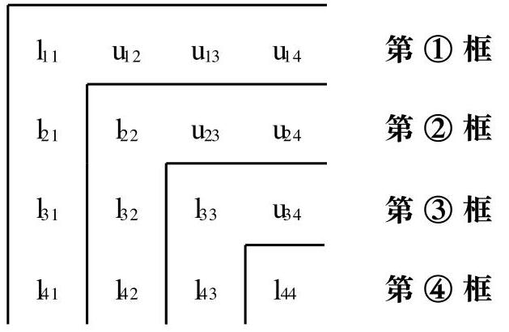

[评注] 第 ③ 框中的 ${l}_{i3}$ 为 $A$ 的对应元素 ${a}_{i3}$ 先减去“第 ① 框中同行的 ${l}_{i1}$ 与同列的 ${u}_{13}$ 之积”,再减去“第②框中同行的 ${l}_{12}$ 与同列的 ${u}_{23}$ 之积”; 第③框中的 ${u}_{34}$ 为 $A$ 的对应元素 ${a}_{34}$ 先减去 “第 ① 框中同行的 ${l}_{31}$ 与同列的 ${u}_{14}$ 之积”,再减去 “第 ② 框中同行的 ${l}_{32}$ 与同列的 ${u}_{24}$ 之积”,最后除以 ${l}_{33}$ (第 ③ 框的主对角线元素).

(3)由矩阵的 Crout 分解构造矩阵的 LDU 分解 令 $D = \; \operatorname{diag}\left( {{l}_{11},{l}_{22},\cdots ,{l}_{nn}}\right)$ , L的第 $i$ 列为L的第 $i$ 列除以 ${l}_{ii}(i = 1,2,\cdots , n -$ 1), $L$ 的第 $n$ 列为 ${e}_{n}$ ,那么 $A = {LDU}$ .

(4)由矩阵的 Crout 分解构造矩阵的 Cholesky 分解 令 $\Lambda  = \; \operatorname{diag}\left( {\sqrt{{l}_{11}},\sqrt{{l}_{22}},\cdots ,\sqrt{{l}_{nn}}}\right) , G = L{\Lambda }^{-1}$ ,那么 $A = G{G}^{H}$ .

2. 求矩阵的 QR 分解

设 $A \in  {R}^{n \times  n}$ 是可逆矩阵.

(1)Schmidt 正交化方法:

1) 对 $A$ 的列向量组 ${a}_{1},{a}_{2},\cdots ,{a}_{n}$ 正交化得正交向量组 ${b}_{1},{b}_{2},\cdots$ , ${b}_{n}$ ,且有

$$
\left( {{a}_{1},{a}_{2},\cdots ,{a}_{n}}\right)  = \left( {b, b,\cdots ,{b}_{n}}\right) K
$$

$$
K = \left\lbrack  \begin{matrix} 1 & {k}_{21} & \cdots & {k}_{n1} \\   & 1 & w & \cdots \\   & & w & {k}_{n, n - 1} \\   & & & 1 \end{matrix}\right\rbrack
$$

2) 构造正交矩阵 $Q = \left( {q, q,\cdots ,{q}_{n}}\right)$ ,其中 ${q}_{j} = \frac{{b}_{j}}{\left| {b}_{j}\right| }(j = 1$ , $2,\cdots , n)$ ;

3) 构造上三角矩阵 $R = \operatorname{diag}\left( {\left| {b}_{1}\right| ,\left| {b}_{2}\right| ,\cdots ,\left| {b}_{n}\right| }\right)  \cdot  K$ ,那么 A = QR.

(2)Givens 变换方法:

1) 对 $A$ 的第 1 列 ${\beta }^{\left( 1\right) }$ 构造有限个 Givens 矩阵的乘积 ${T}_{1}$ ,使得

$$
{T}_{i}A = \left\lbrack  \begin{matrix} {a}_{11}^{\left( 1\right) } & {a}_{12}^{\left( 1\right) } & \cdots & {a}_{1n}^{\left( 1\right) } \\  0 & & & \\  0 & & & \\  \cdots & & & \\  0 & & &  \end{matrix}\right\rbrack
$$

$$
{T}_{i}{\beta }^{\left( 1\right) } = \left| {\beta }^{\left( 1\right) }\right| e\;\left( {{e}_{i} \in  {R}^{n}}\right)
$$

2) 对 ${\mathrm{A}}^{\left( 1\right) }$ 的第 1 列 ${\beta }^{\left( 2\right) }$ 构造有限个 Givens 矩阵的乘积 ${\mathrm{T}}_{2}$ ,使得

$$
{\mathrm{T}}_{2}{\mathbf{\beta }}^{\left( 2\right) } = \left| {\mathbf{\beta }}^{\left( 2\right) }\right| \mathrm{e}\;\left( {\mathrm{e} \in  {\mathrm{R}}^{\mathrm{n} - 1}}\right)
$$

$$
{T}_{2}{A}^{\left( 1\right) } = \left\lbrack  \begin{matrix} {a}_{22}^{\left( 2\right) } & {a}_{23}^{\left( 2\right) } & \cdots & {a}_{2n}^{\left( 2\right) } \\  0 & & & \\  \cdots & & {A}^{\left( 2\right) } & \\  0 & & &  \end{matrix}\right\rbrack
$$

3) ……

n -1) 对 ${A}^{\left( n - 2\right) }$ 的第 1 列 ${\beta }^{\left( n - 1\right) }$ 构造 Givens 矩阵 ${T}_{n - 1}$ ,使得

$$
{T}_{n - 1}{\beta }^{\left( n - 1\right) } = \left| {\beta }^{\left( n - 1\right) }\right| a\;\left( {a \in  {R}^{2}}\right)
$$

$$
{T}_{n - 1}{A}^{\left( n - 2\right) } = \left\lbrack  \begin{matrix} {a}_{n - 1, n - 1}^{\left( n - 1\right) } & {a}_{n - 1, n}^{\left( n - 1\right) } \\  0 & {a}_{nn}^{\left( n - 1\right) } \end{matrix}\right\rbrack
$$

构造上三角矩阵

$$
R = \left\lbrack  \begin{matrix} {a}_{11}^{\left( 1\right) } & {a}_{12}^{\left( 1\right) } & \cdots & {a}_{1, n - 1}^{\left( 1\right) } & {a}_{1n}^{\left( 1\right) } \\   & {a}_{22}^{\left( 2\right) } & \cdots & {a}_{2, n - 1}^{\left( 2\right) } & {a}_{2n}^{\left( 2\right) } \\   & & \mathbf{w} & \cdots & \cdots \\   & & \mathbf{w} & \cdots & \cdots \\   & & & {a}_{n - 1, n - 1}^{\left( n - 1\right) } & {a}_{n - 1, n}^{\left( n - 1\right) } \\   & & & & {a}_{n, n}^{\left( n - 1\right) } \end{matrix}\right\rbrack
$$

计算正交矩阵

$$
Q = {\left\lbrack  \left\lbrack  \begin{array}{ll} {I}_{n - 2} & \\   & {T}_{n - 1} \end{array}\right\rbrack  \cdots \left\lbrack  \begin{array}{ll} 1 & \\   & {T}_{2} \end{array}\right\rbrack  {T}_{1}\right\rbrack  }^{T}
$$

那么 $\mathrm{A} = \mathrm{{QR}}$

[评注] 上三角矩阵 $\mathrm{R}$ 的主对角线上方 (含主对角线) 的第 $\mathrm{i}$ 行元素是第 $\mathrm{i}$ 步中矩阵 ${\mathrm{T}}_{\mathrm{i}}{\mathrm{A}}^{\left( \mathrm{i} - 1\right) }$ 的第 1 行元素 $\left( {\mathrm{i} = 1,2,\cdots ,\mathrm{n} - 1}\right)$ ,而 $\mathrm{R}$ 的 $\mathrm{n}$ 行 $\mathrm{n}$ 列元素是第 n -1 步中矩阵 ${T}_{n - 1}{A}^{\left( n - 2\right) }$ 的 2 行 2 列元素. 另外,当 $A$ 为不可逆矩阵时,各步中的 ${\beta }^{\left( i\right) }\left( {i = 1,2,\cdots , n - 1}\right)$ 有可能是零向量,遇此情形直接进行下一步即可.

(3)Householder 变换方法:在 Givens 变换方法的各步中，将“构造有限个 Givens 矩阵的乘积 ${\mathrm{T}}_{\mathrm{i}}$ 使得 ${\mathrm{T}}_{\mathrm{i}}{\beta }^{\left( \mathrm{i}\right) } = 1{\beta }^{\left( \mathrm{i}\right) }1\mathrm{e}$ ” 改作“构造 Householder 矩阵 ${H}_{i}$ 使得 ${H}_{i}{\beta }^{\left( i\right) } = \left| {\beta }^{\left( i\right) }\right| {e}_{i}$ ,并将涉及到的矩阵 ${T}_{i}$ 改作矩阵 ${H}_{i}$ 即可.

3. 化矩阵与 Hessenberg 矩阵正交相似

设 $A \in  {R}^{n \times  n}$ .

(1) Householder 变换方法:

1) 记 $A = {\left( {a}_{ij}\right) }_{n \times  n}$ 的第 1 列中后 $n - 1$ 个元素构成的列向量为 ${b}^{\left( 1\right) }$ ,当 ${b}^{\left( 1\right) } = 0$ 时,进行下一步; 否则,构造 Householder 矩阵 ${H}_{1}$ ,使得

$$
{H}_{1}{b}^{\left( 1\right) } = \left| {b}^{\left( 1\right) }\right| e\;\left( {e \in  {R}^{n - 1}}\right)
$$

$\left\lbrack  \begin{array}{ll} 1 & {0}^{\mathrm{T}} \\  0 & {\mathrm{H}}_{1} \end{array}\right\rbrack  \mathrm{A}{\left\lbrack  \begin{array}{ll} 1 & {0}^{\mathrm{T}} \\  0 & {\mathrm{H}}_{1} \end{array}\right\rbrack  }^{\mathrm{T}} = \left\lbrack  \begin{matrix} \frac{{\mathrm{a}}_{11}}{2} &  * & \cdots &  * \\   * &  * & & \\  \vdots & & & \\  0 & & & \\  \cdots & & {\mathrm{A}}^{\left( 1\right) } & \\  0 & & &  \end{matrix}\right\rbrack$

2) 记 ${A}^{\left( 1\right) }$ 的第 1 列中后 $n - 2$ 个元素构成的列向量为 ${b}^{\left( 2\right) }$ ,当 ${b}^{\left( 2\right) } \; = 0$ 时,进行下一步; 否则,构造 Householder 矩阵 ${\mathrm{H}}_{2}$ ,使得

$$
{\mathrm{H}}_{2}{\mathrm{\;b}}^{\left( 2\right) } = \left| {\mathrm{b}}^{\left( 2\right) }\right| \mathrm{e}\;\left( {\mathrm{e} \in  {\mathrm{R}}^{\mathrm{n} - 2}}\right)
$$

$$
\left\lbrack  \begin{matrix} 1 & {0}^{\mathrm{T}} \\  0 & {\mathrm{H}}_{2} \end{matrix}\right\rbrack  {\mathrm{A}}^{\left( 1\right) }{\left\lbrack  \begin{matrix} 1 & {0}^{\mathrm{T}} \\  0 & {\mathrm{H}}_{2} \end{matrix}\right\rbrack  }^{\mathrm{T}} = \left\lbrack  \begin{matrix} {\mathrm{a}}_{22}^{\left( 1\right) } &  * & \cdots &  * \\   * & & & \\  0 & & & \\  \cdots & & & \\  0 & & &  \end{matrix}\right\rbrack
$$

n - 2) 记 ${A}^{\left( n - 3\right) }$ 的第 1 列中后两个元素构成的列向量为 ${b}^{\left( n - 2\right) }$ ,当 ${b}^{\left( n - 2\right) } = 0$ 时,过程结束; 否则,构造 Householder 矩阵 ${H}_{n - 2}$ ,使得

$$
{H}_{n - 2}{b}^{\left( n - 2\right) } = \left| {b}^{\left( n - 2\right) }\right| e\;\left( {e \in  {R}^{2}}\right)
$$

$$
\left\lbrack  \begin{matrix} 1 & {0}^{T} \\  0 & {H}_{n - 2} \end{matrix}\right\rbrack  {A}^{\left( n - 3\right) }{\left\lbrack  \begin{matrix} 1 & {0}^{T} \\  0 & {H}_{n - 2} \end{matrix}\right\rbrack  }^{T} = \left\lbrack  \begin{matrix} {a}_{n - 2, n - 2}^{\left( n - 3\right) } &  * &  * \\   * &  * &  * \\  0 &  * &  *  \end{matrix}\right\rbrack
$$

计算正交矩阵

$$
Q = \left\lbrack  \begin{matrix} {I}_{n - 2} & O \\  O & {H}_{n - 2} \end{matrix}\right\rbrack  \cdots \left\lbrack  \begin{matrix} {I}_{2} & O \\  O & {H}_{2} \end{matrix}\right\rbrack  \left\lbrack  \begin{matrix} 1 & O \\  O & {H}_{1} \end{matrix}\right\rbrack
$$

那么 ${\mathrm{{QAQ}}}^{\mathrm{T}}$ 为上 Hessenberg 矩阵.

[评注] 当 $\mathrm{A}$ 为实对称矩阵时, ${\mathrm{{QAQ}}}^{\mathrm{T}}$ 为实对称三对角矩阵.

(2)Givens 变换方法: 在 Householder 变换方法的各步中,将“构造 Householder 矩阵 ${\mathrm{H}}_{\mathrm{i}}$ 使得 ${\mathrm{H}}_{\mathrm{i}}{\mathrm{b}}^{\left( \mathrm{i}\right) } = \left| {\mathrm{b}}^{\left( \mathrm{i}\right) }\right| \mathrm{a}$ ” 改作“构造有限个 Givens 矩阵的乘积 ${T}_{i}$ 使得 ${T}_{i}{b}^{\left( i\right) } = \left| {b}^{\left( i\right) }\right| a$ ”,并将涉及到的矩阵 ${H}_{i}$ 改作矩阵 ${T}_{i}$ 即可.

4. 求矩阵的满秩分解

$A \in  {C}_{r}^{m \times  n}\left( {r > 0}\right)$ .

(1)逆矩阵方法:

1) $\left\lbrack  {\mathrm{A}\vdots \mathrm{I}}\right\rbrack  \xrightarrow[]{\text{ 行 }}\left\lbrack  {\mathrm{B}\vdots \mathrm{P}}\right\rbrack$ ,其中 $\mathrm{B}$ 为阶梯形矩阵;

2) 计算 ${\mathrm{P}}^{-1}$ (或者 ${\mathrm{P}}^{-1}$ 的前 $\mathrm{r}$ 列);

3) 取 $\mathrm{F}$ 为 ${\mathrm{P}}^{-1}$ 的前 $\mathrm{r}$ 列构成的列满秩矩阵, $\mathrm{G}$ 为 $\mathrm{B}$ 的前 $\mathrm{r}$ 行构成的行满秩矩阵,那么 $\mathrm{A} = \mathrm{{FG}}$ .

(2) Hermite 标准形方法:

1) $\mathrm{A}\xrightarrow[]{\text{ 行 }}\mathrm{B}$ ,其中 $\mathrm{B}$ 为 Hermite 标准形矩阵,且 $\mathrm{B}$ 的 ${\mathrm{j}}_{1},{\mathrm{j}}_{2},\cdots ,{\mathrm{j}}_{\mathrm{r}}$ 列为单位矩阵 ${\mathrm{I}}_{\mathrm{m}}$ 的前 $\mathrm{r}$ 列;

2) 取 $\mathrm{F}$ 为 $\mathrm{A}$ 的 ${\mathrm{j}}_{1},{\mathrm{j}}_{2},\cdots ,{\mathrm{j}}_{\mathrm{r}}$ 列构成的列满秩矩阵, $\mathrm{G}$ 为 $\mathrm{B}$ 的前 $\mathrm{r}$ 行构成的行满秩矩阵,那么 $\mathrm{A} = \mathrm{{FG}}$ .

[评注] 采用 Hermite 标准形方法求矩阵 $A$ 的满秩分解时,对 $A$ 的 Hermite 标准形矩阵 $B$ 可以取消限制条件 ${j}_{1} < {j}_{2} < \cdots  < {j}_{r}$ .

5. 求矩阵的奇异值分解

设 $A \in  {C}_{r}^{m \times  n}\left( {r > 0}\right)$ 的非零奇异值为 $\sigma ,\sigma ,\cdots ,\sigma$ ,对角矩阵 $\sum  = \; \operatorname{diag}\left( {\mathbf{\sigma },\mathbf{\sigma },\cdots ,{\mathbf{\sigma }}_{\mathrm{r}}}\right) ,{\lambda }_{i} = {\mathbf{\sigma }}_{\mathrm{i}}^{2}\;\left( {\mathrm{i} = 1,2,\cdots ,\mathrm{r}}\right) .$

(1)直接构造法:

1) 求酉矩阵 ${\mathrm{V}}_{\mathrm{n} \times  \mathrm{n}}$ 使得

$$
{\mathrm{V}}^{\mathrm{H}}\left( {{\mathrm{A}}^{\mathrm{H}}\mathrm{A}}\right) \mathrm{V} = \operatorname{diag}\left( {{\lambda }_{\mathrm{t}},\cdots ,{\lambda }_{\mathrm{r}},0,\cdots ,0}\right)
$$

2) 计算 ${U}_{1} = A{V}_{1}{\sum }^{-1}$ ,其中 ${V}_{1}$ 为 $V$ 的前 $r$ 列构成的矩阵;

3) 扩充 ${U}_{1}$ 的 $r$ 个列向量为 ${C}^{m}$ 的标准正交基，并记由增加的 $m$ - $\mathrm{r}$ 个列向量构成的矩阵为 ${\mathrm{U}}_{2}$ ,那么 $\mathrm{U} = \left\lbrack  \begin{array}{ll} {\mathrm{U}}_{1} & {U}_{2} \end{array}\right\rbrack$ 是酉矩阵;

4) 写出 $A$ 的奇异值分解 $A = U\left\lbrack  \begin{matrix} \sum & O \\  O & O \end{matrix}\right\rbrack  {V}^{H}$ .

(2)试算验证法:

1) 求酉矩阵 ${V}_{n \times  n}$ 使得

$$
{\mathrm{V}}^{\mathrm{H}}\left( {{\mathrm{A}}^{\mathrm{H}}\mathrm{A}}\right) \mathrm{V} = \operatorname{diag}\left( {{\lambda }_{\mathrm{t}},\cdots ,{\lambda }_{\mathrm{t}},0,\cdots ,0}\right)
$$

2) 求酉矩阵 ${\mathrm{U}}_{\mathrm{m} \times  \mathrm{m}}$ 使得

$$
{\mathrm{U}}^{\mathrm{H}}\left( {\mathrm{{AA}}}^{\mathrm{H}}\right) \mathrm{U} = \operatorname{diag}\left( {{\lambda }_{\mathrm{t}},\cdots ,{\lambda }_{\mathrm{r}},0,\cdots ,0}\right)
$$

3) 计算矩阵 $U\left\lbrack  \begin{matrix} \sum & O \\  O & O \end{matrix}\right\rbrack  {V}^{H}$ ;

4) 若 3) 中的矩阵等于 $A$ ,则它是 $A$ 的一个奇异值分解; 若 3) 中的矩阵不等于 $A$ ,需要重新调整 $V$ 或 $\left( \text{ 和 }\right) U$ 的列向量,直至乘积等于 $\mathrm{A}$

[评注] 当 ${\mathrm{A}}^{\mathrm{H}}\mathrm{A}$ (或 ${\mathrm{{AA}}}^{\mathrm{H}}$ ) 的非零特征值的重数为 1 时,只需调整 $\mathrm{V}$ 或 (和) $\mathrm{U}$ 中对应非零特征值的特征向量的正负号即可; 而当 ${\mathrm{A}}^{\mathrm{H}}\mathrm{A}$ (或 ${\mathrm{{AA}}}^{\mathrm{H}}$ ) 的非零特征值的重数大于 1 时,调整 $V$ 或 (和) $U$ 的列向量使得 $U\left\lbrack  \begin{matrix} \sum & O \\  O & O \end{matrix}\right\rbrack  {V}^{H} = A$ 是十分困难的.

## 四、内容结构框图

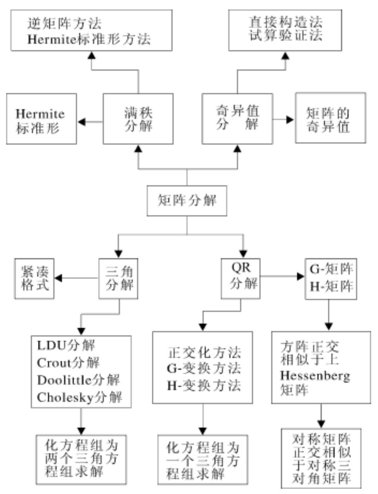

## 五、课后习题全解

## 习 题 4.1

1. 求矩阵

$$
A = \left\lbrack  \begin{array}{rrrr} 5 & 2 &  - 4 & 0 \\  2 & 1 &  - 2 & 1 \\   - 4 &  - 2 & 5 & 0 \\  0 & 1 & 0 & 2 \end{array}\right\rbrack
$$

的 LDU 分解和 Doolittle 分解.

解 对 $\mathrm{A}$ 作矩阵

$$
{L}_{1} = \left\lbrack  \begin{array}{rrrr} 1 & & & \\  \frac{2}{5} & 1 & & \\   - \frac{4}{5} & 0 & 1 & \\  0 & 0 & 0 & 1 \end{array}\right\rbrack  ,{L}^{-1} = \left\lbrack  \begin{array}{rrrr} 1 & & & \\   - \frac{2}{5} & 1 & & \\  4 & & & \\  \frac{4}{5} & 0 & 1 & \\  0 & 0 & 0 & 1 \end{array}\right\rbrack
$$

计算

$$
{\mathrm{L}}^{-1}\mathrm{\;A} = \left\lbrack  \begin{array}{rrrr} 5 & 2 &  - 4 & 0 \\  0 & \frac{1}{5} &  - \frac{2}{5} & 1 \\  0 &  - \frac{2}{5} & \frac{9}{5} & 0 \\  0 & 1 & 0 & 2 \end{array}\right\rbrack   = {\mathrm{A}}^{\left( 1\right) }
$$

对 ${A}^{\left( 1\right) }$ 作矩阵

$$
{L}_{2} = \left\lbrack  \begin{array}{rrrr} 1 & & & \\  0 & 1 & & \\  0 &  - 2 & 1 & \\  0 & 5 & 0 & 1 \end{array}\right\rbrack  ,{L}_{2}^{-1} = \left\lbrack  \begin{array}{rrrr} 1 & & & \\  0 & 1 & & \\  0 & 2 & 1 & \\  0 &  - 5 & 0 & 1 \end{array}\right\rbrack
$$

计算

$$
{L}_{2}^{-1}{A}^{\left( 1\right) } = \left\lbrack  \begin{array}{rrrr} 5 & 2 &  - 4 & 0 \\  0 & \frac{1}{5} &  - \frac{2}{5} & 1 \\  0 & 0 & 1 & 2 \\  0 & 0 & 2 &  - 3 \end{array}\right\rbrack   = {A}^{\left( 2\right) }
$$

对 ${A}^{\left( 2\right) }$ 作矩阵

$$
{\mathrm{L}}_{3} = \left\lbrack  \begin{array}{llll} 1 & & & \\  0 & 1 & & \\  0 & 0 & 1 & \\  0 & 0 & 2 & 1 \end{array}\right\rbrack  ,\;{\mathrm{L}}_{3}^{-1} = \left\lbrack  \begin{array}{lllll} 1 & & & & \\  0 & 1 & & & \\  0 & 0 & 1 & & \\  0 & 0 &  - 2 & 1 &  \end{array}\right\rbrack
$$

$$
\begin{array}{l} {\mathrm{L}}^{-1}{\mathrm{\;A}}^{\left( 2\right) } = \left\lbrack  \begin{array}{rrrr} 5 & 2 &  - 4 & 0 \\   & \frac{1}{5} &  - \frac{2}{5} & 1 \\   & & 1 & 2 \\   & & &  - 7 \end{array}\right\rbrack   = {\mathrm{A}}^{\left( 3\right) } \\  \end{array}
$$

$$
L = {L}_{1}{L}_{2}{L}_{3} = \left\lbrack  \begin{array}{rrrrr} 1 & & & & \\  \frac{2}{5} & 1 & & & \\   - \frac{4}{5} &  - 2 & 1 & & \\  0 & 5 & 2 & 1 & \\   & & & &  \end{array}\right\rbrack
$$

计算

令

可得 A 的 Doolittle 分解为 $\mathrm{A} = {\mathrm{{LA}}}^{\left( 3\right) },\mathrm{A}$ 的 LDU 分解为

$$
A = L\left\lbrack  \begin{array}{lllll} 5 & & & & \\   & \frac{1}{5} & & & \\   & & 1 & & \\   & & & 1 & \\   & & & &  - 7 \end{array}\right\rbrack  \left\lbrack  \begin{array}{llll} 1 & \frac{2}{5} &  - \frac{4}{5} & 0 \\   & 1 &  - 2 & 5 \\   & & 1 & 2 \\   & & & 1 \end{array}\right\rbrack
$$

2. 证明式 (4.1.30).

证 设 $A = {\left( {a}_{ij}\right) }_{n \times  n}$ ,令

$$
L = \left\lbrack  \begin{matrix} 1 & & & \\  {l}_{21} & 1 & & \\  \cdots & \cdots & \mathbf{w} & \\  {l}_{n1} & {l}_{n2} & \cdots & 1 \end{matrix}\right\rbrack  , U = \left\lbrack  \begin{matrix} {u}_{11} & {u}_{12} & \cdots & {u}_{1n} \\   & {u}_{22} & \cdots & {u}_{2n} \\   & & \mathbf{w} & \cdots \\   & & & {u}_{nn} \end{matrix}\right\rbrack
$$

比较 $\mathrm{A} = \mathrm{{LU}}$ 两端的对应元素可得

$$
{\mathbf{a}}_{1\mathrm{k}} = {\mathbf{u}}_{1\mathrm{k}}\;\left( {\mathrm{k} = 1,2,\cdots ,\mathrm{n}}\right)
$$

$$
{\mathbf{a}}_{\mathrm{k}1} = {\mathbf{l}}_{\mathrm{k}1}{\mathbf{u}}_{11}\;\left( {\mathrm{k} = 2,\cdots ,\mathrm{n}}\right)
$$

$$
{\mathbf{a}}_{ik} = {\mathbf{l}}_{i1}{\mathbf{u}}_{1k} + \cdots  + {\mathbf{l}}_{i, i - 1}{\mathbf{u}}_{i - 1, k} + {\mathbf{u}}_{ik}
$$

$$
\left( {\mathrm{k} = \mathrm{i},\mathrm{i} + 1,\cdots ,\mathrm{n};\mathrm{i} > 1}\right)
$$

$$
{\mathbf{a}}_{\mathrm{{ki}}} = {\mathbf{I}}_{\mathrm{k}1}{\mathbf{u}}_{\mathrm{i}1} + \cdots  + {\mathbf{I}}_{\mathrm{k},\mathrm{i} - 1}{\mathbf{u}}_{\mathrm{i} - 1,\mathrm{i}} + {\mathbf{I}}_{\mathrm{{ki}}}{\mathbf{u}}_{\mathrm{{ii}}}
$$

$$
\left( {\mathrm{k} = \mathrm{i} + 1,\cdots ,\mathrm{n};\mathrm{i} > 1}\right)
$$

即

$$
{\mathrm{u}}_{1\mathrm{k}} = {\mathrm{a}}_{1\mathrm{k}}\;\left( {\mathrm{k} = 1,2,\cdots ,\mathrm{n}}\right)
$$

$$
{\mathrm{I}}_{\mathrm{k}1} = \frac{1}{{\mathrm{u}}_{11}}{\mathrm{a}}_{\mathrm{k}1}\;\left( {\mathrm{k} = 2,\cdots ,\mathrm{n}}\right)
$$

$$
{u}_{ik} = {a}_{ik} - \left( {{l}_{i1}{u}_{1k} + \cdots  + {l}_{i, i - 1}{u}_{i - 1, k}}\right)
$$

$$
\left( {\mathrm{k} = \mathrm{i},\mathrm{i} + 1,\cdots ,\mathrm{n};\mathrm{i} > 1}\right)
$$

$$
{\mathrm{l}}_{\mathrm{{ki}}} = \frac{1}{{\mathrm{u}}_{\mathrm{{ii}}}}\left\lbrack  {{\mathrm{a}}_{\mathrm{{ki}}} - \left( {{\mathrm{l}}_{\mathrm{{kl}}}{\mathrm{u}}_{1\mathrm{i}} + \cdots  + {\mathrm{l}}_{\mathrm{k},\mathrm{i} - 1}{\mathrm{u}}_{\mathrm{i} - 1,\mathrm{i}}}\right) }\right\rbrack
$$

$$
\left( {\mathrm{k} = \mathrm{i} + 1,\cdots ,\mathrm{n};\mathrm{i} > 1}\right)
$$

3. 设 A 为实对称正定矩阵, 且 Gauss 消去法第一步得到的矩阵为

$$
{A}^{\left( 1\right) } = \left( \begin{matrix} \frac{{a}_{11}}{0} & {a}_{12} & \cdots & {a}_{1n} \\  0 & & & \\  \cdots & & B & \\  0 & & &  \end{matrix}\right)
$$

证明 $\mathrm{B}$ 仍是实对称正定矩阵,且对角元素不增加.

证 设 $A = {\left( {a}_{ij}\right) }_{n \times  n}$ ,记 $a = {\left( {a}_{21},\cdots ,{a}_{n1}\right) }^{T}$ ,由于 $A$ 对称,所以 $A$ 可分块为 $A = \left\lbrack  \begin{matrix} {a}_{11} & {a}^{T} \\  a & {A}_{1} \end{matrix}\right\rbrack$ ,其中 $A$ 是 $n - 1$ 阶对称矩阵,于是

$$
{A}^{\left( 1\right) } = \left\lbrack  \begin{matrix} {a}_{11} & {a}^{T} \\  0 & {A}_{L} - \frac{a{a}^{T}}{{a}^{L}} \end{matrix}\right\rbrack
$$

即 $B = A - \frac{a{a}^{T}}{{a}_{11}}$ . 下面证明 $B$ 是正定矩阵.

容易验证 ${B}^{T} = B$ . 任取非零列向量 $y \in  {R}^{n - 1}$ ,则 $x = \left\lbrack  \begin{matrix}  - \frac{{a}^{T}y}{{a}_{11}} \\  y \end{matrix}\right\rbrack   \neq$ 0,从而 ${x}^{T}{Ax} > 0$ ,即

$$
\left\lbrack  \begin{matrix}  - \frac{{y}^{T}a}{{a}_{11}} & {y}^{T} \end{matrix}\right\rbrack  \left\lbrack  \begin{matrix} {a}_{11} & {a}^{T} \\  a & {A}_{1} \end{matrix}\right\rbrack  \left\lbrack  \begin{matrix}  - \frac{{a}^{T}}{{a}_{11}} \\  y \end{matrix}\right\rbrack   > 0
$$

上式左端进行乘法运算后可得

$$
{y}^{T}\left( {A - \frac{a{a}^{T}}{{a}_{11}}}\right) y > 0
$$

故 $B = A - \frac{a{a}^{T}}{{a}_{11}}$ 为正定矩阵.

4. 求对称正定矩阵

$$
A = \left\lbrack  \begin{array}{rrr} 5 & 2 &  - 4 \\  2 & 1 &  - 2 \\   - 4 &  - 2 & 5 \end{array}\right\rbrack
$$

的 Cholesky 分解.

解 根据式(4.1.28) 和(4.1.29) 求出 $\mathrm{A}$ 的 Crout 分解为

$$
A = \left\lbrack  \begin{matrix} 5 & & \\  2 & & \frac{1}{5} \\   - 4 &  - \frac{2}{5} & 1 \end{matrix}\right\rbrack  \left\lbrack  \begin{matrix} 1 & \frac{2}{5} &  - \frac{4}{5} \\   & 1 &  - 2 \\   & & 1 \end{matrix}\right\rbrack
$$

变形可得 A 的 Cholesky 分解为

$$
A = \left\lbrack  \begin{array}{rrrr} 1 & & & \\  \frac{2}{5} & 1 & & \\  5 & 1 & & \\   - \frac{4}{5} &  - 2 & 1 &  \end{array}\right\rbrack  \left\lbrack  \begin{array}{llll} 5 & & & \\   & 5 & & \\   & & \frac{1}{5} & \\   & & & 1 \end{array}\right\rbrack  \left\lbrack  \begin{array}{rrr} 1 & \frac{2}{5} &  - \frac{4}{5} \\   & 1 &  - 2 \\   & & 1 \end{array}\right\rbrack   =
$$

$$
\left\lbrack  \begin{matrix} \sqrt{5} & & & \\  \frac{2}{\sqrt{5}} & \frac{1}{\sqrt{5}} & & \\  \frac{-4}{\sqrt{5}} & \frac{-2}{\sqrt{5}} & 1 &  \end{matrix}\right\rbrack  \left\lbrack  \begin{matrix} \sqrt{5} & \frac{2}{\sqrt{5}} & \frac{-4}{\sqrt{5}} \\   & \frac{1}{\sqrt{5}} & \frac{-2}{\sqrt{5}} \\   & & 1 \end{matrix}\right\rbrack
$$

## 习 题 4.2

1. 用 Schmidt 正交化方法求矩阵

$$
A = \left\lbrack  \begin{array}{lll} 0 & 1 & 1 \\  1 & 1 & 0 \\  1 & 0 & 1 \end{array}\right\rbrack
$$

的 QR 分解.

解 令 ${a}_{1} = {\left( 0,1,1\right) }^{\mathrm{T}},{a}_{2} = {\left( 1,1,0\right) }^{\mathrm{T}},{a}_{3} = {\left( 1,0,1\right) }^{\mathrm{T}}$ ,正交化可得

$$
\mathrm{b} = {\mathrm{a}}_{1} = {\left( 0,1,1\right) }^{\mathrm{T}}
$$

$$
\mathrm{b = {a}_{2} - \frac{1}{2}b = {\left( 1,\frac{1}{2}, - \frac{1}{2}\right) }^{T}}
$$

$$
\mathrm{b = {a}_{3} - \frac{1}{3}b - \frac{1}{2}b = {\left( \frac{2}{3}, - \frac{2}{3},\frac{2}{3}\right) }^{T}}
$$

根据式 (4.2.8) 构造矩阵

$$
Q = \left\lbrack  \begin{matrix} 0 & \frac{2}{\sqrt{6}} & \frac{1}{\sqrt{3}} \\  \frac{1}{\sqrt{2}} & \frac{1}{\sqrt{6}} & \frac{-1}{\sqrt{3}} \\  \frac{1}{\sqrt{2}} & \frac{-1}{\sqrt{6}} & \frac{1}{\sqrt{3}} \end{matrix}\right\rbrack  , R = \left\lbrack  \begin{matrix} \sqrt{2} & \frac{1}{\sqrt{2}} & \frac{1}{\sqrt{2}} \\   & \frac{3}{\sqrt{6}} & \frac{1}{\sqrt{6}} \\   & & \frac{2}{\sqrt{3}} \end{matrix}\right\rbrack
$$

则有 $A = {QR}$ .

2. 用 Givens 变换将向量 $x = {\left( 2,3,0,5\right) }^{\mathrm{T}}$ 变换为与 $\mathrm{e}$ 同方向

解 对 $x$ 构造 ${T}_{12}\left( {c, s}\right)  : c = \frac{2}{\sqrt{13}}, s = \frac{3}{\sqrt{13}}$ ,则有

$$
{\mathrm{T}}_{12}\mathrm{x} = {\left( \sqrt{13},0,0,5\right) }^{\mathrm{T}}
$$

对 ${\mathrm{T}}_{12}\mathrm{x}$ 构造 ${\mathrm{T}}_{14}\left( {\mathrm{c},\mathrm{s}}\right)  : \mathrm{c} = \frac{\sqrt{13}}{\sqrt{38}},\mathrm{\;s} = \frac{5}{\sqrt{38}}$ ,则有

$$
{\mathrm{T}}_{14}\left( {{\mathrm{\;T}}_{12}\mathrm{\;x}}\right)  = {\left( \sqrt{38},0,0,0\right) }^{\mathrm{T}} = \sqrt{38}\mathrm{e}
$$

于是

$$
T = {T}_{14}{T}_{12} = \left\lbrack  \begin{matrix} \frac{2}{\sqrt{38}} & \frac{3}{\sqrt{38}} & 0 & \frac{5}{\sqrt{38}} \\  \frac{-3}{\sqrt{13}} & \frac{2}{\sqrt{13}} & 0 & 0 \\  0 & 0 & 1 & 0 \\  \frac{-{10}}{\sqrt{38}} & \frac{-{15}}{\sqrt{38}} & 0 & \frac{\sqrt{13}}{\sqrt{38}} \end{matrix}\right\rbrack
$$

且 $\mathrm{{Tx}} = \sqrt{38}\mathrm{e}$ .

3. 写出 ${\mathrm{R}}^{2}$ 中的向量 $\mathrm{x}$ 关于 ${\mathrm{e}}_{1}$ 正交的轴的反射变换.

解 反射矩阵 $\mathrm{H} = \mathrm{I} - 2{\mathrm{e}}_{1}{\mathrm{e}}_{1}^{\mathrm{T}} = \left\lbrack  \begin{array}{rr}  - 1 & 0 \\  0 & 1 \end{array}\right\rbrack$ ,反射变换为

$$
\left\lbrack  \begin{array}{l} {\mathbf{\eta }}_{1} \\  {\mathbf{\eta }}_{2} \end{array}\right\rbrack   = \left\lbrack  \begin{array}{rr}  - 1 & 0 \\  0 & 1 \end{array}\right\rbrack  \left\lbrack  \begin{array}{l} {\mathbf{\xi }}_{1} \\  {\mathbf{\xi }}_{2} \end{array}\right\rbrack
$$

4. 设变换 $\mathrm{{Hx}} = \mathrm{x} - \mathrm{a}\left( {\mathrm{x},\mathrm{w}}\right) \mathrm{w}\left( {\mathrm{x} \in  {\mathrm{R}}^{\mathrm{n}}}\right)$ ,其中 $\mathrm{w}$ 是欧氏长度为 1 的向量. 问 $a$ 取何值时, $H$ 是正交矩阵?

解 对任意 $x \in  {R}^{n}$ ，由 $\left( {{Hx},{Hx}}\right)  = \left( {x, x}\right)$ 可得

$$
\left( {x, x}\right)  + \left( {{a}^{2} - {2a}}\right) {\left( x, w\right) }^{2} = \left( {x, x}\right)
$$

即 ${\left( {a}^{2} - 2a\right) }^{2}{\left( x, w\right) }^{2} = 0$ . 特别地,取 $x = w$ 时,有 ${a}^{2} - {2a} = 0$ ,即 $a =$ 0 或 $\mathrm{a} = 2$ .

5. 已知向量 $x = {\left( \xi ,\xi ,\cdots ,{\xi }^{T} \in  {R}^{n},\text{ 且 }x - \xi e - \xi e \neq  0,\text{ 证 }x - \xi e - \xi e \neq  0,\text{ 证 }\right) }^{T - 1}$ 明: 存在正交矩阵 $Q\left( \right.$ 初等旋转矩阵之积 $)$ ,使 ${Qx} = {\left( \xi ,\alpha ,0,\cdots ,0\right) }^{\mathrm{T}}$ .

证 由条件 $\mathrm{x} - {\xi }_{0} - {\xi }_{e} \neq  0$ 知, ${\left( 0,0,{\xi }_{0},\cdots ,{\xi }_{n}\right) }^{\mathrm{T}} \neq  0$ . 令 $\mathrm{y} = {\left( {\mathrm{\xi }}_{s},{\mathrm{\xi }}_{i},\cdots ,{\mathrm{\xi }}_{n}\right) }^{\mathrm{T}} \in  {\mathrm{R}}^{\mathrm{n} - 1}$ ,则存在初等旋转矩阵之积,记作 $\mathrm{Q}$ ,使得

$$
\mathrm{Q}y = \left| y\right| e\;\left( {e \in  {R}^{n - 1}}\right)
$$

令 $Q = \left\lbrack  \begin{array}{ll} 1 & \\   & {Q}_{l} \end{array}\right\rbrack$ ,则 $Q$ 仍是初等旋转矩阵之积,从而 $Q$ 是正交矩阵, 且有

$$
{Qx} = \left\lbrack  \begin{array}{ll} 1 & \\   & {Q}_{1} \end{array}\right\rbrack  \left\lbrack  \begin{array}{l} \xi \\  y \end{array}\right\rbrack   = \left\lbrack  \begin{array}{l} \xi \\  {Q}_{1}y \end{array}\right\rbrack   = {\left( \xi ,0,0,\cdots ,0\right) }^{T}
$$

$$
\left( {e = \left| y\right| }\right)
$$

6. 已知向量 $\mathrm{x} = {\left( {\xi }_{1},{\xi }_{2},\cdots ,{\xi }_{n}\right) }^{\mathrm{T}} \in  {\mathrm{R}}^{\mathrm{n}}$ ,求初等反射矩阵 $\mathrm{H}$ ,使 ${Hx} = {\left( \xi ,{\eta }_{2},0,\cdots ,0\right) }^{\mathrm{T}}.$

解 令 $y = {\left( \xi ,{\eta }_{2},0,\cdots ,0\right) }^{\mathrm{T}}$ ,由 ${Hx} = y$ 知 $\left| y\right|  = \left| {Hx}\right|  = \; \left| x\right|$ . 将 $y$ 单位化,可得 ${y}_{0} = \frac{1}{\left| y\right| }y$ . 取

$$
u = \frac{x - \left| x\right| {y}_{0}}{\left| x - \left| x\right| {y}_{0}\right| } = \frac{x - y}{\left| x - y\right| }
$$

构造初等反射矩阵 $\mathrm{H} = \mathrm{I} - 2{\mathrm{{uu}}}^{\mathrm{T}}$ ,则有

$$
\mathrm{{Hx}} = \left| \mathrm{x}\right| \mathrm{y} = \mathrm{y}
$$

7. 用 Givens 变换求矩阵

$$
A = \left\lbrack  \begin{array}{lll} 2 & 2 & 1 \\  0 & 2 & 2 \\  2 & 1 & 2 \end{array}\right\rbrack
$$

的 QR 分解.

解 第 1 步: 对 $A$ 的第 1 列 ${b}^{\left( 1\right) } = {\left( 2,0,2\right) }^{T}$ ,构造 $T$ 使 $T{b}^{\left( 1\right) } =$ I ${b}^{\left( 1\right) }$ I ${e}_{1}$ .

$$
{T}_{13} = \left\lbrack  \begin{matrix} \frac{1}{\sqrt{2}} & 0 & \frac{1}{\sqrt{2}} \\  0 & 1 & 0 \\  \frac{-1}{\sqrt{2}} & 0 & \frac{1}{\sqrt{2}} \end{matrix}\right\rbrack  ,\;{T}_{13}{b}^{\left( 1\right) } = \left\lbrack  \begin{matrix} 2\sqrt{2} \\  0 \\  0 \end{matrix}\right\rbrack
$$

$$
{\mathrm{T}}_{1} = {\mathrm{T}}_{13},\;{\mathrm{\;T}}_{1}\mathrm{\;A} = \left\lbrack  \begin{matrix} 2\sqrt{2} & \frac{3}{\sqrt{2}} & \frac{3}{\sqrt{2}} \\  0 & 2 & 2 \\  0 & \frac{-1}{\sqrt{2}} & \frac{1}{\sqrt{2}} \end{matrix}\right\rbrack
$$

第 2 步: 对 ${A}^{\left( 1\right) } = \left\lbrack  \begin{matrix} 2 & 2 \\  \frac{-1}{\sqrt{2}} & \frac{1}{\sqrt{2}} \end{matrix}\right\rbrack$ 的第 1 列 ${b}^{\left( 2\right) } = \left\lbrack  \begin{matrix} 2 \\  \frac{-1}{\sqrt{2}} \end{matrix}\right\rbrack$ ,构造 ${T}_{2}$ ,使 ${T}_{2}{b}^{\left( 2\right) } = \left| {b}^{\left( 2\right) }\right| e.$

$$
{\mathrm{T}}_{12} = \left\lbrack  \begin{array}{rr} \frac{2\sqrt{2}}{3} &  - \frac{1}{3} \\  \frac{1}{3} & \frac{2\sqrt{2}}{3} \end{array}\right\rbrack  ,\;{\mathrm{T}}_{12}{\mathrm{\;b}}^{\left( 2\right) } = \left\lbrack  \begin{matrix} \frac{3}{\sqrt{2}} \\  0 \end{matrix}\right\rbrack
$$

$$
{\mathrm{T}}_{2} = {\mathrm{T}}_{12},\;{\mathrm{\;T}}_{2}{\mathrm{\;A}}^{\left( 1\right) } = \left\lbrack  \begin{matrix} \frac{3}{\sqrt{2}} & \frac{7}{3\sqrt{2}} \\  0 & \frac{4}{3} \end{matrix}\right\rbrack
$$

最后，令 $\mathrm{T} = \left\lbrack  \begin{array}{ll} 1 & \\   & {\mathrm{\;T}}_{2} \end{array}\right\rbrack  \mathrm{T}$ ，则有

$$
Q = {T}^{T} = \left\lbrack  \begin{matrix} \frac{1}{\sqrt{2}} & \frac{1}{3\sqrt{2}} &  - \frac{2}{3} \\  0 & \frac{4}{3\sqrt{2}} & \frac{1}{3} \\  \frac{1}{\sqrt{2}} & \frac{-1}{3\sqrt{2}} & \frac{2}{3} \end{matrix}\right\rbrack  ,\;R = \left\lbrack  \begin{matrix} 2\sqrt{2} & \frac{3}{\sqrt{2}} & \frac{3}{\sqrt{2}} \\   & \frac{3}{\sqrt{2}} & \frac{7}{3\sqrt{2}} \\   & & \frac{4}{3} \end{matrix}\right\rbrack
$$

且 $\mathrm{A} = \mathrm{{QR}}$ .

8. 用 Householder 变换求矩阵

$$
A = \left\lbrack  \begin{array}{lll} 0 & 4 & 1 \\  1 & 1 & 1 \\  0 & 3 & 2 \end{array}\right\rbrack
$$

的 QR 分解.

解 对 $\mathrm{A}$ 的第 1 列,构造 ${\mathrm{H}}_{1}$ 如下:

$$
{b}^{\left( 1\right) } = \left\lbrack  \begin{array}{l} 0 \\  1 \\  0 \end{array}\right\rbrack  ,{b}^{\left( 1\right) } - \left| {b}^{\left( 1\right) }\right| a = \left\lbrack  \begin{array}{r}  - 1 \\  1 \\  0 \end{array}\right\rbrack  , u = \frac{1}{\sqrt{2}}\left\lbrack  \begin{array}{r}  - 1 \\  1 \\  0 \end{array}\right\rbrack
$$

$$
{\mathrm{H}}_{1} = \mathrm{I} - 2{\mathrm{{uu}}}^{\mathrm{T}} = \left\lbrack  \begin{array}{lll} 0 & 1 & 0 \\  1 & 0 & 0 \\  0 & 0 & 1 \end{array}\right\rbrack  ,{\mathrm{H}}_{1}\mathrm{\;A} = \left\lbrack  \begin{array}{lll} 1 & 1 & 1 \\  0 & 4 & 1 \\  0 & 3 & 2 \end{array}\right\rbrack
$$

对 ${\mathrm{A}}^{\left( 1\right) } = \left\lbrack  \begin{array}{ll} 4 & 1 \\  3 & 2 \end{array}\right\rbrack$ 的第 1 列,构造 ${\mathrm{H}}_{2}$ 如下:

$$
{b}^{\left( 2\right) } = \left\lbrack  \begin{array}{l} 4 \\  3 \end{array}\right\rbrack  ,{b}^{\left( 2\right) } - \left| {b}^{\left( 2\right) }\right| e = \left\lbrack  \begin{array}{r}  - 1 \\  3 \end{array}\right\rbrack  , u = \frac{1}{\sqrt{10}}\left\lbrack  \begin{array}{r}  - 1 \\  3 \end{array}\right\rbrack
$$

$$
{\mathrm{H}}_{2} = \mathrm{I} - 2{\mathrm{{uu}}}^{\mathrm{T}} = \frac{1}{5}\left\lbrack  \begin{array}{rr} 4 & 3 \\  3 &  - 4 \end{array}\right\rbrack  ,{\mathrm{H}}_{2}{\mathrm{\;A}}^{\left( 1\right) } = \left\lbrack  \begin{array}{rr} 5 & 2 \\  0 &  - 1 \end{array}\right\rbrack
$$

最后，令 $\mathrm{S} = \left\lbrack  \begin{array}{ll} 1 & \\   & {\mathrm{H}}_{2} \end{array}\right\rbrack  {\mathrm{H}}_{1}$ ，则有

$$
Q = {S}^{T} = \left\lbrack  \begin{array}{rrr} 0 & \frac{4}{5} & \frac{3}{5} \\  1 & 0 & 0 \\  0 & \frac{3}{5} &  - \frac{4}{5} \end{array}\right\rbrack  ,\;R = \left\lbrack  \begin{array}{rrr} 1 & 1 & 1 \\   & 5 & 2 \\   & &  - 1 \end{array}\right\rbrack
$$

且 $\mathrm{A} = \mathrm{{QR}}$ .

9. 用 Householder 变换化矩阵

$$
A = \left\lbrack  \begin{matrix} 0 & {12} & {16} \\  {12} & {288} & {309} \\  {16} & {309} & {312} \end{matrix}\right\rbrack
$$

正交相似于三对角矩阵.

解 对 ${b}^{\left( 1\right) } = \left\lbrack  \begin{array}{l} {12} \\  {16} \end{array}\right\rbrack$ ,计算

$$
{b}^{\left( 1\right) } - \left| {b}^{\left( 1\right) }\right| e = \left\lbrack  \begin{array}{r}  - 8 \\  {16} \end{array}\right\rbrack  , u = \frac{1}{\sqrt{5}}\left\lbrack  \begin{array}{r}  - 1 \\  2 \end{array}\right\rbrack
$$

$$
\mathrm{H} = \mathrm{I} - 2{\mathrm{{uu}}}^{\mathrm{T}} = \frac{1}{5}\left\lbrack  \begin{array}{rr} 3 & 4 \\  4 &  - 3 \end{array}\right\rbrack
$$

令

$$
Q = \left\lbrack  \begin{array}{ll} 1 & \\   & H \end{array}\right\rbrack   = \frac{1}{5}\left\lbrack  \begin{array}{rrr} 5 & 0 & 0 \\  0 & 3 & 4 \\  0 & 4 &  - 3 \end{array}\right\rbrack
$$

则

$$
{\mathrm{{QAQ}}}^{\mathrm{T}} = \left\lbrack  \begin{matrix} 0 & {20} & 0 \\  {20} & {600} & {75} \\  0 & {75} & 0 \end{matrix}\right\rbrack
$$

## 习 题 4.3

1. 求下列各矩阵的满秩分解:

(1) $\left\lbrack  \begin{array}{rrrr} 1 & 2 & 3 & 0 \\  0 & 2 & 1 &  - 1 \\  1 & 0 & 2 & 1 \end{array}\right\rbrack$ ; (2) $\left\lbrack  \begin{array}{rrrr} 1 &  - 1 & 1 & 1 \\   - 1 & 1 &  - 1 &  - 1 \\   - 1 &  - 1 & 1 & 1 \\  1 & 1 &  - 1 &  - 1 \end{array}\right\rbrack$ .

解 $\left( 1\right) A\overset{\text{ 行 }}{ \rightarrow  }\left( \begin{array}{rrrr} 1 & 0 & 2 & 1 \\  0 & 1 & \frac{1}{2} &  - \frac{1}{2} \\  0 & 0 & 0 & 0 \end{array}\right)  = B,\operatorname{rank}B = 2$ 且 $B$ 中的第

1 列和第 2 列为单位矩阵的前两列, 故

$$
A = \left\lbrack  \begin{array}{ll} 1 & 2 \\  0 & 2 \\  1 & 0 \end{array}\right\rbrack  \left\lbrack  \begin{matrix} 1 & 0 & 2 & 1 \\  0 & 1 & \frac{1}{2} &  - \frac{1}{2} \end{matrix}\right\rbrack
$$

(2) $\mathrm{A}\overset{\text{ 行 }}{ \rightarrow  }\left\lbrack  \begin{array}{rrrr} 1 & 0 & 0 & 0 \\  0 & 1 &  - 1 &  - 1 \\  0 & 0 & 0 & 0 \\  0 & 0 & 0 & 0 \end{array}\right\rbrack   = \mathrm{B}$ ， $\operatorname{rank}\mathrm{B} = 2$ 且 $\mathrm{B}$ 中的第 1 列

和第 2 列为单位矩阵的前两列,故

$$
A = \left\lbrack  \begin{array}{rr} 1 &  - 1 \\   - 1 & 1 \\   - 1 &  - 1 \\  1 & 1 \end{array}\right\rbrack  \left\lbrack  \begin{array}{rrrr} 1 & 0 & 0 & 0 \\  0 & 1 &  - 1 &  - 1 \end{array}\right\rbrack
$$

2. 设 $B \in  {R}_{r}^{m \times  r}\left( {r > 0}\right)$ ,证明 ${B}^{T}B$ 非奇异.

证 由 rank $B = r$ 知, $B$ 的列向量组 ${b}_{1},{b}_{2},\cdots ,{b}_{r}$ 线性无关. 因此,对任意 $\mathrm{x} = {\left( \mathrm{k},\mathrm{k},\cdots ,{\mathrm{k}}_{\mathrm{r}}\right) }^{\mathrm{T}} \neq  0$ ,有

$$
{Bx} = {k}_{1}b + {k}_{2}{b}_{2} + \cdots  + {k}_{r}{b}_{r} \neq  0
$$

于是

$$
{\mathrm{X}}^{\mathrm{T}}\left( {{\mathrm{B}}^{\mathrm{T}}\mathrm{B}}\right) \mathrm{x} = {\left( \mathrm{{Bx}}\right) }^{\mathrm{T}}\left( {\mathrm{B}\mathrm{x}}\right)  > 0
$$

故 ${\mathrm{B}}^{\mathrm{T}}\mathrm{B}$ 是对称正定矩阵,从而 ${\mathrm{B}}^{\mathrm{T}}\mathrm{B}$ 非奇异.

3. 设 $\mathrm{B}$ 和 $\mathrm{A}$ 依次是 $\mathrm{m} \times  \mathrm{n}$ 和 $\mathrm{n} \times  \mathrm{m}$ 矩阵,若 $\mathrm{{BA}} = \mathrm{I}$ ,则称 $\mathrm{B}$ 为 A的左逆矩阵. 证明 $\mathrm{A}$ 有左逆矩阵的充要条件是 $\mathrm{A}$ 为列满秩矩阵.

证 必要性. 已知 $\mathrm{{BA}} = {\mathrm{I}}_{\mathrm{m}}$ ,因为

$$
\operatorname{rank}\left( \mathrm{{BA}}\right)  \leq  \operatorname{rank}\mathrm{A} \leq  \mathrm{m},\operatorname{rank}\left( \mathrm{{BA}}\right)  = \operatorname{rank}{\mathrm{I}}_{\mathrm{m}} = \mathrm{m}
$$

所以 $\mathrm{{rank}}\mathrm{A} = \mathrm{m}$ ，即 $\mathrm{A}$ 列满秩.

充分性. 已知 $\mathrm{A}$ 列满秩,所以 ${\mathrm{A}}^{\mathrm{T}}\mathrm{A}$ 非奇异 (见第 2 题). 构造 $\mathrm{m} \times \; \mathrm{n}$ 矩阵 $\mathrm{B} = {\left( {\mathrm{A}}^{\mathrm{T}}\mathrm{A}\right) }^{-1}{\mathrm{\;A}}^{\mathrm{T}}$ ,则有 $\mathrm{{BA}} = \mathrm{I}$ ,即 $\mathrm{A}$ 有左逆矩阵.

4. 设矩阵 $F \in  {C}_{r}^{m \times  r}, G \in  {C}_{r}^{r \times  n}$ ,证明 $\operatorname{rank}\left( {FG}\right)  = r$ .

证 令 $\mathrm{A} = \mathrm{{FG}}$ ,则 $\operatorname{rank}\mathrm{A} \leq  \operatorname{rank}\mathrm{F} = \mathrm{r}$ . 因为 $\mathrm{F}$ 列满秩,类似于第 2 题的证明可得 ${\mathrm{F}}^{\mathrm{H}}\mathrm{F}$ 可逆,于是有

$$
{\left( {\mathrm{F}}^{\mathrm{H}}\mathrm{F}\right) }^{-1}{\mathrm{\;F}}^{\mathrm{H}}\mathrm{A} = {\left( {\mathrm{F}}^{\mathrm{H}}\mathrm{F}\right) }^{-1}{\mathrm{\;F}}^{\mathrm{H}}\mathrm{{FG}} = \mathrm{G}
$$

从而

$$
\mathrm{r} = \operatorname{rank}\mathrm{G} \leq  \operatorname{rank}\mathrm{A}
$$

故 rank $\mathrm{A} = \mathrm{r}$ .

5. 设 $\mathrm{A} \in  {\mathrm{R}}_{\mathrm{r}}^{\mathrm{m} \times  \mathrm{r}}$ ,证明

$$
\operatorname{rank}\mathrm{A} = \operatorname{rank}\left( {{\mathrm{A}}^{\mathrm{T}}\mathrm{A}}\right)  = \operatorname{rank}\left( {\mathrm{{AA}}}^{\mathrm{T}}\right)
$$

证 已知 $A \in  {R}_{r}^{m \times  r}$ ，根据第 2 题可得 ${A}^{T}A$ 可逆，所以 ${rank}\left( {{A}^{T}A}\right)  = r$ . 又 $\mathrm{A} \in  {\mathrm{R}}_{\mathrm{r}}^{\mathrm{m} \times  \mathrm{r}},{\mathrm{A}}^{\mathrm{T}} \in  {\mathrm{R}}_{\mathrm{r}}^{\mathrm{r} \times  \mathrm{m}}$ ,根据第 4 题可得 $\operatorname{rank}\left( {\mathrm{{AA}}}^{\mathrm{T}}\right)  = \mathrm{r}$ . 因此

$$
\operatorname{rank}\mathrm{A} = \operatorname{rank}\left( {{\mathrm{A}}^{\mathrm{T}}\mathrm{A}}\right)  = \operatorname{rank}\left( {\mathrm{{AA}}}^{\mathrm{T}}\right)
$$

## 习 题 4.4

1. 设 $\sigma$ 和 ${\sigma }_{n}$ 是矩阵 $A$ 的最大奇异值和最小奇异值,证明: $\sigma  = \; \parallel \mathrm{A}{\parallel }_{2}$ ; 当 $\mathrm{A}$ 是非奇异矩阵时, ${\begin{Vmatrix}{\mathrm{A}}^{-1}\end{Vmatrix}}_{2} = \frac{1}{{\sigma }_{\mathrm{n}}}$ .

证 由 $\parallel \mathrm{A}{\parallel }_{2}^{2} = \max \lambda \left( {{\mathrm{A}}^{\mathrm{H}}\mathrm{A}}\right)  = {\sigma }^{2}$ 得 $\parallel \mathrm{A}{\parallel }_{2} = \sigma$ ; 当 $\mathrm{A}$ 非奇异时, ${\mathrm{{AA}}}^{\mathrm{H}}$ 与 ${\mathrm{A}}^{\mathrm{H}}\mathrm{A}$ 都是 Hermite 正定矩阵,它们的特征值都大于零, 且有

$$
{\begin{Vmatrix}{A}^{-1}\end{Vmatrix}}_{2}^{2} = \max \lambda \left\lbrack  {{\left( {A}^{-1}\right) }^{H}{A}^{-1}}\right\rbrack   = \max \lambda \left\lbrack  {\left( A{A}^{H}\right) }^{-1}\right\rbrack   =
$$

$$
\frac{1}{\min \lambda \left( {\mathrm{{AA}}}^{\mathrm{H}}\right) } = \frac{1}{\min \lambda \left( {{\mathrm{A}}^{\mathrm{H}}\mathrm{A}}\right) } = \frac{1}{{\sigma }_{\mathrm{n}}^{2}}
$$

即 ${\begin{Vmatrix}{A}^{-1}\end{Vmatrix}}_{2} = \frac{1}{{\sigma }_{n}}$ .

2. 给出应用奇异值分解(4.4.7) 求解齐次线性方程组 ${Ax} = 0$ 的方法.

解 设 $A \in  {R}_{r}^{m \times  n}$ 的奇异值分解为

$$
\mathrm{A} = {\mathrm{{UDV}}}^{\mathrm{T}},\;\mathrm{D} = \left\lbrack  \begin{array}{ll} \sum & \mathrm{O} \\  \mathrm{O} & \mathrm{O} \end{array}\right\rbrack
$$

其中, $\mathrm{U}$ 是 $\mathrm{m}$ 阶正交矩阵, $\mathrm{V}$ 是 $\mathrm{n}$ 阶正交矩阵, $\sum  = \operatorname{diag}\left( {\mathbf{\sigma },\mathbf{\sigma },\cdots ,\mathbf{\sigma }}\right)$ . 于是 ${Ax} = 0$ 可写为 ${UD}{V}^{\mathrm{T}}x = 0$ . 左乘 ${U}^{\mathrm{T}}$ 得 $D{V}^{\mathrm{T}}x = 0$ . 令 ${V}^{\mathrm{T}}x =$ y,则有 ${Dy} = 0$ ,容易写出通解

$$
\mathrm{y} = {\mathrm{k}}_{1}{\mathrm{e}}_{\mathrm{r} + 1} + \cdots  + {\mathrm{k}}_{\mathrm{n} - \mathrm{r}}{\mathrm{e}}_{\mathrm{n}}\;\left( {{\mathrm{k}}_{1},\cdots ,{\mathrm{k}}_{\mathrm{n} - \mathrm{r}} \in  \mathrm{R}}\right)
$$

设 $V$ 的第 $j$ 个列向量为 ${V}_{j}\left( {j = 1,2,\cdots , n}\right)$ ,则

$$
\mathrm{x} = \mathrm{{Vy}} = {\mathrm{k}}_{\mathrm{i}}{\mathrm{V}}_{\mathrm{r} + 1} + \cdots  + {\mathrm{k}}_{\mathrm{n} - \mathrm{r}}{\mathrm{V}}_{\mathrm{n}}\;\left( {{\mathrm{k}}_{\mathrm{i}},\cdots ,{\mathrm{k}}_{\mathrm{n} - \mathrm{r}} \in  \mathrm{R}}\right)
$$

3. 设 $\mathrm{A} \in  {\mathrm{R}}_{\mathrm{r}}^{\mathrm{m} \times  \mathrm{n}}\left( {\mathrm{r} > 0,\mathrm{\;m} \geq  \mathrm{n}}\right) ,\sigma$ 是 $\mathrm{A}$ 的奇异值,证明 $\parallel \mathrm{A}{\parallel }_{\mathrm{F}}^{2} = \; \mathop{\sum }\limits_{{1 = 1}}^{r}{\sigma }_{i}^{2}$

证 由 $\operatorname{rank}A = r$ ,可设 $A$ 的非零奇异值为 ${\sigma }_{1},\sigma ,\cdots ,\sigma$ . 于是可得

$$
\parallel \mathrm{A}{\parallel }_{\mathrm{F}}^{2} = \operatorname{tr}\left( {{\mathrm{A}}^{\mathrm{T}}\mathrm{A}}\right)  = \mathop{\sum }\limits_{{\mathrm{i} = 1}}^{\mathrm{n}}{\mathbf{\sigma }}_{\mathrm{i}}^{2} = \mathop{\sum }\limits_{{\mathrm{i} = 1}}^{\mathrm{r}}{\mathbf{\sigma }}_{\mathrm{i}}^{2}
$$

4. 求 $A = \left\lbrack  \begin{array}{ll} 1 & 0 \\  0 & 1 \\  1 & 1 \end{array}\right\rbrack$ 的奇异值分解.

解 ${A}^{\mathrm{T}}A = \left\lbrack  \begin{array}{ll} 2 & 1 \\  1 & 2 \end{array}\right\rbrack$ 的特征值是 ${\lambda }_{1} = 3,{\lambda }_{2} = 1$ ,对应的特征向量依次为 ${\left( 1,1\right) }^{\mathrm{T}},{\left( -1,1\right) }^{\mathrm{T}}$ . 于是可得

$$
\operatorname{rank}\mathrm{A} = 2,\;\sum  = \left\lbrack  \begin{matrix} \sqrt{3} & 0 \\  0 & 1 \end{matrix}\right\rbrack  ,\;\mathrm{V} = \left\lbrack  \begin{matrix} \frac{1}{\sqrt{2}} &  - \frac{1}{\sqrt{2}} \\  \frac{1}{\sqrt{2}} & \frac{1}{\sqrt{2}} \end{matrix}\right\rbrack
$$

此时 ${\mathrm{V}}_{1} = \mathrm{V}$ . 计算

$$
{U}_{1} = A{V}_{1}{\sum }^{-1} = \left\lbrack  \begin{matrix} \frac{1}{\sqrt{6}} &  - \frac{1}{\sqrt{2}} \\  \frac{1}{\sqrt{6}} & \frac{1}{\sqrt{2}} \\  \frac{2}{\sqrt{6}} & 0 \end{matrix}\right\rbrack
$$

取

$$
{U}_{2} = \left\lbrack  \begin{matrix}  - \frac{1}{\sqrt{3}} \\   - \frac{1}{\sqrt{3}} \\  \frac{1}{\sqrt{3}} \end{matrix}\right\rbrack
$$

构造正交矩阵

$$
U = \left\lbrack  {{U}_{1} \mid  {U}_{2}}\right\rbrack   = \left\lbrack  \begin{matrix} \frac{1}{\sqrt{6}} &  - \frac{1}{\sqrt{2}} &  - \frac{1}{\sqrt{3}} \\  \frac{1}{\sqrt{6}} & \frac{1}{\sqrt{2}} &  - \frac{1}{\sqrt{3}} \\  \frac{2}{\sqrt{6}} & 0 & \frac{1}{\sqrt{3}} \end{matrix}\right\rbrack
$$

则 $\mathrm{A}$ 的奇异值分解为

$$
A = U\left\lbrack  \begin{matrix} \sqrt{3} & 0 \\  0 & 1 \\  0 & 0 \end{matrix}\right\rbrack  {V}^{T}
$$

5. 设 $A \in  {C}_{r}^{m \times  n}\left( {r > 0}\right)$ 的奇异值分解为式 (4.4.7),试求矩阵 $B = \left\lbrack  \begin{array}{l} A \\  A \end{array}\right\rbrack$ 的一个奇异值分解.

解 对 $A$ 有 ${U}^{H}{AV} = \left\lbrack  \begin{matrix} \sum & O \\  O & O \end{matrix}\right\rbrack  , U$ 与 $V$ 有下列关系:

$$
{V}^{H}\left( {{A}^{H}A}\right) V = \left\lbrack  \begin{matrix} {\sum }^{2} & O \\  O & O \end{matrix}\right\rbrack
$$

$$
{V}_{1}^{H}\left( {{A}^{H}A}\right) {V}_{1} = {\sum }^{2},{U}_{1} = A{V}_{1}{\sum }^{1}
$$

考虑 $B = \left\lbrack  \begin{array}{l} A \\  A \end{array}\right\rbrack$ ,由 ${B}^{H}B = 2{A}^{H}A$ 可得

$$
{\mathrm{V}}^{\mathrm{H}}\left( {{\mathrm{B}}^{\mathrm{H}}\mathrm{B}}\right) \mathrm{V} = \left\lbrack  \begin{matrix} 2{\sum }^{2} & \mathrm{O} \\  \mathrm{O} & \mathrm{O} \end{matrix}\right\rbrack  ,\;{\mathrm{V}}_{1}^{\mathrm{H}}\left( {{\mathrm{B}}^{\mathrm{H}}\mathrm{B}}\right) {\mathrm{V}}_{1} = {\left( \sqrt{2}\sum \right) }^{2}
$$

构造

$$
{U}_{1} = B{V}_{1}{\left( \sqrt{2}\sum \right) }^{-1} = \left\lbrack  \begin{matrix} \frac{1}{\sqrt{2}}{U}_{1} \\  \frac{1}{\sqrt{2}}{U}_{1} \end{matrix}\right\rbrack  ,{U}_{2} = \left\lbrack  \begin{matrix} \frac{1}{\sqrt{2}}{U}_{1} & {U}_{2} & O \\  \frac{-1}{\sqrt{2}}{U}_{1} & O & {U}_{2} \end{matrix}\right\rbrack
$$

则 $\mathrm{U} = \left\lbrack  \begin{array}{lll} {\mathrm{U}}_{1} & \vdots & {\mathrm{U}}_{2} \end{array}\right\rbrack$ 是 $2\mathrm{\;m}$ 阶酉矩阵,且有

$$
{U}^{H}{BV} = \left\lbrack  \begin{matrix} \frac{1}{\sqrt{2}}{U}_{1}^{H} & \frac{1}{\sqrt{2}}{U}_{1}^{H} \\  \frac{1}{\sqrt{2}}{U}_{1}^{H} & \frac{-1}{\sqrt{2}}{U}_{1}^{H} \\  {U}_{2}^{H} & O \\  O & {U}_{2}^{H} \end{matrix}\right\rbrack  \left\lbrack  \begin{array}{l} A \\  A \end{array}\right\rbrack  \left\lbrack  \begin{array}{lll} {V}_{1} & \vdots & {V}_{2} \end{array}\right\rbrack   =
$$

$$
\left\lbrack  \begin{matrix} \sqrt{2}{U}_{1}^{H}A{V}_{1} & \sqrt{2}{U}_{1}^{H}A{V}_{2} \\  O & O \\  {U}_{2}^{H}A{V}_{1} & {U}_{2}^{H}A{V}_{2} \\  {U}_{2}^{H}A{V}_{1} & {U}_{2}^{H}A{V}_{2} \end{matrix}\right\rbrack
$$

注意到 ${\mathrm{{AV}}}_{1} = {\mathrm{U}}_{1}\sum$ ,而 ${\mathrm{{AV}}}_{2} = \mathrm{O},{\mathrm{U}}_{2}^{\mathrm{H}}{\mathrm{U}}_{1} = \mathrm{O}$ ,于是可得

$$
{\mathbf{U}}^{\mathrm{H}}\mathbf{B}\mathbf{V} = \left\lbrack  \begin{matrix} \sqrt{2}\sum & \mathbf{O} \\  \mathbf{O} & \mathbf{O} \end{matrix}\right\rbrack
$$

B 的奇异值分解为

$$
\mathrm{B} = \mathrm{U}\left\lbrack  \begin{matrix} \sqrt{2}\sum & \mathrm{O} \\  \mathrm{O} & \mathrm{O} \end{matrix}\right\rbrack  {\mathrm{V}}^{\mathrm{H}}
$$

# 六、学习效果测试题及答案

## (一) 测试题

1. 求 $A = \left\lbrack  \begin{array}{lll} 3 & 2 & 1 \\  2 & 2 & 0 \\  1 & 0 & 3 \end{array}\right\rbrack$ 的 Crout 分解和 Cholesky 分解.

2. 用 Schmidt 正交化方法求 $A = \left\lbrack  \begin{array}{lll} 0 & 4 & 1 \\  1 & 1 & 1 \\  0 & 3 & 2 \end{array}\right\rbrack$ 的 QR 分解.

3. 用 Givens 变换求 $A = \left\lbrack  \begin{array}{llll} 3 & 3 & 2 & 5 \\  0 & 3 & 6 & 4 \\  4 & 4 & 1 & 0 \\  0 & 4 & 8 & 2 \end{array}\right\rbrack$ 的 QR 分解.

4. 用 Householder 变换求 $A = \left\lbrack  \begin{array}{rrrr} 1 & 2 & 5 & 0 \\  1 & 2 & 1 & 0 \\  1 & 2 &  - 1 & 4 \\  1 & 2 & 3 & 4 \end{array}\right\rbrack$ 的 QR 分解.

5. 求 $A = \left\lbrack  \begin{array}{lllll} 1 & 2 & 1 & 1 & 2 \\  0 & 1 & 1 & 0 & 1 \\  1 & 0 & 1 & 1 & 0 \\  2 & 1 & 2 & 2 & 1 \end{array}\right\rbrack$ 的满秩分解.

6. 求 $A = \left\lbrack  \begin{array}{lll} 1 & 0 & 0 \\  2 & 0 & 0 \end{array}\right\rbrack$ 的奇异值分解.

7. 设 ${H}_{u}$ 与 ${H}_{w}$ 都是 $n$ 阶 Householder 矩阵, $T$ 是 $n$ 阶 Givens 矩阵,判断下列矩阵是否为 Householder 矩阵:

(1) ${\mathrm{H}}_{\mathrm{w}}{\mathrm{H}}_{\mathrm{u}}{\mathrm{H}}_{\mathrm{w}}$ ; (2) ${\mathrm{{TH}}}_{\mathrm{u}}{\mathrm{T}}^{-1}$ ；

(3) ${\mathrm{H}}_{\mathrm{w}}{\mathrm{{TH}}}_{\mathrm{w}}$ ;

(4) $\left\lbrack  \begin{matrix} {\mathrm{H}}_{\mathrm{u}} & \mathrm{O} \\  \mathrm{O} & {\mathrm{H}}_{\mathrm{w}} \end{matrix}\right\rbrack$ .

8. 设 ${\mathrm{H}}_{\mathrm{u}}$ 是 $\mathrm{n}$ 阶 Householder 矩阵, ${\mathrm{I}}_{\mathrm{n}}$ 是 $\mathrm{n}$ 阶单位矩阵,证明: $B = \left\lbrack  \begin{array}{lll} {I}_{n} & & \\   & {H}_{u} & \\   & & {I}_{n} \end{array}\right\rbrack$ 也是 Householder 矩阵.

## (二) 测试题答案或提示

1. $A = \left\lbrack  \begin{array}{rrrr} 3 & & & \\  2 & 2/3 & & \\  1 &  - 2/3 & 2 &  \end{array}\right\rbrack  \left\lbrack  \begin{array}{rrr} 1 & 2/3 & 1/3 \\   & 1 &  - 1 \\   & & 1 \end{array}\right\rbrack$ .

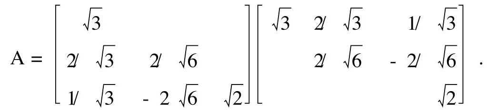

2. $A = \left\lbrack  \begin{array}{rrr} 0 & 4/5 &  - 3/5 \\  1 & 0 & 0 \\  0 & 3/5 & 4/5 \end{array}\right\rbrack  \left\lbrack  \begin{array}{lll} 1 & 1 & 1 \\   & 5 & 2 \\   & & 1 \end{array}\right\rbrack$ .

3. $A = \frac{1}{5}\left\lbrack  \begin{array}{rrrr} 3 & 0 &  - 4 & 0 \\  0 & 3 & 0 &  - 4 \\  4 & 0 & 3 & 0 \\  0 & 4 & 0 & 3 \end{array}\right\rbrack  \left\lbrack  \begin{array}{rrrr} 5 & 5 & 2 & 3 \\   & 5 & {10} & 4 \\   & &  - 1 &  - 4 \\   & & &  - 2 \end{array}\right\rbrack$ .

$$
\text{ 4. }A = \frac{1}{2}\left\lbrack  \begin{array}{rrrr} 1 & 1 & 1 & 1 \\  1 & 1 &  - 1 &  - 1 \\  1 &  - 1 &  - 1 & 1 \\  1 &  - 1 & 1 &  - 1 \end{array}\right\rbrack  \left\lbrack  \begin{array}{rrrr} 2 & 4 & 4 & 4 \\   & 0 & 2 &  - 4 \\   & & 4 & 0 \\   & & & 0 \end{array}\right\rbrack  \text{ . }
$$

$$
\text{ 5. }A = \left\lbrack  \begin{array}{lll} 1 & 2 & 1 \\  0 & 1 & 1 \\  1 & 0 & 1 \\  2 & 1 & 2 \end{array}\right\rbrack  \left\lbrack  \begin{matrix} 1 & 0 & 0 & 1 & 0 \\  0 & 1 & 0 & 0 & 1 \\  0 & 0 & 1 & 0 & 0 \end{matrix}\right\rbrack  \text{ . }
$$

6. $U = \frac{1}{\sqrt{5}}\left\lbrack  \begin{array}{rr} 1 &  - 2 \\  2 & 1 \end{array}\right\rbrack  , V = I, A = U\left\lbrack  \begin{matrix} \sqrt{5} & 0 & 0 \\  0 & 0 & 0 \end{matrix}\right\rbrack  {V}^{H}$ .

7. ( 1 )是；( 2 )是；( 3 )不是；( 4 )不是.

8. 设 ${H}_{u} = {I}_{n} - {2u}{u}^{T}\left( {{u}^{T}u = 1}\right)$ ,令 ${w}^{T} = \left( {{0}^{T},{u}^{T},{0}^{T}}\right)$ ,则有

$$
\mathrm{B} = {\mathrm{I}}_{3\mathrm{n}} - 2{\mathrm{{ww}}}^{\mathrm{T}}\;\left( {{\mathrm{w}}^{\mathrm{T}}\mathrm{w} = 1}\right)
$$

故 $\mathrm{B}$ 是 $3\mathrm{n}$ 阶 Householder 矩阵.

## 第五章 特征值的估计及 对称矩阵的极性

矩阵的特征值是矩阵的重要参数之一, 它可以用复平面上的点来表示. 当矩阵的阶数较高时, 计算矩阵的特征值一般比较困难, 而对矩阵的特征值给出一个适当的范围就是特征值的估计问题. 估计矩阵的特征值的基本原则是寻找一些包含全体特征值的较小区域, 并使每一个区域中包含尽可能少的互异特征值.

Gerschgorin 提出用复平面上的一组圆盘覆盖矩阵的全体特征值, 由于圆盘的几何图形简单, 所以在工程设计中被广泛应用. Ostrowski 提出用复平面上的一组 Cassini 卵形覆盖矩阵的全体特征值,由于这组图形的几何面积较小,所以具有重要的理论价值.

将求 Hermite 矩阵的特征值问题转化为求多元函数的局部极值问题, 既能给出特征值的显式表达式, 又能开辟计算特征值的新途径. 借助于矩阵的直积运算, 可以将线性矩阵方程转化为线性代数方程组, 并通过研究有关矩阵的特征值分布情况来讨论线性矩阵方程的可解性等问题.

## 一、基 本 概 念

1. 矩阵的盖尔圆和 Cassini 卵形

设 $A = {\left( {a}_{ij}\right) }_{n \times  n},{R}_{i} = \mathop{\sum }\limits_{\substack{{j = 1} \\  {j \neq  i} }}^{n}\left| {a}_{ij}\right| ,{R}_{j} = \mathop{\sum }\limits_{\substack{{i = 1} \\  {i \neq  j} }}^{n}\left| {a}_{ij}\right|$ ,则有

(1)A 的行盖尔圆 $\;{G}_{i} = \left\{  {z\left| \right| z - {a}_{ii} \mid   \leq  {R}_{i}, z \in  C}\right\}$

$$
\left( {\mathrm{i} = 1,2,\cdots ,\mathrm{n}}\right)
$$

(2) $A$ 的列盖尔圆 $\dot{{G}_{j}} = \left\{  {z\left| \right| z - {a}_{jj} \mid   \leq  {R}_{j}, z \in  C}\right\}$

$$
\left( {\mathrm{j} = 1,2,\cdots ,\mathrm{n}}\right)
$$

(3) A 的 Cassini 卵形

$$
{\Omega }_{ij} = \left\{  {z\left| \right| z - {a}_{ii}\left| \right| z - {a}_{jj}\left| \right|  \leq  {R}_{i}{R}_{j}, z \in  C}\right\}
$$

$$
\left( {i < j;i, j = 1,2,\cdots , n}\right)
$$

(评注) 当 $\mathrm{i > j}$ 时, ${\Omega }_{\mathrm{{ij}}} = {\Omega }_{\mathrm{{ji}}}$ . 因此, n阶矩阵有 $\frac{1}{2}\mathrm{n}\left( {\mathrm{n} - 1}\right)$ 个Cassini 卵形(重叠时重复计数). 上面给出的是 $\mathrm{A}$ 的行 Cassini 卵形,而 ${\mathrm{A}}^{\mathrm{T}}$ 的行 Cassini 卵形为 $\mathrm{A}$ 的列 Cassini 卵形.

2. Hermite 矩阵的广义特征值问题

设 $A, B \in  {C}^{n \times  n}$ 都是 Hermite 矩阵,且 $B$ 为正定矩阵, $\lambda  \in  C, x \in \; {\mathrm{C}}^{\mathrm{n}}$ .

(1)广义特征值问题 求 $\lambda$ 及 $\mathrm{x} \neq  0$ ，使得 $\mathrm{{Ax}} = \lambda \mathrm{{Bx}}$ .

(2)常义 Rayleigh 商 $R\left( x\right)  = \frac{{x}^{H}{Ax}}{{x}^{H}x}\;\left( {x \neq  0}\right)$ .

(2)广义 Rayleigh 商 $\;{R}_{B}\left( x\right)  = \frac{{x}^{H}{Ax}}{{x}^{H}{Bx}}\;\left( {x \neq  0}\right)$ .

3. 矩阵的直积与行拉直向量

(1)矩阵的直积 设 $A = {\left( {a}_{ij}\right) }_{m \times  n}, B = {\left( {b}_{ij}\right) }_{p \times  q}$ ，那么 $A$ 与 $B$ 的直积为

$$
\mathrm{A}\overrightarrow{1}\mathrm{B} = \left\lbrack  \begin{matrix} {\mathrm{a}}_{11}\mathrm{\;B} & {\mathrm{a}}_{12}\mathrm{\;B} & \cdots & {\mathrm{a}}_{1\mathrm{n}}\mathrm{B} \\  {\mathrm{a}}_{21}\mathrm{\;B} & {\mathrm{a}}_{22}\mathrm{\;B} & \cdots & {\mathrm{a}}_{2\mathrm{n}}\mathrm{B} \\  \cdots & \cdots & & \cdots \\  {\mathrm{a}}_{\mathrm{m}1}\mathrm{\;B} & {\mathrm{a}}_{\mathrm{m}2}\mathrm{\;B} & \cdots & {\mathrm{a}}_{\mathrm{m}\mathrm{n}}\mathrm{B} \end{matrix}\right\rbrack
$$

(2)矩阵的行拉直向量 设 $X \in  {C}^{p \times  q}$ ，划分 ${X}^{T} = \left( {{X}_{1},{X}_{2},\cdots }\right.$ ， ${X}_{p}$ ),那么 $X$ 的行拉直向量为 $\overline{vec}\left( X\right)  = {\left( {X}_{1}^{T},{X}_{2}^{T},\cdots ,{X}_{p}^{T}\right) }^{T}$ .

## 二、主要结论

1. 特征值的界

(1)设 $A \in  {C}^{n \times  n}$ ，则 $A$ 的任一特征值 $\lambda$ 满足

1) $\left| {\operatorname{Re}\left( \lambda \right) }\right|  \leq  \frac{1}{2}{\begin{Vmatrix}A + {A}^{H}\end{Vmatrix}}_{{m}_{\infty }}$ ;

2) $\left| {\operatorname{Im}\left( \lambda \right) }\right|  \leq  \frac{1}{2}{\begin{Vmatrix}A - {A}^{H}\end{Vmatrix}}_{{m}_{\infty }}$ .

(2)设 $A \in  {R}^{n \times  n}$ ，则 $A$ 的任一特征值 $\lambda$ 满足

$$
\left| {\operatorname{Im}\left( \lambda \right) }\right|  \leq  \sqrt{\frac{n - 1}{8n}}{\begin{Vmatrix}A - {A}^{T}\end{Vmatrix}}_{{m}_{\infty }}
$$

(3)设 $A \in  {C}^{n \times  n}$ 的特征值为 ${\lambda }_{1},{\lambda }_{2},\cdots ,{\lambda }_{n}$ ，则有

1) $\mathop{\sum }\limits_{{i = 1}}^{n}{\left| {\lambda }_{i}\right| }^{2} \leq  \parallel A{\parallel }_{F}^{2}$ ;

2) $\mathop{\sum }\limits_{{i = 1}}^{n}{\left| {\lambda }_{i}\right| }^{2} = \parallel A{\parallel }_{F}^{2}$ 的充要条件是 $A{A}^{H} = {A}^{H}A$ .

2. 特征值的包含区域

(1)矩阵 $A \in  {C}^{n \times  n}$ 的特征值都在它的 $n$ 个行 (或列) 盖尔圆构成的并集之中.

(2)设 $S$ 是 $A \in  {C}^{n \times  n}$ 的行(或列)盖尔圆构成的一个连通部分， 那么 $\mathrm{S}$ 由 $\mathrm{A}$ 的 $\mathrm{k}$ 个行(或列) 盖尔圆构成的充要条件是 $\mathrm{S}$ 中正好有 $\mathrm{A}$ 的 $\mathrm{k}$ 个特征值 (盖尔圆相重时重复计数,特征值相同时也重复计数).

(3) 矩阵 $A \in  {C}^{n \times  n}$ 的特征值都在它的 $\frac{1}{2}n\left( {n - 1}\right)$ 个行 (或列) Cassini 卵形构成的并集之中.

(4)矩阵的全体行 Cassini 卵形的并集是全体行盖尔圆的并集的子集.

3. 广义特征值与广义特征向量的性质

设 $A, B \in  {C}^{n \times  n}$ 都是 Hermite 矩阵,且 $B$ 为正定矩阵.

(1) 分解 $B = G{G}^{H}$ ,则 ${Ax} = {\lambda Bx}$ 等价于 ${Sy} = {\lambda y}$ ,其中 $S = \; {\mathrm{G}}^{1}\mathrm{\;A}{\left( {\mathrm{G}}^{1}\right) }^{\mathrm{H}},\mathrm{y} = {\mathrm{G}}^{\mathrm{H}}\mathrm{x}.$

(2)A 相对于 B 的广义特征值都是实数，且存在按 B 标准正交的广义特征向量系.

(3) ${\mathrm{R}}_{\mathrm{B}}\left( \mathrm{x}\right)$ 在 ${\mathrm{C}}^{\mathrm{n}}$ 的一维子空间上的值是常数.

(4) ${\mathrm{R}}_{\mathrm{B}}\left( \mathrm{x}\right)$ 在 ${\mathrm{C}}^{\mathrm{n}}$ 的 $\mathrm{k}$ 维子空间 ${\mathrm{V}}_{\mathrm{k}}$ 上的最值存在,且能够在 ${\mathrm{V}}_{\mathrm{k}}$ 的子集 $\left\{  {\mathrm{x} \mid  {\mathrm{x}}^{\mathrm{H}}\mathrm{{BX}} = 1,\mathrm{x} \in  {\mathrm{V}}_{\mathrm{k}}}\right\}$ 上达到.

(5) ${R}_{B}\left( x\right)$ 的驻点是 $A$ 相对于 $B$ 的广义特征向量，反之亦然.

(6) 若 ${X}_{0}$ 是 ${R}_{B}\left( x\right)$ 的驻点，则 ${R}_{B}\left( {x}_{0}\right)$ 是 $A$ 相对于 $B$ 的广义特征值.

(7)A 相对于 B 的最小和最大广义特征值分别为 $\mathop{\min }\limits_{{\mathrm{x} \neq  0}}{\mathrm{R}}_{\mathrm{B}}\left( \mathrm{x}\right)$ 和 $\mathop{\max }\limits_{{\mathrm{x} \neq  0}}{\mathrm{R}}_{\mathrm{B}}\left( \mathrm{x}\right)$ .

(8)A 相对于 B 的从小到大排列的第 k 个广义特征值为

$$
\mathop{\min }\limits_{{\mathrm{V}}_{\mathrm{k}}}\left\lbrack  {\mathop{\max }\limits_{{0 \neq  \mathrm{x} \in  {\mathrm{V}}_{\mathrm{k}}}}{\mathrm{R}}_{\mathrm{B}}\left( \mathrm{x}\right) }\right\rbrack
$$

A相对于 $\mathrm{B}$ 的从大到小排列的第 $\mathrm{k}$ 个广义特征值为

$$
\mathop{\max }\limits_{{\mathrm{v}}_{\mathrm{k}}}\left\lbrack  {\mathop{\min }\limits_{{0 \neq  \mathrm{x} \in  {\mathrm{V}}_{\mathrm{k}}}}{\mathrm{R}}_{\mathrm{B}}\left( \mathrm{x}\right) }\right\rbrack
$$

其中, ${\mathrm{V}}_{\mathrm{k}}$ 表示 ${\mathrm{C}}^{\mathrm{n}}$ 的任意一个 $\mathrm{k}$ 维子空间.

4. 矩阵直积的性质与应用

(1)设 $A \in  {C}^{m \times  n}$ ， $A \in  {C}^{n \times  1}$ ， $B \in  {C}^{p \times  q}$ ， $B \in  {C}^{q \times  r}$ ，则

$\left( \begin{array}{ll} \mathrm{A}1 & {\mathrm{\;B}}_{1} \end{array}\right) \left( \begin{array}{ll} \mathrm{A}1 & {\mathrm{\;B}}_{2} \end{array}\right)  = \left( \begin{array}{ll} {\mathrm{A}}_{1} & {\mathrm{\;A}}_{2} \end{array}\right) 1\;\left( \begin{array}{ll} {\mathrm{B}}_{1} & {\mathrm{\;B}}_{2} \end{array}\right)$

(2)设 $A \in  {C}^{m \times  m},{B}_{1} \in  {C}^{n \times  n}$ 的特征值分别为 ${\lambda }_{i}\left( {i = 1,2,\cdots , m}\right)$ 和 ${\mu }_{\mathrm{j}}\left( {\mathrm{j} = 1,2,\cdots ,\mathrm{n}}\right)$ ,二元多项式 $\mathrm{f}\left( {\mathrm{x},\mathrm{y}}\right)  = \mathop{\sum }\limits_{{\mathrm{i},\mathrm{j} = 0}}^{1}{\mathrm{G}}_{\mathrm{j}}{\mathrm{X}}^{\mathrm{i}}{\mathrm{y}}^{\mathrm{j}}$ ,则 $\mathrm{{mn}}$ 阶矩阵 $f\left( {A, B}\right)  = \mathop{\sum }\limits_{{i, j = 0}}^{1}{c}_{ij}{A}^{i}i\;{B}^{j}$ 的全体特征值为 $f\left( {{\lambda }_{i},{\mu }_{j}}\right) \;(i = 1,2,\cdots$ , $\mathrm{m};\mathrm{j} = 1,2,\cdots ,\mathrm{n})$ .

(3)设 ${A}_{i} \in  {C}^{m \times  p}, X \in  {C}^{p \times  q},{B}_{i} \in  {C}^{q \times  n}, F \in  {C}^{m \times  n}$ ，则

1) $\overline{\mathrm{{vec}}}\left( {\mathrm{A}\mathrm{X}{\mathrm{B}}_{\mathrm{i}}}\right)  = \left( \begin{array}{lll} \mathrm{A}\mathrm{i} & \mathrm{A} & \mathrm{B} \end{array}\right) \overline{\mathrm{{vec}}}\left( \mathrm{X}\right)$ ;

2) 矩阵方程 $\mathop{\sum }\limits_{{i = 1}}^{1}{A}_{i}X{B}_{i} = F$ 有解的充要条件是 $\overline{\operatorname{vec}}\left( F\right)  \in$

$\mathrm{R}\left\lbrack  {\mathop{\sum }\limits_{{1 = 1}}^{1}{\mathrm{\;A}}_{\mathrm{i}}\mathbf{i}\;{\mathrm{B}}_{\mathrm{i}}^{\mathrm{T}}}\right\rbrack  .$

(4) 设 $A \in  {C}^{m \times  m}$ 和 $B \in  {C}^{n \times  n}$ 的特征值分别为 ${\lambda }_{i}\left( {i = 1,2,\cdots , m}\right)$ 和 ${\mu }_{\mathrm{j}}\left( {\mathrm{j} = 1,2,\cdots ,\mathrm{n}}\right) ,\mathrm{F} \in  {\mathrm{C}}^{\mathrm{m} \times  \mathrm{n}}$ ,则

1) 矩阵方程 ${AX} + {XB} = F$ 有惟一解的充要条件是 ${\lambda }_{i} + {\mu }_{j} \neq$ 0 $\left( {i = 1,2,\cdots , m;j = 1,2,\cdots , n}\right)$ ;

2) 矩阵方程 $\mathrm{X} + \mathrm{{AXB}} + \cdots  + {\mathrm{A}}^{1}{\mathrm{{XB}}}^{1} = \mathrm{F}$ 有惟一解的充要条件是 $1 + \left( {{\lambda }_{i}{\mu }_{j}}\right)  + \cdots  + {\left( {\lambda }_{i}{\mu }_{j}\right) }^{1} \neq  0\left( {i = 1,2,\cdots , m;j = 1,2,\cdots , n}\right)$ .

## 三、常 用 方 法

1. 用盖尔圆定理分离矩阵的特征值

(1)写出 $A = {\left( {a}_{ij}\right) }_{n \times  n}$ 的 $n$ 个行盖尔圆 ${G}_{i}\left( {i = 1,2,\cdots , n}\right)$ :

1) 若 ${G}_{i}$ 都是孤立的盖尔圆,那么其中各有 $A$ 的一个特征值;

2) 否则, 进行下一步.

(2)写出 $\mathrm{A}$ 的 $\mathrm{n}$ 个列盖尔圆 ${\mathrm{G}}_{\mathrm{i}}\;\left( {\mathrm{i} = 1,2,\cdots ,\mathrm{n}}\right)$ :

1) 若 ${G}_{i}$ 都是孤立的盖尔圆,那么其中各有 $A$ 的一个特征值;

2) 否则, 进行下一步.

(3)对于矩阵 $A$ ,选取正数 ${d}_{1},{d}_{2},\cdots ,{d}_{n}$ ,并构造对角矩阵 $D = \; \operatorname{diag}\left( {{d}_{1},{d}_{2},\cdots ,{d}_{n}}\right)$ . 选取正数 ${d}_{1},{d}_{2},\cdots ,{d}_{n}$ 的一般原则如下: 欲使 $A$ 的第 $\mathrm{i}$ 个盖尔圆缩小,可取 ${\mathrm{d}}_{\mathrm{i}} < 1$ ,其余取为1; 欲使 $\mathrm{A}$ 的第 $\mathrm{i}$ 个盖尔圆放大,可取 ${\mathrm{d}}_{\mathrm{i}} > 1$ ,其余取为 1 .

(4)写出 $B = {DA}{D}^{-1} = {\left( {a}_{ij}\frac{{d}_{i}}{{d}_{j}}\right) }_{n \times  n}$ 的 $n$ 个行盖尔圆 ${G}_{i}^{\prime }\;(i = 1$ , 2,..., n):

1) 若 ${G}_{i}$ 都是孤立的盖尔圆,那么其中各有 $A$ 的一个特征值;

2) 否则，转入(3) 重新选取正数 ${d}_{1},{d}_{2},\cdots ,{d}_{n}$ .

〔砰注〕 上述分离矩阵的特征值的方法中, 由于限制 D 为 对角矩阵, 所以不一定对任意的具有互异特征值的矩阵都有效. 比如, 当矩阵的主对角线上有相同元素时, 这种方法失效.

2. 广义特征值问题的解法

设 $A, B \in  {C}^{n \times  n}$ 都是 Hermite 矩阵,且 $B$ 为正定矩阵.

(1)直接法:

1) 计算特征多项式 $\det \left( {\lambda \mathrm{B} - \mathrm{A}}\right)$ 的零点,即广义特征值,并记互异广义特征值为 ${\lambda }_{1},{\lambda }_{2},\cdots ,{\lambda }_{k}$ ;

2) 对于 $\mathrm{i} = 1,2,\cdots ,\mathrm{k}$ ,分别求特征方程 $\left( {{\lambda }_{i}B - A}\right) x = 0$ 的基础解系 ${p}_{1}^{\left( i\right) },{p}_{2}^{\left( i\right) },\cdots ,{p}_{{r}_{i}}^{\left( i\right) }\;\left( {r}_{i}\right.$ 为 ${\lambda }_{i}$ 的重数 $)$ ;

3) 对于 $\mathrm{i} = 1,2,\cdots ,\mathrm{k}$ ,写出对应于 ${\lambda }_{\mathrm{i}}$ 的全体广义特征向量 ${\mathrm{p}}^{\left( \mathrm{i}\right) } = \; \mathrm{k}{\mathrm{p}}^{\left( \mathrm{i}\right) } + \mathrm{k}{\mathrm{p}}^{\left( \mathrm{i}\right) } + \cdots  + {\mathrm{k}}_{\mathrm{i}}{\mathrm{p}}_{{\mathrm{r}}_{\mathrm{i}}}^{\left( \mathrm{i}\right) }\;\left( {\mathrm{k},\mathrm{k},\cdots ,{\mathrm{k}}_{\mathrm{i}}\text{ 是不全为零的数 }}\right) .$

(2)第一种常义转化法:将广义特征值问题 $A\mathrm{x} = {\lambda B}\mathrm{x}$ 转化为常义值问题 $\left( {{B}^{-1}A}\right) x = {\lambda x}$ ,即求矩阵 ${B}^{-1}A$ 的特征值与特征向量.

(3)第二种常义转化法:将广义特征值问题 ${Ax} = {\lambda Bx}$ 转化为常义特征值问题 ${Sy} = {\lambda y}$ .

1) 分解 $B = G{G}^{H}$ ,并计算 $S = {G}^{-1}A{\left( {G}^{1}\right) }^{H}$ ;

2) 求 $S$ 的互异特征值 ${\lambda }_{1},{\lambda }_{2},\cdots ,{\lambda }_{k}$ 及对应的特征向量 ${y}_{1},{y}_{2},\cdots$ , ${\mathrm{y}}_{\mathrm{k}}$ ;

3) 计算对应于 ${\lambda }_{i}$ 的广义特征向量 ${\mathrm{X}}_{\mathrm{i}} = {\left( {\mathrm{G}}^{-1}\right) }^{\mathrm{H}}{\mathrm{y}}_{\mathrm{i}}\;\left( {\mathrm{i} = 1,2,\cdots }\right.$ , k).

## 四、内容结构框图

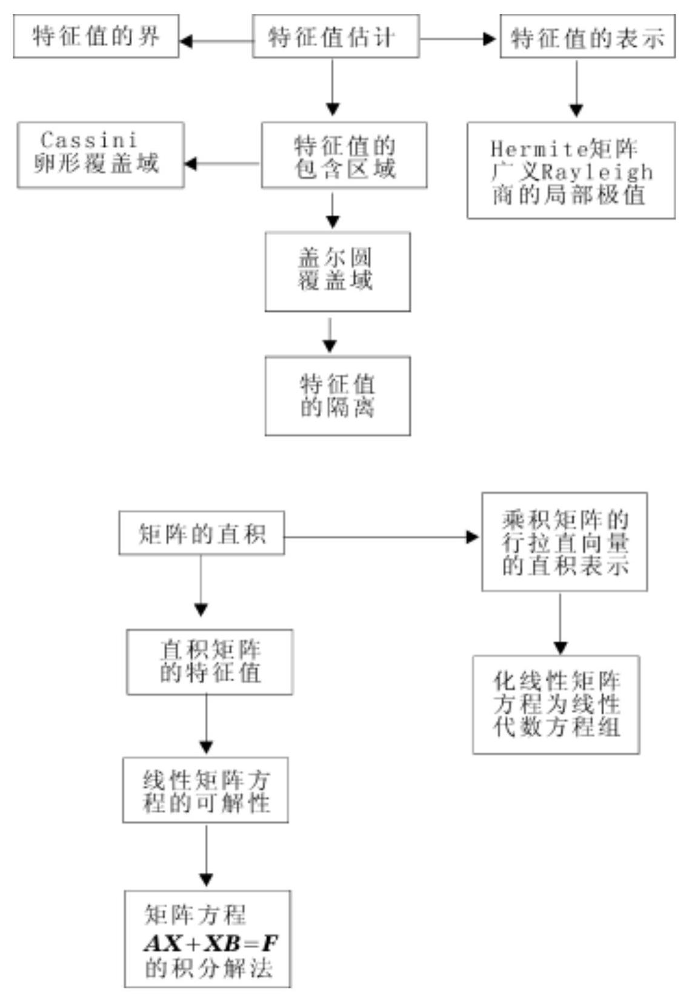

## 五、课后习题全解

## 习 题 5.1

1. 设 $\mathrm{A} = {\left( {\mathrm{a}}_{\mathrm{{ij}}}\right) }_{\mathrm{n} \times  \mathrm{n}},{\alpha }_{\mathrm{i}} > 0\left( {\mathrm{i} = 1,2,\cdots ,\mathrm{n}}\right)$ ,证明

$$
\mathop{\prod }\limits_{{i = 1}}^{n}\left| {{\lambda }_{i}\left( A\right) }\right|  \leq  {\left\lbrack  \mathop{\prod }\limits_{{j = 1}}^{n}{\alpha }_{j}^{-2}\left( \mathop{\sum }\limits_{{i = 1}}^{n}{\alpha }_{i}^{2}{\left| {a}_{ij}\right| }^{2}\right) \right\rbrack  }^{1/2}
$$

并讨论在什么条件下等号成立.

证 令 $\Lambda  = \operatorname{diag}\left( {{\mathbf{\alpha }}_{1},{\mathbf{\alpha }}_{2},\cdots ,{\mathbf{\alpha }}_{n}}\right) ,\mathrm{B} = \Lambda \mathrm{A}{\Lambda }^{-1} = {\left( {\mathrm{a}}_{\mathrm{{ij}}}\frac{{\mathbf{\alpha }}_{\mathrm{i}}}{{\mathbf{\alpha }}_{\mathrm{j}}}\right) }_{\mathrm{n} \times  \mathrm{n}}$ ,根据定理 5.4 可得

$$
\mathop{\prod }\limits_{{j = 1}}^{n}\left| {{\lambda }_{j}\left( A\right) }\right|  = \mathop{\prod }\limits_{{j = 1}}^{n}\left| {{\lambda }_{j}\left( B\right) }\right|  \leq  {\left\lbrack  \mathop{\prod }\limits_{{j = 1}}^{n}\left\lbrack  \mathop{\sum }\limits_{{i = 1}}^{n}{\left| {b}_{ij}\right| }^{2}\right\rbrack  \right\rbrack  }^{1/2} =
$$

$$
{\left\lbrack  \mathop{\prod }\limits_{{j = 1}}^{n}{\alpha }_{j}^{-2}\left\lbrack  \mathop{\sum }\limits_{{i = 1}}^{n}{\alpha }_{i}^{2}{\left| {a}_{ij}\right| }^{2}\right\rbrack  \right\rbrack  }^{1/2}
$$

划分 $A = \left( {{a}_{1},{a}_{2},\cdots ,{a}_{n}}\right) , B = \left( {b, b,\cdots ,{b}_{n}}\right)$ ,则有

等号成立 某 ${b}_{{j}_{0}} = 0$ 或 $\left( {b,{b}_{j}}\right)  = 0\;\left( {i \neq  j}\right)$

由于

$$
{\mathrm{b}}_{{\mathrm{j}}_{0}} = 0\;{\mathrm{a}}_{{\mathrm{j}}_{0}} = 0
$$

$\left( {{b}_{i},{b}_{j}}\right)  = \left( {\Lambda {a}_{i}{\alpha }_{i}^{-1},\Lambda {a}_{j}{\alpha }_{j}^{-1}}\right)  = {\left( {\alpha }_{i}{\alpha }_{j}\right) }^{-1}\left( {\Lambda {a}_{i},\Lambda {a}_{j}}\right)$

所以

等号成立 某 ${\mathrm{a}}_{{\mathrm{j}}_{0}} = 0$ 或 $\left( {{\Lambda }_{{\mathrm{a}}_{\mathrm{i}}},{\Lambda }_{{\mathrm{a}}_{\mathrm{j}}}}\right)  = 0\;\left( {\mathrm{i} \neq  \mathrm{j}}\right)$

2. 设 $A = \left( {a}_{ij}\right)  \in  {C}^{n \times  n}$ ，证明下面的 Schur 不等式:

(1) $\mathop{\sum }\limits_{{r = 1}}^{n}{\left\lbrack  \operatorname{Re}\left( {\lambda }_{r}\left( A\right) \right) \right\rbrack  }^{2} \leq  \mathop{\sum }\limits_{{r, s = 1}}^{n}{\left| \frac{{a}_{rs} + {\bar{a}}_{sr}}{2}\right| }^{2}$ ;

(2) $\mathop{\sum }\limits_{{r = 1}}^{n}{\left\lbrack  \operatorname{Im}\left( \lambda \left( A\right) \right) \right\rbrack  }^{2} \leq  \mathop{\sum }\limits_{{r, s = 1}}^{n}{\left| \frac{{a}_{rs} - {\bar{a}}_{sr}}{2}\right| }^{2}$ .

证 存在酉矩阵 $\mathrm{P}$ ,使 $\mathrm{A} = {\mathrm{{PTP}}}^{\mathrm{H}}$ ( $\mathrm{T}$ 为上三角矩阵). 设 $\mathrm{T} = \; {\left( {t}_{ij}\right) }_{n \times  n}$ ,并由 $\frac{A + {A}^{H}}{2} = P\frac{T + {T}^{H}}{2}{P}^{H}$ 可得

$$
\mathop{\sum }\limits_{{i = 1}}^{n}{\left\lbrack  \operatorname{Re}\left( {\lambda }_{i}\left( A\right) \right) \right\rbrack  }^{2} = \mathop{\sum }\limits_{{i = 1}}^{n}{\left\lbrack  \frac{{\lambda }_{i}\left( A\right)  + \overline{{\lambda }_{i}}\left( A\right) }{2}\right\rbrack  }^{2} =
$$

$$
\mathop{\sum }\limits_{{i = 1}}^{n}{\left\lbrack  \frac{{t}_{ii} + {t}_{ii}}{2}\right\rbrack  }^{2} \leq  \mathop{\sum }\limits_{{i, j = 1}}^{n}{\left| \frac{{t}_{ij} + {t}_{ji}}{2}\right| }^{2} =
$$

$$
{\begin{Vmatrix}\frac{1}{2}\left( \mathrm{\;T} + {\mathrm{T}}^{\mathrm{H}}\right) \end{Vmatrix}}_{\mathrm{F}}^{2} = {\begin{Vmatrix}\frac{1}{2}\left( \mathrm{\;A} + {\mathrm{A}}^{\mathrm{H}}\right) \end{Vmatrix}}_{\mathrm{F}}^{2} =
$$

$$
\mathop{\sum }\limits_{{i, j = 1}}^{n}{\left| \frac{{a}_{ij} + {\bar{a}}_{ji}}{2}\right| }^{2}
$$

由 $\frac{\mathrm{A} - {\mathrm{A}}^{\mathrm{H}}}{2} = \mathrm{P}\frac{\mathrm{T} - {\mathrm{T}}^{\mathrm{H}}}{2}{\mathrm{P}}^{\mathrm{H}}$ 可得

$$
\mathop{\sum }\limits_{{i = 1}}^{n}{\left\lbrack  \operatorname{Im}\left( {\lambda }_{i}\left( A\right) \right) \right\rbrack  }^{2} = \mathop{\sum }\limits_{{i = 1}}^{n}{\left\lbrack  \frac{{\lambda }_{i}\left( A\right)  - {\overline{\lambda }}_{i}\left( A\right) }{2i}\right\rbrack  }^{2} =
$$

$$
\mathop{\sum }\limits_{{i = 1}}^{n}{\left\lbrack  \frac{{t}_{ii} - {t}_{ii}}{2i}\right\rbrack  }^{2} \leq  \mathop{\sum }\limits_{{i, j = 1}}^{n}{\left| \frac{{t}_{ij} - {t}_{ji}}{2}\right| }^{2} =
$$

$$
{\begin{Vmatrix}\frac{1}{2}\left( \mathrm{\;T} - {\mathrm{T}}^{\mathrm{H}}\right) \end{Vmatrix}}_{\mathrm{F}}^{2} = {\begin{Vmatrix}\frac{1}{2}\left( \mathrm{\;A} - {\mathrm{A}}^{\mathrm{H}}\right) \end{Vmatrix}}_{\mathrm{F}}^{2} =
$$

$$
\mathop{\sum }\limits_{{i, j = 1}}^{n}{\left| \frac{{a}_{ij} - {\bar{a}}_{ji}}{2}\right| }^{2}
$$

3. 应用 Gerschgorin 定理隔离矩阵

$$
A = \left\lbrack  \begin{matrix} {20} & 3 & 1 \\  2 & {10} & 2 \\  8 & 1 & 0 \end{matrix}\right\rbrack
$$

的特征值, 再应用实矩阵特征值的性质改进得出的结果.

解 A的 3 个盖尔圆为

$$
\text{ G: }\left| {z - {20}}\right|  \leq  4;\;\text{ G: }\left| {z - {10}}\right|  \leq  4;\;\text{ G: }\left| z\right|  \leq  9
$$

易见 $\mathrm{G}$ 与 $\mathrm{G}$ 相交,而 $\mathrm{G}$ 孤立. 欲使 ${\mathrm{G}}_{3}$ 的半径小一些,取对角矩阵 $\mathrm{D} = \operatorname{diag}\left( {1,1,\frac{1}{2}}\right)$ ,计算

$$
\mathrm{B} = {\mathrm{{DAD}}}^{-1} = \left\lbrack  \begin{matrix} {20} & 3 & 2 \\  2 & {10} & 4 \\  4 & {0.5} & 0 \end{matrix}\right\rbrack
$$

B 的前两个盖尔圆相交,但 ${\mathrm{B}}^{\mathrm{T}}$ 的 3 个盖尔圆为

$$
\mathrm{G} : \left| {\mathrm{z} - {20}}\right|  \leq  6;\;\mathrm{G} : \left| {\mathrm{z} - {10}}\right|  \leq  {3.5}
$$

$$
\mathrm{G} : \left| \mathrm{z}\right|  \leq  6
$$

易见 $\mathrm{G},\mathrm{G}$ 及 $\mathrm{G}$ 都孤立,其中各含 ${\mathrm{B}}^{\mathrm{T}}$ 的一个特征值 $\lambda ,\lambda$ 及 $\lambda$ ,它们也是 $\mathrm{B}$ 的特征值,从而也是 $\mathrm{A}$ 的特征值.

由于 $\mathrm{G}\;\mathrm{G}$ 且 $\mathrm{G}$ 中也含 $\mathrm{A}$ 的一个特征值,所以 ${\lambda }_{1} \in  \mathrm{G}$ ,而 ${\lambda }_{2} \; \in  \dot{G},{\lambda }_{e} \in  \dot{G}$ . 注意到盖尔圆 $G,\dot{G}$ 及 $\dot{G}$ 关于实轴对称,利用实矩阵的复特征值一定成对共轭出现的性质可得

$$
{\lambda }_{1} \in  \left\lbrack  {{16},{24}}\right\rbrack  ,\;{\lambda }_{2} \in  \left\lbrack  {{6.5},{13.5}}\right\rbrack  ,\;{\lambda }_{3} \in  \left\lbrack  {-6,6}\right\rbrack
$$

4. 证明矩阵

$$
A = \left\lbrack  \begin{matrix} 2 & \frac{2}{n} & \frac{1}{n} & \cdots & \frac{1}{n} \\  \frac{1}{n} & 4 & \frac{1}{n} & \cdots & \frac{1}{n} \\  \cdots & \cdots & \cdots & & \cdots \\  \frac{1}{n} & \frac{1}{n} & \frac{1}{n} & \cdots & {2n} \end{matrix}\right\rbrack
$$

能够相似于对角矩阵,且 $\mathrm{A}$ 的特征值都是实数.

证 A的n 个盖尔圆为

$$
\mathrm{G} : \left| {\mathrm{z} - 2}\right|  \leq  1;\;{\mathrm{G}}_{\mathrm{i}} : \left| {\mathrm{z} - 2\mathrm{i}}\right|  \leq  \frac{\mathrm{n} - 1}{\mathrm{n}}\;\left( {\mathrm{i} = 2,3,\cdots ,\mathrm{n}}\right)
$$

它们都是孤立的,所以 $\mathrm{A}$ 有 $\mathrm{n}$ 个不同的特征值,从而 $\mathrm{A}$ 相似于对角矩阵. 因为 ${G}_{i}\left( {i = 1,2,\cdots , n}\right)$ 关于实轴对称,且 $A$ 是实矩阵,所以 ${G}_{i}$ 中的特征值只能是实数.

5. 设 $A \in  {R}^{n \times  n}$ ,如果 $A$ 的 $n$ 个盖尔圆互不相交,则 $\lambda \left( A\right)$ 是实数

证 A 是实矩阵,它的盖尔圆关于实轴对称,且每个盖尔圆中只有 $\mathrm{A}$ 的一个特征值,所以 $\lambda \left( \mathrm{A}\right)$ 是实数 图为复特征值一定成对共轭出现).

6. 设 $A \in  {C}^{n \times  n}$ 严格对角占优 (或弱对角占优且不可约),其对角线元素均为正数,则 $\operatorname{Re}\left( {\lambda \left( \mathrm{A}\right) }\right)  > 0$ .

证 设 $\lambda  = \alpha  + \mathrm{i}\beta \;\left( {\alpha \text{ 和 }\beta \text{ 都是实数 }}\right)$ ,若 $\alpha  \leq  0$ ,则由 $\lambda  \in  {\mathrm{G}}_{\mathrm{k}}$ 可得

$$
\left| {\lambda  - {a}_{kk}}\right|  \leq  {R}_{k}\;\left| {\alpha  - {a}_{kk}}\right|  \leq  \left| {\left( {\alpha  - {a}_{kk}}\right)  + {i\beta }}\right|  \leq  {R}_{k}
$$

故 $\left( {-\alpha }\right)  + {a}_{kk} \leq  {R}_{k}$ ,即 ${a}_{kk} \leq  {R}_{k} + \alpha  \leq  {R}_{k}$ ,矛盾.

7. 设 $A = \left( {a}_{ij}\right)  \in  {C}^{n \times  n}$ .

(1)若 ${a}_{ii}\left( {i = 1,2,\cdots , n}\right)$ 是实数，则

$$
\left| {\operatorname{Im}\left( {\lambda \left( \mathrm{A}\right) }\right) }\right|  \leq  \mathop{\max }\limits_{\mathrm{i}}\mathop{\sum }\limits_{{\mathrm{j} \neq  \mathrm{i}}}\left| {\mathrm{a}}_{\mathrm{{ij}}}\right|
$$

(2) 若 ${\mathrm{a}}_{\mathrm{i}\mathrm{i}}\left( {\mathrm{i} = 1,2,\cdots ,\mathrm{n}}\right)$ 是纯虚数,则

$$
\left| {\operatorname{Re}\left( {\lambda \left( \mathrm{A}\right) }\right) }\right|  \leq  \mathop{\max }\limits_{\mathrm{i}}\mathop{\sum }\limits_{{\mathrm{j} \neq  \mathrm{i}}}\left| {\mathrm{a}}_{\mathrm{{ij}}}\right|
$$

证(1)当 ${\mathrm{a}}_{ii}$ 是实数时，有

$$
{\left| \operatorname{Im}\left( \lambda \right) \right| }^{2} \leq  {\left| \operatorname{Im}\left( \lambda \right) \right| }^{2} + {\left\lbrack  \operatorname{Re}\left( \lambda \right)  - {\mathrm{a}}_{\mathrm{{kk}}}\right\rbrack  }^{2} =
$$

$$
{\left| \lambda  - {a}_{kk}\right| }^{2} \leq  {R}_{k}^{2} \leq  {\left\lbrack  \mathop{\max }\limits_{i}\left( {R}_{i}\right) \right\rbrack  }^{2}
$$

(2) 当 ${\mathrm{a}}_{ii}$ 是纯虚数时,有

$$
{\left| \operatorname{Re}\left( \lambda \right) \right| }^{2} \leq  {\left| \operatorname{Re}\left( \lambda \right) \right| }^{2} + {\left| \operatorname{i}\operatorname{Im}\left( \lambda \right)  - {a}_{kk}\right| }^{2} =
$$

$$
{\left| \lambda  - {a}_{kk}\right| }^{2} \leq  {R}_{k}^{2} \leq  {\left\lbrack  \mathop{\max }\limits_{i}\left( {R}_{i}\right) \right\rbrack  }^{2}
$$

8. 证明

(1) $A = \left\lbrack  \begin{array}{llll} 1/4 & 1/4 & 1/4 & 1/4 \\  1/5 & 2/5 & 1/5 & 1/5 \\  1/6 & 1/6 & 3/6 & 1/6 \\  1/7 & 1/7 & 1/7 & 3/7 \end{array}\right\rbrack$ 的谱半径 $\rho \left( A\right)  < 1$ ;

(2)将(1)中矩阵 $A$ 的元素“ ${a}_{44}$ ” 改作“ $4/7$ ”，则 $\rho \left( A\right)  < 1$ .

证 (1) 因为 $A$ 不可约,且 $\mathop{\sum }\limits_{{j = 1}}^{4}\left| {a}_{4j}\right|  = \frac{6}{7} < 1 = \parallel A{\parallel }_{\infty }$ ,所以由定理 5.9 可得 $\rho \left( A\right)  < 1$ .

(2)因为 $\rho \left( A\right)  \leq  \parallel A{\parallel }_{\infty } = 1$ ，且 $\det \left( {1\mathrm{I} - \mathrm{A}}\right)  = 0$ ，所以 $\rho \left( A\right)  = 1$ .

9. 在盖尔圆定理中, 如果一个连通部分是由两个盖尔圆构成的,那么:

(1)何时每个盖尔圆上可能都有两个特征值?

(2)何时每个盖尔圆上不可能都有两个特征值？

解(1)二盖尔圆相交, 特征值位于交集中.

(2)二盖尔圆外切，切点是单特征值.

10. 应用 Ostrowski 定理(或推论)，证明矩阵

$$
A = \left\lbrack  \begin{array}{llll} 6 & 5 & 1 & 2 \\  1 & 7 & 0 & 2 \\  0 & 4 & 7 & 5 \\  2 & 0 & 1 & 5 \end{array}\right\rbrack
$$

的谱半径 $\rho \left( A\right)  < {13}$ .

证 $\;\rho \left( A\right) {\rho }_{1}\left( {A}^{T}\right)  = {14} \times  9 = {126}$

$$
\mathbf{\rho }\left( A\right) {\mathbf{\rho }}_{2}\left( {A}^{T}\right)  = {10} \times  {16} = {160}
$$

$$
\mathbf{\rho }\left( A\right) {\mathbf{\rho }}_{3}\left( {A}^{T}\right)  = {16} \times  9 = {144}
$$

$$
\mathbf{\rho }\left( \mathrm{A}\right) {\mathbf{\rho }}_{4}\left( {\mathrm{\;A}}^{\mathrm{T}}\right)  = 8 \times  {14} = {112}
$$

根据定理 5.11 的推论 5 可得

$$
\rho \left( A\right)  \leq  \mathop{\max }\limits_{i}{\left\lbrack  {\rho }_{i}\left( A\right) {\rho }_{i}\left( {A}^{T}\right) \right\rbrack  }^{\frac{1}{2}} = \sqrt{160} < {13}
$$

## 习 题 5.2

1. 设 ${\lambda }_{1},{\lambda }_{2},\cdots ,{\lambda }_{n}$ 为实对称矩阵 $A$ 相对于正定矩阵 $B$ 的特征值, 相应的特征向量 ${X}_{1},{X}_{2},\cdots ,{X}_{n}$ 为按 $B$ 标准正交的向量系. 令 $Q = \; \left( {{x}_{1},{x}_{2},\cdots ,{x}_{n}}\right)$ ,试证 ${Q}^{T}{AQ} = \Lambda ,{Q}^{T}{BQ} = I$ ,其中 $\Lambda  = \operatorname{diag}\left( {{\lambda }_{1},{\lambda }_{2}}\right.$ , $\left. {\cdots ,{\lambda }_{\mathrm{n}}}\right)$ .

证 由 ${X}_{1},{X}_{2},\cdots ,{X}_{n}$ 按 $B$ 标准正交可得 ${Q}^{T}{BQ} = I$ ,再由 $A{X}_{i} = \; {\lambda }_{\mathrm{i}}{\mathrm{B}}_{\mathrm{{Xi}}}$ 知 $\mathrm{{AQ}} = \mathrm{{BQ}}\Lambda$ ,故 ${\mathrm{Q}}^{\mathrm{T}}\mathrm{{AQ}} = \Lambda$ .

2. 已知 $A = \left\lbrack  \begin{array}{rrr} 1 &  - 1 & 1 \\   - 1 & 2 & 0 \\  1 & 0 & 3 \end{array}\right\rbrack  ,\;B = \left\lbrack  \begin{array}{rrr} 5 & 2 &  - 4 \\  2 & 1 &  - 2 \\   - 4 &  - 2 & 5 \end{array}\right\rbrack$ ,试用两种方法求解广义特征值问题 $\mathrm{{Ax}} = \lambda \mathrm{{Bx}}$ (转化成普通的特征值问题即可).

解 $\;\left( 1\right) {B}^{-1}{Ax} = {\lambda x} : \;{B}^{-1}A = \left\lbrack  \begin{array}{rrr} 3 &  - 5 & 1 \\   - 9 & {20} & 4 \\   - 1 & 4 & 3 \end{array}\right\rbrack$

(2) Sy $= \lambda \mathrm{y},\mathrm{x} = {\left( {\mathrm{G}}^{-1}\right) }^{\mathrm{T}}\mathrm{y}$ :

$$
G = \frac{1}{\sqrt{5}}\left\lbrack  \begin{array}{rrr} 5 & & \\  2 & 1 & \\   - 4 &  - 2 & \sqrt{5} \end{array}\right\rbrack  , S = \left( {G}^{-1}\right) A{\left( {G}^{-1}\right) }^{\mathrm{T}}
$$

## 习 题 5.3

1. 设实对称矩阵 $\mathrm{A}$ 和 $\mathrm{B}$ 的特征值分别是

$$
{\lambda }_{1} \leq  {\lambda }_{2} \leq  \cdots  \leq  {\lambda }_{n},\;{\mu }_{1} \leq  {\mu }_{2} \leq  \cdots  \leq  {\mu }_{n}
$$

如果对于任何单位向量 $\mathrm{x}$ ，恒有

$$
\left| {{\mathrm{x}}^{\mathrm{T}}\left( {\mathrm{B} - \mathrm{A}}\right) \mathrm{x}}\right|  \leq  \varepsilon \;\left( {\varepsilon  > 0}\right)
$$

证明 $\left| {{\mu }_{k} - {\lambda }_{k}}\right|  \leq  \varepsilon \;\left( {k = 1,2,\cdots , n}\right)$ .

证 设 $A$ 的属于 ${\lambda }_{1},{\lambda }_{2},\cdots ,{\lambda }_{n}$ 的标准正交特征向量系为 ${X}_{1},{X}_{2}$ , $\cdots ,{X}_{n}, B$ 的属于 ${\mu }_{1},{\mu }_{2},\cdots ,{\mu }_{n}$ 的标准正交特征向量系为 ${y}_{1},{y}_{2},\cdots$ , ${y}_{n}$ ,记 ${V}_{k}^{0}\left( x\right)  = L\left( {{x}_{1},{x}_{2},\cdots ,{x}_{k}}\right) ,{V}_{k}^{0}\left( y\right)  = L\left( {{y}_{1},{y}_{2},\cdots ,{y}_{k}}\right)$ ,于是有

$$
{\lambda }_{k} = \mathop{\min }\limits_{{V}_{k}}\max \left\{  {{x}^{T}{Ax} \mid  x \in  {V}_{k},\parallel x{\parallel }_{2} = 1}\right\}   \leq
$$

$$
\max \left\{  {{x}^{T}{Ax} \mid  x \in  {V}_{k}^{0}\left( y\right) ,\parallel x{\parallel }_{2} = 1}\right\}   \leq
$$

$$
\max \left\{  {{x}^{T}{Bx} + \varepsilon  \mid  x \in  {V}_{k}^{0}\left( y\right) ,\parallel x{\parallel }_{2} = 1}\right\}   =
$$

$$
\max \left\{  {{x}^{T}{Bx} \mid  x \in  {V}_{k}^{0}\left( y\right) ,\parallel x{\parallel }_{2} = 1}\right\}   + \varepsilon  =
$$

$$
{\mathbf{\mu }}_{\mathrm{k}} + \varepsilon \;\left( {\mathrm{k} = 1,2,\cdots ,\mathrm{n}}\right)
$$

同理可得 ${\mu }_{k} \leq  {\lambda }_{k} + \varepsilon \;\left( {k = 1,2,\cdots , n}\right)$ . 因此 $\left| {{\mu }_{k} - {\lambda }_{k}}\right|  \leq  \varepsilon$ .

2. (Weyl 定理) 设实对称矩阵 $\mathrm{A},\mathrm{A} + \mathrm{Q}$ 和 $\mathrm{Q}$ 的特征值分别是 ${\lambda }_{1} \; \leq  {\lambda }_{2} \leq  \cdots  \leq  {\lambda }_{n},{\mu }_{i} \leq  {\mu }_{2} \leq  \cdots  \leq  {\mu }_{n}$ 和 ${\gamma }_{1} \leq  {\gamma }_{2} \leq  \cdots  \leq  {\gamma }_{n}$ ,证明 ${\lambda }_{i} + \; {\gamma }_{1} \leq  {\mu }_{i} \leq  {\lambda }_{i} + {\gamma }_{n}\left( {i = 1,2,\cdots , n}\right) .$

证 设 $A$ 的属于 ${\lambda }_{1},\cdots ,{\lambda }_{n}$ 的标准正交特征向量系为 ${X}_{1},\cdots ,{X}_{n}$ , $A + Q$ 的属于 ${\mu }_{1},\cdots ,{\mu }_{n}$ 的标准正交特征量系为 ${y}_{1},\cdots ,{y}_{n}.{V}_{k}^{0}\left( x\right)  = \; L\left( {{x}_{1},{x}_{2},\cdots ,{x}_{k}}\right) ,{V}_{k}^{0}\left( y\right)  = L\left( {{y}_{1},{y}_{2},\cdots ,{y}_{k}}\right)$ ,于是有

$$
{\mu }_{k} = \mathop{\min }\limits_{{V}_{k}}\max \left\{  {{X}^{T}\left( {A + Q}\right) X \mid  X \in  {V}_{k},\parallel X{\parallel }_{2} = 1}\right\}   \leq
$$

$$
\mathop{\min }\limits_{{\mathrm{V}}_{\mathrm{k}}}\left\lbrack  {\max \left\{  {{\mathrm{X}}^{\mathrm{T}}\mathrm{A}\mathrm{X} \mid  \mathrm{X} \in  {\mathrm{V}}_{\mathrm{k}},\parallel \mathrm{X}{\parallel }_{2} = 1}\right\}  }\right\rbrack
$$

$$
\max \left\{  {{x}^{T}{Qx} \mid  x \in  {V}_{k},\parallel x{\parallel }_{2} = 1\} }\right\}   \leq
$$

$$
\max \left\{  {{x}^{T}{Ax} \mid  x \in  {V}_{k}^{0}\left( x\right) ,\parallel x{\parallel }_{2} = 1}\right\}   + {\gamma }_{n} =
$$

$$
{\lambda }_{k} + {\gamma }_{n}\;\left( {k = 1,2,\cdots , n}\right)
$$

$$
{\lambda }_{k} = \mathop{\min }\limits_{{V}_{k}}\max \left\{  {{x}^{T}{Ax} \mid  x \in  {V}_{k},\parallel x{\parallel }_{2} = 1}\right\}   =
$$

$$
\mathop{\min }\limits_{{\mathrm{V}}_{\mathrm{k}}}\max \left\{  {{\mathrm{X}}^{\mathrm{T}}\left( {\mathrm{A} + \mathrm{Q}}\right) \mathrm{x} + {\mathrm{X}}^{\mathrm{T}}\left( {-\mathrm{Q}}\right) \mathrm{x}\left| {\;\mathrm{X} \in  {\mathrm{V}}_{\mathrm{k}},\parallel \mathrm{X}{\parallel }_{2} = 1}\right. }\right\}   \leq
$$

$$
\mathop{\min }\limits_{{\mathrm{V}}_{\mathrm{k}}}\left\lbrack  {\max \left\{  {{\mathrm{X}}^{\mathrm{T}}\left( {\mathrm{A} + \mathrm{Q}}\right) \mathrm{X} \mid  \mathrm{X} \in  {\mathrm{V}}_{\mathrm{k}},\parallel \mathrm{X}{\parallel }_{2} = 1}\right\}   + }\right.
$$

$$
\max \left\{  {{x}^{T}\left( {-Q}\right) x\left| {\;x \in  {V}_{k}}\right. ,\parallel x{\parallel }_{2} = 1\} }\right\}   \leq
$$

$$
\max \left\{  {{x}^{T}\left( {A + Q}\right) x \mid  x \in  {V}_{k}^{0}\left( y\right) ,\parallel x{\parallel }_{2} = 1}\right\}   + \left( {-{\gamma }_{1}}\right)  =
$$

$$
{\mu }_{k} - {\gamma }_{1}\;\left( {k = 1,2,\cdots , n}\right)
$$

因此 ${\lambda }_{k} + {\gamma }_{1} \leq  {\mu }_{k} \leq  {\lambda }_{k} + {\gamma }_{n}$ .

3. 在第 2 题的条件下,再设 $Q$ 正定,证明 ${\mu }_{i} > {\lambda }_{i}\;(i = 1,2,\cdots$ , n).

证 由 $\mathrm{Q}$ 正定知 ${\gamma }_{1} > 0$ ,根据第 2 题的结论即得所求.

## 习 题 5.4

1. 设 ${A}^{2} = A,{B}^{2} = B$ ,证明 ${\left( Ai\;B\right) }^{2} = {Ai}\;B$ .

证 根据性质(4) 可得

$$
{\left( \begin{array}{ll} \mathrm{A}1 & \mathrm{\;B} \end{array}\right) }^{2} = \left( \begin{array}{ll} \mathrm{A}1 & \mathrm{\;B} \end{array}\right) \left( \begin{array}{ll} \mathrm{A}1 & \mathrm{\;B} \end{array}\right)  =
$$

$$
\text{ (AA) }\dot{1}\;\text{ (BB) } = \text{ A }\dot{1}\;\text{ B }
$$

2. 设 $\mathrm{A}$ 和 $\mathrm{B}$ 都是(半)正定矩阵,证明 $\mathrm{A}1\;\mathrm{\;B}$ 也是(半)正定矩阵.

证 ${\left( \begin{array}{ll} \mathrm{A}i & \mathrm{\;B} \end{array}\right) }^{\mathrm{H}} = {\mathrm{A}}^{\mathrm{H}}i\;{\mathrm{\;B}}^{\mathrm{H}} = \mathrm{A}i\;\mathrm{\;B}$ ,所以 $\mathrm{A}i\;\mathrm{\;B}$ 是 Hermite 矩阵. 又 $\lambda \left( {\mathrm{A}i\mathrm{B}}\right)  = \lambda \left( \mathrm{A}\right) \lambda \left( \mathrm{B}\right)  > \left( { \geq  0}\right)$ ,故 $\mathrm{A}i\;\mathrm{\;B}\left( \text{ 半 }\right)$ 正定.

3. 设 $A \in  {C}^{m \times  m}, B \in  {C}^{n \times  n}$ ,它们的特征向量分别为 $\xi$ 和 $\eta$ ,证明 $\xi$ i $\eta$ 是 $\mathrm{A}$ i $\mathrm{B}$ 的特征向量.

证 ${A\xi } = {\lambda \xi },{B\eta } = {\mu \eta }$ ,则有

$\left( \begin{array}{ll} \mathrm{A}i & \mathrm{B} \end{array}\right) \left( \begin{array}{ll} \xi & \eta  \end{array}\right)  = \left( \begin{array}{l} \mathrm{A}\xi  \end{array}\right) i\;\left( {\mathrm{B}\eta }\right)  =$

$$
\left( {\lambda \xi }\right) \mathrm{i}\;\left( {\mu \eta }\right)  = \left( {\lambda \mu }\right) \left( {\xi \mathrm{i}\;\eta }\right)
$$

4. 设 $A \in  {C}^{m \times  m}$ 的特征值为 ${\lambda }_{1},\cdots ,{\lambda }_{m}$ ,证明 $B = \left( {{u}_{n}{u}_{n}^{T}}\right) i$ A的特征值是 $\mathrm{n}{\lambda }_{1},\cdots ,\mathrm{n}{\lambda }_{\mathrm{m}}$ 和 $\mathrm{m}\left( {\mathrm{n} - 1}\right)$ 重零. 这里 ${\mathrm{u}}_{\mathrm{n}} = {\left( 1,\cdots ,1\right) }^{\mathrm{T}} \in  {\mathrm{R}}^{\mathrm{n}}$ .

证 因为 $\operatorname{rank}\left( {{\mathbf{u}}_{\mathrm{n}}{\mathbf{u}}_{\mathrm{n}}^{\mathrm{T}}}\right)  = 1$ ,所以 ${\mathbf{u}}_{\mathrm{n}}{\mathbf{u}}_{\mathrm{n}}^{\mathrm{T}}$ 仅有一个非零特征值. 容易求出 ${u}_{n}{u}_{n}^{T}$ 的非零特征值 ${\mu }_{1} = n$ ,而 ${\mu }_{2} = \cdots  = {\mu }_{n} = 0$ ,故 $B$ 的特征值集合为

$$
\left\{  {{\lambda }_{\mathrm{i}}{\mu }_{\mathrm{j}} \mid  \mathrm{i} = 1,2,\cdots ,\mathrm{m};\;\mathrm{j} = 1,2,\cdots ,\mathrm{n}}\right\}
$$

也就是 $\mathrm{n}{\lambda }_{1},\cdots ,\mathrm{n}{\lambda }_{\mathrm{m}}$ 和 $\mathrm{m}\left( {\mathrm{n} - 1}\right)$ 重零.

5. 证明: 两个反 Hermite 矩阵的直积是 Hermite 矩阵.

证 设 $A$ 和 $B$ 都是反 Hermite 矩阵,即 ${A}^{H} =  - A,{B}^{H} =  - B$ ,根据性质(7)可得

${\left( \begin{array}{ll} \mathrm{A}1 & \mathrm{\;B} \end{array}\right) }^{\mathrm{H}} = {\mathrm{A}}^{\mathrm{H}}1\;{\mathrm{\;B}}^{\mathrm{H}} = \left( {-\mathrm{A}}\right) 1\left( {-\mathrm{B}}\right)  = \mathrm{A}1\;\mathrm{\;B}$

即 $\mathrm{A}1\mathrm{\;B}$ 是 Hermite 矩阵.

6. $\mathrm{A} \in  {\mathrm{C}}^{\mathrm{m} \times  \mathrm{m}},\mathrm{B} \in  {\mathrm{C}}^{\mathrm{n} \times  \mathrm{n}}$ 都是半正定矩阵,证明矩阵方程 $\mathop{\sum }\limits_{{\mathrm{k} = 0}}^{1}{\mathrm{\;A}}^{\mathrm{k}}{\mathrm{{XB}}}^{\mathrm{k}} \; = \mathrm{F}$ 存在惟一解.

证 设 $\mathrm{A}$ 和 $\mathrm{B}$ 的特征值分别为 ${\lambda }_{1},{\lambda }_{2},\cdots ,{\lambda }_{\mathrm{m}}$ 和 ${\mu }_{1},{\mu }_{2},\cdots ,{\mu }_{\mathrm{n}}$ ,由于 ${\lambda }_{i}{\mu }_{j} \geq  0$ ,所以 $1 + \left( {{\lambda }_{i}{\mu }_{j}}\right)  + \cdots  + {\left( {\lambda }_{i}{\mu }_{j}\right) }^{1} > 0$ . 根据定理 5.30 即得所求.

7. 设 $A \in  {C}^{m \times  m}, B \in  {C}^{n \times  n}$ 的特征值都是实数,证明矩阵方程 $X + \; \mathrm{{AXB}} + {\mathrm{A}}^{2}{\mathrm{{XB}}}^{2} = \mathrm{F}$ 存在惟一解.

证 设 $A$ 和 $B$ 的特征值分别为 ${\lambda }_{1},{\lambda }_{2},\cdots ,{\lambda }_{n}$ 和 ${\mu }_{1},{\mu }_{2},\cdots ,{\mu }_{n}$ ,由 ${\lambda }_{i} \in  R,{\mu }_{j} \in  R$ 知 ${\lambda }_{i}{\mu }_{j} \in  R$ . 对于任意实数 $t$ ,恒有 $1 + t + {t}^{2} = (t + \; \left. \frac{1}{2}\right) {}^{2} + \frac{3}{4} > 0$ ,所以 $1 + \left( {{\lambda }_{i}{\mu }_{j}}\right)  + {\left( {\lambda }_{i}{\mu }_{j}\right) }^{2} > 0$ . 根据定理 5.30 即得所求.

8. 使用矩阵函数方法求解矩阵方程 ${AX} + {XA} = I$ ,其中

$$
A = \left\lbrack  \begin{array}{rrr}  - 1 & 0 & 0 \\  0 &  - 1 & 0 \\   - 1 & 2 &  - 2 \end{array}\right\rbrack
$$

解 A的特征值为 -1, -1, -2, 根据定理 5.31 的推论 1 知, 该矩阵方程有惟一解

$$
X =  - {\int }_{0}^{+\infty }{e}^{At}I{e}^{At}{dt} =  - {\int }_{0}^{+\infty }{e}^{A\left( {2t}\right) }{dt}
$$

对 A求得

$$
\mathrm{P} = \left\lbrack  \begin{array}{lll} 1 & & \\  2 & 1 & \\  3 & 2 & 1 \end{array}\right\rbrack  ,\;{\mathrm{P}}^{-1} = \left\lbrack  \begin{array}{rrr} 1 & & \\   - 2 & 1 & \\  1 &  - 2 & 1 \end{array}\right\rbrack
$$

$$
{\mathrm{P}}^{-1}\mathrm{{AP}} = \left\lbrack  \begin{array}{lll}  - 1 & & \\   &  - 1 & \\   & &  - 2 \end{array}\right\rbrack
$$

于是

$$
{e}^{A\left( {2t}\right) } = P\left\lbrack  \begin{array}{lll} {e}^{-{2t}} & & \\   & {e}^{-{2t}} & \\   & & {e}^{-{4t}} \end{array}\right\rbrack  {P}^{-1} =
$$

$$
\left\lbrack  \begin{matrix} {e}^{-{2t}} & & \\  0 & {e}^{-{2t}} & \\  {e}^{-{4t}} - {e}^{-{2t}} & 2{e}^{-{2t}} - 2{e}^{-{4t}} & {e}^{-{4t}} \end{matrix}\right\rbrack
$$

$$
X =  - \frac{1}{4}\left\lbrack  \begin{matrix} 2 & & \\   & 0 & 2 \\   - 1 & 2 & 1 \end{matrix}\right\rbrack
$$

## 六、学习效果测试题及答案

## (一) 测试题

1. 应用盖尔圆定理证明

$$
A = \left\lbrack  \begin{array}{rrrr} 9 & 1 &  - 2 & 1 \\  0 & 8 & 1 & 1 \\   - 1 & 0 & 4 & 0 \\  1 & 0 & 0 & 1 \end{array}\right\rbrack
$$

至少有两个实特征值.

2. 应用盖尔圆定理证明

$$
A = \left\lbrack  \begin{matrix} 1 & \frac{1}{3} & \frac{1}{{3}^{2}} & \cdots & \frac{1}{{3}^{n - 1}} \\   - \frac{1}{3} & 2 & \frac{1}{{3}^{2}} & \cdots & \frac{1}{{3}^{n - 1}} \\   - \frac{1}{3} &  - \frac{1}{{3}^{2}} & 3 & \cdots & \frac{1}{{3}^{n - 1}} \\  \cdots & \cdots & \cdots & & \cdots \\   - \frac{1}{3} &  - \frac{1}{{3}^{2}} &  - \frac{1}{{3}^{n - 1}} & \cdots & n \end{matrix}\right\rbrack
$$

相似于对角矩阵,且 $\mathrm{A}$ 的特征值都是实数.

3. 设 $\mathrm{A} = {\left( {\mathrm{a}}_{\mathrm{{ij}}}\right) }_{\mathrm{n} \times  \mathrm{n}}\left( {\mathrm{n} > 1}\right)$ 按列严格对角占优,且 ${\mathrm{a}}_{\mathrm{{ii}}} < 0(\mathrm{i} = 1$ , $2,\cdots , n)$ ,证明: A的特征值的实部小于零.

4. 应用 Ostrowski 定理证明 $A = \left\lbrack  \begin{array}{rrr} {20} & {11} & {10} \\   - 8 & {30} & {20} \\  {13} & {15} & {30} \end{array}\right\rbrack$ 可逆.

5. 应用盖尔圆定理隔离

$$
A = \left\lbrack  \begin{matrix} 2 & 2 &  - 1 \\  1 & {10} &  - 1 \\  8 & 2 & {20} \end{matrix}\right\rbrack
$$

的特征值, 并根据实矩阵的性质改进所得结果。

6. 应用盖尔圆定理隔离 $A = \left\lbrack  \begin{matrix} {3i} & 1 & 1 \\  1 & 2 & 1 \\  1 & 1 & 5 + {4i} \end{matrix}\right\rbrack  \left( {i = \sqrt{-1}}\right)$ 的特征值.

7. 设 $A = \left\lbrack  \begin{array}{ll} 0 & 2 \\  2 & 0 \end{array}\right\rbrack  , B = \left\lbrack  \begin{array}{rr} 1 &  - 1 \\   - 1 & 4 \end{array}\right\rbrack$ ,求解广义特征值问题 ${Ax} = \; {\lambda Bx}$ .

8. 设 $A, B$ 及 $F \in  {C}^{n \times  n}$ ，且 $A$ 与 $B$ 无公共特征值，证明:矩阵方程 ${\mathrm{A}}^{2}\mathrm{X} + {\mathrm{{XB}}}^{2} - 2\mathrm{{AXB}} = \mathrm{F}$ 存在惟一解.

## (二) 测试题答案或提示

1. 孤立盖尔圆 ${\mathrm{G}}_{4}$ 中有一个实特征值,连通部分 ${\mathrm{G}}_{1} \cup  {\mathrm{G}}_{2} \cup  {\mathrm{G}}_{8}$ 中至少有 一个实特征值.

2. 提示: 盖尔圆的半径 ${\mathrm{R}}_{\mathrm{i}} = \frac{1}{2}\left\lbrack  {1 - {\left( \frac{1}{3}\right) }^{\mathrm{n} - 1}}\right\rbrack   < \frac{1}{2}(\mathrm{i} = 1,2$ , $\cdots , n)$ .

3. 对于 $A$ 的特征值 $\lambda  = a + {ib}\left( {a, b \in  R, i = \sqrt{-1}}\right)$ ,存在列盖尔圆 ${G}_{k}$ ，使得 $\lambda  \in  {G}_{k}$ ，记 ${G}_{k}$ 的半径为 ${r}_{k}$ ，则有

$$
\left| {\lambda  - {a}_{kk}}\right|  \leq  {r}_{k} < \left| {a}_{kk}\right|  =  - {a}_{kk}
$$

$$
\mathrm{a} - {\mathrm{a}}_{\mathrm{{kk}}} \leq  \left| {\mathrm{a} - {\mathrm{a}}_{\mathrm{{kk}}}}\right|  \leq  \left| {\left( {\mathrm{a} - {\mathrm{a}}_{\mathrm{{kk}}}}\right)  + \mathrm{{ib}}}\right|  = \left| {\lambda  - {\mathrm{a}}_{\mathrm{{kk}}}}\right|  <  - {\mathrm{a}}_{\mathrm{{kk}}}
$$

故 $\mathrm{a} < 0$ .

4. 提示: A 按行广义严格对角占优

5. 提示: 取 $\mathrm{D} = \operatorname{diag}\left( {2,1,1}\right)$ ,讨论 $\mathrm{B} = {\mathrm{{DAD}}}^{-1}$ 即可.

6. 取 $\mathrm{D} = \operatorname{diag}\left( {1,1,\frac{3}{2}}\right)$ ,则 $\mathrm{B} = {\mathrm{{DAD}}}^{-1}$ 的 3 个孤立盖尔圆中各有 A 的一个特征值.

$$
\text{ 7. }\lambda  = 2,\;x = {k}_{1}\left\lbrack  \begin{array}{l} 2 \\  1 \end{array}\right\rbrack  \left( {{k}_{1} \neq  0}\right) \text{ ; }
$$

$$
{\lambda }_{2} =  - \frac{2}{3},\;x = k\left\lbrack  \begin{array}{r} 2 \\   - 1 \end{array}\right\rbrack  \left( {k \neq  0}\right) .
$$

8. 原方程等价于 $\left\lbrack  \begin{array}{lllll} {A}^{2}i & I + {Ii} & {\left( {B}^{T}\right) }^{2} &  - {2Ai} & {B}^{T} \end{array}\right\rbrack  \overline{\operatorname{vec}}\left( X\right)  = \; \overline{\mathrm{{vec}}}\left( \mathrm{F}\right)$ ,它的系数矩阵的特征值为 ${\lambda }_{i}^{2} + {\mu }_{j}^{2} - 2{\lambda }_{i}{\mu }_{j} = {\left( {\lambda }_{i} - {\mu }_{j}\right) }^{2} \neq  0$ , 从而存在惟一解.

## 第六章 广义逆矩阵

广义逆矩阵是通常的逆矩阵概念对于不可逆矩阵和长方矩阵的推广. 利用广义逆矩阵的性质, 可以将线性代数方程组的某个解向量(或最小二乘解向量) 表示为系数矩阵的广义逆矩阵与其右端向量的乘积, 也可以将它的一般解向量明显的表示出来.

由 Penrose 的四个矩阵方程给出的广义逆矩阵分为 15 类, 其中常用的广义逆矩阵有 $\{ 1\}$ - 逆, $\{ 1, i\}$ - 逆 (i = 2,3,4) 及 Moore - Penrose 逆. 矩阵的 Moore - Penrose 逆是惟一的,通常利用矩阵的满秩分解或奇异值分解来计算. 矩阵的 $\{ 1\}$ - 逆集合、 $\{ 1,3\}$ - 逆集合及 $\{ 1,4\}$ - 逆集合可以用线性矩阵方程的一般解来表示,而矩阵的 $\{ 1,2\}$ - 逆集合是矩阵 $\{ 1\}$ - 逆集合中与原矩阵有相同秩的 $\{ 1\}$ - 逆的子集.

## 一、基 本 概 念

1. Penrose 矩阵方程

设 $A \in  {C}^{m \times  n}, X \in  {C}^{n \times  m}$ ,则 Penrose 方程为

(1) ${AXA} = A$ (2)XAX = X

(3) ${\left( AX\right) }^{H} = {AX}$ (4)(XA) ${}^{\mathrm{H}} = \mathrm{{XA}}$

2. 常用广义逆矩阵

(1)矩阵 $A$ 的 $\{ 1\}$ - 逆 ${A}^{\left( 1\right) }$ : 指 Penrose 方程(1)的解矩阵，全体记作 $A\{ 1\}$ .

(2)矩阵 $A$ 的 $\{ 1, i\}$ - 逆 ${A}^{\left( 1, i\right) }$ : 指 Penrose 方程(1)和(i)的解矩阵,全体记作 $\mathrm{A}\{ 1,\mathrm{i}\} \;\left( {\mathrm{i} = 2,3,4}\right)$ .

(3)矩阵 A 的 Moore - Penrose 逆 ${A}^{ + }$ : 指 Penrose 方程(1)～ (4)的解矩阵.

3. 极小范数解与极小范数最小二乘解

(1)线性代数方程组的极小范数解:方程组 $\mathrm{{Ax}} = \mathrm{b}$ 有解时,求 ${\mathrm{X}}_{0}$ 使得 ${\begin{Vmatrix}{\mathrm{X}}_{0}\end{Vmatrix}}_{2} = \mathop{\min }\limits_{{\mathrm{{Ax}} = \mathrm{b}}}\parallel \mathrm{x}{\parallel }_{2}$ .

(2)线性代数方程组的极小范数最小二乘解:方程组 $\mathrm{{Ax}} = \mathrm{b}$ 无解时,求 ${\mathrm{X}}_{0}$ 使得 ${\begin{Vmatrix}{\mathrm{X}}_{0}\end{Vmatrix}}_{2} = \mathop{\min }\limits_{{\min \parallel \mathrm{{Ax}} - \mathrm{b}{\parallel }_{2}}}\parallel \mathrm{X}{\parallel }_{2}$ .

(3)线性矩阵方程的极小范数解:矩阵方程 ${AXB} = D$ 有解时,求 ${X}_{0}$ 使得 ${\begin{Vmatrix}{X}_{0}\end{Vmatrix}}_{\mathrm{F}} = \mathop{\min }\limits_{{\mathrm{{AXB}} = \mathrm{D}}}\parallel \mathrm{X}{\parallel }_{\mathrm{F}}$ .

(4)线性矩阵方程的极小范数最小二乘解:矩阵方程 $\mathrm{{AXB}} =$ D 无解时,求 $X$ 使得 ${\begin{Vmatrix}{X}_{0}\end{Vmatrix}}_{\mathrm{F}} = \mathop{\lim }\limits_{{\min {\begin{Vmatrix}\mathrm{{AXB}} - \mathrm{D}\end{Vmatrix}}_{\mathrm{F}}}}\parallel \mathrm{X}{\parallel }_{\mathrm{F}}$ .

4. 投影变换与投影矩阵

(1)投影变换 设向量空间 ${C}^{n}$ 的直和分解为 ${C}^{n} = {LiM}$ ，即对任意 $x \in  {C}^{n}$ ,有惟一的 $y \in  L$ 和 $z \in  M$ 使得 $x = y + z$ . 称变换 ${\mathrm{T}}_{\mathrm{L},\mathrm{M}\mathrm{X}} = \mathrm{y}$ 为沿着子空间 $\mathrm{M}$ 到子空间 $\mathrm{L}$ 的投影变换. 特别的,当 $\mathrm{M} = \; {\mathrm{L}}^{ \bot  }$ 时，称 ${\mathrm{T}}_{\mathrm{L},{\mathrm{L}}^{ \bot  }}$ 为子空间 $\mathrm{L}$ 上的正交投影变换，记作 ${\mathrm{T}}_{\mathrm{L}}$ .

(2)投影矩阵 指投影变换 ${T}_{L, M}$ (或 ${T}_{L}$ )在向量空间 ${C}^{n}$ 的基 ${e}_{1},{e}_{2},\cdots ,{e}_{n}$ 下的矩阵,记作 ${P}_{L, M}$ (或 ${P}_{L}$ ).

5. Moore 广义逆矩阵

设 $A \in  {C}^{m \times  n}$ ,若 $X \in  {C}^{n \times  m}$ 满足 Moore 矩阵方程 ${AX} = {P}_{R\left( A\right) }$ 和 $\mathrm{{XA}} = {\mathrm{P}}_{\mathrm{R}\left( \mathrm{X}\right) }$ ,则称 $\mathrm{X}$ 为 $\mathrm{A}$ 的 Moore 广义逆矩阵.

6. Drazin 广义逆矩阵

(1)方阵 $A$ 的指标:指使得 $\operatorname{rank}{A}^{k} = \operatorname{rank}{A}^{k + 1}$ 成立的最小正整数 k.

(2)方阵 $A$ 的 Drazin 逆 ${A}^{\left( d\right) } :$ 指矩阵方程 ${A}^{k}{XA} = {A}^{k},{XAX} = \; X,{AX} = {XA}$ 的惟一解矩阵,其中 $k$ 为 $A$ 的指标.

(3) 方阵 $A$ 的群逆 ${A}^{\# } : \;$ 指 $k = 1$ 时矩阵 $A$ 的 Drazin 逆 ${A}^{\left( d\right) }$ .

## 二、主要结论

1. 广义逆矩阵的计算公式

设 $A \in  {C}_{r}^{m \times  n}\left( {r > 0}\right)$ .

(1)若 $F \in  {C}_{r}^{m \times  r}\left( {r > 0}\right)$ ，则 ${F}^{ + } = {\left( {F}^{H}F\right) }^{-1}{F}^{H}$ .

(2)若 $G \in  {C}_{r}^{r \times  n}\left( {r > 0}\right)$ ，则 ${G}^{ + } = {G}^{H}{\left( G{G}^{H}\right) }^{-1}$ .

(3)设 $A$ 的一个满秩分解为 $A = {FG}\left( {F \in  {C}_{r}^{m \times  r}, G \in  {C}_{r}^{r \times  n}}\right)$ ，则 ${\mathrm{A}}^{ + } = {\mathrm{G}}^{ + }{\mathrm{F}}^{ + } = {\mathrm{G}}^{\mathrm{H}}{\left( {\mathrm{F}}^{\mathrm{H}}{\mathrm{{AG}}}^{\mathrm{H}}\right) }^{-1}{\mathrm{\;F}}^{\mathrm{H}}.$

(4)设 $A$ 的一个奇异值分解为 $A = U{\left\lbrack  \begin{matrix} \sum & O \\  O & O \end{matrix}\right\rbrack  }_{m \times  n}{V}^{H}\;(U$ 和 $V$ 是酉矩阵, $\sum$ 是以 $\mathrm{A}$ 的非零奇异值为对角线元素的对角矩阵),则 ${\mathrm{A}}^{ + } = \; \mathrm{V}{\left\lbrack  \begin{matrix} {\sum }^{-1} & \mathrm{O} \\  \mathrm{O} & \mathrm{O} \end{matrix}\right\rbrack  }_{\mathrm{n} \times  \mathrm{m}}{\mathrm{U}}^{\mathrm{H}}.$

(5) 若可逆矩阵 $Q \in  {C}^{m \times  m}$ 和 $P \in  {C}^{n \times  n}$ ,使得 ${QAP} = \left\lbrack  \begin{matrix} {I}_{r} & K \\  O & O \end{matrix}\right\rbrack$ ,则 $P\left\lbrack  \begin{matrix} {I}_{r} & O \\  O & L \end{matrix}\right\rbrack  Q \in  A\{ 1\} , P\left\lbrack  \begin{matrix} {I}_{r} & O \\  O & O \end{matrix}\right\rbrack  Q \in  A\{ 1,2\}$ . 其中 $L \in  {C}^{\left( {n - r}\right)  \times  \left( {m - r}\right) }$ 为任意矩阵.

(6) ${A}^{ + } = {A}^{H}{\left( {A}^{H}A{A}^{H}\right) }^{\left( 1\right) }{A}^{H}$ .

邱注] 虽然矩阵 ${A}^{H}A{A}^{H}$ 的 $\{ 1\}$ - 逆不惟一,但是对任何一个 ${\left( {A}^{H}A{A}^{H}\right) }^{\left( 1\right) }$ ,乘积 ${A}^{H}{\left( {A}^{H}A{A}^{H}\right) }^{\left( 1\right) }{A}^{H}$ 都是相同的,因为 $A$ 的 Moore - Penrose 逆惟一.

2. 广义逆矩阵的性质

设 $A \in  {C}^{m \times  n}, X \in  {C}^{n \times  m}$ .

(1)A 的 $\{ 1\}$ - 逆惟一的充要条件是 A 为可逆方阵.

(2) $R\left( {A{A}^{\left( 1\right) }}\right)  = R\left( A\right) , N\left( {{A}^{\left( 1\right) }A}\right)  = N\left( A\right)$ .

(3) 若 $Y, Z \in  A\{ 1\}$ ,则 ${YAZ} \in  A\{ 1,2\}$ .

(4) 设 $X \in  A\{ 1\}$ ,则 $X \in  A\{ 1,2\}$ 的充要条件是 $\operatorname{rank}X =$ rank A

(5) ${\left( {A}^{\mathrm{H}}A\right) }^{\left( 1\right) }{A}^{\mathrm{H}} \in  A\{ 1,2,3\}$ .

(6) ${A}^{\mathrm{H}}{\left( A{A}^{\mathrm{H}}\right) }^{\left( 1\right) } \in  A\{ 1,2,4\}$ .

(7) ${A}^{ + } = {A}^{\left( 1,4\right) }A{A}^{\left( 1,3\right) }$ .

(8) $R\left( {A}^{ + }\right)  = R\left( {A}^{H}\right) , N\left( {A}^{ + }\right)  = N\left( {A}^{H}\right)$ .

(9) Moore - Penrose 逆的等价定义: 下面 4 组矩阵方程等价.

1) ${AXA} = A,{XAX} = X,{\left( AX\right) }^{H} = {AX},{\left( XA\right) }^{H} = {XA}$ .

2) ${AX} = {P}_{R\left( A\right) },{XA} = {P}_{R\left( X\right) }$ .

3) ${AXA} = A, X = {A}^{H}U, X = V{A}^{H}$

$\left( {U \in  {C}^{m \times  n},\;V \in  {C}^{n \times  n}}\right)$

4) ${AXA} = A, X = {A}^{H}Z{A}^{H}\;\left( {Z \in  {C}^{m \times  n}}\right)$ .

3. 投影矩阵的判定与计算

(1) $\mathrm{P} \in  {\mathrm{C}}^{\mathrm{n} \times  \mathrm{n}}$ 为投影矩阵的充要条件是 ${\mathrm{P}}^{2} = \mathrm{P}$ .

(2) $\mathrm{P} \in  {\mathrm{C}}^{\mathrm{n} \times  \mathrm{n}}$ 为正交投影矩阵的充要条件是 ${\mathrm{P}}^{2} = \mathrm{P}$ 且 ${\mathrm{P}}^{\mathrm{H}} = \mathrm{P}$ .

(3)设直和分解 ${C}^{n} = {LiM}$ 中的子空间 $L$ 的基为 ${x}_{1},{x}_{2},\cdots ,{x}_{r}$ ， 子空间 $M$ 的基为 ${y}_{1},{y}_{2},\cdots ,{y}_{n - r}$ ，构造矩阵 $X = \left( {{x}_{1},{x}_{2},\cdots ,{x}_{r}}\right) , Y = \; \left( {{y}_{1},{y}_{2},\cdots ,{y}_{n - r}}\right)$ ,则

1) 沿着 $M$ 到 $L$ 的投影矩阵为 ${P}_{L, M} = \left( {X \mid  O}\right) {\left( X \mid  Y\right) }^{-1}$ ;

2) $L$ 上的正交投影矩阵为 ${P}_{L} = X{\left( {X}^{H}X\right) }^{-1}{X}^{H} = X{X}^{ + }$ .

4. 广义逆矩阵与方程求解

(1)设 $A \in  {C}^{m \times  n}, B \in  {C}^{p \times  q}, D \in  {C}^{m \times  q}$ ，则

1) ${AXB} = D$ 有解的充要条件是 ${A}^{\left( 1\right) }D{B}^{\left( 1\right) }B = D$ ;

2) 若 ${AXB} = D$ 有解,则通解为 $X = {A}^{\left( 1\right) }D{B}^{\left( 1\right) } + Y$ - ${\mathrm{A}}^{\left( 1\right) }{\mathrm{{AYBB}}}^{\left( 1\right) }$ (任意 $\mathrm{Y} \in  {\mathrm{C}}^{\mathrm{n} \times  \mathrm{p}}$ );

3) 若 ${AXB} = D$ 有解,则极小 $F$ - 范数解为 ${X}_{0} = {A}^{ + }D{B}^{ + }$ ,且惟一;

4) 若 ${AXB} = D$ 无解,则极小 $F -$ 范数最小二乘解为 ${X}_{0} = \; {\mathrm{A}}^{ + }{\mathrm{{DB}}}^{ + }$ ,且惟一.

(2) $\mathrm{A} \in  {\mathrm{C}}^{\mathrm{m} \times  \mathrm{n}}$ ， $\mathrm{b} \in  {\mathrm{C}}^{\mathrm{n}}$ ，则

1) ${Ax} = b$ 有解的充要条件是 $A{A}^{\left( 1\right) }b = b$ ;

2) 若 ${Ax} = b$ 有解,则通解为 $x = {A}^{\left( 1\right) }b + \left( {I - {A}^{\left( 1\right) }A}\right) y$ (任意 $\left. {\mathrm{y} \in  {\mathrm{C}}^{\mathrm{n}}}\right)$ ;

3) 若 ${Ax} = b$ 有解,则极小 2 - 范数解为 ${x}_{0} = {A}^{ + }b$ ,且惟一;

4) 若 ${Ax} = b$ 无解,则极小 2 - 范数最小二乘解为 ${x}_{0} = {A}^{ + }b$ ,且惟一.

5. 矩阵的 \{1\} - 逆集合与 \{1, i\} - 逆集合的表示

设 $A \in  {C}^{m \times  n}$ .

(1) $A\{ 1\}  = \left\{  {X \mid  {AXA} = A, X \in  {C}^{n \times  m}}\right\}   =$

$$
\left\{  {{A}^{\left( 1\right) } + Z - {A}^{\left( 1\right) }{AZA}{A}^{\left( 1\right) } \mid  Z \in  {C}^{n \times  m}}\right\}
$$

(2) $\mathrm{A}\{ 1,3\}  = \left\{  {\mathrm{X} \mid  \mathrm{{AX}} = {\mathrm{{AA}}}^{\left( 1,3\right) },\mathrm{X} \in  {\mathrm{C}}^{\mathrm{n} \times  \mathrm{m}}}\right\}   =$

$$
\left\{  {{A}^{\left( 1,3\right) } + \left( {I - {A}^{\left( 1,3\right) }A}\right) Z \mid  Z \in  {C}^{n \times  m}}\right\}
$$

(3) $\mathrm{A}\{ 1,4\}  = \left\{  {\mathrm{X} \mid  \mathrm{{XA}} = {\mathrm{A}}^{\left( 1,4\right) }\mathrm{A},\mathrm{X} \in  {\mathrm{C}}^{\mathrm{n} \times  \mathrm{m}}}\right\}   =$

$$
\left\{  {{\mathrm{A}}^{\left( 1,4\right) } + \mathrm{Z}\left( {\mathrm{I} - {\mathrm{{AA}}}^{\left( 1,4\right) }}\right)  \mid  \mathrm{Z} \in  {\mathrm{C}}^{\mathrm{n} \times  \mathrm{m}}}\right\}
$$

(4) $A\{ 1,2\}  = \{ X \mid  \operatorname{rank}X = \operatorname{rank}A, X \in  A\{ 1\} \}$

6. Drazin ${\text{ 广 }\text{ 义 }\text{ 逆 }\text{ 矩 }\text{ 阵 }\text{ 的 }\text{ 性 }\text{ 质 }}$

设 $A \in  {C}^{n \times  n}$ ，且 $A$ 的指标为 $k$ .

(1) ${A}^{\left( d\right) } = {A}^{k}{\left( {A}^{{2k} + 1}\right) }^{\left( 1\right) }{A}^{k}$ .

(2)设 $A$ 的一个满秩分解为 $A = {FG}$ ，则 ${A}^{\# }$ 存在的充要条件是 $\mathrm{{GF}}$ 为可逆矩阵，且 ${\mathrm{A}}^{\# } = \mathrm{F}{\left( \mathrm{{GF}}\right) }^{-2}\mathrm{G}$ .

(3) ${A}^{\left( d\right) } = {A}^{ + }$ 的充要条件是 $A{A}^{ + } = {A}^{ + }A$ .

## 三、常 用 方 法

1. 求矩阵的一个 $\{ 1\}$ - 逆或 $\{ 1,2\}$ - 逆

设 $A \in  {C}_{r}^{m \times  n}\;\left( {r > 0}\right)$ .

(1) $\left\lbrack  {\mathrm{A}\vdots \mathrm{I}}\right\rbrack  \overset{\text{ 行 }}{ \rightarrow  }\left\lbrack  {\mathrm{B}\vdots \mathrm{Q}}\right\rbrack$ ，其中 $\mathrm{B}$ 为 Hermite 标准形矩阵；

(2)构造置换矩阵 $P$ ,使得 ${BP} = {\left\lbrack  \begin{matrix} {I}_{r} & K \\  O & O \end{matrix}\right\rbrack  }_{m \times  n}$ ;

(3)计算 $X = P{\left\lbrack  \begin{matrix} {I}_{r} & O \\  O & L \end{matrix}\right\rbrack  }_{n \times  m}Q$ (任意 $L \in  {C}^{\left( {n - r}\right)  \times  \left( {m - r}\right) }$ )

或者 ${X}_{0} = P{\left\lbrack  \begin{matrix} {I}_{r} & O \\  O & O \end{matrix}\right\rbrack  }_{n \times  m}Q$

那么 $X \in  A\{ 1\} ,{X}_{0} \in  A\{ 1,2\}$ .

2. 求矩阵的 Moore - Penrose 逆

设 $A \in  {C}_{r}^{m \times  n}\;\left( {r > 0}\right)$ .

(1)满秩分解法:

1) 求 $A$ 的满秩分解 $A = {FG}$ ;

2) 计算 ${F}^{ + } = {\left( {F}^{H}F\right) }^{-1}{F}^{H}$ 和 ${G}^{ + } = {G}^{H}{\left( G{G}^{H}\right) }^{-1}$ ;

3) 计算 ${A}^{ + } = {G}^{ + }{F}^{ + }$ .

[评注] 第 ②,③ 步可以合并为计算 ${A}^{ + } = {G}^{H}{\left( {F}^{H}A{G}^{H}\right) }^{-1}{F}^{H}$ .

(2)奇异值分解法:

1) 求 $A$ 的奇异值分解 $A = U{\left\lbrack  \begin{array}{ll} \sum & O \\  O & O \end{array}\right\rbrack  }_{m \times  n}{V}^{H}$ ;

2) 计算 ${A}^{ + } = V{\left\lbrack  \begin{matrix} {\sum }^{-1} & O \\  O & O \end{matrix}\right\rbrack  }_{n \times  m}{U}^{H}$ .

[评注] 因为求矩阵的奇异值分解比较麻烦, 所以常用矩阵的满秩分解法求矩阵的 Moore - Penrose 逆.

(3)Greville 递推法: 划分 $A = \left( {{a}_{1},{a}_{2},\cdots ,{a}_{n}}\right)$ ，并记

$$
{A}_{k} = \left( {{a}_{1},{a}_{2},\cdots ,{a}_{k}}\right)
$$

$$
{d}_{k} = {A}_{k - 1}^{ + }{a}_{k},\;{c}_{k} = {a}_{k} - {A}_{k - 1}{d}_{k}
$$

$$
{b}_{k}^{H} = \left\{  \begin{array}{ll} {c}_{k}^{ + } & \left( {{c}_{k} \neq  0}\right) \\  {\left( 1 + {d}_{k}^{H}{d}_{k}\right) }^{-1}{d}_{k}^{H}{A}_{k - 1}^{ + } & \left( {{c}_{k} = 0}\right)  \end{array}\right.
$$

计算 $\;{A}^{ * } = \left\lbrack  \begin{matrix} {A}_{k - 1}^{ * } &  - {d}_{k}{b}_{k}^{H} \\   & {b}_{k}^{H} \end{matrix}\right\rbrack  \;\left( {k = 2,3,\cdots , n}\right)$

那么 ${A}^{ + } = {A}_{n}^{ + }$ .

[评注] 在上述递推算法中,除了计算列矩阵的广义逆之外,不再需要计算其他矩阵的逆或广义逆.

(4)迭代法:取 ${X}_{0} = {A}^{H}{Y}_{0}{A}^{H}$ ，且 ${Y}_{0} \in  {C}^{m \times  n}$ 使得

$$
\rho \left( {{\mathrm{P}}_{\mathrm{R}\left( \mathrm{A}\right) } - \mathrm{A}{\mathrm{X}}_{0}}\right)  < 1
$$

1)一阶迭代格式

$$
{X}_{k + 1} = {X}_{k} + {X}_{0}\left( {I - A{X}_{k}}\right) \;\left( {k = 0,1,2,\cdots }\right)
$$

$$
\mathop{\lim }\limits_{{k \rightarrow  \infty }}{X}_{k} = {A}^{ + }
$$

2)二阶迭代格式

$$
{X}_{k + 1} = {X}_{k}\left( {{2I} - A{X}_{k}}\right) \;\left( {k = 0,1,2,\cdots }\right)
$$

$$
\mathop{\lim }\limits_{{k \rightarrow  \infty }}{X}_{k} = {A}^{ + }
$$

[评注] 取 ${Y}_{0} = \beta {\left( {A}^{H}\right) }^{\left( 1\right) }$ 时， ${X}_{0} = \beta {A}^{H}$ . 若 $\beta$ 满足 $0 < \beta  < \; 2{\left\lbrack  {\lambda }_{\max }\left( {\mathrm{{AA}}}^{\mathrm{H}}\right) \right\rbrack  }^{-1}$ ,则不等式 $\rho \left( {{\mathrm{P}}_{\mathrm{R}\left( \mathrm{A}\right) } - {\mathrm{{AX}}}_{0}}\right)  < 1$ 成立.

3. 求矩阵的群逆

设 $A \in  {C}_{r}^{n \times  n}\;\left( {r > 0}\right)$ .

(1)求 $A$ 的满秩分解 $A = {FG}$ ；

(2)判断矩阵 GF 是否可逆；

(3)当矩阵 ${GF}$ 可逆时，计算 ${A}^{\# } = F{\left( GF\right) }^{-2}G$ .

## 四、内容结构框图

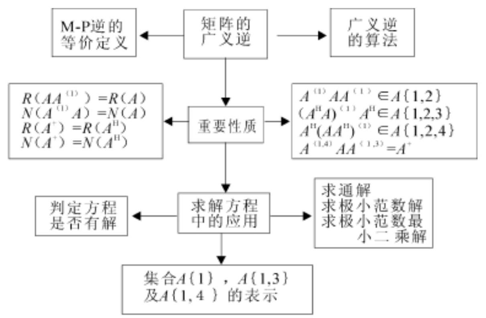

投影变换投影矩阵

正交投影变换正交投影矩阵

Moore广义逆

Moore逆与

Penrose逆等价

## 五、课后习题全解

## 习 题 6.1

1. 设 $L, M$ 是 ${C}^{n}$ 的子空间,且 ${LiAM} = {C}^{n}$ ,证明投影算子 ${P}_{L, M}$ 是线性算子.

证 将 $x, y \in  {C}^{n}$ 分解为

$$
x = {x}_{1} + {x}_{2},\;y = {y}_{1} + {y}_{2}\;\left( {{x}_{1},{y}_{1} \in  L,{x}_{2},{y}_{2} \in  M}\right)
$$

则

$$
{\lambda }_{X} + {\mu }_{Y} = \left( {{\lambda }_{{X}_{1}} + {\mu }_{{y}_{1}}}\right)  + \left( {{\lambda }_{{X}_{2}} + {\mu }_{{y}_{2}}}\right)
$$

其中， $\lambda {\mathrm{x}}_{1} + \mu {\mathrm{y}}_{1} \in  \mathrm{L},\lambda {\mathrm{x}}_{2} + \mu {\mathrm{y}}_{2} \in  \mathrm{M}$ . 故

$$
{P}_{L, M}\left( {{\lambda }_{X} + {\mu y}}\right)  = {\lambda }_{{X}_{1}} + \mu {y}_{1} = \lambda {P}_{L, M}x + \mu {P}_{L, M}y
$$

2. 若 $\mathrm{P}$ 是投影矩阵,证明: ${\mathrm{P}}^{\mathrm{H}},\mathrm{I} - \mathrm{P},{\mathrm{T}}^{1}\mathrm{{PT}}$ ( $\mathrm{T}$ 为非奇异矩阵) 均为投影矩阵.

证 $\;{\left( {P}^{H}\right) }^{2} = {\left( {P}^{2}\right) }^{H} = {P}^{H}$

$$
{\left( \mathrm{I} - \mathrm{P}\right) }^{2} = {\mathrm{I}}^{2} - 2\mathrm{P} + {\mathrm{P}}^{2} = \mathrm{I} - 2\mathrm{P} + \mathrm{P} = \mathrm{I} - \mathrm{P}
$$

$$
{\left( {\mathrm{T}}^{-1}\mathrm{{PT}}\right) }^{2} = {\mathrm{T}}^{1}{\mathrm{P}}^{2}\mathrm{\;T} = {\mathrm{T}}^{1}\mathrm{{PT}}
$$

3. 证明 $\mathrm{I - {P}_{L, M} = {P}_{M, L}}$ .

证 由第 2 题知, $I - {P}_{L, M}$ 是投影矩阵. 将任意 $x \in  {C}^{n}$ 分解为

$$
\mathrm{x} = \mathrm{y} + \mathrm{z}\;\left( {\mathrm{y} \in  \mathrm{L},\mathrm{z} \in  \mathrm{M}}\right)
$$

则 $\left( {\mathrm{I} - {\mathrm{P}}_{\mathrm{L},\mathrm{M}}}\right) \mathrm{x} = \mathrm{x} - {\mathrm{P}}_{\mathrm{L},\mathrm{M}}\mathrm{x} = \mathrm{x} - \mathrm{y} = \mathrm{z} = {\mathrm{P}}_{\mathrm{M},\mathrm{L}}\mathrm{x}$

故

$$
\mathrm{I} - {\mathrm{P}}_{\mathrm{L},\mathrm{M}} = {\mathrm{P}}_{\mathrm{M},\mathrm{L}}
$$

4. 设 ${P}_{1},{P}_{2}$ 均为投影矩阵,证明:

(1)P = ${P}_{1} + {P}_{2}$ 是投影矩阵的充要条件是

$$
{\mathrm{P}}_{1}{\mathrm{P}}_{2} = {\mathrm{P}}_{2}{\mathrm{P}}_{1} = \mathrm{O}
$$

(2) $\mathrm{P} = {\mathrm{P}}_{1} - {\mathrm{P}}_{2}$ 是投影矩阵的充要条件是

$$
{\mathrm{P}}_{1}{\mathrm{P}}_{2} = {\mathrm{P}}_{2}{\mathrm{P}}_{1} = {\mathrm{P}}_{2}
$$

(3)若 ${P}_{1}{P}_{2} = {P}_{2}{P}_{1}$ ，则 $P = {P}_{1}{P}_{2}$ 是投影矩阵.

证 (1) 若 $P = {P}_{1} + {P}_{2}$ 是投影矩阵,则 ${P}^{2} = P$ ,即 ${\left( {P}_{1} + {P}_{2}\right) }^{2} = \; {\mathrm{P}}_{1} + {\mathrm{P}}_{2}$ ,整理得 (利用 ${\mathrm{P}}_{1}^{2} = {\mathrm{P}}_{1}$ 和 ${\mathrm{P}}_{2}^{2} = {\mathrm{P}}_{2}$ )

$$
{\mathrm{P}}_{1}{\mathrm{P}}_{2} + {\mathrm{P}}_{2}{\mathrm{P}}_{1} = \mathrm{O}
$$

上式分别左乘和右乘 ${\mathrm{P}}_{1}$ ，得

$$
{\mathrm{P}}_{1}{\mathrm{P}}_{2} + {\mathrm{P}}_{1}{\mathrm{P}}_{2}{\mathrm{P}}_{1} = \mathrm{O},\;{\mathrm{P}}_{1}{\mathrm{P}}_{2}{\mathrm{P}}_{1} + {\mathrm{P}}_{2}{\mathrm{P}}_{1} = \mathrm{O}
$$

两式相减得 ${P}_{1}{P}_{2} - {P}_{2}{P}_{1} = O$ ,与前一式联立求解即得 ${P}_{1}{P}_{2} = \; {P}_{2}{P}_{1} = O$ . 反之,由 ${P}_{1}{P}_{2} = {P}_{2}{P}_{1} = O$ 易知 ${P}^{2} = P$ .

(2)如果 ${P}_{1}{P}_{2} = {P}_{2}{P}_{1} = {P}_{2}$ ,则

$$
{P}^{2} = {\left( {P}_{1} - {P}_{2}\right) }^{2} = {P}_{1}^{2} - {P}_{1}{P}_{2} - {P}_{2}{P}_{1} + {P}_{2}^{2} =
$$

$$
\begin{array}{l} {P}_{1} - {P}_{2} - {P}_{2} + {P}_{2} = {P}_{1} - {P}_{2} = P \end{array}
$$

反之,由 ${\left( {P}_{1} - {P}_{2}\right) }^{2} = {P}_{1} - {P}_{2}$ 得 ${P}_{1}{P}_{2} + {P}_{2}{P}_{1} = 2{P}_{2}$ . 分别左乘和右乘 ${\mathrm{P}}_{2}$ ,得

$$
{\mathrm{P}}_{2}{\mathrm{P}}_{1}{\mathrm{P}}_{2} + {\mathrm{P}}_{2}{\mathrm{P}}_{1} = 2{\mathrm{P}}_{2},\;{\mathrm{P}}_{1}{\mathrm{P}}_{2} + {\mathrm{P}}_{2}{\mathrm{P}}_{1}{\mathrm{P}}_{2} = 2{\mathrm{P}}_{2}
$$

两式相减得 ${P}_{1}{P}_{2} = {P}_{2}{P}_{1}$ ,代入前一式即得 ${P}_{1}{P}_{2} = {P}_{2}{P}_{1} = {P}_{2}$ .

(3) ${P}^{2} = {\left( {P}_{1}{P}_{2}\right) }^{2} = {P}_{1}\left( {{P}_{2}{P}_{1}}\right) {P}_{2} =$

$$
{P}_{1}\left( {{P}_{1}{P}_{2}}\right) {P}_{2} = {P}_{1}{P}_{2} = P
$$

5. 设 $\mathrm{P}$ 是投影矩阵,证明 $\mathrm{P}$ 的特征值为 1 或 0 .

证 设 ${Px} = {\lambda x}$ ,则 ${\lambda x} = {Px} = {P}^{2}x = {\lambda }^{2}x$ . 由 $x \neq  0$ 得 ${\lambda }^{2} - \lambda  = 0$ ,从而 $\lambda  = 1$ 或 $\lambda  = 0$ .

6. 设 $\mathrm{P}$ 是正交投影矩阵,证明 $\mathrm{P}$ 是半正定矩阵.

证 由于 $\mathrm{P}$ 是正交投影矩阵,所以 $\mathrm{P} = {\mathrm{P}}^{\mathrm{H}}\mathrm{P}$ ,从而对任意 $\mathrm{x} \in \; {\mathrm{C}}^{\mathrm{n}}$ ,有

$$
{x}^{H}{Px} = {x}^{H}{P}^{H}{Px} = {\left( Px\right) }^{H}\left( {Px}\right)  \geq  0
$$

故 ${\mathrm{X}}^{\mathrm{H}}\mathrm{P}\mathrm{X}$ 是半正定二次型,从而 $\mathrm{P}$ 是半正定矩阵.

7. 设 ${\mathrm{R}}^{3}$ 的子空间 $\mathrm{L}$ 由向量 ${\mathrm{e}}_{1} = {\left( 1,0,0\right) }^{\mathrm{T}}$ 张成.

(1)若子空间 $\mathrm{M}$ 由 $\alpha  = {\left( 1,1,0\right) }^{\mathrm{T}}$ 和 $\beta  = {\left( 1,1,1\right) }^{\mathrm{T}}$ 张成,求投影矩阵 ${\mathrm{P}}_{\mathrm{L},\mathrm{M}}$ 和向量 $\mathrm{x} = {\left( 2,3,1\right) }^{\mathrm{T}}$ 沿着 $\mathrm{M}$ 到 $\mathrm{L}$ 的投影;

(2)求正交投影矩阵 ${\mathrm{P}}_{\mathrm{L}}$ 和向量 $\mathrm{x} = {\left( 2,3,1\right) }^{\mathrm{T}}$ 在 $\mathrm{L}$ 上的正交投影.

解 (1) 由式 (6.1.5), 得

$$
{P}_{L, M} = \left\lbrack  \begin{array}{lll} 1 & 0 & 0 \\  0 & 0 & 0 \\  0 & 0 & 0 \end{array}\right\rbrack  {\left\lbrack  \begin{array}{lll} 1 & 1 & 1 \\  0 & 1 & 1 \\  0 & 0 & 1 \end{array}\right\rbrack  }^{-1} = \left\lbrack  \begin{array}{rrr} 1 &  - 1 & 0 \\  0 & 0 & 0 \\  0 & 0 & 0 \end{array}\right\rbrack
$$

$$
{P}_{L, M}x = \left\lbrack  \begin{array}{r}  - 1 \\  0 \\  0 \end{array}\right\rbrack
$$

(2) 由式 (6.1.6), 得

$$
{P}_{L} = {e}_{L}{\left( {e}_{L}^{H}{e}_{L}\right) }^{-1}{e}_{L}^{H} = \left\lbrack  \begin{array}{lll} 1 & 0 & 0 \\  0 & 0 & 0 \\  0 & 0 & 0 \end{array}\right\rbrack  ,\;{P}_{L}x = \left\lbrack  \begin{array}{l} 2 \\  0 \\  0 \end{array}\right\rbrack
$$

## 习 题 6.2

1. 设 $A$ 是 $m \times  n$ 零矩阵,哪一类矩阵 $X$ 是 $A$ 的 $\{ 1\}$ - 逆 ?

答 所有 $\mathrm{n} \times  \mathrm{m}$ 矩阵.

2. 设 $\mathrm{m} \times  \mathrm{n}$ 矩阵 $\mathrm{A}$ 除第 $\mathrm{i}$ 行第 $\mathrm{j}$ 列的元素为 1 外,其余元素均为 0,哪一类矩阵 $\mathrm{X}$ 是 $\mathrm{A}$ 的 $\{ 1\}$ - 逆?

解 设 $X = {\left( {X}_{ij}\right) }_{n \times  m}$ ,则由 ${AXA} = A$ 得 ${X}_{ij} = 1$ ,其余元素任意.

3. 设 $\mathrm{I}$ 是 $\mathrm{n}$ 阶单位矩阵, $\mathrm{J}$ 是所有元素的均为1的 $\mathrm{n}$ 阶矩阵,记 $A = \left( \begin{array}{ll} a &  - b \end{array}\right) I + {bJ}$ . 证明: 若 $a + \left( {n - 1}\right) b = 0$ ,则 $X = \; {\left( a - b\right) }^{-1}I$ 是 $A$ 的 $\{ 1\}$ - 逆.

证 $\;{AXA} = \left\lbrack  {\left( {a - b}\right) I + {bJ}}\right\rbrack  {\left( a - b\right) }^{-1}A =$

$$
A + b{\left( a - b\right) }^{-1}{JA} =
$$

$$
A + b{\left( a - b\right) }^{-1}J\left\lbrack  {\left( {a - b}\right) I + {bJ}}\right\rbrack   =
$$

$$
A + b{\left( a - b\right) }^{-1}\left\lbrack  {\left( {a - b}\right) J + b{J}^{2}}\right\rbrack   =
$$

$$
A + b{\left( a - b\right) }^{-1}\left\lbrack  {a + \left( {n - 1}\right) b}\right\rbrack  J = A
$$

上式用到 ${\mathrm{J}}^{2} = \mathrm{{nJ}}$ .

4. 已知

$$
A = \left\lbrack  \begin{array}{rrr} 0 &  - {a}_{3} & {a}_{2} \\  {a}_{3} & 0 &  - {a}_{1} \\   - {a}_{2} & {a}_{1} & 0 \end{array}\right\rbrack
$$

证明 $X =  - {\left( {a}_{1}^{2} + {a}_{2}^{2} + {a}_{3}^{2}\right) }^{-1}A$ 是 $A$ 的 $\{ 1\}$ - 逆.

证 经计算得 ${A}^{3} =  - \left( {{a}_{1}^{2} + {a}_{2}^{2} + {a}_{3}^{2}}\right) A$ ,于是

$$
{AXA} =  - {\left( {a}_{1}^{2} + {a}_{2}^{2} + {a}_{3}^{2}\right) }^{-1}{A}^{3} = A
$$

5. 证明定理6.5之 $\left( 2\right)  \sim  \left( 5\right)$ .

证 定理 ${6.5}\left( 2\right)$ : 若 $\lambda  = 0$ ,则 ${\lambda }^{ + }{A}^{\left( 1\right) } = O \in  \left( {\lambda A}\right) \{ 1\}$ ; 若 $\lambda  \neq$ 0,则 $\left( {\lambda A}\right) \left( {{\lambda }^{ + }{A}^{\left( 1\right) }}\right) \left( {\lambda A}\right)  = \left( {\lambda {\lambda }^{ + }\lambda }\right) \left( {A{A}^{\left( 1\right) }A}\right)  = {\lambda A}$ ,所以 ${\lambda }^{ + }{A}^{\left( 1\right) }E \; \left( {\lambda A}\right) \{ 1\}$ .

定理 ${6.5}\left( 3\right)  :$ 因为

$$
\text{ (SAT) }\left( {{\mathrm{T}}^{1}{\mathrm{\;A}}^{\left( 1\right) }{\mathrm{S}}^{-1}}\right) \left( \mathrm{{SAT}}\right)  = {\mathrm{{SAA}}}^{\left( 1\right) }\mathrm{{AT}} = \mathrm{{SAT}}
$$

所以

$$
{\mathrm{T}}^{1}{\mathrm{\;A}}^{\left( 1\right) }{\mathrm{S}}^{1} \in  \left( \mathrm{{SAT}}\right) \{ 1\}
$$

定理 ${6.5}\left( 4\right)  : \operatorname{rank}\mathrm{A} = \operatorname{rank}\left( {\mathrm{A}{\mathrm{A}}^{\left( 1\right) }\mathrm{A}}\right)  \leq  \operatorname{rank}{\mathrm{A}}^{\left( 1\right) }$

定理 ${6.5}\left( 5\right)  : {\left( {\mathrm{{AA}}}^{\left( 1\right) }\right) }^{2} = {\mathrm{{AA}}}^{\left( 1\right) }{\mathrm{{AA}}}^{\left( 1\right) } = {\mathrm{{AA}}}^{\left( 1\right) }$

$$
{\left( {A}^{\left( 1\right) }A\right) }^{2} = {A}^{\left( 1\right) }A{A}^{\left( 1\right) }A = {A}^{\left( 1\right) }A
$$

因为

$$
\operatorname{rank}A = \operatorname{rank}\left( {A{A}^{\left( 1\right) }A}\right)  \leq  \operatorname{rank}\left( {A{A}^{\left( 1\right) }}\right)  \leq  \operatorname{rank}A
$$

所以

$$
\operatorname{rank}\left( {\mathrm{{AA}}}^{\left( 1\right) }\right)  = \operatorname{rank}\mathrm{A}
$$

同理可证 $\operatorname{rank}\left( {{\mathrm{A}}^{\left( 1\right) }\mathrm{A}}\right)  = \operatorname{rank}\mathrm{A}$ .

6. 证明定理6.10之 $\left( 3\right)$ 和 $\left( 4\right)$ .

证 定理 ${6.10}\left( 3\right)$ : 对 Penrose 方程 $\left( 1\right)  \sim  \left( 4\right)$ 取共轭转置,并由 ${\left( {A}^{H}\right) }^{ + }$ 的惟一性即知 ${\left( {A}^{H}\right) }^{ + } = {\left( {A}^{ + }\right) }^{H}$ .

定理 ${6.10}\left( 4\right)  :$ 令 $X = {A}^{ + }{\left( {A}^{H}\right) }^{ + }$ ,直接验证

$$
\left( {{A}^{H}A}\right) X\left( {{A}^{H}A}\right)  = {A}^{H}A,\;X\left( {{A}^{H}A}\right) X = X
$$

$$
{\left( {A}^{H}AX\right) }^{H} = {A}^{H}{AX},\;{\left( X{A}^{H}A\right) }^{H} = X{A}^{H}A
$$

由 ${\left( {A}^{\mathrm{H}}A\right) }^{ + }$ 的惟一性即得 ${\left( {A}^{\mathrm{H}}A\right) }^{ + } = X$ 同理可证另一式.

7. 设 $D = \operatorname{diag}\left( {{d}_{1},{d}_{2},\cdots ,{d}_{n}}\right)$ ,证明

$$
{D}^{ + } = \operatorname{diag}\left( {{d}_{1}^{ + },{d}_{2}^{ + },\cdots ,{d}_{n}^{ + }}\right)
$$

证 由定义直接验证.

8. 证明 ${\left\lbrack  \begin{array}{l} \mathrm{A} \\  \mathrm{O} \end{array}\right\rbrack  }^{ + } = \left\lbrack  \begin{array}{lll} {\mathrm{A}}^{ + } & \vdots & {\mathrm{O}}^{\mathrm{H}} \end{array}\right\rbrack$ .

证 方法 1 . 由定义直接验证 (略).

方法2. 利用矩阵的满秩分解. 当 $\mathrm{A} = \mathrm{O}$ 时,结论成立; 当 $\mathrm{A} \neq  \mathrm{O}$ 时,设 $\mathrm{A}$ 的一个满秩分解为 $\mathrm{A} = \mathrm{{FG}}$ ,则

$$
B = \left\lbrack  \begin{array}{l} A \\  O \end{array}\right\rbrack   = \left\lbrack  \begin{matrix} {FG} \\  O \end{matrix}\right\rbrack   = \left\lbrack  \begin{array}{l} F \\  O \end{array}\right\rbrack  G = {FG}
$$

为 $\mathrm{B}$ 的一个满秩分解,且有

$$
{\mathrm{F}}^{ + } = {\left\{  \left( \begin{array}{lll} {\mathrm{F}}^{\mathrm{H}} & \vdots & {\mathrm{O}}^{\mathrm{H}} \end{array}\right) \left\lbrack  \begin{array}{l} \mathrm{F} \\  \mathrm{O} \end{array}\right\rbrack  \right\}  }^{-1}\left( \begin{array}{lll} {\mathrm{F}}^{\mathrm{H}} & \vdots & {\mathrm{O}}^{\mathrm{H}} \end{array}\right)  =
$$

$$
{\left( {\mathrm{F}}^{\mathrm{H}}\mathrm{F}\right) }^{-1}\left( {{\mathrm{\;F}}^{\mathrm{H}}\vdots {\mathrm{O}}^{\mathrm{H}}}\right)  = \left( {{\mathrm{F}}^{ + }\vdots {\mathrm{O}}^{\mathrm{H}}}\right)
$$

故 ${\mathrm{B}}^{ + } = {\mathrm{G}}^{ + }{\mathrm{F}}^{ + } = \left( \begin{array}{llll} {\mathrm{G}}^{ + } & {\mathrm{F}}^{ + } & \vdots & {\mathrm{O}}^{\mathrm{H}} \end{array}\right)  = \left( \begin{array}{lll} {\mathrm{A}}^{ + } & \vdots & {\mathrm{O}}^{\mathrm{H}} \end{array}\right)$ .

9. 设 $A \in  {C}^{m \times  n}$ ,且 $U \in  {C}^{m \times  m}$ 和 $V \in  {C}^{n \times  n}$ 均为酉矩阵,证明 ${\left( \mathrm{{UAV}}\right) }^{ + } = {\mathrm{V}}^{\mathrm{H}}{\mathrm{A}}^{ + }{\mathrm{U}}^{\mathrm{H}}.$

证 当 $\mathrm{A} = \mathrm{O}$ 时,结论成立; 当 $\mathrm{A} \neq  \mathrm{O}$ 时,设 $\mathrm{A}$ 的一个奇异值分解为

$$
A = {U}_{1}\left\lbrack  \begin{matrix} \sum & O \\  O & O \end{matrix}\right\rbrack  {V}_{1}^{H}
$$

则

$$
B = {UAV} = \left( {U{U}_{1}}\right) \left\lbrack  \begin{matrix} \sum & O \\  O & O \end{matrix}\right\rbrack  {\left( {V}^{H}{V}_{1}\right) }^{H}
$$

为 $\mathrm{B}$ 的一个奇异值分解,因此

$$
{B}^{ + } = \left( \begin{array}{ll} {V}^{H} & {V}_{1} \end{array}\right) \left\lbrack  \begin{matrix} {\sum }^{-1} & O \\  O & O \end{matrix}\right\rbrack  {\left( U{U}_{1}\right) }^{H} =
$$

$$
{\mathrm{V}}^{\mathrm{H}}{\mathrm{V}}_{1}\left\lbrack  \begin{matrix} {\sum }^{-1} & \mathrm{O} \\  \mathrm{O} & \mathrm{O} \end{matrix}\right\rbrack  {\mathrm{U}}_{1}^{\mathrm{H}}{\mathrm{U}}^{\mathrm{H}} = {\mathrm{V}}^{\mathrm{H}}{\mathrm{A}}^{ + }{\mathrm{U}}^{\mathrm{H}}
$$

10. 证明:

(1)X € A\{i\}的充要条件是 ${X}^{H} \in  {A}^{H}\{ i\} \left( {i = 1,2}\right)$ ;

(2)X € A\{3\}的充要条件是 ${X}^{H} \in  {A}^{H}\{ 4\}$ ；

(3) $X \in  A\{ 4\}$ 的充要条件是 ${X}^{H} \in  {A}^{H}\{ 3\}$ .

证 因为 ${AXA} = A$ 等价于 ${A}^{H}{X}^{H}{A}^{H} = {A}^{H},{XAX} = X$ 等价于 ${X}^{\mathrm{H}}{A}^{\mathrm{H}}{X}^{\mathrm{H}} = {X}^{\mathrm{H}}$ ,所以 $X \in  A\{ i\}$ 等价于 ${X}^{\mathrm{H}} \in  {A}^{\mathrm{H}}\{ i\} \left( {i = 1,2}\right)$ .

因为 ${\left( AX\right) }^{H} = {AX}$ 等价于 ${\left( {X}^{H}{A}^{H}\right) }^{H} = {X}^{H}{A}^{H}$ ,所以 $X \in  A\{ 3\}$ 等价于 ${X}^{\mathrm{H}} \in  {A}^{\mathrm{H}}\{ 4\}$ .

同理可证(3).

11. 设 $\mathrm{H}$ 是幂等 Hermite 矩阵,证明 ${\mathrm{H}}^{ + } = \mathrm{H}$ .

证 由 ${\mathrm{H}}^{2} = \mathrm{H}$ 和 ${\mathrm{H}}^{\mathrm{H}} = \mathrm{H}$ 得 ${\mathrm{H}}^{3} = \mathrm{H},{\left( {\mathrm{H}}^{2}\right) }^{\mathrm{H}} = {\mathrm{H}}^{2}$ , 故 ${\mathrm{H}}^{ + } = \mathrm{H}$ .

12. 证明: ${\mathrm{H}}^{ + } = \mathrm{H}$ 的充要条件是 ${\mathrm{H}}^{2}$ 为幂等 Hermite 矩阵且 $\operatorname{rank}{\mathrm{H}}^{2} = \operatorname{rank}\mathrm{H}$ .

证 如果 ${\mathrm{H}}^{ + } = \mathrm{H}$ ,则 ${\left( {\mathrm{H}}^{2}\right) }^{2} = {\mathrm{H}}^{4} = {\mathrm{H}}^{3}\mathrm{H} = {\mathrm{H}}^{2},{\left( {\mathrm{H}}^{2}\right) }^{\mathrm{H}} = \; {\left( {\mathrm{{HH}}}^{ + }\right) }^{\mathrm{H}} = {\mathrm{{HH}}}^{ + } = {\mathrm{H}}^{2}$ ,即 ${\mathrm{H}}^{2}$ 为幂等 Hermite 矩阵,又

$$
\operatorname{rank}\mathrm{H} = \operatorname{rank}{\mathrm{H}}^{3} \leq  \operatorname{rank}{\mathrm{H}}^{2} \leq  \operatorname{rank}\mathrm{H}
$$

故 $\operatorname{rank}{\mathrm{H}}^{2} = \operatorname{rank}\mathrm{H}$ . 反之,由 ${\left( {\mathrm{H}}^{2}\right) }^{\mathrm{H}} = {\mathrm{H}}^{2}$ 知, $\mathrm{H} \in  \mathrm{H}\{ 3,4\}$ ; 又由 $\operatorname{rank}{\mathrm{H}}^{2} = \operatorname{rank}\mathrm{H}$ 知,存在矩阵 $\mathrm{U}$ 使得 $\mathrm{H} = {\mathrm{H}}^{2}\mathrm{U}$ ,从而

$$
{\mathrm{H}}^{3} = {\mathrm{H}}^{2}\mathrm{H} = {\mathrm{H}}^{2}{\mathrm{H}}^{2}\mathrm{U} = {\left( {\mathrm{H}}^{2}\right) }^{2}\mathrm{U} = {\mathrm{H}}^{2}\mathrm{U} = \mathrm{H}
$$

此即 $\mathrm{H} \in  \mathrm{H}\{ 1,2\}$ ,故 $\mathrm{H} \in  \mathrm{H}\{ 1,2,3,4\}$ ,即 $\mathrm{H} = {\mathrm{H}}^{ + }$ .

13. 证明: 若 $A$ 是正规矩阵 (即满足 ${A}^{H}A = A{A}^{H}$ ),则 ${A}^{ + }A = \; {\mathrm{{AA}}}^{ + }$ ,且 ${\left( {\mathrm{A}}^{\mathrm{n}}\right) }^{ + } = {\left( {\mathrm{A}}^{ + }\right) }^{\mathrm{n}}$ ,其中 $\mathrm{n}$ 是正整数.

证 由定理 ${6.10}\left( 5\right)$ ,即 ${\mathrm{A}}^{ + } = {\left( {\mathrm{A}}^{\mathrm{H}}\mathrm{A}\right) }^{ + }{\mathrm{A}}^{\mathrm{H}} = {\mathrm{A}}^{\mathrm{H}}{\left( {\mathrm{{AA}}}^{\mathrm{H}}\right) }^{ + }$ 得

$$
{A}^{ + }A = {\left( {A}^{H}A\right) }^{ + }{A}^{H}A = {\left( A{A}^{H}\right) }^{ + }A{A}^{H} =
$$

$$
{\left\lbrack  \begin{array}{ll} {\left( A{A}^{H}\right) }^{ + } & A{A}^{H} \end{array}\right\rbrack  }^{H} = {\left( A{A}^{H}\right) }^{H}{\left\lbrack  {\left( A{A}^{H}\right) }^{ + }\right\rbrack  }^{H} =
$$

$$
{\mathrm{{AA}}}^{\mathrm{H}}{\left( {\mathrm{{AA}}}^{\mathrm{H}}\right) }^{ + } = {\mathrm{{AA}}}^{ + }
$$

利用上面结果, 有

$$
{A}^{n}{\left( {A}^{ + }\right) }^{n}{A}^{n} = {\left( A{A}^{ + }A\right) }^{n} = {A}^{n}
$$

$$
{\left( {A}^{ + }\right) }^{n}{A}^{n}{\left( {A}^{ + }\right) }^{n} = {\left( {A}^{ + }A{A}^{ + }\right) }^{n} = {\left( {A}^{ + }\right) }^{n}
$$

$$
{\left\lbrack  {A}^{n}{\left( {A}^{ + }\right) }^{n}\right\rbrack  }^{H} = {\left\lbrack  {\left( A{A}^{ + }\right) }^{n}\right\rbrack  }^{H} = {\left\lbrack  {\left( A{A}^{ + }\right) }^{H}\right\rbrack  }^{n} =
$$

$$
{\left( {\mathrm{{AA}}}^{ + }\right) }^{\mathrm{n}} = {\mathrm{A}}^{\mathrm{n}}{\left( {\mathrm{A}}^{ + }\right) }^{\mathrm{n}}
$$

同理 ${\left\lbrack  {\left( {A}^{ + }\right) }^{n}{A}^{n}\right\rbrack  }^{H} = {\left( {A}^{ + }\right) }^{n}{A}^{n}$ ,故而 ${\left( {A}^{n}\right) }^{ + } = {\left( {A}^{ + }\right) }^{n}$ .

14. 证明 ${\left( \begin{array}{ll} \mathrm{A}i & \mathrm{\;B} \end{array}\right) }^{ + } = {\mathrm{A}}^{ + }i\;{\mathrm{\;B}}^{ + }$ .

证 根据直积和性质, 有

$\left( \begin{array}{ll} \mathrm{A}i & \mathrm{\;B} \end{array}\right) \left( \begin{array}{ll} {\mathrm{A}}^{ + }i & {\mathrm{\;B}}^{ + } \end{array}\right) \left( \begin{array}{ll} \mathrm{A}i & \mathrm{\;B} \end{array}\right)  =$

$$
\left( {A{A}^{ + }A}\right) i\;\left( {B{B}^{ + }B}\right)  = {Ai}\;B
$$

$$
\left( \begin{array}{ll} {A}^{ + }i & {B}^{ + } \end{array}\right) \left( \begin{array}{ll} {Ai} & B \end{array}\right) \left( \begin{array}{ll} {A}^{ + }i & {B}^{ + } \end{array}\right)  =
$$

$$
\left( {{A}^{ + }A{A}^{ + }}\right) i\;\left( {{B}^{ + }B{B}^{ + }}\right)  = {A}^{ + }i\;{B}^{ + }
$$

$$
{\left\lbrack  \begin{array}{llll} \left( {A{A}^{ + }}\right) & B & \left( {{A}^{ + }{A}^{ + }}\right) & {B}^{ + } \end{array}\right\rbrack  }^{H} = {\left\lbrack  \begin{array}{lll} \left( {A{A}^{ + }}\right) & 1 & \left( {B{B}^{ + }}\right)  \end{array}\right\rbrack  }^{H} =
$$

$$
{\left( \begin{array}{l} {\mathrm{{AA}}}^{ + } \end{array}\right) }^{\mathrm{H}}\mathbf{i}\;{\left( \begin{array}{l} {\mathrm{{BB}}}^{ + } \end{array}\right) }^{\mathrm{H}} = \left( {\mathrm{{AA}}}^{ + }\right) \mathbf{i}\;\left( {\mathrm{{BB}}}^{ + }\right)  =
$$

$$
\left( \begin{array}{ll} \mathrm{{Ai}} & \mathrm{B} \end{array}\right) \left( \begin{array}{ll} {\mathrm{A}}^{ + }\mathrm{i} & {\mathrm{B}}^{ + } \end{array}\right)
$$

$$
\text{ 同理 }{\left\lbrack  \begin{array}{ll} \left( {{A}^{ + }i}\right) & {B}^{ + } \end{array}\left( Ai\;B\right) \right\rbrack  }^{H} = \left( {{A}^{ + }i\;{B}^{ + }}\right) \left( {{Ai}\;B}\right)
$$

故

$$
{\left( \begin{array}{ll} \mathrm{A}i & \mathrm{\;B} \end{array}\right) }^{ + } = {\mathrm{A}}^{ + }i\;{\mathrm{\;B}}^{ + }
$$

15. 举例说明: 对 $\mathrm{P},\mathrm{Q}$ 为非奇异矩阵,结论 ${\left( \mathrm{{PAQ}}\right) }^{ + } = {\mathrm{Q}}^{-1}{\mathrm{\;A}}^{ + }{\mathrm{P}}^{-1}$ 不真,并与习题 9 比较.

解 例如,取 $A = \left\lbrack  \begin{array}{l} 1 \\  1 \end{array}\right\rbrack  , P = \left\lbrack  \begin{array}{ll} 1 & 1 \\  0 & 1 \end{array}\right\rbrack  , Q = \left\lbrack  1\right\rbrack$ ,则有

$$
\mathrm{{PAQ}} = \left\lbrack  \begin{array}{l} 2 \\  1 \end{array}\right\rbrack  ,\;{\left( \mathrm{{PAQ}}\right) }^{ + } = \frac{1}{5}\left\lbrack  \begin{array}{ll} 2 & 1 \end{array}\right\rbrack
$$

$$
{\mathrm{Q}}^{-1}{\mathrm{\;A}}^{ + }{\mathrm{P}}^{-1} = \frac{1}{2}\left\lbrack  \begin{array}{ll} 1 & 0 \end{array}\right\rbrack
$$

可见 ${\left( \mathrm{{PAQ}}\right) }^{ + } \neq  {\mathrm{Q}}^{-1}{\mathrm{\;A}}^{ + }{\mathrm{P}}^{-1}$ .

16. 证明满足如下三个矩阵方程

$$
{AX} = B,\;{XA} = D,\;{XAX} = X
$$

的矩阵 $\mathrm{X}$ 是惟一的(如果它存在的话).

证 设 $\mathrm{X},\mathrm{Y}$ 均满足这三个矩阵方程,则

$$
X = \left\lbrack  \begin{matrix} X \\  A \\  X \\  \end{matrix}\right\rbrack   = \left\lbrack  \begin{matrix} X \\  B \\  \end{matrix}\right\rbrack   = \left\lbrack  \begin{matrix} X \\  A \\  Y \\  \end{matrix}\right\rbrack   = \left\lbrack  \begin{matrix} Y \\  A \\  Y \\  \end{matrix}\right\rbrack   = \left\lbrack  \begin{matrix} Y \\  A \\  Y \\  \end{matrix}\right\rbrack
$$

17. 设 ${A}_{i} \in  {C}^{m \times  n},{A}_{i}{A}_{j}^{H} = O,{A}_{i}^{H}{A}_{j} = O\left( {i \neq  j;i, j = 1,2,\cdots , r}\right)$ , 证明

$$
{\left\lbrack  \mathop{\sum }\limits_{{\mathrm{i} = 1}}^{\mathrm{r}}{\mathrm{A}}_{\mathrm{i}}\right\rbrack  }^{ + } = \mathop{\sum }\limits_{{\mathrm{i} = 1}}^{\mathrm{r}}{\mathrm{A}}_{\mathrm{i}}^{ + }
$$

证 利用定理 6.10(5)可得

$$
\left( {\mathop{\sum }\limits_{{\mathrm{i} = 1}}^{\mathrm{r}}{\mathrm{A}}_{\mathrm{i}}}\right) \left( {\mathop{\sum }\limits_{{\mathrm{i} = 1}}^{\mathrm{r}}{\mathrm{A}}_{\mathrm{i}}^{ + }}\right)  = \left( {\mathop{\sum }\limits_{{\mathrm{i} = 1}}^{\mathrm{r}}{\mathrm{A}}_{\mathrm{i}}}\right) \left( {\mathop{\sum }\limits_{{\mathrm{i} = 1}}^{\mathrm{r}}{\mathrm{A}}_{\mathrm{i}}^{\mathrm{H}}{\left( {\mathrm{A}}_{\mathrm{i}}{\mathrm{A}}_{\mathrm{i}}^{\mathrm{H}}\right) }^{ + }}\right)  =
$$

$$
\left( {\mathop{\sum }\limits_{{i = 1}}^{r}\left( {{A}_{i}{A}_{i}^{H}}\right) {\left( {A}_{i}{A}_{i}^{H}\right) }^{ + } = \mathop{\sum }\limits_{{i = 1}}^{r}{A}_{i}{A}_{i}^{ + }}\right.
$$

$$
\left( {\mathop{\sum }\limits_{{i = 1}}^{r}{A}_{i}^{ + }}\right) \left( {\mathop{\sum }\limits_{{i = 1}}^{r}{A}_{i}}\right)  = \left( {\mathop{\sum }\limits_{{i = 1}}^{r}{\left( {A}_{i}^{H}{A}_{i}\right) }^{ + }{A}_{i}^{H}}\right) \left( {\mathop{\sum }\limits_{{i = 1}}^{r}{A}_{i}}\right)  =
$$

$$
\mathop{\sum }\limits_{{i = 1}}^{r}{\left( {A}_{i}^{H}{A}_{i}\right) }^{ + }\left( {{A}_{i}^{H}{A}_{i}}\right)  = \mathop{\sum }\limits_{{i = 1}}^{r}{A}_{i}^{ + }{A}_{i}
$$

上面两式右边均是 Hermite 矩阵, 因而左边也是 Hermite 矩阵. 又

$$
\left( {\mathop{\sum }\limits_{{i = 1}}^{r}{A}_{i}}\right) \left( {\mathop{\sum }\limits_{{i = 1}}^{r}{A}_{i}^{ + }}\right) \left( {\mathop{\sum }\limits_{{i = 1}}^{r}{A}_{i}}\right)  = \left( {\mathop{\sum }\limits_{{i = 1}}^{r}{A}_{i}{A}_{i}^{ + }}\right) \left( {\mathop{\sum }\limits_{{i = 1}}^{r}A}\right)  =
$$

$$
\left( {\mathop{\sum }\limits_{{i = 1}}^{r}{A}_{i}{\left( {A}_{i}^{H}{A}_{i}\right) }^{ + }{A}_{i}^{H}}\right) \left( {\mathop{\sum }\limits_{{i = 1}}^{r}{A}_{i}}\right)  = \mathop{\sum }\limits_{{i = 1}}^{r}{A}_{i}{\left( {A}_{i}^{H}{A}_{i}\right) }^{ + }{A}_{i}^{H}{A}_{i} =
$$

$$
\mathop{\sum }\limits_{{i = 1}}^{r}{A}_{i}{A}_{i}^{ + }{A}_{i} = \mathop{\sum }\limits_{{i = 1}}^{r}{A}_{i}
$$

同理可证

$$
\left( {\mathop{\sum }\limits_{{i = 1}}^{r}{A}_{i}^{ + }}\right) \left( {\mathop{\sum }\limits_{{i = 1}}^{r}{A}_{i}}\right) \left( {\mathop{\sum }\limits_{{i = 1}}^{r}{A}^{ + }}\right)  = \mathop{\sum }\limits_{{i = 1}}^{r}{A}^{ + }
$$

故

$$
{\left( \mathop{\sum }\limits_{{i = 1}}^{r}{A}_{i}\right) }^{ + } = \mathop{\sum }\limits_{{i = 1}}^{r}{A}_{i}^{ + }
$$

## 习 题 6.3

1. 证明每个方阵都有非奇异的 $\{ 1\}$ - 逆.

证 在式(6.3.3) 中取 $\mathrm{L}$ 为非奇异矩阵即得.

2. 非奇异矩阵 $\mathrm{A}$ 的 Hermite 标准形是什么 矩阵 $\mathrm{Q}$ 与 $\mathrm{A}$ 的关系如何 置换矩阵 $\mathrm{P}$ 是什么矩阵 $\varnothing$ 由式 (6.3.3) 给出的 $\mathrm{X}$ 是什么?

答 Hermite 标准形是单位矩阵, $\mathrm{Q} = {\mathrm{A}}^{1},\mathrm{P} = \mathrm{I},\mathrm{X} = {\mathrm{A}}^{1}$ .

3. 已知矩阵

$$
A = \left\lbrack  \begin{array}{llll} 1 & 0 & 0 & 1 \\  1 & 1 & 0 & 0 \\  0 & 1 & 1 & 0 \\  0 & 0 & 1 & 1 \end{array}\right\rbrack
$$

(1)求A的Hermite标准形,利用式(6.3.3) 求A的 $\{ 1\}$ - 逆和 \{1,2\} - 逆;

(2)作 A 的满秩分解,利用定理 6.15 之(5)求 ${\mathrm{A}}^{ + }$ ；

(3)利用Zlobec公式 (6.3.6) 计算 ${\mathrm{A}}^{ + }$ ；

(4)利用 Greville 方法计算 ${A}^{ + }$ ；

(5)利用定理 6.18 计算 ${A}^{\left( 1,2\right) },{A}^{\left( 1,2,3\right) },{A}^{\left( 1,2,4\right) }$ 和 ${A}^{ + }$ ;

(6) 矩阵 $A$ 是上 Hessenberg 矩阵,根据式 (6.3.23),(6.3.24), (6.3.30) 和 (6.3.36) 计算 ${A}^{ + }$ .

解 $\left( 1\right) {QA} = \left\lbrack  \begin{array}{rrrr} 1 & 0 & 0 & 1 \\  0 & 1 & 0 &  - 1 \\  0 & 0 & 1 & 0 \\  0 & 0 & 0 & 0 \end{array}\right\rbrack$

$$
Q = \left\lbrack  \begin{array}{rrrr} 1 & 0 & 0 & 0 \\   - 1 & 1 & 0 & 0 \\  1 &  - 1 & 1 & 0 \\   - 1 & 1 &  - 1 & 1 \end{array}\right\rbrack
$$

于是

$$
{A}^{\left( 1\right) } = \left\lbrack  \begin{array}{rrrr} 1 & 0 & 0 & 0 \\   - 1 & 1 & 0 & 0 \\  1 &  - 1 & 1 & 0 \\   - a & a &  - a & a \end{array}\right\rbrack  \;(a\text{ 任意) }
$$

$$
{A}^{\left( 1,2\right) } = \left\lbrack  \begin{array}{rrrr} 1 & 0 & 0 & 0 \\   - 1 & 1 & 0 & 0 \\  1 &  - 1 & 1 & 0 \\  0 & 0 & 0 & 0 \end{array}\right\rbrack
$$

(2) $A = {FG} = \left\lbrack  \begin{array}{rrr} 1 & 0 & 0 \\  1 & 1 & 0 \\  0 & 1 & 1 \\  0 & 0 & 1 \end{array}\right\rbrack  \left\lbrack  \begin{array}{rrrr} 1 & 0 & 0 & 1 \\  0 & 1 & 0 &  - 1 \\  0 & 0 & 1 & 1 \end{array}\right\rbrack$

$$
{\mathrm{A}}^{ + } = {\mathrm{G}}^{\mathrm{H}}{\left( {\mathrm{F}}^{\mathrm{H}}{\mathrm{{AG}}}^{\mathrm{H}}\right) }^{-1}{\mathrm{\;F}}^{\mathrm{H}} = \frac{1}{8}\left\lbrack  \begin{array}{rrrr} 3 & 3 &  - 1 &  - 1 \\   - 1 & 3 & 3 &  - 1 \\   - 1 &  - 1 & 3 & 3 \\  3 &  - 1 &  - 1 & 3 \end{array}\right\rbrack
$$

(3) $\mathrm{B} = {\mathrm{A}}^{\mathrm{H}}{\mathrm{{AA}}}^{\mathrm{H}} = \left\lbrack  \begin{array}{llll} 3 & 3 & 1 & 1 \\  1 & 3 & 3 & 1 \\  1 & 1 & 3 & 3 \\  3 & 1 & 1 & 3 \end{array}\right\rbrack$

$$
{QB} = \left\lbrack  \begin{array}{rrrr} 1 & 0 & 0 & 1 \\  0 & 1 & 0 &  - 1 \\  0 & 0 & 1 & 1 \\  0 & 0 & 0 & 0 \end{array}\right\rbrack  ,\;Q = \frac{1}{8}\left\lbrack  \begin{array}{rrrr} 0 &  - 1 & 0 & 3 \\  0 & 4 &  - 4 & 0 \\  0 &  - 1 & 4 &  - 1 \\  8 &  - 8 & 8 &  - 8 \end{array}\right\rbrack
$$

由式 (6.3.3) 求得

$$
{B}^{\left( 1\right) } = \frac{1}{8}\left\lbrack  \begin{array}{rrrr} 0 &  - 1 & 0 & 3 \\  0 & 4 &  - 4 & 0 \\  0 &  - 1 & 4 &  - 1 \\  0 & 0 & 0 & 0 \end{array}\right\rbrack
$$

故

$$
{A}^{ + } = {A}^{H}{B}^{\left( 1\right) }{A}^{H} = \frac{1}{8}\left\lbrack  \begin{array}{rrrr} 3 & 3 &  - 1 &  - 1 \\   - 1 & 3 & 3 &  - 1 \\   - 1 &  - 1 & 3 & 3 \\  3 &  - 1 &  - 1 & 3 \end{array}\right\rbrack
$$

(4) 由式 (6.2.3) 计算 ${A}^{ + } = \frac{1}{2}\left( {1,1,0,0}\right)$ ,再由式 (6.3.7) $\sim$ (6.3.9) 依次计算

$$
{d}_{2} = {A}_{1}^{ + }{a}_{2} = \frac{1}{2}
$$

$$
Q = {a}_{2} - {Ad} = \frac{1}{2}{\left( -1,1,2,0\right) }^{T}
$$

$$
{b}^{H} = {c}^{ + } = \frac{1}{3}\left( {-1,1,2,0}\right)
$$

$$
{A}^{ + } = \left\lbrack  \begin{array}{rrr} {A}^{ + } &  - d & b \\   & {b}^{H} &  \end{array}\right\rbrack   = \frac{1}{3}\left\lbrack  \begin{array}{rrrr} 2 & 1 &  - 1 & 0 \\   - 1 & 1 & 2 & 0 \end{array}\right\rbrack
$$

$$
{d}_{3} = {A}_{2}^{ + }{a}_{3} = \frac{1}{3}{\left( -1,2\right) }^{T}
$$

$$
\text{ c) } = {a}_{3} - {Ad} = \frac{1}{3}{\left( 1, - 1,1,3\right) }^{T}
$$

$$
{\mathrm{b}}^{\mathrm{H}} = {\mathrm{c}}^{ + } = \frac{1}{4}\left( {1, - 1,1,3}\right)
$$

$$
{A}^{ + } = \left\lbrack  \begin{array}{rrr} {A}^{ + } &  - {d}_{3} & {b}^{H} \\   & {b}^{H} &  \end{array}\right\rbrack   = \frac{1}{4}\left\lbrack  \begin{array}{rrrr} 3 & 1 &  - 1 & 1 \\   - 2 & 2 & 2 &  - 2 \\  1 &  - 1 & 1 & 3 \end{array}\right\rbrack
$$

$$
{d}_{4} = {A}_{3}^{ + }{a}_{4} = {\left( 1, - 1,1\right) }^{T}
$$

$$
{c}_{4} = {a}_{4} - {Ad} = {\left( 0,0,0,0\right) }^{T}
$$

$$
{\mathrm{b}}^{\mathrm{H}} = {\left( 1 + {\mathrm{d}}_{4}^{\mathrm{H}}\mathrm{d}\right) }^{-1}{\mathrm{\;d}}^{\mathrm{H}}{\mathrm{A}}_{3}^{ + } = \frac{1}{8}\left( {3, - 1,1,3}\right)
$$

$$
{A}^{ + } = \left\lbrack  \begin{matrix} {A}_{3}^{ + } &  - {d}_{4} & {b}_{4}^{H} \end{matrix}\right\rbrack   = \frac{1}{8}\left\lbrack  \begin{array}{rrrr} 3 & 3 &  - 1 &  - 1 \\   - 1 & 3 & 3 &  - 1 \\   - 1 &  - 1 & 3 & 3 \\  3 &  - 1 &  - 1 & 3 \end{array}\right\rbrack
$$

(5) $\mathrm{P} = \mathrm{Q} = {\mathrm{I}}_{4}$

$$
{A}_{1} = \left\lbrack  \begin{array}{lll} 1 & 0 & 0 \\  1 & 1 & 0 \\  0 & 1 & 1 \end{array}\right\rbrack  ,\;{A}_{11}^{-1} = \left\lbrack  \begin{array}{rrr} 1 & 0 & 0 \\   - 1 & 1 & 0 \\  1 &  - 1 & 1 \end{array}\right\rbrack
$$

$$
T = {A}_{11}^{-1}{A}_{2} = {\left( 1, - 1,1\right) }^{T},\;S = {A}_{21}{A}_{11}^{-1} = \left( {1, - 1,1}\right)
$$

$$
{\left( {\mathrm{I}}_{3} + {\mathrm{S}}^{\mathrm{H}}\mathrm{S}\right) }^{-1} = \frac{1}{4}\left\lbrack  \begin{array}{rrr} 3 & 1 &  - 1 \\  1 & 3 & 1 \\   - 1 & 1 & 3 \end{array}\right\rbrack   = {\left( {\mathrm{I}}_{3} + {\mathrm{{TT}}}^{\mathrm{H}}\right) }^{-1}
$$

从而

$$
{A}^{\left( 1,2\right) } = \left\lbrack  \begin{array}{rrrr} 1 & 0 & 0 & 0 \\   - 1 & 1 & 0 & 0 \\  1 &  - 1 & 1 & 0 \\  0 & 0 & 0 & 0 \end{array}\right\rbrack
$$

$$
{A}^{\left( 1,2,3\right) } = \frac{1}{4}\left\lbrack  \begin{array}{rrrr} 3 & 1 &  - 1 & 1 \\   - 2 & 2 & 2 &  - 2 \\  1 &  - 1 & 1 & 3 \\  0 & 0 & 0 & 0 \end{array}\right\rbrack
$$

$$
{A}^{\left( 1,2,4\right) } = \frac{1}{4}\left\lbrack  \begin{array}{rrrr} 1 & 2 &  - 1 & 0 \\   - 1 & 2 & 1 & 0 \\  1 &  - 2 & 3 & 0 \\  3 &  - 2 & 1 & 0 \end{array}\right\rbrack
$$

$$
{A}^{ + } = \frac{1}{8}\left\lbrack  \begin{array}{rrrr} 3 & 3 &  - 1 &  - 1 \\   - 1 & 3 & 3 &  - 1 \\   - 1 &  - 1 & 3 & 3 \\  3 &  - 1 &  - 1 & 3 \end{array}\right\rbrack
$$

(6) 对 ${\mathrm{A}}^{\mathrm{T}}$ 进行计算:

$$
{x}_{1} = 1,{x}_{2} =  - 1,{x}_{3} = 1,{x}_{4} =  - 1
$$

$$
{y}_{4} = 1,{y}_{3} =  - 1,{y}_{2} = 1,{y}_{1} =  - 1
$$

$$
\left( {{\mathbf{\alpha }}_{11},{\mathbf{\alpha }}_{12},{\mathbf{\alpha }}_{13}}\right)  =  - \frac{{X}^{T}{P}_{3}^{-1}}{1 + {X}^{T}{X}^{T}}\left\lbrack  {{I}_{3} - \frac{Y{y}^{T}}{1 + {y}^{T}y}}\right\rbrack   =
$$

$$
\frac{1}{8}\left( {3, - 1, - 1}\right)
$$

同理 ${\left( {\mathbf{\alpha }}_{4},{\mathbf{\alpha }}_{4},{\mathbf{\alpha }}_{4}\right) }^{\mathrm{T}} = \frac{1}{8}{\left( -1, - 1,3\right) }^{\mathrm{T}},{\mathbf{\alpha }}_{4} = \frac{3}{8}$ ,故

$$
{\left( {A}^{T}\right) }^{ + } = \left\lbrack  \begin{array}{rrrr} 0 & 0 & 0 & 0 \\  1 & 0 & 0 & 0 \\   - 1 & 1 & 0 & 0 \\  1 &  - 1 & 1 & 0 \end{array}\right\rbrack   + \left\lbrack  \begin{array}{r} 1 \\   - 1 \\  1 \\  1 \end{array}\right\rbrack  \frac{1}{8}\left( {3, - 1, - 1,3}\right)  +
$$

$$
\frac{1}{8}\left\lbrack  \begin{array}{r} 3 \\   - 1 \\   - 1 \\  3 \end{array}\right\rbrack  \left( {-1,1, - 1,1}\right)  - \frac{3}{8}\left\lbrack  \begin{array}{r} 1 \\   - 1 \\  1 \\   - 1 \end{array}\right\rbrack  \left( {-1,1, - 1,1}\right)  =
$$

$$
\frac{1}{8}\left\lbrack  \begin{array}{rrrr} 3 &  - 1 &  - 1 & 3 \\  3 & 3 &  - 1 &  - 1 \\   - 1 & 3 & 3 &  - 1 \\   - 1 &  - 1 & 3 & 3 \end{array}\right\rbrack
$$

从而 ${A}^{ + } = {\left\lbrack  {\left( {A}^{T}\right) }^{ + }\right\rbrack  }^{T} = \frac{1}{8}\left\lbrack  \begin{array}{rrrr} 3 & 3 &  - 1 &  - 1 \\   - 1 & 3 & 3 &  - 1 \\   - 1 &  - 1 & 3 & 3 \\  3 &  - 1 &  - 1 & 3 \end{array}\right\rbrack$

## 习 题 6.4

1. 证明: 向量 $x$ 是方程组 ${Ax} = b$ 的最小二乘解的充要条件是, 存在向量 $y$ ,使得向量 $\left\lbrack  \begin{array}{l} y \\  x \end{array}\right\rbrack$ 为

$$
\left\lbrack  \begin{matrix} \mathrm{I} & \mathrm{A} \\  {\mathrm{A}}^{\mathrm{H}} & \mathrm{O} \end{matrix}\right\rbrack  \left\lbrack  \begin{array}{l} \mathrm{y} \\  {\mathrm{x}}^{\prime } \end{array}\right\rbrack   = \left\lbrack  \begin{array}{l} \mathrm{b} \\  0 \end{array}\right\rbrack
$$

的解.

证 令 $y = b - {Ax}$ ,因为 $x$ 是 ${Ax} = b$ 的最小二乘解的充要条件是 $\mathrm{x}$ 满足 ${A}^{\mathrm{H}}A\mathrm{x} = {A}^{\mathrm{H}}b$ ,所以

$$
{\mathrm{A}}^{\mathrm{H}}\mathrm{y} = {\mathrm{A}}^{\mathrm{H}}\left( {\mathrm{b} - \mathrm{{Ax}}}\right)  = {\mathrm{A}}^{\mathrm{H}}\mathrm{b} - {\mathrm{A}}^{\mathrm{H}}\mathrm{{Ax}} = 0
$$

可见 $\left\lbrack  \begin{array}{l} y \\  x \end{array}\right\rbrack$ 满足所给方程. 反之可推出 $x$ 满足 ${A}^{\mathrm{H}}{Ax} = {A}^{\mathrm{H}}b$ .

2. 设 $A \in  {C}^{m \times  n}$ ,列向量 $b,{b}_{2},\cdots ,{b}_{k} \in  {C}^{m}$ ,证明: 向量 ${x}_{0}$ 使得

$$
\mathop{\min }\limits_{{x \in  {C}^{n}}}\mathop{\sum }\limits_{{i = 1}}^{k}\parallel {Ax} - b{\parallel }^{2}
$$

成立的充要条件是, ${\mathrm{x}}_{0}$ 为方程

$$
\mathrm{{Ax}} = \frac{1}{\mathrm{k}}\mathop{\sum }\limits_{{\mathrm{i} = 1}}^{\mathrm{k}}{\mathrm{b}}_{\mathrm{i}}
$$

的最小二乘解.

证 $\;{x}_{0}$ 使得 $\mathop{\sum }\limits_{{1 = 1}}^{k}{\begin{Vmatrix}Ax - {b}_{i}\end{Vmatrix}}^{2}$ 最小

${x}_{0}$ 是 ${Ax} = {b}_{i}\left( {i = 1,2,\cdots , k}\right)$ 的最小二乘解

${x}_{0}$ 是 $\left\lbrack  \begin{matrix} A \\  \cdots \\  A \end{matrix}\right\rbrack  x = \left\lbrack  \begin{matrix} b \\  \cdots \\  {b}_{k} \end{matrix}\right\rbrack$ 的最小二乘解

${x}_{0}$ 是正规方程组 $\left\lbrack  \begin{matrix} A \\  \cdots \\  A \end{matrix}\right\rbrack  \left\lbrack  \begin{matrix} A \\  \cdots \\  A \end{matrix}\right\rbrack  x = {\left\lbrack  \begin{matrix} A \\  \cdots \\  A \end{matrix}\right\rbrack  }^{H}\left\lbrack  \begin{matrix} {b}_{1} \\  \cdots \\  {b}_{k} \end{matrix}\right\rbrack$ 的解

${x}_{0}$ 是 ${A}^{H}{Ax} = \frac{1}{k}{A}^{H}\mathop{\sum }\limits_{{i = 1}}^{k}{b}_{i}$ 的解

${x}_{0}$ 是 ${Ax} = \frac{1}{k}\mathop{\sum }\limits_{{i = 1}}^{k}{b}_{i}$ 的最小二乘解

3. 设 ${A}_{i} \in  {C}^{m \times  n}$ ,列向量 $b \in  {C}^{m}\left( {i = 1,2,\cdots , k}\right)$ ,证明: 向量 ${x}_{0}$ 使得

$$
\mathop{\min }\limits_{{x \in  {C}^{n}}}\mathop{\sum }\limits_{{i = 1}}^{k}{\begin{Vmatrix}{A}_{i}x - {b}_{i}\end{Vmatrix}}^{2}
$$

成立的充要条件是, ${\mathrm{x}}_{0}$ 为方程

$$
\left\lbrack  {\mathop{\sum }\limits_{{\mathrm{i} = 1}}^{\mathrm{k}}{\mathrm{A}}^{\mathrm{H}}{\mathrm{A}}_{\mathrm{i}}}\right\rbrack  \mathrm{x} = \mathop{\sum }\limits_{{\mathrm{i} = 1}}^{\mathrm{k}}{\mathrm{A}}_{\mathrm{i}}^{\mathrm{H}}{\mathrm{b}}_{\mathrm{i}}
$$

的解.

证 $\;{x}_{0}$ 使得 $\mathop{\sum }\limits_{{1 = 1}}^{k}{\begin{Vmatrix}{A}_{i}x - b\end{Vmatrix}}^{2}$ 最小

${x}_{0}$ 是 ${A}_{i}x = b\left( {i = 1,2,\cdots , k}\right)$ 的最小二乘解

${x}_{0}$ 是 $\left\lbrack  \begin{matrix} {A}_{1} \\  \cdots \\  {A}_{k} \end{matrix}\right\rbrack  x = \left\lbrack  \begin{matrix} {b}_{1} \\  \cdots \\  {b}_{k} \end{matrix}\right\rbrack$ 的最小二乘解

${x}_{0}$ 是 ${\left\lbrack  \begin{matrix} {A}_{1} \\  \cdots \\  {A}_{k} \end{matrix}\right\rbrack  }^{H}\left\lbrack  \begin{matrix} A \\  \cdots \\  {A}_{k} \end{matrix}\right\rbrack  x = {\left\lbrack  \begin{matrix} A \\  \cdots \\  {A}_{k} \end{matrix}\right\rbrack  }^{H}\left\lbrack  \begin{matrix} b \\  \cdots \\  {b}_{k} \end{matrix}\right\rbrack$ 的解

$$
{\mathrm{X}}_{0}\text{ 是 }\left( {\mathop{\sum }\limits_{{\mathrm{i} = 1}}^{\mathrm{k}}{\mathrm{A}}^{\mathrm{H}}{\mathrm{A}}_{\mathrm{i}}}\right) \mathrm{x} = \mathop{\sum }\limits_{{\mathrm{i} = 1}}^{\mathrm{k}}{\mathrm{A}}_{\mathrm{i}}^{\mathrm{H}}{\mathrm{b}}_{\mathrm{i}}\text{ 的解 }
$$

4. 设 $\mathrm{A} \in  {\mathrm{C}}^{\mathrm{m} \times  \mathrm{n}},\mathrm{b} \in  {\mathrm{C}}^{\mathrm{m}},{\alpha }^{2}$ 是正实数,证明: 满足

$$
\mathop{\min }\limits_{{x \in  {C}^{n}}}\left\{  {\parallel {Ax} - b{\parallel }^{2} + {\alpha }^{2}\parallel x{\parallel }^{2}}\right\}
$$

的 ${X}_{0}$ 为 ${X}_{0} = {\left( {A}^{H}A + {\alpha }^{2}I\right) }^{-1}{A}^{H}b$ .

证 这是第 3 题中取 $\mathrm{k} = 2,\mathrm{\;A} = \mathrm{A},\mathrm{A} = \mathrm{{\alpha I}},\mathrm{b} = \mathrm{b}$ , $\mathrm{b} = 0$ 的特殊情形,从而 ${\mathrm{x}}_{0}$ 满足 $\left( {{\mathrm{A}}^{\mathrm{H}}\mathrm{A} + {\alpha }^{2}\mathrm{I}}\right) \mathrm{x} = {\mathrm{A}}^{\mathrm{H}}\mathrm{b}$ . 故 ${\mathrm{x}}_{0} = \; {\left( {A}^{H}A + {\alpha }^{2}I\right) }^{-1}{A}^{H}b$

5. 设 $A \in  {C}^{m \times  n}, b \in  {C}^{m}, a \in  {C}^{n}$ . 若方程组 ${Ax} = b$ 相容,证明: 使得

$$
\mathop{\min }\limits_{{\mathrm{{Ax}} = \mathrm{b}}}\parallel \mathrm{x} - \mathrm{a}\parallel
$$

成立的惟一解是

$$
\mathrm{x} = {\mathrm{A}}^{\left( 1,4\right) }\mathrm{b} + \left( {\mathrm{I} - {\mathrm{A}}^{\left( 1,4\right) }\mathrm{A}}\right) \mathrm{a}
$$

其中, ${\mathrm{A}}^{\left( 1,4\right) } \in  \mathrm{A}\{ 1,4\}$ .

证 问题转化为求方程组 $A\left( {x - a}\right)  = b - {Aa}$ 的惟一极小范数解. 由定理 6.30 可得 $x - a = {A}^{\left( 1,4\right) }\left( {b - {Aa}}\right)$ ,于是

$$
x = {A}^{\left( 1,4\right) }\left( {b - {Aa}}\right)  + a = {A}^{\left( 1,4\right) }b + \left( {I - {A}^{\left( 1,4\right) }A}\right) a
$$

6. 取习题 6.3 第 3 题的矩阵 $\mathrm{A}$ ,问:

(1) 当 $\mathrm{b} = {\left( 1,1,1,1\right) }^{\mathrm{T}}$ 时,方程组 $\mathrm{{Ax}} = \mathrm{b}$ 是否相容?

(2) 当 $\mathrm{b} = {\left( 1,0,1,0\right) }^{\mathrm{T}}$ 时,方程组 $\mathrm{{Ax}} = \mathrm{b}$ 是否相容?

若方程组相容, 求其通解和极小范数解; 若方程组不相容, 求其极小范数最小二乘解.

解 取最简单的 ${\mathrm{A}}^{\left( 1\right) }$ ,即

$$
{A}^{\left( 1\right) } = \left\lbrack  \begin{array}{rrrr} 1 & 0 & 0 & 0 \\   - 1 & 1 & 0 & 0 \\  1 &  - 1 & 1 & 0 \\  0 & 0 & 0 & 0 \end{array}\right\rbrack
$$

(1)因为 ${\mathrm{{AA}}}^{\left( 1\right) }\mathrm{b} = \mathrm{b}$ ，所以 $\mathrm{{Ax}} = \mathrm{b}$ 相容，通解为

$$
x = {A}^{\left( 1\right) }b + \left( {I - {A}^{\left( 1\right) }A}\right) y =
$$

$$
\left\lbrack  \begin{array}{l} 1 \\  0 \\  1 \\  0 \end{array}\right\rbrack   + \left\lbrack  \begin{array}{rrrr} 0 & 0 & 0 &  - 1 \\  0 & 0 & 0 & 1 \\  0 & 0 & 0 &  - 1 \\  0 & 0 & 0 & 0 \end{array}\right\rbrack  \left\lbrack  \begin{array}{l} \xi \\  \xi \\  \xi \\  \xi  \end{array}\right\rbrack   = \left\lbrack  \begin{array}{l} 1 \\  0 \\  1 \\  0 \end{array}\right\rbrack   + \left\lbrack  \begin{array}{r}  - 1 \\  1 \\   - 1 \\  1 \end{array}\right\rbrack  \xi
$$

极小范数解为 $\mathrm{x} = {\mathrm{A}}^{\left( 1,2,4\right) }\mathrm{b} = \frac{1}{2}{\left( 1,1,1,1\right) }^{\mathrm{T}}$ .

(2)因为 ${\mathrm{{AA}}}^{\left( 1\right) }\mathrm{b} \neq  \mathrm{b}$ ，所以 $\mathrm{{Ax}} = \mathrm{b}$ 不相容，极小范数最小二乘解为 $\mathrm{x} = {\mathrm{A}}^{ + }\mathrm{b} = \frac{1}{4}{\left( 1,1,1,1\right) }^{\mathrm{T}}$ .

## 习 题 6.5

1. 设 $A \in  {C}^{m \times  n}, b \in  {C}^{m}, S$ 是 ${C}^{n}$ 的子空间,证明: 解约束问题

$$
{Ax} = b\;\left( {x \in  S}\right)
$$

等价于解无约束方程组

$$
\left\lbrack  \begin{array}{r} A \\  {P}_{{s}^{ \bot  }} \end{array}\right\rbrack  x = \left\lbrack  \begin{array}{r} b \\  0 \end{array}\right\rbrack
$$

其中 ${\mathrm{P}}_{\mathrm{S}} \bot   = \mathrm{I} - {\mathrm{P}}_{\mathrm{S}}$ .

证 若 $\mathrm{x}$ 是约束问题的解,则 $\mathrm{{Ax}} = \mathrm{b},\mathrm{{Ps}}\mathrm{x} = \mathrm{x}$ . 从而

$$
{\mathrm{P}}_{{\mathrm{s}}^{ \bot  }}\mathrm{x} = \left( {\mathrm{I} - {\mathrm{P}}_{\mathrm{s}}}\right) \mathrm{x} = \mathrm{x} - {\mathrm{P}}_{{\mathrm{s}}^{ \bot  }}\mathrm{x} = 0
$$

即 $x$ 满足 $\left\lbrack  \begin{matrix} A \\  {P}_{{s}^{ \bot  }} \end{matrix}\right\rbrack  x = \left\lbrack  \begin{matrix} b \\  0 \end{matrix}\right\rbrack$ . 逆推回去即知 $x$ 是约束问题的解.

2. 证明定理6.36,6.37,6.38.

证 定理 6.36 的证明: 因为 $\mathrm{x} = \mathrm{{Ps}}\mathrm{z}$ 是式 (6.5.1) 的极小范数解 $\mathrm{z}$ 是式 (6.5.2) 的极小范数解; 由定理 ${6.30},\mathrm{z} = \mathrm{{Zb}}$ 是式 (6.5.2) 的极小范数解 $Z = {\left( A{P}_{S}\right) }^{\left( 1,4\right) }$ ; 故 $x = {Xb}$ 是式(6.5.1) 的极小范数解 $X = \operatorname{Ps}Z = \operatorname{Ps}{\left( A{P}_{s}\right) }^{\left( 1,4\right) }$ .

定理 6.37 的证明: $x = \operatorname{Ps}z$ 是式 (6.5.1) 的最小二乘解 $z$ 是式 (6.5.2) 的最小二乘解; 其余证明同上.

定理 6.38 的证明类似.

3. 证明定理6.40,6.41.

证 定理 6.40 的证明: 将正定矩阵 $\mathrm{N}$ 进行 Cholesky 分解 $\mathrm{N} = \; {\mathrm{G}}_{\mathrm{N}}^{\mathrm{H}}{\mathrm{G}}_{\mathrm{N}}$ ,其中 ${\mathrm{G}}_{\mathrm{N}}$ 是非奇异上三角矩阵,则 $\mathop{\min }\limits_{{\mathrm{{Ax}} = \mathrm{b}}}{\begin{Vmatrix}\mathrm{X}\end{Vmatrix}}_{\mathrm{N}}$ 等价于 $\mathop{\min }\limits_{{\mathrm{{Ax}} = \mathrm{b}}}\parallel \; \mathrm{x}\parallel$ ,这里 $\mathrm{x} = {\mathrm{G}}_{\mathrm{N}}\mathrm{x},\mathrm{A} = {\mathrm{{AG}}}_{\mathrm{N}}^{-1},\mathrm{\;b} = \mathrm{b}$ . 而后者的解为 $\mathrm{x} = \mathrm{{Yb}},\mathrm{Y} \in \; A\{ 1,4\}$ . 令 $X = {G}_{N}^{-1}Y$ ,则

$$
x = {Yb}\;x = {Xb}
$$

$$
{AYA} = A\;{AXA} = A
$$

$$
{\left( YA\right) }^{H} = {YA}\;{\left( NXA\right) }^{H} = {NXA}
$$

定理 6.41 的证明: 将正定矩阵 $M$ 和 $N$ 进行 Cholesky 分解 $M = \; {\mathrm{G}}_{\mathrm{M}}^{\mathrm{H}}{\mathrm{G}}_{\mathrm{M}},\mathrm{N} = {\mathrm{G}}_{\mathrm{N}}^{\mathrm{H}}{\mathrm{G}}_{\mathrm{N}}$ ,则 $\mathop{\min }\limits_{{\min \parallel \mathrm{{Ax}} - \mathrm{b}{\parallel }_{\mathrm{M}}}}\parallel \mathrm{x}{\parallel }_{\mathrm{N}}$ 等价于 $\mathop{\min }\limits_{{\min \parallel \mathrm{{Ax}} - \mathrm{b}\parallel }}\parallel \mathrm{x}\parallel$ ,其中 $\mathrm{A} = \; {\mathrm{G}}_{\mathrm{M}}{\mathrm{{AG}}}_{\mathrm{N}}^{-1},\mathrm{x} = {\mathrm{G}}_{\mathrm{N}}\mathrm{x},\mathrm{b} = {\mathrm{G}}_{\mathrm{M}}\mathrm{b}$ . 而后者的解为 $\mathrm{x} = {\mathrm{A}}^{ + }\mathrm{b}$ ,于是 $\mathrm{x} = {\mathrm{G}}_{\mathrm{N}}^{-1}{\mathrm{\;A}}^{ + } \; {\mathrm{G}}_{\mathrm{M}}$ b. 令 $\mathrm{X} = {\mathrm{G}}_{\mathrm{N}}^{1}{\mathrm{\;A}}^{ + }{\mathrm{G}}_{\mathrm{M}}$ ,则

$$
x = {A}^{ + }b\;x\;{Xb}
$$

$$
\begin{array}{ll} A{A}^{ + }A = A & {AXA} = A \end{array}
$$

$$
{A}^{ + }A{A}^{ + } = {A}^{ + }\;{XAX} = X
$$

$$
{\left( \begin{array}{ll} A & {A}^{ + } \end{array}\right) }^{H} = A{A}^{ + }\;{\left( MAX\right) }^{H} = {MAX}
$$

$$
{\left( {A}^{ + }A\right) }^{H} = {A}^{ + }A\;{\left( NXA\right) }^{H} = {NXA}
$$

4. 设 $A \in  {C}^{m \times  n}, b \in  R\left( A\right)$ ,又设 $N \in  {C}^{n \times  n}$ 是正定矩阵,证明如下问题:

$$
\mathop{\min }\limits_{{\mathrm{{Ax}} = \mathrm{b}}}\parallel \mathrm{x}{\parallel }_{\mathrm{N}}
$$

有惟一极小因子

$$
{x}_{0} = {N}^{1}{A}^{H}{\left( A{N}^{-1}{A}^{H}\right) }^{\left( 1\right) }b
$$

且极小值为

$$
\sqrt{{\mathrm{b}}^{\mathrm{H}}{\left( {\mathrm{{AN}}}^{-1}{\mathrm{\;A}}^{\mathrm{H}}\right) }^{\left( 1\right) }\mathrm{b}}
$$

其中, ${\left( {\mathrm{{AN}}}^{-1}{\mathrm{\;A}}^{\mathrm{H}}\right) }^{\left( 1\right) } \in  \left( {{\mathrm{{AN}}}^{-1}{\mathrm{\;A}}^{\mathrm{H}}}\right) \{ 1\}$ .

证 由第 3 题的推证知,该问题的惟一极小范数解为 ${x}_{0} = \; {\mathrm{G}}_{\mathrm{N}}^{-1}\mathrm{{Yb}}$ ,其中 $\mathrm{Y} \in  \left( {\mathrm{{AG}}}_{\mathrm{N}}^{-1}\right) \{ 1,4\}$ . 取

$$
Y = {\left( {\mathrm{{AG}}}_{\mathrm{N}}^{-1}\right) }^{\mathrm{H}}{\left\lbrack  \left( {\mathrm{{AG}}}_{\mathrm{N}}^{-1}\right) {\left( {\mathrm{{AG}}}_{\mathrm{N}}^{-1}\right) }^{\mathrm{H}}\right\rbrack  }^{\left( 1\right) }
$$

由定理 6.8 知 $Y \in  \left( {\mathrm{{AG}}}_{\mathrm{N}}^{-1}\right) \{ 1,2,4\}$ ,从而

$$
{X}_{0} = {G}_{N}^{-1}{Yb} = {G}_{N}^{-1}{\left( {G}_{N}^{-1}\right) }^{H}{A}^{H}{\left\lbrack  A{G}_{N}^{-1}{\left( {G}_{N}^{-1}\right) }^{H}{A}^{H}\right\rbrack  }^{\left( 1\right) }b =
$$

$$
{\mathrm{N}}^{-1}{\mathrm{\;A}}^{\mathrm{H}}{\left( {\mathrm{{AN}}}^{-1}{\mathrm{\;A}}^{\mathrm{H}}\right) }^{\left( 1\right) }\mathrm{b}
$$

如同引理 2 可证得 $\operatorname{rank}A = \operatorname{rank}\left( {A{N}^{-1}{A}^{H}}\right)$ ,于是存在矩阵 $U$ 使得 $A = A{N}^{-1}{A}^{H}U$ ,又由 $b \in  R\left( A\right)$ 知,存在列向量 $z$ 使得 $b = {Az} = \; {\mathrm{{AN}}}^{-1}{\mathrm{\;A}}^{\mathrm{H}}\mathrm{{Uz}}$ ,故有

$$
{\begin{Vmatrix} {x}_{0} \end{Vmatrix}}_{N}^{2} = {x}_{0}^{H}N{x}_{0} =
$$

$$
{b}^{\mathrm{H}}{\left\lbrack  {\left( {\mathrm{{AN}}}^{-1}{\mathrm{\;A}}^{\mathrm{H}}\right) }^{\left( 1\right) }\right\rbrack  }^{\mathrm{H}}{\mathrm{{AN}}}^{-1}{\mathrm{\;A}}^{\mathrm{H}}{\left( {\mathrm{{AN}}}^{-1}{\mathrm{\;A}}^{\mathrm{H}}\right) }^{\left( 1\right) }\mathrm{b} =
$$

$$
{\mathrm{z}}^{\mathrm{H}}{\mathrm{U}}^{\mathrm{H}}{\left( {\mathrm{{AN}}}^{-1}{\mathrm{\;A}}^{\mathrm{H}}\right) }^{\mathrm{H}}{\left\lbrack  {\left( {\mathrm{{AN}}}^{-1}{\mathrm{\;A}}^{\mathrm{H}}\right) }^{\left( 1\right) }\right\rbrack  }^{\mathrm{H}} \times
$$

$$
{\left( \begin{array}{ll} {\mathrm{{AN}}}^{-1} & {\mathrm{\;A}}^{\mathrm{H}} \end{array}\right) }^{\mathrm{H}}{\left( \begin{array}{ll} {\mathrm{{AN}}}^{-1} & {\mathrm{\;A}}^{\mathrm{H}} \end{array}\right) }^{\left( 1\right) }\mathrm{b} =
$$

$$
{\mathrm{b}}^{\mathrm{H}}{\left( {\mathrm{{AN}}}^{-1}{\mathrm{\;A}}^{\mathrm{H}}\right) }^{\left( 1\right) }\mathrm{b}
$$

5. 证明: ${A}_{MN}^{ + } = {G}_{N}^{-1}{\left( {G}_{M}A{G}_{N}^{-1}\right) }^{ + }{G}_{M}$ .

证 将正定矩阵 $M$ 和 $N$ 进行 Cholesky 分解 $M = {G}_{M}^{H}{G}_{M}, N = \; {\mathrm{G}}_{\mathrm{N}}^{\mathrm{H}}{\mathrm{G}}_{\mathrm{N}}$ . 令 $\mathrm{A} = {\mathrm{G}}_{\mathrm{M}}{\mathrm{{AG}}}_{\mathrm{N}}^{-1},\mathrm{x} = {\mathrm{G}}_{\mathrm{N}}{\mathrm{{XG}}}_{\mathrm{M}}^{-1}$ ,则 $\mathrm{x} = {\mathrm{A}}^{ + }$ . 从而

$$
{\mathrm{A}}_{\mathrm{{MN}}}^{ + } = \mathrm{X} = {\mathrm{G}}_{\mathrm{N}}^{-1}{\mathrm{\;A}}^{ + }{\mathrm{G}}_{\mathrm{M}} = {\mathrm{G}}_{\mathrm{N}}^{-1}{\left( {\mathrm{G}}_{\mathrm{M}}{\mathrm{{AG}}}_{\mathrm{N}}^{-1}\right) }^{ + }{\mathrm{G}}_{\mathrm{M}}
$$

6. 利用 Zlobec 公式 (6.3.6) 证明

$$
{\mathrm{A}}_{\mathrm{{MN}}}^{ + } = {\mathrm{N}}^{-1}{\mathrm{\;A}}^{\mathrm{H}}\mathrm{{MA}}{\left( {\mathrm{A}}^{\mathrm{H}}{\mathrm{{MAN}}}^{-1}{\mathrm{\;A}}^{\mathrm{H}}\mathrm{{MA}}\right) }^{\left( 1\right) }{\mathrm{A}}^{\mathrm{H}}\mathrm{M}
$$

证 由第 5 题及 Zlobec 公式得

$$
{A}_{MN}^{ + } = {G}_{N}^{-1}{A}^{ + }{G}_{M} = {G}_{N}^{-1}{A}^{H}{\left( {A}^{H}A{A}^{H}\right) }^{\left( 1\right) }{A}^{H}{G}_{M} =
$$

$$
{\mathrm{N}}^{1}{\mathrm{\;A}}^{\mathrm{H}}{\mathrm{G}}_{\mathrm{M}}^{\mathrm{H}}{\left( {\mathrm{G}}_{\mathrm{N}}^{-\mathrm{H}}{\mathrm{A}}^{\mathrm{H}}{\mathrm{{MAN}}}^{-1}{\mathrm{\;A}}^{\mathrm{H}}{\mathrm{G}}_{\mathrm{M}}\right) }^{\left( 1\right) }{\mathrm{G}}_{\mathrm{N}}^{-1}{\mathrm{\;A}}^{\mathrm{H}}\mathrm{M}
$$

可以验证: ${G}_{M}A{\left( {A}^{H}MA{N}^{-1}{A}^{H}MA\right) }^{\left( 1\right) }{G}_{N}$ 是 ${G}_{N}^{-H}{A}^{H}{MA}{N}^{-1}{A}^{H}{G}_{M}$ 的 \{1\} - 逆,代入前一式即得.

## 习 题 6.6

1. 证明 ${\left( {A}^{H}\right) }^{\left( d\right) } = {\left( {A}^{\left( d\right) }\right) }^{H},{\left( {A}^{T}\right) }^{\left( d\right) } = {\left( {A}^{\left( d\right) }\right) }^{T}$ .

证 对定义 6.10 中的三个矩阵方程取共轭转置(或转置), 再由 Drazin 逆的惟一性即得.

2. 证明 ${\left( {A}^{1}\right) }^{\left( d\right) } = {\left( {A}^{\left( d\right) }\right) }^{1},1 = 1,2,\cdots$ .

证 利用 ${\mathrm{{AA}}}^{\left( \mathrm{d}\right) } = {\mathrm{A}}^{\left( \mathrm{d}\right) }\mathrm{A}$ ,得

$$
{\mathrm{A}}^{1}{\left( {\mathrm{\;A}}^{\left( \mathrm{d}\right) }\right) }^{1} = {\left( {\mathrm{\;A}}^{\left( \mathrm{d}\right) }\right) }^{1}{\mathrm{\;A}}^{1}
$$

$$
{\left( {\mathrm{\;A}}^{\left( \mathrm{d}\right) }\right) }^{1}{\mathrm{\;A}}^{1}{\left( {\mathrm{\;A}}^{\left( \mathrm{d}\right) }\right) }^{1} = {\left( {\mathrm{A}}^{\left( \mathrm{d}\right) }{\mathrm{{AA}}}^{\left( \mathrm{d}\right) }\right) }^{1} = {\left( {\mathrm{\;A}}^{\left( \mathrm{d}\right) }\right) }^{1}
$$

$$
{\left( {A}^{1}\right) }^{k}{\left( {A}^{\left( d\right) }\right) }^{1}{A}^{1} = {\left( {A}^{k}{A}^{\left( d\right) }A\right) }^{1} = {A}^{1}
$$

故 ${\left( {A}^{1}\right) }^{\left( d\right) } = {\left( {A}^{\left( d\right) }\right) }^{1},1 = 1,2,\cdots$ .

3. 设 $A$ 的指标为 $k$ ,证明: 对 $l \geq  k,{A}^{l}$ 的指标为 1,且

$$
{\left( {\mathrm{A}}^{1}\right) }^{\# } = {\left( {\mathrm{A}}^{\left( \mathrm{d}\right) }\right) }^{1}
$$

证 当 $1 \geq  k$ 时, $\operatorname{rank}{A}^{1} = \operatorname{rank}{A}^{k}$ ,从而 $\operatorname{rank}{\left( {A}^{1}\right) }^{2} = \operatorname{rank}{A}^{1}$ , 即 ${A}^{1}$ 的指标为 1 . 由第 2 题得

$$
{\left( {\mathrm{A}}^{\left( \mathrm{d}\right) }\right) }^{\# } = {\left( {\mathrm{A}}^{1}\right) }^{\left( \mathrm{d}\right) } = {\left( {\mathrm{A}}^{\left( \mathrm{d}\right) }\right) }^{1}
$$

4. 证明 ${\left( {A}^{\# }\right) }^{\# } = A$ .

证 由 ${A}^{\# }$ 的定义可看出, $A$ 与 ${A}^{\# }$ 在矩阵方程中的位置对称, 故而 ${\left( {A}^{\# }\right) }^{\# } = A$ .

5. 证明: ${\left( {A}^{\left( d\right) }\right) }^{\left( d\right) } = A$ 的充要条件是 $A$ 的指标为 1 .

证 如果 ${\left( {A}^{\left( d\right) }\right) }^{\left( d\right) } = A$ ,则

$$
{A}^{2}{A}^{\left( d\right) } = A{A}^{\left( d\right) }A = {\left( {A}^{\left( d\right) }\right) }^{\left( d\right) }{A}^{\left( d\right) }{\left( {A}^{\left( d\right) }\right) }^{\left( d\right) } =
$$

$$
{\left( {A}^{\left( d\right) }\right) }^{\left( d\right) } = A
$$

于是由定理 6.42(2) 知, A 的指标为 1 .

反之,如果 $\mathrm{A}$ 的指标为1,则 ${\mathrm{A}}^{\left( \mathrm{d}\right) } = {\mathrm{A}}^{\# }$ ,而

$$
\operatorname{rank}{A}^{\# } = \operatorname{rank}\left( {{A}^{\# }A{A}^{\# }}\right)  = \operatorname{rank}\left\lbrack  {{\left( {A}^{\# }\right) }^{2}A}\right\rbrack   \leq
$$

$$
\operatorname{rank}{\left( {A}^{\# }\right) }^{2} \leq  \operatorname{rank}{A}^{\# }
$$

即 $\operatorname{rank}{\left( {\mathrm{A}}^{\# }\right) }^{2} = \operatorname{rank}{\mathrm{A}}^{\# }$ ,可见 ${\mathrm{A}}^{\# }$ 的指标也为 1,故有

$$
{\left( {A}^{\left( d\right) }\right) }^{\left( d\right) } = {\left( {A}^{\# }\right) }^{\left( d\right) } = {\left( {A}^{\# }\right) }^{\# } = A
$$

6. 证明: ${A}^{\left( d\right) }$ 的指标为 1,且 ${\left( {A}^{\left( d\right) }\right) }^{\# } = {A}^{2}{A}^{\left( d\right) }$ .

证 因为

$$
\operatorname{rank}{\mathrm{A}}^{\left( \mathrm{d}\right) } = \operatorname{rank}\left( {{\left( {\mathrm{A}}^{\left( \mathrm{d}\right) }\right) }^{2}\mathrm{\;A}}\right)  \leq  \operatorname{rank}{\left( {\mathrm{A}}^{\left( \mathrm{d}\right) }\right) }^{2} \leq  \operatorname{rank}{\mathrm{A}}^{\left( \mathrm{d}\right) }
$$

所以 ${\mathrm{A}}^{\left( \mathrm{d}\right) }$ 的指标为 1 . 又

$$
{A}^{\left( \mathrm{d}\right) }\left( {{A}^{2}{A}^{\left( \mathrm{d}\right) }}\right) {A}^{\left( \mathrm{d}\right) } = {A}^{\left( \mathrm{d}\right) }A{A}^{\left( \mathrm{d}\right) }A{A}^{\left( \mathrm{d}\right) } = {A}^{\left( \mathrm{d}\right) }
$$

$$
\left( {{A}^{2}{A}^{\left( d\right) }}\right) {A}^{\left( d\right) }\left( {{A}^{2}{A}^{\left( d\right) }}\right)  = A{A}^{\left( d\right) }A{A}^{\left( d\right) }A{A}^{\left( d\right) }A =
$$

$$
{\mathrm{{AA}}}^{\left( \mathrm{d}\right) }\mathrm{A} = {\mathrm{A}}^{2}{\mathrm{\;A}}^{\left( \mathrm{d}\right) }
$$

$$
{\mathrm{A}}^{\left( \mathrm{d}\right) }\left( {{\mathrm{A}}^{2}{\mathrm{\;A}}^{\left( \mathrm{d}\right) }}\right)  = \left( {{\mathrm{A}}^{2}{\mathrm{\;A}}^{\left( \mathrm{d}\right) }}\right) {\mathrm{A}}^{\left( \mathrm{d}\right) }
$$

由 ${\left( {A}^{\left( d\right) }\right) }^{\# }$ 的惟一性知 ${\left( {A}^{\left( d\right) }\right) }^{\# } = {A}^{2}{A}^{\left( d\right) }$ .

7. 证明 ${\left( {\left( {A}^{\left( d\right) }\right) }^{\left( d\right) }\right) }^{\left( d\right) } = {A}^{\left( d\right) }$ .

证 由第 6 题知 ${A}^{\left( d\right) }$ 的指标为 1,再由第 5 题得

$$
{\left( {\left( {A}^{\left( d\right) }\right) }^{\left( d\right) }\right) }^{\left( d\right) } = {A}^{\left( d\right) }
$$

8. 证明 ${A}^{\left( d\right) }{\left( {A}^{\left( d\right) }\right) }^{\# } = A{A}^{\left( d\right) }$ .

证 由第 6 题的结果得

$$
{\mathrm{A}}^{\left( \mathrm{d}\right) }{\left( {\mathrm{A}}^{\left( \mathrm{d}\right) }\right) }^{\# } = {\mathrm{A}}^{\left( \mathrm{d}\right) }{\mathrm{A}}^{2}{\mathrm{\;A}}^{\left( \mathrm{d}\right) } = {\mathrm{{AA}}}^{\left( \mathrm{d}\right) }
$$

9. 证明: 若 $A$ 是幂零矩阵 (即存在正整数 $l$ ,使得 ${A}^{l} = O$ ),则 ${A}^{\left( d\right) } \; = \mathrm{O}$ .

证 存在正整数 1 使得 ${A}^{1} = O$ . 容易证明,使得 ${A}^{1} = O$ 的最小正整数即为 $A$ 的指标. 再由式 (6.6.11) 即得 ${A}^{\left( d\right) } = O$ .

10. 证明: 若 $A$ 是非奇异矩阵,则 ${A}^{\left( d\right) } = {A}^{-1}$ .

证 非奇异矩阵 $A$ 的指标为 1,由定义即知 ${A}^{\left( d\right) } = {A}^{-1}$ .

11. 证明: 若整数 $1 > m > 0$ ,则 ${A}^{m}{\left( {A}^{\left( d\right) }\right) }^{1} = {\left( {A}^{\left( d\right) }\right) }^{1 - m}$ .

证 因为 $1 > m > 0$ ,所以

$$
{\mathrm{A}}^{\mathrm{m}}{\left( {\mathrm{A}}^{\left( \mathrm{d}\right) }\right) }^{1} = {\mathrm{A}}^{\mathrm{m}}{\left( {\mathrm{A}}^{\left( \mathrm{d}\right) }\right) }^{\mathrm{m}}{\left( {\mathrm{A}}^{\left( \mathrm{d}\right) }\right) }^{1 - \mathrm{m}} =
$$

$$
{\mathrm{A}}^{\left( \mathrm{d}\right) }\mathrm{A}{\mathrm{A}}^{\left( \mathrm{d}\right) }\mathrm{A}\cdots {\mathrm{A}}^{\left( \mathrm{d}\right) }\mathrm{A}{\left( {\mathrm{A}}^{\left( \mathrm{d}\right) }\right) }^{1 - \mathrm{m}} =
$$

$$
{\mathrm{A}}^{\left( \mathrm{d}\right) }\mathrm{A}{\left( {\mathrm{A}}^{\left( \mathrm{d}\right) }\right) }^{1 - \mathrm{m}} = {\left( {\mathrm{A}}^{\left( \mathrm{d}\right) }\right) }^{1 - \mathrm{m}}.
$$

12. 证明: 若整数 $\mathrm{m} > 0$ 且 $1 - \mathrm{m} \geq  \mathrm{k}$ ,则 ${\mathrm{A}}^{1}{\left( {\mathrm{\;A}}^{\left( \mathrm{d}\right) }\right) }^{\mathrm{m}} = {\mathrm{A}}^{1 - \mathrm{m}}$ .

证 因为 $\mathrm{m} > 0$ 且 $1 - \mathrm{m} \geq  \mathrm{k}$ ,所以

$$
{\mathrm{A}}^{1}{\left( {\mathrm{\;A}}^{\left( \mathrm{d}\right) }\right) }^{\mathrm{m}} = {\mathrm{A}}^{1 - \mathrm{m} - \mathrm{k}}{\mathrm{A}}^{\mathrm{k}}{\mathrm{A}}^{\mathrm{m}}{\left( {\mathrm{\;A}}^{\left( \mathrm{d}\right) }\right) }^{\mathrm{m}} =
$$

$$
{\mathrm{A}}^{1 - \mathrm{m} - \mathrm{k}}{\mathrm{A}}^{\mathrm{k}}\left( {{\mathrm{A}}^{\left( \mathrm{d}\right) }\mathrm{A}\cdots {\mathrm{A}}^{\left( \mathrm{d}\right) }\mathrm{A}}\right)  =
$$

$$
{\mathrm{A}}^{1 - \mathrm{m} - \mathrm{k}}{\mathrm{A}}^{\mathrm{k}} = {\mathrm{A}}^{1 - \mathrm{m}}
$$

13. 设 $A$ 的指标为 1,记 ${\left( {A}^{\# }\right) }^{j}$ 为 ${A}^{-j}\left( {j = 1,2,\cdots }\right)$ ,又记 $A{A}^{\# }$ 为 ${A}^{0}$ ,证明: 对所有整数 1 和 $m$ ,有 ${A}^{1}{A}^{m} = {A}^{1 + m}$ .

证 (1) 当 $1, m > 0$ 时, ${A}^{1}{A}^{m} = {A}^{1 + m}$ 显然成立.

(2)当 $1 > 0, m < 0$ 时,有

$$
{A}^{1}{A}^{m} = {A}^{1}{\left( {A}^{\# }\right) }^{-m} = \left\{  \begin{array}{ll} {A}^{1 - \left( {-m}\right) } & \left( {1 >  - m}\right) \\  {\left( {A}^{\# }\right) }^{-m - 1} & \left( {1 <  - m}\right) \\  A{A}^{\# } & \left( {1 =  - m}\right)  \end{array}\right.
$$

$$
= {A}^{1 + m}
$$

(3) 当 $1 < 0,\mathrm{\;m} > 0$ 时,有

$$
{A}^{1}{A}^{m} = {\left( {A}^{\# }\right) }^{-1}{A}^{m} = \left\{  \begin{array}{ll} {\left( {A}^{\# }\right) }^{-1 - m} & \left( {-1 > m}\right) \\  {\left( {A}^{\# }\right) }^{m - \left( {-1}\right) } & \left( {-1 < m}\right) \\  A{A}^{\# } & \left( {-1 = m}\right)  \end{array}\right.
$$

$$
= {A}^{1 + m}
$$

(4) 当 $1,\mathrm{\;m} < 0$ 时,有

$$
{\mathrm{A}}^{1}{\mathrm{\;A}}^{\mathrm{m}} = {\left( {\mathrm{A}}^{\# }\right) }^{-1}{\left( {\mathrm{\;A}}^{\# }\right) }^{-\mathrm{m}} = {\left( {\mathrm{A}}^{\# }\right) }^{-1 - \mathrm{m}} = {\mathrm{A}}^{1 + \mathrm{m}}
$$

(5) 当 $\mathrm{m} = 0$ 时,有

$$
\begin{array}{l} {A}^{1}{A}^{0} = {A}^{1}A{A}^{\# } = \left\{  \begin{array}{ll} {A}^{1}{A}^{\# }A = {A}^{1} & \left( {1 > 0}\right) \\  {\left( {A}^{\# }\right) }^{-1}A{A}^{\# } = {\left( {A}^{\# }\right) }^{-1} = {A}^{1} & \left( {1 < 0}\right)  \end{array}\right. \\  {A}^{\# }A{A}^{\# } = {A}^{\# } = {A}^{0}\;\left( {1 = 0}\right) \\  \end{array}
$$

$$
= {A}^{1 + m}
$$

14. 对于习题 6.3 第 3 题的矩阵 $A$ ,分别用式 $\left( {6.6.7}\right) ,\left( {6.6.9}\right)$ 和 $\left( {6.6.12}\right)$ 计算 ${A}^{\left( d\right) }$ .

解(1)利用式(6.6.7)计算 ${A}^{\left( d\right) }$ . 因为 $A$ 的最小多项式为

$$
m\left( \lambda \right)  = \lambda \left( {{\lambda }^{3} - 4{\lambda }^{2} + {6\lambda } - 4}\right)  =  - {4\lambda }\left\lbrack  {1 - \frac{\lambda }{4}\left( {{\lambda }^{2} - {4\lambda } + 6}\right) }\right\rbrack
$$

所以 $\mathrm{A}$ 的指标为 1,且 $\mathrm{q}\left( \lambda \right)  = \frac{1}{4}\left( {{\lambda }^{2} - {4\lambda } + 6}\right)$ ,故

$$
{A}^{\left( d\right) } = A{\left( q\left( A\right) \right) }^{2} = \frac{1}{8}\left\lbrack  \begin{array}{rrrr} 3 & 3 &  - 1 &  - 1 \\   - 1 & 3 & 3 &  - 1 \\   - 1 &  - 1 & 3 & 3 \\  3 &  - 1 &  - 1 & 3 \end{array}\right\rbrack
$$

(2) 利用式 (6.6.9) 计算 ${\mathrm{A}}^{\left( \mathrm{d}\right) }$ . 因为

$$
{A}^{3} = \left\lbrack  \begin{array}{llll} 1 & 1 & 3 & 3 \\  3 & 1 & 1 & 3 \\  3 & 3 & 1 & 1 \\  1 & 3 & 3 & 1 \end{array}\right\rbrack  ,{\left( {A}^{3}\right) }^{\left( 1\right) } = \frac{1}{8}\left\lbrack  \begin{array}{rrrr}  - 1 & 4 &  - 1 & 0 \\  0 &  - 4 & 4 & 0 \\  3 & 0 &  - 1 & 0 \\   - 8 & 8 & 8 & 0 \end{array}\right\rbrack
$$

所以

$$
{A}^{\left( d\right) } = A{\left( {A}^{3}\right) }^{\left( 1\right) }A = \frac{1}{8}\left\lbrack  \begin{array}{rrrr} 3 & 3 &  - 1 &  - 1 \\   - 1 & 3 & 3 &  - 1 \\   - 1 &  - 1 & 3 & 3 \\  3 &  - 1 &  - 1 & 3 \end{array}\right\rbrack
$$

(3) 利用式 (6.6.12) 计算 ${\mathrm{A}}^{\left( \mathrm{d}\right) }$ . 因为

$$
A = {FG} = \left\lbrack  \begin{array}{lll} 1 & 0 & 0 \\  1 & 1 & 0 \\  0 & 1 & 1 \\  0 & 0 & 1 \end{array}\right\rbrack  \left\lbrack  \begin{array}{rrrr} 1 & 0 & 0 & 1 \\  0 & 1 & 0 &  - 1 \\  0 & 0 & 1 & 1 \end{array}\right\rbrack
$$

$$
\mathrm{{GF}} = \left\lbrack  \begin{array}{rrr} 1 & 0 & 1 \\  1 & 1 &  - 1 \\  0 & 1 & 2 \end{array}\right\rbrack  ,\;\det \left( \mathrm{{GF}}\right)  \neq  0
$$

所以

$$
{A}^{\left( d\right) } = {A}^{\# } = F{\left( GF\right) }^{-2}G = \frac{1}{8}\left\lbrack  \begin{array}{rrrr} 3 & 3 &  - 1 &  - 1 \\   - 1 & 3 & 3 &  - 1 \\   - 1 &  - 1 & 3 & 3 \\  3 &  - 1 &  - 1 & 3 \end{array}\right\rbrack
$$

## 六、学习效果测试题及答案

## (一) 测试题

1. 在向量空间 ${C}^{3}$ 中, $\mathbf{\alpha } = {\left( 0,1,0\right) }^{\mathrm{T}},{\mathbf{\beta }}_{1} = {\left( 1,1,0\right) }^{\mathrm{T}},\mathbf{\beta } = (1,1$ , $1{)}^{\mathrm{T}}$ ,线性子空间 $\mathrm{L} = \mathrm{L}\left( \mathbf{\alpha }\right) ,\mathrm{M} = \mathrm{L}\left( {\mathbf{\beta },\mathbf{\beta }}\right)$ .

(1)求投影矩阵 ${\mathrm{P}}_{\mathrm{L},\mathrm{M}}$ 和向量 $\mathrm{x} = {\left( 2,3,1\right) }^{\mathrm{T}}$ 沿着 $\mathrm{M}$ 到 $\mathrm{L}$ 的投影;

(2)求正交投影矩阵 ${\mathrm{P}}_{\mathrm{L}}$ 和向量 $\mathrm{x} = {\left( 2,3,1\right) }^{\mathrm{T}}$ 在 $\mathrm{L}$ 上的投影.

2. 设 $A \in  {R}^{m \times  n}$ 列满秩,且 $b \in  N\left( {A}^{T}\right)$ ,证明: ${\left\lbrack  A \mid  b\right\rbrack  }^{ + } = \left\lbrack  \begin{array}{l} {A}^{ + } \\  {b}^{ + } \end{array}\right\rbrack$ .

3. 已知 $A$ 的 Moore-Penrose 逆为 ${A}^{ + }$ ,求 ${\left\lbrack  \begin{array}{ll} A & A \\  A & A \end{array}\right\rbrack  }^{ + }$ .

4. 用广义逆矩阵方法判断线性方程组 ${Ax} = b$ 是否有解,并在有解时求其通解.

(1) $A = \left\lbrack  \begin{matrix} 1 & 0 & 2 \\  0 & 1 & 0 \\  1 & 0 & 2 \\  1 & 0 & 2 \end{matrix}\right\rbrack  ,\;B = \left\lbrack  \begin{array}{l} 1 \\  0 \\  1 \\  1 \end{array}\right\rbrack$ ;

(2) $A = \left\lbrack  \begin{array}{llll} 2 & 1 & 0 & 1 \\  1 & 0 & 1 & 1 \\  1 & 0 & 1 & 1 \end{array}\right\rbrack  ,\;b = \left\lbrack  \begin{array}{l} 2 \\  1 \\  1 \end{array}\right\rbrack$ .

5. 求下列矩阵的 Moore-Penrose 逆:

(1) $A = \left\lbrack  \begin{array}{ll} i & 0 \\  1 & i \\  0 & 1 \end{array}\right\rbrack  \left( {i = \sqrt{-1}}\right) ;\;$ (2) $A = \left\lbrack  \begin{array}{rrr} 1 & 0 & 0 \\  0 & 1 &  - 1 \\  1 & 0 & 0 \\  2 & 1 &  - 1 \end{array}\right\rbrack$ .

6. 已知 $A = \left\lbrack  \begin{array}{rrrr} 1 & 1 & 0 & 1 \\  1 & 2 & 1 & 2 \\  1 & 0 &  - 1 & 0 \\  0 & 1 & 1 & 1 \end{array}\right\rbrack  ,\;b = \left\lbrack  \begin{array}{r} 1 \\  0 \\  2 \\   - 1 \end{array}\right\rbrack$ .

(1)求 ${\mathrm{A}}^{ + }$ ；

(2)用广义逆矩阵方法判断线性方程组 ${Ax} = b$ 是否有解；

(3)求 ${Ax} = b$ 的极小范数解或极小范数最小二乘解.

7. 设 $A \in  {C}^{m \times  n}$ ，证明:满足 $\mathop{\min }\limits_{{m\text{ in }{\begin{Vmatrix}AX - I\end{Vmatrix}}_{F}}}\parallel X{\parallel }_{F}$ 的惟一解为 $X = {A}^{ + }$ .

8. 设 $\mathrm{P} \in  {\mathrm{C}}^{\mathrm{m} \times  \mathrm{n}}$ 行满秩,证明: ${\begin{Vmatrix}{\mathrm{P}}^{ + }\mathrm{P}\end{Vmatrix}}_{2} = 1$ .

## (二) 测试题答案或提示

1. (1) ${P}_{L, M} = \left\lbrack  \begin{array}{rrr} 0 & 0 & 0 \\   - 1 & 1 & 0 \\  0 & 0 & 0 \end{array}\right\rbrack  ,\;{P}_{L, M}X = \left\lbrack  \begin{array}{l} 0 \\  1 \\  0 \end{array}\right\rbrack$ ;

(2) ${P}_{L} = \left\lbrack  \begin{array}{lll} 0 & 0 & 0 \\  0 & 1 & 0 \\  0 & 0 & 0 \end{array}\right\rbrack  ,\;{P}_{L}x = \left\lbrack  \begin{array}{l} 0 \\  3 \\  0 \end{array}\right\rbrack$ .

2. 提示: 当 $\mathrm{b} = 0$ 时, $\left\lbrack  {\mathrm{\;A} \mid  \mathrm{b}}\right\rbrack   = \mathrm{A}\left\lbrack  {{\mathrm{I}}_{\mathrm{n}} \mid  0}\right\rbrack$ 为满秩分解; 当 $\mathrm{b} \neq  0$ 时， $\left\lbrack  {\mathrm{A} \mid  \mathrm{b}}\right\rbrack$ 列满秩.

3. $\left\lbrack  \begin{array}{ll} {A}^{ + } & {A}^{ + } \\  {A}^{ + } & {A}^{ + } \end{array}\right\rbrack$ . 提示: 设 $A$ 的满秩分解为 $A = {FG}$ ,则 $\left\lbrack  \begin{array}{ll} A & A \\  A & A \end{array}\right\rbrack   = \; \left\lbrack  \begin{array}{l} \mathrm{F} \\  \mathrm{F} \end{array}\right\rbrack  \left\lbrack  \begin{array}{l} \mathrm{G} \mid  \mathrm{G} \end{array}\right\rbrack$ 为满秩分解.

4. (1) ${A}^{\left( 1,2\right) } = \left\lbrack  \begin{array}{llll} 1 & 0 & 0 & 0 \\  0 & 1 & 0 & 0 \\  0 & 0 & 0 & 0 \end{array}\right\rbrack  , x = \left\lbrack  \begin{array}{l} 1 \\  0 \\  0 \end{array}\right\rbrack   + \left\lbrack  \begin{array}{rrr} 0 & 0 &  - 2 \\  0 & 0 & 0 \\  0 & 0 & 1 \end{array}\right\rbrack  \left\lbrack  \begin{array}{l} k \\  k \\  k \end{array}\right\rbrack$ ; (2) ${A}^{\left( 1,2\right) } = \left\lbrack  \begin{array}{rrr} 0 & 0 & 1 \\  1 & 0 &  - 2 \\  0 & 0 & 0 \\  0 & 0 & 0 \end{array}\right\rbrack$ , $x = \left\lbrack  \begin{array}{l} 1 \\  0 \\  0 \\  0 \end{array}\right\rbrack   + \left\lbrack  \begin{array}{rrrr} 0 & 0 &  - 1 &  - 1 \\  0 & 0 & 2 & 1 \\  0 & 0 & 1 & 0 \\  0 & 0 & 0 & 1 \end{array}\right\rbrack  \left\lbrack  \begin{array}{l} {k}_{1} \\  {k}_{2} \\  {k}_{3} \\  {k}_{4} \end{array}\right\rbrack$

5. (1) ${A}^{ + } = \frac{1}{3}\left\lbrack  \begin{array}{rrr}  - {2i} & 1 &  - i \\  1 &  - i & 2 \end{array}\right\rbrack$ ;

(2) ${A}^{ + } = \frac{1}{8}\left\lbrack  \begin{array}{rrrr} 2 &  - 2 & 2 & 2 \\   - 1 & 3 &  - 1 & 1 \\  1 &  - 3 & 1 &  - 1 \end{array}\right\rbrack$ .

6. (1) ${A}^{ + } = \frac{1}{15}\left\lbrack  \begin{array}{rrrr} 3 & 1 & 5 &  - 2 \\  1 & 2 & 0 & 1 \\   - 2 & 1 &  - 5 & 3 \\  1 & 2 & 0 & 1 \end{array}\right\rbrack  ;\;\left( 2\right)$ 有解;

(3)极小范数解为 ${X}_{0} = {\left( 1,0, - 1,0\right) }^{T}$ .

7. 因为 $\min \parallel \mathrm{{AX}} - \mathrm{I}{\parallel }_{\mathrm{F}}$ 等价于 $\min {\begin{Vmatrix}\mathrm{A}{\mathrm{X}}_{\mathrm{i}} - \mathrm{e}\end{Vmatrix}}_{2}$ ( $\mathrm{i} = 1,2,\cdots$ , n),而后者的惟一极小范数解为 ${X}_{i} = {A}^{ + }{e}_{i}\left( {i = 1,2,\cdots , n}\right)$ ,所以前者的惟一极小范数解为

$$
X = \left\lbrack  \begin{array}{llll} {X}_{1} & {X}_{2} & \cdots & {X}_{m} \end{array}\right\rbrack   = {A}^{ + }\left\lbrack  \begin{array}{llll} e & {e}_{2} & \cdots & {e}_{m} \end{array}\right\rbrack   = {A}^{ + }
$$

8. 令 $\mathrm{B} = {\mathrm{P}}^{ + }\mathrm{P}$ ,则有 ${\mathrm{B}}^{2} = \mathrm{B}$ ,从而 $\mathrm{B}$ 的特征值只能是 0 或者 1 . 由 $\mathrm{P}$ 行满秩可得, ${\mathrm{P}}^{ + } = {\mathrm{P}}^{\mathrm{H}}{\left( {\mathrm{{PP}}}^{\mathrm{H}}\right) }^{-1}$ 列满秩. 当 $\mathrm{X} \in  {\mathrm{C}}^{\mathrm{m}}$ 为非零列向量时, ${\mathrm{P}}^{ + }\mathrm{X} \neq  0$ ,且有

$$
\mathrm{B}\left( {{\mathrm{P}}^{ + }\mathrm{x}}\right)  = {\mathrm{P}}^{ + }{\mathrm{{PP}}}^{ + }\mathrm{x} = {\mathrm{P}}^{ + }\mathrm{x} = 1\left( {{\mathrm{P}}^{ + }\mathrm{x}}\right)
$$

即 $\lambda  = 1$ 是 $\mathrm{B}$ 的特征值,故 $\rho \left( \mathrm{B}\right)  = 1$ . 由此可得

$$
\parallel \mathrm{B}{\parallel }_{2}^{2} = \rho \left( {{\mathrm{B}}^{\mathrm{H}}\mathrm{B}}\right)  = \rho \left( {\mathrm{B}}^{2}\right)  = \rho \left( \mathrm{B}\right)  = 1
$$

## 附录 试题精解

## 试题一

一、判断正误、填空或计算填空 (20 分):

1. 任给非零列向量 $x \in  {R}^{n}$ 及单位列向量 $z \in  {R}^{n}\left( {n > 1}\right)$ ,则存在 $n$ 阶正交矩阵 $Q$ 使 ${Qx} = 1 \times  1$ z.(   )

2. 设 ${H}_{m}$ 是 $m$ 阶 $H$ ouseholder 矩阵, ${I}_{n - m}$ 是 $n - m$ 阶单位矩阵 $(m$ < n),则 ${H}_{n} = \left\lbrack  \begin{matrix} {H}_{m} & O \\  O & {I}_{n - m} \end{matrix}\right\rbrack$ 是 $n$ 阶 Householder 矩阵.(   )

3. 设 $A = \operatorname{diag}\left( {1,2,\cdots , n}\right) , m$ 阶矩阵 $B$ 的特征值是 ${\lambda }_{1},{\lambda }_{2},\cdots ,{\lambda }_{n}$ , $\left( {m > 1}\right)$ ,则 ${Ai}\;B$ 的特征值是(   ).

4. 已知矩阵 ${A}_{m \times  n},{B}_{n \times  m}$ 及 ${C}_{m \times  m}$ ,则矩阵方程 ${AXB} = C$ 有解的充分必要条件是( ).

5. 已知 $A = \left\lbrack  \begin{array}{lll} 1 & 1 & 0 \\  0 & 0 & 1 \\  0 & 0 & 0 \end{array}\right\rbrack$ ,则 ${A}^{\left( 1,2\right) } = \left\lbrack  \begin{array}{lll}  & & \\   & & \\   & &  \end{array}\right\rbrack$ .

6. 已知 $A = \left\lbrack  \begin{array}{rrr} 1 & 4 &  - 1 \\   - 1 &  - 3 & 0 \\  0 & 0 & 1 \end{array}\right\rbrack$ ,则 $A$ 的 Jordan 标准形 $J =$ 0

二、(10分) 证明: ${\mathrm{C}}^{\mathrm{n} \times  \mathrm{n}}$ 中的矩阵范数 $\parallel  \cdot  {\parallel }_{{}^{\mathrm{m}}}$ 与 $\parallel  \cdot  {\parallel }_{\mathrm{F}}$ 等价.

三、(12 分) 已知 $A = \left\lbrack  \begin{array}{rrr} 3 & 0 & 8 \\  3 &  - 1 & 6 \\   - 2 & 0 &  - 5 \end{array}\right\rbrack  , x\left( 0\right)  = \left\lbrack  \begin{array}{l} 1 \\  1 \\  1 \end{array}\right\rbrack$ .

1. 求 ${\mathrm{e}}^{\mathrm{A}t}$ .

2. 用矩阵函数方法求微分方程 $\frac{\mathrm{d}}{\mathrm{d}t}x\left( t\right)  = {Ax}\left( t\right)$ 满足初始条件 $x\left( 0\right)$ 的解. (提示: 可用待定法求 ${e}^{At}$ )

四、(12 分) 用 Givens 变换求 $A = \left\lbrack  \begin{array}{lll} 3 & 5 & 5 \\  0 & 3 & 4 \\  4 & 0 & 5 \end{array}\right\rbrack$ 的 ${QR}$ 分解.

五、(12 分) 用 Gerschgorin 定理分离矩阵

$$
A = \left\lbrack  \begin{array}{rrr} {20} & 5 & 1 \\  4 & {10} & 1 \\  1 & 2 & {10i} \end{array}\right\rbrack  \;\left( {i = \sqrt{-1}}\right)
$$

的特征值,并在复平面上画图表示.

六、(12 分) 已知 $A = \left\lbrack  \begin{array}{lll} 1 & 0 & 1 \\  0 & 1 & 1 \\  1 & 1 & 2 \end{array}\right\rbrack  , b = \left\lbrack  \begin{array}{l} 1 \\  1 \\  1 \end{array}\right\rbrack$ .

1. 求 $A$ 的满秩分解.

2. 求 ${A}^{ + }$ .

3. 求方程组 ${Ax} = b$ 的极小范数解或极小范数最小二乘解 ${x}_{0}$ (指出 ${x}_{0}$ 的类型).

七、(12 分) 在矩阵空间 ${\mathrm{R}}^{2 \times  2}$ 中, $\mathrm{B} = \left\lbrack  \begin{array}{ll} 0 & 1 \\  4 & 0 \end{array}\right\rbrack$ ,定义线性变换 $\mathrm{T}$ : ${TX} = {XB}\left( {X \in  {R}^{2 \times  2}}\right)$ . 求 ${R}^{2 \times  2}$ 的一个基,使 $T$ 在该基下的矩阵为对角矩阵.

八、(10 分) 设欧氏空间 ${V}^{n}$ 的基 ${x}_{1},{x}_{2},\cdots ,{x}_{n}$ 的度量矩阵为 $A$ ,证明: 在 ${V}^{n}$ 中存在基 ${y}_{1},{y}_{2},\cdots ,{y}_{n}$ ,使满足

$$
\left( {{\mathrm{x}}_{\mathrm{i}},{\mathrm{y}}_{\mathrm{j}}}\right)  = \left\{  \begin{array}{ll} 1 & \left( {\mathrm{i} = \mathrm{j}}\right) \\  0 & \left( {\mathrm{i} \neq  \mathrm{j}}\right)  \end{array}\right.
$$

## 试题一解答

一、1. 正确. 因为可取 $\mathrm{Q}$ 为 Householder 矩阵,或者有限个 Givens 矩阵的乘积.

2. 正确. 设 ${\mathrm{H}}_{\mathrm{m}} = {\mathrm{I}}_{\mathrm{n}} - 2{\mathrm{u}}_{\mathrm{m}}{\mathrm{u}}_{\mathrm{m}}^{\mathrm{T}}\;\left( {\left| {\mathrm{u}}_{\mathrm{m}}\right|  = 1}\right)$ ,则

$$
{H}_{n} = \left\lbrack  \begin{matrix} {I}_{m} & O \\  O & {I}_{n - m} \end{matrix}\right\rbrack   - 2\left\lbrack  \begin{matrix} {u}_{m}{u}_{m}^{T} & O \\  O & O \end{matrix}\right\rbrack   = {I}_{n} - 2\left\lbrack  \begin{matrix} {u}_{m} \\  0 \end{matrix}\right\rbrack  \left\lbrack  {{u}_{m}^{T} \mid  {O}^{T}}\right\rbrack
$$

令 ${V}_{n} = \left\lbrack  \begin{matrix} {u}_{m} \\  0 \end{matrix}\right\rbrack$ ,则 ${V}_{n}^{T}{V}_{n} = {u}_{m}^{T}{u}_{m} = 1$ ,即 $\left| {V}_{n}\right|  = 1$ ,故 ${H}_{n} = {I}_{n} - 2{V}_{n}{V}_{n}^{T}$ 是 Householder 矩阵.

3. Ai B 的特征值为 $\mathrm{i}{\lambda }_{\mathrm{j}}$ ,即 ${\lambda }_{1},\cdots ,{\lambda }_{\mathrm{m}},2{\lambda }_{1},\cdots ,2{\lambda }_{\mathrm{m}},\cdots ,\mathrm{n}{\lambda }_{1},\cdots$ , $\mathrm{n}{\lambda }_{\mathrm{m}}$ .

4. ${\mathrm{{AA}}}^{\left( 1\right) }{\mathrm{{CB}}}^{\left( 1\right) }\mathrm{B} = \mathrm{C}$ ,或者 $\overline{\mathrm{{vec}}}\left( \mathrm{C}\right)  \in  \mathrm{R}\left( {\mathrm{A}i\;{\mathrm{\;B}}^{\mathrm{T}}}\right)$ .

5. 取置换矩阵 $\mathrm{P} = \left( {\mathrm{e},\mathrm{e},\mathrm{e}}\right)$ ,则

$$
{\mathrm{A}}^{\left( 1,2\right) } = \mathrm{P}\left\lbrack  \begin{array}{lll} 1 & 0 & 0 \\  0 & 1 & 0 \\  0 & 0 & 0 \end{array}\right\rbrack   = \left\lbrack  \begin{array}{lll} 1 & 0 & 0 \\  0 & 0 & 0 \\  0 & 1 & 0 \end{array}\right\rbrack
$$

6. $\det \left( {{\lambda I} - A}\right)  = \left( {\lambda  - 1}\right) {\left( \lambda  + 1\right) }^{2}$ ,由 $\operatorname{rank}\left( {\left( {-1}\right) I - A}\right)  = 2$ 知, ${\left( \lambda  + 1\right) }^{2}$ 是 $3 - 2 = 1$ 个初等因子. 故 $\mathrm{A}$ 的初等因子为 $\left( {\lambda  - 1}\right) ,{\left( \lambda  + 1\right) }^{2}$ ,从而

$$
J = \left\lbrack  \begin{array}{rrrr} 1 & & & \\   &  - 1 & & 1 \\   & & &  - 1 \end{array}\right\rbrack
$$

二、设 $A = {\left( {a}_{ij}\right) }_{n \times  n}$ ，则

$$
\parallel \mathrm{A}{\parallel }_{{\mathrm{m}}_{\infty }} = \mathrm{n} \cdot  \mathop{\max }\limits_{{\mathrm{i},\mathrm{j}}}\left| {\mathrm{a}}_{\mathrm{{ij}}}\right| ,\parallel \mathrm{A}{\parallel }_{\mathrm{F}} = {\left\lbrack  \mathop{\sum }\limits_{{\mathrm{i},\mathrm{j} = 1}}^{\mathrm{n}}{\left| {\mathrm{a}}_{\mathrm{{ij}}}\right| }^{2}\right\rbrack  }^{\frac{1}{2}}
$$

且有

$$
\parallel A{\parallel }_{{m}_{\infty }} = n{\left\lbrack  \mathop{\max }\limits_{{i, j}}{\left| {a}_{ij}\right| }^{2}\right\rbrack  }^{\frac{1}{2}} \leq  n{\left\lbrack  \mathop{\sum }\limits_{{i, j = 1}}^{n}{\left| {a}_{ij}\right| }^{2}\right\rbrack  }^{\frac{1}{2}} = n\parallel A{\parallel }_{F}
$$

$$
\parallel \mathrm{A}{\parallel }_{\mathrm{F}} \leq  {\left\lbrack  {\mathrm{n}}^{2} \cdot  \mathop{\max }\limits_{{\mathrm{i},\mathrm{j}}}{\left| {\mathrm{a}}_{\mathrm{{ij}}}\right| }^{2}\right\rbrack  }^{\frac{1}{2}} = \mathrm{n} \cdot  \mathop{\max }\limits_{{\mathrm{i},\mathrm{j}}}\left| {\mathrm{a}}_{\mathrm{{ij}}}\right|  = \parallel \mathrm{A}{\parallel }_{{\mathrm{m}}_{\infty }}
$$

故 $1\parallel \mathrm{A}{\parallel }_{\mathrm{F}} \leq  \parallel \mathrm{A}{\parallel }_{{\mathrm{m}}_{\infty }} \leq  \mathrm{n}\parallel \mathrm{A}{\parallel }_{\mathrm{F}}$ ,即 $\parallel \mathrm{A}{\parallel }_{{\mathrm{m}}_{\infty }}$ 与 $\parallel \mathrm{A}{\parallel }_{\mathrm{F}}$ 等价.

三、 $\det \left( {{\lambda I} - A}\right)  = {\left( \lambda  + 1\right) }^{3}$ ,由于 $A + I \neq  O,{\left( A + I\right) }^{2} = O$ ,所以 $A$ 的最小多项式 $m\left( \lambda \right)  = {\left( \lambda  + 1\right) }^{2}$ . 设 $f\left( \lambda \right)  = {e}^{\lambda t} = m\left( \lambda \right) g\left( \lambda \right)  + \; \left( {a + {b\lambda }}\right)$ ,则 ${f}^{\prime }\left( \lambda \right)  = t{e}^{\lambda t} = {\left\lbrack  mg\right\rbrack  }^{\prime } + b$ ,且有

$$
\left\{  {\begin{array}{l} f\left( {-1}\right)  = {e}^{-t} = a - b \\  {f}^{\prime }\left( {-1}\right)  = {e}^{-t} = b \end{array}\left\{  \begin{array}{l} a = \left( {t + 1}\right) {e}^{-t} \\  b = t{e}^{-t} \end{array}\right. }\right.
$$

于是

$$
{\mathrm{e}}^{\mathrm{{At}}} = \mathrm{{aI}} + \mathrm{{bA}} = {\mathrm{e}}^{-\mathrm{t}}\left\lbrack  {\left( {1 + \mathrm{t}}\right) \mathrm{I} + \mathrm{{tA}}}\right\rbrack   =
$$

$$
{e}^{-t}\left\lbrack  \begin{matrix} 1 + {4t} & 0 & {8t} \\  {3t} & 1 & {6t} \\   - {2t} & 0 & 1 - {4t} \end{matrix}\right\rbrack
$$

$$
x\left( t\right)  = {e}^{At}x\left( 0\right)  = {e}^{-t}\left\lbrack  \begin{array}{l} 1 + {12t} \\  1 + {9t} \\  1 - {6t} \end{array}\right\rbrack
$$

四、 $\beta  = {\left( 3,0,4\right) }^{\mathrm{T}}$ ，构造 ${\mathrm{T}}_{13}\left( {\mathrm{c},\mathrm{s}}\right)  : \mathrm{c} = \frac{3}{5} \cdot  \mathrm{s} = \frac{4}{5}$ ，则

$$
{\mathrm{T}}_{1} = {\mathrm{T}}_{13} = \frac{1}{5}\left\lbrack  \begin{array}{rrr} 3 & 0 & 4 \\  0 & 5 & 0 \\   - 4 & 0 & 3 \end{array}\right\rbrack  ,\;{\mathrm{T}}_{1}\mathrm{\;A} = \left\lbrack  \begin{array}{rrr} 5 & 3 & 7 \\  0 & 3 & 4 \\  0 &  - 4 &  - 1 \end{array}\right\rbrack
$$

$$
A = \left\lbrack  \begin{array}{rr} 3 & 4 \\   - 4 &  - 1 \end{array}\right\rbrack  ,\;\beta  = \left\lbrack  \begin{array}{r} 3 \\   - 4 \end{array}\right\rbrack
$$

构造 ${\mathrm{T}}_{12}\left( {\mathrm{c},\mathrm{s}}\right)  : \mathrm{c} = \frac{3}{5},\mathrm{\;s} =  - \frac{4}{5}$ ,则

$$
{\mathrm{T}}_{2} = {\mathrm{T}}_{12} = \frac{1}{5}\left\lbrack  \begin{array}{rr} 3 &  - 4 \\  4 & 3 \end{array}\right\rbrack  ,\;{\mathrm{T}}_{2}{\mathrm{\;A}}_{1} = \left\lbrack  \begin{matrix} 5 & \frac{16}{5} \\  0 & \frac{13}{5} \end{matrix}\right\rbrack
$$

于是

$$
\mathbf{T} = \left\lbrack  \begin{array}{ll} 1 & \\   & {\mathbf{T}}_{2} \end{array}\right\rbrack  {\mathbf{T}}_{1},\;\mathbf{Q} = {\mathbf{T}}^{T} = \frac{1}{25}\left\lbrack  \begin{array}{rrr} {15} & {16} &  - {12} \\  0 & {15} & {20} \\  {20} &  - {12} & 9 \end{array}\right\rbrack
$$

$$
R = \left\lbrack  \begin{array}{rrr} 5 & 3 & 7 \\   & 5 & \frac{16}{5} \\   & & \frac{13}{5} \\   & &  \end{array}\right\rbrack  ,\;A = {QR}
$$

五、取 $\mathrm{D} = \operatorname{diag}\left( {1,1,3}\right)$ ,则 $\mathrm{B} = {\mathrm{{DAD}}}^{-1}$ 的 3 个孤立盖尔圆中各有 $\mathrm{A}$ 的一个特征值.

六、1. $\mathrm{A}\overset{\text{ 行 }}{ \rightarrow  }\left\lbrack  \begin{array}{lll} 1 & 0 & 1 \\  0 & 1 & 1 \\  0 & 0 & 0 \end{array}\right\rbrack  ,\;\mathrm{A} = \left\lbrack  \begin{array}{ll} 1 & 0 \\  0 & 1 \\  1 & 1 \end{array}\right\rbrack  \left\lbrack  \begin{array}{lll} 1 & 0 & 1 \\  0 & 1 & 1 \end{array}\right\rbrack   = \mathrm{{FG}}$

2. ${\mathrm{F}}^{ + } = {\left( {\mathrm{F}}^{\mathrm{T}}\mathrm{F}\right) }^{-1}{\mathrm{\;F}}^{\mathrm{T}} = {\left\lbrack  \begin{array}{ll} 2 & 1 \\  1 & 2 \end{array}\right\rbrack  }^{-1}{\mathrm{\;F}}^{\mathrm{T}} = \frac{1}{3}\left\lbrack  \begin{array}{rrr} 2 &  - 1 & 1 \\   - 1 & 2 & 1 \end{array}\right\rbrack$

$$
{G}^{ + } = {\left( {F}^{T}\right) }^{ + } = {\left( {F}^{ + }\right) }^{T} = \frac{1}{3}\left\lbrack  \begin{array}{rr} 2 &  - 1 \\   - 1 & 2 \\  1 & 1 \end{array}\right\rbrack
$$

$$
{A}^{ + } = {G}^{ + }{F}^{ + } = \frac{1}{9}\left\lbrack  \begin{array}{rrr} 5 &  - 4 & 1 \\   - 4 & 5 & 1 \\  1 & 1 & 2 \end{array}\right\rbrack
$$

3. ${x}_{0} = {A}^{ + }b = \frac{1}{9}\left\lbrack  \begin{array}{l} 2 \\  2 \\  4 \end{array}\right\rbrack  , A{A}^{ + }b = \frac{2}{3}\left\lbrack  \begin{array}{l} 1 \\  1 \\  2 \end{array}\right\rbrack   \neq  b$ ,故 ${x}_{0}$ 是极小范数最小二乘解.

七、取 ${\mathrm{R}}^{2 \times  2}$ 的简单基 ${\mathrm{E}}_{11},{\mathrm{E}}_{12},{\mathrm{E}}_{21},{\mathrm{E}}_{22}$ ,并计算

$$
{\mathrm{{TE}}}_{11} = {\mathrm{E}}_{11}\mathrm{\;B} = \left\lbrack  \begin{array}{ll} 0 & 1 \\  0 & 0 \end{array}\right\rbrack   = 0{\mathrm{E}}_{11} + 1{\mathrm{E}}_{12} + 0{\mathrm{E}}_{21} + 0{\mathrm{E}}_{22}
$$

$$
{\mathrm{{TE}}}_{12} = {\mathrm{E}}_{12}\mathrm{\;B} = \left\lbrack  \begin{array}{ll} 4 & 0 \\  0 & 0 \end{array}\right\rbrack   = 4{\mathrm{E}}_{11} + 0{\mathrm{E}}_{12} + 0{\mathrm{E}}_{21} + 0{\mathrm{E}}_{22}
$$

$$
{\mathrm{{TE}}}_{21} = {\mathrm{E}}_{1}\mathrm{\;B} = \left\lbrack  \begin{array}{ll} 0 & 0 \\  0 & 1 \end{array}\right\rbrack   = 0{\mathrm{E}}_{11} + 0{\mathrm{E}}_{12} + 0{\mathrm{E}}_{21} + 1{\mathrm{\;E}}_{22}
$$

$$
{\mathrm{{TE}}}_{22} = {\mathrm{E}}_{22}\mathrm{\;B} = \left\lbrack  \begin{array}{ll} 0 & 0 \\  4 & 0 \end{array}\right\rbrack   = 0{\mathrm{E}}_{11} + 0{\mathrm{E}}_{12} + 4{\mathrm{E}}_{21} + 0{\mathrm{E}}_{22}
$$

于是, $\mathrm{T}$ 在该基下的矩阵为

$$
A = \left\lbrack  \begin{array}{llll} 0 & 4 & 0 & 0 \\  1 & 0 & 0 & 0 \\  0 & 0 & 0 & 4 \\  0 & 0 & 1 & 0 \end{array}\right\rbrack
$$

可求得 ${\mathrm{P}}^{-1}\mathrm{{AP}} = \Lambda$ ,其中

$$
\Lambda  = \left\lbrack  \begin{array}{llll} 2 & & & \\   & 2 & & \\   & &  - 2 & \\   & & &  - 2 \end{array}\right\rbrack  ,\;P = \left\lbrack  \begin{array}{rrrr} 2 & 0 & 2 & 0 \\  1 & 0 &  - 1 & 0 \\  0 & 2 & 0 & 2 \\  0 & 1 & 0 &  - 1 \end{array}\right\rbrack
$$

由 $\left( {{\mathrm{X}}_{1},{\mathrm{X}}_{2},{\mathrm{X}}_{3},{\mathrm{X}}_{4}}\right)  = \left( {{\mathrm{E}}_{11},{\mathrm{E}}_{12},{\mathrm{E}}_{21},{\mathrm{E}}_{22}}\right) \mathrm{P}$ 可得

$$
{X}_{1} = \left\lbrack  \begin{array}{ll} 2 & 1 \\  0 & 0 \end{array}\right\rbrack  ,\;{X}_{2} = \left\lbrack  \begin{array}{ll} 0 & 0 \\  2 & 1 \end{array}\right\rbrack
$$

$$
{X}_{3} = \left\lbrack  \begin{array}{rr} 2 &  - 1 \\  0 & 0 \end{array}\right\rbrack  ,\;{X}_{4} = \left\lbrack  \begin{array}{rr} 0 & 0 \\  2 &  - 1 \end{array}\right\rbrack
$$

T 在基 ${X}_{1},{X}_{2},{X}_{3},{X}_{4}$ 下的矩阵为 $\Lambda$

八、设 $A = {\left( {a}_{ij}\right) }_{n \times  n}, C = {\left( {c}_{ij}\right) }_{n \times  n}$ ,且 $\left( {{y}_{1},\cdots ,{y}_{n}}\right)  = \left( {{x}_{1},\cdots ,{x}_{n}}\right) C$ , 那么

$$
{y}_{j} = {a}_{j}{x}_{1} + \cdots  + {a}_{nj}{x}_{n}
$$

$$
\left( {{X}_{i},{y}_{j}}\right)  = {c}_{1j}\left( {{X}_{i},{X}_{1}}\right)  + \cdots  + {c}_{nj}\left( {{X}_{i},{X}_{n}}\right)  =
$$

$$
{a}_{il}{a}_{j} + \cdots  + {a}_{in}{c}_{nj}
$$

$$
I = \left\lbrack  \begin{matrix} \left( {{x}_{1},{y}_{1}}\right) & \cdots & \left( {{x}_{1},{y}_{n}}\right) \\  \cdots & & \cdots \\  \left( {{x}_{n},{y}_{1}}\right) & \cdots & \left( {{x}_{n},{y}_{n}}\right)  \end{matrix}\right\rbrack   = {AC}
$$

因为度量矩阵 $A$ 可逆,所以 $C = {A}^{-1}$ . 因此,满足要求的基 ${y}_{1},\cdots ,{y}_{n}$ 存在,且由 $\left( {{y}_{1},\cdots ,{y}_{n}}\right)  = \left( {{x}_{1},\cdots ,{x}_{n}}\right) {A}^{-1}$ 确定.

## 试题二

一、(20 分)判断正误、填空或计算填空:

1. 设 $\mathrm{n}$ 阶矩阵 $\mathrm{A}$ 不可逆,则 $\cos \mathrm{A}$ 亦不可逆. ( )

2. 设 ${T}_{m}$ 是 $m$ 阶 Givens 矩阵, ${I}_{n - m}$ 是 $n - m$ 阶单位矩阵 $\left( {m < n}\right)$ 则 ${T}_{n} = \left\lbrack  \begin{matrix} {T}_{m} & O \\  O & {I}_{n - m} \end{matrix}\right\rbrack$ 是 $n$ 阶 Givens 矩阵. (   )

3. 设 $A \in  {R}^{n \times  n}$ 的特征值是 ${\lambda }_{1},{\lambda }_{2},\cdots ,{\lambda }_{n}$ ,且 ${A}^{T} = A$ 若 $B \in  {R}^{n \times  1}$ 与 A 正交相抵, 则 B 的奇异值是 ( ).

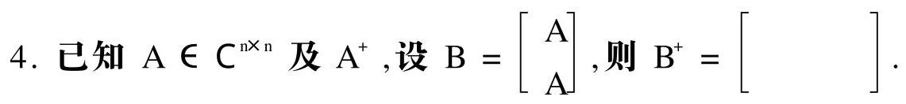

5. 给定欧氏空间 ${\mathrm{R}}^{2}$ 的基 $e = \left\lbrack  \begin{array}{l} 1 \\  0 \end{array}\right\rbrack  , e = \left\lbrack  \begin{array}{l} 0 \\  1 \end{array}\right\rbrack$ ,设 $\alpha  = \left\lbrack  \begin{array}{l} 1 \\  1 \end{array}\right\rbrack$ ,子空

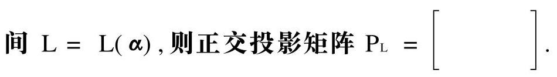

6. 已知 $A = \left\lbrack  \begin{array}{rrr} 0 & 1 & 0 \\   - 1 & 2 & 0 \\   - 1 & 1 & 0 \end{array}\right\rbrack$ ,则 $A$ 的 Jordan 标准形 $J =$ 0°

二、(10 分) 证明: ${\mathrm{C}}^{\mathrm{n} \times  \mathrm{n}}$ 中的矩阵范数 $\parallel  \cdot  {\parallel }_{{\mathrm{m}}_{1}}$ 与 ${\mathrm{C}}^{\mathrm{n}}$ 中的向量范数 $\parallel  \cdot  {\parallel }_{\mathrm{p}}\left( {\mathrm{p} \geq  1}\right)$ 相容.

(提示: $A = {\left( {a}_{ij}\right) }_{n \times  n} = \mathop{\sum }\limits_{{i = 1}}^{n}\mathop{\sum }\limits_{{j = 1}}^{n}{a}_{ij}{E}_{ij}$ )

三、(12 分) 已知 $A = \left\lbrack  \begin{array}{lllll} 0 & 1 & 0 & 0 & 0 \\  0 & 0 & 0 & 0 & 0 \\  0 & 0 & 0 & 0 & 0 \\  0 & 0 & 0 & 1 & 1 \\  0 & 0 & 0 & 0 & 1 \end{array}\right\rbrack  ,\;b\left( t\right)  = \left\lbrack  \begin{array}{l} {2t} \\  0 \\  0 \\  0 \\  0 \\  0 \end{array}\right\rbrack$ .

1. 求 ${\mathrm{e}}^{\mathrm{A}t}$ .

2. 用矩阵函数方法求微分方程 $\frac{\mathrm{d}}{\mathrm{{dt}}}\mathrm{x}\left( \mathrm{t}\right)  = \mathrm{{Ax}}\left( \mathrm{t}\right)  + \mathrm{b}\left( \mathrm{t}\right)$ 满足初始条件 $\mathrm{x}\left( 0\right)  = {\left( 1,1,1,1,1\right) }^{\mathrm{T}}$ 的解.

四、(12 分) 用 Householder 变换求 $A = \left\lbrack  \begin{matrix} 3 & {14} & 9 \\  6 & {43} & 3 \\  6 & {22} & {15} \end{matrix}\right\rbrack$ 的 QR 分解.

五、(12 分) 用 Gerschgorin 定理分离 $A = \left\lbrack  \begin{matrix} {20} & 6 & 1 \\  1 & 8 & 1 \\  2 & 8 & 3\mathrm{i} \end{matrix}\right\rbrack  (\mathrm{i} = \; \sqrt{-1}$ ) 的特征值,并在复平面上画图表示.

六、(12 分) 已知 $A = \left\lbrack  \begin{array}{ll} 1 & 0 \\  0 & 1 \\  1 & 1 \end{array}\right\rbrack  ,\;b = \left\lbrack  \begin{array}{l} 1 \\  1 \\  2 \end{array}\right\rbrack$ .

1. 求 $A$ 的奇异值分解.

2. 利用 $\mathrm{A}$ 的奇异值分解求 ${\mathrm{A}}^{ + }$ .

3. 求方程组 $\mathrm{{Ax}} = \mathrm{b}$ 的极小范数解或极小范数最小二乘解 ${\mathrm{X}}_{0}$ (指出 $\mathrm{X}$ 0 的类型).

七、(12 分) 已知多项式空间 ${\mathrm{P}}_{2}\left\lbrack  \mathrm{t}\right\rbrack$ 的一个基为

$$
{f}_{1}\left( t\right)  = 1 - t,\;{f}_{2}\left( t\right)  = 1 + {t}^{2},\;{f}_{3}\left( t\right)  = t + 2{t}^{2}
$$

线性变换 T 满足

$$
T{f}_{1}\left( t\right)  = 2 + {t}^{2},\;T{f}_{2}\left( t\right)  = t,\;T{f}_{3}\left( t\right)  = 1 + t + {t}^{2}
$$

1. 求 $\mathrm{T}$ 在已知基下的矩阵.

2. 设 $f\left( t\right)  = 1 + {2t} + 3{t}^{2}$ ,求 ${Tf}\left( t\right)$ .

八、(10 分) 已知欧氏空间 ${V}^{n}$ 的一个标准正交基为 ${\alpha }_{1},{\alpha }_{2},\cdots$ , ${\alpha }_{n}$ ,且 ${\alpha }_{0} = {\alpha }_{1} + 2{\alpha }_{2} + \cdots  + n{\alpha }_{n}$ ,定义变换

$$
\mathrm{T}\alpha  = \alpha  + \mathrm{k}\left( {\alpha ,{\alpha }_{0}}\right) {\alpha }_{0}\;\left( {\alpha  \in  {\mathrm{V}}^{\mathrm{n}},\mathrm{k}\text{ 为非零实数 }}\right)
$$

1. 验证 $\mathrm{T}$ 是线性变换.

2. 证明 $\mathrm{T}$ 是正交变换的充要条件为 $\mathrm{k} =  - \frac{2}{{1}^{2} + {2}^{2} + \cdots  + {\mathrm{n}}^{2}}$ .

## 试题二解答

一、1. 错误. 例如 $\mathrm{A} = \mathrm{O}$ 时, $\cos \mathrm{A} = \mathrm{I}$ 可逆.

2. 正确.

3. 由 $\sigma \left( B\right)  = \sigma \left( A\right)  = \sqrt{\lambda \left( {{A}^{T}A}\right) } = \sqrt{\lambda \left( {A}^{2}\right) } = \left| {\lambda \left( A\right) }\right|$ 知, $B$ 的奇异值为 $\left| {\lambda }_{1}\right| ,\left| {\lambda }_{2}\right| ,\cdots ,\left| {\lambda }_{n}\right|$ .

4. $\mathrm{A} \neq  \mathrm{O}$ 时,设 $\mathrm{A}$ 的满秩分解为 $\mathrm{A} = \mathrm{{FG}}$ ,则有

$$
B = \left\lbrack  \begin{array}{l} {FG} \\  {FG} \end{array}\right\rbrack   = \left\lbrack  \begin{array}{l} F \\  F \end{array}\right\rbrack  G = {FG}
$$

$$
{F}^{ + } = {\left\{  \left\lbrack  \begin{array}{lll} {F}^{H} & \vdots & {F}^{H} \end{array}\right\rbrack  \left\lbrack  \begin{array}{l} F \\  F \end{array}\right\rbrack  \right\}  }^{-1}\left\lbrack  \begin{array}{lll} {F}^{H} & \vdots & {F}^{H} \end{array}\right\rbrack   =
$$

$$
\frac{1}{2}{\left( {F}^{H}F\right) }^{-1}\left\lbrack  \begin{array}{lll} {F}^{H} & \vdots & {F}^{H} \end{array}\right\rbrack   = \frac{1}{2}\left\lbrack  \begin{array}{lll} {F}^{ + } & \vdots & {F}^{ + } \end{array}\right\rbrack
$$

$$
{\mathrm{B}}^{ + } = {\mathrm{G}}^{ + }{\mathrm{F}}^{ + } = {\mathrm{G}}^{ + } \cdot  \frac{1}{2}\left\lbrack  \begin{array}{lll} {\mathrm{\;F}}^{ + } & \vdots & {\mathrm{F}}^{ + } \end{array}\right\rbrack   = \frac{1}{2}\left\lbrack  \begin{array}{lll} {\mathrm{\;A}}^{ + } & \vdots & {\mathrm{A}}^{ + } \end{array}\right\rbrack
$$

$\mathrm{A} = \mathrm{O}$ 时,上述结果亦成立.

5. ${\mathrm{P}}_{\mathrm{L}} = \mathbf{\alpha }{\left( {\mathbf{\alpha }}^{\mathrm{T}}\mathbf{\alpha }\right) }^{-1}{\mathbf{\alpha }}^{\mathrm{T}} = \frac{1}{2}\left\lbrack  \begin{array}{ll} 1 & 1 \\  1 & 1 \end{array}\right\rbrack$ .

6. $\det \left( {{\lambda I} - A}\right)  = \lambda {\left( \lambda  - 1\right) }^{2}$ . 由 $\operatorname{rank}\left( {{1I} - A}\right)  = 2$ 知, ${\left( \lambda  - 1\right) }^{2}$ 是 $3 - 2 = 1$ 个初等因子. 故 $\mathrm{A}$ 的初等因子为 $\lambda ,{\left( \lambda  - 1\right) }^{2}$ ,从而

$$
J = \left\lbrack  \begin{array}{lll} 0 & & \\   & 1 & 1 \\   & & 1 \end{array}\right\rbrack
$$

二、设 $\mathrm{A} = {\left( {\mathrm{a}}_{\mathrm{{ij}}}\right) }_{\mathrm{n} \times  \mathrm{n}},\mathrm{X} = {\left( {\xi }_{\mathrm{i}},{\xi }_{\mathrm{j}},\cdots ,{\xi }_{\mathrm{n}}\right) }^{\mathrm{T}}$ ,则

$$
{Ax} = \mathop{\sum }\limits_{{i, j = 1}}^{n}{a}_{ij}{E}_{ij}x
$$

且有

$$
{E}_{ij}x = {\xi }_{j}{e}_{i},{\begin{Vmatrix}{E}_{ij}x\end{Vmatrix}}_{p} = {\left\lbrack  {\left| {\xi }_{j}\right| }^{p}\right\rbrack  }^{\frac{1}{p}} \leq  \parallel x{\parallel }_{p}
$$

$$
\parallel \mathrm{{Ax}}{\parallel }_{\mathrm{p}} \leq  \mathop{\sum }\limits_{{\mathrm{i},\mathrm{j} = 1}}^{\mathrm{n}}\left| {\mathrm{a}}_{\mathrm{{ij}}}\right| {\begin{Vmatrix}{\mathrm{E}}_{\mathrm{{ij}}}\mathrm{x}\end{Vmatrix}}_{\mathrm{p}} \leq
$$

$$
\mathop{\sum }\limits_{{i, j = 1}}^{n}\left| {a}_{ij}\right| \parallel x{\parallel }_{p} = \parallel A{\parallel }_{{m}_{1}}\parallel x{\parallel }_{p}
$$

故 $\parallel \mathrm{A}{\parallel }_{{\mathrm{m}}_{1}}$ 与 $\parallel \mathrm{X}{\parallel }_{\mathrm{p}}$ 相容.

三、令 ${\mathrm{J}}_{1} = \left\lbrack  \begin{array}{ll} 0 & 1 \\  0 & 0 \end{array}\right\rbrack  ,{\mathrm{J}}_{2} = \left\lbrack  \begin{array}{l} 0 \end{array}\right\rbrack  ,{\mathrm{J}}_{3} = \left\lbrack  \begin{array}{ll} 1 & 1 \\  0 & 1 \end{array}\right\rbrack$ ,则

$$
A = \left\lbrack  \begin{array}{llll} {J}_{1} & & & \\   & {J}_{2} & & \\   & & {J}_{3} & \\   & & &  \end{array}\right\rbrack
$$

$$
{\mathrm{e}}^{\mathrm{A}t} = \left\lbrack  \begin{array}{llll} {\mathrm{e}}^{{J}_{1}t} & & & \\   & {\mathrm{e}}^{{J}_{2}t} & & \\   & & & \\   & & & {\mathrm{e}}^{{J}_{3}t} \end{array}\right\rbrack   = \left\lbrack  \begin{array}{lllll} 1 & \mathrm{t} & & & \\   & 1 & & & \\   & & 1 & & \\   & & & {\mathrm{e}}^{\mathrm{t}} & \mathrm{t}{\mathrm{e}}^{\mathrm{t}} \\   & & & & {\mathrm{e}}^{\mathrm{t}} \end{array}\right\rbrack
$$

$$
x\left( t\right)  = {e}^{At}\left\{  {x\left( 0\right)  + {\int }_{0}^{t}{e}^{-{As}}b\left( s\right) {ds}}\right\}   =
$$

$$
{e}^{At}\left\{  {\left\lbrack  \begin{array}{l} 1 \\  1 \\  1 \\  1 \\  1 \end{array}\right\rbrack   + \left\lbrack  \begin{array}{l} {t}^{2} \\  0 \\  0 \\  0 \\  0 \end{array}\right\rbrack  }\right\}   = \left\lbrack  \begin{matrix} 1 + t + {t}^{2} \\  1 \\  1 \\  \left( {1 + t}\right) {e}^{t} \\  {e}^{t} \end{matrix}\right\rbrack
$$

四、 $\beta  - \left| \beta \right| \mathrm{e} = \left\lbrack  \begin{array}{l} 3 \\  6 \\  6 \end{array}\right\rbrack   - 9\left\lbrack  \begin{array}{l} 1 \\  0 \\  0 \end{array}\right\rbrack   = 6\left\lbrack  \begin{array}{r}  - 1 \\  1 \\  1 \end{array}\right\rbrack$ , ${\mathrm{u}}_{1} = \frac{1}{\sqrt{3}}\left\lbrack  \begin{array}{r}  - 1 \\  1 \\  1 \end{array}\right\rbrack \; {\mathrm{H}}_{1} = \mathrm{I} - 2{\mathrm{u}}_{1}{\mathrm{u}}_{1}^{\mathrm{T}} = \frac{1}{3}\left\lbrack  \begin{array}{rrr} 1 & 2 & 2 \\  2 & 1 &  - 2 \\  2 &  - 2 & 1 \end{array}\right\rbrack \; {H}_{1}A = \left\lbrack  \begin{array}{rrr} 9 & {48} & {15} \\  0 & 9 &  - 3 \\  0 &  - {12} & 9 \end{array}\right\rbrack  ,\;{A}_{1} = \left\lbrack  \begin{array}{rr} 9 &  - 3 \\   - {12} & 9 \end{array}\right\rbrack$

$$
\beta  = \left| \beta \right| a = \left\lbrack  \begin{array}{r} 9 \\   - {12} \end{array}\right\rbrack   - {15}\left\lbrack  \begin{array}{l} 1 \\  0 \end{array}\right\rbrack   =  - 6\left\lbrack  \begin{array}{l} 1 \\  2 \end{array}\right\rbrack  , u = \frac{1}{\sqrt{5}}\left\lbrack  \begin{array}{l} 1 \\  2 \end{array}\right\rbrack
$$

$$
{H}_{2} = I - 2{u}_{2}{u}_{2}^{T} = \frac{1}{5}\left\lbrack  \begin{array}{rr} 3 &  - 4 \\   - 4 &  - 3 \end{array}\right\rbrack  ,{H}_{2}{A}_{1} = \left\lbrack  \begin{array}{rr} {15} &  - 9 \\  0 &  - 3 \end{array}\right\rbrack
$$

$$
Q = {H}_{1}\left\lbrack  \begin{array}{lll} 1 & & \\   & {H}_{2} & \\   & & 5 \end{array}\right\rbrack   = \frac{1}{5}\left\lbrack  \begin{array}{rrr} 5 &  - 2 &  - {14} \\  {10} & {11} & 2 \\  {10} &  - {10} & 5 \end{array}\right\rbrack
$$

$$
\mathrm{R} = \left\lbrack  \begin{array}{rrr} 9 & {48} & {15} \\   & {15} &  - 9 \\   & &  - 3 \end{array}\right\rbrack  ,\;\mathrm{A} = \mathrm{{QR}}
$$

五、取 $\mathrm{A} = \operatorname{diag}\left( {1,1,{0.5}}\right)$ ,则 $\mathrm{B} = {\mathrm{{DAD}}}^{-1}$ 的 3 个孤立盖尔圆中各有 A 的一个特征值.

$$
\text{ 六、1. }\mathrm{B} = {\mathrm{A}}^{\mathrm{T}}\mathrm{A} = \left\lbrack  \begin{array}{ll} 2 & 1 \\  1 & 2 \end{array}\right\rbrack  ,\det \left( {\lambda \mathrm{I} - \mathrm{B}}\right)  = \left( {\lambda  - 3}\right) \left( {\lambda  - 1}\right) \text{ . }
$$

$$
{\lambda }_{1} = 3,{p}_{1} = \left\lbrack  \begin{array}{l} 1 \\  1 \end{array}\right\rbrack  ;\;{\lambda }_{2} = 1,{p}_{2} = \left\lbrack  \begin{array}{r} 1 \\   - 1 \end{array}\right\rbrack
$$

$$
\sum  = \left\lbrack  \begin{matrix} \sqrt{3} & 0 \\  0 & 1 \end{matrix}\right\rbrack  ,\;V = \frac{1}{\sqrt{2}}\left\lbrack  \begin{array}{rr} 1 & 1 \\  1 &  - 1 \end{array}\right\rbrack
$$

由 $\operatorname{rank}\mathrm{A} = 2$ 知 ${\mathrm{V}}_{1} = \mathrm{V}$ ,于是

$$
{U}_{1} = A{V}_{1}{\sum }^{-1} = \left\lbrack  \begin{array}{rr} \frac{1}{\sqrt{6}} & \frac{1}{\sqrt{2}} \\  \frac{1}{\sqrt{6}} &  - \frac{1}{\sqrt{2}} \\  \frac{2}{\sqrt{6}} & 0 \end{array}\right\rbrack  ,\;{U}_{2} = \left\lbrack  \begin{array}{r} \frac{1}{\sqrt{3}} \\  \frac{1}{\sqrt{3}} \\   - \frac{1}{\sqrt{3}} \end{array}\right\rbrack
$$

$$
U = \left\lbrack  \begin{array}{lll} {U}_{1} & \vdots & {U}_{2} \end{array}\right\rbrack   = \left\lbrack  \begin{matrix} \frac{1}{\sqrt{6}} & \frac{1}{\sqrt{2}} & \frac{1}{\sqrt{3}} \\  \frac{1}{\sqrt{6}} &  - \frac{1}{\sqrt{2}} & \frac{1}{\sqrt{3}} \\  \frac{2}{\sqrt{6}} & 0 &  - \frac{1}{\sqrt{3}} \end{matrix}\right\rbrack
$$

$$
\mathrm{A} = \mathrm{U}\left\lbrack  \begin{matrix} \sqrt{3} & 0 \\  0 & 1 \\  0 & 0 \end{matrix}\right\rbrack  {\mathrm{V}}^{\mathrm{T}}
$$

2. ${A}^{ + } = V\left\lbrack  \begin{matrix} \frac{1}{\sqrt{3}} & 0 & 0 \\  0 & 1 & 0 \end{matrix}\right\rbrack  {U}^{T} = \frac{1}{3}\left\lbrack  \begin{array}{rrr} 2 &  - 1 & 1 \\   - 1 & 2 & 1 \end{array}\right\rbrack$

3. ${x}_{0} = {A}^{ + }b = \left\lbrack  \begin{array}{l} 1 \\  1 \end{array}\right\rbrack  , A{A}^{ + }b = \left\lbrack  \begin{array}{l} 1 \\  1 \\  2 \end{array}\right\rbrack   = b$ ,故 ${x}_{0}$ 是极小范数解.

七、 $1.\left( {{f}_{1},{f}_{2},{f}_{3}}\right)  = \left( {1, t,{t}^{2}}\right) \left\lbrack  \begin{array}{rrr} 1 & 1 & 0 \\   - 1 & 0 & 2 \\  0 & 1 & 2 \end{array}\right\rbrack   = \left( {1, t,{t}^{2}}\right) B$

$\left( {{\mathrm{{Tf}}}_{1},{\mathrm{{Tf}}}_{2},{\mathrm{{Tf}}}_{3}}\right)  = \left( {1,\mathrm{t},{\mathrm{t}}^{2}}\right) \left\lbrack  \begin{array}{lll} 2 & 0 & 1 \\  0 & 1 & 1 \\  1 & 0 & 1 \end{array}\right\rbrack   = \left( {1,\mathrm{t},{\mathrm{t}}^{2}}\right) {\mathrm{B}}_{2}$

由此可得 $T\left( {{f}_{1},{f}_{2},{f}_{3}}\right)  = \left( {{f}_{1},{f}_{2},{f}_{3}}\right) {B}^{1}{B}_{2}$ ,故 $T$ 在已知基下的矩阵为

$$
A = {B}^{-1}B = \left\lbrack  \begin{array}{rrr}  - 1 &  - 2 &  - 2 \\  3 & 2 & 3 \\   - 1 &  - 1 &  - 1 \end{array}\right\rbrack
$$

$$
\text{ 2. }f = \left( {1, t,\acute{t}}\right) \left\lbrack  \begin{array}{l} 1 \\  2 \\  3 \end{array}\right\rbrack   = \left( {{f}_{1},{f}_{2},{f}_{3}}\right) {B}^{-1}\left\lbrack  \begin{array}{l} 1 \\  2 \\  3 \end{array}\right\rbrack   = \left( {{f}_{1},{f}_{2},{f}_{3}}\right) \left\lbrack  \begin{array}{r}  - 2 \\  3 \\  0 \end{array}\right\rbrack
$$

$$
\mathrm{{Tf}} = \left( {{\mathrm{f}}_{1},{\mathrm{f}}_{2},{\mathrm{f}}_{3}}\right) \mathrm{A}\left\lbrack  \begin{array}{r}  - 2 \\  3 \\  0 \end{array}\right\rbrack   = \left( {{\mathrm{f}}_{1},{\mathrm{f}}_{2},{\mathrm{f}}_{3}}\right) \left\lbrack  \begin{array}{r}  - 4 \\  0 \\   - 1 \end{array}\right\rbrack   =  - 4 + 3\mathrm{t} - 2\widehat{\mathrm{t}}
$$

八、1 设 $\alpha ,\beta  \in  {\mathrm{V}}^{\mathrm{n}},\mathrm{l},\mathrm{b} \in  \mathrm{R}$ ，则有

$$
T\left( {{l}_{1}\alpha  + {l}_{2}\beta }\right)  = \left( {{l}_{1}\alpha  + {l}_{2}\beta }\right)  + k\left( {{l}_{1}\alpha  + {l}_{2}\beta ,{\alpha }_{0}}\right) {\alpha }_{0} =
$$

$$
{l}_{1}\left\lbrack  {\alpha  + k\left( {\alpha ,{\alpha }_{0}}\right) {\alpha }_{0}}\right\rbrack   + l\left\lbrack  {\beta  + k\left( {\beta ,{\alpha }_{0}}\right) {\alpha }_{0}}\right\rbrack   =
$$

$$
{l}_{1}\left( {T\alpha }\right)  + {l}_{2}\left( {T\beta }\right)
$$

故 T 是线性变换.

2. $\mathrm{T}$ 是正交变换等价于 $\left( {\mathrm{T}\alpha ,\mathrm{T}\alpha }\right)  = \left( {\alpha ,\alpha }\right)$ (任意 $\alpha  \in  {\mathrm{V}}^{\mathrm{n}}$ ),即

$$
\left( {\mathbf{\alpha },\mathbf{\alpha }}\right)  + 2\mathrm{k}{\left( \mathbf{\alpha },{\mathbf{\alpha }}_{0}\right) }^{2} + {\mathrm{k}}^{2}{\left( \mathbf{\alpha },{\mathbf{\alpha }}_{0}\right) }^{2}\left( {{\mathbf{\alpha }}_{0},{\mathbf{\alpha }}_{0}}\right)  = \left( {\mathbf{\alpha },\mathbf{\alpha }}\right)
$$

也就是

$$
\mathrm{k}{\left( \mathbf{\alpha },{\mathbf{\alpha }}_{0}\right) }^{2}\left\lbrack  {2 + \mathrm{k}\left( {{\mathbf{\alpha }}_{0},{\mathbf{\alpha }}_{0}}\right) }\right\rbrack   = 0
$$

由 $\alpha  \in  {V}^{n}$ 的任意性知,上式等价于 $2 + k\left( {{\alpha }_{0},{\alpha }_{0}}\right)  = 0$ ,即

$$
\mathrm{k} =  - \frac{2}{\left( {\alpha }_{0},{\alpha }_{0}\right) } =  - \frac{2}{{1}^{2} + {2}^{2} + \cdots  + {\mathrm{n}}^{2}}
$$

## 试题 三

一、(15 分) 填空或计算填空:

1. 设 $A$ 是 $n$ 阶 Householder 矩阵,则 $\cos \left( {2\pi A}\right)  =$ (   ).

2. 已知向量 $x = \left( {\xi ,\xi ,\cdots ,{\xi }_{n}}\right)$ ，且 $1 \leq  p <  + \infty$ ，则 $\left\{  \begin{array}{l} {\left| \mathrm{X}\right| }_{\infty } = \left( \;\right) \\  {\left| \mathrm{X}\right| }_{\mathrm{p}} = \left( \;\right) . \end{array}\right.$

3. 设 ${A}_{m \times  m}$ 和 ${B}_{n \times  n}$ 都是酉矩阵,则 $\left( \begin{array}{ll} {A}^{H} & B \end{array}\right) \left( \begin{array}{ll} A & {B}^{H} \end{array}\right)  =$ (   ).

4. 设 $X = \left\lbrack  \begin{array}{lll} {\xi }_{1} & {\xi }_{2} & {\xi }_{3} \\  {\xi }_{1} & {\xi }_{2} & {\xi }_{3} \end{array}\right\rbrack  , f\left( X\right)  = {\xi }_{1} + {\xi }_{2} + {\xi }_{3}^{3}$ ,则 $\frac{df}{dX} = \; \left\lbrack  \begin{array}{lll}  & & \\   & &  \end{array}\right\rbrack  .$

5. 已知 $A = \left\lbrack  \begin{array}{lll} 1 & 1 & 1 \\  0 & 1 & 0 \\  0 & 0 & 1 \end{array}\right\rbrack$ ,则 $A$ 的 Jordan 标准形 $J = \left\lbrack  \begin{array}{lll}  & & \\   & &  \end{array}\right\rbrack$ .

二、(12 分) 设 $A = {\left( {a}_{ij}\right) }_{m \times  n}$ ,定义实数

$$
{\left| A\right| }_{G} = \sqrt{mn}\mathop{\max }\limits_{{i, j}}\left| {a}_{ij}\right|
$$

证明: ${\left| A\right| }_{G}$ 是 ${C}^{m \times  n}$ 中的矩阵范数,且与向量的 2 - 范数相容.

三、(12 分) 已知 $A = \left\lbrack  \begin{array}{rrrr} 1 & 0 & 0 &  - 1 \\  0 & 1 &  - 1 & 0 \\  0 &  - 1 & 1 & 0 \\   - 1 & 0 & 0 & 1 \end{array}\right\rbrack$ .

1 . 求 ${\mathrm{e}}^{\mathrm{A}t}$ .

2. 用矩阵函数方法求微分方程 $\frac{\mathrm{d}}{\mathrm{d}t}x\left( t\right)  = {Ax}\left( t\right)$ 满足初始条件 $x\left( 0\right)  = {\left( 1,0,0 - 1\right) }^{T}$ 的解.

四、(12 分) 用 Householder 变换求 $A = \left\lbrack  \begin{array}{rrr} 0 & 3 & 1 \\  0 & 4 &  - 2 \\  2 & 1 & 2 \end{array}\right\rbrack$ 的 ${QR}$ 分解.

五、(12 分) 用 Gerschgorin 定理隔离 $A = \left\lbrack  \begin{matrix} {90} & 1 & 7 \\  1 & {80} & 8 \\  {15} & 2 & {40} \end{matrix}\right\rbrack$ 的特征值 (要求画图表示), 并根据实矩阵特征值的性质改进所得结果.

$$
\text{ 六、(13 分) 已知 }A = \left\lbrack  \begin{array}{rrrr}  - 1 & 1 & 2 &  - 2 \\  2 & 1 &  - 1 &  - 2 \\  0 & 1 & 1 &  - 2 \end{array}\right\rbrack  , b = \left\lbrack  \begin{matrix} 0 \\  0 \\  {154} \end{matrix}\right\rbrack  \text{ . }
$$

1 求 $A$ 的满秩分解.

2 求 ${A}^{ + }$ .

3 .用广义逆矩阵方法判断方程组 $\mathrm{{Ax}} = \mathrm{b}$ 是否有解.

4 求方程组 $\mathrm{{Ax}} = \mathrm{b}$ 的极小范数解或极小范数最小二乘解 ${\mathrm{X}}_{0}$ (要求指出所求的是哪种解).

七、(12 分) 在矩阵空间 ${\mathrm{R}}^{2 \times  2}$ 中,已知 $\mathrm{P} = \left\lbrack  \begin{array}{ll} 1 & 0 \\  2 & 1 \end{array}\right\rbrack$ ,定义变换 $\mathrm{T}$ :

$$
\mathrm{{TX}} = {\mathrm{{PXP}}}^{-1}\;\left( {\mathrm{X} \in  {\mathrm{R}}^{2 \times  2}}\right)
$$

1 验证 T 是线性变换

2 求 $\mathrm{T}$ 的特征值与特征向量.

八、(12 分) 给定实线性空间 ${V}^{n}$ 的基 ${x}_{1},{x}_{2},\cdots ,{x}_{n}$ ,设 $x, y \in  {V}^{n}$ 在该基下的坐标分别为 ${\left( {\xi }_{1},{\xi }_{2},\cdots ,{\xi }_{n}\right) }^{\mathrm{T}}$ 和 ${\left( {\eta }_{1},{\eta }_{2},\cdots ,{\eta }_{n}\right) }^{\mathrm{T}}$ ,定义实数 $\left( {x, y}\right)  = \xi {\eta }_{1} + {\xi }_{2}{\eta }_{2} + \cdots  + {\xi }_{n}{\eta }_{n}$ ,证明:

1 .实数 $\left( {x, y}\right)$ 是 ${V}^{n}$ 的内积.

2. 在该内积下,基 ${X}_{1},{X}_{2},\cdots ,{X}_{n}$ 是 ${V}^{n}$ 的标准正交基.

## 试题三解答

一、1 由于 $\mathrm{A}$ 是 Householder 矩阵,所以 ${\mathrm{A}}^{2} = \mathrm{I}$ ,于是有

$$
\cos \left( {2\pi A}\right)  = I - \frac{1}{2!}{\left( 2\pi A\right) }^{2} + \frac{1}{4!}{\left( 2\pi A\right) }^{4} - \cdots  =
$$

$$
\left\lbrack  {1 - \frac{{\left( 2\pi \right) }^{2}}{2!} + \frac{{\left( 2\pi \right) }^{4}}{4!} - \cdots }\right\rbrack  I = \left\lbrack  {\cos \left( {2\pi }\right) }\right\rbrack  I = I
$$

2 . $\mathop{\max }\limits_{{1 \leq  i \leq  n}}\left| {\xi }_{i}\right| ,{\left\lbrack  \mathop{\sum }\limits_{{i = 1}}^{n}{\left| {\xi }_{i}\right| }^{p}\right\rbrack  }^{\frac{1}{p}}$ .

3. $\left( {{A}^{H}\;B}\right) \left( {A\;{B}^{H}}\right)  = \left( {{A}^{H}A}\right) \;\left( {B{B}^{H}}\right)  =$

$$
{\mathrm{I}}_{\mathrm{m}}\;{\mathrm{I}}_{\mathrm{n}} = {\mathrm{I}}_{\left( \mathrm{{mn}}\right) }
$$

$4\left\lbrack  \begin{matrix} 1 & 2{\xi }_{2} & 3{\xi }_{3}^{2} \\  0 & 0 & 0 \end{matrix}\right\rbrack$

5. $\det \left( {\lambda \mathrm{I} - \mathrm{A}}\right)  = {\left( \lambda  - 1\right) }^{3}$ . 由 $\operatorname{rank}\left( {1\mathrm{I} - \mathrm{A}}\right)  = 1$ 知, ${\left( \lambda  - 1\right) }^{3}$ 是 $3 - 1 = 2$ 个初等因子的乘积,故 $\mathrm{A}$ 的 初 等 因 子 为 ${\left( \lambda  - 1\right) }^{2},(\lambda  -$ 1)，从而

$$
J = \left\lbrack  \begin{array}{lll} 1 & 1 & \\   & 1 & \\   & & 1 \end{array}\right\rbrack
$$

二、非负性: $\mathrm{A} = \mathrm{O}$ 时， ${\mathrm{a}}_{\mathrm{{ij}}} = 0,\mathop{\max }\limits_{{\mathrm{i},\mathrm{j}}}\left| {\mathrm{a}}_{\mathrm{{ij}}}\right|  = 0$ ，从而 ${\left| \mathrm{A}\right| }_{\mathrm{G}} \; = 0;A \neq  O$ 时,存在 ${\left. {a}_{{i}_{0}{j}_{0}} \neq  0,\left| A\right| \right| }_{G} = \sqrt{mn}\mathop{\max }\limits_{{i, j}}\left| {a}_{ij}\right|  \geq  \sqrt{mn} \; \left| {\mathrm{a}}_{{\mathrm{i}}_{0}{\mathrm{j}}_{0}}\right|  > 0$ .

容易验证齐次性与三角不等式成立.

乘法相容性: 设 $\mathrm{B} = {\left( {\mathrm{b}}_{\mathrm{j}}\right) }_{\mathrm{n} \times  \mathrm{p}}$ ,则有

$$
{\left| AB\right| }_{G} = \sqrt{mp}\mathop{\max }\limits_{{i, j}}\left| {\mathop{\sum }\limits_{{k = 1}}^{n}{a}_{ik}{b}_{kj}}\right|  \leq
$$

$$
\sqrt{\mathrm{{mp}}}\mathop{\max }\limits_{{\mathrm{i},\mathrm{j}}}\left\lbrack  {\mathop{\sum }\limits_{{\mathrm{k} = 1}}^{\mathrm{n}}\left| {\mathrm{a}}_{\mathrm{{ik}}}\right| \left| {\mathrm{b}}_{\mathrm{{kj}}}\right| }\right\rbrack   \leq
$$

$$
\sqrt{\mathrm{{mp}}} \cdot  \mathrm{n} \cdot  \mathop{\max }\limits_{{\mathrm{i},\mathrm{j}}}\left| {\mathrm{a}}_{\mathrm{{ij}}}\right|  \cdot  \mathop{\max }\limits_{{\mathrm{i},\mathrm{j}}}\left| {\mathrm{b}}_{\mathrm{{ij}}}\right|  =
$$

$$
\left\lbrack  {\sqrt{\mathrm{{mn}}}\mathop{\max }\limits_{{\mathrm{i},\mathrm{j}}}\left| {\mathrm{a}}_{\mathrm{{ij}}}\right| }\right\rbrack  \left\lbrack  {\sqrt{\mathrm{{np}}}\mathop{\max }\limits_{{\mathrm{i},\mathrm{j}}}\left| {\mathrm{b}}_{\mathrm{j}}\right| }\right\rbrack   =
$$

$$
{\left| \mathrm{A}\right| }_{\mathrm{G}}{\left| \mathrm{B}\right| }_{\mathrm{G}}
$$

因此， ${\left| A\right| }_{G}$ 是矩阵范数.

设 $x = {\left( \xi ,\xi ,\cdots ,{\xi }_{n}\right) }^{T}$ ,则有

$$
{\left| Ax\right| }^{2} = \mathop{\sum }\limits_{{i = 1}}^{m}{\left| \mathop{\sum }\limits_{{j = 1}}^{n}{a}_{ij}{\xi }_{j}\right| }^{2} \leq  \mathop{\sum }\limits_{{i = 1}}^{m}{\left\lbrack  \mathop{\sum }\limits_{{j = 1}}^{n}\left| {a}_{ij}\right| \left| {\xi }_{j}\right| \right\rbrack  }^{2} \leq
$$

$$
\mathop{\sum }\limits_{{i = 1}}^{m}\left\lbrack  {\left( {\mathop{\sum }\limits_{{j = 1}}^{n}{\left| {a}_{ij}\right| }^{2}}\right) \left( {\mathop{\sum }\limits_{{j = 1}}^{n}{\left| {\xi }_{j}\right| }^{2}}\right) }\right\rbrack   =
$$

$$
\left\lbrack  {\mathop{\sum }\limits_{{i = 1}}^{m}\mathop{\sum }\limits_{{j = 1}}^{n}{\left| {a}_{ij}\right| }^{2}}\right\rbrack  \left\lbrack  {\mathop{\sum }\limits_{{j = 1}}^{n}{\left| {\xi }_{j}\right| }^{2}}\right\rbrack   \leq
$$

$$
\left\lbrack  {\left( \mathrm{{mn}}\right) \mathop{\max }\limits_{{\mathrm{i},\mathrm{j}}}{\left| {\mathrm{a}}_{\mathrm{{ij}}}\right| }^{2}}\right\rbrack  {\left| \mathrm{x}\right| }_{2}^{2} = {\left| \mathrm{A}\right| }_{\mathrm{G}}^{2}{\left| \mathrm{x}\right| }_{2}^{2}
$$

即 ${\left| Ax\right| }_{2} \leq  {\left| A\right| }_{G}{\left| x\right| }_{2}$ .

三、对于实对称矩阵 $\mathrm{A}$ ,可求得 ${\mathrm{P}}^{-1}\mathrm{{AP}} = \Lambda$ ,其中

$$
\Lambda  = \left\lbrack  \begin{array}{llll} 0 & & & \\   & 0 & & \\   & & 2 & \\   & & & 2 \end{array}\right\rbrack  ,\mathrm{P} = \left\lbrack  \begin{array}{rrrr} 1 & 0 & 0 & 1 \\  0 & 1 & 1 & 0 \\  0 & 1 &  - 1 & 0 \\  1 & 0 & 0 &  - 1 \end{array}\right\rbrack  ,{\mathrm{P}}^{-1} = \frac{1}{2}\mathrm{P}
$$

于是

$$
{\mathrm{e}}^{\mathrm{{At}}} = \mathrm{P}\left\lbrack  \begin{array}{llll} 1 & & & \\   & 1 & & \\   & & {\mathrm{e}}^{2\mathrm{t}} & \\   & & & {\mathrm{e}}^{2\mathrm{t}} \end{array}\right\rbrack  {\mathrm{P}}^{-1} =
$$

$$
\mathrm{P}\left\lbrack  \begin{array}{lllll} 1 & & & & \\   & 1 & & & \\   & & 0 & & \\   & & & 0 & \\   & & & & 0 \end{array}\right\rbrack  {\mathrm{P}}^{-1} + {\mathrm{e}}^{2\mathrm{t}}\mathrm{P}\left\lbrack  \begin{array}{llll} 0 & & & \\   & 0 & & \\   & & 1 & \\   & & & 1 \end{array}\right\rbrack  {\mathrm{P}}^{-1} =
$$

$$
\frac{1}{2}\left\lbrack  \begin{array}{rrrr} 1 & 0 & 0 & 1 \\  0 & 1 & 1 & 0 \\  0 & 1 & 1 & 0 \\  1 & 0 & 0 & 1 \end{array}\right\rbrack   + \frac{{\mathrm{e}}^{\mathrm{t}}}{2}\left\lbrack  \begin{array}{rrrr} 1 & 0 & 0 &  - 1 \\  0 & 1 &  - 1 & 0 \\  0 &  - 1 & 1 & 0 \\   - 1 & 0 & 0 & 1 \end{array}\right\rbrack   =
$$

$$
\frac{1}{2}\left\lbrack  \begin{matrix} 1 + {\mathrm{e}}^{2t} & 0 & 0 & 1 - {\mathrm{e}}^{2t} \\  0 & 1 + {\mathrm{e}}^{2t} & 1 - {\mathrm{e}}^{2t} & 0 \\  0 & 1 - {\mathrm{e}}^{2t} & 1 + {\mathrm{e}}^{2t} & 0 \\  1 - {\mathrm{e}}^{2t} & 0 & 0 & 1 + {\mathrm{e}}^{2t} \end{matrix}\right\rbrack
$$

$x\left( t\right)  = {e}^{\Delta t}x\left( 0\right)  = {\left( {e}^{2t},0,0, - {e}^{2t}\right) }^{T}.$

$$
\text{ 四、 }\beta  - \left| \beta \right| a = \left\lbrack  \begin{array}{l} 0 \\  0 \\  2 \end{array}\right\rbrack   - 2\left\lbrack  \begin{array}{l} 1 \\  0 \\  0 \end{array}\right\rbrack   = 2\left\lbrack  \begin{array}{r}  - 1 \\  0 \\  1 \end{array}\right\rbrack  ,{u}_{1} = \frac{1}{\sqrt{2}}\left\lbrack  \begin{array}{r}  - 1 \\  0 \\  1 \end{array}\right\rbrack
$$

$$
{H}_{1} = I - 2{u}_{1}{u}_{1}^{T} = \left\lbrack  \begin{array}{lll} 0 & 0 & 1 \\  0 & 1 & 0 \\  1 & 0 & 0 \end{array}\right\rbrack  ,{H}_{1}A = \left\lbrack  \begin{array}{rrr} 2 & 1 & 2 \\  0 & 4 &  - 2 \\  0 & 3 & 1 \end{array}\right\rbrack
$$

$$
{A}_{1} = \left\lbrack  \begin{array}{rr} 4 &  - 2 \\  3 & 1 \end{array}\right\rbrack
$$

$$
\beta  - \left| \beta \right| a = \left\lbrack  \begin{array}{l} 4 \\  3 \end{array}\right\rbrack   - 5\left\lbrack  \begin{array}{l} 1 \\  0 \end{array}\right\rbrack   = \left\lbrack  \begin{array}{r}  - 1 \\  3 \end{array}\right\rbrack  , u = \frac{1}{\sqrt{10}}\left\lbrack  \begin{array}{r}  - 1 \\  3 \end{array}\right\rbrack
$$

$$
{\mathrm{H}}_{2} = \mathrm{I} - 2{u}_{2}{u}_{2}^{T} = \frac{1}{5}\left\lbrack  \begin{array}{rr} 4 & 3 \\  3 &  - 4 \end{array}\right\rbrack  ,{\mathrm{H}}_{2}\mathrm{\;A} = \left\lbrack  \begin{array}{ll} 5 &  - 1 \\  0 &  - 2 \end{array}\right\rbrack
$$

$$
Q = {H}_{1}\left\lbrack  \begin{array}{ll} 1 & \\   & {H}_{2} \end{array}\right\rbrack   = \frac{1}{5}\left\lbrack  \begin{array}{rrr} 0 & 3 &  - 4 \\  0 & 4 & 3 \\  5 & 0 & 0 \end{array}\right\rbrack  , R = \left\lbrack  \begin{array}{rrr} 2 & 1 & 2 \\   & 5 &  - 1 \\   & &  - 2 \end{array}\right\rbrack
$$

$$
\mathrm{A} = \mathrm{{QR}}
$$

五、取 $\mathrm{D} = \operatorname{diag}\left( {1,1,2}\right)$ ,则 $\mathrm{B} = {\mathrm{{DAD}}}^{-1}$ 的 3 个孤立盖尔圆中各有 $\mathrm{A}$ 的一个特征值. 因为 $\mathrm{A}$ 是实矩阵,所以复特征值必成对共轭出现, 从而关于实轴对称的孤立盖尔圆中的特征值必为实数

$$
\text{ 六、1. }A\xrightarrow[]{\text{ 行 }}\left\lbrack  \begin{array}{rrrr} 1 & 0 &  - 1 & 0 \\  0 & 1 & 1 &  - 2 \\  0 & 0 & 0 & 0 \end{array}\right\rbrack
$$

$$
A = \left\lbrack  \begin{array}{rr}  - 1 & 1 \\  2 & 1 \\  0 & 1 \end{array}\right\rbrack  \left\lbrack  \begin{array}{rrrr} 1 & 0 &  - 1 & 0 \\  0 & 1 & 1 &  - 2 \end{array}\right\rbrack   = {FG}
$$

$$
\text{ 2. }{F}^{ + } = {\left( {F}^{T}F\right) }^{-1}{F}^{T} = {\left\lbrack  \begin{array}{ll} 5 & 1 \\  1 & 3 \end{array}\right\rbrack  }^{-1}{F}^{T} = \frac{1}{14}\left\lbrack  \begin{array}{rrr}  - 4 & 5 &  - 1 \\  6 & 3 & 5 \end{array}\right\rbrack
$$

$$
{G}^{ + } = {G}^{T}{\left( G{G}^{T}\right) }^{-1} = {G}^{T}{\left\lbrack  \begin{array}{rr} 2 &  - 1 \end{array}\right\rbrack  }^{-1} = \frac{1}{11}\left\lbrack  \begin{array}{rr} 6 & 1 \\  1 & 2 \\   - 5 & 1 \\   - 2 &  - 4 \end{array}\right\rbrack
$$

$$
{A}^{ + } = {G}^{ + }{F}^{ + } = \frac{1}{154}\left\lbrack  \begin{array}{rrr}  - {18} & {33} &  - 1 \\  8 & {11} & 9 \\  {26} &  - {22} & {10} \\   - {16} &  - {22} &  - {18} \end{array}\right\rbrack
$$

3. ${\mathrm{{AA}}}^{ + }\mathrm{b} = \mathrm{A}\left\lbrack  \begin{array}{r}  - 1 \\  9 \\  {10} \\  {11} \end{array}\right\rbrack   = \left\lbrack  \begin{array}{l} {66} \\  {33} \\  {54} \end{array}\right\rbrack   \neq  \mathrm{b}$ ,故 $\mathrm{{Ax}} = \mathrm{b}$ 无解.

4. 极小范数最小二乘数 ${x}_{0} = {A}^{ + }b = {\left( -1,9,{10}, - {18}\right) }^{T}$ .

七、1 设 $X, Y \in  {R}^{2 \times  2}$ 及 $k, l \in  R$ ，则有

$$
T\left( {{kX} + {lY}}\right)  = P\left( {{kX} + {lY}}\right) {P}^{-1} =
$$

$$
\mathrm{k}\left( {\mathrm{{PXP}}}^{-1}\right)  + 1\left( {\mathrm{{PYP}}}^{-1}\right)  =
$$

$$
\mathrm{k}\left( \mathrm{{TX}}\right)  + 1\left( \mathrm{{TY}}\right)
$$

故 T 是线性变换.

2. ${\mathrm{P}}^{-1} = \left\lbrack  \begin{array}{rr} 1 & 0 \\   - 2 & 1 \end{array}\right\rbrack$ ,取 ${\mathrm{R}}^{2 \times  2}$ 的简单基 ${\mathrm{E}}_{11},{\mathrm{E}}_{12},{\mathrm{E}}_{21},{\mathrm{E}}_{22}$ ,并计算

$$
{\mathrm{{TE}}}_{11} = {\mathrm{{PE}}}_{11}{\mathrm{P}}^{-1} = \left\lbrack  \begin{array}{ll} 1 & 0 \\  2 & 0 \end{array}\right\rbrack   = 1{\mathrm{E}}_{11} + 0{\mathrm{E}}_{12} + 2{\mathrm{E}}_{21} + 0{\mathrm{E}}_{22}
$$

$$
{\mathrm{{TE}}}_{12} = {\mathrm{{PE}}}_{12}{\mathrm{P}}^{-1} = \left\lbrack  \begin{array}{ll}  - 2 & 1 \\   - 4 & 2 \end{array}\right\rbrack   =
$$

$$
- 2{\mathrm{E}}_{11} + 1{\mathrm{E}}_{12} - 4{\mathrm{E}}_{21} + 2{\mathrm{E}}_{22}
$$

$$
{\mathrm{{TE}}}_{21} = {\mathrm{{PE}}}_{21}{\mathrm{P}}^{-1} = \left\lbrack  \begin{array}{ll} 0 & 0 \\  1 & 0 \end{array}\right\rbrack   = 0{\mathrm{E}}_{11} + 0{\mathrm{E}}_{12} + 1{\mathrm{E}}_{21} + 0{\mathrm{E}}_{22}
$$

$$
{\mathrm{{TE}}}_{22} = {\mathrm{{PE}}}_{22}{\mathrm{P}}^{-1} = \left\lbrack  \begin{array}{rr} 0 & 0 \\   - 2 & 1 \end{array}\right\rbrack   =
$$

$$
0{\mathrm{E}}_{11} + 0{\mathrm{E}}_{12} - 2{\mathrm{E}}_{21} + 1{\mathrm{E}}_{22}
$$

于是, $\mathrm{T}$ 在该基下的矩阵为

$$
A = \left\lbrack  \begin{array}{rrrr} 1 &  - 2 & 0 & 0 \\  0 & 1 & 0 & 0 \\  2 &  - 4 & 1 &  - 2 \\  0 & 2 & 0 & 1 \end{array}\right\rbrack
$$

可求得 $\mathrm{A}$ 的特征值与特征向量为

$$
\lambda  = {\lambda }_{2} = \lambda  = \lambda  = 1,\mathrm{p} = {\left( 0,0,1,0\right) }^{\mathrm{T}},\mathrm{p} = {\left( 1,0,0,1\right) }^{\mathrm{T}}
$$

于是, T 的特征值与特征向量为

$$
{\lambda }_{1} = {\lambda }_{2} = {\lambda }_{3} = {\lambda }_{4} = 1
$$

$$
X = \left( {{E}_{11},{E}_{12},{E}_{21},{E}_{22}}\right) \left( {{k}_{1}{p}_{1} + {k}_{2}{p}_{2}}\right)  =
$$

$$
\mathrm{k}\left\lbrack  \begin{array}{ll} 0 & 0 \\  1 & 0 \end{array}\right\rbrack   + \mathrm{k}\left\lbrack  \begin{array}{ll} 1 & 0 \\  0 & 1 \end{array}\right\rbrack  \;\left( {\mathrm{k}\text{ 与 }\mathrm{k}\text{ 不同时为 }0}\right)
$$

八、1 交换律:

$$
\left( {x, y}\right)  = {\xi }_{\eta } + \cdots  + {\xi }_{n}{\eta }_{n} = {\eta }_{1}{\xi }_{1} + \cdots  + {\eta }_{n}{\xi }_{n} = \left( {y, x}\right)
$$

分配律: 设 $\mathrm{Z}$ 在基 ${\mathrm{X}}_{1},{\mathrm{X}}_{2},\cdots ,{\mathrm{X}}_{\mathrm{n}}$ 下的坐标为 ${\left( {\gamma }_{1},{\gamma }_{2},\cdots ,{\gamma }_{\mathrm{n}}\right) }^{\mathrm{T}}$ ,则有

$$
\left( {x, y + z}\right)  = {\xi }_{1}\left( {{\eta }_{1} + {\gamma }_{1}}\right)  + \cdots  + {\xi }_{n}\left( {{\eta }_{n} + {\gamma }_{n}}\right)  =
$$

$$
\left( {\xi {\eta }_{1} + \cdots  + {\xi }_{n}{\eta }_{n}}\right)  + \left( {\xi {\gamma }_{1} + \cdots  + {\xi }_{n}{\gamma }_{n}}\right)  =
$$

$$
\left( {x, y}\right)  + \left( {x, z}\right)
$$

齐次性: 设 $\mathrm{k} \in  \mathrm{R}$ ,则有

$$
\left( {\mathrm{{kx}},\mathrm{y}}\right)  = \left( {\mathrm{{k\xi }}}_{1}\right) {\eta }_{1} + \cdots  + \left( {\mathrm{{k\xi }}}_{\mathrm{n}}\right) {\eta }_{\mathrm{n}} =
$$

$$
\mathrm{k}\left( {{\xi }_{1}{\eta }_{1} + \cdots  + {\xi }_{n}{\eta }_{n}}\right)  = \mathrm{k}\left( {\mathrm{x},\mathrm{y}}\right)
$$

非负性: $x = 0$ 时, $\xi  = 0\;\left( {i = 1,2,\cdots , n}\right) ,\left( {x, x}\right)  = {\xi }^{2} + \cdots  + {\xi }_{n}^{2} \; = 0;\mathrm{x} \neq  0$ 时,存在 $\mathrm{i}$ 使得 ${\xi }_{0} \neq  0,\left( {\mathrm{x},\mathrm{x}}\right)  = {\xi }^{2} + \cdots  + {\xi }_{n}^{2} \geq  {\xi }_{0}^{2} > 0$ .

因此, $\left( {x, y}\right)$ 是 $x$ 与 $y$ 的内积.

2. ${X}_{i}$ 在基 ${X}_{1},{X}_{2},\cdots ,{X}_{n}$ 下的坐标为 ${e}_{i}\left( {i = 1,2,\cdots , n}\right)$ ,于是有

$$
\left( {{X}_{i},{X}_{i}}\right)  = 1\;\left( {i = 1,2,\cdots , n}\right)
$$

$$
\left( {{X}_{i},{X}_{j}}\right)  = 0\;\left( {i \neq  j;i, j = 1,2,\cdots , n}\right)
$$

故 ${X}_{1},{X}_{2},\cdots ,{X}_{n}$ 是标准正交基.

## 试题四

一、(18 分) 填空或计算填空:

1 .线性空间 ${V}^{n}$ 中,设由基 $\left( \begin{array}{l} I \end{array}\right) {X}_{1},\cdots ,{X}_{n}$ 改变为基 $\left( {II}\right) {y}_{1},\cdots ,{y}_{n}$ 的过渡矩阵为 $C$ ,给定矩阵 ${B}_{n \times  n}$ ,线性变换 $T$ 满足: $\left( {T{y}_{1},\cdots , T{y}_{n}}\right)  = \; \left( {{\mathrm{X}}_{1},\cdots ,{\mathrm{X}}_{\mathrm{n}}}\right) \mathrm{B}$ ,则 $\mathrm{T}$ 在基 $\left( \mathrm{{II}}\right)$ 下的矩阵是(   ).

2. 已知 $A = \left\lbrack  \begin{array}{llll} 0 & i & 2 & 3 \\  3 & 0 & i & 2 \\  2 & 3 & 0 & i \end{array}\right\rbrack  , i = \sqrt{-1}$ ,则 $\left\{  \begin{array}{l} {\left| A\right| }_{1} = \left( \;\right) \\  {\left| A\right| }_{{m}_{\infty }} = \left( \;\right) \\  {\left| A\right| }_{F} = \left( \;\right)  \end{array}\right.$ .

3. 已知 $A = \left\lbrack  \begin{array}{llll} 0 & {.1} & 0 & 3 \\  0 & {.7} & 0 & 6 \end{array}\right\rbrack$ ,判定矩阵幂级数 $\mathop{\sum }\limits_{{k = 0}}^{\infty }{A}^{k}$ 收敛的根据是 ( ),幂级数的和是 $\left\lbrack  \begin{array}{lll}  & &  \end{array}\right\rbrack$ .

4. 已知 $A = \left\lbrack  \begin{array}{rr} 1 &  - 2 \\   - 1 & 0 \end{array}\right\rbrack  , B = \left\lbrack  \begin{array}{ll} 0 & 1 \\  1 & 0 \end{array}\right\rbrack$ ,则 $A\;B$ 的全部特征值是( ).

5. 已知 $A = \left\lbrack  \begin{array}{rrr} 0 & 0 & 0 \\  1 & 0 &  - 1 \\  0 & 0 & 0 \end{array}\right\rbrack$ ,则 $A$ 的 Jordan 标准形 $J = \left\lbrack  \begin{array}{lll}  & & \\   & &  \end{array}\right\rbrack$ .

6. 已知 $A = \left\lbrack  \begin{array}{llll} 1 & 1 & 1 & 1 \\  1 & 1 & 1 & 1 \end{array}\right\rbrack$ ,则 ${A}^{\left( 1,2\right) } = \left\lbrack  \begin{array}{lll}  & & \\   & &  \end{array}\right\rbrack$ .

二、(12 分) 设可逆矩阵 $S \in  {R}^{n \times  n}$ ，且 ${\left| x\right| }_{s} = {\left| Sx\right| }_{2}\;\left( {x \in  {R}^{n}}\right)$ 是 ${\mathrm{R}}^{\mathrm{n}}$ 中的向量范数.

1. 若 ${\left| \mathrm{A}\right| }_{\mathrm{s}}$ 表示 ${\mathrm{R}}^{\mathrm{n} \times  \mathrm{n}}$ 中从属于向最范数 ${\left| \mathrm{X}\right| }_{\mathrm{s}}$ 的矩阵范数,试导出 ${\left| A\right| }_{s}$ 与矩阵的 2 - 范数之间的关系式.

2. 给定非零列向量 $y \in  {R}^{n}$ ，证明 $\left| x\right|  = {\left| x{y}^{T}\right| }_{s}\left( {x \in  {R}^{n}}\right)$ 是 ${R}^{n}$ 中的向量范数.

三、(14 分) 已知 $A = \left\lbrack  \begin{array}{rrr}  - 2 & 1 & 0 \\   - 4 & 2 & 0 \\  1 & 0 & 1 \end{array}\right\rbrack  , b\left( t\right)  = \left\lbrack  \begin{matrix} 1 \\  2 \\  {e}^{t} - 1 \end{matrix}\right\rbrack$ .

1 求 ${\mathrm{e}}^{\mathrm{{At}}}$ .

2. 用矩阵函数方法求微分方程 $\frac{\mathrm{d}}{\mathrm{{dt}}}\mathrm{x}\left( \mathrm{t}\right)  = \mathrm{{Ax}}\left( \mathrm{t}\right)  + \mathrm{b}\left( \mathrm{t}\right)$ 满足初始条件 $\mathrm{x}\left( 0\right)  = {\left( 1,1, - 1\right) }^{\mathrm{T}}$ 的解.

四、(10 分) 用 Householder 变 换 求 $A = \left\lbrack  \begin{array}{lll} 1 & 0 & 0 \\  2 & 2 & 0 \\  2 & 1 & 6 \end{array}\right\rbrack$ 的 QR 分解.

五、(10 分) 已知 $A = \left\lbrack  \begin{matrix} 0 & 1 & 1 \\  1 & 3 & 1 \\  1 & 1 & {10} \end{matrix}\right\rbrack$ .

1 . 用 Gerschgorin 定理分离 $\mathrm{A}$ 的特征值,并在复平面上画图表示.

2 .用实对称矩阵特征值的性质,改进上面得出的结果.

六、(14 分) 已知 $A = \left\lbrack  \begin{array}{llll} 1 & 1 & 0 & 1 \\  0 & 1 & 1 & 0 \\  1 & 2 & 1 & 1 \end{array}\right\rbrack  , b = \left\lbrack  \begin{array}{l} 3 \\  1 \\  4 \end{array}\right\rbrack$ .

1 求 $\mathrm{A}$ 的满秩分解.

2 求 ${\mathrm{A}}^{ + }$ .

3 .用广义逆矩阵方法判断方程组 $\mathrm{{Ax}} = \mathrm{b}$ 是否有解.

4 求方程组 $\mathrm{{Ax}} = \mathrm{b}$ 的极小范数解或极小范数最小二乘解 ${\mathrm{X}}_{0}$ (指出所求的是哪种解).

七、(14 分) 给定线性空间 ${V}^{6}$ 的基 ${X}_{1},{X}_{2},\cdots ,{X}_{6}$ 及线性变换 $T$ :

$$
{\mathrm{{Tx}}}_{\mathrm{i}} = {\mathrm{x}}_{\mathrm{i}} + 2{\mathrm{x}}_{i - \mathrm{i}}\;\left( {\mathrm{i} = 1,2,\cdots ,6}\right)
$$

1 . 求 $\mathrm{T}$ 的全部特征值与特征向量 (利用已知基表示).

2 判断是否存在另一个基, 使 T 在该基下的矩阵为对角矩阵? 若存在, 把它构造出来 (利用已知基表示).

八、(8 分) 设 $A \in  {R}^{m \times  n}$ ,证明在列向量空间 ${R}^{m}$ 中, ${R}^{ \bot  }\left( A\right)  =$ N( ${\text{ A }}^{\text{ T }}$ ) .

## 试题四解答

$\rightarrow  1.T\left( {{y}_{1},\cdots ,{y}_{n}}\right)  = \left( {{x}_{1},\cdots ,{x}_{n}}\right) B = \left( {{y}_{1},\cdots ,{y}_{n}}\right) {C}^{1}B$

${2.6},\;{12},\;\sqrt{42}$

$$
3.\rho \left( A\right)  \leq  {\left| A\right| }_{1} = 0\;9 < 1,{\left( I - A\right) }^{-1} = \left\lbrack  \begin{matrix} \frac{8}{3} & 2 \\  \frac{14}{3} & 6 \end{matrix}\right\rbrack  .
$$

4. 因为 $\mathrm{A}$ 的特征值为 ${\lambda }_{1} = 2,{\lambda }_{2} =  - 1,\mathrm{\;B}$ 的特征值为 ${\mu }_{1} = 1,{\mu }_{2}$ = -1,所以 $\mathrm{A}$ B 的特征值为 ${\lambda }_{\mathrm{i}}{\mu }_{\mathrm{j}}$ ,即2,-1,-2,1 .

5. $\det \left( {{\lambda I} - A}\right)  = {\lambda }^{3}$ ,由 $\operatorname{rank}\left( {{0I} - A}\right)  = 1$ 知, ${\lambda }^{3}$ 是 $3 - 1 = 2$ 个初等因子的乘积,故 $\mathrm{A}$ 的初等因子为 ${\lambda }^{2},\lambda$ ,从而

$$
J = \left\lbrack  \begin{array}{llll} 0 & 1 & & \\   & 0 & & \\   & & 0 & \\   & & & 0 \end{array}\right\rbrack
$$

$$
\text{ 6. }\left\lbrack  \begin{array}{lll} \mathrm{A} & \mathrm{I} & \mathrm{I} \end{array}\right\rbrack  \overset{\text{ 行 }}{ \rightarrow  }\left\lbrack  \begin{array}{llllll} 1 & 1 & 1 & 1 & 1 & 0 \\  0 & 0 & 0 & 0 &  - 1 & 1 \end{array}\right\rbrack
$$

$$
{A}^{\left( 1,2\right) } = \left\lbrack  \begin{array}{ll} 1 & 0 \\  0 & 0 \\  0 & 0 \\  0 & 0 \end{array}\right\rbrack  \left\lbrack  \begin{array}{rr} 1 & 0 \\   - 1 & 1 \end{array}\right\rbrack   = \left\lbrack  \begin{array}{ll} 1 & 0 \\  0 & 0 \\  0 & 0 \\  0 & 0 \end{array}\right\rbrack
$$

二、1 根据从属范数的定义可得

$$
{\left| A\right| }_{s} = \mathop{\max }\limits_{{x \neq  0}}\frac{{\left| Ax\right| }_{s}}{{\left| x\right| }_{s}} = \mathop{\max }\limits_{{x \neq  0}}\frac{{\left| SAx\right| }_{2}}{{\left| Sx\right| }_{2}}
$$

令 $\mathrm{y} = \mathrm{{Sx}}$ ，因为 $\mathrm{S}$ 可逆，所以 $\mathrm{x} \neq  0$ 等价于 $\mathrm{y} \neq  0$ ，于是有

$$
{\left| A\right| }_{s} = \mathop{\max }\limits_{{y \neq  0}}\frac{{\left| {\mathrm{{SAS}}}^{-1}y\right| }_{2}}{{\left| y\right| }_{2}} = {\left| {\mathrm{{SAS}}}^{-1}\right| }_{2}
$$

2. 非负性: $\mathrm{x} = 0$ 时, ${\left| \mathrm{x}\right| }_{\mathrm{x}} = {\left| {\mathrm{{xy}}}^{\mathrm{T}}\right| }_{\mathrm{s}} = {\left| \mathrm{O}\right| }_{\mathrm{s}} = 0;\mathrm{x} \neq  0$ 时, ${\mathrm{{xy}}}^{\mathrm{T}} \neq \; O,\left| x\right|  = {\left| x{y}^{T}\right| }_{s} > 0$ .

齐次性: 任意 $\mathrm{k} \in  \mathrm{R}$ ,有

$$
\left| {kx}\right|  = {\left| \left( kx\right) {y}^{T}\right| }_{s} = \left| k\right| {\left| x{y}^{T}\right| }_{s} = \left| k\right| \left| x\right|
$$

三角不等式:任意 ${x}_{1},{x}_{2} \in  {R}^{n}$ ，有

$$
\left| {{x}_{1} + {x}_{2}}\right|  = {\left| \left( {x}_{1} + {x}_{2}\right) {y}^{T}\right| }_{s} = {\left| {x}_{1}{y}^{T} + {x}_{2}{y}^{T}\right| }_{s} \leq
$$

$$
{\left| {x}_{1}{y}^{T}\right| }_{s} + {\left| {x}_{2}{y}^{T}\right| }_{s} = {\left| {x}_{1}\right| }_{ + }{\left| \right| }_{{X}_{2}} \mid
$$

因此, $\left| \mathrm{x}\right|$ 是向量范数.

三、1 方法一(级数求和法). $\phi \left( \lambda \right)  = \det \left( {{\lambda I} - A}\right)  = {\lambda }^{3} - {\lambda }^{2}$ ,由 $\phi \left( A\right)  = O$ 知 ${A}^{3} = {A}^{2}$ ,于是有

$$
{\mathrm{e}}^{\mathrm{{At}}} = \mathrm{I} + \frac{1}{1!}\left( \mathrm{{At}}\right)  + \frac{1}{2!}{\left( \mathrm{{At}}\right) }^{2} + \frac{1}{3!}{\left( \mathrm{{At}}\right) }^{3} + \cdots  =
$$

$$
I + {At} + \left\lbrack  {\frac{{t}^{2}}{2!} + \frac{{t}^{3}}{3!} + \cdots }\right\rbrack  {A}^{2} = I + {At} + \left( {{e}^{t} - t - 1}\right) {A}^{2} =
$$

$$
\left\lbrack  \begin{matrix} 1 - {2t} & t & 0 \\   - {4t} & {2t} + 1 & 0 \\   - {e}^{t} + {2t} + 1 & {e}^{t} - t - 1 & {e}^{t} \end{matrix}\right\rbrack
$$

方法二(待定法). $\phi \left( \lambda \right)  = \det \left( {{\lambda I} - A}\right)  = {\lambda }^{2}\left( {\lambda  - 1}\right)$ ,设 $f\left( \lambda \right)  = {e}^{\lambda t} \; = \phi \left( \lambda \right) g\left( \lambda \right)  + \left( {a + {b\lambda } + c{\lambda }^{2}}\right)$ ,则 ${f}^{\prime }\left( \lambda \right)  = t{e}^{\lambda t} = {\left\lbrack  \phi g\right\rbrack  }^{\prime } + \left( {b + {2c\lambda }}\right)$ , 且有

$$
\left\{  {\begin{array}{l} f\left( 0\right)  = 1 = a \\  {f}^{\prime }\left( 0\right)  = t = b \\  f\left( 1\right)  = {e}^{t} = a + b + c \end{array}\left\{  \begin{array}{l} a = 1 \\  b = t \\  c = {e}^{t} - t - 1 \end{array}\right. }\right.
$$

于是

$$
{e}^{At} = {aI} + {bA} + c{A}^{2} = \left\lbrack  \begin{matrix} 1 - {2t} & t & 0 \\   - {4t} & {2t} + 1 & 0 \\   - {e}^{t} + {2t} + 1 & {e}^{t} - t - 1 & {e}^{t} \end{matrix}\right\rbrack
$$

$2.x\left( t\right)  = {e}^{At}\left\{  {x\left( 0\right)  + {\int }_{0}^{t}{e}^{-{As}}b\left( s\right) {ds}}\right\}   =$

$$
{e}^{At}\left\{  {\left\lbrack  \begin{array}{r} 1 \\  1 \\   - 1 \end{array}\right\rbrack   + t\left\lbrack  \begin{array}{l} 1 \\  2 \\  0 \end{array}\right\rbrack  }\right\}   = \left\lbrack  \begin{matrix} 1 \\  1 \\  \left( {t - 1}\right) {e}^{t} \end{matrix}\right\rbrack
$$

四、 $\beta  - \left| \beta \right| a = \left\lbrack  \begin{array}{l} 1 \\  2 \\  2 \end{array}\right\rbrack   - 3\left\lbrack  \begin{array}{l} 1 \\  0 \\  0 \end{array}\right\rbrack   = 2\left\lbrack  \begin{array}{r}  - 1 \\  1 \\  1 \end{array}\right\rbrack$ , ${u}_{1} = \frac{1}{\sqrt{3}}\left\lbrack  \begin{array}{r}  - 1 \\  1 \\  1 \end{array}\right\rbrack \; {\mathrm{H}}_{1} = \mathrm{I} - 2{\mathrm{u}}_{1}{\mathrm{u}}_{1}^{\mathrm{T}} = \frac{1}{3}\left\lbrack  \begin{array}{rrr} 1 & 2 & 2 \\  2 & 1 &  - 2 \\  2 &  - 2 & 1 \end{array}\right\rbrack \; {H}_{1}A = \left\lbrack  \begin{array}{rrr} 3 & 2 & 4 \\  0 & 0 &  - 4 \\  0 &  - 1 & 2 \end{array}\right\rbrack  ,\;{A}_{1} = \left\lbrack  \begin{array}{rr} 0 &  - 4 \\   - 1 & 2 \end{array}\right\rbrack$

$$
\beta  - \left| \beta \right| e = \left\lbrack  \begin{array}{r} 0 \\   - 1 \end{array}\right\rbrack   - 1\left\lbrack  \begin{array}{l} 1 \\  0 \end{array}\right\rbrack   = \left\lbrack  \begin{array}{l}  - 1 \\   - 1 \end{array}\right\rbrack  ,{u}_{2} = \frac{1}{\sqrt{2}}\left\lbrack  \begin{array}{l}  - 1 \\   - 1 \end{array}\right\rbrack
$$

$$
{H}_{2} = I - 2{u}_{2}{u}_{2}^{T} = \left\lbrack  \begin{array}{rr} 0 &  - 1 \\   - 1 & 0 \end{array}\right\rbrack  ,\;{H}_{2}{A}_{1} = \left\lbrack  \begin{array}{rr} 1 &  - 2 \\  0 & 4 \end{array}\right\rbrack
$$

$$
Q = {H}_{1}\left\lbrack  \begin{array}{lll} 1 & & \\   & {H}_{2} & \\   & & 1 \end{array}\right\rbrack   = \frac{1}{3}\left\lbrack  \begin{array}{rrrr} 1 &  - 2 &  - 2 & 2 \\  2 & 2 &  - 1 & \\  2 &  - 1 & 2 &  \end{array}\right\rbrack  , R = \left\lbrack  \begin{array}{rrr} 3 & 2 & 4 \\   & 1 &  - 2 \\   & & 4 \end{array}\right\rbrack
$$

$$
\mathrm{A} = \mathrm{{QR}}
$$

五、取 $\mathrm{D} = \operatorname{diag}\left( {1,1,{25}}\right)$ ,则 $\mathrm{B} = {\mathrm{{DAD}}}^{-1}$ 的 3 个孤立盖尔圆中各有 A 的一个特征值. 因为 A是实对称矩阵, 所以 A 的特征值都是实数, 从而孤立盖尔圆中的特征值都在实轴上.

$$
\text{ 六、1 .A 行 }\left\lbrack  \begin{array}{llll} 1 & 1 & 0 & 1 \\  0 & 1 & 1 & 0 \\  0 & 0 & 0 & 0 \end{array}\right\rbrack  \text{ , A } = \left\lbrack  \begin{array}{ll} 1 & 0 \\  0 & 1 \\  1 & 1 \end{array}\right\rbrack  \left\lbrack  \begin{array}{llll} 1 & 1 & 0 & 1 \\  0 & 1 & 1 & 0 \end{array}\right\rbrack   = \text{ FG }
$$

$$
\text{ 2. }{\mathrm{F}}^{ + } = {\left( {\mathrm{F}}^{\mathrm{T}}\mathrm{F}\right) }^{-1}{\mathrm{\;F}}^{\mathrm{T}} = {\left\lbrack  \begin{array}{ll} 2 & 1 \\  1 & 2 \end{array}\right\rbrack  }^{-1}{\mathrm{\;F}}^{\mathrm{T}} = \frac{1}{3}\left\lbrack  \begin{array}{rrr} 2 &  - 1 & 1 \\   - 1 & 2 & 1 \end{array}\right\rbrack
$$

$$
{G}^{ + } = {G}^{T}{\left( G{G}^{T}\right) }^{-1} = {G}^{T}{\left\lbrack  \begin{array}{ll} 3 & 1 \\  1 & 2 \end{array}\right\rbrack  }^{-1} = \frac{1}{5}\left\lbrack  \begin{array}{rr} 2 &  - 1 \\  1 & 2 \\   - 1 & 3 \\  2 &  - 1 \end{array}\right\rbrack
$$

$$
{A}^{ + } = {G}^{ + }{F}^{ + } = \frac{1}{15}\left\lbrack  \begin{array}{rrr} 5 &  - 4 & 1 \\  0 & 3 & 3 \\   - 5 & 7 & 2 \\  5 &  - 4 & 1 \end{array}\right\rbrack
$$

3. ${\mathrm{{AA}}}^{ + }\mathrm{b} = \mathrm{A}\left\lbrack  \begin{array}{l} 1 \\  1 \\  0 \\  1 \end{array}\right\rbrack   = \left\lbrack  \begin{array}{l} 3 \\  1 \\  4 \end{array}\right\rbrack   = \mathrm{b}$ ,故 $\mathrm{{Ax}} = \mathrm{b}$ 有解.

4. 极小范数解 ${x}_{0} = {A}^{ + }b = {\left( 1,1,0,1\right) }^{T}$ .

七、1 . T 在基 ${X}_{1},{X}_{2},\cdots ,{X}_{6}$ 下的矩阵为

$$
A = \left\lbrack  \begin{matrix} 1 & & & & & 2 \\   & 1 & & & 2 & \\   & & 1 & 2 & & \\   & & 2 & 1 & & \\   & 2 & & & 1 & \\   & 2 & & & & 1 \end{matrix}\right\rbrack
$$

求得 $\det \left( {{\lambda I} - A}\right)  = {\left\lbrack  {\left( \lambda  - 1\right) }^{2} - {2}^{2}\right\rbrack  }^{3} = {\left( \lambda  - 3\right) }^{3}{\left( \lambda  + 1\right) }^{3}$ , $A$ 的特征值与特值向量为

$$
{\lambda }_{1} = {\lambda }_{2} = {\lambda }_{3} = 3
$$

$$
{p}_{1} = {\left( 1,0,0,0,0,1\right) }^{T}
$$

$$
{p}_{2} = {\left( 0,1,0,0,1,0\right) }^{T}
$$

$$
{\mathrm{p}}_{3} = {\left( 0,0,1,1,0,0\right) }^{\mathrm{T}}
$$

$$
{\lambda }_{4} = {\lambda }_{5} = {\lambda }_{6} =  - 1
$$

$$
{p}_{4} = {\left( 1,0,0,0,0, - 1\right) }^{T}
$$

$$
{\mathrm{p}}_{5} = {\left( 0,1,0,0, - 1,0\right) }^{\mathrm{T}}
$$

$$
{p}_{6} = {\left( 0,0,1, - 1,0,0\right) }^{\mathrm{T}}
$$

T 的特征值与特征向量为

$$
\left\{  \begin{array}{l} {\lambda }_{1} = {\lambda }_{2} = {\lambda }_{3} = 3 \\  {y}_{1} = {x}_{1} + {x}_{6},\;{y}_{2} = {x}_{2} + {x}_{3},\;{y}_{3} = {x}_{3} + {x}_{4} \\  y = k{y}_{1} + k{y}_{2} + {k}_{3}{y}_{3}\;\left( {k, k, k\text{ 不同时为 }0}\right)  \end{array}\right.
$$

$$
\left\{  \begin{array}{l} {\lambda }_{4} = {\lambda }_{5} = {\lambda }_{6} =  - 1 \\  {y}_{4} = {x}_{1} - {x}_{6},\;{y}_{5} = {x}_{2} - {x}_{5},\;{y}_{6} = {x}_{3} - {x}_{4} \\  y = {k}_{4}{y}_{4} + {k}_{5}{y}_{5} + {k}_{6}{y}_{6}\;\left( {{k}_{4},{k}_{5},{k}_{6}\text{ 不同时为 }0}\right)  \end{array}\right.
$$

2. 因为 ${y}_{1},{y}_{2},\cdots ,{y}_{6}$ 线性无关,即 $\mathrm{T}$ 有 6 个线性无关的特征向量,所以 $\mathrm{T}$ 在基 ${\mathrm{y}}_{1},{\mathrm{y}}_{2},\cdots ,{\mathrm{y}}_{6}$ 下的矩阵为 $\Lambda  = \operatorname{diag}(3,3,3, - 1, - 1$ , - 1) .

八、划分 $A = \left( {{a}_{1},{a}_{2},\cdots ,{a}_{n}}\right)$ ,则有

${a}_{j} \in  {R}^{m},\;R\left( A\right)  = \left\{  {k{a}_{1} + \cdots  + {k}_{n}{a}_{n} \mid  {k}_{j} \in  R}\right\}$

$$
{\left\lbrack  R\left( A\right) \right\rbrack  }^{ \bot  } = \left\{  {y \mid  y \bot  \left( {{k}_{1}{a}_{1} + \cdots  + {k}_{n}{a}_{n}}\right) ,{k}_{i} \in  R, y \in  {R}^{m}}\right\}   =
$$

$$
\left\{  {y \mid  y \bot  {a}_{j}, j = 1,2,\cdots , n, y \in  {R}^{m}}\right\}   =
$$

$$
\left\{  {y \mid  {a}_{j}^{T}y = 0, j = 1,2,\cdots , n, y \in  {R}^{m}}\right\}   =
$$

$$
\left\{  {y \mid  {A}^{T}y = 0, y \in  {R}^{m}}\right\}   = N\left( {A}^{T}\right)
$$

## 试题 五

一、(20 分) 填空或计算填空:

1. 已知 $A = \left\lbrack  \begin{array}{lll} 1 & 0 & 0 \\  1 & 1 & 0 \\  2 & 3 & 2 \end{array}\right\rbrack$ ,则 $A$ 的 Jordan 标准形 $J = \left\lbrack  \begin{array}{lll}  & & \\   & & \\   & &  \end{array}\right\rbrack$ .

2. 已知 $A = \left\lbrack  \begin{array}{rrr} 1 & 0 & \mathrm{i} \\  0 & 1 & 2 \\   - \mathrm{i} & 2 & 5 \end{array}\right\rbrack  ,\mathrm{i} = \sqrt{-1}$ ,则 $\left\{  \begin{array}{l} {\left| A\right| }_{1} = \left( \;\right) \\  {\left| A\right| }_{2} = \left( \;\right) \\  {\left| A\right| }_{F} = \left( \;\right)  \end{array}\right.$

3. 已知 $A = \left\lbrack  \begin{array}{rr} 1 &  - 8 \\   - 2 & 1 \end{array}\right\rbrack$ ，且幂级数 $\mathop{\sum }\limits_{{k = 0}}^{\infty }\frac{k}{{6}^{k}}{x}^{k}$ 的收敛半径为 6，则矩阵幂级数 $\mathop{\sum }\limits_{{k = 0}}^{\infty }\frac{k}{{6}^{k}}{A}^{k}$ 是( )，其理由是( ).

4. 设 $A \in  {C}^{n \times  n}$ 有 $n$ 个线性无关的特征向量 ${\xi }_{1},{\xi }_{2},\cdots ,{\xi }_{n}$ ,则 $A$ A的 ${\mathrm{n}}^{2}$ 个线性无关的特征向量是( ).

5 . 设 ${X}_{1},{X}_{2},\cdots ,{X}_{m}\left( {m > 1}\right)$ 是 ${R}^{n}$ 中两两正交的单位列向量,记 $A = \left( {{x}_{1},{x}_{2},\cdots ,{x}_{m}}\right)$ ,则 ${A}^{ + } = \left\lbrack  \begin{array}{lll}  & & \\   & & \\   & & \\   & &  \end{array}\right\rbrack$ .

二、(10 分) 设 ${V}^{n}$ 是数域 $R$ 上的线性空间, $x \in  {V}^{n}$ 在基(I) ${X}_{1}$ , ${X}_{2},\cdots ,{X}_{n}$ 下的坐标为 $\alpha  = {\left( {\zeta }_{1},{\zeta }_{2},\cdots ,{\zeta }_{n}\right) }^{\mathrm{T}},{\left| \cdot \right| }_{2}$ 表示 ${R}^{n}$ 中向量的 2 - 范数.

1. 证明: $\left| \mathrm{x}\right|  = {\left| \alpha \right| }_{2}$ 是 ${\mathrm{V}}^{\mathrm{n}}$ 中的向量范数.

2. 设 $x \in  {V}^{n}$ 在基 $\left( {II}\right) {y}_{1},{y}_{2},\cdots ,{y}_{n}$ 下的坐标为 $\beta  = \left( {{\eta }_{1},{\eta }_{2},\cdots }\right.$ , ${\left. {\eta }_{\mathrm{n}}\right) }^{\mathrm{T}}$ ,且由基 $\left( \mathrm{I}\right)$ 改变为基 $\left( \mathrm{{II}}\right)$ 的过渡矩阵为 $\mathrm{C}$ ,证明: $\left| \mathrm{x}\right|  = {\left| \beta \right| }_{2}$ 的充要条件是 $\mathrm{C}$ 为正交矩阵.

三、(12 分) 已知 $A = \left\lbrack  \begin{array}{rrr} 1 & 0 & 0 \\  0 & 1 & 0 \\  1 &  - 2 & 2 \end{array}\right\rbrack  , b\left( t\right)  = \left\lbrack  \begin{array}{l} 1 \\  0 \\  {e}^{t} \end{array}\right\rbrack$ .

1 求 ${\mathrm{e}}^{\mathrm{{At}}}$ .

2. 用矩阵函数方法求微分方程 $\frac{\mathrm{d}}{\mathrm{{dt}}}\mathrm{x}\left( \mathrm{t}\right)  = \mathrm{{Ax}}\left( \mathrm{t}\right)  + \mathrm{b}\left( \mathrm{t}\right)$ 满足初始条件 $\mathrm{x}\left( 0\right)  = {\left( -1,0, - \frac{1}{2}\right) }^{\mathrm{T}}$ 的解.

四、(12 分) 用 Givens 变换求 $A = \left\lbrack  \begin{array}{lll} 0 & 3 & 4 \\  3 & 5 & 0 \\  4 & 0 & 5 \end{array}\right\rbrack$ 的 QR 分解.

五、(12 分) 已知 $A = \left\lbrack  \begin{matrix} {100i} & {10} & {20} \\  8 & {200} & {50} \\  {10} & {40} & {100} \end{matrix}\right\rbrack  \left( {i = \sqrt{-1}}\right)$ ,用 Gerschgorin 定理分离 $\mathrm{A}$ 的特征值,并在复平面上画图表示.

六、(12 分) 已知 $A = \left\lbrack  \begin{array}{llll} 1 & 2 & 2 & 1 \\  1 & 1 & 1 & 1 \\  2 & 1 & 1 & 2 \end{array}\right\rbrack  , b = \left\lbrack  \begin{array}{l} 1 \\  1 \\  1 \end{array}\right\rbrack$ .

1 求 $\mathrm{A}$ 的满秩分解.

2 求 ${A}^{ + }$ .

3 .用广义逆矩阵方法判断方程组 ${Ax} = b$ 是否有解.

4 求方程组 ${Ax} = b$ 的极小范数解或极小范数最小二乘解 ${x}_{0}$ (指出所求的是哪种解).

七、(12 分) 欧氏空间 ${\mathrm{R}}^{2 \times  2}$ 中的内积定义为

$$
\left( {A, B}\right)  = \mathop{\sum }\limits_{{i = 1}}^{2}\mathop{\sum }\limits_{{j = 1}}^{2}{a}_{ij}{b}_{ij}\;\left( {A = {\left( {a}_{ij}\right) }_{2 \times  2}, B = {\left( {b}_{j}\right) }_{2 \times  2}}\right)
$$

选取 $A = \left\lbrack  \begin{array}{ll} 1 & 1 \\  0 & 0 \end{array}\right\rbrack  ,{A}_{2} = \left\lbrack  \begin{array}{ll} 0 & 1 \\  1 & 1 \end{array}\right\rbrack$ ,构造子空间 $W = L\left( {A, A}\right)$ .

1 求 ${W}^{ \bot  }$ 的一个基.

2. 利用已知的 $W$ 和 ${W}^{ \bot  }$ 的基求 ${R}^{2 \times  2}$ 的一个标准正交基.

八、(10 分) 设欧氏空间 ${V}^{n}$ 的两个子空间 ${V}_{1}$ 和 ${V}_{2}$ 正交,即

$$
\left( {x, y}\right)  = 0\;\left( {\text{ 任意 }x \in  {V}_{1}\text{ ,任意 }y \in  {V}_{2}}\right)
$$

若 ${V}_{1}$ 的一个基为 ${X}_{1},{X}_{2},\cdots ,{X}_{r}\left( {r \geq  1}\right) ,{V}_{2}$ 的一个基为 ${y}_{1},{y}_{2},\cdots$ , ${\mathrm{y}}_{\mathrm{s}}\left( {\mathrm{s} \geq  1}\right)$ ,证明: ${\mathrm{V}}_{1}$ 与 ${\mathrm{V}}_{2}$ 正交的充要条件是 $\left( {{\mathrm{x}}_{\mathrm{i}},{\mathrm{y}}_{\mathrm{j}}}\right)  = 0\;(\mathrm{i} = 1$ , $2,\cdots ,\mathrm{r};\mathrm{j} = 1,2,\cdots ,\mathrm{s}).$

## 试题五解答

一、1. $\det \left( {{\lambda I} - A}\right)  = {\left( \lambda  - 1\right) }^{2}\left( {\lambda  - 2}\right)$ . 由 rank $\left( {{1I} - A}\right)  = 2$ 知, ${\left( \lambda  - 1\right) }^{2}$ 是 $3 - 2 = 1$ 个初等因子,故 $\mathrm{A}$ 的初等因子为 ${\left( \lambda  - 1\right) }^{2},(\lambda  -$ 2), 从而

$$
J = \left\lbrack  \begin{array}{lll} 1 & 1 & \\   & 1 & \\   & & 2 \end{array}\right\rbrack
$$

${2.8},\;6,\;\sqrt{37}$

3. 因为 $A$ 的特征值为 ${\lambda }_{1} = 5,{\lambda }_{2} =  - 3$ ,所以 $\rho \left( A\right)  = 5 < 6$ ,故矩阵幂级数是收敛的.

4. 记 $P = \left\lbrack  {\xi ,{\xi }_{2},\cdots ,{\xi }_{n}}\right\rbrack$ ,则 ${P}^{-1}{AP} = \Lambda$ (对角矩阵),且有

${\left( \begin{array}{ll} \mathrm{P} & \mathrm{P} \end{array}\right) }^{-1}\left( \begin{array}{ll} \mathrm{A} & \mathrm{A} \end{array}\right) \left( \begin{array}{ll} \mathrm{P} & \mathrm{P} \end{array}\right)  = \left( {{\mathrm{P}}^{-1}\mathrm{{AP}}}\right) \;\left( {{\mathrm{P}}^{-1}\mathrm{{AP}}}\right)  = \Lambda$

故 $\mathrm{P}\;\mathrm{P}$ 的列向量 ${\xi }_{\mathrm{i}}\;{\xi }_{\mathrm{j}}\left( {\mathrm{i},\mathrm{j} = 1,2,\cdots ,\mathrm{n}}\right)$ 是 $\mathrm{A}\;\mathrm{A}$ 的线性无关的特征向量.

5. 由 ${X}_{1},{X}_{2},\cdots ,{X}_{m}$ 标准正交知, $A$ 是列满秩矩阵,于是 ${A}^{ + } = \; {\left( {A}^{T}A\right) }^{-1}{A}^{T} = {I}^{-1}{A}^{T} = {A}^{T}.$

二、1 非负性: $\mathrm{x} = 0$ 时, $\alpha  = 0,\left| \mathrm{x}\right|  = {\left| \alpha \right| }_{2} = 0;\mathrm{x} \neq  0$ 时, $\alpha  \neq \; 0,\left| \mathrm{x}\right|  = {\left| \alpha \right| }_{2} > 0$ .

齐次性:任意 $\mathrm{k \in  R,{kx}}$ 的坐标为 $\mathrm{k}\alpha$ ,则有

$$
\left| \mathrm{{kx}}\right|  = {\left| \mathrm{k}\alpha \right| }_{2} = \left| \mathrm{k}\right| {\left| \alpha \right| }_{2} = \left| \mathrm{k}\right| \left| \mathrm{x}\right|
$$

三角不等式: 任意 $y \in  {V}^{n}$ 的坐标为 $\beta , x + y$ 的坐标为 $\alpha  + \beta$ ,则有

$$
\left| {x + y}\right|  = {\left| \alpha  + \beta \right| }_{2} \leq  {\left| \alpha \right| }_{2} + {\left| \beta \right| }_{2} = \left| x\right|  + \left| y\right|
$$

因此, $\left| \mathrm{x}\right|$ 是向量范数.

2. 因为 ${\mathrm{V}}^{\mathrm{n}}$ 是实线性空间,所以 $\mathrm{C}$ 是实矩阵, $\alpha$ 与 $\beta$ 是实向量.

充分性. 由 ${\mathrm{C}}^{\mathrm{T}}\mathrm{C} = \mathrm{I}$ 可得

$$
{\left| x\right| }^{2} = {\left| \alpha \right| }_{2}^{2} = {\alpha }^{\mathrm{T}}\alpha  = {\left( C\beta \right) }^{\mathrm{T}}\left( {C\beta }\right)  =
$$

$$
{\beta }^{\mathrm{T}}{C}^{\mathrm{T}}{C\beta } = {\beta }^{\mathrm{T}}\beta  = {\left| \beta \right| }_{2}^{2}
$$

即 $\left| \mathrm{x}\right|  = {\left| \beta \right| }_{2}$ .

必要性. 由 $\left| \mathrm{x}\right|  = {\left| \alpha \right| }_{2}$ 和 $\left| \mathrm{x}\right|  = {\left| \beta \right| }_{2}$ 可得 ${\left| \alpha \right| }_{2}^{2} = {\left| \beta \right| }_{2}^{2}$ ,即

$$
{\mathbf{\alpha }}^{\mathrm{T}}\mathbf{\alpha } = {\mathbf{\beta }}^{\mathrm{T}}\mathbf{\beta },\;{\mathbf{\beta }}^{\mathrm{T}}\left( {{\mathrm{C}}^{\mathrm{T}}\mathrm{C}}\right) \mathbf{\beta } = {\mathbf{\beta }}^{\mathrm{T}}\mathbf{\beta }
$$

记 $B = {C}^{T}C = {\left( {b}_{ij}\right) }_{n \times  n}$ ，则 ${B}^{T} = B$ 取 $x = {y}_{i}$ 时， $\beta  = {e}_{i}$ ，且有

$$
{\beta }^{\mathrm{T}}\mathrm{B}\beta  = {\mathrm{b}}_{\mathrm{i}},\;{\beta }^{\mathrm{T}}\beta  = 1
$$

故 ${b}_{i} = 1\left( {i = 1,2,\cdots , n}\right)$ ,取 $x = {y}_{i} + {y}_{j}\left( {i \neq  j}\right)$ 时, $\beta  = {e}_{i} + {e}_{j}$ ,且有

$$
{\beta }^{\mathrm{T}}\mathrm{B}\beta  = 2 + 2{\mathrm{\;b}}_{\mathrm{j}},\;{\beta }^{\mathrm{T}}\beta  = 2
$$

故 ${\mathrm{b}}_{\mathrm{j}} = 0\left( {\mathrm{i} \neq  \mathrm{j};\mathrm{i},\mathrm{j} = 1,2,\cdots ,\mathrm{n}}\right)$ . 因此 $\mathrm{B} = \mathrm{I}$ ,即 ${\mathrm{C}}^{\mathrm{T}}\mathrm{C} = \mathrm{I}$ .

三、1 方法一(待定法). $\det \left( {{\lambda I} - A}\right)  = {\left( \lambda  - 1\right) }^{2}\left( {\lambda  - 2}\right)$ ,由 $\left( {A - }\right)$ I) $\left( {A - {2I}}\right)  = O$ 知, $A$ 的最小多项式 $m\left( \lambda \right)  = \left( {\lambda  - 1}\right) \left( {\lambda  - 2}\right)$ . 设 $f\left( \lambda \right)  = {e}^{\lambda t} = m\left( \lambda \right) g\left( \lambda \right)  + \left( {a + {b\lambda }}\right)$ ,则

$$
\left\{  {\begin{array}{l} f\left( 1\right)  = {e}^{t} = a + b \\  f\left( 2\right)  = {e}^{2t} = a + {2b} \end{array}\left\{  \begin{array}{l} a = 2{e}^{t} - {e}^{2t} \\  b = {e}^{2t} - {e}^{t} \end{array}\right. }\right.
$$

于是

$$
{e}^{At} = {aI} + {bA} = \left\lbrack  \begin{matrix} {e}^{t} & 0 & 0 \\  0 & {e}^{t} & 0 \\  {e}^{2t} - {e}^{t} & 2{e}^{t} - 2{e}^{2t} & {e}^{2t} \end{matrix}\right\rbrack
$$

方法二 (对角化法) 对于矩阵 $A$ ,可求得 ${P}^{-1}{AP} = \Lambda$ ,其中

$$
\Lambda  = \left\lbrack  \begin{array}{lll} 1 & & \\   & 1 & \\   & & 2 \end{array}\right\rbrack  , P = \left\lbrack  \begin{array}{lll} 1 & 0 & 0 \\  2 & 1 & 0 \\  3 & 2 & 1 \end{array}\right\rbrack  ,{P}^{-1} = \left\lbrack  \begin{array}{rrr} 1 & 0 & 0 \\   - 2 & 1 & 0 \\  1 &  - 2 & 1 \end{array}\right\rbrack
$$

于是

$$
{e}^{At} = P\left\lbrack  \begin{array}{lll} {e}^{t} & & \\   & {e}^{t} & \\   & & {e}^{2t} \end{array}\right\rbrack  {P}^{-1} = \left\lbrack  \begin{matrix} {e}^{t} & 0 & 0 \\  0 & {e}^{t} & 0 \\  {e}^{2t} &  - {e}^{t} & 2{e}^{t} - 2{e}^{2t} \end{matrix}\right\rbrack
$$

$$
2.x\left( t\right)  = {e}^{At}\left\{  {x\left( 0\right)  + {\int }_{0}^{t}{e}^{-{As}}b\left( s\right) {ds}}\right\}   =
$$

$$
{\mathrm{e}}^{\mathrm{{At}}}\left\{  {\left\lbrack  \begin{array}{r}  - 1 \\  0 \\  0 \\   - \frac{1}{2} \end{array}\right\rbrack   + \left\lbrack  \begin{matrix} 1 - {\mathrm{e}}^{-t} \\  0 \\  0 \\  \frac{1}{2}\left( {1 - {\mathrm{e}}^{-{2t}}}\right)  \end{matrix}\right\rbrack  }\right\}   = \left\lbrack  \begin{matrix}  - 1 \\  0 \\  \frac{1}{2} - {\mathrm{e}}^{t} \end{matrix}\right\rbrack
$$

四、 $\beta  = {\left( 0,3,4\right) }^{\mathrm{T}}$ ，构造 ${\mathrm{T}}_{12}\left( {\mathrm{c},\mathrm{s}}\right)  : \mathrm{c} = 0,\mathrm{\;s} = 1$ ，则

$$
{\mathrm{T}}_{12} = \left\lbrack  \begin{array}{rrr} 0 & 1 & 0 \\   - 1 & 0 & 0 \\  0 & 0 & 1 \end{array}\right\rbrack  ,{\mathrm{T}}_{12}\beta  = \left\lbrack  \begin{array}{l} 3 \\  0 \\  4 \end{array}\right\rbrack
$$

再构造 ${\mathrm{T}}_{13}\left( {\mathrm{c},\mathrm{s}}\right)  : \mathrm{c} = \frac{3}{5},\mathrm{\;s} = \frac{4}{5}$ ,则

$$
{T}_{13} = \frac{1}{5}\left\lbrack  \begin{array}{rrr} 3 & 0 & 4 \\  0 & 5 & 0 \\   - 4 & 0 & 3 \end{array}\right\rbrack  ,{T}_{13}\left( {{T}_{12}\beta }\right)  = \left\lbrack  \begin{array}{l} 5 \\  0 \\  0 \end{array}\right\rbrack
$$

于是可得

$$
{T}_{1} = {T}_{13}{T}_{12} = \frac{1}{5}\left\lbrack  \begin{array}{rrr} 0 & 3 & 4 \\   - 5 & 0 & 0 \\  0 &  - 4 & 3 \end{array}\right\rbrack  ,{T}_{1}A = \left\lbrack  \begin{array}{rrr} 5 & 3 & 4 \\  0 &  - 3 &  - 4 \\  0 &  - 4 & 3 \end{array}\right\rbrack
$$

$$
A = \left\lbrack  \begin{array}{rr}  - 3 &  - 4 \\   - 4 & 3 \end{array}\right\rbrack  ,{\beta }_{2} = \left\lbrack  \begin{array}{l}  - 3 \\   - 4 \end{array}\right\rbrack
$$

构造 ${\mathrm{T}}_{12}\left( {\mathrm{c},\mathrm{s}}\right)  : \mathrm{c} =  - \frac{3}{5},\mathrm{\;s} =  - \frac{4}{5}$ ,则

$$
{\mathrm{T}}_{2} = {\mathrm{T}}_{12} = \frac{1}{5}\left\lbrack  \begin{array}{rr}  - 3 &  - 4 \\  4 &  - 3 \end{array}\right\rbrack  ,{\mathrm{T}}_{2}\mathrm{\;A} = \left\lbrack  \begin{array}{rr} 5 & 0 \\  0 &  - 5 \end{array}\right\rbrack
$$

于是

$$
\mathrm{T} = \left\lbrack  \begin{array}{ll} 1 & \\   & {\mathrm{\;T}}_{2} \end{array}\right\rbrack  \mathrm{T},\mathrm{Q} = {\mathrm{T}}^{\mathrm{T}} = \frac{1}{25}\left\lbrack  \begin{array}{rrr} 0 & {15} &  - {20} \\  {15} & {16} & {12} \\  {20} &  - {12} &  - 9 \end{array}\right\rbrack
$$

$$
R = \left\lbrack  \begin{array}{rrr} 5 & 3 & 4 \\   & 5 & 0 \\   & &  - 5 \end{array}\right\rbrack  , A = {QR}
$$

五、取 $\mathrm{D} = \operatorname{diag}\left( {2,1,1}\right)$ ,则 $\mathrm{B} = {\mathrm{{DAD}}}^{-1}$ 的 3 个孤立盖尔圆中各有 $\mathrm{A}$ 的一个特征值.

$$
\text{ 六、1. }\mathrm{A}\xrightarrow[]{\text{ 行 }}\left\lbrack  \begin{array}{llll} 1 & 0 & 0 & 1 \\  0 & 1 & 1 & 0 \\  0 & 0 & 0 & 0 \end{array}\right\rbrack  ,\mathrm{A} = \left\lbrack  \begin{array}{ll} 1 & 2 \\  1 & 1 \\  2 & 1 \end{array}\right\rbrack  \left\lbrack  \begin{array}{llll} 1 & 0 & 0 & 1 \\  0 & 1 & 1 & 0 \end{array}\right\rbrack   = \mathrm{{FG}}
$$

$$
\text{ 2. }{\mathrm{F}}^{ + } = {\left( {\mathrm{F}}^{\mathrm{T}}\mathrm{F}\right) }^{-1}{\mathrm{\;F}}^{\mathrm{T}} = {\left\lbrack  \begin{array}{ll} 6 & 5 \\  5 & 6 \end{array}\right\rbrack  }^{-1}{\mathrm{\;F}}^{\mathrm{T}} = \frac{1}{11}\left\lbrack  \begin{array}{rrr}  - 4 & 1 & 7 \\  7 & 1 &  - 4 \end{array}\right\rbrack
$$

$$
{\mathrm{G}}^{ + } = {\mathrm{G}}^{\mathrm{T}}{\left( {\mathrm{{GG}}}^{\mathrm{T}}\right) }^{-1} = {\mathrm{G}}^{\mathrm{T}}{\left\lbrack  \begin{array}{ll} 2 & 0 \\  0 & 2 \end{array}\right\rbrack  }^{-1} = \frac{1}{2}\left\lbrack  \begin{array}{ll} 1 & 0 \\  0 & 1 \\  0 & 1 \\  1 & 0 \end{array}\right\rbrack
$$

$$
{A}^{ + } = {G}^{ + }{F}^{ + } = \frac{1}{22}\left\lbrack  \begin{array}{rrr}  - 4 & 1 & 7 \\  7 & 1 &  - 4 \\  7 & 1 &  - 4 \\   - 4 & 1 & 7 \end{array}\right\rbrack
$$

3. ${\mathrm{{AA}}}^{ + }\mathrm{b} = \mathrm{A} \cdot  \frac{2}{11}\left\lbrack  \begin{array}{l} 1 \\  1 \\  1 \\  1 \end{array}\right\rbrack   = \frac{2}{11}\left\lbrack  \begin{array}{l} 6 \\  4 \\  6 \end{array}\right\rbrack   \neq  \mathrm{b}$ ,故 $\mathrm{{Ax}} = \mathrm{b}$ 无解.

4 极小范数最小二乘解 ${x}_{0} = {A}^{ + }b = \frac{2}{11}{\left( 1,1,1,1\right) }^{T}$ .

七、1 设 $X = \left\lbrack  \begin{array}{ll} {X}_{1} & {X}_{2} \\  {X}_{3} & {X}_{4} \end{array}\right\rbrack   \in  {W}^{ \bot  }$ ,则有 $A \bot  X, A \bot  X$ ,即

$$
\left\{  \begin{array}{l} {x}_{1} + {x}_{2} = 0 \\  {x}_{2} + {x}_{3} + {x}_{4} = 0 \end{array}\right.
$$

该齐次线性方程组的基础解系为 ${\left( 1, - 1,1,0\right) }^{\mathrm{T}},{\left( 1, - 1, - 2,3\right) }^{\mathrm{T}}$ , 故 ${\mathrm{W}}^{ \bot  }$ 的一个基为

$$
{A}_{3} = \left\lbrack  \begin{array}{rr} 1 &  - 1 \\  1 & 0 \end{array}\right\rbrack  ,\;{A}_{4} = \left\lbrack  \begin{array}{rr} 1 &  - 1 \\   - 2 & 3 \end{array}\right\rbrack
$$

2 对 $\mathrm{W}$ 的基 ${\mathrm{A}}_{1},{\mathrm{\;A}}_{2}$ 正交化:

$\mathrm{B} = \mathrm{A}$

$$
{B}_{2} = {A}_{2} - \frac{\left( {A}_{1},{B}_{1}\right) }{\left( {B}_{1},{B}_{1}\right) }{B}_{1} = {A}_{1} - \frac{1}{2}{B}_{1} = \left\lbrack  \begin{matrix}  - \frac{1}{2} & \frac{1}{2} \\  1 & 1 \end{matrix}\right\rbrack
$$

对 ${\mathrm{B}}_{1},{\mathrm{\;B}}_{2}$ 单位化: $\left( {\mathrm{B},\mathrm{B}}\right)  = 2,\left( {\mathrm{\;B},{\mathrm{\;B}}_{2}}\right)  = \frac{5}{2},\mathrm{\;W}$ 的一个标准正交基为

$$
{C}_{1} = \frac{1}{\sqrt{2}}{B}_{1} = \frac{1}{\sqrt{2}}\left\lbrack  \begin{array}{ll} 1 & 1 \\  0 & 0 \end{array}\right\rbrack  ,{C}_{2} = \frac{1}{\sqrt{{5}^{\prime }2}}{B}_{2} = \frac{1}{\sqrt{10}}\left\lbrack  \begin{array}{rr}  - 1 & 1 \\  2 & 2 \end{array}\right\rbrack
$$

${\mathrm{W}}^{ \bot  }$ 的正交基为 $\mathrm{A},\mathrm{A}$ ,单位化可得标准正交基为

$$
G = \frac{1}{\sqrt{3}}A = \frac{1}{\sqrt{3}}\left\lbrack  \begin{array}{rr} 1 &  - 1 \\  1 & 0 \end{array}\right\rbrack
$$

$$
{C}_{4} = \frac{1}{\sqrt{15}}{A}_{4} = \frac{1}{\sqrt{15}}\left\lbrack  \begin{array}{rr} 1 &  - 1 \\   - 2 & 3 \end{array}\right\rbrack
$$

于是, ${\mathrm{R}}^{2 \times  2} = \mathrm{W}\;{\mathrm{W}}^{ \bot  }$ 的一个标准正交基为 $\mathrm{G},\mathrm{C},\mathrm{G},{\mathrm{C}}_{4}$ .

八、必要性. 已知 ${V}_{1} \bot  {V}_{2}$ ,因为 ${x}_{i} \in  {V}_{1},{y}_{j} \in  {V}_{2}$ ,所以 $\left( {{x}_{i},{y}_{j}}\right)  = \; 0\left( {i = 1,2,\cdots , r;j = 1,2,\cdots , s}\right) .$

充分性. 已知 $\left( {{x}_{i},{y}_{j}}\right)  = 0\left( {i = 1,2,\cdots , r;j = 1,2,\cdots , s}\right)$ ,对于任意的 $\mathrm{x} \in  {\mathrm{V}}_{1},\mathrm{y} \in  {\mathrm{V}}_{2}$ 有

$$
x = {\xi }_{{X}_{1}} + \cdots  + {\xi }_{{X}_{r}},\;y = {\eta }_{1}{y}_{1} + \cdots  + {\eta }_{s}{y}_{s}
$$

$$
\left( {x, y}\right)  = \mathop{\sum }\limits_{{i = 1}}^{r}\mathop{\sum }\limits_{{j = 1}}^{s}\left( {{\xi }_{i{X}^{i}},{\eta }_{j}{y}_{j}}\right)  = \mathop{\sum }\limits_{{i = 1}}^{r}\mathop{\sum }\limits_{{j = 1}}^{s}{\xi }_{i}{\eta }_{j}\left( {{x}_{i},{y}_{j}}\right)  = 0
$$

故 ${V}_{1} \bot  {V}_{2}$ .

## 试题六

一、(20 分) 填空或计算填空:

1. 已知 $A = \left\lbrack  \begin{array}{rrr} 3 & 1 &  - 1 \\  1 & 2 &  - 1 \\  2 & 1 & 0 \end{array}\right\rbrack$ ,则 $A$ 的 Jordan 标准 $J = \left\lbrack  \begin{array}{lll}  & & \\   & & \\   & &  \end{array}\right\rbrack$ .

2. 已知 $A = \left\lbrack  \begin{matrix} 1 & 1 & \cdots & 1 \\  2 & 2 & \cdots & 2 \\  \cdots & \cdots & & \cdots \\  n & n & \cdots & n \end{matrix}\right\rbrack$ ,则 $\left\{  \begin{array}{l} {\left| A\right| }_{{m}_{1}} = \left( \;\right) \\  {\left| A\right| }_{{m}_{\infty }} = \left( \;\right) . \end{array}\right.$

3. 设 $A = \left\lbrack  \begin{array}{ll} 1 & 1 \\  0 & 1 \end{array}\right\rbrack$ ,则矩阵幂级数 $\mathop{\sum }\limits_{{k = 1}}^{\infty }\frac{{\left( -1\right) }^{k}}{{k}^{2}}{A}^{k}$ 是(   ).

4. 设 $x$ 是 $m$ 维列向量, $y$ 是 $n$ 维列向量, ${\left| x\right| }_{2} = {\left| y\right| }_{2} = 1$ ,则 ${\left| \begin{array}{ll} \mathrm{x} & \mathrm{y} \end{array}\right| }_{2} =$ (   ).

5 . 设 $A = \left\lbrack  \begin{array}{llll} 1 & 2 & 1 & 2 \\  2 & 1 & 2 & 1 \end{array}\right\rbrack$ ,则 ${A}^{\left( 1,2\right) } = \left\lbrack  \begin{array}{lll}  & & \\   & & \\   & &  \end{array}\right\rbrack$ .

二、(10 分) 设 $\left| \cdot \right|$ 是 ${\mathrm{C}}^{\mathrm{m} \times  \mathrm{n}}$ 中矩阵的从属范数,若 $\mathrm{A} \in  {\mathrm{C}}^{\mathrm{m} \times  \mathrm{n}}$ 满足 $\left| \mathrm{A}\right|  < 1$ ,证明 $\left| {\left( \mathrm{I} - \mathrm{A}\right) }^{-1}\right|  \leq  \frac{1}{1 - \left| \mathrm{A}\right| }$ .

三、(12 分) 已知 $A = \left\lbrack  \begin{array}{llll} 2 & 1 & 0 & 0 \\  0 & 2 & 0 & 0 \\  0 & 0 & 0 & 0 \\  0 & 0 & 1 & 0 \end{array}\right\rbrack  , b\left( t\right)  = \left\lbrack  \begin{array}{l} 2 \\  0 \\  1 \\  t \end{array}\right\rbrack$ .

1 . 求 ${\mathrm{e}}^{\mathrm{{At}}}$ .

2 . 用矩阵函数方法求微分方程 $\frac{\mathrm{d}}{\mathrm{d}t}x\left( t\right)  = {Ax}\left( t\right)  + b\left( t\right)$ 满足初始条件 $\mathrm{x}\left( 0\right)  = {\left( -1,0,0,1\right) }^{\mathrm{T}}$ 的解.

四、(12 分) 用 Householder 变 换 求 $A = \left\lbrack  \begin{array}{lll} 1 & 1 & 3 \\  2 & 0 & 2 \\  2 & 1 & 1 \end{array}\right\rbrack$ 的 QR 分解 .

五、(12 分) 已知 $A = \left\lbrack  \begin{array}{lll} 9 & 1 & 1 \\  1 & i & 1 \\  1 & 1 & 3 \end{array}\right\rbrack  \left( {i = \sqrt{-1}}\right)$ ,用 Gerschgorin 定理分离 $\mathrm{A}$ 的特征值,并在复平面上画图表示.

六、(12 分) 已知 $A = \left\lbrack  \begin{array}{rrr} 0 & 1 &  - 1 \\  1 & 0 & 0 \\  2 & 1 &  - 1 \\  1 & 0 & 0 \end{array}\right\rbrack  , b = \left\lbrack  \begin{array}{r} 1 \\   - 2 \\   - 3 \\   - 2 \end{array}\right\rbrack$ .

1 求 $A$ 的满秩分解.

2 求 ${A}^{ + }$ .

3 .用广义逆矩阵方法判断方程组 ${Ax} = b$ 是否有解.

4 求方程组 ${Ax} = b$ 的极小范数解或极小范数最小二乘解 ${x}_{0}$ (指出所求的是哪种解).

七、(12 分) 在多项式空间 ${P}_{2}\left\lbrack  t\right\rbrack$ 中，设 $f\left( t\right)  = {k}_{1} + {k}_{2}t + {k}_{3}{t}^{2}$ ,线性变换 T 为

$$
{Tf}\left( t\right)  = \left( {k + {k}_{3}}\right)  + \left( {k + {k}_{3}}\right) t + \left( {k + {k}_{2}}\right) {t}^{2}
$$

求 ${\mathrm{P}}_{2}\left\lbrack  \mathrm{t}\right\rbrack$ 的一个基,使 $\mathrm{T}$ 在该基下的矩阵为对角矩阵.

八、(10 分) 设实线性空间 $\mathrm{V}$ 中的两个线性变换 ${\mathrm{T}}_{1}$ 和 ${\mathrm{T}}_{2}$ 满足 ${\mathrm{T}}_{1}{\mathrm{\;T}}_{2} = {\mathrm{T}}_{2}{\mathrm{\;T}}_{1}$ ,给定 ${\lambda }_{0} \in  \mathrm{R}$ ,证明:

1 .集合 $W = \left\{  {x \mid  {T}_{1}x = {\lambda }_{0}x, x \in  V}\right\}$ 是 $V$ 的子空间.

2. $W$ 是 ${T}_{2}$ 的不变子空间.

## 试题六解答

$\rightarrow  \det \left( {{\lambda I} - A}\right)  = \left( {\lambda  - 1}\right) {\left( \lambda  - 2\right) }^{2}$ ,由 $\operatorname{rank}\left( {{2I} - A}\right)  = 2$ 知, $(\lambda$ -2 ${)}^{2}$ 是 $3 - 2 = 1$ 个初等因子,故 $A$ 的初等因子为 $\left( {\lambda  - 1}\right) ,(\lambda  -$ 2) ${}^{2}$ ,从而

$$
J = \left\lbrack  \begin{array}{lll} 1 & & \\   & 2 & 1 \\   & & 2 \end{array}\right\rbrack
$$

$2 \cdot  \frac{1}{2}\left( {n + 1}\right) {n}^{2},\;{n}^{2},\;\frac{1}{2}n\left( {n + 1}\right)$

3. 因为 ${A}^{k} = \left\lbrack  \begin{array}{ll} 1 & k \\  0 & 1 \end{array}\right\rbrack$ ,且 $\mathop{\sum }\limits_{{k = 1}}^{\infty }\frac{{\left( -1\right) }^{k}}{{k}^{2}}$ 与 $\mathop{\sum }\limits_{{k = 1}}^{\infty }\frac{{\left( -1\right) }^{k}}{k}$ 都收敛,所以 $\mathop{\sum }\limits_{{k = 1}}^{\infty }\frac{{\left( -1\right) }^{k}}{{k}^{2}}{A}^{k}$ 收敛.

4. 因为 ${\left| x\;y\right| }_{2}^{2} = {\left( x\;y\right) }^{H}\left( {x\;y}\right)  = \left( {{x}^{H}x}\right) \;\left( {{y}^{H}y}\right)  = 1$ , 所以 ${\left| \begin{array}{ll} x & y \end{array}\right| }_{2} = 1$ .

5. 因为 $\left\lbrack  \begin{array}{ll} A & I \end{array}\right\rbrack   = \left\lbrack  \begin{array}{llllll} 1 & 2 & 1 & 2 & 1 & 0 \\  2 & 1 & 2 & 1 & 0 & 1 \end{array}\right\rbrack$

$$
\xrightarrow[]{\text{ 行 }}\left\lbrack  \begin{matrix} 1 & 0 & 1 & 0 &  - \frac{1}{3} & \frac{2}{3} \\  0 & 1 & 0 & 1 & \frac{2}{3} &  - \frac{1}{3} \end{matrix}\right\rbrack
$$

所以

$$
Q = \frac{1}{3}\left\lbrack  \begin{array}{rr}  - 1 & 2 \\  2 &  - 1 \end{array}\right\rbrack  ,\;P = {I}_{4}
$$

$$
{A}^{\left( 1,2\right) } = P\left\lbrack  \begin{array}{l} L \\  O \end{array}\right\rbrack  Q = \frac{1}{3}\left\lbrack  \begin{array}{rr}  - 1 & 2 \\  2 &  - 1 \\  0 & 0 \\  0 & 0 \end{array}\right\rbrack
$$

或者，由 A 行满秩求得

$$
{A}^{ + } = {A}^{T}{\left( A{A}^{T}\right) }^{-1} = \frac{1}{6}\left\lbrack  \begin{array}{rr}  - 1 & 2 \\  2 &  - 1 \\   - 1 & 2 \\  2 &  - 1 \end{array}\right\rbrack
$$

也是一个 ${A}^{\left( 1,2\right) }$ .

二、若 $\det \left( {\mathrm{I} - \mathrm{A}}\right)  = 0$ ,则 1 是 $\mathrm{A}$ 的一个特征值,从而有 $\left| \mathrm{A}\right|  \geq \; \rho \left( \mathrm{A}\right)  \geq  1$ 这与题设 $\left| \mathrm{A}\right|  < 1$ 矛盾,故 $\det \left( {\mathrm{I} - \mathrm{A}}\right)  \neq  0$ ,即 $\mathrm{I} - \mathrm{A}$ 为可逆矩阵 因为

$$
{\left( \mathrm{I} - \mathrm{A}\right) }^{-1}\left( {\mathrm{I} - \mathrm{A}}\right)  = \mathrm{I},{\left( \mathrm{I} - \mathrm{A}\right) }^{-1} = \mathrm{I} + {\left( \mathrm{I} - \mathrm{A}\right) }^{-1}\mathrm{\;A}
$$

所以

$$
\left| {\left( \mathrm{I} - \mathrm{A}\right) }^{-1}\right|  \leq  \left| \mathrm{I}\right|  + \left| {\left( \mathrm{I} - \mathrm{A}\right) }^{-1}\right| \left| \mathrm{A}\right|  = 1 + \left| {\left( \mathrm{I} - \mathrm{A}\right) }^{-1}\right| \left| \mathrm{A}\right|
$$

故

$$
\left| {\left( I - A\right) }^{-1}\right|  \leq  \frac{1}{1 - \left| A\right| }
$$

三、设 $A = \left\lbrack  \begin{array}{ll} {J}_{1} & \\   & {A}_{2} \end{array}\right\rbrack  ,{P}_{2} = \left\lbrack  \begin{array}{ll} 0 & 1 \\  1 & 0 \end{array}\right\rbrack$ ,则 ${P}_{2}^{-1}A{P}_{2} = {J}_{2} = \; \left\lbrack  \begin{array}{ll} 0 & 1 \\  0 & 0 \end{array}\right\rbrack$ ,从而有

$$
P = \left\lbrack  \begin{array}{ll} {I}_{2} & \\   & {P}_{2} \end{array}\right\rbrack  ,\;{P}^{-1}{AP} = \left\lbrack  \begin{array}{ll} {J}_{1} & \\   & {J}_{2} \end{array}\right\rbrack
$$

$$
{e}^{At} = P\left\lbrack  \begin{array}{llll} {e}^{2t} & t{e}^{2t} & & \\   & {e}^{2t} & & \\   & & 1 & t \\   & & & 1 \end{array}\right\rbrack  {P}^{-1} = \left\lbrack  \begin{array}{llll} {e}^{2t} & t{e}^{2t} & & \\   & {e}^{2t} & & \\   & & 1 & \\   & & & 1 \end{array}\right\rbrack
$$

$$
x\left( t\right)  = {e}^{At}\left\{  {x\left( 0\right)  + {\int }_{0}^{t}{e}^{-{As}}b\left( s\right) {ds}}\right\}   =
$$

$$
{e}^{At}\left\{  {\left\lbrack  \begin{array}{r}  - 1 \\  0 \\  0 \\  1 \end{array}\right\rbrack   + \left\lbrack  \begin{array}{rr} 1 &  - {e}^{-{2t}} \\  0 & t \\  t & 1 \end{array}\right\rbrack  }\right\}   = \left\lbrack  \begin{array}{r}  - 1 \\  0 \\  t \\  {t}^{2} + 1 \end{array}\right\rbrack
$$

四、 $\beta  - \left| \beta \right| a = \left\lbrack  \begin{array}{l} 1 \\  2 \\  2 \end{array}\right\rbrack   - 3\left\lbrack  \begin{array}{l} 1 \\  0 \\  0 \end{array}\right\rbrack   = 2\left\lbrack  \begin{array}{r}  - 1 \\  1 \\  1 \end{array}\right\rbrack  ,{u}_{1} = \frac{1}{\sqrt{3}}\left\lbrack  \begin{array}{r}  - 1 \\  1 \\  1 \end{array}\right\rbrack$

${H}_{1} = I - 2{u}_{1}{u}_{1}^{T} = \frac{1}{3}\left\lbrack  \begin{array}{rrr} 1 & 2 & 2 \\  2 & 1 &  - 2 \\  2 &  - 2 & 1 \end{array}\right\rbrack  ,{H}_{1}A = \left\lbrack  \begin{array}{rrr} 3 & 1 & 3 \\  0 & 0 & 2 \\  0 & 1 & 1 \end{array}\right\rbrack$

$$
A = \left\lbrack  \begin{array}{ll} 0 & 2 \\  1 & 1 \end{array}\right\rbrack  ,{\beta }_{2} - \left| \beta \right| e = \left\lbrack  \begin{array}{l} 0 \\  1 \end{array}\right\rbrack   - 1\left\lbrack  \begin{array}{l} 1 \\  0 \end{array}\right\rbrack   = \left\lbrack  \begin{array}{r}  - 1 \\  1 \end{array}\right\rbrack
$$

$$
{u}_{2} = \frac{1}{\sqrt{2}}\left\lbrack  \begin{array}{r}  - 1 \\  1 \end{array}\right\rbrack
$$

$$
{\mathrm{H}}_{2} = \mathrm{I} - 2{u}_{2}{u}_{1}^{\mathrm{T}} = \left\lbrack  \begin{array}{ll} 0 & 1 \\  1 & 0 \end{array}\right\rbrack  ,{\mathrm{H}}_{2}{\mathrm{\;A}}_{1} = \left\lbrack  \begin{array}{ll} 1 & 1 \\  0 & 2 \end{array}\right\rbrack
$$

$$
Q = {H}_{1}\left\lbrack  \begin{array}{ll} 1 & \\   & {H}_{2} \end{array}\right\rbrack   = \frac{1}{3}\left\lbrack  \begin{array}{rrr} 1 & 2 & 2 \\  2 &  - 2 & 1 \\  2 & 1 &  - 2 \end{array}\right\rbrack  , R = \left\lbrack  \begin{array}{lll} 3 & 1 & 3 \\   & 1 & 1 \\   & & 2 \end{array}\right\rbrack
$$

$$
\text{ A = QR }
$$

五、取 $D = \operatorname{diag}\left( {2,1,1}\right)$ ,则 $B = {\mathrm{{DAD}}}^{-1}$ 的 3 个孤立盖尔圆中各有 A 的一个特征值.

$$
\text{ 六、1.A 开 }\left( \begin{array}{rrr} 1 & 0 & 0 \\  0 & 1 &  - 1 \\  0 & 0 & 0 \\  0 & 0 & 0 \end{array}\right) ,\text{ A = }\left\lbrack  \begin{array}{ll} 0 & 1 \\  1 & 0 \\  2 & 1 \\  1 & 0 \end{array}\right\rbrack  \left\lbrack  \begin{array}{rrr} 1 & 0 & 0 \\  0 & 1 &  - 1 \end{array}\right\rbrack   = \text{ FG }
$$

$$
\text{ 2. }{\mathrm{F}}^{ + } = {\left( {\mathrm{F}}^{\mathrm{T}}\mathrm{F}\right) }^{-1}{\mathrm{\;F}}^{\mathrm{T}} = {\left\lbrack  \begin{array}{ll} 6 & 2 \\  2 & 2 \end{array}\right\rbrack  }^{-1}{\mathrm{\;F}}^{\mathrm{T}} = \frac{1}{4}\left\lbrack  \begin{array}{rrrr}  - 1 & 1 & 1 & 1 \\  3 &  - 1 & 1 &  - 1 \end{array}\right\rbrack
$$

$$
{\mathrm{G}}^{ + } = {\mathrm{G}}^{\mathrm{T}}{\left( {\mathrm{{GG}}}^{\mathrm{T}}\right) }^{-1} = {\mathrm{G}}^{\mathrm{T}}{\left\lbrack  \begin{array}{ll} 1 & 0 \\  0 & 2 \end{array}\right\rbrack  }^{-1} = \frac{1}{2}\left\lbrack  \begin{array}{rr} 2 & 0 \\  0 & 1 \\  0 &  - 1 \end{array}\right\rbrack
$$

$$
{A}^{ + } = {G}^{ + }{F}^{ + } = \frac{1}{8}\left\lbrack  \begin{array}{rrrr}  - 2 & 2 & 2 & 2 \\  3 &  - 1 & 1 &  - 1 \\   - 3 & 1 &  - 1 & 1 \end{array}\right\rbrack
$$

3. ${A}^{ + }b = \frac{1}{2}\left\lbrack  \begin{array}{r}  - 4 \\  1 \\  1 \end{array}\right\rbrack  , A{A}^{ + }b = b$ ,故 ${Ax} = b$ 有解.

4. 极小范数解 ${x}_{0} = {A}^{ + }b = {\left( -2,\frac{1}{2}, - \frac{1}{2}\right) }^{T}$ .

七、取 ${P}_{2}\left\lbrack  t\right\rbrack$ 的简单基 $1, t,{t}^{2}$ ,计算

$$
{T1} = t + {t}^{2},\;{Tt} = 1 + {t}^{2},\;T{t}^{2} = 1 + t
$$

于是, $\mathrm{T}$ 在基 $1,\mathrm{t},{\mathrm{t}}^{2}$ 下的矩阵为

$$
A = \left\lbrack  \begin{array}{lll} 0 & 1 & 1 \\  1 & 0 & 1 \\  1 & 1 & 0 \end{array}\right\rbrack
$$

可求得 ${\mathrm{P}}^{-1}\mathrm{{AP}} = \Lambda$ ,其中

$$
\Lambda  = \left\lbrack  \begin{array}{llll} 2 & & & \\   &  - 1 & & \\   & &  - 1 &  \end{array}\right\rbrack  ,\;P = \left\lbrack  \begin{array}{rrr} 1 & 1 & 1 \\  1 &  - 1 & 0 \\  1 & 0 &  - 1 \end{array}\right\rbrack
$$

由 $\left( {{\mathrm{f}}_{1},{\mathrm{f}}_{2},{\mathrm{f}}_{3}}\right)  = \left( {1,\mathrm{t},{\mathrm{t}}^{2}}\right) \mathrm{P}$ 可得

$$
{f}_{1} = 1 + t + {t}^{2},\;{f}_{2} = 1 - t,\;{f}_{3} = 1 - {t}^{2}
$$

$\mathrm{T}$ 在基 ${\mathrm{f}}_{1},{\mathrm{f}}_{2},{\mathrm{f}}_{3}$ 下的矩阵为 $\Lambda$ .

八、1 因为 ${\mathrm{T}}_{1}0 = 0 = {\lambda }_{0}$ ,所以 $0 \in  \mathrm{W}$ ,故 $\mathrm{W}$ 非空. 设 $\mathrm{x},\mathrm{y} \in  \mathrm{W}$ , $\mathrm{k} \in  \mathrm{R}$ ,则有

$$
{T}_{1}\left( {x + y}\right)  = {T}_{1}x + {T}_{1}y = {\lambda }_{0}x + {\lambda }_{0}y = {\lambda }_{0}\left( {x + y}\right)
$$

${T}_{1}\left( {kx}\right)  = k\left( {{T}_{1}x}\right)  = k\left( {{\lambda }_{0}x}\right)  = {\lambda }_{0}\left( {kx}\right)$

故 $\mathrm{x} + \mathrm{y} \in  \mathrm{W},\mathrm{{kx}} \in  \mathrm{W}$ . 因此, $\mathrm{W}$ 是 $\mathrm{V}$ 的子空间.

2. 设 $x \in  W$ ,则 ${T}_{1}x = {\lambda }_{2}x$ ,且有

$$
{\mathrm{T}}_{1}\left( {{\mathrm{\;T}}_{2}\mathrm{x}}\right)  = \left( {{\mathrm{T}}_{1}{\mathrm{\;T}}_{2}}\right) \mathrm{x} = \left( {{\mathrm{T}}_{2}{\mathrm{\;T}}_{1}}\right) \mathrm{x} =
$$

$$
{\mathrm{T}}_{2}\left( {{\mathrm{\;T}}_{1}\mathrm{x}}\right)  = {\mathrm{T}}_{2}\left( {{\lambda }_{0}\mathrm{x}}\right)  = {\lambda }_{0}\left( {{\mathrm{\;T}}_{2}\mathrm{x}}\right)
$$

故 ${\mathrm{T}}_{2}\mathrm{x} \in  \mathrm{W}$ . 因此, $\mathrm{W}$ 是 ${\mathrm{T}}_{2}$ 的不变子空间.

## 试题七

一、(20 分)填空或计算填空:

1. 设 $\mathrm{T}$ 是线性空间 ${\mathrm{V}}^{\mathrm{n}}\left( {\mathrm{n} > 1}\right)$ 中的线性变换，若数 $\lambda$ 不是 $\mathrm{T}$ 的特征值,则 ${\mathrm{V}}^{\mathrm{n}}$ 的子空间 ${\mathrm{V}}_{\lambda } = \left\{  {\mathrm{x} \mid  \mathrm{{Tx}} = \lambda \mathrm{x},\mathrm{x} \in  {\mathrm{V}}^{\mathrm{n}}}\right\}$ 的维数是 ( ) .

2. 已知 $A = \left\lbrack  \begin{array}{llll} 0 & 1 & 2 & 3 \\  2 & 3 & 4 & 5 \\  4 & 5 & 6 & 7 \\  6 & 7 & 8 & 9 \end{array}\right\rbrack  , x = \left\lbrack  \begin{array}{l} 1 \\  1 \\  1 \\  1 \end{array}\right\rbrack$ ,则 $\left\{  \begin{array}{l} {\left| A\right| }_{1} = \left( \;\right) \\  {\left| A\right| }_{{m}_{\infty }} = \left( \;\right) \\  {\left| Ax\right| }_{\infty } = \left( \;\right) \\  {\left| Ax\right| }_{\infty } = \left( \;\right)  \end{array}\right.$ .

3. 已知 $A = \left\lbrack  \begin{array}{lll} 1 & 0 & 1 \\  1 & 1 & 2 \\  0 & 0 & 3 \end{array}\right\rbrack$ ,则 $A$ 的 Jordan 标准形 $J = \left\lbrack  \begin{array}{lll}  & & \\   & & \\   & &  \end{array}\right\rbrack$ .

4. 矩阵 $A = \left\lbrack  \begin{array}{rr} \frac{1}{6} &  - \frac{4}{3} \\   - \frac{1}{3} & \frac{1}{6} \end{array}\right\rbrack$ 是否为收敛矩阵 填原因是( ).

5. 设 $A$ 是 $n$ 阶可逆矩阵, $O$ 是 $n$ 阶零矩阵,则 ${\left\lbrack  \begin{array}{ll} O & A \\  O & O \end{array}\right\rbrack  }^{ + } =$ [ ]

二、( 10 分) 给定矩阵 $A, B \in  {C}^{n \times  n}$ ，且 $B$ 可逆， $X \mid  P$ 表示 ${C}^{n}$ 中列向量 $\mathrm{x}$ 的 $\mathrm{p}$ - 范数 $\left( {1 \leq  \mathrm{p} <  + \infty }\right)$ 定义实数 $\left| \mathrm{x}\right|  = {\left| \mathrm{{Ax}}\right| }_{1} + 3{\left| \mathrm{{Bx}}\right| }_{3}$ 验证 $\left| \mathrm{X}\right|$ 是 ${\mathrm{C}}^{\mathrm{n}}$ 中的向量范数.

三、(14 分) 已知 $A = \left\lbrack  \begin{array}{rrr} 5 & 4 & 2 \\  4 & 5 &  - 2 \\  2 &  - 2 & 8 \end{array}\right\rbrack  , b\left( t\right)  = \left\lbrack  \begin{array}{l} {e}^{9t} \\  {e}^{9t} \\  0 \end{array}\right\rbrack$ .

1 . 求 ${\mathrm{e}}^{\mathrm{{At}}}$ .

2 . 用矩阵函数方法求微分方程 $\frac{\mathrm{d}}{\mathrm{{dt}}}\mathrm{x}\left( \mathrm{t}\right)  = \mathrm{{Ax}}\left( \mathrm{t}\right)  + \mathrm{b}\left( \mathrm{t}\right)$ 满足初始条件 $\mathrm{x}\left( 0\right)  = {\left( 1,0,2\right) }^{\mathrm{T}}$ 的解.

四、(12 分) 用 Givens 变换求

$$
A = \left\lbrack  \begin{array}{rrrr} 0 & 3 & 1 &  - 4 \\  0 & 4 &  - 2 & 3 \\  2 & 1 & 2 & 4 \\  0 & 0 & 0 &  - 5 \end{array}\right\rbrack
$$

的 QR 分解.

五、(10分) 已知 $A = \left\lbrack  \begin{matrix} 3 & 0 & 1 & 1 \\  0 &  - 2 & 0 & 0 : 1 \\  1 & 0 & {10} & 1 \\  1 & 0 : 1 & 1 & 0 \end{matrix}\right\rbrack$ ,用 Gerschgorin 定理

分离 $\mathrm{A}$ 的特征值，并在复平面上画图表示.

六、(14 分) 已知 $A = \left\lbrack  \begin{array}{llll} 1 & 1 & 1 & 1 \\  1 & 2 & 3 & 4 \\  0 & 1 & 2 & 3 \end{array}\right\rbrack  , b = \left\lbrack  \begin{array}{l} 1 \\  2 \\  1 \end{array}\right\rbrack$ .

1 . 求 $\mathrm{A}$ 的满秩分解.

2 求 ${A}^{ + }$ .

3 .用广义逆矩阵方法判断方法组 ${Ax} = b$ 是否有解.

4 求方程组 ${Ax} = b$ 的极小范数解或极小范数最小二乘解 ${x}_{0}$ (指出所求的是哪种解).

七、(12 分) 设矩阵空间 ${\mathrm{R}}^{2 \times  2}$ 的子集 $\mathrm{V} = \left\{  {{\mathrm{X} = }{\left( {\mathrm{X}}_{\mathrm{{ij}}}\right) }_{2 \times  2} \mid  {\mathrm{X}}_{11} + }\right. \; \left. {{\mathrm{X}}_{22} = 0}\right\}$ .

1 .验证 $\mathrm{V}$ 是 ${\mathrm{R}}^{2 \times  2}$ 的子空间,并求 $\mathrm{V}$ 的一个基.

2 .给定 $\mathrm{V}$ 中的变换 $\mathrm{T} : \mathrm{{TX}} = \mathrm{X} + {\mathrm{X}}^{\mathrm{T}}\;\left( {\mathrm{X} \in  \mathrm{V}}\right)$ ,验证 $\mathrm{T}$ 是线性变换.

3 .求 $\mathrm{T}$ 的全体特征值与特征向量.

八、(8 分) 设 $\mathrm{A}$ 为 $\mathrm{m} \times  \mathrm{n}$ 矩阵, $\mathrm{B}$ 为 $\mathrm{n} \times  \mathrm{k}$ 矩阵, $\mathrm{R}\left( \mathrm{A}\right)$ 和 $\mathrm{R}\left( \mathrm{{AB}}\right)$ 分别表示 $A$ 和 ${AB}$ 的值域,证明: $R\left( {AB}\right)  = R\left( A\right)$ 的充要条件是,存在 $\mathrm{k} \times  \mathrm{n}$ 矩阵 $\mathrm{C}$ 使得 $\mathrm{{ABC}} = \mathrm{A}$ .

## 试题七解答

一、1 因为 $\lambda$ 不是 $\mathrm{T}$ 的特征值,所以仅当 $\mathrm{x} = 0$ 时才有 $\mathrm{{Tx}} = \lambda \mathrm{x}$ , 即 ${\mathrm{V}}_{\lambda } = \{ 0\}$ ,故 $\dim {\mathrm{V}}_{\lambda } = 0$ .

${224},{36},2\sqrt{106}$

3. $\det \left( {{\lambda I} - A}\right)  = {\left( \lambda  - 1\right) }^{2}\left( {\lambda  - 3}\right)$ ,由 $\operatorname{rank}\left( {{1I} - A}\right)  = 2$ 知, $(\lambda  - \; 1{)}^{2}$ 是 $3 - 2 = 1$ 个初等因子 故 $A$ 的初等因子为 ${\left( \lambda  - 1\right) }^{2},\left( {\lambda  - 3}\right)$ , 从而

$$
J = \left\lbrack  \begin{array}{lll} 1 & 1 & \\   & 1 & \\   & & 3 \end{array}\right\rbrack
$$

4. 因为 $A$ 的特征值为 ${\lambda }_{1} = \frac{5}{6},{\lambda }_{2} = \frac{1}{2}$ ,所以 $\rho \left( A\right)  = \frac{5}{6} < 1$ ,故 A是收敛矩阵.

$$
5\left\lbrack  \begin{array}{ll} O & A \\  O & O \end{array}\right\rbrack   = \left\lbrack  \begin{array}{l} I \\  O \end{array}\right\rbrack  \left\lbrack  {O \mid  A}\right\rbrack   = {FG},{G}^{ + }{F}^{ + } = \left\lbrack  \begin{matrix} O & O \\  {A}^{-1} & O \end{matrix}\right\rbrack  .
$$

二、非负性: $\mathrm{x} = 0$ 时, $\left| \mathrm{x}\right|  = {\left| \mathrm{A}0\right| }_{1} + 3{\left| \mathrm{\;B}0\right| }_{3} = {\left| 0\right| }_{1} + 3{\left| 0\right| }_{3} = \; 0;\mathrm{x} \neq  0$ 时,由 $\mathrm{B}$ 可逆知 $\mathrm{{Bx}} \neq  0$ ,从而 ${\left| \mathrm{{Bx}}\right| }_{3} > 0$ ,于是 $\left| \mathrm{x}\right|  = {\left| \mathrm{{Ax}}\right| }_{1} \; + {\left. 3\right| }_{\mathrm{{BX}}}{\left| {}_{3} \geq  3\right| }_{\mathrm{{BX}}}{\left| {}_{3} > 0\right| }_{ * }$

容易验证齐次性与三角不等式都成立. 因此, $\left| \mathrm{x}\right|$ 是向量范数.

三、1 方法一(待定法).det(λI - A)= λ(λ - 9) $\mu$ ，由 A( A - 9I) $= \mathrm{O}$ 知, $\mathrm{A}$ 的最小多项式 $\mathrm{m}\left( \lambda \right)  = \lambda \left( {\lambda  - 9}\right)$ . 设 $\mathrm{f}\left( \lambda \right)  = {\mathrm{e}}^{\lambda \mathrm{t}} = \mathrm{m}\left( \lambda \right) \mathrm{g}\left( \lambda \right) \; + \left( {a + {b\lambda }}\right)$ ,则

$$
\left\{  {\begin{array}{l} f\left( 0\right)  = 1 = a \\  f\left( 9\right)  = {e}^{9t} = a + {9b} \end{array}\left\{  \begin{array}{l} a = 1 \\  b = \frac{1}{9}\left( {{e}^{9t} - 1}\right)  \end{array}\right. }\right.
$$

于是

$$
{\mathrm{e}}^{\mathrm{{At}}} = \mathrm{a}\mathrm{I} + \mathrm{{bA}} = \frac{1}{9}\left( {9\mathrm{I} - \mathrm{A}}\right)  + \frac{{\mathrm{e}}^{9\mathrm{t}}}{9}\mathrm{\;A} =
$$

$$
\frac{1}{9}\left\lbrack  \begin{array}{rrr} 4 &  - 4 &  - 2 \\   - 4 & 4 & 2 \\   - 2 & 2 & 1 \end{array}\right\rbrack   + \frac{{\mathrm{e}}^{9\mathrm{t}}}{9}\left\lbrack  \begin{array}{rrr} 5 & 4 & 2 \\  4 & 5 &  - 2 \\  2 &  - 2 & 8 \end{array}\right\rbrack   =
$$

$$
\frac{1}{9}\left\lbrack  \begin{array}{rrr} 4 + {5y} &  - 4 + {4y} &  - 2 + {2y} \\   - 4 + {4y} & 4 + {5y} & 2 - {2y} \\   - 2 + {2y} & 2 - {2y} & 1 + {8y} \end{array}\right\rbrack
$$

其中, $y = {\mathrm{e}}^{9t}$ .

方法二 (对角化法) 对于实对称矩阵 $\mathrm{A}$ ,可求得 ${\mathrm{P}}^{-1}\mathrm{{AP}} = \Lambda$ ,其中

$$
\Lambda  = \left\lbrack  \begin{array}{lll} 0 & & \\   & 9 & \\   & & 9 \end{array}\right\rbrack  , P = \left\lbrack  \begin{array}{rrr}  - 2 & 1 & 1 \\  2 & 1 &  - 1 \\  1 & 0 & 4 \end{array}\right\rbrack
$$

$$
{\mathrm{P}}^{-1} = \frac{1}{18}\left\lbrack  \begin{array}{rrr}  - 4 & 4 & 2 \\  9 & 9 & 0 \\  1 &  - 1 & 4 \end{array}\right\rbrack
$$

于是

$$
{\mathrm{e}}^{\mathrm{{At}}} = \mathrm{P}\left\lbrack  \begin{array}{lll} 1 & & \\   & {\mathrm{e}}^{9\mathrm{t}} & \\   & & {\mathrm{e}}^{9\mathrm{t}} \end{array}\right\rbrack  {\mathrm{P}}^{-1} =
$$

$$
\mathrm{P}\left\lbrack  \begin{array}{llll} 1 & & & \\   & 0 & & \\   & & 0 & \\   & & & 0 \end{array}\right\rbrack  {\mathrm{P}}^{-1} + {\mathrm{e}}^{9\mathrm{t}}\mathrm{P}\left\lbrack  \begin{array}{llll} 0 & & & \\   & 1 & & \\   & & 1 & \\   & & & 1 \end{array}\right\rbrack  {\mathrm{P}}^{-1} =
$$

$$
\frac{1}{9}\left\lbrack  \begin{array}{rrr} 4 &  - 4 &  - 2 \\   - 4 & 4 & 2 \\   - 2 & 2 & 1 \end{array}\right\rbrack   + \frac{{e}^{9t}}{9}\left\lbrack  \begin{array}{rrr} 5 & 4 & 2 \\  4 & 5 &  - 2 \\  2 &  - 2 & 8 \end{array}\right\rbrack
$$

方法三 (级数求和法) 同方法一,求得 $\mathrm{A}$ 的最小多项式 $\mathrm{m}\left( \lambda \right)  = \; \lambda \left( {\lambda  - 9}\right)$ 由 $m\left( A\right)  = O$ 知 ${A}^{2} = {9A}$ ，于是有

$$
{\mathrm{e}}^{\mathrm{{At}}} = \mathrm{I} + \frac{1}{1!}\left( \mathrm{{At}}\right)  + \frac{1}{2!}{\left( \mathrm{{At}}\right) }^{2} + \frac{1}{3!}{\left( \mathrm{{At}}\right) }^{3} + \cdots  =
$$

$$
I + \left( {\frac{t}{1!} + \frac{9{t}^{2}}{2!} + \frac{{9}^{2}{t}^{3}}{3!} + \cdots }\right) A =
$$

$$
I + \frac{1}{9}\left\lbrack  {\left( {-1}\right)  + {\mathrm{e}}^{9t}}\right\rbrack  A = \frac{1}{9}\left( {{9I} - A}\right)  + \frac{{\mathrm{e}}^{9t}}{9}A =
$$

$$
\frac{1}{9}\left\lbrack  \begin{array}{rrr} 4 &  - 4 &  - 2 \\   - 4 & 4 & 2 \\   - 2 & 2 & 1 \end{array}\right\rbrack   + \frac{{\mathrm{e}}^{9t}}{9}\left\lbrack  \begin{array}{rrr} 5 & 4 & 2 \\  4 & 5 &  - 2 \\  2 &  - 2 & 8 \end{array}\right\rbrack
$$

$2.x\left( t\right)  = {e}^{At}\left\{  {x\left( 0\right)  + {\int }_{0}^{t}{e}^{-{As}}b\left( s\right) {ds}}\right\}   =$

$$
{e}^{At}\left\{  {\left\lbrack  \begin{array}{l} 1 \\  0 \\  2 \end{array}\right\rbrack   + t\left\lbrack  \begin{array}{l} 1 \\  1 \\  0 \end{array}\right\rbrack  }\right\}   = {e}^{9t}{e}^{1t}\left\lbrack  \begin{matrix} 1 + t \\  t \\  2 \end{matrix}\right\rbrack
$$

四、 $\beta  = {\left( 0,0,2,0\right) }^{\mathrm{T}}$ ，构造 ${\mathrm{T}}_{13}\left( {\mathrm{c},\mathrm{s}}\right)  : \mathrm{c} = 0,\mathrm{\;s} = 1$ ，则

$$
{T}_{1} = {T}_{13} = \left\lbrack  \begin{array}{rrrr} 0 & 0 & 1 & 0 \\  0 & 1 & 0 & 0 \\   - 1 & 0 & 0 & 0 \\  0 & 0 & 0 & 1 \end{array}\right\rbrack  ,{T}_{1}A = \left\lbrack  \begin{array}{rrrr} 2 & 1 & 2 & 4 \\  0 & 4 &  - 2 & 3 \\  0 &  - 3 &  - 1 & 4 \\  0 & 0 & 0 &  - 5 \end{array}\right\rbrack
$$

$$
A = \left\lbrack  \begin{array}{rrr} 4 &  - 2 & 3 \\   - 3 &  - 1 & 4 \\  0 & 0 &  - 5 \end{array}\right\rbrack  ,\beta  = \left\lbrack  \begin{array}{r} 4 \\   - 3 \\  0 \end{array}\right\rbrack
$$

构造 ${\mathrm{T}}_{12}\left( {\mathrm{c},\mathrm{s}}\right)  : \mathrm{c} = \frac{4}{5},\mathrm{\;s} =  - \frac{3}{5}$ ,则

$$
{\mathrm{T}}_{2} = {\mathrm{T}}_{12} = \frac{1}{5}\left\lbrack  \begin{array}{rrr} 4 &  - 3 & 0 \\  3 & 4 & 0 \\  0 & 0 & 5 \end{array}\right\rbrack  ,{\mathrm{T}}_{2}\mathrm{\;A} = \left\lbrack  \begin{array}{rrr} 5 &  - 1 & 0 \\  0 &  - 2 & 5 \\  0 & 0 &  - 5 \end{array}\right\rbrack
$$

于是

$$
\mathrm{T} = \left\lbrack  \begin{array}{ll} 1 & \\   & {\mathrm{T}}_{2} \end{array}\right\rbrack  {\mathrm{T}}_{1},\mathrm{Q} = {\mathrm{T}}^{\mathrm{T}} = \frac{1}{5}\left\lbrack  \begin{array}{rrrr} 0 & 3 &  - 4 & 0 \\  0 & 4 & 3 & 0 \\  5 & 0 & 0 & 0 \\  0 & 0 & 0 & 5 \end{array}\right\rbrack
$$

$$
\mathrm{R} = \left\lbrack  \begin{array}{rrrr} 2 & 1 & 2 & 4 \\   & 5 &  - 1 & 0 \\   & &  - 2 & 5 \\   & & &  - 5 \end{array}\right\rbrack  ,\;\mathrm{A} = \mathrm{{QR}}
$$

五、取 $\mathrm{D} = \operatorname{diag}\left( {1,1,{25},1}\right)$ ,则 $\mathrm{B} = {\mathrm{{DAD}}}^{-1}$ 的 4 个孤立盖尔圆中各有 $\mathrm{A}$ 的一个特征值.

$$
\text{ 六、1. }A\overset{\text{ 行 }}{ \rightarrow  }\left\lbrack  \begin{array}{rrrr} 1 & 0 &  - 1 &  - 2 \\  0 & 1 & 2 & 3 \\  0 & 0 & 0 & 0 \end{array}\right\rbrack
$$

$$
A = \left\lbrack  \begin{array}{ll} 1 & 1 \\  1 & 2 \\  0 & 1 \end{array}\right\rbrack  \left\lbrack  \begin{array}{rrrr} 1 & 0 &  - 1 &  - 2 \\  0 & 1 & 2 & 3 \end{array}\right\rbrack   = {FG}
$$

$$
\text{ 2. }{F}^{ + } = {\left( {F}^{T}F\right) }^{-1}{F}^{T} = {\left\lbrack  \begin{array}{ll} 2 & 3 \\  3 & 6 \end{array}\right\rbrack  }^{-1}{F}^{T} = \frac{1}{3}\left\lbrack  \begin{array}{rrr} 3 & 0 &  - 3 \\   - 1 & 1 & 2 \end{array}\right\rbrack
$$

$$
{G}^{ + } = {G}^{T}{\left( G{G}^{T}\right) }^{-1} = {G}^{T}{\left\lbrack  \begin{array}{rr} 6 &  - 8 \\   - 8 & {14} \end{array}\right\rbrack  }^{-1} = \frac{1}{10}\left\lbrack  \begin{array}{rr} 7 & 4 \\  4 & 3 \\  1 & 2 \\   - 2 & 1 \end{array}\right\rbrack
$$

$$
{A}^{ + } = {G}^{ + }{F}^{ + } = \frac{1}{30}\left\lbrack  \begin{array}{rrr} {17} & 4 &  - {13} \\  9 & 3 &  - 6 \\  1 & 2 & 1 \\   - 7 & 1 & 8 \end{array}\right\rbrack
$$

3. ${\mathrm{{AA}}}^{ + }\mathrm{b} = \mathrm{A} \cdot  \frac{1}{10}\left\lbrack  \begin{array}{l} 4 \\  3 \\  2 \\  1 \end{array}\right\rbrack   = \left\lbrack  \begin{array}{l} 1 \\  2 \\  1 \end{array}\right\rbrack   = \mathrm{b}$ ,故 $\mathrm{{Ax}} = \mathrm{b}$ 有解.

4 极小范数解 ${x}_{0} = {A}^{ + }b = \frac{1}{10}{\left( 4,3,2,1\right) }^{T}$ .

七、1 因为 ${Q}_{X2} \in  V$ ,所以 $V$ 非空. 设 $X = {\left( {X}_{ij}\right) }_{2 \times  2} \in  V, Y = \; {\left( {y}_{ij}\right) }_{2 \times  2} \in  V$ ,则 ${x}_{11} + {x}_{22} = 0,{y}_{11} + {y}_{22} = 0$ ,因为

$$
\left( {{x}_{11} + {y}_{11}}\right)  + \left( {{x}_{22} + {y}_{22}}\right)  = \left( {{x}_{11} + {x}_{22}}\right)  + \left( {{y}_{11} + {y}_{22}}\right)  = 0
$$

$$
\left( {\mathrm{{kx}}}_{11}\right)  + \left( {\mathrm{{kx}}}_{22}\right)  = \mathrm{k}\left( {{\mathrm{x}}_{11} + {\mathrm{x}}_{22}}\right)  = 0
$$

所以 $\mathrm{X} + \mathrm{Y} \in  \mathrm{V},\mathrm{{kX}} \in  \mathrm{V}$ ,故 $\mathrm{V}$ 是 ${\mathrm{R}}^{2 \times  2}$ 的子空间.

当 $\mathrm{X} = {\left( {\mathrm{X}}_{\mathrm{{ij}}}\right) }_{2 \times  2} \in  \mathrm{V}$ 时,由 ${\mathrm{X}}_{11} + {\mathrm{X}}_{22} = 0$ 可得

$$
X = \left\lbrack  \begin{array}{ll} {X}_{11} & {X}_{12} \\  {X}_{21} & {X}_{22} \end{array}\right\rbrack   = {X}_{11}\left\lbrack  \begin{array}{rr} 1 & 0 \\  0 &  - 1 \end{array}\right\rbrack   + {X}_{12}\left\lbrack  \begin{array}{ll} 0 & 1 \\  0 & 0 \end{array}\right\rbrack   + {X}_{21}\left\lbrack  \begin{array}{ll} 0 & 0 \\  1 & 0 \end{array}\right\rbrack
$$

容易验证 ${X}_{1} = \left\lbrack  \begin{array}{rr} 1 & 0 \\  0 &  - 1 \end{array}\right\rbrack  ,{X}_{2} = \left\lbrack  \begin{array}{ll} 0 & 1 \\  0 & 0 \end{array}\right\rbrack  ,{X}_{3} = \left\lbrack  \begin{array}{ll} 0 & 0 \\  1 & 0 \end{array}\right\rbrack$ 线性无关,故 ${X}_{1},{X}_{2},{X}_{3}$ 是 $V$ 的一个基.

2. 略

3 .计算

$$
T{X}_{1} = {X}_{1} + {X}_{1}^{T} = \left\lbrack  \begin{array}{rr} 2 & 0 \\  0 &  - 2 \end{array}\right\rbrack   = 2{X}_{1} + 0{X}_{2} + 0{X}_{3}
$$

$$
{\mathrm{{TX}}}_{2} = {\mathrm{X}}_{2} + {\mathrm{X}}_{2}^{\mathrm{T}} = \left\lbrack  \begin{array}{ll} 0 & 1 \\  1 & 0 \end{array}\right\rbrack   = 0{\mathrm{X}}_{1} + 1{\mathrm{X}}_{2} + 1{\mathrm{X}}_{3}
$$

$$
{\mathrm{{TX}}}_{3} = {\mathrm{X}}_{3} + {\mathrm{X}}_{3}^{\mathrm{T}} = \left\lbrack  \begin{array}{ll} 0 & 1 \\  1 & 0 \end{array}\right\rbrack   = 0{\mathrm{X}}_{1} + 1{\mathrm{X}}_{2} + 1{\mathrm{X}}_{3}
$$

于是, $\mathrm{T}$ 在基 ${\mathrm{X}}_{1},{\mathrm{X}}_{2},{\mathrm{X}}_{3}$ 下的矩阵为 $\mathrm{A} = \left\lbrack  \begin{array}{lll} 2 & 0 & 0 \\  0 & 1 & 1 \\  0 & 1 & 1 \end{array}\right\rbrack$ ,可求得 $\mathrm{A}$ 的特征值与特征向量为

$$
{\lambda }_{1} = 0,{p}_{1} = {\left( 0,1, - 1\right) }^{T}
$$

$$
{\lambda }_{2} = {\lambda }_{3} = 2,{p}_{2} = {\left( 1,0,0\right) }^{\mathrm{T}},{p}_{3} = {\left( 0,1,1\right) }^{\mathrm{T}}
$$

于是, $\mathrm{T}$ 的特征值与特征向量为

$$
\left\{  \begin{array}{l} {\lambda }_{k} = 0 \\  X = \left( {{X}_{1},{X}_{2},{X}_{3}}\right) \left( {k{p}_{1}}\right)  = {k}_{1}\left\lbrack  \begin{array}{rr} 0 & 1 \\   - 1 & 0 \end{array}\right\rbrack  \left( {k \neq  0}\right)  \end{array}\right.
$$

$$
\begin{cases} {\lambda }_{2} = & {\lambda }_{3} = 2 \\  \mathrm{X} = & \left( {{\mathrm{X}}_{1},{\mathrm{X}}_{2},{\mathrm{X}}_{3}}\right) \left( {\mathrm{k}{\mathrm{p}}_{2} + \mathrm{k}{\mathrm{p}}_{3}}\right)  = \\   & \mathrm{k}\left\lbrack  \begin{array}{rr} 1 & 0 \\  0 &  - 1 \end{array}\right\rbrack   + \mathrm{k}\left\lbrack  \begin{array}{ll} 0 & 1 \\  1 & 0 \end{array}\right\rbrack  \left( {\mathrm{k}\text{ 与 }\mathrm{k}\text{ 不同时为 }0}\right)  \end{cases}
$$

八、必要性. 划分 $A = \left( {{a}_{1},{a}_{2},\cdots ,{a}_{n}}\right)$ ,因为 ${a}_{i} \in  R\left( A\right)  = \; R\left( {AB}\right)$ ,所以存在 ${X}_{i} \in  {C}^{k}$ ,使得 ${a}_{i} = {\left( AB\right) }_{{X}_{i}}$ ,于是可得

$$
A = \left( {{a}_{1},{a}_{2},\cdots ,{a}_{n}}\right)  = \left( {{AB}{x}_{1},{AB}{x}_{2},\cdots ,{AB}{x}_{n}}\right)  =
$$

$$
\mathrm{{AB}}\left( {{\mathrm{x}}_{1},{\mathrm{x}}_{2},\cdots ,{\mathrm{x}}_{\mathrm{n}}}\right)
$$

令 $C = \left( {{x}_{1},{x}_{2},\cdots ,{x}_{n}}\right)$ ,则有 $A = {ABC}$ .

充分性. 设 $x \in  R\left( A\right)  = R\left( {ABC}\right)$ ,则存在 $y \in  {C}^{n}$ ,使得 $x =$ (ABC) $y = \left( {AB}\right) \left( {Cy}\right)  \in  R\left( {AB}\right)$ ,故 $R\left( A\right) \;R\left( {AB}\right)$ ; 再设 $x \in \; R\left( {AB}\right)$ ,则存在 $u \in  {C}^{k}$ ,使得 $x = \left( {AB}\right) u = A\left( {Bu}\right)  \in  R\left( A\right)$ ,故 $R\left( {AB}\right)$

$R\left( A\right)$ 因此 $R\left( {AB}\right)  = R\left( A\right)$ .

## 试题八

一、(20 分) 填空或计算填空:

1. 在欧氏空间 ${\mathrm{V}}^{\mathrm{n}}$ 中,满足条件 $\left( {{\mathrm{X}}_{\mathrm{i}},{\mathrm{X}}_{\mathrm{i}}}\right)  = \mathrm{i}$ 的正交基 ${\mathrm{X}}_{1},{\mathrm{X}}_{2},\cdots \; {X}_{n}$ 的度量矩阵 $A = \left\lbrack  \begin{array}{lll}  & & \\   & & \\   & &  \end{array}\right\rbrack$ .

2. 已知 $A = \left\lbrack  \begin{array}{rrrr} 1 &  - 2 & 0 & 0 \\  2 &  - 2 & 0 & 0 \\  3 &  - 5 & 3 & 8 \\  4 &  - 6 & 7 & 4 \end{array}\right\rbrack  , x = \left\lbrack  \begin{array}{r} 1 \\   - 1 \\  1 \\   - 1 \end{array}\right\rbrack$ ,则 $\left\{  \begin{array}{l} {\left| A\right| }_{1} = \left( \;\right) \\  {\left| A\right| }_{F} = \left( \;\right) \\  {\left| A\right| }_{{m}_{\infty }} = \left( \;\right) \\  {\left| Ax\right| }_{\infty } = \left( \;\right)  \end{array}\right.$ .

3. 已知 $A = \left\lbrack  \begin{array}{rrrrrr} 0 & 0 & 0 & 0 & 0 & 0 \\  1 & 0 & 0 & 0 & 0 & 0 \\  0 & 1 & 0 & 0 & 0 & 0 \\  0 & 0 & 0 & 2 & 0 & 0 \\  0 & 0 & 0 & 0 &  - 1 & 1 \\  0 & 0 & 0 & 0 & 0 &  - 1 \end{array}\right\rbrack$ ,则 $\sin \left( {At}\right)  = \left\lbrack  \begin{array}{ll}  & \\   & \\   & \\   &  \end{array}\right\rbrack$ .

4. 设 $A = \left\lbrack  \begin{array}{lll} 0 & a & a \\  a & 0 & a \\  a & a & 0 \end{array}\right\rbrack  \left( {a \in  R}\right)$ ,则矩阵幂级数 $\mathop{\sum }\limits_{{k = 0}}^{\infty }{A}^{k}$ 收敛的充要条件是 $\mathrm{a} \in  \left( \begin{array}{llll}  & & &  \end{array}\right)$ .

5. 已知 $A = \left\lbrack  \begin{array}{llll} 0 & 0 & 1 & 1 \\  0 & 0 & 1 & 0 \\  0 & 1 & 0 & 0 \\  1 & 0 & 0 & 0 \end{array}\right\rbrack$ ,则 $A$ 的 Jordan 标准形 $J = \left\lbrack  \begin{array}{lll}  & & \\   & & \\   & &  \end{array}\right\rbrack$ .

二、(10 分) 设 $A \in  {C}_{n}^{m \times  n}$ ,证明 ${\left| A{A}^{ + }\right| }_{2} = 1$ .

三、(14 分) 已知 $A = \left\lbrack  \begin{array}{rrr} 1 & 1 & 1 \\  0 & 2 & 0 \\   - 1 & 1 & 3 \end{array}\right\rbrack  , b\left( t\right)  = \left\lbrack  \begin{matrix} {e}^{2t} \\  2{e}^{2t} \\   - {e}^{2t} \end{matrix}\right\rbrack$

1 . 求 ${\mathrm{e}}^{\mathrm{{At}}}$ .

2 . 用矩阵函数方法求微分方程 $\frac{\mathrm{d}}{\mathrm{{dt}}}\mathrm{x}\left( \mathrm{t}\right)  = \mathrm{{Ax}}\left( \mathrm{t}\right)  + \mathrm{b}\left( \mathrm{t}\right)$ 满足初始条件 $\mathrm{x}\left( 0\right)  = {\left( 0,1, - 1\right) }^{\mathrm{T}}$ 的解.

四、(12 分) 用 Householder 变换求

$$
A = \left\lbrack  \begin{matrix} 2 & 4 & 0 & 0 \\  2 & 4 & 0 & {15} \\  1 & 2 & 6 & 0 \\  0 & 0 & 3 & 0 \end{matrix}\right\rbrack
$$

的 QR 分解.

五、(10 分) 用 Gerschgorin 定理证明

$$
A = \left\lbrack  \begin{matrix} 2 & \frac{1}{2} & \frac{1}{{2}^{2}} & \frac{1}{{2}^{3}} & \frac{1}{{2}^{4}} \\  \frac{2}{3} & 4 & \frac{2}{{3}^{2}} & \frac{2}{{3}^{3}} & \frac{2}{{3}^{4}} \\  \frac{3}{4} & \frac{3}{{4}^{2}} & 6 & \frac{3}{{4}^{3}} & \frac{3}{{4}^{4}} \\  \frac{4}{5} & \frac{4}{{5}^{2}} & \frac{4}{{5}^{3}} & 8 & \frac{4}{{5}^{4}} \\  \frac{5}{6} & \frac{5}{{5}^{2}} & \frac{5}{{5}^{3}} & \frac{5}{{5}^{4}} & {10} \end{matrix}\right\rbrack
$$

能够相似于对角矩阵,且 $\mathrm{A}$ 的特征值都是实数.

六、(14 分) 已知

$$
A = \left\lbrack  \begin{array}{rrrrr} 1 &  - 1 & 0 &  - 1 & 1 \\  0 & 0 & 2 &  - 2 & 2 \\   - 1 & 1 &  - 1 & 2 &  - 1 \end{array}\right\rbrack  , b = \left\lbrack  \begin{array}{r} 2 \\   - 2 \\   - 1 \end{array}\right\rbrack  .
$$

1 求 $\mathrm{A}$ 的满秩分解.

2 .求 ${\mathrm{A}}^{ + }$ .

3 .用广义逆矩阵方法判断方程 ${Ax} = b$ 是否有解.

4 求方程组 ${Ax} = b$ 的极小范数解或极小范数最小二乘解 ${x}_{0}$ (指出所求的是哪种解).

七、(12 分) 设 $M = \left\lbrack  \begin{array}{rr} 1 & 0 \\  1 &  - 1 \end{array}\right\rbrack  , N = \left\lbrack  \begin{array}{rr}  - 2 & 1 \\  0 & 3 \end{array}\right\rbrack$ ,矩阵空间 ${R}^{2 \times  2}$ 的线性变换 $\mathrm{T}$ 为

$$
\mathrm{{TX}} = \mathrm{{MXN}}\left( {\mathrm{X} \in  {\mathrm{R}}^{2 \times  2}}\right)
$$

求 ${\mathrm{R}}^{2 \times  2}$ 的一个基，使 $\mathrm{T}$ 在该基下的矩阵为对角矩阵.

八、(8 分) 设 ${\alpha }_{1},{\alpha }_{2},{\alpha }_{3}$ 是欧氏空间 ${\mathrm{V}}^{3}$ 的一个基,该基的度量矩阵为

$$
A = \left\lbrack  \begin{array}{rrr} 1 &  - 1 & 1 \\   - 1 & 2 & 0 \\  1 & 0 & 4 \end{array}\right\rbrack
$$

1 .计算内积

$$
\left( {{\alpha }_{1} + {\alpha }_{2},{\alpha }_{1}}\right) ,\left( {{\alpha }_{2},{\alpha }_{3}}\right) ,\left( {{\alpha }_{4} + 2{\alpha }_{2} - {\alpha }_{3},2{\alpha }_{2} + {\alpha }_{3}}\right)
$$

2. 求 $\mathrm{V}$ 的一个标准正交基(用 ${\mathbf{\alpha }}_{1},{\mathbf{\alpha }}_{2},{\mathbf{\alpha }}_{3}$ 表示).

## 试题八解答

一、1 当 $\mathrm{i} \neq  \mathrm{j}$ 时， $\left( {{\mathrm{X}}_{\mathrm{i}},{\mathrm{X}}_{\mathrm{j}}}\right)  = 0$ ，从而 $\mathrm{A} = \operatorname{diag}\left( {1,2,\cdots ,\mathrm{n}}\right)$ .

2.15, $\sqrt{237}$ ,32,13

3. $A = \left\lbrack  \begin{array}{lll} {A}_{1} & & \\   & {J}_{2} & \\   & & {J}_{3} \end{array}\right\rbrack$

$$
{P}_{1} = \left\lbrack  \begin{array}{lll} 0 & 0 & 1 \\  0 & 1 & 0 \\  1 & 0 & 0 \end{array}\right\rbrack  ,{P}_{1}^{-1}{A}_{1}{P}_{1} = {J}_{1} = \left\lbrack  \begin{array}{lll} 0 & 1 & 0 \\   & 0 & 1 \\   & & 0 \end{array}\right\rbrack
$$

$$
\mathrm{P} = \left\lbrack  \begin{array}{lll} {\mathrm{P}}_{1} & & \\   & 1 & \\   & & {\mathrm{I}}_{2} \end{array}\right\rbrack  ,\;{\mathrm{P}}^{-1}\mathrm{{AP}} = \left\lbrack  \begin{array}{lll} {\mathrm{J}}_{1} & & \\   & {\mathrm{J}}_{2} & \\   & & {\mathrm{J}}_{3} \end{array}\right\rbrack
$$

$$
\sin \left( \mathrm{{At}}\right)  = \mathrm{P}\left\lbrack  \begin{array}{lll} \sin {\mathrm{J}}_{1}\mathrm{t} & & \\   & \sin {\mathrm{J}}_{2}\mathrm{t} & \\   & & \sin {\mathrm{J}}_{3}\mathrm{t} \end{array}\right\rbrack  {\mathrm{P}}^{-1} =
$$

$$
\left\lbrack  \begin{matrix} 0 & 0 & 0 & & & & & \\  \mathrm{t} & 0 & 0 & & & & & \\  0 & \mathrm{t} & 0 & & & & & \\   & & & \sin 2\mathrm{t} & & & & \\   & & & &  - \sin \mathrm{t} & & & \\   & & & & 0 &  - \sin \mathrm{t} & & \\   & & & & & & 0 &  - \sin \mathrm{t} \end{matrix}\right\rbrack
$$

$4.\rho \left( A\right)  = \left| {2a}\right|  < 1$ ,即 - $\frac{1}{2} < a < \frac{1}{2}$ .

5. $\det \left( {{\lambda I} - A}\right)  = {\left( \lambda  - 1\right) }^{2}{\left( \lambda  + 1\right) }^{2}$ . 由 $\operatorname{rank}\left( {{1I} - A}\right)  = 3$ 知, $(\lambda$ - $1{)}^{2}$ 是 $4 - 3 = 1$ 个初等因子; 由 $\operatorname{rank}\left( {\left( {-1}\right) I - A}\right)  = 3$ 知, ${\left( \lambda  + 1\right) }^{2}$ 是 $4 - 3 = 1$ 个初等因子,因此

$$
J = \left\lbrack  \begin{array}{rrrr} 1 & 1 & & \\   & 1 & & \\   & &  - 1 & 1 \\   & & &  - 1 \end{array}\right\rbrack
$$

二、令 $B = A{A}^{ + }$ ,则 ${B}^{2} = A{A}^{ + }A{A}^{ + } = A{A}^{ + } = B$ . 设 $B$ 的特征值为 $\lambda$ ,则有 ${\lambda }^{2} = \lambda$ ,即 $\lambda  = 0$ 或 1 .设 $\mathrm{x} \in  {\mathrm{C}}^{\mathrm{n}}$ 且 $\mathrm{x} \neq  0$ ,由 $\mathrm{A}$ 列满秩知 $\mathrm{A}\mathrm{x} \; \neq  0$ ,从而

$$
\mathrm{B}\left( \mathrm{{Ax}}\right)  = {\mathrm{{AA}}}^{ + }\mathrm{{Ax}} = \mathrm{{Ax}} = 1\left( \mathrm{{Ax}}\right)
$$

即 1 是 $B$ 的特征值,故 $\rho \left( B\right)  = 1,{\left| B\right| }_{2} = {\left\lbrack  \rho \left( {B}^{H}B\right) \right\rbrack  }^{\frac{1}{2}} = {\left\lbrack  \rho \left( B\right) \right\rbrack  }^{\frac{1}{2}} =$ 1 .

三、 $1.\det \left( {{\lambda I} - A}\right)  = {\left( \lambda  - 2\right) }^{3}$ . 因为 $A - {2I} \neq  O,{\left( A - 2I\right) }^{2} = O$ , 所以 $\mathrm{A}$ 的最小多项式为 $\mathrm{m}\left( \lambda \right)  = {\left( \lambda  - 2\right) }^{2}$ . 设 $\mathrm{f}\left( \lambda \right)  = {\mathrm{e}}^{\lambda \mathrm{t}} = \mathrm{m}\left( \lambda \right) \mathrm{g}\left( \lambda \right) \; + \left( {a + {b\lambda }}\right)$ ,则 ${f}^{\prime }\left( \lambda \right)  = t{e}^{\lambda t} = {\left\lbrack  mg\right\rbrack  }^{\prime } + b$ ,且有

$$
\left\{  {\begin{array}{l} f\left( 2\right)  = {e}^{2t} = a + {2b} \\  {f}^{\prime }\left( 2\right)  = t{e}^{2t} = b \end{array}\;\left\{  {\begin{array}{l} a = \left( {1 - {2t}}\right) {e}^{2t} \\  b = t{e}^{2t} \end{array}\;}\right. }\right.
$$

于是

$$
{e}^{At} = {aI} + {bA} = {e}^{2t}\left\lbrack  \begin{matrix} 1 - t & t & t \\  0 & 1 & 0 \\   - t & t & 1 + t \end{matrix}\right\rbrack
$$

$2.x\left( t\right)  = {e}^{At}\left\{  {x\left( 0\right)  + {\int }_{0}^{t}{e}^{-{As}}b\left( s\right) {ds}}\right\}   =$

$$
{e}^{At}\left\{  {\left\lbrack  \begin{array}{r} 0 \\  1 \\   - 1 \end{array}\right\rbrack   + t\left\lbrack  \begin{array}{r} 1 \\  2 \\   - 1 \end{array}\right\rbrack  }\right\}   = {e}^{2t}\left\lbrack  \begin{matrix} t \\  {2t} + 1 \\   - t - 1 \end{matrix}\right\rbrack
$$

四、 $\beta  - \left| \beta \right| e = \left\lbrack  \begin{array}{l} 2 \\  2 \\  1 \\  0 \end{array}\right\rbrack   - 3\left\lbrack  \begin{array}{l} 1 \\  0 \\  0 \\  0 \end{array}\right\rbrack   = \left\lbrack  \begin{array}{l} 1 \\  2 \\  1 \\  0 \end{array}\right\rbrack  , u = \frac{1}{\sqrt{6}}\left\lbrack  \begin{array}{r}  - 1 \\  2 \\  1 \\  0 \end{array}\right\rbrack$

$$
{H}_{1} = I - 2{u}_{1}{u}_{1}^{T} = \frac{1}{3}\left\lbrack  \begin{array}{rrrr} 2 & 2 & 1 & 0 \\  2 &  - 1 &  - 2 & 0 \\  1 &  - 2 & 2 & 0 \\  0 & 0 & 0 & 3 \end{array}\right\rbrack
$$

${\mathrm{H}}_{1}\mathrm{\;A} = \left\lbrack  \begin{array}{rrrr} 3 & 6 & 2 & {10} \\  0 & 0 &  - 4 &  - 5 \\  0 & 0 & 4 &  - {10} \\  0 & 0 & 3 & 0 \end{array}\right\rbrack  ,{\mathrm{A}}_{2} = \left\lbrack  \begin{array}{rr} 4 &  - {10} \\  3 & 0 \end{array}\right\rbrack$

$$
\beta  - \left| \beta \right| e = \left\lbrack  \begin{array}{l} 4 \\  3 \end{array}\right\rbrack   - 5\left\lbrack  \begin{array}{l} 1 \\  0 \end{array}\right\rbrack   = \left\lbrack  \begin{array}{r}  - 1 \\  3 \end{array}\right\rbrack  ,{u}_{3} = \frac{1}{\sqrt{10}}\left\lbrack  \begin{array}{r}  - 1 \\  3 \end{array}\right\rbrack
$$

$$
{\mathrm{H}}_{3} = \mathrm{I} - 2{\mathrm{u}}_{3}{\mathrm{u}}_{3}^{\mathrm{T}} = \frac{1}{5}\left\lbrack  \begin{array}{rr} 4 & 3 \\  3 &  - 4 \end{array}\right\rbrack  ,{\mathrm{H}}_{3}{\mathrm{\;A}}_{2} = \left\lbrack  \begin{array}{rr} 5 &  - 8 \\  0 &  - 6 \end{array}\right\rbrack
$$

$$
\mathrm{Q} = {\mathrm{H}}_{1}\left\lbrack  \begin{array}{ll} {\mathrm{I}}_{2} & \\   & {\mathrm{H}}_{3} \end{array}\right\rbrack   = \frac{1}{15}\left\lbrack  \begin{array}{rrrr} {10} & {10} & 4 & 3 \\  {10} & 5 &  - 8 &  - 6 \\  5 &  - {10} & 8 & 6 \\  0 & 0 & 9 &  - {12} \end{array}\right\rbrack
$$

$$
R = \left\lbrack  \begin{array}{rrrr} 3 & 6 & 2 & {10} \\   & 0 &  - 4 &  - 5 \\   & & 5 &  - 8 \\   & & &  - 6 \end{array}\right\rbrack  ,\;A = {QR}
$$

五、A 的 5 个盖尔圆为

$$
{G}_{i} = \left\{  {z\left| \right| z - {2i} \mid   \leq  1 - \frac{1}{{\left( i + 1\right) }^{4}}}\right\}  \;\left( {i = 1,2,3,4,5}\right)
$$

它们都是孤立的，从而 $\mathrm{A}$ 有 5 个互异特征值，故 $\mathrm{A}$ 能够相似于对角矩阵.

再由 ${G}_{i}$ 关于实轴对称,以及实矩阵的复特征值成对共轭出现的性质知, ${G}_{i}$ 中的特征值必为实数,故 $A$ 的特征值都是实数.

$$
\text{ 六、1 .A 行 }\left( \begin{array}{rrrrr} 1 &  - 1 & 0 &  - 1 & 1 \\  0 & 0 & 1 &  - 1 & 1 \\  0 & 0 & 0 & 0 & 0 \end{array}\right)
$$

$$
A = \left\lbrack  \begin{array}{rr} 1 & 0 \\  0 & 2 \\   - 1 &  - 1 \end{array}\right\rbrack  \left\lbrack  \begin{array}{rrrrr} 1 &  - 1 & 0 &  - 1 & 1 \\  0 & 0 & 1 &  - 1 & 1 \end{array}\right\rbrack   = {FG}
$$

$$
\text{ 2. }{F}^{ + } = {\left( {F}^{T}F\right) }^{-1}{F}^{T} = {\left\lbrack  \begin{array}{ll} 2 & 1 \\  1 & 5 \end{array}\right\rbrack  }^{-1}{F}^{T} = \frac{1}{9}\left\lbrack  \begin{array}{rrr} 5 &  - 2 &  - 4 \\   - 1 & 4 &  - 1 \end{array}\right\rbrack
$$

$$
{\mathrm{G}}^{ + } = {\mathrm{G}}^{\mathrm{T}}{\left( {\mathrm{{GG}}}^{\mathrm{T}}\right) }^{-1} = {\mathrm{G}}^{\mathrm{T}}{\left\lbrack  \begin{array}{ll} 4 & 2 \\  2 & 3 \end{array}\right\rbrack  }^{-1} = \frac{1}{8}\left\lbrack  \begin{array}{rr} 3 &  - 2 \\   - 3 & 2 \\   - 2 & 4 \\   - 1 &  - 2 \\  1 & 2 \end{array}\right\rbrack
$$

$$
{A}^{ + } = {G}^{ + }{F}^{ + } = \frac{1}{72}\left\lbrack  \begin{array}{rrr} {17} &  - {14} &  - {10} \\   - {17} & {14} & {10} \\   - {14} & {20} & 4 \\   - 3 &  - 6 & 6 \\  3 & 6 &  - 6 \end{array}\right\rbrack
$$

3. ${A}^{ + }b = {\left( 1, - 1, - 1,0,0\right) }^{T}, A{A}^{ + }b = b$ ,故 ${Ax} = b$ 有解.

4 极小范数解 ${x}_{0} = {A}^{ + }b = {\left( 1, - 1, - 1,0,0\right) }^{T}$ .

七、取 ${\mathrm{R}}^{2 \times  2}$ 的简单基 ${\mathrm{E}}_{11},{\mathrm{E}}_{12},{\mathrm{E}}_{21},{\mathrm{E}}_{22}$ ,计算

$$
{\mathrm{{TE}}}_{11} = {\mathrm{{ME}}}_{11}\mathrm{\;N} = \left\lbrack  \begin{array}{ll}  - 2 & 1 \\   - 2 & 1 \end{array}\right\rbrack  ,{\mathrm{{TE}}}_{12} = {\mathrm{{ME}}}_{12}\mathrm{\;N} = \left\lbrack  \begin{array}{ll} 0 & 3 \\  0 & 3 \end{array}\right\rbrack
$$

$$
{\mathrm{{TE}}}_{21} = {\mathrm{{ME}}}_{21}\mathrm{\;N} = \left\lbrack  \begin{array}{rr} 0 & 0 \\  2 &  - 1 \end{array}\right\rbrack  ,{\mathrm{{TE}}}_{22} = {\mathrm{{ME}}}_{22}\mathrm{\;N} = \left\lbrack  \begin{array}{rr} 0 & 0 \\  0 &  - 3 \end{array}\right\rbrack
$$

于是, $\mathrm{T}$ 在该基下的矩阵为

$$
A = \left\lbrack  \begin{array}{rrrr}  - 2 & 0 & 0 & 0 \\  1 & 3 & 0 & 0 \\   - 2 & 0 & 2 & 0 \\  1 & 3 &  - 1 &  - 3 \end{array}\right\rbrack
$$

可求得 ${\mathrm{P}}^{-1}\mathrm{{AP}} = \Lambda$ ,其中

$$
\Lambda  = \left\lbrack  \begin{array}{lllll}  - 2 & & & & \\   & 3 & & & \\   & & 2 & & \\   & & &  - 3 &  \end{array}\right\rbrack  ,\;P = \left\lbrack  \begin{array}{rrrr}  - {10} & 0 & 0 & 0 \\  2 & 2 & 0 & 0 \\   - 5 & 0 &  - 5 & 0 \\  1 & 1 & 1 & 1 \end{array}\right\rbrack
$$

由 $\left( {{B}_{1},{B}_{2},{B}_{3},{B}_{4}}\right)  = \left( {{E}_{11},{E}_{12},{E}_{21},{E}_{22}}\right) P$ 可得

$$
B = \left\lbrack  \begin{array}{rr}  - {10} & 2 \\   - 5 & 1 \end{array}\right\rbrack  ,{B}_{2} = \left\lbrack  \begin{array}{ll} 0 & 2 \\  0 & 1 \end{array}\right\rbrack
$$

$$
{B}_{5} = \left\lbrack  \begin{array}{rr} 0 & 0 \\   - 5 & 1 \end{array}\right\rbrack  ,\;{B}_{4} = \left\lbrack  \begin{array}{ll} 0 & 0 \\  0 & 1 \end{array}\right\rbrack
$$

T 在基 ${\mathrm{B}}_{1},{\mathrm{\;B}}_{2},{\mathrm{\;B}}_{3},{\mathrm{\;B}}_{4}$ 下的矩阵为 $\Lambda$ .

八、1 记 $\mathrm{A} = {\left( {\mathrm{a}}_{\mathrm{{ij}}}\right) }_{3 \times  3}$ ,则 $\left( {{\mathbf{\alpha }}_{\mathrm{i}},{\mathbf{\alpha }}_{\mathrm{j}}}\right)  = {\mathrm{a}}_{\mathrm{{ij}}}$ ,从而有

$$
\left( {{\alpha }_{1} + {\alpha }_{2},{\alpha }_{1}}\right)  = \left( {{\alpha }_{1},{\alpha }_{1}}\right)  + \left( {{\alpha }_{2},{\alpha }_{1}}\right)  = 1 + \left( {-1}\right)  = 0
$$

$\left( {\alpha ,\alpha }\right)  = 0$

$\left( {{\alpha }_{1} + 2{\alpha }_{2} - {\alpha }_{3},2{\alpha }_{2} + {\alpha }_{3}}\right)  = 3$

2. 方法一 (Schmidt 正交化法) . 根据 Schmidt 正交化过程依次计算:

$$
\beta  = {\alpha }_{1}
$$

$$
\beta  = {\alpha }_{2} - \frac{\left( {\alpha }_{2},\beta \right) }{\left( \beta ,\beta \right) }\beta  = {\alpha }_{2} - \left( {-1}\right) \beta  = {\alpha }_{2} + {\alpha }_{1}
$$

$$
{\beta }_{1} = {\alpha }_{3} - \frac{\left( {\alpha }_{3},\beta \right) }{\left( \beta ,\beta \right) }\beta  - \frac{\left( {\alpha }_{3},\beta \right) }{\left( \beta ,\beta \right) }\beta  =
$$

$$
{\alpha }_{3} - 1{\beta }_{2} - 1{\beta }_{1} = {\alpha }_{3} - {\alpha }_{2} - 2{\alpha }_{1}
$$

$$
\left| \beta \right|  = 1,\left| \beta \right|  = 1,\left| \beta \right|  = \sqrt{2}
$$

标准正交基为 ${\gamma }_{1} = {\alpha }_{1},{\gamma }_{2} = {\alpha }_{2} + {\alpha }_{1},{\gamma }_{3} = \frac{1}{\sqrt{2}}\left( {{\alpha }_{3} - {\alpha }_{2} - 2{\alpha }_{1}}\right)$ .

方法二 (矩阵分解法) 根据矩阵的三角分解方法求得 $\mathrm{A} = {\mathrm{U}}^{\mathrm{T}}\mathrm{U}$ , 其中

$$
U = \left\lbrack  \begin{array}{rrr} 1 &  - 1 & 1 \\   & 1 & 1 \\   & & \sqrt{2} \end{array}\right\rbrack  ,\;{U}^{-1} = \left\lbrack  \begin{array}{rrr} 1 & 1 &  - \sqrt{2} \\   & 1 &  - \frac{1}{\sqrt{2}} \\   & & \frac{1}{\sqrt{2}} \end{array}\right\rbrack
$$

令 $C = {U}^{-1}$ ,则 ${C}^{T}{AC} = I$ . 由 $\left( {{\gamma }_{1},{\gamma }_{2},{\gamma }_{3}}\right)  = \left( {{\alpha }_{1},{\alpha }_{2},{\alpha }_{3}}\right) C$ 可得

$$
{\gamma }_{1} = {\alpha }_{1},{\gamma }_{2} = {\alpha }_{1} + {\alpha }_{2},{\gamma }_{3} = \frac{1}{\sqrt{2}}\left( {-2{\alpha }_{1} - {\alpha }_{2} + {\alpha }_{3}}\right)
$$

因为基 ${\gamma }_{1},{\gamma }_{2},{\gamma }_{3}$ 的度量矩阵为 ${\mathrm{C}}^{\mathrm{T}}\mathrm{{AC}} = \mathrm{I}$ ,所以 ${\gamma }_{1},{\gamma }_{2},{\gamma }_{3}$ 是标准正交基.

## 试题 九

一、(18 分) 填空或计算填空:

1. 已知 $A = \left\lbrack  \begin{array}{llll} 1 & 0 & 0 & 1 \\  1 & 1 & 0 & 2 \\  0 & 0 & 1 & 3 \\  0 & 0 & 0 & 2 \end{array}\right\rbrack$ ,则 $A$ 的 Jordan 标准形 $J = \left\lbrack  \begin{array}{ll}  & \\   &  \end{array}\right\rbrack$ .

2. 已知 $A = \left\lbrack  \begin{array}{lll} 0 & 1 & 1 \\  1 & 0 & 1 \\  1 & 1 & 0 \\  1 & 1 & 1 \end{array}\right\rbrack  , x = \left\lbrack  \begin{array}{l} 1 \\  2 \\  3 \end{array}\right\rbrack$ ,则 $\left\{  \begin{array}{l} {\begin{Vmatrix}A\end{Vmatrix}}_{{m}_{1}} = \left( \;\right) \\  {\begin{Vmatrix}A\end{Vmatrix}}_{\infty } = \left( \;\right) \\  {\begin{Vmatrix}Ax\end{Vmatrix}}_{2} = \left( \;\right) \\  {\begin{Vmatrix}Ax\end{Vmatrix}}_{1} = \left( \;\right)  \end{array}\right.$ .

3. 已知 $A = \left\lbrack  \begin{array}{rrrrr}  - 1 & & & & \\  1 &  - 1 & & & \\   & & 0 & 1 & \\   & & & 0 & 1 \\   & & & & 0 \end{array}\right\rbrack$ ,则 $\cos \left( {At}\right)  = \left\lbrack  \;\right\rbrack$ .

4. 设 $A$ 是 $n$ 阶可逆矩阵,则 ${\left\lbrack  \begin{array}{ll} A & A \\  A & A \end{array}\right\rbrack  }^{ + } = \left\lbrack  \begin{array}{ll}  & \\   & \\   &  \end{array}\right\rbrack$ .

5. 已知 $A = \left\lbrack  \begin{array}{ll} 1 & 1 \\  1 & 1 \end{array}\right\rbrack$ ,则 $A\bar{i}\;I + {A}^{2}\bar{i}\;A$ 的全体特征值为 ( )

6. 设 $A$ 是可逆矩阵,则 ${\int }_{0}^{1}{\mathrm{e}}^{At}\mathrm{\;d}t =$ (   ).

二、(12 分) 设 $\parallel  \cdot  {\parallel }_{\mathrm{a}}$ 是 ${\mathrm{C}}^{\mathrm{n} \times  \mathrm{n}}$ 中的矩阵范数, $\mathrm{C}$ 和 $\mathrm{D}$ 都是 $\mathrm{n}$ 阶可逆矩阵,且 ${\begin{Vmatrix}{\mathrm{C}}^{1}\end{Vmatrix}}_{\mathrm{a}} \leq  1,{\begin{Vmatrix}{\mathrm{D}}^{-1}\end{Vmatrix}}_{\mathrm{a}} \leq  1$ . 证明: $\parallel \mathrm{A}{\parallel }_{\mathrm{b}} = \; \parallel \mathrm{{CAD}}{\parallel }_{\mathrm{a}}\left( {\mathrm{A} \in  {\mathrm{C}}^{\mathrm{n} \times  \mathrm{n}}}\right)$ 是 ${\mathrm{C}}^{\mathrm{n} \times  \mathrm{n}}$ 中的矩阵范数.

三、(15 分) 已知 $A = \left\lbrack  \begin{array}{rrr}  - 1 & 2 & 1 \\  1 & 0 & 1 \\  1 & 2 &  - 1 \end{array}\right\rbrack  , b\left( t\right)  = \left\lbrack  \begin{array}{l} {e}^{-{2t}} \\  0 \\   - {e}^{-{2t}} \end{array}\right\rbrack$ .

1. 求 ${\mathrm{e}}^{\mathrm{{At}}}$ .

2. 用矩阵函数方法求微分方程 $\frac{\mathrm{d}}{\mathrm{{dt}}}\mathrm{x}\left( \mathrm{t}\right)  = \mathrm{{Ax}}\left( \mathrm{t}\right)  + \mathrm{b}\left( \mathrm{t}\right)$ 满足初始条件 $\mathrm{x}\left( 0\right)  = {\left( 0, - 1,2\right) }^{\mathrm{T}}$ 的解.

四、(10 分) 用 Householder 变换求

$$
A = \left\lbrack  \begin{array}{rrrr} 1 &  - 4 & 1 &  - 1 \\   - 1 & 0 &  - 1 & 1 \\  1 &  - 1 &  - 1 & 1 \\   - 1 &  - 3 & 1 &  - 1 \end{array}\right\rbrack
$$

的 QR 分解.

五、(10 分) 用 Gerschgorin 定理隔离 $\mathrm{A} = \left\lbrack  \begin{matrix} {20} & 3 & 1 \\  2 & {10} & 2 \\  8 & 1 & 0 \end{matrix}\right\rbrack$ 的特征值 (要求画图表示), 并根据实矩阵特征值的性质改进所得结果.

六、(15 分) 已知 $A = \left\lbrack  \begin{array}{rrrr} 1 &  - 1 & 1 & 1 \\   - 1 & 1 &  - 1 & 2 \\  2 &  - 2 & 2 & 0 \\  0 & 0 & 0 &  - 1 \end{array}\right\rbrack  , b = \left\lbrack  \begin{array}{r} 6 \\   - 8 \\  2 \\   - 7 \end{array}\right\rbrack$

1 求 $A$ 的满秩分解.

2 求 ${A}^{ + }$ .

3 .用广义逆矩阵方法判断方程组 ${Ax} = b$ 是否有解.

4 求方程组 ${Ax} = b$ 的极小范数解或极小范数最小二乘解 ${x}_{0}$ (要求指出所求的是哪种解).

七、(12分)在向量空间 ${\mathrm{R}}^{3}$ 中，设 $\alpha  = \left( {\xi ,\xi ,\xi }\right)$ ，线性变换为

$$
{T\alpha } = \left( {2{\xi }_{1} + 3{\xi }_{1} - 3{\xi }_{2} + {\xi }_{3} - 2{\xi }_{1} + {\xi }_{2} - 3{\xi }_{3}}\right)
$$

求 ${\mathrm{R}}^{3}$ 的一个基，使 $\mathrm{T}$ 在该基下的矩阵为对角矩阵.

八、(8 分) 设欧氏空间 ${\mathrm{V}}^{\mathrm{n}}$ 的基 ${\mathrm{X}}_{1},{\mathrm{X}}_{2},\cdots ,{\mathrm{X}}_{\mathrm{n}}$ 的度量矩阵为 $\mathrm{G}$ ，正交变换 $\mathrm{T}$ 在该基下的矩阵为 $\mathrm{A}$ ,证明:

1. ${\mathrm{{TX}}}_{2},{\mathrm{{TX}}}_{2},\cdots ,{\mathrm{{TX}}}_{\mathrm{n}}$ 是 ${\mathrm{V}}^{\mathrm{n}}$ 的一个基.

2. ${A}^{\mathrm{T}}{GA} = G$ .

## 试题九解答

一、 $1\det \left( {{\lambda I} - A}\right)  = {\left( \lambda  - 1\right) }^{3}\left( {\lambda  - 2}\right)$ 由 $\operatorname{rank}\left( {{1I} - A}\right)  = 2$ 知, ${\left( \lambda  - 1\right) }^{3}$ 是 $4 - 2 = 2$ 个初等因子的乘积,故 $\mathrm{A}$ 的初等因子为 ${\left( \lambda  - 1\right) }^{2}$ , $\left( {\lambda  - 1}\right) ,\left( {\lambda  - 2}\right)$ ,从而

$$
J = \left\lbrack  \begin{array}{llll} 1 & 1 & & \\   & 1 & & \\   & & 1 & \\   & & & 2 \end{array}\right\rbrack
$$

${29},\;3,\;\sqrt{86},\;{18}$

3. $A = \left\lbrack  \begin{array}{ll} {A}_{1} & \\   & {J}_{2} \end{array}\right\rbrack$

$$
{P}_{1} = \left\lbrack  \begin{array}{ll} 0 & 1 \\  1 & 0 \end{array}\right\rbrack  ,\;{P}_{1}^{-1}{A}_{1}{P}_{1} = {J}_{1} = \left\lbrack  \begin{array}{rr}  - 1 & 1 \\  0 &  - 1 \end{array}\right\rbrack
$$

$$
\mathrm{P} = \left\lbrack  \begin{array}{ll} {\mathrm{P}}_{1} & \\   & {\mathrm{I}}_{3} \end{array}\right\rbrack  ,\;{\mathrm{P}}^{-1}\mathrm{{AP}} = \left\lbrack  \begin{array}{ll} {\mathrm{J}}_{1} & \\   & {\mathrm{J}}_{2} \end{array}\right\rbrack
$$

$$
\cos \left( \mathrm{{At}}\right)  = \mathrm{P}\left\lbrack  \begin{array}{ll} \cos {\mathrm{J}}_{1}\mathrm{t} & \\   & \cos {\mathrm{J}}_{2}\mathrm{t} \end{array}\right\rbrack  {\mathrm{P}}^{-1} =
$$

$$
\left\lbrack  \begin{matrix} \cos t & & & & \\  \operatorname{tsint} & \cos t & & & \\   & 1 & 0 &  - {t}^{2}/2 & \\   & & 1 & 0 & \\   & & & 1 & 0 \\   & & & & 1 \end{matrix}\right\rbrack
$$

$$
4\left\lbrack  \begin{array}{ll} \mathrm{A} & \mathrm{A} \\  \mathrm{A} & \mathrm{A} \end{array}\right\rbrack   = \left\lbrack  \begin{array}{l} \mathrm{I} \\  \mathrm{I} \end{array}\right\rbrack  \left\lbrack  {\mathrm{A} \mid  \mathrm{A}}\right\rbrack   = \mathrm{{FG}},{\mathrm{G}}^{ + }{\mathrm{F}}^{ + } = \frac{1}{4}\left\lbrack  \begin{matrix} {\mathrm{\;A}}^{-1} & {\mathrm{\;A}}^{-1} \\  {\mathrm{\;A}}^{-1} & {\mathrm{\;A}}^{-1} \end{matrix}\right\rbrack
$$

5. $\mathrm{A}$ 的特征值为 ${\lambda }_{1} = 0,{\lambda }_{2} = 2$ ,而 $\mathrm{A}\;\mathrm{I} + {\mathrm{A}}^{2}\;\mathrm{\;A}$ 的特征值为 ${\lambda }_{\mathrm{i}} \cdot  1 + {\lambda }_{\mathrm{i}}^{2}{\lambda }_{\mathrm{j}}$ ,即0,0,2,10.

$$
6{\int }_{0}^{1}{e}^{At}{dt} = {A}^{1}{\int }_{0}^{1}\left\lbrack  \frac{d{e}^{At}}{dt}\right\rbrack  {dt} = {A}^{-1}\left( {{e}^{A} - I}\right)
$$

二、非负性: $\mathrm{A} = \mathrm{O}$ 时, $\parallel \mathrm{A}{\parallel }_{\mathrm{b}} = \parallel \mathrm{{COD}}{\parallel }_{\mathrm{a}} = \parallel \mathrm{O}{\parallel }_{\mathrm{a}} = 0;\mathrm{A} \neq$ O时,由 $\mathrm{C}$ 与 $\mathrm{D}$ 可逆知 $\mathrm{{CAD}} \neq  \mathrm{O}$ ,故 $\parallel \mathrm{A}{\parallel }_{\mathrm{b}} = \parallel \mathrm{C}\mathrm{{AD}}{\parallel }_{\mathrm{a}} > 0$ .

容易验证齐次性与三角不等式都成立.

相容性: 设 $A, B \in  {C}^{n \times  n}$ ,则有

$$
\parallel \mathrm{{AB}}{\parallel }_{\mathrm{b}} = \parallel \mathrm{C}\left( \mathrm{{AB}}\right) \mathrm{D}{\parallel }_{\mathrm{a}} = {\begin{Vmatrix}\left( \mathrm{{CAD}}\right) {\mathrm{D}}^{-1}{\mathrm{C}}^{1}\left( \mathrm{{CBD}}\right) \end{Vmatrix}}_{\mathrm{a}} \leq
$$

$$
\parallel \mathrm{{CAD}}{\parallel }_{\mathrm{a}}{\begin{Vmatrix}{\mathrm{D}}^{-1}\end{Vmatrix}}_{\mathrm{a}}{\begin{Vmatrix}{\mathrm{C}}^{1}\end{Vmatrix}}_{\mathrm{a}}\parallel \mathrm{{CBD}}{\parallel }_{\mathrm{a}} \leq
$$

$$
\parallel \mathrm{{CAD}}{\parallel }_{\mathrm{a}}\parallel \mathrm{{CBD}}{\parallel }_{\mathrm{a}} = \parallel \mathrm{A}{\parallel }_{\mathrm{b}}\parallel \mathrm{B}{\parallel }_{\mathrm{b}}
$$

因此, $\parallel \mathrm{A}{\parallel }_{\mathrm{b}}$ 是矩阵范数.

三、1 方法一(待定法). $\det \left( {{\lambda I} - A}\right)  = {\left( \lambda  + 2\right) }^{2}\left( {\lambda  - 2}\right)$ . 由 $(A +$ 2 I) $\left( {A - {2I}}\right)  = O$ 知, $A$ 的最小多项式 $m\left( \lambda \right)  = \left( {\lambda  + 2}\right) \left( {\lambda  - 2}\right)$ . 设 $f\left( \lambda \right)  = {e}^{\lambda t} = m\left( \lambda \right) g\left( \lambda \right)  + \left( {a + {b\lambda }}\right)$ ,则

$$
\left\{  \begin{array}{l} f\left( {-2}\right)  = {e}^{-{2t}} = a - {2b} \\  f\left( 2\right)  = {e}^{2t} = a + {2b} \end{array}\right. \left\{  \begin{array}{l} a = \frac{1}{2}\left( {{e}^{2t} + {e}^{-{2t}}}\right) \\  b = \frac{1}{4}\left( {{e}^{2t} - {e}^{-{2t}}}\right)  \end{array}\right.
$$

于是

$$
{\mathrm{e}}^{\mathrm{{At}}} = \mathrm{{aI}} + \mathrm{{bA}} = \frac{{\mathrm{e}}^{2\mathrm{t}}}{4}\left( {2\mathrm{I} + \mathrm{A}}\right)  + \frac{{\mathrm{e}}^{-2\mathrm{t}}}{4}\left( {2\mathrm{I} - \mathrm{A}}\right)  =
$$

$$
\frac{{\mathrm{e}}^{2t}}{4}\left\lbrack  \begin{array}{lll} 1 & 2 & 1 \\  1 & 2 & 1 \\  1 & 2 & 1 \end{array}\right\rbrack   + \frac{{\mathrm{e}}^{-{2t}}}{4}\left\lbrack  \begin{array}{rrr} 3 &  - 2 &  - 1 \\   - 1 & 2 &  - 1 \\   - 1 &  - 2 & 3 \end{array}\right\rbrack   =
$$

$$
\frac{1}{4}\left\lbrack  \begin{matrix} {e}^{2t} + 3{e}^{-{2t}} & 2{e}^{2t} - 2{e}^{-{2t}} & {e}^{2t} - {e}^{-{2t}} \\  {e}^{2t} - {e}^{-{2t}} & 2{e}^{2t} + 2{e}^{-{2t}} & {e}^{2t} - {e}^{-{2t}} \\  {e}^{2t} - {e}^{-{2t}} & 2{e}^{2t} - 2{e}^{-{2t}} & {e}^{2t} + 3{e}^{-{2t}} \end{matrix}\right\rbrack
$$

方法二 (对角化法) 对于 $A$ ,可求得 ${P}^{-1}{AP} = \Lambda$ ,其中

$$
\Lambda  = \left\lbrack  \begin{array}{rrr}  - 2 & & \\   &  - 2 & \\   & & 2 \end{array}\right\rbrack  , P = \left\lbrack  \begin{array}{rrr} 2 & 1 & 1 \\   - 1 & 0 & 1 \\  0 &  - 1 & 1 \end{array}\right\rbrack
$$

$$
{\mathrm{P}}^{-1} = \frac{1}{4}\left\lbrack  \begin{array}{rrr} 1 &  - 2 & 1 \\  1 & 2 &  - 3 \\  1 & 2 & 1 \end{array}\right\rbrack
$$

于是

$$
{e}^{At} = P\left\lbrack  \begin{array}{lll} {e}^{-{2t}} & & \\   & {e}^{-{2t}} & \\   & & {e}^{2t} \end{array}\right\rbrack  {P}^{-1} =
$$

$$
{\mathrm{e}}^{2t}\mathrm{P}\left\lbrack  \begin{array}{lll} 0 & & \\   & 0 & \\   & & 1 \end{array}\right\rbrack  {\mathrm{P}}^{-1} + {\mathrm{e}}^{-{2t}}\mathrm{P}\left\lbrack  \begin{array}{lll} 1 & & \\   & 1 & \\   & & 0 \end{array}\right\rbrack  {\mathrm{P}}^{-1} =
$$

$$
\frac{{\mathrm{e}}^{2t}}{4}\left\lbrack  \begin{array}{lll} 1 & 2 & 1 \\  1 & 2 & 1 \\  1 & 2 & 1 \end{array}\right\rbrack   + \frac{{\mathrm{e}}^{-{2t}}}{4}\left\lbrack  \begin{array}{rrr} 3 &  - 2 &  - 1 \\   - 1 & 2 &  - 1 \\   - 1 &  - 2 & 3 \end{array}\right\rbrack
$$

$2.x\left( t\right)  = {e}^{At}\left\{  {x\left( 0\right)  + {\int }_{0}^{t}{e}^{-{As}}b\left( s\right) {ds}}\right\}   =$

$$
{e}^{At}\left\{  {\left\lbrack  \begin{array}{r} 0 \\   - 1 \\  2 \end{array}\right\rbrack   + t\left\lbrack  \begin{array}{r} 1 \\  0 \\   - 1 \end{array}\right\rbrack  }\right\}   = {e}^{-{2t}}\left\lbrack  \begin{array}{r} t \\   - 1 \\  2 - t \end{array}\right\rbrack
$$

四、 $\beta  - \left| \beta \right| e = \left\lbrack  \begin{array}{r} 1 \\   - 1 \\  1 \\   - 1 \end{array}\right\rbrack   - 2\left\lbrack  \begin{array}{l} 1 \\  0 \\  0 \\  0 \end{array}\right\rbrack   = \left\lbrack  \begin{array}{r}  - 1 \\   - 1 \\  1 \\   - 1 \end{array}\right\rbrack  , u = \frac{1}{2}\left\lbrack  \begin{array}{r}  - 1 \\   - 1 \\  1 \\   - 1 \end{array}\right\rbrack$

$$
{H}_{1} = I - 2{u}_{1}{u}_{1}^{T} = \frac{1}{2}\left\lbrack  \begin{array}{rrrr} 1 &  - 1 & 1 &  - 1 \\   - 1 & 1 & 1 &  - 1 \\  1 & 1 & 1 & 1 \\   - 1 &  - 1 & 1 & 1 \end{array}\right\rbrack
$$

$$
{H}_{1}A = \left\lbrack  \begin{array}{rrrr} 2 &  - 1 & 0 & 0 \\  0 & 3 &  - 2 & 2 \\  0 &  - 4 & 0 & 0 \\  0 & 0 & 0 & 0 \end{array}\right\rbrack  ,{A}_{1} = \left\lbrack  \begin{array}{rrr} 3 &  - 2 & 2 \\   - 4 & 0 & 0 \\  0 & 0 & 0 \end{array}\right\rbrack
$$

$$
\left( \begin{array}{ll} \beta &  - 1 \end{array}\right) A = \left\lbrack  \begin{array}{r} 3 \\   - 4 \\  0 \end{array}\right\rbrack   - 5\left\lbrack  \begin{array}{l} 1 \\  0 \\  0 \end{array}\right\rbrack   = \left( {-2}\right) \left\lbrack  \begin{array}{l} 1 \\  2 \\  0 \end{array}\right\rbrack  ,{u}_{2} = \frac{1}{\sqrt{5}}\left\lbrack  \begin{array}{l} 1 \\  2 \\  0 \end{array}\right\rbrack
$$

$$
{H}_{2} = I - {2u}{u}^{T} = \frac{1}{5}\left\lbrack  \begin{array}{rrr} 3 &  - 4 & 0 \\   - 4 &  - 3 & 0 \\  0 & 0 & 5 \end{array}\right\rbrack
$$

$$
{\mathrm{H}}_{2}{\mathrm{\;A}}_{1} = \left\lbrack  \begin{array}{rrr} 5 &  - \frac{6}{5} & \frac{6}{5} \\  0 & \frac{8}{5} &  - \frac{8}{5} \\  0 & 0 & 0 \end{array}\right\rbrack
$$

$$
Q = {H}_{1}\left\lbrack  \begin{array}{ll} 1 & \\   & {H}_{2} \end{array}\right\rbrack   = \frac{1}{10}\left\lbrack  \begin{array}{rrrr} 5 &  - 7 & 1 &  - 5 \\   - 5 &  - 1 &  - 7 &  - 5 \\  5 &  - 1 &  - 7 & 5 \\   - 5 &  - 7 & 1 & 5 \end{array}\right\rbrack
$$

$$
R = \left\lbrack  \begin{array}{rrrr} 2 &  - 1 & 0 & 0 \\   & 5 &  - \frac{6}{5} & \frac{6}{5} \\   & & \frac{8}{5} &  - \frac{8}{5} \\   & & & 0 \end{array}\right\rbrack  , A = {QR}
$$

五、取 $\mathrm{D} = \operatorname{diag}\left( {{15},1,1}\right)$ ,则 $\mathrm{B} = {\mathrm{{DAD}}}^{-1}$ 的 3 个孤立盖尔圆中各有 $\mathrm{A}$ 的一个特征值. 因为 $\mathrm{A}$ 是实矩阵,所以复特征值必成对共轭出现, 从而关于实轴对称的孤立盖尔圆中的特征值必为实数.

$$
\text{ 六、1.A 分 }\left\lbrack  \begin{array}{rrrr} 1 &  - 1 & 1 & 0 \\  0 & 0 & 0 & 1 \\  0 & 0 & 0 & 0 \\  0 & 0 & 0 & 0 \end{array}\right\rbrack
$$

$$
A = \left\lbrack  \begin{array}{rr} 1 & 1 \\   - 1 & 2 \\  2 & 0 \\  0 &  - 1 \end{array}\right\rbrack  \left\lbrack  \begin{array}{rrrr} 1 &  - 1 & 1 & 0 \\  0 & 0 & 0 & 1 \end{array}\right\rbrack   = {FG}
$$

$$
\text{ 2. }{\mathrm{F}}^{ + } = {\left( {\mathrm{F}}^{\mathrm{T}}\mathrm{F}\right) }^{-1}{\mathrm{\;F}}^{\mathrm{T}} = {\left\lbrack  \begin{array}{rr} 6 &  - 1 \\   - 1 & 6 \end{array}\right\rbrack  }^{-1}{\mathrm{\;F}}^{\mathrm{T}} = \frac{1}{35}\left\lbrack  \begin{array}{rrrr} 7 &  - 4 & {12} &  - 1 \\  7 & {11} & 2 &  - 6 \end{array}\right\rbrack
$$

$$
{G}^{ + } = {G}^{T}{\left( G{G}^{T}\right) }^{-1} = {G}^{T}{\left\lbrack  \begin{array}{ll} 3 & 0 \\  0 & 1 \end{array}\right\rbrack  }^{-1} = \frac{1}{3}\left\lbrack  \begin{array}{rr} 1 & 0 \\   - 1 & 0 \\  1 & 0 \\  0 & 3 \end{array}\right\rbrack
$$

$$
{A}^{ + } = {G}^{ + }{F}^{ + } = \frac{1}{105}\left\lbrack  \begin{array}{rrrr} 7 &  - 4 & {12} &  - 1 \\   - 7 & 4 &  - {12} & 1 \\  7 &  - 4 & {12} & 1 \\  {21} & {33} & 6 &  - {18} \end{array}\right\rbrack
$$

3. ${\mathrm{{AA}}}^{ + }\mathrm{b} = \mathrm{A}\left\lbrack  \begin{array}{r} 1 \\   - 1 \\  1 \\  0 \end{array}\right\rbrack   = \left\lbrack  \begin{array}{r} 3 \\   - 3 \\  6 \\  0 \end{array}\right\rbrack   \neq  \mathrm{b}$ ,故 $\mathrm{{Ax}} = \mathrm{b}$ 无解.

4. 极小范数最小二乘解 ${x}_{0} = {A}^{ + }b = {\left( 1, - 1,1,0\right) }^{T}$ .

七、取 ${\mathrm{R}}^{3}$ 的简单基 ${\mathrm{e}}_{1},{\mathrm{e}}_{2},{\mathrm{e}}_{3}$ ,计算 ${\mathrm{{Te}}}_{1} = \left( {0,2,2}\right) ,{\mathrm{{Te}}}_{2} = (2, - \; 3,1),{\mathrm{{Te}}}_{3} = \left( {2,1, - 3}\right)$ 于是, $\mathrm{T}$ 在基 ${\mathrm{e}}_{1},\mathrm{e},\mathrm{e}$ 下的矩阵为 $\mathrm{A} = \; \left\lbrack  \begin{array}{rrr} 0 & 2 & 2 \\  2 &  - 3 & 1 \\  2 & 1 &  - 3 \end{array}\right\rbrack$ 可求得 ${\mathrm{P}}^{-1}\mathrm{{AP}} = \Lambda$ ,其中

$$
\Lambda  = \left\lbrack  \begin{array}{lll}  - 4 & & \\   &  - 4 & \\   & & 2 \end{array}\right\rbrack  , P = \left\lbrack  \begin{array}{rrr}  - 1 &  - 1 & 2 \\  2 & 0 & 1 \\  0 & 2 & 1 \end{array}\right\rbrack
$$

由 $\left( {\beta ,\beta ,\beta }\right)  = \left( {{e}_{1},{e}_{2},{e}_{2}}\right) P$ 可得

$$
{\beta }_{1} = \left( {-1,2,0}\right) ,\beta  = \left( {-1,0,2}\right) ,\beta  = \left( {2,1,1}\right)
$$

$\mathrm{T}$ 在基 ${\beta }_{1},\beta ,\beta$ 下的矩阵为 $\Lambda$ .

八、1. 由于 $\mathrm{T}$ 是正交变换,所以 $\mathrm{T}$ 也是可逆变换,从而 $\mathrm{A}$ 是可逆矩阵. 由 $\left( {{\mathrm{T}}_{{\mathrm{X}}_{1}},{\mathrm{\;T}}_{{\mathrm{X}}_{2}},\cdots ,{\mathrm{T}}_{{\mathrm{X}}_{\mathrm{n}}}}\right)  = \left( {{\mathrm{X}}_{1},{\mathrm{X}}_{2},\cdots ,{\mathrm{X}}_{\mathrm{n}}}\right) \mathrm{A}$ 知,元素组 ${\mathrm{T}}_{{\mathrm{X}}_{1}}$ , ${\mathrm{T}}_{{\mathrm{X}}_{2}},\cdots ,{\mathrm{T}}_{{\mathrm{X}}_{\mathrm{n}}}$ 线性无关,因此也是 ${\mathrm{V}}^{\mathrm{n}}$ 的一个基.

2 将 $A$ 看作由基 ${X}_{1},{X}_{2},\cdots ,{X}_{n}$ 改变为基 ${T}_{{X}^{1}},{T}_{{X}^{2}},\cdots ,{T}_{{X}^{n}}$ 的过渡矩阵,那么基 ${\mathrm{T}}_{{\mathrm{X}}_{1}},{\mathrm{\;T}}_{{\mathrm{X}}_{2}},\cdots ,{\mathrm{T}}_{{\mathrm{X}}_{\mathrm{n}}}$ 的度量矩阵为 ${\mathrm{A}}^{\mathrm{T}}\mathrm{{GA}}$ ; 另一方面,由于 $\mathrm{T}$ 是正交变换,所以 $\left( {{\mathrm{T}}_{{\mathrm{X}}_{\mathrm{i}}},{\mathrm{T}}_{{\mathrm{X}}_{\mathrm{j}}}}\right)  = \left( {{\mathrm{X}}_{\mathrm{i}},{\mathrm{X}}_{\mathrm{j}}}\right)$ ,故基 ${\mathrm{T}}_{{\mathrm{X}}_{1}},{\mathrm{\;T}}_{{\mathrm{X}}_{2}},\cdots ,{\mathrm{T}}_{{\mathrm{X}}_{\mathrm{n}}}$ 的度量矩阵为 $\mathrm{G}$ ,于是可得 ${\mathrm{A}}^{\mathrm{T}}\mathrm{{GA}} = \mathrm{G}$ .

## 试题十

一、(18 分) 填空或计算填空:

1. 已知 $A = \left\lbrack  \begin{array}{llll} 1 & 0 & 0 & 0 \\  2 & 1 & 0 & 0 \\  2 & 3 & 2 & 0 \\  2 & 3 & 1 & 1 \end{array}\right\rbrack$ ,则 $A$ 的 Jordan 标准形 $J = \left\lbrack  \begin{array}{ll}  & \\   &  \end{array}\right\rbrack$ .

2. 已知 $A = \left\lbrack  \begin{array}{rrrr} 1 &  - 1 & 2 & 4 \\   - 1 & 1 & 0 & 1 \\   - 1 &  - 2 & 1 &  - 1 \\  1 &  - 1 &  - 1 & 1 \end{array}\right\rbrack  , x = \left\lbrack  \begin{array}{l} 1 \\  2 \\  3 \\  4 \end{array}\right\rbrack$ ,则

$\left\{  {\begin{array}{l} \parallel \mathrm{A}{\parallel }_{{\mathrm{m}}_{1}} = \left( \;\right) \\  \parallel \mathrm{A}{\parallel }_{\infty } = \left( \;\right) \\  \parallel \mathrm{{Ax}}{\parallel }_{2} = \left( \;\right) \\  \parallel \mathrm{{Ax}}{\parallel }_{1} = \left( \;\right)  \end{array}.}\right.$

3. 已知 $X = \left\lbrack  \begin{array}{lll} {t}_{1} & {t}_{2} & {t}_{3} \\  {t}_{4} & {t}_{5} & {t}_{6} \end{array}\right\rbrack  , f\left( X\right)  = {t}_{1}{t}_{4} + {t}_{2}{t}_{5} + {t}_{4}$ ,则 $\frac{df}{dX} = \; \left\lbrack  \begin{array}{llll}  & & & \\   & & & \\   & & &  \end{array}\right\rbrack  .$

4. 设 $A \in  {C}^{n \times  n}$ 的一个 $\{ 1\}$ - 逆为 ${A}^{\left( 1\right) }$ ，则 $A\{ 1\}  =$ (   ).

5. 设 $\mathrm{x} \in  {\mathrm{R}}^{\mathrm{n}}$ 是单位列向量, $\mathrm{A} \in  {\mathrm{R}}^{\mathrm{n} \times  \mathrm{n}}$ 是正交矩阵,则 $\parallel \mathrm{A}\;\mathrm{x}{\parallel }_{\mathrm{F}} = \left( \begin{array}{llll}  & & &  \end{array}\right) .$

6 . 欧氏空间 ${\mathrm{V}}^{\mathrm{n}}$ 中,若 2 是对称变换 $\mathrm{T}$ 的一个 2 重特征值,则 $\mathrm{T}$ 在子空间 ${V}_{1} = \left\{  {x \mid  {Tx} = {2x}, x \in  {V}^{n}}\right\}$ 的基下的矩阵是(   ).

二、(12 分) 已知 ${C}^{n \times  n}$ 中的两种矩阵范数 $\parallel  \cdot  {\parallel }_{a}$ 与 $\parallel  \cdot  {\parallel }_{b}$ ,对于 $A \in  {C}^{n \times  n}$ ,验证

$$
\parallel \mathrm{A}\parallel  = \parallel \mathrm{A}{\parallel }_{\mathrm{a}} + {\begin{Vmatrix}{\mathrm{A}}^{\mathrm{H}}\end{Vmatrix}}_{\mathrm{b}}
$$

是 ${\mathrm{C}}^{\mathrm{n} \times  \mathrm{n}}$ 中的矩阵范数.

三、(15 分) 已知 $A = \left\lbrack  \begin{array}{rrr} 3 & 0 & 1 \\   - 1 & 2 &  - 1 \\   - 1 & 0 & 1 \end{array}\right\rbrack  , b\left( t\right)  = \left\lbrack  \begin{matrix} 0 \\  {e}^{2t} \\  0 \end{matrix}\right\rbrack$ .

1 求 ${\mathrm{e}}^{\mathrm{{At}}}$ .

2 . 用矩阵函数方法求微分方程 $\frac{\mathrm{d}}{\mathrm{{dt}}}\mathrm{x}\left( \mathrm{t}\right)  = \mathrm{{Ax}}\left( \mathrm{t}\right)  + \mathrm{b}\left( \mathrm{t}\right)$ 满足初始条件 $\mathrm{x}\left( 0\right)  = {\left( 1,0, - 1\right) }^{\mathrm{T}}$ 的解.

四、(10 分) 用 Givens 变换求 $A = \left\lbrack  \begin{array}{llll} 0 & 0 & 1 & 3 \\  0 & 4 & 2 & 3 \\  1 & 1 & 2 & 4 \\  0 & 0 & 1 & 2 \end{array}\right\rbrack$ 的 ${QR}$ 分解.

五、(10 分) 用 Gerschgorin 定理说明 $A = \left\lbrack  \begin{array}{llll} 0 & 0 & 1 & 0 \\  1 & 4 & 0 & 1 \\  1 & 0 & 6 & 2 \\  0 & 1 & 1 & 8 \end{array}\right\rbrack$ 至少有

两个实特征值.

六、(15 分) 已知 $A = \left\lbrack  \begin{array}{rrr} 1 & 0 &  - 1 \\   - 1 & 0 & 1 \\  0 & 2 &  - 1 \\   - 1 &  - 2 & 2 \\  1 & 2 &  - 2 \end{array}\right\rbrack  , b = \left\lbrack  \begin{array}{r} 1 \\   - 1 \\   - 1 \\   - 4 \\  4 \end{array}\right\rbrack$ .

1 求 $\mathrm{A}$ 的满秩分解.

2 求 ${\mathrm{A}}^{ + }$ .

3 .用广义逆矩阵方法判断方程组 $\mathrm{{Ax}} = \mathrm{b}$ 是否有解.

4 .求方程组 $\mathrm{{Ax}} = \mathrm{b}$ 的极小范数解或极小范数最小二乘解 ${\mathrm{X}}_{0}$ (要求指出所求的是哪种解).

七、(12 分) 设 ${P}_{3}\left\lbrack  t\right\rbrack$ 中的多项式为 $f\left( t\right)  = {a}_{0} + {a}_{1}t + {a}_{2}{t}^{2} + {a}_{3}{t}^{3}$ , 线性变换为

$$
{Tf}\left( t\right)  = \left( {{a}_{0} - {a}_{1}}\right)  + \left( {{a}_{1} - {a}_{2}}\right) t + \left( {{a}_{2} - {a}_{3}}\right) {t}^{2} + \left( {{a}_{3} - {a}_{0}}\right) {t}^{3}
$$

1 求 $R\left( T\right)$ 的基与维数.

2 求 $N\left( T\right)$ 的基与维数.

八、(8 分) 在线性空间 ${V}^{n}$ 中,设由基(I) 改变为基 (II) 的过渡矩阵为 $C$ ,又 $x \in  {V}^{n}$ 在基(I) 和基(II) 下的坐标(列向量) 分别为 $\alpha$ 和 $\beta$ ,证明: 存在 $x \neq  0$ 使得 $\alpha  = {\lambda }_{0}\beta$ 的充要条件是, ${\lambda }_{0}$ 为 $C$ 的一个特征值.

## 试题十解答

$\rightarrow  1\det \left( {{\lambda I} - A}\right)  = {\left( \lambda  - 1\right) }^{3}\left( {\lambda  - 2}\right)$ 由 $\operatorname{rank}\left( {{1I} - A}\right)  = 2$ 知, ${\left( \lambda  - 1\right) }^{3}$ 是 $4 - 2 = 2$ 个初等因子的乘积,故 $A$ 的初等因子为 ${\left( \lambda  - 1\right) }^{2}$ , $\left( {\lambda  - 1}\right) ,\left( {\lambda  - 2}\right)$ ,从而

$$
J = \left\lbrack  \begin{array}{llll} 1 & 1 & & \\   & 1 & & \\   & & 1 & \\   & & & 2 \end{array}\right\rbrack
$$

${220},\;8,\;\sqrt{502},\;{32}$

$3\left\lbrack  \begin{array}{lll} t & t & t \\  t & t & t \end{array}\right\rbrack$

4 .全体 $\{ 1\}$ - 逆为矩阵方程 ${AXA} = A$ 的通解,即

$$
{\mathrm{A}}^{\left( 1\right) }{\mathrm{{AA}}}^{\left( 1\right) } + \mathrm{Z} - {\mathrm{A}}^{\left( 1\right) }{\mathrm{{AZAA}}}^{\left( 1\right) }
$$

5. 因为 $\parallel \mathrm{A}\mathrm{X}{\parallel }_{\mathrm{F}}^{2} = \operatorname{tr}\left\lbrack  {{\left( \mathrm{A}\mathrm{X}\right) }^{\mathrm{T}}\left( {\mathrm{A}\mathrm{X}}\right) }\right\rbrack   = \operatorname{tr}\left\lbrack  \left( {{\mathrm{A}}^{\mathrm{T}}\mathrm{A}}\right) \right. \; \left. \left( {{x}^{T}x}\right) \right\rbrack   = \operatorname{tr}\left( {I}_{n}\right)  = n$ ,所以 $\parallel A\;x{\parallel }_{F} = \sqrt{n}$ .

6. 因为 $T$ 是对称变换,且特征值 $\lambda  = 2$ 的重数为 2,所以 $\dim {V}_{1} \; = 2$ . 设 ${V}_{1}$ 的一个基为 ${X}_{1},{X}_{2}$ ,则有 ${T}_{{X}_{1}} = 2{x}_{1},{T}_{{X}_{2}} = 2{x}_{2}$ ,故 $T$ 在基 ${\mathrm{X}}_{1},{\mathrm{X}}_{2}$ 下的矩阵为 $2{\mathrm{I}}_{2}$ .

二、非负性: $\mathrm{A} = \mathrm{O}$ 时, $\parallel \mathrm{A}{\parallel }_{\mathrm{a}} = 0,{\begin{Vmatrix}{\mathrm{\;A}}^{\mathrm{H}}\end{Vmatrix}}_{\mathrm{b}} = 0$ ,从而 $\parallel \mathrm{A}\parallel  = \; 0;\mathrm{A} \neq  \mathrm{O}$ 时， $\parallel \mathrm{A}{\parallel }_{\mathrm{a}} > 0,{\begin{Vmatrix}{\mathrm{\;A}}^{\mathrm{H}}\end{Vmatrix}}_{\mathrm{b}} > 0$ ，从而 $\parallel \mathrm{A}\parallel  > 0$ .

容易验证齐次性与三角不等式都成立.

相容性: 设 $A, B \in  {C}^{n \times  n}$ ,则有

$$
\parallel \mathrm{{AB}}\parallel  = \parallel \mathrm{{AB}}{\parallel }_{\mathrm{a}} + {\begin{Vmatrix}{\left( \mathrm{{AB}}\right) }^{\mathrm{H}}\end{Vmatrix}}_{\mathrm{b}} \leq
$$

$$
\parallel \mathrm{A}{\parallel }_{\mathrm{a}}\parallel \mathrm{B}{\parallel }_{\mathrm{a}} + {\begin{Vmatrix}{\mathrm{B}}^{\mathrm{H}}\end{Vmatrix}}_{\mathrm{b}}{\begin{Vmatrix}{\mathrm{A}}^{\mathrm{H}}\end{Vmatrix}}_{\mathrm{b}} \leq
$$

$$
\left( {\parallel \mathrm{A}{\parallel }_{\mathrm{a}} + {\begin{Vmatrix}{\mathrm{A}}^{\mathrm{H}}\end{Vmatrix}}_{\mathrm{b}}}\right) \left( {\parallel \mathrm{B}{\parallel }_{\mathrm{a}} + {\begin{Vmatrix}{\mathrm{B}}^{\mathrm{H}}\end{Vmatrix}}_{\mathrm{b}}}\right)  =
$$

$$
\parallel \mathrm{A}\parallel \parallel \mathrm{B}\parallel
$$

因此, $\parallel \mathrm{A}\parallel$ 是矩阵范数.

三、1. $\det \left( {\lambda \mathrm{I} - \mathrm{A}}\right)  = {\left( \lambda  - 2\right) }^{3}$ . 由于 $\mathrm{A} - 2\mathrm{I} \neq  \mathrm{O},{\left( \mathrm{A} - 2\mathrm{I}\right) }^{2} = \mathrm{O}$ , 所以 $A$ 的最小多项式 $m\left( \lambda \right)  = {\left( \lambda  - 2\right) }^{2}$ . 设 $f\left( \lambda \right)  = {e}^{\lambda t} = \; m\left( \lambda \right) g\left( \lambda \right)  + \left( {a + {b\lambda }}\right)$ ,则 ${f}^{\prime }\left( \lambda \right)  = t{e}^{\lambda t} = {\left\lbrack  mg\right\rbrack  }^{\prime } + b$ ,且有

$$
\left\{  {\begin{array}{l} f\left( 2\right)  = {e}^{2t} = a + {2b} \\  {f}^{\prime }\left( 2\right)  = t{e}^{2t} = b \end{array}\;\left\{  {\begin{array}{l} a = \left( {1 - {2t}}\right) {e}^{2t} \\  b = t{e}^{2t} \end{array}\;}\right. }\right.
$$

于是

$$
{e}^{At} = {aI} + {bA} = {e}^{2t}\left\lbrack  \begin{array}{rrr} 1 + t & 0 & t \\   - t & 1 &  - t \\   - t & 0 & 1 - t \end{array}\right\rbrack
$$

$2.x\left( t\right)  = {e}^{At}\left\{  {x\left( 0\right)  + {\int }_{0}^{t}{e}^{-{As}}b\left( s\right) {ds}}\right\}   =$

$$
{e}^{At}\left\{  {\left\lbrack  \begin{array}{r} 1 \\  0 \\   - 1 \end{array}\right\rbrack   + \left\lbrack  \begin{array}{l} 0 \\  t \\  0 \end{array}\right\rbrack  }\right\}   = {e}^{2t}\left\lbrack  \begin{array}{r} 1 \\  t \\   - 1 \end{array}\right\rbrack
$$

四、 $\beta  = {\left( 0,0,1,0\right) }^{\mathrm{T}}$ ，构造 ${\mathrm{T}}_{13}\left( {\mathrm{c},\mathrm{s}}\right)  : \mathrm{c} = 0,\mathrm{\;s} = 1$ ，则

$$
{T}_{1} = {T}_{13} = \left\lbrack  \begin{array}{rrrr} 0 & 0 & 1 & 0 \\  0 & 1 & 0 & 0 \\   - 1 & 0 & 0 & 0 \\  0 & 0 & 0 & 1 \end{array}\right\rbrack  ,{T}_{1}A = \left\lbrack  \begin{array}{rrrr} 1 & 1 & 2 & 4 \\  0 & 4 & 3 & 2 \\  0 & 0 &  - 1 &  - 3 \\  0 & 0 & 1 & 2 \end{array}\right\rbrack
$$

$$
{A}_{2} = \left\lbrack  \begin{array}{rr}  - 1 &  - 3 \\  1 & 2 \end{array}\right\rbrack  ,{\beta }_{2} = \left\lbrack  \begin{array}{r}  - 1 \\  1 \end{array}\right\rbrack
$$

构造 ${T}_{12}\left( {c, s}\right)  : c =  - \frac{1}{\sqrt{2}}, s = \frac{1}{\sqrt{2}}$ ,则

$$
{\mathrm{T}}_{3} = {\mathrm{T}}_{12} = \frac{1}{\sqrt{2}}\left\lbrack  \begin{array}{rr}  - 1 & 1 \\   - 1 &  - 1 \end{array}\right\rbrack  ,{\mathrm{T}}_{3}{\mathrm{\;A}}_{2} = \frac{1}{\sqrt{2}}\left\lbrack  \begin{array}{ll} 2 & 5 \\  0 & 1 \end{array}\right\rbrack
$$

于是

$$
\mathrm{T} = \left\lbrack  \begin{array}{ll} {\mathrm{I}}_{2} & \\   & {\mathrm{\;T}}_{3} \end{array}\right\rbrack  {\mathrm{T}}_{1},\mathrm{Q} = {\mathrm{T}}^{\mathrm{T}} = \left\lbrack  \begin{matrix} 0 & 0 & \frac{1}{\sqrt{2}} & \frac{1}{\sqrt{2}} \\  0 & 1 & 0 & 0 \\  1 & 0 & 0 & 0 \\  0 & 0 & \frac{1}{\sqrt{2}} &  - \frac{1}{\sqrt{2}} \end{matrix}\right\rbrack
$$

$$
R = \left\lbrack  \begin{array}{rrrr} 1 & 1 & 2 & 4 \\   & 4 & 3 & 2 \\   & & \sqrt{2} & \frac{5}{\sqrt{2}} \\   & & & \frac{1}{\sqrt{2}} \end{array}\right\rbrack  , A = {QR}
$$

五、A 的 4 个盖尔圆为

$$
{G}_{1} = \{ z\left| \right| z \mid   \leq  1\} ,\;{G}_{2} = \{ z\left| \right| z - 4 \mid   \leq  2\}
$$

$$
{G}_{3} = \{ z\left| \right| z - 6 \mid   \leq  3\} ,\;{G}_{4} = \{ z\left| \right| z - 8 \mid   \leq  2\}
$$

它们构成的两个连通部分为 ${S}_{1} = {G}_{1},{S}_{2} = {G}_{2} \cup  {G}_{1} \cup  {G}_{2}$ 易见, ${S}_{1}$ 与 ${S}_{2}$ 都关于实轴对称 ${.\text{ 因 }\text{ 为 }}$ 实矩阵的复特征值必成对共轭出现,所以 ${S}_{1}$ 中含 $A$ 的一个实特征值. 而 ${S}_{2}$ 中至少含 $A$ 的一个实特征值. 此 $\mathrm{A}$ 至少有两个实特征值.

六、1 .A 开 $\rightarrow  \left\lbrack  \begin{array}{rrr} 1 &  - 2 & 0 \\  0 &  - 2 & 1 \\  0 & 0 & 0 \\  0 & 0 & 0 \\  0 & 0 & 0 \end{array}\right\rbrack  , A = \left\lbrack  \begin{array}{rr} 1 &  - 1 \\   - 1 & 1 \\  0 &  - 1 \\  0 &  - 1 \\  1 & 2 \end{array}\right\rbrack  \left\lbrack  \begin{array}{rrr} 1 &  - 2 & 0 \\  0 &  - 2 & 1 \end{array}\right\rbrack   = {PG} \; 2.{\mathrm{\;F}}^{ + } = {\left( {\mathrm{F}}^{\mathrm{T}}\mathrm{F}\right) }^{-1}{\mathrm{\;F}}^{\mathrm{T}} = {\left\lbrack  \begin{array}{rr} 4 &  - 6 \\   - 6 & {11} \end{array}\right\rbrack  }^{-1}{\mathrm{\;F}}^{\mathrm{T}} =$

$$
\frac{1}{8}\left\lbrack  \begin{array}{rrrrr} 5 &  - 5 &  - 6 & 1 &  - 1 \\  2 &  - 2 &  - 4 & 2 &  - 2 \end{array}\right\rbrack
$$

$$
{G}^{ + } = {G}^{T}{\left( G{G}^{T}\right) }^{-1} = {G}^{T}{\left\lbrack  \begin{array}{ll} 5 & 4 \\  4 & 5 \end{array}\right\rbrack  }^{-1} = \frac{1}{9}\left\lbrack  \begin{array}{rr} 5 &  - 4 \\   - 2 &  - 2 \\   - 4 & 5 \end{array}\right\rbrack
$$

$$
{A}^{ + } = {G}^{ + }{F}^{ + } = \frac{1}{72}\left\lbrack  \begin{array}{rrrrr} {17} &  - {17} &  - {14} &  - 3 & 3 \\   - {14} & {14} & {20} &  - 6 & 6 \\   - {10} & {10} & 4 & 6 &  - 6 \end{array}\right\rbrack
$$

3. ${A}^{ + }b = \left\lbrack  \begin{array}{r} 1 \\  0 \\   - 1 \end{array}\right\rbrack  , A{A}^{ + }b \neq  b$ ,故 ${Ax} = b$ 无解.

4. 极小范数最小二乘解 ${x}_{0} = {A}^{ + }b = {\left( 1,0, - 1\right) }^{T}$ .

七、取 ${P}_{3}\left\lbrack  t\right\rbrack$ 的简单基 $1, t,{t}^{2},{t}^{3}$ ,计算

$$
{T1} = 1 - {t}^{3},{Tt} =  - 1 + t, T{t}^{2} =  - t + {t}^{2}, T{t}^{3} =  - {t}^{2} + {t}^{3}
$$

于是, $\mathrm{T}$ 在该基下的矩阵为

$$
A = \left\lbrack  \begin{array}{rrrr} 1 &  - 1 & 0 & 0 \\  0 & 1 &  - 1 & 0 \\  0 & 0 & 1 &  - 1 \\   - 1 & 0 & 0 & 1 \end{array}\right\rbrack
$$

1. $\dim R\left( T\right)  = \operatorname{rank}A = 3$ . 因为 $A$ 的后 3 个列向量线性无关,所以 $R\left( T\right)$ 的一个基为 ${f}_{1} = {Tt} =  - 1 + t,{f}_{2} = T{t}^{2} =  - t + {t}^{2}$ , ${f}_{3} = T{t}^{3} =  - {t}^{2} + {t}^{3}.$

2. $\dim N\left( T\right)  = 4 - \dim R\left( T\right)  = 1$ . 因为齐次方程组 ${Ax} = 0$ 的基础解系数为 ${\mathbf{\alpha }}_{\mathrm{i}} = {\left( 1,1,1,1\right) }^{\mathrm{T}}$ ,所以 $\mathrm{N}\left( \mathrm{T}\right)$ 的一个基为 $\left( {1,\mathrm{t},{\mathrm{t}}^{2},{\mathrm{t}}^{3}}\right) \; {\alpha }_{1} = 1 + t + {t}^{2} + {t}^{3}.$

八、必要性. 已知 $\alpha  = {\lambda }_{0}\beta$ ,利用坐标变换公式 $\alpha  = {C\beta }$ 可得 ${C\beta } = \; {\lambda \beta }$ . 因为 $x \neq  0$ 所以 $\beta  \neq  0$ . 由定义知, ${\lambda }_{0}$ 是 $C$ 的一个特征值.

充分性. 已知 ${\lambda }_{0}$ 是 $C$ 的一个特征值,设对应的特征向量为 $\beta$ ,则 $\beta \; \neq  0$ ,且有 ${C\beta } = {\lambda }_{0}\beta$ . 设基 (II) 为 ${y}_{1},{y}_{2},\cdots ,{y}_{n}$ ,则 $x = \left( {{y}_{1},{y}_{2},\cdots }\right.$ , $\left. {y}_{n}\right) \beta  \neq  0$ ,且 $x$ 在基 (II) 下的坐标为 $\beta$ ,而 $x$ 在基 $\left( I\right)$ 下的坐标 $\alpha  = \; {C\beta } = {\lambda }_{0}\beta$ .

## 试题十一

一、(18 分) 填空或计算填空:

1. 已知 $A = \left\lbrack  \begin{array}{lllll} 1 & 0 & 2 & 0 & 0 \\  0 & 1 & 0 & 0 & 0 \\  0 & 0 & 1 & 0 & 0 \\  0 & 0 & 0 & 1 & 0 \\  0 & 0 & 0 & 2 & 1 \end{array}\right\rbrack$ ,则 $A$ 的 Jordan 标准形 $J = \left\lbrack  \begin{array}{llll}  & & & \\   & & &  \end{array}\right\rbrack  .$

2.已知 $A = \left\lbrack  \begin{array}{rrrr}  - 1 & 0 & 2 & i \\   - {3i} & 5 &  - 2 &  - 1 \\  2 & 1 &  - 1 &  - 7 \end{array}\right\rbrack  , x = \left\lbrack  \begin{array}{r} i \\   - {2i} \\  0 \\  3 \end{array}\right\rbrack  , i = \sqrt{-1}$ ,则 $\left\{  \begin{array}{l} \parallel \mathrm{A}{\parallel }_{1} = \left( \;\right) \\  \parallel \mathrm{A}{\parallel }_{\mathrm{F}} = \left( \;\right) \\  \parallel \mathrm{{Ax}}{\parallel }_{\infty } = \left( \;\right)  \end{array}\right.$

3. 设 $\mathrm{A}$ 和 $\mathrm{B}$ 都是 $\mathrm{n}$ 阶酉矩阵,则 ${\left\lbrack  \begin{array}{ll} \mathrm{A} & \mathrm{B} \\  \mathrm{A} & \mathrm{B} \end{array}\right\rbrack  }^{ + } =$

4 .已知 $\mathrm{n}$ 阶矩阵 $\mathrm{A}$ 和 $\mathrm{B}$ 的特征值分别为 ${\lambda }_{1},{\lambda }_{2},\cdots ,{\lambda }_{\mathrm{n}}$ 和 ${\mu }_{1},{\mu }_{2}$ , $\cdots ,{\mu }_{\mathrm{n}}$ ,则矩阵方程 ${A}^{2}X + X{B}^{2} - {2AXB} = O$ 有非零解的充要条件是 ( ) .

5 .设线性空间 ${V}^{n}$ 的一个基为 ${X}_{1},{X}_{2},\cdots ,{X}_{n}$ ,线性变换 $T$ 在该基下的矩阵为 $\mathrm{A}$ ,则 ${\mathrm{T}}_{{\mathrm{X}}^{1}},{\mathrm{\;T}}_{{\mathrm{X}}^{2}},\cdots ,{\mathrm{T}}_{{\mathrm{X}}^{\mathrm{n}}}$ 也是 ${\mathrm{V}}^{\mathrm{n}}$ 的基的充要条件是 $\mathrm{A}$ 为 ( ) .

6. 设 $\mathrm{n}$ 阶矩阵 $\mathrm{A}$ 满足 ${\mathrm{A}}^{2} = \mathrm{A},\mathrm{R}\left( \mathrm{A}\right)$ 和 $\mathrm{N}\left( \mathrm{A}\right)$ 分别表示 $\mathrm{A}$ 的值域和零空间,则 $\dim \left\lbrack  {\mathrm{R}\left( \mathrm{A}\right)  \cap  \mathrm{N}\left( \mathrm{A}\right) }\right\rbrack   =$ (   ).

二、(10 分) 设 $A = {\left( {a}_{ij}\right) }_{n \times  n} \in  {C}^{n \times  n}, x = {\left( \xi ,{\xi }_{0},\cdots ,{\xi }_{n}\right) }^{T} \in  {C}^{n}$ .

1 .证明: 方阵的 ${\mathrm{m}}^{ \circ  }$ - 范数与向量的 1 - 范数相容.

2 验证: 方阵的 $\mathrm{m}$ - 范数与方阵的 $\mathrm{F}$ - 范数等价.

三、(15 分) 已知 $A = \left\lbrack  \begin{array}{rrr} 8 &  - 2 & 2 \\   - 2 & 5 & 4 \\  2 & 4 & 5 \end{array}\right\rbrack  , b\left( t\right)  = \left\lbrack  \begin{array}{r} 0 \\  {e}^{9t} \\  {e}^{9t} \end{array}\right\rbrack$ .

1 . 求 ${\mathrm{e}}^{\mathrm{{At}}}$ .

2. 用矩阵函数方法求微分方程 $\frac{\mathrm{d}}{\mathrm{{dt}}}\mathrm{x}\left( \mathrm{t}\right)  = \mathrm{{Ax}}\left( \mathrm{t}\right)  + \mathrm{b}\left( \mathrm{t}\right)$ 满足初始条件 $\mathrm{x}\left( 0\right)  = {\left( 0,1,1\right) }^{\mathrm{T}}$ 的解.

四、(10 分) 用 Householder 变换求

$$
A = \left\lbrack  \begin{array}{rrrr} 0 & 4 &  - 8 & 3 \\  0 & 0 & 0 &  - 5 \\  0 &  - 3 & 6 & 4 \\  2 & 1 & 2 & 4 \end{array}\right\rbrack
$$

的 QR 分解.

五、(10 分) 用 Gerschgorin 定理隔离

$$
A = \left\lbrack  \begin{matrix} {20} & 3 & 5 \\  4 & {10} & 2 \\  2 & {1.6} & {10i} \end{matrix}\right\rbrack  \;\left( {i = \sqrt{-1}}\right)
$$

的特征值 (要求画图表示).

六、(15 分) 已知 $A = \left\lbrack  \begin{array}{llll} 1 & 0 & 1 & 1 \\  2 & 1 & 2 & 1 \\  2 & 0 & 2 & 2 \\  4 & 2 & 4 & 2 \end{array}\right\rbrack  , b = \left\lbrack  \begin{array}{r}  - 1 \\  5 \\   - 2 \\  {10} \end{array}\right\rbrack$ .

1 求 $\mathrm{A}$ 的满秩分解.

2 求 ${\mathrm{A}}^{ + }$ .

3 .用广义逆矩阵方法判断方程组 $\mathrm{{Ax}} = \mathrm{b}$ 是否有解.

4 求方程组 $\mathrm{{Ax}} = \mathrm{b}$ 的极小范数解或极小范数最小二乘解 ${\mathrm{X}}^{0}$ (要求指出所求的是哪种解).

七、(14 分) 在多项式空间 ${P}_{2}\left\lbrack  t\right\rbrack$ 中, $f\left( t\right)  = {a}_{0} + {a}_{1}t + {a}_{2}{t}^{2}$ ,线性变换为

$$
{Tf}\left( t\right)  = \left( {{a}_{0} + 3{a}_{1} + 2{a}_{2}}\right)  + \left( {2{a}_{0} + 2{a}_{1} + 3{a}_{2}}\right) t +
$$

$$
\left( {2{a}_{0} - 2{a}_{1} + 2{a}_{2}}\right) {t}^{2}
$$

求 ${\mathrm{P}}_{2}\left\lbrack  \mathrm{t}\right\rbrack$ 的一个基,使 $\mathrm{T}$ 在该基下的矩阵为对角矩阵.

八、(8 分) 设 $A \in  {R}^{m \times  n}$ , $b \in  {R}^{m}$ . 若线性方程组 ${Ax} = b$ 有解, 证明:

1 . 在 ${A}^{T}$ 的值域 $R\left( {A}^{T}\right)$ 中,必有 ${Ax} = b$ 的解向量.

2. 在 ${A}^{T}$ 的值域 $R\left( {A}^{T}\right)$ 中,只有 ${Ax} = b$ 的一个解向量.

提示: 可以使用公式 ${\left\lbrack  N\left( A\right) \right\rbrack  }^{ \bot  } = R\left( {A}^{T}\right)$ .

## 试题十一解答

一、 $1.\mathrm{A} = \left\lbrack  \begin{array}{ll} \mathrm{A} & \\   & {\mathrm{A}}_{2} \end{array}\right\rbrack  ,\mathrm{A}$ 与 $\mathrm{A}$ 的 Jordan 标准形分别是

$$
{J}_{1} = \left\lbrack  \begin{array}{lll} 1 & 1 & \\   & 1 & \\   & & 1 \end{array}\right\rbrack  \text{ 与 }{J}_{2} = \left\lbrack  \begin{array}{ll} 1 & 1 \\   & 1 \end{array}\right\rbrack  \text{ ,故 }J = \left\lbrack  \begin{array}{ll} {J}_{1} & \\   & {J}_{2} \end{array}\right\rbrack  \text{ . }
$$

2.9,10,21

$$
3\left\lbrack  \begin{array}{ll} \mathrm{A} & \mathrm{B} \\  \mathrm{A} & \mathrm{B} \end{array}\right\rbrack   = \left\lbrack  \begin{array}{l} \mathrm{I} \\  \mathrm{I} \end{array}\right\rbrack  \left\lbrack  {\mathrm{A} \mid  \mathrm{B}}\right\rbrack   = \mathrm{{FG}},{\mathrm{G}}^{ + }{\mathrm{F}}^{ + } = \frac{1}{4}\left\lbrack  \begin{array}{ll} {\mathrm{A}}^{\mathrm{H}} & {\mathrm{A}}^{\mathrm{H}} \\  {\mathrm{B}}^{\mathrm{H}} & {\mathrm{B}}^{\mathrm{H}} \end{array}\right\rbrack  .
$$

4 .原方程等价于 $\left\lbrack  \begin{array}{llll} {A}^{2} & I + I & {\left( {B}^{2}\right) }^{T} - {2A} & {B}^{T} \end{array}\right\rbrack  \overline{\mathrm{{vec}}}\left( X\right)  = 0$ , 其系数矩阵的特征值为 ${\lambda }_{i}^{2} \cdot  1 + 1 \cdot  {\mu }_{j}^{2} - 2{\lambda }_{i}{\mu }_{j} = {\left( {\lambda }_{i} - {\mu }_{j}\right) }^{2}$ . 因此,存在非零解的充要条件是 $\mathrm{A}$ 与 $\mathrm{B}$ 有公共特征值.

5. 可逆矩阵.

6. 设 $\alpha  \in  R\left( A\right)  \cap  N\left( A\right)$ ,由 $\alpha  \in  N\left( A\right)$ 知 ${A\alpha } = 0$ ; 而由 $\alpha  \in  R\left( A\right)$ 知,存在 $u$ 使得 $\alpha  = {Au}$ . 于是 $\alpha  = {Au} = {A}^{2}u = A\left( {Au}\right)  = \; {A\alpha } = 0$ ,故 $\dim \left\lbrack  {R\left( A\right)  \cap  N\left( A\right) }\right\rbrack   = 0$ .

$\rightarrow 1.\parallel {Ax}{\parallel }_{1} = \mathop{\sum }\limits_{{k = 1}}^{n}\left| {\mathop{\sum }\limits_{{1 = 1}}^{n}{a}_{ik}{\xi }_{k}}\right|  \leq  \mathop{\sum }\limits_{{k = 1}}^{n}\mathop{\sum }\limits_{{1 = 1}}^{n}\left| {a}_{ik}\right| \left| {\xi }_{k}\right|  \leq$

$$
\mathop{\max }\limits_{{i, j}}\left| {a}_{ij}\right|  \cdot  \mathop{\sum }\limits_{{k = 1}}^{n}\mathop{\sum }\limits_{{i = 1}}^{n}\left| {\xi }_{k}\right|  =
$$

$$
\mathrm{n} \cdot  \mathrm{m}\underset{\mathrm{i},\mathrm{j}}{\mathrm{a}}\mathrm{x}\left| {\mathrm{a}}_{\mathrm{{ij}}}\right|  \cdot  \mathop{\sum }\limits_{{\mathrm{k} = 1}}^{\mathrm{n}}\left| {\xi }_{\mathrm{k}}\right|  =
$$

$$
\parallel \mathrm{A}{\parallel }_{{\mathrm{m}}_{\infty }}\parallel \mathrm{X}{\parallel }_{1}
$$

2. $\parallel \mathrm{A}{\parallel }_{{\mathrm{m}}_{1}} = \mathop{\sum }\limits_{{\mathrm{i} = 1}}^{\mathrm{n}}\mathop{\sum }\limits_{{\mathrm{j} = 1}}^{\mathrm{n}}\left| {\mathrm{a}}_{\mathrm{{ij}}}\right|  \leq  {\mathrm{n}}^{2}\mathop{\max }\limits_{{\mathrm{i},\mathrm{j}}}\left| {\mathrm{a}}_{\mathrm{{ij}}}\right|  \leq$

$$
{\left. {\mathrm{n}}^{2}{\left\lbrack  \mathop{\sum }\limits_{{i = 1}}^{n}\mathop{\sum }\limits_{{j = 1}}^{n}{\left| {a}_{ij}\right| }^{2}\right\rbrack  }^{\frac{1}{2}} = {\mathrm{n}}^{2}\parallel A\right\rbrack  }_{F}
$$

$$
\parallel A{\parallel }_{{m}_{1}} \geq  \mathop{\max }\limits_{{i, j}}\left| {a}_{ij}\right|  = \frac{1}{n}{\left( {n}^{2}\mathop{\max }\limits_{{i, j}}{\left| {a}_{ij}\right| }^{2}\right) }^{\frac{1}{2}} \geq
$$

$$
\frac{1}{\mathrm{n}}{\left\lbrack  \mathop{\sum }\limits_{{\mathrm{i} = 1}}^{\mathrm{n}}\mathop{\sum }\limits_{{\mathrm{j} = 1}}^{\mathrm{n}}{\left| {\mathrm{a}}_{\mathrm{{ij}}}\right| }^{2}\right\rbrack  }^{\frac{1}{2}} = \frac{1}{\mathrm{n}}\parallel \mathrm{A}{\parallel }_{\mathrm{F}}
$$

故 $\frac{1}{\mathrm{n}}\parallel \mathrm{A}{\parallel }_{\mathrm{F}} \leq  \parallel \mathrm{A}{\parallel }_{{\mathrm{m}}_{1}} \leq  {\mathrm{n}}^{2}\parallel \mathrm{A}{\parallel }_{\mathrm{F}}$ .

三、方法一(待定法). $\det \left( {{\lambda I} - A}\right)  = \lambda {\left( \lambda  - 9\right) }^{2}$ ,由 $A\left( {A - {9I}}\right)  =$ 0 知, $A$ 的最小多项式 $m\left( \lambda \right)  = \lambda \left( {\lambda  - 9}\right)$ . 设 $f\left( \lambda \right)  = {e}^{\lambda t} = \; m\left( \lambda \right) g\left( \lambda \right)  + \left( {a + {b\lambda }}\right)$ ,则

$$
\left\{  {\begin{array}{l} f\left( 0\right)  = 1 = a \\  f\left( 9\right)  = {e}^{9t} = a + {9b} \end{array}\left\{  \begin{array}{l} a = 1 \\  b = \frac{1}{9}\left( {{e}^{9t} - 1}\right)  \end{array}\right. }\right.
$$

于是

$$
{\mathrm{e}}^{\mathrm{{At}}} = \mathrm{{aI}} + \mathrm{{bA}} = \frac{1}{9}\left( {9\mathrm{I} - \mathrm{A}}\right)  + \frac{{\mathrm{e}}^{9\mathrm{t}}}{9}\mathrm{A} =
$$

$$
\frac{1}{9}\left\lbrack  \begin{array}{rrr} 1 & 2 &  - 2 \\  2 & 4 &  - 4 \\   - 2 &  - 4 & 4 \end{array}\right\rbrack   + \frac{{\mathrm{e}}^{9\mathrm{t}}}{9}\left\lbrack  \begin{array}{rrr} 8 &  - 2 & 2 \\   - 2 & 5 & 4 \\  2 & 4 & 5 \end{array}\right\rbrack   =
$$

$$
\frac{1}{9}\left\lbrack  \begin{array}{rrr} 8{\mathrm{e}}^{9\mathrm{t}} + 1 &  - 2{\mathrm{e}}^{9\mathrm{t}} + 2 & 2{\mathrm{e}}^{9\mathrm{t}} - 2 \\   - 2{\mathrm{e}}^{9\mathrm{t}} + 2 & 5{\mathrm{e}}^{9\mathrm{t}} + 4 & 4{\mathrm{e}}^{9\mathrm{t}} - 4 \\  2{\mathrm{e}}^{9\mathrm{t}} - 2 & 4{\mathrm{e}}^{9\mathrm{t}} - 4 & 5{\mathrm{e}}^{9\mathrm{t}} + 4 \end{array}\right\rbrack
$$

方法二(对角化法)对于实对称矩阵 $A$ ，可求得 ${P}^{-1}{AP} = \Lambda$ ，其中

$$
\Lambda  = \left\lbrack  \begin{array}{lll} 0 & & \\   & 9 & \\   & & 9 \end{array}\right\rbrack  ,\mathrm{P} = \frac{1}{3}\left\lbrack  \begin{array}{rrr} 1 & 2 &  - 2 \\  2 & 1 & 2 \\   - 2 & 2 & 1 \end{array}\right\rbrack  ,{\mathrm{P}}^{-1} = {\mathrm{P}}^{\mathrm{T}}
$$

于是

$$
{\mathrm{e}}^{\mathrm{{At}}} = \mathrm{P}\left\lbrack  \begin{array}{lll} 1 & & \\   & {\mathrm{e}}^{9\mathrm{t}} & \\   & & {\mathrm{e}}^{9\mathrm{t}} \end{array}\right\rbrack  {\mathrm{P}}^{-1} =
$$

$$
\mathrm{P}\left\lbrack  \begin{array}{lll} 1 & & \\   & 0 & \\   & & 0 \end{array}\right\rbrack  {\mathrm{P}}^{-1} + {\mathrm{e}}^{9\mathrm{t}}\mathrm{P}\left\lbrack  \begin{array}{lll} 0 & & \\   & 1 & \\   & & 1 \end{array}\right\rbrack  {\mathrm{P}}^{-1} =
$$

$$
\frac{1}{9}\left\lbrack  \begin{array}{rrr} 1 & 2 &  - 2 \\  2 & 4 &  - 4 \\   - 2 &  - 4 & 4 \end{array}\right\rbrack   + \frac{{\mathrm{e}}^{9\mathrm{t}}}{9}\left\lbrack  \begin{array}{rrr} 8 &  - 2 & 2 \\   - 2 & 5 & 4 \\  2 & 4 & 5 \end{array}\right\rbrack
$$

$2.x\left( t\right)  = {e}^{At}\left\{  {x\left( 0\right)  + {\int }_{0}^{t}{e}^{-{At}}b\left( s\right) {ds}}\right\}   =$

$$
{e}^{At}\left\{  {\left\lbrack  \begin{array}{l} 0 \\  1 \\  1 \end{array}\right\rbrack   + t\left\lbrack  \begin{array}{l} 0 \\  1 \\  1 \end{array}\right\rbrack  }\right\}   = \left( {t + 1}\right) {e}^{At}\left\lbrack  \begin{array}{l} 0 \\  1 \\  1 \end{array}\right\rbrack   = \left( {t + 1}\right) {e}^{9t}\left\lbrack  \begin{array}{l} 0 \\  1 \\  1 \end{array}\right\rbrack
$$

四、 $\beta  - \left| \beta \right| a = \left\lbrack  \begin{array}{l} 0 \\  0 \\  0 \\  2 \end{array}\right\rbrack   - 2\left\lbrack  \begin{array}{l} 1 \\  0 \\  0 \\  0 \end{array}\right\rbrack   = 2\left\lbrack  \begin{array}{r}  - 1 \\  0 \\  0 \\  1 \end{array}\right\rbrack$ , ${u}_{1} = \frac{1}{\sqrt{2}}\left\lbrack  \begin{array}{r}  - 1 \\  0 \\  0 \\  1 \end{array}\right\rbrack \; {\mathrm{H}}_{1} = \mathrm{I} - 2\mathrm{u}{\mathrm{u}}_{\mathrm{I}}^{\mathrm{T}} = \left\lbrack  \begin{array}{llll} 0 & 0 & 0 & 1 \\  0 & 1 & 0 & 0 \\  0 & 0 & 1 & 0 \\  1 & 0 & 0 & 0 \end{array}\right\rbrack \; {H}_{1}A = \left\lbrack  \begin{array}{rrrr} 2 & 1 & 2 & 4 \\  0 & 0 & 0 &  - 5 \\  0 &  - 3 & 6 & 4 \\  0 & 4 &  - 8 & 3 \end{array}\right\rbrack  ,{A}_{1} = \left\lbrack  \begin{array}{rrr} 0 & 0 &  - 5 \\   - 3 & 6 & 4 \\  4 &  - 8 & 3 \end{array}\right\rbrack$

$$
\beta  - \left| \beta \right| a = \left\lbrack  \begin{array}{r} 0 \\   - 3 \\  4 \end{array}\right\rbrack   - 5\left\lbrack  \begin{array}{l} 1 \\  0 \\  0 \end{array}\right\rbrack   = \left\lbrack  \begin{array}{r}  - 5 \\   - 3 \\  4 \end{array}\right\rbrack  , u = \frac{1}{\sqrt{50}}\left\lbrack  \begin{array}{r}  - 5 \\   - 3 \\  4 \end{array}\right\rbrack
$$

$$
{\mathrm{H}}_{2} = \mathrm{I} - 2{\mathrm{u}}_{2}{\mathrm{u}}_{2}^{\mathrm{T}} = \frac{1}{25}\left\lbrack  \begin{array}{rrr} 0 &  - {15} & {20} \\   - {15} & {16} & {12} \\  {20} & {12} & 9 \end{array}\right\rbrack
$$

$$
{\mathrm{H}}_{2}{\mathrm{\;A}}_{1} = \left\lbrack  \begin{array}{rrr} 5 &  - {10} & 0 \\  0 & 0 & 7 \\  0 & 0 &  - 1 \end{array}\right\rbrack
$$

$$
Q = {H}_{1}\left\lbrack  \begin{array}{lll} 1 & & \\   & {H}_{2} & \\   & &  \end{array}\right\rbrack   = \frac{1}{25}\left\lbrack  \begin{array}{rrrr} 0 & {20} & {12} & 9 \\  0 & 0 &  - {15} & {20} \\  0 &  - {15} & {16} & {12} \\  {25} & 0 & 0 & 0 \end{array}\right\rbrack
$$

$$
R = \left\lbrack  \begin{array}{rrrr} 2 & 1 & 2 & 4 \\   & 5 &  - {10} & 0 \\   & & 0 & 7 \\   & & &  - 1 \end{array}\right\rbrack  , A = {QR}
$$

五、取 $\mathrm{D} = \operatorname{diag}\left( {1,1,{25}}\right)$ ,则 $\mathrm{B} = {\mathrm{{DAD}}}^{-1}$ 的 3 个孤立盖尔圆中各有 A 的一个特征值.

$$
\text{ 六、1.A 行 }\left\lbrack  \begin{array}{rrrr} 1 & 0 & 1 & 1 \\  0 & 1 & 0 &  - 1 \\  0 & 0 & 0 & 0 \\  0 & 0 & 0 & 0 \end{array}\right\rbrack
$$

$$
\mathrm{A} = \left\lbrack  \begin{array}{ll} 1 & 0 \\  2 & 1 \\  2 & 0 \\  4 & 2 \end{array}\right\rbrack  \left\lbrack  \begin{array}{rrrr} 1 & 0 & 1 & 1 \\  0 & 1 & 0 &  - 1 \end{array}\right\rbrack   = \mathrm{{FG}}
$$

$$
\text{ 2. }{\mathrm{F}}^{ + } = {\left( {\mathrm{F}}^{\mathrm{T}}\mathrm{F}\right) }^{-1}{\mathrm{\;F}}^{\mathrm{T}} = {\left\lbrack  \begin{array}{ll} {25} & {10} \\  {10} & 5 \end{array}\right\rbrack  }^{-1}{\mathrm{\;F}}^{\mathrm{T}} = \frac{1}{5}\left\lbrack  \begin{array}{rrrr} 1 & 0 & 2 & 0 \\   - 2 & 1 &  - 4 & 2 \end{array}\right\rbrack
$$

$$
{G}^{ + } = {G}^{T}{\left( G{G}^{T}\right) }^{-1} = {G}^{T}{\left\lbrack  \begin{array}{rr} 3 &  - 1 \\   - 1 & 2 \end{array}\right\rbrack  }^{-1} = \frac{1}{5}\left\lbrack  \begin{array}{rr} 2 & 1 \\  1 & 3 \\  2 & 1 \\  1 &  - 2 \end{array}\right\rbrack
$$

$$
{A}^{ + } = {G}^{ + }{F}^{ + } = \frac{1}{25}\left\lbrack  \begin{array}{rrrr} 0 & 1 & 0 & 2 \\   - 5 & 3 &  - {10} & 6 \\  0 & 1 & 0 & 2 \\  5 &  - 2 & {10} &  - 4 \end{array}\right\rbrack
$$

3. ${\mathrm{{AA}}}^{ + }\mathrm{b} = \mathrm{A}\left\lbrack  \begin{array}{r} 1 \\  4 \\  1 \\   - 3 \end{array}\right\rbrack   = \left\lbrack  \begin{array}{r}  - 1 \\  5 \\   - 2 \\  {10} \end{array}\right\rbrack   = \mathrm{b}$ ,故 $\mathrm{{Ax}} = \mathrm{b}$ 有解.

4. 极小范数解 ${x}_{0} = {A}^{ + }b = {\left( 1,4,1, - 3\right) }^{T}$ .

七、取 ${\mathrm{P}}_{2}\left\lbrack  \mathrm{t}\right\rbrack$ 的简单基 $1,\mathrm{t},{\mathrm{t}}^{2}$ ,计算

$$
{T1} = 1 + {2t} + 2{t}^{2},{Tt} = 3 + {2t} - 2{t}^{2}, T{t}^{2} = 2 + {3t} + 2{t}^{2}
$$

于是, $\mathrm{T}$ 在基 $1,\mathrm{t},{\mathrm{t}}^{2}$ 下的矩阵为

$$
A = \left\lbrack  \begin{array}{rrr} 1 & 3 & 2 \\  2 & 2 & 3 \\  2 &  - 2 & 2 \end{array}\right\rbrack
$$

可求得 ${\mathrm{P}}^{-1}\mathrm{{AP}} = \Lambda$ ,其中

$$
\Lambda  = \left\lbrack  \begin{array}{lll} 0 & & \\   & 1 & \\   & & 4 \end{array}\right\rbrack  ,\;P = \left\lbrack  \begin{array}{rrr} 5 & 7 & 1 \\  1 & 4 & 1 \\   - 4 &  - 6 & 0 \end{array}\right\rbrack
$$

由 $\left( {{\mathrm{f}}_{1},{\mathrm{f}}_{2},{\mathrm{f}}_{3}}\right)  = \left( {1,\mathrm{t},{\mathrm{t}}^{2}}\right) \mathrm{P}$ 可得

$$
{f}_{1} = 5 + t - 4{t}^{2},{f}_{2} = 7 + {4t} - 6{t}^{2},{f}_{3} = 1 + t
$$

T 在基 ${f}_{1},{f}_{2},{f}_{3}$ 下的矩阵为 $\Lambda$ .

八、1 方法一. 因为 $\mathrm{{Ax}} = \mathrm{b}$ 有解,所以 ${\mathrm{X}}_{0} = {\mathrm{A}}^{ + }\mathrm{b}$ 是一个解,而且

$$
{X}_{0} = {A}^{ + }A{A}^{ + }b = {\left( {A}^{ + }A\right) }^{H}{A}^{ + }b = {A}^{H}{\left( {A}^{ + }\right) }^{H}{A}^{ + }b =
$$

$$
{A}^{T}\left\lbrack  {{\left( {A}^{ + }\right) }^{T}{A}^{ + }b}\right\rbrack   \in  R\left( {A}^{T}\right)
$$

方法二 设 ${x}_{0} \in  {R}^{n}$ 且 $A{x}_{0} = b$ ，由于 ${R}^{n} = R\left( {A}^{T}\right) \;N\left( A\right)$ ，所以

$$
{x}_{0} = {y}_{0} + {z}_{0},{y}_{0} \in  R\left( {A}^{T}\right) ,{z}_{0} \in  N\left( A\right)
$$

$$
\begin{aligned} A{y}_{0} &  = A{y}_{0} + A{z}_{0} = A\left( {{y}_{0} + {z}_{0}}\right)  = A{x}_{0} = b \end{aligned}
$$

即 ${y}_{0} \in  R\left( {A}^{T}\right)$ 是 ${Ax} = b$ 的一个解.

2. 设 ${x}_{1},{x}_{2} \in  R\left( {A}^{T}\right)$ ,且 $A{x}_{1} = b, A{x}_{2} = b$ ,则有

$$
{\mathrm{X}}_{1} - {\mathrm{X}}_{2} \in  \mathrm{R}\left( {\mathrm{A}}^{\mathrm{T}}\right)  = {\left\lbrack  \mathrm{N}\left( \mathrm{A}\right) \right\rbrack  }^{ \bot  }
$$

因为

$$
\mathrm{A}\left( {{\mathrm{x}}_{1} - {\mathrm{x}}_{2}}\right)  = {\mathrm{{Ax}}}_{1} - {\mathrm{{Ax}}}_{2} = \mathrm{b} - \mathrm{b} = 0
$$

所以

$$
{\mathrm{x}}_{1} - {\mathrm{x}}_{2} \in  \mathrm{N}\left( \mathrm{A}\right)
$$

故 ${X}_{1} - {X}_{2} = 0$ ,即 ${X}_{1} = {X}_{2}$ ,也就是在 $R\left( {A}^{T}\right)$ 中只有 ${Ax} = b$ 的一个解.

## 试题十二

一、(18 分) 填空或计算填空:

1. 已知 $A = \left\lbrack  \begin{array}{rrrr} 1 &  - 1 & 0 & 0 \\   - 1 & 1 & 0 & 0 \\  1 &  - 1 & 1 &  - 1 \\   - 1 & 1 &  - 1 & 1 \end{array}\right\rbrack$ ,则 $A$ 的 Jordan 标准形

$$
J = \left\lbrack  \begin{matrix}  & & \\   & & \\   & &  \end{matrix}\right\rbrack  .
$$

2. 已知向量 $x = \left( {2,0, i, - 1}\right) , i = \sqrt{-1}, A = {x}^{T}x$ ,则 $\left\{  \begin{array}{l} \parallel \mathrm{A}{\parallel }_{1} = \left( \;\right) \\  \parallel \mathrm{A}{\parallel }_{\mathrm{F}} = \left( \;\right) \\  \parallel \mathrm{A}{\parallel }_{{\mathrm{m}}_{\infty }} = \left( \;\right)  \end{array}\right.$

3. 设 $A$ 是元素全为 1 的 $m \times  n$ 矩阵,则 ${A}^{ + } =$ (   ).

4. 设 $A$ 和 $B$ 分别是 $m$ 阶和 $n$ 阶酉矩阵,则 $\parallel A\;B{\parallel }_{2} =$ (   ).

5. 设 $X = {\left( {X}_{ij}\right) }_{n \times  n} \in  {R}^{n \times  n}$ ,则 $\frac{d}{dX}\operatorname{tr}\left( X\right)  =$ (   ).

6 .设线性空间 $V$ 的线性变换 $T$ 的两个不同特征值为 ${\lambda }_{1}$ 和 ${\lambda }_{2}$ ,记特征子空间 ${V}_{\lambda i} = \{ x \mid  {Tx} = {\lambda }_{i}x, x \in  V\} \left( {i = 1,2}\right)$ ,则 $\dim \left\lbrack  {{V}_{{\lambda }_{1}} \cap  {V}_{{\lambda }_{2}}}\right\rbrack   = \left( -\right) .$

二、(8 分) 设 $\parallel  \cdot  \parallel$ 是 ${\mathrm{C}}^{\mathrm{n} \times  \mathrm{n}}$ 中从属于向量范数 $\parallel  \cdot  {\parallel }_{\mathrm{v}}$ 的矩阵范数,证明: 当 $\mathrm{A}$ 为 $\mathrm{n}$ 阶可逆矩阵时, ${\begin{Vmatrix}{\mathrm{A}}^{-1}\end{Vmatrix}}^{-1} = \mathop{\min }\limits_{{\mathrm{x} \neq  0}}\frac{\parallel \mathrm{{Ax}}{\parallel }_{\mathrm{v}}}{\parallel \mathrm{x}{\parallel }_{\mathrm{v}}}$ .

三、(15 分) 已知 $A = \left\lbrack  \begin{array}{rrr}  - 1 &  - 2 & 6 \\   - 1 & 0 & 3 \\   - 1 &  - 1 & 4 \end{array}\right\rbrack  , b\left( t\right)  = \left\lbrack  \begin{array}{r} {e}^{t} \\  2{e}^{t} \\  {e}^{t} \end{array}\right\rbrack$ .

1 求 ${\mathrm{e}}^{\mathrm{{At}}}$ .

2. 用矩阵函数方法求微分程 $\frac{\mathrm{d}}{\mathrm{{dt}}}\mathrm{x}\left( \mathrm{t}\right)  = \mathrm{{Ax}}\left( \mathrm{t}\right)  + \mathrm{b}\left( \mathrm{t}\right)$ 满足初始条件 $\mathrm{x}\left( 0\right)  = {\left( -1,0,1\right) }^{\mathrm{T}}$ 的解.

四、(10 分) 用 Householder 变换求 $A = \left\lbrack  \begin{array}{rrr} 1 & 3 & 2 \\  2 &  - 2 & 3 \\  2 & 2 & 2 \end{array}\right\rbrack$ 的 QR 分解.

五、(10 分) 用 Gerschgorin 定理隔离

$$
A = \left\lbrack  \begin{array}{rrrr} 9 & 1 &  - 2 & 1 \\  0 & {15} & 1 & 1 \\   - 1 & 0 & 4 & 0 \\  1 & 0 & 0 & 1 \end{array}\right\rbrack
$$

的特征值 (要求画图表示), 并根据实矩阵特征值的性质改进所得结果

$$
\text{ 六、(15 分) 已知 }A = \left\lbrack  \begin{array}{rrr} 0 & 1 &  - 1 \\   - 1 & 0 & 1 \\  1 &  - 1 & 0 \\  0 & 1 &  - 1 \end{array}\right\rbrack  , b = \left\lbrack  \begin{array}{r} 1 \\   - 1 \\  0 \\  1 \end{array}\right\rbrack  \text{ . }
$$

1 求 $\mathrm{A}$ 的满秩分解.

2 .求 ${\mathrm{A}}^{ + }$ .

3 .用广义逆矩阵方法判断方程组 ${Ax} = b$ 是否有解.

4 .求方程组 ${Ax} = b$ 的极小范数解或极小范数最小二乘解 ${X}_{0}$ (要求指出所求的是哪种解).

七、(14 分) 已知矩阵空间 ${\mathrm{R}}^{2 \times  2}$ 的线性变换 T 将 ${\mathrm{R}}^{2 \times  2}$ 的基 $\left( \mathrm{I}\right)  :$

$$
A = \left\lbrack  \begin{array}{ll} 1 & 0 \\  0 & 0 \end{array}\right\rbrack  , A = \left\lbrack  \begin{array}{ll} 1 & 1 \\  0 & 0 \end{array}\right\rbrack  , A = \left\lbrack  \begin{array}{ll} 1 & 1 \\  1 & 0 \end{array}\right\rbrack  , A = \left\lbrack  \begin{array}{ll} 1 & 1 \\  1 & 1 \end{array}\right\rbrack
$$

变换为基(II):

$$
\mathbf{B} = \left\lbrack  \begin{array}{ll} 0 & 1 \\  1 & 1 \end{array}\right\rbrack  ,{\mathbf{B}}_{2} = \left\lbrack  \begin{array}{ll} 1 & 0 \\  1 & 1 \end{array}\right\rbrack  ,\mathbf{B} = \left\lbrack  \begin{array}{ll} 1 & 1 \\  0 & 1 \end{array}\right\rbrack  ,{\mathbf{B}}_{4} = \left\lbrack  \begin{array}{ll} 1 & 1 \\  1 & 0 \end{array}\right\rbrack
$$

1 分别求 T 在基(I) 和基(II) 下的矩阵.

2 求 $R\left( T\right)$ 和 $N\left( T\right)$ 的维数.

八、(10 分) 设线性空间 ${V}^{3}$ 的线性变换 $T$ 在基 ${\alpha }_{1},{\alpha }_{2},{\alpha }_{3}$ 下的矩

阵 $A = \left\lbrack  \begin{array}{lll} 1 & 2 & 2 \\  2 & 1 & 2 \\  2 & 2 & 1 \end{array}\right\rbrack$ ,证明: $W = L\left( {{\alpha }_{2} - {\alpha }_{1},{\alpha }_{3} - {\alpha }_{1}}\right)$ 是 $T$ 的不变子空间.

## 试题十二解答

$\rightarrow  1$ .det $\left( {{\lambda I} - A}\right)  = {\lambda }^{2}{\left( \lambda  - 2\right) }^{2}$ . 因为 $\operatorname{rank}\left( {{0I} - A}\right)  = 2$ ,所以 ${\lambda }^{2}$ 是 $4 - 2 = 2$ 个初等因子的乘积; 又 $\operatorname{rank}\left( {2\mathrm{I} - \mathrm{A}}\right)  = 3$ ,所以 ${\left( \lambda  - 2\right) }^{2}$ 是 $4 - 3 = 1$ 个初等因子. 因此, $\mathrm{A}$ 的初等因子为 $\lambda ,\lambda ,{\left( \lambda  - 2\right) }^{2}$ ,从而

$$
J = \left\lbrack  \begin{array}{llll} 0 & & & \\   & 0 & & \\   & & 2 & 1 \\   & & & 2 \end{array}\right\rbrack
$$

2.4,6,16

3. 令 $\mathrm{F} = {\left( 1,1,\cdots ,1\right) }^{\mathrm{T}} \in  {\mathrm{R}}^{\mathrm{m} \times  1},\mathrm{G} = \left( {1,1,\cdots ,1}\right)  \in  {\mathrm{R}}^{1 \times  \mathrm{n}}$ ,则 $A = {FG},{A}^{ + } = {G}^{ + }{F}^{ + } = \frac{1}{mn}{A}^{T}.$

4. 由 $\parallel A\;B{\parallel }_{2}^{2} = \rho {\left\lbrack  \left( \begin{array}{ll} A & B \end{array}\right) \right\rbrack  }^{H}\left( \begin{array}{ll} A & B \end{array}\right) \rbrack  = \rho \lbrack \left( \begin{array}{l} {A}^{H}A \end{array}\right) \; \left. \left( {{B}^{H}B}\right) \right\rbrack   = \rho \left( I\right)  = 1$ ,知, $\parallel A\;B{\parallel }_{2} = 1$ .

5. ${I}_{n}$ .

6. 设 $x \in  {V}_{{\lambda }_{1}} \cap  {V}_{{\lambda }_{2}}$ ,则有 ${Tx} = {\lambda }_{1}x,{Tx} = {\lambda }_{2}x$ ,即 $\left( {{\lambda }_{1} - {\lambda }_{2}}\right) x =$ 0,由 ${\lambda }_{1} \neq  {\lambda }_{2}$ 知 $\mathrm{x} = 0$ ,故 $\dim \left\lbrack  {{\mathrm{V}}_{{\lambda }_{1}} \cap  {\mathrm{V}}_{{\lambda }_{2}}}\right\rbrack   = 0$ .

二、因为

$$
\begin{Vmatrix}{A}^{-1}\end{Vmatrix} = \mathop{\max }\limits_{{x \neq  0}}\frac{{\begin{Vmatrix}{A}^{-1}x\end{Vmatrix}}_{v}}{\parallel x{\parallel }_{v}} = \mathop{\max }\limits_{{x \neq  0}}\frac{{\begin{Vmatrix}{A}^{-1}x\end{Vmatrix}}_{v}}{\parallel A\left( {{A}^{-1}x}\right) {\parallel }_{v}} =
$$

$$
\mathop{\max }\limits_{{\mathrm{y} \neq  0}}\frac{\parallel \mathrm{y}{\parallel }_{\mathrm{v}}}{\parallel \mathrm{{Ay}}{\parallel }_{\mathrm{v}}}
$$

所以

$$
{\begin{Vmatrix}{\mathrm{A}}^{-1}\end{Vmatrix}}^{-1} = \mathop{\min }\limits_{{\mathrm{y} \neq  0}}\frac{1}{\frac{\parallel \mathrm{y}{\parallel }_{\mathrm{v}}}{\parallel \mathrm{{Ay}}{\parallel }_{\mathrm{v}}}} = \mathop{\min }\limits_{{\mathrm{y} \neq  0}}\frac{\parallel \mathrm{{Ay}}{\parallel }_{\mathrm{v}}}{\parallel \mathrm{y}{\parallel }_{\mathrm{v}}} = \mathop{\min }\limits_{{\mathrm{x} \neq  0}}\frac{\parallel \mathrm{{Ax}}{\parallel }_{\mathrm{v}}}{\parallel \mathrm{x}{\parallel }_{\mathrm{v}}}
$$

三、1. $\det \left( {\lambda \mathrm{I} - \mathrm{A}}\right)  = {\left( \lambda  - 1\right) }^{3}$ ,由于 $\mathrm{A} - \mathrm{I} \neq  \mathrm{O},{\left( \mathrm{A} - \mathrm{I}\right) }^{2} = \mathrm{O}$ ,所以 $\mathrm{A}$ 的最小多项式 $\mathrm{m}\left( \lambda \right)  = {\left( \lambda  - 1\right) }^{2}$ . 设 $\mathrm{f}\left( \lambda \right)  = {\mathrm{e}}^{\lambda \mathrm{t}} = \; m\left( \lambda \right) g\left( \lambda \right)  + \left( {a + {b\lambda }}\right)$ ,则 ${f}^{\prime }\left( \lambda \right)  = t{e}^{\lambda t} = {\left\lbrack  mg\right\rbrack  }^{\prime } + b$ ,且有

$$
\left\{  \begin{array}{l} f\left( 1\right)  = {e}^{t} = a + b \\  {f}^{\prime }\left( 1\right)  = t{e}^{t} = b \end{array}\right. \;\left\{  \begin{array}{l} a = \left( {1 - t}\right) {e}^{t} \\  b = t{e}^{t} \end{array}\right.
$$

于是

$$
{e}^{At} = {aI} + {bA} = {e}^{t}\left\lbrack  \begin{matrix} 1 - {2t} &  - {2t} & {6t} \\   - t & 1 - t & {3t} \\   - t &  - t & 1 + {3t} \end{matrix}\right\rbrack
$$

$2.x\left( t\right)  = {e}^{At}\left\{  {x\left( 0\right)  + {\int }_{0}^{t}{e}^{-{At}}b\left( s\right) {ds}}\right\}   =$

$$
{e}^{At}\left\{  {\left\lbrack  \begin{array}{r}  - 1 \\  0 \\  1 \end{array}\right\rbrack   + t\left\lbrack  \begin{array}{l} 1 \\  2 \\  1 \end{array}\right\rbrack  }\right\}   = {e}^{t}\left\lbrack  \begin{matrix} {9t} - 1 \\  {6t} \\  {5t} + 1 \end{matrix}\right\rbrack
$$

四、 $\beta  - \left| \beta \right| e = \left\lbrack  \begin{array}{l} 1 \\  2 \\  2 \end{array}\right\rbrack   - 3\left\lbrack  \begin{array}{l} 1 \\  0 \\  0 \end{array}\right\rbrack   = 2\left\lbrack  \begin{array}{r}  - 1 \\  1 \\  1 \end{array}\right\rbrack  ,{u}_{1} = \frac{1}{\sqrt{3}}\left\lbrack  \begin{array}{r}  - 1 \\  1 \\  1 \end{array}\right\rbrack$

$$
{H}_{1} = I - 2{u}_{1}{u}_{1}^{T} = \frac{1}{3}\left\lbrack  \begin{array}{rrr} 1 & 2 & 2 \\  2 & 1 &  - 2 \\  2 &  - 2 & 1 \end{array}\right\rbrack  ,{H}_{1}A = \left\lbrack  \begin{array}{lll} 3 & 1 & 4 \\  0 & 0 & 1 \\  0 & 4 & 0 \end{array}\right\rbrack
$$

$$
{A}_{1} = \left\lbrack  \begin{array}{ll} 0 & 1 \\  4 & 0 \end{array}\right\rbrack  ,{\beta }_{2} - \left| {\beta }_{1}\right| {e}_{1} = \left\lbrack  \begin{array}{l} 0 \\  4 \end{array}\right\rbrack   - 4\left\lbrack  \begin{array}{l} 1 \\  0 \end{array}\right\rbrack   = 4\left\lbrack  \begin{array}{r}  - 1 \\  1 \end{array}\right\rbrack
$$

$$
{u}_{2} = \frac{1}{\sqrt{2}}\left\lbrack  \begin{array}{r}  - 1 \\  1 \end{array}\right\rbrack  ,{H}_{2} = I - 2{u}_{2}{u}_{2}^{T} = \left\lbrack  \begin{array}{ll} 0 & 1 \\  1 & 0 \end{array}\right\rbrack  ,{H}_{2}{A}_{1} = \left\lbrack  \begin{array}{ll} 4 & 0 \\  0 & 1 \end{array}\right\rbrack
$$

$$
Q = {H}_{1}\left\lbrack  \begin{array}{lll} 1 & & \\   & {H}_{2} & \\   & &  \end{array}\right\rbrack   = \frac{1}{3}\left\lbrack  \begin{array}{rrrr} 1 & 2 & 2 & 2 \\  2 &  - 2 & 1 & 1 \\  2 & 1 &  - 2 &  \end{array}\right\rbrack  , R = \left\lbrack  \begin{array}{lll} 3 & 1 & 4 \\   & 4 & 0 \\   & & 1 \end{array}\right\rbrack
$$

$$
\text{ A = }{QR}
$$

五、取 $\mathrm{D} = \operatorname{diag}\left( {1,1,1,{15}}\right)$ ,则 $\mathrm{B} = {\mathrm{{DAD}}}^{-1}$ 的 4 个孤立盖尔圆中各有 $\mathrm{A}$ 的一个特征值 $\mathrm{I}$ 因为 $\mathrm{A}$ 是实矩阵,所以复特征值必成对共轭出现, 从而关于实轴对称的孤立盖尔圆中的特征值必为实数.

$$
\text{ 六、1 . A 行 }\left\lbrack  \begin{array}{rrr} 1 & 0 &  - 1 \\  0 & 1 &  - 1 \\  0 & 0 & 0 \\  0 & 0 & 0 \end{array}\right\rbrack
$$

$$
A = \left\lbrack  \begin{array}{rr} 0 & 1 \\   - 1 & 0 \\  1 &  - 1 \\  0 & 1 \end{array}\right\rbrack  \left\lbrack  \begin{array}{rrr} 1 & 0 &  - 1 \\  0 & 1 &  - 1 \end{array}\right\rbrack   = {FG}
$$

2. ${\mathrm{F}}^{ + } = {\left( {\mathrm{F}}^{\mathrm{T}}\mathrm{F}\right) }^{-1}{\mathrm{F}}^{\mathrm{T}} = {\left\lbrack  \begin{array}{rr} 2 &  - 1 \\   - 1 & 3 \end{array}\right\rbrack  }^{-1}{\mathrm{F}}^{\mathrm{T}} = \frac{1}{5}\left\lbrack  \begin{array}{rrrr} 1 &  - 3 & 2 & 1 \\  2 &  - 1 &  - 1 & 2 \end{array}\right\rbrack$

$$
{G}^{ + } = {G}^{T}{\left( G{G}^{T}\right) }^{-1} = {G}^{T}{\left\lbrack  \begin{array}{ll} 2 & 1 \\  1 & 2 \end{array}\right\rbrack  }^{-1} = \frac{1}{3}\left\lbrack  \begin{array}{rr} 2 &  - 1 \\   - 1 & 2 \\   - 1 &  - 1 \end{array}\right\rbrack
$$

$$
{A}^{ + } = {G}^{ + }{F}^{ + } = \frac{1}{15}\left\lbrack  \begin{array}{rrrr} 0 &  - 5 & 5 & 0 \\  3 & 1 &  - 4 & 3 \\   - 3 & 4 &  - 1 &  - 3 \end{array}\right\rbrack
$$

3. $A{A}^{ + }b = A \cdot  \frac{1}{3}\left\lbrack  \begin{array}{r} 1 \\  1 \\   - 2 \end{array}\right\rbrack   = \left\lbrack  \begin{array}{r} 1 \\   - 1 \\  0 \\  1 \end{array}\right\rbrack   = b$ ,故 ${Ax} = b$ 有解.

4 极小范数解 ${x}_{0} = {A}^{ + }b = {\left( \frac{1}{3},\frac{1}{3}, - \frac{2}{3}\right) }^{T}$ .

七、1 取 ${\mathrm{R}}^{2 \times  2}$ 的简单基 ${\mathrm{E}}_{11},{\mathrm{E}}_{12},{\mathrm{E}}_{21},{\mathrm{E}}_{22}$ ,则有

$\left( {{A}_{1},{A}_{2},{A}_{3},{A}_{4}}\right)  = \left( {{E}_{11},{E}_{12},{E}_{21},{E}_{22}}\right) {C}_{1}$

$\left( {\mathrm{B},{\mathrm{B}}_{2},{\mathrm{\;B}}_{3},{\mathrm{\;B}}_{4}}\right)  = \left( {{\mathrm{E}}_{11},{\mathrm{\;E}}_{12},{\mathrm{\;E}}_{21},{\mathrm{\;E}}_{22}}\right) {\mathrm{C}}_{2}$

其中

$$
{C}_{1} = \left\lbrack  \begin{array}{llll} 1 & 1 & 1 & 1 \\   & 1 & 1 & 1 \\   & & 1 & 1 \\   & & & 1 \end{array}\right\rbrack  ,\;{C}_{2} = \left\lbrack  \begin{array}{llll} 0 & 1 & 1 & 1 \\  1 & 0 & 1 & 1 \\  1 & 1 & 0 & 1 \\  1 & 1 & 1 & 0 \end{array}\right\rbrack
$$

设 $\left( {{B}_{1},{B}_{2},{B}_{3},{B}_{4}}\right)  = \left( {{A}_{1},{A}_{2},{A}_{3},{A}_{4}}\right) C$ ,则

$$
C = {C}^{1}{C}_{2} = \left\lbrack  \begin{array}{rrrr}  - 1 & 1 & 0 & 0 \\  0 &  - 1 & 1 & 0 \\  0 & 0 &  - 1 & 1 \\  1 & 1 & 1 & 0 \end{array}\right\rbrack
$$

于是

$$
T\left( {{A}_{1},{A}_{2},{A}_{3},{A}_{4}}\right)  = \left( {{B}_{1},{B}_{2},{B}_{3},{B}_{4}}\right)  = \left( {{A}_{1},{A}_{2},{A}_{3},{A}_{4}}\right) C
$$

$$
T\left( {{B}_{1},{B}_{2},{B}_{3},{B}_{4}}\right)  = T\left( {{A}_{1},{A}_{2},{A}_{3},{A}_{4}}\right) C =
$$

$$
\left( {{\mathrm{B}}_{1},{\mathrm{\;B}}_{2},{\mathrm{\;B}}_{3},{\mathrm{\;B}}_{4}}\right) \mathrm{C}
$$

故 T 在基( I )与基( II )下的矩阵都是 C .

2. 因为 $\det C =  - 3 \neq  0$ ,所以 $\dim R\left( T\right)  = \dim R\left( C\right)  = 4$ , $\dim N\left( T\right)  = \dim N\left( C\right)  = 0.$

八、证法一. 由 $T\left( {{\alpha }_{1},{\alpha }_{2},{\alpha }_{3}}\right)  = \left( {{\alpha }_{1},{\alpha }_{2},{\alpha }_{3}}\right) A$ 知

$$
T{\alpha }_{1} = {\alpha }_{1} + 2{\alpha }_{2} + 2{\alpha }_{3}, T{\alpha }_{2} = 2{\alpha }_{1} + {\alpha }_{2} + 2{\alpha }_{3}
$$

$$
T{\alpha }_{3} = 2{\alpha }_{1} + 2{\alpha }_{2} + {\alpha }_{3}
$$

对于任意的 $\alpha  \in  \mathrm{W}$ ，存在常数 $\mathrm{k}$ 与 $\mathrm{k}$ ，使得

$$
\mathbf{\alpha } = \mathbf{k}\left( {{\mathbf{\alpha }}_{2} - {\mathbf{\alpha }}_{1}}\right)  + \mathbf{k}\left( {{\mathbf{\alpha }}_{1} - {\mathbf{\alpha }}_{2}}\right)  =  - \left( {\mathbf{k} + \mathbf{k}}\right) {\mathbf{\alpha }}_{1} + \mathbf{k}{\mathbf{\alpha }}_{2} + \mathbf{k}{\mathbf{\alpha }}_{2}
$$

从而有

$$
{T\alpha } =  - \left( {{k}_{1} + {k}_{2}}\right) \left( {T{\alpha }_{1}}\right)  + {k}_{1}\left( {T{\alpha }_{2}}\right)  + {k}_{2}\left( {T{\alpha }_{3}}\right)  =
$$

$$
\left. {-{k}_{1}\left( {{\alpha }_{2} - {\alpha }_{1}}\right)  - {k}_{2}\left( {{\alpha }_{3} - {\alpha }_{1}}\right) }\right)  \in  W
$$

故 $\mathrm{W}$ 是 $\mathrm{T}$ 的不变子空间.

证法二 对于任意的 $\alpha  \in  \mathrm{W}$ ,存在常数 $\mathrm{k}$ 与 $\mathrm{k}$ ,使得

$$
\mathbf{\alpha } = \mathbf{k}\left( {{\mathbf{\alpha }}_{2} - {\mathbf{\alpha }}_{1}}\right)  + \mathbf{k}\left( {{\mathbf{\alpha }}_{3} - {\mathbf{\alpha }}_{1}}\right)  = \left( {{\mathbf{\alpha }}_{1},{\mathbf{\alpha }}_{2},{\mathbf{\alpha }}_{3}}\right) \left\lbrack  \begin{matrix}  - \mathbf{k} &  - \mathbf{k} \\  {\mathbf{k}}_{1} & {\mathbf{k}}_{2} \\  {\mathbf{k}}_{2} &  - {\mathbf{k}}_{3} \end{matrix}\right\rbrack
$$

从而有

$$
{T\alpha } = \left( {\alpha ,\alpha ,\alpha }\right) A\left\lbrack  \begin{matrix}  - k &  - k \\  k & \\  k &  \end{matrix}\right\rbrack   = \left( {\alpha ,\alpha ,\alpha }\right) \left\lbrack  \begin{matrix} k + k \\   - k \\   - k \end{matrix}\right\rbrack   =  - \alpha  \in  W
$$

故 $\mathrm{W}$ 是 $\mathrm{T}$ 的不变子空间.

试题十三

(博士生入学考试试题)

1. (8 分) 已知 $A = \left\lbrack  \begin{array}{llll} 0 & 0 & 1 & 1 \\  0 & 0 & 1 & 0 \\  0 & 1 & 0 & 0 \\  1 & 0 & 0 & 0 \end{array}\right\rbrack$ ,求 $A$ 的 Jordan 标准形.

二、(7 分) 已知 $A = \left\lbrack  \begin{matrix} 1 &  - 2 & 0 & 0 \\  2 &  - 2 & 0 & 0 \\  3 &  - 5 & 3 & 8 \\  4 &  - 6 & 7 & 4 \end{matrix}\right\rbrack  , x = \left\lbrack  \begin{array}{r} 1 \\   - 1 \\  1 \\   - 1 \end{array}\right\rbrack$ ,试求

$\parallel \mathrm{A}{\parallel }_{{\mathrm{m}}_{1}},\parallel \mathrm{A}{\parallel }_{\mathrm{F}},\parallel \mathrm{A}{\parallel }_{{\mathrm{m}}_{\infty }},\parallel \mathrm{A}{\parallel }_{1},\parallel \mathrm{A}{\parallel }_{\infty },\parallel \mathrm{{Ax}}{\parallel }_{2},\parallel \mathrm{{Ax}}{\parallel }_{\infty }$ .

三、(10 分) 设 $A \in  {C}_{n}^{m \times  n},{A}^{ + }$ 表示 $A$ 的 Moore - Penrose 逆,证明 ${\begin{Vmatrix} {\mathrm{{AA}}}^{ + } \end{Vmatrix}}_{2} = 1.$

四、(15 分) 已知 $A = \left\lbrack  \begin{array}{llll} 0 & 0 & 0 & 0 \\  1 & 0 & 0 & 0 \\  0 & 0 & 0 & 1 \\  0 & 0 & 1 & 0 \end{array}\right\rbrack  , b\left( t\right)  = \left\lbrack  \begin{array}{r} 0 \\   - 1 \\  {\mathrm{e}}^{t} \\  {\mathrm{e}}^{t} \\  {\mathrm{e}}^{t} \end{array}\right\rbrack$ .

1 求 ${\mathrm{e}}^{\mathrm{{At}}}$ .

2. 用矩阵函数方法求微分方程 $\frac{\mathrm{d}}{\mathrm{{dt}}}\mathrm{x}\left( \mathrm{t}\right)  = \mathrm{{Ax}}\left( \mathrm{t}\right)  + \mathrm{b}\left( \mathrm{t}\right)$ 满足初始条件 $\mathrm{x}\left( 0\right)  = {\left( 1,0,0,0\right) }^{\mathrm{T}}$ 的解.

五、(10 分) 用 Givens 变换求 $A = \left\lbrack  \begin{array}{llll} 0 & 1 & 0 & 1 \\  1 & 0 & 1 & 0 \\  0 & 1 & 0 & 1 \\  1 & 0 & 1 & 0 \end{array}\right\rbrack$ 的 QR 分解.

六、(10 分) 用 Gerschgorin 定理隔离 $A = \left\lbrack  \begin{matrix} 0 & 8 & 1 \\  1 & {20} & 3 \\  2 & 2 & {10} \end{matrix}\right\rbrack$ 的特征值 (要求画图表示).

七、(15 分) 已知 $A = \left\lbrack  \begin{array}{rrrr} 1 & 0 &  - 1 & 1 \\  1 &  - 2 &  - 3 &  - 1 \\   - 1 & 4 & 5 & 3 \end{array}\right\rbrack  , b = \left\lbrack  \begin{array}{r} 3 \\  3 \\   - 3 \end{array}\right\rbrack$ .

1 求 $\mathrm{A}$ 的满轶分解.

2 求 ${\mathrm{A}}^{ + }$ .

3 .用广义逆矩阵方法判断方程组 $\mathrm{{Ax}} = \mathrm{b}$ 是否有解.

4 求方程组 $\mathrm{{Ax}} = \mathrm{b}$ 的极小范数解或极小范数最小二乘解 ${\mathrm{X}}_{0}$ (要求指出所求的是哪种解).

八、(10 分) 设多项式空间 ${P}_{3}\left\lbrack  t\right\rbrack   = \left\{  {f\left( t\right)  = a + {at} + a{t}^{2} + {a}_{3}{t}^{3}}\right. \; \left. {\mid {\mathrm{a}}_{\mathrm{i}} \in  \mathrm{R}}\right\}$ 中的线性变换为

${Tf}\left( t\right)  = \left( {{a}_{0} - {a}_{1}}\right)  + \left( {{a}_{1} - {a}_{2}}\right) t + \left( {{a}_{2} - {a}_{3}}\right) {t}^{2} + \left( {{a}_{3} - {a}_{0}}\right) {t}^{3}$

1 . 求 $\mathrm{T}$ 的值域 $\mathrm{R}\left( \mathrm{T}\right)$ 的基与维数.

2 . 求 $\mathrm{T}$ 的核 $\mathrm{N}\left( \mathrm{T}\right)$ 的基与维数.

九、(8 分) 设 $\mathrm{T}$ 是 $\mathrm{n}$ 维欧氏空间 $\mathrm{V}$ 的线性变换， $\mathrm{T}$ 在 $\mathrm{V}$ 的基 ${\alpha }_{1}$ , ${\alpha }_{2},\cdots ,{\alpha }_{n}$ 下的矩阵为 $\mathrm{A}$ . 证明 $\mathrm{T}$ 为对称变换的充要条件是 ${\mathrm{A}}^{\mathrm{T}}\mathrm{G} = \; \mathrm{{GA}}$ ,其中 $\mathrm{G}$ 为基 ${\alpha }_{1},{\alpha }_{2},\cdots ,{\alpha }_{\mathrm{n}}$ 的度量矩阵.

十、(7 分) 已知线性空间 ${V}^{n}\left( {n > 1}\right)$ 的基 $\left( I\right)$ 为 ${\alpha }_{1},{\alpha }_{2},\cdots ,{\alpha }_{n}$ , 可逆线性变换 $\mathrm{T}$ 不满足 $\mathrm{T}{\mathbf{\alpha }}_{1} = {\mathbf{\alpha }}_{1}$ ,证明: 在 ${\mathrm{V}}^{\mathrm{n}}$ 中存在与基 $\left( \mathrm{I}\right)$ 不同的基(II) $\beta ,\beta ,\cdots ,{\beta }_{n}$ ,使得 $\mathrm{T}$ 在基(I) 与基(II) 下的矩阵相同.

## 试题十三解答

## 一、见试题八第一题之 5 .

二、47， $\sqrt{237},\;{32},\;{15},\;{21},\;\sqrt{203},\;{13}$

三、见试题八第二题.

四、令 $A = \left\lbrack  \begin{array}{ll} 0 & 0 \\  1 & 0 \end{array}\right\rbrack  , A = \left\lbrack  \begin{array}{ll} 0 & 1 \\  1 & 0 \end{array}\right\rbrack$ ,则 $A = \left\lbrack  \begin{array}{ll} A & \\   & {A}_{2} \end{array}\right\rbrack$ ,可求得

$$
{P}_{1} = \left\lbrack  \begin{array}{ll} 0 & 1 \\  1 & 0 \end{array}\right\rbrack  ,\;{P}_{1}^{-1}{A}_{1}{P}_{1} = \left\lbrack  \begin{array}{ll} 0 & 1 \\  0 & 0 \end{array}\right\rbrack
$$

$$
{\mathrm{e}}^{{\mathrm{A}}_{1}\mathrm{t}} = {\mathrm{P}}_{1}\left\lbrack  \begin{matrix} 1 & \mathrm{t} \\  0 & 1 \end{matrix}\right\rbrack  {\mathrm{P}}_{1}^{-1} = \left\lbrack  \begin{array}{ll} 1 & 0 \\  \mathrm{t} & 1 \end{array}\right\rbrack
$$

$$
{P}_{2} = \left\lbrack  \begin{array}{rr} 1 & 1 \\  1 &  - 1 \end{array}\right\rbrack  ,\;{P}_{2}^{-1}{A}_{2}{P}_{2} = \left\lbrack  \begin{array}{rr} 1 & 0 \\  0 &  - 1 \end{array}\right\rbrack
$$

$$
{\mathrm{e}}^{{\mathrm{A}}_{2}\mathrm{t}} = {\mathrm{P}}_{2}\left\lbrack  \begin{matrix} {\mathrm{e}}^{\mathrm{t}} & 0 \\  0 & {\mathrm{e}}^{-\mathrm{t}} \end{matrix}\right\rbrack  {\mathrm{P}}_{2}^{-1} = \frac{1}{2}\left\lbrack  \begin{matrix} {\mathrm{e}}^{\mathrm{t}} + {\mathrm{e}}^{-\mathrm{t}} & {\mathrm{e}}^{\mathrm{t}} - {\mathrm{e}}^{-\mathrm{t}} \\  {\mathrm{e}}^{\mathrm{t}} - {\mathrm{e}}^{-\mathrm{t}} & {\mathrm{e}}^{\mathrm{t}} + {\mathrm{e}}^{-\mathrm{t}} \end{matrix}\right\rbrack
$$

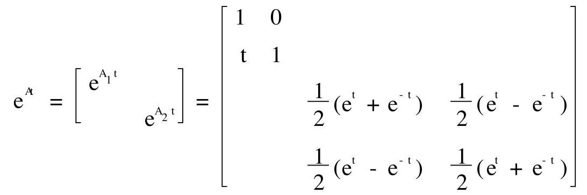

$$
{\int }_{0}^{t}{e}^{-{As}}b\left( s\right) {ds} = {\int }_{0}^{t}\left\lbrack  \begin{array}{r} 0 \\   - 1 \\  1 \\  1 \end{array}\right\rbrack  {ds} = \left\lbrack  \begin{array}{r} 0 \\   - t \\  t \\  t \end{array}\right\rbrack
$$

$$
x\left( t\right)  = {e}^{At}\left\{  {x\left( 0\right)  + {\int }_{0}^{t}{e}^{-{As}}b\left( s\right) {ds}}\right\}   = \left\lbrack  \begin{matrix} 1 \\  0 \\  t{e}^{t} \\  t{e}^{t} \end{matrix}\right\rbrack
$$

五、 $\beta  = {\left( 0,1,0,1\right) }^{\mathrm{T}}$ ,构造 ${\mathrm{T}}_{12}\left( {\mathrm{c},\mathrm{s}}\right)  : \mathrm{c} = 0,\mathrm{\;s} = 1$ ,则 ${\mathrm{T}}_{12}\beta  = (1$ , $0,0,1{)}^{\mathrm{T}}$ ; 构造 ${\mathrm{T}}_{14}\left( {\mathrm{c},\mathrm{s}}\right)  : \mathrm{c} = \frac{1}{\sqrt{2}},\mathrm{\;s} = \frac{1}{\sqrt{2}}$ ,则 ${\mathrm{T}}_{14}\left( {{\mathrm{\;T}}_{12}\beta }\right)  = (\sqrt{2},0,0$ , $0{)}^{\mathrm{T}}$ ,于是有

$$
{\mathbf{T}}_{1} = {\mathbf{T}}_{14}{\mathbf{T}}_{12} = \left\lbrack  \begin{matrix} \frac{1}{\sqrt{2}} & 0 & 0 & \frac{1}{\sqrt{2}} \\  0 & 1 & 0 & 0 \\  0 & 0 & 1 & 0 \\  \frac{-1}{\sqrt{2}} & 0 & 0 & \frac{1}{\sqrt{2}} \end{matrix}\right\rbrack  \left\lbrack  \begin{array}{rrrr} 0 & 1 & 0 & 0 \\   - 1 & 0 & 0 & 0 \\  0 & 0 & 1 & 0 \\  0 & 0 & 0 & 1 \end{array}\right\rbrack   =
$$

$$
\left\lbrack  \begin{array}{rrrr} 0 & \frac{1}{\sqrt{2}} & 0 & \frac{1}{\sqrt{2}} \\   - 1 & 0 & 0 & 0 \\  0 & 0 & 1 & 0 \\  0 & \frac{-1}{\sqrt{2}} & 0 & \frac{1}{\sqrt{2}} \end{array}\right\rbrack
$$

$$
{\mathrm{T}}_{1}\mathrm{\;A} = \left\lbrack  \begin{array}{rrrr} \frac{\sqrt{2}}{2} & 0 & \sqrt{2} & 0 \\  0 &  - 1 & 0 &  - 1 \\  0 & 1 & 0 & 1 \\  0 & 0 & 0 & 0 \end{array}\right\rbrack  ,\mathrm{\;A} = \left\lbrack  \begin{array}{rrr}  - 1 & 0 &  - 1 \\  1 & 0 & 1 \\  0 & 0 & 0 \end{array}\right\rbrack
$$

$\beta  = {\left( -1,1,0\right) }^{\mathrm{T}}$ ,构造 ${\mathrm{T}}_{12}\left( {\mathrm{c},\mathrm{s}}\right)  : \mathrm{c} =  - \frac{1}{\sqrt{2}},\mathrm{\;s} = \frac{1}{\sqrt{2}}$ ,则 ${\mathrm{T}}_{12}\beta  = \left( {\sqrt{2},0}\right.$ ,

$0{)}^{\mathrm{T}}$ ,于是有

$$
{T}_{2} = {T}_{12} = \left\lbrack  \begin{matrix}  - \frac{1}{\sqrt{2}} & \frac{1}{\sqrt{2}} & 0 \\   - \frac{1}{\sqrt{2}} &  - \frac{1}{\sqrt{2}} & 0 \\  0 & 0 & 1 \end{matrix}\right\rbrack  ,{T}_{2}{A}_{1} = \left\lbrack  \begin{matrix} \sqrt{2} & 0 & \sqrt{2} \\  0 & 0 & 0 \\  0 & 0 & 0 \end{matrix}\right\rbrack
$$

$$
\mathrm{T} = \left\lbrack  \begin{array}{ll} 1 & \\   & {\mathrm{\;T}}_{2} \end{array}\right\rbrack  {\mathrm{T}}_{1},\mathrm{Q} = {\mathrm{T}}^{\mathrm{T}} = \frac{1}{\sqrt{2}}\left\lbrack  \begin{array}{rrrr} 0 & 1 & 1 & 0 \\  1 & 0 & 0 &  - 1 \\  0 & 1 &  - 1 & 0 \\  1 & 0 & 0 & 1 \end{array}\right\rbrack
$$

$$
\mathrm{R} = \left\lbrack  \begin{matrix} \sqrt{2} & 0 & \sqrt{2} & 0 \\   & \sqrt{2} & 0 & \sqrt{2} \\   & & 0 & 0 \\   & & & 0 \end{matrix}\right\rbrack  ,\mathrm{A} = \mathrm{{QR}}
$$

六、取 $\mathrm{D} = \operatorname{diag}\left( {1,{15},1}\right)$ ,则 $\mathrm{B} = {\mathrm{{DAD}}}^{-1}$ 的 3 个孤立盖尔圆中各有 A 的一个特征值.

$$
\text{ 七、 }1.\mathrm{A}\xrightarrow[]{\text{ 行 }}\left\lbrack  \begin{array}{rrrr} 1 & 0 &  - 1 & 1 \\  0 & 1 & 1 & 1 \\  0 & 0 & 0 & 0 \end{array}\right\rbrack
$$

$$
A = \left\lbrack  \begin{array}{rr} 1 & 0 \\  1 &  - 2 \\   - 1 & 4 \end{array}\right\rbrack  \left\lbrack  \begin{array}{rrrr} 1 & 0 &  - 1 & 1 \\  0 & 1 & 1 & 1 \end{array}\right\rbrack   = {FG}
$$

2. ${\mathrm{F}}^{ + } = {\left( {\mathrm{F}}^{\mathrm{T}}\mathrm{F}\right) }^{-1}{\mathrm{F}}^{\mathrm{T}} = {\left\lbrack  \begin{array}{rr} 3 &  - 6 \\   - 6 & {20} \end{array}\right\rbrack  }^{-1}{\mathrm{F}}^{\mathrm{T}} = \frac{1}{12}\left\lbrack  \begin{array}{lll} {10} & 4 & 2 \\  3 & 0 & 3 \end{array}\right\rbrack$

$$
{G}^{ + } = {G}^{T}{\left( G{G}^{T}\right) }^{-1} = {G}^{T}{\left\lbrack  \begin{array}{ll} 3 & 0 \\  0 & 3 \end{array}\right\rbrack  }^{-1} = \frac{1}{3}\left\lbrack  \begin{array}{rr} 1 & 0 \\  0 & 1 \\   - 1 & 1 \\  1 & 1 \end{array}\right\rbrack
$$

$$
{A}^{ + } = {G}^{ + }{F}^{ + } = \frac{1}{36}\left\lbrack  \begin{array}{rrr} {10} & 4 & 2 \\  3 & 0 & 3 \\   - 7 &  - 4 & 1 \\  {13} & 4 & 5 \end{array}\right\rbrack
$$

3. ${A}^{ + }b = {\left( 1,0, - 1,1\right) }^{T}, A{A}^{ + }b = b$ ,故 ${Ax} = b$ 有解.

4. 极小范数解 ${x}_{0} = {A}^{ + }b = {\left( 1,0, - 1,1\right) }^{T}$ .

八、见试题十第七题.

九、必要性. 在基 ${\alpha }_{1},{\alpha }_{2},\cdots ,{\alpha }_{n}$ 下， ${\alpha }_{i}$ 和 $T{\alpha }_{i}$ 的坐标分别为 ${e}_{i}$ 和 ${\mathrm{{Ae}}}_{\mathrm{i}}$ . 因为 $\mathrm{T}$ 是对称变换,所以 $\left( {\mathrm{T}{\alpha }_{\mathrm{i}},{\alpha }_{\mathrm{j}}}\right)  = \left( {{\alpha }_{\mathrm{i}},\mathrm{T}{\alpha }_{\mathrm{j}}}\right)$ . 由内积的矩阵乘法形式可得

$$
{\left( {\mathrm{{Ae}}}_{\mathrm{i}}\right) }^{\mathrm{T}}{\mathrm{{Ge}}}_{\mathrm{j}} = {\mathrm{e}}_{\mathrm{i}}^{\mathrm{T}}\mathrm{G}\left( {\mathrm{{Ae}}}_{\mathrm{j}}\right)
$$

或者

$$
{e}_{i}^{T}\left( {{A}^{T}G}\right) {e}_{j} = {e}_{i}^{T}\left( {GA}\right) {e}_{j}
$$

即 ${A}^{\mathrm{T}}G = {GA}$ .

充分性. 设 $\alpha ,\beta  \in  V$ 在基 ${\alpha }_{1},{\alpha }_{1},\cdots ,{\alpha }_{n}$ 下的坐标 (列向量) 分别为 $x$ 与 $y$ ,则 ${T\alpha }$ 和 ${T\beta }$ 在该基下的坐标分别为 ${Ax}$ 和 ${Ay}$ . 因为 ${A}^{T}G =$ GA, 所以

$$
\left( {{T\alpha },\beta }\right)  = {\left( Ax\right) }^{T}{Gy} = {x}^{T}\left( {{A}^{T}G}\right) y =
$$

$$
{x}^{T}\left( {GA}\right) y = {x}^{T}G\left( {Ay}\right)  = \left( {\alpha ,{T\beta }}\right)
$$

即 T 是对称变换.

十、设 $T$ 在基 $\left( I\right)$ 下的矩阵为 $A$ ,即 $T\left( {{\alpha }_{1},\cdots ,{\alpha }_{n}}\right)  = \left( {{\alpha }_{1},\cdots }\right.$ , $\left. {\alpha }_{n}\right) A$ . 由 $T$ 是可逆变换知 $A$ 是可逆矩阵,由 $T{\alpha }_{1} \neq  {\alpha }_{1}$ 知 $A \neq  I$ . 再设

$\left( {{\beta }_{1},\cdots ,{\beta }_{n}}\right)  = \left( {{\alpha }_{1},\cdots ,{\alpha }_{n}}\right) C, T\left( {{\beta }_{1},\cdots ,{\beta }_{n}}\right)  = \left( {{\beta }_{1},\cdots ,{\beta }_{n}}\right) B$

则有 $B = {C}^{1}{AC}$ 取 $C = A \neq  I$ 时,基 $\left( {II}\right)$ 与基 $\left( I\right)$ 不同,而 $B = \; {A}^{-1}{AA} = A$ ,此时

$$
\left( {\beta ,\cdots ,{\beta }_{n}}\right)  = \left( {{\alpha }_{1},\cdots ,{\alpha }_{n}}\right) A = \left( {T{\alpha }_{1},\cdots , T{\alpha }_{n}}\right)
$$

即 $\beta  = T{\alpha }_{i}\left( {i = 1,2,\cdots , n}\right)$ .

## 试题十四

(博士生入学考试试题)

一、(8 分) 已知 $A = \left\lbrack  \begin{array}{llll} 1 & 0 & 0 & 1 \\  1 & 2 & 0 & 2 \\  0 & 0 & 2 & 3 \\  0 & 0 & 0 & 2 \end{array}\right\rbrack$ ,求 $A$ 的 Jordan 标准形.

二、(7 分) 已知 $\mathrm{x} = \left( {-1,\mathrm{i},0,1}\right) ,\mathrm{i} = \sqrt{-1}$ ,求 $\parallel \mathrm{x}{\parallel }_{1}$ , $\parallel \mathrm{X}{\parallel }_{2},\parallel \mathrm{X}{\parallel }_{\infty },{\begin{Vmatrix}{\mathrm{X}}^{\mathrm{T}}\mathrm{X}\end{Vmatrix}}_{{\mathrm{m}}_{1}},{\begin{Vmatrix}{\mathrm{X}}^{\mathrm{T}}\mathrm{X}\end{Vmatrix}}_{\mathrm{F}},{\begin{Vmatrix}{\mathrm{X}}^{\mathrm{T}}\mathrm{X}\end{Vmatrix}}_{{\mathrm{m}}_{\infty }},{\begin{Vmatrix}{\mathrm{X}}^{\mathrm{T}}\mathrm{X}\end{Vmatrix}}_{\infty }$ .

三、(10 分) 设 $A = {\left( {a}_{ij}\right) }_{n \times  n} \in  {C}^{n \times  n}, x = {\left( \xi ,\xi ,\cdots ,{\xi }_{0}\right) }^{T} \in  {C}^{n}$ , 验证:

1 .方阵的 ${\mathrm{m}}_{\infty }$ - 范数与向量的 1 - 范数相容.

2 方阵的 ${\mathrm{m}}_{\infty }$ - 范数与方阵的 $\mathrm{F}$ - 范数等价.

四、(15 分) 已知 $A = \left\lbrack  \begin{array}{rrr}  - 1 & 2 & 1 \\  1 & 0 & 1 \\  1 & 2 &  - 1 \end{array}\right\rbrack  , b\left( t\right)  = \left\lbrack  \begin{matrix} {e}^{-{2t}} \\  0 \\   - {e}^{-{2t}} \end{matrix}\right\rbrack$ .

1 求 ${\mathrm{e}}^{\mathrm{{At}}}$ .

2 . 用矩阵函数方法求微分方程 $\frac{\mathrm{d}}{\mathrm{{dt}}}\mathrm{x}\left( \mathrm{t}\right)  = \mathrm{{Ax}}\left( \mathrm{t}\right)  + \mathrm{b}\left( \mathrm{t}\right)$ 满足初始条件 $\mathrm{x}\left( 0\right)  = {\left( 0, - 1,2\right) }^{\mathrm{T}}$ 的解.

五、(10 分) 用 Householder 变换求

$$
A = \left\lbrack  \begin{array}{rrrr} 0 & 3 & 1 &  - 4 \\  0 & 4 &  - 2 & 3 \\  2 & 1 & 2 & 4 \\  0 & 0 & 0 &  - 5 \end{array}\right\rbrack
$$

的 QR 分解.

六、(10 分) 用 Gerschgorin 定理隔离

$$
A = \left\lbrack  \begin{matrix} 3 & 0 & 1 & 1 \\  0 &  - 2 & 0 & 0 \\  1 & 0 & {10} & 1 \\  1 & 0 & 1 & 1 \end{matrix}\right\rbrack
$$

的特征值 (要求画图表示), 并根据实矩阵特征值的性质改进所得结果.

$$
\text{ 七、(15 分) 已知 }A = \left\lbrack  \begin{array}{rrr} 1 & 0 &  - 1 \\   - 1 & 0 & 1 \\  0 & 1 &  - 1 \\   - 1 &  - 1 & 2 \\  1 & 1 &  - 2 \end{array}\right\rbrack  , b = \left\lbrack  \begin{array}{r} 1 \\   - 1 \\   - 1 \\   - 4 \\  4 \end{array}\right\rbrack  \text{ . }
$$

1 求 $A$ 的满秩分解.

2 求 ${A}^{ + }$ .

3 .用广义逆矩阵方法判断方程组 $\mathrm{{Ax}} = \mathrm{b}$ 是否有解.

4 .求方程组 $\mathrm{{Ax}} = \mathrm{b}$ 的极小范数解或极小范数最小二乘解 ${\mathrm{X}}_{0}$ (要求指出所求的是哪种解).

八、(15 分) 设矩阵空间 ${\mathrm{R}}^{2 \times  2}$ 的线性变换为:

$$
{TX} = {B}^{T}X - {X}^{T}B, B = \left\lbrack  \begin{array}{ll} 1 & 1 \\  0 & 1 \end{array}\right\rbrack  , X \in  {R}^{2 \times  2}
$$

${\mathrm{R}}^{2 \times  2}$ 的子空间 $\mathrm{V} = \left\{  {\mathrm{X} \mid  \mathrm{X} = {\left( {\mathrm{X}}_{\mathrm{{ij}}}\right) }_{2 \times  2},{\mathrm{X}}_{12} + {\mathrm{X}}_{21} = 0}\right\}$ .

1 . 求 $\mathrm{V}$ 的一个基.

2 验证 $\mathrm{V}$ 是 $\mathrm{T}$ 的不变子空间.

3 求 $\mathrm{V}$ 的一个基，使 $\mathrm{T}$ 在该基下的矩阵为对角矩阵.

九、(10 分) 设欧氏空间 ${\mathrm{V}}^{\mathrm{n}}$ 的正交变换 $\mathrm{T}$ 的特征值都是实数,证明: 该正交变换 T 也是对称变换.

## 试题十四解答

$\rightharpoonup  \left\lbrack  \begin{array}{llll} 1 & & & \\   & 2 & & \\   & & 2 & 1 \\   & & & 2 \end{array}\right\rbrack$ (类似试题九第一题之 1)

二、3, $\sqrt{3},1,9,3,4,3$

三、1 见试题十一第二题之 1 .

2 见试题一第二题.

四、见试题九第三题.

五、见试题七第四题

六、见试题七第五题.

七、见试题十第六题.

八、1 当 $X = \left\lbrack  \begin{array}{ll} {X}_{11} & {X}_{12} \\  {X}_{21} & {X}_{22} \end{array}\right\rbrack   \in  V$ 时,由 ${X}_{12} + {X}_{21} = 0$ 可得

$$
X = {X}_{11}\left\lbrack  \begin{array}{ll} 1 & 0 \\  0 & 0 \end{array}\right\rbrack   + {X}_{22}\left\lbrack  \begin{array}{ll} 0 & 0 \\  0 & 1 \end{array}\right\rbrack   + {X}_{12}\left\lbrack  \begin{array}{rr} 0 & 1 \\   - 1 & 0 \end{array}\right\rbrack
$$

容易验证 ${X}_{1} = \left\lbrack  \begin{array}{ll} 1 & 0 \\  0 & 0 \end{array}\right\rbrack  ,{X}_{2} = \left\lbrack  \begin{array}{ll} 0 & 0 \\  0 & 1 \end{array}\right\rbrack  ,{X}_{3} = \left\lbrack  \begin{array}{rr} 0 & 1 \\   - 1 & 0 \end{array}\right\rbrack$ 线性无关,故 ${X}_{1},{X}_{2},{X}_{3}$ 是 $V$ 的一个基.

2. 设 $X \in  V$ ,则 ${TX} = \left( {{B}^{T}X}\right)  - {\left( {B}^{T}X\right) }^{T}$ . 记 $Y = {B}^{T}X = {\left( {y}_{ij}\right) }_{2 \times  2}$ , 则有

$$
{TX} = Y - {Y}^{T} = \left\lbrack  \begin{matrix} 0 & {y}_{12} - {y}_{21} \\  {y}_{21} - {y}_{12} & 0 \end{matrix}\right\rbrack
$$

因为 $\left( {{y}_{12} - {y}_{21}}\right)  + \left( {{y}_{21} - {y}_{12}}\right)  = 0$ ,所以 ${TX} \in  V$ ,故 $V$ 是 $T$ 的不变子空间.

3 .计算

$$
{\mathrm{{TX}}}_{1} = {\mathrm{B}}^{\mathrm{T}}{\mathrm{X}}_{1} - {\mathrm{X}}_{1}^{\mathrm{T}}\mathrm{B} = \left\lbrack  \begin{array}{rr} 0 &  - 1 \\  1 & 0 \end{array}\right\rbrack   = 0{\mathrm{X}}_{1} + 0{\mathrm{X}}_{2} + \left( {-1}\right) {\mathrm{X}}_{3}
$$

$$
T{X}_{2} = {B}^{T}{X}_{2} - {X}_{2}^{T}B = \left\lbrack  \begin{array}{ll} 0 & 0 \\  0 & 0 \end{array}\right\rbrack   = 0{X}_{1} + 0{X}_{2} + 0{X}_{3}
$$

$$
T{X}_{3} = {B}^{T}{X}_{3} - {X}_{3}^{T}B = \left\lbrack  \begin{array}{rr} 0 & 2 \\   - 2 & 0 \end{array}\right\rbrack   = 0{X}_{1} + 0{X}_{2} + 2{X}_{3}
$$

于是, $\mathrm{T}$ 在基 ${\mathrm{X}}_{1},{\mathrm{X}}_{2},{\mathrm{X}}_{3}$ 下的矩阵为

$$
A = \left\lbrack  \begin{array}{rrr} 0 & 0 & 0 \\  0 & 0 & 0 \\   - 1 & 0 & 2 \end{array}\right\rbrack
$$

可求得 ${\mathrm{P}}^{-1}\mathrm{{AP}} = \Lambda$ ,其中

$$
\Lambda  = \left\lbrack  \begin{array}{lll} 0 & & \\   & 0 & \\   & & 2 \end{array}\right\rbrack  , P = \left\lbrack  \begin{array}{lll} 0 & 2 & 0 \\  1 & 0 & 0 \\  0 & 1 & 1 \end{array}\right\rbrack
$$

由 $\left( {{\mathrm{Y}}_{1},{\mathrm{Y}}_{2},{\mathrm{Y}}_{3}}\right)  = \left( {{\mathrm{X}}_{1},{\mathrm{X}}_{2},{\mathrm{X}}_{3}}\right) \mathrm{P}$ 可得

$$
{Y}_{1} = \left\lbrack  \begin{array}{ll} 0 & 0 \\  0 & 1 \end{array}\right\rbrack  ,{Y}_{2} = \left\lbrack  \begin{array}{rr} 2 & 1 \\   - 1 & 0 \end{array}\right\rbrack  ,{Y}_{3} = \left\lbrack  \begin{array}{rr} 0 & 1 \\   - 1 & 0 \end{array}\right\rbrack
$$

$\mathrm{T}$ 在基 ${\mathrm{Y}}_{1},{\mathrm{Y}}_{2},{\mathrm{Y}}_{3}$ 下的矩阵为 $\Lambda$ .

九、设 ${\mathrm{V}}^{\mathrm{n}}$ 的一个标准正交基为 ${\mathrm{X}}_{1},{\mathrm{X}}_{2},\cdots ,{\mathrm{X}}_{\mathrm{n}}$ ，正交变换 $\mathrm{T}$ 在该基下的矩阵为 $A$ ,即 $T\left( {{x}_{1},{x}_{2},\cdots ,{x}_{n}}\right)  = \left( {{x}_{1},{x}_{2},\cdots ,{x}_{n}}\right) A$ ,则 $A$ 是正交矩阵,且 $A$ 的特征值 ${\lambda }_{1},{\lambda }_{2},\cdots ,{\lambda }_{n}$ 都是实数. 于是 ${A}^{\mathrm{T}}A = I = A{A}^{\mathrm{T}}$ ,即 $A$ 是实的正规矩阵. 因此,存在正交矩阵 $Q$ ,使得

$$
{Q}^{T}{AQ} = \Lambda  = \left\lbrack  \begin{array}{lll} {\lambda }_{1} & & \\   & \mathbf{w} & \\   & & {\lambda }_{n} \end{array}\right\rbrack
$$

故 $A = {Q\Lambda }{Q}^{T}$ 是实对称矩阵,从而 $T$ 是对称变换.

## 试题十五

(博士生入学考试试题)

一、(6 分) 已知 $A = \left\lbrack  \begin{matrix} 1 & 2 & 0 & 0 \\  2 & 1 & 0 & 0 \\  0 & 0 & 1 & 2 \\  1 & 1 & 2 & 1 \end{matrix}\right\rbrack$ ,求 $A$ 的 Jordan 标准形.

二、(6 分) 已知 $\mathrm{x} = \left( {1,\mathrm{i},2,2\mathrm{i}}\right) ,\mathrm{i} = \sqrt{-1},\mathrm{\;A} = {\mathrm{x}}^{\mathrm{T}}\mathrm{x}$ ,求

$$
\parallel \mathrm{x}{\parallel }_{1},\;\parallel \mathrm{x}{\parallel }_{\infty },\;\parallel \mathrm{A}{\parallel }_{1}
$$

$$
\parallel \mathrm{A}{\parallel }_{{\mathrm{m}}_{1}},\;\parallel \mathrm{A}{\parallel }_{\mathrm{F}},\;\parallel \mathrm{A}{\parallel }_{{\mathrm{m}}_{\infty }}
$$

三、(13 分) 设 $\alpha$ 是给定的 $\mathrm{n}$ 维非零列向量, $\parallel \mathrm{A}{\parallel }_{\mathrm{F}}$ 是 ${\mathrm{C}}^{\mathrm{n} \times  \mathrm{n}}$ 中矩阵的 $\mathrm{F}$ - 范数,定义实值函数 $\parallel \mathrm{x}\parallel  = {\begin{Vmatrix}\mathbf{\alpha }{\mathrm{x}}^{\mathrm{T}}\end{Vmatrix}}_{\mathrm{F}}$ (任意 $\mathrm{x} \in  {\mathrm{C}}^{\mathrm{n}}$ ).

1. 证明 $\parallel \mathrm{x}\parallel$ 是 ${\mathrm{C}}^{\mathrm{n}}$ 上的向量范数,且矩阵的 $\mathrm{F}$ - 范数与它相容.

2. 取 $\alpha  = {\left( 1,1,\cdots ,1\right) }^{\mathrm{T}} \in  {\mathrm{C}}^{\mathrm{n}}$ ,试写出上述向量范数与向量 2 - 范数之间的关系.

四、(15 分) 已知 $A = \left\lbrack  \begin{matrix} 1 & 2 & 6 \\  1 & 0 & 3 \\  1 & 1 & 2 \end{matrix}\right\rbrack  , b\left( t\right)  = \left\lbrack  \begin{matrix} {e}^{-t} \\   - {e}^{-t} \\  0 \end{matrix}\right\rbrack$ .

1. 求 ${\mathrm{e}}^{\mathrm{A}t}$ .

2. 用矩阵函数方法求微分方程 $\frac{\mathrm{d}}{\mathrm{{dt}}}\mathrm{x}\left( \mathrm{t}\right)  = \mathrm{{Ax}}\left( \mathrm{t}\right)  + \mathrm{b}\left( \mathrm{t}\right)$ 满足初始条件 $\mathrm{x}\left( 0\right)  = {\left( 1, - 1,0\right) }^{\mathrm{T}}$ 的解.

五、(10 分) 用 Householder 变换求 $A = \left\lbrack  \begin{array}{lll} 1 & 0 & 0 \\  2 & 2 & 0 \\  2 & 1 & 6 \end{array}\right\rbrack$ 的 ${QR}$ 分解.

六、(10 分) 用 Gerschgorin 定理隔离

$$
A = \left\lbrack  \begin{array}{rrrr} 9 & 1 &  - 2 & 1 \\  0 & {15} & 1 & 1 \\   - 1 & 0 & 4 & 0 \\  1 & 0 & 0 & 1 \end{array}\right\rbrack
$$

的特征值 (要求画图表示), 并根据实矩阵特征值的性质改进所得结果

七、(15 分) 已知 $A = \left\lbrack  \begin{array}{rrrr} 1 & i &  - i & 0 \\  i &  - 1 & 1 & 1 \\  1 & i &  - i & 0 \end{array}\right\rbrack  , b = \left\lbrack  \begin{array}{r} 1 \\  {2i} \\  1 \end{array}\right\rbrack  , i = \sqrt{-1}$ .

1. 求 $A$ 的满秩分解.

2. 求 ${A}^{ + }$ .

3. 用广义逆矩阵方法判断方程组 $\mathrm{{Ax}} = \mathrm{b}$ 是否有解.

4. 求方程组 ${Ax} = b$ 的极小范数解或极小范数最小二乘解 ${X}_{0}$ (要求指出所求的是哪种解).

八、(15 分) 设矩阵空间 ${\mathrm{R}}^{2 \times  2}$ 的子空间为

$$
V = \left\{  {X = {\left( {X}_{ij}\right) }_{2 \times  2} \mid  {X}_{11} + {X}_{12} + {X}_{21} = 0}\right\}
$$

V 中的线性变换为

$$
{TX} = X + {X}^{T}\;\text{ (任意 }X \in  V\text{ ) }
$$

1. 求 $\mathrm{V}$ 的一个基.

2. 求 $\mathrm{V}$ 的一个基，使 $\mathrm{T}$ 在该基下的矩阵为对角矩阵.

九、(10 分) 设线性空间 ${\mathrm{V}}^{3}$ 中的线性变换 $\mathrm{T}$ 在基 ${\alpha }_{1},{\alpha }_{2},{\alpha }_{3}$ 下的矩阵为

$$
A = \left\lbrack  \begin{array}{lll} 1 & 2 & 2 \\  2 & 1 & 2 \\  2 & 2 & 1 \end{array}\right\rbrack
$$

1. 证明: 子空间 $W = L\left( {{\alpha }_{2} - {\alpha }_{1},{\alpha }_{3} - {\alpha }_{1}}\right)$ 是 $T$ 的不变子空间.

2. 将 $T$ 看作子空间 $W$ 中的线性变换时,求 $T$ 的全体特征值.

## 试题十五解答

$\rightarrow  \det \left( {{\lambda I} - A}\right)  = {\left( \lambda  + 1\right) }^{2}{\left( \lambda  - 3\right) }^{2}$ . 因为 $\operatorname{rank}\left( {\left( {-1}\right) I - A}\right)  =$ 2,所以 ${\left( \lambda  + 1\right) }^{2}$ 是 $4 - 2 = 2$ 个初等因子的乘积; 又 $\operatorname{rank}\left( {{3I} - A}\right)  =$ 3,所以 ${\left( \lambda  - 3\right) }^{2}$ 是 $4 - 3 = 1$ 个初等因子. 因此, A的初等因子为 $\lambda  + \; 1,\lambda  + 1,{\left( \lambda  - 3\right) }^{2}$ ,从而 $\mathrm{A}$ 的 Jordan 标准形为

$$
\left\lbrack  \begin{array}{llll}  - 1 & & & \\   &  - 1 & & \\   & & 3 & 1 \\   & & & 3 \end{array}\right\rbrack
$$

二、6，2，12，36，10，16

三、1. 当 $\mathrm{x} = 0$ 时， $\parallel \mathrm{x}\parallel  = {\begin{Vmatrix}\alpha {0}^{\mathrm{T}}\end{Vmatrix}}_{\mathrm{F}} = \parallel \mathrm{O}{\parallel }_{\mathrm{F}} = 0$ ; 当 $\mathrm{x} \neq  0$ 时, ${\mathbf{\alpha }}_{\mathrm{X}}^{\mathrm{T}} \neq  \mathrm{O}$ ,从而 $\parallel \mathrm{x}\parallel  = {\begin{Vmatrix}{\mathbf{\alpha }}_{\mathrm{X}}^{\mathrm{T}}\end{Vmatrix}}_{\mathrm{F}} > 0$ .

对任意的 $\mathrm{k} \in  \mathrm{C}$ ,有

$$
\begin{Vmatrix}{kx}\end{Vmatrix} = {\begin{Vmatrix}\alpha {\left( kx\right) }^{T}\end{Vmatrix}}_{F} = {\begin{Vmatrix}k\left( \alpha {x}^{T}\right) \end{Vmatrix}}_{F} =
$$

$$
\left| k\right| {\begin{Vmatrix}\alpha {x}^{T}\end{Vmatrix}}_{F} = \left| k\right| \parallel x\parallel
$$

对任意的 $\mathrm{y} \in  {\mathrm{C}}^{\mathrm{n}}$ ,有

$$
\parallel x + y\parallel  = {\begin{Vmatrix}\alpha {\left( x + y\right) }^{T}\end{Vmatrix}}_{F} = {\begin{Vmatrix}\alpha {x}^{T} + \alpha {y}^{T}\end{Vmatrix}}_{F} \leq
$$

$$
{\begin{Vmatrix}{\mathbf{\alpha }}_{X}{}^{T}\end{Vmatrix}}_{F} + {\begin{Vmatrix}{\mathbf{\alpha }}_{Y}{}^{T}\end{Vmatrix}}_{F} = \begin{Vmatrix}x\end{Vmatrix} + \begin{Vmatrix}y\end{Vmatrix}
$$

因此, $\parallel \mathrm{x}\parallel$ 是向量范数.

因为

$$
\parallel \mathrm{A}\mathrm{x}\parallel  = {\begin{Vmatrix}\mathbf{\alpha }{\left( \mathrm{A}\mathrm{x}\right) }^{\mathrm{T}}\end{Vmatrix}}_{\mathrm{F}} = {\begin{Vmatrix}\left( \mathbf{\alpha }{\mathrm{x}}^{\mathrm{T}}\right) {\mathrm{A}}^{\mathrm{T}}\end{Vmatrix}}_{\mathrm{F}} \leq
$$

$$
{\begin{Vmatrix}{\mathbf{\alpha }}_{\mathrm{X}}{}^{\mathrm{T}}\end{Vmatrix}}_{\mathrm{F}}{\begin{Vmatrix}{\mathrm{A}}^{\mathrm{T}}\end{Vmatrix}}_{\mathrm{F}} = \parallel \mathrm{A}{\parallel }_{\mathrm{F}}\parallel \mathrm{x}\parallel
$$

所以矩阵范数 $\parallel \mathrm{A}{\parallel }_{\mathrm{F}}$ 与向量范数 $\parallel \mathrm{x}\parallel$ 相容.

2. 设 $\mathrm{x} = {\left( \xi ,\xi ,\cdots ,{\xi }_{n}\right) }^{\mathrm{T}}$ ,则

$$
{\mathbf{\alpha }}_{\mathrm{X}}^{\mathrm{T}} = \left\lbrack  \begin{matrix} \xi & \xi & \cdots & \xi \\  \xi & \xi & \cdots & \xi \\  \cdots & \cdots & & \cdots \\  \xi & \xi & \cdots & \xi  \end{matrix}\right\rbrack
$$

$$
\parallel \mathrm{x}\parallel  = {\begin{Vmatrix}{\mathbf{\alpha }}_{\mathrm{X}}^{\mathrm{T}}\end{Vmatrix}}_{\mathrm{F}} = \sqrt{\mathrm{n}\mathop{\sum }\limits_{{1 = 1}}^{\mathrm{n}}{\left| {\xi }_{i}\right| }^{2}} = \sqrt{\mathrm{n}}\parallel \mathrm{x}{\parallel }_{2}
$$

四、1. 方法一(待定法). $\det \left( {{\lambda I} - A}\right)  = {\left( \lambda  + 1\right) }^{2}\left( {\lambda  - 5}\right)$ ,由 $(A +$ I) $\left( {A - {5I}}\right)  = O$ 知, $A$ 的最小多项式 $m\left( \lambda \right)  = \left( {\lambda  + 1}\right) \left( {\lambda  - 5}\right)$ . 设 $f\left( \lambda \right) \; = {e}^{\lambda t} = m\left( \lambda \right) g\left( \lambda \right)  + \left( {a + {b\lambda }}\right)$ ,则

$$
\left\{  {\begin{array}{l} f\left( {-1}\right)  = {e}^{-t} = a - b \\  f\left( 5\right)  = {e}^{5t} = a + {5b} \end{array}\;\left\{  \begin{array}{l} a = \frac{1}{6}\left( {{e}^{5t} + 5{e}^{-t}}\right) \\  b = \frac{1}{6}\left( {{e}^{5t} - {e}^{-t}}\right)  \end{array}\right. }\right.
$$

$$
{\mathrm{e}}^{\mathrm{A}t} = \mathrm{a}\mathrm{I} + \mathrm{{bA}} = \frac{{\mathrm{e}}^{5t}}{6}\left( {\mathrm{I} + \mathrm{A}}\right)  + \frac{{\mathrm{e}}^{-t}}{6}\left( {5\mathrm{I} - \mathrm{A}}\right)  =
$$

$$
\frac{1}{6}\left\lbrack  \begin{matrix} 2{\mathrm{e}}^{5t} + 4{\mathrm{e}}^{-t} & 2{\mathrm{e}}^{5t} - 2{\mathrm{e}}^{-t} & 6{\mathrm{e}}^{5t} - 6{\mathrm{e}}^{-t} \\  {\mathrm{e}}^{5t} - {\mathrm{e}}^{-t} & {\mathrm{e}}^{5t} + 5{\mathrm{e}}^{-t} & 3{\mathrm{e}}^{5t} - 3{\mathrm{e}}^{-t} \\  {\mathrm{e}}^{5t} - {\mathrm{e}}^{-t} & {\mathrm{e}}^{5t} - {\mathrm{e}}^{-t} & 3{\mathrm{e}}^{5t} + 3{\mathrm{e}}^{-t} \end{matrix}\right\rbrack
$$

方法二 (对角化法) 对于矩阵 $A$ ,可求得 ${P}^{-1}{AP} = \Lambda$ ,其中

$$
\Lambda  = \left\lbrack  \begin{array}{llll}  - 1 & & & \\   &  - 1 & & \\   & & 5 &  \end{array}\right\rbrack  ,\;P = \left\lbrack  \begin{array}{rrr} 1 & 3 & 2 \\   - 1 & 0 & 1 \\  0 &  - 1 & 1 \end{array}\right\rbrack
$$

$$
{\mathrm{P}}^{-1} = \frac{1}{6}\left\lbrack  \begin{array}{rrr} 1 &  - 5 & 3 \\  1 & 1 &  - 3 \\  1 & 1 & 3 \end{array}\right\rbrack
$$

于是

$$
{\mathrm{e}}^{\mathrm{A}t} = \mathrm{P}\left\lbrack  \begin{array}{lll} {\mathrm{e}}^{-t} & & \\   & {\mathrm{e}}^{-t} & \\   & & {\mathrm{e}}^{5t} \end{array}\right\rbrack  {\mathrm{P}}^{-1} =
$$

$$
\frac{{e}^{5t}}{6}\left\lbrack  \begin{array}{lll} 2 & 2 & 6 \\  1 & 1 & 3 \\  1 & 1 & 3 \end{array}\right\rbrack   + \frac{{e}^{-t}}{6}\left\lbrack  \begin{array}{rrr} 4 &  - 2 &  - 6 \\   - 1 & 5 &  - 3 \\   - 1 &  - 1 & 3 \end{array}\right\rbrack
$$

2. $x\left( t\right)  = {e}^{At}\left\{  {x\left( 0\right)  + {\int }_{0}^{t}{e}^{-{As}}b\left( s\right) {ds}}\right\}   =$

$$
{e}^{At}\left\{  {\left\lbrack  \begin{array}{r} 1 \\   - 1 \\  0 \end{array}\right\rbrack   + \left\lbrack  \begin{array}{r} t \\   - t \\  0 \end{array}\right\rbrack  }\right\}   = \left( {t + 1}\right) {e}^{-t}\left\lbrack  \begin{array}{r} 1 \\   - 1 \\  0 \end{array}\right\rbrack
$$

五、见试题四第四题.

六、见试题十二第五题.

$$
\text{ 七、1. }\mathrm{A}\xrightarrow[]{\text{ 行 }}\left\lbrack  \begin{array}{rrrr} 1 & \mathrm{i} &  - \mathrm{i} & 0 \\  0 & 0 & 0 & 1 \\  0 & 0 & 0 & 0 \end{array}\right\rbrack
$$

$$
A = \left\lbrack  \begin{array}{ll} 1 & 0 \\  \mathrm{i} & 1 \\  1 & 0 \end{array}\right\rbrack  \left\lbrack  \begin{array}{rrrr} 1 & \mathrm{i} &  - \mathrm{i} & 0 \\  0 & 0 & 0 & 1 \end{array}\right\rbrack   = {FG}
$$

2. ${\mathrm{F}}^{ + } = {\left( {\mathrm{F}}^{\mathrm{H}}\mathrm{F}\right) }^{-1}{\mathrm{F}}^{\mathrm{H}} = {\left\lbrack  \begin{array}{rr} 3 &  - \mathrm{i} \\  \mathrm{i} & 1 \end{array}\right\rbrack  }^{-1}{\mathrm{F}}^{\mathrm{H}} = \frac{1}{2}\left\lbrack  \begin{array}{rrr} 1 & 0 & 1 \\   - \mathrm{i} & 2 &  - \mathrm{i} \end{array}\right\rbrack$

$$
{\mathrm{G}}^{ + } = {\mathrm{G}}^{\mathrm{H}}{\left( {\mathrm{{GG}}}^{\mathrm{H}}\right) }^{-1} = {\mathrm{G}}^{\mathrm{H}}{\left\lbrack  \begin{array}{ll} 3 & 0 \\  0 & 1 \end{array}\right\rbrack  }^{-1} = \frac{1}{3}\left\lbrack  \begin{array}{rr} 1 & 0 \\   - \mathrm{i} & 0 \\  \mathrm{i} & 0 \\  0 & 3 \end{array}\right\rbrack
$$

$$
{A}^{ + } = {G}^{ + }{F}^{ + } = \frac{1}{6}\left\lbrack  \begin{array}{rrr} 1 & 0 & 1 \\   - i & 0 &  - i \\  i & 0 & i \\   - {3i} & 6 &  - {3i} \end{array}\right\rbrack
$$

3. ${\mathrm{{AA}}}^{ + }\mathrm{b} = \mathrm{A} \cdot  \frac{1}{3}\left\lbrack  \begin{array}{r} 1 \\   - \mathrm{i} \\  \mathrm{i} \\  3\mathrm{i} \end{array}\right\rbrack   = \mathrm{b}$ ,故 $\mathrm{{Ax}} = \mathrm{b}$ 有解.

4. 极小范数解 ${x}_{0} = {A}^{ + }b = \frac{1}{3}{\left( 1, - i, i,3i\right) }^{T}$ .

八、1. 当 $X = \left\lbrack  \begin{array}{ll} {X}_{11} & {X}_{12} \\  {X}_{21} & {X}_{22} \end{array}\right\rbrack   \in  V$ 时,由 ${X}_{11} + {X}_{12} + {X}_{21} = 0$ 可得

$$
X = {X}_{12}\left\lbrack  \begin{array}{rr}  - 1 & 1 \\  0 & 0 \end{array}\right\rbrack   + {X}_{21}\left\lbrack  \begin{array}{rr}  - 1 & 0 \\  1 & 0 \end{array}\right\rbrack   + {X}_{22}\left\lbrack  \begin{array}{ll} 0 & 0 \\  0 & 1 \end{array}\right\rbrack
$$

容易验证 ${X}_{1} = \left\lbrack  \begin{array}{rr}  - 1 & 1 \\  0 & 0 \end{array}\right\rbrack  ,{X}_{2} = \left\lbrack  \begin{array}{rr}  - 1 & 0 \\  1 & 0 \end{array}\right\rbrack  ,{X}_{3} = \left\lbrack  \begin{array}{ll} 0 & 0 \\  0 & 1 \end{array}\right\rbrack$ 线性无关, 故 ${X}_{1},{X}_{2},{X}_{3}$ 是 $V$ 的一个基.

2. 计算

$$
{\mathrm{{TX}}}_{1} = {\mathrm{X}}_{1} + {\mathrm{X}}_{1}^{\mathrm{T}} = \left\lbrack  \begin{array}{rr}  - 2 & 1 \\  1 & 0 \end{array}\right\rbrack   = 1{\mathrm{X}}_{1} + 1{\mathrm{X}}_{2} + 0{\mathrm{X}}_{3}
$$

$$
T{X}_{2} = {X}_{2} + {X}_{2}^{T} = \left\lbrack  \begin{array}{rr}  - 2 & 1 \\  1 & 0 \end{array}\right\rbrack   = 1{X}_{1} + 1{X}_{2} + 0{X}_{3}
$$

$$
{\mathrm{{TX}}}_{3} = {\mathrm{X}}_{3} + {\mathrm{X}}_{3}^{\mathrm{T}} = \left\lbrack  \begin{array}{ll} 0 & 0 \\  0 & 2 \end{array}\right\rbrack   = 0{\mathrm{X}}_{1} + 0{\mathrm{X}}_{2} + 2{\mathrm{X}}_{3}
$$

于是, $\mathrm{T}$ 在基 ${\mathrm{X}}_{1},{\mathrm{X}}_{2},{\mathrm{X}}_{3}$ 下的矩阵为 $\mathrm{A} = \left\lbrack  \begin{array}{lll} 1 & 1 & 0 \\  1 & 1 & 0 \\  0 & 0 & 2 \end{array}\right\rbrack$ . 可求得 ${\mathrm{P}}^{-1}\mathrm{{AP}} = \Lambda$ ,其中

$$
\Lambda  = \left\lbrack  \begin{array}{lll} 0 & & \\   & 2 & \\   & & 2 \end{array}\right\rbrack  ,\;P = \left\lbrack  \begin{array}{rrr} 1 & 1 & 0 \\   - 1 & 1 & 0 \\  0 & 0 & 1 \end{array}\right\rbrack
$$

由 $\left( {{\mathrm{Y}}_{1},{\mathrm{Y}}_{2},{\mathrm{Y}}_{3}}\right)  = \left( {{\mathrm{X}}_{1},{\mathrm{X}}_{2},{\mathrm{X}}_{3}}\right) \mathrm{P}$ 可得

$$
{Y}_{1} = \left\lbrack  \begin{array}{rr} 0 & 1 \\   - 1 & 0 \end{array}\right\rbrack  ,\;{Y}_{2} = \left\lbrack  \begin{array}{rr}  - 2 & 1 \\  1 & 0 \end{array}\right\rbrack  ,\;{Y}_{3} = \left\lbrack  \begin{array}{ll} 0 & 0 \\  0 & 1 \end{array}\right\rbrack
$$

T 在基 ${Y}_{1},{Y}_{2},{Y}_{3}$ 下的矩阵为 $\Lambda$ .

九、1. 见试题十二第八题.

2. 容易证明 $\dim W = 2$ . 设 $W$ 的一个基为 ${\beta }_{1},\beta$ ,由第一小题的证明过程可得

$$
T{\beta }_{1} = \left( {-1}\right) \beta ,\;T{\beta }_{2} = \left( {-1}\right) \beta
$$

于是, $\mathrm{T}$ 在 $\mathrm{W}$ 的基 ${\beta }_{1},{\beta }_{2}$ 下的矩阵为 $\left\lbrack  \begin{array}{rr}  - 1 & 0 \\  0 &  - 1 \end{array}\right\rbrack$ 故将 $\mathrm{T}$ 看做 $\mathrm{W}$ 中的线性变换时,它的特征值为 ${\lambda }_{1} = {\lambda }_{2} =  - 1$ .

## 参考文献

1. 程云鹏, 张凯院,徐仲. 矩阵论(第 2 版). 西安:西北工业大学出版社, 1999

2. 徐仲, 张凯院, 陆全, 冷国伟. 矩阵论简明教程. 北京: 科学出版社，2001

3. 戴华. 矩阵论. 北京:科学出版社，2001

4. 张凯院,徐仲,陆全. 矩阵论典型题解析及自测试题(第 2 版). 西安:西北工业大学出版社，2003