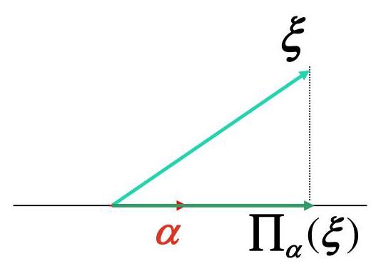

矩阵分析与应用

第三讲 线性变换之一

# 信息与通信工程学院 吕旌阳

## 本讲主要内容

重集合的映射

线性变换的简单性质

## 映射

设S、 ${\mathrm{S}}^{\prime }$ 是给定的两个非空集合,如果有一个对应法则σ,通过这个法则 $\sigma$ 对于 $\mathrm{S}$ 中的每一个元素 $\mathrm{a}$ ,都有 ${\mathrm{S}}^{\prime }$ 中一个唯一确定的元素 ${\mathrm{a}}^{\prime }$ 与它对应，则称 $\sigma$ 为 $\mathrm{S}$ 到 ${\mathrm{S}}^{\prime }$ 的一个映射，记作: $\sigma  : \mathrm{S} \rightarrow  {\mathrm{S}}^{\prime }$ 或 $\mathrm{S}\xrightarrow[]{-\sigma }{\mathrm{S}}^{\prime }$

称 ${a}^{\prime }$ 为 $a$ 在映射 $\sigma$ 下的象,而 $a$ 称为 ${a}^{\prime }$ 在映射 $\sigma$ 下的原象,

记作 $\sigma \left( a\right)  = {a}^{\prime }$ 或 $\sigma  : a \mapsto  {a}^{\prime }$ .

mS到S自身的映射, 也称为S到S的变换

重关于S到S′的映射 $\sigma$

1) $\mathbf{S}$ 与 ${\mathbf{S}}^{\prime }$ 可以相同,也可以不同

2)对于S中每个元素a，需要有S'中一个唯一确定的元素a'与它对应

3) 一般, ${\mathrm{S}}^{\prime }$ 中元素不一定都是 $\mathrm{S}$ 中元素的像

4) $\mathrm{S}$ 中不相同元素的像可能相同

5) 两个集合之间可以建立多个映射

若 $\forall a \neq  {a}^{\prime } \in  S$ ,都有 $\sigma \left( a\right)  \neq  \sigma \left( {a}^{\prime }\right)$ ,则称为单射

重若 $\forall b \in  {S}^{\prime }$ 都存在 $a \in  S$ ,使得 $\sigma \left( a\right)  = b$ ,则称为满射

重如果既是单射又是满射, 则称为双射, 或称一一对应

例 判断下列M 到M '对应法则是否为映射

1) $M = \{ a, b, c\} \text{ 、 }{M}^{\prime } = \{ 1,2,3,4\}$

$\sigma  : \sigma \left( \mathrm{a}\right)  = 1,\sigma \left( \mathrm{b}\right)  = 1,\sigma \left( \mathrm{c}\right)  = 2$ (是)

$\delta  : \delta \left( \mathrm{a}\right)  = 1,\delta \left( \mathrm{b}\right)  = 2,\delta \left( \mathrm{c}\right)  = 3,\delta \left( \mathrm{c}\right)  = 4$ (不是)

$\tau  : \tau \left( \mathrm{b}\right)  = 2,\tau \left( \mathrm{c}\right)  = 4$ (不是)

2) $M = Z,{M}^{\prime } = {Z}^{ + }$ ,

$\sigma  : \sigma \left( \mathrm{n}\right)  = \left| \mathrm{n}\right| ,\;\forall \mathrm{n} \in  \mathrm{Z}$ (不是)

$\tau  : \tau \left( n\right)  = \left| n\right|  + 1,\;\forall n \in  Z$ (是)

3) $S = {R}^{n \times  n},{S}^{\prime } = K,\;$ (K为数域)

$\sigma  : \sigma \left( A\right)  = \left| A\right| ,\;\forall A \in  {R}^{n \times  n}$ (是)

4) $S = K,{S}^{\prime } = {R}^{n \times  n}$ ( $K$ 为数域)

て: $\tau \left( a\right)  = {aE},\;\forall a \in  K$ (E为 $n$ 级单位矩阵) (是)

5) $\mathrm{S}\text{ 、 }{\mathrm{\;S}}^{\prime }$ 为任意两个非空集合, ${\mathrm{a}}_{0}$ 是 ${\mathrm{S}}^{\prime }$ 中的一个固定元素.

$\sigma  : \sigma \left( \mathrm{a}\right)  = {\mathrm{a}}_{0},\;\forall \mathrm{a} \in  \mathrm{S}$ (是)

6) $S = {S}^{\prime } = P\left\lbrack  x\right\rbrack$

$\sigma  : \sigma \left( {f\left( x\right) }\right)  = {f}^{\prime }\left( x\right) ,\;\forall f\left( x\right)  \in  P\left\lbrack  x\right\rbrack$ (是)

重设 ${\sigma }_{1},{\sigma }_{2}$ 都是集合 $\mathrm{S}$ 到集合 $\mathrm{S}$ 个的两个映射,若对 $\mathrm{S}$ 的每个元素a 都有

${\sigma }_{1}\left( \mathrm{a}\right)  = {\sigma }_{2}\left( \mathrm{a}\right)$ 则称它们相等,记作 ${\sigma }_{1} = {\sigma }_{2}$

重设 $\sigma ,\tau$ 是集合 $S$ 到 ${S}_{1}$ ,集合 ${S}_{1}$ 到 ${S}_{2}$ 的映射,映射的乘积 ${\tau \sigma }$ 定义为

$$
\left( {\tau \sigma }\right) \left( a\right)  = \tau \left( {\sigma \left( a\right) }\right) ,\;a \in  S
$$

重设 $\sigma ,\tau ,\mu$ 是集合 $S$ 到 ${S}_{1},{S}_{1}$ 到 ${S}_{2},{S}_{2}$ 到 ${S}_{3}$ 的映射,则映射的乘积满足结合律, 但不满足交换律

$$
\left( {\mu \tau }\right) \sigma  = \mu \left( {\tau \sigma }\right)
$$

${\tau \sigma } \neq  {\sigma \tau }$

重设S, S'是两个乘集,即具有一个封闭的满足结合律的运算*与·的代数系统。 $\mathbf{\sigma }$ 是集合 $S$ 到集合 $S$ 的映射,并且

$$
\forall \mathrm{a},\mathrm{b} \in  \mathrm{S},\exists \mathbf{\sigma }\left( {\mathrm{a} * \mathrm{\;b}}\right)  = \mathbf{\sigma }\left( \mathrm{a}\right)  \cdot  \mathbf{\sigma }\left( \mathrm{b}\right)
$$

即 $a \rightarrow  \mathbf{\sigma }\left( a\right) , b \rightarrow  \mathbf{\sigma }\left( b\right)$ ,就有 $a * b \rightarrow  \mathbf{\sigma }\left( a\right)  \cdot  \mathbf{\sigma }\left( b\right)$

就称 $\sigma$ 是集合 $S$ 到集合 ${S}^{\prime }$ 的同态映射

${\Delta \sigma }$ 是同态映射,并且是双射,则称为同构映射并且称集合 $S$ 到集合 ${S}^{\prime }$ 是同构的

重由不高于n次的实系数多项式构成的空间与实数域上n+1维的全体向量构成的空间同构, 比如

$$
{a}_{0} + {a}_{1}x + {a}_{2}{x}^{2} + {a}_{3}{x}^{3} \leftrightarrow  \left( {{a}_{0},{a}_{1},{a}_{2},{a}_{3}}\right)
$$

2025/9/20

设 $\mathrm{V}$ 为数域 $\mathrm{K}$ 上的线性空间,若变换 $\mathrm{T} : \mathrm{V} \rightarrow  \mathrm{V}$

或者 $T\left( {{kx} + {ly}}\right)  = k\left( {Tx}\right)  + l\left( {Ty}\right)$

满足: $\;\forall x, y \in  V, k \in  K$

$T\left( {x + y}\right)  = T\left( x\right)  + T\left( y\right) \; T\left( {kx}\right)  = {kT}\left( x\right)$

事实上, $\;\forall x, y \in  V,\;\forall k, m \in  K$ , $K\left( {x + y}\right)  = k\left( {x + y}\right)  = {kx} + {ky} = K\left( x\right)  + K\left( y\right) , \; K\left( {mx}\right)  = {kmx} = {mkx} = {mK}\left( x\right) .$

由数 $\mathrm{k}$ 决定的数乘变换: $\mathrm{K} : \mathrm{V} \rightarrow  \mathrm{V},\mathrm{x} \mapsto  \mathrm{{kx}},\forall \mathrm{x} \in  \mathrm{V}$

例1. $\mathrm{V} = {\mathrm{R}}^{2}$ (实数域上二维向量空间),把 $\mathrm{V}$ 中每一向量绕坐标原点旋转 $\theta$ 角,就是一个线性变换,用 ${\mathrm{T}}_{\theta }$ 表示,即

$$
{\mathrm{T}}_{\theta } : {\mathrm{R}}^{2} \rightarrow  {\mathrm{R}}^{2},\left( \begin{array}{l} \xi \\  \eta  \end{array}\right)  \mapsto  \left( \begin{array}{l} {\xi }^{\prime } \\  {\eta }^{\prime } \end{array}\right)
$$

这里, $\left( \begin{array}{l} {\xi }^{\prime } \\  {\eta }^{\prime } \end{array}\right)  = \left( \begin{array}{rr} \cos \theta &  - \sin \theta \\  \sin \theta & \cos \theta  \end{array}\right) \left( \begin{array}{l} \xi \\  \eta  \end{array}\right)$

易验证: $\;\forall \mathrm{x},\mathrm{y} \in  {\mathrm{R}}^{2},\forall \mathrm{k} \in  \mathrm{R}$

$$
{\mathrm{T}}_{\theta }\left( {\mathrm{x} + \mathrm{y}}\right)  = {\mathrm{T}}_{\theta }\left( \mathrm{x}\right)  + {\mathrm{T}}_{\theta }\left( \mathrm{y}\right)
$$

$$
{\mathrm{T}}_{\theta }\left( {\mathrm{k}\mathrm{x}}\right)  = \mathrm{k}{\mathrm{T}}_{\theta }\left( \mathrm{x}\right)
$$

例2. $\mathrm{V} = {\mathrm{R}}^{3},\alpha  \in  \mathrm{V}$ 为一固定非零向量,把 $\mathrm{V}$ 中每一个向量 $\xi$ 变成它在 $\alpha$ 上的内射影是 $\mathrm{V}$ 上的一个线性变换. 用 $\mathop{\prod }\limits_{\alpha }$ 表示,即

$$
\mathop{\prod }\limits_{\alpha } : {\mathrm{R}}^{3} \rightarrow  {\mathrm{R}}^{3},\xi  \mapsto  \frac{\left( \alpha ,\xi \right) }{\left( \alpha ,\alpha \right) }\alpha ,\forall \xi  \in  {\mathrm{R}}^{3}
$$

这里 $\left( {\mathbf{\alpha },\mathbf{\xi }}\right) ,\left( {\mathbf{\alpha },\mathbf{\alpha }}\right)$ 表示内积.

易验证: $\forall \xi ,\eta  \in  {\mathrm{R}}^{3},\forall \mathrm{k} \in  \mathrm{R}$

${\Pi }_{\alpha }\left( {\xi  + \eta }\right)  = {\Pi }_{\alpha }\left( \xi \right)  + {\Pi }_{\alpha }\left( \eta \right)$

${\Pi }_{\alpha }\left( {\mathrm{k}\xi }\right)  = \mathrm{k}{\Pi }_{\alpha }\left( \xi \right)$ 例3. 线性空间 ${\mathrm{P}}_{\mathrm{n}}$ 中,求微分是一个 线性变换,用 $\mathrm{D}$ 表示,即

$$
D : V \rightarrow  V, D\left( {f\left( x\right) }\right)  = {f}^{\prime }\left( x\right) ,\forall f\left( x\right)  \in  {P}_{n}
$$

证明: $\forall f\left( x\right) , g\left( x\right)  \in  {P}_{n}$ 和 $\forall k \in  R$ 有

$$
D\left( {f\left( x\right)  + g\left( x\right) }\right)  = {\left( f\left( x\right)  + g\left( x\right) \right) }^{\prime } = {f}^{\prime }\left( x\right)  + {g}^{\prime }\left( x\right)
$$

$$
= D\left( {f\left( x\right) }\right)  + D\left( {g\left( x\right) }\right)
$$

$D\left( {{kf}\left( x\right) }\right)  = {\left( kf\left( x\right) \right) }^{\prime } = k{f}^{\prime }\left( x\right)  = {kD}\left( {f\left( x\right) }\right)$

因此D是一个线性变换.

例4. 闭区间 $\left\lbrack  {a, b}\right\rbrack$ 上的全体连续函数构成的线性空间 $C\left( {a, b}\right)$ 上的变换

$$
J : C\left( {a, b}\right)  \rightarrow  C\left( {a, b}\right) ,\;J\left( {f\left( x\right) }\right)  = {\int }_{a}^{x}f\left( t\right) {dt}
$$

是一个线性变换.

证明: $\forall f\left( x\right) , g\left( x\right)  \in  C\left( {a, b}\right)$ 和 $\forall k, l \in  R$ 有

$$
J\left( {{kf}\left( x\right)  + \lg \left( x\right) }\right)  = {\int }_{a}^{x}\left( {{kf}\left( t\right)  + \lg \left( t\right) }\right) {dt}
$$

$$
= \mathrm{k}{\int }_{a}^{x}\mathrm{f}\left( \mathrm{t}\right) \mathrm{{dt}} + 1{\int }_{a}^{x}\mathrm{g}\left( \mathrm{t}\right) \mathrm{{dt}}
$$

$$
= \mathrm{{kJ}}\left( {\mathrm{f}\left( \mathrm{x}\right) }\right)  + \mathrm{{lJ}}\left( {\mathrm{g}\left( \mathrm{x}\right) }\right)
$$

因此J是一个线性变换.

## 线性变换的简单性质

1. $\mathrm{T}$ 为 $\mathrm{V}$ 的线性变换,则

$$
T\left( 0\right)  = 0, T\left( {-x}\right)  =  - T\left( x\right) \text{ . }
$$

2. 线性变换保持线性组合及关系式不变, 即

若 $x = {k}_{1}{x}_{1} + {k}_{2}{x}_{2} + \cdots  + {k}_{r}{x}_{r}$ ,

则 $T\left( x\right)  = {k}_{1}T\left( {x}_{1}\right)  + {k}_{2}T\left( {x}_{2}\right)  + \cdots  + {k}_{r}T\left( {x}_{r}\right)$ .

3. 线性变换把线性相关的向量组的变成线性相关的向量组. 即若 ${x}_{1},{x}_{2},\cdots ,{x}_{r}$ 线性相关,则 $T\left( {x}_{1}\right) , T\left( {x}_{2}\right) ,\cdots , T\left( {x}_{r}\right)$ 也线性相关.

若 ${x}_{1},{x}_{2},\cdots ,{x}_{r}$ 线性相关,则 $T\left( {x}_{1}\right) , T\left( {x}_{2}\right) ,\cdots , T\left( {x}_{r}\right)$ 也线性相关.

事实上,若有不全为零的数 ${\mathrm{k}}_{1},{\mathrm{k}}_{2},\cdots ,{\mathrm{k}}_{\mathrm{r}}$ 使

$$
{\mathrm{k}}_{1}{\mathrm{x}}_{1} + {\mathrm{k}}_{2}{\mathrm{x}}_{2} + \cdots  + {\mathrm{k}}_{\mathrm{r}}{\mathrm{x}}_{\mathrm{r}} = 0
$$

则由 2 即有, ${k}_{1}T\left( {x}_{1}\right)  + {k}_{2}T\left( {x}_{2}\right)  + \cdots  + {k}_{r}T\left( {x}_{r}\right)  = 0$ .

注意: 3 的逆不成立,即 $T\left( {x}_{1}\right) , T\left( {x}_{2}\right) ,\cdots , T\left( {x}_{r}\right)$ 线性相关, ${\mathrm{X}}_{1},{\mathrm{X}}_{2},\cdots ,{\mathrm{X}}_{\mathrm{r}}$ 未必线性相关.

事实上, 线性变换可能把线性无关的向量组变成线性相关的向量组. 如零变换.

练习:下列变换中，哪些是线性变换？

1. 在 ${\mathrm{R}}^{3}$ 中, $\mathrm{T}\left( {{\xi }_{1},{\xi }_{2},{\xi }_{3}}\right)  = \left( {2{\xi }_{1},{\xi }_{2},{\xi }_{2} - {\xi }_{3}}\right)$ .

2. 在 ${P}_{n}\left\lbrack  x\right\rbrack$ 中, $T\left( {f\left( x\right) }\right)  = {f}^{2}\left( x\right)$ .

3. 在线性空间 $V$ 中, $T\left( \xi \right)  = \xi  + \alpha ,\alpha  \in  V$ 非零固定.

4. 在 ${C}^{n \times  n}$ 中, $T\left( X\right)  = {AX}, A \in  {C}^{n \times  n}$ 固定.

5. 复数域 $C$ 看成是自身上的线性空间, $T\left( x\right)  = \bar{x}$ .X

6. $\mathrm{C}$ 看成是实数域 $\mathrm{R}$ 上的线性空间， $\mathrm{T}\left( \mathrm{x}\right)  = \overline{\mathrm{x}}$ .

线性变换的运算

一、线性变换的和

二、线性变换的数量乘法

三、线性变换的乘积

四、线性变换的逆

五、线性变换的多项式

## 1. 线性变换的和

设 ${\mathrm{T}}_{1},{\mathrm{\;T}}_{2}$ 为线性空间 $\mathrm{V}$ 的两个线性变换,定义它们的和 ${\mathrm{T}}_{1} + {\mathrm{T}}_{2}$ 为:

$$
\left( {{T}_{1} + {T}_{2}}\right) \left( x\right)  = {T}_{1}x + {T}_{2}x,\forall x \in  V
$$

则 ${\mathrm{T}}_{1} + {\mathrm{T}}_{2}$ 也是 $\mathrm{V}$ 的线性变换.

事实上, $\left( {{\mathrm{T}}_{1} + {\mathrm{T}}_{2}}\right) \left( {\mathrm{x} + \mathrm{y}}\right)  = {\mathrm{T}}_{1}\left( {\mathrm{x} + \mathrm{y}}\right)  + {\mathrm{T}}_{2}\left( {\mathrm{x} + \mathrm{y}}\right)$

$$
= {T}_{1}x + {T}_{1}y + {T}_{2}x + {T}_{2}y = \left( {{T}_{1} + {T}_{2}}\right) x + \left( {{T}_{1} + {T}_{2}}\right) y
$$

$$
\left( {{T}_{1} + {T}_{2}}\right) \left( {kx}\right)  = {T}_{1}\left( {kx}\right)  + {T}_{2}\left( {kx}\right)  = k\left( {{T}_{1}x}\right)  + k\left( {{T}_{2}x}\right)
$$

$$
= \mathrm{k}\left( {{\mathrm{T}}_{1}\mathrm{x} + {\mathrm{T}}_{2}\mathrm{x}}\right)  = \mathrm{k}\left( {{\mathrm{T}}_{1} + {\mathrm{T}}_{2}}\right) \mathrm{x}
$$

## 负变换

设 T 为线性空间 $V$ 的线性变换,定义变换 -T 为:

$$
\left( {-T}\right) \left( x\right)  =  - T\left( x\right) ,\;\forall x \in  V
$$

则 $- \mathrm{T}$ 也为 $\mathrm{V}$ 的线性变换，称之为 $\mathrm{T}$ 的负变换.

## 线性变换和的基本性质

(1)满足交换律: ${\mathrm{T}}_{1} + {\mathrm{T}}_{2} = {\mathrm{T}}_{2} + {\mathrm{T}}_{1}$

(2)满足结合律: $\left( {{\mathrm{T}}_{1} + {\mathrm{T}}_{2}}\right)  + {\mathrm{T}}_{3} = {\mathrm{T}}_{1} + \left( {{\mathrm{T}}_{2} + {\mathrm{T}}_{3}}\right)$

(3) ${\mathrm{T}}_{0} + {\mathrm{T}}_{1} = {\mathrm{T}}_{1}\;,{\mathrm{\;T}}_{0}\;$ 为零变换.

(4) $\left( {-\mathrm{T}}\right)  + \mathrm{T} = {\mathrm{T}}_{0}$

## 线性变换的数量乘法

设 T 为线性空间 $V$ 的线性变换, $k \in  K$ ,定义 $k$ 与 $T$ 的数量乘积 ${kT}$ 为:

$$
\left( {kT}\right) \left( x\right)  = {kT}\left( x\right) ,\;\forall x \in  V
$$

则 $\mathrm{{kT}}$ 也是 $\mathrm{V}$ 的线性变换.

## 线性变换数量乘法的基本性质

(1) $\mathrm{k}\left( {{\mathrm{T}}_{1} + {\mathrm{T}}_{2}}\right)  = {\mathrm{{kT}}}_{1} + {\mathrm{{kT}}}_{2}$

(2) $\left( {k + 1}\right) T = {kT} + {lT}$

(3) $\left( {kl}\right) T = k\left( {lT}\right)$

(4) ${1T} = T$

注: 线性空间V上的全体线性变换所成集合对于线性变换的加法与数量乘法构成数域 $\mathrm{K}$ 上的一个线性空间,记作

Hom(V, V) $\triangleq  \{$ TIT 是数域K上线性空间V的线性变换 $\}$

## 线性变换的乘积

设 ${\mathrm{T}}_{1},{\mathrm{\;T}}_{2}$ 为线性空间 $\mathrm{V}$ 的两个线性变换,定义它们的乘积 ${\mathrm{T}}_{1}{\mathrm{\;T}}_{2}$ 为:

$$
\left( {{T}_{1}{T}_{2}}\right) \left( x\right)  = {T}_{1}\left( {{T}_{2}x}\right) ,\;\forall x \in  V
$$

则 ${\mathrm{T}}_{1}{\mathrm{T}}_{2}$ 也是 $\mathrm{V}$ 的线性变换.

事实上, $\left( {{\mathrm{T}}_{1}{\mathrm{\;T}}_{2}}\right) \left( {\mathrm{x} + \mathrm{y}}\right)  = {\mathrm{T}}_{1}\left( {{\mathrm{\;T}}_{2}\left( {\mathrm{x} + \mathrm{y}}\right) }\right)  = {\mathrm{T}}_{1}\left( {{\mathrm{\;T}}_{2}\left( \mathrm{x}\right)  + {\mathrm{T}}_{2}\left( \mathrm{y}\right) }\right)$

$$
= {T}_{1}\left( {{T}_{2}x}\right)  + {T}_{1}\left( {{T}_{2}y}\right)  = \left( {{T}_{1}{T}_{2}}\right) x + \left( {{T}_{1}{T}_{2}}\right) y
$$

$\left( {{T}_{1}{T}_{2}}\right) \left( {kx}\right)  = {T}_{1}\left( {{T}_{2}\left( {kx}\right) }\right)  = {T}_{1}\left( {k\left( {{T}_{2}x}\right) }\right)$

$$
= \mathrm{k}\left( {{\mathrm{T}}_{1}\left( {{\mathrm{\;T}}_{2}\mathrm{x}}\right) }\right)  = \mathrm{k}\left( {{\mathrm{T}}_{1}{\mathrm{T}}_{2}}\right) \mathrm{x}
$$

2025/9/20

## 线性变换乘积的基本性质

(1)满足结合律: $\left( {{T}_{1}{T}_{2}}\right) {T}_{3} = {T}_{1}\left( {{T}_{2}{T}_{3}}\right)$

(2) ${T}_{e}T = T{T}_{e} = T,{T}_{e}$ 为单位变换

(3)交换律一般不成立，即一般地，

$$
{\mathrm{T}}_{1}{\mathrm{T}}_{2} \neq  {\mathrm{T}}_{2}{\mathrm{\;T}}_{1}
$$

(4)乘法对加法满足左、右分配律:

$$
{\mathrm{T}}_{1}\left( {{\mathrm{\;T}}_{2} + {\mathrm{T}}_{3}}\right)  = {\mathrm{T}}_{1}{\mathrm{\;T}}_{2} + {\mathrm{T}}_{1}{\mathrm{\;T}}_{3}
$$

$$
\left( {{\mathrm{T}}_{1} + {\mathrm{T}}_{2}}\right) {\mathrm{T}}_{3} = {\mathrm{T}}_{1}{\mathrm{\;T}}_{3} + {\mathrm{T}}_{2}{\mathrm{\;T}}_{3}
$$

例1. 线性空间 $R\left\lbrack  x\right\rbrack$ 中，线性变换

$$
D\left( {f\left( x\right) }\right)  = {f}^{\prime }\left( x\right)
$$

$$
J\left( {f\left( x\right) }\right)  = {\int }_{0}^{x}f\left( t\right) {dt}
$$

$\left( {DJ}\right) \left( {f\left( x\right) }\right)  = D\left( {{\int }_{0}^{x}f\left( t\right) {dt}}\right)  = f\left( x\right)$ ,即 ${DJ} = {T}_{e}$ 而, $\left( {JD}\right) \left( {f\left( x\right) }\right)  = J\left( {{f}^{\prime }\left( x\right) }\right)  = {\int }_{0}^{x}{f}^{\prime }\left( t\right) {dt} = f\left( x\right)  - f\left( 0\right)$

$\therefore \mathrm{{DJ}} \neq  \mathrm{{JD}}$ .

例2. 设 $\mathrm{A}\text{ 、 }\mathrm{\;B} \in  {\mathrm{R}}^{\mathrm{n} \times  \mathrm{n}}$ 为两个取定的矩阵,定义变换

$$
{\mathrm{T}}_{1}\left( \mathrm{X}\right)  = \mathrm{{AX}}
$$

$$
\forall \mathrm{X} \in  {\mathrm{R}}^{\mathrm{n} \times  \mathrm{n}}
$$

$$
{\mathrm{T}}_{2}\left( \mathrm{X}\right)  = \mathrm{{XB}},
$$

则 ${\mathrm{T}}_{1},{\mathrm{T}}_{2}$ 皆为 ${\mathrm{R}}^{\mathrm{n} \times  \mathrm{n}}$ 的线性变换,且对 $\forall \mathrm{X} \in  {\mathrm{R}}^{\mathrm{n} \times  \mathrm{n}}$ ,有

$$
{\mathrm{T}}_{1}{\mathrm{T}}_{2}\left( \mathrm{X}\right)  = {\mathrm{T}}_{1}\left( {{\mathrm{\;T}}_{2}\left( \mathrm{X}\right) }\right)  = {\mathrm{T}}_{1}\left( \mathrm{{XB}}\right)  = \mathrm{A}\left( \mathrm{{XB}}\right)  = \mathrm{{AXB}},
$$

$$
{\mathrm{T}}_{2}{\mathrm{T}}_{1}\left( \mathrm{X}\right)  = {\mathrm{T}}_{2}\left( {{\mathrm{\;T}}_{1}\left( \mathrm{X}\right) }\right)  = {\mathrm{T}}_{2}\left( \mathrm{{AX}}\right)  = \left( \mathrm{{AX}}\right) \mathrm{B} = \mathrm{{AXB}},
$$

$$
\therefore {\mathrm{T}}_{1}{\mathrm{T}}_{2} = {\mathrm{T}}_{2}{\mathrm{\;T}}_{1}
$$

## 线性变换的逆

设 $\mathrm{T}$ 为线性空间 $\mathrm{V}$ 的线性变换,若有 $\mathrm{V}$ 的变换 $\mathrm{S}$ 使

$$
\mathrm{{ST}} = \mathrm{{TS}} = {\mathrm{T}}_{\mathrm{e}}
$$

则称 $\mathrm{T}$ 为可逆变换,称 $\mathrm{S}$ 为 $\mathrm{T}$ 的逆变换,记作 ${\mathrm{T}}^{-1}$ .

## 2. 基本性质

(1)可逆变换 T 的逆变换 ${\mathrm{T}}^{-1}$ 也是 $\mathrm{V}$ 的线性变换.

(1)可逆变换 T 的逆变换 ${T}^{-1}$ 也是 $V$ 的线性变换.

证: 对 $\forall x, y \in  V,\forall k \in  K$ ,

$$
{T}^{-1}\left( {x + y}\right)  = {T}^{-1}\left( {\left( {T{T}^{-1}}\right) \left( x\right)  + \left( {T{T}^{-1}}\right) \left( y\right) }\right)  = {T}^{-1}\left( {T\left( {{T}^{-1}\left( x\right)  + {T}^{-1}\left( y\right) }\right) }\right)
$$

$$
= \left( {{T}^{-1}T}\right) \left( {{T}^{-1}\left( x\right)  + {T}^{-1}\left( y\right) }\right)
$$

$$
= {T}^{-1}\left( x\right)  + {T}^{-1}\left( y\right)
$$

$$
{T}^{-1}\left( {kx}\right)  = {T}^{-1}\left( {k\left( {T{T}^{-1}}\right) \left( x\right) }\right)  = {T}^{-1}\left( {k\left( {T\left( {{T}^{-1}\left( x\right) }\right) }\right) }\right)
$$

$$
= {T}^{-1}\left( {T\left( {k\left( {{T}^{-1}\left( x\right) }\right) }\right) }\right)  = k\left( {{T}^{-1}\left( x\right) }\right)  = k{T}^{-1}\left( x\right)
$$

$\therefore {\mathrm{T}}^{-1}$ 是 $\mathrm{V}$ 的线性变换.

(2)线性变换 T 可逆 $\Leftrightarrow$ 线性变换 T 是一一对应.

证: " $\Rightarrow$ " 设 T 为线性空间V上可逆线性变换.

任取 $x, y \in  V$ ,若 $T\left( x\right)  = T\left( y\right)$ ,则有

$x = \left( {{T}^{-1}T}\right) \left( x\right)  = {T}^{-1}\left( {T\left( x\right) }\right)  = {T}^{-1}\left( {T\left( y\right) }\right)  = \left( {{T}^{-1}T}\right) \left( y\right)  = y\;\therefore T$ 为单射.

其次,对 $\forall y \in  V$ ,令 $x = {T}^{-1}\left( y\right)$ ,则 $x \in  V$ ,且

$T\left( x\right)  = T\left( {{T}^{-1}\left( y\right) }\right)  = T{T}^{-1}\left( y\right)  = y.\;\therefore T$ 为满射.

故 T 为一一对应.

" $\Leftarrow$ " 若 T 为一一对应,易证 T 的逆映射 $\mathrm{S}$ 也为 $\mathrm{V}$ 的线性变换, 且 $\mathrm{{TS}} = \mathrm{{ST}} = {\mathrm{T}}_{\mathrm{e}}$ 故 $\mathrm{T}$ 可逆, $\mathrm{S} = {\mathrm{T}}^{-1}$ .

(3)设 ${x}_{1},{x}_{2},\cdots ,{x}_{n}$ 是线性空间 $V$ 的一组基， $T$ 为 $V$ 的线性变换，

则 $T$ 可逆当且仅当 $T\left( {x}_{1}\right)$ , $T\left( {x}_{2}\right)$ , $\cdots$ , $T\left( {x}_{n}\right)$ 线性无关.

证: " $\Rightarrow$ " 设 ${k}_{1}T\left( {x}_{1}\right)  + {k}_{2}T\left( {x}_{2}\right)  + \cdots  + {k}_{n}T\left( {x}_{n}\right)  = 0$ .

于是 $T\left( {{k}_{1}{x}_{1} + {k}_{2}{x}_{2} + \cdots  + {k}_{n}{x}_{n}}\right)  = 0$

因为 $T$ 可逆,由 (2), $T$ 为单射,又 $T\left( 0\right)  = 0$ ,

$$
\therefore {\mathrm{k}}_{1}{\mathrm{x}}_{1} + {\mathrm{k}}_{2}{\mathrm{x}}_{2} + \cdots  + {\mathrm{k}}_{\mathrm{n}}{\mathrm{x}}_{\mathrm{n}} = 0
$$

而 ${x}_{1},{x}_{2},\cdots ,{x}_{n}$ 线性无关,所以 ${k}_{i} = 0, i = 1,2,\cdots , n$ . 故 $T\left( {x}_{1}\right) , T\left( {x}_{2}\right) ,\cdots , T\left( {x}_{n}\right)$ 线性无关.

" $\Leftarrow$ " 若 $T\left( {x}_{1}\right) , T\left( {x}_{2}\right) ,\cdots , T\left( {x}_{n}\right)$ 线性无关,则它也为 $V$ 的一组基.

因而,对 $\forall y \in  V$ ,有 $y = {k}_{1}T\left( {x}_{1}\right)  + {k}_{2}T\left( {x}_{2}\right)  + \cdots  + {k}_{n}T\left( {x}_{n}\right)$ , 即有 $T\left( {{k}_{1}{x}_{1} + {k}_{2}{x}_{2} + \cdots  + {k}_{n}{x}_{n}}\right)  = y\;\therefore T$ 为满射. 其次,任取 $x, y \in  V$ ,设 $x = \mathop{\sum }\limits_{{i = 1}}^{n}{a}_{i}{x}_{i}, y = \mathop{\sum }\limits_{{i = 1}}^{n}{b}_{i}{x}_{i}$ , 若 $T\left( x\right)  = T\left( y\right)$ ,则有 $\mathop{\sum }\limits_{{i = 1}}^{n}{a}_{i}T\left( {x}_{i}\right)  = \mathop{\sum }\limits_{{i = 1}}^{n}{b}_{i}T\left( {x}_{i}\right)$ , $\mathop{\sum }\limits_{{i = 1}}^{n}\left( {{a}_{i} - {b}_{i}}\right) T\left( {x}_{i}\right)  = 0$

$\because \mathrm{T}\left( {\mathrm{X}}_{1}\right) ,\mathrm{T}\left( {\mathrm{X}}_{2}\right) ,\cdots ,\mathrm{T}\left( {\mathrm{X}}_{\mathrm{n}}\right)$ 线性无关

$\therefore {a}_{i} = {b}_{i},\;i = 1,2,\cdots , n,\;$ 即 $x = y.$

从而, $\mathrm{T}$ 为单射. 故 $\mathrm{T}$ 为一一对应. 由(2), $\mathrm{T}$ 为可逆变换.

(4)可逆线性变换把线性无关的向量组变成线性无关的向量组.

证: 设 $\mathrm{T}$ 为线性空间 $\mathrm{V}$ 的可逆变换, ${\mathrm{X}}_{1},{\mathrm{X}}_{2},\cdots ,{\mathrm{X}}_{\mathrm{r}} \in  \mathrm{V}$

线性无关. 若 ${k}_{1}T\left( {x}_{1}\right)  + {k}_{2}T\left( {x}_{2}\right)  + \cdots  + {k}_{r}T\left( {x}_{r}\right)  = 0$ .

则有, $\;T\left( {{k}_{1}{x}_{1} + {k}_{2}{x}_{2} + \cdots  + {k}_{r}{x}_{r}}\right)  = 0$

又 $\mathrm{T}$ 可逆,于是 $\mathrm{T}$ 是一一对应,且 $\mathrm{T}\left( 0\right)  = 0$

$$
\therefore {\mathrm{k}}_{1}{\mathrm{x}}_{1} + {\mathrm{k}}_{2}{\mathrm{x}}_{2} + \cdots  + {\mathrm{k}}_{\mathrm{r}}{\mathrm{x}}_{\mathrm{r}} = 0
$$

由 ${x}_{1},{x}_{2},\cdots ,{x}_{r}$ 线性无关,有 ${k}_{1} = {k}_{2} = \cdots  = {k}_{r} = 0$ .

故 $T\left( {x}_{1}\right) , T\left( {x}_{2}\right) ,\cdots , T\left( {x}_{r}\right)$ 线性无关.

## 五、线性变换的多项式

## 1. 线性变换的幂

设 $\mathrm{T}$ 为线性空间 $\mathrm{V}$ 的线性变换, $\mathrm{n}$ 为自然数,定义

$$
{\mathrm{T}}^{\mathrm{n}} = \mathrm{T}\cdots \mathrm{T}\text{ , }
$$

称之为 $\mathrm{T}$ 的 $\mathrm{n}$ 次幂.

当 $\mathrm{n} = 0$ 时,规定 ${\mathrm{T}}^{0} = {\mathrm{T}}_{\mathrm{e}}$ (单位变换). 注:

① 易证 ${T}^{m + n} = {T}^{m}{T}^{n},{\left( {T}^{m}\right) }^{n} = {T}^{mn},\;m, n \geq  0$

② 当 $\mathrm{T}$ 为可逆变换时,定义 $\mathrm{T}$ 的负整数幂为

$$
{\mathrm{T}}^{-\mathrm{n}} = {\left( {\mathrm{T}}^{-1}\right) }^{\mathrm{n}}
$$

③ 一般地, ${\left( TS\right) }^{n} \neq  {T}^{n}{S}^{n}$ .

## 2. 线性变换的多项式

设 $f\left( x\right)  = {a}_{m}{x}^{m} + \cdots  + {a}_{1}x + {a}_{0} \in  P\left\lbrack  x\right\rbrack$ ,

T 为V的一个线性变换, 则

$$
f\left( T\right)  = {a}_{m}{T}^{m} + \cdots  + {a}_{1}T + {a}_{0}{T}_{e}
$$

也是 $\mathrm{V}$ 的一个线性变换，称 $\mathrm{f}\left( \mathrm{T}\right)$ 为线性变换 $\mathrm{T}$ 的多项式.

注:① 在 $\mathrm{P}\left\lbrack  \mathrm{x}\right\rbrack$ 中,若

$$
h\left( x\right)  = f\left( x\right)  + g\left( x\right) ,\;p\left( x\right)  = f\left( x\right) g\left( x\right)
$$

则有, $\mathrm{h}\left( \mathrm{T}\right)  = \mathrm{f}\left( \mathrm{T}\right)  + \mathrm{g}\left( \mathrm{T}\right)$ ,

$$
\mathrm{p}\left( \mathrm{T}\right)  = \mathrm{f}\left( \mathrm{T}\right) \mathrm{g}\left( \mathrm{T}\right)
$$

② 对 $\forall f\left( x\right) , g\left( x\right)  \in  P\left\lbrack  x\right\rbrack$ ，有

$$
f\left( T\right)  + g\left( T\right)  = g\left( T\right)  + f\left( T\right)
$$

$$
f\left( T\right) g\left( T\right)  = g\left( T\right) f\left( T\right)
$$

即线性变换的多项式满足加法和乘法交换律.

练习:设 $T, S$ 为线性变换，若 ${TS} - {ST} = {T}_{e}$ ，

证明: ${T}^{k}S - S{T}^{k} = k{T}^{k - 1},\;k > 1$ .

证: 对 $k$ 作数学归纳法.

当 $k = 2$ 时,若 $\mathrm{{TS}} - \mathrm{{ST}} = {\mathrm{T}}_{\mathrm{e}}$①

对①两端左乘 $\mathrm{T}$ ,得 ${\mathrm{T}}^{2}\mathrm{\;S} - \mathrm{{TST}} = \mathrm{T}$ ,

对①两端右乘 $\mathrm{T}$ ，得 $\mathrm{{TST}} - {\mathrm{{ST}}}^{2} = \mathrm{T}$

上两式相加,即得 ${\mathrm{T}}^{2}\mathrm{\;S} - {\mathrm{{ST}}}^{2} = 2\mathrm{\;T} = 2{\mathrm{\;T}}^{2 - 1}$ . 假设命题对 $\mathrm{k} - 1$ 时成立,即

$$
{\mathrm{T}}^{\mathrm{k} - 1}\mathrm{\;S} - {\mathrm{{ST}}}^{\mathrm{k} - 1} = \left( {\mathrm{k} - 1}\right) {\mathrm{T}}^{\mathrm{k} - 2}.
$$

②

对②两端左乘 $\mathrm{T}$ ,得

$$
{\mathrm{T}}^{\mathrm{k}}\mathrm{S} - {\mathrm{{TST}}}^{\mathrm{k} - 1} = \left( {\mathrm{k} - 1}\right) {\mathrm{T}}^{\mathrm{k} - 1},
$$

③

对①两端右乘 ${\mathrm{T}}^{\mathrm{k} - 1}$ ，得

$$
{\mathrm{{TST}}}^{\mathrm{k} - 1} - {\mathrm{{ST}}}^{\mathrm{k}} = {\mathrm{T}}^{\mathrm{k} - 1},
$$

④

③+④,得 ${T}^{k}S - S{T}^{k} = k{T}^{k - 1}$ .

由归纳原理, 命题成立

井